<div align="center">


</div>

# PMP Station (Rain, Pmax24h): 21205505

Probable Maximum Precipitation (PMP) is the greatest amount of rainfall for a specific duration that is meteorologically possible for a given location, acting as a "worst-case" scenario for extreme storms, crucial for designing safety-critical infrastructure like bridges, river deviations, dams, spillways, and nuclear plants to prevent catastrophic failure. PMP is calculated by hydrologists using meteorological data to determine the upper limit of extreme rainfall, often leading to the Probable Maximum Flood (PMF) for flood control design, and is increasingly being studied for climate change impacts. Probable Maximum Precipitation (PMP) is the theoretical upper limit of rainfall, a deterministic estimate for extreme events, while probability distributions (like GEV, Gumbel) describe the likelihood and frequency of various precipitation amounts, including rare ones, showing how often events occur, with PMP representing the extreme end of these distributions, used for critical infrastructure design to ensure safety against the worst conceivable weather, unlike standard statistical forecasts which cover typical probabilities.

The most common probability distributions in hydrology, used for analyzing floods, rainfall, and streamflow, include the Normal, Log-Normal, Gumbel, Gamma (including Log-Pearson Type III), and Generalized Extreme Value (GEV) distributions, often chosen based on the data´s skewness and whether modeling extremes or general conditions, with Gumbel and GEV popular for extreme events like floods, while the Normal distribution serves as a baseline, though often requiring transformations for skewed hydrological data. These distributions help in designing water infrastructure, managing water resources, and forecasting hydrologic events.

> Hydrological data often isn´t perfectly normal (it´s skewed), so different distributions are needed for different applications, such as: **Flood Frequency Analysis**: Using Gumbel, GEV, or Log-Pearson Type III for predicting extreme flood magnitudes and their return periods, **Rainfall Analysis**: Normal for annual totals, but Log-Normal, Weibull, or GEV for intensity or extreme daily rainfall, **Streamflow Modeling**: Gamma and Log-Normal for maximum flows, GEV for minimum flows, and Kappa for daily flows.

<div align="center">

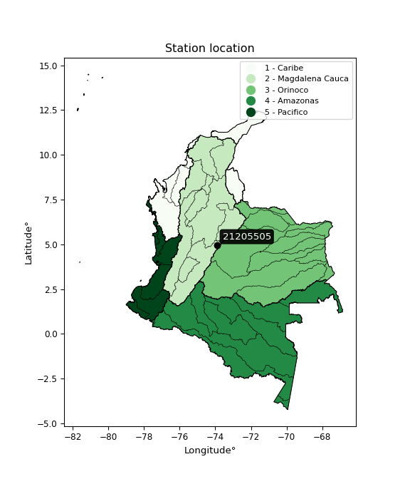</img>

</div>


## A. General information


### 1. General running parameters

• app_version: _v20260103_. • runtime: _2026-01-05 16:20:51.132608_. • Python version: _3.14.0_. • SciPy version: _1.16.3_. • Pandas version: _2.3.3_. • NumPy version: _2.3.5_. • Stations dataset (station_dataset_file): _dataset/pmax24h_in/automatic_colombia_2003_2024.csv_. • Stations catalog (station_catalog_file): _dataset/CNE.xls_. • Minimum year to eval til year_max (date_min): _1900_. • Maximum year to eval since year_min (date_max): _2024_. • Creates, save and include plots into reports (create_plot): _True_. • Plot only fit distributions with Δo > Δ (plot_only_fit): _True_. • Plot only simple graphs avoiding multiple CDFs and multiple Extreme values plots (plot_only_simple): _True_. • Eval low extreme values, if False, evaluates high extreme values (low_extreme): _False_. • Eval every SciPy distribution as logarithmic (pdist_logarithmic_on): _True_. • Standard deviation normalized (ddof): _1.0_. • Return periods to eval in years (Tr): _[2, 2.33, 5, 10, 15, 20, 25, 50, 75, 100, 200, 250, 500, 750, 1000]_. • Minimum data sample per station, 0 means any (minimum_sample): _5_. • Z-Score maximum threshold to adjust a value, 0 means disable (zscore_max): _3.5_. • Z-Score minimum threshold to adjust a value, 0 means disable (zscore_min): _-2.5_. • Avoid zeros, e.g. rain = 0 (avoid_zeros): _True_. • Avoid null values (avoid_nans): _True_. 

[:file_folder:Dataset file](../../dataset/pmax24h_in/automatic_colombia_2003_2024.csv)

> Delta Degrees of Freedom (DDOF): is a parameter used in the formulas for calculating variance and standard deviation. When ddof=0, the divisor is $N$ (the total number of observations) and this is used when your data set is the entire population. When ddof=1, the divisor is $N-1$ and this is used when your data set is a sample drawn from a larger population. Using $N-1$ provides an unbiased estimate of the population variance (known as Bessel´s correction).


### 2. Station info and location

|   id |   CODIGO | NOMBRE                            | CATEGORIA               | TECNOLOGIA                | ESTADO   |   FECHA_INSTALACION |   FECHA_SUSPENSION |   ALTITUD |   LATITUD |   LONGITUD | DEPARTAMENTO   | MUNICIPIO   | AREA_OPERATIVA                            | ENTIDAD                                       | AREA_HIDROGRAFICA   | ZONA_HIDROGRAFICA   | SUBZONA_HIDROGRAFICA   |   CORRIENTE | Catalogo   |   Version |
|-----:|---------:|:----------------------------------|:------------------------|:--------------------------|:---------|--------------------:|-------------------:|----------:|----------:|-----------:|:---------------|:------------|:------------------------------------------|:----------------------------------------------|:--------------------|:--------------------|:-----------------------|------------:|:-----------|----------:|
|    0 | 21205505 | PTAR TOCANCIPA  - AUT  [21205505] | Climatológica Principal | Automática con Telemetría | Activa   |                 nan |                nan |         3 |   4.97011 |   -73.9183 | Cundinamarca   | Tocancipá   | Area Operativa 11 - Cundinamarca-Amazonas | CORPORACION AUTONOMA REGIONAL DE CUNDINAMARCA | Magdalena Cauca     | Alto Magdalena      | Río Bogotá             |         nan | CNE_OE     |  20251226 |

<div align="center">

Dynamic map: [:earth_americas:Google](http://maps.google.com/maps?q=4.970111111,-73.91827778) [:earth_americas:OSM](https://www.openstreetmap.org/#map=18/4.970111111/-73.91827778&layers=P) [:earth_americas:Bing](https://www.bing.com/maps?cp=4.970111111~-73.91827778&lvl=18) [:earth_americas:Apple](https://maps.apple.com/frame?center=4.970111111%2C-73.91827778&span=0.003%2C0.006)

</div>


<div align="center">

```geojson
{
  "type": "Feature",
  "geometry": {
    "type": "Point", 
    "coordinates": [-73.91827778, 4.970111111]
  }, 
  "properties": {
    "Name": "21205505"
  }
}
```

</div>


### 3. Discrete values table and plot

<div align="center">

|               |          0 |           1 |           2 |           3 |           4 |         5 |          6 |
|:--------------|-----------:|------------:|------------:|------------:|------------:|----------:|-----------:|
| Date          | 2015       | 2016        | 2017        | 2018        | 2019        | 2020      | 2021       |
| Value         |   10.7     |   40.6      |   26.3      |   40.2      |   22.4      |   43.3    |   24.7     |
| Value_initial |   10.7     |   40.6      |   26.3      |   40.2      |   22.4      |   43.3    |   24.7     |
| count         |    7       |    7        |    7        |    7        |    7        |    7      |    7       |
| mean          |   29.7429  |   29.7429   |   29.7429   |   29.7429   |   29.7429   |   29.7429 |   29.7429  |
| std           |   12.006   |   12.006    |   12.006    |   12.006    |   12.006    |   12.006  |   12.006   |
| zscore        |   -1.58612 |    0.904313 |   -0.286763 |    0.870997 |   -0.611601 |    1.1292 |   -0.42003 |


</div>


<div align="center">

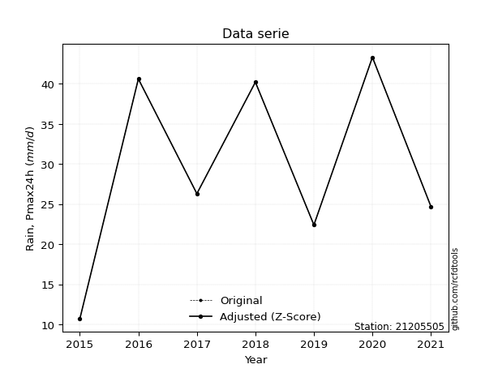</img>

</div>


> The initial value (value_initial) correspond to the initial obtained or null completed value, and value (value) is adjusted only when the initial value is outside the valid range (outlier) definite through the Z-Score value. If Z-Score is active, values out of range or outliers are replaced with the station mean value. A Z-Score (or standard score) measures how many standard deviations a data point is from the mean of a dataset, indicating its relative position; positive scores mean above the mean, negative mean below, and a score of zero is exactly at the mean, allowing for comparison of values from different distributions. It´s calculated using the formula $z=(x–μ)/σ$, where $x$ is the data point, $μ$ is the mean, and $σ$ is the standard deviation, helping identify outliers and understand probability.
>
> <sub>**Note**: In this study, "completing" (filling gaps in) and "extending" (forecasting or lengthening the historical record) rainfall data series are avoided for certain critical analyses because they introduce artificial bias and uncertainty, which can distort the statistics of rare events (extremes), alter day-to-day variability, and compromise the integrity and homogeneity of the original data. Some reasons against Completing/Extending rainfall data are: **Distortion of Extremes and Variability**: The primary issue is that most gap-filling or extension methods rely on averaging or regression with nearby stations, which inherently smooths the data. Rainfall is highly variable in space and time, with a large percentage of zero values and occasional large storms. Infilling methods often underestimate the highest values and overestimate the lowest (zero) values, which severely distorts analyses focused on flood frequency, drought severity, and intensity-duration-frequency (IDF) curves, **Loss of Data Homogeneity**: Infilled or extended data are synthetic estimates, not actual measurements. Combining these estimates with observed data can violate the assumption of data homogeneity, which requires that the data properties do not change over time. Inhomogeneity can lead to incorrect conclusions about long-term trends or changes in climate patterns, **Propagation of Errors**: Errors and biases from the original data (e.g., wind-induced undercatch, instrument errors, site changes) or the data used for imputation can propagate through the analysis, leading to unreliable hydrological models and inaccurate predictions, **Compromised Statistical Integrity**: For statistical analyses, especially those involving the frequency of events, using artificial data can introduce time bias or autocorrelation that doesn´t exist in reality, making it difficult to assess the true probability of events, **Difficulty in Validation**: It is difficult to accurately validate the quality of filled or extended data, especially for past periods where ground-truth measurements are unavailable. The reliability of imputation techniques heavily depends on the density of the surrounding station network and the complexity of the local topography.</sub>


### 4. Active continuous probability distributions from SciPy (44 of 104 available)

A Probability Density Function (PDF) describes the relative likelihood of a continuous random variable falling within a specific range, where the total area under its curve equals 1, and the area over any interval gives the actual probability for that range. Unlike discrete probabilities (like rolling a die), a PDF shows density, not direct probability for a single point (which is zero), with higher points indicating higher likelihood, often visualized as a bell curve for normal distributions.

A log of a probability density function (log-PDF) is simply the logarithm of the PDF´s value, denoted as $log(f(x))$, useful for converting multiplication of probabilities into addition, improving numerical stability with tiny numbers, and connecting to information theory concepts like entropy. Instead of dealing with very small probabilities (e.g., 0.000001), log-PDFs use negative numbers (e.g., $log(0.00001) ≈ -11.51$ that are easier for computers to handle, preventing underflow errors and simplifying complex calculations. In this study, each active probability distribution from SciPy is also evaluated in the $log$ form.

[scipy.stats](https://docs.scipy.org/doc/scipy/reference/stats.html) is a Python´s powerful submodule within the SciPy library for comprehensive statistical analysis, offering over 130 probability distributions (like Normal, Poisson), functions for descriptive stats (mean, variance), hypothesis testing (t-tests, chi-square), random variable generation, and statistical tests, making it essential for data science, modeling, and research. It provides tools to explore, model, and draw conclusions from data efficiently, working seamlessly with NumPy.

<div align="center">

|   id | p_dist             |   n_parameter | fit_method   | label                                                                       | active   | ref                                                                                                        |
|-----:|:-------------------|--------------:|:-------------|:----------------------------------------------------------------------------|:---------|:-----------------------------------------------------------------------------------------------------------|
|    0 | alpha              |             3 | MLE          | Alpha                                                                       | True     | [:mortar_board:](https://docs.scipy.org/doc/scipy/reference/generated/scipy.stats.alpha.html)              |
|    1 | betaprime          |             4 | MLE          | Beta prime                                                                  | True     | [:mortar_board:](https://docs.scipy.org/doc/scipy/reference/generated/scipy.stats.betaprime.html)          |
|    2 | chi2               |             3 | MLE          | Chi²                                                                        | True     | [:mortar_board:](https://docs.scipy.org/doc/scipy/reference/generated/scipy.stats.chi2.html)               |
|    3 | crystalball        |             4 | MLE          | Crystalball                                                                 | True     | [:mortar_board:](https://docs.scipy.org/doc/scipy/reference/generated/scipy.stats.crystalball.html)        |
|    4 | erlang             |             3 | MLE          | Erlang                                                                      | True     | [:mortar_board:](https://docs.scipy.org/doc/scipy/reference/generated/scipy.stats.erlang.html)             |
|    5 | expon              |             2 | MLE          | Exponential                                                                 | True     | [:mortar_board:](https://docs.scipy.org/doc/scipy/reference/generated/scipy.stats.expon.html)              |
|    6 | exponnorm          |             3 | MLE          | Exponentially modified Normal                                               | True     | [:mortar_board:](https://docs.scipy.org/doc/scipy/reference/generated/scipy.stats.exponnorm.html)          |
|    7 | f                  |             4 | MLE          | F                                                                           | True     | [:mortar_board:](https://docs.scipy.org/doc/scipy/reference/generated/scipy.stats.f.html)                  |
|    8 | fatiguelife        |             3 | MLE          | Fatigue-life (Birnbaum-Saunders)                                            | True     | [:mortar_board:](https://docs.scipy.org/doc/scipy/reference/generated/scipy.stats.fatiguelife.html)        |
|    9 | fisk               |             3 | MLE          | Fisk                                                                        | True     | [:mortar_board:](https://docs.scipy.org/doc/scipy/reference/generated/scipy.stats.fisk.html)               |
|   10 | gamma              |             3 | MLE          | Gamma                                                                       | True     | [:mortar_board:](https://docs.scipy.org/doc/scipy/reference/generated/scipy.stats.gamma.html)              |
|   11 | genexpon           |             5 | MLE          | Generalized exponential                                                     | True     | [:mortar_board:](https://docs.scipy.org/doc/scipy/reference/generated/scipy.stats.genexpon.html)           |
|   12 | genlogistic        |             3 | MLE          | Generalized logistic                                                        | True     | [:mortar_board:](https://docs.scipy.org/doc/scipy/reference/generated/scipy.stats.genlogistic.html)        |
|   13 | gibrat             |             2 | MM           | Gibrat                                                                      | True     | [:mortar_board:](https://docs.scipy.org/doc/scipy/reference/generated/scipy.stats.gibrat.html)             |
|   14 | gompertz           |             3 | MLE          | Gompertz (or truncated Gumbel)                                              | True     | [:mortar_board:](https://docs.scipy.org/doc/scipy/reference/generated/scipy.stats.gompertz.html)           |
|   15 | gumbel_l           |             2 | MM           | Gumbel Left Skew                                                            | True     | [:mortar_board:](https://docs.scipy.org/doc/scipy/reference/generated/scipy.stats.gumbel_l.html)           |
|   16 | gumbel_r           |             2 | MM           | Gumbel Right Skew                                                           | True     | [:mortar_board:](https://docs.scipy.org/doc/scipy/reference/generated/scipy.stats.gumbel_r.html)           |
|   17 | halflogistic       |             2 | MM           | Half-logistic                                                               | True     | [:mortar_board:](https://docs.scipy.org/doc/scipy/reference/generated/scipy.stats.halflogistic.html)       |
|   18 | halfnorm           |             2 | MM           | Half Normal                                                                 | True     | [:mortar_board:](https://docs.scipy.org/doc/scipy/reference/generated/scipy.stats.halfnorm.html)           |
|   19 | hypsecant          |             2 | MM           | hyperbolic secant                                                           | True     | [:mortar_board:](https://docs.scipy.org/doc/scipy/reference/generated/scipy.stats.hypsecant.html)          |
|   20 | invgamma           |             3 | MLE          | Inverted gamma                                                              | True     | [:mortar_board:](https://docs.scipy.org/doc/scipy/reference/generated/scipy.stats.invgamma.html)           |
|   21 | invgauss           |             3 | MLE          | Inverse Gaussian                                                            | True     | [:mortar_board:](https://docs.scipy.org/doc/scipy/reference/generated/scipy.stats.invgauss.html)           |
|   22 | invweibull         |             3 | MLE          | Inverted Weibull                                                            | True     | [:mortar_board:](https://docs.scipy.org/doc/scipy/reference/generated/scipy.stats.invweibull.html)         |
|   23 | johnsonsu          |             4 | MLE          | Johnson Su                                                                  | True     | [:mortar_board:](https://docs.scipy.org/doc/scipy/reference/generated/scipy.stats.johnsonsu.html)          |
|   24 | kstwobign          |             2 | MLE          | Limiting distribution of scaled Kolmogorov-Smirnov two-sided test statistic | True     | [:mortar_board:](https://docs.scipy.org/doc/scipy/reference/generated/scipy.stats.kstwobign.html)          |
|   25 | laplace            |             2 | MM           | Laplace                                                                     | True     | [:mortar_board:](https://docs.scipy.org/doc/scipy/reference/generated/scipy.stats.laplace.html)            |
|   26 | laplace_asymmetric |             3 | MLE          | Asymmetric Laplace                                                          | True     | [:mortar_board:](https://docs.scipy.org/doc/scipy/reference/generated/scipy.stats.laplace_asymmetric.html) |
|   27 | loggamma           |             3 | MLE          | Log gamma                                                                   | True     | [:mortar_board:](https://docs.scipy.org/doc/scipy/reference/generated/scipy.stats.loggamma.html)           |
|   28 | logistic           |             2 | MM           | Logistic (or Sech-squared)                                                  | True     | [:mortar_board:](https://docs.scipy.org/doc/scipy/reference/generated/scipy.stats.logistic.html)           |
|   29 | lognorm            |             3 | MLE          | Log Normal                                                                  | True     | [:mortar_board:](https://docs.scipy.org/doc/scipy/reference/generated/scipy.stats.lognorm.html)            |
|   30 | maxwell            |             2 | MM           | Maxwell                                                                     | True     | [:mortar_board:](https://docs.scipy.org/doc/scipy/reference/generated/scipy.stats.maxwell.html)            |
|   31 | mielke             |             4 | MLE          | Mielke Beta-Kappa / Dagum                                                   | True     | [:mortar_board:](https://docs.scipy.org/doc/scipy/reference/generated/scipy.stats.mielke.html)             |
|   32 | moyal              |             2 | MM           | Moyal                                                                       | True     | [:mortar_board:](https://docs.scipy.org/doc/scipy/reference/generated/scipy.stats.moyal.html)              |
|   33 | nakagami           |             3 | MLE          | Nakagami                                                                    | True     | [:mortar_board:](https://docs.scipy.org/doc/scipy/reference/generated/scipy.stats.nakagami.html)           |
|   34 | ncf                |             5 | MLE          | Non-central F distribution                                                  | True     | [:mortar_board:](https://docs.scipy.org/doc/scipy/reference/generated/scipy.stats.ncf.html)                |
|   35 | nct                |             4 | MLE          | Non-central Student’s t                                                     | True     | [:mortar_board:](https://docs.scipy.org/doc/scipy/reference/generated/scipy.stats.nct.html)                |
|   36 | norm               |             2 | MM           | Normal                                                                      | True     | [:mortar_board:](https://docs.scipy.org/doc/scipy/reference/generated/scipy.stats.norm.html)               |
|   37 | pearson3           |             3 | MM           | Pearson type III                                                            | True     | [:mortar_board:](https://docs.scipy.org/doc/scipy/reference/generated/scipy.stats.pearson3.html)           |
|   38 | rayleigh           |             2 | MM           | Rayleigh                                                                    | True     | [:mortar_board:](https://docs.scipy.org/doc/scipy/reference/generated/scipy.stats.rayleigh.html)           |
|   39 | rice               |             3 | MLE          | Rice                                                                        | True     | [:mortar_board:](https://docs.scipy.org/doc/scipy/reference/generated/scipy.stats.rice.html)               |
|   40 | t                  |             3 | MLE          | Student’s t                                                                 | True     | [:mortar_board:](https://docs.scipy.org/doc/scipy/reference/generated/scipy.stats.t.html)                  |
|   41 | truncnorm          |             4 | MLE          | Truncated normal                                                            | True     | [:mortar_board:](https://docs.scipy.org/doc/scipy/reference/generated/scipy.stats.truncnorm.html)          |
|   42 | wald               |             2 | MM           | Wald                                                                        | True     | [:mortar_board:](https://docs.scipy.org/doc/scipy/reference/generated/scipy.stats.wald.html)               |
|   43 | weibull_min        |             3 | MLE          | Weibull minimum                                                             | True     | [:mortar_board:](https://docs.scipy.org/doc/scipy/reference/generated/scipy.stats.weibull_min.html)        |

</div>

> **n_parameter:** # arguments & localization & scale.
>
> **Fit methods:** (MLE) maximum likelihood, (MM) L-moments.
>
>**Inactive** (With the only purpose of prevent loops, zero divisions, infinite values, over high estimated values or horizontal trending for recurrence intervals estimations, the follow distributions were disabled.)**:** foldnorm, gennorm, norminvgauss, powernorm, powerlognorm, skewnorm, genextreme, anglit, arcsine, argus, beta, bradford, burr, burr12, cauchy, cosine, halfcauchy, foldcauchy, skewcauchy, wrapcauchy, dgamma, gengamma, exponweib, exponpow, truncexpon, gausshyper, genhalflogistic, genhyperbolic, geninvgauss, halfgennorm, johnsonsb, kappa4, kappa3, ksone, kstwo, loglaplace, levy, levy_l, levy_stable, ncx2, pareto, genpareto, truncpareto, lomax, powerlaw, rdist, rel_breitwigner, recipinvgauss, semicircular, studentized_range, trapezoid, triang, truncweibull_min, tukeylambda, uniform, loguniform, vonmises, vonmises_line, weibull_max, dweibull, 


## B. Probability (PDF) vs. Empirical (EDF) distributions functions

A continuous probability distribution (CPD) describes probabilities for variables that can take any value within a range (like rain any time), unlike discrete variables with specific outcomes (like temperature). It uses a Probability Density Function (PDF), a curve where the total area under it equals 1, and the probability of the variable falling within an interval (a to b) is found by calculating the area under the curve between those points. A key feature is that the probability of hitting any single exact value is zero, so probabilities are always expressed for ranges, e.g., $P(a ≤ X ≤ b)$.

<div align="center">

Distributions parameters from station values
|    |   station | p_dist                |   n |              loc |           scale | shape                  | shape1                | shape2                 | shape3   |
|---:|----------:|:----------------------|----:|-----------------:|----------------:|:-----------------------|:----------------------|:-----------------------|:---------|
|  0 |  21205505 | alpha                 |   7 |   -198.027       |  4485.87        | 19.75627112109165      |                       |                        |          |
|  1 |  21205505 | betaprime             |   7 |   -209.513       | 11143.1         | 468.16695654675743     | 21811.05017749108     |                        |          |
|  2 |  21205505 | chi2                  |   7 |    -91.5286      |     0.519456    | 233.19400465506743     |                       |                        |          |
|  3 |  21205505 | crystalball           |   7 |     29.7429      |    11.1154      | 1606.6651189952158     | 4867.826483732577     |                        |          |
|  4 |  21205505 | erlang                |   7 |   -164.256       |     0.653661    | 296.76481049412575     |                       |                        |          |
|  5 |  21205505 | expon                 |   7 |     10.7         |    19.0429      |                        |                       |                        |          |
|  6 |  21205505 | exponnorm             |   7 |     29.732       |    11.1153      | 0.0009737565739651852  |                       |                        |          |
|  7 |  21205505 | f                     |   7 |  -1998.07        |  2027.85        | 83481.10889152873      | 317860.58474154526    |                        |          |
|  8 |  21205505 | fatiguelife           |   7 |     10.7         |     4.52328e-07 | 5123.29579436078       |                       |                        |          |
|  9 |  21205505 | fisk                  |   7 |     -2.97576e+08 |     2.97576e+08 | 43764311.40284526      |                       |                        |          |
| 10 |  21205505 | gamma                 |   7 |   -159.391       |     0.664881    | 284.3353217967839      |                       |                        |          |
| 11 |  21205505 | genexpon              |   7 |     10.7         |     3.18391     | 0.8736488381108651     | 5.374029968160636e-05 | 0.0023227555025416404  |          |
| 12 |  21205505 | genlogistic           |   7 |     30.1239      |     6.75702     | 0.9906059916998463     |                       |                        |          |
| 13 |  21205505 | gibrat                |   7 |     21.2632      |     5.14315     |                        |                       |                        |          |
| 14 |  21205505 | gompertz              |   7 |     10.7         |    12.7019      | 0.19097031248706356    |                       |                        |          |
| 15 |  21205505 | gumbel_l              |   7 |     34.7454      |     8.6666      |                        |                       |                        |          |
| 16 |  21205505 | gumbel_r              |   7 |     24.7404      |     8.6666      |                        |                       |                        |          |
| 17 |  21205505 | halflogistic          |   7 |     16.5686      |     9.50322     |                        |                       |                        |          |
| 18 |  21205505 | halfnorm              |   7 |     15.0305      |    18.4393      |                        |                       |                        |          |
| 19 |  21205505 | hypsecant             |   7 |     29.7429      |     7.07625     |                        |                       |                        |          |
| 20 |  21205505 | invgamma              |   7 |   -112.33        | 21820.6         | 154.67356992664963     |                       |                        |          |
| 21 |  21205505 | invgauss              |   7 |    -45.4116      |  3033.65        | 0.024791006847192897   |                       |                        |          |
| 22 |  21205505 | invweibull            |   7 |     10.7         |     1.51679     | 0.04908027149957299    |                       |                        |          |
| 23 |  21205505 | johnsonsu             |   7 |     44.5597      |     0.0177559   | 6.215203198798071      | 0.8940808916236748    |                        |          |
| 24 |  21205505 | kstwobign             |   7 |    -13.7459      |    49.6878      |                        |                       |                        |          |
| 25 |  21205505 | laplace               |   7 |     29.7429      |     7.85974     |                        |                       |                        |          |
| 26 |  21205505 | laplace_asymmetric    |   7 |     24.7         |     8.63229     | 0.7498326467749403     |                       |                        |          |
| 27 |  21205505 | loggamma              |   7 |     43.3004      |     2.69935e-05 | 1.990056444724036e-06  |                       |                        |          |
| 28 |  21205505 | logistic              |   7 |     29.7429      |     6.12821     |                        |                       |                        |          |
| 29 |  21205505 | lognorm               |   7 |     10.7         |     0.103878    | 12.9469940044817       |                       |                        |          |
| 30 |  21205505 | maxwell               |   7 |      3.40414     |    16.5053      |                        |                       |                        |          |
| 31 |  21205505 | mielke                |   7 |     -1.89779     |    45.2897      | 2.311554067819623      | 2498.9297387520255    |                        |          |
| 32 |  21205505 | moyal                 |   7 |     23.3864      |     5.00367     |                        |                       |                        |          |
| 33 |  21205505 | nakagami              |   7 |     22.4         |    12.059       | 0.24234894845608052    |                       |                        |          |
| 34 |  21205505 | ncf                   |   7 |      0.214216    |     1.56405e-06 | 1.6530280768667416e-06 | 51.13802196289092     | 30.268623426086886     |          |
| 35 |  21205505 | nct                   |   7 |   -561.693       |    11.0648      | 148707.91420940982     | 53.45146851587416     |                        |          |
| 36 |  21205505 | norm                  |   7 |     29.7429      |    11.1154      |                        |                       |                        |          |
| 37 |  21205505 | pearson3              |   7 |     29.7429      |    11.1153      | -0.26582573931664255   |                       |                        |          |
| 38 |  21205505 | rayleigh              |   7 |      8.47854     |    16.9665      |                        |                       |                        |          |
| 39 |  21205505 | rice                  |   7 |      4.66695     |    12.4926      | 1.6795042692846343     |                       |                        |          |
| 40 |  21205505 | t                     |   7 |     29.7422      |    11.1156      | 27425356.08590264      |                       |                        |          |
| 41 |  21205505 | truncnorm             |   7 |     29.7429      |    11.1154      | -128.47971664736824    | 524.1512427686193     |                        |          |
| 42 |  21205505 | wald                  |   7 |     18.6275      |    11.1153      |                        |                       |                        |          |
| 43 |  21205505 | weibull_min           |   7 |    -39.6303      |    74.0733      | 7.526318904762999      |                       |                        |          |
| 44 |  21205505 | logalpha              |   7 |    -10.8269      |   415.514       | 29.458581921068607     |                       |                        |          |
| 45 |  21205505 | logbetaprime          |   7 |     -4.94701     |    18.679       | 390.37889752529054     | 884.2410000254922     |                        |          |
| 46 |  21205505 | logchi2               |   7 |      2.37024     |     0.943737    | 1.0280338725754579     |                       |                        |          |
| 47 |  21205505 | logcrystalball        |   7 |      3.30307     |     0.454781    | 1233.9972282862898     | 15.50243629527038     |                        |          |
| 48 |  21205505 | logerlang             |   7 |     -4.58789     |     0.028683    | 275.06438841301906     |                       |                        |          |
| 49 |  21205505 | logexpon              |   7 |      2.37024     |     0.932823    |                        |                       |                        |          |
| 50 |  21205505 | logexponnorm          |   7 |      3.30278     |     0.454783    | 0.0006325543801892813  |                       |                        |          |
| 51 |  21205505 | logf                  |   7 |   -664.46        |   667.763       | 9224912.93431685       | 8068761.919825093     |                        |          |
| 52 |  21205505 | logfatiguelife        |   7 |   -201.781       |   205.086       | 0.0022135114864700644  |                       |                        |          |
| 53 |  21205505 | logfisk               |   7 |     -4.63532e+07 |     4.63532e+07 | 181045043.29089946     |                       |                        |          |
| 54 |  21205505 | loggamma              |   7 |     -4.80568     |     0.0273438   | 296.52681185957886     |                       |                        |          |
| 55 |  21205505 | loggenexpon           |   7 |      2.30088     |     0.0061648   | 0.001279317639224541   | 2.2818880689168015    | 2.1731053275379496e-05 |          |
| 56 |  21205505 | loggenlogistic        |   7 |      3.76817     |     2.205e-06   | 4.741364113811781e-06  |                       |                        |          |
| 57 |  21205505 | loggibrat             |   7 |      2.95613     |     0.210431    |                        |                       |                        |          |
| 58 |  21205505 | loggompertz           |   7 |      2.37024     |     1.14058     | 0.7268462333967554     |                       |                        |          |
| 59 |  21205505 | loggumbel_l           |   7 |      3.50774     |     0.354591    |                        |                       |                        |          |
| 60 |  21205505 | loggumbel_r           |   7 |      3.09839     |     0.354591    |                        |                       |                        |          |
| 61 |  21205505 | loghalflogistic       |   7 |      2.76401     |     0.388841    |                        |                       |                        |          |
| 62 |  21205505 | loghalfnorm           |   7 |      2.70113     |     0.754412    |                        |                       |                        |          |
| 63 |  21205505 | loghypsecant          |   7 |      3.30307     |     0.289522    |                        |                       |                        |          |
| 64 |  21205505 | loginvgamma           |   7 |     -8.13657     |  6656.82        | 583.2119128519817      |                       |                        |          |
| 65 |  21205505 | loginvgauss           |   7 |     -1.85442     |   582.101       | 0.00886839854076614    |                       |                        |          |
| 66 |  21205505 | loginvweibull         |   7 | -32454.4         | 32457.4         | 63971.263010876326     |                       |                        |          |
| 67 |  21205505 | logjohnsonsu          |   7 |      3.76816     |     8.39623e-10 | 5.952713379803358      | 0.3105438480072686    |                        |          |
| 68 |  21205505 | logkstwobign          |   7 |      1.24443     |     2.35421     |                        |                       |                        |          |
| 69 |  21205505 | loglaplace            |   7 |      3.30307     |     0.321578    |                        |                       |                        |          |
| 70 |  21205505 | loglaplace_asymmetric |   7 |      3.26957     |     0.353076    | 0.9535895602882973     |                       |                        |          |
| 71 |  21205505 | logloggamma           |   7 |      3.76818     |     1.54553e-06 | 3.3325677811590618e-06 |                       |                        |          |
| 72 |  21205505 | loglogistic           |   7 |      3.30307     |     0.250734    |                        |                       |                        |          |
| 73 |  21205505 | loglognorm            |   7 |      2.37024     |     0.00670472  | 12.390782761894657     |                       |                        |          |
| 74 |  21205505 | logmaxwell            |   7 |      2.22543     |     0.67531     |                        |                       |                        |          |
| 75 |  21205505 | logmielke             |   7 |     -1.6631e+07  |     1.6631e+07  | 33929853.53230353      | 2145143042.4116945    |                        |          |
| 76 |  21205505 | logmoyal              |   7 |      3.04299     |     0.204723    |                        |                       |                        |          |
| 77 |  21205505 | lognakagami           |   7 |      3.10906     |     0.434933    | 0.17365449445241588    |                       |                        |          |
| 78 |  21205505 | logncf                |   7 |    -12.1167      |    11.7869      | 10608.604297999284     | 2489.883774004268     | 3249.1692828545924     |          |
| 79 |  21205505 | lognct                |   7 |    -11.2032      |     0.405808    | 2093.9148028385043     | 35.72833576200152     |                        |          |
| 80 |  21205505 | lognorm               |   7 |      3.30307     |     0.45478     |                        |                       |                        |          |
| 81 |  21205505 | logpearson3           |   7 |      3.30307     |     0.454781    | -0.9041670780251787    |                       |                        |          |
| 82 |  21205505 | lograyleigh           |   7 |      2.43303     |     0.694189    |                        |                       |                        |          |
| 83 |  21205505 | logrice               |   7 |      2.01405     |     0.483429    | 2.448403290642215      |                       |                        |          |
| 84 |  21205505 | logt                  |   7 |      3.30307     |     0.45478     | 46309347164.87277      |                       |                        |          |
| 85 |  21205505 | logtruncnorm          |   7 |     -0.113286    |     1.35389     | 2.3800606172960572     | 2.866876410148505     |                        |          |
| 86 |  21205505 | logwald               |   7 |      2.84827     |     0.454792    |                        |                       |                        |          |
| 87 |  21205505 | logweibull_min        |   7 |     -2.0451e+07  |     2.0451e+07  | 62148343.52347861      |                       |                        |          |

</div>

> **loc** (Location parameter): This shifts the distribution along the x-axis. For many common distributions, like the normal (Gaussian) distribution, loc represents the mean $μ$. For others, like the uniform distribution, it might represent the minimum value, or for the beta distribution, the left end of the support interval.
>
> **scale** (Scale parameter): This determines the width or spread of the distribution. For the normal distribution, scale represents the standard deviation $σ$. For a uniform distribution, it defines the length of the interval (from $loc$ to $loc + scale$).
>
> **shape** (Shape parameters): Refers to parameters that define the specific form of a probability distribution, distinct from its location (loc) and scale (scale). These parameters are required arguments for most distribution functions. For example, a normal (Gaussian) distribution is fully defined by its location (mean) and scale (standard deviation), so it has no specific shape parameters beyond loc and scale. However, other distributions have intrinsic properties that need specification, as Gamma distribution that takes a shape parameter, often named $a$ or $alpha$.


### 0. Cumulative distribution values - CDF (88 evaluated)

Cumulative Distribution Function (CDF), denoted as $F$<sub>$X$</sub>$(x)$, is a function that gives the probability that a random variable $X$ will take a value less than or equal to a specific value, $x$ (i.e., $(P(X≥x)$. It essentially "accumulates" probabilities from a given point up to the far right (positive infinity), providing a complete picture of the distribution´s probabilities for both discrete (like rain) and continuous (like temperature) variables, helping to find probabilities over ranges or above certain values. Each station is evaluated separately ordering the $x$ values ascending, calculating the CDF and PDF values for the activated distributions and their logarithmic forms.

<div align="center">

CDF ordered by x ascending and calculating $log(f(x))$ separately
|   id |   Station |   date |    x |   count |    mean |    std |    zscore |   Value_initial |   station |   m |     alpha |   alpha_pdf |   betaprime |   betaprime_pdf |      chi2 |   chi2_pdf |   crystalball |   crystalball_pdf |    erlang |   erlang_pdf |    expon |   expon_pdf |   exponnorm |   exponnorm_pdf |        f |      f_pdf |   fatiguelife |   fatiguelife_pdf |      fisk |   fisk_pdf |     gamma |   gamma_pdf |    genexpon |   genexpon_pdf |   genlogistic |   genlogistic_pdf |    gibrat |   gibrat_pdf |    gompertz |   gompertz_pdf |   gumbel_l |   gumbel_l_pdf |   gumbel_r |   gumbel_r_pdf |   halflogistic |   halflogistic_pdf |   halfnorm |   halfnorm_pdf |   hypsecant |   hypsecant_pdf |   invgamma |   invgamma_pdf |   invgauss |   invgauss_pdf |   invweibull |   invweibull_pdf |   johnsonsu |   johnsonsu_pdf |   kstwobign |   kstwobign_pdf |   laplace |   laplace_pdf |   laplace_asymmetric |   laplace_asymmetric_pdf |   loggamma |   loggamma_pdf |   logistic |   logistic_pdf |   lognorm |   lognorm_pdf |   maxwell |   maxwell_pdf |    mielke |   mielke_pdf |       moyal |   moyal_pdf |    nakagami |   nakagami_pdf |       ncf |    ncf_pdf |       nct |    nct_pdf |      norm |   norm_pdf |   pearson3 |   pearson3_pdf |   rayleigh |   rayleigh_pdf |      rice |   rice_pdf |         t |      t_pdf |   truncnorm |   truncnorm_pdf |     wald |   wald_pdf |   weibull_min |   weibull_min_pdf |   logalpha |   logalpha_pdf |   logbetaprime |   logbetaprime_pdf |     logchi2 |   logchi2_pdf |   logcrystalball |   logcrystalball_pdf |   logerlang |   logerlang_pdf |   logexpon |   logexpon_pdf |   logexponnorm |   logexponnorm_pdf |      logf |   logf_pdf |   logfatiguelife |   logfatiguelife_pdf |   logfisk |   logfisk_pdf |   loggenexpon |   loggenexpon_pdf |   loggenlogistic |   loggenlogistic_pdf |   loggibrat |   loggibrat_pdf |   loggompertz |   loggompertz_pdf |   loggumbel_l |   loggumbel_l_pdf |   loggumbel_r |   loggumbel_r_pdf |   loghalflogistic |   loghalflogistic_pdf |   loghalfnorm |   loghalfnorm_pdf |   loghypsecant |   loghypsecant_pdf |   loginvgamma |   loginvgamma_pdf |   loginvgauss |   loginvgauss_pdf |   loginvweibull |   loginvweibull_pdf |   logjohnsonsu |   logjohnsonsu_pdf |   logkstwobign |   logkstwobign_pdf |   loglaplace |   loglaplace_pdf |   loglaplace_asymmetric |   loglaplace_asymmetric_pdf |   logloggamma |   logloggamma_pdf |   loglogistic |   loglogistic_pdf |   loglognorm |   loglognorm_pdf |   logmaxwell |   logmaxwell_pdf |   logmielke |   logmielke_pdf |    logmoyal |   logmoyal_pdf |   lognakagami |   lognakagami_pdf |    logncf |   logncf_pdf |    lognct |   lognct_pdf |   logpearson3 |   logpearson3_pdf |   lograyleigh |   lograyleigh_pdf |   logrice |   logrice_pdf |      logt |   logt_pdf |   logtruncnorm |   logtruncnorm_pdf |   logwald |   logwald_pdf |   logweibull_min |   logweibull_min_pdf |
|-----:|----------:|-------:|-----:|--------:|--------:|-------:|----------:|----------------:|----------:|----:|----------:|------------:|------------:|----------------:|----------:|-----------:|--------------:|------------------:|----------:|-------------:|---------:|------------:|------------:|----------------:|---------:|-----------:|--------------:|------------------:|----------:|-----------:|----------:|------------:|------------:|---------------:|--------------:|------------------:|----------:|-------------:|------------:|---------------:|-----------:|---------------:|-----------:|---------------:|---------------:|-------------------:|-----------:|---------------:|------------:|----------------:|-----------:|---------------:|-----------:|---------------:|-------------:|-----------------:|------------:|----------------:|------------:|----------------:|----------:|--------------:|---------------------:|-------------------------:|-----------:|---------------:|-----------:|---------------:|----------:|--------------:|----------:|--------------:|----------:|-------------:|------------:|------------:|------------:|---------------:|----------:|-----------:|----------:|-----------:|----------:|-----------:|-----------:|---------------:|-----------:|---------------:|----------:|-----------:|----------:|-----------:|------------:|----------------:|---------:|-----------:|--------------:|------------------:|-----------:|---------------:|---------------:|-------------------:|------------:|--------------:|-----------------:|---------------------:|------------:|----------------:|-----------:|---------------:|---------------:|-------------------:|----------:|-----------:|-----------------:|---------------------:|----------:|--------------:|--------------:|------------------:|-----------------:|---------------------:|------------:|----------------:|--------------:|------------------:|--------------:|------------------:|--------------:|------------------:|------------------:|----------------------:|--------------:|------------------:|---------------:|-------------------:|--------------:|------------------:|--------------:|------------------:|----------------:|--------------------:|---------------:|-------------------:|---------------:|-------------------:|-------------:|-----------------:|------------------------:|----------------------------:|--------------:|------------------:|--------------:|------------------:|-------------:|-----------------:|-------------:|-----------------:|------------:|----------------:|------------:|---------------:|--------------:|------------------:|----------:|-------------:|----------:|-------------:|--------------:|------------------:|--------------:|------------------:|----------:|--------------:|----------:|-----------:|---------------:|-------------------:|----------:|--------------:|-----------------:|---------------------:|
|    0 |  21205505 |   2015 | 10.7 |       7 | 29.7429 | 12.006 | -1.58612  |            10.7 |  21205505 |   1 | 0.0413427 |  0.00911385 |   0.0417257 |      0.00844451 | 0.0400091 | 0.00860811 |     0.0433376 |        0.00827266 | 0.0419129 |   0.00851633 | 0        |  0.0525131  |   0.0433374 |      0.00827266 | 0.043044 | 0.00826215 |     0.0138184 |       1.09377e+13 | 0.0551273 |  0.0076606 | 0.0417124 |  0.00853443 | 1.40514e-07 |    0.274395    |     0.0549132 |        0.00762041 | 0         |   0          | 3.60608e-07 |      0.0150348 |  0.0604757 |     0.00676263 | 0.00638784 |     0.00372465 |       0        |          0         |   0        |      0         |   0.0431011 |      0.00607236 |  0.0385033 |     0.00884202 |  0.0363613 |     0.00915064 |   0.00449175 |      6.70856e+11 |    0.123482 |      0.00538941 |   0.0311622 |       0.0117194 | 0.0443349 |    0.00564076 |            0.0413848 |               0.00639367 |  0.0205877 |       0.114363 |  0.0428027 |     0.00668558 | 0.0201262 |      0.107034 |  0.02167  |    0.00856625 | 0.0519348 |   0.00952946 | 0.000381292 | 0.000514531 | 0           |    0           | 0.0244221 | 0.00898577 | 0.0433493 | 0.00827754 | 0.0433376 | 0.00827266 |  0.0503315 |     0.00814084 | 0.00853499 |     0.00765125 | 0.0290881 | 0.00983463 | 0.0433463 | 0.00827383 |   0.0433376 |      0.00827266 | 0        | 0          |     0.0530946 |        0.00772508 |  0.0213558 |       0.122112 |      0.0259726 |           0.133514 | 1.04454e-08 |   1.20902e+07 |        0.0201262 |             0.107034 |   0.0216508 |        0.1184   |   0        |       1.07202  |      0.0201264 |           0.107035 | 0.0201205 |   0.107064 |        0.0196078 |             0.10536  | 0.0210177 |      0.080365 |     0.0173811 |          0.292838 |         0        |             0.106422 |    0        |        0        |   8.30344e-09 |          0.63726  |      0.039634 |          0.109529 |    0.00041178 |        0.00905221 |          0        |              0        |      0        |          0        |      0.0253735 |          0.0875464 |     0.0205838 |          0.117245 |     0.0184236 |          0.1142   |       0.0207021 |            0.158215 |       0.195907 |          0.0614212 |      0.0238008 |           0.206956 |    0.0274906 |        0.0854866 |               0.0329461 |                   0.0978532 |     0.0490793 |          0.105828 |      0.023652 |         0.0920999 |   0.00716181 |      3.61354e+12 |   0.00258688 |        0.0530981 |   0.0558441 |        0.113931 | 2.32803e-07 |     1.5736e-05 |   0           |       0           | 0.0247892 |     0.129506 | 0.0212483 |     0.113057 |     0.0382566 |          0.118725 |      0        |          0        | 0.0171293 |      0.115695 | 0.0201262 |   0.107034 |    0           |           0        |  0        |      0        |        0.0310575 |            0.0928992 |
|    1 |  21205505 |   2019 | 22.4 |       7 | 29.7429 | 12.006 | -0.611601 |            22.4 |  21205505 |   2 | 0.276067  |  0.0308649  |   0.260232  |      0.0296617  | 0.266164  | 0.0304797  |     0.254433  |        0.0288552  | 0.261179  |   0.0296219  | 0.459037 |  0.0284077  |   0.254433  |      0.0288553  | 0.254041 | 0.0288187  |     0.839571  |       0.0103401   | 0.245883  |  0.0272703 | 0.262366  |  0.0298338  | 0.95966     |    0.011069    |     0.245     |        0.0272347  | 0.0655894 |   0.112322   | 0.250813    |      0.0282959 |  0.213871  |     0.0218275  | 0.269814   |     0.0407844  |       0.297534 |          0.0479561 |   0.310597 |      0.0399495 |   0.216756  |      0.0283185  |  0.273114  |     0.031167   |  0.280466  |     0.0316954  |   0.404707   |      0.00153573  |    0.218076 |      0.0118864  |   0.334833  |       0.0339272 | 0.196443  |    0.0249936  |            0.252266  |               0.0389734  |  0.346523  |       0.796422 |  0.231795  |     0.0290567  | 0.334839  |      0.800925 |  0.276688 |    0.0330188  | 0.237073  |   0.0225537  | 0.269772    | 0.047859    | 2.31742e-08 |    3.16167e+06 | 0.298102  | 0.0343931  | 0.254538  | 0.0288616  | 0.254433  | 0.0288552  |  0.246289  |     0.0268065  | 0.285829   |     0.0345385  | 0.269041  | 0.0305068  | 0.254456  | 0.0288559  |   0.254433  |      0.0288552  | 0.207839 | 0.0954376  |     0.231297  |        0.0245345  |  0.360421  |       0.800743 |      0.353487  |           0.756876 | 0.613749    |   0.327533    |        0.334838  |             0.800925 |   0.348875  |        0.790571 |   0.547073 |       0.485545 |      0.334836  |           0.800917 | 0.334768  |   0.800369 |        0.333625  |             0.801992 | 0.27778   |      0.783569 |     0.447569  |          0.696352 |         0        |             0.52117  |    0.374808 |        2.47905  |   0.484354    |          0.628036 |      0.277376 |          0.662049 |    0.378948   |        1.03701    |          0.416695 |              1.0626   |      0.411301 |          0.91378  |      0.30108   |          0.891646  |     0.354314  |          0.802876 |     0.355489  |          0.797913 |       0.404964  |            0.721497 |       0.266694 |          0.154827  |      0.442858  |           0.696641 |    0.273504  |        0.850505  |               0.295667  |                   0.878159  |     0.241417  |          0.520559 |      0.315668 |         0.861559  |   0.64784    |      0.040551    |   0.365761   |        0.859388  |   0.25211   |        0.514343 | 0.394776    |     1.15455    |   4.95511e-06 |       3.87524e+09 | 0.358004  |     0.784637 | 0.341751  |     0.796484 |     0.290811  |          0.6669   |      0.377609 |          0.873123 | 0.343547  |      0.800393 | 0.334838  |   0.800925 |    4.13679e-06 |           2.63563  |  0.42599  |      1.72374  |        0.257624  |            0.672062  |
|    2 |  21205505 |   2021 | 24.7 |       7 | 29.7429 | 12.006 | -0.42003  |            24.7 |  21205505 |   3 | 0.350337  |  0.033506   |   0.332468  |      0.0329774  | 0.340048  | 0.0335703  |     0.325028  |        0.0323811  | 0.333227  |   0.0328534  | 0.520583 |  0.0251757  |   0.325029  |      0.0323812  | 0.324521 | 0.032316   |     0.861237  |       0.00857999  | 0.313796  |  0.0316682 | 0.334911  |  0.0330699  | 0.978539    |    0.00588872  |     0.312877  |        0.0316749  | 0.343425  |   0.107021   | 0.318866    |      0.0308322 |  0.269315  |     0.0264543  | 0.366166   |     0.0424475  |       0.403501 |          0.0440476 |   0.4      |      0.0377122 |   0.290231  |      0.0355634  |  0.348165  |     0.0338742  |  0.35616   |     0.0338902  |   0.40793    |      0.00128231  |    0.248021 |      0.0142459  |   0.412621  |       0.0334999 | 0.263223  |    0.0334901  |            0.359897  |               0.0556017  |  0.42675   |       0.839486 |  0.30515   |     0.0345996  | 0.416182  |      0.857786 |  0.355194 |    0.035008   | 0.292197  |   0.0253942  | 0.380495    | 0.0475998   | 0.349303    |    0.0730907   | 0.378573  | 0.0352951  | 0.325144  | 0.0323837  | 0.325028  | 0.0323811  |  0.312428  |     0.0306156  | 0.366853   |     0.0356789  | 0.342377  | 0.0330935  | 0.325052  | 0.0323814  |   0.325028  |      0.0323811  | 0.40427  | 0.0736227  |     0.292469  |        0.0286389  |  0.440511  |       0.83231  |      0.429381  |           0.791194 | 0.644014    |   0.29278     |        0.416182  |             0.857786 |   0.428429  |        0.831702 |   0.592129 |       0.437244 |      0.416179  |           0.857779 | 0.416049  |   0.857072 |        0.415094  |             0.859235 | 0.360374  |      0.900298 |     0.514631  |          0.673531 |         0        |             0.643067 |    0.569463 |        1.56727  |   0.544624    |          0.604255 |      0.348172 |          0.786725 |    0.478749   |        0.994488   |          0.514896 |              0.944964 |      0.497323 |          0.844834 |      0.396063  |          1.04134   |     0.434873  |          0.839694 |     0.435176  |          0.826897 |       0.474467  |            0.697203 |       0.283324 |          0.187285  |      0.509375  |           0.6622   |    0.370652  |        1.1526    |               0.395257  |                   1.17395   |     0.298056  |          0.642689 |      0.40518  |         0.961216  |   0.651555   |      0.0356753   |   0.450482   |        0.867996  |   0.307746  |        0.627848 | 0.502686    |     1.04337    |   0.474033    |       1.67184     | 0.436755  |     0.82137  | 0.422323  |     0.846496 |     0.36111   |          0.770696 |      0.46271  |          0.862716 | 0.424351  |      0.847388 | 0.416182  |   0.857786 |    0.236503    |           2.21376  |  0.568327 |      1.2181   |        0.330303  |            0.815947  |
|    3 |  21205505 |   2017 | 26.3 |       7 | 29.7429 | 12.006 | -0.286763 |            26.3 |  21205505 |   4 | 0.404871  |  0.0345467  |   0.386604  |      0.0345861  | 0.394958  | 0.0349535  |     0.37838   |        0.0342101  | 0.387118  |   0.0344041  | 0.559218 |  0.0231468  |   0.37838   |      0.0342102  | 0.377751 | 0.0341239  |     0.874158  |       0.00759845  | 0.366533  |  0.0341476 | 0.389141  |  0.0346089  | 0.986165    |    0.00379622  |     0.365653  |        0.034191   | 0.491663  |   0.0791886  | 0.369462    |      0.0323735 |  0.314353  |     0.0298569  | 0.433743   |     0.0418049  |       0.471506 |          0.0409168 |   0.458914 |      0.0358993 |   0.350902  |      0.0401377  |  0.403303  |     0.0349303  |  0.41102   |     0.0345671  |   0.409872   |      0.00115014  |    0.27238  |      0.016261   |   0.465509  |       0.032532  | 0.322651  |    0.0410511  |            0.442954  |               0.048387   |  0.4798    |       0.848398 |  0.36313   |     0.037738   | 0.470642  |      0.874843 |  0.411726 |    0.0355412  | 0.334441  |   0.0274163  | 0.454819    | 0.0450688   | 0.449748    |    0.0547652   | 0.434879  | 0.0349671  | 0.378497  | 0.0342093  | 0.37838   | 0.0342101  |  0.363258  |     0.032851   | 0.424009   |     0.0356596  | 0.396321  | 0.0342396  | 0.378404  | 0.03421    |   0.37838   |      0.0342101  | 0.509467 | 0.0583833  |     0.340479  |        0.031338   |  0.492883  |       0.834074 |      0.479302  |           0.7974   | 0.661772    |   0.27342     |        0.470642  |             0.874843 |   0.480965  |        0.839874 |   0.61867  |       0.408791 |      0.470638  |           0.874837 | 0.470388  |   0.874064 |        0.469648  |             0.876409 | 0.418583  |      0.950552 |     0.556256  |          0.651991 |         0        |             0.735987 |    0.654854 |        1.17564  |   0.581991    |          0.58605  |      0.400013 |          0.864382 |    0.539515   |        0.938903   |          0.571723 |              0.865563 |      0.548839 |          0.79625  |      0.463254  |          1.09211   |     0.487804  |          0.844426 |     0.487162  |          0.827253 |       0.517468  |            0.671909 |       0.295919 |          0.215212  |      0.550076  |           0.634092 |    0.450538  |        1.40102   |               0.476257  |                   1.41453   |     0.341252  |          0.735832 |      0.46665  |         0.992638  |   0.653712   |      0.0331095   |   0.504619   |        0.854733  |   0.349787  |        0.71362  | 0.565285    |     0.949776   |   0.561919    |       1.19161     | 0.488571  |     0.827397 | 0.475948  |     0.859668 |     0.411452  |          0.832421 |      0.516202 |          0.839839 | 0.477978  |      0.858898 | 0.470642  |   0.874843 |    0.367798    |           1.97374  |  0.637023 |      0.98098  |        0.384415  |            0.907628  |
|    4 |  21205505 |   2018 | 40.2 |       7 | 29.7429 | 12.006 |  0.870997 |            40.2 |  21205505 |   5 | 0.822783  |  0.0205385  |   0.827306  |      0.0222171  | 0.828656  | 0.021438   |     0.826592  |        0.0230566  | 0.824598  |   0.0221352  | 0.787569 |  0.0111554  |   0.826593  |      0.0230566  | 0.824637 | 0.0230474  |     0.94252   |       0.00307717  | 0.817148  |  0.0219747 | 0.827158  |  0.0220007  | 0.999695    |    8.37359e-05 |     0.817818  |        0.0220296  | 0.903788  |   0.00900909 | 0.827457    |      0.0264627 |  0.846869  |     0.0331554  | 0.845358   |     0.0163866  |       0.846405 |          0.0149212 |   0.827746 |      0.0170453 |   0.857203  |      0.0195096  |  0.824206  |     0.0205368  |  0.817085  |     0.019762   |   0.421283   |      0.000605897 |    0.750149 |      0.0651487  |   0.810844  |       0.0164905 | 0.867823  |    0.0168169  |            0.833459  |               0.0144664  |  0.798833  |       0.578179 |  0.846368  |     0.0212181  | 0.804917  |      0.606403 |  0.825986 |    0.0200199  | 0.844563  |   0.0463742  | 0.85217     | 0.0146019   | 0.858868    |    0.0151504   | 0.812355  | 0.0174577  | 0.826562  | 0.0230461  | 0.826592  | 0.0230566  |  0.825962  |     0.0252626  | 0.825844   |     0.0191914  | 0.823894  | 0.0217277  | 0.826601  | 0.0230553  |   0.826592  |      0.0230566  | 0.878748 | 0.010568   |     0.827355  |        0.0285905  |  0.800515  |       0.550846 |      0.781948  |           0.564247 | 0.756255    |   0.18098     |        0.804917  |             0.606403 |   0.796993  |        0.574888 |   0.758031 |       0.259395 |      0.804913  |           0.606407 | 0.804488  |   0.606298 |        0.804471  |             0.607191 | 0.790612  |      0.646579 |     0.78837   |          0.427622 |         0        |             1.83274  |    0.895158 |        0.246208 |   0.796657    |          0.413558 |      0.815534 |          0.879326 |    0.82986    |        0.436468   |          0.83233  |              0.395055 |      0.811793 |          0.444958 |      0.838488  |          0.534225  |     0.801305  |          0.56248  |     0.792091  |          0.549293 |       0.751651  |            0.422921 |       0.52195  |          1.66516   |      0.770865  |           0.40323  |    0.851683  |        0.461215  |               0.83349   |                   0.449711  |     0.851946  |          1.83702  |      0.826156 |         0.572807  |   0.665147   |      0.0222094   |   0.807192   |        0.525295  |   0.831273  |        1.69591  | 0.838355    |     0.389344   |   0.845701    |       0.38332     | 0.798781  |     0.564085 | 0.802233  |     0.592401 |     0.801995  |          0.850636 |      0.80784  |          0.502766 | 0.803014  |      0.589731 | 0.804917  |   0.606403 |    0.940908    |           0.858799 |  0.868715 |      0.283683 |        0.828213  |            0.919578  |
|    5 |  21205505 |   2016 | 40.6 |       7 | 29.7429 | 12.006 |  0.904313 |            40.6 |  21205505 |   6 | 0.830864  |  0.0198701  |   0.836042  |      0.0214641  | 0.837085  | 0.0207103  |     0.835659  |        0.0222747  | 0.833305  |   0.0213981  | 0.791984 |  0.0109235  |   0.835659  |      0.0222746  | 0.833702 | 0.0222742  |     0.943737  |       0.00300547  | 0.825775  |  0.021159  | 0.83581   |  0.0212579  | 0.999727    |    7.50316e-05 |     0.826465  |        0.0212069  | 0.907305  |   0.00858371 | 0.837882    |      0.0256592 |  0.859857  |     0.0317764  | 0.851788   |     0.0157665  |       0.852268 |          0.0143972 |   0.834464 |      0.016544  |   0.864811  |      0.0185354  |  0.832285  |     0.0198596  |  0.824865  |     0.0191422  |   0.421523   |      0.000597738 |    0.776671 |      0.0674327  |   0.817351  |       0.0160454 | 0.874382  |    0.0159825  |            0.839146  |               0.0139724  |  0.804507  |       0.567844 |  0.854665  |     0.020269   | 0.810865  |      0.595022 |  0.833865 |    0.0193759  | 0.863228  |   0.046953   | 0.8579      | 0.0140485   | 0.864822    |    0.0146228   | 0.819231  | 0.0169245  | 0.835624  | 0.0222647  | 0.835659  | 0.0222747  |  0.835899  |     0.0244166  | 0.833401   |     0.0185903  | 0.832446  | 0.0210308  | 0.835667  | 0.0222734  |   0.835659  |      0.0222747  | 0.88289  | 0.0101449  |     0.838597  |        0.027615   |  0.80592   |       0.54102  |      0.787491  |           0.555322 | 0.758039    |   0.179383    |        0.810865  |             0.595022 |   0.802635  |        0.564783 |   0.760585 |       0.256656 |      0.810861  |           0.595027 | 0.810435  |   0.594948 |        0.810426  |             0.595789 | 0.796942  |      0.632053 |     0.792575  |          0.421792 |         0        |             1.87218  |    0.897559 |        0.238897 |   0.800728    |          0.408811 |      0.824155 |          0.861966 |    0.834133   |        0.426635   |          0.8362   |              0.386752 |      0.816161 |          0.437302 |      0.843699  |          0.518423  |     0.806824  |          0.552333 |     0.797482  |          0.539838 |       0.755809  |            0.417042 |       0.539616 |          1.91464   |      0.774831  |           0.397945 |    0.85618   |        0.447231  |               0.837884  |                   0.437844  |     0.87033   |          1.87666  |      0.831755 |         0.558117  |   0.665366   |      0.0220389   |   0.812346   |        0.515642  |   0.848235  |        1.73048  | 0.842165    |     0.380415   |   0.849455    |       0.3751      | 0.804317  |     0.554248 | 0.808044  |     0.58157  |     0.810355  |          0.837965 |      0.812773 |          0.493706 | 0.8088    |      0.578984 | 0.810865  |   0.595022 |    0.949324    |           0.841296 |  0.871489 |      0.276614 |        0.837211  |            0.898024  |
|    6 |  21205505 |   2020 | 43.3 |       7 | 29.7429 | 12.006 |  1.1292   |            43.3 |  21205505 |   7 | 0.878578  |  0.0155365  |   0.887223  |      0.0164992  | 0.886507  | 0.0159607  |     0.888706  |        0.0170591  | 0.884447  |   0.0165343  | 0.819483 |  0.00947953 |   0.888707  |      0.017059   | 0.886826 | 0.0171143  |     0.951244  |       0.00256896  | 0.87578   |  0.0159996 | 0.886536  |  0.0163703  | 0.99987     |    3.57676e-05 |     0.87654   |        0.0160058  | 0.927172  |   0.00628097 | 0.899298    |      0.0197136 |  0.931669  |     0.0211569  | 0.889161   |     0.0120527  |       0.886736 |          0.0112436 |   0.874753 |      0.0133599 |   0.906949  |      0.0129633  |  0.879904  |     0.0154811  |  0.871076  |     0.015153   |   0.423068   |      0.000547911 |    0.962867 |      0.0575622  |   0.856788  |       0.0132216 | 0.910903  |    0.0113358  |            0.872774  |               0.0110513  |  0.838888  |       0.50011  |  0.901344  |     0.0145104  | 0.846766  |      0.520006 |  0.880476 |    0.0152131  | 0.995312  |   0.0505868  | 0.891261    | 0.0107984   | 0.899844    |    0.0114199   | 0.860313  | 0.0135841  | 0.888651  | 0.0170537  | 0.888706  | 0.0170591  |  0.893924  |     0.0185497  | 0.878289   |     0.0147229  | 0.882936  | 0.0164084  | 0.888712  | 0.0170581  |   0.888706  |      0.0170591  | 0.906895 | 0.00776286 |     0.903653  |        0.020459   |  0.838694  |       0.477135 |      0.821356  |           0.496483 | 0.769264    |   0.169439    |        0.846766  |             0.520006 |   0.836867  |        0.498516 |   0.776553 |       0.239539 |      0.846762  |           0.520011 | 0.846338  |   0.520124 |        0.846372  |             0.520654 | 0.834624  |      0.5391   |     0.818518  |          0.384206 |         0.999953 |             2.15007  |    0.911552 |        0.19741  |   0.826047    |          0.377593 |      0.875597 |          0.731222 |    0.859634   |        0.366672   |          0.859439 |              0.336082 |      0.842747 |          0.388991 |      0.873961  |          0.424049  |     0.840256  |          0.486195 |     0.830259  |          0.478399 |       0.781452  |            0.379804 |       0.999446 |        249.14      |      0.799364  |           0.364334 |    0.882276  |        0.366083  |               0.863759  |                   0.36796   |     0.999947  |          2.15615  |      0.864702 |         0.466602  |   0.666751   |      0.0209895   |   0.843541   |        0.45369   |   0.965541  |        1.75527  | 0.864892    |     0.326806   |   0.87198     |       0.325706    | 0.837929  |     0.489779 | 0.843199  |     0.510323 |     0.861288  |          0.739748 |      0.842687 |          0.435845 | 0.843806  |      0.508296 | 0.846766  |   0.520006 |    0.999998    |           0.734904 |  0.887932 |      0.235474 |        0.890037  |            0.737709  |


</div>

An Empirical Distribution Function (EDF) is a step-function estimate of a true cumulative distribution function (CDF) based on observed sample data, representing the proportion of data points less than or equal to a given value. It is calculated by ordering your data and jumping up by $1/n$ (where $n$ is sample size) at each unique data point, allowing analysis without assuming an underlying population distribution, and it gets closer to the true CDF as the sample size grows. For the empirical probability calculations, the parameter $m$ correspond to the order number which means the position of the $x$ values in an ascending order list.

The Kolmogorov-Smirnov (K-S) test is a non-parametric statistical test used to determine if a sample data set comes from a specific theoretical distribution (one-sample) or if two different samples come from the same underlying distribution (two-sample), by comparing their cumulative distribution functions (CDFs). It calculates the maximum vertical difference (D statistic) between these functions, with a small p-value indicating a significant difference and rejection of the null hypothesis (that the data/samples match).


### 1. EDF California (1923)

California´s estimates the true probability distribution of water-related data (like rainfall, streamflow) using observed samples, crucial for risk assessment.

<div align="center">


$P=m/n$


</div>


**1.1. Empirical values**

<div align="center">

|                | 0                   | 1                  | 2                   | 3                  | 4                  | 5                  | 6              |
|:---------------|:--------------------|:-------------------|:--------------------|:-------------------|:-------------------|:-------------------|:---------------|
| date           | 2015                | 2019               | 2021                | 2017               | 2018               | 2016               | 2020           |
| x              | 10.7                | 22.4               | 24.7                | 26.3               | 40.2               | 40.6               | 43.3           |
| m              | 1                   | 2                  | 3                   | 4                  | 5                  | 6                  | 7              |
| empirical_dist | edf_california      | edf_california     | edf_california      | edf_california     | edf_california     | edf_california     | edf_california |
| empirical      | 0.14285714285714285 | 0.2857142857142857 | 0.42857142857142855 | 0.5714285714285714 | 0.7142857142857143 | 0.8571428571428571 | 1.0            |
| empirical_tr   | 1.1666666666666665  | 1.4                | 1.75                | 2.333333333333333  | 3.5                | 6.999999999999997  | inf            |

</div>


**1.2. Kolmogorov-Smirnov fit test (sorted by Δ)**


<div align="center">

|                | 0                   | 1                   | 2                   | 3                     | 4                   | 5                   | 6                   | 7                   | 8                   | 9                   | 10                  | 11                  | 12                  | 13                  | 14                  | 15                  | 16                  | 17                  | 18                  | 19                  | 20                  | 21                  | 22                  | 23                  | 24                  | 25                  | 26                  | 27                  | 28                  | 29                  | 30                  | 31                  | 32                  | 33                  | 34                  | 35                  | 36                  | 37                  | 38                  | 39                  | 40                  | 41                  | 42                  | 43                  | 44                  | 45                  | 46                  | 47                  | 48                  | 49                  | 50                  | 51                  | 52                  | 53                  | 54                  | 55                  | 56                  | 57                  | 58                  | 59                  | 60                  | 61                  | 62                  | 63                  | 64                  | 65                  | 66                  | 67                  | 68                  | 69                  | 70                  | 71                  | 72                  | 73                  | 74                  | 75                  | 76                  | 77                  | 78                  | 79                  | 80                  | 81                  | 82                  | 83                  | 84                  | 85                  | 86                  | 87                  |
|:---------------|:--------------------|:--------------------|:--------------------|:----------------------|:--------------------|:--------------------|:--------------------|:--------------------|:--------------------|:--------------------|:--------------------|:--------------------|:--------------------|:--------------------|:--------------------|:--------------------|:--------------------|:--------------------|:--------------------|:--------------------|:--------------------|:--------------------|:--------------------|:--------------------|:--------------------|:--------------------|:--------------------|:--------------------|:--------------------|:--------------------|:--------------------|:--------------------|:--------------------|:--------------------|:--------------------|:--------------------|:--------------------|:--------------------|:--------------------|:--------------------|:--------------------|:--------------------|:--------------------|:--------------------|:--------------------|:--------------------|:--------------------|:--------------------|:--------------------|:--------------------|:--------------------|:--------------------|:--------------------|:--------------------|:--------------------|:--------------------|:--------------------|:--------------------|:--------------------|:--------------------|:--------------------|:--------------------|:--------------------|:--------------------|:--------------------|:--------------------|:--------------------|:--------------------|:--------------------|:--------------------|:--------------------|:--------------------|:--------------------|:--------------------|:--------------------|:--------------------|:--------------------|:--------------------|:--------------------|:--------------------|:--------------------|:--------------------|:--------------------|:--------------------|:--------------------|:--------------------|:--------------------|:--------------------|
| station        | 21205505            | 21205505            | 21205505            | 21205505              | 21205505            | 21205505            | 21205505            | 21205505            | 21205505            | 21205505            | 21205505            | 21205505            | 21205505            | 21205505            | 21205505            | 21205505            | 21205505            | 21205505            | 21205505            | 21205505            | 21205505            | 21205505            | 21205505            | 21205505            | 21205505            | 21205505            | 21205505            | 21205505            | 21205505            | 21205505            | 21205505            | 21205505            | 21205505            | 21205505            | 21205505            | 21205505            | 21205505            | 21205505            | 21205505            | 21205505            | 21205505            | 21205505            | 21205505            | 21205505            | 21205505            | 21205505            | 21205505            | 21205505            | 21205505            | 21205505            | 21205505            | 21205505            | 21205505            | 21205505            | 21205505            | 21205505            | 21205505            | 21205505            | 21205505            | 21205505            | 21205505            | 21205505            | 21205505            | 21205505            | 21205505            | 21205505            | 21205505            | 21205505            | 21205505            | 21205505            | 21205505            | 21205505            | 21205505            | 21205505            | 21205505            | 21205505            | 21205505            | 21205505            | 21205505            | 21205505            | 21205505            | 21205505            | 21205505            | 21205505            | 21205505            | 21205505            | 21205505            | 21205505            |
| empirical_dist | edf_california      | edf_california      | edf_california      | edf_california        | edf_california      | edf_california      | edf_california      | edf_california      | edf_california      | edf_california      | edf_california      | edf_california      | edf_california      | edf_california      | edf_california      | edf_california      | edf_california      | edf_california      | edf_california      | edf_california      | edf_california      | edf_california      | edf_california      | edf_california      | edf_california      | edf_california      | edf_california      | edf_california      | edf_california      | edf_california      | edf_california      | edf_california      | edf_california      | edf_california      | edf_california      | edf_california      | edf_california      | edf_california      | edf_california      | edf_california      | edf_california      | edf_california      | edf_california      | edf_california      | edf_california      | edf_california      | edf_california      | edf_california      | edf_california      | edf_california      | edf_california      | edf_california      | edf_california      | edf_california      | edf_california      | edf_california      | edf_california      | edf_california      | edf_california      | edf_california      | edf_california      | edf_california      | edf_california      | edf_california      | edf_california      | edf_california      | edf_california      | edf_california      | edf_california      | edf_california      | edf_california      | edf_california      | edf_california      | edf_california      | edf_california      | edf_california      | edf_california      | edf_california      | edf_california      | edf_california      | edf_california      | edf_california      | edf_california      | edf_california      | edf_california      | edf_california      | edf_california      | edf_california      |
| p_dist         | loghypsecant        | laplace_asymmetric  | loglogistic         | loglaplace_asymmetric | loglaplace          | gumbel_r            | ncf                 | loggumbel_r         | moyal               | logmoyal            | halflogistic        | halfnorm            | loghalflogistic     | kstwobign           | rayleigh            | lognorm             | lognorm             | logt                | logcrystalball      | logexponnorm        | logfatiguelife      | logf                | logwald             | logrice             | logmaxwell          | lognct              | loghalfnorm         | lograyleigh         | maxwell             | loginvgamma         | logpearson3         | invgauss            | loggamma            | loggamma            | logalpha            | logncf              | logerlang           | wald                | logfisk             | alpha               | invgamma            | loginvgauss         | loggumbel_l         | rice                | chi2                | logbetaprime        | expon               | loggibrat           | loggenexpon         | gamma               | erlang              | betaprime           | logweibull_min      | nct                 | t                   | exponnorm           | truncnorm           | crystalball         | norm                | f                   | loggompertz         | logkstwobign        | gompertz            | fisk                | genlogistic         | pearson3            | logistic            | loginvweibull       | gibrat              | hypsecant           | logmielke           | logloggamma         | weibull_min         | mielke              | laplace             | gumbel_l            | logexpon            | lognakagami         | logtruncnorm        | nakagami            | johnsonsu           | logjohnsonsu        | logchi2             | loglognorm          | fatiguelife         | invweibull          | genexpon            | loggenlogistic      |
| delta          | 0.12603932535803775 | 0.12847408739038546 | 0.1352983880313663  | 0.13624056456574563   | 0.13739752395473226 | 0.13768579851007212 | 0.1396869417012041  | 0.14244536331797777 | 0.14247585049504397 | 0.14285691005394824 | 0.14285714285714285 | 0.14285714285714285 | 0.14285714285714285 | 0.14321179051491695 | 0.14741994268531344 | 0.1532340788961255  | 0.1532340788961255  | 0.1532340958599676  | 0.15323414188884876 | 0.15323797118135518 | 0.15362762784043182 | 0.1536624133977864  | 0.15442968040357374 | 0.1561938966220977  | 0.15645889411434832 | 0.15680080538015873 | 0.1572528869336588  | 0.1573133713424062  | 0.15970226180189195 | 0.15974428443348632 | 0.15997672662711332 | 0.1604089673397986  | 0.16111162839384185 | 0.16111162839384185 | 0.1613055889327073  | 0.16207101333358387 | 0.16313289115890728 | 0.164462566903807   | 0.16537571727204936 | 0.1665577742738999  | 0.16812511565839477 | 0.1697407882666595  | 0.17141523741878595 | 0.17510755957494    | 0.17647007815714855 | 0.1786443191362015  | 0.18051742255886571 | 0.18087213204027608 | 0.1814817095268766  | 0.18228796961601984 | 0.18431057462828243 | 0.18482435684567544 | 0.1870137755081202  | 0.1929316935903993  | 0.19302449087749923 | 0.1930483247759126  | 0.1930488010252881  | 0.19304883332403883 | 0.19304883453111377 | 0.1936773972484735  | 0.1986401852056182  | 0.20063636449003774 | 0.20196651917558067 | 0.2048958934004328  | 0.20577537978063343 | 0.20817014566350217 | 0.2082984952263358  | 0.2185480293014489  | 0.2201249025207026  | 0.2205264320923474  | 0.22164122567025207 | 0.23017614952998589 | 0.23094921373699667 | 0.23698780391246477 | 0.24877763007533094 | 0.2570759405583546  | 0.26135823635042643 | 0.2857093306079763  | 0.2857101489198572  | 0.28571426254003685 | 0.2990489449722873  | 0.3175264544328257  | 0.32803493271303863 | 0.36212551186381925 | 0.5538570415898981  | 0.5769320232261785  | 0.6739461344884325  | 0.8571428571428571  |
| deltao         | 0.48442053926100004 | 0.48442053926100004 | 0.48442053926100004 | 0.48442053926100004   | 0.48442053926100004 | 0.48442053926100004 | 0.48442053926100004 | 0.48442053926100004 | 0.48442053926100004 | 0.48442053926100004 | 0.48442053926100004 | 0.48442053926100004 | 0.48442053926100004 | 0.48442053926100004 | 0.48442053926100004 | 0.48442053926100004 | 0.48442053926100004 | 0.48442053926100004 | 0.48442053926100004 | 0.48442053926100004 | 0.48442053926100004 | 0.48442053926100004 | 0.48442053926100004 | 0.48442053926100004 | 0.48442053926100004 | 0.48442053926100004 | 0.48442053926100004 | 0.48442053926100004 | 0.48442053926100004 | 0.48442053926100004 | 0.48442053926100004 | 0.48442053926100004 | 0.48442053926100004 | 0.48442053926100004 | 0.48442053926100004 | 0.48442053926100004 | 0.48442053926100004 | 0.48442053926100004 | 0.48442053926100004 | 0.48442053926100004 | 0.48442053926100004 | 0.48442053926100004 | 0.48442053926100004 | 0.48442053926100004 | 0.48442053926100004 | 0.48442053926100004 | 0.48442053926100004 | 0.48442053926100004 | 0.48442053926100004 | 0.48442053926100004 | 0.48442053926100004 | 0.48442053926100004 | 0.48442053926100004 | 0.48442053926100004 | 0.48442053926100004 | 0.48442053926100004 | 0.48442053926100004 | 0.48442053926100004 | 0.48442053926100004 | 0.48442053926100004 | 0.48442053926100004 | 0.48442053926100004 | 0.48442053926100004 | 0.48442053926100004 | 0.48442053926100004 | 0.48442053926100004 | 0.48442053926100004 | 0.48442053926100004 | 0.48442053926100004 | 0.48442053926100004 | 0.48442053926100004 | 0.48442053926100004 | 0.48442053926100004 | 0.48442053926100004 | 0.48442053926100004 | 0.48442053926100004 | 0.48442053926100004 | 0.48442053926100004 | 0.48442053926100004 | 0.48442053926100004 | 0.48442053926100004 | 0.48442053926100004 | 0.48442053926100004 | 0.48442053926100004 | 0.48442053926100004 | 0.48442053926100004 | 0.48442053926100004 | 0.48442053926100004 |
| eval           | Δo > Δ              | Δo > Δ              | Δo > Δ              | Δo > Δ                | Δo > Δ              | Δo > Δ              | Δo > Δ              | Δo > Δ              | Δo > Δ              | Δo > Δ              | Δo > Δ              | Δo > Δ              | Δo > Δ              | Δo > Δ              | Δo > Δ              | Δo > Δ              | Δo > Δ              | Δo > Δ              | Δo > Δ              | Δo > Δ              | Δo > Δ              | Δo > Δ              | Δo > Δ              | Δo > Δ              | Δo > Δ              | Δo > Δ              | Δo > Δ              | Δo > Δ              | Δo > Δ              | Δo > Δ              | Δo > Δ              | Δo > Δ              | Δo > Δ              | Δo > Δ              | Δo > Δ              | Δo > Δ              | Δo > Δ              | Δo > Δ              | Δo > Δ              | Δo > Δ              | Δo > Δ              | Δo > Δ              | Δo > Δ              | Δo > Δ              | Δo > Δ              | Δo > Δ              | Δo > Δ              | Δo > Δ              | Δo > Δ              | Δo > Δ              | Δo > Δ              | Δo > Δ              | Δo > Δ              | Δo > Δ              | Δo > Δ              | Δo > Δ              | Δo > Δ              | Δo > Δ              | Δo > Δ              | Δo > Δ              | Δo > Δ              | Δo > Δ              | Δo > Δ              | Δo > Δ              | Δo > Δ              | Δo > Δ              | Δo > Δ              | Δo > Δ              | Δo > Δ              | Δo > Δ              | Δo > Δ              | Δo > Δ              | Δo > Δ              | Δo > Δ              | Δo > Δ              | Δo > Δ              | Δo > Δ              | Δo > Δ              | Δo > Δ              | Δo > Δ              | Δo > Δ              | Δo > Δ              | Δo > Δ              | Δo > Δ              | Δo <= Δ             | Δo <= Δ             | Δo <= Δ             | Δo <= Δ             |
| fit            | 1                   | 1                   | 1                   | 1                     | 1                   | 1                   | 1                   | 1                   | 1                   | 1                   | 1                   | 1                   | 1                   | 1                   | 1                   | 1                   | 1                   | 1                   | 1                   | 1                   | 1                   | 1                   | 1                   | 1                   | 1                   | 1                   | 1                   | 1                   | 1                   | 1                   | 1                   | 1                   | 1                   | 1                   | 1                   | 1                   | 1                   | 1                   | 1                   | 1                   | 1                   | 1                   | 1                   | 1                   | 1                   | 1                   | 1                   | 1                   | 1                   | 1                   | 1                   | 1                   | 1                   | 1                   | 1                   | 1                   | 1                   | 1                   | 1                   | 1                   | 1                   | 1                   | 1                   | 1                   | 1                   | 1                   | 1                   | 1                   | 1                   | 1                   | 1                   | 1                   | 1                   | 1                   | 1                   | 1                   | 1                   | 1                   | 1                   | 1                   | 1                   | 1                   | 1                   | 1                   | 0                   | 0                   | 0                   | 0                   |
| n              | 7                   | 7                   | 7                   | 7                     | 7                   | 7                   | 7                   | 7                   | 7                   | 7                   | 7                   | 7                   | 7                   | 7                   | 7                   | 7                   | 7                   | 7                   | 7                   | 7                   | 7                   | 7                   | 7                   | 7                   | 7                   | 7                   | 7                   | 7                   | 7                   | 7                   | 7                   | 7                   | 7                   | 7                   | 7                   | 7                   | 7                   | 7                   | 7                   | 7                   | 7                   | 7                   | 7                   | 7                   | 7                   | 7                   | 7                   | 7                   | 7                   | 7                   | 7                   | 7                   | 7                   | 7                   | 7                   | 7                   | 7                   | 7                   | 7                   | 7                   | 7                   | 7                   | 7                   | 7                   | 7                   | 7                   | 7                   | 7                   | 7                   | 7                   | 7                   | 7                   | 7                   | 7                   | 7                   | 7                   | 7                   | 7                   | 7                   | 7                   | 7                   | 7                   | 7                   | 7                   | 7                   | 7                   | 7                   | 7                   |
| best_fit       | 1                   | 0                   | 0                   | 0                     | 0                   | 0                   | 0                   | 0                   | 0                   | 0                   | 0                   | 0                   | 0                   | 0                   | 0                   | 0                   | 0                   | 0                   | 0                   | 0                   | 0                   | 0                   | 0                   | 0                   | 0                   | 0                   | 0                   | 0                   | 0                   | 0                   | 0                   | 0                   | 0                   | 0                   | 0                   | 0                   | 0                   | 0                   | 0                   | 0                   | 0                   | 0                   | 0                   | 0                   | 0                   | 0                   | 0                   | 0                   | 0                   | 0                   | 0                   | 0                   | 0                   | 0                   | 0                   | 0                   | 0                   | 0                   | 0                   | 0                   | 0                   | 0                   | 0                   | 0                   | 0                   | 0                   | 0                   | 0                   | 0                   | 0                   | 0                   | 0                   | 0                   | 0                   | 0                   | 0                   | 0                   | 0                   | 0                   | 0                   | 0                   | 0                   | 0                   | 0                   | 0                   | 0                   | 0                   | 0                   |
| best_fit_sort  | 1                   | 2                   | 3                   | 4                     | 5                   | 6                   | 7                   | 8                   | 9                   | 10                  | 11                  | 12                  | 13                  | 14                  | 15                  | 16                  | 17                  | 18                  | 19                  | 20                  | 21                  | 22                  | 23                  | 24                  | 25                  | 26                  | 27                  | 28                  | 29                  | 30                  | 31                  | 32                  | 33                  | 34                  | 35                  | 36                  | 37                  | 38                  | 39                  | 40                  | 41                  | 42                  | 43                  | 44                  | 45                  | 46                  | 47                  | 48                  | 49                  | 50                  | 51                  | 52                  | 53                  | 54                  | 55                  | 56                  | 57                  | 58                  | 59                  | 60                  | 61                  | 62                  | 63                  | 64                  | 65                  | 66                  | 67                  | 68                  | 69                  | 70                  | 71                  | 72                  | 73                  | 74                  | 75                  | 76                  | 77                  | 78                  | 79                  | 80                  | 81                  | 82                  | 83                  | 84                  | 85                  | 86                  | 87                  | 88                  |

</div>


**1.3. Best fit**

<div align="center">

|   id |   station | empirical_dist   | p_dist       |    delta |   deltao | eval   |   fit |   n |   best_fit |   best_fit_sort |
|-----:|----------:|:-----------------|:-------------|---------:|---------:|:-------|------:|----:|-----------:|----------------:|
|    0 |  21205505 | edf_california   | loghypsecant | 0.126039 | 0.484421 | Δo > Δ |     1 |   7 |          1 |               1 |

</div>


<div align="center">

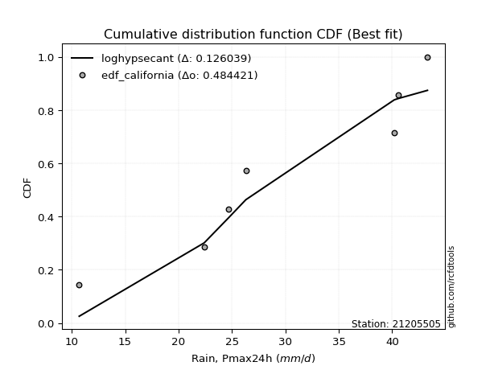</img>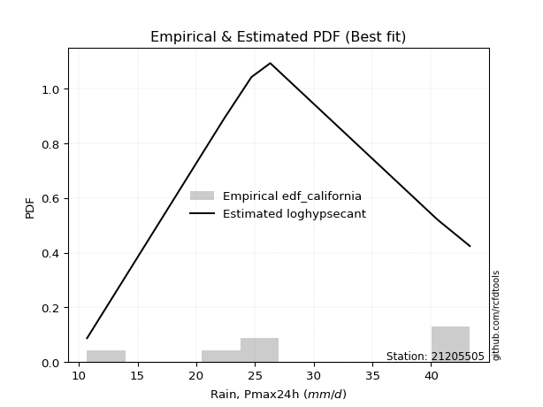</img>

</div>


### 2. EDF Hazen (1930)

Hazen method for plotting positions is a formula used to estimate the empirical cumulative probability distribution of flood events or other hydrological data. This formula often results in biased estimations, particularly when extrapolating to extreme events (high return periods).

<div align="center">


$P=(m-0.5)/n$


</div>


**2.1. Empirical values**

<div align="center">

|                | 0                   | 1                   | 2                   | 3         | 4                  | 5                  | 6                  |
|:---------------|:--------------------|:--------------------|:--------------------|:----------|:-------------------|:-------------------|:-------------------|
| date           | 2015                | 2019                | 2021                | 2017      | 2018               | 2016               | 2020               |
| x              | 10.7                | 22.4                | 24.7                | 26.3      | 40.2               | 40.6               | 43.3               |
| m              | 1                   | 2                   | 3                   | 4         | 5                  | 6                  | 7                  |
| empirical_dist | edf_hazen           | edf_hazen           | edf_hazen           | edf_hazen | edf_hazen          | edf_hazen          | edf_hazen          |
| empirical      | 0.07142857142857142 | 0.21428571428571427 | 0.35714285714285715 | 0.5       | 0.6428571428571429 | 0.7857142857142857 | 0.9285714285714286 |
| empirical_tr   | 1.0769230769230769  | 1.2727272727272727  | 1.5555555555555558  | 2.0       | 2.8000000000000003 | 4.666666666666666  | 14.000000000000007 |

</div>


**2.2. Kolmogorov-Smirnov fit test (sorted by Δ)**


<div align="center">

|                | 0                   | 1                   | 2                   | 3                   | 4                   | 5                   | 6                   | 7                   | 8                   | 9                   | 10                  | 11                  | 12                  | 13                  | 14                  | 15                  | 16                  | 17                  | 18                  | 19                  | 20                  | 21                  | 22                  | 23                  | 24                  | 25                  | 26                  | 27                  | 28                  | 29                  | 30                  | 31                  | 32                  | 33                  | 34                  | 35                  | 36                  | 37                  | 38                  | 39                  | 40                  | 41                  | 42                  | 43                  | 44                  | 45                  | 46                  | 47                  | 48                  | 49                  | 50                  | 51                  | 52                    | 53                  | 54                  | 55                  | 56                  | 57                  | 58                  | 59                  | 60                  | 61                  | 62                  | 63                  | 64                  | 65                  | 66                  | 67                  | 68                  | 69                  | 70                  | 71                  | 72                  | 73                  | 74                  | 75                  | 76                  | 77                  | 78                  | 79                  | 80                  | 81                  | 82                  | 83                  | 84                  | 85                  | 86                  | 87                  |
|:---------------|:--------------------|:--------------------|:--------------------|:--------------------|:--------------------|:--------------------|:--------------------|:--------------------|:--------------------|:--------------------|:--------------------|:--------------------|:--------------------|:--------------------|:--------------------|:--------------------|:--------------------|:--------------------|:--------------------|:--------------------|:--------------------|:--------------------|:--------------------|:--------------------|:--------------------|:--------------------|:--------------------|:--------------------|:--------------------|:--------------------|:--------------------|:--------------------|:--------------------|:--------------------|:--------------------|:--------------------|:--------------------|:--------------------|:--------------------|:--------------------|:--------------------|:--------------------|:--------------------|:--------------------|:--------------------|:--------------------|:--------------------|:--------------------|:--------------------|:--------------------|:--------------------|:--------------------|:----------------------|:--------------------|:--------------------|:--------------------|:--------------------|:--------------------|:--------------------|:--------------------|:--------------------|:--------------------|:--------------------|:--------------------|:--------------------|:--------------------|:--------------------|:--------------------|:--------------------|:--------------------|:--------------------|:--------------------|:--------------------|:--------------------|:--------------------|:--------------------|:--------------------|:--------------------|:--------------------|:--------------------|:--------------------|:--------------------|:--------------------|:--------------------|:--------------------|:--------------------|:--------------------|:--------------------|
| station        | 21205505            | 21205505            | 21205505            | 21205505            | 21205505            | 21205505            | 21205505            | 21205505            | 21205505            | 21205505            | 21205505            | 21205505            | 21205505            | 21205505            | 21205505            | 21205505            | 21205505            | 21205505            | 21205505            | 21205505            | 21205505            | 21205505            | 21205505            | 21205505            | 21205505            | 21205505            | 21205505            | 21205505            | 21205505            | 21205505            | 21205505            | 21205505            | 21205505            | 21205505            | 21205505            | 21205505            | 21205505            | 21205505            | 21205505            | 21205505            | 21205505            | 21205505            | 21205505            | 21205505            | 21205505            | 21205505            | 21205505            | 21205505            | 21205505            | 21205505            | 21205505            | 21205505            | 21205505              | 21205505            | 21205505            | 21205505            | 21205505            | 21205505            | 21205505            | 21205505            | 21205505            | 21205505            | 21205505            | 21205505            | 21205505            | 21205505            | 21205505            | 21205505            | 21205505            | 21205505            | 21205505            | 21205505            | 21205505            | 21205505            | 21205505            | 21205505            | 21205505            | 21205505            | 21205505            | 21205505            | 21205505            | 21205505            | 21205505            | 21205505            | 21205505            | 21205505            | 21205505            | 21205505            |
| empirical_dist | edf_hazen           | edf_hazen           | edf_hazen           | edf_hazen           | edf_hazen           | edf_hazen           | edf_hazen           | edf_hazen           | edf_hazen           | edf_hazen           | edf_hazen           | edf_hazen           | edf_hazen           | edf_hazen           | edf_hazen           | edf_hazen           | edf_hazen           | edf_hazen           | edf_hazen           | edf_hazen           | edf_hazen           | edf_hazen           | edf_hazen           | edf_hazen           | edf_hazen           | edf_hazen           | edf_hazen           | edf_hazen           | edf_hazen           | edf_hazen           | edf_hazen           | edf_hazen           | edf_hazen           | edf_hazen           | edf_hazen           | edf_hazen           | edf_hazen           | edf_hazen           | edf_hazen           | edf_hazen           | edf_hazen           | edf_hazen           | edf_hazen           | edf_hazen           | edf_hazen           | edf_hazen           | edf_hazen           | edf_hazen           | edf_hazen           | edf_hazen           | edf_hazen           | edf_hazen           | edf_hazen             | edf_hazen           | edf_hazen           | edf_hazen           | edf_hazen           | edf_hazen           | edf_hazen           | edf_hazen           | edf_hazen           | edf_hazen           | edf_hazen           | edf_hazen           | edf_hazen           | edf_hazen           | edf_hazen           | edf_hazen           | edf_hazen           | edf_hazen           | edf_hazen           | edf_hazen           | edf_hazen           | edf_hazen           | edf_hazen           | edf_hazen           | edf_hazen           | edf_hazen           | edf_hazen           | edf_hazen           | edf_hazen           | edf_hazen           | edf_hazen           | edf_hazen           | edf_hazen           | edf_hazen           | edf_hazen           | edf_hazen           |
| p_dist         | logbetaprime        | logfisk             | loginvgauss         | logerlang           | logncf              | loggamma            | loggamma            | logalpha            | loginvgamma         | logpearson3         | lognct              | logrice             | logfatiguelife      | logf                | logexponnorm        | logcrystalball      | logt                | lognorm             | lognorm             | logmaxwell          | lograyleigh         | kstwobign           | ncf                 | loggumbel_l         | invgauss            | fisk                | genlogistic         | alpha               | rice                | invgamma            | erlang              | f                   | rayleigh            | pearson3            | maxwell             | loglogistic         | nct                 | crystalball         | norm                | truncnorm           | exponnorm           | t                   | gamma               | betaprime           | weibull_min         | gompertz            | halfnorm            | logweibull_min      | chi2                | loggumbel_r         | logmielke           | laplace_asymmetric  | loglaplace_asymmetric | loginvweibull       | logmoyal            | loghypsecant        | loghalfnorm         | mielke              | loghalflogistic     | gumbel_r            | logistic            | halflogistic        | gumbel_l            | loglaplace          | logloggamma         | moyal               | lognakagami         | hypsecant           | nakagami            | laplace             | logwald             | johnsonsu           | logkstwobign        | loggenexpon         | wald                | expon               | logjohnsonsu        | loggibrat           | gibrat              | loggompertz         | logtruncnorm        | logexpon            | logchi2             | loglognorm          | invweibull          | fatiguelife         | genexpon            | loggenlogistic      |
| delta          | 0.13920147256180435 | 0.14775499154397564 | 0.14923355291434215 | 0.15413553290591853 | 0.15592385576844658 | 0.15597599170126641 | 0.15597599170126641 | 0.15765774922807108 | 0.15844833247932122 | 0.15913808009118913 | 0.15937545982356638 | 0.1601569025745463  | 0.16161341521841466 | 0.16163111377830464 | 0.1620558005946212  | 0.16205997878398537 | 0.16206002878616887 | 0.16206004774929073 | 0.16206004774929073 | 0.16433524996451243 | 0.16498324624518224 | 0.16798655854163025 | 0.1694979671481538  | 0.17267719856651165 | 0.1742277049353408  | 0.17429118733429294 | 0.17496086649053066 | 0.1799254804789785  | 0.18103706983862955 | 0.18134864691446584 | 0.18174107797552808 | 0.18178026601275354 | 0.18298733441861315 | 0.1831053523814623  | 0.1831293215931301  | 0.18329935273689346 | 0.18370474882262777 | 0.1837350439897798  | 0.18373504846861988 | 0.18373508659901483 | 0.18373600461667627 | 0.18374430361223026 | 0.18430112566804857 | 0.18444871359017923 | 0.18449809195656752 | 0.18459964889689295 | 0.18488913942536056 | 0.18535537268555025 | 0.18579869291363083 | 0.1870027445890522  | 0.18841589505053236 | 0.19060178002123307 | 0.1906331769628482    | 0.19067863014047834 | 0.19549753653589075 | 0.19563118013313674 | 0.19701526595773625 | 0.20170544971725468 | 0.20240922690154586 | 0.20250046750561157 | 0.20351074062669594 | 0.20354740350177636 | 0.20401149088598258 | 0.20882609538330366 | 0.20908845033683    | 0.20931329499437668 | 0.2142807591794049  | 0.21434612967348043 | 0.2160105478366805  | 0.22496627667831015 | 0.22585825183214514 | 0.2276203735437159  | 0.22857273011179471 | 0.23328296569134502 | 0.2358911383323784  | 0.24475085649179765 | 0.24609788300425428 | 0.2523007034688475  | 0.26093044518414377 | 0.2700687566341896  | 0.29805071700619645 | 0.33278680777899783 | 0.39946350414161    | 0.43355408329239065 | 0.5055034517976071  | 0.6252856130184695  | 0.7453747059170039  | 0.7857142857142857  |
| deltao         | 0.48442053926100004 | 0.48442053926100004 | 0.48442053926100004 | 0.48442053926100004 | 0.48442053926100004 | 0.48442053926100004 | 0.48442053926100004 | 0.48442053926100004 | 0.48442053926100004 | 0.48442053926100004 | 0.48442053926100004 | 0.48442053926100004 | 0.48442053926100004 | 0.48442053926100004 | 0.48442053926100004 | 0.48442053926100004 | 0.48442053926100004 | 0.48442053926100004 | 0.48442053926100004 | 0.48442053926100004 | 0.48442053926100004 | 0.48442053926100004 | 0.48442053926100004 | 0.48442053926100004 | 0.48442053926100004 | 0.48442053926100004 | 0.48442053926100004 | 0.48442053926100004 | 0.48442053926100004 | 0.48442053926100004 | 0.48442053926100004 | 0.48442053926100004 | 0.48442053926100004 | 0.48442053926100004 | 0.48442053926100004 | 0.48442053926100004 | 0.48442053926100004 | 0.48442053926100004 | 0.48442053926100004 | 0.48442053926100004 | 0.48442053926100004 | 0.48442053926100004 | 0.48442053926100004 | 0.48442053926100004 | 0.48442053926100004 | 0.48442053926100004 | 0.48442053926100004 | 0.48442053926100004 | 0.48442053926100004 | 0.48442053926100004 | 0.48442053926100004 | 0.48442053926100004 | 0.48442053926100004   | 0.48442053926100004 | 0.48442053926100004 | 0.48442053926100004 | 0.48442053926100004 | 0.48442053926100004 | 0.48442053926100004 | 0.48442053926100004 | 0.48442053926100004 | 0.48442053926100004 | 0.48442053926100004 | 0.48442053926100004 | 0.48442053926100004 | 0.48442053926100004 | 0.48442053926100004 | 0.48442053926100004 | 0.48442053926100004 | 0.48442053926100004 | 0.48442053926100004 | 0.48442053926100004 | 0.48442053926100004 | 0.48442053926100004 | 0.48442053926100004 | 0.48442053926100004 | 0.48442053926100004 | 0.48442053926100004 | 0.48442053926100004 | 0.48442053926100004 | 0.48442053926100004 | 0.48442053926100004 | 0.48442053926100004 | 0.48442053926100004 | 0.48442053926100004 | 0.48442053926100004 | 0.48442053926100004 | 0.48442053926100004 |
| eval           | Δo > Δ              | Δo > Δ              | Δo > Δ              | Δo > Δ              | Δo > Δ              | Δo > Δ              | Δo > Δ              | Δo > Δ              | Δo > Δ              | Δo > Δ              | Δo > Δ              | Δo > Δ              | Δo > Δ              | Δo > Δ              | Δo > Δ              | Δo > Δ              | Δo > Δ              | Δo > Δ              | Δo > Δ              | Δo > Δ              | Δo > Δ              | Δo > Δ              | Δo > Δ              | Δo > Δ              | Δo > Δ              | Δo > Δ              | Δo > Δ              | Δo > Δ              | Δo > Δ              | Δo > Δ              | Δo > Δ              | Δo > Δ              | Δo > Δ              | Δo > Δ              | Δo > Δ              | Δo > Δ              | Δo > Δ              | Δo > Δ              | Δo > Δ              | Δo > Δ              | Δo > Δ              | Δo > Δ              | Δo > Δ              | Δo > Δ              | Δo > Δ              | Δo > Δ              | Δo > Δ              | Δo > Δ              | Δo > Δ              | Δo > Δ              | Δo > Δ              | Δo > Δ              | Δo > Δ                | Δo > Δ              | Δo > Δ              | Δo > Δ              | Δo > Δ              | Δo > Δ              | Δo > Δ              | Δo > Δ              | Δo > Δ              | Δo > Δ              | Δo > Δ              | Δo > Δ              | Δo > Δ              | Δo > Δ              | Δo > Δ              | Δo > Δ              | Δo > Δ              | Δo > Δ              | Δo > Δ              | Δo > Δ              | Δo > Δ              | Δo > Δ              | Δo > Δ              | Δo > Δ              | Δo > Δ              | Δo > Δ              | Δo > Δ              | Δo > Δ              | Δo > Δ              | Δo > Δ              | Δo > Δ              | Δo > Δ              | Δo <= Δ             | Δo <= Δ             | Δo <= Δ             | Δo <= Δ             |
| fit            | 1                   | 1                   | 1                   | 1                   | 1                   | 1                   | 1                   | 1                   | 1                   | 1                   | 1                   | 1                   | 1                   | 1                   | 1                   | 1                   | 1                   | 1                   | 1                   | 1                   | 1                   | 1                   | 1                   | 1                   | 1                   | 1                   | 1                   | 1                   | 1                   | 1                   | 1                   | 1                   | 1                   | 1                   | 1                   | 1                   | 1                   | 1                   | 1                   | 1                   | 1                   | 1                   | 1                   | 1                   | 1                   | 1                   | 1                   | 1                   | 1                   | 1                   | 1                   | 1                   | 1                     | 1                   | 1                   | 1                   | 1                   | 1                   | 1                   | 1                   | 1                   | 1                   | 1                   | 1                   | 1                   | 1                   | 1                   | 1                   | 1                   | 1                   | 1                   | 1                   | 1                   | 1                   | 1                   | 1                   | 1                   | 1                   | 1                   | 1                   | 1                   | 1                   | 1                   | 1                   | 0                   | 0                   | 0                   | 0                   |
| n              | 7                   | 7                   | 7                   | 7                   | 7                   | 7                   | 7                   | 7                   | 7                   | 7                   | 7                   | 7                   | 7                   | 7                   | 7                   | 7                   | 7                   | 7                   | 7                   | 7                   | 7                   | 7                   | 7                   | 7                   | 7                   | 7                   | 7                   | 7                   | 7                   | 7                   | 7                   | 7                   | 7                   | 7                   | 7                   | 7                   | 7                   | 7                   | 7                   | 7                   | 7                   | 7                   | 7                   | 7                   | 7                   | 7                   | 7                   | 7                   | 7                   | 7                   | 7                   | 7                   | 7                     | 7                   | 7                   | 7                   | 7                   | 7                   | 7                   | 7                   | 7                   | 7                   | 7                   | 7                   | 7                   | 7                   | 7                   | 7                   | 7                   | 7                   | 7                   | 7                   | 7                   | 7                   | 7                   | 7                   | 7                   | 7                   | 7                   | 7                   | 7                   | 7                   | 7                   | 7                   | 7                   | 7                   | 7                   | 7                   |
| best_fit       | 1                   | 0                   | 0                   | 0                   | 0                   | 0                   | 0                   | 0                   | 0                   | 0                   | 0                   | 0                   | 0                   | 0                   | 0                   | 0                   | 0                   | 0                   | 0                   | 0                   | 0                   | 0                   | 0                   | 0                   | 0                   | 0                   | 0                   | 0                   | 0                   | 0                   | 0                   | 0                   | 0                   | 0                   | 0                   | 0                   | 0                   | 0                   | 0                   | 0                   | 0                   | 0                   | 0                   | 0                   | 0                   | 0                   | 0                   | 0                   | 0                   | 0                   | 0                   | 0                   | 0                     | 0                   | 0                   | 0                   | 0                   | 0                   | 0                   | 0                   | 0                   | 0                   | 0                   | 0                   | 0                   | 0                   | 0                   | 0                   | 0                   | 0                   | 0                   | 0                   | 0                   | 0                   | 0                   | 0                   | 0                   | 0                   | 0                   | 0                   | 0                   | 0                   | 0                   | 0                   | 0                   | 0                   | 0                   | 0                   |
| best_fit_sort  | 1                   | 2                   | 3                   | 4                   | 5                   | 6                   | 7                   | 8                   | 9                   | 10                  | 11                  | 12                  | 13                  | 14                  | 15                  | 16                  | 17                  | 18                  | 19                  | 20                  | 21                  | 22                  | 23                  | 24                  | 25                  | 26                  | 27                  | 28                  | 29                  | 30                  | 31                  | 32                  | 33                  | 34                  | 35                  | 36                  | 37                  | 38                  | 39                  | 40                  | 41                  | 42                  | 43                  | 44                  | 45                  | 46                  | 47                  | 48                  | 49                  | 50                  | 51                  | 52                  | 53                    | 54                  | 55                  | 56                  | 57                  | 58                  | 59                  | 60                  | 61                  | 62                  | 63                  | 64                  | 65                  | 66                  | 67                  | 68                  | 69                  | 70                  | 71                  | 72                  | 73                  | 74                  | 75                  | 76                  | 77                  | 78                  | 79                  | 80                  | 81                  | 82                  | 83                  | 84                  | 85                  | 86                  | 87                  | 88                  |

</div>


**2.3. Best fit**

<div align="center">

|   id |   station | empirical_dist   | p_dist       |    delta |   deltao | eval   |   fit |   n |   best_fit |   best_fit_sort |
|-----:|----------:|:-----------------|:-------------|---------:|---------:|:-------|------:|----:|-----------:|----------------:|
|    0 |  21205505 | edf_hazen        | logbetaprime | 0.139201 | 0.484421 | Δo > Δ |     1 |   7 |          1 |               1 |

</div>


<div align="center">

</img></img>

</div>


### 3. EDF Weibull (1939)

Weibull plotting position formula is an empirical method used to estimate the non-exceedance probability or plotting position for a set of observed data, is often recommended or widely used in practice, particularly in flood frequency analysis.

<div align="center">


$P=m/(n+1)$


</div>


**3.1. Empirical values**

<div align="center">

|                | 0                  | 1                  | 2           | 3           | 4                  | 5           | 6           |
|:---------------|:-------------------|:-------------------|:------------|:------------|:-------------------|:------------|:------------|
| date           | 2015               | 2019               | 2021        | 2017        | 2018               | 2016        | 2020        |
| x              | 10.7               | 22.4               | 24.7        | 26.3        | 40.2               | 40.6        | 43.3        |
| m              | 1                  | 2                  | 3           | 4           | 5                  | 6           | 7           |
| empirical_dist | edf_weibull        | edf_weibull        | edf_weibull | edf_weibull | edf_weibull        | edf_weibull | edf_weibull |
| empirical      | 0.125              | 0.25               | 0.375       | 0.5         | 0.625              | 0.75        | 0.875       |
| empirical_tr   | 1.1428571428571428 | 1.3333333333333333 | 1.6         | 2.0         | 2.6666666666666665 | 4.0         | 8.0         |

</div>


**3.2. Kolmogorov-Smirnov fit test (sorted by Δ)**


<div align="center">

|                | 0                   | 1                   | 2                   | 3                   | 4                   | 5                   | 6                   | 7                   | 8                   | 9                   | 10                  | 11                  | 12                  | 13                  | 14                  | 15                  | 16                  | 17                  | 18                  | 19                  | 20                  | 21                  | 22                  | 23                  | 24                  | 25                  | 26                  | 27                  | 28                  | 29                  | 30                  | 31                  | 32                  | 33                  | 34                  | 35                  | 36                  | 37                  | 38                  | 39                  | 40                  | 41                  | 42                  | 43                  | 44                  | 45                  | 46                  | 47                  | 48                  | 49                  | 50                  | 51                  | 52                  | 53                  | 54                  | 55                  | 56                  | 57                    | 58                  | 59                  | 60                  | 61                  | 62                  | 63                  | 64                  | 65                  | 66                  | 67                  | 68                  | 69                  | 70                  | 71                  | 72                  | 73                  | 74                  | 75                  | 76                  | 77                  | 78                  | 79                  | 80                  | 81                  | 82                  | 83                  | 84                  | 85                  | 86                  | 87                  |
|:---------------|:--------------------|:--------------------|:--------------------|:--------------------|:--------------------|:--------------------|:--------------------|:--------------------|:--------------------|:--------------------|:--------------------|:--------------------|:--------------------|:--------------------|:--------------------|:--------------------|:--------------------|:--------------------|:--------------------|:--------------------|:--------------------|:--------------------|:--------------------|:--------------------|:--------------------|:--------------------|:--------------------|:--------------------|:--------------------|:--------------------|:--------------------|:--------------------|:--------------------|:--------------------|:--------------------|:--------------------|:--------------------|:--------------------|:--------------------|:--------------------|:--------------------|:--------------------|:--------------------|:--------------------|:--------------------|:--------------------|:--------------------|:--------------------|:--------------------|:--------------------|:--------------------|:--------------------|:--------------------|:--------------------|:--------------------|:--------------------|:--------------------|:----------------------|:--------------------|:--------------------|:--------------------|:--------------------|:--------------------|:--------------------|:--------------------|:--------------------|:--------------------|:--------------------|:--------------------|:--------------------|:--------------------|:--------------------|:--------------------|:--------------------|:--------------------|:--------------------|:--------------------|:--------------------|:--------------------|:--------------------|:--------------------|:--------------------|:--------------------|:--------------------|:--------------------|:--------------------|:--------------------|:--------------------|
| station        | 21205505            | 21205505            | 21205505            | 21205505            | 21205505            | 21205505            | 21205505            | 21205505            | 21205505            | 21205505            | 21205505            | 21205505            | 21205505            | 21205505            | 21205505            | 21205505            | 21205505            | 21205505            | 21205505            | 21205505            | 21205505            | 21205505            | 21205505            | 21205505            | 21205505            | 21205505            | 21205505            | 21205505            | 21205505            | 21205505            | 21205505            | 21205505            | 21205505            | 21205505            | 21205505            | 21205505            | 21205505            | 21205505            | 21205505            | 21205505            | 21205505            | 21205505            | 21205505            | 21205505            | 21205505            | 21205505            | 21205505            | 21205505            | 21205505            | 21205505            | 21205505            | 21205505            | 21205505            | 21205505            | 21205505            | 21205505            | 21205505            | 21205505              | 21205505            | 21205505            | 21205505            | 21205505            | 21205505            | 21205505            | 21205505            | 21205505            | 21205505            | 21205505            | 21205505            | 21205505            | 21205505            | 21205505            | 21205505            | 21205505            | 21205505            | 21205505            | 21205505            | 21205505            | 21205505            | 21205505            | 21205505            | 21205505            | 21205505            | 21205505            | 21205505            | 21205505            | 21205505            | 21205505            |
| empirical_dist | edf_weibull         | edf_weibull         | edf_weibull         | edf_weibull         | edf_weibull         | edf_weibull         | edf_weibull         | edf_weibull         | edf_weibull         | edf_weibull         | edf_weibull         | edf_weibull         | edf_weibull         | edf_weibull         | edf_weibull         | edf_weibull         | edf_weibull         | edf_weibull         | edf_weibull         | edf_weibull         | edf_weibull         | edf_weibull         | edf_weibull         | edf_weibull         | edf_weibull         | edf_weibull         | edf_weibull         | edf_weibull         | edf_weibull         | edf_weibull         | edf_weibull         | edf_weibull         | edf_weibull         | edf_weibull         | edf_weibull         | edf_weibull         | edf_weibull         | edf_weibull         | edf_weibull         | edf_weibull         | edf_weibull         | edf_weibull         | edf_weibull         | edf_weibull         | edf_weibull         | edf_weibull         | edf_weibull         | edf_weibull         | edf_weibull         | edf_weibull         | edf_weibull         | edf_weibull         | edf_weibull         | edf_weibull         | edf_weibull         | edf_weibull         | edf_weibull         | edf_weibull           | edf_weibull         | edf_weibull         | edf_weibull         | edf_weibull         | edf_weibull         | edf_weibull         | edf_weibull         | edf_weibull         | edf_weibull         | edf_weibull         | edf_weibull         | edf_weibull         | edf_weibull         | edf_weibull         | edf_weibull         | edf_weibull         | edf_weibull         | edf_weibull         | edf_weibull         | edf_weibull         | edf_weibull         | edf_weibull         | edf_weibull         | edf_weibull         | edf_weibull         | edf_weibull         | edf_weibull         | edf_weibull         | edf_weibull         | edf_weibull         |
| p_dist         | loginvweibull       | logbetaprime        | logfisk             | loginvgauss         | logerlang           | logncf              | loggamma            | loggamma            | logalpha            | loginvgamma         | logpearson3         | lognct              | logrice             | logfatiguelife      | logf                | logexponnorm        | logcrystalball      | logt                | lognorm             | lognorm             | logmaxwell          | lograyleigh         | kstwobign           | loghalfnorm         | ncf                 | loggumbel_l         | invgauss            | fisk                | genlogistic         | logkstwobign        | loggenexpon         | alpha               | rice                | invgamma            | erlang              | f                   | rayleigh            | pearson3            | maxwell             | loglogistic         | nct                 | crystalball         | norm                | truncnorm           | exponnorm           | t                   | gamma               | betaprime           | weibull_min         | gompertz            | halfnorm            | logweibull_min      | chi2                | loggumbel_r         | logmielke           | loghalflogistic     | laplace_asymmetric  | loglaplace_asymmetric | expon               | logjohnsonsu        | logmoyal            | loghypsecant        | mielke              | gumbel_r            | logistic            | halflogistic        | gumbel_l            | loglaplace          | logloggamma         | moyal               | johnsonsu           | hypsecant           | loggompertz         | laplace             | logwald             | lognakagami         | nakagami            | wald                | loggibrat           | gibrat              | logexpon            | logtruncnorm        | logchi2             | loglognorm          | invweibull          | fatiguelife         | genexpon            | loggenlogistic      |
| delta          | 0.1549643444261926  | 0.15694802440127686 | 0.16561213440111855 | 0.16709069577148505 | 0.17199267576306143 | 0.1737809986255895  | 0.17383313455840932 | 0.17383313455840932 | 0.17551489208521398 | 0.17630547533646412 | 0.17699522294833203 | 0.17723260268070928 | 0.1780140454316892  | 0.17947055807555756 | 0.17948825663544754 | 0.17991294345176412 | 0.17991712164112827 | 0.17991717164331178 | 0.17991719060643363 | 0.17991719060643363 | 0.18219239282165534 | 0.18284038910232514 | 0.18584370139877315 | 0.18679345491368404 | 0.1873551100052967  | 0.19053434142365455 | 0.1920848477924837  | 0.19214833019143585 | 0.19281800934767357 | 0.192858444397509   | 0.1975686799770593  | 0.1977826233361214  | 0.19889421269577245 | 0.19920578977160874 | 0.19959822083267098 | 0.19963740886989645 | 0.20084447727575605 | 0.2009624952386052  | 0.20098646445027302 | 0.20115649559403637 | 0.20156189167977068 | 0.2015921868469227  | 0.20159219132576278 | 0.20159222945615773 | 0.20159314747381918 | 0.20160144646937317 | 0.20215826852519148 | 0.20230585644732213 | 0.20235523481371043 | 0.20245679175403586 | 0.20274628228250346 | 0.20321251554269315 | 0.20365583577077373 | 0.2048598874461951  | 0.20627303790767526 | 0.20732964187957914 | 0.20845892287837597 | 0.2084903198199911    | 0.20903657077751192 | 0.21038359728996858 | 0.21335467939303365 | 0.21348832299027964 | 0.21956259257439759 | 0.22035761036275447 | 0.22136788348383885 | 0.22140454635891926 | 0.2218686337431255  | 0.22668323824044656 | 0.2269455931939729  | 0.22717043785151958 | 0.2276203735437159  | 0.23220327253062334 | 0.2343544709199039  | 0.24282341953545306 | 0.24371539468928805 | 0.24999504489369062 | 0.24999997682575115 | 0.2537482811895213  | 0.2701578463259904  | 0.27878758804128667 | 0.29707252206471213 | 0.31590785986333936 | 0.36374921842732433 | 0.39783979757810495 | 0.45193202322617854 | 0.5895713273041838  | 0.7096604202027182  | 0.75                |
| deltao         | 0.48442053926100004 | 0.48442053926100004 | 0.48442053926100004 | 0.48442053926100004 | 0.48442053926100004 | 0.48442053926100004 | 0.48442053926100004 | 0.48442053926100004 | 0.48442053926100004 | 0.48442053926100004 | 0.48442053926100004 | 0.48442053926100004 | 0.48442053926100004 | 0.48442053926100004 | 0.48442053926100004 | 0.48442053926100004 | 0.48442053926100004 | 0.48442053926100004 | 0.48442053926100004 | 0.48442053926100004 | 0.48442053926100004 | 0.48442053926100004 | 0.48442053926100004 | 0.48442053926100004 | 0.48442053926100004 | 0.48442053926100004 | 0.48442053926100004 | 0.48442053926100004 | 0.48442053926100004 | 0.48442053926100004 | 0.48442053926100004 | 0.48442053926100004 | 0.48442053926100004 | 0.48442053926100004 | 0.48442053926100004 | 0.48442053926100004 | 0.48442053926100004 | 0.48442053926100004 | 0.48442053926100004 | 0.48442053926100004 | 0.48442053926100004 | 0.48442053926100004 | 0.48442053926100004 | 0.48442053926100004 | 0.48442053926100004 | 0.48442053926100004 | 0.48442053926100004 | 0.48442053926100004 | 0.48442053926100004 | 0.48442053926100004 | 0.48442053926100004 | 0.48442053926100004 | 0.48442053926100004 | 0.48442053926100004 | 0.48442053926100004 | 0.48442053926100004 | 0.48442053926100004 | 0.48442053926100004   | 0.48442053926100004 | 0.48442053926100004 | 0.48442053926100004 | 0.48442053926100004 | 0.48442053926100004 | 0.48442053926100004 | 0.48442053926100004 | 0.48442053926100004 | 0.48442053926100004 | 0.48442053926100004 | 0.48442053926100004 | 0.48442053926100004 | 0.48442053926100004 | 0.48442053926100004 | 0.48442053926100004 | 0.48442053926100004 | 0.48442053926100004 | 0.48442053926100004 | 0.48442053926100004 | 0.48442053926100004 | 0.48442053926100004 | 0.48442053926100004 | 0.48442053926100004 | 0.48442053926100004 | 0.48442053926100004 | 0.48442053926100004 | 0.48442053926100004 | 0.48442053926100004 | 0.48442053926100004 | 0.48442053926100004 |
| eval           | Δo > Δ              | Δo > Δ              | Δo > Δ              | Δo > Δ              | Δo > Δ              | Δo > Δ              | Δo > Δ              | Δo > Δ              | Δo > Δ              | Δo > Δ              | Δo > Δ              | Δo > Δ              | Δo > Δ              | Δo > Δ              | Δo > Δ              | Δo > Δ              | Δo > Δ              | Δo > Δ              | Δo > Δ              | Δo > Δ              | Δo > Δ              | Δo > Δ              | Δo > Δ              | Δo > Δ              | Δo > Δ              | Δo > Δ              | Δo > Δ              | Δo > Δ              | Δo > Δ              | Δo > Δ              | Δo > Δ              | Δo > Δ              | Δo > Δ              | Δo > Δ              | Δo > Δ              | Δo > Δ              | Δo > Δ              | Δo > Δ              | Δo > Δ              | Δo > Δ              | Δo > Δ              | Δo > Δ              | Δo > Δ              | Δo > Δ              | Δo > Δ              | Δo > Δ              | Δo > Δ              | Δo > Δ              | Δo > Δ              | Δo > Δ              | Δo > Δ              | Δo > Δ              | Δo > Δ              | Δo > Δ              | Δo > Δ              | Δo > Δ              | Δo > Δ              | Δo > Δ                | Δo > Δ              | Δo > Δ              | Δo > Δ              | Δo > Δ              | Δo > Δ              | Δo > Δ              | Δo > Δ              | Δo > Δ              | Δo > Δ              | Δo > Δ              | Δo > Δ              | Δo > Δ              | Δo > Δ              | Δo > Δ              | Δo > Δ              | Δo > Δ              | Δo > Δ              | Δo > Δ              | Δo > Δ              | Δo > Δ              | Δo > Δ              | Δo > Δ              | Δo > Δ              | Δo > Δ              | Δo > Δ              | Δo > Δ              | Δo > Δ              | Δo <= Δ             | Δo <= Δ             | Δo <= Δ             |
| fit            | 1                   | 1                   | 1                   | 1                   | 1                   | 1                   | 1                   | 1                   | 1                   | 1                   | 1                   | 1                   | 1                   | 1                   | 1                   | 1                   | 1                   | 1                   | 1                   | 1                   | 1                   | 1                   | 1                   | 1                   | 1                   | 1                   | 1                   | 1                   | 1                   | 1                   | 1                   | 1                   | 1                   | 1                   | 1                   | 1                   | 1                   | 1                   | 1                   | 1                   | 1                   | 1                   | 1                   | 1                   | 1                   | 1                   | 1                   | 1                   | 1                   | 1                   | 1                   | 1                   | 1                   | 1                   | 1                   | 1                   | 1                   | 1                     | 1                   | 1                   | 1                   | 1                   | 1                   | 1                   | 1                   | 1                   | 1                   | 1                   | 1                   | 1                   | 1                   | 1                   | 1                   | 1                   | 1                   | 1                   | 1                   | 1                   | 1                   | 1                   | 1                   | 1                   | 1                   | 1                   | 1                   | 0                   | 0                   | 0                   |
| n              | 7                   | 7                   | 7                   | 7                   | 7                   | 7                   | 7                   | 7                   | 7                   | 7                   | 7                   | 7                   | 7                   | 7                   | 7                   | 7                   | 7                   | 7                   | 7                   | 7                   | 7                   | 7                   | 7                   | 7                   | 7                   | 7                   | 7                   | 7                   | 7                   | 7                   | 7                   | 7                   | 7                   | 7                   | 7                   | 7                   | 7                   | 7                   | 7                   | 7                   | 7                   | 7                   | 7                   | 7                   | 7                   | 7                   | 7                   | 7                   | 7                   | 7                   | 7                   | 7                   | 7                   | 7                   | 7                   | 7                   | 7                   | 7                     | 7                   | 7                   | 7                   | 7                   | 7                   | 7                   | 7                   | 7                   | 7                   | 7                   | 7                   | 7                   | 7                   | 7                   | 7                   | 7                   | 7                   | 7                   | 7                   | 7                   | 7                   | 7                   | 7                   | 7                   | 7                   | 7                   | 7                   | 7                   | 7                   | 7                   |
| best_fit       | 1                   | 0                   | 0                   | 0                   | 0                   | 0                   | 0                   | 0                   | 0                   | 0                   | 0                   | 0                   | 0                   | 0                   | 0                   | 0                   | 0                   | 0                   | 0                   | 0                   | 0                   | 0                   | 0                   | 0                   | 0                   | 0                   | 0                   | 0                   | 0                   | 0                   | 0                   | 0                   | 0                   | 0                   | 0                   | 0                   | 0                   | 0                   | 0                   | 0                   | 0                   | 0                   | 0                   | 0                   | 0                   | 0                   | 0                   | 0                   | 0                   | 0                   | 0                   | 0                   | 0                   | 0                   | 0                   | 0                   | 0                   | 0                     | 0                   | 0                   | 0                   | 0                   | 0                   | 0                   | 0                   | 0                   | 0                   | 0                   | 0                   | 0                   | 0                   | 0                   | 0                   | 0                   | 0                   | 0                   | 0                   | 0                   | 0                   | 0                   | 0                   | 0                   | 0                   | 0                   | 0                   | 0                   | 0                   | 0                   |
| best_fit_sort  | 1                   | 2                   | 3                   | 4                   | 5                   | 6                   | 7                   | 8                   | 9                   | 10                  | 11                  | 12                  | 13                  | 14                  | 15                  | 16                  | 17                  | 18                  | 19                  | 20                  | 21                  | 22                  | 23                  | 24                  | 25                  | 26                  | 27                  | 28                  | 29                  | 30                  | 31                  | 32                  | 33                  | 34                  | 35                  | 36                  | 37                  | 38                  | 39                  | 40                  | 41                  | 42                  | 43                  | 44                  | 45                  | 46                  | 47                  | 48                  | 49                  | 50                  | 51                  | 52                  | 53                  | 54                  | 55                  | 56                  | 57                  | 58                    | 59                  | 60                  | 61                  | 62                  | 63                  | 64                  | 65                  | 66                  | 67                  | 68                  | 69                  | 70                  | 71                  | 72                  | 73                  | 74                  | 75                  | 76                  | 77                  | 78                  | 79                  | 80                  | 81                  | 82                  | 83                  | 84                  | 85                  | 86                  | 87                  | 88                  |

</div>


**3.3. Best fit**

<div align="center">

|   id |   station | empirical_dist   | p_dist        |    delta |   deltao | eval   |   fit |   n |   best_fit |   best_fit_sort |
|-----:|----------:|:-----------------|:--------------|---------:|---------:|:-------|------:|----:|-----------:|----------------:|
|    0 |  21205505 | edf_weibull      | loginvweibull | 0.154964 | 0.484421 | Δo > Δ |     1 |   7 |          1 |               1 |

</div>


<div align="center">

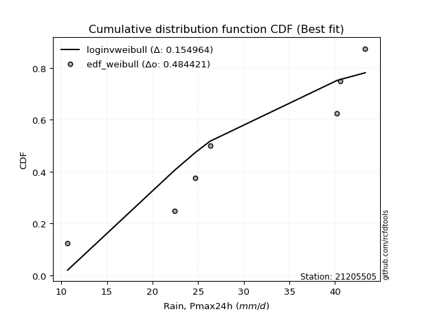</img>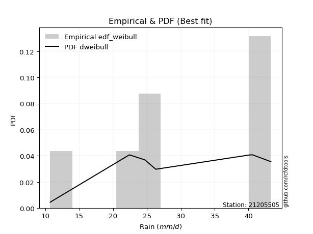</img>

</div>


### 4. EDF Beard (1943)

The Beard formula (or Beard´s plotting position formula) in hydrology is used to estimate the empirical non-exceedance probability _(P)_ of a flood event (or other extreme hydrological data point) within a given dataset.

<div align="center">


$P=(m-0.31)/(n+0.38)$


</div>


**4.1. Empirical values**

<div align="center">

|                | 0                   | 1                   | 2                   | 3         | 4                  | 5                  | 6                  |
|:---------------|:--------------------|:--------------------|:--------------------|:----------|:-------------------|:-------------------|:-------------------|
| date           | 2015                | 2019                | 2021                | 2017      | 2018               | 2016               | 2020               |
| x              | 10.7                | 22.4                | 24.7                | 26.3      | 40.2               | 40.6               | 43.3               |
| m              | 1                   | 2                   | 3                   | 4         | 5                  | 6                  | 7                  |
| empirical_dist | edf_beard           | edf_beard           | edf_beard           | edf_beard | edf_beard          | edf_beard          | edf_beard          |
| empirical      | 0.09349593495934959 | 0.22899728997289973 | 0.36449864498644985 | 0.5       | 0.6355013550135502 | 0.7710027100271003 | 0.9065040650406505 |
| empirical_tr   | 1.1031390134529149  | 1.29701230228471    | 1.5735607675906182  | 2.0       | 2.743494423791822  | 4.366863905325444  | 10.695652173913055 |

</div>


**4.2. Kolmogorov-Smirnov fit test (sorted by Δ)**


<div align="center">

|                | 0                   | 1                   | 2                   | 3                   | 4                   | 5                   | 6                   | 7                   | 8                   | 9                   | 10                  | 11                  | 12                  | 13                  | 14                  | 15                  | 16                  | 17                  | 18                  | 19                  | 20                  | 21                  | 22                  | 23                  | 24                  | 25                  | 26                  | 27                  | 28                  | 29                  | 30                  | 31                  | 32                  | 33                  | 34                  | 35                  | 36                  | 37                  | 38                  | 39                  | 40                  | 41                  | 42                  | 43                  | 44                  | 45                  | 46                  | 47                  | 48                  | 49                  | 50                  | 51                  | 52                  | 53                  | 54                  | 55                    | 56                  | 57                  | 58                  | 59                  | 60                  | 61                  | 62                  | 63                  | 64                  | 65                  | 66                  | 67                  | 68                  | 69                  | 70                  | 71                  | 72                  | 73                  | 74                  | 75                  | 76                  | 77                  | 78                  | 79                  | 80                  | 81                  | 82                  | 83                  | 84                  | 85                  | 86                  | 87                  |
|:---------------|:--------------------|:--------------------|:--------------------|:--------------------|:--------------------|:--------------------|:--------------------|:--------------------|:--------------------|:--------------------|:--------------------|:--------------------|:--------------------|:--------------------|:--------------------|:--------------------|:--------------------|:--------------------|:--------------------|:--------------------|:--------------------|:--------------------|:--------------------|:--------------------|:--------------------|:--------------------|:--------------------|:--------------------|:--------------------|:--------------------|:--------------------|:--------------------|:--------------------|:--------------------|:--------------------|:--------------------|:--------------------|:--------------------|:--------------------|:--------------------|:--------------------|:--------------------|:--------------------|:--------------------|:--------------------|:--------------------|:--------------------|:--------------------|:--------------------|:--------------------|:--------------------|:--------------------|:--------------------|:--------------------|:--------------------|:----------------------|:--------------------|:--------------------|:--------------------|:--------------------|:--------------------|:--------------------|:--------------------|:--------------------|:--------------------|:--------------------|:--------------------|:--------------------|:--------------------|:--------------------|:--------------------|:--------------------|:--------------------|:--------------------|:--------------------|:--------------------|:--------------------|:--------------------|:--------------------|:--------------------|:--------------------|:--------------------|:--------------------|:--------------------|:--------------------|:--------------------|:--------------------|:--------------------|
| station        | 21205505            | 21205505            | 21205505            | 21205505            | 21205505            | 21205505            | 21205505            | 21205505            | 21205505            | 21205505            | 21205505            | 21205505            | 21205505            | 21205505            | 21205505            | 21205505            | 21205505            | 21205505            | 21205505            | 21205505            | 21205505            | 21205505            | 21205505            | 21205505            | 21205505            | 21205505            | 21205505            | 21205505            | 21205505            | 21205505            | 21205505            | 21205505            | 21205505            | 21205505            | 21205505            | 21205505            | 21205505            | 21205505            | 21205505            | 21205505            | 21205505            | 21205505            | 21205505            | 21205505            | 21205505            | 21205505            | 21205505            | 21205505            | 21205505            | 21205505            | 21205505            | 21205505            | 21205505            | 21205505            | 21205505            | 21205505              | 21205505            | 21205505            | 21205505            | 21205505            | 21205505            | 21205505            | 21205505            | 21205505            | 21205505            | 21205505            | 21205505            | 21205505            | 21205505            | 21205505            | 21205505            | 21205505            | 21205505            | 21205505            | 21205505            | 21205505            | 21205505            | 21205505            | 21205505            | 21205505            | 21205505            | 21205505            | 21205505            | 21205505            | 21205505            | 21205505            | 21205505            | 21205505            |
| empirical_dist | edf_beard           | edf_beard           | edf_beard           | edf_beard           | edf_beard           | edf_beard           | edf_beard           | edf_beard           | edf_beard           | edf_beard           | edf_beard           | edf_beard           | edf_beard           | edf_beard           | edf_beard           | edf_beard           | edf_beard           | edf_beard           | edf_beard           | edf_beard           | edf_beard           | edf_beard           | edf_beard           | edf_beard           | edf_beard           | edf_beard           | edf_beard           | edf_beard           | edf_beard           | edf_beard           | edf_beard           | edf_beard           | edf_beard           | edf_beard           | edf_beard           | edf_beard           | edf_beard           | edf_beard           | edf_beard           | edf_beard           | edf_beard           | edf_beard           | edf_beard           | edf_beard           | edf_beard           | edf_beard           | edf_beard           | edf_beard           | edf_beard           | edf_beard           | edf_beard           | edf_beard           | edf_beard           | edf_beard           | edf_beard           | edf_beard             | edf_beard           | edf_beard           | edf_beard           | edf_beard           | edf_beard           | edf_beard           | edf_beard           | edf_beard           | edf_beard           | edf_beard           | edf_beard           | edf_beard           | edf_beard           | edf_beard           | edf_beard           | edf_beard           | edf_beard           | edf_beard           | edf_beard           | edf_beard           | edf_beard           | edf_beard           | edf_beard           | edf_beard           | edf_beard           | edf_beard           | edf_beard           | edf_beard           | edf_beard           | edf_beard           | edf_beard           | edf_beard           |
| p_dist         | logbetaprime        | logfisk             | loginvgauss         | logerlang           | logncf              | loggamma            | loggamma            | logalpha            | loginvgamma         | logpearson3         | lognct              | logrice             | logfatiguelife      | logf                | logexponnorm        | logcrystalball      | logt                | lognorm             | lognorm             | logmaxwell          | lograyleigh         | kstwobign           | loginvweibull       | ncf                 | loggumbel_l         | invgauss            | fisk                | loghalfnorm         | genlogistic         | alpha               | rice                | invgamma            | erlang              | f                   | rayleigh            | pearson3            | maxwell             | loglogistic         | nct                 | crystalball         | norm                | truncnorm           | exponnorm           | t                   | gamma               | betaprime           | weibull_min         | gompertz            | halfnorm            | logweibull_min      | chi2                | loggumbel_r         | logmielke           | loghalflogistic     | laplace_asymmetric  | loglaplace_asymmetric | logmoyal            | loghypsecant        | mielke              | gumbel_r            | logistic            | halflogistic        | gumbel_l            | logkstwobign        | loglaplace          | logloggamma         | moyal               | loggenexpon         | hypsecant           | johnsonsu           | lognakagami         | nakagami            | expon               | logjohnsonsu        | laplace             | logwald             | wald                | loggompertz         | loggibrat           | gibrat              | logtruncnorm        | logexpon            | logchi2             | loglognorm          | invweibull          | fatiguelife         | genexpon            | loggenlogistic      |
| delta          | 0.14644666938772666 | 0.15511077938756834 | 0.15658934075793485 | 0.16149132074951122 | 0.16327964361203928 | 0.1633317795448591  | 0.1633317795448591  | 0.16501353707166377 | 0.16580412032291392 | 0.16649386793478183 | 0.16673124766715908 | 0.167512690418139   | 0.16896920306200736 | 0.16898690162189733 | 0.1694115884382139  | 0.16941576662757807 | 0.16941581662976157 | 0.16941583559288342 | 0.16941583559288342 | 0.17169103780810513 | 0.17233903408877493 | 0.17534234638522295 | 0.1759670544532929  | 0.1768537549917465  | 0.18003298641010435 | 0.1815834927789335  | 0.18164697517788564 | 0.1823036902705508  | 0.18231665433412336 | 0.1872812683225712  | 0.18839285768222225 | 0.18870443475805854 | 0.18909686581912077 | 0.18913605385634624 | 0.19034312226220584 | 0.190461140225055   | 0.1904851094367228  | 0.19065514058048616 | 0.19106053666622047 | 0.1910908318333725  | 0.19109083631221258 | 0.19109087444260753 | 0.19109179246026897 | 0.19110009145582296 | 0.19165691351164127 | 0.19180450143377192 | 0.19185387980016022 | 0.19195543674048565 | 0.19224492726895326 | 0.19271116052914294 | 0.19315448075722352 | 0.1943585324326449  | 0.19577168289412505 | 0.19682828686602893 | 0.19795756786482577 | 0.1979889648064409    | 0.20285332437948345 | 0.20298696797672944 | 0.20906123756084738 | 0.20985625534920427 | 0.21086652847028864 | 0.21090319134536906 | 0.21136727872957528 | 0.21386115442460926 | 0.21618188322689635 | 0.2164442381804227  | 0.21666908283796937 | 0.21857139000415957 | 0.22170191751707313 | 0.2276203735437159  | 0.22899233486659035 | 0.22899726679865087 | 0.2300392808046122  | 0.23138630731706888 | 0.23232206452190285 | 0.23321403967573784 | 0.2432469261759711  | 0.2553571809470042  | 0.2596564913124402  | 0.26828623302773646 | 0.30540650484978915 | 0.31807523209181243 | 0.38475192845442463 | 0.41884250760520525 | 0.48343608826682904 | 0.6105740373312841  | 0.7306631302298185  | 0.7710027100271003  |
| deltao         | 0.48442053926100004 | 0.48442053926100004 | 0.48442053926100004 | 0.48442053926100004 | 0.48442053926100004 | 0.48442053926100004 | 0.48442053926100004 | 0.48442053926100004 | 0.48442053926100004 | 0.48442053926100004 | 0.48442053926100004 | 0.48442053926100004 | 0.48442053926100004 | 0.48442053926100004 | 0.48442053926100004 | 0.48442053926100004 | 0.48442053926100004 | 0.48442053926100004 | 0.48442053926100004 | 0.48442053926100004 | 0.48442053926100004 | 0.48442053926100004 | 0.48442053926100004 | 0.48442053926100004 | 0.48442053926100004 | 0.48442053926100004 | 0.48442053926100004 | 0.48442053926100004 | 0.48442053926100004 | 0.48442053926100004 | 0.48442053926100004 | 0.48442053926100004 | 0.48442053926100004 | 0.48442053926100004 | 0.48442053926100004 | 0.48442053926100004 | 0.48442053926100004 | 0.48442053926100004 | 0.48442053926100004 | 0.48442053926100004 | 0.48442053926100004 | 0.48442053926100004 | 0.48442053926100004 | 0.48442053926100004 | 0.48442053926100004 | 0.48442053926100004 | 0.48442053926100004 | 0.48442053926100004 | 0.48442053926100004 | 0.48442053926100004 | 0.48442053926100004 | 0.48442053926100004 | 0.48442053926100004 | 0.48442053926100004 | 0.48442053926100004 | 0.48442053926100004   | 0.48442053926100004 | 0.48442053926100004 | 0.48442053926100004 | 0.48442053926100004 | 0.48442053926100004 | 0.48442053926100004 | 0.48442053926100004 | 0.48442053926100004 | 0.48442053926100004 | 0.48442053926100004 | 0.48442053926100004 | 0.48442053926100004 | 0.48442053926100004 | 0.48442053926100004 | 0.48442053926100004 | 0.48442053926100004 | 0.48442053926100004 | 0.48442053926100004 | 0.48442053926100004 | 0.48442053926100004 | 0.48442053926100004 | 0.48442053926100004 | 0.48442053926100004 | 0.48442053926100004 | 0.48442053926100004 | 0.48442053926100004 | 0.48442053926100004 | 0.48442053926100004 | 0.48442053926100004 | 0.48442053926100004 | 0.48442053926100004 | 0.48442053926100004 |
| eval           | Δo > Δ              | Δo > Δ              | Δo > Δ              | Δo > Δ              | Δo > Δ              | Δo > Δ              | Δo > Δ              | Δo > Δ              | Δo > Δ              | Δo > Δ              | Δo > Δ              | Δo > Δ              | Δo > Δ              | Δo > Δ              | Δo > Δ              | Δo > Δ              | Δo > Δ              | Δo > Δ              | Δo > Δ              | Δo > Δ              | Δo > Δ              | Δo > Δ              | Δo > Δ              | Δo > Δ              | Δo > Δ              | Δo > Δ              | Δo > Δ              | Δo > Δ              | Δo > Δ              | Δo > Δ              | Δo > Δ              | Δo > Δ              | Δo > Δ              | Δo > Δ              | Δo > Δ              | Δo > Δ              | Δo > Δ              | Δo > Δ              | Δo > Δ              | Δo > Δ              | Δo > Δ              | Δo > Δ              | Δo > Δ              | Δo > Δ              | Δo > Δ              | Δo > Δ              | Δo > Δ              | Δo > Δ              | Δo > Δ              | Δo > Δ              | Δo > Δ              | Δo > Δ              | Δo > Δ              | Δo > Δ              | Δo > Δ              | Δo > Δ                | Δo > Δ              | Δo > Δ              | Δo > Δ              | Δo > Δ              | Δo > Δ              | Δo > Δ              | Δo > Δ              | Δo > Δ              | Δo > Δ              | Δo > Δ              | Δo > Δ              | Δo > Δ              | Δo > Δ              | Δo > Δ              | Δo > Δ              | Δo > Δ              | Δo > Δ              | Δo > Δ              | Δo > Δ              | Δo > Δ              | Δo > Δ              | Δo > Δ              | Δo > Δ              | Δo > Δ              | Δo > Δ              | Δo > Δ              | Δo > Δ              | Δo > Δ              | Δo > Δ              | Δo <= Δ             | Δo <= Δ             | Δo <= Δ             |
| fit            | 1                   | 1                   | 1                   | 1                   | 1                   | 1                   | 1                   | 1                   | 1                   | 1                   | 1                   | 1                   | 1                   | 1                   | 1                   | 1                   | 1                   | 1                   | 1                   | 1                   | 1                   | 1                   | 1                   | 1                   | 1                   | 1                   | 1                   | 1                   | 1                   | 1                   | 1                   | 1                   | 1                   | 1                   | 1                   | 1                   | 1                   | 1                   | 1                   | 1                   | 1                   | 1                   | 1                   | 1                   | 1                   | 1                   | 1                   | 1                   | 1                   | 1                   | 1                   | 1                   | 1                   | 1                   | 1                   | 1                     | 1                   | 1                   | 1                   | 1                   | 1                   | 1                   | 1                   | 1                   | 1                   | 1                   | 1                   | 1                   | 1                   | 1                   | 1                   | 1                   | 1                   | 1                   | 1                   | 1                   | 1                   | 1                   | 1                   | 1                   | 1                   | 1                   | 1                   | 1                   | 1                   | 0                   | 0                   | 0                   |
| n              | 7                   | 7                   | 7                   | 7                   | 7                   | 7                   | 7                   | 7                   | 7                   | 7                   | 7                   | 7                   | 7                   | 7                   | 7                   | 7                   | 7                   | 7                   | 7                   | 7                   | 7                   | 7                   | 7                   | 7                   | 7                   | 7                   | 7                   | 7                   | 7                   | 7                   | 7                   | 7                   | 7                   | 7                   | 7                   | 7                   | 7                   | 7                   | 7                   | 7                   | 7                   | 7                   | 7                   | 7                   | 7                   | 7                   | 7                   | 7                   | 7                   | 7                   | 7                   | 7                   | 7                   | 7                   | 7                   | 7                     | 7                   | 7                   | 7                   | 7                   | 7                   | 7                   | 7                   | 7                   | 7                   | 7                   | 7                   | 7                   | 7                   | 7                   | 7                   | 7                   | 7                   | 7                   | 7                   | 7                   | 7                   | 7                   | 7                   | 7                   | 7                   | 7                   | 7                   | 7                   | 7                   | 7                   | 7                   | 7                   |
| best_fit       | 1                   | 0                   | 0                   | 0                   | 0                   | 0                   | 0                   | 0                   | 0                   | 0                   | 0                   | 0                   | 0                   | 0                   | 0                   | 0                   | 0                   | 0                   | 0                   | 0                   | 0                   | 0                   | 0                   | 0                   | 0                   | 0                   | 0                   | 0                   | 0                   | 0                   | 0                   | 0                   | 0                   | 0                   | 0                   | 0                   | 0                   | 0                   | 0                   | 0                   | 0                   | 0                   | 0                   | 0                   | 0                   | 0                   | 0                   | 0                   | 0                   | 0                   | 0                   | 0                   | 0                   | 0                   | 0                   | 0                     | 0                   | 0                   | 0                   | 0                   | 0                   | 0                   | 0                   | 0                   | 0                   | 0                   | 0                   | 0                   | 0                   | 0                   | 0                   | 0                   | 0                   | 0                   | 0                   | 0                   | 0                   | 0                   | 0                   | 0                   | 0                   | 0                   | 0                   | 0                   | 0                   | 0                   | 0                   | 0                   |
| best_fit_sort  | 1                   | 2                   | 3                   | 4                   | 5                   | 6                   | 7                   | 8                   | 9                   | 10                  | 11                  | 12                  | 13                  | 14                  | 15                  | 16                  | 17                  | 18                  | 19                  | 20                  | 21                  | 22                  | 23                  | 24                  | 25                  | 26                  | 27                  | 28                  | 29                  | 30                  | 31                  | 32                  | 33                  | 34                  | 35                  | 36                  | 37                  | 38                  | 39                  | 40                  | 41                  | 42                  | 43                  | 44                  | 45                  | 46                  | 47                  | 48                  | 49                  | 50                  | 51                  | 52                  | 53                  | 54                  | 55                  | 56                    | 57                  | 58                  | 59                  | 60                  | 61                  | 62                  | 63                  | 64                  | 65                  | 66                  | 67                  | 68                  | 69                  | 70                  | 71                  | 72                  | 73                  | 74                  | 75                  | 76                  | 77                  | 78                  | 79                  | 80                  | 81                  | 82                  | 83                  | 84                  | 85                  | 86                  | 87                  | 88                  |

</div>


**4.3. Best fit**

<div align="center">

|   id |   station | empirical_dist   | p_dist       |    delta |   deltao | eval   |   fit |   n |   best_fit |   best_fit_sort |
|-----:|----------:|:-----------------|:-------------|---------:|---------:|:-------|------:|----:|-----------:|----------------:|
|    0 |  21205505 | edf_beard        | logbetaprime | 0.146447 | 0.484421 | Δo > Δ |     1 |   7 |          1 |               1 |

</div>


<div align="center">

</img></img>

</div>


### 5. EDF Chegodayev (1955)

The Chegodayev formula is an empirical plotting position formula used in hydrological frequency analysis to estimate the exceedance probability or return period of a specific event from a set of observed data. It is primarily used for plotting observed data points on probability paper to fit a theoretical distribution, particularly for analyzing extreme events like maximum flood flows or rainfall intensities. The constant _b_ value in the generalized plotting position formula is 0.3.

<div align="center">


$P=(m-b)/(n+1-2b)$


</div>


**5.1. Empirical values**

<div align="center">

|                | 0                   | 1                   | 2                   | 3              | 4                  | 5                  | 6                  |
|:---------------|:--------------------|:--------------------|:--------------------|:---------------|:-------------------|:-------------------|:-------------------|
| date           | 2015                | 2019                | 2021                | 2017           | 2018               | 2016               | 2020               |
| x              | 10.7                | 22.4                | 24.7                | 26.3           | 40.2               | 40.6               | 43.3               |
| m              | 1                   | 2                   | 3                   | 4              | 5                  | 6                  | 7                  |
| empirical_dist | edf_chegodayev      | edf_chegodayev      | edf_chegodayev      | edf_chegodayev | edf_chegodayev     | edf_chegodayev     | edf_chegodayev     |
| empirical      | 0.09459459459459459 | 0.22972972972972971 | 0.36486486486486486 | 0.5            | 0.6351351351351351 | 0.7702702702702703 | 0.9054054054054054 |
| empirical_tr   | 1.1044776119402986  | 1.2982456140350878  | 1.574468085106383   | 2.0            | 2.7407407407407405 | 4.352941176470589  | 10.571428571428568 |

</div>


**5.2. Kolmogorov-Smirnov fit test (sorted by Δ)**


<div align="center">

|                | 0                   | 1                   | 2                   | 3                   | 4                   | 5                   | 6                   | 7                   | 8                   | 9                   | 10                  | 11                  | 12                  | 13                  | 14                  | 15                  | 16                  | 17                  | 18                  | 19                  | 20                  | 21                  | 22                  | 23                  | 24                  | 25                  | 26                  | 27                  | 28                  | 29                  | 30                  | 31                  | 32                  | 33                  | 34                  | 35                  | 36                  | 37                  | 38                  | 39                  | 40                  | 41                  | 42                  | 43                  | 44                  | 45                  | 46                  | 47                  | 48                  | 49                  | 50                  | 51                  | 52                  | 53                  | 54                  | 55                    | 56                  | 57                  | 58                  | 59                  | 60                  | 61                  | 62                  | 63                  | 64                  | 65                  | 66                  | 67                  | 68                  | 69                  | 70                  | 71                  | 72                  | 73                  | 74                  | 75                  | 76                  | 77                  | 78                  | 79                  | 80                  | 81                  | 82                  | 83                  | 84                  | 85                  | 86                  | 87                  |
|:---------------|:--------------------|:--------------------|:--------------------|:--------------------|:--------------------|:--------------------|:--------------------|:--------------------|:--------------------|:--------------------|:--------------------|:--------------------|:--------------------|:--------------------|:--------------------|:--------------------|:--------------------|:--------------------|:--------------------|:--------------------|:--------------------|:--------------------|:--------------------|:--------------------|:--------------------|:--------------------|:--------------------|:--------------------|:--------------------|:--------------------|:--------------------|:--------------------|:--------------------|:--------------------|:--------------------|:--------------------|:--------------------|:--------------------|:--------------------|:--------------------|:--------------------|:--------------------|:--------------------|:--------------------|:--------------------|:--------------------|:--------------------|:--------------------|:--------------------|:--------------------|:--------------------|:--------------------|:--------------------|:--------------------|:--------------------|:----------------------|:--------------------|:--------------------|:--------------------|:--------------------|:--------------------|:--------------------|:--------------------|:--------------------|:--------------------|:--------------------|:--------------------|:--------------------|:--------------------|:--------------------|:--------------------|:--------------------|:--------------------|:--------------------|:--------------------|:--------------------|:--------------------|:--------------------|:--------------------|:--------------------|:--------------------|:--------------------|:--------------------|:--------------------|:--------------------|:--------------------|:--------------------|:--------------------|
| station        | 21205505            | 21205505            | 21205505            | 21205505            | 21205505            | 21205505            | 21205505            | 21205505            | 21205505            | 21205505            | 21205505            | 21205505            | 21205505            | 21205505            | 21205505            | 21205505            | 21205505            | 21205505            | 21205505            | 21205505            | 21205505            | 21205505            | 21205505            | 21205505            | 21205505            | 21205505            | 21205505            | 21205505            | 21205505            | 21205505            | 21205505            | 21205505            | 21205505            | 21205505            | 21205505            | 21205505            | 21205505            | 21205505            | 21205505            | 21205505            | 21205505            | 21205505            | 21205505            | 21205505            | 21205505            | 21205505            | 21205505            | 21205505            | 21205505            | 21205505            | 21205505            | 21205505            | 21205505            | 21205505            | 21205505            | 21205505              | 21205505            | 21205505            | 21205505            | 21205505            | 21205505            | 21205505            | 21205505            | 21205505            | 21205505            | 21205505            | 21205505            | 21205505            | 21205505            | 21205505            | 21205505            | 21205505            | 21205505            | 21205505            | 21205505            | 21205505            | 21205505            | 21205505            | 21205505            | 21205505            | 21205505            | 21205505            | 21205505            | 21205505            | 21205505            | 21205505            | 21205505            | 21205505            |
| empirical_dist | edf_chegodayev      | edf_chegodayev      | edf_chegodayev      | edf_chegodayev      | edf_chegodayev      | edf_chegodayev      | edf_chegodayev      | edf_chegodayev      | edf_chegodayev      | edf_chegodayev      | edf_chegodayev      | edf_chegodayev      | edf_chegodayev      | edf_chegodayev      | edf_chegodayev      | edf_chegodayev      | edf_chegodayev      | edf_chegodayev      | edf_chegodayev      | edf_chegodayev      | edf_chegodayev      | edf_chegodayev      | edf_chegodayev      | edf_chegodayev      | edf_chegodayev      | edf_chegodayev      | edf_chegodayev      | edf_chegodayev      | edf_chegodayev      | edf_chegodayev      | edf_chegodayev      | edf_chegodayev      | edf_chegodayev      | edf_chegodayev      | edf_chegodayev      | edf_chegodayev      | edf_chegodayev      | edf_chegodayev      | edf_chegodayev      | edf_chegodayev      | edf_chegodayev      | edf_chegodayev      | edf_chegodayev      | edf_chegodayev      | edf_chegodayev      | edf_chegodayev      | edf_chegodayev      | edf_chegodayev      | edf_chegodayev      | edf_chegodayev      | edf_chegodayev      | edf_chegodayev      | edf_chegodayev      | edf_chegodayev      | edf_chegodayev      | edf_chegodayev        | edf_chegodayev      | edf_chegodayev      | edf_chegodayev      | edf_chegodayev      | edf_chegodayev      | edf_chegodayev      | edf_chegodayev      | edf_chegodayev      | edf_chegodayev      | edf_chegodayev      | edf_chegodayev      | edf_chegodayev      | edf_chegodayev      | edf_chegodayev      | edf_chegodayev      | edf_chegodayev      | edf_chegodayev      | edf_chegodayev      | edf_chegodayev      | edf_chegodayev      | edf_chegodayev      | edf_chegodayev      | edf_chegodayev      | edf_chegodayev      | edf_chegodayev      | edf_chegodayev      | edf_chegodayev      | edf_chegodayev      | edf_chegodayev      | edf_chegodayev      | edf_chegodayev      | edf_chegodayev      |
| p_dist         | logbetaprime        | logfisk             | loginvgauss         | logerlang           | logncf              | loggamma            | loggamma            | logalpha            | loginvgamma         | logpearson3         | lognct              | logrice             | logfatiguelife      | logf                | logexponnorm        | logcrystalball      | logt                | lognorm             | lognorm             | logmaxwell          | lograyleigh         | loginvweibull       | kstwobign           | ncf                 | loggumbel_l         | loghalfnorm         | invgauss            | fisk                | genlogistic         | alpha               | rice                | invgamma            | erlang              | f                   | rayleigh            | pearson3            | maxwell             | loglogistic         | nct                 | crystalball         | norm                | truncnorm           | exponnorm           | t                   | gamma               | betaprime           | weibull_min         | gompertz            | halfnorm            | logweibull_min      | chi2                | loggumbel_r         | logmielke           | loghalflogistic     | laplace_asymmetric  | loglaplace_asymmetric | logmoyal            | loghypsecant        | mielke              | gumbel_r            | logistic            | halflogistic        | gumbel_l            | logkstwobign        | loglaplace          | logloggamma         | moyal               | loggenexpon         | hypsecant           | johnsonsu           | expon               | lognakagami         | nakagami            | logjohnsonsu        | laplace             | logwald             | wald                | loggompertz         | loggibrat           | gibrat              | logtruncnorm        | logexpon            | logchi2             | loglognorm          | invweibull          | fatiguelife         | genexpon            | loggenlogistic      |
| delta          | 0.14681288926614178 | 0.15547699926598346 | 0.15695556063634997 | 0.16185754062792634 | 0.1636458634904544  | 0.16369799942327423 | 0.16369799942327423 | 0.1653797569500789  | 0.16617034020132904 | 0.16686008781319694 | 0.1670974675455742  | 0.1678789102965541  | 0.16933542294042248 | 0.16935312150031245 | 0.16977780831662903 | 0.1697819865059932  | 0.1697820365081767  | 0.16978205547129854 | 0.16978205547129854 | 0.17205725768652025 | 0.17270525396719005 | 0.1752346146964629  | 0.17570856626363807 | 0.1772199748701616  | 0.18039920628851946 | 0.1815712505137208  | 0.1819497126573486  | 0.18201319505630076 | 0.18268287421253848 | 0.1876474882009863  | 0.18875907756063737 | 0.18907065463647366 | 0.1894630856975359  | 0.18950227373476136 | 0.19070934214062096 | 0.19082736010347012 | 0.19085132931513793 | 0.19102136045890128 | 0.1914267565446356  | 0.19145705171178762 | 0.1914570561906277  | 0.19145709432102265 | 0.1914580123386841  | 0.19146631133423808 | 0.1920231333900564  | 0.19217072131218704 | 0.19222009967857534 | 0.19232165661890077 | 0.19261114714736838 | 0.19307738040755806 | 0.19352070063563864 | 0.19472475231106    | 0.19613790277254017 | 0.19719450674444405 | 0.1983237877432409  | 0.19835518468485602   | 0.20321954425789857 | 0.20335318785514456 | 0.2094274574392625  | 0.2102224752276194  | 0.21123274834870376 | 0.21126941122378418 | 0.2117334986079904  | 0.21312871466777927 | 0.21654810310531147 | 0.2168104580588378  | 0.2170353027163845  | 0.21783895024732958 | 0.22206813739548825 | 0.2276203735437159  | 0.2293068410477822  | 0.22972477462342034 | 0.22972970655548086 | 0.23065386756023887 | 0.23268828440031797 | 0.23358025955415296 | 0.24361314605438622 | 0.2546247411901742  | 0.2600227111908553  | 0.2686524529061516  | 0.30577272472820427 | 0.3173427923349824  | 0.3840194886975946  | 0.41811006784837523 | 0.4823374286315839  | 0.6098415975744541  | 0.7299306904729885  | 0.7702702702702703  |
| deltao         | 0.48442053926100004 | 0.48442053926100004 | 0.48442053926100004 | 0.48442053926100004 | 0.48442053926100004 | 0.48442053926100004 | 0.48442053926100004 | 0.48442053926100004 | 0.48442053926100004 | 0.48442053926100004 | 0.48442053926100004 | 0.48442053926100004 | 0.48442053926100004 | 0.48442053926100004 | 0.48442053926100004 | 0.48442053926100004 | 0.48442053926100004 | 0.48442053926100004 | 0.48442053926100004 | 0.48442053926100004 | 0.48442053926100004 | 0.48442053926100004 | 0.48442053926100004 | 0.48442053926100004 | 0.48442053926100004 | 0.48442053926100004 | 0.48442053926100004 | 0.48442053926100004 | 0.48442053926100004 | 0.48442053926100004 | 0.48442053926100004 | 0.48442053926100004 | 0.48442053926100004 | 0.48442053926100004 | 0.48442053926100004 | 0.48442053926100004 | 0.48442053926100004 | 0.48442053926100004 | 0.48442053926100004 | 0.48442053926100004 | 0.48442053926100004 | 0.48442053926100004 | 0.48442053926100004 | 0.48442053926100004 | 0.48442053926100004 | 0.48442053926100004 | 0.48442053926100004 | 0.48442053926100004 | 0.48442053926100004 | 0.48442053926100004 | 0.48442053926100004 | 0.48442053926100004 | 0.48442053926100004 | 0.48442053926100004 | 0.48442053926100004 | 0.48442053926100004   | 0.48442053926100004 | 0.48442053926100004 | 0.48442053926100004 | 0.48442053926100004 | 0.48442053926100004 | 0.48442053926100004 | 0.48442053926100004 | 0.48442053926100004 | 0.48442053926100004 | 0.48442053926100004 | 0.48442053926100004 | 0.48442053926100004 | 0.48442053926100004 | 0.48442053926100004 | 0.48442053926100004 | 0.48442053926100004 | 0.48442053926100004 | 0.48442053926100004 | 0.48442053926100004 | 0.48442053926100004 | 0.48442053926100004 | 0.48442053926100004 | 0.48442053926100004 | 0.48442053926100004 | 0.48442053926100004 | 0.48442053926100004 | 0.48442053926100004 | 0.48442053926100004 | 0.48442053926100004 | 0.48442053926100004 | 0.48442053926100004 | 0.48442053926100004 |
| eval           | Δo > Δ              | Δo > Δ              | Δo > Δ              | Δo > Δ              | Δo > Δ              | Δo > Δ              | Δo > Δ              | Δo > Δ              | Δo > Δ              | Δo > Δ              | Δo > Δ              | Δo > Δ              | Δo > Δ              | Δo > Δ              | Δo > Δ              | Δo > Δ              | Δo > Δ              | Δo > Δ              | Δo > Δ              | Δo > Δ              | Δo > Δ              | Δo > Δ              | Δo > Δ              | Δo > Δ              | Δo > Δ              | Δo > Δ              | Δo > Δ              | Δo > Δ              | Δo > Δ              | Δo > Δ              | Δo > Δ              | Δo > Δ              | Δo > Δ              | Δo > Δ              | Δo > Δ              | Δo > Δ              | Δo > Δ              | Δo > Δ              | Δo > Δ              | Δo > Δ              | Δo > Δ              | Δo > Δ              | Δo > Δ              | Δo > Δ              | Δo > Δ              | Δo > Δ              | Δo > Δ              | Δo > Δ              | Δo > Δ              | Δo > Δ              | Δo > Δ              | Δo > Δ              | Δo > Δ              | Δo > Δ              | Δo > Δ              | Δo > Δ                | Δo > Δ              | Δo > Δ              | Δo > Δ              | Δo > Δ              | Δo > Δ              | Δo > Δ              | Δo > Δ              | Δo > Δ              | Δo > Δ              | Δo > Δ              | Δo > Δ              | Δo > Δ              | Δo > Δ              | Δo > Δ              | Δo > Δ              | Δo > Δ              | Δo > Δ              | Δo > Δ              | Δo > Δ              | Δo > Δ              | Δo > Δ              | Δo > Δ              | Δo > Δ              | Δo > Δ              | Δo > Δ              | Δo > Δ              | Δo > Δ              | Δo > Δ              | Δo > Δ              | Δo <= Δ             | Δo <= Δ             | Δo <= Δ             |
| fit            | 1                   | 1                   | 1                   | 1                   | 1                   | 1                   | 1                   | 1                   | 1                   | 1                   | 1                   | 1                   | 1                   | 1                   | 1                   | 1                   | 1                   | 1                   | 1                   | 1                   | 1                   | 1                   | 1                   | 1                   | 1                   | 1                   | 1                   | 1                   | 1                   | 1                   | 1                   | 1                   | 1                   | 1                   | 1                   | 1                   | 1                   | 1                   | 1                   | 1                   | 1                   | 1                   | 1                   | 1                   | 1                   | 1                   | 1                   | 1                   | 1                   | 1                   | 1                   | 1                   | 1                   | 1                   | 1                   | 1                     | 1                   | 1                   | 1                   | 1                   | 1                   | 1                   | 1                   | 1                   | 1                   | 1                   | 1                   | 1                   | 1                   | 1                   | 1                   | 1                   | 1                   | 1                   | 1                   | 1                   | 1                   | 1                   | 1                   | 1                   | 1                   | 1                   | 1                   | 1                   | 1                   | 0                   | 0                   | 0                   |
| n              | 7                   | 7                   | 7                   | 7                   | 7                   | 7                   | 7                   | 7                   | 7                   | 7                   | 7                   | 7                   | 7                   | 7                   | 7                   | 7                   | 7                   | 7                   | 7                   | 7                   | 7                   | 7                   | 7                   | 7                   | 7                   | 7                   | 7                   | 7                   | 7                   | 7                   | 7                   | 7                   | 7                   | 7                   | 7                   | 7                   | 7                   | 7                   | 7                   | 7                   | 7                   | 7                   | 7                   | 7                   | 7                   | 7                   | 7                   | 7                   | 7                   | 7                   | 7                   | 7                   | 7                   | 7                   | 7                   | 7                     | 7                   | 7                   | 7                   | 7                   | 7                   | 7                   | 7                   | 7                   | 7                   | 7                   | 7                   | 7                   | 7                   | 7                   | 7                   | 7                   | 7                   | 7                   | 7                   | 7                   | 7                   | 7                   | 7                   | 7                   | 7                   | 7                   | 7                   | 7                   | 7                   | 7                   | 7                   | 7                   |
| best_fit       | 1                   | 0                   | 0                   | 0                   | 0                   | 0                   | 0                   | 0                   | 0                   | 0                   | 0                   | 0                   | 0                   | 0                   | 0                   | 0                   | 0                   | 0                   | 0                   | 0                   | 0                   | 0                   | 0                   | 0                   | 0                   | 0                   | 0                   | 0                   | 0                   | 0                   | 0                   | 0                   | 0                   | 0                   | 0                   | 0                   | 0                   | 0                   | 0                   | 0                   | 0                   | 0                   | 0                   | 0                   | 0                   | 0                   | 0                   | 0                   | 0                   | 0                   | 0                   | 0                   | 0                   | 0                   | 0                   | 0                     | 0                   | 0                   | 0                   | 0                   | 0                   | 0                   | 0                   | 0                   | 0                   | 0                   | 0                   | 0                   | 0                   | 0                   | 0                   | 0                   | 0                   | 0                   | 0                   | 0                   | 0                   | 0                   | 0                   | 0                   | 0                   | 0                   | 0                   | 0                   | 0                   | 0                   | 0                   | 0                   |
| best_fit_sort  | 1                   | 2                   | 3                   | 4                   | 5                   | 6                   | 7                   | 8                   | 9                   | 10                  | 11                  | 12                  | 13                  | 14                  | 15                  | 16                  | 17                  | 18                  | 19                  | 20                  | 21                  | 22                  | 23                  | 24                  | 25                  | 26                  | 27                  | 28                  | 29                  | 30                  | 31                  | 32                  | 33                  | 34                  | 35                  | 36                  | 37                  | 38                  | 39                  | 40                  | 41                  | 42                  | 43                  | 44                  | 45                  | 46                  | 47                  | 48                  | 49                  | 50                  | 51                  | 52                  | 53                  | 54                  | 55                  | 56                    | 57                  | 58                  | 59                  | 60                  | 61                  | 62                  | 63                  | 64                  | 65                  | 66                  | 67                  | 68                  | 69                  | 70                  | 71                  | 72                  | 73                  | 74                  | 75                  | 76                  | 77                  | 78                  | 79                  | 80                  | 81                  | 82                  | 83                  | 84                  | 85                  | 86                  | 87                  | 88                  |

</div>


**5.3. Best fit**

<div align="center">

|   id |   station | empirical_dist   | p_dist       |    delta |   deltao | eval   |   fit |   n |   best_fit |   best_fit_sort |
|-----:|----------:|:-----------------|:-------------|---------:|---------:|:-------|------:|----:|-----------:|----------------:|
|    0 |  21205505 | edf_chegodayev   | logbetaprime | 0.146813 | 0.484421 | Δo > Δ |     1 |   7 |          1 |               1 |

</div>


<div align="center">

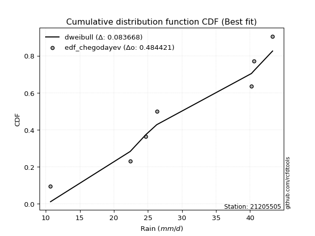</img></img>

</div>


### 6. EDF Blom (1958)

The Blom formula is a specific "plotting position" formula used in hydrology and statistical analysis to estimate the empirical cumulative probability (or non-exceedance probability) of a data series. It is particularly recommended for data that are approximately normally distributed. The constant _a_ is set to 0.375 (or 3/8).

<div align="center">


$P=(m-a)/(n+1-2a)$


</div>


**6.1. Empirical values**

<div align="center">

|                | 0                   | 1                   | 2                  | 3        | 4                  | 5                  | 6                  |
|:---------------|:--------------------|:--------------------|:-------------------|:---------|:-------------------|:-------------------|:-------------------|
| date           | 2015                | 2019                | 2021               | 2017     | 2018               | 2016               | 2020               |
| x              | 10.7                | 22.4                | 24.7               | 26.3     | 40.2               | 40.6               | 43.3               |
| m              | 1                   | 2                   | 3                  | 4        | 5                  | 6                  | 7                  |
| empirical_dist | edf_blom            | edf_blom            | edf_blom           | edf_blom | edf_blom           | edf_blom           | edf_blom           |
| empirical      | 0.08620689655172414 | 0.22413793103448276 | 0.3620689655172414 | 0.5      | 0.6379310344827587 | 0.7758620689655172 | 0.9137931034482759 |
| empirical_tr   | 1.0943396226415094  | 1.288888888888889   | 1.5675675675675675 | 2.0      | 2.7619047619047623 | 4.461538461538462  | 11.600000000000007 |

</div>


**6.2. Kolmogorov-Smirnov fit test (sorted by Δ)**


<div align="center">

|                | 0                   | 1                   | 2                   | 3                   | 4                   | 5                   | 6                   | 7                   | 8                   | 9                   | 10                  | 11                  | 12                  | 13                  | 14                  | 15                  | 16                  | 17                  | 18                  | 19                  | 20                  | 21                  | 22                  | 23                  | 24                  | 25                  | 26                  | 27                  | 28                  | 29                  | 30                  | 31                  | 32                  | 33                  | 34                  | 35                  | 36                  | 37                  | 38                  | 39                  | 40                  | 41                  | 42                  | 43                  | 44                  | 45                  | 46                  | 47                  | 48                  | 49                  | 50                  | 51                  | 52                  | 53                  | 54                  | 55                    | 56                  | 57                  | 58                  | 59                  | 60                  | 61                  | 62                  | 63                  | 64                  | 65                  | 66                  | 67                  | 68                  | 69                  | 70                  | 71                  | 72                  | 73                  | 74                  | 75                  | 76                  | 77                  | 78                  | 79                  | 80                  | 81                  | 82                  | 83                  | 84                  | 85                  | 86                  | 87                  |
|:---------------|:--------------------|:--------------------|:--------------------|:--------------------|:--------------------|:--------------------|:--------------------|:--------------------|:--------------------|:--------------------|:--------------------|:--------------------|:--------------------|:--------------------|:--------------------|:--------------------|:--------------------|:--------------------|:--------------------|:--------------------|:--------------------|:--------------------|:--------------------|:--------------------|:--------------------|:--------------------|:--------------------|:--------------------|:--------------------|:--------------------|:--------------------|:--------------------|:--------------------|:--------------------|:--------------------|:--------------------|:--------------------|:--------------------|:--------------------|:--------------------|:--------------------|:--------------------|:--------------------|:--------------------|:--------------------|:--------------------|:--------------------|:--------------------|:--------------------|:--------------------|:--------------------|:--------------------|:--------------------|:--------------------|:--------------------|:----------------------|:--------------------|:--------------------|:--------------------|:--------------------|:--------------------|:--------------------|:--------------------|:--------------------|:--------------------|:--------------------|:--------------------|:--------------------|:--------------------|:--------------------|:--------------------|:--------------------|:--------------------|:--------------------|:--------------------|:--------------------|:--------------------|:--------------------|:--------------------|:--------------------|:--------------------|:--------------------|:--------------------|:--------------------|:--------------------|:--------------------|:--------------------|:--------------------|
| station        | 21205505            | 21205505            | 21205505            | 21205505            | 21205505            | 21205505            | 21205505            | 21205505            | 21205505            | 21205505            | 21205505            | 21205505            | 21205505            | 21205505            | 21205505            | 21205505            | 21205505            | 21205505            | 21205505            | 21205505            | 21205505            | 21205505            | 21205505            | 21205505            | 21205505            | 21205505            | 21205505            | 21205505            | 21205505            | 21205505            | 21205505            | 21205505            | 21205505            | 21205505            | 21205505            | 21205505            | 21205505            | 21205505            | 21205505            | 21205505            | 21205505            | 21205505            | 21205505            | 21205505            | 21205505            | 21205505            | 21205505            | 21205505            | 21205505            | 21205505            | 21205505            | 21205505            | 21205505            | 21205505            | 21205505            | 21205505              | 21205505            | 21205505            | 21205505            | 21205505            | 21205505            | 21205505            | 21205505            | 21205505            | 21205505            | 21205505            | 21205505            | 21205505            | 21205505            | 21205505            | 21205505            | 21205505            | 21205505            | 21205505            | 21205505            | 21205505            | 21205505            | 21205505            | 21205505            | 21205505            | 21205505            | 21205505            | 21205505            | 21205505            | 21205505            | 21205505            | 21205505            | 21205505            |
| empirical_dist | edf_blom            | edf_blom            | edf_blom            | edf_blom            | edf_blom            | edf_blom            | edf_blom            | edf_blom            | edf_blom            | edf_blom            | edf_blom            | edf_blom            | edf_blom            | edf_blom            | edf_blom            | edf_blom            | edf_blom            | edf_blom            | edf_blom            | edf_blom            | edf_blom            | edf_blom            | edf_blom            | edf_blom            | edf_blom            | edf_blom            | edf_blom            | edf_blom            | edf_blom            | edf_blom            | edf_blom            | edf_blom            | edf_blom            | edf_blom            | edf_blom            | edf_blom            | edf_blom            | edf_blom            | edf_blom            | edf_blom            | edf_blom            | edf_blom            | edf_blom            | edf_blom            | edf_blom            | edf_blom            | edf_blom            | edf_blom            | edf_blom            | edf_blom            | edf_blom            | edf_blom            | edf_blom            | edf_blom            | edf_blom            | edf_blom              | edf_blom            | edf_blom            | edf_blom            | edf_blom            | edf_blom            | edf_blom            | edf_blom            | edf_blom            | edf_blom            | edf_blom            | edf_blom            | edf_blom            | edf_blom            | edf_blom            | edf_blom            | edf_blom            | edf_blom            | edf_blom            | edf_blom            | edf_blom            | edf_blom            | edf_blom            | edf_blom            | edf_blom            | edf_blom            | edf_blom            | edf_blom            | edf_blom            | edf_blom            | edf_blom            | edf_blom            | edf_blom            |
| p_dist         | logbetaprime        | logfisk             | loginvgauss         | logerlang           | logncf              | loggamma            | loggamma            | logalpha            | loginvgamma         | logpearson3         | lognct              | logrice             | logfatiguelife      | logf                | logexponnorm        | logcrystalball      | logt                | lognorm             | lognorm             | logmaxwell          | lograyleigh         | kstwobign           | ncf                 | loggumbel_l         | invgauss            | fisk                | genlogistic         | loginvweibull       | alpha               | rice                | invgamma            | erlang              | f                   | loghalfnorm         | rayleigh            | pearson3            | maxwell             | loglogistic         | nct                 | crystalball         | norm                | truncnorm           | exponnorm           | t                   | gamma               | betaprime           | weibull_min         | gompertz            | halfnorm            | logweibull_min      | chi2                | loggumbel_r         | logmielke           | loghalflogistic     | laplace_asymmetric  | loglaplace_asymmetric | logmoyal            | loghypsecant        | mielke              | gumbel_r            | logistic            | halflogistic        | gumbel_l            | loglaplace          | logloggamma         | moyal               | logkstwobign        | hypsecant           | loggenexpon         | lognakagami         | nakagami            | johnsonsu           | laplace             | logwald             | expon               | logjohnsonsu        | wald                | loggibrat           | loggompertz         | gibrat              | logtruncnorm        | logexpon            | logchi2             | loglognorm          | invweibull          | fatiguelife         | genexpon            | loggenlogistic      |
| delta          | 0.1440169899185182  | 0.15268109991835987 | 0.15415966128872638 | 0.15906164128030276 | 0.16084996414283081 | 0.16090210007565064 | 0.16090210007565064 | 0.1625838576024553  | 0.16337444085370545 | 0.16406418846557336 | 0.1643015681979506  | 0.16508301094893052 | 0.1665395235927989  | 0.16655722215268887 | 0.16698190896900544 | 0.1669860871583696  | 0.1669861371605531  | 0.16698615612367496 | 0.16698615612367496 | 0.16926135833889666 | 0.16990935461956647 | 0.17291266691601448 | 0.17442407552253802 | 0.17760330694089588 | 0.17915381330972502 | 0.17921729570867717 | 0.1798869748649149  | 0.18082641339170985 | 0.18485158885336272 | 0.18596317821301378 | 0.18627475528885007 | 0.1866671863499123  | 0.18670637438713777 | 0.18716304920896776 | 0.18791344279299738 | 0.18803146075584654 | 0.18805542996751434 | 0.1882254611112777  | 0.188630857197012   | 0.18866115236416403 | 0.1886611568430041  | 0.18866119497339906 | 0.1886621129910605  | 0.1886704119866145  | 0.1892272340424328  | 0.18937482196456346 | 0.18942420033095175 | 0.18952575727127718 | 0.1898152477997448  | 0.19028148105993448 | 0.19072480128801506 | 0.19192885296343642 | 0.1933420034249166  | 0.19439860739682047 | 0.1955278883956173  | 0.19555928533723244   | 0.20042364491027498 | 0.20055728850752097 | 0.2066315580916389  | 0.2074265758799958  | 0.20843684900108017 | 0.2084735118761606  | 0.2089375992603668  | 0.2137522037576879  | 0.21401455871121422 | 0.2142394033687609  | 0.21872051336302623 | 0.21927223804786466 | 0.22343074894257653 | 0.22413297592817338 | 0.2241379078602339  | 0.2276203735437159  | 0.22989238505269438 | 0.23078436020652937 | 0.23489863974302916 | 0.23624566625548582 | 0.24081724670676263 | 0.2572268118432317  | 0.26021653988542115 | 0.265856553558528   | 0.3029768253805807  | 0.32293459103022937 | 0.38961128739284157 | 0.4237018665436222  | 0.49072512667445445 | 0.6154333962697011  | 0.7355224891682355  | 0.7758620689655172  |
| deltao         | 0.48442053926100004 | 0.48442053926100004 | 0.48442053926100004 | 0.48442053926100004 | 0.48442053926100004 | 0.48442053926100004 | 0.48442053926100004 | 0.48442053926100004 | 0.48442053926100004 | 0.48442053926100004 | 0.48442053926100004 | 0.48442053926100004 | 0.48442053926100004 | 0.48442053926100004 | 0.48442053926100004 | 0.48442053926100004 | 0.48442053926100004 | 0.48442053926100004 | 0.48442053926100004 | 0.48442053926100004 | 0.48442053926100004 | 0.48442053926100004 | 0.48442053926100004 | 0.48442053926100004 | 0.48442053926100004 | 0.48442053926100004 | 0.48442053926100004 | 0.48442053926100004 | 0.48442053926100004 | 0.48442053926100004 | 0.48442053926100004 | 0.48442053926100004 | 0.48442053926100004 | 0.48442053926100004 | 0.48442053926100004 | 0.48442053926100004 | 0.48442053926100004 | 0.48442053926100004 | 0.48442053926100004 | 0.48442053926100004 | 0.48442053926100004 | 0.48442053926100004 | 0.48442053926100004 | 0.48442053926100004 | 0.48442053926100004 | 0.48442053926100004 | 0.48442053926100004 | 0.48442053926100004 | 0.48442053926100004 | 0.48442053926100004 | 0.48442053926100004 | 0.48442053926100004 | 0.48442053926100004 | 0.48442053926100004 | 0.48442053926100004 | 0.48442053926100004   | 0.48442053926100004 | 0.48442053926100004 | 0.48442053926100004 | 0.48442053926100004 | 0.48442053926100004 | 0.48442053926100004 | 0.48442053926100004 | 0.48442053926100004 | 0.48442053926100004 | 0.48442053926100004 | 0.48442053926100004 | 0.48442053926100004 | 0.48442053926100004 | 0.48442053926100004 | 0.48442053926100004 | 0.48442053926100004 | 0.48442053926100004 | 0.48442053926100004 | 0.48442053926100004 | 0.48442053926100004 | 0.48442053926100004 | 0.48442053926100004 | 0.48442053926100004 | 0.48442053926100004 | 0.48442053926100004 | 0.48442053926100004 | 0.48442053926100004 | 0.48442053926100004 | 0.48442053926100004 | 0.48442053926100004 | 0.48442053926100004 | 0.48442053926100004 |
| eval           | Δo > Δ              | Δo > Δ              | Δo > Δ              | Δo > Δ              | Δo > Δ              | Δo > Δ              | Δo > Δ              | Δo > Δ              | Δo > Δ              | Δo > Δ              | Δo > Δ              | Δo > Δ              | Δo > Δ              | Δo > Δ              | Δo > Δ              | Δo > Δ              | Δo > Δ              | Δo > Δ              | Δo > Δ              | Δo > Δ              | Δo > Δ              | Δo > Δ              | Δo > Δ              | Δo > Δ              | Δo > Δ              | Δo > Δ              | Δo > Δ              | Δo > Δ              | Δo > Δ              | Δo > Δ              | Δo > Δ              | Δo > Δ              | Δo > Δ              | Δo > Δ              | Δo > Δ              | Δo > Δ              | Δo > Δ              | Δo > Δ              | Δo > Δ              | Δo > Δ              | Δo > Δ              | Δo > Δ              | Δo > Δ              | Δo > Δ              | Δo > Δ              | Δo > Δ              | Δo > Δ              | Δo > Δ              | Δo > Δ              | Δo > Δ              | Δo > Δ              | Δo > Δ              | Δo > Δ              | Δo > Δ              | Δo > Δ              | Δo > Δ                | Δo > Δ              | Δo > Δ              | Δo > Δ              | Δo > Δ              | Δo > Δ              | Δo > Δ              | Δo > Δ              | Δo > Δ              | Δo > Δ              | Δo > Δ              | Δo > Δ              | Δo > Δ              | Δo > Δ              | Δo > Δ              | Δo > Δ              | Δo > Δ              | Δo > Δ              | Δo > Δ              | Δo > Δ              | Δo > Δ              | Δo > Δ              | Δo > Δ              | Δo > Δ              | Δo > Δ              | Δo > Δ              | Δo > Δ              | Δo > Δ              | Δo > Δ              | Δo <= Δ             | Δo <= Δ             | Δo <= Δ             | Δo <= Δ             |
| fit            | 1                   | 1                   | 1                   | 1                   | 1                   | 1                   | 1                   | 1                   | 1                   | 1                   | 1                   | 1                   | 1                   | 1                   | 1                   | 1                   | 1                   | 1                   | 1                   | 1                   | 1                   | 1                   | 1                   | 1                   | 1                   | 1                   | 1                   | 1                   | 1                   | 1                   | 1                   | 1                   | 1                   | 1                   | 1                   | 1                   | 1                   | 1                   | 1                   | 1                   | 1                   | 1                   | 1                   | 1                   | 1                   | 1                   | 1                   | 1                   | 1                   | 1                   | 1                   | 1                   | 1                   | 1                   | 1                   | 1                     | 1                   | 1                   | 1                   | 1                   | 1                   | 1                   | 1                   | 1                   | 1                   | 1                   | 1                   | 1                   | 1                   | 1                   | 1                   | 1                   | 1                   | 1                   | 1                   | 1                   | 1                   | 1                   | 1                   | 1                   | 1                   | 1                   | 1                   | 1                   | 0                   | 0                   | 0                   | 0                   |
| n              | 7                   | 7                   | 7                   | 7                   | 7                   | 7                   | 7                   | 7                   | 7                   | 7                   | 7                   | 7                   | 7                   | 7                   | 7                   | 7                   | 7                   | 7                   | 7                   | 7                   | 7                   | 7                   | 7                   | 7                   | 7                   | 7                   | 7                   | 7                   | 7                   | 7                   | 7                   | 7                   | 7                   | 7                   | 7                   | 7                   | 7                   | 7                   | 7                   | 7                   | 7                   | 7                   | 7                   | 7                   | 7                   | 7                   | 7                   | 7                   | 7                   | 7                   | 7                   | 7                   | 7                   | 7                   | 7                   | 7                     | 7                   | 7                   | 7                   | 7                   | 7                   | 7                   | 7                   | 7                   | 7                   | 7                   | 7                   | 7                   | 7                   | 7                   | 7                   | 7                   | 7                   | 7                   | 7                   | 7                   | 7                   | 7                   | 7                   | 7                   | 7                   | 7                   | 7                   | 7                   | 7                   | 7                   | 7                   | 7                   |
| best_fit       | 1                   | 0                   | 0                   | 0                   | 0                   | 0                   | 0                   | 0                   | 0                   | 0                   | 0                   | 0                   | 0                   | 0                   | 0                   | 0                   | 0                   | 0                   | 0                   | 0                   | 0                   | 0                   | 0                   | 0                   | 0                   | 0                   | 0                   | 0                   | 0                   | 0                   | 0                   | 0                   | 0                   | 0                   | 0                   | 0                   | 0                   | 0                   | 0                   | 0                   | 0                   | 0                   | 0                   | 0                   | 0                   | 0                   | 0                   | 0                   | 0                   | 0                   | 0                   | 0                   | 0                   | 0                   | 0                   | 0                     | 0                   | 0                   | 0                   | 0                   | 0                   | 0                   | 0                   | 0                   | 0                   | 0                   | 0                   | 0                   | 0                   | 0                   | 0                   | 0                   | 0                   | 0                   | 0                   | 0                   | 0                   | 0                   | 0                   | 0                   | 0                   | 0                   | 0                   | 0                   | 0                   | 0                   | 0                   | 0                   |
| best_fit_sort  | 1                   | 2                   | 3                   | 4                   | 5                   | 6                   | 7                   | 8                   | 9                   | 10                  | 11                  | 12                  | 13                  | 14                  | 15                  | 16                  | 17                  | 18                  | 19                  | 20                  | 21                  | 22                  | 23                  | 24                  | 25                  | 26                  | 27                  | 28                  | 29                  | 30                  | 31                  | 32                  | 33                  | 34                  | 35                  | 36                  | 37                  | 38                  | 39                  | 40                  | 41                  | 42                  | 43                  | 44                  | 45                  | 46                  | 47                  | 48                  | 49                  | 50                  | 51                  | 52                  | 53                  | 54                  | 55                  | 56                    | 57                  | 58                  | 59                  | 60                  | 61                  | 62                  | 63                  | 64                  | 65                  | 66                  | 67                  | 68                  | 69                  | 70                  | 71                  | 72                  | 73                  | 74                  | 75                  | 76                  | 77                  | 78                  | 79                  | 80                  | 81                  | 82                  | 83                  | 84                  | 85                  | 86                  | 87                  | 88                  |

</div>


**6.3. Best fit**

<div align="center">

|   id |   station | empirical_dist   | p_dist       |    delta |   deltao | eval   |   fit |   n |   best_fit |   best_fit_sort |
|-----:|----------:|:-----------------|:-------------|---------:|---------:|:-------|------:|----:|-----------:|----------------:|
|    0 |  21205505 | edf_blom         | logbetaprime | 0.144017 | 0.484421 | Δo > Δ |     1 |   7 |          1 |               1 |

</div>


<div align="center">

</img>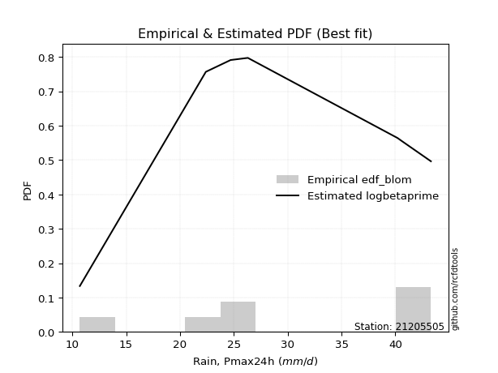</img>

</div>


### 7. EDF Tukey (1962)

In hydrology, the Tukey formula is used as a plotting position formula to estimate the empirical probability or frequency of a flood event (or other hydrological data). The formula parameter is given as _c=0.333_ (or 1/3).

<div align="center">


$P=(m-c)/(n+1-2c)$


</div>


**7.1. Empirical values**

<div align="center">

|                | 0                   | 1                   | 2                   | 3         | 4                  | 5                  | 6                  |
|:---------------|:--------------------|:--------------------|:--------------------|:----------|:-------------------|:-------------------|:-------------------|
| date           | 2015                | 2019                | 2021                | 2017      | 2018               | 2016               | 2020               |
| x              | 10.7                | 22.4                | 24.7                | 26.3      | 40.2               | 40.6               | 43.3               |
| m              | 1                   | 2                   | 3                   | 4         | 5                  | 6                  | 7                  |
| empirical_dist | edf_tukey           | edf_tukey           | edf_tukey           | edf_tukey | edf_tukey          | edf_tukey          | edf_tukey          |
| empirical      | 0.09090909090909091 | 0.22727272727272727 | 0.36363636363636365 | 0.5       | 0.6363636363636364 | 0.7727272727272727 | 0.9090909090909091 |
| empirical_tr   | 1.1                 | 1.2941176470588236  | 1.5714285714285714  | 2.0       | 2.75               | 4.3999999999999995 | 10.999999999999996 |

</div>


**7.2. Kolmogorov-Smirnov fit test (sorted by Δ)**


<div align="center">

|                | 0                   | 1                   | 2                   | 3                   | 4                   | 5                   | 6                   | 7                   | 8                   | 9                   | 10                  | 11                  | 12                  | 13                  | 14                  | 15                  | 16                  | 17                  | 18                  | 19                  | 20                  | 21                  | 22                  | 23                  | 24                  | 25                  | 26                  | 27                  | 28                  | 29                  | 30                  | 31                  | 32                  | 33                  | 34                  | 35                  | 36                  | 37                  | 38                  | 39                  | 40                  | 41                  | 42                  | 43                  | 44                  | 45                  | 46                  | 47                  | 48                  | 49                  | 50                  | 51                  | 52                  | 53                  | 54                  | 55                    | 56                  | 57                  | 58                  | 59                  | 60                  | 61                  | 62                  | 63                  | 64                  | 65                  | 66                  | 67                  | 68                  | 69                  | 70                  | 71                  | 72                  | 73                  | 74                  | 75                  | 76                  | 77                  | 78                  | 79                  | 80                  | 81                  | 82                  | 83                  | 84                  | 85                  | 86                  | 87                  |
|:---------------|:--------------------|:--------------------|:--------------------|:--------------------|:--------------------|:--------------------|:--------------------|:--------------------|:--------------------|:--------------------|:--------------------|:--------------------|:--------------------|:--------------------|:--------------------|:--------------------|:--------------------|:--------------------|:--------------------|:--------------------|:--------------------|:--------------------|:--------------------|:--------------------|:--------------------|:--------------------|:--------------------|:--------------------|:--------------------|:--------------------|:--------------------|:--------------------|:--------------------|:--------------------|:--------------------|:--------------------|:--------------------|:--------------------|:--------------------|:--------------------|:--------------------|:--------------------|:--------------------|:--------------------|:--------------------|:--------------------|:--------------------|:--------------------|:--------------------|:--------------------|:--------------------|:--------------------|:--------------------|:--------------------|:--------------------|:----------------------|:--------------------|:--------------------|:--------------------|:--------------------|:--------------------|:--------------------|:--------------------|:--------------------|:--------------------|:--------------------|:--------------------|:--------------------|:--------------------|:--------------------|:--------------------|:--------------------|:--------------------|:--------------------|:--------------------|:--------------------|:--------------------|:--------------------|:--------------------|:--------------------|:--------------------|:--------------------|:--------------------|:--------------------|:--------------------|:--------------------|:--------------------|:--------------------|
| station        | 21205505            | 21205505            | 21205505            | 21205505            | 21205505            | 21205505            | 21205505            | 21205505            | 21205505            | 21205505            | 21205505            | 21205505            | 21205505            | 21205505            | 21205505            | 21205505            | 21205505            | 21205505            | 21205505            | 21205505            | 21205505            | 21205505            | 21205505            | 21205505            | 21205505            | 21205505            | 21205505            | 21205505            | 21205505            | 21205505            | 21205505            | 21205505            | 21205505            | 21205505            | 21205505            | 21205505            | 21205505            | 21205505            | 21205505            | 21205505            | 21205505            | 21205505            | 21205505            | 21205505            | 21205505            | 21205505            | 21205505            | 21205505            | 21205505            | 21205505            | 21205505            | 21205505            | 21205505            | 21205505            | 21205505            | 21205505              | 21205505            | 21205505            | 21205505            | 21205505            | 21205505            | 21205505            | 21205505            | 21205505            | 21205505            | 21205505            | 21205505            | 21205505            | 21205505            | 21205505            | 21205505            | 21205505            | 21205505            | 21205505            | 21205505            | 21205505            | 21205505            | 21205505            | 21205505            | 21205505            | 21205505            | 21205505            | 21205505            | 21205505            | 21205505            | 21205505            | 21205505            | 21205505            |
| empirical_dist | edf_tukey           | edf_tukey           | edf_tukey           | edf_tukey           | edf_tukey           | edf_tukey           | edf_tukey           | edf_tukey           | edf_tukey           | edf_tukey           | edf_tukey           | edf_tukey           | edf_tukey           | edf_tukey           | edf_tukey           | edf_tukey           | edf_tukey           | edf_tukey           | edf_tukey           | edf_tukey           | edf_tukey           | edf_tukey           | edf_tukey           | edf_tukey           | edf_tukey           | edf_tukey           | edf_tukey           | edf_tukey           | edf_tukey           | edf_tukey           | edf_tukey           | edf_tukey           | edf_tukey           | edf_tukey           | edf_tukey           | edf_tukey           | edf_tukey           | edf_tukey           | edf_tukey           | edf_tukey           | edf_tukey           | edf_tukey           | edf_tukey           | edf_tukey           | edf_tukey           | edf_tukey           | edf_tukey           | edf_tukey           | edf_tukey           | edf_tukey           | edf_tukey           | edf_tukey           | edf_tukey           | edf_tukey           | edf_tukey           | edf_tukey             | edf_tukey           | edf_tukey           | edf_tukey           | edf_tukey           | edf_tukey           | edf_tukey           | edf_tukey           | edf_tukey           | edf_tukey           | edf_tukey           | edf_tukey           | edf_tukey           | edf_tukey           | edf_tukey           | edf_tukey           | edf_tukey           | edf_tukey           | edf_tukey           | edf_tukey           | edf_tukey           | edf_tukey           | edf_tukey           | edf_tukey           | edf_tukey           | edf_tukey           | edf_tukey           | edf_tukey           | edf_tukey           | edf_tukey           | edf_tukey           | edf_tukey           | edf_tukey           |
| p_dist         | logbetaprime        | logfisk             | loginvgauss         | logerlang           | logncf              | loggamma            | loggamma            | logalpha            | loginvgamma         | logpearson3         | lognct              | logrice             | logfatiguelife      | logf                | logexponnorm        | logcrystalball      | logt                | lognorm             | lognorm             | logmaxwell          | lograyleigh         | kstwobign           | ncf                 | loginvweibull       | loggumbel_l         | invgauss            | fisk                | genlogistic         | loghalfnorm         | alpha               | rice                | invgamma            | erlang              | f                   | rayleigh            | pearson3            | maxwell             | loglogistic         | nct                 | crystalball         | norm                | truncnorm           | exponnorm           | t                   | gamma               | betaprime           | weibull_min         | gompertz            | halfnorm            | logweibull_min      | chi2                | loggumbel_r         | logmielke           | loghalflogistic     | laplace_asymmetric  | loglaplace_asymmetric | logmoyal            | loghypsecant        | mielke              | gumbel_r            | logistic            | halflogistic        | gumbel_l            | loglaplace          | logloggamma         | logkstwobign        | moyal               | loggenexpon         | hypsecant           | lognakagami         | nakagami            | johnsonsu           | laplace             | expon               | logwald             | logjohnsonsu        | wald                | loggompertz         | loggibrat           | gibrat              | logtruncnorm        | logexpon            | logchi2             | loglognorm          | invweibull          | fatiguelife         | genexpon            | loggenlogistic      |
| delta          | 0.1455843880376405  | 0.1542484980374822  | 0.1557270594078487  | 0.16062903939942508 | 0.16241736226195314 | 0.16246949819477297 | 0.16246949819477297 | 0.16415125572157763 | 0.16494183897282777 | 0.16563158658469568 | 0.16586896631707293 | 0.16665040906805284 | 0.1681069217119212  | 0.1681246202718112  | 0.16854930708812776 | 0.16855348527749192 | 0.16855353527967543 | 0.16855355424279728 | 0.16855355424279728 | 0.17082875645801898 | 0.1714767527386888  | 0.1744800650351368  | 0.17599147364166035 | 0.17769161715346535 | 0.1791707050600182  | 0.18072121142884734 | 0.1807846938277995  | 0.18145437298403722 | 0.18402825297072326 | 0.18641898697248505 | 0.1875305763321361  | 0.1878421534079724  | 0.18823458446903463 | 0.1882737725062601  | 0.1894808409121197  | 0.18959885887496886 | 0.18962282808663666 | 0.1897928592304     | 0.19019825531613432 | 0.19022855048328635 | 0.19022855496212643 | 0.19022859309252138 | 0.19022951111018283 | 0.19023781010573682 | 0.19079463216155512 | 0.19094222008368578 | 0.19099159845007407 | 0.1910931553903995  | 0.1913826459188671  | 0.1918488791790568  | 0.19229219940713738 | 0.19349625108255875 | 0.1949094015440389  | 0.1959660055159428  | 0.19709528651473962 | 0.19712668345635476   | 0.2019910430293973  | 0.2021246866266433  | 0.20819895621076123 | 0.20899397399911812 | 0.2100042471202025  | 0.2100409099952829  | 0.21050499737948913 | 0.2153196018768102  | 0.21558195683033654 | 0.21558571712478172 | 0.21580680148788323 | 0.22029595270433203 | 0.22083963616698699 | 0.2272677721664179  | 0.2272727040984784  | 0.2276203735437159  | 0.2314597831718167  | 0.23176384350478466 | 0.2323517583256517  | 0.2331108700172413  | 0.24238464482588495 | 0.2570817436471766  | 0.258794209962354   | 0.2674239516776503  | 0.304544223499703   | 0.31979979479198484 | 0.38647649115459703 | 0.42056707030537765 | 0.4860229323170876  | 0.6122986000314565  | 0.732387692929991   | 0.7727272727272727  |
| deltao         | 0.48442053926100004 | 0.48442053926100004 | 0.48442053926100004 | 0.48442053926100004 | 0.48442053926100004 | 0.48442053926100004 | 0.48442053926100004 | 0.48442053926100004 | 0.48442053926100004 | 0.48442053926100004 | 0.48442053926100004 | 0.48442053926100004 | 0.48442053926100004 | 0.48442053926100004 | 0.48442053926100004 | 0.48442053926100004 | 0.48442053926100004 | 0.48442053926100004 | 0.48442053926100004 | 0.48442053926100004 | 0.48442053926100004 | 0.48442053926100004 | 0.48442053926100004 | 0.48442053926100004 | 0.48442053926100004 | 0.48442053926100004 | 0.48442053926100004 | 0.48442053926100004 | 0.48442053926100004 | 0.48442053926100004 | 0.48442053926100004 | 0.48442053926100004 | 0.48442053926100004 | 0.48442053926100004 | 0.48442053926100004 | 0.48442053926100004 | 0.48442053926100004 | 0.48442053926100004 | 0.48442053926100004 | 0.48442053926100004 | 0.48442053926100004 | 0.48442053926100004 | 0.48442053926100004 | 0.48442053926100004 | 0.48442053926100004 | 0.48442053926100004 | 0.48442053926100004 | 0.48442053926100004 | 0.48442053926100004 | 0.48442053926100004 | 0.48442053926100004 | 0.48442053926100004 | 0.48442053926100004 | 0.48442053926100004 | 0.48442053926100004 | 0.48442053926100004   | 0.48442053926100004 | 0.48442053926100004 | 0.48442053926100004 | 0.48442053926100004 | 0.48442053926100004 | 0.48442053926100004 | 0.48442053926100004 | 0.48442053926100004 | 0.48442053926100004 | 0.48442053926100004 | 0.48442053926100004 | 0.48442053926100004 | 0.48442053926100004 | 0.48442053926100004 | 0.48442053926100004 | 0.48442053926100004 | 0.48442053926100004 | 0.48442053926100004 | 0.48442053926100004 | 0.48442053926100004 | 0.48442053926100004 | 0.48442053926100004 | 0.48442053926100004 | 0.48442053926100004 | 0.48442053926100004 | 0.48442053926100004 | 0.48442053926100004 | 0.48442053926100004 | 0.48442053926100004 | 0.48442053926100004 | 0.48442053926100004 | 0.48442053926100004 |
| eval           | Δo > Δ              | Δo > Δ              | Δo > Δ              | Δo > Δ              | Δo > Δ              | Δo > Δ              | Δo > Δ              | Δo > Δ              | Δo > Δ              | Δo > Δ              | Δo > Δ              | Δo > Δ              | Δo > Δ              | Δo > Δ              | Δo > Δ              | Δo > Δ              | Δo > Δ              | Δo > Δ              | Δo > Δ              | Δo > Δ              | Δo > Δ              | Δo > Δ              | Δo > Δ              | Δo > Δ              | Δo > Δ              | Δo > Δ              | Δo > Δ              | Δo > Δ              | Δo > Δ              | Δo > Δ              | Δo > Δ              | Δo > Δ              | Δo > Δ              | Δo > Δ              | Δo > Δ              | Δo > Δ              | Δo > Δ              | Δo > Δ              | Δo > Δ              | Δo > Δ              | Δo > Δ              | Δo > Δ              | Δo > Δ              | Δo > Δ              | Δo > Δ              | Δo > Δ              | Δo > Δ              | Δo > Δ              | Δo > Δ              | Δo > Δ              | Δo > Δ              | Δo > Δ              | Δo > Δ              | Δo > Δ              | Δo > Δ              | Δo > Δ                | Δo > Δ              | Δo > Δ              | Δo > Δ              | Δo > Δ              | Δo > Δ              | Δo > Δ              | Δo > Δ              | Δo > Δ              | Δo > Δ              | Δo > Δ              | Δo > Δ              | Δo > Δ              | Δo > Δ              | Δo > Δ              | Δo > Δ              | Δo > Δ              | Δo > Δ              | Δo > Δ              | Δo > Δ              | Δo > Δ              | Δo > Δ              | Δo > Δ              | Δo > Δ              | Δo > Δ              | Δo > Δ              | Δo > Δ              | Δo > Δ              | Δo > Δ              | Δo <= Δ             | Δo <= Δ             | Δo <= Δ             | Δo <= Δ             |
| fit            | 1                   | 1                   | 1                   | 1                   | 1                   | 1                   | 1                   | 1                   | 1                   | 1                   | 1                   | 1                   | 1                   | 1                   | 1                   | 1                   | 1                   | 1                   | 1                   | 1                   | 1                   | 1                   | 1                   | 1                   | 1                   | 1                   | 1                   | 1                   | 1                   | 1                   | 1                   | 1                   | 1                   | 1                   | 1                   | 1                   | 1                   | 1                   | 1                   | 1                   | 1                   | 1                   | 1                   | 1                   | 1                   | 1                   | 1                   | 1                   | 1                   | 1                   | 1                   | 1                   | 1                   | 1                   | 1                   | 1                     | 1                   | 1                   | 1                   | 1                   | 1                   | 1                   | 1                   | 1                   | 1                   | 1                   | 1                   | 1                   | 1                   | 1                   | 1                   | 1                   | 1                   | 1                   | 1                   | 1                   | 1                   | 1                   | 1                   | 1                   | 1                   | 1                   | 1                   | 1                   | 0                   | 0                   | 0                   | 0                   |
| n              | 7                   | 7                   | 7                   | 7                   | 7                   | 7                   | 7                   | 7                   | 7                   | 7                   | 7                   | 7                   | 7                   | 7                   | 7                   | 7                   | 7                   | 7                   | 7                   | 7                   | 7                   | 7                   | 7                   | 7                   | 7                   | 7                   | 7                   | 7                   | 7                   | 7                   | 7                   | 7                   | 7                   | 7                   | 7                   | 7                   | 7                   | 7                   | 7                   | 7                   | 7                   | 7                   | 7                   | 7                   | 7                   | 7                   | 7                   | 7                   | 7                   | 7                   | 7                   | 7                   | 7                   | 7                   | 7                   | 7                     | 7                   | 7                   | 7                   | 7                   | 7                   | 7                   | 7                   | 7                   | 7                   | 7                   | 7                   | 7                   | 7                   | 7                   | 7                   | 7                   | 7                   | 7                   | 7                   | 7                   | 7                   | 7                   | 7                   | 7                   | 7                   | 7                   | 7                   | 7                   | 7                   | 7                   | 7                   | 7                   |
| best_fit       | 1                   | 0                   | 0                   | 0                   | 0                   | 0                   | 0                   | 0                   | 0                   | 0                   | 0                   | 0                   | 0                   | 0                   | 0                   | 0                   | 0                   | 0                   | 0                   | 0                   | 0                   | 0                   | 0                   | 0                   | 0                   | 0                   | 0                   | 0                   | 0                   | 0                   | 0                   | 0                   | 0                   | 0                   | 0                   | 0                   | 0                   | 0                   | 0                   | 0                   | 0                   | 0                   | 0                   | 0                   | 0                   | 0                   | 0                   | 0                   | 0                   | 0                   | 0                   | 0                   | 0                   | 0                   | 0                   | 0                     | 0                   | 0                   | 0                   | 0                   | 0                   | 0                   | 0                   | 0                   | 0                   | 0                   | 0                   | 0                   | 0                   | 0                   | 0                   | 0                   | 0                   | 0                   | 0                   | 0                   | 0                   | 0                   | 0                   | 0                   | 0                   | 0                   | 0                   | 0                   | 0                   | 0                   | 0                   | 0                   |
| best_fit_sort  | 1                   | 2                   | 3                   | 4                   | 5                   | 6                   | 7                   | 8                   | 9                   | 10                  | 11                  | 12                  | 13                  | 14                  | 15                  | 16                  | 17                  | 18                  | 19                  | 20                  | 21                  | 22                  | 23                  | 24                  | 25                  | 26                  | 27                  | 28                  | 29                  | 30                  | 31                  | 32                  | 33                  | 34                  | 35                  | 36                  | 37                  | 38                  | 39                  | 40                  | 41                  | 42                  | 43                  | 44                  | 45                  | 46                  | 47                  | 48                  | 49                  | 50                  | 51                  | 52                  | 53                  | 54                  | 55                  | 56                    | 57                  | 58                  | 59                  | 60                  | 61                  | 62                  | 63                  | 64                  | 65                  | 66                  | 67                  | 68                  | 69                  | 70                  | 71                  | 72                  | 73                  | 74                  | 75                  | 76                  | 77                  | 78                  | 79                  | 80                  | 81                  | 82                  | 83                  | 84                  | 85                  | 86                  | 87                  | 88                  |

</div>


**7.3. Best fit**

<div align="center">

|   id |   station | empirical_dist   | p_dist       |    delta |   deltao | eval   |   fit |   n |   best_fit |   best_fit_sort |
|-----:|----------:|:-----------------|:-------------|---------:|---------:|:-------|------:|----:|-----------:|----------------:|
|    0 |  21205505 | edf_tukey        | logbetaprime | 0.145584 | 0.484421 | Δo > Δ |     1 |   7 |          1 |               1 |

</div>


<div align="center">

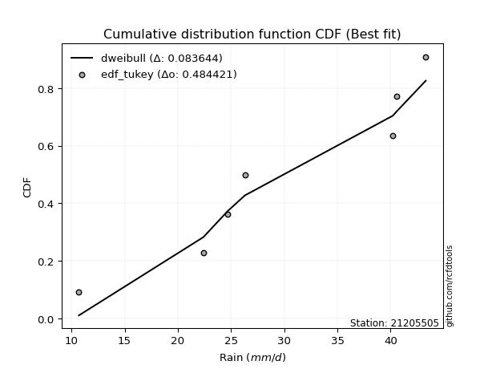</img></img>

</div>


### 8. EDF Gringorten (1963)

Gringorten plotting position formula is essential for estimating the probability and return periods of extreme events like floods and heavy rainfall. The constant _a=0.44_.

<div align="center">


$P=(m-a)/(n+1-2a)$


</div>


**8.1. Empirical values**

<div align="center">

|                | 0                   | 1                   | 2                  | 3              | 4                  | 5                  | 6                  |
|:---------------|:--------------------|:--------------------|:-------------------|:---------------|:-------------------|:-------------------|:-------------------|
| date           | 2015                | 2019                | 2021               | 2017           | 2018               | 2016               | 2020               |
| x              | 10.7                | 22.4                | 24.7               | 26.3           | 40.2               | 40.6               | 43.3               |
| m              | 1                   | 2                   | 3                  | 4              | 5                  | 6                  | 7                  |
| empirical_dist | edf_gringorten      | edf_gringorten      | edf_gringorten     | edf_gringorten | edf_gringorten     | edf_gringorten     | edf_gringorten     |
| empirical      | 0.07865168539325844 | 0.21910112359550563 | 0.3595505617977528 | 0.5            | 0.6404494382022471 | 0.7808988764044943 | 0.9213483146067415 |
| empirical_tr   | 1.0853658536585364  | 1.2805755395683454  | 1.5614035087719298 | 2.0            | 2.781249999999999  | 4.564102564102562  | 12.714285714285701 |

</div>


**8.2. Kolmogorov-Smirnov fit test (sorted by Δ)**


<div align="center">

|                | 0                   | 1                   | 2                   | 3                   | 4                   | 5                   | 6                   | 7                   | 8                   | 9                   | 10                  | 11                  | 12                  | 13                  | 14                  | 15                  | 16                  | 17                  | 18                  | 19                  | 20                  | 21                  | 22                  | 23                  | 24                  | 25                  | 26                  | 27                  | 28                  | 29                  | 30                  | 31                  | 32                  | 33                  | 34                  | 35                  | 36                  | 37                  | 38                  | 39                  | 40                  | 41                  | 42                  | 43                  | 44                  | 45                  | 46                  | 47                  | 48                  | 49                  | 50                  | 51                  | 52                  | 53                  | 54                    | 55                  | 56                  | 57                  | 58                  | 59                  | 60                  | 61                  | 62                  | 63                  | 64                  | 65                  | 66                  | 67                  | 68                  | 69                  | 70                  | 71                  | 72                  | 73                  | 74                  | 75                  | 76                  | 77                  | 78                  | 79                  | 80                  | 81                  | 82                  | 83                  | 84                  | 85                  | 86                  | 87                  |
|:---------------|:--------------------|:--------------------|:--------------------|:--------------------|:--------------------|:--------------------|:--------------------|:--------------------|:--------------------|:--------------------|:--------------------|:--------------------|:--------------------|:--------------------|:--------------------|:--------------------|:--------------------|:--------------------|:--------------------|:--------------------|:--------------------|:--------------------|:--------------------|:--------------------|:--------------------|:--------------------|:--------------------|:--------------------|:--------------------|:--------------------|:--------------------|:--------------------|:--------------------|:--------------------|:--------------------|:--------------------|:--------------------|:--------------------|:--------------------|:--------------------|:--------------------|:--------------------|:--------------------|:--------------------|:--------------------|:--------------------|:--------------------|:--------------------|:--------------------|:--------------------|:--------------------|:--------------------|:--------------------|:--------------------|:----------------------|:--------------------|:--------------------|:--------------------|:--------------------|:--------------------|:--------------------|:--------------------|:--------------------|:--------------------|:--------------------|:--------------------|:--------------------|:--------------------|:--------------------|:--------------------|:--------------------|:--------------------|:--------------------|:--------------------|:--------------------|:--------------------|:--------------------|:--------------------|:--------------------|:--------------------|:--------------------|:--------------------|:--------------------|:--------------------|:--------------------|:--------------------|:--------------------|:--------------------|
| station        | 21205505            | 21205505            | 21205505            | 21205505            | 21205505            | 21205505            | 21205505            | 21205505            | 21205505            | 21205505            | 21205505            | 21205505            | 21205505            | 21205505            | 21205505            | 21205505            | 21205505            | 21205505            | 21205505            | 21205505            | 21205505            | 21205505            | 21205505            | 21205505            | 21205505            | 21205505            | 21205505            | 21205505            | 21205505            | 21205505            | 21205505            | 21205505            | 21205505            | 21205505            | 21205505            | 21205505            | 21205505            | 21205505            | 21205505            | 21205505            | 21205505            | 21205505            | 21205505            | 21205505            | 21205505            | 21205505            | 21205505            | 21205505            | 21205505            | 21205505            | 21205505            | 21205505            | 21205505            | 21205505            | 21205505              | 21205505            | 21205505            | 21205505            | 21205505            | 21205505            | 21205505            | 21205505            | 21205505            | 21205505            | 21205505            | 21205505            | 21205505            | 21205505            | 21205505            | 21205505            | 21205505            | 21205505            | 21205505            | 21205505            | 21205505            | 21205505            | 21205505            | 21205505            | 21205505            | 21205505            | 21205505            | 21205505            | 21205505            | 21205505            | 21205505            | 21205505            | 21205505            | 21205505            |
| empirical_dist | edf_gringorten      | edf_gringorten      | edf_gringorten      | edf_gringorten      | edf_gringorten      | edf_gringorten      | edf_gringorten      | edf_gringorten      | edf_gringorten      | edf_gringorten      | edf_gringorten      | edf_gringorten      | edf_gringorten      | edf_gringorten      | edf_gringorten      | edf_gringorten      | edf_gringorten      | edf_gringorten      | edf_gringorten      | edf_gringorten      | edf_gringorten      | edf_gringorten      | edf_gringorten      | edf_gringorten      | edf_gringorten      | edf_gringorten      | edf_gringorten      | edf_gringorten      | edf_gringorten      | edf_gringorten      | edf_gringorten      | edf_gringorten      | edf_gringorten      | edf_gringorten      | edf_gringorten      | edf_gringorten      | edf_gringorten      | edf_gringorten      | edf_gringorten      | edf_gringorten      | edf_gringorten      | edf_gringorten      | edf_gringorten      | edf_gringorten      | edf_gringorten      | edf_gringorten      | edf_gringorten      | edf_gringorten      | edf_gringorten      | edf_gringorten      | edf_gringorten      | edf_gringorten      | edf_gringorten      | edf_gringorten      | edf_gringorten        | edf_gringorten      | edf_gringorten      | edf_gringorten      | edf_gringorten      | edf_gringorten      | edf_gringorten      | edf_gringorten      | edf_gringorten      | edf_gringorten      | edf_gringorten      | edf_gringorten      | edf_gringorten      | edf_gringorten      | edf_gringorten      | edf_gringorten      | edf_gringorten      | edf_gringorten      | edf_gringorten      | edf_gringorten      | edf_gringorten      | edf_gringorten      | edf_gringorten      | edf_gringorten      | edf_gringorten      | edf_gringorten      | edf_gringorten      | edf_gringorten      | edf_gringorten      | edf_gringorten      | edf_gringorten      | edf_gringorten      | edf_gringorten      | edf_gringorten      |
| p_dist         | logbetaprime        | logfisk             | loginvgauss         | logerlang           | logncf              | loggamma            | loggamma            | logalpha            | loginvgamma         | logpearson3         | lognct              | logrice             | logfatiguelife      | logf                | logexponnorm        | logcrystalball      | logt                | lognorm             | lognorm             | logmaxwell          | lograyleigh         | kstwobign           | ncf                 | loggumbel_l         | invgauss            | fisk                | genlogistic         | alpha               | rice                | invgamma            | erlang              | f                   | rayleigh            | pearson3            | maxwell             | loglogistic         | loginvweibull       | nct                 | crystalball         | norm                | truncnorm           | exponnorm           | t                   | gamma               | betaprime           | weibull_min         | gompertz            | halfnorm            | logweibull_min      | chi2                | loggumbel_r         | logmielke           | loghalfnorm         | laplace_asymmetric  | loglaplace_asymmetric | loghalflogistic     | logmoyal            | loghypsecant        | mielke              | gumbel_r            | logistic            | halflogistic        | gumbel_l            | loglaplace          | logloggamma         | moyal               | hypsecant           | lognakagami         | nakagami            | logkstwobign        | laplace             | johnsonsu           | logwald             | loggenexpon         | wald                | expon               | logjohnsonsu        | loggibrat           | gibrat              | loggompertz         | logtruncnorm        | logexpon            | logchi2             | loglognorm          | invweibull          | fatiguelife         | genexpon            | loggenlogistic      |
| delta          | 0.14149858619902977 | 0.15016269619887146 | 0.15164125756923796 | 0.15654323756081434 | 0.1583315604233424  | 0.15838369635616223 | 0.15838369635616223 | 0.1600654538829669  | 0.16085603713421703 | 0.16154578474608494 | 0.1617831644784622  | 0.1625646072294421  | 0.16402111987331047 | 0.16403881843320045 | 0.16446350524951703 | 0.16446768343888118 | 0.1644677334410647  | 0.16446775240418654 | 0.16446775240418654 | 0.16674295461940825 | 0.16739095090007805 | 0.17039426319652606 | 0.1719056718030496  | 0.17508490322140746 | 0.1766354095902366  | 0.17669889198918876 | 0.17736857114542648 | 0.1823331851338743  | 0.18344477449352536 | 0.18375635156936165 | 0.1841487826304239  | 0.18418797066764936 | 0.18539503907350896 | 0.18551305703635812 | 0.18553702624802593 | 0.18570705739178928 | 0.185863220830687   | 0.1861124534775236  | 0.18614274864467562 | 0.1861427531235157  | 0.18614279125391064 | 0.1861437092715721  | 0.18615200826712608 | 0.18670883032294439 | 0.18685641824507504 | 0.18690579661146334 | 0.18700735355178877 | 0.18729684408025637 | 0.18776307734044606 | 0.18820639756852664 | 0.189410449243948   | 0.19082359970542817 | 0.1921998566479449  | 0.19300948467612888 | 0.19304088161774402   | 0.1975938175917545  | 0.19790524119078656 | 0.19803888478803255 | 0.2041131543721505  | 0.20490817216050738 | 0.20591844528159176 | 0.20595510815667217 | 0.2064191955408784  | 0.21123380003819947 | 0.2114961549917258  | 0.2117209996492725  | 0.21675383432837625 | 0.21909616848919625 | 0.21910110042125677 | 0.22375732080200336 | 0.22737398133320597 | 0.2276203735437159  | 0.22826595648704096 | 0.22846755638155367 | 0.23829884298727422 | 0.2399354471820063  | 0.24128247369446287 | 0.2547084081237433  | 0.2633381498390396  | 0.2652533473243983  | 0.30045842166109227 | 0.32797139846920653 | 0.39464809483181873 | 0.42873867398259935 | 0.49828033783292003 | 0.6204702037086782  | 0.7405592966072126  | 0.7808988764044943  |
| deltao         | 0.48442053926100004 | 0.48442053926100004 | 0.48442053926100004 | 0.48442053926100004 | 0.48442053926100004 | 0.48442053926100004 | 0.48442053926100004 | 0.48442053926100004 | 0.48442053926100004 | 0.48442053926100004 | 0.48442053926100004 | 0.48442053926100004 | 0.48442053926100004 | 0.48442053926100004 | 0.48442053926100004 | 0.48442053926100004 | 0.48442053926100004 | 0.48442053926100004 | 0.48442053926100004 | 0.48442053926100004 | 0.48442053926100004 | 0.48442053926100004 | 0.48442053926100004 | 0.48442053926100004 | 0.48442053926100004 | 0.48442053926100004 | 0.48442053926100004 | 0.48442053926100004 | 0.48442053926100004 | 0.48442053926100004 | 0.48442053926100004 | 0.48442053926100004 | 0.48442053926100004 | 0.48442053926100004 | 0.48442053926100004 | 0.48442053926100004 | 0.48442053926100004 | 0.48442053926100004 | 0.48442053926100004 | 0.48442053926100004 | 0.48442053926100004 | 0.48442053926100004 | 0.48442053926100004 | 0.48442053926100004 | 0.48442053926100004 | 0.48442053926100004 | 0.48442053926100004 | 0.48442053926100004 | 0.48442053926100004 | 0.48442053926100004 | 0.48442053926100004 | 0.48442053926100004 | 0.48442053926100004 | 0.48442053926100004 | 0.48442053926100004   | 0.48442053926100004 | 0.48442053926100004 | 0.48442053926100004 | 0.48442053926100004 | 0.48442053926100004 | 0.48442053926100004 | 0.48442053926100004 | 0.48442053926100004 | 0.48442053926100004 | 0.48442053926100004 | 0.48442053926100004 | 0.48442053926100004 | 0.48442053926100004 | 0.48442053926100004 | 0.48442053926100004 | 0.48442053926100004 | 0.48442053926100004 | 0.48442053926100004 | 0.48442053926100004 | 0.48442053926100004 | 0.48442053926100004 | 0.48442053926100004 | 0.48442053926100004 | 0.48442053926100004 | 0.48442053926100004 | 0.48442053926100004 | 0.48442053926100004 | 0.48442053926100004 | 0.48442053926100004 | 0.48442053926100004 | 0.48442053926100004 | 0.48442053926100004 | 0.48442053926100004 |
| eval           | Δo > Δ              | Δo > Δ              | Δo > Δ              | Δo > Δ              | Δo > Δ              | Δo > Δ              | Δo > Δ              | Δo > Δ              | Δo > Δ              | Δo > Δ              | Δo > Δ              | Δo > Δ              | Δo > Δ              | Δo > Δ              | Δo > Δ              | Δo > Δ              | Δo > Δ              | Δo > Δ              | Δo > Δ              | Δo > Δ              | Δo > Δ              | Δo > Δ              | Δo > Δ              | Δo > Δ              | Δo > Δ              | Δo > Δ              | Δo > Δ              | Δo > Δ              | Δo > Δ              | Δo > Δ              | Δo > Δ              | Δo > Δ              | Δo > Δ              | Δo > Δ              | Δo > Δ              | Δo > Δ              | Δo > Δ              | Δo > Δ              | Δo > Δ              | Δo > Δ              | Δo > Δ              | Δo > Δ              | Δo > Δ              | Δo > Δ              | Δo > Δ              | Δo > Δ              | Δo > Δ              | Δo > Δ              | Δo > Δ              | Δo > Δ              | Δo > Δ              | Δo > Δ              | Δo > Δ              | Δo > Δ              | Δo > Δ                | Δo > Δ              | Δo > Δ              | Δo > Δ              | Δo > Δ              | Δo > Δ              | Δo > Δ              | Δo > Δ              | Δo > Δ              | Δo > Δ              | Δo > Δ              | Δo > Δ              | Δo > Δ              | Δo > Δ              | Δo > Δ              | Δo > Δ              | Δo > Δ              | Δo > Δ              | Δo > Δ              | Δo > Δ              | Δo > Δ              | Δo > Δ              | Δo > Δ              | Δo > Δ              | Δo > Δ              | Δo > Δ              | Δo > Δ              | Δo > Δ              | Δo > Δ              | Δo > Δ              | Δo <= Δ             | Δo <= Δ             | Δo <= Δ             | Δo <= Δ             |
| fit            | 1                   | 1                   | 1                   | 1                   | 1                   | 1                   | 1                   | 1                   | 1                   | 1                   | 1                   | 1                   | 1                   | 1                   | 1                   | 1                   | 1                   | 1                   | 1                   | 1                   | 1                   | 1                   | 1                   | 1                   | 1                   | 1                   | 1                   | 1                   | 1                   | 1                   | 1                   | 1                   | 1                   | 1                   | 1                   | 1                   | 1                   | 1                   | 1                   | 1                   | 1                   | 1                   | 1                   | 1                   | 1                   | 1                   | 1                   | 1                   | 1                   | 1                   | 1                   | 1                   | 1                   | 1                   | 1                     | 1                   | 1                   | 1                   | 1                   | 1                   | 1                   | 1                   | 1                   | 1                   | 1                   | 1                   | 1                   | 1                   | 1                   | 1                   | 1                   | 1                   | 1                   | 1                   | 1                   | 1                   | 1                   | 1                   | 1                   | 1                   | 1                   | 1                   | 1                   | 1                   | 0                   | 0                   | 0                   | 0                   |
| n              | 7                   | 7                   | 7                   | 7                   | 7                   | 7                   | 7                   | 7                   | 7                   | 7                   | 7                   | 7                   | 7                   | 7                   | 7                   | 7                   | 7                   | 7                   | 7                   | 7                   | 7                   | 7                   | 7                   | 7                   | 7                   | 7                   | 7                   | 7                   | 7                   | 7                   | 7                   | 7                   | 7                   | 7                   | 7                   | 7                   | 7                   | 7                   | 7                   | 7                   | 7                   | 7                   | 7                   | 7                   | 7                   | 7                   | 7                   | 7                   | 7                   | 7                   | 7                   | 7                   | 7                   | 7                   | 7                     | 7                   | 7                   | 7                   | 7                   | 7                   | 7                   | 7                   | 7                   | 7                   | 7                   | 7                   | 7                   | 7                   | 7                   | 7                   | 7                   | 7                   | 7                   | 7                   | 7                   | 7                   | 7                   | 7                   | 7                   | 7                   | 7                   | 7                   | 7                   | 7                   | 7                   | 7                   | 7                   | 7                   |
| best_fit       | 1                   | 0                   | 0                   | 0                   | 0                   | 0                   | 0                   | 0                   | 0                   | 0                   | 0                   | 0                   | 0                   | 0                   | 0                   | 0                   | 0                   | 0                   | 0                   | 0                   | 0                   | 0                   | 0                   | 0                   | 0                   | 0                   | 0                   | 0                   | 0                   | 0                   | 0                   | 0                   | 0                   | 0                   | 0                   | 0                   | 0                   | 0                   | 0                   | 0                   | 0                   | 0                   | 0                   | 0                   | 0                   | 0                   | 0                   | 0                   | 0                   | 0                   | 0                   | 0                   | 0                   | 0                   | 0                     | 0                   | 0                   | 0                   | 0                   | 0                   | 0                   | 0                   | 0                   | 0                   | 0                   | 0                   | 0                   | 0                   | 0                   | 0                   | 0                   | 0                   | 0                   | 0                   | 0                   | 0                   | 0                   | 0                   | 0                   | 0                   | 0                   | 0                   | 0                   | 0                   | 0                   | 0                   | 0                   | 0                   |
| best_fit_sort  | 1                   | 2                   | 3                   | 4                   | 5                   | 6                   | 7                   | 8                   | 9                   | 10                  | 11                  | 12                  | 13                  | 14                  | 15                  | 16                  | 17                  | 18                  | 19                  | 20                  | 21                  | 22                  | 23                  | 24                  | 25                  | 26                  | 27                  | 28                  | 29                  | 30                  | 31                  | 32                  | 33                  | 34                  | 35                  | 36                  | 37                  | 38                  | 39                  | 40                  | 41                  | 42                  | 43                  | 44                  | 45                  | 46                  | 47                  | 48                  | 49                  | 50                  | 51                  | 52                  | 53                  | 54                  | 55                    | 56                  | 57                  | 58                  | 59                  | 60                  | 61                  | 62                  | 63                  | 64                  | 65                  | 66                  | 67                  | 68                  | 69                  | 70                  | 71                  | 72                  | 73                  | 74                  | 75                  | 76                  | 77                  | 78                  | 79                  | 80                  | 81                  | 82                  | 83                  | 84                  | 85                  | 86                  | 87                  | 88                  |

</div>


**8.3. Best fit**

<div align="center">

|   id |   station | empirical_dist   | p_dist       |    delta |   deltao | eval   |   fit |   n |   best_fit |   best_fit_sort |
|-----:|----------:|:-----------------|:-------------|---------:|---------:|:-------|------:|----:|-----------:|----------------:|
|    0 |  21205505 | edf_gringorten   | logbetaprime | 0.141499 | 0.484421 | Δo > Δ |     1 |   7 |          1 |               1 |

</div>


<div align="center">

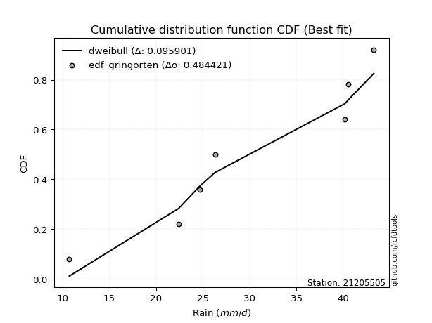</img></img>

</div>


### 9. EDF Filliben (1975)

The specific values of the constants (0.3175) (often denoted as $alpha$) and (0.365) are derived from a method proposed by James J. Filliben in a 1975 paper. This particular formula is the mean value of the $i$-th order statistic of the normal distribution and is considered a robust and effective plotting position formula for the normal probability plot correlation coefficient test for normality.

<div align="center">


$P=(m-0.3175)/(n+0.365)$


</div>


**9.1. Empirical values**

<div align="center">

|                | 0                   | 1                   | 2                   | 3            | 4                  | 5                  | 6                  |
|:---------------|:--------------------|:--------------------|:--------------------|:-------------|:-------------------|:-------------------|:-------------------|
| date           | 2015                | 2019                | 2021                | 2017         | 2018               | 2016               | 2020               |
| x              | 10.7                | 22.4                | 24.7                | 26.3         | 40.2               | 40.6               | 43.3               |
| m              | 1                   | 2                   | 3                   | 4            | 5                  | 6                  | 7                  |
| empirical_dist | edf_filliben        | edf_filliben        | edf_filliben        | edf_filliben | edf_filliben       | edf_filliben       | edf_filliben       |
| empirical      | 0.09266802443991853 | 0.22844534962661237 | 0.36422267481330617 | 0.5          | 0.6357773251866938 | 0.7715546503733877 | 0.9073319755600815 |
| empirical_tr   | 1.1021324354657687  | 1.2960844698636163  | 1.5728777362520021  | 2.0          | 2.7455731593662627 | 4.377414561664191  | 10.791208791208794 |

</div>


**9.2. Kolmogorov-Smirnov fit test (sorted by Δ)**


<div align="center">

|                | 0                   | 1                   | 2                   | 3                   | 4                   | 5                   | 6                   | 7                   | 8                   | 9                   | 10                  | 11                  | 12                  | 13                  | 14                  | 15                  | 16                  | 17                  | 18                  | 19                  | 20                  | 21                  | 22                  | 23                  | 24                  | 25                  | 26                  | 27                  | 28                  | 29                  | 30                  | 31                  | 32                  | 33                  | 34                  | 35                  | 36                  | 37                  | 38                  | 39                  | 40                  | 41                  | 42                  | 43                  | 44                  | 45                  | 46                  | 47                  | 48                  | 49                  | 50                  | 51                  | 52                  | 53                  | 54                  | 55                    | 56                  | 57                  | 58                  | 59                  | 60                  | 61                  | 62                  | 63                  | 64                  | 65                  | 66                  | 67                  | 68                  | 69                  | 70                  | 71                  | 72                  | 73                  | 74                  | 75                  | 76                  | 77                  | 78                  | 79                  | 80                  | 81                  | 82                  | 83                  | 84                  | 85                  | 86                  | 87                  |
|:---------------|:--------------------|:--------------------|:--------------------|:--------------------|:--------------------|:--------------------|:--------------------|:--------------------|:--------------------|:--------------------|:--------------------|:--------------------|:--------------------|:--------------------|:--------------------|:--------------------|:--------------------|:--------------------|:--------------------|:--------------------|:--------------------|:--------------------|:--------------------|:--------------------|:--------------------|:--------------------|:--------------------|:--------------------|:--------------------|:--------------------|:--------------------|:--------------------|:--------------------|:--------------------|:--------------------|:--------------------|:--------------------|:--------------------|:--------------------|:--------------------|:--------------------|:--------------------|:--------------------|:--------------------|:--------------------|:--------------------|:--------------------|:--------------------|:--------------------|:--------------------|:--------------------|:--------------------|:--------------------|:--------------------|:--------------------|:----------------------|:--------------------|:--------------------|:--------------------|:--------------------|:--------------------|:--------------------|:--------------------|:--------------------|:--------------------|:--------------------|:--------------------|:--------------------|:--------------------|:--------------------|:--------------------|:--------------------|:--------------------|:--------------------|:--------------------|:--------------------|:--------------------|:--------------------|:--------------------|:--------------------|:--------------------|:--------------------|:--------------------|:--------------------|:--------------------|:--------------------|:--------------------|:--------------------|
| station        | 21205505            | 21205505            | 21205505            | 21205505            | 21205505            | 21205505            | 21205505            | 21205505            | 21205505            | 21205505            | 21205505            | 21205505            | 21205505            | 21205505            | 21205505            | 21205505            | 21205505            | 21205505            | 21205505            | 21205505            | 21205505            | 21205505            | 21205505            | 21205505            | 21205505            | 21205505            | 21205505            | 21205505            | 21205505            | 21205505            | 21205505            | 21205505            | 21205505            | 21205505            | 21205505            | 21205505            | 21205505            | 21205505            | 21205505            | 21205505            | 21205505            | 21205505            | 21205505            | 21205505            | 21205505            | 21205505            | 21205505            | 21205505            | 21205505            | 21205505            | 21205505            | 21205505            | 21205505            | 21205505            | 21205505            | 21205505              | 21205505            | 21205505            | 21205505            | 21205505            | 21205505            | 21205505            | 21205505            | 21205505            | 21205505            | 21205505            | 21205505            | 21205505            | 21205505            | 21205505            | 21205505            | 21205505            | 21205505            | 21205505            | 21205505            | 21205505            | 21205505            | 21205505            | 21205505            | 21205505            | 21205505            | 21205505            | 21205505            | 21205505            | 21205505            | 21205505            | 21205505            | 21205505            |
| empirical_dist | edf_filliben        | edf_filliben        | edf_filliben        | edf_filliben        | edf_filliben        | edf_filliben        | edf_filliben        | edf_filliben        | edf_filliben        | edf_filliben        | edf_filliben        | edf_filliben        | edf_filliben        | edf_filliben        | edf_filliben        | edf_filliben        | edf_filliben        | edf_filliben        | edf_filliben        | edf_filliben        | edf_filliben        | edf_filliben        | edf_filliben        | edf_filliben        | edf_filliben        | edf_filliben        | edf_filliben        | edf_filliben        | edf_filliben        | edf_filliben        | edf_filliben        | edf_filliben        | edf_filliben        | edf_filliben        | edf_filliben        | edf_filliben        | edf_filliben        | edf_filliben        | edf_filliben        | edf_filliben        | edf_filliben        | edf_filliben        | edf_filliben        | edf_filliben        | edf_filliben        | edf_filliben        | edf_filliben        | edf_filliben        | edf_filliben        | edf_filliben        | edf_filliben        | edf_filliben        | edf_filliben        | edf_filliben        | edf_filliben        | edf_filliben          | edf_filliben        | edf_filliben        | edf_filliben        | edf_filliben        | edf_filliben        | edf_filliben        | edf_filliben        | edf_filliben        | edf_filliben        | edf_filliben        | edf_filliben        | edf_filliben        | edf_filliben        | edf_filliben        | edf_filliben        | edf_filliben        | edf_filliben        | edf_filliben        | edf_filliben        | edf_filliben        | edf_filliben        | edf_filliben        | edf_filliben        | edf_filliben        | edf_filliben        | edf_filliben        | edf_filliben        | edf_filliben        | edf_filliben        | edf_filliben        | edf_filliben        | edf_filliben        |
| p_dist         | logbetaprime        | logfisk             | loginvgauss         | logerlang           | logncf              | loggamma            | loggamma            | logalpha            | loginvgamma         | logpearson3         | lognct              | logrice             | logfatiguelife      | logf                | logexponnorm        | logcrystalball      | logt                | lognorm             | lognorm             | logmaxwell          | lograyleigh         | kstwobign           | loginvweibull       | ncf                 | loggumbel_l         | invgauss            | fisk                | genlogistic         | loghalfnorm         | alpha               | rice                | invgamma            | erlang              | f                   | rayleigh            | pearson3            | maxwell             | loglogistic         | nct                 | crystalball         | norm                | truncnorm           | exponnorm           | t                   | gamma               | betaprime           | weibull_min         | gompertz            | halfnorm            | logweibull_min      | chi2                | loggumbel_r         | logmielke           | loghalflogistic     | laplace_asymmetric  | loglaplace_asymmetric | logmoyal            | loghypsecant        | mielke              | gumbel_r            | logistic            | halflogistic        | gumbel_l            | logkstwobign        | loglaplace          | logloggamma         | moyal               | loggenexpon         | hypsecant           | johnsonsu           | lognakagami         | nakagami            | expon               | logjohnsonsu        | laplace             | logwald             | wald                | loggompertz         | loggibrat           | gibrat              | logtruncnorm        | logexpon            | logchi2             | loglognorm          | invweibull          | fatiguelife         | genexpon            | loggenlogistic      |
| delta          | 0.14617069921458303 | 0.15483480921442472 | 0.15631337058479122 | 0.1612153505763676  | 0.16300367343889566 | 0.1630558093717155  | 0.1630558093717155  | 0.16473756689852015 | 0.1655281501497703  | 0.1662178977616382  | 0.16645527749401545 | 0.16723672024499536 | 0.16869323288886373 | 0.1687109314487537  | 0.1691356182650703  | 0.16913979645443444 | 0.16913984645661795 | 0.1691398654197398  | 0.1691398654197398  | 0.1714150676349615  | 0.1720630639156313  | 0.17506637621207932 | 0.17651899479958025 | 0.17657778481860287 | 0.17975701623696072 | 0.18130752260578986 | 0.18137100500474201 | 0.18204068416097974 | 0.18285563061683816 | 0.18700529814942757 | 0.18811688750907862 | 0.1884284645849149  | 0.18882089564597715 | 0.18886008368320262 | 0.19006715208906222 | 0.19018517005191138 | 0.19020913926357919 | 0.19037917040734254 | 0.19078456649307685 | 0.19081486166022887 | 0.19081486613906895 | 0.1908149042694639  | 0.19081582228712535 | 0.19082412128267934 | 0.19138094333849764 | 0.1915285312606283  | 0.1915779096270166  | 0.19167946656734203 | 0.19196895709580963 | 0.19243519035599932 | 0.1928785105840799  | 0.19408256225950127 | 0.19549571272098143 | 0.1965523166928853  | 0.19768159769168214 | 0.19771299463329728   | 0.20257735420633982 | 0.2027109978035858  | 0.20878526738770375 | 0.20958028517606064 | 0.21059055829714501 | 0.21062722117222543 | 0.21109130855643166 | 0.21441309477089662 | 0.21590591305375273 | 0.21616826800727906 | 0.21639311266482575 | 0.21912333035044693 | 0.2214259473439295  | 0.2276203735437159  | 0.228440394520303   | 0.2284453264523635  | 0.23059122115089956 | 0.23193824766335625 | 0.23204609434875922 | 0.2329380695025942  | 0.24297095600282748 | 0.2559091212932916  | 0.25938052113929655 | 0.26801026285459284 | 0.3051305346766455  | 0.3186271724380998  | 0.385303868800712   | 0.4193944479514926  | 0.48426399878626003 | 0.6111259776775715  | 0.7312150705761059  | 0.7715546503733877  |
| deltao         | 0.48442053926100004 | 0.48442053926100004 | 0.48442053926100004 | 0.48442053926100004 | 0.48442053926100004 | 0.48442053926100004 | 0.48442053926100004 | 0.48442053926100004 | 0.48442053926100004 | 0.48442053926100004 | 0.48442053926100004 | 0.48442053926100004 | 0.48442053926100004 | 0.48442053926100004 | 0.48442053926100004 | 0.48442053926100004 | 0.48442053926100004 | 0.48442053926100004 | 0.48442053926100004 | 0.48442053926100004 | 0.48442053926100004 | 0.48442053926100004 | 0.48442053926100004 | 0.48442053926100004 | 0.48442053926100004 | 0.48442053926100004 | 0.48442053926100004 | 0.48442053926100004 | 0.48442053926100004 | 0.48442053926100004 | 0.48442053926100004 | 0.48442053926100004 | 0.48442053926100004 | 0.48442053926100004 | 0.48442053926100004 | 0.48442053926100004 | 0.48442053926100004 | 0.48442053926100004 | 0.48442053926100004 | 0.48442053926100004 | 0.48442053926100004 | 0.48442053926100004 | 0.48442053926100004 | 0.48442053926100004 | 0.48442053926100004 | 0.48442053926100004 | 0.48442053926100004 | 0.48442053926100004 | 0.48442053926100004 | 0.48442053926100004 | 0.48442053926100004 | 0.48442053926100004 | 0.48442053926100004 | 0.48442053926100004 | 0.48442053926100004 | 0.48442053926100004   | 0.48442053926100004 | 0.48442053926100004 | 0.48442053926100004 | 0.48442053926100004 | 0.48442053926100004 | 0.48442053926100004 | 0.48442053926100004 | 0.48442053926100004 | 0.48442053926100004 | 0.48442053926100004 | 0.48442053926100004 | 0.48442053926100004 | 0.48442053926100004 | 0.48442053926100004 | 0.48442053926100004 | 0.48442053926100004 | 0.48442053926100004 | 0.48442053926100004 | 0.48442053926100004 | 0.48442053926100004 | 0.48442053926100004 | 0.48442053926100004 | 0.48442053926100004 | 0.48442053926100004 | 0.48442053926100004 | 0.48442053926100004 | 0.48442053926100004 | 0.48442053926100004 | 0.48442053926100004 | 0.48442053926100004 | 0.48442053926100004 | 0.48442053926100004 |
| eval           | Δo > Δ              | Δo > Δ              | Δo > Δ              | Δo > Δ              | Δo > Δ              | Δo > Δ              | Δo > Δ              | Δo > Δ              | Δo > Δ              | Δo > Δ              | Δo > Δ              | Δo > Δ              | Δo > Δ              | Δo > Δ              | Δo > Δ              | Δo > Δ              | Δo > Δ              | Δo > Δ              | Δo > Δ              | Δo > Δ              | Δo > Δ              | Δo > Δ              | Δo > Δ              | Δo > Δ              | Δo > Δ              | Δo > Δ              | Δo > Δ              | Δo > Δ              | Δo > Δ              | Δo > Δ              | Δo > Δ              | Δo > Δ              | Δo > Δ              | Δo > Δ              | Δo > Δ              | Δo > Δ              | Δo > Δ              | Δo > Δ              | Δo > Δ              | Δo > Δ              | Δo > Δ              | Δo > Δ              | Δo > Δ              | Δo > Δ              | Δo > Δ              | Δo > Δ              | Δo > Δ              | Δo > Δ              | Δo > Δ              | Δo > Δ              | Δo > Δ              | Δo > Δ              | Δo > Δ              | Δo > Δ              | Δo > Δ              | Δo > Δ                | Δo > Δ              | Δo > Δ              | Δo > Δ              | Δo > Δ              | Δo > Δ              | Δo > Δ              | Δo > Δ              | Δo > Δ              | Δo > Δ              | Δo > Δ              | Δo > Δ              | Δo > Δ              | Δo > Δ              | Δo > Δ              | Δo > Δ              | Δo > Δ              | Δo > Δ              | Δo > Δ              | Δo > Δ              | Δo > Δ              | Δo > Δ              | Δo > Δ              | Δo > Δ              | Δo > Δ              | Δo > Δ              | Δo > Δ              | Δo > Δ              | Δo > Δ              | Δo > Δ              | Δo <= Δ             | Δo <= Δ             | Δo <= Δ             |
| fit            | 1                   | 1                   | 1                   | 1                   | 1                   | 1                   | 1                   | 1                   | 1                   | 1                   | 1                   | 1                   | 1                   | 1                   | 1                   | 1                   | 1                   | 1                   | 1                   | 1                   | 1                   | 1                   | 1                   | 1                   | 1                   | 1                   | 1                   | 1                   | 1                   | 1                   | 1                   | 1                   | 1                   | 1                   | 1                   | 1                   | 1                   | 1                   | 1                   | 1                   | 1                   | 1                   | 1                   | 1                   | 1                   | 1                   | 1                   | 1                   | 1                   | 1                   | 1                   | 1                   | 1                   | 1                   | 1                   | 1                     | 1                   | 1                   | 1                   | 1                   | 1                   | 1                   | 1                   | 1                   | 1                   | 1                   | 1                   | 1                   | 1                   | 1                   | 1                   | 1                   | 1                   | 1                   | 1                   | 1                   | 1                   | 1                   | 1                   | 1                   | 1                   | 1                   | 1                   | 1                   | 1                   | 0                   | 0                   | 0                   |
| n              | 7                   | 7                   | 7                   | 7                   | 7                   | 7                   | 7                   | 7                   | 7                   | 7                   | 7                   | 7                   | 7                   | 7                   | 7                   | 7                   | 7                   | 7                   | 7                   | 7                   | 7                   | 7                   | 7                   | 7                   | 7                   | 7                   | 7                   | 7                   | 7                   | 7                   | 7                   | 7                   | 7                   | 7                   | 7                   | 7                   | 7                   | 7                   | 7                   | 7                   | 7                   | 7                   | 7                   | 7                   | 7                   | 7                   | 7                   | 7                   | 7                   | 7                   | 7                   | 7                   | 7                   | 7                   | 7                   | 7                     | 7                   | 7                   | 7                   | 7                   | 7                   | 7                   | 7                   | 7                   | 7                   | 7                   | 7                   | 7                   | 7                   | 7                   | 7                   | 7                   | 7                   | 7                   | 7                   | 7                   | 7                   | 7                   | 7                   | 7                   | 7                   | 7                   | 7                   | 7                   | 7                   | 7                   | 7                   | 7                   |
| best_fit       | 1                   | 0                   | 0                   | 0                   | 0                   | 0                   | 0                   | 0                   | 0                   | 0                   | 0                   | 0                   | 0                   | 0                   | 0                   | 0                   | 0                   | 0                   | 0                   | 0                   | 0                   | 0                   | 0                   | 0                   | 0                   | 0                   | 0                   | 0                   | 0                   | 0                   | 0                   | 0                   | 0                   | 0                   | 0                   | 0                   | 0                   | 0                   | 0                   | 0                   | 0                   | 0                   | 0                   | 0                   | 0                   | 0                   | 0                   | 0                   | 0                   | 0                   | 0                   | 0                   | 0                   | 0                   | 0                   | 0                     | 0                   | 0                   | 0                   | 0                   | 0                   | 0                   | 0                   | 0                   | 0                   | 0                   | 0                   | 0                   | 0                   | 0                   | 0                   | 0                   | 0                   | 0                   | 0                   | 0                   | 0                   | 0                   | 0                   | 0                   | 0                   | 0                   | 0                   | 0                   | 0                   | 0                   | 0                   | 0                   |
| best_fit_sort  | 1                   | 2                   | 3                   | 4                   | 5                   | 6                   | 7                   | 8                   | 9                   | 10                  | 11                  | 12                  | 13                  | 14                  | 15                  | 16                  | 17                  | 18                  | 19                  | 20                  | 21                  | 22                  | 23                  | 24                  | 25                  | 26                  | 27                  | 28                  | 29                  | 30                  | 31                  | 32                  | 33                  | 34                  | 35                  | 36                  | 37                  | 38                  | 39                  | 40                  | 41                  | 42                  | 43                  | 44                  | 45                  | 46                  | 47                  | 48                  | 49                  | 50                  | 51                  | 52                  | 53                  | 54                  | 55                  | 56                    | 57                  | 58                  | 59                  | 60                  | 61                  | 62                  | 63                  | 64                  | 65                  | 66                  | 67                  | 68                  | 69                  | 70                  | 71                  | 72                  | 73                  | 74                  | 75                  | 76                  | 77                  | 78                  | 79                  | 80                  | 81                  | 82                  | 83                  | 84                  | 85                  | 86                  | 87                  | 88                  |

</div>


**9.3. Best fit**

<div align="center">

|   id |   station | empirical_dist   | p_dist       |    delta |   deltao | eval   |   fit |   n |   best_fit |   best_fit_sort |
|-----:|----------:|:-----------------|:-------------|---------:|---------:|:-------|------:|----:|-----------:|----------------:|
|    0 |  21205505 | edf_filliben     | logbetaprime | 0.146171 | 0.484421 | Δo > Δ |     1 |   7 |          1 |               1 |

</div>


<div align="center">

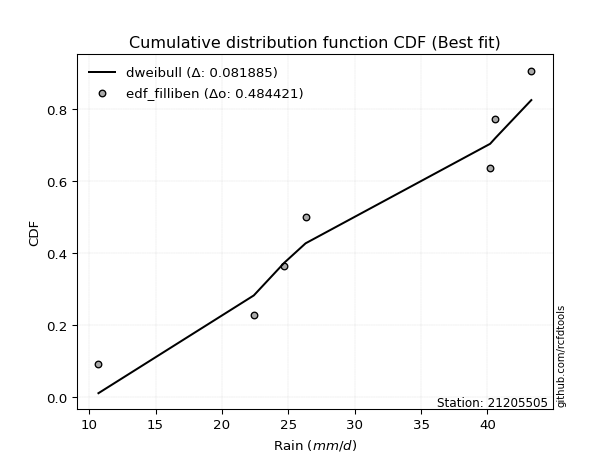</img></img>

</div>


### 10. EDF Jenkinson (1977)

The Jenkinson formula in hydrology is an empirical plotting position formula used to estimate the non-exceedance probability _(P)_ or return period _(T)_ of a given ordered observation within a sample. It is a widely used method in the frequency analysis of extreme events such as floods and rainfall, as it provides a distribution-free way to plot data. _a≈0.31_ and _b≈0.38_ are constants derived to approximate the median of the probability distribution for the given rank.

<div align="center">


$P=(m-a)/(n+b)$


</div>


**10.1. Empirical values**

<div align="center">

|                | 0                   | 1                   | 2                   | 3             | 4                  | 5                  | 6                  |
|:---------------|:--------------------|:--------------------|:--------------------|:--------------|:-------------------|:-------------------|:-------------------|
| date           | 2015                | 2019                | 2021                | 2017          | 2018               | 2016               | 2020               |
| x              | 10.7                | 22.4                | 24.7                | 26.3          | 40.2               | 40.6               | 43.3               |
| m              | 1                   | 2                   | 3                   | 4             | 5                  | 6                  | 7                  |
| empirical_dist | edf_jenkinson       | edf_jenkinson       | edf_jenkinson       | edf_jenkinson | edf_jenkinson      | edf_jenkinson      | edf_jenkinson      |
| empirical      | 0.09349593495934959 | 0.22899728997289973 | 0.36449864498644985 | 0.5           | 0.6355013550135502 | 0.7710027100271003 | 0.9065040650406505 |
| empirical_tr   | 1.1031390134529149  | 1.29701230228471    | 1.5735607675906182  | 2.0           | 2.743494423791822  | 4.366863905325444  | 10.695652173913055 |

</div>


**10.2. Kolmogorov-Smirnov fit test (sorted by Δ)**


<div align="center">

|                | 0                   | 1                   | 2                   | 3                   | 4                   | 5                   | 6                   | 7                   | 8                   | 9                   | 10                  | 11                  | 12                  | 13                  | 14                  | 15                  | 16                  | 17                  | 18                  | 19                  | 20                  | 21                  | 22                  | 23                  | 24                  | 25                  | 26                  | 27                  | 28                  | 29                  | 30                  | 31                  | 32                  | 33                  | 34                  | 35                  | 36                  | 37                  | 38                  | 39                  | 40                  | 41                  | 42                  | 43                  | 44                  | 45                  | 46                  | 47                  | 48                  | 49                  | 50                  | 51                  | 52                  | 53                  | 54                  | 55                    | 56                  | 57                  | 58                  | 59                  | 60                  | 61                  | 62                  | 63                  | 64                  | 65                  | 66                  | 67                  | 68                  | 69                  | 70                  | 71                  | 72                  | 73                  | 74                  | 75                  | 76                  | 77                  | 78                  | 79                  | 80                  | 81                  | 82                  | 83                  | 84                  | 85                  | 86                  | 87                  |
|:---------------|:--------------------|:--------------------|:--------------------|:--------------------|:--------------------|:--------------------|:--------------------|:--------------------|:--------------------|:--------------------|:--------------------|:--------------------|:--------------------|:--------------------|:--------------------|:--------------------|:--------------------|:--------------------|:--------------------|:--------------------|:--------------------|:--------------------|:--------------------|:--------------------|:--------------------|:--------------------|:--------------------|:--------------------|:--------------------|:--------------------|:--------------------|:--------------------|:--------------------|:--------------------|:--------------------|:--------------------|:--------------------|:--------------------|:--------------------|:--------------------|:--------------------|:--------------------|:--------------------|:--------------------|:--------------------|:--------------------|:--------------------|:--------------------|:--------------------|:--------------------|:--------------------|:--------------------|:--------------------|:--------------------|:--------------------|:----------------------|:--------------------|:--------------------|:--------------------|:--------------------|:--------------------|:--------------------|:--------------------|:--------------------|:--------------------|:--------------------|:--------------------|:--------------------|:--------------------|:--------------------|:--------------------|:--------------------|:--------------------|:--------------------|:--------------------|:--------------------|:--------------------|:--------------------|:--------------------|:--------------------|:--------------------|:--------------------|:--------------------|:--------------------|:--------------------|:--------------------|:--------------------|:--------------------|
| station        | 21205505            | 21205505            | 21205505            | 21205505            | 21205505            | 21205505            | 21205505            | 21205505            | 21205505            | 21205505            | 21205505            | 21205505            | 21205505            | 21205505            | 21205505            | 21205505            | 21205505            | 21205505            | 21205505            | 21205505            | 21205505            | 21205505            | 21205505            | 21205505            | 21205505            | 21205505            | 21205505            | 21205505            | 21205505            | 21205505            | 21205505            | 21205505            | 21205505            | 21205505            | 21205505            | 21205505            | 21205505            | 21205505            | 21205505            | 21205505            | 21205505            | 21205505            | 21205505            | 21205505            | 21205505            | 21205505            | 21205505            | 21205505            | 21205505            | 21205505            | 21205505            | 21205505            | 21205505            | 21205505            | 21205505            | 21205505              | 21205505            | 21205505            | 21205505            | 21205505            | 21205505            | 21205505            | 21205505            | 21205505            | 21205505            | 21205505            | 21205505            | 21205505            | 21205505            | 21205505            | 21205505            | 21205505            | 21205505            | 21205505            | 21205505            | 21205505            | 21205505            | 21205505            | 21205505            | 21205505            | 21205505            | 21205505            | 21205505            | 21205505            | 21205505            | 21205505            | 21205505            | 21205505            |
| empirical_dist | edf_jenkinson       | edf_jenkinson       | edf_jenkinson       | edf_jenkinson       | edf_jenkinson       | edf_jenkinson       | edf_jenkinson       | edf_jenkinson       | edf_jenkinson       | edf_jenkinson       | edf_jenkinson       | edf_jenkinson       | edf_jenkinson       | edf_jenkinson       | edf_jenkinson       | edf_jenkinson       | edf_jenkinson       | edf_jenkinson       | edf_jenkinson       | edf_jenkinson       | edf_jenkinson       | edf_jenkinson       | edf_jenkinson       | edf_jenkinson       | edf_jenkinson       | edf_jenkinson       | edf_jenkinson       | edf_jenkinson       | edf_jenkinson       | edf_jenkinson       | edf_jenkinson       | edf_jenkinson       | edf_jenkinson       | edf_jenkinson       | edf_jenkinson       | edf_jenkinson       | edf_jenkinson       | edf_jenkinson       | edf_jenkinson       | edf_jenkinson       | edf_jenkinson       | edf_jenkinson       | edf_jenkinson       | edf_jenkinson       | edf_jenkinson       | edf_jenkinson       | edf_jenkinson       | edf_jenkinson       | edf_jenkinson       | edf_jenkinson       | edf_jenkinson       | edf_jenkinson       | edf_jenkinson       | edf_jenkinson       | edf_jenkinson       | edf_jenkinson         | edf_jenkinson       | edf_jenkinson       | edf_jenkinson       | edf_jenkinson       | edf_jenkinson       | edf_jenkinson       | edf_jenkinson       | edf_jenkinson       | edf_jenkinson       | edf_jenkinson       | edf_jenkinson       | edf_jenkinson       | edf_jenkinson       | edf_jenkinson       | edf_jenkinson       | edf_jenkinson       | edf_jenkinson       | edf_jenkinson       | edf_jenkinson       | edf_jenkinson       | edf_jenkinson       | edf_jenkinson       | edf_jenkinson       | edf_jenkinson       | edf_jenkinson       | edf_jenkinson       | edf_jenkinson       | edf_jenkinson       | edf_jenkinson       | edf_jenkinson       | edf_jenkinson       | edf_jenkinson       |
| p_dist         | logbetaprime        | logfisk             | loginvgauss         | logerlang           | logncf              | loggamma            | loggamma            | logalpha            | loginvgamma         | logpearson3         | lognct              | logrice             | logfatiguelife      | logf                | logexponnorm        | logcrystalball      | logt                | lognorm             | lognorm             | logmaxwell          | lograyleigh         | kstwobign           | loginvweibull       | ncf                 | loggumbel_l         | invgauss            | fisk                | loghalfnorm         | genlogistic         | alpha               | rice                | invgamma            | erlang              | f                   | rayleigh            | pearson3            | maxwell             | loglogistic         | nct                 | crystalball         | norm                | truncnorm           | exponnorm           | t                   | gamma               | betaprime           | weibull_min         | gompertz            | halfnorm            | logweibull_min      | chi2                | loggumbel_r         | logmielke           | loghalflogistic     | laplace_asymmetric  | loglaplace_asymmetric | logmoyal            | loghypsecant        | mielke              | gumbel_r            | logistic            | halflogistic        | gumbel_l            | logkstwobign        | loglaplace          | logloggamma         | moyal               | loggenexpon         | hypsecant           | johnsonsu           | lognakagami         | nakagami            | expon               | logjohnsonsu        | laplace             | logwald             | wald                | loggompertz         | loggibrat           | gibrat              | logtruncnorm        | logexpon            | logchi2             | loglognorm          | invweibull          | fatiguelife         | genexpon            | loggenlogistic      |
| delta          | 0.14644666938772666 | 0.15511077938756834 | 0.15658934075793485 | 0.16149132074951122 | 0.16327964361203928 | 0.1633317795448591  | 0.1633317795448591  | 0.16501353707166377 | 0.16580412032291392 | 0.16649386793478183 | 0.16673124766715908 | 0.167512690418139   | 0.16896920306200736 | 0.16898690162189733 | 0.1694115884382139  | 0.16941576662757807 | 0.16941581662976157 | 0.16941583559288342 | 0.16941583559288342 | 0.17169103780810513 | 0.17233903408877493 | 0.17534234638522295 | 0.1759670544532929  | 0.1768537549917465  | 0.18003298641010435 | 0.1815834927789335  | 0.18164697517788564 | 0.1823036902705508  | 0.18231665433412336 | 0.1872812683225712  | 0.18839285768222225 | 0.18870443475805854 | 0.18909686581912077 | 0.18913605385634624 | 0.19034312226220584 | 0.190461140225055   | 0.1904851094367228  | 0.19065514058048616 | 0.19106053666622047 | 0.1910908318333725  | 0.19109083631221258 | 0.19109087444260753 | 0.19109179246026897 | 0.19110009145582296 | 0.19165691351164127 | 0.19180450143377192 | 0.19185387980016022 | 0.19195543674048565 | 0.19224492726895326 | 0.19271116052914294 | 0.19315448075722352 | 0.1943585324326449  | 0.19577168289412505 | 0.19682828686602893 | 0.19795756786482577 | 0.1979889648064409    | 0.20285332437948345 | 0.20298696797672944 | 0.20906123756084738 | 0.20985625534920427 | 0.21086652847028864 | 0.21090319134536906 | 0.21136727872957528 | 0.21386115442460926 | 0.21618188322689635 | 0.2164442381804227  | 0.21666908283796937 | 0.21857139000415957 | 0.22170191751707313 | 0.2276203735437159  | 0.22899233486659035 | 0.22899726679865087 | 0.2300392808046122  | 0.23138630731706888 | 0.23232206452190285 | 0.23321403967573784 | 0.2432469261759711  | 0.2553571809470042  | 0.2596564913124402  | 0.26828623302773646 | 0.30540650484978915 | 0.31807523209181243 | 0.38475192845442463 | 0.41884250760520525 | 0.48343608826682904 | 0.6105740373312841  | 0.7306631302298185  | 0.7710027100271003  |
| deltao         | 0.48442053926100004 | 0.48442053926100004 | 0.48442053926100004 | 0.48442053926100004 | 0.48442053926100004 | 0.48442053926100004 | 0.48442053926100004 | 0.48442053926100004 | 0.48442053926100004 | 0.48442053926100004 | 0.48442053926100004 | 0.48442053926100004 | 0.48442053926100004 | 0.48442053926100004 | 0.48442053926100004 | 0.48442053926100004 | 0.48442053926100004 | 0.48442053926100004 | 0.48442053926100004 | 0.48442053926100004 | 0.48442053926100004 | 0.48442053926100004 | 0.48442053926100004 | 0.48442053926100004 | 0.48442053926100004 | 0.48442053926100004 | 0.48442053926100004 | 0.48442053926100004 | 0.48442053926100004 | 0.48442053926100004 | 0.48442053926100004 | 0.48442053926100004 | 0.48442053926100004 | 0.48442053926100004 | 0.48442053926100004 | 0.48442053926100004 | 0.48442053926100004 | 0.48442053926100004 | 0.48442053926100004 | 0.48442053926100004 | 0.48442053926100004 | 0.48442053926100004 | 0.48442053926100004 | 0.48442053926100004 | 0.48442053926100004 | 0.48442053926100004 | 0.48442053926100004 | 0.48442053926100004 | 0.48442053926100004 | 0.48442053926100004 | 0.48442053926100004 | 0.48442053926100004 | 0.48442053926100004 | 0.48442053926100004 | 0.48442053926100004 | 0.48442053926100004   | 0.48442053926100004 | 0.48442053926100004 | 0.48442053926100004 | 0.48442053926100004 | 0.48442053926100004 | 0.48442053926100004 | 0.48442053926100004 | 0.48442053926100004 | 0.48442053926100004 | 0.48442053926100004 | 0.48442053926100004 | 0.48442053926100004 | 0.48442053926100004 | 0.48442053926100004 | 0.48442053926100004 | 0.48442053926100004 | 0.48442053926100004 | 0.48442053926100004 | 0.48442053926100004 | 0.48442053926100004 | 0.48442053926100004 | 0.48442053926100004 | 0.48442053926100004 | 0.48442053926100004 | 0.48442053926100004 | 0.48442053926100004 | 0.48442053926100004 | 0.48442053926100004 | 0.48442053926100004 | 0.48442053926100004 | 0.48442053926100004 | 0.48442053926100004 |
| eval           | Δo > Δ              | Δo > Δ              | Δo > Δ              | Δo > Δ              | Δo > Δ              | Δo > Δ              | Δo > Δ              | Δo > Δ              | Δo > Δ              | Δo > Δ              | Δo > Δ              | Δo > Δ              | Δo > Δ              | Δo > Δ              | Δo > Δ              | Δo > Δ              | Δo > Δ              | Δo > Δ              | Δo > Δ              | Δo > Δ              | Δo > Δ              | Δo > Δ              | Δo > Δ              | Δo > Δ              | Δo > Δ              | Δo > Δ              | Δo > Δ              | Δo > Δ              | Δo > Δ              | Δo > Δ              | Δo > Δ              | Δo > Δ              | Δo > Δ              | Δo > Δ              | Δo > Δ              | Δo > Δ              | Δo > Δ              | Δo > Δ              | Δo > Δ              | Δo > Δ              | Δo > Δ              | Δo > Δ              | Δo > Δ              | Δo > Δ              | Δo > Δ              | Δo > Δ              | Δo > Δ              | Δo > Δ              | Δo > Δ              | Δo > Δ              | Δo > Δ              | Δo > Δ              | Δo > Δ              | Δo > Δ              | Δo > Δ              | Δo > Δ                | Δo > Δ              | Δo > Δ              | Δo > Δ              | Δo > Δ              | Δo > Δ              | Δo > Δ              | Δo > Δ              | Δo > Δ              | Δo > Δ              | Δo > Δ              | Δo > Δ              | Δo > Δ              | Δo > Δ              | Δo > Δ              | Δo > Δ              | Δo > Δ              | Δo > Δ              | Δo > Δ              | Δo > Δ              | Δo > Δ              | Δo > Δ              | Δo > Δ              | Δo > Δ              | Δo > Δ              | Δo > Δ              | Δo > Δ              | Δo > Δ              | Δo > Δ              | Δo > Δ              | Δo <= Δ             | Δo <= Δ             | Δo <= Δ             |
| fit            | 1                   | 1                   | 1                   | 1                   | 1                   | 1                   | 1                   | 1                   | 1                   | 1                   | 1                   | 1                   | 1                   | 1                   | 1                   | 1                   | 1                   | 1                   | 1                   | 1                   | 1                   | 1                   | 1                   | 1                   | 1                   | 1                   | 1                   | 1                   | 1                   | 1                   | 1                   | 1                   | 1                   | 1                   | 1                   | 1                   | 1                   | 1                   | 1                   | 1                   | 1                   | 1                   | 1                   | 1                   | 1                   | 1                   | 1                   | 1                   | 1                   | 1                   | 1                   | 1                   | 1                   | 1                   | 1                   | 1                     | 1                   | 1                   | 1                   | 1                   | 1                   | 1                   | 1                   | 1                   | 1                   | 1                   | 1                   | 1                   | 1                   | 1                   | 1                   | 1                   | 1                   | 1                   | 1                   | 1                   | 1                   | 1                   | 1                   | 1                   | 1                   | 1                   | 1                   | 1                   | 1                   | 0                   | 0                   | 0                   |
| n              | 7                   | 7                   | 7                   | 7                   | 7                   | 7                   | 7                   | 7                   | 7                   | 7                   | 7                   | 7                   | 7                   | 7                   | 7                   | 7                   | 7                   | 7                   | 7                   | 7                   | 7                   | 7                   | 7                   | 7                   | 7                   | 7                   | 7                   | 7                   | 7                   | 7                   | 7                   | 7                   | 7                   | 7                   | 7                   | 7                   | 7                   | 7                   | 7                   | 7                   | 7                   | 7                   | 7                   | 7                   | 7                   | 7                   | 7                   | 7                   | 7                   | 7                   | 7                   | 7                   | 7                   | 7                   | 7                   | 7                     | 7                   | 7                   | 7                   | 7                   | 7                   | 7                   | 7                   | 7                   | 7                   | 7                   | 7                   | 7                   | 7                   | 7                   | 7                   | 7                   | 7                   | 7                   | 7                   | 7                   | 7                   | 7                   | 7                   | 7                   | 7                   | 7                   | 7                   | 7                   | 7                   | 7                   | 7                   | 7                   |
| best_fit       | 1                   | 0                   | 0                   | 0                   | 0                   | 0                   | 0                   | 0                   | 0                   | 0                   | 0                   | 0                   | 0                   | 0                   | 0                   | 0                   | 0                   | 0                   | 0                   | 0                   | 0                   | 0                   | 0                   | 0                   | 0                   | 0                   | 0                   | 0                   | 0                   | 0                   | 0                   | 0                   | 0                   | 0                   | 0                   | 0                   | 0                   | 0                   | 0                   | 0                   | 0                   | 0                   | 0                   | 0                   | 0                   | 0                   | 0                   | 0                   | 0                   | 0                   | 0                   | 0                   | 0                   | 0                   | 0                   | 0                     | 0                   | 0                   | 0                   | 0                   | 0                   | 0                   | 0                   | 0                   | 0                   | 0                   | 0                   | 0                   | 0                   | 0                   | 0                   | 0                   | 0                   | 0                   | 0                   | 0                   | 0                   | 0                   | 0                   | 0                   | 0                   | 0                   | 0                   | 0                   | 0                   | 0                   | 0                   | 0                   |
| best_fit_sort  | 1                   | 2                   | 3                   | 4                   | 5                   | 6                   | 7                   | 8                   | 9                   | 10                  | 11                  | 12                  | 13                  | 14                  | 15                  | 16                  | 17                  | 18                  | 19                  | 20                  | 21                  | 22                  | 23                  | 24                  | 25                  | 26                  | 27                  | 28                  | 29                  | 30                  | 31                  | 32                  | 33                  | 34                  | 35                  | 36                  | 37                  | 38                  | 39                  | 40                  | 41                  | 42                  | 43                  | 44                  | 45                  | 46                  | 47                  | 48                  | 49                  | 50                  | 51                  | 52                  | 53                  | 54                  | 55                  | 56                    | 57                  | 58                  | 59                  | 60                  | 61                  | 62                  | 63                  | 64                  | 65                  | 66                  | 67                  | 68                  | 69                  | 70                  | 71                  | 72                  | 73                  | 74                  | 75                  | 76                  | 77                  | 78                  | 79                  | 80                  | 81                  | 82                  | 83                  | 84                  | 85                  | 86                  | 87                  | 88                  |

</div>


**10.3. Best fit**

<div align="center">

|   id |   station | empirical_dist   | p_dist       |    delta |   deltao | eval   |   fit |   n |   best_fit |   best_fit_sort |
|-----:|----------:|:-----------------|:-------------|---------:|---------:|:-------|------:|----:|-----------:|----------------:|
|    0 |  21205505 | edf_jenkinson    | logbetaprime | 0.146447 | 0.484421 | Δo > Δ |     1 |   7 |          1 |               1 |

</div>


<div align="center">

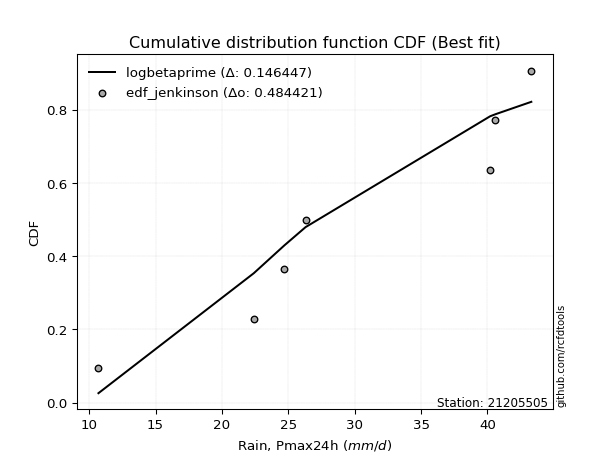</img></img>

</div>


### 11. EDF Cunnane (1978)

Cunnane´s work in statistical hydrology has focused on the performance and evaluation of different probability distributions (such as GEV, Gumbel, Lognormal) for flood frequency estimation. _b_ is a constant, typically set to 0.4.

<div align="center">


$P=(m-b)/(n+1-2b)$


</div>


**11.1. Empirical values**

<div align="center">

|                | 0                   | 1                   | 2                  | 3           | 4                  | 5                  | 6                  |
|:---------------|:--------------------|:--------------------|:-------------------|:------------|:-------------------|:-------------------|:-------------------|
| date           | 2015                | 2019                | 2021               | 2017        | 2018               | 2016               | 2020               |
| x              | 10.7                | 22.4                | 24.7               | 26.3        | 40.2               | 40.6               | 43.3               |
| m              | 1                   | 2                   | 3                  | 4           | 5                  | 6                  | 7                  |
| empirical_dist | edf_cunnane         | edf_cunnane         | edf_cunnane        | edf_cunnane | edf_cunnane        | edf_cunnane        | edf_cunnane        |
| empirical      | 0.08333333333333333 | 0.22222222222222224 | 0.3611111111111111 | 0.5         | 0.6388888888888888 | 0.7777777777777777 | 0.9166666666666666 |
| empirical_tr   | 1.090909090909091   | 1.2857142857142856  | 1.565217391304348  | 2.0         | 2.7692307692307687 | 4.499999999999998  | 11.999999999999995 |

</div>


**11.2. Kolmogorov-Smirnov fit test (sorted by Δ)**


<div align="center">

|                | 0                   | 1                   | 2                   | 3                   | 4                   | 5                   | 6                   | 7                   | 8                   | 9                   | 10                  | 11                  | 12                  | 13                  | 14                  | 15                  | 16                  | 17                  | 18                  | 19                  | 20                  | 21                  | 22                  | 23                  | 24                  | 25                  | 26                  | 27                  | 28                  | 29                  | 30                  | 31                  | 32                  | 33                  | 34                  | 35                  | 36                  | 37                  | 38                  | 39                  | 40                  | 41                  | 42                  | 43                  | 44                  | 45                  | 46                  | 47                  | 48                  | 49                  | 50                  | 51                  | 52                  | 53                  | 54                  | 55                    | 56                  | 57                  | 58                  | 59                  | 60                  | 61                  | 62                  | 63                  | 64                  | 65                  | 66                  | 67                  | 68                  | 69                  | 70                  | 71                  | 72                  | 73                  | 74                  | 75                  | 76                  | 77                  | 78                  | 79                  | 80                  | 81                  | 82                  | 83                  | 84                  | 85                  | 86                  | 87                  |
|:---------------|:--------------------|:--------------------|:--------------------|:--------------------|:--------------------|:--------------------|:--------------------|:--------------------|:--------------------|:--------------------|:--------------------|:--------------------|:--------------------|:--------------------|:--------------------|:--------------------|:--------------------|:--------------------|:--------------------|:--------------------|:--------------------|:--------------------|:--------------------|:--------------------|:--------------------|:--------------------|:--------------------|:--------------------|:--------------------|:--------------------|:--------------------|:--------------------|:--------------------|:--------------------|:--------------------|:--------------------|:--------------------|:--------------------|:--------------------|:--------------------|:--------------------|:--------------------|:--------------------|:--------------------|:--------------------|:--------------------|:--------------------|:--------------------|:--------------------|:--------------------|:--------------------|:--------------------|:--------------------|:--------------------|:--------------------|:----------------------|:--------------------|:--------------------|:--------------------|:--------------------|:--------------------|:--------------------|:--------------------|:--------------------|:--------------------|:--------------------|:--------------------|:--------------------|:--------------------|:--------------------|:--------------------|:--------------------|:--------------------|:--------------------|:--------------------|:--------------------|:--------------------|:--------------------|:--------------------|:--------------------|:--------------------|:--------------------|:--------------------|:--------------------|:--------------------|:--------------------|:--------------------|:--------------------|
| station        | 21205505            | 21205505            | 21205505            | 21205505            | 21205505            | 21205505            | 21205505            | 21205505            | 21205505            | 21205505            | 21205505            | 21205505            | 21205505            | 21205505            | 21205505            | 21205505            | 21205505            | 21205505            | 21205505            | 21205505            | 21205505            | 21205505            | 21205505            | 21205505            | 21205505            | 21205505            | 21205505            | 21205505            | 21205505            | 21205505            | 21205505            | 21205505            | 21205505            | 21205505            | 21205505            | 21205505            | 21205505            | 21205505            | 21205505            | 21205505            | 21205505            | 21205505            | 21205505            | 21205505            | 21205505            | 21205505            | 21205505            | 21205505            | 21205505            | 21205505            | 21205505            | 21205505            | 21205505            | 21205505            | 21205505            | 21205505              | 21205505            | 21205505            | 21205505            | 21205505            | 21205505            | 21205505            | 21205505            | 21205505            | 21205505            | 21205505            | 21205505            | 21205505            | 21205505            | 21205505            | 21205505            | 21205505            | 21205505            | 21205505            | 21205505            | 21205505            | 21205505            | 21205505            | 21205505            | 21205505            | 21205505            | 21205505            | 21205505            | 21205505            | 21205505            | 21205505            | 21205505            | 21205505            |
| empirical_dist | edf_cunnane         | edf_cunnane         | edf_cunnane         | edf_cunnane         | edf_cunnane         | edf_cunnane         | edf_cunnane         | edf_cunnane         | edf_cunnane         | edf_cunnane         | edf_cunnane         | edf_cunnane         | edf_cunnane         | edf_cunnane         | edf_cunnane         | edf_cunnane         | edf_cunnane         | edf_cunnane         | edf_cunnane         | edf_cunnane         | edf_cunnane         | edf_cunnane         | edf_cunnane         | edf_cunnane         | edf_cunnane         | edf_cunnane         | edf_cunnane         | edf_cunnane         | edf_cunnane         | edf_cunnane         | edf_cunnane         | edf_cunnane         | edf_cunnane         | edf_cunnane         | edf_cunnane         | edf_cunnane         | edf_cunnane         | edf_cunnane         | edf_cunnane         | edf_cunnane         | edf_cunnane         | edf_cunnane         | edf_cunnane         | edf_cunnane         | edf_cunnane         | edf_cunnane         | edf_cunnane         | edf_cunnane         | edf_cunnane         | edf_cunnane         | edf_cunnane         | edf_cunnane         | edf_cunnane         | edf_cunnane         | edf_cunnane         | edf_cunnane           | edf_cunnane         | edf_cunnane         | edf_cunnane         | edf_cunnane         | edf_cunnane         | edf_cunnane         | edf_cunnane         | edf_cunnane         | edf_cunnane         | edf_cunnane         | edf_cunnane         | edf_cunnane         | edf_cunnane         | edf_cunnane         | edf_cunnane         | edf_cunnane         | edf_cunnane         | edf_cunnane         | edf_cunnane         | edf_cunnane         | edf_cunnane         | edf_cunnane         | edf_cunnane         | edf_cunnane         | edf_cunnane         | edf_cunnane         | edf_cunnane         | edf_cunnane         | edf_cunnane         | edf_cunnane         | edf_cunnane         | edf_cunnane         |
| p_dist         | logbetaprime        | logfisk             | loginvgauss         | logerlang           | logncf              | loggamma            | loggamma            | logalpha            | loginvgamma         | logpearson3         | lognct              | logrice             | logfatiguelife      | logf                | logexponnorm        | logcrystalball      | logt                | lognorm             | lognorm             | logmaxwell          | lograyleigh         | kstwobign           | ncf                 | loggumbel_l         | invgauss            | fisk                | genlogistic         | loginvweibull       | alpha               | rice                | invgamma            | erlang              | f                   | rayleigh            | pearson3            | maxwell             | loglogistic         | nct                 | crystalball         | norm                | truncnorm           | exponnorm           | t                   | gamma               | betaprime           | weibull_min         | gompertz            | halfnorm            | loghalfnorm         | logweibull_min      | chi2                | loggumbel_r         | logmielke           | loghalflogistic     | laplace_asymmetric  | loglaplace_asymmetric | logmoyal            | loghypsecant        | mielke              | gumbel_r            | logistic            | halflogistic        | gumbel_l            | loglaplace          | logloggamma         | moyal               | hypsecant           | logkstwobign        | lognakagami         | nakagami            | loggenexpon         | johnsonsu           | laplace             | logwald             | expon               | logjohnsonsu        | wald                | loggibrat           | loggompertz         | gibrat              | logtruncnorm        | logexpon            | logchi2             | loglognorm          | invweibull          | fatiguelife         | genexpon            | loggenlogistic      |
| delta          | 0.14305913551238802 | 0.1517232455122297  | 0.15320180688259621 | 0.1581037868741726  | 0.15989210973670065 | 0.15994424566952048 | 0.15994424566952048 | 0.16162600319632514 | 0.16241658644757528 | 0.1631063340594432  | 0.16334371379182044 | 0.16412515654280035 | 0.16558166918666872 | 0.1655993677465587  | 0.16602405456287528 | 0.16602823275223944 | 0.16602828275442294 | 0.1660283017175448  | 0.1660283017175448  | 0.1683035039327665  | 0.1689515002134363  | 0.1719548125098843  | 0.17346622111640786 | 0.1766454525347657  | 0.17819595890359485 | 0.178259441302547   | 0.17892912045878473 | 0.18274212220397038 | 0.18389373444723256 | 0.18500532380688361 | 0.1853169008827199  | 0.18570933194378214 | 0.1857485199810076  | 0.1869555883868672  | 0.18707360634971637 | 0.18709757556138418 | 0.18726760670514753 | 0.18767300279088184 | 0.18770329795803387 | 0.18770330243687394 | 0.1877033405672689  | 0.18770425858493034 | 0.18771255758048433 | 0.18826937963630264 | 0.1884169675584333  | 0.1884663459248216  | 0.18856790286514702 | 0.18885739339361463 | 0.18907875802122828 | 0.1893236266538043  | 0.1897669468818849  | 0.19097099855730626 | 0.19238414901878642 | 0.1944727189650379  | 0.19457003398948713 | 0.19460143093110227   | 0.1994657905041448  | 0.1995994341013908  | 0.20567370368550875 | 0.20646872147386564 | 0.20747899459495    | 0.20751565747003042 | 0.20797974485423665 | 0.21279434935155772 | 0.21305670430508405 | 0.21328154896263074 | 0.2183143836417345  | 0.22063622217528675 | 0.22221726711591286 | 0.22222219904797338 | 0.22534645775483705 | 0.2276203735437159  | 0.22893453064656422 | 0.2298265058003992  | 0.23681434855528968 | 0.23816137506774626 | 0.23985939230063247 | 0.25626895743710154 | 0.2621322486976817  | 0.26489869915239783 | 0.3020189709744505  | 0.3248502998424899  | 0.3915269962051021  | 0.42561757535588274 | 0.49359868989284517 | 0.6173491050819616  | 0.737438197980496   | 0.7777777777777777  |
| deltao         | 0.48442053926100004 | 0.48442053926100004 | 0.48442053926100004 | 0.48442053926100004 | 0.48442053926100004 | 0.48442053926100004 | 0.48442053926100004 | 0.48442053926100004 | 0.48442053926100004 | 0.48442053926100004 | 0.48442053926100004 | 0.48442053926100004 | 0.48442053926100004 | 0.48442053926100004 | 0.48442053926100004 | 0.48442053926100004 | 0.48442053926100004 | 0.48442053926100004 | 0.48442053926100004 | 0.48442053926100004 | 0.48442053926100004 | 0.48442053926100004 | 0.48442053926100004 | 0.48442053926100004 | 0.48442053926100004 | 0.48442053926100004 | 0.48442053926100004 | 0.48442053926100004 | 0.48442053926100004 | 0.48442053926100004 | 0.48442053926100004 | 0.48442053926100004 | 0.48442053926100004 | 0.48442053926100004 | 0.48442053926100004 | 0.48442053926100004 | 0.48442053926100004 | 0.48442053926100004 | 0.48442053926100004 | 0.48442053926100004 | 0.48442053926100004 | 0.48442053926100004 | 0.48442053926100004 | 0.48442053926100004 | 0.48442053926100004 | 0.48442053926100004 | 0.48442053926100004 | 0.48442053926100004 | 0.48442053926100004 | 0.48442053926100004 | 0.48442053926100004 | 0.48442053926100004 | 0.48442053926100004 | 0.48442053926100004 | 0.48442053926100004 | 0.48442053926100004   | 0.48442053926100004 | 0.48442053926100004 | 0.48442053926100004 | 0.48442053926100004 | 0.48442053926100004 | 0.48442053926100004 | 0.48442053926100004 | 0.48442053926100004 | 0.48442053926100004 | 0.48442053926100004 | 0.48442053926100004 | 0.48442053926100004 | 0.48442053926100004 | 0.48442053926100004 | 0.48442053926100004 | 0.48442053926100004 | 0.48442053926100004 | 0.48442053926100004 | 0.48442053926100004 | 0.48442053926100004 | 0.48442053926100004 | 0.48442053926100004 | 0.48442053926100004 | 0.48442053926100004 | 0.48442053926100004 | 0.48442053926100004 | 0.48442053926100004 | 0.48442053926100004 | 0.48442053926100004 | 0.48442053926100004 | 0.48442053926100004 | 0.48442053926100004 |
| eval           | Δo > Δ              | Δo > Δ              | Δo > Δ              | Δo > Δ              | Δo > Δ              | Δo > Δ              | Δo > Δ              | Δo > Δ              | Δo > Δ              | Δo > Δ              | Δo > Δ              | Δo > Δ              | Δo > Δ              | Δo > Δ              | Δo > Δ              | Δo > Δ              | Δo > Δ              | Δo > Δ              | Δo > Δ              | Δo > Δ              | Δo > Δ              | Δo > Δ              | Δo > Δ              | Δo > Δ              | Δo > Δ              | Δo > Δ              | Δo > Δ              | Δo > Δ              | Δo > Δ              | Δo > Δ              | Δo > Δ              | Δo > Δ              | Δo > Δ              | Δo > Δ              | Δo > Δ              | Δo > Δ              | Δo > Δ              | Δo > Δ              | Δo > Δ              | Δo > Δ              | Δo > Δ              | Δo > Δ              | Δo > Δ              | Δo > Δ              | Δo > Δ              | Δo > Δ              | Δo > Δ              | Δo > Δ              | Δo > Δ              | Δo > Δ              | Δo > Δ              | Δo > Δ              | Δo > Δ              | Δo > Δ              | Δo > Δ              | Δo > Δ                | Δo > Δ              | Δo > Δ              | Δo > Δ              | Δo > Δ              | Δo > Δ              | Δo > Δ              | Δo > Δ              | Δo > Δ              | Δo > Δ              | Δo > Δ              | Δo > Δ              | Δo > Δ              | Δo > Δ              | Δo > Δ              | Δo > Δ              | Δo > Δ              | Δo > Δ              | Δo > Δ              | Δo > Δ              | Δo > Δ              | Δo > Δ              | Δo > Δ              | Δo > Δ              | Δo > Δ              | Δo > Δ              | Δo > Δ              | Δo > Δ              | Δo > Δ              | Δo <= Δ             | Δo <= Δ             | Δo <= Δ             | Δo <= Δ             |
| fit            | 1                   | 1                   | 1                   | 1                   | 1                   | 1                   | 1                   | 1                   | 1                   | 1                   | 1                   | 1                   | 1                   | 1                   | 1                   | 1                   | 1                   | 1                   | 1                   | 1                   | 1                   | 1                   | 1                   | 1                   | 1                   | 1                   | 1                   | 1                   | 1                   | 1                   | 1                   | 1                   | 1                   | 1                   | 1                   | 1                   | 1                   | 1                   | 1                   | 1                   | 1                   | 1                   | 1                   | 1                   | 1                   | 1                   | 1                   | 1                   | 1                   | 1                   | 1                   | 1                   | 1                   | 1                   | 1                   | 1                     | 1                   | 1                   | 1                   | 1                   | 1                   | 1                   | 1                   | 1                   | 1                   | 1                   | 1                   | 1                   | 1                   | 1                   | 1                   | 1                   | 1                   | 1                   | 1                   | 1                   | 1                   | 1                   | 1                   | 1                   | 1                   | 1                   | 1                   | 1                   | 0                   | 0                   | 0                   | 0                   |
| n              | 7                   | 7                   | 7                   | 7                   | 7                   | 7                   | 7                   | 7                   | 7                   | 7                   | 7                   | 7                   | 7                   | 7                   | 7                   | 7                   | 7                   | 7                   | 7                   | 7                   | 7                   | 7                   | 7                   | 7                   | 7                   | 7                   | 7                   | 7                   | 7                   | 7                   | 7                   | 7                   | 7                   | 7                   | 7                   | 7                   | 7                   | 7                   | 7                   | 7                   | 7                   | 7                   | 7                   | 7                   | 7                   | 7                   | 7                   | 7                   | 7                   | 7                   | 7                   | 7                   | 7                   | 7                   | 7                   | 7                     | 7                   | 7                   | 7                   | 7                   | 7                   | 7                   | 7                   | 7                   | 7                   | 7                   | 7                   | 7                   | 7                   | 7                   | 7                   | 7                   | 7                   | 7                   | 7                   | 7                   | 7                   | 7                   | 7                   | 7                   | 7                   | 7                   | 7                   | 7                   | 7                   | 7                   | 7                   | 7                   |
| best_fit       | 1                   | 0                   | 0                   | 0                   | 0                   | 0                   | 0                   | 0                   | 0                   | 0                   | 0                   | 0                   | 0                   | 0                   | 0                   | 0                   | 0                   | 0                   | 0                   | 0                   | 0                   | 0                   | 0                   | 0                   | 0                   | 0                   | 0                   | 0                   | 0                   | 0                   | 0                   | 0                   | 0                   | 0                   | 0                   | 0                   | 0                   | 0                   | 0                   | 0                   | 0                   | 0                   | 0                   | 0                   | 0                   | 0                   | 0                   | 0                   | 0                   | 0                   | 0                   | 0                   | 0                   | 0                   | 0                   | 0                     | 0                   | 0                   | 0                   | 0                   | 0                   | 0                   | 0                   | 0                   | 0                   | 0                   | 0                   | 0                   | 0                   | 0                   | 0                   | 0                   | 0                   | 0                   | 0                   | 0                   | 0                   | 0                   | 0                   | 0                   | 0                   | 0                   | 0                   | 0                   | 0                   | 0                   | 0                   | 0                   |
| best_fit_sort  | 1                   | 2                   | 3                   | 4                   | 5                   | 6                   | 7                   | 8                   | 9                   | 10                  | 11                  | 12                  | 13                  | 14                  | 15                  | 16                  | 17                  | 18                  | 19                  | 20                  | 21                  | 22                  | 23                  | 24                  | 25                  | 26                  | 27                  | 28                  | 29                  | 30                  | 31                  | 32                  | 33                  | 34                  | 35                  | 36                  | 37                  | 38                  | 39                  | 40                  | 41                  | 42                  | 43                  | 44                  | 45                  | 46                  | 47                  | 48                  | 49                  | 50                  | 51                  | 52                  | 53                  | 54                  | 55                  | 56                    | 57                  | 58                  | 59                  | 60                  | 61                  | 62                  | 63                  | 64                  | 65                  | 66                  | 67                  | 68                  | 69                  | 70                  | 71                  | 72                  | 73                  | 74                  | 75                  | 76                  | 77                  | 78                  | 79                  | 80                  | 81                  | 82                  | 83                  | 84                  | 85                  | 86                  | 87                  | 88                  |

</div>


**11.3. Best fit**

<div align="center">

|   id |   station | empirical_dist   | p_dist       |    delta |   deltao | eval   |   fit |   n |   best_fit |   best_fit_sort |
|-----:|----------:|:-----------------|:-------------|---------:|---------:|:-------|------:|----:|-----------:|----------------:|
|    0 |  21205505 | edf_cunnane      | logbetaprime | 0.143059 | 0.484421 | Δo > Δ |     1 |   7 |          1 |               1 |

</div>


<div align="center">

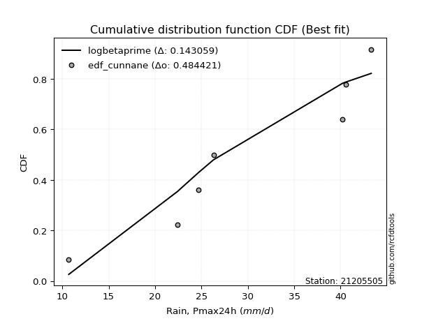</img></img>

</div>


### 12. EDF Adamowski (1981)

The Adamowski formula in hydrology refers to a specific plotting position formula used for estimating the non-parametric empirical distribution of hydrological events (like flood peaks) to calculate their return periods. This formula provides an alternative to traditional parametric methods (like the Gumbel or Log Pearson Type III distributions). 

<div align="center">


$P=(m-0.25)/(n+0.5)$


</div>


**12.1. Empirical values**

<div align="center">

|                | 0                  | 1                   | 2                   | 3             | 4                  | 5                  | 6                  |
|:---------------|:-------------------|:--------------------|:--------------------|:--------------|:-------------------|:-------------------|:-------------------|
| date           | 2015               | 2019                | 2021                | 2017          | 2018               | 2016               | 2020               |
| x              | 10.7               | 22.4                | 24.7                | 26.3          | 40.2               | 40.6               | 43.3               |
| m              | 1                  | 2                   | 3                   | 4             | 5                  | 6                  | 7                  |
| empirical_dist | edf_adamowski      | edf_adamowski       | edf_adamowski       | edf_adamowski | edf_adamowski      | edf_adamowski      | edf_adamowski      |
| empirical      | 0.1                | 0.23333333333333334 | 0.36666666666666664 | 0.5           | 0.6333333333333333 | 0.7666666666666667 | 0.9                |
| empirical_tr   | 1.1111111111111112 | 1.3043478260869565  | 1.5789473684210527  | 2.0           | 2.727272727272727  | 4.2857142857142865 | 10.000000000000002 |

</div>


**12.2. Kolmogorov-Smirnov fit test (sorted by Δ)**


<div align="center">

|                | 0                   | 1                   | 2                   | 3                   | 4                   | 5                   | 6                   | 7                   | 8                   | 9                   | 10                  | 11                  | 12                  | 13                  | 14                  | 15                  | 16                  | 17                  | 18                  | 19                  | 20                  | 21                  | 22                  | 23                  | 24                  | 25                  | 26                  | 27                  | 28                  | 29                  | 30                  | 31                  | 32                  | 33                  | 34                  | 35                  | 36                  | 37                  | 38                  | 39                  | 40                  | 41                  | 42                  | 43                  | 44                  | 45                  | 46                  | 47                  | 48                  | 49                  | 50                  | 51                  | 52                  | 53                  | 54                  | 55                    | 56                  | 57                  | 58                  | 59                  | 60                  | 61                  | 62                  | 63                  | 64                  | 65                  | 66                  | 67                  | 68                  | 69                  | 70                  | 71                  | 72                  | 73                  | 74                  | 75                  | 76                  | 77                  | 78                  | 79                  | 80                  | 81                  | 82                  | 83                  | 84                  | 85                  | 86                  | 87                  |
|:---------------|:--------------------|:--------------------|:--------------------|:--------------------|:--------------------|:--------------------|:--------------------|:--------------------|:--------------------|:--------------------|:--------------------|:--------------------|:--------------------|:--------------------|:--------------------|:--------------------|:--------------------|:--------------------|:--------------------|:--------------------|:--------------------|:--------------------|:--------------------|:--------------------|:--------------------|:--------------------|:--------------------|:--------------------|:--------------------|:--------------------|:--------------------|:--------------------|:--------------------|:--------------------|:--------------------|:--------------------|:--------------------|:--------------------|:--------------------|:--------------------|:--------------------|:--------------------|:--------------------|:--------------------|:--------------------|:--------------------|:--------------------|:--------------------|:--------------------|:--------------------|:--------------------|:--------------------|:--------------------|:--------------------|:--------------------|:----------------------|:--------------------|:--------------------|:--------------------|:--------------------|:--------------------|:--------------------|:--------------------|:--------------------|:--------------------|:--------------------|:--------------------|:--------------------|:--------------------|:--------------------|:--------------------|:--------------------|:--------------------|:--------------------|:--------------------|:--------------------|:--------------------|:--------------------|:--------------------|:--------------------|:--------------------|:--------------------|:--------------------|:--------------------|:--------------------|:--------------------|:--------------------|:--------------------|
| station        | 21205505            | 21205505            | 21205505            | 21205505            | 21205505            | 21205505            | 21205505            | 21205505            | 21205505            | 21205505            | 21205505            | 21205505            | 21205505            | 21205505            | 21205505            | 21205505            | 21205505            | 21205505            | 21205505            | 21205505            | 21205505            | 21205505            | 21205505            | 21205505            | 21205505            | 21205505            | 21205505            | 21205505            | 21205505            | 21205505            | 21205505            | 21205505            | 21205505            | 21205505            | 21205505            | 21205505            | 21205505            | 21205505            | 21205505            | 21205505            | 21205505            | 21205505            | 21205505            | 21205505            | 21205505            | 21205505            | 21205505            | 21205505            | 21205505            | 21205505            | 21205505            | 21205505            | 21205505            | 21205505            | 21205505            | 21205505              | 21205505            | 21205505            | 21205505            | 21205505            | 21205505            | 21205505            | 21205505            | 21205505            | 21205505            | 21205505            | 21205505            | 21205505            | 21205505            | 21205505            | 21205505            | 21205505            | 21205505            | 21205505            | 21205505            | 21205505            | 21205505            | 21205505            | 21205505            | 21205505            | 21205505            | 21205505            | 21205505            | 21205505            | 21205505            | 21205505            | 21205505            | 21205505            |
| empirical_dist | edf_adamowski       | edf_adamowski       | edf_adamowski       | edf_adamowski       | edf_adamowski       | edf_adamowski       | edf_adamowski       | edf_adamowski       | edf_adamowski       | edf_adamowski       | edf_adamowski       | edf_adamowski       | edf_adamowski       | edf_adamowski       | edf_adamowski       | edf_adamowski       | edf_adamowski       | edf_adamowski       | edf_adamowski       | edf_adamowski       | edf_adamowski       | edf_adamowski       | edf_adamowski       | edf_adamowski       | edf_adamowski       | edf_adamowski       | edf_adamowski       | edf_adamowski       | edf_adamowski       | edf_adamowski       | edf_adamowski       | edf_adamowski       | edf_adamowski       | edf_adamowski       | edf_adamowski       | edf_adamowski       | edf_adamowski       | edf_adamowski       | edf_adamowski       | edf_adamowski       | edf_adamowski       | edf_adamowski       | edf_adamowski       | edf_adamowski       | edf_adamowski       | edf_adamowski       | edf_adamowski       | edf_adamowski       | edf_adamowski       | edf_adamowski       | edf_adamowski       | edf_adamowski       | edf_adamowski       | edf_adamowski       | edf_adamowski       | edf_adamowski         | edf_adamowski       | edf_adamowski       | edf_adamowski       | edf_adamowski       | edf_adamowski       | edf_adamowski       | edf_adamowski       | edf_adamowski       | edf_adamowski       | edf_adamowski       | edf_adamowski       | edf_adamowski       | edf_adamowski       | edf_adamowski       | edf_adamowski       | edf_adamowski       | edf_adamowski       | edf_adamowski       | edf_adamowski       | edf_adamowski       | edf_adamowski       | edf_adamowski       | edf_adamowski       | edf_adamowski       | edf_adamowski       | edf_adamowski       | edf_adamowski       | edf_adamowski       | edf_adamowski       | edf_adamowski       | edf_adamowski       | edf_adamowski       |
| p_dist         | logbetaprime        | logfisk             | loginvgauss         | logerlang           | logncf              | loggamma            | loggamma            | logalpha            | loginvgamma         | logpearson3         | lognct              | logrice             | logfatiguelife      | logf                | logexponnorm        | logcrystalball      | logt                | lognorm             | lognorm             | loginvweibull       | logmaxwell          | lograyleigh         | kstwobign           | loghalfnorm         | ncf                 | loggumbel_l         | invgauss            | fisk                | genlogistic         | alpha               | rice                | invgamma            | erlang              | f                   | rayleigh            | pearson3            | maxwell             | loglogistic         | nct                 | crystalball         | norm                | truncnorm           | exponnorm           | t                   | gamma               | betaprime           | weibull_min         | gompertz            | halfnorm            | logweibull_min      | chi2                | loggumbel_r         | logmielke           | loghalflogistic     | laplace_asymmetric  | loglaplace_asymmetric | logmoyal            | loghypsecant        | logkstwobign        | mielke              | gumbel_r            | logistic            | halflogistic        | gumbel_l            | loggenexpon         | loglaplace          | logloggamma         | moyal               | hypsecant           | expon               | logjohnsonsu        | johnsonsu           | lognakagami         | nakagami            | laplace             | logwald             | wald                | loggompertz         | loggibrat           | gibrat              | logtruncnorm        | logexpon            | logchi2             | loglognorm          | invweibull          | fatiguelife         | genexpon            | loggenlogistic      |
| delta          | 0.14861469106794356 | 0.15727880106778525 | 0.15875736243815175 | 0.16365934242972813 | 0.16544766529225619 | 0.16549980122507602 | 0.16549980122507602 | 0.16718155875188068 | 0.16797214200313082 | 0.16866188961499873 | 0.16889926934737598 | 0.1696807120983559  | 0.17113722474222426 | 0.17115492330211424 | 0.17157961011843081 | 0.17158378830779497 | 0.17158383830997848 | 0.17158385727310033 | 0.17158385727310033 | 0.17163101109285928 | 0.17385905948832203 | 0.17450705576899184 | 0.17751036806543985 | 0.17846012158035074 | 0.1790217766719634  | 0.18220100809032125 | 0.1837515144591504  | 0.18381499685810254 | 0.18448467601434027 | 0.1894492900027881  | 0.19056087936243915 | 0.19087245643827544 | 0.19126488749933768 | 0.19130407553656315 | 0.19251114394242275 | 0.1926291619052719  | 0.1926531311169397  | 0.19282316226070306 | 0.19322855834643737 | 0.1932588535135894  | 0.19325885799242948 | 0.19325889612282443 | 0.19325981414048587 | 0.19326811313603987 | 0.19382493519185817 | 0.19397252311398883 | 0.19402190148037712 | 0.19412345842070255 | 0.19441294894917016 | 0.19487918220935985 | 0.19532250243744043 | 0.1965265541128618  | 0.19793970457434196 | 0.19899630854624584 | 0.20012558954504267 | 0.2001569864866578    | 0.20502134605970035 | 0.20515498965694634 | 0.20952511106417565 | 0.21122925924106428 | 0.21202427702942117 | 0.21303455015050554 | 0.21307121302558596 | 0.21353530040979218 | 0.21423534664372595 | 0.21834990490711326 | 0.2186122598606396  | 0.21883710451818628 | 0.22386993919729004 | 0.22570323744417858 | 0.2270502639566353  | 0.2276203735437159  | 0.23332837822702396 | 0.23333331015908448 | 0.23449008620211975 | 0.23538206135595474 | 0.245414947856188   | 0.2510211375865706  | 0.2618245129926571  | 0.27045425470795337 | 0.30757452653000605 | 0.3137391887313788  | 0.380415885093991   | 0.4145064642447716  | 0.47693202322617856 | 0.6062379939708504  | 0.726327086869385   | 0.7666666666666667  |
| deltao         | 0.48442053926100004 | 0.48442053926100004 | 0.48442053926100004 | 0.48442053926100004 | 0.48442053926100004 | 0.48442053926100004 | 0.48442053926100004 | 0.48442053926100004 | 0.48442053926100004 | 0.48442053926100004 | 0.48442053926100004 | 0.48442053926100004 | 0.48442053926100004 | 0.48442053926100004 | 0.48442053926100004 | 0.48442053926100004 | 0.48442053926100004 | 0.48442053926100004 | 0.48442053926100004 | 0.48442053926100004 | 0.48442053926100004 | 0.48442053926100004 | 0.48442053926100004 | 0.48442053926100004 | 0.48442053926100004 | 0.48442053926100004 | 0.48442053926100004 | 0.48442053926100004 | 0.48442053926100004 | 0.48442053926100004 | 0.48442053926100004 | 0.48442053926100004 | 0.48442053926100004 | 0.48442053926100004 | 0.48442053926100004 | 0.48442053926100004 | 0.48442053926100004 | 0.48442053926100004 | 0.48442053926100004 | 0.48442053926100004 | 0.48442053926100004 | 0.48442053926100004 | 0.48442053926100004 | 0.48442053926100004 | 0.48442053926100004 | 0.48442053926100004 | 0.48442053926100004 | 0.48442053926100004 | 0.48442053926100004 | 0.48442053926100004 | 0.48442053926100004 | 0.48442053926100004 | 0.48442053926100004 | 0.48442053926100004 | 0.48442053926100004 | 0.48442053926100004   | 0.48442053926100004 | 0.48442053926100004 | 0.48442053926100004 | 0.48442053926100004 | 0.48442053926100004 | 0.48442053926100004 | 0.48442053926100004 | 0.48442053926100004 | 0.48442053926100004 | 0.48442053926100004 | 0.48442053926100004 | 0.48442053926100004 | 0.48442053926100004 | 0.48442053926100004 | 0.48442053926100004 | 0.48442053926100004 | 0.48442053926100004 | 0.48442053926100004 | 0.48442053926100004 | 0.48442053926100004 | 0.48442053926100004 | 0.48442053926100004 | 0.48442053926100004 | 0.48442053926100004 | 0.48442053926100004 | 0.48442053926100004 | 0.48442053926100004 | 0.48442053926100004 | 0.48442053926100004 | 0.48442053926100004 | 0.48442053926100004 | 0.48442053926100004 |
| eval           | Δo > Δ              | Δo > Δ              | Δo > Δ              | Δo > Δ              | Δo > Δ              | Δo > Δ              | Δo > Δ              | Δo > Δ              | Δo > Δ              | Δo > Δ              | Δo > Δ              | Δo > Δ              | Δo > Δ              | Δo > Δ              | Δo > Δ              | Δo > Δ              | Δo > Δ              | Δo > Δ              | Δo > Δ              | Δo > Δ              | Δo > Δ              | Δo > Δ              | Δo > Δ              | Δo > Δ              | Δo > Δ              | Δo > Δ              | Δo > Δ              | Δo > Δ              | Δo > Δ              | Δo > Δ              | Δo > Δ              | Δo > Δ              | Δo > Δ              | Δo > Δ              | Δo > Δ              | Δo > Δ              | Δo > Δ              | Δo > Δ              | Δo > Δ              | Δo > Δ              | Δo > Δ              | Δo > Δ              | Δo > Δ              | Δo > Δ              | Δo > Δ              | Δo > Δ              | Δo > Δ              | Δo > Δ              | Δo > Δ              | Δo > Δ              | Δo > Δ              | Δo > Δ              | Δo > Δ              | Δo > Δ              | Δo > Δ              | Δo > Δ                | Δo > Δ              | Δo > Δ              | Δo > Δ              | Δo > Δ              | Δo > Δ              | Δo > Δ              | Δo > Δ              | Δo > Δ              | Δo > Δ              | Δo > Δ              | Δo > Δ              | Δo > Δ              | Δo > Δ              | Δo > Δ              | Δo > Δ              | Δo > Δ              | Δo > Δ              | Δo > Δ              | Δo > Δ              | Δo > Δ              | Δo > Δ              | Δo > Δ              | Δo > Δ              | Δo > Δ              | Δo > Δ              | Δo > Δ              | Δo > Δ              | Δo > Δ              | Δo > Δ              | Δo <= Δ             | Δo <= Δ             | Δo <= Δ             |
| fit            | 1                   | 1                   | 1                   | 1                   | 1                   | 1                   | 1                   | 1                   | 1                   | 1                   | 1                   | 1                   | 1                   | 1                   | 1                   | 1                   | 1                   | 1                   | 1                   | 1                   | 1                   | 1                   | 1                   | 1                   | 1                   | 1                   | 1                   | 1                   | 1                   | 1                   | 1                   | 1                   | 1                   | 1                   | 1                   | 1                   | 1                   | 1                   | 1                   | 1                   | 1                   | 1                   | 1                   | 1                   | 1                   | 1                   | 1                   | 1                   | 1                   | 1                   | 1                   | 1                   | 1                   | 1                   | 1                   | 1                     | 1                   | 1                   | 1                   | 1                   | 1                   | 1                   | 1                   | 1                   | 1                   | 1                   | 1                   | 1                   | 1                   | 1                   | 1                   | 1                   | 1                   | 1                   | 1                   | 1                   | 1                   | 1                   | 1                   | 1                   | 1                   | 1                   | 1                   | 1                   | 1                   | 0                   | 0                   | 0                   |
| n              | 7                   | 7                   | 7                   | 7                   | 7                   | 7                   | 7                   | 7                   | 7                   | 7                   | 7                   | 7                   | 7                   | 7                   | 7                   | 7                   | 7                   | 7                   | 7                   | 7                   | 7                   | 7                   | 7                   | 7                   | 7                   | 7                   | 7                   | 7                   | 7                   | 7                   | 7                   | 7                   | 7                   | 7                   | 7                   | 7                   | 7                   | 7                   | 7                   | 7                   | 7                   | 7                   | 7                   | 7                   | 7                   | 7                   | 7                   | 7                   | 7                   | 7                   | 7                   | 7                   | 7                   | 7                   | 7                   | 7                     | 7                   | 7                   | 7                   | 7                   | 7                   | 7                   | 7                   | 7                   | 7                   | 7                   | 7                   | 7                   | 7                   | 7                   | 7                   | 7                   | 7                   | 7                   | 7                   | 7                   | 7                   | 7                   | 7                   | 7                   | 7                   | 7                   | 7                   | 7                   | 7                   | 7                   | 7                   | 7                   |
| best_fit       | 1                   | 0                   | 0                   | 0                   | 0                   | 0                   | 0                   | 0                   | 0                   | 0                   | 0                   | 0                   | 0                   | 0                   | 0                   | 0                   | 0                   | 0                   | 0                   | 0                   | 0                   | 0                   | 0                   | 0                   | 0                   | 0                   | 0                   | 0                   | 0                   | 0                   | 0                   | 0                   | 0                   | 0                   | 0                   | 0                   | 0                   | 0                   | 0                   | 0                   | 0                   | 0                   | 0                   | 0                   | 0                   | 0                   | 0                   | 0                   | 0                   | 0                   | 0                   | 0                   | 0                   | 0                   | 0                   | 0                     | 0                   | 0                   | 0                   | 0                   | 0                   | 0                   | 0                   | 0                   | 0                   | 0                   | 0                   | 0                   | 0                   | 0                   | 0                   | 0                   | 0                   | 0                   | 0                   | 0                   | 0                   | 0                   | 0                   | 0                   | 0                   | 0                   | 0                   | 0                   | 0                   | 0                   | 0                   | 0                   |
| best_fit_sort  | 1                   | 2                   | 3                   | 4                   | 5                   | 6                   | 7                   | 8                   | 9                   | 10                  | 11                  | 12                  | 13                  | 14                  | 15                  | 16                  | 17                  | 18                  | 19                  | 20                  | 21                  | 22                  | 23                  | 24                  | 25                  | 26                  | 27                  | 28                  | 29                  | 30                  | 31                  | 32                  | 33                  | 34                  | 35                  | 36                  | 37                  | 38                  | 39                  | 40                  | 41                  | 42                  | 43                  | 44                  | 45                  | 46                  | 47                  | 48                  | 49                  | 50                  | 51                  | 52                  | 53                  | 54                  | 55                  | 56                    | 57                  | 58                  | 59                  | 60                  | 61                  | 62                  | 63                  | 64                  | 65                  | 66                  | 67                  | 68                  | 69                  | 70                  | 71                  | 72                  | 73                  | 74                  | 75                  | 76                  | 77                  | 78                  | 79                  | 80                  | 81                  | 82                  | 83                  | 84                  | 85                  | 86                  | 87                  | 88                  |

</div>


**12.3. Best fit**

<div align="center">

|   id |   station | empirical_dist   | p_dist       |    delta |   deltao | eval   |   fit |   n |   best_fit |   best_fit_sort |
|-----:|----------:|:-----------------|:-------------|---------:|---------:|:-------|------:|----:|-----------:|----------------:|
|    0 |  21205505 | edf_adamowski    | logbetaprime | 0.148615 | 0.484421 | Δo > Δ |     1 |   7 |          1 |               1 |

</div>


<div align="center">

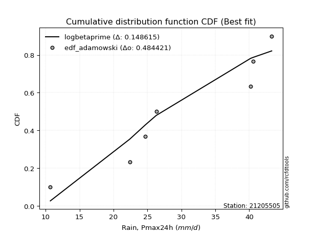</img></img>

</div>


## C. Best fit & Estimate extreme values for specific return periods - Tr

Best fit in probability distribution analysis means finding the theoretical distribution (like Normal, Poisson, Exponential) that most accurately mirrors your real-world data´s patterns (shape, center, spread) for better predictions, using methods like visual checks (Q-Q plots), goodness-of-fit tests (Kolmogorov-Smirnov, Chi-Squared), and information criteria (AIC) to score and select the simplest, most representative model.


### 1. Best fit (ordered by delta Δ)

<div align="center">

|   id |   station | empirical_dist   | p_dist        |    delta |   deltao | eval   |   fit |   n |   best_fit |   best_fit_sort |
|-----:|----------:|:-----------------|:--------------|---------:|---------:|:-------|------:|----:|-----------:|----------------:|
|    0 |  21205505 | edf_california   | loghypsecant  | 0.126039 | 0.484421 | Δo > Δ |     1 |   7 |          1 |               1 |
|    1 |  21205505 | edf_hazen        | logbetaprime  | 0.139201 | 0.484421 | Δo > Δ |     1 |   7 |          1 |               2 |
|    2 |  21205505 | edf_gringorten   | logbetaprime  | 0.141499 | 0.484421 | Δo > Δ |     1 |   7 |          1 |               3 |
|    3 |  21205505 | edf_cunnane      | logbetaprime  | 0.143059 | 0.484421 | Δo > Δ |     1 |   7 |          1 |               4 |
|    4 |  21205505 | edf_blom         | logbetaprime  | 0.144017 | 0.484421 | Δo > Δ |     1 |   7 |          1 |               5 |
|    5 |  21205505 | edf_tukey        | logbetaprime  | 0.145584 | 0.484421 | Δo > Δ |     1 |   7 |          1 |               6 |
|    6 |  21205505 | edf_filliben     | logbetaprime  | 0.146171 | 0.484421 | Δo > Δ |     1 |   7 |          1 |               7 |
|    7 |  21205505 | edf_jenkinson    | logbetaprime  | 0.146447 | 0.484421 | Δo > Δ |     1 |   7 |          1 |               8 |
|    8 |  21205505 | edf_beard        | logbetaprime  | 0.146447 | 0.484421 | Δo > Δ |     1 |   7 |          1 |               9 |
|    9 |  21205505 | edf_chegodayev   | logbetaprime  | 0.146813 | 0.484421 | Δo > Δ |     1 |   7 |          1 |              10 |
|   10 |  21205505 | edf_adamowski    | logbetaprime  | 0.148615 | 0.484421 | Δo > Δ |     1 |   7 |          1 |              11 |
|   11 |  21205505 | edf_weibull      | loginvweibull | 0.154964 | 0.484421 | Δo > Δ |     1 |   7 |          1 |              12 |

</div>

:file_folder:Tables: [bestfit_21205505.csv](table/bestfit_21205505.csv) | [extreme_21205505.csv](table/extreme_21205505.csv)


### 2. Extreme values

In hydrology, a return period (or recurrence interval $Tr$) is the statistical average time between extreme events like floods or droughts of a specific magnitude, indicating how rare an event is, with a 100-year flood, for example, having a 1% chance of occurring in any given year, not that it happens exactly every century. It is a key tool for infrastructure design (like bridges or dams) and risk assessment, calculated from historical data to determine the probability of future events, although it is important to remember it is statistical average, and events can cluster or be missed.

> risk_rate: assuming the return period as the project useful life.

|   id |      tr |   prob_l |     prob_g |   alpha |   betaprime |    chi2 |   crystalball |   erlang |    expon |   exponnorm |       f |   fatiguelife |    fisk |   gamma |   genexpon |   genlogistic |   gibrat |   gompertz |   gumbel_l |   gumbel_r |   halflogistic |   halfnorm |   hypsecant |   invgamma |   invgauss |       invweibull |   johnsonsu |   kstwobign |   laplace |   laplace_asymmetric |   loggamma |   logistic |   lognorm |   maxwell |   mielke |   moyal |   nakagami |     ncf |     nct |    norm |   pearson3 |   rayleigh |    rice |       t |   truncnorm |     wald |   weibull_min |   logalpha |   logbetaprime |     logchi2 |   logcrystalball |   logerlang |   logexpon |   logexponnorm |     logf |   logfatiguelife |   logfisk |   loggenexpon |   loggenlogistic |   loggibrat |   loggompertz |   loggumbel_l |   loggumbel_r |   loghalflogistic |   loghalfnorm |   loghypsecant |   loginvgamma |   loginvgauss |   loginvweibull |   logjohnsonsu |   logkstwobign |   loglaplace |   loglaplace_asymmetric |   logloggamma |   loglogistic |    loglognorm |   logmaxwell |   logmielke |   logmoyal |   lognakagami |   logncf |   lognct |   logpearson3 |   lograyleigh |   logrice |     logt |   logtruncnorm |   logwald |   logweibull_min |   station |   n |   risk_rate |
|-----:|--------:|---------:|-----------:|--------:|------------:|--------:|--------------:|---------:|---------:|------------:|--------:|--------------:|--------:|--------:|-----------:|--------------:|---------:|-----------:|-----------:|-----------:|---------------:|-----------:|------------:|-----------:|-----------:|-----------------:|------------:|------------:|----------:|---------------------:|-----------:|-----------:|----------:|----------:|---------:|--------:|-----------:|--------:|--------:|--------:|-----------:|-----------:|--------:|--------:|------------:|---------:|--------------:|-----------:|---------------:|------------:|-----------------:|------------:|-----------:|---------------:|---------:|-----------------:|----------:|--------------:|-----------------:|------------:|--------------:|--------------:|--------------:|------------------:|--------------:|---------------:|--------------:|--------------:|----------------:|---------------:|---------------:|-------------:|------------------------:|--------------:|--------------:|--------------:|-------------:|------------:|-----------:|--------------:|---------:|---------:|--------------:|--------------:|----------:|---------:|---------------:|----------:|-----------------:|----------:|----:|------------:|
|    0 |    2    | 0.5      | 0.5        | 29.0338 |     29.5036 | 29.2592 |       29.7429 |  29.5099 |  23.8995 |     29.7428 | 29.7706 |       10.7    | 30.0202 | 29.437  |    13.2261 |       30.0353 |  26.4064 |    30.1654 |    31.5689 |    27.9168 |        27.009  |    27.4675 |     29.7429 |    29.0492 |    28.8767 |   2665.75        |     35.2847 |     27.3744 |   29.7429 |              27.5438 |    26.9338 |    29.7429 |   27.1959 |   28.7922 | -1.89779 | 27.3273 |    27.2803 | 28.1919 | 29.74   | 29.7429 |    30.2348 |    28.455  | 29.2897 | 29.7422 |     29.7429 |  26.1397 |       30.9222 |    26.5255 |        26.9919 |     16.8171 |          27.1959 |     26.903  |    20.4264 |        27.196  |  27.2021 |          27.225  |   28.6084 |       24.1717 |         inf      |     23.7257 |       22.9675 |       29.3056 |       25.2381 |           24.3176 |       24.7785 |        27.1959 |       26.6828 |       26.7118 |         25.6307 |        39.625  |        24.3543 |      27.1959 |                 26.7557 |       31.3972 |       27.1959 |  10.772       |      26.1584 |     31.3337 |    24.6366 |       25.1078 |  26.6659 |  27.0456 |       29.0991 |       25.8    |   26.9827 |  27.1959 |        28.2502 |   23.468  |          29.5757 |  21205505 |   7 |    0.75     |
|    1 |    2.33 | 0.570815 | 0.429185   | 31.1034 |     31.5022 | 31.2688 |       31.7264 |  31.525  |  26.8077 |     31.7264 | 31.7617 |       11.0781 | 31.9592 | 31.4433 |    13.7827 |       31.9674 |  27.4112 |    32.1893 |    33.2946 |    29.7548 |        28.8987 |    29.6083 |     31.3303 |    31.0992 |    30.987  | 199838           |     36.9629 |     29.6958 |   30.9432 |              29.3019 |    29.3016 |    31.4905 |   29.495  |   30.853  | 33.6373  | 29.0671 |    28.8918 | 30.3594 | 31.7241 | 31.7264 |    32.1959 |    30.5463 | 31.3489 | 31.7258 |     31.7264 |  27.4404 |       32.8137 |    28.9066 |        29.5288 |     19.8363 |          29.495  |     29.2937 |    23.5538 |        29.4952 |  29.5043 |          29.5228 |   30.7753 |       26.898  |         inf      |     24.7214 |       25.8056 |       31.4496 |       27.2091 |           26.2725 |       27.0466 |        29.0209 |       29.045  |       29.1399 |         28.5424 |        41.1913 |        27.1858 |      28.5649 |                 28.3122 |       33.3864 |       29.2117 |  11.3752      |      28.4596 |     33.4356 |    26.4543 |       26.5003 |  29.0721 |  29.3815 |       31.3887 |       28.1047 |   29.3181 |  29.495  |        29.4819 |   24.7507 |          31.5785 |  21205505 |   7 |    0.729209 |
|    2 |    5    | 0.8      | 0.2        | 39.137  |     39.0289 | 38.9317 |       39.0978 |  39.1358 |  41.3483 |     39.0977 | 39.1748 |       19.1098 | 39.4463 | 39.0239 |    16.5654 |       39.4199 |  33.196  |    39.1987 |    38.8697 |    37.7397 |        37.4493 |    38.6613 |     37.6978 |    39.074  |    39.3632 |      2.8404e+13  |     40.9414 |     39.5566 |   36.9447 |              38.0924 |    40.2814 |    38.2384 |   39.8778 |   38.964  | 39.2243  | 37.1264 |    36.8504 | 39.5107 | 39.0985 | 39.0978 |    39.2122 |    38.9185 | 39.1448 | 39.0973 |     39.0978 |  34.7213 |       39.2778 |    40.1625 |        41.5428 |     52.7422 |          39.8778 |     40.4118 |    48.0174 |        39.8781 |  39.9055 |          39.9071 |   40.798  |       41.3302 |         inf      |     31.323  |       40.5278 |       39.5073 |       37.7225 |           37.2773 |       39.1716 |        37.6578 |       40.107  |       40.7906 |         45.5527 |        43.0454 |        43.3758 |      36.5151 |                 37.5627 |       39.0441 |       38.5    |   2.89594e+99 |      39.6601 |     39.4515 |    36.7876 |       36.1612 |  40.2871 |  40.0493 |       40.106  |       39.5865 |   39.996  |  39.8778 |        34.8982 |   33.34   |          39.0233 |  21205505 |   7 |    0.67232  |
|    3 |   10    | 0.9      | 0.1        | 44.7845 |     44.1091 | 44.1861 |       43.9878 |  44.2914 |  54.5478 |     43.9877 | 44.1045 |       30.1995 | 44.9602 | 44.1614 |    19.0915 |       44.9033 |  39.79   |    43.3357 |    41.9736 |    44.2434 |        44.5502 |    45.3603 |     42.7825 |    44.6922 |    45.4065 |      1.24066e+20 |     42.3476 |     47.0644 |   42.3926 |              46.0721 |    49.9727 |    43.2079 |   48.7103 |   44.6721 | 41.3739  | 44.1432 |    43.3137 | 46.67   | 43.9915 | 43.9878 |    43.6341 |    44.888  | 44.4002 | 43.9874 |     43.9878 |  42.4481 |       43.1235 |    50.3819 |        52.4506 |    145.479  |          48.7103 |     50.2623 |    91.6656 |        48.7107 |  48.7603 |          48.7514 |   50.2122 |       56.1958 |         inf      |     41.0236 |       54.5068 |       44.8571 |       49.2225 |           49.8457 |       51.5232 |        46.3665 |       50.0139 |       51.5846 |         66.6616 |        43.2382 |        61.9061 |      45.6328 |                 48.553  |       41.2361 |       47.1807 | inf           |      50.0934 |     41.7965 |    49.0212 |       47.6361 |  50.2527 |  49.2677 |       45.805  |       50.5384 |   49.213  |  48.7103 |        38.4146 |   45.7368 |          43.9044 |  21205505 |   7 |    0.651322 |
|    4 |   15    | 0.933333 | 0.0666667  | 47.7045 |     46.6703 | 46.8596 |       46.428  |  46.8963 |  62.269  |     46.4279 | 46.5681 |       37.4524 | 47.9644 | 46.7577 |    20.5692 |       47.89   |  44.3383 |    45.2494 |    43.3793 |    47.9127 |        48.5687 |    48.8465 |     45.6843 |    47.5995 |    48.5743 |      6.91896e+23 |     42.8292 |     51.0501 |   45.5795 |              50.7399 |    55.7235 |    45.9156 |   53.8246 |   47.6008 | 42.0601  | 48.2155 |    46.7495 | 50.616  | 46.4334 | 46.428  |    45.7724 |    47.9638 | 47.0399 | 46.4277 |     46.428  |  47.4098 |       44.9263 |    56.5672 |        59.0427 |    272.055  |          53.8246 |     56.1214 |   133.804  |        53.8251 |  53.89   |          53.8769 |   56.2261 |       65.8479 |         inf      |     49.4142 |       62.9032 |       47.5126 |       57.1957 |           58.7539 |       59.4218 |        52.2115 |       55.953  |       58.2043 |         82.6366 |        43.2696 |        74.7734 |      51.9881 |                 56.4177 |       41.9375 |       52.708  | inf           |      56.4705 |     42.5521 |    57.9087 |       55.311  |  56.1915 |  54.6613 |       48.5443 |       57.3161 |   54.5952 |  53.8246 |        39.8502 |   56.0318 |          46.3114 |  21205505 |   7 |    0.644736 |
|    5 |   20    | 0.95     | 0.05       | 49.6551 |     48.3571 | 48.6291 |       48.026  |  48.6138 |  67.7473 |     48.0259 | 48.1827 |       42.8223 | 50.0409 | 48.4698 |    21.6176 |       49.9541 |  47.9061 |    46.4512 |    44.2543 |    50.4819 |        51.3842 |    51.1707 |     47.7313 |    49.5422 |    50.7053 |      2.90512e+26 |     43.0863 |     53.735  |   47.8406 |              54.0518 |    59.8727 |    47.787  |   57.4614 |   49.5446 | 42.398   | 51.0995 |    49.0532 | 53.3472 | 48.0328 | 48.026  |    47.1484 |    50.0082 | 48.7736 | 48.0258 |     48.026  |  51.1074 |       46.0682 |    61.0841 |        63.8501 |    428.644  |          57.4614 |     60.3544 |   174.99   |        57.462  |  57.5388 |          57.5235 |   60.7987 |       73.1682 |         inf      |     57.1805 |       68.9467 |       49.2444 |       63.5353 |           65.9276 |       65.3498 |        56.7728 |       60.2649 |       63.076  |         96.0499 |        43.2809 |        84.9169 |      57.0272 |                 62.7589 |       42.2832 |       56.9023 | inf           |      61.1448 |     42.9318 |    65.1614 |       61.1687 |  60.487  |  58.5204 |       50.2847 |       62.3166 |   58.4403 |  57.4614 |        40.6327 |   65.1835 |          47.8758 |  21205505 |   7 |    0.641514 |
|    6 |   25    | 0.96     | 0.04       | 51.1109 |     49.6036 | 49.9412 |       49.2023 |  49.884  |  71.9966 |     49.2023 | 49.372  |       47.0889 | 51.6293 | 49.7362 |    22.4308 |       51.533  |  50.8803 |    47.3109 |    44.8769 |    52.4608 |        53.5534 |    52.9001 |     49.3156 |    50.9923 |    52.3029 |      3.0455e+28  |     43.2508 |     55.7461 |   49.5944 |              56.6207 |    63.1387 |    49.2187 |   60.2947 |   50.9876 | 42.5991  | 53.335  |    50.7713 | 55.4362 | 49.2101 | 49.2023 |    48.149  |    51.5271 | 50.0521 | 49.2021 |     49.2023 |  54.069  |       46.8901 |    64.671  |        67.6633 |    612.924  |          60.2947 |     63.6897 |   215.483  |        60.2953 |  60.3819 |          60.3655 |   64.5462 |       79.1312 |         inf      |     64.58   |       73.6801 |       50.515  |       68.8935 |           72.0467 |       70.141  |        60.5747 |       63.6745 |       66.9658 |        107.848  |        43.2864 |        93.4063 |      61.2697 |                 68.1643 |       42.489  |       60.3349 | inf           |      64.8635 |     43.1658 |    71.4023 |       65.9477 |  63.8741 |  61.5402 |       51.5347 |       66.3123 |   61.4455 |  60.2947 |        41.1255 |   73.5807 |          49.0211 |  21205505 |   7 |    0.639603 |
|    7 |   50    | 0.98     | 0.02       | 55.3761 |     53.1956 | 53.7431 |       52.571  |  53.549  |  85.1961 |     52.5709 | 52.7807 |       60.778  | 56.4826 | 53.3907 |    24.9569 |       56.3566 |  61.3648 |    49.6613 |    46.5671 |    58.5569 |        60.237  |    57.9266 |     54.2275 |    55.2413 |    57.0162 |      5.10319e+34 |     43.6271 |     61.6517 |   55.0424 |              64.6004 |    73.5961 |    53.5928 |   69.2049 |   55.1726 | 42.9978  | 60.2747 |    55.7736 | 61.8097 | 52.5819 | 52.571  |    50.9574 |    55.9363 | 53.7228 | 52.5709 |     52.571  |  63.7387 |       49.1613 |    76.3366 |        80.0343 |   1903.63   |          69.2049 |     74.3861 |   411.359  |        69.2056 |  69.3264 |          69.3091 |   77.4883 |       99.3503 |         inf      |     99.1738 |       88.6169 |       54.1319 |       88.4098 |           94.7068 |       86.1559 |        74.0578 |       74.6801 |       79.7366 |        154.105  |        43.295  |       123.565  |      76.5686 |                 88.1082 |       42.8973 |       72.1593 | inf           |      76.9775 |     43.6882 |    94.847  |       82.1245 |  74.7521 |  71.1097 |       54.9474 |       79.4223 |   70.9466 |  69.2049 |        42.1694 |  109.292  |          52.2702 |  21205505 |   7 |    0.63583  |
|    8 |   75    | 0.986667 | 0.0133333  | 57.7254 |     55.1368 | 55.8104 |       54.3785 |  55.5325 |  92.9173 |     54.3784 | 54.6115 |       69.0222 | 59.2857 | 55.3688 |    26.4346 |       59.1423 |  68.446  |    50.8584 |    47.4218 |    62.1002 |        64.1222 |    60.6628 |     57.0979 |    57.5817 |    59.6312 |      2.11629e+38 |     43.7822 |     64.9009 |   58.2292 |              69.2683 |    79.9606 |    56.1191 |   74.5168 |   57.4479 | 43.1296  | 64.3329 |    58.4973 | 65.4852 | 54.3912 | 54.3785 |    52.4298 |    58.3351 | 55.6976 | 54.3784 |     54.3785 |  69.689  |       50.3325 |    83.5678 |        87.6776 |   3741.09   |          74.5168 |     80.9082 |   600.459  |        74.5176 |  74.6609 |          74.6452 |   86.1142 |      112.45   |         inf      |    132.502  |       97.5044 |       56.0583 |      102.202  |          111.025  |       96.3616 |        83.2868 |       81.4421 |       87.7378 |        189.632  |        43.2971 |       144.129  |      87.2324 |                102.38   |       43.0323 |       80.0171 | inf           |      84.4878 |     43.9125 |   111.978  |       92.5479 |  81.3955 |  76.8653 |       56.6658 |       87.6127 |   76.6443 |  74.5168 |        42.536  |  139.42   |          53.9943 |  21205505 |   7 |    0.634587 |
|    9 |  100    | 0.99     | 0.01       | 59.3392 |     56.4553 | 57.2196 |       55.601  |  56.8808 |  98.3956 |     55.601  | 55.8506 |       74.9542 | 61.2647 | 56.7136 |    27.483  |       61.1091 |  73.9316 |    51.6441 |    47.9808 |    64.608  |        66.872  |    62.5268 |     59.1341 |    59.1891 |    61.4345 |      7.69251e+40 |     43.8722 |     67.1271 |   60.4903 |              72.5801 |    84.5983 |    57.9027 |   78.3389 |   58.9977 | 43.1954  | 67.212  |    60.3517 | 68.0794 | 55.615  | 55.601  |    53.412  |    59.9693 | 57.0351 | 55.601  |     55.601  |  74.0274 |       51.1068 |    88.8978 |        93.2985 |   6069.9    |          78.3389 |     85.6659 |   785.288  |        78.3398 |  78.5002 |          78.4865 |   92.7766 |      122.353  |         inf      |    165.843  |      103.872  |       57.3553 |      113.246  |          124.247  |      103.998  |        90.5225 |       86.3987 |       93.6738 |        219.624  |        43.298  |       160.163  |      95.6876 |                113.887  |       43.0997 |       86.0749 | inf           |      90.0186 |     44.0519 |   125.978  |      100.389  |  86.2466 |  81.029  |       57.7798 |       93.6712 |   80.7581 |  78.3389 |        42.7231 |  166.5    |          55.1527 |  21205505 |   7 |    0.633968 |
|   10 |  200    | 0.995    | 0.005      | 63.0765 |     59.4623 | 60.4486 |       58.3741 |  59.9593 | 111.595  |     58.374  | 58.6634 |       89.4746 | 66.012  | 59.7845 |    30.0091 |       65.8269 |  88.8556 |    53.3586 |    49.196  |    70.6371 |        73.483  |    66.7901 |     64.0394 |    62.9106 |    65.6303 |      1.10091e+47 |     44.0397 |     72.2546 |   65.9383 |              80.5598 |    96.221  |    62.1814 |   87.751  |   62.5434 | 43.2938  | 74.1488 |    64.5875 | 74.3084 | 58.3913 | 58.3741 |    55.5996 |    63.7086 | 60.0738 | 58.3741 |     58.3741 |  84.8337 |       52.813  |   102.474  |       107.565  |  19736.6    |          87.751  |     97.6076 |  1499.12   |        87.7521 |  87.9578 |          87.9525 |  110.936  |      148.429  |         inf      |    305.411  |      119.409  |       60.2789 |      144.928  |          162.84   |      123.816  |       110.642  |       98.9252 |      108.929  |        312.594  |        43.2991 |       204.207  |     119.58   |                147.209  |       43.2005 |      102.542  | inf           |     104.073  |     44.3492 |   167.322  |      120.865  |  98.4396 |  91.3596 |       60.1551 |      109.157  |   90.9359 |  87.751  |        43.0086 |  259.082  |          57.757  |  21205505 |   7 |    0.633042 |
|   11 |  250    | 0.996    | 0.004      | 64.2404 |     60.3858 | 61.4445 |       59.2215 |  60.9057 | 115.844  |     59.2215 | 59.5237 |       94.2068 | 67.5361 | 60.7287 |    30.8223 |       67.3415 |  94.2105 |    53.8648 |    49.5535 |    72.5753 |        75.6084 |    68.1016 |     65.6185 |    64.0691 |    66.9421 |      1.04885e+49 |     44.0822 |     73.8414 |   67.6921 |              83.1287 |   100.105  |    63.555  |   90.8469 |   63.6349 | 43.3136  | 76.3819 |    65.8888 | 76.3124 | 59.2397 | 59.2215 |    56.2571 |    64.8596 | 61.0037 | 59.2216 |     59.2215 |  88.4087 |       53.3211 |   107.079  |       112.388  |  28946.5    |          90.8469 |    101.604  |  1846.02   |        90.848  |  91.0697 |          91.0681 |  117.488  |      157.526  |         inf      |    380.219  |      124.466  |       61.1672 |      156.889  |          177.635  |      130.641  |       118.026  |      103.144  |      114.145  |        350.159  |        43.2994 |       220.152  |     128.477  |                159.888  |       43.2206 |      108.47   | inf           |     108.825  |     44.4376 |   183.329  |      127.951  | 102.525  |  94.7808 |       60.8377 |      114.421  |   94.2974 |  90.8469 |        43.0664 |  299.891  |          58.5464 |  21205505 |   7 |    0.632858 |
|   12 |  500    | 0.998    | 0.002      | 67.7536 |     63.1371 | 64.4228 |       61.7346 |  63.7277 | 129.044  |     61.7346 | 62.0763 |      109.052  | 72.2628 | 63.5444 |    33.3484 |       72.0387 | 112.717  |    55.3195 |    50.5784 |    78.5912 |        82.205  |    72.012  |     70.5235 |    67.5648 |    70.9145 |      1.45547e+55 |     44.189  |     78.5969 |   73.1401 |              91.1085 |   112.644  |    67.815  |  100.685  |   66.8918 | 43.3549  | 83.3185 |    69.7625 | 82.5511 | 61.756  | 61.7346 |    58.1764 |    68.294  | 63.7645 | 61.7347 |     61.7346 |  99.7762 |       54.7932 |   122.17   |       128.134  |  95949.2    |         100.685  |    114.521  |  3524.07   |       100.686  | 100.961  |         100.975  |  140.376  |      188.129  |          43.2607 |    810.718  |      140.334  |       63.7867 |      200.674  |          232.675  |      153.307  |       144.256  |      116.867  |      131.371  |        498.006  |        43.2997 |       275.787  |     160.557  |                206.669  |       43.2609 |      129.124  | inf           |     124.338  |     44.7001 |   243.494  |      151.576  | 115.747  | 105.726  |       62.7405 |      131.683  |  105.021  | 100.685  |        43.1828 |  477.482  |          60.8697 |  21205505 |   7 |    0.632489 |
|   13 |  750    | 0.998667 | 0.00133333 | 69.7462 |     64.6737 | 66.0935 |       63.1307 |  65.3053 | 136.765  |     63.1306 | 63.4955 |      117.823  | 75.0243 | 65.1187 |    34.8261 |       74.783  | 124.955  |    56.0991 |    51.1262 |    82.1081 |        86.0614 |    74.1966 |     73.3926 |    69.5462 |    73.1752 |      5.67257e+58 |     44.2376 |     81.2684 |   76.327  |              95.7763 |   120.325  |    70.3039 |  106.604  |   68.7135 | 43.3706  | 87.3761 |    71.9225 | 86.2182 | 63.1539 | 63.1307 |    59.2231 |    70.2145 | 65.3    | 63.1308 |     63.1307 | 106.592  |       55.5895 |   131.582  |       137.908  | 194445      |         106.604  |    122.447  |  5144.06   |       106.605  | 106.914  |         106.939  |  155.758  |      207.77   |          43.2741 |   1337.65   |      149.721  |       65.2324 |      231.73   |          272.445  |      167.64   |       162.225  |      125.352  |      142.212  |        611.873  |        43.2999 |       313      |     182.918  |                240.146  |       43.2743 |      142.966  | inf           |     133.959  |     44.8484 |   287.467  |      166.576  | 123.873  | 112.362  |       63.7184 |      142.448  |  111.502  | 106.604  |        43.2218 |  631.056  |          62.1489 |  21205505 |   7 |    0.632366 |
|   14 | 1000    | 0.999    | 0.001      | 71.1356 |     65.7349 | 67.2505 |       64.0919 |  66.3957 | 142.243  |     64.0918 | 64.473  |      124.079  | 76.9827 | 66.2069 |    35.8745 |       76.7292 | 134.321  |    56.6245 |    51.4948 |    84.6028 |        88.7969 |    75.7053 |     75.4284 |    70.9272 |    74.7543 |      1.9992e+61  |     44.2673 |     83.1191 |   78.5881 |              99.0882 |   125.939  |    72.0689 |  110.879  |   69.9725 | 43.3798  | 90.255  |    73.4125 | 88.8312 | 64.1164 | 64.0919 |    59.9358 |    71.5416 | 66.3579 | 64.092  |     64.0919 | 111.495  |       56.1292 |   138.538  |       145.11   | 321621      |         110.879  |    128.244  |  6727.47   |       110.881  | 111.216  |         111.25   |  167.678  |      222.532  |          43.2808 |   1962.28   |      156.426  |       66.2238 |      256.631  |          304.711  |      178.314  |       176.315  |      131.589  |      150.267  |        708.102  |        43.2999 |       341.686  |     200.648  |                267.138  |       43.281  |      153.672  | inf           |     141.041  |     44.9523 |   323.403  |      177.771  | 129.822  | 117.18   |       64.3588 |      150.396  |  116.196  | 110.879  |        43.2413 |  771.235  |          63.025  |  21205505 |   7 |    0.632305 |

<div align="center">

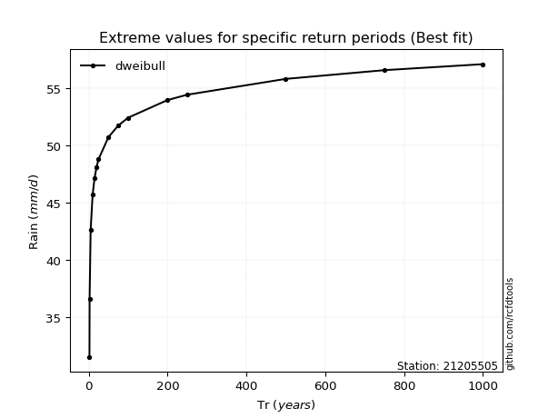</img>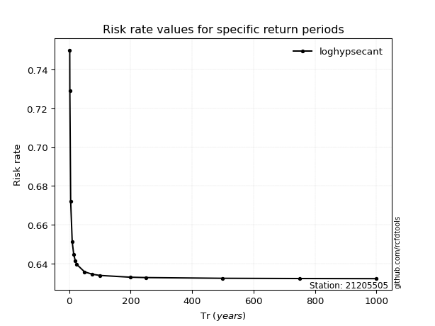</img>

</div>


<sub>**APP DISCLAIMER**: NO WARRANTY - This software is provided by [github.com/rcfdtools](https://github.com/rcfdtools) "as is", without any express or implied warranty, including warranties of merchantability, fitness for a particular purpose, or non-infringement. There is no guarantee that the software will be error-free or operate without interruption. LIMITATION OF LIABILITY - Neither the authors nor copyright holders will be liable for claims or damages arising from the software or its use. You are responsible for determining if the software is appropriate for your use and assume all associated risks, including errors, legal compliance, and data loss. NO PROFESSIONAL ADVICE - The software provides general information and does not offer professional advice. It should not replace consultation with professional advisors.</sub>