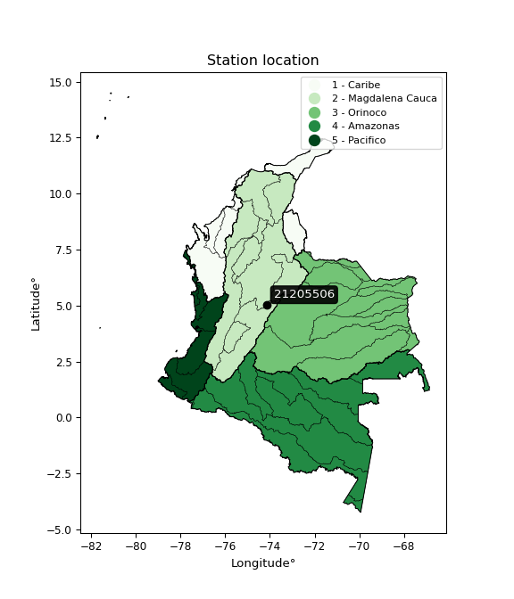

<div align="center">


</div>

# PMP Station (rain, Pmax24h): 21205506

Probable Maximum Precipitation (PMP) is the greatest amount of rainfall for a specific duration that is meteorologically possible for a given location, acting as a "worst-case" scenario for extreme storms, crucial for designing safety-critical infrastructure like bridges, river deviations, dams, spillways, and nuclear plants to prevent catastrophic failure. PMP is calculated by hydrologists using meteorological data to determine the upper limit of extreme rainfall, often leading to the Probable Maximum Flood (PMF) for flood control design, and is increasingly being studied for climate change impacts.

<div align="center">

</img>

</div>


## A. General information


### 1. General running parameters

• app_version: _v20251227_. • runtime: _2025-12-27 09:02:11.367833_. • Python version: _3.14.0_. • SciPy version: _1.16.3_. • Pandas version: _2.3.3_. • NumPy version: _2.3.5_. • Stations dataset (station_dataset_file): _dataset/pmax24h_in/automatic_colombia_2003_2024_filter.csv_. • Stations catalog (station_catalog_file): _dataset/CNE_IDEAM.xls_. • Minimum year to eval til year_max (date_min): _2003_. • Maximum year to eval since year_min (date_max): _2024_. • Creates, save and include plots into reports (create_plot): _False_. • Plot only fit distributions with Δo > Δ (plot_only_fit): _True_. • Eval low extreme values, if False, evaluates high extreme values (low_extreme): _False_. • Eval every SciPy distribution as logarithmic (pdist_logarithmic_on): _True_. • Standard deviation normalized (ddof): _1.0_. • Return periods to eval in years (Tr): _[2, 2.33, 5, 10, 15, 20, 25, 50, 75, 100, 200, 250, 500, 750, 1000]_. • Minimum data sample per station, 0 means any (minimum_sample): _5_. • Z-Score threshold to adjust a value, 0 means disable (zscore): _3.5_. • Avoid zeros, e.g. rain = 0 (avoid_zeros): _True_. • Avoid null values (avoid_nans): _True_. [:file_folder:Dataset file.](../../dataset/pmax24h_in/automatic_colombia_2003_2024_filter.csv)

> Delta Degrees of Freedom (DDOF): is a parameter used in the formulas for calculating variance and standard deviation. When ddof=0, the divisor is $N$ (the total number of observations) and this is used when your data set is the entire population. When ddof=1, the divisor is $N-1$ and this is used when your data set is a sample drawn from a larger population. Using $N-1$ provides an unbiased estimate of the population variance (known as Bessel´s correction).


### 2. Station info and location

|   id |   CODIGO | NOMBRE                    | CATEGORIA               | TECNOLOGIA                | ESTADO   |   FECHA_INSTALACION |   FECHA_SUSPENSION |   ALTITUD |   LATITUD |   LONGITUD | DEPARTAMENTO   | MUNICIPIO   | AREA_OPERATIVA                            | ENTIDAD                                       | AREA_HIDROGRAFICA   | ZONA_HIDROGRAFICA   | SUBZONA_HIDROGRAFICA   |   CORRIENTE | Catalogo   |
|-----:|---------:|:--------------------------|:------------------------|:--------------------------|:---------|--------------------:|-------------------:|----------:|----------:|-----------:|:---------------|:------------|:------------------------------------------|:----------------------------------------------|:--------------------|:--------------------|:-----------------------|------------:|:-----------|
|    0 | 21205506 | GUAMAL  - AUT  [21205506] | Climatológica Principal | Automática con Telemetría | Activa   |                 nan |                nan |         3 |   5.02506 |   -74.1528 | Cundinamarca   | Subachoque  | Area Operativa 11 - Cundinamarca-Amazonas | CORPORACION AUTONOMA REGIONAL DE CUNDINAMARCA | Magdalena Cauca     | Alto Magdalena      | Río Bogotá             |         nan | CNE_OE     |

<div align="center">

Map location in: [:earth_americas:Google](http://maps.google.com/maps?q=5.025055556,-74.15277778) [:earth_americas:OSM](https://www.openstreetmap.org/#map=18/5.025055556/-74.15277778&layers=P) [:earth_americas:Bing](https://www.bing.com/maps?cp=5.025055556~-74.15277778&lvl=18) [:earth_americas:Apple](https://maps.apple.com/frame?center=5.025055556%2C-74.15277778&span=0.003%2C0.006)

</div>


<div align="center">

```geojson
{
  "type": "Feature",
  "geometry": {
    "type": "Point", 
    "coordinates": [-74.15277778, 5.025055556]
  }, 
  "properties": {
    "Name": "21205506"
  }
}
```

</div>


### 3. Discrete values table and plot

|               |           0 |          1 |           2 |          3 |           4 |
|:--------------|------------:|-----------:|------------:|-----------:|------------:|
| Date          | 2016        | 2017       | 2018        | 2019       | 2020        |
| Value         |   44.1      |   48.6     |   34.4      |   30       |   36        |
| Value_initial |   44.1      |   48.6     |   34.4      |   30       |   36        |
| count         |    5        |    5       |    5        |    5       |    5        |
| mean          |   38.62     |   38.62    |   38.62     |   38.62    |   38.62     |
| std           |    7.55989  |    7.55989 |    7.55989  |    7.55989 |    7.55989  |
| zscore        |    0.724878 |    1.32012 |   -0.558209 |   -1.14023 |   -0.346566 |

> The initial value (value_initial) correspond to the initial obtained or null completed value, and value (value) is adjusted only when the initial value is outside the valid range definite through the Z-Score value. If Z-Score is active, values out of range or outliers are replaced with the station mean value


### 4. Active continuous probability distributions from SciPy (45 of 104 available)

[scipy.stats](https://docs.scipy.org/doc/scipy/reference/stats.html) is a Python´s powerful submodule within the SciPy library for comprehensive statistical analysis, offering over 130 probability distributions (like Normal, Poisson), functions for descriptive stats (mean, variance), hypothesis testing (t-tests, chi-square), random variable generation, and statistical tests, making it essential for data science, modeling, and research. It provides tools to explore, model, and draw conclusions from data efficiently, working seamlessly with NumPy.

<div align="center">

|   id | p_dist             |   n_parameter | fit_method   | label                                                                       | active   | ref                                                                                                        |
|-----:|:-------------------|--------------:|:-------------|:----------------------------------------------------------------------------|:---------|:-----------------------------------------------------------------------------------------------------------|
|    0 | alpha              |             3 | MLE          | Alpha                                                                       | True     | [:mortar_board:](https://docs.scipy.org/doc/scipy/reference/generated/scipy.stats.alpha.html)              |
|    1 | betaprime          |             4 | MLE          | Beta prime                                                                  | True     | [:mortar_board:](https://docs.scipy.org/doc/scipy/reference/generated/scipy.stats.betaprime.html)          |
|    2 | chi2               |             3 | MLE          | Chi²                                                                        | True     | [:mortar_board:](https://docs.scipy.org/doc/scipy/reference/generated/scipy.stats.chi2.html)               |
|    3 | crystalball        |             4 | MLE          | Crystalball                                                                 | True     | [:mortar_board:](https://docs.scipy.org/doc/scipy/reference/generated/scipy.stats.crystalball.html)        |
|    4 | erlang             |             3 | MLE          | Erlang                                                                      | True     | [:mortar_board:](https://docs.scipy.org/doc/scipy/reference/generated/scipy.stats.erlang.html)             |
|    5 | expon              |             2 | MLE          | Exponential                                                                 | True     | [:mortar_board:](https://docs.scipy.org/doc/scipy/reference/generated/scipy.stats.expon.html)              |
|    6 | exponnorm          |             3 | MLE          | Exponentially modified Normal                                               | True     | [:mortar_board:](https://docs.scipy.org/doc/scipy/reference/generated/scipy.stats.exponnorm.html)          |
|    7 | f                  |             4 | MLE          | F                                                                           | True     | [:mortar_board:](https://docs.scipy.org/doc/scipy/reference/generated/scipy.stats.f.html)                  |
|    8 | fatiguelife        |             3 | MLE          | Fatigue-life (Birnbaum-Saunders)                                            | True     | [:mortar_board:](https://docs.scipy.org/doc/scipy/reference/generated/scipy.stats.fatiguelife.html)        |
|    9 | fisk               |             3 | MLE          | Fisk                                                                        | True     | [:mortar_board:](https://docs.scipy.org/doc/scipy/reference/generated/scipy.stats.fisk.html)               |
|   10 | gamma              |             3 | MLE          | Gamma                                                                       | True     | [:mortar_board:](https://docs.scipy.org/doc/scipy/reference/generated/scipy.stats.gamma.html)              |
|   11 | genexpon           |             5 | MLE          | Generalized exponential                                                     | True     | [:mortar_board:](https://docs.scipy.org/doc/scipy/reference/generated/scipy.stats.genexpon.html)           |
|   12 | genlogistic        |             3 | MLE          | Generalized logistic                                                        | True     | [:mortar_board:](https://docs.scipy.org/doc/scipy/reference/generated/scipy.stats.genlogistic.html)        |
|   13 | gibrat             |             2 | MM           | Gibrat                                                                      | True     | [:mortar_board:](https://docs.scipy.org/doc/scipy/reference/generated/scipy.stats.gibrat.html)             |
|   14 | gompertz           |             3 | MLE          | Gompertz (or truncated Gumbel)                                              | True     | [:mortar_board:](https://docs.scipy.org/doc/scipy/reference/generated/scipy.stats.gompertz.html)           |
|   15 | gumbel_l           |             2 | MM           | Gumbel Left Skew                                                            | True     | [:mortar_board:](https://docs.scipy.org/doc/scipy/reference/generated/scipy.stats.gumbel_l.html)           |
|   16 | gumbel_r           |             2 | MM           | Gumbel Right Skew                                                           | True     | [:mortar_board:](https://docs.scipy.org/doc/scipy/reference/generated/scipy.stats.gumbel_r.html)           |
|   17 | halflogistic       |             2 | MM           | Half-logistic                                                               | True     | [:mortar_board:](https://docs.scipy.org/doc/scipy/reference/generated/scipy.stats.halflogistic.html)       |
|   18 | halfnorm           |             2 | MM           | Half Normal                                                                 | True     | [:mortar_board:](https://docs.scipy.org/doc/scipy/reference/generated/scipy.stats.halfnorm.html)           |
|   19 | hypsecant          |             2 | MM           | hyperbolic secant                                                           | True     | [:mortar_board:](https://docs.scipy.org/doc/scipy/reference/generated/scipy.stats.hypsecant.html)          |
|   20 | invgamma           |             3 | MLE          | Inverted gamma                                                              | True     | [:mortar_board:](https://docs.scipy.org/doc/scipy/reference/generated/scipy.stats.invgamma.html)           |
|   21 | invgauss           |             3 | MLE          | Inverse Gaussian                                                            | True     | [:mortar_board:](https://docs.scipy.org/doc/scipy/reference/generated/scipy.stats.invgauss.html)           |
|   22 | invweibull         |             3 | MLE          | Inverted Weibull                                                            | True     | [:mortar_board:](https://docs.scipy.org/doc/scipy/reference/generated/scipy.stats.invweibull.html)         |
|   23 | johnsonsu          |             4 | MLE          | Johnson Su                                                                  | True     | [:mortar_board:](https://docs.scipy.org/doc/scipy/reference/generated/scipy.stats.johnsonsu.html)          |
|   24 | kstwobign          |             2 | MLE          | Limiting distribution of scaled Kolmogorov-Smirnov two-sided test statistic | True     | [:mortar_board:](https://docs.scipy.org/doc/scipy/reference/generated/scipy.stats.kstwobign.html)          |
|   25 | laplace            |             2 | MM           | Laplace                                                                     | True     | [:mortar_board:](https://docs.scipy.org/doc/scipy/reference/generated/scipy.stats.laplace.html)            |
|   26 | laplace_asymmetric |             3 | MLE          | Asymmetric Laplace                                                          | True     | [:mortar_board:](https://docs.scipy.org/doc/scipy/reference/generated/scipy.stats.laplace_asymmetric.html) |
|   27 | loggamma           |             3 | MLE          | Log gamma                                                                   | True     | [:mortar_board:](https://docs.scipy.org/doc/scipy/reference/generated/scipy.stats.loggamma.html)           |
|   28 | logistic           |             2 | MM           | Logistic (or Sech-squared)                                                  | True     | [:mortar_board:](https://docs.scipy.org/doc/scipy/reference/generated/scipy.stats.logistic.html)           |
|   29 | lognorm            |             3 | MLE          | Log Normal                                                                  | True     | [:mortar_board:](https://docs.scipy.org/doc/scipy/reference/generated/scipy.stats.lognorm.html)            |
|   30 | maxwell            |             2 | MM           | Maxwell                                                                     | True     | [:mortar_board:](https://docs.scipy.org/doc/scipy/reference/generated/scipy.stats.maxwell.html)            |
|   31 | mielke             |             4 | MLE          | Mielke Beta-Kappa / Dagum                                                   | True     | [:mortar_board:](https://docs.scipy.org/doc/scipy/reference/generated/scipy.stats.mielke.html)             |
|   32 | moyal              |             2 | MM           | Moyal                                                                       | True     | [:mortar_board:](https://docs.scipy.org/doc/scipy/reference/generated/scipy.stats.moyal.html)              |
|   33 | nakagami           |             3 | MLE          | Nakagami                                                                    | True     | [:mortar_board:](https://docs.scipy.org/doc/scipy/reference/generated/scipy.stats.nakagami.html)           |
|   34 | ncf                |             5 | MLE          | Non-central F distribution                                                  | True     | [:mortar_board:](https://docs.scipy.org/doc/scipy/reference/generated/scipy.stats.ncf.html)                |
|   35 | nct                |             4 | MLE          | Non-central Student’s t                                                     | True     | [:mortar_board:](https://docs.scipy.org/doc/scipy/reference/generated/scipy.stats.nct.html)                |
|   36 | norm               |             2 | MM           | Normal                                                                      | True     | [:mortar_board:](https://docs.scipy.org/doc/scipy/reference/generated/scipy.stats.norm.html)               |
|   37 | pareto             |             3 | MLE          | Pareto                                                                      | True     | [:mortar_board:](https://docs.scipy.org/doc/scipy/reference/generated/scipy.stats.pareto.html)             |
|   38 | pearson3           |             3 | MM           | Pearson type III                                                            | True     | [:mortar_board:](https://docs.scipy.org/doc/scipy/reference/generated/scipy.stats.pearson3.html)           |
|   39 | rayleigh           |             2 | MM           | Rayleigh                                                                    | True     | [:mortar_board:](https://docs.scipy.org/doc/scipy/reference/generated/scipy.stats.rayleigh.html)           |
|   40 | rice               |             3 | MLE          | Rice                                                                        | True     | [:mortar_board:](https://docs.scipy.org/doc/scipy/reference/generated/scipy.stats.rice.html)               |
|   41 | t                  |             3 | MLE          | Student’s t                                                                 | True     | [:mortar_board:](https://docs.scipy.org/doc/scipy/reference/generated/scipy.stats.t.html)                  |
|   42 | truncnorm          |             4 | MLE          | Truncated normal                                                            | True     | [:mortar_board:](https://docs.scipy.org/doc/scipy/reference/generated/scipy.stats.truncnorm.html)          |
|   43 | wald               |             2 | MM           | Wald                                                                        | True     | [:mortar_board:](https://docs.scipy.org/doc/scipy/reference/generated/scipy.stats.wald.html)               |
|   44 | weibull_min        |             3 | MLE          | Weibull minimum                                                             | True     | [:mortar_board:](https://docs.scipy.org/doc/scipy/reference/generated/scipy.stats.weibull_min.html)        |

</div>

> **n_parameter:** # arguments & localization & scale.
>
> **Fit methods:** (MLE) maximum likelihood, (MM) L-moments.
>
>**Inactive:** foldnorm, gennorm, norminvgauss, powernorm, powerlognorm, skewnorm, genextreme, anglit, arcsine, argus, beta, bradford, burr, burr12, cauchy, cosine, halfcauchy, foldcauchy, skewcauchy, wrapcauchy, dgamma, gengamma, exponweib, exponpow, truncexpon, gausshyper, genhalflogistic, genhyperbolic, geninvgauss, halfgennorm, johnsonsb, kappa4, kappa3, ksone, kstwo, loglaplace, levy, levy_l, levy_stable, ncx2, genpareto, truncpareto, lomax, powerlaw, rdist, rel_breitwigner, recipinvgauss, semicircular, studentized_range, trapezoid, triang, truncweibull_min, tukeylambda, uniform, loguniform, vonmises, vonmises_line, weibull_max, dweibull, 


## B. Probability distributions vs. Empirical distributions

A continuous probability distribution (CPD) describes probabilities for variables that can take any value within a range (like rain any time), unlike discrete variables with specific outcomes (like temperature). It uses a Probability Density Function (PDF), a curve where the total area under it equals 1, and the probability of the variable falling within an interval (a to b) is found by calculating the area under the curve between those points. A key feature is that the probability of hitting any single exact value is zero, so probabilities are always expressed for ranges, e.g., $P(a ≤ X ≤ b)$.

<div align="center">

Distributions parameters from station values
|    |   station | p_dist                |   n |             loc |            scale | shape                  | shape1             | shape2                | shape3   |
|---:|----------:|:----------------------|----:|----------------:|-----------------:|:-----------------------|:-------------------|:----------------------|:---------|
|  0 |  21205506 | alpha                 |   5 |    -4.07168     |    268.89        | 6.455670586185956      |                    |                       |          |
|  1 |  21205506 | betaprime             |   5 |    -1.85958     |      3.84914     | 413.53451654047535     | 40.320491954709674 |                       |          |
|  2 |  21205506 | chi2                  |   5 |    30           |      3.12319     | 0.5331128631621918     |                    |                       |          |
|  3 |  21205506 | crystalball           |   5 |    38.62        |      6.76177     | 3602.862535540694      | 2045.3041947743736 |                       |          |
|  4 |  21205506 | erlang                |   5 |    30           |      8.55199     | 0.7879749218334049     |                    |                       |          |
|  5 |  21205506 | expon                 |   5 |    30           |      8.62        |                        |                    |                       |          |
|  6 |  21205506 | exponnorm             |   5 |    37.2179      |      6.61543     | 0.21194767977503404    |                    |                       |          |
|  7 |  21205506 | f                     |   5 |    16.7031      |     19.9885      | 456.93757178807346     | 21.838981777424763 |                       |          |
|  8 |  21205506 | fatiguelife           |   5 |    30           |      7.45088e-05 | 348.0351516061032      |                    |                       |          |
|  9 |  21205506 | fisk                  |   5 |    26.5732      |     10.3088      | 2.550831535796479      |                    |                       |          |
| 10 |  21205506 | gamma                 |   5 |    30           |      6.39318     | 0.5219850010966982     |                    |                       |          |
| 11 |  21205506 | genexpon              |   5 |    30           |      2.28159     | 0.20209535183621913    | 0.5437393413685506 | 0.0406249808380914    |          |
| 12 |  21205506 | genlogistic           |   5 |    -1.68475     |      5.56732     | 775.8274095963639      |                    |                       |          |
| 13 |  21205506 | gibrat                |   5 |    33.4616      |      3.12873     |                        |                    |                       |          |
| 14 |  21205506 | gompertz              |   5 |    30           |     16.2572      | 1.1689458798875751     |                    |                       |          |
| 15 |  21205506 | gumbel_l              |   5 |    41.6632      |      5.27213     |                        |                    |                       |          |
| 16 |  21205506 | gumbel_r              |   5 |    35.5768      |      5.27213     |                        |                    |                       |          |
| 17 |  21205506 | halflogistic          |   5 |    30.6057      |      5.78107     |                        |                    |                       |          |
| 18 |  21205506 | halfnorm              |   5 |    29.6701      |     11.2171      |                        |                    |                       |          |
| 19 |  21205506 | hypsecant             |   5 |    38.62        |      4.30468     |                        |                    |                       |          |
| 20 |  21205506 | invgamma              |   5 |    16.0839      |    228.352       | 11.100878676479526     |                    |                       |          |
| 21 |  21205506 | invgauss              |   5 |    24.3013      |     48.8041      | 0.2933909085020285     |                    |                       |          |
| 22 |  21205506 | invweibull            |   5 |    -4.70272e+06 |      4.70275e+06 | 844186.3496495578      |                    |                       |          |
| 23 |  21205506 | johnsonsu             |   5 |     5.2333e+08  |      2.12914e+07 | 306940800.3673144      | 78794301.7047213   |                       |          |
| 24 |  21205506 | kstwobign             |   5 |    16.1167      |     25.7223      |                        |                    |                       |          |
| 25 |  21205506 | laplace               |   5 |    38.62        |      4.7813      |                        |                    |                       |          |
| 26 |  21205506 | laplace_asymmetric    |   5 |    34.4         |      4.65259     | 0.6445269596798215     |                    |                       |          |
| 27 |  21205506 | loggamma              |   5 | -1205.42        |    187.82        | 752.9854612138538      |                    |                       |          |
| 28 |  21205506 | logistic              |   5 |    38.62        |      3.72796     |                        |                    |                       |          |
| 29 |  21205506 | lognorm               |   5 |    30           |      0.00755404  | 14.202587204437688     |                    |                       |          |
| 30 |  21205506 | maxwell               |   5 |    22.5974      |     10.0407      |                        |                    |                       |          |
| 31 |  21205506 | mielke                |   5 |   -45.2043      |     49.8039      | 18193.605298371767     | 14.872921507898262 |                       |          |
| 32 |  21205506 | moyal                 |   5 |    34.7532      |      3.04387     |                        |                    |                       |          |
| 33 |  21205506 | nakagami              |   5 |    34.4         |      7.51379     | 0.04837185511604948    |                    |                       |          |
| 34 |  21205506 | ncf                   |   5 |     0.00488551  |      7.35623e-05 | 7.1659808674439704e-06 | 2.741806474746327  | 2.5935726638418135    |          |
| 35 |  21205506 | nct                   |   5 |    -0.107506    |      1.10593     | 17.910208100354794     | 33.507075466263785 |                       |          |
| 36 |  21205506 | norm                  |   5 |    38.62        |      6.76177     |                        |                    |                       |          |
| 37 |  21205506 | pareto                |   5 |    29.9208      |      0.0792138   | 0.26279921895221653    |                    |                       |          |
| 38 |  21205506 | pearson3              |   5 |    38.62        |      6.76177     | 0.27490652168592555    |                    |                       |          |
| 39 |  21205506 | rayleigh              |   5 |    25.6843      |     10.3212      |                        |                    |                       |          |
| 40 |  21205506 | rice                  |   5 |    26.5671      |      8.99689     | 0.599629718571858      |                    |                       |          |
| 41 |  21205506 | t                     |   5 |    38.62        |      6.76176     | 147948.21194458212     |                    |                       |          |
| 42 |  21205506 | truncnorm             |   5 | -2175.41        |    138.314       | 15.944982653882905     | 570.9799083210652  |                       |          |
| 43 |  21205506 | wald                  |   5 |    31.8582      |      6.76181     |                        |                    |                       |          |
| 44 |  21205506 | weibull_min           |   5 |    30           |      8.70666     | 0.7921975019581295     |                    |                       |          |
| 45 |  21205506 | logalpha              |   5 |     0.576998    |     54.0724      | 17.72142330329811      |                    |                       |          |
| 46 |  21205506 | logbetaprime          |   5 |     1.47001     |    133.768       | 157.03440970968023     | 9688.605563474084  |                       |          |
| 47 |  21205506 | logchi2               |   5 |     3.4012      |      0.98627     | 0.9816000205542117     |                    |                       |          |
| 48 |  21205506 | logcrystalball        |   5 |     3.63857     |      0.174013    | 8.06785527127446       | 6.255597730058756  |                       |          |
| 49 |  21205506 | logerlang             |   5 |     2.26661     |      0.0219615   | 62.454713107957936     |                    |                       |          |
| 50 |  21205506 | logexpon              |   5 |     3.4012      |      0.237374    |                        |                    |                       |          |
| 51 |  21205506 | logexponnorm          |   5 |     3.62248     |      0.173266    | 0.09289099038864532    |                    |                       |          |
| 52 |  21205506 | logf                  |   5 |     2.48118     |      1.1363      | 460.7982869796447      | 108.98177297338525 |                       |          |
| 53 |  21205506 | logfatiguelife        |   5 |     3.0626      |      0.548377    | 0.31708872842821323    |                    |                       |          |
| 54 |  21205506 | logfisk               |   5 |     3.11501     |      0.498372    | 4.708154863532862      |                    |                       |          |
| 55 |  21205506 | loggamma              |   5 |     2.24262     |      0.0213326   | 65.3524800759935       |                    |                       |          |
| 56 |  21205506 | loggenexpon           |   5 |     3.4012      |      0.399713    | 1.2177871553325321     | 1.316190673103466  | 1.0130633783144       |          |
| 57 |  21205506 | loggenlogistic        |   5 |     2.63751     |      0.15008     | 446.40378559569444     |                    |                       |          |
| 58 |  21205506 | loggibrat             |   5 |     3.50585     |      0.0805021   |                        |                    |                       |          |
| 59 |  21205506 | loggompertz           |   5 |     3.4012      |      0.398996    | 1.0027792623996126     |                    |                       |          |
| 60 |  21205506 | loggumbel_l           |   5 |     3.71689     |      0.135677    |                        |                    |                       |          |
| 61 |  21205506 | loggumbel_r           |   5 |     3.56026     |      0.135677    |                        |                    |                       |          |
| 62 |  21205506 | loghalflogistic       |   5 |     3.43233     |      0.148771    |                        |                    |                       |          |
| 63 |  21205506 | loghalfnorm           |   5 |     3.40827     |      0.288638    |                        |                    |                       |          |
| 64 |  21205506 | loghypsecant          |   5 |     3.63857     |      0.11078     |                        |                    |                       |          |
| 65 |  21205506 | loginvgamma           |   5 |    -3.3501      |  11331.3         | 1622.4051678694482     |                    |                       |          |
| 66 |  21205506 | loginvgauss           |   5 |     3.01981     |      7.07304     | 0.08748231688916078    |                    |                       |          |
| 67 |  21205506 | loginvweibull         |   5 |    -7.08544e+06 |      7.08544e+06 | 47171175.691881806     |                    |                       |          |
| 68 |  21205506 | logjohnsonsu          |   5 |     2.18271e+06 | 309774           | 33692414.622783944     | 12711122.808420882 |                       |          |
| 69 |  21205506 | logkstwobign          |   5 |     3.0337      |      0.690894    |                        |                    |                       |          |
| 70 |  21205506 | loglaplace            |   5 |     3.63857     |      0.123046    |                        |                    |                       |          |
| 71 |  21205506 | loglaplace_asymmetric |   5 |     3.53806     |      0.127211    | 0.6801411926222551     |                    |                       |          |
| 72 |  21205506 | logloggamma           |   5 |   -34.5945      |      5.53427     | 1001.0488418156074     |                    |                       |          |
| 73 |  21205506 | loglogistic           |   5 |     3.63857     |      0.0959382   |                        |                    |                       |          |
| 74 |  21205506 | loglognorm            |   5 |     3.4012      |      0.000290238 | 13.610744619590795     |                    |                       |          |
| 75 |  21205506 | logmaxwell            |   5 |     3.22623     |      0.258394    |                        |                    |                       |          |
| 76 |  21205506 | logmielke             |   5 | -9169.49        |   9172.48        | 2675045.9420564407     | 61515.79403014018  |                       |          |
| 77 |  21205506 | logmoyal              |   5 |     3.53906     |      0.0783332   |                        |                    |                       |          |
| 78 |  21205506 | lognakagami           |   5 |     3.4012      |      0.297747    | 0.097718423699902      |                    |                       |          |
| 79 |  21205506 | logncf                |   5 |    -3.85387     |      7.48863     | 732.1489370669748      | 1543.1531914119064 | 1.533949930109471e-08 |          |
| 80 |  21205506 | lognct                |   5 |    -1.29023     |      0.0293514   | 414.6822832041539      | 167.6187917209847  |                       |          |
| 81 |  21205506 | lognorm               |   5 |     3.63857     |      0.174013    |                        |                    |                       |          |
| 82 |  21205506 | logpareto             |   5 |     3.39896     |      0.00224042  | 0.26219596918440546    |                    |                       |          |
| 83 |  21205506 | logpearson3           |   5 |     3.63857     |      0.174013    | 0.12873909662266922    |                    |                       |          |
| 84 |  21205506 | lograyleigh           |   5 |     3.30567     |      0.265613    |                        |                    |                       |          |
| 85 |  21205506 | logrice               |   5 |     3.31286     |      0.220813    | 0.8926521929401636     |                    |                       |          |
| 86 |  21205506 | logt                  |   5 |     3.63857     |      0.174013    | 44807633260.38283      |                    |                       |          |
| 87 |  21205506 | logtruncnorm          |   5 |    -0.0492401   |      1.11258     | 3.1010622225292748     | 3.534916832897307  |                       |          |
| 88 |  21205506 | logwald               |   5 |     3.46458     |      0.173997    |                        |                    |                       |          |
| 89 |  21205506 | logweibull_min        |   5 |     3.4012      |      0.253966    | 0.8529725637074166     |                    |                       |          |

</div>

> **loc** (Location parameter): This shifts the distribution along the x-axis. For many common distributions, like the normal (Gaussian) distribution, loc represents the mean $μ$. For others, like the uniform distribution, it might represent the minimum value, or for the beta distribution, the left end of the support interval.
>
> **scale** (Scale parameter): This determines the width or spread of the distribution. For the normal distribution, scale represents the standard deviation $σ$. For a uniform distribution, it defines the length of the interval (from $loc$ to $loc + scale$).
>
> **shape** (Shape parameters): Refers to parameters that define the specific form of a probability distribution, distinct from its location (loc) and scale (scale). These parameters are required arguments for most distribution functions. For example, a normal (Gaussian) distribution is fully defined by its location (mean) and scale (standard deviation), so it has no specific shape parameters beyond loc and scale. However, other distributions have intrinsic properties that need specification, as Gamma distribution that takes a shape parameter, often named $a$ or $alpha$.


### 0. Cumulative distribution values - CDF (90 evaluated)

Cumulative Distribution Function (CDF), denoted as $F$<sub>$X$</sub>$(x)$, is a function that gives the probability that a random variable $X$ will take a value less than or equal to a specific value, $x$ (i.e., $(P(X≥x)$. It essentially "accumulates" probabilities from a given point up to the far right (positive infinity), providing a complete picture of the distribution´s probabilities for both discrete (like rain) and continuous (like temperature) variables, helping to find probabilities over ranges or above certain values.

<div align="center">

CDF ordered by x ascending and calculating $log(f(x))$ separately
|   id |   Station |   date |    x |   count |   mean |     std |    zscore |   Value_initial |   station |   m |     alpha |   alpha_pdf |   betaprime |   betaprime_pdf |        chi2 |    chi2_pdf |   crystalball |   crystalball_pdf |      erlang |   erlang_pdf |    expon |   expon_pdf |   exponnorm |   exponnorm_pdf |         f |     f_pdf |   fatiguelife |   fatiguelife_pdf |      fisk |   fisk_pdf |       gamma |      gamma_pdf |    genexpon |   genexpon_pdf |   genlogistic |   genlogistic_pdf |   gibrat |   gibrat_pdf |    gompertz |   gompertz_pdf |   gumbel_l |   gumbel_l_pdf |   gumbel_r |   gumbel_r_pdf |   halflogistic |   halflogistic_pdf |   halfnorm |   halfnorm_pdf |   hypsecant |   hypsecant_pdf |   invgamma |   invgamma_pdf |   invgauss |   invgauss_pdf |   invweibull |   invweibull_pdf |   johnsonsu |   johnsonsu_pdf |   kstwobign |   kstwobign_pdf |   laplace |   laplace_pdf |   laplace_asymmetric |   laplace_asymmetric_pdf |   loggamma |   loggamma_pdf |   logistic |   logistic_pdf |   lognorm |   lognorm_pdf |   maxwell |   maxwell_pdf |   mielke |   mielke_pdf |    moyal |   moyal_pdf |   nakagami |   nakagami_pdf |      ncf |    ncf_pdf |       nct |   nct_pdf |     norm |   norm_pdf |      pareto |   pareto_pdf |   pearson3 |   pearson3_pdf |   rayleigh |   rayleigh_pdf |      rice |   rice_pdf |        t |     t_pdf |   truncnorm |   truncnorm_pdf |     wald |   wald_pdf |   weibull_min |   weibull_min_pdf |   logalpha |   logalpha_pdf |   logbetaprime |   logbetaprime_pdf |     logchi2 |   logchi2_pdf |   logcrystalball |   logcrystalball_pdf |   logerlang |   logerlang_pdf |   logexpon |   logexpon_pdf |   logexponnorm |   logexponnorm_pdf |      logf |   logf_pdf |   logfatiguelife |   logfatiguelife_pdf |   logfisk |   logfisk_pdf |   loggenexpon |   loggenexpon_pdf |   loggenlogistic |   loggenlogistic_pdf |   loggibrat |   loggibrat_pdf |   loggompertz |   loggompertz_pdf |   loggumbel_l |   loggumbel_l_pdf |   loggumbel_r |   loggumbel_r_pdf |   loghalflogistic |   loghalflogistic_pdf |   loghalfnorm |   loghalfnorm_pdf |   loghypsecant |   loghypsecant_pdf |   loginvgamma |   loginvgamma_pdf |   loginvgauss |   loginvgauss_pdf |   loginvweibull |   loginvweibull_pdf |   logjohnsonsu |   logjohnsonsu_pdf |   logkstwobign |   logkstwobign_pdf |   loglaplace |   loglaplace_pdf |   loglaplace_asymmetric |   loglaplace_asymmetric_pdf |   logloggamma |   logloggamma_pdf |   loglogistic |   loglogistic_pdf |   loglognorm |   loglognorm_pdf |   logmaxwell |   logmaxwell_pdf |   logmielke |   logmielke_pdf |   logmoyal |   logmoyal_pdf |   lognakagami |   lognakagami_pdf |   logncf |   logncf_pdf |    lognct |   lognct_pdf |   logpareto |   logpareto_pdf |   logpearson3 |   logpearson3_pdf |   lograyleigh |   lograyleigh_pdf |   logrice |   logrice_pdf |      logt |   logt_pdf |   logtruncnorm |   logtruncnorm_pdf |   logwald |   logwald_pdf |   logweibull_min |   logweibull_min_pdf |
|-----:|----------:|-------:|-----:|--------:|-------:|--------:|----------:|----------------:|----------:|----:|----------:|------------:|------------:|----------------:|------------:|------------:|--------------:|------------------:|------------:|-------------:|---------:|------------:|------------:|----------------:|----------:|----------:|--------------:|------------------:|----------:|-----------:|------------:|---------------:|------------:|---------------:|--------------:|------------------:|---------:|-------------:|------------:|---------------:|-----------:|---------------:|-----------:|---------------:|---------------:|-------------------:|-----------:|---------------:|------------:|----------------:|-----------:|---------------:|-----------:|---------------:|-------------:|-----------------:|------------:|----------------:|------------:|----------------:|----------:|--------------:|---------------------:|-------------------------:|-----------:|---------------:|-----------:|---------------:|----------:|--------------:|----------:|--------------:|---------:|-------------:|---------:|------------:|-----------:|---------------:|---------:|-----------:|----------:|----------:|---------:|-----------:|------------:|-------------:|-----------:|---------------:|-----------:|---------------:|----------:|-----------:|---------:|----------:|------------:|----------------:|---------:|-----------:|--------------:|------------------:|-----------:|---------------:|---------------:|-------------------:|------------:|--------------:|-----------------:|---------------------:|------------:|----------------:|-----------:|---------------:|---------------:|-------------------:|----------:|-----------:|-----------------:|---------------------:|----------:|--------------:|--------------:|------------------:|-----------------:|---------------------:|------------:|----------------:|--------------:|------------------:|--------------:|------------------:|--------------:|------------------:|------------------:|----------------------:|--------------:|------------------:|---------------:|-------------------:|--------------:|------------------:|--------------:|------------------:|----------------:|--------------------:|---------------:|-------------------:|---------------:|-------------------:|-------------:|-----------------:|------------------------:|----------------------------:|--------------:|------------------:|--------------:|------------------:|-------------:|-----------------:|-------------:|-----------------:|------------:|----------------:|-----------:|---------------:|--------------:|------------------:|---------:|-------------:|----------:|-------------:|------------:|----------------:|--------------:|------------------:|--------------:|------------------:|----------:|--------------:|----------:|-----------:|---------------:|-------------------:|----------:|--------------:|-----------------:|---------------------:|
|    0 |  21205506 |   2019 | 30   |       5 |  38.62 | 7.55989 | -1.14023  |            30   |  21205506 |   1 | 0.0754695 |   0.0329443 |   0.0834568 |       0.0309292 | 0.000115031 | 4.31532e+09 |      0.101188 |         0.026179  | 4.53791e-08 |   9.57957    | 0        |   0.116009  |    0.100787 |       0.026271  | 0.0679893 | 0.036002  |     0.0407674 |       3.75943e+08 | 0.0568164 |  0.0398902 | 1.59766e-06 | 20884.2        | 5.51793e-08 |      0.0885767 |     0.0732112 |         0.034322  | 0        |   0          | 1.45838e-11 |      0.0719034 |   0.103679 |      0.0186088 |  0.0561339 |      0.0306643 |       0        |          0         |  0.0234656 |      0.0711004 |   0.0854279 |       0.019608  |  0.0681703 |      0.0359408 |  0.0586529 |      0.0434011 |    0.0728984 |        0.034268  |   0.0973546 |       0.0258887 |   0.0672543 |       0.0361853 | 0.0824136 |     0.0172367 |            0.0676646 |                0.0225645 |  0.0793299 |       0.969603 |   0.090113 |      0.021994  | 0.0862651 |      0.904185 | 0.0907757 |     0.0329146 |      nan |          nan | 0.029023 |   0.0263994 |  0         |    0           | 0.606579 | 0.00673798 | 0.0789245 | 0.0327595 | 0.101188 |  0.026179  | 1.11022e-16 |   3.3176     |  0.0948592 |      0.0284054 |  0.0837074 |      0.0371214 | 0.0590353 |  0.0333768 | 0.101188 | 0.0261789 |    0        |       0.115731  | 0        | 0          |    1.1146e-12 |       124.268     |  0.0771265 |       0.980291 |      0.0828632 |           0.946759 | 2.35919e-08 |   2.60734e+07 |        0.0862651 |             0.904185 |   0.0792083 |        0.965318 |   0        |       4.21276  |      0.0862246 |           0.904473 | 0.0719698 |    1.03106 |        0.0623486 |              1.1767  |  0.068399 |      1.04827  |   7.87479e-10 |          3.04665  |        0.0642712 |             1.17178  |    0        |        0        |    8.1256e-10 |          2.51325  |     0.0929983 |          0.652529 |     0.0395764 |          0.942037 |          0        |              0        |      0        |          0        |      0.0743555 |           0.665113 |     0.0834204 |          0.925825 |     0.0636185 |          1.1508   |       0.0637514 |            1.16834  |      0.0855519 |           0.901567 |       0.060195 |           1.26464  |    0.0726354 |         0.590314 |               0.0650298 |                    0.751601 |     0.0887089 |          0.905329 |     0.0776841 |          0.746827 |    0.0228129 |      8.95316e+12 |     0.072088 |         1.12571  |   0.0649645 |        1.15441  |   0.015916 |       0.671497 |    0.00105906 |       4.66075e+11 | 0.311838 |     0.765077 | 0.0819371 |     0.94358  | 1.11022e-16 |      117.03     |     0.0830869 |          0.934742 |     0.0626204 |          1.26918  | 0.0524494 |       1.15892 | 0.0862654 |   0.904186 |     0.00103935 |           3.84696  |  0        |      0        |      2.58478e-13 |           496.464    |
|    1 |  21205506 |   2018 | 34.4 |       5 |  38.62 | 7.55989 | -0.558209 |            34.4 |  21205506 |   2 | 0.296799  |   0.0628591 |   0.285656  |       0.0580905 | 0.884211    | 0.0302062   |      0.266282 |         0.0485592 | 0.514585    |   0.0683173  | 0.399769 |   0.0696324 |    0.266662 |       0.0487892 | 0.310925  | 0.0666551 |     0.75748   |       0.0248069   | 0.331231  |  0.0721949 | 0.74746     |     0.0552865  | 0.349336    |      0.0693185 |     0.305062  |         0.0650053 | 0.114257 |   0.20589    | 0.304641    |      0.0655391 |   0.222888 |      0.0371699 |  0.286478  |      0.0679278 |       0.316869 |          0.0778052 |  0.326736  |      0.0650803 |   0.228505  |       0.0486398 |  0.310768  |      0.0666375 |  0.339649  |      0.0704027 |    0.304627  |        0.0650002 |   0.262766  |       0.0490631 |   0.306806  |       0.0651708 | 0.206852  |     0.0432627 |            0.293493  |                0.0978729 |  0.292905  |       2.09362  |   0.243795 |      0.049453  | 0.281757  |      1.94034  | 0.290181  |     0.0550255 |      nan |          nan | 0.289267 |   0.0792168 |  0.0312016 |    4.24825e+11 | 0.634472 | 0.00596169 | 0.295613  | 0.0614649 | 0.266282 |  0.0485592 | 0.653686    |   0.0203185  |  0.275347  |      0.0524044 |  0.299909  |      0.0572793 | 0.272046  |  0.0591789 | 0.266283 | 0.0485591 |    0.399337 |       0.0696531 | 0.246073 | 0.152486   |    0.441423   |         0.0585676 |  0.294687  |       2.12683  |      0.288753  |           2.02205  | 0.297879    |   1.01945     |        0.281757  |             1.94034  |   0.291421  |        2.07869  |   0.43817  |       2.36686  |      0.281805  |           1.94115  | 0.303257  |    2.22467 |        0.326214  |              2.39705 |  0.316164 |      2.40615  |   0.38542     |          2.46556  |        0.331307  |             2.43567  |    0.179832 |        8.14176  |    0.336561   |          2.34966  |     0.234829  |          1.50949  |     0.307965  |          2.67335  |          0.341091 |              2.96985  |      0.347032 |          2.49853  |      0.24421   |           1.99448  |     0.28515   |          1.99493  |     0.322295  |          2.37519  |       0.330617  |            2.43614  |      0.281104  |           1.94459  |       0.339123 |           2.44081  |    0.220902  |         1.79528  |               0.316282  |                    3.65552  |     0.282868  |          1.92201  |     0.259667  |          2.00379  |    0.67447   |      0.193345    |     0.307607 |         2.17109  |   0.328701  |        2.42143  |   0.314212 |       3.08887  |    0.717416   |       1.00538     | 0.4219   |     0.83256  | 0.288121  |     2.02964  | 0.661247    |        0.638534 |     0.286574  |          2.00602  |     0.317993  |          2.24643  | 0.298889  |       2.24564 | 0.281758  |   1.94033  |     0.437746   |           2.60706  |  0.29276  |      5.62757  |      0.445765    |             2.03859  |
|    2 |  21205506 |   2020 | 36   |       5 |  38.62 | 7.55989 | -0.346566 |            36   |  21205506 |   3 | 0.399533  |   0.0646753 |   0.382056  |       0.0616962 | 0.922306    | 0.0186234   |      0.349203 |         0.0547328 | 0.611004    |   0.0530541  | 0.501452 |   0.0578362 |    0.349939 |       0.0549384 | 0.417621  | 0.0658006 |     0.792564  |       0.0194413   | 0.443206  |  0.0667758 | 0.820139    |     0.0371143  | 0.45403     |      0.0615439 |     0.410303  |         0.0656173 | 0.417189 |   0.153764   | 0.406549    |      0.0617189 |   0.289355 |      0.0460427 |  0.397376  |      0.0695596 |       0.435404 |          0.0700929 |  0.427458  |      0.060661  |   0.317224  |       0.062086  |  0.417494  |      0.0658533 |  0.448461  |      0.0649535 |    0.409869  |        0.065623  |   0.346739  |       0.0555312 |   0.411373  |       0.064744  | 0.289062  |     0.0604567 |            0.433949  |                0.0784154 |  0.393065  |       2.28747  |   0.331192 |      0.0594169 | 0.375861  |      2.1807   | 0.38109   |     0.0580929 |      nan |          nan | 0.415185 |   0.0766253 |  0.763221  |    0.0460515   | 0.643807 | 0.00570935 | 0.396406  | 0.0637051 | 0.349203 |  0.0547328 | 0.680397    |   0.0138162  |  0.363721  |      0.0575609 |  0.393146  |      0.0587657 | 0.369375  |  0.0618839 | 0.349204 | 0.0547329 |    0.501088 |       0.0578956 | 0.455703 | 0.108876   |    0.525058   |         0.04669   |  0.39604   |       2.30498  |      0.38594   |           2.23104  | 0.340371    |   0.860853    |        0.375861  |             2.1807   |   0.390879  |        2.272    |   0.536096 |       1.95432  |      0.375942  |           2.18131  | 0.407945  |    2.35017 |        0.43564   |              2.38453 |  0.427787 |      2.45988  |   0.490879    |          2.17146  |        0.442079  |             2.40221  |    0.485728 |        5.13293  |    0.440583   |          2.22036  |     0.312158  |          1.89706  |     0.43066   |          2.67402  |          0.468478 |              2.62325  |      0.456248 |          2.299    |      0.347951  |           2.55173  |     0.381438  |          2.21978  |     0.43125   |          2.38538  |       0.441423  |            2.40318  |      0.375455  |           2.18719  |       0.449022 |           2.36512  |    0.31964   |         2.59773  |               0.463815  |                    2.86673  |     0.376119  |          2.16237  |     0.360353  |          2.40258  |    0.682023  |      0.143725    |     0.409107 |         2.26965  |   0.439123  |        2.40072  |   0.451492 |       2.88813  |    0.757713   |       0.785535    | 0.45995  |     0.840052 | 0.385697  |     2.24015  | 0.685456    |        0.446854 |     0.383215  |          2.22372  |     0.42138   |          2.27875  | 0.403338  |       2.32527 | 0.375861  |   2.18069  |     0.548763   |           2.28333  |  0.505119 |      3.77023  |      0.529399    |             1.65949  |
|    3 |  21205506 |   2016 | 44.1 |       5 |  38.62 | 7.55989 |  0.724878 |            44.1 |  21205506 |   4 | 0.808875  |   0.0315587 |   0.804098  |       0.034938  | 0.986414    | 0.00272101  |      0.791156 |         0.042484  | 0.865339    |   0.0171673  | 0.80519  |   0.0225998 |    0.791655 |       0.042256  | 0.808928  | 0.0291123 |     0.894335  |       0.00809654  | 0.794751  |  0.0237406 | 0.961853    |     0.00694906 | 0.805545    |      0.0275132 |     0.812179  |         0.0303447 | 0.889494 |   0.0177334  | 0.800856    |      0.0340867 |   0.795581 |      0.0615562 |  0.819907  |      0.0308801 |       0.823343 |          0.0278587 |  0.801705  |      0.0310961 |   0.826208  |       0.0383966 |  0.809545  |      0.0291645 |  0.809736  |      0.0264108 |    0.8119    |        0.0303696 |   0.795148  |       0.0427252 |   0.812643  |       0.031618  | 0.841068  |     0.0332403 |            0.815696  |                0.0255317 |  0.810492  |       1.46756  |   0.813053 |      0.0407723 | 0.802302  |      1.59767  | 0.795274  |     0.0367914 |      nan |          nan | 0.829471 |   0.0275814 |  0.905368  |    0.00836086  | 0.685481 | 0.00463195 | 0.808585  | 0.0325048 | 0.791156 |  0.042484  | 0.744169    |   0.00474159 |  0.796048  |      0.0390347 |  0.79644   |      0.0351902 | 0.799452  |  0.0371681 | 0.791156 | 0.0424838 |    0.805435 |       0.0226602 | 0.862227 | 0.020202   |    0.76894    |         0.0190195 |  0.808837  |       1.42985  |      0.804328  |           1.51451  | 0.475635    |   0.530639    |        0.802302  |             1.59767  |   0.80705   |        1.47376  |   0.802698 |       0.831187 |      0.802332  |           1.59686  | 0.80926   |    1.34232 |        0.810131  |              1.19318 |  0.802737 |      1.11033  |   0.804559    |          0.996598 |        0.809544  |             1.13941  |    0.894112 |        0.651955 |    0.804232   |          1.29218  |     0.811742  |          2.31712  |     0.827976  |          1.15199  |          0.830633 |              1.04203  |      0.809888 |          1.17165  |      0.836179  |           1.41438  |     0.804423  |          1.54774  |     0.810223  |          1.21443  |       0.809153  |            1.14077  |      0.80308   |           1.59916  |       0.813975 |           1.17061  |    0.849689  |         1.22159  |               0.818828  |                    0.968644 |     0.80167   |          1.6065   |     0.823682  |          1.51378  |    0.701365  |      0.0661696   |     0.804927 |         1.38381  |   0.808546  |        1.14948  |   0.836674 |       1.02782  |    0.86757    |       0.378973    | 0.626978 |     0.782377 | 0.804905  |     1.51168  | 0.741048    |        0.175215 |     0.80406   |          1.53356  |     0.805675  |          1.32428  | 0.80608   |       1.40491 | 0.802302  |   1.59767  |     0.896263   |           1.23789  |  0.867501 |      0.74961  |      0.759931    |             0.75838  |
|    4 |  21205506 |   2017 | 48.6 |       5 |  38.62 | 7.55989 |  1.32012  |            48.6 |  21205506 |   5 | 0.911596  |   0.015531  |   0.918035  |       0.0169875 | 0.99437     | 0.00108051  |      0.930021 |         0.0198524 | 0.923749    |   0.00956475 | 0.884418 |   0.0134086 |    0.929657 |       0.0197388 | 0.904845  | 0.0148671 |     0.924439  |       0.0054939   | 0.873994  |  0.0127535 | 0.982978    |     0.00301117 | 0.900421    |      0.0155109 |     0.911457  |         0.0151774 | 0.942557 |   0.00760447 | 0.918008    |      0.0185098 |   0.975949 |      0.017005  |  0.918908  |      0.01474   |       0.914821 |          0.0141067 |  0.908512  |      0.0171249 |   0.937539  |       0.0144172 |  0.905541  |      0.0148568 |  0.898752  |      0.0142852 |    0.911281  |        0.0151975 |   0.933373  |       0.0194439 |   0.917626  |       0.0161733 | 0.937989  |     0.0129694 |            0.90119   |                0.0136882 |  0.918561  |       0.784004 |   0.93566  |      0.0161484 | 0.920471  |      0.850537 | 0.918142  |     0.0186357 |      nan |          nan | 0.918087 |   0.0134081 |  0.935613  |    0.00540415  | 0.705217 | 0.00415147 | 0.914545  | 0.0159686 | 0.930021 |  0.0198524 | 0.762046    |   0.0033478  |  0.923873  |      0.0187286 |  0.914972  |      0.018291  | 0.922135  |  0.0183239 | 0.93002  | 0.0198523 |    0.88486  |       0.0134368 | 0.926264 | 0.00975408 |    0.838711   |         0.0125338 |  0.914451  |       0.773275 |      0.916583  |           0.81809  | 0.523091    |   0.450475    |        0.920471  |             0.850537 |   0.916076  |        0.795995 |   0.868972 |       0.551988 |      0.920437  |           0.850143 | 0.908917  |    0.741   |        0.899981  |              0.68799 |  0.884912 |      0.623836 |   0.882539    |          0.630759 |        0.895298  |             0.659688 |    0.93895  |        0.319634 |    0.905296   |          0.797463 |     0.967208  |          0.826002 |     0.911886  |          0.619947 |          0.908126 |              0.589183 |      0.900416 |          0.712262 |      0.930583  |           0.621667 |     0.918809  |          0.827377 |     0.901447  |          0.695359 |       0.895029  |            0.660807 |      0.921157  |           0.847777 |       0.903059 |           0.690204 |    0.931759  |         0.554602 |               0.892235  |                    0.576172 |     0.920676  |          0.856954 |     0.92786   |          0.697697 |    0.707073  |      0.0523761   |     0.909252 |         0.785642 |   0.895029  |        0.664768 |   0.911715 |       0.561216 |    0.899727   |       0.288181    | 0.699705 |     0.710918 | 0.916778  |     0.814079 | 0.755802    |        0.132107 |     0.9176    |          0.824581 |     0.906265  |          0.767879 | 0.911757  |       0.79184 | 0.92047   |   0.850539 |     1          |           0.912571 |  0.921649 |      0.406393 |      0.82246     |             0.542606 |


</div>

An Empirical Distribution Function (EDF) is a step-function estimate of a true cumulative distribution function (CDF) based on observed sample data, representing the proportion of data points less than or equal to a given value. It is calculated by ordering your data and jumping up by $1/n$ (where $n$ is sample size) at each unique data point, allowing analysis without assuming an underlying population distribution, and it gets closer to the true CDF as the sample size grows.


### 1. Empirical - EDF California (1923)

California´s estimates the true probability distribution of water-related data (like rainfall, streamflow) using observed samples, crucial for risk assessment.

<div align="center">


$P=m/n$


</div>


**1.1. Empirical values**

<div align="center">

|                | 0              | 1                  | 2              | 3                 | 4              |
|:---------------|:---------------|:-------------------|:---------------|:------------------|:---------------|
| date           | 2019           | 2018               | 2020           | 2016              | 2017           |
| x              | 30.0           | 34.4               | 36.0           | 44.1              | 48.6           |
| m              | 1              | 2                  | 3              | 4                 | 5              |
| empirical_dist | edf_california | edf_california     | edf_california | edf_california    | edf_california |
| empirical      | 0.2            | 0.4                | 0.6            | 0.8               | 1.0            |
| empirical_tr   | 1.25           | 1.6666666666666667 | 2.5            | 5.000000000000001 | inf            |

</div>


**1.2. Kolmogorov-Smirnov fit test (sorted by Δ)**


<div align="center">

|                | 0                     | 1                   | 2                   | 3                   | 4                   | 5                   | 6                   | 7                   | 8                   | 9                  | 10                  | 11                  | 12                 | 13                  | 14                  | 15                  | 16                  | 17                  | 18                  | 19                  | 20                  | 21                  | 22                  | 23                  | 24                 | 25                  | 26                  | 27                 | 28                  | 29                  | 30                 | 31                  | 32                 | 33                 | 34                 | 35                 | 36                 | 37                 | 38                 | 39                 | 40                 | 41                  | 42                 | 43                  | 44                  | 45                  | 46                  | 47                  | 48                  | 49                  | 50                 | 51                  | 52                  | 53                  | 54                  | 55                  | 56                  | 57                  | 58                 | 59                  | 60                  | 61                  | 62                  | 63                  | 64                 | 65                 | 66                  | 67                 | 68                 | 69                 | 70                  | 71                 | 72                  | 73                  | 74                 | 75                 | 76                 | 77                  | 78                 | 79                  | 80                 | 81                 | 82                 | 83                  | 84                 | 85                 | 86                  | 87                 | 88                  | 89                 |
|:---------------|:----------------------|:--------------------|:--------------------|:--------------------|:--------------------|:--------------------|:--------------------|:--------------------|:--------------------|:-------------------|:--------------------|:--------------------|:-------------------|:--------------------|:--------------------|:--------------------|:--------------------|:--------------------|:--------------------|:--------------------|:--------------------|:--------------------|:--------------------|:--------------------|:-------------------|:--------------------|:--------------------|:-------------------|:--------------------|:--------------------|:-------------------|:--------------------|:-------------------|:-------------------|:-------------------|:-------------------|:-------------------|:-------------------|:-------------------|:-------------------|:-------------------|:--------------------|:-------------------|:--------------------|:--------------------|:--------------------|:--------------------|:--------------------|:--------------------|:--------------------|:-------------------|:--------------------|:--------------------|:--------------------|:--------------------|:--------------------|:--------------------|:--------------------|:-------------------|:--------------------|:--------------------|:--------------------|:--------------------|:--------------------|:-------------------|:-------------------|:--------------------|:-------------------|:-------------------|:-------------------|:--------------------|:-------------------|:--------------------|:--------------------|:-------------------|:-------------------|:-------------------|:--------------------|:-------------------|:--------------------|:-------------------|:-------------------|:-------------------|:--------------------|:-------------------|:-------------------|:--------------------|:-------------------|:--------------------|:-------------------|
| station        | 21205506              | 21205506            | 21205506            | 21205506            | 21205506            | 21205506            | 21205506            | 21205506            | 21205506            | 21205506           | 21205506            | 21205506            | 21205506           | 21205506            | 21205506            | 21205506            | 21205506            | 21205506            | 21205506            | 21205506            | 21205506            | 21205506            | 21205506            | 21205506            | 21205506           | 21205506            | 21205506            | 21205506           | 21205506            | 21205506            | 21205506           | 21205506            | 21205506           | 21205506           | 21205506           | 21205506           | 21205506           | 21205506           | 21205506           | 21205506           | 21205506           | 21205506            | 21205506           | 21205506            | 21205506            | 21205506            | 21205506            | 21205506            | 21205506            | 21205506            | 21205506           | 21205506            | 21205506            | 21205506            | 21205506            | 21205506            | 21205506            | 21205506            | 21205506           | 21205506            | 21205506            | 21205506            | 21205506            | 21205506            | 21205506           | 21205506           | 21205506            | 21205506           | 21205506           | 21205506           | 21205506            | 21205506           | 21205506            | 21205506            | 21205506           | 21205506           | 21205506           | 21205506            | 21205506           | 21205506            | 21205506           | 21205506           | 21205506           | 21205506            | 21205506           | 21205506           | 21205506            | 21205506           | 21205506            | 21205506           |
| empirical_dist | edf_california        | edf_california      | edf_california      | edf_california      | edf_california      | edf_california      | edf_california      | edf_california      | edf_california      | edf_california     | edf_california      | edf_california      | edf_california     | edf_california      | edf_california      | edf_california      | edf_california      | edf_california      | edf_california      | edf_california      | edf_california      | edf_california      | edf_california      | edf_california      | edf_california     | edf_california      | edf_california      | edf_california     | edf_california      | edf_california      | edf_california     | edf_california      | edf_california     | edf_california     | edf_california     | edf_california     | edf_california     | edf_california     | edf_california     | edf_california     | edf_california     | edf_california      | edf_california     | edf_california      | edf_california      | edf_california      | edf_california      | edf_california      | edf_california      | edf_california      | edf_california     | edf_california      | edf_california      | edf_california      | edf_california      | edf_california      | edf_california      | edf_california      | edf_california     | edf_california      | edf_california      | edf_california      | edf_california      | edf_california      | edf_california     | edf_california     | edf_california      | edf_california     | edf_california     | edf_california     | edf_california      | edf_california     | edf_california      | edf_california      | edf_california     | edf_california     | edf_california     | edf_california      | edf_california     | edf_california      | edf_california     | edf_california     | edf_california     | edf_california      | edf_california     | edf_california     | edf_california      | edf_california     | edf_california      | edf_california     |
| p_dist         | loglaplace_asymmetric | logkstwobign        | invgauss            | fisk                | loggenlogistic      | loginvweibull       | logmielke           | logfatiguelife      | laplace_asymmetric  | loginvgauss        | loggumbel_r         | logfisk             | halfnorm           | lograyleigh         | f                   | invgamma            | logmoyal            | moyal               | kstwobign           | genlogistic         | invweibull          | logmaxwell          | logf                | logrice             | logtruncnorm       | genexpon            | erlang              | loggompertz        | loggenexpon         | gompertz            | weibull_min        | logweibull_min      | loghalfnorm        | halflogistic       | expon              | loghalflogistic    | logwald            | wald               | truncnorm          | logexpon           | alpha              | gumbel_r            | nct                | logalpha            | rayleigh            | loggamma            | loggamma            | logerlang           | logbetaprime        | lognct              | logpearson3        | betaprime           | loginvgamma         | maxwell             | loggibrat           | logloggamma         | logexponnorm        | logt                | logcrystalball     | lognorm             | lognorm             | logjohnsonsu        | rice                | pearson3            | loglogistic        | exponnorm          | t                   | norm               | crystalball        | loghypsecant       | johnsonsu           | pareto             | logpareto           | logistic            | loglaplace         | hypsecant          | gibrat             | loggumbel_l         | loglognorm         | logncf              | gumbel_l           | laplace            | lognakagami        | gamma               | fatiguelife        | nakagami           | ncf                 | logchi2            | chi2                | mielke             |
| delta          | 0.13618468256914917   | 0.15097765351333448 | 0.15153875226574237 | 0.15679363272789804 | 0.15792077096541784 | 0.15857725277564544 | 0.16087729679335128 | 0.16436020228986215 | 0.16605052374360874 | 0.1687500341031613 | 0.16934045808456372 | 0.17221271464403498 | 0.1765343611940734 | 0.17862009571027415 | 0.18237865038192375 | 0.18250584238611434 | 0.18408398600385245 | 0.18481534996323346 | 0.18862704723393803 | 0.18969652973823498 | 0.19013115752170545 | 0.19089280373542356 | 0.19205535314456246 | 0.19666156000888857 | 0.198960645072281  | 0.19999994482069178 | 0.19999995462090372 | 0.1999999991874404 | 0.19999999921252087 | 0.19999999998541623 | 0.1999999999988854 | 0.19999999999974152 | 0.2                | 0.2                | 0.2                | 0.2                | 0.2                | 0.2                | 0.2                | 0.2                | 0.2004671463035832 | 0.20262441708447393 | 0.2035937973693872 | 0.20396006758247165 | 0.20685394984248395 | 0.20693523536907982 | 0.20693523536907982 | 0.20912095195669128 | 0.21405957757210742 | 0.21430339821003402 | 0.2167849066084958 | 0.21794446678693224 | 0.21856206658395694 | 0.21890976899848597 | 0.22016800356390037 | 0.22388050060650994 | 0.22405832788605895 | 0.22413890247017043 | 0.2241390043761355 | 0.22413900513676327 | 0.22413900513676327 | 0.22454499692612973 | 0.23062501994328216 | 0.23627850287836127 | 0.2396466822343069 | 0.2500612062237959 | 0.25079615901099506 | 0.2507966798847352 | 0.2507966987625274 | 0.2520490996128432 | 0.25326111761715636 | 0.2536857507820949 | 0.26124666714163924 | 0.26880758518710807 | 0.2803604605749985 | 0.2827757190001561 | 0.2857430719853301 | 0.28784205196270296 | 0.2929266142818152 | 0.30029548727142186 | 0.3106453367717752 | 0.3109384570667775 | 0.3174158791319531 | 0.34746042138475897 | 0.3574801010464319 | 0.3687983872710839 | 0.40657940013252775 | 0.4769089574933645 | 0.48421076723990497 | nan                |
| deltao         | 0.5865427407550001    | 0.5865427407550001  | 0.5865427407550001  | 0.5865427407550001  | 0.5865427407550001  | 0.5865427407550001  | 0.5865427407550001  | 0.5865427407550001  | 0.5865427407550001  | 0.5865427407550001 | 0.5865427407550001  | 0.5865427407550001  | 0.5865427407550001 | 0.5865427407550001  | 0.5865427407550001  | 0.5865427407550001  | 0.5865427407550001  | 0.5865427407550001  | 0.5865427407550001  | 0.5865427407550001  | 0.5865427407550001  | 0.5865427407550001  | 0.5865427407550001  | 0.5865427407550001  | 0.5865427407550001 | 0.5865427407550001  | 0.5865427407550001  | 0.5865427407550001 | 0.5865427407550001  | 0.5865427407550001  | 0.5865427407550001 | 0.5865427407550001  | 0.5865427407550001 | 0.5865427407550001 | 0.5865427407550001 | 0.5865427407550001 | 0.5865427407550001 | 0.5865427407550001 | 0.5865427407550001 | 0.5865427407550001 | 0.5865427407550001 | 0.5865427407550001  | 0.5865427407550001 | 0.5865427407550001  | 0.5865427407550001  | 0.5865427407550001  | 0.5865427407550001  | 0.5865427407550001  | 0.5865427407550001  | 0.5865427407550001  | 0.5865427407550001 | 0.5865427407550001  | 0.5865427407550001  | 0.5865427407550001  | 0.5865427407550001  | 0.5865427407550001  | 0.5865427407550001  | 0.5865427407550001  | 0.5865427407550001 | 0.5865427407550001  | 0.5865427407550001  | 0.5865427407550001  | 0.5865427407550001  | 0.5865427407550001  | 0.5865427407550001 | 0.5865427407550001 | 0.5865427407550001  | 0.5865427407550001 | 0.5865427407550001 | 0.5865427407550001 | 0.5865427407550001  | 0.5865427407550001 | 0.5865427407550001  | 0.5865427407550001  | 0.5865427407550001 | 0.5865427407550001 | 0.5865427407550001 | 0.5865427407550001  | 0.5865427407550001 | 0.5865427407550001  | 0.5865427407550001 | 0.5865427407550001 | 0.5865427407550001 | 0.5865427407550001  | 0.5865427407550001 | 0.5865427407550001 | 0.5865427407550001  | 0.5865427407550001 | 0.5865427407550001  | 0.5865427407550001 |
| eval           | Δo > Δ                | Δo > Δ              | Δo > Δ              | Δo > Δ              | Δo > Δ              | Δo > Δ              | Δo > Δ              | Δo > Δ              | Δo > Δ              | Δo > Δ             | Δo > Δ              | Δo > Δ              | Δo > Δ             | Δo > Δ              | Δo > Δ              | Δo > Δ              | Δo > Δ              | Δo > Δ              | Δo > Δ              | Δo > Δ              | Δo > Δ              | Δo > Δ              | Δo > Δ              | Δo > Δ              | Δo > Δ             | Δo > Δ              | Δo > Δ              | Δo > Δ             | Δo > Δ              | Δo > Δ              | Δo > Δ             | Δo > Δ              | Δo > Δ             | Δo > Δ             | Δo > Δ             | Δo > Δ             | Δo > Δ             | Δo > Δ             | Δo > Δ             | Δo > Δ             | Δo > Δ             | Δo > Δ              | Δo > Δ             | Δo > Δ              | Δo > Δ              | Δo > Δ              | Δo > Δ              | Δo > Δ              | Δo > Δ              | Δo > Δ              | Δo > Δ             | Δo > Δ              | Δo > Δ              | Δo > Δ              | Δo > Δ              | Δo > Δ              | Δo > Δ              | Δo > Δ              | Δo > Δ             | Δo > Δ              | Δo > Δ              | Δo > Δ              | Δo > Δ              | Δo > Δ              | Δo > Δ             | Δo > Δ             | Δo > Δ              | Δo > Δ             | Δo > Δ             | Δo > Δ             | Δo > Δ              | Δo > Δ             | Δo > Δ              | Δo > Δ              | Δo > Δ             | Δo > Δ             | Δo > Δ             | Δo > Δ              | Δo > Δ             | Δo > Δ              | Δo > Δ             | Δo > Δ             | Δo > Δ             | Δo > Δ              | Δo > Δ             | Δo > Δ             | Δo > Δ              | Δo > Δ             | Δo > Δ              | Δo <= Δ            |
| fit            | 1                     | 1                   | 1                   | 1                   | 1                   | 1                   | 1                   | 1                   | 1                   | 1                  | 1                   | 1                   | 1                  | 1                   | 1                   | 1                   | 1                   | 1                   | 1                   | 1                   | 1                   | 1                   | 1                   | 1                   | 1                  | 1                   | 1                   | 1                  | 1                   | 1                   | 1                  | 1                   | 1                  | 1                  | 1                  | 1                  | 1                  | 1                  | 1                  | 1                  | 1                  | 1                   | 1                  | 1                   | 1                   | 1                   | 1                   | 1                   | 1                   | 1                   | 1                  | 1                   | 1                   | 1                   | 1                   | 1                   | 1                   | 1                   | 1                  | 1                   | 1                   | 1                   | 1                   | 1                   | 1                  | 1                  | 1                   | 1                  | 1                  | 1                  | 1                   | 1                  | 1                   | 1                   | 1                  | 1                  | 1                  | 1                   | 1                  | 1                   | 1                  | 1                  | 1                  | 1                   | 1                  | 1                  | 1                   | 1                  | 1                   | 0                  |
| n              | 5                     | 5                   | 5                   | 5                   | 5                   | 5                   | 5                   | 5                   | 5                   | 5                  | 5                   | 5                   | 5                  | 5                   | 5                   | 5                   | 5                   | 5                   | 5                   | 5                   | 5                   | 5                   | 5                   | 5                   | 5                  | 5                   | 5                   | 5                  | 5                   | 5                   | 5                  | 5                   | 5                  | 5                  | 5                  | 5                  | 5                  | 5                  | 5                  | 5                  | 5                  | 5                   | 5                  | 5                   | 5                   | 5                   | 5                   | 5                   | 5                   | 5                   | 5                  | 5                   | 5                   | 5                   | 5                   | 5                   | 5                   | 5                   | 5                  | 5                   | 5                   | 5                   | 5                   | 5                   | 5                  | 5                  | 5                   | 5                  | 5                  | 5                  | 5                   | 5                  | 5                   | 5                   | 5                  | 5                  | 5                  | 5                   | 5                  | 5                   | 5                  | 5                  | 5                  | 5                   | 5                  | 5                  | 5                   | 5                  | 5                   | 5                  |
| best_fit       | 1                     | 0                   | 0                   | 0                   | 0                   | 0                   | 0                   | 0                   | 0                   | 0                  | 0                   | 0                   | 0                  | 0                   | 0                   | 0                   | 0                   | 0                   | 0                   | 0                   | 0                   | 0                   | 0                   | 0                   | 0                  | 0                   | 0                   | 0                  | 0                   | 0                   | 0                  | 0                   | 0                  | 0                  | 0                  | 0                  | 0                  | 0                  | 0                  | 0                  | 0                  | 0                   | 0                  | 0                   | 0                   | 0                   | 0                   | 0                   | 0                   | 0                   | 0                  | 0                   | 0                   | 0                   | 0                   | 0                   | 0                   | 0                   | 0                  | 0                   | 0                   | 0                   | 0                   | 0                   | 0                  | 0                  | 0                   | 0                  | 0                  | 0                  | 0                   | 0                  | 0                   | 0                   | 0                  | 0                  | 0                  | 0                   | 0                  | 0                   | 0                  | 0                  | 0                  | 0                   | 0                  | 0                  | 0                   | 0                  | 0                   | 0                  |
| best_fit_sort  | 1                     | 2                   | 3                   | 4                   | 5                   | 6                   | 7                   | 8                   | 9                   | 10                 | 11                  | 12                  | 13                 | 14                  | 15                  | 16                  | 17                  | 18                  | 19                  | 20                  | 21                  | 22                  | 23                  | 24                  | 25                 | 26                  | 27                  | 28                 | 29                  | 30                  | 31                 | 32                  | 33                 | 34                 | 35                 | 36                 | 37                 | 38                 | 39                 | 40                 | 41                 | 42                  | 43                 | 44                  | 45                  | 46                  | 47                  | 48                  | 49                  | 50                  | 51                 | 52                  | 53                  | 54                  | 55                  | 56                  | 57                  | 58                  | 59                 | 60                  | 61                  | 62                  | 63                  | 64                  | 65                 | 66                 | 67                  | 68                 | 69                 | 70                 | 71                  | 72                 | 73                  | 74                  | 75                 | 76                 | 77                 | 78                  | 79                 | 80                  | 81                 | 82                 | 83                 | 84                  | 85                 | 86                 | 87                  | 88                 | 89                  | 90                 |

</div>


**1.3. Best fit**

<div align="center">

|   id |   station | empirical_dist   | p_dist                |    delta |   deltao | eval   |   fit |   n |   best_fit |   best_fit_sort |
|-----:|----------:|:-----------------|:----------------------|---------:|---------:|:-------|------:|----:|-----------:|----------------:|
|    0 |  21205506 | edf_california   | loglaplace_asymmetric | 0.136185 | 0.586543 | Δo > Δ |     1 |   5 |          1 |               1 |

</div>


### 2. Empirical - EDF Hazen (1930)

Hazen method for plotting positions is a formula used to estimate the empirical cumulative probability distribution of flood events or other hydrological data. This formula often results in biased estimations, particularly when extrapolating to extreme events (high return periods).

<div align="center">


$P=(m-0.5)/n$


</div>


**2.1. Empirical values**

<div align="center">

|                | 0                  | 1                  | 2         | 3                 | 4                  |
|:---------------|:-------------------|:-------------------|:----------|:------------------|:-------------------|
| date           | 2019               | 2018               | 2020      | 2016              | 2017               |
| x              | 30.0               | 34.4               | 36.0      | 44.1              | 48.6               |
| m              | 1                  | 2                  | 3         | 4                 | 5                  |
| empirical_dist | edf_hazen          | edf_hazen          | edf_hazen | edf_hazen         | edf_hazen          |
| empirical      | 0.1                | 0.3                | 0.5       | 0.7               | 0.9                |
| empirical_tr   | 1.1111111111111112 | 1.4285714285714286 | 2.0       | 3.333333333333333 | 10.000000000000002 |

</div>


**2.2. Kolmogorov-Smirnov fit test (sorted by Δ)**


<div align="center">

|                | 0                   | 1                   | 2                   | 3                   | 4                   | 5                   | 6                   | 7                   | 8                   | 9                  | 10                 | 11                  | 12                  | 13                  | 14                  | 15                 | 16                  | 17                  | 18                 | 19                  | 20                  | 21                  | 22                  | 23                  | 24                  | 25                 | 26                  | 27                 | 28                 | 29                 | 30                  | 31                  | 32                 | 33                  | 34                  | 35                  | 36                  | 37                  | 38                  | 39                    | 40                  | 41                  | 42                  | 43                  | 44                  | 45                  | 46                  | 47                  | 48                  | 49                  | 50                  | 51                  | 52                  | 53                  | 54                 | 55                  | 56                  | 57                  | 58                 | 59                  | 60                  | 61                  | 62                  | 63                  | 64                  | 65                  | 66                  | 67                 | 68                 | 69                  | 70                 | 71                  | 72                  | 73                  | 74                  | 75                  | 76                 | 77                  | 78                  | 79                  | 80                 | 81                 | 82                 | 83                 | 84                  | 85                 | 86                  | 87                 | 88                 | 89                 |
|:---------------|:--------------------|:--------------------|:--------------------|:--------------------|:--------------------|:--------------------|:--------------------|:--------------------|:--------------------|:-------------------|:-------------------|:--------------------|:--------------------|:--------------------|:--------------------|:-------------------|:--------------------|:--------------------|:-------------------|:--------------------|:--------------------|:--------------------|:--------------------|:--------------------|:--------------------|:-------------------|:--------------------|:-------------------|:-------------------|:-------------------|:--------------------|:--------------------|:-------------------|:--------------------|:--------------------|:--------------------|:--------------------|:--------------------|:--------------------|:----------------------|:--------------------|:--------------------|:--------------------|:--------------------|:--------------------|:--------------------|:--------------------|:--------------------|:--------------------|:--------------------|:--------------------|:--------------------|:--------------------|:--------------------|:-------------------|:--------------------|:--------------------|:--------------------|:-------------------|:--------------------|:--------------------|:--------------------|:--------------------|:--------------------|:--------------------|:--------------------|:--------------------|:-------------------|:-------------------|:--------------------|:-------------------|:--------------------|:--------------------|:--------------------|:--------------------|:--------------------|:-------------------|:--------------------|:--------------------|:--------------------|:-------------------|:-------------------|:-------------------|:-------------------|:--------------------|:-------------------|:--------------------|:-------------------|:-------------------|:-------------------|
| station        | 21205506            | 21205506            | 21205506            | 21205506            | 21205506            | 21205506            | 21205506            | 21205506            | 21205506            | 21205506           | 21205506           | 21205506            | 21205506            | 21205506            | 21205506            | 21205506           | 21205506            | 21205506            | 21205506           | 21205506            | 21205506            | 21205506            | 21205506            | 21205506            | 21205506            | 21205506           | 21205506            | 21205506           | 21205506           | 21205506           | 21205506            | 21205506            | 21205506           | 21205506            | 21205506            | 21205506            | 21205506            | 21205506            | 21205506            | 21205506              | 21205506            | 21205506            | 21205506            | 21205506            | 21205506            | 21205506            | 21205506            | 21205506            | 21205506            | 21205506            | 21205506            | 21205506            | 21205506            | 21205506            | 21205506           | 21205506            | 21205506            | 21205506            | 21205506           | 21205506            | 21205506            | 21205506            | 21205506            | 21205506            | 21205506            | 21205506            | 21205506            | 21205506           | 21205506           | 21205506            | 21205506           | 21205506            | 21205506            | 21205506            | 21205506            | 21205506            | 21205506           | 21205506            | 21205506            | 21205506            | 21205506           | 21205506           | 21205506           | 21205506           | 21205506            | 21205506           | 21205506            | 21205506           | 21205506           | 21205506           |
| empirical_dist | edf_hazen           | edf_hazen           | edf_hazen           | edf_hazen           | edf_hazen           | edf_hazen           | edf_hazen           | edf_hazen           | edf_hazen           | edf_hazen          | edf_hazen          | edf_hazen           | edf_hazen           | edf_hazen           | edf_hazen           | edf_hazen          | edf_hazen           | edf_hazen           | edf_hazen          | edf_hazen           | edf_hazen           | edf_hazen           | edf_hazen           | edf_hazen           | edf_hazen           | edf_hazen          | edf_hazen           | edf_hazen          | edf_hazen          | edf_hazen          | edf_hazen           | edf_hazen           | edf_hazen          | edf_hazen           | edf_hazen           | edf_hazen           | edf_hazen           | edf_hazen           | edf_hazen           | edf_hazen             | edf_hazen           | edf_hazen           | edf_hazen           | edf_hazen           | edf_hazen           | edf_hazen           | edf_hazen           | edf_hazen           | edf_hazen           | edf_hazen           | edf_hazen           | edf_hazen           | edf_hazen           | edf_hazen           | edf_hazen          | edf_hazen           | edf_hazen           | edf_hazen           | edf_hazen          | edf_hazen           | edf_hazen           | edf_hazen           | edf_hazen           | edf_hazen           | edf_hazen           | edf_hazen           | edf_hazen           | edf_hazen          | edf_hazen          | edf_hazen           | edf_hazen          | edf_hazen           | edf_hazen           | edf_hazen           | edf_hazen           | edf_hazen           | edf_hazen          | edf_hazen           | edf_hazen           | edf_hazen           | edf_hazen          | edf_hazen          | edf_hazen          | edf_hazen          | edf_hazen           | edf_hazen          | edf_hazen           | edf_hazen          | edf_hazen          | edf_hazen          |
| p_dist         | fisk                | gompertz            | halfnorm            | logfisk             | loggompertz         | loggenexpon         | logmaxwell          | expon               | truncnorm           | genexpon           | lograyleigh        | logrice             | rayleigh            | logmielke           | nct                 | logalpha           | alpha               | f                   | logerlang          | loginvweibull       | logf                | loggenlogistic      | invgamma            | invgauss            | loghalfnorm         | logfatiguelife     | loginvgauss         | loggamma           | loggamma           | invweibull         | genlogistic         | kstwobign           | logkstwobign       | logbetaprime        | lognct              | laplace_asymmetric  | logpearson3         | betaprime           | loginvgamma         | loglaplace_asymmetric | maxwell             | gumbel_r            | halflogistic        | logloggamma         | logexponnorm        | logt                | logcrystalball      | lognorm             | lognorm             | logjohnsonsu        | loggumbel_r         | moyal               | rice                | loghalflogistic     | pearson3           | logmoyal            | logexpon            | loglogistic         | weibull_min        | logweibull_min      | exponnorm           | t                   | norm                | crystalball         | loghypsecant        | johnsonsu           | wald                | logwald            | logistic           | loglaplace          | hypsecant          | loggumbel_l         | gibrat              | loggibrat           | logtruncnorm        | gumbel_l            | laplace            | logncf              | erlang              | nakagami            | pareto             | logpareto          | loglognorm         | logchi2            | lognakagami         | gamma              | fatiguelife         | ncf                | chi2               | mielke             |
| delta          | 0.09475104876036311 | 0.10085615139092807 | 0.10170521262901255 | 0.10273740130343212 | 0.10423231717083625 | 0.10455941626639786 | 0.10492714922832891 | 0.10519005923774838 | 0.10543456776721805 | 0.1055446673626117 | 0.1056752921347408 | 0.10607980970739661 | 0.10685394984248398 | 0.10854552570423204 | 0.10858491754690514 | 0.1088373056176879 | 0.10887515509505008 | 0.10892831639785816 | 0.1091209519566913 | 0.10915341768030828 | 0.10926010597880853 | 0.10954425094190401 | 0.10954460312634273 | 0.10973554516111261 | 0.10988775525407668 | 0.1101308893835986 | 0.11022283617264994 | 0.1104920690571064 | 0.1104920690571064 | 0.1119002427594673 | 0.11217875288644608 | 0.11264293416955895 | 0.1139749886595427 | 0.11405957757210744 | 0.11430339821003405 | 0.11569638670925508 | 0.11678490660849583 | 0.11794446678693227 | 0.11856206658395696 | 0.1188279614333011    | 0.11890976899848599 | 0.11990714797334767 | 0.12334285206045748 | 0.12388050060650996 | 0.12405832788605897 | 0.12413890247017045 | 0.12413900437613551 | 0.12413900513676329 | 0.12413900513676329 | 0.12454499692612975 | 0.12797592062406615 | 0.12947113785242836 | 0.13062501994328218 | 0.13063317591259715 | 0.1362785028783613 | 0.13667394497813168 | 0.13816968941798874 | 0.13964668223430693 | 0.1414230096781281 | 0.14576532321521446 | 0.15006120622379593 | 0.15079615901099508 | 0.15079667988473522 | 0.15079669876252744 | 0.15204909961284324 | 0.15326111761715638 | 0.16222696283013371 | 0.1675006652457739 | 0.1688075851871081 | 0.18036046057499855 | 0.1827757190001561 | 0.18784205196270298 | 0.18949435599197106 | 0.19411155030083305 | 0.19626256036028555 | 0.21064533677177522 | 0.2109384570667775 | 0.21183845090174222 | 0.21458538561580492 | 0.26879838727108385 | 0.3536857507820949 | 0.3612466671416393 | 0.3744700568484847 | 0.3769089574933645 | 0.41741587913195316 | 0.447460421384759  | 0.45748010104643194 | 0.5065794001325278 | 0.5842107672399051 | nan                |
| deltao         | 0.5865427407550001  | 0.5865427407550001  | 0.5865427407550001  | 0.5865427407550001  | 0.5865427407550001  | 0.5865427407550001  | 0.5865427407550001  | 0.5865427407550001  | 0.5865427407550001  | 0.5865427407550001 | 0.5865427407550001 | 0.5865427407550001  | 0.5865427407550001  | 0.5865427407550001  | 0.5865427407550001  | 0.5865427407550001 | 0.5865427407550001  | 0.5865427407550001  | 0.5865427407550001 | 0.5865427407550001  | 0.5865427407550001  | 0.5865427407550001  | 0.5865427407550001  | 0.5865427407550001  | 0.5865427407550001  | 0.5865427407550001 | 0.5865427407550001  | 0.5865427407550001 | 0.5865427407550001 | 0.5865427407550001 | 0.5865427407550001  | 0.5865427407550001  | 0.5865427407550001 | 0.5865427407550001  | 0.5865427407550001  | 0.5865427407550001  | 0.5865427407550001  | 0.5865427407550001  | 0.5865427407550001  | 0.5865427407550001    | 0.5865427407550001  | 0.5865427407550001  | 0.5865427407550001  | 0.5865427407550001  | 0.5865427407550001  | 0.5865427407550001  | 0.5865427407550001  | 0.5865427407550001  | 0.5865427407550001  | 0.5865427407550001  | 0.5865427407550001  | 0.5865427407550001  | 0.5865427407550001  | 0.5865427407550001  | 0.5865427407550001 | 0.5865427407550001  | 0.5865427407550001  | 0.5865427407550001  | 0.5865427407550001 | 0.5865427407550001  | 0.5865427407550001  | 0.5865427407550001  | 0.5865427407550001  | 0.5865427407550001  | 0.5865427407550001  | 0.5865427407550001  | 0.5865427407550001  | 0.5865427407550001 | 0.5865427407550001 | 0.5865427407550001  | 0.5865427407550001 | 0.5865427407550001  | 0.5865427407550001  | 0.5865427407550001  | 0.5865427407550001  | 0.5865427407550001  | 0.5865427407550001 | 0.5865427407550001  | 0.5865427407550001  | 0.5865427407550001  | 0.5865427407550001 | 0.5865427407550001 | 0.5865427407550001 | 0.5865427407550001 | 0.5865427407550001  | 0.5865427407550001 | 0.5865427407550001  | 0.5865427407550001 | 0.5865427407550001 | 0.5865427407550001 |
| eval           | Δo > Δ              | Δo > Δ              | Δo > Δ              | Δo > Δ              | Δo > Δ              | Δo > Δ              | Δo > Δ              | Δo > Δ              | Δo > Δ              | Δo > Δ             | Δo > Δ             | Δo > Δ              | Δo > Δ              | Δo > Δ              | Δo > Δ              | Δo > Δ             | Δo > Δ              | Δo > Δ              | Δo > Δ             | Δo > Δ              | Δo > Δ              | Δo > Δ              | Δo > Δ              | Δo > Δ              | Δo > Δ              | Δo > Δ             | Δo > Δ              | Δo > Δ             | Δo > Δ             | Δo > Δ             | Δo > Δ              | Δo > Δ              | Δo > Δ             | Δo > Δ              | Δo > Δ              | Δo > Δ              | Δo > Δ              | Δo > Δ              | Δo > Δ              | Δo > Δ                | Δo > Δ              | Δo > Δ              | Δo > Δ              | Δo > Δ              | Δo > Δ              | Δo > Δ              | Δo > Δ              | Δo > Δ              | Δo > Δ              | Δo > Δ              | Δo > Δ              | Δo > Δ              | Δo > Δ              | Δo > Δ              | Δo > Δ             | Δo > Δ              | Δo > Δ              | Δo > Δ              | Δo > Δ             | Δo > Δ              | Δo > Δ              | Δo > Δ              | Δo > Δ              | Δo > Δ              | Δo > Δ              | Δo > Δ              | Δo > Δ              | Δo > Δ             | Δo > Δ             | Δo > Δ              | Δo > Δ             | Δo > Δ              | Δo > Δ              | Δo > Δ              | Δo > Δ              | Δo > Δ              | Δo > Δ             | Δo > Δ              | Δo > Δ              | Δo > Δ              | Δo > Δ             | Δo > Δ             | Δo > Δ             | Δo > Δ             | Δo > Δ              | Δo > Δ             | Δo > Δ              | Δo > Δ             | Δo > Δ             | Δo <= Δ            |
| fit            | 1                   | 1                   | 1                   | 1                   | 1                   | 1                   | 1                   | 1                   | 1                   | 1                  | 1                  | 1                   | 1                   | 1                   | 1                   | 1                  | 1                   | 1                   | 1                  | 1                   | 1                   | 1                   | 1                   | 1                   | 1                   | 1                  | 1                   | 1                  | 1                  | 1                  | 1                   | 1                   | 1                  | 1                   | 1                   | 1                   | 1                   | 1                   | 1                   | 1                     | 1                   | 1                   | 1                   | 1                   | 1                   | 1                   | 1                   | 1                   | 1                   | 1                   | 1                   | 1                   | 1                   | 1                   | 1                  | 1                   | 1                   | 1                   | 1                  | 1                   | 1                   | 1                   | 1                   | 1                   | 1                   | 1                   | 1                   | 1                  | 1                  | 1                   | 1                  | 1                   | 1                   | 1                   | 1                   | 1                   | 1                  | 1                   | 1                   | 1                   | 1                  | 1                  | 1                  | 1                  | 1                   | 1                  | 1                   | 1                  | 1                  | 0                  |
| n              | 5                   | 5                   | 5                   | 5                   | 5                   | 5                   | 5                   | 5                   | 5                   | 5                  | 5                  | 5                   | 5                   | 5                   | 5                   | 5                  | 5                   | 5                   | 5                  | 5                   | 5                   | 5                   | 5                   | 5                   | 5                   | 5                  | 5                   | 5                  | 5                  | 5                  | 5                   | 5                   | 5                  | 5                   | 5                   | 5                   | 5                   | 5                   | 5                   | 5                     | 5                   | 5                   | 5                   | 5                   | 5                   | 5                   | 5                   | 5                   | 5                   | 5                   | 5                   | 5                   | 5                   | 5                   | 5                  | 5                   | 5                   | 5                   | 5                  | 5                   | 5                   | 5                   | 5                   | 5                   | 5                   | 5                   | 5                   | 5                  | 5                  | 5                   | 5                  | 5                   | 5                   | 5                   | 5                   | 5                   | 5                  | 5                   | 5                   | 5                   | 5                  | 5                  | 5                  | 5                  | 5                   | 5                  | 5                   | 5                  | 5                  | 5                  |
| best_fit       | 1                   | 0                   | 0                   | 0                   | 0                   | 0                   | 0                   | 0                   | 0                   | 0                  | 0                  | 0                   | 0                   | 0                   | 0                   | 0                  | 0                   | 0                   | 0                  | 0                   | 0                   | 0                   | 0                   | 0                   | 0                   | 0                  | 0                   | 0                  | 0                  | 0                  | 0                   | 0                   | 0                  | 0                   | 0                   | 0                   | 0                   | 0                   | 0                   | 0                     | 0                   | 0                   | 0                   | 0                   | 0                   | 0                   | 0                   | 0                   | 0                   | 0                   | 0                   | 0                   | 0                   | 0                   | 0                  | 0                   | 0                   | 0                   | 0                  | 0                   | 0                   | 0                   | 0                   | 0                   | 0                   | 0                   | 0                   | 0                  | 0                  | 0                   | 0                  | 0                   | 0                   | 0                   | 0                   | 0                   | 0                  | 0                   | 0                   | 0                   | 0                  | 0                  | 0                  | 0                  | 0                   | 0                  | 0                   | 0                  | 0                  | 0                  |
| best_fit_sort  | 1                   | 2                   | 3                   | 4                   | 5                   | 6                   | 7                   | 8                   | 9                   | 10                 | 11                 | 12                  | 13                  | 14                  | 15                  | 16                 | 17                  | 18                  | 19                 | 20                  | 21                  | 22                  | 23                  | 24                  | 25                  | 26                 | 27                  | 28                 | 29                 | 30                 | 31                  | 32                  | 33                 | 34                  | 35                  | 36                  | 37                  | 38                  | 39                  | 40                    | 41                  | 42                  | 43                  | 44                  | 45                  | 46                  | 47                  | 48                  | 49                  | 50                  | 51                  | 52                  | 53                  | 54                  | 55                 | 56                  | 57                  | 58                  | 59                 | 60                  | 61                  | 62                  | 63                  | 64                  | 65                  | 66                  | 67                  | 68                 | 69                 | 70                  | 71                 | 72                  | 73                  | 74                  | 75                  | 76                  | 77                 | 78                  | 79                  | 80                  | 81                 | 82                 | 83                 | 84                 | 85                  | 86                 | 87                  | 88                 | 89                 | 90                 |

</div>


**2.3. Best fit**

<div align="center">

|   id |   station | empirical_dist   | p_dist   |    delta |   deltao | eval   |   fit |   n |   best_fit |   best_fit_sort |
|-----:|----------:|:-----------------|:---------|---------:|---------:|:-------|------:|----:|-----------:|----------------:|
|    0 |  21205506 | edf_hazen        | fisk     | 0.094751 | 0.586543 | Δo > Δ |     1 |   5 |          1 |               1 |

</div>


### 3. Empirical - EDF Weibull (1939)

Weibull plotting position formula is an empirical method used to estimate the non-exceedance probability or plotting position for a set of observed data, is often recommended or widely used in practice, particularly in flood frequency analysis.

<div align="center">


$P=m/(n+1)$


</div>


**3.1. Empirical values**

<div align="center">

|                | 0                   | 1                  | 2           | 3                  | 4                  |
|:---------------|:--------------------|:-------------------|:------------|:-------------------|:-------------------|
| date           | 2019                | 2018               | 2020        | 2016               | 2017               |
| x              | 30.0                | 34.4               | 36.0        | 44.1               | 48.6               |
| m              | 1                   | 2                  | 3           | 4                  | 5                  |
| empirical_dist | edf_weibull         | edf_weibull        | edf_weibull | edf_weibull        | edf_weibull        |
| empirical      | 0.16666666666666666 | 0.3333333333333333 | 0.5         | 0.6666666666666666 | 0.8333333333333334 |
| empirical_tr   | 1.2                 | 1.4999999999999998 | 2.0         | 2.9999999999999996 | 6.000000000000002  |

</div>


**3.2. Kolmogorov-Smirnov fit test (sorted by Δ)**


<div align="center">

|                | 0                   | 1                   | 2                   | 3                  | 4                  | 5                   | 6                   | 7                   | 8                  | 9                  | 10                  | 11                 | 12                  | 13                 | 14                  | 15                 | 16                  | 17                 | 18                  | 19                  | 20                  | 21                  | 22                  | 23                  | 24                  | 25                 | 26                 | 27                 | 28                  | 29                  | 30                  | 31                  | 32                  | 33                  | 34                  | 35                  | 36                  | 37                  | 38                  | 39                 | 40                  | 41                  | 42                 | 43                  | 44                  | 45                  | 46                  | 47                    | 48                 | 49                  | 50                  | 51                  | 52                 | 53                  | 54                  | 55                  | 56                  | 57                  | 58                  | 59                  | 60                  | 61                  | 62                  | 63                  | 64                  | 65                 | 66                 | 67                 | 68                 | 69                 | 70                  | 71                  | 72                  | 73                  | 74                  | 75                 | 76                 | 77                  | 78                  | 79                 | 80                  | 81                 | 82                  | 83                 | 84                  | 85                 | 86                 | 87                 | 88                 | 89                 |
|:---------------|:--------------------|:--------------------|:--------------------|:-------------------|:-------------------|:--------------------|:--------------------|:--------------------|:-------------------|:-------------------|:--------------------|:-------------------|:--------------------|:-------------------|:--------------------|:-------------------|:--------------------|:-------------------|:--------------------|:--------------------|:--------------------|:--------------------|:--------------------|:--------------------|:--------------------|:-------------------|:-------------------|:-------------------|:--------------------|:--------------------|:--------------------|:--------------------|:--------------------|:--------------------|:--------------------|:--------------------|:--------------------|:--------------------|:--------------------|:-------------------|:--------------------|:--------------------|:-------------------|:--------------------|:--------------------|:--------------------|:--------------------|:----------------------|:-------------------|:--------------------|:--------------------|:--------------------|:-------------------|:--------------------|:--------------------|:--------------------|:--------------------|:--------------------|:--------------------|:--------------------|:--------------------|:--------------------|:--------------------|:--------------------|:--------------------|:-------------------|:-------------------|:-------------------|:-------------------|:-------------------|:--------------------|:--------------------|:--------------------|:--------------------|:--------------------|:-------------------|:-------------------|:--------------------|:--------------------|:-------------------|:--------------------|:-------------------|:--------------------|:-------------------|:--------------------|:-------------------|:-------------------|:-------------------|:-------------------|:-------------------|
| station        | 21205506            | 21205506            | 21205506            | 21205506           | 21205506           | 21205506            | 21205506            | 21205506            | 21205506           | 21205506           | 21205506            | 21205506           | 21205506            | 21205506           | 21205506            | 21205506           | 21205506            | 21205506           | 21205506            | 21205506            | 21205506            | 21205506            | 21205506            | 21205506            | 21205506            | 21205506           | 21205506           | 21205506           | 21205506            | 21205506            | 21205506            | 21205506            | 21205506            | 21205506            | 21205506            | 21205506            | 21205506            | 21205506            | 21205506            | 21205506           | 21205506            | 21205506            | 21205506           | 21205506            | 21205506            | 21205506            | 21205506            | 21205506              | 21205506           | 21205506            | 21205506            | 21205506            | 21205506           | 21205506            | 21205506            | 21205506            | 21205506            | 21205506            | 21205506            | 21205506            | 21205506            | 21205506            | 21205506            | 21205506            | 21205506            | 21205506           | 21205506           | 21205506           | 21205506           | 21205506           | 21205506            | 21205506            | 21205506            | 21205506            | 21205506            | 21205506           | 21205506           | 21205506            | 21205506            | 21205506           | 21205506            | 21205506           | 21205506            | 21205506           | 21205506            | 21205506           | 21205506           | 21205506           | 21205506           | 21205506           |
| empirical_dist | edf_weibull         | edf_weibull         | edf_weibull         | edf_weibull        | edf_weibull        | edf_weibull         | edf_weibull         | edf_weibull         | edf_weibull        | edf_weibull        | edf_weibull         | edf_weibull        | edf_weibull         | edf_weibull        | edf_weibull         | edf_weibull        | edf_weibull         | edf_weibull        | edf_weibull         | edf_weibull         | edf_weibull         | edf_weibull         | edf_weibull         | edf_weibull         | edf_weibull         | edf_weibull        | edf_weibull        | edf_weibull        | edf_weibull         | edf_weibull         | edf_weibull         | edf_weibull         | edf_weibull         | edf_weibull         | edf_weibull         | edf_weibull         | edf_weibull         | edf_weibull         | edf_weibull         | edf_weibull        | edf_weibull         | edf_weibull         | edf_weibull        | edf_weibull         | edf_weibull         | edf_weibull         | edf_weibull         | edf_weibull           | edf_weibull        | edf_weibull         | edf_weibull         | edf_weibull         | edf_weibull        | edf_weibull         | edf_weibull         | edf_weibull         | edf_weibull         | edf_weibull         | edf_weibull         | edf_weibull         | edf_weibull         | edf_weibull         | edf_weibull         | edf_weibull         | edf_weibull         | edf_weibull        | edf_weibull        | edf_weibull        | edf_weibull        | edf_weibull        | edf_weibull         | edf_weibull         | edf_weibull         | edf_weibull         | edf_weibull         | edf_weibull        | edf_weibull        | edf_weibull         | edf_weibull         | edf_weibull        | edf_weibull         | edf_weibull        | edf_weibull         | edf_weibull        | edf_weibull         | edf_weibull        | edf_weibull        | edf_weibull        | edf_weibull        | edf_weibull        |
| p_dist         | fisk                | maxwell             | rayleigh            | rice               | logloggamma        | logt                | lognorm             | lognorm             | logcrystalball     | logexponnorm       | logfisk             | pearson3           | logjohnsonsu        | logpearson3        | betaprime           | logbetaprime       | loginvgamma         | lognct             | logmaxwell          | lograyleigh         | logrice             | logerlang           | logmielke           | nct                 | logalpha            | alpha              | f                  | loginvweibull      | logf                | loggenlogistic      | invgamma            | invgauss            | halfnorm            | logfatiguelife      | loginvgauss         | loggamma            | loggamma            | logncf              | invweibull          | genlogistic        | kstwobign           | logkstwobign        | laplace_asymmetric | exponnorm           | t                   | norm                | crystalball         | loglaplace_asymmetric | gumbel_r           | johnsonsu           | loglogistic         | loggumbel_r         | moyal              | genexpon            | loggompertz         | loggenexpon         | gompertz            | weibull_min         | logweibull_min      | loghalfnorm         | logexpon            | truncnorm           | halflogistic        | expon               | loghalflogistic     | logistic           | loghypsecant       | logmoyal           | hypsecant          | loglaplace         | loggumbel_l         | wald                | erlang              | logwald             | gumbel_l            | laplace            | gibrat             | loggibrat           | logtruncnorm        | nakagami           | logchi2             | pareto             | logpareto           | loglognorm         | lognakagami         | gamma              | fatiguelife        | ncf                | chi2               | mielke             |
| delta          | 0.12808438209369644 | 0.12860744470024887 | 0.12977339066147509 | 0.1327855166838432 | 0.1350038311612396 | 0.13563494398786669 | 0.13563535605209875 | 0.13563535605209875 | 0.1356353582728066 | 0.1356649247336047 | 0.13607073463676544 | 0.1362785028783613 | 0.13641286969386102 | 0.1373934755672963 | 0.13743155496027704 | 0.1376613392114795 | 0.13775621925298853 | 0.138238591711893  | 0.13826048256166223 | 0.13900862546807413 | 0.13941314304072994 | 0.14038329276300676 | 0.14187885903756536 | 0.14191825088023846 | 0.14217063895102122 | 0.1422084884283834 | 0.1422616497311915 | 0.1424867510136416 | 0.14259343931214186 | 0.14287758427523733 | 0.14287793645967606 | 0.14306887849444594 | 0.14320102786074004 | 0.14346422271693193 | 0.14355616950598327 | 0.14382540239043973 | 0.14382540239043973 | 0.14517178423507557 | 0.14523357609280063 | 0.1455120862197794 | 0.14597626750289228 | 0.14730832199287602 | 0.1490297200425884 | 0.15006120622379593 | 0.15079615901099508 | 0.15079667988473522 | 0.15079669876252744 | 0.15216129476663443   | 0.153240481306681  | 0.15326111761715638 | 0.15701575750086472 | 0.16130925395739948 | 0.1628044711857617 | 0.16666661148735842 | 0.16666666585410705 | 0.16666666587918752 | 0.16666666665208288 | 0.16666666666555205 | 0.16666666666640817 | 0.16666666666666666 | 0.16666666666666666 | 0.16666666666666666 | 0.16666666666666666 | 0.16666666666666666 | 0.16666666666666666 | 0.1688075851871081 | 0.169512144756798  | 0.170007278311465  | 0.1827757190001561 | 0.1830222812538259 | 0.18784205196270298 | 0.19556029616346704 | 0.19867215185068232 | 0.20083399857910722 | 0.21064533677177522 | 0.2109384570667775 | 0.2228276893253044 | 0.22744488363416637 | 0.22959589369361888 | 0.3021317206044172 | 0.31024229082669785 | 0.3203524174487616 | 0.32791333380830595 | 0.3411367235151514 | 0.38408254579861983 | 0.4141270880514257 | 0.4241467677130986 | 0.4399127334658611 | 0.5508774339065716 | nan                |
| deltao         | 0.5865427407550001  | 0.5865427407550001  | 0.5865427407550001  | 0.5865427407550001 | 0.5865427407550001 | 0.5865427407550001  | 0.5865427407550001  | 0.5865427407550001  | 0.5865427407550001 | 0.5865427407550001 | 0.5865427407550001  | 0.5865427407550001 | 0.5865427407550001  | 0.5865427407550001 | 0.5865427407550001  | 0.5865427407550001 | 0.5865427407550001  | 0.5865427407550001 | 0.5865427407550001  | 0.5865427407550001  | 0.5865427407550001  | 0.5865427407550001  | 0.5865427407550001  | 0.5865427407550001  | 0.5865427407550001  | 0.5865427407550001 | 0.5865427407550001 | 0.5865427407550001 | 0.5865427407550001  | 0.5865427407550001  | 0.5865427407550001  | 0.5865427407550001  | 0.5865427407550001  | 0.5865427407550001  | 0.5865427407550001  | 0.5865427407550001  | 0.5865427407550001  | 0.5865427407550001  | 0.5865427407550001  | 0.5865427407550001 | 0.5865427407550001  | 0.5865427407550001  | 0.5865427407550001 | 0.5865427407550001  | 0.5865427407550001  | 0.5865427407550001  | 0.5865427407550001  | 0.5865427407550001    | 0.5865427407550001 | 0.5865427407550001  | 0.5865427407550001  | 0.5865427407550001  | 0.5865427407550001 | 0.5865427407550001  | 0.5865427407550001  | 0.5865427407550001  | 0.5865427407550001  | 0.5865427407550001  | 0.5865427407550001  | 0.5865427407550001  | 0.5865427407550001  | 0.5865427407550001  | 0.5865427407550001  | 0.5865427407550001  | 0.5865427407550001  | 0.5865427407550001 | 0.5865427407550001 | 0.5865427407550001 | 0.5865427407550001 | 0.5865427407550001 | 0.5865427407550001  | 0.5865427407550001  | 0.5865427407550001  | 0.5865427407550001  | 0.5865427407550001  | 0.5865427407550001 | 0.5865427407550001 | 0.5865427407550001  | 0.5865427407550001  | 0.5865427407550001 | 0.5865427407550001  | 0.5865427407550001 | 0.5865427407550001  | 0.5865427407550001 | 0.5865427407550001  | 0.5865427407550001 | 0.5865427407550001 | 0.5865427407550001 | 0.5865427407550001 | 0.5865427407550001 |
| eval           | Δo > Δ              | Δo > Δ              | Δo > Δ              | Δo > Δ             | Δo > Δ             | Δo > Δ              | Δo > Δ              | Δo > Δ              | Δo > Δ             | Δo > Δ             | Δo > Δ              | Δo > Δ             | Δo > Δ              | Δo > Δ             | Δo > Δ              | Δo > Δ             | Δo > Δ              | Δo > Δ             | Δo > Δ              | Δo > Δ              | Δo > Δ              | Δo > Δ              | Δo > Δ              | Δo > Δ              | Δo > Δ              | Δo > Δ             | Δo > Δ             | Δo > Δ             | Δo > Δ              | Δo > Δ              | Δo > Δ              | Δo > Δ              | Δo > Δ              | Δo > Δ              | Δo > Δ              | Δo > Δ              | Δo > Δ              | Δo > Δ              | Δo > Δ              | Δo > Δ             | Δo > Δ              | Δo > Δ              | Δo > Δ             | Δo > Δ              | Δo > Δ              | Δo > Δ              | Δo > Δ              | Δo > Δ                | Δo > Δ             | Δo > Δ              | Δo > Δ              | Δo > Δ              | Δo > Δ             | Δo > Δ              | Δo > Δ              | Δo > Δ              | Δo > Δ              | Δo > Δ              | Δo > Δ              | Δo > Δ              | Δo > Δ              | Δo > Δ              | Δo > Δ              | Δo > Δ              | Δo > Δ              | Δo > Δ             | Δo > Δ             | Δo > Δ             | Δo > Δ             | Δo > Δ             | Δo > Δ              | Δo > Δ              | Δo > Δ              | Δo > Δ              | Δo > Δ              | Δo > Δ             | Δo > Δ             | Δo > Δ              | Δo > Δ              | Δo > Δ             | Δo > Δ              | Δo > Δ             | Δo > Δ              | Δo > Δ             | Δo > Δ              | Δo > Δ             | Δo > Δ             | Δo > Δ             | Δo > Δ             | Δo <= Δ            |
| fit            | 1                   | 1                   | 1                   | 1                  | 1                  | 1                   | 1                   | 1                   | 1                  | 1                  | 1                   | 1                  | 1                   | 1                  | 1                   | 1                  | 1                   | 1                  | 1                   | 1                   | 1                   | 1                   | 1                   | 1                   | 1                   | 1                  | 1                  | 1                  | 1                   | 1                   | 1                   | 1                   | 1                   | 1                   | 1                   | 1                   | 1                   | 1                   | 1                   | 1                  | 1                   | 1                   | 1                  | 1                   | 1                   | 1                   | 1                   | 1                     | 1                  | 1                   | 1                   | 1                   | 1                  | 1                   | 1                   | 1                   | 1                   | 1                   | 1                   | 1                   | 1                   | 1                   | 1                   | 1                   | 1                   | 1                  | 1                  | 1                  | 1                  | 1                  | 1                   | 1                   | 1                   | 1                   | 1                   | 1                  | 1                  | 1                   | 1                   | 1                  | 1                   | 1                  | 1                   | 1                  | 1                   | 1                  | 1                  | 1                  | 1                  | 0                  |
| n              | 5                   | 5                   | 5                   | 5                  | 5                  | 5                   | 5                   | 5                   | 5                  | 5                  | 5                   | 5                  | 5                   | 5                  | 5                   | 5                  | 5                   | 5                  | 5                   | 5                   | 5                   | 5                   | 5                   | 5                   | 5                   | 5                  | 5                  | 5                  | 5                   | 5                   | 5                   | 5                   | 5                   | 5                   | 5                   | 5                   | 5                   | 5                   | 5                   | 5                  | 5                   | 5                   | 5                  | 5                   | 5                   | 5                   | 5                   | 5                     | 5                  | 5                   | 5                   | 5                   | 5                  | 5                   | 5                   | 5                   | 5                   | 5                   | 5                   | 5                   | 5                   | 5                   | 5                   | 5                   | 5                   | 5                  | 5                  | 5                  | 5                  | 5                  | 5                   | 5                   | 5                   | 5                   | 5                   | 5                  | 5                  | 5                   | 5                   | 5                  | 5                   | 5                  | 5                   | 5                  | 5                   | 5                  | 5                  | 5                  | 5                  | 5                  |
| best_fit       | 1                   | 0                   | 0                   | 0                  | 0                  | 0                   | 0                   | 0                   | 0                  | 0                  | 0                   | 0                  | 0                   | 0                  | 0                   | 0                  | 0                   | 0                  | 0                   | 0                   | 0                   | 0                   | 0                   | 0                   | 0                   | 0                  | 0                  | 0                  | 0                   | 0                   | 0                   | 0                   | 0                   | 0                   | 0                   | 0                   | 0                   | 0                   | 0                   | 0                  | 0                   | 0                   | 0                  | 0                   | 0                   | 0                   | 0                   | 0                     | 0                  | 0                   | 0                   | 0                   | 0                  | 0                   | 0                   | 0                   | 0                   | 0                   | 0                   | 0                   | 0                   | 0                   | 0                   | 0                   | 0                   | 0                  | 0                  | 0                  | 0                  | 0                  | 0                   | 0                   | 0                   | 0                   | 0                   | 0                  | 0                  | 0                   | 0                   | 0                  | 0                   | 0                  | 0                   | 0                  | 0                   | 0                  | 0                  | 0                  | 0                  | 0                  |
| best_fit_sort  | 1                   | 2                   | 3                   | 4                  | 5                  | 6                   | 7                   | 8                   | 9                  | 10                 | 11                  | 12                 | 13                  | 14                 | 15                  | 16                 | 17                  | 18                 | 19                  | 20                  | 21                  | 22                  | 23                  | 24                  | 25                  | 26                 | 27                 | 28                 | 29                  | 30                  | 31                  | 32                  | 33                  | 34                  | 35                  | 36                  | 37                  | 38                  | 39                  | 40                 | 41                  | 42                  | 43                 | 44                  | 45                  | 46                  | 47                  | 48                    | 49                 | 50                  | 51                  | 52                  | 53                 | 54                  | 55                  | 56                  | 57                  | 58                  | 59                  | 60                  | 61                  | 62                  | 63                  | 64                  | 65                  | 66                 | 67                 | 68                 | 69                 | 70                 | 71                  | 72                  | 73                  | 74                  | 75                  | 76                 | 77                 | 78                  | 79                  | 80                 | 81                  | 82                 | 83                  | 84                 | 85                  | 86                 | 87                 | 88                 | 89                 | 90                 |

</div>


**3.3. Best fit**

<div align="center">

|   id |   station | empirical_dist   | p_dist   |    delta |   deltao | eval   |   fit |   n |   best_fit |   best_fit_sort |
|-----:|----------:|:-----------------|:---------|---------:|---------:|:-------|------:|----:|-----------:|----------------:|
|    0 |  21205506 | edf_weibull      | fisk     | 0.128084 | 0.586543 | Δo > Δ |     1 |   5 |          1 |               1 |

</div>


### 4. Empirical - EDF Beard (1943)

The Beard formula (or Beard´s plotting position formula) in hydrology is used to estimate the empirical non-exceedance probability _(P)_ of a flood event (or other extreme hydrological data point) within a given dataset.

<div align="center">


$P=(m-0.31)/(n+0.38)$


</div>


**4.1. Empirical values**

<div align="center">

|                | 0                   | 1                  | 2         | 3                  | 4                  |
|:---------------|:--------------------|:-------------------|:----------|:-------------------|:-------------------|
| date           | 2019                | 2018               | 2020      | 2016               | 2017               |
| x              | 30.0                | 34.4               | 36.0      | 44.1               | 48.6               |
| m              | 1                   | 2                  | 3         | 4                  | 5                  |
| empirical_dist | edf_beard           | edf_beard          | edf_beard | edf_beard          | edf_beard          |
| empirical      | 0.12825278810408922 | 0.3141263940520446 | 0.5       | 0.6858736059479554 | 0.8717472118959109 |
| empirical_tr   | 1.1471215351812367  | 1.4579945799457996 | 2.0       | 3.183431952662722  | 7.797101449275368  |

</div>


**4.2. Kolmogorov-Smirnov fit test (sorted by Δ)**


<div align="center">

|                | 0                   | 1                   | 2                   | 3                   | 4                  | 5                   | 6                   | 7                   | 8                   | 9                  | 10                  | 11                  | 12                  | 13                  | 14                  | 15                  | 16                  | 17                 | 18                  | 19                 | 20                  | 21                  | 22                  | 23                  | 24                  | 25                  | 26                  | 27                  | 28                  | 29                  | 30                  | 31                  | 32                  | 33                  | 34                  | 35                  | 36                 | 37                  | 38                  | 39                  | 40                 | 41                  | 42                  | 43                 | 44                  | 45                  | 46                  | 47                  | 48                 | 49                  | 50                  | 51                    | 52                 | 53                 | 54                 | 55                  | 56                  | 57                  | 58                  | 59                  | 60                  | 61                  | 62                  | 63                 | 64                  | 65                  | 66                 | 67                  | 68                  | 69                  | 70                 | 71                 | 72                  | 73                 | 74                  | 75                  | 76                  | 77                  | 78                 | 79                 | 80                 | 81                  | 82                  | 83                 | 84                 | 85                  | 86                 | 87                 | 88                 | 89                 |
|:---------------|:--------------------|:--------------------|:--------------------|:--------------------|:-------------------|:--------------------|:--------------------|:--------------------|:--------------------|:-------------------|:--------------------|:--------------------|:--------------------|:--------------------|:--------------------|:--------------------|:--------------------|:-------------------|:--------------------|:-------------------|:--------------------|:--------------------|:--------------------|:--------------------|:--------------------|:--------------------|:--------------------|:--------------------|:--------------------|:--------------------|:--------------------|:--------------------|:--------------------|:--------------------|:--------------------|:--------------------|:-------------------|:--------------------|:--------------------|:--------------------|:-------------------|:--------------------|:--------------------|:-------------------|:--------------------|:--------------------|:--------------------|:--------------------|:-------------------|:--------------------|:--------------------|:----------------------|:-------------------|:-------------------|:-------------------|:--------------------|:--------------------|:--------------------|:--------------------|:--------------------|:--------------------|:--------------------|:--------------------|:-------------------|:--------------------|:--------------------|:-------------------|:--------------------|:--------------------|:--------------------|:-------------------|:-------------------|:--------------------|:-------------------|:--------------------|:--------------------|:--------------------|:--------------------|:-------------------|:-------------------|:-------------------|:--------------------|:--------------------|:-------------------|:-------------------|:--------------------|:-------------------|:-------------------|:-------------------|:-------------------|
| station        | 21205506            | 21205506            | 21205506            | 21205506            | 21205506           | 21205506            | 21205506            | 21205506            | 21205506            | 21205506           | 21205506            | 21205506            | 21205506            | 21205506            | 21205506            | 21205506            | 21205506            | 21205506           | 21205506            | 21205506           | 21205506            | 21205506            | 21205506            | 21205506            | 21205506            | 21205506            | 21205506            | 21205506            | 21205506            | 21205506            | 21205506            | 21205506            | 21205506            | 21205506            | 21205506            | 21205506            | 21205506           | 21205506            | 21205506            | 21205506            | 21205506           | 21205506            | 21205506            | 21205506           | 21205506            | 21205506            | 21205506            | 21205506            | 21205506           | 21205506            | 21205506            | 21205506              | 21205506           | 21205506           | 21205506           | 21205506            | 21205506            | 21205506            | 21205506            | 21205506            | 21205506            | 21205506            | 21205506            | 21205506           | 21205506            | 21205506            | 21205506           | 21205506            | 21205506            | 21205506            | 21205506           | 21205506           | 21205506            | 21205506           | 21205506            | 21205506            | 21205506            | 21205506            | 21205506           | 21205506           | 21205506           | 21205506            | 21205506            | 21205506           | 21205506           | 21205506            | 21205506           | 21205506           | 21205506           | 21205506           |
| empirical_dist | edf_beard           | edf_beard           | edf_beard           | edf_beard           | edf_beard          | edf_beard           | edf_beard           | edf_beard           | edf_beard           | edf_beard          | edf_beard           | edf_beard           | edf_beard           | edf_beard           | edf_beard           | edf_beard           | edf_beard           | edf_beard          | edf_beard           | edf_beard          | edf_beard           | edf_beard           | edf_beard           | edf_beard           | edf_beard           | edf_beard           | edf_beard           | edf_beard           | edf_beard           | edf_beard           | edf_beard           | edf_beard           | edf_beard           | edf_beard           | edf_beard           | edf_beard           | edf_beard          | edf_beard           | edf_beard           | edf_beard           | edf_beard          | edf_beard           | edf_beard           | edf_beard          | edf_beard           | edf_beard           | edf_beard           | edf_beard           | edf_beard          | edf_beard           | edf_beard           | edf_beard             | edf_beard          | edf_beard          | edf_beard          | edf_beard           | edf_beard           | edf_beard           | edf_beard           | edf_beard           | edf_beard           | edf_beard           | edf_beard           | edf_beard          | edf_beard           | edf_beard           | edf_beard          | edf_beard           | edf_beard           | edf_beard           | edf_beard          | edf_beard          | edf_beard           | edf_beard          | edf_beard           | edf_beard           | edf_beard           | edf_beard           | edf_beard          | edf_beard          | edf_beard          | edf_beard           | edf_beard           | edf_beard          | edf_beard          | edf_beard           | edf_beard          | edf_beard          | edf_beard          | edf_beard          |
| p_dist         | fisk                | rayleigh            | halfnorm            | logfisk             | logpearson3        | betaprime           | logbetaprime        | loginvgamma         | maxwell             | lognct             | logmaxwell          | lograyleigh         | logrice             | logerlang           | logmielke           | nct                 | logalpha            | alpha              | f                   | loginvweibull      | logf                | loggenlogistic      | invgamma            | invgauss            | logloggamma         | logexponnorm        | logt                | logcrystalball      | lognorm             | lognorm             | logfatiguelife      | loginvgauss         | logjohnsonsu        | loggamma            | loggamma            | invweibull          | genlogistic        | kstwobign           | logkstwobign        | genexpon            | loggompertz        | loggenexpon         | gompertz            | weibull_min        | loghalfnorm         | logexpon            | truncnorm           | expon               | laplace_asymmetric | rice                | logweibull_min      | loglaplace_asymmetric | gumbel_r           | pearson3           | halflogistic       | loglogistic         | loggumbel_r         | moyal               | loghalflogistic     | exponnorm           | t                   | norm                | crystalball         | logmoyal           | loghypsecant        | johnsonsu           | logistic           | wald                | loglaplace          | logwald             | hypsecant          | logncf             | loggumbel_l         | erlang             | gibrat              | loggibrat           | logtruncnorm        | gumbel_l            | laplace            | nakagami           | pareto             | logpareto           | logchi2             | loglognorm         | lognakagami        | gamma               | fatiguelife        | ncf                | chi2               | mielke             |
| delta          | 0.10887744281240763 | 0.11056645138018628 | 0.11583160668105708 | 0.11686379535547664 | 0.1181865362860075 | 0.11822461567898823 | 0.11845439993019069 | 0.11856206658395696 | 0.11890976899848599 | 0.1190316524306042 | 0.11905354328037343 | 0.11980168618678533 | 0.12020620375944113 | 0.12117635348171796 | 0.12267191975627656 | 0.12271131159894966 | 0.12296369966973242 | 0.1230015491470946 | 0.12305471044990268 | 0.1232798117323528 | 0.12338650003085305 | 0.12367064499394853 | 0.12367099717838725 | 0.12386193921315714 | 0.12388050060650996 | 0.12405832788605897 | 0.12413890247017045 | 0.12413900437613551 | 0.12413900513676329 | 0.12413900513676329 | 0.12425728343564313 | 0.12434923022469446 | 0.12454499692612975 | 0.12461846310915092 | 0.12461846310915092 | 0.12602663681151183 | 0.1263051469384906 | 0.12676932822160347 | 0.12810138271158722 | 0.12825273292478098 | 0.1282527872915296 | 0.12825278731661008 | 0.12825278808950544 | 0.1282527881029746 | 0.12825278810408922 | 0.12825278810408922 | 0.12825278810408922 | 0.12825278810408922 | 0.1298227807612996 | 0.13062501994328218 | 0.13163892916316983 | 0.13295435548534562   | 0.1340335420253922 | 0.1362785028783613 | 0.137469246112502  | 0.13964668223430693 | 0.14210231467611067 | 0.14359753190447289 | 0.14475956996464168 | 0.15006120622379593 | 0.15079615901099508 | 0.15079667988473522 | 0.15079669876252744 | 0.1508003390301762 | 0.15204909961284324 | 0.15326111761715638 | 0.1688075851871081 | 0.17635335688217824 | 0.18036046057499855 | 0.18162705929781842 | 0.1827757190001561 | 0.183585662797653  | 0.18784205196270298 | 0.2004589915637603 | 0.20362075004401559 | 0.20823794435287757 | 0.21038895441233008 | 0.21064533677177522 | 0.2109384570667775 | 0.2829247813231285 | 0.3395593567300503 | 0.34712027308959464 | 0.34865616938927535 | 0.3603436627964401 | 0.4032894850799085 | 0.43333402733271437 | 0.4433537069943873 | 0.4783266120284385 | 0.5700843731878604 | nan                |
| deltao         | 0.5865427407550001  | 0.5865427407550001  | 0.5865427407550001  | 0.5865427407550001  | 0.5865427407550001 | 0.5865427407550001  | 0.5865427407550001  | 0.5865427407550001  | 0.5865427407550001  | 0.5865427407550001 | 0.5865427407550001  | 0.5865427407550001  | 0.5865427407550001  | 0.5865427407550001  | 0.5865427407550001  | 0.5865427407550001  | 0.5865427407550001  | 0.5865427407550001 | 0.5865427407550001  | 0.5865427407550001 | 0.5865427407550001  | 0.5865427407550001  | 0.5865427407550001  | 0.5865427407550001  | 0.5865427407550001  | 0.5865427407550001  | 0.5865427407550001  | 0.5865427407550001  | 0.5865427407550001  | 0.5865427407550001  | 0.5865427407550001  | 0.5865427407550001  | 0.5865427407550001  | 0.5865427407550001  | 0.5865427407550001  | 0.5865427407550001  | 0.5865427407550001 | 0.5865427407550001  | 0.5865427407550001  | 0.5865427407550001  | 0.5865427407550001 | 0.5865427407550001  | 0.5865427407550001  | 0.5865427407550001 | 0.5865427407550001  | 0.5865427407550001  | 0.5865427407550001  | 0.5865427407550001  | 0.5865427407550001 | 0.5865427407550001  | 0.5865427407550001  | 0.5865427407550001    | 0.5865427407550001 | 0.5865427407550001 | 0.5865427407550001 | 0.5865427407550001  | 0.5865427407550001  | 0.5865427407550001  | 0.5865427407550001  | 0.5865427407550001  | 0.5865427407550001  | 0.5865427407550001  | 0.5865427407550001  | 0.5865427407550001 | 0.5865427407550001  | 0.5865427407550001  | 0.5865427407550001 | 0.5865427407550001  | 0.5865427407550001  | 0.5865427407550001  | 0.5865427407550001 | 0.5865427407550001 | 0.5865427407550001  | 0.5865427407550001 | 0.5865427407550001  | 0.5865427407550001  | 0.5865427407550001  | 0.5865427407550001  | 0.5865427407550001 | 0.5865427407550001 | 0.5865427407550001 | 0.5865427407550001  | 0.5865427407550001  | 0.5865427407550001 | 0.5865427407550001 | 0.5865427407550001  | 0.5865427407550001 | 0.5865427407550001 | 0.5865427407550001 | 0.5865427407550001 |
| eval           | Δo > Δ              | Δo > Δ              | Δo > Δ              | Δo > Δ              | Δo > Δ             | Δo > Δ              | Δo > Δ              | Δo > Δ              | Δo > Δ              | Δo > Δ             | Δo > Δ              | Δo > Δ              | Δo > Δ              | Δo > Δ              | Δo > Δ              | Δo > Δ              | Δo > Δ              | Δo > Δ             | Δo > Δ              | Δo > Δ             | Δo > Δ              | Δo > Δ              | Δo > Δ              | Δo > Δ              | Δo > Δ              | Δo > Δ              | Δo > Δ              | Δo > Δ              | Δo > Δ              | Δo > Δ              | Δo > Δ              | Δo > Δ              | Δo > Δ              | Δo > Δ              | Δo > Δ              | Δo > Δ              | Δo > Δ             | Δo > Δ              | Δo > Δ              | Δo > Δ              | Δo > Δ             | Δo > Δ              | Δo > Δ              | Δo > Δ             | Δo > Δ              | Δo > Δ              | Δo > Δ              | Δo > Δ              | Δo > Δ             | Δo > Δ              | Δo > Δ              | Δo > Δ                | Δo > Δ             | Δo > Δ             | Δo > Δ             | Δo > Δ              | Δo > Δ              | Δo > Δ              | Δo > Δ              | Δo > Δ              | Δo > Δ              | Δo > Δ              | Δo > Δ              | Δo > Δ             | Δo > Δ              | Δo > Δ              | Δo > Δ             | Δo > Δ              | Δo > Δ              | Δo > Δ              | Δo > Δ             | Δo > Δ             | Δo > Δ              | Δo > Δ             | Δo > Δ              | Δo > Δ              | Δo > Δ              | Δo > Δ              | Δo > Δ             | Δo > Δ             | Δo > Δ             | Δo > Δ              | Δo > Δ              | Δo > Δ             | Δo > Δ             | Δo > Δ              | Δo > Δ             | Δo > Δ             | Δo > Δ             | Δo <= Δ            |
| fit            | 1                   | 1                   | 1                   | 1                   | 1                  | 1                   | 1                   | 1                   | 1                   | 1                  | 1                   | 1                   | 1                   | 1                   | 1                   | 1                   | 1                   | 1                  | 1                   | 1                  | 1                   | 1                   | 1                   | 1                   | 1                   | 1                   | 1                   | 1                   | 1                   | 1                   | 1                   | 1                   | 1                   | 1                   | 1                   | 1                   | 1                  | 1                   | 1                   | 1                   | 1                  | 1                   | 1                   | 1                  | 1                   | 1                   | 1                   | 1                   | 1                  | 1                   | 1                   | 1                     | 1                  | 1                  | 1                  | 1                   | 1                   | 1                   | 1                   | 1                   | 1                   | 1                   | 1                   | 1                  | 1                   | 1                   | 1                  | 1                   | 1                   | 1                   | 1                  | 1                  | 1                   | 1                  | 1                   | 1                   | 1                   | 1                   | 1                  | 1                  | 1                  | 1                   | 1                   | 1                  | 1                  | 1                   | 1                  | 1                  | 1                  | 0                  |
| n              | 5                   | 5                   | 5                   | 5                   | 5                  | 5                   | 5                   | 5                   | 5                   | 5                  | 5                   | 5                   | 5                   | 5                   | 5                   | 5                   | 5                   | 5                  | 5                   | 5                  | 5                   | 5                   | 5                   | 5                   | 5                   | 5                   | 5                   | 5                   | 5                   | 5                   | 5                   | 5                   | 5                   | 5                   | 5                   | 5                   | 5                  | 5                   | 5                   | 5                   | 5                  | 5                   | 5                   | 5                  | 5                   | 5                   | 5                   | 5                   | 5                  | 5                   | 5                   | 5                     | 5                  | 5                  | 5                  | 5                   | 5                   | 5                   | 5                   | 5                   | 5                   | 5                   | 5                   | 5                  | 5                   | 5                   | 5                  | 5                   | 5                   | 5                   | 5                  | 5                  | 5                   | 5                  | 5                   | 5                   | 5                   | 5                   | 5                  | 5                  | 5                  | 5                   | 5                   | 5                  | 5                  | 5                   | 5                  | 5                  | 5                  | 5                  |
| best_fit       | 1                   | 0                   | 0                   | 0                   | 0                  | 0                   | 0                   | 0                   | 0                   | 0                  | 0                   | 0                   | 0                   | 0                   | 0                   | 0                   | 0                   | 0                  | 0                   | 0                  | 0                   | 0                   | 0                   | 0                   | 0                   | 0                   | 0                   | 0                   | 0                   | 0                   | 0                   | 0                   | 0                   | 0                   | 0                   | 0                   | 0                  | 0                   | 0                   | 0                   | 0                  | 0                   | 0                   | 0                  | 0                   | 0                   | 0                   | 0                   | 0                  | 0                   | 0                   | 0                     | 0                  | 0                  | 0                  | 0                   | 0                   | 0                   | 0                   | 0                   | 0                   | 0                   | 0                   | 0                  | 0                   | 0                   | 0                  | 0                   | 0                   | 0                   | 0                  | 0                  | 0                   | 0                  | 0                   | 0                   | 0                   | 0                   | 0                  | 0                  | 0                  | 0                   | 0                   | 0                  | 0                  | 0                   | 0                  | 0                  | 0                  | 0                  |
| best_fit_sort  | 1                   | 2                   | 3                   | 4                   | 5                  | 6                   | 7                   | 8                   | 9                   | 10                 | 11                  | 12                  | 13                  | 14                  | 15                  | 16                  | 17                  | 18                 | 19                  | 20                 | 21                  | 22                  | 23                  | 24                  | 25                  | 26                  | 27                  | 28                  | 29                  | 30                  | 31                  | 32                  | 33                  | 34                  | 35                  | 36                  | 37                 | 38                  | 39                  | 40                  | 41                 | 42                  | 43                  | 44                 | 45                  | 46                  | 47                  | 48                  | 49                 | 50                  | 51                  | 52                    | 53                 | 54                 | 55                 | 56                  | 57                  | 58                  | 59                  | 60                  | 61                  | 62                  | 63                  | 64                 | 65                  | 66                  | 67                 | 68                  | 69                  | 70                  | 71                 | 72                 | 73                  | 74                 | 75                  | 76                  | 77                  | 78                  | 79                 | 80                 | 81                 | 82                  | 83                  | 84                 | 85                 | 86                  | 87                 | 88                 | 89                 | 90                 |

</div>


**4.3. Best fit**

<div align="center">

|   id |   station | empirical_dist   | p_dist   |    delta |   deltao | eval   |   fit |   n |   best_fit |   best_fit_sort |
|-----:|----------:|:-----------------|:---------|---------:|---------:|:-------|------:|----:|-----------:|----------------:|
|    0 |  21205506 | edf_beard        | fisk     | 0.108877 | 0.586543 | Δo > Δ |     1 |   5 |          1 |               1 |

</div>


### 5. Empirical - EDF Chegodayev (1955)

The Chegodayev formula is an empirical plotting position formula used in hydrological frequency analysis to estimate the exceedance probability or return period of a specific event from a set of observed data. It is primarily used for plotting observed data points on probability paper to fit a theoretical distribution, particularly for analyzing extreme events like maximum flood flows or rainfall intensities. The constant _b_ value in the generalized plotting position formula is 0.3.

<div align="center">


$P=(m-b)/(n+1-2b)$


</div>


**5.1. Empirical values**

<div align="center">

|                | 0                   | 1                   | 2              | 3                  | 4                  |
|:---------------|:--------------------|:--------------------|:---------------|:-------------------|:-------------------|
| date           | 2019                | 2018                | 2020           | 2016               | 2017               |
| x              | 30.0                | 34.4                | 36.0           | 44.1               | 48.6               |
| m              | 1                   | 2                   | 3              | 4                  | 5                  |
| empirical_dist | edf_chegodayev      | edf_chegodayev      | edf_chegodayev | edf_chegodayev     | edf_chegodayev     |
| empirical      | 0.12962962962962962 | 0.31481481481481477 | 0.5            | 0.6851851851851851 | 0.8703703703703703 |
| empirical_tr   | 1.148936170212766   | 1.4594594594594594  | 2.0            | 3.1764705882352935 | 7.714285714285713  |

</div>


**5.2. Kolmogorov-Smirnov fit test (sorted by Δ)**


<div align="center">

|                | 0                   | 1                  | 2                   | 3                   | 4                   | 5                   | 6                   | 7                  | 8                   | 9                   | 10                  | 11                  | 12                  | 13                  | 14                  | 15                  | 16                  | 17                  | 18                 | 19                  | 20                  | 21                  | 22                  | 23                  | 24                  | 25                  | 26                  | 27                  | 28                  | 29                  | 30                  | 31                  | 32                  | 33                  | 34                  | 35                  | 36                 | 37                 | 38                  | 39                 | 40                  | 41                  | 42                  | 43                  | 44                  | 45                  | 46                  | 47                  | 48                  | 49                  | 50                  | 51                    | 52                 | 53                 | 54                 | 55                  | 56                 | 57                 | 58                 | 59                  | 60                  | 61                  | 62                  | 63                  | 64                  | 65                  | 66                 | 67                  | 68                  | 69                 | 70                  | 71                 | 72                  | 73                  | 74                 | 75                  | 76                  | 77                 | 78                 | 79                  | 80                  | 81                 | 82                  | 83                  | 84                 | 85                 | 86                  | 87                 | 88                 | 89                 |
|:---------------|:--------------------|:-------------------|:--------------------|:--------------------|:--------------------|:--------------------|:--------------------|:-------------------|:--------------------|:--------------------|:--------------------|:--------------------|:--------------------|:--------------------|:--------------------|:--------------------|:--------------------|:--------------------|:-------------------|:--------------------|:--------------------|:--------------------|:--------------------|:--------------------|:--------------------|:--------------------|:--------------------|:--------------------|:--------------------|:--------------------|:--------------------|:--------------------|:--------------------|:--------------------|:--------------------|:--------------------|:-------------------|:-------------------|:--------------------|:-------------------|:--------------------|:--------------------|:--------------------|:--------------------|:--------------------|:--------------------|:--------------------|:--------------------|:--------------------|:--------------------|:--------------------|:----------------------|:-------------------|:-------------------|:-------------------|:--------------------|:-------------------|:-------------------|:-------------------|:--------------------|:--------------------|:--------------------|:--------------------|:--------------------|:--------------------|:--------------------|:-------------------|:--------------------|:--------------------|:-------------------|:--------------------|:-------------------|:--------------------|:--------------------|:-------------------|:--------------------|:--------------------|:-------------------|:-------------------|:--------------------|:--------------------|:-------------------|:--------------------|:--------------------|:-------------------|:-------------------|:--------------------|:-------------------|:-------------------|:-------------------|
| station        | 21205506            | 21205506           | 21205506            | 21205506            | 21205506            | 21205506            | 21205506            | 21205506           | 21205506            | 21205506            | 21205506            | 21205506            | 21205506            | 21205506            | 21205506            | 21205506            | 21205506            | 21205506            | 21205506           | 21205506            | 21205506            | 21205506            | 21205506            | 21205506            | 21205506            | 21205506            | 21205506            | 21205506            | 21205506            | 21205506            | 21205506            | 21205506            | 21205506            | 21205506            | 21205506            | 21205506            | 21205506           | 21205506           | 21205506            | 21205506           | 21205506            | 21205506            | 21205506            | 21205506            | 21205506            | 21205506            | 21205506            | 21205506            | 21205506            | 21205506            | 21205506            | 21205506              | 21205506           | 21205506           | 21205506           | 21205506            | 21205506           | 21205506           | 21205506           | 21205506            | 21205506            | 21205506            | 21205506            | 21205506            | 21205506            | 21205506            | 21205506           | 21205506            | 21205506            | 21205506           | 21205506            | 21205506           | 21205506            | 21205506            | 21205506           | 21205506            | 21205506            | 21205506           | 21205506           | 21205506            | 21205506            | 21205506           | 21205506            | 21205506            | 21205506           | 21205506           | 21205506            | 21205506           | 21205506           | 21205506           |
| empirical_dist | edf_chegodayev      | edf_chegodayev     | edf_chegodayev      | edf_chegodayev      | edf_chegodayev      | edf_chegodayev      | edf_chegodayev      | edf_chegodayev     | edf_chegodayev      | edf_chegodayev      | edf_chegodayev      | edf_chegodayev      | edf_chegodayev      | edf_chegodayev      | edf_chegodayev      | edf_chegodayev      | edf_chegodayev      | edf_chegodayev      | edf_chegodayev     | edf_chegodayev      | edf_chegodayev      | edf_chegodayev      | edf_chegodayev      | edf_chegodayev      | edf_chegodayev      | edf_chegodayev      | edf_chegodayev      | edf_chegodayev      | edf_chegodayev      | edf_chegodayev      | edf_chegodayev      | edf_chegodayev      | edf_chegodayev      | edf_chegodayev      | edf_chegodayev      | edf_chegodayev      | edf_chegodayev     | edf_chegodayev     | edf_chegodayev      | edf_chegodayev     | edf_chegodayev      | edf_chegodayev      | edf_chegodayev      | edf_chegodayev      | edf_chegodayev      | edf_chegodayev      | edf_chegodayev      | edf_chegodayev      | edf_chegodayev      | edf_chegodayev      | edf_chegodayev      | edf_chegodayev        | edf_chegodayev     | edf_chegodayev     | edf_chegodayev     | edf_chegodayev      | edf_chegodayev     | edf_chegodayev     | edf_chegodayev     | edf_chegodayev      | edf_chegodayev      | edf_chegodayev      | edf_chegodayev      | edf_chegodayev      | edf_chegodayev      | edf_chegodayev      | edf_chegodayev     | edf_chegodayev      | edf_chegodayev      | edf_chegodayev     | edf_chegodayev      | edf_chegodayev     | edf_chegodayev      | edf_chegodayev      | edf_chegodayev     | edf_chegodayev      | edf_chegodayev      | edf_chegodayev     | edf_chegodayev     | edf_chegodayev      | edf_chegodayev      | edf_chegodayev     | edf_chegodayev      | edf_chegodayev      | edf_chegodayev     | edf_chegodayev     | edf_chegodayev      | edf_chegodayev     | edf_chegodayev     | edf_chegodayev     |
| p_dist         | fisk                | rayleigh           | halfnorm            | logfisk             | logpearson3         | maxwell             | betaprime           | logbetaprime       | loginvgamma         | lognct              | logmaxwell          | lograyleigh         | logrice             | logerlang           | logmielke           | nct                 | logalpha            | alpha               | f                  | logloggamma         | loginvweibull       | logexponnorm        | logf                | logt                | logcrystalball      | lognorm             | lognorm             | loggenlogistic      | invgamma            | logjohnsonsu        | invgauss            | logfatiguelife      | loginvgauss         | loggamma            | loggamma            | invweibull          | genlogistic        | kstwobign          | logkstwobign        | genexpon           | loggompertz         | loggenexpon         | gompertz            | weibull_min         | loghalfnorm         | logexpon            | truncnorm           | expon               | laplace_asymmetric  | rice                | logweibull_min      | loglaplace_asymmetric | gumbel_r           | pearson3           | halflogistic       | loglogistic         | loggumbel_r        | moyal              | loghalflogistic    | exponnorm           | t                   | norm                | crystalball         | logmoyal            | loghypsecant        | johnsonsu           | logistic           | wald                | loglaplace          | logncf             | logwald             | hypsecant          | loggumbel_l         | erlang              | gibrat             | loggibrat           | gumbel_l            | laplace            | logtruncnorm       | nakagami            | pareto              | logpareto          | logchi2             | loglognorm          | lognakagami        | gamma              | fatiguelife         | ncf                | chi2               | mielke             |
| delta          | 0.10956586357517795 | 0.1112548721429566 | 0.11652002744382739 | 0.11755221611824695 | 0.11887495704877782 | 0.11890976899848599 | 0.11891303644175855 | 0.119142820692961  | 0.11923770073447004 | 0.11972007319337452 | 0.11974196404314374 | 0.12049010694955564 | 0.12089462452221145 | 0.12186477424448827 | 0.12336034051904687 | 0.12339973236171997 | 0.12365212043250273 | 0.12368996990986492 | 0.123743131212673  | 0.12388050060650996 | 0.12396823249512312 | 0.12405832788605897 | 0.12407492079362337 | 0.12413890247017045 | 0.12413900437613551 | 0.12413900513676329 | 0.12413900513676329 | 0.12435906575671885 | 0.12435941794115757 | 0.12454499692612975 | 0.12455035997592745 | 0.12494570419841344 | 0.12503765098746478 | 0.12530688387192124 | 0.12530688387192124 | 0.12671505757428214 | 0.1269935677012609 | 0.1274577489843738 | 0.12878980347435753 | 0.1296295744503214 | 0.12962962881707002 | 0.12962962884215048 | 0.12962962961504584 | 0.12962962962851501 | 0.12962962962962962 | 0.12962962962962962 | 0.12962962962962962 | 0.12962962962962962 | 0.13051120152406992 | 0.13062501994328218 | 0.13095050840039968 | 0.13364277624811594   | 0.1347219627881625 | 0.1362785028783613 | 0.1381576668752723 | 0.13964668223430693 | 0.142790735438881  | 0.1442859526672432 | 0.145447990727412  | 0.15006120622379593 | 0.15079615901099508 | 0.15079667988473522 | 0.15079669876252744 | 0.15148875979294651 | 0.15204909961284324 | 0.15326111761715638 | 0.1688075851871081 | 0.17704177764494855 | 0.18036046057499855 | 0.1822088212721126 | 0.18231548006058873 | 0.1827757190001561 | 0.18784205196270298 | 0.19977057080099014 | 0.2043091708067859 | 0.20892636511564788 | 0.21064533677177522 | 0.2109384570667775 | 0.2110773751751004 | 0.28361320208589863 | 0.33887093596728013 | 0.3464318523268245 | 0.34727932786373483 | 0.35965524203366994 | 0.4026010643171384 | 0.4326456065699442 | 0.44266528623161716 | 0.4769497705028981 | 0.5693959524250902 | nan                |
| deltao         | 0.5865427407550001  | 0.5865427407550001 | 0.5865427407550001  | 0.5865427407550001  | 0.5865427407550001  | 0.5865427407550001  | 0.5865427407550001  | 0.5865427407550001 | 0.5865427407550001  | 0.5865427407550001  | 0.5865427407550001  | 0.5865427407550001  | 0.5865427407550001  | 0.5865427407550001  | 0.5865427407550001  | 0.5865427407550001  | 0.5865427407550001  | 0.5865427407550001  | 0.5865427407550001 | 0.5865427407550001  | 0.5865427407550001  | 0.5865427407550001  | 0.5865427407550001  | 0.5865427407550001  | 0.5865427407550001  | 0.5865427407550001  | 0.5865427407550001  | 0.5865427407550001  | 0.5865427407550001  | 0.5865427407550001  | 0.5865427407550001  | 0.5865427407550001  | 0.5865427407550001  | 0.5865427407550001  | 0.5865427407550001  | 0.5865427407550001  | 0.5865427407550001 | 0.5865427407550001 | 0.5865427407550001  | 0.5865427407550001 | 0.5865427407550001  | 0.5865427407550001  | 0.5865427407550001  | 0.5865427407550001  | 0.5865427407550001  | 0.5865427407550001  | 0.5865427407550001  | 0.5865427407550001  | 0.5865427407550001  | 0.5865427407550001  | 0.5865427407550001  | 0.5865427407550001    | 0.5865427407550001 | 0.5865427407550001 | 0.5865427407550001 | 0.5865427407550001  | 0.5865427407550001 | 0.5865427407550001 | 0.5865427407550001 | 0.5865427407550001  | 0.5865427407550001  | 0.5865427407550001  | 0.5865427407550001  | 0.5865427407550001  | 0.5865427407550001  | 0.5865427407550001  | 0.5865427407550001 | 0.5865427407550001  | 0.5865427407550001  | 0.5865427407550001 | 0.5865427407550001  | 0.5865427407550001 | 0.5865427407550001  | 0.5865427407550001  | 0.5865427407550001 | 0.5865427407550001  | 0.5865427407550001  | 0.5865427407550001 | 0.5865427407550001 | 0.5865427407550001  | 0.5865427407550001  | 0.5865427407550001 | 0.5865427407550001  | 0.5865427407550001  | 0.5865427407550001 | 0.5865427407550001 | 0.5865427407550001  | 0.5865427407550001 | 0.5865427407550001 | 0.5865427407550001 |
| eval           | Δo > Δ              | Δo > Δ             | Δo > Δ              | Δo > Δ              | Δo > Δ              | Δo > Δ              | Δo > Δ              | Δo > Δ             | Δo > Δ              | Δo > Δ              | Δo > Δ              | Δo > Δ              | Δo > Δ              | Δo > Δ              | Δo > Δ              | Δo > Δ              | Δo > Δ              | Δo > Δ              | Δo > Δ             | Δo > Δ              | Δo > Δ              | Δo > Δ              | Δo > Δ              | Δo > Δ              | Δo > Δ              | Δo > Δ              | Δo > Δ              | Δo > Δ              | Δo > Δ              | Δo > Δ              | Δo > Δ              | Δo > Δ              | Δo > Δ              | Δo > Δ              | Δo > Δ              | Δo > Δ              | Δo > Δ             | Δo > Δ             | Δo > Δ              | Δo > Δ             | Δo > Δ              | Δo > Δ              | Δo > Δ              | Δo > Δ              | Δo > Δ              | Δo > Δ              | Δo > Δ              | Δo > Δ              | Δo > Δ              | Δo > Δ              | Δo > Δ              | Δo > Δ                | Δo > Δ             | Δo > Δ             | Δo > Δ             | Δo > Δ              | Δo > Δ             | Δo > Δ             | Δo > Δ             | Δo > Δ              | Δo > Δ              | Δo > Δ              | Δo > Δ              | Δo > Δ              | Δo > Δ              | Δo > Δ              | Δo > Δ             | Δo > Δ              | Δo > Δ              | Δo > Δ             | Δo > Δ              | Δo > Δ             | Δo > Δ              | Δo > Δ              | Δo > Δ             | Δo > Δ              | Δo > Δ              | Δo > Δ             | Δo > Δ             | Δo > Δ              | Δo > Δ              | Δo > Δ             | Δo > Δ              | Δo > Δ              | Δo > Δ             | Δo > Δ             | Δo > Δ              | Δo > Δ             | Δo > Δ             | Δo <= Δ            |
| fit            | 1                   | 1                  | 1                   | 1                   | 1                   | 1                   | 1                   | 1                  | 1                   | 1                   | 1                   | 1                   | 1                   | 1                   | 1                   | 1                   | 1                   | 1                   | 1                  | 1                   | 1                   | 1                   | 1                   | 1                   | 1                   | 1                   | 1                   | 1                   | 1                   | 1                   | 1                   | 1                   | 1                   | 1                   | 1                   | 1                   | 1                  | 1                  | 1                   | 1                  | 1                   | 1                   | 1                   | 1                   | 1                   | 1                   | 1                   | 1                   | 1                   | 1                   | 1                   | 1                     | 1                  | 1                  | 1                  | 1                   | 1                  | 1                  | 1                  | 1                   | 1                   | 1                   | 1                   | 1                   | 1                   | 1                   | 1                  | 1                   | 1                   | 1                  | 1                   | 1                  | 1                   | 1                   | 1                  | 1                   | 1                   | 1                  | 1                  | 1                   | 1                   | 1                  | 1                   | 1                   | 1                  | 1                  | 1                   | 1                  | 1                  | 0                  |
| n              | 5                   | 5                  | 5                   | 5                   | 5                   | 5                   | 5                   | 5                  | 5                   | 5                   | 5                   | 5                   | 5                   | 5                   | 5                   | 5                   | 5                   | 5                   | 5                  | 5                   | 5                   | 5                   | 5                   | 5                   | 5                   | 5                   | 5                   | 5                   | 5                   | 5                   | 5                   | 5                   | 5                   | 5                   | 5                   | 5                   | 5                  | 5                  | 5                   | 5                  | 5                   | 5                   | 5                   | 5                   | 5                   | 5                   | 5                   | 5                   | 5                   | 5                   | 5                   | 5                     | 5                  | 5                  | 5                  | 5                   | 5                  | 5                  | 5                  | 5                   | 5                   | 5                   | 5                   | 5                   | 5                   | 5                   | 5                  | 5                   | 5                   | 5                  | 5                   | 5                  | 5                   | 5                   | 5                  | 5                   | 5                   | 5                  | 5                  | 5                   | 5                   | 5                  | 5                   | 5                   | 5                  | 5                  | 5                   | 5                  | 5                  | 5                  |
| best_fit       | 1                   | 0                  | 0                   | 0                   | 0                   | 0                   | 0                   | 0                  | 0                   | 0                   | 0                   | 0                   | 0                   | 0                   | 0                   | 0                   | 0                   | 0                   | 0                  | 0                   | 0                   | 0                   | 0                   | 0                   | 0                   | 0                   | 0                   | 0                   | 0                   | 0                   | 0                   | 0                   | 0                   | 0                   | 0                   | 0                   | 0                  | 0                  | 0                   | 0                  | 0                   | 0                   | 0                   | 0                   | 0                   | 0                   | 0                   | 0                   | 0                   | 0                   | 0                   | 0                     | 0                  | 0                  | 0                  | 0                   | 0                  | 0                  | 0                  | 0                   | 0                   | 0                   | 0                   | 0                   | 0                   | 0                   | 0                  | 0                   | 0                   | 0                  | 0                   | 0                  | 0                   | 0                   | 0                  | 0                   | 0                   | 0                  | 0                  | 0                   | 0                   | 0                  | 0                   | 0                   | 0                  | 0                  | 0                   | 0                  | 0                  | 0                  |
| best_fit_sort  | 1                   | 2                  | 3                   | 4                   | 5                   | 6                   | 7                   | 8                  | 9                   | 10                  | 11                  | 12                  | 13                  | 14                  | 15                  | 16                  | 17                  | 18                  | 19                 | 20                  | 21                  | 22                  | 23                  | 24                  | 25                  | 26                  | 27                  | 28                  | 29                  | 30                  | 31                  | 32                  | 33                  | 34                  | 35                  | 36                  | 37                 | 38                 | 39                  | 40                 | 41                  | 42                  | 43                  | 44                  | 45                  | 46                  | 47                  | 48                  | 49                  | 50                  | 51                  | 52                    | 53                 | 54                 | 55                 | 56                  | 57                 | 58                 | 59                 | 60                  | 61                  | 62                  | 63                  | 64                  | 65                  | 66                  | 67                 | 68                  | 69                  | 70                 | 71                  | 72                 | 73                  | 74                  | 75                 | 76                  | 77                  | 78                 | 79                 | 80                  | 81                  | 82                 | 83                  | 84                  | 85                 | 86                 | 87                  | 88                 | 89                 | 90                 |

</div>


**5.3. Best fit**

<div align="center">

|   id |   station | empirical_dist   | p_dist   |    delta |   deltao | eval   |   fit |   n |   best_fit |   best_fit_sort |
|-----:|----------:|:-----------------|:---------|---------:|---------:|:-------|------:|----:|-----------:|----------------:|
|    0 |  21205506 | edf_chegodayev   | fisk     | 0.109566 | 0.586543 | Δo > Δ |     1 |   5 |          1 |               1 |

</div>


### 6. Empirical - EDF Blom (1958)

The Blom formula is a specific "plotting position" formula used in hydrology and statistical analysis to estimate the empirical cumulative probability (or non-exceedance probability) of a data series. It is particularly recommended for data that are approximately normally distributed. The constant _a_ is set to 0.375 (or 3/8).

<div align="center">


$P=(m-a)/(n+1-2a)$


</div>


**6.1. Empirical values**

<div align="center">

|                | 0                   | 1                   | 2        | 3                  | 4                  |
|:---------------|:--------------------|:--------------------|:---------|:-------------------|:-------------------|
| date           | 2019                | 2018                | 2020     | 2016               | 2017               |
| x              | 30.0                | 34.4                | 36.0     | 44.1               | 48.6               |
| m              | 1                   | 2                   | 3        | 4                  | 5                  |
| empirical_dist | edf_blom            | edf_blom            | edf_blom | edf_blom           | edf_blom           |
| empirical      | 0.11904761904761904 | 0.30952380952380953 | 0.5      | 0.6904761904761905 | 0.8809523809523809 |
| empirical_tr   | 1.135135135135135   | 1.4482758620689655  | 2.0      | 3.230769230769231  | 8.399999999999999  |

</div>


**6.2. Kolmogorov-Smirnov fit test (sorted by Δ)**


<div align="center">

|                | 0                  | 1                   | 2                   | 3                   | 4                   | 5                   | 6                  | 7                  | 8                  | 9                   | 10                  | 11                  | 12                  | 13                  | 14                  | 15                  | 16                  | 17                  | 18                  | 19                  | 20                  | 21                 | 22                  | 23                  | 24                  | 25                  | 26                  | 27                 | 28                  | 29                 | 30                  | 31                 | 32                  | 33                  | 34                  | 35                 | 36                  | 37                  | 38                  | 39                  | 40                  | 41                  | 42                  | 43                  | 44                  | 45                  | 46                  | 47                    | 48                 | 49                  | 50                  | 51                  | 52                  | 53                  | 54                 | 55                  | 56                  | 57                  | 58                  | 59                  | 60                  | 61                  | 62                  | 63                  | 64                  | 65                  | 66                 | 67                 | 68                  | 69                  | 70                 | 71                  | 72                  | 73                  | 74                  | 75                  | 76                  | 77                  | 78                 | 79                 | 80                  | 81                  | 82                 | 83                 | 84                 | 85                  | 86                 | 87                 | 88                 | 89                 |
|:---------------|:-------------------|:--------------------|:--------------------|:--------------------|:--------------------|:--------------------|:-------------------|:-------------------|:-------------------|:--------------------|:--------------------|:--------------------|:--------------------|:--------------------|:--------------------|:--------------------|:--------------------|:--------------------|:--------------------|:--------------------|:--------------------|:-------------------|:--------------------|:--------------------|:--------------------|:--------------------|:--------------------|:-------------------|:--------------------|:-------------------|:--------------------|:-------------------|:--------------------|:--------------------|:--------------------|:-------------------|:--------------------|:--------------------|:--------------------|:--------------------|:--------------------|:--------------------|:--------------------|:--------------------|:--------------------|:--------------------|:--------------------|:----------------------|:-------------------|:--------------------|:--------------------|:--------------------|:--------------------|:--------------------|:-------------------|:--------------------|:--------------------|:--------------------|:--------------------|:--------------------|:--------------------|:--------------------|:--------------------|:--------------------|:--------------------|:--------------------|:-------------------|:-------------------|:--------------------|:--------------------|:-------------------|:--------------------|:--------------------|:--------------------|:--------------------|:--------------------|:--------------------|:--------------------|:-------------------|:-------------------|:--------------------|:--------------------|:-------------------|:-------------------|:-------------------|:--------------------|:-------------------|:-------------------|:-------------------|:-------------------|
| station        | 21205506           | 21205506            | 21205506            | 21205506            | 21205506            | 21205506            | 21205506           | 21205506           | 21205506           | 21205506            | 21205506            | 21205506            | 21205506            | 21205506            | 21205506            | 21205506            | 21205506            | 21205506            | 21205506            | 21205506            | 21205506            | 21205506           | 21205506            | 21205506            | 21205506            | 21205506            | 21205506            | 21205506           | 21205506            | 21205506           | 21205506            | 21205506           | 21205506            | 21205506            | 21205506            | 21205506           | 21205506            | 21205506            | 21205506            | 21205506            | 21205506            | 21205506            | 21205506            | 21205506            | 21205506            | 21205506            | 21205506            | 21205506              | 21205506           | 21205506            | 21205506            | 21205506            | 21205506            | 21205506            | 21205506           | 21205506            | 21205506            | 21205506            | 21205506            | 21205506            | 21205506            | 21205506            | 21205506            | 21205506            | 21205506            | 21205506            | 21205506           | 21205506           | 21205506            | 21205506            | 21205506           | 21205506            | 21205506            | 21205506            | 21205506            | 21205506            | 21205506            | 21205506            | 21205506           | 21205506           | 21205506            | 21205506            | 21205506           | 21205506           | 21205506           | 21205506            | 21205506           | 21205506           | 21205506           | 21205506           |
| empirical_dist | edf_blom           | edf_blom            | edf_blom            | edf_blom            | edf_blom            | edf_blom            | edf_blom           | edf_blom           | edf_blom           | edf_blom            | edf_blom            | edf_blom            | edf_blom            | edf_blom            | edf_blom            | edf_blom            | edf_blom            | edf_blom            | edf_blom            | edf_blom            | edf_blom            | edf_blom           | edf_blom            | edf_blom            | edf_blom            | edf_blom            | edf_blom            | edf_blom           | edf_blom            | edf_blom           | edf_blom            | edf_blom           | edf_blom            | edf_blom            | edf_blom            | edf_blom           | edf_blom            | edf_blom            | edf_blom            | edf_blom            | edf_blom            | edf_blom            | edf_blom            | edf_blom            | edf_blom            | edf_blom            | edf_blom            | edf_blom              | edf_blom           | edf_blom            | edf_blom            | edf_blom            | edf_blom            | edf_blom            | edf_blom           | edf_blom            | edf_blom            | edf_blom            | edf_blom            | edf_blom            | edf_blom            | edf_blom            | edf_blom            | edf_blom            | edf_blom            | edf_blom            | edf_blom           | edf_blom           | edf_blom            | edf_blom            | edf_blom           | edf_blom            | edf_blom            | edf_blom            | edf_blom            | edf_blom            | edf_blom            | edf_blom            | edf_blom           | edf_blom           | edf_blom            | edf_blom            | edf_blom           | edf_blom           | edf_blom           | edf_blom            | edf_blom           | edf_blom           | edf_blom           | edf_blom           |
| p_dist         | fisk               | rayleigh            | halfnorm            | logfisk             | logbetaprime        | lognct              | logmaxwell         | lograyleigh        | logrice            | logerlang           | logpearson3         | betaprime           | logmielke           | nct                 | logalpha            | alpha               | f                   | loginvgamma         | loginvweibull       | logf                | maxwell             | genexpon           | loggompertz         | loggenexpon         | gompertz            | expon               | truncnorm           | loggenlogistic     | invgamma            | invgauss           | loghalfnorm         | logfatiguelife     | loginvgauss         | loggamma            | loggamma            | invweibull         | genlogistic         | kstwobign           | logkstwobign        | logloggamma         | logexponnorm        | logt                | logcrystalball      | lognorm             | lognorm             | logjohnsonsu        | laplace_asymmetric  | loglaplace_asymmetric | logexpon           | gumbel_r            | rice                | weibull_min         | halflogistic        | logweibull_min      | pearson3           | loggumbel_r         | moyal               | loglogistic         | loghalflogistic     | logmoyal            | exponnorm           | t                   | norm                | crystalball         | loghypsecant        | johnsonsu           | logistic           | wald               | logwald             | loglaplace          | hypsecant          | loggumbel_l         | logncf              | gibrat              | loggibrat           | erlang              | logtruncnorm        | gumbel_l            | laplace            | nakagami           | pareto              | logpareto           | logchi2            | loglognorm         | lognakagami        | gamma               | fatiguelife        | ncf                | chi2               | mielke             |
| delta          | 0.1042748582841726 | 0.10685394984248398 | 0.11122902215282204 | 0.11226121082724161 | 0.11405957757210744 | 0.11442906790236917 | 0.1144509587521384 | 0.1151991016585503 | 0.1156036192312061 | 0.11657376895348293 | 0.11678490660849583 | 0.11794446678693227 | 0.11806933522804153 | 0.11810872707071463 | 0.11836111514149739 | 0.11839896461885957 | 0.11845212592166765 | 0.11856206658395696 | 0.11867722720411777 | 0.11878391550261802 | 0.11890976899848599 | 0.1190475638683108 | 0.11904761823505944 | 0.11904761826013989 | 0.11904761903303528 | 0.11904761904761904 | 0.11904761904761904 | 0.1190680604657135 | 0.11906841265015222 | 0.1192593546849221 | 0.11941156477788617 | 0.1196546989074081 | 0.11974664569645943 | 0.12001587858091589 | 0.12001587858091589 | 0.1214240522832768 | 0.12170256241025557 | 0.12216674369336844 | 0.12349879818335219 | 0.12388050060650996 | 0.12405832788605897 | 0.12413890247017045 | 0.12413900437613551 | 0.12413900513676329 | 0.12413900513676329 | 0.12454499692612975 | 0.12522019623306457 | 0.1283517709571106    | 0.1286458798941792 | 0.12943095749715716 | 0.13062501994328218 | 0.13189920015431855 | 0.13286666158426697 | 0.13624151369140491 | 0.1362785028783613 | 0.13749973014787564 | 0.13899494737623785 | 0.13964668223430693 | 0.14015698543640664 | 0.14619775450194117 | 0.15006120622379593 | 0.15079615901099508 | 0.15079667988473522 | 0.15079669876252744 | 0.15204909961284324 | 0.15326111761715638 | 0.1688075851871081 | 0.1717507723539432 | 0.17702447476958338 | 0.18036046057499855 | 0.1827757190001561 | 0.18784205196270298 | 0.19279083185412318 | 0.19901816551578055 | 0.20363535982464254 | 0.20506157609199538 | 0.20578636988409504 | 0.21064533677177522 | 0.2109384570667775 | 0.2783221967948934 | 0.34416194125828536 | 0.35172285761782973 | 0.3578613384457454 | 0.3649462473246752 | 0.4078920696081436 | 0.43793661186094945 | 0.4479562915226224 | 0.4875317810849087 | 0.5746869577160955 | nan                |
| deltao         | 0.5865427407550001 | 0.5865427407550001  | 0.5865427407550001  | 0.5865427407550001  | 0.5865427407550001  | 0.5865427407550001  | 0.5865427407550001 | 0.5865427407550001 | 0.5865427407550001 | 0.5865427407550001  | 0.5865427407550001  | 0.5865427407550001  | 0.5865427407550001  | 0.5865427407550001  | 0.5865427407550001  | 0.5865427407550001  | 0.5865427407550001  | 0.5865427407550001  | 0.5865427407550001  | 0.5865427407550001  | 0.5865427407550001  | 0.5865427407550001 | 0.5865427407550001  | 0.5865427407550001  | 0.5865427407550001  | 0.5865427407550001  | 0.5865427407550001  | 0.5865427407550001 | 0.5865427407550001  | 0.5865427407550001 | 0.5865427407550001  | 0.5865427407550001 | 0.5865427407550001  | 0.5865427407550001  | 0.5865427407550001  | 0.5865427407550001 | 0.5865427407550001  | 0.5865427407550001  | 0.5865427407550001  | 0.5865427407550001  | 0.5865427407550001  | 0.5865427407550001  | 0.5865427407550001  | 0.5865427407550001  | 0.5865427407550001  | 0.5865427407550001  | 0.5865427407550001  | 0.5865427407550001    | 0.5865427407550001 | 0.5865427407550001  | 0.5865427407550001  | 0.5865427407550001  | 0.5865427407550001  | 0.5865427407550001  | 0.5865427407550001 | 0.5865427407550001  | 0.5865427407550001  | 0.5865427407550001  | 0.5865427407550001  | 0.5865427407550001  | 0.5865427407550001  | 0.5865427407550001  | 0.5865427407550001  | 0.5865427407550001  | 0.5865427407550001  | 0.5865427407550001  | 0.5865427407550001 | 0.5865427407550001 | 0.5865427407550001  | 0.5865427407550001  | 0.5865427407550001 | 0.5865427407550001  | 0.5865427407550001  | 0.5865427407550001  | 0.5865427407550001  | 0.5865427407550001  | 0.5865427407550001  | 0.5865427407550001  | 0.5865427407550001 | 0.5865427407550001 | 0.5865427407550001  | 0.5865427407550001  | 0.5865427407550001 | 0.5865427407550001 | 0.5865427407550001 | 0.5865427407550001  | 0.5865427407550001 | 0.5865427407550001 | 0.5865427407550001 | 0.5865427407550001 |
| eval           | Δo > Δ             | Δo > Δ              | Δo > Δ              | Δo > Δ              | Δo > Δ              | Δo > Δ              | Δo > Δ             | Δo > Δ             | Δo > Δ             | Δo > Δ              | Δo > Δ              | Δo > Δ              | Δo > Δ              | Δo > Δ              | Δo > Δ              | Δo > Δ              | Δo > Δ              | Δo > Δ              | Δo > Δ              | Δo > Δ              | Δo > Δ              | Δo > Δ             | Δo > Δ              | Δo > Δ              | Δo > Δ              | Δo > Δ              | Δo > Δ              | Δo > Δ             | Δo > Δ              | Δo > Δ             | Δo > Δ              | Δo > Δ             | Δo > Δ              | Δo > Δ              | Δo > Δ              | Δo > Δ             | Δo > Δ              | Δo > Δ              | Δo > Δ              | Δo > Δ              | Δo > Δ              | Δo > Δ              | Δo > Δ              | Δo > Δ              | Δo > Δ              | Δo > Δ              | Δo > Δ              | Δo > Δ                | Δo > Δ             | Δo > Δ              | Δo > Δ              | Δo > Δ              | Δo > Δ              | Δo > Δ              | Δo > Δ             | Δo > Δ              | Δo > Δ              | Δo > Δ              | Δo > Δ              | Δo > Δ              | Δo > Δ              | Δo > Δ              | Δo > Δ              | Δo > Δ              | Δo > Δ              | Δo > Δ              | Δo > Δ             | Δo > Δ             | Δo > Δ              | Δo > Δ              | Δo > Δ             | Δo > Δ              | Δo > Δ              | Δo > Δ              | Δo > Δ              | Δo > Δ              | Δo > Δ              | Δo > Δ              | Δo > Δ             | Δo > Δ             | Δo > Δ              | Δo > Δ              | Δo > Δ             | Δo > Δ             | Δo > Δ             | Δo > Δ              | Δo > Δ             | Δo > Δ             | Δo > Δ             | Δo <= Δ            |
| fit            | 1                  | 1                   | 1                   | 1                   | 1                   | 1                   | 1                  | 1                  | 1                  | 1                   | 1                   | 1                   | 1                   | 1                   | 1                   | 1                   | 1                   | 1                   | 1                   | 1                   | 1                   | 1                  | 1                   | 1                   | 1                   | 1                   | 1                   | 1                  | 1                   | 1                  | 1                   | 1                  | 1                   | 1                   | 1                   | 1                  | 1                   | 1                   | 1                   | 1                   | 1                   | 1                   | 1                   | 1                   | 1                   | 1                   | 1                   | 1                     | 1                  | 1                   | 1                   | 1                   | 1                   | 1                   | 1                  | 1                   | 1                   | 1                   | 1                   | 1                   | 1                   | 1                   | 1                   | 1                   | 1                   | 1                   | 1                  | 1                  | 1                   | 1                   | 1                  | 1                   | 1                   | 1                   | 1                   | 1                   | 1                   | 1                   | 1                  | 1                  | 1                   | 1                   | 1                  | 1                  | 1                  | 1                   | 1                  | 1                  | 1                  | 0                  |
| n              | 5                  | 5                   | 5                   | 5                   | 5                   | 5                   | 5                  | 5                  | 5                  | 5                   | 5                   | 5                   | 5                   | 5                   | 5                   | 5                   | 5                   | 5                   | 5                   | 5                   | 5                   | 5                  | 5                   | 5                   | 5                   | 5                   | 5                   | 5                  | 5                   | 5                  | 5                   | 5                  | 5                   | 5                   | 5                   | 5                  | 5                   | 5                   | 5                   | 5                   | 5                   | 5                   | 5                   | 5                   | 5                   | 5                   | 5                   | 5                     | 5                  | 5                   | 5                   | 5                   | 5                   | 5                   | 5                  | 5                   | 5                   | 5                   | 5                   | 5                   | 5                   | 5                   | 5                   | 5                   | 5                   | 5                   | 5                  | 5                  | 5                   | 5                   | 5                  | 5                   | 5                   | 5                   | 5                   | 5                   | 5                   | 5                   | 5                  | 5                  | 5                   | 5                   | 5                  | 5                  | 5                  | 5                   | 5                  | 5                  | 5                  | 5                  |
| best_fit       | 1                  | 0                   | 0                   | 0                   | 0                   | 0                   | 0                  | 0                  | 0                  | 0                   | 0                   | 0                   | 0                   | 0                   | 0                   | 0                   | 0                   | 0                   | 0                   | 0                   | 0                   | 0                  | 0                   | 0                   | 0                   | 0                   | 0                   | 0                  | 0                   | 0                  | 0                   | 0                  | 0                   | 0                   | 0                   | 0                  | 0                   | 0                   | 0                   | 0                   | 0                   | 0                   | 0                   | 0                   | 0                   | 0                   | 0                   | 0                     | 0                  | 0                   | 0                   | 0                   | 0                   | 0                   | 0                  | 0                   | 0                   | 0                   | 0                   | 0                   | 0                   | 0                   | 0                   | 0                   | 0                   | 0                   | 0                  | 0                  | 0                   | 0                   | 0                  | 0                   | 0                   | 0                   | 0                   | 0                   | 0                   | 0                   | 0                  | 0                  | 0                   | 0                   | 0                  | 0                  | 0                  | 0                   | 0                  | 0                  | 0                  | 0                  |
| best_fit_sort  | 1                  | 2                   | 3                   | 4                   | 5                   | 6                   | 7                  | 8                  | 9                  | 10                  | 11                  | 12                  | 13                  | 14                  | 15                  | 16                  | 17                  | 18                  | 19                  | 20                  | 21                  | 22                 | 23                  | 24                  | 25                  | 26                  | 27                  | 28                 | 29                  | 30                 | 31                  | 32                 | 33                  | 34                  | 35                  | 36                 | 37                  | 38                  | 39                  | 40                  | 41                  | 42                  | 43                  | 44                  | 45                  | 46                  | 47                  | 48                    | 49                 | 50                  | 51                  | 52                  | 53                  | 54                  | 55                 | 56                  | 57                  | 58                  | 59                  | 60                  | 61                  | 62                  | 63                  | 64                  | 65                  | 66                  | 67                 | 68                 | 69                  | 70                  | 71                 | 72                  | 73                  | 74                  | 75                  | 76                  | 77                  | 78                  | 79                 | 80                 | 81                  | 82                  | 83                 | 84                 | 85                 | 86                  | 87                 | 88                 | 89                 | 90                 |

</div>


**6.3. Best fit**

<div align="center">

|   id |   station | empirical_dist   | p_dist   |    delta |   deltao | eval   |   fit |   n |   best_fit |   best_fit_sort |
|-----:|----------:|:-----------------|:---------|---------:|---------:|:-------|------:|----:|-----------:|----------------:|
|    0 |  21205506 | edf_blom         | fisk     | 0.104275 | 0.586543 | Δo > Δ |     1 |   5 |          1 |               1 |

</div>


### 7. Empirical - EDF Tukey (1962)

In hydrology, the Tukey formula is used as a plotting position formula to estimate the empirical probability or frequency of a flood event (or other hydrological data). The formula parameter is given as _c=0.333_ (or 1/3).

<div align="center">


$P=(m-c)/(n+1-2c)$


</div>


**7.1. Empirical values**

<div align="center">

|                | 0                  | 1                  | 2         | 3         | 4         |
|:---------------|:-------------------|:-------------------|:----------|:----------|:----------|
| date           | 2019               | 2018               | 2020      | 2016      | 2017      |
| x              | 30.0               | 34.4               | 36.0      | 44.1      | 48.6      |
| m              | 1                  | 2                  | 3         | 4         | 5         |
| empirical_dist | edf_tukey          | edf_tukey          | edf_tukey | edf_tukey | edf_tukey |
| empirical      | 0.125              | 0.3125             | 0.5       | 0.6875    | 0.875     |
| empirical_tr   | 1.1428571428571428 | 1.4545454545454546 | 2.0       | 3.2       | 8.0       |

</div>


**7.2. Kolmogorov-Smirnov fit test (sorted by Δ)**


<div align="center">

|                | 0                   | 1                   | 2                   | 3                   | 4                   | 5                   | 6                   | 7                   | 8                   | 9                   | 10                  | 11                  | 12                  | 13                  | 14                 | 15                  | 16                  | 17                  | 18                  | 19                  | 20                  | 21                  | 22                  | 23                  | 24                  | 25                 | 26                  | 27                  | 28                  | 29                  | 30                  | 31                  | 32                  | 33                  | 34                  | 35                  | 36                  | 37                  | 38                 | 39                  | 40                  | 41                 | 42                 | 43                 | 44                 | 45                  | 46                  | 47                  | 48                 | 49                  | 50                    | 51                  | 52                  | 53                  | 54                 | 55                  | 56                 | 57                  | 58                 | 59                  | 60                  | 61                  | 62                  | 63                  | 64                  | 65                  | 66                 | 67                  | 68                  | 69                  | 70                 | 71                  | 72                  | 73                  | 74                 | 75                 | 76                 | 77                  | 78                 | 79                  | 80                 | 81                  | 82                 | 83                 | 84                  | 85                 | 86                  | 87                  | 88                 | 89                 |
|:---------------|:--------------------|:--------------------|:--------------------|:--------------------|:--------------------|:--------------------|:--------------------|:--------------------|:--------------------|:--------------------|:--------------------|:--------------------|:--------------------|:--------------------|:-------------------|:--------------------|:--------------------|:--------------------|:--------------------|:--------------------|:--------------------|:--------------------|:--------------------|:--------------------|:--------------------|:-------------------|:--------------------|:--------------------|:--------------------|:--------------------|:--------------------|:--------------------|:--------------------|:--------------------|:--------------------|:--------------------|:--------------------|:--------------------|:-------------------|:--------------------|:--------------------|:-------------------|:-------------------|:-------------------|:-------------------|:--------------------|:--------------------|:--------------------|:-------------------|:--------------------|:----------------------|:--------------------|:--------------------|:--------------------|:-------------------|:--------------------|:-------------------|:--------------------|:-------------------|:--------------------|:--------------------|:--------------------|:--------------------|:--------------------|:--------------------|:--------------------|:-------------------|:--------------------|:--------------------|:--------------------|:-------------------|:--------------------|:--------------------|:--------------------|:-------------------|:-------------------|:-------------------|:--------------------|:-------------------|:--------------------|:-------------------|:--------------------|:-------------------|:-------------------|:--------------------|:-------------------|:--------------------|:--------------------|:-------------------|:-------------------|
| station        | 21205506            | 21205506            | 21205506            | 21205506            | 21205506            | 21205506            | 21205506            | 21205506            | 21205506            | 21205506            | 21205506            | 21205506            | 21205506            | 21205506            | 21205506           | 21205506            | 21205506            | 21205506            | 21205506            | 21205506            | 21205506            | 21205506            | 21205506            | 21205506            | 21205506            | 21205506           | 21205506            | 21205506            | 21205506            | 21205506            | 21205506            | 21205506            | 21205506            | 21205506            | 21205506            | 21205506            | 21205506            | 21205506            | 21205506           | 21205506            | 21205506            | 21205506           | 21205506           | 21205506           | 21205506           | 21205506            | 21205506            | 21205506            | 21205506           | 21205506            | 21205506              | 21205506            | 21205506            | 21205506            | 21205506           | 21205506            | 21205506           | 21205506            | 21205506           | 21205506            | 21205506            | 21205506            | 21205506            | 21205506            | 21205506            | 21205506            | 21205506           | 21205506            | 21205506            | 21205506            | 21205506           | 21205506            | 21205506            | 21205506            | 21205506           | 21205506           | 21205506           | 21205506            | 21205506           | 21205506            | 21205506           | 21205506            | 21205506           | 21205506           | 21205506            | 21205506           | 21205506            | 21205506            | 21205506           | 21205506           |
| empirical_dist | edf_tukey           | edf_tukey           | edf_tukey           | edf_tukey           | edf_tukey           | edf_tukey           | edf_tukey           | edf_tukey           | edf_tukey           | edf_tukey           | edf_tukey           | edf_tukey           | edf_tukey           | edf_tukey           | edf_tukey          | edf_tukey           | edf_tukey           | edf_tukey           | edf_tukey           | edf_tukey           | edf_tukey           | edf_tukey           | edf_tukey           | edf_tukey           | edf_tukey           | edf_tukey          | edf_tukey           | edf_tukey           | edf_tukey           | edf_tukey           | edf_tukey           | edf_tukey           | edf_tukey           | edf_tukey           | edf_tukey           | edf_tukey           | edf_tukey           | edf_tukey           | edf_tukey          | edf_tukey           | edf_tukey           | edf_tukey          | edf_tukey          | edf_tukey          | edf_tukey          | edf_tukey           | edf_tukey           | edf_tukey           | edf_tukey          | edf_tukey           | edf_tukey             | edf_tukey           | edf_tukey           | edf_tukey           | edf_tukey          | edf_tukey           | edf_tukey          | edf_tukey           | edf_tukey          | edf_tukey           | edf_tukey           | edf_tukey           | edf_tukey           | edf_tukey           | edf_tukey           | edf_tukey           | edf_tukey          | edf_tukey           | edf_tukey           | edf_tukey           | edf_tukey          | edf_tukey           | edf_tukey           | edf_tukey           | edf_tukey          | edf_tukey          | edf_tukey          | edf_tukey           | edf_tukey          | edf_tukey           | edf_tukey          | edf_tukey           | edf_tukey          | edf_tukey          | edf_tukey           | edf_tukey          | edf_tukey           | edf_tukey           | edf_tukey          | edf_tukey          |
| p_dist         | fisk                | rayleigh            | halfnorm            | logfisk             | logpearson3         | logbetaprime        | lognct              | logmaxwell          | betaprime           | lograyleigh         | loginvgamma         | logrice             | maxwell             | logerlang           | logmielke          | nct                 | logalpha            | alpha               | f                   | loginvweibull       | logf                | loggenlogistic      | invgamma            | invgauss            | logfatiguelife      | loginvgauss        | loggamma            | loggamma            | logloggamma         | logexponnorm        | logt                | logcrystalball      | lognorm             | lognorm             | invweibull          | logjohnsonsu        | genlogistic         | genexpon            | loggompertz        | loggenexpon         | gompertz            | truncnorm          | expon              | loghalfnorm        | kstwobign          | logexpon            | logkstwobign        | laplace_asymmetric  | weibull_min        | rice                | loglaplace_asymmetric | gumbel_r            | logweibull_min      | halflogistic        | pearson3           | loglogistic         | loggumbel_r        | moyal               | loghalflogistic    | logmoyal            | exponnorm           | t                   | norm                | crystalball         | loghypsecant        | johnsonsu           | logistic           | wald                | logwald             | loglaplace          | hypsecant          | logncf              | loggumbel_l         | gibrat              | erlang             | loggibrat          | logtruncnorm       | gumbel_l            | laplace            | nakagami            | pareto             | logpareto           | logchi2            | loglognorm         | lognakagami         | gamma              | fatiguelife         | ncf                 | chi2               | mielke             |
| delta          | 0.10725104876036307 | 0.10894005732814172 | 0.11420521262901251 | 0.11523740130343207 | 0.11678490660849583 | 0.11682800587814612 | 0.11740525837855964 | 0.11742714922832886 | 0.11794446678693227 | 0.11817529213474076 | 0.11856206658395696 | 0.11857980970739657 | 0.11890976899848599 | 0.11954995942967339 | 0.121045525704232  | 0.12108491754690509 | 0.12133730561768785 | 0.12137515509505004 | 0.12142831639785812 | 0.12165341768030824 | 0.12176010597880849 | 0.12204425094190396 | 0.12204460312634269 | 0.12223554516111257 | 0.12263088938359856 | 0.1227228361726499 | 0.12299206905710636 | 0.12299206905710636 | 0.12388050060650996 | 0.12405832788605897 | 0.12413890247017045 | 0.12413900437613551 | 0.12413900513676329 | 0.12413900513676329 | 0.12440024275946726 | 0.12454499692612975 | 0.12467875288644603 | 0.12499994482069175 | 0.1249999991874404 | 0.12499999921252085 | 0.12499999998541624 | 0.125              | 0.125              | 0.125              | 0.1251429341695589 | 0.12566968941798873 | 0.12647498865954265 | 0.12819638670925504 | 0.1289230096781281 | 0.13062501994328218 | 0.13132796143330105   | 0.13240714797334763 | 0.13326532321521445 | 0.13584285206045743 | 0.1362785028783613 | 0.13964668223430693 | 0.1404759206240661 | 0.14197113785242832 | 0.1431331759125971 | 0.14917394497813163 | 0.15006120622379593 | 0.15079615901099508 | 0.15079667988473522 | 0.15079669876252744 | 0.15204909961284324 | 0.15326111761715638 | 0.1688075851871081 | 0.17472696283013367 | 0.18000066524577385 | 0.18036046057499855 | 0.1827757190001561 | 0.18683845090174223 | 0.18784205196270298 | 0.20199435599197102 | 0.2020853856158049 | 0.206611550300833  | 0.2087625603602855 | 0.21064533677177522 | 0.2109384570667775 | 0.28129838727108386 | 0.3411857507820949 | 0.34874666714163927 | 0.3519089574933645 | 0.3619700568484847 | 0.40491587913195315 | 0.434960421384759  | 0.44498010104643193 | 0.48157940013252776 | 0.571710767239905  | nan                |
| deltao         | 0.5865427407550001  | 0.5865427407550001  | 0.5865427407550001  | 0.5865427407550001  | 0.5865427407550001  | 0.5865427407550001  | 0.5865427407550001  | 0.5865427407550001  | 0.5865427407550001  | 0.5865427407550001  | 0.5865427407550001  | 0.5865427407550001  | 0.5865427407550001  | 0.5865427407550001  | 0.5865427407550001 | 0.5865427407550001  | 0.5865427407550001  | 0.5865427407550001  | 0.5865427407550001  | 0.5865427407550001  | 0.5865427407550001  | 0.5865427407550001  | 0.5865427407550001  | 0.5865427407550001  | 0.5865427407550001  | 0.5865427407550001 | 0.5865427407550001  | 0.5865427407550001  | 0.5865427407550001  | 0.5865427407550001  | 0.5865427407550001  | 0.5865427407550001  | 0.5865427407550001  | 0.5865427407550001  | 0.5865427407550001  | 0.5865427407550001  | 0.5865427407550001  | 0.5865427407550001  | 0.5865427407550001 | 0.5865427407550001  | 0.5865427407550001  | 0.5865427407550001 | 0.5865427407550001 | 0.5865427407550001 | 0.5865427407550001 | 0.5865427407550001  | 0.5865427407550001  | 0.5865427407550001  | 0.5865427407550001 | 0.5865427407550001  | 0.5865427407550001    | 0.5865427407550001  | 0.5865427407550001  | 0.5865427407550001  | 0.5865427407550001 | 0.5865427407550001  | 0.5865427407550001 | 0.5865427407550001  | 0.5865427407550001 | 0.5865427407550001  | 0.5865427407550001  | 0.5865427407550001  | 0.5865427407550001  | 0.5865427407550001  | 0.5865427407550001  | 0.5865427407550001  | 0.5865427407550001 | 0.5865427407550001  | 0.5865427407550001  | 0.5865427407550001  | 0.5865427407550001 | 0.5865427407550001  | 0.5865427407550001  | 0.5865427407550001  | 0.5865427407550001 | 0.5865427407550001 | 0.5865427407550001 | 0.5865427407550001  | 0.5865427407550001 | 0.5865427407550001  | 0.5865427407550001 | 0.5865427407550001  | 0.5865427407550001 | 0.5865427407550001 | 0.5865427407550001  | 0.5865427407550001 | 0.5865427407550001  | 0.5865427407550001  | 0.5865427407550001 | 0.5865427407550001 |
| eval           | Δo > Δ              | Δo > Δ              | Δo > Δ              | Δo > Δ              | Δo > Δ              | Δo > Δ              | Δo > Δ              | Δo > Δ              | Δo > Δ              | Δo > Δ              | Δo > Δ              | Δo > Δ              | Δo > Δ              | Δo > Δ              | Δo > Δ             | Δo > Δ              | Δo > Δ              | Δo > Δ              | Δo > Δ              | Δo > Δ              | Δo > Δ              | Δo > Δ              | Δo > Δ              | Δo > Δ              | Δo > Δ              | Δo > Δ             | Δo > Δ              | Δo > Δ              | Δo > Δ              | Δo > Δ              | Δo > Δ              | Δo > Δ              | Δo > Δ              | Δo > Δ              | Δo > Δ              | Δo > Δ              | Δo > Δ              | Δo > Δ              | Δo > Δ             | Δo > Δ              | Δo > Δ              | Δo > Δ             | Δo > Δ             | Δo > Δ             | Δo > Δ             | Δo > Δ              | Δo > Δ              | Δo > Δ              | Δo > Δ             | Δo > Δ              | Δo > Δ                | Δo > Δ              | Δo > Δ              | Δo > Δ              | Δo > Δ             | Δo > Δ              | Δo > Δ             | Δo > Δ              | Δo > Δ             | Δo > Δ              | Δo > Δ              | Δo > Δ              | Δo > Δ              | Δo > Δ              | Δo > Δ              | Δo > Δ              | Δo > Δ             | Δo > Δ              | Δo > Δ              | Δo > Δ              | Δo > Δ             | Δo > Δ              | Δo > Δ              | Δo > Δ              | Δo > Δ             | Δo > Δ             | Δo > Δ             | Δo > Δ              | Δo > Δ             | Δo > Δ              | Δo > Δ             | Δo > Δ              | Δo > Δ             | Δo > Δ             | Δo > Δ              | Δo > Δ             | Δo > Δ              | Δo > Δ              | Δo > Δ             | Δo <= Δ            |
| fit            | 1                   | 1                   | 1                   | 1                   | 1                   | 1                   | 1                   | 1                   | 1                   | 1                   | 1                   | 1                   | 1                   | 1                   | 1                  | 1                   | 1                   | 1                   | 1                   | 1                   | 1                   | 1                   | 1                   | 1                   | 1                   | 1                  | 1                   | 1                   | 1                   | 1                   | 1                   | 1                   | 1                   | 1                   | 1                   | 1                   | 1                   | 1                   | 1                  | 1                   | 1                   | 1                  | 1                  | 1                  | 1                  | 1                   | 1                   | 1                   | 1                  | 1                   | 1                     | 1                   | 1                   | 1                   | 1                  | 1                   | 1                  | 1                   | 1                  | 1                   | 1                   | 1                   | 1                   | 1                   | 1                   | 1                   | 1                  | 1                   | 1                   | 1                   | 1                  | 1                   | 1                   | 1                   | 1                  | 1                  | 1                  | 1                   | 1                  | 1                   | 1                  | 1                   | 1                  | 1                  | 1                   | 1                  | 1                   | 1                   | 1                  | 0                  |
| n              | 5                   | 5                   | 5                   | 5                   | 5                   | 5                   | 5                   | 5                   | 5                   | 5                   | 5                   | 5                   | 5                   | 5                   | 5                  | 5                   | 5                   | 5                   | 5                   | 5                   | 5                   | 5                   | 5                   | 5                   | 5                   | 5                  | 5                   | 5                   | 5                   | 5                   | 5                   | 5                   | 5                   | 5                   | 5                   | 5                   | 5                   | 5                   | 5                  | 5                   | 5                   | 5                  | 5                  | 5                  | 5                  | 5                   | 5                   | 5                   | 5                  | 5                   | 5                     | 5                   | 5                   | 5                   | 5                  | 5                   | 5                  | 5                   | 5                  | 5                   | 5                   | 5                   | 5                   | 5                   | 5                   | 5                   | 5                  | 5                   | 5                   | 5                   | 5                  | 5                   | 5                   | 5                   | 5                  | 5                  | 5                  | 5                   | 5                  | 5                   | 5                  | 5                   | 5                  | 5                  | 5                   | 5                  | 5                   | 5                   | 5                  | 5                  |
| best_fit       | 1                   | 0                   | 0                   | 0                   | 0                   | 0                   | 0                   | 0                   | 0                   | 0                   | 0                   | 0                   | 0                   | 0                   | 0                  | 0                   | 0                   | 0                   | 0                   | 0                   | 0                   | 0                   | 0                   | 0                   | 0                   | 0                  | 0                   | 0                   | 0                   | 0                   | 0                   | 0                   | 0                   | 0                   | 0                   | 0                   | 0                   | 0                   | 0                  | 0                   | 0                   | 0                  | 0                  | 0                  | 0                  | 0                   | 0                   | 0                   | 0                  | 0                   | 0                     | 0                   | 0                   | 0                   | 0                  | 0                   | 0                  | 0                   | 0                  | 0                   | 0                   | 0                   | 0                   | 0                   | 0                   | 0                   | 0                  | 0                   | 0                   | 0                   | 0                  | 0                   | 0                   | 0                   | 0                  | 0                  | 0                  | 0                   | 0                  | 0                   | 0                  | 0                   | 0                  | 0                  | 0                   | 0                  | 0                   | 0                   | 0                  | 0                  |
| best_fit_sort  | 1                   | 2                   | 3                   | 4                   | 5                   | 6                   | 7                   | 8                   | 9                   | 10                  | 11                  | 12                  | 13                  | 14                  | 15                 | 16                  | 17                  | 18                  | 19                  | 20                  | 21                  | 22                  | 23                  | 24                  | 25                  | 26                 | 27                  | 28                  | 29                  | 30                  | 31                  | 32                  | 33                  | 34                  | 35                  | 36                  | 37                  | 38                  | 39                 | 40                  | 41                  | 42                 | 43                 | 44                 | 45                 | 46                  | 47                  | 48                  | 49                 | 50                  | 51                    | 52                  | 53                  | 54                  | 55                 | 56                  | 57                 | 58                  | 59                 | 60                  | 61                  | 62                  | 63                  | 64                  | 65                  | 66                  | 67                 | 68                  | 69                  | 70                  | 71                 | 72                  | 73                  | 74                  | 75                 | 76                 | 77                 | 78                  | 79                 | 80                  | 81                 | 82                  | 83                 | 84                 | 85                  | 86                 | 87                  | 88                  | 89                 | 90                 |

</div>


**7.3. Best fit**

<div align="center">

|   id |   station | empirical_dist   | p_dist   |    delta |   deltao | eval   |   fit |   n |   best_fit |   best_fit_sort |
|-----:|----------:|:-----------------|:---------|---------:|---------:|:-------|------:|----:|-----------:|----------------:|
|    0 |  21205506 | edf_tukey        | fisk     | 0.107251 | 0.586543 | Δo > Δ |     1 |   5 |          1 |               1 |

</div>


### 8. Empirical - EDF Gringorten (1963)

Gringorten plotting position formula is essential for estimating the probability and return periods of extreme events like floods and heavy rainfall. The constant _a=0.44_.

<div align="center">


$P=(m-a)/(n+1-2a)$


</div>


**8.1. Empirical values**

<div align="center">

|                | 0                   | 1                  | 2              | 3                 | 4                  |
|:---------------|:--------------------|:-------------------|:---------------|:------------------|:-------------------|
| date           | 2019                | 2018               | 2020           | 2016              | 2017               |
| x              | 30.0                | 34.4               | 36.0           | 44.1              | 48.6               |
| m              | 1                   | 2                  | 3              | 4                 | 5                  |
| empirical_dist | edf_gringorten      | edf_gringorten     | edf_gringorten | edf_gringorten    | edf_gringorten     |
| empirical      | 0.10937500000000001 | 0.3046875          | 0.5            | 0.6953125         | 0.8906249999999999 |
| empirical_tr   | 1.1228070175438596  | 1.4382022471910112 | 2.0            | 3.282051282051282 | 9.142857142857133  |

</div>


**8.2. Kolmogorov-Smirnov fit test (sorted by Δ)**


<div align="center">

|                | 0                   | 1                   | 2                   | 3                   | 4                   | 5                   | 6                   | 7                   | 8                   | 9                  | 10                  | 11                  | 12                  | 13                  | 14                 | 15                  | 16                  | 17                  | 18                  | 19                  | 20                  | 21                  | 22                  | 23                  | 24                  | 25                  | 26                  | 27                  | 28                 | 29                  | 30                  | 31                  | 32                  | 33                  | 34                 | 35                  | 36                  | 37                  | 38                  | 39                  | 40                    | 41                  | 42                  | 43                  | 44                  | 45                  | 46                  | 47                  | 48                  | 49                  | 50                  | 51                 | 52                  | 53                  | 54                 | 55                 | 56                 | 57                  | 58                  | 59                  | 60                  | 61                  | 62                  | 63                  | 64                  | 65                  | 66                  | 67                 | 68                  | 69                  | 70                 | 71                  | 72                  | 73                 | 74                 | 75                  | 76                 | 77                  | 78                 | 79                  | 80                 | 81                  | 82                  | 83                 | 84                  | 85                 | 86                  | 87                  | 88                 | 89                 |
|:---------------|:--------------------|:--------------------|:--------------------|:--------------------|:--------------------|:--------------------|:--------------------|:--------------------|:--------------------|:-------------------|:--------------------|:--------------------|:--------------------|:--------------------|:-------------------|:--------------------|:--------------------|:--------------------|:--------------------|:--------------------|:--------------------|:--------------------|:--------------------|:--------------------|:--------------------|:--------------------|:--------------------|:--------------------|:-------------------|:--------------------|:--------------------|:--------------------|:--------------------|:--------------------|:-------------------|:--------------------|:--------------------|:--------------------|:--------------------|:--------------------|:----------------------|:--------------------|:--------------------|:--------------------|:--------------------|:--------------------|:--------------------|:--------------------|:--------------------|:--------------------|:--------------------|:-------------------|:--------------------|:--------------------|:-------------------|:-------------------|:-------------------|:--------------------|:--------------------|:--------------------|:--------------------|:--------------------|:--------------------|:--------------------|:--------------------|:--------------------|:--------------------|:-------------------|:--------------------|:--------------------|:-------------------|:--------------------|:--------------------|:-------------------|:-------------------|:--------------------|:-------------------|:--------------------|:-------------------|:--------------------|:-------------------|:--------------------|:--------------------|:-------------------|:--------------------|:-------------------|:--------------------|:--------------------|:-------------------|:-------------------|
| station        | 21205506            | 21205506            | 21205506            | 21205506            | 21205506            | 21205506            | 21205506            | 21205506            | 21205506            | 21205506           | 21205506            | 21205506            | 21205506            | 21205506            | 21205506           | 21205506            | 21205506            | 21205506            | 21205506            | 21205506            | 21205506            | 21205506            | 21205506            | 21205506            | 21205506            | 21205506            | 21205506            | 21205506            | 21205506           | 21205506            | 21205506            | 21205506            | 21205506            | 21205506            | 21205506           | 21205506            | 21205506            | 21205506            | 21205506            | 21205506            | 21205506              | 21205506            | 21205506            | 21205506            | 21205506            | 21205506            | 21205506            | 21205506            | 21205506            | 21205506            | 21205506            | 21205506           | 21205506            | 21205506            | 21205506           | 21205506           | 21205506           | 21205506            | 21205506            | 21205506            | 21205506            | 21205506            | 21205506            | 21205506            | 21205506            | 21205506            | 21205506            | 21205506           | 21205506            | 21205506            | 21205506           | 21205506            | 21205506            | 21205506           | 21205506           | 21205506            | 21205506           | 21205506            | 21205506           | 21205506            | 21205506           | 21205506            | 21205506            | 21205506           | 21205506            | 21205506           | 21205506            | 21205506            | 21205506           | 21205506           |
| empirical_dist | edf_gringorten      | edf_gringorten      | edf_gringorten      | edf_gringorten      | edf_gringorten      | edf_gringorten      | edf_gringorten      | edf_gringorten      | edf_gringorten      | edf_gringorten     | edf_gringorten      | edf_gringorten      | edf_gringorten      | edf_gringorten      | edf_gringorten     | edf_gringorten      | edf_gringorten      | edf_gringorten      | edf_gringorten      | edf_gringorten      | edf_gringorten      | edf_gringorten      | edf_gringorten      | edf_gringorten      | edf_gringorten      | edf_gringorten      | edf_gringorten      | edf_gringorten      | edf_gringorten     | edf_gringorten      | edf_gringorten      | edf_gringorten      | edf_gringorten      | edf_gringorten      | edf_gringorten     | edf_gringorten      | edf_gringorten      | edf_gringorten      | edf_gringorten      | edf_gringorten      | edf_gringorten        | edf_gringorten      | edf_gringorten      | edf_gringorten      | edf_gringorten      | edf_gringorten      | edf_gringorten      | edf_gringorten      | edf_gringorten      | edf_gringorten      | edf_gringorten      | edf_gringorten     | edf_gringorten      | edf_gringorten      | edf_gringorten     | edf_gringorten     | edf_gringorten     | edf_gringorten      | edf_gringorten      | edf_gringorten      | edf_gringorten      | edf_gringorten      | edf_gringorten      | edf_gringorten      | edf_gringorten      | edf_gringorten      | edf_gringorten      | edf_gringorten     | edf_gringorten      | edf_gringorten      | edf_gringorten     | edf_gringorten      | edf_gringorten      | edf_gringorten     | edf_gringorten     | edf_gringorten      | edf_gringorten     | edf_gringorten      | edf_gringorten     | edf_gringorten      | edf_gringorten     | edf_gringorten      | edf_gringorten      | edf_gringorten     | edf_gringorten      | edf_gringorten     | edf_gringorten      | edf_gringorten      | edf_gringorten     | edf_gringorten     |
| p_dist         | fisk                | halfnorm            | rayleigh            | logfisk             | loggompertz         | loggenexpon         | gompertz            | logmaxwell          | expon               | truncnorm          | genexpon            | lograyleigh         | logrice             | logerlang           | logmielke          | nct                 | logalpha            | alpha               | f                   | loginvweibull       | logf                | logbetaprime        | loggenlogistic      | invgamma            | lognct              | invgauss            | loghalfnorm         | logfatiguelife      | loginvgauss        | loggamma            | loggamma            | invweibull          | logpearson3         | genlogistic         | kstwobign          | betaprime           | loginvgamma         | logkstwobign        | maxwell             | laplace_asymmetric  | loglaplace_asymmetric | logloggamma         | logexponnorm        | logt                | logcrystalball      | lognorm             | lognorm             | logjohnsonsu        | gumbel_r            | halflogistic        | rice                | loggumbel_r        | logexpon            | moyal               | loghalflogistic    | pearson3           | weibull_min        | loglogistic         | logweibull_min      | logmoyal            | exponnorm           | t                   | norm                | crystalball         | loghypsecant        | johnsonsu           | wald                | logistic           | logwald             | loglaplace          | hypsecant          | loggumbel_l         | gibrat              | loggibrat          | logtruncnorm       | logncf              | erlang             | gumbel_l            | laplace            | nakagami            | pareto             | logpareto           | logchi2             | loglognorm         | lognakagami         | gamma              | fatiguelife         | ncf                 | chi2               | mielke             |
| delta          | 0.09943854876036307 | 0.10639271262901251 | 0.10685394984248398 | 0.10742490130343207 | 0.10937499918744041 | 0.10937499921252086 | 0.10937499998541625 | 0.10961464922832886 | 0.10987755923774833 | 0.110122067767218  | 0.11023216736261165 | 0.11036279213474076 | 0.11076730970739657 | 0.11173745942967339 | 0.113233025704232  | 0.11327241754690509 | 0.11352480561768785 | 0.11356265509505004 | 0.11361581639785812 | 0.11384091768030824 | 0.11394760597880849 | 0.11405957757210744 | 0.11423175094190396 | 0.11423210312634269 | 0.11430339821003405 | 0.11442304516111257 | 0.11457525525407664 | 0.11481838938359856 | 0.1149103361726499 | 0.11517956905710636 | 0.11517956905710636 | 0.11658774275946726 | 0.11678490660849583 | 0.11686625288644603 | 0.1173304341695589 | 0.11794446678693227 | 0.11856206658395696 | 0.11866248865954265 | 0.11890976899848599 | 0.12038388670925504 | 0.12351546143330105   | 0.12388050060650996 | 0.12405832788605897 | 0.12413890247017045 | 0.12413900437613551 | 0.12413900513676329 | 0.12413900513676329 | 0.12454499692612975 | 0.12459464797334763 | 0.12803035206045743 | 0.13062501994328218 | 0.1326634206240661 | 0.13348218941798873 | 0.13415863785242832 | 0.1353206759125971 | 0.1362785028783613 | 0.1367355096781281 | 0.13964668223430693 | 0.14107782321521445 | 0.14136144497813163 | 0.15006120622379593 | 0.15079615901099508 | 0.15079667988473522 | 0.15079669876252744 | 0.15204909961284324 | 0.15326111761715638 | 0.16691446283013367 | 0.1688075851871081 | 0.17218816524577385 | 0.18036046057499855 | 0.1827757190001561 | 0.18784205196270298 | 0.19418185599197102 | 0.198799050300833  | 0.2009500603602855 | 0.20246345090174223 | 0.2098978856158049 | 0.21064533677177522 | 0.2109384570667775 | 0.27348588727108386 | 0.3489982507820949 | 0.35655916714163927 | 0.36753395749336437 | 0.3697825568484847 | 0.41272837913195315 | 0.442772921384759  | 0.45279260104643193 | 0.49720440013252776 | 0.579523267239905  | nan                |
| deltao         | 0.5865427407550001  | 0.5865427407550001  | 0.5865427407550001  | 0.5865427407550001  | 0.5865427407550001  | 0.5865427407550001  | 0.5865427407550001  | 0.5865427407550001  | 0.5865427407550001  | 0.5865427407550001 | 0.5865427407550001  | 0.5865427407550001  | 0.5865427407550001  | 0.5865427407550001  | 0.5865427407550001 | 0.5865427407550001  | 0.5865427407550001  | 0.5865427407550001  | 0.5865427407550001  | 0.5865427407550001  | 0.5865427407550001  | 0.5865427407550001  | 0.5865427407550001  | 0.5865427407550001  | 0.5865427407550001  | 0.5865427407550001  | 0.5865427407550001  | 0.5865427407550001  | 0.5865427407550001 | 0.5865427407550001  | 0.5865427407550001  | 0.5865427407550001  | 0.5865427407550001  | 0.5865427407550001  | 0.5865427407550001 | 0.5865427407550001  | 0.5865427407550001  | 0.5865427407550001  | 0.5865427407550001  | 0.5865427407550001  | 0.5865427407550001    | 0.5865427407550001  | 0.5865427407550001  | 0.5865427407550001  | 0.5865427407550001  | 0.5865427407550001  | 0.5865427407550001  | 0.5865427407550001  | 0.5865427407550001  | 0.5865427407550001  | 0.5865427407550001  | 0.5865427407550001 | 0.5865427407550001  | 0.5865427407550001  | 0.5865427407550001 | 0.5865427407550001 | 0.5865427407550001 | 0.5865427407550001  | 0.5865427407550001  | 0.5865427407550001  | 0.5865427407550001  | 0.5865427407550001  | 0.5865427407550001  | 0.5865427407550001  | 0.5865427407550001  | 0.5865427407550001  | 0.5865427407550001  | 0.5865427407550001 | 0.5865427407550001  | 0.5865427407550001  | 0.5865427407550001 | 0.5865427407550001  | 0.5865427407550001  | 0.5865427407550001 | 0.5865427407550001 | 0.5865427407550001  | 0.5865427407550001 | 0.5865427407550001  | 0.5865427407550001 | 0.5865427407550001  | 0.5865427407550001 | 0.5865427407550001  | 0.5865427407550001  | 0.5865427407550001 | 0.5865427407550001  | 0.5865427407550001 | 0.5865427407550001  | 0.5865427407550001  | 0.5865427407550001 | 0.5865427407550001 |
| eval           | Δo > Δ              | Δo > Δ              | Δo > Δ              | Δo > Δ              | Δo > Δ              | Δo > Δ              | Δo > Δ              | Δo > Δ              | Δo > Δ              | Δo > Δ             | Δo > Δ              | Δo > Δ              | Δo > Δ              | Δo > Δ              | Δo > Δ             | Δo > Δ              | Δo > Δ              | Δo > Δ              | Δo > Δ              | Δo > Δ              | Δo > Δ              | Δo > Δ              | Δo > Δ              | Δo > Δ              | Δo > Δ              | Δo > Δ              | Δo > Δ              | Δo > Δ              | Δo > Δ             | Δo > Δ              | Δo > Δ              | Δo > Δ              | Δo > Δ              | Δo > Δ              | Δo > Δ             | Δo > Δ              | Δo > Δ              | Δo > Δ              | Δo > Δ              | Δo > Δ              | Δo > Δ                | Δo > Δ              | Δo > Δ              | Δo > Δ              | Δo > Δ              | Δo > Δ              | Δo > Δ              | Δo > Δ              | Δo > Δ              | Δo > Δ              | Δo > Δ              | Δo > Δ             | Δo > Δ              | Δo > Δ              | Δo > Δ             | Δo > Δ             | Δo > Δ             | Δo > Δ              | Δo > Δ              | Δo > Δ              | Δo > Δ              | Δo > Δ              | Δo > Δ              | Δo > Δ              | Δo > Δ              | Δo > Δ              | Δo > Δ              | Δo > Δ             | Δo > Δ              | Δo > Δ              | Δo > Δ             | Δo > Δ              | Δo > Δ              | Δo > Δ             | Δo > Δ             | Δo > Δ              | Δo > Δ             | Δo > Δ              | Δo > Δ             | Δo > Δ              | Δo > Δ             | Δo > Δ              | Δo > Δ              | Δo > Δ             | Δo > Δ              | Δo > Δ             | Δo > Δ              | Δo > Δ              | Δo > Δ             | Δo <= Δ            |
| fit            | 1                   | 1                   | 1                   | 1                   | 1                   | 1                   | 1                   | 1                   | 1                   | 1                  | 1                   | 1                   | 1                   | 1                   | 1                  | 1                   | 1                   | 1                   | 1                   | 1                   | 1                   | 1                   | 1                   | 1                   | 1                   | 1                   | 1                   | 1                   | 1                  | 1                   | 1                   | 1                   | 1                   | 1                   | 1                  | 1                   | 1                   | 1                   | 1                   | 1                   | 1                     | 1                   | 1                   | 1                   | 1                   | 1                   | 1                   | 1                   | 1                   | 1                   | 1                   | 1                  | 1                   | 1                   | 1                  | 1                  | 1                  | 1                   | 1                   | 1                   | 1                   | 1                   | 1                   | 1                   | 1                   | 1                   | 1                   | 1                  | 1                   | 1                   | 1                  | 1                   | 1                   | 1                  | 1                  | 1                   | 1                  | 1                   | 1                  | 1                   | 1                  | 1                   | 1                   | 1                  | 1                   | 1                  | 1                   | 1                   | 1                  | 0                  |
| n              | 5                   | 5                   | 5                   | 5                   | 5                   | 5                   | 5                   | 5                   | 5                   | 5                  | 5                   | 5                   | 5                   | 5                   | 5                  | 5                   | 5                   | 5                   | 5                   | 5                   | 5                   | 5                   | 5                   | 5                   | 5                   | 5                   | 5                   | 5                   | 5                  | 5                   | 5                   | 5                   | 5                   | 5                   | 5                  | 5                   | 5                   | 5                   | 5                   | 5                   | 5                     | 5                   | 5                   | 5                   | 5                   | 5                   | 5                   | 5                   | 5                   | 5                   | 5                   | 5                  | 5                   | 5                   | 5                  | 5                  | 5                  | 5                   | 5                   | 5                   | 5                   | 5                   | 5                   | 5                   | 5                   | 5                   | 5                   | 5                  | 5                   | 5                   | 5                  | 5                   | 5                   | 5                  | 5                  | 5                   | 5                  | 5                   | 5                  | 5                   | 5                  | 5                   | 5                   | 5                  | 5                   | 5                  | 5                   | 5                   | 5                  | 5                  |
| best_fit       | 1                   | 0                   | 0                   | 0                   | 0                   | 0                   | 0                   | 0                   | 0                   | 0                  | 0                   | 0                   | 0                   | 0                   | 0                  | 0                   | 0                   | 0                   | 0                   | 0                   | 0                   | 0                   | 0                   | 0                   | 0                   | 0                   | 0                   | 0                   | 0                  | 0                   | 0                   | 0                   | 0                   | 0                   | 0                  | 0                   | 0                   | 0                   | 0                   | 0                   | 0                     | 0                   | 0                   | 0                   | 0                   | 0                   | 0                   | 0                   | 0                   | 0                   | 0                   | 0                  | 0                   | 0                   | 0                  | 0                  | 0                  | 0                   | 0                   | 0                   | 0                   | 0                   | 0                   | 0                   | 0                   | 0                   | 0                   | 0                  | 0                   | 0                   | 0                  | 0                   | 0                   | 0                  | 0                  | 0                   | 0                  | 0                   | 0                  | 0                   | 0                  | 0                   | 0                   | 0                  | 0                   | 0                  | 0                   | 0                   | 0                  | 0                  |
| best_fit_sort  | 1                   | 2                   | 3                   | 4                   | 5                   | 6                   | 7                   | 8                   | 9                   | 10                 | 11                  | 12                  | 13                  | 14                  | 15                 | 16                  | 17                  | 18                  | 19                  | 20                  | 21                  | 22                  | 23                  | 24                  | 25                  | 26                  | 27                  | 28                  | 29                 | 30                  | 31                  | 32                  | 33                  | 34                  | 35                 | 36                  | 37                  | 38                  | 39                  | 40                  | 41                    | 42                  | 43                  | 44                  | 45                  | 46                  | 47                  | 48                  | 49                  | 50                  | 51                  | 52                 | 53                  | 54                  | 55                 | 56                 | 57                 | 58                  | 59                  | 60                  | 61                  | 62                  | 63                  | 64                  | 65                  | 66                  | 67                  | 68                 | 69                  | 70                  | 71                 | 72                  | 73                  | 74                 | 75                 | 76                  | 77                 | 78                  | 79                 | 80                  | 81                 | 82                  | 83                  | 84                 | 85                  | 86                 | 87                  | 88                  | 89                 | 90                 |

</div>


**8.3. Best fit**

<div align="center">

|   id |   station | empirical_dist   | p_dist   |     delta |   deltao | eval   |   fit |   n |   best_fit |   best_fit_sort |
|-----:|----------:|:-----------------|:---------|----------:|---------:|:-------|------:|----:|-----------:|----------------:|
|    0 |  21205506 | edf_gringorten   | fisk     | 0.0994385 | 0.586543 | Δo > Δ |     1 |   5 |          1 |               1 |

</div>


### 9. Empirical - EDF Filliben (1975)

The specific values of the constants (0.3175) (often denoted as $alpha$) and (0.365) are derived from a method proposed by James J. Filliben in a 1975 paper. This particular formula is the mean value of the $i$-th order statistic of the normal distribution and is considered a robust and effective plotting position formula for the normal probability plot correlation coefficient test for normality.

<div align="center">


$P=(m-0.3175)/(n+0.365)$


</div>


**9.1. Empirical values**

<div align="center">

|                | 0                   | 1                  | 2            | 3                  | 4                  |
|:---------------|:--------------------|:-------------------|:-------------|:-------------------|:-------------------|
| date           | 2019                | 2018               | 2020         | 2016               | 2017               |
| x              | 30.0                | 34.4               | 36.0         | 44.1               | 48.6               |
| m              | 1                   | 2                  | 3            | 4                  | 5                  |
| empirical_dist | edf_filliben        | edf_filliben       | edf_filliben | edf_filliben       | edf_filliben       |
| empirical      | 0.12721342031686858 | 0.3136067101584343 | 0.5          | 0.6863932898415657 | 0.8727865796831314 |
| empirical_tr   | 1.1457554725040042  | 1.456890699253225  | 2.0          | 3.188707280832095  | 7.860805860805863  |

</div>


**9.2. Kolmogorov-Smirnov fit test (sorted by Δ)**


<div align="center">

|                | 0                  | 1                   | 2                   | 3                  | 4                   | 5                   | 6                   | 7                   | 8                  | 9                   | 10                  | 11                 | 12                 | 13                  | 14                  | 15                  | 16                  | 17                  | 18                  | 19                  | 20                  | 21                 | 22                  | 23                 | 24                 | 25                  | 26                  | 27                  | 28                  | 29                  | 30                  | 31                  | 32                  | 33                  | 34                  | 35                 | 36                  | 37                  | 38                  | 39                  | 40                  | 41                 | 42                  | 43                  | 44                  | 45                  | 46                  | 47                 | 48                  | 49                  | 50                  | 51                    | 52                  | 53                 | 54                  | 55                  | 56                  | 57                  | 58                  | 59                  | 60                  | 61                  | 62                  | 63                  | 64                  | 65                  | 66                 | 67                 | 68                  | 69                  | 70                 | 71                  | 72                  | 73                  | 74                  | 75                  | 76                  | 77                  | 78                 | 79                  | 80                 | 81                 | 82                  | 83                  | 84                 | 85                 | 86                  | 87                 | 88                 | 89                 |
|:---------------|:-------------------|:--------------------|:--------------------|:-------------------|:--------------------|:--------------------|:--------------------|:--------------------|:-------------------|:--------------------|:--------------------|:-------------------|:-------------------|:--------------------|:--------------------|:--------------------|:--------------------|:--------------------|:--------------------|:--------------------|:--------------------|:-------------------|:--------------------|:-------------------|:-------------------|:--------------------|:--------------------|:--------------------|:--------------------|:--------------------|:--------------------|:--------------------|:--------------------|:--------------------|:--------------------|:-------------------|:--------------------|:--------------------|:--------------------|:--------------------|:--------------------|:-------------------|:--------------------|:--------------------|:--------------------|:--------------------|:--------------------|:-------------------|:--------------------|:--------------------|:--------------------|:----------------------|:--------------------|:-------------------|:--------------------|:--------------------|:--------------------|:--------------------|:--------------------|:--------------------|:--------------------|:--------------------|:--------------------|:--------------------|:--------------------|:--------------------|:-------------------|:-------------------|:--------------------|:--------------------|:-------------------|:--------------------|:--------------------|:--------------------|:--------------------|:--------------------|:--------------------|:--------------------|:-------------------|:--------------------|:-------------------|:-------------------|:--------------------|:--------------------|:-------------------|:-------------------|:--------------------|:-------------------|:-------------------|:-------------------|
| station        | 21205506           | 21205506            | 21205506            | 21205506           | 21205506            | 21205506            | 21205506            | 21205506            | 21205506           | 21205506            | 21205506            | 21205506           | 21205506           | 21205506            | 21205506            | 21205506            | 21205506            | 21205506            | 21205506            | 21205506            | 21205506            | 21205506           | 21205506            | 21205506           | 21205506           | 21205506            | 21205506            | 21205506            | 21205506            | 21205506            | 21205506            | 21205506            | 21205506            | 21205506            | 21205506            | 21205506           | 21205506            | 21205506            | 21205506            | 21205506            | 21205506            | 21205506           | 21205506            | 21205506            | 21205506            | 21205506            | 21205506            | 21205506           | 21205506            | 21205506            | 21205506            | 21205506              | 21205506            | 21205506           | 21205506            | 21205506            | 21205506            | 21205506            | 21205506            | 21205506            | 21205506            | 21205506            | 21205506            | 21205506            | 21205506            | 21205506            | 21205506           | 21205506           | 21205506            | 21205506            | 21205506           | 21205506            | 21205506            | 21205506            | 21205506            | 21205506            | 21205506            | 21205506            | 21205506           | 21205506            | 21205506           | 21205506           | 21205506            | 21205506            | 21205506           | 21205506           | 21205506            | 21205506           | 21205506           | 21205506           |
| empirical_dist | edf_filliben       | edf_filliben        | edf_filliben        | edf_filliben       | edf_filliben        | edf_filliben        | edf_filliben        | edf_filliben        | edf_filliben       | edf_filliben        | edf_filliben        | edf_filliben       | edf_filliben       | edf_filliben        | edf_filliben        | edf_filliben        | edf_filliben        | edf_filliben        | edf_filliben        | edf_filliben        | edf_filliben        | edf_filliben       | edf_filliben        | edf_filliben       | edf_filliben       | edf_filliben        | edf_filliben        | edf_filliben        | edf_filliben        | edf_filliben        | edf_filliben        | edf_filliben        | edf_filliben        | edf_filliben        | edf_filliben        | edf_filliben       | edf_filliben        | edf_filliben        | edf_filliben        | edf_filliben        | edf_filliben        | edf_filliben       | edf_filliben        | edf_filliben        | edf_filliben        | edf_filliben        | edf_filliben        | edf_filliben       | edf_filliben        | edf_filliben        | edf_filliben        | edf_filliben          | edf_filliben        | edf_filliben       | edf_filliben        | edf_filliben        | edf_filliben        | edf_filliben        | edf_filliben        | edf_filliben        | edf_filliben        | edf_filliben        | edf_filliben        | edf_filliben        | edf_filliben        | edf_filliben        | edf_filliben       | edf_filliben       | edf_filliben        | edf_filliben        | edf_filliben       | edf_filliben        | edf_filliben        | edf_filliben        | edf_filliben        | edf_filliben        | edf_filliben        | edf_filliben        | edf_filliben       | edf_filliben        | edf_filliben       | edf_filliben       | edf_filliben        | edf_filliben        | edf_filliben       | edf_filliben       | edf_filliben        | edf_filliben       | edf_filliben       | edf_filliben       |
| p_dist         | fisk               | rayleigh            | halfnorm            | logfisk            | logpearson3         | logbetaprime        | betaprime           | lognct              | logmaxwell         | loginvgamma         | maxwell             | lograyleigh        | logrice            | logerlang           | logmielke           | nct                 | logalpha            | alpha               | f                   | loginvweibull       | logf                | loggenlogistic     | invgamma            | invgauss           | logfatiguelife     | loginvgauss         | logloggamma         | logexponnorm        | loggamma            | loggamma            | logt                | logcrystalball      | lognorm             | lognorm             | logjohnsonsu        | invweibull         | genlogistic         | kstwobign           | genexpon            | loggompertz         | loggenexpon         | gompertz           | truncnorm           | logexpon            | loghalfnorm         | expon               | logkstwobign        | weibull_min        | laplace_asymmetric  | rice                | logweibull_min      | loglaplace_asymmetric | gumbel_r            | pearson3           | halflogistic        | loglogistic         | loggumbel_r         | moyal               | loghalflogistic     | exponnorm           | logmoyal            | t                   | norm                | crystalball         | loghypsecant        | johnsonsu           | logistic           | wald               | loglaplace          | logwald             | hypsecant          | logncf              | loggumbel_l         | erlang              | gibrat              | loggibrat           | logtruncnorm        | gumbel_l            | laplace            | nakagami            | pareto             | logpareto          | logchi2             | loglognorm          | lognakagami        | gamma              | fatiguelife         | ncf                | chi2               | mielke             |
| delta          | 0.1083577589187974 | 0.11004676748657605 | 0.11531192278744684 | 0.1163441114618664 | 0.11766685239239727 | 0.11793471603658046 | 0.11794446678693227 | 0.11851196853699397 | 0.1185338593867632 | 0.11856206658395696 | 0.11890976899848599 | 0.1192820022931751 | 0.1196865198658309 | 0.12065666958810772 | 0.12215223586266633 | 0.12219162770533942 | 0.12244401577612218 | 0.12248186525348437 | 0.12253502655629245 | 0.12276012783874257 | 0.12286681613724282 | 0.1231509611003383 | 0.12315131328477702 | 0.1233422553195469 | 0.1237375995420329 | 0.12382954633108423 | 0.12388050060650996 | 0.12405832788605897 | 0.12409877921554069 | 0.12409877921554069 | 0.12413890247017045 | 0.12413900437613551 | 0.12413900513676329 | 0.12413900513676329 | 0.12454499692612975 | 0.1255069529179016 | 0.12578546304488036 | 0.12624964432799324 | 0.12721336513756035 | 0.12721341950430898 | 0.12721341952938944 | 0.1272134203022848 | 0.12721342031686858 | 0.12721342031686858 | 0.12721342031686858 | 0.12721342031686858 | 0.12758169881797699 | 0.1278162995196938 | 0.12930309686768937 | 0.13062501994328218 | 0.13215861305678017 | 0.1324346715917354    | 0.13351385813178196 | 0.1362785028783613 | 0.13694956221889176 | 0.13964668223430693 | 0.14158263078250044 | 0.14307784801086265 | 0.14423988607103144 | 0.15006120622379593 | 0.15028065513656597 | 0.15079615901099508 | 0.15079667988473522 | 0.15079669876252744 | 0.15204909961284324 | 0.15326111761715638 | 0.1688075851871081 | 0.175833672988568  | 0.18036046057499855 | 0.18110737540420818 | 0.1827757190001561 | 0.18462503058487365 | 0.18784205196270298 | 0.20097867545737064 | 0.20310106615040535 | 0.20771826045926733 | 0.20986927051871984 | 0.21064533677177522 | 0.2109384570667775 | 0.28240509742951814 | 0.3400790406236606 | 0.347639956983205  | 0.34969553717649593 | 0.36086334669005043 | 0.4038091689735189 | 0.4338537112263247 | 0.44387339088799765 | 0.4793659798156592 | 0.5706040570814708 | nan                |
| deltao         | 0.5865427407550001 | 0.5865427407550001  | 0.5865427407550001  | 0.5865427407550001 | 0.5865427407550001  | 0.5865427407550001  | 0.5865427407550001  | 0.5865427407550001  | 0.5865427407550001 | 0.5865427407550001  | 0.5865427407550001  | 0.5865427407550001 | 0.5865427407550001 | 0.5865427407550001  | 0.5865427407550001  | 0.5865427407550001  | 0.5865427407550001  | 0.5865427407550001  | 0.5865427407550001  | 0.5865427407550001  | 0.5865427407550001  | 0.5865427407550001 | 0.5865427407550001  | 0.5865427407550001 | 0.5865427407550001 | 0.5865427407550001  | 0.5865427407550001  | 0.5865427407550001  | 0.5865427407550001  | 0.5865427407550001  | 0.5865427407550001  | 0.5865427407550001  | 0.5865427407550001  | 0.5865427407550001  | 0.5865427407550001  | 0.5865427407550001 | 0.5865427407550001  | 0.5865427407550001  | 0.5865427407550001  | 0.5865427407550001  | 0.5865427407550001  | 0.5865427407550001 | 0.5865427407550001  | 0.5865427407550001  | 0.5865427407550001  | 0.5865427407550001  | 0.5865427407550001  | 0.5865427407550001 | 0.5865427407550001  | 0.5865427407550001  | 0.5865427407550001  | 0.5865427407550001    | 0.5865427407550001  | 0.5865427407550001 | 0.5865427407550001  | 0.5865427407550001  | 0.5865427407550001  | 0.5865427407550001  | 0.5865427407550001  | 0.5865427407550001  | 0.5865427407550001  | 0.5865427407550001  | 0.5865427407550001  | 0.5865427407550001  | 0.5865427407550001  | 0.5865427407550001  | 0.5865427407550001 | 0.5865427407550001 | 0.5865427407550001  | 0.5865427407550001  | 0.5865427407550001 | 0.5865427407550001  | 0.5865427407550001  | 0.5865427407550001  | 0.5865427407550001  | 0.5865427407550001  | 0.5865427407550001  | 0.5865427407550001  | 0.5865427407550001 | 0.5865427407550001  | 0.5865427407550001 | 0.5865427407550001 | 0.5865427407550001  | 0.5865427407550001  | 0.5865427407550001 | 0.5865427407550001 | 0.5865427407550001  | 0.5865427407550001 | 0.5865427407550001 | 0.5865427407550001 |
| eval           | Δo > Δ             | Δo > Δ              | Δo > Δ              | Δo > Δ             | Δo > Δ              | Δo > Δ              | Δo > Δ              | Δo > Δ              | Δo > Δ             | Δo > Δ              | Δo > Δ              | Δo > Δ             | Δo > Δ             | Δo > Δ              | Δo > Δ              | Δo > Δ              | Δo > Δ              | Δo > Δ              | Δo > Δ              | Δo > Δ              | Δo > Δ              | Δo > Δ             | Δo > Δ              | Δo > Δ             | Δo > Δ             | Δo > Δ              | Δo > Δ              | Δo > Δ              | Δo > Δ              | Δo > Δ              | Δo > Δ              | Δo > Δ              | Δo > Δ              | Δo > Δ              | Δo > Δ              | Δo > Δ             | Δo > Δ              | Δo > Δ              | Δo > Δ              | Δo > Δ              | Δo > Δ              | Δo > Δ             | Δo > Δ              | Δo > Δ              | Δo > Δ              | Δo > Δ              | Δo > Δ              | Δo > Δ             | Δo > Δ              | Δo > Δ              | Δo > Δ              | Δo > Δ                | Δo > Δ              | Δo > Δ             | Δo > Δ              | Δo > Δ              | Δo > Δ              | Δo > Δ              | Δo > Δ              | Δo > Δ              | Δo > Δ              | Δo > Δ              | Δo > Δ              | Δo > Δ              | Δo > Δ              | Δo > Δ              | Δo > Δ             | Δo > Δ             | Δo > Δ              | Δo > Δ              | Δo > Δ             | Δo > Δ              | Δo > Δ              | Δo > Δ              | Δo > Δ              | Δo > Δ              | Δo > Δ              | Δo > Δ              | Δo > Δ             | Δo > Δ              | Δo > Δ             | Δo > Δ             | Δo > Δ              | Δo > Δ              | Δo > Δ             | Δo > Δ             | Δo > Δ              | Δo > Δ             | Δo > Δ             | Δo <= Δ            |
| fit            | 1                  | 1                   | 1                   | 1                  | 1                   | 1                   | 1                   | 1                   | 1                  | 1                   | 1                   | 1                  | 1                  | 1                   | 1                   | 1                   | 1                   | 1                   | 1                   | 1                   | 1                   | 1                  | 1                   | 1                  | 1                  | 1                   | 1                   | 1                   | 1                   | 1                   | 1                   | 1                   | 1                   | 1                   | 1                   | 1                  | 1                   | 1                   | 1                   | 1                   | 1                   | 1                  | 1                   | 1                   | 1                   | 1                   | 1                   | 1                  | 1                   | 1                   | 1                   | 1                     | 1                   | 1                  | 1                   | 1                   | 1                   | 1                   | 1                   | 1                   | 1                   | 1                   | 1                   | 1                   | 1                   | 1                   | 1                  | 1                  | 1                   | 1                   | 1                  | 1                   | 1                   | 1                   | 1                   | 1                   | 1                   | 1                   | 1                  | 1                   | 1                  | 1                  | 1                   | 1                   | 1                  | 1                  | 1                   | 1                  | 1                  | 0                  |
| n              | 5                  | 5                   | 5                   | 5                  | 5                   | 5                   | 5                   | 5                   | 5                  | 5                   | 5                   | 5                  | 5                  | 5                   | 5                   | 5                   | 5                   | 5                   | 5                   | 5                   | 5                   | 5                  | 5                   | 5                  | 5                  | 5                   | 5                   | 5                   | 5                   | 5                   | 5                   | 5                   | 5                   | 5                   | 5                   | 5                  | 5                   | 5                   | 5                   | 5                   | 5                   | 5                  | 5                   | 5                   | 5                   | 5                   | 5                   | 5                  | 5                   | 5                   | 5                   | 5                     | 5                   | 5                  | 5                   | 5                   | 5                   | 5                   | 5                   | 5                   | 5                   | 5                   | 5                   | 5                   | 5                   | 5                   | 5                  | 5                  | 5                   | 5                   | 5                  | 5                   | 5                   | 5                   | 5                   | 5                   | 5                   | 5                   | 5                  | 5                   | 5                  | 5                  | 5                   | 5                   | 5                  | 5                  | 5                   | 5                  | 5                  | 5                  |
| best_fit       | 1                  | 0                   | 0                   | 0                  | 0                   | 0                   | 0                   | 0                   | 0                  | 0                   | 0                   | 0                  | 0                  | 0                   | 0                   | 0                   | 0                   | 0                   | 0                   | 0                   | 0                   | 0                  | 0                   | 0                  | 0                  | 0                   | 0                   | 0                   | 0                   | 0                   | 0                   | 0                   | 0                   | 0                   | 0                   | 0                  | 0                   | 0                   | 0                   | 0                   | 0                   | 0                  | 0                   | 0                   | 0                   | 0                   | 0                   | 0                  | 0                   | 0                   | 0                   | 0                     | 0                   | 0                  | 0                   | 0                   | 0                   | 0                   | 0                   | 0                   | 0                   | 0                   | 0                   | 0                   | 0                   | 0                   | 0                  | 0                  | 0                   | 0                   | 0                  | 0                   | 0                   | 0                   | 0                   | 0                   | 0                   | 0                   | 0                  | 0                   | 0                  | 0                  | 0                   | 0                   | 0                  | 0                  | 0                   | 0                  | 0                  | 0                  |
| best_fit_sort  | 1                  | 2                   | 3                   | 4                  | 5                   | 6                   | 7                   | 8                   | 9                  | 10                  | 11                  | 12                 | 13                 | 14                  | 15                  | 16                  | 17                  | 18                  | 19                  | 20                  | 21                  | 22                 | 23                  | 24                 | 25                 | 26                  | 27                  | 28                  | 29                  | 30                  | 31                  | 32                  | 33                  | 34                  | 35                  | 36                 | 37                  | 38                  | 39                  | 40                  | 41                  | 42                 | 43                  | 44                  | 45                  | 46                  | 47                  | 48                 | 49                  | 50                  | 51                  | 52                    | 53                  | 54                 | 55                  | 56                  | 57                  | 58                  | 59                  | 60                  | 61                  | 62                  | 63                  | 64                  | 65                  | 66                  | 67                 | 68                 | 69                  | 70                  | 71                 | 72                  | 73                  | 74                  | 75                  | 76                  | 77                  | 78                  | 79                 | 80                  | 81                 | 82                 | 83                  | 84                  | 85                 | 86                 | 87                  | 88                 | 89                 | 90                 |

</div>


**9.3. Best fit**

<div align="center">

|   id |   station | empirical_dist   | p_dist   |    delta |   deltao | eval   |   fit |   n |   best_fit |   best_fit_sort |
|-----:|----------:|:-----------------|:---------|---------:|---------:|:-------|------:|----:|-----------:|----------------:|
|    0 |  21205506 | edf_filliben     | fisk     | 0.108358 | 0.586543 | Δo > Δ |     1 |   5 |          1 |               1 |

</div>


### 10. Empirical - EDF Jenkinson (1977)

The Jenkinson formula in hydrology is an empirical plotting position formula used to estimate the non-exceedance probability _(P)_ or return period _(T)_ of a given ordered observation within a sample. It is a widely used method in the frequency analysis of extreme events such as floods and rainfall, as it provides a distribution-free way to plot data. _a≈0.31_ and _b≈0.38_ are constants derived to approximate the median of the probability distribution for the given rank.

<div align="center">


$P=(m-a)/(n+b)$


</div>


**10.1. Empirical values**

<div align="center">

|                | 0                   | 1                  | 2             | 3                  | 4                  |
|:---------------|:--------------------|:-------------------|:--------------|:-------------------|:-------------------|
| date           | 2019                | 2018               | 2020          | 2016               | 2017               |
| x              | 30.0                | 34.4               | 36.0          | 44.1               | 48.6               |
| m              | 1                   | 2                  | 3             | 4                  | 5                  |
| empirical_dist | edf_jenkinson       | edf_jenkinson      | edf_jenkinson | edf_jenkinson      | edf_jenkinson      |
| empirical      | 0.12825278810408922 | 0.3141263940520446 | 0.5           | 0.6858736059479554 | 0.8717472118959109 |
| empirical_tr   | 1.1471215351812367  | 1.4579945799457996 | 2.0           | 3.183431952662722  | 7.797101449275368  |

</div>


**10.2. Kolmogorov-Smirnov fit test (sorted by Δ)**


<div align="center">

|                | 0                   | 1                   | 2                   | 3                   | 4                  | 5                   | 6                   | 7                   | 8                   | 9                  | 10                  | 11                  | 12                  | 13                  | 14                  | 15                  | 16                  | 17                 | 18                  | 19                 | 20                  | 21                  | 22                  | 23                  | 24                  | 25                  | 26                  | 27                  | 28                  | 29                  | 30                  | 31                  | 32                  | 33                  | 34                  | 35                  | 36                 | 37                  | 38                  | 39                  | 40                 | 41                  | 42                  | 43                 | 44                  | 45                  | 46                  | 47                  | 48                 | 49                  | 50                  | 51                    | 52                 | 53                 | 54                 | 55                  | 56                  | 57                  | 58                  | 59                  | 60                  | 61                  | 62                  | 63                 | 64                  | 65                  | 66                 | 67                  | 68                  | 69                  | 70                 | 71                 | 72                  | 73                 | 74                  | 75                  | 76                  | 77                  | 78                 | 79                 | 80                 | 81                  | 82                  | 83                 | 84                 | 85                  | 86                 | 87                 | 88                 | 89                 |
|:---------------|:--------------------|:--------------------|:--------------------|:--------------------|:-------------------|:--------------------|:--------------------|:--------------------|:--------------------|:-------------------|:--------------------|:--------------------|:--------------------|:--------------------|:--------------------|:--------------------|:--------------------|:-------------------|:--------------------|:-------------------|:--------------------|:--------------------|:--------------------|:--------------------|:--------------------|:--------------------|:--------------------|:--------------------|:--------------------|:--------------------|:--------------------|:--------------------|:--------------------|:--------------------|:--------------------|:--------------------|:-------------------|:--------------------|:--------------------|:--------------------|:-------------------|:--------------------|:--------------------|:-------------------|:--------------------|:--------------------|:--------------------|:--------------------|:-------------------|:--------------------|:--------------------|:----------------------|:-------------------|:-------------------|:-------------------|:--------------------|:--------------------|:--------------------|:--------------------|:--------------------|:--------------------|:--------------------|:--------------------|:-------------------|:--------------------|:--------------------|:-------------------|:--------------------|:--------------------|:--------------------|:-------------------|:-------------------|:--------------------|:-------------------|:--------------------|:--------------------|:--------------------|:--------------------|:-------------------|:-------------------|:-------------------|:--------------------|:--------------------|:-------------------|:-------------------|:--------------------|:-------------------|:-------------------|:-------------------|:-------------------|
| station        | 21205506            | 21205506            | 21205506            | 21205506            | 21205506           | 21205506            | 21205506            | 21205506            | 21205506            | 21205506           | 21205506            | 21205506            | 21205506            | 21205506            | 21205506            | 21205506            | 21205506            | 21205506           | 21205506            | 21205506           | 21205506            | 21205506            | 21205506            | 21205506            | 21205506            | 21205506            | 21205506            | 21205506            | 21205506            | 21205506            | 21205506            | 21205506            | 21205506            | 21205506            | 21205506            | 21205506            | 21205506           | 21205506            | 21205506            | 21205506            | 21205506           | 21205506            | 21205506            | 21205506           | 21205506            | 21205506            | 21205506            | 21205506            | 21205506           | 21205506            | 21205506            | 21205506              | 21205506           | 21205506           | 21205506           | 21205506            | 21205506            | 21205506            | 21205506            | 21205506            | 21205506            | 21205506            | 21205506            | 21205506           | 21205506            | 21205506            | 21205506           | 21205506            | 21205506            | 21205506            | 21205506           | 21205506           | 21205506            | 21205506           | 21205506            | 21205506            | 21205506            | 21205506            | 21205506           | 21205506           | 21205506           | 21205506            | 21205506            | 21205506           | 21205506           | 21205506            | 21205506           | 21205506           | 21205506           | 21205506           |
| empirical_dist | edf_jenkinson       | edf_jenkinson       | edf_jenkinson       | edf_jenkinson       | edf_jenkinson      | edf_jenkinson       | edf_jenkinson       | edf_jenkinson       | edf_jenkinson       | edf_jenkinson      | edf_jenkinson       | edf_jenkinson       | edf_jenkinson       | edf_jenkinson       | edf_jenkinson       | edf_jenkinson       | edf_jenkinson       | edf_jenkinson      | edf_jenkinson       | edf_jenkinson      | edf_jenkinson       | edf_jenkinson       | edf_jenkinson       | edf_jenkinson       | edf_jenkinson       | edf_jenkinson       | edf_jenkinson       | edf_jenkinson       | edf_jenkinson       | edf_jenkinson       | edf_jenkinson       | edf_jenkinson       | edf_jenkinson       | edf_jenkinson       | edf_jenkinson       | edf_jenkinson       | edf_jenkinson      | edf_jenkinson       | edf_jenkinson       | edf_jenkinson       | edf_jenkinson      | edf_jenkinson       | edf_jenkinson       | edf_jenkinson      | edf_jenkinson       | edf_jenkinson       | edf_jenkinson       | edf_jenkinson       | edf_jenkinson      | edf_jenkinson       | edf_jenkinson       | edf_jenkinson         | edf_jenkinson      | edf_jenkinson      | edf_jenkinson      | edf_jenkinson       | edf_jenkinson       | edf_jenkinson       | edf_jenkinson       | edf_jenkinson       | edf_jenkinson       | edf_jenkinson       | edf_jenkinson       | edf_jenkinson      | edf_jenkinson       | edf_jenkinson       | edf_jenkinson      | edf_jenkinson       | edf_jenkinson       | edf_jenkinson       | edf_jenkinson      | edf_jenkinson      | edf_jenkinson       | edf_jenkinson      | edf_jenkinson       | edf_jenkinson       | edf_jenkinson       | edf_jenkinson       | edf_jenkinson      | edf_jenkinson      | edf_jenkinson      | edf_jenkinson       | edf_jenkinson       | edf_jenkinson      | edf_jenkinson      | edf_jenkinson       | edf_jenkinson      | edf_jenkinson      | edf_jenkinson      | edf_jenkinson      |
| p_dist         | fisk                | rayleigh            | halfnorm            | logfisk             | logpearson3        | betaprime           | logbetaprime        | loginvgamma         | maxwell             | lognct             | logmaxwell          | lograyleigh         | logrice             | logerlang           | logmielke           | nct                 | logalpha            | alpha              | f                   | loginvweibull      | logf                | loggenlogistic      | invgamma            | invgauss            | logloggamma         | logexponnorm        | logt                | logcrystalball      | lognorm             | lognorm             | logfatiguelife      | loginvgauss         | logjohnsonsu        | loggamma            | loggamma            | invweibull          | genlogistic        | kstwobign           | logkstwobign        | genexpon            | loggompertz        | loggenexpon         | gompertz            | weibull_min        | loghalfnorm         | logexpon            | truncnorm           | expon               | laplace_asymmetric | rice                | logweibull_min      | loglaplace_asymmetric | gumbel_r           | pearson3           | halflogistic       | loglogistic         | loggumbel_r         | moyal               | loghalflogistic     | exponnorm           | t                   | norm                | crystalball         | logmoyal           | loghypsecant        | johnsonsu           | logistic           | wald                | loglaplace          | logwald             | hypsecant          | logncf             | loggumbel_l         | erlang             | gibrat              | loggibrat           | logtruncnorm        | gumbel_l            | laplace            | nakagami           | pareto             | logpareto           | logchi2             | loglognorm         | lognakagami        | gamma               | fatiguelife        | ncf                | chi2               | mielke             |
| delta          | 0.10887744281240763 | 0.11056645138018628 | 0.11583160668105708 | 0.11686379535547664 | 0.1181865362860075 | 0.11822461567898823 | 0.11845439993019069 | 0.11856206658395696 | 0.11890976899848599 | 0.1190316524306042 | 0.11905354328037343 | 0.11980168618678533 | 0.12020620375944113 | 0.12117635348171796 | 0.12267191975627656 | 0.12271131159894966 | 0.12296369966973242 | 0.1230015491470946 | 0.12305471044990268 | 0.1232798117323528 | 0.12338650003085305 | 0.12367064499394853 | 0.12367099717838725 | 0.12386193921315714 | 0.12388050060650996 | 0.12405832788605897 | 0.12413890247017045 | 0.12413900437613551 | 0.12413900513676329 | 0.12413900513676329 | 0.12425728343564313 | 0.12434923022469446 | 0.12454499692612975 | 0.12461846310915092 | 0.12461846310915092 | 0.12602663681151183 | 0.1263051469384906 | 0.12676932822160347 | 0.12810138271158722 | 0.12825273292478098 | 0.1282527872915296 | 0.12825278731661008 | 0.12825278808950544 | 0.1282527881029746 | 0.12825278810408922 | 0.12825278810408922 | 0.12825278810408922 | 0.12825278810408922 | 0.1298227807612996 | 0.13062501994328218 | 0.13163892916316983 | 0.13295435548534562   | 0.1340335420253922 | 0.1362785028783613 | 0.137469246112502  | 0.13964668223430693 | 0.14210231467611067 | 0.14359753190447289 | 0.14475956996464168 | 0.15006120622379593 | 0.15079615901099508 | 0.15079667988473522 | 0.15079669876252744 | 0.1508003390301762 | 0.15204909961284324 | 0.15326111761715638 | 0.1688075851871081 | 0.17635335688217824 | 0.18036046057499855 | 0.18162705929781842 | 0.1827757190001561 | 0.183585662797653  | 0.18784205196270298 | 0.2004589915637603 | 0.20362075004401559 | 0.20823794435287757 | 0.21038895441233008 | 0.21064533677177522 | 0.2109384570667775 | 0.2829247813231285 | 0.3395593567300503 | 0.34712027308959464 | 0.34865616938927535 | 0.3603436627964401 | 0.4032894850799085 | 0.43333402733271437 | 0.4433537069943873 | 0.4783266120284385 | 0.5700843731878604 | nan                |
| deltao         | 0.5865427407550001  | 0.5865427407550001  | 0.5865427407550001  | 0.5865427407550001  | 0.5865427407550001 | 0.5865427407550001  | 0.5865427407550001  | 0.5865427407550001  | 0.5865427407550001  | 0.5865427407550001 | 0.5865427407550001  | 0.5865427407550001  | 0.5865427407550001  | 0.5865427407550001  | 0.5865427407550001  | 0.5865427407550001  | 0.5865427407550001  | 0.5865427407550001 | 0.5865427407550001  | 0.5865427407550001 | 0.5865427407550001  | 0.5865427407550001  | 0.5865427407550001  | 0.5865427407550001  | 0.5865427407550001  | 0.5865427407550001  | 0.5865427407550001  | 0.5865427407550001  | 0.5865427407550001  | 0.5865427407550001  | 0.5865427407550001  | 0.5865427407550001  | 0.5865427407550001  | 0.5865427407550001  | 0.5865427407550001  | 0.5865427407550001  | 0.5865427407550001 | 0.5865427407550001  | 0.5865427407550001  | 0.5865427407550001  | 0.5865427407550001 | 0.5865427407550001  | 0.5865427407550001  | 0.5865427407550001 | 0.5865427407550001  | 0.5865427407550001  | 0.5865427407550001  | 0.5865427407550001  | 0.5865427407550001 | 0.5865427407550001  | 0.5865427407550001  | 0.5865427407550001    | 0.5865427407550001 | 0.5865427407550001 | 0.5865427407550001 | 0.5865427407550001  | 0.5865427407550001  | 0.5865427407550001  | 0.5865427407550001  | 0.5865427407550001  | 0.5865427407550001  | 0.5865427407550001  | 0.5865427407550001  | 0.5865427407550001 | 0.5865427407550001  | 0.5865427407550001  | 0.5865427407550001 | 0.5865427407550001  | 0.5865427407550001  | 0.5865427407550001  | 0.5865427407550001 | 0.5865427407550001 | 0.5865427407550001  | 0.5865427407550001 | 0.5865427407550001  | 0.5865427407550001  | 0.5865427407550001  | 0.5865427407550001  | 0.5865427407550001 | 0.5865427407550001 | 0.5865427407550001 | 0.5865427407550001  | 0.5865427407550001  | 0.5865427407550001 | 0.5865427407550001 | 0.5865427407550001  | 0.5865427407550001 | 0.5865427407550001 | 0.5865427407550001 | 0.5865427407550001 |
| eval           | Δo > Δ              | Δo > Δ              | Δo > Δ              | Δo > Δ              | Δo > Δ             | Δo > Δ              | Δo > Δ              | Δo > Δ              | Δo > Δ              | Δo > Δ             | Δo > Δ              | Δo > Δ              | Δo > Δ              | Δo > Δ              | Δo > Δ              | Δo > Δ              | Δo > Δ              | Δo > Δ             | Δo > Δ              | Δo > Δ             | Δo > Δ              | Δo > Δ              | Δo > Δ              | Δo > Δ              | Δo > Δ              | Δo > Δ              | Δo > Δ              | Δo > Δ              | Δo > Δ              | Δo > Δ              | Δo > Δ              | Δo > Δ              | Δo > Δ              | Δo > Δ              | Δo > Δ              | Δo > Δ              | Δo > Δ             | Δo > Δ              | Δo > Δ              | Δo > Δ              | Δo > Δ             | Δo > Δ              | Δo > Δ              | Δo > Δ             | Δo > Δ              | Δo > Δ              | Δo > Δ              | Δo > Δ              | Δo > Δ             | Δo > Δ              | Δo > Δ              | Δo > Δ                | Δo > Δ             | Δo > Δ             | Δo > Δ             | Δo > Δ              | Δo > Δ              | Δo > Δ              | Δo > Δ              | Δo > Δ              | Δo > Δ              | Δo > Δ              | Δo > Δ              | Δo > Δ             | Δo > Δ              | Δo > Δ              | Δo > Δ             | Δo > Δ              | Δo > Δ              | Δo > Δ              | Δo > Δ             | Δo > Δ             | Δo > Δ              | Δo > Δ             | Δo > Δ              | Δo > Δ              | Δo > Δ              | Δo > Δ              | Δo > Δ             | Δo > Δ             | Δo > Δ             | Δo > Δ              | Δo > Δ              | Δo > Δ             | Δo > Δ             | Δo > Δ              | Δo > Δ             | Δo > Δ             | Δo > Δ             | Δo <= Δ            |
| fit            | 1                   | 1                   | 1                   | 1                   | 1                  | 1                   | 1                   | 1                   | 1                   | 1                  | 1                   | 1                   | 1                   | 1                   | 1                   | 1                   | 1                   | 1                  | 1                   | 1                  | 1                   | 1                   | 1                   | 1                   | 1                   | 1                   | 1                   | 1                   | 1                   | 1                   | 1                   | 1                   | 1                   | 1                   | 1                   | 1                   | 1                  | 1                   | 1                   | 1                   | 1                  | 1                   | 1                   | 1                  | 1                   | 1                   | 1                   | 1                   | 1                  | 1                   | 1                   | 1                     | 1                  | 1                  | 1                  | 1                   | 1                   | 1                   | 1                   | 1                   | 1                   | 1                   | 1                   | 1                  | 1                   | 1                   | 1                  | 1                   | 1                   | 1                   | 1                  | 1                  | 1                   | 1                  | 1                   | 1                   | 1                   | 1                   | 1                  | 1                  | 1                  | 1                   | 1                   | 1                  | 1                  | 1                   | 1                  | 1                  | 1                  | 0                  |
| n              | 5                   | 5                   | 5                   | 5                   | 5                  | 5                   | 5                   | 5                   | 5                   | 5                  | 5                   | 5                   | 5                   | 5                   | 5                   | 5                   | 5                   | 5                  | 5                   | 5                  | 5                   | 5                   | 5                   | 5                   | 5                   | 5                   | 5                   | 5                   | 5                   | 5                   | 5                   | 5                   | 5                   | 5                   | 5                   | 5                   | 5                  | 5                   | 5                   | 5                   | 5                  | 5                   | 5                   | 5                  | 5                   | 5                   | 5                   | 5                   | 5                  | 5                   | 5                   | 5                     | 5                  | 5                  | 5                  | 5                   | 5                   | 5                   | 5                   | 5                   | 5                   | 5                   | 5                   | 5                  | 5                   | 5                   | 5                  | 5                   | 5                   | 5                   | 5                  | 5                  | 5                   | 5                  | 5                   | 5                   | 5                   | 5                   | 5                  | 5                  | 5                  | 5                   | 5                   | 5                  | 5                  | 5                   | 5                  | 5                  | 5                  | 5                  |
| best_fit       | 1                   | 0                   | 0                   | 0                   | 0                  | 0                   | 0                   | 0                   | 0                   | 0                  | 0                   | 0                   | 0                   | 0                   | 0                   | 0                   | 0                   | 0                  | 0                   | 0                  | 0                   | 0                   | 0                   | 0                   | 0                   | 0                   | 0                   | 0                   | 0                   | 0                   | 0                   | 0                   | 0                   | 0                   | 0                   | 0                   | 0                  | 0                   | 0                   | 0                   | 0                  | 0                   | 0                   | 0                  | 0                   | 0                   | 0                   | 0                   | 0                  | 0                   | 0                   | 0                     | 0                  | 0                  | 0                  | 0                   | 0                   | 0                   | 0                   | 0                   | 0                   | 0                   | 0                   | 0                  | 0                   | 0                   | 0                  | 0                   | 0                   | 0                   | 0                  | 0                  | 0                   | 0                  | 0                   | 0                   | 0                   | 0                   | 0                  | 0                  | 0                  | 0                   | 0                   | 0                  | 0                  | 0                   | 0                  | 0                  | 0                  | 0                  |
| best_fit_sort  | 1                   | 2                   | 3                   | 4                   | 5                  | 6                   | 7                   | 8                   | 9                   | 10                 | 11                  | 12                  | 13                  | 14                  | 15                  | 16                  | 17                  | 18                 | 19                  | 20                 | 21                  | 22                  | 23                  | 24                  | 25                  | 26                  | 27                  | 28                  | 29                  | 30                  | 31                  | 32                  | 33                  | 34                  | 35                  | 36                  | 37                 | 38                  | 39                  | 40                  | 41                 | 42                  | 43                  | 44                 | 45                  | 46                  | 47                  | 48                  | 49                 | 50                  | 51                  | 52                    | 53                 | 54                 | 55                 | 56                  | 57                  | 58                  | 59                  | 60                  | 61                  | 62                  | 63                  | 64                 | 65                  | 66                  | 67                 | 68                  | 69                  | 70                  | 71                 | 72                 | 73                  | 74                 | 75                  | 76                  | 77                  | 78                  | 79                 | 80                 | 81                 | 82                  | 83                  | 84                 | 85                 | 86                  | 87                 | 88                 | 89                 | 90                 |

</div>


**10.3. Best fit**

<div align="center">

|   id |   station | empirical_dist   | p_dist   |    delta |   deltao | eval   |   fit |   n |   best_fit |   best_fit_sort |
|-----:|----------:|:-----------------|:---------|---------:|---------:|:-------|------:|----:|-----------:|----------------:|
|    0 |  21205506 | edf_jenkinson    | fisk     | 0.108877 | 0.586543 | Δo > Δ |     1 |   5 |          1 |               1 |

</div>


### 11. Empirical - EDF Cunnane (1978)

Cunnane´s work in statistical hydrology has focused on the performance and evaluation of different probability distributions (such as GEV, Gumbel, Lognormal) for flood frequency estimation. _b_ is a constant, typically set to 0.4.

<div align="center">


$P=(m-b)/(n+1-2b)$


</div>


**11.1. Empirical values**

<div align="center">

|                | 0                   | 1                  | 2           | 3                  | 4                  |
|:---------------|:--------------------|:-------------------|:------------|:-------------------|:-------------------|
| date           | 2019                | 2018               | 2020        | 2016               | 2017               |
| x              | 30.0                | 34.4               | 36.0        | 44.1               | 48.6               |
| m              | 1                   | 2                  | 3           | 4                  | 5                  |
| empirical_dist | edf_cunnane         | edf_cunnane        | edf_cunnane | edf_cunnane        | edf_cunnane        |
| empirical      | 0.11538461538461538 | 0.3076923076923077 | 0.5         | 0.6923076923076923 | 0.8846153846153845 |
| empirical_tr   | 1.1304347826086958  | 1.4444444444444444 | 2.0         | 3.25               | 8.666666666666655  |

</div>


**11.2. Kolmogorov-Smirnov fit test (sorted by Δ)**


<div align="center">

|                | 0                   | 1                   | 2                   | 3                   | 4                   | 5                   | 6                   | 7                   | 8                   | 9                  | 10                  | 11                  | 12                  | 13                  | 14                  | 15                  | 16                 | 17                 | 18                  | 19                  | 20                  | 21                  | 22                  | 23                 | 24                  | 25                 | 26                  | 27                  | 28                  | 29                 | 30                  | 31                  | 32                  | 33                  | 34                  | 35                  | 36                  | 37                  | 38                  | 39                  | 40                  | 41                  | 42                  | 43                  | 44                  | 45                  | 46                  | 47                    | 48                  | 49                  | 50                  | 51                  | 52                  | 53                  | 54                 | 55                  | 56                  | 57                  | 58                  | 59                  | 60                  | 61                  | 62                  | 63                  | 64                  | 65                  | 66                 | 67                  | 68                  | 69                  | 70                 | 71                  | 72                  | 73                  | 74                 | 75                  | 76                 | 77                  | 78                 | 79                  | 80                 | 81                  | 82                  | 83                 | 84                  | 85                 | 86                 | 87                 | 88                 | 89                 |
|:---------------|:--------------------|:--------------------|:--------------------|:--------------------|:--------------------|:--------------------|:--------------------|:--------------------|:--------------------|:-------------------|:--------------------|:--------------------|:--------------------|:--------------------|:--------------------|:--------------------|:-------------------|:-------------------|:--------------------|:--------------------|:--------------------|:--------------------|:--------------------|:-------------------|:--------------------|:-------------------|:--------------------|:--------------------|:--------------------|:-------------------|:--------------------|:--------------------|:--------------------|:--------------------|:--------------------|:--------------------|:--------------------|:--------------------|:--------------------|:--------------------|:--------------------|:--------------------|:--------------------|:--------------------|:--------------------|:--------------------|:--------------------|:----------------------|:--------------------|:--------------------|:--------------------|:--------------------|:--------------------|:--------------------|:-------------------|:--------------------|:--------------------|:--------------------|:--------------------|:--------------------|:--------------------|:--------------------|:--------------------|:--------------------|:--------------------|:--------------------|:-------------------|:--------------------|:--------------------|:--------------------|:-------------------|:--------------------|:--------------------|:--------------------|:-------------------|:--------------------|:-------------------|:--------------------|:-------------------|:--------------------|:-------------------|:--------------------|:--------------------|:-------------------|:--------------------|:-------------------|:-------------------|:-------------------|:-------------------|:-------------------|
| station        | 21205506            | 21205506            | 21205506            | 21205506            | 21205506            | 21205506            | 21205506            | 21205506            | 21205506            | 21205506           | 21205506            | 21205506            | 21205506            | 21205506            | 21205506            | 21205506            | 21205506           | 21205506           | 21205506            | 21205506            | 21205506            | 21205506            | 21205506            | 21205506           | 21205506            | 21205506           | 21205506            | 21205506            | 21205506            | 21205506           | 21205506            | 21205506            | 21205506            | 21205506            | 21205506            | 21205506            | 21205506            | 21205506            | 21205506            | 21205506            | 21205506            | 21205506            | 21205506            | 21205506            | 21205506            | 21205506            | 21205506            | 21205506              | 21205506            | 21205506            | 21205506            | 21205506            | 21205506            | 21205506            | 21205506           | 21205506            | 21205506            | 21205506            | 21205506            | 21205506            | 21205506            | 21205506            | 21205506            | 21205506            | 21205506            | 21205506            | 21205506           | 21205506            | 21205506            | 21205506            | 21205506           | 21205506            | 21205506            | 21205506            | 21205506           | 21205506            | 21205506           | 21205506            | 21205506           | 21205506            | 21205506           | 21205506            | 21205506            | 21205506           | 21205506            | 21205506           | 21205506           | 21205506           | 21205506           | 21205506           |
| empirical_dist | edf_cunnane         | edf_cunnane         | edf_cunnane         | edf_cunnane         | edf_cunnane         | edf_cunnane         | edf_cunnane         | edf_cunnane         | edf_cunnane         | edf_cunnane        | edf_cunnane         | edf_cunnane         | edf_cunnane         | edf_cunnane         | edf_cunnane         | edf_cunnane         | edf_cunnane        | edf_cunnane        | edf_cunnane         | edf_cunnane         | edf_cunnane         | edf_cunnane         | edf_cunnane         | edf_cunnane        | edf_cunnane         | edf_cunnane        | edf_cunnane         | edf_cunnane         | edf_cunnane         | edf_cunnane        | edf_cunnane         | edf_cunnane         | edf_cunnane         | edf_cunnane         | edf_cunnane         | edf_cunnane         | edf_cunnane         | edf_cunnane         | edf_cunnane         | edf_cunnane         | edf_cunnane         | edf_cunnane         | edf_cunnane         | edf_cunnane         | edf_cunnane         | edf_cunnane         | edf_cunnane         | edf_cunnane           | edf_cunnane         | edf_cunnane         | edf_cunnane         | edf_cunnane         | edf_cunnane         | edf_cunnane         | edf_cunnane        | edf_cunnane         | edf_cunnane         | edf_cunnane         | edf_cunnane         | edf_cunnane         | edf_cunnane         | edf_cunnane         | edf_cunnane         | edf_cunnane         | edf_cunnane         | edf_cunnane         | edf_cunnane        | edf_cunnane         | edf_cunnane         | edf_cunnane         | edf_cunnane        | edf_cunnane         | edf_cunnane         | edf_cunnane         | edf_cunnane        | edf_cunnane         | edf_cunnane        | edf_cunnane         | edf_cunnane        | edf_cunnane         | edf_cunnane        | edf_cunnane         | edf_cunnane         | edf_cunnane        | edf_cunnane         | edf_cunnane        | edf_cunnane        | edf_cunnane        | edf_cunnane        | edf_cunnane        |
| p_dist         | fisk                | rayleigh            | halfnorm            | logfisk             | logmaxwell          | lograyleigh         | logrice             | logbetaprime        | lognct              | logerlang          | genexpon            | loggompertz         | loggenexpon         | gompertz            | expon               | truncnorm           | logmielke          | nct                | logalpha            | alpha               | f                   | logpearson3         | loginvweibull       | logf               | loggenlogistic      | invgamma           | invgauss            | loghalfnorm         | logfatiguelife      | loginvgauss        | betaprime           | loggamma            | loggamma            | loginvgamma         | maxwell             | invweibull          | genlogistic         | kstwobign           | logkstwobign        | laplace_asymmetric  | logloggamma         | logexponnorm        | logt                | logcrystalball      | lognorm             | lognorm             | logjohnsonsu        | loglaplace_asymmetric | gumbel_r            | logexpon            | rice                | halflogistic        | weibull_min         | loggumbel_r         | pearson3           | moyal               | logweibull_min      | loghalflogistic     | loglogistic         | logmoyal            | exponnorm           | t                   | norm                | crystalball         | loghypsecant        | johnsonsu           | logistic           | wald                | logwald             | loglaplace          | hypsecant          | loggumbel_l         | logncf              | gibrat              | loggibrat          | logtruncnorm        | erlang             | gumbel_l            | laplace            | nakagami            | pareto             | logpareto           | logchi2             | loglognorm         | lognakagami         | gamma              | fatiguelife        | ncf                | chi2               | mielke             |
| delta          | 0.10244335645267078 | 0.10685394984248398 | 0.10939752032132022 | 0.11042970899573978 | 0.11261945692063657 | 0.11336759982704847 | 0.11377211739970428 | 0.11405957757210744 | 0.11430339821003405 | 0.1147422671219811 | 0.11538456020530713 | 0.11538461457205577 | 0.11538461459713623 | 0.11538461537003161 | 0.11538461538461538 | 0.11538461538461538 | 0.1162378333965397 | 0.1162772252392128 | 0.11652961330999556 | 0.11656746278735775 | 0.11662062409016583 | 0.11678490660849583 | 0.11684572537261595 | 0.1169524136711162 | 0.11723655863421167 | 0.1172369108186504 | 0.11742785285342028 | 0.11758006294638434 | 0.11782319707590627 | 0.1179151438649576 | 0.11794446678693227 | 0.11818437674941407 | 0.11818437674941407 | 0.11856206658395696 | 0.11890976899848599 | 0.11959255045177497 | 0.11987106057875374 | 0.12033524186186662 | 0.12166729635185036 | 0.12338869440156275 | 0.12388050060650996 | 0.12405832788605897 | 0.12413890247017045 | 0.12413900437613551 | 0.12413900513676329 | 0.12413900513676329 | 0.12454499692612975 | 0.12652026912560876   | 0.12759945566565534 | 0.13047738172568102 | 0.13062501994328218 | 0.13103515975276514 | 0.13373070198582038 | 0.13566822831637382 | 0.1362785028783613 | 0.13716344554473603 | 0.13807301552290674 | 0.13832548360490482 | 0.13964668223430693 | 0.14436625267043934 | 0.15006120622379593 | 0.15079615901099508 | 0.15079667988473522 | 0.15079669876252744 | 0.15204909961284324 | 0.15326111761715638 | 0.1688075851871081 | 0.16991927052244138 | 0.17519297293808156 | 0.18036046057499855 | 0.1827757190001561 | 0.18784205196270298 | 0.19645383551712686 | 0.19718666368427873 | 0.2018038579931407 | 0.20395486805259322 | 0.2068930779234972 | 0.21064533677177522 | 0.2109384570667775 | 0.27649069496339157 | 0.3459934430897872 | 0.35355435944933156 | 0.36152434210874895 | 0.366777749156177  | 0.40972357143964544 | 0.4397681136924513 | 0.4497877933541242 | 0.4911947847479124 | 0.5765184595475973 | nan                |
| deltao         | 0.5865427407550001  | 0.5865427407550001  | 0.5865427407550001  | 0.5865427407550001  | 0.5865427407550001  | 0.5865427407550001  | 0.5865427407550001  | 0.5865427407550001  | 0.5865427407550001  | 0.5865427407550001 | 0.5865427407550001  | 0.5865427407550001  | 0.5865427407550001  | 0.5865427407550001  | 0.5865427407550001  | 0.5865427407550001  | 0.5865427407550001 | 0.5865427407550001 | 0.5865427407550001  | 0.5865427407550001  | 0.5865427407550001  | 0.5865427407550001  | 0.5865427407550001  | 0.5865427407550001 | 0.5865427407550001  | 0.5865427407550001 | 0.5865427407550001  | 0.5865427407550001  | 0.5865427407550001  | 0.5865427407550001 | 0.5865427407550001  | 0.5865427407550001  | 0.5865427407550001  | 0.5865427407550001  | 0.5865427407550001  | 0.5865427407550001  | 0.5865427407550001  | 0.5865427407550001  | 0.5865427407550001  | 0.5865427407550001  | 0.5865427407550001  | 0.5865427407550001  | 0.5865427407550001  | 0.5865427407550001  | 0.5865427407550001  | 0.5865427407550001  | 0.5865427407550001  | 0.5865427407550001    | 0.5865427407550001  | 0.5865427407550001  | 0.5865427407550001  | 0.5865427407550001  | 0.5865427407550001  | 0.5865427407550001  | 0.5865427407550001 | 0.5865427407550001  | 0.5865427407550001  | 0.5865427407550001  | 0.5865427407550001  | 0.5865427407550001  | 0.5865427407550001  | 0.5865427407550001  | 0.5865427407550001  | 0.5865427407550001  | 0.5865427407550001  | 0.5865427407550001  | 0.5865427407550001 | 0.5865427407550001  | 0.5865427407550001  | 0.5865427407550001  | 0.5865427407550001 | 0.5865427407550001  | 0.5865427407550001  | 0.5865427407550001  | 0.5865427407550001 | 0.5865427407550001  | 0.5865427407550001 | 0.5865427407550001  | 0.5865427407550001 | 0.5865427407550001  | 0.5865427407550001 | 0.5865427407550001  | 0.5865427407550001  | 0.5865427407550001 | 0.5865427407550001  | 0.5865427407550001 | 0.5865427407550001 | 0.5865427407550001 | 0.5865427407550001 | 0.5865427407550001 |
| eval           | Δo > Δ              | Δo > Δ              | Δo > Δ              | Δo > Δ              | Δo > Δ              | Δo > Δ              | Δo > Δ              | Δo > Δ              | Δo > Δ              | Δo > Δ             | Δo > Δ              | Δo > Δ              | Δo > Δ              | Δo > Δ              | Δo > Δ              | Δo > Δ              | Δo > Δ             | Δo > Δ             | Δo > Δ              | Δo > Δ              | Δo > Δ              | Δo > Δ              | Δo > Δ              | Δo > Δ             | Δo > Δ              | Δo > Δ             | Δo > Δ              | Δo > Δ              | Δo > Δ              | Δo > Δ             | Δo > Δ              | Δo > Δ              | Δo > Δ              | Δo > Δ              | Δo > Δ              | Δo > Δ              | Δo > Δ              | Δo > Δ              | Δo > Δ              | Δo > Δ              | Δo > Δ              | Δo > Δ              | Δo > Δ              | Δo > Δ              | Δo > Δ              | Δo > Δ              | Δo > Δ              | Δo > Δ                | Δo > Δ              | Δo > Δ              | Δo > Δ              | Δo > Δ              | Δo > Δ              | Δo > Δ              | Δo > Δ             | Δo > Δ              | Δo > Δ              | Δo > Δ              | Δo > Δ              | Δo > Δ              | Δo > Δ              | Δo > Δ              | Δo > Δ              | Δo > Δ              | Δo > Δ              | Δo > Δ              | Δo > Δ             | Δo > Δ              | Δo > Δ              | Δo > Δ              | Δo > Δ             | Δo > Δ              | Δo > Δ              | Δo > Δ              | Δo > Δ             | Δo > Δ              | Δo > Δ             | Δo > Δ              | Δo > Δ             | Δo > Δ              | Δo > Δ             | Δo > Δ              | Δo > Δ              | Δo > Δ             | Δo > Δ              | Δo > Δ             | Δo > Δ             | Δo > Δ             | Δo > Δ             | Δo <= Δ            |
| fit            | 1                   | 1                   | 1                   | 1                   | 1                   | 1                   | 1                   | 1                   | 1                   | 1                  | 1                   | 1                   | 1                   | 1                   | 1                   | 1                   | 1                  | 1                  | 1                   | 1                   | 1                   | 1                   | 1                   | 1                  | 1                   | 1                  | 1                   | 1                   | 1                   | 1                  | 1                   | 1                   | 1                   | 1                   | 1                   | 1                   | 1                   | 1                   | 1                   | 1                   | 1                   | 1                   | 1                   | 1                   | 1                   | 1                   | 1                   | 1                     | 1                   | 1                   | 1                   | 1                   | 1                   | 1                   | 1                  | 1                   | 1                   | 1                   | 1                   | 1                   | 1                   | 1                   | 1                   | 1                   | 1                   | 1                   | 1                  | 1                   | 1                   | 1                   | 1                  | 1                   | 1                   | 1                   | 1                  | 1                   | 1                  | 1                   | 1                  | 1                   | 1                  | 1                   | 1                   | 1                  | 1                   | 1                  | 1                  | 1                  | 1                  | 0                  |
| n              | 5                   | 5                   | 5                   | 5                   | 5                   | 5                   | 5                   | 5                   | 5                   | 5                  | 5                   | 5                   | 5                   | 5                   | 5                   | 5                   | 5                  | 5                  | 5                   | 5                   | 5                   | 5                   | 5                   | 5                  | 5                   | 5                  | 5                   | 5                   | 5                   | 5                  | 5                   | 5                   | 5                   | 5                   | 5                   | 5                   | 5                   | 5                   | 5                   | 5                   | 5                   | 5                   | 5                   | 5                   | 5                   | 5                   | 5                   | 5                     | 5                   | 5                   | 5                   | 5                   | 5                   | 5                   | 5                  | 5                   | 5                   | 5                   | 5                   | 5                   | 5                   | 5                   | 5                   | 5                   | 5                   | 5                   | 5                  | 5                   | 5                   | 5                   | 5                  | 5                   | 5                   | 5                   | 5                  | 5                   | 5                  | 5                   | 5                  | 5                   | 5                  | 5                   | 5                   | 5                  | 5                   | 5                  | 5                  | 5                  | 5                  | 5                  |
| best_fit       | 1                   | 0                   | 0                   | 0                   | 0                   | 0                   | 0                   | 0                   | 0                   | 0                  | 0                   | 0                   | 0                   | 0                   | 0                   | 0                   | 0                  | 0                  | 0                   | 0                   | 0                   | 0                   | 0                   | 0                  | 0                   | 0                  | 0                   | 0                   | 0                   | 0                  | 0                   | 0                   | 0                   | 0                   | 0                   | 0                   | 0                   | 0                   | 0                   | 0                   | 0                   | 0                   | 0                   | 0                   | 0                   | 0                   | 0                   | 0                     | 0                   | 0                   | 0                   | 0                   | 0                   | 0                   | 0                  | 0                   | 0                   | 0                   | 0                   | 0                   | 0                   | 0                   | 0                   | 0                   | 0                   | 0                   | 0                  | 0                   | 0                   | 0                   | 0                  | 0                   | 0                   | 0                   | 0                  | 0                   | 0                  | 0                   | 0                  | 0                   | 0                  | 0                   | 0                   | 0                  | 0                   | 0                  | 0                  | 0                  | 0                  | 0                  |
| best_fit_sort  | 1                   | 2                   | 3                   | 4                   | 5                   | 6                   | 7                   | 8                   | 9                   | 10                 | 11                  | 12                  | 13                  | 14                  | 15                  | 16                  | 17                 | 18                 | 19                  | 20                  | 21                  | 22                  | 23                  | 24                 | 25                  | 26                 | 27                  | 28                  | 29                  | 30                 | 31                  | 32                  | 33                  | 34                  | 35                  | 36                  | 37                  | 38                  | 39                  | 40                  | 41                  | 42                  | 43                  | 44                  | 45                  | 46                  | 47                  | 48                    | 49                  | 50                  | 51                  | 52                  | 53                  | 54                  | 55                 | 56                  | 57                  | 58                  | 59                  | 60                  | 61                  | 62                  | 63                  | 64                  | 65                  | 66                  | 67                 | 68                  | 69                  | 70                  | 71                 | 72                  | 73                  | 74                  | 75                 | 76                  | 77                 | 78                  | 79                 | 80                  | 81                 | 82                  | 83                  | 84                 | 85                  | 86                 | 87                 | 88                 | 89                 | 90                 |

</div>


**11.3. Best fit**

<div align="center">

|   id |   station | empirical_dist   | p_dist   |    delta |   deltao | eval   |   fit |   n |   best_fit |   best_fit_sort |
|-----:|----------:|:-----------------|:---------|---------:|---------:|:-------|------:|----:|-----------:|----------------:|
|    0 |  21205506 | edf_cunnane      | fisk     | 0.102443 | 0.586543 | Δo > Δ |     1 |   5 |          1 |               1 |

</div>


### 12. Empirical - EDF Adamowski (1981)

The Adamowski formula in hydrology refers to a specific plotting position formula used for estimating the non-parametric empirical distribution of hydrological events (like flood peaks) to calculate their return periods. This formula provides an alternative to traditional parametric methods (like the Gumbel or Log Pearson Type III distributions). 

<div align="center">


$P=(m-0.25)/(n+0.5)$


</div>


**12.1. Empirical values**

<div align="center">

|                | 0                   | 1                  | 2             | 3                  | 4                  |
|:---------------|:--------------------|:-------------------|:--------------|:-------------------|:-------------------|
| date           | 2019                | 2018               | 2020          | 2016               | 2017               |
| x              | 30.0                | 34.4               | 36.0          | 44.1               | 48.6               |
| m              | 1                   | 2                  | 3             | 4                  | 5                  |
| empirical_dist | edf_adamowski       | edf_adamowski      | edf_adamowski | edf_adamowski      | edf_adamowski      |
| empirical      | 0.13636363636363635 | 0.3181818181818182 | 0.5           | 0.6818181818181818 | 0.8636363636363636 |
| empirical_tr   | 1.1578947368421053  | 1.4666666666666666 | 2.0           | 3.1428571428571423 | 7.333333333333334  |

</div>


**12.2. Kolmogorov-Smirnov fit test (sorted by Δ)**


<div align="center">

|                | 0                  | 1                   | 2                   | 3                   | 4                  | 5                   | 6                  | 7                   | 8                  | 9                   | 10                 | 11                 | 12                  | 13                  | 14                  | 15                  | 16                  | 17                  | 18                 | 19                  | 20                  | 21                  | 22                  | 23                  | 24                  | 25                  | 26                  | 27                  | 28                 | 29                  | 30                 | 31                 | 32                  | 33                 | 34                 | 35                 | 36                  | 37                  | 38                  | 39                  | 40                  | 41                 | 42                  | 43                  | 44                  | 45                  | 46                  | 47                  | 48                  | 49                  | 50                  | 51                  | 52                    | 53                  | 54                  | 55                  | 56                  | 57                  | 58                  | 59                  | 60                  | 61                  | 62                  | 63                  | 64                  | 65                  | 66                 | 67                  | 68                  | 69                 | 70                 | 71                  | 72                  | 73                  | 74                  | 75                  | 76                 | 77                  | 78                  | 79                  | 80                 | 81                  | 82                 | 83                  | 84                 | 85                 | 86                  | 87                 | 88                 | 89                 |
|:---------------|:-------------------|:--------------------|:--------------------|:--------------------|:-------------------|:--------------------|:-------------------|:--------------------|:-------------------|:--------------------|:-------------------|:-------------------|:--------------------|:--------------------|:--------------------|:--------------------|:--------------------|:--------------------|:-------------------|:--------------------|:--------------------|:--------------------|:--------------------|:--------------------|:--------------------|:--------------------|:--------------------|:--------------------|:-------------------|:--------------------|:-------------------|:-------------------|:--------------------|:-------------------|:-------------------|:-------------------|:--------------------|:--------------------|:--------------------|:--------------------|:--------------------|:-------------------|:--------------------|:--------------------|:--------------------|:--------------------|:--------------------|:--------------------|:--------------------|:--------------------|:--------------------|:--------------------|:----------------------|:--------------------|:--------------------|:--------------------|:--------------------|:--------------------|:--------------------|:--------------------|:--------------------|:--------------------|:--------------------|:--------------------|:--------------------|:--------------------|:-------------------|:--------------------|:--------------------|:-------------------|:-------------------|:--------------------|:--------------------|:--------------------|:--------------------|:--------------------|:-------------------|:--------------------|:--------------------|:--------------------|:-------------------|:--------------------|:-------------------|:--------------------|:-------------------|:-------------------|:--------------------|:-------------------|:-------------------|:-------------------|
| station        | 21205506           | 21205506            | 21205506            | 21205506            | 21205506           | 21205506            | 21205506           | 21205506            | 21205506           | 21205506            | 21205506           | 21205506           | 21205506            | 21205506            | 21205506            | 21205506            | 21205506            | 21205506            | 21205506           | 21205506            | 21205506            | 21205506            | 21205506            | 21205506            | 21205506            | 21205506            | 21205506            | 21205506            | 21205506           | 21205506            | 21205506           | 21205506           | 21205506            | 21205506           | 21205506           | 21205506           | 21205506            | 21205506            | 21205506            | 21205506            | 21205506            | 21205506           | 21205506            | 21205506            | 21205506            | 21205506            | 21205506            | 21205506            | 21205506            | 21205506            | 21205506            | 21205506            | 21205506              | 21205506            | 21205506            | 21205506            | 21205506            | 21205506            | 21205506            | 21205506            | 21205506            | 21205506            | 21205506            | 21205506            | 21205506            | 21205506            | 21205506           | 21205506            | 21205506            | 21205506           | 21205506           | 21205506            | 21205506            | 21205506            | 21205506            | 21205506            | 21205506           | 21205506            | 21205506            | 21205506            | 21205506           | 21205506            | 21205506           | 21205506            | 21205506           | 21205506           | 21205506            | 21205506           | 21205506           | 21205506           |
| empirical_dist | edf_adamowski      | edf_adamowski       | edf_adamowski       | edf_adamowski       | edf_adamowski      | edf_adamowski       | edf_adamowski      | edf_adamowski       | edf_adamowski      | edf_adamowski       | edf_adamowski      | edf_adamowski      | edf_adamowski       | edf_adamowski       | edf_adamowski       | edf_adamowski       | edf_adamowski       | edf_adamowski       | edf_adamowski      | edf_adamowski       | edf_adamowski       | edf_adamowski       | edf_adamowski       | edf_adamowski       | edf_adamowski       | edf_adamowski       | edf_adamowski       | edf_adamowski       | edf_adamowski      | edf_adamowski       | edf_adamowski      | edf_adamowski      | edf_adamowski       | edf_adamowski      | edf_adamowski      | edf_adamowski      | edf_adamowski       | edf_adamowski       | edf_adamowski       | edf_adamowski       | edf_adamowski       | edf_adamowski      | edf_adamowski       | edf_adamowski       | edf_adamowski       | edf_adamowski       | edf_adamowski       | edf_adamowski       | edf_adamowski       | edf_adamowski       | edf_adamowski       | edf_adamowski       | edf_adamowski         | edf_adamowski       | edf_adamowski       | edf_adamowski       | edf_adamowski       | edf_adamowski       | edf_adamowski       | edf_adamowski       | edf_adamowski       | edf_adamowski       | edf_adamowski       | edf_adamowski       | edf_adamowski       | edf_adamowski       | edf_adamowski      | edf_adamowski       | edf_adamowski       | edf_adamowski      | edf_adamowski      | edf_adamowski       | edf_adamowski       | edf_adamowski       | edf_adamowski       | edf_adamowski       | edf_adamowski      | edf_adamowski       | edf_adamowski       | edf_adamowski       | edf_adamowski      | edf_adamowski       | edf_adamowski      | edf_adamowski       | edf_adamowski      | edf_adamowski      | edf_adamowski       | edf_adamowski      | edf_adamowski      | edf_adamowski      |
| p_dist         | fisk               | rayleigh            | maxwell             | halfnorm            | logfisk            | logpearson3         | betaprime          | logbetaprime        | loginvgamma        | lognct              | logmaxwell         | lograyleigh        | logloggamma         | logexponnorm        | logt                | logcrystalball      | lognorm             | lognorm             | logrice            | logjohnsonsu        | logerlang           | logmielke           | nct                 | logalpha            | alpha               | f                   | loginvweibull       | logf                | loggenlogistic     | invgamma            | invgauss           | logfatiguelife     | loginvgauss         | loggamma           | loggamma           | invweibull         | genlogistic         | rice                | kstwobign           | logkstwobign        | laplace_asymmetric  | pearson3           | genexpon            | loggompertz         | loggenexpon         | gompertz            | weibull_min         | logweibull_min      | expon               | logexpon            | loghalfnorm         | truncnorm           | loglaplace_asymmetric | gumbel_r            | halflogistic        | loglogistic         | loggumbel_r         | moyal               | loghalflogistic     | exponnorm           | t                   | norm                | crystalball         | johnsonsu           | loghypsecant        | logmoyal            | logistic           | logncf              | loglaplace          | wald               | hypsecant          | logwald             | loggumbel_l         | erlang              | gibrat              | gumbel_l            | laplace            | loggibrat           | logtruncnorm        | nakagami            | pareto             | logchi2             | logpareto          | loglognorm          | lognakagami        | gamma              | fatiguelife         | ncf                | chi2               | mielke             |
| delta          | 0.1129328669421813 | 0.11462187550995995 | 0.11890976899848599 | 0.11988703081083074 | 0.1209192194852503 | 0.12224196041578117 | 0.1222800398087619 | 0.12250982405996436 | 0.1226047041014734 | 0.12308707656037787 | 0.1231089674101471 | 0.123857110316559  | 0.12388050060650996 | 0.12405832788605897 | 0.12413890247017045 | 0.12413900437613551 | 0.12413900513676329 | 0.12413900513676329 | 0.1242616278892148 | 0.12454499692612975 | 0.12523177761149162 | 0.12672734388605023 | 0.12676673572872332 | 0.12701912379950608 | 0.12705697327686827 | 0.12711013457967635 | 0.12733523586212647 | 0.12744192416062672 | 0.1277260691237222 | 0.12772642130816092 | 0.1279173633429308 | 0.1283127075654168 | 0.12840465435446813 | 0.1286738872389246 | 0.1286738872389246 | 0.1300820609412855 | 0.13036057106826426 | 0.13062501994328218 | 0.13082475235137714 | 0.13215680684136089 | 0.13387820489107327 | 0.1362785028783613 | 0.13636358118432812 | 0.13636363555107675 | 0.13636363557615722 | 0.13636363634905257 | 0.13636363636252175 | 0.13636363636337787 | 0.13636363636363635 | 0.13636363636363635 | 0.13636363636363635 | 0.13636363636363635 | 0.1370097796151193    | 0.13808896615516586 | 0.14152467024227566 | 0.14186424234934958 | 0.14615773880588434 | 0.14765295603424655 | 0.14881499409441534 | 0.15006120622379593 | 0.15079615901099508 | 0.15079667988473522 | 0.15079669876252744 | 0.15326111761715638 | 0.15436062960528285 | 0.15485576315994987 | 0.1688075851871081 | 0.17547481453810587 | 0.18036046057499855 | 0.1804087810119519 | 0.1827757190001561 | 0.18568248342759208 | 0.18784205196270298 | 0.19640356743398674 | 0.20767617417378925 | 0.21064533677177522 | 0.2109384570667775 | 0.21229336848265123 | 0.21444437854210374 | 0.28698020545290204 | 0.3355039326002767 | 0.34054532112972813 | 0.3430648489598211 | 0.35628823866666653 | 0.399234060950135  | 0.4292786032029408 | 0.43929828286461375 | 0.4702157637688914 | 0.5660289490580868 | nan                |
| deltao         | 0.5865427407550001 | 0.5865427407550001  | 0.5865427407550001  | 0.5865427407550001  | 0.5865427407550001 | 0.5865427407550001  | 0.5865427407550001 | 0.5865427407550001  | 0.5865427407550001 | 0.5865427407550001  | 0.5865427407550001 | 0.5865427407550001 | 0.5865427407550001  | 0.5865427407550001  | 0.5865427407550001  | 0.5865427407550001  | 0.5865427407550001  | 0.5865427407550001  | 0.5865427407550001 | 0.5865427407550001  | 0.5865427407550001  | 0.5865427407550001  | 0.5865427407550001  | 0.5865427407550001  | 0.5865427407550001  | 0.5865427407550001  | 0.5865427407550001  | 0.5865427407550001  | 0.5865427407550001 | 0.5865427407550001  | 0.5865427407550001 | 0.5865427407550001 | 0.5865427407550001  | 0.5865427407550001 | 0.5865427407550001 | 0.5865427407550001 | 0.5865427407550001  | 0.5865427407550001  | 0.5865427407550001  | 0.5865427407550001  | 0.5865427407550001  | 0.5865427407550001 | 0.5865427407550001  | 0.5865427407550001  | 0.5865427407550001  | 0.5865427407550001  | 0.5865427407550001  | 0.5865427407550001  | 0.5865427407550001  | 0.5865427407550001  | 0.5865427407550001  | 0.5865427407550001  | 0.5865427407550001    | 0.5865427407550001  | 0.5865427407550001  | 0.5865427407550001  | 0.5865427407550001  | 0.5865427407550001  | 0.5865427407550001  | 0.5865427407550001  | 0.5865427407550001  | 0.5865427407550001  | 0.5865427407550001  | 0.5865427407550001  | 0.5865427407550001  | 0.5865427407550001  | 0.5865427407550001 | 0.5865427407550001  | 0.5865427407550001  | 0.5865427407550001 | 0.5865427407550001 | 0.5865427407550001  | 0.5865427407550001  | 0.5865427407550001  | 0.5865427407550001  | 0.5865427407550001  | 0.5865427407550001 | 0.5865427407550001  | 0.5865427407550001  | 0.5865427407550001  | 0.5865427407550001 | 0.5865427407550001  | 0.5865427407550001 | 0.5865427407550001  | 0.5865427407550001 | 0.5865427407550001 | 0.5865427407550001  | 0.5865427407550001 | 0.5865427407550001 | 0.5865427407550001 |
| eval           | Δo > Δ             | Δo > Δ              | Δo > Δ              | Δo > Δ              | Δo > Δ             | Δo > Δ              | Δo > Δ             | Δo > Δ              | Δo > Δ             | Δo > Δ              | Δo > Δ             | Δo > Δ             | Δo > Δ              | Δo > Δ              | Δo > Δ              | Δo > Δ              | Δo > Δ              | Δo > Δ              | Δo > Δ             | Δo > Δ              | Δo > Δ              | Δo > Δ              | Δo > Δ              | Δo > Δ              | Δo > Δ              | Δo > Δ              | Δo > Δ              | Δo > Δ              | Δo > Δ             | Δo > Δ              | Δo > Δ             | Δo > Δ             | Δo > Δ              | Δo > Δ             | Δo > Δ             | Δo > Δ             | Δo > Δ              | Δo > Δ              | Δo > Δ              | Δo > Δ              | Δo > Δ              | Δo > Δ             | Δo > Δ              | Δo > Δ              | Δo > Δ              | Δo > Δ              | Δo > Δ              | Δo > Δ              | Δo > Δ              | Δo > Δ              | Δo > Δ              | Δo > Δ              | Δo > Δ                | Δo > Δ              | Δo > Δ              | Δo > Δ              | Δo > Δ              | Δo > Δ              | Δo > Δ              | Δo > Δ              | Δo > Δ              | Δo > Δ              | Δo > Δ              | Δo > Δ              | Δo > Δ              | Δo > Δ              | Δo > Δ             | Δo > Δ              | Δo > Δ              | Δo > Δ             | Δo > Δ             | Δo > Δ              | Δo > Δ              | Δo > Δ              | Δo > Δ              | Δo > Δ              | Δo > Δ             | Δo > Δ              | Δo > Δ              | Δo > Δ              | Δo > Δ             | Δo > Δ              | Δo > Δ             | Δo > Δ              | Δo > Δ             | Δo > Δ             | Δo > Δ              | Δo > Δ             | Δo > Δ             | Δo <= Δ            |
| fit            | 1                  | 1                   | 1                   | 1                   | 1                  | 1                   | 1                  | 1                   | 1                  | 1                   | 1                  | 1                  | 1                   | 1                   | 1                   | 1                   | 1                   | 1                   | 1                  | 1                   | 1                   | 1                   | 1                   | 1                   | 1                   | 1                   | 1                   | 1                   | 1                  | 1                   | 1                  | 1                  | 1                   | 1                  | 1                  | 1                  | 1                   | 1                   | 1                   | 1                   | 1                   | 1                  | 1                   | 1                   | 1                   | 1                   | 1                   | 1                   | 1                   | 1                   | 1                   | 1                   | 1                     | 1                   | 1                   | 1                   | 1                   | 1                   | 1                   | 1                   | 1                   | 1                   | 1                   | 1                   | 1                   | 1                   | 1                  | 1                   | 1                   | 1                  | 1                  | 1                   | 1                   | 1                   | 1                   | 1                   | 1                  | 1                   | 1                   | 1                   | 1                  | 1                   | 1                  | 1                   | 1                  | 1                  | 1                   | 1                  | 1                  | 0                  |
| n              | 5                  | 5                   | 5                   | 5                   | 5                  | 5                   | 5                  | 5                   | 5                  | 5                   | 5                  | 5                  | 5                   | 5                   | 5                   | 5                   | 5                   | 5                   | 5                  | 5                   | 5                   | 5                   | 5                   | 5                   | 5                   | 5                   | 5                   | 5                   | 5                  | 5                   | 5                  | 5                  | 5                   | 5                  | 5                  | 5                  | 5                   | 5                   | 5                   | 5                   | 5                   | 5                  | 5                   | 5                   | 5                   | 5                   | 5                   | 5                   | 5                   | 5                   | 5                   | 5                   | 5                     | 5                   | 5                   | 5                   | 5                   | 5                   | 5                   | 5                   | 5                   | 5                   | 5                   | 5                   | 5                   | 5                   | 5                  | 5                   | 5                   | 5                  | 5                  | 5                   | 5                   | 5                   | 5                   | 5                   | 5                  | 5                   | 5                   | 5                   | 5                  | 5                   | 5                  | 5                   | 5                  | 5                  | 5                   | 5                  | 5                  | 5                  |
| best_fit       | 1                  | 0                   | 0                   | 0                   | 0                  | 0                   | 0                  | 0                   | 0                  | 0                   | 0                  | 0                  | 0                   | 0                   | 0                   | 0                   | 0                   | 0                   | 0                  | 0                   | 0                   | 0                   | 0                   | 0                   | 0                   | 0                   | 0                   | 0                   | 0                  | 0                   | 0                  | 0                  | 0                   | 0                  | 0                  | 0                  | 0                   | 0                   | 0                   | 0                   | 0                   | 0                  | 0                   | 0                   | 0                   | 0                   | 0                   | 0                   | 0                   | 0                   | 0                   | 0                   | 0                     | 0                   | 0                   | 0                   | 0                   | 0                   | 0                   | 0                   | 0                   | 0                   | 0                   | 0                   | 0                   | 0                   | 0                  | 0                   | 0                   | 0                  | 0                  | 0                   | 0                   | 0                   | 0                   | 0                   | 0                  | 0                   | 0                   | 0                   | 0                  | 0                   | 0                  | 0                   | 0                  | 0                  | 0                   | 0                  | 0                  | 0                  |
| best_fit_sort  | 1                  | 2                   | 3                   | 4                   | 5                  | 6                   | 7                  | 8                   | 9                  | 10                  | 11                 | 12                 | 13                  | 14                  | 15                  | 16                  | 17                  | 18                  | 19                 | 20                  | 21                  | 22                  | 23                  | 24                  | 25                  | 26                  | 27                  | 28                  | 29                 | 30                  | 31                 | 32                 | 33                  | 34                 | 35                 | 36                 | 37                  | 38                  | 39                  | 40                  | 41                  | 42                 | 43                  | 44                  | 45                  | 46                  | 47                  | 48                  | 49                  | 50                  | 51                  | 52                  | 53                    | 54                  | 55                  | 56                  | 57                  | 58                  | 59                  | 60                  | 61                  | 62                  | 63                  | 64                  | 65                  | 66                  | 67                 | 68                  | 69                  | 70                 | 71                 | 72                  | 73                  | 74                  | 75                  | 76                  | 77                 | 78                  | 79                  | 80                  | 81                 | 82                  | 83                 | 84                  | 85                 | 86                 | 87                  | 88                 | 89                 | 90                 |

</div>


**12.3. Best fit**

<div align="center">

|   id |   station | empirical_dist   | p_dist   |    delta |   deltao | eval   |   fit |   n |   best_fit |   best_fit_sort |
|-----:|----------:|:-----------------|:---------|---------:|---------:|:-------|------:|----:|-----------:|----------------:|
|    0 |  21205506 | edf_adamowski    | fisk     | 0.112933 | 0.586543 | Δo > Δ |     1 |   5 |          1 |               1 |

</div>


## C. Best fit & Estimate extreme values for specific return periods - Tr


### 1. Best fit (ordered by delta Δ)

<div align="center">

|   id |   station | empirical_dist   | p_dist                |     delta |   deltao | eval   |   fit |   n |   best_fit |   best_fit_sort |
|-----:|----------:|:-----------------|:----------------------|----------:|---------:|:-------|------:|----:|-----------:|----------------:|
|    0 |  21205506 | edf_hazen        | fisk                  | 0.094751  | 0.586543 | Δo > Δ |     1 |   5 |          1 |               1 |
|    1 |  21205506 | edf_gringorten   | fisk                  | 0.0994385 | 0.586543 | Δo > Δ |     1 |   5 |          1 |               2 |
|    2 |  21205506 | edf_cunnane      | fisk                  | 0.102443  | 0.586543 | Δo > Δ |     1 |   5 |          1 |               3 |
|    3 |  21205506 | edf_blom         | fisk                  | 0.104275  | 0.586543 | Δo > Δ |     1 |   5 |          1 |               4 |
|    4 |  21205506 | edf_tukey        | fisk                  | 0.107251  | 0.586543 | Δo > Δ |     1 |   5 |          1 |               5 |
|    5 |  21205506 | edf_filliben     | fisk                  | 0.108358  | 0.586543 | Δo > Δ |     1 |   5 |          1 |               6 |
|    6 |  21205506 | edf_beard        | fisk                  | 0.108877  | 0.586543 | Δo > Δ |     1 |   5 |          1 |               7 |
|    7 |  21205506 | edf_jenkinson    | fisk                  | 0.108877  | 0.586543 | Δo > Δ |     1 |   5 |          1 |               8 |
|    8 |  21205506 | edf_chegodayev   | fisk                  | 0.109566  | 0.586543 | Δo > Δ |     1 |   5 |          1 |               9 |
|    9 |  21205506 | edf_adamowski    | fisk                  | 0.112933  | 0.586543 | Δo > Δ |     1 |   5 |          1 |              10 |
|   10 |  21205506 | edf_weibull      | fisk                  | 0.128084  | 0.586543 | Δo > Δ |     1 |   5 |          1 |              11 |
|   11 |  21205506 | edf_california   | loglaplace_asymmetric | 0.136185  | 0.586543 | Δo > Δ |     1 |   5 |          1 |              12 |

</div>

:file_folder:Tables: [bestfit_21205506.csv](table/bestfit_21205506.csv) | [extreme_21205506.csv](table/extreme_21205506.csv)


### 2. Extreme values

In hydrology, a return period (or recurrence interval $Tr$) is the statistical average time between extreme events like floods or droughts of a specific magnitude, indicating how rare an event is, with a 100-year flood, for example, having a 1% chance of occurring in any given year, not that it happens exactly every century. It is a key tool for infrastructure design (like bridges or dams) and risk assessment, calculated from historical data to determine the probability of future events, although it is important to remember it is statistical average, and events can cluster or be missed.

> risk_rate: assuming the return period as the project useful life.

|   id |      tr |   prob_l |     prob_g |   alpha |   betaprime |    chi2 |   crystalball |   erlang |   expon |   exponnorm |       f |   fatiguelife |     fisk |   gamma |   genexpon |   genlogistic |   gibrat |   gompertz |   gumbel_l |   gumbel_r |   halflogistic |   halfnorm |   hypsecant |   invgamma |   invgauss |   invweibull |   johnsonsu |   kstwobign |   laplace |   laplace_asymmetric |   loggamma |   logistic |   lognorm |   maxwell |   mielke |   moyal |   nakagami |       ncf |     nct |    norm |           pareto |   pearson3 |   rayleigh |    rice |       t |   truncnorm |    wald |   weibull_min |   logalpha |   logbetaprime |          logchi2 |   logcrystalball |   logerlang |   logexpon |   logexponnorm |    logf |   logfatiguelife |   logfisk |   loggenexpon |   loggenlogistic |   loggibrat |   loggompertz |   loggumbel_l |   loggumbel_r |   loghalflogistic |   loghalfnorm |   loghypsecant |   loginvgamma |   loginvgauss |   loginvweibull |   logjohnsonsu |   logkstwobign |   loglaplace |   loglaplace_asymmetric |   logloggamma |   loglogistic |    loglognorm |   logmaxwell |   logmielke |   logmoyal |   lognakagami |   logncf |   lognct |      logpareto |   logpearson3 |   lograyleigh |   logrice |    logt |   logtruncnorm |   logwald |   logweibull_min |   station |   n |   risk_rate |
|-----:|--------:|---------:|-----------:|--------:|------------:|--------:|--------------:|---------:|--------:|------------:|--------:|--------------:|---------:|--------:|-----------:|--------------:|---------:|-----------:|-----------:|-----------:|---------------:|-----------:|------------:|-----------:|-----------:|-------------:|------------:|------------:|----------:|---------------------:|-----------:|-----------:|----------:|----------:|---------:|--------:|-----------:|----------:|--------:|--------:|-----------------:|-----------:|-----------:|--------:|--------:|------------:|--------:|--------------:|-----------:|---------------:|-----------------:|-----------------:|------------:|-----------:|---------------:|--------:|-----------------:|----------:|--------------:|-----------------:|------------:|--------------:|--------------:|--------------:|------------------:|--------------:|---------------:|--------------:|--------------:|----------------:|---------------:|---------------:|-------------:|------------------------:|--------------:|--------------:|--------------:|-------------:|------------:|-----------:|--------------:|---------:|---------:|---------------:|--------------:|--------------:|----------:|--------:|---------------:|----------:|-----------------:|----------:|----:|------------:|
|    0 |    2    | 0.5      | 0.5        | 37.5801 |     37.9144 | 30.3298 |       38.62   |  34.1902 | 35.9749 |     38.6012 | 37.2872 |       30.0001 |  36.882  | 31.5757 |    36.7703 |       37.3978 |  36.5903 |    37.5693 |    39.7309 |    37.5091 |        36.9569 |    37.2359 |     38.62   |    37.2877 |    36.8177 |      37.4046 |     38.6199 |     37.4038 |   38.62   |              36.8957 |    37.6997 |    38.62   |   38.0375 |   38.0417 |  37.1244 | 37.1505 |    34.4202 |   17.027  | 37.6479 | 38.62   |     31.0281      |    38.3105 |    37.8366 | 38.1222 | 38.62   |     35.9812 | 36.4281 |       35.4818 |    37.6466 |        37.8497 |     46.2637      |          38.0375 |     37.7464 |    35.3653 |        38.0358 | 37.4426 |          37.0023 |   37.0911 |       36.1525 |          36.8951 |     36.102  |       36.9975 |       39.1405 |       36.9655 |           36.4439 |       36.7066 |        38.0375 |       37.9242 |       37.0699 |         36.9051 |        38.0376 |        36.7988 |      38.0375 |                 36.4735 |       38.0476 |       38.0375 |  30.0087      |      37.4755 |     36.9418 |    36.6259 |       30.6483 |  37.7569 |  37.8465 |  30.891        |       37.8957 |       37.2783 |   37.5382 | 38.0375 |        35.2619 |   35.9515 |          35.391  |  21205506 |   5 |    0.75     |
|    1 |    2.33 | 0.570815 | 0.429185   | 38.7642 |     39.1115 | 30.5575 |       39.8266 |  35.2835 | 37.2914 |     39.8071 | 38.4821 |       30.2876 |  38.1014 | 32.1437 |    38.0639 |       38.579  |  37.2016 |    38.8508 |    40.7806 |    38.6272 |        38.1065 |    38.5382 |     39.5857 |    38.4805 |    38.0424 |      38.586  |     39.8061 |     38.6055 |   39.3502 |              37.9981 |    38.8832 |    39.6831 |   39.2371 |   39.2953 |  38.307  | 38.2089 |    34.4794 |   25.0615 | 38.8383 | 39.8266 |     31.9008      |    39.5226 |    39.1087 | 39.3241 | 39.8266 |     37.2969 | 37.2193 |       37.0483 |    38.8334 |        39.0507 |     54.5389      |          39.2371 |     38.9391 |    36.6709 |        39.2354 | 38.6314 |          38.2024 |   38.2636 |       37.4367 |          38.0891 |     36.6743 |       38.2925 |       40.2124 |       38.0445 |           37.5381 |       37.9575 |        38.9946 |       39.1199 |       38.2672 |         38.0997 |        39.2333 |        38.006  |      38.759  |                 37.5304 |       39.253  |       39.0925 |  30.099       |      38.7043 |     38.1374 |    37.6372 |       31.291  |  41.1156 |  39.0434 |  31.6701       |       39.0946 |       38.5189 |   38.7495 | 39.2371 |        36.3544 |   36.6909 |          36.9627 |  21205506 |   5 |    0.729209 |
|    2 |    5    | 0.8      | 0.2        | 43.8242 |     43.9836 | 32.4705 |       44.3109 |  41.0214 | 43.8734 |     44.2999 | 43.7997 |       36.3929 |  44.3247 | 35.4897 |    43.9008 |       43.7096 |  40.7206 |    44.0749 |    44.1721 |    43.4847 |        43.308  |    44.0453 |     43.4592 |    43.78   |    43.7401 |      43.7186 |     44.2144 |     43.7102 |   43.0011 |              43.51   |    43.7914 |    43.7881 |   44.0367 |   44.2295 |  43.6448 | 43.1116 |    37.007  |   80.2539 | 43.8406 | 44.3109 |     66.1044      |    44.2019 |    44.2018 | 44.1148 | 44.3108 |     43.8634 | 41.6485 |       45.8759 |    43.8325 |        43.975  |    146.915       |          44.0367 |     43.892  |    43.9581 |        44.0359 | 43.8021 |          43.735  |   43.9922 |       43.9007 |          43.7399 |     40.15   |       43.9567 |       43.8797 |       43.1104 |           42.9148 |       43.7362 |        43.0821 |       43.975  |       43.7381 |         43.7547 |        44.0156 |        43.5912 |      42.5771 |                 43.292  |       44.0543 |       43.4482 |   2.36418e+13 |      43.9446 |     43.7795 |    42.6984 |       38.2843 |  56.8631 |  43.9583 |  84.5098       |       43.9842 |       43.9133 |   43.9115 | 44.0367 |        41.1303 |   41.1204 |          46.7532 |  21205506 |   5 |    0.67232  |
|    3 |   10    | 0.9      | 0.1        | 47.8966 |     47.6279 | 34.972  |       47.2856 |  46.4457 | 49.8483 |     47.2924 | 48.2821 |       44.8228 |  50.9681 | 38.9477 |    48.5729 |       47.8879 |  44.732  |    47.6958 |    46.0603 |    47.4411 |        47.6277 |    48.1205 |     46.5524 |    48.2375 |    48.6879 |      47.8991 |     47.1387 |     47.5968 |   46.3152 |              48.5136 |    47.5522 |    46.8112 |   47.5403 |   47.7019 |  48.2431 | 47.3802 |    43.4799 |  164.064  | 47.7535 | 47.2856 |    535.73        |    47.4601 |    47.8332 | 47.5084 | 47.2856 |     49.8077 | 46.349  |       54.9506 |    47.7557 |        47.6914 |    415.942       |          47.5403 |     47.6936 |    51.8197 |        47.5414 | 48.0413 |          48.6014 |   49.887  |       50.0686 |          48.9552 |     44.5153 |       48.2844 |       46.0646 |       47.7309 |           47.9606 |       48.5716 |        46.6517 |       47.5921 |       48.4996 |         48.9754 |        47.5054 |        48.3879 |      46.3678 |                 49.2846 |       47.5381 |       46.9634 | inf           |      48.0523 |     48.9732 |    47.6561 |       48.6462 |  70.9861 |  47.6775 |   6.54106e+07  |       47.6479 |       48.215  |   47.9176 | 47.5403 |        44.234  |   46.4073 |          58.9323 |  21205506 |   5 |    0.651322 |
|    4 |   15    | 0.933333 | 0.0666667  | 50.1993 |     49.5846 | 36.647  |       48.77   |  49.6725 | 53.3434 |     48.7902 | 50.8782 |       50.3361 |  55.5816 | 41.078  |    51.115  |       50.2452 |  47.4988 |    49.4917 |    46.9154 |    49.6732 |        50.0723 |    50.2412 |     48.3176 |    50.8155 |    51.5568 |      50.2576 |     48.598  |     49.6602 |   48.2538 |              51.4405 |    49.6009 |    48.4583 |   49.3915 |   49.4835 |  50.9416 | 49.8574 |    48.1859 |  236.508  | 49.917  | 48.77   |   2396.1         |    49.1327 |    49.7043 | 49.2497 | 48.77   |     53.2776 | 49.3674 |       60.6196 |    49.9296 |        49.6969 |    792.768       |          49.3915 |     49.7667 |    57.0551 |        49.3941 | 50.458  |          51.4908 |   53.9444 |       53.8854 |          52.1672 |     47.7999 |       50.5658 |       47.0896 |       50.553  |           51.0747 |       51.2959 |        48.8198 |       49.5286 |       51.3096 |         52.1912 |        49.3491 |        51.1452 |      48.7398 |                 53.1676 |       49.3718 |       48.9969 | inf           |      50.3068 |     52.1681 |    50.7933 |       55.9022 |  79.4593 |  49.6889 |   1.72893e+31  |       49.6161 |       50.5935 |   50.0958 | 49.3916 |        45.5082 |   50.1555 |          67.8839 |  21205506 |   5 |    0.644736 |
|    5 |   20    | 0.95     | 0.05       | 51.8211 |     50.9195 | 37.9047 |       49.7421 |  51.9794 | 55.8232 |     49.7728 | 52.7283 |       54.418  |  59.2709 | 42.6241 |    52.8506 |       51.8956 |  49.6692 |    50.6553 |    47.4477 |    51.2361 |        51.785  |    51.6551 |     49.5629 |    52.6513 |    53.5903 |      51.9091 |     49.5536 |     51.0501 |   49.6293 |              53.5171 |    51.0098 |    49.5968 |   50.6428 |   50.6659 |  52.8772 | 51.6119 |    51.6215 |  302.511  | 51.4187 | 49.7421 |   7100.62        |    50.2449 |    50.9479 | 50.4044 | 49.7422 |     55.7362 | 51.6167 |       64.7814 |    51.4405 |        51.0688 |   1267.58        |          50.6428 |     51.1934 |    61.0874 |        50.6466 | 52.1658 |          53.5784 |   57.1942 |       56.7056 |          54.5407 |     50.5452 |       52.0949 |       47.739  |       52.6278 |           53.3762 |       53.1965 |        50.4097 |       50.8473 |       53.333  |         54.5677 |        50.595  |        53.0907 |      50.496  |                 56.1067 |       50.6085 |       50.4537 | inf           |      51.8612 |     54.5277 |    53.1391 |       61.4963 |  85.6135 |  51.0667 |   4.31767e+90  |       50.959  |       52.2389 |   51.5889 | 50.6428 |        46.2054 |   53.1442 |          75.2192 |  21205506 |   5 |    0.641514 |
|    6 |   25    | 0.96     | 0.04       | 53.0784 |     51.9305 | 38.913  |       50.4577 |  53.777  | 57.7467 |     50.4972 | 54.173  |       57.6613 |  62.4069 | 43.8399 |    54.1626 |       53.1669 |  51.4786 |    51.5038 |    47.8265 |    52.4399 |        53.1046 |    52.7071 |     50.5266 |    54.084  |    55.1684 |      53.1811 |     50.2571 |     52.0912 |   50.6963 |              55.1279 |    52.0828 |    50.4677 |   51.5841 |   51.5437 |  54.3947 | 52.9717 |    54.277  |  364.122  | 52.5699 | 50.4577 |  16558           |    51.0723 |    51.872  | 51.2608 | 50.4578 |     57.6415 | 53.4184 |       68.0831 |    52.5999 |        52.1097 |   1834.4         |          51.5841 |     52.2803 |    64.4104 |        51.5889 | 53.4918 |          55.2241 |   59.9695 |       58.9634 |          56.4422 |     52.9539 |       53.236  |       48.2067 |       54.2837 |           55.2199 |       54.6562 |        51.6756 |       51.8446 |       54.9244 |         56.4717 |        51.5323 |        54.5963 |      51.9017 |                 58.4979 |       51.5374 |       51.5972 | inf           |      53.0461 |     56.4174 |    55.0317 |       66.0739 |  90.4813 |  52.1132 |   1.98351e+210 |       51.976  |       53.496  |   52.7223 | 51.5841 |        46.6456 |   55.666  |          81.5473 |  21205506 |   5 |    0.639603 |
|    7 |   50    | 0.98     | 0.02       | 57.013  |     54.9652 | 42.1925 |       52.507  |  59.3981 | 63.7216 |     52.5767 | 58.7422 |       68.0671 |  73.9772 | 47.6907 |    58.0748 |       57.083  |  57.8565 |    53.8883 |    48.8546 |    56.1484 |        57.1704 |    55.7649 |     53.5147 |    58.6107 |    60.0836 |      57.0996 |     52.2716 |     55.1484 |   54.0104 |              60.1315 |    55.3331 |    53.1286 |   54.3774 |   54.0896 |  59.2184 | 57.1934 |    62.2543 |  633.883  | 56.099  | 52.507  | 231076           |    53.4823 |    54.5542 | 53.7406 | 52.5071 |     63.5494 | 59.3008 |       78.7132 |    56.16   |        55.243  |   5928.9         |          54.3774 |     55.5751 |    75.9298 |        54.3858 | 57.6479 |          60.5112 |   70.3912 |       66.4121 |          62.7268 |     62.3976 |       56.5651 |       49.4992 |       59.7196 |           61.3107 |       59.1304 |        55.806  |       54.8311 |       60.0178 |         62.7649 |        54.3134 |        59.2687 |      56.5225 |                 66.5954 |       54.2867 |       55.2543 | inf           |      56.6378 |     62.6591 |    61.3473 |       81.568  | 106.2    |  55.2691 | inf            |       55.0282 |       57.3191 |   56.1338 | 54.3775 |        47.5811 |   64.7632 |         105.432  |  21205506 |   5 |    0.63583  |
|    8 |   75    | 0.986667 | 0.0133333  | 59.3561 |     56.6835 | 44.1936 |       53.6065 |  62.7074 | 67.2167 |     53.696  | 61.4888 |       74.334  |  82.292  | 49.9853 |    60.2651 |       59.3592 |  62.1643 |    55.1364 |    49.3746 |    58.3039 |        59.5339 |    57.4294 |     55.2609 |    61.3288 |    62.9719 |      59.3772 |     53.3526 |     56.8304 |   55.9491 |              63.0584 |    57.1925 |    54.6654 |   55.9381 |   55.4737 |  62.1287 | 59.6621 |    66.6646 |  867.758  | 58.1467 | 53.6065 |      1.08086e+06 |    54.8003 |    56.0134 | 55.0856 | 53.6067 |     66.9982 | 62.9205 |       85.171  |    58.23   |        57.0227 |  11944           |          55.9381 |     57.4615 |    83.6011 |        55.9489 | 60.1223 |          63.7452 |   78.1242 |       71.1069 |          66.6963 |     69.7115 |       58.3828 |       50.166  |       63.1259 |           65.1554 |       61.7181 |        58.371  |       56.5172 |       63.1203 |         66.7402 |        55.867  |        62.0078 |      59.414  |                 71.8422 |       55.818  |       57.4834 | inf           |      58.6917 |     66.599  |    65.3713 |       91.5118 | 115.862  |  57.0658 | inf            |       56.7557 |       59.5125 |   58.0686 | 55.9382 |        47.9108 |   71.0854 |         122.992  |  21205506 |   5 |    0.634587 |
|    9 |  100    | 0.99     | 0.01       | 61.0456 |     57.8832 | 45.6432 |       54.3502 |  65.0631 | 69.6966 |     54.4546 | 63.4772 |       78.8432 |  89.0265 | 51.6286 |    61.7815 |       60.9702 |  65.5013 |    55.9673 |    49.7147 |    59.8294 |        61.2067 |    58.5634 |     56.4995 |    63.295  |    65.0281 |      60.9892 |     54.0837 |     57.9829 |   57.3245 |              65.135  |    58.4987 |    55.7504 |   57.019  |   56.4165 |  64.2374 | 61.4135 |    69.6723 | 1081.02   | 59.598  | 54.3502 |      3.22981e+06 |    55.7017 |    57.0076 | 56.0005 | 54.3504 |     69.4419 | 65.5597 |       89.8514 |    59.699  |        58.2675 |  19733.1         |          57.019  |     58.7873 |    89.5095 |        57.0315 | 61.904  |          66.1105 |   84.5705 |       74.6044 |          69.6566 |     75.9614 |       59.6225 |       50.607  |       65.6535 |           68.0215 |       63.5454 |        60.2617 |       57.6923 |       65.3839 |         69.705  |        56.9429 |        63.9573 |      61.5548 |                 75.8137 |       56.8767 |       59.1111 | inf           |      60.1331 |     69.5363 |    68.3852 |       98.9629 | 122.946  |  58.3243 | inf            |       57.9614 |       61.0548 |   59.4198 | 57.0191 |        48.0793 |   76.0806 |         137.408  |  21205506 |   5 |    0.633968 |
|   10 |  200    | 0.995    | 0.005      | 65.2327 |     60.7226 | 49.2194 |       56.0372 |  70.761  | 75.6715 |     56.1804 | 68.4211 |       89.881  | 108.689  | 55.6313 |    65.3226 |       64.8432 |  74.58   |    57.8103 |    50.4539 |    63.4971 |        65.2283 |    61.1568 |     59.4836 |    68.1795 |    70.0077 |      64.8646 |     55.742  |     60.6373 |   60.6387 |              70.1386 |    61.6151 |    58.3532 |   59.5489 |   58.5735 |  69.478  | 65.6333 |    76.5255 | 1822.31   | 63.104  | 56.0372 |      4.51491e+07 |    57.7763 |    59.2823 | 58.0891 | 56.0374 |     75.3192 | 72.1335 |      101.44   |    63.2548 |        61.2202 |  67124.1         |          59.5489 |     61.9526 |   105.518  |        59.5661 | 66.3044 |          72.0743 |  104.481  |       83.652  |          77.3224 |     95.9495 |       62.4604 |       51.5789 |       72.1521 |           75.4385 |       67.9308 |        65.0717 |       60.4664 |       71.0722 |         77.3829 |        59.4609 |        68.6837 |      67.0351 |                 86.3081 |       59.3484 |       63.2061 | inf           |      63.5654 |     77.1383 |    76.2298 |      118.293  | 140.853  |  61.3157 | inf            |       60.8134 |       64.7355 |   62.6166 | 59.549  |        48.3367 |   90.103  |         180.338  |  21205506 |   5 |    0.633042 |
|   11 |  250    | 0.996    | 0.004      | 66.6219 |     61.6244 | 50.3921 |       56.5527 |  72.6011 | 77.595  |     56.7094 | 70.0631 |       93.4782 | 116.231  | 56.9311 |    66.4323 |       66.0883 |  77.8375 |    58.3618 |    50.6714 |    64.6762 |        66.5212 |    61.9546 |     60.4441 |    69.8003 |    71.6186 |      66.1104 |     56.2488 |     61.4588 |   61.7056 |              71.7494 |    62.612  |    59.1889 |   60.3442 |   59.2374 |  71.2156 | 66.9918 |    78.6215 | 2152.48   | 64.2387 | 56.5527 |      1.05538e+08 |    58.4186 |    59.9825 | 58.7308 | 56.5529 |     77.208  | 74.3084 |      105.258  |    64.4077 |        62.1598 |  99925.8         |          60.3442 |     62.9658 |   111.258  |        60.363  | 67.7577 |          74.0796 |  112.595  |       86.7658 |          79.9618 |    104.338  |       63.3337 |       51.8684 |       74.375  |           77.9907 |       69.3398 |        66.7004 |       61.3453 |       72.9792 |         80.0266 |        60.2524 |        70.216  |      68.9012 |                 89.9865 |       60.1236 |       64.5801 | inf           |      64.6609 |     79.7546 |    78.9419 |      124.939  | 146.885  |  62.2695 | inf            |       61.7185 |       65.9126 |   63.631  | 60.3442 |        48.3889 |   95.2892 |         197.1    |  21205506 |   5 |    0.632858 |
|   12 |  500    | 0.998    | 0.002      | 71.0896 |     64.3975 | 54.0897 |       58.0815 |  78.3316 | 83.5699 |     58.2829 | 75.3368 |      104.763  | 144.318  | 60.9975 |    69.7975 |       69.9529 |  89.0953 |    59.9644 |    51.2948 |    68.3358 |        70.5342 |    64.3335 |     63.428  |    75.0017 |    76.6464 |      69.9774 |     57.7517 |     63.9205 |   65.0197 |              76.753  |    65.6987 |    61.7804 |   62.7656 |   61.2188 |  76.7779 | 71.2115 |    84.8273 | 3598.73   | 67.7927 | 58.0815 |      1.47531e+09 |    60.3462 |    62.0717 | 60.6422 | 58.0817 |     83.0651 | 81.2236 |      117.375  |    68.0259 |        65.0542 | 347265           |          62.7656 |     66.1045 |   131.155  |        62.7899 | 72.4023 |          80.5968 |  145.441  |       97.1255 |          88.7414 |    139.393  |       65.9373 |       52.7074 |       81.7201 |           86.4753 |       73.7168 |        72.0239 |       64.0416 |       79.1599 |         88.8212 |        62.662  |        75.0159 |      75.0356 |                102.443  |       62.4788 |       69.0339 | inf           |      68.0433 |     88.4535 |    87.9973 |      146.949  | 166.512  |  65.2135 | inf            |       64.4999 |       69.5534 |   66.7458 | 62.7657 |        48.494  |  113.848  |         260.779  |  21205506 |   5 |    0.632489 |
|   13 |  750    | 0.998667 | 0.00133333 | 73.8243 |     66.0045 | 56.2859 |       58.9307 |  81.6929 | 87.065  |     59.1603 | 78.552  |      111.43   | 164.64   | 63.3939 |    71.7142 |       72.2121 |  96.5405 |    60.8335 |    51.6281 |    70.4752 |        72.8801 |    65.6624 |     65.1734 |    78.1696 |    79.604  |      72.238  |     58.5866 |     65.3035 |   66.9584 |              79.6798 |    67.5015 |    63.2944 |   64.1525 |   62.3269 |  80.1519 | 73.6799 |    88.2636 | 4852.89   | 69.8975 | 58.9307 |      6.90152e+09 |    61.4319 |    63.24   | 61.7089 | 58.931  |     86.4843 | 85.3697 |      124.632  |    70.1739 |        66.7349 | 723919           |          64.1525 |     67.9389 |   144.406  |        64.1802 | 75.2195 |          84.6247 |  172.047  |      103.706  |          94.314  |    168.825  |       67.391  |       53.1613 |       86.3456 |           91.8568 |       76.2813 |        75.3328 |       65.5996 |       82.9676 |         94.4036 |        64.0419 |        77.8548 |      78.8741 |                110.514  |       63.8243 |       71.7768 | inf           |      70.0117 |     93.9719 |    93.7685 |      160.812  | 178.65   |  66.9271 | inf            |       66.1102 |       71.6763 |   68.547  | 64.1526 |        48.5292 |  126.666  |         307.967  |  21205506 |   5 |    0.632366 |
|   14 | 1000    | 0.999    | 0.001      | 75.8258 |     67.1398 | 57.857  |       59.5155 |  84.0813 | 89.5449 |     59.766  | 80.8956 |      116.186  | 181.143  | 65.101  |    73.0532 |       73.8147 | 102.238  |    61.4232 |    51.8523 |    71.9928 |        74.5442 |    66.5802 |     66.4118 |    80.4774 |    81.7098 |      73.8416 |     59.1614 |     66.2616 |   68.3339 |              81.7565 |    68.7811 |    64.3681 |   65.1251 |   63.0928 |  82.6017 | 75.4312 |    90.6236 | 5996.6    | 71.4046 | 59.5155 |      2.06234e+10 |    62.1856 |    64.0473 | 62.4452 | 59.5158 |     88.9072 | 88.3522 |      129.852  |    71.7143 |        67.9235 |      1.22193e+06 |          65.1251 |     69.2415 |   154.612  |        65.1554 | 77.2671 |          87.5853 |  195.586  |      108.627  |          98.4777 |    195.48   |       68.3945 |       53.469  |       89.7845 |           95.8759 |       78.1042 |        77.7723 |       66.6982 |       85.7608 |         98.5749 |        65.0096 |        79.8844 |      81.7161 |                116.623  |       64.7665 |       73.7878 | inf           |      71.4054 |     98.0938 |    98.0913 |      171.106  | 187.571  |  68.1409 | inf            |       67.247  |       73.1811 |   69.8174 | 65.1252 |        48.5469 |  136.77   |         346.914  |  21205506 |   5 |    0.632305 |

<sub>**APP DISCLAIMER**: NO WARRANTY - This software is provided by [github.com/rcfdtools](https://github.com/rcfdtools) "as is", without any express or implied warranty, including warranties of merchantability, fitness for a particular purpose, or non-infringement. There is no guarantee that the software will be error-free or operate without interruption. LIMITATION OF LIABILITY - Neither the authors nor copyright holders will be liable for claims or damages arising from the software or its use. You are responsible for determining if the software is appropriate for your use and assume all associated risks, including errors, legal compliance, and data loss. NO PROFESSIONAL ADVICE - The software provides general information and does not offer professional advice. It should not replace consultation with professional advisors.</sub>