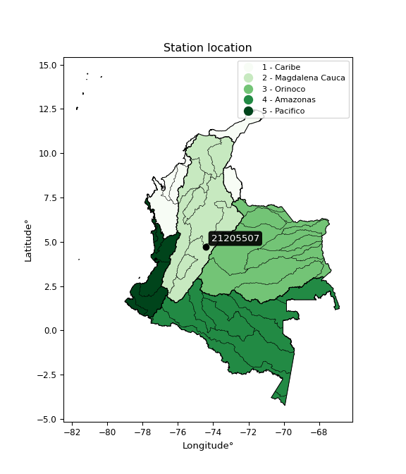

<div align="center">


</div>

# PMP Station (Rain, Pmax24h): 21205507

Probable Maximum Precipitation (PMP) is the greatest amount of rainfall for a specific duration that is meteorologically possible for a given location, acting as a "worst-case" scenario for extreme storms, crucial for designing safety-critical infrastructure like bridges, river deviations, dams, spillways, and nuclear plants to prevent catastrophic failure. PMP is calculated by hydrologists using meteorological data to determine the upper limit of extreme rainfall, often leading to the Probable Maximum Flood (PMF) for flood control design, and is increasingly being studied for climate change impacts. Probable Maximum Precipitation (PMP) is the theoretical upper limit of rainfall, a deterministic estimate for extreme events, while probability distributions (like GEV, Gumbel) describe the likelihood and frequency of various precipitation amounts, including rare ones, showing how often events occur, with PMP representing the extreme end of these distributions, used for critical infrastructure design to ensure safety against the worst conceivable weather, unlike standard statistical forecasts which cover typical probabilities.

The most common probability distributions in hydrology, used for analyzing floods, rainfall, and streamflow, include the Normal, Log-Normal, Gumbel, Gamma (including Log-Pearson Type III), and Generalized Extreme Value (GEV) distributions, often chosen based on the data´s skewness and whether modeling extremes or general conditions, with Gumbel and GEV popular for extreme events like floods, while the Normal distribution serves as a baseline, though often requiring transformations for skewed hydrological data. These distributions help in designing water infrastructure, managing water resources, and forecasting hydrologic events.

> Hydrological data often isn´t perfectly normal (it´s skewed), so different distributions are needed for different applications, such as: **Flood Frequency Analysis**: Using Gumbel, GEV, or Log-Pearson Type III for predicting extreme flood magnitudes and their return periods, **Rainfall Analysis**: Normal for annual totals, but Log-Normal, Weibull, or GEV for intensity or extreme daily rainfall, **Streamflow Modeling**: Gamma and Log-Normal for maximum flows, GEV for minimum flows, and Kappa for daily flows.

<div align="center">

</img>

</div>


## A. General information


### 1. General running parameters

• app_version: _v20260108_. • runtime: _2026-01-09 11:32:22.148588_. • Python version: _3.14.0_. • SciPy version: _1.16.3_. • Pandas version: _2.3.3_. • NumPy version: _2.3.5_. • Stations dataset (station_dataset_file): _dataset/pmax24h_in/automatic_colombia_2003_2024.csv_. • Stations catalog (station_catalog_file): _dataset/CNE.xls_. • Minimum year to eval til year_max (date_min): _1900_. • Maximum year to eval since year_min (date_max): _2024_. • Creates, save and include plots into reports (create_plot): _False_. • Plot only fit distributions with Δo > Δ (plot_only_fit): _True_. • Plot only simple graphs avoiding multiple CDFs and multiple Extreme values plots (plot_only_simple): _True_. • Eval low extreme values, if False, evaluates high extreme values (low_extreme): _False_. • Eval every SciPy distribution as logarithmic (pdist_logarithmic_on): _True_. • Standard deviation normalized (ddof): _1.0_. • Return periods to eval in years (Tr): _[2, 2.33, 5, 10, 15, 20, 25, 50, 75, 100, 200, 250, 500, 750, 1000]_. • Minimum data sample per station, 0 means any (minimum_sample): _5_. • Z-Score maximum threshold to adjust a value, 0 means disable (zscore_max): _3.5_. • Z-Score minimum threshold to adjust a value, 0 means disable (zscore_min): _-2.5_. • Avoid zeros, e.g. rain = 0 (avoid_zeros): _True_. • Avoid null values (avoid_nans): _True_. 

:file_folder:Table: [dataset.csv](../../dataset/pmax24h_in/automatic_colombia_2003_2024.csv)

> Delta Degrees of Freedom (DDOF): is a parameter used in the formulas for calculating variance and standard deviation. When ddof=0, the divisor is $N$ (the total number of observations) and this is used when your data set is the entire population. When ddof=1, the divisor is $N-1$ and this is used when your data set is a sample drawn from a larger population. Using $N-1$ provides an unbiased estimate of the population variance (known as Bessel´s correction).


### 2. Station info and location

|   id |   CODIGO | NOMBRE                      | CATEGORIA               | TECNOLOGIA                | ESTADO   |   FECHA_INSTALACION |   FECHA_SUSPENSION |   ALTITUD |   LATITUD |   LONGITUD | DEPARTAMENTO   | MUNICIPIO   | AREA_OPERATIVA                            | ENTIDAD                                       | AREA_HIDROGRAFICA   | ZONA_HIDROGRAFICA   | SUBZONA_HIDROGRAFICA   |   CORRIENTE | Catalogo   |   Version |
|-----:|---------:|:----------------------------|:------------------------|:--------------------------|:---------|--------------------:|-------------------:|----------:|----------:|-----------:|:---------------|:------------|:------------------------------------------|:----------------------------------------------|:--------------------|:--------------------|:-----------------------|------------:|:-----------|----------:|
|    0 | 21205507 | CACHIPAY  - AUT  [21205507] | Climatológica Principal | Automática con Telemetría | Activa   |                 nan |                nan |         2 |   4.72989 |   -74.4308 | Cundinamarca   | Cachipay    | Area Operativa 11 - Cundinamarca-Amazonas | CORPORACION AUTONOMA REGIONAL DE CUNDINAMARCA | Magdalena Cauca     | Alto Magdalena      | Río Bogotá             |         nan | CNE_OE     |  20251226 |

<div align="center">

Dynamic map: [:earth_americas:Google](http://maps.google.com/maps?q=4.729888889,-74.43080556) [:earth_americas:OSM](https://www.openstreetmap.org/#map=18/4.729888889/-74.43080556&layers=P) [:earth_americas:Bing](https://www.bing.com/maps?cp=4.729888889~-74.43080556&lvl=18) [:earth_americas:Apple](https://maps.apple.com/frame?center=4.729888889%2C-74.43080556&span=0.003%2C0.006)

</div>


<div align="center">

```geojson
{
  "type": "Feature",
  "geometry": {
    "type": "Point", 
    "coordinates": [-74.43080556, 4.729888889]
  }, 
  "properties": {
    "Name": "21205507"
  }
}
```

</div>


### 3. Discrete values table and plot

<div align="center">

|               |           0 |            1 |          2 |           3 |           4 |          5 |           6 |
|:--------------|------------:|-------------:|-----------:|------------:|------------:|-----------:|------------:|
| Date          | 2015        | 2016         | 2017       | 2018        | 2019        | 2020       | 2021        |
| Value         |   42.2      |   44.8       |   40.8     |   46.1      |   45.4      |   50.9     |   42.3      |
| Value_initial |   42.2      |   44.8       |   40.8     |   46.1      |   45.4      |   50.9     |   42.3      |
| count         |    7        |    7         |    7       |    7        |    7        |    7       |    7        |
| mean          |   44.6429   |   44.6429    |   44.6429  |   44.6429   |   44.6429   |   44.6429  |   44.6429   |
| std           |    3.36891  |    3.36891   |    3.36891 |    3.36891  |    3.36891  |    3.36891 |    3.36891  |
| zscore        |   -0.725119 |    0.0466451 |   -1.14068 |    0.432527 |    0.224744 |    1.85732 |   -0.695436 |


</div>


> The initial value (value_initial) correspond to the initial obtained or null completed value, and value (value) is adjusted only when the initial value is outside the valid range (outlier) definite through the Z-Score value. If Z-Score is active, values out of range or outliers are replaced with the station mean value. A Z-Score (or standard score) measures how many standard deviations a data point is from the mean of a dataset, indicating its relative position; positive scores mean above the mean, negative mean below, and a score of zero is exactly at the mean, allowing for comparison of values from different distributions. It´s calculated using the formula $z=(x–μ)/σ$, where $x$ is the data point, $μ$ is the mean, and $σ$ is the standard deviation, helping identify outliers and understand probability.
>
> <sub>**Note**: In this study, "completing" (filling gaps in) and "extending" (forecasting or lengthening the historical record) rainfall data series are avoided for certain critical analyses because they introduce artificial bias and uncertainty, which can distort the statistics of rare events (extremes), alter day-to-day variability, and compromise the integrity and homogeneity of the original data. Some reasons against Completing/Extending rainfall data are: **Distortion of Extremes and Variability**: The primary issue is that most gap-filling or extension methods rely on averaging or regression with nearby stations, which inherently smooths the data. Rainfall is highly variable in space and time, with a large percentage of zero values and occasional large storms. Infilling methods often underestimate the highest values and overestimate the lowest (zero) values, which severely distorts analyses focused on flood frequency, drought severity, and intensity-duration-frequency (IDF) curves, **Loss of Data Homogeneity**: Infilled or extended data are synthetic estimates, not actual measurements. Combining these estimates with observed data can violate the assumption of data homogeneity, which requires that the data properties do not change over time. Inhomogeneity can lead to incorrect conclusions about long-term trends or changes in climate patterns, **Propagation of Errors**: Errors and biases from the original data (e.g., wind-induced undercatch, instrument errors, site changes) or the data used for imputation can propagate through the analysis, leading to unreliable hydrological models and inaccurate predictions, **Compromised Statistical Integrity**: For statistical analyses, especially those involving the frequency of events, using artificial data can introduce time bias or autocorrelation that doesn´t exist in reality, making it difficult to assess the true probability of events, **Difficulty in Validation**: It is difficult to accurately validate the quality of filled or extended data, especially for past periods where ground-truth measurements are unavailable. The reliability of imputation techniques heavily depends on the density of the surrounding station network and the complexity of the local topography.</sub>


### 4. Active continuous probability distributions from SciPy (45 of 104 available)

A Probability Density Function (PDF) describes the relative likelihood of a continuous random variable falling within a specific range, where the total area under its curve equals 1, and the area over any interval gives the actual probability for that range. Unlike discrete probabilities (like rolling a die), a PDF shows density, not direct probability for a single point (which is zero), with higher points indicating higher likelihood, often visualized as a bell curve for normal distributions.

A log of a probability density function (log-PDF) is simply the logarithm of the PDF´s value, denoted as $log(f(x))$, useful for converting multiplication of probabilities into addition, improving numerical stability with tiny numbers, and connecting to information theory concepts like entropy. Instead of dealing with very small probabilities (e.g., 0.000001), log-PDFs use negative numbers (e.g., $log(0.00001) ≈ -11.51$ that are easier for computers to handle, preventing underflow errors and simplifying complex calculations. In this study, each active probability distribution from SciPy is also evaluated in the $log$ form.

[scipy.stats](https://docs.scipy.org/doc/scipy/reference/stats.html) is a Python´s powerful submodule within the SciPy library for comprehensive statistical analysis, offering over 130 probability distributions (like Normal, Poisson), functions for descriptive stats (mean, variance), hypothesis testing (t-tests, chi-square), random variable generation, and statistical tests, making it essential for data science, modeling, and research. It provides tools to explore, model, and draw conclusions from data efficiently, working seamlessly with NumPy.

<div align="center">

|   id | p_dist             |   n_parameter | fit_method   | label                                                                       | active   | ref                                                                                                        |
|-----:|:-------------------|--------------:|:-------------|:----------------------------------------------------------------------------|:---------|:-----------------------------------------------------------------------------------------------------------|
|    0 | alpha              |             3 | MLE          | Alpha                                                                       | True     | [:mortar_board:](https://docs.scipy.org/doc/scipy/reference/generated/scipy.stats.alpha.html)              |
|    1 | betaprime          |             4 | MLE          | Beta prime                                                                  | True     | [:mortar_board:](https://docs.scipy.org/doc/scipy/reference/generated/scipy.stats.betaprime.html)          |
|    2 | chi2               |             3 | MLE          | Chi²                                                                        | True     | [:mortar_board:](https://docs.scipy.org/doc/scipy/reference/generated/scipy.stats.chi2.html)               |
|    3 | crystalball        |             4 | MLE          | Crystalball                                                                 | True     | [:mortar_board:](https://docs.scipy.org/doc/scipy/reference/generated/scipy.stats.crystalball.html)        |
|    4 | dweibull           |             3 | MLE          | Double Weibull                                                              | True     | [:mortar_board:](https://docs.scipy.org/doc/scipy/reference/generated/scipy.stats.dweibull.html)           |
|    5 | erlang             |             3 | MLE          | Erlang                                                                      | True     | [:mortar_board:](https://docs.scipy.org/doc/scipy/reference/generated/scipy.stats.erlang.html)             |
|    6 | expon              |             2 | MLE          | Exponential                                                                 | True     | [:mortar_board:](https://docs.scipy.org/doc/scipy/reference/generated/scipy.stats.expon.html)              |
|    7 | exponnorm          |             3 | MLE          | Exponentially modified Normal                                               | True     | [:mortar_board:](https://docs.scipy.org/doc/scipy/reference/generated/scipy.stats.exponnorm.html)          |
|    8 | f                  |             4 | MLE          | F                                                                           | True     | [:mortar_board:](https://docs.scipy.org/doc/scipy/reference/generated/scipy.stats.f.html)                  |
|    9 | fatiguelife        |             3 | MLE          | Fatigue-life (Birnbaum-Saunders)                                            | True     | [:mortar_board:](https://docs.scipy.org/doc/scipy/reference/generated/scipy.stats.fatiguelife.html)        |
|   10 | fisk               |             3 | MLE          | Fisk                                                                        | True     | [:mortar_board:](https://docs.scipy.org/doc/scipy/reference/generated/scipy.stats.fisk.html)               |
|   11 | gamma              |             3 | MLE          | Gamma                                                                       | True     | [:mortar_board:](https://docs.scipy.org/doc/scipy/reference/generated/scipy.stats.gamma.html)              |
|   12 | genexpon           |             5 | MLE          | Generalized exponential                                                     | True     | [:mortar_board:](https://docs.scipy.org/doc/scipy/reference/generated/scipy.stats.genexpon.html)           |
|   13 | genlogistic        |             3 | MLE          | Generalized logistic                                                        | True     | [:mortar_board:](https://docs.scipy.org/doc/scipy/reference/generated/scipy.stats.genlogistic.html)        |
|   14 | gibrat             |             2 | MM           | Gibrat                                                                      | True     | [:mortar_board:](https://docs.scipy.org/doc/scipy/reference/generated/scipy.stats.gibrat.html)             |
|   15 | gompertz           |             3 | MLE          | Gompertz (or truncated Gumbel)                                              | True     | [:mortar_board:](https://docs.scipy.org/doc/scipy/reference/generated/scipy.stats.gompertz.html)           |
|   16 | gumbel_l           |             2 | MM           | Gumbel Left Skew                                                            | True     | [:mortar_board:](https://docs.scipy.org/doc/scipy/reference/generated/scipy.stats.gumbel_l.html)           |
|   17 | gumbel_r           |             2 | MM           | Gumbel Right Skew                                                           | True     | [:mortar_board:](https://docs.scipy.org/doc/scipy/reference/generated/scipy.stats.gumbel_r.html)           |
|   18 | halflogistic       |             2 | MM           | Half-logistic                                                               | True     | [:mortar_board:](https://docs.scipy.org/doc/scipy/reference/generated/scipy.stats.halflogistic.html)       |
|   19 | halfnorm           |             2 | MM           | Half Normal                                                                 | True     | [:mortar_board:](https://docs.scipy.org/doc/scipy/reference/generated/scipy.stats.halfnorm.html)           |
|   20 | hypsecant          |             2 | MM           | hyperbolic secant                                                           | True     | [:mortar_board:](https://docs.scipy.org/doc/scipy/reference/generated/scipy.stats.hypsecant.html)          |
|   21 | invgamma           |             3 | MLE          | Inverted gamma                                                              | True     | [:mortar_board:](https://docs.scipy.org/doc/scipy/reference/generated/scipy.stats.invgamma.html)           |
|   22 | invgauss           |             3 | MLE          | Inverse Gaussian                                                            | True     | [:mortar_board:](https://docs.scipy.org/doc/scipy/reference/generated/scipy.stats.invgauss.html)           |
|   23 | invweibull         |             3 | MLE          | Inverted Weibull                                                            | True     | [:mortar_board:](https://docs.scipy.org/doc/scipy/reference/generated/scipy.stats.invweibull.html)         |
|   24 | kappa4             |             4 | MLE          | Kappa 4                                                                     | True     | [:mortar_board:](https://docs.scipy.org/doc/scipy/reference/generated/scipy.stats.kappa4.html)             |
|   25 | kstwobign          |             2 | MLE          | Limiting distribution of scaled Kolmogorov-Smirnov two-sided test statistic | True     | [:mortar_board:](https://docs.scipy.org/doc/scipy/reference/generated/scipy.stats.kstwobign.html)          |
|   26 | laplace            |             2 | MM           | Laplace                                                                     | True     | [:mortar_board:](https://docs.scipy.org/doc/scipy/reference/generated/scipy.stats.laplace.html)            |
|   27 | laplace_asymmetric |             3 | MLE          | Asymmetric Laplace                                                          | True     | [:mortar_board:](https://docs.scipy.org/doc/scipy/reference/generated/scipy.stats.laplace_asymmetric.html) |
|   28 | loggamma           |             3 | MLE          | Log gamma                                                                   | True     | [:mortar_board:](https://docs.scipy.org/doc/scipy/reference/generated/scipy.stats.loggamma.html)           |
|   29 | logistic           |             2 | MM           | Logistic (or Sech-squared)                                                  | True     | [:mortar_board:](https://docs.scipy.org/doc/scipy/reference/generated/scipy.stats.logistic.html)           |
|   30 | lognorm            |             3 | MLE          | Log Normal                                                                  | True     | [:mortar_board:](https://docs.scipy.org/doc/scipy/reference/generated/scipy.stats.lognorm.html)            |
|   31 | maxwell            |             2 | MM           | Maxwell                                                                     | True     | [:mortar_board:](https://docs.scipy.org/doc/scipy/reference/generated/scipy.stats.maxwell.html)            |
|   32 | mielke             |             4 | MLE          | Mielke Beta-Kappa / Dagum                                                   | True     | [:mortar_board:](https://docs.scipy.org/doc/scipy/reference/generated/scipy.stats.mielke.html)             |
|   33 | moyal              |             2 | MM           | Moyal                                                                       | True     | [:mortar_board:](https://docs.scipy.org/doc/scipy/reference/generated/scipy.stats.moyal.html)              |
|   34 | nakagami           |             3 | MLE          | Nakagami                                                                    | True     | [:mortar_board:](https://docs.scipy.org/doc/scipy/reference/generated/scipy.stats.nakagami.html)           |
|   35 | ncf                |             5 | MLE          | Non-central F distribution                                                  | True     | [:mortar_board:](https://docs.scipy.org/doc/scipy/reference/generated/scipy.stats.ncf.html)                |
|   36 | nct                |             4 | MLE          | Non-central Student’s t                                                     | True     | [:mortar_board:](https://docs.scipy.org/doc/scipy/reference/generated/scipy.stats.nct.html)                |
|   37 | norm               |             2 | MM           | Normal                                                                      | True     | [:mortar_board:](https://docs.scipy.org/doc/scipy/reference/generated/scipy.stats.norm.html)               |
|   38 | pearson3           |             3 | MM           | Pearson type III                                                            | True     | [:mortar_board:](https://docs.scipy.org/doc/scipy/reference/generated/scipy.stats.pearson3.html)           |
|   39 | rayleigh           |             2 | MM           | Rayleigh                                                                    | True     | [:mortar_board:](https://docs.scipy.org/doc/scipy/reference/generated/scipy.stats.rayleigh.html)           |
|   40 | rice               |             3 | MLE          | Rice                                                                        | True     | [:mortar_board:](https://docs.scipy.org/doc/scipy/reference/generated/scipy.stats.rice.html)               |
|   41 | t                  |             3 | MLE          | Student’s t                                                                 | True     | [:mortar_board:](https://docs.scipy.org/doc/scipy/reference/generated/scipy.stats.t.html)                  |
|   42 | truncnorm          |             4 | MLE          | Truncated normal                                                            | True     | [:mortar_board:](https://docs.scipy.org/doc/scipy/reference/generated/scipy.stats.truncnorm.html)          |
|   43 | wald               |             2 | MM           | Wald                                                                        | True     | [:mortar_board:](https://docs.scipy.org/doc/scipy/reference/generated/scipy.stats.wald.html)               |
|   44 | weibull_min        |             3 | MLE          | Weibull minimum                                                             | True     | [:mortar_board:](https://docs.scipy.org/doc/scipy/reference/generated/scipy.stats.weibull_min.html)        |

</div>

> **n_parameter:** # arguments & localization & scale.
>
> **Fit methods:** (MLE) maximum likelihood, (MM) L-moments.
>
>**Inactive** (With the only purpose of prevent loops, zero divisions, infinite values, over high estimated values or horizontal trending for recurrence intervals estimations, the follow distributions were disabled.)**:** foldnorm, gennorm, norminvgauss, powernorm, powerlognorm, skewnorm, genextreme, anglit, arcsine, argus, beta, bradford, burr, burr12, cauchy, cosine, halfcauchy, foldcauchy, skewcauchy, wrapcauchy, dgamma, gengamma, exponweib, exponpow, truncexpon, gausshyper, genhalflogistic, genhyperbolic, geninvgauss, halfgennorm, johnsonsb, johnsonsu, kappa3, ksone, kstwo, loglaplace, levy, levy_l, levy_stable, ncx2, pareto, genpareto, truncpareto, lomax, powerlaw, rdist, rel_breitwigner, recipinvgauss, semicircular, studentized_range, trapezoid, triang, truncweibull_min, tukeylambda, uniform, loguniform, vonmises, vonmises_line, weibull_max, 


## B. Probability (PDF) vs. Empirical (EDF) distributions functions

A continuous probability distribution (CPD) describes probabilities for variables that can take any value within a range (like rain any time), unlike discrete variables with specific outcomes (like temperature). It uses a Probability Density Function (PDF), a curve where the total area under it equals 1, and the probability of the variable falling within an interval (a to b) is found by calculating the area under the curve between those points. A key feature is that the probability of hitting any single exact value is zero, so probabilities are always expressed for ranges, e.g., $P(a ≤ X ≤ b)$.

<div align="center">

Distributions parameters from station values
|    |   station | p_dist                |   n |          loc |           scale | shape                  | shape1             | shape2                | shape3   |
|---:|----------:|:----------------------|----:|-------------:|----------------:|:-----------------------|:-------------------|:----------------------|:---------|
|  0 |  21205507 | alpha                 |   7 |    31.5603   |    57.0808      | 4.595470516061344      |                    |                       |          |
|  1 |  21205507 | betaprime             |   7 |    -8.27115  |    17.648       | 1191.3886615559709     | 398.37883921333287 |                       |          |
|  2 |  21205507 | chi2                  |   7 |    40.8      |     1.0439      | 1.0228904642715988     |                    |                       |          |
|  3 |  21205507 | crystalball           |   7 |    44.6429   |     3.119       | 4229.078304504039      | 450.9064945876636  |                       |          |
|  4 |  21205507 | dweibull              |   7 |    43.9836   |     2.87059     | 1.5093763238129991     |                    |                       |          |
|  5 |  21205507 | erlang                |   7 |    40.8      |     3.29836     | 0.8908680307633097     |                    |                       |          |
|  6 |  21205507 | expon                 |   7 |    40.8      |     3.84286     |                        |                    |                       |          |
|  7 |  21205507 | exponnorm             |   7 |    40.7941   |     0.00205751  | 1848.0734643371625     |                    |                       |          |
|  8 |  21205507 | f                     |   7 |   -13.7216   |    58.2625      | 1917.9479464962792     | 1143.5492215751065 |                       |          |
|  9 |  21205507 | fatiguelife           |   7 |    40.8      |     7.60526e-07 | 2154.552857163756      |                    |                       |          |
| 10 |  21205507 | fisk                  |   7 |    -0.164082 |    44.4608      | 25.611225827186598     |                    |                       |          |
| 11 |  21205507 | gamma                 |   7 |    40.8      |     3.3473      | 0.8397112881642774     |                    |                       |          |
| 12 |  21205507 | genexpon              |   7 |    40.7996   |     1.19225     | 0.23035546742478985    | 2.8057682486695454 | 0.010716468928110009  |          |
| 13 |  21205507 | genlogistic           |   7 |    28.0507   |     2.38357     | 579.3140392695184      |                    |                       |          |
| 14 |  21205507 | gibrat                |   7 |    42.2634   |     1.4432      |                        |                    |                       |          |
| 15 |  21205507 | gompertz              |   7 |    40.8      |     6.76847     | 0.9693126099999632     |                    |                       |          |
| 16 |  21205507 | gumbel_l              |   7 |    46.0466   |     2.43187     |                        |                    |                       |          |
| 17 |  21205507 | gumbel_r              |   7 |    43.2391   |     2.43187     |                        |                    |                       |          |
| 18 |  21205507 | halflogistic          |   7 |    40.9461   |     2.66666     |                        |                    |                       |          |
| 19 |  21205507 | halfnorm              |   7 |    40.5145   |     5.1741      |                        |                    |                       |          |
| 20 |  21205507 | hypsecant             |   7 |    44.6429   |     1.98562     |                        |                    |                       |          |
| 21 |  21205507 | invgamma              |   7 |    25.5598   |   793.696       | 42.69371362096953      |                    |                       |          |
| 22 |  21205507 | invgauss              |   7 |    38.9162   |    15.3719      | 0.3725402002248411     |                    |                       |          |
| 23 |  21205507 | invweibull            |   7 |    23.0561   |    20.015       | 8.847026935019015      |                    |                       |          |
| 24 |  21205507 | kappa4                |   7 |    40.1208   |    11.4157      | 1.0633697059886438     | 1.0530252076180568 |                       |          |
| 25 |  21205507 | kstwobign             |   7 |    34.7876   |    11.3272      |                        |                    |                       |          |
| 26 |  21205507 | laplace               |   7 |    44.6429   |     2.20547     |                        |                    |                       |          |
| 27 |  21205507 | laplace_asymmetric    |   7 |    44.8      |     2.43901     | 1.0326987243780457     |                    |                       |          |
| 28 |  21205507 | loggamma              |   7 | -1098.47     |   148.458       | 2208.9677297613434     |                    |                       |          |
| 29 |  21205507 | logistic              |   7 |    44.6429   |     1.7196      |                        |                    |                       |          |
| 30 |  21205507 | lognorm               |   7 |    40.8      |     0.028344    | 11.862884821726285     |                    |                       |          |
| 31 |  21205507 | maxwell               |   7 |    37.2521   |     4.63145     |                        |                    |                       |          |
| 32 |  21205507 | mielke                |   7 |    -6.7819   |    38.7764      | 4911.695842548991      | 21.46847089176737  |                       |          |
| 33 |  21205507 | moyal                 |   7 |    42.8592   |     1.40404     |                        |                    |                       |          |
| 34 |  21205507 | nakagami              |   7 |    40.8      |     6.37898     | 0.34645125074866806    |                    |                       |          |
| 35 |  21205507 | ncf                   |   7 |   -17.6353   |    10.2448      | 534.2449668562895      | 1487.2836971458573 | 2709.0896955915755    |          |
| 36 |  21205507 | nct                   |   7 |    -0.715358 |     0.624613    | 118.87191266324402     | 72.16522882532217  |                       |          |
| 37 |  21205507 | norm                  |   7 |    44.6429   |     3.119       |                        |                    |                       |          |
| 38 |  21205507 | pearson3              |   7 |    44.6429   |     3.119       | 0.773661684176177      |                    |                       |          |
| 39 |  21205507 | rayleigh              |   7 |    38.676    |     4.76084     |                        |                    |                       |          |
| 40 |  21205507 | rice                  |   7 |    39.3505   |     4.34383     | 0.00045968875663339155 |                    |                       |          |
| 41 |  21205507 | t                     |   7 |    44.6431   |     3.11917     | 758935.5041931178      |                    |                       |          |
| 42 |  21205507 | truncnorm             |   7 |    50.9      |     1.24575e-11 | 42.7905287413256       | 1383.0720714691008 |                       |          |
| 43 |  21205507 | wald                  |   7 |    41.5239   |     3.11898     |                        |                    |                       |          |
| 44 |  21205507 | weibull_min           |   7 |    40.8      |     3.91179     | 0.3850484017932849     |                    |                       |          |
| 45 |  21205507 | logalpha              |   7 |    -8.15244  |  1568.5         | 131.2852692536198      |                    |                       |          |
| 46 |  21205507 | logbetaprime          |   7 |     3.04312  |     0.55606     | 280.9520793646302      | 208.3869846386052  |                       |          |
| 47 |  21205507 | logchi2               |   7 |     3.70868  |     0.94894     | 0.958023996578854      |                    |                       |          |
| 48 |  21205507 | logcrystalball        |   7 |     3.79633  |     0.0683143   | 17.75727908857477      | 82.2801887063602   |                       |          |
| 49 |  21205507 | logdweibull           |   7 |     3.78268  |     0.0643786   | 1.590449382711759      |                    |                       |          |
| 50 |  21205507 | logerlang             |   7 |     3.70868  |     0.0751217   | 0.858577082921298      |                    |                       |          |
| 51 |  21205507 | logexpon              |   7 |     3.70868  |     0.0876444   |                        |                    |                       |          |
| 52 |  21205507 | logexponnorm          |   7 |     3.7133   |     0.0154561   | 5.3718389044423756     |                    |                       |          |
| 53 |  21205507 | logf                  |   7 |     3.70868  |     0.0871615   | 1.2987144019003272     | 257.0022907391117  |                       |          |
| 54 |  21205507 | logfatiguelife        |   7 |     3.66468  |     0.113244    | 0.5687739153272923     |                    |                       |          |
| 55 |  21205507 | logfisk               |   7 |     3.66887  |     0.111845    | 2.911320876554323      |                    |                       |          |
| 56 |  21205507 | loggamma              |   7 |     3.70868  |     0.109287    | 0.20194886507055684    |                    |                       |          |
| 57 |  21205507 | loggenexpon           |   7 |     3.70861  |     0.0083341   | 0.06594844318913265    | 2.3299730837585297 | 0.0014682549101141282 |          |
| 58 |  21205507 | loggenlogistic        |   7 |     3.40472  |     0.0538113   | 801.7855543503233      |                    |                       |          |
| 59 |  21205507 | loggibrat             |   7 |     3.74423  |     0.0315991   |                        |                    |                       |          |
| 60 |  21205507 | loggompertz           |   7 |     3.70868  |     0.153722    | 1.019264812110728      |                    |                       |          |
| 61 |  21205507 | loggumbel_l           |   7 |     3.82707  |     0.0532643   |                        |                    |                       |          |
| 62 |  21205507 | loggumbel_r           |   7 |     3.76558  |     0.0532643   |                        |                    |                       |          |
| 63 |  21205507 | loghalflogistic       |   7 |     3.71539  |     0.0583862   |                        |                    |                       |          |
| 64 |  21205507 | loghalfnorm           |   7 |     3.70591  |     0.113326    |                        |                    |                       |          |
| 65 |  21205507 | loghypsecant          |   7 |     3.79633  |     0.0434901   |                        |                    |                       |          |
| 66 |  21205507 | loginvgamma           |   7 |    -2.2903   | 48814           | 8021.2281288677805     |                    |                       |          |
| 67 |  21205507 | loginvgauss           |   7 |     3.65494  |     0.499945    | 0.2827990703926326     |                    |                       |          |
| 68 |  21205507 | loginvweibull         |   7 |     2.49657  |     1.26678     | 23.974235470561624     |                    |                       |          |
| 69 |  21205507 | logkappa4             |   7 |     3.69202  |     0.245171    | 1.0730120853014387     | 1.0305446568212426 |                       |          |
| 70 |  21205507 | logkstwobign          |   7 |     3.57518  |     0.253851    |                        |                    |                       |          |
| 71 |  21205507 | loglaplace            |   7 |     3.79633  |     0.0483054   |                        |                    |                       |          |
| 72 |  21205507 | loglaplace_asymmetric |   7 |     3.80221  |     0.0540804   | 1.0559244119310534     |                    |                       |          |
| 73 |  21205507 | logloggamma           |   7 |   -15.2898   |     2.62294     | 1446.880789492282      |                    |                       |          |
| 74 |  21205507 | loglogistic           |   7 |     3.79633  |     0.0376635   |                        |                    |                       |          |
| 75 |  21205507 | loglognorm            |   7 |     3.70868  |     0.000759666 | 11.516190029256457     |                    |                       |          |
| 76 |  21205507 | logmaxwell            |   7 |     3.63445  |     0.101441    |                        |                    |                       |          |
| 77 |  21205507 | logmielke             |   7 |    -2.69612  |     6.18538     | 22868.27937237626      | 120.46890862930681 |                       |          |
| 78 |  21205507 | logmoyal              |   7 |     3.75726  |     0.0307521   |                        |                    |                       |          |
| 79 |  21205507 | lognakagami           |   7 |     3.70868  |     0.120441    | 0.2958450815792403     |                    |                       |          |
| 80 |  21205507 | logncf                |   7 |     3.59942  |     0.172975    | 677.7034766633035      | 18.166664657318716 | 11.143524891763146    |          |
| 81 |  21205507 | lognct                |   7 |    -1.75156  |     0.00730748  | 1961.9497338444828     | 758.6629634398653  |                       |          |
| 82 |  21205507 | lognorm               |   7 |     3.79633  |     0.0683141   |                        |                    |                       |          |
| 83 |  21205507 | logpearson3           |   7 |     3.79633  |     0.0683141   | 0.6553848957553237     |                    |                       |          |
| 84 |  21205507 | lograyleigh           |   7 |     3.66564  |     0.104275    |                        |                    |                       |          |
| 85 |  21205507 | logrice               |   7 |     3.67786  |     0.0966992   | 0.0009862295903116543  |                    |                       |          |
| 86 |  21205507 | logt                  |   7 |     3.79633  |     0.0683138   | 252709567.42648673     |                    |                       |          |
| 87 |  21205507 | logtruncnorm          |   7 |    -0.342623 |     1.04172     | 3.889040552984465      | 4.101363470528089  |                       |          |
| 88 |  21205507 | logwald               |   7 |     3.72805  |     0.0682805   |                        |                    |                       |          |
| 89 |  21205507 | logweibull_min        |   7 |     3.70868  |     0.100709    | 0.20851605159341657    |                    |                       |          |

</div>

> **loc** (Location parameter): This shifts the distribution along the x-axis. For many common distributions, like the normal (Gaussian) distribution, loc represents the mean $μ$. For others, like the uniform distribution, it might represent the minimum value, or for the beta distribution, the left end of the support interval.
>
> **scale** (Scale parameter): This determines the width or spread of the distribution. For the normal distribution, scale represents the standard deviation $σ$. For a uniform distribution, it defines the length of the interval (from $loc$ to $loc + scale$).
>
> **shape** (Shape parameters): Refers to parameters that define the specific form of a probability distribution, distinct from its location (loc) and scale (scale). These parameters are required arguments for most distribution functions. For example, a normal (Gaussian) distribution is fully defined by its location (mean) and scale (standard deviation), so it has no specific shape parameters beyond loc and scale. However, other distributions have intrinsic properties that need specification, as Gamma distribution that takes a shape parameter, often named $a$ or $alpha$.


### 0. Cumulative distribution values - CDF (90 evaluated)

Cumulative Distribution Function (CDF), denoted as $F$<sub>$X$</sub>$(x)$, is a function that gives the probability that a random variable $X$ will take a value less than or equal to a specific value, $x$ (i.e., $(P(X≥x)$. It essentially "accumulates" probabilities from a given point up to the far right (positive infinity), providing a complete picture of the distribution´s probabilities for both discrete (like rain) and continuous (like temperature) variables, helping to find probabilities over ranges or above certain values. Each station is evaluated separately ordering the $x$ values ascending, calculating the CDF and PDF values for the activated distributions and their logarithmic forms.

<div align="center">

CDF ordered by x ascending and calculating $log(f(x))$ separately
|   id |   Station |   date |    x |   count |    mean |     std |     zscore |   Value_initial |   station |   m |     alpha |   alpha_pdf |   betaprime |   betaprime_pdf |        chi2 |    chi2_pdf |   crystalball |   crystalball_pdf |   dweibull |   dweibull_pdf |      erlang |   erlang_pdf |    expon |   expon_pdf |   exponnorm |   exponnorm_pdf |        f |     f_pdf |   fatiguelife |   fatiguelife_pdf |     fisk |   fisk_pdf |       gamma |   gamma_pdf |    genexpon |   genexpon_pdf |   genlogistic |   genlogistic_pdf |      gibrat |   gibrat_pdf |    gompertz |   gompertz_pdf |   gumbel_l |   gumbel_l_pdf |   gumbel_r |   gumbel_r_pdf |   halflogistic |   halflogistic_pdf |   halfnorm |   halfnorm_pdf |   hypsecant |   hypsecant_pdf |   invgamma |   invgamma_pdf |   invgauss |   invgauss_pdf |   invweibull |   invweibull_pdf |      kappa4 |   kappa4_pdf |   kstwobign |   kstwobign_pdf |   laplace |   laplace_pdf |   laplace_asymmetric |   laplace_asymmetric_pdf |   loggamma |   loggamma_pdf |   logistic |   logistic_pdf |   lognorm |   lognorm_pdf |   maxwell |   maxwell_pdf |   mielke |   mielke_pdf |     moyal |   moyal_pdf |    nakagami |   nakagami_pdf |      ncf |   ncf_pdf |       nct |   nct_pdf |     norm |   norm_pdf |   pearson3 |   pearson3_pdf |   rayleigh |   rayleigh_pdf |      rice |   rice_pdf |        t |     t_pdf |   truncnorm |   truncnorm_pdf |      wald |   wald_pdf |   weibull_min |   weibull_min_pdf |   logalpha |   logalpha_pdf |   logbetaprime |   logbetaprime_pdf |     logchi2 |   logchi2_pdf |   logcrystalball |   logcrystalball_pdf |   logdweibull |   logdweibull_pdf |   logerlang |   logerlang_pdf |   logexpon |   logexpon_pdf |   logexponnorm |   logexponnorm_pdf |        logf |     logf_pdf |   logfatiguelife |   logfatiguelife_pdf |   logfisk |   logfisk_pdf |   loggenexpon |   loggenexpon_pdf |   loggenlogistic |   loggenlogistic_pdf |   loggibrat |   loggibrat_pdf |   loggompertz |   loggompertz_pdf |   loggumbel_l |   loggumbel_l_pdf |   loggumbel_r |   loggumbel_r_pdf |   loghalflogistic |   loghalflogistic_pdf |   loghalfnorm |   loghalfnorm_pdf |   loghypsecant |   loghypsecant_pdf |   loginvgamma |   loginvgamma_pdf |   loginvgauss |   loginvgauss_pdf |   loginvweibull |   loginvweibull_pdf |   logkappa4 |   logkappa4_pdf |   logkstwobign |   logkstwobign_pdf |   loglaplace |   loglaplace_pdf |   loglaplace_asymmetric |   loglaplace_asymmetric_pdf |   logloggamma |   logloggamma_pdf |   loglogistic |   loglogistic_pdf |   loglognorm |   loglognorm_pdf |   logmaxwell |   logmaxwell_pdf |   logmielke |   logmielke_pdf |   logmoyal |   logmoyal_pdf |   lognakagami |   lognakagami_pdf |   logncf |   logncf_pdf |   lognct |   lognct_pdf |   logpearson3 |   logpearson3_pdf |   lograyleigh |   lograyleigh_pdf |   logrice |   logrice_pdf |      logt |   logt_pdf |   logtruncnorm |   logtruncnorm_pdf |   logwald |   logwald_pdf |   logweibull_min |   logweibull_min_pdf |
|-----:|----------:|-------:|-----:|--------:|--------:|--------:|-----------:|----------------:|----------:|----:|----------:|------------:|------------:|----------------:|------------:|------------:|--------------:|------------------:|-----------:|---------------:|------------:|-------------:|---------:|------------:|------------:|----------------:|---------:|----------:|--------------:|------------------:|---------:|-----------:|------------:|------------:|------------:|---------------:|--------------:|------------------:|------------:|-------------:|------------:|---------------:|-----------:|---------------:|-----------:|---------------:|---------------:|-------------------:|-----------:|---------------:|------------:|----------------:|-----------:|---------------:|-----------:|---------------:|-------------:|-----------------:|------------:|-------------:|------------:|----------------:|----------:|--------------:|---------------------:|-------------------------:|-----------:|---------------:|-----------:|---------------:|----------:|--------------:|----------:|--------------:|---------:|-------------:|----------:|------------:|------------:|---------------:|---------:|----------:|----------:|----------:|---------:|-----------:|-----------:|---------------:|-----------:|---------------:|----------:|-----------:|---------:|----------:|------------:|----------------:|----------:|-----------:|--------------:|------------------:|-----------:|---------------:|---------------:|-------------------:|------------:|--------------:|-----------------:|---------------------:|--------------:|------------------:|------------:|----------------:|-----------:|---------------:|---------------:|-------------------:|------------:|-------------:|-----------------:|---------------------:|----------:|--------------:|--------------:|------------------:|-----------------:|---------------------:|------------:|----------------:|--------------:|------------------:|--------------:|------------------:|--------------:|------------------:|------------------:|----------------------:|--------------:|------------------:|---------------:|-------------------:|--------------:|------------------:|--------------:|------------------:|----------------:|--------------------:|------------:|----------------:|---------------:|-------------------:|-------------:|-----------------:|------------------------:|----------------------------:|--------------:|------------------:|--------------:|------------------:|-------------:|-----------------:|-------------:|-----------------:|------------:|----------------:|-----------:|---------------:|--------------:|------------------:|---------:|-------------:|---------:|-------------:|--------------:|------------------:|--------------:|------------------:|----------:|--------------:|----------:|-----------:|---------------:|-------------------:|----------:|--------------:|-----------------:|---------------------:|
|    0 |  21205507 |   2017 | 40.8 |       7 | 44.6429 | 3.36891 | -1.14068   |            40.8 |  21205507 |   1 | 0.0567904 |   0.0762812 |    0.101114 |       0.0630303 | 4.49372e-08 | 3.23456e+06 |      0.10896  |         0.0598771 |   0.15533  |     0.0860942  | 8.95839e-14 |   11.2319    | 0        |   0.260223  |   0.0015426 |       0.262014  | 0.103182 | 0.0626503 |     0.0249787 |       1.34275e+12 | 0.109301 |  0.0608672 | 5.06448e-13 |  59.8515    | 7.05514e-05 |      0.193204  |     0.0640943 |         0.0737029 | 0           |   0          | 6.41597e-11 |      0.14321   |   0.109189 |     0.0423535  |  0.0654534 |      0.073381  |       0        |          0         |  0.0440003 |      0.153973  |   0.0912808 |       0.0453435 |  0.0818068 |      0.0692919 |  0.0433835 |      0.0963413 |    0.0548892 |        0.0794327 | 9.91281e-16 |    0.784694  |    0.059217 |       0.0764072 | 0.0875477 |     0.0396958 |             0.105444 |                0.0418636 | 0.00135224 |    6.14931e+11 |  0.0966734 |      0.0507839 | 0.0997526 |      2.56435  |  0.100556 |     0.0753874 |      nan |          nan | 0.0373451 |   0.0677262 | 3.38295e-11 |   3298.97      | 0.104808 | 0.0624117 | 0.0945277 | 0.0642849 | 0.10896  |  0.0598771 |  0.0844665 |      0.0770722 |  0.0947261 |      0.0848324 | 0.0541568 |  0.0726617 | 0.10896  | 0.0598737 |    0        |      0          | 0         |  0         |   2.10903e-06 |        1.1429e+08 |   0.170269 |        2.82413 |      0.0952266 |           2.79516  | 3.67585e-08 |   3.96491e+07 |        0.0997538 |             2.56436  |      0.143552 |          3.8503   | 6.41197e-13 |     1239.65     |   0        |       11.4097  |      0.0449479 |           4.06659  | 1.76722e-07 | 25168.6      |        0.0422936 |              4.0126  | 0.0470929 |      3.28174  |   0.000581778 |          7.91211  |        0.0596531 |             3.11978  | 0           |        0        |   6.00074e-10 |           6.63059 |      0.102658 |          1.82484  |     0.0544608 |          2.97565  |          0        |              0        |     0.0195476 |          7.0385   |      0.0843541 |           1.91699  |     0.0984189 |           2.60214 |     0.0444123 |          3.78975  |       0.0561601 |            3.19857  | 1.35215e-15 |        49.783   |      0.0550865 |           3.26826  |    0.0814692 |         1.68655  |                0.102488 |                    1.79474  |      0.101109 |          2.53681  |     0.0889084 |           2.15072 |   0.00722381 |      3.91764e+12 |    0.0889719 |         3.22255  |         nan |             nan |   0.027593 |       2.52446  |   2.23946e-09 |       2.98378e+06 | 0.051559 |     3.34432  | 0.167332 |      2.89274 |     0.0789571 |          3.11698  |     0.0816727 |          3.63544  | 0.0495342 |      3.13309  | 0.0997513 |   2.56434  |    5.88355e-06 |            6.68179 | 0         |      0        |       0.00101486 |          4.76273e+11 |
|    1 |  21205507 |   2015 | 42.2 |       7 | 44.6429 | 3.36891 | -0.725119  |            42.2 |  21205507 |   2 | 0.220824  |   0.14962   |    0.216355 |       0.101117  | 0.746895    | 0.171763    |      0.21675  |         0.0941217 |   0.307057 |     0.126697   | 0.401125    |    0.20236   | 0.305326 |   0.18077   |   0.309078  |       0.181705  | 0.217178 | 0.0997865 |     0.735562  |       0.0735855   | 0.224919 |  0.105392  | 0.424819    |   0.201456  | 0.252648    |      0.166395  |     0.216839  |         0.138877  | 0           |   0          | 0.199674    |      0.140952  |   0.185857 |     0.0688371  |  0.215863  |      0.136085  |       0.230872 |          0.177507  |  0.255389  |      0.146239  |   0.180989  |       0.0863172 |  0.21525   |      0.119094  |  0.249193  |      0.171688  |    0.227084  |        0.155572  | 0.148201    |    0.0999306 |    0.214814 |       0.138003  | 0.165169  |     0.0748908 |             0.18383  |                0.0729844 | 0.818406   |    3.77821     |  0.194567  |      0.0911325 | 0.215028  |      4.27749  |  0.232887 |     0.11112   |      nan |          nan | 0.206015  |   0.161517  | 0.270494    |      0.132225  | 0.217967 | 0.0988759 | 0.213869  | 0.105405  | 0.21675  |  0.0941217 |  0.227464  |      0.123033  |  0.239628  |      0.11822   | 0.193593  |  0.121782  | 0.216742 | 0.0941145 |    0        |      0          | 0.0793851 |  0.307887  |   0.489949    |        0.0944439  |   0.281623 |        3.74216 |      0.221713  |           4.66422  | 0.162878    |   2.28487     |        0.21503   |             4.27749  |      0.311263 |          5.82813  | 0.434787    |        8.61412  |   0.319511 |        7.7642  |      0.285821  |           8.24307  | 0.411147    |     6.77156  |        0.252923  |              7.35959 | 0.227873  |      6.96466  |   0.255954    |          7.1231   |        0.221513  |             6.19882  | 0           |        0        |   0.221317    |           6.43027 |      0.184599 |          3.1241   |     0.213373  |          6.18802  |          0.227456 |              8.12061  |     0.252707  |          6.68446  |      0.179413  |           3.91038  |     0.215817  |           4.36004 |     0.245214  |          7.1964   |       0.225148  |            6.45989  | 0.168897    |         4.67723 |      0.221778  |           6.21222  |    0.163802  |         3.39097  |                0.185038 |                    3.24032  |      0.214632 |          4.20346  |     0.192903  |           4.13374 |   0.629076   |      0.972563    |    0.230853  |         5.05718  |         nan |             nan |   0.203061 |       7.34505  |   0.363827    |       6.26728     | 0.22981  |     6.7198   | 0.281924 |      3.86059 |     0.224333  |          5.34831  |     0.237464  |          5.38475  | 0.19979   |      5.52501  | 0.215027  |   4.27749  |    0.211782    |            5.88795 | 0.0734278 |     13.7643   |       0.548914   |          2.21944     |
|    2 |  21205507 |   2021 | 42.3 |       7 | 44.6429 | 3.36891 | -0.695436  |            42.3 |  21205507 |   3 | 0.235929  |   0.152411  |    0.226591 |       0.103587  | 0.763386    | 0.158303    |      0.226279 |         0.0964656 |   0.319802 |     0.128134   | 0.420982    |    0.194844  | 0.32317  |   0.176127  |   0.327012  |       0.176989  | 0.227278 | 0.102212  |     0.742743  |       0.0700906   | 0.23562  |  0.108625  | 0.444557    |   0.193376  | 0.26918     |      0.16424   |     0.230876  |         0.141807  | 0.000118848 |   0.0127267  | 0.213748    |      0.140534  |   0.192854 |     0.0711103  |  0.229615  |      0.138924  |       0.248544 |          0.175918  |  0.269966  |      0.145294  |   0.189805  |       0.0900252 |  0.2273    |      0.121881  |  0.266372  |      0.171814  |    0.242766  |        0.157998  | 0.158176    |    0.0995765 |    0.228734 |       0.14035   | 0.172831  |     0.0783647 |             0.191275 |                0.0759403 | 0.827016   |    3.50252     |  0.203843  |      0.0943774 | 0.22529   |      4.39341  |  0.244093 |     0.112994  |      nan |          nan | 0.22233   |   0.164674  | 0.283559    |      0.129134  | 0.227975 | 0.101269  | 0.224539  | 0.107991  | 0.226279 |  0.0964656 |  0.239876  |      0.125186  |  0.251524  |      0.119673  | 0.20589   |  0.124134  | 0.226271 | 0.0964581 |    0        |      0          | 0.111488  |  0.331617  |   0.499111    |        0.0888948  |   0.290545 |        3.79652 |      0.232888  |           4.77844  | 0.168187    |   2.20282     |        0.225292  |             4.39341  |      0.325116 |          5.87358  | 0.454761    |        8.26729  |   0.337642 |        7.55734 |      0.305189  |           8.11774  | 0.426844    |     6.49654  |        0.27036   |              7.371   | 0.244503  |      7.08402  |   0.272724    |          7.04682  |        0.236342  |             6.32973  | 2.71315e-05 |        0.207138 |   0.236504    |           6.40269 |      0.192125 |          3.23591  |     0.228191  |          6.33011  |          0.246586 |              8.04295  |     0.268474  |          6.63818  |      0.188883  |           4.0927   |     0.226276  |           4.47741 |     0.262299  |          7.23707  |       0.240587  |            6.5833   | 0.179943    |         4.6574  |      0.236607  |           6.31531  |    0.172028  |         3.56126  |                0.192868 |                    3.37744  |      0.224716 |          4.31705  |     0.202876  |           4.29373 |   0.631298   |      0.90703     |    0.242934  |         5.15039  |         nan |             nan |   0.220641 |       7.5049   |   0.378431    |       6.07563     | 0.245841 |     6.82323  | 0.291129 |      3.91709 |     0.237125  |          5.45961  |     0.250296  |          5.45733  | 0.212997  |      5.63303  | 0.225289  |   4.39341  |    0.225656    |            5.83571 | 0.107706  |     15.0581   |       0.553998   |          2.07977     |
|    3 |  21205507 |   2016 | 44.8 |       7 | 44.6429 | 3.36891 |  0.0466451 |            44.8 |  21205507 |   4 | 0.611848  |   0.124771  |    0.534276 |       0.129263  | 0.948001    | 0.0296036   |      0.520091 |         0.127745  |   0.569603 |     0.119275   | 0.744172    |    0.08204   | 0.646861 |   0.091895  |   0.651285  |       0.0917083 | 0.531684 | 0.128543  |     0.856432  |       0.0301236   | 0.57157  |  0.139481  | 0.75871     |   0.0783    | 0.609433    |      0.107924  |     0.598111  |         0.128916  | 0.713607    |   0.134153   | 0.542063    |      0.118423  |   0.450605 |     0.135309   |  0.590771  |      0.12786   |       0.618525 |          0.115768  |  0.592474  |      0.109431  |   0.525165  |       0.159807  |  0.568282  |      0.131892  |  0.630218  |      0.109486  |    0.618489  |        0.120911  | 0.400731    |    0.095504  |    0.584692 |       0.126025  | 0.534386  |     0.211118  |             0.516082 |                0.204895  | 0.933659   |    0.968968    |  0.52283   |      0.14508   | 0.534305  |      5.81822  |  0.552229 |     0.121259  |      nan |          nan | 0.616369  |   0.125564  | 0.543293    |      0.084993  | 0.530074 | 0.12801   | 0.54147   | 0.130607  | 0.520091 |  0.127745  |  0.571121  |      0.123753  |  0.562777  |      0.118132  | 0.544767  |  0.131477  | 0.520062 | 0.127738  |    0        |      0          | 0.687465  |  0.118673  |   0.635279    |        0.0354115  |   0.532459 |        4.36394 |      0.552369  |           5.6925   | 0.262774    |   1.30161     |        0.534307  |             5.8182   |      0.569637 |          5.25675  | 0.764588    |        3.36466  |   0.655998 |        3.92497 |      0.651289  |           4.19993  | 0.681069    |     3.03188  |        0.633863  |              4.833   | 0.6252    |      5.11636  |   0.615277    |          4.80341  |        0.608645  |             5.61426  | 0.728059    |        5.72326  |   0.57414     |           5.18858 |      0.465814 |          6.28827  |     0.604858  |          5.70925  |          0.631261 |              5.15113  |     0.604555  |          4.90683  |      0.542918  |           7.25271  |     0.539015  |           5.83425 |     0.630014  |          4.97677  |       0.61591   |            5.48116  | 0.43887     |         4.41217 |      0.599416  |           5.50468  |    0.557319  |         9.16421  |                0.527182 |                    9.23183  |      0.529411 |          5.77292  |     0.538962  |           6.59742 |   0.662006   |      0.33942     |    0.565669  |         5.48017  |         nan |             nan |   0.630148 |       5.56288  |   0.642727    |       3.539       | 0.620618 |     5.3193   | 0.539896 |      4.45664 |     0.577126  |          5.60856  |     0.575856  |          5.32737  | 0.562564  |      5.81719  | 0.534305  |   5.81825  |    0.526844    |            4.69359 | 0.700355  |      5.14408  |       0.626445   |          0.820089    |
|    4 |  21205507 |   2019 | 45.4 |       7 | 44.6429 | 3.36891 |  0.224744  |            45.4 |  21205507 |   5 | 0.681198  |   0.106406  |    0.610213 |       0.123133  | 0.962936    | 0.0207435   |      0.595901 |         0.124193  |   0.645648 |     0.130016   | 0.788839    |    0.0673596 | 0.697909 |   0.0786111 |   0.702189  |       0.0783213 | 0.607331 | 0.122887  |     0.873163  |       0.025802    | 0.65198  |  0.12754   | 0.801245    |   0.0640008 | 0.670315    |      0.0951262 |     0.670563  |         0.11239   | 0.781206    |   0.0941026  | 0.610647    |      0.11002   |   0.53538  |     0.14645    |  0.662822  |      0.112088  |       0.683212 |          0.0999795 |  0.654942  |      0.0987434 |   0.618537  |       0.14932   |  0.644026  |      0.12003   |  0.690812  |      0.0927962 |    0.685472  |        0.102498  | 0.457931    |    0.0951897 |    0.656154 |       0.11199   | 0.645288  |     0.160833  |             0.624646 |                0.158928  | 0.945173   |    0.771516    |  0.608331  |      0.138558  | 0.610585  |      5.614    |  0.622784 |     0.113453  |      nan |          nan | 0.685758  |   0.105931  | 0.592138    |      0.0779226 | 0.605499 | 0.122679  | 0.617746  | 0.122942  | 0.595901 |  0.124193  |  0.642054  |      0.11232   |  0.63115   |      0.109423  | 0.620831  |  0.121566  | 0.595869 | 0.124189  |    0        |      0          | 0.749633  |  0.090162  |   0.655062    |        0.0307326  |   0.589906 |        4.2573  |      0.626043  |           5.35425  | 0.279434    |   1.20599     |        0.610586  |             5.61398  |      0.645068 |          5.89187  | 0.805231    |        2.76604  |   0.704446 |        3.3722  |      0.702918  |           3.5781   | 0.718585    |     2.62087  |        0.693446  |              4.13436 | 0.687524  |      4.26523  |   0.675549    |          4.25977  |        0.678556  |             4.88879  | 0.792042    |        4.01985  |   0.64047     |           4.77642 |      0.552874 |          6.75684  |     0.675947  |          4.97009  |          0.694936 |              4.42796  |     0.666546  |          4.41045  |      0.636077  |           6.66045  |     0.615302  |           5.59941 |     0.691401  |          4.26021  |       0.683806  |            4.72421  | 0.49739     |         4.38631 |      0.668514  |           4.87641  |    0.663891  |         6.958    |                0.635345 |                    7.11991  |      0.605263 |          5.59543  |     0.624665  |           6.22509 |   0.666218   |      0.295701    |    0.636154  |         5.09511  |         nan |             nan |   0.698122 |       4.66702  |   0.687342    |       3.17459     | 0.686323 |     4.56082  | 0.598414 |      4.32489 |     0.648531  |          5.10665  |     0.644035  |          4.90656  | 0.636948  |      5.34454  | 0.610585  |   5.61403  |    0.587726    |            4.46068 | 0.760103  |      3.9077   |       0.636647   |          0.71799     |
|    5 |  21205507 |   2018 | 46.1 |       7 | 44.6429 | 3.36891 |  0.432527  |            46.1 |  21205507 |   6 | 0.74845   |   0.0860845 |    0.692469 |       0.111147  | 0.974869    | 0.0138426   |      0.679815 |         0.114683  |   0.734039 |     0.119734   | 0.831       |    0.0536435 | 0.748216 |   0.0655201 |   0.752263  |       0.0651522 | 0.689599 | 0.111407  |     0.889759  |       0.0217691   | 0.734627 |  0.107922  | 0.841221    |   0.0507579 | 0.731943    |      0.0811407 |     0.742329  |         0.0927725 | 0.835893    |   0.0644744  | 0.683888    |      0.099057  |   0.640202 |     0.151237   |  0.734631  |      0.0931588 |       0.747102 |          0.0828452 |  0.719638  |      0.0861105 |   0.71507   |       0.125087  |  0.722259  |      0.103136  |  0.749658  |      0.0757983 |    0.750174  |        0.0827878 | 0.524491    |    0.095016  |    0.728594 |       0.0949917 | 0.741754  |     0.117094  |             0.720924 |                0.118163  | 0.955621   |    0.602766    |  0.700016  |      0.122118  | 0.693158  |      5.14116  |  0.698127 |     0.101384  |      nan |          nan | 0.7525    |   0.0852552 | 0.64399     |      0.070331  | 0.687748 | 0.111554  | 0.699329  | 0.109499  | 0.679815 |  0.114683  |  0.715404  |      0.0970454 |  0.703538  |      0.0971041 | 0.700962  |  0.106968  | 0.679781 | 0.114682  |    0        |      0          | 0.804072  |  0.0668139 |   0.675041    |        0.0265373  |   0.653447 |        4.03111 |      0.703814  |           4.78521  | 0.297173    |   1.11572     |        0.693159  |             5.14114  |      0.733624 |          5.54246  | 0.843166    |        2.21401  |   0.75179  |        2.83201 |      0.752917  |           2.9759   | 0.75561     |     2.23169  |        0.75109   |              3.41702 | 0.746024  |      3.40627  |   0.736094    |          3.65978  |        0.746894  |             4.04984  | 0.843269    |        2.77233  |   0.709657    |           4.26095 |      0.65794  |          6.88926  |     0.745386  |          4.11221  |          0.75671  |              3.66003  |     0.729624  |          3.83541  |      0.729482  |           5.49804  |     0.697415  |           5.09706 |     0.750759  |          3.51448  |       0.749567  |            3.88245  | 0.564328    |         4.3646  |      0.73746   |           4.13747  |    0.755141  |         5.06898  |                0.72952  |                    5.28116  |      0.687792 |          5.15355  |     0.714154  |           5.42004 |   0.670435   |      0.257349    |    0.709897  |         4.52641  |         nan |             nan |   0.762322 |       3.74802  |   0.732987    |       2.79848     | 0.749723 |     3.74008  | 0.662744 |      4.06623 |     0.721559  |          4.42716  |     0.714808  |          4.33236  | 0.713774  |      4.68193  | 0.693159  |   5.14118  |    0.654014    |            4.20622 | 0.811776  |      2.90723  |       0.646911   |          0.627572    |
|    6 |  21205507 |   2020 | 50.9 |       7 | 44.6429 | 3.36891 |  1.85732   |            50.9 |  21205507 |   7 | 0.949913  |   0.0157622 |    0.974212 |       0.0171743 | 0.998052    | 0.00101375  |      0.977579 |         0.0170988 |   0.988485 |     0.00947638 | 0.962577    |    0.0116665 | 0.927795 |   0.0187893 |   0.929893  |       0.0184373 | 0.974225 | 0.0173948 |     0.95462   |       0.00799066  | 0.971981 |  0.0136592 | 0.964955    |   0.0109104 | 0.950141    |      0.0198166 |     0.960999  |         0.0160385 | 0.963204    |   0.00932119 | 0.964604    |      0.0225419 |   0.999362 |     0.00192917 |  0.958061  |      0.0168789 |       0.953264 |          0.0171167 |  0.955272  |      0.0205706 |   0.97277   |       0.013697  |  0.969417  |      0.016111  |  0.941466  |      0.0175327 |    0.94753   |        0.0162265 | 0.992624    |    0.113702  |    0.965041 |       0.0175601 | 0.970703  |     0.013284  |             0.963434 |                0.0154824 | 0.987256   |    0.151601    |  0.974388  |      0.014513  | 0.974693  |      0.864324 |  0.966192 |     0.0194678 |      nan |          nan | 0.954488  |   0.01619   | 0.878674    |      0.0307479 | 0.974278 | 0.0175318 | 0.972496  | 0.0170386 | 0.977579 |  0.0170988 |  0.961163  |      0.0184832 |  0.96298   |      0.0199654 | 0.970833  |  0.017853  | 0.977569 | 0.0171042 |    0.884191 |      3.9848e+11 | 0.95343   |  0.0125651 |   0.763274    |        0.0130035  |   0.928904 |        1.45996 |      0.965802  |           0.925399 | 0.388504    |   0.777169    |        0.974693  |             0.864324 |      0.987947 |          0.485207 | 0.960581    |        0.544598 |   0.919831 |        0.91471 |      0.925055  |           0.902646 | 0.89724     |     0.869505 |        0.938404  |              0.88024 | 0.921793  |      0.804165 |   0.947179    |          0.982513 |        0.954733  |             0.821851 | 0.96169     |        0.448183 |   0.962287    |           1.0542  |      0.99898  |          0.131853 |     0.955268  |          0.820744 |          0.950478 |              0.827185 |     0.95187   |          0.998967 |      0.970483  |           0.677726 |     0.974294  |           0.85515 |     0.94084   |          0.869566 |       0.949535  |            0.822441 | 0.999685    |         5.218   |      0.959696  |           0.887328 |    0.968494  |         0.652231 |                0.960895 |                    0.763521 |      0.973884 |          0.894079 |     0.971955  |           0.72373 |   0.688883   |      0.138721    |    0.962946  |         0.960714 |         nan |             nan |   0.951817 |       0.782452 |   0.916792    |       1.09754     | 0.944476 |     0.830569 | 0.934052 |      1.3865  |     0.960021  |          0.909886 |     0.95966   |          0.980281 | 0.966486  |      0.903215 | 0.974694  |   0.864314 |    1           |            2.86084 | 0.951404  |      0.602047 |       0.69219    |          0.341917    |


</div>

An Empirical Distribution Function (EDF) is a step-function estimate of a true cumulative distribution function (CDF) based on observed sample data, representing the proportion of data points less than or equal to a given value. It is calculated by ordering your data and jumping up by $1/n$ (where $n$ is sample size) at each unique data point, allowing analysis without assuming an underlying population distribution, and it gets closer to the true CDF as the sample size grows. For the empirical probability calculations, the parameter $m$ correspond to the order number which means the position of the $x$ values in an ascending order list.

The Kolmogorov-Smirnov (K-S) test is a non-parametric statistical test used to determine if a sample data set comes from a specific theoretical distribution (one-sample) or if two different samples come from the same underlying distribution (two-sample), by comparing their cumulative distribution functions (CDFs). It calculates the maximum vertical difference (D statistic) between these functions, with a small p-value indicating a significant difference and rejection of the null hypothesis (that the data/samples match).


### 1. EDF California (1923)

California´s estimates the true probability distribution of water-related data (like rainfall, streamflow) using observed samples, crucial for risk assessment.

<div align="center">


$P=m/n$


</div>


**1.1. Empirical values**

<div align="center">

|                | 0                   | 1                  | 2                   | 3                  | 4                  | 5                  | 6              |
|:---------------|:--------------------|:-------------------|:--------------------|:-------------------|:-------------------|:-------------------|:---------------|
| date           | 2017                | 2015               | 2021                | 2016               | 2019               | 2018               | 2020           |
| x              | 40.8                | 42.2               | 42.3                | 44.8               | 45.4               | 46.1               | 50.9           |
| m              | 1                   | 2                  | 3                   | 4                  | 5                  | 6                  | 7              |
| empirical_dist | edf_california      | edf_california     | edf_california      | edf_california     | edf_california     | edf_california     | edf_california |
| empirical      | 0.14285714285714285 | 0.2857142857142857 | 0.42857142857142855 | 0.5714285714285714 | 0.7142857142857143 | 0.8571428571428571 | 1.0            |
| empirical_tr   | 1.1666666666666665  | 1.4                | 1.75                | 2.333333333333333  | 3.5                | 6.999999999999997  | inf            |

</div>


**1.2. Kolmogorov-Smirnov fit test (sorted by Δ)**


<div align="center">

|                | 0                   | 1                   | 2                   | 3                   | 4                   | 5                   | 6                   | 7                   | 8                   | 9                   | 10                  | 11                  | 12                  | 13                  | 14                  | 15                  | 16                  | 17                  | 18                  | 19                  | 20                  | 21                  | 22                  | 23                  | 24                  | 25                  | 26                  | 27                  | 28                  | 29                  | 30                  | 31                  | 32                  | 33                  | 34                  | 35                  | 36                  | 37                  | 38                  | 39                  | 40                  | 41                  | 42                  | 43                  | 44                  | 45                  | 46                  | 47                  | 48                  | 49                  | 50                  | 51                  | 52                  | 53                  | 54                  | 55                  | 56                  | 57                  | 58                  | 59                  | 60                  | 61                  | 62                  | 63                  | 64                  | 65                    | 66                  | 67                  | 68                  | 69                  | 70                  | 71                  | 72                  | 73                  | 74                  | 75                  | 76                  | 77                  | 78                  | 79                  | 80                  | 81                  | 82                  | 83                  | 84                  | 85                  | 86                  | 87                  | 88                  | 89                  |
|:---------------|:--------------------|:--------------------|:--------------------|:--------------------|:--------------------|:--------------------|:--------------------|:--------------------|:--------------------|:--------------------|:--------------------|:--------------------|:--------------------|:--------------------|:--------------------|:--------------------|:--------------------|:--------------------|:--------------------|:--------------------|:--------------------|:--------------------|:--------------------|:--------------------|:--------------------|:--------------------|:--------------------|:--------------------|:--------------------|:--------------------|:--------------------|:--------------------|:--------------------|:--------------------|:--------------------|:--------------------|:--------------------|:--------------------|:--------------------|:--------------------|:--------------------|:--------------------|:--------------------|:--------------------|:--------------------|:--------------------|:--------------------|:--------------------|:--------------------|:--------------------|:--------------------|:--------------------|:--------------------|:--------------------|:--------------------|:--------------------|:--------------------|:--------------------|:--------------------|:--------------------|:--------------------|:--------------------|:--------------------|:--------------------|:--------------------|:----------------------|:--------------------|:--------------------|:--------------------|:--------------------|:--------------------|:--------------------|:--------------------|:--------------------|:--------------------|:--------------------|:--------------------|:--------------------|:--------------------|:--------------------|:--------------------|:--------------------|:--------------------|:--------------------|:--------------------|:--------------------|:--------------------|:--------------------|:--------------------|:--------------------|
| station        | 21205507            | 21205507            | 21205507            | 21205507            | 21205507            | 21205507            | 21205507            | 21205507            | 21205507            | 21205507            | 21205507            | 21205507            | 21205507            | 21205507            | 21205507            | 21205507            | 21205507            | 21205507            | 21205507            | 21205507            | 21205507            | 21205507            | 21205507            | 21205507            | 21205507            | 21205507            | 21205507            | 21205507            | 21205507            | 21205507            | 21205507            | 21205507            | 21205507            | 21205507            | 21205507            | 21205507            | 21205507            | 21205507            | 21205507            | 21205507            | 21205507            | 21205507            | 21205507            | 21205507            | 21205507            | 21205507            | 21205507            | 21205507            | 21205507            | 21205507            | 21205507            | 21205507            | 21205507            | 21205507            | 21205507            | 21205507            | 21205507            | 21205507            | 21205507            | 21205507            | 21205507            | 21205507            | 21205507            | 21205507            | 21205507            | 21205507              | 21205507            | 21205507            | 21205507            | 21205507            | 21205507            | 21205507            | 21205507            | 21205507            | 21205507            | 21205507            | 21205507            | 21205507            | 21205507            | 21205507            | 21205507            | 21205507            | 21205507            | 21205507            | 21205507            | 21205507            | 21205507            | 21205507            | 21205507            | 21205507            |
| empirical_dist | edf_california      | edf_california      | edf_california      | edf_california      | edf_california      | edf_california      | edf_california      | edf_california      | edf_california      | edf_california      | edf_california      | edf_california      | edf_california      | edf_california      | edf_california      | edf_california      | edf_california      | edf_california      | edf_california      | edf_california      | edf_california      | edf_california      | edf_california      | edf_california      | edf_california      | edf_california      | edf_california      | edf_california      | edf_california      | edf_california      | edf_california      | edf_california      | edf_california      | edf_california      | edf_california      | edf_california      | edf_california      | edf_california      | edf_california      | edf_california      | edf_california      | edf_california      | edf_california      | edf_california      | edf_california      | edf_california      | edf_california      | edf_california      | edf_california      | edf_california      | edf_california      | edf_california      | edf_california      | edf_california      | edf_california      | edf_california      | edf_california      | edf_california      | edf_california      | edf_california      | edf_california      | edf_california      | edf_california      | edf_california      | edf_california      | edf_california        | edf_california      | edf_california      | edf_california      | edf_california      | edf_california      | edf_california      | edf_california      | edf_california      | edf_california      | edf_california      | edf_california      | edf_california      | edf_california      | edf_california      | edf_california      | edf_california      | edf_california      | edf_california      | edf_california      | edf_california      | edf_california      | edf_california      | edf_california      | edf_california      |
| p_dist         | dweibull            | logexponnorm        | logdweibull         | exponnorm           | logf                | lognakagami         | expon               | logexpon            | loggenexpon         | logfatiguelife      | halfnorm            | genexpon            | loghalfnorm         | invgauss            | loginvgauss         | erlang              | rayleigh            | lograyleigh         | halflogistic        | loghalflogistic     | logncf              | logfisk             | maxwell             | logmaxwell          | invweibull          | gamma               | loginvweibull       | pearson3            | logpearson3         | logkstwobign        | loggompertz         | loggenlogistic      | alpha               | fisk                | logerlang           | lognct              | logbetaprime        | genlogistic         | gumbel_r            | kstwobign           | loggumbel_r         | ncf                 | invgamma            | f                   | betaprime           | norm                | crystalball         | loginvgamma         | t                   | logtruncnorm        | logcrystalball      | lognorm             | lognorm             | logt                | logalpha            | logloggamma         | nct                 | moyal               | logmoyal            | nakagami            | gompertz            | logrice             | rice                | logistic            | loglogistic         | loglaplace_asymmetric | gumbel_l            | loggumbel_l         | weibull_min         | laplace_asymmetric  | hypsecant           | loghypsecant        | laplace             | loglaplace          | logkappa4           | logweibull_min      | wald                | logwald             | kappa4              | loglognorm          | gibrat              | loggibrat           | fatiguelife         | chi2                | loggamma            | loggamma            | logchi2             | truncnorm           | mielke              | logmielke           |
| delta          | 0.12310338766110884 | 0.12338239161948045 | 0.12351920265232774 | 0.14131454078316058 | 0.14285696613541535 | 0.14285714061768517 | 0.14285714285714285 | 0.14285714285714285 | 0.15584755468593553 | 0.15821138225212977 | 0.15860584261241772 | 0.15939152694175307 | 0.16009785687151984 | 0.16219928512268184 | 0.1662722758154766  | 0.17274295147416674 | 0.17704757125207776 | 0.1782753300896306  | 0.1800277442896494  | 0.18198544612144632 | 0.1827300955454145  | 0.18406833409792117 | 0.18447801266991184 | 0.18563698326977257 | 0.185804987992688   | 0.18728116080084067 | 0.18798463797949946 | 0.18869546229721118 | 0.19144615300878956 | 0.19196452219741963 | 0.19206705338636063 | 0.19222912940678866 | 0.1926424550019994  | 0.1929510913078474  | 0.19315915931490868 | 0.19439899103340585 | 0.19568319840710086 | 0.1976957917664871  | 0.1989559731225021  | 0.1998375948589073  | 0.20038065877950376 | 0.20059652609144843 | 0.20127122113093363 | 0.20129317305834188 | 0.20198047376601264 | 0.20229216611601109 | 0.2022921796722431  | 0.2022956031431468  | 0.20230026095033382 | 0.20312922687418544 | 0.20327952648898315 | 0.20328120198855543 | 0.20328120198855543 | 0.20328268192507049 | 0.20369560585826219 | 0.20385521667142223 | 0.2040321271616304  | 0.20624192625766308 | 0.20793085461809319 | 0.21315243996802669 | 0.21482295452316955 | 0.21557464580207683 | 0.22268101334480037 | 0.2247285457278694  | 0.22569565807907466 | 0.2357033494377096    | 0.23571791192024602 | 0.23644667963763638 | 0.23672622326585613 | 0.23729613903193303 | 0.2387662319091348  | 0.23968840407003586 | 0.25574072840947687 | 0.2565433065646626  | 0.29281526263230995 | 0.3078098291987533  | 0.31708325045316255 | 0.32086511356708025 | 0.3326516793910589  | 0.34336141714813484 | 0.428452580296059   | 0.4285442971058047  | 0.4498478660007833  | 0.46118112520168797 | 0.5326921657846441  | 0.5326921657846441  | 0.6114955915441455  | 0.8571428571428571  | nan                 | nan                 |
| deltao         | 0.48442053926100004 | 0.48442053926100004 | 0.48442053926100004 | 0.48442053926100004 | 0.48442053926100004 | 0.48442053926100004 | 0.48442053926100004 | 0.48442053926100004 | 0.48442053926100004 | 0.48442053926100004 | 0.48442053926100004 | 0.48442053926100004 | 0.48442053926100004 | 0.48442053926100004 | 0.48442053926100004 | 0.48442053926100004 | 0.48442053926100004 | 0.48442053926100004 | 0.48442053926100004 | 0.48442053926100004 | 0.48442053926100004 | 0.48442053926100004 | 0.48442053926100004 | 0.48442053926100004 | 0.48442053926100004 | 0.48442053926100004 | 0.48442053926100004 | 0.48442053926100004 | 0.48442053926100004 | 0.48442053926100004 | 0.48442053926100004 | 0.48442053926100004 | 0.48442053926100004 | 0.48442053926100004 | 0.48442053926100004 | 0.48442053926100004 | 0.48442053926100004 | 0.48442053926100004 | 0.48442053926100004 | 0.48442053926100004 | 0.48442053926100004 | 0.48442053926100004 | 0.48442053926100004 | 0.48442053926100004 | 0.48442053926100004 | 0.48442053926100004 | 0.48442053926100004 | 0.48442053926100004 | 0.48442053926100004 | 0.48442053926100004 | 0.48442053926100004 | 0.48442053926100004 | 0.48442053926100004 | 0.48442053926100004 | 0.48442053926100004 | 0.48442053926100004 | 0.48442053926100004 | 0.48442053926100004 | 0.48442053926100004 | 0.48442053926100004 | 0.48442053926100004 | 0.48442053926100004 | 0.48442053926100004 | 0.48442053926100004 | 0.48442053926100004 | 0.48442053926100004   | 0.48442053926100004 | 0.48442053926100004 | 0.48442053926100004 | 0.48442053926100004 | 0.48442053926100004 | 0.48442053926100004 | 0.48442053926100004 | 0.48442053926100004 | 0.48442053926100004 | 0.48442053926100004 | 0.48442053926100004 | 0.48442053926100004 | 0.48442053926100004 | 0.48442053926100004 | 0.48442053926100004 | 0.48442053926100004 | 0.48442053926100004 | 0.48442053926100004 | 0.48442053926100004 | 0.48442053926100004 | 0.48442053926100004 | 0.48442053926100004 | 0.48442053926100004 | 0.48442053926100004 |
| eval           | Δo > Δ              | Δo > Δ              | Δo > Δ              | Δo > Δ              | Δo > Δ              | Δo > Δ              | Δo > Δ              | Δo > Δ              | Δo > Δ              | Δo > Δ              | Δo > Δ              | Δo > Δ              | Δo > Δ              | Δo > Δ              | Δo > Δ              | Δo > Δ              | Δo > Δ              | Δo > Δ              | Δo > Δ              | Δo > Δ              | Δo > Δ              | Δo > Δ              | Δo > Δ              | Δo > Δ              | Δo > Δ              | Δo > Δ              | Δo > Δ              | Δo > Δ              | Δo > Δ              | Δo > Δ              | Δo > Δ              | Δo > Δ              | Δo > Δ              | Δo > Δ              | Δo > Δ              | Δo > Δ              | Δo > Δ              | Δo > Δ              | Δo > Δ              | Δo > Δ              | Δo > Δ              | Δo > Δ              | Δo > Δ              | Δo > Δ              | Δo > Δ              | Δo > Δ              | Δo > Δ              | Δo > Δ              | Δo > Δ              | Δo > Δ              | Δo > Δ              | Δo > Δ              | Δo > Δ              | Δo > Δ              | Δo > Δ              | Δo > Δ              | Δo > Δ              | Δo > Δ              | Δo > Δ              | Δo > Δ              | Δo > Δ              | Δo > Δ              | Δo > Δ              | Δo > Δ              | Δo > Δ              | Δo > Δ                | Δo > Δ              | Δo > Δ              | Δo > Δ              | Δo > Δ              | Δo > Δ              | Δo > Δ              | Δo > Δ              | Δo > Δ              | Δo > Δ              | Δo > Δ              | Δo > Δ              | Δo > Δ              | Δo > Δ              | Δo > Δ              | Δo > Δ              | Δo > Δ              | Δo > Δ              | Δo > Δ              | Δo <= Δ             | Δo <= Δ             | Δo <= Δ             | Δo <= Δ             | Δo <= Δ             | Δo <= Δ             |
| fit            | 1                   | 1                   | 1                   | 1                   | 1                   | 1                   | 1                   | 1                   | 1                   | 1                   | 1                   | 1                   | 1                   | 1                   | 1                   | 1                   | 1                   | 1                   | 1                   | 1                   | 1                   | 1                   | 1                   | 1                   | 1                   | 1                   | 1                   | 1                   | 1                   | 1                   | 1                   | 1                   | 1                   | 1                   | 1                   | 1                   | 1                   | 1                   | 1                   | 1                   | 1                   | 1                   | 1                   | 1                   | 1                   | 1                   | 1                   | 1                   | 1                   | 1                   | 1                   | 1                   | 1                   | 1                   | 1                   | 1                   | 1                   | 1                   | 1                   | 1                   | 1                   | 1                   | 1                   | 1                   | 1                   | 1                     | 1                   | 1                   | 1                   | 1                   | 1                   | 1                   | 1                   | 1                   | 1                   | 1                   | 1                   | 1                   | 1                   | 1                   | 1                   | 1                   | 1                   | 1                   | 0                   | 0                   | 0                   | 0                   | 0                   | 0                   |
| n              | 7                   | 7                   | 7                   | 7                   | 7                   | 7                   | 7                   | 7                   | 7                   | 7                   | 7                   | 7                   | 7                   | 7                   | 7                   | 7                   | 7                   | 7                   | 7                   | 7                   | 7                   | 7                   | 7                   | 7                   | 7                   | 7                   | 7                   | 7                   | 7                   | 7                   | 7                   | 7                   | 7                   | 7                   | 7                   | 7                   | 7                   | 7                   | 7                   | 7                   | 7                   | 7                   | 7                   | 7                   | 7                   | 7                   | 7                   | 7                   | 7                   | 7                   | 7                   | 7                   | 7                   | 7                   | 7                   | 7                   | 7                   | 7                   | 7                   | 7                   | 7                   | 7                   | 7                   | 7                   | 7                   | 7                     | 7                   | 7                   | 7                   | 7                   | 7                   | 7                   | 7                   | 7                   | 7                   | 7                   | 7                   | 7                   | 7                   | 7                   | 7                   | 7                   | 7                   | 7                   | 7                   | 7                   | 7                   | 7                   | 7                   | 7                   |
| best_fit       | 1                   | 0                   | 0                   | 0                   | 0                   | 0                   | 0                   | 0                   | 0                   | 0                   | 0                   | 0                   | 0                   | 0                   | 0                   | 0                   | 0                   | 0                   | 0                   | 0                   | 0                   | 0                   | 0                   | 0                   | 0                   | 0                   | 0                   | 0                   | 0                   | 0                   | 0                   | 0                   | 0                   | 0                   | 0                   | 0                   | 0                   | 0                   | 0                   | 0                   | 0                   | 0                   | 0                   | 0                   | 0                   | 0                   | 0                   | 0                   | 0                   | 0                   | 0                   | 0                   | 0                   | 0                   | 0                   | 0                   | 0                   | 0                   | 0                   | 0                   | 0                   | 0                   | 0                   | 0                   | 0                   | 0                     | 0                   | 0                   | 0                   | 0                   | 0                   | 0                   | 0                   | 0                   | 0                   | 0                   | 0                   | 0                   | 0                   | 0                   | 0                   | 0                   | 0                   | 0                   | 0                   | 0                   | 0                   | 0                   | 0                   | 0                   |
| best_fit_sort  | 1                   | 2                   | 3                   | 4                   | 5                   | 6                   | 7                   | 8                   | 9                   | 10                  | 11                  | 12                  | 13                  | 14                  | 15                  | 16                  | 17                  | 18                  | 19                  | 20                  | 21                  | 22                  | 23                  | 24                  | 25                  | 26                  | 27                  | 28                  | 29                  | 30                  | 31                  | 32                  | 33                  | 34                  | 35                  | 36                  | 37                  | 38                  | 39                  | 40                  | 41                  | 42                  | 43                  | 44                  | 45                  | 46                  | 47                  | 48                  | 49                  | 50                  | 51                  | 52                  | 53                  | 54                  | 55                  | 56                  | 57                  | 58                  | 59                  | 60                  | 61                  | 62                  | 63                  | 64                  | 65                  | 66                    | 67                  | 68                  | 69                  | 70                  | 71                  | 72                  | 73                  | 74                  | 75                  | 76                  | 77                  | 78                  | 79                  | 80                  | 81                  | 82                  | 83                  | 84                  | 85                  | 86                  | 87                  | 88                  | 89                  | 90                  |

</div>


**1.3. Best fit**

<div align="center">

|   id |   station | empirical_dist   | p_dist   |    delta |   deltao | eval   |   fit |   n |   best_fit |   best_fit_sort |
|-----:|----------:|:-----------------|:---------|---------:|---------:|:-------|------:|----:|-----------:|----------------:|
|    0 |  21205507 | edf_california   | dweibull | 0.123103 | 0.484421 | Δo > Δ |     1 |   7 |          1 |               1 |

</div>


### 2. EDF Hazen (1930)

Hazen method for plotting positions is a formula used to estimate the empirical cumulative probability distribution of flood events or other hydrological data. This formula often results in biased estimations, particularly when extrapolating to extreme events (high return periods).

<div align="center">


$P=(m-0.5)/n$


</div>


**2.1. Empirical values**

<div align="center">

|                | 0                   | 1                   | 2                   | 3         | 4                  | 5                  | 6                  |
|:---------------|:--------------------|:--------------------|:--------------------|:----------|:-------------------|:-------------------|:-------------------|
| date           | 2017                | 2015                | 2021                | 2016      | 2019               | 2018               | 2020               |
| x              | 40.8                | 42.2                | 42.3                | 44.8      | 45.4               | 46.1               | 50.9               |
| m              | 1                   | 2                   | 3                   | 4         | 5                  | 6                  | 7                  |
| empirical_dist | edf_hazen           | edf_hazen           | edf_hazen           | edf_hazen | edf_hazen          | edf_hazen          | edf_hazen          |
| empirical      | 0.07142857142857142 | 0.21428571428571427 | 0.35714285714285715 | 0.5       | 0.6428571428571429 | 0.7857142857142857 | 0.9285714285714286 |
| empirical_tr   | 1.0769230769230769  | 1.2727272727272727  | 1.5555555555555558  | 2.0       | 2.8000000000000003 | 4.666666666666666  | 14.000000000000007 |

</div>


**2.2. Kolmogorov-Smirnov fit test (sorted by Δ)**


<div align="center">

|                | 0                   | 1                   | 2                   | 3                   | 4                   | 5                   | 6                   | 7                   | 8                   | 9                   | 10                  | 11                  | 12                  | 13                  | 14                  | 15                  | 16                  | 17                  | 18                  | 19                  | 20                  | 21                  | 22                  | 23                  | 24                  | 25                  | 26                  | 27                  | 28                  | 29                  | 30                  | 31                  | 32                  | 33                  | 34                  | 35                  | 36                  | 37                  | 38                  | 39                  | 40                  | 41                  | 42                  | 43                  | 44                  | 45                  | 46                  | 47                  | 48                  | 49                  | 50                  | 51                  | 52                  | 53                  | 54                  | 55                  | 56                  | 57                  | 58                  | 59                  | 60                  | 61                    | 62                  | 63                  | 64                  | 65                  | 66                  | 67                  | 68                  | 69                  | 70                  | 71                  | 72                  | 73                  | 74                  | 75                  | 76                  | 77                  | 78                  | 79                  | 80                  | 81                  | 82                  | 83                  | 84                  | 85                  | 86                  | 87                  | 88                  | 89                  |
|:---------------|:--------------------|:--------------------|:--------------------|:--------------------|:--------------------|:--------------------|:--------------------|:--------------------|:--------------------|:--------------------|:--------------------|:--------------------|:--------------------|:--------------------|:--------------------|:--------------------|:--------------------|:--------------------|:--------------------|:--------------------|:--------------------|:--------------------|:--------------------|:--------------------|:--------------------|:--------------------|:--------------------|:--------------------|:--------------------|:--------------------|:--------------------|:--------------------|:--------------------|:--------------------|:--------------------|:--------------------|:--------------------|:--------------------|:--------------------|:--------------------|:--------------------|:--------------------|:--------------------|:--------------------|:--------------------|:--------------------|:--------------------|:--------------------|:--------------------|:--------------------|:--------------------|:--------------------|:--------------------|:--------------------|:--------------------|:--------------------|:--------------------|:--------------------|:--------------------|:--------------------|:--------------------|:----------------------|:--------------------|:--------------------|:--------------------|:--------------------|:--------------------|:--------------------|:--------------------|:--------------------|:--------------------|:--------------------|:--------------------|:--------------------|:--------------------|:--------------------|:--------------------|:--------------------|:--------------------|:--------------------|:--------------------|:--------------------|:--------------------|:--------------------|:--------------------|:--------------------|:--------------------|:--------------------|:--------------------|:--------------------|
| station        | 21205507            | 21205507            | 21205507            | 21205507            | 21205507            | 21205507            | 21205507            | 21205507            | 21205507            | 21205507            | 21205507            | 21205507            | 21205507            | 21205507            | 21205507            | 21205507            | 21205507            | 21205507            | 21205507            | 21205507            | 21205507            | 21205507            | 21205507            | 21205507            | 21205507            | 21205507            | 21205507            | 21205507            | 21205507            | 21205507            | 21205507            | 21205507            | 21205507            | 21205507            | 21205507            | 21205507            | 21205507            | 21205507            | 21205507            | 21205507            | 21205507            | 21205507            | 21205507            | 21205507            | 21205507            | 21205507            | 21205507            | 21205507            | 21205507            | 21205507            | 21205507            | 21205507            | 21205507            | 21205507            | 21205507            | 21205507            | 21205507            | 21205507            | 21205507            | 21205507            | 21205507            | 21205507              | 21205507            | 21205507            | 21205507            | 21205507            | 21205507            | 21205507            | 21205507            | 21205507            | 21205507            | 21205507            | 21205507            | 21205507            | 21205507            | 21205507            | 21205507            | 21205507            | 21205507            | 21205507            | 21205507            | 21205507            | 21205507            | 21205507            | 21205507            | 21205507            | 21205507            | 21205507            | 21205507            | 21205507            |
| empirical_dist | edf_hazen           | edf_hazen           | edf_hazen           | edf_hazen           | edf_hazen           | edf_hazen           | edf_hazen           | edf_hazen           | edf_hazen           | edf_hazen           | edf_hazen           | edf_hazen           | edf_hazen           | edf_hazen           | edf_hazen           | edf_hazen           | edf_hazen           | edf_hazen           | edf_hazen           | edf_hazen           | edf_hazen           | edf_hazen           | edf_hazen           | edf_hazen           | edf_hazen           | edf_hazen           | edf_hazen           | edf_hazen           | edf_hazen           | edf_hazen           | edf_hazen           | edf_hazen           | edf_hazen           | edf_hazen           | edf_hazen           | edf_hazen           | edf_hazen           | edf_hazen           | edf_hazen           | edf_hazen           | edf_hazen           | edf_hazen           | edf_hazen           | edf_hazen           | edf_hazen           | edf_hazen           | edf_hazen           | edf_hazen           | edf_hazen           | edf_hazen           | edf_hazen           | edf_hazen           | edf_hazen           | edf_hazen           | edf_hazen           | edf_hazen           | edf_hazen           | edf_hazen           | edf_hazen           | edf_hazen           | edf_hazen           | edf_hazen             | edf_hazen           | edf_hazen           | edf_hazen           | edf_hazen           | edf_hazen           | edf_hazen           | edf_hazen           | edf_hazen           | edf_hazen           | edf_hazen           | edf_hazen           | edf_hazen           | edf_hazen           | edf_hazen           | edf_hazen           | edf_hazen           | edf_hazen           | edf_hazen           | edf_hazen           | edf_hazen           | edf_hazen           | edf_hazen           | edf_hazen           | edf_hazen           | edf_hazen           | edf_hazen           | edf_hazen           | edf_hazen           |
| p_dist         | halfnorm            | dweibull            | logdweibull         | loghalfnorm         | rayleigh            | lograyleigh         | genexpon            | maxwell             | logmaxwell          | loggenexpon         | loginvweibull       | pearson3            | invweibull          | halflogistic        | logpearson3         | logkstwobign        | logncf              | loggompertz         | loggenlogistic      | alpha               | fisk                | lognct              | logbetaprime        | logfisk             | genlogistic         | gumbel_r            | kstwobign           | loggumbel_r         | ncf                 | invgamma            | f                   | loginvgauss         | invgauss            | betaprime           | norm                | crystalball         | loginvgamma         | t                   | loghalflogistic     | logtruncnorm        | logcrystalball      | lognorm             | lognorm             | logt                | logalpha            | logloggamma         | nct                 | logfatiguelife      | moyal               | logmoyal            | nakagami            | gompertz            | logrice             | expon               | lognakagami         | rice                | exponnorm           | logexponnorm        | logistic            | loglogistic         | logexpon            | loglaplace_asymmetric | gumbel_l            | loggumbel_l         | laplace_asymmetric  | hypsecant           | loghypsecant        | laplace             | loglaplace          | logf                | logkappa4           | erlang              | wald                | logwald             | gamma               | kappa4              | logerlang           | weibull_min         | logweibull_min      | gibrat              | loggibrat           | loglognorm          | fatiguelife         | chi2                | logchi2             | loggamma            | loggamma            | truncnorm           | mielke              | logmielke           |
| delta          | 0.09247424647550129 | 0.09277142336336094 | 0.09697767530254461 | 0.10455520862697676 | 0.10561899982350637 | 0.1068467586610592  | 0.10943262585558733 | 0.11304944124134045 | 0.11420841184120117 | 0.11527714760911645 | 0.11655606655092807 | 0.11726689086863978 | 0.11848883215835271 | 0.11852452570908989 | 0.12001758158021816 | 0.12053595076884824 | 0.12061787219978914 | 0.12063848195778923 | 0.12080055797821726 | 0.121213883573428   | 0.12152251987927601 | 0.12297041960483446 | 0.12425462697852946 | 0.12519988302766638 | 0.1262672203379157  | 0.1275274016939307  | 0.12840902343033592 | 0.12895208735093236 | 0.12916795466287703 | 0.12984264970236223 | 0.12986460162977048 | 0.13001361205263284 | 0.13021777604001905 | 0.13055190233744124 | 0.1308635946874397  | 0.13086360824367171 | 0.1308670317145754  | 0.13087168952176242 | 0.13126055554610538 | 0.13170065544561405 | 0.13185095506041175 | 0.13185263055998403 | 0.13185263055998403 | 0.1318541104964991  | 0.1322670344296908  | 0.13242664524285083 | 0.13260355573305901 | 0.13386302783846282 | 0.13481335482909168 | 0.1365022831895218  | 0.1417238685394553  | 0.14339438309459815 | 0.14414607437350543 | 0.14686052730862997 | 0.1495410944287919  | 0.15125244191622897 | 0.15128530158108422 | 0.15128863543391624 | 0.153299974299298   | 0.15426708665050326 | 0.15599805353256135 | 0.1642747780091382    | 0.16428934049167462 | 0.16501810820906498 | 0.16586756760336163 | 0.1673376604805634  | 0.16825983264146446 | 0.18431215698090547 | 0.1851147351360912  | 0.19686088562854823 | 0.22138669120373855 | 0.24417152290273814 | 0.24565467902459115 | 0.24943654213850888 | 0.25870973222941207 | 0.2612231079624875  | 0.2645877307434801  | 0.2756634768309556  | 0.3346283927833382  | 0.3570240088674876  | 0.3571157256772333  | 0.41478998857670624 | 0.5212764374293547  | 0.5326096966302594  | 0.5400670201155741  | 0.6041207372132155  | 0.6041207372132155  | 0.7857142857142857  | nan                 | nan                 |
| deltao         | 0.48442053926100004 | 0.48442053926100004 | 0.48442053926100004 | 0.48442053926100004 | 0.48442053926100004 | 0.48442053926100004 | 0.48442053926100004 | 0.48442053926100004 | 0.48442053926100004 | 0.48442053926100004 | 0.48442053926100004 | 0.48442053926100004 | 0.48442053926100004 | 0.48442053926100004 | 0.48442053926100004 | 0.48442053926100004 | 0.48442053926100004 | 0.48442053926100004 | 0.48442053926100004 | 0.48442053926100004 | 0.48442053926100004 | 0.48442053926100004 | 0.48442053926100004 | 0.48442053926100004 | 0.48442053926100004 | 0.48442053926100004 | 0.48442053926100004 | 0.48442053926100004 | 0.48442053926100004 | 0.48442053926100004 | 0.48442053926100004 | 0.48442053926100004 | 0.48442053926100004 | 0.48442053926100004 | 0.48442053926100004 | 0.48442053926100004 | 0.48442053926100004 | 0.48442053926100004 | 0.48442053926100004 | 0.48442053926100004 | 0.48442053926100004 | 0.48442053926100004 | 0.48442053926100004 | 0.48442053926100004 | 0.48442053926100004 | 0.48442053926100004 | 0.48442053926100004 | 0.48442053926100004 | 0.48442053926100004 | 0.48442053926100004 | 0.48442053926100004 | 0.48442053926100004 | 0.48442053926100004 | 0.48442053926100004 | 0.48442053926100004 | 0.48442053926100004 | 0.48442053926100004 | 0.48442053926100004 | 0.48442053926100004 | 0.48442053926100004 | 0.48442053926100004 | 0.48442053926100004   | 0.48442053926100004 | 0.48442053926100004 | 0.48442053926100004 | 0.48442053926100004 | 0.48442053926100004 | 0.48442053926100004 | 0.48442053926100004 | 0.48442053926100004 | 0.48442053926100004 | 0.48442053926100004 | 0.48442053926100004 | 0.48442053926100004 | 0.48442053926100004 | 0.48442053926100004 | 0.48442053926100004 | 0.48442053926100004 | 0.48442053926100004 | 0.48442053926100004 | 0.48442053926100004 | 0.48442053926100004 | 0.48442053926100004 | 0.48442053926100004 | 0.48442053926100004 | 0.48442053926100004 | 0.48442053926100004 | 0.48442053926100004 | 0.48442053926100004 | 0.48442053926100004 |
| eval           | Δo > Δ              | Δo > Δ              | Δo > Δ              | Δo > Δ              | Δo > Δ              | Δo > Δ              | Δo > Δ              | Δo > Δ              | Δo > Δ              | Δo > Δ              | Δo > Δ              | Δo > Δ              | Δo > Δ              | Δo > Δ              | Δo > Δ              | Δo > Δ              | Δo > Δ              | Δo > Δ              | Δo > Δ              | Δo > Δ              | Δo > Δ              | Δo > Δ              | Δo > Δ              | Δo > Δ              | Δo > Δ              | Δo > Δ              | Δo > Δ              | Δo > Δ              | Δo > Δ              | Δo > Δ              | Δo > Δ              | Δo > Δ              | Δo > Δ              | Δo > Δ              | Δo > Δ              | Δo > Δ              | Δo > Δ              | Δo > Δ              | Δo > Δ              | Δo > Δ              | Δo > Δ              | Δo > Δ              | Δo > Δ              | Δo > Δ              | Δo > Δ              | Δo > Δ              | Δo > Δ              | Δo > Δ              | Δo > Δ              | Δo > Δ              | Δo > Δ              | Δo > Δ              | Δo > Δ              | Δo > Δ              | Δo > Δ              | Δo > Δ              | Δo > Δ              | Δo > Δ              | Δo > Δ              | Δo > Δ              | Δo > Δ              | Δo > Δ                | Δo > Δ              | Δo > Δ              | Δo > Δ              | Δo > Δ              | Δo > Δ              | Δo > Δ              | Δo > Δ              | Δo > Δ              | Δo > Δ              | Δo > Δ              | Δo > Δ              | Δo > Δ              | Δo > Δ              | Δo > Δ              | Δo > Δ              | Δo > Δ              | Δo > Δ              | Δo > Δ              | Δo > Δ              | Δo > Δ              | Δo <= Δ             | Δo <= Δ             | Δo <= Δ             | Δo <= Δ             | Δo <= Δ             | Δo <= Δ             | Δo <= Δ             | Δo <= Δ             |
| fit            | 1                   | 1                   | 1                   | 1                   | 1                   | 1                   | 1                   | 1                   | 1                   | 1                   | 1                   | 1                   | 1                   | 1                   | 1                   | 1                   | 1                   | 1                   | 1                   | 1                   | 1                   | 1                   | 1                   | 1                   | 1                   | 1                   | 1                   | 1                   | 1                   | 1                   | 1                   | 1                   | 1                   | 1                   | 1                   | 1                   | 1                   | 1                   | 1                   | 1                   | 1                   | 1                   | 1                   | 1                   | 1                   | 1                   | 1                   | 1                   | 1                   | 1                   | 1                   | 1                   | 1                   | 1                   | 1                   | 1                   | 1                   | 1                   | 1                   | 1                   | 1                   | 1                     | 1                   | 1                   | 1                   | 1                   | 1                   | 1                   | 1                   | 1                   | 1                   | 1                   | 1                   | 1                   | 1                   | 1                   | 1                   | 1                   | 1                   | 1                   | 1                   | 1                   | 0                   | 0                   | 0                   | 0                   | 0                   | 0                   | 0                   | 0                   |
| n              | 7                   | 7                   | 7                   | 7                   | 7                   | 7                   | 7                   | 7                   | 7                   | 7                   | 7                   | 7                   | 7                   | 7                   | 7                   | 7                   | 7                   | 7                   | 7                   | 7                   | 7                   | 7                   | 7                   | 7                   | 7                   | 7                   | 7                   | 7                   | 7                   | 7                   | 7                   | 7                   | 7                   | 7                   | 7                   | 7                   | 7                   | 7                   | 7                   | 7                   | 7                   | 7                   | 7                   | 7                   | 7                   | 7                   | 7                   | 7                   | 7                   | 7                   | 7                   | 7                   | 7                   | 7                   | 7                   | 7                   | 7                   | 7                   | 7                   | 7                   | 7                   | 7                     | 7                   | 7                   | 7                   | 7                   | 7                   | 7                   | 7                   | 7                   | 7                   | 7                   | 7                   | 7                   | 7                   | 7                   | 7                   | 7                   | 7                   | 7                   | 7                   | 7                   | 7                   | 7                   | 7                   | 7                   | 7                   | 7                   | 7                   | 7                   |
| best_fit       | 1                   | 0                   | 0                   | 0                   | 0                   | 0                   | 0                   | 0                   | 0                   | 0                   | 0                   | 0                   | 0                   | 0                   | 0                   | 0                   | 0                   | 0                   | 0                   | 0                   | 0                   | 0                   | 0                   | 0                   | 0                   | 0                   | 0                   | 0                   | 0                   | 0                   | 0                   | 0                   | 0                   | 0                   | 0                   | 0                   | 0                   | 0                   | 0                   | 0                   | 0                   | 0                   | 0                   | 0                   | 0                   | 0                   | 0                   | 0                   | 0                   | 0                   | 0                   | 0                   | 0                   | 0                   | 0                   | 0                   | 0                   | 0                   | 0                   | 0                   | 0                   | 0                     | 0                   | 0                   | 0                   | 0                   | 0                   | 0                   | 0                   | 0                   | 0                   | 0                   | 0                   | 0                   | 0                   | 0                   | 0                   | 0                   | 0                   | 0                   | 0                   | 0                   | 0                   | 0                   | 0                   | 0                   | 0                   | 0                   | 0                   | 0                   |
| best_fit_sort  | 1                   | 2                   | 3                   | 4                   | 5                   | 6                   | 7                   | 8                   | 9                   | 10                  | 11                  | 12                  | 13                  | 14                  | 15                  | 16                  | 17                  | 18                  | 19                  | 20                  | 21                  | 22                  | 23                  | 24                  | 25                  | 26                  | 27                  | 28                  | 29                  | 30                  | 31                  | 32                  | 33                  | 34                  | 35                  | 36                  | 37                  | 38                  | 39                  | 40                  | 41                  | 42                  | 43                  | 44                  | 45                  | 46                  | 47                  | 48                  | 49                  | 50                  | 51                  | 52                  | 53                  | 54                  | 55                  | 56                  | 57                  | 58                  | 59                  | 60                  | 61                  | 62                    | 63                  | 64                  | 65                  | 66                  | 67                  | 68                  | 69                  | 70                  | 71                  | 72                  | 73                  | 74                  | 75                  | 76                  | 77                  | 78                  | 79                  | 80                  | 81                  | 82                  | 83                  | 84                  | 85                  | 86                  | 87                  | 88                  | 89                  | 90                  |

</div>


**2.3. Best fit**

<div align="center">

|   id |   station | empirical_dist   | p_dist   |     delta |   deltao | eval   |   fit |   n |   best_fit |   best_fit_sort |
|-----:|----------:|:-----------------|:---------|----------:|---------:|:-------|------:|----:|-----------:|----------------:|
|    0 |  21205507 | edf_hazen        | halfnorm | 0.0924742 | 0.484421 | Δo > Δ |     1 |   7 |          1 |               1 |

</div>


### 3. EDF Weibull (1939)

Weibull plotting position formula is an empirical method used to estimate the non-exceedance probability or plotting position for a set of observed data, is often recommended or widely used in practice, particularly in flood frequency analysis.

<div align="center">


$P=m/(n+1)$


</div>


**3.1. Empirical values**

<div align="center">

|                | 0                  | 1                  | 2           | 3           | 4                  | 5           | 6           |
|:---------------|:-------------------|:-------------------|:------------|:------------|:-------------------|:------------|:------------|
| date           | 2017               | 2015               | 2021        | 2016        | 2019               | 2018        | 2020        |
| x              | 40.8               | 42.2               | 42.3        | 44.8        | 45.4               | 46.1        | 50.9        |
| m              | 1                  | 2                  | 3           | 4           | 5                  | 6           | 7           |
| empirical_dist | edf_weibull        | edf_weibull        | edf_weibull | edf_weibull | edf_weibull        | edf_weibull | edf_weibull |
| empirical      | 0.125              | 0.25               | 0.375       | 0.5         | 0.625              | 0.75        | 0.875       |
| empirical_tr   | 1.1428571428571428 | 1.3333333333333333 | 1.6         | 2.0         | 2.6666666666666665 | 4.0         | 8.0         |

</div>


**3.2. Kolmogorov-Smirnov fit test (sorted by Δ)**


<div align="center">

|                | 0                   | 1                   | 2                   | 3                   | 4                   | 5                   | 6                   | 7                   | 8                   | 9                   | 10                  | 11                  | 12                  | 13                  | 14                  | 15                  | 16                  | 17                  | 18                  | 19                  | 20                  | 21                  | 22                  | 23                  | 24                  | 25                  | 26                  | 27                  | 28                  | 29                  | 30                  | 31                  | 32                  | 33                  | 34                  | 35                  | 36                  | 37                  | 38                  | 39                  | 40                  | 41                  | 42                  | 43                  | 44                  | 45                  | 46                  | 47                  | 48                  | 49                  | 50                  | 51                  | 52                  | 53                  | 54                  | 55                  | 56                  | 57                  | 58                  | 59                  | 60                  | 61                  | 62                    | 63                  | 64                  | 65                  | 66                  | 67                  | 68                  | 69                  | 70                  | 71                  | 72                  | 73                  | 74                  | 75                  | 76                  | 77                  | 78                  | 79                  | 80                  | 81                  | 82                  | 83                  | 84                  | 85                  | 86                  | 87                  | 88                  | 89                  |
|:---------------|:--------------------|:--------------------|:--------------------|:--------------------|:--------------------|:--------------------|:--------------------|:--------------------|:--------------------|:--------------------|:--------------------|:--------------------|:--------------------|:--------------------|:--------------------|:--------------------|:--------------------|:--------------------|:--------------------|:--------------------|:--------------------|:--------------------|:--------------------|:--------------------|:--------------------|:--------------------|:--------------------|:--------------------|:--------------------|:--------------------|:--------------------|:--------------------|:--------------------|:--------------------|:--------------------|:--------------------|:--------------------|:--------------------|:--------------------|:--------------------|:--------------------|:--------------------|:--------------------|:--------------------|:--------------------|:--------------------|:--------------------|:--------------------|:--------------------|:--------------------|:--------------------|:--------------------|:--------------------|:--------------------|:--------------------|:--------------------|:--------------------|:--------------------|:--------------------|:--------------------|:--------------------|:--------------------|:----------------------|:--------------------|:--------------------|:--------------------|:--------------------|:--------------------|:--------------------|:--------------------|:--------------------|:--------------------|:--------------------|:--------------------|:--------------------|:--------------------|:--------------------|:--------------------|:--------------------|:--------------------|:--------------------|:--------------------|:--------------------|:--------------------|:--------------------|:--------------------|:--------------------|:--------------------|:--------------------|:--------------------|
| station        | 21205507            | 21205507            | 21205507            | 21205507            | 21205507            | 21205507            | 21205507            | 21205507            | 21205507            | 21205507            | 21205507            | 21205507            | 21205507            | 21205507            | 21205507            | 21205507            | 21205507            | 21205507            | 21205507            | 21205507            | 21205507            | 21205507            | 21205507            | 21205507            | 21205507            | 21205507            | 21205507            | 21205507            | 21205507            | 21205507            | 21205507            | 21205507            | 21205507            | 21205507            | 21205507            | 21205507            | 21205507            | 21205507            | 21205507            | 21205507            | 21205507            | 21205507            | 21205507            | 21205507            | 21205507            | 21205507            | 21205507            | 21205507            | 21205507            | 21205507            | 21205507            | 21205507            | 21205507            | 21205507            | 21205507            | 21205507            | 21205507            | 21205507            | 21205507            | 21205507            | 21205507            | 21205507            | 21205507              | 21205507            | 21205507            | 21205507            | 21205507            | 21205507            | 21205507            | 21205507            | 21205507            | 21205507            | 21205507            | 21205507            | 21205507            | 21205507            | 21205507            | 21205507            | 21205507            | 21205507            | 21205507            | 21205507            | 21205507            | 21205507            | 21205507            | 21205507            | 21205507            | 21205507            | 21205507            | 21205507            |
| empirical_dist | edf_weibull         | edf_weibull         | edf_weibull         | edf_weibull         | edf_weibull         | edf_weibull         | edf_weibull         | edf_weibull         | edf_weibull         | edf_weibull         | edf_weibull         | edf_weibull         | edf_weibull         | edf_weibull         | edf_weibull         | edf_weibull         | edf_weibull         | edf_weibull         | edf_weibull         | edf_weibull         | edf_weibull         | edf_weibull         | edf_weibull         | edf_weibull         | edf_weibull         | edf_weibull         | edf_weibull         | edf_weibull         | edf_weibull         | edf_weibull         | edf_weibull         | edf_weibull         | edf_weibull         | edf_weibull         | edf_weibull         | edf_weibull         | edf_weibull         | edf_weibull         | edf_weibull         | edf_weibull         | edf_weibull         | edf_weibull         | edf_weibull         | edf_weibull         | edf_weibull         | edf_weibull         | edf_weibull         | edf_weibull         | edf_weibull         | edf_weibull         | edf_weibull         | edf_weibull         | edf_weibull         | edf_weibull         | edf_weibull         | edf_weibull         | edf_weibull         | edf_weibull         | edf_weibull         | edf_weibull         | edf_weibull         | edf_weibull         | edf_weibull           | edf_weibull         | edf_weibull         | edf_weibull         | edf_weibull         | edf_weibull         | edf_weibull         | edf_weibull         | edf_weibull         | edf_weibull         | edf_weibull         | edf_weibull         | edf_weibull         | edf_weibull         | edf_weibull         | edf_weibull         | edf_weibull         | edf_weibull         | edf_weibull         | edf_weibull         | edf_weibull         | edf_weibull         | edf_weibull         | edf_weibull         | edf_weibull         | edf_weibull         | edf_weibull         | edf_weibull         |
| p_dist         | lognct              | logalpha            | halfnorm            | loghalfnorm         | logdweibull         | dweibull            | rayleigh            | loggenexpon         | lograyleigh         | genexpon            | nakagami            | halflogistic        | logncf              | loginvgauss         | invgauss            | logfisk             | maxwell             | loghalflogistic     | logmaxwell          | invweibull          | logfatiguelife      | loginvweibull       | pearson3            | logpearson3         | logkstwobign        | loggompertz         | loggenlogistic      | alpha               | fisk                | logbetaprime        | lognakagami         | genlogistic         | gumbel_r            | kstwobign           | loggumbel_r         | expon               | ncf                 | invgamma            | f                   | betaprime           | norm                | crystalball         | loginvgamma         | t                   | logtruncnorm        | logcrystalball      | lognorm             | lognorm             | logt                | logloggamma         | nct                 | exponnorm           | logexponnorm        | moyal               | logmoyal            | logexpon            | gompertz            | logrice             | rice                | logistic            | loglogistic         | logf                | loglaplace_asymmetric | gumbel_l            | loggumbel_l         | laplace_asymmetric  | hypsecant           | loghypsecant        | logkappa4           | laplace             | loglaplace          | kappa4              | weibull_min         | erlang              | gamma               | wald                | logerlang           | logwald             | logweibull_min      | gibrat              | loggibrat           | loglognorm          | fatiguelife         | logchi2             | chi2                | loggamma            | loggamma            | truncnorm           | mielke              | logmielke           |
| delta          | 0.08725613389054876 | 0.09655274871540509 | 0.10503441404098918 | 0.10652642830009129 | 0.11294664570931578 | 0.11348458355673252 | 0.12347614268064921 | 0.12441822152705874 | 0.12470390151820204 | 0.12492944863207164 | 0.12499999996617048 | 0.12645631571822086 | 0.12915866697398595 | 0.13001361205263284 | 0.13021777604001905 | 0.13049690552649262 | 0.1309065840984833  | 0.13126055554610538 | 0.13206555469834402 | 0.13223355942125944 | 0.13386302783846282 | 0.13441320940807092 | 0.13512403372578263 | 0.137874724437361   | 0.1383930936259911  | 0.13849562481493208 | 0.1386577008353601  | 0.13907102643057084 | 0.13937966273641886 | 0.1421117698356723  | 0.14272727963579201 | 0.14412436319505856 | 0.14538454455107355 | 0.14626616628747877 | 0.1468092302080752  | 0.14686052730862997 | 0.14702509752001988 | 0.14769979255950508 | 0.14772174448691333 | 0.1484090451945841  | 0.14872073754458254 | 0.14872075110081456 | 0.14872417457171824 | 0.14872883237890527 | 0.1493439977497032  | 0.1497080979175546  | 0.14970977341712688 | 0.14970977341712688 | 0.14971125335364194 | 0.15028378809999368 | 0.15046069859020186 | 0.15128530158108422 | 0.15128863543391624 | 0.15267049768623453 | 0.15435942604666464 | 0.15599805353256135 | 0.161251525951741   | 0.16200321723064828 | 0.16910958477337182 | 0.17115711715644086 | 0.1721242295076461  | 0.1810690417447266  | 0.18213192086628105   | 0.18214648334881747 | 0.18287525106620783 | 0.18372471046050448 | 0.18519480333770624 | 0.1861169754986073  | 0.19505682222024467 | 0.20216929983804832 | 0.20297187799323405 | 0.2255088222482018  | 0.2399491911166699  | 0.24417152290273814 | 0.25870973222941207 | 0.263511821881734   | 0.2645877307434801  | 0.26729368499565176 | 0.2989141070690525  | 0.37488115172463043 | 0.37497286853437617 | 0.37907570286242054 | 0.485562151715069   | 0.48649559154414546 | 0.49689541091597367 | 0.5684064514989298  | 0.5684064514989298  | 0.75                | nan                 | nan                 |
| deltao         | 0.48442053926100004 | 0.48442053926100004 | 0.48442053926100004 | 0.48442053926100004 | 0.48442053926100004 | 0.48442053926100004 | 0.48442053926100004 | 0.48442053926100004 | 0.48442053926100004 | 0.48442053926100004 | 0.48442053926100004 | 0.48442053926100004 | 0.48442053926100004 | 0.48442053926100004 | 0.48442053926100004 | 0.48442053926100004 | 0.48442053926100004 | 0.48442053926100004 | 0.48442053926100004 | 0.48442053926100004 | 0.48442053926100004 | 0.48442053926100004 | 0.48442053926100004 | 0.48442053926100004 | 0.48442053926100004 | 0.48442053926100004 | 0.48442053926100004 | 0.48442053926100004 | 0.48442053926100004 | 0.48442053926100004 | 0.48442053926100004 | 0.48442053926100004 | 0.48442053926100004 | 0.48442053926100004 | 0.48442053926100004 | 0.48442053926100004 | 0.48442053926100004 | 0.48442053926100004 | 0.48442053926100004 | 0.48442053926100004 | 0.48442053926100004 | 0.48442053926100004 | 0.48442053926100004 | 0.48442053926100004 | 0.48442053926100004 | 0.48442053926100004 | 0.48442053926100004 | 0.48442053926100004 | 0.48442053926100004 | 0.48442053926100004 | 0.48442053926100004 | 0.48442053926100004 | 0.48442053926100004 | 0.48442053926100004 | 0.48442053926100004 | 0.48442053926100004 | 0.48442053926100004 | 0.48442053926100004 | 0.48442053926100004 | 0.48442053926100004 | 0.48442053926100004 | 0.48442053926100004 | 0.48442053926100004   | 0.48442053926100004 | 0.48442053926100004 | 0.48442053926100004 | 0.48442053926100004 | 0.48442053926100004 | 0.48442053926100004 | 0.48442053926100004 | 0.48442053926100004 | 0.48442053926100004 | 0.48442053926100004 | 0.48442053926100004 | 0.48442053926100004 | 0.48442053926100004 | 0.48442053926100004 | 0.48442053926100004 | 0.48442053926100004 | 0.48442053926100004 | 0.48442053926100004 | 0.48442053926100004 | 0.48442053926100004 | 0.48442053926100004 | 0.48442053926100004 | 0.48442053926100004 | 0.48442053926100004 | 0.48442053926100004 | 0.48442053926100004 | 0.48442053926100004 |
| eval           | Δo > Δ              | Δo > Δ              | Δo > Δ              | Δo > Δ              | Δo > Δ              | Δo > Δ              | Δo > Δ              | Δo > Δ              | Δo > Δ              | Δo > Δ              | Δo > Δ              | Δo > Δ              | Δo > Δ              | Δo > Δ              | Δo > Δ              | Δo > Δ              | Δo > Δ              | Δo > Δ              | Δo > Δ              | Δo > Δ              | Δo > Δ              | Δo > Δ              | Δo > Δ              | Δo > Δ              | Δo > Δ              | Δo > Δ              | Δo > Δ              | Δo > Δ              | Δo > Δ              | Δo > Δ              | Δo > Δ              | Δo > Δ              | Δo > Δ              | Δo > Δ              | Δo > Δ              | Δo > Δ              | Δo > Δ              | Δo > Δ              | Δo > Δ              | Δo > Δ              | Δo > Δ              | Δo > Δ              | Δo > Δ              | Δo > Δ              | Δo > Δ              | Δo > Δ              | Δo > Δ              | Δo > Δ              | Δo > Δ              | Δo > Δ              | Δo > Δ              | Δo > Δ              | Δo > Δ              | Δo > Δ              | Δo > Δ              | Δo > Δ              | Δo > Δ              | Δo > Δ              | Δo > Δ              | Δo > Δ              | Δo > Δ              | Δo > Δ              | Δo > Δ                | Δo > Δ              | Δo > Δ              | Δo > Δ              | Δo > Δ              | Δo > Δ              | Δo > Δ              | Δo > Δ              | Δo > Δ              | Δo > Δ              | Δo > Δ              | Δo > Δ              | Δo > Δ              | Δo > Δ              | Δo > Δ              | Δo > Δ              | Δo > Δ              | Δo > Δ              | Δo > Δ              | Δo > Δ              | Δo <= Δ             | Δo <= Δ             | Δo <= Δ             | Δo <= Δ             | Δo <= Δ             | Δo <= Δ             | Δo <= Δ             | Δo <= Δ             |
| fit            | 1                   | 1                   | 1                   | 1                   | 1                   | 1                   | 1                   | 1                   | 1                   | 1                   | 1                   | 1                   | 1                   | 1                   | 1                   | 1                   | 1                   | 1                   | 1                   | 1                   | 1                   | 1                   | 1                   | 1                   | 1                   | 1                   | 1                   | 1                   | 1                   | 1                   | 1                   | 1                   | 1                   | 1                   | 1                   | 1                   | 1                   | 1                   | 1                   | 1                   | 1                   | 1                   | 1                   | 1                   | 1                   | 1                   | 1                   | 1                   | 1                   | 1                   | 1                   | 1                   | 1                   | 1                   | 1                   | 1                   | 1                   | 1                   | 1                   | 1                   | 1                   | 1                   | 1                     | 1                   | 1                   | 1                   | 1                   | 1                   | 1                   | 1                   | 1                   | 1                   | 1                   | 1                   | 1                   | 1                   | 1                   | 1                   | 1                   | 1                   | 1                   | 1                   | 0                   | 0                   | 0                   | 0                   | 0                   | 0                   | 0                   | 0                   |
| n              | 7                   | 7                   | 7                   | 7                   | 7                   | 7                   | 7                   | 7                   | 7                   | 7                   | 7                   | 7                   | 7                   | 7                   | 7                   | 7                   | 7                   | 7                   | 7                   | 7                   | 7                   | 7                   | 7                   | 7                   | 7                   | 7                   | 7                   | 7                   | 7                   | 7                   | 7                   | 7                   | 7                   | 7                   | 7                   | 7                   | 7                   | 7                   | 7                   | 7                   | 7                   | 7                   | 7                   | 7                   | 7                   | 7                   | 7                   | 7                   | 7                   | 7                   | 7                   | 7                   | 7                   | 7                   | 7                   | 7                   | 7                   | 7                   | 7                   | 7                   | 7                   | 7                   | 7                     | 7                   | 7                   | 7                   | 7                   | 7                   | 7                   | 7                   | 7                   | 7                   | 7                   | 7                   | 7                   | 7                   | 7                   | 7                   | 7                   | 7                   | 7                   | 7                   | 7                   | 7                   | 7                   | 7                   | 7                   | 7                   | 7                   | 7                   |
| best_fit       | 1                   | 0                   | 0                   | 0                   | 0                   | 0                   | 0                   | 0                   | 0                   | 0                   | 0                   | 0                   | 0                   | 0                   | 0                   | 0                   | 0                   | 0                   | 0                   | 0                   | 0                   | 0                   | 0                   | 0                   | 0                   | 0                   | 0                   | 0                   | 0                   | 0                   | 0                   | 0                   | 0                   | 0                   | 0                   | 0                   | 0                   | 0                   | 0                   | 0                   | 0                   | 0                   | 0                   | 0                   | 0                   | 0                   | 0                   | 0                   | 0                   | 0                   | 0                   | 0                   | 0                   | 0                   | 0                   | 0                   | 0                   | 0                   | 0                   | 0                   | 0                   | 0                   | 0                     | 0                   | 0                   | 0                   | 0                   | 0                   | 0                   | 0                   | 0                   | 0                   | 0                   | 0                   | 0                   | 0                   | 0                   | 0                   | 0                   | 0                   | 0                   | 0                   | 0                   | 0                   | 0                   | 0                   | 0                   | 0                   | 0                   | 0                   |
| best_fit_sort  | 1                   | 2                   | 3                   | 4                   | 5                   | 6                   | 7                   | 8                   | 9                   | 10                  | 11                  | 12                  | 13                  | 14                  | 15                  | 16                  | 17                  | 18                  | 19                  | 20                  | 21                  | 22                  | 23                  | 24                  | 25                  | 26                  | 27                  | 28                  | 29                  | 30                  | 31                  | 32                  | 33                  | 34                  | 35                  | 36                  | 37                  | 38                  | 39                  | 40                  | 41                  | 42                  | 43                  | 44                  | 45                  | 46                  | 47                  | 48                  | 49                  | 50                  | 51                  | 52                  | 53                  | 54                  | 55                  | 56                  | 57                  | 58                  | 59                  | 60                  | 61                  | 62                  | 63                    | 64                  | 65                  | 66                  | 67                  | 68                  | 69                  | 70                  | 71                  | 72                  | 73                  | 74                  | 75                  | 76                  | 77                  | 78                  | 79                  | 80                  | 81                  | 82                  | 83                  | 84                  | 85                  | 86                  | 87                  | 88                  | 89                  | 90                  |

</div>


**3.3. Best fit**

<div align="center">

|   id |   station | empirical_dist   | p_dist   |     delta |   deltao | eval   |   fit |   n |   best_fit |   best_fit_sort |
|-----:|----------:|:-----------------|:---------|----------:|---------:|:-------|------:|----:|-----------:|----------------:|
|    0 |  21205507 | edf_weibull      | lognct   | 0.0872561 | 0.484421 | Δo > Δ |     1 |   7 |          1 |               1 |

</div>


### 4. EDF Beard (1943)

The Beard formula (or Beard´s plotting position formula) in hydrology is used to estimate the empirical non-exceedance probability _(P)_ of a flood event (or other extreme hydrological data point) within a given dataset.

<div align="center">


$P=(m-0.31)/(n+0.38)$


</div>


**4.1. Empirical values**

<div align="center">

|                | 0                   | 1                   | 2                   | 3         | 4                  | 5                  | 6                  |
|:---------------|:--------------------|:--------------------|:--------------------|:----------|:-------------------|:-------------------|:-------------------|
| date           | 2017                | 2015                | 2021                | 2016      | 2019               | 2018               | 2020               |
| x              | 40.8                | 42.2                | 42.3                | 44.8      | 45.4               | 46.1               | 50.9               |
| m              | 1                   | 2                   | 3                   | 4         | 5                  | 6                  | 7                  |
| empirical_dist | edf_beard           | edf_beard           | edf_beard           | edf_beard | edf_beard          | edf_beard          | edf_beard          |
| empirical      | 0.09349593495934959 | 0.22899728997289973 | 0.36449864498644985 | 0.5       | 0.6355013550135502 | 0.7710027100271003 | 0.9065040650406505 |
| empirical_tr   | 1.1031390134529149  | 1.29701230228471    | 1.5735607675906182  | 2.0       | 2.743494423791822  | 4.366863905325444  | 10.695652173913055 |

</div>


**4.2. Kolmogorov-Smirnov fit test (sorted by Δ)**


<div align="center">

|                | 0                   | 1                   | 2                   | 3                   | 4                   | 5                   | 6                   | 7                   | 8                   | 9                   | 10                  | 11                  | 12                  | 13                  | 14                  | 15                  | 16                  | 17                  | 18                  | 19                  | 20                  | 21                  | 22                  | 23                  | 24                  | 25                  | 26                  | 27                  | 28                  | 29                  | 30                  | 31                  | 32                  | 33                  | 34                  | 35                  | 36                  | 37                  | 38                  | 39                  | 40                  | 41                  | 42                  | 43                  | 44                  | 45                  | 46                  | 47                  | 48                  | 49                  | 50                  | 51                  | 52                  | 53                  | 54                  | 55                  | 56                  | 57                  | 58                  | 59                  | 60                  | 61                    | 62                  | 63                  | 64                  | 65                  | 66                  | 67                  | 68                  | 69                  | 70                  | 71                  | 72                  | 73                  | 74                  | 75                  | 76                  | 77                  | 78                  | 79                  | 80                  | 81                  | 82                  | 83                  | 84                  | 85                  | 86                  | 87                  | 88                  | 89                  |
|:---------------|:--------------------|:--------------------|:--------------------|:--------------------|:--------------------|:--------------------|:--------------------|:--------------------|:--------------------|:--------------------|:--------------------|:--------------------|:--------------------|:--------------------|:--------------------|:--------------------|:--------------------|:--------------------|:--------------------|:--------------------|:--------------------|:--------------------|:--------------------|:--------------------|:--------------------|:--------------------|:--------------------|:--------------------|:--------------------|:--------------------|:--------------------|:--------------------|:--------------------|:--------------------|:--------------------|:--------------------|:--------------------|:--------------------|:--------------------|:--------------------|:--------------------|:--------------------|:--------------------|:--------------------|:--------------------|:--------------------|:--------------------|:--------------------|:--------------------|:--------------------|:--------------------|:--------------------|:--------------------|:--------------------|:--------------------|:--------------------|:--------------------|:--------------------|:--------------------|:--------------------|:--------------------|:----------------------|:--------------------|:--------------------|:--------------------|:--------------------|:--------------------|:--------------------|:--------------------|:--------------------|:--------------------|:--------------------|:--------------------|:--------------------|:--------------------|:--------------------|:--------------------|:--------------------|:--------------------|:--------------------|:--------------------|:--------------------|:--------------------|:--------------------|:--------------------|:--------------------|:--------------------|:--------------------|:--------------------|:--------------------|
| station        | 21205507            | 21205507            | 21205507            | 21205507            | 21205507            | 21205507            | 21205507            | 21205507            | 21205507            | 21205507            | 21205507            | 21205507            | 21205507            | 21205507            | 21205507            | 21205507            | 21205507            | 21205507            | 21205507            | 21205507            | 21205507            | 21205507            | 21205507            | 21205507            | 21205507            | 21205507            | 21205507            | 21205507            | 21205507            | 21205507            | 21205507            | 21205507            | 21205507            | 21205507            | 21205507            | 21205507            | 21205507            | 21205507            | 21205507            | 21205507            | 21205507            | 21205507            | 21205507            | 21205507            | 21205507            | 21205507            | 21205507            | 21205507            | 21205507            | 21205507            | 21205507            | 21205507            | 21205507            | 21205507            | 21205507            | 21205507            | 21205507            | 21205507            | 21205507            | 21205507            | 21205507            | 21205507              | 21205507            | 21205507            | 21205507            | 21205507            | 21205507            | 21205507            | 21205507            | 21205507            | 21205507            | 21205507            | 21205507            | 21205507            | 21205507            | 21205507            | 21205507            | 21205507            | 21205507            | 21205507            | 21205507            | 21205507            | 21205507            | 21205507            | 21205507            | 21205507            | 21205507            | 21205507            | 21205507            | 21205507            |
| empirical_dist | edf_beard           | edf_beard           | edf_beard           | edf_beard           | edf_beard           | edf_beard           | edf_beard           | edf_beard           | edf_beard           | edf_beard           | edf_beard           | edf_beard           | edf_beard           | edf_beard           | edf_beard           | edf_beard           | edf_beard           | edf_beard           | edf_beard           | edf_beard           | edf_beard           | edf_beard           | edf_beard           | edf_beard           | edf_beard           | edf_beard           | edf_beard           | edf_beard           | edf_beard           | edf_beard           | edf_beard           | edf_beard           | edf_beard           | edf_beard           | edf_beard           | edf_beard           | edf_beard           | edf_beard           | edf_beard           | edf_beard           | edf_beard           | edf_beard           | edf_beard           | edf_beard           | edf_beard           | edf_beard           | edf_beard           | edf_beard           | edf_beard           | edf_beard           | edf_beard           | edf_beard           | edf_beard           | edf_beard           | edf_beard           | edf_beard           | edf_beard           | edf_beard           | edf_beard           | edf_beard           | edf_beard           | edf_beard             | edf_beard           | edf_beard           | edf_beard           | edf_beard           | edf_beard           | edf_beard           | edf_beard           | edf_beard           | edf_beard           | edf_beard           | edf_beard           | edf_beard           | edf_beard           | edf_beard           | edf_beard           | edf_beard           | edf_beard           | edf_beard           | edf_beard           | edf_beard           | edf_beard           | edf_beard           | edf_beard           | edf_beard           | edf_beard           | edf_beard           | edf_beard           | edf_beard           |
| p_dist         | dweibull            | logdweibull         | halfnorm            | loghalfnorm         | lognct              | genexpon            | rayleigh            | lograyleigh         | loggenexpon         | logalpha            | halflogistic        | maxwell             | logncf              | logmaxwell          | invweibull          | loginvweibull       | pearson3            | logfisk             | nakagami            | logpearson3         | logkstwobign        | loggompertz         | loggenlogistic      | alpha               | fisk                | loginvgauss         | invgauss            | loghalflogistic     | logbetaprime        | genlogistic         | logfatiguelife      | gumbel_r            | kstwobign           | loggumbel_r         | ncf                 | invgamma            | f                   | betaprime           | norm                | crystalball         | loginvgamma         | t                   | logtruncnorm        | logcrystalball      | lognorm             | lognorm             | logt                | logloggamma         | nct                 | moyal               | lognakagami         | logmoyal            | expon               | gompertz            | exponnorm           | logexponnorm        | logrice             | logexpon            | rice                | logistic            | loglogistic         | loglaplace_asymmetric | gumbel_l            | loggumbel_l         | laplace_asymmetric  | hypsecant           | loghypsecant        | logf                | laplace             | loglaplace          | logkappa4           | erlang              | kappa4              | wald                | logwald             | gamma               | weibull_min         | logerlang           | logweibull_min      | gibrat              | loggibrat           | loglognorm          | fatiguelife         | chi2                | logchi2             | loggamma            | loggamma            | truncnorm           | mielke              | logmielke           |
| delta          | 0.08198051851608201 | 0.08226609961535916 | 0.09453305902743903 | 0.10455520862697676 | 0.10825884391764906 | 0.10943262585558733 | 0.11297478766709906 | 0.11420254650465189 | 0.11527714760911645 | 0.11755545874250539 | 0.11852452570908989 | 0.12040522908493315 | 0.12061787219978914 | 0.12156419968479387 | 0.1217322044077093  | 0.12391185439452077 | 0.12462267871223248 | 0.12519988302766638 | 0.1270122928522699  | 0.12737336942381086 | 0.12789173861244094 | 0.12799426980138193 | 0.12815634582180996 | 0.1285696714170207  | 0.1288783077228687  | 0.13001361205263284 | 0.13021777604001905 | 0.13126055554610538 | 0.13161041482212216 | 0.1336230081815084  | 0.13386302783846282 | 0.1348831895375234  | 0.13576481127392862 | 0.13630787519452506 | 0.13652374250646973 | 0.13719843754595493 | 0.13722038947336318 | 0.13790769018103394 | 0.1382193825310324  | 0.1382193960872644  | 0.1382228195581681  | 0.13822747736535512 | 0.13884264273615304 | 0.13920674290400445 | 0.13920841840357673 | 0.13920841840357673 | 0.1392098983400918  | 0.13978243308644353 | 0.1399593435766517  | 0.14216914267268438 | 0.14272727963579201 | 0.1438580710331145  | 0.14686052730862997 | 0.15075017093819085 | 0.15128530158108422 | 0.15128863543391624 | 0.15150186221709813 | 0.15599805353256135 | 0.15860822975982167 | 0.1606557621428907  | 0.16162287449409596 | 0.1716305658527309    | 0.17164512833526732 | 0.17237389605265768 | 0.17322335544695433 | 0.1746934483241561  | 0.17561562048505716 | 0.18214930994136277 | 0.19166794482449817 | 0.1924705229796839  | 0.20667511551655315 | 0.24417152290273814 | 0.2465115322753021  | 0.25301046686818385 | 0.25679232998210155 | 0.25870973222941207 | 0.2609519011437702  | 0.2645877307434801  | 0.31991681709615283 | 0.3643797967110803  | 0.364471513520826   | 0.40007841288952084 | 0.5065648617421693  | 0.517898120943074   | 0.517999656584796   | 0.5894091615260301  | 0.5894091615260301  | 0.7710027100271003  | nan                 | nan                 |
| deltao         | 0.48442053926100004 | 0.48442053926100004 | 0.48442053926100004 | 0.48442053926100004 | 0.48442053926100004 | 0.48442053926100004 | 0.48442053926100004 | 0.48442053926100004 | 0.48442053926100004 | 0.48442053926100004 | 0.48442053926100004 | 0.48442053926100004 | 0.48442053926100004 | 0.48442053926100004 | 0.48442053926100004 | 0.48442053926100004 | 0.48442053926100004 | 0.48442053926100004 | 0.48442053926100004 | 0.48442053926100004 | 0.48442053926100004 | 0.48442053926100004 | 0.48442053926100004 | 0.48442053926100004 | 0.48442053926100004 | 0.48442053926100004 | 0.48442053926100004 | 0.48442053926100004 | 0.48442053926100004 | 0.48442053926100004 | 0.48442053926100004 | 0.48442053926100004 | 0.48442053926100004 | 0.48442053926100004 | 0.48442053926100004 | 0.48442053926100004 | 0.48442053926100004 | 0.48442053926100004 | 0.48442053926100004 | 0.48442053926100004 | 0.48442053926100004 | 0.48442053926100004 | 0.48442053926100004 | 0.48442053926100004 | 0.48442053926100004 | 0.48442053926100004 | 0.48442053926100004 | 0.48442053926100004 | 0.48442053926100004 | 0.48442053926100004 | 0.48442053926100004 | 0.48442053926100004 | 0.48442053926100004 | 0.48442053926100004 | 0.48442053926100004 | 0.48442053926100004 | 0.48442053926100004 | 0.48442053926100004 | 0.48442053926100004 | 0.48442053926100004 | 0.48442053926100004 | 0.48442053926100004   | 0.48442053926100004 | 0.48442053926100004 | 0.48442053926100004 | 0.48442053926100004 | 0.48442053926100004 | 0.48442053926100004 | 0.48442053926100004 | 0.48442053926100004 | 0.48442053926100004 | 0.48442053926100004 | 0.48442053926100004 | 0.48442053926100004 | 0.48442053926100004 | 0.48442053926100004 | 0.48442053926100004 | 0.48442053926100004 | 0.48442053926100004 | 0.48442053926100004 | 0.48442053926100004 | 0.48442053926100004 | 0.48442053926100004 | 0.48442053926100004 | 0.48442053926100004 | 0.48442053926100004 | 0.48442053926100004 | 0.48442053926100004 | 0.48442053926100004 | 0.48442053926100004 |
| eval           | Δo > Δ              | Δo > Δ              | Δo > Δ              | Δo > Δ              | Δo > Δ              | Δo > Δ              | Δo > Δ              | Δo > Δ              | Δo > Δ              | Δo > Δ              | Δo > Δ              | Δo > Δ              | Δo > Δ              | Δo > Δ              | Δo > Δ              | Δo > Δ              | Δo > Δ              | Δo > Δ              | Δo > Δ              | Δo > Δ              | Δo > Δ              | Δo > Δ              | Δo > Δ              | Δo > Δ              | Δo > Δ              | Δo > Δ              | Δo > Δ              | Δo > Δ              | Δo > Δ              | Δo > Δ              | Δo > Δ              | Δo > Δ              | Δo > Δ              | Δo > Δ              | Δo > Δ              | Δo > Δ              | Δo > Δ              | Δo > Δ              | Δo > Δ              | Δo > Δ              | Δo > Δ              | Δo > Δ              | Δo > Δ              | Δo > Δ              | Δo > Δ              | Δo > Δ              | Δo > Δ              | Δo > Δ              | Δo > Δ              | Δo > Δ              | Δo > Δ              | Δo > Δ              | Δo > Δ              | Δo > Δ              | Δo > Δ              | Δo > Δ              | Δo > Δ              | Δo > Δ              | Δo > Δ              | Δo > Δ              | Δo > Δ              | Δo > Δ                | Δo > Δ              | Δo > Δ              | Δo > Δ              | Δo > Δ              | Δo > Δ              | Δo > Δ              | Δo > Δ              | Δo > Δ              | Δo > Δ              | Δo > Δ              | Δo > Δ              | Δo > Δ              | Δo > Δ              | Δo > Δ              | Δo > Δ              | Δo > Δ              | Δo > Δ              | Δo > Δ              | Δo > Δ              | Δo > Δ              | Δo <= Δ             | Δo <= Δ             | Δo <= Δ             | Δo <= Δ             | Δo <= Δ             | Δo <= Δ             | Δo <= Δ             | Δo <= Δ             |
| fit            | 1                   | 1                   | 1                   | 1                   | 1                   | 1                   | 1                   | 1                   | 1                   | 1                   | 1                   | 1                   | 1                   | 1                   | 1                   | 1                   | 1                   | 1                   | 1                   | 1                   | 1                   | 1                   | 1                   | 1                   | 1                   | 1                   | 1                   | 1                   | 1                   | 1                   | 1                   | 1                   | 1                   | 1                   | 1                   | 1                   | 1                   | 1                   | 1                   | 1                   | 1                   | 1                   | 1                   | 1                   | 1                   | 1                   | 1                   | 1                   | 1                   | 1                   | 1                   | 1                   | 1                   | 1                   | 1                   | 1                   | 1                   | 1                   | 1                   | 1                   | 1                   | 1                     | 1                   | 1                   | 1                   | 1                   | 1                   | 1                   | 1                   | 1                   | 1                   | 1                   | 1                   | 1                   | 1                   | 1                   | 1                   | 1                   | 1                   | 1                   | 1                   | 1                   | 0                   | 0                   | 0                   | 0                   | 0                   | 0                   | 0                   | 0                   |
| n              | 7                   | 7                   | 7                   | 7                   | 7                   | 7                   | 7                   | 7                   | 7                   | 7                   | 7                   | 7                   | 7                   | 7                   | 7                   | 7                   | 7                   | 7                   | 7                   | 7                   | 7                   | 7                   | 7                   | 7                   | 7                   | 7                   | 7                   | 7                   | 7                   | 7                   | 7                   | 7                   | 7                   | 7                   | 7                   | 7                   | 7                   | 7                   | 7                   | 7                   | 7                   | 7                   | 7                   | 7                   | 7                   | 7                   | 7                   | 7                   | 7                   | 7                   | 7                   | 7                   | 7                   | 7                   | 7                   | 7                   | 7                   | 7                   | 7                   | 7                   | 7                   | 7                     | 7                   | 7                   | 7                   | 7                   | 7                   | 7                   | 7                   | 7                   | 7                   | 7                   | 7                   | 7                   | 7                   | 7                   | 7                   | 7                   | 7                   | 7                   | 7                   | 7                   | 7                   | 7                   | 7                   | 7                   | 7                   | 7                   | 7                   | 7                   |
| best_fit       | 1                   | 0                   | 0                   | 0                   | 0                   | 0                   | 0                   | 0                   | 0                   | 0                   | 0                   | 0                   | 0                   | 0                   | 0                   | 0                   | 0                   | 0                   | 0                   | 0                   | 0                   | 0                   | 0                   | 0                   | 0                   | 0                   | 0                   | 0                   | 0                   | 0                   | 0                   | 0                   | 0                   | 0                   | 0                   | 0                   | 0                   | 0                   | 0                   | 0                   | 0                   | 0                   | 0                   | 0                   | 0                   | 0                   | 0                   | 0                   | 0                   | 0                   | 0                   | 0                   | 0                   | 0                   | 0                   | 0                   | 0                   | 0                   | 0                   | 0                   | 0                   | 0                     | 0                   | 0                   | 0                   | 0                   | 0                   | 0                   | 0                   | 0                   | 0                   | 0                   | 0                   | 0                   | 0                   | 0                   | 0                   | 0                   | 0                   | 0                   | 0                   | 0                   | 0                   | 0                   | 0                   | 0                   | 0                   | 0                   | 0                   | 0                   |
| best_fit_sort  | 1                   | 2                   | 3                   | 4                   | 5                   | 6                   | 7                   | 8                   | 9                   | 10                  | 11                  | 12                  | 13                  | 14                  | 15                  | 16                  | 17                  | 18                  | 19                  | 20                  | 21                  | 22                  | 23                  | 24                  | 25                  | 26                  | 27                  | 28                  | 29                  | 30                  | 31                  | 32                  | 33                  | 34                  | 35                  | 36                  | 37                  | 38                  | 39                  | 40                  | 41                  | 42                  | 43                  | 44                  | 45                  | 46                  | 47                  | 48                  | 49                  | 50                  | 51                  | 52                  | 53                  | 54                  | 55                  | 56                  | 57                  | 58                  | 59                  | 60                  | 61                  | 62                    | 63                  | 64                  | 65                  | 66                  | 67                  | 68                  | 69                  | 70                  | 71                  | 72                  | 73                  | 74                  | 75                  | 76                  | 77                  | 78                  | 79                  | 80                  | 81                  | 82                  | 83                  | 84                  | 85                  | 86                  | 87                  | 88                  | 89                  | 90                  |

</div>


**4.3. Best fit**

<div align="center">

|   id |   station | empirical_dist   | p_dist   |     delta |   deltao | eval   |   fit |   n |   best_fit |   best_fit_sort |
|-----:|----------:|:-----------------|:---------|----------:|---------:|:-------|------:|----:|-----------:|----------------:|
|    0 |  21205507 | edf_beard        | dweibull | 0.0819805 | 0.484421 | Δo > Δ |     1 |   7 |          1 |               1 |

</div>


### 5. EDF Chegodayev (1955)

The Chegodayev formula is an empirical plotting position formula used in hydrological frequency analysis to estimate the exceedance probability or return period of a specific event from a set of observed data. It is primarily used for plotting observed data points on probability paper to fit a theoretical distribution, particularly for analyzing extreme events like maximum flood flows or rainfall intensities. The constant _b_ value in the generalized plotting position formula is 0.3.

<div align="center">


$P=(m-b)/(n+1-2b)$


</div>


**5.1. Empirical values**

<div align="center">

|                | 0                   | 1                   | 2                   | 3              | 4                  | 5                  | 6                  |
|:---------------|:--------------------|:--------------------|:--------------------|:---------------|:-------------------|:-------------------|:-------------------|
| date           | 2017                | 2015                | 2021                | 2016           | 2019               | 2018               | 2020               |
| x              | 40.8                | 42.2                | 42.3                | 44.8           | 45.4               | 46.1               | 50.9               |
| m              | 1                   | 2                   | 3                   | 4              | 5                  | 6                  | 7                  |
| empirical_dist | edf_chegodayev      | edf_chegodayev      | edf_chegodayev      | edf_chegodayev | edf_chegodayev     | edf_chegodayev     | edf_chegodayev     |
| empirical      | 0.09459459459459459 | 0.22972972972972971 | 0.36486486486486486 | 0.5            | 0.6351351351351351 | 0.7702702702702703 | 0.9054054054054054 |
| empirical_tr   | 1.1044776119402986  | 1.2982456140350878  | 1.574468085106383   | 2.0            | 2.7407407407407405 | 4.352941176470589  | 10.571428571428568 |

</div>


**5.2. Kolmogorov-Smirnov fit test (sorted by Δ)**


<div align="center">

|                | 0                   | 1                   | 2                   | 3                   | 4                   | 5                   | 6                   | 7                   | 8                   | 9                   | 10                  | 11                  | 12                  | 13                  | 14                  | 15                  | 16                  | 17                  | 18                  | 19                  | 20                  | 21                  | 22                  | 23                  | 24                  | 25                  | 26                  | 27                  | 28                  | 29                  | 30                  | 31                  | 32                  | 33                  | 34                  | 35                  | 36                  | 37                  | 38                  | 39                  | 40                  | 41                  | 42                  | 43                  | 44                  | 45                  | 46                  | 47                  | 48                  | 49                  | 50                  | 51                  | 52                  | 53                  | 54                  | 55                  | 56                  | 57                  | 58                  | 59                  | 60                  | 61                    | 62                  | 63                  | 64                  | 65                  | 66                  | 67                  | 68                  | 69                  | 70                  | 71                  | 72                  | 73                  | 74                  | 75                  | 76                  | 77                  | 78                  | 79                  | 80                  | 81                  | 82                  | 83                  | 84                  | 85                  | 86                  | 87                  | 88                  | 89                  |
|:---------------|:--------------------|:--------------------|:--------------------|:--------------------|:--------------------|:--------------------|:--------------------|:--------------------|:--------------------|:--------------------|:--------------------|:--------------------|:--------------------|:--------------------|:--------------------|:--------------------|:--------------------|:--------------------|:--------------------|:--------------------|:--------------------|:--------------------|:--------------------|:--------------------|:--------------------|:--------------------|:--------------------|:--------------------|:--------------------|:--------------------|:--------------------|:--------------------|:--------------------|:--------------------|:--------------------|:--------------------|:--------------------|:--------------------|:--------------------|:--------------------|:--------------------|:--------------------|:--------------------|:--------------------|:--------------------|:--------------------|:--------------------|:--------------------|:--------------------|:--------------------|:--------------------|:--------------------|:--------------------|:--------------------|:--------------------|:--------------------|:--------------------|:--------------------|:--------------------|:--------------------|:--------------------|:----------------------|:--------------------|:--------------------|:--------------------|:--------------------|:--------------------|:--------------------|:--------------------|:--------------------|:--------------------|:--------------------|:--------------------|:--------------------|:--------------------|:--------------------|:--------------------|:--------------------|:--------------------|:--------------------|:--------------------|:--------------------|:--------------------|:--------------------|:--------------------|:--------------------|:--------------------|:--------------------|:--------------------|:--------------------|
| station        | 21205507            | 21205507            | 21205507            | 21205507            | 21205507            | 21205507            | 21205507            | 21205507            | 21205507            | 21205507            | 21205507            | 21205507            | 21205507            | 21205507            | 21205507            | 21205507            | 21205507            | 21205507            | 21205507            | 21205507            | 21205507            | 21205507            | 21205507            | 21205507            | 21205507            | 21205507            | 21205507            | 21205507            | 21205507            | 21205507            | 21205507            | 21205507            | 21205507            | 21205507            | 21205507            | 21205507            | 21205507            | 21205507            | 21205507            | 21205507            | 21205507            | 21205507            | 21205507            | 21205507            | 21205507            | 21205507            | 21205507            | 21205507            | 21205507            | 21205507            | 21205507            | 21205507            | 21205507            | 21205507            | 21205507            | 21205507            | 21205507            | 21205507            | 21205507            | 21205507            | 21205507            | 21205507              | 21205507            | 21205507            | 21205507            | 21205507            | 21205507            | 21205507            | 21205507            | 21205507            | 21205507            | 21205507            | 21205507            | 21205507            | 21205507            | 21205507            | 21205507            | 21205507            | 21205507            | 21205507            | 21205507            | 21205507            | 21205507            | 21205507            | 21205507            | 21205507            | 21205507            | 21205507            | 21205507            | 21205507            |
| empirical_dist | edf_chegodayev      | edf_chegodayev      | edf_chegodayev      | edf_chegodayev      | edf_chegodayev      | edf_chegodayev      | edf_chegodayev      | edf_chegodayev      | edf_chegodayev      | edf_chegodayev      | edf_chegodayev      | edf_chegodayev      | edf_chegodayev      | edf_chegodayev      | edf_chegodayev      | edf_chegodayev      | edf_chegodayev      | edf_chegodayev      | edf_chegodayev      | edf_chegodayev      | edf_chegodayev      | edf_chegodayev      | edf_chegodayev      | edf_chegodayev      | edf_chegodayev      | edf_chegodayev      | edf_chegodayev      | edf_chegodayev      | edf_chegodayev      | edf_chegodayev      | edf_chegodayev      | edf_chegodayev      | edf_chegodayev      | edf_chegodayev      | edf_chegodayev      | edf_chegodayev      | edf_chegodayev      | edf_chegodayev      | edf_chegodayev      | edf_chegodayev      | edf_chegodayev      | edf_chegodayev      | edf_chegodayev      | edf_chegodayev      | edf_chegodayev      | edf_chegodayev      | edf_chegodayev      | edf_chegodayev      | edf_chegodayev      | edf_chegodayev      | edf_chegodayev      | edf_chegodayev      | edf_chegodayev      | edf_chegodayev      | edf_chegodayev      | edf_chegodayev      | edf_chegodayev      | edf_chegodayev      | edf_chegodayev      | edf_chegodayev      | edf_chegodayev      | edf_chegodayev        | edf_chegodayev      | edf_chegodayev      | edf_chegodayev      | edf_chegodayev      | edf_chegodayev      | edf_chegodayev      | edf_chegodayev      | edf_chegodayev      | edf_chegodayev      | edf_chegodayev      | edf_chegodayev      | edf_chegodayev      | edf_chegodayev      | edf_chegodayev      | edf_chegodayev      | edf_chegodayev      | edf_chegodayev      | edf_chegodayev      | edf_chegodayev      | edf_chegodayev      | edf_chegodayev      | edf_chegodayev      | edf_chegodayev      | edf_chegodayev      | edf_chegodayev      | edf_chegodayev      | edf_chegodayev      | edf_chegodayev      |
| p_dist         | logdweibull         | dweibull            | halfnorm            | loghalfnorm         | lognct              | genexpon            | rayleigh            | lograyleigh         | loggenexpon         | logalpha            | halflogistic        | logncf              | maxwell             | logmaxwell          | invweibull          | loginvweibull       | pearson3            | logfisk             | nakagami            | logpearson3         | logkstwobign        | loggompertz         | loggenlogistic      | alpha               | fisk                | loginvgauss         | invgauss            | loghalflogistic     | logbetaprime        | logfatiguelife      | genlogistic         | gumbel_r            | kstwobign           | loggumbel_r         | ncf                 | invgamma            | f                   | betaprime           | norm                | crystalball         | loginvgamma         | t                   | logtruncnorm        | logcrystalball      | lognorm             | lognorm             | logt                | logloggamma         | nct                 | moyal               | lognakagami         | logmoyal            | expon               | gompertz            | exponnorm           | logexponnorm        | logrice             | logexpon            | rice                | logistic            | loglogistic         | loglaplace_asymmetric | gumbel_l            | loggumbel_l         | laplace_asymmetric  | hypsecant           | loghypsecant        | logf                | laplace             | loglaplace          | logkappa4           | erlang              | kappa4              | wald                | logwald             | gamma               | weibull_min         | logerlang           | logweibull_min      | gibrat              | loggibrat           | loglognorm          | fatiguelife         | logchi2             | chi2                | loggamma            | loggamma            | truncnorm           | mielke              | logmielke           |
| delta          | 0.08254124030391041 | 0.08307917815132715 | 0.09489927890585403 | 0.10455520862697676 | 0.10752640416081904 | 0.10943262585558733 | 0.11334100754551407 | 0.1145687663830669  | 0.11527714760911645 | 0.11682301898567538 | 0.11852452570908989 | 0.12061787219978914 | 0.12077144896334815 | 0.12193041956320888 | 0.1220984242861243  | 0.12427807427293577 | 0.12498889859064749 | 0.12519988302766638 | 0.12627985309543988 | 0.12773958930222587 | 0.12825795849085594 | 0.12836048967979694 | 0.12852256570022497 | 0.1289358912954357  | 0.12924452760128372 | 0.13001361205263284 | 0.13021777604001905 | 0.13126055554610538 | 0.13197663470053717 | 0.13386302783846282 | 0.13398922805992342 | 0.1352494094159384  | 0.13613103115234362 | 0.13667409507294007 | 0.13688996238488474 | 0.13756465742436993 | 0.1375866093517782  | 0.13827391005944895 | 0.1385856024094474  | 0.13858561596567942 | 0.1385890394365831  | 0.13859369724377013 | 0.13920886261456805 | 0.13957296278241946 | 0.13957463828199174 | 0.13957463828199174 | 0.1395761182185068  | 0.14014865296485854 | 0.14032556345506672 | 0.1425353625510994  | 0.14272727963579201 | 0.1442242909115295  | 0.14686052730862997 | 0.15111639081660586 | 0.15128530158108422 | 0.15128863543391624 | 0.15186808209551314 | 0.15599805353256135 | 0.15897444963823668 | 0.16102198202130572 | 0.16198909437251097 | 0.1719967857311459    | 0.17201134821368233 | 0.1727401159310727  | 0.17358957532536934 | 0.1750596682025711  | 0.17598184036347217 | 0.18141687018453279 | 0.19203416470291318 | 0.1928367428580989  | 0.20594267575972314 | 0.24417152290273814 | 0.24577909251847208 | 0.25337668674659886 | 0.25715854986051656 | 0.25870973222941207 | 0.2602194613869402  | 0.2645877307434801  | 0.3191843773393228  | 0.3647460165894953  | 0.364837733399241   | 0.3993459731326908  | 0.5058324219853393  | 0.5169009969495508  | 0.517165681186244   | 0.5886767217692     | 0.5886767217692     | 0.7702702702702703  | nan                 | nan                 |
| deltao         | 0.48442053926100004 | 0.48442053926100004 | 0.48442053926100004 | 0.48442053926100004 | 0.48442053926100004 | 0.48442053926100004 | 0.48442053926100004 | 0.48442053926100004 | 0.48442053926100004 | 0.48442053926100004 | 0.48442053926100004 | 0.48442053926100004 | 0.48442053926100004 | 0.48442053926100004 | 0.48442053926100004 | 0.48442053926100004 | 0.48442053926100004 | 0.48442053926100004 | 0.48442053926100004 | 0.48442053926100004 | 0.48442053926100004 | 0.48442053926100004 | 0.48442053926100004 | 0.48442053926100004 | 0.48442053926100004 | 0.48442053926100004 | 0.48442053926100004 | 0.48442053926100004 | 0.48442053926100004 | 0.48442053926100004 | 0.48442053926100004 | 0.48442053926100004 | 0.48442053926100004 | 0.48442053926100004 | 0.48442053926100004 | 0.48442053926100004 | 0.48442053926100004 | 0.48442053926100004 | 0.48442053926100004 | 0.48442053926100004 | 0.48442053926100004 | 0.48442053926100004 | 0.48442053926100004 | 0.48442053926100004 | 0.48442053926100004 | 0.48442053926100004 | 0.48442053926100004 | 0.48442053926100004 | 0.48442053926100004 | 0.48442053926100004 | 0.48442053926100004 | 0.48442053926100004 | 0.48442053926100004 | 0.48442053926100004 | 0.48442053926100004 | 0.48442053926100004 | 0.48442053926100004 | 0.48442053926100004 | 0.48442053926100004 | 0.48442053926100004 | 0.48442053926100004 | 0.48442053926100004   | 0.48442053926100004 | 0.48442053926100004 | 0.48442053926100004 | 0.48442053926100004 | 0.48442053926100004 | 0.48442053926100004 | 0.48442053926100004 | 0.48442053926100004 | 0.48442053926100004 | 0.48442053926100004 | 0.48442053926100004 | 0.48442053926100004 | 0.48442053926100004 | 0.48442053926100004 | 0.48442053926100004 | 0.48442053926100004 | 0.48442053926100004 | 0.48442053926100004 | 0.48442053926100004 | 0.48442053926100004 | 0.48442053926100004 | 0.48442053926100004 | 0.48442053926100004 | 0.48442053926100004 | 0.48442053926100004 | 0.48442053926100004 | 0.48442053926100004 | 0.48442053926100004 |
| eval           | Δo > Δ              | Δo > Δ              | Δo > Δ              | Δo > Δ              | Δo > Δ              | Δo > Δ              | Δo > Δ              | Δo > Δ              | Δo > Δ              | Δo > Δ              | Δo > Δ              | Δo > Δ              | Δo > Δ              | Δo > Δ              | Δo > Δ              | Δo > Δ              | Δo > Δ              | Δo > Δ              | Δo > Δ              | Δo > Δ              | Δo > Δ              | Δo > Δ              | Δo > Δ              | Δo > Δ              | Δo > Δ              | Δo > Δ              | Δo > Δ              | Δo > Δ              | Δo > Δ              | Δo > Δ              | Δo > Δ              | Δo > Δ              | Δo > Δ              | Δo > Δ              | Δo > Δ              | Δo > Δ              | Δo > Δ              | Δo > Δ              | Δo > Δ              | Δo > Δ              | Δo > Δ              | Δo > Δ              | Δo > Δ              | Δo > Δ              | Δo > Δ              | Δo > Δ              | Δo > Δ              | Δo > Δ              | Δo > Δ              | Δo > Δ              | Δo > Δ              | Δo > Δ              | Δo > Δ              | Δo > Δ              | Δo > Δ              | Δo > Δ              | Δo > Δ              | Δo > Δ              | Δo > Δ              | Δo > Δ              | Δo > Δ              | Δo > Δ                | Δo > Δ              | Δo > Δ              | Δo > Δ              | Δo > Δ              | Δo > Δ              | Δo > Δ              | Δo > Δ              | Δo > Δ              | Δo > Δ              | Δo > Δ              | Δo > Δ              | Δo > Δ              | Δo > Δ              | Δo > Δ              | Δo > Δ              | Δo > Δ              | Δo > Δ              | Δo > Δ              | Δo > Δ              | Δo > Δ              | Δo <= Δ             | Δo <= Δ             | Δo <= Δ             | Δo <= Δ             | Δo <= Δ             | Δo <= Δ             | Δo <= Δ             | Δo <= Δ             |
| fit            | 1                   | 1                   | 1                   | 1                   | 1                   | 1                   | 1                   | 1                   | 1                   | 1                   | 1                   | 1                   | 1                   | 1                   | 1                   | 1                   | 1                   | 1                   | 1                   | 1                   | 1                   | 1                   | 1                   | 1                   | 1                   | 1                   | 1                   | 1                   | 1                   | 1                   | 1                   | 1                   | 1                   | 1                   | 1                   | 1                   | 1                   | 1                   | 1                   | 1                   | 1                   | 1                   | 1                   | 1                   | 1                   | 1                   | 1                   | 1                   | 1                   | 1                   | 1                   | 1                   | 1                   | 1                   | 1                   | 1                   | 1                   | 1                   | 1                   | 1                   | 1                   | 1                     | 1                   | 1                   | 1                   | 1                   | 1                   | 1                   | 1                   | 1                   | 1                   | 1                   | 1                   | 1                   | 1                   | 1                   | 1                   | 1                   | 1                   | 1                   | 1                   | 1                   | 0                   | 0                   | 0                   | 0                   | 0                   | 0                   | 0                   | 0                   |
| n              | 7                   | 7                   | 7                   | 7                   | 7                   | 7                   | 7                   | 7                   | 7                   | 7                   | 7                   | 7                   | 7                   | 7                   | 7                   | 7                   | 7                   | 7                   | 7                   | 7                   | 7                   | 7                   | 7                   | 7                   | 7                   | 7                   | 7                   | 7                   | 7                   | 7                   | 7                   | 7                   | 7                   | 7                   | 7                   | 7                   | 7                   | 7                   | 7                   | 7                   | 7                   | 7                   | 7                   | 7                   | 7                   | 7                   | 7                   | 7                   | 7                   | 7                   | 7                   | 7                   | 7                   | 7                   | 7                   | 7                   | 7                   | 7                   | 7                   | 7                   | 7                   | 7                     | 7                   | 7                   | 7                   | 7                   | 7                   | 7                   | 7                   | 7                   | 7                   | 7                   | 7                   | 7                   | 7                   | 7                   | 7                   | 7                   | 7                   | 7                   | 7                   | 7                   | 7                   | 7                   | 7                   | 7                   | 7                   | 7                   | 7                   | 7                   |
| best_fit       | 1                   | 0                   | 0                   | 0                   | 0                   | 0                   | 0                   | 0                   | 0                   | 0                   | 0                   | 0                   | 0                   | 0                   | 0                   | 0                   | 0                   | 0                   | 0                   | 0                   | 0                   | 0                   | 0                   | 0                   | 0                   | 0                   | 0                   | 0                   | 0                   | 0                   | 0                   | 0                   | 0                   | 0                   | 0                   | 0                   | 0                   | 0                   | 0                   | 0                   | 0                   | 0                   | 0                   | 0                   | 0                   | 0                   | 0                   | 0                   | 0                   | 0                   | 0                   | 0                   | 0                   | 0                   | 0                   | 0                   | 0                   | 0                   | 0                   | 0                   | 0                   | 0                     | 0                   | 0                   | 0                   | 0                   | 0                   | 0                   | 0                   | 0                   | 0                   | 0                   | 0                   | 0                   | 0                   | 0                   | 0                   | 0                   | 0                   | 0                   | 0                   | 0                   | 0                   | 0                   | 0                   | 0                   | 0                   | 0                   | 0                   | 0                   |
| best_fit_sort  | 1                   | 2                   | 3                   | 4                   | 5                   | 6                   | 7                   | 8                   | 9                   | 10                  | 11                  | 12                  | 13                  | 14                  | 15                  | 16                  | 17                  | 18                  | 19                  | 20                  | 21                  | 22                  | 23                  | 24                  | 25                  | 26                  | 27                  | 28                  | 29                  | 30                  | 31                  | 32                  | 33                  | 34                  | 35                  | 36                  | 37                  | 38                  | 39                  | 40                  | 41                  | 42                  | 43                  | 44                  | 45                  | 46                  | 47                  | 48                  | 49                  | 50                  | 51                  | 52                  | 53                  | 54                  | 55                  | 56                  | 57                  | 58                  | 59                  | 60                  | 61                  | 62                    | 63                  | 64                  | 65                  | 66                  | 67                  | 68                  | 69                  | 70                  | 71                  | 72                  | 73                  | 74                  | 75                  | 76                  | 77                  | 78                  | 79                  | 80                  | 81                  | 82                  | 83                  | 84                  | 85                  | 86                  | 87                  | 88                  | 89                  | 90                  |

</div>


**5.3. Best fit**

<div align="center">

|   id |   station | empirical_dist   | p_dist      |     delta |   deltao | eval   |   fit |   n |   best_fit |   best_fit_sort |
|-----:|----------:|:-----------------|:------------|----------:|---------:|:-------|------:|----:|-----------:|----------------:|
|    0 |  21205507 | edf_chegodayev   | logdweibull | 0.0825412 | 0.484421 | Δo > Δ |     1 |   7 |          1 |               1 |

</div>


### 6. EDF Blom (1958)

The Blom formula is a specific "plotting position" formula used in hydrology and statistical analysis to estimate the empirical cumulative probability (or non-exceedance probability) of a data series. It is particularly recommended for data that are approximately normally distributed. The constant _a_ is set to 0.375 (or 3/8).

<div align="center">


$P=(m-a)/(n+1-2a)$


</div>


**6.1. Empirical values**

<div align="center">

|                | 0                   | 1                   | 2                  | 3        | 4                  | 5                  | 6                  |
|:---------------|:--------------------|:--------------------|:-------------------|:---------|:-------------------|:-------------------|:-------------------|
| date           | 2017                | 2015                | 2021               | 2016     | 2019               | 2018               | 2020               |
| x              | 40.8                | 42.2                | 42.3               | 44.8     | 45.4               | 46.1               | 50.9               |
| m              | 1                   | 2                   | 3                  | 4        | 5                  | 6                  | 7                  |
| empirical_dist | edf_blom            | edf_blom            | edf_blom           | edf_blom | edf_blom           | edf_blom           | edf_blom           |
| empirical      | 0.08620689655172414 | 0.22413793103448276 | 0.3620689655172414 | 0.5      | 0.6379310344827587 | 0.7758620689655172 | 0.9137931034482759 |
| empirical_tr   | 1.0943396226415094  | 1.288888888888889   | 1.5675675675675675 | 2.0      | 2.7619047619047623 | 4.461538461538462  | 11.600000000000007 |

</div>


**6.2. Kolmogorov-Smirnov fit test (sorted by Δ)**


<div align="center">

|                | 0                   | 1                   | 2                   | 3                   | 4                   | 5                   | 6                   | 7                   | 8                   | 9                   | 10                  | 11                  | 12                  | 13                  | 14                  | 15                  | 16                  | 17                  | 18                  | 19                  | 20                  | 21                  | 22                  | 23                  | 24                  | 25                  | 26                  | 27                  | 28                  | 29                  | 30                  | 31                  | 32                  | 33                  | 34                  | 35                  | 36                  | 37                  | 38                  | 39                  | 40                  | 41                  | 42                  | 43                  | 44                  | 45                  | 46                  | 47                  | 48                  | 49                  | 50                  | 51                  | 52                  | 53                  | 54                  | 55                  | 56                  | 57                  | 58                  | 59                  | 60                  | 61                    | 62                  | 63                  | 64                  | 65                  | 66                  | 67                  | 68                  | 69                  | 70                  | 71                  | 72                  | 73                  | 74                  | 75                  | 76                  | 77                  | 78                  | 79                  | 80                  | 81                  | 82                  | 83                  | 84                  | 85                  | 86                  | 87                  | 88                  | 89                  |
|:---------------|:--------------------|:--------------------|:--------------------|:--------------------|:--------------------|:--------------------|:--------------------|:--------------------|:--------------------|:--------------------|:--------------------|:--------------------|:--------------------|:--------------------|:--------------------|:--------------------|:--------------------|:--------------------|:--------------------|:--------------------|:--------------------|:--------------------|:--------------------|:--------------------|:--------------------|:--------------------|:--------------------|:--------------------|:--------------------|:--------------------|:--------------------|:--------------------|:--------------------|:--------------------|:--------------------|:--------------------|:--------------------|:--------------------|:--------------------|:--------------------|:--------------------|:--------------------|:--------------------|:--------------------|:--------------------|:--------------------|:--------------------|:--------------------|:--------------------|:--------------------|:--------------------|:--------------------|:--------------------|:--------------------|:--------------------|:--------------------|:--------------------|:--------------------|:--------------------|:--------------------|:--------------------|:----------------------|:--------------------|:--------------------|:--------------------|:--------------------|:--------------------|:--------------------|:--------------------|:--------------------|:--------------------|:--------------------|:--------------------|:--------------------|:--------------------|:--------------------|:--------------------|:--------------------|:--------------------|:--------------------|:--------------------|:--------------------|:--------------------|:--------------------|:--------------------|:--------------------|:--------------------|:--------------------|:--------------------|:--------------------|
| station        | 21205507            | 21205507            | 21205507            | 21205507            | 21205507            | 21205507            | 21205507            | 21205507            | 21205507            | 21205507            | 21205507            | 21205507            | 21205507            | 21205507            | 21205507            | 21205507            | 21205507            | 21205507            | 21205507            | 21205507            | 21205507            | 21205507            | 21205507            | 21205507            | 21205507            | 21205507            | 21205507            | 21205507            | 21205507            | 21205507            | 21205507            | 21205507            | 21205507            | 21205507            | 21205507            | 21205507            | 21205507            | 21205507            | 21205507            | 21205507            | 21205507            | 21205507            | 21205507            | 21205507            | 21205507            | 21205507            | 21205507            | 21205507            | 21205507            | 21205507            | 21205507            | 21205507            | 21205507            | 21205507            | 21205507            | 21205507            | 21205507            | 21205507            | 21205507            | 21205507            | 21205507            | 21205507              | 21205507            | 21205507            | 21205507            | 21205507            | 21205507            | 21205507            | 21205507            | 21205507            | 21205507            | 21205507            | 21205507            | 21205507            | 21205507            | 21205507            | 21205507            | 21205507            | 21205507            | 21205507            | 21205507            | 21205507            | 21205507            | 21205507            | 21205507            | 21205507            | 21205507            | 21205507            | 21205507            | 21205507            |
| empirical_dist | edf_blom            | edf_blom            | edf_blom            | edf_blom            | edf_blom            | edf_blom            | edf_blom            | edf_blom            | edf_blom            | edf_blom            | edf_blom            | edf_blom            | edf_blom            | edf_blom            | edf_blom            | edf_blom            | edf_blom            | edf_blom            | edf_blom            | edf_blom            | edf_blom            | edf_blom            | edf_blom            | edf_blom            | edf_blom            | edf_blom            | edf_blom            | edf_blom            | edf_blom            | edf_blom            | edf_blom            | edf_blom            | edf_blom            | edf_blom            | edf_blom            | edf_blom            | edf_blom            | edf_blom            | edf_blom            | edf_blom            | edf_blom            | edf_blom            | edf_blom            | edf_blom            | edf_blom            | edf_blom            | edf_blom            | edf_blom            | edf_blom            | edf_blom            | edf_blom            | edf_blom            | edf_blom            | edf_blom            | edf_blom            | edf_blom            | edf_blom            | edf_blom            | edf_blom            | edf_blom            | edf_blom            | edf_blom              | edf_blom            | edf_blom            | edf_blom            | edf_blom            | edf_blom            | edf_blom            | edf_blom            | edf_blom            | edf_blom            | edf_blom            | edf_blom            | edf_blom            | edf_blom            | edf_blom            | edf_blom            | edf_blom            | edf_blom            | edf_blom            | edf_blom            | edf_blom            | edf_blom            | edf_blom            | edf_blom            | edf_blom            | edf_blom            | edf_blom            | edf_blom            | edf_blom            |
| p_dist         | dweibull            | logdweibull         | halfnorm            | loghalfnorm         | genexpon            | rayleigh            | lograyleigh         | lognct              | loggenexpon         | maxwell             | halflogistic        | logmaxwell          | invweibull          | logncf              | loginvweibull       | pearson3            | logalpha            | logpearson3         | logfisk             | logkstwobign        | loggompertz         | loggenlogistic      | alpha               | fisk                | logbetaprime        | loginvgauss         | invgauss            | genlogistic         | loghalflogistic     | nakagami            | gumbel_r            | kstwobign           | logfatiguelife      | loggumbel_r         | ncf                 | invgamma            | f                   | betaprime           | norm                | crystalball         | loginvgamma         | t                   | logtruncnorm        | logcrystalball      | lognorm             | lognorm             | logt                | logloggamma         | nct                 | moyal               | logmoyal            | lognakagami         | expon               | gompertz            | logrice             | exponnorm           | logexponnorm        | logexpon            | rice                | logistic            | loglogistic         | loglaplace_asymmetric | gumbel_l            | loggumbel_l         | laplace_asymmetric  | hypsecant           | loghypsecant        | logf                | laplace             | loglaplace          | logkappa4           | erlang              | wald                | kappa4              | logwald             | gamma               | logerlang           | weibull_min         | logweibull_min      | gibrat              | loggibrat           | loglognorm          | fatiguelife         | chi2                | logchi2             | loggamma            | loggamma            | truncnorm           | mielke              | logmielke           |
| delta          | 0.08291920661459246 | 0.08712545855377613 | 0.09247424647550129 | 0.10455520862697676 | 0.10943262585558733 | 0.1105451081978906  | 0.11177286703544342 | 0.113118202856066   | 0.11527714760911645 | 0.11797554961572468 | 0.11852452570908989 | 0.1191345202155854  | 0.11930252493850083 | 0.12061787219978914 | 0.1214821749253123  | 0.12219299924302401 | 0.12241481768092233 | 0.1249436899546024  | 0.12519988302766638 | 0.12546205914323247 | 0.12556459033217346 | 0.1257266663526015  | 0.12613999194781222 | 0.12644862825366024 | 0.1291807353529137  | 0.13001361205263284 | 0.13021777604001905 | 0.13119332871229994 | 0.13126055554610538 | 0.13187165179068683 | 0.13245351006831493 | 0.13333513180472015 | 0.13386302783846282 | 0.1338781957253166  | 0.13409406303726126 | 0.13476875807674646 | 0.1347907100041547  | 0.13547801071182547 | 0.13578970306182392 | 0.13578971661805594 | 0.13579314008895962 | 0.13579779789614665 | 0.13641296326694458 | 0.13677706343479598 | 0.13677873893436826 | 0.13677873893436826 | 0.13678021887088332 | 0.13735275361723506 | 0.13752966410744324 | 0.1397394632034759  | 0.14142839156390602 | 0.14272727963579201 | 0.14686052730862997 | 0.14832049146898238 | 0.14907218274788966 | 0.15128530158108422 | 0.15128863543391624 | 0.15599805353256135 | 0.1561785502906132  | 0.15822608267368224 | 0.1591931950248875  | 0.16920088638352243   | 0.16921544886605885 | 0.16994421658344921 | 0.17079367597774586 | 0.17226376885494762 | 0.1731859410158487  | 0.18700866887977974 | 0.1892382653552897  | 0.19004084351047543 | 0.2115344744549701  | 0.24417152290273814 | 0.2505807873989754  | 0.251370891213719   | 0.2543626505128931  | 0.25870973222941207 | 0.2645877307434801  | 0.26581126008218714 | 0.32477617603456976 | 0.3619501172418718  | 0.36204183405161755 | 0.4049377718279378  | 0.5114242206805862  | 0.5227574798814909  | 0.5252886949924214  | 0.594268520464447   | 0.594268520464447   | 0.7758620689655172  | nan                 | nan                 |
| deltao         | 0.48442053926100004 | 0.48442053926100004 | 0.48442053926100004 | 0.48442053926100004 | 0.48442053926100004 | 0.48442053926100004 | 0.48442053926100004 | 0.48442053926100004 | 0.48442053926100004 | 0.48442053926100004 | 0.48442053926100004 | 0.48442053926100004 | 0.48442053926100004 | 0.48442053926100004 | 0.48442053926100004 | 0.48442053926100004 | 0.48442053926100004 | 0.48442053926100004 | 0.48442053926100004 | 0.48442053926100004 | 0.48442053926100004 | 0.48442053926100004 | 0.48442053926100004 | 0.48442053926100004 | 0.48442053926100004 | 0.48442053926100004 | 0.48442053926100004 | 0.48442053926100004 | 0.48442053926100004 | 0.48442053926100004 | 0.48442053926100004 | 0.48442053926100004 | 0.48442053926100004 | 0.48442053926100004 | 0.48442053926100004 | 0.48442053926100004 | 0.48442053926100004 | 0.48442053926100004 | 0.48442053926100004 | 0.48442053926100004 | 0.48442053926100004 | 0.48442053926100004 | 0.48442053926100004 | 0.48442053926100004 | 0.48442053926100004 | 0.48442053926100004 | 0.48442053926100004 | 0.48442053926100004 | 0.48442053926100004 | 0.48442053926100004 | 0.48442053926100004 | 0.48442053926100004 | 0.48442053926100004 | 0.48442053926100004 | 0.48442053926100004 | 0.48442053926100004 | 0.48442053926100004 | 0.48442053926100004 | 0.48442053926100004 | 0.48442053926100004 | 0.48442053926100004 | 0.48442053926100004   | 0.48442053926100004 | 0.48442053926100004 | 0.48442053926100004 | 0.48442053926100004 | 0.48442053926100004 | 0.48442053926100004 | 0.48442053926100004 | 0.48442053926100004 | 0.48442053926100004 | 0.48442053926100004 | 0.48442053926100004 | 0.48442053926100004 | 0.48442053926100004 | 0.48442053926100004 | 0.48442053926100004 | 0.48442053926100004 | 0.48442053926100004 | 0.48442053926100004 | 0.48442053926100004 | 0.48442053926100004 | 0.48442053926100004 | 0.48442053926100004 | 0.48442053926100004 | 0.48442053926100004 | 0.48442053926100004 | 0.48442053926100004 | 0.48442053926100004 | 0.48442053926100004 |
| eval           | Δo > Δ              | Δo > Δ              | Δo > Δ              | Δo > Δ              | Δo > Δ              | Δo > Δ              | Δo > Δ              | Δo > Δ              | Δo > Δ              | Δo > Δ              | Δo > Δ              | Δo > Δ              | Δo > Δ              | Δo > Δ              | Δo > Δ              | Δo > Δ              | Δo > Δ              | Δo > Δ              | Δo > Δ              | Δo > Δ              | Δo > Δ              | Δo > Δ              | Δo > Δ              | Δo > Δ              | Δo > Δ              | Δo > Δ              | Δo > Δ              | Δo > Δ              | Δo > Δ              | Δo > Δ              | Δo > Δ              | Δo > Δ              | Δo > Δ              | Δo > Δ              | Δo > Δ              | Δo > Δ              | Δo > Δ              | Δo > Δ              | Δo > Δ              | Δo > Δ              | Δo > Δ              | Δo > Δ              | Δo > Δ              | Δo > Δ              | Δo > Δ              | Δo > Δ              | Δo > Δ              | Δo > Δ              | Δo > Δ              | Δo > Δ              | Δo > Δ              | Δo > Δ              | Δo > Δ              | Δo > Δ              | Δo > Δ              | Δo > Δ              | Δo > Δ              | Δo > Δ              | Δo > Δ              | Δo > Δ              | Δo > Δ              | Δo > Δ                | Δo > Δ              | Δo > Δ              | Δo > Δ              | Δo > Δ              | Δo > Δ              | Δo > Δ              | Δo > Δ              | Δo > Δ              | Δo > Δ              | Δo > Δ              | Δo > Δ              | Δo > Δ              | Δo > Δ              | Δo > Δ              | Δo > Δ              | Δo > Δ              | Δo > Δ              | Δo > Δ              | Δo > Δ              | Δo > Δ              | Δo <= Δ             | Δo <= Δ             | Δo <= Δ             | Δo <= Δ             | Δo <= Δ             | Δo <= Δ             | Δo <= Δ             | Δo <= Δ             |
| fit            | 1                   | 1                   | 1                   | 1                   | 1                   | 1                   | 1                   | 1                   | 1                   | 1                   | 1                   | 1                   | 1                   | 1                   | 1                   | 1                   | 1                   | 1                   | 1                   | 1                   | 1                   | 1                   | 1                   | 1                   | 1                   | 1                   | 1                   | 1                   | 1                   | 1                   | 1                   | 1                   | 1                   | 1                   | 1                   | 1                   | 1                   | 1                   | 1                   | 1                   | 1                   | 1                   | 1                   | 1                   | 1                   | 1                   | 1                   | 1                   | 1                   | 1                   | 1                   | 1                   | 1                   | 1                   | 1                   | 1                   | 1                   | 1                   | 1                   | 1                   | 1                   | 1                     | 1                   | 1                   | 1                   | 1                   | 1                   | 1                   | 1                   | 1                   | 1                   | 1                   | 1                   | 1                   | 1                   | 1                   | 1                   | 1                   | 1                   | 1                   | 1                   | 1                   | 0                   | 0                   | 0                   | 0                   | 0                   | 0                   | 0                   | 0                   |
| n              | 7                   | 7                   | 7                   | 7                   | 7                   | 7                   | 7                   | 7                   | 7                   | 7                   | 7                   | 7                   | 7                   | 7                   | 7                   | 7                   | 7                   | 7                   | 7                   | 7                   | 7                   | 7                   | 7                   | 7                   | 7                   | 7                   | 7                   | 7                   | 7                   | 7                   | 7                   | 7                   | 7                   | 7                   | 7                   | 7                   | 7                   | 7                   | 7                   | 7                   | 7                   | 7                   | 7                   | 7                   | 7                   | 7                   | 7                   | 7                   | 7                   | 7                   | 7                   | 7                   | 7                   | 7                   | 7                   | 7                   | 7                   | 7                   | 7                   | 7                   | 7                   | 7                     | 7                   | 7                   | 7                   | 7                   | 7                   | 7                   | 7                   | 7                   | 7                   | 7                   | 7                   | 7                   | 7                   | 7                   | 7                   | 7                   | 7                   | 7                   | 7                   | 7                   | 7                   | 7                   | 7                   | 7                   | 7                   | 7                   | 7                   | 7                   |
| best_fit       | 1                   | 0                   | 0                   | 0                   | 0                   | 0                   | 0                   | 0                   | 0                   | 0                   | 0                   | 0                   | 0                   | 0                   | 0                   | 0                   | 0                   | 0                   | 0                   | 0                   | 0                   | 0                   | 0                   | 0                   | 0                   | 0                   | 0                   | 0                   | 0                   | 0                   | 0                   | 0                   | 0                   | 0                   | 0                   | 0                   | 0                   | 0                   | 0                   | 0                   | 0                   | 0                   | 0                   | 0                   | 0                   | 0                   | 0                   | 0                   | 0                   | 0                   | 0                   | 0                   | 0                   | 0                   | 0                   | 0                   | 0                   | 0                   | 0                   | 0                   | 0                   | 0                     | 0                   | 0                   | 0                   | 0                   | 0                   | 0                   | 0                   | 0                   | 0                   | 0                   | 0                   | 0                   | 0                   | 0                   | 0                   | 0                   | 0                   | 0                   | 0                   | 0                   | 0                   | 0                   | 0                   | 0                   | 0                   | 0                   | 0                   | 0                   |
| best_fit_sort  | 1                   | 2                   | 3                   | 4                   | 5                   | 6                   | 7                   | 8                   | 9                   | 10                  | 11                  | 12                  | 13                  | 14                  | 15                  | 16                  | 17                  | 18                  | 19                  | 20                  | 21                  | 22                  | 23                  | 24                  | 25                  | 26                  | 27                  | 28                  | 29                  | 30                  | 31                  | 32                  | 33                  | 34                  | 35                  | 36                  | 37                  | 38                  | 39                  | 40                  | 41                  | 42                  | 43                  | 44                  | 45                  | 46                  | 47                  | 48                  | 49                  | 50                  | 51                  | 52                  | 53                  | 54                  | 55                  | 56                  | 57                  | 58                  | 59                  | 60                  | 61                  | 62                    | 63                  | 64                  | 65                  | 66                  | 67                  | 68                  | 69                  | 70                  | 71                  | 72                  | 73                  | 74                  | 75                  | 76                  | 77                  | 78                  | 79                  | 80                  | 81                  | 82                  | 83                  | 84                  | 85                  | 86                  | 87                  | 88                  | 89                  | 90                  |

</div>


**6.3. Best fit**

<div align="center">

|   id |   station | empirical_dist   | p_dist   |     delta |   deltao | eval   |   fit |   n |   best_fit |   best_fit_sort |
|-----:|----------:|:-----------------|:---------|----------:|---------:|:-------|------:|----:|-----------:|----------------:|
|    0 |  21205507 | edf_blom         | dweibull | 0.0829192 | 0.484421 | Δo > Δ |     1 |   7 |          1 |               1 |

</div>


### 7. EDF Tukey (1962)

In hydrology, the Tukey formula is used as a plotting position formula to estimate the empirical probability or frequency of a flood event (or other hydrological data). The formula parameter is given as _c=0.333_ (or 1/3).

<div align="center">


$P=(m-c)/(n+1-2c)$


</div>


**7.1. Empirical values**

<div align="center">

|                | 0                   | 1                   | 2                   | 3         | 4                  | 5                  | 6                  |
|:---------------|:--------------------|:--------------------|:--------------------|:----------|:-------------------|:-------------------|:-------------------|
| date           | 2017                | 2015                | 2021                | 2016      | 2019               | 2018               | 2020               |
| x              | 40.8                | 42.2                | 42.3                | 44.8      | 45.4               | 46.1               | 50.9               |
| m              | 1                   | 2                   | 3                   | 4         | 5                  | 6                  | 7                  |
| empirical_dist | edf_tukey           | edf_tukey           | edf_tukey           | edf_tukey | edf_tukey          | edf_tukey          | edf_tukey          |
| empirical      | 0.09090909090909091 | 0.22727272727272727 | 0.36363636363636365 | 0.5       | 0.6363636363636364 | 0.7727272727272727 | 0.9090909090909091 |
| empirical_tr   | 1.1                 | 1.2941176470588236  | 1.5714285714285714  | 2.0       | 2.75               | 4.3999999999999995 | 10.999999999999996 |

</div>


**7.2. Kolmogorov-Smirnov fit test (sorted by Δ)**


<div align="center">

|                | 0                   | 1                   | 2                   | 3                   | 4                   | 5                   | 6                   | 7                   | 8                   | 9                   | 10                  | 11                  | 12                  | 13                  | 14                  | 15                  | 16                  | 17                  | 18                  | 19                  | 20                  | 21                  | 22                  | 23                  | 24                  | 25                  | 26                  | 27                  | 28                  | 29                  | 30                  | 31                  | 32                  | 33                  | 34                  | 35                  | 36                  | 37                  | 38                  | 39                  | 40                  | 41                  | 42                  | 43                  | 44                  | 45                  | 46                  | 47                  | 48                  | 49                  | 50                  | 51                  | 52                  | 53                  | 54                  | 55                  | 56                  | 57                  | 58                  | 59                  | 60                  | 61                    | 62                  | 63                  | 64                  | 65                  | 66                  | 67                  | 68                  | 69                  | 70                  | 71                  | 72                  | 73                  | 74                  | 75                  | 76                  | 77                  | 78                  | 79                  | 80                  | 81                  | 82                  | 83                  | 84                  | 85                  | 86                  | 87                  | 88                  | 89                  |
|:---------------|:--------------------|:--------------------|:--------------------|:--------------------|:--------------------|:--------------------|:--------------------|:--------------------|:--------------------|:--------------------|:--------------------|:--------------------|:--------------------|:--------------------|:--------------------|:--------------------|:--------------------|:--------------------|:--------------------|:--------------------|:--------------------|:--------------------|:--------------------|:--------------------|:--------------------|:--------------------|:--------------------|:--------------------|:--------------------|:--------------------|:--------------------|:--------------------|:--------------------|:--------------------|:--------------------|:--------------------|:--------------------|:--------------------|:--------------------|:--------------------|:--------------------|:--------------------|:--------------------|:--------------------|:--------------------|:--------------------|:--------------------|:--------------------|:--------------------|:--------------------|:--------------------|:--------------------|:--------------------|:--------------------|:--------------------|:--------------------|:--------------------|:--------------------|:--------------------|:--------------------|:--------------------|:----------------------|:--------------------|:--------------------|:--------------------|:--------------------|:--------------------|:--------------------|:--------------------|:--------------------|:--------------------|:--------------------|:--------------------|:--------------------|:--------------------|:--------------------|:--------------------|:--------------------|:--------------------|:--------------------|:--------------------|:--------------------|:--------------------|:--------------------|:--------------------|:--------------------|:--------------------|:--------------------|:--------------------|:--------------------|
| station        | 21205507            | 21205507            | 21205507            | 21205507            | 21205507            | 21205507            | 21205507            | 21205507            | 21205507            | 21205507            | 21205507            | 21205507            | 21205507            | 21205507            | 21205507            | 21205507            | 21205507            | 21205507            | 21205507            | 21205507            | 21205507            | 21205507            | 21205507            | 21205507            | 21205507            | 21205507            | 21205507            | 21205507            | 21205507            | 21205507            | 21205507            | 21205507            | 21205507            | 21205507            | 21205507            | 21205507            | 21205507            | 21205507            | 21205507            | 21205507            | 21205507            | 21205507            | 21205507            | 21205507            | 21205507            | 21205507            | 21205507            | 21205507            | 21205507            | 21205507            | 21205507            | 21205507            | 21205507            | 21205507            | 21205507            | 21205507            | 21205507            | 21205507            | 21205507            | 21205507            | 21205507            | 21205507              | 21205507            | 21205507            | 21205507            | 21205507            | 21205507            | 21205507            | 21205507            | 21205507            | 21205507            | 21205507            | 21205507            | 21205507            | 21205507            | 21205507            | 21205507            | 21205507            | 21205507            | 21205507            | 21205507            | 21205507            | 21205507            | 21205507            | 21205507            | 21205507            | 21205507            | 21205507            | 21205507            | 21205507            |
| empirical_dist | edf_tukey           | edf_tukey           | edf_tukey           | edf_tukey           | edf_tukey           | edf_tukey           | edf_tukey           | edf_tukey           | edf_tukey           | edf_tukey           | edf_tukey           | edf_tukey           | edf_tukey           | edf_tukey           | edf_tukey           | edf_tukey           | edf_tukey           | edf_tukey           | edf_tukey           | edf_tukey           | edf_tukey           | edf_tukey           | edf_tukey           | edf_tukey           | edf_tukey           | edf_tukey           | edf_tukey           | edf_tukey           | edf_tukey           | edf_tukey           | edf_tukey           | edf_tukey           | edf_tukey           | edf_tukey           | edf_tukey           | edf_tukey           | edf_tukey           | edf_tukey           | edf_tukey           | edf_tukey           | edf_tukey           | edf_tukey           | edf_tukey           | edf_tukey           | edf_tukey           | edf_tukey           | edf_tukey           | edf_tukey           | edf_tukey           | edf_tukey           | edf_tukey           | edf_tukey           | edf_tukey           | edf_tukey           | edf_tukey           | edf_tukey           | edf_tukey           | edf_tukey           | edf_tukey           | edf_tukey           | edf_tukey           | edf_tukey             | edf_tukey           | edf_tukey           | edf_tukey           | edf_tukey           | edf_tukey           | edf_tukey           | edf_tukey           | edf_tukey           | edf_tukey           | edf_tukey           | edf_tukey           | edf_tukey           | edf_tukey           | edf_tukey           | edf_tukey           | edf_tukey           | edf_tukey           | edf_tukey           | edf_tukey           | edf_tukey           | edf_tukey           | edf_tukey           | edf_tukey           | edf_tukey           | edf_tukey           | edf_tukey           | edf_tukey           | edf_tukey           |
| p_dist         | dweibull            | logdweibull         | halfnorm            | loghalfnorm         | genexpon            | lognct              | rayleigh            | lograyleigh         | loggenexpon         | halflogistic        | logalpha            | maxwell             | logncf              | logmaxwell          | invweibull          | loginvweibull       | pearson3            | logfisk             | logpearson3         | logkstwobign        | loggompertz         | loggenlogistic      | alpha               | fisk                | nakagami            | loginvgauss         | invgauss            | logbetaprime        | loghalflogistic     | genlogistic         | logfatiguelife      | gumbel_r            | kstwobign           | loggumbel_r         | ncf                 | invgamma            | f                   | betaprime           | norm                | crystalball         | loginvgamma         | t                   | logtruncnorm        | logcrystalball      | lognorm             | lognorm             | logt                | logloggamma         | nct                 | moyal               | lognakagami         | logmoyal            | expon               | gompertz            | logrice             | exponnorm           | logexponnorm        | logexpon            | rice                | logistic            | loglogistic         | loglaplace_asymmetric | gumbel_l            | loggumbel_l         | laplace_asymmetric  | hypsecant           | loghypsecant        | logf                | laplace             | loglaplace          | logkappa4           | erlang              | kappa4              | wald                | logwald             | gamma               | weibull_min         | logerlang           | logweibull_min      | gibrat              | loggibrat           | loglognorm          | fatiguelife         | chi2                | logchi2             | loggamma            | loggamma            | truncnorm           | mielke              | logmielke           |
| delta          | 0.07978441037634795 | 0.08399066231553162 | 0.09367077767735282 | 0.10455520862697676 | 0.10943262585558733 | 0.10998340661782147 | 0.11211250631701286 | 0.11334026515456569 | 0.11527714760911645 | 0.11852452570908989 | 0.1192800214426778  | 0.11954294773484694 | 0.12061787219978914 | 0.12070191833470767 | 0.12086992305762309 | 0.12304957304443456 | 0.12376039736214628 | 0.12519988302766638 | 0.12651108807372466 | 0.12702945726235473 | 0.12713198845129572 | 0.12729406447172376 | 0.1277073900669345  | 0.1280160263727825  | 0.1287368555524423  | 0.13001361205263284 | 0.13021777604001905 | 0.13074813347203595 | 0.13126055554610538 | 0.1327607268314222  | 0.13386302783846282 | 0.1340209081874372  | 0.1349025299238424  | 0.13544559384443886 | 0.13566146115638353 | 0.13633615619586872 | 0.13635810812327698 | 0.13704540883094773 | 0.13735710118094618 | 0.1373571147371782  | 0.1373605382080819  | 0.13736519601526892 | 0.13798036138606684 | 0.13834446155391825 | 0.13834613705349053 | 0.13834613705349053 | 0.13834761699000558 | 0.13892015173635733 | 0.1390970622265655  | 0.14130686132259818 | 0.14272727963579201 | 0.14299578968302828 | 0.14686052730862997 | 0.14988788958810464 | 0.15063958086701193 | 0.15128530158108422 | 0.15128863543391624 | 0.15599805353256135 | 0.15774594840973546 | 0.1597934807928045  | 0.16076059314400976 | 0.1707682845026447    | 0.17078284698518112 | 0.17151161470257148 | 0.17236107409686813 | 0.1738311669740699  | 0.17475333913497096 | 0.18387387264153524 | 0.19080566347441197 | 0.1916082416295977  | 0.20839967821672556 | 0.24417152290273814 | 0.2482360949754745  | 0.25214818551809765 | 0.2559300486320154  | 0.25870973222941207 | 0.2626764638439426  | 0.2645877307434801  | 0.32164137979632523 | 0.3635175153609941  | 0.3636092321707398  | 0.40180297558969325 | 0.5082894244423417  | 0.5196226836432464  | 0.5205865006350545  | 0.5911337242262025  | 0.5911337242262025  | 0.7727272727272727  | nan                 | nan                 |
| deltao         | 0.48442053926100004 | 0.48442053926100004 | 0.48442053926100004 | 0.48442053926100004 | 0.48442053926100004 | 0.48442053926100004 | 0.48442053926100004 | 0.48442053926100004 | 0.48442053926100004 | 0.48442053926100004 | 0.48442053926100004 | 0.48442053926100004 | 0.48442053926100004 | 0.48442053926100004 | 0.48442053926100004 | 0.48442053926100004 | 0.48442053926100004 | 0.48442053926100004 | 0.48442053926100004 | 0.48442053926100004 | 0.48442053926100004 | 0.48442053926100004 | 0.48442053926100004 | 0.48442053926100004 | 0.48442053926100004 | 0.48442053926100004 | 0.48442053926100004 | 0.48442053926100004 | 0.48442053926100004 | 0.48442053926100004 | 0.48442053926100004 | 0.48442053926100004 | 0.48442053926100004 | 0.48442053926100004 | 0.48442053926100004 | 0.48442053926100004 | 0.48442053926100004 | 0.48442053926100004 | 0.48442053926100004 | 0.48442053926100004 | 0.48442053926100004 | 0.48442053926100004 | 0.48442053926100004 | 0.48442053926100004 | 0.48442053926100004 | 0.48442053926100004 | 0.48442053926100004 | 0.48442053926100004 | 0.48442053926100004 | 0.48442053926100004 | 0.48442053926100004 | 0.48442053926100004 | 0.48442053926100004 | 0.48442053926100004 | 0.48442053926100004 | 0.48442053926100004 | 0.48442053926100004 | 0.48442053926100004 | 0.48442053926100004 | 0.48442053926100004 | 0.48442053926100004 | 0.48442053926100004   | 0.48442053926100004 | 0.48442053926100004 | 0.48442053926100004 | 0.48442053926100004 | 0.48442053926100004 | 0.48442053926100004 | 0.48442053926100004 | 0.48442053926100004 | 0.48442053926100004 | 0.48442053926100004 | 0.48442053926100004 | 0.48442053926100004 | 0.48442053926100004 | 0.48442053926100004 | 0.48442053926100004 | 0.48442053926100004 | 0.48442053926100004 | 0.48442053926100004 | 0.48442053926100004 | 0.48442053926100004 | 0.48442053926100004 | 0.48442053926100004 | 0.48442053926100004 | 0.48442053926100004 | 0.48442053926100004 | 0.48442053926100004 | 0.48442053926100004 | 0.48442053926100004 |
| eval           | Δo > Δ              | Δo > Δ              | Δo > Δ              | Δo > Δ              | Δo > Δ              | Δo > Δ              | Δo > Δ              | Δo > Δ              | Δo > Δ              | Δo > Δ              | Δo > Δ              | Δo > Δ              | Δo > Δ              | Δo > Δ              | Δo > Δ              | Δo > Δ              | Δo > Δ              | Δo > Δ              | Δo > Δ              | Δo > Δ              | Δo > Δ              | Δo > Δ              | Δo > Δ              | Δo > Δ              | Δo > Δ              | Δo > Δ              | Δo > Δ              | Δo > Δ              | Δo > Δ              | Δo > Δ              | Δo > Δ              | Δo > Δ              | Δo > Δ              | Δo > Δ              | Δo > Δ              | Δo > Δ              | Δo > Δ              | Δo > Δ              | Δo > Δ              | Δo > Δ              | Δo > Δ              | Δo > Δ              | Δo > Δ              | Δo > Δ              | Δo > Δ              | Δo > Δ              | Δo > Δ              | Δo > Δ              | Δo > Δ              | Δo > Δ              | Δo > Δ              | Δo > Δ              | Δo > Δ              | Δo > Δ              | Δo > Δ              | Δo > Δ              | Δo > Δ              | Δo > Δ              | Δo > Δ              | Δo > Δ              | Δo > Δ              | Δo > Δ                | Δo > Δ              | Δo > Δ              | Δo > Δ              | Δo > Δ              | Δo > Δ              | Δo > Δ              | Δo > Δ              | Δo > Δ              | Δo > Δ              | Δo > Δ              | Δo > Δ              | Δo > Δ              | Δo > Δ              | Δo > Δ              | Δo > Δ              | Δo > Δ              | Δo > Δ              | Δo > Δ              | Δo > Δ              | Δo > Δ              | Δo <= Δ             | Δo <= Δ             | Δo <= Δ             | Δo <= Δ             | Δo <= Δ             | Δo <= Δ             | Δo <= Δ             | Δo <= Δ             |
| fit            | 1                   | 1                   | 1                   | 1                   | 1                   | 1                   | 1                   | 1                   | 1                   | 1                   | 1                   | 1                   | 1                   | 1                   | 1                   | 1                   | 1                   | 1                   | 1                   | 1                   | 1                   | 1                   | 1                   | 1                   | 1                   | 1                   | 1                   | 1                   | 1                   | 1                   | 1                   | 1                   | 1                   | 1                   | 1                   | 1                   | 1                   | 1                   | 1                   | 1                   | 1                   | 1                   | 1                   | 1                   | 1                   | 1                   | 1                   | 1                   | 1                   | 1                   | 1                   | 1                   | 1                   | 1                   | 1                   | 1                   | 1                   | 1                   | 1                   | 1                   | 1                   | 1                     | 1                   | 1                   | 1                   | 1                   | 1                   | 1                   | 1                   | 1                   | 1                   | 1                   | 1                   | 1                   | 1                   | 1                   | 1                   | 1                   | 1                   | 1                   | 1                   | 1                   | 0                   | 0                   | 0                   | 0                   | 0                   | 0                   | 0                   | 0                   |
| n              | 7                   | 7                   | 7                   | 7                   | 7                   | 7                   | 7                   | 7                   | 7                   | 7                   | 7                   | 7                   | 7                   | 7                   | 7                   | 7                   | 7                   | 7                   | 7                   | 7                   | 7                   | 7                   | 7                   | 7                   | 7                   | 7                   | 7                   | 7                   | 7                   | 7                   | 7                   | 7                   | 7                   | 7                   | 7                   | 7                   | 7                   | 7                   | 7                   | 7                   | 7                   | 7                   | 7                   | 7                   | 7                   | 7                   | 7                   | 7                   | 7                   | 7                   | 7                   | 7                   | 7                   | 7                   | 7                   | 7                   | 7                   | 7                   | 7                   | 7                   | 7                   | 7                     | 7                   | 7                   | 7                   | 7                   | 7                   | 7                   | 7                   | 7                   | 7                   | 7                   | 7                   | 7                   | 7                   | 7                   | 7                   | 7                   | 7                   | 7                   | 7                   | 7                   | 7                   | 7                   | 7                   | 7                   | 7                   | 7                   | 7                   | 7                   |
| best_fit       | 1                   | 0                   | 0                   | 0                   | 0                   | 0                   | 0                   | 0                   | 0                   | 0                   | 0                   | 0                   | 0                   | 0                   | 0                   | 0                   | 0                   | 0                   | 0                   | 0                   | 0                   | 0                   | 0                   | 0                   | 0                   | 0                   | 0                   | 0                   | 0                   | 0                   | 0                   | 0                   | 0                   | 0                   | 0                   | 0                   | 0                   | 0                   | 0                   | 0                   | 0                   | 0                   | 0                   | 0                   | 0                   | 0                   | 0                   | 0                   | 0                   | 0                   | 0                   | 0                   | 0                   | 0                   | 0                   | 0                   | 0                   | 0                   | 0                   | 0                   | 0                   | 0                     | 0                   | 0                   | 0                   | 0                   | 0                   | 0                   | 0                   | 0                   | 0                   | 0                   | 0                   | 0                   | 0                   | 0                   | 0                   | 0                   | 0                   | 0                   | 0                   | 0                   | 0                   | 0                   | 0                   | 0                   | 0                   | 0                   | 0                   | 0                   |
| best_fit_sort  | 1                   | 2                   | 3                   | 4                   | 5                   | 6                   | 7                   | 8                   | 9                   | 10                  | 11                  | 12                  | 13                  | 14                  | 15                  | 16                  | 17                  | 18                  | 19                  | 20                  | 21                  | 22                  | 23                  | 24                  | 25                  | 26                  | 27                  | 28                  | 29                  | 30                  | 31                  | 32                  | 33                  | 34                  | 35                  | 36                  | 37                  | 38                  | 39                  | 40                  | 41                  | 42                  | 43                  | 44                  | 45                  | 46                  | 47                  | 48                  | 49                  | 50                  | 51                  | 52                  | 53                  | 54                  | 55                  | 56                  | 57                  | 58                  | 59                  | 60                  | 61                  | 62                    | 63                  | 64                  | 65                  | 66                  | 67                  | 68                  | 69                  | 70                  | 71                  | 72                  | 73                  | 74                  | 75                  | 76                  | 77                  | 78                  | 79                  | 80                  | 81                  | 82                  | 83                  | 84                  | 85                  | 86                  | 87                  | 88                  | 89                  | 90                  |

</div>


**7.3. Best fit**

<div align="center">

|   id |   station | empirical_dist   | p_dist   |     delta |   deltao | eval   |   fit |   n |   best_fit |   best_fit_sort |
|-----:|----------:|:-----------------|:---------|----------:|---------:|:-------|------:|----:|-----------:|----------------:|
|    0 |  21205507 | edf_tukey        | dweibull | 0.0797844 | 0.484421 | Δo > Δ |     1 |   7 |          1 |               1 |

</div>


### 8. EDF Gringorten (1963)

Gringorten plotting position formula is essential for estimating the probability and return periods of extreme events like floods and heavy rainfall. The constant _a=0.44_.

<div align="center">


$P=(m-a)/(n+1-2a)$


</div>


**8.1. Empirical values**

<div align="center">

|                | 0                   | 1                   | 2                  | 3              | 4                  | 5                  | 6                  |
|:---------------|:--------------------|:--------------------|:-------------------|:---------------|:-------------------|:-------------------|:-------------------|
| date           | 2017                | 2015                | 2021               | 2016           | 2019               | 2018               | 2020               |
| x              | 40.8                | 42.2                | 42.3               | 44.8           | 45.4               | 46.1               | 50.9               |
| m              | 1                   | 2                   | 3                  | 4              | 5                  | 6                  | 7                  |
| empirical_dist | edf_gringorten      | edf_gringorten      | edf_gringorten     | edf_gringorten | edf_gringorten     | edf_gringorten     | edf_gringorten     |
| empirical      | 0.07865168539325844 | 0.21910112359550563 | 0.3595505617977528 | 0.5            | 0.6404494382022471 | 0.7808988764044943 | 0.9213483146067415 |
| empirical_tr   | 1.0853658536585364  | 1.2805755395683454  | 1.5614035087719298 | 2.0            | 2.781249999999999  | 4.564102564102562  | 12.714285714285701 |

</div>


**8.2. Kolmogorov-Smirnov fit test (sorted by Δ)**


<div align="center">

|                | 0                   | 1                   | 2                   | 3                   | 4                   | 5                   | 6                   | 7                   | 8                   | 9                   | 10                  | 11                  | 12                  | 13                  | 14                  | 15                  | 16                  | 17                  | 18                  | 19                  | 20                  | 21                  | 22                  | 23                  | 24                  | 25                  | 26                  | 27                  | 28                  | 29                  | 30                  | 31                  | 32                  | 33                  | 34                  | 35                  | 36                  | 37                  | 38                  | 39                  | 40                  | 41                  | 42                  | 43                  | 44                  | 45                  | 46                  | 47                  | 48                  | 49                  | 50                  | 51                  | 52                  | 53                  | 54                  | 55                  | 56                  | 57                  | 58                  | 59                  | 60                  | 61                    | 62                  | 63                  | 64                  | 65                  | 66                  | 67                  | 68                  | 69                  | 70                  | 71                  | 72                  | 73                  | 74                  | 75                  | 76                  | 77                  | 78                  | 79                  | 80                  | 81                  | 82                  | 83                  | 84                  | 85                  | 86                  | 87                  | 88                  | 89                  |
|:---------------|:--------------------|:--------------------|:--------------------|:--------------------|:--------------------|:--------------------|:--------------------|:--------------------|:--------------------|:--------------------|:--------------------|:--------------------|:--------------------|:--------------------|:--------------------|:--------------------|:--------------------|:--------------------|:--------------------|:--------------------|:--------------------|:--------------------|:--------------------|:--------------------|:--------------------|:--------------------|:--------------------|:--------------------|:--------------------|:--------------------|:--------------------|:--------------------|:--------------------|:--------------------|:--------------------|:--------------------|:--------------------|:--------------------|:--------------------|:--------------------|:--------------------|:--------------------|:--------------------|:--------------------|:--------------------|:--------------------|:--------------------|:--------------------|:--------------------|:--------------------|:--------------------|:--------------------|:--------------------|:--------------------|:--------------------|:--------------------|:--------------------|:--------------------|:--------------------|:--------------------|:--------------------|:----------------------|:--------------------|:--------------------|:--------------------|:--------------------|:--------------------|:--------------------|:--------------------|:--------------------|:--------------------|:--------------------|:--------------------|:--------------------|:--------------------|:--------------------|:--------------------|:--------------------|:--------------------|:--------------------|:--------------------|:--------------------|:--------------------|:--------------------|:--------------------|:--------------------|:--------------------|:--------------------|:--------------------|:--------------------|
| station        | 21205507            | 21205507            | 21205507            | 21205507            | 21205507            | 21205507            | 21205507            | 21205507            | 21205507            | 21205507            | 21205507            | 21205507            | 21205507            | 21205507            | 21205507            | 21205507            | 21205507            | 21205507            | 21205507            | 21205507            | 21205507            | 21205507            | 21205507            | 21205507            | 21205507            | 21205507            | 21205507            | 21205507            | 21205507            | 21205507            | 21205507            | 21205507            | 21205507            | 21205507            | 21205507            | 21205507            | 21205507            | 21205507            | 21205507            | 21205507            | 21205507            | 21205507            | 21205507            | 21205507            | 21205507            | 21205507            | 21205507            | 21205507            | 21205507            | 21205507            | 21205507            | 21205507            | 21205507            | 21205507            | 21205507            | 21205507            | 21205507            | 21205507            | 21205507            | 21205507            | 21205507            | 21205507              | 21205507            | 21205507            | 21205507            | 21205507            | 21205507            | 21205507            | 21205507            | 21205507            | 21205507            | 21205507            | 21205507            | 21205507            | 21205507            | 21205507            | 21205507            | 21205507            | 21205507            | 21205507            | 21205507            | 21205507            | 21205507            | 21205507            | 21205507            | 21205507            | 21205507            | 21205507            | 21205507            | 21205507            |
| empirical_dist | edf_gringorten      | edf_gringorten      | edf_gringorten      | edf_gringorten      | edf_gringorten      | edf_gringorten      | edf_gringorten      | edf_gringorten      | edf_gringorten      | edf_gringorten      | edf_gringorten      | edf_gringorten      | edf_gringorten      | edf_gringorten      | edf_gringorten      | edf_gringorten      | edf_gringorten      | edf_gringorten      | edf_gringorten      | edf_gringorten      | edf_gringorten      | edf_gringorten      | edf_gringorten      | edf_gringorten      | edf_gringorten      | edf_gringorten      | edf_gringorten      | edf_gringorten      | edf_gringorten      | edf_gringorten      | edf_gringorten      | edf_gringorten      | edf_gringorten      | edf_gringorten      | edf_gringorten      | edf_gringorten      | edf_gringorten      | edf_gringorten      | edf_gringorten      | edf_gringorten      | edf_gringorten      | edf_gringorten      | edf_gringorten      | edf_gringorten      | edf_gringorten      | edf_gringorten      | edf_gringorten      | edf_gringorten      | edf_gringorten      | edf_gringorten      | edf_gringorten      | edf_gringorten      | edf_gringorten      | edf_gringorten      | edf_gringorten      | edf_gringorten      | edf_gringorten      | edf_gringorten      | edf_gringorten      | edf_gringorten      | edf_gringorten      | edf_gringorten        | edf_gringorten      | edf_gringorten      | edf_gringorten      | edf_gringorten      | edf_gringorten      | edf_gringorten      | edf_gringorten      | edf_gringorten      | edf_gringorten      | edf_gringorten      | edf_gringorten      | edf_gringorten      | edf_gringorten      | edf_gringorten      | edf_gringorten      | edf_gringorten      | edf_gringorten      | edf_gringorten      | edf_gringorten      | edf_gringorten      | edf_gringorten      | edf_gringorten      | edf_gringorten      | edf_gringorten      | edf_gringorten      | edf_gringorten      | edf_gringorten      | edf_gringorten      |
| p_dist         | dweibull            | logdweibull         | halfnorm            | loghalfnorm         | rayleigh            | lograyleigh         | genexpon            | loggenexpon         | maxwell             | logmaxwell          | lognct              | invweibull          | halflogistic        | loginvweibull       | pearson3            | logncf              | logpearson3         | logkstwobign        | loggompertz         | loggenlogistic      | alpha               | fisk                | logfisk             | logbetaprime        | logalpha            | genlogistic         | gumbel_r            | loginvgauss         | invgauss            | kstwobign           | loghalflogistic     | loggumbel_r         | ncf                 | invgamma            | f                   | betaprime           | norm                | crystalball         | loginvgamma         | t                   | logfatiguelife      | logtruncnorm        | logcrystalball      | lognorm             | lognorm             | logt                | logloggamma         | nct                 | nakagami            | moyal               | logmoyal            | lognakagami         | gompertz            | logrice             | expon               | exponnorm           | logexponnorm        | rice                | logistic            | logexpon            | loglogistic         | loglaplace_asymmetric | gumbel_l            | loggumbel_l         | laplace_asymmetric  | hypsecant           | loghypsecant        | laplace             | loglaplace          | logf                | logkappa4           | erlang              | wald                | logwald             | kappa4              | gamma               | logerlang           | weibull_min         | logweibull_min      | gibrat              | loggibrat           | loglognorm          | fatiguelife         | chi2                | logchi2             | loggamma            | loggamma            | truncnorm           | mielke              | logmielke           |
| delta          | 0.08795601405356959 | 0.09216226599275326 | 0.09247424647550129 | 0.10455520862697676 | 0.10802670447840201 | 0.10925446331595484 | 0.10943262585558733 | 0.11527714760911645 | 0.1154571458962361  | 0.11661611649609682 | 0.11815501029504305 | 0.11848883215835271 | 0.11852452570908989 | 0.11896377120582372 | 0.11967459552353543 | 0.12061787219978914 | 0.12242528623511381 | 0.12294365542374389 | 0.12304618661268488 | 0.12320826263311291 | 0.12362158822832364 | 0.12393022453417166 | 0.12519988302766638 | 0.1266623316334251  | 0.12745162511989938 | 0.12867492499281136 | 0.12993510634882635 | 0.13001361205263284 | 0.13021777604001905 | 0.13081672808523157 | 0.13126055554610538 | 0.131359792005828   | 0.13157565931777268 | 0.13225035435725788 | 0.13227230628466613 | 0.1329596069923369  | 0.13327129934233534 | 0.13327131289856736 | 0.13327473636947104 | 0.13327939417665807 | 0.13386302783846282 | 0.133894559547456   | 0.1342586597153074  | 0.13426033521487968 | 0.13426033521487968 | 0.13426181515139474 | 0.13483434989774648 | 0.13501126038795466 | 0.13690845922966388 | 0.13722105948398733 | 0.13890998784441744 | 0.14472568511900055 | 0.1458020877494938  | 0.14655377902840108 | 0.14686052730862997 | 0.15128530158108422 | 0.15128863543391624 | 0.15366014657112462 | 0.15570767895419366 | 0.15599805353256135 | 0.1566747913053989  | 0.16668248266403385   | 0.16669704514657027 | 0.16742581286396063 | 0.16827527225825728 | 0.16974536513545904 | 0.1706675372963601  | 0.18671986163580112 | 0.18752243979098684 | 0.19204547631875687 | 0.21657128189394714 | 0.24417152290273814 | 0.2480623836794868  | 0.25184424679340456 | 0.2564076986526961  | 0.25870973222941207 | 0.2645877307434801  | 0.2708480675211643  | 0.32981298347354693 | 0.35943171352238323 | 0.35952343033212897 | 0.40997457926691494 | 0.5164610281195634  | 0.5277942873204681  | 0.532843906150887   | 0.5993053279034242  | 0.5993053279034242  | 0.7808988764044943  | nan                 | nan                 |
| deltao         | 0.48442053926100004 | 0.48442053926100004 | 0.48442053926100004 | 0.48442053926100004 | 0.48442053926100004 | 0.48442053926100004 | 0.48442053926100004 | 0.48442053926100004 | 0.48442053926100004 | 0.48442053926100004 | 0.48442053926100004 | 0.48442053926100004 | 0.48442053926100004 | 0.48442053926100004 | 0.48442053926100004 | 0.48442053926100004 | 0.48442053926100004 | 0.48442053926100004 | 0.48442053926100004 | 0.48442053926100004 | 0.48442053926100004 | 0.48442053926100004 | 0.48442053926100004 | 0.48442053926100004 | 0.48442053926100004 | 0.48442053926100004 | 0.48442053926100004 | 0.48442053926100004 | 0.48442053926100004 | 0.48442053926100004 | 0.48442053926100004 | 0.48442053926100004 | 0.48442053926100004 | 0.48442053926100004 | 0.48442053926100004 | 0.48442053926100004 | 0.48442053926100004 | 0.48442053926100004 | 0.48442053926100004 | 0.48442053926100004 | 0.48442053926100004 | 0.48442053926100004 | 0.48442053926100004 | 0.48442053926100004 | 0.48442053926100004 | 0.48442053926100004 | 0.48442053926100004 | 0.48442053926100004 | 0.48442053926100004 | 0.48442053926100004 | 0.48442053926100004 | 0.48442053926100004 | 0.48442053926100004 | 0.48442053926100004 | 0.48442053926100004 | 0.48442053926100004 | 0.48442053926100004 | 0.48442053926100004 | 0.48442053926100004 | 0.48442053926100004 | 0.48442053926100004 | 0.48442053926100004   | 0.48442053926100004 | 0.48442053926100004 | 0.48442053926100004 | 0.48442053926100004 | 0.48442053926100004 | 0.48442053926100004 | 0.48442053926100004 | 0.48442053926100004 | 0.48442053926100004 | 0.48442053926100004 | 0.48442053926100004 | 0.48442053926100004 | 0.48442053926100004 | 0.48442053926100004 | 0.48442053926100004 | 0.48442053926100004 | 0.48442053926100004 | 0.48442053926100004 | 0.48442053926100004 | 0.48442053926100004 | 0.48442053926100004 | 0.48442053926100004 | 0.48442053926100004 | 0.48442053926100004 | 0.48442053926100004 | 0.48442053926100004 | 0.48442053926100004 | 0.48442053926100004 |
| eval           | Δo > Δ              | Δo > Δ              | Δo > Δ              | Δo > Δ              | Δo > Δ              | Δo > Δ              | Δo > Δ              | Δo > Δ              | Δo > Δ              | Δo > Δ              | Δo > Δ              | Δo > Δ              | Δo > Δ              | Δo > Δ              | Δo > Δ              | Δo > Δ              | Δo > Δ              | Δo > Δ              | Δo > Δ              | Δo > Δ              | Δo > Δ              | Δo > Δ              | Δo > Δ              | Δo > Δ              | Δo > Δ              | Δo > Δ              | Δo > Δ              | Δo > Δ              | Δo > Δ              | Δo > Δ              | Δo > Δ              | Δo > Δ              | Δo > Δ              | Δo > Δ              | Δo > Δ              | Δo > Δ              | Δo > Δ              | Δo > Δ              | Δo > Δ              | Δo > Δ              | Δo > Δ              | Δo > Δ              | Δo > Δ              | Δo > Δ              | Δo > Δ              | Δo > Δ              | Δo > Δ              | Δo > Δ              | Δo > Δ              | Δo > Δ              | Δo > Δ              | Δo > Δ              | Δo > Δ              | Δo > Δ              | Δo > Δ              | Δo > Δ              | Δo > Δ              | Δo > Δ              | Δo > Δ              | Δo > Δ              | Δo > Δ              | Δo > Δ                | Δo > Δ              | Δo > Δ              | Δo > Δ              | Δo > Δ              | Δo > Δ              | Δo > Δ              | Δo > Δ              | Δo > Δ              | Δo > Δ              | Δo > Δ              | Δo > Δ              | Δo > Δ              | Δo > Δ              | Δo > Δ              | Δo > Δ              | Δo > Δ              | Δo > Δ              | Δo > Δ              | Δo > Δ              | Δo > Δ              | Δo <= Δ             | Δo <= Δ             | Δo <= Δ             | Δo <= Δ             | Δo <= Δ             | Δo <= Δ             | Δo <= Δ             | Δo <= Δ             |
| fit            | 1                   | 1                   | 1                   | 1                   | 1                   | 1                   | 1                   | 1                   | 1                   | 1                   | 1                   | 1                   | 1                   | 1                   | 1                   | 1                   | 1                   | 1                   | 1                   | 1                   | 1                   | 1                   | 1                   | 1                   | 1                   | 1                   | 1                   | 1                   | 1                   | 1                   | 1                   | 1                   | 1                   | 1                   | 1                   | 1                   | 1                   | 1                   | 1                   | 1                   | 1                   | 1                   | 1                   | 1                   | 1                   | 1                   | 1                   | 1                   | 1                   | 1                   | 1                   | 1                   | 1                   | 1                   | 1                   | 1                   | 1                   | 1                   | 1                   | 1                   | 1                   | 1                     | 1                   | 1                   | 1                   | 1                   | 1                   | 1                   | 1                   | 1                   | 1                   | 1                   | 1                   | 1                   | 1                   | 1                   | 1                   | 1                   | 1                   | 1                   | 1                   | 1                   | 0                   | 0                   | 0                   | 0                   | 0                   | 0                   | 0                   | 0                   |
| n              | 7                   | 7                   | 7                   | 7                   | 7                   | 7                   | 7                   | 7                   | 7                   | 7                   | 7                   | 7                   | 7                   | 7                   | 7                   | 7                   | 7                   | 7                   | 7                   | 7                   | 7                   | 7                   | 7                   | 7                   | 7                   | 7                   | 7                   | 7                   | 7                   | 7                   | 7                   | 7                   | 7                   | 7                   | 7                   | 7                   | 7                   | 7                   | 7                   | 7                   | 7                   | 7                   | 7                   | 7                   | 7                   | 7                   | 7                   | 7                   | 7                   | 7                   | 7                   | 7                   | 7                   | 7                   | 7                   | 7                   | 7                   | 7                   | 7                   | 7                   | 7                   | 7                     | 7                   | 7                   | 7                   | 7                   | 7                   | 7                   | 7                   | 7                   | 7                   | 7                   | 7                   | 7                   | 7                   | 7                   | 7                   | 7                   | 7                   | 7                   | 7                   | 7                   | 7                   | 7                   | 7                   | 7                   | 7                   | 7                   | 7                   | 7                   |
| best_fit       | 1                   | 0                   | 0                   | 0                   | 0                   | 0                   | 0                   | 0                   | 0                   | 0                   | 0                   | 0                   | 0                   | 0                   | 0                   | 0                   | 0                   | 0                   | 0                   | 0                   | 0                   | 0                   | 0                   | 0                   | 0                   | 0                   | 0                   | 0                   | 0                   | 0                   | 0                   | 0                   | 0                   | 0                   | 0                   | 0                   | 0                   | 0                   | 0                   | 0                   | 0                   | 0                   | 0                   | 0                   | 0                   | 0                   | 0                   | 0                   | 0                   | 0                   | 0                   | 0                   | 0                   | 0                   | 0                   | 0                   | 0                   | 0                   | 0                   | 0                   | 0                   | 0                     | 0                   | 0                   | 0                   | 0                   | 0                   | 0                   | 0                   | 0                   | 0                   | 0                   | 0                   | 0                   | 0                   | 0                   | 0                   | 0                   | 0                   | 0                   | 0                   | 0                   | 0                   | 0                   | 0                   | 0                   | 0                   | 0                   | 0                   | 0                   |
| best_fit_sort  | 1                   | 2                   | 3                   | 4                   | 5                   | 6                   | 7                   | 8                   | 9                   | 10                  | 11                  | 12                  | 13                  | 14                  | 15                  | 16                  | 17                  | 18                  | 19                  | 20                  | 21                  | 22                  | 23                  | 24                  | 25                  | 26                  | 27                  | 28                  | 29                  | 30                  | 31                  | 32                  | 33                  | 34                  | 35                  | 36                  | 37                  | 38                  | 39                  | 40                  | 41                  | 42                  | 43                  | 44                  | 45                  | 46                  | 47                  | 48                  | 49                  | 50                  | 51                  | 52                  | 53                  | 54                  | 55                  | 56                  | 57                  | 58                  | 59                  | 60                  | 61                  | 62                    | 63                  | 64                  | 65                  | 66                  | 67                  | 68                  | 69                  | 70                  | 71                  | 72                  | 73                  | 74                  | 75                  | 76                  | 77                  | 78                  | 79                  | 80                  | 81                  | 82                  | 83                  | 84                  | 85                  | 86                  | 87                  | 88                  | 89                  | 90                  |

</div>


**8.3. Best fit**

<div align="center">

|   id |   station | empirical_dist   | p_dist   |    delta |   deltao | eval   |   fit |   n |   best_fit |   best_fit_sort |
|-----:|----------:|:-----------------|:---------|---------:|---------:|:-------|------:|----:|-----------:|----------------:|
|    0 |  21205507 | edf_gringorten   | dweibull | 0.087956 | 0.484421 | Δo > Δ |     1 |   7 |          1 |               1 |

</div>


### 9. EDF Filliben (1975)

The specific values of the constants (0.3175) (often denoted as $alpha$) and (0.365) are derived from a method proposed by James J. Filliben in a 1975 paper. This particular formula is the mean value of the $i$-th order statistic of the normal distribution and is considered a robust and effective plotting position formula for the normal probability plot correlation coefficient test for normality.

<div align="center">


$P=(m-0.3175)/(n+0.365)$


</div>


**9.1. Empirical values**

<div align="center">

|                | 0                   | 1                   | 2                   | 3            | 4                  | 5                  | 6                  |
|:---------------|:--------------------|:--------------------|:--------------------|:-------------|:-------------------|:-------------------|:-------------------|
| date           | 2017                | 2015                | 2021                | 2016         | 2019               | 2018               | 2020               |
| x              | 40.8                | 42.2                | 42.3                | 44.8         | 45.4               | 46.1               | 50.9               |
| m              | 1                   | 2                   | 3                   | 4            | 5                  | 6                  | 7                  |
| empirical_dist | edf_filliben        | edf_filliben        | edf_filliben        | edf_filliben | edf_filliben       | edf_filliben       | edf_filliben       |
| empirical      | 0.09266802443991853 | 0.22844534962661237 | 0.36422267481330617 | 0.5          | 0.6357773251866938 | 0.7715546503733877 | 0.9073319755600815 |
| empirical_tr   | 1.1021324354657687  | 1.2960844698636163  | 1.5728777362520021  | 2.0          | 2.7455731593662627 | 4.377414561664191  | 10.791208791208794 |

</div>


**9.2. Kolmogorov-Smirnov fit test (sorted by Δ)**


<div align="center">

|                | 0                   | 1                   | 2                   | 3                   | 4                   | 5                   | 6                   | 7                   | 8                   | 9                   | 10                  | 11                  | 12                  | 13                  | 14                  | 15                  | 16                  | 17                  | 18                  | 19                  | 20                  | 21                  | 22                  | 23                  | 24                  | 25                  | 26                  | 27                  | 28                  | 29                  | 30                  | 31                  | 32                  | 33                  | 34                  | 35                  | 36                  | 37                  | 38                  | 39                  | 40                  | 41                  | 42                  | 43                  | 44                  | 45                  | 46                  | 47                  | 48                  | 49                  | 50                  | 51                  | 52                  | 53                  | 54                  | 55                  | 56                  | 57                  | 58                  | 59                  | 60                  | 61                    | 62                  | 63                  | 64                  | 65                  | 66                  | 67                  | 68                  | 69                  | 70                  | 71                  | 72                  | 73                  | 74                  | 75                  | 76                  | 77                  | 78                  | 79                  | 80                  | 81                  | 82                  | 83                  | 84                  | 85                  | 86                  | 87                  | 88                  | 89                  |
|:---------------|:--------------------|:--------------------|:--------------------|:--------------------|:--------------------|:--------------------|:--------------------|:--------------------|:--------------------|:--------------------|:--------------------|:--------------------|:--------------------|:--------------------|:--------------------|:--------------------|:--------------------|:--------------------|:--------------------|:--------------------|:--------------------|:--------------------|:--------------------|:--------------------|:--------------------|:--------------------|:--------------------|:--------------------|:--------------------|:--------------------|:--------------------|:--------------------|:--------------------|:--------------------|:--------------------|:--------------------|:--------------------|:--------------------|:--------------------|:--------------------|:--------------------|:--------------------|:--------------------|:--------------------|:--------------------|:--------------------|:--------------------|:--------------------|:--------------------|:--------------------|:--------------------|:--------------------|:--------------------|:--------------------|:--------------------|:--------------------|:--------------------|:--------------------|:--------------------|:--------------------|:--------------------|:----------------------|:--------------------|:--------------------|:--------------------|:--------------------|:--------------------|:--------------------|:--------------------|:--------------------|:--------------------|:--------------------|:--------------------|:--------------------|:--------------------|:--------------------|:--------------------|:--------------------|:--------------------|:--------------------|:--------------------|:--------------------|:--------------------|:--------------------|:--------------------|:--------------------|:--------------------|:--------------------|:--------------------|:--------------------|
| station        | 21205507            | 21205507            | 21205507            | 21205507            | 21205507            | 21205507            | 21205507            | 21205507            | 21205507            | 21205507            | 21205507            | 21205507            | 21205507            | 21205507            | 21205507            | 21205507            | 21205507            | 21205507            | 21205507            | 21205507            | 21205507            | 21205507            | 21205507            | 21205507            | 21205507            | 21205507            | 21205507            | 21205507            | 21205507            | 21205507            | 21205507            | 21205507            | 21205507            | 21205507            | 21205507            | 21205507            | 21205507            | 21205507            | 21205507            | 21205507            | 21205507            | 21205507            | 21205507            | 21205507            | 21205507            | 21205507            | 21205507            | 21205507            | 21205507            | 21205507            | 21205507            | 21205507            | 21205507            | 21205507            | 21205507            | 21205507            | 21205507            | 21205507            | 21205507            | 21205507            | 21205507            | 21205507              | 21205507            | 21205507            | 21205507            | 21205507            | 21205507            | 21205507            | 21205507            | 21205507            | 21205507            | 21205507            | 21205507            | 21205507            | 21205507            | 21205507            | 21205507            | 21205507            | 21205507            | 21205507            | 21205507            | 21205507            | 21205507            | 21205507            | 21205507            | 21205507            | 21205507            | 21205507            | 21205507            | 21205507            |
| empirical_dist | edf_filliben        | edf_filliben        | edf_filliben        | edf_filliben        | edf_filliben        | edf_filliben        | edf_filliben        | edf_filliben        | edf_filliben        | edf_filliben        | edf_filliben        | edf_filliben        | edf_filliben        | edf_filliben        | edf_filliben        | edf_filliben        | edf_filliben        | edf_filliben        | edf_filliben        | edf_filliben        | edf_filliben        | edf_filliben        | edf_filliben        | edf_filliben        | edf_filliben        | edf_filliben        | edf_filliben        | edf_filliben        | edf_filliben        | edf_filliben        | edf_filliben        | edf_filliben        | edf_filliben        | edf_filliben        | edf_filliben        | edf_filliben        | edf_filliben        | edf_filliben        | edf_filliben        | edf_filliben        | edf_filliben        | edf_filliben        | edf_filliben        | edf_filliben        | edf_filliben        | edf_filliben        | edf_filliben        | edf_filliben        | edf_filliben        | edf_filliben        | edf_filliben        | edf_filliben        | edf_filliben        | edf_filliben        | edf_filliben        | edf_filliben        | edf_filliben        | edf_filliben        | edf_filliben        | edf_filliben        | edf_filliben        | edf_filliben          | edf_filliben        | edf_filliben        | edf_filliben        | edf_filliben        | edf_filliben        | edf_filliben        | edf_filliben        | edf_filliben        | edf_filliben        | edf_filliben        | edf_filliben        | edf_filliben        | edf_filliben        | edf_filliben        | edf_filliben        | edf_filliben        | edf_filliben        | edf_filliben        | edf_filliben        | edf_filliben        | edf_filliben        | edf_filliben        | edf_filliben        | edf_filliben        | edf_filliben        | edf_filliben        | edf_filliben        | edf_filliben        |
| p_dist         | dweibull            | logdweibull         | halfnorm            | loghalfnorm         | lognct              | genexpon            | rayleigh            | lograyleigh         | loggenexpon         | logalpha            | halflogistic        | maxwell             | logncf              | logmaxwell          | invweibull          | loginvweibull       | pearson3            | logfisk             | logpearson3         | nakagami            | logkstwobign        | loggompertz         | loggenlogistic      | alpha               | fisk                | loginvgauss         | invgauss            | loghalflogistic     | logbetaprime        | genlogistic         | logfatiguelife      | gumbel_r            | kstwobign           | loggumbel_r         | ncf                 | invgamma            | f                   | betaprime           | norm                | crystalball         | loginvgamma         | t                   | logtruncnorm        | logcrystalball      | lognorm             | lognorm             | logt                | logloggamma         | nct                 | moyal               | lognakagami         | logmoyal            | expon               | gompertz            | logrice             | exponnorm           | logexponnorm        | logexpon            | rice                | logistic            | loglogistic         | loglaplace_asymmetric | gumbel_l            | loggumbel_l         | laplace_asymmetric  | hypsecant           | loghypsecant        | logf                | laplace             | loglaplace          | logkappa4           | erlang              | kappa4              | wald                | logwald             | gamma               | weibull_min         | logerlang           | logweibull_min      | gibrat              | loggibrat           | loglognorm          | fatiguelife         | chi2                | logchi2             | loggamma            | loggamma            | truncnorm           | mielke              | logmielke           |
| delta          | 0.08115260799665103 | 0.08281803996164652 | 0.09425708885429535 | 0.10455520862697676 | 0.10881078426393642 | 0.10943262585558733 | 0.11269881749395538 | 0.11392657633150821 | 0.11527714760911645 | 0.11810739908879275 | 0.11852452570908989 | 0.12012925891178947 | 0.12061787219978914 | 0.12128822951165019 | 0.12145623423456561 | 0.12363588422137708 | 0.1243467085390888  | 0.12519988302766638 | 0.12709739925066718 | 0.12756423319855725 | 0.12761576843929726 | 0.12771829962823825 | 0.12788037564866628 | 0.128293701243877   | 0.12860233754972503 | 0.13001361205263284 | 0.13021777604001905 | 0.13126055554610538 | 0.13133444464897848 | 0.13334703800836473 | 0.13386302783846282 | 0.13460721936437972 | 0.13548884110078493 | 0.13603190502138138 | 0.13624777233332605 | 0.13692246737281125 | 0.1369444193002195  | 0.13763172000789026 | 0.1379434123578887  | 0.13794342591412073 | 0.1379468493850244  | 0.13795150719221144 | 0.13856667256300936 | 0.13893077273086077 | 0.13893244823043305 | 0.13893244823043305 | 0.1389339281669481  | 0.13950646291329985 | 0.13968337340350803 | 0.1418931724995407  | 0.14272727963579201 | 0.1435821008599708  | 0.14686052730862997 | 0.15047420076504717 | 0.15122589204395445 | 0.15128530158108422 | 0.15128863543391624 | 0.15599805353256135 | 0.158332259586678   | 0.16037979196974703 | 0.16134690432095228 | 0.17135459567958722   | 0.17136915816212364 | 0.172097925879514   | 0.17294738527381065 | 0.1744174781510124  | 0.17533965031191348 | 0.18270125028765014 | 0.1913919746513545  | 0.19219455280654021 | 0.20722705586284051 | 0.24417152290273814 | 0.24706347262158945 | 0.25273449669504017 | 0.25651635980895793 | 0.25870973222941207 | 0.26150384149005756 | 0.2645877307434801  | 0.3204687574424402  | 0.3641038265379366  | 0.36419554334768234 | 0.4006303532358082  | 0.5071168020884567  | 0.5184500612893613  | 0.518827567104227   | 0.5899611018723174  | 0.5899611018723174  | 0.7715546503733877  | nan                 | nan                 |
| deltao         | 0.48442053926100004 | 0.48442053926100004 | 0.48442053926100004 | 0.48442053926100004 | 0.48442053926100004 | 0.48442053926100004 | 0.48442053926100004 | 0.48442053926100004 | 0.48442053926100004 | 0.48442053926100004 | 0.48442053926100004 | 0.48442053926100004 | 0.48442053926100004 | 0.48442053926100004 | 0.48442053926100004 | 0.48442053926100004 | 0.48442053926100004 | 0.48442053926100004 | 0.48442053926100004 | 0.48442053926100004 | 0.48442053926100004 | 0.48442053926100004 | 0.48442053926100004 | 0.48442053926100004 | 0.48442053926100004 | 0.48442053926100004 | 0.48442053926100004 | 0.48442053926100004 | 0.48442053926100004 | 0.48442053926100004 | 0.48442053926100004 | 0.48442053926100004 | 0.48442053926100004 | 0.48442053926100004 | 0.48442053926100004 | 0.48442053926100004 | 0.48442053926100004 | 0.48442053926100004 | 0.48442053926100004 | 0.48442053926100004 | 0.48442053926100004 | 0.48442053926100004 | 0.48442053926100004 | 0.48442053926100004 | 0.48442053926100004 | 0.48442053926100004 | 0.48442053926100004 | 0.48442053926100004 | 0.48442053926100004 | 0.48442053926100004 | 0.48442053926100004 | 0.48442053926100004 | 0.48442053926100004 | 0.48442053926100004 | 0.48442053926100004 | 0.48442053926100004 | 0.48442053926100004 | 0.48442053926100004 | 0.48442053926100004 | 0.48442053926100004 | 0.48442053926100004 | 0.48442053926100004   | 0.48442053926100004 | 0.48442053926100004 | 0.48442053926100004 | 0.48442053926100004 | 0.48442053926100004 | 0.48442053926100004 | 0.48442053926100004 | 0.48442053926100004 | 0.48442053926100004 | 0.48442053926100004 | 0.48442053926100004 | 0.48442053926100004 | 0.48442053926100004 | 0.48442053926100004 | 0.48442053926100004 | 0.48442053926100004 | 0.48442053926100004 | 0.48442053926100004 | 0.48442053926100004 | 0.48442053926100004 | 0.48442053926100004 | 0.48442053926100004 | 0.48442053926100004 | 0.48442053926100004 | 0.48442053926100004 | 0.48442053926100004 | 0.48442053926100004 | 0.48442053926100004 |
| eval           | Δo > Δ              | Δo > Δ              | Δo > Δ              | Δo > Δ              | Δo > Δ              | Δo > Δ              | Δo > Δ              | Δo > Δ              | Δo > Δ              | Δo > Δ              | Δo > Δ              | Δo > Δ              | Δo > Δ              | Δo > Δ              | Δo > Δ              | Δo > Δ              | Δo > Δ              | Δo > Δ              | Δo > Δ              | Δo > Δ              | Δo > Δ              | Δo > Δ              | Δo > Δ              | Δo > Δ              | Δo > Δ              | Δo > Δ              | Δo > Δ              | Δo > Δ              | Δo > Δ              | Δo > Δ              | Δo > Δ              | Δo > Δ              | Δo > Δ              | Δo > Δ              | Δo > Δ              | Δo > Δ              | Δo > Δ              | Δo > Δ              | Δo > Δ              | Δo > Δ              | Δo > Δ              | Δo > Δ              | Δo > Δ              | Δo > Δ              | Δo > Δ              | Δo > Δ              | Δo > Δ              | Δo > Δ              | Δo > Δ              | Δo > Δ              | Δo > Δ              | Δo > Δ              | Δo > Δ              | Δo > Δ              | Δo > Δ              | Δo > Δ              | Δo > Δ              | Δo > Δ              | Δo > Δ              | Δo > Δ              | Δo > Δ              | Δo > Δ                | Δo > Δ              | Δo > Δ              | Δo > Δ              | Δo > Δ              | Δo > Δ              | Δo > Δ              | Δo > Δ              | Δo > Δ              | Δo > Δ              | Δo > Δ              | Δo > Δ              | Δo > Δ              | Δo > Δ              | Δo > Δ              | Δo > Δ              | Δo > Δ              | Δo > Δ              | Δo > Δ              | Δo > Δ              | Δo > Δ              | Δo <= Δ             | Δo <= Δ             | Δo <= Δ             | Δo <= Δ             | Δo <= Δ             | Δo <= Δ             | Δo <= Δ             | Δo <= Δ             |
| fit            | 1                   | 1                   | 1                   | 1                   | 1                   | 1                   | 1                   | 1                   | 1                   | 1                   | 1                   | 1                   | 1                   | 1                   | 1                   | 1                   | 1                   | 1                   | 1                   | 1                   | 1                   | 1                   | 1                   | 1                   | 1                   | 1                   | 1                   | 1                   | 1                   | 1                   | 1                   | 1                   | 1                   | 1                   | 1                   | 1                   | 1                   | 1                   | 1                   | 1                   | 1                   | 1                   | 1                   | 1                   | 1                   | 1                   | 1                   | 1                   | 1                   | 1                   | 1                   | 1                   | 1                   | 1                   | 1                   | 1                   | 1                   | 1                   | 1                   | 1                   | 1                   | 1                     | 1                   | 1                   | 1                   | 1                   | 1                   | 1                   | 1                   | 1                   | 1                   | 1                   | 1                   | 1                   | 1                   | 1                   | 1                   | 1                   | 1                   | 1                   | 1                   | 1                   | 0                   | 0                   | 0                   | 0                   | 0                   | 0                   | 0                   | 0                   |
| n              | 7                   | 7                   | 7                   | 7                   | 7                   | 7                   | 7                   | 7                   | 7                   | 7                   | 7                   | 7                   | 7                   | 7                   | 7                   | 7                   | 7                   | 7                   | 7                   | 7                   | 7                   | 7                   | 7                   | 7                   | 7                   | 7                   | 7                   | 7                   | 7                   | 7                   | 7                   | 7                   | 7                   | 7                   | 7                   | 7                   | 7                   | 7                   | 7                   | 7                   | 7                   | 7                   | 7                   | 7                   | 7                   | 7                   | 7                   | 7                   | 7                   | 7                   | 7                   | 7                   | 7                   | 7                   | 7                   | 7                   | 7                   | 7                   | 7                   | 7                   | 7                   | 7                     | 7                   | 7                   | 7                   | 7                   | 7                   | 7                   | 7                   | 7                   | 7                   | 7                   | 7                   | 7                   | 7                   | 7                   | 7                   | 7                   | 7                   | 7                   | 7                   | 7                   | 7                   | 7                   | 7                   | 7                   | 7                   | 7                   | 7                   | 7                   |
| best_fit       | 1                   | 0                   | 0                   | 0                   | 0                   | 0                   | 0                   | 0                   | 0                   | 0                   | 0                   | 0                   | 0                   | 0                   | 0                   | 0                   | 0                   | 0                   | 0                   | 0                   | 0                   | 0                   | 0                   | 0                   | 0                   | 0                   | 0                   | 0                   | 0                   | 0                   | 0                   | 0                   | 0                   | 0                   | 0                   | 0                   | 0                   | 0                   | 0                   | 0                   | 0                   | 0                   | 0                   | 0                   | 0                   | 0                   | 0                   | 0                   | 0                   | 0                   | 0                   | 0                   | 0                   | 0                   | 0                   | 0                   | 0                   | 0                   | 0                   | 0                   | 0                   | 0                     | 0                   | 0                   | 0                   | 0                   | 0                   | 0                   | 0                   | 0                   | 0                   | 0                   | 0                   | 0                   | 0                   | 0                   | 0                   | 0                   | 0                   | 0                   | 0                   | 0                   | 0                   | 0                   | 0                   | 0                   | 0                   | 0                   | 0                   | 0                   |
| best_fit_sort  | 1                   | 2                   | 3                   | 4                   | 5                   | 6                   | 7                   | 8                   | 9                   | 10                  | 11                  | 12                  | 13                  | 14                  | 15                  | 16                  | 17                  | 18                  | 19                  | 20                  | 21                  | 22                  | 23                  | 24                  | 25                  | 26                  | 27                  | 28                  | 29                  | 30                  | 31                  | 32                  | 33                  | 34                  | 35                  | 36                  | 37                  | 38                  | 39                  | 40                  | 41                  | 42                  | 43                  | 44                  | 45                  | 46                  | 47                  | 48                  | 49                  | 50                  | 51                  | 52                  | 53                  | 54                  | 55                  | 56                  | 57                  | 58                  | 59                  | 60                  | 61                  | 62                    | 63                  | 64                  | 65                  | 66                  | 67                  | 68                  | 69                  | 70                  | 71                  | 72                  | 73                  | 74                  | 75                  | 76                  | 77                  | 78                  | 79                  | 80                  | 81                  | 82                  | 83                  | 84                  | 85                  | 86                  | 87                  | 88                  | 89                  | 90                  |

</div>


**9.3. Best fit**

<div align="center">

|   id |   station | empirical_dist   | p_dist   |     delta |   deltao | eval   |   fit |   n |   best_fit |   best_fit_sort |
|-----:|----------:|:-----------------|:---------|----------:|---------:|:-------|------:|----:|-----------:|----------------:|
|    0 |  21205507 | edf_filliben     | dweibull | 0.0811526 | 0.484421 | Δo > Δ |     1 |   7 |          1 |               1 |

</div>


### 10. EDF Jenkinson (1977)

The Jenkinson formula in hydrology is an empirical plotting position formula used to estimate the non-exceedance probability _(P)_ or return period _(T)_ of a given ordered observation within a sample. It is a widely used method in the frequency analysis of extreme events such as floods and rainfall, as it provides a distribution-free way to plot data. _a≈0.31_ and _b≈0.38_ are constants derived to approximate the median of the probability distribution for the given rank.

<div align="center">


$P=(m-a)/(n+b)$


</div>


**10.1. Empirical values**

<div align="center">

|                | 0                   | 1                   | 2                   | 3             | 4                  | 5                  | 6                  |
|:---------------|:--------------------|:--------------------|:--------------------|:--------------|:-------------------|:-------------------|:-------------------|
| date           | 2017                | 2015                | 2021                | 2016          | 2019               | 2018               | 2020               |
| x              | 40.8                | 42.2                | 42.3                | 44.8          | 45.4               | 46.1               | 50.9               |
| m              | 1                   | 2                   | 3                   | 4             | 5                  | 6                  | 7                  |
| empirical_dist | edf_jenkinson       | edf_jenkinson       | edf_jenkinson       | edf_jenkinson | edf_jenkinson      | edf_jenkinson      | edf_jenkinson      |
| empirical      | 0.09349593495934959 | 0.22899728997289973 | 0.36449864498644985 | 0.5           | 0.6355013550135502 | 0.7710027100271003 | 0.9065040650406505 |
| empirical_tr   | 1.1031390134529149  | 1.29701230228471    | 1.5735607675906182  | 2.0           | 2.743494423791822  | 4.366863905325444  | 10.695652173913055 |

</div>


**10.2. Kolmogorov-Smirnov fit test (sorted by Δ)**


<div align="center">

|                | 0                   | 1                   | 2                   | 3                   | 4                   | 5                   | 6                   | 7                   | 8                   | 9                   | 10                  | 11                  | 12                  | 13                  | 14                  | 15                  | 16                  | 17                  | 18                  | 19                  | 20                  | 21                  | 22                  | 23                  | 24                  | 25                  | 26                  | 27                  | 28                  | 29                  | 30                  | 31                  | 32                  | 33                  | 34                  | 35                  | 36                  | 37                  | 38                  | 39                  | 40                  | 41                  | 42                  | 43                  | 44                  | 45                  | 46                  | 47                  | 48                  | 49                  | 50                  | 51                  | 52                  | 53                  | 54                  | 55                  | 56                  | 57                  | 58                  | 59                  | 60                  | 61                    | 62                  | 63                  | 64                  | 65                  | 66                  | 67                  | 68                  | 69                  | 70                  | 71                  | 72                  | 73                  | 74                  | 75                  | 76                  | 77                  | 78                  | 79                  | 80                  | 81                  | 82                  | 83                  | 84                  | 85                  | 86                  | 87                  | 88                  | 89                  |
|:---------------|:--------------------|:--------------------|:--------------------|:--------------------|:--------------------|:--------------------|:--------------------|:--------------------|:--------------------|:--------------------|:--------------------|:--------------------|:--------------------|:--------------------|:--------------------|:--------------------|:--------------------|:--------------------|:--------------------|:--------------------|:--------------------|:--------------------|:--------------------|:--------------------|:--------------------|:--------------------|:--------------------|:--------------------|:--------------------|:--------------------|:--------------------|:--------------------|:--------------------|:--------------------|:--------------------|:--------------------|:--------------------|:--------------------|:--------------------|:--------------------|:--------------------|:--------------------|:--------------------|:--------------------|:--------------------|:--------------------|:--------------------|:--------------------|:--------------------|:--------------------|:--------------------|:--------------------|:--------------------|:--------------------|:--------------------|:--------------------|:--------------------|:--------------------|:--------------------|:--------------------|:--------------------|:----------------------|:--------------------|:--------------------|:--------------------|:--------------------|:--------------------|:--------------------|:--------------------|:--------------------|:--------------------|:--------------------|:--------------------|:--------------------|:--------------------|:--------------------|:--------------------|:--------------------|:--------------------|:--------------------|:--------------------|:--------------------|:--------------------|:--------------------|:--------------------|:--------------------|:--------------------|:--------------------|:--------------------|:--------------------|
| station        | 21205507            | 21205507            | 21205507            | 21205507            | 21205507            | 21205507            | 21205507            | 21205507            | 21205507            | 21205507            | 21205507            | 21205507            | 21205507            | 21205507            | 21205507            | 21205507            | 21205507            | 21205507            | 21205507            | 21205507            | 21205507            | 21205507            | 21205507            | 21205507            | 21205507            | 21205507            | 21205507            | 21205507            | 21205507            | 21205507            | 21205507            | 21205507            | 21205507            | 21205507            | 21205507            | 21205507            | 21205507            | 21205507            | 21205507            | 21205507            | 21205507            | 21205507            | 21205507            | 21205507            | 21205507            | 21205507            | 21205507            | 21205507            | 21205507            | 21205507            | 21205507            | 21205507            | 21205507            | 21205507            | 21205507            | 21205507            | 21205507            | 21205507            | 21205507            | 21205507            | 21205507            | 21205507              | 21205507            | 21205507            | 21205507            | 21205507            | 21205507            | 21205507            | 21205507            | 21205507            | 21205507            | 21205507            | 21205507            | 21205507            | 21205507            | 21205507            | 21205507            | 21205507            | 21205507            | 21205507            | 21205507            | 21205507            | 21205507            | 21205507            | 21205507            | 21205507            | 21205507            | 21205507            | 21205507            | 21205507            |
| empirical_dist | edf_jenkinson       | edf_jenkinson       | edf_jenkinson       | edf_jenkinson       | edf_jenkinson       | edf_jenkinson       | edf_jenkinson       | edf_jenkinson       | edf_jenkinson       | edf_jenkinson       | edf_jenkinson       | edf_jenkinson       | edf_jenkinson       | edf_jenkinson       | edf_jenkinson       | edf_jenkinson       | edf_jenkinson       | edf_jenkinson       | edf_jenkinson       | edf_jenkinson       | edf_jenkinson       | edf_jenkinson       | edf_jenkinson       | edf_jenkinson       | edf_jenkinson       | edf_jenkinson       | edf_jenkinson       | edf_jenkinson       | edf_jenkinson       | edf_jenkinson       | edf_jenkinson       | edf_jenkinson       | edf_jenkinson       | edf_jenkinson       | edf_jenkinson       | edf_jenkinson       | edf_jenkinson       | edf_jenkinson       | edf_jenkinson       | edf_jenkinson       | edf_jenkinson       | edf_jenkinson       | edf_jenkinson       | edf_jenkinson       | edf_jenkinson       | edf_jenkinson       | edf_jenkinson       | edf_jenkinson       | edf_jenkinson       | edf_jenkinson       | edf_jenkinson       | edf_jenkinson       | edf_jenkinson       | edf_jenkinson       | edf_jenkinson       | edf_jenkinson       | edf_jenkinson       | edf_jenkinson       | edf_jenkinson       | edf_jenkinson       | edf_jenkinson       | edf_jenkinson         | edf_jenkinson       | edf_jenkinson       | edf_jenkinson       | edf_jenkinson       | edf_jenkinson       | edf_jenkinson       | edf_jenkinson       | edf_jenkinson       | edf_jenkinson       | edf_jenkinson       | edf_jenkinson       | edf_jenkinson       | edf_jenkinson       | edf_jenkinson       | edf_jenkinson       | edf_jenkinson       | edf_jenkinson       | edf_jenkinson       | edf_jenkinson       | edf_jenkinson       | edf_jenkinson       | edf_jenkinson       | edf_jenkinson       | edf_jenkinson       | edf_jenkinson       | edf_jenkinson       | edf_jenkinson       | edf_jenkinson       |
| p_dist         | dweibull            | logdweibull         | halfnorm            | loghalfnorm         | lognct              | genexpon            | rayleigh            | lograyleigh         | loggenexpon         | logalpha            | halflogistic        | maxwell             | logncf              | logmaxwell          | invweibull          | loginvweibull       | pearson3            | logfisk             | nakagami            | logpearson3         | logkstwobign        | loggompertz         | loggenlogistic      | alpha               | fisk                | loginvgauss         | invgauss            | loghalflogistic     | logbetaprime        | genlogistic         | logfatiguelife      | gumbel_r            | kstwobign           | loggumbel_r         | ncf                 | invgamma            | f                   | betaprime           | norm                | crystalball         | loginvgamma         | t                   | logtruncnorm        | logcrystalball      | lognorm             | lognorm             | logt                | logloggamma         | nct                 | moyal               | lognakagami         | logmoyal            | expon               | gompertz            | exponnorm           | logexponnorm        | logrice             | logexpon            | rice                | logistic            | loglogistic         | loglaplace_asymmetric | gumbel_l            | loggumbel_l         | laplace_asymmetric  | hypsecant           | loghypsecant        | logf                | laplace             | loglaplace          | logkappa4           | erlang              | kappa4              | wald                | logwald             | gamma               | weibull_min         | logerlang           | logweibull_min      | gibrat              | loggibrat           | loglognorm          | fatiguelife         | chi2                | logchi2             | loggamma            | loggamma            | truncnorm           | mielke              | logmielke           |
| delta          | 0.08198051851608201 | 0.08226609961535916 | 0.09453305902743903 | 0.10455520862697676 | 0.10825884391764906 | 0.10943262585558733 | 0.11297478766709906 | 0.11420254650465189 | 0.11527714760911645 | 0.11755545874250539 | 0.11852452570908989 | 0.12040522908493315 | 0.12061787219978914 | 0.12156419968479387 | 0.1217322044077093  | 0.12391185439452077 | 0.12462267871223248 | 0.12519988302766638 | 0.1270122928522699  | 0.12737336942381086 | 0.12789173861244094 | 0.12799426980138193 | 0.12815634582180996 | 0.1285696714170207  | 0.1288783077228687  | 0.13001361205263284 | 0.13021777604001905 | 0.13126055554610538 | 0.13161041482212216 | 0.1336230081815084  | 0.13386302783846282 | 0.1348831895375234  | 0.13576481127392862 | 0.13630787519452506 | 0.13652374250646973 | 0.13719843754595493 | 0.13722038947336318 | 0.13790769018103394 | 0.1382193825310324  | 0.1382193960872644  | 0.1382228195581681  | 0.13822747736535512 | 0.13884264273615304 | 0.13920674290400445 | 0.13920841840357673 | 0.13920841840357673 | 0.1392098983400918  | 0.13978243308644353 | 0.1399593435766517  | 0.14216914267268438 | 0.14272727963579201 | 0.1438580710331145  | 0.14686052730862997 | 0.15075017093819085 | 0.15128530158108422 | 0.15128863543391624 | 0.15150186221709813 | 0.15599805353256135 | 0.15860822975982167 | 0.1606557621428907  | 0.16162287449409596 | 0.1716305658527309    | 0.17164512833526732 | 0.17237389605265768 | 0.17322335544695433 | 0.1746934483241561  | 0.17561562048505716 | 0.18214930994136277 | 0.19166794482449817 | 0.1924705229796839  | 0.20667511551655315 | 0.24417152290273814 | 0.2465115322753021  | 0.25301046686818385 | 0.25679232998210155 | 0.25870973222941207 | 0.2609519011437702  | 0.2645877307434801  | 0.31991681709615283 | 0.3643797967110803  | 0.364471513520826   | 0.40007841288952084 | 0.5065648617421693  | 0.517898120943074   | 0.517999656584796   | 0.5894091615260301  | 0.5894091615260301  | 0.7710027100271003  | nan                 | nan                 |
| deltao         | 0.48442053926100004 | 0.48442053926100004 | 0.48442053926100004 | 0.48442053926100004 | 0.48442053926100004 | 0.48442053926100004 | 0.48442053926100004 | 0.48442053926100004 | 0.48442053926100004 | 0.48442053926100004 | 0.48442053926100004 | 0.48442053926100004 | 0.48442053926100004 | 0.48442053926100004 | 0.48442053926100004 | 0.48442053926100004 | 0.48442053926100004 | 0.48442053926100004 | 0.48442053926100004 | 0.48442053926100004 | 0.48442053926100004 | 0.48442053926100004 | 0.48442053926100004 | 0.48442053926100004 | 0.48442053926100004 | 0.48442053926100004 | 0.48442053926100004 | 0.48442053926100004 | 0.48442053926100004 | 0.48442053926100004 | 0.48442053926100004 | 0.48442053926100004 | 0.48442053926100004 | 0.48442053926100004 | 0.48442053926100004 | 0.48442053926100004 | 0.48442053926100004 | 0.48442053926100004 | 0.48442053926100004 | 0.48442053926100004 | 0.48442053926100004 | 0.48442053926100004 | 0.48442053926100004 | 0.48442053926100004 | 0.48442053926100004 | 0.48442053926100004 | 0.48442053926100004 | 0.48442053926100004 | 0.48442053926100004 | 0.48442053926100004 | 0.48442053926100004 | 0.48442053926100004 | 0.48442053926100004 | 0.48442053926100004 | 0.48442053926100004 | 0.48442053926100004 | 0.48442053926100004 | 0.48442053926100004 | 0.48442053926100004 | 0.48442053926100004 | 0.48442053926100004 | 0.48442053926100004   | 0.48442053926100004 | 0.48442053926100004 | 0.48442053926100004 | 0.48442053926100004 | 0.48442053926100004 | 0.48442053926100004 | 0.48442053926100004 | 0.48442053926100004 | 0.48442053926100004 | 0.48442053926100004 | 0.48442053926100004 | 0.48442053926100004 | 0.48442053926100004 | 0.48442053926100004 | 0.48442053926100004 | 0.48442053926100004 | 0.48442053926100004 | 0.48442053926100004 | 0.48442053926100004 | 0.48442053926100004 | 0.48442053926100004 | 0.48442053926100004 | 0.48442053926100004 | 0.48442053926100004 | 0.48442053926100004 | 0.48442053926100004 | 0.48442053926100004 | 0.48442053926100004 |
| eval           | Δo > Δ              | Δo > Δ              | Δo > Δ              | Δo > Δ              | Δo > Δ              | Δo > Δ              | Δo > Δ              | Δo > Δ              | Δo > Δ              | Δo > Δ              | Δo > Δ              | Δo > Δ              | Δo > Δ              | Δo > Δ              | Δo > Δ              | Δo > Δ              | Δo > Δ              | Δo > Δ              | Δo > Δ              | Δo > Δ              | Δo > Δ              | Δo > Δ              | Δo > Δ              | Δo > Δ              | Δo > Δ              | Δo > Δ              | Δo > Δ              | Δo > Δ              | Δo > Δ              | Δo > Δ              | Δo > Δ              | Δo > Δ              | Δo > Δ              | Δo > Δ              | Δo > Δ              | Δo > Δ              | Δo > Δ              | Δo > Δ              | Δo > Δ              | Δo > Δ              | Δo > Δ              | Δo > Δ              | Δo > Δ              | Δo > Δ              | Δo > Δ              | Δo > Δ              | Δo > Δ              | Δo > Δ              | Δo > Δ              | Δo > Δ              | Δo > Δ              | Δo > Δ              | Δo > Δ              | Δo > Δ              | Δo > Δ              | Δo > Δ              | Δo > Δ              | Δo > Δ              | Δo > Δ              | Δo > Δ              | Δo > Δ              | Δo > Δ                | Δo > Δ              | Δo > Δ              | Δo > Δ              | Δo > Δ              | Δo > Δ              | Δo > Δ              | Δo > Δ              | Δo > Δ              | Δo > Δ              | Δo > Δ              | Δo > Δ              | Δo > Δ              | Δo > Δ              | Δo > Δ              | Δo > Δ              | Δo > Δ              | Δo > Δ              | Δo > Δ              | Δo > Δ              | Δo > Δ              | Δo <= Δ             | Δo <= Δ             | Δo <= Δ             | Δo <= Δ             | Δo <= Δ             | Δo <= Δ             | Δo <= Δ             | Δo <= Δ             |
| fit            | 1                   | 1                   | 1                   | 1                   | 1                   | 1                   | 1                   | 1                   | 1                   | 1                   | 1                   | 1                   | 1                   | 1                   | 1                   | 1                   | 1                   | 1                   | 1                   | 1                   | 1                   | 1                   | 1                   | 1                   | 1                   | 1                   | 1                   | 1                   | 1                   | 1                   | 1                   | 1                   | 1                   | 1                   | 1                   | 1                   | 1                   | 1                   | 1                   | 1                   | 1                   | 1                   | 1                   | 1                   | 1                   | 1                   | 1                   | 1                   | 1                   | 1                   | 1                   | 1                   | 1                   | 1                   | 1                   | 1                   | 1                   | 1                   | 1                   | 1                   | 1                   | 1                     | 1                   | 1                   | 1                   | 1                   | 1                   | 1                   | 1                   | 1                   | 1                   | 1                   | 1                   | 1                   | 1                   | 1                   | 1                   | 1                   | 1                   | 1                   | 1                   | 1                   | 0                   | 0                   | 0                   | 0                   | 0                   | 0                   | 0                   | 0                   |
| n              | 7                   | 7                   | 7                   | 7                   | 7                   | 7                   | 7                   | 7                   | 7                   | 7                   | 7                   | 7                   | 7                   | 7                   | 7                   | 7                   | 7                   | 7                   | 7                   | 7                   | 7                   | 7                   | 7                   | 7                   | 7                   | 7                   | 7                   | 7                   | 7                   | 7                   | 7                   | 7                   | 7                   | 7                   | 7                   | 7                   | 7                   | 7                   | 7                   | 7                   | 7                   | 7                   | 7                   | 7                   | 7                   | 7                   | 7                   | 7                   | 7                   | 7                   | 7                   | 7                   | 7                   | 7                   | 7                   | 7                   | 7                   | 7                   | 7                   | 7                   | 7                   | 7                     | 7                   | 7                   | 7                   | 7                   | 7                   | 7                   | 7                   | 7                   | 7                   | 7                   | 7                   | 7                   | 7                   | 7                   | 7                   | 7                   | 7                   | 7                   | 7                   | 7                   | 7                   | 7                   | 7                   | 7                   | 7                   | 7                   | 7                   | 7                   |
| best_fit       | 1                   | 0                   | 0                   | 0                   | 0                   | 0                   | 0                   | 0                   | 0                   | 0                   | 0                   | 0                   | 0                   | 0                   | 0                   | 0                   | 0                   | 0                   | 0                   | 0                   | 0                   | 0                   | 0                   | 0                   | 0                   | 0                   | 0                   | 0                   | 0                   | 0                   | 0                   | 0                   | 0                   | 0                   | 0                   | 0                   | 0                   | 0                   | 0                   | 0                   | 0                   | 0                   | 0                   | 0                   | 0                   | 0                   | 0                   | 0                   | 0                   | 0                   | 0                   | 0                   | 0                   | 0                   | 0                   | 0                   | 0                   | 0                   | 0                   | 0                   | 0                   | 0                     | 0                   | 0                   | 0                   | 0                   | 0                   | 0                   | 0                   | 0                   | 0                   | 0                   | 0                   | 0                   | 0                   | 0                   | 0                   | 0                   | 0                   | 0                   | 0                   | 0                   | 0                   | 0                   | 0                   | 0                   | 0                   | 0                   | 0                   | 0                   |
| best_fit_sort  | 1                   | 2                   | 3                   | 4                   | 5                   | 6                   | 7                   | 8                   | 9                   | 10                  | 11                  | 12                  | 13                  | 14                  | 15                  | 16                  | 17                  | 18                  | 19                  | 20                  | 21                  | 22                  | 23                  | 24                  | 25                  | 26                  | 27                  | 28                  | 29                  | 30                  | 31                  | 32                  | 33                  | 34                  | 35                  | 36                  | 37                  | 38                  | 39                  | 40                  | 41                  | 42                  | 43                  | 44                  | 45                  | 46                  | 47                  | 48                  | 49                  | 50                  | 51                  | 52                  | 53                  | 54                  | 55                  | 56                  | 57                  | 58                  | 59                  | 60                  | 61                  | 62                    | 63                  | 64                  | 65                  | 66                  | 67                  | 68                  | 69                  | 70                  | 71                  | 72                  | 73                  | 74                  | 75                  | 76                  | 77                  | 78                  | 79                  | 80                  | 81                  | 82                  | 83                  | 84                  | 85                  | 86                  | 87                  | 88                  | 89                  | 90                  |

</div>


**10.3. Best fit**

<div align="center">

|   id |   station | empirical_dist   | p_dist   |     delta |   deltao | eval   |   fit |   n |   best_fit |   best_fit_sort |
|-----:|----------:|:-----------------|:---------|----------:|---------:|:-------|------:|----:|-----------:|----------------:|
|    0 |  21205507 | edf_jenkinson    | dweibull | 0.0819805 | 0.484421 | Δo > Δ |     1 |   7 |          1 |               1 |

</div>


### 11. EDF Cunnane (1978)

Cunnane´s work in statistical hydrology has focused on the performance and evaluation of different probability distributions (such as GEV, Gumbel, Lognormal) for flood frequency estimation. _b_ is a constant, typically set to 0.4.

<div align="center">


$P=(m-b)/(n+1-2b)$


</div>


**11.1. Empirical values**

<div align="center">

|                | 0                   | 1                   | 2                  | 3           | 4                  | 5                  | 6                  |
|:---------------|:--------------------|:--------------------|:-------------------|:------------|:-------------------|:-------------------|:-------------------|
| date           | 2017                | 2015                | 2021               | 2016        | 2019               | 2018               | 2020               |
| x              | 40.8                | 42.2                | 42.3               | 44.8        | 45.4               | 46.1               | 50.9               |
| m              | 1                   | 2                   | 3                  | 4           | 5                  | 6                  | 7                  |
| empirical_dist | edf_cunnane         | edf_cunnane         | edf_cunnane        | edf_cunnane | edf_cunnane        | edf_cunnane        | edf_cunnane        |
| empirical      | 0.08333333333333333 | 0.22222222222222224 | 0.3611111111111111 | 0.5         | 0.6388888888888888 | 0.7777777777777777 | 0.9166666666666666 |
| empirical_tr   | 1.090909090909091   | 1.2857142857142856  | 1.565217391304348  | 2.0         | 2.7692307692307687 | 4.499999999999998  | 11.999999999999995 |

</div>


**11.2. Kolmogorov-Smirnov fit test (sorted by Δ)**


<div align="center">

|                | 0                   | 1                   | 2                   | 3                   | 4                   | 5                   | 6                   | 7                   | 8                   | 9                   | 10                  | 11                  | 12                  | 13                  | 14                  | 15                  | 16                  | 17                  | 18                  | 19                  | 20                  | 21                  | 22                  | 23                  | 24                  | 25                  | 26                  | 27                  | 28                  | 29                  | 30                  | 31                  | 32                  | 33                  | 34                  | 35                  | 36                  | 37                  | 38                  | 39                  | 40                  | 41                  | 42                  | 43                  | 44                  | 45                  | 46                  | 47                  | 48                  | 49                  | 50                  | 51                  | 52                  | 53                  | 54                  | 55                  | 56                  | 57                  | 58                  | 59                  | 60                  | 61                    | 62                  | 63                  | 64                  | 65                  | 66                  | 67                  | 68                  | 69                  | 70                  | 71                  | 72                  | 73                  | 74                  | 75                  | 76                  | 77                  | 78                  | 79                  | 80                  | 81                  | 82                  | 83                  | 84                  | 85                  | 86                  | 87                  | 88                  | 89                  |
|:---------------|:--------------------|:--------------------|:--------------------|:--------------------|:--------------------|:--------------------|:--------------------|:--------------------|:--------------------|:--------------------|:--------------------|:--------------------|:--------------------|:--------------------|:--------------------|:--------------------|:--------------------|:--------------------|:--------------------|:--------------------|:--------------------|:--------------------|:--------------------|:--------------------|:--------------------|:--------------------|:--------------------|:--------------------|:--------------------|:--------------------|:--------------------|:--------------------|:--------------------|:--------------------|:--------------------|:--------------------|:--------------------|:--------------------|:--------------------|:--------------------|:--------------------|:--------------------|:--------------------|:--------------------|:--------------------|:--------------------|:--------------------|:--------------------|:--------------------|:--------------------|:--------------------|:--------------------|:--------------------|:--------------------|:--------------------|:--------------------|:--------------------|:--------------------|:--------------------|:--------------------|:--------------------|:----------------------|:--------------------|:--------------------|:--------------------|:--------------------|:--------------------|:--------------------|:--------------------|:--------------------|:--------------------|:--------------------|:--------------------|:--------------------|:--------------------|:--------------------|:--------------------|:--------------------|:--------------------|:--------------------|:--------------------|:--------------------|:--------------------|:--------------------|:--------------------|:--------------------|:--------------------|:--------------------|:--------------------|:--------------------|
| station        | 21205507            | 21205507            | 21205507            | 21205507            | 21205507            | 21205507            | 21205507            | 21205507            | 21205507            | 21205507            | 21205507            | 21205507            | 21205507            | 21205507            | 21205507            | 21205507            | 21205507            | 21205507            | 21205507            | 21205507            | 21205507            | 21205507            | 21205507            | 21205507            | 21205507            | 21205507            | 21205507            | 21205507            | 21205507            | 21205507            | 21205507            | 21205507            | 21205507            | 21205507            | 21205507            | 21205507            | 21205507            | 21205507            | 21205507            | 21205507            | 21205507            | 21205507            | 21205507            | 21205507            | 21205507            | 21205507            | 21205507            | 21205507            | 21205507            | 21205507            | 21205507            | 21205507            | 21205507            | 21205507            | 21205507            | 21205507            | 21205507            | 21205507            | 21205507            | 21205507            | 21205507            | 21205507              | 21205507            | 21205507            | 21205507            | 21205507            | 21205507            | 21205507            | 21205507            | 21205507            | 21205507            | 21205507            | 21205507            | 21205507            | 21205507            | 21205507            | 21205507            | 21205507            | 21205507            | 21205507            | 21205507            | 21205507            | 21205507            | 21205507            | 21205507            | 21205507            | 21205507            | 21205507            | 21205507            | 21205507            |
| empirical_dist | edf_cunnane         | edf_cunnane         | edf_cunnane         | edf_cunnane         | edf_cunnane         | edf_cunnane         | edf_cunnane         | edf_cunnane         | edf_cunnane         | edf_cunnane         | edf_cunnane         | edf_cunnane         | edf_cunnane         | edf_cunnane         | edf_cunnane         | edf_cunnane         | edf_cunnane         | edf_cunnane         | edf_cunnane         | edf_cunnane         | edf_cunnane         | edf_cunnane         | edf_cunnane         | edf_cunnane         | edf_cunnane         | edf_cunnane         | edf_cunnane         | edf_cunnane         | edf_cunnane         | edf_cunnane         | edf_cunnane         | edf_cunnane         | edf_cunnane         | edf_cunnane         | edf_cunnane         | edf_cunnane         | edf_cunnane         | edf_cunnane         | edf_cunnane         | edf_cunnane         | edf_cunnane         | edf_cunnane         | edf_cunnane         | edf_cunnane         | edf_cunnane         | edf_cunnane         | edf_cunnane         | edf_cunnane         | edf_cunnane         | edf_cunnane         | edf_cunnane         | edf_cunnane         | edf_cunnane         | edf_cunnane         | edf_cunnane         | edf_cunnane         | edf_cunnane         | edf_cunnane         | edf_cunnane         | edf_cunnane         | edf_cunnane         | edf_cunnane           | edf_cunnane         | edf_cunnane         | edf_cunnane         | edf_cunnane         | edf_cunnane         | edf_cunnane         | edf_cunnane         | edf_cunnane         | edf_cunnane         | edf_cunnane         | edf_cunnane         | edf_cunnane         | edf_cunnane         | edf_cunnane         | edf_cunnane         | edf_cunnane         | edf_cunnane         | edf_cunnane         | edf_cunnane         | edf_cunnane         | edf_cunnane         | edf_cunnane         | edf_cunnane         | edf_cunnane         | edf_cunnane         | edf_cunnane         | edf_cunnane         | edf_cunnane         |
| p_dist         | dweibull            | logdweibull         | halfnorm            | loghalfnorm         | genexpon            | rayleigh            | lograyleigh         | lognct              | loggenexpon         | maxwell             | logmaxwell          | invweibull          | halflogistic        | loginvweibull       | logncf              | pearson3            | logpearson3         | logalpha            | logkstwobign        | loggompertz         | loggenlogistic      | alpha               | logfisk             | fisk                | logbetaprime        | loginvgauss         | invgauss            | genlogistic         | loghalflogistic     | gumbel_r            | kstwobign           | loggumbel_r         | ncf                 | nakagami            | invgamma            | f                   | logfatiguelife      | betaprime           | norm                | crystalball         | loginvgamma         | t                   | logtruncnorm        | logcrystalball      | lognorm             | lognorm             | logt                | logloggamma         | nct                 | moyal               | logmoyal            | lognakagami         | expon               | gompertz            | logrice             | exponnorm           | logexponnorm        | rice                | logexpon            | logistic            | loglogistic         | loglaplace_asymmetric | gumbel_l            | loggumbel_l         | laplace_asymmetric  | hypsecant           | loghypsecant        | laplace             | logf                | loglaplace          | logkappa4           | erlang              | wald                | kappa4              | logwald             | gamma               | logerlang           | weibull_min         | logweibull_min      | gibrat              | loggibrat           | loglognorm          | fatiguelife         | chi2                | logchi2             | loggamma            | loggamma            | truncnorm           | mielke              | logmielke           |
| delta          | 0.08483491542685298 | 0.08904116736603665 | 0.09247424647550129 | 0.10455520862697676 | 0.10943262585558733 | 0.10958725379176032 | 0.11081501262931315 | 0.11503391166832644 | 0.11527714760911645 | 0.1170176952095944  | 0.11817666580945513 | 0.11848883215835271 | 0.11852452570908989 | 0.12052432051918202 | 0.12061787219978914 | 0.12123514483689374 | 0.12398583554847212 | 0.12433052649318277 | 0.12450420473710219 | 0.12460673592604318 | 0.12476881194647121 | 0.12518213754168195 | 0.12519988302766638 | 0.12549077384752996 | 0.1282228809467834  | 0.13001361205263284 | 0.13021777604001905 | 0.13023547430616966 | 0.13126055554610538 | 0.13149565566218466 | 0.13237727739858987 | 0.1329203413191863  | 0.133136208631131   | 0.13378736060294727 | 0.13381090367061618 | 0.13383285559802444 | 0.13386302783846282 | 0.1345201563056952  | 0.13483184865569364 | 0.13483186221192567 | 0.13483528568282935 | 0.13483994349001638 | 0.1354551088608143  | 0.1358192090286657  | 0.13582088452823798 | 0.13582088452823798 | 0.13582236446475304 | 0.1363948992111048  | 0.13657180970131297 | 0.13878160879734563 | 0.14047053715777574 | 0.14272727963579201 | 0.14686052730862997 | 0.1473626370628521  | 0.1481143283417594  | 0.15128530158108422 | 0.15128863543391624 | 0.15522069588448292 | 0.15599805353256135 | 0.15726822826755196 | 0.15823534061875721 | 0.16824303197739215   | 0.16825759445992858 | 0.16898636217731894 | 0.1698358215716156  | 0.17130591444881735 | 0.17222808660971842 | 0.18828041094915943 | 0.18892437769204026 | 0.18908298910434515 | 0.21345018326723053 | 0.24417152290273814 | 0.2496229329928451  | 0.25328660002597947 | 0.2534047961067628  | 0.25870973222941207 | 0.2645877307434801  | 0.2677269688944477  | 0.3266918848468303  | 0.36099226283574154 | 0.3610839796454873  | 0.40685348064019833 | 0.5133399294928468  | 0.5246731886937515  | 0.5281622582108121  | 0.5961842292767076  | 0.5961842292767076  | 0.7777777777777777  | nan                 | nan                 |
| deltao         | 0.48442053926100004 | 0.48442053926100004 | 0.48442053926100004 | 0.48442053926100004 | 0.48442053926100004 | 0.48442053926100004 | 0.48442053926100004 | 0.48442053926100004 | 0.48442053926100004 | 0.48442053926100004 | 0.48442053926100004 | 0.48442053926100004 | 0.48442053926100004 | 0.48442053926100004 | 0.48442053926100004 | 0.48442053926100004 | 0.48442053926100004 | 0.48442053926100004 | 0.48442053926100004 | 0.48442053926100004 | 0.48442053926100004 | 0.48442053926100004 | 0.48442053926100004 | 0.48442053926100004 | 0.48442053926100004 | 0.48442053926100004 | 0.48442053926100004 | 0.48442053926100004 | 0.48442053926100004 | 0.48442053926100004 | 0.48442053926100004 | 0.48442053926100004 | 0.48442053926100004 | 0.48442053926100004 | 0.48442053926100004 | 0.48442053926100004 | 0.48442053926100004 | 0.48442053926100004 | 0.48442053926100004 | 0.48442053926100004 | 0.48442053926100004 | 0.48442053926100004 | 0.48442053926100004 | 0.48442053926100004 | 0.48442053926100004 | 0.48442053926100004 | 0.48442053926100004 | 0.48442053926100004 | 0.48442053926100004 | 0.48442053926100004 | 0.48442053926100004 | 0.48442053926100004 | 0.48442053926100004 | 0.48442053926100004 | 0.48442053926100004 | 0.48442053926100004 | 0.48442053926100004 | 0.48442053926100004 | 0.48442053926100004 | 0.48442053926100004 | 0.48442053926100004 | 0.48442053926100004   | 0.48442053926100004 | 0.48442053926100004 | 0.48442053926100004 | 0.48442053926100004 | 0.48442053926100004 | 0.48442053926100004 | 0.48442053926100004 | 0.48442053926100004 | 0.48442053926100004 | 0.48442053926100004 | 0.48442053926100004 | 0.48442053926100004 | 0.48442053926100004 | 0.48442053926100004 | 0.48442053926100004 | 0.48442053926100004 | 0.48442053926100004 | 0.48442053926100004 | 0.48442053926100004 | 0.48442053926100004 | 0.48442053926100004 | 0.48442053926100004 | 0.48442053926100004 | 0.48442053926100004 | 0.48442053926100004 | 0.48442053926100004 | 0.48442053926100004 | 0.48442053926100004 |
| eval           | Δo > Δ              | Δo > Δ              | Δo > Δ              | Δo > Δ              | Δo > Δ              | Δo > Δ              | Δo > Δ              | Δo > Δ              | Δo > Δ              | Δo > Δ              | Δo > Δ              | Δo > Δ              | Δo > Δ              | Δo > Δ              | Δo > Δ              | Δo > Δ              | Δo > Δ              | Δo > Δ              | Δo > Δ              | Δo > Δ              | Δo > Δ              | Δo > Δ              | Δo > Δ              | Δo > Δ              | Δo > Δ              | Δo > Δ              | Δo > Δ              | Δo > Δ              | Δo > Δ              | Δo > Δ              | Δo > Δ              | Δo > Δ              | Δo > Δ              | Δo > Δ              | Δo > Δ              | Δo > Δ              | Δo > Δ              | Δo > Δ              | Δo > Δ              | Δo > Δ              | Δo > Δ              | Δo > Δ              | Δo > Δ              | Δo > Δ              | Δo > Δ              | Δo > Δ              | Δo > Δ              | Δo > Δ              | Δo > Δ              | Δo > Δ              | Δo > Δ              | Δo > Δ              | Δo > Δ              | Δo > Δ              | Δo > Δ              | Δo > Δ              | Δo > Δ              | Δo > Δ              | Δo > Δ              | Δo > Δ              | Δo > Δ              | Δo > Δ                | Δo > Δ              | Δo > Δ              | Δo > Δ              | Δo > Δ              | Δo > Δ              | Δo > Δ              | Δo > Δ              | Δo > Δ              | Δo > Δ              | Δo > Δ              | Δo > Δ              | Δo > Δ              | Δo > Δ              | Δo > Δ              | Δo > Δ              | Δo > Δ              | Δo > Δ              | Δo > Δ              | Δo > Δ              | Δo > Δ              | Δo <= Δ             | Δo <= Δ             | Δo <= Δ             | Δo <= Δ             | Δo <= Δ             | Δo <= Δ             | Δo <= Δ             | Δo <= Δ             |
| fit            | 1                   | 1                   | 1                   | 1                   | 1                   | 1                   | 1                   | 1                   | 1                   | 1                   | 1                   | 1                   | 1                   | 1                   | 1                   | 1                   | 1                   | 1                   | 1                   | 1                   | 1                   | 1                   | 1                   | 1                   | 1                   | 1                   | 1                   | 1                   | 1                   | 1                   | 1                   | 1                   | 1                   | 1                   | 1                   | 1                   | 1                   | 1                   | 1                   | 1                   | 1                   | 1                   | 1                   | 1                   | 1                   | 1                   | 1                   | 1                   | 1                   | 1                   | 1                   | 1                   | 1                   | 1                   | 1                   | 1                   | 1                   | 1                   | 1                   | 1                   | 1                   | 1                     | 1                   | 1                   | 1                   | 1                   | 1                   | 1                   | 1                   | 1                   | 1                   | 1                   | 1                   | 1                   | 1                   | 1                   | 1                   | 1                   | 1                   | 1                   | 1                   | 1                   | 0                   | 0                   | 0                   | 0                   | 0                   | 0                   | 0                   | 0                   |
| n              | 7                   | 7                   | 7                   | 7                   | 7                   | 7                   | 7                   | 7                   | 7                   | 7                   | 7                   | 7                   | 7                   | 7                   | 7                   | 7                   | 7                   | 7                   | 7                   | 7                   | 7                   | 7                   | 7                   | 7                   | 7                   | 7                   | 7                   | 7                   | 7                   | 7                   | 7                   | 7                   | 7                   | 7                   | 7                   | 7                   | 7                   | 7                   | 7                   | 7                   | 7                   | 7                   | 7                   | 7                   | 7                   | 7                   | 7                   | 7                   | 7                   | 7                   | 7                   | 7                   | 7                   | 7                   | 7                   | 7                   | 7                   | 7                   | 7                   | 7                   | 7                   | 7                     | 7                   | 7                   | 7                   | 7                   | 7                   | 7                   | 7                   | 7                   | 7                   | 7                   | 7                   | 7                   | 7                   | 7                   | 7                   | 7                   | 7                   | 7                   | 7                   | 7                   | 7                   | 7                   | 7                   | 7                   | 7                   | 7                   | 7                   | 7                   |
| best_fit       | 1                   | 0                   | 0                   | 0                   | 0                   | 0                   | 0                   | 0                   | 0                   | 0                   | 0                   | 0                   | 0                   | 0                   | 0                   | 0                   | 0                   | 0                   | 0                   | 0                   | 0                   | 0                   | 0                   | 0                   | 0                   | 0                   | 0                   | 0                   | 0                   | 0                   | 0                   | 0                   | 0                   | 0                   | 0                   | 0                   | 0                   | 0                   | 0                   | 0                   | 0                   | 0                   | 0                   | 0                   | 0                   | 0                   | 0                   | 0                   | 0                   | 0                   | 0                   | 0                   | 0                   | 0                   | 0                   | 0                   | 0                   | 0                   | 0                   | 0                   | 0                   | 0                     | 0                   | 0                   | 0                   | 0                   | 0                   | 0                   | 0                   | 0                   | 0                   | 0                   | 0                   | 0                   | 0                   | 0                   | 0                   | 0                   | 0                   | 0                   | 0                   | 0                   | 0                   | 0                   | 0                   | 0                   | 0                   | 0                   | 0                   | 0                   |
| best_fit_sort  | 1                   | 2                   | 3                   | 4                   | 5                   | 6                   | 7                   | 8                   | 9                   | 10                  | 11                  | 12                  | 13                  | 14                  | 15                  | 16                  | 17                  | 18                  | 19                  | 20                  | 21                  | 22                  | 23                  | 24                  | 25                  | 26                  | 27                  | 28                  | 29                  | 30                  | 31                  | 32                  | 33                  | 34                  | 35                  | 36                  | 37                  | 38                  | 39                  | 40                  | 41                  | 42                  | 43                  | 44                  | 45                  | 46                  | 47                  | 48                  | 49                  | 50                  | 51                  | 52                  | 53                  | 54                  | 55                  | 56                  | 57                  | 58                  | 59                  | 60                  | 61                  | 62                    | 63                  | 64                  | 65                  | 66                  | 67                  | 68                  | 69                  | 70                  | 71                  | 72                  | 73                  | 74                  | 75                  | 76                  | 77                  | 78                  | 79                  | 80                  | 81                  | 82                  | 83                  | 84                  | 85                  | 86                  | 87                  | 88                  | 89                  | 90                  |

</div>


**11.3. Best fit**

<div align="center">

|   id |   station | empirical_dist   | p_dist   |     delta |   deltao | eval   |   fit |   n |   best_fit |   best_fit_sort |
|-----:|----------:|:-----------------|:---------|----------:|---------:|:-------|------:|----:|-----------:|----------------:|
|    0 |  21205507 | edf_cunnane      | dweibull | 0.0848349 | 0.484421 | Δo > Δ |     1 |   7 |          1 |               1 |

</div>


### 12. EDF Adamowski (1981)

The Adamowski formula in hydrology refers to a specific plotting position formula used for estimating the non-parametric empirical distribution of hydrological events (like flood peaks) to calculate their return periods. This formula provides an alternative to traditional parametric methods (like the Gumbel or Log Pearson Type III distributions). 

<div align="center">


$P=(m-0.25)/(n+0.5)$


</div>


**12.1. Empirical values**

<div align="center">

|                | 0                  | 1                   | 2                   | 3             | 4                  | 5                  | 6                  |
|:---------------|:-------------------|:--------------------|:--------------------|:--------------|:-------------------|:-------------------|:-------------------|
| date           | 2017               | 2015                | 2021                | 2016          | 2019               | 2018               | 2020               |
| x              | 40.8               | 42.2                | 42.3                | 44.8          | 45.4               | 46.1               | 50.9               |
| m              | 1                  | 2                   | 3                   | 4             | 5                  | 6                  | 7                  |
| empirical_dist | edf_adamowski      | edf_adamowski       | edf_adamowski       | edf_adamowski | edf_adamowski      | edf_adamowski      | edf_adamowski      |
| empirical      | 0.1                | 0.23333333333333334 | 0.36666666666666664 | 0.5           | 0.6333333333333333 | 0.7666666666666667 | 0.9                |
| empirical_tr   | 1.1111111111111112 | 1.3043478260869565  | 1.5789473684210527  | 2.0           | 2.727272727272727  | 4.2857142857142865 | 10.000000000000002 |

</div>


**12.2. Kolmogorov-Smirnov fit test (sorted by Δ)**


<div align="center">

|                | 0                   | 1                   | 2                   | 3                   | 4                   | 5                   | 6                   | 7                   | 8                   | 9                   | 10                  | 11                  | 12                  | 13                  | 14                  | 15                  | 16                  | 17                  | 18                  | 19                  | 20                  | 21                  | 22                  | 23                  | 24                  | 25                  | 26                  | 27                  | 28                  | 29                  | 30                  | 31                  | 32                  | 33                  | 34                  | 35                  | 36                  | 37                  | 38                  | 39                  | 40                  | 41                  | 42                  | 43                  | 44                  | 45                  | 46                  | 47                  | 48                  | 49                  | 50                  | 51                  | 52                  | 53                  | 54                  | 55                  | 56                  | 57                  | 58                  | 59                  | 60                  | 61                    | 62                  | 63                  | 64                  | 65                  | 66                  | 67                  | 68                  | 69                  | 70                  | 71                  | 72                  | 73                  | 74                  | 75                  | 76                  | 77                  | 78                  | 79                  | 80                  | 81                  | 82                  | 83                  | 84                  | 85                  | 86                  | 87                  | 88                  | 89                  |
|:---------------|:--------------------|:--------------------|:--------------------|:--------------------|:--------------------|:--------------------|:--------------------|:--------------------|:--------------------|:--------------------|:--------------------|:--------------------|:--------------------|:--------------------|:--------------------|:--------------------|:--------------------|:--------------------|:--------------------|:--------------------|:--------------------|:--------------------|:--------------------|:--------------------|:--------------------|:--------------------|:--------------------|:--------------------|:--------------------|:--------------------|:--------------------|:--------------------|:--------------------|:--------------------|:--------------------|:--------------------|:--------------------|:--------------------|:--------------------|:--------------------|:--------------------|:--------------------|:--------------------|:--------------------|:--------------------|:--------------------|:--------------------|:--------------------|:--------------------|:--------------------|:--------------------|:--------------------|:--------------------|:--------------------|:--------------------|:--------------------|:--------------------|:--------------------|:--------------------|:--------------------|:--------------------|:----------------------|:--------------------|:--------------------|:--------------------|:--------------------|:--------------------|:--------------------|:--------------------|:--------------------|:--------------------|:--------------------|:--------------------|:--------------------|:--------------------|:--------------------|:--------------------|:--------------------|:--------------------|:--------------------|:--------------------|:--------------------|:--------------------|:--------------------|:--------------------|:--------------------|:--------------------|:--------------------|:--------------------|:--------------------|
| station        | 21205507            | 21205507            | 21205507            | 21205507            | 21205507            | 21205507            | 21205507            | 21205507            | 21205507            | 21205507            | 21205507            | 21205507            | 21205507            | 21205507            | 21205507            | 21205507            | 21205507            | 21205507            | 21205507            | 21205507            | 21205507            | 21205507            | 21205507            | 21205507            | 21205507            | 21205507            | 21205507            | 21205507            | 21205507            | 21205507            | 21205507            | 21205507            | 21205507            | 21205507            | 21205507            | 21205507            | 21205507            | 21205507            | 21205507            | 21205507            | 21205507            | 21205507            | 21205507            | 21205507            | 21205507            | 21205507            | 21205507            | 21205507            | 21205507            | 21205507            | 21205507            | 21205507            | 21205507            | 21205507            | 21205507            | 21205507            | 21205507            | 21205507            | 21205507            | 21205507            | 21205507            | 21205507              | 21205507            | 21205507            | 21205507            | 21205507            | 21205507            | 21205507            | 21205507            | 21205507            | 21205507            | 21205507            | 21205507            | 21205507            | 21205507            | 21205507            | 21205507            | 21205507            | 21205507            | 21205507            | 21205507            | 21205507            | 21205507            | 21205507            | 21205507            | 21205507            | 21205507            | 21205507            | 21205507            | 21205507            |
| empirical_dist | edf_adamowski       | edf_adamowski       | edf_adamowski       | edf_adamowski       | edf_adamowski       | edf_adamowski       | edf_adamowski       | edf_adamowski       | edf_adamowski       | edf_adamowski       | edf_adamowski       | edf_adamowski       | edf_adamowski       | edf_adamowski       | edf_adamowski       | edf_adamowski       | edf_adamowski       | edf_adamowski       | edf_adamowski       | edf_adamowski       | edf_adamowski       | edf_adamowski       | edf_adamowski       | edf_adamowski       | edf_adamowski       | edf_adamowski       | edf_adamowski       | edf_adamowski       | edf_adamowski       | edf_adamowski       | edf_adamowski       | edf_adamowski       | edf_adamowski       | edf_adamowski       | edf_adamowski       | edf_adamowski       | edf_adamowski       | edf_adamowski       | edf_adamowski       | edf_adamowski       | edf_adamowski       | edf_adamowski       | edf_adamowski       | edf_adamowski       | edf_adamowski       | edf_adamowski       | edf_adamowski       | edf_adamowski       | edf_adamowski       | edf_adamowski       | edf_adamowski       | edf_adamowski       | edf_adamowski       | edf_adamowski       | edf_adamowski       | edf_adamowski       | edf_adamowski       | edf_adamowski       | edf_adamowski       | edf_adamowski       | edf_adamowski       | edf_adamowski         | edf_adamowski       | edf_adamowski       | edf_adamowski       | edf_adamowski       | edf_adamowski       | edf_adamowski       | edf_adamowski       | edf_adamowski       | edf_adamowski       | edf_adamowski       | edf_adamowski       | edf_adamowski       | edf_adamowski       | edf_adamowski       | edf_adamowski       | edf_adamowski       | edf_adamowski       | edf_adamowski       | edf_adamowski       | edf_adamowski       | edf_adamowski       | edf_adamowski       | edf_adamowski       | edf_adamowski       | edf_adamowski       | edf_adamowski       | edf_adamowski       | edf_adamowski       |
| p_dist         | logdweibull         | dweibull            | halfnorm            | lognct              | loghalfnorm         | genexpon            | logalpha            | rayleigh            | loggenexpon         | lograyleigh         | halflogistic        | logncf              | maxwell             | nakagami            | logmaxwell          | invweibull          | logfisk             | loginvweibull       | pearson3            | logpearson3         | loginvgauss         | logkstwobign        | loggompertz         | invgauss            | loggenlogistic      | alpha               | fisk                | loghalflogistic     | logbetaprime        | logfatiguelife      | genlogistic         | gumbel_r            | kstwobign           | loggumbel_r         | ncf                 | invgamma            | f                   | betaprime           | norm                | crystalball         | loginvgamma         | t                   | logtruncnorm        | logcrystalball      | lognorm             | lognorm             | logt                | logloggamma         | nct                 | lognakagami         | moyal               | logmoyal            | expon               | exponnorm           | logexponnorm        | gompertz            | logrice             | logexpon            | rice                | logistic            | loglogistic         | loglaplace_asymmetric | gumbel_l            | loggumbel_l         | laplace_asymmetric  | hypsecant           | loghypsecant        | logf                | laplace             | loglaplace          | logkappa4           | kappa4              | erlang              | wald                | weibull_min         | gamma               | logwald             | logerlang           | logweibull_min      | gibrat              | loggibrat           | loglognorm          | fatiguelife         | logchi2             | chi2                | loggamma            | loggamma            | truncnorm           | mielke              | logmielke           |
| delta          | 0.08794664570931576 | 0.0884845835567325  | 0.09670108070765582 | 0.10392280055721548 | 0.10455520862697676 | 0.10943262585558733 | 0.11321941538207181 | 0.11514280934731586 | 0.11527714760911645 | 0.11637056818486868 | 0.11852452570908989 | 0.1208253336406526  | 0.12257325076514994 | 0.12267624949183631 | 0.12373222136501066 | 0.12390022608792609 | 0.12519988302766638 | 0.12607987607473756 | 0.12679070039244927 | 0.12954139110402765 | 0.13001361205263284 | 0.13005976029265773 | 0.13016229148159872 | 0.13021777604001905 | 0.13032436750202675 | 0.13073769309723748 | 0.1310463294030855  | 0.13126055554610538 | 0.13377843650233895 | 0.13386302783846282 | 0.1357910298617252  | 0.1370512112177402  | 0.1379328329541454  | 0.13847589687474185 | 0.13869176418668652 | 0.13936645922617172 | 0.13938841115357997 | 0.14007571186125073 | 0.14038740421124918 | 0.1403874177674812  | 0.14039084123838488 | 0.14039549904557191 | 0.14101066441636984 | 0.14137476458422124 | 0.14137644008379352 | 0.14137644008379352 | 0.14137792002030858 | 0.14195045476666032 | 0.1421273652568685  | 0.14272727963579201 | 0.14433716435290117 | 0.14602609271333128 | 0.14686052730862997 | 0.15128530158108422 | 0.15128863543391624 | 0.15291819261840764 | 0.15366988389731492 | 0.15599805353256135 | 0.16077625144003846 | 0.1628237838231075  | 0.16379089617431275 | 0.1737985875329477    | 0.1738131500154841  | 0.17454191773287447 | 0.17539137712717112 | 0.17686147000437288 | 0.17778364216527395 | 0.1810690417447266  | 0.19383596650471496 | 0.1946385446599007  | 0.20233907215611957 | 0.2421754889148685  | 0.24417152290273814 | 0.25517848854840064 | 0.25661585778333657 | 0.25870973222941207 | 0.25896035166231834 | 0.2645877307434801  | 0.3155807737357192  | 0.3665478183912971  | 0.3666395352010428  | 0.3957423695290872  | 0.5022288183817356  | 0.5114955915441455  | 0.5135620775826404  | 0.5850731181655964  | 0.5850731181655964  | 0.7666666666666667  | nan                 | nan                 |
| deltao         | 0.48442053926100004 | 0.48442053926100004 | 0.48442053926100004 | 0.48442053926100004 | 0.48442053926100004 | 0.48442053926100004 | 0.48442053926100004 | 0.48442053926100004 | 0.48442053926100004 | 0.48442053926100004 | 0.48442053926100004 | 0.48442053926100004 | 0.48442053926100004 | 0.48442053926100004 | 0.48442053926100004 | 0.48442053926100004 | 0.48442053926100004 | 0.48442053926100004 | 0.48442053926100004 | 0.48442053926100004 | 0.48442053926100004 | 0.48442053926100004 | 0.48442053926100004 | 0.48442053926100004 | 0.48442053926100004 | 0.48442053926100004 | 0.48442053926100004 | 0.48442053926100004 | 0.48442053926100004 | 0.48442053926100004 | 0.48442053926100004 | 0.48442053926100004 | 0.48442053926100004 | 0.48442053926100004 | 0.48442053926100004 | 0.48442053926100004 | 0.48442053926100004 | 0.48442053926100004 | 0.48442053926100004 | 0.48442053926100004 | 0.48442053926100004 | 0.48442053926100004 | 0.48442053926100004 | 0.48442053926100004 | 0.48442053926100004 | 0.48442053926100004 | 0.48442053926100004 | 0.48442053926100004 | 0.48442053926100004 | 0.48442053926100004 | 0.48442053926100004 | 0.48442053926100004 | 0.48442053926100004 | 0.48442053926100004 | 0.48442053926100004 | 0.48442053926100004 | 0.48442053926100004 | 0.48442053926100004 | 0.48442053926100004 | 0.48442053926100004 | 0.48442053926100004 | 0.48442053926100004   | 0.48442053926100004 | 0.48442053926100004 | 0.48442053926100004 | 0.48442053926100004 | 0.48442053926100004 | 0.48442053926100004 | 0.48442053926100004 | 0.48442053926100004 | 0.48442053926100004 | 0.48442053926100004 | 0.48442053926100004 | 0.48442053926100004 | 0.48442053926100004 | 0.48442053926100004 | 0.48442053926100004 | 0.48442053926100004 | 0.48442053926100004 | 0.48442053926100004 | 0.48442053926100004 | 0.48442053926100004 | 0.48442053926100004 | 0.48442053926100004 | 0.48442053926100004 | 0.48442053926100004 | 0.48442053926100004 | 0.48442053926100004 | 0.48442053926100004 | 0.48442053926100004 |
| eval           | Δo > Δ              | Δo > Δ              | Δo > Δ              | Δo > Δ              | Δo > Δ              | Δo > Δ              | Δo > Δ              | Δo > Δ              | Δo > Δ              | Δo > Δ              | Δo > Δ              | Δo > Δ              | Δo > Δ              | Δo > Δ              | Δo > Δ              | Δo > Δ              | Δo > Δ              | Δo > Δ              | Δo > Δ              | Δo > Δ              | Δo > Δ              | Δo > Δ              | Δo > Δ              | Δo > Δ              | Δo > Δ              | Δo > Δ              | Δo > Δ              | Δo > Δ              | Δo > Δ              | Δo > Δ              | Δo > Δ              | Δo > Δ              | Δo > Δ              | Δo > Δ              | Δo > Δ              | Δo > Δ              | Δo > Δ              | Δo > Δ              | Δo > Δ              | Δo > Δ              | Δo > Δ              | Δo > Δ              | Δo > Δ              | Δo > Δ              | Δo > Δ              | Δo > Δ              | Δo > Δ              | Δo > Δ              | Δo > Δ              | Δo > Δ              | Δo > Δ              | Δo > Δ              | Δo > Δ              | Δo > Δ              | Δo > Δ              | Δo > Δ              | Δo > Δ              | Δo > Δ              | Δo > Δ              | Δo > Δ              | Δo > Δ              | Δo > Δ                | Δo > Δ              | Δo > Δ              | Δo > Δ              | Δo > Δ              | Δo > Δ              | Δo > Δ              | Δo > Δ              | Δo > Δ              | Δo > Δ              | Δo > Δ              | Δo > Δ              | Δo > Δ              | Δo > Δ              | Δo > Δ              | Δo > Δ              | Δo > Δ              | Δo > Δ              | Δo > Δ              | Δo > Δ              | Δo > Δ              | Δo <= Δ             | Δo <= Δ             | Δo <= Δ             | Δo <= Δ             | Δo <= Δ             | Δo <= Δ             | Δo <= Δ             | Δo <= Δ             |
| fit            | 1                   | 1                   | 1                   | 1                   | 1                   | 1                   | 1                   | 1                   | 1                   | 1                   | 1                   | 1                   | 1                   | 1                   | 1                   | 1                   | 1                   | 1                   | 1                   | 1                   | 1                   | 1                   | 1                   | 1                   | 1                   | 1                   | 1                   | 1                   | 1                   | 1                   | 1                   | 1                   | 1                   | 1                   | 1                   | 1                   | 1                   | 1                   | 1                   | 1                   | 1                   | 1                   | 1                   | 1                   | 1                   | 1                   | 1                   | 1                   | 1                   | 1                   | 1                   | 1                   | 1                   | 1                   | 1                   | 1                   | 1                   | 1                   | 1                   | 1                   | 1                   | 1                     | 1                   | 1                   | 1                   | 1                   | 1                   | 1                   | 1                   | 1                   | 1                   | 1                   | 1                   | 1                   | 1                   | 1                   | 1                   | 1                   | 1                   | 1                   | 1                   | 1                   | 0                   | 0                   | 0                   | 0                   | 0                   | 0                   | 0                   | 0                   |
| n              | 7                   | 7                   | 7                   | 7                   | 7                   | 7                   | 7                   | 7                   | 7                   | 7                   | 7                   | 7                   | 7                   | 7                   | 7                   | 7                   | 7                   | 7                   | 7                   | 7                   | 7                   | 7                   | 7                   | 7                   | 7                   | 7                   | 7                   | 7                   | 7                   | 7                   | 7                   | 7                   | 7                   | 7                   | 7                   | 7                   | 7                   | 7                   | 7                   | 7                   | 7                   | 7                   | 7                   | 7                   | 7                   | 7                   | 7                   | 7                   | 7                   | 7                   | 7                   | 7                   | 7                   | 7                   | 7                   | 7                   | 7                   | 7                   | 7                   | 7                   | 7                   | 7                     | 7                   | 7                   | 7                   | 7                   | 7                   | 7                   | 7                   | 7                   | 7                   | 7                   | 7                   | 7                   | 7                   | 7                   | 7                   | 7                   | 7                   | 7                   | 7                   | 7                   | 7                   | 7                   | 7                   | 7                   | 7                   | 7                   | 7                   | 7                   |
| best_fit       | 1                   | 0                   | 0                   | 0                   | 0                   | 0                   | 0                   | 0                   | 0                   | 0                   | 0                   | 0                   | 0                   | 0                   | 0                   | 0                   | 0                   | 0                   | 0                   | 0                   | 0                   | 0                   | 0                   | 0                   | 0                   | 0                   | 0                   | 0                   | 0                   | 0                   | 0                   | 0                   | 0                   | 0                   | 0                   | 0                   | 0                   | 0                   | 0                   | 0                   | 0                   | 0                   | 0                   | 0                   | 0                   | 0                   | 0                   | 0                   | 0                   | 0                   | 0                   | 0                   | 0                   | 0                   | 0                   | 0                   | 0                   | 0                   | 0                   | 0                   | 0                   | 0                     | 0                   | 0                   | 0                   | 0                   | 0                   | 0                   | 0                   | 0                   | 0                   | 0                   | 0                   | 0                   | 0                   | 0                   | 0                   | 0                   | 0                   | 0                   | 0                   | 0                   | 0                   | 0                   | 0                   | 0                   | 0                   | 0                   | 0                   | 0                   |
| best_fit_sort  | 1                   | 2                   | 3                   | 4                   | 5                   | 6                   | 7                   | 8                   | 9                   | 10                  | 11                  | 12                  | 13                  | 14                  | 15                  | 16                  | 17                  | 18                  | 19                  | 20                  | 21                  | 22                  | 23                  | 24                  | 25                  | 26                  | 27                  | 28                  | 29                  | 30                  | 31                  | 32                  | 33                  | 34                  | 35                  | 36                  | 37                  | 38                  | 39                  | 40                  | 41                  | 42                  | 43                  | 44                  | 45                  | 46                  | 47                  | 48                  | 49                  | 50                  | 51                  | 52                  | 53                  | 54                  | 55                  | 56                  | 57                  | 58                  | 59                  | 60                  | 61                  | 62                    | 63                  | 64                  | 65                  | 66                  | 67                  | 68                  | 69                  | 70                  | 71                  | 72                  | 73                  | 74                  | 75                  | 76                  | 77                  | 78                  | 79                  | 80                  | 81                  | 82                  | 83                  | 84                  | 85                  | 86                  | 87                  | 88                  | 89                  | 90                  |

</div>


**12.3. Best fit**

<div align="center">

|   id |   station | empirical_dist   | p_dist      |     delta |   deltao | eval   |   fit |   n |   best_fit |   best_fit_sort |
|-----:|----------:|:-----------------|:------------|----------:|---------:|:-------|------:|----:|-----------:|----------------:|
|    0 |  21205507 | edf_adamowski    | logdweibull | 0.0879466 | 0.484421 | Δo > Δ |     1 |   7 |          1 |               1 |

</div>


## C. Best fit & Estimate extreme values for specific return periods - Tr

Best fit in probability distribution analysis means finding the theoretical distribution (like Normal, Poisson, Exponential) that most accurately mirrors your real-world data´s patterns (shape, center, spread) for better predictions, using methods like visual checks (Q-Q plots), goodness-of-fit tests (Kolmogorov-Smirnov, Chi-Squared), and information criteria (AIC) to score and select the simplest, most representative model.


### 1. Best fit (ordered by delta Δ)

:file_folder:Table: [bestfit_21205507.csv](table/bestfit_21205507.csv)

<div align="center">

|   id |   station | empirical_dist   | p_dist      |     delta |   deltao | eval   |   fit |   n |   best_fit |   best_fit_sort |
|-----:|----------:|:-----------------|:------------|----------:|---------:|:-------|------:|----:|-----------:|----------------:|
|    0 |  21205507 | edf_tukey        | dweibull    | 0.0797844 | 0.484421 | Δo > Δ |     1 |   7 |          1 |               1 |
|    1 |  21205507 | edf_filliben     | dweibull    | 0.0811526 | 0.484421 | Δo > Δ |     1 |   7 |          1 |               2 |
|    2 |  21205507 | edf_jenkinson    | dweibull    | 0.0819805 | 0.484421 | Δo > Δ |     1 |   7 |          1 |               3 |
|    3 |  21205507 | edf_beard        | dweibull    | 0.0819805 | 0.484421 | Δo > Δ |     1 |   7 |          1 |               4 |
|    4 |  21205507 | edf_chegodayev   | logdweibull | 0.0825412 | 0.484421 | Δo > Δ |     1 |   7 |          1 |               5 |
|    5 |  21205507 | edf_blom         | dweibull    | 0.0829192 | 0.484421 | Δo > Δ |     1 |   7 |          1 |               6 |
|    6 |  21205507 | edf_cunnane      | dweibull    | 0.0848349 | 0.484421 | Δo > Δ |     1 |   7 |          1 |               7 |
|    7 |  21205507 | edf_weibull      | lognct      | 0.0872561 | 0.484421 | Δo > Δ |     1 |   7 |          1 |               8 |
|    8 |  21205507 | edf_adamowski    | logdweibull | 0.0879466 | 0.484421 | Δo > Δ |     1 |   7 |          1 |               9 |
|    9 |  21205507 | edf_gringorten   | dweibull    | 0.087956  | 0.484421 | Δo > Δ |     1 |   7 |          1 |              10 |
|   10 |  21205507 | edf_hazen        | halfnorm    | 0.0924742 | 0.484421 | Δo > Δ |     1 |   7 |          1 |              11 |
|   11 |  21205507 | edf_california   | dweibull    | 0.123103  | 0.484421 | Δo > Δ |     1 |   7 |          1 |              12 |

</div>


### 2. Extreme values and % difference analysis

In hydrology, a return period (or recurrence interval $Tr$) is the statistical average time between extreme events like floods or droughts of a specific magnitude, indicating how rare an event is, with a 100-year flood, for example, having a 1% chance of occurring in any given year, not that it happens exactly every century. It is a key tool for infrastructure design (like bridges or dams) and risk assessment, calculated from historical data to determine the probability of future events, although it is important to remember it is statistical average, and events can cluster or be missed.

The extreme value porcentage difference is evaluated as $pdiff = 1 - (ETrBf / ETr) * 100$, where _ETrBf_ correspond to the bestfit extreme value for a specific recurrence interval and _ETr_ correspond to the extreme value for one of the most used PDFsused in hydrology.

> risk_rate: assuming the return period as the project useful life.

:file_folder:Table: [extreme_21205507.csv](table/extreme_21205507.csv), all PDFs.  
:file_folder:Table: [extremepdiff_21205507.csv](table/extremepdiff_21205507.csv), % difference between bestfit and most used PDFs in Hydrology.

<div align="center">

Extreme values table for only best fit PDFs
|   id |      tr |   prob_l |     prob_g |   alpha |   betaprime |    chi2 |   crystalball |   dweibull |   erlang |   expon |   exponnorm |       f |   fatiguelife |    fisk |   gamma |   genexpon |   genlogistic |   gibrat |   gompertz |   gumbel_l |   gumbel_r |   halflogistic |   halfnorm |   hypsecant |   invgamma |   invgauss |   invweibull |   kappa4 |   kstwobign |   laplace |   laplace_asymmetric |   loggamma |   logistic |   lognorm |   maxwell |   mielke |   moyal |   nakagami |     ncf |     nct |    norm |   pearson3 |   rayleigh |    rice |       t |   truncnorm |    wald |   weibull_min |   logalpha |   logbetaprime |          logchi2 |   logcrystalball |   logdweibull |   logerlang |   logexpon |   logexponnorm |    logf |   logfatiguelife |   logfisk |   loggenexpon |   loggenlogistic |   loggibrat |   loggompertz |   loggumbel_l |   loggumbel_r |   loghalflogistic |   loghalfnorm |   loghypsecant |   loginvgamma |   loginvgauss |   loginvweibull |   logkappa4 |   logkstwobign |   loglaplace |   loglaplace_asymmetric |   logloggamma |   loglogistic |    loglognorm |   logmaxwell |   logmielke |   logmoyal |   lognakagami |   logncf |   lognct |   logpearson3 |   lograyleigh |   logrice |    logt |   logtruncnorm |   logwald |   logweibull_min |   station |   n |   risk_rate |
|-----:|--------:|---------:|-----------:|--------:|------------:|--------:|--------------:|-----------:|---------:|--------:|------------:|--------:|--------------:|--------:|--------:|-----------:|--------------:|---------:|-----------:|-----------:|-----------:|---------------:|-----------:|------------:|-----------:|-----------:|-------------:|---------:|------------:|----------:|---------------------:|-----------:|-----------:|----------:|----------:|---------:|--------:|-----------:|--------:|--------:|--------:|-----------:|-----------:|--------:|--------:|------------:|--------:|--------------:|-----------:|---------------:|-----------------:|-----------------:|--------------:|------------:|-----------:|---------------:|--------:|-----------------:|----------:|--------------:|-----------------:|------------:|--------------:|--------------:|--------------:|------------------:|--------------:|---------------:|--------------:|--------------:|----------------:|------------:|---------------:|-------------:|------------------------:|--------------:|--------------:|--------------:|-------------:|------------:|-----------:|--------------:|---------:|---------:|--------------:|--------------:|----------:|--------:|---------------:|----------:|-----------------:|----------:|----:|------------:|
|    0 |    2    | 0.5      | 0.5        | 43.9814 |     44.5363 | 41.2955 |       44.6429 |    43.9836 |  42.7394 | 43.4637 |     43.4298 | 44.5546 |       40.8    | 44.2968 | 42.6045 |    43.8744 |       44.0868 |  43.7066 |    44.4514 |    45.1553 |    44.1305 |        43.8757 |    44.0044 |     44.6429 |    44.2963 |    43.7604 |      43.9177 |  45.8423 |     44.1617 |   44.6429 |              44.7203 |    40.896  |    44.6429 |   44.5373 |   44.3761 |  44.0169 | 43.965  |    44.3086 | 44.566  | 44.4854 | 44.6429 |    44.2444 |    44.2815 | 44.4649 | 44.6431 |        50.9 | 43.6318 |       42.31   |    44.469  |        44.3947 |     60.7304      |          44.5373 |       43.9336 |     42.5437 |    43.3555 |        43.4794 | 42.8293 |          43.7252 |   43.8475 |       43.8284 |          44.0026 |     43.6336 |       44.1872 |       45.0399 |       44.0402 |           43.7955 |       43.9188 |        44.5373 |       44.5026 |       43.7761 |         43.9418 |     45.427  |        44.047  |      44.5373 |                 44.6648 |       44.5727 |       44.5373 |  40.831       |      44.2778 |     43.9985 |    43.881  |       43.2704 |  43.8911 |  44.4026 |       44.2084 |       44.1862 |   44.3323 | 44.5373 |        44.5472 |   43.5624 |    41.5147       |  21205507 |   7 |    0.75     |
|    1 |    2.33 | 0.570815 | 0.429185   | 44.4832 |     45.0851 | 41.4772 |       45.1994 |    44.8101 |  43.2025 | 44.0506 |     44.0105 | 45.107  |       40.9124 | 44.7946 | 43.054  |    44.4544 |       44.5926 |  43.9886 |    45.0462 |    45.6395 |    44.6462 |        44.406  |    44.6051 |     45.0883 |    44.8192 |    44.2926 |      44.4238 |  46.5876 |     44.6909 |   44.9797 |              45.0835 |    40.9883 |    45.1332 |   45.0835 |   44.9544 |  44.5219 | 44.4532 |    45.1317 | 45.1209 | 45.0267 | 45.1994 |    44.7975 |    44.8683 | 45.0003 | 45.1997 |        50.9 | 43.9968 |       43.3327 |    45.198  |        44.9462 |     70.8644      |          45.0835 |       44.81   |     42.9824 |    43.9397 |        44.0343 | 43.463  |          44.2572 |   44.3551 |       44.4024 |          44.5079 |     43.9038 |       44.7714 |       45.5202 |       44.5405 |           44.3069 |       44.5005 |        44.9739 |       45.0462 |       44.3015 |         44.4469 |     46.1686 |        44.5725 |      44.8671 |                 45.0227 |       45.1242 |       45.0182 |  41.0427      |      44.8422 |     44.5046 |    44.3527 |       43.9663 |  44.4014 |  45.1138 |       44.7498 |       44.7577 |   44.8638 | 45.0835 |        45.2294 |   43.9118 |    42.6833       |  21205507 |   7 |    0.729209 |
|    2 |    5    | 0.8      | 0.2        | 46.7662 |     47.184  | 42.5553 |       47.2679 |    46.6926 |  45.5703 | 46.9848 |     46.9139 | 47.2102 |       43.3007 | 46.7697 | 45.3806 |    47.0383 |       46.7894 |  45.6118 |    47.4228 |    47.2039 |    46.8868 |        46.8053 |    47.1454 |     46.875  |    46.9416 |    46.8397 |      46.7691 |  48.985  |     46.9389 |   46.6637 |              46.8869 |    42.0102 |    47.0267 |   47.173  |   47.2303 |  46.7734 | 46.7147 |    48.8198 | 47.2271 | 47.1323 | 47.2679 |    47.0838 |    47.2176 | 47.1438 | 47.2682 |        50.9 | 46.0398 |       54.2625 |    48.0323 |        47.1467 |    181.018       |          47.173  |       46.694  |     45.3154 |    46.9809 |        46.9163 | 47.1357 |          46.8354 |   46.9429 |       47.0005 |          46.7707 |     45.4923 |       47.1965 |       47.1069 |       46.7809 |           46.6967 |       47.0466 |        46.7688 |       47.1389 |       46.8195 |         46.7652 |     48.6663 |        46.8755 |      46.5529 |                 46.8183 |       47.2262 |       46.9245 |   8.96787e+06 |      47.1342 |     46.7812 |    46.6049 |       47.3503 |  46.791  |  47.8899 |       47.0208 |       47.121  |   47.0565 | 47.173  |        47.8501 |   45.9204 |   109.453        |  21205507 |   7 |    0.67232  |
|    3 |   10    | 0.9      | 0.1        | 48.7848 |     48.6296 | 43.6754 |       48.64   |    47.9181 |  47.7607 | 49.6485 |     49.5496 | 48.6506 |       46.5983 | 48.2795 | 47.5549 |    49.0668 |       48.5783 |  47.4621 |    49.0341 |    48.0748 |    48.7118 |        48.7979 |    49.0252 |     48.3018 |    48.5234 |    49.1217 |      48.8683 |  50.0054 |     48.6504 |   48.1924 |              48.5239 |    43.6166 |    48.4212 |   48.6122 |   48.832  |  48.6792 | 48.6836 |    51.6484 | 48.6634 | 48.6162 | 48.64   |    48.8085 |    48.8926 | 48.6722 | 48.6405 |        50.9 | 48.208  |       74.9254 |    50.0271 |        48.7505 |    487.85        |          48.6122 |       47.9191 |     47.6008 |    49.9234 |        49.6956 | 51.0642 |          49.1986 |   49.738  |       49.1019 |          48.6982 |     47.3732 |       48.9253 |       48.0141 |       48.6886 |           48.7791 |       49.024  |        48.2534 |       48.5925 |       49.1113 |         48.8141 |     49.7909 |        48.7085 |      48.138  |                 48.5102 |       48.6673 |       48.3798 | inf           |      48.8171 |     48.7339 |    48.6587 |       50.1839 |  48.9602 |  49.8544 |       48.777  |       48.8819 |   48.685  | 48.6122 |        49.2598 |   48.1525 |  9960.15         |  21205507 |   7 |    0.651322 |
|    4 |   15    | 0.933333 | 0.0666667  | 50.0068 |     49.3675 | 44.3667 |       49.3247 |    48.5497 |  49.0521 | 51.2067 |     51.0913 | 49.3832 |       48.755  | 49.1225 | 48.8423 |    50.1556 |       49.5875 |  48.7384 |    49.8248 |    48.4693 |    49.7414 |        49.9255 |    50.0034 |     49.1161 |    49.3708 |    50.4663 |      50.1336 |  50.337  |     49.559  |   49.0867 |              49.4815 |    44.785  |    49.181  |   49.3467 |   49.6539 |  49.784  | 49.8263 |    53.1328 | 49.3921 | 49.3845 | 49.3247 |    49.7334 |    49.7557 | 49.4596 | 49.3252 |        50.9 | 49.6002 |       92.8018 |    51.0586 |        49.5981 |    903.214       |          49.3467 |       48.5546 |     49.0057 |    51.7295 |        51.3971 | 53.6038 |          50.6189 |   51.7154 |       50.2566 |          49.8205 |     48.7157 |       49.7992 |       48.4307 |       49.7991 |           49.9984 |       50.0857 |        49.1217 |       49.3383 |       50.4879 |         50.0394 |     50.167  |        49.7105 |      49.0901 |                 49.5281 |       49.4006 |       49.1916 | inf           |      49.7037 |     49.8767 |    49.8919 |       51.746  |  50.2841 |  50.8737 |       49.7361 |       49.8147 |   49.546  | 49.3467 |        49.7776 |   49.6428 |     6.42725e+06  |  21205507 |   7 |    0.644736 |
|    5 |   20    | 0.95     | 0.05       | 50.9055 |     49.8568 | 44.8689 |       49.7732 |    48.9718 |  49.9716 | 52.3122 |     52.1852 | 49.8681 |       50.3517 | 49.7137 | 49.7608 |    50.8929 |       50.2942 |  49.7395 |    50.3346 |    48.7148 |    50.4623 |        50.7155 |    50.6556 |     49.6905 |    49.9482 |    51.427  |      51.0563 |  50.5    |     50.1711 |   49.7211 |              50.161  |    45.7008 |    49.7061 |   49.8338 |   50.1993 |  50.5706 | 50.6356 |    54.1248 | 49.8737 | 49.898  | 49.7732 |    50.3627 |    50.3294 | 49.983  | 49.7737 |        50.9 | 50.6378 |      108.391  |    51.7475 |        50.1714 |   1414.64        |          49.8338 |       48.9816 |     50.0325 |    53.0503 |        52.6395 | 55.5142 |          51.6478 |   53.3235 |       51.0498 |          50.6216 |     49.7953 |       50.3716 |       48.6919 |       50.5917 |           50.8708 |       50.8063 |        49.7436 |       49.8342 |       51.4858 |         50.9289 |     50.3545 |        50.397  |      49.777  |                 50.2633 |       49.8861 |       49.7606 | inf           |      50.3011 |     50.6952 |    50.7841 |       52.8183 |  51.2588 |  51.5559 |       50.3962 |       50.4446 |   50.1267 | 49.8338 |        50.0469 |   50.7833 |     1.10967e+10  |  21205507 |   7 |    0.641514 |
|    6 |   25    | 0.96     | 0.04       | 51.6252 |     50.2202 | 45.264  |       50.1032 |    49.2871 |  50.6864 | 53.1697 |     53.0337 | 50.2276 |       51.6204 | 50.1707 | 50.4756 |    51.4471 |       50.8385 |  50.5742 |    50.7052 |    48.8895 |    51.0176 |        51.3242 |    51.1408 |     50.135  |    50.3851 |    52.1764 |      51.7884 |  50.5965 |     50.6296 |   50.2133 |              50.688  |    46.4567 |    50.1078 |   50.1954 |   50.6042 |  51.1839 | 51.2629 |    54.8636 | 50.2305 | 50.2813 | 50.1032 |    50.8379 |    50.7556 | 50.3719 | 50.1038 |        50.9 | 51.4688 |      122.256  |    52.2615 |        50.6029 |   2014.6         |          50.1954 |       49.3016 |     50.8461 |    54.0981 |        53.6239 | 57.059  |          52.4589 |   54.7113 |       51.6523 |          51.2475 |     50.7136 |       50.7922 |       48.8786 |       51.2107 |           51.5533 |       51.3492 |        50.2303 |       50.2032 |       52.2731 |         51.6325 |     50.4665 |        50.9175 |      50.3165 |                 50.841  |       50.2461 |       50.2004 | inf           |      50.7491 |     51.3362 |    51.4866 |       53.6318 |  52.0383 |  52.0656 |       50.8988 |       50.9177 |   50.5625 | 50.1954 |        50.2119 |   51.7156 |     3.2714e+13   |  21205507 |   7 |    0.639603 |
|    7 |   50    | 0.98     | 0.02       | 54.0174 |     51.2754 | 46.5163 |       51.0485 |    50.2114 |  52.9139 | 55.8333 |     55.6693 | 51.2696 |       55.691  | 51.5933 | 52.7066 |    53.0833 |       52.5151 |  53.5161 |    51.7418 |    49.3638 |    52.7282 |        53.1997 |    52.5513 |     51.5133 |    51.6947 |    54.529  |      54.1661 |  50.7855 |     51.9758 |   51.742  |              52.3251 |    49.0403 |    51.3352 |   51.2454 |   51.7785 |  53.1147 | 53.2102 |    57.0125 | 51.2628 | 51.4052 | 51.0485 |    52.256  |    51.9928 | 51.5008 | 51.0491 |        50.9 | 54.1822 |      175.972  |    53.7668 |        51.8853 |   6193.6         |          51.2454 |       50.2467 |     53.47   |    57.4864 |        56.8005 | 62.2209 |          55.0575 |   60.018  |       53.4639 |          53.2244 |     54.0879 |       51.9887 |       49.389  |       53.1658 |           53.7143 |       52.9602 |        51.7698 |       51.2782 |       54.8005 |         53.9066 |     50.6887 |        52.4772 |      52.0297 |                 52.6783 |       51.2897 |       51.5683 | inf           |      52.0714 |     53.3701 |    53.7301 |       56.0708 |  54.6134 |  53.5616 |       52.4208 |       52.3164 |   51.8493 | 51.2454 |        50.5502 |   54.8806 |     8.74172e+31  |  21205507 |   7 |    0.63583  |
|    8 |   75    | 0.986667 | 0.0133333  | 55.5522 |     51.8509 | 47.263  |       51.5557 |    50.7207 |  54.2209 | 57.3915 |     57.2111 | 51.8363 |       58.1424 | 52.4331 | 54.0178 |    53.9888 |       53.4896 |  55.5032 |    52.2819 |    49.6036 |    53.7224 |        54.2899 |    53.3191 |     52.3188 |    52.4349 |    55.9223 |      55.6375 |  50.8467 |     52.7166 |   52.6362 |              53.2827 |    50.7073 |    52.0441 |   51.8179 |   52.417  |  54.2664 | 54.3489 |    58.1825 | 51.8233 | 52.0246 | 51.5557 |    53.0522 |    52.6659 | 52.1149 | 51.5563 |        50.9 | 55.8518 |      215.43   |    54.5953 |        52.6032 |  12116.4         |          51.8179 |       50.7719 |     55.0738 |    59.5661 |        58.7452 | 65.5071 |          56.6364 |   64.0339 |       54.4883 |          54.4084 |     56.493  |       52.6241 |       49.6491 |       54.3363 |           55.0118 |       53.8584 |        52.6912 |       51.8665 |       56.3405 |         55.3066 |     50.7617 |        53.3555 |      53.0588 |                 53.7837 |       51.8574 |       52.3752 | inf           |      52.8047 |     54.5948 |    55.087  |       57.445  |  56.2443 |  54.3872 |       53.2903 |       53.0934 |   52.563  | 51.8178 |        50.6655 |   56.9238 |     1.92177e+50  |  21205507 |   7 |    0.634587 |
|    9 |  100    | 0.99     | 0.01       | 56.7148 |     52.2438 | 47.7979 |       51.8987 |    51.0704 |  55.1497 | 58.497  |     58.305  | 52.2227 |       59.9063 | 53.0343 | 54.9504 |    54.6113 |       54.1794 |  57.0425 |    52.6405 |    49.7605 |    54.4261 |        55.0615 |    53.8421 |     52.8901 |    52.9512 |    56.9184 |      56.7207 |  50.8767 |     53.2241 |   53.2707 |              53.9621 |    51.9573 |    52.5446 |   52.2087 |   52.8518 |  55.0948 | 55.1568 |    58.9793 | 52.205  | 52.4501 | 51.8987 |    53.6048 |    53.1245 | 52.5333 | 51.8994 |        50.9 | 57.0692 |      247.279  |    55.1641 |        53.1011 |  19604.7         |          52.2087 |       51.1345 |     56.2433 |    61.087  |        60.1653 | 67.9648 |          57.7845 |   67.4231 |       55.2018 |          55.2622 |     58.4294 |       53.0505 |       49.82   |       55.1803 |           55.9491 |       54.4789 |        53.3547 |       52.2691 |       57.4624 |         56.3344 |     50.7979 |        53.9659 |      53.8013 |                 54.582  |       52.2444 |       52.9525 | inf           |      53.31   |     55.4811 |    56.0705 |       58.4    |  57.4655 |  54.9549 |       53.9005 |       53.6293 |   53.0549 | 52.2086 |        50.7236 |   58.4612 |     8.51201e+67  |  21205507 |   7 |    0.633968 |
|   10 |  200    | 0.995    | 0.005      | 59.8211 |     53.1463 | 49.1012 |       52.6769 |    51.8792 |  57.3917 | 61.1607 |     60.9406 | 53.1085 |       64.2241 | 54.5044 | 57.2036 |    56.0513 |       55.8375 |  61.2302 |    53.4338 |    50.1015 |    56.1179 |        56.9166 |    55.0384 |     54.2666 |    54.1714 |    59.3428 |      59.4747 |  50.9207 |     54.393  |   54.7994 |              55.5992 |    55.1945 |    53.7452 |   53.1061 |   53.8468 |  57.1328 | 57.1033 |    60.8006 | 53.0788 | 53.4359 | 52.6769 |    54.901  |    54.1737 | 53.4907 | 52.6776 |        50.9 | 60.1015 |      337.978  |    56.4801 |        54.269  |  63413.1         |          53.1061 |       51.9797 |     59.1715 |    64.9131 |        63.7294 | 74.3425 |          60.65   |   78.0938 |       56.8822 |          57.3702 |     64.0402 |       54.0068 |       50.1934 |       57.2633 |           58.2684 |       55.9252 |        54.9878 |       53.1964 |       60.2706 |         58.9383 |     50.8515 |        55.3982 |      55.6332 |                 56.5545 |       53.1317 |       54.3634 | inf           |      54.4845 |     57.6803 |    58.5126 |       60.6424 |  60.655  |  56.2711 |       55.3535 |       54.8761 |   54.1977 | 53.1061 |        50.8114 |   62.4737 |     3.37317e+131 |  21205507 |   7 |    0.633042 |
|   11 |  250    | 0.996    | 0.004      | 60.9292 |     53.4252 | 49.5246 |       52.9147 |    52.1307 |  58.1146 | 62.0182 |     61.7891 | 53.3818 |       65.6312 | 54.985  | 57.9306 |    56.4987 |       56.3706 |  62.7328 |    53.6706 |    50.2018 |    56.6618 |        57.513  |    55.4064 |     54.7097 |    54.5585 |    60.1303 |      60.4071 |  50.9293 |     54.7547 |   55.2915 |              56.1262 |    56.3045 |    54.1306 |   53.3834 |   54.1531 |  57.8021 | 57.7299 |    61.3606 | 53.3481 | 53.743  | 52.9147 |    55.309  |    54.4967 | 53.7854 | 52.9154 |        50.9 | 61.1046 |      371.585  |    56.8895 |        54.6369 |  92881.3         |          53.3834 |       52.2444 |     60.1481 |    66.1952 |        64.9211 | 76.5405 |          61.6034 |   82.5213 |       57.4128 |          58.0648 |     66.1822 |       54.2957 |       50.3038 |       57.9495 |           59.0342 |       56.3778 |        55.524  |       53.4838 |       61.2075 |         59.8175 |     50.8621 |        55.8492 |      56.2362 |                 57.2045 |       53.4055 |       54.8243 | inf           |      54.8512 |     58.4084 |    59.3212 |       61.3487 |  61.7646 |  56.6814 |       55.8173 |       55.2656 |   54.5544 | 53.3834 |        50.8291 |   63.8608 |     8.91269e+159 |  21205507 |   7 |    0.632858 |
|   12 |  500    | 0.998    | 0.002      | 64.7922 |     54.2613 | 50.8494 |       53.6198 |    52.8879 |  60.3628 | 64.6819 |     64.4248 | 54.1994 |       70.0455 | 56.5024 | 60.1933 |    57.844  |       58.0252 |  67.9257 |    54.3573 |    50.4894 |    58.3499 |        59.364  |    56.5037 |     56.086  |    55.7474 |    62.5967 |      63.4557 |  50.946  |     55.8388 |   56.8203 |              57.7633 |    59.9658 |    55.326  |   54.2143 |   55.067  |  59.9244 | 59.6763 |    63.0291 | 54.1528 | 54.6699 | 53.6198 |    56.5518 |    55.4604 | 54.6647 | 53.6206 |        50.9 | 64.2944 |      490.509  |    58.1241 |        55.7599 | 306889           |          54.2144 |       53.047  |     63.2913 |    70.3412 |        68.767  | 83.8525 |          64.6655 |  100.863  |       59.0342 |          60.2747 |     74.1516 |       55.143  |       50.6217 |       60.1322 |           61.476  |       57.7492 |        57.2233 |       54.3471 |       64.2248 |         62.6866 |     50.883  |        57.2227 |      58.151  |                 59.2718 |       54.2246 |       56.2786 | inf           |      55.9602 |     60.7365 |    61.9048 |       63.5016 |  65.5062 |  57.921  |       57.2501 |       56.4446 |   55.6328 | 54.2143 |        50.8645 |   68.4796 |     6.31674e+280 |  21205507 |   7 |    0.632489 |
|   13 |  750    | 0.998667 | 0.00133333 | 67.4105 |     54.7315 | 51.6302 |       54.0116 |    53.3159 |  61.6796 | 66.24   |     65.9665 | 54.6584 |       72.6536 | 57.4081 | 61.5195 |    58.6028 |       58.9924 |  71.36   |    54.729  |    50.6431 |    59.3367 |        60.4462 |    57.1167 |     56.8911 |    56.4355 |    64.0529 |      65.352  |  50.9514 |     56.4478 |   57.7145 |              58.7209 |    62.2602 |    56.0244 |   54.6815 |   55.5781 |  61.1973 | 60.8149 |    63.9604 | 54.6038 | 55.1957 | 54.0116 |    57.2637 |    55.9993 | 55.1563 | 54.0124 |        50.9 | 66.2068 |      570.73   |    58.8234 |        56.4051 | 621103           |          54.6815 |       53.5046 |     65.209  |    72.8859 |        71.1214 | 88.4919 |          66.5296 |  116.188  |       59.9659 |          61.6054 |     79.9423 |       55.6072 |       50.7924 |       61.446  |           62.9499 |       58.5298 |        58.2413 |       54.8339 |       66.0678 |         64.468  |     50.8898 |        58.009  |      59.3012 |                 60.5155 |       54.6843 |       57.1461 | inf           |      56.5903 |     62.1468 |    63.468  |       64.7355 |  67.9268 |  58.6246 |       58.0846 |       57.1147 |   56.2451 | 54.6815 |        50.8763 |   71.4076 |   inf            |  21205507 |   7 |    0.632366 |
|   14 | 1000    | 0.999    | 0.001      | 69.4656 |     55.0577 | 52.1866 |       54.2813 |    53.6136 |  62.6146 | 67.3455 |     67.0604 | 54.9764 |       74.514  | 58.0592 | 62.4615 |    59.1297 |       59.6785 |  73.9881 |    54.9808 |    50.7465 |    60.0367 |        61.2137 |    57.54   |     57.4623 |    56.9211 |    65.0917 |      66.7507 |  50.9541 |     56.8698 |   58.349  |              59.4003 |    63.9581 |    56.5197 |   55.0055 |   55.9314 |  62.1149 | 61.6227 |    64.6032 | 54.9161 | 55.5623 | 54.2813 |    57.7628 |    56.3717 | 55.4961 | 54.2821 |        50.9 | 67.5825 |      632.631  |    59.3106 |        56.8584 |      1.02659e+06 |          55.0055 |       53.8245 |     66.606  |    74.7469 |        72.8406 | 91.957  |          67.886  |  130.083  |       60.6203 |          62.567  |     84.6773 |       55.9241 |       50.9076 |       62.3954 |           64.0168 |       59.075  |        58.9746 |       55.1722 |       67.4116 |         65.7814 |     50.8932 |        58.5601 |      60.131  |                 61.4137 |       55.0028 |       57.7694 | inf           |      57.0299 |     63.1699 |    64.601  |       65.6009 |  69.7611 |  59.1155 |       58.6757 |       57.5825 |   56.6721 | 55.0054 |        50.8822 |   73.5908 |   inf            |  21205507 |   7 |    0.632305 |


</div>


<sub>**APP DISCLAIMER**: NO WARRANTY - This software is provided by [github.com/rcfdtools](https://github.com/rcfdtools) "as is", without any express or implied warranty, including warranties of merchantability, fitness for a particular purpose, or non-infringement. There is no guarantee that the software will be error-free or operate without interruption. LIMITATION OF LIABILITY - Neither the authors nor copyright holders will be liable for claims or damages arising from the software or its use. You are responsible for determining if the software is appropriate for your use and assume all associated risks, including errors, legal compliance, and data loss. NO PROFESSIONAL ADVICE - The software provides general information and does not offer professional advice. It should not replace consultation with professional advisors.</sub>