<div align="center">


</div>

# PMax24h Station (Rain): 21205660

Maximum Precipitation in 24 hours (PMax24h) is the greatest amount of rainfall for a specific duration that is meteorologically possible for a given location, acting as a "worst-case" scenario for extreme storms, crucial for designing safety-critical infrastructure like bridges, river deviations, dams, spillways, and nuclear plants to prevent catastrophic failure. The PMax24h is related with the Probable Maximum Precipitation (PMP) and it is calculated by hydrologists using meteorological data to determine the upper limit of extreme rainfall, often leading to the Probable Maximum Flood (PMF) for flood control design, and is increasingly being studied for climate change impacts. Probable Maximum Precipitation (PMP) is the theoretical upper limit of rainfall, a deterministic estimate for extreme events, while probability distributions (like GEV, Gumbel) describe the likelihood and frequency of various precipitation amounts, including rare ones, showing how often events occur, with PMP representing the extreme end of these distributions, used for critical infrastructure design to ensure safety against the worst conceivable weather, unlike standard statistical forecasts which cover typical probabilities.

The most common probability distributions in hydrology, used for analyzing floods, rainfall, and streamflow, include the Normal, Log-Normal, Gumbel, Gamma (including Log-Pearson Type III), and Generalized Extreme Value (GEV) distributions, often chosen based on the data´s skewness and whether modeling extremes or general conditions, with Gumbel and GEV popular for extreme events like floods, while the Normal distribution serves as a baseline, though often requiring transformations for skewed hydrological data. These distributions help in designing water infrastructure, managing water resources, and forecasting hydrologic events.

> Hydrological data often isn´t perfectly normal (it´s skewed), so different distributions are needed for different applications, such as: **Flood Frequency Analysis**: Using Gumbel, GEV, or Log-Pearson Type III for predicting extreme flood magnitudes and their return periods, **Rainfall Analysis**: Normal for annual totals, but Log-Normal, Weibull, or GEV for intensity or extreme daily rainfall, **Streamflow Modeling**: Gamma and Log-Normal for maximum flows, GEV for minimum flows, and Kappa for daily flows.

<div align="center">

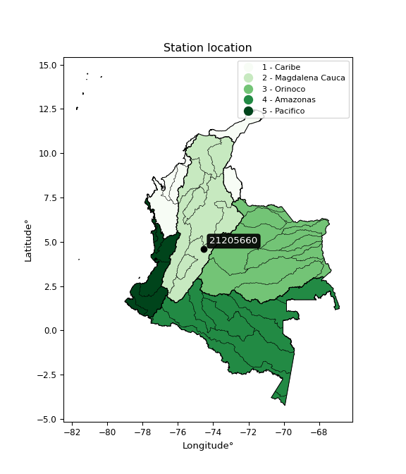</img>

</div>


## A. General information


### 1. General running parameters

• app_version: _v20260312_. • runtime: _2026-03-12 07:15:23.203550_. • Python version: _3.14.0_. • SciPy version: _1.16.3_. • Pandas version: _2.3.3_. • NumPy version: _2.3.5_. • Stations dataset (station_dataset_file): _dataset/pmax24h_in/automatic_colombia_2003_2025.csv_. • Stations catalog (station_catalog_file): _dataset/CNE.xls_. • Minimum year to eval til year_max (date_min): _1900_. • Maximum year to eval since year_min (date_max): _2025_. • Creates, save and include plots into reports (create_plot): _True_. • Plot only fit distributions with Δo > Δ (plot_only_fit): _True_. • Plot only simple graphs avoiding multiple CDFs and multiple Extreme values plots (plot_only_simple): _True_. • Eval low extreme values, if False, evaluates high extreme values (low_extreme): _False_. • Eval every SciPy distribution as logarithmic (pdist_logarithmic_on): _True_. • Standard deviation normalized (ddof): _1.0_. • Return periods to eval in years (Tr): _[2, 2.33, 5, 10, 15, 20, 25, 50, 75, 100, 200, 250, 500, 750, 1000]_. • Minimum data sample per station, 0 means any (minimum_sample): _5_. • Z-Score maximum threshold to adjust a value, 0 means disable (zscore_max): _3.5_. • Z-Score minimum threshold to adjust a value, 0 means disable (zscore_min): _-2.5_. • Avoid zeros, e.g. rain = 0 (avoid_zeros): _True_. • Avoid null values (avoid_nans): _True_. 

:file_folder:Table: [dataset.csv](../../dataset/pmax24h_in/automatic_colombia_2003_2025.csv)

> Delta Degrees of Freedom (DDOF): is a parameter used in the formulas for calculating variance and standard deviation. When ddof=0, the divisor is $N$ (the total number of observations) and this is used when your data set is the entire population. When ddof=1, the divisor is $N-1$ and this is used when your data set is a sample drawn from a larger population. Using $N-1$ provides an unbiased estimate of the population variance (known as Bessel´s correction).


### 2. Station info and location

|   id |   CODIGO | NOMBRE              | CATEGORIA               | TECNOLOGIA                              | ESTADO   | FECHA_INSTALACION   |   FECHA_SUSPENSION |   ALTITUD |   LATITUD |   LONGITUD | DEPARTAMENTO   | MUNICIPIO   | AREA_OPERATIVA                            | ENTIDAD                                                     | AREA_HIDROGRAFICA   | ZONA_HIDROGRAFICA   | SUBZONA_HIDROGRAFICA   |   CORRIENTE | Catalogo   |   Version |
|-----:|---------:|:--------------------|:------------------------|:----------------------------------------|:---------|:--------------------|-------------------:|----------:|----------:|-----------:|:---------------|:------------|:------------------------------------------|:------------------------------------------------------------|:--------------------|:--------------------|:-----------------------|------------:|:-----------|----------:|
|    0 | 21205660 | MERCEDES [21205660] | Climatológica Principal | Automática con Telemetría, Convencional | Activa   | 15/09/1970          |                nan |       765 |    4.5791 |   -74.5232 | Cundinamarca   | Anapoima    | Area Operativa 11 - Cundinamarca-Amazonas | INSTITUTO DE HIDROLOGIA METEOROLOGIA Y ESTUDIOS AMBIENTALES | Magdalena Cauca     | Alto Magdalena      | Río Bogotá             |         nan | CNE_IDEAM  |  20251226 |

<div align="center">

Dynamic map: [:earth_americas:Google](http://maps.google.com/maps?q=4.5791,-74.52318) [:earth_americas:OSM](https://www.openstreetmap.org/#map=18/4.5791/-74.52318&layers=P) [:earth_americas:Bing](https://www.bing.com/maps?cp=4.5791~-74.52318&lvl=18) [:earth_americas:Apple](https://maps.apple.com/frame?center=4.5791%2C-74.52318&span=0.003%2C0.006)

</div>


<div align="center">

```geojson
{
  "type": "Feature",
  "geometry": {
    "type": "Point", 
    "coordinates": [-74.52318, 4.5791]
  }, 
  "properties": {
    "Name": "21205660"
  }
}
```

</div>


### 3. Discrete values table and plot

<div align="center">

|               |           0 |          1 |          2 |           3 |           4 |          5 |          6 |          7 |
|:--------------|------------:|-----------:|-----------:|------------:|------------:|-----------:|-----------:|-----------:|
| Date          | 2018        | 2019       | 2020       | 2021        | 2022        | 2023       | 2024       | 2025       |
| Value         |   47        |   99       |   41.6     |   68.6      |   69.4      |   45       |  104.8     |  108.8     |
| Value_initial |   47        |   99       |   41.6     |   68.6      |   69.4      |   45       |  104.8     |  108.8     |
| count         |    8        |    8       |    8       |    8        |    8        |    8       |    8       |    8       |
| mean          |   73.025    |   73.025   |   73.025   |   73.025    |   73.025    |   73.025   |   73.025   |   73.025   |
| std           |   27.8956   |   27.8956  |   27.8956  |   27.8956   |   27.8956   |   27.8956  |   27.8956  |   27.8956  |
| zscore        |   -0.932943 |    0.93115 |   -1.12652 |   -0.158627 |   -0.129949 |   -1.00464 |    1.13907 |    1.28246 |


</div>


<div align="center">

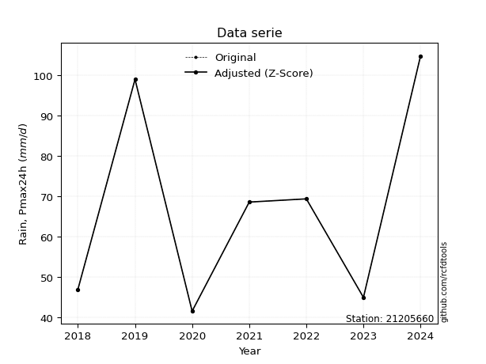</img>

</div>


> The initial value (value_initial) correspond to the initial obtained or null completed value, and value (value) is adjusted only when the initial value is outside the valid range (outlier) definite through the Z-Score value. If Z-Score is active, values out of range or outliers are replaced with the station mean value. A Z-Score (or standard score) measures how many standard deviations a data point is from the mean of a dataset, indicating its relative position; positive scores mean above the mean, negative mean below, and a score of zero is exactly at the mean, allowing for comparison of values from different distributions. It´s calculated using the formula $z=(x–μ)/σ$, where $x$ is the data point, $μ$ is the mean, and $σ$ is the standard deviation, helping identify outliers and understand probability.
>
> <sub>**Note**: In this study, "completing" (filling gaps in) and "extending" (forecasting or lengthening the historical record) rainfall data series are avoided for certain critical analyses because they introduce artificial bias and uncertainty, which can distort the statistics of rare events (extremes), alter day-to-day variability, and compromise the integrity and homogeneity of the original data. Some reasons against Completing/Extending rainfall data are: **Distortion of Extremes and Variability**: The primary issue is that most gap-filling or extension methods rely on averaging or regression with nearby stations, which inherently smooths the data. Rainfall is highly variable in space and time, with a large percentage of zero values and occasional large storms. Infilling methods often underestimate the highest values and overestimate the lowest (zero) values, which severely distorts analyses focused on flood frequency, drought severity, and intensity-duration-frequency (IDF) curves, **Loss of Data Homogeneity**: Infilled or extended data are synthetic estimates, not actual measurements. Combining these estimates with observed data can violate the assumption of data homogeneity, which requires that the data properties do not change over time. Inhomogeneity can lead to incorrect conclusions about long-term trends or changes in climate patterns, **Propagation of Errors**: Errors and biases from the original data (e.g., wind-induced undercatch, instrument errors, site changes) or the data used for imputation can propagate through the analysis, leading to unreliable hydrological models and inaccurate predictions, **Compromised Statistical Integrity**: For statistical analyses, especially those involving the frequency of events, using artificial data can introduce time bias or autocorrelation that doesn´t exist in reality, making it difficult to assess the true probability of events, **Difficulty in Validation**: It is difficult to accurately validate the quality of filled or extended data, especially for past periods where ground-truth measurements are unavailable. The reliability of imputation techniques heavily depends on the density of the surrounding station network and the complexity of the local topography.</sub>


### 4. Active continuous probability distributions from SciPy (80 of 104 available)

A Probability Density Function (PDF) describes the relative likelihood of a continuous random variable falling within a specific range, where the total area under its curve equals 1, and the area over any interval gives the actual probability for that range. Unlike discrete probabilities (like rolling a die), a PDF shows density, not direct probability for a single point (which is zero), with higher points indicating higher likelihood, often visualized as a bell curve for normal distributions.

A log of a probability density function (log-PDF) is simply the logarithm of the PDF´s value, denoted as $log(f(x))$, useful for converting multiplication of probabilities into addition, improving numerical stability with tiny numbers, and connecting to information theory concepts like entropy. Instead of dealing with very small probabilities (e.g., 0.000001), log-PDFs use negative numbers (e.g., $log(0.00001) ≈ -11.51$ that are easier for computers to handle, preventing underflow errors and simplifying complex calculations. In this study, each active probability distribution from SciPy is also evaluated in the $log$ form.

[scipy.stats](https://docs.scipy.org/doc/scipy/reference/stats.html) is a Python´s powerful submodule within the SciPy library for comprehensive statistical analysis, offering over 130 probability distributions (like Normal, Poisson, etc.), functions for descriptive stats (mean, variance), hypothesis testing (t-tests, chi-square), random variable generation, and statistical tests, making it essential for data science, modeling, and research. It provides tools to explore, model, and draw conclusions from data efficiently, working seamlessly with [NumPy](https://numpy.org/).

<div align="center">

|   id | p_dist           |   n_parameter | fit_method   | label                                                                       | active   | ref                                                                                                      |
|-----:|:-----------------|--------------:|:-------------|:----------------------------------------------------------------------------|:---------|:---------------------------------------------------------------------------------------------------------|
|    0 | alpha            |             3 | MLE          | Alpha                                                                       | True     | [:mortar_board:](https://docs.scipy.org/doc/scipy/reference/generated/scipy.stats.alpha.html)            |
|    1 | anglit           |             2 | MM           | Anglit                                                                      | True     | [:mortar_board:](https://docs.scipy.org/doc/scipy/reference/generated/scipy.stats.anglit.html)           |
|    2 | arcsine          |             2 | MM           | Arcsine                                                                     | True     | [:mortar_board:](https://docs.scipy.org/doc/scipy/reference/generated/scipy.stats.arcsine.html)          |
|    3 | argus            |             3 | MLE          | Argus                                                                       | True     | [:mortar_board:](https://docs.scipy.org/doc/scipy/reference/generated/scipy.stats.argus.html)            |
|    4 | beta             |             4 | MLE          | Beta                                                                        | True     | [:mortar_board:](https://docs.scipy.org/doc/scipy/reference/generated/scipy.stats.beta.html)             |
|    5 | betaprime        |             4 | MLE          | Beta prime                                                                  | True     | [:mortar_board:](https://docs.scipy.org/doc/scipy/reference/generated/scipy.stats.betaprime.html)        |
|    6 | bradford         |             3 | MLE          | Bradford                                                                    | True     | [:mortar_board:](https://docs.scipy.org/doc/scipy/reference/generated/scipy.stats.bradford.html)         |
|    7 | burr             |             4 | MLE          | Burr (Type III)                                                             | True     | [:mortar_board:](https://docs.scipy.org/doc/scipy/reference/generated/scipy.stats.burr.html)             |
|    8 | burr12           |             4 | MLE          | Burr (Type III) 12                                                          | True     | [:mortar_board:](https://docs.scipy.org/doc/scipy/reference/generated/scipy.stats.burr12.html)           |
|    9 | cosine           |             2 | MLE          | Cosine                                                                      | True     | [:mortar_board:](https://docs.scipy.org/doc/scipy/reference/generated/scipy.stats.cosine.html)           |
|   10 | crystalball      |             4 | MLE          | Crystalball                                                                 | True     | [:mortar_board:](https://docs.scipy.org/doc/scipy/reference/generated/scipy.stats.crystalball.html)      |
|   11 | dgamma           |             3 | MLE          | Double gamma                                                                | True     | [:mortar_board:](https://docs.scipy.org/doc/scipy/reference/generated/scipy.stats.dgamma.html)           |
|   12 | dweibull         |             3 | MLE          | Double Weibull                                                              | True     | [:mortar_board:](https://docs.scipy.org/doc/scipy/reference/generated/scipy.stats.dweibull.html)         |
|   13 | erlang           |             3 | MLE          | Erlang                                                                      | True     | [:mortar_board:](https://docs.scipy.org/doc/scipy/reference/generated/scipy.stats.erlang.html)           |
|   14 | exponnorm        |             3 | MLE          | Exponentially modified Normal                                               | True     | [:mortar_board:](https://docs.scipy.org/doc/scipy/reference/generated/scipy.stats.exponnorm.html)        |
|   15 | exponpow         |             3 | MLE          | Exponential power                                                           | True     | [:mortar_board:](https://docs.scipy.org/doc/scipy/reference/generated/scipy.stats.exponpow.html)         |
|   16 | exponweib        |             4 | MLE          | Exponentiated Weibull                                                       | True     | [:mortar_board:](https://docs.scipy.org/doc/scipy/reference/generated/scipy.stats.exponweib.html)        |
|   17 | f                |             4 | MLE          | F                                                                           | True     | [:mortar_board:](https://docs.scipy.org/doc/scipy/reference/generated/scipy.stats.f.html)                |
|   18 | fatiguelife      |             3 | MLE          | Fatigue-life (Birnbaum-Saunders)                                            | True     | [:mortar_board:](https://docs.scipy.org/doc/scipy/reference/generated/scipy.stats.fatiguelife.html)      |
|   19 | foldnorm         |             3 | MM           | Fold Normal                                                                 | True     | [:mortar_board:](https://docs.scipy.org/doc/scipy/reference/generated/scipy.stats.foldnorm.html)         |
|   20 | gamma            |             3 | MLE          | Gamma                                                                       | True     | [:mortar_board:](https://docs.scipy.org/doc/scipy/reference/generated/scipy.stats.gamma.html)            |
|   21 | gausshyper       |             6 | MLE          | Gauss hypergeometric                                                        | True     | [:mortar_board:](https://docs.scipy.org/doc/scipy/reference/generated/scipy.stats.gausshyper.html)       |
|   22 | genexpon         |             5 | MLE          | Generalized exponential                                                     | True     | [:mortar_board:](https://docs.scipy.org/doc/scipy/reference/generated/scipy.stats.genexpon.html)         |
|   23 | genextreme       |             3 | MLE          | Generalized exponential                                                     | True     | [:mortar_board:](https://docs.scipy.org/doc/scipy/reference/generated/scipy.stats.genextreme.html)       |
|   24 | gengamma         |             4 | MLE          | Generalized gamma                                                           | True     | [:mortar_board:](https://docs.scipy.org/doc/scipy/reference/generated/scipy.stats.gengamma.html)         |
|   25 | genhalflogistic  |             3 | MLE          | Generalized half-logistic                                                   | True     | [:mortar_board:](https://docs.scipy.org/doc/scipy/reference/generated/scipy.stats.genhalflogistic.html)  |
|   26 | genlogistic      |             3 | MLE          | Generalized logistic                                                        | True     | [:mortar_board:](https://docs.scipy.org/doc/scipy/reference/generated/scipy.stats.genlogistic.html)      |
|   27 | gennorm          |             3 | MLE          | Generalized Normal                                                          | True     | [:mortar_board:](https://docs.scipy.org/doc/scipy/reference/generated/scipy.stats.gennorm.html)          |
|   28 | genpareto        |             3 | MLE          | Generalized Pareto                                                          | True     | [:mortar_board:](https://docs.scipy.org/doc/scipy/reference/generated/scipy.stats.genpareto.html)        |
|   29 | gompertz         |             3 | MLE          | Gompertz (or truncated Gumbel)                                              | True     | [:mortar_board:](https://docs.scipy.org/doc/scipy/reference/generated/scipy.stats.gompertz.html)         |
|   30 | gumbel_l         |             2 | MM           | Gumbel Left Skew                                                            | True     | [:mortar_board:](https://docs.scipy.org/doc/scipy/reference/generated/scipy.stats.gumbel_l.html)         |
|   31 | gumbel_r         |             2 | MM           | Gumbel Right Skew                                                           | True     | [:mortar_board:](https://docs.scipy.org/doc/scipy/reference/generated/scipy.stats.gumbel_r.html)         |
|   32 | halfgennorm      |             3 | MLE          | Upper half of a generalized normal                                          | True     | [:mortar_board:](https://docs.scipy.org/doc/scipy/reference/generated/scipy.stats.halfgennorm.html)      |
|   33 | halflogistic     |             2 | MM           | Half-logistic                                                               | True     | [:mortar_board:](https://docs.scipy.org/doc/scipy/reference/generated/scipy.stats.halflogistic.html)     |
|   34 | halfnorm         |             2 | MM           | Half Normal                                                                 | True     | [:mortar_board:](https://docs.scipy.org/doc/scipy/reference/generated/scipy.stats.halfnorm.html)         |
|   35 | hypsecant        |             2 | MM           | hyperbolic secant                                                           | True     | [:mortar_board:](https://docs.scipy.org/doc/scipy/reference/generated/scipy.stats.hypsecant.html)        |
|   36 | invgamma         |             3 | MLE          | Inverted gamma                                                              | True     | [:mortar_board:](https://docs.scipy.org/doc/scipy/reference/generated/scipy.stats.invgamma.html)         |
|   37 | invgauss         |             3 | MLE          | Inverse Gaussian                                                            | True     | [:mortar_board:](https://docs.scipy.org/doc/scipy/reference/generated/scipy.stats.invgauss.html)         |
|   38 | invweibull       |             3 | MLE          | Inverted Weibull                                                            | True     | [:mortar_board:](https://docs.scipy.org/doc/scipy/reference/generated/scipy.stats.invweibull.html)       |
|   39 | johnsonsb        |             4 | MLE          | Johnson SB                                                                  | True     | [:mortar_board:](https://docs.scipy.org/doc/scipy/reference/generated/scipy.stats.johnsonsb.html)        |
|   40 | johnsonsu        |             4 | MLE          | Johnson Su                                                                  | True     | [:mortar_board:](https://docs.scipy.org/doc/scipy/reference/generated/scipy.stats.johnsonsu.html)        |
|   41 | kappa3           |             3 | MLE          | Kappa 3                                                                     | True     | [:mortar_board:](https://docs.scipy.org/doc/scipy/reference/generated/scipy.stats.kappa3.html)           |
|   42 | kappa4           |             4 | MLE          | Kappa 4                                                                     | True     | [:mortar_board:](https://docs.scipy.org/doc/scipy/reference/generated/scipy.stats.kappa4.html)           |
|   43 | ksone            |             3 | MLE          | Kolmogorov-Smirnov one-sided test statistic distribution                    | True     | [:mortar_board:](https://docs.scipy.org/doc/scipy/reference/generated/scipy.stats.ksone.html)            |
|   44 | kstwobign        |             2 | MLE          | Limiting distribution of scaled Kolmogorov-Smirnov two-sided test statistic | True     | [:mortar_board:](https://docs.scipy.org/doc/scipy/reference/generated/scipy.stats.kstwobign.html)        |
|   45 | laplace          |             2 | MM           | Laplace                                                                     | True     | [:mortar_board:](https://docs.scipy.org/doc/scipy/reference/generated/scipy.stats.laplace.html)          |
|   46 | levy_l           |             2 | MLE          | Left-skewed Levy                                                            | True     | [:mortar_board:](https://docs.scipy.org/doc/scipy/reference/generated/scipy.stats.levy_l.html)           |
|   47 | loggamma         |             3 | MLE          | Log gamma                                                                   | True     | [:mortar_board:](https://docs.scipy.org/doc/scipy/reference/generated/scipy.stats.loggamma.html)         |
|   48 | logistic         |             2 | MM           | Logistic (or Sech-squared)                                                  | True     | [:mortar_board:](https://docs.scipy.org/doc/scipy/reference/generated/scipy.stats.logistic.html)         |
|   49 | loglaplace       |             3 | MLE          | Log-Laplace                                                                 | True     | [:mortar_board:](https://docs.scipy.org/doc/scipy/reference/generated/scipy.stats.loglaplace.html)       |
|   50 | lomax            |             3 | MLE          | Lomax (Pareto of the second kind)                                           | True     | [:mortar_board:](https://docs.scipy.org/doc/scipy/reference/generated/scipy.stats.lomax.html)            |
|   51 | maxwell          |             2 | MM           | Maxwell                                                                     | True     | [:mortar_board:](https://docs.scipy.org/doc/scipy/reference/generated/scipy.stats.maxwell.html)          |
|   52 | mielke           |             4 | MLE          | Mielke Beta-Kappa / Dagum                                                   | True     | [:mortar_board:](https://docs.scipy.org/doc/scipy/reference/generated/scipy.stats.mielke.html)           |
|   53 | moyal            |             2 | MM           | Moyal                                                                       | True     | [:mortar_board:](https://docs.scipy.org/doc/scipy/reference/generated/scipy.stats.moyal.html)            |
|   54 | nakagami         |             3 | MLE          | Nakagami                                                                    | True     | [:mortar_board:](https://docs.scipy.org/doc/scipy/reference/generated/scipy.stats.nakagami.html)         |
|   55 | ncf              |             5 | MLE          | Non-central F distribution                                                  | True     | [:mortar_board:](https://docs.scipy.org/doc/scipy/reference/generated/scipy.stats.ncf.html)              |
|   56 | nct              |             4 | MLE          | Non-central Student’s t                                                     | True     | [:mortar_board:](https://docs.scipy.org/doc/scipy/reference/generated/scipy.stats.nct.html)              |
|   57 | norm             |             2 | MM           | Normal                                                                      | True     | [:mortar_board:](https://docs.scipy.org/doc/scipy/reference/generated/scipy.stats.norm.html)             |
|   58 | pearson3         |             3 | MM           | Pearson type III                                                            | True     | [:mortar_board:](https://docs.scipy.org/doc/scipy/reference/generated/scipy.stats.pearson3.html)         |
|   59 | powerlaw         |             3 | MLE          | Power-function                                                              | True     | [:mortar_board:](https://docs.scipy.org/doc/scipy/reference/generated/scipy.stats.powerlaw.html)         |
|   60 | rayleigh         |             2 | MM           | Rayleigh                                                                    | True     | [:mortar_board:](https://docs.scipy.org/doc/scipy/reference/generated/scipy.stats.rayleigh.html)         |
|   61 | rdist            |             3 | MLE          | R-distributed (symmetric beta)                                              | True     | [:mortar_board:](https://docs.scipy.org/doc/scipy/reference/generated/scipy.stats.rdist.html)            |
|   62 | rice             |             3 | MLE          | Rice                                                                        | True     | [:mortar_board:](https://docs.scipy.org/doc/scipy/reference/generated/scipy.stats.rice.html)             |
|   63 | semicircular     |             2 | MM           | Semicircular                                                                | True     | [:mortar_board:](https://docs.scipy.org/doc/scipy/reference/generated/scipy.stats.semicircular.html)     |
|   64 | skewnorm         |             3 | MLE          | Skew normal                                                                 | True     | [:mortar_board:](https://docs.scipy.org/doc/scipy/reference/generated/scipy.stats.skewnorm.html)         |
|   65 | t                |             3 | MLE          | Student’s t                                                                 | True     | [:mortar_board:](https://docs.scipy.org/doc/scipy/reference/generated/scipy.stats.t.html)                |
|   66 | trapezoid        |             4 | MLE          | Trapezoid                                                                   | True     | [:mortar_board:](https://docs.scipy.org/doc/scipy/reference/generated/scipy.stats.trapezoid.html)        |
|   67 | triang           |             3 | MLE          | Triangular                                                                  | True     | [:mortar_board:](https://docs.scipy.org/doc/scipy/reference/generated/scipy.stats.triang.html)           |
|   68 | truncexpon       |             3 | MLE          | Truncated exponential                                                       | True     | [:mortar_board:](https://docs.scipy.org/doc/scipy/reference/generated/scipy.stats.truncexpon.html)       |
|   69 | truncnorm        |             4 | MLE          | Truncated normal                                                            | True     | [:mortar_board:](https://docs.scipy.org/doc/scipy/reference/generated/scipy.stats.truncnorm.html)        |
|   70 | truncpareto      |             4 | MLE          | Upper truncated Pareto                                                      | True     | [:mortar_board:](https://docs.scipy.org/doc/scipy/reference/generated/scipy.stats.truncpareto.html)      |
|   71 | truncweibull_min |             5 | MLE          | Doubly truncated Weibull minimum                                            | True     | [:mortar_board:](https://docs.scipy.org/doc/scipy/reference/generated/scipy.stats.truncweibull_min.html) |
|   72 | tukeylambda      |             3 | MLE          | Tukey-Lamdba                                                                | True     | [:mortar_board:](https://docs.scipy.org/doc/scipy/reference/generated/scipy.stats.tukeylambda.html)      |
|   73 | uniform          |             2 | MLE          | Uniform                                                                     | True     | [:mortar_board:](https://docs.scipy.org/doc/scipy/reference/generated/scipy.stats.uniform.html)          |
|   74 | vonmises         |             3 | MLE          | Von Mises                                                                   | True     | [:mortar_board:](https://docs.scipy.org/doc/scipy/reference/generated/scipy.stats.vonmises.html)         |
|   75 | vonmises_line    |             3 | MLE          | Von Mises line                                                              | True     | [:mortar_board:](https://docs.scipy.org/doc/scipy/reference/generated/scipy.stats.vonmises_line.html)    |
|   76 | wald             |             2 | MM           | Wald                                                                        | True     | [:mortar_board:](https://docs.scipy.org/doc/scipy/reference/generated/scipy.stats.wald.html)             |
|   77 | weibull_max      |             3 | MLE          | Weibull maximum                                                             | True     | [:mortar_board:](https://docs.scipy.org/doc/scipy/reference/generated/scipy.stats.weibull_max.html)      |
|   78 | weibull_min      |             3 | MLE          | Weibull minimum                                                             | True     | [:mortar_board:](https://docs.scipy.org/doc/scipy/reference/generated/scipy.stats.weibull_min.html)      |
|   79 | wrapcauchy       |             3 | MLE          | Wrapped  Cauchy                                                             | True     | [:mortar_board:](https://docs.scipy.org/doc/scipy/reference/generated/scipy.stats.wrapcauchy.html)       |

</div>

> **n_parameter:** # arguments & localization & scale.
>
> **Fit methods:** (MLE) maximum likelihood, (MM) L-moments.
>
>**Inactive** (With the only purpose of prevent loops, zero divisions, infinite values, over high estimated values or horizontal trending for recurrence intervals estimations, the follow distributions were disabled.)**:** lognorm, norminvgauss, powernorm, powerlognorm, cauchy, halfcauchy, foldcauchy, skewcauchy, chi2, expon, fisk, genhyperbolic, geninvgauss, gibrat, kstwo, laplace_asymmetric, levy, levy_stable, ncx2, pareto, rel_breitwigner, recipinvgauss, studentized_range, loguniform, 


## B. Probability (PDF) vs. Empirical (EDF) distributions functions

A continuous probability distribution (CPD) describes probabilities for variables that can take any value within a range (like rain any time), unlike discrete variables with specific outcomes (like temperature). It uses a Probability Density Function (PDF), a curve where the total area under it equals 1, and the probability of the variable falling within an interval (a to b) is found by calculating the area under the curve between those points. A key feature is that the probability of hitting any single exact value is zero, so probabilities are always expressed for ranges, e.g., $P(a ≤ X ≤ b)$.

<div align="center">

Distributions parameters from station values
|     |   station | p_dist              |   n |             loc |          scale | shape                  | shape1                 | shape2              | shape3             |
|----:|----------:|:--------------------|----:|----------------:|---------------:|:-----------------------|:-----------------------|:--------------------|:-------------------|
|   0 |  21205660 | alpha               |   8 |   -97.612       | 1104.76        | 6.626592396800092      |                        |                     |                    |
|   1 |  21205660 | anglit              |   8 |    73.025       |   76.3352      |                        |                        |                     |                    |
|   2 |  21205660 | arcsine             |   8 |    36.1226      |   73.8048      |                        |                        |                     |                    |
|   3 |  21205660 | argus               |   8 |    19.8262      |   94.2073      | 2.165377385052216e-05  |                        |                     |                    |
|   4 |  21205660 | beta                |   8 |    41.3029      |   67.4971      | 0.3032586117329144     | 0.37647203613401553    |                     |                    |
|   5 |  21205660 | betaprime           |   8 |     5.44046     |  121.952       | 9.887735821617191      | 18.860813443940273     |                     |                    |
|   6 |  21205660 | bradford            |   8 |    41.6         |   67.2001      | 1.0152308101469392     |                        |                     |                    |
|   7 |  21205660 | burr                |   8 |    -9.12082     |    6.02452     | 3.5206320653503083     | 4614.514392672587      |                     |                    |
|   8 |  21205660 | burr12              |   8 |    -1.0136      |   42.397       | 745.7989971383929      | 0.002723154453448895   |                     |                    |
|   9 |  21205660 | cosine              |   8 |    73.6323      |   20.5719      |                        |                        |                     |                    |
|  10 |  21205660 | crystalball         |   8 |    73.025       |   26.094       | 4168.362443415357      | 8529.673273602348      |                     |                    |
|  11 |  21205660 | dgamma              |   8 |    69.4         |   22.5908      | 0.8162298434812699     |                        |                     |                    |
|  12 |  21205660 | dweibull            |   8 |    69.4         |   21.2785      | 0.9244114736040476     |                        |                     |                    |
|  13 |  21205660 | erlang              |   8 |     9.75254     |   10.4032      | 5.9155588939469865     |                        |                     |                    |
|  14 |  21205660 | exponnorm           |   8 |    70.1696      |   25.9373      | 0.11008759102999316    |                        |                     |                    |
|  15 |  21205660 | exponpow            |   8 |    41.6         |   76.36        | 0.2007248792579619     |                        |                     |                    |
|  16 |  21205660 | exponweib           |   8 |    41.6         |    1.30528     | 1.327410310584946      | 0.14976820850174816    |                     |                    |
|  17 |  21205660 | f                   |   8 |    -1.65915     |   66.336       | 241.44320515183335     | 16.95963619746221      |                     |                    |
|  18 |  21205660 | fatiguelife         |   8 |    41.6         |    7.64003e-05 | 657.2659402056138      |                        |                     |                    |
|  19 |  21205660 | foldnorm            |   8 |    17.6395      |   26.9489      | 2.0399613674023716     |                        |                     |                    |
|  20 |  21205660 | gamma               |   8 |    31.1476      |   14.321       | 2.6559841101014783     |                        |                     |                    |
|  21 |  21205660 | gausshyper          |   8 |    41.4028      |   67.3972      | 0.8724232163558109     | 0.8437685061155402     | 1.277656566870734   | 1.2228655497571328 |
|  22 |  21205660 | genexpon            |   8 |    41.5999      |    1.85478     | 0.05907959950388782    | 1.8061396506318756e-07 | 1.9235779052831687  |                    |
|  23 |  21205660 | genextreme          |   8 |    42.2097      |    5.2418      | -8.597938557951672     |                        |                     |                    |
|  24 |  21205660 | gengamma            |   8 |    41.6         |    1.3804      | 1.1945095555656844     | 0.2510607146238233     |                     |                    |
|  25 |  21205660 | genhalflogistic     |   8 |    39.6701      |   76.977       | 1.113512343882509      |                        |                     |                    |
|  26 |  21205660 | genlogistic         |   8 |   -85.1077      |   21.58        | 843.208776800255       |                        |                     |                    |
|  27 |  21205660 | gennorm             |   8 |    75.2         |   33.6         | 16925055.230667632     |                        |                     |                    |
|  28 |  21205660 | genpareto           |   8 |    -1.61084     |  247.692       | -2.2433625064857106    |                        |                     |                    |
|  29 |  21205660 | gompertz            |   8 |    41.6         |   55.017       | 1.0002926557230816     |                        |                     |                    |
|  30 |  21205660 | gumbel_l            |   8 |    84.7687      |   20.3454      |                        |                        |                     |                    |
|  31 |  21205660 | gumbel_r            |   8 |    61.2813      |   20.3454      |                        |                        |                     |                    |
|  32 |  21205660 | halfgennorm         |   8 |    41.6         |    1.36184     | 0.36871345344323503    |                        |                     |                    |
|  33 |  21205660 | halflogistic        |   8 |    42.0976      |   22.3094      |                        |                        |                     |                    |
|  34 |  21205660 | halfnorm            |   8 |    38.4868      |   43.2872      |                        |                        |                     |                    |
|  35 |  21205660 | hypsecant           |   8 |    73.025       |   16.6119      |                        |                        |                     |                    |
|  36 |  21205660 | invgamma            |   8 |    15.7322      |  198.456       | 4.374392727476266      |                        |                     |                    |
|  37 |  21205660 | invgauss            |   8 |    35.8398      |   30.5812      | 1.2159494889158975     |                        |                     |                    |
|  38 |  21205660 | invweibull          |   8 |    41.6         |    1.62847     | 0.05193160536468094    |                        |                     |                    |
|  39 |  21205660 | johnsonsb           |   8 |    41.6         |   67.3116      | 1.6827825337009128     | 0.13193587939481793    |                     |                    |
|  40 |  21205660 | johnsonsu           |   8 |     1.32538e+09 |    6.86224e+08 | 80325149.16913113      | 56865985.90818904      |                     |                    |
|  41 |  21205660 | kappa3              |   8 |    37.8676      |   70.5244      | 455.62605357115945     |                        |                     |                    |
|  42 |  21205660 | kappa4              |   8 |    28.9653      |   88.6043      | 1.1678950259833671     | 1.1074505167782362     |                     |                    |
|  43 |  21205660 | ksone               |   8 |    27.8289      |   90.3921      | 1.0                    |                        |                     |                    |
|  44 |  21205660 | kstwobign           |   8 |   -13.1982      |   98.334       |                        |                        |                     |                    |
|  45 |  21205660 | laplace             |   8 |    73.025       |   18.4512      |                        |                        |                     |                    |
|  46 |  21205660 | levy_l              |   8 |   111.128       |   10.4904      |                        |                        |                     |                    |
|  47 |  21205660 | loggamma            |   8 | -3792.14        |  613.496       | 545.1462625071608      |                        |                     |                    |
|  48 |  21205660 | logistic            |   8 |    73.025       |   14.3864      |                        |                        |                     |                    |
|  49 |  21205660 | loglaplace          |   8 |    -0.16433     |   68.7644      | 3.12867359537987       |                        |                     |                    |
|  50 |  21205660 | lomax               |   8 |    41.6         |   26.8438      | 1.2590652401313935     |                        |                     |                    |
|  51 |  21205660 | maxwell             |   8 |    11.1933      |   38.7473      |                        |                        |                     |                    |
|  52 |  21205660 | mielke              |   8 |     2.30618     |    8.22341     | 799.6565883059816      | 2.962979144979993      |                     |                    |
|  53 |  21205660 | moyal               |   8 |    58.1028      |   11.7464      |                        |                        |                     |                    |
|  54 |  21205660 | nakagami            |   8 |    41.6         |   43.8327      | 0.14436646068765469    |                        |                     |                    |
|  55 |  21205660 | ncf                 |   8 |    -0.0189126   |    1.19568e-06 | 7.588054672842084e-08  | 5.655681893016418      | 3.4594550090141265  |                    |
|  56 |  21205660 | nct                 |   8 |    -0.0753267   |    1.1826      | 4.189981525063702      | 50.841767243667        |                     |                    |
|  57 |  21205660 | norm                |   8 |    73.025       |   26.094       |                        |                        |                     |                    |
|  58 |  21205660 | pearson3            |   8 |    73.025       |   26.0939      | 0.17300497490926595    |                        |                     |                    |
|  59 |  21205660 | powerlaw            |   8 |    41.6         |   67.2         | 0.18056964799634925    |                        |                     |                    |
|  60 |  21205660 | rayleigh            |   8 |    23.1057      |   39.8298      |                        |                        |                     |                    |
|  61 |  21205660 | rdist               |   8 |    75.2486      |   33.6486      | 1.1320766495165246     |                        |                     |                    |
|  62 |  21205660 | rice                |   8 |    27.0283      |   33.7847      | 0.6709159462554188     |                        |                     |                    |
|  63 |  21205660 | semicircular        |   8 |    73.025       |   52.1879      |                        |                        |                     |                    |
|  64 |  21205660 | skewnorm            |   8 |    41.5999      |   40.8503      | 2774125.4828352984     |                        |                     |                    |
|  65 |  21205660 | t                   |   8 |    73.0252      |   26.0933      | 122641667.17343017     |                        |                     |                    |
|  66 |  21205660 | trapezoid           |   8 |    -0.818836    |  110.707       | 0.9999999999999999     | 1.0                    |                     |                    |
|  67 |  21205660 | triang              |   8 |    -0.735921    |  109.536       | 0.9999993460853578     |                        |                     |                    |
|  68 |  21205660 | truncexpon          |   8 |    41.5942      |   78.3362      | 0.857914621312623      |                        |                     |                    |
|  69 |  21205660 | truncnorm           |   8 |    73.025       |   26.094       | -4054.838065945486     | 160.40820302962027     |                     |                    |
|  70 |  21205660 | truncpareto         |   8 |    41.5919      |    0.0080522   | 0.14364573491042754    | 8346.54473463766       |                     |                    |
|  71 |  21205660 | truncweibull_min    |   8 |    41.5643      |   54.1317      | 0.6206672653999685     | 0.0006546167157663145  | 1.2420767143083182  |                    |
|  72 |  21205660 | tukeylambda         |   8 |    75.3329      |   37.7006      | 1.1176202671026698     |                        |                     |                    |
|  73 |  21205660 | uniform             |   8 |    41.6         |   67.2         |                        |                        |                     |                    |
|  74 |  21205660 | vonmises            |   8 |    -1.73876     |    1           | 0.23302777643013178    |                        |                     |                    |
|  75 |  21205660 | vonmises_line       |   8 |    74.2513      |   10.9972      | 6.279929488933693e-05  |                        |                     |                    |
|  76 |  21205660 | wald                |   8 |    46.9311      |   26.0939      |                        |                        |                     |                    |
|  77 |  21205660 | weibull_max         |   8 |   108.8         |    1.48269     | 0.2047118378930459     |                        |                     |                    |
|  78 |  21205660 | weibull_min         |   8 |    41.6         |   27.2678      | 0.7390519719821476     |                        |                     |                    |
|  79 |  21205660 | wrapcauchy          |   8 |    41.5994      |   10.6953      | 0.6083379471827173     |                        |                     |                    |
|  80 |  21205660 | logalpha            |   8 |    -4.8613      |  222.345       | 24.521155063770735     |                        |                     |                    |
|  81 |  21205660 | loganglit           |   8 |     4.22372     |    1.08367     |                        |                        |                     |                    |
|  82 |  21205660 | logarcsine          |   8 |     3.69985     |    1.04775     |                        |                        |                     |                    |
|  83 |  21205660 | logargus            |   8 |     3.41666     |    1.33894     | 1.0668803939673959     |                        |                     |                    |
|  84 |  21205660 | logbeta             |   8 |     3.7281      |    0.961411    | 0.3699944434882247     | 0.3809385747307583     |                     |                    |
|  85 |  21205660 | logbetaprime        |   8 |    -7.42214     |   15.6806      | 1715.6148512109203     | 2311.0743988668346     |                     |                    |
|  86 |  21205660 | logbradford         |   8 |     3.7281      |    0.961412    | 1.2484764090689895     |                        |                     |                    |
|  87 |  21205660 | logburr             |   8 |   -40.4849      |   41.8002      | 137.30194522693495     | 5752.015688373871      |                     |                    |
|  88 |  21205660 | logburr12           |   8 |    -0.577708    |    7.04022     | 15.257710649508411     | 202.36135917792376     |                     |                    |
|  89 |  21205660 | logcosine           |   8 |     4.22166     |    0.292182    |                        |                        |                     |                    |
|  90 |  21205660 | logcrystalball      |   8 |     4.22372     |    0.370436    | 8.411139511849894      | 1.3710182527139199     |                     |                    |
|  91 |  21205660 | logdgamma           |   8 |     4.23989     |    0.3186      | 0.9605742192375049     |                        |                     |                    |
|  92 |  21205660 | logdweibull         |   8 |     4.22829     |    0.303134    | 0.8980250552741557     |                        |                     |                    |
|  93 |  21205660 | logerlang           |   8 |   -16.9521      |    0.00648846  | 3263.5840564852697     |                        |                     |                    |
|  94 |  21205660 | logexponnorm        |   8 |     4.22322     |    0.370436    | 0.001356127451257415   |                        |                     |                    |
|  95 |  21205660 | logexponpow         |   8 |     3.7281      |    0.824113    | 0.8877982973208216     |                        |                     |                    |
|  96 |  21205660 | logexponweib        |   8 |     3.7281      |    0.656443    | 0.6506638044926207     | 1.458937870841086      |                     |                    |
|  97 |  21205660 | logf                |   8 |   -39.6801      |   43.9038      | 28182.996913023402     | 6570862.102634981      |                     |                    |
|  98 |  21205660 | logfatiguelife      |   8 |     3.63844     |    0.402955    | 0.9332416858426542     |                        |                     |                    |
|  99 |  21205660 | logfoldnorm         |   8 |     3.69222     |    0.457272    | 0.9947109623737622     |                        |                     |                    |
| 100 |  21205660 | loggamma            |   8 |   -16.9356      |    0.00649202  | 3259.243035899858      |                        |                     |                    |
| 101 |  21205660 | loggausshyper       |   8 |     3.7281      |    1.0006      | 0.5329095226135327     | 0.9486262517551827     | 0.9685139626957309  | 1.6810053216845189 |
| 102 |  21205660 | loggenexpon         |   8 |     3.7281      |    0.552287    | 0.8259935574223716     | 2.819992493449957      | 0.15527369466343938 |                    |
| 103 |  21205660 | loggenextreme       |   8 |     4.3101      |    0.440367    | 1.1606701055754995     |                        |                     |                    |
| 104 |  21205660 | loggengamma         |   8 |     3.7281      |    0.735346    | 0.39728301554697815    | 1.4076957048552456     |                     |                    |
| 105 |  21205660 | loggenhalflogistic  |   8 |     3.71544     |    1.04256     | 1.0703142265654826     |                        |                     |                    |
| 106 |  21205660 | loggenlogistic      |   8 |     1.95046     |    0.325656    | 610.8313248368431      |                        |                     |                    |
| 107 |  21205660 | loggennorm          |   8 |     4.20881     |    0.480706    | 32014979.556691766     |                        |                     |                    |
| 108 |  21205660 | loggenpareto        |   8 |    -0.0103254   |   12.5941      | -2.6796827313609044    |                        |                     |                    |
| 109 |  21205660 | loggompertz         |   8 |     3.7281      |    0.65467     | 0.6740309645369558     |                        |                     |                    |
| 110 |  21205660 | loggumbel_l         |   8 |     4.39044     |    0.288828    |                        |                        |                     |                    |
| 111 |  21205660 | loggumbel_r         |   8 |     4.05701     |    0.288828    |                        |                        |                     |                    |
| 112 |  21205660 | loghalfgennorm      |   8 |     3.7281      |    0.613933    | 1.2129408685351648     |                        |                     |                    |
| 113 |  21205660 | loghalflogistic     |   8 |     3.78464     |    0.316733    |                        |                        |                     |                    |
| 114 |  21205660 | loghalfnorm         |   8 |     3.73338     |    0.61455     |                        |                        |                     |                    |
| 115 |  21205660 | loghypsecant        |   8 |     4.22372     |    0.235827    |                        |                        |                     |                    |
| 116 |  21205660 | loginvgamma         |   8 |    -0.441307    |  728.2         | 157.16194342127216     |                        |                     |                    |
| 117 |  21205660 | loginvgauss         |   8 |     3.36952     |    3.2546      | 0.2624613182754082     |                        |                     |                    |
| 118 |  21205660 | loginvweibull       |   8 |    -1.39744e+07 |    1.39744e+07 | 43070158.62593649      |                        |                     |                    |
| 119 |  21205660 | logjohnsonsb        |   8 |     3.7281      |    0.961414    | 0.22225581044251425    | 0.14027374976879942    |                     |                    |
| 120 |  21205660 | logjohnsonsu        |   8 |     4.7071      |    0.000563832 | 4.840211958018973      | 0.7108154957331829     |                     |                    |
| 121 |  21205660 | logkappa3           |   8 |     3.7281      |    0.960602    | 2433.6447414412764     |                        |                     |                    |
| 122 |  21205660 | logkappa4           |   8 |     3.56338     |    1.20654     | 1.1590126326206314     | 1.0681407719908114     |                     |                    |
| 123 |  21205660 | logksone            |   8 |     3.58211     |    1.28323     | 1.0                    |                        |                     |                    |
| 124 |  21205660 | logkstwobign        |   8 |     2.93533     |    1.46717     |                        |                        |                     |                    |
| 125 |  21205660 | loglaplace          |   8 |     4.22372     |    0.261938    |                        |                        |                     |                    |
| 126 |  21205660 | loglevy_l           |   8 |     4.71466     |    0.111795    |                        |                        |                     |                    |
| 127 |  21205660 | logloggamma         |   8 |    -1.68407     |    1.84374     | 25.135059223649826     |                        |                     |                    |
| 128 |  21205660 | loglogistic         |   8 |     4.22372     |    0.204232    |                        |                        |                     |                    |
| 129 |  21205660 | logloglaplace       |   8 |    -0.0235422   |    4.25819     | 13.196918256779165     |                        |                     |                    |
| 130 |  21205660 | loglomax            |   8 |     3.7281      |   24.3757      | 49.713574930451244     |                        |                     |                    |
| 131 |  21205660 | logmaxwell          |   8 |     3.34594     |    0.550066    |                        |                        |                     |                    |
| 132 |  21205660 | logmielke           |   8 |  -835.215       |  837.701       | 315514.24213755154     | 2587.6147210261765     |                     |                    |
| 133 |  21205660 | logmoyal            |   8 |     4.01188     |    0.166755    |                        |                        |                     |                    |
| 134 |  21205660 | lognakagami         |   8 |     3.7281      |    0.749286    | 0.39037675534959293    |                        |                     |                    |
| 135 |  21205660 | logncf              |   8 |   -11.4934      |    8.08642     | 5052.2538247877865     | 7859.47083268431       | 4765.857870002254   |                    |
| 136 |  21205660 | lognct              |   8 |    -0.54425     |    0.0232628   | 82.70383080294098      | 203.0832112672938      |                     |                    |
| 137 |  21205660 | lognorm             |   8 |     4.22372     |    0.370436    |                        |                        |                     |                    |
| 138 |  21205660 | logpearson3         |   8 |     4.22372     |    0.370436    | -0.03826835383918282   |                        |                     |                    |
| 139 |  21205660 | logpowerlaw         |   8 |     3.7281      |    0.961411    | 0.19367346319096115    |                        |                     |                    |
| 140 |  21205660 | lograyleigh         |   8 |     3.51506     |    0.565434    |                        |                        |                     |                    |
| 141 |  21205660 | logrdist            |   8 |     4.22211     |    0.494014    | 1.0807617276135817     |                        |                     |                    |
| 142 |  21205660 | logrice             |   8 |     3.53212     |    0.455543    | 0.9829657971444519     |                        |                     |                    |
| 143 |  21205660 | logsemicircular     |   8 |     4.22372     |    0.740872    |                        |                        |                     |                    |
| 144 |  21205660 | logskewnorm         |   8 |     4.26428     |    0.37265     | -0.13768930666988258   |                        |                     |                    |
| 145 |  21205660 | logt                |   8 |     4.22372     |    0.370436    | 3251524015.627877      |                        |                     |                    |
| 146 |  21205660 | logtrapezoid        |   8 |     3.17597     |    1.57163     | 1.0                    | 1.0                    |                     |                    |
| 147 |  21205660 | logtriang           |   8 |     3.38877     |    1.30075     | 0.9999999993199904     |                        |                     |                    |
| 148 |  21205660 | logtruncexpon       |   8 |     3.7281      |    0.819297    | 1.1734830778689027     |                        |                     |                    |
| 149 |  21205660 | logtruncnorm        |   8 |    -0.11443     |    1.14441     | 3.7947385472878583     | 4.197769563835195      |                     |                    |
| 150 |  21205660 | logtruncpareto      |   8 |     3.72796     |    0.000142112 | 2.1314026109214102e-08 | 6766.670674490339      |                     |                    |
| 151 |  21205660 | logtruncweibull_min |   8 |     3.7271      |    0.928738    | 0.7242411727936369     | 0.0010778694011703838  | 1.0362598207185694  |                    |
| 152 |  21205660 | logtukeylambda      |   8 |     4.2088      |    0.593502    | 1.234646117600322      |                        |                     |                    |
| 153 |  21205660 | loguniform          |   8 |     3.7281      |    0.961411    |                        |                        |                     |                    |
| 154 |  21205660 | logvonmises         |   8 |    -2.05912     |    1           | 7.685932412580404      |                        |                     |                    |
| 155 |  21205660 | logvonmises_line    |   8 |     4.19992     |    0.155842    | 0.007676188511431946   |                        |                     |                    |
| 156 |  21205660 | logwald             |   8 |     3.85328     |    0.370437    |                        |                        |                     |                    |
| 157 |  21205660 | logweibull_max      |   8 |     4.68951     |    0.575587    | 0.7384287010242694     |                        |                     |                    |
| 158 |  21205660 | logweibull_min      |   8 |     3.7281      |    0.605306    | 0.5725886141305387     |                        |                     |                    |
| 159 |  21205660 | logwrapcauchy       |   8 |     3.72808     |    0.153016    | 0.5847077859681222     |                        |                     |                    |

</div>

> **loc** (Location parameter): This shifts the distribution along the x-axis. For many common distributions, like the normal (Gaussian) distribution, loc represents the mean $μ$. For others, like the uniform distribution, it might represent the minimum value, or for the beta distribution, the left end of the support interval.
>
> **scale** (Scale parameter): This determines the width or spread of the distribution. For the normal distribution, scale represents the standard deviation $σ$. For a uniform distribution, it defines the length of the interval (from $loc$ to $loc + scale$).
>
> **shape** (Shape parameters): Refers to parameters that define the specific form of a probability distribution, distinct from its location (loc) and scale (scale). These parameters are required arguments for most distribution functions. For example, a normal (Gaussian) distribution is fully defined by its location (mean) and scale (standard deviation), so it has no specific shape parameters beyond loc and scale. However, other distributions have intrinsic properties that need specification, as Gamma distribution that takes a shape parameter, often named $a$ or $alpha$.


### 0. Cumulative distribution values - CDF (160 evaluated)

Cumulative Distribution Function (CDF), denoted as $F$<sub>$X$</sub>$(x)$, is a function that gives the probability that a random variable $X$ will take a value less than or equal to a specific value, $x$ (i.e., $(P(X≥x)$. It essentially "accumulates" probabilities from a given point up to the far right (positive infinity), providing a complete picture of the distribution´s probabilities for both discrete (like rain) and continuous (like temperature) variables, helping to find probabilities over ranges or above certain values. Each station is evaluated separately ordering the $x$ values ascending, calculating the CDF and PDF values for the activated distributions and their logarithmic forms.

<div align="center">

CDF ordered by x ascending and calculating $log(f(x))$ separately
|   id |   Station |   date |     x |   count |   mean |     std |    zscore |   Value_initial |   station |   m |     alpha |   alpha_pdf |   anglit |   anglit_pdf |   arcsine |   arcsine_pdf |     argus |   argus_pdf |     beta |    beta_pdf |   betaprime |   betaprime_pdf |    bradford |   bradford_pdf |     burr |   burr_pdf |    burr12 |   burr12_pdf |    cosine |   cosine_pdf |   crystalball |   crystalball_pdf |   dgamma |   dgamma_pdf |   dweibull |   dweibull_pdf |    erlang |   erlang_pdf |   exponnorm |   exponnorm_pdf |    exponpow |   exponpow_pdf |   exponweib |   exponweib_pdf |         f |      f_pdf |   fatiguelife |   fatiguelife_pdf |   foldnorm |   foldnorm_pdf |     gamma |   gamma_pdf |   gausshyper |   gausshyper_pdf |    genexpon |   genexpon_pdf |   genextreme |   genextreme_pdf |    gengamma |   gengamma_pdf |   genhalflogistic |   genhalflogistic_pdf |   genlogistic |   genlogistic_pdf |    gennorm |   gennorm_pdf |   genpareto |   genpareto_pdf |    gompertz |   gompertz_pdf |   gumbel_l |   gumbel_l_pdf |   gumbel_r |   gumbel_r_pdf |   halfgennorm |   halfgennorm_pdf |   halflogistic |   halflogistic_pdf |   halfnorm |   halfnorm_pdf |   hypsecant |   hypsecant_pdf |   invgamma |   invgamma_pdf |   invgauss |   invgauss_pdf |   invweibull |   invweibull_pdf |   johnsonsb |   johnsonsb_pdf |   johnsonsu |   johnsonsu_pdf |    kappa3 |   kappa3_pdf |      kappa4 |   kappa4_pdf |    ksone |   ksone_pdf |   kstwobign |   kstwobign_pdf |   laplace |   laplace_pdf |   levy_l |   levy_l_pdf |   loggamma |   loggamma_pdf |   logistic |   logistic_pdf |   loglaplace |   loglaplace_pdf |       lomax |   lomax_pdf |   maxwell |   maxwell_pdf |   mielke |   mielke_pdf |     moyal |   moyal_pdf |    nakagami |   nakagami_pdf |      ncf |    ncf_pdf |       nct |    nct_pdf |     norm |   norm_pdf |   pearson3 |   pearson3_pdf |   powerlaw |   powerlaw_pdf |   rayleigh |   rayleigh_pdf |       rdist |     rdist_pdf |      rice |   rice_pdf |   semicircular |   semicircular_pdf |    skewnorm |   skewnorm_pdf |        t |      t_pdf |   trapezoid |   trapezoid_pdf |   triang |   triang_pdf |   truncexpon |   truncexpon_pdf |   truncnorm |   truncnorm_pdf |   truncpareto |   truncpareto_pdf |   truncweibull_min |   truncweibull_min_pdf |   tukeylambda |   tukeylambda_pdf |   uniform |   uniform_pdf |   vonmises |   vonmises_pdf |   vonmises_line |   vonmises_line_pdf |        wald |    wald_pdf |   weibull_max |   weibull_max_pdf |   weibull_min |   weibull_min_pdf |   wrapcauchy |   wrapcauchy_pdf |   logalpha |   logalpha_pdf |   loganglit |   loganglit_pdf |   logarcsine |   logarcsine_pdf |   logargus |   logargus_pdf |     logbeta |   logbeta_pdf |   logbetaprime |   logbetaprime_pdf |   logbradford |   logbradford_pdf |   logburr |   logburr_pdf |   logburr12 |   logburr12_pdf |   logcosine |   logcosine_pdf |   logcrystalball |   logcrystalball_pdf |   logdgamma |   logdgamma_pdf |   logdweibull |   logdweibull_pdf |   logerlang |   logerlang_pdf |   logexponnorm |   logexponnorm_pdf |   logexponpow |   logexponpow_pdf |   logexponweib |   logexponweib_pdf |      logf |   logf_pdf |   logfatiguelife |   logfatiguelife_pdf |   logfoldnorm |   logfoldnorm_pdf |   loggausshyper |   loggausshyper_pdf |   loggenexpon |   loggenexpon_pdf |   loggenextreme |   loggenextreme_pdf |   loggengamma |   loggengamma_pdf |   loggenhalflogistic |   loggenhalflogistic_pdf |   loggenlogistic |   loggenlogistic_pdf |   loggennorm |   loggennorm_pdf |   loggenpareto |   loggenpareto_pdf |   loggompertz |   loggompertz_pdf |   loggumbel_l |   loggumbel_l_pdf |   loggumbel_r |   loggumbel_r_pdf |   loghalfgennorm |   loghalfgennorm_pdf |   loghalflogistic |   loghalflogistic_pdf |   loghalfnorm |   loghalfnorm_pdf |   loghypsecant |   loghypsecant_pdf |   loginvgamma |   loginvgamma_pdf |   loginvgauss |   loginvgauss_pdf |   loginvweibull |   loginvweibull_pdf |   logjohnsonsb |   logjohnsonsb_pdf |   logjohnsonsu |   logjohnsonsu_pdf |   logkappa3 |   logkappa3_pdf |   logkappa4 |   logkappa4_pdf |   logksone |   logksone_pdf |   logkstwobign |   logkstwobign_pdf |   loglevy_l |   loglevy_l_pdf |   logloggamma |   logloggamma_pdf |   loglogistic |   loglogistic_pdf |   logloglaplace |   logloglaplace_pdf |    loglomax |   loglomax_pdf |   logmaxwell |   logmaxwell_pdf |   logmielke |   logmielke_pdf |   logmoyal |   logmoyal_pdf |   lognakagami |   lognakagami_pdf |    logncf |   logncf_pdf |    lognct |   lognct_pdf |   lognorm |   lognorm_pdf |   logpearson3 |   logpearson3_pdf |   logpowerlaw |   logpowerlaw_pdf |   lograyleigh |   lograyleigh_pdf |    logrdist |   logrdist_pdf |   logrice |   logrice_pdf |   logsemicircular |   logsemicircular_pdf |   logskewnorm |   logskewnorm_pdf |      logt |   logt_pdf |   logtrapezoid |   logtrapezoid_pdf |   logtriang |   logtriang_pdf |   logtruncexpon |   logtruncexpon_pdf |   logtruncnorm |   logtruncnorm_pdf |   logtruncpareto |   logtruncpareto_pdf |   logtruncweibull_min |   logtruncweibull_min_pdf |   logtukeylambda |   logtukeylambda_pdf |   loguniform |   loguniform_pdf |   logvonmises |   logvonmises_pdf |   logvonmises_line |   logvonmises_line_pdf |   logwald |   logwald_pdf |   logweibull_max |   logweibull_max_pdf |   logweibull_min |   logweibull_min_pdf |   logwrapcauchy |   logwrapcauchy_pdf |
|-----:|----------:|-------:|------:|--------:|-------:|--------:|----------:|----------------:|----------:|----:|----------:|------------:|---------:|-------------:|----------:|--------------:|----------:|------------:|---------:|------------:|------------:|----------------:|------------:|---------------:|---------:|-----------:|----------:|-------------:|----------:|-------------:|--------------:|------------------:|---------:|-------------:|-----------:|---------------:|----------:|-------------:|------------:|----------------:|------------:|---------------:|------------:|----------------:|----------:|-----------:|--------------:|------------------:|-----------:|---------------:|----------:|------------:|-------------:|-----------------:|------------:|---------------:|-------------:|-----------------:|------------:|---------------:|------------------:|----------------------:|--------------:|------------------:|-----------:|--------------:|------------:|----------------:|------------:|---------------:|-----------:|---------------:|-----------:|---------------:|--------------:|------------------:|---------------:|-------------------:|-----------:|---------------:|------------:|----------------:|-----------:|---------------:|-----------:|---------------:|-------------:|-----------------:|------------:|----------------:|------------:|----------------:|----------:|-------------:|------------:|-------------:|---------:|------------:|------------:|----------------:|----------:|--------------:|---------:|-------------:|-----------:|---------------:|-----------:|---------------:|-------------:|-----------------:|------------:|------------:|----------:|--------------:|---------:|-------------:|----------:|------------:|------------:|---------------:|---------:|-----------:|----------:|-----------:|---------:|-----------:|-----------:|---------------:|-----------:|---------------:|-----------:|---------------:|------------:|--------------:|----------:|-----------:|---------------:|-------------------:|------------:|---------------:|---------:|-----------:|------------:|----------------:|---------:|-------------:|-------------:|-----------------:|------------:|----------------:|--------------:|------------------:|-------------------:|-----------------------:|--------------:|------------------:|----------:|--------------:|-----------:|---------------:|----------------:|--------------------:|------------:|------------:|--------------:|------------------:|--------------:|------------------:|-------------:|-----------------:|-----------:|---------------:|------------:|----------------:|-------------:|-----------------:|-----------:|---------------:|------------:|--------------:|---------------:|-------------------:|--------------:|------------------:|----------:|--------------:|------------:|----------------:|------------:|----------------:|-----------------:|---------------------:|------------:|----------------:|--------------:|------------------:|------------:|----------------:|---------------:|-------------------:|--------------:|------------------:|---------------:|-------------------:|----------:|-----------:|-----------------:|---------------------:|--------------:|------------------:|----------------:|--------------------:|--------------:|------------------:|----------------:|--------------------:|--------------:|------------------:|---------------------:|-------------------------:|-----------------:|---------------------:|-------------:|-----------------:|---------------:|-------------------:|--------------:|------------------:|--------------:|------------------:|--------------:|------------------:|-----------------:|---------------------:|------------------:|----------------------:|--------------:|------------------:|---------------:|-------------------:|--------------:|------------------:|--------------:|------------------:|----------------:|--------------------:|---------------:|-------------------:|---------------:|-------------------:|------------:|----------------:|------------:|----------------:|-----------:|---------------:|---------------:|-------------------:|------------:|----------------:|--------------:|------------------:|--------------:|------------------:|----------------:|--------------------:|------------:|---------------:|-------------:|-----------------:|------------:|----------------:|-----------:|---------------:|--------------:|------------------:|----------:|-------------:|----------:|-------------:|----------:|--------------:|--------------:|------------------:|--------------:|------------------:|--------------:|------------------:|------------:|---------------:|----------:|--------------:|------------------:|----------------------:|--------------:|------------------:|----------:|-----------:|---------------:|-------------------:|------------:|----------------:|----------------:|--------------------:|---------------:|-------------------:|-----------------:|---------------------:|----------------------:|--------------------------:|-----------------:|---------------------:|-------------:|-----------------:|--------------:|------------------:|-------------------:|-----------------------:|----------:|--------------:|-----------------:|---------------------:|-----------------:|---------------------:|----------------:|--------------------:|
|    0 |  21205660 |   2020 |  41.6 |       8 | 73.025 | 27.8956 | -1.12652  |            41.6 |  21205660 |   1 | 0.0952272 |  0.00965192 | 0.133289 |   0.00890511 |  0.175651 |    0.0164537  | 0.0790494 |  0.00716086 | 0.121375 | 0.124145    |   0.0887704 |      0.0104142  | 3.59593e-07 |      0.0215597 | 0.078103 | 0.013819   | 0.0103575 |   0.0461347  | 0.0930419 |   0.00784257 |      0.114236 |        0.00740342 | 0.111786 |   0.00542842 |   0.13897  |     0.00591658 | 0.0967932 |   0.0105909  |    0.114188 |      0.00740849 | 0.000605514 |    1.71055e+10 |  0.00145256 |     4.04932e+10 | 0.0840005 | 0.0113107  |     0.0371983 |       1.30419e+09 |   0.123197 |     0.00783721 | 0.0651033 |  0.0133901  |   0.00898519 |        0.0396572 | 4.26239e-06 |     0.0318525  |  0.000101861 |  34295.2         | 4.72186e-05 |    1.99269e+09 |         0.0127129 |            0.00668091 |     0.0931744 |        0.0102325  | 4.3079e-07 |     0.0148809 |    0.198552 |     0.00531627  | 7.41497e-12 |     0.0181815  |   0.112917 |     0.00522415 |  0.0720069 |     0.00931168 |    3.9468e-14 |        0.173581   |      0         |         0          |  0.0573336 |     0.0183847  |   0.0952925 |      0.00565109 |  0.0737757 |     0.0136629  |  0.0459298 |     0.0239683  |   0.00381574 |      1.55299e+11 | 0.000760162 |     4.85874e+10 |    0.11558  |      0.00742207 | 0.0522175 |    0.0139903 | 2.18283e-14 |    2.25631   | 0.152348 |   0.0110629 |   0.0846669 |      0.010731   | 0.0910554 |    0.00493493 | 0.302304 |   0.00206682 |  0.0899005 |       0.444763 |   0.101164 |     0.00632054 |    0.0753749 |         0.287759 | 1.12545e-12 |  0.0469033  |  0.107199 |    0.00932032 |      nan |          nan | 0.0435167 |  0.00893632 | 2.23216e-05 |    9.07051e+08 | 0.507138 | 0.00600028 | 0.0776204 | 0.0128581  | 0.114236 | 0.00740342 |   0.111277 |     0.00781989 | 0.00130394 |     3.3137e+10 |   0.102195 |     0.0104665  | 6.24842e-10 | 47337.9       | 0.0716529 | 0.00948365 |       0.141284 |         0.00973915 | 1.39599e-06 |     0.0195319  | 0.114229 | 0.00740325 |    0.146813 |      0.00692208 | 0.149384 |   0.00705709 |  0.000128784 |       0.0221624  |    0.114236 |      0.00740342 |      0        |      24.5495      |        7.77617e-05 |             0.272007   |   7.10543e-15 |         0.0259622 | 0         |      0.014881 |    7.37442 |       0.189193 |       0.0274584 |           0.0144714 | 0           | 0           |      0.112695 |       0.000749455 |   3.03788e-12 |      315.977      |  3.60216e-05 |       0.0611072  |  0.0861645 |       0.473761 |    0.103808 |        0.562921 |     0.105018 |         1.87549  |  0.0640137 |       0.411636 | 1.25019e-06 |    1.0416e+09 |      0.0890105 |           0.452223 |   1.63623e-06 |          1.60269  |  0.074938 |      0.602856 |    0.105677 |        0.353849 |    0.073113 |        0.480359 |        0.0904579 |             0.440032 |   0.0945167 |        0.301665 |      0.10424  |          0.293432 |   0.0898862 |        0.444653 |      0.0904573 |           0.440031 |   2.78379e-14 |         55.652    |    3.97843e-15 |           8.50422  | 0.0902185 |   0.442275 |        0.0386904 |             1.29878  |     0.0381721 |          1.06388  |      9.0922e-09 |         1.10022e+07 |   3.07084e-10 |          1.49559  |        0.107749 |            0.21513  |   3.47201e-09 |       4.37239e+06 |           0.00611217 |                 0.485885 |        0.0745594 |             0.593134 |  2.82308e-07 |          1.04014 |       0.446885 |        0.214695    |   5.63735e-10 |          1.02957  |     0.0960162 |          0.315938 |     0.0440296 |          0.476061 |      1.20501e-08 |             1.73632  |         0         |              0        |     0         |          0        |      0.0774467 |           0.325174 |     0.0848854 |          0.484203 |     0.0595124 |          0.727412 |       0.0738876 |            0.593276 |      0.0613378 |     5186.28        |       0.169831 |           0.183616 | 2.60527e-09 |         1.03768 | 1.71525e-14 |      129.343    |   0.11377  |       0.779284 |      0.0678152 |           0.637368 |    0.263603 |        0.128626 |     0.0944993 |          0.416307 |      0.081155 |          0.365118 |       0.0939935 |            0.330635 | 1.43011e-12 |       2.03947  |    0.0773188 |         0.550006 |    0.073898 |        0.587473 |  0.0191937 |       0.361064 |   1.00814e-12 |       1772.42     | 0.0887174 |     0.446451 | 0.0829104 |     0.490569 | 0.0904579 |      0.440032 |     0.0912569 |          0.435514 |    0.00107135 |       4.67232e+11 |     0.0685211 |          0.620697 | 1.08006e-09 |    1.06414e+07 |  0.055735 |      0.555091 |          0.108459 |              0.638696 |     0.0904692 |          0.439961 | 0.0904588 |   0.440036 |       0.123419 |           0.447066 |   0.0680533 |        0.401109 |     3.16523e-06 |            1.7671   |    0           |           0        |      2.87796e-06 |           797.811    |           2.07841e-07 |                  8.0305   |      2.81609e-06 |             1.60492  |    0         |          1.04014 |       1.09069 |          0.430496 |          0.0180086 |                1.01349 |  0        |      0        |         0.232105 |             0.260379 |      2.15851e-09 |          2.78309e+06 |     6.09142e-05 |            3.96898  |
|    1 |  21205660 |   2023 |  45   |       8 | 73.025 | 27.8956 | -1.00464  |            45   |  21205660 |   2 | 0.131349  |  0.0115733  | 0.164981 |   0.00972455 |  0.225475 |    0.0132584  | 0.105172  |  0.00820001 | 0.262679 | 0.0221361   |   0.127898  |      0.0125564  | 0.0714826   |      0.0205063 | 0.131448 | 0.0173471  | 0.153168  |   0.0373771  | 0.121874  |   0.00911384 |      0.141411 |        0.00858805 | 0.131945 |   0.0064632  |   0.160728 |     0.00691071 | 0.136246  |   0.0125759  |    0.141382 |      0.00859461 | 0.507503    |    0.0265965   |  0.604819   |     0.0187976   | 0.126884  | 0.0138357  |     0.625877  |       0.0178852   |   0.151631 |     0.00889641 | 0.116824  |  0.0168352  |   0.109588   |        0.0255783 | 0.102645    |     0.0285832  |  0.440951    |      0.0123511   | 0.640958    |    0.0300257   |         0.0360117 |            0.00702895 |     0.131632  |        0.0123538  | 0.5        |     0.0148809 |    0.216888 |     0.00547147  | 0.0617766   |     0.0181458  |   0.13204  |     0.00604126 |  0.107949  |     0.0118113  |    0.221563   |        0.0427527  |      0.0649572 |         0.0223175  |  0.119602  |     0.0182249  |   0.116499  |      0.00685744 |  0.126543  |     0.0171542  |  0.143226  |     0.0308325  |   0.38194    |      0.00561494  | 0.902464    |     0.00704269  |    0.142799 |      0.008595   | 0.0997844 |    0.0139903 | 0.0711909   |    0.0179739 | 0.189962 |   0.0110629 |   0.125104  |      0.0129926  | 0.10948   |    0.00593346 | 0.309586 |   0.00221962 |  0.130021  |       0.578462 |   0.124769 |     0.00759063 |    0.101738  |         0.388405 | 0.139422    |  0.0358263  |  0.141287 |    0.0107132  |      nan |          nan | 0.0806868 |  0.0129035  | 0.386585    |    0.0328044   | 0.527056 | 0.00571828 | 0.127105  | 0.0160918  | 0.141411 | 0.00858805 |   0.140044 |     0.00910518 | 0.583447   |     0.0309861  |   0.140223 |     0.0118659  | 0.124826    |     0.0210833 | 0.106989  | 0.0112637  |       0.175361 |         0.0102905  | 0.0663334   |     0.0194644  | 0.141403 | 0.00858793 |    0.171292 |      0.0074769  | 0.174342 |   0.00762384 |  0.0738691   |       0.0212211  |    0.141411 |      0.00858805 |      0.798894 |       0.0243306   |        0.230639    |             0.0405967  |   0.0552217   |         0.0155604 | 0.0505952 |      0.014881 |    7.95182 |       0.126519 |       0.0766613 |           0.0144715 | 0           | 0           |      0.115326 |       0.000799286 |   0.193192    |        0.0376476  |  0.185334    |       0.0437248  |  0.129208  |       0.623387 |    0.152035 |        0.662662 |     0.206891 |         1.00404  |  0.100451  |       0.515974 | 0.236968    |    1.16001    |      0.129867  |           0.589621 |   0.119896    |          1.45432  |  0.131246 |      0.826049 |    0.136842 |        0.441873 |    0.11659  |        0.626362 |        0.130112  |             0.571412 |   0.121484  |        0.388571 |      0.130285 |          0.373195 |   0.129996  |        0.578314 |      0.130112  |           0.57141  |   0.123769    |          1.39115  |    0.131348    |           1.55152  | 0.130091  |   0.574694 |        0.167013  |             1.74799  |     0.121736  |          1.06323  |      0.344642   |         2.16857     |   0.114758    |          1.4227   |        0.126164 |            0.254886 |   0.318725    |       2.20006     |           0.0459039  |                 0.528027 |        0.129951  |             0.812929 |  0.5         |          1.04014 |       0.464204 |        0.22648     |   0.0823498   |          1.06525  |     0.124095  |          0.401816 |     0.0926265 |          0.762998 |      0.131451    |             1.59867  |         0.0347587 |              1.57671  |     0.0949181 |          1.28913  |      0.107565  |           0.447487 |     0.12897   |          0.639129 |     0.129202  |          1.02526  |       0.129385  |            0.815477 |      0.453391  |        0.770373    |       0.185294 |           0.210926 | 0.0815229   |         1.03768 | 0.108767    |        1.19781  |   0.174992 |       0.779284 |      0.127729  |           0.878912 |    0.274328 |        0.144964 |     0.131791  |          0.535266 |      0.114855 |          0.497782 |       0.12356   |            0.425724 | 0.147829    |       1.73239  |    0.127155  |         0.716529 |    0.12884  |        0.807447 |  0.0642738 |       0.799208 |   0.13396     |          1.32719  | 0.129044  |     0.581994 | 0.127717  |     0.650957 | 0.130112  |      0.571412 |     0.130455  |          0.564378 |    0.615662   |       1.51774     |     0.124522  |          0.798509 | 0.169524    |    1.19542     |  0.106867 |      0.741606 |          0.161576 |              0.710202 |     0.130117  |          0.571303 | 0.130114  |   0.571416 |       0.161041 |           0.510679 |   0.103213  |        0.493975 |     0.132382    |            1.60552  |    0           |           0        |      0.716214    |             1.4406   |           0.233501    |                  2.04433  |      0.0912387   |             1.08846  |    0.0817156 |          1.04014 |       1.12958 |          0.561796 |          0.097673  |                1.01488 |  0        |      0        |         0.253737 |             0.291064 |      0.267019    |          1.65948     |     0.250301    |            2.11728  |
|    2 |  21205660 |   2018 |  47   |       8 | 73.025 | 27.8956 | -0.932943 |            47   |  21205660 |   3 | 0.155554  |  0.0126178  | 0.184881 |   0.0101709  |  0.25084  |    0.0121665  | 0.122169  |  0.00879507 | 0.300849 | 0.0167065   |   0.15414   |      0.013664   | 0.111917    |      0.0199335 | 0.167657 | 0.0187791  | 0.22327   |   0.0328549  | 0.140836  |   0.0098463  |      0.159295 |        0.00929756 | 0.145568 |   0.00717335 |   0.175209 |     0.0075822  | 0.162451  |   0.0136103  |    0.159281 |      0.00930491 | 0.550509    |    0.0176679   |  0.634376   |     0.0118149   | 0.155821  | 0.0150662  |     0.657072  |       0.0137681   |   0.170061 |     0.00953383 | 0.152032  |  0.0183045  |   0.158301   |        0.0232782 | 0.158028    |     0.0268191  |  0.460276    |      0.00769223  | 0.687887    |    0.0186106   |         0.0502863 |            0.00724748 |     0.157479  |        0.0134743  | 0.5        |     0.0148809 |    0.227927 |     0.00556891  | 0.0980174   |     0.0180907  |   0.144644 |     0.00656851 |  0.132964  |     0.0131862  |    0.29636    |        0.0329444  |      0.109433  |         0.0221437  |  0.155912  |     0.0180793  |   0.131009  |      0.00766569 |  0.162334  |     0.0185544  |  0.204607  |     0.0302461  |   0.390767   |      0.00353117  | 0.913235    |     0.00419759  |    0.16069  |      0.0092966  | 0.127765  |    0.0139903 | 0.10593     |    0.0168656 | 0.212088 |   0.0110629 |   0.152246  |      0.014122   | 0.122013  |    0.00661276 | 0.314123 |   0.00231852 |  0.156852  |       0.655719 |   0.140758 |     0.00840695 |    0.120111  |         0.458547 | 0.206082    |  0.0310011  |  0.163483 |    0.0114738  |      nan |          nan | 0.108677  |  0.0150473  | 0.441757    |    0.0235751   | 0.538331 | 0.0055579  | 0.160766  | 0.0175036  | 0.159296 | 0.00929756 |   0.159013 |     0.00986268 | 0.634279   |     0.0212096  |   0.164684 |     0.0125814  | 0.162988    |     0.0174881 | 0.130465  | 0.0121972  |       0.19623  |         0.0105736  | 0.105167    |     0.019362   | 0.159287 | 0.00929748 |    0.186572 |      0.00780327 | 0.189923 |   0.00795723 |  0.115774    |       0.0206861  |    0.159296 |      0.00929756 |      0.83594  |       0.0143487   |        0.302508    |             0.0321419  |   0.0860113   |         0.0152545 | 0.0803571 |      0.014881 |    8.22015 |       0.158637 |       0.105604  |           0.0144716 | 6.47555e-84 | 1.78418e-80 |      0.116956 |       0.000831379 |   0.260791    |        0.0305707  |  0.259175    |       0.0307094  |  0.158148  |       0.707452 |    0.18194  |        0.712014 |     0.247292 |         0.866689 |  0.124143  |       0.573696 | 0.281222    |    0.9068     |      0.157219  |           0.668434 |   0.18157     |          1.38343  |  0.169526 |      0.931612 |    0.157231 |        0.496565 |    0.145554 |        0.705317 |        0.156614  |             0.647672 |   0.139626  |        0.447257 |      0.147668 |          0.42771  |   0.15682   |        0.655552 |      0.156613  |           0.64767  |   0.182415    |          1.31104  |    0.196944    |           1.46697  | 0.156746  |   0.651389 |        0.241464  |             1.66107  |     0.167948  |          1.06206  |      0.426878   |         1.66565     |   0.175603    |          1.37495  |        0.137791 |            0.28033  |   0.403587    |       1.74621     |           0.0694201  |                 0.553873 |        0.167646  |             0.918031 |  0.5         |          1.04014 |       0.474209 |        0.233765    |   0.129017    |          1.08051  |     0.142751  |          0.457155 |     0.129168  |          0.915289 |      0.199011    |             1.50808  |         0.103052  |              1.56185  |     0.150694  |          1.2751   |      0.128804  |           0.531397 |     0.158639  |          0.725097 |     0.17623   |          1.13033  |       0.167217  |            0.921729 |      0.48077   |        0.524568    |       0.194842 |           0.228581 | 0.126647    |         1.03768 | 0.159274    |        1.13095  |   0.208879 |       0.779284 |      0.168316  |           0.983681 |    0.280858 |        0.155555 |     0.156593  |          0.605855 |      0.138338 |          0.583652 |       0.14341   |            0.488571 | 0.219867    |       1.58313  |    0.160171  |         0.800684 |    0.166313 |        0.913342 |  0.104356  |       1.03915  |   0.188628    |          1.19772  | 0.156048  |     0.660087 | 0.157952  |     0.73916  | 0.156614  |      0.647672 |     0.156625  |          0.639502 |    0.670494   |       1.06399     |     0.16105   |          0.879299 | 0.216742    |    0.998544    |  0.141094 |      0.830737 |          0.193169 |              0.742049 |     0.156613  |          0.647547 | 0.156615  |   0.647676 |       0.184013 |           0.54589  |   0.125811  |        0.545378 |     0.200378    |            1.52253  |    0           |           0        |      0.766087    |             0.927917 |           0.314339    |                  1.70266  |      0.137832    |             1.05708  |    0.126946  |          1.04014 |       1.15568 |          0.639025 |          0.141836  |                1.01637 |  0        |      0        |         0.266803 |             0.310122 |      0.329517    |          1.25747     |     0.322922    |            1.30328  |
|    3 |  21205660 |   2021 |  68.6 |       8 | 73.025 | 27.8956 | -0.158627 |            68.6 |  21205660 |   4 | 0.491976  |  0.0159502  | 0.442162 |   0.0130122  |  0.461739 |    0.00868841 | 0.373778  |  0.0141053  | 0.512801 | 0.00733213  |   0.504137  |      0.0159208  | 0.488207    |      0.0153133 | 0.566891 | 0.0145744  | 0.634724  |   0.0106567  | 0.422523  |   0.0152427  |      0.43267  |        0.0150704  | 0.46559  |   0.0344281  |   0.476482 |     0.0265261  | 0.511973  |   0.0161634  |    0.432827 |      0.0150751  | 0.713963    |    0.00388624  |  0.734784   |     0.00222562  | 0.522512  | 0.0156238  |     0.817126  |       0.00443886  |   0.440753 |     0.0146469  | 0.571871  |  0.0168206  |   0.535106   |        0.0137926 | 0.57685     |     0.0134785  |  0.525467    |      0.00145651  | 0.836636    |    0.00299129  |         0.238731  |            0.0105333  |     0.506692  |        0.0159563  | 0.5        |     0.0148809 |    0.362607 |     0.00706776  | 0.469395    |     0.0157592  |   0.363463 |     0.0141325  |  0.497644  |     0.0170698  |    0.646469   |        0.00857153 |      0.532748  |         0.0160511  |  0.513358  |     0.0144708  |   0.416196  |      0.0185013  |  0.559604  |     0.0147494  |  0.633359  |     0.0116882  |   0.421346   |      0.000700441 | 0.948439    |     0.000862382 |    0.433041 |      0.0149856  | 0.429954  |    0.0139903 | 0.427078    |    0.0139124 | 0.451047 |   0.0110629 |   0.50669   |      0.0158938  | 0.393384  |    0.0213202  | 0.38057  |   0.0041184  |  0.507491  |       1.07603  |   0.423705 |     0.016973   |    0.508649  |         1.87583  | 0.583711    |  0.00973436 |  0.467074 |    0.0150832  |      nan |          nan | 0.522397  |  0.0177053  | 0.698475    |    0.00711971  | 0.641624 | 0.00408295 | 0.55241   | 0.0150849  | 0.43267  | 0.0150704  |   0.443721 |     0.0152831  | 0.848191   |     0.0056725  |   0.479169 |     0.0149361  | 0.431132    |     0.0104786 | 0.4564    | 0.0160655  |       0.446086 |         0.0121547  | 0.491357    |     0.0156994  | 0.432665 | 0.0150708  |    0.39319  |      0.011328   | 0.400685 |   0.0115578  |  0.506285    |       0.0157011  |    0.43267  |      0.0150704  |      0.947371 |       0.0022805   |        0.696624    |             0.0116099  |   0.403057    |         0.0144176 | 0.401786  |      0.014881 |   11.7301  |       0.169968 |       0.418207  |           0.0144731 | 0.590872    | 0.0198566   |      0.14014  |       0.00140238  |   0.629437    |        0.0100694  |  0.475345    |       0.00396796 |  0.523811  |       1.0717   |    0.504218 |        0.922754 |     0.502777 |         0.607629 |  0.433518  |       1.0485   | 0.518623    |    0.540191   |      0.51139   |           1.07405  |   0.617707    |          0.971597 |  0.575207 |      0.976763 |    0.449352 |        1.04152  |    0.507227 |        1.08928  |        0.504922  |             1.07687  |   0.479298  |        1.68346  |      0.5      |         44.9406   |   0.50739   |        1.07592  |      0.504921  |           1.07687  |   0.593482    |          0.880078 |    0.628352    |           0.836085 | 0.506067  |   1.07616  |        0.659386  |             0.678206 |     0.555371  |          0.942155 |      0.783982   |         0.588702    |   0.601295    |          0.86337  |        0.306294 |            0.676993 |   0.780575    |       0.56792     |           0.33571    |                 0.898714 |        0.571348  |             0.981617 |  0.5         |          1.04014 |       0.579496 |        0.340236    |   0.538403    |          1.02032  |     0.434709  |          1.11641  |     0.575426  |          1.10102  |      0.626719    |             0.795978 |         0.6046    |              1.00157  |     0.579367  |          0.938757 |      0.506169  |           1.34951  |     0.528194  |          1.06541  |     0.600652  |          0.904304 |       0.572582  |            0.984017 |      0.592366  |        0.226933    |       0.327642 |           0.536082 | 0.519042    |         1.03768 | 0.545552    |        0.965865 |   0.503562 |       0.779284 |      0.580889  |           0.978126 |    0.368371 |        0.35056  |     0.491599  |          1.07706  |      0.505595 |          1.22394  |       0.490248  |            1.52164  | 0.635709    |       0.728022 |    0.537769  |         1.03096  |    0.570136 |        0.985214 |  0.601233  |       1.09072  |   0.542623    |          0.74643  | 0.507995  |     1.07489  | 0.53118   |     1.06177  | 0.504922  |      1.07687  |     0.502378  |          1.07709  |    0.881132   |       0.341172    |     0.548673  |          1.00684  | 0.5042      |    0.679757    |  0.530584 |      1.06143  |          0.503928 |              0.859268 |     0.504884  |          1.07688  | 0.504925  |   1.07687  |       0.448331 |           0.852078 |   0.416558  |        0.992374 |     0.661534    |            0.959661 |    7.66812e-07 |           4.30732  |      0.925922    |             0.226612 |           0.733581    |                  0.768386 |      0.519318    |             0.991383 |    0.520269  |          1.04014 |       1.5046  |          1.08674  |          0.529195  |                1.02898 |  0.67298  |      1.05724  |         0.427799 |             0.581569 |      0.59202     |          0.418709    |     0.50532     |            0.273609 |
|    4 |  21205660 |   2022 |  69.4 |       8 | 73.025 | 27.8956 | -0.129949 |            69.4 |  21205660 |   5 | 0.504677  |  0.0157999  | 0.452583 |   0.0130411  |  0.468681 |    0.00866764 | 0.38512   |  0.0142495  | 0.518644 | 0.00727667  |   0.516798  |      0.0157292  | 0.500405    |      0.015183  | 0.578399 | 0.0141976  | 0.643103  |   0.0102939  | 0.434744  |   0.0153099  |      0.444756 |        0.0151419  | 0.5      |  12.001      |   0.5      |     0.289215   | 0.524837  |   0.0159942  |    0.444917 |      0.015146   | 0.717027    |    0.00377389  |  0.736537   |     0.00215739  | 0.534907  | 0.0153631  |     0.82063   |       0.00432183  |   0.452495 |     0.0147046  | 0.585189  |  0.0164733  |   0.546068   |        0.0136156 | 0.587497    |     0.0131394  |  0.526615    |      0.00141288  | 0.838987    |    0.00288563  |         0.247224  |            0.0107001  |     0.51938   |        0.0157611  | 0.5        |     0.0148809 |    0.368293 |     0.00714694  | 0.481944    |     0.0156119  |   0.37489  |     0.0144354  |  0.511216  |     0.0168592  |    0.653215   |        0.00829692 |      0.545466  |         0.0157438  |  0.52486   |     0.0142835  |   0.431084  |      0.0187142  |  0.571259  |     0.0143887  |  0.642553  |     0.0112985  |   0.421898   |      0.000680144 | 0.949122    |     0.000845504 |    0.445058 |      0.0150558  | 0.441147  |    0.0139903 | 0.438195    |    0.0138794 | 0.459897 |   0.0110629 |   0.519329  |      0.0157003  | 0.410815  |    0.022265   | 0.383908 |   0.0042274  |  0.519959  |       1.07448  |   0.437337 |     0.0171046  |    0.529924  |         1.79461  | 0.59137     |  0.00941538 |  0.479123 |    0.0150362  |      nan |          nan | 0.536417  |  0.0173446  | 0.704103    |    0.00695043  | 0.644872 | 0.00403687 | 0.564339  | 0.0147375  | 0.444756 | 0.0151419  |   0.455961 |     0.0153153  | 0.852674   |     0.00553839 |   0.491084 |     0.014851   | 0.439498    |     0.0104371 | 0.469226  | 0.0159974  |       0.455816 |         0.0121691  | 0.503835    |     0.0154945  | 0.444751 | 0.0151422  |    0.402305 |      0.0114586  | 0.409984 |   0.0116911  |  0.518782    |       0.0155415  |    0.444756 |      0.0151419  |      0.949165 |       0.00220562  |        0.705806    |             0.0113467  |   0.414588    |         0.0144111 | 0.41369   |      0.014881 |   11.8544  |       0.141794 |       0.429786  |           0.0144731 | 0.606379    | 0.0189208   |      0.141275 |       0.00143653  |   0.637376    |        0.00977893 |  0.478485    |       0.00388598 |  0.536207  |       1.06646  |    0.514915 |        0.922376 |     0.509824 |         0.607895 |  0.445747  |       1.06091  | 0.52489     |    0.540907   |      0.523829  |           1.07156  |   0.628921    |          0.962809 |  0.586439 |      0.960765 |    0.4615   |        1.05402  |    0.519852 |        1.08836  |        0.517403  |             1.07593  |   0.5       |        5.74257  |      0.525977 |          1.95881  |   0.519856  |        1.07438  |      0.517402  |           1.07593  |   0.603612    |          0.867311 |    0.637948    |           0.81913  | 0.518538  |   1.07493  |        0.667146  |             0.660439 |     0.566245  |          0.933539 |      0.790741   |         0.57722     |   0.611213    |          0.847506 |        0.314259 |            0.69705  |   0.787064    |       0.5516      |           0.346221   |                 0.914442 |        0.58264   |             0.966035 |  0.5         |          1.04014 |       0.583472 |        0.345709    |   0.550186    |          1.01204  |     0.447764  |          1.1353   |     0.588076  |          1.08095  |      0.635847    |             0.778672 |         0.616084  |              0.979439 |     0.590169  |          0.924437 |      0.521802  |           1.3466   |     0.54051   |          1.05906  |     0.611029  |          0.88575  |       0.5839    |            0.968242 |      0.594998  |        0.227145    |       0.333959 |           0.553592 | 0.531073    |         1.03768 | 0.556742    |        0.964305 |   0.512597 |       0.779284 |      0.59214   |           0.962699 |    0.372504 |        0.36246  |     0.504102  |          1.0795   |      0.519777 |          1.22218  |       0.508055  |            1.52276  | 0.644051    |       0.711019 |    0.549676  |         1.02282  |    0.581469 |        0.969664 |  0.61372   |       1.06316  |   0.551221    |          0.736655 | 0.520447  |     1.07294  | 0.543449  |     1.05445  | 0.517403  |      1.07593  |     0.514866  |          1.07679  |    0.885051   |       0.334926    |     0.560289  |          0.996875 | 0.512083    |    0.680113    |  0.542844 |      1.05329  |          0.513889 |              0.859079 |     0.517366  |          1.07595  | 0.517406  |   1.07593  |       0.458264 |           0.861466 |   0.428143  |        1.00608  |     0.672582    |            0.946176 |    0.0489927   |           4.14466  |      0.928519    |             0.221479 |           0.742415    |                  0.755441 |      0.530814    |             0.991588 |    0.532329  |          1.04014 |       1.51719 |          1.08577  |          0.541125  |                1.02886 |  0.684957 |      1.00919  |         0.434618 |             0.594787 |      0.596822    |          0.409748    |     0.508501    |            0.275213 |
|    5 |  21205660 |   2019 |  99   |       8 | 73.025 | 27.8956 |  0.93115  |            99   |  21205660 |   6 | 0.843175  |  0.0068628  | 0.814611 |   0.0101818  |  0.748552 |    0.0121435  | 0.840838  |  0.0145037  | 0.747779 | 0.0104951   |   0.845812  |      0.00660962 | 0.891104    |      0.0115467 | 0.837329 | 0.00484051 | 0.825005  |   0.00355353 | 0.846425  |   0.0102996  |      0.840239 |        0.00931533 | 0.897553 |   0.00495521 |   0.871258 |     0.00545518 | 0.863642  |   0.0067378  |    0.840258 |      0.00930676 | 0.792176    |    0.00176448  |  0.778837   |     0.000985019 | 0.840875  | 0.0059912  |     0.906376  |       0.00192082  |   0.836237 |     0.00916647 | 0.892378  |  0.00538675 |   0.886628   |        0.0104576 | 0.839322    |     0.00511804 |  0.554645    |      0.000662429 | 0.891865    |    0.00113643  |         0.705027  |            0.0230442  |     0.846838  |        0.00652314 | 0.5        |     0.0148809 |    0.660252 |     0.0154537   | 0.841047    |     0.0082036  |   0.866375 |     0.0132192  |  0.855027  |     0.00658215 |    0.807445   |        0.00326745 |      0.855228  |         0.00601955 |  0.837871  |     0.00693777 |   0.868607  |      0.00768686 |  0.838064  |     0.00505443 |  0.843021  |     0.00390544 |   0.435569   |      0.000327515 | 0.972222    |     0.000996298 |    0.838825 |      0.0093149  | 0.855258  |    0.0139903 | 0.845345    |    0.0142081 | 0.787359 |   0.0110629 |   0.852065  |      0.00685775 | 0.877655  |    0.00663071 | 0.647648 |   0.0198515  |  0.841998  |       0.643587 |   0.858821 |     0.00842796 |    0.878887  |         0.462372 | 0.763064    |  0.00354112 |  0.837852 |    0.00811217 |      nan |          nan | 0.860786  |  0.00586529 | 0.848764    |    0.00343368  | 0.742738 | 0.00268037 | 0.839699  | 0.00519328 | 0.840239 | 0.00931533 |   0.840584 |     0.0088036  | 0.971938   |     0.00305754 |   0.837227 |     0.0077871  | 0.767697    |     0.0138923 | 0.843163  | 0.00822429 |       0.803241 |         0.0105803  | 0.840018    |     0.00727796 | 0.840243 | 0.00931542 |    0.812967 |      0.0162888  | 0.829067 |   0.0166252  |  0.901885    |       0.0106511  |    0.840239 |      0.00931533 |      0.991387 |       0.00096274  |        0.946614    |             0.00592093 |   0.843825    |         0.0148679 | 0.854167  |      0.014881 |   16.5411  |       0.197229 |       0.858178  |           0.0144717 | 0.884974    | 0.00423136  |      0.229473 |       0.00705581  |   0.823323    |        0.00394321 |  0.646004    |       0.0148931  |  0.84342   |       0.596457 |    0.816508 |        0.714365 |     0.750828 |         0.861527 |  0.862122  |       1.14563  | 0.758969    |    1.01991    |      0.841837  |           0.631457 |   0.930815    |          0.753888 |  0.835172 |      0.458159 |    0.839146 |        0.863046 |    0.855819 |        0.701837 |        0.841972  |             0.651509 |   0.844044  |        0.500243 |      0.847403 |          0.443357 |   0.841911  |        0.643752 |      0.841972  |           0.651511 |   0.842211    |          0.481106 |    0.84861     |           0.400122 | 0.841851  |   0.647813 |        0.830371  |             0.309901 |     0.83492   |          0.550461 |      0.952031   |         0.368374    |   0.833868    |          0.431966 |        0.739618 |            2.03623  |   0.916835    |       0.225856    |           0.797006   |                 1.80534  |        0.833999  |             0.464809 |  0.5         |          1.04014 |       0.767373 |        0.919695    |   0.844355    |          0.602497 |     0.868832  |          0.922482 |     0.856251  |          0.460076 |      0.83451     |             0.379773 |         0.856337  |              0.420996 |     0.839153  |          0.485757 |      0.870035  |           0.53592  |     0.842409  |          0.583217 |     0.834682  |          0.412692 |       0.835255  |            0.463422 |      0.703097  |        0.570254    |       0.72119  |           2.13241  | 0.899693    |         1.03768 | 0.897916    |        0.98554  |   0.789425 |       0.779284 |      0.845405  |           0.476153 |    0.666487 |        2.02196  |     0.84216   |          0.696483 |      0.860387 |          0.58816  |       0.828908  |            0.488862 | 0.824047    |       0.346525 |    0.839362  |         0.567625 |  nan        |      nan        |  0.861877  |       0.409987 |   0.763356    |          0.466834 | 0.84081   |     0.63933  | 0.84116   |     0.572058 | 0.841972  |      0.651509 |     0.841995  |          0.659914 |    0.980185   |       0.218952    |     0.838676  |          0.544986 | 0.784298    |    1.00193     |  0.841879 |      0.584751 |          0.805214 |              0.743517 |     0.841973  |          0.65163  | 0.841974  |   0.651505 |       0.815375 |           1.1491   |   0.86012   |        1.42599  |     0.945311    |            0.613295 |    0.903051    |           1.21237  |      0.988276    |             0.13075  |           0.956669    |                  0.483155 |      0.891642    |             1.07518  |    0.90182   |          1.04014 |       1.84248 |          0.644152 |          0.904294  |                1.01482 |  0.88576  |      0.295671 |         0.768627 |             1.58232  |      0.707252    |          0.2375      |     0.719102    |            1.76422  |
|    6 |  21205660 |   2024 | 104.8 |       8 | 73.025 | 27.8956 |  1.13907  |           104.8 |  21205660 |   7 | 0.878718  |  0.00543454 | 0.869812 |   0.00881664 |  0.830196 |    0.0169626  | 0.919511  |  0.0124017  | 0.823183 | 0.0171655   |   0.880111  |      0.00525732 | 0.956551    |      0.0110291 | 0.862685 | 0.00393786 | 0.843936  |   0.0029954  | 0.900037  |   0.00816748 |      0.888334 |        0.00728413 | 0.922493 |   0.00370919 |   0.899138 |     0.00421639 | 0.898308  |   0.00525781 |    0.888308 |      0.00727742 | 0.801878    |    0.00158651  |  0.784254   |     0.000886194 | 0.87209   | 0.00481157 |     0.916788  |       0.00167658  |   0.883826 |     0.0072548  | 0.919795  |  0.00411554 |   0.948588   |        0.0111448 | 0.866426    |     0.00425471 |  0.558296    |      0.000598855 | 0.898041    |    0.000998139 |         0.856377  |            0.0299298  |     0.880674  |        0.00518522 | 0.5        |     0.0148809 |    0.772133 |     0.0253935   | 0.884077    |     0.00664795 |   0.931207 |     0.0090505  |  0.888898  |     0.00514555 |    0.825086   |        0.00283057 |      0.88649   |         0.00479922 |  0.874462  |     0.0057013  |   0.906666  |      0.00553836 |  0.864541  |     0.00411063 |  0.863782  |     0.00327662 |   0.437377   |      0.000297204 | 0.979488    |     0.00169056  |    0.886981 |      0.00730456 | 0.936401  |    0.0139903 | 0.93012     |    0.0152154 | 0.851524 |   0.0110629 |   0.887737  |      0.00547692 | 0.910656  |    0.0048422  | 0.802094 |   0.0354343  |  0.875835  |       0.545484 |   0.901027 |     0.00619873 |    0.902547  |         0.372045 | 0.782117    |  0.00304662 |  0.880144 |    0.00649399 |      nan |          nan | 0.891025  |  0.00460969 | 0.867519    |    0.00304228  | 0.757697 | 0.00248083 | 0.866834  | 0.00420084 | 0.888334 | 0.00728413 |   0.886092 |     0.00691156 | 0.98898    |     0.00282563 |   0.877968 |     0.00628418 | 0.861039    |     0.0195368 | 0.885794  | 0.00650397 |       0.862114 |         0.00967691 | 0.878165    |     0.00590186 | 0.888338 | 0.00728412 |    0.910187 |      0.0172353  | 0.928297 |   0.0175921  |  0.961429    |       0.00989094 |    0.888334 |      0.00728413 |      0.99667  |       0.000862393 |        0.979273    |             0.00535573 |   0.931374    |         0.0154091 | 0.940476  |      0.014881 |   17.4456  |       0.196487 |       0.942113  |           0.0144715 | 0.906725    | 0.00331376  |      0.293678 |       0.0184156   |   0.844521    |        0.00338402 |  0.789741    |       0.039468   |  0.874789  |       0.506324 |    0.855359 |        0.649159 |     0.804708 |         1.05532  |  0.924168  |       1.01904  | 0.832334    |    1.73639    |      0.875047  |           0.535734 |   0.973008    |          0.728551 |  0.859453 |      0.395963 |    0.884402 |        0.723808 |    0.892837 |        0.597876 |        0.876219  |             0.551911 |   0.870049  |        0.415937 |      0.870507 |          0.370734 |   0.875757  |        0.545664 |      0.876218  |           0.551913 |   0.867984    |          0.424701 |    0.869979    |           0.351319 | 0.875909  |   0.548994 |        0.84705   |             0.276726 |     0.864287  |          0.481432 |      0.972576   |         0.354581    |   0.856988    |          0.38094  |        0.872817 |            2.73091  |   0.9288      |       0.195149    |           0.909065   |                 2.16506  |        0.858635  |             0.401802 |  0.5         |          1.04014 |       0.835234 |        1.64152     |   0.876367    |          0.522065 |     0.915742  |          0.721687 |     0.880358  |          0.3884   |      0.854869    |             0.33619  |         0.878538  |              0.360195 |     0.865052  |          0.424754 |      0.897367  |           0.427703 |     0.87311   |          0.49614  |     0.856653  |          0.360164 |       0.859809  |            0.400269 |      0.749175  |        1.24044     |       0.862403 |           2.84052  | 0.958772    |         1.03768 | 0.955102    |        1.03176  |   0.833792 |       0.779284 |      0.870667  |           0.412247 |    0.818547 |        3.48688  |     0.878735  |          0.588244 |      0.890638 |          0.476916 |       0.85445   |            0.410816 | 0.842691    |       0.309111 |    0.86939   |         0.487938 |  nan        |      nan        |  0.883384  |       0.347162 |   0.788846    |          0.428859 | 0.874441  |     0.542565 | 0.871293  |     0.487399 | 0.876219  |      0.551911 |     0.876678  |          0.55875  |    0.992333   |       0.208007    |     0.867576  |          0.470939 | 0.848538    |    1.30334     |  0.872756 |      0.500611 |          0.846379 |              0.701119 |     0.876226  |          0.552008 | 0.87622   |   0.551907 |       0.88211  |           1.1952   |   0.943223  |        1.49329  |     0.979043    |            0.572123 |    0.965445    |           0.986698 |      0.995486    |             0.122695 |           0.983332    |                  0.453949 |      0.954493    |             1.14352  |    0.961039  |          1.04014 |       1.87627 |          0.543344 |          0.962034  |                1.01366 |  0.901234 |      0.249455 |         0.875479 |             2.29518  |      0.72029     |          0.220836    |     0.860303    |            3.30158  |
|    7 |  21205660 |   2025 | 108.8 |       8 | 73.025 | 27.8956 |  1.28246  |           108.8 |  21205660 |   8 | 0.898734  |  0.00459258 | 0.902985 |   0.00775469 |  0.921115 |    0.0351647  | 0.964498  |  0.00988476 | 0.999999 | 1.62703e+07 |   0.899512  |      0.00446132 | 0.999999    |      0.0106984 | 0.877387 | 0.00342648 | 0.855265  |   0.00267678 | 0.929702  |   0.00666686 |      0.914814 |        0.0059732  | 0.935959 |   0.00304676 |   0.914611 |     0.00354082 | 0.917551  |   0.00438352 |    0.914764 |      0.00596824 | 0.808009    |    0.00148139  |  0.787681   |     0.000828257 | 0.889936  | 0.00412766 |     0.923197  |       0.00153032  |   0.910325 |     0.00600968 | 0.934781  |  0.00339749 |   1          |        1.90201   | 0.882405    |     0.00374572 |  0.560616    |      0.000561526 | 0.90187     |    0.000918163 |         1         |            1.09924    |     0.899811  |        0.00440165 | 1          |     0.0148809 |    1        |     2.81041e+06 | 0.908624    |     0.00563544 |   0.961542 |     0.00615884 |  0.907781  |     0.00431695 |    0.835888   |        0.00257611 |      0.90423   |         0.00408727 |  0.895697  |     0.00492766 |   0.926438  |      0.00438898 |  0.879879  |     0.00357241 |  0.876149  |     0.00291584 |   0.43853    |      0.000279358 | 0.994251    |     0.0193809   |    0.913564 |      0.00600372 | 0.992297  |    0.0135766 | 0.996082    |    0.0204869 | 0.895776 |   0.0110629 |   0.907947  |      0.00464429 | 0.928069  |    0.00389846 | 0.966226 |   0.0382239  |  0.895094  |       0.483232 |   0.923206 |     0.00492803 |    0.915533  |         0.322471 | 0.79372     |  0.00276169 |  0.904048 |    0.00547309 |      nan |          nan | 0.908003  |  0.00389855 | 0.879198    |    0.00280041  | 0.767362 | 0.00235338 | 0.882478  | 0.00363574 | 0.914814 | 0.0059732  |   0.911306 |     0.00571362 | 1          |     0.00268705 |   0.901184 |     0.00533778 | 0.983444    |     0.0964858 | 0.909627  | 0.00543011 |       0.899285 |         0.00888143 | 0.900037    |     0.00504795 | 0.914818 | 0.00597314 |    0.980433 |      0.017888   | 0.999999 |   0.0182588  |  1           |       0.00939856 |    0.914814 |      0.0059732  |      1        |       0.000803949 |        1           |             0.00501367 |   0.995227    |         0.0173053 | 1         |      0.014881 |   18.0735  |       0.129259 |       0.999999  |           0.0144714 | 0.918956    | 0.00281724  |      0.998651 |       1.94177e+10 |   0.857385    |        0.00305473 |  0.999998    |       0.0611072  |  0.892695  |       0.450233 |    0.878807 |        0.602306 |     0.848684 |         1.3276   |  0.959779  |       0.870451 | 0.998402    | 3222.64       |      0.893974  |           0.475284 |   1           |          0.71279  |  0.873581 |      0.35885  |    0.909679 |        0.625351 |    0.913926 |        0.528132 |        0.895697  |             0.488507 |   0.884723  |        0.368535 |      0.883621 |          0.330325 |   0.895023  |        0.483417 |      0.895697  |           0.488508 |   0.883223    |          0.389171 |    0.882579    |           0.321798 | 0.895288  |   0.486176 |        0.857043  |             0.2571   |     0.88149   |          0.437323 |      0.98578    |         0.351864    |   0.870668    |          0.349835 |        1        |          367.078    |   0.935767    |       0.177133    |           1          |                21.432    |        0.872971  |             0.364134 |  1           |          1.04014 |       0.999999 |        7.95268e+08 |   0.894939    |          0.469761 |     0.940181  |          0.583307 |     0.894109  |          0.346488 |      0.866966    |             0.310008 |         0.891349  |              0.3244   |     0.88025   |          0.387044 |      0.912234  |           0.367466 |     0.890674  |          0.44218  |     0.86955   |          0.32893  |       0.874086  |            0.362548 |      1         |        2.78587e+08 |       0.971422 |           2.64039  | 0.99764     |         1.03438 | 0.9956      |        1.20047  |   0.862982 |       0.779284 |      0.885374  |           0.373434 |    0.965003 |        3.62285  |     0.899447  |          0.517967 |      0.907265 |          0.41196  |       0.868998  |            0.366817 | 0.853845    |       0.286768 |    0.886728  |         0.438223 |  nan        |      nan        |  0.895698  |       0.310953 |   0.804457    |          0.404767 | 0.893609  |     0.481275 | 0.888562  |     0.435167 | 0.895697  |      0.488507 |     0.89639   |          0.494113 |    1          |       0.201447    |     0.884345  |          0.42485  | 0.906377    |    1.9164      |  0.890513 |      0.447932 |          0.872039 |              0.668218 |     0.895707  |          0.488586 | 0.895698  |   0.488503 |       0.927447 |           1.22553  |   0.999987  |        1.53757  |     0.99999     |            0.546555 |    0.99999     |           0.860491 |      0.999991    |             0.117915 |           0.999999    |                  0.436136 |      1           |             1.68411  |    1         |          1.04014 |       1.89543 |          0.479803 |          0.999998  |                1.01344 |  0.910085 |      0.223714 |         1        |          9604.83     |      0.728373    |          0.210843    |     1           |            3.96898  |


</div>

An Empirical Distribution Function (EDF) is a step-function estimate of a true cumulative distribution function (CDF) based on observed sample data, representing the proportion of data points less than or equal to a given value. It is calculated by ordering your data and jumping up by $1/n$ (where $n$ is sample size) at each unique data point, allowing analysis without assuming an underlying population distribution, and it gets closer to the true CDF as the sample size grows. For the empirical probability calculations, the parameter $m$ correspond to the order number which means the position of the $x$ values in an ascending order list.

The Kolmogorov-Smirnov (K-S) test is a non-parametric statistical test used to determine if a sample data set comes from a specific theoretical distribution (one-sample) or if two different samples come from the same underlying distribution (two-sample), by comparing their cumulative distribution functions (CDFs). It calculates the maximum vertical difference (D statistic) between these functions, with a small p-value indicating a significant difference and rejection of the null hypothesis (that the data/samples match).


### 1. EDF California (1923)

California´s estimates the true probability distribution of water-related data (like rainfall, streamflow) using observed samples, crucial for risk assessment.

<div align="center">


$P=m/n$


</div>


**1.1. Empirical values**

<div align="center">

|                | 0                  | 1                  | 2              | 3              | 4                  | 5              | 6              | 7              |
|:---------------|:-------------------|:-------------------|:---------------|:---------------|:-------------------|:---------------|:---------------|:---------------|
| date           | 2020               | 2023               | 2018           | 2021           | 2022               | 2019           | 2024           | 2025           |
| x              | 41.6               | 45.0               | 47.0           | 68.6           | 69.4               | 99.0           | 104.8          | 108.8          |
| m              | 1                  | 2                  | 3              | 4              | 5                  | 6              | 7              | 8              |
| empirical_dist | edf_california     | edf_california     | edf_california | edf_california | edf_california     | edf_california | edf_california | edf_california |
| empirical      | 0.125              | 0.25               | 0.375          | 0.5            | 0.625              | 0.75           | 0.875          | 1.0            |
| empirical_tr   | 1.1428571428571428 | 1.3333333333333333 | 1.6            | 2.0            | 2.6666666666666665 | 4.0            | 8.0            | inf            |

</div>


**1.2. Kolmogorov-Smirnov fit test (sorted by Δ)**


<div align="center">

|                | 0                   | 1                   | 2                   | 3                   | 4                   | 5                   | 6                   | 7                  | 8                   | 9                  | 10                  | 11                  | 12                  | 13                 | 14                 | 15                  | 16                 | 17                  | 18                 | 19                  | 20                  | 21                  | 22                  | 23                  | 24                  | 25                  | 26                 | 27                  | 28                 | 29                  | 30                  | 31                  | 32                  | 33                  | 34                 | 35                 | 36                  | 37                  | 38                 | 39                  | 40                  | 41                 | 42                  | 43                 | 44                  | 45                 | 46                  | 47                  | 48                  | 49                  | 50                  | 51                  | 52                  | 53                 | 54                 | 55                  | 56                  | 57                  | 58                  | 59                  | 60                 | 61                  | 62                  | 63                  | 64                  | 65                  | 66                 | 67                  | 68                  | 69                  | 70                  | 71                 | 72                  | 73                  | 74                  | 75                 | 76                  | 77                 | 78                  | 79                 | 80                 | 81                  | 82                 | 83                  | 84                 | 85                  | 86                 | 87                  | 88                 | 89                  | 90                  | 91                  | 92                 | 93                  | 94                  | 95                 | 96                  | 97                 | 98                  | 99                  | 100                 | 101                | 102                 | 103                | 104                 | 105                 | 106                 | 107                 | 108                 | 109                 | 110                 | 111                 | 112                | 113                | 114                 | 115                | 116                | 117                | 118                 | 119                 | 120                 | 121                | 122                | 123                 | 124                | 125                 | 126                 | 127                | 128                 | 129                | 130                | 131                | 132                 | 133                | 134                 | 135                 | 136                 | 137                | 138                 | 139                | 140                | 141                | 142                | 143                | 144                | 145                | 146                 | 147                 | 148                 | 149                | 150                | 151                | 152                | 153                | 154                | 155                | 156                | 157                | 158                | 159                |
|:---------------|:--------------------|:--------------------|:--------------------|:--------------------|:--------------------|:--------------------|:--------------------|:-------------------|:--------------------|:-------------------|:--------------------|:--------------------|:--------------------|:-------------------|:-------------------|:--------------------|:-------------------|:--------------------|:-------------------|:--------------------|:--------------------|:--------------------|:--------------------|:--------------------|:--------------------|:--------------------|:-------------------|:--------------------|:-------------------|:--------------------|:--------------------|:--------------------|:--------------------|:--------------------|:-------------------|:-------------------|:--------------------|:--------------------|:-------------------|:--------------------|:--------------------|:-------------------|:--------------------|:-------------------|:--------------------|:-------------------|:--------------------|:--------------------|:--------------------|:--------------------|:--------------------|:--------------------|:--------------------|:-------------------|:-------------------|:--------------------|:--------------------|:--------------------|:--------------------|:--------------------|:-------------------|:--------------------|:--------------------|:--------------------|:--------------------|:--------------------|:-------------------|:--------------------|:--------------------|:--------------------|:--------------------|:-------------------|:--------------------|:--------------------|:--------------------|:-------------------|:--------------------|:-------------------|:--------------------|:-------------------|:-------------------|:--------------------|:-------------------|:--------------------|:-------------------|:--------------------|:-------------------|:--------------------|:-------------------|:--------------------|:--------------------|:--------------------|:-------------------|:--------------------|:--------------------|:-------------------|:--------------------|:-------------------|:--------------------|:--------------------|:--------------------|:-------------------|:--------------------|:-------------------|:--------------------|:--------------------|:--------------------|:--------------------|:--------------------|:--------------------|:--------------------|:--------------------|:-------------------|:-------------------|:--------------------|:-------------------|:-------------------|:-------------------|:--------------------|:--------------------|:--------------------|:-------------------|:-------------------|:--------------------|:-------------------|:--------------------|:--------------------|:-------------------|:--------------------|:-------------------|:-------------------|:-------------------|:--------------------|:-------------------|:--------------------|:--------------------|:--------------------|:-------------------|:--------------------|:-------------------|:-------------------|:-------------------|:-------------------|:-------------------|:-------------------|:-------------------|:--------------------|:--------------------|:--------------------|:-------------------|:-------------------|:-------------------|:-------------------|:-------------------|:-------------------|:-------------------|:-------------------|:-------------------|:-------------------|:-------------------|
| station        | 21205660            | 21205660            | 21205660            | 21205660            | 21205660            | 21205660            | 21205660            | 21205660           | 21205660            | 21205660           | 21205660            | 21205660            | 21205660            | 21205660           | 21205660           | 21205660            | 21205660           | 21205660            | 21205660           | 21205660            | 21205660            | 21205660            | 21205660            | 21205660            | 21205660            | 21205660            | 21205660           | 21205660            | 21205660           | 21205660            | 21205660            | 21205660            | 21205660            | 21205660            | 21205660           | 21205660           | 21205660            | 21205660            | 21205660           | 21205660            | 21205660            | 21205660           | 21205660            | 21205660           | 21205660            | 21205660           | 21205660            | 21205660            | 21205660            | 21205660            | 21205660            | 21205660            | 21205660            | 21205660           | 21205660           | 21205660            | 21205660            | 21205660            | 21205660            | 21205660            | 21205660           | 21205660            | 21205660            | 21205660            | 21205660            | 21205660            | 21205660           | 21205660            | 21205660            | 21205660            | 21205660            | 21205660           | 21205660            | 21205660            | 21205660            | 21205660           | 21205660            | 21205660           | 21205660            | 21205660           | 21205660           | 21205660            | 21205660           | 21205660            | 21205660           | 21205660            | 21205660           | 21205660            | 21205660           | 21205660            | 21205660            | 21205660            | 21205660           | 21205660            | 21205660            | 21205660           | 21205660            | 21205660           | 21205660            | 21205660            | 21205660            | 21205660           | 21205660            | 21205660           | 21205660            | 21205660            | 21205660            | 21205660            | 21205660            | 21205660            | 21205660            | 21205660            | 21205660           | 21205660           | 21205660            | 21205660           | 21205660           | 21205660           | 21205660            | 21205660            | 21205660            | 21205660           | 21205660           | 21205660            | 21205660           | 21205660            | 21205660            | 21205660           | 21205660            | 21205660           | 21205660           | 21205660           | 21205660            | 21205660           | 21205660            | 21205660            | 21205660            | 21205660           | 21205660            | 21205660           | 21205660           | 21205660           | 21205660           | 21205660           | 21205660           | 21205660           | 21205660            | 21205660            | 21205660            | 21205660           | 21205660           | 21205660           | 21205660           | 21205660           | 21205660           | 21205660           | 21205660           | 21205660           | 21205660           | 21205660           |
| empirical_dist | edf_california      | edf_california      | edf_california      | edf_california      | edf_california      | edf_california      | edf_california      | edf_california     | edf_california      | edf_california     | edf_california      | edf_california      | edf_california      | edf_california     | edf_california     | edf_california      | edf_california     | edf_california      | edf_california     | edf_california      | edf_california      | edf_california      | edf_california      | edf_california      | edf_california      | edf_california      | edf_california     | edf_california      | edf_california     | edf_california      | edf_california      | edf_california      | edf_california      | edf_california      | edf_california     | edf_california     | edf_california      | edf_california      | edf_california     | edf_california      | edf_california      | edf_california     | edf_california      | edf_california     | edf_california      | edf_california     | edf_california      | edf_california      | edf_california      | edf_california      | edf_california      | edf_california      | edf_california      | edf_california     | edf_california     | edf_california      | edf_california      | edf_california      | edf_california      | edf_california      | edf_california     | edf_california      | edf_california      | edf_california      | edf_california      | edf_california      | edf_california     | edf_california      | edf_california      | edf_california      | edf_california      | edf_california     | edf_california      | edf_california      | edf_california      | edf_california     | edf_california      | edf_california     | edf_california      | edf_california     | edf_california     | edf_california      | edf_california     | edf_california      | edf_california     | edf_california      | edf_california     | edf_california      | edf_california     | edf_california      | edf_california      | edf_california      | edf_california     | edf_california      | edf_california      | edf_california     | edf_california      | edf_california     | edf_california      | edf_california      | edf_california      | edf_california     | edf_california      | edf_california     | edf_california      | edf_california      | edf_california      | edf_california      | edf_california      | edf_california      | edf_california      | edf_california      | edf_california     | edf_california     | edf_california      | edf_california     | edf_california     | edf_california     | edf_california      | edf_california      | edf_california      | edf_california     | edf_california     | edf_california      | edf_california     | edf_california      | edf_california      | edf_california     | edf_california      | edf_california     | edf_california     | edf_california     | edf_california      | edf_california     | edf_california      | edf_california      | edf_california      | edf_california     | edf_california      | edf_california     | edf_california     | edf_california     | edf_california     | edf_california     | edf_california     | edf_california     | edf_california      | edf_california      | edf_california      | edf_california     | edf_california     | edf_california     | edf_california     | edf_california     | edf_california     | edf_california     | edf_california     | edf_california     | edf_california     | edf_california     |
| p_dist         | beta                | logwrapcauchy       | logbeta             | weibull_min         | wrapcauchy          | logarcsine          | burr12              | loglomax           | arcsine             | logrdist           | logfatiguelife      | halfgennorm         | ksone               | logksone           | invgauss           | loghalfgennorm      | logexponweib       | semicircular        | logsemicircular    | anglit              | logweibull_max      | logtrapezoid        | logexponpow         | loganglit           | logbradford         | logtruncexpon       | lognakagami        | truncweibull_min    | nakagami           | loginvgauss         | loggenexpon         | dweibull            | logjohnsonsb        | foldnorm            | logburr            | lomax              | logkstwobign        | logfoldnorm         | burr               | loggenlogistic      | loginvweibull       | logmielke          | rayleigh            | maxwell            | rdist               | erlang             | invgamma            | lograyleigh         | nct                 | johnsonsu           | logmaxwell          | triang              | truncnorm           | norm               | crystalball        | t                   | exponnorm           | logkappa4           | pearson3            | loginvgamma         | gausshyper         | logalpha            | genexpon            | lognct              | genlogistic         | logburr12           | logbetaprime       | loggamma            | loggamma            | logerlang           | logf                | logpearson3        | logt                | lognorm             | logcrystalball      | logexponnorm       | logskewnorm         | logloggamma        | logncf              | halfnorm           | f                  | alpha               | betaprime          | trapezoid           | kstwobign          | gamma               | loghalfnorm        | logdweibull         | dgamma             | logcosine           | logloglaplace       | loggumbel_l         | logvonmises_line   | logtruncweibull_min | logrice             | cosine             | logistic            | logdgamma          | loglogistic         | logtukeylambda      | levy_l              | gumbel_r           | hypsecant           | rice               | loggumbel_r         | loggompertz         | loghypsecant        | kappa3              | loguniform          | logkappa3           | logtriang           | gumbel_l            | logargus           | loglevy_l          | argus               | laplace            | loglaplace         | loglaplace         | genpareto           | exponpow            | truncexpon          | bradford           | halflogistic       | moyal               | kappa4             | vonmises_line       | skewnorm            | logmoyal           | logweibull_min      | loghalflogistic    | gompertz           | loggengamma        | loggausshyper       | tukeylambda        | logjohnsonsu        | uniform             | loggenhalflogistic  | loggenextreme      | loggenpareto        | powerlaw           | exponweib          | wald               | gennorm            | loggennorm         | logwald            | fatiguelife        | genhalflogistic     | logpowerlaw         | ncf                 | gengamma           | genextreme         | logtruncpareto     | truncpareto        | invweibull         | logtruncnorm       | weibull_max        | johnsonsb          | logvonmises        | vonmises           | mielke             |
| delta          | 0.10635628127773689 | 0.12493908576716749 | 0.12499874981419373 | 0.14261512559718958 | 0.14651467306168142 | 0.15131608298236265 | 0.15172974984936344 | 0.1551328661825092 | 0.15631873471448238 | 0.158258163143634  | 0.15938598067116194 | 0.16411212890665283 | 0.16510306024470134 | 0.1661205477185585 | 0.1703933777442465 | 0.17598870522007673 | 0.1780560409356449 | 0.17877013129051023 | 0.1818307786302215 | 0.19011942489633532 | 0.19038222854484377 | 0.19098668248626666 | 0.19258455037821384 | 0.19305986294394367 | 0.19342979076523872 | 0.19531085375303714 | 0.1955431528499625 | 0.19662421838978583 | 0.1984753291606245 | 0.19877000427725294 | 0.19939705135488456 | 0.19979093225131214 | 0.20339149143375074 | 0.20493924032308036 | 0.2054741962117793 | 0.2062798210592991 | 0.20668444289426646 | 0.20705204238140634 | 0.2073427699439762 | 0.20735377456197066 | 0.20778252817314516 | 0.2086870161282133 | 0.21031584155339816 | 0.2115174195495299 | 0.21201152711519783 | 0.2125488547141958 | 0.21266635965004668 | 0.21395016681241044 | 0.21423429098837052 | 0.21431013616432165 | 0.21482930475329917 | 0.21501556592481985 | 0.21570448943473874 | 0.2157044975814545 | 0.2157045044563111 | 0.21571266791928087 | 0.21571881799438247 | 0.21572605102365053 | 0.21598749199308942 | 0.21636098366916437 | 0.2166991863407029 | 0.21685157542956723 | 0.21697155584690497 | 0.21704765733120174 | 0.21752066242601362 | 0.21776871235408438 | 0.217780984653991  | 0.21814826997176373 | 0.21814826997176373 | 0.21817962521704928 | 0.21825405052319832 | 0.218374563337538  | 0.21838450943377352 | 0.21838583681100282 | 0.21838583756569482 | 0.2183866085555894 | 0.21838677085377994 | 0.2184069391420038 | 0.21895227918410043 | 0.2190879777270054 | 0.2191788759747936 | 0.21944649920153522 | 0.2208595836525764 | 0.22269539557471957 | 0.2227535993740216 | 0.22296844289920706 | 0.2243064103403747 | 0.22733163235731405 | 0.2294323171960635 | 0.22944570308331358 | 0.23158976764527697 | 0.23224924628010749 | 0.2331642204530989 | 0.23358126070109597 | 0.23390605918009302 | 0.2341635368939975 | 0.23424174935480638 | 0.2353738652727799 | 0.23666214680472542 | 0.23716809235279612 | 0.24109207893551643 | 0.2420355348097562 | 0.24399054674121753 | 0.2445353670700483 | 0.24583166774087292 | 0.24598312713789947 | 0.24619588159604514 | 0.24723513114713952 | 0.24805386226784737 | 0.24835327727301762 | 0.24918858460935242 | 0.25010985378752665 | 0.2508565578701494 | 0.2524964482655996 | 0.25283060092988696 | 0.2529865148973902 | 0.2548892171498077 | 0.2548892171498077 | 0.25670709130054603 | 0.25750327510780757 | 0.25922595991623554 | 0.2630829616293636 | 0.2655670851432935 | 0.26632262318981437 | 0.2690704896269398 | 0.26939561327523665 | 0.26983256359279867 | 0.2706436564600254 | 0.27162732034949866 | 0.2719480588214535 | 0.2769826313334244 | 0.280574738156229  | 0.28398194325580794 | 0.2889886687301484 | 0.29104140240074006 | 0.29464285714285715 | 0.30557988650888146 | 0.3107412087229823 | 0.32188527338101747 | 0.3481905405017849 | 0.3548191961573638 | 0.375              | 0.375              | 0.375              | 0.375              | 0.3758768774461847 | 0.37777605775039635 | 0.38113179814564657 | 0.38213775111917014 | 0.3909578923836139 | 0.4393843520456553 | 0.4662137006122036 | 0.5488937398231601 | 0.5614702371386349 | 0.576007340577765  | 0.5813222475635464 | 0.6524638172034523 | 1.0924848779985    | 17.07346639872425  | nan                |
| deltao         | 0.4472608134160001  | 0.4472608134160001  | 0.4472608134160001  | 0.4472608134160001  | 0.4472608134160001  | 0.4472608134160001  | 0.4472608134160001  | 0.4472608134160001 | 0.4472608134160001  | 0.4472608134160001 | 0.4472608134160001  | 0.4472608134160001  | 0.4472608134160001  | 0.4472608134160001 | 0.4472608134160001 | 0.4472608134160001  | 0.4472608134160001 | 0.4472608134160001  | 0.4472608134160001 | 0.4472608134160001  | 0.4472608134160001  | 0.4472608134160001  | 0.4472608134160001  | 0.4472608134160001  | 0.4472608134160001  | 0.4472608134160001  | 0.4472608134160001 | 0.4472608134160001  | 0.4472608134160001 | 0.4472608134160001  | 0.4472608134160001  | 0.4472608134160001  | 0.4472608134160001  | 0.4472608134160001  | 0.4472608134160001 | 0.4472608134160001 | 0.4472608134160001  | 0.4472608134160001  | 0.4472608134160001 | 0.4472608134160001  | 0.4472608134160001  | 0.4472608134160001 | 0.4472608134160001  | 0.4472608134160001 | 0.4472608134160001  | 0.4472608134160001 | 0.4472608134160001  | 0.4472608134160001  | 0.4472608134160001  | 0.4472608134160001  | 0.4472608134160001  | 0.4472608134160001  | 0.4472608134160001  | 0.4472608134160001 | 0.4472608134160001 | 0.4472608134160001  | 0.4472608134160001  | 0.4472608134160001  | 0.4472608134160001  | 0.4472608134160001  | 0.4472608134160001 | 0.4472608134160001  | 0.4472608134160001  | 0.4472608134160001  | 0.4472608134160001  | 0.4472608134160001  | 0.4472608134160001 | 0.4472608134160001  | 0.4472608134160001  | 0.4472608134160001  | 0.4472608134160001  | 0.4472608134160001 | 0.4472608134160001  | 0.4472608134160001  | 0.4472608134160001  | 0.4472608134160001 | 0.4472608134160001  | 0.4472608134160001 | 0.4472608134160001  | 0.4472608134160001 | 0.4472608134160001 | 0.4472608134160001  | 0.4472608134160001 | 0.4472608134160001  | 0.4472608134160001 | 0.4472608134160001  | 0.4472608134160001 | 0.4472608134160001  | 0.4472608134160001 | 0.4472608134160001  | 0.4472608134160001  | 0.4472608134160001  | 0.4472608134160001 | 0.4472608134160001  | 0.4472608134160001  | 0.4472608134160001 | 0.4472608134160001  | 0.4472608134160001 | 0.4472608134160001  | 0.4472608134160001  | 0.4472608134160001  | 0.4472608134160001 | 0.4472608134160001  | 0.4472608134160001 | 0.4472608134160001  | 0.4472608134160001  | 0.4472608134160001  | 0.4472608134160001  | 0.4472608134160001  | 0.4472608134160001  | 0.4472608134160001  | 0.4472608134160001  | 0.4472608134160001 | 0.4472608134160001 | 0.4472608134160001  | 0.4472608134160001 | 0.4472608134160001 | 0.4472608134160001 | 0.4472608134160001  | 0.4472608134160001  | 0.4472608134160001  | 0.4472608134160001 | 0.4472608134160001 | 0.4472608134160001  | 0.4472608134160001 | 0.4472608134160001  | 0.4472608134160001  | 0.4472608134160001 | 0.4472608134160001  | 0.4472608134160001 | 0.4472608134160001 | 0.4472608134160001 | 0.4472608134160001  | 0.4472608134160001 | 0.4472608134160001  | 0.4472608134160001  | 0.4472608134160001  | 0.4472608134160001 | 0.4472608134160001  | 0.4472608134160001 | 0.4472608134160001 | 0.4472608134160001 | 0.4472608134160001 | 0.4472608134160001 | 0.4472608134160001 | 0.4472608134160001 | 0.4472608134160001  | 0.4472608134160001  | 0.4472608134160001  | 0.4472608134160001 | 0.4472608134160001 | 0.4472608134160001 | 0.4472608134160001 | 0.4472608134160001 | 0.4472608134160001 | 0.4472608134160001 | 0.4472608134160001 | 0.4472608134160001 | 0.4472608134160001 | 0.4472608134160001 |
| eval           | Δo > Δ              | Δo > Δ              | Δo > Δ              | Δo > Δ              | Δo > Δ              | Δo > Δ              | Δo > Δ              | Δo > Δ             | Δo > Δ              | Δo > Δ             | Δo > Δ              | Δo > Δ              | Δo > Δ              | Δo > Δ             | Δo > Δ             | Δo > Δ              | Δo > Δ             | Δo > Δ              | Δo > Δ             | Δo > Δ              | Δo > Δ              | Δo > Δ              | Δo > Δ              | Δo > Δ              | Δo > Δ              | Δo > Δ              | Δo > Δ             | Δo > Δ              | Δo > Δ             | Δo > Δ              | Δo > Δ              | Δo > Δ              | Δo > Δ              | Δo > Δ              | Δo > Δ             | Δo > Δ             | Δo > Δ              | Δo > Δ              | Δo > Δ             | Δo > Δ              | Δo > Δ              | Δo > Δ             | Δo > Δ              | Δo > Δ             | Δo > Δ              | Δo > Δ             | Δo > Δ              | Δo > Δ              | Δo > Δ              | Δo > Δ              | Δo > Δ              | Δo > Δ              | Δo > Δ              | Δo > Δ             | Δo > Δ             | Δo > Δ              | Δo > Δ              | Δo > Δ              | Δo > Δ              | Δo > Δ              | Δo > Δ             | Δo > Δ              | Δo > Δ              | Δo > Δ              | Δo > Δ              | Δo > Δ              | Δo > Δ             | Δo > Δ              | Δo > Δ              | Δo > Δ              | Δo > Δ              | Δo > Δ             | Δo > Δ              | Δo > Δ              | Δo > Δ              | Δo > Δ             | Δo > Δ              | Δo > Δ             | Δo > Δ              | Δo > Δ             | Δo > Δ             | Δo > Δ              | Δo > Δ             | Δo > Δ              | Δo > Δ             | Δo > Δ              | Δo > Δ             | Δo > Δ              | Δo > Δ             | Δo > Δ              | Δo > Δ              | Δo > Δ              | Δo > Δ             | Δo > Δ              | Δo > Δ              | Δo > Δ             | Δo > Δ              | Δo > Δ             | Δo > Δ              | Δo > Δ              | Δo > Δ              | Δo > Δ             | Δo > Δ              | Δo > Δ             | Δo > Δ              | Δo > Δ              | Δo > Δ              | Δo > Δ              | Δo > Δ              | Δo > Δ              | Δo > Δ              | Δo > Δ              | Δo > Δ             | Δo > Δ             | Δo > Δ              | Δo > Δ             | Δo > Δ             | Δo > Δ             | Δo > Δ              | Δo > Δ              | Δo > Δ              | Δo > Δ             | Δo > Δ             | Δo > Δ              | Δo > Δ             | Δo > Δ              | Δo > Δ              | Δo > Δ             | Δo > Δ              | Δo > Δ             | Δo > Δ             | Δo > Δ             | Δo > Δ              | Δo > Δ             | Δo > Δ              | Δo > Δ              | Δo > Δ              | Δo > Δ             | Δo > Δ              | Δo > Δ             | Δo > Δ             | Δo > Δ             | Δo > Δ             | Δo > Δ             | Δo > Δ             | Δo > Δ             | Δo > Δ              | Δo > Δ              | Δo > Δ              | Δo > Δ             | Δo > Δ             | Δo <= Δ            | Δo <= Δ            | Δo <= Δ            | Δo <= Δ            | Δo <= Δ            | Δo <= Δ            | Δo <= Δ            | Δo <= Δ            | Δo <= Δ            |
| fit            | 1                   | 1                   | 1                   | 1                   | 1                   | 1                   | 1                   | 1                  | 1                   | 1                  | 1                   | 1                   | 1                   | 1                  | 1                  | 1                   | 1                  | 1                   | 1                  | 1                   | 1                   | 1                   | 1                   | 1                   | 1                   | 1                   | 1                  | 1                   | 1                  | 1                   | 1                   | 1                   | 1                   | 1                   | 1                  | 1                  | 1                   | 1                   | 1                  | 1                   | 1                   | 1                  | 1                   | 1                  | 1                   | 1                  | 1                   | 1                   | 1                   | 1                   | 1                   | 1                   | 1                   | 1                  | 1                  | 1                   | 1                   | 1                   | 1                   | 1                   | 1                  | 1                   | 1                   | 1                   | 1                   | 1                   | 1                  | 1                   | 1                   | 1                   | 1                   | 1                  | 1                   | 1                   | 1                   | 1                  | 1                   | 1                  | 1                   | 1                  | 1                  | 1                   | 1                  | 1                   | 1                  | 1                   | 1                  | 1                   | 1                  | 1                   | 1                   | 1                   | 1                  | 1                   | 1                   | 1                  | 1                   | 1                  | 1                   | 1                   | 1                   | 1                  | 1                   | 1                  | 1                   | 1                   | 1                   | 1                   | 1                   | 1                   | 1                   | 1                   | 1                  | 1                  | 1                   | 1                  | 1                  | 1                  | 1                   | 1                   | 1                   | 1                  | 1                  | 1                   | 1                  | 1                   | 1                   | 1                  | 1                   | 1                  | 1                  | 1                  | 1                   | 1                  | 1                   | 1                   | 1                   | 1                  | 1                   | 1                  | 1                  | 1                  | 1                  | 1                  | 1                  | 1                  | 1                   | 1                   | 1                   | 1                  | 1                  | 0                  | 0                  | 0                  | 0                  | 0                  | 0                  | 0                  | 0                  | 0                  |
| n              | 8                   | 8                   | 8                   | 8                   | 8                   | 8                   | 8                   | 8                  | 8                   | 8                  | 8                   | 8                   | 8                   | 8                  | 8                  | 8                   | 8                  | 8                   | 8                  | 8                   | 8                   | 8                   | 8                   | 8                   | 8                   | 8                   | 8                  | 8                   | 8                  | 8                   | 8                   | 8                   | 8                   | 8                   | 8                  | 8                  | 8                   | 8                   | 8                  | 8                   | 8                   | 8                  | 8                   | 8                  | 8                   | 8                  | 8                   | 8                   | 8                   | 8                   | 8                   | 8                   | 8                   | 8                  | 8                  | 8                   | 8                   | 8                   | 8                   | 8                   | 8                  | 8                   | 8                   | 8                   | 8                   | 8                   | 8                  | 8                   | 8                   | 8                   | 8                   | 8                  | 8                   | 8                   | 8                   | 8                  | 8                   | 8                  | 8                   | 8                  | 8                  | 8                   | 8                  | 8                   | 8                  | 8                   | 8                  | 8                   | 8                  | 8                   | 8                   | 8                   | 8                  | 8                   | 8                   | 8                  | 8                   | 8                  | 8                   | 8                   | 8                   | 8                  | 8                   | 8                  | 8                   | 8                   | 8                   | 8                   | 8                   | 8                   | 8                   | 8                   | 8                  | 8                  | 8                   | 8                  | 8                  | 8                  | 8                   | 8                   | 8                   | 8                  | 8                  | 8                   | 8                  | 8                   | 8                   | 8                  | 8                   | 8                  | 8                  | 8                  | 8                   | 8                  | 8                   | 8                   | 8                   | 8                  | 8                   | 8                  | 8                  | 8                  | 8                  | 8                  | 8                  | 8                  | 8                   | 8                   | 8                   | 8                  | 8                  | 8                  | 8                  | 8                  | 8                  | 8                  | 8                  | 8                  | 8                  | 8                  |
| best_fit       | 1                   | 0                   | 0                   | 0                   | 0                   | 0                   | 0                   | 0                  | 0                   | 0                  | 0                   | 0                   | 0                   | 0                  | 0                  | 0                   | 0                  | 0                   | 0                  | 0                   | 0                   | 0                   | 0                   | 0                   | 0                   | 0                   | 0                  | 0                   | 0                  | 0                   | 0                   | 0                   | 0                   | 0                   | 0                  | 0                  | 0                   | 0                   | 0                  | 0                   | 0                   | 0                  | 0                   | 0                  | 0                   | 0                  | 0                   | 0                   | 0                   | 0                   | 0                   | 0                   | 0                   | 0                  | 0                  | 0                   | 0                   | 0                   | 0                   | 0                   | 0                  | 0                   | 0                   | 0                   | 0                   | 0                   | 0                  | 0                   | 0                   | 0                   | 0                   | 0                  | 0                   | 0                   | 0                   | 0                  | 0                   | 0                  | 0                   | 0                  | 0                  | 0                   | 0                  | 0                   | 0                  | 0                   | 0                  | 0                   | 0                  | 0                   | 0                   | 0                   | 0                  | 0                   | 0                   | 0                  | 0                   | 0                  | 0                   | 0                   | 0                   | 0                  | 0                   | 0                  | 0                   | 0                   | 0                   | 0                   | 0                   | 0                   | 0                   | 0                   | 0                  | 0                  | 0                   | 0                  | 0                  | 0                  | 0                   | 0                   | 0                   | 0                  | 0                  | 0                   | 0                  | 0                   | 0                   | 0                  | 0                   | 0                  | 0                  | 0                  | 0                   | 0                  | 0                   | 0                   | 0                   | 0                  | 0                   | 0                  | 0                  | 0                  | 0                  | 0                  | 0                  | 0                  | 0                   | 0                   | 0                   | 0                  | 0                  | 0                  | 0                  | 0                  | 0                  | 0                  | 0                  | 0                  | 0                  | 0                  |
| best_fit_sort  | 1                   | 2                   | 3                   | 4                   | 5                   | 6                   | 7                   | 8                  | 9                   | 10                 | 11                  | 12                  | 13                  | 14                 | 15                 | 16                  | 17                 | 18                  | 19                 | 20                  | 21                  | 22                  | 23                  | 24                  | 25                  | 26                  | 27                 | 28                  | 29                 | 30                  | 31                  | 32                  | 33                  | 34                  | 35                 | 36                 | 37                  | 38                  | 39                 | 40                  | 41                  | 42                 | 43                  | 44                 | 45                  | 46                 | 47                  | 48                  | 49                  | 50                  | 51                  | 52                  | 53                  | 54                 | 55                 | 56                  | 57                  | 58                  | 59                  | 60                  | 61                 | 62                  | 63                  | 64                  | 65                  | 66                  | 67                 | 68                  | 69                  | 70                  | 71                  | 72                 | 73                  | 74                  | 75                  | 76                 | 77                  | 78                 | 79                  | 80                 | 81                 | 82                  | 83                 | 84                  | 85                 | 86                  | 87                 | 88                  | 89                 | 90                  | 91                  | 92                  | 93                 | 94                  | 95                  | 96                 | 97                  | 98                 | 99                  | 100                 | 101                 | 102                | 103                 | 104                | 105                 | 106                 | 107                 | 108                 | 109                 | 110                 | 111                 | 112                 | 113                | 114                | 115                 | 116                | 117                | 118                | 119                 | 120                 | 121                 | 122                | 123                | 124                 | 125                | 126                 | 127                 | 128                | 129                 | 130                | 131                | 132                | 133                 | 134                | 135                 | 136                 | 137                 | 138                | 139                 | 140                | 141                | 142                | 143                | 144                | 145                | 146                | 147                 | 148                 | 149                 | 150                | 151                | 152                | 153                | 154                | 155                | 156                | 157                | 158                | 159                | 160                |

</div>


**1.3. Best fit**

<div align="center">

|   id |   station | empirical_dist   | p_dist   |    delta |   deltao | eval   |   fit |   n |   best_fit |   best_fit_sort |
|-----:|----------:|:-----------------|:---------|---------:|---------:|:-------|------:|----:|-----------:|----------------:|
|    0 |  21205660 | edf_california   | beta     | 0.106356 | 0.447261 | Δo > Δ |     1 |   8 |          1 |               1 |

</div>


<div align="center">

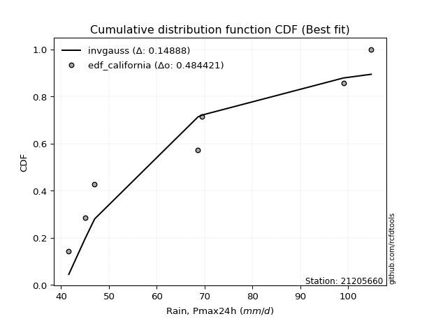</img>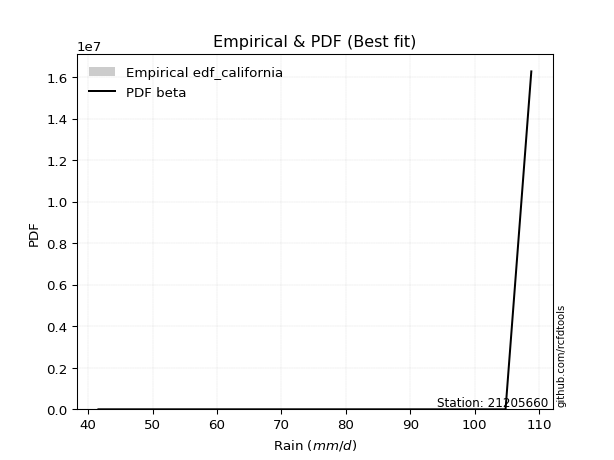</img>

</div>


### 2. EDF Hazen (1930)

Hazen method for plotting positions is a formula used to estimate the empirical cumulative probability distribution of flood events or other hydrological data. This formula often results in biased estimations, particularly when extrapolating to extreme events (high return periods).

<div align="center">


$P=(m-0.5)/n$


</div>


**2.1. Empirical values**

<div align="center">

|                | 0                  | 1                  | 2                  | 3                  | 4                  | 5         | 6                 | 7         |
|:---------------|:-------------------|:-------------------|:-------------------|:-------------------|:-------------------|:----------|:------------------|:----------|
| date           | 2020               | 2023               | 2018               | 2021               | 2022               | 2019      | 2024              | 2025      |
| x              | 41.6               | 45.0               | 47.0               | 68.6               | 69.4               | 99.0      | 104.8             | 108.8     |
| m              | 1                  | 2                  | 3                  | 4                  | 5                  | 6         | 7                 | 8         |
| empirical_dist | edf_hazen          | edf_hazen          | edf_hazen          | edf_hazen          | edf_hazen          | edf_hazen | edf_hazen         | edf_hazen |
| empirical      | 0.0625             | 0.1875             | 0.3125             | 0.4375             | 0.5625             | 0.6875    | 0.8125            | 0.9375    |
| empirical_tr   | 1.0666666666666667 | 1.2307692307692308 | 1.4545454545454546 | 1.7777777777777777 | 2.2857142857142856 | 3.2       | 5.333333333333333 | 16.0      |

</div>


**2.2. Kolmogorov-Smirnov fit test (sorted by Δ)**


<div align="center">

|                | 0                   | 1                   | 2                  | 3                   | 4                   | 5                   | 6                   | 7                  | 8                   | 9                   | 10                  | 11                  | 12                  | 13                  | 14                 | 15                 | 16                 | 17                  | 18                  | 19                 | 20                  | 21                  | 22                  | 23                  | 24                 | 25                  | 26                 | 27                  | 28                  | 29                  | 30                  | 31                  | 32                  | 33                 | 34                 | 35                  | 36                  | 37                  | 38                  | 39                  | 40                  | 41                  | 42                 | 43                  | 44                  | 45                  | 46                  | 47                 | 48                  | 49                  | 50                  | 51                 | 52                  | 53                 | 54                 | 55                  | 56                  | 57                 | 58                 | 59                  | 60                  | 61                 | 62                  | 63                  | 64                 | 65                  | 66                  | 67                  | 68                  | 69                 | 70                  | 71                  | 72                  | 73                 | 74                  | 75                 | 76                  | 77                  | 78                 | 79                  | 80                  | 81                 | 82                  | 83                  | 84                  | 85                 | 86                  | 87                  | 88                  | 89                  | 90                  | 91                  | 92                  | 93                  | 94                  | 95                  | 96                  | 97                  | 98                  | 99                 | 100                | 101                 | 102                | 103                 | 104                 | 105                 | 106                | 107                 | 108                | 109                 | 110                 | 111                 | 112                | 113                 | 114                | 115                 | 116                | 117                 | 118                 | 119                 | 120                 | 121                 | 122                 | 123                | 124                 | 125                 | 126                 | 127                 | 128                | 129                 | 130                 | 131                 | 132                | 133                 | 134                 | 135                | 136                | 137                | 138                | 139                 | 140                 | 141                | 142                 | 143                | 144                 | 145                | 146                | 147                | 148                 | 149                 | 150                | 151                 | 152                | 153                | 154                | 155                | 156                | 157                | 158                | 159                |
|:---------------|:--------------------|:--------------------|:-------------------|:--------------------|:--------------------|:--------------------|:--------------------|:-------------------|:--------------------|:--------------------|:--------------------|:--------------------|:--------------------|:--------------------|:-------------------|:-------------------|:-------------------|:--------------------|:--------------------|:-------------------|:--------------------|:--------------------|:--------------------|:--------------------|:-------------------|:--------------------|:-------------------|:--------------------|:--------------------|:--------------------|:--------------------|:--------------------|:--------------------|:-------------------|:-------------------|:--------------------|:--------------------|:--------------------|:--------------------|:--------------------|:--------------------|:--------------------|:-------------------|:--------------------|:--------------------|:--------------------|:--------------------|:-------------------|:--------------------|:--------------------|:--------------------|:-------------------|:--------------------|:-------------------|:-------------------|:--------------------|:--------------------|:-------------------|:-------------------|:--------------------|:--------------------|:-------------------|:--------------------|:--------------------|:-------------------|:--------------------|:--------------------|:--------------------|:--------------------|:-------------------|:--------------------|:--------------------|:--------------------|:-------------------|:--------------------|:-------------------|:--------------------|:--------------------|:-------------------|:--------------------|:--------------------|:-------------------|:--------------------|:--------------------|:--------------------|:-------------------|:--------------------|:--------------------|:--------------------|:--------------------|:--------------------|:--------------------|:--------------------|:--------------------|:--------------------|:--------------------|:--------------------|:--------------------|:--------------------|:-------------------|:-------------------|:--------------------|:-------------------|:--------------------|:--------------------|:--------------------|:-------------------|:--------------------|:-------------------|:--------------------|:--------------------|:--------------------|:-------------------|:--------------------|:-------------------|:--------------------|:-------------------|:--------------------|:--------------------|:--------------------|:--------------------|:--------------------|:--------------------|:-------------------|:--------------------|:--------------------|:--------------------|:--------------------|:-------------------|:--------------------|:--------------------|:--------------------|:-------------------|:--------------------|:--------------------|:-------------------|:-------------------|:-------------------|:-------------------|:--------------------|:--------------------|:-------------------|:--------------------|:-------------------|:--------------------|:-------------------|:-------------------|:-------------------|:--------------------|:--------------------|:-------------------|:--------------------|:-------------------|:-------------------|:-------------------|:-------------------|:-------------------|:-------------------|:-------------------|:-------------------|
| station        | 21205660            | 21205660            | 21205660           | 21205660            | 21205660            | 21205660            | 21205660            | 21205660           | 21205660            | 21205660            | 21205660            | 21205660            | 21205660            | 21205660            | 21205660           | 21205660           | 21205660           | 21205660            | 21205660            | 21205660           | 21205660            | 21205660            | 21205660            | 21205660            | 21205660           | 21205660            | 21205660           | 21205660            | 21205660            | 21205660            | 21205660            | 21205660            | 21205660            | 21205660           | 21205660           | 21205660            | 21205660            | 21205660            | 21205660            | 21205660            | 21205660            | 21205660            | 21205660           | 21205660            | 21205660            | 21205660            | 21205660            | 21205660           | 21205660            | 21205660            | 21205660            | 21205660           | 21205660            | 21205660           | 21205660           | 21205660            | 21205660            | 21205660           | 21205660           | 21205660            | 21205660            | 21205660           | 21205660            | 21205660            | 21205660           | 21205660            | 21205660            | 21205660            | 21205660            | 21205660           | 21205660            | 21205660            | 21205660            | 21205660           | 21205660            | 21205660           | 21205660            | 21205660            | 21205660           | 21205660            | 21205660            | 21205660           | 21205660            | 21205660            | 21205660            | 21205660           | 21205660            | 21205660            | 21205660            | 21205660            | 21205660            | 21205660            | 21205660            | 21205660            | 21205660            | 21205660            | 21205660            | 21205660            | 21205660            | 21205660           | 21205660           | 21205660            | 21205660           | 21205660            | 21205660            | 21205660            | 21205660           | 21205660            | 21205660           | 21205660            | 21205660            | 21205660            | 21205660           | 21205660            | 21205660           | 21205660            | 21205660           | 21205660            | 21205660            | 21205660            | 21205660            | 21205660            | 21205660            | 21205660           | 21205660            | 21205660            | 21205660            | 21205660            | 21205660           | 21205660            | 21205660            | 21205660            | 21205660           | 21205660            | 21205660            | 21205660           | 21205660           | 21205660           | 21205660           | 21205660            | 21205660            | 21205660           | 21205660            | 21205660           | 21205660            | 21205660           | 21205660           | 21205660           | 21205660            | 21205660            | 21205660           | 21205660            | 21205660           | 21205660           | 21205660           | 21205660           | 21205660           | 21205660           | 21205660           | 21205660           |
| empirical_dist | edf_hazen           | edf_hazen           | edf_hazen          | edf_hazen           | edf_hazen           | edf_hazen           | edf_hazen           | edf_hazen          | edf_hazen           | edf_hazen           | edf_hazen           | edf_hazen           | edf_hazen           | edf_hazen           | edf_hazen          | edf_hazen          | edf_hazen          | edf_hazen           | edf_hazen           | edf_hazen          | edf_hazen           | edf_hazen           | edf_hazen           | edf_hazen           | edf_hazen          | edf_hazen           | edf_hazen          | edf_hazen           | edf_hazen           | edf_hazen           | edf_hazen           | edf_hazen           | edf_hazen           | edf_hazen          | edf_hazen          | edf_hazen           | edf_hazen           | edf_hazen           | edf_hazen           | edf_hazen           | edf_hazen           | edf_hazen           | edf_hazen          | edf_hazen           | edf_hazen           | edf_hazen           | edf_hazen           | edf_hazen          | edf_hazen           | edf_hazen           | edf_hazen           | edf_hazen          | edf_hazen           | edf_hazen          | edf_hazen          | edf_hazen           | edf_hazen           | edf_hazen          | edf_hazen          | edf_hazen           | edf_hazen           | edf_hazen          | edf_hazen           | edf_hazen           | edf_hazen          | edf_hazen           | edf_hazen           | edf_hazen           | edf_hazen           | edf_hazen          | edf_hazen           | edf_hazen           | edf_hazen           | edf_hazen          | edf_hazen           | edf_hazen          | edf_hazen           | edf_hazen           | edf_hazen          | edf_hazen           | edf_hazen           | edf_hazen          | edf_hazen           | edf_hazen           | edf_hazen           | edf_hazen          | edf_hazen           | edf_hazen           | edf_hazen           | edf_hazen           | edf_hazen           | edf_hazen           | edf_hazen           | edf_hazen           | edf_hazen           | edf_hazen           | edf_hazen           | edf_hazen           | edf_hazen           | edf_hazen          | edf_hazen          | edf_hazen           | edf_hazen          | edf_hazen           | edf_hazen           | edf_hazen           | edf_hazen          | edf_hazen           | edf_hazen          | edf_hazen           | edf_hazen           | edf_hazen           | edf_hazen          | edf_hazen           | edf_hazen          | edf_hazen           | edf_hazen          | edf_hazen           | edf_hazen           | edf_hazen           | edf_hazen           | edf_hazen           | edf_hazen           | edf_hazen          | edf_hazen           | edf_hazen           | edf_hazen           | edf_hazen           | edf_hazen          | edf_hazen           | edf_hazen           | edf_hazen           | edf_hazen          | edf_hazen           | edf_hazen           | edf_hazen          | edf_hazen          | edf_hazen          | edf_hazen          | edf_hazen           | edf_hazen           | edf_hazen          | edf_hazen           | edf_hazen          | edf_hazen           | edf_hazen          | edf_hazen          | edf_hazen          | edf_hazen           | edf_hazen           | edf_hazen          | edf_hazen           | edf_hazen          | edf_hazen          | edf_hazen          | edf_hazen          | edf_hazen          | edf_hazen          | edf_hazen          | edf_hazen          |
| p_dist         | logwrapcauchy       | beta                | logbeta            | wrapcauchy          | logarcsine          | logrdist            | ksone               | logksone           | arcsine             | semicircular        | logsemicircular     | anglit              | logtrapezoid        | loganglit           | lognakagami        | logmielke          | lomax              | loggenlogistic      | logfoldnorm         | logburr            | loginvweibull       | foldnorm            | rdist               | rayleigh            | burr               | maxwell             | invgamma           | lograyleigh         | johnsonsu           | nct                 | logmaxwell          | triang              | truncnorm           | norm               | crystalball        | t                   | exponnorm           | pearson3            | genexpon            | lognct              | loginvgamma         | logburr12           | logbetaprime       | loggamma            | loggamma            | logerlang           | logf                | logpearson3        | logt                | lognorm             | logcrystalball      | logexponnorm       | logskewnorm         | logloggamma        | logalpha           | logexponpow         | logncf              | halfnorm           | f                  | alpha               | logkstwobign        | betaprime          | genlogistic         | trapezoid           | loghalfnorm        | loginvgauss         | loggenexpon         | kstwobign           | logdweibull         | logcosine          | logloglaplace       | logweibull_max      | logrice             | cosine             | logistic            | logdgamma          | loglogistic         | erlang              | gumbel_r           | loggumbel_l         | hypsecant           | rice               | loggumbel_r         | loggompertz         | loghypsecant        | dweibull           | kappa3              | logtriang           | gumbel_l            | logargus            | loghalfgennorm      | argus               | laplace             | logexponweib        | weibull_min         | loglaplace          | loglaplace          | genpareto           | invgauss            | burr12             | loglomax           | gausshyper          | loglevy_l          | halflogistic        | bradford            | moyal               | logtukeylambda     | gamma               | kappa4             | vonmises_line       | skewnorm            | logmoyal            | halfgennorm        | logweibull_min      | loghalflogistic    | dgamma              | logkappa4          | logkappa3           | loguniform          | truncexpon          | gompertz            | logvonmises_line    | logfatiguelife      | tukeylambda        | logjohnsonsu        | uniform             | levy_l              | loggenhalflogistic  | logbradford        | loggenextreme       | logtruncexpon       | truncweibull_min    | nakagami           | logjohnsonsb        | logtruncweibull_min | loggennorm         | wald               | gennorm            | logwald            | genhalflogistic     | exponpow            | loggengamma        | loggausshyper       | genextreme         | loggenpareto        | powerlaw           | exponweib          | fatiguelife        | logpowerlaw         | ncf                 | gengamma           | invweibull          | logtruncnorm       | weibull_max        | logtruncpareto     | truncpareto        | johnsonsb          | logvonmises        | vonmises           | mielke             |
| delta          | 0.06782043564846574 | 0.07530063219960803 | 0.0811233920013833 | 0.08401467306168142 | 0.08881608298236265 | 0.09679844945593408 | 0.10260306024470134 | 0.1036205477185585 | 0.11315079249598795 | 0.11627013129051023 | 0.11933077863022151 | 0.12761942489633532 | 0.12848668248626666 | 0.13055986294394367 | 0.1330431528499625 | 0.1461870161282133 | 0.1462106768246848 | 0.14649876351013014 | 0.14742041049753918 | 0.1476724258622487 | 0.14775549191161808 | 0.14873700695845238 | 0.14951152711519783 | 0.14972664430353877 | 0.1498288329456695 | 0.15035218177776777 | 0.1505639032137298 | 0.15145016681241044 | 0.15181013616432165 | 0.15219862281083973 | 0.15232930475329917 | 0.15251556592481985 | 0.15320448943473874 | 0.1532044975814545 | 0.1532045044563111 | 0.15321266791928087 | 0.15321881799438247 | 0.15348749199308942 | 0.15447155584690497 | 0.15454765733120174 | 0.15490890935576185 | 0.15526871235408438 | 0.155280984653991  | 0.15564826997176373 | 0.15564826997176373 | 0.15567962521704928 | 0.15575405052319832 | 0.155874563337538  | 0.15588450943377352 | 0.15588583681100282 | 0.15588583756569482 | 0.1558866085555894 | 0.15588677085377994 | 0.1559069391420038 | 0.1559195769383216 | 0.15598171012943418 | 0.15645227918410043 | 0.1565879777270054 | 0.1566788759747936 | 0.15694649920153522 | 0.15790501964032522 | 0.1583595836525764 | 0.15933801067589048 | 0.16019539557471957 | 0.1618064103403747 | 0.16315150313845272 | 0.16379453374272024 | 0.16456501894334807 | 0.16483163235731405 | 0.1683186448517806 | 0.16908976764527697 | 0.16960540175466476 | 0.17140605918009302 | 0.1716635368939975 | 0.17174174935480638 | 0.1728738652727799 | 0.17416214680472542 | 0.17614186959895284 | 0.1795355348097562 | 0.18133197839648296 | 0.18149054674121753 | 0.1820353670700483 | 0.18333166774087292 | 0.18348312713789947 | 0.18369588159604514 | 0.1837582408346553 | 0.18473513114713952 | 0.18668858460935242 | 0.18760985378752665 | 0.18835655787014938 | 0.18921900731075814 | 0.19033060092988696 | 0.19048651489739019 | 0.19085239961794087 | 0.19193738009582417 | 0.19238921714980772 | 0.19238921714980772 | 0.19420709130054603 | 0.19585916249110202 | 0.1972240967358596 | 0.1982088515219007 | 0.19912820988437474 | 0.2011026354576113 | 0.20306708514329352 | 0.20360433326103222 | 0.20382262318981437 | 0.2041424646458907 | 0.20487781303313257 | 0.2065704896269398 | 0.20689561327523665 | 0.20733256359279867 | 0.20814365646002542 | 0.2089687429270901 | 0.20912732034949866 | 0.2094480588214535 | 0.21005259161263334 | 0.2104157089032188 | 0.21219281153153036 | 0.21431985864943492 | 0.21438482353775312 | 0.21448263133342438 | 0.21679425524735474 | 0.22188598067116194 | 0.2264886687301484 | 0.22854140240074006 | 0.23214285714285715 | 0.23980385464875065 | 0.24307988650888146 | 0.243315169995459  | 0.24824120872298228 | 0.25781085375303714 | 0.25912421838978583 | 0.2609753291606245 | 0.26589149143375074 | 0.29608126070109597 | 0.3125             | 0.3125             | 0.3125             | 0.3125             | 0.31527605775039635 | 0.32000327510780757 | 0.343074738156229  | 0.34648194325580794 | 0.3768843520456553 | 0.38438527338101747 | 0.4106905405017849 | 0.4173191961573638 | 0.4383768774461847 | 0.44363179814564657 | 0.44463775111917014 | 0.4534578923836139 | 0.49897023713863486 | 0.513507340577765  | 0.5188222475635464 | 0.5287137006122036 | 0.6113937398231601 | 0.7149638172034523 | 1.1549848779985    | 17.13596639872425  | nan                |
| deltao         | 0.4472608134160001  | 0.4472608134160001  | 0.4472608134160001 | 0.4472608134160001  | 0.4472608134160001  | 0.4472608134160001  | 0.4472608134160001  | 0.4472608134160001 | 0.4472608134160001  | 0.4472608134160001  | 0.4472608134160001  | 0.4472608134160001  | 0.4472608134160001  | 0.4472608134160001  | 0.4472608134160001 | 0.4472608134160001 | 0.4472608134160001 | 0.4472608134160001  | 0.4472608134160001  | 0.4472608134160001 | 0.4472608134160001  | 0.4472608134160001  | 0.4472608134160001  | 0.4472608134160001  | 0.4472608134160001 | 0.4472608134160001  | 0.4472608134160001 | 0.4472608134160001  | 0.4472608134160001  | 0.4472608134160001  | 0.4472608134160001  | 0.4472608134160001  | 0.4472608134160001  | 0.4472608134160001 | 0.4472608134160001 | 0.4472608134160001  | 0.4472608134160001  | 0.4472608134160001  | 0.4472608134160001  | 0.4472608134160001  | 0.4472608134160001  | 0.4472608134160001  | 0.4472608134160001 | 0.4472608134160001  | 0.4472608134160001  | 0.4472608134160001  | 0.4472608134160001  | 0.4472608134160001 | 0.4472608134160001  | 0.4472608134160001  | 0.4472608134160001  | 0.4472608134160001 | 0.4472608134160001  | 0.4472608134160001 | 0.4472608134160001 | 0.4472608134160001  | 0.4472608134160001  | 0.4472608134160001 | 0.4472608134160001 | 0.4472608134160001  | 0.4472608134160001  | 0.4472608134160001 | 0.4472608134160001  | 0.4472608134160001  | 0.4472608134160001 | 0.4472608134160001  | 0.4472608134160001  | 0.4472608134160001  | 0.4472608134160001  | 0.4472608134160001 | 0.4472608134160001  | 0.4472608134160001  | 0.4472608134160001  | 0.4472608134160001 | 0.4472608134160001  | 0.4472608134160001 | 0.4472608134160001  | 0.4472608134160001  | 0.4472608134160001 | 0.4472608134160001  | 0.4472608134160001  | 0.4472608134160001 | 0.4472608134160001  | 0.4472608134160001  | 0.4472608134160001  | 0.4472608134160001 | 0.4472608134160001  | 0.4472608134160001  | 0.4472608134160001  | 0.4472608134160001  | 0.4472608134160001  | 0.4472608134160001  | 0.4472608134160001  | 0.4472608134160001  | 0.4472608134160001  | 0.4472608134160001  | 0.4472608134160001  | 0.4472608134160001  | 0.4472608134160001  | 0.4472608134160001 | 0.4472608134160001 | 0.4472608134160001  | 0.4472608134160001 | 0.4472608134160001  | 0.4472608134160001  | 0.4472608134160001  | 0.4472608134160001 | 0.4472608134160001  | 0.4472608134160001 | 0.4472608134160001  | 0.4472608134160001  | 0.4472608134160001  | 0.4472608134160001 | 0.4472608134160001  | 0.4472608134160001 | 0.4472608134160001  | 0.4472608134160001 | 0.4472608134160001  | 0.4472608134160001  | 0.4472608134160001  | 0.4472608134160001  | 0.4472608134160001  | 0.4472608134160001  | 0.4472608134160001 | 0.4472608134160001  | 0.4472608134160001  | 0.4472608134160001  | 0.4472608134160001  | 0.4472608134160001 | 0.4472608134160001  | 0.4472608134160001  | 0.4472608134160001  | 0.4472608134160001 | 0.4472608134160001  | 0.4472608134160001  | 0.4472608134160001 | 0.4472608134160001 | 0.4472608134160001 | 0.4472608134160001 | 0.4472608134160001  | 0.4472608134160001  | 0.4472608134160001 | 0.4472608134160001  | 0.4472608134160001 | 0.4472608134160001  | 0.4472608134160001 | 0.4472608134160001 | 0.4472608134160001 | 0.4472608134160001  | 0.4472608134160001  | 0.4472608134160001 | 0.4472608134160001  | 0.4472608134160001 | 0.4472608134160001 | 0.4472608134160001 | 0.4472608134160001 | 0.4472608134160001 | 0.4472608134160001 | 0.4472608134160001 | 0.4472608134160001 |
| eval           | Δo > Δ              | Δo > Δ              | Δo > Δ             | Δo > Δ              | Δo > Δ              | Δo > Δ              | Δo > Δ              | Δo > Δ             | Δo > Δ              | Δo > Δ              | Δo > Δ              | Δo > Δ              | Δo > Δ              | Δo > Δ              | Δo > Δ             | Δo > Δ             | Δo > Δ             | Δo > Δ              | Δo > Δ              | Δo > Δ             | Δo > Δ              | Δo > Δ              | Δo > Δ              | Δo > Δ              | Δo > Δ             | Δo > Δ              | Δo > Δ             | Δo > Δ              | Δo > Δ              | Δo > Δ              | Δo > Δ              | Δo > Δ              | Δo > Δ              | Δo > Δ             | Δo > Δ             | Δo > Δ              | Δo > Δ              | Δo > Δ              | Δo > Δ              | Δo > Δ              | Δo > Δ              | Δo > Δ              | Δo > Δ             | Δo > Δ              | Δo > Δ              | Δo > Δ              | Δo > Δ              | Δo > Δ             | Δo > Δ              | Δo > Δ              | Δo > Δ              | Δo > Δ             | Δo > Δ              | Δo > Δ             | Δo > Δ             | Δo > Δ              | Δo > Δ              | Δo > Δ             | Δo > Δ             | Δo > Δ              | Δo > Δ              | Δo > Δ             | Δo > Δ              | Δo > Δ              | Δo > Δ             | Δo > Δ              | Δo > Δ              | Δo > Δ              | Δo > Δ              | Δo > Δ             | Δo > Δ              | Δo > Δ              | Δo > Δ              | Δo > Δ             | Δo > Δ              | Δo > Δ             | Δo > Δ              | Δo > Δ              | Δo > Δ             | Δo > Δ              | Δo > Δ              | Δo > Δ             | Δo > Δ              | Δo > Δ              | Δo > Δ              | Δo > Δ             | Δo > Δ              | Δo > Δ              | Δo > Δ              | Δo > Δ              | Δo > Δ              | Δo > Δ              | Δo > Δ              | Δo > Δ              | Δo > Δ              | Δo > Δ              | Δo > Δ              | Δo > Δ              | Δo > Δ              | Δo > Δ             | Δo > Δ             | Δo > Δ              | Δo > Δ             | Δo > Δ              | Δo > Δ              | Δo > Δ              | Δo > Δ             | Δo > Δ              | Δo > Δ             | Δo > Δ              | Δo > Δ              | Δo > Δ              | Δo > Δ             | Δo > Δ              | Δo > Δ             | Δo > Δ              | Δo > Δ             | Δo > Δ              | Δo > Δ              | Δo > Δ              | Δo > Δ              | Δo > Δ              | Δo > Δ              | Δo > Δ             | Δo > Δ              | Δo > Δ              | Δo > Δ              | Δo > Δ              | Δo > Δ             | Δo > Δ              | Δo > Δ              | Δo > Δ              | Δo > Δ             | Δo > Δ              | Δo > Δ              | Δo > Δ             | Δo > Δ             | Δo > Δ             | Δo > Δ             | Δo > Δ              | Δo > Δ              | Δo > Δ             | Δo > Δ              | Δo > Δ             | Δo > Δ              | Δo > Δ             | Δo > Δ             | Δo > Δ             | Δo > Δ              | Δo > Δ              | Δo <= Δ            | Δo <= Δ             | Δo <= Δ            | Δo <= Δ            | Δo <= Δ            | Δo <= Δ            | Δo <= Δ            | Δo <= Δ            | Δo <= Δ            | Δo <= Δ            |
| fit            | 1                   | 1                   | 1                  | 1                   | 1                   | 1                   | 1                   | 1                  | 1                   | 1                   | 1                   | 1                   | 1                   | 1                   | 1                  | 1                  | 1                  | 1                   | 1                   | 1                  | 1                   | 1                   | 1                   | 1                   | 1                  | 1                   | 1                  | 1                   | 1                   | 1                   | 1                   | 1                   | 1                   | 1                  | 1                  | 1                   | 1                   | 1                   | 1                   | 1                   | 1                   | 1                   | 1                  | 1                   | 1                   | 1                   | 1                   | 1                  | 1                   | 1                   | 1                   | 1                  | 1                   | 1                  | 1                  | 1                   | 1                   | 1                  | 1                  | 1                   | 1                   | 1                  | 1                   | 1                   | 1                  | 1                   | 1                   | 1                   | 1                   | 1                  | 1                   | 1                   | 1                   | 1                  | 1                   | 1                  | 1                   | 1                   | 1                  | 1                   | 1                   | 1                  | 1                   | 1                   | 1                   | 1                  | 1                   | 1                   | 1                   | 1                   | 1                   | 1                   | 1                   | 1                   | 1                   | 1                   | 1                   | 1                   | 1                   | 1                  | 1                  | 1                   | 1                  | 1                   | 1                   | 1                   | 1                  | 1                   | 1                  | 1                   | 1                   | 1                   | 1                  | 1                   | 1                  | 1                   | 1                  | 1                   | 1                   | 1                   | 1                   | 1                   | 1                   | 1                  | 1                   | 1                   | 1                   | 1                   | 1                  | 1                   | 1                   | 1                   | 1                  | 1                   | 1                   | 1                  | 1                  | 1                  | 1                  | 1                   | 1                   | 1                  | 1                   | 1                  | 1                   | 1                  | 1                  | 1                  | 1                   | 1                   | 0                  | 0                   | 0                  | 0                  | 0                  | 0                  | 0                  | 0                  | 0                  | 0                  |
| n              | 8                   | 8                   | 8                  | 8                   | 8                   | 8                   | 8                   | 8                  | 8                   | 8                   | 8                   | 8                   | 8                   | 8                   | 8                  | 8                  | 8                  | 8                   | 8                   | 8                  | 8                   | 8                   | 8                   | 8                   | 8                  | 8                   | 8                  | 8                   | 8                   | 8                   | 8                   | 8                   | 8                   | 8                  | 8                  | 8                   | 8                   | 8                   | 8                   | 8                   | 8                   | 8                   | 8                  | 8                   | 8                   | 8                   | 8                   | 8                  | 8                   | 8                   | 8                   | 8                  | 8                   | 8                  | 8                  | 8                   | 8                   | 8                  | 8                  | 8                   | 8                   | 8                  | 8                   | 8                   | 8                  | 8                   | 8                   | 8                   | 8                   | 8                  | 8                   | 8                   | 8                   | 8                  | 8                   | 8                  | 8                   | 8                   | 8                  | 8                   | 8                   | 8                  | 8                   | 8                   | 8                   | 8                  | 8                   | 8                   | 8                   | 8                   | 8                   | 8                   | 8                   | 8                   | 8                   | 8                   | 8                   | 8                   | 8                   | 8                  | 8                  | 8                   | 8                  | 8                   | 8                   | 8                   | 8                  | 8                   | 8                  | 8                   | 8                   | 8                   | 8                  | 8                   | 8                  | 8                   | 8                  | 8                   | 8                   | 8                   | 8                   | 8                   | 8                   | 8                  | 8                   | 8                   | 8                   | 8                   | 8                  | 8                   | 8                   | 8                   | 8                  | 8                   | 8                   | 8                  | 8                  | 8                  | 8                  | 8                   | 8                   | 8                  | 8                   | 8                  | 8                   | 8                  | 8                  | 8                  | 8                   | 8                   | 8                  | 8                   | 8                  | 8                  | 8                  | 8                  | 8                  | 8                  | 8                  | 8                  |
| best_fit       | 1                   | 0                   | 0                  | 0                   | 0                   | 0                   | 0                   | 0                  | 0                   | 0                   | 0                   | 0                   | 0                   | 0                   | 0                  | 0                  | 0                  | 0                   | 0                   | 0                  | 0                   | 0                   | 0                   | 0                   | 0                  | 0                   | 0                  | 0                   | 0                   | 0                   | 0                   | 0                   | 0                   | 0                  | 0                  | 0                   | 0                   | 0                   | 0                   | 0                   | 0                   | 0                   | 0                  | 0                   | 0                   | 0                   | 0                   | 0                  | 0                   | 0                   | 0                   | 0                  | 0                   | 0                  | 0                  | 0                   | 0                   | 0                  | 0                  | 0                   | 0                   | 0                  | 0                   | 0                   | 0                  | 0                   | 0                   | 0                   | 0                   | 0                  | 0                   | 0                   | 0                   | 0                  | 0                   | 0                  | 0                   | 0                   | 0                  | 0                   | 0                   | 0                  | 0                   | 0                   | 0                   | 0                  | 0                   | 0                   | 0                   | 0                   | 0                   | 0                   | 0                   | 0                   | 0                   | 0                   | 0                   | 0                   | 0                   | 0                  | 0                  | 0                   | 0                  | 0                   | 0                   | 0                   | 0                  | 0                   | 0                  | 0                   | 0                   | 0                   | 0                  | 0                   | 0                  | 0                   | 0                  | 0                   | 0                   | 0                   | 0                   | 0                   | 0                   | 0                  | 0                   | 0                   | 0                   | 0                   | 0                  | 0                   | 0                   | 0                   | 0                  | 0                   | 0                   | 0                  | 0                  | 0                  | 0                  | 0                   | 0                   | 0                  | 0                   | 0                  | 0                   | 0                  | 0                  | 0                  | 0                   | 0                   | 0                  | 0                   | 0                  | 0                  | 0                  | 0                  | 0                  | 0                  | 0                  | 0                  |
| best_fit_sort  | 1                   | 2                   | 3                  | 4                   | 5                   | 6                   | 7                   | 8                  | 9                   | 10                  | 11                  | 12                  | 13                  | 14                  | 15                 | 16                 | 17                 | 18                  | 19                  | 20                 | 21                  | 22                  | 23                  | 24                  | 25                 | 26                  | 27                 | 28                  | 29                  | 30                  | 31                  | 32                  | 33                  | 34                 | 35                 | 36                  | 37                  | 38                  | 39                  | 40                  | 41                  | 42                  | 43                 | 44                  | 45                  | 46                  | 47                  | 48                 | 49                  | 50                  | 51                  | 52                 | 53                  | 54                 | 55                 | 56                  | 57                  | 58                 | 59                 | 60                  | 61                  | 62                 | 63                  | 64                  | 65                 | 66                  | 67                  | 68                  | 69                  | 70                 | 71                  | 72                  | 73                  | 74                 | 75                  | 76                 | 77                  | 78                  | 79                 | 80                  | 81                  | 82                 | 83                  | 84                  | 85                  | 86                 | 87                  | 88                  | 89                  | 90                  | 91                  | 92                  | 93                  | 94                  | 95                  | 96                  | 97                  | 98                  | 99                  | 100                | 101                | 102                 | 103                | 104                 | 105                 | 106                 | 107                | 108                 | 109                | 110                 | 111                 | 112                 | 113                | 114                 | 115                | 116                 | 117                | 118                 | 119                 | 120                 | 121                 | 122                 | 123                 | 124                | 125                 | 126                 | 127                 | 128                 | 129                | 130                 | 131                 | 132                 | 133                | 134                 | 135                 | 136                | 137                | 138                | 139                | 140                 | 141                 | 142                | 143                 | 144                | 145                 | 146                | 147                | 148                | 149                 | 150                 | 151                | 152                 | 153                | 154                | 155                | 156                | 157                | 158                | 159                | 160                |

</div>


**2.3. Best fit**

<div align="center">

|   id |   station | empirical_dist   | p_dist        |     delta |   deltao | eval   |   fit |   n |   best_fit |   best_fit_sort |
|-----:|----------:|:-----------------|:--------------|----------:|---------:|:-------|------:|----:|-----------:|----------------:|
|    0 |  21205660 | edf_hazen        | logwrapcauchy | 0.0678204 | 0.447261 | Δo > Δ |     1 |   8 |          1 |               1 |

</div>


<div align="center">

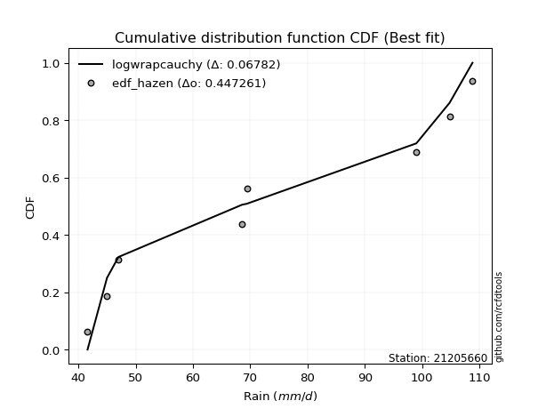</img></img>

</div>


### 3. EDF Weibull (1939)

Weibull plotting position formula is an empirical method used to estimate the non-exceedance probability or plotting position for a set of observed data, is often recommended or widely used in practice, particularly in flood frequency analysis.

<div align="center">


$P=m/(n+1)$


</div>


**3.1. Empirical values**

<div align="center">

|                | 0                  | 1                  | 2                  | 3                  | 4                  | 5                  | 6                  | 7                  |
|:---------------|:-------------------|:-------------------|:-------------------|:-------------------|:-------------------|:-------------------|:-------------------|:-------------------|
| date           | 2020               | 2023               | 2018               | 2021               | 2022               | 2019               | 2024               | 2025               |
| x              | 41.6               | 45.0               | 47.0               | 68.6               | 69.4               | 99.0               | 104.8              | 108.8              |
| m              | 1                  | 2                  | 3                  | 4                  | 5                  | 6                  | 7                  | 8                  |
| empirical_dist | edf_weibull        | edf_weibull        | edf_weibull        | edf_weibull        | edf_weibull        | edf_weibull        | edf_weibull        | edf_weibull        |
| empirical      | 0.1111111111111111 | 0.2222222222222222 | 0.3333333333333333 | 0.4444444444444444 | 0.5555555555555556 | 0.6666666666666666 | 0.7777777777777778 | 0.8888888888888888 |
| empirical_tr   | 1.125              | 1.2857142857142856 | 1.4999999999999998 | 1.7999999999999998 | 2.25               | 2.9999999999999996 | 4.5                | 8.999999999999996  |

</div>


**3.2. Kolmogorov-Smirnov fit test (sorted by Δ)**


<div align="center">

|                | 0                   | 1                   | 2                   | 3                   | 4                   | 5                   | 6                   | 7                   | 8                   | 9                   | 10                  | 11                  | 12                  | 13                  | 14                  | 15                  | 16                 | 17                  | 18                 | 19                  | 20                  | 21                 | 22                 | 23                  | 24                  | 25                  | 26                  | 27                  | 28                  | 29                  | 30                  | 31                  | 32                  | 33                  | 34                  | 35                 | 36                 | 37                  | 38                 | 39                 | 40                  | 41                 | 42                  | 43                 | 44                  | 45                  | 46                  | 47                 | 48                  | 49                  | 50                  | 51                 | 52                  | 53                 | 54                  | 55                  | 56                  | 57                 | 58                  | 59                 | 60                  | 61                  | 62                 | 63                  | 64                  | 65                 | 66                  | 67                  | 68                  | 69                  | 70                  | 71                  | 72                  | 73                  | 74                  | 75                 | 76                 | 77                  | 78                 | 79                 | 80                  | 81                 | 82                  | 83                 | 84                 | 85                 | 86                  | 87                 | 88                 | 89                  | 90                 | 91                  | 92                  | 93                  | 94                  | 95                  | 96                  | 97                  | 98                  | 99                  | 100                | 101                 | 102                | 103                 | 104                 | 105                 | 106                | 107                 | 108                 | 109                | 110                 | 111                 | 112                 | 113                 | 114                 | 115                 | 116                 | 117                 | 118                 | 119                 | 120                 | 121                 | 122                | 123                | 124                | 125                | 126                 | 127                | 128                 | 129                 | 130                | 131                 | 132                | 133                | 134                | 135                 | 136                 | 137                 | 138                 | 139                 | 140                | 141                | 142                 | 143                | 144                | 145                | 146                 | 147                | 148                 | 149                | 150                 | 151                | 152                | 153                 | 154                | 155                | 156                | 157                | 158                | 159                |
|:---------------|:--------------------|:--------------------|:--------------------|:--------------------|:--------------------|:--------------------|:--------------------|:--------------------|:--------------------|:--------------------|:--------------------|:--------------------|:--------------------|:--------------------|:--------------------|:--------------------|:-------------------|:--------------------|:-------------------|:--------------------|:--------------------|:-------------------|:-------------------|:--------------------|:--------------------|:--------------------|:--------------------|:--------------------|:--------------------|:--------------------|:--------------------|:--------------------|:--------------------|:--------------------|:--------------------|:-------------------|:-------------------|:--------------------|:-------------------|:-------------------|:--------------------|:-------------------|:--------------------|:-------------------|:--------------------|:--------------------|:--------------------|:-------------------|:--------------------|:--------------------|:--------------------|:-------------------|:--------------------|:-------------------|:--------------------|:--------------------|:--------------------|:-------------------|:--------------------|:-------------------|:--------------------|:--------------------|:-------------------|:--------------------|:--------------------|:-------------------|:--------------------|:--------------------|:--------------------|:--------------------|:--------------------|:--------------------|:--------------------|:--------------------|:--------------------|:-------------------|:-------------------|:--------------------|:-------------------|:-------------------|:--------------------|:-------------------|:--------------------|:-------------------|:-------------------|:-------------------|:--------------------|:-------------------|:-------------------|:--------------------|:-------------------|:--------------------|:--------------------|:--------------------|:--------------------|:--------------------|:--------------------|:--------------------|:--------------------|:--------------------|:-------------------|:--------------------|:-------------------|:--------------------|:--------------------|:--------------------|:-------------------|:--------------------|:--------------------|:-------------------|:--------------------|:--------------------|:--------------------|:--------------------|:--------------------|:--------------------|:--------------------|:--------------------|:--------------------|:--------------------|:--------------------|:--------------------|:-------------------|:-------------------|:-------------------|:-------------------|:--------------------|:-------------------|:--------------------|:--------------------|:-------------------|:--------------------|:-------------------|:-------------------|:-------------------|:--------------------|:--------------------|:--------------------|:--------------------|:--------------------|:-------------------|:-------------------|:--------------------|:-------------------|:-------------------|:-------------------|:--------------------|:-------------------|:--------------------|:-------------------|:--------------------|:-------------------|:-------------------|:--------------------|:-------------------|:-------------------|:-------------------|:-------------------|:-------------------|:-------------------|
| station        | 21205660            | 21205660            | 21205660            | 21205660            | 21205660            | 21205660            | 21205660            | 21205660            | 21205660            | 21205660            | 21205660            | 21205660            | 21205660            | 21205660            | 21205660            | 21205660            | 21205660           | 21205660            | 21205660           | 21205660            | 21205660            | 21205660           | 21205660           | 21205660            | 21205660            | 21205660            | 21205660            | 21205660            | 21205660            | 21205660            | 21205660            | 21205660            | 21205660            | 21205660            | 21205660            | 21205660           | 21205660           | 21205660            | 21205660           | 21205660           | 21205660            | 21205660           | 21205660            | 21205660           | 21205660            | 21205660            | 21205660            | 21205660           | 21205660            | 21205660            | 21205660            | 21205660           | 21205660            | 21205660           | 21205660            | 21205660            | 21205660            | 21205660           | 21205660            | 21205660           | 21205660            | 21205660            | 21205660           | 21205660            | 21205660            | 21205660           | 21205660            | 21205660            | 21205660            | 21205660            | 21205660            | 21205660            | 21205660            | 21205660            | 21205660            | 21205660           | 21205660           | 21205660            | 21205660           | 21205660           | 21205660            | 21205660           | 21205660            | 21205660           | 21205660           | 21205660           | 21205660            | 21205660           | 21205660           | 21205660            | 21205660           | 21205660            | 21205660            | 21205660            | 21205660            | 21205660            | 21205660            | 21205660            | 21205660            | 21205660            | 21205660           | 21205660            | 21205660           | 21205660            | 21205660            | 21205660            | 21205660           | 21205660            | 21205660            | 21205660           | 21205660            | 21205660            | 21205660            | 21205660            | 21205660            | 21205660            | 21205660            | 21205660            | 21205660            | 21205660            | 21205660            | 21205660            | 21205660           | 21205660           | 21205660           | 21205660           | 21205660            | 21205660           | 21205660            | 21205660            | 21205660           | 21205660            | 21205660           | 21205660           | 21205660           | 21205660            | 21205660            | 21205660            | 21205660            | 21205660            | 21205660           | 21205660           | 21205660            | 21205660           | 21205660           | 21205660           | 21205660            | 21205660           | 21205660            | 21205660           | 21205660            | 21205660           | 21205660           | 21205660            | 21205660           | 21205660           | 21205660           | 21205660           | 21205660           | 21205660           |
| empirical_dist | edf_weibull         | edf_weibull         | edf_weibull         | edf_weibull         | edf_weibull         | edf_weibull         | edf_weibull         | edf_weibull         | edf_weibull         | edf_weibull         | edf_weibull         | edf_weibull         | edf_weibull         | edf_weibull         | edf_weibull         | edf_weibull         | edf_weibull        | edf_weibull         | edf_weibull        | edf_weibull         | edf_weibull         | edf_weibull        | edf_weibull        | edf_weibull         | edf_weibull         | edf_weibull         | edf_weibull         | edf_weibull         | edf_weibull         | edf_weibull         | edf_weibull         | edf_weibull         | edf_weibull         | edf_weibull         | edf_weibull         | edf_weibull        | edf_weibull        | edf_weibull         | edf_weibull        | edf_weibull        | edf_weibull         | edf_weibull        | edf_weibull         | edf_weibull        | edf_weibull         | edf_weibull         | edf_weibull         | edf_weibull        | edf_weibull         | edf_weibull         | edf_weibull         | edf_weibull        | edf_weibull         | edf_weibull        | edf_weibull         | edf_weibull         | edf_weibull         | edf_weibull        | edf_weibull         | edf_weibull        | edf_weibull         | edf_weibull         | edf_weibull        | edf_weibull         | edf_weibull         | edf_weibull        | edf_weibull         | edf_weibull         | edf_weibull         | edf_weibull         | edf_weibull         | edf_weibull         | edf_weibull         | edf_weibull         | edf_weibull         | edf_weibull        | edf_weibull        | edf_weibull         | edf_weibull        | edf_weibull        | edf_weibull         | edf_weibull        | edf_weibull         | edf_weibull        | edf_weibull        | edf_weibull        | edf_weibull         | edf_weibull        | edf_weibull        | edf_weibull         | edf_weibull        | edf_weibull         | edf_weibull         | edf_weibull         | edf_weibull         | edf_weibull         | edf_weibull         | edf_weibull         | edf_weibull         | edf_weibull         | edf_weibull        | edf_weibull         | edf_weibull        | edf_weibull         | edf_weibull         | edf_weibull         | edf_weibull        | edf_weibull         | edf_weibull         | edf_weibull        | edf_weibull         | edf_weibull         | edf_weibull         | edf_weibull         | edf_weibull         | edf_weibull         | edf_weibull         | edf_weibull         | edf_weibull         | edf_weibull         | edf_weibull         | edf_weibull         | edf_weibull        | edf_weibull        | edf_weibull        | edf_weibull        | edf_weibull         | edf_weibull        | edf_weibull         | edf_weibull         | edf_weibull        | edf_weibull         | edf_weibull        | edf_weibull        | edf_weibull        | edf_weibull         | edf_weibull         | edf_weibull         | edf_weibull         | edf_weibull         | edf_weibull        | edf_weibull        | edf_weibull         | edf_weibull        | edf_weibull        | edf_weibull        | edf_weibull         | edf_weibull        | edf_weibull         | edf_weibull        | edf_weibull         | edf_weibull        | edf_weibull        | edf_weibull         | edf_weibull        | edf_weibull        | edf_weibull        | edf_weibull        | edf_weibull        | edf_weibull        |
| p_dist         | logarcsine          | arcsine             | wrapcauchy          | logbeta             | beta                | logwrapcauchy       | logrdist            | logweibull_max      | ksone               | logksone            | semicircular        | lomax               | logsemicircular     | lognakagami         | anglit              | logtrapezoid        | loganglit          | trapezoid           | logweibull_min     | triang              | logmielke           | loggenexpon        | loggenlogistic     | loginvgauss         | logfoldnorm         | logburr             | loginvweibull       | foldnorm            | rdist               | rayleigh            | burr                | maxwell             | invgamma            | lograyleigh         | johnsonsu           | nct                | logmaxwell         | truncnorm           | norm               | crystalball        | t                   | exponnorm          | pearson3            | genexpon           | lognct              | logexponpow         | loginvgamma         | logburr12          | logbetaprime        | loggamma            | loggamma            | logerlang          | logf                | logpearson3        | logt                | lognorm             | logcrystalball      | logexponnorm       | logskewnorm         | logloggamma        | logalpha            | logncf              | halfnorm           | f                   | alpha               | logkstwobign       | betaprime           | genlogistic         | loghalfgennorm      | loghalfnorm         | loglevy_l           | logexponweib        | weibull_min         | kstwobign           | logdweibull         | genpareto          | invgauss           | logcosine           | logloglaplace      | burr12             | levy_l              | loglomax           | logrice             | cosine             | logistic           | logdgamma          | loglogistic         | erlang             | gumbel_l           | gumbel_r            | halfgennorm        | loggumbel_l         | hypsecant           | rice                | loggumbel_r         | loggompertz         | loghypsecant        | dweibull            | kappa3              | logtriang           | logargus           | argus               | laplace            | loglaplace          | loglaplace          | logfatiguelife      | gausshyper         | logjohnsonsu        | halflogistic        | bradford           | moyal               | logtukeylambda      | gamma               | kappa4              | vonmises_line       | skewnorm            | logmoyal            | loghalflogistic     | dgamma              | logjohnsonsb        | logkappa4           | logkappa3           | loguniform         | truncexpon         | gompertz           | logvonmises_line   | loggenextreme       | tukeylambda        | uniform             | nakagami            | loggenhalflogistic | logbradford         | loggennorm         | gennorm            | logtruncexpon      | truncweibull_min    | exponpow            | logtruncweibull_min | genhalflogistic     | genextreme          | logwald            | wald               | loggenpareto        | loggengamma        | loggausshyper      | exponweib          | ncf                 | fatiguelife        | powerlaw            | gengamma           | logpowerlaw         | invweibull         | weibull_max        | logtruncpareto      | logtruncnorm       | truncpareto        | johnsonsb          | logvonmises        | vonmises           | mielke             |
| delta          | 0.08604133887384754 | 0.08687429027003796 | 0.11110877086559956 | 0.11110986092530484 | 0.11111046339055397 | 0.11111111086405623 | 0.11763178278926745 | 0.12099429064355366 | 0.12124564860736156 | 0.12445388105189181 | 0.13710346462384354 | 0.13926623238024038 | 0.14016411196355483 | 0.14470492248468148 | 0.14845275822966864 | 0.14932001581959997 | 0.151393196277277  | 0.15325095113027515 | 0.1605162092383875 | 0.16240021297211982 | 0.16702034946154662 | 0.1672016426361438 | 0.1673320968434635 | 0.16801484068306294 | 0.16825374383087255 | 0.16850575919558208 | 0.16858882524495145 | 0.16957034029178575 | 0.17034486044853114 | 0.17055997763687214 | 0.17066216627900288 | 0.17118551511110114 | 0.17139723654706318 | 0.17228350014574376 | 0.17264346949765497 | 0.1730319561441731 | 0.1731626380866325 | 0.17403782276807206 | 0.1740378309147878 | 0.1740378377896444 | 0.17404600125261419 | 0.1740521513277158 | 0.17432082532642273 | 0.1753048891802383 | 0.17538099066453505 | 0.17554472931693177 | 0.17574224268909522 | 0.1761020456874177 | 0.17611431798732433 | 0.17648160330509705 | 0.17648160330509705 | 0.1765129585503826 | 0.17658738385653164 | 0.1767078966708713 | 0.17671784276710684 | 0.17671917014433614 | 0.17671917089902814 | 0.1767199418889227 | 0.17672010418711326 | 0.1767402724753371 | 0.17675291027165496 | 0.17728561251743374 | 0.1774213110603387 | 0.17751220930812692 | 0.17777983253486854 | 0.1787383529736586 | 0.17919291698590972 | 0.18017134400922385 | 0.18227456286631372 | 0.18263974367370803 | 0.18305200382115516 | 0.18390795517349645 | 0.18499293565137975 | 0.18539835227668144 | 0.18566496569064736 | 0.1872626468561016 | 0.1889147180466576 | 0.18915197818511398 | 0.1899231009786103 | 0.1902796522914152 | 0.19119274353763954 | 0.1912644070774563 | 0.19223939251342634 | 0.1924968702273308 | 0.1925750826881397 | 0.1937071986061132 | 0.19499548013805873 | 0.1969752029322862 | 0.199708732555395  | 0.20036886814308952 | 0.2020242984826457 | 0.20216531172981633 | 0.20232388007455085 | 0.20286870040338162 | 0.20416500107420624 | 0.20431646047123278 | 0.20452921492937845 | 0.20459157416798868 | 0.20556846448047283 | 0.20752191794268574 | 0.2091898912034827 | 0.21116393426322028 | 0.2113198482307235 | 0.21322255048314104 | 0.21322255048314104 | 0.21494153622671752 | 0.2199615432177081 | 0.22159695795629564 | 0.22390041847662684 | 0.2244376665943656 | 0.22465595652314768 | 0.22497579797922407 | 0.22571114636646594 | 0.22740382296027312 | 0.22772894660856996 | 0.22816589692613198 | 0.22897698979335873 | 0.23028139215478682 | 0.23088592494596671 | 0.23116926921152853 | 0.23124904223655218 | 0.23302614486486373 | 0.2351531919827683 | 0.2352181568710865 | 0.2353159646667577 | 0.2376275885806881 | 0.24129676427853786 | 0.2473220020634817 | 0.25297619047619047 | 0.25403088471618007 | 0.2639132198422148 | 0.26414850332879236 | 0.2777777777777778 | 0.2777777777777778 | 0.2786441870863705 | 0.27994722632010827 | 0.28528105288558536 | 0.2900019473339427  | 0.30833161330595193 | 0.32827324093454413 | 0.3333333333333333 | 0.3333333333333333 | 0.33577416226990636 | 0.3361302937117846 | 0.3395374988113635 | 0.3825969739351416 | 0.39602664000805904 | 0.4036546552239625 | 0.40374609605734046 | 0.4187356701613917 | 0.43668735370120215 | 0.4503591260275237 | 0.4841000253413242 | 0.49399147838998136 | 0.5065628961333206 | 0.5766715176009379 | 0.68024159498123   | 1.1758182113318334 | 17.18457750983536  | nan                |
| deltao         | 0.4472608134160001  | 0.4472608134160001  | 0.4472608134160001  | 0.4472608134160001  | 0.4472608134160001  | 0.4472608134160001  | 0.4472608134160001  | 0.4472608134160001  | 0.4472608134160001  | 0.4472608134160001  | 0.4472608134160001  | 0.4472608134160001  | 0.4472608134160001  | 0.4472608134160001  | 0.4472608134160001  | 0.4472608134160001  | 0.4472608134160001 | 0.4472608134160001  | 0.4472608134160001 | 0.4472608134160001  | 0.4472608134160001  | 0.4472608134160001 | 0.4472608134160001 | 0.4472608134160001  | 0.4472608134160001  | 0.4472608134160001  | 0.4472608134160001  | 0.4472608134160001  | 0.4472608134160001  | 0.4472608134160001  | 0.4472608134160001  | 0.4472608134160001  | 0.4472608134160001  | 0.4472608134160001  | 0.4472608134160001  | 0.4472608134160001 | 0.4472608134160001 | 0.4472608134160001  | 0.4472608134160001 | 0.4472608134160001 | 0.4472608134160001  | 0.4472608134160001 | 0.4472608134160001  | 0.4472608134160001 | 0.4472608134160001  | 0.4472608134160001  | 0.4472608134160001  | 0.4472608134160001 | 0.4472608134160001  | 0.4472608134160001  | 0.4472608134160001  | 0.4472608134160001 | 0.4472608134160001  | 0.4472608134160001 | 0.4472608134160001  | 0.4472608134160001  | 0.4472608134160001  | 0.4472608134160001 | 0.4472608134160001  | 0.4472608134160001 | 0.4472608134160001  | 0.4472608134160001  | 0.4472608134160001 | 0.4472608134160001  | 0.4472608134160001  | 0.4472608134160001 | 0.4472608134160001  | 0.4472608134160001  | 0.4472608134160001  | 0.4472608134160001  | 0.4472608134160001  | 0.4472608134160001  | 0.4472608134160001  | 0.4472608134160001  | 0.4472608134160001  | 0.4472608134160001 | 0.4472608134160001 | 0.4472608134160001  | 0.4472608134160001 | 0.4472608134160001 | 0.4472608134160001  | 0.4472608134160001 | 0.4472608134160001  | 0.4472608134160001 | 0.4472608134160001 | 0.4472608134160001 | 0.4472608134160001  | 0.4472608134160001 | 0.4472608134160001 | 0.4472608134160001  | 0.4472608134160001 | 0.4472608134160001  | 0.4472608134160001  | 0.4472608134160001  | 0.4472608134160001  | 0.4472608134160001  | 0.4472608134160001  | 0.4472608134160001  | 0.4472608134160001  | 0.4472608134160001  | 0.4472608134160001 | 0.4472608134160001  | 0.4472608134160001 | 0.4472608134160001  | 0.4472608134160001  | 0.4472608134160001  | 0.4472608134160001 | 0.4472608134160001  | 0.4472608134160001  | 0.4472608134160001 | 0.4472608134160001  | 0.4472608134160001  | 0.4472608134160001  | 0.4472608134160001  | 0.4472608134160001  | 0.4472608134160001  | 0.4472608134160001  | 0.4472608134160001  | 0.4472608134160001  | 0.4472608134160001  | 0.4472608134160001  | 0.4472608134160001  | 0.4472608134160001 | 0.4472608134160001 | 0.4472608134160001 | 0.4472608134160001 | 0.4472608134160001  | 0.4472608134160001 | 0.4472608134160001  | 0.4472608134160001  | 0.4472608134160001 | 0.4472608134160001  | 0.4472608134160001 | 0.4472608134160001 | 0.4472608134160001 | 0.4472608134160001  | 0.4472608134160001  | 0.4472608134160001  | 0.4472608134160001  | 0.4472608134160001  | 0.4472608134160001 | 0.4472608134160001 | 0.4472608134160001  | 0.4472608134160001 | 0.4472608134160001 | 0.4472608134160001 | 0.4472608134160001  | 0.4472608134160001 | 0.4472608134160001  | 0.4472608134160001 | 0.4472608134160001  | 0.4472608134160001 | 0.4472608134160001 | 0.4472608134160001  | 0.4472608134160001 | 0.4472608134160001 | 0.4472608134160001 | 0.4472608134160001 | 0.4472608134160001 | 0.4472608134160001 |
| eval           | Δo > Δ              | Δo > Δ              | Δo > Δ              | Δo > Δ              | Δo > Δ              | Δo > Δ              | Δo > Δ              | Δo > Δ              | Δo > Δ              | Δo > Δ              | Δo > Δ              | Δo > Δ              | Δo > Δ              | Δo > Δ              | Δo > Δ              | Δo > Δ              | Δo > Δ             | Δo > Δ              | Δo > Δ             | Δo > Δ              | Δo > Δ              | Δo > Δ             | Δo > Δ             | Δo > Δ              | Δo > Δ              | Δo > Δ              | Δo > Δ              | Δo > Δ              | Δo > Δ              | Δo > Δ              | Δo > Δ              | Δo > Δ              | Δo > Δ              | Δo > Δ              | Δo > Δ              | Δo > Δ             | Δo > Δ             | Δo > Δ              | Δo > Δ             | Δo > Δ             | Δo > Δ              | Δo > Δ             | Δo > Δ              | Δo > Δ             | Δo > Δ              | Δo > Δ              | Δo > Δ              | Δo > Δ             | Δo > Δ              | Δo > Δ              | Δo > Δ              | Δo > Δ             | Δo > Δ              | Δo > Δ             | Δo > Δ              | Δo > Δ              | Δo > Δ              | Δo > Δ             | Δo > Δ              | Δo > Δ             | Δo > Δ              | Δo > Δ              | Δo > Δ             | Δo > Δ              | Δo > Δ              | Δo > Δ             | Δo > Δ              | Δo > Δ              | Δo > Δ              | Δo > Δ              | Δo > Δ              | Δo > Δ              | Δo > Δ              | Δo > Δ              | Δo > Δ              | Δo > Δ             | Δo > Δ             | Δo > Δ              | Δo > Δ             | Δo > Δ             | Δo > Δ              | Δo > Δ             | Δo > Δ              | Δo > Δ             | Δo > Δ             | Δo > Δ             | Δo > Δ              | Δo > Δ             | Δo > Δ             | Δo > Δ              | Δo > Δ             | Δo > Δ              | Δo > Δ              | Δo > Δ              | Δo > Δ              | Δo > Δ              | Δo > Δ              | Δo > Δ              | Δo > Δ              | Δo > Δ              | Δo > Δ             | Δo > Δ              | Δo > Δ             | Δo > Δ              | Δo > Δ              | Δo > Δ              | Δo > Δ             | Δo > Δ              | Δo > Δ              | Δo > Δ             | Δo > Δ              | Δo > Δ              | Δo > Δ              | Δo > Δ              | Δo > Δ              | Δo > Δ              | Δo > Δ              | Δo > Δ              | Δo > Δ              | Δo > Δ              | Δo > Δ              | Δo > Δ              | Δo > Δ             | Δo > Δ             | Δo > Δ             | Δo > Δ             | Δo > Δ              | Δo > Δ             | Δo > Δ              | Δo > Δ              | Δo > Δ             | Δo > Δ              | Δo > Δ             | Δo > Δ             | Δo > Δ             | Δo > Δ              | Δo > Δ              | Δo > Δ              | Δo > Δ              | Δo > Δ              | Δo > Δ             | Δo > Δ             | Δo > Δ              | Δo > Δ             | Δo > Δ             | Δo > Δ             | Δo > Δ              | Δo > Δ             | Δo > Δ              | Δo > Δ             | Δo > Δ              | Δo <= Δ            | Δo <= Δ            | Δo <= Δ             | Δo <= Δ            | Δo <= Δ            | Δo <= Δ            | Δo <= Δ            | Δo <= Δ            | Δo <= Δ            |
| fit            | 1                   | 1                   | 1                   | 1                   | 1                   | 1                   | 1                   | 1                   | 1                   | 1                   | 1                   | 1                   | 1                   | 1                   | 1                   | 1                   | 1                  | 1                   | 1                  | 1                   | 1                   | 1                  | 1                  | 1                   | 1                   | 1                   | 1                   | 1                   | 1                   | 1                   | 1                   | 1                   | 1                   | 1                   | 1                   | 1                  | 1                  | 1                   | 1                  | 1                  | 1                   | 1                  | 1                   | 1                  | 1                   | 1                   | 1                   | 1                  | 1                   | 1                   | 1                   | 1                  | 1                   | 1                  | 1                   | 1                   | 1                   | 1                  | 1                   | 1                  | 1                   | 1                   | 1                  | 1                   | 1                   | 1                  | 1                   | 1                   | 1                   | 1                   | 1                   | 1                   | 1                   | 1                   | 1                   | 1                  | 1                  | 1                   | 1                  | 1                  | 1                   | 1                  | 1                   | 1                  | 1                  | 1                  | 1                   | 1                  | 1                  | 1                   | 1                  | 1                   | 1                   | 1                   | 1                   | 1                   | 1                   | 1                   | 1                   | 1                   | 1                  | 1                   | 1                  | 1                   | 1                   | 1                   | 1                  | 1                   | 1                   | 1                  | 1                   | 1                   | 1                   | 1                   | 1                   | 1                   | 1                   | 1                   | 1                   | 1                   | 1                   | 1                   | 1                  | 1                  | 1                  | 1                  | 1                   | 1                  | 1                   | 1                   | 1                  | 1                   | 1                  | 1                  | 1                  | 1                   | 1                   | 1                   | 1                   | 1                   | 1                  | 1                  | 1                   | 1                  | 1                  | 1                  | 1                   | 1                  | 1                   | 1                  | 1                   | 0                  | 0                  | 0                   | 0                  | 0                  | 0                  | 0                  | 0                  | 0                  |
| n              | 8                   | 8                   | 8                   | 8                   | 8                   | 8                   | 8                   | 8                   | 8                   | 8                   | 8                   | 8                   | 8                   | 8                   | 8                   | 8                   | 8                  | 8                   | 8                  | 8                   | 8                   | 8                  | 8                  | 8                   | 8                   | 8                   | 8                   | 8                   | 8                   | 8                   | 8                   | 8                   | 8                   | 8                   | 8                   | 8                  | 8                  | 8                   | 8                  | 8                  | 8                   | 8                  | 8                   | 8                  | 8                   | 8                   | 8                   | 8                  | 8                   | 8                   | 8                   | 8                  | 8                   | 8                  | 8                   | 8                   | 8                   | 8                  | 8                   | 8                  | 8                   | 8                   | 8                  | 8                   | 8                   | 8                  | 8                   | 8                   | 8                   | 8                   | 8                   | 8                   | 8                   | 8                   | 8                   | 8                  | 8                  | 8                   | 8                  | 8                  | 8                   | 8                  | 8                   | 8                  | 8                  | 8                  | 8                   | 8                  | 8                  | 8                   | 8                  | 8                   | 8                   | 8                   | 8                   | 8                   | 8                   | 8                   | 8                   | 8                   | 8                  | 8                   | 8                  | 8                   | 8                   | 8                   | 8                  | 8                   | 8                   | 8                  | 8                   | 8                   | 8                   | 8                   | 8                   | 8                   | 8                   | 8                   | 8                   | 8                   | 8                   | 8                   | 8                  | 8                  | 8                  | 8                  | 8                   | 8                  | 8                   | 8                   | 8                  | 8                   | 8                  | 8                  | 8                  | 8                   | 8                   | 8                   | 8                   | 8                   | 8                  | 8                  | 8                   | 8                  | 8                  | 8                  | 8                   | 8                  | 8                   | 8                  | 8                   | 8                  | 8                  | 8                   | 8                  | 8                  | 8                  | 8                  | 8                  | 8                  |
| best_fit       | 1                   | 0                   | 0                   | 0                   | 0                   | 0                   | 0                   | 0                   | 0                   | 0                   | 0                   | 0                   | 0                   | 0                   | 0                   | 0                   | 0                  | 0                   | 0                  | 0                   | 0                   | 0                  | 0                  | 0                   | 0                   | 0                   | 0                   | 0                   | 0                   | 0                   | 0                   | 0                   | 0                   | 0                   | 0                   | 0                  | 0                  | 0                   | 0                  | 0                  | 0                   | 0                  | 0                   | 0                  | 0                   | 0                   | 0                   | 0                  | 0                   | 0                   | 0                   | 0                  | 0                   | 0                  | 0                   | 0                   | 0                   | 0                  | 0                   | 0                  | 0                   | 0                   | 0                  | 0                   | 0                   | 0                  | 0                   | 0                   | 0                   | 0                   | 0                   | 0                   | 0                   | 0                   | 0                   | 0                  | 0                  | 0                   | 0                  | 0                  | 0                   | 0                  | 0                   | 0                  | 0                  | 0                  | 0                   | 0                  | 0                  | 0                   | 0                  | 0                   | 0                   | 0                   | 0                   | 0                   | 0                   | 0                   | 0                   | 0                   | 0                  | 0                   | 0                  | 0                   | 0                   | 0                   | 0                  | 0                   | 0                   | 0                  | 0                   | 0                   | 0                   | 0                   | 0                   | 0                   | 0                   | 0                   | 0                   | 0                   | 0                   | 0                   | 0                  | 0                  | 0                  | 0                  | 0                   | 0                  | 0                   | 0                   | 0                  | 0                   | 0                  | 0                  | 0                  | 0                   | 0                   | 0                   | 0                   | 0                   | 0                  | 0                  | 0                   | 0                  | 0                  | 0                  | 0                   | 0                  | 0                   | 0                  | 0                   | 0                  | 0                  | 0                   | 0                  | 0                  | 0                  | 0                  | 0                  | 0                  |
| best_fit_sort  | 1                   | 2                   | 3                   | 4                   | 5                   | 6                   | 7                   | 8                   | 9                   | 10                  | 11                  | 12                  | 13                  | 14                  | 15                  | 16                  | 17                 | 18                  | 19                 | 20                  | 21                  | 22                 | 23                 | 24                  | 25                  | 26                  | 27                  | 28                  | 29                  | 30                  | 31                  | 32                  | 33                  | 34                  | 35                  | 36                 | 37                 | 38                  | 39                 | 40                 | 41                  | 42                 | 43                  | 44                 | 45                  | 46                  | 47                  | 48                 | 49                  | 50                  | 51                  | 52                 | 53                  | 54                 | 55                  | 56                  | 57                  | 58                 | 59                  | 60                 | 61                  | 62                  | 63                 | 64                  | 65                  | 66                 | 67                  | 68                  | 69                  | 70                  | 71                  | 72                  | 73                  | 74                  | 75                  | 76                 | 77                 | 78                  | 79                 | 80                 | 81                  | 82                 | 83                  | 84                 | 85                 | 86                 | 87                  | 88                 | 89                 | 90                  | 91                 | 92                  | 93                  | 94                  | 95                  | 96                  | 97                  | 98                  | 99                  | 100                 | 101                | 102                 | 103                | 104                 | 105                 | 106                 | 107                | 108                 | 109                 | 110                | 111                 | 112                 | 113                 | 114                 | 115                 | 116                 | 117                 | 118                 | 119                 | 120                 | 121                 | 122                 | 123                | 124                | 125                | 126                | 127                 | 128                | 129                 | 130                 | 131                | 132                 | 133                | 134                | 135                | 136                 | 137                 | 138                 | 139                 | 140                 | 141                | 142                | 143                 | 144                | 145                | 146                | 147                 | 148                | 149                 | 150                | 151                 | 152                | 153                | 154                 | 155                | 156                | 157                | 158                | 159                | 160                |

</div>


**3.3. Best fit**

<div align="center">

|   id |   station | empirical_dist   | p_dist     |     delta |   deltao | eval   |   fit |   n |   best_fit |   best_fit_sort |
|-----:|----------:|:-----------------|:-----------|----------:|---------:|:-------|------:|----:|-----------:|----------------:|
|    0 |  21205660 | edf_weibull      | logarcsine | 0.0860413 | 0.447261 | Δo > Δ |     1 |   8 |          1 |               1 |

</div>


<div align="center">

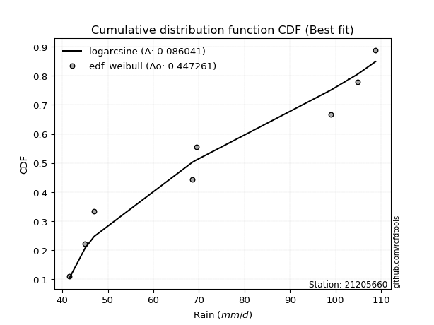</img>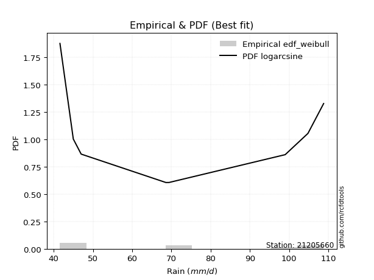</img>

</div>


### 4. EDF Beard (1943)

The Beard formula (or Beard´s plotting position formula) in hydrology is used to estimate the empirical non-exceedance probability _(P)_ of a flood event (or other extreme hydrological data point) within a given dataset.

<div align="center">


$P=(m-0.31)/(n+0.38)$


</div>


**4.1. Empirical values**

<div align="center">

|                | 0                   | 1                   | 2                  | 3                   | 4                  | 5                  | 6                  | 7                  |
|:---------------|:--------------------|:--------------------|:-------------------|:--------------------|:-------------------|:-------------------|:-------------------|:-------------------|
| date           | 2020                | 2023                | 2018               | 2021                | 2022               | 2019               | 2024               | 2025               |
| x              | 41.6                | 45.0                | 47.0               | 68.6                | 69.4               | 99.0               | 104.8              | 108.8              |
| m              | 1                   | 2                   | 3                  | 4                   | 5                  | 6                  | 7                  | 8                  |
| empirical_dist | edf_beard           | edf_beard           | edf_beard          | edf_beard           | edf_beard          | edf_beard          | edf_beard          | edf_beard          |
| empirical      | 0.08233890214797135 | 0.20167064439140808 | 0.3210023866348448 | 0.44033412887828155 | 0.5596658711217184 | 0.6789976133651551 | 0.7983293556085919 | 0.9176610978520287 |
| empirical_tr   | 1.0897269180754225  | 1.2526158445440956  | 1.4727592267135323 | 1.7867803837953091  | 2.2710027100271004 | 3.115241635687732  | 4.958579881656804  | 12.144927536231886 |

</div>


**4.2. Kolmogorov-Smirnov fit test (sorted by Δ)**


<div align="center">

|                | 0                   | 1                   | 2                   | 3                   | 4                   | 5                  | 6                  | 7                   | 8                   | 9                   | 10                  | 11                  | 12                  | 13                  | 14                 | 15                  | 16                  | 17                  | 18                  | 19                  | 20                 | 21                  | 22                 | 23                 | 24                  | 25                  | 26                 | 27                  | 28                 | 29                  | 30                  | 31                  | 32                  | 33                  | 34                 | 35                 | 36                  | 37                 | 38                 | 39                 | 40                 | 41                  | 42                 | 43                  | 44                  | 45                  | 46                 | 47                  | 48                  | 49                  | 50                 | 51                  | 52                 | 53                  | 54                  | 55                  | 56                 | 57                  | 58                 | 59                  | 60                  | 61                 | 62                  | 63                  | 64                  | 65                  | 66                 | 67                  | 68                 | 69                  | 70                  | 71                 | 72                  | 73                 | 74                 | 75                 | 76                  | 77                  | 78                 | 79                  | 80                  | 81                  | 82                  | 83                  | 84                 | 85                 | 86                  | 87                  | 88                  | 89                  | 90                  | 91                  | 92                  | 93                  | 94                  | 95                  | 96                  | 97                  | 98                 | 99                  | 100                | 101                 | 102                 | 103                 | 104                 | 105                 | 106                 | 107                 | 108                 | 109                | 110                 | 111                 | 112                 | 113                 | 114                 | 115                 | 116                 | 117                | 118                | 119                 | 120                 | 121                 | 122                | 123                 | 124                 | 125                | 126                 | 127                 | 128                | 129                 | 130                | 131                 | 132                 | 133                | 134                 | 135                | 136                | 137                | 138                 | 139                | 140                | 141                 | 142                | 143                 | 144                | 145                | 146                 | 147                | 148                | 149                | 150                | 151                | 152                | 153                | 154                | 155                | 156                | 157                | 158                | 159                |
|:---------------|:--------------------|:--------------------|:--------------------|:--------------------|:--------------------|:-------------------|:-------------------|:--------------------|:--------------------|:--------------------|:--------------------|:--------------------|:--------------------|:--------------------|:-------------------|:--------------------|:--------------------|:--------------------|:--------------------|:--------------------|:-------------------|:--------------------|:-------------------|:-------------------|:--------------------|:--------------------|:-------------------|:--------------------|:-------------------|:--------------------|:--------------------|:--------------------|:--------------------|:--------------------|:-------------------|:-------------------|:--------------------|:-------------------|:-------------------|:-------------------|:-------------------|:--------------------|:-------------------|:--------------------|:--------------------|:--------------------|:-------------------|:--------------------|:--------------------|:--------------------|:-------------------|:--------------------|:-------------------|:--------------------|:--------------------|:--------------------|:-------------------|:--------------------|:-------------------|:--------------------|:--------------------|:-------------------|:--------------------|:--------------------|:--------------------|:--------------------|:-------------------|:--------------------|:-------------------|:--------------------|:--------------------|:-------------------|:--------------------|:-------------------|:-------------------|:-------------------|:--------------------|:--------------------|:-------------------|:--------------------|:--------------------|:--------------------|:--------------------|:--------------------|:-------------------|:-------------------|:--------------------|:--------------------|:--------------------|:--------------------|:--------------------|:--------------------|:--------------------|:--------------------|:--------------------|:--------------------|:--------------------|:--------------------|:-------------------|:--------------------|:-------------------|:--------------------|:--------------------|:--------------------|:--------------------|:--------------------|:--------------------|:--------------------|:--------------------|:-------------------|:--------------------|:--------------------|:--------------------|:--------------------|:--------------------|:--------------------|:--------------------|:-------------------|:-------------------|:--------------------|:--------------------|:--------------------|:-------------------|:--------------------|:--------------------|:-------------------|:--------------------|:--------------------|:-------------------|:--------------------|:-------------------|:--------------------|:--------------------|:-------------------|:--------------------|:-------------------|:-------------------|:-------------------|:--------------------|:-------------------|:-------------------|:--------------------|:-------------------|:--------------------|:-------------------|:-------------------|:--------------------|:-------------------|:-------------------|:-------------------|:-------------------|:-------------------|:-------------------|:-------------------|:-------------------|:-------------------|:-------------------|:-------------------|:-------------------|:-------------------|
| station        | 21205660            | 21205660            | 21205660            | 21205660            | 21205660            | 21205660           | 21205660           | 21205660            | 21205660            | 21205660            | 21205660            | 21205660            | 21205660            | 21205660            | 21205660           | 21205660            | 21205660            | 21205660            | 21205660            | 21205660            | 21205660           | 21205660            | 21205660           | 21205660           | 21205660            | 21205660            | 21205660           | 21205660            | 21205660           | 21205660            | 21205660            | 21205660            | 21205660            | 21205660            | 21205660           | 21205660           | 21205660            | 21205660           | 21205660           | 21205660           | 21205660           | 21205660            | 21205660           | 21205660            | 21205660            | 21205660            | 21205660           | 21205660            | 21205660            | 21205660            | 21205660           | 21205660            | 21205660           | 21205660            | 21205660            | 21205660            | 21205660           | 21205660            | 21205660           | 21205660            | 21205660            | 21205660           | 21205660            | 21205660            | 21205660            | 21205660            | 21205660           | 21205660            | 21205660           | 21205660            | 21205660            | 21205660           | 21205660            | 21205660           | 21205660           | 21205660           | 21205660            | 21205660            | 21205660           | 21205660            | 21205660            | 21205660            | 21205660            | 21205660            | 21205660           | 21205660           | 21205660            | 21205660            | 21205660            | 21205660            | 21205660            | 21205660            | 21205660            | 21205660            | 21205660            | 21205660            | 21205660            | 21205660            | 21205660           | 21205660            | 21205660           | 21205660            | 21205660            | 21205660            | 21205660            | 21205660            | 21205660            | 21205660            | 21205660            | 21205660           | 21205660            | 21205660            | 21205660            | 21205660            | 21205660            | 21205660            | 21205660            | 21205660           | 21205660           | 21205660            | 21205660            | 21205660            | 21205660           | 21205660            | 21205660            | 21205660           | 21205660            | 21205660            | 21205660           | 21205660            | 21205660           | 21205660            | 21205660            | 21205660           | 21205660            | 21205660           | 21205660           | 21205660           | 21205660            | 21205660           | 21205660           | 21205660            | 21205660           | 21205660            | 21205660           | 21205660           | 21205660            | 21205660           | 21205660           | 21205660           | 21205660           | 21205660           | 21205660           | 21205660           | 21205660           | 21205660           | 21205660           | 21205660           | 21205660           | 21205660           |
| empirical_dist | edf_beard           | edf_beard           | edf_beard           | edf_beard           | edf_beard           | edf_beard          | edf_beard          | edf_beard           | edf_beard           | edf_beard           | edf_beard           | edf_beard           | edf_beard           | edf_beard           | edf_beard          | edf_beard           | edf_beard           | edf_beard           | edf_beard           | edf_beard           | edf_beard          | edf_beard           | edf_beard          | edf_beard          | edf_beard           | edf_beard           | edf_beard          | edf_beard           | edf_beard          | edf_beard           | edf_beard           | edf_beard           | edf_beard           | edf_beard           | edf_beard          | edf_beard          | edf_beard           | edf_beard          | edf_beard          | edf_beard          | edf_beard          | edf_beard           | edf_beard          | edf_beard           | edf_beard           | edf_beard           | edf_beard          | edf_beard           | edf_beard           | edf_beard           | edf_beard          | edf_beard           | edf_beard          | edf_beard           | edf_beard           | edf_beard           | edf_beard          | edf_beard           | edf_beard          | edf_beard           | edf_beard           | edf_beard          | edf_beard           | edf_beard           | edf_beard           | edf_beard           | edf_beard          | edf_beard           | edf_beard          | edf_beard           | edf_beard           | edf_beard          | edf_beard           | edf_beard          | edf_beard          | edf_beard          | edf_beard           | edf_beard           | edf_beard          | edf_beard           | edf_beard           | edf_beard           | edf_beard           | edf_beard           | edf_beard          | edf_beard          | edf_beard           | edf_beard           | edf_beard           | edf_beard           | edf_beard           | edf_beard           | edf_beard           | edf_beard           | edf_beard           | edf_beard           | edf_beard           | edf_beard           | edf_beard          | edf_beard           | edf_beard          | edf_beard           | edf_beard           | edf_beard           | edf_beard           | edf_beard           | edf_beard           | edf_beard           | edf_beard           | edf_beard          | edf_beard           | edf_beard           | edf_beard           | edf_beard           | edf_beard           | edf_beard           | edf_beard           | edf_beard          | edf_beard          | edf_beard           | edf_beard           | edf_beard           | edf_beard          | edf_beard           | edf_beard           | edf_beard          | edf_beard           | edf_beard           | edf_beard          | edf_beard           | edf_beard          | edf_beard           | edf_beard           | edf_beard          | edf_beard           | edf_beard          | edf_beard          | edf_beard          | edf_beard           | edf_beard          | edf_beard          | edf_beard           | edf_beard          | edf_beard           | edf_beard          | edf_beard          | edf_beard           | edf_beard          | edf_beard          | edf_beard          | edf_beard          | edf_beard          | edf_beard          | edf_beard          | edf_beard          | edf_beard          | edf_beard          | edf_beard          | edf_beard          | edf_beard          |
| p_dist         | logarcsine          | wrapcauchy          | logbeta             | beta                | logwrapcauchy       | arcsine            | logrdist           | ksone               | logksone            | semicircular        | logsemicircular     | lognakagami         | anglit              | logtrapezoid        | loganglit          | lomax               | logweibull_max      | triang              | logmielke           | loggenlogistic      | logfoldnorm        | logburr             | loginvweibull      | foldnorm           | trapezoid           | rdist               | rayleigh           | burr                | maxwell            | invgamma            | lograyleigh         | johnsonsu           | loginvgauss         | nct                 | logmaxwell         | loggenexpon        | truncnorm           | norm               | crystalball        | t                  | exponnorm          | pearson3            | genexpon           | lognct              | logexponpow         | loginvgamma         | logburr12          | logbetaprime        | loggamma            | loggamma            | logerlang          | logf                | logpearson3        | logt                | lognorm             | logcrystalball      | logexponnorm       | logskewnorm         | logloggamma        | logalpha            | logncf              | halfnorm           | f                   | alpha               | logkstwobign        | betaprime           | genlogistic        | loghalfnorm         | kstwobign          | logdweibull         | logcosine           | logloglaplace      | logrice             | cosine             | logistic           | logdgamma          | loglogistic         | erlang              | loghalfgennorm     | loglevy_l           | gumbel_l            | logexponweib        | gumbel_r            | weibull_min         | logweibull_min     | loggumbel_l        | hypsecant           | rice                | genpareto           | loggumbel_r         | loggompertz         | loghypsecant        | dweibull            | invgauss            | kappa3              | burr12              | logtriang           | loglomax            | logargus           | argus               | laplace            | loglaplace          | loglaplace          | halfgennorm         | gausshyper          | halflogistic        | bradford            | moyal               | logtukeylambda      | gamma              | kappa4              | vonmises_line       | skewnorm            | logmoyal            | loghalflogistic     | dgamma              | logkappa4           | logfatiguelife     | levy_l             | logkappa3           | loguniform          | truncexpon          | gompertz           | logvonmises_line    | logjohnsonsu        | tukeylambda        | uniform             | loggenextreme       | loggenhalflogistic | logjohnsonsb        | logbradford        | nakagami            | logtruncexpon       | truncweibull_min   | logtruncweibull_min | loggennorm         | gennorm            | exponpow           | genhalflogistic     | logwald            | wald               | loggengamma         | loggausshyper      | genextreme          | loggenpareto       | exponweib          | powerlaw            | fatiguelife        | ncf                | gengamma           | logpowerlaw        | invweibull         | weibull_max        | logtruncnorm       | logtruncpareto     | truncpareto        | johnsonsb          | logvonmises        | vonmises           | mielke             |
| delta          | 0.07371039217535905 | 0.08233656190245975 | 0.08233765196216508 | 0.08233825442741416 | 0.08233890190091642 | 0.0933118903480166 | 0.105300836090779  | 0.10891470190887306 | 0.11212293435340331 | 0.12477251792535504 | 0.12783316526506633 | 0.13237397578619298 | 0.13612181153118014 | 0.13698906912111147 | 0.1390622495787885 | 0.14337654794640325 | 0.14976649960669342 | 0.15006926627363137 | 0.15468940276305812 | 0.15500115014497506 | 0.1559227971323841 | 0.15617481249709364 | 0.156257878546463  | 0.1572393935932973 | 0.15736126669643796 | 0.15801391375004264 | 0.1582290309383837 | 0.15833121958051444 | 0.1588545684126127 | 0.15906628984857474 | 0.15995255344725526 | 0.16031252279916647 | 0.16031737426017117 | 0.16070100944568466 | 0.160831691388144  | 0.1609604048644387 | 0.16170687606958356 | 0.1617068842162993 | 0.1617068910911559 | 0.1617150545541257 | 0.1617212046292273 | 0.16198987862793424 | 0.1629739424817498 | 0.16305004396604655 | 0.16321378261844333 | 0.16341129599060678 | 0.1637710989889292 | 0.16378337128883583 | 0.16415065660660855 | 0.16415065660660855 | 0.1641820118518941 | 0.16425643715804314 | 0.1643769499723828 | 0.16438689606861834 | 0.16438822344584764 | 0.16438822420053964 | 0.1643889951904342 | 0.16438915748862476 | 0.1644093257768486 | 0.16442196357316652 | 0.16495466581894525 | 0.1650903643618502 | 0.16518126260963842 | 0.16544888583638004 | 0.16640740627517014 | 0.16686197028742122 | 0.1678403973107354 | 0.17030879697521953 | 0.173067405578193  | 0.17333401899215886 | 0.17682103148662554 | 0.1775921542801218 | 0.17990844581493784 | 0.1801659235288423 | 0.1802441359896512 | 0.1813762519076247 | 0.18266453343957023 | 0.18464425623379777 | 0.1863848784324766 | 0.18716231938731798 | 0.18737778585690656 | 0.18801827073965932 | 0.18803792144460102 | 0.18910325121754262 | 0.1892884182015273 | 0.1898343650313279 | 0.18999293337606235 | 0.19053775370489312 | 0.19137296242226443 | 0.19183405437571774 | 0.19198551377274428 | 0.19219826823088995 | 0.19226062746950023 | 0.19302503361282047 | 0.19323751778198434 | 0.19438996785757806 | 0.19519097124419724 | 0.19537472264361916 | 0.1968589445049942 | 0.19883298756473178 | 0.198988901532235  | 0.20089160378465254 | 0.20089160378465254 | 0.20613461404880856 | 0.20763059651921967 | 0.21156947177813834 | 0.21210671989587715 | 0.21232500982465918 | 0.21264485128073563 | 0.2133801996679775 | 0.21507287626178462 | 0.21539799991008146 | 0.21583495022764349 | 0.21664604309487023 | 0.21795044545629833 | 0.21855497824747827 | 0.21891809553806374 | 0.2190518517928804 | 0.2199649525007793 | 0.22069519816637528 | 0.22282224528427985 | 0.22288721017259805 | 0.2229850179682692 | 0.22529664188219967 | 0.22570727352245845 | 0.2349910553649932 | 0.24064524377770197 | 0.24540707984470067 | 0.2515822731437263 | 0.25172084704234265 | 0.2518175566303039 | 0.25814120028234294 | 0.26631324038788207 | 0.2676162796216198 | 0.2932471318228144  | 0.2983293556085919 | 0.2983293556085919 | 0.3058326307163995 | 0.31244192887211475 | 0.3210023866348448 | 0.3210023866348448 | 0.34024060927794747 | 0.3436478143775264 | 0.35704544989768394 | 0.3645463712330461 | 0.4031485517659557 | 0.40785641162350333 | 0.4242062330547766 | 0.4247988489711988 | 0.4392872479922058 | 0.440797669267365  | 0.4791313349906635 | 0.5046516031721382 | 0.5106732116994834 | 0.5145430562207955 | 0.5972230954317521 | 0.7007931728120442 | 1.163487264633345  | 17.15580530087222  | nan                |
| deltao         | 0.4472608134160001  | 0.4472608134160001  | 0.4472608134160001  | 0.4472608134160001  | 0.4472608134160001  | 0.4472608134160001 | 0.4472608134160001 | 0.4472608134160001  | 0.4472608134160001  | 0.4472608134160001  | 0.4472608134160001  | 0.4472608134160001  | 0.4472608134160001  | 0.4472608134160001  | 0.4472608134160001 | 0.4472608134160001  | 0.4472608134160001  | 0.4472608134160001  | 0.4472608134160001  | 0.4472608134160001  | 0.4472608134160001 | 0.4472608134160001  | 0.4472608134160001 | 0.4472608134160001 | 0.4472608134160001  | 0.4472608134160001  | 0.4472608134160001 | 0.4472608134160001  | 0.4472608134160001 | 0.4472608134160001  | 0.4472608134160001  | 0.4472608134160001  | 0.4472608134160001  | 0.4472608134160001  | 0.4472608134160001 | 0.4472608134160001 | 0.4472608134160001  | 0.4472608134160001 | 0.4472608134160001 | 0.4472608134160001 | 0.4472608134160001 | 0.4472608134160001  | 0.4472608134160001 | 0.4472608134160001  | 0.4472608134160001  | 0.4472608134160001  | 0.4472608134160001 | 0.4472608134160001  | 0.4472608134160001  | 0.4472608134160001  | 0.4472608134160001 | 0.4472608134160001  | 0.4472608134160001 | 0.4472608134160001  | 0.4472608134160001  | 0.4472608134160001  | 0.4472608134160001 | 0.4472608134160001  | 0.4472608134160001 | 0.4472608134160001  | 0.4472608134160001  | 0.4472608134160001 | 0.4472608134160001  | 0.4472608134160001  | 0.4472608134160001  | 0.4472608134160001  | 0.4472608134160001 | 0.4472608134160001  | 0.4472608134160001 | 0.4472608134160001  | 0.4472608134160001  | 0.4472608134160001 | 0.4472608134160001  | 0.4472608134160001 | 0.4472608134160001 | 0.4472608134160001 | 0.4472608134160001  | 0.4472608134160001  | 0.4472608134160001 | 0.4472608134160001  | 0.4472608134160001  | 0.4472608134160001  | 0.4472608134160001  | 0.4472608134160001  | 0.4472608134160001 | 0.4472608134160001 | 0.4472608134160001  | 0.4472608134160001  | 0.4472608134160001  | 0.4472608134160001  | 0.4472608134160001  | 0.4472608134160001  | 0.4472608134160001  | 0.4472608134160001  | 0.4472608134160001  | 0.4472608134160001  | 0.4472608134160001  | 0.4472608134160001  | 0.4472608134160001 | 0.4472608134160001  | 0.4472608134160001 | 0.4472608134160001  | 0.4472608134160001  | 0.4472608134160001  | 0.4472608134160001  | 0.4472608134160001  | 0.4472608134160001  | 0.4472608134160001  | 0.4472608134160001  | 0.4472608134160001 | 0.4472608134160001  | 0.4472608134160001  | 0.4472608134160001  | 0.4472608134160001  | 0.4472608134160001  | 0.4472608134160001  | 0.4472608134160001  | 0.4472608134160001 | 0.4472608134160001 | 0.4472608134160001  | 0.4472608134160001  | 0.4472608134160001  | 0.4472608134160001 | 0.4472608134160001  | 0.4472608134160001  | 0.4472608134160001 | 0.4472608134160001  | 0.4472608134160001  | 0.4472608134160001 | 0.4472608134160001  | 0.4472608134160001 | 0.4472608134160001  | 0.4472608134160001  | 0.4472608134160001 | 0.4472608134160001  | 0.4472608134160001 | 0.4472608134160001 | 0.4472608134160001 | 0.4472608134160001  | 0.4472608134160001 | 0.4472608134160001 | 0.4472608134160001  | 0.4472608134160001 | 0.4472608134160001  | 0.4472608134160001 | 0.4472608134160001 | 0.4472608134160001  | 0.4472608134160001 | 0.4472608134160001 | 0.4472608134160001 | 0.4472608134160001 | 0.4472608134160001 | 0.4472608134160001 | 0.4472608134160001 | 0.4472608134160001 | 0.4472608134160001 | 0.4472608134160001 | 0.4472608134160001 | 0.4472608134160001 | 0.4472608134160001 |
| eval           | Δo > Δ              | Δo > Δ              | Δo > Δ              | Δo > Δ              | Δo > Δ              | Δo > Δ             | Δo > Δ             | Δo > Δ              | Δo > Δ              | Δo > Δ              | Δo > Δ              | Δo > Δ              | Δo > Δ              | Δo > Δ              | Δo > Δ             | Δo > Δ              | Δo > Δ              | Δo > Δ              | Δo > Δ              | Δo > Δ              | Δo > Δ             | Δo > Δ              | Δo > Δ             | Δo > Δ             | Δo > Δ              | Δo > Δ              | Δo > Δ             | Δo > Δ              | Δo > Δ             | Δo > Δ              | Δo > Δ              | Δo > Δ              | Δo > Δ              | Δo > Δ              | Δo > Δ             | Δo > Δ             | Δo > Δ              | Δo > Δ             | Δo > Δ             | Δo > Δ             | Δo > Δ             | Δo > Δ              | Δo > Δ             | Δo > Δ              | Δo > Δ              | Δo > Δ              | Δo > Δ             | Δo > Δ              | Δo > Δ              | Δo > Δ              | Δo > Δ             | Δo > Δ              | Δo > Δ             | Δo > Δ              | Δo > Δ              | Δo > Δ              | Δo > Δ             | Δo > Δ              | Δo > Δ             | Δo > Δ              | Δo > Δ              | Δo > Δ             | Δo > Δ              | Δo > Δ              | Δo > Δ              | Δo > Δ              | Δo > Δ             | Δo > Δ              | Δo > Δ             | Δo > Δ              | Δo > Δ              | Δo > Δ             | Δo > Δ              | Δo > Δ             | Δo > Δ             | Δo > Δ             | Δo > Δ              | Δo > Δ              | Δo > Δ             | Δo > Δ              | Δo > Δ              | Δo > Δ              | Δo > Δ              | Δo > Δ              | Δo > Δ             | Δo > Δ             | Δo > Δ              | Δo > Δ              | Δo > Δ              | Δo > Δ              | Δo > Δ              | Δo > Δ              | Δo > Δ              | Δo > Δ              | Δo > Δ              | Δo > Δ              | Δo > Δ              | Δo > Δ              | Δo > Δ             | Δo > Δ              | Δo > Δ             | Δo > Δ              | Δo > Δ              | Δo > Δ              | Δo > Δ              | Δo > Δ              | Δo > Δ              | Δo > Δ              | Δo > Δ              | Δo > Δ             | Δo > Δ              | Δo > Δ              | Δo > Δ              | Δo > Δ              | Δo > Δ              | Δo > Δ              | Δo > Δ              | Δo > Δ             | Δo > Δ             | Δo > Δ              | Δo > Δ              | Δo > Δ              | Δo > Δ             | Δo > Δ              | Δo > Δ              | Δo > Δ             | Δo > Δ              | Δo > Δ              | Δo > Δ             | Δo > Δ              | Δo > Δ             | Δo > Δ              | Δo > Δ              | Δo > Δ             | Δo > Δ              | Δo > Δ             | Δo > Δ             | Δo > Δ             | Δo > Δ              | Δo > Δ             | Δo > Δ             | Δo > Δ              | Δo > Δ             | Δo > Δ              | Δo > Δ             | Δo > Δ             | Δo > Δ              | Δo > Δ             | Δo > Δ             | Δo > Δ             | Δo > Δ             | Δo <= Δ            | Δo <= Δ            | Δo <= Δ            | Δo <= Δ            | Δo <= Δ            | Δo <= Δ            | Δo <= Δ            | Δo <= Δ            | Δo <= Δ            |
| fit            | 1                   | 1                   | 1                   | 1                   | 1                   | 1                  | 1                  | 1                   | 1                   | 1                   | 1                   | 1                   | 1                   | 1                   | 1                  | 1                   | 1                   | 1                   | 1                   | 1                   | 1                  | 1                   | 1                  | 1                  | 1                   | 1                   | 1                  | 1                   | 1                  | 1                   | 1                   | 1                   | 1                   | 1                   | 1                  | 1                  | 1                   | 1                  | 1                  | 1                  | 1                  | 1                   | 1                  | 1                   | 1                   | 1                   | 1                  | 1                   | 1                   | 1                   | 1                  | 1                   | 1                  | 1                   | 1                   | 1                   | 1                  | 1                   | 1                  | 1                   | 1                   | 1                  | 1                   | 1                   | 1                   | 1                   | 1                  | 1                   | 1                  | 1                   | 1                   | 1                  | 1                   | 1                  | 1                  | 1                  | 1                   | 1                   | 1                  | 1                   | 1                   | 1                   | 1                   | 1                   | 1                  | 1                  | 1                   | 1                   | 1                   | 1                   | 1                   | 1                   | 1                   | 1                   | 1                   | 1                   | 1                   | 1                   | 1                  | 1                   | 1                  | 1                   | 1                   | 1                   | 1                   | 1                   | 1                   | 1                   | 1                   | 1                  | 1                   | 1                   | 1                   | 1                   | 1                   | 1                   | 1                   | 1                  | 1                  | 1                   | 1                   | 1                   | 1                  | 1                   | 1                   | 1                  | 1                   | 1                   | 1                  | 1                   | 1                  | 1                   | 1                   | 1                  | 1                   | 1                  | 1                  | 1                  | 1                   | 1                  | 1                  | 1                   | 1                  | 1                   | 1                  | 1                  | 1                   | 1                  | 1                  | 1                  | 1                  | 0                  | 0                  | 0                  | 0                  | 0                  | 0                  | 0                  | 0                  | 0                  |
| n              | 8                   | 8                   | 8                   | 8                   | 8                   | 8                  | 8                  | 8                   | 8                   | 8                   | 8                   | 8                   | 8                   | 8                   | 8                  | 8                   | 8                   | 8                   | 8                   | 8                   | 8                  | 8                   | 8                  | 8                  | 8                   | 8                   | 8                  | 8                   | 8                  | 8                   | 8                   | 8                   | 8                   | 8                   | 8                  | 8                  | 8                   | 8                  | 8                  | 8                  | 8                  | 8                   | 8                  | 8                   | 8                   | 8                   | 8                  | 8                   | 8                   | 8                   | 8                  | 8                   | 8                  | 8                   | 8                   | 8                   | 8                  | 8                   | 8                  | 8                   | 8                   | 8                  | 8                   | 8                   | 8                   | 8                   | 8                  | 8                   | 8                  | 8                   | 8                   | 8                  | 8                   | 8                  | 8                  | 8                  | 8                   | 8                   | 8                  | 8                   | 8                   | 8                   | 8                   | 8                   | 8                  | 8                  | 8                   | 8                   | 8                   | 8                   | 8                   | 8                   | 8                   | 8                   | 8                   | 8                   | 8                   | 8                   | 8                  | 8                   | 8                  | 8                   | 8                   | 8                   | 8                   | 8                   | 8                   | 8                   | 8                   | 8                  | 8                   | 8                   | 8                   | 8                   | 8                   | 8                   | 8                   | 8                  | 8                  | 8                   | 8                   | 8                   | 8                  | 8                   | 8                   | 8                  | 8                   | 8                   | 8                  | 8                   | 8                  | 8                   | 8                   | 8                  | 8                   | 8                  | 8                  | 8                  | 8                   | 8                  | 8                  | 8                   | 8                  | 8                   | 8                  | 8                  | 8                   | 8                  | 8                  | 8                  | 8                  | 8                  | 8                  | 8                  | 8                  | 8                  | 8                  | 8                  | 8                  | 8                  |
| best_fit       | 1                   | 0                   | 0                   | 0                   | 0                   | 0                  | 0                  | 0                   | 0                   | 0                   | 0                   | 0                   | 0                   | 0                   | 0                  | 0                   | 0                   | 0                   | 0                   | 0                   | 0                  | 0                   | 0                  | 0                  | 0                   | 0                   | 0                  | 0                   | 0                  | 0                   | 0                   | 0                   | 0                   | 0                   | 0                  | 0                  | 0                   | 0                  | 0                  | 0                  | 0                  | 0                   | 0                  | 0                   | 0                   | 0                   | 0                  | 0                   | 0                   | 0                   | 0                  | 0                   | 0                  | 0                   | 0                   | 0                   | 0                  | 0                   | 0                  | 0                   | 0                   | 0                  | 0                   | 0                   | 0                   | 0                   | 0                  | 0                   | 0                  | 0                   | 0                   | 0                  | 0                   | 0                  | 0                  | 0                  | 0                   | 0                   | 0                  | 0                   | 0                   | 0                   | 0                   | 0                   | 0                  | 0                  | 0                   | 0                   | 0                   | 0                   | 0                   | 0                   | 0                   | 0                   | 0                   | 0                   | 0                   | 0                   | 0                  | 0                   | 0                  | 0                   | 0                   | 0                   | 0                   | 0                   | 0                   | 0                   | 0                   | 0                  | 0                   | 0                   | 0                   | 0                   | 0                   | 0                   | 0                   | 0                  | 0                  | 0                   | 0                   | 0                   | 0                  | 0                   | 0                   | 0                  | 0                   | 0                   | 0                  | 0                   | 0                  | 0                   | 0                   | 0                  | 0                   | 0                  | 0                  | 0                  | 0                   | 0                  | 0                  | 0                   | 0                  | 0                   | 0                  | 0                  | 0                   | 0                  | 0                  | 0                  | 0                  | 0                  | 0                  | 0                  | 0                  | 0                  | 0                  | 0                  | 0                  | 0                  |
| best_fit_sort  | 1                   | 2                   | 3                   | 4                   | 5                   | 6                  | 7                  | 8                   | 9                   | 10                  | 11                  | 12                  | 13                  | 14                  | 15                 | 16                  | 17                  | 18                  | 19                  | 20                  | 21                 | 22                  | 23                 | 24                 | 25                  | 26                  | 27                 | 28                  | 29                 | 30                  | 31                  | 32                  | 33                  | 34                  | 35                 | 36                 | 37                  | 38                 | 39                 | 40                 | 41                 | 42                  | 43                 | 44                  | 45                  | 46                  | 47                 | 48                  | 49                  | 50                  | 51                 | 52                  | 53                 | 54                  | 55                  | 56                  | 57                 | 58                  | 59                 | 60                  | 61                  | 62                 | 63                  | 64                  | 65                  | 66                  | 67                 | 68                  | 69                 | 70                  | 71                  | 72                 | 73                  | 74                 | 75                 | 76                 | 77                  | 78                  | 79                 | 80                  | 81                  | 82                  | 83                  | 84                  | 85                 | 86                 | 87                  | 88                  | 89                  | 90                  | 91                  | 92                  | 93                  | 94                  | 95                  | 96                  | 97                  | 98                  | 99                 | 100                 | 101                | 102                 | 103                 | 104                 | 105                 | 106                 | 107                 | 108                 | 109                 | 110                | 111                 | 112                 | 113                 | 114                 | 115                 | 116                 | 117                 | 118                | 119                | 120                 | 121                 | 122                 | 123                | 124                 | 125                 | 126                | 127                 | 128                 | 129                | 130                 | 131                | 132                 | 133                 | 134                | 135                 | 136                | 137                | 138                | 139                 | 140                | 141                | 142                 | 143                | 144                 | 145                | 146                | 147                 | 148                | 149                | 150                | 151                | 152                | 153                | 154                | 155                | 156                | 157                | 158                | 159                | 160                |

</div>


**4.3. Best fit**

<div align="center">

|   id |   station | empirical_dist   | p_dist     |     delta |   deltao | eval   |   fit |   n |   best_fit |   best_fit_sort |
|-----:|----------:|:-----------------|:-----------|----------:|---------:|:-------|------:|----:|-----------:|----------------:|
|    0 |  21205660 | edf_beard        | logarcsine | 0.0737104 | 0.447261 | Δo > Δ |     1 |   8 |          1 |               1 |

</div>


<div align="center">

</img>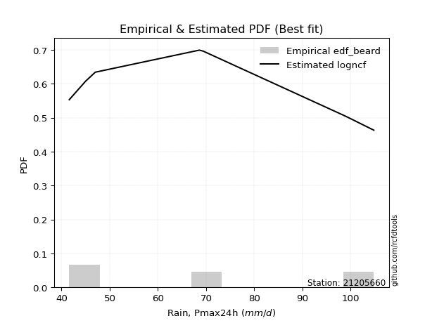</img>

</div>


### 5. EDF Chegodayev (1955)

The Chegodayev formula is an empirical plotting position formula used in hydrological frequency analysis to estimate the exceedance probability or return period of a specific event from a set of observed data. It is primarily used for plotting observed data points on probability paper to fit a theoretical distribution, particularly for analyzing extreme events like maximum flood flows or rainfall intensities. The constant _b_ value in the generalized plotting position formula is 0.3.

<div align="center">


$P=(m-b)/(n+1-2b)$


</div>


**5.1. Empirical values**

<div align="center">

|                | 0                   | 1                   | 2                   | 3                   | 4                  | 5                  | 6                  | 7                  |
|:---------------|:--------------------|:--------------------|:--------------------|:--------------------|:-------------------|:-------------------|:-------------------|:-------------------|
| date           | 2020                | 2023                | 2018                | 2021                | 2022               | 2019               | 2024               | 2025               |
| x              | 41.6                | 45.0                | 47.0                | 68.6                | 69.4               | 99.0               | 104.8              | 108.8              |
| m              | 1                   | 2                   | 3                   | 4                   | 5                  | 6                  | 7                  | 8                  |
| empirical_dist | edf_chegodayev      | edf_chegodayev      | edf_chegodayev      | edf_chegodayev      | edf_chegodayev     | edf_chegodayev     | edf_chegodayev     | edf_chegodayev     |
| empirical      | 0.08333333333333333 | 0.20238095238095236 | 0.32142857142857145 | 0.44047619047619047 | 0.5595238095238095 | 0.6785714285714286 | 0.7976190476190476 | 0.9166666666666666 |
| empirical_tr   | 1.090909090909091   | 1.253731343283582   | 1.4736842105263157  | 1.7872340425531914  | 2.27027027027027   | 3.1111111111111116 | 4.941176470588234  | 11.999999999999995 |

</div>


**5.2. Kolmogorov-Smirnov fit test (sorted by Δ)**


<div align="center">

|                | 0                   | 1                   | 2                   | 3                   | 4                   | 5                   | 6                   | 7                  | 8                   | 9                   | 10                  | 11                 | 12                  | 13                 | 14                  | 15                  | 16                  | 17                  | 18                  | 19                  | 20                  | 21                 | 22                  | 23                 | 24                  | 25                  | 26                  | 27                 | 28                  | 29                 | 30                  | 31                 | 32                 | 33                  | 34                  | 35                  | 36                 | 37                  | 38                  | 39                  | 40                  | 41                  | 42                  | 43                 | 44                 | 45                  | 46                  | 47                  | 48                  | 49                  | 50                  | 51                  | 52                  | 53                  | 54                  | 55                  | 56                  | 57                 | 58                  | 59                 | 60                  | 61                  | 62                  | 63                  | 64                  | 65                  | 66                  | 67                  | 68                  | 69                 | 70                 | 71                  | 72                  | 73                  | 74                  | 75                  | 76                  | 77                  | 78                  | 79                  | 80                  | 81                 | 82                 | 83                  | 84                 | 85                  | 86                 | 87                  | 88                  | 89                  | 90                  | 91                 | 92                 | 93                  | 94                  | 95                  | 96                  | 97                  | 98                  | 99                  | 100                 | 101                 | 102                 | 103                 | 104                 | 105                 | 106                 | 107                 | 108                | 109                 | 110                 | 111                | 112                 | 113                 | 114                 | 115                 | 116                 | 117                 | 118                | 119                 | 120                 | 121                 | 122                 | 123                | 124                 | 125                 | 126                | 127                | 128                 | 129                | 130                | 131                | 132                 | 133                | 134                 | 135                 | 136                 | 137                 | 138                | 139                 | 140                 | 141                 | 142                | 143                | 144                 | 145                 | 146                | 147                 | 148                 | 149                 | 150                | 151                | 152                | 153                | 154                | 155                | 156                | 157                | 158                | 159                |
|:---------------|:--------------------|:--------------------|:--------------------|:--------------------|:--------------------|:--------------------|:--------------------|:-------------------|:--------------------|:--------------------|:--------------------|:-------------------|:--------------------|:-------------------|:--------------------|:--------------------|:--------------------|:--------------------|:--------------------|:--------------------|:--------------------|:-------------------|:--------------------|:-------------------|:--------------------|:--------------------|:--------------------|:-------------------|:--------------------|:-------------------|:--------------------|:-------------------|:-------------------|:--------------------|:--------------------|:--------------------|:-------------------|:--------------------|:--------------------|:--------------------|:--------------------|:--------------------|:--------------------|:-------------------|:-------------------|:--------------------|:--------------------|:--------------------|:--------------------|:--------------------|:--------------------|:--------------------|:--------------------|:--------------------|:--------------------|:--------------------|:--------------------|:-------------------|:--------------------|:-------------------|:--------------------|:--------------------|:--------------------|:--------------------|:--------------------|:--------------------|:--------------------|:--------------------|:--------------------|:-------------------|:-------------------|:--------------------|:--------------------|:--------------------|:--------------------|:--------------------|:--------------------|:--------------------|:--------------------|:--------------------|:--------------------|:-------------------|:-------------------|:--------------------|:-------------------|:--------------------|:-------------------|:--------------------|:--------------------|:--------------------|:--------------------|:-------------------|:-------------------|:--------------------|:--------------------|:--------------------|:--------------------|:--------------------|:--------------------|:--------------------|:--------------------|:--------------------|:--------------------|:--------------------|:--------------------|:--------------------|:--------------------|:--------------------|:-------------------|:--------------------|:--------------------|:-------------------|:--------------------|:--------------------|:--------------------|:--------------------|:--------------------|:--------------------|:-------------------|:--------------------|:--------------------|:--------------------|:--------------------|:-------------------|:--------------------|:--------------------|:-------------------|:-------------------|:--------------------|:-------------------|:-------------------|:-------------------|:--------------------|:-------------------|:--------------------|:--------------------|:--------------------|:--------------------|:-------------------|:--------------------|:--------------------|:--------------------|:-------------------|:-------------------|:--------------------|:--------------------|:-------------------|:--------------------|:--------------------|:--------------------|:-------------------|:-------------------|:-------------------|:-------------------|:-------------------|:-------------------|:-------------------|:-------------------|:-------------------|:-------------------|
| station        | 21205660            | 21205660            | 21205660            | 21205660            | 21205660            | 21205660            | 21205660            | 21205660           | 21205660            | 21205660            | 21205660            | 21205660           | 21205660            | 21205660           | 21205660            | 21205660            | 21205660            | 21205660            | 21205660            | 21205660            | 21205660            | 21205660           | 21205660            | 21205660           | 21205660            | 21205660            | 21205660            | 21205660           | 21205660            | 21205660           | 21205660            | 21205660           | 21205660           | 21205660            | 21205660            | 21205660            | 21205660           | 21205660            | 21205660            | 21205660            | 21205660            | 21205660            | 21205660            | 21205660           | 21205660           | 21205660            | 21205660            | 21205660            | 21205660            | 21205660            | 21205660            | 21205660            | 21205660            | 21205660            | 21205660            | 21205660            | 21205660            | 21205660           | 21205660            | 21205660           | 21205660            | 21205660            | 21205660            | 21205660            | 21205660            | 21205660            | 21205660            | 21205660            | 21205660            | 21205660           | 21205660           | 21205660            | 21205660            | 21205660            | 21205660            | 21205660            | 21205660            | 21205660            | 21205660            | 21205660            | 21205660            | 21205660           | 21205660           | 21205660            | 21205660           | 21205660            | 21205660           | 21205660            | 21205660            | 21205660            | 21205660            | 21205660           | 21205660           | 21205660            | 21205660            | 21205660            | 21205660            | 21205660            | 21205660            | 21205660            | 21205660            | 21205660            | 21205660            | 21205660            | 21205660            | 21205660            | 21205660            | 21205660            | 21205660           | 21205660            | 21205660            | 21205660           | 21205660            | 21205660            | 21205660            | 21205660            | 21205660            | 21205660            | 21205660           | 21205660            | 21205660            | 21205660            | 21205660            | 21205660           | 21205660            | 21205660            | 21205660           | 21205660           | 21205660            | 21205660           | 21205660           | 21205660           | 21205660            | 21205660           | 21205660            | 21205660            | 21205660            | 21205660            | 21205660           | 21205660            | 21205660            | 21205660            | 21205660           | 21205660           | 21205660            | 21205660            | 21205660           | 21205660            | 21205660            | 21205660            | 21205660           | 21205660           | 21205660           | 21205660           | 21205660           | 21205660           | 21205660           | 21205660           | 21205660           | 21205660           |
| empirical_dist | edf_chegodayev      | edf_chegodayev      | edf_chegodayev      | edf_chegodayev      | edf_chegodayev      | edf_chegodayev      | edf_chegodayev      | edf_chegodayev     | edf_chegodayev      | edf_chegodayev      | edf_chegodayev      | edf_chegodayev     | edf_chegodayev      | edf_chegodayev     | edf_chegodayev      | edf_chegodayev      | edf_chegodayev      | edf_chegodayev      | edf_chegodayev      | edf_chegodayev      | edf_chegodayev      | edf_chegodayev     | edf_chegodayev      | edf_chegodayev     | edf_chegodayev      | edf_chegodayev      | edf_chegodayev      | edf_chegodayev     | edf_chegodayev      | edf_chegodayev     | edf_chegodayev      | edf_chegodayev     | edf_chegodayev     | edf_chegodayev      | edf_chegodayev      | edf_chegodayev      | edf_chegodayev     | edf_chegodayev      | edf_chegodayev      | edf_chegodayev      | edf_chegodayev      | edf_chegodayev      | edf_chegodayev      | edf_chegodayev     | edf_chegodayev     | edf_chegodayev      | edf_chegodayev      | edf_chegodayev      | edf_chegodayev      | edf_chegodayev      | edf_chegodayev      | edf_chegodayev      | edf_chegodayev      | edf_chegodayev      | edf_chegodayev      | edf_chegodayev      | edf_chegodayev      | edf_chegodayev     | edf_chegodayev      | edf_chegodayev     | edf_chegodayev      | edf_chegodayev      | edf_chegodayev      | edf_chegodayev      | edf_chegodayev      | edf_chegodayev      | edf_chegodayev      | edf_chegodayev      | edf_chegodayev      | edf_chegodayev     | edf_chegodayev     | edf_chegodayev      | edf_chegodayev      | edf_chegodayev      | edf_chegodayev      | edf_chegodayev      | edf_chegodayev      | edf_chegodayev      | edf_chegodayev      | edf_chegodayev      | edf_chegodayev      | edf_chegodayev     | edf_chegodayev     | edf_chegodayev      | edf_chegodayev     | edf_chegodayev      | edf_chegodayev     | edf_chegodayev      | edf_chegodayev      | edf_chegodayev      | edf_chegodayev      | edf_chegodayev     | edf_chegodayev     | edf_chegodayev      | edf_chegodayev      | edf_chegodayev      | edf_chegodayev      | edf_chegodayev      | edf_chegodayev      | edf_chegodayev      | edf_chegodayev      | edf_chegodayev      | edf_chegodayev      | edf_chegodayev      | edf_chegodayev      | edf_chegodayev      | edf_chegodayev      | edf_chegodayev      | edf_chegodayev     | edf_chegodayev      | edf_chegodayev      | edf_chegodayev     | edf_chegodayev      | edf_chegodayev      | edf_chegodayev      | edf_chegodayev      | edf_chegodayev      | edf_chegodayev      | edf_chegodayev     | edf_chegodayev      | edf_chegodayev      | edf_chegodayev      | edf_chegodayev      | edf_chegodayev     | edf_chegodayev      | edf_chegodayev      | edf_chegodayev     | edf_chegodayev     | edf_chegodayev      | edf_chegodayev     | edf_chegodayev     | edf_chegodayev     | edf_chegodayev      | edf_chegodayev     | edf_chegodayev      | edf_chegodayev      | edf_chegodayev      | edf_chegodayev      | edf_chegodayev     | edf_chegodayev      | edf_chegodayev      | edf_chegodayev      | edf_chegodayev     | edf_chegodayev     | edf_chegodayev      | edf_chegodayev      | edf_chegodayev     | edf_chegodayev      | edf_chegodayev      | edf_chegodayev      | edf_chegodayev     | edf_chegodayev     | edf_chegodayev     | edf_chegodayev     | edf_chegodayev     | edf_chegodayev     | edf_chegodayev     | edf_chegodayev     | edf_chegodayev     | edf_chegodayev     |
| p_dist         | logarcsine          | wrapcauchy          | logbeta             | beta                | logwrapcauchy       | arcsine             | logrdist            | ksone              | logksone            | semicircular        | logsemicircular     | lognakagami        | anglit              | logtrapezoid       | loganglit           | lomax               | logweibull_max      | triang              | logmielke           | loggenlogistic      | logfoldnorm         | logburr            | loginvweibull       | trapezoid          | foldnorm            | rdist               | rayleigh            | burr               | maxwell             | invgamma           | loginvgauss         | lograyleigh        | johnsonsu          | loggenexpon         | nct                 | logmaxwell          | truncnorm          | norm                | crystalball         | t                   | exponnorm           | pearson3            | genexpon            | lognct             | logexponpow        | loginvgamma         | logburr12           | logbetaprime        | loggamma            | loggamma            | logerlang           | logf                | logpearson3         | logt                | lognorm             | logcrystalball      | logexponnorm        | logskewnorm        | logloggamma         | logalpha           | logncf              | halfnorm            | f                   | alpha               | logkstwobign        | betaprime           | genlogistic         | loghalfnorm         | kstwobign           | logdweibull        | logcosine          | logloglaplace       | logrice             | cosine              | logistic            | logdgamma           | loglogistic         | erlang              | loghalfgennorm      | loglevy_l           | gumbel_l            | logexponweib       | logweibull_min     | gumbel_r            | weibull_min        | loggumbel_l         | hypsecant          | rice                | genpareto           | loggumbel_r         | loggompertz         | loghypsecant       | dweibull           | invgauss            | kappa3              | burr12              | loglomax            | logtriang           | logargus            | argus               | laplace             | loglaplace          | loglaplace          | halfgennorm         | gausshyper          | halflogistic        | bradford            | moyal               | logtukeylambda     | gamma               | kappa4              | vonmises_line      | skewnorm            | logmoyal            | loghalflogistic     | logfatiguelife      | levy_l              | dgamma              | logkappa4          | logkappa3           | loguniform          | truncexpon          | gompertz            | logjohnsonsu       | logvonmises_line    | tukeylambda         | uniform            | loggenextreme      | logjohnsonsb        | loggenhalflogistic | logbradford        | nakagami           | logtruncexpon       | truncweibull_min   | logtruncweibull_min | loggennorm          | gennorm             | exponpow            | genhalflogistic    | logwald             | wald                | loggengamma         | loggausshyper      | genextreme         | loggenpareto        | exponweib           | powerlaw           | fatiguelife         | ncf                 | gengamma            | logpowerlaw        | invweibull         | weibull_max        | logtruncnorm       | logtruncpareto     | truncpareto        | johnsonsb          | logvonmises        | vonmises           | mielke             |
| delta          | 0.07413657696908568 | 0.08333099308782177 | 0.08333208314752706 | 0.08333268561277618 | 0.08333333308627844 | 0.09231745916265462 | 0.10572702088450547 | 0.1093408867025997 | 0.11254911914712995 | 0.12519870271908168 | 0.12825935005879296 | 0.1328001605799196 | 0.13654799632490677 | 0.1374152539148381 | 0.13948843437251512 | 0.14323448634849434 | 0.14877206842133145 | 0.15049545106735784 | 0.15511558755678476 | 0.15542733493870153 | 0.15634898192611058 | 0.1566009972908201 | 0.15668406334018947 | 0.1572192050985291 | 0.15766557838702377 | 0.15844009854376928 | 0.15865521573211017 | 0.1587574043742409 | 0.15928075320633917 | 0.1594924746423012 | 0.16017531266226226 | 0.1603787382409819 | 0.1607387075928931 | 0.16081834326652977 | 0.16112719423941113 | 0.16125787618187062 | 0.1621330608633102 | 0.16213306901002594 | 0.16213307588488254 | 0.16214123934785232 | 0.16214738942295392 | 0.16241606342166087 | 0.16340012727547643 | 0.1634762287597732 | 0.1636399674121698 | 0.16383748078433324 | 0.16419728378265583 | 0.16420955608256246 | 0.16457684140033518 | 0.16457684140033518 | 0.16460819664562074 | 0.16468262195176978 | 0.16480313476610944 | 0.16481308086234497 | 0.16481440823957427 | 0.16481440899426628 | 0.16481517998416084 | 0.1648153422823514 | 0.16483551057057524 | 0.164848148366893  | 0.16538085061267188 | 0.16551654915557684 | 0.16560744740336505 | 0.16587507063010667 | 0.16683359106889661 | 0.16728815508114786 | 0.16826658210446188 | 0.17073498176894616 | 0.17349359037191947 | 0.1737602037858855 | 0.177247216280352  | 0.17801833907384843 | 0.18033463060866448 | 0.18059210832256894 | 0.18067032078337783 | 0.18180243670135135 | 0.18309071823329687 | 0.18507044102752424 | 0.18624281683456767 | 0.18702025778940912 | 0.18780397065063303 | 0.1878762091417504 | 0.1882939870161653 | 0.18846410623832766 | 0.1889611896196337 | 0.19026054982505436 | 0.190419118169789  | 0.19096393849861976 | 0.19123090082435557 | 0.19226023916944437 | 0.19241169856647092 | 0.1926244530246166 | 0.1926868122632267 | 0.19288297201491156 | 0.19366370257571097 | 0.19424790625966915 | 0.19523266104571024 | 0.19561715603792387 | 0.19728512929872083 | 0.19925917235845841 | 0.19941508632596164 | 0.20131778857837918 | 0.20131778857837918 | 0.20599255245089965 | 0.20805678131294614 | 0.21199565657186498 | 0.21253290468960362 | 0.21275119461838582 | 0.2130710360744621 | 0.21380638446170397 | 0.21549906105551125 | 0.2158241847038081 | 0.21626113502137012 | 0.21707222788859687 | 0.21837663025002496 | 0.21890979019497148 | 0.21897052131541733 | 0.21898116304120474 | 0.2193442803317902 | 0.22112138296010175 | 0.22324843007800632 | 0.22331339496632452 | 0.22341120276199583 | 0.2255652119245496 | 0.22572282667592614 | 0.23541724015871984 | 0.2410714285714286 | 0.2452650182467918 | 0.25101053905279835 | 0.2520084579374529 | 0.2522437414240304 | 0.257999138684434  | 0.26673942518160854 | 0.2680424644153463 | 0.2931050702249055  | 0.29761904761904767 | 0.29761904761904767 | 0.30512232272685524 | 0.3122998672742059 | 0.32142857142857145 | 0.32142857142857145 | 0.34009854768003855 | 0.3435057527796175 | 0.3560510187123219 | 0.36355194004768415 | 0.40243824377641146 | 0.4077143500255944 | 0.42349592506523237 | 0.42380441778583683 | 0.43857694000266156 | 0.4406556076694561 | 0.4781369038053015 | 0.5039412951825939 | 0.5105311501015746 | 0.5138327482312512 | 0.5965127874422078 | 0.7000828648224999 | 1.1639134494270713 | 17.156799732057582 | nan                |
| deltao         | 0.4472608134160001  | 0.4472608134160001  | 0.4472608134160001  | 0.4472608134160001  | 0.4472608134160001  | 0.4472608134160001  | 0.4472608134160001  | 0.4472608134160001 | 0.4472608134160001  | 0.4472608134160001  | 0.4472608134160001  | 0.4472608134160001 | 0.4472608134160001  | 0.4472608134160001 | 0.4472608134160001  | 0.4472608134160001  | 0.4472608134160001  | 0.4472608134160001  | 0.4472608134160001  | 0.4472608134160001  | 0.4472608134160001  | 0.4472608134160001 | 0.4472608134160001  | 0.4472608134160001 | 0.4472608134160001  | 0.4472608134160001  | 0.4472608134160001  | 0.4472608134160001 | 0.4472608134160001  | 0.4472608134160001 | 0.4472608134160001  | 0.4472608134160001 | 0.4472608134160001 | 0.4472608134160001  | 0.4472608134160001  | 0.4472608134160001  | 0.4472608134160001 | 0.4472608134160001  | 0.4472608134160001  | 0.4472608134160001  | 0.4472608134160001  | 0.4472608134160001  | 0.4472608134160001  | 0.4472608134160001 | 0.4472608134160001 | 0.4472608134160001  | 0.4472608134160001  | 0.4472608134160001  | 0.4472608134160001  | 0.4472608134160001  | 0.4472608134160001  | 0.4472608134160001  | 0.4472608134160001  | 0.4472608134160001  | 0.4472608134160001  | 0.4472608134160001  | 0.4472608134160001  | 0.4472608134160001 | 0.4472608134160001  | 0.4472608134160001 | 0.4472608134160001  | 0.4472608134160001  | 0.4472608134160001  | 0.4472608134160001  | 0.4472608134160001  | 0.4472608134160001  | 0.4472608134160001  | 0.4472608134160001  | 0.4472608134160001  | 0.4472608134160001 | 0.4472608134160001 | 0.4472608134160001  | 0.4472608134160001  | 0.4472608134160001  | 0.4472608134160001  | 0.4472608134160001  | 0.4472608134160001  | 0.4472608134160001  | 0.4472608134160001  | 0.4472608134160001  | 0.4472608134160001  | 0.4472608134160001 | 0.4472608134160001 | 0.4472608134160001  | 0.4472608134160001 | 0.4472608134160001  | 0.4472608134160001 | 0.4472608134160001  | 0.4472608134160001  | 0.4472608134160001  | 0.4472608134160001  | 0.4472608134160001 | 0.4472608134160001 | 0.4472608134160001  | 0.4472608134160001  | 0.4472608134160001  | 0.4472608134160001  | 0.4472608134160001  | 0.4472608134160001  | 0.4472608134160001  | 0.4472608134160001  | 0.4472608134160001  | 0.4472608134160001  | 0.4472608134160001  | 0.4472608134160001  | 0.4472608134160001  | 0.4472608134160001  | 0.4472608134160001  | 0.4472608134160001 | 0.4472608134160001  | 0.4472608134160001  | 0.4472608134160001 | 0.4472608134160001  | 0.4472608134160001  | 0.4472608134160001  | 0.4472608134160001  | 0.4472608134160001  | 0.4472608134160001  | 0.4472608134160001 | 0.4472608134160001  | 0.4472608134160001  | 0.4472608134160001  | 0.4472608134160001  | 0.4472608134160001 | 0.4472608134160001  | 0.4472608134160001  | 0.4472608134160001 | 0.4472608134160001 | 0.4472608134160001  | 0.4472608134160001 | 0.4472608134160001 | 0.4472608134160001 | 0.4472608134160001  | 0.4472608134160001 | 0.4472608134160001  | 0.4472608134160001  | 0.4472608134160001  | 0.4472608134160001  | 0.4472608134160001 | 0.4472608134160001  | 0.4472608134160001  | 0.4472608134160001  | 0.4472608134160001 | 0.4472608134160001 | 0.4472608134160001  | 0.4472608134160001  | 0.4472608134160001 | 0.4472608134160001  | 0.4472608134160001  | 0.4472608134160001  | 0.4472608134160001 | 0.4472608134160001 | 0.4472608134160001 | 0.4472608134160001 | 0.4472608134160001 | 0.4472608134160001 | 0.4472608134160001 | 0.4472608134160001 | 0.4472608134160001 | 0.4472608134160001 |
| eval           | Δo > Δ              | Δo > Δ              | Δo > Δ              | Δo > Δ              | Δo > Δ              | Δo > Δ              | Δo > Δ              | Δo > Δ             | Δo > Δ              | Δo > Δ              | Δo > Δ              | Δo > Δ             | Δo > Δ              | Δo > Δ             | Δo > Δ              | Δo > Δ              | Δo > Δ              | Δo > Δ              | Δo > Δ              | Δo > Δ              | Δo > Δ              | Δo > Δ             | Δo > Δ              | Δo > Δ             | Δo > Δ              | Δo > Δ              | Δo > Δ              | Δo > Δ             | Δo > Δ              | Δo > Δ             | Δo > Δ              | Δo > Δ             | Δo > Δ             | Δo > Δ              | Δo > Δ              | Δo > Δ              | Δo > Δ             | Δo > Δ              | Δo > Δ              | Δo > Δ              | Δo > Δ              | Δo > Δ              | Δo > Δ              | Δo > Δ             | Δo > Δ             | Δo > Δ              | Δo > Δ              | Δo > Δ              | Δo > Δ              | Δo > Δ              | Δo > Δ              | Δo > Δ              | Δo > Δ              | Δo > Δ              | Δo > Δ              | Δo > Δ              | Δo > Δ              | Δo > Δ             | Δo > Δ              | Δo > Δ             | Δo > Δ              | Δo > Δ              | Δo > Δ              | Δo > Δ              | Δo > Δ              | Δo > Δ              | Δo > Δ              | Δo > Δ              | Δo > Δ              | Δo > Δ             | Δo > Δ             | Δo > Δ              | Δo > Δ              | Δo > Δ              | Δo > Δ              | Δo > Δ              | Δo > Δ              | Δo > Δ              | Δo > Δ              | Δo > Δ              | Δo > Δ              | Δo > Δ             | Δo > Δ             | Δo > Δ              | Δo > Δ             | Δo > Δ              | Δo > Δ             | Δo > Δ              | Δo > Δ              | Δo > Δ              | Δo > Δ              | Δo > Δ             | Δo > Δ             | Δo > Δ              | Δo > Δ              | Δo > Δ              | Δo > Δ              | Δo > Δ              | Δo > Δ              | Δo > Δ              | Δo > Δ              | Δo > Δ              | Δo > Δ              | Δo > Δ              | Δo > Δ              | Δo > Δ              | Δo > Δ              | Δo > Δ              | Δo > Δ             | Δo > Δ              | Δo > Δ              | Δo > Δ             | Δo > Δ              | Δo > Δ              | Δo > Δ              | Δo > Δ              | Δo > Δ              | Δo > Δ              | Δo > Δ             | Δo > Δ              | Δo > Δ              | Δo > Δ              | Δo > Δ              | Δo > Δ             | Δo > Δ              | Δo > Δ              | Δo > Δ             | Δo > Δ             | Δo > Δ              | Δo > Δ             | Δo > Δ             | Δo > Δ             | Δo > Δ              | Δo > Δ             | Δo > Δ              | Δo > Δ              | Δo > Δ              | Δo > Δ              | Δo > Δ             | Δo > Δ              | Δo > Δ              | Δo > Δ              | Δo > Δ             | Δo > Δ             | Δo > Δ              | Δo > Δ              | Δo > Δ             | Δo > Δ              | Δo > Δ              | Δo > Δ              | Δo > Δ             | Δo <= Δ            | Δo <= Δ            | Δo <= Δ            | Δo <= Δ            | Δo <= Δ            | Δo <= Δ            | Δo <= Δ            | Δo <= Δ            | Δo <= Δ            |
| fit            | 1                   | 1                   | 1                   | 1                   | 1                   | 1                   | 1                   | 1                  | 1                   | 1                   | 1                   | 1                  | 1                   | 1                  | 1                   | 1                   | 1                   | 1                   | 1                   | 1                   | 1                   | 1                  | 1                   | 1                  | 1                   | 1                   | 1                   | 1                  | 1                   | 1                  | 1                   | 1                  | 1                  | 1                   | 1                   | 1                   | 1                  | 1                   | 1                   | 1                   | 1                   | 1                   | 1                   | 1                  | 1                  | 1                   | 1                   | 1                   | 1                   | 1                   | 1                   | 1                   | 1                   | 1                   | 1                   | 1                   | 1                   | 1                  | 1                   | 1                  | 1                   | 1                   | 1                   | 1                   | 1                   | 1                   | 1                   | 1                   | 1                   | 1                  | 1                  | 1                   | 1                   | 1                   | 1                   | 1                   | 1                   | 1                   | 1                   | 1                   | 1                   | 1                  | 1                  | 1                   | 1                  | 1                   | 1                  | 1                   | 1                   | 1                   | 1                   | 1                  | 1                  | 1                   | 1                   | 1                   | 1                   | 1                   | 1                   | 1                   | 1                   | 1                   | 1                   | 1                   | 1                   | 1                   | 1                   | 1                   | 1                  | 1                   | 1                   | 1                  | 1                   | 1                   | 1                   | 1                   | 1                   | 1                   | 1                  | 1                   | 1                   | 1                   | 1                   | 1                  | 1                   | 1                   | 1                  | 1                  | 1                   | 1                  | 1                  | 1                  | 1                   | 1                  | 1                   | 1                   | 1                   | 1                   | 1                  | 1                   | 1                   | 1                   | 1                  | 1                  | 1                   | 1                   | 1                  | 1                   | 1                   | 1                   | 1                  | 0                  | 0                  | 0                  | 0                  | 0                  | 0                  | 0                  | 0                  | 0                  |
| n              | 8                   | 8                   | 8                   | 8                   | 8                   | 8                   | 8                   | 8                  | 8                   | 8                   | 8                   | 8                  | 8                   | 8                  | 8                   | 8                   | 8                   | 8                   | 8                   | 8                   | 8                   | 8                  | 8                   | 8                  | 8                   | 8                   | 8                   | 8                  | 8                   | 8                  | 8                   | 8                  | 8                  | 8                   | 8                   | 8                   | 8                  | 8                   | 8                   | 8                   | 8                   | 8                   | 8                   | 8                  | 8                  | 8                   | 8                   | 8                   | 8                   | 8                   | 8                   | 8                   | 8                   | 8                   | 8                   | 8                   | 8                   | 8                  | 8                   | 8                  | 8                   | 8                   | 8                   | 8                   | 8                   | 8                   | 8                   | 8                   | 8                   | 8                  | 8                  | 8                   | 8                   | 8                   | 8                   | 8                   | 8                   | 8                   | 8                   | 8                   | 8                   | 8                  | 8                  | 8                   | 8                  | 8                   | 8                  | 8                   | 8                   | 8                   | 8                   | 8                  | 8                  | 8                   | 8                   | 8                   | 8                   | 8                   | 8                   | 8                   | 8                   | 8                   | 8                   | 8                   | 8                   | 8                   | 8                   | 8                   | 8                  | 8                   | 8                   | 8                  | 8                   | 8                   | 8                   | 8                   | 8                   | 8                   | 8                  | 8                   | 8                   | 8                   | 8                   | 8                  | 8                   | 8                   | 8                  | 8                  | 8                   | 8                  | 8                  | 8                  | 8                   | 8                  | 8                   | 8                   | 8                   | 8                   | 8                  | 8                   | 8                   | 8                   | 8                  | 8                  | 8                   | 8                   | 8                  | 8                   | 8                   | 8                   | 8                  | 8                  | 8                  | 8                  | 8                  | 8                  | 8                  | 8                  | 8                  | 8                  |
| best_fit       | 1                   | 0                   | 0                   | 0                   | 0                   | 0                   | 0                   | 0                  | 0                   | 0                   | 0                   | 0                  | 0                   | 0                  | 0                   | 0                   | 0                   | 0                   | 0                   | 0                   | 0                   | 0                  | 0                   | 0                  | 0                   | 0                   | 0                   | 0                  | 0                   | 0                  | 0                   | 0                  | 0                  | 0                   | 0                   | 0                   | 0                  | 0                   | 0                   | 0                   | 0                   | 0                   | 0                   | 0                  | 0                  | 0                   | 0                   | 0                   | 0                   | 0                   | 0                   | 0                   | 0                   | 0                   | 0                   | 0                   | 0                   | 0                  | 0                   | 0                  | 0                   | 0                   | 0                   | 0                   | 0                   | 0                   | 0                   | 0                   | 0                   | 0                  | 0                  | 0                   | 0                   | 0                   | 0                   | 0                   | 0                   | 0                   | 0                   | 0                   | 0                   | 0                  | 0                  | 0                   | 0                  | 0                   | 0                  | 0                   | 0                   | 0                   | 0                   | 0                  | 0                  | 0                   | 0                   | 0                   | 0                   | 0                   | 0                   | 0                   | 0                   | 0                   | 0                   | 0                   | 0                   | 0                   | 0                   | 0                   | 0                  | 0                   | 0                   | 0                  | 0                   | 0                   | 0                   | 0                   | 0                   | 0                   | 0                  | 0                   | 0                   | 0                   | 0                   | 0                  | 0                   | 0                   | 0                  | 0                  | 0                   | 0                  | 0                  | 0                  | 0                   | 0                  | 0                   | 0                   | 0                   | 0                   | 0                  | 0                   | 0                   | 0                   | 0                  | 0                  | 0                   | 0                   | 0                  | 0                   | 0                   | 0                   | 0                  | 0                  | 0                  | 0                  | 0                  | 0                  | 0                  | 0                  | 0                  | 0                  |
| best_fit_sort  | 1                   | 2                   | 3                   | 4                   | 5                   | 6                   | 7                   | 8                  | 9                   | 10                  | 11                  | 12                 | 13                  | 14                 | 15                  | 16                  | 17                  | 18                  | 19                  | 20                  | 21                  | 22                 | 23                  | 24                 | 25                  | 26                  | 27                  | 28                 | 29                  | 30                 | 31                  | 32                 | 33                 | 34                  | 35                  | 36                  | 37                 | 38                  | 39                  | 40                  | 41                  | 42                  | 43                  | 44                 | 45                 | 46                  | 47                  | 48                  | 49                  | 50                  | 51                  | 52                  | 53                  | 54                  | 55                  | 56                  | 57                  | 58                 | 59                  | 60                 | 61                  | 62                  | 63                  | 64                  | 65                  | 66                  | 67                  | 68                  | 69                  | 70                 | 71                 | 72                  | 73                  | 74                  | 75                  | 76                  | 77                  | 78                  | 79                  | 80                  | 81                  | 82                 | 83                 | 84                  | 85                 | 86                  | 87                 | 88                  | 89                  | 90                  | 91                  | 92                 | 93                 | 94                  | 95                  | 96                  | 97                  | 98                  | 99                  | 100                 | 101                 | 102                 | 103                 | 104                 | 105                 | 106                 | 107                 | 108                 | 109                | 110                 | 111                 | 112                | 113                 | 114                 | 115                 | 116                 | 117                 | 118                 | 119                | 120                 | 121                 | 122                 | 123                 | 124                | 125                 | 126                 | 127                | 128                | 129                 | 130                | 131                | 132                | 133                 | 134                | 135                 | 136                 | 137                 | 138                 | 139                | 140                 | 141                 | 142                 | 143                | 144                | 145                 | 146                 | 147                | 148                 | 149                 | 150                 | 151                | 152                | 153                | 154                | 155                | 156                | 157                | 158                | 159                | 160                |

</div>


**5.3. Best fit**

<div align="center">

|   id |   station | empirical_dist   | p_dist     |     delta |   deltao | eval   |   fit |   n |   best_fit |   best_fit_sort |
|-----:|----------:|:-----------------|:-----------|----------:|---------:|:-------|------:|----:|-----------:|----------------:|
|    0 |  21205660 | edf_chegodayev   | logarcsine | 0.0741366 | 0.447261 | Δo > Δ |     1 |   8 |          1 |               1 |

</div>


<div align="center">

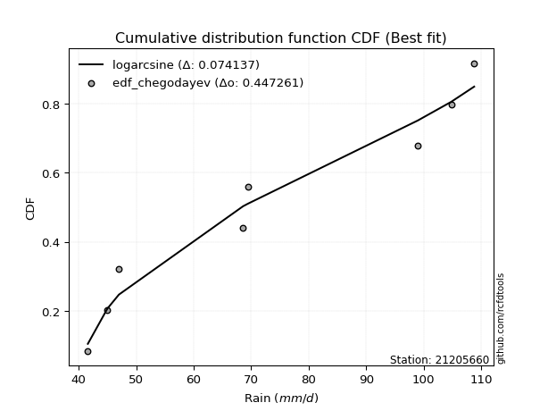</img>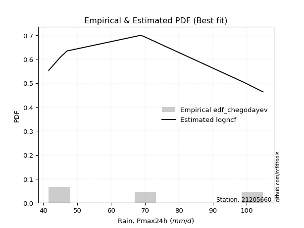</img>

</div>


### 6. EDF Blom (1958)

The Blom formula is a specific "plotting position" formula used in hydrology and statistical analysis to estimate the empirical cumulative probability (or non-exceedance probability) of a data series. It is particularly recommended for data that are approximately normally distributed. The constant _a_ is set to 0.375 (or 3/8).

<div align="center">


$P=(m-a)/(n+1-2a)$


</div>


**6.1. Empirical values**

<div align="center">

|                | 0                   | 1                   | 2                  | 3                  | 4                  | 5                  | 6                 | 7                  |
|:---------------|:--------------------|:--------------------|:-------------------|:-------------------|:-------------------|:-------------------|:------------------|:-------------------|
| date           | 2020                | 2023                | 2018               | 2021               | 2022               | 2019               | 2024              | 2025               |
| x              | 41.6                | 45.0                | 47.0               | 68.6               | 69.4               | 99.0               | 104.8             | 108.8              |
| m              | 1                   | 2                   | 3                  | 4                  | 5                  | 6                  | 7                 | 8                  |
| empirical_dist | edf_blom            | edf_blom            | edf_blom           | edf_blom           | edf_blom           | edf_blom           | edf_blom          | edf_blom           |
| empirical      | 0.07575757575757576 | 0.19696969696969696 | 0.3181818181818182 | 0.4393939393939394 | 0.5606060606060606 | 0.6818181818181818 | 0.803030303030303 | 0.9242424242424242 |
| empirical_tr   | 1.0819672131147542  | 1.2452830188679247  | 1.4666666666666666 | 1.783783783783784  | 2.275862068965517  | 3.1428571428571423 | 5.076923076923076 | 13.199999999999992 |

</div>


**6.2. Kolmogorov-Smirnov fit test (sorted by Δ)**


<div align="center">

|                | 0                   | 1                   | 2                   | 3                  | 4                   | 5                   | 6                   | 7                   | 8                   | 9                  | 10                 | 11                  | 12                 | 13                  | 14                  | 15                 | 16                 | 17                  | 18                  | 19                 | 20                  | 21                 | 22                 | 23                 | 24                 | 25                  | 26                 | 27                  | 28                  | 29                  | 30                  | 31                  | 32                  | 33                  | 34                  | 35                  | 36                  | 37                  | 38                  | 39                 | 40                  | 41                  | 42                  | 43                  | 44                  | 45                 | 46                  | 47                 | 48                 | 49                  | 50                 | 51                  | 52                 | 53                 | 54                 | 55                  | 56                  | 57                  | 58                  | 59                  | 60                 | 61                  | 62                  | 63                 | 64                  | 65                  | 66                  | 67                 | 68                 | 69                  | 70                  | 71                  | 72                 | 73                  | 74                  | 75                  | 76                 | 77                  | 78                  | 79                 | 80                 | 81                 | 82                  | 83                  | 84                  | 85                  | 86                 | 87                  | 88                 | 89                  | 90                  | 91                 | 92                  | 93                 | 94                  | 95                  | 96                  | 97                  | 98                  | 99                  | 100                 | 101                | 102                | 103                 | 104                 | 105                | 106                 | 107                 | 108                 | 109                | 110                 | 111                 | 112                 | 113                | 114                 | 115                 | 116                 | 117                | 118                 | 119                 | 120                 | 121                 | 122                 | 123                | 124                | 125                 | 126                 | 127                 | 128                 | 129                 | 130                | 131                | 132                 | 133                 | 134                 | 135                 | 136                 | 137                | 138                | 139                | 140                | 141                | 142                 | 143                | 144                | 145                 | 146                | 147                 | 148                | 149                | 150                 | 151                 | 152                | 153                | 154                | 155                | 156                | 157                | 158                | 159                |
|:---------------|:--------------------|:--------------------|:--------------------|:-------------------|:--------------------|:--------------------|:--------------------|:--------------------|:--------------------|:-------------------|:-------------------|:--------------------|:-------------------|:--------------------|:--------------------|:-------------------|:-------------------|:--------------------|:--------------------|:-------------------|:--------------------|:-------------------|:-------------------|:-------------------|:-------------------|:--------------------|:-------------------|:--------------------|:--------------------|:--------------------|:--------------------|:--------------------|:--------------------|:--------------------|:--------------------|:--------------------|:--------------------|:--------------------|:--------------------|:-------------------|:--------------------|:--------------------|:--------------------|:--------------------|:--------------------|:-------------------|:--------------------|:-------------------|:-------------------|:--------------------|:-------------------|:--------------------|:-------------------|:-------------------|:-------------------|:--------------------|:--------------------|:--------------------|:--------------------|:--------------------|:-------------------|:--------------------|:--------------------|:-------------------|:--------------------|:--------------------|:--------------------|:-------------------|:-------------------|:--------------------|:--------------------|:--------------------|:-------------------|:--------------------|:--------------------|:--------------------|:-------------------|:--------------------|:--------------------|:-------------------|:-------------------|:-------------------|:--------------------|:--------------------|:--------------------|:--------------------|:-------------------|:--------------------|:-------------------|:--------------------|:--------------------|:-------------------|:--------------------|:-------------------|:--------------------|:--------------------|:--------------------|:--------------------|:--------------------|:--------------------|:--------------------|:-------------------|:-------------------|:--------------------|:--------------------|:-------------------|:--------------------|:--------------------|:--------------------|:-------------------|:--------------------|:--------------------|:--------------------|:-------------------|:--------------------|:--------------------|:--------------------|:-------------------|:--------------------|:--------------------|:--------------------|:--------------------|:--------------------|:-------------------|:-------------------|:--------------------|:--------------------|:--------------------|:--------------------|:--------------------|:-------------------|:-------------------|:--------------------|:--------------------|:--------------------|:--------------------|:--------------------|:-------------------|:-------------------|:-------------------|:-------------------|:-------------------|:--------------------|:-------------------|:-------------------|:--------------------|:-------------------|:--------------------|:-------------------|:-------------------|:--------------------|:--------------------|:-------------------|:-------------------|:-------------------|:-------------------|:-------------------|:-------------------|:-------------------|:-------------------|
| station        | 21205660            | 21205660            | 21205660            | 21205660           | 21205660            | 21205660            | 21205660            | 21205660            | 21205660            | 21205660           | 21205660           | 21205660            | 21205660           | 21205660            | 21205660            | 21205660           | 21205660           | 21205660            | 21205660            | 21205660           | 21205660            | 21205660           | 21205660           | 21205660           | 21205660           | 21205660            | 21205660           | 21205660            | 21205660            | 21205660            | 21205660            | 21205660            | 21205660            | 21205660            | 21205660            | 21205660            | 21205660            | 21205660            | 21205660            | 21205660           | 21205660            | 21205660            | 21205660            | 21205660            | 21205660            | 21205660           | 21205660            | 21205660           | 21205660           | 21205660            | 21205660           | 21205660            | 21205660           | 21205660           | 21205660           | 21205660            | 21205660            | 21205660            | 21205660            | 21205660            | 21205660           | 21205660            | 21205660            | 21205660           | 21205660            | 21205660            | 21205660            | 21205660           | 21205660           | 21205660            | 21205660            | 21205660            | 21205660           | 21205660            | 21205660            | 21205660            | 21205660           | 21205660            | 21205660            | 21205660           | 21205660           | 21205660           | 21205660            | 21205660            | 21205660            | 21205660            | 21205660           | 21205660            | 21205660           | 21205660            | 21205660            | 21205660           | 21205660            | 21205660           | 21205660            | 21205660            | 21205660            | 21205660            | 21205660            | 21205660            | 21205660            | 21205660           | 21205660           | 21205660            | 21205660            | 21205660           | 21205660            | 21205660            | 21205660            | 21205660           | 21205660            | 21205660            | 21205660            | 21205660           | 21205660            | 21205660            | 21205660            | 21205660           | 21205660            | 21205660            | 21205660            | 21205660            | 21205660            | 21205660           | 21205660           | 21205660            | 21205660            | 21205660            | 21205660            | 21205660            | 21205660           | 21205660           | 21205660            | 21205660            | 21205660            | 21205660            | 21205660            | 21205660           | 21205660           | 21205660           | 21205660           | 21205660           | 21205660            | 21205660           | 21205660           | 21205660            | 21205660           | 21205660            | 21205660           | 21205660           | 21205660            | 21205660            | 21205660           | 21205660           | 21205660           | 21205660           | 21205660           | 21205660           | 21205660           | 21205660           |
| empirical_dist | edf_blom            | edf_blom            | edf_blom            | edf_blom           | edf_blom            | edf_blom            | edf_blom            | edf_blom            | edf_blom            | edf_blom           | edf_blom           | edf_blom            | edf_blom           | edf_blom            | edf_blom            | edf_blom           | edf_blom           | edf_blom            | edf_blom            | edf_blom           | edf_blom            | edf_blom           | edf_blom           | edf_blom           | edf_blom           | edf_blom            | edf_blom           | edf_blom            | edf_blom            | edf_blom            | edf_blom            | edf_blom            | edf_blom            | edf_blom            | edf_blom            | edf_blom            | edf_blom            | edf_blom            | edf_blom            | edf_blom           | edf_blom            | edf_blom            | edf_blom            | edf_blom            | edf_blom            | edf_blom           | edf_blom            | edf_blom           | edf_blom           | edf_blom            | edf_blom           | edf_blom            | edf_blom           | edf_blom           | edf_blom           | edf_blom            | edf_blom            | edf_blom            | edf_blom            | edf_blom            | edf_blom           | edf_blom            | edf_blom            | edf_blom           | edf_blom            | edf_blom            | edf_blom            | edf_blom           | edf_blom           | edf_blom            | edf_blom            | edf_blom            | edf_blom           | edf_blom            | edf_blom            | edf_blom            | edf_blom           | edf_blom            | edf_blom            | edf_blom           | edf_blom           | edf_blom           | edf_blom            | edf_blom            | edf_blom            | edf_blom            | edf_blom           | edf_blom            | edf_blom           | edf_blom            | edf_blom            | edf_blom           | edf_blom            | edf_blom           | edf_blom            | edf_blom            | edf_blom            | edf_blom            | edf_blom            | edf_blom            | edf_blom            | edf_blom           | edf_blom           | edf_blom            | edf_blom            | edf_blom           | edf_blom            | edf_blom            | edf_blom            | edf_blom           | edf_blom            | edf_blom            | edf_blom            | edf_blom           | edf_blom            | edf_blom            | edf_blom            | edf_blom           | edf_blom            | edf_blom            | edf_blom            | edf_blom            | edf_blom            | edf_blom           | edf_blom           | edf_blom            | edf_blom            | edf_blom            | edf_blom            | edf_blom            | edf_blom           | edf_blom           | edf_blom            | edf_blom            | edf_blom            | edf_blom            | edf_blom            | edf_blom           | edf_blom           | edf_blom           | edf_blom           | edf_blom           | edf_blom            | edf_blom           | edf_blom           | edf_blom            | edf_blom           | edf_blom            | edf_blom           | edf_blom           | edf_blom            | edf_blom            | edf_blom           | edf_blom           | edf_blom           | edf_blom           | edf_blom           | edf_blom           | edf_blom           | edf_blom           |
| p_dist         | logarcsine          | beta                | logwrapcauchy       | logbeta            | wrapcauchy          | arcsine             | logrdist            | ksone               | logksone            | semicircular       | logsemicircular    | lognakagami         | anglit             | logtrapezoid        | loganglit           | lomax              | triang             | logmielke           | loggenlogistic      | logfoldnorm        | logburr             | loginvweibull      | foldnorm           | rdist              | rayleigh           | burr                | maxwell            | invgamma            | logweibull_max      | lograyleigh         | johnsonsu           | nct                 | logmaxwell          | trapezoid           | truncnorm           | norm                | crystalball         | t                   | exponnorm           | pearson3           | genexpon            | lognct              | logexponpow         | loginvgamma         | logburr12           | logbetaprime       | loginvgauss         | loggamma           | loggamma           | logerlang           | logf               | logpearson3         | logt               | lognorm            | logcrystalball     | logexponnorm        | logskewnorm         | logloggamma         | logalpha            | loggenexpon         | logncf             | halfnorm            | f                   | alpha              | logkstwobign        | betaprime           | genlogistic         | loghalfnorm        | kstwobign          | logdweibull         | logcosine           | logloglaplace       | logrice            | cosine              | logistic            | logdgamma           | loglogistic        | erlang              | gumbel_r            | gumbel_l           | loggumbel_l        | hypsecant          | loghalfgennorm      | rice                | loglevy_l           | logexponweib        | loggumbel_r        | loggompertz         | loghypsecant       | dweibull            | weibull_min         | kappa3             | genpareto           | logtriang          | invgauss            | logargus            | burr12              | logweibull_min      | argus               | laplace             | loglomax            | loglaplace         | loglaplace         | gausshyper          | halfgennorm         | halflogistic       | bradford            | moyal               | logtukeylambda      | gamma              | kappa4              | vonmises_line       | skewnorm            | logmoyal           | loghalflogistic     | dgamma              | logkappa4           | logkappa3          | logfatiguelife      | loguniform          | truncexpon          | gompertz            | logvonmises_line    | levy_l             | logjohnsonsu       | tukeylambda         | uniform             | loggenextreme       | loggenhalflogistic  | logbradford         | logjohnsonsb       | nakagami           | logtruncexpon       | truncweibull_min    | logtruncweibull_min | loggennorm          | gennorm             | exponpow           | genhalflogistic    | logwald            | wald               | loggengamma        | loggausshyper       | genextreme         | loggenpareto       | exponweib           | powerlaw           | fatiguelife         | ncf                | logpowerlaw        | gengamma            | invweibull          | weibull_max        | logtruncnorm       | logtruncpareto     | truncpareto        | johnsonsb          | logvonmises        | vonmises           | mielke             |
| delta          | 0.07555850722478685 | 0.07575692803701861 | 0.07575757551052087 | 0.0792294526074439 | 0.08212073366774197 | 0.09989321673841219 | 0.10248026763775231 | 0.10609413345584642 | 0.10930236590037667 | 0.1219519494723284 | 0.1250125968120397 | 0.12955340733316634 | 0.1333012430781535 | 0.13416850066808483 | 0.13624168112576185 | 0.1443167374307454 | 0.1506216265308804 | 0.15186883431003148 | 0.15218058169194837 | 0.1531022286793574 | 0.15335424404406695 | 0.1534373100934363 | 0.1544188251402706 | 0.155193345297016  | 0.155408462485357  | 0.15551065112748774 | 0.156033999959586  | 0.15624572139554804 | 0.15634782599708902 | 0.15713198499422862 | 0.15749195434613983 | 0.15788044099265797 | 0.15801112293511735 | 0.15830145618078012 | 0.15888630761655692 | 0.15888631576327267 | 0.15888632263812927 | 0.15889448610109905 | 0.15890063617620065 | 0.1591693101749076 | 0.16015337402872315 | 0.16022947551301991 | 0.16039321416541663 | 0.16059072753758008 | 0.16095053053590255 | 0.1609628028358092 | 0.16125756374451333 | 0.1613300881535819 | 0.1613300881535819 | 0.16136144339886746 | 0.1614358687050165 | 0.16155638151935617 | 0.1615663276155917 | 0.161567654992821  | 0.161567655747513  | 0.16156842673740757 | 0.16156858903559812 | 0.16158875732382197 | 0.16160139512013982 | 0.16190059434878085 | 0.1621340973659186 | 0.16226979590882357 | 0.16236069415661178 | 0.1626283173833534 | 0.16358683782214345 | 0.16404140183439458 | 0.16501982885770872 | 0.1674882285221929 | 0.1702468371251663 | 0.17051345053913222 | 0.17400046303359884 | 0.17477158582709515 | 0.1770878773619112 | 0.17734535507581567 | 0.17742356753662455 | 0.17855568345459807 | 0.1798439649865436 | 0.18182368778077107 | 0.18521735299157438 | 0.1857159143935872 | 0.1870137965783012 | 0.1871723649230357 | 0.18732506791681874 | 0.18771718525186648 | 0.18810250887166013 | 0.18895846022400148 | 0.1890134859226911 | 0.18916494531971764 | 0.1893776997778633 | 0.18944005901647354 | 0.19004344070188478 | 0.1904169493289577 | 0.19231315190660658 | 0.1923704027911706 | 0.19396522309716263 | 0.19403837605196755 | 0.19533015734192022 | 0.19586974459192286 | 0.19601241911170514 | 0.19616833307920836 | 0.19631491212796132 | 0.1980710353316259 | 0.1980710353316259 | 0.20481002806619297 | 0.20707480353315072 | 0.2087489033251117 | 0.20928615144285045 | 0.20950444137163254 | 0.20982428282770893 | 0.2105596312149508 | 0.21225230780875798 | 0.21257743145705482 | 0.21301438177461685 | 0.2138254746418436 | 0.21512987700327169 | 0.21573440979445158 | 0.21609752708503704 | 0.2178746297133486 | 0.21999204127722255 | 0.22000167683125316 | 0.22006664171957135 | 0.22016444951524256 | 0.22247607342917297 | 0.2265462788911749 | 0.2266474630068006 | 0.23217048691196657 | 0.23782467532467533 | 0.24634726932904283 | 0.24876170469069964 | 0.24899698817727722 | 0.2564217944640538 | 0.2590813897666851 | 0.26349267193485537 | 0.26479571116859313 | 0.2941873213071566  | 0.30303030303030304 | 0.30303030303030304 | 0.3105335781381106 | 0.3133821183564569 | 0.3181818181818182 | 0.3181818181818182 | 0.3411807987622896 | 0.34458800386186855 | 0.3636267762880795 | 0.3711276976234417 | 0.40784949918766683 | 0.4087966011078455 | 0.42890718047648774 | 0.4313801753615944 | 0.4417378587517072 | 0.44398819541391693 | 0.48571266138105906 | 0.5093525505938494 | 0.5116134011838256 | 0.5192440036425066 | 0.6019240428534631 | 0.7054941202337552 | 1.1606666961803183 | 17.149223974481824 | nan                |
| deltao         | 0.4472608134160001  | 0.4472608134160001  | 0.4472608134160001  | 0.4472608134160001 | 0.4472608134160001  | 0.4472608134160001  | 0.4472608134160001  | 0.4472608134160001  | 0.4472608134160001  | 0.4472608134160001 | 0.4472608134160001 | 0.4472608134160001  | 0.4472608134160001 | 0.4472608134160001  | 0.4472608134160001  | 0.4472608134160001 | 0.4472608134160001 | 0.4472608134160001  | 0.4472608134160001  | 0.4472608134160001 | 0.4472608134160001  | 0.4472608134160001 | 0.4472608134160001 | 0.4472608134160001 | 0.4472608134160001 | 0.4472608134160001  | 0.4472608134160001 | 0.4472608134160001  | 0.4472608134160001  | 0.4472608134160001  | 0.4472608134160001  | 0.4472608134160001  | 0.4472608134160001  | 0.4472608134160001  | 0.4472608134160001  | 0.4472608134160001  | 0.4472608134160001  | 0.4472608134160001  | 0.4472608134160001  | 0.4472608134160001 | 0.4472608134160001  | 0.4472608134160001  | 0.4472608134160001  | 0.4472608134160001  | 0.4472608134160001  | 0.4472608134160001 | 0.4472608134160001  | 0.4472608134160001 | 0.4472608134160001 | 0.4472608134160001  | 0.4472608134160001 | 0.4472608134160001  | 0.4472608134160001 | 0.4472608134160001 | 0.4472608134160001 | 0.4472608134160001  | 0.4472608134160001  | 0.4472608134160001  | 0.4472608134160001  | 0.4472608134160001  | 0.4472608134160001 | 0.4472608134160001  | 0.4472608134160001  | 0.4472608134160001 | 0.4472608134160001  | 0.4472608134160001  | 0.4472608134160001  | 0.4472608134160001 | 0.4472608134160001 | 0.4472608134160001  | 0.4472608134160001  | 0.4472608134160001  | 0.4472608134160001 | 0.4472608134160001  | 0.4472608134160001  | 0.4472608134160001  | 0.4472608134160001 | 0.4472608134160001  | 0.4472608134160001  | 0.4472608134160001 | 0.4472608134160001 | 0.4472608134160001 | 0.4472608134160001  | 0.4472608134160001  | 0.4472608134160001  | 0.4472608134160001  | 0.4472608134160001 | 0.4472608134160001  | 0.4472608134160001 | 0.4472608134160001  | 0.4472608134160001  | 0.4472608134160001 | 0.4472608134160001  | 0.4472608134160001 | 0.4472608134160001  | 0.4472608134160001  | 0.4472608134160001  | 0.4472608134160001  | 0.4472608134160001  | 0.4472608134160001  | 0.4472608134160001  | 0.4472608134160001 | 0.4472608134160001 | 0.4472608134160001  | 0.4472608134160001  | 0.4472608134160001 | 0.4472608134160001  | 0.4472608134160001  | 0.4472608134160001  | 0.4472608134160001 | 0.4472608134160001  | 0.4472608134160001  | 0.4472608134160001  | 0.4472608134160001 | 0.4472608134160001  | 0.4472608134160001  | 0.4472608134160001  | 0.4472608134160001 | 0.4472608134160001  | 0.4472608134160001  | 0.4472608134160001  | 0.4472608134160001  | 0.4472608134160001  | 0.4472608134160001 | 0.4472608134160001 | 0.4472608134160001  | 0.4472608134160001  | 0.4472608134160001  | 0.4472608134160001  | 0.4472608134160001  | 0.4472608134160001 | 0.4472608134160001 | 0.4472608134160001  | 0.4472608134160001  | 0.4472608134160001  | 0.4472608134160001  | 0.4472608134160001  | 0.4472608134160001 | 0.4472608134160001 | 0.4472608134160001 | 0.4472608134160001 | 0.4472608134160001 | 0.4472608134160001  | 0.4472608134160001 | 0.4472608134160001 | 0.4472608134160001  | 0.4472608134160001 | 0.4472608134160001  | 0.4472608134160001 | 0.4472608134160001 | 0.4472608134160001  | 0.4472608134160001  | 0.4472608134160001 | 0.4472608134160001 | 0.4472608134160001 | 0.4472608134160001 | 0.4472608134160001 | 0.4472608134160001 | 0.4472608134160001 | 0.4472608134160001 |
| eval           | Δo > Δ              | Δo > Δ              | Δo > Δ              | Δo > Δ             | Δo > Δ              | Δo > Δ              | Δo > Δ              | Δo > Δ              | Δo > Δ              | Δo > Δ             | Δo > Δ             | Δo > Δ              | Δo > Δ             | Δo > Δ              | Δo > Δ              | Δo > Δ             | Δo > Δ             | Δo > Δ              | Δo > Δ              | Δo > Δ             | Δo > Δ              | Δo > Δ             | Δo > Δ             | Δo > Δ             | Δo > Δ             | Δo > Δ              | Δo > Δ             | Δo > Δ              | Δo > Δ              | Δo > Δ              | Δo > Δ              | Δo > Δ              | Δo > Δ              | Δo > Δ              | Δo > Δ              | Δo > Δ              | Δo > Δ              | Δo > Δ              | Δo > Δ              | Δo > Δ             | Δo > Δ              | Δo > Δ              | Δo > Δ              | Δo > Δ              | Δo > Δ              | Δo > Δ             | Δo > Δ              | Δo > Δ             | Δo > Δ             | Δo > Δ              | Δo > Δ             | Δo > Δ              | Δo > Δ             | Δo > Δ             | Δo > Δ             | Δo > Δ              | Δo > Δ              | Δo > Δ              | Δo > Δ              | Δo > Δ              | Δo > Δ             | Δo > Δ              | Δo > Δ              | Δo > Δ             | Δo > Δ              | Δo > Δ              | Δo > Δ              | Δo > Δ             | Δo > Δ             | Δo > Δ              | Δo > Δ              | Δo > Δ              | Δo > Δ             | Δo > Δ              | Δo > Δ              | Δo > Δ              | Δo > Δ             | Δo > Δ              | Δo > Δ              | Δo > Δ             | Δo > Δ             | Δo > Δ             | Δo > Δ              | Δo > Δ              | Δo > Δ              | Δo > Δ              | Δo > Δ             | Δo > Δ              | Δo > Δ             | Δo > Δ              | Δo > Δ              | Δo > Δ             | Δo > Δ              | Δo > Δ             | Δo > Δ              | Δo > Δ              | Δo > Δ              | Δo > Δ              | Δo > Δ              | Δo > Δ              | Δo > Δ              | Δo > Δ             | Δo > Δ             | Δo > Δ              | Δo > Δ              | Δo > Δ             | Δo > Δ              | Δo > Δ              | Δo > Δ              | Δo > Δ             | Δo > Δ              | Δo > Δ              | Δo > Δ              | Δo > Δ             | Δo > Δ              | Δo > Δ              | Δo > Δ              | Δo > Δ             | Δo > Δ              | Δo > Δ              | Δo > Δ              | Δo > Δ              | Δo > Δ              | Δo > Δ             | Δo > Δ             | Δo > Δ              | Δo > Δ              | Δo > Δ              | Δo > Δ              | Δo > Δ              | Δo > Δ             | Δo > Δ             | Δo > Δ              | Δo > Δ              | Δo > Δ              | Δo > Δ              | Δo > Δ              | Δo > Δ             | Δo > Δ             | Δo > Δ             | Δo > Δ             | Δo > Δ             | Δo > Δ              | Δo > Δ             | Δo > Δ             | Δo > Δ              | Δo > Δ             | Δo > Δ              | Δo > Δ             | Δo > Δ             | Δo > Δ              | Δo <= Δ             | Δo <= Δ            | Δo <= Δ            | Δo <= Δ            | Δo <= Δ            | Δo <= Δ            | Δo <= Δ            | Δo <= Δ            | Δo <= Δ            |
| fit            | 1                   | 1                   | 1                   | 1                  | 1                   | 1                   | 1                   | 1                   | 1                   | 1                  | 1                  | 1                   | 1                  | 1                   | 1                   | 1                  | 1                  | 1                   | 1                   | 1                  | 1                   | 1                  | 1                  | 1                  | 1                  | 1                   | 1                  | 1                   | 1                   | 1                   | 1                   | 1                   | 1                   | 1                   | 1                   | 1                   | 1                   | 1                   | 1                   | 1                  | 1                   | 1                   | 1                   | 1                   | 1                   | 1                  | 1                   | 1                  | 1                  | 1                   | 1                  | 1                   | 1                  | 1                  | 1                  | 1                   | 1                   | 1                   | 1                   | 1                   | 1                  | 1                   | 1                   | 1                  | 1                   | 1                   | 1                   | 1                  | 1                  | 1                   | 1                   | 1                   | 1                  | 1                   | 1                   | 1                   | 1                  | 1                   | 1                   | 1                  | 1                  | 1                  | 1                   | 1                   | 1                   | 1                   | 1                  | 1                   | 1                  | 1                   | 1                   | 1                  | 1                   | 1                  | 1                   | 1                   | 1                   | 1                   | 1                   | 1                   | 1                   | 1                  | 1                  | 1                   | 1                   | 1                  | 1                   | 1                   | 1                   | 1                  | 1                   | 1                   | 1                   | 1                  | 1                   | 1                   | 1                   | 1                  | 1                   | 1                   | 1                   | 1                   | 1                   | 1                  | 1                  | 1                   | 1                   | 1                   | 1                   | 1                   | 1                  | 1                  | 1                   | 1                   | 1                   | 1                   | 1                   | 1                  | 1                  | 1                  | 1                  | 1                  | 1                   | 1                  | 1                  | 1                   | 1                  | 1                   | 1                  | 1                  | 1                   | 0                   | 0                  | 0                  | 0                  | 0                  | 0                  | 0                  | 0                  | 0                  |
| n              | 8                   | 8                   | 8                   | 8                  | 8                   | 8                   | 8                   | 8                   | 8                   | 8                  | 8                  | 8                   | 8                  | 8                   | 8                   | 8                  | 8                  | 8                   | 8                   | 8                  | 8                   | 8                  | 8                  | 8                  | 8                  | 8                   | 8                  | 8                   | 8                   | 8                   | 8                   | 8                   | 8                   | 8                   | 8                   | 8                   | 8                   | 8                   | 8                   | 8                  | 8                   | 8                   | 8                   | 8                   | 8                   | 8                  | 8                   | 8                  | 8                  | 8                   | 8                  | 8                   | 8                  | 8                  | 8                  | 8                   | 8                   | 8                   | 8                   | 8                   | 8                  | 8                   | 8                   | 8                  | 8                   | 8                   | 8                   | 8                  | 8                  | 8                   | 8                   | 8                   | 8                  | 8                   | 8                   | 8                   | 8                  | 8                   | 8                   | 8                  | 8                  | 8                  | 8                   | 8                   | 8                   | 8                   | 8                  | 8                   | 8                  | 8                   | 8                   | 8                  | 8                   | 8                  | 8                   | 8                   | 8                   | 8                   | 8                   | 8                   | 8                   | 8                  | 8                  | 8                   | 8                   | 8                  | 8                   | 8                   | 8                   | 8                  | 8                   | 8                   | 8                   | 8                  | 8                   | 8                   | 8                   | 8                  | 8                   | 8                   | 8                   | 8                   | 8                   | 8                  | 8                  | 8                   | 8                   | 8                   | 8                   | 8                   | 8                  | 8                  | 8                   | 8                   | 8                   | 8                   | 8                   | 8                  | 8                  | 8                  | 8                  | 8                  | 8                   | 8                  | 8                  | 8                   | 8                  | 8                   | 8                  | 8                  | 8                   | 8                   | 8                  | 8                  | 8                  | 8                  | 8                  | 8                  | 8                  | 8                  |
| best_fit       | 1                   | 0                   | 0                   | 0                  | 0                   | 0                   | 0                   | 0                   | 0                   | 0                  | 0                  | 0                   | 0                  | 0                   | 0                   | 0                  | 0                  | 0                   | 0                   | 0                  | 0                   | 0                  | 0                  | 0                  | 0                  | 0                   | 0                  | 0                   | 0                   | 0                   | 0                   | 0                   | 0                   | 0                   | 0                   | 0                   | 0                   | 0                   | 0                   | 0                  | 0                   | 0                   | 0                   | 0                   | 0                   | 0                  | 0                   | 0                  | 0                  | 0                   | 0                  | 0                   | 0                  | 0                  | 0                  | 0                   | 0                   | 0                   | 0                   | 0                   | 0                  | 0                   | 0                   | 0                  | 0                   | 0                   | 0                   | 0                  | 0                  | 0                   | 0                   | 0                   | 0                  | 0                   | 0                   | 0                   | 0                  | 0                   | 0                   | 0                  | 0                  | 0                  | 0                   | 0                   | 0                   | 0                   | 0                  | 0                   | 0                  | 0                   | 0                   | 0                  | 0                   | 0                  | 0                   | 0                   | 0                   | 0                   | 0                   | 0                   | 0                   | 0                  | 0                  | 0                   | 0                   | 0                  | 0                   | 0                   | 0                   | 0                  | 0                   | 0                   | 0                   | 0                  | 0                   | 0                   | 0                   | 0                  | 0                   | 0                   | 0                   | 0                   | 0                   | 0                  | 0                  | 0                   | 0                   | 0                   | 0                   | 0                   | 0                  | 0                  | 0                   | 0                   | 0                   | 0                   | 0                   | 0                  | 0                  | 0                  | 0                  | 0                  | 0                   | 0                  | 0                  | 0                   | 0                  | 0                   | 0                  | 0                  | 0                   | 0                   | 0                  | 0                  | 0                  | 0                  | 0                  | 0                  | 0                  | 0                  |
| best_fit_sort  | 1                   | 2                   | 3                   | 4                  | 5                   | 6                   | 7                   | 8                   | 9                   | 10                 | 11                 | 12                  | 13                 | 14                  | 15                  | 16                 | 17                 | 18                  | 19                  | 20                 | 21                  | 22                 | 23                 | 24                 | 25                 | 26                  | 27                 | 28                  | 29                  | 30                  | 31                  | 32                  | 33                  | 34                  | 35                  | 36                  | 37                  | 38                  | 39                  | 40                 | 41                  | 42                  | 43                  | 44                  | 45                  | 46                 | 47                  | 48                 | 49                 | 50                  | 51                 | 52                  | 53                 | 54                 | 55                 | 56                  | 57                  | 58                  | 59                  | 60                  | 61                 | 62                  | 63                  | 64                 | 65                  | 66                  | 67                  | 68                 | 69                 | 70                  | 71                  | 72                  | 73                 | 74                  | 75                  | 76                  | 77                 | 78                  | 79                  | 80                 | 81                 | 82                 | 83                  | 84                  | 85                  | 86                  | 87                 | 88                  | 89                 | 90                  | 91                  | 92                 | 93                  | 94                 | 95                  | 96                  | 97                  | 98                  | 99                  | 100                 | 101                 | 102                | 103                | 104                 | 105                 | 106                | 107                 | 108                 | 109                 | 110                | 111                 | 112                 | 113                 | 114                | 115                 | 116                 | 117                 | 118                | 119                 | 120                 | 121                 | 122                 | 123                 | 124                | 125                | 126                 | 127                 | 128                 | 129                 | 130                 | 131                | 132                | 133                 | 134                 | 135                 | 136                 | 137                 | 138                | 139                | 140                | 141                | 142                | 143                 | 144                | 145                | 146                 | 147                | 148                 | 149                | 150                | 151                 | 152                 | 153                | 154                | 155                | 156                | 157                | 158                | 159                | 160                |

</div>


**6.3. Best fit**

<div align="center">

|   id |   station | empirical_dist   | p_dist     |     delta |   deltao | eval   |   fit |   n |   best_fit |   best_fit_sort |
|-----:|----------:|:-----------------|:-----------|----------:|---------:|:-------|------:|----:|-----------:|----------------:|
|    0 |  21205660 | edf_blom         | logarcsine | 0.0755585 | 0.447261 | Δo > Δ |     1 |   8 |          1 |               1 |

</div>


<div align="center">

</img></img>

</div>


### 7. EDF Tukey (1962)

In hydrology, the Tukey formula is used as a plotting position formula to estimate the empirical probability or frequency of a flood event (or other hydrological data). The formula parameter is given as _c=0.333_ (or 1/3).

<div align="center">


$P=(m-c)/(n+1-2c)$


</div>


**7.1. Empirical values**

<div align="center">

|                | 0                  | 1         | 2                  | 3                  | 4                 | 5                  | 6                 | 7                  |
|:---------------|:-------------------|:----------|:-------------------|:-------------------|:------------------|:-------------------|:------------------|:-------------------|
| date           | 2020               | 2023      | 2018               | 2021               | 2022              | 2019               | 2024              | 2025               |
| x              | 41.6               | 45.0      | 47.0               | 68.6               | 69.4              | 99.0               | 104.8             | 108.8              |
| m              | 1                  | 2         | 3                  | 4                  | 5                 | 6                  | 7                 | 8                  |
| empirical_dist | edf_tukey          | edf_tukey | edf_tukey          | edf_tukey          | edf_tukey         | edf_tukey          | edf_tukey         | edf_tukey          |
| empirical      | 0.08               | 0.2       | 0.32               | 0.44               | 0.56              | 0.68               | 0.8               | 0.92               |
| empirical_tr   | 1.0869565217391304 | 1.25      | 1.4705882352941178 | 1.7857142857142856 | 2.272727272727273 | 3.1250000000000004 | 5.000000000000001 | 12.500000000000007 |

</div>


**7.2. Kolmogorov-Smirnov fit test (sorted by Δ)**


<div align="center">

|                | 0                   | 1                   | 2                   | 3                   | 4                   | 5                   | 6                   | 7                   | 8                  | 9                   | 10                  | 11                  | 12                  | 13                  | 14                  | 15                 | 16                 | 17                  | 18                 | 19                 | 20                  | 21                  | 22                  | 23                  | 24                  | 25                  | 26                  | 27                  | 28                  | 29                  | 30                  | 31                  | 32                  | 33                  | 34                  | 35                  | 36                 | 37                 | 38                  | 39                  | 40                  | 41                  | 42                  | 43                  | 44                  | 45                 | 46                  | 47                  | 48                  | 49                  | 50                 | 51                  | 52                 | 53                  | 54                  | 55                  | 56                 | 57                  | 58                 | 59                  | 60                  | 61                 | 62                 | 63                  | 64                  | 65                  | 66                  | 67                  | 68                  | 69                  | 70                  | 71                  | 72                  | 73                 | 74                  | 75                 | 76                  | 77                 | 78                 | 79                  | 80                 | 81                  | 82                  | 83                 | 84                  | 85                  | 86                 | 87                  | 88                  | 89                  | 90                  | 91                 | 92                  | 93                  | 94                  | 95                  | 96                 | 97                 | 98                  | 99                  | 100                | 101                 | 102                 | 103                | 104                | 105                 | 106                 | 107                 | 108                 | 109                 | 110                | 111                 | 112                 | 113                 | 114                 | 115                | 116                 | 117                 | 118                | 119                 | 120                 | 121                 | 122                 | 123                | 124                | 125                | 126                 | 127                 | 128                 | 129                 | 130                | 131                | 132                | 133                 | 134                 | 135                 | 136                 | 137                 | 138                | 139                | 140                | 141                | 142                 | 143                 | 144                 | 145                | 146                | 147                | 148                 | 149                | 150                 | 151                | 152                | 153                | 154                | 155                | 156                | 157                | 158                | 159                |
|:---------------|:--------------------|:--------------------|:--------------------|:--------------------|:--------------------|:--------------------|:--------------------|:--------------------|:-------------------|:--------------------|:--------------------|:--------------------|:--------------------|:--------------------|:--------------------|:-------------------|:-------------------|:--------------------|:-------------------|:-------------------|:--------------------|:--------------------|:--------------------|:--------------------|:--------------------|:--------------------|:--------------------|:--------------------|:--------------------|:--------------------|:--------------------|:--------------------|:--------------------|:--------------------|:--------------------|:--------------------|:-------------------|:-------------------|:--------------------|:--------------------|:--------------------|:--------------------|:--------------------|:--------------------|:--------------------|:-------------------|:--------------------|:--------------------|:--------------------|:--------------------|:-------------------|:--------------------|:-------------------|:--------------------|:--------------------|:--------------------|:-------------------|:--------------------|:-------------------|:--------------------|:--------------------|:-------------------|:-------------------|:--------------------|:--------------------|:--------------------|:--------------------|:--------------------|:--------------------|:--------------------|:--------------------|:--------------------|:--------------------|:-------------------|:--------------------|:-------------------|:--------------------|:-------------------|:-------------------|:--------------------|:-------------------|:--------------------|:--------------------|:-------------------|:--------------------|:--------------------|:-------------------|:--------------------|:--------------------|:--------------------|:--------------------|:-------------------|:--------------------|:--------------------|:--------------------|:--------------------|:-------------------|:-------------------|:--------------------|:--------------------|:-------------------|:--------------------|:--------------------|:-------------------|:-------------------|:--------------------|:--------------------|:--------------------|:--------------------|:--------------------|:-------------------|:--------------------|:--------------------|:--------------------|:--------------------|:-------------------|:--------------------|:--------------------|:-------------------|:--------------------|:--------------------|:--------------------|:--------------------|:-------------------|:-------------------|:-------------------|:--------------------|:--------------------|:--------------------|:--------------------|:-------------------|:-------------------|:-------------------|:--------------------|:--------------------|:--------------------|:--------------------|:--------------------|:-------------------|:-------------------|:-------------------|:-------------------|:--------------------|:--------------------|:--------------------|:-------------------|:-------------------|:-------------------|:--------------------|:-------------------|:--------------------|:-------------------|:-------------------|:-------------------|:-------------------|:-------------------|:-------------------|:-------------------|:-------------------|:-------------------|
| station        | 21205660            | 21205660            | 21205660            | 21205660            | 21205660            | 21205660            | 21205660            | 21205660            | 21205660           | 21205660            | 21205660            | 21205660            | 21205660            | 21205660            | 21205660            | 21205660           | 21205660           | 21205660            | 21205660           | 21205660           | 21205660            | 21205660            | 21205660            | 21205660            | 21205660            | 21205660            | 21205660            | 21205660            | 21205660            | 21205660            | 21205660            | 21205660            | 21205660            | 21205660            | 21205660            | 21205660            | 21205660           | 21205660           | 21205660            | 21205660            | 21205660            | 21205660            | 21205660            | 21205660            | 21205660            | 21205660           | 21205660            | 21205660            | 21205660            | 21205660            | 21205660           | 21205660            | 21205660           | 21205660            | 21205660            | 21205660            | 21205660           | 21205660            | 21205660           | 21205660            | 21205660            | 21205660           | 21205660           | 21205660            | 21205660            | 21205660            | 21205660            | 21205660            | 21205660            | 21205660            | 21205660            | 21205660            | 21205660            | 21205660           | 21205660            | 21205660           | 21205660            | 21205660           | 21205660           | 21205660            | 21205660           | 21205660            | 21205660            | 21205660           | 21205660            | 21205660            | 21205660           | 21205660            | 21205660            | 21205660            | 21205660            | 21205660           | 21205660            | 21205660            | 21205660            | 21205660            | 21205660           | 21205660           | 21205660            | 21205660            | 21205660           | 21205660            | 21205660            | 21205660           | 21205660           | 21205660            | 21205660            | 21205660            | 21205660            | 21205660            | 21205660           | 21205660            | 21205660            | 21205660            | 21205660            | 21205660           | 21205660            | 21205660            | 21205660           | 21205660            | 21205660            | 21205660            | 21205660            | 21205660           | 21205660           | 21205660           | 21205660            | 21205660            | 21205660            | 21205660            | 21205660           | 21205660           | 21205660           | 21205660            | 21205660            | 21205660            | 21205660            | 21205660            | 21205660           | 21205660           | 21205660           | 21205660           | 21205660            | 21205660            | 21205660            | 21205660           | 21205660           | 21205660           | 21205660            | 21205660           | 21205660            | 21205660           | 21205660           | 21205660           | 21205660           | 21205660           | 21205660           | 21205660           | 21205660           | 21205660           |
| empirical_dist | edf_tukey           | edf_tukey           | edf_tukey           | edf_tukey           | edf_tukey           | edf_tukey           | edf_tukey           | edf_tukey           | edf_tukey          | edf_tukey           | edf_tukey           | edf_tukey           | edf_tukey           | edf_tukey           | edf_tukey           | edf_tukey          | edf_tukey          | edf_tukey           | edf_tukey          | edf_tukey          | edf_tukey           | edf_tukey           | edf_tukey           | edf_tukey           | edf_tukey           | edf_tukey           | edf_tukey           | edf_tukey           | edf_tukey           | edf_tukey           | edf_tukey           | edf_tukey           | edf_tukey           | edf_tukey           | edf_tukey           | edf_tukey           | edf_tukey          | edf_tukey          | edf_tukey           | edf_tukey           | edf_tukey           | edf_tukey           | edf_tukey           | edf_tukey           | edf_tukey           | edf_tukey          | edf_tukey           | edf_tukey           | edf_tukey           | edf_tukey           | edf_tukey          | edf_tukey           | edf_tukey          | edf_tukey           | edf_tukey           | edf_tukey           | edf_tukey          | edf_tukey           | edf_tukey          | edf_tukey           | edf_tukey           | edf_tukey          | edf_tukey          | edf_tukey           | edf_tukey           | edf_tukey           | edf_tukey           | edf_tukey           | edf_tukey           | edf_tukey           | edf_tukey           | edf_tukey           | edf_tukey           | edf_tukey          | edf_tukey           | edf_tukey          | edf_tukey           | edf_tukey          | edf_tukey          | edf_tukey           | edf_tukey          | edf_tukey           | edf_tukey           | edf_tukey          | edf_tukey           | edf_tukey           | edf_tukey          | edf_tukey           | edf_tukey           | edf_tukey           | edf_tukey           | edf_tukey          | edf_tukey           | edf_tukey           | edf_tukey           | edf_tukey           | edf_tukey          | edf_tukey          | edf_tukey           | edf_tukey           | edf_tukey          | edf_tukey           | edf_tukey           | edf_tukey          | edf_tukey          | edf_tukey           | edf_tukey           | edf_tukey           | edf_tukey           | edf_tukey           | edf_tukey          | edf_tukey           | edf_tukey           | edf_tukey           | edf_tukey           | edf_tukey          | edf_tukey           | edf_tukey           | edf_tukey          | edf_tukey           | edf_tukey           | edf_tukey           | edf_tukey           | edf_tukey          | edf_tukey          | edf_tukey          | edf_tukey           | edf_tukey           | edf_tukey           | edf_tukey           | edf_tukey          | edf_tukey          | edf_tukey          | edf_tukey           | edf_tukey           | edf_tukey           | edf_tukey           | edf_tukey           | edf_tukey          | edf_tukey          | edf_tukey          | edf_tukey          | edf_tukey           | edf_tukey           | edf_tukey           | edf_tukey          | edf_tukey          | edf_tukey          | edf_tukey           | edf_tukey          | edf_tukey           | edf_tukey          | edf_tukey          | edf_tukey          | edf_tukey          | edf_tukey          | edf_tukey          | edf_tukey          | edf_tukey          | edf_tukey          |
| p_dist         | logarcsine          | logbeta             | beta                | logwrapcauchy       | wrapcauchy          | arcsine             | logrdist            | ksone               | logksone           | semicircular        | logsemicircular     | lognakagami         | anglit              | logtrapezoid        | loganglit           | lomax              | triang             | logweibull_max      | logmielke          | loggenlogistic     | logfoldnorm         | logburr             | loginvweibull       | foldnorm            | rdist               | rayleigh            | burr                | trapezoid           | maxwell             | invgamma            | lograyleigh         | johnsonsu           | nct                 | logmaxwell          | loginvgauss         | truncnorm           | norm               | crystalball        | t                   | exponnorm           | pearson3            | loggenexpon         | genexpon            | lognct              | logexponpow         | loginvgamma        | logburr12           | logbetaprime        | loggamma            | loggamma            | logerlang          | logf                | logpearson3        | logt                | lognorm             | logcrystalball      | logexponnorm       | logskewnorm         | logloggamma        | logalpha            | logncf              | halfnorm           | f                  | alpha               | logkstwobign        | betaprime           | genlogistic         | loghalfnorm         | kstwobign           | logdweibull         | logcosine           | logloglaplace       | logrice             | cosine             | logistic            | logdgamma          | loglogistic         | erlang             | gumbel_l           | loghalfgennorm      | gumbel_r           | loglevy_l           | logexponweib        | loggumbel_l        | hypsecant           | weibull_min         | rice               | loggumbel_r         | loggompertz         | loghypsecant        | dweibull            | logweibull_min     | genpareto           | kappa3              | invgauss            | logtriang           | burr12             | loglomax           | logargus            | argus               | laplace            | loglaplace          | loglaplace          | halfgennorm        | gausshyper         | halflogistic        | bradford            | moyal               | logtukeylambda      | gamma               | kappa4             | vonmises_line       | skewnorm            | logmoyal            | loghalflogistic     | dgamma             | logkappa4           | logfatiguelife      | logkappa3          | loguniform          | truncexpon          | gompertz            | levy_l              | logvonmises_line   | logjohnsonsu       | tukeylambda        | uniform             | loggenextreme       | loggenhalflogistic  | logbradford         | logjohnsonsb       | nakagami           | logtruncexpon      | truncweibull_min    | logtruncweibull_min | loggennorm          | gennorm             | exponpow            | genhalflogistic    | logwald            | wald               | loggengamma        | loggausshyper       | genextreme          | loggenpareto        | exponweib          | powerlaw           | fatiguelife        | ncf                 | gengamma           | logpowerlaw         | invweibull         | weibull_max        | logtruncnorm       | logtruncpareto     | truncpareto        | johnsonsb          | logvonmises        | vonmises           | mielke             |
| delta          | 0.07270800554051424 | 0.07999874981419373 | 0.07999935227944277 | 0.07999999975294503 | 0.08151467306168148 | 0.09565079249598794 | 0.10429844945593403 | 0.10791231527402825 | 0.1111205477185585 | 0.12377013129051023 | 0.12683077863022152 | 0.13137158915134817 | 0.13511942489633533 | 0.13598668248626666 | 0.13805986294394368 | 0.1437106768246848 | 0.1500155659248199 | 0.15210540175466475 | 0.1536870161282133 | 0.1539987635101301 | 0.15492041049753913 | 0.15517242586224866 | 0.15525549191161803 | 0.15623700695845233 | 0.15701152711519784 | 0.15722664430353872 | 0.15732883294566946 | 0.15769539557471962 | 0.15785218177776772 | 0.15806390321372976 | 0.15895016681241045 | 0.15931013616432166 | 0.15969862281083969 | 0.15982930475329918 | 0.16065150313845272 | 0.16070448943473875 | 0.1607044975814545 | 0.1607045044563111 | 0.16071266791928088 | 0.16071881799438248 | 0.16098749199308943 | 0.16129453374272024 | 0.16197155584690498 | 0.16204765733120174 | 0.16221139598359835 | 0.1624089093557618 | 0.16276871235408438 | 0.16278098465399102 | 0.16314826997176374 | 0.16314826997176374 | 0.1631796252170493 | 0.16325405052319833 | 0.163374563337538  | 0.16338450943377353 | 0.16338583681100283 | 0.16338583756569483 | 0.1633866085555894 | 0.16338677085377995 | 0.1634069391420038 | 0.16341957693832154 | 0.16395227918410044 | 0.1640879777270054 | 0.1641788759747936 | 0.16444649920153523 | 0.16540501964032517 | 0.16585958365257641 | 0.16683801067589044 | 0.16930641034037472 | 0.17206501894334802 | 0.17233163235731405 | 0.17581864485178056 | 0.17658976764527698 | 0.17890605918009303 | 0.1791635368939975 | 0.17924174935480638 | 0.1803738652727799 | 0.18166214680472542 | 0.1836418695989528 | 0.1863753992220616 | 0.18671900731075813 | 0.1870355348097562 | 0.18749644826559964 | 0.18835239961794087 | 0.1888319783964829 | 0.18899054674121754 | 0.18943738009582417 | 0.1895353670700483 | 0.19083166774087293 | 0.19098312713789947 | 0.19119588159604514 | 0.19125824083465526 | 0.1916273203494987 | 0.19170709130054608 | 0.19223513114713953 | 0.19335916249110202 | 0.19418858460935243 | 0.1947240967358596 | 0.1957088515219007 | 0.19585655787014938 | 0.19783060092988697 | 0.1979865148973902 | 0.19988921714980773 | 0.19988921714980773 | 0.2064687429270901 | 0.2066282098843747 | 0.21056708514329353 | 0.21110433326103217 | 0.21132262318981437 | 0.21164246464589065 | 0.21237781303313252 | 0.2140704896269398 | 0.21439561327523665 | 0.21483256359279868 | 0.21564365646002542 | 0.21694805882145352 | 0.2175525916126333 | 0.21791570890321876 | 0.21938598067116194 | 0.2196928115315303 | 0.22181985864943488 | 0.22188482353775307 | 0.22198263133342439 | 0.22230385464875063 | 0.2242942552473547 | 0.2260414024007401 | 0.2339886687301484 | 0.23964285714285716 | 0.24574120872298233 | 0.25057988650888147 | 0.25081516999545894 | 0.2533914914337507 | 0.2584753291606245 | 0.2653108537530371 | 0.26661389298677485 | 0.29358126070109597 | 0.30000000000000004 | 0.30000000000000004 | 0.30750327510780756 | 0.3127760577503964 | 0.32               | 0.32               | 0.340574738156229  | 0.34398194325580794 | 0.35938435204565533 | 0.36688527338101745 | 0.4048191961573638 | 0.4081905405017849 | 0.4258768774461847 | 0.42713775111917013 | 0.4409578923836139 | 0.44113179814564657 | 0.4814702371386349 | 0.5063222475635465 | 0.5110073405777651 | 0.5162137006122036 | 0.5988937398231602 | 0.7024638172034523 | 1.1624848779984998 | 17.153466398724248 | nan                |
| deltao         | 0.4472608134160001  | 0.4472608134160001  | 0.4472608134160001  | 0.4472608134160001  | 0.4472608134160001  | 0.4472608134160001  | 0.4472608134160001  | 0.4472608134160001  | 0.4472608134160001 | 0.4472608134160001  | 0.4472608134160001  | 0.4472608134160001  | 0.4472608134160001  | 0.4472608134160001  | 0.4472608134160001  | 0.4472608134160001 | 0.4472608134160001 | 0.4472608134160001  | 0.4472608134160001 | 0.4472608134160001 | 0.4472608134160001  | 0.4472608134160001  | 0.4472608134160001  | 0.4472608134160001  | 0.4472608134160001  | 0.4472608134160001  | 0.4472608134160001  | 0.4472608134160001  | 0.4472608134160001  | 0.4472608134160001  | 0.4472608134160001  | 0.4472608134160001  | 0.4472608134160001  | 0.4472608134160001  | 0.4472608134160001  | 0.4472608134160001  | 0.4472608134160001 | 0.4472608134160001 | 0.4472608134160001  | 0.4472608134160001  | 0.4472608134160001  | 0.4472608134160001  | 0.4472608134160001  | 0.4472608134160001  | 0.4472608134160001  | 0.4472608134160001 | 0.4472608134160001  | 0.4472608134160001  | 0.4472608134160001  | 0.4472608134160001  | 0.4472608134160001 | 0.4472608134160001  | 0.4472608134160001 | 0.4472608134160001  | 0.4472608134160001  | 0.4472608134160001  | 0.4472608134160001 | 0.4472608134160001  | 0.4472608134160001 | 0.4472608134160001  | 0.4472608134160001  | 0.4472608134160001 | 0.4472608134160001 | 0.4472608134160001  | 0.4472608134160001  | 0.4472608134160001  | 0.4472608134160001  | 0.4472608134160001  | 0.4472608134160001  | 0.4472608134160001  | 0.4472608134160001  | 0.4472608134160001  | 0.4472608134160001  | 0.4472608134160001 | 0.4472608134160001  | 0.4472608134160001 | 0.4472608134160001  | 0.4472608134160001 | 0.4472608134160001 | 0.4472608134160001  | 0.4472608134160001 | 0.4472608134160001  | 0.4472608134160001  | 0.4472608134160001 | 0.4472608134160001  | 0.4472608134160001  | 0.4472608134160001 | 0.4472608134160001  | 0.4472608134160001  | 0.4472608134160001  | 0.4472608134160001  | 0.4472608134160001 | 0.4472608134160001  | 0.4472608134160001  | 0.4472608134160001  | 0.4472608134160001  | 0.4472608134160001 | 0.4472608134160001 | 0.4472608134160001  | 0.4472608134160001  | 0.4472608134160001 | 0.4472608134160001  | 0.4472608134160001  | 0.4472608134160001 | 0.4472608134160001 | 0.4472608134160001  | 0.4472608134160001  | 0.4472608134160001  | 0.4472608134160001  | 0.4472608134160001  | 0.4472608134160001 | 0.4472608134160001  | 0.4472608134160001  | 0.4472608134160001  | 0.4472608134160001  | 0.4472608134160001 | 0.4472608134160001  | 0.4472608134160001  | 0.4472608134160001 | 0.4472608134160001  | 0.4472608134160001  | 0.4472608134160001  | 0.4472608134160001  | 0.4472608134160001 | 0.4472608134160001 | 0.4472608134160001 | 0.4472608134160001  | 0.4472608134160001  | 0.4472608134160001  | 0.4472608134160001  | 0.4472608134160001 | 0.4472608134160001 | 0.4472608134160001 | 0.4472608134160001  | 0.4472608134160001  | 0.4472608134160001  | 0.4472608134160001  | 0.4472608134160001  | 0.4472608134160001 | 0.4472608134160001 | 0.4472608134160001 | 0.4472608134160001 | 0.4472608134160001  | 0.4472608134160001  | 0.4472608134160001  | 0.4472608134160001 | 0.4472608134160001 | 0.4472608134160001 | 0.4472608134160001  | 0.4472608134160001 | 0.4472608134160001  | 0.4472608134160001 | 0.4472608134160001 | 0.4472608134160001 | 0.4472608134160001 | 0.4472608134160001 | 0.4472608134160001 | 0.4472608134160001 | 0.4472608134160001 | 0.4472608134160001 |
| eval           | Δo > Δ              | Δo > Δ              | Δo > Δ              | Δo > Δ              | Δo > Δ              | Δo > Δ              | Δo > Δ              | Δo > Δ              | Δo > Δ             | Δo > Δ              | Δo > Δ              | Δo > Δ              | Δo > Δ              | Δo > Δ              | Δo > Δ              | Δo > Δ             | Δo > Δ             | Δo > Δ              | Δo > Δ             | Δo > Δ             | Δo > Δ              | Δo > Δ              | Δo > Δ              | Δo > Δ              | Δo > Δ              | Δo > Δ              | Δo > Δ              | Δo > Δ              | Δo > Δ              | Δo > Δ              | Δo > Δ              | Δo > Δ              | Δo > Δ              | Δo > Δ              | Δo > Δ              | Δo > Δ              | Δo > Δ             | Δo > Δ             | Δo > Δ              | Δo > Δ              | Δo > Δ              | Δo > Δ              | Δo > Δ              | Δo > Δ              | Δo > Δ              | Δo > Δ             | Δo > Δ              | Δo > Δ              | Δo > Δ              | Δo > Δ              | Δo > Δ             | Δo > Δ              | Δo > Δ             | Δo > Δ              | Δo > Δ              | Δo > Δ              | Δo > Δ             | Δo > Δ              | Δo > Δ             | Δo > Δ              | Δo > Δ              | Δo > Δ             | Δo > Δ             | Δo > Δ              | Δo > Δ              | Δo > Δ              | Δo > Δ              | Δo > Δ              | Δo > Δ              | Δo > Δ              | Δo > Δ              | Δo > Δ              | Δo > Δ              | Δo > Δ             | Δo > Δ              | Δo > Δ             | Δo > Δ              | Δo > Δ             | Δo > Δ             | Δo > Δ              | Δo > Δ             | Δo > Δ              | Δo > Δ              | Δo > Δ             | Δo > Δ              | Δo > Δ              | Δo > Δ             | Δo > Δ              | Δo > Δ              | Δo > Δ              | Δo > Δ              | Δo > Δ             | Δo > Δ              | Δo > Δ              | Δo > Δ              | Δo > Δ              | Δo > Δ             | Δo > Δ             | Δo > Δ              | Δo > Δ              | Δo > Δ             | Δo > Δ              | Δo > Δ              | Δo > Δ             | Δo > Δ             | Δo > Δ              | Δo > Δ              | Δo > Δ              | Δo > Δ              | Δo > Δ              | Δo > Δ             | Δo > Δ              | Δo > Δ              | Δo > Δ              | Δo > Δ              | Δo > Δ             | Δo > Δ              | Δo > Δ              | Δo > Δ             | Δo > Δ              | Δo > Δ              | Δo > Δ              | Δo > Δ              | Δo > Δ             | Δo > Δ             | Δo > Δ             | Δo > Δ              | Δo > Δ              | Δo > Δ              | Δo > Δ              | Δo > Δ             | Δo > Δ             | Δo > Δ             | Δo > Δ              | Δo > Δ              | Δo > Δ              | Δo > Δ              | Δo > Δ              | Δo > Δ             | Δo > Δ             | Δo > Δ             | Δo > Δ             | Δo > Δ              | Δo > Δ              | Δo > Δ              | Δo > Δ             | Δo > Δ             | Δo > Δ             | Δo > Δ              | Δo > Δ             | Δo > Δ              | Δo <= Δ            | Δo <= Δ            | Δo <= Δ            | Δo <= Δ            | Δo <= Δ            | Δo <= Δ            | Δo <= Δ            | Δo <= Δ            | Δo <= Δ            |
| fit            | 1                   | 1                   | 1                   | 1                   | 1                   | 1                   | 1                   | 1                   | 1                  | 1                   | 1                   | 1                   | 1                   | 1                   | 1                   | 1                  | 1                  | 1                   | 1                  | 1                  | 1                   | 1                   | 1                   | 1                   | 1                   | 1                   | 1                   | 1                   | 1                   | 1                   | 1                   | 1                   | 1                   | 1                   | 1                   | 1                   | 1                  | 1                  | 1                   | 1                   | 1                   | 1                   | 1                   | 1                   | 1                   | 1                  | 1                   | 1                   | 1                   | 1                   | 1                  | 1                   | 1                  | 1                   | 1                   | 1                   | 1                  | 1                   | 1                  | 1                   | 1                   | 1                  | 1                  | 1                   | 1                   | 1                   | 1                   | 1                   | 1                   | 1                   | 1                   | 1                   | 1                   | 1                  | 1                   | 1                  | 1                   | 1                  | 1                  | 1                   | 1                  | 1                   | 1                   | 1                  | 1                   | 1                   | 1                  | 1                   | 1                   | 1                   | 1                   | 1                  | 1                   | 1                   | 1                   | 1                   | 1                  | 1                  | 1                   | 1                   | 1                  | 1                   | 1                   | 1                  | 1                  | 1                   | 1                   | 1                   | 1                   | 1                   | 1                  | 1                   | 1                   | 1                   | 1                   | 1                  | 1                   | 1                   | 1                  | 1                   | 1                   | 1                   | 1                   | 1                  | 1                  | 1                  | 1                   | 1                   | 1                   | 1                   | 1                  | 1                  | 1                  | 1                   | 1                   | 1                   | 1                   | 1                   | 1                  | 1                  | 1                  | 1                  | 1                   | 1                   | 1                   | 1                  | 1                  | 1                  | 1                   | 1                  | 1                   | 0                  | 0                  | 0                  | 0                  | 0                  | 0                  | 0                  | 0                  | 0                  |
| n              | 8                   | 8                   | 8                   | 8                   | 8                   | 8                   | 8                   | 8                   | 8                  | 8                   | 8                   | 8                   | 8                   | 8                   | 8                   | 8                  | 8                  | 8                   | 8                  | 8                  | 8                   | 8                   | 8                   | 8                   | 8                   | 8                   | 8                   | 8                   | 8                   | 8                   | 8                   | 8                   | 8                   | 8                   | 8                   | 8                   | 8                  | 8                  | 8                   | 8                   | 8                   | 8                   | 8                   | 8                   | 8                   | 8                  | 8                   | 8                   | 8                   | 8                   | 8                  | 8                   | 8                  | 8                   | 8                   | 8                   | 8                  | 8                   | 8                  | 8                   | 8                   | 8                  | 8                  | 8                   | 8                   | 8                   | 8                   | 8                   | 8                   | 8                   | 8                   | 8                   | 8                   | 8                  | 8                   | 8                  | 8                   | 8                  | 8                  | 8                   | 8                  | 8                   | 8                   | 8                  | 8                   | 8                   | 8                  | 8                   | 8                   | 8                   | 8                   | 8                  | 8                   | 8                   | 8                   | 8                   | 8                  | 8                  | 8                   | 8                   | 8                  | 8                   | 8                   | 8                  | 8                  | 8                   | 8                   | 8                   | 8                   | 8                   | 8                  | 8                   | 8                   | 8                   | 8                   | 8                  | 8                   | 8                   | 8                  | 8                   | 8                   | 8                   | 8                   | 8                  | 8                  | 8                  | 8                   | 8                   | 8                   | 8                   | 8                  | 8                  | 8                  | 8                   | 8                   | 8                   | 8                   | 8                   | 8                  | 8                  | 8                  | 8                  | 8                   | 8                   | 8                   | 8                  | 8                  | 8                  | 8                   | 8                  | 8                   | 8                  | 8                  | 8                  | 8                  | 8                  | 8                  | 8                  | 8                  | 8                  |
| best_fit       | 1                   | 0                   | 0                   | 0                   | 0                   | 0                   | 0                   | 0                   | 0                  | 0                   | 0                   | 0                   | 0                   | 0                   | 0                   | 0                  | 0                  | 0                   | 0                  | 0                  | 0                   | 0                   | 0                   | 0                   | 0                   | 0                   | 0                   | 0                   | 0                   | 0                   | 0                   | 0                   | 0                   | 0                   | 0                   | 0                   | 0                  | 0                  | 0                   | 0                   | 0                   | 0                   | 0                   | 0                   | 0                   | 0                  | 0                   | 0                   | 0                   | 0                   | 0                  | 0                   | 0                  | 0                   | 0                   | 0                   | 0                  | 0                   | 0                  | 0                   | 0                   | 0                  | 0                  | 0                   | 0                   | 0                   | 0                   | 0                   | 0                   | 0                   | 0                   | 0                   | 0                   | 0                  | 0                   | 0                  | 0                   | 0                  | 0                  | 0                   | 0                  | 0                   | 0                   | 0                  | 0                   | 0                   | 0                  | 0                   | 0                   | 0                   | 0                   | 0                  | 0                   | 0                   | 0                   | 0                   | 0                  | 0                  | 0                   | 0                   | 0                  | 0                   | 0                   | 0                  | 0                  | 0                   | 0                   | 0                   | 0                   | 0                   | 0                  | 0                   | 0                   | 0                   | 0                   | 0                  | 0                   | 0                   | 0                  | 0                   | 0                   | 0                   | 0                   | 0                  | 0                  | 0                  | 0                   | 0                   | 0                   | 0                   | 0                  | 0                  | 0                  | 0                   | 0                   | 0                   | 0                   | 0                   | 0                  | 0                  | 0                  | 0                  | 0                   | 0                   | 0                   | 0                  | 0                  | 0                  | 0                   | 0                  | 0                   | 0                  | 0                  | 0                  | 0                  | 0                  | 0                  | 0                  | 0                  | 0                  |
| best_fit_sort  | 1                   | 2                   | 3                   | 4                   | 5                   | 6                   | 7                   | 8                   | 9                  | 10                  | 11                  | 12                  | 13                  | 14                  | 15                  | 16                 | 17                 | 18                  | 19                 | 20                 | 21                  | 22                  | 23                  | 24                  | 25                  | 26                  | 27                  | 28                  | 29                  | 30                  | 31                  | 32                  | 33                  | 34                  | 35                  | 36                  | 37                 | 38                 | 39                  | 40                  | 41                  | 42                  | 43                  | 44                  | 45                  | 46                 | 47                  | 48                  | 49                  | 50                  | 51                 | 52                  | 53                 | 54                  | 55                  | 56                  | 57                 | 58                  | 59                 | 60                  | 61                  | 62                 | 63                 | 64                  | 65                  | 66                  | 67                  | 68                  | 69                  | 70                  | 71                  | 72                  | 73                  | 74                 | 75                  | 76                 | 77                  | 78                 | 79                 | 80                  | 81                 | 82                  | 83                  | 84                 | 85                  | 86                  | 87                 | 88                  | 89                  | 90                  | 91                  | 92                 | 93                  | 94                  | 95                  | 96                  | 97                 | 98                 | 99                  | 100                 | 101                | 102                 | 103                 | 104                | 105                | 106                 | 107                 | 108                 | 109                 | 110                 | 111                | 112                 | 113                 | 114                 | 115                 | 116                | 117                 | 118                 | 119                | 120                 | 121                 | 122                 | 123                 | 124                | 125                | 126                | 127                 | 128                 | 129                 | 130                 | 131                | 132                | 133                | 134                 | 135                 | 136                 | 137                 | 138                 | 139                | 140                | 141                | 142                | 143                 | 144                 | 145                 | 146                | 147                | 148                | 149                 | 150                | 151                 | 152                | 153                | 154                | 155                | 156                | 157                | 158                | 159                | 160                |

</div>


**7.3. Best fit**

<div align="center">

|   id |   station | empirical_dist   | p_dist     |    delta |   deltao | eval   |   fit |   n |   best_fit |   best_fit_sort |
|-----:|----------:|:-----------------|:-----------|---------:|---------:|:-------|------:|----:|-----------:|----------------:|
|    0 |  21205660 | edf_tukey        | logarcsine | 0.072708 | 0.447261 | Δo > Δ |     1 |   8 |          1 |               1 |

</div>


<div align="center">

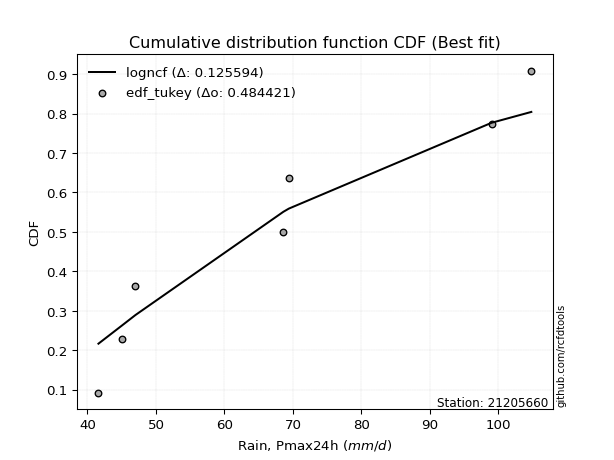</img>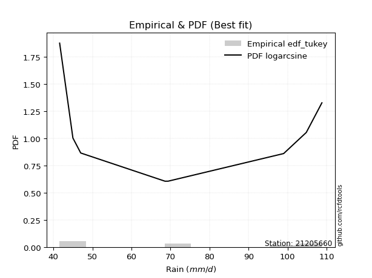</img>

</div>


### 8. EDF Gringorten (1963)

Gringorten plotting position formula is essential for estimating the probability and return periods of extreme events like floods and heavy rainfall. The constant _a=0.44_.

<div align="center">


$P=(m-a)/(n+1-2a)$


</div>


**8.1. Empirical values**

<div align="center">

|                | 0                   | 1                   | 2                  | 3                  | 4                  | 5                  | 6                  | 7                  |
|:---------------|:--------------------|:--------------------|:-------------------|:-------------------|:-------------------|:-------------------|:-------------------|:-------------------|
| date           | 2020                | 2023                | 2018               | 2021               | 2022               | 2019               | 2024               | 2025               |
| x              | 41.6                | 45.0                | 47.0               | 68.6               | 69.4               | 99.0               | 104.8              | 108.8              |
| m              | 1                   | 2                   | 3                  | 4                  | 5                  | 6                  | 7                  | 8                  |
| empirical_dist | edf_gringorten      | edf_gringorten      | edf_gringorten     | edf_gringorten     | edf_gringorten     | edf_gringorten     | edf_gringorten     | edf_gringorten     |
| empirical      | 0.06896551724137932 | 0.19211822660098524 | 0.3152709359605912 | 0.4384236453201971 | 0.5615763546798029 | 0.6847290640394089 | 0.8078817733990148 | 0.9310344827586208 |
| empirical_tr   | 1.0740740740740742  | 1.2378048780487805  | 1.460431654676259  | 1.780701754385965  | 2.2808988764044944 | 3.1718750000000004 | 5.205128205128205  | 14.500000000000018 |

</div>


**8.2. Kolmogorov-Smirnov fit test (sorted by Δ)**


<div align="center">

|                | 0                  | 1                   | 2                   | 3                   | 4                   | 5                   | 6                   | 7                   | 8                   | 9                   | 10                 | 11                  | 12                 | 13                  | 14                  | 15                  | 16                 | 17                  | 18                  | 19                 | 20                  | 21                  | 22                 | 23                  | 24                  | 25                 | 26                  | 27                 | 28                  | 29                  | 30                  | 31                  | 32                  | 33                  | 34                  | 35                  | 36                  | 37                 | 38                  | 39                  | 40                  | 41                  | 42                  | 43                 | 44                  | 45                  | 46                  | 47                  | 48                  | 49                 | 50                 | 51                  | 52                  | 53                  | 54                  | 55                  | 56                  | 57                 | 58                  | 59                 | 60                  | 61                 | 62                 | 63                  | 64                 | 65                  | 66                  | 67                 | 68                  | 69                  | 70                 | 71                  | 72                  | 73                  | 74                  | 75                 | 76                 | 77                  | 78                 | 79                  | 80                  | 81                 | 82                  | 83                  | 84                  | 85                 | 86                  | 87                 | 88                  | 89                 | 90                  | 91                  | 92                  | 93                  | 94                  | 95                  | 96                  | 97                 | 98                  | 99                  | 100                | 101                | 102                 | 103                 | 104                 | 105                | 106                 | 107                 | 108                 | 109                | 110                | 111                 | 112                 | 113                | 114                | 115                 | 116                | 117                 | 118                | 119                | 120                 | 121                 | 122                 | 123                | 124                 | 125                | 126                 | 127                 | 128                 | 129                | 130                | 131                | 132                | 133                | 134                 | 135                | 136                | 137                | 138                | 139                | 140                 | 141                | 142                | 143                 | 144                 | 145                 | 146                | 147                | 148                | 149                 | 150                | 151                 | 152                | 153                | 154                | 155                | 156                | 157                | 158                | 159                |
|:---------------|:-------------------|:--------------------|:--------------------|:--------------------|:--------------------|:--------------------|:--------------------|:--------------------|:--------------------|:--------------------|:-------------------|:--------------------|:-------------------|:--------------------|:--------------------|:--------------------|:-------------------|:--------------------|:--------------------|:-------------------|:--------------------|:--------------------|:-------------------|:--------------------|:--------------------|:-------------------|:--------------------|:-------------------|:--------------------|:--------------------|:--------------------|:--------------------|:--------------------|:--------------------|:--------------------|:--------------------|:--------------------|:-------------------|:--------------------|:--------------------|:--------------------|:--------------------|:--------------------|:-------------------|:--------------------|:--------------------|:--------------------|:--------------------|:--------------------|:-------------------|:-------------------|:--------------------|:--------------------|:--------------------|:--------------------|:--------------------|:--------------------|:-------------------|:--------------------|:-------------------|:--------------------|:-------------------|:-------------------|:--------------------|:-------------------|:--------------------|:--------------------|:-------------------|:--------------------|:--------------------|:-------------------|:--------------------|:--------------------|:--------------------|:--------------------|:-------------------|:-------------------|:--------------------|:-------------------|:--------------------|:--------------------|:-------------------|:--------------------|:--------------------|:--------------------|:-------------------|:--------------------|:-------------------|:--------------------|:-------------------|:--------------------|:--------------------|:--------------------|:--------------------|:--------------------|:--------------------|:--------------------|:-------------------|:--------------------|:--------------------|:-------------------|:-------------------|:--------------------|:--------------------|:--------------------|:-------------------|:--------------------|:--------------------|:--------------------|:-------------------|:-------------------|:--------------------|:--------------------|:-------------------|:-------------------|:--------------------|:-------------------|:--------------------|:-------------------|:-------------------|:--------------------|:--------------------|:--------------------|:-------------------|:--------------------|:-------------------|:--------------------|:--------------------|:--------------------|:-------------------|:-------------------|:-------------------|:-------------------|:-------------------|:--------------------|:-------------------|:-------------------|:-------------------|:-------------------|:-------------------|:--------------------|:-------------------|:-------------------|:--------------------|:--------------------|:--------------------|:-------------------|:-------------------|:-------------------|:--------------------|:-------------------|:--------------------|:-------------------|:-------------------|:-------------------|:-------------------|:-------------------|:-------------------|:-------------------|:-------------------|
| station        | 21205660           | 21205660            | 21205660            | 21205660            | 21205660            | 21205660            | 21205660            | 21205660            | 21205660            | 21205660            | 21205660           | 21205660            | 21205660           | 21205660            | 21205660            | 21205660            | 21205660           | 21205660            | 21205660            | 21205660           | 21205660            | 21205660            | 21205660           | 21205660            | 21205660            | 21205660           | 21205660            | 21205660           | 21205660            | 21205660            | 21205660            | 21205660            | 21205660            | 21205660            | 21205660            | 21205660            | 21205660            | 21205660           | 21205660            | 21205660            | 21205660            | 21205660            | 21205660            | 21205660           | 21205660            | 21205660            | 21205660            | 21205660            | 21205660            | 21205660           | 21205660           | 21205660            | 21205660            | 21205660            | 21205660            | 21205660            | 21205660            | 21205660           | 21205660            | 21205660           | 21205660            | 21205660           | 21205660           | 21205660            | 21205660           | 21205660            | 21205660            | 21205660           | 21205660            | 21205660            | 21205660           | 21205660            | 21205660            | 21205660            | 21205660            | 21205660           | 21205660           | 21205660            | 21205660           | 21205660            | 21205660            | 21205660           | 21205660            | 21205660            | 21205660            | 21205660           | 21205660            | 21205660           | 21205660            | 21205660           | 21205660            | 21205660            | 21205660            | 21205660            | 21205660            | 21205660            | 21205660            | 21205660           | 21205660            | 21205660            | 21205660           | 21205660           | 21205660            | 21205660            | 21205660            | 21205660           | 21205660            | 21205660            | 21205660            | 21205660           | 21205660           | 21205660            | 21205660            | 21205660           | 21205660           | 21205660            | 21205660           | 21205660            | 21205660           | 21205660           | 21205660            | 21205660            | 21205660            | 21205660           | 21205660            | 21205660           | 21205660            | 21205660            | 21205660            | 21205660           | 21205660           | 21205660           | 21205660           | 21205660           | 21205660            | 21205660           | 21205660           | 21205660           | 21205660           | 21205660           | 21205660            | 21205660           | 21205660           | 21205660            | 21205660            | 21205660            | 21205660           | 21205660           | 21205660           | 21205660            | 21205660           | 21205660            | 21205660           | 21205660           | 21205660           | 21205660           | 21205660           | 21205660           | 21205660           | 21205660           |
| empirical_dist | edf_gringorten     | edf_gringorten      | edf_gringorten      | edf_gringorten      | edf_gringorten      | edf_gringorten      | edf_gringorten      | edf_gringorten      | edf_gringorten      | edf_gringorten      | edf_gringorten     | edf_gringorten      | edf_gringorten     | edf_gringorten      | edf_gringorten      | edf_gringorten      | edf_gringorten     | edf_gringorten      | edf_gringorten      | edf_gringorten     | edf_gringorten      | edf_gringorten      | edf_gringorten     | edf_gringorten      | edf_gringorten      | edf_gringorten     | edf_gringorten      | edf_gringorten     | edf_gringorten      | edf_gringorten      | edf_gringorten      | edf_gringorten      | edf_gringorten      | edf_gringorten      | edf_gringorten      | edf_gringorten      | edf_gringorten      | edf_gringorten     | edf_gringorten      | edf_gringorten      | edf_gringorten      | edf_gringorten      | edf_gringorten      | edf_gringorten     | edf_gringorten      | edf_gringorten      | edf_gringorten      | edf_gringorten      | edf_gringorten      | edf_gringorten     | edf_gringorten     | edf_gringorten      | edf_gringorten      | edf_gringorten      | edf_gringorten      | edf_gringorten      | edf_gringorten      | edf_gringorten     | edf_gringorten      | edf_gringorten     | edf_gringorten      | edf_gringorten     | edf_gringorten     | edf_gringorten      | edf_gringorten     | edf_gringorten      | edf_gringorten      | edf_gringorten     | edf_gringorten      | edf_gringorten      | edf_gringorten     | edf_gringorten      | edf_gringorten      | edf_gringorten      | edf_gringorten      | edf_gringorten     | edf_gringorten     | edf_gringorten      | edf_gringorten     | edf_gringorten      | edf_gringorten      | edf_gringorten     | edf_gringorten      | edf_gringorten      | edf_gringorten      | edf_gringorten     | edf_gringorten      | edf_gringorten     | edf_gringorten      | edf_gringorten     | edf_gringorten      | edf_gringorten      | edf_gringorten      | edf_gringorten      | edf_gringorten      | edf_gringorten      | edf_gringorten      | edf_gringorten     | edf_gringorten      | edf_gringorten      | edf_gringorten     | edf_gringorten     | edf_gringorten      | edf_gringorten      | edf_gringorten      | edf_gringorten     | edf_gringorten      | edf_gringorten      | edf_gringorten      | edf_gringorten     | edf_gringorten     | edf_gringorten      | edf_gringorten      | edf_gringorten     | edf_gringorten     | edf_gringorten      | edf_gringorten     | edf_gringorten      | edf_gringorten     | edf_gringorten     | edf_gringorten      | edf_gringorten      | edf_gringorten      | edf_gringorten     | edf_gringorten      | edf_gringorten     | edf_gringorten      | edf_gringorten      | edf_gringorten      | edf_gringorten     | edf_gringorten     | edf_gringorten     | edf_gringorten     | edf_gringorten     | edf_gringorten      | edf_gringorten     | edf_gringorten     | edf_gringorten     | edf_gringorten     | edf_gringorten     | edf_gringorten      | edf_gringorten     | edf_gringorten     | edf_gringorten      | edf_gringorten      | edf_gringorten      | edf_gringorten     | edf_gringorten     | edf_gringorten     | edf_gringorten      | edf_gringorten     | edf_gringorten      | edf_gringorten     | edf_gringorten     | edf_gringorten     | edf_gringorten     | edf_gringorten     | edf_gringorten     | edf_gringorten     | edf_gringorten     |
| p_dist         | logwrapcauchy      | beta                | logbeta             | logarcsine          | wrapcauchy          | logrdist            | ksone               | logksone            | arcsine             | semicircular        | logsemicircular    | lognakagami         | anglit             | logtrapezoid        | loganglit           | lomax               | logmielke          | loggenlogistic      | logfoldnorm         | logburr            | loginvweibull       | foldnorm            | triang             | rdist               | rayleigh            | burr               | maxwell             | invgamma           | lograyleigh         | johnsonsu           | nct                 | logmaxwell          | truncnorm           | norm                | crystalball         | t                   | exponnorm           | pearson3           | genexpon            | lognct              | logexponpow         | loginvgamma         | logburr12           | logbetaprime       | loggamma            | loggamma            | logerlang           | logf                | logpearson3         | logt               | lognorm            | logcrystalball      | logexponnorm        | logskewnorm         | logloggamma         | logalpha            | logncf              | trapezoid          | halfnorm            | f                  | alpha               | logkstwobign       | betaprime          | genlogistic         | loginvgauss        | loggenexpon         | logweibull_max      | loghalfnorm        | kstwobign           | logdweibull         | logcosine          | logloglaplace       | logrice             | cosine              | logistic            | logdgamma          | loglogistic        | erlang              | gumbel_r           | loggumbel_l         | hypsecant           | rice               | loggumbel_r         | loggompertz         | loghypsecant        | dweibull           | gumbel_l            | kappa3             | loghalfgennorm      | logtriang          | logexponweib        | weibull_min         | logargus            | argus               | laplace             | genpareto           | loglevy_l           | invgauss           | loglaplace          | loglaplace          | burr12             | loglomax           | gausshyper          | logweibull_min      | halflogistic        | bradford           | moyal               | logtukeylambda      | gamma               | halfgennorm        | kappa4             | vonmises_line       | skewnorm            | logmoyal           | loghalflogistic    | dgamma              | logkappa4          | logkappa3           | loguniform         | truncexpon         | gompertz            | logvonmises_line    | logfatiguelife      | logjohnsonsu       | tukeylambda         | levy_l             | uniform             | loggenhalflogistic  | logbradford         | loggenextreme      | nakagami           | logtruncexpon      | logjohnsonsb       | truncweibull_min   | logtruncweibull_min | loggennorm         | gennorm            | genhalflogistic    | logwald            | wald               | exponpow            | loggengamma        | loggausshyper      | genextreme          | loggenpareto        | powerlaw            | exponweib          | fatiguelife        | ncf                | logpowerlaw         | gengamma           | invweibull          | logtruncnorm       | weibull_max        | logtruncpareto     | truncpareto        | johnsonsb          | logvonmises        | vonmises           | mielke             |
| delta          | 0.0689655169943243 | 0.07437698687941091 | 0.08019974668118618 | 0.08235056574098343 | 0.08309102774148436 | 0.09956938541652516 | 0.10318325123461944 | 0.10639148367914969 | 0.10668527525460862 | 0.11904106725110142 | 0.1221017145908127 | 0.12664252511193935 | 0.1303903608569265 | 0.13125761844685785 | 0.13333079890453486 | 0.14528703150448768 | 0.1489579520888045 | 0.14926969947072122 | 0.15019134645813026 | 0.1504433618228398 | 0.15052642787220916 | 0.15150794291904346 | 0.1515919206046228 | 0.15228246307578902 | 0.15249758026412985 | 0.1525997689062606 | 0.15312311773835885 | 0.1533348391743209 | 0.15422110277300163 | 0.15458107212491284 | 0.15496955877143082 | 0.15510024071389036 | 0.15597542539532994 | 0.15597543354204568 | 0.15597544041690228 | 0.15598360387987206 | 0.15598975395497366 | 0.1562584279536806 | 0.15724249180749617 | 0.15731859329179293 | 0.15748233194418948 | 0.15767984531635293 | 0.15803964831467557 | 0.1580519206145822 | 0.15841920593235492 | 0.15841920593235492 | 0.15845056117764048 | 0.15852498648378952 | 0.15864549929812918 | 0.1586554453943647 | 0.158656772771594  | 0.15865677352628602 | 0.15865754451618058 | 0.15865770681437114 | 0.15867787510259498 | 0.15869051289891267 | 0.15922321514469162 | 0.1592717502545225 | 0.15935891368759658 | 0.1594498119353848 | 0.15971743516212641 | 0.1606759556009163 | 0.1611305196131676 | 0.16210894663648157 | 0.1622278578182556 | 0.16287088842252312 | 0.16313988451328543 | 0.1645773463009659 | 0.16733595490393915 | 0.16760256831790524 | 0.1710895808123717 | 0.17186070360586816 | 0.17417699514068422 | 0.17443447285458868 | 0.17451268531539757 | 0.1756448012333711 | 0.1769330827653166 | 0.17891280555954392 | 0.1823064707703474 | 0.18410291435707404 | 0.18426148270180873 | 0.1848063030306395 | 0.18610260370146411 | 0.18625406309849066 | 0.18646681755663633 | 0.1865291767952464 | 0.18668620846732958 | 0.1875060671077307 | 0.18829536199056102 | 0.1894595205699436 | 0.18992875429774375 | 0.19101373477562705 | 0.19112749383074057 | 0.19310153689047815 | 0.19325745085798138 | 0.19328344598034897 | 0.19463711821623197 | 0.1949355171709049 | 0.19516015311039892 | 0.19516015311039892 | 0.1963004514156625 | 0.1972852062017036 | 0.20189914584496582 | 0.20266180310811943 | 0.20583802110388472 | 0.2063752692216233 | 0.20659355915040556 | 0.20691340060648178 | 0.20764874899372365 | 0.208045097606893  | 0.209341425587531  | 0.20966654923582784 | 0.21010349955338986 | 0.2109145924206166 | 0.2122189947820447 | 0.21282352757322442 | 0.2131866448638099 | 0.21496374749212144 | 0.217090794610026  | 0.2171557594983442 | 0.21725356729401557 | 0.21956519120794582 | 0.22096233535096482 | 0.227617757080543  | 0.22925960469073958 | 0.2333383374073713 | 0.23491379310344834 | 0.24585082246947265 | 0.24608610595605007 | 0.2473175634027852 | 0.2600516838404274 | 0.2605817897136282 | 0.2612732648327655 | 0.261884828947366  | 0.29515761538089885 | 0.3078817733990148 | 0.3078817733990148 | 0.3143524124301993 | 0.3152709359605912 | 0.3152709359605912 | 0.31538504850682236 | 0.3421510928360319 | 0.3455582979356108 | 0.37041883480427606 | 0.37791975613963813 | 0.40976689518158776 | 0.4127009695563786 | 0.4337586508451995 | 0.4381722338777908 | 0.44270815282544945 | 0.4488396657826287 | 0.49250471989725564 | 0.512583695257568  | 0.5142040209625611 | 0.5240954740112184 | 0.6067755132221749 | 0.710345590602467  | 1.157755813959091  | 17.14243191596563  | nan                |
| deltao         | 0.4472608134160001 | 0.4472608134160001  | 0.4472608134160001  | 0.4472608134160001  | 0.4472608134160001  | 0.4472608134160001  | 0.4472608134160001  | 0.4472608134160001  | 0.4472608134160001  | 0.4472608134160001  | 0.4472608134160001 | 0.4472608134160001  | 0.4472608134160001 | 0.4472608134160001  | 0.4472608134160001  | 0.4472608134160001  | 0.4472608134160001 | 0.4472608134160001  | 0.4472608134160001  | 0.4472608134160001 | 0.4472608134160001  | 0.4472608134160001  | 0.4472608134160001 | 0.4472608134160001  | 0.4472608134160001  | 0.4472608134160001 | 0.4472608134160001  | 0.4472608134160001 | 0.4472608134160001  | 0.4472608134160001  | 0.4472608134160001  | 0.4472608134160001  | 0.4472608134160001  | 0.4472608134160001  | 0.4472608134160001  | 0.4472608134160001  | 0.4472608134160001  | 0.4472608134160001 | 0.4472608134160001  | 0.4472608134160001  | 0.4472608134160001  | 0.4472608134160001  | 0.4472608134160001  | 0.4472608134160001 | 0.4472608134160001  | 0.4472608134160001  | 0.4472608134160001  | 0.4472608134160001  | 0.4472608134160001  | 0.4472608134160001 | 0.4472608134160001 | 0.4472608134160001  | 0.4472608134160001  | 0.4472608134160001  | 0.4472608134160001  | 0.4472608134160001  | 0.4472608134160001  | 0.4472608134160001 | 0.4472608134160001  | 0.4472608134160001 | 0.4472608134160001  | 0.4472608134160001 | 0.4472608134160001 | 0.4472608134160001  | 0.4472608134160001 | 0.4472608134160001  | 0.4472608134160001  | 0.4472608134160001 | 0.4472608134160001  | 0.4472608134160001  | 0.4472608134160001 | 0.4472608134160001  | 0.4472608134160001  | 0.4472608134160001  | 0.4472608134160001  | 0.4472608134160001 | 0.4472608134160001 | 0.4472608134160001  | 0.4472608134160001 | 0.4472608134160001  | 0.4472608134160001  | 0.4472608134160001 | 0.4472608134160001  | 0.4472608134160001  | 0.4472608134160001  | 0.4472608134160001 | 0.4472608134160001  | 0.4472608134160001 | 0.4472608134160001  | 0.4472608134160001 | 0.4472608134160001  | 0.4472608134160001  | 0.4472608134160001  | 0.4472608134160001  | 0.4472608134160001  | 0.4472608134160001  | 0.4472608134160001  | 0.4472608134160001 | 0.4472608134160001  | 0.4472608134160001  | 0.4472608134160001 | 0.4472608134160001 | 0.4472608134160001  | 0.4472608134160001  | 0.4472608134160001  | 0.4472608134160001 | 0.4472608134160001  | 0.4472608134160001  | 0.4472608134160001  | 0.4472608134160001 | 0.4472608134160001 | 0.4472608134160001  | 0.4472608134160001  | 0.4472608134160001 | 0.4472608134160001 | 0.4472608134160001  | 0.4472608134160001 | 0.4472608134160001  | 0.4472608134160001 | 0.4472608134160001 | 0.4472608134160001  | 0.4472608134160001  | 0.4472608134160001  | 0.4472608134160001 | 0.4472608134160001  | 0.4472608134160001 | 0.4472608134160001  | 0.4472608134160001  | 0.4472608134160001  | 0.4472608134160001 | 0.4472608134160001 | 0.4472608134160001 | 0.4472608134160001 | 0.4472608134160001 | 0.4472608134160001  | 0.4472608134160001 | 0.4472608134160001 | 0.4472608134160001 | 0.4472608134160001 | 0.4472608134160001 | 0.4472608134160001  | 0.4472608134160001 | 0.4472608134160001 | 0.4472608134160001  | 0.4472608134160001  | 0.4472608134160001  | 0.4472608134160001 | 0.4472608134160001 | 0.4472608134160001 | 0.4472608134160001  | 0.4472608134160001 | 0.4472608134160001  | 0.4472608134160001 | 0.4472608134160001 | 0.4472608134160001 | 0.4472608134160001 | 0.4472608134160001 | 0.4472608134160001 | 0.4472608134160001 | 0.4472608134160001 |
| eval           | Δo > Δ             | Δo > Δ              | Δo > Δ              | Δo > Δ              | Δo > Δ              | Δo > Δ              | Δo > Δ              | Δo > Δ              | Δo > Δ              | Δo > Δ              | Δo > Δ             | Δo > Δ              | Δo > Δ             | Δo > Δ              | Δo > Δ              | Δo > Δ              | Δo > Δ             | Δo > Δ              | Δo > Δ              | Δo > Δ             | Δo > Δ              | Δo > Δ              | Δo > Δ             | Δo > Δ              | Δo > Δ              | Δo > Δ             | Δo > Δ              | Δo > Δ             | Δo > Δ              | Δo > Δ              | Δo > Δ              | Δo > Δ              | Δo > Δ              | Δo > Δ              | Δo > Δ              | Δo > Δ              | Δo > Δ              | Δo > Δ             | Δo > Δ              | Δo > Δ              | Δo > Δ              | Δo > Δ              | Δo > Δ              | Δo > Δ             | Δo > Δ              | Δo > Δ              | Δo > Δ              | Δo > Δ              | Δo > Δ              | Δo > Δ             | Δo > Δ             | Δo > Δ              | Δo > Δ              | Δo > Δ              | Δo > Δ              | Δo > Δ              | Δo > Δ              | Δo > Δ             | Δo > Δ              | Δo > Δ             | Δo > Δ              | Δo > Δ             | Δo > Δ             | Δo > Δ              | Δo > Δ             | Δo > Δ              | Δo > Δ              | Δo > Δ             | Δo > Δ              | Δo > Δ              | Δo > Δ             | Δo > Δ              | Δo > Δ              | Δo > Δ              | Δo > Δ              | Δo > Δ             | Δo > Δ             | Δo > Δ              | Δo > Δ             | Δo > Δ              | Δo > Δ              | Δo > Δ             | Δo > Δ              | Δo > Δ              | Δo > Δ              | Δo > Δ             | Δo > Δ              | Δo > Δ             | Δo > Δ              | Δo > Δ             | Δo > Δ              | Δo > Δ              | Δo > Δ              | Δo > Δ              | Δo > Δ              | Δo > Δ              | Δo > Δ              | Δo > Δ             | Δo > Δ              | Δo > Δ              | Δo > Δ             | Δo > Δ             | Δo > Δ              | Δo > Δ              | Δo > Δ              | Δo > Δ             | Δo > Δ              | Δo > Δ              | Δo > Δ              | Δo > Δ             | Δo > Δ             | Δo > Δ              | Δo > Δ              | Δo > Δ             | Δo > Δ             | Δo > Δ              | Δo > Δ             | Δo > Δ              | Δo > Δ             | Δo > Δ             | Δo > Δ              | Δo > Δ              | Δo > Δ              | Δo > Δ             | Δo > Δ              | Δo > Δ             | Δo > Δ              | Δo > Δ              | Δo > Δ              | Δo > Δ             | Δo > Δ             | Δo > Δ             | Δo > Δ             | Δo > Δ             | Δo > Δ              | Δo > Δ             | Δo > Δ             | Δo > Δ             | Δo > Δ             | Δo > Δ             | Δo > Δ              | Δo > Δ             | Δo > Δ             | Δo > Δ              | Δo > Δ              | Δo > Δ              | Δo > Δ             | Δo > Δ             | Δo > Δ             | Δo > Δ              | Δo <= Δ            | Δo <= Δ             | Δo <= Δ            | Δo <= Δ            | Δo <= Δ            | Δo <= Δ            | Δo <= Δ            | Δo <= Δ            | Δo <= Δ            | Δo <= Δ            |
| fit            | 1                  | 1                   | 1                   | 1                   | 1                   | 1                   | 1                   | 1                   | 1                   | 1                   | 1                  | 1                   | 1                  | 1                   | 1                   | 1                   | 1                  | 1                   | 1                   | 1                  | 1                   | 1                   | 1                  | 1                   | 1                   | 1                  | 1                   | 1                  | 1                   | 1                   | 1                   | 1                   | 1                   | 1                   | 1                   | 1                   | 1                   | 1                  | 1                   | 1                   | 1                   | 1                   | 1                   | 1                  | 1                   | 1                   | 1                   | 1                   | 1                   | 1                  | 1                  | 1                   | 1                   | 1                   | 1                   | 1                   | 1                   | 1                  | 1                   | 1                  | 1                   | 1                  | 1                  | 1                   | 1                  | 1                   | 1                   | 1                  | 1                   | 1                   | 1                  | 1                   | 1                   | 1                   | 1                   | 1                  | 1                  | 1                   | 1                  | 1                   | 1                   | 1                  | 1                   | 1                   | 1                   | 1                  | 1                   | 1                  | 1                   | 1                  | 1                   | 1                   | 1                   | 1                   | 1                   | 1                   | 1                   | 1                  | 1                   | 1                   | 1                  | 1                  | 1                   | 1                   | 1                   | 1                  | 1                   | 1                   | 1                   | 1                  | 1                  | 1                   | 1                   | 1                  | 1                  | 1                   | 1                  | 1                   | 1                  | 1                  | 1                   | 1                   | 1                   | 1                  | 1                   | 1                  | 1                   | 1                   | 1                   | 1                  | 1                  | 1                  | 1                  | 1                  | 1                   | 1                  | 1                  | 1                  | 1                  | 1                  | 1                   | 1                  | 1                  | 1                   | 1                   | 1                   | 1                  | 1                  | 1                  | 1                   | 0                  | 0                   | 0                  | 0                  | 0                  | 0                  | 0                  | 0                  | 0                  | 0                  |
| n              | 8                  | 8                   | 8                   | 8                   | 8                   | 8                   | 8                   | 8                   | 8                   | 8                   | 8                  | 8                   | 8                  | 8                   | 8                   | 8                   | 8                  | 8                   | 8                   | 8                  | 8                   | 8                   | 8                  | 8                   | 8                   | 8                  | 8                   | 8                  | 8                   | 8                   | 8                   | 8                   | 8                   | 8                   | 8                   | 8                   | 8                   | 8                  | 8                   | 8                   | 8                   | 8                   | 8                   | 8                  | 8                   | 8                   | 8                   | 8                   | 8                   | 8                  | 8                  | 8                   | 8                   | 8                   | 8                   | 8                   | 8                   | 8                  | 8                   | 8                  | 8                   | 8                  | 8                  | 8                   | 8                  | 8                   | 8                   | 8                  | 8                   | 8                   | 8                  | 8                   | 8                   | 8                   | 8                   | 8                  | 8                  | 8                   | 8                  | 8                   | 8                   | 8                  | 8                   | 8                   | 8                   | 8                  | 8                   | 8                  | 8                   | 8                  | 8                   | 8                   | 8                   | 8                   | 8                   | 8                   | 8                   | 8                  | 8                   | 8                   | 8                  | 8                  | 8                   | 8                   | 8                   | 8                  | 8                   | 8                   | 8                   | 8                  | 8                  | 8                   | 8                   | 8                  | 8                  | 8                   | 8                  | 8                   | 8                  | 8                  | 8                   | 8                   | 8                   | 8                  | 8                   | 8                  | 8                   | 8                   | 8                   | 8                  | 8                  | 8                  | 8                  | 8                  | 8                   | 8                  | 8                  | 8                  | 8                  | 8                  | 8                   | 8                  | 8                  | 8                   | 8                   | 8                   | 8                  | 8                  | 8                  | 8                   | 8                  | 8                   | 8                  | 8                  | 8                  | 8                  | 8                  | 8                  | 8                  | 8                  |
| best_fit       | 1                  | 0                   | 0                   | 0                   | 0                   | 0                   | 0                   | 0                   | 0                   | 0                   | 0                  | 0                   | 0                  | 0                   | 0                   | 0                   | 0                  | 0                   | 0                   | 0                  | 0                   | 0                   | 0                  | 0                   | 0                   | 0                  | 0                   | 0                  | 0                   | 0                   | 0                   | 0                   | 0                   | 0                   | 0                   | 0                   | 0                   | 0                  | 0                   | 0                   | 0                   | 0                   | 0                   | 0                  | 0                   | 0                   | 0                   | 0                   | 0                   | 0                  | 0                  | 0                   | 0                   | 0                   | 0                   | 0                   | 0                   | 0                  | 0                   | 0                  | 0                   | 0                  | 0                  | 0                   | 0                  | 0                   | 0                   | 0                  | 0                   | 0                   | 0                  | 0                   | 0                   | 0                   | 0                   | 0                  | 0                  | 0                   | 0                  | 0                   | 0                   | 0                  | 0                   | 0                   | 0                   | 0                  | 0                   | 0                  | 0                   | 0                  | 0                   | 0                   | 0                   | 0                   | 0                   | 0                   | 0                   | 0                  | 0                   | 0                   | 0                  | 0                  | 0                   | 0                   | 0                   | 0                  | 0                   | 0                   | 0                   | 0                  | 0                  | 0                   | 0                   | 0                  | 0                  | 0                   | 0                  | 0                   | 0                  | 0                  | 0                   | 0                   | 0                   | 0                  | 0                   | 0                  | 0                   | 0                   | 0                   | 0                  | 0                  | 0                  | 0                  | 0                  | 0                   | 0                  | 0                  | 0                  | 0                  | 0                  | 0                   | 0                  | 0                  | 0                   | 0                   | 0                   | 0                  | 0                  | 0                  | 0                   | 0                  | 0                   | 0                  | 0                  | 0                  | 0                  | 0                  | 0                  | 0                  | 0                  |
| best_fit_sort  | 1                  | 2                   | 3                   | 4                   | 5                   | 6                   | 7                   | 8                   | 9                   | 10                  | 11                 | 12                  | 13                 | 14                  | 15                  | 16                  | 17                 | 18                  | 19                  | 20                 | 21                  | 22                  | 23                 | 24                  | 25                  | 26                 | 27                  | 28                 | 29                  | 30                  | 31                  | 32                  | 33                  | 34                  | 35                  | 36                  | 37                  | 38                 | 39                  | 40                  | 41                  | 42                  | 43                  | 44                 | 45                  | 46                  | 47                  | 48                  | 49                  | 50                 | 51                 | 52                  | 53                  | 54                  | 55                  | 56                  | 57                  | 58                 | 59                  | 60                 | 61                  | 62                 | 63                 | 64                  | 65                 | 66                  | 67                  | 68                 | 69                  | 70                  | 71                 | 72                  | 73                  | 74                  | 75                  | 76                 | 77                 | 78                  | 79                 | 80                  | 81                  | 82                 | 83                  | 84                  | 85                  | 86                 | 87                  | 88                 | 89                  | 90                 | 91                  | 92                  | 93                  | 94                  | 95                  | 96                  | 97                  | 98                 | 99                  | 100                 | 101                | 102                | 103                 | 104                 | 105                 | 106                | 107                 | 108                 | 109                 | 110                | 111                | 112                 | 113                 | 114                | 115                | 116                 | 117                | 118                 | 119                | 120                | 121                 | 122                 | 123                 | 124                | 125                 | 126                | 127                 | 128                 | 129                 | 130                | 131                | 132                | 133                | 134                | 135                 | 136                | 137                | 138                | 139                | 140                | 141                 | 142                | 143                | 144                 | 145                 | 146                 | 147                | 148                | 149                | 150                 | 151                | 152                 | 153                | 154                | 155                | 156                | 157                | 158                | 159                | 160                |

</div>


**8.3. Best fit**

<div align="center">

|   id |   station | empirical_dist   | p_dist        |     delta |   deltao | eval   |   fit |   n |   best_fit |   best_fit_sort |
|-----:|----------:|:-----------------|:--------------|----------:|---------:|:-------|------:|----:|-----------:|----------------:|
|    0 |  21205660 | edf_gringorten   | logwrapcauchy | 0.0689655 | 0.447261 | Δo > Δ |     1 |   8 |          1 |               1 |

</div>


<div align="center">

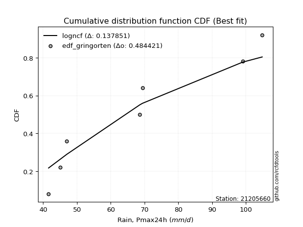</img></img>

</div>


### 9. EDF Filliben (1975)

The specific values of the constants (0.3175) (often denoted as $alpha$) and (0.365) are derived from a method proposed by James J. Filliben in a 1975 paper. This particular formula is the mean value of the $i$-th order statistic of the normal distribution and is considered a robust and effective plotting position formula for the normal probability plot correlation coefficient test for normality.

<div align="center">


$P=(m-0.3175)/(n+0.365)$


</div>


**9.1. Empirical values**

<div align="center">

|                | 0                  | 1                   | 2                  | 3                   | 4                  | 5                  | 6                  | 7                  |
|:---------------|:-------------------|:--------------------|:-------------------|:--------------------|:-------------------|:-------------------|:-------------------|:-------------------|
| date           | 2020               | 2023                | 2018               | 2021                | 2022               | 2019               | 2024               | 2025               |
| x              | 41.6               | 45.0                | 47.0               | 68.6                | 69.4               | 99.0               | 104.8              | 108.8              |
| m              | 1                  | 2                   | 3                  | 4                   | 5                  | 6                  | 7                  | 8                  |
| empirical_dist | edf_filliben       | edf_filliben        | edf_filliben       | edf_filliben        | edf_filliben       | edf_filliben       | edf_filliben       | edf_filliben       |
| empirical      | 0.0815899581589958 | 0.20113568439928273 | 0.3206814106395696 | 0.44022713687985654 | 0.5597728631201434 | 0.6793185893604303 | 0.7988643156007172 | 0.9184100418410042 |
| empirical_tr   | 1.0888382687927107 | 1.2517770295548074  | 1.4720633523977125 | 1.7864388681260008  | 2.271554650373387  | 3.118359739049394  | 4.971768202080237  | 12.256410256410254 |

</div>


**9.2. Kolmogorov-Smirnov fit test (sorted by Δ)**


<div align="center">

|                | 0                   | 1                   | 2                   | 3                   | 4                  | 5                   | 6                   | 7                   | 8                   | 9                   | 10                  | 11                  | 12                  | 13                  | 14                 | 15                  | 16                  | 17                  | 18                  | 19                 | 20                  | 21                 | 22                  | 23                  | 24                  | 25                  | 26                  | 27                  | 28                  | 29                  | 30                  | 31                  | 32                 | 33                  | 34                 | 35                 | 36                  | 37                 | 38                 | 39                 | 40                 | 41                  | 42                 | 43                  | 44                  | 45                  | 46                 | 47                  | 48                  | 49                  | 50                 | 51                  | 52                 | 53                  | 54                  | 55                  | 56                 | 57                  | 58                 | 59                  | 60                  | 61                 | 62                  | 63                  | 64                 | 65                  | 66                  | 67                  | 68                  | 69                  | 70                  | 71                 | 72                  | 73                 | 74                 | 75                  | 76                  | 77                 | 78                 | 79                 | 80                 | 81                  | 82                  | 83                  | 84                  | 85                  | 86                  | 87                  | 88                  | 89                  | 90                  | 91                  | 92                  | 93                  | 94                  | 95                  | 96                  | 97                  | 98                 | 99                  | 100                | 101                 | 102                 | 103                 | 104                 | 105                 | 106                | 107                | 108                 | 109                 | 110                 | 111                 | 112                | 113                 | 114                 | 115                 | 116                | 117                | 118                 | 119                 | 120                | 121                | 122                | 123                 | 124                 | 125                | 126                 | 127                 | 128                | 129                 | 130                 | 131                 | 132                | 133                 | 134                 | 135                 | 136                 | 137                | 138                 | 139                | 140                | 141                | 142                | 143                 | 144                 | 145                 | 146                 | 147                 | 148                | 149                 | 150                 | 151                 | 152                | 153                | 154                | 155                | 156                | 157                | 158                | 159                |
|:---------------|:--------------------|:--------------------|:--------------------|:--------------------|:-------------------|:--------------------|:--------------------|:--------------------|:--------------------|:--------------------|:--------------------|:--------------------|:--------------------|:--------------------|:-------------------|:--------------------|:--------------------|:--------------------|:--------------------|:-------------------|:--------------------|:-------------------|:--------------------|:--------------------|:--------------------|:--------------------|:--------------------|:--------------------|:--------------------|:--------------------|:--------------------|:--------------------|:-------------------|:--------------------|:-------------------|:-------------------|:--------------------|:-------------------|:-------------------|:-------------------|:-------------------|:--------------------|:-------------------|:--------------------|:--------------------|:--------------------|:-------------------|:--------------------|:--------------------|:--------------------|:-------------------|:--------------------|:-------------------|:--------------------|:--------------------|:--------------------|:-------------------|:--------------------|:-------------------|:--------------------|:--------------------|:-------------------|:--------------------|:--------------------|:-------------------|:--------------------|:--------------------|:--------------------|:--------------------|:--------------------|:--------------------|:-------------------|:--------------------|:-------------------|:-------------------|:--------------------|:--------------------|:-------------------|:-------------------|:-------------------|:-------------------|:--------------------|:--------------------|:--------------------|:--------------------|:--------------------|:--------------------|:--------------------|:--------------------|:--------------------|:--------------------|:--------------------|:--------------------|:--------------------|:--------------------|:--------------------|:--------------------|:--------------------|:-------------------|:--------------------|:-------------------|:--------------------|:--------------------|:--------------------|:--------------------|:--------------------|:-------------------|:-------------------|:--------------------|:--------------------|:--------------------|:--------------------|:-------------------|:--------------------|:--------------------|:--------------------|:-------------------|:-------------------|:--------------------|:--------------------|:-------------------|:-------------------|:-------------------|:--------------------|:--------------------|:-------------------|:--------------------|:--------------------|:-------------------|:--------------------|:--------------------|:--------------------|:-------------------|:--------------------|:--------------------|:--------------------|:--------------------|:-------------------|:--------------------|:-------------------|:-------------------|:-------------------|:-------------------|:--------------------|:--------------------|:--------------------|:--------------------|:--------------------|:-------------------|:--------------------|:--------------------|:--------------------|:-------------------|:-------------------|:-------------------|:-------------------|:-------------------|:-------------------|:-------------------|:-------------------|
| station        | 21205660            | 21205660            | 21205660            | 21205660            | 21205660           | 21205660            | 21205660            | 21205660            | 21205660            | 21205660            | 21205660            | 21205660            | 21205660            | 21205660            | 21205660           | 21205660            | 21205660            | 21205660            | 21205660            | 21205660           | 21205660            | 21205660           | 21205660            | 21205660            | 21205660            | 21205660            | 21205660            | 21205660            | 21205660            | 21205660            | 21205660            | 21205660            | 21205660           | 21205660            | 21205660           | 21205660           | 21205660            | 21205660           | 21205660           | 21205660           | 21205660           | 21205660            | 21205660           | 21205660            | 21205660            | 21205660            | 21205660           | 21205660            | 21205660            | 21205660            | 21205660           | 21205660            | 21205660           | 21205660            | 21205660            | 21205660            | 21205660           | 21205660            | 21205660           | 21205660            | 21205660            | 21205660           | 21205660            | 21205660            | 21205660           | 21205660            | 21205660            | 21205660            | 21205660            | 21205660            | 21205660            | 21205660           | 21205660            | 21205660           | 21205660           | 21205660            | 21205660            | 21205660           | 21205660           | 21205660           | 21205660           | 21205660            | 21205660            | 21205660            | 21205660            | 21205660            | 21205660            | 21205660            | 21205660            | 21205660            | 21205660            | 21205660            | 21205660            | 21205660            | 21205660            | 21205660            | 21205660            | 21205660            | 21205660           | 21205660            | 21205660           | 21205660            | 21205660            | 21205660            | 21205660            | 21205660            | 21205660           | 21205660           | 21205660            | 21205660            | 21205660            | 21205660            | 21205660           | 21205660            | 21205660            | 21205660            | 21205660           | 21205660           | 21205660            | 21205660            | 21205660           | 21205660           | 21205660           | 21205660            | 21205660            | 21205660           | 21205660            | 21205660            | 21205660           | 21205660            | 21205660            | 21205660            | 21205660           | 21205660            | 21205660            | 21205660            | 21205660            | 21205660           | 21205660            | 21205660           | 21205660           | 21205660           | 21205660           | 21205660            | 21205660            | 21205660            | 21205660            | 21205660            | 21205660           | 21205660            | 21205660            | 21205660            | 21205660           | 21205660           | 21205660           | 21205660           | 21205660           | 21205660           | 21205660           | 21205660           |
| empirical_dist | edf_filliben        | edf_filliben        | edf_filliben        | edf_filliben        | edf_filliben       | edf_filliben        | edf_filliben        | edf_filliben        | edf_filliben        | edf_filliben        | edf_filliben        | edf_filliben        | edf_filliben        | edf_filliben        | edf_filliben       | edf_filliben        | edf_filliben        | edf_filliben        | edf_filliben        | edf_filliben       | edf_filliben        | edf_filliben       | edf_filliben        | edf_filliben        | edf_filliben        | edf_filliben        | edf_filliben        | edf_filliben        | edf_filliben        | edf_filliben        | edf_filliben        | edf_filliben        | edf_filliben       | edf_filliben        | edf_filliben       | edf_filliben       | edf_filliben        | edf_filliben       | edf_filliben       | edf_filliben       | edf_filliben       | edf_filliben        | edf_filliben       | edf_filliben        | edf_filliben        | edf_filliben        | edf_filliben       | edf_filliben        | edf_filliben        | edf_filliben        | edf_filliben       | edf_filliben        | edf_filliben       | edf_filliben        | edf_filliben        | edf_filliben        | edf_filliben       | edf_filliben        | edf_filliben       | edf_filliben        | edf_filliben        | edf_filliben       | edf_filliben        | edf_filliben        | edf_filliben       | edf_filliben        | edf_filliben        | edf_filliben        | edf_filliben        | edf_filliben        | edf_filliben        | edf_filliben       | edf_filliben        | edf_filliben       | edf_filliben       | edf_filliben        | edf_filliben        | edf_filliben       | edf_filliben       | edf_filliben       | edf_filliben       | edf_filliben        | edf_filliben        | edf_filliben        | edf_filliben        | edf_filliben        | edf_filliben        | edf_filliben        | edf_filliben        | edf_filliben        | edf_filliben        | edf_filliben        | edf_filliben        | edf_filliben        | edf_filliben        | edf_filliben        | edf_filliben        | edf_filliben        | edf_filliben       | edf_filliben        | edf_filliben       | edf_filliben        | edf_filliben        | edf_filliben        | edf_filliben        | edf_filliben        | edf_filliben       | edf_filliben       | edf_filliben        | edf_filliben        | edf_filliben        | edf_filliben        | edf_filliben       | edf_filliben        | edf_filliben        | edf_filliben        | edf_filliben       | edf_filliben       | edf_filliben        | edf_filliben        | edf_filliben       | edf_filliben       | edf_filliben       | edf_filliben        | edf_filliben        | edf_filliben       | edf_filliben        | edf_filliben        | edf_filliben       | edf_filliben        | edf_filliben        | edf_filliben        | edf_filliben       | edf_filliben        | edf_filliben        | edf_filliben        | edf_filliben        | edf_filliben       | edf_filliben        | edf_filliben       | edf_filliben       | edf_filliben       | edf_filliben       | edf_filliben        | edf_filliben        | edf_filliben        | edf_filliben        | edf_filliben        | edf_filliben       | edf_filliben        | edf_filliben        | edf_filliben        | edf_filliben       | edf_filliben       | edf_filliben       | edf_filliben       | edf_filliben       | edf_filliben       | edf_filliben       | edf_filliben       |
| p_dist         | logarcsine          | wrapcauchy          | logbeta             | beta                | logwrapcauchy      | arcsine             | logrdist            | ksone               | logksone            | semicircular        | logsemicircular     | lognakagami         | anglit              | logtrapezoid        | loganglit          | lomax               | triang              | logweibull_max      | logmielke           | loggenlogistic     | logfoldnorm         | logburr            | loginvweibull       | foldnorm            | trapezoid           | rdist               | rayleigh            | burr                | maxwell             | invgamma            | lograyleigh         | johnsonsu           | nct                | loginvgauss         | logmaxwell         | loggenexpon        | truncnorm           | norm               | crystalball        | t                  | exponnorm          | pearson3            | genexpon           | lognct              | logexponpow         | loginvgamma         | logburr12          | logbetaprime        | loggamma            | loggamma            | logerlang          | logf                | logpearson3        | logt                | lognorm             | logcrystalball      | logexponnorm       | logskewnorm         | logloggamma        | logalpha            | logncf              | halfnorm           | f                   | alpha               | logkstwobign       | betaprime           | genlogistic         | loghalfnorm         | kstwobign           | logdweibull         | logcosine           | logloglaplace      | logrice             | cosine             | logistic           | logdgamma           | loglogistic         | erlang             | loghalfgennorm     | gumbel_l           | loglevy_l          | gumbel_r            | logexponweib        | weibull_min         | loggumbel_l         | hypsecant           | logweibull_min      | rice                | genpareto           | loggumbel_r         | loggompertz         | loghypsecant        | dweibull            | kappa3              | invgauss            | burr12              | logtriang           | loglomax            | logargus           | argus               | laplace            | loglaplace          | loglaplace          | halfgennorm         | gausshyper          | halflogistic        | bradford           | moyal              | logtukeylambda      | gamma               | kappa4              | vonmises_line       | skewnorm           | logmoyal            | loghalflogistic     | dgamma              | logkappa4          | logfatiguelife     | logkappa3           | levy_l              | loguniform         | truncexpon         | gompertz           | logvonmises_line    | logjohnsonsu        | tukeylambda        | uniform             | loggenextreme       | loggenhalflogistic | logbradford         | logjohnsonsb        | nakagami            | logtruncexpon      | truncweibull_min    | logtruncweibull_min | loggennorm          | gennorm             | exponpow           | genhalflogistic     | logwald            | wald               | loggengamma        | loggausshyper      | genextreme          | loggenpareto        | exponweib           | powerlaw            | fatiguelife         | ncf                | gengamma            | logpowerlaw         | invweibull          | weibull_max        | logtruncnorm       | logtruncpareto     | truncpareto        | johnsonsb          | logvonmises        | vonmises           | mielke             |
| delta          | 0.07338941618008385 | 0.08158761791348423 | 0.08158870797318954 | 0.08158931043843864 | 0.0815899579119409 | 0.09406083433699214 | 0.10497986009550375 | 0.10859372591359787 | 0.11180195835812812 | 0.12445154193007985 | 0.12751218926979113 | 0.13205299979091778 | 0.13580083553590494 | 0.13666809312583628 | 0.1387412735835133 | 0.14348353994482826 | 0.14978842904496326 | 0.15051544359566896 | 0.15436842676778292 | 0.1546801741496998 | 0.15560182113710885 | 0.1558538365018184 | 0.15593690255118775 | 0.15691841759802205 | 0.15746825869486297 | 0.15769293775476745 | 0.15790805494310844 | 0.15801024358523919 | 0.15853359241733744 | 0.15874531385329949 | 0.15963157745198006 | 0.15999154680389127 | 0.1603800334504094 | 0.16042436625859618 | 0.1605107153928688 | 0.1610673968628637 | 0.16138590007430836 | 0.1613859082210241 | 0.1613859150958807 | 0.1613940785588505 | 0.1614002286339521 | 0.16166890263265904 | 0.1626529664864746 | 0.16272906797077136 | 0.16289280662316807 | 0.16309031999533152 | 0.163450122993654  | 0.16346239529356063 | 0.16382968061133335 | 0.16382968061133335 | 0.1638610358566189 | 0.16393546116276794 | 0.1640559739771076 | 0.16406592007334314 | 0.16406724745057244 | 0.16406724820526444 | 0.164068019195159  | 0.16406818149334956 | 0.1640883497815734 | 0.16410098757789127 | 0.16463368982367005 | 0.164769388366575  | 0.16486028661436322 | 0.16512790984110484 | 0.1660864302798949 | 0.16654099429214603 | 0.16751942131546016 | 0.16998782097994433 | 0.17274642958291775 | 0.17301304299688366 | 0.17650005549135028 | 0.1772711782848466 | 0.17958746981966264 | 0.1798449475335671 | 0.179923159994376  | 0.18105527591234952 | 0.18234355744429503 | 0.1843232802385225 | 0.1864918704309016 | 0.1870568098616313 | 0.187269311385743  | 0.18771694544932582 | 0.18812526273808433 | 0.18921024321596763 | 0.18951338903605264 | 0.18967195738078715 | 0.19003736219050282 | 0.19021677770961792 | 0.19147995442068944 | 0.19151307838044254 | 0.19166453777746909 | 0.19187729223561475 | 0.19193965147422498 | 0.19291654178670914 | 0.19313202561124548 | 0.19449695985600307 | 0.19486999524892204 | 0.19548171464204417 | 0.196537968509719  | 0.19851201156945658 | 0.1986679255369598 | 0.20057062778937734 | 0.20057062778937734 | 0.20624160604723357 | 0.20730962052394442 | 0.21124849578286314 | 0.2117857439006019 | 0.212004033829384  | 0.21232387528546037 | 0.21305922367270225 | 0.21475190026650942 | 0.21507702391480626 | 0.2155139742323683 | 0.21632506709959504 | 0.21762946946102313 | 0.21823400225220302 | 0.2185971195427885 | 0.2191588437913054 | 0.22037422217110003 | 0.22071389648975484 | 0.2225012692890046 | 0.2225662341773228 | 0.222664041972994  | 0.22497566588692441 | 0.22581426552088346 | 0.234670079369718  | 0.24032426778242677 | 0.24551407184312568 | 0.2512612971484511 | 0.25149658063502867 | 0.25225580703446804 | 0.25824819228076795 | 0.2659922643926068 | 0.26729530362634457 | 0.29335412382123943 | 0.29886431560071725 | 0.29886431560071725 | 0.3063675907085248 | 0.31254892087053976 | 0.3206814106395696 | 0.3206814106395696 | 0.3403476012763725 | 0.3437548063759514 | 0.35779439388665946 | 0.36529531522202163 | 0.40368351175808104 | 0.40796340362192834 | 0.42474119304690194 | 0.4255477929601743 | 0.43982220798433114 | 0.44090466126579003 | 0.47988027897963903 | 0.5051865631642636 | 0.5107802036979084 | 0.5150780162129208 | 0.5977580554238774 | 0.7013281328041695 | 1.1631662886380696 | 17.155056356883247 | nan                |
| deltao         | 0.4472608134160001  | 0.4472608134160001  | 0.4472608134160001  | 0.4472608134160001  | 0.4472608134160001 | 0.4472608134160001  | 0.4472608134160001  | 0.4472608134160001  | 0.4472608134160001  | 0.4472608134160001  | 0.4472608134160001  | 0.4472608134160001  | 0.4472608134160001  | 0.4472608134160001  | 0.4472608134160001 | 0.4472608134160001  | 0.4472608134160001  | 0.4472608134160001  | 0.4472608134160001  | 0.4472608134160001 | 0.4472608134160001  | 0.4472608134160001 | 0.4472608134160001  | 0.4472608134160001  | 0.4472608134160001  | 0.4472608134160001  | 0.4472608134160001  | 0.4472608134160001  | 0.4472608134160001  | 0.4472608134160001  | 0.4472608134160001  | 0.4472608134160001  | 0.4472608134160001 | 0.4472608134160001  | 0.4472608134160001 | 0.4472608134160001 | 0.4472608134160001  | 0.4472608134160001 | 0.4472608134160001 | 0.4472608134160001 | 0.4472608134160001 | 0.4472608134160001  | 0.4472608134160001 | 0.4472608134160001  | 0.4472608134160001  | 0.4472608134160001  | 0.4472608134160001 | 0.4472608134160001  | 0.4472608134160001  | 0.4472608134160001  | 0.4472608134160001 | 0.4472608134160001  | 0.4472608134160001 | 0.4472608134160001  | 0.4472608134160001  | 0.4472608134160001  | 0.4472608134160001 | 0.4472608134160001  | 0.4472608134160001 | 0.4472608134160001  | 0.4472608134160001  | 0.4472608134160001 | 0.4472608134160001  | 0.4472608134160001  | 0.4472608134160001 | 0.4472608134160001  | 0.4472608134160001  | 0.4472608134160001  | 0.4472608134160001  | 0.4472608134160001  | 0.4472608134160001  | 0.4472608134160001 | 0.4472608134160001  | 0.4472608134160001 | 0.4472608134160001 | 0.4472608134160001  | 0.4472608134160001  | 0.4472608134160001 | 0.4472608134160001 | 0.4472608134160001 | 0.4472608134160001 | 0.4472608134160001  | 0.4472608134160001  | 0.4472608134160001  | 0.4472608134160001  | 0.4472608134160001  | 0.4472608134160001  | 0.4472608134160001  | 0.4472608134160001  | 0.4472608134160001  | 0.4472608134160001  | 0.4472608134160001  | 0.4472608134160001  | 0.4472608134160001  | 0.4472608134160001  | 0.4472608134160001  | 0.4472608134160001  | 0.4472608134160001  | 0.4472608134160001 | 0.4472608134160001  | 0.4472608134160001 | 0.4472608134160001  | 0.4472608134160001  | 0.4472608134160001  | 0.4472608134160001  | 0.4472608134160001  | 0.4472608134160001 | 0.4472608134160001 | 0.4472608134160001  | 0.4472608134160001  | 0.4472608134160001  | 0.4472608134160001  | 0.4472608134160001 | 0.4472608134160001  | 0.4472608134160001  | 0.4472608134160001  | 0.4472608134160001 | 0.4472608134160001 | 0.4472608134160001  | 0.4472608134160001  | 0.4472608134160001 | 0.4472608134160001 | 0.4472608134160001 | 0.4472608134160001  | 0.4472608134160001  | 0.4472608134160001 | 0.4472608134160001  | 0.4472608134160001  | 0.4472608134160001 | 0.4472608134160001  | 0.4472608134160001  | 0.4472608134160001  | 0.4472608134160001 | 0.4472608134160001  | 0.4472608134160001  | 0.4472608134160001  | 0.4472608134160001  | 0.4472608134160001 | 0.4472608134160001  | 0.4472608134160001 | 0.4472608134160001 | 0.4472608134160001 | 0.4472608134160001 | 0.4472608134160001  | 0.4472608134160001  | 0.4472608134160001  | 0.4472608134160001  | 0.4472608134160001  | 0.4472608134160001 | 0.4472608134160001  | 0.4472608134160001  | 0.4472608134160001  | 0.4472608134160001 | 0.4472608134160001 | 0.4472608134160001 | 0.4472608134160001 | 0.4472608134160001 | 0.4472608134160001 | 0.4472608134160001 | 0.4472608134160001 |
| eval           | Δo > Δ              | Δo > Δ              | Δo > Δ              | Δo > Δ              | Δo > Δ             | Δo > Δ              | Δo > Δ              | Δo > Δ              | Δo > Δ              | Δo > Δ              | Δo > Δ              | Δo > Δ              | Δo > Δ              | Δo > Δ              | Δo > Δ             | Δo > Δ              | Δo > Δ              | Δo > Δ              | Δo > Δ              | Δo > Δ             | Δo > Δ              | Δo > Δ             | Δo > Δ              | Δo > Δ              | Δo > Δ              | Δo > Δ              | Δo > Δ              | Δo > Δ              | Δo > Δ              | Δo > Δ              | Δo > Δ              | Δo > Δ              | Δo > Δ             | Δo > Δ              | Δo > Δ             | Δo > Δ             | Δo > Δ              | Δo > Δ             | Δo > Δ             | Δo > Δ             | Δo > Δ             | Δo > Δ              | Δo > Δ             | Δo > Δ              | Δo > Δ              | Δo > Δ              | Δo > Δ             | Δo > Δ              | Δo > Δ              | Δo > Δ              | Δo > Δ             | Δo > Δ              | Δo > Δ             | Δo > Δ              | Δo > Δ              | Δo > Δ              | Δo > Δ             | Δo > Δ              | Δo > Δ             | Δo > Δ              | Δo > Δ              | Δo > Δ             | Δo > Δ              | Δo > Δ              | Δo > Δ             | Δo > Δ              | Δo > Δ              | Δo > Δ              | Δo > Δ              | Δo > Δ              | Δo > Δ              | Δo > Δ             | Δo > Δ              | Δo > Δ             | Δo > Δ             | Δo > Δ              | Δo > Δ              | Δo > Δ             | Δo > Δ             | Δo > Δ             | Δo > Δ             | Δo > Δ              | Δo > Δ              | Δo > Δ              | Δo > Δ              | Δo > Δ              | Δo > Δ              | Δo > Δ              | Δo > Δ              | Δo > Δ              | Δo > Δ              | Δo > Δ              | Δo > Δ              | Δo > Δ              | Δo > Δ              | Δo > Δ              | Δo > Δ              | Δo > Δ              | Δo > Δ             | Δo > Δ              | Δo > Δ             | Δo > Δ              | Δo > Δ              | Δo > Δ              | Δo > Δ              | Δo > Δ              | Δo > Δ             | Δo > Δ             | Δo > Δ              | Δo > Δ              | Δo > Δ              | Δo > Δ              | Δo > Δ             | Δo > Δ              | Δo > Δ              | Δo > Δ              | Δo > Δ             | Δo > Δ             | Δo > Δ              | Δo > Δ              | Δo > Δ             | Δo > Δ             | Δo > Δ             | Δo > Δ              | Δo > Δ              | Δo > Δ             | Δo > Δ              | Δo > Δ              | Δo > Δ             | Δo > Δ              | Δo > Δ              | Δo > Δ              | Δo > Δ             | Δo > Δ              | Δo > Δ              | Δo > Δ              | Δo > Δ              | Δo > Δ             | Δo > Δ              | Δo > Δ             | Δo > Δ             | Δo > Δ             | Δo > Δ             | Δo > Δ              | Δo > Δ              | Δo > Δ              | Δo > Δ              | Δo > Δ              | Δo > Δ             | Δo > Δ              | Δo > Δ              | Δo <= Δ             | Δo <= Δ            | Δo <= Δ            | Δo <= Δ            | Δo <= Δ            | Δo <= Δ            | Δo <= Δ            | Δo <= Δ            | Δo <= Δ            |
| fit            | 1                   | 1                   | 1                   | 1                   | 1                  | 1                   | 1                   | 1                   | 1                   | 1                   | 1                   | 1                   | 1                   | 1                   | 1                  | 1                   | 1                   | 1                   | 1                   | 1                  | 1                   | 1                  | 1                   | 1                   | 1                   | 1                   | 1                   | 1                   | 1                   | 1                   | 1                   | 1                   | 1                  | 1                   | 1                  | 1                  | 1                   | 1                  | 1                  | 1                  | 1                  | 1                   | 1                  | 1                   | 1                   | 1                   | 1                  | 1                   | 1                   | 1                   | 1                  | 1                   | 1                  | 1                   | 1                   | 1                   | 1                  | 1                   | 1                  | 1                   | 1                   | 1                  | 1                   | 1                   | 1                  | 1                   | 1                   | 1                   | 1                   | 1                   | 1                   | 1                  | 1                   | 1                  | 1                  | 1                   | 1                   | 1                  | 1                  | 1                  | 1                  | 1                   | 1                   | 1                   | 1                   | 1                   | 1                   | 1                   | 1                   | 1                   | 1                   | 1                   | 1                   | 1                   | 1                   | 1                   | 1                   | 1                   | 1                  | 1                   | 1                  | 1                   | 1                   | 1                   | 1                   | 1                   | 1                  | 1                  | 1                   | 1                   | 1                   | 1                   | 1                  | 1                   | 1                   | 1                   | 1                  | 1                  | 1                   | 1                   | 1                  | 1                  | 1                  | 1                   | 1                   | 1                  | 1                   | 1                   | 1                  | 1                   | 1                   | 1                   | 1                  | 1                   | 1                   | 1                   | 1                   | 1                  | 1                   | 1                  | 1                  | 1                  | 1                  | 1                   | 1                   | 1                   | 1                   | 1                   | 1                  | 1                   | 1                   | 0                   | 0                  | 0                  | 0                  | 0                  | 0                  | 0                  | 0                  | 0                  |
| n              | 8                   | 8                   | 8                   | 8                   | 8                  | 8                   | 8                   | 8                   | 8                   | 8                   | 8                   | 8                   | 8                   | 8                   | 8                  | 8                   | 8                   | 8                   | 8                   | 8                  | 8                   | 8                  | 8                   | 8                   | 8                   | 8                   | 8                   | 8                   | 8                   | 8                   | 8                   | 8                   | 8                  | 8                   | 8                  | 8                  | 8                   | 8                  | 8                  | 8                  | 8                  | 8                   | 8                  | 8                   | 8                   | 8                   | 8                  | 8                   | 8                   | 8                   | 8                  | 8                   | 8                  | 8                   | 8                   | 8                   | 8                  | 8                   | 8                  | 8                   | 8                   | 8                  | 8                   | 8                   | 8                  | 8                   | 8                   | 8                   | 8                   | 8                   | 8                   | 8                  | 8                   | 8                  | 8                  | 8                   | 8                   | 8                  | 8                  | 8                  | 8                  | 8                   | 8                   | 8                   | 8                   | 8                   | 8                   | 8                   | 8                   | 8                   | 8                   | 8                   | 8                   | 8                   | 8                   | 8                   | 8                   | 8                   | 8                  | 8                   | 8                  | 8                   | 8                   | 8                   | 8                   | 8                   | 8                  | 8                  | 8                   | 8                   | 8                   | 8                   | 8                  | 8                   | 8                   | 8                   | 8                  | 8                  | 8                   | 8                   | 8                  | 8                  | 8                  | 8                   | 8                   | 8                  | 8                   | 8                   | 8                  | 8                   | 8                   | 8                   | 8                  | 8                   | 8                   | 8                   | 8                   | 8                  | 8                   | 8                  | 8                  | 8                  | 8                  | 8                   | 8                   | 8                   | 8                   | 8                   | 8                  | 8                   | 8                   | 8                   | 8                  | 8                  | 8                  | 8                  | 8                  | 8                  | 8                  | 8                  |
| best_fit       | 1                   | 0                   | 0                   | 0                   | 0                  | 0                   | 0                   | 0                   | 0                   | 0                   | 0                   | 0                   | 0                   | 0                   | 0                  | 0                   | 0                   | 0                   | 0                   | 0                  | 0                   | 0                  | 0                   | 0                   | 0                   | 0                   | 0                   | 0                   | 0                   | 0                   | 0                   | 0                   | 0                  | 0                   | 0                  | 0                  | 0                   | 0                  | 0                  | 0                  | 0                  | 0                   | 0                  | 0                   | 0                   | 0                   | 0                  | 0                   | 0                   | 0                   | 0                  | 0                   | 0                  | 0                   | 0                   | 0                   | 0                  | 0                   | 0                  | 0                   | 0                   | 0                  | 0                   | 0                   | 0                  | 0                   | 0                   | 0                   | 0                   | 0                   | 0                   | 0                  | 0                   | 0                  | 0                  | 0                   | 0                   | 0                  | 0                  | 0                  | 0                  | 0                   | 0                   | 0                   | 0                   | 0                   | 0                   | 0                   | 0                   | 0                   | 0                   | 0                   | 0                   | 0                   | 0                   | 0                   | 0                   | 0                   | 0                  | 0                   | 0                  | 0                   | 0                   | 0                   | 0                   | 0                   | 0                  | 0                  | 0                   | 0                   | 0                   | 0                   | 0                  | 0                   | 0                   | 0                   | 0                  | 0                  | 0                   | 0                   | 0                  | 0                  | 0                  | 0                   | 0                   | 0                  | 0                   | 0                   | 0                  | 0                   | 0                   | 0                   | 0                  | 0                   | 0                   | 0                   | 0                   | 0                  | 0                   | 0                  | 0                  | 0                  | 0                  | 0                   | 0                   | 0                   | 0                   | 0                   | 0                  | 0                   | 0                   | 0                   | 0                  | 0                  | 0                  | 0                  | 0                  | 0                  | 0                  | 0                  |
| best_fit_sort  | 1                   | 2                   | 3                   | 4                   | 5                  | 6                   | 7                   | 8                   | 9                   | 10                  | 11                  | 12                  | 13                  | 14                  | 15                 | 16                  | 17                  | 18                  | 19                  | 20                 | 21                  | 22                 | 23                  | 24                  | 25                  | 26                  | 27                  | 28                  | 29                  | 30                  | 31                  | 32                  | 33                 | 34                  | 35                 | 36                 | 37                  | 38                 | 39                 | 40                 | 41                 | 42                  | 43                 | 44                  | 45                  | 46                  | 47                 | 48                  | 49                  | 50                  | 51                 | 52                  | 53                 | 54                  | 55                  | 56                  | 57                 | 58                  | 59                 | 60                  | 61                  | 62                 | 63                  | 64                  | 65                 | 66                  | 67                  | 68                  | 69                  | 70                  | 71                  | 72                 | 73                  | 74                 | 75                 | 76                  | 77                  | 78                 | 79                 | 80                 | 81                 | 82                  | 83                  | 84                  | 85                  | 86                  | 87                  | 88                  | 89                  | 90                  | 91                  | 92                  | 93                  | 94                  | 95                  | 96                  | 97                  | 98                  | 99                 | 100                 | 101                | 102                 | 103                 | 104                 | 105                 | 106                 | 107                | 108                | 109                 | 110                 | 111                 | 112                 | 113                | 114                 | 115                 | 116                 | 117                | 118                | 119                 | 120                 | 121                | 122                | 123                | 124                 | 125                 | 126                | 127                 | 128                 | 129                | 130                 | 131                 | 132                 | 133                | 134                 | 135                 | 136                 | 137                 | 138                | 139                 | 140                | 141                | 142                | 143                | 144                 | 145                 | 146                 | 147                 | 148                 | 149                | 150                 | 151                 | 152                 | 153                | 154                | 155                | 156                | 157                | 158                | 159                | 160                |

</div>


**9.3. Best fit**

<div align="center">

|   id |   station | empirical_dist   | p_dist     |     delta |   deltao | eval   |   fit |   n |   best_fit |   best_fit_sort |
|-----:|----------:|:-----------------|:-----------|----------:|---------:|:-------|------:|----:|-----------:|----------------:|
|    0 |  21205660 | edf_filliben     | logarcsine | 0.0733894 | 0.447261 | Δo > Δ |     1 |   8 |          1 |               1 |

</div>


<div align="center">

</img>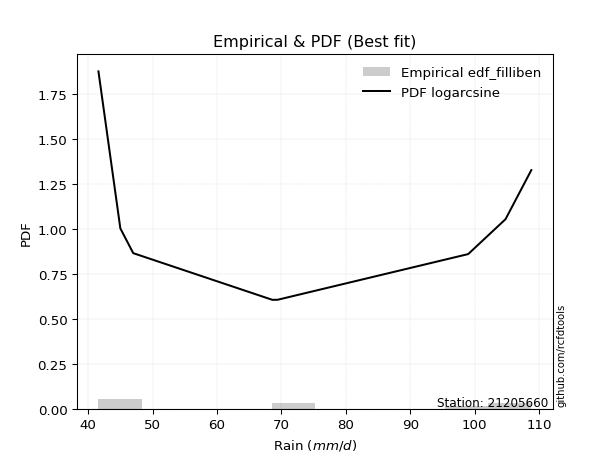</img>

</div>


### 10. EDF Jenkinson (1977)

The Jenkinson formula in hydrology is an empirical plotting position formula used to estimate the non-exceedance probability _(P)_ or return period _(T)_ of a given ordered observation within a sample. It is a widely used method in the frequency analysis of extreme events such as floods and rainfall, as it provides a distribution-free way to plot data. _a≈0.31_ and _b≈0.38_ are constants derived to approximate the median of the probability distribution for the given rank.

<div align="center">


$P=(m-a)/(n+b)$


</div>


**10.1. Empirical values**

<div align="center">

|                | 0                   | 1                   | 2                  | 3                   | 4                  | 5                  | 6                  | 7                  |
|:---------------|:--------------------|:--------------------|:-------------------|:--------------------|:-------------------|:-------------------|:-------------------|:-------------------|
| date           | 2020                | 2023                | 2018               | 2021                | 2022               | 2019               | 2024               | 2025               |
| x              | 41.6                | 45.0                | 47.0               | 68.6                | 69.4               | 99.0               | 104.8              | 108.8              |
| m              | 1                   | 2                   | 3                  | 4                   | 5                  | 6                  | 7                  | 8                  |
| empirical_dist | edf_jenkinson       | edf_jenkinson       | edf_jenkinson      | edf_jenkinson       | edf_jenkinson      | edf_jenkinson      | edf_jenkinson      | edf_jenkinson      |
| empirical      | 0.08233890214797135 | 0.20167064439140808 | 0.3210023866348448 | 0.44033412887828155 | 0.5596658711217184 | 0.6789976133651551 | 0.7983293556085919 | 0.9176610978520287 |
| empirical_tr   | 1.0897269180754225  | 1.2526158445440956  | 1.4727592267135323 | 1.7867803837953091  | 2.2710027100271004 | 3.115241635687732  | 4.958579881656804  | 12.144927536231886 |

</div>


**10.2. Kolmogorov-Smirnov fit test (sorted by Δ)**


<div align="center">

|                | 0                   | 1                   | 2                   | 3                   | 4                   | 5                  | 6                  | 7                   | 8                   | 9                   | 10                  | 11                  | 12                  | 13                  | 14                 | 15                  | 16                  | 17                  | 18                  | 19                  | 20                 | 21                  | 22                 | 23                 | 24                  | 25                  | 26                 | 27                  | 28                 | 29                  | 30                  | 31                  | 32                  | 33                  | 34                 | 35                 | 36                  | 37                 | 38                 | 39                 | 40                 | 41                  | 42                 | 43                  | 44                  | 45                  | 46                 | 47                  | 48                  | 49                  | 50                 | 51                  | 52                 | 53                  | 54                  | 55                  | 56                 | 57                  | 58                 | 59                  | 60                  | 61                 | 62                  | 63                  | 64                  | 65                  | 66                 | 67                  | 68                 | 69                  | 70                  | 71                 | 72                  | 73                 | 74                 | 75                 | 76                  | 77                  | 78                 | 79                  | 80                  | 81                  | 82                  | 83                  | 84                 | 85                 | 86                  | 87                  | 88                  | 89                  | 90                  | 91                  | 92                  | 93                  | 94                  | 95                  | 96                  | 97                  | 98                 | 99                  | 100                | 101                 | 102                 | 103                 | 104                 | 105                 | 106                 | 107                 | 108                 | 109                | 110                 | 111                 | 112                 | 113                 | 114                 | 115                 | 116                 | 117                | 118                | 119                 | 120                 | 121                 | 122                | 123                 | 124                 | 125                | 126                 | 127                 | 128                | 129                 | 130                | 131                 | 132                 | 133                | 134                 | 135                | 136                | 137                | 138                 | 139                | 140                | 141                 | 142                | 143                 | 144                | 145                | 146                 | 147                | 148                | 149                | 150                | 151                | 152                | 153                | 154                | 155                | 156                | 157                | 158                | 159                |
|:---------------|:--------------------|:--------------------|:--------------------|:--------------------|:--------------------|:-------------------|:-------------------|:--------------------|:--------------------|:--------------------|:--------------------|:--------------------|:--------------------|:--------------------|:-------------------|:--------------------|:--------------------|:--------------------|:--------------------|:--------------------|:-------------------|:--------------------|:-------------------|:-------------------|:--------------------|:--------------------|:-------------------|:--------------------|:-------------------|:--------------------|:--------------------|:--------------------|:--------------------|:--------------------|:-------------------|:-------------------|:--------------------|:-------------------|:-------------------|:-------------------|:-------------------|:--------------------|:-------------------|:--------------------|:--------------------|:--------------------|:-------------------|:--------------------|:--------------------|:--------------------|:-------------------|:--------------------|:-------------------|:--------------------|:--------------------|:--------------------|:-------------------|:--------------------|:-------------------|:--------------------|:--------------------|:-------------------|:--------------------|:--------------------|:--------------------|:--------------------|:-------------------|:--------------------|:-------------------|:--------------------|:--------------------|:-------------------|:--------------------|:-------------------|:-------------------|:-------------------|:--------------------|:--------------------|:-------------------|:--------------------|:--------------------|:--------------------|:--------------------|:--------------------|:-------------------|:-------------------|:--------------------|:--------------------|:--------------------|:--------------------|:--------------------|:--------------------|:--------------------|:--------------------|:--------------------|:--------------------|:--------------------|:--------------------|:-------------------|:--------------------|:-------------------|:--------------------|:--------------------|:--------------------|:--------------------|:--------------------|:--------------------|:--------------------|:--------------------|:-------------------|:--------------------|:--------------------|:--------------------|:--------------------|:--------------------|:--------------------|:--------------------|:-------------------|:-------------------|:--------------------|:--------------------|:--------------------|:-------------------|:--------------------|:--------------------|:-------------------|:--------------------|:--------------------|:-------------------|:--------------------|:-------------------|:--------------------|:--------------------|:-------------------|:--------------------|:-------------------|:-------------------|:-------------------|:--------------------|:-------------------|:-------------------|:--------------------|:-------------------|:--------------------|:-------------------|:-------------------|:--------------------|:-------------------|:-------------------|:-------------------|:-------------------|:-------------------|:-------------------|:-------------------|:-------------------|:-------------------|:-------------------|:-------------------|:-------------------|:-------------------|
| station        | 21205660            | 21205660            | 21205660            | 21205660            | 21205660            | 21205660           | 21205660           | 21205660            | 21205660            | 21205660            | 21205660            | 21205660            | 21205660            | 21205660            | 21205660           | 21205660            | 21205660            | 21205660            | 21205660            | 21205660            | 21205660           | 21205660            | 21205660           | 21205660           | 21205660            | 21205660            | 21205660           | 21205660            | 21205660           | 21205660            | 21205660            | 21205660            | 21205660            | 21205660            | 21205660           | 21205660           | 21205660            | 21205660           | 21205660           | 21205660           | 21205660           | 21205660            | 21205660           | 21205660            | 21205660            | 21205660            | 21205660           | 21205660            | 21205660            | 21205660            | 21205660           | 21205660            | 21205660           | 21205660            | 21205660            | 21205660            | 21205660           | 21205660            | 21205660           | 21205660            | 21205660            | 21205660           | 21205660            | 21205660            | 21205660            | 21205660            | 21205660           | 21205660            | 21205660           | 21205660            | 21205660            | 21205660           | 21205660            | 21205660           | 21205660           | 21205660           | 21205660            | 21205660            | 21205660           | 21205660            | 21205660            | 21205660            | 21205660            | 21205660            | 21205660           | 21205660           | 21205660            | 21205660            | 21205660            | 21205660            | 21205660            | 21205660            | 21205660            | 21205660            | 21205660            | 21205660            | 21205660            | 21205660            | 21205660           | 21205660            | 21205660           | 21205660            | 21205660            | 21205660            | 21205660            | 21205660            | 21205660            | 21205660            | 21205660            | 21205660           | 21205660            | 21205660            | 21205660            | 21205660            | 21205660            | 21205660            | 21205660            | 21205660           | 21205660           | 21205660            | 21205660            | 21205660            | 21205660           | 21205660            | 21205660            | 21205660           | 21205660            | 21205660            | 21205660           | 21205660            | 21205660           | 21205660            | 21205660            | 21205660           | 21205660            | 21205660           | 21205660           | 21205660           | 21205660            | 21205660           | 21205660           | 21205660            | 21205660           | 21205660            | 21205660           | 21205660           | 21205660            | 21205660           | 21205660           | 21205660           | 21205660           | 21205660           | 21205660           | 21205660           | 21205660           | 21205660           | 21205660           | 21205660           | 21205660           | 21205660           |
| empirical_dist | edf_jenkinson       | edf_jenkinson       | edf_jenkinson       | edf_jenkinson       | edf_jenkinson       | edf_jenkinson      | edf_jenkinson      | edf_jenkinson       | edf_jenkinson       | edf_jenkinson       | edf_jenkinson       | edf_jenkinson       | edf_jenkinson       | edf_jenkinson       | edf_jenkinson      | edf_jenkinson       | edf_jenkinson       | edf_jenkinson       | edf_jenkinson       | edf_jenkinson       | edf_jenkinson      | edf_jenkinson       | edf_jenkinson      | edf_jenkinson      | edf_jenkinson       | edf_jenkinson       | edf_jenkinson      | edf_jenkinson       | edf_jenkinson      | edf_jenkinson       | edf_jenkinson       | edf_jenkinson       | edf_jenkinson       | edf_jenkinson       | edf_jenkinson      | edf_jenkinson      | edf_jenkinson       | edf_jenkinson      | edf_jenkinson      | edf_jenkinson      | edf_jenkinson      | edf_jenkinson       | edf_jenkinson      | edf_jenkinson       | edf_jenkinson       | edf_jenkinson       | edf_jenkinson      | edf_jenkinson       | edf_jenkinson       | edf_jenkinson       | edf_jenkinson      | edf_jenkinson       | edf_jenkinson      | edf_jenkinson       | edf_jenkinson       | edf_jenkinson       | edf_jenkinson      | edf_jenkinson       | edf_jenkinson      | edf_jenkinson       | edf_jenkinson       | edf_jenkinson      | edf_jenkinson       | edf_jenkinson       | edf_jenkinson       | edf_jenkinson       | edf_jenkinson      | edf_jenkinson       | edf_jenkinson      | edf_jenkinson       | edf_jenkinson       | edf_jenkinson      | edf_jenkinson       | edf_jenkinson      | edf_jenkinson      | edf_jenkinson      | edf_jenkinson       | edf_jenkinson       | edf_jenkinson      | edf_jenkinson       | edf_jenkinson       | edf_jenkinson       | edf_jenkinson       | edf_jenkinson       | edf_jenkinson      | edf_jenkinson      | edf_jenkinson       | edf_jenkinson       | edf_jenkinson       | edf_jenkinson       | edf_jenkinson       | edf_jenkinson       | edf_jenkinson       | edf_jenkinson       | edf_jenkinson       | edf_jenkinson       | edf_jenkinson       | edf_jenkinson       | edf_jenkinson      | edf_jenkinson       | edf_jenkinson      | edf_jenkinson       | edf_jenkinson       | edf_jenkinson       | edf_jenkinson       | edf_jenkinson       | edf_jenkinson       | edf_jenkinson       | edf_jenkinson       | edf_jenkinson      | edf_jenkinson       | edf_jenkinson       | edf_jenkinson       | edf_jenkinson       | edf_jenkinson       | edf_jenkinson       | edf_jenkinson       | edf_jenkinson      | edf_jenkinson      | edf_jenkinson       | edf_jenkinson       | edf_jenkinson       | edf_jenkinson      | edf_jenkinson       | edf_jenkinson       | edf_jenkinson      | edf_jenkinson       | edf_jenkinson       | edf_jenkinson      | edf_jenkinson       | edf_jenkinson      | edf_jenkinson       | edf_jenkinson       | edf_jenkinson      | edf_jenkinson       | edf_jenkinson      | edf_jenkinson      | edf_jenkinson      | edf_jenkinson       | edf_jenkinson      | edf_jenkinson      | edf_jenkinson       | edf_jenkinson      | edf_jenkinson       | edf_jenkinson      | edf_jenkinson      | edf_jenkinson       | edf_jenkinson      | edf_jenkinson      | edf_jenkinson      | edf_jenkinson      | edf_jenkinson      | edf_jenkinson      | edf_jenkinson      | edf_jenkinson      | edf_jenkinson      | edf_jenkinson      | edf_jenkinson      | edf_jenkinson      | edf_jenkinson      |
| p_dist         | logarcsine          | wrapcauchy          | logbeta             | beta                | logwrapcauchy       | arcsine            | logrdist           | ksone               | logksone            | semicircular        | logsemicircular     | lognakagami         | anglit              | logtrapezoid        | loganglit          | lomax               | logweibull_max      | triang              | logmielke           | loggenlogistic      | logfoldnorm        | logburr             | loginvweibull      | foldnorm           | trapezoid           | rdist               | rayleigh           | burr                | maxwell            | invgamma            | lograyleigh         | johnsonsu           | loginvgauss         | nct                 | logmaxwell         | loggenexpon        | truncnorm           | norm               | crystalball        | t                  | exponnorm          | pearson3            | genexpon           | lognct              | logexponpow         | loginvgamma         | logburr12          | logbetaprime        | loggamma            | loggamma            | logerlang          | logf                | logpearson3        | logt                | lognorm             | logcrystalball      | logexponnorm       | logskewnorm         | logloggamma        | logalpha            | logncf              | halfnorm           | f                   | alpha               | logkstwobign        | betaprime           | genlogistic        | loghalfnorm         | kstwobign          | logdweibull         | logcosine           | logloglaplace      | logrice             | cosine             | logistic           | logdgamma          | loglogistic         | erlang              | loghalfgennorm     | loglevy_l           | gumbel_l            | logexponweib        | gumbel_r            | weibull_min         | logweibull_min     | loggumbel_l        | hypsecant           | rice                | genpareto           | loggumbel_r         | loggompertz         | loghypsecant        | dweibull            | invgauss            | kappa3              | burr12              | logtriang           | loglomax            | logargus           | argus               | laplace            | loglaplace          | loglaplace          | halfgennorm         | gausshyper          | halflogistic        | bradford            | moyal               | logtukeylambda      | gamma              | kappa4              | vonmises_line       | skewnorm            | logmoyal            | loghalflogistic     | dgamma              | logkappa4           | logfatiguelife     | levy_l             | logkappa3           | loguniform          | truncexpon          | gompertz           | logvonmises_line    | logjohnsonsu        | tukeylambda        | uniform             | loggenextreme       | loggenhalflogistic | logjohnsonsb        | logbradford        | nakagami            | logtruncexpon       | truncweibull_min   | logtruncweibull_min | loggennorm         | gennorm            | exponpow           | genhalflogistic     | logwald            | wald               | loggengamma         | loggausshyper      | genextreme          | loggenpareto       | exponweib          | powerlaw            | fatiguelife        | ncf                | gengamma           | logpowerlaw        | invweibull         | weibull_max        | logtruncnorm       | logtruncpareto     | truncpareto        | johnsonsb          | logvonmises        | vonmises           | mielke             |
| delta          | 0.07371039217535905 | 0.08233656190245975 | 0.08233765196216508 | 0.08233825442741416 | 0.08233890190091642 | 0.0933118903480166 | 0.105300836090779  | 0.10891470190887306 | 0.11212293435340331 | 0.12477251792535504 | 0.12783316526506633 | 0.13237397578619298 | 0.13612181153118014 | 0.13698906912111147 | 0.1390622495787885 | 0.14337654794640325 | 0.14976649960669342 | 0.15006926627363137 | 0.15468940276305812 | 0.15500115014497506 | 0.1559227971323841 | 0.15617481249709364 | 0.156257878546463  | 0.1572393935932973 | 0.15736126669643796 | 0.15801391375004264 | 0.1582290309383837 | 0.15833121958051444 | 0.1588545684126127 | 0.15906628984857474 | 0.15995255344725526 | 0.16031252279916647 | 0.16031737426017117 | 0.16070100944568466 | 0.160831691388144  | 0.1609604048644387 | 0.16170687606958356 | 0.1617068842162993 | 0.1617068910911559 | 0.1617150545541257 | 0.1617212046292273 | 0.16198987862793424 | 0.1629739424817498 | 0.16305004396604655 | 0.16321378261844333 | 0.16341129599060678 | 0.1637710989889292 | 0.16378337128883583 | 0.16415065660660855 | 0.16415065660660855 | 0.1641820118518941 | 0.16425643715804314 | 0.1643769499723828 | 0.16438689606861834 | 0.16438822344584764 | 0.16438822420053964 | 0.1643889951904342 | 0.16438915748862476 | 0.1644093257768486 | 0.16442196357316652 | 0.16495466581894525 | 0.1650903643618502 | 0.16518126260963842 | 0.16544888583638004 | 0.16640740627517014 | 0.16686197028742122 | 0.1678403973107354 | 0.17030879697521953 | 0.173067405578193  | 0.17333401899215886 | 0.17682103148662554 | 0.1775921542801218 | 0.17990844581493784 | 0.1801659235288423 | 0.1802441359896512 | 0.1813762519076247 | 0.18266453343957023 | 0.18464425623379777 | 0.1863848784324766 | 0.18716231938731798 | 0.18737778585690656 | 0.18801827073965932 | 0.18803792144460102 | 0.18910325121754262 | 0.1892884182015273 | 0.1898343650313279 | 0.18999293337606235 | 0.19053775370489312 | 0.19137296242226443 | 0.19183405437571774 | 0.19198551377274428 | 0.19219826823088995 | 0.19226062746950023 | 0.19302503361282047 | 0.19323751778198434 | 0.19438996785757806 | 0.19519097124419724 | 0.19537472264361916 | 0.1968589445049942 | 0.19883298756473178 | 0.198988901532235  | 0.20089160378465254 | 0.20089160378465254 | 0.20613461404880856 | 0.20763059651921967 | 0.21156947177813834 | 0.21210671989587715 | 0.21232500982465918 | 0.21264485128073563 | 0.2133801996679775 | 0.21507287626178462 | 0.21539799991008146 | 0.21583495022764349 | 0.21664604309487023 | 0.21795044545629833 | 0.21855497824747827 | 0.21891809553806374 | 0.2190518517928804 | 0.2199649525007793 | 0.22069519816637528 | 0.22282224528427985 | 0.22288721017259805 | 0.2229850179682692 | 0.22529664188219967 | 0.22570727352245845 | 0.2349910553649932 | 0.24064524377770197 | 0.24540707984470067 | 0.2515822731437263 | 0.25172084704234265 | 0.2518175566303039 | 0.25814120028234294 | 0.26631324038788207 | 0.2676162796216198 | 0.2932471318228144  | 0.2983293556085919 | 0.2983293556085919 | 0.3058326307163995 | 0.31244192887211475 | 0.3210023866348448 | 0.3210023866348448 | 0.34024060927794747 | 0.3436478143775264 | 0.35704544989768394 | 0.3645463712330461 | 0.4031485517659557 | 0.40785641162350333 | 0.4242062330547766 | 0.4247988489711988 | 0.4392872479922058 | 0.440797669267365  | 0.4791313349906635 | 0.5046516031721382 | 0.5106732116994834 | 0.5145430562207955 | 0.5972230954317521 | 0.7007931728120442 | 1.163487264633345  | 17.15580530087222  | nan                |
| deltao         | 0.4472608134160001  | 0.4472608134160001  | 0.4472608134160001  | 0.4472608134160001  | 0.4472608134160001  | 0.4472608134160001 | 0.4472608134160001 | 0.4472608134160001  | 0.4472608134160001  | 0.4472608134160001  | 0.4472608134160001  | 0.4472608134160001  | 0.4472608134160001  | 0.4472608134160001  | 0.4472608134160001 | 0.4472608134160001  | 0.4472608134160001  | 0.4472608134160001  | 0.4472608134160001  | 0.4472608134160001  | 0.4472608134160001 | 0.4472608134160001  | 0.4472608134160001 | 0.4472608134160001 | 0.4472608134160001  | 0.4472608134160001  | 0.4472608134160001 | 0.4472608134160001  | 0.4472608134160001 | 0.4472608134160001  | 0.4472608134160001  | 0.4472608134160001  | 0.4472608134160001  | 0.4472608134160001  | 0.4472608134160001 | 0.4472608134160001 | 0.4472608134160001  | 0.4472608134160001 | 0.4472608134160001 | 0.4472608134160001 | 0.4472608134160001 | 0.4472608134160001  | 0.4472608134160001 | 0.4472608134160001  | 0.4472608134160001  | 0.4472608134160001  | 0.4472608134160001 | 0.4472608134160001  | 0.4472608134160001  | 0.4472608134160001  | 0.4472608134160001 | 0.4472608134160001  | 0.4472608134160001 | 0.4472608134160001  | 0.4472608134160001  | 0.4472608134160001  | 0.4472608134160001 | 0.4472608134160001  | 0.4472608134160001 | 0.4472608134160001  | 0.4472608134160001  | 0.4472608134160001 | 0.4472608134160001  | 0.4472608134160001  | 0.4472608134160001  | 0.4472608134160001  | 0.4472608134160001 | 0.4472608134160001  | 0.4472608134160001 | 0.4472608134160001  | 0.4472608134160001  | 0.4472608134160001 | 0.4472608134160001  | 0.4472608134160001 | 0.4472608134160001 | 0.4472608134160001 | 0.4472608134160001  | 0.4472608134160001  | 0.4472608134160001 | 0.4472608134160001  | 0.4472608134160001  | 0.4472608134160001  | 0.4472608134160001  | 0.4472608134160001  | 0.4472608134160001 | 0.4472608134160001 | 0.4472608134160001  | 0.4472608134160001  | 0.4472608134160001  | 0.4472608134160001  | 0.4472608134160001  | 0.4472608134160001  | 0.4472608134160001  | 0.4472608134160001  | 0.4472608134160001  | 0.4472608134160001  | 0.4472608134160001  | 0.4472608134160001  | 0.4472608134160001 | 0.4472608134160001  | 0.4472608134160001 | 0.4472608134160001  | 0.4472608134160001  | 0.4472608134160001  | 0.4472608134160001  | 0.4472608134160001  | 0.4472608134160001  | 0.4472608134160001  | 0.4472608134160001  | 0.4472608134160001 | 0.4472608134160001  | 0.4472608134160001  | 0.4472608134160001  | 0.4472608134160001  | 0.4472608134160001  | 0.4472608134160001  | 0.4472608134160001  | 0.4472608134160001 | 0.4472608134160001 | 0.4472608134160001  | 0.4472608134160001  | 0.4472608134160001  | 0.4472608134160001 | 0.4472608134160001  | 0.4472608134160001  | 0.4472608134160001 | 0.4472608134160001  | 0.4472608134160001  | 0.4472608134160001 | 0.4472608134160001  | 0.4472608134160001 | 0.4472608134160001  | 0.4472608134160001  | 0.4472608134160001 | 0.4472608134160001  | 0.4472608134160001 | 0.4472608134160001 | 0.4472608134160001 | 0.4472608134160001  | 0.4472608134160001 | 0.4472608134160001 | 0.4472608134160001  | 0.4472608134160001 | 0.4472608134160001  | 0.4472608134160001 | 0.4472608134160001 | 0.4472608134160001  | 0.4472608134160001 | 0.4472608134160001 | 0.4472608134160001 | 0.4472608134160001 | 0.4472608134160001 | 0.4472608134160001 | 0.4472608134160001 | 0.4472608134160001 | 0.4472608134160001 | 0.4472608134160001 | 0.4472608134160001 | 0.4472608134160001 | 0.4472608134160001 |
| eval           | Δo > Δ              | Δo > Δ              | Δo > Δ              | Δo > Δ              | Δo > Δ              | Δo > Δ             | Δo > Δ             | Δo > Δ              | Δo > Δ              | Δo > Δ              | Δo > Δ              | Δo > Δ              | Δo > Δ              | Δo > Δ              | Δo > Δ             | Δo > Δ              | Δo > Δ              | Δo > Δ              | Δo > Δ              | Δo > Δ              | Δo > Δ             | Δo > Δ              | Δo > Δ             | Δo > Δ             | Δo > Δ              | Δo > Δ              | Δo > Δ             | Δo > Δ              | Δo > Δ             | Δo > Δ              | Δo > Δ              | Δo > Δ              | Δo > Δ              | Δo > Δ              | Δo > Δ             | Δo > Δ             | Δo > Δ              | Δo > Δ             | Δo > Δ             | Δo > Δ             | Δo > Δ             | Δo > Δ              | Δo > Δ             | Δo > Δ              | Δo > Δ              | Δo > Δ              | Δo > Δ             | Δo > Δ              | Δo > Δ              | Δo > Δ              | Δo > Δ             | Δo > Δ              | Δo > Δ             | Δo > Δ              | Δo > Δ              | Δo > Δ              | Δo > Δ             | Δo > Δ              | Δo > Δ             | Δo > Δ              | Δo > Δ              | Δo > Δ             | Δo > Δ              | Δo > Δ              | Δo > Δ              | Δo > Δ              | Δo > Δ             | Δo > Δ              | Δo > Δ             | Δo > Δ              | Δo > Δ              | Δo > Δ             | Δo > Δ              | Δo > Δ             | Δo > Δ             | Δo > Δ             | Δo > Δ              | Δo > Δ              | Δo > Δ             | Δo > Δ              | Δo > Δ              | Δo > Δ              | Δo > Δ              | Δo > Δ              | Δo > Δ             | Δo > Δ             | Δo > Δ              | Δo > Δ              | Δo > Δ              | Δo > Δ              | Δo > Δ              | Δo > Δ              | Δo > Δ              | Δo > Δ              | Δo > Δ              | Δo > Δ              | Δo > Δ              | Δo > Δ              | Δo > Δ             | Δo > Δ              | Δo > Δ             | Δo > Δ              | Δo > Δ              | Δo > Δ              | Δo > Δ              | Δo > Δ              | Δo > Δ              | Δo > Δ              | Δo > Δ              | Δo > Δ             | Δo > Δ              | Δo > Δ              | Δo > Δ              | Δo > Δ              | Δo > Δ              | Δo > Δ              | Δo > Δ              | Δo > Δ             | Δo > Δ             | Δo > Δ              | Δo > Δ              | Δo > Δ              | Δo > Δ             | Δo > Δ              | Δo > Δ              | Δo > Δ             | Δo > Δ              | Δo > Δ              | Δo > Δ             | Δo > Δ              | Δo > Δ             | Δo > Δ              | Δo > Δ              | Δo > Δ             | Δo > Δ              | Δo > Δ             | Δo > Δ             | Δo > Δ             | Δo > Δ              | Δo > Δ             | Δo > Δ             | Δo > Δ              | Δo > Δ             | Δo > Δ              | Δo > Δ             | Δo > Δ             | Δo > Δ              | Δo > Δ             | Δo > Δ             | Δo > Δ             | Δo > Δ             | Δo <= Δ            | Δo <= Δ            | Δo <= Δ            | Δo <= Δ            | Δo <= Δ            | Δo <= Δ            | Δo <= Δ            | Δo <= Δ            | Δo <= Δ            |
| fit            | 1                   | 1                   | 1                   | 1                   | 1                   | 1                  | 1                  | 1                   | 1                   | 1                   | 1                   | 1                   | 1                   | 1                   | 1                  | 1                   | 1                   | 1                   | 1                   | 1                   | 1                  | 1                   | 1                  | 1                  | 1                   | 1                   | 1                  | 1                   | 1                  | 1                   | 1                   | 1                   | 1                   | 1                   | 1                  | 1                  | 1                   | 1                  | 1                  | 1                  | 1                  | 1                   | 1                  | 1                   | 1                   | 1                   | 1                  | 1                   | 1                   | 1                   | 1                  | 1                   | 1                  | 1                   | 1                   | 1                   | 1                  | 1                   | 1                  | 1                   | 1                   | 1                  | 1                   | 1                   | 1                   | 1                   | 1                  | 1                   | 1                  | 1                   | 1                   | 1                  | 1                   | 1                  | 1                  | 1                  | 1                   | 1                   | 1                  | 1                   | 1                   | 1                   | 1                   | 1                   | 1                  | 1                  | 1                   | 1                   | 1                   | 1                   | 1                   | 1                   | 1                   | 1                   | 1                   | 1                   | 1                   | 1                   | 1                  | 1                   | 1                  | 1                   | 1                   | 1                   | 1                   | 1                   | 1                   | 1                   | 1                   | 1                  | 1                   | 1                   | 1                   | 1                   | 1                   | 1                   | 1                   | 1                  | 1                  | 1                   | 1                   | 1                   | 1                  | 1                   | 1                   | 1                  | 1                   | 1                   | 1                  | 1                   | 1                  | 1                   | 1                   | 1                  | 1                   | 1                  | 1                  | 1                  | 1                   | 1                  | 1                  | 1                   | 1                  | 1                   | 1                  | 1                  | 1                   | 1                  | 1                  | 1                  | 1                  | 0                  | 0                  | 0                  | 0                  | 0                  | 0                  | 0                  | 0                  | 0                  |
| n              | 8                   | 8                   | 8                   | 8                   | 8                   | 8                  | 8                  | 8                   | 8                   | 8                   | 8                   | 8                   | 8                   | 8                   | 8                  | 8                   | 8                   | 8                   | 8                   | 8                   | 8                  | 8                   | 8                  | 8                  | 8                   | 8                   | 8                  | 8                   | 8                  | 8                   | 8                   | 8                   | 8                   | 8                   | 8                  | 8                  | 8                   | 8                  | 8                  | 8                  | 8                  | 8                   | 8                  | 8                   | 8                   | 8                   | 8                  | 8                   | 8                   | 8                   | 8                  | 8                   | 8                  | 8                   | 8                   | 8                   | 8                  | 8                   | 8                  | 8                   | 8                   | 8                  | 8                   | 8                   | 8                   | 8                   | 8                  | 8                   | 8                  | 8                   | 8                   | 8                  | 8                   | 8                  | 8                  | 8                  | 8                   | 8                   | 8                  | 8                   | 8                   | 8                   | 8                   | 8                   | 8                  | 8                  | 8                   | 8                   | 8                   | 8                   | 8                   | 8                   | 8                   | 8                   | 8                   | 8                   | 8                   | 8                   | 8                  | 8                   | 8                  | 8                   | 8                   | 8                   | 8                   | 8                   | 8                   | 8                   | 8                   | 8                  | 8                   | 8                   | 8                   | 8                   | 8                   | 8                   | 8                   | 8                  | 8                  | 8                   | 8                   | 8                   | 8                  | 8                   | 8                   | 8                  | 8                   | 8                   | 8                  | 8                   | 8                  | 8                   | 8                   | 8                  | 8                   | 8                  | 8                  | 8                  | 8                   | 8                  | 8                  | 8                   | 8                  | 8                   | 8                  | 8                  | 8                   | 8                  | 8                  | 8                  | 8                  | 8                  | 8                  | 8                  | 8                  | 8                  | 8                  | 8                  | 8                  | 8                  |
| best_fit       | 1                   | 0                   | 0                   | 0                   | 0                   | 0                  | 0                  | 0                   | 0                   | 0                   | 0                   | 0                   | 0                   | 0                   | 0                  | 0                   | 0                   | 0                   | 0                   | 0                   | 0                  | 0                   | 0                  | 0                  | 0                   | 0                   | 0                  | 0                   | 0                  | 0                   | 0                   | 0                   | 0                   | 0                   | 0                  | 0                  | 0                   | 0                  | 0                  | 0                  | 0                  | 0                   | 0                  | 0                   | 0                   | 0                   | 0                  | 0                   | 0                   | 0                   | 0                  | 0                   | 0                  | 0                   | 0                   | 0                   | 0                  | 0                   | 0                  | 0                   | 0                   | 0                  | 0                   | 0                   | 0                   | 0                   | 0                  | 0                   | 0                  | 0                   | 0                   | 0                  | 0                   | 0                  | 0                  | 0                  | 0                   | 0                   | 0                  | 0                   | 0                   | 0                   | 0                   | 0                   | 0                  | 0                  | 0                   | 0                   | 0                   | 0                   | 0                   | 0                   | 0                   | 0                   | 0                   | 0                   | 0                   | 0                   | 0                  | 0                   | 0                  | 0                   | 0                   | 0                   | 0                   | 0                   | 0                   | 0                   | 0                   | 0                  | 0                   | 0                   | 0                   | 0                   | 0                   | 0                   | 0                   | 0                  | 0                  | 0                   | 0                   | 0                   | 0                  | 0                   | 0                   | 0                  | 0                   | 0                   | 0                  | 0                   | 0                  | 0                   | 0                   | 0                  | 0                   | 0                  | 0                  | 0                  | 0                   | 0                  | 0                  | 0                   | 0                  | 0                   | 0                  | 0                  | 0                   | 0                  | 0                  | 0                  | 0                  | 0                  | 0                  | 0                  | 0                  | 0                  | 0                  | 0                  | 0                  | 0                  |
| best_fit_sort  | 1                   | 2                   | 3                   | 4                   | 5                   | 6                  | 7                  | 8                   | 9                   | 10                  | 11                  | 12                  | 13                  | 14                  | 15                 | 16                  | 17                  | 18                  | 19                  | 20                  | 21                 | 22                  | 23                 | 24                 | 25                  | 26                  | 27                 | 28                  | 29                 | 30                  | 31                  | 32                  | 33                  | 34                  | 35                 | 36                 | 37                  | 38                 | 39                 | 40                 | 41                 | 42                  | 43                 | 44                  | 45                  | 46                  | 47                 | 48                  | 49                  | 50                  | 51                 | 52                  | 53                 | 54                  | 55                  | 56                  | 57                 | 58                  | 59                 | 60                  | 61                  | 62                 | 63                  | 64                  | 65                  | 66                  | 67                 | 68                  | 69                 | 70                  | 71                  | 72                 | 73                  | 74                 | 75                 | 76                 | 77                  | 78                  | 79                 | 80                  | 81                  | 82                  | 83                  | 84                  | 85                 | 86                 | 87                  | 88                  | 89                  | 90                  | 91                  | 92                  | 93                  | 94                  | 95                  | 96                  | 97                  | 98                  | 99                 | 100                 | 101                | 102                 | 103                 | 104                 | 105                 | 106                 | 107                 | 108                 | 109                 | 110                | 111                 | 112                 | 113                 | 114                 | 115                 | 116                 | 117                 | 118                | 119                | 120                 | 121                 | 122                 | 123                | 124                 | 125                 | 126                | 127                 | 128                 | 129                | 130                 | 131                | 132                 | 133                 | 134                | 135                 | 136                | 137                | 138                | 139                 | 140                | 141                | 142                 | 143                | 144                 | 145                | 146                | 147                 | 148                | 149                | 150                | 151                | 152                | 153                | 154                | 155                | 156                | 157                | 158                | 159                | 160                |

</div>


**10.3. Best fit**

<div align="center">

|   id |   station | empirical_dist   | p_dist     |     delta |   deltao | eval   |   fit |   n |   best_fit |   best_fit_sort |
|-----:|----------:|:-----------------|:-----------|----------:|---------:|:-------|------:|----:|-----------:|----------------:|
|    0 |  21205660 | edf_jenkinson    | logarcsine | 0.0737104 | 0.447261 | Δo > Δ |     1 |   8 |          1 |               1 |

</div>


<div align="center">

</img>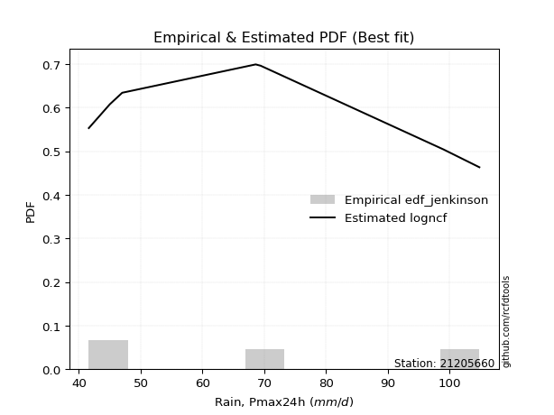</img>

</div>


### 11. EDF Cunnane (1978)

Cunnane´s work in statistical hydrology has focused on the performance and evaluation of different probability distributions (such as GEV, Gumbel, Lognormal) for flood frequency estimation. _b_ is a constant, typically set to 0.4.

<div align="center">


$P=(m-b)/(n+1-2b)$


</div>


**11.1. Empirical values**

<div align="center">

|                | 0                   | 1                   | 2                  | 3                  | 4                  | 5                  | 6                  | 7                  |
|:---------------|:--------------------|:--------------------|:-------------------|:-------------------|:-------------------|:-------------------|:-------------------|:-------------------|
| date           | 2020                | 2023                | 2018               | 2021               | 2022               | 2019               | 2024               | 2025               |
| x              | 41.6                | 45.0                | 47.0               | 68.6               | 69.4               | 99.0               | 104.8              | 108.8              |
| m              | 1                   | 2                   | 3                  | 4                  | 5                  | 6                  | 7                  | 8                  |
| empirical_dist | edf_cunnane         | edf_cunnane         | edf_cunnane        | edf_cunnane        | edf_cunnane        | edf_cunnane        | edf_cunnane        | edf_cunnane        |
| empirical      | 0.07317073170731708 | 0.19512195121951223 | 0.3170731707317074 | 0.4390243902439025 | 0.5609756097560976 | 0.6829268292682927 | 0.8048780487804879 | 0.926829268292683  |
| empirical_tr   | 1.0789473684210527  | 1.2424242424242424  | 1.4642857142857144 | 1.782608695652174  | 2.277777777777778  | 3.153846153846154  | 5.125000000000001  | 13.666666666666675 |

</div>


**11.2. Kolmogorov-Smirnov fit test (sorted by Δ)**


<div align="center">

|                | 0                  | 1                   | 2                   | 3                  | 4                   | 5                   | 6                   | 7                   | 8                   | 9                  | 10                  | 11                  | 12                 | 13                  | 14                  | 15                 | 16                  | 17                  | 18                 | 19                  | 20                  | 21                  | 22                  | 23                 | 24                  | 25                  | 26                  | 27                  | 28                  | 29                  | 30                 | 31                  | 32                  | 33                  | 34                  | 35                  | 36                  | 37                 | 38                  | 39                  | 40                  | 41                  | 42                  | 43                 | 44                  | 45                 | 46                 | 47                 | 48                  | 49                 | 50                  | 51                 | 52                 | 53                 | 54                  | 55                  | 56                  | 57                  | 58                 | 59                  | 60                  | 61                 | 62                  | 63                  | 64                  | 65                  | 66                  | 67                 | 68                  | 69                  | 70                  | 71                  | 72                 | 73                  | 74                  | 75                  | 76                 | 77                 | 78                  | 79                  | 80                 | 81                  | 82                  | 83                  | 84                 | 85                  | 86                 | 87                  | 88                 | 89                  | 90                  | 91                  | 92                 | 93                  | 94                  | 95                  | 96                  | 97                  | 98                  | 99                 | 100                | 101                | 102                 | 103                | 104                 | 105                | 106                | 107                 | 108                 | 109                 | 110                 | 111                 | 112                 | 113                | 114                 | 115                | 116                 | 117                 | 118                | 119                | 120                 | 121                 | 122                | 123                 | 124                 | 125                 | 126                 | 127                | 128                 | 129                 | 130                 | 131                | 132                | 133                 | 134                 | 135                 | 136                 | 137                | 138                 | 139                | 140                | 141                | 142                 | 143                 | 144                | 145                | 146                 | 147                 | 148                 | 149                | 150                 | 151                 | 152                | 153                | 154                | 155                | 156                | 157                | 158                | 159                |
|:---------------|:-------------------|:--------------------|:--------------------|:-------------------|:--------------------|:--------------------|:--------------------|:--------------------|:--------------------|:-------------------|:--------------------|:--------------------|:-------------------|:--------------------|:--------------------|:-------------------|:--------------------|:--------------------|:-------------------|:--------------------|:--------------------|:--------------------|:--------------------|:-------------------|:--------------------|:--------------------|:--------------------|:--------------------|:--------------------|:--------------------|:-------------------|:--------------------|:--------------------|:--------------------|:--------------------|:--------------------|:--------------------|:-------------------|:--------------------|:--------------------|:--------------------|:--------------------|:--------------------|:-------------------|:--------------------|:-------------------|:-------------------|:-------------------|:--------------------|:-------------------|:--------------------|:-------------------|:-------------------|:-------------------|:--------------------|:--------------------|:--------------------|:--------------------|:-------------------|:--------------------|:--------------------|:-------------------|:--------------------|:--------------------|:--------------------|:--------------------|:--------------------|:-------------------|:--------------------|:--------------------|:--------------------|:--------------------|:-------------------|:--------------------|:--------------------|:--------------------|:-------------------|:-------------------|:--------------------|:--------------------|:-------------------|:--------------------|:--------------------|:--------------------|:-------------------|:--------------------|:-------------------|:--------------------|:-------------------|:--------------------|:--------------------|:--------------------|:-------------------|:--------------------|:--------------------|:--------------------|:--------------------|:--------------------|:--------------------|:-------------------|:-------------------|:-------------------|:--------------------|:-------------------|:--------------------|:-------------------|:-------------------|:--------------------|:--------------------|:--------------------|:--------------------|:--------------------|:--------------------|:-------------------|:--------------------|:-------------------|:--------------------|:--------------------|:-------------------|:-------------------|:--------------------|:--------------------|:-------------------|:--------------------|:--------------------|:--------------------|:--------------------|:-------------------|:--------------------|:--------------------|:--------------------|:-------------------|:-------------------|:--------------------|:--------------------|:--------------------|:--------------------|:-------------------|:--------------------|:-------------------|:-------------------|:-------------------|:--------------------|:--------------------|:-------------------|:-------------------|:--------------------|:--------------------|:--------------------|:-------------------|:--------------------|:--------------------|:-------------------|:-------------------|:-------------------|:-------------------|:-------------------|:-------------------|:-------------------|:-------------------|
| station        | 21205660           | 21205660            | 21205660            | 21205660           | 21205660            | 21205660            | 21205660            | 21205660            | 21205660            | 21205660           | 21205660            | 21205660            | 21205660           | 21205660            | 21205660            | 21205660           | 21205660            | 21205660            | 21205660           | 21205660            | 21205660            | 21205660            | 21205660            | 21205660           | 21205660            | 21205660            | 21205660            | 21205660            | 21205660            | 21205660            | 21205660           | 21205660            | 21205660            | 21205660            | 21205660            | 21205660            | 21205660            | 21205660           | 21205660            | 21205660            | 21205660            | 21205660            | 21205660            | 21205660           | 21205660            | 21205660           | 21205660           | 21205660           | 21205660            | 21205660           | 21205660            | 21205660           | 21205660           | 21205660           | 21205660            | 21205660            | 21205660            | 21205660            | 21205660           | 21205660            | 21205660            | 21205660           | 21205660            | 21205660            | 21205660            | 21205660            | 21205660            | 21205660           | 21205660            | 21205660            | 21205660            | 21205660            | 21205660           | 21205660            | 21205660            | 21205660            | 21205660           | 21205660           | 21205660            | 21205660            | 21205660           | 21205660            | 21205660            | 21205660            | 21205660           | 21205660            | 21205660           | 21205660            | 21205660           | 21205660            | 21205660            | 21205660            | 21205660           | 21205660            | 21205660            | 21205660            | 21205660            | 21205660            | 21205660            | 21205660           | 21205660           | 21205660           | 21205660            | 21205660           | 21205660            | 21205660           | 21205660           | 21205660            | 21205660            | 21205660            | 21205660            | 21205660            | 21205660            | 21205660           | 21205660            | 21205660           | 21205660            | 21205660            | 21205660           | 21205660           | 21205660            | 21205660            | 21205660           | 21205660            | 21205660            | 21205660            | 21205660            | 21205660           | 21205660            | 21205660            | 21205660            | 21205660           | 21205660           | 21205660            | 21205660            | 21205660            | 21205660            | 21205660           | 21205660            | 21205660           | 21205660           | 21205660           | 21205660            | 21205660            | 21205660           | 21205660           | 21205660            | 21205660            | 21205660            | 21205660           | 21205660            | 21205660            | 21205660           | 21205660           | 21205660           | 21205660           | 21205660           | 21205660           | 21205660           | 21205660           |
| empirical_dist | edf_cunnane        | edf_cunnane         | edf_cunnane         | edf_cunnane        | edf_cunnane         | edf_cunnane         | edf_cunnane         | edf_cunnane         | edf_cunnane         | edf_cunnane        | edf_cunnane         | edf_cunnane         | edf_cunnane        | edf_cunnane         | edf_cunnane         | edf_cunnane        | edf_cunnane         | edf_cunnane         | edf_cunnane        | edf_cunnane         | edf_cunnane         | edf_cunnane         | edf_cunnane         | edf_cunnane        | edf_cunnane         | edf_cunnane         | edf_cunnane         | edf_cunnane         | edf_cunnane         | edf_cunnane         | edf_cunnane        | edf_cunnane         | edf_cunnane         | edf_cunnane         | edf_cunnane         | edf_cunnane         | edf_cunnane         | edf_cunnane        | edf_cunnane         | edf_cunnane         | edf_cunnane         | edf_cunnane         | edf_cunnane         | edf_cunnane        | edf_cunnane         | edf_cunnane        | edf_cunnane        | edf_cunnane        | edf_cunnane         | edf_cunnane        | edf_cunnane         | edf_cunnane        | edf_cunnane        | edf_cunnane        | edf_cunnane         | edf_cunnane         | edf_cunnane         | edf_cunnane         | edf_cunnane        | edf_cunnane         | edf_cunnane         | edf_cunnane        | edf_cunnane         | edf_cunnane         | edf_cunnane         | edf_cunnane         | edf_cunnane         | edf_cunnane        | edf_cunnane         | edf_cunnane         | edf_cunnane         | edf_cunnane         | edf_cunnane        | edf_cunnane         | edf_cunnane         | edf_cunnane         | edf_cunnane        | edf_cunnane        | edf_cunnane         | edf_cunnane         | edf_cunnane        | edf_cunnane         | edf_cunnane         | edf_cunnane         | edf_cunnane        | edf_cunnane         | edf_cunnane        | edf_cunnane         | edf_cunnane        | edf_cunnane         | edf_cunnane         | edf_cunnane         | edf_cunnane        | edf_cunnane         | edf_cunnane         | edf_cunnane         | edf_cunnane         | edf_cunnane         | edf_cunnane         | edf_cunnane        | edf_cunnane        | edf_cunnane        | edf_cunnane         | edf_cunnane        | edf_cunnane         | edf_cunnane        | edf_cunnane        | edf_cunnane         | edf_cunnane         | edf_cunnane         | edf_cunnane         | edf_cunnane         | edf_cunnane         | edf_cunnane        | edf_cunnane         | edf_cunnane        | edf_cunnane         | edf_cunnane         | edf_cunnane        | edf_cunnane        | edf_cunnane         | edf_cunnane         | edf_cunnane        | edf_cunnane         | edf_cunnane         | edf_cunnane         | edf_cunnane         | edf_cunnane        | edf_cunnane         | edf_cunnane         | edf_cunnane         | edf_cunnane        | edf_cunnane        | edf_cunnane         | edf_cunnane         | edf_cunnane         | edf_cunnane         | edf_cunnane        | edf_cunnane         | edf_cunnane        | edf_cunnane        | edf_cunnane        | edf_cunnane         | edf_cunnane         | edf_cunnane        | edf_cunnane        | edf_cunnane         | edf_cunnane         | edf_cunnane         | edf_cunnane        | edf_cunnane         | edf_cunnane         | edf_cunnane        | edf_cunnane        | edf_cunnane        | edf_cunnane        | edf_cunnane        | edf_cunnane        | edf_cunnane        | edf_cunnane        |
| p_dist         | logwrapcauchy      | beta                | logarcsine          | logbeta            | wrapcauchy          | logrdist            | arcsine             | ksone               | logksone            | semicircular       | logsemicircular     | lognakagami         | anglit             | logtrapezoid        | loganglit           | lomax              | logmielke           | triang              | loggenlogistic     | logfoldnorm         | logburr             | loginvweibull       | foldnorm            | rdist              | rayleigh            | burr                | maxwell             | invgamma            | lograyleigh         | johnsonsu           | nct                | logmaxwell          | truncnorm           | norm                | crystalball         | t                   | exponnorm           | pearson3           | trapezoid           | logweibull_max      | genexpon            | lognct              | logexponpow         | loginvgamma        | logburr12           | logbetaprime       | loggamma           | loggamma           | logerlang           | logf               | logpearson3         | logt               | lognorm            | logcrystalball     | logexponnorm        | logskewnorm         | logloggamma         | logalpha            | logncf             | halfnorm            | f                   | alpha              | loginvgauss         | loggenexpon         | logkstwobign        | betaprime           | genlogistic         | loghalfnorm        | kstwobign           | logdweibull         | logcosine           | logloglaplace       | logrice            | cosine              | logistic            | logdgamma           | loglogistic        | erlang             | gumbel_r            | loggumbel_l         | hypsecant          | gumbel_l            | rice                | loghalfgennorm      | loggumbel_r        | loggompertz         | loghypsecant       | dweibull            | kappa3             | logexponweib        | weibull_min         | loglevy_l           | logtriang          | genpareto           | logargus            | invgauss            | argus               | laplace             | burr12              | loglomax           | loglaplace         | loglaplace         | logweibull_min      | gausshyper         | halfgennorm         | halflogistic       | bradford           | moyal               | logtukeylambda      | gamma               | kappa4              | vonmises_line       | skewnorm            | logmoyal           | loghalflogistic     | dgamma             | logkappa4           | logkappa3           | loguniform         | truncexpon         | gompertz            | logfatiguelife      | logvonmises_line   | logjohnsonsu        | levy_l              | tukeylambda         | uniform             | loggenextreme      | loggenhalflogistic  | logbradford         | logjohnsonsb        | nakagami           | logtruncexpon      | truncweibull_min    | logtruncweibull_min | loggennorm          | gennorm             | exponpow           | genhalflogistic     | logwald            | wald               | loggengamma        | loggausshyper       | genextreme          | loggenpareto       | powerlaw           | exponweib           | fatiguelife         | ncf                 | logpowerlaw        | gengamma            | invweibull          | weibull_max        | logtruncnorm       | logtruncpareto     | truncpareto        | johnsonsb          | logvonmises        | vonmises           | mielke             |
| delta          | 0.0731707314602621 | 0.07377624195570553 | 0.07814535127504563 | 0.0795990017574808 | 0.08249028281777904 | 0.10137162018764134 | 0.10248006078867086 | 0.10498548600573562 | 0.10819371845026587 | 0.1208433020222176 | 0.12390394936192889 | 0.12844475988305554 | 0.1321925956280427 | 0.13305985321797403 | 0.13513303367565105 | 0.1446862865807823 | 0.15076018685992068 | 0.15099117568091747 | 0.1510719342418374 | 0.15199358122924644 | 0.15224559659395598 | 0.15232866264332534 | 0.15331017769015964 | 0.1540846978469052 | 0.15429981503524604 | 0.15440200367737678 | 0.15492535250947503 | 0.15513707394543708 | 0.15602333754411782 | 0.15638330689602903 | 0.156771793542547  | 0.15690247548500655 | 0.15777766016644612 | 0.15777766831316187 | 0.15777767518801847 | 0.15778583865098825 | 0.15779198872608985 | 0.1580606627247968 | 0.15867100533081718 | 0.15893467004734768 | 0.15904472657861235 | 0.15912082806290911 | 0.15928456671530566 | 0.1594820800874691 | 0.15984188308579175 | 0.1598541553856984 | 0.1602214407034711 | 0.1602214407034711 | 0.16025279594875666 | 0.1603272212549057 | 0.16044773406924537 | 0.1604576801654809 | 0.1604590075427102 | 0.1604590082974022 | 0.16045977928729677 | 0.16045994158548732 | 0.16048010987371117 | 0.16049274767002886 | 0.1610254499158078 | 0.16116114845871277 | 0.16125204670650098 | 0.1615196699332426 | 0.16162711289455023 | 0.16227014349881774 | 0.16247819037203248 | 0.16293275438428378 | 0.16391118140759775 | 0.1663795810720821 | 0.16913818967505534 | 0.16940480308902142 | 0.17289181558348787 | 0.17366293837698435 | 0.1759792299118004 | 0.17623670762570487 | 0.17631492008651375 | 0.17744703600448727 | 0.1787353175364328 | 0.1807150403306601 | 0.18410870554146358 | 0.18590514912819023 | 0.1860637174729249 | 0.18608546354362426 | 0.18660853780175568 | 0.18769461706685564 | 0.1879048384725803 | 0.18805629786960684 | 0.1882690523277525 | 0.18833141156636257 | 0.1893083018788469 | 0.18932800937403838 | 0.19041298985192168 | 0.19043190375029423 | 0.1912617553410598 | 0.19268270105664365 | 0.19292972860185675 | 0.19433477224719953 | 0.19490377166159434 | 0.19505968562909756 | 0.19569970649195711 | 0.1966844612779982 | 0.1969623878815151 | 0.1969623878815151 | 0.19845658864218163 | 0.203701380616082  | 0.20744435268318762 | 0.2076402558750009 | 0.2081775039927395 | 0.20839579392152174 | 0.20871563537759796 | 0.20945098376483984 | 0.21114366035864718 | 0.21146878400694402 | 0.21190573432450605 | 0.2127168271917328 | 0.21402122955316089 | 0.2146257623443406 | 0.21498887963492608 | 0.21676598226323762 | 0.2188930293811422 | 0.2189579942694604 | 0.21905580206513176 | 0.22036159042725945 | 0.221367425979062  | 0.22701701215683767 | 0.22913312294143356 | 0.23106183946185577 | 0.23671602787456453 | 0.2467168184790799 | 0.24765305724058884 | 0.24788834072716626 | 0.25826954021423854 | 0.259450938916722  | 0.2623840244847444 | 0.26368706371848216 | 0.2945568704571935  | 0.30487804878048785 | 0.30487804878048785 | 0.3123813238882953 | 0.31375166750649397 | 0.3170731707317074 | 0.3170731707317074 | 0.3415503479123265 | 0.34495755301190545 | 0.36621362033833826 | 0.3737145416737004 | 0.4091661502578824 | 0.40969724493785153 | 0.43075492622667244 | 0.43396701941185306 | 0.4421074079017441 | 0.44583594116410163 | 0.48829950543131784 | 0.5112002963440343 | 0.5119829503338627 | 0.5210917493926913 | 0.6037717886036479 | 0.70734186598394   | 1.159558048730207  | 17.146637130431568 | nan                |
| deltao         | 0.4472608134160001 | 0.4472608134160001  | 0.4472608134160001  | 0.4472608134160001 | 0.4472608134160001  | 0.4472608134160001  | 0.4472608134160001  | 0.4472608134160001  | 0.4472608134160001  | 0.4472608134160001 | 0.4472608134160001  | 0.4472608134160001  | 0.4472608134160001 | 0.4472608134160001  | 0.4472608134160001  | 0.4472608134160001 | 0.4472608134160001  | 0.4472608134160001  | 0.4472608134160001 | 0.4472608134160001  | 0.4472608134160001  | 0.4472608134160001  | 0.4472608134160001  | 0.4472608134160001 | 0.4472608134160001  | 0.4472608134160001  | 0.4472608134160001  | 0.4472608134160001  | 0.4472608134160001  | 0.4472608134160001  | 0.4472608134160001 | 0.4472608134160001  | 0.4472608134160001  | 0.4472608134160001  | 0.4472608134160001  | 0.4472608134160001  | 0.4472608134160001  | 0.4472608134160001 | 0.4472608134160001  | 0.4472608134160001  | 0.4472608134160001  | 0.4472608134160001  | 0.4472608134160001  | 0.4472608134160001 | 0.4472608134160001  | 0.4472608134160001 | 0.4472608134160001 | 0.4472608134160001 | 0.4472608134160001  | 0.4472608134160001 | 0.4472608134160001  | 0.4472608134160001 | 0.4472608134160001 | 0.4472608134160001 | 0.4472608134160001  | 0.4472608134160001  | 0.4472608134160001  | 0.4472608134160001  | 0.4472608134160001 | 0.4472608134160001  | 0.4472608134160001  | 0.4472608134160001 | 0.4472608134160001  | 0.4472608134160001  | 0.4472608134160001  | 0.4472608134160001  | 0.4472608134160001  | 0.4472608134160001 | 0.4472608134160001  | 0.4472608134160001  | 0.4472608134160001  | 0.4472608134160001  | 0.4472608134160001 | 0.4472608134160001  | 0.4472608134160001  | 0.4472608134160001  | 0.4472608134160001 | 0.4472608134160001 | 0.4472608134160001  | 0.4472608134160001  | 0.4472608134160001 | 0.4472608134160001  | 0.4472608134160001  | 0.4472608134160001  | 0.4472608134160001 | 0.4472608134160001  | 0.4472608134160001 | 0.4472608134160001  | 0.4472608134160001 | 0.4472608134160001  | 0.4472608134160001  | 0.4472608134160001  | 0.4472608134160001 | 0.4472608134160001  | 0.4472608134160001  | 0.4472608134160001  | 0.4472608134160001  | 0.4472608134160001  | 0.4472608134160001  | 0.4472608134160001 | 0.4472608134160001 | 0.4472608134160001 | 0.4472608134160001  | 0.4472608134160001 | 0.4472608134160001  | 0.4472608134160001 | 0.4472608134160001 | 0.4472608134160001  | 0.4472608134160001  | 0.4472608134160001  | 0.4472608134160001  | 0.4472608134160001  | 0.4472608134160001  | 0.4472608134160001 | 0.4472608134160001  | 0.4472608134160001 | 0.4472608134160001  | 0.4472608134160001  | 0.4472608134160001 | 0.4472608134160001 | 0.4472608134160001  | 0.4472608134160001  | 0.4472608134160001 | 0.4472608134160001  | 0.4472608134160001  | 0.4472608134160001  | 0.4472608134160001  | 0.4472608134160001 | 0.4472608134160001  | 0.4472608134160001  | 0.4472608134160001  | 0.4472608134160001 | 0.4472608134160001 | 0.4472608134160001  | 0.4472608134160001  | 0.4472608134160001  | 0.4472608134160001  | 0.4472608134160001 | 0.4472608134160001  | 0.4472608134160001 | 0.4472608134160001 | 0.4472608134160001 | 0.4472608134160001  | 0.4472608134160001  | 0.4472608134160001 | 0.4472608134160001 | 0.4472608134160001  | 0.4472608134160001  | 0.4472608134160001  | 0.4472608134160001 | 0.4472608134160001  | 0.4472608134160001  | 0.4472608134160001 | 0.4472608134160001 | 0.4472608134160001 | 0.4472608134160001 | 0.4472608134160001 | 0.4472608134160001 | 0.4472608134160001 | 0.4472608134160001 |
| eval           | Δo > Δ             | Δo > Δ              | Δo > Δ              | Δo > Δ             | Δo > Δ              | Δo > Δ              | Δo > Δ              | Δo > Δ              | Δo > Δ              | Δo > Δ             | Δo > Δ              | Δo > Δ              | Δo > Δ             | Δo > Δ              | Δo > Δ              | Δo > Δ             | Δo > Δ              | Δo > Δ              | Δo > Δ             | Δo > Δ              | Δo > Δ              | Δo > Δ              | Δo > Δ              | Δo > Δ             | Δo > Δ              | Δo > Δ              | Δo > Δ              | Δo > Δ              | Δo > Δ              | Δo > Δ              | Δo > Δ             | Δo > Δ              | Δo > Δ              | Δo > Δ              | Δo > Δ              | Δo > Δ              | Δo > Δ              | Δo > Δ             | Δo > Δ              | Δo > Δ              | Δo > Δ              | Δo > Δ              | Δo > Δ              | Δo > Δ             | Δo > Δ              | Δo > Δ             | Δo > Δ             | Δo > Δ             | Δo > Δ              | Δo > Δ             | Δo > Δ              | Δo > Δ             | Δo > Δ             | Δo > Δ             | Δo > Δ              | Δo > Δ              | Δo > Δ              | Δo > Δ              | Δo > Δ             | Δo > Δ              | Δo > Δ              | Δo > Δ             | Δo > Δ              | Δo > Δ              | Δo > Δ              | Δo > Δ              | Δo > Δ              | Δo > Δ             | Δo > Δ              | Δo > Δ              | Δo > Δ              | Δo > Δ              | Δo > Δ             | Δo > Δ              | Δo > Δ              | Δo > Δ              | Δo > Δ             | Δo > Δ             | Δo > Δ              | Δo > Δ              | Δo > Δ             | Δo > Δ              | Δo > Δ              | Δo > Δ              | Δo > Δ             | Δo > Δ              | Δo > Δ             | Δo > Δ              | Δo > Δ             | Δo > Δ              | Δo > Δ              | Δo > Δ              | Δo > Δ             | Δo > Δ              | Δo > Δ              | Δo > Δ              | Δo > Δ              | Δo > Δ              | Δo > Δ              | Δo > Δ             | Δo > Δ             | Δo > Δ             | Δo > Δ              | Δo > Δ             | Δo > Δ              | Δo > Δ             | Δo > Δ             | Δo > Δ              | Δo > Δ              | Δo > Δ              | Δo > Δ              | Δo > Δ              | Δo > Δ              | Δo > Δ             | Δo > Δ              | Δo > Δ             | Δo > Δ              | Δo > Δ              | Δo > Δ             | Δo > Δ             | Δo > Δ              | Δo > Δ              | Δo > Δ             | Δo > Δ              | Δo > Δ              | Δo > Δ              | Δo > Δ              | Δo > Δ             | Δo > Δ              | Δo > Δ              | Δo > Δ              | Δo > Δ             | Δo > Δ             | Δo > Δ              | Δo > Δ              | Δo > Δ              | Δo > Δ              | Δo > Δ             | Δo > Δ              | Δo > Δ             | Δo > Δ             | Δo > Δ             | Δo > Δ              | Δo > Δ              | Δo > Δ             | Δo > Δ             | Δo > Δ              | Δo > Δ              | Δo > Δ              | Δo > Δ             | Δo > Δ              | Δo <= Δ             | Δo <= Δ            | Δo <= Δ            | Δo <= Δ            | Δo <= Δ            | Δo <= Δ            | Δo <= Δ            | Δo <= Δ            | Δo <= Δ            |
| fit            | 1                  | 1                   | 1                   | 1                  | 1                   | 1                   | 1                   | 1                   | 1                   | 1                  | 1                   | 1                   | 1                  | 1                   | 1                   | 1                  | 1                   | 1                   | 1                  | 1                   | 1                   | 1                   | 1                   | 1                  | 1                   | 1                   | 1                   | 1                   | 1                   | 1                   | 1                  | 1                   | 1                   | 1                   | 1                   | 1                   | 1                   | 1                  | 1                   | 1                   | 1                   | 1                   | 1                   | 1                  | 1                   | 1                  | 1                  | 1                  | 1                   | 1                  | 1                   | 1                  | 1                  | 1                  | 1                   | 1                   | 1                   | 1                   | 1                  | 1                   | 1                   | 1                  | 1                   | 1                   | 1                   | 1                   | 1                   | 1                  | 1                   | 1                   | 1                   | 1                   | 1                  | 1                   | 1                   | 1                   | 1                  | 1                  | 1                   | 1                   | 1                  | 1                   | 1                   | 1                   | 1                  | 1                   | 1                  | 1                   | 1                  | 1                   | 1                   | 1                   | 1                  | 1                   | 1                   | 1                   | 1                   | 1                   | 1                   | 1                  | 1                  | 1                  | 1                   | 1                  | 1                   | 1                  | 1                  | 1                   | 1                   | 1                   | 1                   | 1                   | 1                   | 1                  | 1                   | 1                  | 1                   | 1                   | 1                  | 1                  | 1                   | 1                   | 1                  | 1                   | 1                   | 1                   | 1                   | 1                  | 1                   | 1                   | 1                   | 1                  | 1                  | 1                   | 1                   | 1                   | 1                   | 1                  | 1                   | 1                  | 1                  | 1                  | 1                   | 1                   | 1                  | 1                  | 1                   | 1                   | 1                   | 1                  | 1                   | 0                   | 0                  | 0                  | 0                  | 0                  | 0                  | 0                  | 0                  | 0                  |
| n              | 8                  | 8                   | 8                   | 8                  | 8                   | 8                   | 8                   | 8                   | 8                   | 8                  | 8                   | 8                   | 8                  | 8                   | 8                   | 8                  | 8                   | 8                   | 8                  | 8                   | 8                   | 8                   | 8                   | 8                  | 8                   | 8                   | 8                   | 8                   | 8                   | 8                   | 8                  | 8                   | 8                   | 8                   | 8                   | 8                   | 8                   | 8                  | 8                   | 8                   | 8                   | 8                   | 8                   | 8                  | 8                   | 8                  | 8                  | 8                  | 8                   | 8                  | 8                   | 8                  | 8                  | 8                  | 8                   | 8                   | 8                   | 8                   | 8                  | 8                   | 8                   | 8                  | 8                   | 8                   | 8                   | 8                   | 8                   | 8                  | 8                   | 8                   | 8                   | 8                   | 8                  | 8                   | 8                   | 8                   | 8                  | 8                  | 8                   | 8                   | 8                  | 8                   | 8                   | 8                   | 8                  | 8                   | 8                  | 8                   | 8                  | 8                   | 8                   | 8                   | 8                  | 8                   | 8                   | 8                   | 8                   | 8                   | 8                   | 8                  | 8                  | 8                  | 8                   | 8                  | 8                   | 8                  | 8                  | 8                   | 8                   | 8                   | 8                   | 8                   | 8                   | 8                  | 8                   | 8                  | 8                   | 8                   | 8                  | 8                  | 8                   | 8                   | 8                  | 8                   | 8                   | 8                   | 8                   | 8                  | 8                   | 8                   | 8                   | 8                  | 8                  | 8                   | 8                   | 8                   | 8                   | 8                  | 8                   | 8                  | 8                  | 8                  | 8                   | 8                   | 8                  | 8                  | 8                   | 8                   | 8                   | 8                  | 8                   | 8                   | 8                  | 8                  | 8                  | 8                  | 8                  | 8                  | 8                  | 8                  |
| best_fit       | 1                  | 0                   | 0                   | 0                  | 0                   | 0                   | 0                   | 0                   | 0                   | 0                  | 0                   | 0                   | 0                  | 0                   | 0                   | 0                  | 0                   | 0                   | 0                  | 0                   | 0                   | 0                   | 0                   | 0                  | 0                   | 0                   | 0                   | 0                   | 0                   | 0                   | 0                  | 0                   | 0                   | 0                   | 0                   | 0                   | 0                   | 0                  | 0                   | 0                   | 0                   | 0                   | 0                   | 0                  | 0                   | 0                  | 0                  | 0                  | 0                   | 0                  | 0                   | 0                  | 0                  | 0                  | 0                   | 0                   | 0                   | 0                   | 0                  | 0                   | 0                   | 0                  | 0                   | 0                   | 0                   | 0                   | 0                   | 0                  | 0                   | 0                   | 0                   | 0                   | 0                  | 0                   | 0                   | 0                   | 0                  | 0                  | 0                   | 0                   | 0                  | 0                   | 0                   | 0                   | 0                  | 0                   | 0                  | 0                   | 0                  | 0                   | 0                   | 0                   | 0                  | 0                   | 0                   | 0                   | 0                   | 0                   | 0                   | 0                  | 0                  | 0                  | 0                   | 0                  | 0                   | 0                  | 0                  | 0                   | 0                   | 0                   | 0                   | 0                   | 0                   | 0                  | 0                   | 0                  | 0                   | 0                   | 0                  | 0                  | 0                   | 0                   | 0                  | 0                   | 0                   | 0                   | 0                   | 0                  | 0                   | 0                   | 0                   | 0                  | 0                  | 0                   | 0                   | 0                   | 0                   | 0                  | 0                   | 0                  | 0                  | 0                  | 0                   | 0                   | 0                  | 0                  | 0                   | 0                   | 0                   | 0                  | 0                   | 0                   | 0                  | 0                  | 0                  | 0                  | 0                  | 0                  | 0                  | 0                  |
| best_fit_sort  | 1                  | 2                   | 3                   | 4                  | 5                   | 6                   | 7                   | 8                   | 9                   | 10                 | 11                  | 12                  | 13                 | 14                  | 15                  | 16                 | 17                  | 18                  | 19                 | 20                  | 21                  | 22                  | 23                  | 24                 | 25                  | 26                  | 27                  | 28                  | 29                  | 30                  | 31                 | 32                  | 33                  | 34                  | 35                  | 36                  | 37                  | 38                 | 39                  | 40                  | 41                  | 42                  | 43                  | 44                 | 45                  | 46                 | 47                 | 48                 | 49                  | 50                 | 51                  | 52                 | 53                 | 54                 | 55                  | 56                  | 57                  | 58                  | 59                 | 60                  | 61                  | 62                 | 63                  | 64                  | 65                  | 66                  | 67                  | 68                 | 69                  | 70                  | 71                  | 72                  | 73                 | 74                  | 75                  | 76                  | 77                 | 78                 | 79                  | 80                  | 81                 | 82                  | 83                  | 84                  | 85                 | 86                  | 87                 | 88                  | 89                 | 90                  | 91                  | 92                  | 93                 | 94                  | 95                  | 96                  | 97                  | 98                  | 99                  | 100                | 101                | 102                | 103                 | 104                | 105                 | 106                | 107                | 108                 | 109                 | 110                 | 111                 | 112                 | 113                 | 114                | 115                 | 116                | 117                 | 118                 | 119                | 120                | 121                 | 122                 | 123                | 124                 | 125                 | 126                 | 127                 | 128                | 129                 | 130                 | 131                 | 132                | 133                | 134                 | 135                 | 136                 | 137                 | 138                | 139                 | 140                | 141                | 142                | 143                 | 144                 | 145                | 146                | 147                 | 148                 | 149                 | 150                | 151                 | 152                 | 153                | 154                | 155                | 156                | 157                | 158                | 159                | 160                |

</div>


**11.3. Best fit**

<div align="center">

|   id |   station | empirical_dist   | p_dist        |     delta |   deltao | eval   |   fit |   n |   best_fit |   best_fit_sort |
|-----:|----------:|:-----------------|:--------------|----------:|---------:|:-------|------:|----:|-----------:|----------------:|
|    0 |  21205660 | edf_cunnane      | logwrapcauchy | 0.0731707 | 0.447261 | Δo > Δ |     1 |   8 |          1 |               1 |

</div>


<div align="center">

</img>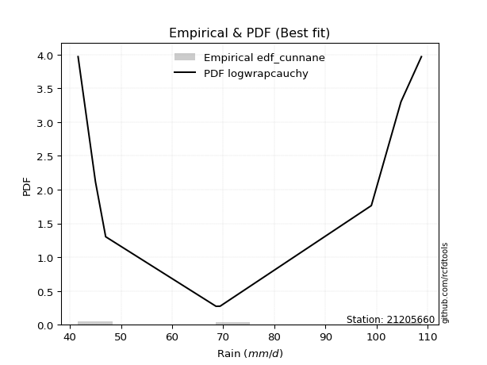</img>

</div>


### 12. EDF Adamowski (1981)

The Adamowski formula in hydrology refers to a specific plotting position formula used for estimating the non-parametric empirical distribution of hydrological events (like flood peaks) to calculate their return periods. This formula provides an alternative to traditional parametric methods (like the Gumbel or Log Pearson Type III distributions). 

<div align="center">


$P=(m-0.25)/(n+0.5)$


</div>


**12.1. Empirical values**

<div align="center">

|                | 0                   | 1                   | 2                  | 3                  | 4                  | 5                  | 6                  | 7                  |
|:---------------|:--------------------|:--------------------|:-------------------|:-------------------|:-------------------|:-------------------|:-------------------|:-------------------|
| date           | 2020                | 2023                | 2018               | 2021               | 2022               | 2019               | 2024               | 2025               |
| x              | 41.6                | 45.0                | 47.0               | 68.6               | 69.4               | 99.0               | 104.8              | 108.8              |
| m              | 1                   | 2                   | 3                  | 4                  | 5                  | 6                  | 7                  | 8                  |
| empirical_dist | edf_adamowski       | edf_adamowski       | edf_adamowski      | edf_adamowski      | edf_adamowski      | edf_adamowski      | edf_adamowski      | edf_adamowski      |
| empirical      | 0.08823529411764706 | 0.20588235294117646 | 0.3235294117647059 | 0.4411764705882353 | 0.5588235294117647 | 0.6764705882352942 | 0.7941176470588235 | 0.9117647058823529 |
| empirical_tr   | 1.096774193548387   | 1.259259259259259   | 1.4782608695652173 | 1.7894736842105263 | 2.2666666666666666 | 3.0909090909090913 | 4.857142857142856  | 11.33333333333333  |

</div>


**12.2. Kolmogorov-Smirnov fit test (sorted by Δ)**


<div align="center">

|                | 0                   | 1                   | 2                  | 3                   | 4                   | 5                  | 6                   | 7                   | 8                  | 9                   | 10                 | 11                  | 12                  | 13                  | 14                  | 15                  | 16                  | 17                 | 18                 | 19                 | 20                  | 21                  | 22                  | 23                  | 24                  | 25                  | 26                  | 27                  | 28                 | 29                  | 30                 | 31                  | 32                  | 33                  | 34                  | 35                  | 36                  | 37                 | 38                 | 39                  | 40                  | 41                  | 42                  | 43                  | 44                  | 45                 | 46                  | 47                 | 48                  | 49                  | 50                  | 51                  | 52                 | 53                  | 54                  | 55                  | 56                 | 57                  | 58                 | 59                  | 60                  | 61                 | 62                 | 63                  | 64                  | 65                 | 66                  | 67                 | 68                  | 69                  | 70                  | 71                  | 72                  | 73                 | 74                  | 75                  | 76                 | 77                 | 78                  | 79                 | 80                  | 81                 | 82                 | 83                  | 84                  | 85                 | 86                  | 87                 | 88                  | 89                 | 90                  | 91                  | 92                  | 93                  | 94                  | 95                  | 96                  | 97                  | 98                  | 99                  | 100                 | 101                 | 102                 | 103                 | 104                 | 105                 | 106                 | 107                 | 108                 | 109                 | 110                 | 111                | 112                 | 113                 | 114                 | 115                 | 116                | 117                | 118                 | 119                | 120                 | 121                 | 122                 | 123                 | 124                 | 125                | 126                 | 127                | 128                 | 129                 | 130                 | 131                | 132                | 133                 | 134                 | 135                 | 136                 | 137                | 138                | 139                | 140                | 141                 | 142                 | 143                | 144                | 145                 | 146                | 147                 | 148                 | 149                 | 150                | 151                | 152                | 153                | 154                | 155                | 156                | 157                | 158                | 159                |
|:---------------|:--------------------|:--------------------|:-------------------|:--------------------|:--------------------|:-------------------|:--------------------|:--------------------|:-------------------|:--------------------|:-------------------|:--------------------|:--------------------|:--------------------|:--------------------|:--------------------|:--------------------|:-------------------|:-------------------|:-------------------|:--------------------|:--------------------|:--------------------|:--------------------|:--------------------|:--------------------|:--------------------|:--------------------|:-------------------|:--------------------|:-------------------|:--------------------|:--------------------|:--------------------|:--------------------|:--------------------|:--------------------|:-------------------|:-------------------|:--------------------|:--------------------|:--------------------|:--------------------|:--------------------|:--------------------|:-------------------|:--------------------|:-------------------|:--------------------|:--------------------|:--------------------|:--------------------|:-------------------|:--------------------|:--------------------|:--------------------|:-------------------|:--------------------|:-------------------|:--------------------|:--------------------|:-------------------|:-------------------|:--------------------|:--------------------|:-------------------|:--------------------|:-------------------|:--------------------|:--------------------|:--------------------|:--------------------|:--------------------|:-------------------|:--------------------|:--------------------|:-------------------|:-------------------|:--------------------|:-------------------|:--------------------|:-------------------|:-------------------|:--------------------|:--------------------|:-------------------|:--------------------|:-------------------|:--------------------|:-------------------|:--------------------|:--------------------|:--------------------|:--------------------|:--------------------|:--------------------|:--------------------|:--------------------|:--------------------|:--------------------|:--------------------|:--------------------|:--------------------|:--------------------|:--------------------|:--------------------|:--------------------|:--------------------|:--------------------|:--------------------|:--------------------|:-------------------|:--------------------|:--------------------|:--------------------|:--------------------|:-------------------|:-------------------|:--------------------|:-------------------|:--------------------|:--------------------|:--------------------|:--------------------|:--------------------|:-------------------|:--------------------|:-------------------|:--------------------|:--------------------|:--------------------|:-------------------|:-------------------|:--------------------|:--------------------|:--------------------|:--------------------|:-------------------|:-------------------|:-------------------|:-------------------|:--------------------|:--------------------|:-------------------|:-------------------|:--------------------|:-------------------|:--------------------|:--------------------|:--------------------|:-------------------|:-------------------|:-------------------|:-------------------|:-------------------|:-------------------|:-------------------|:-------------------|:-------------------|:-------------------|
| station        | 21205660            | 21205660            | 21205660           | 21205660            | 21205660            | 21205660           | 21205660            | 21205660            | 21205660           | 21205660            | 21205660           | 21205660            | 21205660            | 21205660            | 21205660            | 21205660            | 21205660            | 21205660           | 21205660           | 21205660           | 21205660            | 21205660            | 21205660            | 21205660            | 21205660            | 21205660            | 21205660            | 21205660            | 21205660           | 21205660            | 21205660           | 21205660            | 21205660            | 21205660            | 21205660            | 21205660            | 21205660            | 21205660           | 21205660           | 21205660            | 21205660            | 21205660            | 21205660            | 21205660            | 21205660            | 21205660           | 21205660            | 21205660           | 21205660            | 21205660            | 21205660            | 21205660            | 21205660           | 21205660            | 21205660            | 21205660            | 21205660           | 21205660            | 21205660           | 21205660            | 21205660            | 21205660           | 21205660           | 21205660            | 21205660            | 21205660           | 21205660            | 21205660           | 21205660            | 21205660            | 21205660            | 21205660            | 21205660            | 21205660           | 21205660            | 21205660            | 21205660           | 21205660           | 21205660            | 21205660           | 21205660            | 21205660           | 21205660           | 21205660            | 21205660            | 21205660           | 21205660            | 21205660           | 21205660            | 21205660           | 21205660            | 21205660            | 21205660            | 21205660            | 21205660            | 21205660            | 21205660            | 21205660            | 21205660            | 21205660            | 21205660            | 21205660            | 21205660            | 21205660            | 21205660            | 21205660            | 21205660            | 21205660            | 21205660            | 21205660            | 21205660            | 21205660           | 21205660            | 21205660            | 21205660            | 21205660            | 21205660           | 21205660           | 21205660            | 21205660           | 21205660            | 21205660            | 21205660            | 21205660            | 21205660            | 21205660           | 21205660            | 21205660           | 21205660            | 21205660            | 21205660            | 21205660           | 21205660           | 21205660            | 21205660            | 21205660            | 21205660            | 21205660           | 21205660           | 21205660           | 21205660           | 21205660            | 21205660            | 21205660           | 21205660           | 21205660            | 21205660           | 21205660            | 21205660            | 21205660            | 21205660           | 21205660           | 21205660           | 21205660           | 21205660           | 21205660           | 21205660           | 21205660           | 21205660           | 21205660           |
| empirical_dist | edf_adamowski       | edf_adamowski       | edf_adamowski      | edf_adamowski       | edf_adamowski       | edf_adamowski      | edf_adamowski       | edf_adamowski       | edf_adamowski      | edf_adamowski       | edf_adamowski      | edf_adamowski       | edf_adamowski       | edf_adamowski       | edf_adamowski       | edf_adamowski       | edf_adamowski       | edf_adamowski      | edf_adamowski      | edf_adamowski      | edf_adamowski       | edf_adamowski       | edf_adamowski       | edf_adamowski       | edf_adamowski       | edf_adamowski       | edf_adamowski       | edf_adamowski       | edf_adamowski      | edf_adamowski       | edf_adamowski      | edf_adamowski       | edf_adamowski       | edf_adamowski       | edf_adamowski       | edf_adamowski       | edf_adamowski       | edf_adamowski      | edf_adamowski      | edf_adamowski       | edf_adamowski       | edf_adamowski       | edf_adamowski       | edf_adamowski       | edf_adamowski       | edf_adamowski      | edf_adamowski       | edf_adamowski      | edf_adamowski       | edf_adamowski       | edf_adamowski       | edf_adamowski       | edf_adamowski      | edf_adamowski       | edf_adamowski       | edf_adamowski       | edf_adamowski      | edf_adamowski       | edf_adamowski      | edf_adamowski       | edf_adamowski       | edf_adamowski      | edf_adamowski      | edf_adamowski       | edf_adamowski       | edf_adamowski      | edf_adamowski       | edf_adamowski      | edf_adamowski       | edf_adamowski       | edf_adamowski       | edf_adamowski       | edf_adamowski       | edf_adamowski      | edf_adamowski       | edf_adamowski       | edf_adamowski      | edf_adamowski      | edf_adamowski       | edf_adamowski      | edf_adamowski       | edf_adamowski      | edf_adamowski      | edf_adamowski       | edf_adamowski       | edf_adamowski      | edf_adamowski       | edf_adamowski      | edf_adamowski       | edf_adamowski      | edf_adamowski       | edf_adamowski       | edf_adamowski       | edf_adamowski       | edf_adamowski       | edf_adamowski       | edf_adamowski       | edf_adamowski       | edf_adamowski       | edf_adamowski       | edf_adamowski       | edf_adamowski       | edf_adamowski       | edf_adamowski       | edf_adamowski       | edf_adamowski       | edf_adamowski       | edf_adamowski       | edf_adamowski       | edf_adamowski       | edf_adamowski       | edf_adamowski      | edf_adamowski       | edf_adamowski       | edf_adamowski       | edf_adamowski       | edf_adamowski      | edf_adamowski      | edf_adamowski       | edf_adamowski      | edf_adamowski       | edf_adamowski       | edf_adamowski       | edf_adamowski       | edf_adamowski       | edf_adamowski      | edf_adamowski       | edf_adamowski      | edf_adamowski       | edf_adamowski       | edf_adamowski       | edf_adamowski      | edf_adamowski      | edf_adamowski       | edf_adamowski       | edf_adamowski       | edf_adamowski       | edf_adamowski      | edf_adamowski      | edf_adamowski      | edf_adamowski      | edf_adamowski       | edf_adamowski       | edf_adamowski      | edf_adamowski      | edf_adamowski       | edf_adamowski      | edf_adamowski       | edf_adamowski       | edf_adamowski       | edf_adamowski      | edf_adamowski      | edf_adamowski      | edf_adamowski      | edf_adamowski      | edf_adamowski      | edf_adamowski      | edf_adamowski      | edf_adamowski      | edf_adamowski      |
| p_dist         | logarcsine          | wrapcauchy          | logbeta            | beta                | logwrapcauchy       | arcsine            | logrdist            | ksone               | logksone           | semicircular        | logsemicircular    | lognakagami         | anglit              | logtrapezoid        | loganglit           | lomax               | logweibull_max      | triang             | trapezoid          | logmielke          | loggenlogistic      | logfoldnorm         | logburr             | loginvweibull       | loginvgauss         | foldnorm            | loggenexpon         | rdist               | rayleigh           | burr                | maxwell            | invgamma            | lograyleigh         | johnsonsu           | nct                 | logmaxwell          | truncnorm           | norm               | crystalball        | t                   | exponnorm           | pearson3            | genexpon            | lognct              | logexponpow         | loginvgamma        | logburr12           | logbetaprime       | loggamma            | loggamma            | logerlang           | logf                | logpearson3        | logt                | lognorm             | logcrystalball      | logexponnorm       | logskewnorm         | logloggamma        | logalpha            | logncf              | halfnorm           | f                  | alpha               | logkstwobign        | betaprime          | genlogistic         | loghalfnorm        | kstwobign           | logdweibull         | logcosine           | logloglaplace       | logrice             | cosine             | logistic            | logweibull_min      | logdgamma          | loglogistic        | loghalfgennorm      | loglevy_l          | erlang              | logexponweib       | weibull_min        | gumbel_l            | genpareto           | gumbel_r           | invgauss            | loggumbel_l        | hypsecant           | rice               | burr12              | loggumbel_r         | loggompertz         | loglomax            | loghypsecant        | dweibull            | kappa3              | logtriang           | logargus            | argus               | laplace             | loglaplace          | loglaplace          | halfgennorm         | gausshyper          | levy_l              | halflogistic        | bradford            | moyal               | logtukeylambda      | gamma               | kappa4             | vonmises_line       | logfatiguelife      | skewnorm            | logmoyal            | loghalflogistic    | dgamma             | logkappa4           | logkappa3          | logjohnsonsu        | loguniform          | truncexpon          | gompertz            | logvonmises_line    | tukeylambda        | uniform             | loggenextreme      | logjohnsonsb        | loggenhalflogistic  | logbradford         | nakagami           | logtruncexpon      | truncweibull_min    | logtruncweibull_min | loggennorm          | gennorm             | exponpow           | genhalflogistic    | logwald            | wald               | loggengamma         | loggausshyper       | genextreme         | loggenpareto       | exponweib           | powerlaw           | ncf                 | fatiguelife         | gengamma            | logpowerlaw        | invweibull         | weibull_max        | logtruncnorm       | logtruncpareto     | truncpareto        | johnsonsb          | logvonmises        | vonmises           | mielke             |
| delta          | 0.07623741730522013 | 0.08823295387213548 | 0.0882340439318408 | 0.08823464639708989 | 0.08823529387059215 | 0.0901422641262471 | 0.10782786122063992 | 0.11144172703873415 | 0.1146499594832644 | 0.12729954305521612 | 0.1303601903949274 | 0.13490100091605406 | 0.13864883666104122 | 0.13951609425097256 | 0.14158927470864957 | 0.14253420623644952 | 0.14387010763701769 | 0.1525962914034923 | 0.1565189249864843 | 0.1572164278929192 | 0.15752817527483598 | 0.15844982226224502 | 0.15870183762695456 | 0.15878490367632392 | 0.15947503255021744 | 0.15976641872315822 | 0.16011806315448496 | 0.16054093887990373 | 0.1607560560682446 | 0.16085824471037535 | 0.1613815935424736 | 0.16159331497843565 | 0.16247957857711634 | 0.16283954792902755 | 0.16322803457554558 | 0.16335871651800507 | 0.16423390119944464 | 0.1642339093461604 | 0.164233916221017  | 0.16424207968398677 | 0.16424822975908837 | 0.16451690375779532 | 0.16550096761161087 | 0.16557706909590764 | 0.16574080774830424 | 0.1659383211204677 | 0.16629812411879027 | 0.1663103964186969 | 0.16667768173646963 | 0.16667768173646963 | 0.16670903698175518 | 0.16678346228790422 | 0.1669039751022439 | 0.16691392119847942 | 0.16691524857570872 | 0.16691524933040072 | 0.1669160203202953 | 0.16691618261848584 | 0.1669363509067097 | 0.16694898870302743 | 0.16748169094880633 | 0.1676173894917113 | 0.1677082877394995 | 0.16797591096624112 | 0.16893443140503106 | 0.1693889954172823 | 0.17036742244059633 | 0.1728358221050806 | 0.17559443070805392 | 0.17586104412201994 | 0.17934805661648645 | 0.18011917940998287 | 0.18243547094479892 | 0.1826929486587034 | 0.18277116111951228 | 0.18339202623185158 | 0.1839032770374858 | 0.1851915585694313 | 0.18554253672252286 | 0.1863199776773643 | 0.18717128136365868 | 0.1871759290297056 | 0.1882609095075889 | 0.18990481098676748 | 0.19053062071231075 | 0.1905649465744621 | 0.19218269190286674 | 0.1923613901611888 | 0.19251995850592343 | 0.1930647788347542 | 0.19354762614762433 | 0.19436107950557882 | 0.19451253890260536 | 0.19453238093366543 | 0.19472529336075103 | 0.19478765259936115 | 0.19576454291184542 | 0.19771799637405832 | 0.19938596963485528 | 0.20136001269459286 | 0.20151592666209608 | 0.20341862891451362 | 0.20341862891451362 | 0.20529227233885483 | 0.21015762164908058 | 0.21406856053110357 | 0.21409649690799942 | 0.21463374502573807 | 0.21485203495452027 | 0.21517187641059654 | 0.21590722479783842 | 0.2175999013916457 | 0.21792502503994254 | 0.21820951008292666 | 0.21836197535750457 | 0.21917306822473132 | 0.2204774705861594 | 0.2210820033773392 | 0.22144512066792466 | 0.2232222232962362 | 0.22486493181250478 | 0.22534927041414077 | 0.22541423530245897 | 0.22551204309813028 | 0.22782366701206058 | 0.2375180804948543 | 0.24317226890756305 | 0.244564738134747  | 0.24750913849257428 | 0.25410929827358736 | 0.25434458176016483 | 0.2572988585723892 | 0.268840265517743  | 0.27014330475148074 | 0.2924047901128607  | 0.29411764705882354 | 0.29411764705882354 | 0.3016209221666311 | 0.3115995871621611 | 0.3235294117647059 | 0.3235294117647059 | 0.33939826756799374 | 0.34280547266757266 | 0.3511490579280082 | 0.3586499792633704 | 0.39893684321618733 | 0.4070140699135496 | 0.41890245700152307 | 0.41999452450500824 | 0.43507553944243743 | 0.4399553275574113 | 0.4732349430209878 | 0.5004398946223698 | 0.5098308699895298 | 0.5103313476710272 | 0.5930113868819837 | 0.6965814642622759 | 1.1660142897632058 | 17.1617016928419   | nan                |
| deltao         | 0.4472608134160001  | 0.4472608134160001  | 0.4472608134160001 | 0.4472608134160001  | 0.4472608134160001  | 0.4472608134160001 | 0.4472608134160001  | 0.4472608134160001  | 0.4472608134160001 | 0.4472608134160001  | 0.4472608134160001 | 0.4472608134160001  | 0.4472608134160001  | 0.4472608134160001  | 0.4472608134160001  | 0.4472608134160001  | 0.4472608134160001  | 0.4472608134160001 | 0.4472608134160001 | 0.4472608134160001 | 0.4472608134160001  | 0.4472608134160001  | 0.4472608134160001  | 0.4472608134160001  | 0.4472608134160001  | 0.4472608134160001  | 0.4472608134160001  | 0.4472608134160001  | 0.4472608134160001 | 0.4472608134160001  | 0.4472608134160001 | 0.4472608134160001  | 0.4472608134160001  | 0.4472608134160001  | 0.4472608134160001  | 0.4472608134160001  | 0.4472608134160001  | 0.4472608134160001 | 0.4472608134160001 | 0.4472608134160001  | 0.4472608134160001  | 0.4472608134160001  | 0.4472608134160001  | 0.4472608134160001  | 0.4472608134160001  | 0.4472608134160001 | 0.4472608134160001  | 0.4472608134160001 | 0.4472608134160001  | 0.4472608134160001  | 0.4472608134160001  | 0.4472608134160001  | 0.4472608134160001 | 0.4472608134160001  | 0.4472608134160001  | 0.4472608134160001  | 0.4472608134160001 | 0.4472608134160001  | 0.4472608134160001 | 0.4472608134160001  | 0.4472608134160001  | 0.4472608134160001 | 0.4472608134160001 | 0.4472608134160001  | 0.4472608134160001  | 0.4472608134160001 | 0.4472608134160001  | 0.4472608134160001 | 0.4472608134160001  | 0.4472608134160001  | 0.4472608134160001  | 0.4472608134160001  | 0.4472608134160001  | 0.4472608134160001 | 0.4472608134160001  | 0.4472608134160001  | 0.4472608134160001 | 0.4472608134160001 | 0.4472608134160001  | 0.4472608134160001 | 0.4472608134160001  | 0.4472608134160001 | 0.4472608134160001 | 0.4472608134160001  | 0.4472608134160001  | 0.4472608134160001 | 0.4472608134160001  | 0.4472608134160001 | 0.4472608134160001  | 0.4472608134160001 | 0.4472608134160001  | 0.4472608134160001  | 0.4472608134160001  | 0.4472608134160001  | 0.4472608134160001  | 0.4472608134160001  | 0.4472608134160001  | 0.4472608134160001  | 0.4472608134160001  | 0.4472608134160001  | 0.4472608134160001  | 0.4472608134160001  | 0.4472608134160001  | 0.4472608134160001  | 0.4472608134160001  | 0.4472608134160001  | 0.4472608134160001  | 0.4472608134160001  | 0.4472608134160001  | 0.4472608134160001  | 0.4472608134160001  | 0.4472608134160001 | 0.4472608134160001  | 0.4472608134160001  | 0.4472608134160001  | 0.4472608134160001  | 0.4472608134160001 | 0.4472608134160001 | 0.4472608134160001  | 0.4472608134160001 | 0.4472608134160001  | 0.4472608134160001  | 0.4472608134160001  | 0.4472608134160001  | 0.4472608134160001  | 0.4472608134160001 | 0.4472608134160001  | 0.4472608134160001 | 0.4472608134160001  | 0.4472608134160001  | 0.4472608134160001  | 0.4472608134160001 | 0.4472608134160001 | 0.4472608134160001  | 0.4472608134160001  | 0.4472608134160001  | 0.4472608134160001  | 0.4472608134160001 | 0.4472608134160001 | 0.4472608134160001 | 0.4472608134160001 | 0.4472608134160001  | 0.4472608134160001  | 0.4472608134160001 | 0.4472608134160001 | 0.4472608134160001  | 0.4472608134160001 | 0.4472608134160001  | 0.4472608134160001  | 0.4472608134160001  | 0.4472608134160001 | 0.4472608134160001 | 0.4472608134160001 | 0.4472608134160001 | 0.4472608134160001 | 0.4472608134160001 | 0.4472608134160001 | 0.4472608134160001 | 0.4472608134160001 | 0.4472608134160001 |
| eval           | Δo > Δ              | Δo > Δ              | Δo > Δ             | Δo > Δ              | Δo > Δ              | Δo > Δ             | Δo > Δ              | Δo > Δ              | Δo > Δ             | Δo > Δ              | Δo > Δ             | Δo > Δ              | Δo > Δ              | Δo > Δ              | Δo > Δ              | Δo > Δ              | Δo > Δ              | Δo > Δ             | Δo > Δ             | Δo > Δ             | Δo > Δ              | Δo > Δ              | Δo > Δ              | Δo > Δ              | Δo > Δ              | Δo > Δ              | Δo > Δ              | Δo > Δ              | Δo > Δ             | Δo > Δ              | Δo > Δ             | Δo > Δ              | Δo > Δ              | Δo > Δ              | Δo > Δ              | Δo > Δ              | Δo > Δ              | Δo > Δ             | Δo > Δ             | Δo > Δ              | Δo > Δ              | Δo > Δ              | Δo > Δ              | Δo > Δ              | Δo > Δ              | Δo > Δ             | Δo > Δ              | Δo > Δ             | Δo > Δ              | Δo > Δ              | Δo > Δ              | Δo > Δ              | Δo > Δ             | Δo > Δ              | Δo > Δ              | Δo > Δ              | Δo > Δ             | Δo > Δ              | Δo > Δ             | Δo > Δ              | Δo > Δ              | Δo > Δ             | Δo > Δ             | Δo > Δ              | Δo > Δ              | Δo > Δ             | Δo > Δ              | Δo > Δ             | Δo > Δ              | Δo > Δ              | Δo > Δ              | Δo > Δ              | Δo > Δ              | Δo > Δ             | Δo > Δ              | Δo > Δ              | Δo > Δ             | Δo > Δ             | Δo > Δ              | Δo > Δ             | Δo > Δ              | Δo > Δ             | Δo > Δ             | Δo > Δ              | Δo > Δ              | Δo > Δ             | Δo > Δ              | Δo > Δ             | Δo > Δ              | Δo > Δ             | Δo > Δ              | Δo > Δ              | Δo > Δ              | Δo > Δ              | Δo > Δ              | Δo > Δ              | Δo > Δ              | Δo > Δ              | Δo > Δ              | Δo > Δ              | Δo > Δ              | Δo > Δ              | Δo > Δ              | Δo > Δ              | Δo > Δ              | Δo > Δ              | Δo > Δ              | Δo > Δ              | Δo > Δ              | Δo > Δ              | Δo > Δ              | Δo > Δ             | Δo > Δ              | Δo > Δ              | Δo > Δ              | Δo > Δ              | Δo > Δ             | Δo > Δ             | Δo > Δ              | Δo > Δ             | Δo > Δ              | Δo > Δ              | Δo > Δ              | Δo > Δ              | Δo > Δ              | Δo > Δ             | Δo > Δ              | Δo > Δ             | Δo > Δ              | Δo > Δ              | Δo > Δ              | Δo > Δ             | Δo > Δ             | Δo > Δ              | Δo > Δ              | Δo > Δ              | Δo > Δ              | Δo > Δ             | Δo > Δ             | Δo > Δ             | Δo > Δ             | Δo > Δ              | Δo > Δ              | Δo > Δ             | Δo > Δ             | Δo > Δ              | Δo > Δ             | Δo > Δ              | Δo > Δ              | Δo > Δ              | Δo > Δ             | Δo <= Δ            | Δo <= Δ            | Δo <= Δ            | Δo <= Δ            | Δo <= Δ            | Δo <= Δ            | Δo <= Δ            | Δo <= Δ            | Δo <= Δ            |
| fit            | 1                   | 1                   | 1                  | 1                   | 1                   | 1                  | 1                   | 1                   | 1                  | 1                   | 1                  | 1                   | 1                   | 1                   | 1                   | 1                   | 1                   | 1                  | 1                  | 1                  | 1                   | 1                   | 1                   | 1                   | 1                   | 1                   | 1                   | 1                   | 1                  | 1                   | 1                  | 1                   | 1                   | 1                   | 1                   | 1                   | 1                   | 1                  | 1                  | 1                   | 1                   | 1                   | 1                   | 1                   | 1                   | 1                  | 1                   | 1                  | 1                   | 1                   | 1                   | 1                   | 1                  | 1                   | 1                   | 1                   | 1                  | 1                   | 1                  | 1                   | 1                   | 1                  | 1                  | 1                   | 1                   | 1                  | 1                   | 1                  | 1                   | 1                   | 1                   | 1                   | 1                   | 1                  | 1                   | 1                   | 1                  | 1                  | 1                   | 1                  | 1                   | 1                  | 1                  | 1                   | 1                   | 1                  | 1                   | 1                  | 1                   | 1                  | 1                   | 1                   | 1                   | 1                   | 1                   | 1                   | 1                   | 1                   | 1                   | 1                   | 1                   | 1                   | 1                   | 1                   | 1                   | 1                   | 1                   | 1                   | 1                   | 1                   | 1                   | 1                  | 1                   | 1                   | 1                   | 1                   | 1                  | 1                  | 1                   | 1                  | 1                   | 1                   | 1                   | 1                   | 1                   | 1                  | 1                   | 1                  | 1                   | 1                   | 1                   | 1                  | 1                  | 1                   | 1                   | 1                   | 1                   | 1                  | 1                  | 1                  | 1                  | 1                   | 1                   | 1                  | 1                  | 1                   | 1                  | 1                   | 1                   | 1                   | 1                  | 0                  | 0                  | 0                  | 0                  | 0                  | 0                  | 0                  | 0                  | 0                  |
| n              | 8                   | 8                   | 8                  | 8                   | 8                   | 8                  | 8                   | 8                   | 8                  | 8                   | 8                  | 8                   | 8                   | 8                   | 8                   | 8                   | 8                   | 8                  | 8                  | 8                  | 8                   | 8                   | 8                   | 8                   | 8                   | 8                   | 8                   | 8                   | 8                  | 8                   | 8                  | 8                   | 8                   | 8                   | 8                   | 8                   | 8                   | 8                  | 8                  | 8                   | 8                   | 8                   | 8                   | 8                   | 8                   | 8                  | 8                   | 8                  | 8                   | 8                   | 8                   | 8                   | 8                  | 8                   | 8                   | 8                   | 8                  | 8                   | 8                  | 8                   | 8                   | 8                  | 8                  | 8                   | 8                   | 8                  | 8                   | 8                  | 8                   | 8                   | 8                   | 8                   | 8                   | 8                  | 8                   | 8                   | 8                  | 8                  | 8                   | 8                  | 8                   | 8                  | 8                  | 8                   | 8                   | 8                  | 8                   | 8                  | 8                   | 8                  | 8                   | 8                   | 8                   | 8                   | 8                   | 8                   | 8                   | 8                   | 8                   | 8                   | 8                   | 8                   | 8                   | 8                   | 8                   | 8                   | 8                   | 8                   | 8                   | 8                   | 8                   | 8                  | 8                   | 8                   | 8                   | 8                   | 8                  | 8                  | 8                   | 8                  | 8                   | 8                   | 8                   | 8                   | 8                   | 8                  | 8                   | 8                  | 8                   | 8                   | 8                   | 8                  | 8                  | 8                   | 8                   | 8                   | 8                   | 8                  | 8                  | 8                  | 8                  | 8                   | 8                   | 8                  | 8                  | 8                   | 8                  | 8                   | 8                   | 8                   | 8                  | 8                  | 8                  | 8                  | 8                  | 8                  | 8                  | 8                  | 8                  | 8                  |
| best_fit       | 1                   | 0                   | 0                  | 0                   | 0                   | 0                  | 0                   | 0                   | 0                  | 0                   | 0                  | 0                   | 0                   | 0                   | 0                   | 0                   | 0                   | 0                  | 0                  | 0                  | 0                   | 0                   | 0                   | 0                   | 0                   | 0                   | 0                   | 0                   | 0                  | 0                   | 0                  | 0                   | 0                   | 0                   | 0                   | 0                   | 0                   | 0                  | 0                  | 0                   | 0                   | 0                   | 0                   | 0                   | 0                   | 0                  | 0                   | 0                  | 0                   | 0                   | 0                   | 0                   | 0                  | 0                   | 0                   | 0                   | 0                  | 0                   | 0                  | 0                   | 0                   | 0                  | 0                  | 0                   | 0                   | 0                  | 0                   | 0                  | 0                   | 0                   | 0                   | 0                   | 0                   | 0                  | 0                   | 0                   | 0                  | 0                  | 0                   | 0                  | 0                   | 0                  | 0                  | 0                   | 0                   | 0                  | 0                   | 0                  | 0                   | 0                  | 0                   | 0                   | 0                   | 0                   | 0                   | 0                   | 0                   | 0                   | 0                   | 0                   | 0                   | 0                   | 0                   | 0                   | 0                   | 0                   | 0                   | 0                   | 0                   | 0                   | 0                   | 0                  | 0                   | 0                   | 0                   | 0                   | 0                  | 0                  | 0                   | 0                  | 0                   | 0                   | 0                   | 0                   | 0                   | 0                  | 0                   | 0                  | 0                   | 0                   | 0                   | 0                  | 0                  | 0                   | 0                   | 0                   | 0                   | 0                  | 0                  | 0                  | 0                  | 0                   | 0                   | 0                  | 0                  | 0                   | 0                  | 0                   | 0                   | 0                   | 0                  | 0                  | 0                  | 0                  | 0                  | 0                  | 0                  | 0                  | 0                  | 0                  |
| best_fit_sort  | 1                   | 2                   | 3                  | 4                   | 5                   | 6                  | 7                   | 8                   | 9                  | 10                  | 11                 | 12                  | 13                  | 14                  | 15                  | 16                  | 17                  | 18                 | 19                 | 20                 | 21                  | 22                  | 23                  | 24                  | 25                  | 26                  | 27                  | 28                  | 29                 | 30                  | 31                 | 32                  | 33                  | 34                  | 35                  | 36                  | 37                  | 38                 | 39                 | 40                  | 41                  | 42                  | 43                  | 44                  | 45                  | 46                 | 47                  | 48                 | 49                  | 50                  | 51                  | 52                  | 53                 | 54                  | 55                  | 56                  | 57                 | 58                  | 59                 | 60                  | 61                  | 62                 | 63                 | 64                  | 65                  | 66                 | 67                  | 68                 | 69                  | 70                  | 71                  | 72                  | 73                  | 74                 | 75                  | 76                  | 77                 | 78                 | 79                  | 80                 | 81                  | 82                 | 83                 | 84                  | 85                  | 86                 | 87                  | 88                 | 89                  | 90                 | 91                  | 92                  | 93                  | 94                  | 95                  | 96                  | 97                  | 98                  | 99                  | 100                 | 101                 | 102                 | 103                 | 104                 | 105                 | 106                 | 107                 | 108                 | 109                 | 110                 | 111                 | 112                | 113                 | 114                 | 115                 | 116                 | 117                | 118                | 119                 | 120                | 121                 | 122                 | 123                 | 124                 | 125                 | 126                | 127                 | 128                | 129                 | 130                 | 131                 | 132                | 133                | 134                 | 135                 | 136                 | 137                 | 138                | 139                | 140                | 141                | 142                 | 143                 | 144                | 145                | 146                 | 147                | 148                 | 149                 | 150                 | 151                | 152                | 153                | 154                | 155                | 156                | 157                | 158                | 159                | 160                |

</div>


**12.3. Best fit**

<div align="center">

|   id |   station | empirical_dist   | p_dist     |     delta |   deltao | eval   |   fit |   n |   best_fit |   best_fit_sort |
|-----:|----------:|:-----------------|:-----------|----------:|---------:|:-------|------:|----:|-----------:|----------------:|
|    0 |  21205660 | edf_adamowski    | logarcsine | 0.0762374 | 0.447261 | Δo > Δ |     1 |   8 |          1 |               1 |

</div>


<div align="center">

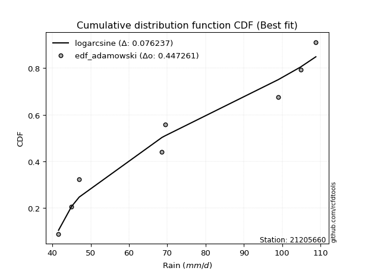</img>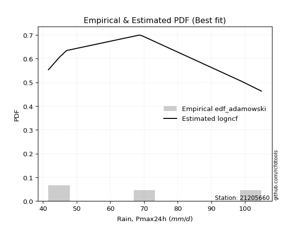</img>

</div>


## C. Best fit & Estimate extreme values for specific return periods - Tr

Best fit in probability distribution analysis means finding the theoretical distribution (like Normal, Poisson, Exponential, etc.) that most accurately mirrors your real-world data´s patterns (shape, center, spread) for better predictions, using methods like visual checks (Q-Q plots), goodness-of-fit tests (Kolmogorov-Smirnov, Chi-Squared), and information criteria (AIC) to score and select the simplest, most representative model.


### 1. Best fit (ordered by delta Δ)

:file_folder:Table: [bestfit_21205660.csv](table/bestfit_21205660.csv)

<div align="center">

|   id |   station | empirical_dist   | p_dist        |     delta |   deltao | eval   |   fit |   n |   best_fit |   best_fit_sort |
|-----:|----------:|:-----------------|:--------------|----------:|---------:|:-------|------:|----:|-----------:|----------------:|
|    0 |  21205660 | edf_hazen        | logwrapcauchy | 0.0678204 | 0.447261 | Δo > Δ |     1 |   8 |          1 |               1 |
|    1 |  21205660 | edf_gringorten   | logwrapcauchy | 0.0689655 | 0.447261 | Δo > Δ |     1 |   8 |          1 |               2 |
|    2 |  21205660 | edf_tukey        | logarcsine    | 0.072708  | 0.447261 | Δo > Δ |     1 |   8 |          1 |               3 |
|    3 |  21205660 | edf_cunnane      | logwrapcauchy | 0.0731707 | 0.447261 | Δo > Δ |     1 |   8 |          1 |               4 |
|    4 |  21205660 | edf_filliben     | logarcsine    | 0.0733894 | 0.447261 | Δo > Δ |     1 |   8 |          1 |               5 |
|    5 |  21205660 | edf_jenkinson    | logarcsine    | 0.0737104 | 0.447261 | Δo > Δ |     1 |   8 |          1 |               6 |
|    6 |  21205660 | edf_beard        | logarcsine    | 0.0737104 | 0.447261 | Δo > Δ |     1 |   8 |          1 |               7 |
|    7 |  21205660 | edf_chegodayev   | logarcsine    | 0.0741366 | 0.447261 | Δo > Δ |     1 |   8 |          1 |               8 |
|    8 |  21205660 | edf_blom         | logarcsine    | 0.0755585 | 0.447261 | Δo > Δ |     1 |   8 |          1 |               9 |
|    9 |  21205660 | edf_adamowski    | logarcsine    | 0.0762374 | 0.447261 | Δo > Δ |     1 |   8 |          1 |              10 |
|   10 |  21205660 | edf_weibull      | logarcsine    | 0.0860413 | 0.447261 | Δo > Δ |     1 |   8 |          1 |              11 |
|   11 |  21205660 | edf_california   | beta          | 0.106356  | 0.447261 | Δo > Δ |     1 |   8 |          1 |              12 |

</div>


### 2. Extreme values and % difference analysis

In hydrology, a return period (or recurrence interval $Tr$) is the statistical average time between extreme events like floods or droughts of a specific magnitude, indicating how rare an event is, with a 100-year flood, for example, having a 1% chance of occurring in any given year, not that it happens exactly every century. It is a key tool for infrastructure design (like bridges or dams) and risk assessment, calculated from historical data to determine the probability of future events, although it is important to remember it is statistical average, and events can cluster or be missed.

The extreme value porcentage difference is evaluated as $pdiff = 1 - (ETrBf / ETr) * 100$, where _ETrBf_ correspond to the bestfit extreme value for a specific recurrence interval and _ETr_ correspond to the extreme value for one of the most used PDFsused in hydrology.

> risk_rate: assuming the return period as the project useful life.

:file_folder:Table: [extreme_21205660.csv](table/extreme_21205660.csv), all PDFs.  
:file_folder:Table: [extremepdiff_21205660.csv](table/extremepdiff_21205660.csv), % difference between bestfit and most used PDFs in Hydrology.

<div align="center">

Extreme values table for only best fit PDFs
|   id |      tr |   prob_l |     prob_g |    alpha |   anglit |   arcsine |    argus |     beta |   betaprime |   bradford |     burr |   burr12 |   cosine |   crystalball |   dgamma |   dweibull |   erlang |   exponnorm |   exponpow |   exponweib |        f |   fatiguelife |   foldnorm |    gamma |   gausshyper |   genexpon |       genextreme |   gengamma |   genhalflogistic |   genlogistic |   gennorm |   genpareto |   gompertz |   gumbel_l |   gumbel_r |   halfgennorm |   halflogistic |   halfnorm |   hypsecant |   invgamma |   invgauss |       invweibull |   johnsonsb |   johnsonsu |   kappa3 |   kappa4 |    ksone |   kstwobign |   laplace |   levy_l |   loggamma |   logistic |   loglaplace |     lomax |   maxwell |   mielke |    moyal |   nakagami |       ncf |      nct |     norm |   pearson3 |   powerlaw |   rayleigh |    rdist |     rice |   semicircular |   skewnorm |        t |   trapezoid |   triang |   truncexpon |   truncnorm |   truncpareto |   truncweibull_min |   tukeylambda |   uniform |   vonmises |   vonmises_line |     wald |   weibull_max |   weibull_min |   wrapcauchy |   logalpha |   loganglit |   logarcsine |   logargus |   logbeta |   logbetaprime |   logbradford |   logburr |   logburr12 |   logcosine |   logcrystalball |   logdgamma |   logdweibull |   logerlang |   logexponnorm |   logexponpow |   logexponweib |     logf |   logfatiguelife |   logfoldnorm |   loggausshyper |   loggenexpon |   loggenextreme |   loggengamma |   loggenhalflogistic |   loggenlogistic |   loggennorm |   loggenpareto |   loggompertz |   loggumbel_l |   loggumbel_r |   loghalfgennorm |   loghalflogistic |   loghalfnorm |   loghypsecant |   loginvgamma |   loginvgauss |   loginvweibull |   logjohnsonsb |   logjohnsonsu |   logkappa3 |   logkappa4 |   logksone |   logkstwobign |   loglevy_l |   logloggamma |   loglogistic |   logloglaplace |   loglomax |   logmaxwell |   logmielke |   logmoyal |   lognakagami |   logncf |   lognct |   lognorm |   logpearson3 |   logpowerlaw |   lograyleigh |   logrdist |   logrice |   logsemicircular |   logskewnorm |     logt |   logtrapezoid |   logtriang |   logtruncexpon |   logtruncnorm |   logtruncpareto |   logtruncweibull_min |   logtukeylambda |   loguniform |   logvonmises |   logvonmises_line |   logwald |   logweibull_max |   logweibull_min |   logwrapcauchy |   station |   n |   risk_rate |
|-----:|--------:|---------:|-----------:|---------:|---------:|----------:|---------:|---------:|------------:|-----------:|---------:|---------:|---------:|--------------:|---------:|-----------:|---------:|------------:|-----------:|------------:|---------:|--------------:|-----------:|---------:|-------------:|-----------:|-----------------:|-----------:|------------------:|--------------:|----------:|------------:|-----------:|-----------:|-----------:|--------------:|---------------:|-----------:|------------:|-----------:|-----------:|-----------------:|------------:|------------:|---------:|---------:|---------:|------------:|----------:|---------:|-----------:|-----------:|-------------:|----------:|----------:|---------:|---------:|-----------:|----------:|---------:|---------:|-----------:|-----------:|-----------:|---------:|---------:|---------------:|-----------:|---------:|------------:|---------:|-------------:|------------:|--------------:|-------------------:|--------------:|----------:|-----------:|----------------:|---------:|--------------:|--------------:|-------------:|-----------:|------------:|-------------:|-----------:|----------:|---------------:|--------------:|----------:|------------:|------------:|-----------------:|------------:|--------------:|------------:|---------------:|--------------:|---------------:|---------:|-----------------:|--------------:|----------------:|--------------:|----------------:|--------------:|---------------------:|-----------------:|-------------:|---------------:|--------------:|--------------:|--------------:|-----------------:|------------------:|--------------:|---------------:|--------------:|--------------:|----------------:|---------------:|---------------:|------------:|------------:|-----------:|---------------:|------------:|--------------:|--------------:|----------------:|-----------:|-------------:|------------:|-----------:|--------------:|---------:|---------:|----------:|--------------:|--------------:|--------------:|-----------:|----------:|------------------:|--------------:|---------:|---------------:|------------:|----------------:|---------------:|-----------------:|----------------------:|-----------------:|-------------:|--------------:|-------------------:|----------:|-----------------:|-----------------:|----------------:|----------:|----:|------------:|
|    0 |    2    | 0.5      | 0.5        |  69.1045 |  73.025  |   73.025  |  77.1333 |  66.8704 |     68.3406 |    69.3733 |  64.3109 |  58.6292 |  73.6323 |       73.025  |  69.4    |    69.4    |  67.8626 |     73.0138 |    44.7279 |     42.2435 |  67.1794 |       41.6001 |    72.6156 |  64.5316 |      66.1074 |    63.3608 |     55.8449      |    42.4393 |           88.4584 |       68.1819 |      75.2 |     85.4819 |    70.5648 |    77.3118 |    68.7382 |       56.0194 |        66.607  |    67.6836 |     73.025  |    64.7827 |    59.3645 |   1933.33        |     41.6002 |     73.0261 |  73.6067 |  73.8781 |  73.025  |     68.1803 |   73.025  |  88.0691 |    68.1242 |    73.025  |      68.2872 |   61.3078 |   70.7933 |  63.8383 |  67.3542 |    49.9032 |   40.4203 |  65.2824 |  73.025  |    72.2729 |    43.0463 |    70.0018 |  75.2486 |  71.3361 |        73.025  |    69.153  |  73.0252 |     77.463  |  76.7177 |      68.2007 |     73.025  |       41.7786 |            55.1821 |       75.3329 |   75.2    | -1.73876   |         74.2513 |  64.5664 |       108.553 |       58.2063 |      75.1997 |    67.0981 |     68.2872 |      68.2872 |    72.9534 |   66.2745 |        67.8769 |       61.1141 |   63.7394 |     71.9389 |     68.1464 |          68.2872 |     69.4    |       68.6    |     68.1306 |        68.2872 |       62.0712 |        59.8485 |  68.2144 |          56.9054 |       64.762  |         49.3664 |       61.5813 |         84.9077 |       50.0367 |              80.5564 |          63.9851 |      67.2761 |        52.2469 |       66.0955 |       72.572  |       64.2554 |          59.6661 |           62.3399 |       63.3002 |        68.2872 |       66.8181 |       61.9365 |         63.9237 |         48.994 |        85.7635 |     41.6    |     65.4512 |    68.2872 |        63.4035 |     87.2626 |       69.1367 |       68.2872 |         69.037  |    58.5773 |      66.1576 |     64.0722 |    63.0053 |       64.9066 |  68.0918 |  66.6287 |   68.2872 |       68.4487 |       42.7312 |       65.4184 |    68.1774 |   66.6673 |           68.2872 |       68.2896 |  68.287  |        72.7682 |     74.3319 |         58.8625 |        79.4648 |          42.0832 |               53.6256 |          67.2761 |      67.2761 |      0.127566 |            66.6811 |   60.5604 |          76.6401 |     57.2394      |         67.2756 |  21205660 |   8 |    0.75     |
|    1 |    2.33 | 0.570815 | 0.429185   |  73.7184 |  78.449  |   81.1672 |  81.6754 |  76.7281 |     72.9398 |    74.1538 |  68.8705 |  63.2871 |  78.228  |       77.6815 |  71.3934 |    72.1868 |  72.3386 |     77.6702 |    48.2654 |     43.5949 |  71.8008 |       42.6512 |    77.4239 |  68.5373 |      71.244  |    68.1554 |    129.818       |    43.3094 |           92.4987 |       72.7602 |      75.2 |     92.2461 |    75.3153 |    81.363  |    73.0529 |       61.1395 |        71.0432 |    72.7091 |     76.7516 |    69.3692 |    63.789  | 112349           |     41.6008 |     77.7096 |  78.6685 |  79.054  |  79.4262 |     72.7745 |   75.8429 |  94.3442 |    72.7869 |    77.1277 |      71.0743 |   67.3111 |   75.631  |  68.4094 |  71.4387 |    54.7816 |   53.1029 |  69.8424 |  77.6815 |    76.9466 |    44.6119 |    74.9111 |  82.0829 |  75.9286 |        78.8423 |    73.8957 |  77.6816 |     82.8231 |  82.0211 |      72.8217 |     77.6815 |       41.9275 |            59.2863 |       80.2527 |   79.9588 | -1.37973   |         79.1442 |  67.6197 |       108.712 |       63.3412 |      91.2124 |    71.7097 |     73.753  |      76.6547 |    77.6342 |   75.4686 |        72.5353 |       65.427  |   68.2932 |     76.6841 |     72.7429 |          72.9538 |     72.5141 |       71.2142 |     72.7943 |        72.9539 |       66.8826 |        64.2812 |  72.8811 |          61.2105 |       69.7413 |         52.3558 |       66.283  |         89.6278 |       52.9653 |              85.3343 |          68.5628 |      67.2761 |        66.8423 |       70.8403 |       76.8681 |       68.3142 |          64.2197 |           66.3925 |       67.9816 |        71.9971 |       71.433  |       66.434  |         68.4771 |         62.449 |        90.7692 |     41.6    |     70.4213 |    74.7833 |        67.9019 |     93.2977 |       73.8242 |       72.3825 |         72.545  |    63.2059 |      70.8608 |     68.6474 |    66.7666 |       71.3003 |  72.7609 |  71.2417 |   72.9538 |       73.1205 |       43.8715 |       70.1403 |    75.6101 |   71.2867 |           74.166  |       72.9563 |  72.9536 |        78.5214 |     79.1637 |         62.7292 |        81.7479 |          42.5121 |               57.1574 |          72.2551 |      72.016  |      0.136203 |            71.4324 |   63.2431 |          83.6458 |     65.3639      |         83.6573 |  21205660 |   8 |    0.729209 |
|    2 |    5    | 0.8      | 0.2        |  93.3591 |  97.5859 |  102.88   |  96.2448 | 103.316  |     92.8391 |    91.3565 |  92.2017 |  92.6343 |  94.7895 |       94.9862 |  85.4297 |    88.7584 |  90.9662 |     94.9812 |   103.629  |    125.671  |  92.9164 |       64.9783 |    95.2949 |  86.1979 |      90.7578 |    92.1273 | 243216           |    59.1075 |          102.814  |       92.6473 |      75.2 |    105.815  |    94.3588 |    94.4507 |    91.7982 |       96.7859 |        91.1164 |    93.9616 |     91.6997 |    92.3383 |    89.5576 |      5.69511e+12 |     41.7144 |     95.1151 |  95.0503 |  95.7777 | 100.143  |     92.2894 |   89.9317 | 104.741  |    93.2027 |    92.9687 |      86.811  |  111.138  |   94.6721 |  92.5381 |  90.3583 |    86.6    |  124.088  |  92.2654 |  94.9862 |    94.7382 |    61.1289 |    94.5653 | 101.223  |  94.194  |        98.6942 |    93.9517 |  94.9859 |     98.2008 |  97.236  |      89.9748 |     94.9862 |       45.0458 |            78.7772 |       96.0371 |   95.36   | -0.0831297 |         94.9799 |  84.7122 |       108.799 |       93.5156 |     105.054  |    92.6132 |     96.7756 |     104.329  |    93.9105 |  102.579  |        93.1233 |       83.9716 |   92.2814 |     94.8298 |     92.0336 |          93.2691 |     91.6259 |       90.3154 |     93.2147 |        93.2692 |       91.3208 |        88.8959 |  93.2545 |          90.5327 |       93.2824 |         70.5377 |       92.0764 |        101.797  |       71.0978 |              99.1639 |          92.5624 |      67.2761 |       102.161  |       92.4726 |       92.5627 |       89.142  |          91.103  |           88.2848 |       91.9236 |        89.0175 |       92.6169 |       91.6912 |         92.3365 |        107.558 |       102.402  |     89.9314 |     89.4916 |   100.353  |        90.852  |    104.229  |       93.5803 |       90.6357 |         93.7662 |    92.7732 |      92.8541 |     92.6084 |    87.3384 |      107.619  |  93.3155 |  92.6756 |   93.2691 |       93.3315 |       56.3657 |       92.7134 |   100.523  |   92.6822 |           98.3103 |       93.27   |  93.2689 |        97.678  |     94.8405 |         80.3993 |        91.9186 |          49.0455 |               75.2305 |          90.7266 |      89.768  |      0.17397  |            89.3478 |   80.611  |         100.888  |    166.968       |        102.712  |  21205660 |   8 |    0.67232  |
|    3 |   10    | 0.9      | 0.1        | 109.077  | 108.418  |  108.121  | 103.271  | 107.898  |    108.91   |    99.7728 | 116.273  | inf      | 104.795  |      106.466  |  99.5002 |   105.005  | 105.124  |    106.471  |   226.857  |    759.768  | 111.361  |       95.8064 |   107.15   | 100.463  |     100.276  |   113.888  |      1.54185e+08 |   106.805  |          106.195  |      108.843  |      75.2 |    108.17   |   107.318  |   101.737  |   107.066  |      144.093  |       107.786  |   109.688  |    103.636  |   115.064  |   118.097  |      1.07446e+19 |     44.6696 |    106.661  | 102.198  | 102.785  | 109.182  |    107.148  |  102.721  | 107.251  |   109.93   |   104.635  |     104.094  |  181.898  |  108.072  | 118.554  | 106.831  |   116.865  |  204.343  | 114.089  | 106.466  |   106.912  |    79.0941 |   108.579  | 106.589  | 107.096  |       108.881  |   108.793  | 106.465  |    104.207  | 103.179  |      98.8232 |    106.466  |       54.6137 |            91.6455 |      102.746  |  102.08   |  0.617454  |        101.89   | 102.851  |       108.8   |      125.887  |     107.111  |   110.629  |    112.862  |     112.388  |   102.419  |  107.742  |       110.219  |       95.0831 |  118.099  |    107.18   |    106.088  |         109.777  |    113.751  |      114.808  |    109.946  |       109.778  |      113.87   |       115.294  | 109.877  |         133.102  |      113.804  |         86.715  |      119.445  |        105.812  |       92.4689 |             104.358  |         118.19   |      67.2761 |       107.736  |      109.998  |      102.65   |      110.717  |         122.839  |          111.859  |      114.919  |       105.455  |      111.202  |      120.844  |        117.792  |        108.745 |       106.164  |     99.0293 |     99.2095 |   114.093  |       113.4    |    107.055  |      108.916  |      106.961  |        119.935  |   132.114  |     112.31   |    118.168  |   110.348  |      146.948  | 110.288  | 111.826  |  109.777  |      109.608  |       72.6838 |      113.121  |   108.429  |  111.21   |          113.606  |      109.775  | 109.777  |       106.372  |    101.776  |         92.2389 |        98.7523 |          61.932  |               88.6784 |          99.7704 |      98.8269 |      0.205157 |            98.582  |  104.287  |         105.867  |    558.736       |        106.008  |  21205660 |   8 |    0.651322 |
|    4 |   15    | 0.933333 | 0.0666667  | 117.93   | 113.043  |  109.121  | 105.941  | 108.492  |    117.942  |   102.712  | 132.298  | inf      | 109.353  |      112.194  | 107.956  |   114.802  | 112.745  |    112.207  |   335.325  |   1968.31   | 122.292  |      115.969  |   113.067  | 108.378  |     103.41   |   126.618  |      5.87457e+09 |   160.429  |          107.173  |      117.98   |      75.2 |    108.546  |   113.688  |   105.037  |   115.68   |      178.673  |       117.22   |   117.872  |    110.448  |   129.689  |   136.826  |      3.73145e+22 |     55.161  |    112.423  | 104.581  | 105.011  | 112.195  |    115.035  |  110.202  | 108.009  |   119.406  |   110.991  |     115.758  |  245.401  |  114.948  | 136.413  | 116.391  |   133.53   |  260.545  | 128.046  | 112.194  |   113.098  |    87.4598 |   115.8    | 107.764  | 113.706  |       112.853  |   116.516  | 112.194  |    106.135  | 105.086  |     102.01   |    112.194  |       63.1744 |            96.801  |      104.927  |  104.32   |  0.872594  |        104.193  | 114.499  |       108.8   |      146.571  |     107.694  |   121.198  |    120.521  |     113.994  |   105.761  |  108.433  |       119.991  |       99.3316 |  135.815  |    113.408  |    113.182  |         119.078  |    129.176  |      132.908  |    119.425  |       119.078  |      127.186  |       132.783  | 119.268  |         168.338  |      125.754  |         94.2036 |      137.502  |        106.962  |      107.341  |             105.954  |         135.664  |      67.2761 |       108.44   |      119.589  |      107.574  |      125.118  |         145.437  |          127.89   |      129.077  |       116.163  |      122.236  |      141.663  |        135.137  |        108.789 |       107.359  |    102.262  |    102.585  |   119.079  |       127.563  |    107.923  |      117.299  |      117.062  |        139.357  |   162.837  |     123.825  |    135.585  |   126.387  |      172.956  | 119.954  | 123.346  |  119.078  |      118.723  |       81.5638 |      125.332  |   110.154  |  121.996  |          120.197  |      119.073  | 119.078  |       109.323  |    104.106  |         97.1076 |       101.625  |          70.9582 |               94.4514 |         102.851  |     102.045  |      0.223031 |           101.875  |  123.039  |         107.137  |   1308.04        |        106.963  |  21205660 |   8 |    0.644736 |
|    5 |   20    | 0.95     | 0.05       | 124.15   | 115.764  |  109.473  | 107.408  | 108.656  |    124.263  |   104.207  | 144.721  | inf      | 112.156  |      115.946  | 114.02   |   121.853  | 117.941  |    115.964  |   428.782  |   3620.16   | 130.188  |      130.896  |   116.941  | 113.857  |     104.926  |   135.649  |      7.5146e+10  |   214.498  |          107.631  |      124.378  |      75.2 |    108.667  |   117.799  |   107.091  |   121.711  |      206.413  |       123.829  |   123.328  |    115.254  |   140.784  |   150.93   |      1.12455e+25 |     70.4512 |    116.197  | 105.772  | 106.087  | 113.701  |    120.349  |  115.51   | 108.397  |   126.064  |   115.385  |     124.818  |  304.607  |  119.511  | 150.526  | 123.161  |   144.806  |  305.383  | 138.61   | 115.946  |   117.19   |    92.1827 |   120.599  | 108.214  | 118.084  |       115.056  |   121.665  | 115.945  |    107.085  | 106.027  |     103.653  |    115.946  |       69.7817 |            99.5748 |      106.001  |  105.44   |  1.0033    |        105.345  | 123.179  |       108.8   |      161.937  |     107.975  |   128.782  |    125.268  |     114.566  |   107.62   |  108.627  |       126.895  |      101.572  |  149.816  |    117.506  |    117.779  |         125.592  |    141.398  |      147.765  |    126.085  |       125.592  |      136.685  |       146.197  | 125.855  |         199.515  |      134.268  |         98.457  |      151.331  |        107.494  |      119.066  |             106.72   |         149.415  |      67.2761 |       108.633  |      126.155  |      110.757  |      136.303  |         163.587  |          140.472  |      139.474  |       124.364  |      130.212  |      158.495  |        148.781  |        108.796 |       107.969  |    103.918  |    104.281  |   121.653  |       138.087  |    108.371  |      123.067  |      124.595  |        155.456  |   189.074  |     132.111  |    149.288  |   139.138  |      192.836  | 126.767  | 131.739  |  125.592  |      125.083  |       86.9919 |      134.168  |   110.802  |  129.68   |          124.016  |      125.584  | 125.591  |       110.808  |    105.276  |         99.7634 |       103.217  |          77.2209 |               97.6532 |         104.388  |     103.694  |      0.235706 |           103.563  |  139.175  |         107.684  |   2543.18        |        107.428  |  21205660 |   8 |    0.641514 |
|    6 |   25    | 0.96     | 0.04       | 128.964  | 117.608  |  109.636  | 108.353  | 108.72   |    129.134  |   105.113  | 155.029  | inf      | 114.122  |      118.707  | 118.752  |   127.374  | 121.87   |    118.731  |   510.598  |   5613.89   | 136.413  |      142.757  |   119.793  | 118.04   |     105.809  |   142.655  |      5.3522e+11  |   267.533  |          107.893  |      129.305  |      75.2 |    108.719  |   120.788  |   108.553  |   126.357  |      229.808  |       128.922  |   127.388  |    118.973  |   149.843  |   162.301  |      9.13134e+26 |     83.7304 |    118.974  | 106.487  | 106.717  | 114.605  |    124.329  |  119.628  | 108.641  |   131.21   |   118.746  |     132.331  |  360.811  |  122.898  | 162.401  | 128.409  |   153.247  |  343.342  | 147.229  | 118.707  |   120.223  |    95.2027 |   124.165  | 108.436  | 121.331  |       116.486  |   125.496  | 118.706  |    107.652  | 106.587  |     104.656  |    118.707  |       74.849  |           101.307  |      106.637  |  106.112  |  1.08251   |        106.036  | 130.132  |       108.8   |      174.222  |     108.142  |   134.733  |    128.59   |     114.832  |   108.828  |  108.704  |       132.25   |      102.955  |  161.601  |    120.531  |    121.114  |         130.613  |    151.682  |      160.593  |    131.231  |       130.613  |      144.081  |       157.214  | 130.94   |         227.991  |      140.907  |        101.184  |      162.679  |        107.797  |      128.88   |             107.167  |         160.949  |      67.2761 |       108.708  |      131.125  |      113.079  |      145.595  |         179.006  |          151.003  |      147.749  |       131.107  |      136.502  |      172.891  |        160.222  |        108.798 |       108.347  |    104.924  |    105.297  |   123.224  |       146.536  |    108.653  |      127.458  |      130.684  |        169.494  |   212.429  |     138.62   |    160.78   |   149.9    |      209.107  | 132.044  | 138.399  |  130.613  |      129.974  |       90.6313 |      141.135  |   111.116  |  135.673  |          126.558  |      130.604  | 130.613  |       111.703  |    105.979  |        101.436  |       104.229  |          81.7542 |               99.6876 |         105.304  |     104.695  |      0.245576 |           104.59   |  153.612  |         107.98   |   4407.29        |        107.704  |  21205660 |   8 |    0.639603 |
|    7 |   50    | 0.98     | 0.02       | 143.98   | 122.147  |  109.855  | 110.496  | 108.787  |    144.19   |   106.944  | 191.332  | inf      | 119.269  |      126.615  | 133.576  |   144.763  | 133.617  |    126.654  |   815.185  |  18754.1    | 156.431  |      180.811  |   127.96   | 130.739  |     107.469  |   164.416  |      2.26501e+14 |   509.973  |          108.386  |      144.485  |      75.2 |    108.783  |   129.157  |   112.521  |   140.668  |      313.259  |       144.612  |   139.188  |    130.504  |   180.83   |   199.784  |      6.96589e+32 |    105.095  |    126.928  | 107.916  | 107.924  | 116.413  |    136.016  |  132.417  | 109.19   |   147.174  |   129.014  |     158.677  |  614.871  |  132.723  | 205.301  | 144.7    |   177.894  |  481.832  | 176.686  | 126.615  |   129.004  |   101.687  |   134.516  | 108.762  | 130.721  |       119.751  |   136.632  | 126.614  |    108.776  | 107.699  |     106.7    |    126.615  |       88.4511 |           104.936  |      107.887  |  107.456  |  1.24219   |        107.418  | 152.832  |       108.8   |      214.271  |     108.472  |   153.702  |    137.149  |     115.188  |   111.592  |  108.784  |       148.98   |      105.814  |  204.218  |    129.229  |    130.299  |         146.131  |    188.712  |      209.048  |    147.201  |       146.131  |      167.2    |       195.115  | 146.683  |         347.663  |      161.814  |        107.027  |      201.689  |        108.355  |      163.79   |             108.028  |         202.383  |      67.2761 |       108.786  |      145.974  |      119.631  |      178.394  |         235.477  |          188.681  |      174.694  |       154.425  |      156.732  |      226.441  |        201.298  |        108.8   |       109.168  |    106.966  |    107.304  |   126.428  |       174.452  |    109.29   |      140.739  |      151.193  |        223.83   |   306.05   |     159.366  |    202.051  |   188.905  |      264.65   | 148.48   | 160.046  |  146.131  |      145.021  |       98.9166 |      163.475  |   111.563  |  154.539  |          132.563  |      146.115  | 146.131  |       113.5    |    107.388  |        104.976  |       106.401  |          93.1376 |              104.037  |         107.107  |     106.728  |      0.276681 |           106.674  |  212.022  |         108.483  |  29236.4         |        108.252  |  21205660 |   8 |    0.63583  |
|    8 |   75    | 0.986667 | 0.0133333  | 152.888  | 124.144  |  109.895  | 111.347  | 108.796  |    153.001  |   107.56   | 216.016  | inf      | 121.727  |      130.859  | 142.315  |   155.083  | 140.227  |    130.907  |  1027.25   |  34742.2    | 168.694  |      203.729  |   132.343  | 137.997  |     107.974  |   177.145  |      7.61579e+15 |   719.801  |          108.537  |      153.308  |      75.2 |    108.793  |   133.52   |   114.527  |   148.986  |      369.886  |       153.733  |   145.611  |    137.243  |   201.203  |   223.059  |      1.82842e+36 |    107.752  |    131.196  | 108.393  | 108.303  | 117.016  |    142.447  |  139.898  | 109.415  |   156.553  |   134.945  |     176.456  |  842.876  |  138.064  | 235.337  | 154.227  |   191.326  |  579.794  | 196.063  | 130.859  |   133.775  |   103.986  |   140.147  | 108.831  | 135.811  |       121.055  |   142.694  | 130.857  |    109.148  | 108.067  |     107.394  |    130.859  |       94.3279 |           106.197  |      108.293  |  107.904  |  1.29568   |        107.879  | 166.801  |       108.8   |      238.92   |     108.582  |   165.201  |    141.094  |     115.254  |   112.699  |  108.795  |       158.884  |      106.794  |  234.109  |    133.917  |    134.928  |         155.204  |    214.475  |      244.678  |    156.582  |       155.204  |      180.822  |       220.097  | 155.909  |         446.932  |      174.291  |        109.074  |      227.393  |        108.523  |      187.665  |             108.301  |         231.205  |      67.2761 |       108.795  |      154.299  |      123.088  |      200.754  |         275.482  |          214.766  |      191.374  |       169.928  |      169.126  |      265.201  |        229.853  |        108.8   |       109.486  |    107.655  |    107.957  |   127.514  |       192.018  |    109.553  |      148.313  |      164.474  |        265.19   |   379.826  |     171.921  |    230.752  |   216.261  |      300.861  | 158.18   | 173.476  |  155.204  |      153.774  |      102.017  |      177.08   |   111.653  |  165.796  |          135.04   |      155.184  | 155.204  |       114.101  |    107.858  |        106.218  |       107.174  |          97.7974 |              105.576  |         107.693  |     107.414  |      0.295341 |           107.378  |  258.526  |         108.618  | 100231           |        108.435  |  21205660 |   8 |    0.634587 |
|    9 |  100    | 0.99     | 0.01       | 159.295  | 125.332  |  109.909  | 111.821  | 108.798  |    159.273  |   107.869  | 235.302  | inf      | 123.268  |      133.729  | 148.54   |   162.464  | 144.82   |    133.784  |  1192.11   |  52103.9    | 177.676  |      220.219  |   135.307  | 143.083  |     108.212  |   186.177  |      9.16674e+16 |   906.07   |          108.61   |      159.552  |      75.2 |    108.796  |   136.419  |   115.84   |   154.873  |      413.675  |       160.188  |   149.987  |    142.023  |   216.79   |   240.105  |      4.80821e+38 |    108.403  |    134.083  | 108.633  | 108.485  | 117.317  |    146.852  |  145.207  | 109.547  |   163.243  |   139.132  |     190.267  | 1055.45   |  141.702  | 259.243  | 160.986  |   200.466  |  658.24   | 210.901  | 133.729  |   137.026  |   105.162  |   143.983  | 108.857  | 139.27   |       121.786  |   146.823  | 133.727  |    109.334  | 108.251  |     107.743  |    133.729  |       97.5798 |           106.837  |      108.493  |  108.128  |  1.32245   |        108.109  | 176.986  |       108.8   |      256.917  |     108.636  |   173.566  |    143.493  |     115.277  |   113.319  |  108.797  |       165.984  |      107.29   |  257.935  |    137.095  |    137.913  |         161.658  |    234.875  |      273.92   |    163.274  |       161.658  |      190.529  |       239.195  | 162.481  |         534.983  |      183.274  |        110.11   |      247.043  |        108.602  |      206.334  |             108.434  |         254.053  |      67.2761 |       108.798  |      160.065  |      125.403  |      218.254  |         307.498  |          235.379  |      203.64   |       181.859  |      178.201  |      296.712  |        252.478  |        108.8   |       109.664  |    108.002  |    108.278  |   128.061  |       205.065  |    109.707  |      153.619  |      174.547  |        300.05   |   443.197  |     181.034  |    253.499  |   238.04   |      328.323  | 165.119  | 183.389  |  161.658  |      159.98   |      103.637  |      186.992  |   111.687  |  173.897  |          136.448  |      161.634  | 161.658  |       114.402  |    108.094  |        106.851  |       107.57   |         100.324  |              106.363  |         107.981  |     107.759  |      0.308849 |           107.732  |  298.741  |         108.677  | 253680           |        108.526  |  21205660 |   8 |    0.633968 |
|   10 |  200    | 0.995    | 0.005      | 175.117  | 127.576  |  109.923  | 112.646  | 108.8    |    174.512  |   108.334  | 288.701  | inf      | 126.4    |      140.239  | 163.602  |   180.425  | 155.609  |    140.312  |  1635.66   | 126355      | 200.37   |      260.584  |   142.03   | 155.16   |     108.541  |   207.938  |      3.62949e+19 |  1508.7    |          108.712  |      174.565  |      75.2 |    108.799  |   142.833  |   118.692  |   169.027  |      531.89   |       175.708  |   159.995  |    153.538  |   258.671  |   282.788  |      3.15998e+44 |    108.834  |    140.631  | 109.005  | 108.746  | 117.769  |    157      |  157.996  | 109.797  |   179.533  |   149.176  |     228.147  | 1819.5    |  150.026  | 327.239  | 177.271  |   221.318  |  883.258  | 250.852  | 140.239  |   144.47   |   106.96   |   152.762  | 108.885  | 147.165  |       123.059  |   156.268  | 140.237  |    109.611  | 108.526  |     108.27   |    140.239  |      102.897  |           107.811  |      108.787  |  108.464  |  1.36263   |        108.455  | 202.354  |       108.8   |      301.897  |     108.718  |   194.503  |    148.138  |     115.3    |   114.401  |  108.8    |       183.387  |      108.041  |  325.889  |    144.324  |    144.188  |         177.31   |    292.412  |      360.909  |    179.569  |       177.311  |      214.054  |       290.316  | 178.451  |         828.962  |      205.41   |        111.663  |      299.66   |        108.712  |      257.916  |             108.626  |         318.649  |      67.2761 |       108.8    |      173.528  |      130.585  |      266.823  |         399.066  |          293.399  |      234.732  |       214.157  |      201.118  |      389.178  |        316.41   |        108.8   |       109.979  |    108.523  |    108.745  |   128.885  |       238.586  |    109.999  |      166.225  |      201.298  |        408.633  |   645.147  |     203.741  |    317.801  |   299.95   |      400.897  | 182.081  | 208.712  |  177.31   |      174.965  |      106.16   |      211.808  |   111.721  |  193.848  |          138.937  |      177.277  | 177.31   |       114.854  |    108.447  |        107.817  |       108.178  |         104.387  |              107.567  |         108.403  |     108.278  |      0.342505 |           108.265  |  428.255  |         108.752  |      2.84778e+06 |        108.663  |  21205660 |   8 |    0.633042 |
|   11 |  250    | 0.996    | 0.004      | 180.349  | 128.147  |  109.925  | 112.839  | 108.8    |    179.466  |   108.427  | 308.233  | inf      | 127.259  |      142.228  | 168.468  |   186.256  | 159.009  |    142.307  |  1791.67   | 164175      | 208.018  |      273.739  |   144.084  | 159.001  |     108.601  |   214.943  |      2.48283e+20 |  1756.37   |          108.732  |      179.391  |      75.2 |    108.8    |   144.749  |   119.532  |   173.577  |      573.869  |       180.697  |   163.074  |    157.245  |   273.587  |   296.965  |      2.34418e+46 |    108.868  |    142.632  | 109.087  | 108.796  | 117.859  |    160.14   |  162.113  | 109.862  |   184.839  |   152.401  |     241.88   | 2169.44   |  152.589  | 352.715  | 182.513  |   227.714  |  968.188  | 265.114  | 142.228  |   146.764  |   107.325  |   155.464  | 108.889  | 149.589  |       123.358  |   159.174  | 142.227  |    109.667  | 108.581  |     108.376  |    142.228  |      104.029  |           108.007  |      108.845  |  108.531  |  1.37067   |        108.524  | 210.747  |       108.8   |      316.84   |     108.735  |   201.496  |    149.344  |     115.302  |   114.655  |  108.8    |       189.09   |      108.192  |  351.422  |    146.538  |    145.957  |         182.389  |    313.798  |      394.83   |    184.876  |       182.39   |      221.667  |       308.427  | 183.642  |         955.638  |      212.695  |        111.971  |      318.312  |        108.732  |      276.708  |             108.663  |         342.722  |      67.2761 |       108.8    |      177.746  |      132.151  |      284.627  |         433.489  |          314.936  |      245.22   |       225.728  |      208.836  |      424.803  |        340.223  |        108.8   |       110.056  |    108.628  |    108.836  |   129.05   |       250.031  |    110.075  |      170.24   |      210.727  |        452.937  |   728.851  |     211.289  |    341.763  |   323.125  |      426.29   | 187.624  | 217.331  |  182.389  |      179.808  |      106.679  |      220.091  |   111.726  |  200.41   |          139.528  |      182.352  | 182.389  |       114.945  |    108.518  |        108.012  |       108.301  |         105.241  |              107.812  |         108.485  |     108.382  |      0.353721 |           108.372  |  482.443  |         108.764  |      6.54243e+06 |        108.69   |  21205660 |   8 |    0.632858 |
|   12 |  500    | 0.998    | 0.002      | 197.115  | 129.564  |  109.927  | 113.283  | 108.8    |    195.048  |   108.613  | 377.4    | inf      | 129.544  |      148.128  | 183.626  |   204.505  | 169.38   |    148.227  |  2314.49   | 348730      | 232.938  |      315.006  |   150.177  | 170.809  |     108.712  |   236.704  |      9.70348e+22 |  2725.82   |          108.768  |      194.371  |      75.2 |    108.8    |   150.306  |   121.938  |   187.699  |      716.865  |       196.183  |   172.254  |    168.76   |   324.976  |   342.192  |      1.49636e+52 |    108.904  |    148.566  | 109.283  | 108.891  | 118.04   |    169.552  |  174.903  | 110.03   |   201.542  |   162.402  |     290.035  | 3751.34   |  160.234  | 445.22   | 198.797  |   246.727  | 1278.94   | 314.392  | 148.128  |   153.623  |   108.059  |   163.526  | 108.895  | 156.806  |       124.046  |   167.837  | 148.126  |    109.778  | 108.69   |     108.587  |    148.128  |      106.364  |           108.402  |      108.958  |  108.666  |  1.38675   |        108.662  | 237.433  |       108.8   |      364.603  |     108.767  |   224.074  |    152.377  |     115.306  |   115.24   |  108.8    |       207.152  |      108.495  |  444.476  |    153.12   |    150.772  |         198.323  |    390.775  |      523.443  |    201.584  |       198.323  |      245.436  |       370.355  | 199.956  |        1491.14   |      235.855  |        112.578  |      382.137  |        108.77   |      342.804  |             108.735  |         429.652  |      67.2761 |       108.8    |      190.525  |      136.742  |      347.814  |         558.691  |          392.38   |      279.355  |       265.814  |      233.961  |      558.121  |        426.164  |        108.8   |       110.24   |    108.838  |    109.013  |   129.382  |       287.724  |    110.272  |      182.605  |      242.872  |        630.698  |  1068.4    |     235.514  |    428.276  |   407.162  |      511.909  | 205.139  | 245.696  |  198.323  |      194.942  |      107.73   |      246.78   |   111.732  |  221.261  |          140.897  |      198.275  | 198.322  |       115.126  |    108.659  |        108.405  |       108.55   |         106.994  |              108.304  |         108.647  |     108.591  |      0.389952 |           108.586  |  704.651  |         108.786  |      1.01839e+08 |        108.745  |  21205660 |   8 |    0.632489 |
|   13 |  750    | 0.998667 | 0.00133333 | 207.332  | 130.191  |  109.927  | 113.461  | 108.8    |    204.315  |   108.675  | 424.62   | inf      | 130.651  |      151.405  | 192.518  |   215.269  | 175.327  |    151.516  |  2645.54   | 522442      | 248.387  |      339.388  |   153.562  | 177.639  |     108.746  |   249.433  |      3.1783e+24  |  3454.04   |          108.78   |      203.128  |      75.2 |    108.8    |   153.314  |   123.224  |   195.956  |      809.582  |       205.236  |   177.383  |    175.495  |   358.97   |   369.396  |      3.70389e+55 |    108.909  |    151.862  | 109.374  | 108.92   | 118.101  |    174.839  |  182.384  | 110.109  |   211.485  |   168.244  |     322.534  | 5171      |  164.511  | 510.23   | 208.322  |   257.308  | 1499.25   | 347.113  | 151.405  |   157.468  |   108.305  |   168.034  | 108.896  | 160.832  |       124.323  |   172.676  | 151.403  |    109.815  | 108.727  |     108.658  |    151.405  |      107.165  |           108.535  |      108.995  |  108.71   |  1.39211   |        108.708  | 253.433  |       108.8   |      393.441  |     108.778  |   237.922  |    153.739  |     115.306  |   115.475  |  108.8    |       217.98   |      108.597  |  510.184  |    156.785  |    153.162  |         207.768  |    444.315  |      618.49   |    211.53   |       207.768  |      259.42   |       410.889  | 209.647  |        1938.19   |      249.795  |        112.776  |      423.96   |        108.781  |      387.483  |             108.758  |         490.353  |      67.2761 |       108.8    |      197.794  |      139.261  |      391.066  |         646.706  |          446.197  |      300.453  |       292.486  |      249.519  |      655.154  |        486.136  |        108.8   |       110.32   |    108.909  |    109.069  |   129.493  |       311.34   |    110.366  |      189.78   |      263.877  |        771.788  |  1339.6    |     250.254  |    488.681  |   466.118  |      566.99   | 215.608  | 263.491  |  207.768  |      203.872  |      108.084  |      263.091  |   111.734  |  233.802  |          141.452  |      207.713  | 207.768  |       115.186  |    108.707  |        108.537  |       108.633  |         107.592  |              108.469  |         108.699  |     108.661  |      0.412243 |           108.657  |  884.345  |         108.792  |      5.66918e+08 |        108.763  |  21205660 |   8 |    0.632366 |
|   14 | 1000    | 0.999    | 0.001      | 214.789  | 130.564  |  109.927  | 113.561  | 108.8    |    210.966  |   108.707  | 461.573  | inf      | 131.35   |      153.661  | 198.836  |   222.943  | 179.5    |    153.781  |  2891.03   | 686186      | 259.767  |      356.781  |   155.892  | 182.455  |     108.761  |   258.465  |      3.77602e+25 |  4053.2    |          108.785  |      209.34   |      75.2 |    108.8    |   155.353  |   124.089  |   201.812  |      879.535  |       211.658  |   180.924  |    180.274  |   385.049  |   388.998  |      9.45988e+57 |    108.91   |    154.132  | 109.432  | 108.935  | 118.131  |    178.501  |  187.692  | 110.159  |   218.623  |   172.388  |     347.778  | 6494.6    |  167.467  | 562.051  | 215.081  |   264.598  | 1675.83   | 372.281  | 153.661  |   160.13   |   108.429  |   171.15   | 108.896  | 163.61   |       124.478  |   176.019  | 153.66   |    109.833  | 108.745  |     108.694  |    153.661  |      107.569  |           108.601  |      109.013  |  108.733  |  1.39479   |        108.731  | 264.942  |       108.8   |      414.287  |     108.784  |   248.052  |    154.557  |     115.307  |   115.608  |  108.8    |       225.788  |      108.648  |  562.742  |    159.312  |    154.689  |         214.531  |    486.708  |      696.772  |    218.67   |       214.531  |      269.378  |       441.742  | 216.595  |        2336.3    |      259.869  |        112.873  |      455.821  |        108.786  |      422.182  |             108.769  |         538.542  |      67.2761 |       108.8    |      202.867  |      140.983  |      424.968  |         716.81   |          488.789  |      315.947  |       313.018  |      260.97   |      734.277  |        533.726  |        108.8   |       110.367  |    108.946  |    109.097  |   129.548  |       328.828  |    110.425  |      194.85   |      279.864  |        894.046  |  1574.57   |     260.978  |    536.633  |   513.055  |      608.437  | 223.143  | 276.696  |  214.531  |      210.248  |      108.262  |      274.988  |   111.734  |  242.86   |          141.765  |      214.47   | 214.531  |       115.216  |    108.73   |        108.603  |       108.675  |         107.893  |              108.551  |         108.725  |     108.695  |      0.428611 |           108.693  | 1041.31   |         108.795  |      2.01247e+09 |        108.773  |  21205660 |   8 |    0.632305 |


</div>


<div align="center">

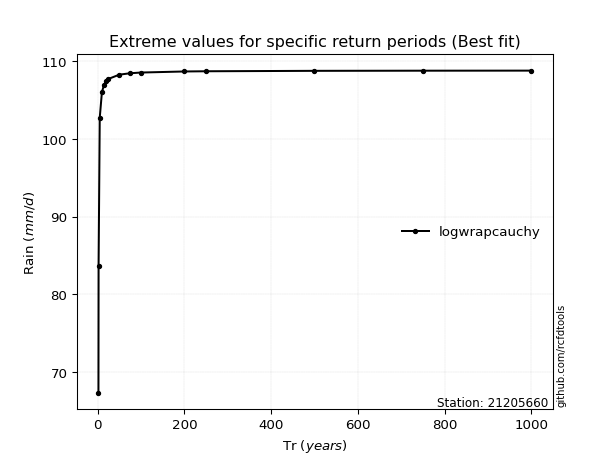</img>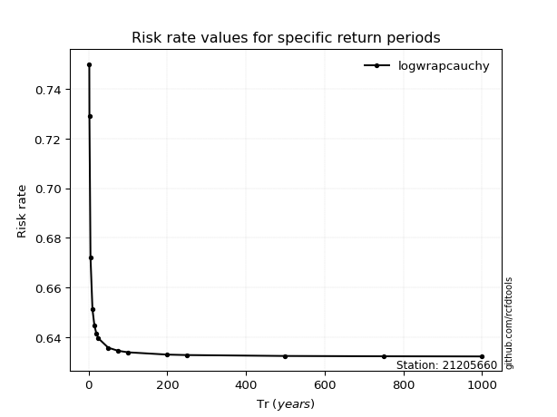</img>

</div>


<sub>**APP DISCLAIMER**: NO WARRANTY - This software is provided by [github.com/rcfdtools](https://github.com/rcfdtools) "as is", without any express or implied warranty, including warranties of merchantability, fitness for a particular purpose, or non-infringement. There is no guarantee that the software will be error-free or operate without interruption. LIMITATION OF LIABILITY - Neither the authors nor copyright holders will be liable for claims or damages arising from the software or its use. You are responsible for determining if the software is appropriate for your use and assume all associated risks, including errors, legal compliance, and data loss. NO PROFESSIONAL ADVICE - The software provides general information and does not offer professional advice. It should not replace consultation with professional advisors.</sub>