<div align="center">


</div>

# PMax24h Station (Rain): 21205710

Maximum Precipitation in 24 hours (PMax24h) is the greatest amount of rainfall for a specific duration that is meteorologically possible for a given location, acting as a "worst-case" scenario for extreme storms, crucial for designing safety-critical infrastructure like bridges, river deviations, dams, spillways, and nuclear plants to prevent catastrophic failure. The PMax24h is related with the Probable Maximum Precipitation (PMP) and it is calculated by hydrologists using meteorological data to determine the upper limit of extreme rainfall, often leading to the Probable Maximum Flood (PMF) for flood control design, and is increasingly being studied for climate change impacts. Probable Maximum Precipitation (PMP) is the theoretical upper limit of rainfall, a deterministic estimate for extreme events, while probability distributions (like GEV, Gumbel) describe the likelihood and frequency of various precipitation amounts, including rare ones, showing how often events occur, with PMP representing the extreme end of these distributions, used for critical infrastructure design to ensure safety against the worst conceivable weather, unlike standard statistical forecasts which cover typical probabilities.

The most common probability distributions in hydrology, used for analyzing floods, rainfall, and streamflow, include the Normal, Log-Normal, Gumbel, Gamma (including Log-Pearson Type III), and Generalized Extreme Value (GEV) distributions, often chosen based on the data´s skewness and whether modeling extremes or general conditions, with Gumbel and GEV popular for extreme events like floods, while the Normal distribution serves as a baseline, though often requiring transformations for skewed hydrological data. These distributions help in designing water infrastructure, managing water resources, and forecasting hydrologic events.

> Hydrological data often isn´t perfectly normal (it´s skewed), so different distributions are needed for different applications, such as: **Flood Frequency Analysis**: Using Gumbel, GEV, or Log-Pearson Type III for predicting extreme flood magnitudes and their return periods, **Rainfall Analysis**: Normal for annual totals, but Log-Normal, Weibull, or GEV for intensity or extreme daily rainfall, **Streamflow Modeling**: Gamma and Log-Normal for maximum flows, GEV for minimum flows, and Kappa for daily flows.

<div align="center">

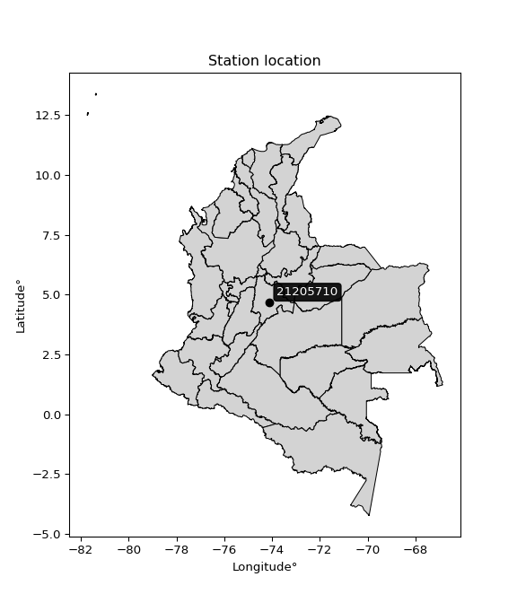</img>

</div>


## A. General information


### 1. General running parameters

• app_version: _v20260312_. • runtime: _2026-03-12 07:15:23.203550_. • Python version: _3.14.0_. • SciPy version: _1.16.3_. • Pandas version: _2.3.3_. • NumPy version: _2.3.5_. • Stations dataset (station_dataset_file): _dataset/pmax24h_in/automatic_colombia_2003_2025.csv_. • Stations catalog (station_catalog_file): _dataset/CNE.xls_. • Minimum year to eval til year_max (date_min): _1900_. • Maximum year to eval since year_min (date_max): _2025_. • Creates, save and include plots into reports (create_plot): _True_. • Plot only fit distributions with Δo > Δ (plot_only_fit): _True_. • Plot only simple graphs avoiding multiple CDFs and multiple Extreme values plots (plot_only_simple): _True_. • Eval low extreme values, if False, evaluates high extreme values (low_extreme): _False_. • Eval every SciPy distribution as logarithmic (pdist_logarithmic_on): _True_. • Standard deviation normalized (ddof): _1.0_. • Return periods to eval in years (Tr): _[2, 2.33, 5, 10, 15, 20, 25, 50, 75, 100, 200, 250, 500, 750, 1000]_. • Minimum data sample per station, 0 means any (minimum_sample): _5_. • Z-Score maximum threshold to adjust a value, 0 means disable (zscore_max): _3.5_. • Z-Score minimum threshold to adjust a value, 0 means disable (zscore_min): _-2.5_. • Avoid zeros, e.g. rain = 0 (avoid_zeros): _True_. • Avoid null values (avoid_nans): _True_. 

:file_folder:Table: [dataset.csv](../../dataset/pmax24h_in/automatic_colombia_2003_2025.csv)

> Delta Degrees of Freedom (DDOF): is a parameter used in the formulas for calculating variance and standard deviation. When ddof=0, the divisor is $N$ (the total number of observations) and this is used when your data set is the entire population. When ddof=1, the divisor is $N-1$ and this is used when your data set is a sample drawn from a larger population. Using $N-1$ provides an unbiased estimate of the population variance (known as Bessel´s correction).


### 2. Station info and location

|   id |   CODIGO | NOMBRE                     | CATEGORIA               | TECNOLOGIA                              | ESTADO   | FECHA_INSTALACION   |   FECHA_SUSPENSION |   ALTITUD |   LATITUD |   LONGITUD | DEPARTAMENTO   | MUNICIPIO   | AREA_OPERATIVA                            | ENTIDAD                                                     | AREA_HIDROGRAFICA   | ZONA_HIDROGRAFICA   | SUBZONA_HIDROGRAFICA   |   CORRIENTE | Catalogo   |   Version |
|-----:|---------:|:---------------------------|:------------------------|:----------------------------------------|:---------|:--------------------|-------------------:|----------:|----------:|-----------:|:---------------|:------------|:------------------------------------------|:------------------------------------------------------------|:--------------------|:--------------------|:-----------------------|------------:|:-----------|----------:|
|    0 | 21205710 | JARDIN BOTANICO [21205710] | Climatológica Principal | Automática con Telemetría, Convencional | Activa   | 15/09/1974          |                nan |      2552 |   4.66787 |    -74.101 | Bogotá         | Bogotá, D.C | Area Operativa 11 - Cundinamarca-Amazonas | INSTITUTO DE HIDROLOGIA METEOROLOGIA Y ESTUDIOS AMBIENTALES | Magdalena Cauca     | Alto Magdalena      | Río Bogotá             |         nan | CNE_IDEAM  |  20251226 |

<div align="center">

Dynamic map: [:earth_americas:Google](http://maps.google.com/maps?q=4.667867,-74.101034) [:earth_americas:OSM](https://www.openstreetmap.org/#map=18/4.667867/-74.101034&layers=P) [:earth_americas:Bing](https://www.bing.com/maps?cp=4.667867~-74.101034&lvl=18) [:earth_americas:Apple](https://maps.apple.com/frame?center=4.667867%2C-74.101034&span=0.003%2C0.006)

</div>


<div align="center">

```geojson
{
  "type": "Feature",
  "geometry": {
    "type": "Point", 
    "coordinates": [-74.101034, 4.667867]
  }, 
  "properties": {
    "Name": "21205710"
  }
}
```

</div>


### 3. Discrete values table and plot

<div align="center">

|               |          0 |            1 |           2 |           3 |           4 |          5 |           6 |           7 |          8 |
|:--------------|-----------:|-------------:|------------:|------------:|------------:|-----------:|------------:|------------:|-----------:|
| Date          | 2017       | 2018         | 2019        | 2020        | 2021        | 2022       | 2023        | 2024        | 2025       |
| Value         |   31.4     |   49.1       |   53.6      |   46.1      |   47        |   60.3     |   47.7      |   51.2      |   58.6     |
| Value_initial |   31.4     |   49.1       |   53.6      |   46.1      |   47        |   60.3     |   47.7      |   51.2      |   58.6     |
| count         |    9       |    9         |    9        |    9        |    9        |    9       |    9        |    9        |    9       |
| mean          |   49.4444  |   49.4444    |   49.4444   |   49.4444   |   49.4444   |   49.4444  |   49.4444   |   49.4444   |   49.4444  |
| std           |    8.42572 |    8.42572   |    8.42572  |    8.42572  |    8.42572  |    8.42572 |    8.42572  |    8.42572  |    8.42572 |
| zscore        |   -2.14159 |   -0.0408801 |    0.493199 |   -0.396933 |   -0.290117 |    1.28838 |   -0.207038 |    0.208357 |    1.08662 |


</div>


<div align="center">

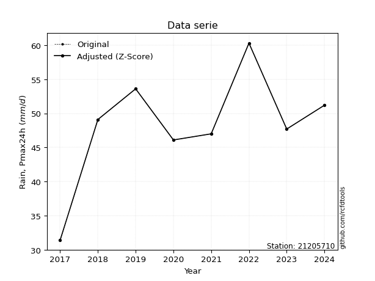</img>

</div>


> The initial value (value_initial) correspond to the initial obtained or null completed value, and value (value) is adjusted only when the initial value is outside the valid range (outlier) definite through the Z-Score value. If Z-Score is active, values out of range or outliers are replaced with the station mean value. A Z-Score (or standard score) measures how many standard deviations a data point is from the mean of a dataset, indicating its relative position; positive scores mean above the mean, negative mean below, and a score of zero is exactly at the mean, allowing for comparison of values from different distributions. It´s calculated using the formula $z=(x–μ)/σ$, where $x$ is the data point, $μ$ is the mean, and $σ$ is the standard deviation, helping identify outliers and understand probability.
>
> <sub>**Note**: In this study, "completing" (filling gaps in) and "extending" (forecasting or lengthening the historical record) rainfall data series are avoided for certain critical analyses because they introduce artificial bias and uncertainty, which can distort the statistics of rare events (extremes), alter day-to-day variability, and compromise the integrity and homogeneity of the original data. Some reasons against Completing/Extending rainfall data are: **Distortion of Extremes and Variability**: The primary issue is that most gap-filling or extension methods rely on averaging or regression with nearby stations, which inherently smooths the data. Rainfall is highly variable in space and time, with a large percentage of zero values and occasional large storms. Infilling methods often underestimate the highest values and overestimate the lowest (zero) values, which severely distorts analyses focused on flood frequency, drought severity, and intensity-duration-frequency (IDF) curves, **Loss of Data Homogeneity**: Infilled or extended data are synthetic estimates, not actual measurements. Combining these estimates with observed data can violate the assumption of data homogeneity, which requires that the data properties do not change over time. Inhomogeneity can lead to incorrect conclusions about long-term trends or changes in climate patterns, **Propagation of Errors**: Errors and biases from the original data (e.g., wind-induced undercatch, instrument errors, site changes) or the data used for imputation can propagate through the analysis, leading to unreliable hydrological models and inaccurate predictions, **Compromised Statistical Integrity**: For statistical analyses, especially those involving the frequency of events, using artificial data can introduce time bias or autocorrelation that doesn´t exist in reality, making it difficult to assess the true probability of events, **Difficulty in Validation**: It is difficult to accurately validate the quality of filled or extended data, especially for past periods where ground-truth measurements are unavailable. The reliability of imputation techniques heavily depends on the density of the surrounding station network and the complexity of the local topography.</sub>


### 4. Active continuous probability distributions from SciPy (80 of 104 available)

A Probability Density Function (PDF) describes the relative likelihood of a continuous random variable falling within a specific range, where the total area under its curve equals 1, and the area over any interval gives the actual probability for that range. Unlike discrete probabilities (like rolling a die), a PDF shows density, not direct probability for a single point (which is zero), with higher points indicating higher likelihood, often visualized as a bell curve for normal distributions.

A log of a probability density function (log-PDF) is simply the logarithm of the PDF´s value, denoted as $log(f(x))$, useful for converting multiplication of probabilities into addition, improving numerical stability with tiny numbers, and connecting to information theory concepts like entropy. Instead of dealing with very small probabilities (e.g., 0.000001), log-PDFs use negative numbers (e.g., $log(0.00001) ≈ -11.51$ that are easier for computers to handle, preventing underflow errors and simplifying complex calculations. In this study, each active probability distribution from SciPy is also evaluated in the $log$ form.

[scipy.stats](https://docs.scipy.org/doc/scipy/reference/stats.html) is a Python´s powerful submodule within the SciPy library for comprehensive statistical analysis, offering over 130 probability distributions (like Normal, Poisson, etc.), functions for descriptive stats (mean, variance), hypothesis testing (t-tests, chi-square), random variable generation, and statistical tests, making it essential for data science, modeling, and research. It provides tools to explore, model, and draw conclusions from data efficiently, working seamlessly with [NumPy](https://numpy.org/).

<div align="center">

|   id | p_dist           |   n_parameter | fit_method   | label                                                                       | active   | ref                                                                                                      |
|-----:|:-----------------|--------------:|:-------------|:----------------------------------------------------------------------------|:---------|:---------------------------------------------------------------------------------------------------------|
|    0 | alpha            |             3 | MLE          | Alpha                                                                       | True     | [:mortar_board:](https://docs.scipy.org/doc/scipy/reference/generated/scipy.stats.alpha.html)            |
|    1 | anglit           |             2 | MM           | Anglit                                                                      | True     | [:mortar_board:](https://docs.scipy.org/doc/scipy/reference/generated/scipy.stats.anglit.html)           |
|    2 | arcsine          |             2 | MM           | Arcsine                                                                     | True     | [:mortar_board:](https://docs.scipy.org/doc/scipy/reference/generated/scipy.stats.arcsine.html)          |
|    3 | argus            |             3 | MLE          | Argus                                                                       | True     | [:mortar_board:](https://docs.scipy.org/doc/scipy/reference/generated/scipy.stats.argus.html)            |
|    4 | beta             |             4 | MLE          | Beta                                                                        | True     | [:mortar_board:](https://docs.scipy.org/doc/scipy/reference/generated/scipy.stats.beta.html)             |
|    5 | betaprime        |             4 | MLE          | Beta prime                                                                  | True     | [:mortar_board:](https://docs.scipy.org/doc/scipy/reference/generated/scipy.stats.betaprime.html)        |
|    6 | bradford         |             3 | MLE          | Bradford                                                                    | True     | [:mortar_board:](https://docs.scipy.org/doc/scipy/reference/generated/scipy.stats.bradford.html)         |
|    7 | burr             |             4 | MLE          | Burr (Type III)                                                             | True     | [:mortar_board:](https://docs.scipy.org/doc/scipy/reference/generated/scipy.stats.burr.html)             |
|    8 | burr12           |             4 | MLE          | Burr (Type III) 12                                                          | True     | [:mortar_board:](https://docs.scipy.org/doc/scipy/reference/generated/scipy.stats.burr12.html)           |
|    9 | cosine           |             2 | MLE          | Cosine                                                                      | True     | [:mortar_board:](https://docs.scipy.org/doc/scipy/reference/generated/scipy.stats.cosine.html)           |
|   10 | crystalball      |             4 | MLE          | Crystalball                                                                 | True     | [:mortar_board:](https://docs.scipy.org/doc/scipy/reference/generated/scipy.stats.crystalball.html)      |
|   11 | dgamma           |             3 | MLE          | Double gamma                                                                | True     | [:mortar_board:](https://docs.scipy.org/doc/scipy/reference/generated/scipy.stats.dgamma.html)           |
|   12 | dweibull         |             3 | MLE          | Double Weibull                                                              | True     | [:mortar_board:](https://docs.scipy.org/doc/scipy/reference/generated/scipy.stats.dweibull.html)         |
|   13 | erlang           |             3 | MLE          | Erlang                                                                      | True     | [:mortar_board:](https://docs.scipy.org/doc/scipy/reference/generated/scipy.stats.erlang.html)           |
|   14 | exponnorm        |             3 | MLE          | Exponentially modified Normal                                               | True     | [:mortar_board:](https://docs.scipy.org/doc/scipy/reference/generated/scipy.stats.exponnorm.html)        |
|   15 | exponpow         |             3 | MLE          | Exponential power                                                           | True     | [:mortar_board:](https://docs.scipy.org/doc/scipy/reference/generated/scipy.stats.exponpow.html)         |
|   16 | exponweib        |             4 | MLE          | Exponentiated Weibull                                                       | True     | [:mortar_board:](https://docs.scipy.org/doc/scipy/reference/generated/scipy.stats.exponweib.html)        |
|   17 | f                |             4 | MLE          | F                                                                           | True     | [:mortar_board:](https://docs.scipy.org/doc/scipy/reference/generated/scipy.stats.f.html)                |
|   18 | fatiguelife      |             3 | MLE          | Fatigue-life (Birnbaum-Saunders)                                            | True     | [:mortar_board:](https://docs.scipy.org/doc/scipy/reference/generated/scipy.stats.fatiguelife.html)      |
|   19 | foldnorm         |             3 | MM           | Fold Normal                                                                 | True     | [:mortar_board:](https://docs.scipy.org/doc/scipy/reference/generated/scipy.stats.foldnorm.html)         |
|   20 | gamma            |             3 | MLE          | Gamma                                                                       | True     | [:mortar_board:](https://docs.scipy.org/doc/scipy/reference/generated/scipy.stats.gamma.html)            |
|   21 | gausshyper       |             6 | MLE          | Gauss hypergeometric                                                        | True     | [:mortar_board:](https://docs.scipy.org/doc/scipy/reference/generated/scipy.stats.gausshyper.html)       |
|   22 | genexpon         |             5 | MLE          | Generalized exponential                                                     | True     | [:mortar_board:](https://docs.scipy.org/doc/scipy/reference/generated/scipy.stats.genexpon.html)         |
|   23 | genextreme       |             3 | MLE          | Generalized exponential                                                     | True     | [:mortar_board:](https://docs.scipy.org/doc/scipy/reference/generated/scipy.stats.genextreme.html)       |
|   24 | gengamma         |             4 | MLE          | Generalized gamma                                                           | True     | [:mortar_board:](https://docs.scipy.org/doc/scipy/reference/generated/scipy.stats.gengamma.html)         |
|   25 | genhalflogistic  |             3 | MLE          | Generalized half-logistic                                                   | True     | [:mortar_board:](https://docs.scipy.org/doc/scipy/reference/generated/scipy.stats.genhalflogistic.html)  |
|   26 | genlogistic      |             3 | MLE          | Generalized logistic                                                        | True     | [:mortar_board:](https://docs.scipy.org/doc/scipy/reference/generated/scipy.stats.genlogistic.html)      |
|   27 | gennorm          |             3 | MLE          | Generalized Normal                                                          | True     | [:mortar_board:](https://docs.scipy.org/doc/scipy/reference/generated/scipy.stats.gennorm.html)          |
|   28 | genpareto        |             3 | MLE          | Generalized Pareto                                                          | True     | [:mortar_board:](https://docs.scipy.org/doc/scipy/reference/generated/scipy.stats.genpareto.html)        |
|   29 | gompertz         |             3 | MLE          | Gompertz (or truncated Gumbel)                                              | True     | [:mortar_board:](https://docs.scipy.org/doc/scipy/reference/generated/scipy.stats.gompertz.html)         |
|   30 | gumbel_l         |             2 | MM           | Gumbel Left Skew                                                            | True     | [:mortar_board:](https://docs.scipy.org/doc/scipy/reference/generated/scipy.stats.gumbel_l.html)         |
|   31 | gumbel_r         |             2 | MM           | Gumbel Right Skew                                                           | True     | [:mortar_board:](https://docs.scipy.org/doc/scipy/reference/generated/scipy.stats.gumbel_r.html)         |
|   32 | halfgennorm      |             3 | MLE          | Upper half of a generalized normal                                          | True     | [:mortar_board:](https://docs.scipy.org/doc/scipy/reference/generated/scipy.stats.halfgennorm.html)      |
|   33 | halflogistic     |             2 | MM           | Half-logistic                                                               | True     | [:mortar_board:](https://docs.scipy.org/doc/scipy/reference/generated/scipy.stats.halflogistic.html)     |
|   34 | halfnorm         |             2 | MM           | Half Normal                                                                 | True     | [:mortar_board:](https://docs.scipy.org/doc/scipy/reference/generated/scipy.stats.halfnorm.html)         |
|   35 | hypsecant        |             2 | MM           | hyperbolic secant                                                           | True     | [:mortar_board:](https://docs.scipy.org/doc/scipy/reference/generated/scipy.stats.hypsecant.html)        |
|   36 | invgamma         |             3 | MLE          | Inverted gamma                                                              | True     | [:mortar_board:](https://docs.scipy.org/doc/scipy/reference/generated/scipy.stats.invgamma.html)         |
|   37 | invgauss         |             3 | MLE          | Inverse Gaussian                                                            | True     | [:mortar_board:](https://docs.scipy.org/doc/scipy/reference/generated/scipy.stats.invgauss.html)         |
|   38 | invweibull       |             3 | MLE          | Inverted Weibull                                                            | True     | [:mortar_board:](https://docs.scipy.org/doc/scipy/reference/generated/scipy.stats.invweibull.html)       |
|   39 | johnsonsb        |             4 | MLE          | Johnson SB                                                                  | True     | [:mortar_board:](https://docs.scipy.org/doc/scipy/reference/generated/scipy.stats.johnsonsb.html)        |
|   40 | johnsonsu        |             4 | MLE          | Johnson Su                                                                  | True     | [:mortar_board:](https://docs.scipy.org/doc/scipy/reference/generated/scipy.stats.johnsonsu.html)        |
|   41 | kappa3           |             3 | MLE          | Kappa 3                                                                     | True     | [:mortar_board:](https://docs.scipy.org/doc/scipy/reference/generated/scipy.stats.kappa3.html)           |
|   42 | kappa4           |             4 | MLE          | Kappa 4                                                                     | True     | [:mortar_board:](https://docs.scipy.org/doc/scipy/reference/generated/scipy.stats.kappa4.html)           |
|   43 | ksone            |             3 | MLE          | Kolmogorov-Smirnov one-sided test statistic distribution                    | True     | [:mortar_board:](https://docs.scipy.org/doc/scipy/reference/generated/scipy.stats.ksone.html)            |
|   44 | kstwobign        |             2 | MLE          | Limiting distribution of scaled Kolmogorov-Smirnov two-sided test statistic | True     | [:mortar_board:](https://docs.scipy.org/doc/scipy/reference/generated/scipy.stats.kstwobign.html)        |
|   45 | laplace          |             2 | MM           | Laplace                                                                     | True     | [:mortar_board:](https://docs.scipy.org/doc/scipy/reference/generated/scipy.stats.laplace.html)          |
|   46 | levy_l           |             2 | MLE          | Left-skewed Levy                                                            | True     | [:mortar_board:](https://docs.scipy.org/doc/scipy/reference/generated/scipy.stats.levy_l.html)           |
|   47 | loggamma         |             3 | MLE          | Log gamma                                                                   | True     | [:mortar_board:](https://docs.scipy.org/doc/scipy/reference/generated/scipy.stats.loggamma.html)         |
|   48 | logistic         |             2 | MM           | Logistic (or Sech-squared)                                                  | True     | [:mortar_board:](https://docs.scipy.org/doc/scipy/reference/generated/scipy.stats.logistic.html)         |
|   49 | loglaplace       |             3 | MLE          | Log-Laplace                                                                 | True     | [:mortar_board:](https://docs.scipy.org/doc/scipy/reference/generated/scipy.stats.loglaplace.html)       |
|   50 | lomax            |             3 | MLE          | Lomax (Pareto of the second kind)                                           | True     | [:mortar_board:](https://docs.scipy.org/doc/scipy/reference/generated/scipy.stats.lomax.html)            |
|   51 | maxwell          |             2 | MM           | Maxwell                                                                     | True     | [:mortar_board:](https://docs.scipy.org/doc/scipy/reference/generated/scipy.stats.maxwell.html)          |
|   52 | mielke           |             4 | MLE          | Mielke Beta-Kappa / Dagum                                                   | True     | [:mortar_board:](https://docs.scipy.org/doc/scipy/reference/generated/scipy.stats.mielke.html)           |
|   53 | moyal            |             2 | MM           | Moyal                                                                       | True     | [:mortar_board:](https://docs.scipy.org/doc/scipy/reference/generated/scipy.stats.moyal.html)            |
|   54 | nakagami         |             3 | MLE          | Nakagami                                                                    | True     | [:mortar_board:](https://docs.scipy.org/doc/scipy/reference/generated/scipy.stats.nakagami.html)         |
|   55 | ncf              |             5 | MLE          | Non-central F distribution                                                  | True     | [:mortar_board:](https://docs.scipy.org/doc/scipy/reference/generated/scipy.stats.ncf.html)              |
|   56 | nct              |             4 | MLE          | Non-central Student’s t                                                     | True     | [:mortar_board:](https://docs.scipy.org/doc/scipy/reference/generated/scipy.stats.nct.html)              |
|   57 | norm             |             2 | MM           | Normal                                                                      | True     | [:mortar_board:](https://docs.scipy.org/doc/scipy/reference/generated/scipy.stats.norm.html)             |
|   58 | pearson3         |             3 | MM           | Pearson type III                                                            | True     | [:mortar_board:](https://docs.scipy.org/doc/scipy/reference/generated/scipy.stats.pearson3.html)         |
|   59 | powerlaw         |             3 | MLE          | Power-function                                                              | True     | [:mortar_board:](https://docs.scipy.org/doc/scipy/reference/generated/scipy.stats.powerlaw.html)         |
|   60 | rayleigh         |             2 | MM           | Rayleigh                                                                    | True     | [:mortar_board:](https://docs.scipy.org/doc/scipy/reference/generated/scipy.stats.rayleigh.html)         |
|   61 | rdist            |             3 | MLE          | R-distributed (symmetric beta)                                              | True     | [:mortar_board:](https://docs.scipy.org/doc/scipy/reference/generated/scipy.stats.rdist.html)            |
|   62 | rice             |             3 | MLE          | Rice                                                                        | True     | [:mortar_board:](https://docs.scipy.org/doc/scipy/reference/generated/scipy.stats.rice.html)             |
|   63 | semicircular     |             2 | MM           | Semicircular                                                                | True     | [:mortar_board:](https://docs.scipy.org/doc/scipy/reference/generated/scipy.stats.semicircular.html)     |
|   64 | skewnorm         |             3 | MLE          | Skew normal                                                                 | True     | [:mortar_board:](https://docs.scipy.org/doc/scipy/reference/generated/scipy.stats.skewnorm.html)         |
|   65 | t                |             3 | MLE          | Student’s t                                                                 | True     | [:mortar_board:](https://docs.scipy.org/doc/scipy/reference/generated/scipy.stats.t.html)                |
|   66 | trapezoid        |             4 | MLE          | Trapezoid                                                                   | True     | [:mortar_board:](https://docs.scipy.org/doc/scipy/reference/generated/scipy.stats.trapezoid.html)        |
|   67 | triang           |             3 | MLE          | Triangular                                                                  | True     | [:mortar_board:](https://docs.scipy.org/doc/scipy/reference/generated/scipy.stats.triang.html)           |
|   68 | truncexpon       |             3 | MLE          | Truncated exponential                                                       | True     | [:mortar_board:](https://docs.scipy.org/doc/scipy/reference/generated/scipy.stats.truncexpon.html)       |
|   69 | truncnorm        |             4 | MLE          | Truncated normal                                                            | True     | [:mortar_board:](https://docs.scipy.org/doc/scipy/reference/generated/scipy.stats.truncnorm.html)        |
|   70 | truncpareto      |             4 | MLE          | Upper truncated Pareto                                                      | True     | [:mortar_board:](https://docs.scipy.org/doc/scipy/reference/generated/scipy.stats.truncpareto.html)      |
|   71 | truncweibull_min |             5 | MLE          | Doubly truncated Weibull minimum                                            | True     | [:mortar_board:](https://docs.scipy.org/doc/scipy/reference/generated/scipy.stats.truncweibull_min.html) |
|   72 | tukeylambda      |             3 | MLE          | Tukey-Lamdba                                                                | True     | [:mortar_board:](https://docs.scipy.org/doc/scipy/reference/generated/scipy.stats.tukeylambda.html)      |
|   73 | uniform          |             2 | MLE          | Uniform                                                                     | True     | [:mortar_board:](https://docs.scipy.org/doc/scipy/reference/generated/scipy.stats.uniform.html)          |
|   74 | vonmises         |             3 | MLE          | Von Mises                                                                   | True     | [:mortar_board:](https://docs.scipy.org/doc/scipy/reference/generated/scipy.stats.vonmises.html)         |
|   75 | vonmises_line    |             3 | MLE          | Von Mises line                                                              | True     | [:mortar_board:](https://docs.scipy.org/doc/scipy/reference/generated/scipy.stats.vonmises_line.html)    |
|   76 | wald             |             2 | MM           | Wald                                                                        | True     | [:mortar_board:](https://docs.scipy.org/doc/scipy/reference/generated/scipy.stats.wald.html)             |
|   77 | weibull_max      |             3 | MLE          | Weibull maximum                                                             | True     | [:mortar_board:](https://docs.scipy.org/doc/scipy/reference/generated/scipy.stats.weibull_max.html)      |
|   78 | weibull_min      |             3 | MLE          | Weibull minimum                                                             | True     | [:mortar_board:](https://docs.scipy.org/doc/scipy/reference/generated/scipy.stats.weibull_min.html)      |
|   79 | wrapcauchy       |             3 | MLE          | Wrapped  Cauchy                                                             | True     | [:mortar_board:](https://docs.scipy.org/doc/scipy/reference/generated/scipy.stats.wrapcauchy.html)       |

</div>

> **n_parameter:** # arguments & localization & scale.
>
> **Fit methods:** (MLE) maximum likelihood, (MM) L-moments.
>
>**Inactive** (With the only purpose of prevent loops, zero divisions, infinite values, over high estimated values or horizontal trending for recurrence intervals estimations, the follow distributions were disabled.)**:** lognorm, norminvgauss, powernorm, powerlognorm, cauchy, halfcauchy, foldcauchy, skewcauchy, chi2, expon, fisk, genhyperbolic, geninvgauss, gibrat, kstwo, laplace_asymmetric, levy, levy_stable, ncx2, pareto, rel_breitwigner, recipinvgauss, studentized_range, loguniform, 


## B. Probability (PDF) vs. Empirical (EDF) distributions functions

A continuous probability distribution (CPD) describes probabilities for variables that can take any value within a range (like rain any time), unlike discrete variables with specific outcomes (like temperature). It uses a Probability Density Function (PDF), a curve where the total area under it equals 1, and the probability of the variable falling within an interval (a to b) is found by calculating the area under the curve between those points. A key feature is that the probability of hitting any single exact value is zero, so probabilities are always expressed for ranges, e.g., $P(a ≤ X ≤ b)$.

<div align="center">

Distributions parameters from station values
|     |   station | p_dist              |   n |             loc |           scale | shape                  | shape1                 | shape2                 | shape3             |
|----:|----------:|:--------------------|----:|----------------:|----------------:|:-----------------------|:-----------------------|:-----------------------|:-------------------|
|   0 |  21205710 | alpha               |   9 |  -162.89        |  5462.79        | 25.763022893217524     |                        |                        |                    |
|   1 |  21205710 | anglit              |   9 |    49.4444      |    23.2389      |                        |                        |                        |                    |
|   2 |  21205710 | arcsine             |   9 |    38.2101      |    22.4686      |                        |                        |                        |                    |
|   3 |  21205710 | argus               |   9 |    25.2681      |    35.9209      | 1.6917292879571137     |                        |                        |                    |
|   4 |  21205710 | beta                |   9 |    -6.84931     |    67.1493      | 2.5755417702521353     | 0.41392914319548624    |                        |                    |
|   5 |  21205710 | betaprime           |   9 |     0.629544    |    32.1325      | 72.905551068751        | 48.84704848919863      |                        |                    |
|   6 |  21205710 | bradford            |   9 |    31.3999      |    28.9001      | 0.9990365222376197     |                        |                        |                    |
|   7 |  21205710 | burr                |   9 |    -0.272038    |    55.7929      | 19.248368337658732     | 0.3403623659804043     |                        |                    |
|   8 |  21205710 | burr12              |   9 |    -8.08622     |    39.3658      | 1285.2020881077328     | 0.0021105292870366088  |                        |                    |
|   9 |  21205710 | cosine              |   9 |    48.2627      |     7.22002     |                        |                        |                        |                    |
|  10 |  21205710 | crystalball         |   9 |    49.4444      |     7.94385     | 4805.529758817498      | 203.2652702585661      |                        |                    |
|  11 |  21205710 | dgamma              |   9 |    49.1         |     6.29507     | 0.8632084800027402     |                        |                        |                    |
|  12 |  21205710 | dweibull            |   9 |    49.1         |     8.95625     | 0.4488695631586084     |                        |                        |                    |
|  13 |  21205710 | erlang              |   9 |   -92.5948      |     0.471234    | 301.2580042130088      |                        |                        |                    |
|  14 |  21205710 | exponnorm           |   9 |    49.4393      |     7.94382     | 0.000648022489924311   |                        |                        |                    |
|  15 |  21205710 | exponpow            |   9 |    31.4         |     1.4527      | 0.12044694782151597    |                        |                        |                    |
|  16 |  21205710 | exponweib           |   9 |    31.4         |     1.1632      | 1.2553190331686719     | 0.23041549028732436    |                        |                    |
|  17 |  21205710 | f                   |   9 | -2181.44        |  2230.88        | 275758.9126573001      | 359853.5833505221      |                        |                    |
|  18 |  21205710 | fatiguelife         |   9 |    31.4         |     9.01174e-06 | 1425.1234166882814     |                        |                        |                    |
|  19 |  21205710 | foldnorm            |   9 |    48.9264      |     1.80124     | 2.8012138455608405e-07 |                        |                        |                    |
|  20 |  21205710 | gamma               |   9 |   -82.3469      |     0.516943    | 254.70272405519586     |                        |                        |                    |
|  21 |  21205710 | gausshyper          |   9 |    30.903       |    29.397       | 0.949851640497414      | 0.5721533910296848     | 1.4142179953023466     | 0.9160404894851492 |
|  22 |  21205710 | genexpon            |   9 |    31.4         |     2.00161     | 0.11090536265059309    | 1.636562024291154e-06  | 1.292739975527444      |                    |
|  23 |  21205710 | genextreme          |   9 |    48.5401      |     9.29084     | 0.7510906652182701     |                        |                        |                    |
|  24 |  21205710 | gengamma            |   9 |    31.4         |     1.03234     | 1.3457330965407812     | 0.2894963149422556     |                        |                    |
|  25 |  21205710 | genhalflogistic     |   9 |    29.3448      |    32.8371      | 1.060791853734448      |                        |                        |                    |
|  26 |  21205710 | genlogistic         |   9 |    53.4722      |     3.23983     | 0.5322728274352173     |                        |                        |                    |
|  27 |  21205710 | gennorm             |   9 |    49.1         |     5.7672      | 0.9965030762300406     |                        |                        |                    |
|  28 |  21205710 | genpareto           |   9 |    -0.356409    |   115.197       | -1.8991789168100908    |                        |                        |                    |
|  29 |  21205710 | gompertz            |   9 |    46.036       |     9.06517     | 0.8356229761331735     |                        |                        |                    |
|  30 |  21205710 | gumbel_l            |   9 |    53.0196      |     6.19379     |                        |                        |                        |                    |
|  31 |  21205710 | gumbel_r            |   9 |    45.8693      |     6.19379     |                        |                        |                        |                    |
|  32 |  21205710 | halfgennorm         |   9 |    31.4         |     1.27623     | 0.39266127522944205    |                        |                        |                    |
|  33 |  21205710 | halflogistic        |   9 |    40.0292      |     6.79168     |                        |                        |                        |                    |
|  34 |  21205710 | halfnorm            |   9 |    38.9299      |    13.1781      |                        |                        |                        |                    |
|  35 |  21205710 | hypsecant           |   9 |    49.4444      |     5.05721     |                        |                        |                        |                    |
|  36 |  21205710 | invgamma            |   9 |   -74.4607      | 25635.3         | 208.06978724941405     |                        |                        |                    |
|  37 |  21205710 | invgauss            |   9 |   -13.9519      |  3194.95        | 0.019731763509098624   |                        |                        |                    |
|  38 |  21205710 | invweibull          |   9 |    -1.46663e+09 |     1.46663e+09 | 161193414.12830368     |                        |                        |                    |
|  39 |  21205710 | johnsonsb           |   9 |    31.3984      |    28.9016      | 0.1524379438488338     | 0.16589955096104853    |                        |                    |
|  40 |  21205710 | johnsonsu           |   9 |    72.0892      |     2.21027     | 8.581766633625232      | 2.8959489384634143     |                        |                    |
|  41 |  21205710 | kappa3              |   9 |    31.4         |    28.8935      | 9729.42343715999       |                        |                        |                    |
|  42 |  21205710 | kappa4              |   9 |    29.0195      |    33.2986      | 1.0771844364711431     | 1.0628009645058287     |                        |                    |
|  43 |  21205710 | ksone               |   9 |    28.51        |    34.68        | 1.0                    |                        |                        |                    |
|  44 |  21205710 | kstwobign           |   9 |    11.8781      |    43.1064      |                        |                        |                        |                    |
|  45 |  21205710 | laplace             |   9 |    49.4444      |     5.61715     |                        |                        |                        |                    |
|  46 |  21205710 | levy_l              |   9 |    61.2307      |     4.47404     |                        |                        |                        |                    |
|  47 |  21205710 | loggamma            |   9 |    51.652       |     7.05902     | 1.1815118712009038     |                        |                        |                    |
|  48 |  21205710 | logistic            |   9 |    49.4444      |     4.37967     |                        |                        |                        |                    |
|  49 |  21205710 | loglaplace          |   9 |    -0.143875    |    49.2439      | 8.253020197228082      |                        |                        |                    |
|  50 |  21205710 | lomax               |   9 |    31.4         |  1261.24        | 69.825940694728        |                        |                        |                    |
|  51 |  21205710 | maxwell             |   9 |    30.6209      |    11.7959      |                        |                        |                        |                    |
|  52 |  21205710 | mielke              |   9 |    -0.740006    |    56.2378      | 6.62846295765457       | 19.37758665393656      |                        |                    |
|  53 |  21205710 | moyal               |   9 |    44.9016      |     3.57599     |                        |                        |                        |                    |
|  54 |  21205710 | nakagami            |   9 |    46.1         |     6.14075     | 0.21457664344417493    |                        |                        |                    |
|  55 |  21205710 | ncf                 |   9 |     1.11005     |     1.76081e-06 | 7.277501698760284e-06  | 188.34105624930157     | 197.9175402610898      |                    |
|  56 |  21205710 | nct                 |   9 |  -630.914       |     7.83909     | 129881.4167840546      | 86.78957991851951      |                        |                    |
|  57 |  21205710 | norm                |   9 |    49.4444      |     7.94385     |                        |                        |                        |                    |
|  58 |  21205710 | pearson3            |   9 |    49.4444      |     7.94383     | -0.8441740693247809    |                        |                        |                    |
|  59 |  21205710 | powerlaw            |   9 |    31.4         |    28.9         | 0.22674047077969842    |                        |                        |                    |
|  60 |  21205710 | rayleigh            |   9 |    34.2474      |    12.1255      |                        |                        |                        |                    |
|  61 |  21205710 | rdist               |   9 |    31.0908      |    18.0092      | 0.9844604427252455     |                        |                        |                    |
|  62 |  21205710 | rice                |   9 | -2653.44        |     9.3848      | 287.9943100821936      |                        |                        |                    |
|  63 |  21205710 | semicircular        |   9 |    49.4444      |    15.8877      |                        |                        |                        |                    |
|  64 |  21205710 | skewnorm            |   9 |    60.3         |    13.4533      | -6996415.740503155     |                        |                        |                    |
|  65 |  21205710 | t                   |   9 |    50.1806      |     5.48013     | 3.1059253950249603     |                        |                        |                    |
|  66 |  21205710 | trapezoid           |   9 |    26.9759      |    33.7029      | 1.0                    | 1.0                    |                        |                    |
|  67 |  21205710 | triang              |   9 |    27.0612      |    33.2388      | 0.9999999857603801     |                        |                        |                    |
|  68 |  21205710 | truncexpon          |   9 |    31.4         |    34.82        | 0.8299821843318549     |                        |                        |                    |
|  69 |  21205710 | truncnorm           |   9 |     6.59908     |    16.101       | 2.45332161716916       | 1386.1322326431482     |                        |                    |
|  70 |  21205710 | truncpareto         |   9 |    31.3975      |     0.0024592   | 0.12514417138939385    | 11752.77944600989      |                        |                    |
|  71 |  21205710 | truncweibull_min    |   9 |    29.9332      |    45.5957      | 1.4602564329692749     | 1.2022515167693163e-07 | 0.6660003140512831     |                    |
|  72 |  21205710 | tukeylambda         |   9 |    45.7703      |    16.096       | 1.1078031415102845     |                        |                        |                    |
|  73 |  21205710 | uniform             |   9 |    31.4         |    28.9         |                        |                        |                        |                    |
|  74 |  21205710 | vonmises            |   9 |     2.98125     |     1           | 0.6190317970557077     |                        |                        |                    |
|  75 |  21205710 | vonmises_line       |   9 |    49.8519      |     5.87342     | 1.079389985735074      |                        |                        |                    |
|  76 |  21205710 | wald                |   9 |    41.5006      |     7.94382     |                        |                        |                        |                    |
|  77 |  21205710 | weibull_max         |   9 |    60.3         |     1.33618     | 0.3182902944918007     |                        |                        |                    |
|  78 |  21205710 | weibull_min         |   9 |  -156.335       |   209.325       | 32.464763604269876     |                        |                        |                    |
|  79 |  21205710 | wrapcauchy          |   9 |    31.4         |     4.59958     | 0.5                    |                        |                        |                    |
|  80 |  21205710 | logalpha            |   9 |    -4.30409     |   363.485       | 44.40549118663887      |                        |                        |                    |
|  81 |  21205710 | loganglit           |   9 |     3.88599     |     0.524167    |                        |                        |                        |                    |
|  82 |  21205710 | logarcsine          |   9 |     3.63257     |     0.506839    |                        |                        |                        |                    |
|  83 |  21205710 | logargus            |   9 |     3.25209     |     0.862279    | 2.280994813101903      |                        |                        |                    |
|  84 |  21205710 | logbeta             |   9 |     3.25686     |     0.842473    | 3.0682609633302613     | 0.8197139707017169     |                        |                    |
|  85 |  21205710 | logbetaprime        |   9 |    -3.70265     |    12.9157      | 2631.8502702099768     | 4482.658506820331      |                        |                    |
|  86 |  21205710 | logbradford         |   9 |     3.44681     |     0.652527    | 1.0573754015113255     |                        |                        |                    |
|  87 |  21205710 | logburr             |   9 |    -0.277534    |     4.30556     | 86.61787452849529      | 0.2964136610173522     |                        |                    |
|  88 |  21205710 | logburr12           |   9 |   -26.6493      |    31.8212      | 240.51256004634212     | 11101.73272843791      |                        |                    |
|  89 |  21205710 | logcosine           |   9 |     3.84821     |     0.167929    |                        |                        |                        |                    |
|  90 |  21205710 | logcrystalball      |   9 |     3.93072     |     0.113352    | 0.8020212068758269     | 471.1628600681229      |                        |                    |
|  91 |  21205710 | logdgamma           |   9 |     3.89386     |     0.136795    | 0.7850230151957982     |                        |                        |                    |
|  92 |  21205710 | logdweibull         |   9 |     3.89386     |     0.125695    | 0.8946199489382174     |                        |                        |                    |
|  93 |  21205710 | logerlang           |   9 |     3.44681     |     0.652115    | 0.6433710514888018     |                        |                        |                    |
|  94 |  21205710 | logexponnorm        |   9 |     3.88589     |     0.179186    | 0.0005926704813942277  |                        |                        |                    |
|  95 |  21205710 | logexponpow         |   9 |    -1.27028     |     5.30861     | 30.24095738634147      |                        |                        |                    |
|  96 |  21205710 | logexponweib        |   9 |     3.07478     |     1.02939     | 0.023400192862303597   | 149.7994837141602      |                        |                    |
|  97 |  21205710 | logf                |   9 |  -269.219       |   273.105       | 21016193.967849262     | 5924784.023319373      |                        |                    |
|  98 |  21205710 | logfatiguelife      |   9 |  -120.412       |   124.297       | 0.0014382959691867062  |                        |                        |                    |
|  99 |  21205710 | logfoldnorm         |   9 |     3.58509     |     0.194553    | 1.4867185615038134     |                        |                        |                    |
| 100 |  21205710 | loggamma            |   9 |     1.58094     |     0.0154781   | 148.62068021360687     |                        |                        |                    |
| 101 |  21205710 | loggausshyper       |   9 |     3.43673     |     0.662601    | 1.2411392045888325     | 0.8949290882921389     | 0.8811293559366453     | 1.1034558737716167 |
| 102 |  21205710 | loggenexpon         |   9 |     3.43516     |     0.00429901  | 0.0018477519448587536  | 4.779158884633521      | 2.6492059322848096e-05 |                    |
| 103 |  21205710 | loggenextreme       |   9 |     3.90919     |     0.198596    | 1.0444563117266696     |                        |                        |                    |
| 104 |  21205710 | loggengamma         |   9 |    -6.10115     |     4.35181     | 104.1951848934068      | 5.588582575214151      |                        |                    |
| 105 |  21205710 | loggenhalflogistic  |   9 |     3.44404     |     0.726875    | 1.1092377641807856     |                        |                        |                    |
| 106 |  21205710 | loggenlogistic      |   9 |     4.017       |     0.0521575   | 0.33938743886166134    |                        |                        |                    |
| 107 |  21205710 | loggennorm          |   9 |     3.89386     |     0.0500708   | 0.645757403331463      |                        |                        |                    |
| 108 |  21205710 | loggenpareto        |   9 |    -0.00503157  |    14.5057      | -3.534205302269565     |                        |                        |                    |
| 109 |  21205710 | loggompertz         |   9 |     3.44217     |     0.136207    | 0.022808590696874922   |                        |                        |                    |
| 110 |  21205710 | loggumbel_l         |   9 |     3.96663     |     0.13971     |                        |                        |                        |                    |
| 111 |  21205710 | loggumbel_r         |   9 |     3.80535     |     0.13971     |                        |                        |                        |                    |
| 112 |  21205710 | loghalfgennorm      |   9 |     3.44681     |     0.652904    | 10858.533515694799     |                        |                        |                    |
| 113 |  21205710 | loghalflogistic     |   9 |     3.67358     |     0.15322     |                        |                        |                        |                    |
| 114 |  21205710 | loghalfnorm         |   9 |     3.64886     |     0.297197    |                        |                        |                        |                    |
| 115 |  21205710 | loghypsecant        |   9 |     3.88599     |     0.114073    |                        |                        |                        |                    |
| 116 |  21205710 | loginvgamma         |   9 |    -0.07901     |  1767.05        | 447.21834748240985     |                        |                        |                    |
| 117 |  21205710 | loginvgauss         |   9 |     1.74306     |   260.095       | 0.008232838612925314   |                        |                        |                    |
| 118 |  21205710 | loginvweibull       |   9 |    -3.18043e+07 |     3.18043e+07 | 138421727.79730815     |                        |                        |                    |
| 119 |  21205710 | logjohnsonsb        |   9 |     3.44681     |     0.652524    | -0.23477255882199166   | 0.15381677148806666    |                        |                    |
| 120 |  21205710 | logjohnsonsu        |   9 |     4.20786     |     0.00849976  | 7.7087972396845625     | 1.8427862385457074     |                        |                    |
| 121 |  21205710 | logkappa3           |   9 |     3.44681     |     0.649421    | 194.27108578443028     |                        |                        |                    |
| 122 |  21205710 | logkappa4           |   9 |     3.3838      |     0.769696    | 1.0894308266952561     | 1.0672843697114365     |                        |                    |
| 123 |  21205710 | logksone            |   9 |     3.38156     |     0.783029    | 1.0                    |                        |                        |                    |
| 124 |  21205710 | logkstwobign        |   9 |     2.97889     |     1.04102     |                        |                        |                        |                    |
| 125 |  21205710 | loglaplace          |   9 |     3.88599     |     0.126703    |                        |                        |                        |                    |
| 126 |  21205710 | loglevy_l           |   9 |     4.11625     |     0.0808598   |                        |                        |                        |                    |
| 127 |  21205710 | logloggamma         |   9 |     4.04764     |     0.0784369   | 0.4808939844322645     |                        |                        |                    |
| 128 |  21205710 | loglogistic         |   9 |     3.88599     |     0.0987902   |                        |                        |                        |                    |
| 129 |  21205710 | logloglaplace       |   9 |    -0.345595    |     4.23945     | 34.36955743050173      |                        |                        |                    |
| 130 |  21205710 | loglomax            |   9 |     3.44681     |     1.85004     | 4.329704637676146      |                        |                        |                    |
| 131 |  21205710 | logmaxwell          |   9 |     3.46138     |     0.266085    |                        |                        |                        |                    |
| 132 |  21205710 | logmielke           |   9 |    -1.20092e+07 |     1.20092e+07 | 75403856.33702582      | 243004625.43269673     |                        |                    |
| 133 |  21205710 | logmoyal            |   9 |     3.78352     |     0.0806619   |                        |                        |                        |                    |
| 134 |  21205710 | lognakagami         |   9 |     3.83081     |     0.137547    | 0.19143285363279694    |                        |                        |                    |
| 135 |  21205710 | logncf              |   9 |    -3.03991     |     6.93202     | 2888.8043352812565     | 1549.5386159340565     | 0.0015724164421211384  |                    |
| 136 |  21205710 | lognct              |   9 |    -2.73008     |     0.0269785   | 497.9771201158394      | 244.99348679679542     |                        |                    |
| 137 |  21205710 | lognorm             |   9 |     3.88599     |     0.179186    |                        |                        |                        |                    |
| 138 |  21205710 | logpearson3         |   9 |     3.88599     |     0.179186    | -1.311786324502398     |                        |                        |                    |
| 139 |  21205710 | logpowerlaw         |   9 |     3.44681     |     0.652524    | 0.2413475977495844     |                        |                        |                    |
| 140 |  21205710 | lograyleigh         |   9 |     3.54323     |     0.273484    |                        |                        |                        |                    |
| 141 |  21205710 | logrdist            |   9 |     4.21502     |     0.384205    | 1.093262657824245      |                        |                        |                    |
| 142 |  21205710 | logrice             |   9 |  -103.237       |     0.179159    | 597.9200959853576      |                        |                        |                    |
| 143 |  21205710 | logsemicircular     |   9 |     3.88599     |     0.358418    |                        |                        |                        |                    |
| 144 |  21205710 | logskewnorm         |   9 |     4.09933     |     0.278615    | -52148593.16294268     |                        |                        |                    |
| 145 |  21205710 | logt                |   9 |     3.91284     |     0.0954189   | 2.0780556737377873     |                        |                        |                    |
| 146 |  21205710 | logtrapezoid        |   9 |     3.37918     |     0.76022     | 1.0                    | 1.0                    |                        |                    |
| 147 |  21205710 | logtriang           |   9 |     3.34815     |     0.751186    | 0.9999999297786171     |                        |                        |                    |
| 148 |  21205710 | logtruncexpon       |   9 |     3.44681     |     0.7521      | 0.86761157974932       |                        |                        |                    |
| 149 |  21205710 | logtruncnorm        |   9 |    -0.109159    |     1.49203     | 2.3832441487992533     | 2.8206518837006573     |                        |                    |
| 150 |  21205710 | logtruncpareto      |   9 |     3.44675     |     6.05285e-05 | 0.12514267930885786    | 10781.441312459818     |                        |                    |
| 151 |  21205710 | logtruncweibull_min |   9 |     3.426       |     0.91432     | 1.4514459008862        | 0.00045625096323221497 | 0.7364283267796978     |                    |
| 152 |  21205710 | logtukeylambda      |   9 |     3.96402     |     0.155576    | 1.14974441820454       |                        |                        |                    |
| 153 |  21205710 | loguniform          |   9 |     3.44681     |     0.652524    |                        |                        |                        |                    |
| 154 |  21205710 | logvonmises         |   9 |    -2.39593     |     1           | 31.769330895430347     |                        |                        |                    |
| 155 |  21205710 | logvonmises_line    |   9 |     3.91484     |     0.14898     | 1.5179456211185074     |                        |                        |                    |
| 156 |  21205710 | logwald             |   9 |     3.70685     |     0.179139    |                        |                        |                        |                    |
| 157 |  21205710 | logweibull_max      |   9 |     4.09933     |     0.201857    | 0.666645051689667      |                        |                        |                    |
| 158 |  21205710 | logweibull_min      |   9 |    -7.50794e+06 |     7.50794e+06 | 58783414.43253403      |                        |                        |                    |
| 159 |  21205710 | logwrapcauchy       |   9 |     3.44681     |     0.104145    | 0.12272160198507165    |                        |                        |                    |

</div>

> **loc** (Location parameter): This shifts the distribution along the x-axis. For many common distributions, like the normal (Gaussian) distribution, loc represents the mean $μ$. For others, like the uniform distribution, it might represent the minimum value, or for the beta distribution, the left end of the support interval.
>
> **scale** (Scale parameter): This determines the width or spread of the distribution. For the normal distribution, scale represents the standard deviation $σ$. For a uniform distribution, it defines the length of the interval (from $loc$ to $loc + scale$).
>
> **shape** (Shape parameters): Refers to parameters that define the specific form of a probability distribution, distinct from its location (loc) and scale (scale). These parameters are required arguments for most distribution functions. For example, a normal (Gaussian) distribution is fully defined by its location (mean) and scale (standard deviation), so it has no specific shape parameters beyond loc and scale. However, other distributions have intrinsic properties that need specification, as Gamma distribution that takes a shape parameter, often named $a$ or $alpha$.


### 0. Cumulative distribution values - CDF (160 evaluated)

Cumulative Distribution Function (CDF), denoted as $F$<sub>$X$</sub>$(x)$, is a function that gives the probability that a random variable $X$ will take a value less than or equal to a specific value, $x$ (i.e., $(P(X≥x)$. It essentially "accumulates" probabilities from a given point up to the far right (positive infinity), providing a complete picture of the distribution´s probabilities for both discrete (like rain) and continuous (like temperature) variables, helping to find probabilities over ranges or above certain values. Each station is evaluated separately ordering the $x$ values ascending, calculating the CDF and PDF values for the activated distributions and their logarithmic forms.

<div align="center">

CDF ordered by x ascending and calculating $log(f(x))$ separately
|   id |   Station |   date |    x |   count |    mean |     std |     zscore |   Value_initial |   station |   m |      alpha |   alpha_pdf |     anglit |   anglit_pdf |   arcsine |   arcsine_pdf |     argus |   argus_pdf |      beta |    beta_pdf |   betaprime |   betaprime_pdf |    bradford |   bradford_pdf |      burr |   burr_pdf |     burr12 |   burr12_pdf |    cosine |   cosine_pdf |   crystalball |   crystalball_pdf |    dgamma |   dgamma_pdf |   dweibull |   dweibull_pdf |    erlang |   erlang_pdf |   exponnorm |   exponnorm_pdf |   exponpow |   exponpow_pdf |   exponweib |   exponweib_pdf |         f |      f_pdf |   fatiguelife |   fatiguelife_pdf |   foldnorm |   foldnorm_pdf |     gamma |   gamma_pdf |   gausshyper |   gausshyper_pdf |    genexpon |   genexpon_pdf |   genextreme |   genextreme_pdf |    gengamma |   gengamma_pdf |   genhalflogistic |   genhalflogistic_pdf |   genlogistic |   genlogistic_pdf |   gennorm |   gennorm_pdf |   genpareto |   genpareto_pdf |   gompertz |   gompertz_pdf |   gumbel_l |   gumbel_l_pdf |    gumbel_r |   gumbel_r_pdf |   halfgennorm |   halfgennorm_pdf |   halflogistic |   halflogistic_pdf |   halfnorm |   halfnorm_pdf |   hypsecant |   hypsecant_pdf |   invgamma |   invgamma_pdf |   invgauss |   invgauss_pdf |   invweibull |   invweibull_pdf |   johnsonsb |   johnsonsb_pdf |   johnsonsu |   johnsonsu_pdf |      kappa3 |   kappa3_pdf |     kappa4 |   kappa4_pdf |     ksone |   ksone_pdf |   kstwobign |   kstwobign_pdf |   laplace |   laplace_pdf |   levy_l |   levy_l_pdf |   loggamma |   loggamma_pdf |   logistic |   logistic_pdf |   loglaplace |   loglaplace_pdf |       lomax |   lomax_pdf |     maxwell |   maxwell_pdf |    mielke |   mielke_pdf |       moyal |   moyal_pdf |    nakagami |   nakagami_pdf |        ncf |    ncf_pdf |       nct |    nct_pdf |      norm |   norm_pdf |   pearson3 |   pearson3_pdf |    powerlaw |   powerlaw_pdf |   rayleigh |   rayleigh_pdf |    rdist |      rdist_pdf |      rice |   rice_pdf |   semicircular |   semicircular_pdf |   skewnorm |   skewnorm_pdf |         t |      t_pdf |   trapezoid |   trapezoid_pdf |    triang |   triang_pdf |   truncexpon |   truncexpon_pdf |   truncnorm |   truncnorm_pdf |   truncpareto |   truncpareto_pdf |   truncweibull_min |   truncweibull_min_pdf |   tukeylambda |   tukeylambda_pdf |   uniform |   uniform_pdf |   vonmises |   vonmises_pdf |   vonmises_line |   vonmises_line_pdf |     wald |   wald_pdf |   weibull_max |   weibull_max_pdf |   weibull_min |   weibull_min_pdf |   wrapcauchy |   wrapcauchy_pdf |   logalpha |   logalpha_pdf |   loganglit |   loganglit_pdf |   logarcsine |   logarcsine_pdf |   logargus |   logargus_pdf |    logbeta |   logbeta_pdf |   logbetaprime |   logbetaprime_pdf |   logbradford |   logbradford_pdf |   logburr |   logburr_pdf |   logburr12 |   logburr12_pdf |   logcosine |   logcosine_pdf |   logcrystalball |   logcrystalball_pdf |   logdgamma |   logdgamma_pdf |   logdweibull |   logdweibull_pdf |   logerlang |   logerlang_pdf |   logexponnorm |   logexponnorm_pdf |   logexponpow |   logexponpow_pdf |   logexponweib |   logexponweib_pdf |       logf |   logf_pdf |   logfatiguelife |   logfatiguelife_pdf |   logfoldnorm |   logfoldnorm_pdf |   loggausshyper |   loggausshyper_pdf |   loggenexpon |   loggenexpon_pdf |   loggenextreme |   loggenextreme_pdf |   loggengamma |   loggengamma_pdf |   loggenhalflogistic |   loggenhalflogistic_pdf |   loggenlogistic |   loggenlogistic_pdf |   loggennorm |   loggennorm_pdf |   loggenpareto |   loggenpareto_pdf |   loggompertz |   loggompertz_pdf |   loggumbel_l |   loggumbel_l_pdf |   loggumbel_r |   loggumbel_r_pdf |   loghalfgennorm |   loghalfgennorm_pdf |   loghalflogistic |   loghalflogistic_pdf |   loghalfnorm |   loghalfnorm_pdf |   loghypsecant |   loghypsecant_pdf |   loginvgamma |   loginvgamma_pdf |   loginvgauss |   loginvgauss_pdf |   loginvweibull |   loginvweibull_pdf |   logjohnsonsb |   logjohnsonsb_pdf |   logjohnsonsu |   logjohnsonsu_pdf |   logkappa3 |   logkappa3_pdf |   logkappa4 |   logkappa4_pdf |   logksone |   logksone_pdf |   logkstwobign |   logkstwobign_pdf |   loglevy_l |   loglevy_l_pdf |   logloggamma |   logloggamma_pdf |   loglogistic |   loglogistic_pdf |   logloglaplace |   logloglaplace_pdf |    loglomax |   loglomax_pdf |   logmaxwell |   logmaxwell_pdf |   logmielke |   logmielke_pdf |    logmoyal |   logmoyal_pdf |   lognakagami |   lognakagami_pdf |    logncf |   logncf_pdf |    lognct |   lognct_pdf |    lognorm |   lognorm_pdf |   logpearson3 |   logpearson3_pdf |   logpowerlaw |   logpowerlaw_pdf |   lograyleigh |   lograyleigh_pdf |    logrdist |   logrdist_pdf |    logrice |   logrice_pdf |   logsemicircular |   logsemicircular_pdf |   logskewnorm |   logskewnorm_pdf |      logt |   logt_pdf |   logtrapezoid |   logtrapezoid_pdf |   logtriang |   logtriang_pdf |   logtruncexpon |   logtruncexpon_pdf |   logtruncnorm |   logtruncnorm_pdf |   logtruncpareto |   logtruncpareto_pdf |   logtruncweibull_min |   logtruncweibull_min_pdf |   logtukeylambda |   logtukeylambda_pdf |   loguniform |   loguniform_pdf |   logvonmises |   logvonmises_pdf |   logvonmises_line |   logvonmises_line_pdf |   logwald |   logwald_pdf |   logweibull_max |   logweibull_max_pdf |   logweibull_min |   logweibull_min_pdf |   logwrapcauchy |   logwrapcauchy_pdf |
|-----:|----------:|-------:|-----:|--------:|--------:|--------:|-----------:|----------------:|----------:|----:|-----------:|------------:|-----------:|-------------:|----------:|--------------:|----------:|------------:|----------:|------------:|------------:|----------------:|------------:|---------------:|----------:|-----------:|-----------:|-------------:|----------:|-------------:|--------------:|------------------:|----------:|-------------:|-----------:|---------------:|----------:|-------------:|------------:|----------------:|-----------:|---------------:|------------:|----------------:|----------:|-----------:|--------------:|------------------:|-----------:|---------------:|----------:|------------:|-------------:|-----------------:|------------:|---------------:|-------------:|-----------------:|------------:|---------------:|------------------:|----------------------:|--------------:|------------------:|----------:|--------------:|------------:|----------------:|-----------:|---------------:|-----------:|---------------:|------------:|---------------:|--------------:|------------------:|---------------:|-------------------:|-----------:|---------------:|------------:|----------------:|-----------:|---------------:|-----------:|---------------:|-------------:|-----------------:|------------:|----------------:|------------:|----------------:|------------:|-------------:|-----------:|-------------:|----------:|------------:|------------:|----------------:|----------:|--------------:|---------:|-------------:|-----------:|---------------:|-----------:|---------------:|-------------:|-----------------:|------------:|------------:|------------:|--------------:|----------:|-------------:|------------:|------------:|------------:|---------------:|-----------:|-----------:|----------:|-----------:|----------:|-----------:|-----------:|---------------:|------------:|---------------:|-----------:|---------------:|---------:|---------------:|----------:|-----------:|---------------:|-------------------:|-----------:|---------------:|----------:|-----------:|------------:|----------------:|----------:|-------------:|-------------:|-----------------:|------------:|----------------:|--------------:|------------------:|-------------------:|-----------------------:|--------------:|------------------:|----------:|--------------:|-----------:|---------------:|----------------:|--------------------:|---------:|-----------:|--------------:|------------------:|--------------:|------------------:|-------------:|-----------------:|-----------:|---------------:|------------:|----------------:|-------------:|-----------------:|-----------:|---------------:|-----------:|--------------:|---------------:|-------------------:|--------------:|------------------:|----------:|--------------:|------------:|----------------:|------------:|----------------:|-----------------:|---------------------:|------------:|----------------:|--------------:|------------------:|------------:|----------------:|---------------:|-------------------:|--------------:|------------------:|---------------:|-------------------:|-----------:|-----------:|-----------------:|---------------------:|--------------:|------------------:|----------------:|--------------------:|--------------:|------------------:|----------------:|--------------------:|--------------:|------------------:|---------------------:|-------------------------:|-----------------:|---------------------:|-------------:|-----------------:|---------------:|-------------------:|--------------:|------------------:|--------------:|------------------:|--------------:|------------------:|-----------------:|---------------------:|------------------:|----------------------:|--------------:|------------------:|---------------:|-------------------:|--------------:|------------------:|--------------:|------------------:|----------------:|--------------------:|---------------:|-------------------:|---------------:|-------------------:|------------:|----------------:|------------:|----------------:|-----------:|---------------:|---------------:|-------------------:|------------:|----------------:|--------------:|------------------:|--------------:|------------------:|----------------:|--------------------:|------------:|---------------:|-------------:|-----------------:|------------:|----------------:|------------:|---------------:|--------------:|------------------:|----------:|-------------:|----------:|-------------:|-----------:|--------------:|--------------:|------------------:|--------------:|------------------:|--------------:|------------------:|------------:|---------------:|-----------:|--------------:|------------------:|----------------------:|--------------:|------------------:|----------:|-----------:|---------------:|-------------------:|------------:|----------------:|----------------:|--------------------:|---------------:|-------------------:|-----------------:|---------------------:|----------------------:|--------------------------:|-----------------:|---------------------:|-------------:|-----------------:|--------------:|------------------:|-------------------:|-----------------------:|----------:|--------------:|-----------------:|---------------------:|-----------------:|---------------------:|----------------:|--------------------:|
|    0 |  21205710 |   2017 | 31.4 |       9 | 49.4444 | 8.42572 | -2.14159   |            31.4 |  21205710 |   1 | 0.00929431 |  0.00361801 | 7.9618e-05 |  0.000767896 |  0        |     0         | 0.0232525 |  0.00768633 | 0.0832696 | 0.00662476  |  0.00748839 |      0.00369038 | 3.60925e-06 |      0.0499065 | 0.0244898 | 0.00506567 | 0.00828904 |   0.0668045  | 0.0134473 |    0.0067816 |     0.0115584 |        0.00380594 | 0.0228438 |   0.00376679 |   0.128629 |    0.00442875  | 0.0113749 |    0.0039913 |    0.011558 |      0.00380585 |  0.0173801 |    5.89176e+11 |  6.3308e-05 |     5.15307e+09 | 0.0116776 | 0.00385011 |     0.0183213 |       4.62139e+10 |  0         |    0           | 0.0119683 |   0.0041662 |    0.0213339 |        0.0404706 | 6.23781e-07 |      0.0554081 |    0.0414899 |       0.00595696 | 1.93282e-06 |    2.11944e+08 |         0.0323705 |             0.0162925 |     0.0266003 |        0.00436537 | 0.0236741 |    0.00407091 |    0.323194 |       0.0123311 | 0          |      0         |  0.0300248 |     0.00477405 | 3.22889e-05 |    5.39077e-05 |   2.17106e-13 |        0.223845   |       0        |          0         |   0        |      0         |   0.0179546 |      0.00354841 |  0.0116576 |     0.00436788 |  0.0109732 |     0.00460996 |    0.0106426 |       0.00531381 |   0.0696595 |     14.2681     |   0.0312213 |      0.00499805 | 2.36739e-09 |    0.0345773 | 1.5439e-15 |    0.419575  | 0.0833333 |   0.0288351 |   0.0135128 |      0.00763506 | 0.0201302 |    0.00358371 | 0.301447 |   0.00480504 | 0.00737953 |        0.12453 |  0.0159841 |     0.00359129 |    0.0156173 |         0.123259 | 1.52374e-12 |   0.0553628 | 7.65408e-05 |   0.000294457 | 0.0245129 |   0.00505538 | 3.97633e-11 | 2.47877e-10 | 0           |    0           | 0.00677529 | 0.00320173 | 0.0116017 | 0.00382002 | 0.0115584 | 0.00380594 |  0.0270666 |     0.00506016 | 0.000246878 |    1.57562e+10 |   0        |      0         | 0.505406 |      0.0174864 | 0.0279258 | 0.00683113 |       0        |          0         |  0.0316999 |     0.00590273 | 0.0197356 | 0.00270778 |   0.0172316 |      0.00778978 | 0.0170391 |   0.00785431 |  2.32592e-07 |        0.0509255 | 0           |       0         |      0        |       73.6964     |          0.0155329 |              0.0154128 |    0.00649405 |         0.0393134 |  0        |     0.0346021 |    5.01129 |      0.0785466 |     4.33009e-11 |          0.00701184 | 0        | 0          |     0.0699285 |       0.00204884  |     0.0287691 |        0.00490274 |     0        |        0.103806  | 0.00637928 |       0.108614 |    0        |         0       |     0        |          0       |  0.0224289 |       0.242832 | 0.00748127 |      0.122327 |     0.00844348 |           0.130212 |   1.14695e-06 |           2.24613 | 0.0241546 |      0.166516 |   0.0165869 |        0.131448 |   0.0109351 |        0.255124 |       nan        |            nan       |   0.0118656 |        0.091331 |     0.0222671 |          0.138648 | 1.94206e-10 |   281354        |     0.00712302 |           0.110438 |     0.0280788 |          0.179963 |       0.028225 |            0.26594 | 0.00717634 |   0.111089 |       0.00705821 |              0.11019 |      0        |           0       |      0.00726207 |            0.889288 |    0.00545864 |          0.506853 |       0.0385313 |            0.184098 |    0.00685683 |          0.105167 |           0.00190828 |                 0.690792 |        0.0244717 |             0.159234 |    0.0224688 |         0.118904 |       0.405676 |        0.257712    |   0.000790242 |          0.173123 |     0.0239253 |          0.169184 |   2.22086e-06 |        0.00020693 |         0        |               1.5317 |          0        |              0        |      0        |          0        |      0.0135449 |           0.118703 |    0.00673588 |          0.117384 |    0.00652817 |          0.119423 |       0.0112866 |            0.220273 |    1.03165e-08 |         2.0636e+07 |      0.0320638 |           0.174068 | 2.08973e-08 |         1.49863 | 2.26524e-15 |        26.6617  |  0.0833333 |        1.27709 |       0.012428 |           0.297813 |    0.271818 |        0.194976 |     0.0283664 |          0.173858 |      0.011594 |          0.115999 |       0.0108552 |           0.0983782 | 3.21079e-09 |       2.34033  |     0        |         0        |   0.0266207 |        0.167146 | 7.49358e-16 |    3.06436e-13 |   0           |       0           | 0.0667863 |     0.451105 | 0.0143746 |     0.193305 | 0.00712316 |       0.11044 |     0.0263203 |          0.182198 |     0.0002185 |       1.18747e+11 |      0        |          0        | 0           |    0           | 0.00711598 |      0.110358 |          0        |               0       |     0.0191794 |          0.184444 | 0.0182673 |  0.0764952 |      0.0079143 |           0.234044 |   0.0172504 |        0.349689 |     8.28044e-07 |            2.29225  |    0.000253108 |           2.52594  |         0        |         3008.82      |            0.00866523 |                  0.605296 |       0          |              0       |     0        |          1.53251 |       1.00709 |          0.107992 |        1.15398e-10 |                0.14066 |  0        |      0        |         0.112343 |             0.250919 |        0.0173631 |             0.134758 |      4.2056e-08 |             1.95576 |
|    1 |  21205710 |   2020 | 46.1 |       9 | 49.4444 | 8.42572 | -0.396933  |            46.1 |  21205710 |   2 | 0.35346    |  0.0464917  | 0.358063   |  0.041261    |  0.403781 |     0.0296794 | 0.307102  |  0.0335086  | 0.242075  | 0.0167711   |  0.382005   |      0.0454162  | 0.593203    |      0.033091  | 0.294869  | 0.0405069  | 0.579666   |   0.0210411  | 0.405364  |    0.0431056 |     0.336874  |        0.045961   | 0.275146  |   0.0496095  |   0.27112  |    0.0248282   | 0.350699  |    0.0460245 |    0.336872 |      0.0459611  |  0.93601   |    0.00259762  |  0.795892   |     0.0056036   | 0.337943  | 0.0458475  |     0.814925  |       0.0081388   |  0         |    0           | 0.354726  |   0.0458599 |    0.476873  |        0.0272911 | 0.557144    |      0.0245382 |    0.280588  |       0.0320572  | 0.808812    |    0.00718774  |         0.351645  |             0.0290889 |     0.282737  |        0.042123   | 0.297713  |    0.0513962  |    0.534448 |       0.0172629 | 0.00590343 |      0.0922847 |  0.279061  |     0.0380852  | 0.381579    |    0.0593542   |   0.598647    |        0.0164482  |       0.419373 |          0.0606717 |   0.413624 |      0.0522161 |   0.303348  |      0.0513073  |  0.367974  |     0.0454155  |  0.390941  |     0.0456416  |    0.405368  |       0.0402296  |   0.562849  |      0.00904879 |   0.285008  |      0.0376946  | 0.508286    |    0.0345773 | 0.512481   |    0.0331283 | 0.507209  |   0.0288351 |   0.44589   |      0.0379788  | 0.275671  |    0.0490767  | 0.413405 |   0.012367   | 0.404331   |        2.08339 |  0.317859  |     0.049507   |    0.323475  |         2.55301  | 0.554753    |   0.0243661 | 0.367943    |   0.0492394   | 0.294705  |   0.0405323  | 0.397704    | 0.0659826   | 3.05716e-07 |    1.84646e+07 | 0.366764   | 0.0469943  | 0.337296  | 0.0459491  | 0.336874  | 0.045961   |  0.295397  |     0.0388098  | 0.857894    |    0.0132326   |   0.379822 |      0.0499956 | 0.811105 |      0.0319295 | 0.364737  | 0.0400421  |       0.366984 |          0.0391722 |  0.291195  |     0.0339774  | 0.254415  | 0.0480015  |   0.321981  |      0.0336727  | 0.328086  |   0.034465   |  0.610661    |        0.0333879 | 2.12972e-06 |       0.172676  |      0.960438 |        0.00415175 |          0.465325  |              0.0375761 |    0.511035   |         0.0334745 |  0.508651 |     0.0346021 |    7.28372 |      0.216695  |     0.287547    |          0.0490845  | 0.430329 | 0.0978136  |     0.119818  |       0.00569847  |     0.286383  |        0.0386142  |     0.502884 |        0.0115416 | 0.390993   |       2.10894  |    0.395509 |         1.86566 |     0.430134 |          1.28693 |  0.30423   |       1.55256  | 0.246767   |      1.41353  |     0.39553    |           2.08083  |   0.670635    |           1.38458 | 0.298536  |      1.83407  |   0.297382  |        1.95676  |   0.467055  |        1.89043  |       nan        |            nan       |   0.258134  |        2.30481  |     0.291547  |          2.23155  | 0.637821    |        0.735522 |     0.379063   |           2.12332  |     0.294676  |          1.68915  |       0.33896  |            1.57157 | 0.378832   |   2.11789  |       0.381303   |              2.13293 |      0.408503 |           2.04665 |      0.558341   |            1.53745  |    0.506305   |          1.54873  |       0.248677  |            1.23391  |    0.374482   |          2.15145  |           0.381787   |                 1.434    |        0.294951  |             1.86666  |    0.263236  |         2.2735   |       0.537713 |        0.48713     |   0.311215    |          2.00069  |     0.314952  |          1.85477  |   0.434581    |        2.59228    |         0        |               1.5317 |          0.47235  |              2.5352   |      0.459608 |          2.2259   |      0.351708  |           2.49303  |    0.405653   |          2.10443  |    0.407403   |          2.05129  |       0.430406  |            1.5792   |    0.428676    |         0.382105   |      0.288687  |           1.66899  | 0.575481    |         1.49863 | 0.587108    |         1.44825 |  0.573743  |        1.27709 |       0.485412 |           1.52948  |    0.405446 |        0.645662 |     0.292772  |          1.7199   |      0.363887 |          2.34308  |       0.298763  |           2.45866   | 0.558072    |       0.856479 |     0.412442 |         2.20477  |   0.294913  |        1.81553  | 0.455722    |    2.79326     |   2.92207e-06 |       1.25961e+09 | 0.419168  |     1.27802  | 0.400255  |     1.85203  | 0.379066   |       2.12332 |     0.306264  |          1.71417  |     0.879888  |       0.553011    |      0.42471  |          2.21201  | 8.59052e-10 |    1.10088e+07 | 0.379051   |      2.12362  |          0.402383 |               1.75502 |     0.335165  |          1.79987  | 0.238817  |  2.32985   |      0.352938  |           1.56293  |   0.412857  |        1.71073  |     0.689343    |            1.37569  |    0.718528    |           1.32326  |         0.968771 |            0.158527  |            0.557527   |                  1.70838  |       0.00946208 |              4.29598 |     0.588492 |          1.53251 |       1.37569 |          2.12915  |        0.272105    |                2.31489 |  0.510579 |      3.61251  |         0.298336 |             0.895867 |        0.298216  |             1.94581  |      0.56851    |             1.22886 |
|    2 |  21205710 |   2021 | 47   |       9 | 49.4444 | 8.42572 | -0.290117  |            47   |  21205710 |   3 | 0.395923   |  0.0477768  | 0.395587   |  0.0420825   |  0.430181 |     0.0290293 | 0.338218  |  0.0356482  | 0.257667  | 0.0178962   |  0.42303    |      0.0456635  | 0.622681    |      0.0324222 | 0.333044  | 0.0443313  | 0.598034   |   0.0197929  | 0.444475  |    0.0437509 |     0.379149  |        0.047898   | 0.324291  |   0.0600958  |   0.296815 |    0.0330857   | 0.392839  |    0.0475315 |    0.379148 |      0.0478981  |  0.938258  |    0.00240143  |  0.800763   |     0.00522882  | 0.380096  | 0.0477391  |     0.822054  |       0.00770866  |  0         |    0           | 0.396678  |   0.0472773 |    0.501411  |        0.0272493 | 0.578687    |      0.0233445 |    0.310649  |       0.0347618  | 0.815047    |    0.006677    |         0.378393  |             0.0303653 |     0.322702  |        0.0466843  | 0.347771  |    0.0600706  |    0.550226 |       0.0178064 | 0.0894974  |      0.0933468 |  0.315025  |     0.0418445  | 0.434683    |    0.05847     |   0.613       |        0.015465   |       0.472426 |          0.0571886 |   0.459721 |      0.0501942 |   0.351806  |      0.0562427  |  0.409313  |     0.0463628  |  0.432237  |     0.0460415  |    0.44135   |       0.0396753  |   0.570998  |      0.00907206 |   0.320485  |      0.0411444  | 0.539405    |    0.0345773 | 0.542287   |    0.0331115 | 0.53316   |   0.0288351 |   0.479693  |      0.0371059  | 0.323576  |    0.057605   | 0.425004 |   0.0134324  | 0.444932   |        2.1128  |  0.363979  |     0.0528575  |    0.376802  |         2.97389  | 0.576144    |   0.0231791 | 0.412526    |   0.0497342   | 0.332908  |   0.0443673  | 0.455832    | 0.0629994   | 0.34448     |    0.163639    | 0.409437   | 0.0477351  | 0.379556  | 0.0478745  | 0.379149  | 0.047898   |  0.331733  |     0.0419245  | 0.869531    |    0.0126383   |   0.424811 |      0.0498897 | 0.842219 |      0.03775   | 0.401323  | 0.0412024  |       0.402439 |          0.039593  |  0.322856  |     0.0363818  | 0.300542  | 0.0544378  |   0.352999  |      0.0352574  | 0.359838  |   0.0360943  |  0.640325    |        0.032536  | 0.145153    |       0.150314  |      0.964052 |        0.00388328 |          0.499264  |              0.0378333 |    0.541166   |         0.0334847 |  0.539792 |     0.0346021 |    7.50981 |      0.269051  |     0.333809    |          0.0536037  | 0.510778 | 0.0814243  |     0.125178  |       0.00622515  |     0.322722  |        0.0421373  |     0.513326 |        0.0116957 | 0.432196   |       2.1493   |    0.431832 |         1.88998 |     0.454828 |          1.26881 |  0.335545  |       1.68831  | 0.275252   |      1.53432  |     0.436201   |           2.12256  |   0.69715     |           1.35834 | 0.335938  |      2.03688  |   0.337075  |        2.14903  |   0.503675  |        1.89544  |         0.337989 |              2.37704 |   0.307861  |        2.87219  |     0.338968  |          2.69661  | 0.651711    |        0.701634 |     0.420725   |           2.18231  |     0.328983  |          1.86131  |       0.370331 |            1.67421 | 0.420382   |   2.17658  |       0.423138   |              2.19058 |      0.448329 |           2.07018 |      0.588103   |            1.5412   |    0.535952   |          1.51703  |       0.273757  |            1.36269  |    0.416769   |          2.21869  |           0.410186   |                 1.50458  |        0.33311   |             2.08256  |    0.3129    |         2.90298  |       0.547385 |        0.513944    |   0.351549    |          2.17081  |     0.352353  |          2.01377  |   0.484002    |        2.51394    |         0        |               1.5317 |          0.519888 |              2.38127  |      0.50177  |          2.13446  |      0.40159   |           2.6581   |    0.446643   |          2.1318   |    0.447285   |          2.07063  |       0.460709  |            1.55396  |    0.436166    |         0.393288   |      0.32267   |           1.84811  | 0.604457    |         1.49863 | 0.615114    |         1.44889 |  0.598435  |        1.27709 |       0.514611 |           1.48999  |    0.418535 |        0.709951 |     0.327774  |          1.90254  |      0.410278 |          2.44913  |       0.350162  |           2.86837   | 0.574257    |       0.818032 |     0.455076 |         2.20146  |   0.332018  |        2.02501  | 0.508188    |    2.62913     |   0.373273    |       7.36814     | 0.443983  |     1.28803  | 0.436346  |     1.8786   | 0.420728   |       2.18232 |     0.340855  |          1.86463  |     0.890382  |       0.53278     |      0.467261 |          2.18612  | 0.088596    |    2.52361     | 0.420719   |      2.18264  |          0.436443 |               1.76729 |     0.371125  |          1.91973  | 0.288228  |  2.78314   |      0.383803  |           1.62984  |   0.446596  |        1.77926  |     0.715603    |            1.34077  |    0.743679    |           1.27864  |         0.971752 |            0.150004  |            0.590555   |                  1.70768  |       0.0863541  |              3.82708 |     0.618122 |          1.53251 |       1.4175  |          2.19119  |        0.319127    |                2.54363 |  0.574673 |      3.03593  |         0.316398 |             0.97407  |        0.337681  |             2.13652  |      0.592526   |             1.25668 |
|    3 |  21205710 |   2023 | 47.7 |       9 | 49.4444 | 8.42572 | -0.207038  |            47.7 |  21205710 |   4 | 0.429597   |  0.0483744  | 0.425216   |  0.0425472   |  0.450373 |     0.0286817 | 0.363767  |  0.0373535  | 0.270524  | 0.0188521   |  0.454956   |      0.045505   | 0.6452      |      0.0319204 | 0.365112  | 0.0472792  | 0.611569   |   0.0188864  | 0.475206  |    0.0440202 |     0.413093  |        0.0490239  | 0.369982  |   0.0709945  |   0.323722 |    0.0451208   | 0.426407  |    0.0483186 |    0.413091 |      0.049024   |  0.93989   |    0.00226532  |  0.80433    |     0.00496703  | 0.413917  | 0.0488318  |     0.82734   |       0.00739848  |  0         |    0           | 0.430045  |   0.0480002 |    0.520489  |        0.0272657 | 0.594715    |      0.0224564 |    0.335739  |       0.036932   | 0.819594    |    0.00632055  |         0.400015  |             0.0314226 |     0.356601  |        0.0501437  | 0.39248   |    0.0678284  |    0.56285  |       0.0182681 | 0.154957   |      0.0935907 |  0.345344  |     0.0447774  | 0.475159    |    0.0570844   |   0.623577    |        0.0147629  |       0.511472 |          0.0543603 |   0.494275 |      0.0485192 |   0.392316  |      0.0593743  |  0.441916  |     0.0467329  |  0.464469  |     0.0459992  |    0.468907  |       0.0390312  |   0.577369  |      0.00913704 |   0.350221  |      0.0438114  | 0.563609    |    0.0345773 | 0.565464   |    0.0331099 | 0.553345  |   0.0288351 |   0.505391  |      0.0363006  | 0.366519  |    0.0652501  | 0.434729 |   0.0143707  | 0.476238   |        2.12016 |  0.40172   |     0.0548765  |    0.423435  |         3.34194  | 0.592059    |   0.0222966 | 0.447352    |   0.0497113   | 0.365003  |   0.0473228  | 0.498915    | 0.0600203   | 0.440188    |    0.116659    | 0.442932   | 0.0479055  | 0.413479  | 0.0489916  | 0.413093  | 0.0490239  |  0.361906  |     0.0442666  | 0.878228    |    0.0122166   |   0.459596 |      0.0494455 | 0.871201 |      0.0459014 | 0.430408  | 0.0418611  |       0.430241 |          0.0398278 |  0.348977  |     0.0382504  | 0.340275  | 0.0589856  |   0.378111  |      0.0364899  | 0.385547  |   0.0373614  |  0.662873    |        0.0318884 | 0.244806    |       0.134651  |      0.966703 |        0.00369619 |          0.525804  |              0.037989  |    0.56461    |         0.0335008 |  0.564014 |     0.0346021 |    7.68793 |      0.229268  |     0.372391    |          0.0565283  | 0.563898 | 0.0706293  |     0.129696  |       0.00669198  |     0.353167  |        0.0448388  |     0.521597 |        0.0119582 | 0.464098   |       2.16418  |    0.459867 |         1.90163 |     0.473518 |          1.26042 |  0.361313  |       1.79864  | 0.298653   |      1.63235  |     0.46772    |           2.13925  |   0.717088    |           1.33894 | 0.367241  |      2.1986   |   0.369921  |        2.29392  |   0.531671  |        1.89081  |         0.374704 |              2.58584 |   0.354647  |        3.49696  |     0.382196  |          3.17569  | 0.661901    |        0.677158 |     0.453218   |           2.21109  |     0.357513  |          1.99914  |       0.395679 |            1.75534 | 0.452731   |   2.20525  |       0.455745   |              2.21813 |      0.478994 |           2.0766  |      0.610912   |            1.54451  |    0.558176   |          1.48901  |       0.294691  |            1.47071  |    0.449843   |          2.25315  |           0.432854   |                 1.56273  |        0.365161  |             2.25399  |    0.360639  |         3.59696  |       0.55515  |        0.536985    |   0.384577    |          2.29645  |     0.383007  |          2.13259  |   0.520585    |        2.43245    |         0        |               1.5317 |          0.554204 |              2.26099  |      0.532787 |          2.0612   |      0.441568  |           2.74352  |    0.478215   |          2.13713  |    0.477915   |          2.0711   |       0.483505  |            1.52922  |    0.442059    |         0.404235   |      0.351049  |           1.99194  | 0.626612    |         1.49863 | 0.636541    |         1.44992 |  0.617315  |        1.27709 |       0.536395 |           1.45659  |    0.429441 |        0.766626 |     0.356974  |          2.0485   |      0.446908 |          2.50208  |       0.395158  |           3.22558   | 0.586142    |       0.790013 |     0.487507 |         2.18376  |   0.363192  |        2.19324  | 0.546029    |    2.48847     |   0.463346    |       5.14834     | 0.46306   |     1.29224  | 0.464201  |     1.88822  | 0.453221   |       2.2111  |     0.369285  |          1.98164  |     0.898151  |       0.518427    |      0.499351 |          2.15339  | 0.121232    |    1.96844     | 0.453217   |      2.21143  |          0.462617 |               1.77313 |     0.400177  |          2.0102   | 0.331896  |  3.12003   |      0.408277  |           1.681    |   0.473287  |        1.83166  |     0.735231    |            1.31468  |    0.762335    |           1.24539  |         0.973925 |            0.14405   |            0.615787   |                  1.70554  |       0.142131   |              3.72846 |     0.640779 |          1.53251 |       1.45014 |          2.22198  |        0.357859    |                2.69148 |  0.616748 |      2.6656   |         0.331285 |             1.04091  |        0.370335  |             2.28044  |      0.611297   |             1.2835  |
|    4 |  21205710 |   2018 | 49.1 |       9 | 49.4444 | 8.42572 | -0.0408801 |            49.1 |  21205710 |   5 | 0.497572   |  0.0484938  | 0.48518    |  0.0430124   |  0.490239 |     0.0283471 | 0.418497  |  0.0408482  | 0.298392  | 0.0210222   |  0.517975   |      0.0443443  | 0.689211    |      0.030962  | 0.435224  | 0.0527392  | 0.636825   |   0.0172261  | 0.536875  |    0.0439391 |     0.482707  |        0.0501731  | 0.5       |   8.00169    |   0.5      |    5.26416e+06 | 0.494577  |    0.0488283 |    0.482706 |      0.0501733  |  0.942891  |    0.00202866  |  0.810954   |     0.00450803  | 0.483222  | 0.0499262  |     0.837294  |       0.00683344  |  0.0767605 |    0.440914    | 0.497691  |   0.0484038 |    0.558761  |        0.0274421 | 0.624966    |      0.0207803 |    0.390553  |       0.041396   | 0.827993    |    0.00569646  |         0.44559   |             0.0337286 |     0.431255  |        0.0562593  | 0.500001  |    0.0865681  |    0.589137 |       0.0193158 | 0.285402   |      0.0923606 |  0.412035  |     0.0504152  | 0.552353    |    0.0529335   |   0.643341    |        0.0135003  |       0.583524 |          0.048552  |   0.559736 |      0.0449529 |   0.478337  |      0.0627961  |  0.507336  |     0.0465143  |  0.528327  |     0.0450396  |    0.522391  |       0.0372816  |   0.590323  |      0.00939986 |   0.415169  |      0.0488889  | 0.612018    |    0.0345773 | 0.611833   |    0.0331379 | 0.593714  |   0.0288351 |   0.554938  |      0.0344288  | 0.470261  |    0.0837188  | 0.456352 |   0.016609   | 0.537352   |        2.09695 |  0.480349  |     0.0569937  |    0.530107  |         3.70861  | 0.622094    |   0.0206324 | 0.516364    |   0.0486629   | 0.435186  |   0.0527933  | 0.578224    | 0.0531436   | 0.572823    |    0.0785529   | 0.509677   | 0.0472254  | 0.483037  | 0.0501252  | 0.482707  | 0.0501731  |  0.426953  |     0.0485467  | 0.894791    |    0.0114624   |   0.527728 |      0.0477086 | 1        | 767947         | 0.489566  | 0.042495   |       0.486199 |          0.0400607 |  0.405121  |     0.0419385  | 0.42794   | 0.0655562  |   0.430922  |      0.0389549  | 0.439628  |   0.0398958  |  0.706631    |        0.0306317 | 0.413661    |       0.107442  |      0.971642 |        0.00336896 |          0.579147  |              0.0381921 |    0.611546   |         0.0335559 |  0.612457 |     0.0346021 |    7.91305 |      0.104011  |     0.454474    |          0.0601925  | 0.650226 | 0.0536206  |     0.139819  |       0.00781746  |     0.419555  |        0.049896   |     0.538932 |        0.0129075 | 0.526667   |       2.15286  |    0.515009 |         1.90693 |     0.509885 |          1.25667 |  0.416646  |       2.03036  | 0.348826   |      1.84023  |     0.529636   |           2.13291  |   0.755289    |           1.30255 | 0.435481  |      2.51811  |   0.440178  |        2.55737  |   0.585999  |        1.8607   |         0.454431 |              2.90256 |   0.5       |     4028.91     |     0.5       |        118.639    | 0.680834    |        0.632504 |     0.51751    |           2.22427  |     0.419366  |          2.27863  |       0.448829 |            1.9208  | 0.516984   |   2.21854  |       0.520201   |              2.22849 |      0.538902 |           2.05847 |      0.655701   |            1.55251  |    0.600361   |          1.42582  |       0.340594  |            1.70936  |    0.515486   |          2.27508  |           0.47984    |                 1.68866  |        0.435233  |             2.58793  |    0.5       |         7.25546  |       0.571425 |        0.590175    |   0.454312    |          2.51804  |     0.447879  |          2.34738  |   0.588186    |        2.23432    |         0        |               1.5317 |          0.616183 |              2.02427  |      0.590263 |          1.9113   |      0.521939  |           2.78378  |    0.539752   |          2.10904  |    0.537447   |          2.03734  |       0.52691   |            1.46936  |    0.454143    |         0.433028   |      0.412878  |           2.28438  | 0.669964    |         1.49863 | 0.678529    |         1.45338 |  0.654259  |        1.27709 |       0.577511 |           1.3849   |    0.453486 |        0.9019   |     0.420469  |          2.34208  |      0.519902 |          2.52661  |       0.5       |           4.05354   | 0.608239    |       0.738415 |     0.549778 |         2.11428  |   0.4315    |        2.52881  | 0.613828    |    2.1974      |   0.583498    |       3.42567     | 0.500463  |     1.29185  | 0.518792  |     1.88017  | 0.517513   |       2.22427 |     0.429924  |          2.21001  |     0.91277   |       0.492773    |      0.56039  |          2.06088  | 0.17066     |    1.51753     | 0.517518   |      2.22461  |          0.513976 |               1.77577 |     0.460831  |          2.18189  | 0.430058  |  3.61474   |      0.458352  |           1.78111  |   0.527756  |        1.93419  |     0.772539    |            1.26507  |    0.797445    |           1.18249  |         0.977937 |            0.133607  |            0.665021   |                  1.69764  |       0.248402   |              3.63168 |     0.68511  |          1.53251 |       1.51479 |          2.23808  |        0.438855    |                2.88479 |  0.685059 |      2.08603  |         0.363525 |             1.19348  |        0.440184  |             2.54283  |      0.64934    |             1.34982 |
|    5 |  21205710 |   2024 | 51.2 |       9 | 49.4444 | 8.42572 |  0.208357  |            51.2 |  21205710 |   6 | 0.597422   |  0.0461231  | 0.575257   |  0.042541    |  0.549946 |     0.0286862 | 0.509863  |  0.0461581  | 0.346662  | 0.0251617   |  0.607758   |      0.0408637  | 0.75281     |      0.0296277 | 0.552384  | 0.058014   | 0.670669   |   0.0150675  | 0.627728  |    0.0422879 |     0.587452  |        0.0490088  | 0.675709  |   0.0600958  |   0.703185 |    0.0330857   | 0.595687  |    0.0469587 |    0.587451 |      0.049009   |  0.946839  |    0.00174283  |  0.819807   |     0.00394631  | 0.587397  | 0.0487226  |     0.850854  |       0.00610069  |  0.79313   |    0.199715    | 0.597804  |   0.0464495 |    0.617026  |        0.028151  | 0.666161    |      0.0184977 |    0.484594  |       0.0481367  | 0.839124    |    0.00493475  |         0.520521  |             0.0377625 |     0.555621  |        0.0610212  | 0.652231  |    0.0600702  |    0.631689 |       0.0213112 | 0.473482   |      0.0857917 |  0.525476  |     0.0571105  | 0.655154    |    0.0447311   |   0.669954    |        0.0118974  |       0.676369 |          0.0399404 |   0.6482   |      0.0392493 |   0.608343  |      0.0593309  |  0.602777  |     0.0439709  |  0.619773  |     0.0417181  |    0.597198  |       0.0338361  |   0.610807  |      0.0102032  |   0.524615  |      0.0548951  | 0.68463     |    0.0345773 | 0.681538   |    0.0332668 | 0.654268  |   0.0288351 |   0.623899  |      0.0311835  | 0.634205  |    0.0651211  | 0.495776 |   0.0212525  | 0.623068   |        1.98134 |  0.59889   |     0.054849   |    0.662365  |         2.66477  | 0.662999    |   0.018369  | 0.615051    |   0.0449454   | 0.552459  |   0.0580626  | 0.678497    | 0.0424369   | 0.707556    |    0.0526714   | 0.605857   | 0.0439771  | 0.587664  | 0.0489458  | 0.587452  | 0.0490088  |  0.534235  |     0.0531681  | 0.917829    |    0.0105106   |   0.623688 |      0.0433896 | 1        |      0         | 0.578324  | 0.0416876  |       0.570202 |          0.0398247 |  0.498777  |     0.0471801  | 0.568036  | 0.06574    |   0.51661   |      0.0426525  | 0.5274    |   0.0436973  |  0.769056    |        0.0288389 | 0.604054    |       0.0755022 |      0.978281 |        0.00296973 |          0.659463  |              0.0382534 |    0.682153   |         0.0337031 |  0.685121 |     0.0346021 |    8.0965  |      0.109143  |     0.581099    |          0.0590315  | 0.743421 | 0.0364858  |     0.158566  |       0.0102137   |     0.530818  |        0.0555421  |     0.568669 |        0.0157621 | 0.614954   |       2.04651  |    0.594342 |         1.87352 |     0.562896 |          1.28099 |  0.509246  |       2.39663  | 0.432948   |      2.18733  |     0.617271   |           2.03548  |   0.808794    |           1.25323 | 0.54962   |      2.90462  |   0.553623  |        2.83119  |   0.662209  |        1.76965  |         0.580629 |              3.05712 |   0.686821  |        2.93779  |     0.656047  |          2.74863  | 0.706084    |        0.574516 |     0.609352   |           2.14224  |     0.523195  |          2.6721   |       0.534559 |            2.17641 | 0.608536   |   2.13745  |       0.612125   |              2.14191 |      0.623343 |           1.96012 |      0.721049   |            1.56948  |    0.657884   |          1.31846  |       0.420677  |            2.13186  |    0.6096     |          2.19828  |           0.55496    |                 1.90678  |        0.552326  |             2.96886  |    0.681718  |         2.97636  |       0.598193 |        0.694964    |   0.564808    |          2.73108  |     0.551395  |          2.57395  |   0.674858    |        1.89957    |         0        |               1.5317 |          0.69393  |              1.69189  |      0.665593 |          1.68487  |      0.634618  |           2.54456  |    0.625807   |          1.98534  |    0.62049    |          1.91513  |       0.586277  |            1.36249  |    0.473543    |         0.499508   |      0.517363  |           2.69772  | 0.732727    |         1.49863 | 0.739569    |         1.46247 |  0.707744  |        1.27709 |       0.633158 |           1.271    |    0.496695 |        1.1824   |     0.527168  |          2.74142  |      0.623301 |          2.37672  |       0.643353  |           2.86308   | 0.637718    |       0.670625 |     0.635033 |         1.94522  |   0.546652  |        2.94222  | 0.697099    |    1.78467     |   0.701317    |       2.32973     | 0.55422   |     1.27145  | 0.596267  |     1.80836  | 0.609356   |       2.14224 |     0.529028  |          2.51382  |     0.932712  |       0.460407    |      0.642967 |          1.87368  | 0.227606    |    1.23849     | 0.609374   |      2.14253  |          0.58808  |               1.759   |     0.557094  |          2.4103   | 0.584036  |  3.56783   |      0.535981  |           1.92604  |   0.611869  |        2.08263  |     0.824073    |            1.19655  |    0.845143    |           1.09628  |         0.983256 |            0.120803  |            0.735746   |                  1.67839  |       0.399087   |              3.57481 |     0.749293 |          1.53251 |       1.60725 |          2.15756  |        0.560892    |                2.88515 |  0.759228 |      1.49613  |         0.419263 |             1.48513  |        0.553036  |             2.81807  |      0.708406   |             1.47654 |
|    6 |  21205710 |   2019 | 53.6 |       9 | 49.4444 | 8.42572 |  0.493199  |            53.6 |  21205710 |   7 | 0.70179    |  0.0404162  | 0.675031   |  0.0403085   |  0.620608 |     0.0304968 | 0.627567  |  0.0517621  | 0.414731  | 0.0320914   |  0.699298   |      0.0352113  | 0.822221    |      0.0282369 | 0.690958  | 0.0556667  | 0.704277   |   0.0130035  | 0.724881  |    0.0383333 |     0.699553  |        0.0437982  | 0.789214  |   0.0369822  |   0.76006  |    0.0175726   | 0.702466  |    0.0415266 |    0.699553 |      0.0437984  |  0.950704  |    0.00148942  |  0.828647   |     0.00344039  | 0.698833  | 0.0435435  |     0.864625  |       0.00539586  |  0.990531  |    0.0152933   | 0.703363  |   0.0410402 |    0.686476  |        0.0299528 | 0.70773     |      0.0161944 |    0.608713  |       0.0550363  | 0.850114    |    0.00425149  |         0.617754  |             0.0435032 |     0.69869   |        0.0562621  | 0.770187  |    0.0396456  |    0.686525 |       0.0246355 | 0.663509   |      0.0714471 |  0.666542  |     0.0591264  | 0.750483    |    0.0347796   |   0.696645    |        0.0103966  |       0.761206 |          0.0309618 |   0.734388 |      0.0325826 |   0.736288  |      0.046382   |  0.70221   |     0.0385292  |  0.713323  |     0.0359855  |    0.673018  |       0.0292908  |   0.637279  |      0.0120903  |   0.660181  |      0.0569732  | 0.767615    |    0.0345773 | 0.761712   |    0.0335806 | 0.723472  |   0.0288351 |   0.693969  |      0.027186   | 0.761395  |    0.042478   | 0.556156 |   0.0298605  | 0.709182   |        1.7653  |  0.720879  |     0.0459423  |    0.764805  |         1.85627  | 0.704286    |   0.0160884 | 0.715523    |   0.0384905   | 0.691107  |   0.0556757  | 0.766964    | 0.0316408   | 0.811953    |    0.0355821   | 0.704528   | 0.0379411  | 0.699609  | 0.0437349  | 0.699553  | 0.0437982  |  0.664045  |     0.0540578  | 0.94195     |    0.00962064  |   0.720192 |      0.03683   | 1        |      0         | 0.674849  | 0.0383582  |       0.664595 |          0.0386751 |  0.61847   |     0.0523907  | 0.712254  | 0.0527737  |   0.624047  |      0.0468783  | 0.637488  |   0.0480419  |  0.835938    |        0.0269181 | 0.752015    |       0.0494098 |      0.984961 |        0.00261107 |          0.751045  |              0.0380141 |    0.763361   |         0.0339974 |  0.768166 |     0.0346021 |    8.59388 |      0.259066  |     0.712267    |          0.0491048  | 0.815319 | 0.0244212  |     0.188136  |       0.0149311   |     0.66686   |        0.0566275  |     0.613846 |        0.0228425 | 0.704072   |       1.82947  |    0.678293 |         1.78238 |     0.623071 |          1.35617 |  0.628507  |       2.80627  | 0.543446   |      2.65639  |     0.706097   |           1.82735  |   0.865047    |           1.20339 | 0.68633   |      2.97526  |   0.685274  |        2.85671  |   0.73988   |        1.61211  |         0.715757 |              2.76738 |   0.791999  |        1.79304  |     0.757745  |          1.79089  | 0.731096    |        0.518708 |     0.703082   |           1.93131  |     0.653319  |          2.96973  |       0.641083 |            2.47825 | 0.702086   |   1.92842  |       0.705729   |              1.92628 |      0.70899  |           1.76582 |      0.793594   |            1.60075  |    0.715298   |          1.18625  |       0.531421  |            2.73099  |    0.705811   |          1.98165  |           0.649024   |                 2.21496  |        0.690857  |             2.98347  |    0.785605  |         1.72592  |       0.633861 |        0.879573    |   0.69078     |          2.71635  |     0.671319  |          2.61765  |   0.753282    |        1.52757    |         0        |               1.5317 |          0.76368  |              1.36011  |      0.737036 |          1.4348   |      0.740017  |           2.03401  |    0.711907   |          1.76103  |    0.703646   |          1.70449  |       0.645684  |            1.22931  |    0.499179    |         0.635745   |      0.649148  |           3.01657  | 0.801379    |         1.49863 | 0.806932    |         1.48028 |  0.766247  |        1.27709 |       0.688391 |           1.13992  |    0.56154  |        1.69975  |     0.659821  |          3.00077  |      0.724579 |          2.02008  |       0.752614  |           1.96494   | 0.666899    |       0.604762 |     0.718618 |         1.69556  |   0.685566  |        3.02941  | 0.769509    |    1.38833     |   0.791411    |       1.65479     | 0.611473  |     1.22403  | 0.675951  |     1.65982  | 0.703085   |       1.9313  |     0.649976  |          2.73928  |     0.953092  |       0.430164    |      0.723173 |          1.62232  | 0.280488    |    1.08555     | 0.703115   |      1.9315   |          0.667699 |               1.7119  |     0.672482  |          2.61895  | 0.728105  |  2.64108   |      0.627843  |           2.08457  |   0.710993  |        2.24499  |     0.877251    |            1.12585  |    0.893323    |           1.00825  |         0.988517 |            0.109225  |            0.811975   |                  1.64824  |       0.562524   |              3.56895 |     0.819496 |          1.53251 |       1.70166 |          1.94484  |        0.685964    |                2.52149 |  0.817305 |      1.06889  |         0.497439 |             1.966    |        0.684213  |             2.84997  |      0.779845   |             1.64593 |
|    7 |  21205710 |   2025 | 58.6 |       9 | 49.4444 | 8.42572 |  1.08662   |            58.6 |  21205710 |   8 | 0.864156   |  0.0242805  | 0.854455   |  0.0303499   |  0.803244 |     0.0488926 | 0.898945  |  0.0519804  | 0.656573  | 0.081254    |  0.842306   |      0.0221135  | 0.956921    |      0.0257215 | 0.901634  | 0.0263186  | 0.760628   |   0.00973644 | 0.885491  |    0.0250985 |     0.875449  |        0.0258485  | 0.910547  |   0.0150888  |   0.820926 |    0.00868798  | 0.869545  |    0.0248608 |    0.875449 |      0.0258486  |  0.957158  |    0.00112053  |  0.84383    |     0.002687    | 0.873991  | 0.0258246  |     0.888591  |       0.00425237  |  1         |    2.41726e-07 | 0.868689  |   0.0246744 |    0.863713  |        0.0471302 | 0.778454    |      0.0122757 |    0.898453  |       0.0554532  | 0.868661    |    0.00324154  |         0.878191  |             0.0634322 |     0.905345  |        0.0253463  | 0.902927  |    0.0167192  |    0.847742 |       0.047159  | 0.918387   |      0.0300822 |  0.914734  |     0.0338924  | 0.879817    |    0.0181881   |   0.742413    |        0.00805769 |       0.878047 |          0.0168614 |   0.864469 |      0.0198742 |   0.89677   |      0.0200565  |  0.858294  |     0.0237125  |  0.858449  |     0.0221091  |    0.795672  |       0.0199884  |   0.72987   |      0.0342919  |   0.906096  |      0.0355035  | 0.940502    |    0.0345773 | 0.93357    |    0.0358019 | 0.867647  |   0.0288351 |   0.809344  |      0.0191255  | 0.902028  |    0.0174415  | 0.807807 |   0.0844994  | 0.842499   |        1.21062 |  0.889973  |     0.0223581  |    0.883659  |         0.918214 | 0.774596    |   0.0122156 | 0.86871     |   0.0228417   | 0.901685  |   0.0262944  | 0.8829      | 0.016255    | 0.932578    |    0.0150474   | 0.856754   | 0.0229833  | 0.875279  | 0.0258271  | 0.875449  | 0.0258485  |  0.898587  |     0.0350867  | 0.986348    |    0.00822224  |   0.866919 |      0.0220426 | 1        |      0         | 0.837963  | 0.0261412  |       0.845403 |          0.0327477 |  0.899444  |     0.0588361  | 0.890501  | 0.0210719  |   0.880447  |      0.055682   | 0.900325  |   0.0570932  |  0.961312    |        0.0233175 | 0.912442    |       0.0190187 |      0.996587 |        0.00207765 |          0.938191  |              0.0366791 |    0.936642   |         0.0357938 |  0.941176 |     0.0346021 |    9.26956 |      0.209851  |     0.888258    |          0.0225268  | 0.900886 | 0.0116802  |     0.33971   |       0.0686706   |     0.905593  |        0.0336548  |     0.837313 |        0.08173   | 0.842148   |       1.24984  |    0.823981 |         1.45311 |     0.760018 |          1.83498 |  0.900254  |       3.00711  | 0.841777   |      4.35889  |     0.844393   |           1.25413  |   0.968419    |           1.11691 | 0.900284  |      1.58622  |   0.902331  |        1.77856  |   0.865276  |        1.17826  |         0.905777 |              1.42693 |   0.900975  |        0.803411 |     0.871339  |          0.883353 | 0.773163    |        0.42819  |     0.848733   |           1.30852  |     0.902411  |          2.2098   |       0.890625 |            3.12348 | 0.847681   |   1.31008  |       0.850656   |              1.29844 |      0.843591 |           1.23269 |      0.942661   |            1.80343  |    0.808921   |          0.912482 |       0.849566  |            4.6371   |    0.854531   |          1.32384  |           0.887849   |                 3.33725  |        0.901596  |             1.54318  |    0.888752  |         0.757823 |       0.754698 |        2.42708     |   0.89773     |          1.72915  |     0.878361  |          1.8342   |   0.861022    |        0.92219    |         0.95567  |               1.5317 |          0.860696 |              0.845851 |      0.844247 |          0.980272 |      0.875563  |           1.06328  |    0.844375   |          1.19784  |    0.833016   |          1.18666  |       0.743252  |            0.959844 |    0.594603    |         2.18074    |      0.90408   |           2.28314  | 0.935035    |         1.49863 | 0.942312    |         1.5828  |  0.880145  |        1.27709 |       0.778708 |           0.888157 |    0.817446 |        4.80611  |     0.90383   |          2.08323  |      0.866466 |          1.1712   |       0.877297  |           0.954925  | 0.715857    |       0.49728  |     0.84525  |         1.14236  |   0.902688  |        1.59283  | 0.866129    |    0.821998    |   0.900691    |       0.873109    | 0.714308  |     1.07051  | 0.80614   |     1.2413   | 0.848735   |       1.30851 |     0.887549  |          2.32323  |     0.989242  |       0.382659    |      0.844358 |          1.09771  | 0.370016    |    0.943711    | 0.848773   |      1.30849  |          0.81297  |               1.52206 |     0.918248  |          2.8487   | 0.882432  |  1.02057   |      0.827519  |           2.3932   |   0.92531   |        2.5611   |     0.971935    |            0.999953 |    0.976215    |           0.854312 |         0.99744  |            0.0918238 |            0.955586   |                  1.56812  |       0.886472   |              3.77199 |     0.956174 |          1.53251 |       1.84816 |          1.31397  |        0.860104    |                1.37242 |  0.888852 |      0.592068 |         0.762027 |             4.82775  |        0.901454  |             1.78789  |      0.94074    |             1.92966 |
|    8 |  21205710 |   2022 | 60.3 |       9 | 49.4444 | 8.42572 |  1.28838   |            60.3 |  21205710 |   9 | 0.900961   |  0.0191106  | 0.902079   |  0.0255785   |  0.917112 |     0.110048  | 0.977246  |  0.0368609  | 0.999999  | 1.46477e+07 |  0.876471   |      0.0181518  | 0.999999    |      0.0249654 | 0.938351  | 0.0173059  | 0.776427   |   0.00886776 | 0.923762  |    0.0199214 |     0.914115  |        0.0197412  | 0.932779  |   0.0112614  |   0.834487 |    0.00733358  | 0.90705   |    0.0193547 |    0.914115 |      0.0197412  |  0.958982  |    0.00102777  |  0.84823    |     0.00249365  | 0.912682  | 0.0197924  |     0.895548  |       0.0039382   |  1         |    9.741e-10   | 0.905971  |   0.0192763 |    1         |    89389.7       | 0.79837     |      0.0111721 |    0.98198   |       0.0389827  | 0.873948    |    0.00298439  |         1         |             0.500024  |     0.94077   |        0.0167502  | 0.927562  |    0.0124711  |    1        |  310716         | 0.959033   |      0.018215  |  0.960819  |     0.0204931  | 0.907276    |    0.0142539   |   0.755574    |        0.00743755 |       0.903752 |          0.0134895 |   0.895121 |      0.0162574 |   0.925924  |      0.0145158  |  0.894498  |     0.0189576  |  0.89235   |     0.0178507  |    0.827278  |       0.0172405  |   1         |  70878.9        |   0.955558  |      0.0226562  | 0.999283    |    0.0345451 | 0.997641   |    0.0439193 | 0.916667  |   0.0288351 |   0.83975   |      0.016678   | 0.927612  |    0.0128869  | 0.971661 |   0.0849506  | 0.874516   |        1.02985 |  0.92263   |     0.016299   |    0.907165  |         0.732693 | 0.794422    |   0.0111264 | 0.903408    |   0.0180715   | 0.938369  |   0.0172918  | 0.907547    | 0.0128689   | 0.954398    |    0.0108063   | 0.891866   | 0.0184126  | 0.913923  | 0.0197362  | 0.914115  | 0.0197412  |  0.948799  |     0.0238648  | 1           |    0.00784569  |   0.90056  |      0.0176203 | 1        |      0         | 0.878448  | 0.0215091  |       0.898247 |          0.0292578 |  0.999999  |     0.0593077  | 0.920584  | 0.0146936  |   0.977651  |      0.0586752  | 1         |   0.0601707  |  1           |        0.0222064 | 0.939792    |       0.0134483 |      1        |        0.00194067 |          1         |              0.0360229 |    1          |         0.0603272 |  1        |     0.0346021 |    9.69559 |      0.226027  |     0.92116     |          0.0165106  | 0.918626 | 0.00929735 |     0.999971  |       1.28191e+09 |     0.952546  |        0.0216754  |     1        |        0.103806  | 0.875139   |       1.05876  |    0.863527 |         1.30985 |     0.818535 |          2.3273  |  0.97717   |       2.17669  | 1          |   1913.83     |     0.877493   |           1.06191  |   0.999998    |           1.09175 | 0.937993  |      1.06872  |   0.945498  |        1.24019  |   0.896706  |        1.01913  |         0.940497 |              1.01213 |   0.921381  |        0.631182 |     0.894108  |          0.715635 | 0.785048    |        0.403321 |     0.883097   |           1.09595  |     0.955274  |          1.46158  |       0.978186 |            2.58826 | 0.882106   |   1.09862  |       0.884728   |              1.08568 |      0.876235 |           1.05106 |      1          |           56.6598   |    0.833776   |          0.826221 |       1         |           24.0504   |    0.889149   |          1.09859  |           1          |               102.513    |        0.938333  |             1.04412  |    0.908097  |         0.602382 |       1        |        1.89984e+10 |   0.940284    |          1.24554  |     0.924621  |          1.39483  |   0.885203    |        0.772597   |         0.999472 |               1.5289 |          0.883027 |              0.718783 |      0.870411 |          0.851169 |      0.902669  |           0.840002 |    0.876021   |          1.01682  |    0.864552   |          1.02002  |       0.769515  |            0.87746  |    0.997173    |    611542          |      0.958639  |           1.49888  | 0.977827    |         1.47931 | 0.989371    |         1.76561 |  0.916667  |        1.27709 |       0.803015 |           0.812294 |    0.97122  |        4.72385  |     0.953463  |          1.37539  |      0.896557 |          0.938782 |       0.901709  |           0.760016  | 0.72965     |       0.467733 |     0.875477 |         0.973289 |   0.940367  |        1.06133  | 0.887717    |    0.691396    |   0.923156    |       0.70306     | 0.744051  |     1.00884  | 0.83953   |     1.09392  | 0.883098   |       1.09594 |     0.946644  |          1.76647  |     1         |       0.369868    |      0.873481 |          0.940696 | 0.396642    |    0.919645    | 0.883135   |      1.09586  |          0.855188 |               1.42727 |     1         |          2.86375  | 0.907482  |  0.747171  |      0.897373  |           2.49217  |   1         |        2.66246  |     0.999994    |            0.962645 |    1           |           0.8095   |         1        |            0.0873089 |            1          |                  1.53773  |       1          |              6.37918 |     1        |          1.53251 |       1.88265 |          1.09915  |        0.894654    |                1.05331 |  0.904374 |      0.496834 |         1        |        201686        |        0.944908  |             1.25036  |      0.996402   |             1.95566 |


</div>

An Empirical Distribution Function (EDF) is a step-function estimate of a true cumulative distribution function (CDF) based on observed sample data, representing the proportion of data points less than or equal to a given value. It is calculated by ordering your data and jumping up by $1/n$ (where $n$ is sample size) at each unique data point, allowing analysis without assuming an underlying population distribution, and it gets closer to the true CDF as the sample size grows. For the empirical probability calculations, the parameter $m$ correspond to the order number which means the position of the $x$ values in an ascending order list.

The Kolmogorov-Smirnov (K-S) test is a non-parametric statistical test used to determine if a sample data set comes from a specific theoretical distribution (one-sample) or if two different samples come from the same underlying distribution (two-sample), by comparing their cumulative distribution functions (CDFs). It calculates the maximum vertical difference (D statistic) between these functions, with a small p-value indicating a significant difference and rejection of the null hypothesis (that the data/samples match).


### 1. EDF California (1923)

California´s estimates the true probability distribution of water-related data (like rainfall, streamflow) using observed samples, crucial for risk assessment.

<div align="center">


$P=m/n$


</div>


**1.1. Empirical values**

<div align="center">

|                | 0                  | 1                  | 2                  | 3                  | 4                  | 5                  | 6                  | 7                  | 8              |
|:---------------|:-------------------|:-------------------|:-------------------|:-------------------|:-------------------|:-------------------|:-------------------|:-------------------|:---------------|
| date           | 2017               | 2020               | 2021               | 2023               | 2018               | 2024               | 2019               | 2025               | 2022           |
| x              | 31.4               | 46.1               | 47.0               | 47.7               | 49.1               | 51.2               | 53.6               | 58.6               | 60.3           |
| m              | 1                  | 2                  | 3                  | 4                  | 5                  | 6                  | 7                  | 8                  | 9              |
| empirical_dist | edf_california     | edf_california     | edf_california     | edf_california     | edf_california     | edf_california     | edf_california     | edf_california     | edf_california |
| empirical      | 0.1111111111111111 | 0.2222222222222222 | 0.3333333333333333 | 0.4444444444444444 | 0.5555555555555556 | 0.6666666666666666 | 0.7777777777777778 | 0.8888888888888888 | 1.0            |
| empirical_tr   | 1.125              | 1.2857142857142856 | 1.4999999999999998 | 1.7999999999999998 | 2.25               | 2.9999999999999996 | 4.5                | 8.999999999999996  | inf            |

</div>


**1.2. Kolmogorov-Smirnov fit test (sorted by Δ)**


<div align="center">

|                | 0                   | 1                   | 2                   | 3                   | 4                   | 5                   | 6                   | 7                   | 8                   | 9                   | 10                  | 11                  | 12                  | 13                  | 14                  | 15                  | 16                  | 17                  | 18                  | 19                  | 20                  | 21                  | 22                  | 23                  | 24                  | 25                  | 26                  | 27                  | 28                  | 29                  | 30                  | 31                  | 32                  | 33                  | 34                  | 35                  | 36                  | 37                  | 38                  | 39                  | 40                  | 41                  | 42                  | 43                  | 44                  | 45                  | 46                  | 47                  | 48                  | 49                  | 50                  | 51                  | 52                  | 53                  | 54                  | 55                  | 56                  | 57                  | 58                  | 59                  | 60                  | 61                  | 62                  | 63                  | 64                  | 65                  | 66                  | 67                  | 68                  | 69                  | 70                  | 71                  | 72                  | 73                  | 74                  | 75                  | 76                  | 77                  | 78                  | 79                  | 80                  | 81                  | 82                  | 83                  | 84                  | 85                  | 86                  | 87                  | 88                  | 89                  | 90                  | 91                  | 92                  | 93                  | 94                  | 95                  | 96                  | 97                  | 98                  | 99                  | 100                 | 101                 | 102                 | 103                 | 104                 | 105                 | 106                 | 107                 | 108                 | 109                 | 110                 | 111                 | 112                 | 113                 | 114                 | 115                 | 116                 | 117                 | 118                 | 119                 | 120                 | 121                 | 122                 | 123                 | 124                 | 125                 | 126                 | 127                 | 128                 | 129                 | 130                 | 131                 | 132                 | 133                 | 134                 | 135                 | 136                 | 137                 | 138                 | 139                 | 140                 | 141                 | 142                 | 143                 | 144                 | 145                 | 146                 | 147                 | 148                 | 149                 | 150                 | 151                 | 152                 | 153                 | 154                 | 155                 | 156                 | 157                 | 158                 | 159                 |
|:---------------|:--------------------|:--------------------|:--------------------|:--------------------|:--------------------|:--------------------|:--------------------|:--------------------|:--------------------|:--------------------|:--------------------|:--------------------|:--------------------|:--------------------|:--------------------|:--------------------|:--------------------|:--------------------|:--------------------|:--------------------|:--------------------|:--------------------|:--------------------|:--------------------|:--------------------|:--------------------|:--------------------|:--------------------|:--------------------|:--------------------|:--------------------|:--------------------|:--------------------|:--------------------|:--------------------|:--------------------|:--------------------|:--------------------|:--------------------|:--------------------|:--------------------|:--------------------|:--------------------|:--------------------|:--------------------|:--------------------|:--------------------|:--------------------|:--------------------|:--------------------|:--------------------|:--------------------|:--------------------|:--------------------|:--------------------|:--------------------|:--------------------|:--------------------|:--------------------|:--------------------|:--------------------|:--------------------|:--------------------|:--------------------|:--------------------|:--------------------|:--------------------|:--------------------|:--------------------|:--------------------|:--------------------|:--------------------|:--------------------|:--------------------|:--------------------|:--------------------|:--------------------|:--------------------|:--------------------|:--------------------|:--------------------|:--------------------|:--------------------|:--------------------|:--------------------|:--------------------|:--------------------|:--------------------|:--------------------|:--------------------|:--------------------|:--------------------|:--------------------|:--------------------|:--------------------|:--------------------|:--------------------|:--------------------|:--------------------|:--------------------|:--------------------|:--------------------|:--------------------|:--------------------|:--------------------|:--------------------|:--------------------|:--------------------|:--------------------|:--------------------|:--------------------|:--------------------|:--------------------|:--------------------|:--------------------|:--------------------|:--------------------|:--------------------|:--------------------|:--------------------|:--------------------|:--------------------|:--------------------|:--------------------|:--------------------|:--------------------|:--------------------|:--------------------|:--------------------|:--------------------|:--------------------|:--------------------|:--------------------|:--------------------|:--------------------|:--------------------|:--------------------|:--------------------|:--------------------|:--------------------|:--------------------|:--------------------|:--------------------|:--------------------|:--------------------|:--------------------|:--------------------|:--------------------|:--------------------|:--------------------|:--------------------|:--------------------|:--------------------|:--------------------|:--------------------|:--------------------|:--------------------|:--------------------|:--------------------|:--------------------|
| station        | 21205710            | 21205710            | 21205710            | 21205710            | 21205710            | 21205710            | 21205710            | 21205710            | 21205710            | 21205710            | 21205710            | 21205710            | 21205710            | 21205710            | 21205710            | 21205710            | 21205710            | 21205710            | 21205710            | 21205710            | 21205710            | 21205710            | 21205710            | 21205710            | 21205710            | 21205710            | 21205710            | 21205710            | 21205710            | 21205710            | 21205710            | 21205710            | 21205710            | 21205710            | 21205710            | 21205710            | 21205710            | 21205710            | 21205710            | 21205710            | 21205710            | 21205710            | 21205710            | 21205710            | 21205710            | 21205710            | 21205710            | 21205710            | 21205710            | 21205710            | 21205710            | 21205710            | 21205710            | 21205710            | 21205710            | 21205710            | 21205710            | 21205710            | 21205710            | 21205710            | 21205710            | 21205710            | 21205710            | 21205710            | 21205710            | 21205710            | 21205710            | 21205710            | 21205710            | 21205710            | 21205710            | 21205710            | 21205710            | 21205710            | 21205710            | 21205710            | 21205710            | 21205710            | 21205710            | 21205710            | 21205710            | 21205710            | 21205710            | 21205710            | 21205710            | 21205710            | 21205710            | 21205710            | 21205710            | 21205710            | 21205710            | 21205710            | 21205710            | 21205710            | 21205710            | 21205710            | 21205710            | 21205710            | 21205710            | 21205710            | 21205710            | 21205710            | 21205710            | 21205710            | 21205710            | 21205710            | 21205710            | 21205710            | 21205710            | 21205710            | 21205710            | 21205710            | 21205710            | 21205710            | 21205710            | 21205710            | 21205710            | 21205710            | 21205710            | 21205710            | 21205710            | 21205710            | 21205710            | 21205710            | 21205710            | 21205710            | 21205710            | 21205710            | 21205710            | 21205710            | 21205710            | 21205710            | 21205710            | 21205710            | 21205710            | 21205710            | 21205710            | 21205710            | 21205710            | 21205710            | 21205710            | 21205710            | 21205710            | 21205710            | 21205710            | 21205710            | 21205710            | 21205710            | 21205710            | 21205710            | 21205710            | 21205710            | 21205710            | 21205710            | 21205710            | 21205710            | 21205710            | 21205710            | 21205710            | 21205710            |
| empirical_dist | edf_california      | edf_california      | edf_california      | edf_california      | edf_california      | edf_california      | edf_california      | edf_california      | edf_california      | edf_california      | edf_california      | edf_california      | edf_california      | edf_california      | edf_california      | edf_california      | edf_california      | edf_california      | edf_california      | edf_california      | edf_california      | edf_california      | edf_california      | edf_california      | edf_california      | edf_california      | edf_california      | edf_california      | edf_california      | edf_california      | edf_california      | edf_california      | edf_california      | edf_california      | edf_california      | edf_california      | edf_california      | edf_california      | edf_california      | edf_california      | edf_california      | edf_california      | edf_california      | edf_california      | edf_california      | edf_california      | edf_california      | edf_california      | edf_california      | edf_california      | edf_california      | edf_california      | edf_california      | edf_california      | edf_california      | edf_california      | edf_california      | edf_california      | edf_california      | edf_california      | edf_california      | edf_california      | edf_california      | edf_california      | edf_california      | edf_california      | edf_california      | edf_california      | edf_california      | edf_california      | edf_california      | edf_california      | edf_california      | edf_california      | edf_california      | edf_california      | edf_california      | edf_california      | edf_california      | edf_california      | edf_california      | edf_california      | edf_california      | edf_california      | edf_california      | edf_california      | edf_california      | edf_california      | edf_california      | edf_california      | edf_california      | edf_california      | edf_california      | edf_california      | edf_california      | edf_california      | edf_california      | edf_california      | edf_california      | edf_california      | edf_california      | edf_california      | edf_california      | edf_california      | edf_california      | edf_california      | edf_california      | edf_california      | edf_california      | edf_california      | edf_california      | edf_california      | edf_california      | edf_california      | edf_california      | edf_california      | edf_california      | edf_california      | edf_california      | edf_california      | edf_california      | edf_california      | edf_california      | edf_california      | edf_california      | edf_california      | edf_california      | edf_california      | edf_california      | edf_california      | edf_california      | edf_california      | edf_california      | edf_california      | edf_california      | edf_california      | edf_california      | edf_california      | edf_california      | edf_california      | edf_california      | edf_california      | edf_california      | edf_california      | edf_california      | edf_california      | edf_california      | edf_california      | edf_california      | edf_california      | edf_california      | edf_california      | edf_california      | edf_california      | edf_california      | edf_california      | edf_california      | edf_california      | edf_california      | edf_california      |
| p_dist         | gennorm             | dgamma              | laplace             | loggennorm          | hypsecant           | logistic            | logdgamma           | logloglaplace       | logcrystalball      | loglaplace          | loglaplace          | logdweibull         | loggompertz         | vonmises_line       | logskewnorm         | exponnorm           | norm                | crystalball         | nct                 | loggumbel_l         | logweibull_min      | logburr12           | f                   | logvonmises_line    | logburr             | loggenlogistic      | burr                | mielke              | logmielke           | genlogistic         | logt                | t                   | erlang              | loghypsecant        | alpha               | pearson3            | gamma               | anglit              | weibull_min         | logexponweib        | logpearson3         | logloggamma         | triang              | loglogistic         | johnsonsu           | rice                | logexponpow         | gumbel_l            | ncf                 | semicircular        | maxwell             | invgamma            | logjohnsonsu        | logtrapezoid        | loggengamma         | trapezoid           | logf                | argus               | logrice             | logexponnorm        | lognorm             | logargus            | rayleigh            | logfatiguelife      | gumbel_r            | loggenhalflogistic  | betaprime           | genhalflogistic     | dweibull            | skewnorm            | invgauss            | logalpha            | loganglit           | logbetaprime        | moyal               | lognct              | logsemicircular     | arcsine             | genextreme          | loggamma            | loggamma            | cosine              | invweibull          | loginvgamma         | loginvgauss         | logfoldnorm         | logmaxwell          | logtriang           | halfnorm            | halflogistic        | lograyleigh         | logarcsine          | wald                | loggumbel_r         | loglevy_l           | levy_l              | lognakagami         | truncnorm           | nakagami            | kstwobign           | loginvweibull       | logmoyal            | logbeta             | loghalfnorm         | truncweibull_min    | logcosine           | loggenextreme       | loghalflogistic     | gausshyper          | logncf              | logkstwobign        | logweibull_max      | wrapcauchy          | loggenexpon         | ksone               | kappa3              | uniform             | logwald             | tukeylambda         | gompertz            | kappa4              | logjohnsonsb        | logtukeylambda      | genpareto           | loggenpareto        | lomax               | genexpon            | logtruncweibull_min | loglomax            | loggausshyper       | johnsonsb           | logwrapcauchy       | logksone            | logkappa3           | burr12              | beta                | logkappa4           | loguniform          | bradford            | halfgennorm         | truncexpon          | logerlang           | logbradford         | logtruncexpon       | foldnorm            | logtruncnorm        | exponweib           | gengamma            | rdist               | weibull_max         | fatiguelife         | logrdist            | powerlaw            | logpowerlaw         | exponpow            | truncpareto         | logtruncpareto      | loghalfgennorm      | logvonmises         | vonmises            |
| delta          | 0.08743697504929501 | 0.08826734570608104 | 0.09098088735446509 | 0.09190305274103194 | 0.09315655443374851 | 0.0956366697937745  | 0.09924555330273466 | 0.10025587369613573 | 0.10112441136891459 | 0.10125293824194481 | 0.10125293824194481 | 0.1058923428983195  | 0.11032086865006117 | 0.11111111106781023 | 0.11294260553409363 | 0.11464947791547137 | 0.11465140175440214 | 0.11465141903391318 | 0.11507348867333411 | 0.11527128656864105 | 0.11537151798701362 | 0.11537721392621625 | 0.11572123323696132 | 0.11670067048593763 | 0.12007480863866316 | 0.12032298944882286 | 0.12033117747675204 | 0.12036998869596488 | 0.12405595027315586 | 0.12430052752063314 | 0.12549724330684164 | 0.1276159714307124  | 0.12847655934801622 | 0.12948528413969312 | 0.13123736675804332 | 0.13243210312299925 | 0.13250384911727464 | 0.13584106962849568 | 0.13600027932960534 | 0.13669526061168658 | 0.1376387449208547  | 0.13949850923258622 | 0.1402902579540578  | 0.1416649256427196  | 0.1420517267167818  | 0.14251508321461076 | 0.1434718847143579  | 0.1435202721357357  | 0.14454223274830547 | 0.1447620241822566  | 0.14572038284273547 | 0.14575151729129443 | 0.14930413974613665 | 0.14993515113531786 | 0.15225978537856572 | 0.1537309187440089  | 0.156609813129498   | 0.15680395217662413 | 0.1568286366527833  | 0.1568407119617254  | 0.15684369629321698 | 0.15742027003433956 | 0.15759940785679755 | 0.15908095939482603 | 0.15935701069823444 | 0.15956468044716038 | 0.15978248580241244 | 0.16002412208764394 | 0.1655130784126463  | 0.16788954227976743 | 0.168718293215873   | 0.16877054745937137 | 0.17328647570755196 | 0.17330740752302604 | 0.17548161331664547 | 0.17803276496622283 | 0.1801609457595189  | 0.18155844798918958 | 0.18207292523776547 | 0.1821082793584769  | 0.1821082793584769  | 0.18314195448432147 | 0.18314567092370182 | 0.18343065588283364 | 0.1851803168931893  | 0.18628114511128974 | 0.19022008716479383 | 0.19063470259859833 | 0.19140217362240364 | 0.19715056817318855 | 0.20248819757682546 | 0.2079120909711158  | 0.20810657438266467 | 0.2123586749665211  | 0.21623760850162943 | 0.22162222855181735 | 0.22221930015190572 | 0.22222009249795094 | 0.22222191650637366 | 0.22366804586071504 | 0.23048459618342665 | 0.23350017842479032 | 0.23433150243687761 | 0.23738610700757745 | 0.2431025878255904  | 0.24483311216529524 | 0.24635714639654338 | 0.25012797854469476 | 0.25465091148992663 | 0.2559494245007432  | 0.26319000093745565 | 0.2803383824910228  | 0.2806619152795621  | 0.2840827009086446  | 0.2849865436370628  | 0.2860635277787549  | 0.2864282968089198  | 0.28835694647571686 | 0.2888126999215067  | 0.28948754457725584 | 0.29025834826320973 | 0.29428621367181096 | 0.307153762697814   | 0.3122260873612419  | 0.3154906726098049  | 0.33253124950975843 | 0.3349221698673637  | 0.335304809132846   | 0.3358502235174009  | 0.3361192618655866  | 0.34062681213339374 | 0.34628827608348456 | 0.3515208291485723  | 0.353258885234522   | 0.3574442267247028  | 0.3630463354243371  | 0.36488567496664503 | 0.3662694394227308  | 0.37098032131169834 | 0.37642439474730205 | 0.38843871414426523 | 0.4155988963287641  | 0.4484129113034053  | 0.4671210221774639  | 0.4787951010351033  | 0.49630544970668566 | 0.573669713762102   | 0.5865902638525732  | 0.5888824969245814  | 0.5896415651487033  | 0.5927029134598164  | 0.6033575341867119  | 0.6356713569543624  | 0.6576657434605976  | 0.7137878002648129  | 0.7382162445365149  | 0.7465485190473445  | 0.7777777777777778  | 1.1534704443201709  | 8.695589327443304   |
| deltao         | 0.41761268023100007 | 0.41761268023100007 | 0.41761268023100007 | 0.41761268023100007 | 0.41761268023100007 | 0.41761268023100007 | 0.41761268023100007 | 0.41761268023100007 | 0.41761268023100007 | 0.41761268023100007 | 0.41761268023100007 | 0.41761268023100007 | 0.41761268023100007 | 0.41761268023100007 | 0.41761268023100007 | 0.41761268023100007 | 0.41761268023100007 | 0.41761268023100007 | 0.41761268023100007 | 0.41761268023100007 | 0.41761268023100007 | 0.41761268023100007 | 0.41761268023100007 | 0.41761268023100007 | 0.41761268023100007 | 0.41761268023100007 | 0.41761268023100007 | 0.41761268023100007 | 0.41761268023100007 | 0.41761268023100007 | 0.41761268023100007 | 0.41761268023100007 | 0.41761268023100007 | 0.41761268023100007 | 0.41761268023100007 | 0.41761268023100007 | 0.41761268023100007 | 0.41761268023100007 | 0.41761268023100007 | 0.41761268023100007 | 0.41761268023100007 | 0.41761268023100007 | 0.41761268023100007 | 0.41761268023100007 | 0.41761268023100007 | 0.41761268023100007 | 0.41761268023100007 | 0.41761268023100007 | 0.41761268023100007 | 0.41761268023100007 | 0.41761268023100007 | 0.41761268023100007 | 0.41761268023100007 | 0.41761268023100007 | 0.41761268023100007 | 0.41761268023100007 | 0.41761268023100007 | 0.41761268023100007 | 0.41761268023100007 | 0.41761268023100007 | 0.41761268023100007 | 0.41761268023100007 | 0.41761268023100007 | 0.41761268023100007 | 0.41761268023100007 | 0.41761268023100007 | 0.41761268023100007 | 0.41761268023100007 | 0.41761268023100007 | 0.41761268023100007 | 0.41761268023100007 | 0.41761268023100007 | 0.41761268023100007 | 0.41761268023100007 | 0.41761268023100007 | 0.41761268023100007 | 0.41761268023100007 | 0.41761268023100007 | 0.41761268023100007 | 0.41761268023100007 | 0.41761268023100007 | 0.41761268023100007 | 0.41761268023100007 | 0.41761268023100007 | 0.41761268023100007 | 0.41761268023100007 | 0.41761268023100007 | 0.41761268023100007 | 0.41761268023100007 | 0.41761268023100007 | 0.41761268023100007 | 0.41761268023100007 | 0.41761268023100007 | 0.41761268023100007 | 0.41761268023100007 | 0.41761268023100007 | 0.41761268023100007 | 0.41761268023100007 | 0.41761268023100007 | 0.41761268023100007 | 0.41761268023100007 | 0.41761268023100007 | 0.41761268023100007 | 0.41761268023100007 | 0.41761268023100007 | 0.41761268023100007 | 0.41761268023100007 | 0.41761268023100007 | 0.41761268023100007 | 0.41761268023100007 | 0.41761268023100007 | 0.41761268023100007 | 0.41761268023100007 | 0.41761268023100007 | 0.41761268023100007 | 0.41761268023100007 | 0.41761268023100007 | 0.41761268023100007 | 0.41761268023100007 | 0.41761268023100007 | 0.41761268023100007 | 0.41761268023100007 | 0.41761268023100007 | 0.41761268023100007 | 0.41761268023100007 | 0.41761268023100007 | 0.41761268023100007 | 0.41761268023100007 | 0.41761268023100007 | 0.41761268023100007 | 0.41761268023100007 | 0.41761268023100007 | 0.41761268023100007 | 0.41761268023100007 | 0.41761268023100007 | 0.41761268023100007 | 0.41761268023100007 | 0.41761268023100007 | 0.41761268023100007 | 0.41761268023100007 | 0.41761268023100007 | 0.41761268023100007 | 0.41761268023100007 | 0.41761268023100007 | 0.41761268023100007 | 0.41761268023100007 | 0.41761268023100007 | 0.41761268023100007 | 0.41761268023100007 | 0.41761268023100007 | 0.41761268023100007 | 0.41761268023100007 | 0.41761268023100007 | 0.41761268023100007 | 0.41761268023100007 | 0.41761268023100007 | 0.41761268023100007 | 0.41761268023100007 | 0.41761268023100007 | 0.41761268023100007 |
| eval           | Δo > Δ              | Δo > Δ              | Δo > Δ              | Δo > Δ              | Δo > Δ              | Δo > Δ              | Δo > Δ              | Δo > Δ              | Δo > Δ              | Δo > Δ              | Δo > Δ              | Δo > Δ              | Δo > Δ              | Δo > Δ              | Δo > Δ              | Δo > Δ              | Δo > Δ              | Δo > Δ              | Δo > Δ              | Δo > Δ              | Δo > Δ              | Δo > Δ              | Δo > Δ              | Δo > Δ              | Δo > Δ              | Δo > Δ              | Δo > Δ              | Δo > Δ              | Δo > Δ              | Δo > Δ              | Δo > Δ              | Δo > Δ              | Δo > Δ              | Δo > Δ              | Δo > Δ              | Δo > Δ              | Δo > Δ              | Δo > Δ              | Δo > Δ              | Δo > Δ              | Δo > Δ              | Δo > Δ              | Δo > Δ              | Δo > Δ              | Δo > Δ              | Δo > Δ              | Δo > Δ              | Δo > Δ              | Δo > Δ              | Δo > Δ              | Δo > Δ              | Δo > Δ              | Δo > Δ              | Δo > Δ              | Δo > Δ              | Δo > Δ              | Δo > Δ              | Δo > Δ              | Δo > Δ              | Δo > Δ              | Δo > Δ              | Δo > Δ              | Δo > Δ              | Δo > Δ              | Δo > Δ              | Δo > Δ              | Δo > Δ              | Δo > Δ              | Δo > Δ              | Δo > Δ              | Δo > Δ              | Δo > Δ              | Δo > Δ              | Δo > Δ              | Δo > Δ              | Δo > Δ              | Δo > Δ              | Δo > Δ              | Δo > Δ              | Δo > Δ              | Δo > Δ              | Δo > Δ              | Δo > Δ              | Δo > Δ              | Δo > Δ              | Δo > Δ              | Δo > Δ              | Δo > Δ              | Δo > Δ              | Δo > Δ              | Δo > Δ              | Δo > Δ              | Δo > Δ              | Δo > Δ              | Δo > Δ              | Δo > Δ              | Δo > Δ              | Δo > Δ              | Δo > Δ              | Δo > Δ              | Δo > Δ              | Δo > Δ              | Δo > Δ              | Δo > Δ              | Δo > Δ              | Δo > Δ              | Δo > Δ              | Δo > Δ              | Δo > Δ              | Δo > Δ              | Δo > Δ              | Δo > Δ              | Δo > Δ              | Δo > Δ              | Δo > Δ              | Δo > Δ              | Δo > Δ              | Δo > Δ              | Δo > Δ              | Δo > Δ              | Δo > Δ              | Δo > Δ              | Δo > Δ              | Δo > Δ              | Δo > Δ              | Δo > Δ              | Δo > Δ              | Δo > Δ              | Δo > Δ              | Δo > Δ              | Δo > Δ              | Δo > Δ              | Δo > Δ              | Δo > Δ              | Δo > Δ              | Δo > Δ              | Δo > Δ              | Δo > Δ              | Δo > Δ              | Δo > Δ              | Δo > Δ              | Δo > Δ              | Δo <= Δ             | Δo <= Δ             | Δo <= Δ             | Δo <= Δ             | Δo <= Δ             | Δo <= Δ             | Δo <= Δ             | Δo <= Δ             | Δo <= Δ             | Δo <= Δ             | Δo <= Δ             | Δo <= Δ             | Δo <= Δ             | Δo <= Δ             | Δo <= Δ             | Δo <= Δ             | Δo <= Δ             | Δo <= Δ             |
| fit            | 1                   | 1                   | 1                   | 1                   | 1                   | 1                   | 1                   | 1                   | 1                   | 1                   | 1                   | 1                   | 1                   | 1                   | 1                   | 1                   | 1                   | 1                   | 1                   | 1                   | 1                   | 1                   | 1                   | 1                   | 1                   | 1                   | 1                   | 1                   | 1                   | 1                   | 1                   | 1                   | 1                   | 1                   | 1                   | 1                   | 1                   | 1                   | 1                   | 1                   | 1                   | 1                   | 1                   | 1                   | 1                   | 1                   | 1                   | 1                   | 1                   | 1                   | 1                   | 1                   | 1                   | 1                   | 1                   | 1                   | 1                   | 1                   | 1                   | 1                   | 1                   | 1                   | 1                   | 1                   | 1                   | 1                   | 1                   | 1                   | 1                   | 1                   | 1                   | 1                   | 1                   | 1                   | 1                   | 1                   | 1                   | 1                   | 1                   | 1                   | 1                   | 1                   | 1                   | 1                   | 1                   | 1                   | 1                   | 1                   | 1                   | 1                   | 1                   | 1                   | 1                   | 1                   | 1                   | 1                   | 1                   | 1                   | 1                   | 1                   | 1                   | 1                   | 1                   | 1                   | 1                   | 1                   | 1                   | 1                   | 1                   | 1                   | 1                   | 1                   | 1                   | 1                   | 1                   | 1                   | 1                   | 1                   | 1                   | 1                   | 1                   | 1                   | 1                   | 1                   | 1                   | 1                   | 1                   | 1                   | 1                   | 1                   | 1                   | 1                   | 1                   | 1                   | 1                   | 1                   | 1                   | 1                   | 1                   | 1                   | 1                   | 1                   | 0                   | 0                   | 0                   | 0                   | 0                   | 0                   | 0                   | 0                   | 0                   | 0                   | 0                   | 0                   | 0                   | 0                   | 0                   | 0                   | 0                   | 0                   |
| n              | 9                   | 9                   | 9                   | 9                   | 9                   | 9                   | 9                   | 9                   | 9                   | 9                   | 9                   | 9                   | 9                   | 9                   | 9                   | 9                   | 9                   | 9                   | 9                   | 9                   | 9                   | 9                   | 9                   | 9                   | 9                   | 9                   | 9                   | 9                   | 9                   | 9                   | 9                   | 9                   | 9                   | 9                   | 9                   | 9                   | 9                   | 9                   | 9                   | 9                   | 9                   | 9                   | 9                   | 9                   | 9                   | 9                   | 9                   | 9                   | 9                   | 9                   | 9                   | 9                   | 9                   | 9                   | 9                   | 9                   | 9                   | 9                   | 9                   | 9                   | 9                   | 9                   | 9                   | 9                   | 9                   | 9                   | 9                   | 9                   | 9                   | 9                   | 9                   | 9                   | 9                   | 9                   | 9                   | 9                   | 9                   | 9                   | 9                   | 9                   | 9                   | 9                   | 9                   | 9                   | 9                   | 9                   | 9                   | 9                   | 9                   | 9                   | 9                   | 9                   | 9                   | 9                   | 9                   | 9                   | 9                   | 9                   | 9                   | 9                   | 9                   | 9                   | 9                   | 9                   | 9                   | 9                   | 9                   | 9                   | 9                   | 9                   | 9                   | 9                   | 9                   | 9                   | 9                   | 9                   | 9                   | 9                   | 9                   | 9                   | 9                   | 9                   | 9                   | 9                   | 9                   | 9                   | 9                   | 9                   | 9                   | 9                   | 9                   | 9                   | 9                   | 9                   | 9                   | 9                   | 9                   | 9                   | 9                   | 9                   | 9                   | 9                   | 9                   | 9                   | 9                   | 9                   | 9                   | 9                   | 9                   | 9                   | 9                   | 9                   | 9                   | 9                   | 9                   | 9                   | 9                   | 9                   | 9                   | 9                   |
| best_fit       | 1                   | 0                   | 0                   | 0                   | 0                   | 0                   | 0                   | 0                   | 0                   | 0                   | 0                   | 0                   | 0                   | 0                   | 0                   | 0                   | 0                   | 0                   | 0                   | 0                   | 0                   | 0                   | 0                   | 0                   | 0                   | 0                   | 0                   | 0                   | 0                   | 0                   | 0                   | 0                   | 0                   | 0                   | 0                   | 0                   | 0                   | 0                   | 0                   | 0                   | 0                   | 0                   | 0                   | 0                   | 0                   | 0                   | 0                   | 0                   | 0                   | 0                   | 0                   | 0                   | 0                   | 0                   | 0                   | 0                   | 0                   | 0                   | 0                   | 0                   | 0                   | 0                   | 0                   | 0                   | 0                   | 0                   | 0                   | 0                   | 0                   | 0                   | 0                   | 0                   | 0                   | 0                   | 0                   | 0                   | 0                   | 0                   | 0                   | 0                   | 0                   | 0                   | 0                   | 0                   | 0                   | 0                   | 0                   | 0                   | 0                   | 0                   | 0                   | 0                   | 0                   | 0                   | 0                   | 0                   | 0                   | 0                   | 0                   | 0                   | 0                   | 0                   | 0                   | 0                   | 0                   | 0                   | 0                   | 0                   | 0                   | 0                   | 0                   | 0                   | 0                   | 0                   | 0                   | 0                   | 0                   | 0                   | 0                   | 0                   | 0                   | 0                   | 0                   | 0                   | 0                   | 0                   | 0                   | 0                   | 0                   | 0                   | 0                   | 0                   | 0                   | 0                   | 0                   | 0                   | 0                   | 0                   | 0                   | 0                   | 0                   | 0                   | 0                   | 0                   | 0                   | 0                   | 0                   | 0                   | 0                   | 0                   | 0                   | 0                   | 0                   | 0                   | 0                   | 0                   | 0                   | 0                   | 0                   | 0                   |
| best_fit_sort  | 1                   | 2                   | 3                   | 4                   | 5                   | 6                   | 7                   | 8                   | 9                   | 10                  | 11                  | 12                  | 13                  | 14                  | 15                  | 16                  | 17                  | 18                  | 19                  | 20                  | 21                  | 22                  | 23                  | 24                  | 25                  | 26                  | 27                  | 28                  | 29                  | 30                  | 31                  | 32                  | 33                  | 34                  | 35                  | 36                  | 37                  | 38                  | 39                  | 40                  | 41                  | 42                  | 43                  | 44                  | 45                  | 46                  | 47                  | 48                  | 49                  | 50                  | 51                  | 52                  | 53                  | 54                  | 55                  | 56                  | 57                  | 58                  | 59                  | 60                  | 61                  | 62                  | 63                  | 64                  | 65                  | 66                  | 67                  | 68                  | 69                  | 70                  | 71                  | 72                  | 73                  | 74                  | 75                  | 76                  | 77                  | 78                  | 79                  | 80                  | 81                  | 82                  | 83                  | 84                  | 85                  | 86                  | 87                  | 88                  | 89                  | 90                  | 91                  | 92                  | 93                  | 94                  | 95                  | 96                  | 97                  | 98                  | 99                  | 100                 | 101                 | 102                 | 103                 | 104                 | 105                 | 106                 | 107                 | 108                 | 109                 | 110                 | 111                 | 112                 | 113                 | 114                 | 115                 | 116                 | 117                 | 118                 | 119                 | 120                 | 121                 | 122                 | 123                 | 124                 | 125                 | 126                 | 127                 | 128                 | 129                 | 130                 | 131                 | 132                 | 133                 | 134                 | 135                 | 136                 | 137                 | 138                 | 139                 | 140                 | 141                 | 142                 | 143                 | 144                 | 145                 | 146                 | 147                 | 148                 | 149                 | 150                 | 151                 | 152                 | 153                 | 154                 | 155                 | 156                 | 157                 | 158                 | 159                 | 160                 |

</div>


**1.3. Best fit**

<div align="center">

|   id |   station | empirical_dist   | p_dist   |    delta |   deltao | eval   |   fit |   n |   best_fit |   best_fit_sort |
|-----:|----------:|:-----------------|:---------|---------:|---------:|:-------|------:|----:|-----------:|----------------:|
|    0 |  21205710 | edf_california   | gennorm  | 0.087437 | 0.417613 | Δo > Δ |     1 |   9 |          1 |               1 |

</div>


<div align="center">

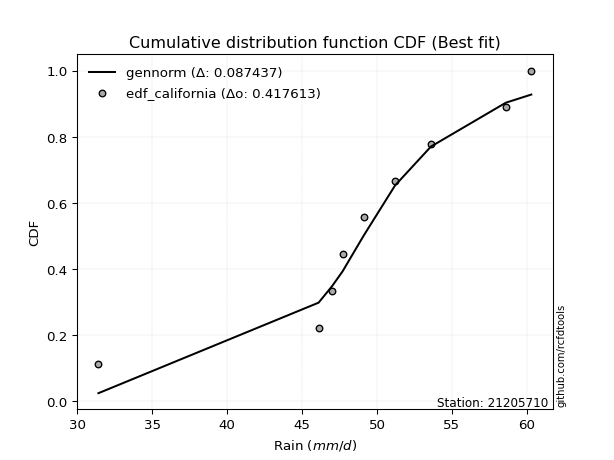</img>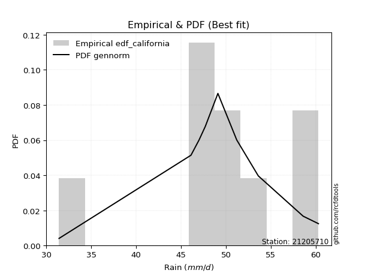</img>

</div>


### 2. EDF Hazen (1930)

Hazen method for plotting positions is a formula used to estimate the empirical cumulative probability distribution of flood events or other hydrological data. This formula often results in biased estimations, particularly when extrapolating to extreme events (high return periods).

<div align="center">


$P=(m-0.5)/n$


</div>


**2.1. Empirical values**

<div align="center">

|                | 0                   | 1                   | 2                  | 3                  | 4         | 5                  | 6                  | 7                  | 8                  |
|:---------------|:--------------------|:--------------------|:-------------------|:-------------------|:----------|:-------------------|:-------------------|:-------------------|:-------------------|
| date           | 2017                | 2020                | 2021               | 2023               | 2018      | 2024               | 2019               | 2025               | 2022               |
| x              | 31.4                | 46.1                | 47.0               | 47.7               | 49.1      | 51.2               | 53.6               | 58.6               | 60.3               |
| m              | 1                   | 2                   | 3                  | 4                  | 5         | 6                  | 7                  | 8                  | 9                  |
| empirical_dist | edf_hazen           | edf_hazen           | edf_hazen          | edf_hazen          | edf_hazen | edf_hazen          | edf_hazen          | edf_hazen          | edf_hazen          |
| empirical      | 0.05555555555555555 | 0.16666666666666666 | 0.2777777777777778 | 0.3888888888888889 | 0.5       | 0.6111111111111112 | 0.7222222222222222 | 0.8333333333333334 | 0.9444444444444444 |
| empirical_tr   | 1.0588235294117647  | 1.2                 | 1.3846153846153846 | 1.6363636363636362 | 2.0       | 2.5714285714285716 | 3.5999999999999996 | 6.000000000000002  | 17.999999999999993 |

</div>


**2.2. Kolmogorov-Smirnov fit test (sorted by Δ)**


<div align="center">

|                | 0                   | 1                   | 2                   | 3                   | 4                   | 5                   | 6                   | 7                   | 8                   | 9                   | 10                  | 11                  | 12                  | 13                  | 14                  | 15                  | 16                  | 17                  | 18                  | 19                  | 20                  | 21                  | 22                  | 23                  | 24                  | 25                  | 26                  | 27                  | 28                  | 29                  | 30                  | 31                  | 32                  | 33                  | 34                  | 35                  | 36                  | 37                  | 38                  | 39                  | 40                  | 41                  | 42                  | 43                  | 44                  | 45                  | 46                  | 47                  | 48                  | 49                  | 50                  | 51                  | 52                  | 53                  | 54                  | 55                  | 56                  | 57                  | 58                  | 59                  | 60                  | 61                  | 62                  | 63                  | 64                  | 65                  | 66                  | 67                  | 68                  | 69                  | 70                  | 71                  | 72                  | 73                  | 74                  | 75                  | 76                  | 77                  | 78                  | 79                  | 80                  | 81                  | 82                  | 83                  | 84                  | 85                  | 86                  | 87                  | 88                  | 89                  | 90                  | 91                  | 92                  | 93                  | 94                  | 95                  | 96                  | 97                  | 98                  | 99                  | 100                 | 101                 | 102                 | 103                 | 104                 | 105                 | 106                 | 107                 | 108                 | 109                 | 110                 | 111                 | 112                 | 113                 | 114                 | 115                 | 116                 | 117                 | 118                 | 119                 | 120                 | 121                 | 122                 | 123                 | 124                 | 125                 | 126                 | 127                 | 128                 | 129                 | 130                 | 131                 | 132                 | 133                 | 134                 | 135                 | 136                 | 137                 | 138                 | 139                 | 140                 | 141                 | 142                 | 143                 | 144                 | 145                 | 146                 | 147                 | 148                 | 149                 | 150                 | 151                 | 152                 | 153                 | 154                 | 155                 | 156                 | 157                 | 158                 | 159                 |
|:---------------|:--------------------|:--------------------|:--------------------|:--------------------|:--------------------|:--------------------|:--------------------|:--------------------|:--------------------|:--------------------|:--------------------|:--------------------|:--------------------|:--------------------|:--------------------|:--------------------|:--------------------|:--------------------|:--------------------|:--------------------|:--------------------|:--------------------|:--------------------|:--------------------|:--------------------|:--------------------|:--------------------|:--------------------|:--------------------|:--------------------|:--------------------|:--------------------|:--------------------|:--------------------|:--------------------|:--------------------|:--------------------|:--------------------|:--------------------|:--------------------|:--------------------|:--------------------|:--------------------|:--------------------|:--------------------|:--------------------|:--------------------|:--------------------|:--------------------|:--------------------|:--------------------|:--------------------|:--------------------|:--------------------|:--------------------|:--------------------|:--------------------|:--------------------|:--------------------|:--------------------|:--------------------|:--------------------|:--------------------|:--------------------|:--------------------|:--------------------|:--------------------|:--------------------|:--------------------|:--------------------|:--------------------|:--------------------|:--------------------|:--------------------|:--------------------|:--------------------|:--------------------|:--------------------|:--------------------|:--------------------|:--------------------|:--------------------|:--------------------|:--------------------|:--------------------|:--------------------|:--------------------|:--------------------|:--------------------|:--------------------|:--------------------|:--------------------|:--------------------|:--------------------|:--------------------|:--------------------|:--------------------|:--------------------|:--------------------|:--------------------|:--------------------|:--------------------|:--------------------|:--------------------|:--------------------|:--------------------|:--------------------|:--------------------|:--------------------|:--------------------|:--------------------|:--------------------|:--------------------|:--------------------|:--------------------|:--------------------|:--------------------|:--------------------|:--------------------|:--------------------|:--------------------|:--------------------|:--------------------|:--------------------|:--------------------|:--------------------|:--------------------|:--------------------|:--------------------|:--------------------|:--------------------|:--------------------|:--------------------|:--------------------|:--------------------|:--------------------|:--------------------|:--------------------|:--------------------|:--------------------|:--------------------|:--------------------|:--------------------|:--------------------|:--------------------|:--------------------|:--------------------|:--------------------|:--------------------|:--------------------|:--------------------|:--------------------|:--------------------|:--------------------|:--------------------|:--------------------|:--------------------|:--------------------|:--------------------|:--------------------|
| station        | 21205710            | 21205710            | 21205710            | 21205710            | 21205710            | 21205710            | 21205710            | 21205710            | 21205710            | 21205710            | 21205710            | 21205710            | 21205710            | 21205710            | 21205710            | 21205710            | 21205710            | 21205710            | 21205710            | 21205710            | 21205710            | 21205710            | 21205710            | 21205710            | 21205710            | 21205710            | 21205710            | 21205710            | 21205710            | 21205710            | 21205710            | 21205710            | 21205710            | 21205710            | 21205710            | 21205710            | 21205710            | 21205710            | 21205710            | 21205710            | 21205710            | 21205710            | 21205710            | 21205710            | 21205710            | 21205710            | 21205710            | 21205710            | 21205710            | 21205710            | 21205710            | 21205710            | 21205710            | 21205710            | 21205710            | 21205710            | 21205710            | 21205710            | 21205710            | 21205710            | 21205710            | 21205710            | 21205710            | 21205710            | 21205710            | 21205710            | 21205710            | 21205710            | 21205710            | 21205710            | 21205710            | 21205710            | 21205710            | 21205710            | 21205710            | 21205710            | 21205710            | 21205710            | 21205710            | 21205710            | 21205710            | 21205710            | 21205710            | 21205710            | 21205710            | 21205710            | 21205710            | 21205710            | 21205710            | 21205710            | 21205710            | 21205710            | 21205710            | 21205710            | 21205710            | 21205710            | 21205710            | 21205710            | 21205710            | 21205710            | 21205710            | 21205710            | 21205710            | 21205710            | 21205710            | 21205710            | 21205710            | 21205710            | 21205710            | 21205710            | 21205710            | 21205710            | 21205710            | 21205710            | 21205710            | 21205710            | 21205710            | 21205710            | 21205710            | 21205710            | 21205710            | 21205710            | 21205710            | 21205710            | 21205710            | 21205710            | 21205710            | 21205710            | 21205710            | 21205710            | 21205710            | 21205710            | 21205710            | 21205710            | 21205710            | 21205710            | 21205710            | 21205710            | 21205710            | 21205710            | 21205710            | 21205710            | 21205710            | 21205710            | 21205710            | 21205710            | 21205710            | 21205710            | 21205710            | 21205710            | 21205710            | 21205710            | 21205710            | 21205710            | 21205710            | 21205710            | 21205710            | 21205710            | 21205710            | 21205710            |
| empirical_dist | edf_hazen           | edf_hazen           | edf_hazen           | edf_hazen           | edf_hazen           | edf_hazen           | edf_hazen           | edf_hazen           | edf_hazen           | edf_hazen           | edf_hazen           | edf_hazen           | edf_hazen           | edf_hazen           | edf_hazen           | edf_hazen           | edf_hazen           | edf_hazen           | edf_hazen           | edf_hazen           | edf_hazen           | edf_hazen           | edf_hazen           | edf_hazen           | edf_hazen           | edf_hazen           | edf_hazen           | edf_hazen           | edf_hazen           | edf_hazen           | edf_hazen           | edf_hazen           | edf_hazen           | edf_hazen           | edf_hazen           | edf_hazen           | edf_hazen           | edf_hazen           | edf_hazen           | edf_hazen           | edf_hazen           | edf_hazen           | edf_hazen           | edf_hazen           | edf_hazen           | edf_hazen           | edf_hazen           | edf_hazen           | edf_hazen           | edf_hazen           | edf_hazen           | edf_hazen           | edf_hazen           | edf_hazen           | edf_hazen           | edf_hazen           | edf_hazen           | edf_hazen           | edf_hazen           | edf_hazen           | edf_hazen           | edf_hazen           | edf_hazen           | edf_hazen           | edf_hazen           | edf_hazen           | edf_hazen           | edf_hazen           | edf_hazen           | edf_hazen           | edf_hazen           | edf_hazen           | edf_hazen           | edf_hazen           | edf_hazen           | edf_hazen           | edf_hazen           | edf_hazen           | edf_hazen           | edf_hazen           | edf_hazen           | edf_hazen           | edf_hazen           | edf_hazen           | edf_hazen           | edf_hazen           | edf_hazen           | edf_hazen           | edf_hazen           | edf_hazen           | edf_hazen           | edf_hazen           | edf_hazen           | edf_hazen           | edf_hazen           | edf_hazen           | edf_hazen           | edf_hazen           | edf_hazen           | edf_hazen           | edf_hazen           | edf_hazen           | edf_hazen           | edf_hazen           | edf_hazen           | edf_hazen           | edf_hazen           | edf_hazen           | edf_hazen           | edf_hazen           | edf_hazen           | edf_hazen           | edf_hazen           | edf_hazen           | edf_hazen           | edf_hazen           | edf_hazen           | edf_hazen           | edf_hazen           | edf_hazen           | edf_hazen           | edf_hazen           | edf_hazen           | edf_hazen           | edf_hazen           | edf_hazen           | edf_hazen           | edf_hazen           | edf_hazen           | edf_hazen           | edf_hazen           | edf_hazen           | edf_hazen           | edf_hazen           | edf_hazen           | edf_hazen           | edf_hazen           | edf_hazen           | edf_hazen           | edf_hazen           | edf_hazen           | edf_hazen           | edf_hazen           | edf_hazen           | edf_hazen           | edf_hazen           | edf_hazen           | edf_hazen           | edf_hazen           | edf_hazen           | edf_hazen           | edf_hazen           | edf_hazen           | edf_hazen           | edf_hazen           | edf_hazen           | edf_hazen           | edf_hazen           | edf_hazen           | edf_hazen           |
| p_dist         | logt                | logcrystalball      | t                   | logdgamma           | loggennorm          | logvonmises_line    | dgamma              | laplace             | dweibull            | gumbel_l            | genlogistic         | johnsonsu           | weibull_min         | vonmises_line       | logjohnsonsu        | skewnorm            | logdweibull         | logloggamma         | genextreme          | logexponpow         | mielke              | burr                | logmielke           | loggenlogistic      | pearson3            | logburr12           | gennorm             | logweibull_min      | logburr             | logloglaplace       | hypsecant           | logargus            | logpearson3         | argus               | loggompertz         | loggumbel_l         | logistic            | trapezoid           | loglaplace          | loglaplace          | triang              | lognakagami         | truncnorm           | nakagami            | logskewnorm         | exponnorm           | norm                | crystalball         | nct                 | f                   | logexponweib        | logbeta             | erlang              | genhalflogistic     | loghypsecant        | logtrapezoid        | alpha               | gamma               | loggenextreme       | anglit              | loglogistic         | rice                | ncf                 | semicircular        | maxwell             | invgamma            | loggengamma         | logf                | logrice             | logexponnorm        | lognorm             | rayleigh            | logfatiguelife      | gumbel_r            | loggenhalflogistic  | betaprime           | invgauss            | logalpha            | logweibull_max      | loganglit           | logbetaprime        | moyal               | lognct              | gompertz            | logsemicircular     | arcsine             | loggamma            | loggamma            | cosine              | invweibull          | loglevy_l           | loginvgamma         | loginvgauss         | logfoldnorm         | logmaxwell          | logtriang           | levy_l              | halfnorm            | logtukeylambda      | logncf              | halflogistic        | lograyleigh         | logjohnsonsb        | logarcsine          | wald                | loginvweibull       | loggumbel_r         | kstwobign           | logmoyal            | loghalfnorm         | truncweibull_min    | logcosine           | loghalflogistic     | beta                | gausshyper          | logkstwobign        | wrapcauchy          | loggenexpon         | ksone               | kappa3              | uniform             | logwald             | tukeylambda         | kappa4              | genpareto           | loggenpareto        | lomax               | genexpon            | logtruncweibull_min | loglomax            | loggausshyper       | johnsonsb           | logwrapcauchy       | logksone            | logkappa3           | burr12              | logkappa4           | loguniform          | foldnorm            | bradford            | halfgennorm         | truncexpon          | logerlang           | logbradford         | logtruncexpon       | weibull_max         | logrdist            | logtruncnorm        | exponweib           | gengamma            | rdist               | fatiguelife         | powerlaw            | logpowerlaw         | loghalfgennorm      | exponpow            | truncpareto         | logtruncpareto      | logvonmises         | vonmises            |
| delta          | 0.07215044737745038 | 0.07244348334847672 | 0.08774847495374269 | 0.09146699575170222 | 0.09656903285837556 | 0.10543812778153402 | 0.10847933218716657 | 0.10900457895600399 | 0.1099575228570907  | 0.11239397460232906 | 0.11607022878546283 | 0.11834143734413269 | 0.1197159687365231  | 0.12088030676881681 | 0.12202016754777475 | 0.12452797973201299 | 0.12488017730532233 | 0.1261053421640684  | 0.12651736968221    | 0.12800896772499057 | 0.12803804539237104 | 0.1282018698246962  | 0.1282463887474322  | 0.12828400168830187 | 0.1287303454856166  | 0.1307154749662305  | 0.13104619033995998 | 0.13154921409683715 | 0.13186884156765397 | 0.13209624977713127 | 0.13668173067184916 | 0.1375633150894788  | 0.13959718180334954 | 0.1404354191084398  | 0.14454851173589214 | 0.1482850939441939  | 0.15119222534933005 | 0.15531409479807248 | 0.15680849379750036 | 0.15680849379750036 | 0.16141964000914513 | 0.16666374459635017 | 0.16666453694239539 | 0.1666663609508181  | 0.16849816108964918 | 0.17020503347102692 | 0.1702069573099577  | 0.17020697458946873 | 0.17062904422888966 | 0.17127678879251687 | 0.17229289197151468 | 0.17877594688132203 | 0.18403211490357177 | 0.18497871027706678 | 0.18504083969524868 | 0.18627115798961733 | 0.18679292231359887 | 0.1880594046728302  | 0.1908015908409878  | 0.19139662518405123 | 0.19722048119827515 | 0.1980706387701663  | 0.20009778830386102 | 0.20031757973781214 | 0.20127593839829103 | 0.20130707284684998 | 0.20781534093412127 | 0.21216536868505356 | 0.21238419220833885 | 0.21239626751728094 | 0.21239925184877254 | 0.2131549634123531  | 0.21463651495038158 | 0.21491256625379    | 0.21512023600271593 | 0.215338041357968   | 0.22427384877142856 | 0.22432610301492692 | 0.2247828269354672  | 0.2288420312631075  | 0.2288629630785816  | 0.23103716887220102 | 0.2335883205217784  | 0.23393198902170032 | 0.23571650131507446 | 0.23711400354474513 | 0.23766383491403245 | 0.23766383491403245 | 0.23869751003987702 | 0.23870122647925737 | 0.23877928534120682 | 0.2389862114383892  | 0.24073587244874486 | 0.2418367006668453  | 0.24577564272034938 | 0.24619025815415388 | 0.24673830247447656 | 0.2469577291779592  | 0.25159820714225845 | 0.25250146976629806 | 0.2527061237287441  | 0.25804375313238104 | 0.26200887050452515 | 0.2634676465266713  | 0.26366212993822025 | 0.26373957914730073 | 0.26791423052207664 | 0.27922360141627056 | 0.2890557339803459  | 0.29294166256313303 | 0.29865814338114594 | 0.3003886677208508  | 0.3056835341002503  | 0.30749077986878154 | 0.31020646704548216 | 0.3187455564930112  | 0.33621747083511766 | 0.3396382564642002  | 0.34054209919261835 | 0.34161908333431046 | 0.34198385236447537 | 0.34391250203127244 | 0.3443682554770623  | 0.3458139038187653  | 0.3677816429167975  | 0.3710462281653605  | 0.388086805065314   | 0.39047772542291925 | 0.3908603646884016  | 0.3914057790729565  | 0.3916748174211422  | 0.3961823676889493  | 0.40184383163904014 | 0.4070763847041279  | 0.40881444079007756 | 0.41299978228025835 | 0.4204412305222006  | 0.4218249949782864  | 0.42323954547954773 | 0.4265358768672539  | 0.43197995030285763 | 0.4439942696998208  | 0.4711544518843197  | 0.5039684668589609  | 0.5226765777330195  | 0.5340860095931477  | 0.5478019786311563  | 0.5518610052622412  | 0.6292252693176575  | 0.6421458194081288  | 0.644438052480137   | 0.648258469015372   | 0.691226912509918   | 0.7132212990161532  | 0.7222222222222222  | 0.7693433558203685  | 0.7937718000920705  | 0.8021040746029001  | 1.2090259998757265  | 8.75114488299886    |
| deltao         | 0.41761268023100007 | 0.41761268023100007 | 0.41761268023100007 | 0.41761268023100007 | 0.41761268023100007 | 0.41761268023100007 | 0.41761268023100007 | 0.41761268023100007 | 0.41761268023100007 | 0.41761268023100007 | 0.41761268023100007 | 0.41761268023100007 | 0.41761268023100007 | 0.41761268023100007 | 0.41761268023100007 | 0.41761268023100007 | 0.41761268023100007 | 0.41761268023100007 | 0.41761268023100007 | 0.41761268023100007 | 0.41761268023100007 | 0.41761268023100007 | 0.41761268023100007 | 0.41761268023100007 | 0.41761268023100007 | 0.41761268023100007 | 0.41761268023100007 | 0.41761268023100007 | 0.41761268023100007 | 0.41761268023100007 | 0.41761268023100007 | 0.41761268023100007 | 0.41761268023100007 | 0.41761268023100007 | 0.41761268023100007 | 0.41761268023100007 | 0.41761268023100007 | 0.41761268023100007 | 0.41761268023100007 | 0.41761268023100007 | 0.41761268023100007 | 0.41761268023100007 | 0.41761268023100007 | 0.41761268023100007 | 0.41761268023100007 | 0.41761268023100007 | 0.41761268023100007 | 0.41761268023100007 | 0.41761268023100007 | 0.41761268023100007 | 0.41761268023100007 | 0.41761268023100007 | 0.41761268023100007 | 0.41761268023100007 | 0.41761268023100007 | 0.41761268023100007 | 0.41761268023100007 | 0.41761268023100007 | 0.41761268023100007 | 0.41761268023100007 | 0.41761268023100007 | 0.41761268023100007 | 0.41761268023100007 | 0.41761268023100007 | 0.41761268023100007 | 0.41761268023100007 | 0.41761268023100007 | 0.41761268023100007 | 0.41761268023100007 | 0.41761268023100007 | 0.41761268023100007 | 0.41761268023100007 | 0.41761268023100007 | 0.41761268023100007 | 0.41761268023100007 | 0.41761268023100007 | 0.41761268023100007 | 0.41761268023100007 | 0.41761268023100007 | 0.41761268023100007 | 0.41761268023100007 | 0.41761268023100007 | 0.41761268023100007 | 0.41761268023100007 | 0.41761268023100007 | 0.41761268023100007 | 0.41761268023100007 | 0.41761268023100007 | 0.41761268023100007 | 0.41761268023100007 | 0.41761268023100007 | 0.41761268023100007 | 0.41761268023100007 | 0.41761268023100007 | 0.41761268023100007 | 0.41761268023100007 | 0.41761268023100007 | 0.41761268023100007 | 0.41761268023100007 | 0.41761268023100007 | 0.41761268023100007 | 0.41761268023100007 | 0.41761268023100007 | 0.41761268023100007 | 0.41761268023100007 | 0.41761268023100007 | 0.41761268023100007 | 0.41761268023100007 | 0.41761268023100007 | 0.41761268023100007 | 0.41761268023100007 | 0.41761268023100007 | 0.41761268023100007 | 0.41761268023100007 | 0.41761268023100007 | 0.41761268023100007 | 0.41761268023100007 | 0.41761268023100007 | 0.41761268023100007 | 0.41761268023100007 | 0.41761268023100007 | 0.41761268023100007 | 0.41761268023100007 | 0.41761268023100007 | 0.41761268023100007 | 0.41761268023100007 | 0.41761268023100007 | 0.41761268023100007 | 0.41761268023100007 | 0.41761268023100007 | 0.41761268023100007 | 0.41761268023100007 | 0.41761268023100007 | 0.41761268023100007 | 0.41761268023100007 | 0.41761268023100007 | 0.41761268023100007 | 0.41761268023100007 | 0.41761268023100007 | 0.41761268023100007 | 0.41761268023100007 | 0.41761268023100007 | 0.41761268023100007 | 0.41761268023100007 | 0.41761268023100007 | 0.41761268023100007 | 0.41761268023100007 | 0.41761268023100007 | 0.41761268023100007 | 0.41761268023100007 | 0.41761268023100007 | 0.41761268023100007 | 0.41761268023100007 | 0.41761268023100007 | 0.41761268023100007 | 0.41761268023100007 | 0.41761268023100007 | 0.41761268023100007 | 0.41761268023100007 | 0.41761268023100007 |
| eval           | Δo > Δ              | Δo > Δ              | Δo > Δ              | Δo > Δ              | Δo > Δ              | Δo > Δ              | Δo > Δ              | Δo > Δ              | Δo > Δ              | Δo > Δ              | Δo > Δ              | Δo > Δ              | Δo > Δ              | Δo > Δ              | Δo > Δ              | Δo > Δ              | Δo > Δ              | Δo > Δ              | Δo > Δ              | Δo > Δ              | Δo > Δ              | Δo > Δ              | Δo > Δ              | Δo > Δ              | Δo > Δ              | Δo > Δ              | Δo > Δ              | Δo > Δ              | Δo > Δ              | Δo > Δ              | Δo > Δ              | Δo > Δ              | Δo > Δ              | Δo > Δ              | Δo > Δ              | Δo > Δ              | Δo > Δ              | Δo > Δ              | Δo > Δ              | Δo > Δ              | Δo > Δ              | Δo > Δ              | Δo > Δ              | Δo > Δ              | Δo > Δ              | Δo > Δ              | Δo > Δ              | Δo > Δ              | Δo > Δ              | Δo > Δ              | Δo > Δ              | Δo > Δ              | Δo > Δ              | Δo > Δ              | Δo > Δ              | Δo > Δ              | Δo > Δ              | Δo > Δ              | Δo > Δ              | Δo > Δ              | Δo > Δ              | Δo > Δ              | Δo > Δ              | Δo > Δ              | Δo > Δ              | Δo > Δ              | Δo > Δ              | Δo > Δ              | Δo > Δ              | Δo > Δ              | Δo > Δ              | Δo > Δ              | Δo > Δ              | Δo > Δ              | Δo > Δ              | Δo > Δ              | Δo > Δ              | Δo > Δ              | Δo > Δ              | Δo > Δ              | Δo > Δ              | Δo > Δ              | Δo > Δ              | Δo > Δ              | Δo > Δ              | Δo > Δ              | Δo > Δ              | Δo > Δ              | Δo > Δ              | Δo > Δ              | Δo > Δ              | Δo > Δ              | Δo > Δ              | Δo > Δ              | Δo > Δ              | Δo > Δ              | Δo > Δ              | Δo > Δ              | Δo > Δ              | Δo > Δ              | Δo > Δ              | Δo > Δ              | Δo > Δ              | Δo > Δ              | Δo > Δ              | Δo > Δ              | Δo > Δ              | Δo > Δ              | Δo > Δ              | Δo > Δ              | Δo > Δ              | Δo > Δ              | Δo > Δ              | Δo > Δ              | Δo > Δ              | Δo > Δ              | Δo > Δ              | Δo > Δ              | Δo > Δ              | Δo > Δ              | Δo > Δ              | Δo > Δ              | Δo > Δ              | Δo > Δ              | Δo > Δ              | Δo > Δ              | Δo > Δ              | Δo > Δ              | Δo > Δ              | Δo > Δ              | Δo > Δ              | Δo > Δ              | Δo > Δ              | Δo > Δ              | Δo > Δ              | Δo > Δ              | Δo <= Δ             | Δo <= Δ             | Δo <= Δ             | Δo <= Δ             | Δo <= Δ             | Δo <= Δ             | Δo <= Δ             | Δo <= Δ             | Δo <= Δ             | Δo <= Δ             | Δo <= Δ             | Δo <= Δ             | Δo <= Δ             | Δo <= Δ             | Δo <= Δ             | Δo <= Δ             | Δo <= Δ             | Δo <= Δ             | Δo <= Δ             | Δo <= Δ             | Δo <= Δ             | Δo <= Δ             | Δo <= Δ             | Δo <= Δ             |
| fit            | 1                   | 1                   | 1                   | 1                   | 1                   | 1                   | 1                   | 1                   | 1                   | 1                   | 1                   | 1                   | 1                   | 1                   | 1                   | 1                   | 1                   | 1                   | 1                   | 1                   | 1                   | 1                   | 1                   | 1                   | 1                   | 1                   | 1                   | 1                   | 1                   | 1                   | 1                   | 1                   | 1                   | 1                   | 1                   | 1                   | 1                   | 1                   | 1                   | 1                   | 1                   | 1                   | 1                   | 1                   | 1                   | 1                   | 1                   | 1                   | 1                   | 1                   | 1                   | 1                   | 1                   | 1                   | 1                   | 1                   | 1                   | 1                   | 1                   | 1                   | 1                   | 1                   | 1                   | 1                   | 1                   | 1                   | 1                   | 1                   | 1                   | 1                   | 1                   | 1                   | 1                   | 1                   | 1                   | 1                   | 1                   | 1                   | 1                   | 1                   | 1                   | 1                   | 1                   | 1                   | 1                   | 1                   | 1                   | 1                   | 1                   | 1                   | 1                   | 1                   | 1                   | 1                   | 1                   | 1                   | 1                   | 1                   | 1                   | 1                   | 1                   | 1                   | 1                   | 1                   | 1                   | 1                   | 1                   | 1                   | 1                   | 1                   | 1                   | 1                   | 1                   | 1                   | 1                   | 1                   | 1                   | 1                   | 1                   | 1                   | 1                   | 1                   | 1                   | 1                   | 1                   | 1                   | 1                   | 1                   | 1                   | 1                   | 1                   | 1                   | 1                   | 1                   | 1                   | 1                   | 0                   | 0                   | 0                   | 0                   | 0                   | 0                   | 0                   | 0                   | 0                   | 0                   | 0                   | 0                   | 0                   | 0                   | 0                   | 0                   | 0                   | 0                   | 0                   | 0                   | 0                   | 0                   | 0                   | 0                   |
| n              | 9                   | 9                   | 9                   | 9                   | 9                   | 9                   | 9                   | 9                   | 9                   | 9                   | 9                   | 9                   | 9                   | 9                   | 9                   | 9                   | 9                   | 9                   | 9                   | 9                   | 9                   | 9                   | 9                   | 9                   | 9                   | 9                   | 9                   | 9                   | 9                   | 9                   | 9                   | 9                   | 9                   | 9                   | 9                   | 9                   | 9                   | 9                   | 9                   | 9                   | 9                   | 9                   | 9                   | 9                   | 9                   | 9                   | 9                   | 9                   | 9                   | 9                   | 9                   | 9                   | 9                   | 9                   | 9                   | 9                   | 9                   | 9                   | 9                   | 9                   | 9                   | 9                   | 9                   | 9                   | 9                   | 9                   | 9                   | 9                   | 9                   | 9                   | 9                   | 9                   | 9                   | 9                   | 9                   | 9                   | 9                   | 9                   | 9                   | 9                   | 9                   | 9                   | 9                   | 9                   | 9                   | 9                   | 9                   | 9                   | 9                   | 9                   | 9                   | 9                   | 9                   | 9                   | 9                   | 9                   | 9                   | 9                   | 9                   | 9                   | 9                   | 9                   | 9                   | 9                   | 9                   | 9                   | 9                   | 9                   | 9                   | 9                   | 9                   | 9                   | 9                   | 9                   | 9                   | 9                   | 9                   | 9                   | 9                   | 9                   | 9                   | 9                   | 9                   | 9                   | 9                   | 9                   | 9                   | 9                   | 9                   | 9                   | 9                   | 9                   | 9                   | 9                   | 9                   | 9                   | 9                   | 9                   | 9                   | 9                   | 9                   | 9                   | 9                   | 9                   | 9                   | 9                   | 9                   | 9                   | 9                   | 9                   | 9                   | 9                   | 9                   | 9                   | 9                   | 9                   | 9                   | 9                   | 9                   | 9                   |
| best_fit       | 1                   | 0                   | 0                   | 0                   | 0                   | 0                   | 0                   | 0                   | 0                   | 0                   | 0                   | 0                   | 0                   | 0                   | 0                   | 0                   | 0                   | 0                   | 0                   | 0                   | 0                   | 0                   | 0                   | 0                   | 0                   | 0                   | 0                   | 0                   | 0                   | 0                   | 0                   | 0                   | 0                   | 0                   | 0                   | 0                   | 0                   | 0                   | 0                   | 0                   | 0                   | 0                   | 0                   | 0                   | 0                   | 0                   | 0                   | 0                   | 0                   | 0                   | 0                   | 0                   | 0                   | 0                   | 0                   | 0                   | 0                   | 0                   | 0                   | 0                   | 0                   | 0                   | 0                   | 0                   | 0                   | 0                   | 0                   | 0                   | 0                   | 0                   | 0                   | 0                   | 0                   | 0                   | 0                   | 0                   | 0                   | 0                   | 0                   | 0                   | 0                   | 0                   | 0                   | 0                   | 0                   | 0                   | 0                   | 0                   | 0                   | 0                   | 0                   | 0                   | 0                   | 0                   | 0                   | 0                   | 0                   | 0                   | 0                   | 0                   | 0                   | 0                   | 0                   | 0                   | 0                   | 0                   | 0                   | 0                   | 0                   | 0                   | 0                   | 0                   | 0                   | 0                   | 0                   | 0                   | 0                   | 0                   | 0                   | 0                   | 0                   | 0                   | 0                   | 0                   | 0                   | 0                   | 0                   | 0                   | 0                   | 0                   | 0                   | 0                   | 0                   | 0                   | 0                   | 0                   | 0                   | 0                   | 0                   | 0                   | 0                   | 0                   | 0                   | 0                   | 0                   | 0                   | 0                   | 0                   | 0                   | 0                   | 0                   | 0                   | 0                   | 0                   | 0                   | 0                   | 0                   | 0                   | 0                   | 0                   |
| best_fit_sort  | 1                   | 2                   | 3                   | 4                   | 5                   | 6                   | 7                   | 8                   | 9                   | 10                  | 11                  | 12                  | 13                  | 14                  | 15                  | 16                  | 17                  | 18                  | 19                  | 20                  | 21                  | 22                  | 23                  | 24                  | 25                  | 26                  | 27                  | 28                  | 29                  | 30                  | 31                  | 32                  | 33                  | 34                  | 35                  | 36                  | 37                  | 38                  | 39                  | 40                  | 41                  | 42                  | 43                  | 44                  | 45                  | 46                  | 47                  | 48                  | 49                  | 50                  | 51                  | 52                  | 53                  | 54                  | 55                  | 56                  | 57                  | 58                  | 59                  | 60                  | 61                  | 62                  | 63                  | 64                  | 65                  | 66                  | 67                  | 68                  | 69                  | 70                  | 71                  | 72                  | 73                  | 74                  | 75                  | 76                  | 77                  | 78                  | 79                  | 80                  | 81                  | 82                  | 83                  | 84                  | 85                  | 86                  | 87                  | 88                  | 89                  | 90                  | 91                  | 92                  | 93                  | 94                  | 95                  | 96                  | 97                  | 98                  | 99                  | 100                 | 101                 | 102                 | 103                 | 104                 | 105                 | 106                 | 107                 | 108                 | 109                 | 110                 | 111                 | 112                 | 113                 | 114                 | 115                 | 116                 | 117                 | 118                 | 119                 | 120                 | 121                 | 122                 | 123                 | 124                 | 125                 | 126                 | 127                 | 128                 | 129                 | 130                 | 131                 | 132                 | 133                 | 134                 | 135                 | 136                 | 137                 | 138                 | 139                 | 140                 | 141                 | 142                 | 143                 | 144                 | 145                 | 146                 | 147                 | 148                 | 149                 | 150                 | 151                 | 152                 | 153                 | 154                 | 155                 | 156                 | 157                 | 158                 | 159                 | 160                 |

</div>


**2.3. Best fit**

<div align="center">

|   id |   station | empirical_dist   | p_dist   |     delta |   deltao | eval   |   fit |   n |   best_fit |   best_fit_sort |
|-----:|----------:|:-----------------|:---------|----------:|---------:|:-------|------:|----:|-----------:|----------------:|
|    0 |  21205710 | edf_hazen        | logt     | 0.0721504 | 0.417613 | Δo > Δ |     1 |   9 |          1 |               1 |

</div>


<div align="center">

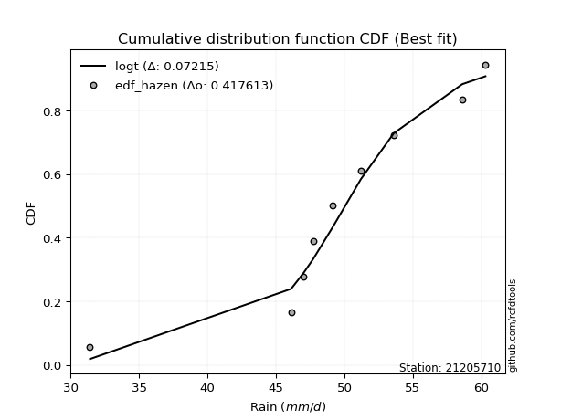</img>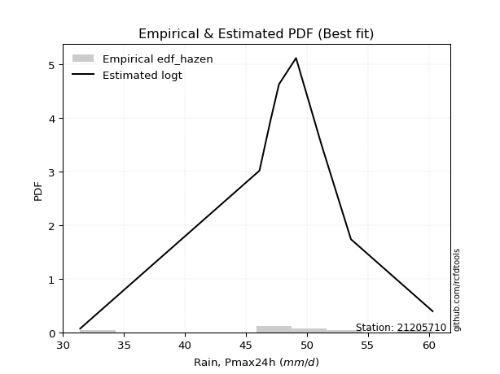</img>

</div>


### 3. EDF Weibull (1939)

Weibull plotting position formula is an empirical method used to estimate the non-exceedance probability or plotting position for a set of observed data, is often recommended or widely used in practice, particularly in flood frequency analysis.

<div align="center">


$P=m/(n+1)$


</div>


**3.1. Empirical values**

<div align="center">

|                | 0                  | 1           | 2                  | 3                  | 4           | 5           | 6                 | 7                 | 8                  |
|:---------------|:-------------------|:------------|:-------------------|:-------------------|:------------|:------------|:------------------|:------------------|:-------------------|
| date           | 2017               | 2020        | 2021               | 2023               | 2018        | 2024        | 2019              | 2025              | 2022               |
| x              | 31.4               | 46.1        | 47.0               | 47.7               | 49.1        | 51.2        | 53.6              | 58.6              | 60.3               |
| m              | 1                  | 2           | 3                  | 4                  | 5           | 6           | 7                 | 8                 | 9                  |
| empirical_dist | edf_weibull        | edf_weibull | edf_weibull        | edf_weibull        | edf_weibull | edf_weibull | edf_weibull       | edf_weibull       | edf_weibull        |
| empirical      | 0.1                | 0.2         | 0.3                | 0.4                | 0.5         | 0.6         | 0.7               | 0.8               | 0.9                |
| empirical_tr   | 1.1111111111111112 | 1.25        | 1.4285714285714286 | 1.6666666666666667 | 2.0         | 2.5         | 3.333333333333333 | 5.000000000000001 | 10.000000000000002 |

</div>


**3.2. Kolmogorov-Smirnov fit test (sorted by Δ)**


<div align="center">

|                | 0                   | 1                   | 2                   | 3                   | 4                   | 5                   | 6                   | 7                   | 8                   | 9                   | 10                  | 11                  | 12                  | 13                  | 14                  | 15                  | 16                  | 17                  | 18                  | 19                  | 20                  | 21                  | 22                  | 23                  | 24                  | 25                  | 26                  | 27                  | 28                  | 29                  | 30                  | 31                  | 32                  | 33                  | 34                  | 35                  | 36                  | 37                  | 38                  | 39                  | 40                  | 41                  | 42                  | 43                  | 44                  | 45                  | 46                  | 47                  | 48                  | 49                  | 50                  | 51                  | 52                  | 53                  | 54                  | 55                  | 56                  | 57                  | 58                  | 59                  | 60                  | 61                  | 62                  | 63                  | 64                  | 65                  | 66                  | 67                  | 68                  | 69                  | 70                  | 71                  | 72                  | 73                  | 74                  | 75                  | 76                  | 77                  | 78                  | 79                  | 80                  | 81                  | 82                  | 83                  | 84                  | 85                  | 86                  | 87                  | 88                  | 89                  | 90                  | 91                  | 92                  | 93                  | 94                  | 95                  | 96                  | 97                  | 98                  | 99                  | 100                 | 101                 | 102                 | 103                 | 104                 | 105                 | 106                 | 107                 | 108                 | 109                 | 110                 | 111                 | 112                 | 113                 | 114                 | 115                 | 116                 | 117                 | 118                 | 119                 | 120                 | 121                 | 122                 | 123                 | 124                 | 125                 | 126                 | 127                 | 128                 | 129                 | 130                 | 131                 | 132                 | 133                 | 134                 | 135                 | 136                 | 137                 | 138                 | 139                 | 140                 | 141                 | 142                 | 143                 | 144                 | 145                 | 146                 | 147                 | 148                 | 149                 | 150                 | 151                 | 152                 | 153                 | 154                 | 155                 | 156                 | 157                 | 158                 | 159                 |
|:---------------|:--------------------|:--------------------|:--------------------|:--------------------|:--------------------|:--------------------|:--------------------|:--------------------|:--------------------|:--------------------|:--------------------|:--------------------|:--------------------|:--------------------|:--------------------|:--------------------|:--------------------|:--------------------|:--------------------|:--------------------|:--------------------|:--------------------|:--------------------|:--------------------|:--------------------|:--------------------|:--------------------|:--------------------|:--------------------|:--------------------|:--------------------|:--------------------|:--------------------|:--------------------|:--------------------|:--------------------|:--------------------|:--------------------|:--------------------|:--------------------|:--------------------|:--------------------|:--------------------|:--------------------|:--------------------|:--------------------|:--------------------|:--------------------|:--------------------|:--------------------|:--------------------|:--------------------|:--------------------|:--------------------|:--------------------|:--------------------|:--------------------|:--------------------|:--------------------|:--------------------|:--------------------|:--------------------|:--------------------|:--------------------|:--------------------|:--------------------|:--------------------|:--------------------|:--------------------|:--------------------|:--------------------|:--------------------|:--------------------|:--------------------|:--------------------|:--------------------|:--------------------|:--------------------|:--------------------|:--------------------|:--------------------|:--------------------|:--------------------|:--------------------|:--------------------|:--------------------|:--------------------|:--------------------|:--------------------|:--------------------|:--------------------|:--------------------|:--------------------|:--------------------|:--------------------|:--------------------|:--------------------|:--------------------|:--------------------|:--------------------|:--------------------|:--------------------|:--------------------|:--------------------|:--------------------|:--------------------|:--------------------|:--------------------|:--------------------|:--------------------|:--------------------|:--------------------|:--------------------|:--------------------|:--------------------|:--------------------|:--------------------|:--------------------|:--------------------|:--------------------|:--------------------|:--------------------|:--------------------|:--------------------|:--------------------|:--------------------|:--------------------|:--------------------|:--------------------|:--------------------|:--------------------|:--------------------|:--------------------|:--------------------|:--------------------|:--------------------|:--------------------|:--------------------|:--------------------|:--------------------|:--------------------|:--------------------|:--------------------|:--------------------|:--------------------|:--------------------|:--------------------|:--------------------|:--------------------|:--------------------|:--------------------|:--------------------|:--------------------|:--------------------|:--------------------|:--------------------|:--------------------|:--------------------|:--------------------|:--------------------|
| station        | 21205710            | 21205710            | 21205710            | 21205710            | 21205710            | 21205710            | 21205710            | 21205710            | 21205710            | 21205710            | 21205710            | 21205710            | 21205710            | 21205710            | 21205710            | 21205710            | 21205710            | 21205710            | 21205710            | 21205710            | 21205710            | 21205710            | 21205710            | 21205710            | 21205710            | 21205710            | 21205710            | 21205710            | 21205710            | 21205710            | 21205710            | 21205710            | 21205710            | 21205710            | 21205710            | 21205710            | 21205710            | 21205710            | 21205710            | 21205710            | 21205710            | 21205710            | 21205710            | 21205710            | 21205710            | 21205710            | 21205710            | 21205710            | 21205710            | 21205710            | 21205710            | 21205710            | 21205710            | 21205710            | 21205710            | 21205710            | 21205710            | 21205710            | 21205710            | 21205710            | 21205710            | 21205710            | 21205710            | 21205710            | 21205710            | 21205710            | 21205710            | 21205710            | 21205710            | 21205710            | 21205710            | 21205710            | 21205710            | 21205710            | 21205710            | 21205710            | 21205710            | 21205710            | 21205710            | 21205710            | 21205710            | 21205710            | 21205710            | 21205710            | 21205710            | 21205710            | 21205710            | 21205710            | 21205710            | 21205710            | 21205710            | 21205710            | 21205710            | 21205710            | 21205710            | 21205710            | 21205710            | 21205710            | 21205710            | 21205710            | 21205710            | 21205710            | 21205710            | 21205710            | 21205710            | 21205710            | 21205710            | 21205710            | 21205710            | 21205710            | 21205710            | 21205710            | 21205710            | 21205710            | 21205710            | 21205710            | 21205710            | 21205710            | 21205710            | 21205710            | 21205710            | 21205710            | 21205710            | 21205710            | 21205710            | 21205710            | 21205710            | 21205710            | 21205710            | 21205710            | 21205710            | 21205710            | 21205710            | 21205710            | 21205710            | 21205710            | 21205710            | 21205710            | 21205710            | 21205710            | 21205710            | 21205710            | 21205710            | 21205710            | 21205710            | 21205710            | 21205710            | 21205710            | 21205710            | 21205710            | 21205710            | 21205710            | 21205710            | 21205710            | 21205710            | 21205710            | 21205710            | 21205710            | 21205710            | 21205710            |
| empirical_dist | edf_weibull         | edf_weibull         | edf_weibull         | edf_weibull         | edf_weibull         | edf_weibull         | edf_weibull         | edf_weibull         | edf_weibull         | edf_weibull         | edf_weibull         | edf_weibull         | edf_weibull         | edf_weibull         | edf_weibull         | edf_weibull         | edf_weibull         | edf_weibull         | edf_weibull         | edf_weibull         | edf_weibull         | edf_weibull         | edf_weibull         | edf_weibull         | edf_weibull         | edf_weibull         | edf_weibull         | edf_weibull         | edf_weibull         | edf_weibull         | edf_weibull         | edf_weibull         | edf_weibull         | edf_weibull         | edf_weibull         | edf_weibull         | edf_weibull         | edf_weibull         | edf_weibull         | edf_weibull         | edf_weibull         | edf_weibull         | edf_weibull         | edf_weibull         | edf_weibull         | edf_weibull         | edf_weibull         | edf_weibull         | edf_weibull         | edf_weibull         | edf_weibull         | edf_weibull         | edf_weibull         | edf_weibull         | edf_weibull         | edf_weibull         | edf_weibull         | edf_weibull         | edf_weibull         | edf_weibull         | edf_weibull         | edf_weibull         | edf_weibull         | edf_weibull         | edf_weibull         | edf_weibull         | edf_weibull         | edf_weibull         | edf_weibull         | edf_weibull         | edf_weibull         | edf_weibull         | edf_weibull         | edf_weibull         | edf_weibull         | edf_weibull         | edf_weibull         | edf_weibull         | edf_weibull         | edf_weibull         | edf_weibull         | edf_weibull         | edf_weibull         | edf_weibull         | edf_weibull         | edf_weibull         | edf_weibull         | edf_weibull         | edf_weibull         | edf_weibull         | edf_weibull         | edf_weibull         | edf_weibull         | edf_weibull         | edf_weibull         | edf_weibull         | edf_weibull         | edf_weibull         | edf_weibull         | edf_weibull         | edf_weibull         | edf_weibull         | edf_weibull         | edf_weibull         | edf_weibull         | edf_weibull         | edf_weibull         | edf_weibull         | edf_weibull         | edf_weibull         | edf_weibull         | edf_weibull         | edf_weibull         | edf_weibull         | edf_weibull         | edf_weibull         | edf_weibull         | edf_weibull         | edf_weibull         | edf_weibull         | edf_weibull         | edf_weibull         | edf_weibull         | edf_weibull         | edf_weibull         | edf_weibull         | edf_weibull         | edf_weibull         | edf_weibull         | edf_weibull         | edf_weibull         | edf_weibull         | edf_weibull         | edf_weibull         | edf_weibull         | edf_weibull         | edf_weibull         | edf_weibull         | edf_weibull         | edf_weibull         | edf_weibull         | edf_weibull         | edf_weibull         | edf_weibull         | edf_weibull         | edf_weibull         | edf_weibull         | edf_weibull         | edf_weibull         | edf_weibull         | edf_weibull         | edf_weibull         | edf_weibull         | edf_weibull         | edf_weibull         | edf_weibull         | edf_weibull         | edf_weibull         | edf_weibull         | edf_weibull         |
| p_dist         | logt                | loggennorm          | t                   | logdweibull         | pearson3            | logloglaplace       | logvonmises_line    | vonmises_line       | logburr             | logdgamma           | skewnorm            | logweibull_min      | loggenlogistic      | burr                | mielke              | laplace             | logburr12           | logexponpow         | logmielke           | gennorm             | dweibull            | hypsecant           | logloggamma         | logjohnsonsu        | logargus            | genlogistic         | weibull_min         | logcrystalball      | johnsonsu           | logpearson3         | argus               | dgamma              | loggompertz         | gumbel_l            | loggumbel_l         | genextreme          | logistic            | trapezoid           | loglaplace          | loglaplace          | triang              | logskewnorm         | exponnorm           | norm                | crystalball         | nct                 | f                   | logexponweib        | erlang              | genhalflogistic     | loghypsecant        | logtrapezoid        | alpha               | gamma               | anglit              | loglogistic         | rice                | ncf                 | semicircular        | logbeta             | maxwell             | invgamma            | loggengamma         | logf                | logrice             | logexponnorm        | lognorm             | loggenextreme       | rayleigh            | logfatiguelife      | gumbel_r            | loggenhalflogistic  | betaprime           | invgauss            | logalpha            | loganglit           | logbetaprime        | moyal               | lognakagami         | truncnorm           | nakagami            | lognct              | logsemicircular     | logweibull_max      | arcsine             | loggamma            | loggamma            | cosine              | invweibull          | loglevy_l           | loginvgamma         | loginvgauss         | logfoldnorm         | logmaxwell          | logtriang           | levy_l              | halfnorm            | logncf              | halflogistic        | lograyleigh         | logjohnsonsb        | logarcsine          | wald                | loginvweibull       | loggumbel_r         | gompertz            | kstwobign           | logmoyal            | logtukeylambda      | loghalfnorm         | truncweibull_min    | logcosine           | loghalflogistic     | gausshyper          | beta                | logkstwobign        | wrapcauchy          | loggenexpon         | ksone               | kappa3              | uniform             | logwald             | tukeylambda         | kappa4              | genpareto           | loggenpareto        | lomax               | genexpon            | logtruncweibull_min | loglomax            | loggausshyper       | johnsonsb           | logwrapcauchy       | logksone            | logkappa3           | burr12              | logkappa4           | loguniform          | bradford            | halfgennorm         | truncexpon          | foldnorm            | logerlang           | logbradford         | logtruncexpon       | logrdist            | weibull_max         | logtruncnorm        | exponweib           | gengamma            | rdist               | fatiguelife         | powerlaw            | logpowerlaw         | loghalfgennorm      | exponpow            | truncpareto         | logtruncpareto      | logvonmises         | vonmises            |
| delta          | 0.08243192271661792 | 0.08875237370806988 | 0.09050067035737974 | 0.09154684397198898 | 0.09858663586261607 | 0.09876291644379792 | 0.0999999998846021  | 0.09999999995669913 | 0.10028388433291524 | 0.10097519590915471 | 0.10122287561310078 | 0.10145429144828177 | 0.10159556317869645 | 0.10163427640532563 | 0.1016852124504739  | 0.10202832695470476 | 0.10233089141503715 | 0.10241146979406224 | 0.10268832221862711 | 0.10292715532051733 | 0.1031851294299162  | 0.10334839733851581 | 0.10383036300874138 | 0.10408045417267298 | 0.10422998175614545 | 0.10534460635999565 | 0.1055929736009702  | 0.10577681668181005 | 0.10609567915326468 | 0.10626384847001619 | 0.10710208577510644 | 0.11054708335271823 | 0.11121517840255879 | 0.1147342881958281  | 0.11495176061086054 | 0.11540625857109882 | 0.1178588920159967  | 0.12198076146473913 | 0.12347516046416701 | 0.12347516046416701 | 0.12808630667581178 | 0.13516482775631583 | 0.13687170013769356 | 0.13687362397662434 | 0.13687364125613538 | 0.1372957108955563  | 0.13794345545918352 | 0.13895955863818132 | 0.15069878157023842 | 0.15164537694373342 | 0.15170750636191532 | 0.15293782465628397 | 0.15345958898026552 | 0.15472607133949684 | 0.15806329185071788 | 0.1638871478649418  | 0.16473730543683296 | 0.16676445497052766 | 0.1669842464044788  | 0.16705223936474128 | 0.16794260506495767 | 0.16797373951351663 | 0.17448200760078791 | 0.1788320353517202  | 0.1790508588750055  | 0.1790629341839476  | 0.17906591851543918 | 0.1793234386876656  | 0.17982163007901975 | 0.18130318161704823 | 0.18157923292045663 | 0.18178690266938258 | 0.18200470802463464 | 0.1909405154380952  | 0.19099276968159357 | 0.19550869792977416 | 0.19552962974524823 | 0.19770383553886767 | 0.19999707792968352 | 0.19999787027572874 | 0.19999969428415146 | 0.20025498718844503 | 0.2023831679817411  | 0.20256060471324494 | 0.20378067021141177 | 0.2043305015806991  | 0.2043305015806991  | 0.20536417670654367 | 0.20536789314592402 | 0.20544595200787347 | 0.20565287810505584 | 0.2074025391154115  | 0.20850336733351194 | 0.21244230938701603 | 0.21285692482082053 | 0.2134049691411432  | 0.21362439584462584 | 0.21916813643296473 | 0.21937279039541074 | 0.22471041979904766 | 0.22867553717119177 | 0.230134313193338   | 0.23032879660488687 | 0.23040624581396735 | 0.2345808971887433  | 0.24504310013281144 | 0.24589026808293724 | 0.2557224006470125  | 0.2578688478591161  | 0.25960832922979965 | 0.2653248100478126  | 0.26705533438751744 | 0.27235020076691696 | 0.27687313371214883 | 0.2852685576465593  | 0.28541222315967785 | 0.3028841375017843  | 0.3063049231308668  | 0.30720876585928497 | 0.3082857500009771  | 0.308650519031142   | 0.31057916869793906 | 0.3110349221437289  | 0.31248057048543193 | 0.3344483095834641  | 0.3377128948320271  | 0.35475347173198063 | 0.35714439208958587 | 0.3575270313550682  | 0.3580724457396231  | 0.3583414840878088  | 0.36284903435561594 | 0.36851049830570676 | 0.3737430513707945  | 0.3754811074567442  | 0.379666448946925   | 0.38710789718886723 | 0.388491661644953   | 0.39320254353392053 | 0.39864661696952425 | 0.41066093636648743 | 0.42323954547954773 | 0.4378211185509863  | 0.4706351335256275  | 0.4893432443996861  | 0.5033575341867119  | 0.5118637873709254  | 0.5185276719289078  | 0.5958919359843242  | 0.6088124860747954  | 0.6111047191468035  | 0.6149251356820387  | 0.6578935791765845  | 0.6798879656828198  | 0.7                 | 0.7360100224870352  | 0.7604384667587372  | 0.7687707412695668  | 1.1756926665423932  | 8.795589327443304   |
| deltao         | 0.41761268023100007 | 0.41761268023100007 | 0.41761268023100007 | 0.41761268023100007 | 0.41761268023100007 | 0.41761268023100007 | 0.41761268023100007 | 0.41761268023100007 | 0.41761268023100007 | 0.41761268023100007 | 0.41761268023100007 | 0.41761268023100007 | 0.41761268023100007 | 0.41761268023100007 | 0.41761268023100007 | 0.41761268023100007 | 0.41761268023100007 | 0.41761268023100007 | 0.41761268023100007 | 0.41761268023100007 | 0.41761268023100007 | 0.41761268023100007 | 0.41761268023100007 | 0.41761268023100007 | 0.41761268023100007 | 0.41761268023100007 | 0.41761268023100007 | 0.41761268023100007 | 0.41761268023100007 | 0.41761268023100007 | 0.41761268023100007 | 0.41761268023100007 | 0.41761268023100007 | 0.41761268023100007 | 0.41761268023100007 | 0.41761268023100007 | 0.41761268023100007 | 0.41761268023100007 | 0.41761268023100007 | 0.41761268023100007 | 0.41761268023100007 | 0.41761268023100007 | 0.41761268023100007 | 0.41761268023100007 | 0.41761268023100007 | 0.41761268023100007 | 0.41761268023100007 | 0.41761268023100007 | 0.41761268023100007 | 0.41761268023100007 | 0.41761268023100007 | 0.41761268023100007 | 0.41761268023100007 | 0.41761268023100007 | 0.41761268023100007 | 0.41761268023100007 | 0.41761268023100007 | 0.41761268023100007 | 0.41761268023100007 | 0.41761268023100007 | 0.41761268023100007 | 0.41761268023100007 | 0.41761268023100007 | 0.41761268023100007 | 0.41761268023100007 | 0.41761268023100007 | 0.41761268023100007 | 0.41761268023100007 | 0.41761268023100007 | 0.41761268023100007 | 0.41761268023100007 | 0.41761268023100007 | 0.41761268023100007 | 0.41761268023100007 | 0.41761268023100007 | 0.41761268023100007 | 0.41761268023100007 | 0.41761268023100007 | 0.41761268023100007 | 0.41761268023100007 | 0.41761268023100007 | 0.41761268023100007 | 0.41761268023100007 | 0.41761268023100007 | 0.41761268023100007 | 0.41761268023100007 | 0.41761268023100007 | 0.41761268023100007 | 0.41761268023100007 | 0.41761268023100007 | 0.41761268023100007 | 0.41761268023100007 | 0.41761268023100007 | 0.41761268023100007 | 0.41761268023100007 | 0.41761268023100007 | 0.41761268023100007 | 0.41761268023100007 | 0.41761268023100007 | 0.41761268023100007 | 0.41761268023100007 | 0.41761268023100007 | 0.41761268023100007 | 0.41761268023100007 | 0.41761268023100007 | 0.41761268023100007 | 0.41761268023100007 | 0.41761268023100007 | 0.41761268023100007 | 0.41761268023100007 | 0.41761268023100007 | 0.41761268023100007 | 0.41761268023100007 | 0.41761268023100007 | 0.41761268023100007 | 0.41761268023100007 | 0.41761268023100007 | 0.41761268023100007 | 0.41761268023100007 | 0.41761268023100007 | 0.41761268023100007 | 0.41761268023100007 | 0.41761268023100007 | 0.41761268023100007 | 0.41761268023100007 | 0.41761268023100007 | 0.41761268023100007 | 0.41761268023100007 | 0.41761268023100007 | 0.41761268023100007 | 0.41761268023100007 | 0.41761268023100007 | 0.41761268023100007 | 0.41761268023100007 | 0.41761268023100007 | 0.41761268023100007 | 0.41761268023100007 | 0.41761268023100007 | 0.41761268023100007 | 0.41761268023100007 | 0.41761268023100007 | 0.41761268023100007 | 0.41761268023100007 | 0.41761268023100007 | 0.41761268023100007 | 0.41761268023100007 | 0.41761268023100007 | 0.41761268023100007 | 0.41761268023100007 | 0.41761268023100007 | 0.41761268023100007 | 0.41761268023100007 | 0.41761268023100007 | 0.41761268023100007 | 0.41761268023100007 | 0.41761268023100007 | 0.41761268023100007 | 0.41761268023100007 | 0.41761268023100007 | 0.41761268023100007 |
| eval           | Δo > Δ              | Δo > Δ              | Δo > Δ              | Δo > Δ              | Δo > Δ              | Δo > Δ              | Δo > Δ              | Δo > Δ              | Δo > Δ              | Δo > Δ              | Δo > Δ              | Δo > Δ              | Δo > Δ              | Δo > Δ              | Δo > Δ              | Δo > Δ              | Δo > Δ              | Δo > Δ              | Δo > Δ              | Δo > Δ              | Δo > Δ              | Δo > Δ              | Δo > Δ              | Δo > Δ              | Δo > Δ              | Δo > Δ              | Δo > Δ              | Δo > Δ              | Δo > Δ              | Δo > Δ              | Δo > Δ              | Δo > Δ              | Δo > Δ              | Δo > Δ              | Δo > Δ              | Δo > Δ              | Δo > Δ              | Δo > Δ              | Δo > Δ              | Δo > Δ              | Δo > Δ              | Δo > Δ              | Δo > Δ              | Δo > Δ              | Δo > Δ              | Δo > Δ              | Δo > Δ              | Δo > Δ              | Δo > Δ              | Δo > Δ              | Δo > Δ              | Δo > Δ              | Δo > Δ              | Δo > Δ              | Δo > Δ              | Δo > Δ              | Δo > Δ              | Δo > Δ              | Δo > Δ              | Δo > Δ              | Δo > Δ              | Δo > Δ              | Δo > Δ              | Δo > Δ              | Δo > Δ              | Δo > Δ              | Δo > Δ              | Δo > Δ              | Δo > Δ              | Δo > Δ              | Δo > Δ              | Δo > Δ              | Δo > Δ              | Δo > Δ              | Δo > Δ              | Δo > Δ              | Δo > Δ              | Δo > Δ              | Δo > Δ              | Δo > Δ              | Δo > Δ              | Δo > Δ              | Δo > Δ              | Δo > Δ              | Δo > Δ              | Δo > Δ              | Δo > Δ              | Δo > Δ              | Δo > Δ              | Δo > Δ              | Δo > Δ              | Δo > Δ              | Δo > Δ              | Δo > Δ              | Δo > Δ              | Δo > Δ              | Δo > Δ              | Δo > Δ              | Δo > Δ              | Δo > Δ              | Δo > Δ              | Δo > Δ              | Δo > Δ              | Δo > Δ              | Δo > Δ              | Δo > Δ              | Δo > Δ              | Δo > Δ              | Δo > Δ              | Δo > Δ              | Δo > Δ              | Δo > Δ              | Δo > Δ              | Δo > Δ              | Δo > Δ              | Δo > Δ              | Δo > Δ              | Δo > Δ              | Δo > Δ              | Δo > Δ              | Δo > Δ              | Δo > Δ              | Δo > Δ              | Δo > Δ              | Δo > Δ              | Δo > Δ              | Δo > Δ              | Δo > Δ              | Δo > Δ              | Δo > Δ              | Δo > Δ              | Δo > Δ              | Δo > Δ              | Δo > Δ              | Δo > Δ              | Δo > Δ              | Δo > Δ              | Δo > Δ              | Δo > Δ              | Δo > Δ              | Δo > Δ              | Δo <= Δ             | Δo <= Δ             | Δo <= Δ             | Δo <= Δ             | Δo <= Δ             | Δo <= Δ             | Δo <= Δ             | Δo <= Δ             | Δo <= Δ             | Δo <= Δ             | Δo <= Δ             | Δo <= Δ             | Δo <= Δ             | Δo <= Δ             | Δo <= Δ             | Δo <= Δ             | Δo <= Δ             | Δo <= Δ             | Δo <= Δ             |
| fit            | 1                   | 1                   | 1                   | 1                   | 1                   | 1                   | 1                   | 1                   | 1                   | 1                   | 1                   | 1                   | 1                   | 1                   | 1                   | 1                   | 1                   | 1                   | 1                   | 1                   | 1                   | 1                   | 1                   | 1                   | 1                   | 1                   | 1                   | 1                   | 1                   | 1                   | 1                   | 1                   | 1                   | 1                   | 1                   | 1                   | 1                   | 1                   | 1                   | 1                   | 1                   | 1                   | 1                   | 1                   | 1                   | 1                   | 1                   | 1                   | 1                   | 1                   | 1                   | 1                   | 1                   | 1                   | 1                   | 1                   | 1                   | 1                   | 1                   | 1                   | 1                   | 1                   | 1                   | 1                   | 1                   | 1                   | 1                   | 1                   | 1                   | 1                   | 1                   | 1                   | 1                   | 1                   | 1                   | 1                   | 1                   | 1                   | 1                   | 1                   | 1                   | 1                   | 1                   | 1                   | 1                   | 1                   | 1                   | 1                   | 1                   | 1                   | 1                   | 1                   | 1                   | 1                   | 1                   | 1                   | 1                   | 1                   | 1                   | 1                   | 1                   | 1                   | 1                   | 1                   | 1                   | 1                   | 1                   | 1                   | 1                   | 1                   | 1                   | 1                   | 1                   | 1                   | 1                   | 1                   | 1                   | 1                   | 1                   | 1                   | 1                   | 1                   | 1                   | 1                   | 1                   | 1                   | 1                   | 1                   | 1                   | 1                   | 1                   | 1                   | 1                   | 1                   | 1                   | 1                   | 1                   | 1                   | 1                   | 1                   | 1                   | 0                   | 0                   | 0                   | 0                   | 0                   | 0                   | 0                   | 0                   | 0                   | 0                   | 0                   | 0                   | 0                   | 0                   | 0                   | 0                   | 0                   | 0                   | 0                   |
| n              | 9                   | 9                   | 9                   | 9                   | 9                   | 9                   | 9                   | 9                   | 9                   | 9                   | 9                   | 9                   | 9                   | 9                   | 9                   | 9                   | 9                   | 9                   | 9                   | 9                   | 9                   | 9                   | 9                   | 9                   | 9                   | 9                   | 9                   | 9                   | 9                   | 9                   | 9                   | 9                   | 9                   | 9                   | 9                   | 9                   | 9                   | 9                   | 9                   | 9                   | 9                   | 9                   | 9                   | 9                   | 9                   | 9                   | 9                   | 9                   | 9                   | 9                   | 9                   | 9                   | 9                   | 9                   | 9                   | 9                   | 9                   | 9                   | 9                   | 9                   | 9                   | 9                   | 9                   | 9                   | 9                   | 9                   | 9                   | 9                   | 9                   | 9                   | 9                   | 9                   | 9                   | 9                   | 9                   | 9                   | 9                   | 9                   | 9                   | 9                   | 9                   | 9                   | 9                   | 9                   | 9                   | 9                   | 9                   | 9                   | 9                   | 9                   | 9                   | 9                   | 9                   | 9                   | 9                   | 9                   | 9                   | 9                   | 9                   | 9                   | 9                   | 9                   | 9                   | 9                   | 9                   | 9                   | 9                   | 9                   | 9                   | 9                   | 9                   | 9                   | 9                   | 9                   | 9                   | 9                   | 9                   | 9                   | 9                   | 9                   | 9                   | 9                   | 9                   | 9                   | 9                   | 9                   | 9                   | 9                   | 9                   | 9                   | 9                   | 9                   | 9                   | 9                   | 9                   | 9                   | 9                   | 9                   | 9                   | 9                   | 9                   | 9                   | 9                   | 9                   | 9                   | 9                   | 9                   | 9                   | 9                   | 9                   | 9                   | 9                   | 9                   | 9                   | 9                   | 9                   | 9                   | 9                   | 9                   | 9                   |
| best_fit       | 1                   | 0                   | 0                   | 0                   | 0                   | 0                   | 0                   | 0                   | 0                   | 0                   | 0                   | 0                   | 0                   | 0                   | 0                   | 0                   | 0                   | 0                   | 0                   | 0                   | 0                   | 0                   | 0                   | 0                   | 0                   | 0                   | 0                   | 0                   | 0                   | 0                   | 0                   | 0                   | 0                   | 0                   | 0                   | 0                   | 0                   | 0                   | 0                   | 0                   | 0                   | 0                   | 0                   | 0                   | 0                   | 0                   | 0                   | 0                   | 0                   | 0                   | 0                   | 0                   | 0                   | 0                   | 0                   | 0                   | 0                   | 0                   | 0                   | 0                   | 0                   | 0                   | 0                   | 0                   | 0                   | 0                   | 0                   | 0                   | 0                   | 0                   | 0                   | 0                   | 0                   | 0                   | 0                   | 0                   | 0                   | 0                   | 0                   | 0                   | 0                   | 0                   | 0                   | 0                   | 0                   | 0                   | 0                   | 0                   | 0                   | 0                   | 0                   | 0                   | 0                   | 0                   | 0                   | 0                   | 0                   | 0                   | 0                   | 0                   | 0                   | 0                   | 0                   | 0                   | 0                   | 0                   | 0                   | 0                   | 0                   | 0                   | 0                   | 0                   | 0                   | 0                   | 0                   | 0                   | 0                   | 0                   | 0                   | 0                   | 0                   | 0                   | 0                   | 0                   | 0                   | 0                   | 0                   | 0                   | 0                   | 0                   | 0                   | 0                   | 0                   | 0                   | 0                   | 0                   | 0                   | 0                   | 0                   | 0                   | 0                   | 0                   | 0                   | 0                   | 0                   | 0                   | 0                   | 0                   | 0                   | 0                   | 0                   | 0                   | 0                   | 0                   | 0                   | 0                   | 0                   | 0                   | 0                   | 0                   |
| best_fit_sort  | 1                   | 2                   | 3                   | 4                   | 5                   | 6                   | 7                   | 8                   | 9                   | 10                  | 11                  | 12                  | 13                  | 14                  | 15                  | 16                  | 17                  | 18                  | 19                  | 20                  | 21                  | 22                  | 23                  | 24                  | 25                  | 26                  | 27                  | 28                  | 29                  | 30                  | 31                  | 32                  | 33                  | 34                  | 35                  | 36                  | 37                  | 38                  | 39                  | 40                  | 41                  | 42                  | 43                  | 44                  | 45                  | 46                  | 47                  | 48                  | 49                  | 50                  | 51                  | 52                  | 53                  | 54                  | 55                  | 56                  | 57                  | 58                  | 59                  | 60                  | 61                  | 62                  | 63                  | 64                  | 65                  | 66                  | 67                  | 68                  | 69                  | 70                  | 71                  | 72                  | 73                  | 74                  | 75                  | 76                  | 77                  | 78                  | 79                  | 80                  | 81                  | 82                  | 83                  | 84                  | 85                  | 86                  | 87                  | 88                  | 89                  | 90                  | 91                  | 92                  | 93                  | 94                  | 95                  | 96                  | 97                  | 98                  | 99                  | 100                 | 101                 | 102                 | 103                 | 104                 | 105                 | 106                 | 107                 | 108                 | 109                 | 110                 | 111                 | 112                 | 113                 | 114                 | 115                 | 116                 | 117                 | 118                 | 119                 | 120                 | 121                 | 122                 | 123                 | 124                 | 125                 | 126                 | 127                 | 128                 | 129                 | 130                 | 131                 | 132                 | 133                 | 134                 | 135                 | 136                 | 137                 | 138                 | 139                 | 140                 | 141                 | 142                 | 143                 | 144                 | 145                 | 146                 | 147                 | 148                 | 149                 | 150                 | 151                 | 152                 | 153                 | 154                 | 155                 | 156                 | 157                 | 158                 | 159                 | 160                 |

</div>


**3.3. Best fit**

<div align="center">

|   id |   station | empirical_dist   | p_dist   |     delta |   deltao | eval   |   fit |   n |   best_fit |   best_fit_sort |
|-----:|----------:|:-----------------|:---------|----------:|---------:|:-------|------:|----:|-----------:|----------------:|
|    0 |  21205710 | edf_weibull      | logt     | 0.0824319 | 0.417613 | Δo > Δ |     1 |   9 |          1 |               1 |

</div>


<div align="center">

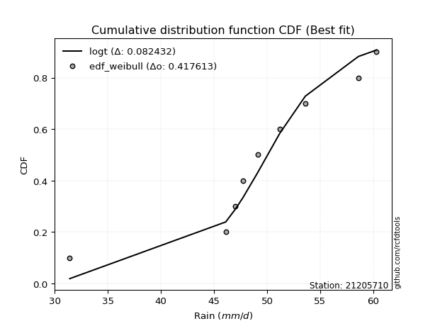</img></img>

</div>


### 4. EDF Beard (1943)

The Beard formula (or Beard´s plotting position formula) in hydrology is used to estimate the empirical non-exceedance probability _(P)_ of a flood event (or other extreme hydrological data point) within a given dataset.

<div align="center">


$P=(m-0.31)/(n+0.38)$


</div>


**4.1. Empirical values**

<div align="center">

|                | 0                   | 1                   | 2                  | 3                   | 4         | 5                  | 6                  | 7                  | 8                  |
|:---------------|:--------------------|:--------------------|:-------------------|:--------------------|:----------|:-------------------|:-------------------|:-------------------|:-------------------|
| date           | 2017                | 2020                | 2021               | 2023                | 2018      | 2024               | 2019               | 2025               | 2022               |
| x              | 31.4                | 46.1                | 47.0               | 47.7                | 49.1      | 51.2               | 53.6               | 58.6               | 60.3               |
| m              | 1                   | 2                   | 3                  | 4                   | 5         | 6                  | 7                  | 8                  | 9                  |
| empirical_dist | edf_beard           | edf_beard           | edf_beard          | edf_beard           | edf_beard | edf_beard          | edf_beard          | edf_beard          | edf_beard          |
| empirical      | 0.07356076759061833 | 0.18017057569296374 | 0.2867803837953091 | 0.39339019189765456 | 0.5       | 0.6066098081023454 | 0.7132196162046908 | 0.8198294243070362 | 0.9264392324093815 |
| empirical_tr   | 1.0794016110471807  | 1.2197659297789336  | 1.4020926756352765 | 1.6485061511423549  | 2.0       | 2.542005420054201  | 3.486988847583642  | 5.550295857988164  | 13.5942028985507   |

</div>


**4.2. Kolmogorov-Smirnov fit test (sorted by Δ)**


<div align="center">

|                | 0                   | 1                   | 2                   | 3                   | 4                   | 5                   | 6                   | 7                   | 8                   | 9                   | 10                  | 11                  | 12                  | 13                  | 14                  | 15                  | 16                  | 17                  | 18                  | 19                  | 20                  | 21                  | 22                  | 23                  | 24                  | 25                  | 26                  | 27                  | 28                  | 29                  | 30                  | 31                  | 32                  | 33                  | 34                  | 35                  | 36                  | 37                  | 38                  | 39                  | 40                  | 41                  | 42                  | 43                  | 44                  | 45                  | 46                  | 47                  | 48                  | 49                  | 50                  | 51                  | 52                  | 53                  | 54                  | 55                  | 56                  | 57                  | 58                  | 59                  | 60                  | 61                  | 62                  | 63                  | 64                  | 65                  | 66                  | 67                  | 68                  | 69                  | 70                  | 71                  | 72                  | 73                  | 74                  | 75                  | 76                  | 77                  | 78                  | 79                  | 80                  | 81                  | 82                  | 83                  | 84                  | 85                  | 86                  | 87                  | 88                  | 89                  | 90                  | 91                  | 92                  | 93                  | 94                  | 95                  | 96                  | 97                  | 98                  | 99                  | 100                 | 101                 | 102                 | 103                 | 104                 | 105                 | 106                 | 107                 | 108                 | 109                 | 110                 | 111                 | 112                 | 113                 | 114                 | 115                 | 116                 | 117                 | 118                 | 119                 | 120                 | 121                 | 122                 | 123                 | 124                 | 125                 | 126                 | 127                 | 128                 | 129                 | 130                 | 131                 | 132                 | 133                 | 134                 | 135                 | 136                 | 137                 | 138                 | 139                 | 140                 | 141                 | 142                 | 143                 | 144                 | 145                 | 146                 | 147                 | 148                 | 149                 | 150                 | 151                 | 152                 | 153                 | 154                 | 155                 | 156                 | 157                 | 158                 | 159                 |
|:---------------|:--------------------|:--------------------|:--------------------|:--------------------|:--------------------|:--------------------|:--------------------|:--------------------|:--------------------|:--------------------|:--------------------|:--------------------|:--------------------|:--------------------|:--------------------|:--------------------|:--------------------|:--------------------|:--------------------|:--------------------|:--------------------|:--------------------|:--------------------|:--------------------|:--------------------|:--------------------|:--------------------|:--------------------|:--------------------|:--------------------|:--------------------|:--------------------|:--------------------|:--------------------|:--------------------|:--------------------|:--------------------|:--------------------|:--------------------|:--------------------|:--------------------|:--------------------|:--------------------|:--------------------|:--------------------|:--------------------|:--------------------|:--------------------|:--------------------|:--------------------|:--------------------|:--------------------|:--------------------|:--------------------|:--------------------|:--------------------|:--------------------|:--------------------|:--------------------|:--------------------|:--------------------|:--------------------|:--------------------|:--------------------|:--------------------|:--------------------|:--------------------|:--------------------|:--------------------|:--------------------|:--------------------|:--------------------|:--------------------|:--------------------|:--------------------|:--------------------|:--------------------|:--------------------|:--------------------|:--------------------|:--------------------|:--------------------|:--------------------|:--------------------|:--------------------|:--------------------|:--------------------|:--------------------|:--------------------|:--------------------|:--------------------|:--------------------|:--------------------|:--------------------|:--------------------|:--------------------|:--------------------|:--------------------|:--------------------|:--------------------|:--------------------|:--------------------|:--------------------|:--------------------|:--------------------|:--------------------|:--------------------|:--------------------|:--------------------|:--------------------|:--------------------|:--------------------|:--------------------|:--------------------|:--------------------|:--------------------|:--------------------|:--------------------|:--------------------|:--------------------|:--------------------|:--------------------|:--------------------|:--------------------|:--------------------|:--------------------|:--------------------|:--------------------|:--------------------|:--------------------|:--------------------|:--------------------|:--------------------|:--------------------|:--------------------|:--------------------|:--------------------|:--------------------|:--------------------|:--------------------|:--------------------|:--------------------|:--------------------|:--------------------|:--------------------|:--------------------|:--------------------|:--------------------|:--------------------|:--------------------|:--------------------|:--------------------|:--------------------|:--------------------|:--------------------|:--------------------|:--------------------|:--------------------|:--------------------|:--------------------|
| station        | 21205710            | 21205710            | 21205710            | 21205710            | 21205710            | 21205710            | 21205710            | 21205710            | 21205710            | 21205710            | 21205710            | 21205710            | 21205710            | 21205710            | 21205710            | 21205710            | 21205710            | 21205710            | 21205710            | 21205710            | 21205710            | 21205710            | 21205710            | 21205710            | 21205710            | 21205710            | 21205710            | 21205710            | 21205710            | 21205710            | 21205710            | 21205710            | 21205710            | 21205710            | 21205710            | 21205710            | 21205710            | 21205710            | 21205710            | 21205710            | 21205710            | 21205710            | 21205710            | 21205710            | 21205710            | 21205710            | 21205710            | 21205710            | 21205710            | 21205710            | 21205710            | 21205710            | 21205710            | 21205710            | 21205710            | 21205710            | 21205710            | 21205710            | 21205710            | 21205710            | 21205710            | 21205710            | 21205710            | 21205710            | 21205710            | 21205710            | 21205710            | 21205710            | 21205710            | 21205710            | 21205710            | 21205710            | 21205710            | 21205710            | 21205710            | 21205710            | 21205710            | 21205710            | 21205710            | 21205710            | 21205710            | 21205710            | 21205710            | 21205710            | 21205710            | 21205710            | 21205710            | 21205710            | 21205710            | 21205710            | 21205710            | 21205710            | 21205710            | 21205710            | 21205710            | 21205710            | 21205710            | 21205710            | 21205710            | 21205710            | 21205710            | 21205710            | 21205710            | 21205710            | 21205710            | 21205710            | 21205710            | 21205710            | 21205710            | 21205710            | 21205710            | 21205710            | 21205710            | 21205710            | 21205710            | 21205710            | 21205710            | 21205710            | 21205710            | 21205710            | 21205710            | 21205710            | 21205710            | 21205710            | 21205710            | 21205710            | 21205710            | 21205710            | 21205710            | 21205710            | 21205710            | 21205710            | 21205710            | 21205710            | 21205710            | 21205710            | 21205710            | 21205710            | 21205710            | 21205710            | 21205710            | 21205710            | 21205710            | 21205710            | 21205710            | 21205710            | 21205710            | 21205710            | 21205710            | 21205710            | 21205710            | 21205710            | 21205710            | 21205710            | 21205710            | 21205710            | 21205710            | 21205710            | 21205710            | 21205710            |
| empirical_dist | edf_beard           | edf_beard           | edf_beard           | edf_beard           | edf_beard           | edf_beard           | edf_beard           | edf_beard           | edf_beard           | edf_beard           | edf_beard           | edf_beard           | edf_beard           | edf_beard           | edf_beard           | edf_beard           | edf_beard           | edf_beard           | edf_beard           | edf_beard           | edf_beard           | edf_beard           | edf_beard           | edf_beard           | edf_beard           | edf_beard           | edf_beard           | edf_beard           | edf_beard           | edf_beard           | edf_beard           | edf_beard           | edf_beard           | edf_beard           | edf_beard           | edf_beard           | edf_beard           | edf_beard           | edf_beard           | edf_beard           | edf_beard           | edf_beard           | edf_beard           | edf_beard           | edf_beard           | edf_beard           | edf_beard           | edf_beard           | edf_beard           | edf_beard           | edf_beard           | edf_beard           | edf_beard           | edf_beard           | edf_beard           | edf_beard           | edf_beard           | edf_beard           | edf_beard           | edf_beard           | edf_beard           | edf_beard           | edf_beard           | edf_beard           | edf_beard           | edf_beard           | edf_beard           | edf_beard           | edf_beard           | edf_beard           | edf_beard           | edf_beard           | edf_beard           | edf_beard           | edf_beard           | edf_beard           | edf_beard           | edf_beard           | edf_beard           | edf_beard           | edf_beard           | edf_beard           | edf_beard           | edf_beard           | edf_beard           | edf_beard           | edf_beard           | edf_beard           | edf_beard           | edf_beard           | edf_beard           | edf_beard           | edf_beard           | edf_beard           | edf_beard           | edf_beard           | edf_beard           | edf_beard           | edf_beard           | edf_beard           | edf_beard           | edf_beard           | edf_beard           | edf_beard           | edf_beard           | edf_beard           | edf_beard           | edf_beard           | edf_beard           | edf_beard           | edf_beard           | edf_beard           | edf_beard           | edf_beard           | edf_beard           | edf_beard           | edf_beard           | edf_beard           | edf_beard           | edf_beard           | edf_beard           | edf_beard           | edf_beard           | edf_beard           | edf_beard           | edf_beard           | edf_beard           | edf_beard           | edf_beard           | edf_beard           | edf_beard           | edf_beard           | edf_beard           | edf_beard           | edf_beard           | edf_beard           | edf_beard           | edf_beard           | edf_beard           | edf_beard           | edf_beard           | edf_beard           | edf_beard           | edf_beard           | edf_beard           | edf_beard           | edf_beard           | edf_beard           | edf_beard           | edf_beard           | edf_beard           | edf_beard           | edf_beard           | edf_beard           | edf_beard           | edf_beard           | edf_beard           | edf_beard           | edf_beard           | edf_beard           |
| p_dist         | logt                | t                   | logdgamma           | loggennorm          | logcrystalball      | logvonmises_line    | dgamma              | laplace             | dweibull            | gumbel_l            | genlogistic         | johnsonsu           | weibull_min         | vonmises_line       | logjohnsonsu        | skewnorm            | logdweibull         | logloggamma         | logexponpow         | mielke              | burr                | logmielke           | loggenlogistic      | pearson3            | logburr12           | gennorm             | logweibull_min      | logburr             | logloglaplace       | genextreme          | hypsecant           | logargus            | logpearson3         | argus               | loggompertz         | loggumbel_l         | logistic            | trapezoid           | loglaplace          | loglaplace          | triang              | logskewnorm         | exponnorm           | norm                | crystalball         | nct                 | f                   | logexponweib        | erlang              | genhalflogistic     | loghypsecant        | logtrapezoid        | alpha               | logbeta             | gamma               | anglit              | lognakagami         | truncnorm           | nakagami            | loglogistic         | rice                | loggenextreme       | ncf                 | semicircular        | maxwell             | invgamma            | loggengamma         | logf                | logrice             | logexponnorm        | lognorm             | rayleigh            | logfatiguelife      | gumbel_r            | loggenhalflogistic  | betaprime           | invgauss            | logalpha            | loganglit           | logbetaprime        | logweibull_max      | moyal               | lognct              | logsemicircular     | arcsine             | loggamma            | loggamma            | cosine              | invweibull          | loglevy_l           | loginvgamma         | loginvgauss         | logfoldnorm         | logmaxwell          | logtriang           | levy_l              | halfnorm            | gompertz            | logncf              | halflogistic        | lograyleigh         | logjohnsonsb        | logarcsine          | wald                | loginvweibull       | logtukeylambda      | loggumbel_r         | kstwobign           | logmoyal            | loghalfnorm         | truncweibull_min    | logcosine           | loghalflogistic     | gausshyper          | beta                | logkstwobign        | wrapcauchy          | loggenexpon         | ksone               | kappa3              | uniform             | logwald             | tukeylambda         | kappa4              | genpareto           | loggenpareto        | lomax               | genexpon            | logtruncweibull_min | loglomax            | loggausshyper       | johnsonsb           | logwrapcauchy       | logksone            | logkappa3           | burr12              | logkappa4           | loguniform          | bradford            | halfgennorm         | foldnorm            | truncexpon          | logerlang           | logbradford         | logtruncexpon       | weibull_max         | logrdist            | logtruncnorm        | exponweib           | gengamma            | rdist               | fatiguelife         | powerlaw            | logpowerlaw         | loghalfgennorm      | exponpow            | truncpareto         | logtruncpareto      | logvonmises         | vonmises            |
| delta          | 0.06994168775128606 | 0.0742445659274456  | 0.08114577160211855 | 0.08306512383207848 | 0.08594739237477389 | 0.09193421875523694 | 0.09497542316086949 | 0.0955006699297069  | 0.09657532132757074 | 0.09889006557603197 | 0.10256631975916575 | 0.1048375283178356  | 0.10621205971022601 | 0.10737639774251972 | 0.10851625852147767 | 0.1110240707057159  | 0.11137626827902525 | 0.11260143313777132 | 0.11450505869869348 | 0.11453413636607396 | 0.11469796079839911 | 0.1147424797211351  | 0.11478009266200478 | 0.11522643645931951 | 0.11721156593993343 | 0.1175422813136629  | 0.11804530507054006 | 0.11836493254135688 | 0.11859234075083419 | 0.12201606667344428 | 0.12317782164555208 | 0.12405940606318172 | 0.12609327277705246 | 0.1269315100821427  | 0.13104460270959506 | 0.1347811849178968  | 0.13768831632303297 | 0.1418101857717754  | 0.14330458477120328 | 0.14330458477120328 | 0.14791573098284805 | 0.1549942520633521  | 0.15670112444472983 | 0.1567030482836606  | 0.15670306556317165 | 0.15712513520259258 | 0.1577728797662198  | 0.1587889829452176  | 0.17052820587727469 | 0.1714748012507697  | 0.1715369306689516  | 0.17276724896332024 | 0.17328901328730179 | 0.17366204746708674 | 0.1745554956465331  | 0.17789271615775415 | 0.18016765362264725 | 0.18016844596869247 | 0.1801702699771152  | 0.18371657217197807 | 0.18456672974386923 | 0.18593324679001105 | 0.18659387927756393 | 0.18681367071151506 | 0.18777202937199394 | 0.1878031638205529  | 0.19431143190782418 | 0.19866145965875648 | 0.19888028318204176 | 0.19889235849098386 | 0.19889534282247545 | 0.19965105438605601 | 0.2011326059240845  | 0.2014086572274929  | 0.20161632697641885 | 0.2018341323316709  | 0.21076993974513147 | 0.21082219398862984 | 0.21533812223681043 | 0.2153590540522845  | 0.21578022091793575 | 0.21753325984590394 | 0.2200844114954813  | 0.22221259228877738 | 0.22361009451844804 | 0.22415992588773537 | 0.22415992588773537 | 0.22519360101357994 | 0.2251973174529603  | 0.22527537631490974 | 0.2254823024120921  | 0.22723196342244778 | 0.2283327916405482  | 0.2322717336940523  | 0.2326863491278568  | 0.23323439344817948 | 0.2334538201516621  | 0.23843329203046598 | 0.238997560740001   | 0.239202214702447   | 0.24453984410608393 | 0.24850496147822804 | 0.24996373750037426 | 0.25015822091192313 | 0.2502356701210036  | 0.25159820714225845 | 0.2544103214957796  | 0.2657196923899735  | 0.2755518249540488  | 0.2794377535368359  | 0.2851542343548489  | 0.2868847586945537  | 0.29217962507395323 | 0.2967025580191851  | 0.2984881738512501  | 0.3052416474667141  | 0.32271356180882055 | 0.3261343474379031  | 0.32703819016632124 | 0.32811517430801335 | 0.32847994333817826 | 0.3304085930049753  | 0.3308643464507652  | 0.3323099947924682  | 0.3542777338905004  | 0.35754231913906337 | 0.3745828960390169  | 0.37697381639662214 | 0.37735645566210446 | 0.37790187004665937 | 0.3781709083948451  | 0.3826784586626522  | 0.388339922612743   | 0.39357247567783077 | 0.39531053176378045 | 0.39949587325396124 | 0.4069373214959035  | 0.4083210859519893  | 0.4130319678409568  | 0.4184760412765605  | 0.42323954547954773 | 0.4304903606735237  | 0.4576505428580226  | 0.4904645578326638  | 0.5091726687067224  | 0.5250834035756162  | 0.5297967665960934  | 0.5383570962359441  | 0.6157213602913605  | 0.6286419103818317  | 0.6309341434538398  | 0.6347545599890749  | 0.6777230034836208  | 0.6997173899898561  | 0.7132196162046908  | 0.7558394467940714  | 0.7802678910657734  | 0.7886001655766031  | 1.1955220908494295  | 8.769150095033924   |
| deltao         | 0.41761268023100007 | 0.41761268023100007 | 0.41761268023100007 | 0.41761268023100007 | 0.41761268023100007 | 0.41761268023100007 | 0.41761268023100007 | 0.41761268023100007 | 0.41761268023100007 | 0.41761268023100007 | 0.41761268023100007 | 0.41761268023100007 | 0.41761268023100007 | 0.41761268023100007 | 0.41761268023100007 | 0.41761268023100007 | 0.41761268023100007 | 0.41761268023100007 | 0.41761268023100007 | 0.41761268023100007 | 0.41761268023100007 | 0.41761268023100007 | 0.41761268023100007 | 0.41761268023100007 | 0.41761268023100007 | 0.41761268023100007 | 0.41761268023100007 | 0.41761268023100007 | 0.41761268023100007 | 0.41761268023100007 | 0.41761268023100007 | 0.41761268023100007 | 0.41761268023100007 | 0.41761268023100007 | 0.41761268023100007 | 0.41761268023100007 | 0.41761268023100007 | 0.41761268023100007 | 0.41761268023100007 | 0.41761268023100007 | 0.41761268023100007 | 0.41761268023100007 | 0.41761268023100007 | 0.41761268023100007 | 0.41761268023100007 | 0.41761268023100007 | 0.41761268023100007 | 0.41761268023100007 | 0.41761268023100007 | 0.41761268023100007 | 0.41761268023100007 | 0.41761268023100007 | 0.41761268023100007 | 0.41761268023100007 | 0.41761268023100007 | 0.41761268023100007 | 0.41761268023100007 | 0.41761268023100007 | 0.41761268023100007 | 0.41761268023100007 | 0.41761268023100007 | 0.41761268023100007 | 0.41761268023100007 | 0.41761268023100007 | 0.41761268023100007 | 0.41761268023100007 | 0.41761268023100007 | 0.41761268023100007 | 0.41761268023100007 | 0.41761268023100007 | 0.41761268023100007 | 0.41761268023100007 | 0.41761268023100007 | 0.41761268023100007 | 0.41761268023100007 | 0.41761268023100007 | 0.41761268023100007 | 0.41761268023100007 | 0.41761268023100007 | 0.41761268023100007 | 0.41761268023100007 | 0.41761268023100007 | 0.41761268023100007 | 0.41761268023100007 | 0.41761268023100007 | 0.41761268023100007 | 0.41761268023100007 | 0.41761268023100007 | 0.41761268023100007 | 0.41761268023100007 | 0.41761268023100007 | 0.41761268023100007 | 0.41761268023100007 | 0.41761268023100007 | 0.41761268023100007 | 0.41761268023100007 | 0.41761268023100007 | 0.41761268023100007 | 0.41761268023100007 | 0.41761268023100007 | 0.41761268023100007 | 0.41761268023100007 | 0.41761268023100007 | 0.41761268023100007 | 0.41761268023100007 | 0.41761268023100007 | 0.41761268023100007 | 0.41761268023100007 | 0.41761268023100007 | 0.41761268023100007 | 0.41761268023100007 | 0.41761268023100007 | 0.41761268023100007 | 0.41761268023100007 | 0.41761268023100007 | 0.41761268023100007 | 0.41761268023100007 | 0.41761268023100007 | 0.41761268023100007 | 0.41761268023100007 | 0.41761268023100007 | 0.41761268023100007 | 0.41761268023100007 | 0.41761268023100007 | 0.41761268023100007 | 0.41761268023100007 | 0.41761268023100007 | 0.41761268023100007 | 0.41761268023100007 | 0.41761268023100007 | 0.41761268023100007 | 0.41761268023100007 | 0.41761268023100007 | 0.41761268023100007 | 0.41761268023100007 | 0.41761268023100007 | 0.41761268023100007 | 0.41761268023100007 | 0.41761268023100007 | 0.41761268023100007 | 0.41761268023100007 | 0.41761268023100007 | 0.41761268023100007 | 0.41761268023100007 | 0.41761268023100007 | 0.41761268023100007 | 0.41761268023100007 | 0.41761268023100007 | 0.41761268023100007 | 0.41761268023100007 | 0.41761268023100007 | 0.41761268023100007 | 0.41761268023100007 | 0.41761268023100007 | 0.41761268023100007 | 0.41761268023100007 | 0.41761268023100007 | 0.41761268023100007 | 0.41761268023100007 | 0.41761268023100007 |
| eval           | Δo > Δ              | Δo > Δ              | Δo > Δ              | Δo > Δ              | Δo > Δ              | Δo > Δ              | Δo > Δ              | Δo > Δ              | Δo > Δ              | Δo > Δ              | Δo > Δ              | Δo > Δ              | Δo > Δ              | Δo > Δ              | Δo > Δ              | Δo > Δ              | Δo > Δ              | Δo > Δ              | Δo > Δ              | Δo > Δ              | Δo > Δ              | Δo > Δ              | Δo > Δ              | Δo > Δ              | Δo > Δ              | Δo > Δ              | Δo > Δ              | Δo > Δ              | Δo > Δ              | Δo > Δ              | Δo > Δ              | Δo > Δ              | Δo > Δ              | Δo > Δ              | Δo > Δ              | Δo > Δ              | Δo > Δ              | Δo > Δ              | Δo > Δ              | Δo > Δ              | Δo > Δ              | Δo > Δ              | Δo > Δ              | Δo > Δ              | Δo > Δ              | Δo > Δ              | Δo > Δ              | Δo > Δ              | Δo > Δ              | Δo > Δ              | Δo > Δ              | Δo > Δ              | Δo > Δ              | Δo > Δ              | Δo > Δ              | Δo > Δ              | Δo > Δ              | Δo > Δ              | Δo > Δ              | Δo > Δ              | Δo > Δ              | Δo > Δ              | Δo > Δ              | Δo > Δ              | Δo > Δ              | Δo > Δ              | Δo > Δ              | Δo > Δ              | Δo > Δ              | Δo > Δ              | Δo > Δ              | Δo > Δ              | Δo > Δ              | Δo > Δ              | Δo > Δ              | Δo > Δ              | Δo > Δ              | Δo > Δ              | Δo > Δ              | Δo > Δ              | Δo > Δ              | Δo > Δ              | Δo > Δ              | Δo > Δ              | Δo > Δ              | Δo > Δ              | Δo > Δ              | Δo > Δ              | Δo > Δ              | Δo > Δ              | Δo > Δ              | Δo > Δ              | Δo > Δ              | Δo > Δ              | Δo > Δ              | Δo > Δ              | Δo > Δ              | Δo > Δ              | Δo > Δ              | Δo > Δ              | Δo > Δ              | Δo > Δ              | Δo > Δ              | Δo > Δ              | Δo > Δ              | Δo > Δ              | Δo > Δ              | Δo > Δ              | Δo > Δ              | Δo > Δ              | Δo > Δ              | Δo > Δ              | Δo > Δ              | Δo > Δ              | Δo > Δ              | Δo > Δ              | Δo > Δ              | Δo > Δ              | Δo > Δ              | Δo > Δ              | Δo > Δ              | Δo > Δ              | Δo > Δ              | Δo > Δ              | Δo > Δ              | Δo > Δ              | Δo > Δ              | Δo > Δ              | Δo > Δ              | Δo > Δ              | Δo > Δ              | Δo > Δ              | Δo > Δ              | Δo > Δ              | Δo > Δ              | Δo > Δ              | Δo > Δ              | Δo > Δ              | Δo > Δ              | Δo <= Δ             | Δo <= Δ             | Δo <= Δ             | Δo <= Δ             | Δo <= Δ             | Δo <= Δ             | Δo <= Δ             | Δo <= Δ             | Δo <= Δ             | Δo <= Δ             | Δo <= Δ             | Δo <= Δ             | Δo <= Δ             | Δo <= Δ             | Δo <= Δ             | Δo <= Δ             | Δo <= Δ             | Δo <= Δ             | Δo <= Δ             | Δo <= Δ             | Δo <= Δ             |
| fit            | 1                   | 1                   | 1                   | 1                   | 1                   | 1                   | 1                   | 1                   | 1                   | 1                   | 1                   | 1                   | 1                   | 1                   | 1                   | 1                   | 1                   | 1                   | 1                   | 1                   | 1                   | 1                   | 1                   | 1                   | 1                   | 1                   | 1                   | 1                   | 1                   | 1                   | 1                   | 1                   | 1                   | 1                   | 1                   | 1                   | 1                   | 1                   | 1                   | 1                   | 1                   | 1                   | 1                   | 1                   | 1                   | 1                   | 1                   | 1                   | 1                   | 1                   | 1                   | 1                   | 1                   | 1                   | 1                   | 1                   | 1                   | 1                   | 1                   | 1                   | 1                   | 1                   | 1                   | 1                   | 1                   | 1                   | 1                   | 1                   | 1                   | 1                   | 1                   | 1                   | 1                   | 1                   | 1                   | 1                   | 1                   | 1                   | 1                   | 1                   | 1                   | 1                   | 1                   | 1                   | 1                   | 1                   | 1                   | 1                   | 1                   | 1                   | 1                   | 1                   | 1                   | 1                   | 1                   | 1                   | 1                   | 1                   | 1                   | 1                   | 1                   | 1                   | 1                   | 1                   | 1                   | 1                   | 1                   | 1                   | 1                   | 1                   | 1                   | 1                   | 1                   | 1                   | 1                   | 1                   | 1                   | 1                   | 1                   | 1                   | 1                   | 1                   | 1                   | 1                   | 1                   | 1                   | 1                   | 1                   | 1                   | 1                   | 1                   | 1                   | 1                   | 1                   | 1                   | 1                   | 1                   | 1                   | 1                   | 0                   | 0                   | 0                   | 0                   | 0                   | 0                   | 0                   | 0                   | 0                   | 0                   | 0                   | 0                   | 0                   | 0                   | 0                   | 0                   | 0                   | 0                   | 0                   | 0                   | 0                   |
| n              | 9                   | 9                   | 9                   | 9                   | 9                   | 9                   | 9                   | 9                   | 9                   | 9                   | 9                   | 9                   | 9                   | 9                   | 9                   | 9                   | 9                   | 9                   | 9                   | 9                   | 9                   | 9                   | 9                   | 9                   | 9                   | 9                   | 9                   | 9                   | 9                   | 9                   | 9                   | 9                   | 9                   | 9                   | 9                   | 9                   | 9                   | 9                   | 9                   | 9                   | 9                   | 9                   | 9                   | 9                   | 9                   | 9                   | 9                   | 9                   | 9                   | 9                   | 9                   | 9                   | 9                   | 9                   | 9                   | 9                   | 9                   | 9                   | 9                   | 9                   | 9                   | 9                   | 9                   | 9                   | 9                   | 9                   | 9                   | 9                   | 9                   | 9                   | 9                   | 9                   | 9                   | 9                   | 9                   | 9                   | 9                   | 9                   | 9                   | 9                   | 9                   | 9                   | 9                   | 9                   | 9                   | 9                   | 9                   | 9                   | 9                   | 9                   | 9                   | 9                   | 9                   | 9                   | 9                   | 9                   | 9                   | 9                   | 9                   | 9                   | 9                   | 9                   | 9                   | 9                   | 9                   | 9                   | 9                   | 9                   | 9                   | 9                   | 9                   | 9                   | 9                   | 9                   | 9                   | 9                   | 9                   | 9                   | 9                   | 9                   | 9                   | 9                   | 9                   | 9                   | 9                   | 9                   | 9                   | 9                   | 9                   | 9                   | 9                   | 9                   | 9                   | 9                   | 9                   | 9                   | 9                   | 9                   | 9                   | 9                   | 9                   | 9                   | 9                   | 9                   | 9                   | 9                   | 9                   | 9                   | 9                   | 9                   | 9                   | 9                   | 9                   | 9                   | 9                   | 9                   | 9                   | 9                   | 9                   | 9                   |
| best_fit       | 1                   | 0                   | 0                   | 0                   | 0                   | 0                   | 0                   | 0                   | 0                   | 0                   | 0                   | 0                   | 0                   | 0                   | 0                   | 0                   | 0                   | 0                   | 0                   | 0                   | 0                   | 0                   | 0                   | 0                   | 0                   | 0                   | 0                   | 0                   | 0                   | 0                   | 0                   | 0                   | 0                   | 0                   | 0                   | 0                   | 0                   | 0                   | 0                   | 0                   | 0                   | 0                   | 0                   | 0                   | 0                   | 0                   | 0                   | 0                   | 0                   | 0                   | 0                   | 0                   | 0                   | 0                   | 0                   | 0                   | 0                   | 0                   | 0                   | 0                   | 0                   | 0                   | 0                   | 0                   | 0                   | 0                   | 0                   | 0                   | 0                   | 0                   | 0                   | 0                   | 0                   | 0                   | 0                   | 0                   | 0                   | 0                   | 0                   | 0                   | 0                   | 0                   | 0                   | 0                   | 0                   | 0                   | 0                   | 0                   | 0                   | 0                   | 0                   | 0                   | 0                   | 0                   | 0                   | 0                   | 0                   | 0                   | 0                   | 0                   | 0                   | 0                   | 0                   | 0                   | 0                   | 0                   | 0                   | 0                   | 0                   | 0                   | 0                   | 0                   | 0                   | 0                   | 0                   | 0                   | 0                   | 0                   | 0                   | 0                   | 0                   | 0                   | 0                   | 0                   | 0                   | 0                   | 0                   | 0                   | 0                   | 0                   | 0                   | 0                   | 0                   | 0                   | 0                   | 0                   | 0                   | 0                   | 0                   | 0                   | 0                   | 0                   | 0                   | 0                   | 0                   | 0                   | 0                   | 0                   | 0                   | 0                   | 0                   | 0                   | 0                   | 0                   | 0                   | 0                   | 0                   | 0                   | 0                   | 0                   |
| best_fit_sort  | 1                   | 2                   | 3                   | 4                   | 5                   | 6                   | 7                   | 8                   | 9                   | 10                  | 11                  | 12                  | 13                  | 14                  | 15                  | 16                  | 17                  | 18                  | 19                  | 20                  | 21                  | 22                  | 23                  | 24                  | 25                  | 26                  | 27                  | 28                  | 29                  | 30                  | 31                  | 32                  | 33                  | 34                  | 35                  | 36                  | 37                  | 38                  | 39                  | 40                  | 41                  | 42                  | 43                  | 44                  | 45                  | 46                  | 47                  | 48                  | 49                  | 50                  | 51                  | 52                  | 53                  | 54                  | 55                  | 56                  | 57                  | 58                  | 59                  | 60                  | 61                  | 62                  | 63                  | 64                  | 65                  | 66                  | 67                  | 68                  | 69                  | 70                  | 71                  | 72                  | 73                  | 74                  | 75                  | 76                  | 77                  | 78                  | 79                  | 80                  | 81                  | 82                  | 83                  | 84                  | 85                  | 86                  | 87                  | 88                  | 89                  | 90                  | 91                  | 92                  | 93                  | 94                  | 95                  | 96                  | 97                  | 98                  | 99                  | 100                 | 101                 | 102                 | 103                 | 104                 | 105                 | 106                 | 107                 | 108                 | 109                 | 110                 | 111                 | 112                 | 113                 | 114                 | 115                 | 116                 | 117                 | 118                 | 119                 | 120                 | 121                 | 122                 | 123                 | 124                 | 125                 | 126                 | 127                 | 128                 | 129                 | 130                 | 131                 | 132                 | 133                 | 134                 | 135                 | 136                 | 137                 | 138                 | 139                 | 140                 | 141                 | 142                 | 143                 | 144                 | 145                 | 146                 | 147                 | 148                 | 149                 | 150                 | 151                 | 152                 | 153                 | 154                 | 155                 | 156                 | 157                 | 158                 | 159                 | 160                 |

</div>


**4.3. Best fit**

<div align="center">

|   id |   station | empirical_dist   | p_dist   |     delta |   deltao | eval   |   fit |   n |   best_fit |   best_fit_sort |
|-----:|----------:|:-----------------|:---------|----------:|---------:|:-------|------:|----:|-----------:|----------------:|
|    0 |  21205710 | edf_beard        | logt     | 0.0699417 | 0.417613 | Δo > Δ |     1 |   9 |          1 |               1 |

</div>


<div align="center">

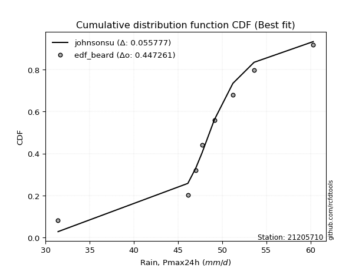</img>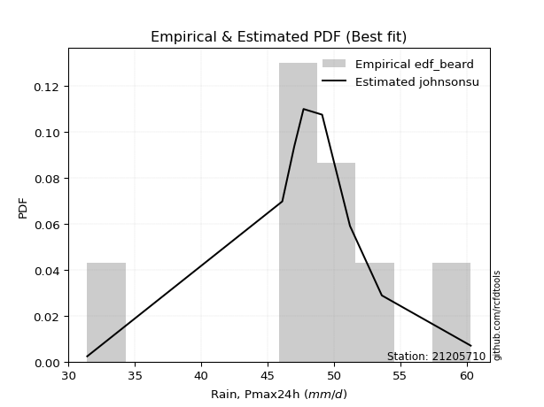</img>

</div>


### 5. EDF Chegodayev (1955)

The Chegodayev formula is an empirical plotting position formula used in hydrological frequency analysis to estimate the exceedance probability or return period of a specific event from a set of observed data. It is primarily used for plotting observed data points on probability paper to fit a theoretical distribution, particularly for analyzing extreme events like maximum flood flows or rainfall intensities. The constant _b_ value in the generalized plotting position formula is 0.3.

<div align="center">


$P=(m-b)/(n+1-2b)$


</div>


**5.1. Empirical values**

<div align="center">

|                | 0                   | 1                   | 2                  | 3                   | 4              | 5                  | 6                  | 7                  | 8                  |
|:---------------|:--------------------|:--------------------|:-------------------|:--------------------|:---------------|:-------------------|:-------------------|:-------------------|:-------------------|
| date           | 2017                | 2020                | 2021               | 2023                | 2018           | 2024               | 2019               | 2025               | 2022               |
| x              | 31.4                | 46.1                | 47.0               | 47.7                | 49.1           | 51.2               | 53.6               | 58.6               | 60.3               |
| m              | 1                   | 2                   | 3                  | 4                   | 5              | 6                  | 7                  | 8                  | 9                  |
| empirical_dist | edf_chegodayev      | edf_chegodayev      | edf_chegodayev     | edf_chegodayev      | edf_chegodayev | edf_chegodayev     | edf_chegodayev     | edf_chegodayev     | edf_chegodayev     |
| empirical      | 0.07446808510638298 | 0.18085106382978722 | 0.2872340425531915 | 0.39361702127659576 | 0.5            | 0.6063829787234043 | 0.7127659574468085 | 0.8191489361702128 | 0.9255319148936169 |
| empirical_tr   | 1.0804597701149425  | 1.2207792207792207  | 1.4029850746268657 | 1.6491228070175437  | 2.0            | 2.540540540540541  | 3.481481481481481  | 5.529411764705883  | 13.428571428571399 |

</div>


**5.2. Kolmogorov-Smirnov fit test (sorted by Δ)**


<div align="center">

|                | 0                   | 1                   | 2                   | 3                   | 4                   | 5                   | 6                   | 7                   | 8                   | 9                   | 10                  | 11                  | 12                  | 13                  | 14                  | 15                  | 16                  | 17                  | 18                  | 19                  | 20                  | 21                  | 22                  | 23                  | 24                  | 25                  | 26                  | 27                  | 28                  | 29                  | 30                  | 31                  | 32                  | 33                  | 34                  | 35                  | 36                  | 37                  | 38                  | 39                  | 40                  | 41                  | 42                  | 43                  | 44                  | 45                  | 46                  | 47                  | 48                  | 49                  | 50                  | 51                  | 52                  | 53                  | 54                  | 55                  | 56                  | 57                  | 58                  | 59                  | 60                  | 61                  | 62                  | 63                  | 64                  | 65                  | 66                  | 67                  | 68                  | 69                  | 70                  | 71                  | 72                  | 73                  | 74                  | 75                  | 76                  | 77                  | 78                  | 79                  | 80                  | 81                  | 82                  | 83                  | 84                  | 85                  | 86                  | 87                  | 88                  | 89                  | 90                  | 91                  | 92                  | 93                  | 94                  | 95                  | 96                  | 97                  | 98                  | 99                  | 100                 | 101                 | 102                 | 103                 | 104                 | 105                 | 106                 | 107                 | 108                 | 109                 | 110                 | 111                 | 112                 | 113                 | 114                 | 115                 | 116                 | 117                 | 118                 | 119                 | 120                 | 121                 | 122                 | 123                 | 124                 | 125                 | 126                 | 127                 | 128                 | 129                 | 130                 | 131                 | 132                 | 133                 | 134                 | 135                 | 136                 | 137                 | 138                 | 139                 | 140                 | 141                 | 142                 | 143                 | 144                 | 145                 | 146                 | 147                 | 148                 | 149                 | 150                 | 151                 | 152                 | 153                 | 154                 | 155                 | 156                 | 157                 | 158                 | 159                 |
|:---------------|:--------------------|:--------------------|:--------------------|:--------------------|:--------------------|:--------------------|:--------------------|:--------------------|:--------------------|:--------------------|:--------------------|:--------------------|:--------------------|:--------------------|:--------------------|:--------------------|:--------------------|:--------------------|:--------------------|:--------------------|:--------------------|:--------------------|:--------------------|:--------------------|:--------------------|:--------------------|:--------------------|:--------------------|:--------------------|:--------------------|:--------------------|:--------------------|:--------------------|:--------------------|:--------------------|:--------------------|:--------------------|:--------------------|:--------------------|:--------------------|:--------------------|:--------------------|:--------------------|:--------------------|:--------------------|:--------------------|:--------------------|:--------------------|:--------------------|:--------------------|:--------------------|:--------------------|:--------------------|:--------------------|:--------------------|:--------------------|:--------------------|:--------------------|:--------------------|:--------------------|:--------------------|:--------------------|:--------------------|:--------------------|:--------------------|:--------------------|:--------------------|:--------------------|:--------------------|:--------------------|:--------------------|:--------------------|:--------------------|:--------------------|:--------------------|:--------------------|:--------------------|:--------------------|:--------------------|:--------------------|:--------------------|:--------------------|:--------------------|:--------------------|:--------------------|:--------------------|:--------------------|:--------------------|:--------------------|:--------------------|:--------------------|:--------------------|:--------------------|:--------------------|:--------------------|:--------------------|:--------------------|:--------------------|:--------------------|:--------------------|:--------------------|:--------------------|:--------------------|:--------------------|:--------------------|:--------------------|:--------------------|:--------------------|:--------------------|:--------------------|:--------------------|:--------------------|:--------------------|:--------------------|:--------------------|:--------------------|:--------------------|:--------------------|:--------------------|:--------------------|:--------------------|:--------------------|:--------------------|:--------------------|:--------------------|:--------------------|:--------------------|:--------------------|:--------------------|:--------------------|:--------------------|:--------------------|:--------------------|:--------------------|:--------------------|:--------------------|:--------------------|:--------------------|:--------------------|:--------------------|:--------------------|:--------------------|:--------------------|:--------------------|:--------------------|:--------------------|:--------------------|:--------------------|:--------------------|:--------------------|:--------------------|:--------------------|:--------------------|:--------------------|:--------------------|:--------------------|:--------------------|:--------------------|:--------------------|:--------------------|
| station        | 21205710            | 21205710            | 21205710            | 21205710            | 21205710            | 21205710            | 21205710            | 21205710            | 21205710            | 21205710            | 21205710            | 21205710            | 21205710            | 21205710            | 21205710            | 21205710            | 21205710            | 21205710            | 21205710            | 21205710            | 21205710            | 21205710            | 21205710            | 21205710            | 21205710            | 21205710            | 21205710            | 21205710            | 21205710            | 21205710            | 21205710            | 21205710            | 21205710            | 21205710            | 21205710            | 21205710            | 21205710            | 21205710            | 21205710            | 21205710            | 21205710            | 21205710            | 21205710            | 21205710            | 21205710            | 21205710            | 21205710            | 21205710            | 21205710            | 21205710            | 21205710            | 21205710            | 21205710            | 21205710            | 21205710            | 21205710            | 21205710            | 21205710            | 21205710            | 21205710            | 21205710            | 21205710            | 21205710            | 21205710            | 21205710            | 21205710            | 21205710            | 21205710            | 21205710            | 21205710            | 21205710            | 21205710            | 21205710            | 21205710            | 21205710            | 21205710            | 21205710            | 21205710            | 21205710            | 21205710            | 21205710            | 21205710            | 21205710            | 21205710            | 21205710            | 21205710            | 21205710            | 21205710            | 21205710            | 21205710            | 21205710            | 21205710            | 21205710            | 21205710            | 21205710            | 21205710            | 21205710            | 21205710            | 21205710            | 21205710            | 21205710            | 21205710            | 21205710            | 21205710            | 21205710            | 21205710            | 21205710            | 21205710            | 21205710            | 21205710            | 21205710            | 21205710            | 21205710            | 21205710            | 21205710            | 21205710            | 21205710            | 21205710            | 21205710            | 21205710            | 21205710            | 21205710            | 21205710            | 21205710            | 21205710            | 21205710            | 21205710            | 21205710            | 21205710            | 21205710            | 21205710            | 21205710            | 21205710            | 21205710            | 21205710            | 21205710            | 21205710            | 21205710            | 21205710            | 21205710            | 21205710            | 21205710            | 21205710            | 21205710            | 21205710            | 21205710            | 21205710            | 21205710            | 21205710            | 21205710            | 21205710            | 21205710            | 21205710            | 21205710            | 21205710            | 21205710            | 21205710            | 21205710            | 21205710            | 21205710            |
| empirical_dist | edf_chegodayev      | edf_chegodayev      | edf_chegodayev      | edf_chegodayev      | edf_chegodayev      | edf_chegodayev      | edf_chegodayev      | edf_chegodayev      | edf_chegodayev      | edf_chegodayev      | edf_chegodayev      | edf_chegodayev      | edf_chegodayev      | edf_chegodayev      | edf_chegodayev      | edf_chegodayev      | edf_chegodayev      | edf_chegodayev      | edf_chegodayev      | edf_chegodayev      | edf_chegodayev      | edf_chegodayev      | edf_chegodayev      | edf_chegodayev      | edf_chegodayev      | edf_chegodayev      | edf_chegodayev      | edf_chegodayev      | edf_chegodayev      | edf_chegodayev      | edf_chegodayev      | edf_chegodayev      | edf_chegodayev      | edf_chegodayev      | edf_chegodayev      | edf_chegodayev      | edf_chegodayev      | edf_chegodayev      | edf_chegodayev      | edf_chegodayev      | edf_chegodayev      | edf_chegodayev      | edf_chegodayev      | edf_chegodayev      | edf_chegodayev      | edf_chegodayev      | edf_chegodayev      | edf_chegodayev      | edf_chegodayev      | edf_chegodayev      | edf_chegodayev      | edf_chegodayev      | edf_chegodayev      | edf_chegodayev      | edf_chegodayev      | edf_chegodayev      | edf_chegodayev      | edf_chegodayev      | edf_chegodayev      | edf_chegodayev      | edf_chegodayev      | edf_chegodayev      | edf_chegodayev      | edf_chegodayev      | edf_chegodayev      | edf_chegodayev      | edf_chegodayev      | edf_chegodayev      | edf_chegodayev      | edf_chegodayev      | edf_chegodayev      | edf_chegodayev      | edf_chegodayev      | edf_chegodayev      | edf_chegodayev      | edf_chegodayev      | edf_chegodayev      | edf_chegodayev      | edf_chegodayev      | edf_chegodayev      | edf_chegodayev      | edf_chegodayev      | edf_chegodayev      | edf_chegodayev      | edf_chegodayev      | edf_chegodayev      | edf_chegodayev      | edf_chegodayev      | edf_chegodayev      | edf_chegodayev      | edf_chegodayev      | edf_chegodayev      | edf_chegodayev      | edf_chegodayev      | edf_chegodayev      | edf_chegodayev      | edf_chegodayev      | edf_chegodayev      | edf_chegodayev      | edf_chegodayev      | edf_chegodayev      | edf_chegodayev      | edf_chegodayev      | edf_chegodayev      | edf_chegodayev      | edf_chegodayev      | edf_chegodayev      | edf_chegodayev      | edf_chegodayev      | edf_chegodayev      | edf_chegodayev      | edf_chegodayev      | edf_chegodayev      | edf_chegodayev      | edf_chegodayev      | edf_chegodayev      | edf_chegodayev      | edf_chegodayev      | edf_chegodayev      | edf_chegodayev      | edf_chegodayev      | edf_chegodayev      | edf_chegodayev      | edf_chegodayev      | edf_chegodayev      | edf_chegodayev      | edf_chegodayev      | edf_chegodayev      | edf_chegodayev      | edf_chegodayev      | edf_chegodayev      | edf_chegodayev      | edf_chegodayev      | edf_chegodayev      | edf_chegodayev      | edf_chegodayev      | edf_chegodayev      | edf_chegodayev      | edf_chegodayev      | edf_chegodayev      | edf_chegodayev      | edf_chegodayev      | edf_chegodayev      | edf_chegodayev      | edf_chegodayev      | edf_chegodayev      | edf_chegodayev      | edf_chegodayev      | edf_chegodayev      | edf_chegodayev      | edf_chegodayev      | edf_chegodayev      | edf_chegodayev      | edf_chegodayev      | edf_chegodayev      | edf_chegodayev      | edf_chegodayev      | edf_chegodayev      | edf_chegodayev      | edf_chegodayev      |
| p_dist         | logt                | t                   | logdgamma           | loggennorm          | logcrystalball      | logvonmises_line    | dgamma              | laplace             | dweibull            | gumbel_l            | genlogistic         | johnsonsu           | weibull_min         | vonmises_line       | logjohnsonsu        | skewnorm            | logdweibull         | logloggamma         | logexponpow         | mielke              | burr                | logmielke           | loggenlogistic      | pearson3            | logburr12           | gennorm             | logweibull_min      | logburr             | logloglaplace       | genextreme          | hypsecant           | logargus            | logpearson3         | argus               | loggompertz         | loggumbel_l         | logistic            | trapezoid           | loglaplace          | loglaplace          | triang              | logskewnorm         | exponnorm           | norm                | crystalball         | nct                 | f                   | logexponweib        | erlang              | genhalflogistic     | loghypsecant        | logtrapezoid        | alpha               | logbeta             | gamma               | anglit              | lognakagami         | truncnorm           | nakagami            | loglogistic         | rice                | loggenextreme       | ncf                 | semicircular        | maxwell             | invgamma            | loggengamma         | logf                | logrice             | logexponnorm        | lognorm             | rayleigh            | logfatiguelife      | gumbel_r            | loggenhalflogistic  | betaprime           | invgauss            | logalpha            | loganglit           | logbetaprime        | logweibull_max      | moyal               | lognct              | logsemicircular     | arcsine             | loggamma            | loggamma            | cosine              | invweibull          | loglevy_l           | loginvgamma         | loginvgauss         | logfoldnorm         | logmaxwell          | logtriang           | levy_l              | halfnorm            | logncf              | halflogistic        | gompertz            | lograyleigh         | logjohnsonsb        | logarcsine          | wald                | loginvweibull       | logtukeylambda      | loggumbel_r         | kstwobign           | logmoyal            | loghalfnorm         | truncweibull_min    | logcosine           | loghalflogistic     | gausshyper          | beta                | logkstwobign        | wrapcauchy          | loggenexpon         | ksone               | kappa3              | uniform             | logwald             | tukeylambda         | kappa4              | genpareto           | loggenpareto        | lomax               | genexpon            | logtruncweibull_min | loglomax            | loggausshyper       | johnsonsb           | logwrapcauchy       | logksone            | logkappa3           | burr12              | logkappa4           | loguniform          | bradford            | halfgennorm         | foldnorm            | truncexpon          | logerlang           | logbradford         | logtruncexpon       | weibull_max         | logrdist            | logtruncnorm        | exponweib           | gengamma            | rdist               | fatiguelife         | powerlaw            | logpowerlaw         | loghalfgennorm      | exponpow            | truncpareto         | logtruncpareto      | logvonmises         | vonmises            |
| delta          | 0.06994168775128606 | 0.07356407779062213 | 0.08182625973894198 | 0.082384635695255   | 0.08662788051159731 | 0.09125373061841346 | 0.09429493502404601 | 0.09482018179288343 | 0.09680215070651188 | 0.0982095774392085  | 0.10188583162234227 | 0.10415704018101213 | 0.10553157157340254 | 0.10669590960569625 | 0.1078357703846542  | 0.11034358256889243 | 0.11069578014220177 | 0.11192094500094785 | 0.11382457056187001 | 0.11385364822925048 | 0.11401747266157564 | 0.11406199158431163 | 0.11409960452518131 | 0.11454594832249604 | 0.11653107780310995 | 0.11686179317683942 | 0.11736481693371659 | 0.1176844444045334  | 0.11791185261401071 | 0.12178923729450314 | 0.1224973335087286  | 0.12337891792635824 | 0.12541278464022898 | 0.12625102194531923 | 0.13036411457277158 | 0.13410069678107334 | 0.1370078281862095  | 0.14112969763495192 | 0.1426240966343798  | 0.1426240966343798  | 0.14723524284602457 | 0.15431376392652862 | 0.15602063630790636 | 0.15602256014683713 | 0.15602257742634817 | 0.1564446470657691  | 0.1570923916293963  | 0.15810849480839412 | 0.1698477177404512  | 0.17079431311394622 | 0.17085644253212812 | 0.17208676082649677 | 0.1726085251504783  | 0.1734352180881456  | 0.17387500750970963 | 0.17721222802093067 | 0.18084814175947073 | 0.18084893410551595 | 0.18085075811393866 | 0.1830360840351546  | 0.18388624160704575 | 0.1857064174110699  | 0.18591339114074046 | 0.18613318257469158 | 0.18709154123517047 | 0.18712267568372942 | 0.1936309437710007  | 0.197980971521933   | 0.19819979504521829 | 0.19821187035416038 | 0.19821485468565198 | 0.19897056624923254 | 0.20045211778726102 | 0.20072816909066943 | 0.20093583883959537 | 0.20115364419484744 | 0.210089451608308   | 0.21014170585180636 | 0.21465763409998695 | 0.21467856591546103 | 0.21532656216005347 | 0.21685277170908046 | 0.21940392335865783 | 0.2215321041519539  | 0.22292960638162457 | 0.2234794377509119  | 0.2234794377509119  | 0.22451311287675646 | 0.2245168293161368  | 0.22459488817808626 | 0.22480181427526863 | 0.2265514752856243  | 0.22765230350372473 | 0.23159124555722882 | 0.23200586099103332 | 0.232553905311356   | 0.23277333201483863 | 0.23831707260317753 | 0.23852172656562354 | 0.23866012140940718 | 0.24385935596926045 | 0.24782447334140456 | 0.24928324936355079 | 0.24947773277509966 | 0.24955518198418014 | 0.25159820714225845 | 0.2537298333589561  | 0.26503920425315003 | 0.2748713368172253  | 0.27875726540001244 | 0.2844737462180254  | 0.28620427055773023 | 0.29149913693712975 | 0.2960220698823616  | 0.2980345150933678  | 0.30456115932989064 | 0.32203307367199707 | 0.3254538593010796  | 0.32635770202949776 | 0.32743468617118987 | 0.3277994552013548  | 0.32972810486815185 | 0.3301838583139417  | 0.3316295066556447  | 0.3535972457536769  | 0.3568618310022399  | 0.3739024079021934  | 0.37629332825979867 | 0.376675967525281   | 0.3772213819098359  | 0.3774904202580216  | 0.38199797052582873 | 0.38765943447591955 | 0.3928919875410073  | 0.394630043626957   | 0.39881538511713777 | 0.40625683335908    | 0.4076405978151658  | 0.41235147970413333 | 0.41779555313973704 | 0.42323954547954773 | 0.4298098725367002  | 0.4569700547211991  | 0.4897840696958403  | 0.5084921805698989  | 0.524629744817734   | 0.5288894490803288  | 0.5376766080991207  | 0.615040872154537   | 0.6279614222450082  | 0.6302536553170164  | 0.6340740718522514  | 0.6770425153467974  | 0.6990369018530326  | 0.7127659574468085  | 0.7551589586572479  | 0.7795874029289499  | 0.7879196774397795  | 1.1948416027126059  | 8.770057412549688   |
| deltao         | 0.41761268023100007 | 0.41761268023100007 | 0.41761268023100007 | 0.41761268023100007 | 0.41761268023100007 | 0.41761268023100007 | 0.41761268023100007 | 0.41761268023100007 | 0.41761268023100007 | 0.41761268023100007 | 0.41761268023100007 | 0.41761268023100007 | 0.41761268023100007 | 0.41761268023100007 | 0.41761268023100007 | 0.41761268023100007 | 0.41761268023100007 | 0.41761268023100007 | 0.41761268023100007 | 0.41761268023100007 | 0.41761268023100007 | 0.41761268023100007 | 0.41761268023100007 | 0.41761268023100007 | 0.41761268023100007 | 0.41761268023100007 | 0.41761268023100007 | 0.41761268023100007 | 0.41761268023100007 | 0.41761268023100007 | 0.41761268023100007 | 0.41761268023100007 | 0.41761268023100007 | 0.41761268023100007 | 0.41761268023100007 | 0.41761268023100007 | 0.41761268023100007 | 0.41761268023100007 | 0.41761268023100007 | 0.41761268023100007 | 0.41761268023100007 | 0.41761268023100007 | 0.41761268023100007 | 0.41761268023100007 | 0.41761268023100007 | 0.41761268023100007 | 0.41761268023100007 | 0.41761268023100007 | 0.41761268023100007 | 0.41761268023100007 | 0.41761268023100007 | 0.41761268023100007 | 0.41761268023100007 | 0.41761268023100007 | 0.41761268023100007 | 0.41761268023100007 | 0.41761268023100007 | 0.41761268023100007 | 0.41761268023100007 | 0.41761268023100007 | 0.41761268023100007 | 0.41761268023100007 | 0.41761268023100007 | 0.41761268023100007 | 0.41761268023100007 | 0.41761268023100007 | 0.41761268023100007 | 0.41761268023100007 | 0.41761268023100007 | 0.41761268023100007 | 0.41761268023100007 | 0.41761268023100007 | 0.41761268023100007 | 0.41761268023100007 | 0.41761268023100007 | 0.41761268023100007 | 0.41761268023100007 | 0.41761268023100007 | 0.41761268023100007 | 0.41761268023100007 | 0.41761268023100007 | 0.41761268023100007 | 0.41761268023100007 | 0.41761268023100007 | 0.41761268023100007 | 0.41761268023100007 | 0.41761268023100007 | 0.41761268023100007 | 0.41761268023100007 | 0.41761268023100007 | 0.41761268023100007 | 0.41761268023100007 | 0.41761268023100007 | 0.41761268023100007 | 0.41761268023100007 | 0.41761268023100007 | 0.41761268023100007 | 0.41761268023100007 | 0.41761268023100007 | 0.41761268023100007 | 0.41761268023100007 | 0.41761268023100007 | 0.41761268023100007 | 0.41761268023100007 | 0.41761268023100007 | 0.41761268023100007 | 0.41761268023100007 | 0.41761268023100007 | 0.41761268023100007 | 0.41761268023100007 | 0.41761268023100007 | 0.41761268023100007 | 0.41761268023100007 | 0.41761268023100007 | 0.41761268023100007 | 0.41761268023100007 | 0.41761268023100007 | 0.41761268023100007 | 0.41761268023100007 | 0.41761268023100007 | 0.41761268023100007 | 0.41761268023100007 | 0.41761268023100007 | 0.41761268023100007 | 0.41761268023100007 | 0.41761268023100007 | 0.41761268023100007 | 0.41761268023100007 | 0.41761268023100007 | 0.41761268023100007 | 0.41761268023100007 | 0.41761268023100007 | 0.41761268023100007 | 0.41761268023100007 | 0.41761268023100007 | 0.41761268023100007 | 0.41761268023100007 | 0.41761268023100007 | 0.41761268023100007 | 0.41761268023100007 | 0.41761268023100007 | 0.41761268023100007 | 0.41761268023100007 | 0.41761268023100007 | 0.41761268023100007 | 0.41761268023100007 | 0.41761268023100007 | 0.41761268023100007 | 0.41761268023100007 | 0.41761268023100007 | 0.41761268023100007 | 0.41761268023100007 | 0.41761268023100007 | 0.41761268023100007 | 0.41761268023100007 | 0.41761268023100007 | 0.41761268023100007 | 0.41761268023100007 | 0.41761268023100007 | 0.41761268023100007 |
| eval           | Δo > Δ              | Δo > Δ              | Δo > Δ              | Δo > Δ              | Δo > Δ              | Δo > Δ              | Δo > Δ              | Δo > Δ              | Δo > Δ              | Δo > Δ              | Δo > Δ              | Δo > Δ              | Δo > Δ              | Δo > Δ              | Δo > Δ              | Δo > Δ              | Δo > Δ              | Δo > Δ              | Δo > Δ              | Δo > Δ              | Δo > Δ              | Δo > Δ              | Δo > Δ              | Δo > Δ              | Δo > Δ              | Δo > Δ              | Δo > Δ              | Δo > Δ              | Δo > Δ              | Δo > Δ              | Δo > Δ              | Δo > Δ              | Δo > Δ              | Δo > Δ              | Δo > Δ              | Δo > Δ              | Δo > Δ              | Δo > Δ              | Δo > Δ              | Δo > Δ              | Δo > Δ              | Δo > Δ              | Δo > Δ              | Δo > Δ              | Δo > Δ              | Δo > Δ              | Δo > Δ              | Δo > Δ              | Δo > Δ              | Δo > Δ              | Δo > Δ              | Δo > Δ              | Δo > Δ              | Δo > Δ              | Δo > Δ              | Δo > Δ              | Δo > Δ              | Δo > Δ              | Δo > Δ              | Δo > Δ              | Δo > Δ              | Δo > Δ              | Δo > Δ              | Δo > Δ              | Δo > Δ              | Δo > Δ              | Δo > Δ              | Δo > Δ              | Δo > Δ              | Δo > Δ              | Δo > Δ              | Δo > Δ              | Δo > Δ              | Δo > Δ              | Δo > Δ              | Δo > Δ              | Δo > Δ              | Δo > Δ              | Δo > Δ              | Δo > Δ              | Δo > Δ              | Δo > Δ              | Δo > Δ              | Δo > Δ              | Δo > Δ              | Δo > Δ              | Δo > Δ              | Δo > Δ              | Δo > Δ              | Δo > Δ              | Δo > Δ              | Δo > Δ              | Δo > Δ              | Δo > Δ              | Δo > Δ              | Δo > Δ              | Δo > Δ              | Δo > Δ              | Δo > Δ              | Δo > Δ              | Δo > Δ              | Δo > Δ              | Δo > Δ              | Δo > Δ              | Δo > Δ              | Δo > Δ              | Δo > Δ              | Δo > Δ              | Δo > Δ              | Δo > Δ              | Δo > Δ              | Δo > Δ              | Δo > Δ              | Δo > Δ              | Δo > Δ              | Δo > Δ              | Δo > Δ              | Δo > Δ              | Δo > Δ              | Δo > Δ              | Δo > Δ              | Δo > Δ              | Δo > Δ              | Δo > Δ              | Δo > Δ              | Δo > Δ              | Δo > Δ              | Δo > Δ              | Δo > Δ              | Δo > Δ              | Δo > Δ              | Δo > Δ              | Δo > Δ              | Δo > Δ              | Δo > Δ              | Δo > Δ              | Δo > Δ              | Δo > Δ              | Δo > Δ              | Δo <= Δ             | Δo <= Δ             | Δo <= Δ             | Δo <= Δ             | Δo <= Δ             | Δo <= Δ             | Δo <= Δ             | Δo <= Δ             | Δo <= Δ             | Δo <= Δ             | Δo <= Δ             | Δo <= Δ             | Δo <= Δ             | Δo <= Δ             | Δo <= Δ             | Δo <= Δ             | Δo <= Δ             | Δo <= Δ             | Δo <= Δ             | Δo <= Δ             | Δo <= Δ             |
| fit            | 1                   | 1                   | 1                   | 1                   | 1                   | 1                   | 1                   | 1                   | 1                   | 1                   | 1                   | 1                   | 1                   | 1                   | 1                   | 1                   | 1                   | 1                   | 1                   | 1                   | 1                   | 1                   | 1                   | 1                   | 1                   | 1                   | 1                   | 1                   | 1                   | 1                   | 1                   | 1                   | 1                   | 1                   | 1                   | 1                   | 1                   | 1                   | 1                   | 1                   | 1                   | 1                   | 1                   | 1                   | 1                   | 1                   | 1                   | 1                   | 1                   | 1                   | 1                   | 1                   | 1                   | 1                   | 1                   | 1                   | 1                   | 1                   | 1                   | 1                   | 1                   | 1                   | 1                   | 1                   | 1                   | 1                   | 1                   | 1                   | 1                   | 1                   | 1                   | 1                   | 1                   | 1                   | 1                   | 1                   | 1                   | 1                   | 1                   | 1                   | 1                   | 1                   | 1                   | 1                   | 1                   | 1                   | 1                   | 1                   | 1                   | 1                   | 1                   | 1                   | 1                   | 1                   | 1                   | 1                   | 1                   | 1                   | 1                   | 1                   | 1                   | 1                   | 1                   | 1                   | 1                   | 1                   | 1                   | 1                   | 1                   | 1                   | 1                   | 1                   | 1                   | 1                   | 1                   | 1                   | 1                   | 1                   | 1                   | 1                   | 1                   | 1                   | 1                   | 1                   | 1                   | 1                   | 1                   | 1                   | 1                   | 1                   | 1                   | 1                   | 1                   | 1                   | 1                   | 1                   | 1                   | 1                   | 1                   | 0                   | 0                   | 0                   | 0                   | 0                   | 0                   | 0                   | 0                   | 0                   | 0                   | 0                   | 0                   | 0                   | 0                   | 0                   | 0                   | 0                   | 0                   | 0                   | 0                   | 0                   |
| n              | 9                   | 9                   | 9                   | 9                   | 9                   | 9                   | 9                   | 9                   | 9                   | 9                   | 9                   | 9                   | 9                   | 9                   | 9                   | 9                   | 9                   | 9                   | 9                   | 9                   | 9                   | 9                   | 9                   | 9                   | 9                   | 9                   | 9                   | 9                   | 9                   | 9                   | 9                   | 9                   | 9                   | 9                   | 9                   | 9                   | 9                   | 9                   | 9                   | 9                   | 9                   | 9                   | 9                   | 9                   | 9                   | 9                   | 9                   | 9                   | 9                   | 9                   | 9                   | 9                   | 9                   | 9                   | 9                   | 9                   | 9                   | 9                   | 9                   | 9                   | 9                   | 9                   | 9                   | 9                   | 9                   | 9                   | 9                   | 9                   | 9                   | 9                   | 9                   | 9                   | 9                   | 9                   | 9                   | 9                   | 9                   | 9                   | 9                   | 9                   | 9                   | 9                   | 9                   | 9                   | 9                   | 9                   | 9                   | 9                   | 9                   | 9                   | 9                   | 9                   | 9                   | 9                   | 9                   | 9                   | 9                   | 9                   | 9                   | 9                   | 9                   | 9                   | 9                   | 9                   | 9                   | 9                   | 9                   | 9                   | 9                   | 9                   | 9                   | 9                   | 9                   | 9                   | 9                   | 9                   | 9                   | 9                   | 9                   | 9                   | 9                   | 9                   | 9                   | 9                   | 9                   | 9                   | 9                   | 9                   | 9                   | 9                   | 9                   | 9                   | 9                   | 9                   | 9                   | 9                   | 9                   | 9                   | 9                   | 9                   | 9                   | 9                   | 9                   | 9                   | 9                   | 9                   | 9                   | 9                   | 9                   | 9                   | 9                   | 9                   | 9                   | 9                   | 9                   | 9                   | 9                   | 9                   | 9                   | 9                   |
| best_fit       | 1                   | 0                   | 0                   | 0                   | 0                   | 0                   | 0                   | 0                   | 0                   | 0                   | 0                   | 0                   | 0                   | 0                   | 0                   | 0                   | 0                   | 0                   | 0                   | 0                   | 0                   | 0                   | 0                   | 0                   | 0                   | 0                   | 0                   | 0                   | 0                   | 0                   | 0                   | 0                   | 0                   | 0                   | 0                   | 0                   | 0                   | 0                   | 0                   | 0                   | 0                   | 0                   | 0                   | 0                   | 0                   | 0                   | 0                   | 0                   | 0                   | 0                   | 0                   | 0                   | 0                   | 0                   | 0                   | 0                   | 0                   | 0                   | 0                   | 0                   | 0                   | 0                   | 0                   | 0                   | 0                   | 0                   | 0                   | 0                   | 0                   | 0                   | 0                   | 0                   | 0                   | 0                   | 0                   | 0                   | 0                   | 0                   | 0                   | 0                   | 0                   | 0                   | 0                   | 0                   | 0                   | 0                   | 0                   | 0                   | 0                   | 0                   | 0                   | 0                   | 0                   | 0                   | 0                   | 0                   | 0                   | 0                   | 0                   | 0                   | 0                   | 0                   | 0                   | 0                   | 0                   | 0                   | 0                   | 0                   | 0                   | 0                   | 0                   | 0                   | 0                   | 0                   | 0                   | 0                   | 0                   | 0                   | 0                   | 0                   | 0                   | 0                   | 0                   | 0                   | 0                   | 0                   | 0                   | 0                   | 0                   | 0                   | 0                   | 0                   | 0                   | 0                   | 0                   | 0                   | 0                   | 0                   | 0                   | 0                   | 0                   | 0                   | 0                   | 0                   | 0                   | 0                   | 0                   | 0                   | 0                   | 0                   | 0                   | 0                   | 0                   | 0                   | 0                   | 0                   | 0                   | 0                   | 0                   | 0                   |
| best_fit_sort  | 1                   | 2                   | 3                   | 4                   | 5                   | 6                   | 7                   | 8                   | 9                   | 10                  | 11                  | 12                  | 13                  | 14                  | 15                  | 16                  | 17                  | 18                  | 19                  | 20                  | 21                  | 22                  | 23                  | 24                  | 25                  | 26                  | 27                  | 28                  | 29                  | 30                  | 31                  | 32                  | 33                  | 34                  | 35                  | 36                  | 37                  | 38                  | 39                  | 40                  | 41                  | 42                  | 43                  | 44                  | 45                  | 46                  | 47                  | 48                  | 49                  | 50                  | 51                  | 52                  | 53                  | 54                  | 55                  | 56                  | 57                  | 58                  | 59                  | 60                  | 61                  | 62                  | 63                  | 64                  | 65                  | 66                  | 67                  | 68                  | 69                  | 70                  | 71                  | 72                  | 73                  | 74                  | 75                  | 76                  | 77                  | 78                  | 79                  | 80                  | 81                  | 82                  | 83                  | 84                  | 85                  | 86                  | 87                  | 88                  | 89                  | 90                  | 91                  | 92                  | 93                  | 94                  | 95                  | 96                  | 97                  | 98                  | 99                  | 100                 | 101                 | 102                 | 103                 | 104                 | 105                 | 106                 | 107                 | 108                 | 109                 | 110                 | 111                 | 112                 | 113                 | 114                 | 115                 | 116                 | 117                 | 118                 | 119                 | 120                 | 121                 | 122                 | 123                 | 124                 | 125                 | 126                 | 127                 | 128                 | 129                 | 130                 | 131                 | 132                 | 133                 | 134                 | 135                 | 136                 | 137                 | 138                 | 139                 | 140                 | 141                 | 142                 | 143                 | 144                 | 145                 | 146                 | 147                 | 148                 | 149                 | 150                 | 151                 | 152                 | 153                 | 154                 | 155                 | 156                 | 157                 | 158                 | 159                 | 160                 |

</div>


**5.3. Best fit**

<div align="center">

|   id |   station | empirical_dist   | p_dist   |     delta |   deltao | eval   |   fit |   n |   best_fit |   best_fit_sort |
|-----:|----------:|:-----------------|:---------|----------:|---------:|:-------|------:|----:|-----------:|----------------:|
|    0 |  21205710 | edf_chegodayev   | logt     | 0.0699417 | 0.417613 | Δo > Δ |     1 |   9 |          1 |               1 |

</div>


<div align="center">

</img>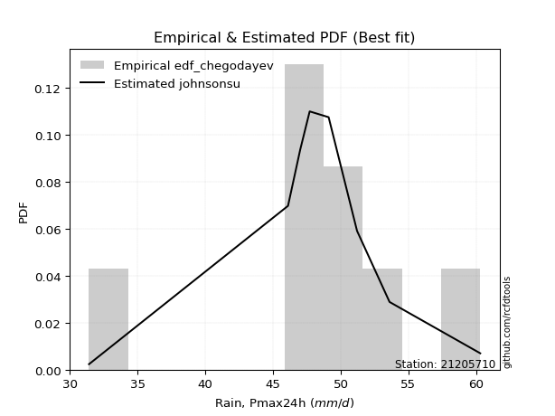</img>

</div>


### 6. EDF Blom (1958)

The Blom formula is a specific "plotting position" formula used in hydrology and statistical analysis to estimate the empirical cumulative probability (or non-exceedance probability) of a data series. It is particularly recommended for data that are approximately normally distributed. The constant _a_ is set to 0.375 (or 3/8).

<div align="center">


$P=(m-a)/(n+1-2a)$


</div>


**6.1. Empirical values**

<div align="center">

|                | 0                   | 1                   | 2                   | 3                  | 4        | 5                  | 6                  | 7                  | 8                  |
|:---------------|:--------------------|:--------------------|:--------------------|:-------------------|:---------|:-------------------|:-------------------|:-------------------|:-------------------|
| date           | 2017                | 2020                | 2021                | 2023               | 2018     | 2024               | 2019               | 2025               | 2022               |
| x              | 31.4                | 46.1                | 47.0                | 47.7               | 49.1     | 51.2               | 53.6               | 58.6               | 60.3               |
| m              | 1                   | 2                   | 3                   | 4                  | 5        | 6                  | 7                  | 8                  | 9                  |
| empirical_dist | edf_blom            | edf_blom            | edf_blom            | edf_blom           | edf_blom | edf_blom           | edf_blom           | edf_blom           | edf_blom           |
| empirical      | 0.06756756756756757 | 0.17567567567567569 | 0.28378378378378377 | 0.3918918918918919 | 0.5      | 0.6081081081081081 | 0.7162162162162162 | 0.8243243243243243 | 0.9324324324324325 |
| empirical_tr   | 1.072463768115942   | 1.2131147540983607  | 1.3962264150943395  | 1.6444444444444444 | 2.0      | 2.5517241379310347 | 3.523809523809524  | 5.6923076923076925 | 14.800000000000006 |

</div>


**6.2. Kolmogorov-Smirnov fit test (sorted by Δ)**


<div align="center">

|                | 0                   | 1                   | 2                   | 3                   | 4                   | 5                   | 6                   | 7                   | 8                   | 9                   | 10                  | 11                  | 12                  | 13                  | 14                  | 15                  | 16                  | 17                  | 18                  | 19                  | 20                  | 21                  | 22                  | 23                  | 24                  | 25                  | 26                  | 27                  | 28                  | 29                  | 30                  | 31                  | 32                  | 33                  | 34                  | 35                  | 36                  | 37                  | 38                  | 39                  | 40                  | 41                  | 42                  | 43                  | 44                  | 45                  | 46                  | 47                  | 48                  | 49                  | 50                  | 51                  | 52                  | 53                  | 54                  | 55                  | 56                  | 57                  | 58                  | 59                  | 60                  | 61                  | 62                  | 63                  | 64                  | 65                  | 66                  | 67                  | 68                  | 69                  | 70                  | 71                  | 72                  | 73                  | 74                  | 75                  | 76                  | 77                  | 78                  | 79                  | 80                  | 81                  | 82                  | 83                  | 84                  | 85                  | 86                  | 87                  | 88                  | 89                  | 90                  | 91                  | 92                  | 93                  | 94                  | 95                  | 96                  | 97                  | 98                  | 99                  | 100                 | 101                 | 102                 | 103                 | 104                 | 105                 | 106                 | 107                 | 108                 | 109                 | 110                 | 111                 | 112                 | 113                 | 114                 | 115                 | 116                 | 117                 | 118                 | 119                 | 120                 | 121                 | 122                 | 123                 | 124                 | 125                 | 126                 | 127                 | 128                 | 129                 | 130                 | 131                 | 132                 | 133                 | 134                 | 135                 | 136                 | 137                 | 138                 | 139                 | 140                 | 141                 | 142                 | 143                 | 144                 | 145                 | 146                 | 147                 | 148                 | 149                 | 150                 | 151                 | 152                 | 153                 | 154                 | 155                 | 156                 | 157                 | 158                 | 159                 |
|:---------------|:--------------------|:--------------------|:--------------------|:--------------------|:--------------------|:--------------------|:--------------------|:--------------------|:--------------------|:--------------------|:--------------------|:--------------------|:--------------------|:--------------------|:--------------------|:--------------------|:--------------------|:--------------------|:--------------------|:--------------------|:--------------------|:--------------------|:--------------------|:--------------------|:--------------------|:--------------------|:--------------------|:--------------------|:--------------------|:--------------------|:--------------------|:--------------------|:--------------------|:--------------------|:--------------------|:--------------------|:--------------------|:--------------------|:--------------------|:--------------------|:--------------------|:--------------------|:--------------------|:--------------------|:--------------------|:--------------------|:--------------------|:--------------------|:--------------------|:--------------------|:--------------------|:--------------------|:--------------------|:--------------------|:--------------------|:--------------------|:--------------------|:--------------------|:--------------------|:--------------------|:--------------------|:--------------------|:--------------------|:--------------------|:--------------------|:--------------------|:--------------------|:--------------------|:--------------------|:--------------------|:--------------------|:--------------------|:--------------------|:--------------------|:--------------------|:--------------------|:--------------------|:--------------------|:--------------------|:--------------------|:--------------------|:--------------------|:--------------------|:--------------------|:--------------------|:--------------------|:--------------------|:--------------------|:--------------------|:--------------------|:--------------------|:--------------------|:--------------------|:--------------------|:--------------------|:--------------------|:--------------------|:--------------------|:--------------------|:--------------------|:--------------------|:--------------------|:--------------------|:--------------------|:--------------------|:--------------------|:--------------------|:--------------------|:--------------------|:--------------------|:--------------------|:--------------------|:--------------------|:--------------------|:--------------------|:--------------------|:--------------------|:--------------------|:--------------------|:--------------------|:--------------------|:--------------------|:--------------------|:--------------------|:--------------------|:--------------------|:--------------------|:--------------------|:--------------------|:--------------------|:--------------------|:--------------------|:--------------------|:--------------------|:--------------------|:--------------------|:--------------------|:--------------------|:--------------------|:--------------------|:--------------------|:--------------------|:--------------------|:--------------------|:--------------------|:--------------------|:--------------------|:--------------------|:--------------------|:--------------------|:--------------------|:--------------------|:--------------------|:--------------------|:--------------------|:--------------------|:--------------------|:--------------------|:--------------------|:--------------------|
| station        | 21205710            | 21205710            | 21205710            | 21205710            | 21205710            | 21205710            | 21205710            | 21205710            | 21205710            | 21205710            | 21205710            | 21205710            | 21205710            | 21205710            | 21205710            | 21205710            | 21205710            | 21205710            | 21205710            | 21205710            | 21205710            | 21205710            | 21205710            | 21205710            | 21205710            | 21205710            | 21205710            | 21205710            | 21205710            | 21205710            | 21205710            | 21205710            | 21205710            | 21205710            | 21205710            | 21205710            | 21205710            | 21205710            | 21205710            | 21205710            | 21205710            | 21205710            | 21205710            | 21205710            | 21205710            | 21205710            | 21205710            | 21205710            | 21205710            | 21205710            | 21205710            | 21205710            | 21205710            | 21205710            | 21205710            | 21205710            | 21205710            | 21205710            | 21205710            | 21205710            | 21205710            | 21205710            | 21205710            | 21205710            | 21205710            | 21205710            | 21205710            | 21205710            | 21205710            | 21205710            | 21205710            | 21205710            | 21205710            | 21205710            | 21205710            | 21205710            | 21205710            | 21205710            | 21205710            | 21205710            | 21205710            | 21205710            | 21205710            | 21205710            | 21205710            | 21205710            | 21205710            | 21205710            | 21205710            | 21205710            | 21205710            | 21205710            | 21205710            | 21205710            | 21205710            | 21205710            | 21205710            | 21205710            | 21205710            | 21205710            | 21205710            | 21205710            | 21205710            | 21205710            | 21205710            | 21205710            | 21205710            | 21205710            | 21205710            | 21205710            | 21205710            | 21205710            | 21205710            | 21205710            | 21205710            | 21205710            | 21205710            | 21205710            | 21205710            | 21205710            | 21205710            | 21205710            | 21205710            | 21205710            | 21205710            | 21205710            | 21205710            | 21205710            | 21205710            | 21205710            | 21205710            | 21205710            | 21205710            | 21205710            | 21205710            | 21205710            | 21205710            | 21205710            | 21205710            | 21205710            | 21205710            | 21205710            | 21205710            | 21205710            | 21205710            | 21205710            | 21205710            | 21205710            | 21205710            | 21205710            | 21205710            | 21205710            | 21205710            | 21205710            | 21205710            | 21205710            | 21205710            | 21205710            | 21205710            | 21205710            |
| empirical_dist | edf_blom            | edf_blom            | edf_blom            | edf_blom            | edf_blom            | edf_blom            | edf_blom            | edf_blom            | edf_blom            | edf_blom            | edf_blom            | edf_blom            | edf_blom            | edf_blom            | edf_blom            | edf_blom            | edf_blom            | edf_blom            | edf_blom            | edf_blom            | edf_blom            | edf_blom            | edf_blom            | edf_blom            | edf_blom            | edf_blom            | edf_blom            | edf_blom            | edf_blom            | edf_blom            | edf_blom            | edf_blom            | edf_blom            | edf_blom            | edf_blom            | edf_blom            | edf_blom            | edf_blom            | edf_blom            | edf_blom            | edf_blom            | edf_blom            | edf_blom            | edf_blom            | edf_blom            | edf_blom            | edf_blom            | edf_blom            | edf_blom            | edf_blom            | edf_blom            | edf_blom            | edf_blom            | edf_blom            | edf_blom            | edf_blom            | edf_blom            | edf_blom            | edf_blom            | edf_blom            | edf_blom            | edf_blom            | edf_blom            | edf_blom            | edf_blom            | edf_blom            | edf_blom            | edf_blom            | edf_blom            | edf_blom            | edf_blom            | edf_blom            | edf_blom            | edf_blom            | edf_blom            | edf_blom            | edf_blom            | edf_blom            | edf_blom            | edf_blom            | edf_blom            | edf_blom            | edf_blom            | edf_blom            | edf_blom            | edf_blom            | edf_blom            | edf_blom            | edf_blom            | edf_blom            | edf_blom            | edf_blom            | edf_blom            | edf_blom            | edf_blom            | edf_blom            | edf_blom            | edf_blom            | edf_blom            | edf_blom            | edf_blom            | edf_blom            | edf_blom            | edf_blom            | edf_blom            | edf_blom            | edf_blom            | edf_blom            | edf_blom            | edf_blom            | edf_blom            | edf_blom            | edf_blom            | edf_blom            | edf_blom            | edf_blom            | edf_blom            | edf_blom            | edf_blom            | edf_blom            | edf_blom            | edf_blom            | edf_blom            | edf_blom            | edf_blom            | edf_blom            | edf_blom            | edf_blom            | edf_blom            | edf_blom            | edf_blom            | edf_blom            | edf_blom            | edf_blom            | edf_blom            | edf_blom            | edf_blom            | edf_blom            | edf_blom            | edf_blom            | edf_blom            | edf_blom            | edf_blom            | edf_blom            | edf_blom            | edf_blom            | edf_blom            | edf_blom            | edf_blom            | edf_blom            | edf_blom            | edf_blom            | edf_blom            | edf_blom            | edf_blom            | edf_blom            | edf_blom            | edf_blom            | edf_blom            | edf_blom            |
| p_dist         | logt                | t                   | logcrystalball      | logdgamma           | loggennorm          | logvonmises_line    | dweibull            | dgamma              | laplace             | gumbel_l            | genlogistic         | johnsonsu           | weibull_min         | vonmises_line       | logjohnsonsu        | skewnorm            | logdweibull         | logloggamma         | logexponpow         | mielke              | burr                | logmielke           | loggenlogistic      | pearson3            | logburr12           | gennorm             | logweibull_min      | logburr             | logloglaplace       | genextreme          | hypsecant           | logargus            | logpearson3         | argus               | loggompertz         | loggumbel_l         | logistic            | trapezoid           | loglaplace          | loglaplace          | triang              | logskewnorm         | exponnorm           | norm                | crystalball         | nct                 | f                   | logexponweib        | erlang              | logbeta             | lognakagami         | truncnorm           | nakagami            | genhalflogistic     | loghypsecant        | logtrapezoid        | alpha               | gamma               | anglit              | loggenextreme       | loglogistic         | rice                | ncf                 | semicircular        | maxwell             | invgamma            | loggengamma         | logf                | logrice             | logexponnorm        | lognorm             | rayleigh            | logfatiguelife      | gumbel_r            | loggenhalflogistic  | betaprime           | invgauss            | logalpha            | logweibull_max      | loganglit           | logbetaprime        | moyal               | lognct              | logsemicircular     | arcsine             | loggamma            | loggamma            | cosine              | invweibull          | loglevy_l           | loginvgamma         | loginvgauss         | logfoldnorm         | logmaxwell          | gompertz            | logtriang           | levy_l              | halfnorm            | logncf              | halflogistic        | lograyleigh         | logtukeylambda      | logjohnsonsb        | logarcsine          | wald                | loginvweibull       | loggumbel_r         | kstwobign           | logmoyal            | loghalfnorm         | truncweibull_min    | logcosine           | loghalflogistic     | gausshyper          | beta                | logkstwobign        | wrapcauchy          | loggenexpon         | ksone               | kappa3              | uniform             | logwald             | tukeylambda         | kappa4              | genpareto           | loggenpareto        | lomax               | genexpon            | logtruncweibull_min | loglomax            | loggausshyper       | johnsonsb           | logwrapcauchy       | logksone            | logkappa3           | burr12              | logkappa4           | loguniform          | bradford            | halfgennorm         | foldnorm            | truncexpon          | logerlang           | logbradford         | logtruncexpon       | weibull_max         | logrdist            | logtruncnorm        | exponweib           | gengamma            | rdist               | fatiguelife         | powerlaw            | logpowerlaw         | loghalfgennorm      | exponpow            | truncpareto         | logtruncpareto      | logvonmises         | vonmises            |
| delta          | 0.06994168775128606 | 0.07873946594473366 | 0.08145249235748575 | 0.0824579867426932  | 0.08756002384936654 | 0.096429118772525   | 0.09794551084507874 | 0.09947032317815754 | 0.09999556994699496 | 0.10338496559332003 | 0.1070612197764538  | 0.10933242833512366 | 0.11070695972751407 | 0.11187129775980778 | 0.11301115853876573 | 0.11551897072300396 | 0.1158711682963133  | 0.11709633315505938 | 0.11899995871598154 | 0.11902903638336201 | 0.11919286081568717 | 0.11923737973842316 | 0.11927499267929284 | 0.11972133647660757 | 0.12170646595722148 | 0.12203718133095096 | 0.12254020508782812 | 0.12285983255864494 | 0.12308724076812225 | 0.12351436667920696 | 0.12767272166284013 | 0.12855430608046978 | 0.1305881727943405  | 0.13142641009943076 | 0.13553950272688312 | 0.13927608493518487 | 0.14218321634032102 | 0.14630508578906345 | 0.14779948478849134 | 0.14779948478849134 | 0.1524106310001361  | 0.15948915208064016 | 0.1611960244620179  | 0.16119794830094866 | 0.1611979655804597  | 0.16162003521988064 | 0.16226777978350784 | 0.16328388296250565 | 0.17502310589456274 | 0.17516034747284942 | 0.1756727536053592  | 0.17567354595140441 | 0.17567536995982713 | 0.17596970126805775 | 0.17603183068623965 | 0.1772621489806083  | 0.17778391330458984 | 0.17905039566382117 | 0.1823876161750422  | 0.18743154679577373 | 0.18821147218926612 | 0.18906162976115728 | 0.191088779294852   | 0.1913085707288031  | 0.192266929389282   | 0.19229806383784095 | 0.19880633192511224 | 0.20315635967604453 | 0.20337518319932982 | 0.2033872585082719  | 0.2033902428397635  | 0.20414595440334407 | 0.20562750594137255 | 0.20590355724478096 | 0.2061112269937069  | 0.20632903234895897 | 0.21526483976241953 | 0.2153170940059179  | 0.2187768209294612  | 0.21983302225409848 | 0.21985395406957256 | 0.222028159863192   | 0.22457931151276936 | 0.22670749230606543 | 0.2281049945357361  | 0.22865482590502342 | 0.22865482590502342 | 0.229688501030868   | 0.22969221747024834 | 0.2297702763321978  | 0.22997720242938016 | 0.23172686343973584 | 0.23282769165783626 | 0.23676663371134035 | 0.2369349920247033  | 0.23718124914514485 | 0.23772929346546753 | 0.23794872016895016 | 0.24349246075728906 | 0.24369711471973507 | 0.24903474412337198 | 0.25159820714225845 | 0.2529998614955161  | 0.2544586375176623  | 0.2546531209292112  | 0.2547305701382917  | 0.2589052215130676  | 0.27021459240726153 | 0.28004672497133687 | 0.283932653554124   | 0.2896491343721369  | 0.2913796587118418  | 0.29667452509124126 | 0.30119745803647313 | 0.30148477386277556 | 0.30973654748400214 | 0.32720846182610863 | 0.3306292474551912  | 0.3315330901836093  | 0.33261007432530143 | 0.33297484335546634 | 0.3349034930222634  | 0.33535924646805326 | 0.3368048948097563  | 0.35877263390778846 | 0.36203721915635145 | 0.379077796056305   | 0.3814687164139102  | 0.38185135567939255 | 0.38239677006394746 | 0.38266580841213316 | 0.3871733586799403  | 0.3928348226300311  | 0.39806737569511885 | 0.39980543178106853 | 0.4039907732712493  | 0.4114322215131916  | 0.4128159859692774  | 0.4175268678582449  | 0.4229709412938486  | 0.42323954547954773 | 0.4349852606908118  | 0.4621454428753107  | 0.4949594578499519  | 0.5136675687240104  | 0.5280800035871417  | 0.5357899666191444  | 0.5428519962532322  | 0.6202162603086485  | 0.6331368103991197  | 0.6354290434711279  | 0.639249460006363   | 0.6822179035009089  | 0.7042122900071441  | 0.7162162162162162  | 0.7603343468113595  | 0.7847627910830615  | 0.7930950655938911  | 1.2000169908667175  | 8.763156895010873   |
| deltao         | 0.41761268023100007 | 0.41761268023100007 | 0.41761268023100007 | 0.41761268023100007 | 0.41761268023100007 | 0.41761268023100007 | 0.41761268023100007 | 0.41761268023100007 | 0.41761268023100007 | 0.41761268023100007 | 0.41761268023100007 | 0.41761268023100007 | 0.41761268023100007 | 0.41761268023100007 | 0.41761268023100007 | 0.41761268023100007 | 0.41761268023100007 | 0.41761268023100007 | 0.41761268023100007 | 0.41761268023100007 | 0.41761268023100007 | 0.41761268023100007 | 0.41761268023100007 | 0.41761268023100007 | 0.41761268023100007 | 0.41761268023100007 | 0.41761268023100007 | 0.41761268023100007 | 0.41761268023100007 | 0.41761268023100007 | 0.41761268023100007 | 0.41761268023100007 | 0.41761268023100007 | 0.41761268023100007 | 0.41761268023100007 | 0.41761268023100007 | 0.41761268023100007 | 0.41761268023100007 | 0.41761268023100007 | 0.41761268023100007 | 0.41761268023100007 | 0.41761268023100007 | 0.41761268023100007 | 0.41761268023100007 | 0.41761268023100007 | 0.41761268023100007 | 0.41761268023100007 | 0.41761268023100007 | 0.41761268023100007 | 0.41761268023100007 | 0.41761268023100007 | 0.41761268023100007 | 0.41761268023100007 | 0.41761268023100007 | 0.41761268023100007 | 0.41761268023100007 | 0.41761268023100007 | 0.41761268023100007 | 0.41761268023100007 | 0.41761268023100007 | 0.41761268023100007 | 0.41761268023100007 | 0.41761268023100007 | 0.41761268023100007 | 0.41761268023100007 | 0.41761268023100007 | 0.41761268023100007 | 0.41761268023100007 | 0.41761268023100007 | 0.41761268023100007 | 0.41761268023100007 | 0.41761268023100007 | 0.41761268023100007 | 0.41761268023100007 | 0.41761268023100007 | 0.41761268023100007 | 0.41761268023100007 | 0.41761268023100007 | 0.41761268023100007 | 0.41761268023100007 | 0.41761268023100007 | 0.41761268023100007 | 0.41761268023100007 | 0.41761268023100007 | 0.41761268023100007 | 0.41761268023100007 | 0.41761268023100007 | 0.41761268023100007 | 0.41761268023100007 | 0.41761268023100007 | 0.41761268023100007 | 0.41761268023100007 | 0.41761268023100007 | 0.41761268023100007 | 0.41761268023100007 | 0.41761268023100007 | 0.41761268023100007 | 0.41761268023100007 | 0.41761268023100007 | 0.41761268023100007 | 0.41761268023100007 | 0.41761268023100007 | 0.41761268023100007 | 0.41761268023100007 | 0.41761268023100007 | 0.41761268023100007 | 0.41761268023100007 | 0.41761268023100007 | 0.41761268023100007 | 0.41761268023100007 | 0.41761268023100007 | 0.41761268023100007 | 0.41761268023100007 | 0.41761268023100007 | 0.41761268023100007 | 0.41761268023100007 | 0.41761268023100007 | 0.41761268023100007 | 0.41761268023100007 | 0.41761268023100007 | 0.41761268023100007 | 0.41761268023100007 | 0.41761268023100007 | 0.41761268023100007 | 0.41761268023100007 | 0.41761268023100007 | 0.41761268023100007 | 0.41761268023100007 | 0.41761268023100007 | 0.41761268023100007 | 0.41761268023100007 | 0.41761268023100007 | 0.41761268023100007 | 0.41761268023100007 | 0.41761268023100007 | 0.41761268023100007 | 0.41761268023100007 | 0.41761268023100007 | 0.41761268023100007 | 0.41761268023100007 | 0.41761268023100007 | 0.41761268023100007 | 0.41761268023100007 | 0.41761268023100007 | 0.41761268023100007 | 0.41761268023100007 | 0.41761268023100007 | 0.41761268023100007 | 0.41761268023100007 | 0.41761268023100007 | 0.41761268023100007 | 0.41761268023100007 | 0.41761268023100007 | 0.41761268023100007 | 0.41761268023100007 | 0.41761268023100007 | 0.41761268023100007 | 0.41761268023100007 | 0.41761268023100007 | 0.41761268023100007 |
| eval           | Δo > Δ              | Δo > Δ              | Δo > Δ              | Δo > Δ              | Δo > Δ              | Δo > Δ              | Δo > Δ              | Δo > Δ              | Δo > Δ              | Δo > Δ              | Δo > Δ              | Δo > Δ              | Δo > Δ              | Δo > Δ              | Δo > Δ              | Δo > Δ              | Δo > Δ              | Δo > Δ              | Δo > Δ              | Δo > Δ              | Δo > Δ              | Δo > Δ              | Δo > Δ              | Δo > Δ              | Δo > Δ              | Δo > Δ              | Δo > Δ              | Δo > Δ              | Δo > Δ              | Δo > Δ              | Δo > Δ              | Δo > Δ              | Δo > Δ              | Δo > Δ              | Δo > Δ              | Δo > Δ              | Δo > Δ              | Δo > Δ              | Δo > Δ              | Δo > Δ              | Δo > Δ              | Δo > Δ              | Δo > Δ              | Δo > Δ              | Δo > Δ              | Δo > Δ              | Δo > Δ              | Δo > Δ              | Δo > Δ              | Δo > Δ              | Δo > Δ              | Δo > Δ              | Δo > Δ              | Δo > Δ              | Δo > Δ              | Δo > Δ              | Δo > Δ              | Δo > Δ              | Δo > Δ              | Δo > Δ              | Δo > Δ              | Δo > Δ              | Δo > Δ              | Δo > Δ              | Δo > Δ              | Δo > Δ              | Δo > Δ              | Δo > Δ              | Δo > Δ              | Δo > Δ              | Δo > Δ              | Δo > Δ              | Δo > Δ              | Δo > Δ              | Δo > Δ              | Δo > Δ              | Δo > Δ              | Δo > Δ              | Δo > Δ              | Δo > Δ              | Δo > Δ              | Δo > Δ              | Δo > Δ              | Δo > Δ              | Δo > Δ              | Δo > Δ              | Δo > Δ              | Δo > Δ              | Δo > Δ              | Δo > Δ              | Δo > Δ              | Δo > Δ              | Δo > Δ              | Δo > Δ              | Δo > Δ              | Δo > Δ              | Δo > Δ              | Δo > Δ              | Δo > Δ              | Δo > Δ              | Δo > Δ              | Δo > Δ              | Δo > Δ              | Δo > Δ              | Δo > Δ              | Δo > Δ              | Δo > Δ              | Δo > Δ              | Δo > Δ              | Δo > Δ              | Δo > Δ              | Δo > Δ              | Δo > Δ              | Δo > Δ              | Δo > Δ              | Δo > Δ              | Δo > Δ              | Δo > Δ              | Δo > Δ              | Δo > Δ              | Δo > Δ              | Δo > Δ              | Δo > Δ              | Δo > Δ              | Δo > Δ              | Δo > Δ              | Δo > Δ              | Δo > Δ              | Δo > Δ              | Δo > Δ              | Δo > Δ              | Δo > Δ              | Δo > Δ              | Δo > Δ              | Δo > Δ              | Δo > Δ              | Δo > Δ              | Δo > Δ              | Δo > Δ              | Δo <= Δ             | Δo <= Δ             | Δo <= Δ             | Δo <= Δ             | Δo <= Δ             | Δo <= Δ             | Δo <= Δ             | Δo <= Δ             | Δo <= Δ             | Δo <= Δ             | Δo <= Δ             | Δo <= Δ             | Δo <= Δ             | Δo <= Δ             | Δo <= Δ             | Δo <= Δ             | Δo <= Δ             | Δo <= Δ             | Δo <= Δ             | Δo <= Δ             | Δo <= Δ             |
| fit            | 1                   | 1                   | 1                   | 1                   | 1                   | 1                   | 1                   | 1                   | 1                   | 1                   | 1                   | 1                   | 1                   | 1                   | 1                   | 1                   | 1                   | 1                   | 1                   | 1                   | 1                   | 1                   | 1                   | 1                   | 1                   | 1                   | 1                   | 1                   | 1                   | 1                   | 1                   | 1                   | 1                   | 1                   | 1                   | 1                   | 1                   | 1                   | 1                   | 1                   | 1                   | 1                   | 1                   | 1                   | 1                   | 1                   | 1                   | 1                   | 1                   | 1                   | 1                   | 1                   | 1                   | 1                   | 1                   | 1                   | 1                   | 1                   | 1                   | 1                   | 1                   | 1                   | 1                   | 1                   | 1                   | 1                   | 1                   | 1                   | 1                   | 1                   | 1                   | 1                   | 1                   | 1                   | 1                   | 1                   | 1                   | 1                   | 1                   | 1                   | 1                   | 1                   | 1                   | 1                   | 1                   | 1                   | 1                   | 1                   | 1                   | 1                   | 1                   | 1                   | 1                   | 1                   | 1                   | 1                   | 1                   | 1                   | 1                   | 1                   | 1                   | 1                   | 1                   | 1                   | 1                   | 1                   | 1                   | 1                   | 1                   | 1                   | 1                   | 1                   | 1                   | 1                   | 1                   | 1                   | 1                   | 1                   | 1                   | 1                   | 1                   | 1                   | 1                   | 1                   | 1                   | 1                   | 1                   | 1                   | 1                   | 1                   | 1                   | 1                   | 1                   | 1                   | 1                   | 1                   | 1                   | 1                   | 1                   | 0                   | 0                   | 0                   | 0                   | 0                   | 0                   | 0                   | 0                   | 0                   | 0                   | 0                   | 0                   | 0                   | 0                   | 0                   | 0                   | 0                   | 0                   | 0                   | 0                   | 0                   |
| n              | 9                   | 9                   | 9                   | 9                   | 9                   | 9                   | 9                   | 9                   | 9                   | 9                   | 9                   | 9                   | 9                   | 9                   | 9                   | 9                   | 9                   | 9                   | 9                   | 9                   | 9                   | 9                   | 9                   | 9                   | 9                   | 9                   | 9                   | 9                   | 9                   | 9                   | 9                   | 9                   | 9                   | 9                   | 9                   | 9                   | 9                   | 9                   | 9                   | 9                   | 9                   | 9                   | 9                   | 9                   | 9                   | 9                   | 9                   | 9                   | 9                   | 9                   | 9                   | 9                   | 9                   | 9                   | 9                   | 9                   | 9                   | 9                   | 9                   | 9                   | 9                   | 9                   | 9                   | 9                   | 9                   | 9                   | 9                   | 9                   | 9                   | 9                   | 9                   | 9                   | 9                   | 9                   | 9                   | 9                   | 9                   | 9                   | 9                   | 9                   | 9                   | 9                   | 9                   | 9                   | 9                   | 9                   | 9                   | 9                   | 9                   | 9                   | 9                   | 9                   | 9                   | 9                   | 9                   | 9                   | 9                   | 9                   | 9                   | 9                   | 9                   | 9                   | 9                   | 9                   | 9                   | 9                   | 9                   | 9                   | 9                   | 9                   | 9                   | 9                   | 9                   | 9                   | 9                   | 9                   | 9                   | 9                   | 9                   | 9                   | 9                   | 9                   | 9                   | 9                   | 9                   | 9                   | 9                   | 9                   | 9                   | 9                   | 9                   | 9                   | 9                   | 9                   | 9                   | 9                   | 9                   | 9                   | 9                   | 9                   | 9                   | 9                   | 9                   | 9                   | 9                   | 9                   | 9                   | 9                   | 9                   | 9                   | 9                   | 9                   | 9                   | 9                   | 9                   | 9                   | 9                   | 9                   | 9                   | 9                   |
| best_fit       | 1                   | 0                   | 0                   | 0                   | 0                   | 0                   | 0                   | 0                   | 0                   | 0                   | 0                   | 0                   | 0                   | 0                   | 0                   | 0                   | 0                   | 0                   | 0                   | 0                   | 0                   | 0                   | 0                   | 0                   | 0                   | 0                   | 0                   | 0                   | 0                   | 0                   | 0                   | 0                   | 0                   | 0                   | 0                   | 0                   | 0                   | 0                   | 0                   | 0                   | 0                   | 0                   | 0                   | 0                   | 0                   | 0                   | 0                   | 0                   | 0                   | 0                   | 0                   | 0                   | 0                   | 0                   | 0                   | 0                   | 0                   | 0                   | 0                   | 0                   | 0                   | 0                   | 0                   | 0                   | 0                   | 0                   | 0                   | 0                   | 0                   | 0                   | 0                   | 0                   | 0                   | 0                   | 0                   | 0                   | 0                   | 0                   | 0                   | 0                   | 0                   | 0                   | 0                   | 0                   | 0                   | 0                   | 0                   | 0                   | 0                   | 0                   | 0                   | 0                   | 0                   | 0                   | 0                   | 0                   | 0                   | 0                   | 0                   | 0                   | 0                   | 0                   | 0                   | 0                   | 0                   | 0                   | 0                   | 0                   | 0                   | 0                   | 0                   | 0                   | 0                   | 0                   | 0                   | 0                   | 0                   | 0                   | 0                   | 0                   | 0                   | 0                   | 0                   | 0                   | 0                   | 0                   | 0                   | 0                   | 0                   | 0                   | 0                   | 0                   | 0                   | 0                   | 0                   | 0                   | 0                   | 0                   | 0                   | 0                   | 0                   | 0                   | 0                   | 0                   | 0                   | 0                   | 0                   | 0                   | 0                   | 0                   | 0                   | 0                   | 0                   | 0                   | 0                   | 0                   | 0                   | 0                   | 0                   | 0                   |
| best_fit_sort  | 1                   | 2                   | 3                   | 4                   | 5                   | 6                   | 7                   | 8                   | 9                   | 10                  | 11                  | 12                  | 13                  | 14                  | 15                  | 16                  | 17                  | 18                  | 19                  | 20                  | 21                  | 22                  | 23                  | 24                  | 25                  | 26                  | 27                  | 28                  | 29                  | 30                  | 31                  | 32                  | 33                  | 34                  | 35                  | 36                  | 37                  | 38                  | 39                  | 40                  | 41                  | 42                  | 43                  | 44                  | 45                  | 46                  | 47                  | 48                  | 49                  | 50                  | 51                  | 52                  | 53                  | 54                  | 55                  | 56                  | 57                  | 58                  | 59                  | 60                  | 61                  | 62                  | 63                  | 64                  | 65                  | 66                  | 67                  | 68                  | 69                  | 70                  | 71                  | 72                  | 73                  | 74                  | 75                  | 76                  | 77                  | 78                  | 79                  | 80                  | 81                  | 82                  | 83                  | 84                  | 85                  | 86                  | 87                  | 88                  | 89                  | 90                  | 91                  | 92                  | 93                  | 94                  | 95                  | 96                  | 97                  | 98                  | 99                  | 100                 | 101                 | 102                 | 103                 | 104                 | 105                 | 106                 | 107                 | 108                 | 109                 | 110                 | 111                 | 112                 | 113                 | 114                 | 115                 | 116                 | 117                 | 118                 | 119                 | 120                 | 121                 | 122                 | 123                 | 124                 | 125                 | 126                 | 127                 | 128                 | 129                 | 130                 | 131                 | 132                 | 133                 | 134                 | 135                 | 136                 | 137                 | 138                 | 139                 | 140                 | 141                 | 142                 | 143                 | 144                 | 145                 | 146                 | 147                 | 148                 | 149                 | 150                 | 151                 | 152                 | 153                 | 154                 | 155                 | 156                 | 157                 | 158                 | 159                 | 160                 |

</div>


**6.3. Best fit**

<div align="center">

|   id |   station | empirical_dist   | p_dist   |     delta |   deltao | eval   |   fit |   n |   best_fit |   best_fit_sort |
|-----:|----------:|:-----------------|:---------|----------:|---------:|:-------|------:|----:|-----------:|----------------:|
|    0 |  21205710 | edf_blom         | logt     | 0.0699417 | 0.417613 | Δo > Δ |     1 |   9 |          1 |               1 |

</div>


<div align="center">

</img>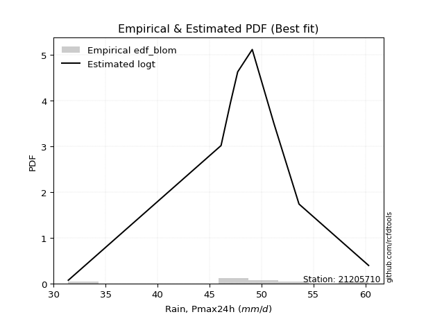</img>

</div>


### 7. EDF Tukey (1962)

In hydrology, the Tukey formula is used as a plotting position formula to estimate the empirical probability or frequency of a flood event (or other hydrological data). The formula parameter is given as _c=0.333_ (or 1/3).

<div align="center">


$P=(m-c)/(n+1-2c)$


</div>


**7.1. Empirical values**

<div align="center">

|                | 0                   | 1                   | 2                  | 3                   | 4         | 5                  | 6                  | 7                  | 8                  |
|:---------------|:--------------------|:--------------------|:-------------------|:--------------------|:----------|:-------------------|:-------------------|:-------------------|:-------------------|
| date           | 2017                | 2020                | 2021               | 2023                | 2018      | 2024               | 2019               | 2025               | 2022               |
| x              | 31.4                | 46.1                | 47.0               | 47.7                | 49.1      | 51.2               | 53.6               | 58.6               | 60.3               |
| m              | 1                   | 2                   | 3                  | 4                   | 5         | 6                  | 7                  | 8                  | 9                  |
| empirical_dist | edf_tukey           | edf_tukey           | edf_tukey          | edf_tukey           | edf_tukey | edf_tukey          | edf_tukey          | edf_tukey          | edf_tukey          |
| empirical      | 0.07142857142857142 | 0.17857142857142858 | 0.2857142857142857 | 0.39285714285714285 | 0.5       | 0.6071428571428571 | 0.7142857142857143 | 0.8214285714285714 | 0.9285714285714286 |
| empirical_tr   | 1.0769230769230769  | 1.2173913043478262  | 1.4                | 1.6470588235294117  | 2.0       | 2.545454545454545  | 3.5                | 5.599999999999999  | 14.000000000000007 |

</div>


**7.2. Kolmogorov-Smirnov fit test (sorted by Δ)**


<div align="center">

|                | 0                   | 1                   | 2                   | 3                   | 4                   | 5                   | 6                   | 7                   | 8                   | 9                   | 10                  | 11                  | 12                  | 13                  | 14                  | 15                  | 16                  | 17                  | 18                  | 19                  | 20                  | 21                  | 22                  | 23                  | 24                  | 25                  | 26                  | 27                  | 28                  | 29                  | 30                  | 31                  | 32                  | 33                  | 34                  | 35                  | 36                  | 37                  | 38                  | 39                  | 40                  | 41                  | 42                  | 43                  | 44                  | 45                  | 46                  | 47                  | 48                  | 49                  | 50                  | 51                  | 52                  | 53                  | 54                  | 55                  | 56                  | 57                  | 58                  | 59                  | 60                  | 61                  | 62                  | 63                  | 64                  | 65                  | 66                  | 67                  | 68                  | 69                  | 70                  | 71                  | 72                  | 73                  | 74                  | 75                  | 76                  | 77                  | 78                  | 79                  | 80                  | 81                  | 82                  | 83                  | 84                  | 85                  | 86                  | 87                  | 88                  | 89                  | 90                  | 91                  | 92                  | 93                  | 94                  | 95                  | 96                  | 97                  | 98                  | 99                  | 100                 | 101                 | 102                 | 103                 | 104                 | 105                 | 106                 | 107                 | 108                 | 109                 | 110                 | 111                 | 112                 | 113                 | 114                 | 115                 | 116                 | 117                 | 118                 | 119                 | 120                 | 121                 | 122                 | 123                 | 124                 | 125                 | 126                 | 127                 | 128                 | 129                 | 130                 | 131                 | 132                 | 133                 | 134                 | 135                 | 136                 | 137                 | 138                 | 139                 | 140                 | 141                 | 142                 | 143                 | 144                 | 145                 | 146                 | 147                 | 148                 | 149                 | 150                 | 151                 | 152                 | 153                 | 154                 | 155                 | 156                 | 157                 | 158                 | 159                 |
|:---------------|:--------------------|:--------------------|:--------------------|:--------------------|:--------------------|:--------------------|:--------------------|:--------------------|:--------------------|:--------------------|:--------------------|:--------------------|:--------------------|:--------------------|:--------------------|:--------------------|:--------------------|:--------------------|:--------------------|:--------------------|:--------------------|:--------------------|:--------------------|:--------------------|:--------------------|:--------------------|:--------------------|:--------------------|:--------------------|:--------------------|:--------------------|:--------------------|:--------------------|:--------------------|:--------------------|:--------------------|:--------------------|:--------------------|:--------------------|:--------------------|:--------------------|:--------------------|:--------------------|:--------------------|:--------------------|:--------------------|:--------------------|:--------------------|:--------------------|:--------------------|:--------------------|:--------------------|:--------------------|:--------------------|:--------------------|:--------------------|:--------------------|:--------------------|:--------------------|:--------------------|:--------------------|:--------------------|:--------------------|:--------------------|:--------------------|:--------------------|:--------------------|:--------------------|:--------------------|:--------------------|:--------------------|:--------------------|:--------------------|:--------------------|:--------------------|:--------------------|:--------------------|:--------------------|:--------------------|:--------------------|:--------------------|:--------------------|:--------------------|:--------------------|:--------------------|:--------------------|:--------------------|:--------------------|:--------------------|:--------------------|:--------------------|:--------------------|:--------------------|:--------------------|:--------------------|:--------------------|:--------------------|:--------------------|:--------------------|:--------------------|:--------------------|:--------------------|:--------------------|:--------------------|:--------------------|:--------------------|:--------------------|:--------------------|:--------------------|:--------------------|:--------------------|:--------------------|:--------------------|:--------------------|:--------------------|:--------------------|:--------------------|:--------------------|:--------------------|:--------------------|:--------------------|:--------------------|:--------------------|:--------------------|:--------------------|:--------------------|:--------------------|:--------------------|:--------------------|:--------------------|:--------------------|:--------------------|:--------------------|:--------------------|:--------------------|:--------------------|:--------------------|:--------------------|:--------------------|:--------------------|:--------------------|:--------------------|:--------------------|:--------------------|:--------------------|:--------------------|:--------------------|:--------------------|:--------------------|:--------------------|:--------------------|:--------------------|:--------------------|:--------------------|:--------------------|:--------------------|:--------------------|:--------------------|:--------------------|:--------------------|
| station        | 21205710            | 21205710            | 21205710            | 21205710            | 21205710            | 21205710            | 21205710            | 21205710            | 21205710            | 21205710            | 21205710            | 21205710            | 21205710            | 21205710            | 21205710            | 21205710            | 21205710            | 21205710            | 21205710            | 21205710            | 21205710            | 21205710            | 21205710            | 21205710            | 21205710            | 21205710            | 21205710            | 21205710            | 21205710            | 21205710            | 21205710            | 21205710            | 21205710            | 21205710            | 21205710            | 21205710            | 21205710            | 21205710            | 21205710            | 21205710            | 21205710            | 21205710            | 21205710            | 21205710            | 21205710            | 21205710            | 21205710            | 21205710            | 21205710            | 21205710            | 21205710            | 21205710            | 21205710            | 21205710            | 21205710            | 21205710            | 21205710            | 21205710            | 21205710            | 21205710            | 21205710            | 21205710            | 21205710            | 21205710            | 21205710            | 21205710            | 21205710            | 21205710            | 21205710            | 21205710            | 21205710            | 21205710            | 21205710            | 21205710            | 21205710            | 21205710            | 21205710            | 21205710            | 21205710            | 21205710            | 21205710            | 21205710            | 21205710            | 21205710            | 21205710            | 21205710            | 21205710            | 21205710            | 21205710            | 21205710            | 21205710            | 21205710            | 21205710            | 21205710            | 21205710            | 21205710            | 21205710            | 21205710            | 21205710            | 21205710            | 21205710            | 21205710            | 21205710            | 21205710            | 21205710            | 21205710            | 21205710            | 21205710            | 21205710            | 21205710            | 21205710            | 21205710            | 21205710            | 21205710            | 21205710            | 21205710            | 21205710            | 21205710            | 21205710            | 21205710            | 21205710            | 21205710            | 21205710            | 21205710            | 21205710            | 21205710            | 21205710            | 21205710            | 21205710            | 21205710            | 21205710            | 21205710            | 21205710            | 21205710            | 21205710            | 21205710            | 21205710            | 21205710            | 21205710            | 21205710            | 21205710            | 21205710            | 21205710            | 21205710            | 21205710            | 21205710            | 21205710            | 21205710            | 21205710            | 21205710            | 21205710            | 21205710            | 21205710            | 21205710            | 21205710            | 21205710            | 21205710            | 21205710            | 21205710            | 21205710            |
| empirical_dist | edf_tukey           | edf_tukey           | edf_tukey           | edf_tukey           | edf_tukey           | edf_tukey           | edf_tukey           | edf_tukey           | edf_tukey           | edf_tukey           | edf_tukey           | edf_tukey           | edf_tukey           | edf_tukey           | edf_tukey           | edf_tukey           | edf_tukey           | edf_tukey           | edf_tukey           | edf_tukey           | edf_tukey           | edf_tukey           | edf_tukey           | edf_tukey           | edf_tukey           | edf_tukey           | edf_tukey           | edf_tukey           | edf_tukey           | edf_tukey           | edf_tukey           | edf_tukey           | edf_tukey           | edf_tukey           | edf_tukey           | edf_tukey           | edf_tukey           | edf_tukey           | edf_tukey           | edf_tukey           | edf_tukey           | edf_tukey           | edf_tukey           | edf_tukey           | edf_tukey           | edf_tukey           | edf_tukey           | edf_tukey           | edf_tukey           | edf_tukey           | edf_tukey           | edf_tukey           | edf_tukey           | edf_tukey           | edf_tukey           | edf_tukey           | edf_tukey           | edf_tukey           | edf_tukey           | edf_tukey           | edf_tukey           | edf_tukey           | edf_tukey           | edf_tukey           | edf_tukey           | edf_tukey           | edf_tukey           | edf_tukey           | edf_tukey           | edf_tukey           | edf_tukey           | edf_tukey           | edf_tukey           | edf_tukey           | edf_tukey           | edf_tukey           | edf_tukey           | edf_tukey           | edf_tukey           | edf_tukey           | edf_tukey           | edf_tukey           | edf_tukey           | edf_tukey           | edf_tukey           | edf_tukey           | edf_tukey           | edf_tukey           | edf_tukey           | edf_tukey           | edf_tukey           | edf_tukey           | edf_tukey           | edf_tukey           | edf_tukey           | edf_tukey           | edf_tukey           | edf_tukey           | edf_tukey           | edf_tukey           | edf_tukey           | edf_tukey           | edf_tukey           | edf_tukey           | edf_tukey           | edf_tukey           | edf_tukey           | edf_tukey           | edf_tukey           | edf_tukey           | edf_tukey           | edf_tukey           | edf_tukey           | edf_tukey           | edf_tukey           | edf_tukey           | edf_tukey           | edf_tukey           | edf_tukey           | edf_tukey           | edf_tukey           | edf_tukey           | edf_tukey           | edf_tukey           | edf_tukey           | edf_tukey           | edf_tukey           | edf_tukey           | edf_tukey           | edf_tukey           | edf_tukey           | edf_tukey           | edf_tukey           | edf_tukey           | edf_tukey           | edf_tukey           | edf_tukey           | edf_tukey           | edf_tukey           | edf_tukey           | edf_tukey           | edf_tukey           | edf_tukey           | edf_tukey           | edf_tukey           | edf_tukey           | edf_tukey           | edf_tukey           | edf_tukey           | edf_tukey           | edf_tukey           | edf_tukey           | edf_tukey           | edf_tukey           | edf_tukey           | edf_tukey           | edf_tukey           | edf_tukey           | edf_tukey           | edf_tukey           |
| p_dist         | logt                | t                   | logdgamma           | logcrystalball      | loggennorm          | logvonmises_line    | dweibull            | dgamma              | laplace             | gumbel_l            | genlogistic         | johnsonsu           | weibull_min         | vonmises_line       | logjohnsonsu        | skewnorm            | logdweibull         | logloggamma         | logexponpow         | mielke              | burr                | logmielke           | loggenlogistic      | pearson3            | logburr12           | gennorm             | logweibull_min      | logburr             | logloglaplace       | genextreme          | hypsecant           | logargus            | logpearson3         | argus               | loggompertz         | loggumbel_l         | logistic            | trapezoid           | loglaplace          | loglaplace          | triang              | logskewnorm         | exponnorm           | norm                | crystalball         | nct                 | f                   | logexponweib        | erlang              | genhalflogistic     | loghypsecant        | logbeta             | logtrapezoid        | alpha               | gamma               | lognakagami         | truncnorm           | nakagami            | anglit              | loglogistic         | rice                | loggenextreme       | ncf                 | semicircular        | maxwell             | invgamma            | loggengamma         | logf                | logrice             | logexponnorm        | lognorm             | rayleigh            | logfatiguelife      | gumbel_r            | loggenhalflogistic  | betaprime           | invgauss            | logalpha            | logweibull_max      | loganglit           | logbetaprime        | moyal               | lognct              | logsemicircular     | arcsine             | loggamma            | loggamma            | cosine              | invweibull          | loglevy_l           | loginvgamma         | loginvgauss         | logfoldnorm         | logmaxwell          | logtriang           | levy_l              | halfnorm            | gompertz            | logncf              | halflogistic        | lograyleigh         | logjohnsonsb        | logarcsine          | logtukeylambda      | wald                | loginvweibull       | loggumbel_r         | kstwobign           | logmoyal            | loghalfnorm         | truncweibull_min    | logcosine           | loghalflogistic     | gausshyper          | beta                | logkstwobign        | wrapcauchy          | loggenexpon         | ksone               | kappa3              | uniform             | logwald             | tukeylambda         | kappa4              | genpareto           | loggenpareto        | lomax               | genexpon            | logtruncweibull_min | loglomax            | loggausshyper       | johnsonsb           | logwrapcauchy       | logksone            | logkappa3           | burr12              | logkappa4           | loguniform          | bradford            | halfgennorm         | foldnorm            | truncexpon          | logerlang           | logbradford         | logtruncexpon       | weibull_max         | logrdist            | logtruncnorm        | exponweib           | gengamma            | rdist               | fatiguelife         | powerlaw            | logpowerlaw         | loghalfgennorm      | exponpow            | truncpareto         | logtruncpareto      | logvonmises         | vonmises            |
| delta          | 0.06994168775128606 | 0.07584371304898077 | 0.07967791331336738 | 0.0843482452532387  | 0.08466427095361365 | 0.0935333658767721  | 0.09604227228705908 | 0.09657457028240465 | 0.09709981705124207 | 0.10048921269756714 | 0.10416546688070091 | 0.10643667543937077 | 0.10781120683176118 | 0.10897554486405489 | 0.11011540564301284 | 0.11262321782725107 | 0.11297541540056041 | 0.11420058025930649 | 0.11610420582022865 | 0.11613328348760912 | 0.11629710791993428 | 0.11634162684267027 | 0.11637923978353995 | 0.11682558358085468 | 0.11881071306146859 | 0.11914142843519807 | 0.11964445219207523 | 0.11996407966289205 | 0.12019148787236936 | 0.12254911571395594 | 0.12477696876708724 | 0.1256585531847169  | 0.12769241989858762 | 0.12853065720367787 | 0.13264374983113023 | 0.13638033203943198 | 0.13928746344456813 | 0.14340933289331056 | 0.14490373189273845 | 0.14490373189273845 | 0.14951487810438321 | 0.15659339918488727 | 0.158300271566265   | 0.15830219540519577 | 0.15830221268470682 | 0.15872428232412775 | 0.15937202688775495 | 0.16038813006675276 | 0.17212735299880985 | 0.17307394837230486 | 0.17313607779048676 | 0.1741950965075984  | 0.1743663960848554  | 0.17488816040883695 | 0.17615464276806828 | 0.17856850650111208 | 0.1785692988471573  | 0.17857112285558002 | 0.17949186327928932 | 0.18531571929351323 | 0.1861658768654044  | 0.1864662958305227  | 0.1881930263990991  | 0.18841281783305022 | 0.1893711764935291  | 0.18940231094208806 | 0.19591057902935935 | 0.20026060678029164 | 0.20047943030357693 | 0.20049150561251902 | 0.20049448994401062 | 0.20125020150759118 | 0.20273175304561966 | 0.20300780434902807 | 0.203215474097954   | 0.20343327945320608 | 0.21236908686666664 | 0.212421341110165   | 0.2168463189989593  | 0.2169372693583456  | 0.21695820117381967 | 0.2191324069674391  | 0.22168355861701647 | 0.22381173941031254 | 0.2252092416399832  | 0.22575907300927053 | 0.22575907300927053 | 0.2267927481351151  | 0.22679646457449545 | 0.2268745234364449  | 0.22708144953362727 | 0.22883111054398295 | 0.22993193876208337 | 0.23387088081558746 | 0.23428549624939196 | 0.23483354056971464 | 0.23505296727319727 | 0.23790024298995427 | 0.24059670786153617 | 0.24080136182398218 | 0.2461389912276191  | 0.2501041085997632  | 0.25156288462190945 | 0.25159820714225845 | 0.2517573680334583  | 0.25183481724253876 | 0.2560094686173148  | 0.2673188395115087  | 0.2771509720755839  | 0.28103690065837106 | 0.2867533814763841  | 0.28848390581608885 | 0.2937787721954884  | 0.2983017051407203  | 0.29955427193227363 | 0.3068407945882493  | 0.3243127089303557  | 0.32773349455943823 | 0.3286373372878564  | 0.3297143214295485  | 0.3300790904597134  | 0.33200774012651046 | 0.3324634935723003  | 0.33390914191400334 | 0.3558768810120355  | 0.3591414662605985  | 0.37618204316055204 | 0.3785729635181573  | 0.3789556027836396  | 0.3795010171681945  | 0.3797700555163802  | 0.38427760578418735 | 0.38993906973427817 | 0.3951716227993659  | 0.3969096788853156  | 0.4010950203754964  | 0.40853646861743864 | 0.40992023307352443 | 0.41463111496249194 | 0.42007518839809566 | 0.42323954547954773 | 0.43208950779505884 | 0.45924968997955773 | 0.49206370495419893 | 0.5107718158282575  | 0.5261495016566398  | 0.5319289627581405  | 0.5399562433574793  | 0.6173205074128956  | 0.6302410575033668  | 0.632533290575375   | 0.63635370711061    | 0.679322150605156   | 0.7013165371113912  | 0.7142857142857143  | 0.7574385939156065  | 0.7818670381873085  | 0.7901993126981381  | 1.1971212379709646  | 8.767017898871876   |
| deltao         | 0.41761268023100007 | 0.41761268023100007 | 0.41761268023100007 | 0.41761268023100007 | 0.41761268023100007 | 0.41761268023100007 | 0.41761268023100007 | 0.41761268023100007 | 0.41761268023100007 | 0.41761268023100007 | 0.41761268023100007 | 0.41761268023100007 | 0.41761268023100007 | 0.41761268023100007 | 0.41761268023100007 | 0.41761268023100007 | 0.41761268023100007 | 0.41761268023100007 | 0.41761268023100007 | 0.41761268023100007 | 0.41761268023100007 | 0.41761268023100007 | 0.41761268023100007 | 0.41761268023100007 | 0.41761268023100007 | 0.41761268023100007 | 0.41761268023100007 | 0.41761268023100007 | 0.41761268023100007 | 0.41761268023100007 | 0.41761268023100007 | 0.41761268023100007 | 0.41761268023100007 | 0.41761268023100007 | 0.41761268023100007 | 0.41761268023100007 | 0.41761268023100007 | 0.41761268023100007 | 0.41761268023100007 | 0.41761268023100007 | 0.41761268023100007 | 0.41761268023100007 | 0.41761268023100007 | 0.41761268023100007 | 0.41761268023100007 | 0.41761268023100007 | 0.41761268023100007 | 0.41761268023100007 | 0.41761268023100007 | 0.41761268023100007 | 0.41761268023100007 | 0.41761268023100007 | 0.41761268023100007 | 0.41761268023100007 | 0.41761268023100007 | 0.41761268023100007 | 0.41761268023100007 | 0.41761268023100007 | 0.41761268023100007 | 0.41761268023100007 | 0.41761268023100007 | 0.41761268023100007 | 0.41761268023100007 | 0.41761268023100007 | 0.41761268023100007 | 0.41761268023100007 | 0.41761268023100007 | 0.41761268023100007 | 0.41761268023100007 | 0.41761268023100007 | 0.41761268023100007 | 0.41761268023100007 | 0.41761268023100007 | 0.41761268023100007 | 0.41761268023100007 | 0.41761268023100007 | 0.41761268023100007 | 0.41761268023100007 | 0.41761268023100007 | 0.41761268023100007 | 0.41761268023100007 | 0.41761268023100007 | 0.41761268023100007 | 0.41761268023100007 | 0.41761268023100007 | 0.41761268023100007 | 0.41761268023100007 | 0.41761268023100007 | 0.41761268023100007 | 0.41761268023100007 | 0.41761268023100007 | 0.41761268023100007 | 0.41761268023100007 | 0.41761268023100007 | 0.41761268023100007 | 0.41761268023100007 | 0.41761268023100007 | 0.41761268023100007 | 0.41761268023100007 | 0.41761268023100007 | 0.41761268023100007 | 0.41761268023100007 | 0.41761268023100007 | 0.41761268023100007 | 0.41761268023100007 | 0.41761268023100007 | 0.41761268023100007 | 0.41761268023100007 | 0.41761268023100007 | 0.41761268023100007 | 0.41761268023100007 | 0.41761268023100007 | 0.41761268023100007 | 0.41761268023100007 | 0.41761268023100007 | 0.41761268023100007 | 0.41761268023100007 | 0.41761268023100007 | 0.41761268023100007 | 0.41761268023100007 | 0.41761268023100007 | 0.41761268023100007 | 0.41761268023100007 | 0.41761268023100007 | 0.41761268023100007 | 0.41761268023100007 | 0.41761268023100007 | 0.41761268023100007 | 0.41761268023100007 | 0.41761268023100007 | 0.41761268023100007 | 0.41761268023100007 | 0.41761268023100007 | 0.41761268023100007 | 0.41761268023100007 | 0.41761268023100007 | 0.41761268023100007 | 0.41761268023100007 | 0.41761268023100007 | 0.41761268023100007 | 0.41761268023100007 | 0.41761268023100007 | 0.41761268023100007 | 0.41761268023100007 | 0.41761268023100007 | 0.41761268023100007 | 0.41761268023100007 | 0.41761268023100007 | 0.41761268023100007 | 0.41761268023100007 | 0.41761268023100007 | 0.41761268023100007 | 0.41761268023100007 | 0.41761268023100007 | 0.41761268023100007 | 0.41761268023100007 | 0.41761268023100007 | 0.41761268023100007 | 0.41761268023100007 | 0.41761268023100007 |
| eval           | Δo > Δ              | Δo > Δ              | Δo > Δ              | Δo > Δ              | Δo > Δ              | Δo > Δ              | Δo > Δ              | Δo > Δ              | Δo > Δ              | Δo > Δ              | Δo > Δ              | Δo > Δ              | Δo > Δ              | Δo > Δ              | Δo > Δ              | Δo > Δ              | Δo > Δ              | Δo > Δ              | Δo > Δ              | Δo > Δ              | Δo > Δ              | Δo > Δ              | Δo > Δ              | Δo > Δ              | Δo > Δ              | Δo > Δ              | Δo > Δ              | Δo > Δ              | Δo > Δ              | Δo > Δ              | Δo > Δ              | Δo > Δ              | Δo > Δ              | Δo > Δ              | Δo > Δ              | Δo > Δ              | Δo > Δ              | Δo > Δ              | Δo > Δ              | Δo > Δ              | Δo > Δ              | Δo > Δ              | Δo > Δ              | Δo > Δ              | Δo > Δ              | Δo > Δ              | Δo > Δ              | Δo > Δ              | Δo > Δ              | Δo > Δ              | Δo > Δ              | Δo > Δ              | Δo > Δ              | Δo > Δ              | Δo > Δ              | Δo > Δ              | Δo > Δ              | Δo > Δ              | Δo > Δ              | Δo > Δ              | Δo > Δ              | Δo > Δ              | Δo > Δ              | Δo > Δ              | Δo > Δ              | Δo > Δ              | Δo > Δ              | Δo > Δ              | Δo > Δ              | Δo > Δ              | Δo > Δ              | Δo > Δ              | Δo > Δ              | Δo > Δ              | Δo > Δ              | Δo > Δ              | Δo > Δ              | Δo > Δ              | Δo > Δ              | Δo > Δ              | Δo > Δ              | Δo > Δ              | Δo > Δ              | Δo > Δ              | Δo > Δ              | Δo > Δ              | Δo > Δ              | Δo > Δ              | Δo > Δ              | Δo > Δ              | Δo > Δ              | Δo > Δ              | Δo > Δ              | Δo > Δ              | Δo > Δ              | Δo > Δ              | Δo > Δ              | Δo > Δ              | Δo > Δ              | Δo > Δ              | Δo > Δ              | Δo > Δ              | Δo > Δ              | Δo > Δ              | Δo > Δ              | Δo > Δ              | Δo > Δ              | Δo > Δ              | Δo > Δ              | Δo > Δ              | Δo > Δ              | Δo > Δ              | Δo > Δ              | Δo > Δ              | Δo > Δ              | Δo > Δ              | Δo > Δ              | Δo > Δ              | Δo > Δ              | Δo > Δ              | Δo > Δ              | Δo > Δ              | Δo > Δ              | Δo > Δ              | Δo > Δ              | Δo > Δ              | Δo > Δ              | Δo > Δ              | Δo > Δ              | Δo > Δ              | Δo > Δ              | Δo > Δ              | Δo > Δ              | Δo > Δ              | Δo > Δ              | Δo > Δ              | Δo > Δ              | Δo > Δ              | Δo > Δ              | Δo <= Δ             | Δo <= Δ             | Δo <= Δ             | Δo <= Δ             | Δo <= Δ             | Δo <= Δ             | Δo <= Δ             | Δo <= Δ             | Δo <= Δ             | Δo <= Δ             | Δo <= Δ             | Δo <= Δ             | Δo <= Δ             | Δo <= Δ             | Δo <= Δ             | Δo <= Δ             | Δo <= Δ             | Δo <= Δ             | Δo <= Δ             | Δo <= Δ             | Δo <= Δ             |
| fit            | 1                   | 1                   | 1                   | 1                   | 1                   | 1                   | 1                   | 1                   | 1                   | 1                   | 1                   | 1                   | 1                   | 1                   | 1                   | 1                   | 1                   | 1                   | 1                   | 1                   | 1                   | 1                   | 1                   | 1                   | 1                   | 1                   | 1                   | 1                   | 1                   | 1                   | 1                   | 1                   | 1                   | 1                   | 1                   | 1                   | 1                   | 1                   | 1                   | 1                   | 1                   | 1                   | 1                   | 1                   | 1                   | 1                   | 1                   | 1                   | 1                   | 1                   | 1                   | 1                   | 1                   | 1                   | 1                   | 1                   | 1                   | 1                   | 1                   | 1                   | 1                   | 1                   | 1                   | 1                   | 1                   | 1                   | 1                   | 1                   | 1                   | 1                   | 1                   | 1                   | 1                   | 1                   | 1                   | 1                   | 1                   | 1                   | 1                   | 1                   | 1                   | 1                   | 1                   | 1                   | 1                   | 1                   | 1                   | 1                   | 1                   | 1                   | 1                   | 1                   | 1                   | 1                   | 1                   | 1                   | 1                   | 1                   | 1                   | 1                   | 1                   | 1                   | 1                   | 1                   | 1                   | 1                   | 1                   | 1                   | 1                   | 1                   | 1                   | 1                   | 1                   | 1                   | 1                   | 1                   | 1                   | 1                   | 1                   | 1                   | 1                   | 1                   | 1                   | 1                   | 1                   | 1                   | 1                   | 1                   | 1                   | 1                   | 1                   | 1                   | 1                   | 1                   | 1                   | 1                   | 1                   | 1                   | 1                   | 0                   | 0                   | 0                   | 0                   | 0                   | 0                   | 0                   | 0                   | 0                   | 0                   | 0                   | 0                   | 0                   | 0                   | 0                   | 0                   | 0                   | 0                   | 0                   | 0                   | 0                   |
| n              | 9                   | 9                   | 9                   | 9                   | 9                   | 9                   | 9                   | 9                   | 9                   | 9                   | 9                   | 9                   | 9                   | 9                   | 9                   | 9                   | 9                   | 9                   | 9                   | 9                   | 9                   | 9                   | 9                   | 9                   | 9                   | 9                   | 9                   | 9                   | 9                   | 9                   | 9                   | 9                   | 9                   | 9                   | 9                   | 9                   | 9                   | 9                   | 9                   | 9                   | 9                   | 9                   | 9                   | 9                   | 9                   | 9                   | 9                   | 9                   | 9                   | 9                   | 9                   | 9                   | 9                   | 9                   | 9                   | 9                   | 9                   | 9                   | 9                   | 9                   | 9                   | 9                   | 9                   | 9                   | 9                   | 9                   | 9                   | 9                   | 9                   | 9                   | 9                   | 9                   | 9                   | 9                   | 9                   | 9                   | 9                   | 9                   | 9                   | 9                   | 9                   | 9                   | 9                   | 9                   | 9                   | 9                   | 9                   | 9                   | 9                   | 9                   | 9                   | 9                   | 9                   | 9                   | 9                   | 9                   | 9                   | 9                   | 9                   | 9                   | 9                   | 9                   | 9                   | 9                   | 9                   | 9                   | 9                   | 9                   | 9                   | 9                   | 9                   | 9                   | 9                   | 9                   | 9                   | 9                   | 9                   | 9                   | 9                   | 9                   | 9                   | 9                   | 9                   | 9                   | 9                   | 9                   | 9                   | 9                   | 9                   | 9                   | 9                   | 9                   | 9                   | 9                   | 9                   | 9                   | 9                   | 9                   | 9                   | 9                   | 9                   | 9                   | 9                   | 9                   | 9                   | 9                   | 9                   | 9                   | 9                   | 9                   | 9                   | 9                   | 9                   | 9                   | 9                   | 9                   | 9                   | 9                   | 9                   | 9                   |
| best_fit       | 1                   | 0                   | 0                   | 0                   | 0                   | 0                   | 0                   | 0                   | 0                   | 0                   | 0                   | 0                   | 0                   | 0                   | 0                   | 0                   | 0                   | 0                   | 0                   | 0                   | 0                   | 0                   | 0                   | 0                   | 0                   | 0                   | 0                   | 0                   | 0                   | 0                   | 0                   | 0                   | 0                   | 0                   | 0                   | 0                   | 0                   | 0                   | 0                   | 0                   | 0                   | 0                   | 0                   | 0                   | 0                   | 0                   | 0                   | 0                   | 0                   | 0                   | 0                   | 0                   | 0                   | 0                   | 0                   | 0                   | 0                   | 0                   | 0                   | 0                   | 0                   | 0                   | 0                   | 0                   | 0                   | 0                   | 0                   | 0                   | 0                   | 0                   | 0                   | 0                   | 0                   | 0                   | 0                   | 0                   | 0                   | 0                   | 0                   | 0                   | 0                   | 0                   | 0                   | 0                   | 0                   | 0                   | 0                   | 0                   | 0                   | 0                   | 0                   | 0                   | 0                   | 0                   | 0                   | 0                   | 0                   | 0                   | 0                   | 0                   | 0                   | 0                   | 0                   | 0                   | 0                   | 0                   | 0                   | 0                   | 0                   | 0                   | 0                   | 0                   | 0                   | 0                   | 0                   | 0                   | 0                   | 0                   | 0                   | 0                   | 0                   | 0                   | 0                   | 0                   | 0                   | 0                   | 0                   | 0                   | 0                   | 0                   | 0                   | 0                   | 0                   | 0                   | 0                   | 0                   | 0                   | 0                   | 0                   | 0                   | 0                   | 0                   | 0                   | 0                   | 0                   | 0                   | 0                   | 0                   | 0                   | 0                   | 0                   | 0                   | 0                   | 0                   | 0                   | 0                   | 0                   | 0                   | 0                   | 0                   |
| best_fit_sort  | 1                   | 2                   | 3                   | 4                   | 5                   | 6                   | 7                   | 8                   | 9                   | 10                  | 11                  | 12                  | 13                  | 14                  | 15                  | 16                  | 17                  | 18                  | 19                  | 20                  | 21                  | 22                  | 23                  | 24                  | 25                  | 26                  | 27                  | 28                  | 29                  | 30                  | 31                  | 32                  | 33                  | 34                  | 35                  | 36                  | 37                  | 38                  | 39                  | 40                  | 41                  | 42                  | 43                  | 44                  | 45                  | 46                  | 47                  | 48                  | 49                  | 50                  | 51                  | 52                  | 53                  | 54                  | 55                  | 56                  | 57                  | 58                  | 59                  | 60                  | 61                  | 62                  | 63                  | 64                  | 65                  | 66                  | 67                  | 68                  | 69                  | 70                  | 71                  | 72                  | 73                  | 74                  | 75                  | 76                  | 77                  | 78                  | 79                  | 80                  | 81                  | 82                  | 83                  | 84                  | 85                  | 86                  | 87                  | 88                  | 89                  | 90                  | 91                  | 92                  | 93                  | 94                  | 95                  | 96                  | 97                  | 98                  | 99                  | 100                 | 101                 | 102                 | 103                 | 104                 | 105                 | 106                 | 107                 | 108                 | 109                 | 110                 | 111                 | 112                 | 113                 | 114                 | 115                 | 116                 | 117                 | 118                 | 119                 | 120                 | 121                 | 122                 | 123                 | 124                 | 125                 | 126                 | 127                 | 128                 | 129                 | 130                 | 131                 | 132                 | 133                 | 134                 | 135                 | 136                 | 137                 | 138                 | 139                 | 140                 | 141                 | 142                 | 143                 | 144                 | 145                 | 146                 | 147                 | 148                 | 149                 | 150                 | 151                 | 152                 | 153                 | 154                 | 155                 | 156                 | 157                 | 158                 | 159                 | 160                 |

</div>


**7.3. Best fit**

<div align="center">

|   id |   station | empirical_dist   | p_dist   |     delta |   deltao | eval   |   fit |   n |   best_fit |   best_fit_sort |
|-----:|----------:|:-----------------|:---------|----------:|---------:|:-------|------:|----:|-----------:|----------------:|
|    0 |  21205710 | edf_tukey        | logt     | 0.0699417 | 0.417613 | Δo > Δ |     1 |   9 |          1 |               1 |

</div>


<div align="center">

</img>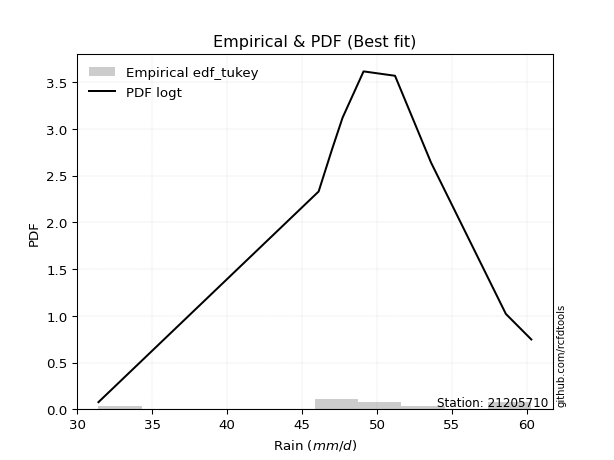</img>

</div>


### 8. EDF Gringorten (1963)

Gringorten plotting position formula is essential for estimating the probability and return periods of extreme events like floods and heavy rainfall. The constant _a=0.44_.

<div align="center">


$P=(m-a)/(n+1-2a)$


</div>


**8.1. Empirical values**

<div align="center">

|                | 0                    | 1                  | 2                   | 3                  | 4              | 5                  | 6                  | 7                  | 8                  |
|:---------------|:---------------------|:-------------------|:--------------------|:-------------------|:---------------|:-------------------|:-------------------|:-------------------|:-------------------|
| date           | 2017                 | 2020               | 2021                | 2023               | 2018           | 2024               | 2019               | 2025               | 2022               |
| x              | 31.4                 | 46.1               | 47.0                | 47.7               | 49.1           | 51.2               | 53.6               | 58.6               | 60.3               |
| m              | 1                    | 2                  | 3                   | 4                  | 5              | 6                  | 7                  | 8                  | 9                  |
| empirical_dist | edf_gringorten       | edf_gringorten     | edf_gringorten      | edf_gringorten     | edf_gringorten | edf_gringorten     | edf_gringorten     | edf_gringorten     | edf_gringorten     |
| empirical      | 0.061403508771929835 | 0.1710526315789474 | 0.28070175438596495 | 0.3903508771929825 | 0.5            | 0.6096491228070176 | 0.7192982456140351 | 0.8289473684210527 | 0.9385964912280703 |
| empirical_tr   | 1.0654205607476634   | 1.2063492063492063 | 1.3902439024390243  | 1.6402877697841727 | 2.0            | 2.561797752808989  | 3.5625             | 5.846153846153847  | 16.285714285714324 |

</div>


**8.2. Kolmogorov-Smirnov fit test (sorted by Δ)**


<div align="center">

|                | 0                   | 1                   | 2                   | 3                   | 4                   | 5                   | 6                   | 7                   | 8                   | 9                   | 10                  | 11                  | 12                  | 13                  | 14                  | 15                  | 16                  | 17                  | 18                  | 19                  | 20                  | 21                  | 22                  | 23                  | 24                  | 25                  | 26                  | 27                  | 28                  | 29                  | 30                  | 31                  | 32                  | 33                  | 34                  | 35                  | 36                  | 37                  | 38                  | 39                  | 40                  | 41                  | 42                  | 43                  | 44                  | 45                  | 46                  | 47                  | 48                  | 49                  | 50                  | 51                  | 52                  | 53                  | 54                  | 55                  | 56                  | 57                  | 58                  | 59                  | 60                  | 61                  | 62                  | 63                  | 64                  | 65                  | 66                  | 67                  | 68                  | 69                  | 70                  | 71                  | 72                  | 73                  | 74                  | 75                  | 76                  | 77                  | 78                  | 79                  | 80                  | 81                  | 82                  | 83                  | 84                  | 85                  | 86                  | 87                  | 88                  | 89                  | 90                  | 91                  | 92                  | 93                  | 94                  | 95                  | 96                  | 97                  | 98                  | 99                  | 100                 | 101                 | 102                 | 103                 | 104                 | 105                 | 106                 | 107                 | 108                 | 109                 | 110                 | 111                 | 112                 | 113                 | 114                 | 115                 | 116                 | 117                 | 118                 | 119                 | 120                 | 121                 | 122                 | 123                 | 124                 | 125                 | 126                 | 127                 | 128                 | 129                 | 130                 | 131                 | 132                 | 133                 | 134                 | 135                 | 136                 | 137                 | 138                 | 139                 | 140                 | 141                 | 142                 | 143                 | 144                 | 145                 | 146                 | 147                 | 148                 | 149                 | 150                 | 151                 | 152                 | 153                 | 154                 | 155                 | 156                 | 157                 | 158                 | 159                 |
|:---------------|:--------------------|:--------------------|:--------------------|:--------------------|:--------------------|:--------------------|:--------------------|:--------------------|:--------------------|:--------------------|:--------------------|:--------------------|:--------------------|:--------------------|:--------------------|:--------------------|:--------------------|:--------------------|:--------------------|:--------------------|:--------------------|:--------------------|:--------------------|:--------------------|:--------------------|:--------------------|:--------------------|:--------------------|:--------------------|:--------------------|:--------------------|:--------------------|:--------------------|:--------------------|:--------------------|:--------------------|:--------------------|:--------------------|:--------------------|:--------------------|:--------------------|:--------------------|:--------------------|:--------------------|:--------------------|:--------------------|:--------------------|:--------------------|:--------------------|:--------------------|:--------------------|:--------------------|:--------------------|:--------------------|:--------------------|:--------------------|:--------------------|:--------------------|:--------------------|:--------------------|:--------------------|:--------------------|:--------------------|:--------------------|:--------------------|:--------------------|:--------------------|:--------------------|:--------------------|:--------------------|:--------------------|:--------------------|:--------------------|:--------------------|:--------------------|:--------------------|:--------------------|:--------------------|:--------------------|:--------------------|:--------------------|:--------------------|:--------------------|:--------------------|:--------------------|:--------------------|:--------------------|:--------------------|:--------------------|:--------------------|:--------------------|:--------------------|:--------------------|:--------------------|:--------------------|:--------------------|:--------------------|:--------------------|:--------------------|:--------------------|:--------------------|:--------------------|:--------------------|:--------------------|:--------------------|:--------------------|:--------------------|:--------------------|:--------------------|:--------------------|:--------------------|:--------------------|:--------------------|:--------------------|:--------------------|:--------------------|:--------------------|:--------------------|:--------------------|:--------------------|:--------------------|:--------------------|:--------------------|:--------------------|:--------------------|:--------------------|:--------------------|:--------------------|:--------------------|:--------------------|:--------------------|:--------------------|:--------------------|:--------------------|:--------------------|:--------------------|:--------------------|:--------------------|:--------------------|:--------------------|:--------------------|:--------------------|:--------------------|:--------------------|:--------------------|:--------------------|:--------------------|:--------------------|:--------------------|:--------------------|:--------------------|:--------------------|:--------------------|:--------------------|:--------------------|:--------------------|:--------------------|:--------------------|:--------------------|:--------------------|
| station        | 21205710            | 21205710            | 21205710            | 21205710            | 21205710            | 21205710            | 21205710            | 21205710            | 21205710            | 21205710            | 21205710            | 21205710            | 21205710            | 21205710            | 21205710            | 21205710            | 21205710            | 21205710            | 21205710            | 21205710            | 21205710            | 21205710            | 21205710            | 21205710            | 21205710            | 21205710            | 21205710            | 21205710            | 21205710            | 21205710            | 21205710            | 21205710            | 21205710            | 21205710            | 21205710            | 21205710            | 21205710            | 21205710            | 21205710            | 21205710            | 21205710            | 21205710            | 21205710            | 21205710            | 21205710            | 21205710            | 21205710            | 21205710            | 21205710            | 21205710            | 21205710            | 21205710            | 21205710            | 21205710            | 21205710            | 21205710            | 21205710            | 21205710            | 21205710            | 21205710            | 21205710            | 21205710            | 21205710            | 21205710            | 21205710            | 21205710            | 21205710            | 21205710            | 21205710            | 21205710            | 21205710            | 21205710            | 21205710            | 21205710            | 21205710            | 21205710            | 21205710            | 21205710            | 21205710            | 21205710            | 21205710            | 21205710            | 21205710            | 21205710            | 21205710            | 21205710            | 21205710            | 21205710            | 21205710            | 21205710            | 21205710            | 21205710            | 21205710            | 21205710            | 21205710            | 21205710            | 21205710            | 21205710            | 21205710            | 21205710            | 21205710            | 21205710            | 21205710            | 21205710            | 21205710            | 21205710            | 21205710            | 21205710            | 21205710            | 21205710            | 21205710            | 21205710            | 21205710            | 21205710            | 21205710            | 21205710            | 21205710            | 21205710            | 21205710            | 21205710            | 21205710            | 21205710            | 21205710            | 21205710            | 21205710            | 21205710            | 21205710            | 21205710            | 21205710            | 21205710            | 21205710            | 21205710            | 21205710            | 21205710            | 21205710            | 21205710            | 21205710            | 21205710            | 21205710            | 21205710            | 21205710            | 21205710            | 21205710            | 21205710            | 21205710            | 21205710            | 21205710            | 21205710            | 21205710            | 21205710            | 21205710            | 21205710            | 21205710            | 21205710            | 21205710            | 21205710            | 21205710            | 21205710            | 21205710            | 21205710            |
| empirical_dist | edf_gringorten      | edf_gringorten      | edf_gringorten      | edf_gringorten      | edf_gringorten      | edf_gringorten      | edf_gringorten      | edf_gringorten      | edf_gringorten      | edf_gringorten      | edf_gringorten      | edf_gringorten      | edf_gringorten      | edf_gringorten      | edf_gringorten      | edf_gringorten      | edf_gringorten      | edf_gringorten      | edf_gringorten      | edf_gringorten      | edf_gringorten      | edf_gringorten      | edf_gringorten      | edf_gringorten      | edf_gringorten      | edf_gringorten      | edf_gringorten      | edf_gringorten      | edf_gringorten      | edf_gringorten      | edf_gringorten      | edf_gringorten      | edf_gringorten      | edf_gringorten      | edf_gringorten      | edf_gringorten      | edf_gringorten      | edf_gringorten      | edf_gringorten      | edf_gringorten      | edf_gringorten      | edf_gringorten      | edf_gringorten      | edf_gringorten      | edf_gringorten      | edf_gringorten      | edf_gringorten      | edf_gringorten      | edf_gringorten      | edf_gringorten      | edf_gringorten      | edf_gringorten      | edf_gringorten      | edf_gringorten      | edf_gringorten      | edf_gringorten      | edf_gringorten      | edf_gringorten      | edf_gringorten      | edf_gringorten      | edf_gringorten      | edf_gringorten      | edf_gringorten      | edf_gringorten      | edf_gringorten      | edf_gringorten      | edf_gringorten      | edf_gringorten      | edf_gringorten      | edf_gringorten      | edf_gringorten      | edf_gringorten      | edf_gringorten      | edf_gringorten      | edf_gringorten      | edf_gringorten      | edf_gringorten      | edf_gringorten      | edf_gringorten      | edf_gringorten      | edf_gringorten      | edf_gringorten      | edf_gringorten      | edf_gringorten      | edf_gringorten      | edf_gringorten      | edf_gringorten      | edf_gringorten      | edf_gringorten      | edf_gringorten      | edf_gringorten      | edf_gringorten      | edf_gringorten      | edf_gringorten      | edf_gringorten      | edf_gringorten      | edf_gringorten      | edf_gringorten      | edf_gringorten      | edf_gringorten      | edf_gringorten      | edf_gringorten      | edf_gringorten      | edf_gringorten      | edf_gringorten      | edf_gringorten      | edf_gringorten      | edf_gringorten      | edf_gringorten      | edf_gringorten      | edf_gringorten      | edf_gringorten      | edf_gringorten      | edf_gringorten      | edf_gringorten      | edf_gringorten      | edf_gringorten      | edf_gringorten      | edf_gringorten      | edf_gringorten      | edf_gringorten      | edf_gringorten      | edf_gringorten      | edf_gringorten      | edf_gringorten      | edf_gringorten      | edf_gringorten      | edf_gringorten      | edf_gringorten      | edf_gringorten      | edf_gringorten      | edf_gringorten      | edf_gringorten      | edf_gringorten      | edf_gringorten      | edf_gringorten      | edf_gringorten      | edf_gringorten      | edf_gringorten      | edf_gringorten      | edf_gringorten      | edf_gringorten      | edf_gringorten      | edf_gringorten      | edf_gringorten      | edf_gringorten      | edf_gringorten      | edf_gringorten      | edf_gringorten      | edf_gringorten      | edf_gringorten      | edf_gringorten      | edf_gringorten      | edf_gringorten      | edf_gringorten      | edf_gringorten      | edf_gringorten      | edf_gringorten      | edf_gringorten      | edf_gringorten      |
| p_dist         | logt                | logcrystalball      | t                   | logdgamma           | loggennorm          | logvonmises_line    | dgamma              | dweibull            | laplace             | gumbel_l            | genlogistic         | johnsonsu           | weibull_min         | vonmises_line       | logjohnsonsu        | skewnorm            | logdweibull         | logloggamma         | logexponpow         | mielke              | burr                | logmielke           | loggenlogistic      | pearson3            | genextreme          | logburr12           | gennorm             | logweibull_min      | logburr             | logloglaplace       | hypsecant           | logargus            | logpearson3         | argus               | loggompertz         | loggumbel_l         | logistic            | trapezoid           | loglaplace          | loglaplace          | triang              | logskewnorm         | exponnorm           | norm                | crystalball         | nct                 | f                   | logexponweib        | lognakagami         | truncnorm           | nakagami            | logbeta             | erlang              | genhalflogistic     | loghypsecant        | logtrapezoid        | alpha               | gamma               | anglit              | loggenextreme       | loglogistic         | rice                | ncf                 | semicircular        | maxwell             | invgamma            | loggengamma         | logf                | logrice             | logexponnorm        | lognorm             | rayleigh            | logfatiguelife      | gumbel_r            | loggenhalflogistic  | betaprime           | invgauss            | logalpha            | logweibull_max      | loganglit           | logbetaprime        | moyal               | lognct              | logsemicircular     | arcsine             | loggamma            | loggamma            | cosine              | invweibull          | loglevy_l           | loginvgamma         | gompertz            | loginvgauss         | logfoldnorm         | logmaxwell          | logtriang           | levy_l              | halfnorm            | logncf              | halflogistic        | logtukeylambda      | lograyleigh         | logjohnsonsb        | logarcsine          | wald                | loginvweibull       | loggumbel_r         | kstwobign           | logmoyal            | loghalfnorm         | truncweibull_min    | logcosine           | loghalflogistic     | beta                | gausshyper          | logkstwobign        | wrapcauchy          | loggenexpon         | ksone               | kappa3              | uniform             | logwald             | tukeylambda         | kappa4              | genpareto           | loggenpareto        | lomax               | genexpon            | logtruncweibull_min | loglomax            | loggausshyper       | johnsonsb           | logwrapcauchy       | logksone            | logkappa3           | burr12              | logkappa4           | loguniform          | bradford            | foldnorm            | halfgennorm         | truncexpon          | logerlang           | logbradford         | logtruncexpon       | weibull_max         | logrdist            | logtruncnorm        | exponweib           | gengamma            | rdist               | fatiguelife         | powerlaw            | logpowerlaw         | loghalfgennorm      | exponpow            | truncpareto         | logtruncpareto      | logvonmises         | vonmises            |
| delta          | 0.06994168775128606 | 0.07682944826075744 | 0.08336251004146195 | 0.08708103083942148 | 0.09218306794609482 | 0.10105216286925328 | 0.10409336727488583 | 0.1041095696407166  | 0.10461861404372325 | 0.10800800969004831 | 0.11168426387318209 | 0.11395547243185195 | 0.11533000382424236 | 0.11649434185653607 | 0.11763420263549401 | 0.12014201481973225 | 0.12049421239304159 | 0.12171937725178766 | 0.12362300281270983 | 0.1236520804800903  | 0.12381590491241545 | 0.12386042383515145 | 0.12389803677602113 | 0.12434438057333586 | 0.1250553813781164  | 0.12632951005394977 | 0.12666022542767924 | 0.1271632491845564  | 0.12748287665537322 | 0.12771028486485053 | 0.13229576575956842 | 0.13317735017719806 | 0.1352112168910688  | 0.13604945419615905 | 0.1401625468236114  | 0.14389912903191315 | 0.1468062604370493  | 0.15092812988579174 | 0.15242252888521962 | 0.15242252888521962 | 0.1570336750968644  | 0.16411219617736844 | 0.16581906855874617 | 0.16582099239767695 | 0.165821009677188   | 0.16624307931660892 | 0.16689082388023613 | 0.16790692705923393 | 0.1710497095086309  | 0.17105050185467613 | 0.17105232586309885 | 0.17670136217175886 | 0.17964614999129103 | 0.18059274536478603 | 0.18065487478296793 | 0.18188519307733658 | 0.18240695740131813 | 0.18367343976054945 | 0.1870106602717705  | 0.18897256149468317 | 0.1928345162859944  | 0.19368467385788557 | 0.19571182339158028 | 0.1959316148255314  | 0.19688997348601028 | 0.19692110793456924 | 0.20342937602184052 | 0.20777940377277282 | 0.2079982272960581  | 0.2080103026050002  | 0.2080132869364918  | 0.20876899850007236 | 0.21025055003810084 | 0.21052660134150925 | 0.2107342710904352  | 0.21095207644568725 | 0.21988788385914781 | 0.21994013810264618 | 0.2218588503272801  | 0.22445606635082677 | 0.22447699816630085 | 0.22665120395992028 | 0.22920235560949764 | 0.23133053640279372 | 0.23272803863246438 | 0.2332778700017517  | 0.2332778700017517  | 0.23431154512759628 | 0.23431526156697663 | 0.23439332042892608 | 0.23460024652610845 | 0.23539397732579392 | 0.23634990753646412 | 0.23745073575456455 | 0.24138967780806864 | 0.24180429324187314 | 0.24235233756219582 | 0.24257176426567845 | 0.24811550485401734 | 0.24832015881646335 | 0.25159820714225845 | 0.25365778822010027 | 0.2576229055922444  | 0.2590816816143906  | 0.2592761650259395  | 0.25935361423501996 | 0.2635282656097959  | 0.27483763650398985 | 0.2846697690680651  | 0.28855569765085226 | 0.2942721784688652  | 0.29600270280857005 | 0.30129756918796957 | 0.30456680326059443 | 0.30582050213320144 | 0.31435959158073046 | 0.3318315059228369  | 0.33525229155191943 | 0.3361561342803376  | 0.3372331184220297  | 0.3375978874521946  | 0.33952653711899167 | 0.3399822905647815  | 0.34142793890648454 | 0.3633956780045167  | 0.3666602632530797  | 0.38370084015303324 | 0.3860917605106385  | 0.3864743997761208  | 0.3870198141606757  | 0.3872888525088614  | 0.39179640277666855 | 0.39745786672675937 | 0.4026904197918471  | 0.4044284758777968  | 0.4086138173679776  | 0.41605526560991984 | 0.41743903006600563 | 0.42214991195497314 | 0.42323954547954773 | 0.42759398539057686 | 0.43960830478754004 | 0.46676848697203893 | 0.49958250194668014 | 0.5182906128207387  | 0.5311620329849606  | 0.5419540254147822  | 0.5474750403499604  | 0.6248393044053768  | 0.637759854495848   | 0.6400520875678561  | 0.6438725041030913  | 0.6868409475976371  | 0.7088353341038724  | 0.7192982456140351  | 0.7649573909080878  | 0.7893858351797898  | 0.7977181096906194  | 1.2046400349634458  | 8.756992836215234   |
| deltao         | 0.41761268023100007 | 0.41761268023100007 | 0.41761268023100007 | 0.41761268023100007 | 0.41761268023100007 | 0.41761268023100007 | 0.41761268023100007 | 0.41761268023100007 | 0.41761268023100007 | 0.41761268023100007 | 0.41761268023100007 | 0.41761268023100007 | 0.41761268023100007 | 0.41761268023100007 | 0.41761268023100007 | 0.41761268023100007 | 0.41761268023100007 | 0.41761268023100007 | 0.41761268023100007 | 0.41761268023100007 | 0.41761268023100007 | 0.41761268023100007 | 0.41761268023100007 | 0.41761268023100007 | 0.41761268023100007 | 0.41761268023100007 | 0.41761268023100007 | 0.41761268023100007 | 0.41761268023100007 | 0.41761268023100007 | 0.41761268023100007 | 0.41761268023100007 | 0.41761268023100007 | 0.41761268023100007 | 0.41761268023100007 | 0.41761268023100007 | 0.41761268023100007 | 0.41761268023100007 | 0.41761268023100007 | 0.41761268023100007 | 0.41761268023100007 | 0.41761268023100007 | 0.41761268023100007 | 0.41761268023100007 | 0.41761268023100007 | 0.41761268023100007 | 0.41761268023100007 | 0.41761268023100007 | 0.41761268023100007 | 0.41761268023100007 | 0.41761268023100007 | 0.41761268023100007 | 0.41761268023100007 | 0.41761268023100007 | 0.41761268023100007 | 0.41761268023100007 | 0.41761268023100007 | 0.41761268023100007 | 0.41761268023100007 | 0.41761268023100007 | 0.41761268023100007 | 0.41761268023100007 | 0.41761268023100007 | 0.41761268023100007 | 0.41761268023100007 | 0.41761268023100007 | 0.41761268023100007 | 0.41761268023100007 | 0.41761268023100007 | 0.41761268023100007 | 0.41761268023100007 | 0.41761268023100007 | 0.41761268023100007 | 0.41761268023100007 | 0.41761268023100007 | 0.41761268023100007 | 0.41761268023100007 | 0.41761268023100007 | 0.41761268023100007 | 0.41761268023100007 | 0.41761268023100007 | 0.41761268023100007 | 0.41761268023100007 | 0.41761268023100007 | 0.41761268023100007 | 0.41761268023100007 | 0.41761268023100007 | 0.41761268023100007 | 0.41761268023100007 | 0.41761268023100007 | 0.41761268023100007 | 0.41761268023100007 | 0.41761268023100007 | 0.41761268023100007 | 0.41761268023100007 | 0.41761268023100007 | 0.41761268023100007 | 0.41761268023100007 | 0.41761268023100007 | 0.41761268023100007 | 0.41761268023100007 | 0.41761268023100007 | 0.41761268023100007 | 0.41761268023100007 | 0.41761268023100007 | 0.41761268023100007 | 0.41761268023100007 | 0.41761268023100007 | 0.41761268023100007 | 0.41761268023100007 | 0.41761268023100007 | 0.41761268023100007 | 0.41761268023100007 | 0.41761268023100007 | 0.41761268023100007 | 0.41761268023100007 | 0.41761268023100007 | 0.41761268023100007 | 0.41761268023100007 | 0.41761268023100007 | 0.41761268023100007 | 0.41761268023100007 | 0.41761268023100007 | 0.41761268023100007 | 0.41761268023100007 | 0.41761268023100007 | 0.41761268023100007 | 0.41761268023100007 | 0.41761268023100007 | 0.41761268023100007 | 0.41761268023100007 | 0.41761268023100007 | 0.41761268023100007 | 0.41761268023100007 | 0.41761268023100007 | 0.41761268023100007 | 0.41761268023100007 | 0.41761268023100007 | 0.41761268023100007 | 0.41761268023100007 | 0.41761268023100007 | 0.41761268023100007 | 0.41761268023100007 | 0.41761268023100007 | 0.41761268023100007 | 0.41761268023100007 | 0.41761268023100007 | 0.41761268023100007 | 0.41761268023100007 | 0.41761268023100007 | 0.41761268023100007 | 0.41761268023100007 | 0.41761268023100007 | 0.41761268023100007 | 0.41761268023100007 | 0.41761268023100007 | 0.41761268023100007 | 0.41761268023100007 | 0.41761268023100007 | 0.41761268023100007 |
| eval           | Δo > Δ              | Δo > Δ              | Δo > Δ              | Δo > Δ              | Δo > Δ              | Δo > Δ              | Δo > Δ              | Δo > Δ              | Δo > Δ              | Δo > Δ              | Δo > Δ              | Δo > Δ              | Δo > Δ              | Δo > Δ              | Δo > Δ              | Δo > Δ              | Δo > Δ              | Δo > Δ              | Δo > Δ              | Δo > Δ              | Δo > Δ              | Δo > Δ              | Δo > Δ              | Δo > Δ              | Δo > Δ              | Δo > Δ              | Δo > Δ              | Δo > Δ              | Δo > Δ              | Δo > Δ              | Δo > Δ              | Δo > Δ              | Δo > Δ              | Δo > Δ              | Δo > Δ              | Δo > Δ              | Δo > Δ              | Δo > Δ              | Δo > Δ              | Δo > Δ              | Δo > Δ              | Δo > Δ              | Δo > Δ              | Δo > Δ              | Δo > Δ              | Δo > Δ              | Δo > Δ              | Δo > Δ              | Δo > Δ              | Δo > Δ              | Δo > Δ              | Δo > Δ              | Δo > Δ              | Δo > Δ              | Δo > Δ              | Δo > Δ              | Δo > Δ              | Δo > Δ              | Δo > Δ              | Δo > Δ              | Δo > Δ              | Δo > Δ              | Δo > Δ              | Δo > Δ              | Δo > Δ              | Δo > Δ              | Δo > Δ              | Δo > Δ              | Δo > Δ              | Δo > Δ              | Δo > Δ              | Δo > Δ              | Δo > Δ              | Δo > Δ              | Δo > Δ              | Δo > Δ              | Δo > Δ              | Δo > Δ              | Δo > Δ              | Δo > Δ              | Δo > Δ              | Δo > Δ              | Δo > Δ              | Δo > Δ              | Δo > Δ              | Δo > Δ              | Δo > Δ              | Δo > Δ              | Δo > Δ              | Δo > Δ              | Δo > Δ              | Δo > Δ              | Δo > Δ              | Δo > Δ              | Δo > Δ              | Δo > Δ              | Δo > Δ              | Δo > Δ              | Δo > Δ              | Δo > Δ              | Δo > Δ              | Δo > Δ              | Δo > Δ              | Δo > Δ              | Δo > Δ              | Δo > Δ              | Δo > Δ              | Δo > Δ              | Δo > Δ              | Δo > Δ              | Δo > Δ              | Δo > Δ              | Δo > Δ              | Δo > Δ              | Δo > Δ              | Δo > Δ              | Δo > Δ              | Δo > Δ              | Δo > Δ              | Δo > Δ              | Δo > Δ              | Δo > Δ              | Δo > Δ              | Δo > Δ              | Δo > Δ              | Δo > Δ              | Δo > Δ              | Δo > Δ              | Δo > Δ              | Δo > Δ              | Δo > Δ              | Δo > Δ              | Δo > Δ              | Δo > Δ              | Δo > Δ              | Δo > Δ              | Δo > Δ              | Δo > Δ              | Δo <= Δ             | Δo <= Δ             | Δo <= Δ             | Δo <= Δ             | Δo <= Δ             | Δo <= Δ             | Δo <= Δ             | Δo <= Δ             | Δo <= Δ             | Δo <= Δ             | Δo <= Δ             | Δo <= Δ             | Δo <= Δ             | Δo <= Δ             | Δo <= Δ             | Δo <= Δ             | Δo <= Δ             | Δo <= Δ             | Δo <= Δ             | Δo <= Δ             | Δo <= Δ             | Δo <= Δ             |
| fit            | 1                   | 1                   | 1                   | 1                   | 1                   | 1                   | 1                   | 1                   | 1                   | 1                   | 1                   | 1                   | 1                   | 1                   | 1                   | 1                   | 1                   | 1                   | 1                   | 1                   | 1                   | 1                   | 1                   | 1                   | 1                   | 1                   | 1                   | 1                   | 1                   | 1                   | 1                   | 1                   | 1                   | 1                   | 1                   | 1                   | 1                   | 1                   | 1                   | 1                   | 1                   | 1                   | 1                   | 1                   | 1                   | 1                   | 1                   | 1                   | 1                   | 1                   | 1                   | 1                   | 1                   | 1                   | 1                   | 1                   | 1                   | 1                   | 1                   | 1                   | 1                   | 1                   | 1                   | 1                   | 1                   | 1                   | 1                   | 1                   | 1                   | 1                   | 1                   | 1                   | 1                   | 1                   | 1                   | 1                   | 1                   | 1                   | 1                   | 1                   | 1                   | 1                   | 1                   | 1                   | 1                   | 1                   | 1                   | 1                   | 1                   | 1                   | 1                   | 1                   | 1                   | 1                   | 1                   | 1                   | 1                   | 1                   | 1                   | 1                   | 1                   | 1                   | 1                   | 1                   | 1                   | 1                   | 1                   | 1                   | 1                   | 1                   | 1                   | 1                   | 1                   | 1                   | 1                   | 1                   | 1                   | 1                   | 1                   | 1                   | 1                   | 1                   | 1                   | 1                   | 1                   | 1                   | 1                   | 1                   | 1                   | 1                   | 1                   | 1                   | 1                   | 1                   | 1                   | 1                   | 1                   | 1                   | 0                   | 0                   | 0                   | 0                   | 0                   | 0                   | 0                   | 0                   | 0                   | 0                   | 0                   | 0                   | 0                   | 0                   | 0                   | 0                   | 0                   | 0                   | 0                   | 0                   | 0                   | 0                   |
| n              | 9                   | 9                   | 9                   | 9                   | 9                   | 9                   | 9                   | 9                   | 9                   | 9                   | 9                   | 9                   | 9                   | 9                   | 9                   | 9                   | 9                   | 9                   | 9                   | 9                   | 9                   | 9                   | 9                   | 9                   | 9                   | 9                   | 9                   | 9                   | 9                   | 9                   | 9                   | 9                   | 9                   | 9                   | 9                   | 9                   | 9                   | 9                   | 9                   | 9                   | 9                   | 9                   | 9                   | 9                   | 9                   | 9                   | 9                   | 9                   | 9                   | 9                   | 9                   | 9                   | 9                   | 9                   | 9                   | 9                   | 9                   | 9                   | 9                   | 9                   | 9                   | 9                   | 9                   | 9                   | 9                   | 9                   | 9                   | 9                   | 9                   | 9                   | 9                   | 9                   | 9                   | 9                   | 9                   | 9                   | 9                   | 9                   | 9                   | 9                   | 9                   | 9                   | 9                   | 9                   | 9                   | 9                   | 9                   | 9                   | 9                   | 9                   | 9                   | 9                   | 9                   | 9                   | 9                   | 9                   | 9                   | 9                   | 9                   | 9                   | 9                   | 9                   | 9                   | 9                   | 9                   | 9                   | 9                   | 9                   | 9                   | 9                   | 9                   | 9                   | 9                   | 9                   | 9                   | 9                   | 9                   | 9                   | 9                   | 9                   | 9                   | 9                   | 9                   | 9                   | 9                   | 9                   | 9                   | 9                   | 9                   | 9                   | 9                   | 9                   | 9                   | 9                   | 9                   | 9                   | 9                   | 9                   | 9                   | 9                   | 9                   | 9                   | 9                   | 9                   | 9                   | 9                   | 9                   | 9                   | 9                   | 9                   | 9                   | 9                   | 9                   | 9                   | 9                   | 9                   | 9                   | 9                   | 9                   | 9                   |
| best_fit       | 1                   | 0                   | 0                   | 0                   | 0                   | 0                   | 0                   | 0                   | 0                   | 0                   | 0                   | 0                   | 0                   | 0                   | 0                   | 0                   | 0                   | 0                   | 0                   | 0                   | 0                   | 0                   | 0                   | 0                   | 0                   | 0                   | 0                   | 0                   | 0                   | 0                   | 0                   | 0                   | 0                   | 0                   | 0                   | 0                   | 0                   | 0                   | 0                   | 0                   | 0                   | 0                   | 0                   | 0                   | 0                   | 0                   | 0                   | 0                   | 0                   | 0                   | 0                   | 0                   | 0                   | 0                   | 0                   | 0                   | 0                   | 0                   | 0                   | 0                   | 0                   | 0                   | 0                   | 0                   | 0                   | 0                   | 0                   | 0                   | 0                   | 0                   | 0                   | 0                   | 0                   | 0                   | 0                   | 0                   | 0                   | 0                   | 0                   | 0                   | 0                   | 0                   | 0                   | 0                   | 0                   | 0                   | 0                   | 0                   | 0                   | 0                   | 0                   | 0                   | 0                   | 0                   | 0                   | 0                   | 0                   | 0                   | 0                   | 0                   | 0                   | 0                   | 0                   | 0                   | 0                   | 0                   | 0                   | 0                   | 0                   | 0                   | 0                   | 0                   | 0                   | 0                   | 0                   | 0                   | 0                   | 0                   | 0                   | 0                   | 0                   | 0                   | 0                   | 0                   | 0                   | 0                   | 0                   | 0                   | 0                   | 0                   | 0                   | 0                   | 0                   | 0                   | 0                   | 0                   | 0                   | 0                   | 0                   | 0                   | 0                   | 0                   | 0                   | 0                   | 0                   | 0                   | 0                   | 0                   | 0                   | 0                   | 0                   | 0                   | 0                   | 0                   | 0                   | 0                   | 0                   | 0                   | 0                   | 0                   |
| best_fit_sort  | 1                   | 2                   | 3                   | 4                   | 5                   | 6                   | 7                   | 8                   | 9                   | 10                  | 11                  | 12                  | 13                  | 14                  | 15                  | 16                  | 17                  | 18                  | 19                  | 20                  | 21                  | 22                  | 23                  | 24                  | 25                  | 26                  | 27                  | 28                  | 29                  | 30                  | 31                  | 32                  | 33                  | 34                  | 35                  | 36                  | 37                  | 38                  | 39                  | 40                  | 41                  | 42                  | 43                  | 44                  | 45                  | 46                  | 47                  | 48                  | 49                  | 50                  | 51                  | 52                  | 53                  | 54                  | 55                  | 56                  | 57                  | 58                  | 59                  | 60                  | 61                  | 62                  | 63                  | 64                  | 65                  | 66                  | 67                  | 68                  | 69                  | 70                  | 71                  | 72                  | 73                  | 74                  | 75                  | 76                  | 77                  | 78                  | 79                  | 80                  | 81                  | 82                  | 83                  | 84                  | 85                  | 86                  | 87                  | 88                  | 89                  | 90                  | 91                  | 92                  | 93                  | 94                  | 95                  | 96                  | 97                  | 98                  | 99                  | 100                 | 101                 | 102                 | 103                 | 104                 | 105                 | 106                 | 107                 | 108                 | 109                 | 110                 | 111                 | 112                 | 113                 | 114                 | 115                 | 116                 | 117                 | 118                 | 119                 | 120                 | 121                 | 122                 | 123                 | 124                 | 125                 | 126                 | 127                 | 128                 | 129                 | 130                 | 131                 | 132                 | 133                 | 134                 | 135                 | 136                 | 137                 | 138                 | 139                 | 140                 | 141                 | 142                 | 143                 | 144                 | 145                 | 146                 | 147                 | 148                 | 149                 | 150                 | 151                 | 152                 | 153                 | 154                 | 155                 | 156                 | 157                 | 158                 | 159                 | 160                 |

</div>


**8.3. Best fit**

<div align="center">

|   id |   station | empirical_dist   | p_dist   |     delta |   deltao | eval   |   fit |   n |   best_fit |   best_fit_sort |
|-----:|----------:|:-----------------|:---------|----------:|---------:|:-------|------:|----:|-----------:|----------------:|
|    0 |  21205710 | edf_gringorten   | logt     | 0.0699417 | 0.417613 | Δo > Δ |     1 |   9 |          1 |               1 |

</div>


<div align="center">

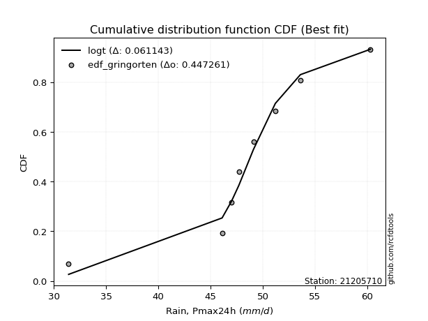</img>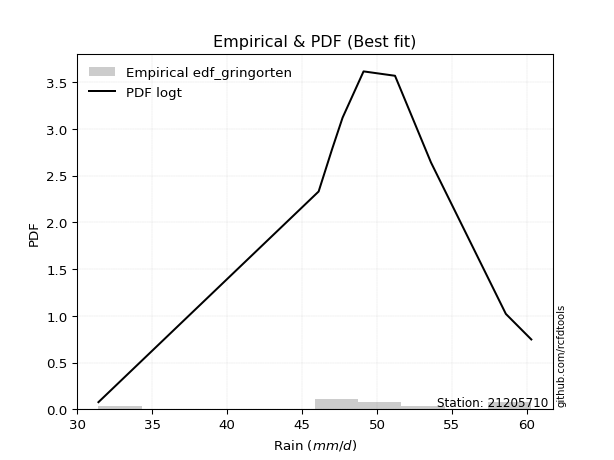</img>

</div>


### 9. EDF Filliben (1975)

The specific values of the constants (0.3175) (often denoted as $alpha$) and (0.365) are derived from a method proposed by James J. Filliben in a 1975 paper. This particular formula is the mean value of the $i$-th order statistic of the normal distribution and is considered a robust and effective plotting position formula for the normal probability plot correlation coefficient test for normality.

<div align="center">


$P=(m-0.3175)/(n+0.365)$


</div>


**9.1. Empirical values**

<div align="center">

|                | 0                   | 1                  | 2                   | 3                   | 4            | 5                  | 6                  | 7                  | 8                  |
|:---------------|:--------------------|:-------------------|:--------------------|:--------------------|:-------------|:-------------------|:-------------------|:-------------------|:-------------------|
| date           | 2017                | 2020               | 2021                | 2023                | 2018         | 2024               | 2019               | 2025               | 2022               |
| x              | 31.4                | 46.1               | 47.0                | 47.7                | 49.1         | 51.2               | 53.6               | 58.6               | 60.3               |
| m              | 1                   | 2                  | 3                   | 4                   | 5            | 6                  | 7                  | 8                  | 9                  |
| empirical_dist | edf_filliben        | edf_filliben       | edf_filliben        | edf_filliben        | edf_filliben | edf_filliben       | edf_filliben       | edf_filliben       | edf_filliben       |
| empirical      | 0.07287773625200214 | 0.1796583021890016 | 0.28643886812600106 | 0.39321943406300053 | 0.5          | 0.6067805659369995 | 0.7135611318739989 | 0.8203416978109984 | 0.9271222637479978 |
| empirical_tr   | 1.0786063921681543  | 1.219004230393752  | 1.401421623643846   | 1.6480422349318082  | 2.0          | 2.5431093007467753 | 3.491146318732526  | 5.566121842496286  | 13.721611721611705 |

</div>


**9.2. Kolmogorov-Smirnov fit test (sorted by Δ)**


<div align="center">

|                | 0                   | 1                   | 2                   | 3                   | 4                   | 5                   | 6                   | 7                   | 8                   | 9                   | 10                  | 11                  | 12                  | 13                  | 14                  | 15                  | 16                  | 17                  | 18                  | 19                  | 20                  | 21                  | 22                  | 23                  | 24                  | 25                  | 26                  | 27                  | 28                  | 29                  | 30                  | 31                  | 32                  | 33                  | 34                  | 35                  | 36                  | 37                  | 38                  | 39                  | 40                  | 41                  | 42                  | 43                  | 44                  | 45                  | 46                  | 47                  | 48                  | 49                  | 50                  | 51                  | 52                  | 53                  | 54                  | 55                  | 56                  | 57                  | 58                  | 59                  | 60                  | 61                  | 62                  | 63                  | 64                  | 65                  | 66                  | 67                  | 68                  | 69                  | 70                  | 71                  | 72                  | 73                  | 74                  | 75                  | 76                  | 77                  | 78                  | 79                  | 80                  | 81                  | 82                  | 83                  | 84                  | 85                  | 86                  | 87                  | 88                  | 89                  | 90                  | 91                  | 92                  | 93                  | 94                  | 95                  | 96                  | 97                  | 98                  | 99                  | 100                 | 101                 | 102                 | 103                 | 104                 | 105                 | 106                 | 107                 | 108                 | 109                 | 110                 | 111                 | 112                 | 113                 | 114                 | 115                 | 116                 | 117                 | 118                 | 119                 | 120                 | 121                 | 122                 | 123                 | 124                 | 125                 | 126                 | 127                 | 128                 | 129                 | 130                 | 131                 | 132                 | 133                 | 134                 | 135                 | 136                 | 137                 | 138                 | 139                 | 140                 | 141                 | 142                 | 143                 | 144                 | 145                 | 146                 | 147                 | 148                 | 149                 | 150                 | 151                 | 152                 | 153                 | 154                 | 155                 | 156                 | 157                 | 158                 | 159                 |
|:---------------|:--------------------|:--------------------|:--------------------|:--------------------|:--------------------|:--------------------|:--------------------|:--------------------|:--------------------|:--------------------|:--------------------|:--------------------|:--------------------|:--------------------|:--------------------|:--------------------|:--------------------|:--------------------|:--------------------|:--------------------|:--------------------|:--------------------|:--------------------|:--------------------|:--------------------|:--------------------|:--------------------|:--------------------|:--------------------|:--------------------|:--------------------|:--------------------|:--------------------|:--------------------|:--------------------|:--------------------|:--------------------|:--------------------|:--------------------|:--------------------|:--------------------|:--------------------|:--------------------|:--------------------|:--------------------|:--------------------|:--------------------|:--------------------|:--------------------|:--------------------|:--------------------|:--------------------|:--------------------|:--------------------|:--------------------|:--------------------|:--------------------|:--------------------|:--------------------|:--------------------|:--------------------|:--------------------|:--------------------|:--------------------|:--------------------|:--------------------|:--------------------|:--------------------|:--------------------|:--------------------|:--------------------|:--------------------|:--------------------|:--------------------|:--------------------|:--------------------|:--------------------|:--------------------|:--------------------|:--------------------|:--------------------|:--------------------|:--------------------|:--------------------|:--------------------|:--------------------|:--------------------|:--------------------|:--------------------|:--------------------|:--------------------|:--------------------|:--------------------|:--------------------|:--------------------|:--------------------|:--------------------|:--------------------|:--------------------|:--------------------|:--------------------|:--------------------|:--------------------|:--------------------|:--------------------|:--------------------|:--------------------|:--------------------|:--------------------|:--------------------|:--------------------|:--------------------|:--------------------|:--------------------|:--------------------|:--------------------|:--------------------|:--------------------|:--------------------|:--------------------|:--------------------|:--------------------|:--------------------|:--------------------|:--------------------|:--------------------|:--------------------|:--------------------|:--------------------|:--------------------|:--------------------|:--------------------|:--------------------|:--------------------|:--------------------|:--------------------|:--------------------|:--------------------|:--------------------|:--------------------|:--------------------|:--------------------|:--------------------|:--------------------|:--------------------|:--------------------|:--------------------|:--------------------|:--------------------|:--------------------|:--------------------|:--------------------|:--------------------|:--------------------|:--------------------|:--------------------|:--------------------|:--------------------|:--------------------|:--------------------|
| station        | 21205710            | 21205710            | 21205710            | 21205710            | 21205710            | 21205710            | 21205710            | 21205710            | 21205710            | 21205710            | 21205710            | 21205710            | 21205710            | 21205710            | 21205710            | 21205710            | 21205710            | 21205710            | 21205710            | 21205710            | 21205710            | 21205710            | 21205710            | 21205710            | 21205710            | 21205710            | 21205710            | 21205710            | 21205710            | 21205710            | 21205710            | 21205710            | 21205710            | 21205710            | 21205710            | 21205710            | 21205710            | 21205710            | 21205710            | 21205710            | 21205710            | 21205710            | 21205710            | 21205710            | 21205710            | 21205710            | 21205710            | 21205710            | 21205710            | 21205710            | 21205710            | 21205710            | 21205710            | 21205710            | 21205710            | 21205710            | 21205710            | 21205710            | 21205710            | 21205710            | 21205710            | 21205710            | 21205710            | 21205710            | 21205710            | 21205710            | 21205710            | 21205710            | 21205710            | 21205710            | 21205710            | 21205710            | 21205710            | 21205710            | 21205710            | 21205710            | 21205710            | 21205710            | 21205710            | 21205710            | 21205710            | 21205710            | 21205710            | 21205710            | 21205710            | 21205710            | 21205710            | 21205710            | 21205710            | 21205710            | 21205710            | 21205710            | 21205710            | 21205710            | 21205710            | 21205710            | 21205710            | 21205710            | 21205710            | 21205710            | 21205710            | 21205710            | 21205710            | 21205710            | 21205710            | 21205710            | 21205710            | 21205710            | 21205710            | 21205710            | 21205710            | 21205710            | 21205710            | 21205710            | 21205710            | 21205710            | 21205710            | 21205710            | 21205710            | 21205710            | 21205710            | 21205710            | 21205710            | 21205710            | 21205710            | 21205710            | 21205710            | 21205710            | 21205710            | 21205710            | 21205710            | 21205710            | 21205710            | 21205710            | 21205710            | 21205710            | 21205710            | 21205710            | 21205710            | 21205710            | 21205710            | 21205710            | 21205710            | 21205710            | 21205710            | 21205710            | 21205710            | 21205710            | 21205710            | 21205710            | 21205710            | 21205710            | 21205710            | 21205710            | 21205710            | 21205710            | 21205710            | 21205710            | 21205710            | 21205710            |
| empirical_dist | edf_filliben        | edf_filliben        | edf_filliben        | edf_filliben        | edf_filliben        | edf_filliben        | edf_filliben        | edf_filliben        | edf_filliben        | edf_filliben        | edf_filliben        | edf_filliben        | edf_filliben        | edf_filliben        | edf_filliben        | edf_filliben        | edf_filliben        | edf_filliben        | edf_filliben        | edf_filliben        | edf_filliben        | edf_filliben        | edf_filliben        | edf_filliben        | edf_filliben        | edf_filliben        | edf_filliben        | edf_filliben        | edf_filliben        | edf_filliben        | edf_filliben        | edf_filliben        | edf_filliben        | edf_filliben        | edf_filliben        | edf_filliben        | edf_filliben        | edf_filliben        | edf_filliben        | edf_filliben        | edf_filliben        | edf_filliben        | edf_filliben        | edf_filliben        | edf_filliben        | edf_filliben        | edf_filliben        | edf_filliben        | edf_filliben        | edf_filliben        | edf_filliben        | edf_filliben        | edf_filliben        | edf_filliben        | edf_filliben        | edf_filliben        | edf_filliben        | edf_filliben        | edf_filliben        | edf_filliben        | edf_filliben        | edf_filliben        | edf_filliben        | edf_filliben        | edf_filliben        | edf_filliben        | edf_filliben        | edf_filliben        | edf_filliben        | edf_filliben        | edf_filliben        | edf_filliben        | edf_filliben        | edf_filliben        | edf_filliben        | edf_filliben        | edf_filliben        | edf_filliben        | edf_filliben        | edf_filliben        | edf_filliben        | edf_filliben        | edf_filliben        | edf_filliben        | edf_filliben        | edf_filliben        | edf_filliben        | edf_filliben        | edf_filliben        | edf_filliben        | edf_filliben        | edf_filliben        | edf_filliben        | edf_filliben        | edf_filliben        | edf_filliben        | edf_filliben        | edf_filliben        | edf_filliben        | edf_filliben        | edf_filliben        | edf_filliben        | edf_filliben        | edf_filliben        | edf_filliben        | edf_filliben        | edf_filliben        | edf_filliben        | edf_filliben        | edf_filliben        | edf_filliben        | edf_filliben        | edf_filliben        | edf_filliben        | edf_filliben        | edf_filliben        | edf_filliben        | edf_filliben        | edf_filliben        | edf_filliben        | edf_filliben        | edf_filliben        | edf_filliben        | edf_filliben        | edf_filliben        | edf_filliben        | edf_filliben        | edf_filliben        | edf_filliben        | edf_filliben        | edf_filliben        | edf_filliben        | edf_filliben        | edf_filliben        | edf_filliben        | edf_filliben        | edf_filliben        | edf_filliben        | edf_filliben        | edf_filliben        | edf_filliben        | edf_filliben        | edf_filliben        | edf_filliben        | edf_filliben        | edf_filliben        | edf_filliben        | edf_filliben        | edf_filliben        | edf_filliben        | edf_filliben        | edf_filliben        | edf_filliben        | edf_filliben        | edf_filliben        | edf_filliben        | edf_filliben        | edf_filliben        | edf_filliben        | edf_filliben        |
| p_dist         | logt                | t                   | logdgamma           | loggennorm          | logcrystalball      | logvonmises_line    | dgamma              | laplace             | dweibull            | gumbel_l            | genlogistic         | johnsonsu           | weibull_min         | vonmises_line       | logjohnsonsu        | skewnorm            | logdweibull         | logloggamma         | logexponpow         | mielke              | burr                | logmielke           | loggenlogistic      | pearson3            | logburr12           | gennorm             | logweibull_min      | logburr             | logloglaplace       | genextreme          | hypsecant           | logargus            | logpearson3         | argus               | loggompertz         | loggumbel_l         | logistic            | trapezoid           | loglaplace          | loglaplace          | triang              | logskewnorm         | exponnorm           | norm                | crystalball         | nct                 | f                   | logexponweib        | erlang              | genhalflogistic     | loghypsecant        | logtrapezoid        | alpha               | logbeta             | gamma               | anglit              | lognakagami         | truncnorm           | nakagami            | loglogistic         | rice                | loggenextreme       | ncf                 | semicircular        | maxwell             | invgamma            | loggengamma         | logf                | logrice             | logexponnorm        | lognorm             | rayleigh            | logfatiguelife      | gumbel_r            | loggenhalflogistic  | betaprime           | invgauss            | logalpha            | loganglit           | logbetaprime        | logweibull_max      | moyal               | lognct              | logsemicircular     | arcsine             | loggamma            | loggamma            | cosine              | invweibull          | loglevy_l           | loginvgamma         | loginvgauss         | logfoldnorm         | logmaxwell          | logtriang           | levy_l              | halfnorm            | gompertz            | logncf              | halflogistic        | lograyleigh         | logjohnsonsb        | logarcsine          | wald                | loginvweibull       | logtukeylambda      | loggumbel_r         | kstwobign           | logmoyal            | loghalfnorm         | truncweibull_min    | logcosine           | loghalflogistic     | gausshyper          | beta                | logkstwobign        | wrapcauchy          | loggenexpon         | ksone               | kappa3              | uniform             | logwald             | tukeylambda         | kappa4              | genpareto           | loggenpareto        | lomax               | genexpon            | logtruncweibull_min | loglomax            | loggausshyper       | johnsonsb           | logwrapcauchy       | logksone            | logkappa3           | burr12              | logkappa4           | loguniform          | bradford            | halfgennorm         | foldnorm            | truncexpon          | logerlang           | logbradford         | logtruncexpon       | weibull_max         | logrdist            | logtruncnorm        | exponweib           | gengamma            | rdist               | fatiguelife         | powerlaw            | logpowerlaw         | loghalfgennorm      | exponpow            | truncpareto         | logtruncpareto      | logvonmises         | vonmises            |
| delta          | 0.06994168775128606 | 0.07475683943140773 | 0.08063349809815634 | 0.08357739733604061 | 0.08543511887081168 | 0.09244649225919907 | 0.09548769666483162 | 0.09601294343366903 | 0.0964045634929167  | 0.0994023390799941  | 0.10307859326312788 | 0.10534980182179773 | 0.10672433321418814 | 0.10788867124648185 | 0.1090285320254398  | 0.11153634420967803 | 0.11188854178298738 | 0.11311370664173345 | 0.11501733220265561 | 0.11504640987003609 | 0.11521023430236124 | 0.11525475322509723 | 0.11529236616596691 | 0.11573870996328164 | 0.11772383944389556 | 0.11805455481762503 | 0.11855757857450219 | 0.11887720604531901 | 0.11910461425479632 | 0.12218682450809831 | 0.1236900951495142  | 0.12457167956714385 | 0.12660554628101459 | 0.12744378358610484 | 0.1315568762135572  | 0.13529345842185894 | 0.1382005898269951  | 0.14232245927573753 | 0.1438168582751654  | 0.1438168582751654  | 0.14842800448681018 | 0.15550652556731423 | 0.15721339794869196 | 0.15721532178762274 | 0.15721533906713378 | 0.1576374087065547  | 0.15828515327018192 | 0.15930125644917972 | 0.17104047938123682 | 0.17198707475473182 | 0.17204920417291372 | 0.17327952246728237 | 0.17380128679126391 | 0.17383280530174078 | 0.17506776915049524 | 0.17840498966171628 | 0.17965538011868512 | 0.17965617246473034 | 0.17965799647315306 | 0.1842288456759402  | 0.18507900324783136 | 0.1861040046246651  | 0.18710615278152606 | 0.18732594421547719 | 0.18828430287595607 | 0.18831543732451503 | 0.1948237054117863  | 0.1991737331627186  | 0.1993925566860039  | 0.19940463199494599 | 0.19940761632643758 | 0.20016332789001814 | 0.20164487942804663 | 0.20192093073145503 | 0.20212860048038098 | 0.20234640583563304 | 0.2112822132490936  | 0.21133446749259197 | 0.21585039574077255 | 0.21587132755624663 | 0.21612173658724393 | 0.21804553334986607 | 0.22059668499944343 | 0.2227248657927395  | 0.22412236802241017 | 0.2246721993916975  | 0.2246721993916975  | 0.22570587451754207 | 0.22570959095692242 | 0.22578764981887187 | 0.22599457591605424 | 0.2277442369264099  | 0.22884506514451033 | 0.23278400719801443 | 0.23319862263181892 | 0.2337466669521416  | 0.23396609365562424 | 0.23826253419581195 | 0.23950983424396313 | 0.23971448820640914 | 0.24505211761004606 | 0.24901723498219017 | 0.25047601100433636 | 0.2506704944158853  | 0.2507479436249658  | 0.25159820714225845 | 0.2549225949997417  | 0.2662319658939356  | 0.27606409845801094 | 0.2799500270407981  | 0.285666507858811   | 0.28739703219851587 | 0.29269189857791533 | 0.2972148315231472  | 0.2988296895205583  | 0.3057539209706762  | 0.3232258353127827  | 0.32664662094186525 | 0.3275504636702834  | 0.3286274478119755  | 0.3289922168421404  | 0.3309208665089375  | 0.33137661995472734 | 0.33282226829643036 | 0.35479000739446254 | 0.3580545926430255  | 0.37509516954297906 | 0.3774860899005843  | 0.3778687291660666  | 0.37841414355062153 | 0.37868318189880723 | 0.38319073216661437 | 0.3888521961167052  | 0.3940847491817929  | 0.3958228052677426  | 0.4000081467579234  | 0.40744959499986566 | 0.40883335945595145 | 0.41354424134491896 | 0.4189883147805227  | 0.42323954547954773 | 0.43100263417748585 | 0.45816281636198475 | 0.49097683133662595 | 0.5096849422106845  | 0.5254249192449244  | 0.5304797979347097  | 0.5388693697399063  | 0.6162336337953226  | 0.6291541838857938  | 0.631446416957802   | 0.635266833493037   | 0.678235276987583   | 0.7002296634938182  | 0.7135611318739989  | 0.7563517202980335  | 0.7807801645697355  | 0.7891124390805652  | 1.1960343643533915  | 8.768467063695306   |
| deltao         | 0.41761268023100007 | 0.41761268023100007 | 0.41761268023100007 | 0.41761268023100007 | 0.41761268023100007 | 0.41761268023100007 | 0.41761268023100007 | 0.41761268023100007 | 0.41761268023100007 | 0.41761268023100007 | 0.41761268023100007 | 0.41761268023100007 | 0.41761268023100007 | 0.41761268023100007 | 0.41761268023100007 | 0.41761268023100007 | 0.41761268023100007 | 0.41761268023100007 | 0.41761268023100007 | 0.41761268023100007 | 0.41761268023100007 | 0.41761268023100007 | 0.41761268023100007 | 0.41761268023100007 | 0.41761268023100007 | 0.41761268023100007 | 0.41761268023100007 | 0.41761268023100007 | 0.41761268023100007 | 0.41761268023100007 | 0.41761268023100007 | 0.41761268023100007 | 0.41761268023100007 | 0.41761268023100007 | 0.41761268023100007 | 0.41761268023100007 | 0.41761268023100007 | 0.41761268023100007 | 0.41761268023100007 | 0.41761268023100007 | 0.41761268023100007 | 0.41761268023100007 | 0.41761268023100007 | 0.41761268023100007 | 0.41761268023100007 | 0.41761268023100007 | 0.41761268023100007 | 0.41761268023100007 | 0.41761268023100007 | 0.41761268023100007 | 0.41761268023100007 | 0.41761268023100007 | 0.41761268023100007 | 0.41761268023100007 | 0.41761268023100007 | 0.41761268023100007 | 0.41761268023100007 | 0.41761268023100007 | 0.41761268023100007 | 0.41761268023100007 | 0.41761268023100007 | 0.41761268023100007 | 0.41761268023100007 | 0.41761268023100007 | 0.41761268023100007 | 0.41761268023100007 | 0.41761268023100007 | 0.41761268023100007 | 0.41761268023100007 | 0.41761268023100007 | 0.41761268023100007 | 0.41761268023100007 | 0.41761268023100007 | 0.41761268023100007 | 0.41761268023100007 | 0.41761268023100007 | 0.41761268023100007 | 0.41761268023100007 | 0.41761268023100007 | 0.41761268023100007 | 0.41761268023100007 | 0.41761268023100007 | 0.41761268023100007 | 0.41761268023100007 | 0.41761268023100007 | 0.41761268023100007 | 0.41761268023100007 | 0.41761268023100007 | 0.41761268023100007 | 0.41761268023100007 | 0.41761268023100007 | 0.41761268023100007 | 0.41761268023100007 | 0.41761268023100007 | 0.41761268023100007 | 0.41761268023100007 | 0.41761268023100007 | 0.41761268023100007 | 0.41761268023100007 | 0.41761268023100007 | 0.41761268023100007 | 0.41761268023100007 | 0.41761268023100007 | 0.41761268023100007 | 0.41761268023100007 | 0.41761268023100007 | 0.41761268023100007 | 0.41761268023100007 | 0.41761268023100007 | 0.41761268023100007 | 0.41761268023100007 | 0.41761268023100007 | 0.41761268023100007 | 0.41761268023100007 | 0.41761268023100007 | 0.41761268023100007 | 0.41761268023100007 | 0.41761268023100007 | 0.41761268023100007 | 0.41761268023100007 | 0.41761268023100007 | 0.41761268023100007 | 0.41761268023100007 | 0.41761268023100007 | 0.41761268023100007 | 0.41761268023100007 | 0.41761268023100007 | 0.41761268023100007 | 0.41761268023100007 | 0.41761268023100007 | 0.41761268023100007 | 0.41761268023100007 | 0.41761268023100007 | 0.41761268023100007 | 0.41761268023100007 | 0.41761268023100007 | 0.41761268023100007 | 0.41761268023100007 | 0.41761268023100007 | 0.41761268023100007 | 0.41761268023100007 | 0.41761268023100007 | 0.41761268023100007 | 0.41761268023100007 | 0.41761268023100007 | 0.41761268023100007 | 0.41761268023100007 | 0.41761268023100007 | 0.41761268023100007 | 0.41761268023100007 | 0.41761268023100007 | 0.41761268023100007 | 0.41761268023100007 | 0.41761268023100007 | 0.41761268023100007 | 0.41761268023100007 | 0.41761268023100007 | 0.41761268023100007 | 0.41761268023100007 | 0.41761268023100007 |
| eval           | Δo > Δ              | Δo > Δ              | Δo > Δ              | Δo > Δ              | Δo > Δ              | Δo > Δ              | Δo > Δ              | Δo > Δ              | Δo > Δ              | Δo > Δ              | Δo > Δ              | Δo > Δ              | Δo > Δ              | Δo > Δ              | Δo > Δ              | Δo > Δ              | Δo > Δ              | Δo > Δ              | Δo > Δ              | Δo > Δ              | Δo > Δ              | Δo > Δ              | Δo > Δ              | Δo > Δ              | Δo > Δ              | Δo > Δ              | Δo > Δ              | Δo > Δ              | Δo > Δ              | Δo > Δ              | Δo > Δ              | Δo > Δ              | Δo > Δ              | Δo > Δ              | Δo > Δ              | Δo > Δ              | Δo > Δ              | Δo > Δ              | Δo > Δ              | Δo > Δ              | Δo > Δ              | Δo > Δ              | Δo > Δ              | Δo > Δ              | Δo > Δ              | Δo > Δ              | Δo > Δ              | Δo > Δ              | Δo > Δ              | Δo > Δ              | Δo > Δ              | Δo > Δ              | Δo > Δ              | Δo > Δ              | Δo > Δ              | Δo > Δ              | Δo > Δ              | Δo > Δ              | Δo > Δ              | Δo > Δ              | Δo > Δ              | Δo > Δ              | Δo > Δ              | Δo > Δ              | Δo > Δ              | Δo > Δ              | Δo > Δ              | Δo > Δ              | Δo > Δ              | Δo > Δ              | Δo > Δ              | Δo > Δ              | Δo > Δ              | Δo > Δ              | Δo > Δ              | Δo > Δ              | Δo > Δ              | Δo > Δ              | Δo > Δ              | Δo > Δ              | Δo > Δ              | Δo > Δ              | Δo > Δ              | Δo > Δ              | Δo > Δ              | Δo > Δ              | Δo > Δ              | Δo > Δ              | Δo > Δ              | Δo > Δ              | Δo > Δ              | Δo > Δ              | Δo > Δ              | Δo > Δ              | Δo > Δ              | Δo > Δ              | Δo > Δ              | Δo > Δ              | Δo > Δ              | Δo > Δ              | Δo > Δ              | Δo > Δ              | Δo > Δ              | Δo > Δ              | Δo > Δ              | Δo > Δ              | Δo > Δ              | Δo > Δ              | Δo > Δ              | Δo > Δ              | Δo > Δ              | Δo > Δ              | Δo > Δ              | Δo > Δ              | Δo > Δ              | Δo > Δ              | Δo > Δ              | Δo > Δ              | Δo > Δ              | Δo > Δ              | Δo > Δ              | Δo > Δ              | Δo > Δ              | Δo > Δ              | Δo > Δ              | Δo > Δ              | Δo > Δ              | Δo > Δ              | Δo > Δ              | Δo > Δ              | Δo > Δ              | Δo > Δ              | Δo > Δ              | Δo > Δ              | Δo > Δ              | Δo > Δ              | Δo > Δ              | Δo > Δ              | Δo > Δ              | Δo <= Δ             | Δo <= Δ             | Δo <= Δ             | Δo <= Δ             | Δo <= Δ             | Δo <= Δ             | Δo <= Δ             | Δo <= Δ             | Δo <= Δ             | Δo <= Δ             | Δo <= Δ             | Δo <= Δ             | Δo <= Δ             | Δo <= Δ             | Δo <= Δ             | Δo <= Δ             | Δo <= Δ             | Δo <= Δ             | Δo <= Δ             | Δo <= Δ             | Δo <= Δ             |
| fit            | 1                   | 1                   | 1                   | 1                   | 1                   | 1                   | 1                   | 1                   | 1                   | 1                   | 1                   | 1                   | 1                   | 1                   | 1                   | 1                   | 1                   | 1                   | 1                   | 1                   | 1                   | 1                   | 1                   | 1                   | 1                   | 1                   | 1                   | 1                   | 1                   | 1                   | 1                   | 1                   | 1                   | 1                   | 1                   | 1                   | 1                   | 1                   | 1                   | 1                   | 1                   | 1                   | 1                   | 1                   | 1                   | 1                   | 1                   | 1                   | 1                   | 1                   | 1                   | 1                   | 1                   | 1                   | 1                   | 1                   | 1                   | 1                   | 1                   | 1                   | 1                   | 1                   | 1                   | 1                   | 1                   | 1                   | 1                   | 1                   | 1                   | 1                   | 1                   | 1                   | 1                   | 1                   | 1                   | 1                   | 1                   | 1                   | 1                   | 1                   | 1                   | 1                   | 1                   | 1                   | 1                   | 1                   | 1                   | 1                   | 1                   | 1                   | 1                   | 1                   | 1                   | 1                   | 1                   | 1                   | 1                   | 1                   | 1                   | 1                   | 1                   | 1                   | 1                   | 1                   | 1                   | 1                   | 1                   | 1                   | 1                   | 1                   | 1                   | 1                   | 1                   | 1                   | 1                   | 1                   | 1                   | 1                   | 1                   | 1                   | 1                   | 1                   | 1                   | 1                   | 1                   | 1                   | 1                   | 1                   | 1                   | 1                   | 1                   | 1                   | 1                   | 1                   | 1                   | 1                   | 1                   | 1                   | 1                   | 0                   | 0                   | 0                   | 0                   | 0                   | 0                   | 0                   | 0                   | 0                   | 0                   | 0                   | 0                   | 0                   | 0                   | 0                   | 0                   | 0                   | 0                   | 0                   | 0                   | 0                   |
| n              | 9                   | 9                   | 9                   | 9                   | 9                   | 9                   | 9                   | 9                   | 9                   | 9                   | 9                   | 9                   | 9                   | 9                   | 9                   | 9                   | 9                   | 9                   | 9                   | 9                   | 9                   | 9                   | 9                   | 9                   | 9                   | 9                   | 9                   | 9                   | 9                   | 9                   | 9                   | 9                   | 9                   | 9                   | 9                   | 9                   | 9                   | 9                   | 9                   | 9                   | 9                   | 9                   | 9                   | 9                   | 9                   | 9                   | 9                   | 9                   | 9                   | 9                   | 9                   | 9                   | 9                   | 9                   | 9                   | 9                   | 9                   | 9                   | 9                   | 9                   | 9                   | 9                   | 9                   | 9                   | 9                   | 9                   | 9                   | 9                   | 9                   | 9                   | 9                   | 9                   | 9                   | 9                   | 9                   | 9                   | 9                   | 9                   | 9                   | 9                   | 9                   | 9                   | 9                   | 9                   | 9                   | 9                   | 9                   | 9                   | 9                   | 9                   | 9                   | 9                   | 9                   | 9                   | 9                   | 9                   | 9                   | 9                   | 9                   | 9                   | 9                   | 9                   | 9                   | 9                   | 9                   | 9                   | 9                   | 9                   | 9                   | 9                   | 9                   | 9                   | 9                   | 9                   | 9                   | 9                   | 9                   | 9                   | 9                   | 9                   | 9                   | 9                   | 9                   | 9                   | 9                   | 9                   | 9                   | 9                   | 9                   | 9                   | 9                   | 9                   | 9                   | 9                   | 9                   | 9                   | 9                   | 9                   | 9                   | 9                   | 9                   | 9                   | 9                   | 9                   | 9                   | 9                   | 9                   | 9                   | 9                   | 9                   | 9                   | 9                   | 9                   | 9                   | 9                   | 9                   | 9                   | 9                   | 9                   | 9                   |
| best_fit       | 1                   | 0                   | 0                   | 0                   | 0                   | 0                   | 0                   | 0                   | 0                   | 0                   | 0                   | 0                   | 0                   | 0                   | 0                   | 0                   | 0                   | 0                   | 0                   | 0                   | 0                   | 0                   | 0                   | 0                   | 0                   | 0                   | 0                   | 0                   | 0                   | 0                   | 0                   | 0                   | 0                   | 0                   | 0                   | 0                   | 0                   | 0                   | 0                   | 0                   | 0                   | 0                   | 0                   | 0                   | 0                   | 0                   | 0                   | 0                   | 0                   | 0                   | 0                   | 0                   | 0                   | 0                   | 0                   | 0                   | 0                   | 0                   | 0                   | 0                   | 0                   | 0                   | 0                   | 0                   | 0                   | 0                   | 0                   | 0                   | 0                   | 0                   | 0                   | 0                   | 0                   | 0                   | 0                   | 0                   | 0                   | 0                   | 0                   | 0                   | 0                   | 0                   | 0                   | 0                   | 0                   | 0                   | 0                   | 0                   | 0                   | 0                   | 0                   | 0                   | 0                   | 0                   | 0                   | 0                   | 0                   | 0                   | 0                   | 0                   | 0                   | 0                   | 0                   | 0                   | 0                   | 0                   | 0                   | 0                   | 0                   | 0                   | 0                   | 0                   | 0                   | 0                   | 0                   | 0                   | 0                   | 0                   | 0                   | 0                   | 0                   | 0                   | 0                   | 0                   | 0                   | 0                   | 0                   | 0                   | 0                   | 0                   | 0                   | 0                   | 0                   | 0                   | 0                   | 0                   | 0                   | 0                   | 0                   | 0                   | 0                   | 0                   | 0                   | 0                   | 0                   | 0                   | 0                   | 0                   | 0                   | 0                   | 0                   | 0                   | 0                   | 0                   | 0                   | 0                   | 0                   | 0                   | 0                   | 0                   |
| best_fit_sort  | 1                   | 2                   | 3                   | 4                   | 5                   | 6                   | 7                   | 8                   | 9                   | 10                  | 11                  | 12                  | 13                  | 14                  | 15                  | 16                  | 17                  | 18                  | 19                  | 20                  | 21                  | 22                  | 23                  | 24                  | 25                  | 26                  | 27                  | 28                  | 29                  | 30                  | 31                  | 32                  | 33                  | 34                  | 35                  | 36                  | 37                  | 38                  | 39                  | 40                  | 41                  | 42                  | 43                  | 44                  | 45                  | 46                  | 47                  | 48                  | 49                  | 50                  | 51                  | 52                  | 53                  | 54                  | 55                  | 56                  | 57                  | 58                  | 59                  | 60                  | 61                  | 62                  | 63                  | 64                  | 65                  | 66                  | 67                  | 68                  | 69                  | 70                  | 71                  | 72                  | 73                  | 74                  | 75                  | 76                  | 77                  | 78                  | 79                  | 80                  | 81                  | 82                  | 83                  | 84                  | 85                  | 86                  | 87                  | 88                  | 89                  | 90                  | 91                  | 92                  | 93                  | 94                  | 95                  | 96                  | 97                  | 98                  | 99                  | 100                 | 101                 | 102                 | 103                 | 104                 | 105                 | 106                 | 107                 | 108                 | 109                 | 110                 | 111                 | 112                 | 113                 | 114                 | 115                 | 116                 | 117                 | 118                 | 119                 | 120                 | 121                 | 122                 | 123                 | 124                 | 125                 | 126                 | 127                 | 128                 | 129                 | 130                 | 131                 | 132                 | 133                 | 134                 | 135                 | 136                 | 137                 | 138                 | 139                 | 140                 | 141                 | 142                 | 143                 | 144                 | 145                 | 146                 | 147                 | 148                 | 149                 | 150                 | 151                 | 152                 | 153                 | 154                 | 155                 | 156                 | 157                 | 158                 | 159                 | 160                 |

</div>


**9.3. Best fit**

<div align="center">

|   id |   station | empirical_dist   | p_dist   |     delta |   deltao | eval   |   fit |   n |   best_fit |   best_fit_sort |
|-----:|----------:|:-----------------|:---------|----------:|---------:|:-------|------:|----:|-----------:|----------------:|
|    0 |  21205710 | edf_filliben     | logt     | 0.0699417 | 0.417613 | Δo > Δ |     1 |   9 |          1 |               1 |

</div>


<div align="center">

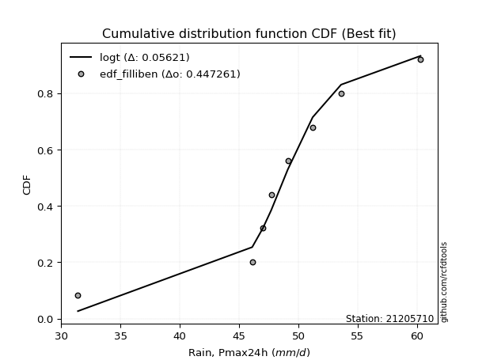</img>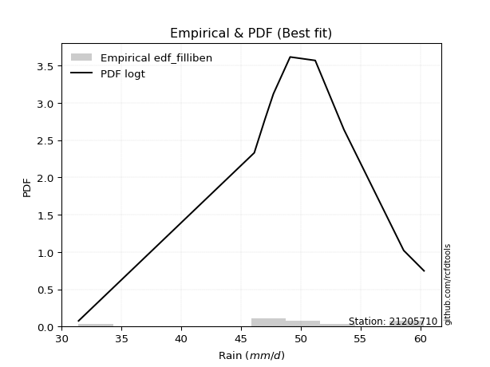</img>

</div>


### 10. EDF Jenkinson (1977)

The Jenkinson formula in hydrology is an empirical plotting position formula used to estimate the non-exceedance probability _(P)_ or return period _(T)_ of a given ordered observation within a sample. It is a widely used method in the frequency analysis of extreme events such as floods and rainfall, as it provides a distribution-free way to plot data. _a≈0.31_ and _b≈0.38_ are constants derived to approximate the median of the probability distribution for the given rank.

<div align="center">


$P=(m-a)/(n+b)$


</div>


**10.1. Empirical values**

<div align="center">

|                | 0                   | 1                   | 2                  | 3                   | 4             | 5                  | 6                  | 7                  | 8                  |
|:---------------|:--------------------|:--------------------|:-------------------|:--------------------|:--------------|:-------------------|:-------------------|:-------------------|:-------------------|
| date           | 2017                | 2020                | 2021               | 2023                | 2018          | 2024               | 2019               | 2025               | 2022               |
| x              | 31.4                | 46.1                | 47.0               | 47.7                | 49.1          | 51.2               | 53.6               | 58.6               | 60.3               |
| m              | 1                   | 2                   | 3                  | 4                   | 5             | 6                  | 7                  | 8                  | 9                  |
| empirical_dist | edf_jenkinson       | edf_jenkinson       | edf_jenkinson      | edf_jenkinson       | edf_jenkinson | edf_jenkinson      | edf_jenkinson      | edf_jenkinson      | edf_jenkinson      |
| empirical      | 0.07356076759061833 | 0.18017057569296374 | 0.2867803837953091 | 0.39339019189765456 | 0.5           | 0.6066098081023454 | 0.7132196162046908 | 0.8198294243070362 | 0.9264392324093815 |
| empirical_tr   | 1.0794016110471807  | 1.2197659297789336  | 1.4020926756352765 | 1.6485061511423549  | 2.0           | 2.542005420054201  | 3.486988847583642  | 5.550295857988164  | 13.5942028985507   |

</div>


**10.2. Kolmogorov-Smirnov fit test (sorted by Δ)**


<div align="center">

|                | 0                   | 1                   | 2                   | 3                   | 4                   | 5                   | 6                   | 7                   | 8                   | 9                   | 10                  | 11                  | 12                  | 13                  | 14                  | 15                  | 16                  | 17                  | 18                  | 19                  | 20                  | 21                  | 22                  | 23                  | 24                  | 25                  | 26                  | 27                  | 28                  | 29                  | 30                  | 31                  | 32                  | 33                  | 34                  | 35                  | 36                  | 37                  | 38                  | 39                  | 40                  | 41                  | 42                  | 43                  | 44                  | 45                  | 46                  | 47                  | 48                  | 49                  | 50                  | 51                  | 52                  | 53                  | 54                  | 55                  | 56                  | 57                  | 58                  | 59                  | 60                  | 61                  | 62                  | 63                  | 64                  | 65                  | 66                  | 67                  | 68                  | 69                  | 70                  | 71                  | 72                  | 73                  | 74                  | 75                  | 76                  | 77                  | 78                  | 79                  | 80                  | 81                  | 82                  | 83                  | 84                  | 85                  | 86                  | 87                  | 88                  | 89                  | 90                  | 91                  | 92                  | 93                  | 94                  | 95                  | 96                  | 97                  | 98                  | 99                  | 100                 | 101                 | 102                 | 103                 | 104                 | 105                 | 106                 | 107                 | 108                 | 109                 | 110                 | 111                 | 112                 | 113                 | 114                 | 115                 | 116                 | 117                 | 118                 | 119                 | 120                 | 121                 | 122                 | 123                 | 124                 | 125                 | 126                 | 127                 | 128                 | 129                 | 130                 | 131                 | 132                 | 133                 | 134                 | 135                 | 136                 | 137                 | 138                 | 139                 | 140                 | 141                 | 142                 | 143                 | 144                 | 145                 | 146                 | 147                 | 148                 | 149                 | 150                 | 151                 | 152                 | 153                 | 154                 | 155                 | 156                 | 157                 | 158                 | 159                 |
|:---------------|:--------------------|:--------------------|:--------------------|:--------------------|:--------------------|:--------------------|:--------------------|:--------------------|:--------------------|:--------------------|:--------------------|:--------------------|:--------------------|:--------------------|:--------------------|:--------------------|:--------------------|:--------------------|:--------------------|:--------------------|:--------------------|:--------------------|:--------------------|:--------------------|:--------------------|:--------------------|:--------------------|:--------------------|:--------------------|:--------------------|:--------------------|:--------------------|:--------------------|:--------------------|:--------------------|:--------------------|:--------------------|:--------------------|:--------------------|:--------------------|:--------------------|:--------------------|:--------------------|:--------------------|:--------------------|:--------------------|:--------------------|:--------------------|:--------------------|:--------------------|:--------------------|:--------------------|:--------------------|:--------------------|:--------------------|:--------------------|:--------------------|:--------------------|:--------------------|:--------------------|:--------------------|:--------------------|:--------------------|:--------------------|:--------------------|:--------------------|:--------------------|:--------------------|:--------------------|:--------------------|:--------------------|:--------------------|:--------------------|:--------------------|:--------------------|:--------------------|:--------------------|:--------------------|:--------------------|:--------------------|:--------------------|:--------------------|:--------------------|:--------------------|:--------------------|:--------------------|:--------------------|:--------------------|:--------------------|:--------------------|:--------------------|:--------------------|:--------------------|:--------------------|:--------------------|:--------------------|:--------------------|:--------------------|:--------------------|:--------------------|:--------------------|:--------------------|:--------------------|:--------------------|:--------------------|:--------------------|:--------------------|:--------------------|:--------------------|:--------------------|:--------------------|:--------------------|:--------------------|:--------------------|:--------------------|:--------------------|:--------------------|:--------------------|:--------------------|:--------------------|:--------------------|:--------------------|:--------------------|:--------------------|:--------------------|:--------------------|:--------------------|:--------------------|:--------------------|:--------------------|:--------------------|:--------------------|:--------------------|:--------------------|:--------------------|:--------------------|:--------------------|:--------------------|:--------------------|:--------------------|:--------------------|:--------------------|:--------------------|:--------------------|:--------------------|:--------------------|:--------------------|:--------------------|:--------------------|:--------------------|:--------------------|:--------------------|:--------------------|:--------------------|:--------------------|:--------------------|:--------------------|:--------------------|:--------------------|:--------------------|
| station        | 21205710            | 21205710            | 21205710            | 21205710            | 21205710            | 21205710            | 21205710            | 21205710            | 21205710            | 21205710            | 21205710            | 21205710            | 21205710            | 21205710            | 21205710            | 21205710            | 21205710            | 21205710            | 21205710            | 21205710            | 21205710            | 21205710            | 21205710            | 21205710            | 21205710            | 21205710            | 21205710            | 21205710            | 21205710            | 21205710            | 21205710            | 21205710            | 21205710            | 21205710            | 21205710            | 21205710            | 21205710            | 21205710            | 21205710            | 21205710            | 21205710            | 21205710            | 21205710            | 21205710            | 21205710            | 21205710            | 21205710            | 21205710            | 21205710            | 21205710            | 21205710            | 21205710            | 21205710            | 21205710            | 21205710            | 21205710            | 21205710            | 21205710            | 21205710            | 21205710            | 21205710            | 21205710            | 21205710            | 21205710            | 21205710            | 21205710            | 21205710            | 21205710            | 21205710            | 21205710            | 21205710            | 21205710            | 21205710            | 21205710            | 21205710            | 21205710            | 21205710            | 21205710            | 21205710            | 21205710            | 21205710            | 21205710            | 21205710            | 21205710            | 21205710            | 21205710            | 21205710            | 21205710            | 21205710            | 21205710            | 21205710            | 21205710            | 21205710            | 21205710            | 21205710            | 21205710            | 21205710            | 21205710            | 21205710            | 21205710            | 21205710            | 21205710            | 21205710            | 21205710            | 21205710            | 21205710            | 21205710            | 21205710            | 21205710            | 21205710            | 21205710            | 21205710            | 21205710            | 21205710            | 21205710            | 21205710            | 21205710            | 21205710            | 21205710            | 21205710            | 21205710            | 21205710            | 21205710            | 21205710            | 21205710            | 21205710            | 21205710            | 21205710            | 21205710            | 21205710            | 21205710            | 21205710            | 21205710            | 21205710            | 21205710            | 21205710            | 21205710            | 21205710            | 21205710            | 21205710            | 21205710            | 21205710            | 21205710            | 21205710            | 21205710            | 21205710            | 21205710            | 21205710            | 21205710            | 21205710            | 21205710            | 21205710            | 21205710            | 21205710            | 21205710            | 21205710            | 21205710            | 21205710            | 21205710            | 21205710            |
| empirical_dist | edf_jenkinson       | edf_jenkinson       | edf_jenkinson       | edf_jenkinson       | edf_jenkinson       | edf_jenkinson       | edf_jenkinson       | edf_jenkinson       | edf_jenkinson       | edf_jenkinson       | edf_jenkinson       | edf_jenkinson       | edf_jenkinson       | edf_jenkinson       | edf_jenkinson       | edf_jenkinson       | edf_jenkinson       | edf_jenkinson       | edf_jenkinson       | edf_jenkinson       | edf_jenkinson       | edf_jenkinson       | edf_jenkinson       | edf_jenkinson       | edf_jenkinson       | edf_jenkinson       | edf_jenkinson       | edf_jenkinson       | edf_jenkinson       | edf_jenkinson       | edf_jenkinson       | edf_jenkinson       | edf_jenkinson       | edf_jenkinson       | edf_jenkinson       | edf_jenkinson       | edf_jenkinson       | edf_jenkinson       | edf_jenkinson       | edf_jenkinson       | edf_jenkinson       | edf_jenkinson       | edf_jenkinson       | edf_jenkinson       | edf_jenkinson       | edf_jenkinson       | edf_jenkinson       | edf_jenkinson       | edf_jenkinson       | edf_jenkinson       | edf_jenkinson       | edf_jenkinson       | edf_jenkinson       | edf_jenkinson       | edf_jenkinson       | edf_jenkinson       | edf_jenkinson       | edf_jenkinson       | edf_jenkinson       | edf_jenkinson       | edf_jenkinson       | edf_jenkinson       | edf_jenkinson       | edf_jenkinson       | edf_jenkinson       | edf_jenkinson       | edf_jenkinson       | edf_jenkinson       | edf_jenkinson       | edf_jenkinson       | edf_jenkinson       | edf_jenkinson       | edf_jenkinson       | edf_jenkinson       | edf_jenkinson       | edf_jenkinson       | edf_jenkinson       | edf_jenkinson       | edf_jenkinson       | edf_jenkinson       | edf_jenkinson       | edf_jenkinson       | edf_jenkinson       | edf_jenkinson       | edf_jenkinson       | edf_jenkinson       | edf_jenkinson       | edf_jenkinson       | edf_jenkinson       | edf_jenkinson       | edf_jenkinson       | edf_jenkinson       | edf_jenkinson       | edf_jenkinson       | edf_jenkinson       | edf_jenkinson       | edf_jenkinson       | edf_jenkinson       | edf_jenkinson       | edf_jenkinson       | edf_jenkinson       | edf_jenkinson       | edf_jenkinson       | edf_jenkinson       | edf_jenkinson       | edf_jenkinson       | edf_jenkinson       | edf_jenkinson       | edf_jenkinson       | edf_jenkinson       | edf_jenkinson       | edf_jenkinson       | edf_jenkinson       | edf_jenkinson       | edf_jenkinson       | edf_jenkinson       | edf_jenkinson       | edf_jenkinson       | edf_jenkinson       | edf_jenkinson       | edf_jenkinson       | edf_jenkinson       | edf_jenkinson       | edf_jenkinson       | edf_jenkinson       | edf_jenkinson       | edf_jenkinson       | edf_jenkinson       | edf_jenkinson       | edf_jenkinson       | edf_jenkinson       | edf_jenkinson       | edf_jenkinson       | edf_jenkinson       | edf_jenkinson       | edf_jenkinson       | edf_jenkinson       | edf_jenkinson       | edf_jenkinson       | edf_jenkinson       | edf_jenkinson       | edf_jenkinson       | edf_jenkinson       | edf_jenkinson       | edf_jenkinson       | edf_jenkinson       | edf_jenkinson       | edf_jenkinson       | edf_jenkinson       | edf_jenkinson       | edf_jenkinson       | edf_jenkinson       | edf_jenkinson       | edf_jenkinson       | edf_jenkinson       | edf_jenkinson       | edf_jenkinson       | edf_jenkinson       | edf_jenkinson       | edf_jenkinson       |
| p_dist         | logt                | t                   | logdgamma           | loggennorm          | logcrystalball      | logvonmises_line    | dgamma              | laplace             | dweibull            | gumbel_l            | genlogistic         | johnsonsu           | weibull_min         | vonmises_line       | logjohnsonsu        | skewnorm            | logdweibull         | logloggamma         | logexponpow         | mielke              | burr                | logmielke           | loggenlogistic      | pearson3            | logburr12           | gennorm             | logweibull_min      | logburr             | logloglaplace       | genextreme          | hypsecant           | logargus            | logpearson3         | argus               | loggompertz         | loggumbel_l         | logistic            | trapezoid           | loglaplace          | loglaplace          | triang              | logskewnorm         | exponnorm           | norm                | crystalball         | nct                 | f                   | logexponweib        | erlang              | genhalflogistic     | loghypsecant        | logtrapezoid        | alpha               | logbeta             | gamma               | anglit              | lognakagami         | truncnorm           | nakagami            | loglogistic         | rice                | loggenextreme       | ncf                 | semicircular        | maxwell             | invgamma            | loggengamma         | logf                | logrice             | logexponnorm        | lognorm             | rayleigh            | logfatiguelife      | gumbel_r            | loggenhalflogistic  | betaprime           | invgauss            | logalpha            | loganglit           | logbetaprime        | logweibull_max      | moyal               | lognct              | logsemicircular     | arcsine             | loggamma            | loggamma            | cosine              | invweibull          | loglevy_l           | loginvgamma         | loginvgauss         | logfoldnorm         | logmaxwell          | logtriang           | levy_l              | halfnorm            | gompertz            | logncf              | halflogistic        | lograyleigh         | logjohnsonsb        | logarcsine          | wald                | loginvweibull       | logtukeylambda      | loggumbel_r         | kstwobign           | logmoyal            | loghalfnorm         | truncweibull_min    | logcosine           | loghalflogistic     | gausshyper          | beta                | logkstwobign        | wrapcauchy          | loggenexpon         | ksone               | kappa3              | uniform             | logwald             | tukeylambda         | kappa4              | genpareto           | loggenpareto        | lomax               | genexpon            | logtruncweibull_min | loglomax            | loggausshyper       | johnsonsb           | logwrapcauchy       | logksone            | logkappa3           | burr12              | logkappa4           | loguniform          | bradford            | halfgennorm         | foldnorm            | truncexpon          | logerlang           | logbradford         | logtruncexpon       | weibull_max         | logrdist            | logtruncnorm        | exponweib           | gengamma            | rdist               | fatiguelife         | powerlaw            | logpowerlaw         | loghalfgennorm      | exponpow            | truncpareto         | logtruncpareto      | logvonmises         | vonmises            |
| delta          | 0.06994168775128606 | 0.0742445659274456  | 0.08114577160211855 | 0.08306512383207848 | 0.08594739237477389 | 0.09193421875523694 | 0.09497542316086949 | 0.0955006699297069  | 0.09657532132757074 | 0.09889006557603197 | 0.10256631975916575 | 0.1048375283178356  | 0.10621205971022601 | 0.10737639774251972 | 0.10851625852147767 | 0.1110240707057159  | 0.11137626827902525 | 0.11260143313777132 | 0.11450505869869348 | 0.11453413636607396 | 0.11469796079839911 | 0.1147424797211351  | 0.11478009266200478 | 0.11522643645931951 | 0.11721156593993343 | 0.1175422813136629  | 0.11804530507054006 | 0.11836493254135688 | 0.11859234075083419 | 0.12201606667344428 | 0.12317782164555208 | 0.12405940606318172 | 0.12609327277705246 | 0.1269315100821427  | 0.13104460270959506 | 0.1347811849178968  | 0.13768831632303297 | 0.1418101857717754  | 0.14330458477120328 | 0.14330458477120328 | 0.14791573098284805 | 0.1549942520633521  | 0.15670112444472983 | 0.1567030482836606  | 0.15670306556317165 | 0.15712513520259258 | 0.1577728797662198  | 0.1587889829452176  | 0.17052820587727469 | 0.1714748012507697  | 0.1715369306689516  | 0.17276724896332024 | 0.17328901328730179 | 0.17366204746708674 | 0.1745554956465331  | 0.17789271615775415 | 0.18016765362264725 | 0.18016844596869247 | 0.1801702699771152  | 0.18371657217197807 | 0.18456672974386923 | 0.18593324679001105 | 0.18659387927756393 | 0.18681367071151506 | 0.18777202937199394 | 0.1878031638205529  | 0.19431143190782418 | 0.19866145965875648 | 0.19888028318204176 | 0.19889235849098386 | 0.19889534282247545 | 0.19965105438605601 | 0.2011326059240845  | 0.2014086572274929  | 0.20161632697641885 | 0.2018341323316709  | 0.21076993974513147 | 0.21082219398862984 | 0.21533812223681043 | 0.2153590540522845  | 0.21578022091793575 | 0.21753325984590394 | 0.2200844114954813  | 0.22221259228877738 | 0.22361009451844804 | 0.22415992588773537 | 0.22415992588773537 | 0.22519360101357994 | 0.2251973174529603  | 0.22527537631490974 | 0.2254823024120921  | 0.22723196342244778 | 0.2283327916405482  | 0.2322717336940523  | 0.2326863491278568  | 0.23323439344817948 | 0.2334538201516621  | 0.23843329203046598 | 0.238997560740001   | 0.239202214702447   | 0.24453984410608393 | 0.24850496147822804 | 0.24996373750037426 | 0.25015822091192313 | 0.2502356701210036  | 0.25159820714225845 | 0.2544103214957796  | 0.2657196923899735  | 0.2755518249540488  | 0.2794377535368359  | 0.2851542343548489  | 0.2868847586945537  | 0.29217962507395323 | 0.2967025580191851  | 0.2984881738512501  | 0.3052416474667141  | 0.32271356180882055 | 0.3261343474379031  | 0.32703819016632124 | 0.32811517430801335 | 0.32847994333817826 | 0.3304085930049753  | 0.3308643464507652  | 0.3323099947924682  | 0.3542777338905004  | 0.35754231913906337 | 0.3745828960390169  | 0.37697381639662214 | 0.37735645566210446 | 0.37790187004665937 | 0.3781709083948451  | 0.3826784586626522  | 0.388339922612743   | 0.39357247567783077 | 0.39531053176378045 | 0.39949587325396124 | 0.4069373214959035  | 0.4083210859519893  | 0.4130319678409568  | 0.4184760412765605  | 0.42323954547954773 | 0.4304903606735237  | 0.4576505428580226  | 0.4904645578326638  | 0.5091726687067224  | 0.5250834035756162  | 0.5297967665960934  | 0.5383570962359441  | 0.6157213602913605  | 0.6286419103818317  | 0.6309341434538398  | 0.6347545599890749  | 0.6777230034836208  | 0.6997173899898561  | 0.7132196162046908  | 0.7558394467940714  | 0.7802678910657734  | 0.7886001655766031  | 1.1955220908494295  | 8.769150095033924   |
| deltao         | 0.41761268023100007 | 0.41761268023100007 | 0.41761268023100007 | 0.41761268023100007 | 0.41761268023100007 | 0.41761268023100007 | 0.41761268023100007 | 0.41761268023100007 | 0.41761268023100007 | 0.41761268023100007 | 0.41761268023100007 | 0.41761268023100007 | 0.41761268023100007 | 0.41761268023100007 | 0.41761268023100007 | 0.41761268023100007 | 0.41761268023100007 | 0.41761268023100007 | 0.41761268023100007 | 0.41761268023100007 | 0.41761268023100007 | 0.41761268023100007 | 0.41761268023100007 | 0.41761268023100007 | 0.41761268023100007 | 0.41761268023100007 | 0.41761268023100007 | 0.41761268023100007 | 0.41761268023100007 | 0.41761268023100007 | 0.41761268023100007 | 0.41761268023100007 | 0.41761268023100007 | 0.41761268023100007 | 0.41761268023100007 | 0.41761268023100007 | 0.41761268023100007 | 0.41761268023100007 | 0.41761268023100007 | 0.41761268023100007 | 0.41761268023100007 | 0.41761268023100007 | 0.41761268023100007 | 0.41761268023100007 | 0.41761268023100007 | 0.41761268023100007 | 0.41761268023100007 | 0.41761268023100007 | 0.41761268023100007 | 0.41761268023100007 | 0.41761268023100007 | 0.41761268023100007 | 0.41761268023100007 | 0.41761268023100007 | 0.41761268023100007 | 0.41761268023100007 | 0.41761268023100007 | 0.41761268023100007 | 0.41761268023100007 | 0.41761268023100007 | 0.41761268023100007 | 0.41761268023100007 | 0.41761268023100007 | 0.41761268023100007 | 0.41761268023100007 | 0.41761268023100007 | 0.41761268023100007 | 0.41761268023100007 | 0.41761268023100007 | 0.41761268023100007 | 0.41761268023100007 | 0.41761268023100007 | 0.41761268023100007 | 0.41761268023100007 | 0.41761268023100007 | 0.41761268023100007 | 0.41761268023100007 | 0.41761268023100007 | 0.41761268023100007 | 0.41761268023100007 | 0.41761268023100007 | 0.41761268023100007 | 0.41761268023100007 | 0.41761268023100007 | 0.41761268023100007 | 0.41761268023100007 | 0.41761268023100007 | 0.41761268023100007 | 0.41761268023100007 | 0.41761268023100007 | 0.41761268023100007 | 0.41761268023100007 | 0.41761268023100007 | 0.41761268023100007 | 0.41761268023100007 | 0.41761268023100007 | 0.41761268023100007 | 0.41761268023100007 | 0.41761268023100007 | 0.41761268023100007 | 0.41761268023100007 | 0.41761268023100007 | 0.41761268023100007 | 0.41761268023100007 | 0.41761268023100007 | 0.41761268023100007 | 0.41761268023100007 | 0.41761268023100007 | 0.41761268023100007 | 0.41761268023100007 | 0.41761268023100007 | 0.41761268023100007 | 0.41761268023100007 | 0.41761268023100007 | 0.41761268023100007 | 0.41761268023100007 | 0.41761268023100007 | 0.41761268023100007 | 0.41761268023100007 | 0.41761268023100007 | 0.41761268023100007 | 0.41761268023100007 | 0.41761268023100007 | 0.41761268023100007 | 0.41761268023100007 | 0.41761268023100007 | 0.41761268023100007 | 0.41761268023100007 | 0.41761268023100007 | 0.41761268023100007 | 0.41761268023100007 | 0.41761268023100007 | 0.41761268023100007 | 0.41761268023100007 | 0.41761268023100007 | 0.41761268023100007 | 0.41761268023100007 | 0.41761268023100007 | 0.41761268023100007 | 0.41761268023100007 | 0.41761268023100007 | 0.41761268023100007 | 0.41761268023100007 | 0.41761268023100007 | 0.41761268023100007 | 0.41761268023100007 | 0.41761268023100007 | 0.41761268023100007 | 0.41761268023100007 | 0.41761268023100007 | 0.41761268023100007 | 0.41761268023100007 | 0.41761268023100007 | 0.41761268023100007 | 0.41761268023100007 | 0.41761268023100007 | 0.41761268023100007 | 0.41761268023100007 | 0.41761268023100007 | 0.41761268023100007 |
| eval           | Δo > Δ              | Δo > Δ              | Δo > Δ              | Δo > Δ              | Δo > Δ              | Δo > Δ              | Δo > Δ              | Δo > Δ              | Δo > Δ              | Δo > Δ              | Δo > Δ              | Δo > Δ              | Δo > Δ              | Δo > Δ              | Δo > Δ              | Δo > Δ              | Δo > Δ              | Δo > Δ              | Δo > Δ              | Δo > Δ              | Δo > Δ              | Δo > Δ              | Δo > Δ              | Δo > Δ              | Δo > Δ              | Δo > Δ              | Δo > Δ              | Δo > Δ              | Δo > Δ              | Δo > Δ              | Δo > Δ              | Δo > Δ              | Δo > Δ              | Δo > Δ              | Δo > Δ              | Δo > Δ              | Δo > Δ              | Δo > Δ              | Δo > Δ              | Δo > Δ              | Δo > Δ              | Δo > Δ              | Δo > Δ              | Δo > Δ              | Δo > Δ              | Δo > Δ              | Δo > Δ              | Δo > Δ              | Δo > Δ              | Δo > Δ              | Δo > Δ              | Δo > Δ              | Δo > Δ              | Δo > Δ              | Δo > Δ              | Δo > Δ              | Δo > Δ              | Δo > Δ              | Δo > Δ              | Δo > Δ              | Δo > Δ              | Δo > Δ              | Δo > Δ              | Δo > Δ              | Δo > Δ              | Δo > Δ              | Δo > Δ              | Δo > Δ              | Δo > Δ              | Δo > Δ              | Δo > Δ              | Δo > Δ              | Δo > Δ              | Δo > Δ              | Δo > Δ              | Δo > Δ              | Δo > Δ              | Δo > Δ              | Δo > Δ              | Δo > Δ              | Δo > Δ              | Δo > Δ              | Δo > Δ              | Δo > Δ              | Δo > Δ              | Δo > Δ              | Δo > Δ              | Δo > Δ              | Δo > Δ              | Δo > Δ              | Δo > Δ              | Δo > Δ              | Δo > Δ              | Δo > Δ              | Δo > Δ              | Δo > Δ              | Δo > Δ              | Δo > Δ              | Δo > Δ              | Δo > Δ              | Δo > Δ              | Δo > Δ              | Δo > Δ              | Δo > Δ              | Δo > Δ              | Δo > Δ              | Δo > Δ              | Δo > Δ              | Δo > Δ              | Δo > Δ              | Δo > Δ              | Δo > Δ              | Δo > Δ              | Δo > Δ              | Δo > Δ              | Δo > Δ              | Δo > Δ              | Δo > Δ              | Δo > Δ              | Δo > Δ              | Δo > Δ              | Δo > Δ              | Δo > Δ              | Δo > Δ              | Δo > Δ              | Δo > Δ              | Δo > Δ              | Δo > Δ              | Δo > Δ              | Δo > Δ              | Δo > Δ              | Δo > Δ              | Δo > Δ              | Δo > Δ              | Δo > Δ              | Δo > Δ              | Δo > Δ              | Δo > Δ              | Δo > Δ              | Δo <= Δ             | Δo <= Δ             | Δo <= Δ             | Δo <= Δ             | Δo <= Δ             | Δo <= Δ             | Δo <= Δ             | Δo <= Δ             | Δo <= Δ             | Δo <= Δ             | Δo <= Δ             | Δo <= Δ             | Δo <= Δ             | Δo <= Δ             | Δo <= Δ             | Δo <= Δ             | Δo <= Δ             | Δo <= Δ             | Δo <= Δ             | Δo <= Δ             | Δo <= Δ             |
| fit            | 1                   | 1                   | 1                   | 1                   | 1                   | 1                   | 1                   | 1                   | 1                   | 1                   | 1                   | 1                   | 1                   | 1                   | 1                   | 1                   | 1                   | 1                   | 1                   | 1                   | 1                   | 1                   | 1                   | 1                   | 1                   | 1                   | 1                   | 1                   | 1                   | 1                   | 1                   | 1                   | 1                   | 1                   | 1                   | 1                   | 1                   | 1                   | 1                   | 1                   | 1                   | 1                   | 1                   | 1                   | 1                   | 1                   | 1                   | 1                   | 1                   | 1                   | 1                   | 1                   | 1                   | 1                   | 1                   | 1                   | 1                   | 1                   | 1                   | 1                   | 1                   | 1                   | 1                   | 1                   | 1                   | 1                   | 1                   | 1                   | 1                   | 1                   | 1                   | 1                   | 1                   | 1                   | 1                   | 1                   | 1                   | 1                   | 1                   | 1                   | 1                   | 1                   | 1                   | 1                   | 1                   | 1                   | 1                   | 1                   | 1                   | 1                   | 1                   | 1                   | 1                   | 1                   | 1                   | 1                   | 1                   | 1                   | 1                   | 1                   | 1                   | 1                   | 1                   | 1                   | 1                   | 1                   | 1                   | 1                   | 1                   | 1                   | 1                   | 1                   | 1                   | 1                   | 1                   | 1                   | 1                   | 1                   | 1                   | 1                   | 1                   | 1                   | 1                   | 1                   | 1                   | 1                   | 1                   | 1                   | 1                   | 1                   | 1                   | 1                   | 1                   | 1                   | 1                   | 1                   | 1                   | 1                   | 1                   | 0                   | 0                   | 0                   | 0                   | 0                   | 0                   | 0                   | 0                   | 0                   | 0                   | 0                   | 0                   | 0                   | 0                   | 0                   | 0                   | 0                   | 0                   | 0                   | 0                   | 0                   |
| n              | 9                   | 9                   | 9                   | 9                   | 9                   | 9                   | 9                   | 9                   | 9                   | 9                   | 9                   | 9                   | 9                   | 9                   | 9                   | 9                   | 9                   | 9                   | 9                   | 9                   | 9                   | 9                   | 9                   | 9                   | 9                   | 9                   | 9                   | 9                   | 9                   | 9                   | 9                   | 9                   | 9                   | 9                   | 9                   | 9                   | 9                   | 9                   | 9                   | 9                   | 9                   | 9                   | 9                   | 9                   | 9                   | 9                   | 9                   | 9                   | 9                   | 9                   | 9                   | 9                   | 9                   | 9                   | 9                   | 9                   | 9                   | 9                   | 9                   | 9                   | 9                   | 9                   | 9                   | 9                   | 9                   | 9                   | 9                   | 9                   | 9                   | 9                   | 9                   | 9                   | 9                   | 9                   | 9                   | 9                   | 9                   | 9                   | 9                   | 9                   | 9                   | 9                   | 9                   | 9                   | 9                   | 9                   | 9                   | 9                   | 9                   | 9                   | 9                   | 9                   | 9                   | 9                   | 9                   | 9                   | 9                   | 9                   | 9                   | 9                   | 9                   | 9                   | 9                   | 9                   | 9                   | 9                   | 9                   | 9                   | 9                   | 9                   | 9                   | 9                   | 9                   | 9                   | 9                   | 9                   | 9                   | 9                   | 9                   | 9                   | 9                   | 9                   | 9                   | 9                   | 9                   | 9                   | 9                   | 9                   | 9                   | 9                   | 9                   | 9                   | 9                   | 9                   | 9                   | 9                   | 9                   | 9                   | 9                   | 9                   | 9                   | 9                   | 9                   | 9                   | 9                   | 9                   | 9                   | 9                   | 9                   | 9                   | 9                   | 9                   | 9                   | 9                   | 9                   | 9                   | 9                   | 9                   | 9                   | 9                   |
| best_fit       | 1                   | 0                   | 0                   | 0                   | 0                   | 0                   | 0                   | 0                   | 0                   | 0                   | 0                   | 0                   | 0                   | 0                   | 0                   | 0                   | 0                   | 0                   | 0                   | 0                   | 0                   | 0                   | 0                   | 0                   | 0                   | 0                   | 0                   | 0                   | 0                   | 0                   | 0                   | 0                   | 0                   | 0                   | 0                   | 0                   | 0                   | 0                   | 0                   | 0                   | 0                   | 0                   | 0                   | 0                   | 0                   | 0                   | 0                   | 0                   | 0                   | 0                   | 0                   | 0                   | 0                   | 0                   | 0                   | 0                   | 0                   | 0                   | 0                   | 0                   | 0                   | 0                   | 0                   | 0                   | 0                   | 0                   | 0                   | 0                   | 0                   | 0                   | 0                   | 0                   | 0                   | 0                   | 0                   | 0                   | 0                   | 0                   | 0                   | 0                   | 0                   | 0                   | 0                   | 0                   | 0                   | 0                   | 0                   | 0                   | 0                   | 0                   | 0                   | 0                   | 0                   | 0                   | 0                   | 0                   | 0                   | 0                   | 0                   | 0                   | 0                   | 0                   | 0                   | 0                   | 0                   | 0                   | 0                   | 0                   | 0                   | 0                   | 0                   | 0                   | 0                   | 0                   | 0                   | 0                   | 0                   | 0                   | 0                   | 0                   | 0                   | 0                   | 0                   | 0                   | 0                   | 0                   | 0                   | 0                   | 0                   | 0                   | 0                   | 0                   | 0                   | 0                   | 0                   | 0                   | 0                   | 0                   | 0                   | 0                   | 0                   | 0                   | 0                   | 0                   | 0                   | 0                   | 0                   | 0                   | 0                   | 0                   | 0                   | 0                   | 0                   | 0                   | 0                   | 0                   | 0                   | 0                   | 0                   | 0                   |
| best_fit_sort  | 1                   | 2                   | 3                   | 4                   | 5                   | 6                   | 7                   | 8                   | 9                   | 10                  | 11                  | 12                  | 13                  | 14                  | 15                  | 16                  | 17                  | 18                  | 19                  | 20                  | 21                  | 22                  | 23                  | 24                  | 25                  | 26                  | 27                  | 28                  | 29                  | 30                  | 31                  | 32                  | 33                  | 34                  | 35                  | 36                  | 37                  | 38                  | 39                  | 40                  | 41                  | 42                  | 43                  | 44                  | 45                  | 46                  | 47                  | 48                  | 49                  | 50                  | 51                  | 52                  | 53                  | 54                  | 55                  | 56                  | 57                  | 58                  | 59                  | 60                  | 61                  | 62                  | 63                  | 64                  | 65                  | 66                  | 67                  | 68                  | 69                  | 70                  | 71                  | 72                  | 73                  | 74                  | 75                  | 76                  | 77                  | 78                  | 79                  | 80                  | 81                  | 82                  | 83                  | 84                  | 85                  | 86                  | 87                  | 88                  | 89                  | 90                  | 91                  | 92                  | 93                  | 94                  | 95                  | 96                  | 97                  | 98                  | 99                  | 100                 | 101                 | 102                 | 103                 | 104                 | 105                 | 106                 | 107                 | 108                 | 109                 | 110                 | 111                 | 112                 | 113                 | 114                 | 115                 | 116                 | 117                 | 118                 | 119                 | 120                 | 121                 | 122                 | 123                 | 124                 | 125                 | 126                 | 127                 | 128                 | 129                 | 130                 | 131                 | 132                 | 133                 | 134                 | 135                 | 136                 | 137                 | 138                 | 139                 | 140                 | 141                 | 142                 | 143                 | 144                 | 145                 | 146                 | 147                 | 148                 | 149                 | 150                 | 151                 | 152                 | 153                 | 154                 | 155                 | 156                 | 157                 | 158                 | 159                 | 160                 |

</div>


**10.3. Best fit**

<div align="center">

|   id |   station | empirical_dist   | p_dist   |     delta |   deltao | eval   |   fit |   n |   best_fit |   best_fit_sort |
|-----:|----------:|:-----------------|:---------|----------:|---------:|:-------|------:|----:|-----------:|----------------:|
|    0 |  21205710 | edf_jenkinson    | logt     | 0.0699417 | 0.417613 | Δo > Δ |     1 |   9 |          1 |               1 |

</div>


<div align="center">

</img></img>

</div>


### 11. EDF Cunnane (1978)

Cunnane´s work in statistical hydrology has focused on the performance and evaluation of different probability distributions (such as GEV, Gumbel, Lognormal) for flood frequency estimation. _b_ is a constant, typically set to 0.4.

<div align="center">


$P=(m-b)/(n+1-2b)$


</div>


**11.1. Empirical values**

<div align="center">

|                | 0                   | 1                  | 2                   | 3                  | 4           | 5                  | 6                 | 7                  | 8                  |
|:---------------|:--------------------|:-------------------|:--------------------|:-------------------|:------------|:-------------------|:------------------|:-------------------|:-------------------|
| date           | 2017                | 2020               | 2021                | 2023               | 2018        | 2024               | 2019              | 2025               | 2022               |
| x              | 31.4                | 46.1               | 47.0                | 47.7               | 49.1        | 51.2               | 53.6              | 58.6               | 60.3               |
| m              | 1                   | 2                  | 3                   | 4                  | 5           | 6                  | 7                 | 8                  | 9                  |
| empirical_dist | edf_cunnane         | edf_cunnane        | edf_cunnane         | edf_cunnane        | edf_cunnane | edf_cunnane        | edf_cunnane       | edf_cunnane        | edf_cunnane        |
| empirical      | 0.06521739130434782 | 0.1739130434782609 | 0.28260869565217395 | 0.391304347826087  | 0.5         | 0.6086956521739131 | 0.717391304347826 | 0.8260869565217391 | 0.9347826086956522 |
| empirical_tr   | 1.069767441860465   | 1.2105263157894737 | 1.393939393939394   | 1.6428571428571428 | 2.0         | 2.555555555555556  | 3.538461538461538 | 5.75               | 15.333333333333343 |

</div>


**11.2. Kolmogorov-Smirnov fit test (sorted by Δ)**


<div align="center">

|                | 0                   | 1                   | 2                   | 3                   | 4                   | 5                   | 6                   | 7                   | 8                   | 9                   | 10                  | 11                  | 12                  | 13                  | 14                  | 15                  | 16                  | 17                  | 18                  | 19                  | 20                  | 21                  | 22                  | 23                  | 24                  | 25                  | 26                  | 27                  | 28                  | 29                  | 30                  | 31                  | 32                  | 33                  | 34                  | 35                  | 36                  | 37                  | 38                  | 39                  | 40                  | 41                  | 42                  | 43                  | 44                  | 45                  | 46                  | 47                  | 48                  | 49                  | 50                  | 51                  | 52                  | 53                  | 54                  | 55                  | 56                  | 57                  | 58                  | 59                  | 60                  | 61                  | 62                  | 63                  | 64                  | 65                  | 66                  | 67                  | 68                  | 69                  | 70                  | 71                  | 72                  | 73                  | 74                  | 75                  | 76                  | 77                  | 78                  | 79                  | 80                  | 81                  | 82                  | 83                  | 84                  | 85                  | 86                  | 87                  | 88                  | 89                  | 90                  | 91                  | 92                  | 93                  | 94                  | 95                  | 96                  | 97                  | 98                  | 99                  | 100                 | 101                 | 102                 | 103                 | 104                 | 105                 | 106                 | 107                 | 108                 | 109                 | 110                 | 111                 | 112                 | 113                 | 114                 | 115                 | 116                 | 117                 | 118                 | 119                 | 120                 | 121                 | 122                 | 123                 | 124                 | 125                 | 126                 | 127                 | 128                 | 129                 | 130                 | 131                 | 132                 | 133                 | 134                 | 135                 | 136                 | 137                 | 138                 | 139                 | 140                 | 141                 | 142                 | 143                 | 144                 | 145                 | 146                 | 147                 | 148                 | 149                 | 150                 | 151                 | 152                 | 153                 | 154                 | 155                 | 156                 | 157                 | 158                 | 159                 |
|:---------------|:--------------------|:--------------------|:--------------------|:--------------------|:--------------------|:--------------------|:--------------------|:--------------------|:--------------------|:--------------------|:--------------------|:--------------------|:--------------------|:--------------------|:--------------------|:--------------------|:--------------------|:--------------------|:--------------------|:--------------------|:--------------------|:--------------------|:--------------------|:--------------------|:--------------------|:--------------------|:--------------------|:--------------------|:--------------------|:--------------------|:--------------------|:--------------------|:--------------------|:--------------------|:--------------------|:--------------------|:--------------------|:--------------------|:--------------------|:--------------------|:--------------------|:--------------------|:--------------------|:--------------------|:--------------------|:--------------------|:--------------------|:--------------------|:--------------------|:--------------------|:--------------------|:--------------------|:--------------------|:--------------------|:--------------------|:--------------------|:--------------------|:--------------------|:--------------------|:--------------------|:--------------------|:--------------------|:--------------------|:--------------------|:--------------------|:--------------------|:--------------------|:--------------------|:--------------------|:--------------------|:--------------------|:--------------------|:--------------------|:--------------------|:--------------------|:--------------------|:--------------------|:--------------------|:--------------------|:--------------------|:--------------------|:--------------------|:--------------------|:--------------------|:--------------------|:--------------------|:--------------------|:--------------------|:--------------------|:--------------------|:--------------------|:--------------------|:--------------------|:--------------------|:--------------------|:--------------------|:--------------------|:--------------------|:--------------------|:--------------------|:--------------------|:--------------------|:--------------------|:--------------------|:--------------------|:--------------------|:--------------------|:--------------------|:--------------------|:--------------------|:--------------------|:--------------------|:--------------------|:--------------------|:--------------------|:--------------------|:--------------------|:--------------------|:--------------------|:--------------------|:--------------------|:--------------------|:--------------------|:--------------------|:--------------------|:--------------------|:--------------------|:--------------------|:--------------------|:--------------------|:--------------------|:--------------------|:--------------------|:--------------------|:--------------------|:--------------------|:--------------------|:--------------------|:--------------------|:--------------------|:--------------------|:--------------------|:--------------------|:--------------------|:--------------------|:--------------------|:--------------------|:--------------------|:--------------------|:--------------------|:--------------------|:--------------------|:--------------------|:--------------------|:--------------------|:--------------------|:--------------------|:--------------------|:--------------------|:--------------------|
| station        | 21205710            | 21205710            | 21205710            | 21205710            | 21205710            | 21205710            | 21205710            | 21205710            | 21205710            | 21205710            | 21205710            | 21205710            | 21205710            | 21205710            | 21205710            | 21205710            | 21205710            | 21205710            | 21205710            | 21205710            | 21205710            | 21205710            | 21205710            | 21205710            | 21205710            | 21205710            | 21205710            | 21205710            | 21205710            | 21205710            | 21205710            | 21205710            | 21205710            | 21205710            | 21205710            | 21205710            | 21205710            | 21205710            | 21205710            | 21205710            | 21205710            | 21205710            | 21205710            | 21205710            | 21205710            | 21205710            | 21205710            | 21205710            | 21205710            | 21205710            | 21205710            | 21205710            | 21205710            | 21205710            | 21205710            | 21205710            | 21205710            | 21205710            | 21205710            | 21205710            | 21205710            | 21205710            | 21205710            | 21205710            | 21205710            | 21205710            | 21205710            | 21205710            | 21205710            | 21205710            | 21205710            | 21205710            | 21205710            | 21205710            | 21205710            | 21205710            | 21205710            | 21205710            | 21205710            | 21205710            | 21205710            | 21205710            | 21205710            | 21205710            | 21205710            | 21205710            | 21205710            | 21205710            | 21205710            | 21205710            | 21205710            | 21205710            | 21205710            | 21205710            | 21205710            | 21205710            | 21205710            | 21205710            | 21205710            | 21205710            | 21205710            | 21205710            | 21205710            | 21205710            | 21205710            | 21205710            | 21205710            | 21205710            | 21205710            | 21205710            | 21205710            | 21205710            | 21205710            | 21205710            | 21205710            | 21205710            | 21205710            | 21205710            | 21205710            | 21205710            | 21205710            | 21205710            | 21205710            | 21205710            | 21205710            | 21205710            | 21205710            | 21205710            | 21205710            | 21205710            | 21205710            | 21205710            | 21205710            | 21205710            | 21205710            | 21205710            | 21205710            | 21205710            | 21205710            | 21205710            | 21205710            | 21205710            | 21205710            | 21205710            | 21205710            | 21205710            | 21205710            | 21205710            | 21205710            | 21205710            | 21205710            | 21205710            | 21205710            | 21205710            | 21205710            | 21205710            | 21205710            | 21205710            | 21205710            | 21205710            |
| empirical_dist | edf_cunnane         | edf_cunnane         | edf_cunnane         | edf_cunnane         | edf_cunnane         | edf_cunnane         | edf_cunnane         | edf_cunnane         | edf_cunnane         | edf_cunnane         | edf_cunnane         | edf_cunnane         | edf_cunnane         | edf_cunnane         | edf_cunnane         | edf_cunnane         | edf_cunnane         | edf_cunnane         | edf_cunnane         | edf_cunnane         | edf_cunnane         | edf_cunnane         | edf_cunnane         | edf_cunnane         | edf_cunnane         | edf_cunnane         | edf_cunnane         | edf_cunnane         | edf_cunnane         | edf_cunnane         | edf_cunnane         | edf_cunnane         | edf_cunnane         | edf_cunnane         | edf_cunnane         | edf_cunnane         | edf_cunnane         | edf_cunnane         | edf_cunnane         | edf_cunnane         | edf_cunnane         | edf_cunnane         | edf_cunnane         | edf_cunnane         | edf_cunnane         | edf_cunnane         | edf_cunnane         | edf_cunnane         | edf_cunnane         | edf_cunnane         | edf_cunnane         | edf_cunnane         | edf_cunnane         | edf_cunnane         | edf_cunnane         | edf_cunnane         | edf_cunnane         | edf_cunnane         | edf_cunnane         | edf_cunnane         | edf_cunnane         | edf_cunnane         | edf_cunnane         | edf_cunnane         | edf_cunnane         | edf_cunnane         | edf_cunnane         | edf_cunnane         | edf_cunnane         | edf_cunnane         | edf_cunnane         | edf_cunnane         | edf_cunnane         | edf_cunnane         | edf_cunnane         | edf_cunnane         | edf_cunnane         | edf_cunnane         | edf_cunnane         | edf_cunnane         | edf_cunnane         | edf_cunnane         | edf_cunnane         | edf_cunnane         | edf_cunnane         | edf_cunnane         | edf_cunnane         | edf_cunnane         | edf_cunnane         | edf_cunnane         | edf_cunnane         | edf_cunnane         | edf_cunnane         | edf_cunnane         | edf_cunnane         | edf_cunnane         | edf_cunnane         | edf_cunnane         | edf_cunnane         | edf_cunnane         | edf_cunnane         | edf_cunnane         | edf_cunnane         | edf_cunnane         | edf_cunnane         | edf_cunnane         | edf_cunnane         | edf_cunnane         | edf_cunnane         | edf_cunnane         | edf_cunnane         | edf_cunnane         | edf_cunnane         | edf_cunnane         | edf_cunnane         | edf_cunnane         | edf_cunnane         | edf_cunnane         | edf_cunnane         | edf_cunnane         | edf_cunnane         | edf_cunnane         | edf_cunnane         | edf_cunnane         | edf_cunnane         | edf_cunnane         | edf_cunnane         | edf_cunnane         | edf_cunnane         | edf_cunnane         | edf_cunnane         | edf_cunnane         | edf_cunnane         | edf_cunnane         | edf_cunnane         | edf_cunnane         | edf_cunnane         | edf_cunnane         | edf_cunnane         | edf_cunnane         | edf_cunnane         | edf_cunnane         | edf_cunnane         | edf_cunnane         | edf_cunnane         | edf_cunnane         | edf_cunnane         | edf_cunnane         | edf_cunnane         | edf_cunnane         | edf_cunnane         | edf_cunnane         | edf_cunnane         | edf_cunnane         | edf_cunnane         | edf_cunnane         | edf_cunnane         | edf_cunnane         | edf_cunnane         | edf_cunnane         |
| p_dist         | logt                | logcrystalball      | t                   | logdgamma           | loggennorm          | logvonmises_line    | dweibull            | dgamma              | laplace             | gumbel_l            | genlogistic         | johnsonsu           | weibull_min         | vonmises_line       | logjohnsonsu        | skewnorm            | logdweibull         | logloggamma         | logexponpow         | mielke              | burr                | logmielke           | loggenlogistic      | pearson3            | logburr12           | gennorm             | genextreme          | logweibull_min      | logburr             | logloglaplace       | hypsecant           | logargus            | logpearson3         | argus               | loggompertz         | loggumbel_l         | logistic            | trapezoid           | loglaplace          | loglaplace          | triang              | logskewnorm         | exponnorm           | norm                | crystalball         | nct                 | f                   | logexponweib        | lognakagami         | truncnorm           | nakagami            | logbeta             | erlang              | genhalflogistic     | loghypsecant        | logtrapezoid        | alpha               | gamma               | anglit              | loggenextreme       | loglogistic         | rice                | ncf                 | semicircular        | maxwell             | invgamma            | loggengamma         | logf                | logrice             | logexponnorm        | lognorm             | rayleigh            | logfatiguelife      | gumbel_r            | loggenhalflogistic  | betaprime           | invgauss            | logalpha            | logweibull_max      | loganglit           | logbetaprime        | moyal               | lognct              | logsemicircular     | arcsine             | loggamma            | loggamma            | cosine              | invweibull          | loglevy_l           | loginvgamma         | loginvgauss         | logfoldnorm         | gompertz            | logmaxwell          | logtriang           | levy_l              | halfnorm            | logncf              | halflogistic        | lograyleigh         | logtukeylambda      | logjohnsonsb        | logarcsine          | wald                | loginvweibull       | loggumbel_r         | kstwobign           | logmoyal            | loghalfnorm         | truncweibull_min    | logcosine           | loghalflogistic     | beta                | gausshyper          | logkstwobign        | wrapcauchy          | loggenexpon         | ksone               | kappa3              | uniform             | logwald             | tukeylambda         | kappa4              | genpareto           | loggenpareto        | lomax               | genexpon            | logtruncweibull_min | loglomax            | loggausshyper       | johnsonsb           | logwrapcauchy       | logksone            | logkappa3           | burr12              | logkappa4           | loguniform          | bradford            | foldnorm            | halfgennorm         | truncexpon          | logerlang           | logbradford         | logtruncexpon       | weibull_max         | logrdist            | logtruncnorm        | exponweib           | gengamma            | rdist               | fatiguelife         | powerlaw            | logpowerlaw         | loghalfgennorm      | exponpow            | truncpareto         | logtruncpareto      | logvonmises         | vonmises            |
| delta          | 0.06994168775128606 | 0.07968986016007096 | 0.08050209814214845 | 0.08422061894010799 | 0.08932265604678133 | 0.09819175096993979 | 0.1002956871082985  | 0.10123295537557234 | 0.10175820214440975 | 0.10514759779073482 | 0.1088238519738686  | 0.11109506053253845 | 0.11246959192492886 | 0.11363392995722257 | 0.11477379073618052 | 0.11728160292041875 | 0.1176338004937281  | 0.11885896535247417 | 0.12076259091339633 | 0.1207916685807768  | 0.12095549301310196 | 0.12100001193583795 | 0.12103762487670763 | 0.12148396867402236 | 0.12346909815463628 | 0.12379981352836575 | 0.12410191074501192 | 0.12430283728524291 | 0.12462246475605973 | 0.12484987296553704 | 0.12943535386025493 | 0.13031693827788457 | 0.1323508049917553  | 0.13318904229684556 | 0.1373021349242979  | 0.14103871713259966 | 0.14394584853773582 | 0.14806771798647825 | 0.14956211698590613 | 0.14956211698590613 | 0.1541732631975509  | 0.16125178427805495 | 0.16295865665943268 | 0.16296058049836346 | 0.1629605977778745  | 0.16338266741729543 | 0.16403041198092264 | 0.16504651515992044 | 0.1739101214079444  | 0.17391091375398962 | 0.17391273776241234 | 0.1757478915386544  | 0.17678573809197753 | 0.17773233346547254 | 0.17779446288365444 | 0.1790247811780231  | 0.17954654550200463 | 0.18081302786123596 | 0.184150248372457   | 0.1880190908615787  | 0.18997410438668091 | 0.19082426195857208 | 0.19285141149226678 | 0.1930712029262179  | 0.1940295615866968  | 0.19406069603525575 | 0.20056896412252703 | 0.20491899187345933 | 0.2051378153967446  | 0.2051498907056867  | 0.2051528750371783  | 0.20590858660075886 | 0.20739013813878734 | 0.20766618944219575 | 0.2078738591911217  | 0.20809166454637376 | 0.21702747195983432 | 0.21707972620333268 | 0.21995190906107104 | 0.22159565445151327 | 0.22161658626698735 | 0.22379079206060679 | 0.22634194371018415 | 0.22847012450348023 | 0.2298676267331509  | 0.23041745810243822 | 0.23041745810243822 | 0.23145113322828278 | 0.23145484966766314 | 0.23153290852961259 | 0.23173983462679495 | 0.23348949563715063 | 0.23459032385525105 | 0.2363474479588984  | 0.23852926590875514 | 0.23894388134255964 | 0.23949192566288233 | 0.23971135236636495 | 0.24525509295470385 | 0.24545974691714986 | 0.2507973763207868  | 0.25159820714225845 | 0.2547624936929309  | 0.2562212697150771  | 0.256415753126626   | 0.2564932023357065  | 0.2606678537104824  | 0.2719772246046763  | 0.28180935716875166 | 0.2856952857515388  | 0.2914117665695517  | 0.2931422909092566  | 0.29843715728865605 | 0.3026598619943854  | 0.3029600902338879  | 0.31149917968141694 | 0.3289710940235234  | 0.33239187965260597 | 0.3332957223810241  | 0.3343727065227162  | 0.33473747555288114 | 0.3366661252196782  | 0.33712187866546806 | 0.3385675270071711  | 0.36053526610520326 | 0.36379985135376625 | 0.3808404282537198  | 0.383231348611325   | 0.38361398787680734 | 0.38415940226136225 | 0.38442844060954795 | 0.3889359908773551  | 0.3945974548274459  | 0.39983000789253365 | 0.4015680639784833  | 0.4057534054686641  | 0.4131948537106064  | 0.41457861816669217 | 0.4192895000556597  | 0.42323954547954773 | 0.4247335734912634  | 0.4367478928882266  | 0.46390807507272547 | 0.49672209004736667 | 0.5154302009214252  | 0.5292550917187515  | 0.5381401428823641  | 0.544614628450647   | 0.6219788925060633  | 0.6348994425965345  | 0.6371916756685427  | 0.6410120922037778  | 0.6839805356983237  | 0.7059749222045589  | 0.717391304347826   | 0.7620969790087743  | 0.7865254232804763  | 0.7948576977913059  | 1.2017796230641322  | 8.760806718747652   |
| deltao         | 0.41761268023100007 | 0.41761268023100007 | 0.41761268023100007 | 0.41761268023100007 | 0.41761268023100007 | 0.41761268023100007 | 0.41761268023100007 | 0.41761268023100007 | 0.41761268023100007 | 0.41761268023100007 | 0.41761268023100007 | 0.41761268023100007 | 0.41761268023100007 | 0.41761268023100007 | 0.41761268023100007 | 0.41761268023100007 | 0.41761268023100007 | 0.41761268023100007 | 0.41761268023100007 | 0.41761268023100007 | 0.41761268023100007 | 0.41761268023100007 | 0.41761268023100007 | 0.41761268023100007 | 0.41761268023100007 | 0.41761268023100007 | 0.41761268023100007 | 0.41761268023100007 | 0.41761268023100007 | 0.41761268023100007 | 0.41761268023100007 | 0.41761268023100007 | 0.41761268023100007 | 0.41761268023100007 | 0.41761268023100007 | 0.41761268023100007 | 0.41761268023100007 | 0.41761268023100007 | 0.41761268023100007 | 0.41761268023100007 | 0.41761268023100007 | 0.41761268023100007 | 0.41761268023100007 | 0.41761268023100007 | 0.41761268023100007 | 0.41761268023100007 | 0.41761268023100007 | 0.41761268023100007 | 0.41761268023100007 | 0.41761268023100007 | 0.41761268023100007 | 0.41761268023100007 | 0.41761268023100007 | 0.41761268023100007 | 0.41761268023100007 | 0.41761268023100007 | 0.41761268023100007 | 0.41761268023100007 | 0.41761268023100007 | 0.41761268023100007 | 0.41761268023100007 | 0.41761268023100007 | 0.41761268023100007 | 0.41761268023100007 | 0.41761268023100007 | 0.41761268023100007 | 0.41761268023100007 | 0.41761268023100007 | 0.41761268023100007 | 0.41761268023100007 | 0.41761268023100007 | 0.41761268023100007 | 0.41761268023100007 | 0.41761268023100007 | 0.41761268023100007 | 0.41761268023100007 | 0.41761268023100007 | 0.41761268023100007 | 0.41761268023100007 | 0.41761268023100007 | 0.41761268023100007 | 0.41761268023100007 | 0.41761268023100007 | 0.41761268023100007 | 0.41761268023100007 | 0.41761268023100007 | 0.41761268023100007 | 0.41761268023100007 | 0.41761268023100007 | 0.41761268023100007 | 0.41761268023100007 | 0.41761268023100007 | 0.41761268023100007 | 0.41761268023100007 | 0.41761268023100007 | 0.41761268023100007 | 0.41761268023100007 | 0.41761268023100007 | 0.41761268023100007 | 0.41761268023100007 | 0.41761268023100007 | 0.41761268023100007 | 0.41761268023100007 | 0.41761268023100007 | 0.41761268023100007 | 0.41761268023100007 | 0.41761268023100007 | 0.41761268023100007 | 0.41761268023100007 | 0.41761268023100007 | 0.41761268023100007 | 0.41761268023100007 | 0.41761268023100007 | 0.41761268023100007 | 0.41761268023100007 | 0.41761268023100007 | 0.41761268023100007 | 0.41761268023100007 | 0.41761268023100007 | 0.41761268023100007 | 0.41761268023100007 | 0.41761268023100007 | 0.41761268023100007 | 0.41761268023100007 | 0.41761268023100007 | 0.41761268023100007 | 0.41761268023100007 | 0.41761268023100007 | 0.41761268023100007 | 0.41761268023100007 | 0.41761268023100007 | 0.41761268023100007 | 0.41761268023100007 | 0.41761268023100007 | 0.41761268023100007 | 0.41761268023100007 | 0.41761268023100007 | 0.41761268023100007 | 0.41761268023100007 | 0.41761268023100007 | 0.41761268023100007 | 0.41761268023100007 | 0.41761268023100007 | 0.41761268023100007 | 0.41761268023100007 | 0.41761268023100007 | 0.41761268023100007 | 0.41761268023100007 | 0.41761268023100007 | 0.41761268023100007 | 0.41761268023100007 | 0.41761268023100007 | 0.41761268023100007 | 0.41761268023100007 | 0.41761268023100007 | 0.41761268023100007 | 0.41761268023100007 | 0.41761268023100007 | 0.41761268023100007 | 0.41761268023100007 |
| eval           | Δo > Δ              | Δo > Δ              | Δo > Δ              | Δo > Δ              | Δo > Δ              | Δo > Δ              | Δo > Δ              | Δo > Δ              | Δo > Δ              | Δo > Δ              | Δo > Δ              | Δo > Δ              | Δo > Δ              | Δo > Δ              | Δo > Δ              | Δo > Δ              | Δo > Δ              | Δo > Δ              | Δo > Δ              | Δo > Δ              | Δo > Δ              | Δo > Δ              | Δo > Δ              | Δo > Δ              | Δo > Δ              | Δo > Δ              | Δo > Δ              | Δo > Δ              | Δo > Δ              | Δo > Δ              | Δo > Δ              | Δo > Δ              | Δo > Δ              | Δo > Δ              | Δo > Δ              | Δo > Δ              | Δo > Δ              | Δo > Δ              | Δo > Δ              | Δo > Δ              | Δo > Δ              | Δo > Δ              | Δo > Δ              | Δo > Δ              | Δo > Δ              | Δo > Δ              | Δo > Δ              | Δo > Δ              | Δo > Δ              | Δo > Δ              | Δo > Δ              | Δo > Δ              | Δo > Δ              | Δo > Δ              | Δo > Δ              | Δo > Δ              | Δo > Δ              | Δo > Δ              | Δo > Δ              | Δo > Δ              | Δo > Δ              | Δo > Δ              | Δo > Δ              | Δo > Δ              | Δo > Δ              | Δo > Δ              | Δo > Δ              | Δo > Δ              | Δo > Δ              | Δo > Δ              | Δo > Δ              | Δo > Δ              | Δo > Δ              | Δo > Δ              | Δo > Δ              | Δo > Δ              | Δo > Δ              | Δo > Δ              | Δo > Δ              | Δo > Δ              | Δo > Δ              | Δo > Δ              | Δo > Δ              | Δo > Δ              | Δo > Δ              | Δo > Δ              | Δo > Δ              | Δo > Δ              | Δo > Δ              | Δo > Δ              | Δo > Δ              | Δo > Δ              | Δo > Δ              | Δo > Δ              | Δo > Δ              | Δo > Δ              | Δo > Δ              | Δo > Δ              | Δo > Δ              | Δo > Δ              | Δo > Δ              | Δo > Δ              | Δo > Δ              | Δo > Δ              | Δo > Δ              | Δo > Δ              | Δo > Δ              | Δo > Δ              | Δo > Δ              | Δo > Δ              | Δo > Δ              | Δo > Δ              | Δo > Δ              | Δo > Δ              | Δo > Δ              | Δo > Δ              | Δo > Δ              | Δo > Δ              | Δo > Δ              | Δo > Δ              | Δo > Δ              | Δo > Δ              | Δo > Δ              | Δo > Δ              | Δo > Δ              | Δo > Δ              | Δo > Δ              | Δo > Δ              | Δo > Δ              | Δo > Δ              | Δo > Δ              | Δo > Δ              | Δo > Δ              | Δo > Δ              | Δo > Δ              | Δo > Δ              | Δo > Δ              | Δo > Δ              | Δo <= Δ             | Δo <= Δ             | Δo <= Δ             | Δo <= Δ             | Δo <= Δ             | Δo <= Δ             | Δo <= Δ             | Δo <= Δ             | Δo <= Δ             | Δo <= Δ             | Δo <= Δ             | Δo <= Δ             | Δo <= Δ             | Δo <= Δ             | Δo <= Δ             | Δo <= Δ             | Δo <= Δ             | Δo <= Δ             | Δo <= Δ             | Δo <= Δ             | Δo <= Δ             | Δo <= Δ             |
| fit            | 1                   | 1                   | 1                   | 1                   | 1                   | 1                   | 1                   | 1                   | 1                   | 1                   | 1                   | 1                   | 1                   | 1                   | 1                   | 1                   | 1                   | 1                   | 1                   | 1                   | 1                   | 1                   | 1                   | 1                   | 1                   | 1                   | 1                   | 1                   | 1                   | 1                   | 1                   | 1                   | 1                   | 1                   | 1                   | 1                   | 1                   | 1                   | 1                   | 1                   | 1                   | 1                   | 1                   | 1                   | 1                   | 1                   | 1                   | 1                   | 1                   | 1                   | 1                   | 1                   | 1                   | 1                   | 1                   | 1                   | 1                   | 1                   | 1                   | 1                   | 1                   | 1                   | 1                   | 1                   | 1                   | 1                   | 1                   | 1                   | 1                   | 1                   | 1                   | 1                   | 1                   | 1                   | 1                   | 1                   | 1                   | 1                   | 1                   | 1                   | 1                   | 1                   | 1                   | 1                   | 1                   | 1                   | 1                   | 1                   | 1                   | 1                   | 1                   | 1                   | 1                   | 1                   | 1                   | 1                   | 1                   | 1                   | 1                   | 1                   | 1                   | 1                   | 1                   | 1                   | 1                   | 1                   | 1                   | 1                   | 1                   | 1                   | 1                   | 1                   | 1                   | 1                   | 1                   | 1                   | 1                   | 1                   | 1                   | 1                   | 1                   | 1                   | 1                   | 1                   | 1                   | 1                   | 1                   | 1                   | 1                   | 1                   | 1                   | 1                   | 1                   | 1                   | 1                   | 1                   | 1                   | 1                   | 0                   | 0                   | 0                   | 0                   | 0                   | 0                   | 0                   | 0                   | 0                   | 0                   | 0                   | 0                   | 0                   | 0                   | 0                   | 0                   | 0                   | 0                   | 0                   | 0                   | 0                   | 0                   |
| n              | 9                   | 9                   | 9                   | 9                   | 9                   | 9                   | 9                   | 9                   | 9                   | 9                   | 9                   | 9                   | 9                   | 9                   | 9                   | 9                   | 9                   | 9                   | 9                   | 9                   | 9                   | 9                   | 9                   | 9                   | 9                   | 9                   | 9                   | 9                   | 9                   | 9                   | 9                   | 9                   | 9                   | 9                   | 9                   | 9                   | 9                   | 9                   | 9                   | 9                   | 9                   | 9                   | 9                   | 9                   | 9                   | 9                   | 9                   | 9                   | 9                   | 9                   | 9                   | 9                   | 9                   | 9                   | 9                   | 9                   | 9                   | 9                   | 9                   | 9                   | 9                   | 9                   | 9                   | 9                   | 9                   | 9                   | 9                   | 9                   | 9                   | 9                   | 9                   | 9                   | 9                   | 9                   | 9                   | 9                   | 9                   | 9                   | 9                   | 9                   | 9                   | 9                   | 9                   | 9                   | 9                   | 9                   | 9                   | 9                   | 9                   | 9                   | 9                   | 9                   | 9                   | 9                   | 9                   | 9                   | 9                   | 9                   | 9                   | 9                   | 9                   | 9                   | 9                   | 9                   | 9                   | 9                   | 9                   | 9                   | 9                   | 9                   | 9                   | 9                   | 9                   | 9                   | 9                   | 9                   | 9                   | 9                   | 9                   | 9                   | 9                   | 9                   | 9                   | 9                   | 9                   | 9                   | 9                   | 9                   | 9                   | 9                   | 9                   | 9                   | 9                   | 9                   | 9                   | 9                   | 9                   | 9                   | 9                   | 9                   | 9                   | 9                   | 9                   | 9                   | 9                   | 9                   | 9                   | 9                   | 9                   | 9                   | 9                   | 9                   | 9                   | 9                   | 9                   | 9                   | 9                   | 9                   | 9                   | 9                   |
| best_fit       | 1                   | 0                   | 0                   | 0                   | 0                   | 0                   | 0                   | 0                   | 0                   | 0                   | 0                   | 0                   | 0                   | 0                   | 0                   | 0                   | 0                   | 0                   | 0                   | 0                   | 0                   | 0                   | 0                   | 0                   | 0                   | 0                   | 0                   | 0                   | 0                   | 0                   | 0                   | 0                   | 0                   | 0                   | 0                   | 0                   | 0                   | 0                   | 0                   | 0                   | 0                   | 0                   | 0                   | 0                   | 0                   | 0                   | 0                   | 0                   | 0                   | 0                   | 0                   | 0                   | 0                   | 0                   | 0                   | 0                   | 0                   | 0                   | 0                   | 0                   | 0                   | 0                   | 0                   | 0                   | 0                   | 0                   | 0                   | 0                   | 0                   | 0                   | 0                   | 0                   | 0                   | 0                   | 0                   | 0                   | 0                   | 0                   | 0                   | 0                   | 0                   | 0                   | 0                   | 0                   | 0                   | 0                   | 0                   | 0                   | 0                   | 0                   | 0                   | 0                   | 0                   | 0                   | 0                   | 0                   | 0                   | 0                   | 0                   | 0                   | 0                   | 0                   | 0                   | 0                   | 0                   | 0                   | 0                   | 0                   | 0                   | 0                   | 0                   | 0                   | 0                   | 0                   | 0                   | 0                   | 0                   | 0                   | 0                   | 0                   | 0                   | 0                   | 0                   | 0                   | 0                   | 0                   | 0                   | 0                   | 0                   | 0                   | 0                   | 0                   | 0                   | 0                   | 0                   | 0                   | 0                   | 0                   | 0                   | 0                   | 0                   | 0                   | 0                   | 0                   | 0                   | 0                   | 0                   | 0                   | 0                   | 0                   | 0                   | 0                   | 0                   | 0                   | 0                   | 0                   | 0                   | 0                   | 0                   | 0                   |
| best_fit_sort  | 1                   | 2                   | 3                   | 4                   | 5                   | 6                   | 7                   | 8                   | 9                   | 10                  | 11                  | 12                  | 13                  | 14                  | 15                  | 16                  | 17                  | 18                  | 19                  | 20                  | 21                  | 22                  | 23                  | 24                  | 25                  | 26                  | 27                  | 28                  | 29                  | 30                  | 31                  | 32                  | 33                  | 34                  | 35                  | 36                  | 37                  | 38                  | 39                  | 40                  | 41                  | 42                  | 43                  | 44                  | 45                  | 46                  | 47                  | 48                  | 49                  | 50                  | 51                  | 52                  | 53                  | 54                  | 55                  | 56                  | 57                  | 58                  | 59                  | 60                  | 61                  | 62                  | 63                  | 64                  | 65                  | 66                  | 67                  | 68                  | 69                  | 70                  | 71                  | 72                  | 73                  | 74                  | 75                  | 76                  | 77                  | 78                  | 79                  | 80                  | 81                  | 82                  | 83                  | 84                  | 85                  | 86                  | 87                  | 88                  | 89                  | 90                  | 91                  | 92                  | 93                  | 94                  | 95                  | 96                  | 97                  | 98                  | 99                  | 100                 | 101                 | 102                 | 103                 | 104                 | 105                 | 106                 | 107                 | 108                 | 109                 | 110                 | 111                 | 112                 | 113                 | 114                 | 115                 | 116                 | 117                 | 118                 | 119                 | 120                 | 121                 | 122                 | 123                 | 124                 | 125                 | 126                 | 127                 | 128                 | 129                 | 130                 | 131                 | 132                 | 133                 | 134                 | 135                 | 136                 | 137                 | 138                 | 139                 | 140                 | 141                 | 142                 | 143                 | 144                 | 145                 | 146                 | 147                 | 148                 | 149                 | 150                 | 151                 | 152                 | 153                 | 154                 | 155                 | 156                 | 157                 | 158                 | 159                 | 160                 |

</div>


**11.3. Best fit**

<div align="center">

|   id |   station | empirical_dist   | p_dist   |     delta |   deltao | eval   |   fit |   n |   best_fit |   best_fit_sort |
|-----:|----------:|:-----------------|:---------|----------:|---------:|:-------|------:|----:|-----------:|----------------:|
|    0 |  21205710 | edf_cunnane      | logt     | 0.0699417 | 0.417613 | Δo > Δ |     1 |   9 |          1 |               1 |

</div>


<div align="center">

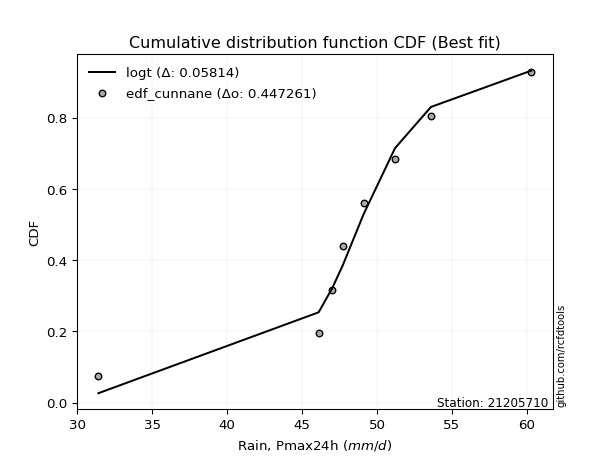</img>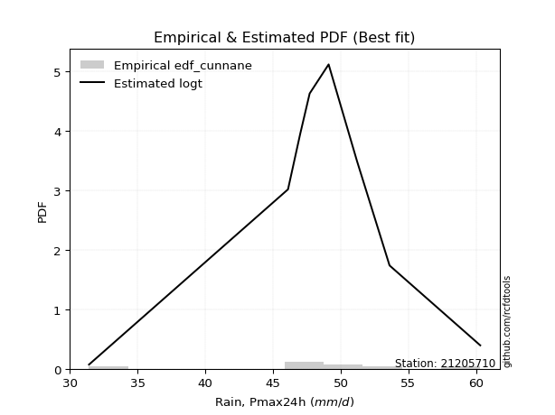</img>

</div>


### 12. EDF Adamowski (1981)

The Adamowski formula in hydrology refers to a specific plotting position formula used for estimating the non-parametric empirical distribution of hydrological events (like flood peaks) to calculate their return periods. This formula provides an alternative to traditional parametric methods (like the Gumbel or Log Pearson Type III distributions). 

<div align="center">


$P=(m-0.25)/(n+0.5)$


</div>


**12.1. Empirical values**

<div align="center">

|                | 0                   | 1                   | 2                  | 3                   | 4             | 5                  | 6                  | 7                  | 8                  |
|:---------------|:--------------------|:--------------------|:-------------------|:--------------------|:--------------|:-------------------|:-------------------|:-------------------|:-------------------|
| date           | 2017                | 2020                | 2021               | 2023                | 2018          | 2024               | 2019               | 2025               | 2022               |
| x              | 31.4                | 46.1                | 47.0               | 47.7                | 49.1          | 51.2               | 53.6               | 58.6               | 60.3               |
| m              | 1                   | 2                   | 3                  | 4                   | 5             | 6                  | 7                  | 8                  | 9                  |
| empirical_dist | edf_adamowski       | edf_adamowski       | edf_adamowski      | edf_adamowski       | edf_adamowski | edf_adamowski      | edf_adamowski      | edf_adamowski      | edf_adamowski      |
| empirical      | 0.07894736842105263 | 0.18421052631578946 | 0.2894736842105263 | 0.39473684210526316 | 0.5           | 0.6052631578947368 | 0.7105263157894737 | 0.8157894736842105 | 0.9210526315789473 |
| empirical_tr   | 1.0857142857142856  | 1.2258064516129032  | 1.4074074074074074 | 1.6521739130434783  | 2.0           | 2.533333333333333  | 3.4545454545454546 | 5.428571428571428  | 12.666666666666663 |

</div>


**12.2. Kolmogorov-Smirnov fit test (sorted by Δ)**


<div align="center">

|                | 0                   | 1                   | 2                   | 3                   | 4                   | 5                   | 6                   | 7                   | 8                   | 9                   | 10                  | 11                  | 12                  | 13                  | 14                  | 15                  | 16                  | 17                  | 18                  | 19                  | 20                  | 21                  | 22                  | 23                  | 24                  | 25                  | 26                  | 27                  | 28                  | 29                  | 30                  | 31                  | 32                  | 33                  | 34                  | 35                  | 36                  | 37                  | 38                  | 39                  | 40                  | 41                  | 42                  | 43                  | 44                  | 45                  | 46                  | 47                  | 48                  | 49                  | 50                  | 51                  | 52                  | 53                  | 54                  | 55                  | 56                  | 57                  | 58                  | 59                  | 60                  | 61                  | 62                  | 63                  | 64                  | 65                  | 66                  | 67                  | 68                  | 69                  | 70                  | 71                  | 72                  | 73                  | 74                  | 75                  | 76                  | 77                  | 78                  | 79                  | 80                  | 81                  | 82                  | 83                  | 84                  | 85                  | 86                  | 87                  | 88                  | 89                  | 90                  | 91                  | 92                  | 93                  | 94                  | 95                  | 96                  | 97                  | 98                  | 99                  | 100                 | 101                 | 102                 | 103                 | 104                 | 105                 | 106                 | 107                 | 108                 | 109                 | 110                 | 111                 | 112                 | 113                 | 114                 | 115                 | 116                 | 117                 | 118                 | 119                 | 120                 | 121                 | 122                 | 123                 | 124                 | 125                 | 126                 | 127                 | 128                 | 129                 | 130                 | 131                 | 132                 | 133                 | 134                 | 135                 | 136                 | 137                 | 138                 | 139                 | 140                 | 141                 | 142                 | 143                 | 144                 | 145                 | 146                 | 147                 | 148                 | 149                 | 150                 | 151                 | 152                 | 153                 | 154                 | 155                 | 156                 | 157                 | 158                 | 159                 |
|:---------------|:--------------------|:--------------------|:--------------------|:--------------------|:--------------------|:--------------------|:--------------------|:--------------------|:--------------------|:--------------------|:--------------------|:--------------------|:--------------------|:--------------------|:--------------------|:--------------------|:--------------------|:--------------------|:--------------------|:--------------------|:--------------------|:--------------------|:--------------------|:--------------------|:--------------------|:--------------------|:--------------------|:--------------------|:--------------------|:--------------------|:--------------------|:--------------------|:--------------------|:--------------------|:--------------------|:--------------------|:--------------------|:--------------------|:--------------------|:--------------------|:--------------------|:--------------------|:--------------------|:--------------------|:--------------------|:--------------------|:--------------------|:--------------------|:--------------------|:--------------------|:--------------------|:--------------------|:--------------------|:--------------------|:--------------------|:--------------------|:--------------------|:--------------------|:--------------------|:--------------------|:--------------------|:--------------------|:--------------------|:--------------------|:--------------------|:--------------------|:--------------------|:--------------------|:--------------------|:--------------------|:--------------------|:--------------------|:--------------------|:--------------------|:--------------------|:--------------------|:--------------------|:--------------------|:--------------------|:--------------------|:--------------------|:--------------------|:--------------------|:--------------------|:--------------------|:--------------------|:--------------------|:--------------------|:--------------------|:--------------------|:--------------------|:--------------------|:--------------------|:--------------------|:--------------------|:--------------------|:--------------------|:--------------------|:--------------------|:--------------------|:--------------------|:--------------------|:--------------------|:--------------------|:--------------------|:--------------------|:--------------------|:--------------------|:--------------------|:--------------------|:--------------------|:--------------------|:--------------------|:--------------------|:--------------------|:--------------------|:--------------------|:--------------------|:--------------------|:--------------------|:--------------------|:--------------------|:--------------------|:--------------------|:--------------------|:--------------------|:--------------------|:--------------------|:--------------------|:--------------------|:--------------------|:--------------------|:--------------------|:--------------------|:--------------------|:--------------------|:--------------------|:--------------------|:--------------------|:--------------------|:--------------------|:--------------------|:--------------------|:--------------------|:--------------------|:--------------------|:--------------------|:--------------------|:--------------------|:--------------------|:--------------------|:--------------------|:--------------------|:--------------------|:--------------------|:--------------------|:--------------------|:--------------------|:--------------------|:--------------------|
| station        | 21205710            | 21205710            | 21205710            | 21205710            | 21205710            | 21205710            | 21205710            | 21205710            | 21205710            | 21205710            | 21205710            | 21205710            | 21205710            | 21205710            | 21205710            | 21205710            | 21205710            | 21205710            | 21205710            | 21205710            | 21205710            | 21205710            | 21205710            | 21205710            | 21205710            | 21205710            | 21205710            | 21205710            | 21205710            | 21205710            | 21205710            | 21205710            | 21205710            | 21205710            | 21205710            | 21205710            | 21205710            | 21205710            | 21205710            | 21205710            | 21205710            | 21205710            | 21205710            | 21205710            | 21205710            | 21205710            | 21205710            | 21205710            | 21205710            | 21205710            | 21205710            | 21205710            | 21205710            | 21205710            | 21205710            | 21205710            | 21205710            | 21205710            | 21205710            | 21205710            | 21205710            | 21205710            | 21205710            | 21205710            | 21205710            | 21205710            | 21205710            | 21205710            | 21205710            | 21205710            | 21205710            | 21205710            | 21205710            | 21205710            | 21205710            | 21205710            | 21205710            | 21205710            | 21205710            | 21205710            | 21205710            | 21205710            | 21205710            | 21205710            | 21205710            | 21205710            | 21205710            | 21205710            | 21205710            | 21205710            | 21205710            | 21205710            | 21205710            | 21205710            | 21205710            | 21205710            | 21205710            | 21205710            | 21205710            | 21205710            | 21205710            | 21205710            | 21205710            | 21205710            | 21205710            | 21205710            | 21205710            | 21205710            | 21205710            | 21205710            | 21205710            | 21205710            | 21205710            | 21205710            | 21205710            | 21205710            | 21205710            | 21205710            | 21205710            | 21205710            | 21205710            | 21205710            | 21205710            | 21205710            | 21205710            | 21205710            | 21205710            | 21205710            | 21205710            | 21205710            | 21205710            | 21205710            | 21205710            | 21205710            | 21205710            | 21205710            | 21205710            | 21205710            | 21205710            | 21205710            | 21205710            | 21205710            | 21205710            | 21205710            | 21205710            | 21205710            | 21205710            | 21205710            | 21205710            | 21205710            | 21205710            | 21205710            | 21205710            | 21205710            | 21205710            | 21205710            | 21205710            | 21205710            | 21205710            | 21205710            |
| empirical_dist | edf_adamowski       | edf_adamowski       | edf_adamowski       | edf_adamowski       | edf_adamowski       | edf_adamowski       | edf_adamowski       | edf_adamowski       | edf_adamowski       | edf_adamowski       | edf_adamowski       | edf_adamowski       | edf_adamowski       | edf_adamowski       | edf_adamowski       | edf_adamowski       | edf_adamowski       | edf_adamowski       | edf_adamowski       | edf_adamowski       | edf_adamowski       | edf_adamowski       | edf_adamowski       | edf_adamowski       | edf_adamowski       | edf_adamowski       | edf_adamowski       | edf_adamowski       | edf_adamowski       | edf_adamowski       | edf_adamowski       | edf_adamowski       | edf_adamowski       | edf_adamowski       | edf_adamowski       | edf_adamowski       | edf_adamowski       | edf_adamowski       | edf_adamowski       | edf_adamowski       | edf_adamowski       | edf_adamowski       | edf_adamowski       | edf_adamowski       | edf_adamowski       | edf_adamowski       | edf_adamowski       | edf_adamowski       | edf_adamowski       | edf_adamowski       | edf_adamowski       | edf_adamowski       | edf_adamowski       | edf_adamowski       | edf_adamowski       | edf_adamowski       | edf_adamowski       | edf_adamowski       | edf_adamowski       | edf_adamowski       | edf_adamowski       | edf_adamowski       | edf_adamowski       | edf_adamowski       | edf_adamowski       | edf_adamowski       | edf_adamowski       | edf_adamowski       | edf_adamowski       | edf_adamowski       | edf_adamowski       | edf_adamowski       | edf_adamowski       | edf_adamowski       | edf_adamowski       | edf_adamowski       | edf_adamowski       | edf_adamowski       | edf_adamowski       | edf_adamowski       | edf_adamowski       | edf_adamowski       | edf_adamowski       | edf_adamowski       | edf_adamowski       | edf_adamowski       | edf_adamowski       | edf_adamowski       | edf_adamowski       | edf_adamowski       | edf_adamowski       | edf_adamowski       | edf_adamowski       | edf_adamowski       | edf_adamowski       | edf_adamowski       | edf_adamowski       | edf_adamowski       | edf_adamowski       | edf_adamowski       | edf_adamowski       | edf_adamowski       | edf_adamowski       | edf_adamowski       | edf_adamowski       | edf_adamowski       | edf_adamowski       | edf_adamowski       | edf_adamowski       | edf_adamowski       | edf_adamowski       | edf_adamowski       | edf_adamowski       | edf_adamowski       | edf_adamowski       | edf_adamowski       | edf_adamowski       | edf_adamowski       | edf_adamowski       | edf_adamowski       | edf_adamowski       | edf_adamowski       | edf_adamowski       | edf_adamowski       | edf_adamowski       | edf_adamowski       | edf_adamowski       | edf_adamowski       | edf_adamowski       | edf_adamowski       | edf_adamowski       | edf_adamowski       | edf_adamowski       | edf_adamowski       | edf_adamowski       | edf_adamowski       | edf_adamowski       | edf_adamowski       | edf_adamowski       | edf_adamowski       | edf_adamowski       | edf_adamowski       | edf_adamowski       | edf_adamowski       | edf_adamowski       | edf_adamowski       | edf_adamowski       | edf_adamowski       | edf_adamowski       | edf_adamowski       | edf_adamowski       | edf_adamowski       | edf_adamowski       | edf_adamowski       | edf_adamowski       | edf_adamowski       | edf_adamowski       | edf_adamowski       | edf_adamowski       | edf_adamowski       |
| p_dist         | logt                | t                   | loggennorm          | logdgamma           | logvonmises_line    | logcrystalball      | laplace             | dgamma              | dweibull            | genlogistic         | gumbel_l            | johnsonsu           | weibull_min         | vonmises_line       | logjohnsonsu        | skewnorm            | logdweibull         | logloggamma         | logexponpow         | mielke              | burr                | logmielke           | loggenlogistic      | pearson3            | logburr12           | gennorm             | logweibull_min      | logburr             | logloglaplace       | hypsecant           | logargus            | genextreme          | logpearson3         | argus               | loggompertz         | loggumbel_l         | logistic            | trapezoid           | loglaplace          | loglaplace          | triang              | logskewnorm         | exponnorm           | norm                | crystalball         | nct                 | f                   | logexponweib        | erlang              | genhalflogistic     | loghypsecant        | logtrapezoid        | alpha               | gamma               | logbeta             | anglit              | loglogistic         | rice                | ncf                 | semicircular        | maxwell             | invgamma            | lognakagami         | truncnorm           | nakagami            | loggenextreme       | loggengamma         | logf                | logrice             | logexponnorm        | lognorm             | rayleigh            | logfatiguelife      | gumbel_r            | loggenhalflogistic  | betaprime           | invgauss            | logalpha            | loganglit           | logbetaprime        | logweibull_max      | moyal               | lognct              | logsemicircular     | arcsine             | loggamma            | loggamma            | cosine              | invweibull          | loglevy_l           | loginvgamma         | loginvgauss         | logfoldnorm         | logmaxwell          | logtriang           | levy_l              | halfnorm            | logncf              | halflogistic        | gompertz            | lograyleigh         | logjohnsonsb        | logarcsine          | wald                | loginvweibull       | loggumbel_r         | logtukeylambda      | kstwobign           | logmoyal            | loghalfnorm         | truncweibull_min    | logcosine           | loghalflogistic     | gausshyper          | beta                | logkstwobign        | wrapcauchy          | loggenexpon         | ksone               | kappa3              | uniform             | logwald             | tukeylambda         | kappa4              | genpareto           | loggenpareto        | lomax               | genexpon            | logtruncweibull_min | loglomax            | loggausshyper       | johnsonsb           | logwrapcauchy       | logksone            | logkappa3           | burr12              | logkappa4           | loguniform          | bradford            | halfgennorm         | foldnorm            | truncexpon          | logerlang           | logbradford         | logtruncexpon       | weibull_max         | logrdist            | logtruncnorm        | exponweib           | gengamma            | rdist               | fatiguelife         | powerlaw            | logpowerlaw         | loghalfgennorm      | exponpow            | truncpareto         | logtruncpareto      | logvonmises         | vonmises            |
| delta          | 0.06994168775128606 | 0.07471119667316928 | 0.07902517320925276 | 0.08518572222494425 | 0.08789426813241122 | 0.08998734299759958 | 0.09146071930688118 | 0.09475760966850777 | 0.09792197153517934 | 0.09852636913634003 | 0.09894481451161763 | 0.10079757769500988 | 0.10217210908740029 | 0.103336447119694   | 0.10447630789865195 | 0.10698412008289018 | 0.10733631765619953 | 0.1085614825149456  | 0.11046510807586776 | 0.11049418574324824 | 0.11065801017557339 | 0.11070252909830938 | 0.11074014203917906 | 0.11118648583649379 | 0.1131716153171077  | 0.11350233069083718 | 0.11400535444771434 | 0.11432498191853116 | 0.11455239012800847 | 0.11913787102272635 | 0.120019455440356   | 0.12066941646583568 | 0.12205332215422673 | 0.12289155945931698 | 0.12700465208676934 | 0.1307412342950711  | 0.13364836570020724 | 0.13777023514894968 | 0.13926463414837756 | 0.13926463414837756 | 0.14387578036002233 | 0.15095430144052638 | 0.1526611738219041  | 0.15266309766083488 | 0.15266311494034593 | 0.15308518457976686 | 0.15373292914339406 | 0.15474903232239187 | 0.16648825525444896 | 0.16743485062794397 | 0.16749698004612587 | 0.16872729834049452 | 0.16924906266447606 | 0.1705155450237074  | 0.17231539725947814 | 0.17385276553492843 | 0.17967662154915234 | 0.1805267791210435  | 0.1825539286547382  | 0.18277372008868933 | 0.18373207874916822 | 0.18376321319772718 | 0.18420760424547297 | 0.1842083965915182  | 0.1842102205999409  | 0.18458659658240245 | 0.19027148128499846 | 0.19462150903593076 | 0.19484033255921604 | 0.19485240786815813 | 0.19485539219964973 | 0.1956111037632303  | 0.19709265530125877 | 0.19736870660466718 | 0.19757637635359313 | 0.1977941817088452  | 0.20672998912230575 | 0.2067822433658041  | 0.2112981716139847  | 0.21131910342945878 | 0.21308692050271866 | 0.21349330922307821 | 0.21604446087265558 | 0.21817264166595166 | 0.21957014389562232 | 0.22011997526490965 | 0.22011997526490965 | 0.22115365039075421 | 0.22115736683013457 | 0.22123542569208401 | 0.22144235178926638 | 0.22319201279962206 | 0.22429284101772248 | 0.22823178307122657 | 0.22864639850503107 | 0.22919444282535376 | 0.22941386952883638 | 0.23495761011717528 | 0.2351622640796213  | 0.23977994223807458 | 0.2404998934832582  | 0.24446501085540231 | 0.24592378687754854 | 0.2461182702890974  | 0.2461957194981779  | 0.2503703708729539  | 0.25260568996437927 | 0.2616797417671478  | 0.27151187433122304 | 0.27539780291401017 | 0.2811142837320232  | 0.28284480807172796 | 0.28813967445112754 | 0.2926626073963594  | 0.295794873436033   | 0.3012016968438884  | 0.3186736111859948  | 0.32209439681507734 | 0.3229982395434955  | 0.3240752236851876  | 0.3244399927153525  | 0.3263686423821496  | 0.32682439582793943 | 0.32827004416964245 | 0.35023778326767463 | 0.3535023685162376  | 0.37054294541619115 | 0.3729338657737964  | 0.3733165050392787  | 0.3738619194238336  | 0.3741309577720193  | 0.37863850803982646 | 0.3842999719899173  | 0.389532525055005   | 0.3912705811409547  | 0.3954559226311355  | 0.40289737087307775 | 0.40428113532916354 | 0.40899201721813105 | 0.41443609065373477 | 0.42323954547954773 | 0.42645041005069795 | 0.45361059223519684 | 0.48642460720983804 | 0.5051327180838966  | 0.5223901031603991  | 0.5244101657656592  | 0.5343171456131184  | 0.6116814096685347  | 0.6246019597590059  | 0.6268941928310141  | 0.6307146093662491  | 0.6736830528607951  | 0.6956774393670303  | 0.7105263157894737  | 0.7517994961712456  | 0.7762279404429476  | 0.7845602149537773  | 1.1914821402266038  | 8.774536695864358   |
| deltao         | 0.41761268023100007 | 0.41761268023100007 | 0.41761268023100007 | 0.41761268023100007 | 0.41761268023100007 | 0.41761268023100007 | 0.41761268023100007 | 0.41761268023100007 | 0.41761268023100007 | 0.41761268023100007 | 0.41761268023100007 | 0.41761268023100007 | 0.41761268023100007 | 0.41761268023100007 | 0.41761268023100007 | 0.41761268023100007 | 0.41761268023100007 | 0.41761268023100007 | 0.41761268023100007 | 0.41761268023100007 | 0.41761268023100007 | 0.41761268023100007 | 0.41761268023100007 | 0.41761268023100007 | 0.41761268023100007 | 0.41761268023100007 | 0.41761268023100007 | 0.41761268023100007 | 0.41761268023100007 | 0.41761268023100007 | 0.41761268023100007 | 0.41761268023100007 | 0.41761268023100007 | 0.41761268023100007 | 0.41761268023100007 | 0.41761268023100007 | 0.41761268023100007 | 0.41761268023100007 | 0.41761268023100007 | 0.41761268023100007 | 0.41761268023100007 | 0.41761268023100007 | 0.41761268023100007 | 0.41761268023100007 | 0.41761268023100007 | 0.41761268023100007 | 0.41761268023100007 | 0.41761268023100007 | 0.41761268023100007 | 0.41761268023100007 | 0.41761268023100007 | 0.41761268023100007 | 0.41761268023100007 | 0.41761268023100007 | 0.41761268023100007 | 0.41761268023100007 | 0.41761268023100007 | 0.41761268023100007 | 0.41761268023100007 | 0.41761268023100007 | 0.41761268023100007 | 0.41761268023100007 | 0.41761268023100007 | 0.41761268023100007 | 0.41761268023100007 | 0.41761268023100007 | 0.41761268023100007 | 0.41761268023100007 | 0.41761268023100007 | 0.41761268023100007 | 0.41761268023100007 | 0.41761268023100007 | 0.41761268023100007 | 0.41761268023100007 | 0.41761268023100007 | 0.41761268023100007 | 0.41761268023100007 | 0.41761268023100007 | 0.41761268023100007 | 0.41761268023100007 | 0.41761268023100007 | 0.41761268023100007 | 0.41761268023100007 | 0.41761268023100007 | 0.41761268023100007 | 0.41761268023100007 | 0.41761268023100007 | 0.41761268023100007 | 0.41761268023100007 | 0.41761268023100007 | 0.41761268023100007 | 0.41761268023100007 | 0.41761268023100007 | 0.41761268023100007 | 0.41761268023100007 | 0.41761268023100007 | 0.41761268023100007 | 0.41761268023100007 | 0.41761268023100007 | 0.41761268023100007 | 0.41761268023100007 | 0.41761268023100007 | 0.41761268023100007 | 0.41761268023100007 | 0.41761268023100007 | 0.41761268023100007 | 0.41761268023100007 | 0.41761268023100007 | 0.41761268023100007 | 0.41761268023100007 | 0.41761268023100007 | 0.41761268023100007 | 0.41761268023100007 | 0.41761268023100007 | 0.41761268023100007 | 0.41761268023100007 | 0.41761268023100007 | 0.41761268023100007 | 0.41761268023100007 | 0.41761268023100007 | 0.41761268023100007 | 0.41761268023100007 | 0.41761268023100007 | 0.41761268023100007 | 0.41761268023100007 | 0.41761268023100007 | 0.41761268023100007 | 0.41761268023100007 | 0.41761268023100007 | 0.41761268023100007 | 0.41761268023100007 | 0.41761268023100007 | 0.41761268023100007 | 0.41761268023100007 | 0.41761268023100007 | 0.41761268023100007 | 0.41761268023100007 | 0.41761268023100007 | 0.41761268023100007 | 0.41761268023100007 | 0.41761268023100007 | 0.41761268023100007 | 0.41761268023100007 | 0.41761268023100007 | 0.41761268023100007 | 0.41761268023100007 | 0.41761268023100007 | 0.41761268023100007 | 0.41761268023100007 | 0.41761268023100007 | 0.41761268023100007 | 0.41761268023100007 | 0.41761268023100007 | 0.41761268023100007 | 0.41761268023100007 | 0.41761268023100007 | 0.41761268023100007 | 0.41761268023100007 | 0.41761268023100007 | 0.41761268023100007 |
| eval           | Δo > Δ              | Δo > Δ              | Δo > Δ              | Δo > Δ              | Δo > Δ              | Δo > Δ              | Δo > Δ              | Δo > Δ              | Δo > Δ              | Δo > Δ              | Δo > Δ              | Δo > Δ              | Δo > Δ              | Δo > Δ              | Δo > Δ              | Δo > Δ              | Δo > Δ              | Δo > Δ              | Δo > Δ              | Δo > Δ              | Δo > Δ              | Δo > Δ              | Δo > Δ              | Δo > Δ              | Δo > Δ              | Δo > Δ              | Δo > Δ              | Δo > Δ              | Δo > Δ              | Δo > Δ              | Δo > Δ              | Δo > Δ              | Δo > Δ              | Δo > Δ              | Δo > Δ              | Δo > Δ              | Δo > Δ              | Δo > Δ              | Δo > Δ              | Δo > Δ              | Δo > Δ              | Δo > Δ              | Δo > Δ              | Δo > Δ              | Δo > Δ              | Δo > Δ              | Δo > Δ              | Δo > Δ              | Δo > Δ              | Δo > Δ              | Δo > Δ              | Δo > Δ              | Δo > Δ              | Δo > Δ              | Δo > Δ              | Δo > Δ              | Δo > Δ              | Δo > Δ              | Δo > Δ              | Δo > Δ              | Δo > Δ              | Δo > Δ              | Δo > Δ              | Δo > Δ              | Δo > Δ              | Δo > Δ              | Δo > Δ              | Δo > Δ              | Δo > Δ              | Δo > Δ              | Δo > Δ              | Δo > Δ              | Δo > Δ              | Δo > Δ              | Δo > Δ              | Δo > Δ              | Δo > Δ              | Δo > Δ              | Δo > Δ              | Δo > Δ              | Δo > Δ              | Δo > Δ              | Δo > Δ              | Δo > Δ              | Δo > Δ              | Δo > Δ              | Δo > Δ              | Δo > Δ              | Δo > Δ              | Δo > Δ              | Δo > Δ              | Δo > Δ              | Δo > Δ              | Δo > Δ              | Δo > Δ              | Δo > Δ              | Δo > Δ              | Δo > Δ              | Δo > Δ              | Δo > Δ              | Δo > Δ              | Δo > Δ              | Δo > Δ              | Δo > Δ              | Δo > Δ              | Δo > Δ              | Δo > Δ              | Δo > Δ              | Δo > Δ              | Δo > Δ              | Δo > Δ              | Δo > Δ              | Δo > Δ              | Δo > Δ              | Δo > Δ              | Δo > Δ              | Δo > Δ              | Δo > Δ              | Δo > Δ              | Δo > Δ              | Δo > Δ              | Δo > Δ              | Δo > Δ              | Δo > Δ              | Δo > Δ              | Δo > Δ              | Δo > Δ              | Δo > Δ              | Δo > Δ              | Δo > Δ              | Δo > Δ              | Δo > Δ              | Δo > Δ              | Δo > Δ              | Δo > Δ              | Δo > Δ              | Δo > Δ              | Δo > Δ              | Δo > Δ              | Δo > Δ              | Δo <= Δ             | Δo <= Δ             | Δo <= Δ             | Δo <= Δ             | Δo <= Δ             | Δo <= Δ             | Δo <= Δ             | Δo <= Δ             | Δo <= Δ             | Δo <= Δ             | Δo <= Δ             | Δo <= Δ             | Δo <= Δ             | Δo <= Δ             | Δo <= Δ             | Δo <= Δ             | Δo <= Δ             | Δo <= Δ             | Δo <= Δ             | Δo <= Δ             |
| fit            | 1                   | 1                   | 1                   | 1                   | 1                   | 1                   | 1                   | 1                   | 1                   | 1                   | 1                   | 1                   | 1                   | 1                   | 1                   | 1                   | 1                   | 1                   | 1                   | 1                   | 1                   | 1                   | 1                   | 1                   | 1                   | 1                   | 1                   | 1                   | 1                   | 1                   | 1                   | 1                   | 1                   | 1                   | 1                   | 1                   | 1                   | 1                   | 1                   | 1                   | 1                   | 1                   | 1                   | 1                   | 1                   | 1                   | 1                   | 1                   | 1                   | 1                   | 1                   | 1                   | 1                   | 1                   | 1                   | 1                   | 1                   | 1                   | 1                   | 1                   | 1                   | 1                   | 1                   | 1                   | 1                   | 1                   | 1                   | 1                   | 1                   | 1                   | 1                   | 1                   | 1                   | 1                   | 1                   | 1                   | 1                   | 1                   | 1                   | 1                   | 1                   | 1                   | 1                   | 1                   | 1                   | 1                   | 1                   | 1                   | 1                   | 1                   | 1                   | 1                   | 1                   | 1                   | 1                   | 1                   | 1                   | 1                   | 1                   | 1                   | 1                   | 1                   | 1                   | 1                   | 1                   | 1                   | 1                   | 1                   | 1                   | 1                   | 1                   | 1                   | 1                   | 1                   | 1                   | 1                   | 1                   | 1                   | 1                   | 1                   | 1                   | 1                   | 1                   | 1                   | 1                   | 1                   | 1                   | 1                   | 1                   | 1                   | 1                   | 1                   | 1                   | 1                   | 1                   | 1                   | 1                   | 1                   | 1                   | 1                   | 0                   | 0                   | 0                   | 0                   | 0                   | 0                   | 0                   | 0                   | 0                   | 0                   | 0                   | 0                   | 0                   | 0                   | 0                   | 0                   | 0                   | 0                   | 0                   | 0                   |
| n              | 9                   | 9                   | 9                   | 9                   | 9                   | 9                   | 9                   | 9                   | 9                   | 9                   | 9                   | 9                   | 9                   | 9                   | 9                   | 9                   | 9                   | 9                   | 9                   | 9                   | 9                   | 9                   | 9                   | 9                   | 9                   | 9                   | 9                   | 9                   | 9                   | 9                   | 9                   | 9                   | 9                   | 9                   | 9                   | 9                   | 9                   | 9                   | 9                   | 9                   | 9                   | 9                   | 9                   | 9                   | 9                   | 9                   | 9                   | 9                   | 9                   | 9                   | 9                   | 9                   | 9                   | 9                   | 9                   | 9                   | 9                   | 9                   | 9                   | 9                   | 9                   | 9                   | 9                   | 9                   | 9                   | 9                   | 9                   | 9                   | 9                   | 9                   | 9                   | 9                   | 9                   | 9                   | 9                   | 9                   | 9                   | 9                   | 9                   | 9                   | 9                   | 9                   | 9                   | 9                   | 9                   | 9                   | 9                   | 9                   | 9                   | 9                   | 9                   | 9                   | 9                   | 9                   | 9                   | 9                   | 9                   | 9                   | 9                   | 9                   | 9                   | 9                   | 9                   | 9                   | 9                   | 9                   | 9                   | 9                   | 9                   | 9                   | 9                   | 9                   | 9                   | 9                   | 9                   | 9                   | 9                   | 9                   | 9                   | 9                   | 9                   | 9                   | 9                   | 9                   | 9                   | 9                   | 9                   | 9                   | 9                   | 9                   | 9                   | 9                   | 9                   | 9                   | 9                   | 9                   | 9                   | 9                   | 9                   | 9                   | 9                   | 9                   | 9                   | 9                   | 9                   | 9                   | 9                   | 9                   | 9                   | 9                   | 9                   | 9                   | 9                   | 9                   | 9                   | 9                   | 9                   | 9                   | 9                   | 9                   |
| best_fit       | 1                   | 0                   | 0                   | 0                   | 0                   | 0                   | 0                   | 0                   | 0                   | 0                   | 0                   | 0                   | 0                   | 0                   | 0                   | 0                   | 0                   | 0                   | 0                   | 0                   | 0                   | 0                   | 0                   | 0                   | 0                   | 0                   | 0                   | 0                   | 0                   | 0                   | 0                   | 0                   | 0                   | 0                   | 0                   | 0                   | 0                   | 0                   | 0                   | 0                   | 0                   | 0                   | 0                   | 0                   | 0                   | 0                   | 0                   | 0                   | 0                   | 0                   | 0                   | 0                   | 0                   | 0                   | 0                   | 0                   | 0                   | 0                   | 0                   | 0                   | 0                   | 0                   | 0                   | 0                   | 0                   | 0                   | 0                   | 0                   | 0                   | 0                   | 0                   | 0                   | 0                   | 0                   | 0                   | 0                   | 0                   | 0                   | 0                   | 0                   | 0                   | 0                   | 0                   | 0                   | 0                   | 0                   | 0                   | 0                   | 0                   | 0                   | 0                   | 0                   | 0                   | 0                   | 0                   | 0                   | 0                   | 0                   | 0                   | 0                   | 0                   | 0                   | 0                   | 0                   | 0                   | 0                   | 0                   | 0                   | 0                   | 0                   | 0                   | 0                   | 0                   | 0                   | 0                   | 0                   | 0                   | 0                   | 0                   | 0                   | 0                   | 0                   | 0                   | 0                   | 0                   | 0                   | 0                   | 0                   | 0                   | 0                   | 0                   | 0                   | 0                   | 0                   | 0                   | 0                   | 0                   | 0                   | 0                   | 0                   | 0                   | 0                   | 0                   | 0                   | 0                   | 0                   | 0                   | 0                   | 0                   | 0                   | 0                   | 0                   | 0                   | 0                   | 0                   | 0                   | 0                   | 0                   | 0                   | 0                   |
| best_fit_sort  | 1                   | 2                   | 3                   | 4                   | 5                   | 6                   | 7                   | 8                   | 9                   | 10                  | 11                  | 12                  | 13                  | 14                  | 15                  | 16                  | 17                  | 18                  | 19                  | 20                  | 21                  | 22                  | 23                  | 24                  | 25                  | 26                  | 27                  | 28                  | 29                  | 30                  | 31                  | 32                  | 33                  | 34                  | 35                  | 36                  | 37                  | 38                  | 39                  | 40                  | 41                  | 42                  | 43                  | 44                  | 45                  | 46                  | 47                  | 48                  | 49                  | 50                  | 51                  | 52                  | 53                  | 54                  | 55                  | 56                  | 57                  | 58                  | 59                  | 60                  | 61                  | 62                  | 63                  | 64                  | 65                  | 66                  | 67                  | 68                  | 69                  | 70                  | 71                  | 72                  | 73                  | 74                  | 75                  | 76                  | 77                  | 78                  | 79                  | 80                  | 81                  | 82                  | 83                  | 84                  | 85                  | 86                  | 87                  | 88                  | 89                  | 90                  | 91                  | 92                  | 93                  | 94                  | 95                  | 96                  | 97                  | 98                  | 99                  | 100                 | 101                 | 102                 | 103                 | 104                 | 105                 | 106                 | 107                 | 108                 | 109                 | 110                 | 111                 | 112                 | 113                 | 114                 | 115                 | 116                 | 117                 | 118                 | 119                 | 120                 | 121                 | 122                 | 123                 | 124                 | 125                 | 126                 | 127                 | 128                 | 129                 | 130                 | 131                 | 132                 | 133                 | 134                 | 135                 | 136                 | 137                 | 138                 | 139                 | 140                 | 141                 | 142                 | 143                 | 144                 | 145                 | 146                 | 147                 | 148                 | 149                 | 150                 | 151                 | 152                 | 153                 | 154                 | 155                 | 156                 | 157                 | 158                 | 159                 | 160                 |

</div>


**12.3. Best fit**

<div align="center">

|   id |   station | empirical_dist   | p_dist   |     delta |   deltao | eval   |   fit |   n |   best_fit |   best_fit_sort |
|-----:|----------:|:-----------------|:---------|----------:|---------:|:-------|------:|----:|-----------:|----------------:|
|    0 |  21205710 | edf_adamowski    | logt     | 0.0699417 | 0.417613 | Δo > Δ |     1 |   9 |          1 |               1 |

</div>


<div align="center">

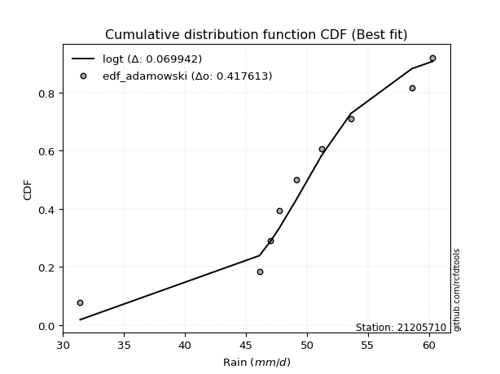</img></img>

</div>


## C. Best fit & Estimate extreme values for specific return periods - Tr

Best fit in probability distribution analysis means finding the theoretical distribution (like Normal, Poisson, Exponential, etc.) that most accurately mirrors your real-world data´s patterns (shape, center, spread) for better predictions, using methods like visual checks (Q-Q plots), goodness-of-fit tests (Kolmogorov-Smirnov, Chi-Squared), and information criteria (AIC) to score and select the simplest, most representative model.


### 1. Best fit (ordered by delta Δ)

:file_folder:Table: [bestfit_21205710.csv](table/bestfit_21205710.csv)

<div align="center">

|   id |   station | empirical_dist   | p_dist   |     delta |   deltao | eval   |   fit |   n |   best_fit |   best_fit_sort |
|-----:|----------:|:-----------------|:---------|----------:|---------:|:-------|------:|----:|-----------:|----------------:|
|    0 |  21205710 | edf_adamowski    | logt     | 0.0699417 | 0.417613 | Δo > Δ |     1 |   9 |          1 |               1 |
|    1 |  21205710 | edf_cunnane      | logt     | 0.0699417 | 0.417613 | Δo > Δ |     1 |   9 |          1 |               2 |
|    2 |  21205710 | edf_jenkinson    | logt     | 0.0699417 | 0.417613 | Δo > Δ |     1 |   9 |          1 |               3 |
|    3 |  21205710 | edf_filliben     | logt     | 0.0699417 | 0.417613 | Δo > Δ |     1 |   9 |          1 |               4 |
|    4 |  21205710 | edf_gringorten   | logt     | 0.0699417 | 0.417613 | Δo > Δ |     1 |   9 |          1 |               5 |
|    5 |  21205710 | edf_tukey        | logt     | 0.0699417 | 0.417613 | Δo > Δ |     1 |   9 |          1 |               6 |
|    6 |  21205710 | edf_blom         | logt     | 0.0699417 | 0.417613 | Δo > Δ |     1 |   9 |          1 |               7 |
|    7 |  21205710 | edf_chegodayev   | logt     | 0.0699417 | 0.417613 | Δo > Δ |     1 |   9 |          1 |               8 |
|    8 |  21205710 | edf_beard        | logt     | 0.0699417 | 0.417613 | Δo > Δ |     1 |   9 |          1 |               9 |
|    9 |  21205710 | edf_hazen        | logt     | 0.0721504 | 0.417613 | Δo > Δ |     1 |   9 |          1 |              10 |
|   10 |  21205710 | edf_weibull      | logt     | 0.0824319 | 0.417613 | Δo > Δ |     1 |   9 |          1 |              11 |
|   11 |  21205710 | edf_california   | gennorm  | 0.087437  | 0.417613 | Δo > Δ |     1 |   9 |          1 |              12 |

</div>


### 2. Extreme values and % difference analysis

In hydrology, a return period (or recurrence interval $Tr$) is the statistical average time between extreme events like floods or droughts of a specific magnitude, indicating how rare an event is, with a 100-year flood, for example, having a 1% chance of occurring in any given year, not that it happens exactly every century. It is a key tool for infrastructure design (like bridges or dams) and risk assessment, calculated from historical data to determine the probability of future events, although it is important to remember it is statistical average, and events can cluster or be missed.

The extreme value porcentage difference is evaluated as $pdiff = 1 - (ETrBf / ETr) * 100$, where _ETrBf_ correspond to the bestfit extreme value for a specific recurrence interval and _ETr_ correspond to the extreme value for one of the most used PDFsused in hydrology.

> risk_rate: assuming the return period as the project useful life.

:file_folder:Table: [extreme_21205710.csv](table/extreme_21205710.csv), all PDFs.  
:file_folder:Table: [extremepdiff_21205710.csv](table/extremepdiff_21205710.csv), % difference between bestfit and most used PDFs in Hydrology.

<div align="center">

Extreme values table for only best fit PDFs
|   id |      tr |   prob_l |     prob_g |   alpha |   anglit |   arcsine |   argus |    beta |   betaprime |   bradford |    burr |   burr12 |   cosine |   crystalball |   dgamma |   dweibull |   erlang |   exponnorm |   exponpow |   exponweib |       f |   fatiguelife |   foldnorm |   gamma |   gausshyper |   genexpon |   genextreme |   gengamma |   genhalflogistic |   genlogistic |   gennorm |   genpareto |   gompertz |   gumbel_l |   gumbel_r |   halfgennorm |   halflogistic |   halfnorm |   hypsecant |   invgamma |   invgauss |   invweibull |   johnsonsb |   johnsonsu |   kappa3 |   kappa4 |   ksone |   kstwobign |   laplace |   levy_l |   loggamma |   logistic |   loglaplace |    lomax |   maxwell |   mielke |   moyal |   nakagami |     ncf |     nct |    norm |   pearson3 |   powerlaw |   rayleigh |   rdist |    rice |   semicircular |   skewnorm |        t |   trapezoid |   triang |   truncexpon |   truncnorm |   truncpareto |   truncweibull_min |   tukeylambda |   uniform |   vonmises |   vonmises_line |     wald |   weibull_max |   weibull_min |   wrapcauchy |   logalpha |   loganglit |   logarcsine |   logargus |   logbeta |   logbetaprime |   logbradford |   logburr |   logburr12 |   logcosine |   logcrystalball |   logdgamma |   logdweibull |   logerlang |   logexponnorm |   logexponpow |   logexponweib |    logf |   logfatiguelife |   logfoldnorm |   loggausshyper |   loggenexpon |   loggenextreme |   loggengamma |   loggenhalflogistic |   loggenlogistic |   loggennorm |   loggenpareto |   loggompertz |   loggumbel_l |   loggumbel_r |   loghalfgennorm |   loghalflogistic |   loghalfnorm |   loghypsecant |   loginvgamma |   loginvgauss |   loginvweibull |   logjohnsonsb |   logjohnsonsu |   logkappa3 |   logkappa4 |   logksone |   logkstwobign |   loglevy_l |   logloggamma |   loglogistic |   logloglaplace |   loglomax |   logmaxwell |   logmielke |   logmoyal |   lognakagami |   logncf |   lognct |   lognorm |   logpearson3 |   logpowerlaw |   lograyleigh |   logrdist |   logrice |   logsemicircular |   logskewnorm |     logt |   logtrapezoid |   logtriang |   logtruncexpon |   logtruncnorm |   logtruncpareto |   logtruncweibull_min |   logtukeylambda |   loguniform |   logvonmises |   logvonmises_line |   logwald |   logweibull_max |   logweibull_min |   logwrapcauchy |   station |   n |   risk_rate |
|-----:|--------:|---------:|-----------:|--------:|---------:|----------:|--------:|--------:|------------:|-----------:|--------:|---------:|---------:|--------------:|---------:|-----------:|---------:|------------:|-----------:|------------:|--------:|--------------:|-----------:|--------:|-------------:|-----------:|-------------:|-----------:|------------------:|--------------:|----------:|------------:|-----------:|-----------:|-----------:|--------------:|---------------:|-----------:|------------:|-----------:|-----------:|-------------:|------------:|------------:|---------:|---------:|--------:|------------:|----------:|---------:|-----------:|-----------:|-------------:|---------:|----------:|---------:|--------:|-----------:|--------:|--------:|--------:|-----------:|-----------:|-----------:|--------:|--------:|---------------:|-----------:|---------:|------------:|---------:|-------------:|------------:|--------------:|-------------------:|--------------:|----------:|-----------:|----------------:|---------:|--------------:|--------------:|-------------:|-----------:|------------:|-------------:|-----------:|----------:|---------------:|--------------:|----------:|------------:|------------:|-----------------:|------------:|--------------:|------------:|---------------:|--------------:|---------------:|--------:|-----------------:|--------------:|----------------:|--------------:|----------------:|--------------:|---------------------:|-----------------:|-------------:|---------------:|--------------:|--------------:|--------------:|-----------------:|------------------:|--------------:|---------------:|--------------:|--------------:|----------------:|---------------:|---------------:|------------:|------------:|-----------:|---------------:|------------:|--------------:|--------------:|----------------:|-----------:|-------------:|------------:|-----------:|--------------:|---------:|---------:|----------:|--------------:|--------------:|--------------:|-----------:|----------:|------------------:|--------------:|---------:|---------------:|------------:|----------------:|---------------:|-----------------:|----------------------:|-----------------:|-------------:|--------------:|-------------------:|----------:|-----------------:|-----------------:|----------------:|----------:|----:|------------:|
|    0 |    2    | 0.5      | 0.5        | 49.1501 |  49.4444 |   49.4444 | 50.9851 | 55.8926 |     48.6967 |    43.3724 | 50.2853 |  42.7414 |  48.2627 |       49.4444 |  49.1    |    49.1    |  49.2111 |     49.4445 |    31.4071 |     31.9963 | 49.4359 |       31.4    |    50.1414 | 49.1477 |      46.9482 |    43.9097 |      51.5168 |    32.547  |           50.6482 |       50.2813 |   49.1    |     44.0383 |    51.5117 |    50.7495 |    48.1394 |       41.1526 |        47.4906 |    47.8183 |     49.4444 |    48.9424 |    48.4752 |      48.506  |     39.6409 |     50.7474 |  31.4    |  45.7233 | 45.85   |     47.5518 |   49.4444 |  51.3962 |    48.2379 |    49.4444 |      48.7152 |  43.9824 |   48.765  |  50.2849 | 47.7181 |    48.2637 | 48.8955 | 49.4382 | 49.4444 |    50.5495 |    32.7591 |    48.5241 | 31.0908 | 49.3455 |        49.4444 |    51.2259 |  50.1806 |     50.8074 |  50.5646 |      42.934  |     49.9621 |       31.4701 |            47.0195 |       45.7703 |   45.85   |    2.98125 |         49.8519 |  46.8694 |       59.8776 |       50.6394 |      45.85   |    48.4974 |     48.7152 |      48.7152 |    51.0014 |   52.6984 |        48.4243 |       41.0527 |   50.3126 |     50.2228 |     46.909  |          49.8621 |     49.1    |       49.1    |     39.5832 |        48.7152 |       50.751  |        50.3742 | 48.7262 |          48.6573 |       48.1851 |         44.3799 |       45.9131 |         52.9668 |       48.767  |              49.68   |          50.2859 |      49.1    |        42.3113 |       49.9789 |       50.1705 |       47.302  |          31.4    |           46.6145 |       46.9611 |        48.7152 |       48.1891 |       48.2121 |         48.2208 |        53.6689 |        50.8678 |     43.8356 |     43.4104 |    43.5134 |        46.5445 |     51.3419 |       50.687  |       48.7152 |         49.1    |    43.2938 |      47.9743 |     50.3761 |    46.8546 |       48.0643 |  49.0824 |  48.6127 |   48.7152 |       50.6029 |       32.5811 |       47.7144 |    67.6954 |   48.7151 |           48.7152 |       49.9693 |  50.0407 |        50.2361 |     48.3911 |         40.6264 |        39.874  |          31.4531 |               44.5719 |          52.6685 |      43.5134 |     0.0910878 |            50.1412 |   45.967  |          53.6695 |          50.2288 |         43.5535 |  21205710 |   9 |    0.75     |
|    1 |    2.33 | 0.570815 | 0.429185   | 50.6291 |  51.0957 |   51.9232 | 52.4771 | 57.3245 |     50.3147 |    45.4287 | 51.5168 |  45.6853 |  49.8756 |       50.862  |  49.7509 |    49.2361 |  50.6747 |     50.8621 |    31.425  |     32.673  | 50.8612 |       31.9829 |    50.3505 | 50.6243 |      49.5385 |    46.6659 |      52.8999 |    33.4374 |           52.4838 |       51.4489 |   49.9828 |     48.1325 |    52.3749 |    51.9828 |    49.4529 |       44.5026 |        48.8411 |    49.3483 |     50.5789 |    50.4828 |    50.056  |      50.4356 |     46.9798 |     52.0298 |  31.4    |  47.8616 | 48.3059 |     49.5658 |   50.3023 |  54.0725 |    49.8958 |    50.6934 |      49.667  |  46.7716 |   50.2378 |  51.5153 | 48.9615 |    49.0745 | 50.4169 | 50.8573 | 50.862  |    51.8823 |    33.8376 |    50.0186 | 35.1066 | 51.0202 |        51.2154 |    52.674  |  51.2423 |     52.4392 |  52.1739 |      44.9266 |     50.7756 |       31.5324 |            48.8818 |       47.8852 |   47.8966 |    3.24625 |         51.0264 |  47.7989 |       60.083  |       51.9128 |      51.335  |    50.1259 |     50.5637 |      51.5167 |    52.4725 |   54.1428 |        50.0638 |       43.0023 |   51.572  |     51.5106 |     48.7022 |          51.036  |     49.6316 |       49.8612 |     42.4726 |        50.2981 |       52.0964 |        52.0399 | 50.3148 |          50.2349 |       49.8718 |         46.4754 |       48.109  |         54.3491 |       50.3147 |              51.6221 |          51.518  |      49.7139 |        49.0493 |       51.3126 |       51.5858 |       48.7245 |          31.4    |           48.0566 |       48.6097 |        49.9779 |       49.834  |       49.9182 |         50.6287 |        57.8421 |        52.1936 |     45.9567 |     45.5843 |    45.9944 |        48.8642 |     53.8863 |       52.0034 |       50.1071 |         50.0358 |    46.8036 |      49.5949 |     51.6183 |    48.1874 |       48.9222 |  51.8755 |  50.4908 |   50.298  |       52.0412 |       33.4727 |       49.3502 |    73.3234 |   50.2977 |           50.7008 |       51.4906 |  51.0118 |        52.1196 |     50.1834 |         42.4889 |        41.632  |          31.4999 |               46.46   |          53.7247 |      45.5713 |     0.0940299 |            51.3769 |   46.9407 |          55.4004 |          51.5226 |         46.1865 |  21205710 |   9 |    0.729209 |
|    2 |    5    | 0.8      | 0.2        | 56.3109 |  56.9216 |   58.5332 | 56.7794 | 59.849  |     56.8595 |    52.8191 | 55.7431 | inf      |  55.6881 |       56.1302 |  53.9    |    56.4713 |  56.202  |     56.1302 |    32.4274 |     46.8549 | 56.1657 |       44.3643 |    51.2348 | 56.2084 |      57.0595 |    60.4465 |      56.9004 |    44.9344 |           57.2906 |       55.5859 |   54.4056 |     57.4463 |    55.7688 |    55.9671 |    55.1596 |       67.2369 |        54.952  |    55.8182 |     55.1296 |    56.4369 |    56.2859 |      58.8185 |     59.8533 |     56.1634 |  31.4    |  54.7363 | 56.254  |     58.1205 |   54.5914 |  58.5065 |    56.7366 |    55.516  |      54.7122 |  60.8084 |   56.0345 |  55.7403 | 54.7213 |    53.2729 | 56.4306 | 56.1326 | 56.1302 |    56.2394 |    42.2017 |    56.002  | 45.743  | 57.2439 |        57.259  |    56.8917 |  55.514  |     57.1206 |  56.7909 |      52.2899 |     54.6691 |       32.9129 |            54.8918 |       54.6747 |   54.52   |    4.27605 |         55.6217 |  53.0024 |       60.288  |       56.0803 |      58.1142 |    56.8064 |     57.6645 |      59.8003 |    56.7439 |   58.0179 |        56.7248 |       50.8431 |   55.8275 |     55.9087 |     55.7521 |          55.3932 |     53.8451 |       55.0286 |     62.6713 |        56.6447 |       56.3177 |        56.8652 | 56.6839 |          56.563  |       56.72   |         53.8147 |       58.0389 |         57.9534 |       56.468  |              56.9434 |          55.7451 |      54.0698 |        59.4678 |       55.9159 |       56.4367 |       55.418  |          31.4    |           55.1601 |       56.2461 |        55.3806 |       56.6457 |       57.0899 |         62.5653 |        60.2641 |        56.3425 |     53.5507 |     53.3494 |    55.0355 |        60.0779 |     58.3823 |       56.2038 |       55.8653 |         55.0589 |    72.2222 |      56.5229 |     55.8001 |    54.8728 |       53.8842 |  63.9972 |  58.3137 |   56.6446 |       56.6051 |       40.6771 |       56.4804 |    91.4373 |   56.6433 |           58.1068 |       56.1904 |  55.3188 |        57.9244 |     55.7026 |         50.1935 |        49.2064 |          32.5346 |               53.2126 |          57.251  |      52.9224 |     0.105835  |            56.4527 |   52.785  |          59.0306 |          55.9345 |         54.2511 |  21205710 |   9 |    0.67232  |
|    3 |   10    | 0.9      | 0.1        | 60.2499 |  60.2191 |   60.1289 | 58.6203 | 60.216  |     61.7129 |    56.4301 | 58.5383 | inf      |  59.1998 |       59.6249 |  57.9403 |    74.9559 |  59.9458 |     59.6249 |    37.7625 |     95.5655 | 59.6912 |       61.4598 |    51.8892 | 59.9974 |      59.2992 |    72.9562 |      58.6279 |    71.2622 |           58.9378 |       58.394  |   58.4275 |     59.5349 |    58.0313 |    58.1854 |    59.8076 |       96.5648 |        60.0269 |    60.6058 |     58.7635 |    60.5963 |    60.7413 |      65.6463 |     60.268  |     58.4312 |  31.4    |  57.6507 | 59.722  |     64.6338 |   58.4849 |  59.577  |    61.9417 |    59.0676 |      59.7346 |  73.6842 |   60.114  |  58.5364 | 59.736  |    56.7766 | 60.7558 | 59.6334 | 59.6249 |    58.6404 |    49.559  |    60.2683 | 48.2583 | 61.3726 |        60.36   |    58.6095 |  59.0737 |     58.9492 |  58.5943 |      56.0651 |     57.9851 |       37.1786 |            57.5639 |       57.5658 |   57.41   |    4.99624 |         59.1479 |  58.5245 |       60.2989 |       58.4366 |      59.3075 |    61.8534 |     62.117  |      61.9921 |    58.5951 |   59.3391 |        61.6892 |       55.2001 |   58.5895 |     58.5238 |     60.497  |          58.3683 |     58.5293 |       60.8141 |     91.9109 |        61.2907 |       58.5364 |        58.7757 | 61.3497 |          61.1986 |       61.7862 |         57.1867 |       66.3706 |         59.2168 |       60.9208 |              58.811  |          58.5398 |      59.5345 |        60.2277 |       58.6775 |       59.3325 |       61.5437 |          31.4    |           61.851  |       62.6591 |        60.1112 |       61.8581 |       62.6873 |         74.3387 |        60.2979 |        58.4963 |     57.2459 |     57.0263 |    59.5182 |        70.3118 |     59.5228 |       58.4934 |       60.5249 |         60.1658 |   115.072  |      61.9711 |     58.5022 |    61.4444 |       58.5538 |  73.8461 |  64.3439 |   61.2906 |       58.9208 |       47.871  |       62.1852 |    97.0415 |   61.2884 |           62.3174 |       58.2254 |  59.7292 |        60.3635 |     58.0198 |         54.7092 |        53.9584 |          35.8834 |               56.5813 |          58.8098 |      56.4909 |     0.114504  |            60.6146 |   59.785  |          59.8852 |          58.5526 |         57.3621 |  21205710 |   9 |    0.651322 |
|    4 |   15    | 0.933333 | 0.0666667  | 62.269  |  61.6272 |   60.4332 | 59.2848 | 60.2685 |     64.3044 |    57.6904 | 60.0205 | inf      |  60.7994 |       61.3688 |  60.3494 |    91.753  |  61.8371 |     61.3688 |    45.1153 |    154.678  | 61.4525 |       72.6406 |    52.2298 | 61.9136 |      59.8033 |    80.2739 |      59.2495 |    96.8216 |           59.4302 |       59.8794 |   60.7822 |     59.9458 |    59.1328 |    59.19   |    62.43   |      117.645  |        62.8988 |    63.0973 |     60.8373 |    62.7378 |    63.0651 |      69.4985 |     60.2915 |     59.4418 |  58.3927 |  58.5934 | 60.878  |     68.0916 |   60.7625 |  59.9004 |    64.7646 |    61.0026 |      62.8836 |  81.2755 |   62.2071 |  60.0193 | 62.6464 |    58.6505 | 63.022  | 61.3807 | 61.3688 |    59.7023 |    52.7182 |    62.4665 | 48.729  | 63.4328 |        61.5694 |    59.1746 |  61.2588 |     59.5359 |  59.1729 |      57.4203 |     59.8421 |       40.9411 |            58.4676 |       58.5075 |   58.3733 |    5.32281 |         61.0903 |  62.0706 |       60.2997 |       59.5123 |      59.6493 |    64.5795 |     64.1215 |      62.4191 |    59.2681 |   59.7172 |        64.3467 |       56.8102 |   60.0459 |     59.7494 |     62.7902 |          59.893  |     61.5555 |       64.6449 |    115.852  |        63.7497 |       59.502  |        59.3997 | 63.8204 |          63.6533 |       64.482  |         58.2952 |       71.125  |         59.6017 |       63.2605 |              59.3641 |          60.0216 |      63.4209 |        60.2827 |       59.9762 |       60.6923 |       65.2939 |          31.4    |           65.991  |       66.2806 |        62.9899 |       64.6966 |       65.7729 |         81.9337 |        60.2995 |        59.4178 |     58.5335 |     58.267  |    61.0921 |        76.4353 |     59.8717 |       59.5178 |       63.2252 |         63.4229 |   156.755  |      64.9672 |     59.9206 |    65.6134 |       61.2333 |  79.4073 |  67.6416 |   63.7496 |       59.8678 |       51.2692 |       65.346  |    98.2677 |   63.747  |           64.0409 |       58.9109 |  62.9449 |        61.1677 |     58.7835 |         56.435  |        55.855  |          39.0847 |               57.778  |          59.3231 |      57.7331 |     0.119107  |            63.1147 |   64.7621 |          60.0799 |          59.7782 |         58.3751 |  21205710 |   9 |    0.644736 |
|    5 |   20    | 0.95     | 0.05       | 63.6112 |  62.4556 |   60.5404 | 59.6417 | 60.2843 |     66.0667 |    58.3316 | 61.0414 | inf      |  61.7832 |       62.5109 |  62.0717 |   106.522  |  63.0841 |     62.5109 |    53.1341 |    216.984  | 62.6066 |       80.9186 |    52.4568 | 63.1777 |      59.9987 |    85.4658 |      59.581  |   120.627  |           59.6647 |       60.8947 |   62.4537 |     60.0949 |    59.8404 |    59.8154 |    64.2661 |      134.398  |        64.9109 |    64.7584 |     62.3003 |    64.1646 |    64.624  |      72.1957 |     60.2964 |     60.0639 |  58.8747 |  59.0553 | 61.456  |     70.4209 |   62.3784 |  60.066  |    66.7011 |    62.3401 |      65.218  |  86.6885 |   63.5962 |  61.0408 | 64.7075 |    59.9088 | 64.5467 | 62.5251 | 62.5109 |    60.3507 |    54.449  |    63.9275 | 48.8929 | 64.7821 |        62.2401 |    59.4564 |  62.9    |     59.8254 |  59.4584 |      58.1182 |     61.1262 |       43.8114 |            58.9225 |       58.9714 |   58.855  |    5.50668 |         62.3815 |  64.7131 |       60.2999 |       60.1846 |      59.8148 |    66.4454 |     65.3308 |      62.5702 |    59.6307 |   59.8907 |        66.1563 |       57.6478 |   61.0482 |     60.5256 |     64.2434 |          60.9081 |     63.8265 |       67.5698 |    136.864  |        65.4133 |       60.0899 |        59.7169 | 65.4924 |          65.3143 |       66.3109 |         58.8373 |       74.4736 |         59.7868 |       64.8368 |              59.6248 |          61.0422 |      66.515  |        60.2938 |       60.8    |       61.5545 |       68.0549 |          58.3835 |           69.0556 |       68.8107 |        65.1033 |       66.6487 |       67.9097 |         87.7088 |        60.2998 |        59.9714 |     59.1881 |     58.8841 |    61.8946 |        80.8582 |     60.0511 |       60.1517 |       65.1617 |         65.8652 |   198.79   |      67.0352 |     60.8934 |    68.7359 |       63.1045 |  83.3101 |  69.9148 |   65.4132 |       60.4162 |       53.2181 |       67.5352 |    98.7311 |   65.4102 |           65.0173 |       59.2556 |  65.6575 |        61.5684 |     59.1639 |         57.3465 |        56.8775 |          41.7024 |               58.3919 |          59.5766 |      58.3644 |     0.122228  |            64.958  |   68.7387 |          60.1588 |          60.554  |         58.8813 |  21205710 |   9 |    0.641514 |
|    6 |   25    | 0.96     | 0.04       | 64.6094 |  63.0169 |   60.5902 | 59.8689 | 60.2908 |     67.3983 |    58.7198 | 61.8238 | inf      |  62.4731 |       63.3516 |  63.4135 |   119.662  |  64.0063 |     63.3516 |    61.3149 |    279.99   | 63.4566 |       87.4958 |    52.6257 | 64.1129 |      60.0957 |    89.493  |      59.7904 |   142.778  |           59.8014 |       61.6668 |   63.7506 |     60.1657 |    60.3536 |    60.2603 |    65.6803 |      148.436  |        66.4612 |    65.9943 |     63.4326 |    65.2276 |    65.7906 |      74.2733 |     60.2981 |     60.5028 |  59.1639 |  59.3284 | 61.8028 |     72.1656 |   63.6318 |  60.1699 |    68.1731 |    63.3633 |      67.0882 |  90.9024 |   64.6275 |  61.8236 | 66.3051 |    60.8479 | 65.6903 | 63.3676 | 63.3516 |    60.805  |    55.5384 |    65.0131 | 48.9683 | 65.7753 |        62.6753 |    59.6253 |  64.2391 |     59.9978 |  59.6284 |      58.5438 |     62.1044 |       45.9948 |            59.1964 |       59.2468 |   59.144  |    5.6233  |         63.3044 |  66.8297 |       60.2999 |       60.6643 |      59.9129 |    67.8617 |     66.1632 |      62.6405 |    59.8622 |   59.9887 |        67.5246 |       58.1613 |   61.8165 |     61.0843 |     65.2826 |          61.6641 |     65.6593 |       69.9613 |    155.932  |        66.6657 |       60.5018 |        59.9131 | 66.7512 |          66.5649 |       67.6903 |         59.1559 |       77.0639 |         59.8954 |       66.02   |              59.7752 |          61.8244 |      69.1216 |        60.2972 |       61.3935 |       62.1754 |       70.2609 |          58.7659 |           71.5135 |       70.7556 |        66.7874 |       68.1353 |       69.5448 |         92.4332 |        60.2999 |        60.3553 |     59.5844 |     59.2515 |    62.3812 |        84.338  |     60.1641 |       60.6011 |       66.6831 |         67.8391 |   241.7    |      68.6129 |     61.6371 |    71.2581 |       64.539  |  86.3241 |  71.6486 |   66.6655 |       60.7852 |       54.4777 |       69.2091 |    98.9568 |   66.6623 |           65.6587 |       59.4633 |  68.078  |        61.8083 |     59.3917 |         57.9102 |        57.5173 |          43.8035 |               58.7653 |          59.7271 |      58.7465 |     0.124582  |            66.4272 |   72.0992 |          60.1997 |          61.1122 |         59.1855 |  21205710 |   9 |    0.639603 |
|    7 |   50    | 0.98     | 0.02       | 67.5174 |  64.3987 |   60.6566 | 60.3761 | 60.2983 |     71.3798 |    59.5045 | 64.238  | inf      |  64.2795 |       65.7591 |  67.6068 |   170.215  |  66.667  |     65.7591 |   100.278  |    583.768  | 65.8922 |      108.598  |    53.1167 | 66.8128 |      60.239  |   102.003  |      60.2498 |   235.504  |           60.0635 |       64.0091 |   67.7808 |     60.264  |    61.7842 |    61.4683 |    70.0371 |      197.97   |        71.2378 |    69.5866 |     66.943  |    68.3319 |    69.2221 |      80.6733 |     60.2997 |     61.6759 |  59.7423 |  59.8608 | 62.4964 |     77.289  |   67.5253 |  60.404  |    72.6187 |    66.4893 |      73.2467 | 104.078  |   67.6184 |  64.2388 | 71.2647 |    63.5833 | 69.0673 | 65.7806 | 65.7591 |    62.0018 |    57.8364 |    68.1642 | 49.0678 | 68.6195 |        63.6693 |    59.9628 |  68.8645 |     60.34   |  59.9659 |      59.4108 |     65.0506 |       51.7883 |            59.7465 |       59.7878 |   59.722  |    5.86828 |         65.5616 |  73.7404 |       60.3    |       61.9718 |      60.1071 |    72.1286 |     68.2579 |      62.7344 |    60.3798 |   60.1667 |        71.6211 |       59.2133 |   64.1917 |     62.628  |     68.0839 |          63.8728 |     71.7592 |       78.1156 |    235.043  |        70.386  |       61.5931 |        60.3429 | 70.4921 |          70.2814 |       71.8014 |         59.769  |       85.1084 |         60.1056 |       69.5178 |              60.0589 |          64.238  |      78.497  |        60.2998 |       63.0355 |       63.8928 |       77.5164 |          59.5383 |           79.6503 |       76.7265 |        72.2908 |       72.6394 |       74.5391 |        108.647  |        60.3    |        61.3517 |     60.3889 |     59.9734 |    63.3658 |        95.4461 |     60.4191 |       61.8145 |       71.5549 |         74.4473 |   474.962  |      73.4017 |     63.924  |    79.6929 |       68.9088 |  95.6717 |  76.9155 |   70.3859 |       61.6886 |       57.2218 |       74.307  |    99.28   |   70.3819 |           67.1478 |       59.8803 |  78.0744 |        62.2872 |     59.8465 |         59.0771 |        58.8613 |          49.879  |               59.5243 |          60.0225 |      59.5182 |     0.131598  |            71.0099 |   84.2581 |          60.2651 |          62.6535 |         59.7961 |  21205710 |   9 |    0.63583  |
|    8 |   75    | 0.986667 | 0.0133333  | 69.1086 |  65.0069 |   60.6689 | 60.5741 | 60.2994 |     73.624  |    59.7684 | 65.6572 | inf      |  65.1422 |       67.0509 |  70.0734 |   206.857  |  68.1068 |     67.0509 |   134.539  |    860.731  | 67.2002 |      121.307  |    53.384  | 68.275  |      60.27   |   109.32   |      60.4244 |   309.226  |           60.1467 |       65.3544 |   70.1395 |     60.2833 |    62.5271 |    62.0791 |    72.5694 |      231.197  |        74.0144 |    71.5421 |     68.9944 |    70.0354 |    71.1197 |      84.3932 |     60.2999 |     62.2576 |  59.9351 |  60.0322 | 62.7276 |     80.1078 |   69.8029 |  60.5001 |    75.1529 |    68.2948 |      77.108  | 111.847  |   69.2445 |  65.6586 | 74.165  |    65.0729 | 70.9439 | 67.0756 | 67.0509 |    62.5829 |    58.6388 |    69.8785 | 49.0858 | 70.1456 |        64.0664 |    60.0752 |  71.9736 |     60.4533 |  60.0777 |      59.7047 |     66.7145 |       54.2642 |            59.9306 |       59.9639 |   59.9147 |    5.95251 |         66.4366 |  77.9929 |       60.3    |       62.6359 |      60.1715 |    74.5545 |     69.2006 |      62.7518 |    60.5825 |   60.2188 |        73.9328 |       59.5717 |   65.5932 |     63.4239 |     69.4638 |          65.0859 |     75.6237 |       83.4324 |    299.69   |        72.4671 |       62.1298 |        60.5145 | 72.5853 |          72.361  |       74.1092 |         59.9617 |       89.8342 |         60.1731 |       71.4634 |              60.1467 |          65.657  |      84.9957 |        60.2999 |       63.8832 |       64.7792 |       82.073  |          59.798  |           84.7992 |       80.186  |        75.7145 |       75.2169 |       77.4236 |        119.348  |        60.3    |        61.8285 |     60.6699 |     60.207  |    63.6974 |       102.17   |     60.5242 |       62.4248 |       74.5291 |         78.6762 |   743.624  |      76.1442 |     65.2642 |    85.0808 |       71.4119 | 101.163  |  79.9381 |   72.467  |       62.0868 |       58.2085 |       77.2364 |    99.3465 |   72.4625 |           67.7521 |       60.0199 |  86.4607 |        62.4466 |     59.9978 |         59.4784 |        59.3298 |          52.7155 |               59.781  |          60.1183 |      59.7776 |     0.13554   |            73.4071 |   92.7384 |          60.2811 |          63.4477 |         60.0005 |  21205710 |   9 |    0.634587 |
|    9 |  100    | 0.99     | 0.01       | 70.1974 |  65.3685 |   60.6732 | 60.6839 | 60.2997 |     75.1867 |    59.9009 | 66.6732 | inf      |  65.6829 |       67.9246 |  71.8283 |   236.121  |  69.0856 |     67.9246 |   164.862  |   1114.27   | 68.0852 |      130.452  |    53.5661 | 69.2693 |      60.2818 |   114.512  |      60.5192 |   371.565  |           60.1872 |       66.3022 |   71.8135 |     60.2904 |    63.0196 |    62.4786 |    74.3617 |      256.719  |        75.9796 |    72.8743 |     70.4496 |    71.2028 |    72.4258 |      87.026  |     60.2999 |     62.6333 |  60.0315 |  60.116  | 62.8432 |     82.0391 |   71.4189 |  60.5563 |    76.9293 |    69.5696 |      79.9704 | 117.386  |   70.3521 |  66.6748 | 76.2227 |    66.0869 | 72.2396 | 67.9515 | 67.9246 |    62.9527 |    59.047  |    71.0465 | 49.0921 | 71.1777 |        64.2888 |    60.1314 |  74.3983 |     60.5098 |  60.1334 |      59.8526 |     67.8707 |       55.6278 |            60.0228 |       60.0507 |   60.011  |    5.99492 |         66.8924 |  81.0934 |       60.3    |       63.0715 |      60.2036 |    76.2525 |     69.7673 |      62.7579 |    60.6951 |   60.2428 |        75.5436 |       59.7523 |   66.5994 |     63.9502 |     70.3429 |          65.9179 |     78.5045 |       87.4697 |    356.458  |        73.9094 |       62.4753 |        60.6137 | 74.0364 |          73.8026 |       75.7121 |         60.0545 |       93.204  |         60.2062 |       72.8073 |              60.1887 |          66.6728 |      90.1258 |        60.3    |       64.4441 |       65.3656 |       85.459  |          59.9282 |           88.6434 |       82.6316 |        78.241  |       77.0281 |       79.4615 |        127.552  |        60.3    |        62.1299 |     60.8208 |     60.3214 |    63.8639 |       107.048  |     60.5857 |       62.8228 |       76.7032 |         81.8541 |  1049.48   |      78.0706 |     66.2221 |    89.1227 |       73.1674 | 105.082  |  82.0655 |   73.9093 |       62.3249 |       58.7163 |       79.298  |    99.3712 |   73.9046 |           68.0928 |       60.0898 |  94.1105 |        62.5263 |     60.0734 |         59.6814 |        59.5681 |          54.3435 |               59.91   |          60.1655 |      59.9078 |     0.138279  |            74.8447 |   99.4545 |          60.2877 |          63.9726 |         60.1029 |  21205710 |   9 |    0.633968 |
|   10 |  200    | 0.995    | 0.005      | 72.7053 |  66.0516 |   60.6774 | 60.8735 | 60.2999 |     78.8714 |    60.1001 | 69.1637 | inf      |  66.7823 |       69.9064 |  76.07   |   318.078  |  71.3202 |     69.9064 |   261.203  |   1969.76   | 70.0941 |      152.836  |    53.9826 | 71.5406 |      60.2946 |   127.022  |      60.6782 |   560.639  |           60.2461 |       68.5714 |   75.8483 |     60.2974 |    64.1066 |    63.3471 |    78.6704 |      324.997  |        80.7043 |    75.9211 |     73.9553 |    73.8975 |    75.4573 |      93.3555 |     60.3    |     63.4358 |  60.1761 |  60.2382 | 63.0166 |     86.4875 |   75.3124 |  60.6629 |    81.1551 |    72.6274 |      87.3114 | 130.826  |   72.8861 |  69.1657 | 81.1802 |    68.4025 | 75.2602 | 69.9386 | 69.9064 |    63.7254 |    59.6681 |    73.7189 | 49.0981 | 73.5191 |        64.6765 |    60.2157 |  81.1309 |     60.5944 |  60.2168 |      60.0756 |     70.5792 |       57.8481 |            60.1613 |       60.1785 |   60.1555 |    6.0588  |         67.5926 |  88.8164 |       60.3    |       64.0211 |      60.2518 |    80.284  |     70.8507 |      62.7638 |    60.8895 |   60.2755 |        79.3442 |       60.0251 |   69.0779 |     65.1097 |     72.1648 |          67.841  |     85.9451 |       98.1789 |    543.061  |        77.2884 |       63.2113 |        60.8007 | 77.4369 |          77.181  |       79.4776 |         60.1867 |      101.4    |         60.2546 |       75.9414 |              60.2485 |          69.1633 |     104.529  |        60.3    |       65.6808 |       66.6587 |       94.1819 |          60.1242 |           98.6137 |       88.5091 |        84.6792 |       81.3514 |       84.3623 |        149.66   |        60.3    |        62.7555 |     61.0914 |     60.4884 |    64.1144 |       119.189  |     60.7024 |       63.6853 |       82.1804 |         90.1718 |  2661.17   |      82.6632 |     68.566  |    99.6674 |       77.3387 | 114.632  |  87.1547 |   77.2883 |       62.7802 |       59.4966 |       84.2246 |    99.3969 |   77.2828 |           68.691  |       60.1948 | 121.772  |        62.6457 |     60.1867 |         59.989  |        59.9309 |          57.0993 |               60.1045 |          60.2347 |      60.1036 |     0.144724  |            77.3103 |  118.375  |          60.2957 |          65.1285 |         60.2568 |  21205710 |   9 |    0.633042 |
|   11 |  250    | 0.996    | 0.004      | 73.4825 |  66.2255 |   60.6779 | 60.9177 | 60.3    |     80.0377 |    60.1401 | 69.9806 | inf      |  67.0837 |       70.5121 |  77.4389 |   347.981  |  72.0071 |     70.512  |   299.894  |   2333.33   | 70.7083 |      160.131  |    54.1107 | 72.2392 |      60.2963 |   131.049  |      60.714  |   634.451  |           60.2575 |       69.299  |   77.1476 |     60.2983 |    64.4306 |    63.6026 |    80.0557 |      349.057  |        82.2232 |    76.8585 |     75.0838 |    74.7342 |    76.403  |      95.3903 |     60.3    |     63.6679 |  60.2051 |  60.2619 | 63.0513 |     87.8642 |   76.5658 |  60.6906 |    82.5034 |    73.6091 |      89.8152 | 135.181  |   73.6662 |  69.9825 | 82.7761 |    69.1136 | 76.2064 | 70.546  | 70.5121 |    63.9439 |    59.7936 |    74.5415 | 49.0988 | 74.2346 |        64.7675 |    60.2326 |  83.608  |     60.6113 |  60.2335 |      60.1203 |     71.4294 |       58.3191 |            60.189  |       60.2036 |   60.1844 |    6.0716  |         67.7343 |  91.3714 |       60.3    |       64.3013 |      60.2615 |    81.568  |     71.1291 |      62.7645 |    60.9349 |   60.2813 |        80.5478 |       60.0799 |   69.8948 |     65.4549 |     72.6724 |          68.4389 |     88.4981 |      101.944  |    622.376  |        78.3515 |       63.4239 |        60.8495 | 78.5071 |          78.2442 |       80.6653 |         60.2116 |      104.066  |         60.2641 |       76.9234 |              60.2598 |          69.9802 |     109.862  |        60.3    |       66.0494 |       67.044  |       97.1711 |          60.1634 |          102.051  |       90.4    |        86.8625 |       82.7352 |       85.9414 |        157.551  |        60.3    |        62.9316 |     61.1617 |     60.5207 |    64.1646 |       123.218  |     60.7328 |       63.9385 |       84.0205 |         93.0643 |  3711.47   |      84.1306 |     69.3336 |   103.321  |       78.6664 | 117.746  |  88.7867 |   78.3514 |       62.8979 |       59.6554 |       85.8019 |    99.4003 |   78.3456 |           68.8321 |       60.2158 | 134.92   |        62.6695 |     60.2094 |         60.051  |        60.0042 |          57.7011 |               60.1435 |          60.2482 |      60.1428 |     0.14676   |            77.8433 |  125.396  |          60.2969 |          65.4726 |         60.2876 |  21205710 |   9 |    0.632858 |
|   12 |  500    | 0.998    | 0.002      | 75.8177 |  66.6566 |   60.6785 | 61.0189 | 60.3    |     83.6123 |    60.22   | 72.5715 | inf      |  67.8857 |       72.3081 |  81.6997 |   452.084  |  74.0553 |     72.3081 |   446.467  |   3804.81   | 72.5307 |      183.016  |    54.4927 | 74.323  |      60.2989 |   143.559  |      60.7936 |   909.311  |           60.2796 |       71.5541 |   81.1847 |     60.2995 |    65.3687 |    64.3351 |    84.3551 |      430.408  |        86.9377 |    79.6531 |     78.5893 |    77.2522 |    79.2613 |     101.706  |     60.3    |     64.3227 |  60.2629 |  60.3081 | 63.1206 |     91.9897 |   80.4593 |  60.7622 |    86.6668 |    76.6536 |      98.0599 | 148.799  |   75.9938 |  72.573  | 87.7335 |    71.2299 | 79.0784 | 72.3472 | 72.3081 |    64.5454 |    60.046  |    76.9959 | 49.0997 | 76.3564 |        64.9769 |    60.2663 |  92.4632 |     60.645  |  60.2667 |      60.2101 |     74.0085 |       59.2898 |            60.2445 |       60.2529 |   60.2422 |    6.09722 |         68.0187 |  99.4954 |       60.3    |       65.1065 |      60.2807 |    85.5271 |     71.8242 |      62.7655 |    61.0388 |   60.292  |        84.2383 |       60.1899 |   72.4991 |     66.4553 |     74.0408 |          70.2407 |     96.9517 |      114.734  |    952.461  |        81.5909 |       64.0237 |        60.9766 | 81.7687 |          81.4847 |       84.2927 |         60.2593 |      112.445  |         60.2826 |       79.9038 |              60.2814 |          72.5714 |     129.006  |        60.3    |       67.1177 |       68.1609 |      107.067  |          60.2421 |          113.504  |       96.281  |        94.0096 |       87.0219 |       90.8644 |        184.794  |        60.3    |        63.4159 |     61.353  |     60.5837 |    64.2652 |       136.127  |     60.8115 |       64.6628 |       89.9933 |        102.79   | 11718.8    |      88.666  |     71.7648 |   115.545  |       82.7527 | 127.564  |  93.8515 |   81.5907 |       63.195  |       59.9758 |       90.6857 |    99.4051 |   81.5843 |           69.158  |       60.2579 | 200.788  |        62.7173 |     60.2547 |         60.1754 |        60.1516 |          58.9607 |               60.2217 |          60.2748 |      60.2214 |     0.152989  |            78.9404 |  150.608  |          60.2989 |          66.469  |         60.3493 |  21205710 |   9 |    0.632489 |
|   13 |  750    | 0.998667 | 0.00133333 | 77.135  |  66.8475 |   60.6786 | 61.0594 | 60.3    |     85.6759 |    60.2467 | 74.1273 | inf      |  68.2743 |       73.3058 |  84.1973 |   521      |  75.2004 |     73.3058 |   552.032  |   4949.59   | 73.5437 |      196.537  |    54.7061 | 75.4885 |      60.2995 |   150.877  |      60.8241 |  1105.25   |           60.2868 |       72.8708 |   83.547  |     60.2998 |    65.8756 |    64.7265 |    86.8685 |      482.724  |        89.6937 |    81.2144 |     80.6398 |    78.6754 |    80.8843 |     105.398  |     60.3    |     64.6657 |  60.2822 |  60.323  | 63.1438 |     94.3074 |   82.7369 |  60.7961 |    89.0912 |    78.4323 |     103.229  | 156.828  |   77.2957 |  74.1283 | 90.6334 |    72.4094 | 80.7175 | 73.3479 | 73.3058 |    64.8508 |    60.1304 |    78.3684 | 49.0999 | 77.5351 |        65.0612 |    60.2775 |  98.5897 |     60.6563 |  60.2778 |      60.24   |     75.4764 |       59.622  |            60.263  |       60.2691 |   60.2615 |    6.10576 |         68.1137 | 104.366  |       60.3    |       65.538  |      60.2872 |    87.8285 |     72.134  |      62.7656 |    61.0804 |   60.2951 |        86.3695 |       60.2266 |   74.0731 |     66.9964 |     74.7132 |          71.2607 |    102.285  |      123.049  |   1223.18   |        83.4479 |       64.3383 |        61.038  | 83.6391 |          83.343  |       86.3777 |         60.2741 |      117.422  |         60.2886 |       81.6045 |              60.2881 |          74.1276 |     142.297  |        60.3    |       67.6959 |       68.7654 |      113.312  |          60.2683 |          120.785  |       99.7315 |        98.4599 |       89.5277 |       93.7633 |        202.852  |        60.3    |        63.662  |     61.4535 |     60.6039 |    64.2988 |       143.963  |     60.8488 |       65.0492 |       93.6774 |        109.045  | 25133.7    |      91.3085 |     73.2224 |   123.355  |       85.1207 | 133.42   |  96.8179 |   83.4478 |       63.3299 |       60.0835 |       93.5368 |    99.4061 |   83.4409 |           69.2896 |       60.2719 | 271.407  |        62.7332 |     60.2698 |         60.217  |        60.2009 |          59.398  |               60.2478 |          60.2835 |      60.2476 |     0.156579  |            79.3136 |  168.094  |          60.2994 |          67.0078 |         60.3699 |  21205710 |   9 |    0.632366 |
|   14 | 1000    | 0.999    | 0.001      | 78.0505 |  66.9612 |   60.6787 | 61.0821 | 60.3    |     87.1303 |    60.26   | 75.2502 | inf      |  68.5195 |       73.9928 |  85.9714 |   573.555  |  75.9917 |     73.9927 |   636.371  |   5911.5    | 74.2414 |      206.182  |    54.8535 | 76.2943 |      60.2997 |   156.069  |      60.8408 |  1261.55   |           60.2902 |       73.8044 |   85.2233 |     60.2999 |    66.2188 |    64.99   |    88.6514 |      522      |        91.6487 |    82.2926 |     82.0947 |    79.6654 |    82.0164 |     108.017  |     60.3    |     64.8937 |  60.2918 |  60.3302 | 63.1553 |     95.913  |   84.3528 |  60.8175 |    90.8088 |    79.6938 |     107.061  | 162.553  |   78.1955 |  75.2506 | 92.6909 |    73.2228 | 81.8646 | 74.0369 | 73.9928 |    65.0498 |    60.1728 |    79.3169 | 49.0999 | 78.3466 |        65.1085 |    60.2831 | 103.431  |     60.6619 |  60.2834 |      60.255  |     76.5008 |       59.7898 |            60.2722 |       60.277  |   60.2711 |    6.11003 |         68.1612 | 107.87   |       60.3    |       65.8289 |      60.2904 |    89.4574 |     72.3194 |      62.7657 |    61.1038 |   60.2966 |        87.8717 |       60.2449 |   75.2139 |     67.3631 |     75.1404 |          71.9711 |    106.254  |      129.356  |   1461.45   |        84.751  |       64.5478 |        61.0771 | 84.9517 |          84.6472 |       87.8432 |         60.2812 |      120.991  |         60.2916 |       82.7945 |              60.2914 |          75.2509 |     152.82   |        60.3    |       68.088  |       69.1753 |      117.962  |          60.2814 |          126.231  |      102.186  |       101.745  |       91.3071 |       95.8313 |        216.722  |        60.3    |        63.8226 |     61.5219 |     60.6138 |    64.3156 |       149.655  |     60.8723 |       65.309  |       96.3811 |        113.761  | 45176.9    |      93.1807 |     74.2735 |   129.215  |       86.7926 | 137.63   |  98.9271 |   84.7509 |       63.4118 |       60.1374 |       95.5593 |    99.4065 |   84.7437 |           69.3637 |       60.2789 | 349.266  |        62.7411 |     60.2774 |         60.2378 |        60.2257 |          59.62   |               60.2608 |          60.2877 |      60.2607 |     0.159106  |            79.5013 |  181.915  |          60.2996 |          67.3728 |         60.3801 |  21205710 |   9 |    0.632305 |


</div>


<div align="center">

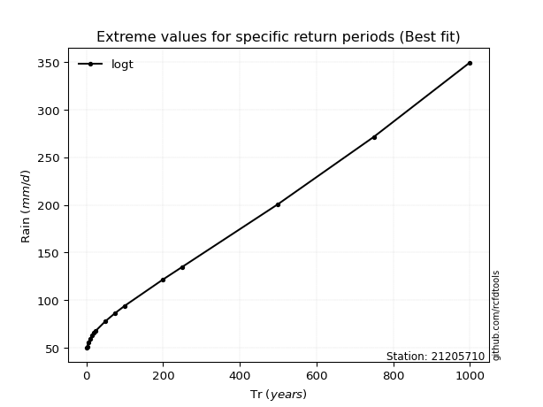</img>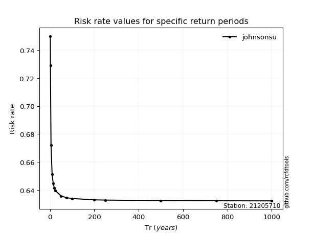</img>

</div>


<sub>**APP DISCLAIMER**: NO WARRANTY - This software is provided by [github.com/rcfdtools](https://github.com/rcfdtools) "as is", without any express or implied warranty, including warranties of merchantability, fitness for a particular purpose, or non-infringement. There is no guarantee that the software will be error-free or operate without interruption. LIMITATION OF LIABILITY - Neither the authors nor copyright holders will be liable for claims or damages arising from the software or its use. You are responsible for determining if the software is appropriate for your use and assume all associated risks, including errors, legal compliance, and data loss. NO PROFESSIONAL ADVICE - The software provides general information and does not offer professional advice. It should not replace consultation with professional advisors.</sub>