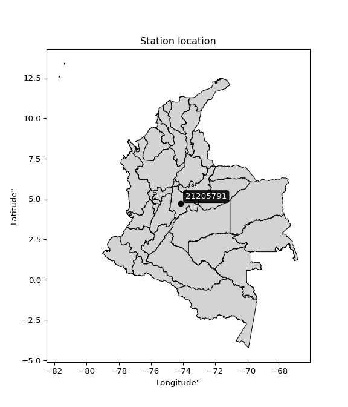

<div align="center">


</div>

# PMax24h Station (Rain, Pmax24h): 21205791

Maximum Precipitation in 24 hours (PMax24h) is the greatest amount of rainfall for a specific duration that is meteorologically possible for a given location, acting as a "worst-case" scenario for extreme storms, crucial for designing safety-critical infrastructure like bridges, river deviations, dams, spillways, and nuclear plants to prevent catastrophic failure. The PMax24h is related with the Probable Maximum Precipitation (PMP) and it is calculated by hydrologists using meteorological data to determine the upper limit of extreme rainfall, often leading to the Probable Maximum Flood (PMF) for flood control design, and is increasingly being studied for climate change impacts. Probable Maximum Precipitation (PMP) is the theoretical upper limit of rainfall, a deterministic estimate for extreme events, while probability distributions (like GEV, Gumbel) describe the likelihood and frequency of various precipitation amounts, including rare ones, showing how often events occur, with PMP representing the extreme end of these distributions, used for critical infrastructure design to ensure safety against the worst conceivable weather, unlike standard statistical forecasts which cover typical probabilities.

The most common probability distributions in hydrology, used for analyzing floods, rainfall, and streamflow, include the Normal, Log-Normal, Gumbel, Gamma (including Log-Pearson Type III), and Generalized Extreme Value (GEV) distributions, often chosen based on the data´s skewness and whether modeling extremes or general conditions, with Gumbel and GEV popular for extreme events like floods, while the Normal distribution serves as a baseline, though often requiring transformations for skewed hydrological data. These distributions help in designing water infrastructure, managing water resources, and forecasting hydrologic events.

> Hydrological data often isn´t perfectly normal (it´s skewed), so different distributions are needed for different applications, such as: **Flood Frequency Analysis**: Using Gumbel, GEV, or Log-Pearson Type III for predicting extreme flood magnitudes and their return periods, **Rainfall Analysis**: Normal for annual totals, but Log-Normal, Weibull, or GEV for intensity or extreme daily rainfall, **Streamflow Modeling**: Gamma and Log-Normal for maximum flows, GEV for minimum flows, and Kappa for daily flows.

<div align="center">

</img>

</div>


## A. General information


### 1. General running parameters

• app_version: _v20260225_. • runtime: _2026-02-27 14:50:08.749431_. • Python version: _3.14.0_. • SciPy version: _1.16.3_. • Pandas version: _2.3.3_. • NumPy version: _2.3.5_. • Stations dataset (station_dataset_file): _dataset/pmax24h_in/automatic_colombia_2003_2025.csv_. • Stations catalog (station_catalog_file): _dataset/CNE.xls_. • Minimum year to eval til year_max (date_min): _1900_. • Maximum year to eval since year_min (date_max): _2025_. • Creates, save and include plots into reports (create_plot): _False_. • Plot only fit distributions with Δo > Δ (plot_only_fit): _True_. • Plot only simple graphs avoiding multiple CDFs and multiple Extreme values plots (plot_only_simple): _False_. • Eval low extreme values, if False, evaluates high extreme values (low_extreme): _False_. • Eval every SciPy distribution as logarithmic (pdist_logarithmic_on): _True_. • Standard deviation normalized (ddof): _1.0_. • Return periods to eval in years (Tr): _[2, 2.33, 5, 10, 15, 20, 25, 50, 75, 100, 200, 250, 500, 750, 1000]_. • Minimum data sample per station, 0 means any (minimum_sample): _5_. • Z-Score maximum threshold to adjust a value, 0 means disable (zscore_max): _3.5_. • Z-Score minimum threshold to adjust a value, 0 means disable (zscore_min): _-2.5_. • Avoid zeros, e.g. rain = 0 (avoid_zeros): _True_. • Avoid null values (avoid_nans): _True_. 

:file_folder:Table: [dataset.csv](../../dataset/pmax24h_in/automatic_colombia_2003_2025.csv)

> Delta Degrees of Freedom (DDOF): is a parameter used in the formulas for calculating variance and standard deviation. When ddof=0, the divisor is $N$ (the total number of observations) and this is used when your data set is the entire population. When ddof=1, the divisor is $N-1$ and this is used when your data set is a sample drawn from a larger population. Using $N-1$ provides an unbiased estimate of the population variance (known as Bessel´s correction).


### 2. Station info and location

|   id |   CODIGO | NOMBRE                     | CATEGORIA               | TECNOLOGIA                | ESTADO   | FECHA_INSTALACION   |   FECHA_SUSPENSION |   ALTITUD |   LATITUD |   LONGITUD | DEPARTAMENTO   | MUNICIPIO   | AREA_OPERATIVA                            | ENTIDAD                                                     | AREA_HIDROGRAFICA   | ZONA_HIDROGRAFICA   | SUBZONA_HIDROGRAFICA   |   CORRIENTE | Catalogo   |   Version |
|-----:|---------:|:---------------------------|:------------------------|:--------------------------|:---------|:--------------------|-------------------:|----------:|----------:|-----------:|:---------------|:------------|:------------------------------------------|:------------------------------------------------------------|:--------------------|:--------------------|:-----------------------|------------:|:-----------|----------:|
|    0 | 21205791 | EL DORADO CATAM [21205791] | Climatológica Principal | Automática con Telemetría | Activa   | 31/10/2002          |                nan |      2547 |   4.70558 |   -74.1507 | Bogotá         | Bogotá, D.C | Area Operativa 11 - Cundinamarca-Amazonas | INSTITUTO DE HIDROLOGIA METEOROLOGIA Y ESTUDIOS AMBIENTALES | Magdalena Cauca     | Alto Magdalena      | Río Bogotá             |         nan | CNE_IDEAM  |  20251226 |

<div align="center">

Dynamic map: [:earth_americas:Google](http://maps.google.com/maps?q=4.705583,-74.150667) [:earth_americas:OSM](https://www.openstreetmap.org/#map=18/4.705583/-74.150667&layers=P) [:earth_americas:Bing](https://www.bing.com/maps?cp=4.705583~-74.150667&lvl=18) [:earth_americas:Apple](https://maps.apple.com/frame?center=4.705583%2C-74.150667&span=0.003%2C0.006)

</div>


<div align="center">

```geojson
{
  "type": "Feature",
  "geometry": {
    "type": "Point", 
    "coordinates": [-74.150667, 4.705583]
  }, 
  "properties": {
    "Name": "21205791"
  }
}
```

</div>


### 3. Discrete values table and plot

<div align="center">

|               |           0 |           1 |           2 |           3 |           4 |           5 |           6 |           7 |           8 |           9 |           10 |         11 |
|:--------------|------------:|------------:|------------:|------------:|------------:|------------:|------------:|------------:|------------:|------------:|-------------:|-----------:|
| Date          | 2014        | 2015        | 2016        | 2017        | 2018        | 2019        | 2020        | 2021        | 2022        | 2023        | 2024         | 2025       |
| Value         |   31.1      |   49.2      |   31.2      |   40.4      |   37.83     |   47.87     |   38.1      |   85.3      |   28.01     |   36.54     |   61.606     |  274.316   |
| Value_initial |   31.1      |   49.2      |   31.2      |   40.4      |   37.83     |   47.87     |   38.1      |   85.3      |   28.01     |   36.54     |   61.606     |  274.316   |
| count         |   12        |   12        |   12        |   12        |   12        |   12        |   12        |   12        |   12        |   12        |   12         |   12       |
| mean          |   63.456    |   63.456    |   63.456    |   63.456    |   63.456    |   63.456    |   63.456    |   63.456    |   63.456    |   63.456    |   63.456     |   63.456   |
| std           |   68.2829   |   68.2829   |   68.2829   |   68.2829   |   68.2829   |   68.2829   |   68.2829   |   68.2829   |   68.2829   |   68.2829   |   68.2829    |   68.2829  |
| zscore        |   -0.473852 |   -0.208778 |   -0.472388 |   -0.337654 |   -0.375292 |   -0.228256 |   -0.371337 |    0.319904 |   -0.519105 |   -0.394183 |   -0.0270932 |    3.08803 |


</div>


> The initial value (value_initial) correspond to the initial obtained or null completed value, and value (value) is adjusted only when the initial value is outside the valid range (outlier) definite through the Z-Score value. If Z-Score is active, values out of range or outliers are replaced with the station mean value. A Z-Score (or standard score) measures how many standard deviations a data point is from the mean of a dataset, indicating its relative position; positive scores mean above the mean, negative mean below, and a score of zero is exactly at the mean, allowing for comparison of values from different distributions. It´s calculated using the formula $z=(x–μ)/σ$, where $x$ is the data point, $μ$ is the mean, and $σ$ is the standard deviation, helping identify outliers and understand probability.
>
> <sub>**Note**: In this study, "completing" (filling gaps in) and "extending" (forecasting or lengthening the historical record) rainfall data series are avoided for certain critical analyses because they introduce artificial bias and uncertainty, which can distort the statistics of rare events (extremes), alter day-to-day variability, and compromise the integrity and homogeneity of the original data. Some reasons against Completing/Extending rainfall data are: **Distortion of Extremes and Variability**: The primary issue is that most gap-filling or extension methods rely on averaging or regression with nearby stations, which inherently smooths the data. Rainfall is highly variable in space and time, with a large percentage of zero values and occasional large storms. Infilling methods often underestimate the highest values and overestimate the lowest (zero) values, which severely distorts analyses focused on flood frequency, drought severity, and intensity-duration-frequency (IDF) curves, **Loss of Data Homogeneity**: Infilled or extended data are synthetic estimates, not actual measurements. Combining these estimates with observed data can violate the assumption of data homogeneity, which requires that the data properties do not change over time. Inhomogeneity can lead to incorrect conclusions about long-term trends or changes in climate patterns, **Propagation of Errors**: Errors and biases from the original data (e.g., wind-induced undercatch, instrument errors, site changes) or the data used for imputation can propagate through the analysis, leading to unreliable hydrological models and inaccurate predictions, **Compromised Statistical Integrity**: For statistical analyses, especially those involving the frequency of events, using artificial data can introduce time bias or autocorrelation that doesn´t exist in reality, making it difficult to assess the true probability of events, **Difficulty in Validation**: It is difficult to accurately validate the quality of filled or extended data, especially for past periods where ground-truth measurements are unavailable. The reliability of imputation techniques heavily depends on the density of the surrounding station network and the complexity of the local topography.</sub>


### 4. Active continuous probability distributions from SciPy (80 of 104 available)

A Probability Density Function (PDF) describes the relative likelihood of a continuous random variable falling within a specific range, where the total area under its curve equals 1, and the area over any interval gives the actual probability for that range. Unlike discrete probabilities (like rolling a die), a PDF shows density, not direct probability for a single point (which is zero), with higher points indicating higher likelihood, often visualized as a bell curve for normal distributions.

A log of a probability density function (log-PDF) is simply the logarithm of the PDF´s value, denoted as $log(f(x))$, useful for converting multiplication of probabilities into addition, improving numerical stability with tiny numbers, and connecting to information theory concepts like entropy. Instead of dealing with very small probabilities (e.g., 0.000001), log-PDFs use negative numbers (e.g., $log(0.00001) ≈ -11.51$ that are easier for computers to handle, preventing underflow errors and simplifying complex calculations. In this study, each active probability distribution from SciPy is also evaluated in the $log$ form.

[scipy.stats](https://docs.scipy.org/doc/scipy/reference/stats.html) is a Python´s powerful submodule within the SciPy library for comprehensive statistical analysis, offering over 130 probability distributions (like Normal, Poisson, etc.), functions for descriptive stats (mean, variance), hypothesis testing (t-tests, chi-square), random variable generation, and statistical tests, making it essential for data science, modeling, and research. It provides tools to explore, model, and draw conclusions from data efficiently, working seamlessly with [NumPy](https://numpy.org/).

<div align="center">

|   id | p_dist           |   n_parameter | fit_method   | label                                                                       | active   | ref                                                                                                      |
|-----:|:-----------------|--------------:|:-------------|:----------------------------------------------------------------------------|:---------|:---------------------------------------------------------------------------------------------------------|
|    0 | alpha            |             3 | MLE          | Alpha                                                                       | True     | [:mortar_board:](https://docs.scipy.org/doc/scipy/reference/generated/scipy.stats.alpha.html)            |
|    1 | anglit           |             2 | MM           | Anglit                                                                      | True     | [:mortar_board:](https://docs.scipy.org/doc/scipy/reference/generated/scipy.stats.anglit.html)           |
|    2 | arcsine          |             2 | MM           | Arcsine                                                                     | True     | [:mortar_board:](https://docs.scipy.org/doc/scipy/reference/generated/scipy.stats.arcsine.html)          |
|    3 | argus            |             3 | MLE          | Argus                                                                       | True     | [:mortar_board:](https://docs.scipy.org/doc/scipy/reference/generated/scipy.stats.argus.html)            |
|    4 | beta             |             4 | MLE          | Beta                                                                        | True     | [:mortar_board:](https://docs.scipy.org/doc/scipy/reference/generated/scipy.stats.beta.html)             |
|    5 | betaprime        |             4 | MLE          | Beta prime                                                                  | True     | [:mortar_board:](https://docs.scipy.org/doc/scipy/reference/generated/scipy.stats.betaprime.html)        |
|    6 | bradford         |             3 | MLE          | Bradford                                                                    | True     | [:mortar_board:](https://docs.scipy.org/doc/scipy/reference/generated/scipy.stats.bradford.html)         |
|    7 | burr             |             4 | MLE          | Burr (Type III)                                                             | True     | [:mortar_board:](https://docs.scipy.org/doc/scipy/reference/generated/scipy.stats.burr.html)             |
|    8 | burr12           |             4 | MLE          | Burr (Type III) 12                                                          | True     | [:mortar_board:](https://docs.scipy.org/doc/scipy/reference/generated/scipy.stats.burr12.html)           |
|    9 | cosine           |             2 | MLE          | Cosine                                                                      | True     | [:mortar_board:](https://docs.scipy.org/doc/scipy/reference/generated/scipy.stats.cosine.html)           |
|   10 | crystalball      |             4 | MLE          | Crystalball                                                                 | True     | [:mortar_board:](https://docs.scipy.org/doc/scipy/reference/generated/scipy.stats.crystalball.html)      |
|   11 | dgamma           |             3 | MLE          | Double gamma                                                                | True     | [:mortar_board:](https://docs.scipy.org/doc/scipy/reference/generated/scipy.stats.dgamma.html)           |
|   12 | dweibull         |             3 | MLE          | Double Weibull                                                              | True     | [:mortar_board:](https://docs.scipy.org/doc/scipy/reference/generated/scipy.stats.dweibull.html)         |
|   13 | erlang           |             3 | MLE          | Erlang                                                                      | True     | [:mortar_board:](https://docs.scipy.org/doc/scipy/reference/generated/scipy.stats.erlang.html)           |
|   14 | exponnorm        |             3 | MLE          | Exponentially modified Normal                                               | True     | [:mortar_board:](https://docs.scipy.org/doc/scipy/reference/generated/scipy.stats.exponnorm.html)        |
|   15 | exponpow         |             3 | MLE          | Exponential power                                                           | True     | [:mortar_board:](https://docs.scipy.org/doc/scipy/reference/generated/scipy.stats.exponpow.html)         |
|   16 | exponweib        |             4 | MLE          | Exponentiated Weibull                                                       | True     | [:mortar_board:](https://docs.scipy.org/doc/scipy/reference/generated/scipy.stats.exponweib.html)        |
|   17 | f                |             4 | MLE          | F                                                                           | True     | [:mortar_board:](https://docs.scipy.org/doc/scipy/reference/generated/scipy.stats.f.html)                |
|   18 | fatiguelife      |             3 | MLE          | Fatigue-life (Birnbaum-Saunders)                                            | True     | [:mortar_board:](https://docs.scipy.org/doc/scipy/reference/generated/scipy.stats.fatiguelife.html)      |
|   19 | foldnorm         |             3 | MM           | Fold Normal                                                                 | True     | [:mortar_board:](https://docs.scipy.org/doc/scipy/reference/generated/scipy.stats.foldnorm.html)         |
|   20 | gamma            |             3 | MLE          | Gamma                                                                       | True     | [:mortar_board:](https://docs.scipy.org/doc/scipy/reference/generated/scipy.stats.gamma.html)            |
|   21 | gausshyper       |             6 | MLE          | Gauss hypergeometric                                                        | True     | [:mortar_board:](https://docs.scipy.org/doc/scipy/reference/generated/scipy.stats.gausshyper.html)       |
|   22 | genexpon         |             5 | MLE          | Generalized exponential                                                     | True     | [:mortar_board:](https://docs.scipy.org/doc/scipy/reference/generated/scipy.stats.genexpon.html)         |
|   23 | genextreme       |             3 | MLE          | Generalized exponential                                                     | True     | [:mortar_board:](https://docs.scipy.org/doc/scipy/reference/generated/scipy.stats.genextreme.html)       |
|   24 | gengamma         |             4 | MLE          | Generalized gamma                                                           | True     | [:mortar_board:](https://docs.scipy.org/doc/scipy/reference/generated/scipy.stats.gengamma.html)         |
|   25 | genhalflogistic  |             3 | MLE          | Generalized half-logistic                                                   | True     | [:mortar_board:](https://docs.scipy.org/doc/scipy/reference/generated/scipy.stats.genhalflogistic.html)  |
|   26 | genlogistic      |             3 | MLE          | Generalized logistic                                                        | True     | [:mortar_board:](https://docs.scipy.org/doc/scipy/reference/generated/scipy.stats.genlogistic.html)      |
|   27 | gennorm          |             3 | MLE          | Generalized Normal                                                          | True     | [:mortar_board:](https://docs.scipy.org/doc/scipy/reference/generated/scipy.stats.gennorm.html)          |
|   28 | genpareto        |             3 | MLE          | Generalized Pareto                                                          | True     | [:mortar_board:](https://docs.scipy.org/doc/scipy/reference/generated/scipy.stats.genpareto.html)        |
|   29 | gompertz         |             3 | MLE          | Gompertz (or truncated Gumbel)                                              | True     | [:mortar_board:](https://docs.scipy.org/doc/scipy/reference/generated/scipy.stats.gompertz.html)         |
|   30 | gumbel_l         |             2 | MM           | Gumbel Left Skew                                                            | True     | [:mortar_board:](https://docs.scipy.org/doc/scipy/reference/generated/scipy.stats.gumbel_l.html)         |
|   31 | gumbel_r         |             2 | MM           | Gumbel Right Skew                                                           | True     | [:mortar_board:](https://docs.scipy.org/doc/scipy/reference/generated/scipy.stats.gumbel_r.html)         |
|   32 | halfgennorm      |             3 | MLE          | Upper half of a generalized normal                                          | True     | [:mortar_board:](https://docs.scipy.org/doc/scipy/reference/generated/scipy.stats.halfgennorm.html)      |
|   33 | halflogistic     |             2 | MM           | Half-logistic                                                               | True     | [:mortar_board:](https://docs.scipy.org/doc/scipy/reference/generated/scipy.stats.halflogistic.html)     |
|   34 | halfnorm         |             2 | MM           | Half Normal                                                                 | True     | [:mortar_board:](https://docs.scipy.org/doc/scipy/reference/generated/scipy.stats.halfnorm.html)         |
|   35 | hypsecant        |             2 | MM           | hyperbolic secant                                                           | True     | [:mortar_board:](https://docs.scipy.org/doc/scipy/reference/generated/scipy.stats.hypsecant.html)        |
|   36 | invgamma         |             3 | MLE          | Inverted gamma                                                              | True     | [:mortar_board:](https://docs.scipy.org/doc/scipy/reference/generated/scipy.stats.invgamma.html)         |
|   37 | invgauss         |             3 | MLE          | Inverse Gaussian                                                            | True     | [:mortar_board:](https://docs.scipy.org/doc/scipy/reference/generated/scipy.stats.invgauss.html)         |
|   38 | invweibull       |             3 | MLE          | Inverted Weibull                                                            | True     | [:mortar_board:](https://docs.scipy.org/doc/scipy/reference/generated/scipy.stats.invweibull.html)       |
|   39 | johnsonsb        |             4 | MLE          | Johnson SB                                                                  | True     | [:mortar_board:](https://docs.scipy.org/doc/scipy/reference/generated/scipy.stats.johnsonsb.html)        |
|   40 | johnsonsu        |             4 | MLE          | Johnson Su                                                                  | True     | [:mortar_board:](https://docs.scipy.org/doc/scipy/reference/generated/scipy.stats.johnsonsu.html)        |
|   41 | kappa3           |             3 | MLE          | Kappa 3                                                                     | True     | [:mortar_board:](https://docs.scipy.org/doc/scipy/reference/generated/scipy.stats.kappa3.html)           |
|   42 | kappa4           |             4 | MLE          | Kappa 4                                                                     | True     | [:mortar_board:](https://docs.scipy.org/doc/scipy/reference/generated/scipy.stats.kappa4.html)           |
|   43 | ksone            |             3 | MLE          | Kolmogorov-Smirnov one-sided test statistic distribution                    | True     | [:mortar_board:](https://docs.scipy.org/doc/scipy/reference/generated/scipy.stats.ksone.html)            |
|   44 | kstwobign        |             2 | MLE          | Limiting distribution of scaled Kolmogorov-Smirnov two-sided test statistic | True     | [:mortar_board:](https://docs.scipy.org/doc/scipy/reference/generated/scipy.stats.kstwobign.html)        |
|   45 | laplace          |             2 | MM           | Laplace                                                                     | True     | [:mortar_board:](https://docs.scipy.org/doc/scipy/reference/generated/scipy.stats.laplace.html)          |
|   46 | levy_l           |             2 | MLE          | Left-skewed Levy                                                            | True     | [:mortar_board:](https://docs.scipy.org/doc/scipy/reference/generated/scipy.stats.levy_l.html)           |
|   47 | loggamma         |             3 | MLE          | Log gamma                                                                   | True     | [:mortar_board:](https://docs.scipy.org/doc/scipy/reference/generated/scipy.stats.loggamma.html)         |
|   48 | logistic         |             2 | MM           | Logistic (or Sech-squared)                                                  | True     | [:mortar_board:](https://docs.scipy.org/doc/scipy/reference/generated/scipy.stats.logistic.html)         |
|   49 | loglaplace       |             3 | MLE          | Log-Laplace                                                                 | True     | [:mortar_board:](https://docs.scipy.org/doc/scipy/reference/generated/scipy.stats.loglaplace.html)       |
|   50 | lomax            |             3 | MLE          | Lomax (Pareto of the second kind)                                           | True     | [:mortar_board:](https://docs.scipy.org/doc/scipy/reference/generated/scipy.stats.lomax.html)            |
|   51 | maxwell          |             2 | MM           | Maxwell                                                                     | True     | [:mortar_board:](https://docs.scipy.org/doc/scipy/reference/generated/scipy.stats.maxwell.html)          |
|   52 | mielke           |             4 | MLE          | Mielke Beta-Kappa / Dagum                                                   | True     | [:mortar_board:](https://docs.scipy.org/doc/scipy/reference/generated/scipy.stats.mielke.html)           |
|   53 | moyal            |             2 | MM           | Moyal                                                                       | True     | [:mortar_board:](https://docs.scipy.org/doc/scipy/reference/generated/scipy.stats.moyal.html)            |
|   54 | nakagami         |             3 | MLE          | Nakagami                                                                    | True     | [:mortar_board:](https://docs.scipy.org/doc/scipy/reference/generated/scipy.stats.nakagami.html)         |
|   55 | ncf              |             5 | MLE          | Non-central F distribution                                                  | True     | [:mortar_board:](https://docs.scipy.org/doc/scipy/reference/generated/scipy.stats.ncf.html)              |
|   56 | nct              |             4 | MLE          | Non-central Student’s t                                                     | True     | [:mortar_board:](https://docs.scipy.org/doc/scipy/reference/generated/scipy.stats.nct.html)              |
|   57 | norm             |             2 | MM           | Normal                                                                      | True     | [:mortar_board:](https://docs.scipy.org/doc/scipy/reference/generated/scipy.stats.norm.html)             |
|   58 | pearson3         |             3 | MM           | Pearson type III                                                            | True     | [:mortar_board:](https://docs.scipy.org/doc/scipy/reference/generated/scipy.stats.pearson3.html)         |
|   59 | powerlaw         |             3 | MLE          | Power-function                                                              | True     | [:mortar_board:](https://docs.scipy.org/doc/scipy/reference/generated/scipy.stats.powerlaw.html)         |
|   60 | rayleigh         |             2 | MM           | Rayleigh                                                                    | True     | [:mortar_board:](https://docs.scipy.org/doc/scipy/reference/generated/scipy.stats.rayleigh.html)         |
|   61 | rdist            |             3 | MLE          | R-distributed (symmetric beta)                                              | True     | [:mortar_board:](https://docs.scipy.org/doc/scipy/reference/generated/scipy.stats.rdist.html)            |
|   62 | rice             |             3 | MLE          | Rice                                                                        | True     | [:mortar_board:](https://docs.scipy.org/doc/scipy/reference/generated/scipy.stats.rice.html)             |
|   63 | semicircular     |             2 | MM           | Semicircular                                                                | True     | [:mortar_board:](https://docs.scipy.org/doc/scipy/reference/generated/scipy.stats.semicircular.html)     |
|   64 | skewnorm         |             3 | MLE          | Skew normal                                                                 | True     | [:mortar_board:](https://docs.scipy.org/doc/scipy/reference/generated/scipy.stats.skewnorm.html)         |
|   65 | t                |             3 | MLE          | Student’s t                                                                 | True     | [:mortar_board:](https://docs.scipy.org/doc/scipy/reference/generated/scipy.stats.t.html)                |
|   66 | trapezoid        |             4 | MLE          | Trapezoid                                                                   | True     | [:mortar_board:](https://docs.scipy.org/doc/scipy/reference/generated/scipy.stats.trapezoid.html)        |
|   67 | triang           |             3 | MLE          | Triangular                                                                  | True     | [:mortar_board:](https://docs.scipy.org/doc/scipy/reference/generated/scipy.stats.triang.html)           |
|   68 | truncexpon       |             3 | MLE          | Truncated exponential                                                       | True     | [:mortar_board:](https://docs.scipy.org/doc/scipy/reference/generated/scipy.stats.truncexpon.html)       |
|   69 | truncnorm        |             4 | MLE          | Truncated normal                                                            | True     | [:mortar_board:](https://docs.scipy.org/doc/scipy/reference/generated/scipy.stats.truncnorm.html)        |
|   70 | truncpareto      |             4 | MLE          | Upper truncated Pareto                                                      | True     | [:mortar_board:](https://docs.scipy.org/doc/scipy/reference/generated/scipy.stats.truncpareto.html)      |
|   71 | truncweibull_min |             5 | MLE          | Doubly truncated Weibull minimum                                            | True     | [:mortar_board:](https://docs.scipy.org/doc/scipy/reference/generated/scipy.stats.truncweibull_min.html) |
|   72 | tukeylambda      |             3 | MLE          | Tukey-Lamdba                                                                | True     | [:mortar_board:](https://docs.scipy.org/doc/scipy/reference/generated/scipy.stats.tukeylambda.html)      |
|   73 | uniform          |             2 | MLE          | Uniform                                                                     | True     | [:mortar_board:](https://docs.scipy.org/doc/scipy/reference/generated/scipy.stats.uniform.html)          |
|   74 | vonmises         |             3 | MLE          | Von Mises                                                                   | True     | [:mortar_board:](https://docs.scipy.org/doc/scipy/reference/generated/scipy.stats.vonmises.html)         |
|   75 | vonmises_line    |             3 | MLE          | Von Mises line                                                              | True     | [:mortar_board:](https://docs.scipy.org/doc/scipy/reference/generated/scipy.stats.vonmises_line.html)    |
|   76 | wald             |             2 | MM           | Wald                                                                        | True     | [:mortar_board:](https://docs.scipy.org/doc/scipy/reference/generated/scipy.stats.wald.html)             |
|   77 | weibull_max      |             3 | MLE          | Weibull maximum                                                             | True     | [:mortar_board:](https://docs.scipy.org/doc/scipy/reference/generated/scipy.stats.weibull_max.html)      |
|   78 | weibull_min      |             3 | MLE          | Weibull minimum                                                             | True     | [:mortar_board:](https://docs.scipy.org/doc/scipy/reference/generated/scipy.stats.weibull_min.html)      |
|   79 | wrapcauchy       |             3 | MLE          | Wrapped  Cauchy                                                             | True     | [:mortar_board:](https://docs.scipy.org/doc/scipy/reference/generated/scipy.stats.wrapcauchy.html)       |

</div>

> **n_parameter:** # arguments & localization & scale.
>
> **Fit methods:** (MLE) maximum likelihood, (MM) L-moments.
>
>**Inactive** (With the only purpose of prevent loops, zero divisions, infinite values, over high estimated values or horizontal trending for recurrence intervals estimations, the follow distributions were disabled.)**:** lognorm, norminvgauss, powernorm, powerlognorm, cauchy, halfcauchy, foldcauchy, skewcauchy, chi2, expon, fisk, genhyperbolic, geninvgauss, gibrat, kstwo, laplace_asymmetric, levy, levy_stable, ncx2, pareto, rel_breitwigner, recipinvgauss, studentized_range, loguniform, 


## B. Probability (PDF) vs. Empirical (EDF) distributions functions

A continuous probability distribution (CPD) describes probabilities for variables that can take any value within a range (like rain any time), unlike discrete variables with specific outcomes (like temperature). It uses a Probability Density Function (PDF), a curve where the total area under it equals 1, and the probability of the variable falling within an interval (a to b) is found by calculating the area under the curve between those points. A key feature is that the probability of hitting any single exact value is zero, so probabilities are always expressed for ranges, e.g., $P(a ≤ X ≤ b)$.

<div align="center">

Distributions parameters from station values
|     |   station | p_dist              |   n |              loc |          scale | shape                  | shape1                 | shape2                 | shape3             |
|----:|----------:|:--------------------|----:|-----------------:|---------------:|:-----------------------|:-----------------------|:-----------------------|:-------------------|
|   0 |  21205791 | alpha               |  12 |     20.8338      |   20.133       | 0.7556250444151159     |                        |                        |                    |
|   1 |  21205791 | anglit              |  12 |     63.456       |  191.251       |                        |                        |                        |                    |
|   2 |  21205791 | arcsine             |  12 |    -28.9995      |  184.911       |                        |                        |                        |                    |
|   3 |  21205791 | argus               |  12 |   -125.593       |  409.037       | 1.9894797054933117e-06 |                        |                        |                    |
|   4 |  21205791 | beta                |  12 |     28.01        | 4341.45        | 0.7137882992498531     | 163.6463835208715      |                        |                    |
|   5 |  21205791 | betaprime           |  12 |     -0.290397    |    0.540334    | 333.59546818055355     | 4.130955185303012      |                        |                    |
|   6 |  21205791 | bradford            |  12 |     27.931       |  246.385       | 32.796478671513526     |                        |                        |                    |
|   7 |  21205791 | burr                |  12 |     24.228       |    0.420536    | 1.1837432699824646     | 51.948405563135715     |                        |                    |
|   8 |  21205791 | burr12              |  12 |     -1.46513     |   29.233       | 316.2587320536495      | 0.005729839018576018   |                        |                    |
|   9 |  21205791 | cosine              |  12 |     48.3567      |   14.6662      |                        |                        |                        |                    |
|  10 |  21205791 | crystalball         |  12 |     63.456       |   65.3759      | 5772.638265299234      | 26.052002874773855     |                        |                    |
|  11 |  21205791 | dgamma              |  12 |     38.1         |   59.7856      | 0.5626721908157191     |                        |                        |                    |
|  12 |  21205791 | dweibull            |  12 |     37.83        |   58.6899      | 0.73715368579952       |                        |                        |                    |
|  13 |  21205791 | erlang              |  12 |     28.01        |   36.0674      | 0.7043018181600115     |                        |                        |                    |
|  14 |  21205791 | exponnorm           |  12 |     27.9783      |    0.0106622   | 3331.7053948287594     |                        |                        |                    |
|  15 |  21205791 | exponpow            |  12 |     28.01        |   67.1225      | 0.47764199484835324    |                        |                        |                    |
|  16 |  21205791 | exponweib           |  12 |     27.2483      |    0.104641    | 18.420143113608102     | 0.24644658696739424    |                        |                    |
|  17 |  21205791 | f                   |  12 |     28.0098      |   12.333       | 1.372758037616356      | 3.256624057932556      |                        |                    |
|  18 |  21205791 | fatiguelife         |  12 |     26.693       |   16.6291      | 1.6026788383710087     |                        |                        |                    |
|  19 |  21205791 | foldnorm            |  12 |    -36.6385      |  123.27        | 0.0013661371133960034  |                        |                        |                    |
|  20 |  21205791 | gamma               |  12 |     28.01        |   41.5667      | 0.7057705970156084     |                        |                        |                    |
|  21 |  21205791 | gausshyper          |  12 |      3.7417      |  270.574       | 0.6922852460071756     | 0.9022373332086174     | 2.2856816082348654     | 0.5945867830742577 |
|  22 |  21205791 | genexpon            |  12 |     28.01        |   81.9801      | 2.3128171993220237     | 6.14132808084965e-11   | 1.4215074792853932     |                    |
|  23 |  21205791 | genextreme          |  12 |     35.9663      |   10.0136      | -0.8429769210542142    |                        |                        |                    |
|  24 |  21205791 | gengamma            |  12 |     24.9535      |    9.3674e-07  | 28.633391856855688     | 0.19881855177094576    |                        |                    |
|  25 |  21205791 | genhalflogistic     |  12 |      9.53728     |   37.4098      | 9.597917443324345e-10  |                        |                        |                    |
|  26 |  21205791 | genlogistic         |  12 |   -155.715       |   25.5806      | 2341.299610595962      |                        |                        |                    |
|  27 |  21205791 | gennorm             |  12 |     38.1         |    2.10743     | 0.45045921513010323    |                        |                        |                    |
|  28 |  21205791 | genpareto           |  12 |     28.01        |   14.1582      | 0.6626487940782457     |                        |                        |                    |
|  29 |  21205791 | gompertz            |  12 |     28.01        |    5.53425e+13 | 1084901205474.707      |                        |                        |                    |
|  30 |  21205791 | gumbel_l            |  12 |     92.8786      |   50.9734      |                        |                        |                        |                    |
|  31 |  21205791 | gumbel_r            |  12 |     34.0334      |   50.9734      |                        |                        |                        |                    |
|  32 |  21205791 | halfgennorm         |  12 |     28.01        |   13.6749      | 0.6550649471275878     |                        |                        |                    |
|  33 |  21205791 | halflogistic        |  12 |    -14.0297      |   55.8941      |                        |                        |                        |                    |
|  34 |  21205791 | halfnorm            |  12 |    -23.0761      |  108.452       |                        |                        |                        |                    |
|  35 |  21205791 | hypsecant           |  12 |     63.456       |   41.6196      |                        |                        |                        |                    |
|  36 |  21205791 | invgamma            |  12 |     24.564       |   14.56        | 1.2385259852348411     |                        |                        |                    |
|  37 |  21205791 | invgauss            |  12 |     26.0453      |   11.4191      | 3.2761304657824617     |                        |                        |                    |
|  38 |  21205791 | invweibull          |  12 |     24.0875      |   11.8788      | 1.1862612078762909     |                        |                        |                    |
|  39 |  21205791 | johnsonsb           |  12 |     28.01        |  246.311       | -0.05933652716284122   | 0.13123972374321868    |                        |                    |
|  40 |  21205791 | johnsonsu           |  12 |     27.3719      |    0.0216515   | -4.954426552696706     | 0.6975343995636756     |                        |                    |
|  41 |  21205791 | kappa3              |  12 |     28.01        |   13.7992      | 1.3195188195051712     |                        |                        |                    |
|  42 |  21205791 | kappa4              |  12 |      3.30154     |  250.42        | 1.1087919572039286     | 0.8898475734001372     |                        |                    |
|  43 |  21205791 | ksone               |  12 |      3.3794      |  295.567       | 1.0                    |                        |                        |                    |
|  44 |  21205791 | kstwobign           |  12 |    -79.5772      |  171.545       |                        |                        |                        |                    |
|  45 |  21205791 | laplace             |  12 |     63.456       |   46.2278      |                        |                        |                        |                    |
|  46 |  21205791 | levy_l              |  12 |    299.996       |  146.086       |                        |                        |                        |                    |
|  47 |  21205791 | loggamma            |  12 | -20586.5         | 2795.3         | 1615.8180077224933     |                        |                        |                    |
|  48 |  21205791 | logistic            |  12 |     63.456       |   36.0436      |                        |                        |                        |                    |
|  49 |  21205791 | loglaplace          |  12 |     -0.105794    |   38.2058      | 2.635198203699738      |                        |                        |                    |
|  50 |  21205791 | lomax               |  12 |     27.9398      |   21.4686      | 1.5132257729702205     |                        |                        |                    |
|  51 |  21205791 | maxwell             |  12 |    -91.4575      |   97.0776      |                        |                        |                        |                    |
|  52 |  21205791 | mielke              |  12 |     21.8564      |    0.636054    | 138.938242435328       | 1.466982787855375      |                        |                    |
|  53 |  21205791 | moyal               |  12 |     26.0699      |   29.4295      |                        |                        |                        |                    |
|  54 |  21205791 | nakagami            |  12 |     28.01        |   87.6319      | 0.1686385214286799     |                        |                        |                    |
|  55 |  21205791 | ncf                 |  12 |      0.00523457  |    1.23509e-06 | 1.1644458008081414e-07 | 1.8407954187999829     | 3.5110602135654476     |                    |
|  56 |  21205791 | nct                 |  12 |      0.439064    |    1.32218     | 2.851683594687774      | 29.710657102935897     |                        |                    |
|  57 |  21205791 | norm                |  12 |     63.456       |   65.3759      |                        |                        |                        |                    |
|  58 |  21205791 | pearson3            |  12 |     63.456       |   65.3759      | 2.7444408605688944     |                        |                        |                    |
|  59 |  21205791 | powerlaw            |  12 |     28.01        |  246.306       | 0.17468779948267305    |                        |                        |                    |
|  60 |  21205791 | rayleigh            |  12 |    -61.6119      |   99.7898      |                        |                        |                        |                    |
|  61 |  21205791 | rdist               |  12 |      5.03705     |   80.263       | 1.2256960330279458     |                        |                        |                    |
|  62 |  21205791 | rice                |  12 |    -21.9733      |   76.0663      | 0.00024749171650559213 |                        |                        |                    |
|  63 |  21205791 | semicircular        |  12 |     63.456       |  130.752       |                        |                        |                        |                    |
|  64 |  21205791 | skewnorm            |  12 |     28.01        |   74.3695      | 24042716.240853578     |                        |                        |                    |
|  65 |  21205791 | t                   |  12 |     37.8162      |    6.40867     | 0.8341434370944052     |                        |                        |                    |
|  66 |  21205791 | trapezoid           |  12 |      3.3794      |  295.567       | 1.0                    | 1.0                    |                        |                    |
|  67 |  21205791 | triang              |  12 |     28.0099      |  550.37        | 2.2077836829867086e-07 |                        |                        |                    |
|  68 |  21205791 | truncexpon          |  12 |      3.60666     |  218.87        | 1.2368496989898787     |                        |                        |                    |
|  69 |  21205791 | truncnorm           |  12 | -51634.9         | 1816.61        | 28.439183668736653     | 143510.44993324624     |                        |                    |
|  70 |  21205791 | truncpareto         |  12 |      6.64203     |   21.368       | 1.5085988119744023     | 12.526878149229342     |                        |                    |
|  71 |  21205791 | truncweibull_min    |  12 |     16.2175      |  141.599       | 0.23586749413609592    | 0.08328107384816716    | 1.8227401156474263     |                    |
|  72 |  21205791 | tukeylambda         |  12 |      4.87514     |   96.7281      | 1.2027141904391234     |                        |                        |                    |
|  73 |  21205791 | uniform             |  12 |     28.01        |  246.306       |                        |                        |                        |                    |
|  74 |  21205791 | vonmises            |  12 |     -1.3211      |    1           | 0.7388562975415104     |                        |                        |                    |
|  75 |  21205791 | vonmises_line       |  12 |     41.4864      |   13.9463      | 1.5888542957135385     |                        |                        |                    |
|  76 |  21205791 | wald                |  12 |     -1.91992     |   65.3759      |                        |                        |                        |                    |
|  77 |  21205791 | weibull_max         |  12 |    274.316       |    1.65934     | 0.18182740028895011    |                        |                        |                    |
|  78 |  21205791 | weibull_min         |  12 |     28.01        |   38.0476      | 0.6243281466174186     |                        |                        |                    |
|  79 |  21205791 | wrapcauchy          |  12 |     28.01        |   39.2009      | 0.7897875846906568     |                        |                        |                    |
|  80 |  21205791 | logalpha            |  12 |      2.83909     |    2.15929     | 2.5071628759206237     |                        |                        |                    |
|  81 |  21205791 | loganglit           |  12 |      3.89386     |    1.75197     |                        |                        |                        |                    |
|  82 |  21205791 | logarcsine          |  12 |      3.04693     |    1.69386     |                        |                        |                        |                    |
|  83 |  21205791 | logargus            |  12 |      2.27149     |    3.42072     | 3.784357798264891e-05  |                        |                        |                    |
|  84 |  21205791 | logbeta             |  12 |      3.33256     |    2.78126     | 0.23803286317658656    | 1.3260023527184135     |                        |                    |
|  85 |  21205791 | logbetaprime        |  12 |      2.08152     |    0.170887    | 146.21670106044854     | 15.270475978681418     |                        |                    |
|  86 |  21205791 | logbradford         |  12 |      3.33256     |    2.38272     | 1.556312390917641      |                        |                        |                    |
|  87 |  21205791 | logburr             |  12 |      2.97149     |    0.0359913   | 2.3609421968413575     | 827.3026946787395      |                        |                    |
|  88 |  21205791 | logburr12           |  12 |     -5.50636     |    8.83135     | 3078.8850989627913     | 0.0053633722051577674  |                        |                    |
|  89 |  21205791 | logcosine           |  12 |      4.07373     |    0.602207    |                        |                        |                        |                    |
|  90 |  21205791 | logcrystalball      |  12 |      3.89386     |    0.59888     | 29.350845965027574     | 136.79513288529466     |                        |                    |
|  91 |  21205791 | logdgamma           |  12 |      3.6331      |    0.50468     | 0.578429453827132      |                        |                        |                    |
|  92 |  21205791 | logdweibull         |  12 |      3.6331      |    0.458542    | 0.7794530163621733     |                        |                        |                    |
|  93 |  21205791 | logerlang           |  12 |      3.33256     |    0.576834    | 0.7892642775983607     |                        |                        |                    |
|  94 |  21205791 | logexponnorm        |  12 |      3.33176     |    0.000262935 | 2113.674209002337      |                        |                        |                    |
|  95 |  21205791 | logexponpow         |  12 |      3.33256     |    1.1745      | 0.8837685642831666     |                        |                        |                    |
|  96 |  21205791 | logexponweib        |  12 |      3.33256     |    0.59044     | 0.8650632078064697     | 1.0979663370147925     |                        |                    |
|  97 |  21205791 | logf                |  12 |      3.13456     |    0.494967    | 330.8199380706453      | 5.435789998626365      |                        |                    |
|  98 |  21205791 | logfatiguelife      |  12 |      3.24541     |    0.455398    | 0.9204960264968265     |                        |                        |                    |
|  99 |  21205791 | logfoldnorm         |  12 |      3.07521     |    0.981414    | 0.29498960105836924    |                        |                        |                    |
| 100 |  21205791 | loggamma            |  12 |      3.33256     |    0.885477    | 0.3720016452974627     |                        |                        |                    |
| 101 |  21205791 | loggausshyper       |  12 |      3.33256     |    2.314       | 0.9876020548033551     | 1.0714710308106556     | 1.08268720540791       | 0.9349364094085935 |
| 102 |  21205791 | loggenexpon         |  12 |      3.33256     |    1.35943     | 2.4218839430585035     | 1.5223117438993543e-08 | 1.0338595387005218     |                    |
| 103 |  21205791 | loggenextreme       |  12 |      3.59076     |    0.262481    | -0.4232724169074916    |                        |                        |                    |
| 104 |  21205791 | loggengamma         |  12 |      3.33256     |    0.818964    | 0.5653195712210382     | 0.883986636114553      |                        |                    |
| 105 |  21205791 | loggenhalflogistic  |  12 |      3.1191      |    2.62452     | 1.051838743788804      |                        |                        |                    |
| 106 |  21205791 | loggenlogistic      |  12 |      1.10673     |    0.344621    | 1644.882128162777      |                        |                        |                    |
| 107 |  21205791 | loggennorm          |  12 |      3.64021     |    0.0149465   | 0.37592739607446163    |                        |                        |                    |
| 108 |  21205791 | loggenpareto        |  12 |     -0.00146393  |    9.63651     | -1.715981551245866     |                        |                        |                    |
| 109 |  21205791 | loggompertz         |  12 |      3.33256     |    3.02336e+08 | 538593203.9349692      |                        |                        |                    |
| 110 |  21205791 | loggumbel_l         |  12 |      4.16339     |    0.466945    |                        |                        |                        |                    |
| 111 |  21205791 | loggumbel_r         |  12 |      3.62433     |    0.466945    |                        |                        |                        |                    |
| 112 |  21205791 | loghalfgennorm      |  12 |      3.33256     |    0.575369    | 1.002422788073434      |                        |                        |                    |
| 113 |  21205791 | loghalflogistic     |  12 |      3.18405     |    0.512021    |                        |                        |                        |                    |
| 114 |  21205791 | loghalfnorm         |  12 |      3.10118     |    0.99348     |                        |                        |                        |                    |
| 115 |  21205791 | loghypsecant        |  12 |      3.89386     |    0.381259    |                        |                        |                        |                    |
| 116 |  21205791 | loginvgamma         |  12 |      3.13054     |    1.35201     | 2.7176741845522896     |                        |                        |                    |
| 117 |  21205791 | loginvgauss         |  12 |      3.22231     |    0.779037    | 0.8620236759531008     |                        |                        |                    |
| 118 |  21205791 | loginvweibull       |  12 |      2.97063     |    0.620153    | 2.3625892535008806     |                        |                        |                    |
| 119 |  21205791 | logjohnsonsb        |  12 |      3.31096     |    3.07176     | 1.3457146292788822     | 0.698781538726231      |                        |                    |
| 120 |  21205791 | logjohnsonsu        |  12 |      3.25835     |    0.00392302  | -6.120823201721565     | 1.1322456781264991     |                        |                    |
| 121 |  21205791 | logkappa3           |  12 |      3.33253     |    2.28167     | 17242.60363086032      |                        |                        |                    |
| 122 |  21205791 | logkappa4           |  12 |      3.09546     |    2.57906     | 1.1013582870606853     | 1.0226157253860266     |                        |                    |
| 123 |  21205791 | logksone            |  12 |      3.10439     |    2.73806     | 1.0                    |                        |                        |                    |
| 124 |  21205791 | logkstwobign        |  12 |      2.32614     |    1.83343     |                        |                        |                        |                    |
| 125 |  21205791 | loglaplace          |  12 |      3.89386     |    0.423472    |                        |                        |                        |                    |
| 126 |  21205791 | loglevy_l           |  12 |      5.81928     |    1.16415     |                        |                        |                        |                    |
| 127 |  21205791 | logloggamma         |  12 |   -134.968       |   19.9117      | 1068.6633446388487     |                        |                        |                    |
| 128 |  21205791 | loglogistic         |  12 |      3.89386     |    0.33018     |                        |                        |                        |                    |
| 129 |  21205791 | logloglaplace       |  12 |      0.104842    |    3.59399     | 10.363159116322628     |                        |                        |                    |
| 130 |  21205791 | loglomax            |  12 |      3.33256     |    6.67907     | 12.89190367785768      |                        |                        |                    |
| 131 |  21205791 | logmaxwell          |  12 |      2.47477     |    0.889285    |                        |                        |                        |                    |
| 132 |  21205791 | logmielke           |  12 |      2.98374     |    0.10945     | 127.84078450593273     | 2.3330170694371093     |                        |                    |
| 133 |  21205791 | logmoyal            |  12 |      3.55138     |    0.269591    |                        |                        |                        |                    |
| 134 |  21205791 | lognakagami         |  12 |      3.33256     |    1.12875     | 0.28201207470982176    |                        |                        |                    |
| 135 |  21205791 | logncf              |  12 |     -0.579012    |    4.41594     | 1092.5703088517816     | 155.10057792300205     | 0.00039517335819344405 |                    |
| 136 |  21205791 | lognct              |  12 |     -0.363497    |    0.0789882   | 35.87061776066092      | 52.713012397642984     |                        |                    |
| 137 |  21205791 | lognorm             |  12 |      3.89386     |    0.59888     |                        |                        |                        |                    |
| 138 |  21205791 | logpearson3         |  12 |      3.89386     |    0.598879    | 1.87771655785403       |                        |                        |                    |
| 139 |  21205791 | logpowerlaw         |  12 |      3.33256     |    2.28172     | 0.21839197912524214    |                        |                        |                    |
| 140 |  21205791 | lograyleigh         |  12 |      2.74817     |    0.91413     |                        |                        |                        |                    |
| 141 |  21205791 | logrdist            |  12 |      4.51726     |    1.1847      | 1.0499887143310986     |                        |                        |                    |
| 142 |  21205791 | logrice             |  12 |      3.0183      |    0.750089    | 0.0005380005158950785  |                        |                        |                    |
| 143 |  21205791 | logsemicircular     |  12 |      3.89386     |    1.19779     |                        |                        |                        |                    |
| 144 |  21205791 | logskewnorm         |  12 |      3.33256     |    0.820739    | 8438658.06808965       |                        |                        |                    |
| 145 |  21205791 | logt                |  12 |      3.67347     |    0.233213    | 1.5442602286743343     |                        |                        |                    |
| 146 |  21205791 | logtrapezoid        |  12 |      3.10439     |    2.73806     | 1.0                    | 1.0                    |                        |                    |
| 147 |  21205791 | logtriang           |  12 |      3.33256     |    2.52084     | 2.3126699468816324e-08 |                        |                        |                    |
| 148 |  21205791 | logtruncexpon       |  12 |      3.33256     |    2.00433     | 1.138399271545301      |                        |                        |                    |
| 149 |  21205791 | logtruncnorm        |  12 |     -4.77274     |    2.26978     | 3.570970582484314      | 5.792750518127196      |                        |                    |
| 150 |  21205791 | logtruncpareto      |  12 |     -3.37166     |    6.70422     | 11.32126420358297      | 1.3403407079453507     |                        |                    |
| 151 |  21205791 | logtruncweibull_min |  12 |      3.33256     |    3.2127      | 0.8851973481760363     | 1.3203325194458582e-16 | 0.7116050787381121     |                    |
| 152 |  21205791 | logtukeylambda      |  12 |      4.46898     |    1.32191     | 1.1541985311189968     |                        |                        |                    |
| 153 |  21205791 | loguniform          |  12 |      3.33256     |    2.28172     |                        |                        |                        |                    |
| 154 |  21205791 | logvonmises         |  12 |     -2.45692     |    1           | 3.7067059141022667     |                        |                        |                    |
| 155 |  21205791 | logvonmises_line    |  12 |      3.78279     |    0.584872    | 2.0528348993342576     |                        |                        |                    |
| 156 |  21205791 | logwald             |  12 |      3.29498     |    0.59888     |                        |                        |                        |                    |
| 157 |  21205791 | logweibull_max      |  12 |      3.96775e+07 |    3.96775e+07 | 115145479.29997018     |                        |                        |                    |
| 158 |  21205791 | logweibull_min      |  12 |      3.33256     |    0.888453    | 0.40736518069512057    |                        |                        |                    |
| 159 |  21205791 | logwrapcauchy       |  12 |      3.33256     |    0.363147    | 0.5                    |                        |                        |                    |

</div>

> **loc** (Location parameter): This shifts the distribution along the x-axis. For many common distributions, like the normal (Gaussian) distribution, loc represents the mean $μ$. For others, like the uniform distribution, it might represent the minimum value, or for the beta distribution, the left end of the support interval.
>
> **scale** (Scale parameter): This determines the width or spread of the distribution. For the normal distribution, scale represents the standard deviation $σ$. For a uniform distribution, it defines the length of the interval (from $loc$ to $loc + scale$).
>
> **shape** (Shape parameters): Refers to parameters that define the specific form of a probability distribution, distinct from its location (loc) and scale (scale). These parameters are required arguments for most distribution functions. For example, a normal (Gaussian) distribution is fully defined by its location (mean) and scale (standard deviation), so it has no specific shape parameters beyond loc and scale. However, other distributions have intrinsic properties that need specification, as Gamma distribution that takes a shape parameter, often named $a$ or $alpha$.


### 0. Cumulative distribution values - CDF (160 evaluated)

Cumulative Distribution Function (CDF), denoted as $F$<sub>$X$</sub>$(x)$, is a function that gives the probability that a random variable $X$ will take a value less than or equal to a specific value, $x$ (i.e., $(P(X≥x)$. It essentially "accumulates" probabilities from a given point up to the far right (positive infinity), providing a complete picture of the distribution´s probabilities for both discrete (like rain) and continuous (like temperature) variables, helping to find probabilities over ranges or above certain values. Each station is evaluated separately ordering the $x$ values ascending, calculating the CDF and PDF values for the activated distributions and their logarithmic forms.

<div align="center">

CDF ordered by x ascending and calculating $log(f(x))$ separately
|   id |   Station |   date |       x |   count |   mean |     std |     zscore |   Value_initial |   station |   m |     alpha |   alpha_pdf |   anglit |   anglit_pdf |   arcsine |   arcsine_pdf |    argus |   argus_pdf |        beta |       beta_pdf |   betaprime |   betaprime_pdf |   bradford |   bradford_pdf |      burr |    burr_pdf |    burr12 |   burr12_pdf |   cosine |   cosine_pdf |   crystalball |   crystalball_pdf |   dgamma |      dgamma_pdf |   dweibull |   dweibull_pdf |      erlang |    erlang_pdf |   exponnorm |   exponnorm_pdf |    exponpow |   exponpow_pdf |   exponweib |   exponweib_pdf |           f |       f_pdf |   fatiguelife |   fatiguelife_pdf |   foldnorm |   foldnorm_pdf |       gamma |     gamma_pdf |   gausshyper |   gausshyper_pdf |    genexpon |   genexpon_pdf |   genextreme |   genextreme_pdf |   gengamma |   gengamma_pdf |   genhalflogistic |   genhalflogistic_pdf |   genlogistic |   genlogistic_pdf |   gennorm |   gennorm_pdf |   genpareto |   genpareto_pdf |    gompertz |   gompertz_pdf |   gumbel_l |   gumbel_l_pdf |   gumbel_r |   gumbel_r_pdf |   halfgennorm |   halfgennorm_pdf |   halflogistic |   halflogistic_pdf |   halfnorm |   halfnorm_pdf |   hypsecant |   hypsecant_pdf |   invgamma |   invgamma_pdf |   invgauss |   invgauss_pdf |   invweibull |   invweibull_pdf |   johnsonsb |   johnsonsb_pdf |   johnsonsu |   johnsonsu_pdf |      kappa3 |   kappa3_pdf |      kappa4 |   kappa4_pdf |     ksone |   ksone_pdf |   kstwobign |   kstwobign_pdf |   laplace |   laplace_pdf |   levy_l |   levy_l_pdf |    loggamma |   loggamma_pdf |   logistic |   logistic_pdf |   loglaplace |   loglaplace_pdf |      lomax |   lomax_pdf |   maxwell |   maxwell_pdf |      mielke |   mielke_pdf |    moyal |   moyal_pdf |    nakagami |   nakagami_pdf |      ncf |     ncf_pdf |      nct |     nct_pdf |     norm |    norm_pdf |   pearson3 |   pearson3_pdf |   powerlaw |   powerlaw_pdf |   rayleigh |   rayleigh_pdf |    rdist |     rdist_pdf |     rice |    rice_pdf |   semicircular |   semicircular_pdf |   skewnorm |   skewnorm_pdf |        t |      t_pdf |   trapezoid |   trapezoid_pdf |      triang |   triang_pdf |   truncexpon |   truncexpon_pdf |   truncnorm |   truncnorm_pdf |   truncpareto |   truncpareto_pdf |   truncweibull_min |   truncweibull_min_pdf |   tukeylambda |   tukeylambda_pdf |   uniform |   uniform_pdf |   vonmises |   vonmises_pdf |   vonmises_line |   vonmises_line_pdf |     wald |    wald_pdf |   weibull_max |   weibull_max_pdf |   weibull_min |   weibull_min_pdf |   wrapcauchy |   wrapcauchy_pdf |   logalpha |   logalpha_pdf |   loganglit |   loganglit_pdf |   logarcsine |   logarcsine_pdf |   logargus |   logargus_pdf |     logbeta |   logbeta_pdf |   logbetaprime |   logbetaprime_pdf |   logbradford |   logbradford_pdf |   logburr |   logburr_pdf |   logburr12 |   logburr12_pdf |   logcosine |   logcosine_pdf |   logcrystalball |   logcrystalball_pdf |   logdgamma |   logdgamma_pdf |   logdweibull |   logdweibull_pdf |   logerlang |   logerlang_pdf |   logexponnorm |   logexponnorm_pdf |   logexponpow |   logexponpow_pdf |   logexponweib |   logexponweib_pdf |      logf |   logf_pdf |   logfatiguelife |   logfatiguelife_pdf |   logfoldnorm |   logfoldnorm_pdf |   loggausshyper |   loggausshyper_pdf |   loggenexpon |   loggenexpon_pdf |   loggenextreme |   loggenextreme_pdf |   loggengamma |   loggengamma_pdf |   loggenhalflogistic |   loggenhalflogistic_pdf |   loggenlogistic |   loggenlogistic_pdf |   loggennorm |   loggennorm_pdf |   loggenpareto |   loggenpareto_pdf |   loggompertz |   loggompertz_pdf |   loggumbel_l |   loggumbel_l_pdf |   loggumbel_r |   loggumbel_r_pdf |   loghalfgennorm |   loghalfgennorm_pdf |   loghalflogistic |   loghalflogistic_pdf |   loghalfnorm |   loghalfnorm_pdf |   loghypsecant |   loghypsecant_pdf |   loginvgamma |   loginvgamma_pdf |   loginvgauss |   loginvgauss_pdf |   loginvweibull |   loginvweibull_pdf |   logjohnsonsb |   logjohnsonsb_pdf |   logjohnsonsu |   logjohnsonsu_pdf |   logkappa3 |   logkappa3_pdf |   logkappa4 |   logkappa4_pdf |   logksone |   logksone_pdf |   logkstwobign |   logkstwobign_pdf |   loglevy_l |   loglevy_l_pdf |   logloggamma |   logloggamma_pdf |   loglogistic |   loglogistic_pdf |   logloglaplace |   logloglaplace_pdf |    loglomax |   loglomax_pdf |   logmaxwell |   logmaxwell_pdf |   logmielke |   logmielke_pdf |   logmoyal |   logmoyal_pdf |   lognakagami |   lognakagami_pdf |   logncf |   logncf_pdf |   lognct |   lognct_pdf |   lognorm |   lognorm_pdf |   logpearson3 |   logpearson3_pdf |   logpowerlaw |   logpowerlaw_pdf |   lograyleigh |   lograyleigh_pdf |    logrdist |   logrdist_pdf |   logrice |   logrice_pdf |   logsemicircular |   logsemicircular_pdf |   logskewnorm |   logskewnorm_pdf |     logt |   logt_pdf |   logtrapezoid |   logtrapezoid_pdf |   logtriang |   logtriang_pdf |   logtruncexpon |   logtruncexpon_pdf |   logtruncnorm |   logtruncnorm_pdf |   logtruncpareto |   logtruncpareto_pdf |   logtruncweibull_min |   logtruncweibull_min_pdf |   logtukeylambda |   logtukeylambda_pdf |   loguniform |   loguniform_pdf |   logvonmises |   logvonmises_pdf |   logvonmises_line |   logvonmises_line_pdf |    logwald |   logwald_pdf |   logweibull_max |   logweibull_max_pdf |   logweibull_min |   logweibull_min_pdf |   logwrapcauchy |   logwrapcauchy_pdf |
|-----:|----------:|-------:|--------:|--------:|-------:|--------:|-----------:|----------------:|----------:|----:|----------:|------------:|---------:|-------------:|----------:|--------------:|---------:|------------:|------------:|---------------:|------------:|----------------:|-----------:|---------------:|----------:|------------:|----------:|-------------:|---------:|-------------:|--------------:|------------------:|---------:|----------------:|-----------:|---------------:|------------:|--------------:|------------:|----------------:|------------:|---------------:|------------:|----------------:|------------:|------------:|--------------:|------------------:|-----------:|---------------:|------------:|--------------:|-------------:|-----------------:|------------:|---------------:|-------------:|-----------------:|-----------:|---------------:|------------------:|----------------------:|--------------:|------------------:|----------:|--------------:|------------:|----------------:|------------:|---------------:|-----------:|---------------:|-----------:|---------------:|--------------:|------------------:|---------------:|-------------------:|-----------:|---------------:|------------:|----------------:|-----------:|---------------:|-----------:|---------------:|-------------:|-----------------:|------------:|----------------:|------------:|----------------:|------------:|-------------:|------------:|-------------:|----------:|------------:|------------:|----------------:|----------:|--------------:|---------:|-------------:|------------:|---------------:|-----------:|---------------:|-------------:|-----------------:|-----------:|------------:|----------:|--------------:|------------:|-------------:|---------:|------------:|------------:|---------------:|---------:|------------:|---------:|------------:|---------:|------------:|-----------:|---------------:|-----------:|---------------:|-----------:|---------------:|---------:|--------------:|---------:|------------:|---------------:|-------------------:|-----------:|---------------:|---------:|-----------:|------------:|----------------:|------------:|-------------:|-------------:|-----------------:|------------:|----------------:|--------------:|------------------:|-------------------:|-----------------------:|--------------:|------------------:|----------:|--------------:|-----------:|---------------:|----------------:|--------------------:|---------:|------------:|--------------:|------------------:|--------------:|------------------:|-------------:|-----------------:|-----------:|---------------:|------------:|----------------:|-------------:|-----------------:|-----------:|---------------:|------------:|--------------:|---------------:|-------------------:|--------------:|------------------:|----------:|--------------:|------------:|----------------:|------------:|----------------:|-----------------:|---------------------:|------------:|----------------:|--------------:|------------------:|------------:|----------------:|---------------:|-------------------:|--------------:|------------------:|---------------:|-------------------:|----------:|-----------:|-----------------:|---------------------:|--------------:|------------------:|----------------:|--------------------:|--------------:|------------------:|----------------:|--------------------:|--------------:|------------------:|---------------------:|-------------------------:|-----------------:|---------------------:|-------------:|-----------------:|---------------:|-------------------:|--------------:|------------------:|--------------:|------------------:|--------------:|------------------:|-----------------:|---------------------:|------------------:|----------------------:|--------------:|------------------:|---------------:|-------------------:|--------------:|------------------:|--------------:|------------------:|----------------:|--------------------:|---------------:|-------------------:|---------------:|-------------------:|------------:|----------------:|------------:|----------------:|-----------:|---------------:|---------------:|-------------------:|------------:|----------------:|--------------:|------------------:|--------------:|------------------:|----------------:|--------------------:|------------:|---------------:|-------------:|-----------------:|------------:|----------------:|-----------:|---------------:|--------------:|------------------:|---------:|-------------:|---------:|-------------:|----------:|--------------:|--------------:|------------------:|--------------:|------------------:|--------------:|------------------:|------------:|---------------:|----------:|--------------:|------------------:|----------------------:|--------------:|------------------:|---------:|-----------:|---------------:|-------------------:|------------:|----------------:|----------------:|--------------------:|---------------:|-------------------:|-----------------:|---------------------:|----------------------:|--------------------------:|-----------------:|---------------------:|-------------:|-----------------:|--------------:|------------------:|-------------------:|-----------------------:|-----------:|--------------:|-----------------:|---------------------:|-----------------:|---------------------:|----------------:|--------------------:|
|    0 |  21205791 |   2022 |  28.01  |      12 | 63.456 | 68.2829 | -0.519105  |          28.01  |  21205791 |   1 | 0.0260449 | 0.0246157   | 0.318877 |   0.00487362 |  0.374758 |    0.00372768 | 0.203883 |  0.00255263 | 5.12831e-12 | 1030.35        |    0.136598 |     0.0179318   | 0.00297088 |     0.0374183  | 0.0241966 | 0.0271985   | 0.0152388 |  0.0563916   | 0.122718 |   0.0128317  |      0.293845 |       0.00526815  | 0.305451 |     0.00972608  |   0.382572 |    0.00768768  | 5.85829e-12 | 1161.37       | 0.000892035 |     0.028084    | 1.68171e-08 |    2.26097e+06 |   0.0180919 |     0.0427983   | 0.000345018 | 1.5366      |     0.0205971 |       0.0450949   |   0.400032 |    0.00564102  | 5.01912e-12 | 997.082       |     0.259862 |       0.00694813 | 1.26494e-11 |    0.028212    |    0.0241712 |      0.0272121   |  0.0348796 |    0.0237563   |          0.241999 |           0.0125827   |      0.168863 |       0.0117369   |  0.231649 |   0.0126665   | 2.88092e-12 |     0.0706303   | 4.88004e-13 |    0.0196034   |   0.244294 |    0.00415267  |   0.324512 |     0.00716485 |    1.1507e-15 |        0.0539822  |       0.359286 |        0.00779075  |   0.362394 |    0.00658447  |    0.256757 |     0.00552158  |  0.0237987 |    0.0278184   |  0.0214574 |    0.0360376   |    0.0241707 |      0.027212    |  1.3147e-06 |     7.66828e+06 |   0.0173984 |     0.0469832   | 5.47955e-12 |  0.0587341   | 4.08165e-15 |   0.14515    | 0.0833333 |  0.00338333 |    0.173596 |     0.00850821  |  0.232256 |   0.00502416  | 0.536366 |  0.000821794 | 2.28828e-06 |    1.91683e+09 |   0.272214 |    0.00549649  |     0.132839 |        0.31369   | 0.00493027 | 0.0699093   |  0.321066 |   0.00583739  |   0.0356908 |   0.0278642  | 0.333257 | 0.00821331  | 2.36495e-06 |    2.24517e+08 | 0.465512 | 0.00703512  | 0.111902 | 0.0206118   | 0.293845 | 0.00526815  |   0.372748 |     0.0148393  | 0.00114314 |    5.62082e+10 |   0.331887 |    0.00601301  | 0.605779 |    0.00470788 | 0.194177 | 0.00696113  |       0.329554 |         0.00468659 |  0         |    0.0107287   | 0.200739 | 0.0140447  |  0.00694444 |     0.000563888 | 2.90245e-07 |   0.00363392 |     0.148662 |       0.00575857 | 5.07883e-06 |     0.0156743   |   3.40583e-16 |       0.0721942   |        7.82065e-08 |             0.0247954  |      0.637916 |        0.00598699 | 0         |    0.00405999 |    5.0807  |      0.0969799 |        0.150593 |          0.0161993  | 0.32673  | 0.0142899   |     0.083555  |       0.00015311  |   9.82122e-11 |   17259.1         |  1.23774e-07 |       0.0345675  |  0.0310345 |      0.621168  |    0.201096 |        0.457564 |     0.269391 |         0.501892 |   0.140796 |       0.25862  | 0.000190288 |   1.01995e+11 |       0.134585 |          0.690134  |    1.9192e-11 |          0.69592  |  0.028195 |     0.656496  |   0.0144204 |       1.71857   |    0.154077 |       0.352432  |         0.174315 |            0.429359  |    0.160621 |     0.441033    |      0.243514 |         0.454361  | 1.26932e-12 |    2255.92      |     0.00143527 |           1.7946   |   2.34522e-14 |         46.6714   |    4.31866e-15 |          9.23667   | 0.0265996 |  0.686759  |         0.022318 |            0.901713  |      0.198241 |         0.754325  |     4.62052e-16 |            1.02755  |   8.45081e-10 |         1.78155   |        0.028191 |           0.656742  |    2.6407e-08 |       2.97159e+07 |            0.0424861 |                 0.207957 |        0.0761544 |           0.568577   |     0.159772 |        0.371957  |       0.40836  |           0.151106 |   1.12117e-11 |         1.78144   |      0.155287 |        0.305288   |      0.154436 |          0.61781  |      6.93383e-09 |            1.73979   |          0.144017 |             0.956268  |      0.184162 |         0.781632  |       0.143565 |          0.363918  |     0.0266015 |         0.686752  |     0.0231802 |         0.81514   |       0.0281855 |           0.656638  |      0.0172847 |          1.39307   |      0.0224112 |          0.812221  | 1.32143e-05 |        0.438028 | 3.26374e-15 |       11.4233   |  0.0833333 |       0.365222 |      0.0761147 |           0.543654 |    0.506159 |       0.0868595 |      0.179642 |         0.426194  |      0.154468 |         0.395564  |        0.164138 |           0.526994  | 4.16084e-08 |      1.93019   |     0.181921 |        0.524255  |    0.028732 |       0.660524  |   0.133468 |      0.720296  |   1.59105e-09 |       2.02074e+06 | 0.148133 |    0.501725  | 0.133325 |    0.524856  |  0.174315 |     0.429359  |     0.0910877 |         1.26505   |   0.000370586 |       1.82245e+11 |      0.184818 |         0.570089  | 2.73081e-09 |    5.45001e+06 | 0.0840255 |     0.511624  |          0.212982 |              0.469527 |      0        |          0.972154 | 0.157189 |  0.485891  |     0.00694444 |          0.0608703 | 2.68883e-08 |       0.793387  |     4.65634e-07 |            0.734064 |    1.35651e-07 |           1.6823   |      9.99568e-12 |            1.75226   |           1.55005e-14 |                 32.2051   |       0.00486931 |             0.525625 |    0         |         0.438266 |       1.18358 |        0.473655   |           0.1638   |              0.502308  | 0.00017312 |     0.0386655 |        0.0758624 |           0.567744   |      5.84573e-07 |          5.36231e+08 |        0        |            1.3148   |
|    1 |  21205791 |   2014 |  31.1   |      12 | 63.456 | 68.2829 | -0.473852  |          31.1   |  21205791 |   2 | 0.147097  | 0.0475458   | 0.334029 |   0.00493227 |  0.386194 |    0.00367525 | 0.211837 |  0.00259528 | 0.22535     |    0.0486251   |    0.194982 |     0.0196544   | 0.0999733  |     0.0265938  | 0.154335  | 0.0487946   | 0.177665  |  0.0457594   | 0.165783 |   0.0150193  |      0.310327 |       0.00539887  | 0.338758 |     0.0120179   |   0.408296 |    0.00906129  | 0.188097    |    0.0407576  | 0.0841271   |     0.0257824   | 0.227718    |    0.0345284   |   0.183716  |     0.050731    | 0.281803    | 0.0544996   |     0.18651   |       0.0466691   |   0.417347 |    0.0055656   | 0.170281    |   0.0372251   |     0.280793 |       0.00660707 | 0.0834832   |    0.0258567   |    0.154325  |      0.0487848   |  0.127038  |    0.0333523   |          0.280473 |           0.0123141   |      0.206728 |       0.0127349   |  0.277238 |   0.0172262   | 0.184407    |     0.0503272   | 0.0587764   |    0.0184512   |   0.257408 |    0.00433562  |   0.346721 |     0.00720491 |    0.133441   |        0.0370109  |       0.383116 |        0.00763249  |   0.382601 |    0.00649405  |    0.274256 |     0.00580401  |  0.155715  |    0.048928    |  0.177811  |    0.0509604   |    0.154324  |      0.0487848   |  0.263594   |     0.0140502   |   0.189532  |     0.0506957   | 0.168238    |  0.0492633   | 0.020619    |   0.00601359 | 0.0937878 |  0.00338333 |    0.200559 |     0.00892939  |  0.248311 |   0.00537147  | 0.538923 |  0.000833424 | 0.49243     |    1.60512     |   0.289525 |    0.00570699  |     0.170077 |        0.401625  | 0.187635   | 0.0499127   |  0.33921  |   0.00590428  |   0.15735   |   0.0457319  | 0.358572 | 0.00816547  | 0.258538    |    0.0282147   | 0.486418 | 0.00650582  | 0.181105 | 0.0237692   | 0.310327 | 0.00539886  |   0.415444 |     0.0128963  | 0.465402   |    0.0263107   |   0.350523 |    0.00604682  | 0.620398 |    0.00475542 | 0.216049 | 0.00719084  |       0.344084 |         0.00471748 |  0.0331422 |    0.0107194   | 0.255461 | 0.022148   |  0.00879615 |     0.000634629 | 0.0111976   |   0.00361352 |     0.166331 |       0.00567784 | 0.0472859   |     0.0149341   |   0.188499    |       0.0514464   |        0.0688637   |             0.0201144  |      0.656433 |        0.00599847 | 0.0125454 |    0.00405999 |    5.76211 |      0.207219  |        0.208159 |          0.0211191  | 0.369421 | 0.0133397   |     0.0840319 |       0.000155582 |   0.188256    |       0.0342078   |  0.103105    |       0.031114   |  0.135851  |      1.31866   |    0.250995 |        0.494969 |     0.318732 |         0.446266 |   0.169037 |       0.280978 | 0.500549    |   1.1271      |       0.215272 |          0.841256  |    0.0704444  |          0.651396 |  0.141043 |     1.39884   |   0.188208  |       1.49887   |    0.193171 |       0.394182  |         0.222877 |            0.498099  |    0.216638 |     0.649957    |      0.298645 |         0.612388  | 0.258793    |       1.76112   |     0.172818   |           1.48838  |   0.117731    |          0.989457 |    0.181347    |          1.52593   | 0.143995  |  1.42787   |         0.166284 |            1.54723   |      0.276046 |         0.7315    |     0.0705264   |            0.649696 |   0.170085    |         1.47853   |        0.141068 |           1.39902   |    0.379403   |       1.63154     |            0.0647381 |                 0.217432 |        0.149415  |           0.823739   |     0.208481 |        0.58395   |       0.424327 |           0.154095 |   0.170076    |         1.47846   |      0.190349 |        0.366124   |      0.224712 |          0.718458 |      0.166545    |            1.45156   |          0.242299 |             0.919192  |      0.264813 |         0.758471  |       0.18664  |          0.461964  |     0.143996  |         1.42788   |     0.158586  |         1.52879   |       0.141051  |           1.39892   |      0.196193  |          1.59736   |      0.156011  |          1.51456   | 0.0458512   |        0.438028 | 0.0596318   |        0.517669 |  0.121552  |       0.365222 |      0.143772  |           0.739991 |    0.515498 |       0.0916978 |      0.227712 |         0.491901  |      0.20052  |         0.485529  |        0.22846  |           0.710477  | 0.181614    |      1.55528   |     0.240103 |        0.585088  |    0.141821 |       1.40004   |   0.216515 |      0.852151  |   0.203118    |       1.0927      | 0.205791 |    0.597926  | 0.194489 |    0.640988  |  0.222877 |     0.498099  |     0.219984  |         1.17921   |   0.510122    |       1.0646      |      0.247294 |         0.620659  | 0.127124    |    0.646827    | 0.144397  |     0.637039  |          0.263306 |              0.491355 |      0.101458 |          0.964283 | 0.221654 |  0.767223  |     0.014775   |          0.0887872 | 0.0813017   |       0.760451  |     0.0748467   |            0.696722 |    0.162264    |           1.42542  |      0.166892    |            1.44784   |           0.0901068   |                  0.743965 |       0.0554018  |             0.463713 |    0.0458629 |         0.438266 |       1.23766 |        0.558977   |           0.223175 |              0.632672  | 0.0998604  |     1.69231   |        0.149059  |           0.823367   |      0.341903    |          1.07188     |        0.130676 |            1.12865  |
|    2 |  21205791 |   2016 |  31.2   |      12 | 63.456 | 68.2829 | -0.472388  |          31.2   |  21205791 |   3 | 0.15186   | 0.0477      | 0.334522 |   0.00493408 |  0.386562 |    0.00367367 | 0.212097 |  0.00259665 | 0.230181    |    0.0480035   |    0.196949 |     0.0196904   | 0.10262    |     0.0263471  | 0.159215  | 0.0488035   | 0.182222  |  0.0453666   | 0.167288 |   0.0150875  |      0.310868 |       0.00540295  | 0.339965 |     0.012114    |   0.409205 |    0.00911727  | 0.192148    |    0.0402638  | 0.0867017   |     0.0257099   | 0.231141    |    0.0339275   |   0.188766  |     0.0502726   | 0.287206    | 0.0535738   |     0.191145  |       0.04603     |   0.417903 |    0.00556312  | 0.173981    |   0.0367893   |     0.281453 |       0.0065968  | 0.0860653   |    0.0257839   |    0.159204  |      0.0487931   |  0.130378  |    0.0334491   |          0.281704 |           0.0123048   |      0.208003 |       0.0127635   |  0.27897  |   0.0174184   | 0.189414    |     0.0498145   | 0.0606197   |    0.018415    |   0.257841 |    0.0043416   |   0.347442 |     0.00720574 |    0.137127   |        0.0367176  |       0.383879 |        0.00762725  |   0.38325  |    0.00649106  |    0.274836 |     0.00581309  |  0.160607  |    0.0489075   |  0.182887  |    0.0505604   |    0.159203  |      0.048793    |  0.264979   |     0.0136517   |   0.194576  |     0.0501712   | 0.173147    |  0.0489115   | 0.0212194   |   0.00599455 | 0.0941261 |  0.00338333 |    0.201452 |     0.00894162  |  0.248849 |   0.0053831   | 0.539006 |  0.000833805 | 0.497525    |    1.56925     |   0.290097 |    0.00571365  |     0.171371 |        0.404682  | 0.192601   | 0.0494069   |  0.3398   |   0.00590623  |   0.161929  |   0.0458437  | 0.359389 | 0.00816327  | 0.26133     |    0.027625    | 0.487068 | 0.00648962  | 0.183485 | 0.0238312   | 0.310868 | 0.00540295  |   0.416731 |     0.0128426  | 0.467999   |    0.0256281   |   0.351128 |    0.00604771  | 0.620874 |    0.00475709 | 0.216769 | 0.00719778  |       0.344556 |         0.00471843 |  0.0342141 |    0.0107188   | 0.257693 | 0.0224948  |  0.00885973 |     0.000636919 | 0.0115589   |   0.00361286 |     0.166899 |       0.00567525 | 0.0487781   |     0.0149107   |   0.193617    |       0.0509225   |        0.0708691   |             0.0199931  |      0.657033 |        0.00599887 | 0.0129514 |    0.00405999 |    5.78219 |      0.194324  |        0.21028  |          0.0212822  | 0.370753 | 0.0133089   |     0.0840475 |       0.000155663 |   0.191649    |       0.0336597   |  0.106206    |       0.030911   |  0.140107  |      1.3324    |    0.252586 |        0.496007 |     0.320162 |         0.44499  |   0.16994  |       0.28165  | 0.504125    |   1.10102     |       0.217979 |          0.84482   |    0.0725335  |          0.65012  |  0.145553 |     1.41068   |   0.193005  |       1.48948   |    0.194438 |       0.395407  |         0.22448  |            0.500132  |    0.218739 |     0.658677    |      0.300621 |         0.618691  | 0.264413    |       1.74023   |     0.177582   |           1.47981  |   0.120901    |          0.985588 |    0.186231    |          1.51645   | 0.148595  |  1.43784   |         0.171249 |            1.54562   |      0.278393 |         0.73069   |     0.0726102   |            0.648511 |   0.174818    |         1.4701    |        0.145579 |           1.41084   |    0.38459    |       1.60002     |            0.0654366 |                 0.217733 |        0.15207   |           0.830615   |     0.210371 |        0.593326  |       0.424822 |           0.15419  |   0.174809    |         1.47003   |      0.191528 |        0.368113   |      0.227022 |          0.720872 |      0.171191    |            1.44349   |          0.245247 |             0.917788  |      0.267247 |         0.757638  |       0.188128 |          0.46521   |     0.148596  |         1.43786   |     0.163498  |         1.53134   |       0.145561  |           1.41074   |      0.201299  |          1.58379   |      0.160879  |          1.51816   | 0.0472574   |        0.438028 | 0.0612914   |        0.516248 |  0.122725  |       0.365222 |      0.146156  |           0.745022 |    0.515793 |       0.0918532 |      0.229295 |         0.493845  |      0.202084 |         0.488357  |        0.230751 |           0.716911  | 0.186591    |      1.54509   |     0.241983 |        0.586697  |    0.146335 |       1.41183   |   0.219255 |      0.854785  |   0.206603    |       1.07824     | 0.207714 |    0.60063   | 0.196552 |    0.644213  |  0.224479 |     0.500131  |     0.223763  |         1.17527   |   0.513499    |       1.03975     |      0.249288 |         0.621898  | 0.129186    |    0.638039    | 0.146448  |     0.640383  |          0.264885 |              0.49194  |      0.104553 |          0.963795 | 0.224134 |  0.777871  |     0.0150614  |          0.0896436 | 0.0837413   |       0.759441  |     0.0770815   |            0.695607 |    0.166828    |           1.41814  |      0.171526    |            1.43945   |           0.0924895   |                  0.74042  |       0.0568893  |             0.463038 |    0.0472698 |         0.438266 |       1.23945 |        0.561496   |           0.225213 |              0.636639  | 0.105322   |     1.70986   |        0.151713  |           0.830257   |      0.345304    |          1.04741     |        0.134284 |            1.11885  |
|    3 |  21205791 |   2023 |  36.54  |      12 | 63.456 | 68.2829 | -0.394183  |          36.54  |  21205791 |   4 | 0.386246  | 0.0365771   | 0.361114 |   0.00502297 |  0.405971 |    0.00359872 | 0.226157 |  0.00266901 | 0.428988    |    0.0296493   |    0.3045   |     0.020155    | 0.216905   |     0.0176201  | 0.388518  | 0.0349958   | 0.378451  |  0.0296359   | 0.256965 |   0.0183677  |      0.340276 |       0.00560641  | 0.428451 |     0.0253789   |   0.470904 |    0.0161332   | 0.362111    |    0.02596    | 0.214172    |     0.0221215   | 0.363987    |    0.0193116   |   0.398321  |     0.0301269   | 0.490422    | 0.027659    |     0.370436  |       0.02476     |   0.44725  |    0.00542697  | 0.330821    |   0.024224    |     0.315318 |       0.00610383 | 0.213882    |    0.0221779   |    0.388451  |      0.0349917   |  0.307345  |    0.0311138   |          0.34601  |           0.0117653   |      0.279585 |       0.0139254   |  0.416364 |   0.0400625   | 0.397663    |     0.0304047   | 0.153984    |    0.0165848   |   0.281885 |    0.00466491  |   0.385963 |     0.00720851 |    0.301072   |        0.0259093  |       0.423845 |        0.00733848  |   0.417475 |    0.00632539  |    0.307155 |     0.0062869   |  0.388642  |    0.0346968   |  0.393701  |    0.0299205   |    0.38845   |      0.0349916   |  0.309922   |     0.00562207  |   0.400537  |     0.0294043   | 0.387873    |  0.0324397   | 0.0514599   |   0.00542945 | 0.112193  |  0.00338333 |    0.250717 |     0.00946847  |  0.279321 |   0.00604227  | 0.543514 |  0.000854564 | 0.665073    |    0.745012    |   0.321527 |    0.00605232  |     0.248866 |        0.587679  | 0.399386   | 0.0302261   |  0.371582 |   0.00599079  |   0.38969   |   0.036508   | 0.402571 | 0.00799341  | 0.364061    |    0.0143753   | 0.519551 | 0.00570017  | 0.314205 | 0.0243013   | 0.340276 | 0.00560641  |   0.478695 |     0.0105227  | 0.55573    |    0.0113809   |   0.383515 |    0.00607644  | 0.646538 |    0.00485941 | 0.256112 | 0.00752276  |       0.36988  |         0.00476464 |  0.0913154 |    0.0106583   | 0.439792 | 0.0458605  |  0.0125873  |     0.000759172 | 0.0307574   |   0.0035776  |     0.196838 |       0.00553846 | 0.125164    |     0.0137148   |   0.406512    |       0.0310851   |        0.1635      |             0.0151584  |      0.68913  |        0.00602317 | 0.0346317 |    0.00405999 |    6.54714 |      0.289159  |        0.346024 |          0.0291343  | 0.437503 | 0.0117095   |     0.0848905 |       0.000160108 |   0.325083    |       0.0194218   |  0.238461    |       0.0187569  |  0.370485  |      1.42045   |    0.334539 |        0.538626 |     0.386571 |         0.401033 |   0.216989 |       0.313558 | 0.62259     |   0.542804    |       0.360698 |          0.933971  |    0.170592   |          0.592957 |  0.378505 |     1.38404   |   0.395586  |       1.09622   |    0.2614   |       0.450433  |         0.310885 |            0.589819  |    0.38371  |     1.85576     |      0.437424 |         1.31393   | 0.481279    |       1.0942    |     0.381083   |           1.11364  |   0.265578    |          0.859522 |    0.393858    |          1.13447   | 0.380212  |  1.35629   |         0.390715 |            1.191     |      0.390297 |         0.683638  |     0.17093     |            0.598188 |   0.377254    |         1.10945   |        0.378525 |           1.38391   |    0.563621   |       0.831492    |            0.101051  |                 0.2334   |        0.303896  |           1.04994    |     0.37337  |        1.92769   |       0.449565 |           0.159122 |   0.377237    |         1.10942   |      0.257855 |        0.473965   |      0.347464 |          0.786607 |      0.370637    |            1.097     |          0.383903 |             0.832601  |      0.383271 |         0.708577  |       0.274855 |          0.634609  |     0.380216  |         1.3563    |     0.389256  |         1.24932   |       0.378501  |           1.38391   |      0.404771  |          1.03932   |      0.388359  |          1.27586   | 0.116461    |        0.438028 | 0.139138    |        0.475876 |  0.180426  |       0.365222 |      0.278688  |           0.903344 |    0.530938 |       0.10007   |      0.314392 |         0.579792  |      0.290115 |         0.623745  |        0.372755 |           1.10572   | 0.395398    |      1.12233   |     0.339819 |        0.644752  |    0.379328 |       1.38338   |   0.359415 |      0.891125  |   0.342663    |       0.718177    | 0.311754 |    0.706954  | 0.308989 |    0.766225  |  0.310885 |     0.58982   |     0.392958  |         0.964374  |   0.62532     |       0.513699    |      0.351147 |         0.660193  | 0.209859    |    0.430217    | 0.258487  |     0.764544  |          0.344576 |              0.515074 |      0.253995 |          0.92247  | 0.392871 |  1.35079   |     0.0325536  |          0.131791  | 0.199797    |       0.709717  |     0.18276     |            0.642882 |    0.364741    |           1.09972  |      0.369538    |            1.0852    |           0.199488    |                  0.62833  |       0.128217   |             0.443011 |    0.116511  |         0.438266 |       1.3372  |        0.670024   |           0.340212 |              0.80983   | 0.370795   |     1.45274   |        0.303537  |           1.05022    |      0.457572    |          0.508434    |        0.27216  |            0.649344 |
|    4 |  21205791 |   2018 |  37.83  |      12 | 63.456 | 68.2829 | -0.375292  |          37.83  |  21205791 |   5 | 0.430913  | 0.0327211   | 0.367606 |   0.00504211 |  0.410603 |    0.00358323 | 0.229611 |  0.00268624 | 0.46557     |    0.0271317   |    0.330364 |     0.0199275   | 0.238771   |     0.0163146  | 0.431246  | 0.0313114   | 0.414933  |  0.0269806   | 0.281091 |   0.0190263  |      0.347537 |       0.00565104  | 0.473125 |     0.0558447   |   0.5      |   79.9021      | 0.39432     |    0.0240263  | 0.242197    |     0.0213326   | 0.38784     |    0.0177235   |   0.435054  |     0.0269104   | 0.523989    | 0.0244856   |     0.400594  |       0.0220899   |   0.454229 |    0.00539306  | 0.36095     |   0.0225306   |     0.323124 |       0.00599869 | 0.241977    |    0.0213853   |    0.431176  |      0.0313106   |  0.346517  |    0.0295995   |          0.361096 |           0.0116227   |      0.297664 |       0.0140971   |  0.480209 |   0.0645498   | 0.434864    |     0.0273469   | 0.17511     |    0.0161706   |   0.287954 |    0.00474404  |   0.395255 |     0.00719758 |    0.333328   |        0.024135   |       0.433266 |        0.00726625  |   0.425608 |    0.00628372  |    0.315336 |     0.00639675  |  0.431013  |    0.0310584   |  0.43006   |    0.0265475   |    0.431175  |      0.0313105   |  0.316726   |     0.00495623  |   0.436389  |     0.0262697   | 0.427692    |  0.0293531   | 0.0584124   |   0.00535166 | 0.116558  |  0.00338333 |    0.262991 |     0.00955927  |  0.287225 |   0.00621326  | 0.54462  |  0.000859705 | 0.689457    |    0.663271    |   0.329384 |    0.00612841  |     0.270114 |        0.637855  | 0.436376   | 0.0271978   |  0.37932  |   0.00600546  |   0.43458   |   0.0331148  | 0.412848 | 0.0079385   | 0.381742    |    0.0130876   | 0.526794 | 0.00552989  | 0.34525  | 0.0238028   | 0.347537 | 0.00565104  |   0.491982 |     0.0100829  | 0.569572   |    0.0101321   |   0.391355 |    0.00607801  | 0.652825 |    0.00488835 | 0.265859 | 0.00758786  |       0.376032 |         0.00477449 |  0.10505   |    0.0106355   | 0.500662 | 0.0478556  |  0.0135857  |     0.000788704 | 0.035367    |   0.00356908 |     0.203961 |       0.00550591 | 0.142678    |     0.0134405   |   0.444546    |       0.0279596   |        0.182509    |             0.0143289  |      0.696904 |        0.00602995 | 0.0398691 |    0.00405999 |    6.84211 |      0.152227  |        0.384499 |          0.030463   | 0.452371 | 0.0113433   |     0.0850978 |       0.000161215 |   0.349035    |       0.0177672   |  0.261062    |       0.0163384  |  0.418489  |      1.34408   |    0.353351 |        0.545683 |     0.400378 |         0.395028 |   0.227984 |       0.320244 | 0.640512    |   0.492135    |       0.393091 |          0.932174  |    0.190968   |          0.581725 |  0.425042 |     1.29702   |   0.43238   |       1.02558   |    0.277212 |       0.460927  |         0.331632 |            0.605903  |    0.5      |     1.42945e+06 |      0.5      |      1740.42      | 0.517646    |       1.00403   |     0.418539   |           1.04625  |   0.295037    |          0.83881  |    0.432015    |          1.0658    | 0.425775  |  1.2691    |         0.430521 |            1.10446   |      0.413808 |         0.671583  |     0.191514    |            0.588481 |   0.414581    |         1.04295   |        0.425057 |           1.29689   |    0.591005   |       0.749565    |            0.109213  |                 0.237075 |        0.340604  |           1.06413    |     0.465078 |        3.94328   |       0.455106 |           0.160279 |   0.414563    |         1.04292   |      0.274731 |        0.498914   |      0.374787 |          0.787706 |      0.407571    |            1.03277   |          0.412409 |             0.810435  |      0.407636 |         0.695876  |       0.297518 |          0.671594  |     0.42578   |         1.26911   |     0.431032  |         1.15922   |       0.425033  |           1.2969    |      0.439346  |          0.955564  |      0.431087  |          1.18723   | 0.131658    |        0.438028 | 0.155557    |        0.470706 |  0.193097  |       0.365222 |      0.310258  |           0.915256 |    0.534444 |       0.102036  |      0.334781 |         0.595289  |      0.312223 |         0.650372  |        0.412952 |           1.21292   | 0.433019    |      1.04726   |     0.362316 |        0.65173   |    0.425835 |       1.29599   |   0.390139 |      0.879059  |   0.366861    |       0.677824    | 0.336553 |    0.72207   | 0.335857 |    0.781911  |  0.331632 |     0.605903  |     0.425618  |         0.91851   |   0.642298    |       0.466734    |      0.374104 |         0.662822  | 0.224407    |    0.409084    | 0.285309  |     0.78096   |          0.362512 |              0.51875  |      0.285772 |          0.909112 | 0.441256 |  1.43167   |     0.0372866  |          0.141047  | 0.224231    |       0.698797  |     0.204873    |            0.631849 |    0.401839    |           1.03932  |      0.406059    |            1.0208    |           0.220996    |                  0.611765 |       0.143541   |             0.440401 |    0.131717  |         0.438266 |       1.36077 |        0.688273   |           0.368813 |              0.838091  | 0.419011   |     1.32757   |        0.340257  |           1.06451    |      0.47431     |          0.458195    |        0.293336 |            0.57329  |
|    5 |  21205791 |   2020 |  38.1   |      12 | 63.456 | 68.2829 | -0.371337  |          38.1   |  21205791 |   6 | 0.439644  | 0.0319532   | 0.368968 |   0.005046   |  0.41157  |    0.00358011 | 0.230337 |  0.00268983 | 0.472831    |    0.0266503   |    0.335737 |     0.0198675   | 0.243142   |     0.0160655  | 0.439602  | 0.0305884   | 0.422148  |  0.026466    | 0.286246 |   0.0191563  |      0.349064 |       0.00566014  | 0.5      | 48725.5         |   0.509375 |    0.0253553   | 0.400757    |    0.0236566  | 0.247935    |     0.0211711   | 0.392585    |    0.0174292   |   0.442237  |     0.0263004   | 0.53052     | 0.0238943   |     0.406491  |       0.0215977   |   0.455684 |    0.00538592  | 0.366989    |   0.0222067   |     0.324741 |       0.00597727 | 0.247729    |    0.021223    |    0.439532  |      0.0305882   |  0.354464  |    0.029271    |          0.36423  |           0.0115924   |      0.301474 |       0.0141278   |  0.5      |   0.0959369   | 0.442169    |     0.0267617   | 0.179465    |    0.0160853   |   0.289237 |    0.00476064  |   0.397198 |     0.00719475 |    0.339798   |        0.0237892  |       0.435225 |        0.00725102  |   0.427304 |    0.00627492  |    0.317066 |     0.00641944  |  0.439302  |    0.0303458   |  0.437142  |    0.025912    |    0.439531  |      0.0305881   |  0.318048   |     0.00483764  |   0.443402  |     0.0256775   | 0.435536    |  0.02875     | 0.0598554   |   0.00533674 | 0.117471  |  0.00338333 |    0.265575 |     0.00957653  |  0.288907 |   0.00624965  | 0.544852 |  0.000860788 | 0.69412     |    0.648372    |   0.331041 |    0.00614402  |     0.274688 |        0.648658  | 0.443641   | 0.026618    |  0.380942 |   0.00600825  |   0.443428  |   0.0324272  | 0.414989 | 0.0079264   | 0.385244    |    0.0128529   | 0.528282 | 0.00549517  | 0.35166  | 0.023679    | 0.349064 | 0.00566014  |   0.494693 |     0.00999533 | 0.572277   |    0.0099078   |   0.392996 |    0.00607808  | 0.654146 |    0.00489463 | 0.26791  | 0.00760083  |       0.377322 |         0.00477649 |  0.107921  |    0.0106304   | 0.513573 | 0.0477529  |  0.0137995  |     0.000794886 | 0.0363304   |   0.0035673  |     0.205447 |       0.00549912 | 0.1463      |     0.0133838   |   0.452014    |       0.0273615   |        0.186356    |             0.0141669  |      0.698532 |        0.00603142 | 0.0409653 |    0.00405999 |    6.87938 |      0.124775  |        0.392757 |          0.030698   | 0.455423 | 0.0112679   |     0.0851413 |       0.000161448 |   0.35379     |       0.0174586   |  0.26541     |       0.0158743  |  0.427986  |      1.32672   |    0.357237 |        0.547024 |     0.403183 |         0.39392  |   0.230266 |       0.321599 | 0.64398     |   0.48299     |       0.399716 |          0.930972  |    0.195097   |          0.579475 |  0.434199 |     1.27823   |   0.439624  |       1.0117    |    0.280497 |       0.462998  |         0.335952 |            0.609001  |    0.547427 |     3.82311     |      0.519064 |         2.04906   | 0.524725    |       0.986852  |     0.425933   |           1.03294  |   0.300987    |          0.834681 |    0.439546    |          1.05225   | 0.434735  |  1.25058   |         0.438315 |            1.08737   |      0.418575 |         0.669044  |     0.195692    |            0.586534 |   0.421952    |         1.02982   |        0.434214 |           1.2781    |    0.596282   |       0.734493    |            0.110901  |                 0.23784  |        0.348178  |           1.06559    |     0.5      |        8.39835   |       0.456247 |           0.160519 |   0.421933    |         1.02979   |      0.278297 |        0.50408    |      0.380388 |          0.787393 |      0.414871    |            1.02007   |          0.418156 |             0.805773  |      0.412576 |         0.693196  |       0.30232  |          0.679001  |     0.43474   |         1.25059   |     0.439211  |         1.1411    |       0.43419   |           1.27812   |      0.446085  |          0.939656  |      0.439466  |          1.16917   | 0.134774    |        0.438028 | 0.158901    |        0.46973  |  0.195695  |       0.365222 |      0.316772  |           0.916782 |    0.535171 |       0.102447  |      0.339025 |         0.59828   |      0.316867 |         0.655589  |        0.42166  |           1.236     | 0.440415    |      1.03255   |     0.366955 |        0.652899  |    0.434985 |       1.27713   |   0.39638  |      0.87592   |   0.371655    |       0.670305    | 0.341698 |    0.724764  | 0.341428 |    0.784592  |  0.335952 |     0.609001  |     0.432117  |         0.909247  |   0.645587    |       0.45828     |      0.378819 |         0.663115  | 0.227302    |    0.405227    | 0.290874  |     0.783843  |          0.366203 |              0.519444 |      0.292227 |          0.906198 | 0.451479 |  1.44289   |     0.0382964  |          0.142944  | 0.229193    |       0.696559  |     0.209359    |            0.629611 |    0.409187    |           1.02732  |      0.413274    |            1.00812   |           0.225335    |                  0.608559 |       0.146671   |             0.43991  |    0.134834  |         0.438266 |       1.36568 |        0.691701   |           0.374792 |              0.843279  | 0.428364   |     1.30269   |        0.347833  |           1.06598    |      0.477536    |          0.449115    |        0.297362 |            0.559103 |
|    6 |  21205791 |   2017 |  40.4   |      12 | 63.456 | 68.2829 | -0.337654  |          40.4   |  21205791 |   7 | 0.506145  | 0.0260763   | 0.380611 |   0.00507749 |  0.419775 |    0.00355516 | 0.236558 |  0.00272026 | 0.529828    |    0.0230494   |    0.380725 |     0.0192133   | 0.277879   |     0.0142162  | 0.503436  | 0.0251237   | 0.478388  |  0.0225777   | 0.331484 |   0.0201454  |      0.362169 |       0.00573436  | 0.588625 |     0.0211525   |   0.547423 |    0.0129359   | 0.451864    |    0.0208875  | 0.295085    |     0.0198438   | 0.43012     |    0.0153142   |   0.49736   |     0.0218354   | 0.580343    | 0.0196435   |     0.451938  |       0.0181125   |   0.468001 |    0.00532441  | 0.41517     |   0.0197795   |     0.338285 |       0.00580236 | 0.294992    |    0.0198897   |    0.50337   |      0.0251273   |  0.418523  |    0.0264289   |          0.390589 |           0.0113264   |      0.334209 |       0.0143157   |  0.610859 |   0.0339047   | 0.498521    |     0.0224191   | 0.215639    |    0.0153761   |   0.30035  |    0.00490251  |   0.413712 |     0.00716327 |    0.391373   |        0.0211417  |       0.451753 |        0.00711989  |   0.441649 |    0.00619891  |    0.332049 |     0.00660795  |  0.50268   |    0.0249678   |  0.491191  |    0.0213122   |    0.503369  |      0.0251273   |  0.328185   |     0.00403024  |   0.497263  |     0.0213592   | 0.496204    |  0.024163    | 0.0719962   |   0.00522453 | 0.125253  |  0.00338333 |    0.28775  |     0.00969973  |  0.303645 |   0.00656846  | 0.546843 |  0.0008701   | 0.728918    |    0.543891    |   0.345321 |    0.00627225  |     0.315467 |        0.744953  | 0.499708   | 0.022313    |  0.394785 |   0.00602808  |   0.511635  |   0.0270285  | 0.433095 | 0.00781542  | 0.412803    |    0.0112048   | 0.540591 | 0.00521164  | 0.404734 | 0.022418    | 0.362169 | 0.00573436  |   0.516869 |     0.0093038  | 0.593178   |    0.00836327  |   0.406974 |    0.00607509  | 0.665468 |    0.00495155 | 0.285511 | 0.0077021   |       0.388327 |         0.00479262 |  0.132316  |    0.0105808   | 0.617014 | 0.0406467  |  0.0156882  |     0.000847542 | 0.0445178   |   0.00355211 |     0.218029 |       0.00544164 | 0.176535    |     0.0129104   |   0.50963     |       0.0229225   |        0.217467    |             0.0129253  |      0.712419 |        0.00604462 | 0.0503033 |    0.00405999 |    7.0645  |      0.0871172 |        0.465115 |          0.0320081  | 0.480615 | 0.0106434   |     0.0855149 |       0.00016346  |   0.391255    |       0.0152254   |  0.29783     |       0.0124764  |  0.501302  |      1.17254   |    0.389596 |        0.556697 |     0.426035 |         0.386219 |   0.24944  |       0.332563 | 0.670338    |   0.419597    |       0.453791 |          0.911318  |    0.228533   |          0.561572 |  0.504492 |     1.11998   |   0.495725  |       0.90462   |    0.308114 |       0.478991  |         0.372341 |            0.631743  |    0.664626 |     1.33303     |      0.598742 |         1.04688   | 0.578717    |       0.859331  |     0.483396   |           0.929548 |   0.348938    |          0.801688 |    0.498081    |          0.946821  | 0.503526  |  1.09693   |         0.498114 |            0.955834  |      0.457161 |         0.647291  |     0.229613    |            0.570995 |   0.47927     |         0.927705  |        0.504501 |           1.11988   |    0.636062   |       0.627529    |            0.12503   |                 0.244291 |        0.410627  |           1.06026    |     0.655903 |        1.57918   |       0.465715 |           0.162551 |   0.47925     |         0.927686  |      0.309102 |        0.547107   |      0.426332 |          0.778387 |      0.471715    |            0.921162  |          0.464233 |             0.766069  |      0.452541 |         0.670189  |       0.343839 |          0.736419  |     0.503531  |         1.09693   |     0.501867  |         0.999131  |       0.504478  |           1.11991   |      0.497617  |          0.822583  |      0.503731  |          1.02538   | 0.160449    |        0.438028 | 0.186217    |        0.462545 |  0.217102  |       0.365222 |      0.370652  |           0.918515 |    0.541278 |       0.105939  |      0.374763 |         0.620322  |      0.356478 |         0.694777  |        0.5      |           1.44174   | 0.497553    |      0.919402  |     0.405438 |        0.659189  |    0.5052   |       1.11844   |   0.446812 |      0.842894  |   0.409289    |       0.615822    | 0.384721 |    0.741604  | 0.387922 |    0.799744  |  0.37234  |     0.631743  |     0.483218  |         0.835025  |   0.67065     |       0.399883    |      0.417695 |         0.662461  | 0.250224    |    0.378157    | 0.337389  |     0.801459  |          0.396803 |              0.524404 |      0.344596 |          0.880013 | 0.537084 |  1.45293   |     0.0471335  |          0.158581  | 0.269481    |       0.678111  |     0.245729    |            0.611465 |    0.466606    |           0.933239 |      0.469432    |            0.909838  |           0.260274    |                  0.584144 |       0.172348   |             0.43632  |    0.160523  |         0.438266 |       1.40696 |        0.715561   |           0.425297 |              0.877323  | 0.499001   |     1.11199   |        0.410309  |           1.06076    |      0.501922    |          0.386112    |        0.32705  |            0.458469 |
|    7 |  21205791 |   2019 |  47.87  |      12 | 63.456 | 68.2829 | -0.228256  |          47.87  |  21205791 |   8 | 0.650748  | 0.0141764   | 0.418865 |   0.00515944 |  0.446082 |    0.00349283 | 0.257241 |  0.00281677 | 0.669948    |    0.0152062   |    0.513155 |     0.0160868   | 0.368101   |     0.0103478  | 0.644771  | 0.0141082   | 0.61262   |  0.0142287   | 0.489437 |   0.0216976  |      0.405783 |       0.0059313   | 0.691406 |     0.00991707  |   0.619111 |    0.00760942  | 0.583002    |    0.0147689  | 0.42877     |     0.0160805   | 0.527091    |    0.0111182   |   0.623773  |     0.0131044   | 0.693001    | 0.0115642   |     0.560098  |       0.0117058   |   0.507007 |    0.00511713  | 0.541014    |   0.0143839   |     0.37973  |       0.00531167 | 0.428956    |    0.0161103   |    0.644749  |      0.0141149   |  0.583959  |    0.0182606   |          0.471762 |           0.0103909   |      0.4411   |       0.0141111   |  0.764239 |   0.0130416   | 0.62912     |     0.0135762   | 0.322485    |    0.0132816   |   0.3387   |    0.00536513  |   0.466604 |     0.00697776 |    0.524674   |        0.0150557  |       0.503305 |        0.00667945  |   0.486998 |    0.00593987  |    0.383489 |     0.00714144  |  0.643572  |    0.0141153   |  0.613644  |    0.0126353   |    0.644747  |      0.0141148   |  0.352436   |     0.00266904  |   0.621446  |     0.0129417   | 0.636214    |  0.0143959   | 0.109996    |   0.00496995 | 0.150526  |  0.00338333 |    0.360931 |     0.00982792  |  0.356898 |   0.00772044  | 0.553458 |  0.000901507 | 0.803329    |    0.35358     |   0.393549 |    0.00662164  |     0.470922 |        1.11205   | 0.629787   | 0.0135322   |  0.439922 |   0.00604458  |   0.664696  |   0.0152765  | 0.489897 | 0.00737476  | 0.483641    |    0.00815288  | 0.576461 | 0.00442343  | 0.55338  | 0.0172967   | 0.405783 | 0.0059313   |   0.579454 |     0.00755906 | 0.644139   |    0.00566582  |   0.452199 |    0.00602273  | 0.703278 |    0.00518574 | 0.343961 | 0.00791898  |       0.424293 |         0.0048342  |  0.210566  |    0.0103528   | 0.802681 | 0.0135759  |  0.0226581  |     0.00101856  | 0.0708678   |   0.00350279 |     0.257992 |       0.00525905 | 0.267548    |     0.0114851   |   0.64317     |       0.0138828   |        0.302485    |             0.0100773  |      0.757759 |        0.00609738 | 0.0806314 |    0.00405999 |    8.22386 |      0.198282  |        0.694576 |          0.0273099  | 0.553185 | 0.00884507  |     0.0867613 |       0.000170305 |   0.486436    |       0.0107585   |  0.364422    |       0.00629638 |  0.662967  |      0.752104  |    0.48552  |        0.570546 |     0.490462 |         0.376008 |   0.308415 |       0.36208  | 0.73089     |   0.306592    |       0.598705 |          0.783419  |    0.319787   |          0.515477 |  0.65893  |     0.723277  |   0.627014  |       0.656991  |    0.392558 |       0.513371  |         0.483104 |            0.665549  |    0.807103 |     0.556258    |      0.724126 |         0.543239  | 0.700023    |       0.591002  |     0.619304   |           0.685003 |   0.477176    |          0.710458 |    0.636384    |          0.695796  | 0.6556    |  0.71769   |         0.633816 |            0.664145  |      0.561184 |         0.577495  |     0.322951    |            0.530254 |   0.615103    |         0.685712  |        0.65893  |           0.723264  |    0.723759   |       0.426228    |            0.168162  |                 0.264588 |        0.580375  |           0.916133   |     0.805411 |        0.517804  |       0.493825 |           0.168964 |   0.615081    |         0.68571   |      0.412433 |        0.669132   |      0.552771 |          0.701773 |      0.607033    |            0.685555  |          0.583907 |             0.64358   |      0.56009  |         0.596003  |       0.478832 |          0.833047  |     0.655604  |         0.717681  |     0.642216  |         0.677302  |       0.658912  |           0.723294  |      0.615317  |          0.585191  |      0.647378  |          0.689197  | 0.234764    |        0.438028 | 0.263322    |        0.447499 |  0.279066  |       0.365222 |      0.521279  |           0.840411 |    0.560182 |       0.117223  |      0.48354  |         0.654054  |      0.480798 |         0.756047  |        0.689992 |           0.853602  | 0.63029     |      0.660605  |     0.516747 |        0.645363  |    0.659334 |       0.721432  |   0.578643 |      0.704386  |   0.503595    |       0.504279    | 0.511247 |    0.737121  | 0.523038 |    0.777694  |  0.483103 |     0.66555   |     0.608228  |         0.645056  |   0.728781    |       0.296981    |      0.528104 |         0.632663  | 0.309769    |    0.32916     | 0.473949  |     0.794911  |          0.486517 |              0.531378 |      0.486232 |          0.7855   | 0.74377  |  0.912234  |     0.0778776  |          0.203842  | 0.379999    |       0.624714  |     0.345201    |            0.561837 |    0.604651    |           0.704076 |      0.603212    |            0.679328  |           0.354328    |                  0.527338 |       0.24571    |             0.429128 |    0.234879  |         0.438266 |       1.5311  |        0.734964   |           0.576233 |              0.876547  | 0.650649   |     0.710173  |        0.580149  |           0.916677   |      0.556874    |          0.274143    |        0.388148 |            0.284555 |
|    8 |  21205791 |   2015 |  49.2   |      12 | 63.456 | 68.2829 | -0.208778  |          49.2   |  21205791 |   9 | 0.668711  | 0.0128654   | 0.425735 |   0.00517074 |  0.450722 |    0.00348452 | 0.260999 |  0.00283357 | 0.689492    |    0.0141978   |    0.534141 |     0.0154705   | 0.381541   |     0.0098696  | 0.662697  | 0.0128737   | 0.630851  |  0.0132032   | 0.518297 |   0.0216857  |      0.41369  |       0.00595891  | 0.704087 |     0.00917237  |   0.628936 |    0.00717467  | 0.602102    |    0.013964   | 0.449762    |     0.0154895   | 0.541531    |    0.0106046   |   0.640526  |     0.0121076   | 0.707763    | 0.010652    |     0.575179  |       0.0109874   |   0.513787 |    0.00507912  | 0.559662    |   0.0136678   |     0.386743 |       0.00523446 | 0.449986    |    0.015517    |    0.662684  |      0.0128803   |  0.607445  |    0.0170713   |          0.485466 |           0.0102155   |      0.459773 |       0.0139635   |  0.780588 |   0.011589    | 0.646472    |     0.0125366   | 0.339921    |    0.0129398   |   0.34589  |    0.00544709  |   0.475855 |     0.00693283 |    0.544151   |        0.0142445  |       0.512136 |        0.00659924  |   0.494867 |    0.00589197  |    0.393041 |     0.00722035  |  0.661516  |    0.0128938   |  0.629797  |    0.011674    |    0.662682  |      0.0128802   |  0.355889   |     0.00252505  |   0.638005  |     0.0119779   | 0.654571    |  0.0132311   | 0.116583    |   0.00493517 | 0.155026  |  0.00338333 |    0.373993 |     0.00981162  |  0.367316 |   0.00794578  | 0.554661 |  0.000907293 | 0.812722    |    0.332235    |   0.402389 |    0.00667169  |     0.502394 |        1.17506   | 0.647084   | 0.0124984   |  0.447958 |   0.00604001  |   0.684084  |   0.0139065  | 0.499647 | 0.00728633  | 0.494246    |    0.0078007   | 0.582263 | 0.00430146  | 0.57578  | 0.0163921   | 0.41369  | 0.00595891  |   0.589338 |     0.00730719 | 0.651474   |    0.00537068  |   0.460199 |    0.00600687  | 0.710209 |    0.00523705 | 0.354508 | 0.00794004  |       0.430726 |         0.00483989 |  0.224301  |    0.0103019   | 0.819227 | 0.0113927  |  0.0240331  |     0.00104901  | 0.0755207   |   0.00349401 |     0.264965 |       0.00522719 | 0.282666    |     0.0112484   |   0.660914    |       0.0128199   |        0.315632    |             0.00969858 |      0.765876 |        0.00610863 | 0.0860312 |    0.00405999 |    8.57404 |      0.285044  |        0.729635 |          0.0253788  | 0.564759 | 0.00856108  |     0.0869886 |       0.000171576 |   0.500377    |       0.0102146   |  0.37237     |       0.00567014 |  0.682812  |      0.69685   |    0.50116  |        0.570784 |     0.500764 |         0.37584  |   0.318399 |       0.366513 | 0.739117    |   0.293981    |       0.619812 |          0.756781  |    0.333821   |          0.508732 |  0.67805  |     0.67269   |   0.644566  |       0.62425   |    0.40668  |       0.517131  |         0.501354 |            0.666143  |    0.821599 |     0.502956    |      0.738446 |         0.502682  | 0.715757    |       0.557689  |     0.63762    |           0.652045 |   0.496445    |          0.695816 |    0.654981    |          0.661721  | 0.674595  |  0.6692    |         0.651508 |            0.627466  |      0.576846 |         0.565494  |     0.337399    |            0.524171 |   0.633444    |         0.653038  |        0.678049 |           0.672685  |    0.735118   |       0.403043    |            0.175462  |                 0.268114 |        0.605018  |           0.882051   |     0.818765 |        0.458639  |       0.498471 |           0.170084 |   0.633422    |         0.653038  |      0.431019 |        0.687133   |      0.571768 |          0.684515 |      0.625379    |            0.653596  |          0.601268 |             0.623486  |      0.576249 |         0.583218  |       0.501697 |          0.83488   |     0.6746    |         0.669191  |     0.660217  |         0.636936  |       0.678032  |           0.672715  |      0.630959  |          0.55668   |      0.665673  |          0.646478  | 0.246768    |        0.438028 | 0.275559    |        0.445599 |  0.289074  |       0.365222 |      0.544034  |           0.819966 |    0.563422 |       0.119229  |      0.501478 |         0.654907  |      0.501539 |         0.757156  |        0.712446 |           0.786054  | 0.647925    |      0.626714  |     0.534349 |        0.639052  |    0.678403 |       0.670886  |   0.597606 |      0.679533  |   0.517219    |       0.490154    | 0.531347 |    0.72951   | 0.544196 |    0.766106  |  0.501354 |     0.666144  |     0.625532  |         0.617997  |   0.736762    |       0.285627    |      0.545331 |         0.624477  | 0.318714    |    0.323762    | 0.495625  |     0.786723  |          0.501082 |              0.531496 |      0.507522 |          0.768131 | 0.767406 |  0.813947  |     0.083564   |          0.211152  | 0.397001    |       0.616089  |     0.360493    |            0.554207 |    0.623509    |           0.672396 |      0.621402    |            0.648431  |           0.368672    |                  0.519501 |       0.257458   |             0.428276 |    0.246889  |         0.438266 |       1.55119 |        0.730803   |           0.600069 |              0.862403  | 0.669452   |     0.662767  |        0.604807  |           0.88258    |      0.564215    |          0.26175     |        0.395702 |            0.267136 |
|    9 |  21205791 |   2024 |  61.606 |      12 | 63.456 | 68.2829 | -0.0270932 |          61.606 |  21205791 |  10 | 0.778356  | 0.00602376  | 0.490327 |   0.00522776 |  0.49363  |    0.00344353 | 0.297099 |  0.00298445 | 0.821311    |    0.00779476  |    0.692073 |     0.0102071   | 0.483349   |     0.0068968  | 0.77443   | 0.00625409  | 0.751783  |  0.00713158  | 0.768783 |   0.0175686  |      0.488712 |       0.00609984  | 0.790403 |     0.00536854  |   0.700866 |    0.0047644   | 0.738954    |    0.00863852 | 0.611957    |     0.0109236   | 0.65054     |    0.00732295  |   0.750627  |     0.00649078  | 0.803355    | 0.00554154  |     0.682062  |       0.00681713  |   0.574541 |    0.00471144  | 0.696504    |   0.00885496  |     0.447697 |       0.0046209  | 0.612411    |    0.0109347   |    0.774483  |      0.0062581   |  0.765419  |    0.00927326  |          0.601773 |           0.00852541  |      0.619742 |       0.0115903   |  0.874678 |   0.00495356  | 0.759696    |     0.00659803  | 0.482422    |    0.0101463   |   0.418095 |    0.00618109  |   0.558662 |     0.00638096 |    0.684308   |        0.00890694 |       0.589303 |        0.00583891  |   0.565095 |    0.00542388  |    0.485856 |     0.00764053  |  0.773812  |    0.00630737  |  0.736496  |    0.0063548   |    0.774481  |      0.0062581   |  0.381499   |     0.00172436  |   0.747626  |     0.00650728  | 0.77164     |  0.0066539   | 0.176154    |   0.00468696 | 0.197     |  0.00338333 |    0.492798 |     0.00922459  |  0.480385 |   0.0103917   | 0.566265 |  0.000964304 | 0.872119    |    0.208713    |   0.487171 |    0.00693147  |     0.7074   |        0.690954  | 0.760034   | 0.00658608  |  0.522177 |   0.00589513  |   0.802923  |   0.00649666 | 0.584546 | 0.00638274  | 0.576133    |    0.00566243  | 0.629492 | 0.00336838  | 0.733738 | 0.00960637  | 0.488712 | 0.00609984  |   0.667856 |     0.00548711 | 0.706094   |    0.00367145  |   0.533424 |    0.0057733   | 0.779044 |    0.00594161 | 0.453186 | 0.00789866  |       0.490993 |         0.00486843 |  0.348547  |    0.00968794  | 0.897395 | 0.00346361 |  0.0388088  |     0.00133303  | 0.118359    |   0.0034121  |     0.32801  |       0.00493914 | 0.409492    |     0.00926185  |   0.776706    |       0.00674819  |        0.418821    |             0.0071889  |      0.842469 |        0.00625279 | 0.136399  |    0.00405999 |   10.5278  |      0.290994  |        0.92764  |          0.00804464 | 0.656569 | 0.00636815  |     0.0891943 |       0.000184278 |   0.60357     |       0.00681638  |  0.419896    |       0.00259063 |  0.799447  |      0.376221  |    0.628067 |        0.551745 |     0.586331 |         0.390099 |   0.404592 |       0.398863 | 0.796088    |   0.219804    |       0.764138 |          0.527527  |    0.442483   |          0.459406 |  0.792636 |     0.378353  |   0.759419  |       0.412663  |    0.524844 |       0.527766  |         0.647608 |            0.620012  |    0.901632 |     0.248218    |      0.824883 |         0.293659  | 0.81605     |       0.351846  |     0.758207   |           0.435068 |   0.639287    |          0.574198 |    0.776734    |          0.435986  | 0.789622  |  0.383606  |         0.765034 |            0.401888  |      0.692596 |         0.463274  |     0.449994    |            0.478438 |   0.754439    |         0.437478  |        0.792639 |           0.378378  |    0.808841   |       0.265781    |            0.239237  |                 0.300063 |        0.76975   |           0.584468   |     0.888628 |        0.210567  |       0.537831 |           0.180334 |   0.754419    |         0.437488  |      0.59858  |        0.784664   |      0.707958 |          0.523634 |      0.746974    |            0.441675  |          0.723389 |             0.465516  |      0.695236 |         0.474323  |       0.679151 |          0.706113  |     0.789624  |         0.383597  |     0.773497  |         0.393505  |       0.792628  |           0.378398  |      0.734974  |          0.383846  |      0.779365  |          0.389376  | 0.345266    |        0.438028 | 0.374283    |        0.433321 |  0.3712    |       0.365222 |      0.70662   |           0.620516 |    0.592263 |       0.138031  |      0.645629 |         0.613082  |      0.665343 |         0.674365  |        0.841736 |           0.408403  | 0.762621    |      0.409824  |     0.669498 |        0.554307  |    0.792647 |       0.377141  |   0.727957 |      0.484525  |   0.616236    |       0.395842    | 0.683898 |    0.613745  | 0.701135 |    0.61687   |  0.647608 |     0.620012  |     0.742385  |         0.431408  |   0.792838    |       0.219678    |      0.67609  |         0.532046  | 0.387761    |    0.294013    | 0.660444  |     0.665348  |          0.619872 |              0.521874 |      0.663122 |          0.613007 | 0.884409 |  0.311369  |     0.13779    |          0.271141  | 0.527581    |       0.545316  |     0.478379    |            0.495392 |    0.749208    |           0.458325 |      0.742851    |            0.445457  |           0.479002    |                  0.46413  |       0.35315    |             0.423385 |    0.34544   |         0.438266 |       1.70611 |        0.628635   |           0.771976 |              0.64206   | 0.784568   |     0.390553  |        0.769638  |           0.584813   |      0.614184    |          0.189909    |        0.444576 |            0.181165 |
|   10 |  21205791 |   2021 |  85.3   |      12 | 63.456 | 68.2829 |  0.319904  |          85.3   |  21205791 |  11 | 0.866037  | 0.00226017  | 0.613226 |   0.00509291 |  0.575923 |    0.00354315 | 0.370931 |  0.00324009 | 0.934938    |    0.0027282   |    0.85459  |     0.00434991  | 0.612435   |     0.00437817 | 0.866657  | 0.00240071  | 0.86074   |  0.00290849  | 0.99372  |   0.00203654 |      0.630859 |       0.00577098  | 0.880232 |     0.00266276  |   0.787404 |    0.00282338  | 0.877968    |    0.00382468 | 0.800839    |     0.00560651  | 0.78287     |    0.00424166  |   0.851469  |     0.00277023  | 0.887346    | 0.00223547  |     0.799267  |       0.00359952  |   0.677434 |    0.00396827  | 0.844565    |   0.00427985  |     0.546712 |       0.00379356 | 0.80136     |    0.00560401  |    0.866765  |      0.00240183  |  0.900664  |    0.00331485  |          0.766837 |           0.00550605  |      0.827376 |       0.00612879  |  0.943638 |   0.00165985  | 0.860092    |     0.00268427  | 0.674723    |    0.00637653  |   0.577618 |    0.00714153  |   0.693663 |     0.00497751 |    0.830819   |        0.00419005 |       0.710678 |        0.00442745  |   0.682351 |    0.00446539  |    0.659884 |     0.00670341  |  0.86704   |    0.00243061  |  0.83745   |    0.00286007  |    0.866763  |      0.00240184  |  0.414493   |     0.00116343  |   0.849415  |     0.00281485  | 0.870027    |  0.00254872  | 0.283405    |   0.00438923 | 0.277164  |  0.00338333 |    0.685985 |     0.00695443  |  0.688288 |   0.00674295  | 0.590561 |  0.00109075  | 0.923229    |    0.116328    |   0.647038 |    0.00633621  |     0.864312 |        0.320418  | 0.860297   | 0.0026818   |  0.654475 |   0.00519325  |   0.895287  |   0.00228847 | 0.714688 | 0.00463527  | 0.685161    |    0.00379186  | 0.694869 | 0.00225986  | 0.877423 | 0.00361641  | 0.630859 | 0.00577098  |   0.771379 |     0.00346508 | 0.775092   |    0.0023634   |   0.661661 |    0.00499157  | 1        | 4001.44       | 0.630061 | 0.00685863  |       0.60586  |         0.00480049 |  0.558904  |    0.00797414  | 0.941663 | 0.00101486 |  0.0768199  |     0.00187547  | 0.197352    |   0.00325565 |     0.438926 |       0.00443238 | 0.592815    |     0.00638944  |   0.879396    |       0.00274592  |        0.55731     |             0.00481596 |      1        |        0.0103243  | 0.232597  |    0.00405999 |   14.1751  |      0.164728  |        1        |          0.00134058 | 0.773786 | 0.00379773  |     0.0938938 |       0.000213667 |   0.725045    |       0.00386876  |  0.458521    |       0.00105245 |  0.883073  |      0.17053   |    0.794776 |        0.46104  |     0.726126 |         0.495762 |   0.54007  |       0.430374 | 0.856848    |   0.159377    |       0.890037 |          0.266875  |    0.582381   |          0.402877 |  0.878969 |     0.181525  |   0.861051  |       0.230543  |    0.690706 |       0.479619  |         0.821799 |            0.435391  |    0.955309 |     0.105004    |      0.89522  |         0.156974  | 0.900554    |       0.186088  |     0.865368   |           0.24225  |   0.797332    |          0.398376 |    0.882635    |          0.23457   | 0.877866  |  0.186973  |         0.863247 |            0.221923  |      0.819425 |         0.318657  |     0.596307    |            0.422496 |   0.862476    |         0.245006  |        0.878979 |           0.181543  |    0.875922   |       0.158275    |            0.345906  |                 0.358256 |        0.903217  |           0.26678    |     0.934989 |        0.0954684 |       0.599499 |           0.199806 |   0.862459    |         0.24502   |      0.839965 |        0.628001   |      0.841947 |          0.310202 |      0.85665     |            0.250371  |          0.843301 |             0.282062  |      0.824207 |         0.321208  |       0.853129 |          0.371701  |     0.877866  |         0.186969  |     0.867959  |         0.209695  |       0.878973  |           0.181554  |      0.834601  |          0.242751  |      0.871295  |          0.200251  | 0.487807    |        0.438028 | 0.513292    |        0.421951 |  0.490049  |       0.365222 |      0.862119  |           0.347499 |    0.642831 |       0.175088  |      0.818915 |         0.436399  |      0.841944 |         0.403036  |        0.929415 |           0.168492  | 0.863033    |      0.226593  |     0.821826 |        0.377765  |    0.878714 |       0.181035  |   0.849131 |      0.276452  |   0.728128    |       0.296886    | 0.845393 |    0.377384  | 0.858608 |    0.35563   |  0.821799 |     0.435391  |     0.851191  |         0.252459  |   0.854997    |       0.167675    |      0.821857 |         0.361985  | 0.480235    |    0.278358    | 0.83665   |     0.414556  |          0.782791 |              0.471619 |      0.825169 |          0.387224 | 0.943733 |  0.102363  |     0.240148   |          0.357953  | 0.688371    |       0.442898  |     0.62718     |            0.421151 |    0.862982    |           0.258669 |      0.855478    |            0.263816  |           0.619536    |                  0.402345 |       0.490402   |             0.420918 |    0.488059  |         0.438266 |       1.8696  |        0.369972   |           0.917559 |              0.274     | 0.876547   |     0.200344  |        0.903179  |           0.266914   |      0.665923    |          0.133986    |        0.496018 |            0.146272 |
|   11 |  21205791 |   2025 | 274.316 |      12 | 63.456 | 68.2829 |  3.08803   |         274.316 |  21205791 |  12 | 0.968364  | 0.000128321 | 1        |   0          |  1        |    0          | 0.990728 |  0.00150643 | 0.999972    |    1.16759e-06 |    0.996396 |     4.73663e-05 | 1          |     0.00111881 | 0.973358  | 0.000124376 | 0.98287   |  0.000112556 | 1        |   0          |      0.999371 |       3.36155e-05 | 0.996947 |     5.57735e-05 |   0.969398 |    0.000266474 | 0.999543    |    1.3162e-05 | 0.999026    |     2.74062e-05 | 0.99561     |    0.000101838 |   0.979296  |     0.000138662 | 0.983817    | 9.69424e-05 |     0.98765   |       0.000166132 |   0.988349 |    0.000268733 | 0.998824    |   2.95257e-05 |     1        |       0.0430868  | 0.99904     |    2.70782e-05 |    0.97345   |      0.000124182 |  0.998621  |    2.29299e-05 |          0.998314 |           4.50266e-05 |      0.999883 |       4.57755e-06 |  0.998417 |   2.20107e-05 | 0.977961    |     0.000124254 | 0.992001    |    0.000156808 |   1        |    3.76433e-16 |   0.99107  |     0.0001744  |    0.995729   |        7.0235e-05 |       0.988568 |        0.000203354 |   0.993896 |    0.000171349 |    0.995986 |     9.64432e-05 |  0.974539  |    0.000123002 |  0.980057  |    0.000165976 |    0.973449  |      0.000124184 |  0.911566   |     3.95145     |   0.979589  |     0.000139147 | 0.978254    |  0.000113567 | 0.975387    |   0.00266212 | 0.916667  |  0.00338333 |    0.999598 |     1.93473e-05 |  0.994776 |   0.000113007 | 0.982926 |  0.00215543  | 0.985271    |    0.0198212   |   0.997129 |    7.94317e-05 |     0.991398 |        0.0203123 | 0.978053   | 0.000123995 |  0.997351 |   9.64366e-05 | nan         | nan          | 0.988245 | 0.000199702 | 0.973744    |    0.000409076 | 0.870132 | 0.000383181 | 0.994908 | 5.23756e-05 | 0.999371 | 3.36155e-05 |   0.981925 |     0.00022757 | 1          |    0.000709231 |   0.996539 |    0.000116757 | 1        |    0          | 0.999493 | 2.59861e-05 |       1        |         0          |  0.999073  |    4.45341e-05 | 0.984654 | 5.4106e-05 |  0.840278   |     0.00620276  | 0.694775    |   0.00200764 |     1        |       0.00186887 | 0.979139    |     0.000328536 |   1           |       0.000127191 |        1           |             0.00129296 |      1        |        0          | 1         |    0.00405999 |   44.2778  |      0.230489  |        1        |          0          | 0.982401 | 0.000205154 |     0.996445  |       1.13522e+10 |   0.959619    |       0.000328504 |  0.999993    |       0.0345675  |  0.96397   |      0.0252385 |    1        |        0        |     1        |         0        |   0.990439 |       0.181897 | 0.978047    |   0.0622844   |       0.993872 |          0.0147969 |    0.972143   |          0.279447 |  0.967981 |     0.0281409 |   0.977768  |       0.0330129 |    0.994821 |       0.0437178 |         0.997965 |            0.0107535 |    0.996698 |     0.00712772  |      0.978115 |         0.0269398 | 0.988335    |       0.0211159 |     0.983543   |           0.029611 |   0.993526    |          0.027237 |    0.989494    |          0.0223221 | 0.969596  |  0.0285557 |         0.977325 |            0.0335699 |      0.987077 |         0.0357739 |     0.992845    |            0.238356 |   0.982837    |         0.0305769 |        0.967996 |           0.0281383 |    0.968222   |       0.0345981   |            1         |                 4.65891  |        0.996573  |           0.00992747 |     0.982809 |        0.0158955 |       1        |      471003        |   0.982833    |         0.0305825 |      1        |        9.3337e-09 |      0.986    |          0.029772 |      0.981392    |            0.0325442 |          0.982783 |             0.0333364 |      0.988581 |         0.0327558 |       0.993016 |          0.0183175 |     0.969594  |         0.0285559 |     0.975101  |         0.0326879 |       0.967995  |           0.0281398 |      0.982691  |          0.0519213 |      0.971798  |          0.0310634 | 0.99947     |        0.437981 | 0.998526    |        0.44941  |  0.916667  |       0.365222 |      0.996784  |           0.012582 |    0.982828 |       0.271117  |      0.99792  |         0.0111012 |      0.994571 |         0.0163534 |        0.994026 |           0.0112375 | 0.977374    |      0.0325517 |     0.994047 |        0.0219843 |    0.967641 |       0.0282213 |   0.98261  |      0.0322478 |   0.937157    |       0.0902632   | 0.99585  |    0.0149444 | 0.995739 |    0.0140833 |  0.997965 |     0.0107535 |     0.979978  |         0.0346642 |   1           |       0.0957138   |      0.992666 |         0.0251558 | 0.884289    |    0.701031    | 0.997494  |     0.0115645 |          1        |              0        |      0.994565 |          0.020391 | 0.985573 |  0.0112992 |     0.840278   |          0.669573  | 0.991002    |       0.0752584 |     0.999999    |            0.235144 |    0.986708    |           0.028019 |      1           |            0.0474403 |           0.998835    |                  0.261843 |       1          |             0.751536 |    1         |         0.438266 |       1.99743 |        0.00814641 |           0.999912 |              0.0147674 | 0.976901   |     0.0301173 |        0.996573  |           0.00992883 |      0.769725    |          0.0603722   |        1        |            1.3148   |


</div>

An Empirical Distribution Function (EDF) is a step-function estimate of a true cumulative distribution function (CDF) based on observed sample data, representing the proportion of data points less than or equal to a given value. It is calculated by ordering your data and jumping up by $1/n$ (where $n$ is sample size) at each unique data point, allowing analysis without assuming an underlying population distribution, and it gets closer to the true CDF as the sample size grows. For the empirical probability calculations, the parameter $m$ correspond to the order number which means the position of the $x$ values in an ascending order list.

The Kolmogorov-Smirnov (K-S) test is a non-parametric statistical test used to determine if a sample data set comes from a specific theoretical distribution (one-sample) or if two different samples come from the same underlying distribution (two-sample), by comparing their cumulative distribution functions (CDFs). It calculates the maximum vertical difference (D statistic) between these functions, with a small p-value indicating a significant difference and rejection of the null hypothesis (that the data/samples match).


### 1. EDF California (1923)

California´s estimates the true probability distribution of water-related data (like rainfall, streamflow) using observed samples, crucial for risk assessment.

<div align="center">


$P=m/n$


</div>


**1.1. Empirical values**

<div align="center">

|                | 0                   | 1                   | 2                  | 3                  | 4                  | 5              | 6                  | 7                  | 8              | 9                  | 10                 | 11             |
|:---------------|:--------------------|:--------------------|:-------------------|:-------------------|:-------------------|:---------------|:-------------------|:-------------------|:---------------|:-------------------|:-------------------|:---------------|
| date           | 2022                | 2014                | 2016               | 2023               | 2018               | 2020           | 2017               | 2019               | 2015           | 2024               | 2021               | 2025           |
| x              | 28.01               | 31.1                | 31.2               | 36.54              | 37.83              | 38.1           | 40.4               | 47.87              | 49.2           | 61.606             | 85.3               | 274.316        |
| m              | 1                   | 2                   | 3                  | 4                  | 5                  | 6              | 7                  | 8                  | 9              | 10                 | 11                 | 12             |
| empirical_dist | edf_california      | edf_california      | edf_california     | edf_california     | edf_california     | edf_california | edf_california     | edf_california     | edf_california | edf_california     | edf_california     | edf_california |
| empirical      | 0.08333333333333333 | 0.16666666666666666 | 0.25               | 0.3333333333333333 | 0.4166666666666667 | 0.5            | 0.5833333333333334 | 0.6666666666666666 | 0.75           | 0.8333333333333334 | 0.9166666666666666 | 1.0            |
| empirical_tr   | 1.090909090909091   | 1.2                 | 1.3333333333333333 | 1.4999999999999998 | 1.7142857142857144 | 2.0            | 2.4000000000000004 | 2.9999999999999996 | 4.0            | 6.000000000000002  | 11.999999999999995 | inf            |

</div>


**1.2. Kolmogorov-Smirnov fit test (sorted by Δ)**


<div align="center">

|                | 0                   | 1                   | 2                   | 3                   | 4                   | 5                   | 6                   | 7                   | 8                   | 9                   | 10                  | 11                  | 12                  | 13                  | 14                  | 15                  | 16                  | 17                  | 18                  | 19                  | 20                  | 21                  | 22                  | 23                  | 24                  | 25                  | 26                  | 27                  | 28                  | 29                  | 30                  | 31                  | 32                  | 33                  | 34                  | 35                  | 36                  | 37                  | 38                  | 39                  | 40                  | 41                  | 42                  | 43                  | 44                  | 45                  | 46                  | 47                  | 48                  | 49                  | 50                  | 51                  | 52                  | 53                  | 54                  | 55                  | 56                  | 57                  | 58                  | 59                  | 60                  | 61                  | 62                  | 63                  | 64                  | 65                  | 66                  | 67                  | 68                  | 69                  | 70                  | 71                  | 72                  | 73                  | 74                  | 75                  | 76                  | 77                  | 78                  | 79                  | 80                  | 81                  | 82                  | 83                  | 84                  | 85                  | 86                  | 87                  | 88                  | 89                  | 90                  | 91                  | 92                  | 93                  | 94                  | 95                  | 96                  | 97                  | 98                  | 99                  | 100                 | 101                 | 102                 | 103                 | 104                 | 105                 | 106                 | 107                 | 108                 | 109                 | 110                 | 111                 | 112                 | 113                 | 114                 | 115                 | 116                 | 117                 | 118                 | 119                 | 120                 | 121                 | 122                 | 123                 | 124                 | 125                 | 126                 | 127                 | 128                 | 129                 | 130                 | 131                 | 132                 | 133                 | 134                 | 135                 | 136                 | 137                 | 138                 | 139                 | 140                 | 141                 | 142                 | 143                 | 144                 | 145                 | 146                 | 147                 | 148                 | 149                 | 150                 | 151                 | 152                 | 153                 | 154                 | 155                 | 156                 | 157                 | 158                 | 159                 |
|:---------------|:--------------------|:--------------------|:--------------------|:--------------------|:--------------------|:--------------------|:--------------------|:--------------------|:--------------------|:--------------------|:--------------------|:--------------------|:--------------------|:--------------------|:--------------------|:--------------------|:--------------------|:--------------------|:--------------------|:--------------------|:--------------------|:--------------------|:--------------------|:--------------------|:--------------------|:--------------------|:--------------------|:--------------------|:--------------------|:--------------------|:--------------------|:--------------------|:--------------------|:--------------------|:--------------------|:--------------------|:--------------------|:--------------------|:--------------------|:--------------------|:--------------------|:--------------------|:--------------------|:--------------------|:--------------------|:--------------------|:--------------------|:--------------------|:--------------------|:--------------------|:--------------------|:--------------------|:--------------------|:--------------------|:--------------------|:--------------------|:--------------------|:--------------------|:--------------------|:--------------------|:--------------------|:--------------------|:--------------------|:--------------------|:--------------------|:--------------------|:--------------------|:--------------------|:--------------------|:--------------------|:--------------------|:--------------------|:--------------------|:--------------------|:--------------------|:--------------------|:--------------------|:--------------------|:--------------------|:--------------------|:--------------------|:--------------------|:--------------------|:--------------------|:--------------------|:--------------------|:--------------------|:--------------------|:--------------------|:--------------------|:--------------------|:--------------------|:--------------------|:--------------------|:--------------------|:--------------------|:--------------------|:--------------------|:--------------------|:--------------------|:--------------------|:--------------------|:--------------------|:--------------------|:--------------------|:--------------------|:--------------------|:--------------------|:--------------------|:--------------------|:--------------------|:--------------------|:--------------------|:--------------------|:--------------------|:--------------------|:--------------------|:--------------------|:--------------------|:--------------------|:--------------------|:--------------------|:--------------------|:--------------------|:--------------------|:--------------------|:--------------------|:--------------------|:--------------------|:--------------------|:--------------------|:--------------------|:--------------------|:--------------------|:--------------------|:--------------------|:--------------------|:--------------------|:--------------------|:--------------------|:--------------------|:--------------------|:--------------------|:--------------------|:--------------------|:--------------------|:--------------------|:--------------------|:--------------------|:--------------------|:--------------------|:--------------------|:--------------------|:--------------------|:--------------------|:--------------------|:--------------------|:--------------------|:--------------------|:--------------------|
| station        | 21205791            | 21205791            | 21205791            | 21205791            | 21205791            | 21205791            | 21205791            | 21205791            | 21205791            | 21205791            | 21205791            | 21205791            | 21205791            | 21205791            | 21205791            | 21205791            | 21205791            | 21205791            | 21205791            | 21205791            | 21205791            | 21205791            | 21205791            | 21205791            | 21205791            | 21205791            | 21205791            | 21205791            | 21205791            | 21205791            | 21205791            | 21205791            | 21205791            | 21205791            | 21205791            | 21205791            | 21205791            | 21205791            | 21205791            | 21205791            | 21205791            | 21205791            | 21205791            | 21205791            | 21205791            | 21205791            | 21205791            | 21205791            | 21205791            | 21205791            | 21205791            | 21205791            | 21205791            | 21205791            | 21205791            | 21205791            | 21205791            | 21205791            | 21205791            | 21205791            | 21205791            | 21205791            | 21205791            | 21205791            | 21205791            | 21205791            | 21205791            | 21205791            | 21205791            | 21205791            | 21205791            | 21205791            | 21205791            | 21205791            | 21205791            | 21205791            | 21205791            | 21205791            | 21205791            | 21205791            | 21205791            | 21205791            | 21205791            | 21205791            | 21205791            | 21205791            | 21205791            | 21205791            | 21205791            | 21205791            | 21205791            | 21205791            | 21205791            | 21205791            | 21205791            | 21205791            | 21205791            | 21205791            | 21205791            | 21205791            | 21205791            | 21205791            | 21205791            | 21205791            | 21205791            | 21205791            | 21205791            | 21205791            | 21205791            | 21205791            | 21205791            | 21205791            | 21205791            | 21205791            | 21205791            | 21205791            | 21205791            | 21205791            | 21205791            | 21205791            | 21205791            | 21205791            | 21205791            | 21205791            | 21205791            | 21205791            | 21205791            | 21205791            | 21205791            | 21205791            | 21205791            | 21205791            | 21205791            | 21205791            | 21205791            | 21205791            | 21205791            | 21205791            | 21205791            | 21205791            | 21205791            | 21205791            | 21205791            | 21205791            | 21205791            | 21205791            | 21205791            | 21205791            | 21205791            | 21205791            | 21205791            | 21205791            | 21205791            | 21205791            | 21205791            | 21205791            | 21205791            | 21205791            | 21205791            | 21205791            |
| empirical_dist | edf_california      | edf_california      | edf_california      | edf_california      | edf_california      | edf_california      | edf_california      | edf_california      | edf_california      | edf_california      | edf_california      | edf_california      | edf_california      | edf_california      | edf_california      | edf_california      | edf_california      | edf_california      | edf_california      | edf_california      | edf_california      | edf_california      | edf_california      | edf_california      | edf_california      | edf_california      | edf_california      | edf_california      | edf_california      | edf_california      | edf_california      | edf_california      | edf_california      | edf_california      | edf_california      | edf_california      | edf_california      | edf_california      | edf_california      | edf_california      | edf_california      | edf_california      | edf_california      | edf_california      | edf_california      | edf_california      | edf_california      | edf_california      | edf_california      | edf_california      | edf_california      | edf_california      | edf_california      | edf_california      | edf_california      | edf_california      | edf_california      | edf_california      | edf_california      | edf_california      | edf_california      | edf_california      | edf_california      | edf_california      | edf_california      | edf_california      | edf_california      | edf_california      | edf_california      | edf_california      | edf_california      | edf_california      | edf_california      | edf_california      | edf_california      | edf_california      | edf_california      | edf_california      | edf_california      | edf_california      | edf_california      | edf_california      | edf_california      | edf_california      | edf_california      | edf_california      | edf_california      | edf_california      | edf_california      | edf_california      | edf_california      | edf_california      | edf_california      | edf_california      | edf_california      | edf_california      | edf_california      | edf_california      | edf_california      | edf_california      | edf_california      | edf_california      | edf_california      | edf_california      | edf_california      | edf_california      | edf_california      | edf_california      | edf_california      | edf_california      | edf_california      | edf_california      | edf_california      | edf_california      | edf_california      | edf_california      | edf_california      | edf_california      | edf_california      | edf_california      | edf_california      | edf_california      | edf_california      | edf_california      | edf_california      | edf_california      | edf_california      | edf_california      | edf_california      | edf_california      | edf_california      | edf_california      | edf_california      | edf_california      | edf_california      | edf_california      | edf_california      | edf_california      | edf_california      | edf_california      | edf_california      | edf_california      | edf_california      | edf_california      | edf_california      | edf_california      | edf_california      | edf_california      | edf_california      | edf_california      | edf_california      | edf_california      | edf_california      | edf_california      | edf_california      | edf_california      | edf_california      | edf_california      | edf_california      | edf_california      |
| p_dist         | logt                | logloglaplace       | mielke              | truncpareto         | logjohnsonsu        | invgamma            | loginvgauss         | burr                | genextreme          | invweibull          | logexponweib        | kappa3              | beta                | alpha               | logfatiguelife      | loginvgamma         | logf                | loglomax            | lomax               | genpareto           | logmielke           | loggenextreme       | loginvweibull       | logburr             | logburr12           | exponweib           | logalpha            | johnsonsu           | logexponnorm        | loggenexpon         | loggompertz         | vonmises_line       | logjohnsonsb        | burr12              | invgauss            | logpearson3         | loghalfgennorm      | logtruncnorm        | logtruncpareto      | logbetaprime        | t                   | loggennorm          | logdgamma           | logwald             | erlang              | logerlang           | gennorm             | loghalflogistic     | logmoyal            | f                   | logvonmises_line    | logdweibull         | gengamma            | loggenlogistic      | logweibull_max      | logfoldnorm         | loghalfnorm         | fatiguelife         | loggumbel_r         | nct                 | gamma               | lograyleigh         | lognct              | halfgennorm         | exponpow            | logkstwobign        | logmaxwell          | betaprime           | logncf              | dgamma              | loggengamma         | lognakagami         | logskewnorm         | wald                | loghypsecant        | loglogistic         | logloggamma         | logcrystalball      | lognorm             | loganglit           | logsemicircular     | logarcsine          | weibull_min         | moyal               | logweibull_min      | cosine              | logexponpow         | logrice             | nakagami            | genhalflogistic     | loglaplace          | loglaplace          | gumbel_r            | halflogistic        | halfnorm            | pearson3            | genlogistic         | powerlaw            | dweibull            | rayleigh            | genexpon            | exponnorm           | maxwell             | foldnorm            | loggumbel_l         | loggenpareto        | loggamma            | loggamma            | logbeta             | arcsine             | semicircular        | anglit              | logcosine           | logpowerlaw         | crystalball         | norm                | logistic            | logtriang           | hypsecant           | bradford            | kstwobign           | logtruncweibull_min | ncf                 | laplace             | gausshyper          | logtruncexpon       | rice                | gompertz            | loggausshyper       | gumbel_l            | logbradford         | logwrapcauchy       | loglevy_l           | logargus            | truncweibull_min    | logrdist            | levy_l              | wrapcauchy          | logksone            | truncnorm           | logkappa4           | logtukeylambda      | johnsonsb           | loguniform          | logkappa3           | truncexpon          | rdist               | skewnorm            | argus               | tukeylambda         | loggenhalflogistic  | ksone               | kappa4              | logtrapezoid        | uniform             | triang              | weibull_max         | trapezoid           | logvonmises         | vonmises            |
| delta          | 0.07710307720713161 | 0.08333341383072179 | 0.08807076839478203 | 0.08908582264166998 | 0.08912100590631816 | 0.08939328173728894 | 0.08978264126399671 | 0.09078467578130497 | 0.09079622132366028 | 0.09079666413570614 | 0.09501883758570717 | 0.09542856753243067 | 0.09565468853486131 | 0.09814045957716383 | 0.09849157059960634 | 0.10140364306088254 | 0.10140527507887759 | 0.10207490969613331 | 0.10291556268186641 | 0.10352800120581085 | 0.10366545031199775 | 0.10442121989565872 | 0.10443876208830588 | 0.10444701554671351 | 0.10543382373124066 | 0.10947379138481916 | 0.10989325745890277 | 0.11199516824664135 | 0.1123795285514595  | 0.1165563959362248  | 0.11657827666823328 | 0.11821853832295903 | 0.11904106136515757 | 0.11914943409221868 | 0.12020299794245037 | 0.12446764702160218 | 0.12462127575271653 | 0.12649087136040016 | 0.1285981194198107  | 0.1301884692516777  | 0.13601467372550613 | 0.13874472920558534 | 0.14043671346042086 | 0.14467807617445005 | 0.14789786510920433 | 0.1479454687452506  | 0.14831522661569824 | 0.14873152009558166 | 0.1523939470195499  | 0.15708874895586572 | 0.1580362359773313  | 0.16018107478542143 | 0.16481056441111053 | 0.17270605639112696 | 0.17302403219077445 | 0.17315437868290773 | 0.1737513740157688  | 0.1748206415810375  | 0.17823168237599363 | 0.17859912858824523 | 0.19033770335521805 | 0.204668500728864   | 0.20580431407069344 | 0.2058486298812795  | 0.20846855361410987 | 0.21268135530241733 | 0.21565068816701127 | 0.21585885625465873 | 0.2186526718658649  | 0.22211781000691605 | 0.2302871717603609  | 0.23278059042175547 | 0.24247845321159822 | 0.24339672403448115 | 0.24830344887469147 | 0.24846139589554495 | 0.24852164796017973 | 0.24864604573527094 | 0.24864634423896792 | 0.24883977679965052 | 0.24891832554213578 | 0.24923649865959352 | 0.2496227045398286  | 0.2503530084899913  | 0.250743744820885   | 0.2518490708029135  | 0.25355513760246406 | 0.2543750079250074  | 0.2572008058752232  | 0.2645342332602173  | 0.2678663394681783  | 0.2678663394681783  | 0.2746715777099368  | 0.27595222735025693 | 0.27906050476421695 | 0.28941423440707986 | 0.29022691270069934 | 0.29873535431169285 | 0.2992382613812835  | 0.2999091009914586  | 0.30001416746491616 | 0.30023840346431396 | 0.31115596347884567 | 0.3166983557027082  | 0.3189810260178425  | 0.3250267391074723  | 0.3317397600116662  | 0.3317397600116662  | 0.3338824414863435  | 0.340743314510938   | 0.34234059009626117 | 0.3430059314708769  | 0.34332040646498374 | 0.3434551602636753  | 0.34462103097288493 | 0.3446210483849251  | 0.3476109676542742  | 0.35299868976895454 | 0.35695940210052896 | 0.3684592217302226  | 0.37600736599877904 | 0.3813281035250689  | 0.38217878904383806 | 0.38268421292435484 | 0.38563638868614647 | 0.3895071487834024  | 0.3954918371013326  | 0.41007883206482576 | 0.41260123768890067 | 0.4152386484188326  | 0.4161790598817375  | 0.420648762154654   | 0.42282567401458165 | 0.43160112701265396 | 0.4343676734493244  | 0.445571844129064   | 0.45303255334810605 | 0.458145198651588   | 0.4621331067700725  | 0.4673343059100928  | 0.47444085593571544 | 0.49254197133235067 | 0.5021734998341633  | 0.5031107027917043  | 0.5032316842099473  | 0.5053230770523942  | 0.5224459549495888  | 0.525698562441967   | 0.5457357986537095  | 0.5545830453289563  | 0.5940961482723784  | 0.6395026241071404  | 0.6571793481639677  | 0.6955437251327172  | 0.6969338952360072  | 0.7193146333722926  | 0.8227728748003508  | 0.8398467601787277  | 1.1002500291191224  | 43.27775781107395   |
| deltao         | 0.36218414519599995 | 0.36218414519599995 | 0.36218414519599995 | 0.36218414519599995 | 0.36218414519599995 | 0.36218414519599995 | 0.36218414519599995 | 0.36218414519599995 | 0.36218414519599995 | 0.36218414519599995 | 0.36218414519599995 | 0.36218414519599995 | 0.36218414519599995 | 0.36218414519599995 | 0.36218414519599995 | 0.36218414519599995 | 0.36218414519599995 | 0.36218414519599995 | 0.36218414519599995 | 0.36218414519599995 | 0.36218414519599995 | 0.36218414519599995 | 0.36218414519599995 | 0.36218414519599995 | 0.36218414519599995 | 0.36218414519599995 | 0.36218414519599995 | 0.36218414519599995 | 0.36218414519599995 | 0.36218414519599995 | 0.36218414519599995 | 0.36218414519599995 | 0.36218414519599995 | 0.36218414519599995 | 0.36218414519599995 | 0.36218414519599995 | 0.36218414519599995 | 0.36218414519599995 | 0.36218414519599995 | 0.36218414519599995 | 0.36218414519599995 | 0.36218414519599995 | 0.36218414519599995 | 0.36218414519599995 | 0.36218414519599995 | 0.36218414519599995 | 0.36218414519599995 | 0.36218414519599995 | 0.36218414519599995 | 0.36218414519599995 | 0.36218414519599995 | 0.36218414519599995 | 0.36218414519599995 | 0.36218414519599995 | 0.36218414519599995 | 0.36218414519599995 | 0.36218414519599995 | 0.36218414519599995 | 0.36218414519599995 | 0.36218414519599995 | 0.36218414519599995 | 0.36218414519599995 | 0.36218414519599995 | 0.36218414519599995 | 0.36218414519599995 | 0.36218414519599995 | 0.36218414519599995 | 0.36218414519599995 | 0.36218414519599995 | 0.36218414519599995 | 0.36218414519599995 | 0.36218414519599995 | 0.36218414519599995 | 0.36218414519599995 | 0.36218414519599995 | 0.36218414519599995 | 0.36218414519599995 | 0.36218414519599995 | 0.36218414519599995 | 0.36218414519599995 | 0.36218414519599995 | 0.36218414519599995 | 0.36218414519599995 | 0.36218414519599995 | 0.36218414519599995 | 0.36218414519599995 | 0.36218414519599995 | 0.36218414519599995 | 0.36218414519599995 | 0.36218414519599995 | 0.36218414519599995 | 0.36218414519599995 | 0.36218414519599995 | 0.36218414519599995 | 0.36218414519599995 | 0.36218414519599995 | 0.36218414519599995 | 0.36218414519599995 | 0.36218414519599995 | 0.36218414519599995 | 0.36218414519599995 | 0.36218414519599995 | 0.36218414519599995 | 0.36218414519599995 | 0.36218414519599995 | 0.36218414519599995 | 0.36218414519599995 | 0.36218414519599995 | 0.36218414519599995 | 0.36218414519599995 | 0.36218414519599995 | 0.36218414519599995 | 0.36218414519599995 | 0.36218414519599995 | 0.36218414519599995 | 0.36218414519599995 | 0.36218414519599995 | 0.36218414519599995 | 0.36218414519599995 | 0.36218414519599995 | 0.36218414519599995 | 0.36218414519599995 | 0.36218414519599995 | 0.36218414519599995 | 0.36218414519599995 | 0.36218414519599995 | 0.36218414519599995 | 0.36218414519599995 | 0.36218414519599995 | 0.36218414519599995 | 0.36218414519599995 | 0.36218414519599995 | 0.36218414519599995 | 0.36218414519599995 | 0.36218414519599995 | 0.36218414519599995 | 0.36218414519599995 | 0.36218414519599995 | 0.36218414519599995 | 0.36218414519599995 | 0.36218414519599995 | 0.36218414519599995 | 0.36218414519599995 | 0.36218414519599995 | 0.36218414519599995 | 0.36218414519599995 | 0.36218414519599995 | 0.36218414519599995 | 0.36218414519599995 | 0.36218414519599995 | 0.36218414519599995 | 0.36218414519599995 | 0.36218414519599995 | 0.36218414519599995 | 0.36218414519599995 | 0.36218414519599995 | 0.36218414519599995 | 0.36218414519599995 | 0.36218414519599995 | 0.36218414519599995 |
| eval           | Δo > Δ              | Δo > Δ              | Δo > Δ              | Δo > Δ              | Δo > Δ              | Δo > Δ              | Δo > Δ              | Δo > Δ              | Δo > Δ              | Δo > Δ              | Δo > Δ              | Δo > Δ              | Δo > Δ              | Δo > Δ              | Δo > Δ              | Δo > Δ              | Δo > Δ              | Δo > Δ              | Δo > Δ              | Δo > Δ              | Δo > Δ              | Δo > Δ              | Δo > Δ              | Δo > Δ              | Δo > Δ              | Δo > Δ              | Δo > Δ              | Δo > Δ              | Δo > Δ              | Δo > Δ              | Δo > Δ              | Δo > Δ              | Δo > Δ              | Δo > Δ              | Δo > Δ              | Δo > Δ              | Δo > Δ              | Δo > Δ              | Δo > Δ              | Δo > Δ              | Δo > Δ              | Δo > Δ              | Δo > Δ              | Δo > Δ              | Δo > Δ              | Δo > Δ              | Δo > Δ              | Δo > Δ              | Δo > Δ              | Δo > Δ              | Δo > Δ              | Δo > Δ              | Δo > Δ              | Δo > Δ              | Δo > Δ              | Δo > Δ              | Δo > Δ              | Δo > Δ              | Δo > Δ              | Δo > Δ              | Δo > Δ              | Δo > Δ              | Δo > Δ              | Δo > Δ              | Δo > Δ              | Δo > Δ              | Δo > Δ              | Δo > Δ              | Δo > Δ              | Δo > Δ              | Δo > Δ              | Δo > Δ              | Δo > Δ              | Δo > Δ              | Δo > Δ              | Δo > Δ              | Δo > Δ              | Δo > Δ              | Δo > Δ              | Δo > Δ              | Δo > Δ              | Δo > Δ              | Δo > Δ              | Δo > Δ              | Δo > Δ              | Δo > Δ              | Δo > Δ              | Δo > Δ              | Δo > Δ              | Δo > Δ              | Δo > Δ              | Δo > Δ              | Δo > Δ              | Δo > Δ              | Δo > Δ              | Δo > Δ              | Δo > Δ              | Δo > Δ              | Δo > Δ              | Δo > Δ              | Δo > Δ              | Δo > Δ              | Δo > Δ              | Δo > Δ              | Δo > Δ              | Δo > Δ              | Δo > Δ              | Δo > Δ              | Δo > Δ              | Δo > Δ              | Δo > Δ              | Δo > Δ              | Δo > Δ              | Δo > Δ              | Δo > Δ              | Δo > Δ              | Δo > Δ              | Δo > Δ              | Δo > Δ              | Δo <= Δ             | Δo <= Δ             | Δo <= Δ             | Δo <= Δ             | Δo <= Δ             | Δo <= Δ             | Δo <= Δ             | Δo <= Δ             | Δo <= Δ             | Δo <= Δ             | Δo <= Δ             | Δo <= Δ             | Δo <= Δ             | Δo <= Δ             | Δo <= Δ             | Δo <= Δ             | Δo <= Δ             | Δo <= Δ             | Δo <= Δ             | Δo <= Δ             | Δo <= Δ             | Δo <= Δ             | Δo <= Δ             | Δo <= Δ             | Δo <= Δ             | Δo <= Δ             | Δo <= Δ             | Δo <= Δ             | Δo <= Δ             | Δo <= Δ             | Δo <= Δ             | Δo <= Δ             | Δo <= Δ             | Δo <= Δ             | Δo <= Δ             | Δo <= Δ             | Δo <= Δ             | Δo <= Δ             | Δo <= Δ             | Δo <= Δ             | Δo <= Δ             |
| fit            | 1                   | 1                   | 1                   | 1                   | 1                   | 1                   | 1                   | 1                   | 1                   | 1                   | 1                   | 1                   | 1                   | 1                   | 1                   | 1                   | 1                   | 1                   | 1                   | 1                   | 1                   | 1                   | 1                   | 1                   | 1                   | 1                   | 1                   | 1                   | 1                   | 1                   | 1                   | 1                   | 1                   | 1                   | 1                   | 1                   | 1                   | 1                   | 1                   | 1                   | 1                   | 1                   | 1                   | 1                   | 1                   | 1                   | 1                   | 1                   | 1                   | 1                   | 1                   | 1                   | 1                   | 1                   | 1                   | 1                   | 1                   | 1                   | 1                   | 1                   | 1                   | 1                   | 1                   | 1                   | 1                   | 1                   | 1                   | 1                   | 1                   | 1                   | 1                   | 1                   | 1                   | 1                   | 1                   | 1                   | 1                   | 1                   | 1                   | 1                   | 1                   | 1                   | 1                   | 1                   | 1                   | 1                   | 1                   | 1                   | 1                   | 1                   | 1                   | 1                   | 1                   | 1                   | 1                   | 1                   | 1                   | 1                   | 1                   | 1                   | 1                   | 1                   | 1                   | 1                   | 1                   | 1                   | 1                   | 1                   | 1                   | 1                   | 1                   | 1                   | 1                   | 1                   | 1                   | 1                   | 1                   | 1                   | 1                   | 0                   | 0                   | 0                   | 0                   | 0                   | 0                   | 0                   | 0                   | 0                   | 0                   | 0                   | 0                   | 0                   | 0                   | 0                   | 0                   | 0                   | 0                   | 0                   | 0                   | 0                   | 0                   | 0                   | 0                   | 0                   | 0                   | 0                   | 0                   | 0                   | 0                   | 0                   | 0                   | 0                   | 0                   | 0                   | 0                   | 0                   | 0                   | 0                   | 0                   | 0                   |
| n              | 12                  | 12                  | 12                  | 12                  | 12                  | 12                  | 12                  | 12                  | 12                  | 12                  | 12                  | 12                  | 12                  | 12                  | 12                  | 12                  | 12                  | 12                  | 12                  | 12                  | 12                  | 12                  | 12                  | 12                  | 12                  | 12                  | 12                  | 12                  | 12                  | 12                  | 12                  | 12                  | 12                  | 12                  | 12                  | 12                  | 12                  | 12                  | 12                  | 12                  | 12                  | 12                  | 12                  | 12                  | 12                  | 12                  | 12                  | 12                  | 12                  | 12                  | 12                  | 12                  | 12                  | 12                  | 12                  | 12                  | 12                  | 12                  | 12                  | 12                  | 12                  | 12                  | 12                  | 12                  | 12                  | 12                  | 12                  | 12                  | 12                  | 12                  | 12                  | 12                  | 12                  | 12                  | 12                  | 12                  | 12                  | 12                  | 12                  | 12                  | 12                  | 12                  | 12                  | 12                  | 12                  | 12                  | 12                  | 12                  | 12                  | 12                  | 12                  | 12                  | 12                  | 12                  | 12                  | 12                  | 12                  | 12                  | 12                  | 12                  | 12                  | 12                  | 12                  | 12                  | 12                  | 12                  | 12                  | 12                  | 12                  | 12                  | 12                  | 12                  | 12                  | 12                  | 12                  | 12                  | 12                  | 12                  | 12                  | 12                  | 12                  | 12                  | 12                  | 12                  | 12                  | 12                  | 12                  | 12                  | 12                  | 12                  | 12                  | 12                  | 12                  | 12                  | 12                  | 12                  | 12                  | 12                  | 12                  | 12                  | 12                  | 12                  | 12                  | 12                  | 12                  | 12                  | 12                  | 12                  | 12                  | 12                  | 12                  | 12                  | 12                  | 12                  | 12                  | 12                  | 12                  | 12                  | 12                  | 12                  |
| best_fit       | 1                   | 0                   | 0                   | 0                   | 0                   | 0                   | 0                   | 0                   | 0                   | 0                   | 0                   | 0                   | 0                   | 0                   | 0                   | 0                   | 0                   | 0                   | 0                   | 0                   | 0                   | 0                   | 0                   | 0                   | 0                   | 0                   | 0                   | 0                   | 0                   | 0                   | 0                   | 0                   | 0                   | 0                   | 0                   | 0                   | 0                   | 0                   | 0                   | 0                   | 0                   | 0                   | 0                   | 0                   | 0                   | 0                   | 0                   | 0                   | 0                   | 0                   | 0                   | 0                   | 0                   | 0                   | 0                   | 0                   | 0                   | 0                   | 0                   | 0                   | 0                   | 0                   | 0                   | 0                   | 0                   | 0                   | 0                   | 0                   | 0                   | 0                   | 0                   | 0                   | 0                   | 0                   | 0                   | 0                   | 0                   | 0                   | 0                   | 0                   | 0                   | 0                   | 0                   | 0                   | 0                   | 0                   | 0                   | 0                   | 0                   | 0                   | 0                   | 0                   | 0                   | 0                   | 0                   | 0                   | 0                   | 0                   | 0                   | 0                   | 0                   | 0                   | 0                   | 0                   | 0                   | 0                   | 0                   | 0                   | 0                   | 0                   | 0                   | 0                   | 0                   | 0                   | 0                   | 0                   | 0                   | 0                   | 0                   | 0                   | 0                   | 0                   | 0                   | 0                   | 0                   | 0                   | 0                   | 0                   | 0                   | 0                   | 0                   | 0                   | 0                   | 0                   | 0                   | 0                   | 0                   | 0                   | 0                   | 0                   | 0                   | 0                   | 0                   | 0                   | 0                   | 0                   | 0                   | 0                   | 0                   | 0                   | 0                   | 0                   | 0                   | 0                   | 0                   | 0                   | 0                   | 0                   | 0                   | 0                   |
| best_fit_sort  | 1                   | 2                   | 3                   | 4                   | 5                   | 6                   | 7                   | 8                   | 9                   | 10                  | 11                  | 12                  | 13                  | 14                  | 15                  | 16                  | 17                  | 18                  | 19                  | 20                  | 21                  | 22                  | 23                  | 24                  | 25                  | 26                  | 27                  | 28                  | 29                  | 30                  | 31                  | 32                  | 33                  | 34                  | 35                  | 36                  | 37                  | 38                  | 39                  | 40                  | 41                  | 42                  | 43                  | 44                  | 45                  | 46                  | 47                  | 48                  | 49                  | 50                  | 51                  | 52                  | 53                  | 54                  | 55                  | 56                  | 57                  | 58                  | 59                  | 60                  | 61                  | 62                  | 63                  | 64                  | 65                  | 66                  | 67                  | 68                  | 69                  | 70                  | 71                  | 72                  | 73                  | 74                  | 75                  | 76                  | 77                  | 78                  | 79                  | 80                  | 81                  | 82                  | 83                  | 84                  | 85                  | 86                  | 87                  | 88                  | 89                  | 90                  | 91                  | 92                  | 93                  | 94                  | 95                  | 96                  | 97                  | 98                  | 99                  | 100                 | 101                 | 102                 | 103                 | 104                 | 105                 | 106                 | 107                 | 108                 | 109                 | 110                 | 111                 | 112                 | 113                 | 114                 | 115                 | 116                 | 117                 | 118                 | 119                 | 120                 | 121                 | 122                 | 123                 | 124                 | 125                 | 126                 | 127                 | 128                 | 129                 | 130                 | 131                 | 132                 | 133                 | 134                 | 135                 | 136                 | 137                 | 138                 | 139                 | 140                 | 141                 | 142                 | 143                 | 144                 | 145                 | 146                 | 147                 | 148                 | 149                 | 150                 | 151                 | 152                 | 153                 | 154                 | 155                 | 156                 | 157                 | 158                 | 159                 | 160                 |

</div>


**1.3. Best fit**

<div align="center">

|   id |   station | empirical_dist   | p_dist   |     delta |   deltao | eval   |   fit |   n |   best_fit |   best_fit_sort |
|-----:|----------:|:-----------------|:---------|----------:|---------:|:-------|------:|----:|-----------:|----------------:|
|    0 |  21205791 | edf_california   | logt     | 0.0771031 | 0.362184 | Δo > Δ |     1 |  12 |          1 |               1 |

</div>


### 2. EDF Hazen (1930)

Hazen method for plotting positions is a formula used to estimate the empirical cumulative probability distribution of flood events or other hydrological data. This formula often results in biased estimations, particularly when extrapolating to extreme events (high return periods).

<div align="center">


$P=(m-0.5)/n$


</div>


**2.1. Empirical values**

<div align="center">

|                | 0                    | 1                  | 2                   | 3                  | 4         | 5                  | 6                  | 7                  | 8                  | 9                  | 10        | 11                 |
|:---------------|:---------------------|:-------------------|:--------------------|:-------------------|:----------|:-------------------|:-------------------|:-------------------|:-------------------|:-------------------|:----------|:-------------------|
| date           | 2022                 | 2014               | 2016                | 2023               | 2018      | 2020               | 2017               | 2019               | 2015               | 2024               | 2021      | 2025               |
| x              | 28.01                | 31.1               | 31.2                | 36.54              | 37.83     | 38.1               | 40.4               | 47.87              | 49.2               | 61.606             | 85.3      | 274.316            |
| m              | 1                    | 2                  | 3                   | 4                  | 5         | 6                  | 7                  | 8                  | 9                  | 10                 | 11        | 12                 |
| empirical_dist | edf_hazen            | edf_hazen          | edf_hazen           | edf_hazen          | edf_hazen | edf_hazen          | edf_hazen          | edf_hazen          | edf_hazen          | edf_hazen          | edf_hazen | edf_hazen          |
| empirical      | 0.041666666666666664 | 0.125              | 0.20833333333333334 | 0.2916666666666667 | 0.375     | 0.4583333333333333 | 0.5416666666666666 | 0.625              | 0.7083333333333334 | 0.7916666666666666 | 0.875     | 0.9583333333333334 |
| empirical_tr   | 1.0434782608695652   | 1.1428571428571428 | 1.2631578947368423  | 1.411764705882353  | 1.6       | 1.8461538461538458 | 2.1818181818181817 | 2.6666666666666665 | 3.428571428571429  | 4.799999999999999  | 8.0       | 24.00000000000002  |

</div>


**2.2. Kolmogorov-Smirnov fit test (sorted by Δ)**


<div align="center">

|                | 0                   | 1                   | 2                   | 3                   | 4                   | 5                   | 6                   | 7                   | 8                   | 9                   | 10                  | 11                  | 12                  | 13                  | 14                  | 15                  | 16                  | 17                  | 18                  | 19                  | 20                  | 21                  | 22                  | 23                  | 24                  | 25                  | 26                  | 27                  | 28                  | 29                  | 30                  | 31                  | 32                  | 33                  | 34                  | 35                  | 36                  | 37                  | 38                  | 39                  | 40                  | 41                  | 42                  | 43                  | 44                  | 45                  | 46                  | 47                  | 48                  | 49                  | 50                  | 51                  | 52                  | 53                  | 54                  | 55                  | 56                  | 57                  | 58                  | 59                  | 60                  | 61                  | 62                  | 63                  | 64                  | 65                  | 66                  | 67                  | 68                  | 69                  | 70                  | 71                  | 72                  | 73                  | 74                  | 75                  | 76                  | 77                  | 78                  | 79                  | 80                  | 81                  | 82                  | 83                  | 84                  | 85                  | 86                  | 87                  | 88                  | 89                  | 90                  | 91                  | 92                  | 93                  | 94                  | 95                  | 96                  | 97                  | 98                  | 99                  | 100                 | 101                 | 102                 | 103                 | 104                 | 105                 | 106                 | 107                 | 108                 | 109                 | 110                 | 111                 | 112                 | 113                 | 114                 | 115                 | 116                 | 117                 | 118                 | 119                 | 120                 | 121                 | 122                 | 123                 | 124                 | 125                 | 126                 | 127                 | 128                 | 129                 | 130                 | 131                 | 132                 | 133                 | 134                 | 135                 | 136                 | 137                 | 138                 | 139                 | 140                 | 141                 | 142                 | 143                 | 144                 | 145                 | 146                 | 147                 | 148                 | 149                 | 150                 | 151                 | 152                 | 153                 | 154                 | 155                 | 156                 | 157                 | 158                 | 159                 |
|:---------------|:--------------------|:--------------------|:--------------------|:--------------------|:--------------------|:--------------------|:--------------------|:--------------------|:--------------------|:--------------------|:--------------------|:--------------------|:--------------------|:--------------------|:--------------------|:--------------------|:--------------------|:--------------------|:--------------------|:--------------------|:--------------------|:--------------------|:--------------------|:--------------------|:--------------------|:--------------------|:--------------------|:--------------------|:--------------------|:--------------------|:--------------------|:--------------------|:--------------------|:--------------------|:--------------------|:--------------------|:--------------------|:--------------------|:--------------------|:--------------------|:--------------------|:--------------------|:--------------------|:--------------------|:--------------------|:--------------------|:--------------------|:--------------------|:--------------------|:--------------------|:--------------------|:--------------------|:--------------------|:--------------------|:--------------------|:--------------------|:--------------------|:--------------------|:--------------------|:--------------------|:--------------------|:--------------------|:--------------------|:--------------------|:--------------------|:--------------------|:--------------------|:--------------------|:--------------------|:--------------------|:--------------------|:--------------------|:--------------------|:--------------------|:--------------------|:--------------------|:--------------------|:--------------------|:--------------------|:--------------------|:--------------------|:--------------------|:--------------------|:--------------------|:--------------------|:--------------------|:--------------------|:--------------------|:--------------------|:--------------------|:--------------------|:--------------------|:--------------------|:--------------------|:--------------------|:--------------------|:--------------------|:--------------------|:--------------------|:--------------------|:--------------------|:--------------------|:--------------------|:--------------------|:--------------------|:--------------------|:--------------------|:--------------------|:--------------------|:--------------------|:--------------------|:--------------------|:--------------------|:--------------------|:--------------------|:--------------------|:--------------------|:--------------------|:--------------------|:--------------------|:--------------------|:--------------------|:--------------------|:--------------------|:--------------------|:--------------------|:--------------------|:--------------------|:--------------------|:--------------------|:--------------------|:--------------------|:--------------------|:--------------------|:--------------------|:--------------------|:--------------------|:--------------------|:--------------------|:--------------------|:--------------------|:--------------------|:--------------------|:--------------------|:--------------------|:--------------------|:--------------------|:--------------------|:--------------------|:--------------------|:--------------------|:--------------------|:--------------------|:--------------------|:--------------------|:--------------------|:--------------------|:--------------------|:--------------------|:--------------------|
| station        | 21205791            | 21205791            | 21205791            | 21205791            | 21205791            | 21205791            | 21205791            | 21205791            | 21205791            | 21205791            | 21205791            | 21205791            | 21205791            | 21205791            | 21205791            | 21205791            | 21205791            | 21205791            | 21205791            | 21205791            | 21205791            | 21205791            | 21205791            | 21205791            | 21205791            | 21205791            | 21205791            | 21205791            | 21205791            | 21205791            | 21205791            | 21205791            | 21205791            | 21205791            | 21205791            | 21205791            | 21205791            | 21205791            | 21205791            | 21205791            | 21205791            | 21205791            | 21205791            | 21205791            | 21205791            | 21205791            | 21205791            | 21205791            | 21205791            | 21205791            | 21205791            | 21205791            | 21205791            | 21205791            | 21205791            | 21205791            | 21205791            | 21205791            | 21205791            | 21205791            | 21205791            | 21205791            | 21205791            | 21205791            | 21205791            | 21205791            | 21205791            | 21205791            | 21205791            | 21205791            | 21205791            | 21205791            | 21205791            | 21205791            | 21205791            | 21205791            | 21205791            | 21205791            | 21205791            | 21205791            | 21205791            | 21205791            | 21205791            | 21205791            | 21205791            | 21205791            | 21205791            | 21205791            | 21205791            | 21205791            | 21205791            | 21205791            | 21205791            | 21205791            | 21205791            | 21205791            | 21205791            | 21205791            | 21205791            | 21205791            | 21205791            | 21205791            | 21205791            | 21205791            | 21205791            | 21205791            | 21205791            | 21205791            | 21205791            | 21205791            | 21205791            | 21205791            | 21205791            | 21205791            | 21205791            | 21205791            | 21205791            | 21205791            | 21205791            | 21205791            | 21205791            | 21205791            | 21205791            | 21205791            | 21205791            | 21205791            | 21205791            | 21205791            | 21205791            | 21205791            | 21205791            | 21205791            | 21205791            | 21205791            | 21205791            | 21205791            | 21205791            | 21205791            | 21205791            | 21205791            | 21205791            | 21205791            | 21205791            | 21205791            | 21205791            | 21205791            | 21205791            | 21205791            | 21205791            | 21205791            | 21205791            | 21205791            | 21205791            | 21205791            | 21205791            | 21205791            | 21205791            | 21205791            | 21205791            | 21205791            |
| empirical_dist | edf_hazen           | edf_hazen           | edf_hazen           | edf_hazen           | edf_hazen           | edf_hazen           | edf_hazen           | edf_hazen           | edf_hazen           | edf_hazen           | edf_hazen           | edf_hazen           | edf_hazen           | edf_hazen           | edf_hazen           | edf_hazen           | edf_hazen           | edf_hazen           | edf_hazen           | edf_hazen           | edf_hazen           | edf_hazen           | edf_hazen           | edf_hazen           | edf_hazen           | edf_hazen           | edf_hazen           | edf_hazen           | edf_hazen           | edf_hazen           | edf_hazen           | edf_hazen           | edf_hazen           | edf_hazen           | edf_hazen           | edf_hazen           | edf_hazen           | edf_hazen           | edf_hazen           | edf_hazen           | edf_hazen           | edf_hazen           | edf_hazen           | edf_hazen           | edf_hazen           | edf_hazen           | edf_hazen           | edf_hazen           | edf_hazen           | edf_hazen           | edf_hazen           | edf_hazen           | edf_hazen           | edf_hazen           | edf_hazen           | edf_hazen           | edf_hazen           | edf_hazen           | edf_hazen           | edf_hazen           | edf_hazen           | edf_hazen           | edf_hazen           | edf_hazen           | edf_hazen           | edf_hazen           | edf_hazen           | edf_hazen           | edf_hazen           | edf_hazen           | edf_hazen           | edf_hazen           | edf_hazen           | edf_hazen           | edf_hazen           | edf_hazen           | edf_hazen           | edf_hazen           | edf_hazen           | edf_hazen           | edf_hazen           | edf_hazen           | edf_hazen           | edf_hazen           | edf_hazen           | edf_hazen           | edf_hazen           | edf_hazen           | edf_hazen           | edf_hazen           | edf_hazen           | edf_hazen           | edf_hazen           | edf_hazen           | edf_hazen           | edf_hazen           | edf_hazen           | edf_hazen           | edf_hazen           | edf_hazen           | edf_hazen           | edf_hazen           | edf_hazen           | edf_hazen           | edf_hazen           | edf_hazen           | edf_hazen           | edf_hazen           | edf_hazen           | edf_hazen           | edf_hazen           | edf_hazen           | edf_hazen           | edf_hazen           | edf_hazen           | edf_hazen           | edf_hazen           | edf_hazen           | edf_hazen           | edf_hazen           | edf_hazen           | edf_hazen           | edf_hazen           | edf_hazen           | edf_hazen           | edf_hazen           | edf_hazen           | edf_hazen           | edf_hazen           | edf_hazen           | edf_hazen           | edf_hazen           | edf_hazen           | edf_hazen           | edf_hazen           | edf_hazen           | edf_hazen           | edf_hazen           | edf_hazen           | edf_hazen           | edf_hazen           | edf_hazen           | edf_hazen           | edf_hazen           | edf_hazen           | edf_hazen           | edf_hazen           | edf_hazen           | edf_hazen           | edf_hazen           | edf_hazen           | edf_hazen           | edf_hazen           | edf_hazen           | edf_hazen           | edf_hazen           | edf_hazen           | edf_hazen           | edf_hazen           | edf_hazen           |
| p_dist         | logalpha            | loghalfgennorm      | logtruncnorm        | loggompertz         | loggenexpon         | burr12              | loginvweibull       | logburr             | loggenextreme       | logtruncpareto      | logmielke           | logf                | loginvgamma         | logexponnorm        | logbetaprime        | alpha               | kappa3              | logjohnsonsu        | invweibull          | genextreme          | burr                | invgamma            | loginvgauss         | mielke              | logfatiguelife      | logpearson3         | invgauss            | logexponweib        | logwald             | loglomax            | logburr12           | genpareto           | erlang              | exponweib           | lomax               | johnsonsu           | logmoyal            | logjohnsonsb        | truncpareto         | loghalflogistic     | logt                | logvonmises_line    | logloglaplace       | gengamma            | loggenlogistic      | logweibull_max      | fatiguelife         | vonmises_line       | loggumbel_r         | nct                 | beta                | loghalfnorm         | gamma               | logfoldnorm         | lograyleigh         | lognct              | halfgennorm         | exponpow            | logkstwobign        | logmaxwell          | betaprime           | logncf              | t                   | loggennorm          | logdgamma           | logerlang           | gennorm             | lognakagami         | f                   | logskewnorm         | logdweibull         | loghypsecant        | loglogistic         | logloggamma         | logcrystalball      | lognorm             | loganglit           | logsemicircular     | weibull_min         | cosine              | logexponpow         | logrice             | nakagami            | logweibull_min      | genhalflogistic     | loglaplace          | loglaplace          | logarcsine          | genlogistic         | genexpon            | exponnorm           | dgamma              | loggengamma         | loggumbel_l         | maxwell             | gumbel_r            | wald                | rayleigh            | moyal               | semicircular        | anglit              | logcosine           | crystalball         | norm                | logistic            | logtriang           | hypsecant           | halflogistic        | halfnorm            | bradford            | pearson3            | arcsine             | kstwobign           | logtruncweibull_min | powerlaw            | dweibull            | laplace             | gausshyper          | logtruncexpon       | rice                | foldnorm            | loggenpareto        | gompertz            | loggausshyper       | loggamma            | loggamma            | gumbel_l            | logbradford         | logbeta             | logwrapcauchy       | logpowerlaw         | logargus            | truncweibull_min    | logrdist            | wrapcauchy          | logksone            | ncf                 | truncnorm           | logkappa4           | logtukeylambda      | johnsonsb           | loguniform          | logkappa3           | truncexpon          | loglevy_l           | skewnorm            | levy_l              | argus               | loggenhalflogistic  | rdist               | tukeylambda         | ksone               | kappa4              | logtrapezoid        | uniform             | triang              | weibull_max         | trapezoid           | logvonmises         | vonmises            |
| delta          | 0.07881865559650691 | 0.0829546090860499  | 0.08482420469373353 | 0.08557023586944063 | 0.08558777857657801 | 0.0867848260424095  | 0.08683430136968567 | 0.08683832779557626 | 0.08685855655563346 | 0.08693145275314407 | 0.08766104183846829 | 0.08854526802133988 | 0.08854969632465609 | 0.08941625551070759 | 0.0929188127062614  | 0.09457895441808079 | 0.09620644216738744 | 0.09669200085529334 | 0.0967829563889413  | 0.09678385722988003 | 0.09685093088310104 | 0.09697486346995438 | 0.09758958311866162 | 0.09802287052907238 | 0.09904865654722578 | 0.10129093883753015 | 0.10203450150136367 | 0.10219120864723658 | 0.1030114095077834  | 0.10373171617263316 | 0.10391961526028431 | 0.1059966090754621  | 0.1062311984425377  | 0.10665480469437133 | 0.1077189805260757  | 0.1088698470504963  | 0.11072728035288326 | 0.1131038735932341  | 0.11484524910609467 | 0.11729856290183013 | 0.11876974387379824 | 0.12213296193852541 | 0.12247144593078302 | 0.12314389774444379 | 0.13103938972446022 | 0.1313573655241077  | 0.13315397491437087 | 0.13597321281978825 | 0.136565015709327   | 0.13693246192157849 | 0.13732135520152794 | 0.14249496347909762 | 0.14867103668855142 | 0.15657470247226593 | 0.16300183406219737 | 0.1641376474040268  | 0.16418196321461287 | 0.16680188694744325 | 0.1710146886357506  | 0.17398402150034464 | 0.1741921895879921  | 0.17698600519919827 | 0.17768134039217276 | 0.18041139587225197 | 0.1821033801270875  | 0.18961213541191724 | 0.1899818932823649  | 0.19111392375508884 | 0.19875541562253235 | 0.2008117865449316  | 0.20184774145208811 | 0.20663678220802484 | 0.20679472922887832 | 0.2068549812935131  | 0.2069793790686043  | 0.2069796775723013  | 0.2071731101329839  | 0.20725165887546915 | 0.20795603787316197 | 0.21018240413624678 | 0.21188847093579743 | 0.21270834125834076 | 0.21553413920855646 | 0.21690261757048646 | 0.22286756659355067 | 0.22619967280151154 | 0.22619967280151154 | 0.22772415535014937 | 0.2485602460340327  | 0.25834750079824953 | 0.25857173679764733 | 0.2637844766735827  | 0.2719538384270275  | 0.2773143593511759  | 0.27939895720395863 | 0.28284567102007263 | 0.2850633907011478  | 0.2902206844973218  | 0.2915901355491695  | 0.3006739234295944  | 0.30133926480421014 | 0.3016537397983171  | 0.3029543643062182  | 0.30295438171825834 | 0.30594430098760755 | 0.3113320231022879  | 0.3152927354338623  | 0.31761889401692356 | 0.3207271714308836  | 0.326792555063556   | 0.3310809010737465  | 0.3330918249595818  | 0.3343406993321124  | 0.3396614368584023  | 0.34040202097835953 | 0.34090492804795014 | 0.3410175462576882  | 0.34396972201947973 | 0.3478404821167358  | 0.353825170434666   | 0.35836502236937484 | 0.36669340577413895 | 0.36841216539815913 | 0.37093457102223404 | 0.37340642667833285 | 0.37340642667833285 | 0.3735719817521659  | 0.37451239321507085 | 0.3755491081530101  | 0.3789820954879874  | 0.3851218269303419  | 0.38993446034598733 | 0.3927010067826578  | 0.40390517746239724 | 0.41647853198492135 | 0.4204664401034058  | 0.4238454557105047  | 0.42566763924342615 | 0.4327741892690488  | 0.45087530466568404 | 0.46050683316749663 | 0.4614440361250377  | 0.4615650175432807  | 0.4636564103857275  | 0.4644923406812483  | 0.48403189577530037 | 0.4946992200147727  | 0.5040691319870428  | 0.5524294816057117  | 0.5641126216162555  | 0.596249711995623   | 0.5978359574404737  | 0.615512681497301   | 0.6538770584660505  | 0.6552672285693405  | 0.677647966705626   | 0.7811062081336841  | 0.7981800935120611  | 1.141916695785789   | 43.31942447774061   |
| deltao         | 0.36218414519599995 | 0.36218414519599995 | 0.36218414519599995 | 0.36218414519599995 | 0.36218414519599995 | 0.36218414519599995 | 0.36218414519599995 | 0.36218414519599995 | 0.36218414519599995 | 0.36218414519599995 | 0.36218414519599995 | 0.36218414519599995 | 0.36218414519599995 | 0.36218414519599995 | 0.36218414519599995 | 0.36218414519599995 | 0.36218414519599995 | 0.36218414519599995 | 0.36218414519599995 | 0.36218414519599995 | 0.36218414519599995 | 0.36218414519599995 | 0.36218414519599995 | 0.36218414519599995 | 0.36218414519599995 | 0.36218414519599995 | 0.36218414519599995 | 0.36218414519599995 | 0.36218414519599995 | 0.36218414519599995 | 0.36218414519599995 | 0.36218414519599995 | 0.36218414519599995 | 0.36218414519599995 | 0.36218414519599995 | 0.36218414519599995 | 0.36218414519599995 | 0.36218414519599995 | 0.36218414519599995 | 0.36218414519599995 | 0.36218414519599995 | 0.36218414519599995 | 0.36218414519599995 | 0.36218414519599995 | 0.36218414519599995 | 0.36218414519599995 | 0.36218414519599995 | 0.36218414519599995 | 0.36218414519599995 | 0.36218414519599995 | 0.36218414519599995 | 0.36218414519599995 | 0.36218414519599995 | 0.36218414519599995 | 0.36218414519599995 | 0.36218414519599995 | 0.36218414519599995 | 0.36218414519599995 | 0.36218414519599995 | 0.36218414519599995 | 0.36218414519599995 | 0.36218414519599995 | 0.36218414519599995 | 0.36218414519599995 | 0.36218414519599995 | 0.36218414519599995 | 0.36218414519599995 | 0.36218414519599995 | 0.36218414519599995 | 0.36218414519599995 | 0.36218414519599995 | 0.36218414519599995 | 0.36218414519599995 | 0.36218414519599995 | 0.36218414519599995 | 0.36218414519599995 | 0.36218414519599995 | 0.36218414519599995 | 0.36218414519599995 | 0.36218414519599995 | 0.36218414519599995 | 0.36218414519599995 | 0.36218414519599995 | 0.36218414519599995 | 0.36218414519599995 | 0.36218414519599995 | 0.36218414519599995 | 0.36218414519599995 | 0.36218414519599995 | 0.36218414519599995 | 0.36218414519599995 | 0.36218414519599995 | 0.36218414519599995 | 0.36218414519599995 | 0.36218414519599995 | 0.36218414519599995 | 0.36218414519599995 | 0.36218414519599995 | 0.36218414519599995 | 0.36218414519599995 | 0.36218414519599995 | 0.36218414519599995 | 0.36218414519599995 | 0.36218414519599995 | 0.36218414519599995 | 0.36218414519599995 | 0.36218414519599995 | 0.36218414519599995 | 0.36218414519599995 | 0.36218414519599995 | 0.36218414519599995 | 0.36218414519599995 | 0.36218414519599995 | 0.36218414519599995 | 0.36218414519599995 | 0.36218414519599995 | 0.36218414519599995 | 0.36218414519599995 | 0.36218414519599995 | 0.36218414519599995 | 0.36218414519599995 | 0.36218414519599995 | 0.36218414519599995 | 0.36218414519599995 | 0.36218414519599995 | 0.36218414519599995 | 0.36218414519599995 | 0.36218414519599995 | 0.36218414519599995 | 0.36218414519599995 | 0.36218414519599995 | 0.36218414519599995 | 0.36218414519599995 | 0.36218414519599995 | 0.36218414519599995 | 0.36218414519599995 | 0.36218414519599995 | 0.36218414519599995 | 0.36218414519599995 | 0.36218414519599995 | 0.36218414519599995 | 0.36218414519599995 | 0.36218414519599995 | 0.36218414519599995 | 0.36218414519599995 | 0.36218414519599995 | 0.36218414519599995 | 0.36218414519599995 | 0.36218414519599995 | 0.36218414519599995 | 0.36218414519599995 | 0.36218414519599995 | 0.36218414519599995 | 0.36218414519599995 | 0.36218414519599995 | 0.36218414519599995 | 0.36218414519599995 | 0.36218414519599995 | 0.36218414519599995 | 0.36218414519599995 |
| eval           | Δo > Δ              | Δo > Δ              | Δo > Δ              | Δo > Δ              | Δo > Δ              | Δo > Δ              | Δo > Δ              | Δo > Δ              | Δo > Δ              | Δo > Δ              | Δo > Δ              | Δo > Δ              | Δo > Δ              | Δo > Δ              | Δo > Δ              | Δo > Δ              | Δo > Δ              | Δo > Δ              | Δo > Δ              | Δo > Δ              | Δo > Δ              | Δo > Δ              | Δo > Δ              | Δo > Δ              | Δo > Δ              | Δo > Δ              | Δo > Δ              | Δo > Δ              | Δo > Δ              | Δo > Δ              | Δo > Δ              | Δo > Δ              | Δo > Δ              | Δo > Δ              | Δo > Δ              | Δo > Δ              | Δo > Δ              | Δo > Δ              | Δo > Δ              | Δo > Δ              | Δo > Δ              | Δo > Δ              | Δo > Δ              | Δo > Δ              | Δo > Δ              | Δo > Δ              | Δo > Δ              | Δo > Δ              | Δo > Δ              | Δo > Δ              | Δo > Δ              | Δo > Δ              | Δo > Δ              | Δo > Δ              | Δo > Δ              | Δo > Δ              | Δo > Δ              | Δo > Δ              | Δo > Δ              | Δo > Δ              | Δo > Δ              | Δo > Δ              | Δo > Δ              | Δo > Δ              | Δo > Δ              | Δo > Δ              | Δo > Δ              | Δo > Δ              | Δo > Δ              | Δo > Δ              | Δo > Δ              | Δo > Δ              | Δo > Δ              | Δo > Δ              | Δo > Δ              | Δo > Δ              | Δo > Δ              | Δo > Δ              | Δo > Δ              | Δo > Δ              | Δo > Δ              | Δo > Δ              | Δo > Δ              | Δo > Δ              | Δo > Δ              | Δo > Δ              | Δo > Δ              | Δo > Δ              | Δo > Δ              | Δo > Δ              | Δo > Δ              | Δo > Δ              | Δo > Δ              | Δo > Δ              | Δo > Δ              | Δo > Δ              | Δo > Δ              | Δo > Δ              | Δo > Δ              | Δo > Δ              | Δo > Δ              | Δo > Δ              | Δo > Δ              | Δo > Δ              | Δo > Δ              | Δo > Δ              | Δo > Δ              | Δo > Δ              | Δo > Δ              | Δo > Δ              | Δo > Δ              | Δo > Δ              | Δo > Δ              | Δo > Δ              | Δo > Δ              | Δo > Δ              | Δo > Δ              | Δo > Δ              | Δo > Δ              | Δo > Δ              | Δo > Δ              | Δo <= Δ             | Δo <= Δ             | Δo <= Δ             | Δo <= Δ             | Δo <= Δ             | Δo <= Δ             | Δo <= Δ             | Δo <= Δ             | Δo <= Δ             | Δo <= Δ             | Δo <= Δ             | Δo <= Δ             | Δo <= Δ             | Δo <= Δ             | Δo <= Δ             | Δo <= Δ             | Δo <= Δ             | Δo <= Δ             | Δo <= Δ             | Δo <= Δ             | Δo <= Δ             | Δo <= Δ             | Δo <= Δ             | Δo <= Δ             | Δo <= Δ             | Δo <= Δ             | Δo <= Δ             | Δo <= Δ             | Δo <= Δ             | Δo <= Δ             | Δo <= Δ             | Δo <= Δ             | Δo <= Δ             | Δo <= Δ             | Δo <= Δ             | Δo <= Δ             | Δo <= Δ             | Δo <= Δ             | Δo <= Δ             |
| fit            | 1                   | 1                   | 1                   | 1                   | 1                   | 1                   | 1                   | 1                   | 1                   | 1                   | 1                   | 1                   | 1                   | 1                   | 1                   | 1                   | 1                   | 1                   | 1                   | 1                   | 1                   | 1                   | 1                   | 1                   | 1                   | 1                   | 1                   | 1                   | 1                   | 1                   | 1                   | 1                   | 1                   | 1                   | 1                   | 1                   | 1                   | 1                   | 1                   | 1                   | 1                   | 1                   | 1                   | 1                   | 1                   | 1                   | 1                   | 1                   | 1                   | 1                   | 1                   | 1                   | 1                   | 1                   | 1                   | 1                   | 1                   | 1                   | 1                   | 1                   | 1                   | 1                   | 1                   | 1                   | 1                   | 1                   | 1                   | 1                   | 1                   | 1                   | 1                   | 1                   | 1                   | 1                   | 1                   | 1                   | 1                   | 1                   | 1                   | 1                   | 1                   | 1                   | 1                   | 1                   | 1                   | 1                   | 1                   | 1                   | 1                   | 1                   | 1                   | 1                   | 1                   | 1                   | 1                   | 1                   | 1                   | 1                   | 1                   | 1                   | 1                   | 1                   | 1                   | 1                   | 1                   | 1                   | 1                   | 1                   | 1                   | 1                   | 1                   | 1                   | 1                   | 1                   | 1                   | 1                   | 1                   | 1                   | 1                   | 1                   | 1                   | 0                   | 0                   | 0                   | 0                   | 0                   | 0                   | 0                   | 0                   | 0                   | 0                   | 0                   | 0                   | 0                   | 0                   | 0                   | 0                   | 0                   | 0                   | 0                   | 0                   | 0                   | 0                   | 0                   | 0                   | 0                   | 0                   | 0                   | 0                   | 0                   | 0                   | 0                   | 0                   | 0                   | 0                   | 0                   | 0                   | 0                   | 0                   | 0                   |
| n              | 12                  | 12                  | 12                  | 12                  | 12                  | 12                  | 12                  | 12                  | 12                  | 12                  | 12                  | 12                  | 12                  | 12                  | 12                  | 12                  | 12                  | 12                  | 12                  | 12                  | 12                  | 12                  | 12                  | 12                  | 12                  | 12                  | 12                  | 12                  | 12                  | 12                  | 12                  | 12                  | 12                  | 12                  | 12                  | 12                  | 12                  | 12                  | 12                  | 12                  | 12                  | 12                  | 12                  | 12                  | 12                  | 12                  | 12                  | 12                  | 12                  | 12                  | 12                  | 12                  | 12                  | 12                  | 12                  | 12                  | 12                  | 12                  | 12                  | 12                  | 12                  | 12                  | 12                  | 12                  | 12                  | 12                  | 12                  | 12                  | 12                  | 12                  | 12                  | 12                  | 12                  | 12                  | 12                  | 12                  | 12                  | 12                  | 12                  | 12                  | 12                  | 12                  | 12                  | 12                  | 12                  | 12                  | 12                  | 12                  | 12                  | 12                  | 12                  | 12                  | 12                  | 12                  | 12                  | 12                  | 12                  | 12                  | 12                  | 12                  | 12                  | 12                  | 12                  | 12                  | 12                  | 12                  | 12                  | 12                  | 12                  | 12                  | 12                  | 12                  | 12                  | 12                  | 12                  | 12                  | 12                  | 12                  | 12                  | 12                  | 12                  | 12                  | 12                  | 12                  | 12                  | 12                  | 12                  | 12                  | 12                  | 12                  | 12                  | 12                  | 12                  | 12                  | 12                  | 12                  | 12                  | 12                  | 12                  | 12                  | 12                  | 12                  | 12                  | 12                  | 12                  | 12                  | 12                  | 12                  | 12                  | 12                  | 12                  | 12                  | 12                  | 12                  | 12                  | 12                  | 12                  | 12                  | 12                  | 12                  |
| best_fit       | 1                   | 0                   | 0                   | 0                   | 0                   | 0                   | 0                   | 0                   | 0                   | 0                   | 0                   | 0                   | 0                   | 0                   | 0                   | 0                   | 0                   | 0                   | 0                   | 0                   | 0                   | 0                   | 0                   | 0                   | 0                   | 0                   | 0                   | 0                   | 0                   | 0                   | 0                   | 0                   | 0                   | 0                   | 0                   | 0                   | 0                   | 0                   | 0                   | 0                   | 0                   | 0                   | 0                   | 0                   | 0                   | 0                   | 0                   | 0                   | 0                   | 0                   | 0                   | 0                   | 0                   | 0                   | 0                   | 0                   | 0                   | 0                   | 0                   | 0                   | 0                   | 0                   | 0                   | 0                   | 0                   | 0                   | 0                   | 0                   | 0                   | 0                   | 0                   | 0                   | 0                   | 0                   | 0                   | 0                   | 0                   | 0                   | 0                   | 0                   | 0                   | 0                   | 0                   | 0                   | 0                   | 0                   | 0                   | 0                   | 0                   | 0                   | 0                   | 0                   | 0                   | 0                   | 0                   | 0                   | 0                   | 0                   | 0                   | 0                   | 0                   | 0                   | 0                   | 0                   | 0                   | 0                   | 0                   | 0                   | 0                   | 0                   | 0                   | 0                   | 0                   | 0                   | 0                   | 0                   | 0                   | 0                   | 0                   | 0                   | 0                   | 0                   | 0                   | 0                   | 0                   | 0                   | 0                   | 0                   | 0                   | 0                   | 0                   | 0                   | 0                   | 0                   | 0                   | 0                   | 0                   | 0                   | 0                   | 0                   | 0                   | 0                   | 0                   | 0                   | 0                   | 0                   | 0                   | 0                   | 0                   | 0                   | 0                   | 0                   | 0                   | 0                   | 0                   | 0                   | 0                   | 0                   | 0                   | 0                   |
| best_fit_sort  | 1                   | 2                   | 3                   | 4                   | 5                   | 6                   | 7                   | 8                   | 9                   | 10                  | 11                  | 12                  | 13                  | 14                  | 15                  | 16                  | 17                  | 18                  | 19                  | 20                  | 21                  | 22                  | 23                  | 24                  | 25                  | 26                  | 27                  | 28                  | 29                  | 30                  | 31                  | 32                  | 33                  | 34                  | 35                  | 36                  | 37                  | 38                  | 39                  | 40                  | 41                  | 42                  | 43                  | 44                  | 45                  | 46                  | 47                  | 48                  | 49                  | 50                  | 51                  | 52                  | 53                  | 54                  | 55                  | 56                  | 57                  | 58                  | 59                  | 60                  | 61                  | 62                  | 63                  | 64                  | 65                  | 66                  | 67                  | 68                  | 69                  | 70                  | 71                  | 72                  | 73                  | 74                  | 75                  | 76                  | 77                  | 78                  | 79                  | 80                  | 81                  | 82                  | 83                  | 84                  | 85                  | 86                  | 87                  | 88                  | 89                  | 90                  | 91                  | 92                  | 93                  | 94                  | 95                  | 96                  | 97                  | 98                  | 99                  | 100                 | 101                 | 102                 | 103                 | 104                 | 105                 | 106                 | 107                 | 108                 | 109                 | 110                 | 111                 | 112                 | 113                 | 114                 | 115                 | 116                 | 117                 | 118                 | 119                 | 120                 | 121                 | 122                 | 123                 | 124                 | 125                 | 126                 | 127                 | 128                 | 129                 | 130                 | 131                 | 132                 | 133                 | 134                 | 135                 | 136                 | 137                 | 138                 | 139                 | 140                 | 141                 | 142                 | 143                 | 144                 | 145                 | 146                 | 147                 | 148                 | 149                 | 150                 | 151                 | 152                 | 153                 | 154                 | 155                 | 156                 | 157                 | 158                 | 159                 | 160                 |

</div>


**2.3. Best fit**

<div align="center">

|   id |   station | empirical_dist   | p_dist   |     delta |   deltao | eval   |   fit |   n |   best_fit |   best_fit_sort |
|-----:|----------:|:-----------------|:---------|----------:|---------:|:-------|------:|----:|-----------:|----------------:|
|    0 |  21205791 | edf_hazen        | logalpha | 0.0788187 | 0.362184 | Δo > Δ |     1 |  12 |          1 |               1 |

</div>


### 3. EDF Weibull (1939)

Weibull plotting position formula is an empirical method used to estimate the non-exceedance probability or plotting position for a set of observed data, is often recommended or widely used in practice, particularly in flood frequency analysis.

<div align="center">


$P=m/(n+1)$


</div>


**3.1. Empirical values**

<div align="center">

|                | 0                   | 1                   | 2                   | 3                  | 4                   | 5                   | 6                  | 7                  | 8                  | 9                  | 10                 | 11                 |
|:---------------|:--------------------|:--------------------|:--------------------|:-------------------|:--------------------|:--------------------|:-------------------|:-------------------|:-------------------|:-------------------|:-------------------|:-------------------|
| date           | 2022                | 2014                | 2016                | 2023               | 2018                | 2020                | 2017               | 2019               | 2015               | 2024               | 2021               | 2025               |
| x              | 28.01               | 31.1                | 31.2                | 36.54              | 37.83               | 38.1                | 40.4               | 47.87              | 49.2               | 61.606             | 85.3               | 274.316            |
| m              | 1                   | 2                   | 3                   | 4                  | 5                   | 6                   | 7                  | 8                  | 9                  | 10                 | 11                 | 12                 |
| empirical_dist | edf_weibull         | edf_weibull         | edf_weibull         | edf_weibull        | edf_weibull         | edf_weibull         | edf_weibull        | edf_weibull        | edf_weibull        | edf_weibull        | edf_weibull        | edf_weibull        |
| empirical      | 0.07692307692307693 | 0.15384615384615385 | 0.23076923076923078 | 0.3076923076923077 | 0.38461538461538464 | 0.46153846153846156 | 0.5384615384615384 | 0.6153846153846154 | 0.6923076923076923 | 0.7692307692307693 | 0.8461538461538461 | 0.9230769230769231 |
| empirical_tr   | 1.0833333333333333  | 1.1818181818181819  | 1.3                 | 1.4444444444444444 | 1.625               | 1.8571428571428572  | 2.1666666666666665 | 2.6                | 3.25               | 4.333333333333334  | 6.5                | 13.000000000000009 |

</div>


**3.2. Kolmogorov-Smirnov fit test (sorted by Δ)**


<div align="center">

|                | 0                   | 1                   | 2                   | 3                   | 4                   | 5                   | 6                   | 7                   | 8                   | 9                   | 10                  | 11                  | 12                  | 13                  | 14                  | 15                  | 16                  | 17                  | 18                  | 19                  | 20                  | 21                  | 22                  | 23                  | 24                  | 25                  | 26                  | 27                  | 28                  | 29                  | 30                  | 31                  | 32                  | 33                  | 34                  | 35                  | 36                  | 37                  | 38                  | 39                  | 40                  | 41                  | 42                  | 43                  | 44                  | 45                  | 46                  | 47                  | 48                  | 49                  | 50                  | 51                  | 52                  | 53                  | 54                  | 55                  | 56                  | 57                  | 58                  | 59                  | 60                  | 61                  | 62                  | 63                  | 64                  | 65                  | 66                  | 67                  | 68                  | 69                  | 70                  | 71                  | 72                  | 73                  | 74                  | 75                  | 76                  | 77                  | 78                  | 79                  | 80                  | 81                  | 82                  | 83                  | 84                  | 85                  | 86                  | 87                  | 88                  | 89                  | 90                  | 91                  | 92                  | 93                  | 94                  | 95                  | 96                  | 97                  | 98                  | 99                  | 100                 | 101                 | 102                 | 103                 | 104                 | 105                 | 106                 | 107                 | 108                 | 109                 | 110                 | 111                 | 112                 | 113                 | 114                 | 115                 | 116                 | 117                 | 118                 | 119                 | 120                 | 121                 | 122                 | 123                 | 124                 | 125                 | 126                 | 127                 | 128                 | 129                 | 130                 | 131                 | 132                 | 133                 | 134                 | 135                 | 136                 | 137                 | 138                 | 139                 | 140                 | 141                 | 142                 | 143                 | 144                 | 145                 | 146                 | 147                 | 148                 | 149                 | 150                 | 151                 | 152                 | 153                 | 154                 | 155                 | 156                 | 157                 | 158                 | 159                 |
|:---------------|:--------------------|:--------------------|:--------------------|:--------------------|:--------------------|:--------------------|:--------------------|:--------------------|:--------------------|:--------------------|:--------------------|:--------------------|:--------------------|:--------------------|:--------------------|:--------------------|:--------------------|:--------------------|:--------------------|:--------------------|:--------------------|:--------------------|:--------------------|:--------------------|:--------------------|:--------------------|:--------------------|:--------------------|:--------------------|:--------------------|:--------------------|:--------------------|:--------------------|:--------------------|:--------------------|:--------------------|:--------------------|:--------------------|:--------------------|:--------------------|:--------------------|:--------------------|:--------------------|:--------------------|:--------------------|:--------------------|:--------------------|:--------------------|:--------------------|:--------------------|:--------------------|:--------------------|:--------------------|:--------------------|:--------------------|:--------------------|:--------------------|:--------------------|:--------------------|:--------------------|:--------------------|:--------------------|:--------------------|:--------------------|:--------------------|:--------------------|:--------------------|:--------------------|:--------------------|:--------------------|:--------------------|:--------------------|:--------------------|:--------------------|:--------------------|:--------------------|:--------------------|:--------------------|:--------------------|:--------------------|:--------------------|:--------------------|:--------------------|:--------------------|:--------------------|:--------------------|:--------------------|:--------------------|:--------------------|:--------------------|:--------------------|:--------------------|:--------------------|:--------------------|:--------------------|:--------------------|:--------------------|:--------------------|:--------------------|:--------------------|:--------------------|:--------------------|:--------------------|:--------------------|:--------------------|:--------------------|:--------------------|:--------------------|:--------------------|:--------------------|:--------------------|:--------------------|:--------------------|:--------------------|:--------------------|:--------------------|:--------------------|:--------------------|:--------------------|:--------------------|:--------------------|:--------------------|:--------------------|:--------------------|:--------------------|:--------------------|:--------------------|:--------------------|:--------------------|:--------------------|:--------------------|:--------------------|:--------------------|:--------------------|:--------------------|:--------------------|:--------------------|:--------------------|:--------------------|:--------------------|:--------------------|:--------------------|:--------------------|:--------------------|:--------------------|:--------------------|:--------------------|:--------------------|:--------------------|:--------------------|:--------------------|:--------------------|:--------------------|:--------------------|:--------------------|:--------------------|:--------------------|:--------------------|:--------------------|:--------------------|
| station        | 21205791            | 21205791            | 21205791            | 21205791            | 21205791            | 21205791            | 21205791            | 21205791            | 21205791            | 21205791            | 21205791            | 21205791            | 21205791            | 21205791            | 21205791            | 21205791            | 21205791            | 21205791            | 21205791            | 21205791            | 21205791            | 21205791            | 21205791            | 21205791            | 21205791            | 21205791            | 21205791            | 21205791            | 21205791            | 21205791            | 21205791            | 21205791            | 21205791            | 21205791            | 21205791            | 21205791            | 21205791            | 21205791            | 21205791            | 21205791            | 21205791            | 21205791            | 21205791            | 21205791            | 21205791            | 21205791            | 21205791            | 21205791            | 21205791            | 21205791            | 21205791            | 21205791            | 21205791            | 21205791            | 21205791            | 21205791            | 21205791            | 21205791            | 21205791            | 21205791            | 21205791            | 21205791            | 21205791            | 21205791            | 21205791            | 21205791            | 21205791            | 21205791            | 21205791            | 21205791            | 21205791            | 21205791            | 21205791            | 21205791            | 21205791            | 21205791            | 21205791            | 21205791            | 21205791            | 21205791            | 21205791            | 21205791            | 21205791            | 21205791            | 21205791            | 21205791            | 21205791            | 21205791            | 21205791            | 21205791            | 21205791            | 21205791            | 21205791            | 21205791            | 21205791            | 21205791            | 21205791            | 21205791            | 21205791            | 21205791            | 21205791            | 21205791            | 21205791            | 21205791            | 21205791            | 21205791            | 21205791            | 21205791            | 21205791            | 21205791            | 21205791            | 21205791            | 21205791            | 21205791            | 21205791            | 21205791            | 21205791            | 21205791            | 21205791            | 21205791            | 21205791            | 21205791            | 21205791            | 21205791            | 21205791            | 21205791            | 21205791            | 21205791            | 21205791            | 21205791            | 21205791            | 21205791            | 21205791            | 21205791            | 21205791            | 21205791            | 21205791            | 21205791            | 21205791            | 21205791            | 21205791            | 21205791            | 21205791            | 21205791            | 21205791            | 21205791            | 21205791            | 21205791            | 21205791            | 21205791            | 21205791            | 21205791            | 21205791            | 21205791            | 21205791            | 21205791            | 21205791            | 21205791            | 21205791            | 21205791            |
| empirical_dist | edf_weibull         | edf_weibull         | edf_weibull         | edf_weibull         | edf_weibull         | edf_weibull         | edf_weibull         | edf_weibull         | edf_weibull         | edf_weibull         | edf_weibull         | edf_weibull         | edf_weibull         | edf_weibull         | edf_weibull         | edf_weibull         | edf_weibull         | edf_weibull         | edf_weibull         | edf_weibull         | edf_weibull         | edf_weibull         | edf_weibull         | edf_weibull         | edf_weibull         | edf_weibull         | edf_weibull         | edf_weibull         | edf_weibull         | edf_weibull         | edf_weibull         | edf_weibull         | edf_weibull         | edf_weibull         | edf_weibull         | edf_weibull         | edf_weibull         | edf_weibull         | edf_weibull         | edf_weibull         | edf_weibull         | edf_weibull         | edf_weibull         | edf_weibull         | edf_weibull         | edf_weibull         | edf_weibull         | edf_weibull         | edf_weibull         | edf_weibull         | edf_weibull         | edf_weibull         | edf_weibull         | edf_weibull         | edf_weibull         | edf_weibull         | edf_weibull         | edf_weibull         | edf_weibull         | edf_weibull         | edf_weibull         | edf_weibull         | edf_weibull         | edf_weibull         | edf_weibull         | edf_weibull         | edf_weibull         | edf_weibull         | edf_weibull         | edf_weibull         | edf_weibull         | edf_weibull         | edf_weibull         | edf_weibull         | edf_weibull         | edf_weibull         | edf_weibull         | edf_weibull         | edf_weibull         | edf_weibull         | edf_weibull         | edf_weibull         | edf_weibull         | edf_weibull         | edf_weibull         | edf_weibull         | edf_weibull         | edf_weibull         | edf_weibull         | edf_weibull         | edf_weibull         | edf_weibull         | edf_weibull         | edf_weibull         | edf_weibull         | edf_weibull         | edf_weibull         | edf_weibull         | edf_weibull         | edf_weibull         | edf_weibull         | edf_weibull         | edf_weibull         | edf_weibull         | edf_weibull         | edf_weibull         | edf_weibull         | edf_weibull         | edf_weibull         | edf_weibull         | edf_weibull         | edf_weibull         | edf_weibull         | edf_weibull         | edf_weibull         | edf_weibull         | edf_weibull         | edf_weibull         | edf_weibull         | edf_weibull         | edf_weibull         | edf_weibull         | edf_weibull         | edf_weibull         | edf_weibull         | edf_weibull         | edf_weibull         | edf_weibull         | edf_weibull         | edf_weibull         | edf_weibull         | edf_weibull         | edf_weibull         | edf_weibull         | edf_weibull         | edf_weibull         | edf_weibull         | edf_weibull         | edf_weibull         | edf_weibull         | edf_weibull         | edf_weibull         | edf_weibull         | edf_weibull         | edf_weibull         | edf_weibull         | edf_weibull         | edf_weibull         | edf_weibull         | edf_weibull         | edf_weibull         | edf_weibull         | edf_weibull         | edf_weibull         | edf_weibull         | edf_weibull         | edf_weibull         | edf_weibull         | edf_weibull         | edf_weibull         |
| p_dist         | burr12              | logexponnorm        | logtruncnorm        | loghalfgennorm      | loggenexpon         | loggompertz         | logtruncpareto      | alpha               | kappa3              | logjohnsonsu        | invweibull          | genextreme          | burr                | invgamma            | loginvgauss         | mielke              | loginvgamma         | logf                | logfatiguelife      | logmielke           | logbetaprime        | loggenextreme       | loginvweibull       | logburr             | logpearson3         | invgauss            | logexponweib        | logloglaplace       | loglomax            | logburr12           | genpareto           | erlang              | exponweib           | logalpha            | loghalflogistic     | lomax               | johnsonsu           | logmoyal            | logjohnsonsb        | truncpareto         | logvonmises_line    | loghalfnorm         | fatiguelife         | gengamma            | loggumbel_r         | beta                | logfoldnorm         | logwald             | loggenlogistic      | logweibull_max      | logt                | gamma               | nct                 | lograyleigh         | halfgennorm         | lognct              | exponpow            | gennorm             | logmaxwell          | betaprime           | vonmises_line       | logncf              | logdweibull         | logkstwobign        | logerlang           | lognakagami         | f                   | t                   | logweibull_min      | loggennorm          | loglogistic         | logloggamma         | logcrystalball      | lognorm             | loganglit           | logsemicircular     | logdgamma           | weibull_min         | logarcsine          | logskewnorm         | loghypsecant        | logexponpow         | nakagami            | logrice             | genhalflogistic     | cosine              | loglaplace          | loglaplace          | dgamma              | genlogistic         | exponnorm           | genexpon            | maxwell             | gumbel_r            | wald                | rayleigh            | loggengamma         | moyal               | loggumbel_l         | semicircular        | anglit              | crystalball         | norm                | halflogistic        | halfnorm            | logcosine           | logistic            | logtriang           | pearson3            | arcsine             | hypsecant           | dweibull            | bradford            | powerlaw            | kstwobign           | gausshyper          | foldnorm            | logtruncweibull_min | laplace             | loggenpareto        | logtruncexpon       | rice                | logbeta             | logwrapcauchy       | gumbel_l            | gompertz            | loggausshyper       | logpowerlaw         | loggamma            | loggamma            | logbradford         | logargus            | truncweibull_min    | logrdist            | wrapcauchy          | ncf                 | logksone            | truncnorm           | logkappa4           | loglevy_l           | johnsonsb           | logtukeylambda      | truncexpon          | loguniform          | logkappa3           | levy_l              | skewnorm            | argus               | rdist               | loggenhalflogistic  | tukeylambda         | ksone               | kappa4              | logtrapezoid        | uniform             | triang              | weibull_max         | trapezoid           | logvonmises         | vonmises            |
| delta          | 0.07075918501676848 | 0.07548780586786069 | 0.0769229412719554  | 0.07692306998924506 | 0.076923076077996   | 0.07692307691186519 | 0.07692307691308124 | 0.07890969034639461 | 0.08018080114174642 | 0.08066635982965231 | 0.08075731536330027 | 0.08075821620423901 | 0.08082528985746001 | 0.08094922244431335 | 0.08156394209302059 | 0.08199722950343136 | 0.08217287383011332 | 0.08217450584810837 | 0.08302301552158475 | 0.08443468108122854 | 0.08467051528743708 | 0.0851904506648895  | 0.08520799285753666 | 0.0852162463159443  | 0.08526529781188913 | 0.08600886047572265 | 0.08616556762159555 | 0.08721503567437275 | 0.08770607514699214 | 0.08789397423464329 | 0.08997096804982108 | 0.09020555741689662 | 0.0906291636687303  | 0.09066248822813355 | 0.09103921240327395 | 0.09169333950043468 | 0.09284420602485527 | 0.09470163932724218 | 0.09707823256759307 | 0.09881960808045365 | 0.11316444110553636 | 0.11605906632346108 | 0.11712833388872979 | 0.11993876953931559 | 0.12053937468368592 | 0.12129571417588692 | 0.1221993925502422  | 0.12544730694368084 | 0.12783426151933203 | 0.1281522373189795  | 0.12838512848918282 | 0.13264539566291034 | 0.1337273337164503  | 0.1469761930365563  | 0.1481563221889718  | 0.15054001685800344 | 0.15077624592180217 | 0.15472548302595462 | 0.15795838047470356 | 0.15816654856235102 | 0.1584091102556856  | 0.1609603641735572  | 0.16659133119567784 | 0.1678095604306224  | 0.1735864943862762  | 0.17508828272944776 | 0.18272977459689133 | 0.18729672500755734 | 0.1880564637243326  | 0.19002678048763655 | 0.19076908820323724 | 0.19082934026787202 | 0.19095373804296323 | 0.1909540365466602  | 0.19114746910734282 | 0.19122601784982807 | 0.19171876474247207 | 0.1919303968475209  | 0.1924677450937391  | 0.19386602925874807 | 0.19462234887420732 | 0.19586282991015636 | 0.19806166191092334 | 0.20107301007162615 | 0.2068419255679096  | 0.2069772759311186  | 0.22299454459638335 | 0.22299454459638335 | 0.22852806641717244 | 0.23253460500839163 | 0.2433763580571453  | 0.24346957766376232 | 0.24705339937628157 | 0.2475892607636624  | 0.24980698044473754 | 0.25496427424091156 | 0.2559281974013865  | 0.2563337252927593  | 0.2612887183255348  | 0.27823802599369707 | 0.2789033673683128  | 0.28051846687032084 | 0.280518484282361   | 0.2823624837605133  | 0.28547076117447334 | 0.28562809877267603 | 0.2899186599619665  | 0.29530638207664683 | 0.29582449081733625 | 0.29783541470317154 | 0.29926709440822125 | 0.3056485177915399  | 0.3107669140379149  | 0.3115558671322057  | 0.31831505830647133 | 0.3215338245835824  | 0.3231086121129646  | 0.3236357958327612  | 0.32499190523204713 | 0.3314369955177287  | 0.3318148410910947  | 0.3377995294090249  | 0.34670295430685627 | 0.35013594164183354 | 0.3511360843162685  | 0.35238652437251805 | 0.35490892999659296 | 0.35627567308418806 | 0.3573807856526918  | 0.3573807856526918  | 0.35848675218942977 | 0.37390881932034625 | 0.3766753657570167  | 0.3814692800264999  | 0.3876323781387675  | 0.38858904545409445 | 0.4032332779674459  | 0.4096419982177851  | 0.41674854824340773 | 0.42923593042483804 | 0.4316606793213428  | 0.43484966364004296 | 0.44122051294983017 | 0.4454183950993966  | 0.44553937651763964 | 0.45944280975836244 | 0.4680062547496593  | 0.475222978140889   | 0.5288562113598452  | 0.5299935841698143  | 0.5609933017392128  | 0.5722312374829974  | 0.5930767840614036  | 0.6314411610301531  | 0.6328313311334431  | 0.6508715290046094  | 0.7522600542875303  | 0.7693339396659072  | 1.1066602855293788  | 43.35468088799703   |
| deltao         | 0.36218414519599995 | 0.36218414519599995 | 0.36218414519599995 | 0.36218414519599995 | 0.36218414519599995 | 0.36218414519599995 | 0.36218414519599995 | 0.36218414519599995 | 0.36218414519599995 | 0.36218414519599995 | 0.36218414519599995 | 0.36218414519599995 | 0.36218414519599995 | 0.36218414519599995 | 0.36218414519599995 | 0.36218414519599995 | 0.36218414519599995 | 0.36218414519599995 | 0.36218414519599995 | 0.36218414519599995 | 0.36218414519599995 | 0.36218414519599995 | 0.36218414519599995 | 0.36218414519599995 | 0.36218414519599995 | 0.36218414519599995 | 0.36218414519599995 | 0.36218414519599995 | 0.36218414519599995 | 0.36218414519599995 | 0.36218414519599995 | 0.36218414519599995 | 0.36218414519599995 | 0.36218414519599995 | 0.36218414519599995 | 0.36218414519599995 | 0.36218414519599995 | 0.36218414519599995 | 0.36218414519599995 | 0.36218414519599995 | 0.36218414519599995 | 0.36218414519599995 | 0.36218414519599995 | 0.36218414519599995 | 0.36218414519599995 | 0.36218414519599995 | 0.36218414519599995 | 0.36218414519599995 | 0.36218414519599995 | 0.36218414519599995 | 0.36218414519599995 | 0.36218414519599995 | 0.36218414519599995 | 0.36218414519599995 | 0.36218414519599995 | 0.36218414519599995 | 0.36218414519599995 | 0.36218414519599995 | 0.36218414519599995 | 0.36218414519599995 | 0.36218414519599995 | 0.36218414519599995 | 0.36218414519599995 | 0.36218414519599995 | 0.36218414519599995 | 0.36218414519599995 | 0.36218414519599995 | 0.36218414519599995 | 0.36218414519599995 | 0.36218414519599995 | 0.36218414519599995 | 0.36218414519599995 | 0.36218414519599995 | 0.36218414519599995 | 0.36218414519599995 | 0.36218414519599995 | 0.36218414519599995 | 0.36218414519599995 | 0.36218414519599995 | 0.36218414519599995 | 0.36218414519599995 | 0.36218414519599995 | 0.36218414519599995 | 0.36218414519599995 | 0.36218414519599995 | 0.36218414519599995 | 0.36218414519599995 | 0.36218414519599995 | 0.36218414519599995 | 0.36218414519599995 | 0.36218414519599995 | 0.36218414519599995 | 0.36218414519599995 | 0.36218414519599995 | 0.36218414519599995 | 0.36218414519599995 | 0.36218414519599995 | 0.36218414519599995 | 0.36218414519599995 | 0.36218414519599995 | 0.36218414519599995 | 0.36218414519599995 | 0.36218414519599995 | 0.36218414519599995 | 0.36218414519599995 | 0.36218414519599995 | 0.36218414519599995 | 0.36218414519599995 | 0.36218414519599995 | 0.36218414519599995 | 0.36218414519599995 | 0.36218414519599995 | 0.36218414519599995 | 0.36218414519599995 | 0.36218414519599995 | 0.36218414519599995 | 0.36218414519599995 | 0.36218414519599995 | 0.36218414519599995 | 0.36218414519599995 | 0.36218414519599995 | 0.36218414519599995 | 0.36218414519599995 | 0.36218414519599995 | 0.36218414519599995 | 0.36218414519599995 | 0.36218414519599995 | 0.36218414519599995 | 0.36218414519599995 | 0.36218414519599995 | 0.36218414519599995 | 0.36218414519599995 | 0.36218414519599995 | 0.36218414519599995 | 0.36218414519599995 | 0.36218414519599995 | 0.36218414519599995 | 0.36218414519599995 | 0.36218414519599995 | 0.36218414519599995 | 0.36218414519599995 | 0.36218414519599995 | 0.36218414519599995 | 0.36218414519599995 | 0.36218414519599995 | 0.36218414519599995 | 0.36218414519599995 | 0.36218414519599995 | 0.36218414519599995 | 0.36218414519599995 | 0.36218414519599995 | 0.36218414519599995 | 0.36218414519599995 | 0.36218414519599995 | 0.36218414519599995 | 0.36218414519599995 | 0.36218414519599995 | 0.36218414519599995 | 0.36218414519599995 | 0.36218414519599995 |
| eval           | Δo > Δ              | Δo > Δ              | Δo > Δ              | Δo > Δ              | Δo > Δ              | Δo > Δ              | Δo > Δ              | Δo > Δ              | Δo > Δ              | Δo > Δ              | Δo > Δ              | Δo > Δ              | Δo > Δ              | Δo > Δ              | Δo > Δ              | Δo > Δ              | Δo > Δ              | Δo > Δ              | Δo > Δ              | Δo > Δ              | Δo > Δ              | Δo > Δ              | Δo > Δ              | Δo > Δ              | Δo > Δ              | Δo > Δ              | Δo > Δ              | Δo > Δ              | Δo > Δ              | Δo > Δ              | Δo > Δ              | Δo > Δ              | Δo > Δ              | Δo > Δ              | Δo > Δ              | Δo > Δ              | Δo > Δ              | Δo > Δ              | Δo > Δ              | Δo > Δ              | Δo > Δ              | Δo > Δ              | Δo > Δ              | Δo > Δ              | Δo > Δ              | Δo > Δ              | Δo > Δ              | Δo > Δ              | Δo > Δ              | Δo > Δ              | Δo > Δ              | Δo > Δ              | Δo > Δ              | Δo > Δ              | Δo > Δ              | Δo > Δ              | Δo > Δ              | Δo > Δ              | Δo > Δ              | Δo > Δ              | Δo > Δ              | Δo > Δ              | Δo > Δ              | Δo > Δ              | Δo > Δ              | Δo > Δ              | Δo > Δ              | Δo > Δ              | Δo > Δ              | Δo > Δ              | Δo > Δ              | Δo > Δ              | Δo > Δ              | Δo > Δ              | Δo > Δ              | Δo > Δ              | Δo > Δ              | Δo > Δ              | Δo > Δ              | Δo > Δ              | Δo > Δ              | Δo > Δ              | Δo > Δ              | Δo > Δ              | Δo > Δ              | Δo > Δ              | Δo > Δ              | Δo > Δ              | Δo > Δ              | Δo > Δ              | Δo > Δ              | Δo > Δ              | Δo > Δ              | Δo > Δ              | Δo > Δ              | Δo > Δ              | Δo > Δ              | Δo > Δ              | Δo > Δ              | Δo > Δ              | Δo > Δ              | Δo > Δ              | Δo > Δ              | Δo > Δ              | Δo > Δ              | Δo > Δ              | Δo > Δ              | Δo > Δ              | Δo > Δ              | Δo > Δ              | Δo > Δ              | Δo > Δ              | Δo > Δ              | Δo > Δ              | Δo > Δ              | Δo > Δ              | Δo > Δ              | Δo > Δ              | Δo > Δ              | Δo > Δ              | Δo > Δ              | Δo > Δ              | Δo > Δ              | Δo > Δ              | Δo > Δ              | Δo > Δ              | Δo > Δ              | Δo > Δ              | Δo > Δ              | Δo > Δ              | Δo > Δ              | Δo <= Δ             | Δo <= Δ             | Δo <= Δ             | Δo <= Δ             | Δo <= Δ             | Δo <= Δ             | Δo <= Δ             | Δo <= Δ             | Δo <= Δ             | Δo <= Δ             | Δo <= Δ             | Δo <= Δ             | Δo <= Δ             | Δo <= Δ             | Δo <= Δ             | Δo <= Δ             | Δo <= Δ             | Δo <= Δ             | Δo <= Δ             | Δo <= Δ             | Δo <= Δ             | Δo <= Δ             | Δo <= Δ             | Δo <= Δ             | Δo <= Δ             | Δo <= Δ             | Δo <= Δ             | Δo <= Δ             | Δo <= Δ             |
| fit            | 1                   | 1                   | 1                   | 1                   | 1                   | 1                   | 1                   | 1                   | 1                   | 1                   | 1                   | 1                   | 1                   | 1                   | 1                   | 1                   | 1                   | 1                   | 1                   | 1                   | 1                   | 1                   | 1                   | 1                   | 1                   | 1                   | 1                   | 1                   | 1                   | 1                   | 1                   | 1                   | 1                   | 1                   | 1                   | 1                   | 1                   | 1                   | 1                   | 1                   | 1                   | 1                   | 1                   | 1                   | 1                   | 1                   | 1                   | 1                   | 1                   | 1                   | 1                   | 1                   | 1                   | 1                   | 1                   | 1                   | 1                   | 1                   | 1                   | 1                   | 1                   | 1                   | 1                   | 1                   | 1                   | 1                   | 1                   | 1                   | 1                   | 1                   | 1                   | 1                   | 1                   | 1                   | 1                   | 1                   | 1                   | 1                   | 1                   | 1                   | 1                   | 1                   | 1                   | 1                   | 1                   | 1                   | 1                   | 1                   | 1                   | 1                   | 1                   | 1                   | 1                   | 1                   | 1                   | 1                   | 1                   | 1                   | 1                   | 1                   | 1                   | 1                   | 1                   | 1                   | 1                   | 1                   | 1                   | 1                   | 1                   | 1                   | 1                   | 1                   | 1                   | 1                   | 1                   | 1                   | 1                   | 1                   | 1                   | 1                   | 1                   | 1                   | 1                   | 1                   | 1                   | 1                   | 1                   | 1                   | 1                   | 1                   | 1                   | 0                   | 0                   | 0                   | 0                   | 0                   | 0                   | 0                   | 0                   | 0                   | 0                   | 0                   | 0                   | 0                   | 0                   | 0                   | 0                   | 0                   | 0                   | 0                   | 0                   | 0                   | 0                   | 0                   | 0                   | 0                   | 0                   | 0                   | 0                   | 0                   |
| n              | 12                  | 12                  | 12                  | 12                  | 12                  | 12                  | 12                  | 12                  | 12                  | 12                  | 12                  | 12                  | 12                  | 12                  | 12                  | 12                  | 12                  | 12                  | 12                  | 12                  | 12                  | 12                  | 12                  | 12                  | 12                  | 12                  | 12                  | 12                  | 12                  | 12                  | 12                  | 12                  | 12                  | 12                  | 12                  | 12                  | 12                  | 12                  | 12                  | 12                  | 12                  | 12                  | 12                  | 12                  | 12                  | 12                  | 12                  | 12                  | 12                  | 12                  | 12                  | 12                  | 12                  | 12                  | 12                  | 12                  | 12                  | 12                  | 12                  | 12                  | 12                  | 12                  | 12                  | 12                  | 12                  | 12                  | 12                  | 12                  | 12                  | 12                  | 12                  | 12                  | 12                  | 12                  | 12                  | 12                  | 12                  | 12                  | 12                  | 12                  | 12                  | 12                  | 12                  | 12                  | 12                  | 12                  | 12                  | 12                  | 12                  | 12                  | 12                  | 12                  | 12                  | 12                  | 12                  | 12                  | 12                  | 12                  | 12                  | 12                  | 12                  | 12                  | 12                  | 12                  | 12                  | 12                  | 12                  | 12                  | 12                  | 12                  | 12                  | 12                  | 12                  | 12                  | 12                  | 12                  | 12                  | 12                  | 12                  | 12                  | 12                  | 12                  | 12                  | 12                  | 12                  | 12                  | 12                  | 12                  | 12                  | 12                  | 12                  | 12                  | 12                  | 12                  | 12                  | 12                  | 12                  | 12                  | 12                  | 12                  | 12                  | 12                  | 12                  | 12                  | 12                  | 12                  | 12                  | 12                  | 12                  | 12                  | 12                  | 12                  | 12                  | 12                  | 12                  | 12                  | 12                  | 12                  | 12                  | 12                  |
| best_fit       | 1                   | 0                   | 0                   | 0                   | 0                   | 0                   | 0                   | 0                   | 0                   | 0                   | 0                   | 0                   | 0                   | 0                   | 0                   | 0                   | 0                   | 0                   | 0                   | 0                   | 0                   | 0                   | 0                   | 0                   | 0                   | 0                   | 0                   | 0                   | 0                   | 0                   | 0                   | 0                   | 0                   | 0                   | 0                   | 0                   | 0                   | 0                   | 0                   | 0                   | 0                   | 0                   | 0                   | 0                   | 0                   | 0                   | 0                   | 0                   | 0                   | 0                   | 0                   | 0                   | 0                   | 0                   | 0                   | 0                   | 0                   | 0                   | 0                   | 0                   | 0                   | 0                   | 0                   | 0                   | 0                   | 0                   | 0                   | 0                   | 0                   | 0                   | 0                   | 0                   | 0                   | 0                   | 0                   | 0                   | 0                   | 0                   | 0                   | 0                   | 0                   | 0                   | 0                   | 0                   | 0                   | 0                   | 0                   | 0                   | 0                   | 0                   | 0                   | 0                   | 0                   | 0                   | 0                   | 0                   | 0                   | 0                   | 0                   | 0                   | 0                   | 0                   | 0                   | 0                   | 0                   | 0                   | 0                   | 0                   | 0                   | 0                   | 0                   | 0                   | 0                   | 0                   | 0                   | 0                   | 0                   | 0                   | 0                   | 0                   | 0                   | 0                   | 0                   | 0                   | 0                   | 0                   | 0                   | 0                   | 0                   | 0                   | 0                   | 0                   | 0                   | 0                   | 0                   | 0                   | 0                   | 0                   | 0                   | 0                   | 0                   | 0                   | 0                   | 0                   | 0                   | 0                   | 0                   | 0                   | 0                   | 0                   | 0                   | 0                   | 0                   | 0                   | 0                   | 0                   | 0                   | 0                   | 0                   | 0                   |
| best_fit_sort  | 1                   | 2                   | 3                   | 4                   | 5                   | 6                   | 7                   | 8                   | 9                   | 10                  | 11                  | 12                  | 13                  | 14                  | 15                  | 16                  | 17                  | 18                  | 19                  | 20                  | 21                  | 22                  | 23                  | 24                  | 25                  | 26                  | 27                  | 28                  | 29                  | 30                  | 31                  | 32                  | 33                  | 34                  | 35                  | 36                  | 37                  | 38                  | 39                  | 40                  | 41                  | 42                  | 43                  | 44                  | 45                  | 46                  | 47                  | 48                  | 49                  | 50                  | 51                  | 52                  | 53                  | 54                  | 55                  | 56                  | 57                  | 58                  | 59                  | 60                  | 61                  | 62                  | 63                  | 64                  | 65                  | 66                  | 67                  | 68                  | 69                  | 70                  | 71                  | 72                  | 73                  | 74                  | 75                  | 76                  | 77                  | 78                  | 79                  | 80                  | 81                  | 82                  | 83                  | 84                  | 85                  | 86                  | 87                  | 88                  | 89                  | 90                  | 91                  | 92                  | 93                  | 94                  | 95                  | 96                  | 97                  | 98                  | 99                  | 100                 | 101                 | 102                 | 103                 | 104                 | 105                 | 106                 | 107                 | 108                 | 109                 | 110                 | 111                 | 112                 | 113                 | 114                 | 115                 | 116                 | 117                 | 118                 | 119                 | 120                 | 121                 | 122                 | 123                 | 124                 | 125                 | 126                 | 127                 | 128                 | 129                 | 130                 | 131                 | 132                 | 133                 | 134                 | 135                 | 136                 | 137                 | 138                 | 139                 | 140                 | 141                 | 142                 | 143                 | 144                 | 145                 | 146                 | 147                 | 148                 | 149                 | 150                 | 151                 | 152                 | 153                 | 154                 | 155                 | 156                 | 157                 | 158                 | 159                 | 160                 |

</div>


**3.3. Best fit**

<div align="center">

|   id |   station | empirical_dist   | p_dist   |     delta |   deltao | eval   |   fit |   n |   best_fit |   best_fit_sort |
|-----:|----------:|:-----------------|:---------|----------:|---------:|:-------|------:|----:|-----------:|----------------:|
|    0 |  21205791 | edf_weibull      | burr12   | 0.0707592 | 0.362184 | Δo > Δ |     1 |  12 |          1 |               1 |

</div>


### 4. EDF Beard (1943)

The Beard formula (or Beard´s plotting position formula) in hydrology is used to estimate the empirical non-exceedance probability _(P)_ of a flood event (or other extreme hydrological data point) within a given dataset.

<div align="center">


$P=(m-0.31)/(n+0.38)$


</div>


**4.1. Empirical values**

<div align="center">

|                | 0                    | 1                   | 2                   | 3                  | 4                  | 5                  | 6                  | 7                  | 8                  | 9                  | 10                 | 11                 |
|:---------------|:---------------------|:--------------------|:--------------------|:-------------------|:-------------------|:-------------------|:-------------------|:-------------------|:-------------------|:-------------------|:-------------------|:-------------------|
| date           | 2022                 | 2014                | 2016                | 2023               | 2018               | 2020               | 2017               | 2019               | 2015               | 2024               | 2021               | 2025               |
| x              | 28.01                | 31.1                | 31.2                | 36.54              | 37.83              | 38.1               | 40.4               | 47.87              | 49.2               | 61.606             | 85.3               | 274.316            |
| m              | 1                    | 2                   | 3                   | 4                  | 5                  | 6                  | 7                  | 8                  | 9                  | 10                 | 11                 | 12                 |
| empirical_dist | edf_beard            | edf_beard           | edf_beard           | edf_beard          | edf_beard          | edf_beard          | edf_beard          | edf_beard          | edf_beard          | edf_beard          | edf_beard          | edf_beard          |
| empirical      | 0.055735056542810975 | 0.13651050080775443 | 0.21728594507269788 | 0.2980613893376413 | 0.3788368336025848 | 0.4596122778675283 | 0.5403877221324718 | 0.6211631663974152 | 0.7019386106623585 | 0.7827140549273021 | 0.8634894991922455 | 0.9442649434571889 |
| empirical_tr   | 1.0590248075278015   | 1.1580916744621141  | 1.2776057791537667  | 1.424626006904488  | 1.6098829648894668 | 1.850523168908819  | 2.1757469244288226 | 2.6396588486140726 | 3.3550135501355    | 4.6022304832713745 | 7.325443786982245  | 17.942028985507218 |

</div>


**4.2. Kolmogorov-Smirnov fit test (sorted by Δ)**


<div align="center">

|                | 0                   | 1                   | 2                   | 3                   | 4                   | 5                   | 6                   | 7                   | 8                   | 9                   | 10                  | 11                  | 12                  | 13                  | 14                  | 15                  | 16                  | 17                  | 18                  | 19                  | 20                  | 21                  | 22                  | 23                  | 24                  | 25                  | 26                  | 27                  | 28                  | 29                  | 30                  | 31                  | 32                  | 33                  | 34                  | 35                  | 36                  | 37                  | 38                  | 39                  | 40                  | 41                  | 42                  | 43                  | 44                  | 45                  | 46                  | 47                  | 48                  | 49                  | 50                  | 51                  | 52                  | 53                  | 54                  | 55                  | 56                  | 57                  | 58                  | 59                  | 60                  | 61                  | 62                  | 63                  | 64                  | 65                  | 66                  | 67                  | 68                  | 69                  | 70                  | 71                  | 72                  | 73                  | 74                  | 75                  | 76                  | 77                  | 78                  | 79                  | 80                  | 81                  | 82                  | 83                  | 84                  | 85                  | 86                  | 87                  | 88                  | 89                  | 90                  | 91                  | 92                  | 93                  | 94                  | 95                  | 96                  | 97                  | 98                  | 99                  | 100                 | 101                 | 102                 | 103                 | 104                 | 105                 | 106                 | 107                 | 108                 | 109                 | 110                 | 111                 | 112                 | 113                 | 114                 | 115                 | 116                 | 117                 | 118                 | 119                 | 120                 | 121                 | 122                 | 123                 | 124                 | 125                 | 126                 | 127                 | 128                 | 129                 | 130                 | 131                 | 132                 | 133                 | 134                 | 135                 | 136                 | 137                 | 138                 | 139                 | 140                 | 141                 | 142                 | 143                 | 144                 | 145                 | 146                 | 147                 | 148                 | 149                 | 150                 | 151                 | 152                 | 153                 | 154                 | 155                 | 156                 | 157                 | 158                 | 159                 |
|:---------------|:--------------------|:--------------------|:--------------------|:--------------------|:--------------------|:--------------------|:--------------------|:--------------------|:--------------------|:--------------------|:--------------------|:--------------------|:--------------------|:--------------------|:--------------------|:--------------------|:--------------------|:--------------------|:--------------------|:--------------------|:--------------------|:--------------------|:--------------------|:--------------------|:--------------------|:--------------------|:--------------------|:--------------------|:--------------------|:--------------------|:--------------------|:--------------------|:--------------------|:--------------------|:--------------------|:--------------------|:--------------------|:--------------------|:--------------------|:--------------------|:--------------------|:--------------------|:--------------------|:--------------------|:--------------------|:--------------------|:--------------------|:--------------------|:--------------------|:--------------------|:--------------------|:--------------------|:--------------------|:--------------------|:--------------------|:--------------------|:--------------------|:--------------------|:--------------------|:--------------------|:--------------------|:--------------------|:--------------------|:--------------------|:--------------------|:--------------------|:--------------------|:--------------------|:--------------------|:--------------------|:--------------------|:--------------------|:--------------------|:--------------------|:--------------------|:--------------------|:--------------------|:--------------------|:--------------------|:--------------------|:--------------------|:--------------------|:--------------------|:--------------------|:--------------------|:--------------------|:--------------------|:--------------------|:--------------------|:--------------------|:--------------------|:--------------------|:--------------------|:--------------------|:--------------------|:--------------------|:--------------------|:--------------------|:--------------------|:--------------------|:--------------------|:--------------------|:--------------------|:--------------------|:--------------------|:--------------------|:--------------------|:--------------------|:--------------------|:--------------------|:--------------------|:--------------------|:--------------------|:--------------------|:--------------------|:--------------------|:--------------------|:--------------------|:--------------------|:--------------------|:--------------------|:--------------------|:--------------------|:--------------------|:--------------------|:--------------------|:--------------------|:--------------------|:--------------------|:--------------------|:--------------------|:--------------------|:--------------------|:--------------------|:--------------------|:--------------------|:--------------------|:--------------------|:--------------------|:--------------------|:--------------------|:--------------------|:--------------------|:--------------------|:--------------------|:--------------------|:--------------------|:--------------------|:--------------------|:--------------------|:--------------------|:--------------------|:--------------------|:--------------------|:--------------------|:--------------------|:--------------------|:--------------------|:--------------------|:--------------------|
| station        | 21205791            | 21205791            | 21205791            | 21205791            | 21205791            | 21205791            | 21205791            | 21205791            | 21205791            | 21205791            | 21205791            | 21205791            | 21205791            | 21205791            | 21205791            | 21205791            | 21205791            | 21205791            | 21205791            | 21205791            | 21205791            | 21205791            | 21205791            | 21205791            | 21205791            | 21205791            | 21205791            | 21205791            | 21205791            | 21205791            | 21205791            | 21205791            | 21205791            | 21205791            | 21205791            | 21205791            | 21205791            | 21205791            | 21205791            | 21205791            | 21205791            | 21205791            | 21205791            | 21205791            | 21205791            | 21205791            | 21205791            | 21205791            | 21205791            | 21205791            | 21205791            | 21205791            | 21205791            | 21205791            | 21205791            | 21205791            | 21205791            | 21205791            | 21205791            | 21205791            | 21205791            | 21205791            | 21205791            | 21205791            | 21205791            | 21205791            | 21205791            | 21205791            | 21205791            | 21205791            | 21205791            | 21205791            | 21205791            | 21205791            | 21205791            | 21205791            | 21205791            | 21205791            | 21205791            | 21205791            | 21205791            | 21205791            | 21205791            | 21205791            | 21205791            | 21205791            | 21205791            | 21205791            | 21205791            | 21205791            | 21205791            | 21205791            | 21205791            | 21205791            | 21205791            | 21205791            | 21205791            | 21205791            | 21205791            | 21205791            | 21205791            | 21205791            | 21205791            | 21205791            | 21205791            | 21205791            | 21205791            | 21205791            | 21205791            | 21205791            | 21205791            | 21205791            | 21205791            | 21205791            | 21205791            | 21205791            | 21205791            | 21205791            | 21205791            | 21205791            | 21205791            | 21205791            | 21205791            | 21205791            | 21205791            | 21205791            | 21205791            | 21205791            | 21205791            | 21205791            | 21205791            | 21205791            | 21205791            | 21205791            | 21205791            | 21205791            | 21205791            | 21205791            | 21205791            | 21205791            | 21205791            | 21205791            | 21205791            | 21205791            | 21205791            | 21205791            | 21205791            | 21205791            | 21205791            | 21205791            | 21205791            | 21205791            | 21205791            | 21205791            | 21205791            | 21205791            | 21205791            | 21205791            | 21205791            | 21205791            |
| empirical_dist | edf_beard           | edf_beard           | edf_beard           | edf_beard           | edf_beard           | edf_beard           | edf_beard           | edf_beard           | edf_beard           | edf_beard           | edf_beard           | edf_beard           | edf_beard           | edf_beard           | edf_beard           | edf_beard           | edf_beard           | edf_beard           | edf_beard           | edf_beard           | edf_beard           | edf_beard           | edf_beard           | edf_beard           | edf_beard           | edf_beard           | edf_beard           | edf_beard           | edf_beard           | edf_beard           | edf_beard           | edf_beard           | edf_beard           | edf_beard           | edf_beard           | edf_beard           | edf_beard           | edf_beard           | edf_beard           | edf_beard           | edf_beard           | edf_beard           | edf_beard           | edf_beard           | edf_beard           | edf_beard           | edf_beard           | edf_beard           | edf_beard           | edf_beard           | edf_beard           | edf_beard           | edf_beard           | edf_beard           | edf_beard           | edf_beard           | edf_beard           | edf_beard           | edf_beard           | edf_beard           | edf_beard           | edf_beard           | edf_beard           | edf_beard           | edf_beard           | edf_beard           | edf_beard           | edf_beard           | edf_beard           | edf_beard           | edf_beard           | edf_beard           | edf_beard           | edf_beard           | edf_beard           | edf_beard           | edf_beard           | edf_beard           | edf_beard           | edf_beard           | edf_beard           | edf_beard           | edf_beard           | edf_beard           | edf_beard           | edf_beard           | edf_beard           | edf_beard           | edf_beard           | edf_beard           | edf_beard           | edf_beard           | edf_beard           | edf_beard           | edf_beard           | edf_beard           | edf_beard           | edf_beard           | edf_beard           | edf_beard           | edf_beard           | edf_beard           | edf_beard           | edf_beard           | edf_beard           | edf_beard           | edf_beard           | edf_beard           | edf_beard           | edf_beard           | edf_beard           | edf_beard           | edf_beard           | edf_beard           | edf_beard           | edf_beard           | edf_beard           | edf_beard           | edf_beard           | edf_beard           | edf_beard           | edf_beard           | edf_beard           | edf_beard           | edf_beard           | edf_beard           | edf_beard           | edf_beard           | edf_beard           | edf_beard           | edf_beard           | edf_beard           | edf_beard           | edf_beard           | edf_beard           | edf_beard           | edf_beard           | edf_beard           | edf_beard           | edf_beard           | edf_beard           | edf_beard           | edf_beard           | edf_beard           | edf_beard           | edf_beard           | edf_beard           | edf_beard           | edf_beard           | edf_beard           | edf_beard           | edf_beard           | edf_beard           | edf_beard           | edf_beard           | edf_beard           | edf_beard           | edf_beard           | edf_beard           | edf_beard           |
| p_dist         | loghalfgennorm      | logalpha            | logtruncnorm        | loggompertz         | loggenexpon         | burr12              | loginvweibull       | logburr             | loggenextreme       | logtruncpareto      | logmielke           | logf                | loginvgamma         | logexponnorm        | logbetaprime        | alpha               | kappa3              | logjohnsonsu        | invweibull          | genextreme          | burr                | invgamma            | loginvgauss         | mielke              | logfatiguelife      | logpearson3         | invgauss            | logexponweib        | loglomax            | logburr12           | genpareto           | erlang              | exponweib           | lomax               | johnsonsu           | logmoyal            | loghalflogistic     | logjohnsonsb        | logloglaplace       | truncpareto         | logwald             | logvonmises_line    | gengamma            | logt                | fatiguelife         | loghalfnorm         | loggenlogistic      | logweibull_max      | loggumbel_r         | beta                | nct                 | gamma               | logfoldnorm         | vonmises_line       | lograyleigh         | lognct              | halfgennorm         | exponpow            | logmaxwell          | betaprime           | logkstwobign        | logncf              | gennorm             | t                   | logerlang           | loggennorm          | lognakagami         | logdgamma           | logdweibull         | f                   | logskewnorm         | loghypsecant        | loglogistic         | logloggamma         | logcrystalball      | lognorm             | loganglit           | logsemicircular     | weibull_min         | logweibull_min      | logexponpow         | logrice             | nakagami            | cosine              | logarcsine          | genhalflogistic     | loglaplace          | loglaplace          | genlogistic         | dgamma              | genexpon            | exponnorm           | maxwell             | loggengamma         | gumbel_r            | loggumbel_l         | wald                | rayleigh            | moyal               | semicircular        | anglit              | crystalball         | norm                | logcosine           | logistic            | halflogistic        | logtriang           | halfnorm            | hypsecant           | pearson3            | arcsine             | bradford            | dweibull            | kstwobign           | powerlaw            | logtruncweibull_min | laplace             | gausshyper          | logtruncexpon       | foldnorm            | rice                | loggenpareto        | gompertz            | logbeta             | loggausshyper       | gumbel_l            | loggamma            | loggamma            | logwrapcauchy       | logbradford         | logpowerlaw         | logargus            | truncweibull_min    | logrdist            | wrapcauchy          | ncf                 | logksone            | truncnorm           | logkappa4           | logtukeylambda      | johnsonsb           | loglevy_l           | truncexpon          | loguniform          | logkappa3           | skewnorm            | levy_l              | argus               | loggenhalflogistic  | rdist               | tukeylambda         | ksone               | kappa4              | logtrapezoid        | uniform             | triang              | weibull_max         | trapezoid           | logvonmises         | vonmises            |
| delta          | 0.07655988641507505 | 0.07717920253160065 | 0.07842948202275868 | 0.079175513198466   | 0.07919305590560338 | 0.08039010337143487 | 0.08043957869871105 | 0.08044360512460164 | 0.08046383388465883 | 0.08053673008216922 | 0.08126631916749366 | 0.08215054535036526 | 0.08215497365368146 | 0.08302153283973296 | 0.08659669895837041 | 0.08818423174710616 | 0.08981171949641281 | 0.09029727818431871 | 0.09038823371796667 | 0.0903891345589054  | 0.09045620821212641 | 0.09058014079897975 | 0.09119486044768699 | 0.09162814785809775 | 0.09265393387625115 | 0.09489621616655552 | 0.09563977883038904 | 0.09579648597626195 | 0.09733699350165853 | 0.09752489258930969 | 0.09960188640448747 | 0.09983647577156285 | 0.1002600820233967  | 0.10132425785510107 | 0.10247512437952166 | 0.10433255768190841 | 0.10578806209407571 | 0.10670915092225947 | 0.10840305605463871 | 0.10845052643512004 | 0.11196402124714794 | 0.1150906247764697  | 0.12186495321024893 | 0.12260657747638304 | 0.12675925224339601 | 0.12842657360295331 | 0.12976044519026536 | 0.13007842098991285 | 0.13017029303835215 | 0.1309266325305533  | 0.13565351738738363 | 0.14227631401757657 | 0.14250631259612162 | 0.14492582455915282 | 0.15660711139122252 | 0.15774292473305196 | 0.15778724054363802 | 0.1604071642764684  | 0.1675892988293698  | 0.16779746691701725 | 0.16973574410155573 | 0.17059128252822342 | 0.17591350340622058 | 0.18151817399475756 | 0.1832174127409426  | 0.18424822947483677 | 0.184719201084114   | 0.1859402137296723  | 0.1877793515759438  | 0.19236069295155772 | 0.1957922129296814  | 0.20024205953705    | 0.20040000655790347 | 0.20046025862253825 | 0.20058465639762946 | 0.20058495490132644 | 0.20077838746200904 | 0.2008569362044943  | 0.20156131520218712 | 0.20539211676273203 | 0.20549374826482258 | 0.2063136185873659  | 0.20769258026558957 | 0.20890345960205192 | 0.21365576547400505 | 0.21647284392257582 | 0.22492072826731668 | 0.22492072826731668 | 0.24216552336305786 | 0.2497160867974384  | 0.2519527781272747  | 0.2521770141266725  | 0.26533056732781435 | 0.2655591157560529  | 0.26877728114392835 | 0.270919636680201   | 0.2709950008250035  | 0.2761522946211775  | 0.27752174567302523 | 0.29172131169022986 | 0.29238665306484557 | 0.2940017525668536  | 0.29400176997889377 | 0.29525901712734226 | 0.2995495783166327  | 0.3035505041407793  | 0.30493730043131306 | 0.3066587815547393  | 0.3088980127628875  | 0.3170125111976022  | 0.3190234350834375  | 0.32039783239258113 | 0.32683653817180586 | 0.32794597666113756 | 0.3288915201706051  | 0.3332667141874274  | 0.33462282358671336 | 0.33501711028011516 | 0.34144575944576094 | 0.34429663249323056 | 0.34743044776369114 | 0.35262501589799466 | 0.3620174427271843  | 0.3640386073452557  | 0.3645398483512592  | 0.3646193700128013  | 0.3670117040073582  | 0.3670117040073582  | 0.3674715946802329  | 0.368117670544096   | 0.3736113261225875  | 0.3835397376750125  | 0.38630628411168294 | 0.39495256572303267 | 0.40496803117716684 | 0.4097770658343604  | 0.41286419632211213 | 0.4192729165724513  | 0.42637946659807396 | 0.4444805819947092  | 0.4489963323597421  | 0.450423950805104   | 0.45470379864636296 | 0.45504931345406285 | 0.45517029487230587 | 0.4776371731043255  | 0.4806308301386284  | 0.49255863117928833 | 0.5434768698663471  | 0.5500442317401112  | 0.5821813221194787  | 0.5863254566327192  | 0.6065600697579364  | 0.6449244467266859  | 0.6463146168299759  | 0.6661374658978715  | 0.7695957073259296  | 0.7866695927043066  | 1.1278483059096447  | 43.333492867616755  |
| deltao         | 0.36218414519599995 | 0.36218414519599995 | 0.36218414519599995 | 0.36218414519599995 | 0.36218414519599995 | 0.36218414519599995 | 0.36218414519599995 | 0.36218414519599995 | 0.36218414519599995 | 0.36218414519599995 | 0.36218414519599995 | 0.36218414519599995 | 0.36218414519599995 | 0.36218414519599995 | 0.36218414519599995 | 0.36218414519599995 | 0.36218414519599995 | 0.36218414519599995 | 0.36218414519599995 | 0.36218414519599995 | 0.36218414519599995 | 0.36218414519599995 | 0.36218414519599995 | 0.36218414519599995 | 0.36218414519599995 | 0.36218414519599995 | 0.36218414519599995 | 0.36218414519599995 | 0.36218414519599995 | 0.36218414519599995 | 0.36218414519599995 | 0.36218414519599995 | 0.36218414519599995 | 0.36218414519599995 | 0.36218414519599995 | 0.36218414519599995 | 0.36218414519599995 | 0.36218414519599995 | 0.36218414519599995 | 0.36218414519599995 | 0.36218414519599995 | 0.36218414519599995 | 0.36218414519599995 | 0.36218414519599995 | 0.36218414519599995 | 0.36218414519599995 | 0.36218414519599995 | 0.36218414519599995 | 0.36218414519599995 | 0.36218414519599995 | 0.36218414519599995 | 0.36218414519599995 | 0.36218414519599995 | 0.36218414519599995 | 0.36218414519599995 | 0.36218414519599995 | 0.36218414519599995 | 0.36218414519599995 | 0.36218414519599995 | 0.36218414519599995 | 0.36218414519599995 | 0.36218414519599995 | 0.36218414519599995 | 0.36218414519599995 | 0.36218414519599995 | 0.36218414519599995 | 0.36218414519599995 | 0.36218414519599995 | 0.36218414519599995 | 0.36218414519599995 | 0.36218414519599995 | 0.36218414519599995 | 0.36218414519599995 | 0.36218414519599995 | 0.36218414519599995 | 0.36218414519599995 | 0.36218414519599995 | 0.36218414519599995 | 0.36218414519599995 | 0.36218414519599995 | 0.36218414519599995 | 0.36218414519599995 | 0.36218414519599995 | 0.36218414519599995 | 0.36218414519599995 | 0.36218414519599995 | 0.36218414519599995 | 0.36218414519599995 | 0.36218414519599995 | 0.36218414519599995 | 0.36218414519599995 | 0.36218414519599995 | 0.36218414519599995 | 0.36218414519599995 | 0.36218414519599995 | 0.36218414519599995 | 0.36218414519599995 | 0.36218414519599995 | 0.36218414519599995 | 0.36218414519599995 | 0.36218414519599995 | 0.36218414519599995 | 0.36218414519599995 | 0.36218414519599995 | 0.36218414519599995 | 0.36218414519599995 | 0.36218414519599995 | 0.36218414519599995 | 0.36218414519599995 | 0.36218414519599995 | 0.36218414519599995 | 0.36218414519599995 | 0.36218414519599995 | 0.36218414519599995 | 0.36218414519599995 | 0.36218414519599995 | 0.36218414519599995 | 0.36218414519599995 | 0.36218414519599995 | 0.36218414519599995 | 0.36218414519599995 | 0.36218414519599995 | 0.36218414519599995 | 0.36218414519599995 | 0.36218414519599995 | 0.36218414519599995 | 0.36218414519599995 | 0.36218414519599995 | 0.36218414519599995 | 0.36218414519599995 | 0.36218414519599995 | 0.36218414519599995 | 0.36218414519599995 | 0.36218414519599995 | 0.36218414519599995 | 0.36218414519599995 | 0.36218414519599995 | 0.36218414519599995 | 0.36218414519599995 | 0.36218414519599995 | 0.36218414519599995 | 0.36218414519599995 | 0.36218414519599995 | 0.36218414519599995 | 0.36218414519599995 | 0.36218414519599995 | 0.36218414519599995 | 0.36218414519599995 | 0.36218414519599995 | 0.36218414519599995 | 0.36218414519599995 | 0.36218414519599995 | 0.36218414519599995 | 0.36218414519599995 | 0.36218414519599995 | 0.36218414519599995 | 0.36218414519599995 | 0.36218414519599995 | 0.36218414519599995 | 0.36218414519599995 |
| eval           | Δo > Δ              | Δo > Δ              | Δo > Δ              | Δo > Δ              | Δo > Δ              | Δo > Δ              | Δo > Δ              | Δo > Δ              | Δo > Δ              | Δo > Δ              | Δo > Δ              | Δo > Δ              | Δo > Δ              | Δo > Δ              | Δo > Δ              | Δo > Δ              | Δo > Δ              | Δo > Δ              | Δo > Δ              | Δo > Δ              | Δo > Δ              | Δo > Δ              | Δo > Δ              | Δo > Δ              | Δo > Δ              | Δo > Δ              | Δo > Δ              | Δo > Δ              | Δo > Δ              | Δo > Δ              | Δo > Δ              | Δo > Δ              | Δo > Δ              | Δo > Δ              | Δo > Δ              | Δo > Δ              | Δo > Δ              | Δo > Δ              | Δo > Δ              | Δo > Δ              | Δo > Δ              | Δo > Δ              | Δo > Δ              | Δo > Δ              | Δo > Δ              | Δo > Δ              | Δo > Δ              | Δo > Δ              | Δo > Δ              | Δo > Δ              | Δo > Δ              | Δo > Δ              | Δo > Δ              | Δo > Δ              | Δo > Δ              | Δo > Δ              | Δo > Δ              | Δo > Δ              | Δo > Δ              | Δo > Δ              | Δo > Δ              | Δo > Δ              | Δo > Δ              | Δo > Δ              | Δo > Δ              | Δo > Δ              | Δo > Δ              | Δo > Δ              | Δo > Δ              | Δo > Δ              | Δo > Δ              | Δo > Δ              | Δo > Δ              | Δo > Δ              | Δo > Δ              | Δo > Δ              | Δo > Δ              | Δo > Δ              | Δo > Δ              | Δo > Δ              | Δo > Δ              | Δo > Δ              | Δo > Δ              | Δo > Δ              | Δo > Δ              | Δo > Δ              | Δo > Δ              | Δo > Δ              | Δo > Δ              | Δo > Δ              | Δo > Δ              | Δo > Δ              | Δo > Δ              | Δo > Δ              | Δo > Δ              | Δo > Δ              | Δo > Δ              | Δo > Δ              | Δo > Δ              | Δo > Δ              | Δo > Δ              | Δo > Δ              | Δo > Δ              | Δo > Δ              | Δo > Δ              | Δo > Δ              | Δo > Δ              | Δo > Δ              | Δo > Δ              | Δo > Δ              | Δo > Δ              | Δo > Δ              | Δo > Δ              | Δo > Δ              | Δo > Δ              | Δo > Δ              | Δo > Δ              | Δo > Δ              | Δo > Δ              | Δo > Δ              | Δo > Δ              | Δo > Δ              | Δo > Δ              | Δo <= Δ             | Δo <= Δ             | Δo <= Δ             | Δo <= Δ             | Δo <= Δ             | Δo <= Δ             | Δo <= Δ             | Δo <= Δ             | Δo <= Δ             | Δo <= Δ             | Δo <= Δ             | Δo <= Δ             | Δo <= Δ             | Δo <= Δ             | Δo <= Δ             | Δo <= Δ             | Δo <= Δ             | Δo <= Δ             | Δo <= Δ             | Δo <= Δ             | Δo <= Δ             | Δo <= Δ             | Δo <= Δ             | Δo <= Δ             | Δo <= Δ             | Δo <= Δ             | Δo <= Δ             | Δo <= Δ             | Δo <= Δ             | Δo <= Δ             | Δo <= Δ             | Δo <= Δ             | Δo <= Δ             | Δo <= Δ             | Δo <= Δ             | Δo <= Δ             | Δo <= Δ             |
| fit            | 1                   | 1                   | 1                   | 1                   | 1                   | 1                   | 1                   | 1                   | 1                   | 1                   | 1                   | 1                   | 1                   | 1                   | 1                   | 1                   | 1                   | 1                   | 1                   | 1                   | 1                   | 1                   | 1                   | 1                   | 1                   | 1                   | 1                   | 1                   | 1                   | 1                   | 1                   | 1                   | 1                   | 1                   | 1                   | 1                   | 1                   | 1                   | 1                   | 1                   | 1                   | 1                   | 1                   | 1                   | 1                   | 1                   | 1                   | 1                   | 1                   | 1                   | 1                   | 1                   | 1                   | 1                   | 1                   | 1                   | 1                   | 1                   | 1                   | 1                   | 1                   | 1                   | 1                   | 1                   | 1                   | 1                   | 1                   | 1                   | 1                   | 1                   | 1                   | 1                   | 1                   | 1                   | 1                   | 1                   | 1                   | 1                   | 1                   | 1                   | 1                   | 1                   | 1                   | 1                   | 1                   | 1                   | 1                   | 1                   | 1                   | 1                   | 1                   | 1                   | 1                   | 1                   | 1                   | 1                   | 1                   | 1                   | 1                   | 1                   | 1                   | 1                   | 1                   | 1                   | 1                   | 1                   | 1                   | 1                   | 1                   | 1                   | 1                   | 1                   | 1                   | 1                   | 1                   | 1                   | 1                   | 1                   | 1                   | 1                   | 1                   | 1                   | 1                   | 0                   | 0                   | 0                   | 0                   | 0                   | 0                   | 0                   | 0                   | 0                   | 0                   | 0                   | 0                   | 0                   | 0                   | 0                   | 0                   | 0                   | 0                   | 0                   | 0                   | 0                   | 0                   | 0                   | 0                   | 0                   | 0                   | 0                   | 0                   | 0                   | 0                   | 0                   | 0                   | 0                   | 0                   | 0                   | 0                   | 0                   |
| n              | 12                  | 12                  | 12                  | 12                  | 12                  | 12                  | 12                  | 12                  | 12                  | 12                  | 12                  | 12                  | 12                  | 12                  | 12                  | 12                  | 12                  | 12                  | 12                  | 12                  | 12                  | 12                  | 12                  | 12                  | 12                  | 12                  | 12                  | 12                  | 12                  | 12                  | 12                  | 12                  | 12                  | 12                  | 12                  | 12                  | 12                  | 12                  | 12                  | 12                  | 12                  | 12                  | 12                  | 12                  | 12                  | 12                  | 12                  | 12                  | 12                  | 12                  | 12                  | 12                  | 12                  | 12                  | 12                  | 12                  | 12                  | 12                  | 12                  | 12                  | 12                  | 12                  | 12                  | 12                  | 12                  | 12                  | 12                  | 12                  | 12                  | 12                  | 12                  | 12                  | 12                  | 12                  | 12                  | 12                  | 12                  | 12                  | 12                  | 12                  | 12                  | 12                  | 12                  | 12                  | 12                  | 12                  | 12                  | 12                  | 12                  | 12                  | 12                  | 12                  | 12                  | 12                  | 12                  | 12                  | 12                  | 12                  | 12                  | 12                  | 12                  | 12                  | 12                  | 12                  | 12                  | 12                  | 12                  | 12                  | 12                  | 12                  | 12                  | 12                  | 12                  | 12                  | 12                  | 12                  | 12                  | 12                  | 12                  | 12                  | 12                  | 12                  | 12                  | 12                  | 12                  | 12                  | 12                  | 12                  | 12                  | 12                  | 12                  | 12                  | 12                  | 12                  | 12                  | 12                  | 12                  | 12                  | 12                  | 12                  | 12                  | 12                  | 12                  | 12                  | 12                  | 12                  | 12                  | 12                  | 12                  | 12                  | 12                  | 12                  | 12                  | 12                  | 12                  | 12                  | 12                  | 12                  | 12                  | 12                  |
| best_fit       | 1                   | 0                   | 0                   | 0                   | 0                   | 0                   | 0                   | 0                   | 0                   | 0                   | 0                   | 0                   | 0                   | 0                   | 0                   | 0                   | 0                   | 0                   | 0                   | 0                   | 0                   | 0                   | 0                   | 0                   | 0                   | 0                   | 0                   | 0                   | 0                   | 0                   | 0                   | 0                   | 0                   | 0                   | 0                   | 0                   | 0                   | 0                   | 0                   | 0                   | 0                   | 0                   | 0                   | 0                   | 0                   | 0                   | 0                   | 0                   | 0                   | 0                   | 0                   | 0                   | 0                   | 0                   | 0                   | 0                   | 0                   | 0                   | 0                   | 0                   | 0                   | 0                   | 0                   | 0                   | 0                   | 0                   | 0                   | 0                   | 0                   | 0                   | 0                   | 0                   | 0                   | 0                   | 0                   | 0                   | 0                   | 0                   | 0                   | 0                   | 0                   | 0                   | 0                   | 0                   | 0                   | 0                   | 0                   | 0                   | 0                   | 0                   | 0                   | 0                   | 0                   | 0                   | 0                   | 0                   | 0                   | 0                   | 0                   | 0                   | 0                   | 0                   | 0                   | 0                   | 0                   | 0                   | 0                   | 0                   | 0                   | 0                   | 0                   | 0                   | 0                   | 0                   | 0                   | 0                   | 0                   | 0                   | 0                   | 0                   | 0                   | 0                   | 0                   | 0                   | 0                   | 0                   | 0                   | 0                   | 0                   | 0                   | 0                   | 0                   | 0                   | 0                   | 0                   | 0                   | 0                   | 0                   | 0                   | 0                   | 0                   | 0                   | 0                   | 0                   | 0                   | 0                   | 0                   | 0                   | 0                   | 0                   | 0                   | 0                   | 0                   | 0                   | 0                   | 0                   | 0                   | 0                   | 0                   | 0                   |
| best_fit_sort  | 1                   | 2                   | 3                   | 4                   | 5                   | 6                   | 7                   | 8                   | 9                   | 10                  | 11                  | 12                  | 13                  | 14                  | 15                  | 16                  | 17                  | 18                  | 19                  | 20                  | 21                  | 22                  | 23                  | 24                  | 25                  | 26                  | 27                  | 28                  | 29                  | 30                  | 31                  | 32                  | 33                  | 34                  | 35                  | 36                  | 37                  | 38                  | 39                  | 40                  | 41                  | 42                  | 43                  | 44                  | 45                  | 46                  | 47                  | 48                  | 49                  | 50                  | 51                  | 52                  | 53                  | 54                  | 55                  | 56                  | 57                  | 58                  | 59                  | 60                  | 61                  | 62                  | 63                  | 64                  | 65                  | 66                  | 67                  | 68                  | 69                  | 70                  | 71                  | 72                  | 73                  | 74                  | 75                  | 76                  | 77                  | 78                  | 79                  | 80                  | 81                  | 82                  | 83                  | 84                  | 85                  | 86                  | 87                  | 88                  | 89                  | 90                  | 91                  | 92                  | 93                  | 94                  | 95                  | 96                  | 97                  | 98                  | 99                  | 100                 | 101                 | 102                 | 103                 | 104                 | 105                 | 106                 | 107                 | 108                 | 109                 | 110                 | 111                 | 112                 | 113                 | 114                 | 115                 | 116                 | 117                 | 118                 | 119                 | 120                 | 121                 | 122                 | 123                 | 124                 | 125                 | 126                 | 127                 | 128                 | 129                 | 130                 | 131                 | 132                 | 133                 | 134                 | 135                 | 136                 | 137                 | 138                 | 139                 | 140                 | 141                 | 142                 | 143                 | 144                 | 145                 | 146                 | 147                 | 148                 | 149                 | 150                 | 151                 | 152                 | 153                 | 154                 | 155                 | 156                 | 157                 | 158                 | 159                 | 160                 |

</div>


**4.3. Best fit**

<div align="center">

|   id |   station | empirical_dist   | p_dist         |     delta |   deltao | eval   |   fit |   n |   best_fit |   best_fit_sort |
|-----:|----------:|:-----------------|:---------------|----------:|---------:|:-------|------:|----:|-----------:|----------------:|
|    0 |  21205791 | edf_beard        | loghalfgennorm | 0.0765599 | 0.362184 | Δo > Δ |     1 |  12 |          1 |               1 |

</div>


### 5. EDF Chegodayev (1955)

The Chegodayev formula is an empirical plotting position formula used in hydrological frequency analysis to estimate the exceedance probability or return period of a specific event from a set of observed data. It is primarily used for plotting observed data points on probability paper to fit a theoretical distribution, particularly for analyzing extreme events like maximum flood flows or rainfall intensities. The constant _b_ value in the generalized plotting position formula is 0.3.

<div align="center">


$P=(m-b)/(n+1-2b)$


</div>


**5.1. Empirical values**

<div align="center">

|                | 0                  | 1                   | 2                   | 3                   | 4                  | 5                  | 6                  | 7                  | 8                  | 9                 | 10                 | 11                 |
|:---------------|:-------------------|:--------------------|:--------------------|:--------------------|:-------------------|:-------------------|:-------------------|:-------------------|:-------------------|:------------------|:-------------------|:-------------------|
| date           | 2022               | 2014                | 2016                | 2023                | 2018               | 2020               | 2017               | 2019               | 2015               | 2024              | 2021               | 2025               |
| x              | 28.01              | 31.1                | 31.2                | 36.54               | 37.83              | 38.1               | 40.4               | 47.87              | 49.2               | 61.606            | 85.3               | 274.316            |
| m              | 1                  | 2                   | 3                   | 4                   | 5                  | 6                  | 7                  | 8                  | 9                  | 10                | 11                 | 12                 |
| empirical_dist | edf_chegodayev     | edf_chegodayev      | edf_chegodayev      | edf_chegodayev      | edf_chegodayev     | edf_chegodayev     | edf_chegodayev     | edf_chegodayev     | edf_chegodayev     | edf_chegodayev    | edf_chegodayev     | edf_chegodayev     |
| empirical      | 0.0564516129032258 | 0.13709677419354838 | 0.21774193548387097 | 0.29838709677419356 | 0.3790322580645161 | 0.4596774193548387 | 0.5403225806451613 | 0.6209677419354839 | 0.7016129032258064 | 0.782258064516129 | 0.8629032258064515 | 0.9435483870967741 |
| empirical_tr   | 1.0598290598290598 | 1.158878504672897   | 1.2783505154639176  | 1.425287356321839   | 1.6103896103896105 | 1.8507462686567164 | 2.1754385964912277 | 2.6382978723404253 | 3.3513513513513504 | 4.592592592592592 | 7.294117647058818  | 17.714285714285694 |

</div>


**5.2. Kolmogorov-Smirnov fit test (sorted by Δ)**


<div align="center">

|                | 0                   | 1                   | 2                   | 3                   | 4                   | 5                   | 6                   | 7                   | 8                   | 9                   | 10                  | 11                  | 12                  | 13                  | 14                  | 15                  | 16                  | 17                  | 18                  | 19                  | 20                  | 21                  | 22                  | 23                  | 24                  | 25                  | 26                  | 27                  | 28                  | 29                  | 30                  | 31                  | 32                  | 33                  | 34                  | 35                  | 36                  | 37                  | 38                  | 39                  | 40                  | 41                  | 42                  | 43                  | 44                  | 45                  | 46                  | 47                  | 48                  | 49                  | 50                  | 51                  | 52                  | 53                  | 54                  | 55                  | 56                  | 57                  | 58                  | 59                  | 60                  | 61                  | 62                  | 63                  | 64                  | 65                  | 66                  | 67                  | 68                  | 69                  | 70                  | 71                  | 72                  | 73                  | 74                  | 75                  | 76                  | 77                  | 78                  | 79                  | 80                  | 81                  | 82                  | 83                  | 84                  | 85                  | 86                  | 87                  | 88                  | 89                  | 90                  | 91                  | 92                  | 93                  | 94                  | 95                  | 96                  | 97                  | 98                  | 99                  | 100                 | 101                 | 102                 | 103                 | 104                 | 105                 | 106                 | 107                 | 108                 | 109                 | 110                 | 111                 | 112                 | 113                 | 114                 | 115                 | 116                 | 117                 | 118                 | 119                 | 120                 | 121                 | 122                 | 123                 | 124                 | 125                 | 126                 | 127                 | 128                 | 129                 | 130                 | 131                 | 132                 | 133                 | 134                 | 135                 | 136                 | 137                 | 138                 | 139                 | 140                 | 141                 | 142                 | 143                 | 144                 | 145                 | 146                 | 147                 | 148                 | 149                 | 150                 | 151                 | 152                 | 153                 | 154                 | 155                 | 156                 | 157                 | 158                 | 159                 |
|:---------------|:--------------------|:--------------------|:--------------------|:--------------------|:--------------------|:--------------------|:--------------------|:--------------------|:--------------------|:--------------------|:--------------------|:--------------------|:--------------------|:--------------------|:--------------------|:--------------------|:--------------------|:--------------------|:--------------------|:--------------------|:--------------------|:--------------------|:--------------------|:--------------------|:--------------------|:--------------------|:--------------------|:--------------------|:--------------------|:--------------------|:--------------------|:--------------------|:--------------------|:--------------------|:--------------------|:--------------------|:--------------------|:--------------------|:--------------------|:--------------------|:--------------------|:--------------------|:--------------------|:--------------------|:--------------------|:--------------------|:--------------------|:--------------------|:--------------------|:--------------------|:--------------------|:--------------------|:--------------------|:--------------------|:--------------------|:--------------------|:--------------------|:--------------------|:--------------------|:--------------------|:--------------------|:--------------------|:--------------------|:--------------------|:--------------------|:--------------------|:--------------------|:--------------------|:--------------------|:--------------------|:--------------------|:--------------------|:--------------------|:--------------------|:--------------------|:--------------------|:--------------------|:--------------------|:--------------------|:--------------------|:--------------------|:--------------------|:--------------------|:--------------------|:--------------------|:--------------------|:--------------------|:--------------------|:--------------------|:--------------------|:--------------------|:--------------------|:--------------------|:--------------------|:--------------------|:--------------------|:--------------------|:--------------------|:--------------------|:--------------------|:--------------------|:--------------------|:--------------------|:--------------------|:--------------------|:--------------------|:--------------------|:--------------------|:--------------------|:--------------------|:--------------------|:--------------------|:--------------------|:--------------------|:--------------------|:--------------------|:--------------------|:--------------------|:--------------------|:--------------------|:--------------------|:--------------------|:--------------------|:--------------------|:--------------------|:--------------------|:--------------------|:--------------------|:--------------------|:--------------------|:--------------------|:--------------------|:--------------------|:--------------------|:--------------------|:--------------------|:--------------------|:--------------------|:--------------------|:--------------------|:--------------------|:--------------------|:--------------------|:--------------------|:--------------------|:--------------------|:--------------------|:--------------------|:--------------------|:--------------------|:--------------------|:--------------------|:--------------------|:--------------------|:--------------------|:--------------------|:--------------------|:--------------------|:--------------------|:--------------------|
| station        | 21205791            | 21205791            | 21205791            | 21205791            | 21205791            | 21205791            | 21205791            | 21205791            | 21205791            | 21205791            | 21205791            | 21205791            | 21205791            | 21205791            | 21205791            | 21205791            | 21205791            | 21205791            | 21205791            | 21205791            | 21205791            | 21205791            | 21205791            | 21205791            | 21205791            | 21205791            | 21205791            | 21205791            | 21205791            | 21205791            | 21205791            | 21205791            | 21205791            | 21205791            | 21205791            | 21205791            | 21205791            | 21205791            | 21205791            | 21205791            | 21205791            | 21205791            | 21205791            | 21205791            | 21205791            | 21205791            | 21205791            | 21205791            | 21205791            | 21205791            | 21205791            | 21205791            | 21205791            | 21205791            | 21205791            | 21205791            | 21205791            | 21205791            | 21205791            | 21205791            | 21205791            | 21205791            | 21205791            | 21205791            | 21205791            | 21205791            | 21205791            | 21205791            | 21205791            | 21205791            | 21205791            | 21205791            | 21205791            | 21205791            | 21205791            | 21205791            | 21205791            | 21205791            | 21205791            | 21205791            | 21205791            | 21205791            | 21205791            | 21205791            | 21205791            | 21205791            | 21205791            | 21205791            | 21205791            | 21205791            | 21205791            | 21205791            | 21205791            | 21205791            | 21205791            | 21205791            | 21205791            | 21205791            | 21205791            | 21205791            | 21205791            | 21205791            | 21205791            | 21205791            | 21205791            | 21205791            | 21205791            | 21205791            | 21205791            | 21205791            | 21205791            | 21205791            | 21205791            | 21205791            | 21205791            | 21205791            | 21205791            | 21205791            | 21205791            | 21205791            | 21205791            | 21205791            | 21205791            | 21205791            | 21205791            | 21205791            | 21205791            | 21205791            | 21205791            | 21205791            | 21205791            | 21205791            | 21205791            | 21205791            | 21205791            | 21205791            | 21205791            | 21205791            | 21205791            | 21205791            | 21205791            | 21205791            | 21205791            | 21205791            | 21205791            | 21205791            | 21205791            | 21205791            | 21205791            | 21205791            | 21205791            | 21205791            | 21205791            | 21205791            | 21205791            | 21205791            | 21205791            | 21205791            | 21205791            | 21205791            |
| empirical_dist | edf_chegodayev      | edf_chegodayev      | edf_chegodayev      | edf_chegodayev      | edf_chegodayev      | edf_chegodayev      | edf_chegodayev      | edf_chegodayev      | edf_chegodayev      | edf_chegodayev      | edf_chegodayev      | edf_chegodayev      | edf_chegodayev      | edf_chegodayev      | edf_chegodayev      | edf_chegodayev      | edf_chegodayev      | edf_chegodayev      | edf_chegodayev      | edf_chegodayev      | edf_chegodayev      | edf_chegodayev      | edf_chegodayev      | edf_chegodayev      | edf_chegodayev      | edf_chegodayev      | edf_chegodayev      | edf_chegodayev      | edf_chegodayev      | edf_chegodayev      | edf_chegodayev      | edf_chegodayev      | edf_chegodayev      | edf_chegodayev      | edf_chegodayev      | edf_chegodayev      | edf_chegodayev      | edf_chegodayev      | edf_chegodayev      | edf_chegodayev      | edf_chegodayev      | edf_chegodayev      | edf_chegodayev      | edf_chegodayev      | edf_chegodayev      | edf_chegodayev      | edf_chegodayev      | edf_chegodayev      | edf_chegodayev      | edf_chegodayev      | edf_chegodayev      | edf_chegodayev      | edf_chegodayev      | edf_chegodayev      | edf_chegodayev      | edf_chegodayev      | edf_chegodayev      | edf_chegodayev      | edf_chegodayev      | edf_chegodayev      | edf_chegodayev      | edf_chegodayev      | edf_chegodayev      | edf_chegodayev      | edf_chegodayev      | edf_chegodayev      | edf_chegodayev      | edf_chegodayev      | edf_chegodayev      | edf_chegodayev      | edf_chegodayev      | edf_chegodayev      | edf_chegodayev      | edf_chegodayev      | edf_chegodayev      | edf_chegodayev      | edf_chegodayev      | edf_chegodayev      | edf_chegodayev      | edf_chegodayev      | edf_chegodayev      | edf_chegodayev      | edf_chegodayev      | edf_chegodayev      | edf_chegodayev      | edf_chegodayev      | edf_chegodayev      | edf_chegodayev      | edf_chegodayev      | edf_chegodayev      | edf_chegodayev      | edf_chegodayev      | edf_chegodayev      | edf_chegodayev      | edf_chegodayev      | edf_chegodayev      | edf_chegodayev      | edf_chegodayev      | edf_chegodayev      | edf_chegodayev      | edf_chegodayev      | edf_chegodayev      | edf_chegodayev      | edf_chegodayev      | edf_chegodayev      | edf_chegodayev      | edf_chegodayev      | edf_chegodayev      | edf_chegodayev      | edf_chegodayev      | edf_chegodayev      | edf_chegodayev      | edf_chegodayev      | edf_chegodayev      | edf_chegodayev      | edf_chegodayev      | edf_chegodayev      | edf_chegodayev      | edf_chegodayev      | edf_chegodayev      | edf_chegodayev      | edf_chegodayev      | edf_chegodayev      | edf_chegodayev      | edf_chegodayev      | edf_chegodayev      | edf_chegodayev      | edf_chegodayev      | edf_chegodayev      | edf_chegodayev      | edf_chegodayev      | edf_chegodayev      | edf_chegodayev      | edf_chegodayev      | edf_chegodayev      | edf_chegodayev      | edf_chegodayev      | edf_chegodayev      | edf_chegodayev      | edf_chegodayev      | edf_chegodayev      | edf_chegodayev      | edf_chegodayev      | edf_chegodayev      | edf_chegodayev      | edf_chegodayev      | edf_chegodayev      | edf_chegodayev      | edf_chegodayev      | edf_chegodayev      | edf_chegodayev      | edf_chegodayev      | edf_chegodayev      | edf_chegodayev      | edf_chegodayev      | edf_chegodayev      | edf_chegodayev      | edf_chegodayev      | edf_chegodayev      | edf_chegodayev      |
| p_dist         | loghalfgennorm      | logalpha            | logtruncnorm        | loggompertz         | loggenexpon         | burr12              | loginvweibull       | logburr             | loggenextreme       | logtruncpareto      | logmielke           | logf                | loginvgamma         | logexponnorm        | logbetaprime        | alpha               | kappa3              | logjohnsonsu        | invweibull          | genextreme          | burr                | invgamma            | loginvgauss         | mielke              | logfatiguelife      | logpearson3         | invgauss            | logexponweib        | loglomax            | logburr12           | genpareto           | erlang              | exponweib           | lomax               | johnsonsu           | logmoyal            | loghalflogistic     | logjohnsonsb        | logloglaplace       | truncpareto         | logwald             | logvonmises_line    | gengamma            | logt                | fatiguelife         | loghalfnorm         | loggenlogistic      | loggumbel_r         | logweibull_max      | beta                | nct                 | logfoldnorm         | gamma               | vonmises_line       | lograyleigh         | lognct              | halfgennorm         | exponpow            | logmaxwell          | betaprime           | logkstwobign        | logncf              | gennorm             | t                   | logerlang           | lognakagami         | loggennorm          | logdgamma           | logdweibull         | f                   | logskewnorm         | loghypsecant        | loglogistic         | logloggamma         | logcrystalball      | lognorm             | loganglit           | logsemicircular     | weibull_min         | logweibull_min      | logexponpow         | logrice             | nakagami            | cosine              | logarcsine          | genhalflogistic     | loglaplace          | loglaplace          | genlogistic         | dgamma              | genexpon            | exponnorm           | maxwell             | loggengamma         | gumbel_r            | wald                | loggumbel_l         | rayleigh            | moyal               | semicircular        | anglit              | crystalball         | norm                | logcosine           | logistic            | halflogistic        | logtriang           | halfnorm            | hypsecant           | pearson3            | arcsine             | bradford            | dweibull            | kstwobign           | powerlaw            | logtruncweibull_min | laplace             | gausshyper          | logtruncexpon       | foldnorm            | rice                | loggenpareto        | gompertz            | logbeta             | gumbel_l            | loggausshyper       | loggamma            | loggamma            | logwrapcauchy       | logbradford         | logpowerlaw         | logargus            | truncweibull_min    | logrdist            | wrapcauchy          | ncf                 | logksone            | truncnorm           | logkappa4           | logtukeylambda      | johnsonsb           | loglevy_l           | truncexpon          | loguniform          | logkappa3           | skewnorm            | levy_l              | argus               | loggenhalflogistic  | rdist               | tukeylambda         | ksone               | kappa4              | logtrapezoid        | uniform             | triang              | weibull_max         | trapezoid           | logvonmises         | vonmises            |
| delta          | 0.07623417897852292 | 0.07763519294277374 | 0.07810377458620654 | 0.07884980576191375 | 0.07886734846905114 | 0.08006439593488263 | 0.0801138712621588  | 0.08011789768804939 | 0.08013812644810658 | 0.08021102264561708 | 0.08094061173094141 | 0.08182483791381301 | 0.08182926621712922 | 0.08269582540318071 | 0.0865315574710599  | 0.08785852431055391 | 0.08948601205986056 | 0.08997157074776646 | 0.09006252628141442 | 0.09006342712235316 | 0.09013050077557416 | 0.0902544333624275  | 0.09086915301113474 | 0.0913024404215455  | 0.0923282264396989  | 0.09457050873000328 | 0.0953140713938368  | 0.0954707785397097  | 0.09701128606510628 | 0.09719918515275744 | 0.09927617896793522 | 0.09951076833501071 | 0.09993437458684445 | 0.10099855041854883 | 0.10214941694296942 | 0.10400685024535627 | 0.10520178870828176 | 0.10638344348570722 | 0.10768649969422388 | 0.1081248189985678  | 0.11242001165832102 | 0.11502548328915918 | 0.12179981172293841 | 0.12280200193831436 | 0.12643354480684388 | 0.12771628780410782 | 0.12969530370295485 | 0.1298445856018     | 0.13001327950260233 | 0.13060092509400106 | 0.1355883759000731  | 0.14178975623570678 | 0.14195060658102443 | 0.14538181497032587 | 0.15628140395467038 | 0.15741721729649982 | 0.15746153310708588 | 0.16008145683991626 | 0.16726359139281766 | 0.1674717594804651  | 0.16967060261424521 | 0.17026557509167128 | 0.17519694704580574 | 0.18171359845668889 | 0.18289170530439036 | 0.18439349364756186 | 0.1844436539367681  | 0.18613563819160361 | 0.187062795215529   | 0.19203498551500547 | 0.1957270714423709  | 0.19991635210049785 | 0.20007429912135133 | 0.2001345511859861  | 0.20025894896107732 | 0.2002592474647743  | 0.2004526800254569  | 0.20053122876794216 | 0.20123560776563498 | 0.20480584337693808 | 0.20516804082827045 | 0.20598791115081377 | 0.20736687282903743 | 0.2088383181147414  | 0.2129392091135902  | 0.21614713648602368 | 0.22485558678000617 | 0.22485558678000617 | 0.24183981592650572 | 0.24899953043702355 | 0.25162707069072254 | 0.25185130669012035 | 0.2646140109673995  | 0.26523340831950065 | 0.2680607247835135  | 0.27027844446458865 | 0.2705939292436489  | 0.2754357382607627  | 0.2768051893126104  | 0.2912653212790568  | 0.2919306626536725  | 0.29354576215568057 | 0.2935457795677207  | 0.2949333096907901  | 0.29922387088008057 | 0.30283394778036443 | 0.3046115929947609  | 0.30594222519432446 | 0.30857230532633534 | 0.31629595483718737 | 0.31830687872302266 | 0.320072124956029   | 0.326119981811391   | 0.3276202692245854  | 0.32830524678481116 | 0.3329410067508753  | 0.3342971161501612  | 0.3345611198689421  | 0.3411200520092088  | 0.3435800761328157  | 0.347104740327139   | 0.3519084595375798  | 0.36169173529063214 | 0.36345233395946175 | 0.36416337960162826 | 0.36421414091470705 | 0.36668599657080597 | 0.36668599657080597 | 0.3668853212944389  | 0.36779196310754386 | 0.37302505273679354 | 0.38321403023846035 | 0.3859805766751308  | 0.3944965753118596  | 0.40438175779137286 | 0.40906050947394557 | 0.41253848888556    | 0.41894720913589917 | 0.42605375916152183 | 0.44415487455815705 | 0.44841005897394814 | 0.44970739444468916 | 0.4542478082351899  | 0.4547236060175107  | 0.45484458743575373 | 0.4773114656677734  | 0.47991427377821355 | 0.49197235779349435 | 0.5430208794551741  | 0.5493276753796964  | 0.5814647657590639  | 0.5857391832469252  | 0.6061040793467634  | 0.6444684563155127  | 0.6458586264188029  | 0.6655511925120775  | 0.7690094339401357  | 0.7860833193185126  | 1.12713174954923    | 43.33420942397717   |
| deltao         | 0.36218414519599995 | 0.36218414519599995 | 0.36218414519599995 | 0.36218414519599995 | 0.36218414519599995 | 0.36218414519599995 | 0.36218414519599995 | 0.36218414519599995 | 0.36218414519599995 | 0.36218414519599995 | 0.36218414519599995 | 0.36218414519599995 | 0.36218414519599995 | 0.36218414519599995 | 0.36218414519599995 | 0.36218414519599995 | 0.36218414519599995 | 0.36218414519599995 | 0.36218414519599995 | 0.36218414519599995 | 0.36218414519599995 | 0.36218414519599995 | 0.36218414519599995 | 0.36218414519599995 | 0.36218414519599995 | 0.36218414519599995 | 0.36218414519599995 | 0.36218414519599995 | 0.36218414519599995 | 0.36218414519599995 | 0.36218414519599995 | 0.36218414519599995 | 0.36218414519599995 | 0.36218414519599995 | 0.36218414519599995 | 0.36218414519599995 | 0.36218414519599995 | 0.36218414519599995 | 0.36218414519599995 | 0.36218414519599995 | 0.36218414519599995 | 0.36218414519599995 | 0.36218414519599995 | 0.36218414519599995 | 0.36218414519599995 | 0.36218414519599995 | 0.36218414519599995 | 0.36218414519599995 | 0.36218414519599995 | 0.36218414519599995 | 0.36218414519599995 | 0.36218414519599995 | 0.36218414519599995 | 0.36218414519599995 | 0.36218414519599995 | 0.36218414519599995 | 0.36218414519599995 | 0.36218414519599995 | 0.36218414519599995 | 0.36218414519599995 | 0.36218414519599995 | 0.36218414519599995 | 0.36218414519599995 | 0.36218414519599995 | 0.36218414519599995 | 0.36218414519599995 | 0.36218414519599995 | 0.36218414519599995 | 0.36218414519599995 | 0.36218414519599995 | 0.36218414519599995 | 0.36218414519599995 | 0.36218414519599995 | 0.36218414519599995 | 0.36218414519599995 | 0.36218414519599995 | 0.36218414519599995 | 0.36218414519599995 | 0.36218414519599995 | 0.36218414519599995 | 0.36218414519599995 | 0.36218414519599995 | 0.36218414519599995 | 0.36218414519599995 | 0.36218414519599995 | 0.36218414519599995 | 0.36218414519599995 | 0.36218414519599995 | 0.36218414519599995 | 0.36218414519599995 | 0.36218414519599995 | 0.36218414519599995 | 0.36218414519599995 | 0.36218414519599995 | 0.36218414519599995 | 0.36218414519599995 | 0.36218414519599995 | 0.36218414519599995 | 0.36218414519599995 | 0.36218414519599995 | 0.36218414519599995 | 0.36218414519599995 | 0.36218414519599995 | 0.36218414519599995 | 0.36218414519599995 | 0.36218414519599995 | 0.36218414519599995 | 0.36218414519599995 | 0.36218414519599995 | 0.36218414519599995 | 0.36218414519599995 | 0.36218414519599995 | 0.36218414519599995 | 0.36218414519599995 | 0.36218414519599995 | 0.36218414519599995 | 0.36218414519599995 | 0.36218414519599995 | 0.36218414519599995 | 0.36218414519599995 | 0.36218414519599995 | 0.36218414519599995 | 0.36218414519599995 | 0.36218414519599995 | 0.36218414519599995 | 0.36218414519599995 | 0.36218414519599995 | 0.36218414519599995 | 0.36218414519599995 | 0.36218414519599995 | 0.36218414519599995 | 0.36218414519599995 | 0.36218414519599995 | 0.36218414519599995 | 0.36218414519599995 | 0.36218414519599995 | 0.36218414519599995 | 0.36218414519599995 | 0.36218414519599995 | 0.36218414519599995 | 0.36218414519599995 | 0.36218414519599995 | 0.36218414519599995 | 0.36218414519599995 | 0.36218414519599995 | 0.36218414519599995 | 0.36218414519599995 | 0.36218414519599995 | 0.36218414519599995 | 0.36218414519599995 | 0.36218414519599995 | 0.36218414519599995 | 0.36218414519599995 | 0.36218414519599995 | 0.36218414519599995 | 0.36218414519599995 | 0.36218414519599995 | 0.36218414519599995 | 0.36218414519599995 | 0.36218414519599995 |
| eval           | Δo > Δ              | Δo > Δ              | Δo > Δ              | Δo > Δ              | Δo > Δ              | Δo > Δ              | Δo > Δ              | Δo > Δ              | Δo > Δ              | Δo > Δ              | Δo > Δ              | Δo > Δ              | Δo > Δ              | Δo > Δ              | Δo > Δ              | Δo > Δ              | Δo > Δ              | Δo > Δ              | Δo > Δ              | Δo > Δ              | Δo > Δ              | Δo > Δ              | Δo > Δ              | Δo > Δ              | Δo > Δ              | Δo > Δ              | Δo > Δ              | Δo > Δ              | Δo > Δ              | Δo > Δ              | Δo > Δ              | Δo > Δ              | Δo > Δ              | Δo > Δ              | Δo > Δ              | Δo > Δ              | Δo > Δ              | Δo > Δ              | Δo > Δ              | Δo > Δ              | Δo > Δ              | Δo > Δ              | Δo > Δ              | Δo > Δ              | Δo > Δ              | Δo > Δ              | Δo > Δ              | Δo > Δ              | Δo > Δ              | Δo > Δ              | Δo > Δ              | Δo > Δ              | Δo > Δ              | Δo > Δ              | Δo > Δ              | Δo > Δ              | Δo > Δ              | Δo > Δ              | Δo > Δ              | Δo > Δ              | Δo > Δ              | Δo > Δ              | Δo > Δ              | Δo > Δ              | Δo > Δ              | Δo > Δ              | Δo > Δ              | Δo > Δ              | Δo > Δ              | Δo > Δ              | Δo > Δ              | Δo > Δ              | Δo > Δ              | Δo > Δ              | Δo > Δ              | Δo > Δ              | Δo > Δ              | Δo > Δ              | Δo > Δ              | Δo > Δ              | Δo > Δ              | Δo > Δ              | Δo > Δ              | Δo > Δ              | Δo > Δ              | Δo > Δ              | Δo > Δ              | Δo > Δ              | Δo > Δ              | Δo > Δ              | Δo > Δ              | Δo > Δ              | Δo > Δ              | Δo > Δ              | Δo > Δ              | Δo > Δ              | Δo > Δ              | Δo > Δ              | Δo > Δ              | Δo > Δ              | Δo > Δ              | Δo > Δ              | Δo > Δ              | Δo > Δ              | Δo > Δ              | Δo > Δ              | Δo > Δ              | Δo > Δ              | Δo > Δ              | Δo > Δ              | Δo > Δ              | Δo > Δ              | Δo > Δ              | Δo > Δ              | Δo > Δ              | Δo > Δ              | Δo > Δ              | Δo > Δ              | Δo > Δ              | Δo > Δ              | Δo > Δ              | Δo > Δ              | Δo > Δ              | Δo <= Δ             | Δo <= Δ             | Δo <= Δ             | Δo <= Δ             | Δo <= Δ             | Δo <= Δ             | Δo <= Δ             | Δo <= Δ             | Δo <= Δ             | Δo <= Δ             | Δo <= Δ             | Δo <= Δ             | Δo <= Δ             | Δo <= Δ             | Δo <= Δ             | Δo <= Δ             | Δo <= Δ             | Δo <= Δ             | Δo <= Δ             | Δo <= Δ             | Δo <= Δ             | Δo <= Δ             | Δo <= Δ             | Δo <= Δ             | Δo <= Δ             | Δo <= Δ             | Δo <= Δ             | Δo <= Δ             | Δo <= Δ             | Δo <= Δ             | Δo <= Δ             | Δo <= Δ             | Δo <= Δ             | Δo <= Δ             | Δo <= Δ             | Δo <= Δ             | Δo <= Δ             |
| fit            | 1                   | 1                   | 1                   | 1                   | 1                   | 1                   | 1                   | 1                   | 1                   | 1                   | 1                   | 1                   | 1                   | 1                   | 1                   | 1                   | 1                   | 1                   | 1                   | 1                   | 1                   | 1                   | 1                   | 1                   | 1                   | 1                   | 1                   | 1                   | 1                   | 1                   | 1                   | 1                   | 1                   | 1                   | 1                   | 1                   | 1                   | 1                   | 1                   | 1                   | 1                   | 1                   | 1                   | 1                   | 1                   | 1                   | 1                   | 1                   | 1                   | 1                   | 1                   | 1                   | 1                   | 1                   | 1                   | 1                   | 1                   | 1                   | 1                   | 1                   | 1                   | 1                   | 1                   | 1                   | 1                   | 1                   | 1                   | 1                   | 1                   | 1                   | 1                   | 1                   | 1                   | 1                   | 1                   | 1                   | 1                   | 1                   | 1                   | 1                   | 1                   | 1                   | 1                   | 1                   | 1                   | 1                   | 1                   | 1                   | 1                   | 1                   | 1                   | 1                   | 1                   | 1                   | 1                   | 1                   | 1                   | 1                   | 1                   | 1                   | 1                   | 1                   | 1                   | 1                   | 1                   | 1                   | 1                   | 1                   | 1                   | 1                   | 1                   | 1                   | 1                   | 1                   | 1                   | 1                   | 1                   | 1                   | 1                   | 1                   | 1                   | 1                   | 1                   | 0                   | 0                   | 0                   | 0                   | 0                   | 0                   | 0                   | 0                   | 0                   | 0                   | 0                   | 0                   | 0                   | 0                   | 0                   | 0                   | 0                   | 0                   | 0                   | 0                   | 0                   | 0                   | 0                   | 0                   | 0                   | 0                   | 0                   | 0                   | 0                   | 0                   | 0                   | 0                   | 0                   | 0                   | 0                   | 0                   | 0                   |
| n              | 12                  | 12                  | 12                  | 12                  | 12                  | 12                  | 12                  | 12                  | 12                  | 12                  | 12                  | 12                  | 12                  | 12                  | 12                  | 12                  | 12                  | 12                  | 12                  | 12                  | 12                  | 12                  | 12                  | 12                  | 12                  | 12                  | 12                  | 12                  | 12                  | 12                  | 12                  | 12                  | 12                  | 12                  | 12                  | 12                  | 12                  | 12                  | 12                  | 12                  | 12                  | 12                  | 12                  | 12                  | 12                  | 12                  | 12                  | 12                  | 12                  | 12                  | 12                  | 12                  | 12                  | 12                  | 12                  | 12                  | 12                  | 12                  | 12                  | 12                  | 12                  | 12                  | 12                  | 12                  | 12                  | 12                  | 12                  | 12                  | 12                  | 12                  | 12                  | 12                  | 12                  | 12                  | 12                  | 12                  | 12                  | 12                  | 12                  | 12                  | 12                  | 12                  | 12                  | 12                  | 12                  | 12                  | 12                  | 12                  | 12                  | 12                  | 12                  | 12                  | 12                  | 12                  | 12                  | 12                  | 12                  | 12                  | 12                  | 12                  | 12                  | 12                  | 12                  | 12                  | 12                  | 12                  | 12                  | 12                  | 12                  | 12                  | 12                  | 12                  | 12                  | 12                  | 12                  | 12                  | 12                  | 12                  | 12                  | 12                  | 12                  | 12                  | 12                  | 12                  | 12                  | 12                  | 12                  | 12                  | 12                  | 12                  | 12                  | 12                  | 12                  | 12                  | 12                  | 12                  | 12                  | 12                  | 12                  | 12                  | 12                  | 12                  | 12                  | 12                  | 12                  | 12                  | 12                  | 12                  | 12                  | 12                  | 12                  | 12                  | 12                  | 12                  | 12                  | 12                  | 12                  | 12                  | 12                  | 12                  |
| best_fit       | 1                   | 0                   | 0                   | 0                   | 0                   | 0                   | 0                   | 0                   | 0                   | 0                   | 0                   | 0                   | 0                   | 0                   | 0                   | 0                   | 0                   | 0                   | 0                   | 0                   | 0                   | 0                   | 0                   | 0                   | 0                   | 0                   | 0                   | 0                   | 0                   | 0                   | 0                   | 0                   | 0                   | 0                   | 0                   | 0                   | 0                   | 0                   | 0                   | 0                   | 0                   | 0                   | 0                   | 0                   | 0                   | 0                   | 0                   | 0                   | 0                   | 0                   | 0                   | 0                   | 0                   | 0                   | 0                   | 0                   | 0                   | 0                   | 0                   | 0                   | 0                   | 0                   | 0                   | 0                   | 0                   | 0                   | 0                   | 0                   | 0                   | 0                   | 0                   | 0                   | 0                   | 0                   | 0                   | 0                   | 0                   | 0                   | 0                   | 0                   | 0                   | 0                   | 0                   | 0                   | 0                   | 0                   | 0                   | 0                   | 0                   | 0                   | 0                   | 0                   | 0                   | 0                   | 0                   | 0                   | 0                   | 0                   | 0                   | 0                   | 0                   | 0                   | 0                   | 0                   | 0                   | 0                   | 0                   | 0                   | 0                   | 0                   | 0                   | 0                   | 0                   | 0                   | 0                   | 0                   | 0                   | 0                   | 0                   | 0                   | 0                   | 0                   | 0                   | 0                   | 0                   | 0                   | 0                   | 0                   | 0                   | 0                   | 0                   | 0                   | 0                   | 0                   | 0                   | 0                   | 0                   | 0                   | 0                   | 0                   | 0                   | 0                   | 0                   | 0                   | 0                   | 0                   | 0                   | 0                   | 0                   | 0                   | 0                   | 0                   | 0                   | 0                   | 0                   | 0                   | 0                   | 0                   | 0                   | 0                   |
| best_fit_sort  | 1                   | 2                   | 3                   | 4                   | 5                   | 6                   | 7                   | 8                   | 9                   | 10                  | 11                  | 12                  | 13                  | 14                  | 15                  | 16                  | 17                  | 18                  | 19                  | 20                  | 21                  | 22                  | 23                  | 24                  | 25                  | 26                  | 27                  | 28                  | 29                  | 30                  | 31                  | 32                  | 33                  | 34                  | 35                  | 36                  | 37                  | 38                  | 39                  | 40                  | 41                  | 42                  | 43                  | 44                  | 45                  | 46                  | 47                  | 48                  | 49                  | 50                  | 51                  | 52                  | 53                  | 54                  | 55                  | 56                  | 57                  | 58                  | 59                  | 60                  | 61                  | 62                  | 63                  | 64                  | 65                  | 66                  | 67                  | 68                  | 69                  | 70                  | 71                  | 72                  | 73                  | 74                  | 75                  | 76                  | 77                  | 78                  | 79                  | 80                  | 81                  | 82                  | 83                  | 84                  | 85                  | 86                  | 87                  | 88                  | 89                  | 90                  | 91                  | 92                  | 93                  | 94                  | 95                  | 96                  | 97                  | 98                  | 99                  | 100                 | 101                 | 102                 | 103                 | 104                 | 105                 | 106                 | 107                 | 108                 | 109                 | 110                 | 111                 | 112                 | 113                 | 114                 | 115                 | 116                 | 117                 | 118                 | 119                 | 120                 | 121                 | 122                 | 123                 | 124                 | 125                 | 126                 | 127                 | 128                 | 129                 | 130                 | 131                 | 132                 | 133                 | 134                 | 135                 | 136                 | 137                 | 138                 | 139                 | 140                 | 141                 | 142                 | 143                 | 144                 | 145                 | 146                 | 147                 | 148                 | 149                 | 150                 | 151                 | 152                 | 153                 | 154                 | 155                 | 156                 | 157                 | 158                 | 159                 | 160                 |

</div>


**5.3. Best fit**

<div align="center">

|   id |   station | empirical_dist   | p_dist         |     delta |   deltao | eval   |   fit |   n |   best_fit |   best_fit_sort |
|-----:|----------:|:-----------------|:---------------|----------:|---------:|:-------|------:|----:|-----------:|----------------:|
|    0 |  21205791 | edf_chegodayev   | loghalfgennorm | 0.0762342 | 0.362184 | Δo > Δ |     1 |  12 |          1 |               1 |

</div>


### 6. EDF Blom (1958)

The Blom formula is a specific "plotting position" formula used in hydrology and statistical analysis to estimate the empirical cumulative probability (or non-exceedance probability) of a data series. It is particularly recommended for data that are approximately normally distributed. The constant _a_ is set to 0.375 (or 3/8).

<div align="center">


$P=(m-a)/(n+1-2a)$


</div>


**6.1. Empirical values**

<div align="center">

|                | 0                   | 1                  | 2                   | 3                   | 4                   | 5                   | 6                  | 7                  | 8                  | 9                  | 10                 | 11                 |
|:---------------|:--------------------|:-------------------|:--------------------|:--------------------|:--------------------|:--------------------|:-------------------|:-------------------|:-------------------|:-------------------|:-------------------|:-------------------|
| date           | 2022                | 2014               | 2016                | 2023                | 2018                | 2020                | 2017               | 2019               | 2015               | 2024               | 2021               | 2025               |
| x              | 28.01               | 31.1               | 31.2                | 36.54               | 37.83               | 38.1                | 40.4               | 47.87              | 49.2               | 61.606             | 85.3               | 274.316            |
| m              | 1                   | 2                  | 3                   | 4                   | 5                   | 6                   | 7                  | 8                  | 9                  | 10                 | 11                 | 12                 |
| empirical_dist | edf_blom            | edf_blom           | edf_blom            | edf_blom            | edf_blom            | edf_blom            | edf_blom           | edf_blom           | edf_blom           | edf_blom           | edf_blom           | edf_blom           |
| empirical      | 0.05102040816326531 | 0.1326530612244898 | 0.21428571428571427 | 0.29591836734693877 | 0.37755102040816324 | 0.45918367346938777 | 0.5408163265306123 | 0.6224489795918368 | 0.7040816326530612 | 0.7857142857142857 | 0.8673469387755102 | 0.9489795918367347 |
| empirical_tr   | 1.053763440860215   | 1.1529411764705884 | 1.2727272727272727  | 1.4202898550724639  | 1.6065573770491803  | 1.8490566037735847  | 2.177777777777778  | 2.6486486486486487 | 3.3793103448275863 | 4.666666666666666  | 7.5384615384615365 | 19.60000000000002  |

</div>


**6.2. Kolmogorov-Smirnov fit test (sorted by Δ)**


<div align="center">

|                | 0                   | 1                   | 2                   | 3                   | 4                   | 5                   | 6                   | 7                   | 8                   | 9                   | 10                  | 11                  | 12                  | 13                  | 14                  | 15                  | 16                  | 17                  | 18                  | 19                  | 20                  | 21                  | 22                  | 23                  | 24                  | 25                  | 26                  | 27                  | 28                  | 29                  | 30                  | 31                  | 32                  | 33                  | 34                  | 35                  | 36                  | 37                  | 38                  | 39                  | 40                  | 41                  | 42                  | 43                  | 44                  | 45                  | 46                  | 47                  | 48                  | 49                  | 50                  | 51                  | 52                  | 53                  | 54                  | 55                  | 56                  | 57                  | 58                  | 59                  | 60                  | 61                  | 62                  | 63                  | 64                  | 65                  | 66                  | 67                  | 68                  | 69                  | 70                  | 71                  | 72                  | 73                  | 74                  | 75                  | 76                  | 77                  | 78                  | 79                  | 80                  | 81                  | 82                  | 83                  | 84                  | 85                  | 86                  | 87                  | 88                  | 89                  | 90                  | 91                  | 92                  | 93                  | 94                  | 95                  | 96                  | 97                  | 98                  | 99                  | 100                 | 101                 | 102                 | 103                 | 104                 | 105                 | 106                 | 107                 | 108                 | 109                 | 110                 | 111                 | 112                 | 113                 | 114                 | 115                 | 116                 | 117                 | 118                 | 119                 | 120                 | 121                 | 122                 | 123                 | 124                 | 125                 | 126                 | 127                 | 128                 | 129                 | 130                 | 131                 | 132                 | 133                 | 134                 | 135                 | 136                 | 137                 | 138                 | 139                 | 140                 | 141                 | 142                 | 143                 | 144                 | 145                 | 146                 | 147                 | 148                 | 149                 | 150                 | 151                 | 152                 | 153                 | 154                 | 155                 | 156                 | 157                 | 158                 | 159                 |
|:---------------|:--------------------|:--------------------|:--------------------|:--------------------|:--------------------|:--------------------|:--------------------|:--------------------|:--------------------|:--------------------|:--------------------|:--------------------|:--------------------|:--------------------|:--------------------|:--------------------|:--------------------|:--------------------|:--------------------|:--------------------|:--------------------|:--------------------|:--------------------|:--------------------|:--------------------|:--------------------|:--------------------|:--------------------|:--------------------|:--------------------|:--------------------|:--------------------|:--------------------|:--------------------|:--------------------|:--------------------|:--------------------|:--------------------|:--------------------|:--------------------|:--------------------|:--------------------|:--------------------|:--------------------|:--------------------|:--------------------|:--------------------|:--------------------|:--------------------|:--------------------|:--------------------|:--------------------|:--------------------|:--------------------|:--------------------|:--------------------|:--------------------|:--------------------|:--------------------|:--------------------|:--------------------|:--------------------|:--------------------|:--------------------|:--------------------|:--------------------|:--------------------|:--------------------|:--------------------|:--------------------|:--------------------|:--------------------|:--------------------|:--------------------|:--------------------|:--------------------|:--------------------|:--------------------|:--------------------|:--------------------|:--------------------|:--------------------|:--------------------|:--------------------|:--------------------|:--------------------|:--------------------|:--------------------|:--------------------|:--------------------|:--------------------|:--------------------|:--------------------|:--------------------|:--------------------|:--------------------|:--------------------|:--------------------|:--------------------|:--------------------|:--------------------|:--------------------|:--------------------|:--------------------|:--------------------|:--------------------|:--------------------|:--------------------|:--------------------|:--------------------|:--------------------|:--------------------|:--------------------|:--------------------|:--------------------|:--------------------|:--------------------|:--------------------|:--------------------|:--------------------|:--------------------|:--------------------|:--------------------|:--------------------|:--------------------|:--------------------|:--------------------|:--------------------|:--------------------|:--------------------|:--------------------|:--------------------|:--------------------|:--------------------|:--------------------|:--------------------|:--------------------|:--------------------|:--------------------|:--------------------|:--------------------|:--------------------|:--------------------|:--------------------|:--------------------|:--------------------|:--------------------|:--------------------|:--------------------|:--------------------|:--------------------|:--------------------|:--------------------|:--------------------|:--------------------|:--------------------|:--------------------|:--------------------|:--------------------|:--------------------|
| station        | 21205791            | 21205791            | 21205791            | 21205791            | 21205791            | 21205791            | 21205791            | 21205791            | 21205791            | 21205791            | 21205791            | 21205791            | 21205791            | 21205791            | 21205791            | 21205791            | 21205791            | 21205791            | 21205791            | 21205791            | 21205791            | 21205791            | 21205791            | 21205791            | 21205791            | 21205791            | 21205791            | 21205791            | 21205791            | 21205791            | 21205791            | 21205791            | 21205791            | 21205791            | 21205791            | 21205791            | 21205791            | 21205791            | 21205791            | 21205791            | 21205791            | 21205791            | 21205791            | 21205791            | 21205791            | 21205791            | 21205791            | 21205791            | 21205791            | 21205791            | 21205791            | 21205791            | 21205791            | 21205791            | 21205791            | 21205791            | 21205791            | 21205791            | 21205791            | 21205791            | 21205791            | 21205791            | 21205791            | 21205791            | 21205791            | 21205791            | 21205791            | 21205791            | 21205791            | 21205791            | 21205791            | 21205791            | 21205791            | 21205791            | 21205791            | 21205791            | 21205791            | 21205791            | 21205791            | 21205791            | 21205791            | 21205791            | 21205791            | 21205791            | 21205791            | 21205791            | 21205791            | 21205791            | 21205791            | 21205791            | 21205791            | 21205791            | 21205791            | 21205791            | 21205791            | 21205791            | 21205791            | 21205791            | 21205791            | 21205791            | 21205791            | 21205791            | 21205791            | 21205791            | 21205791            | 21205791            | 21205791            | 21205791            | 21205791            | 21205791            | 21205791            | 21205791            | 21205791            | 21205791            | 21205791            | 21205791            | 21205791            | 21205791            | 21205791            | 21205791            | 21205791            | 21205791            | 21205791            | 21205791            | 21205791            | 21205791            | 21205791            | 21205791            | 21205791            | 21205791            | 21205791            | 21205791            | 21205791            | 21205791            | 21205791            | 21205791            | 21205791            | 21205791            | 21205791            | 21205791            | 21205791            | 21205791            | 21205791            | 21205791            | 21205791            | 21205791            | 21205791            | 21205791            | 21205791            | 21205791            | 21205791            | 21205791            | 21205791            | 21205791            | 21205791            | 21205791            | 21205791            | 21205791            | 21205791            | 21205791            |
| empirical_dist | edf_blom            | edf_blom            | edf_blom            | edf_blom            | edf_blom            | edf_blom            | edf_blom            | edf_blom            | edf_blom            | edf_blom            | edf_blom            | edf_blom            | edf_blom            | edf_blom            | edf_blom            | edf_blom            | edf_blom            | edf_blom            | edf_blom            | edf_blom            | edf_blom            | edf_blom            | edf_blom            | edf_blom            | edf_blom            | edf_blom            | edf_blom            | edf_blom            | edf_blom            | edf_blom            | edf_blom            | edf_blom            | edf_blom            | edf_blom            | edf_blom            | edf_blom            | edf_blom            | edf_blom            | edf_blom            | edf_blom            | edf_blom            | edf_blom            | edf_blom            | edf_blom            | edf_blom            | edf_blom            | edf_blom            | edf_blom            | edf_blom            | edf_blom            | edf_blom            | edf_blom            | edf_blom            | edf_blom            | edf_blom            | edf_blom            | edf_blom            | edf_blom            | edf_blom            | edf_blom            | edf_blom            | edf_blom            | edf_blom            | edf_blom            | edf_blom            | edf_blom            | edf_blom            | edf_blom            | edf_blom            | edf_blom            | edf_blom            | edf_blom            | edf_blom            | edf_blom            | edf_blom            | edf_blom            | edf_blom            | edf_blom            | edf_blom            | edf_blom            | edf_blom            | edf_blom            | edf_blom            | edf_blom            | edf_blom            | edf_blom            | edf_blom            | edf_blom            | edf_blom            | edf_blom            | edf_blom            | edf_blom            | edf_blom            | edf_blom            | edf_blom            | edf_blom            | edf_blom            | edf_blom            | edf_blom            | edf_blom            | edf_blom            | edf_blom            | edf_blom            | edf_blom            | edf_blom            | edf_blom            | edf_blom            | edf_blom            | edf_blom            | edf_blom            | edf_blom            | edf_blom            | edf_blom            | edf_blom            | edf_blom            | edf_blom            | edf_blom            | edf_blom            | edf_blom            | edf_blom            | edf_blom            | edf_blom            | edf_blom            | edf_blom            | edf_blom            | edf_blom            | edf_blom            | edf_blom            | edf_blom            | edf_blom            | edf_blom            | edf_blom            | edf_blom            | edf_blom            | edf_blom            | edf_blom            | edf_blom            | edf_blom            | edf_blom            | edf_blom            | edf_blom            | edf_blom            | edf_blom            | edf_blom            | edf_blom            | edf_blom            | edf_blom            | edf_blom            | edf_blom            | edf_blom            | edf_blom            | edf_blom            | edf_blom            | edf_blom            | edf_blom            | edf_blom            | edf_blom            | edf_blom            | edf_blom            | edf_blom            |
| p_dist         | logalpha            | loghalfgennorm      | logtruncnorm        | loggompertz         | loggenexpon         | burr12              | loginvweibull       | logburr             | loggenextreme       | logtruncpareto      | logmielke           | logf                | loginvgamma         | logexponnorm        | logbetaprime        | alpha               | kappa3              | logjohnsonsu        | invweibull          | genextreme          | burr                | invgamma            | loginvgauss         | mielke              | logfatiguelife      | logpearson3         | invgauss            | logexponweib        | loglomax            | logburr12           | genpareto           | erlang              | exponweib           | lomax               | johnsonsu           | logmoyal            | logjohnsonsb        | logwald             | loghalflogistic     | truncpareto         | logloglaplace       | logvonmises_line    | logt                | gengamma            | fatiguelife         | loggenlogistic      | logweibull_max      | loggumbel_r         | beta                | loghalfnorm         | nct                 | vonmises_line       | gamma               | logfoldnorm         | lograyleigh         | lognct              | halfgennorm         | exponpow            | logmaxwell          | betaprime           | logkstwobign        | logncf              | t                   | gennorm             | loggennorm          | logdgamma           | logerlang           | lognakagami         | logdweibull         | f                   | logskewnorm         | loghypsecant        | loglogistic         | logloggamma         | logcrystalball      | lognorm             | loganglit           | logsemicircular     | weibull_min         | logexponpow         | logrice             | logweibull_min      | cosine              | nakagami            | logarcsine          | genhalflogistic     | loglaplace          | loglaplace          | genlogistic         | genexpon            | exponnorm           | dgamma              | loggengamma         | maxwell             | loggumbel_l         | gumbel_r            | wald                | rayleigh            | moyal               | semicircular        | anglit              | crystalball         | norm                | logcosine           | logistic            | logtriang           | halflogistic        | hypsecant           | halfnorm            | pearson3            | bradford            | arcsine             | kstwobign           | dweibull            | powerlaw            | logtruncweibull_min | laplace             | gausshyper          | logtruncexpon       | foldnorm            | rice                | loggenpareto        | gompertz            | loggausshyper       | gumbel_l            | logbeta             | loggamma            | loggamma            | logbradford         | logwrapcauchy       | logpowerlaw         | logargus            | truncweibull_min    | logrdist            | wrapcauchy          | ncf                 | logksone            | truncnorm           | logkappa4           | logtukeylambda      | johnsonsb           | loglevy_l           | loguniform          | logkappa3           | truncexpon          | skewnorm            | levy_l              | argus               | loggenhalflogistic  | rdist               | tukeylambda         | ksone               | kappa4              | logtrapezoid        | uniform             | triang              | weibull_max         | trapezoid           | logvonmises         | vonmises            |
| delta          | 0.07456695491623483 | 0.07870290840577776 | 0.08057250401346139 | 0.08131853518916854 | 0.08133607789630592 | 0.08253312536213742 | 0.08258260068941359 | 0.08258662711530418 | 0.08260685587536137 | 0.08267975207287193 | 0.0834093411581962  | 0.0842935673410678  | 0.084297995644384   | 0.0851645548304355  | 0.08702530335651093 | 0.0903272537378087  | 0.09195474148711535 | 0.09244030017502125 | 0.09253125570866921 | 0.09253215654960795 | 0.09259923020282895 | 0.09272316278968229 | 0.09333788243838953 | 0.0937711698488003  | 0.09479695586695369 | 0.09703923815725807 | 0.09778280082109159 | 0.09793950796696449 | 0.09948001549236107 | 0.09966791458001223 | 0.10174490839519001 | 0.10197949776226556 | 0.10240310401409924 | 0.10346727984580362 | 0.10461814637022421 | 0.10647557967261112 | 0.10885217291296201 | 0.10896379046016433 | 0.10964550167734033 | 0.11059354842582259 | 0.11311770443418437 | 0.11551922917461022 | 0.12132076428196148 | 0.12229355760838945 | 0.12890227423409872 | 0.13018904958840588 | 0.13050702538805337 | 0.13231331502905486 | 0.13306965452125585 | 0.13314122198249898 | 0.13608212178552415 | 0.14192559377216918 | 0.14441933600827928 | 0.14722096097566728 | 0.15875013338192523 | 0.15988594672375467 | 0.15993026253434073 | 0.1625501862671711  | 0.1697323208200725  | 0.16994048890771996 | 0.17016434849969625 | 0.17273430451892613 | 0.180232360800336   | 0.18062815178576624 | 0.1829624162804152  | 0.18465440053525073 | 0.18536043473164515 | 0.1868622230748167  | 0.19249399995548946 | 0.19450371494226026 | 0.19656008586465945 | 0.2023850815277527  | 0.20254302854860617 | 0.20260328061324095 | 0.20272767838833217 | 0.20272797689202915 | 0.20292140945271175 | 0.202999958195197   | 0.20370433719288983 | 0.2076367702555253  | 0.20845664057806862 | 0.20924955634599665 | 0.20933206400019244 | 0.20983560225629228 | 0.21837041385355072 | 0.21861586591327853 | 0.2253493326654572  | 0.2253493326654572  | 0.24430854535376056 | 0.2540958001179774  | 0.2543200361173752  | 0.25443073517698406 | 0.26770213774675544 | 0.27004521570736    | 0.27306265867090374 | 0.273491929523474   | 0.27570964920454916 | 0.2808669430007232  | 0.2822363940525709  | 0.2947215424772135  | 0.2953868838518292  | 0.29700198335383726 | 0.2970020007658774  | 0.29740203911804497 | 0.3016926003073354  | 0.3070803224220158  | 0.30826515252032494 | 0.3110410347535902  | 0.31137342993428496 | 0.32172715957714787 | 0.32254085438328384 | 0.32373808346298316 | 0.33008899865184027 | 0.3315511865513515  | 0.33274895975386976 | 0.33540973617813014 | 0.33676584557741607 | 0.3380173410670988  | 0.34358878143646365 | 0.3490112808727762  | 0.34957346975439385 | 0.3573396642775403  | 0.364160464717887   | 0.3666828703419619  | 0.36761960079978495 | 0.3678960469285203  | 0.36915472599806076 | 0.36915472599806076 | 0.3702606925347987  | 0.37132903426349756 | 0.3774687657058521  | 0.3856827596657152  | 0.38844930610238565 | 0.3979527965100163  | 0.4088254707604315  | 0.41449171421390607 | 0.41500721831281484 | 0.421415938563154   | 0.4285224885887767  | 0.4466236039854119  | 0.4528537719430068  | 0.45513859918464966 | 0.45719233544476556 | 0.4573133168630086  | 0.4577040294333466  | 0.47978019509502823 | 0.48534547851817406 | 0.496416070762553   | 0.5464771006533308  | 0.5547588801196568  | 0.5868959704990244  | 0.5901828962159839  | 0.60956030054492    | 0.6479246775136696  | 0.6493148476169596  | 0.6699949054811362  | 0.7734531469091943  | 0.7905270322875713  | 1.1325629542891904  | 43.328778219237215  |
| deltao         | 0.36218414519599995 | 0.36218414519599995 | 0.36218414519599995 | 0.36218414519599995 | 0.36218414519599995 | 0.36218414519599995 | 0.36218414519599995 | 0.36218414519599995 | 0.36218414519599995 | 0.36218414519599995 | 0.36218414519599995 | 0.36218414519599995 | 0.36218414519599995 | 0.36218414519599995 | 0.36218414519599995 | 0.36218414519599995 | 0.36218414519599995 | 0.36218414519599995 | 0.36218414519599995 | 0.36218414519599995 | 0.36218414519599995 | 0.36218414519599995 | 0.36218414519599995 | 0.36218414519599995 | 0.36218414519599995 | 0.36218414519599995 | 0.36218414519599995 | 0.36218414519599995 | 0.36218414519599995 | 0.36218414519599995 | 0.36218414519599995 | 0.36218414519599995 | 0.36218414519599995 | 0.36218414519599995 | 0.36218414519599995 | 0.36218414519599995 | 0.36218414519599995 | 0.36218414519599995 | 0.36218414519599995 | 0.36218414519599995 | 0.36218414519599995 | 0.36218414519599995 | 0.36218414519599995 | 0.36218414519599995 | 0.36218414519599995 | 0.36218414519599995 | 0.36218414519599995 | 0.36218414519599995 | 0.36218414519599995 | 0.36218414519599995 | 0.36218414519599995 | 0.36218414519599995 | 0.36218414519599995 | 0.36218414519599995 | 0.36218414519599995 | 0.36218414519599995 | 0.36218414519599995 | 0.36218414519599995 | 0.36218414519599995 | 0.36218414519599995 | 0.36218414519599995 | 0.36218414519599995 | 0.36218414519599995 | 0.36218414519599995 | 0.36218414519599995 | 0.36218414519599995 | 0.36218414519599995 | 0.36218414519599995 | 0.36218414519599995 | 0.36218414519599995 | 0.36218414519599995 | 0.36218414519599995 | 0.36218414519599995 | 0.36218414519599995 | 0.36218414519599995 | 0.36218414519599995 | 0.36218414519599995 | 0.36218414519599995 | 0.36218414519599995 | 0.36218414519599995 | 0.36218414519599995 | 0.36218414519599995 | 0.36218414519599995 | 0.36218414519599995 | 0.36218414519599995 | 0.36218414519599995 | 0.36218414519599995 | 0.36218414519599995 | 0.36218414519599995 | 0.36218414519599995 | 0.36218414519599995 | 0.36218414519599995 | 0.36218414519599995 | 0.36218414519599995 | 0.36218414519599995 | 0.36218414519599995 | 0.36218414519599995 | 0.36218414519599995 | 0.36218414519599995 | 0.36218414519599995 | 0.36218414519599995 | 0.36218414519599995 | 0.36218414519599995 | 0.36218414519599995 | 0.36218414519599995 | 0.36218414519599995 | 0.36218414519599995 | 0.36218414519599995 | 0.36218414519599995 | 0.36218414519599995 | 0.36218414519599995 | 0.36218414519599995 | 0.36218414519599995 | 0.36218414519599995 | 0.36218414519599995 | 0.36218414519599995 | 0.36218414519599995 | 0.36218414519599995 | 0.36218414519599995 | 0.36218414519599995 | 0.36218414519599995 | 0.36218414519599995 | 0.36218414519599995 | 0.36218414519599995 | 0.36218414519599995 | 0.36218414519599995 | 0.36218414519599995 | 0.36218414519599995 | 0.36218414519599995 | 0.36218414519599995 | 0.36218414519599995 | 0.36218414519599995 | 0.36218414519599995 | 0.36218414519599995 | 0.36218414519599995 | 0.36218414519599995 | 0.36218414519599995 | 0.36218414519599995 | 0.36218414519599995 | 0.36218414519599995 | 0.36218414519599995 | 0.36218414519599995 | 0.36218414519599995 | 0.36218414519599995 | 0.36218414519599995 | 0.36218414519599995 | 0.36218414519599995 | 0.36218414519599995 | 0.36218414519599995 | 0.36218414519599995 | 0.36218414519599995 | 0.36218414519599995 | 0.36218414519599995 | 0.36218414519599995 | 0.36218414519599995 | 0.36218414519599995 | 0.36218414519599995 | 0.36218414519599995 | 0.36218414519599995 | 0.36218414519599995 |
| eval           | Δo > Δ              | Δo > Δ              | Δo > Δ              | Δo > Δ              | Δo > Δ              | Δo > Δ              | Δo > Δ              | Δo > Δ              | Δo > Δ              | Δo > Δ              | Δo > Δ              | Δo > Δ              | Δo > Δ              | Δo > Δ              | Δo > Δ              | Δo > Δ              | Δo > Δ              | Δo > Δ              | Δo > Δ              | Δo > Δ              | Δo > Δ              | Δo > Δ              | Δo > Δ              | Δo > Δ              | Δo > Δ              | Δo > Δ              | Δo > Δ              | Δo > Δ              | Δo > Δ              | Δo > Δ              | Δo > Δ              | Δo > Δ              | Δo > Δ              | Δo > Δ              | Δo > Δ              | Δo > Δ              | Δo > Δ              | Δo > Δ              | Δo > Δ              | Δo > Δ              | Δo > Δ              | Δo > Δ              | Δo > Δ              | Δo > Δ              | Δo > Δ              | Δo > Δ              | Δo > Δ              | Δo > Δ              | Δo > Δ              | Δo > Δ              | Δo > Δ              | Δo > Δ              | Δo > Δ              | Δo > Δ              | Δo > Δ              | Δo > Δ              | Δo > Δ              | Δo > Δ              | Δo > Δ              | Δo > Δ              | Δo > Δ              | Δo > Δ              | Δo > Δ              | Δo > Δ              | Δo > Δ              | Δo > Δ              | Δo > Δ              | Δo > Δ              | Δo > Δ              | Δo > Δ              | Δo > Δ              | Δo > Δ              | Δo > Δ              | Δo > Δ              | Δo > Δ              | Δo > Δ              | Δo > Δ              | Δo > Δ              | Δo > Δ              | Δo > Δ              | Δo > Δ              | Δo > Δ              | Δo > Δ              | Δo > Δ              | Δo > Δ              | Δo > Δ              | Δo > Δ              | Δo > Δ              | Δo > Δ              | Δo > Δ              | Δo > Δ              | Δo > Δ              | Δo > Δ              | Δo > Δ              | Δo > Δ              | Δo > Δ              | Δo > Δ              | Δo > Δ              | Δo > Δ              | Δo > Δ              | Δo > Δ              | Δo > Δ              | Δo > Δ              | Δo > Δ              | Δo > Δ              | Δo > Δ              | Δo > Δ              | Δo > Δ              | Δo > Δ              | Δo > Δ              | Δo > Δ              | Δo > Δ              | Δo > Δ              | Δo > Δ              | Δo > Δ              | Δo > Δ              | Δo > Δ              | Δo > Δ              | Δo > Δ              | Δo > Δ              | Δo > Δ              | Δo > Δ              | Δo <= Δ             | Δo <= Δ             | Δo <= Δ             | Δo <= Δ             | Δo <= Δ             | Δo <= Δ             | Δo <= Δ             | Δo <= Δ             | Δo <= Δ             | Δo <= Δ             | Δo <= Δ             | Δo <= Δ             | Δo <= Δ             | Δo <= Δ             | Δo <= Δ             | Δo <= Δ             | Δo <= Δ             | Δo <= Δ             | Δo <= Δ             | Δo <= Δ             | Δo <= Δ             | Δo <= Δ             | Δo <= Δ             | Δo <= Δ             | Δo <= Δ             | Δo <= Δ             | Δo <= Δ             | Δo <= Δ             | Δo <= Δ             | Δo <= Δ             | Δo <= Δ             | Δo <= Δ             | Δo <= Δ             | Δo <= Δ             | Δo <= Δ             | Δo <= Δ             | Δo <= Δ             | Δo <= Δ             |
| fit            | 1                   | 1                   | 1                   | 1                   | 1                   | 1                   | 1                   | 1                   | 1                   | 1                   | 1                   | 1                   | 1                   | 1                   | 1                   | 1                   | 1                   | 1                   | 1                   | 1                   | 1                   | 1                   | 1                   | 1                   | 1                   | 1                   | 1                   | 1                   | 1                   | 1                   | 1                   | 1                   | 1                   | 1                   | 1                   | 1                   | 1                   | 1                   | 1                   | 1                   | 1                   | 1                   | 1                   | 1                   | 1                   | 1                   | 1                   | 1                   | 1                   | 1                   | 1                   | 1                   | 1                   | 1                   | 1                   | 1                   | 1                   | 1                   | 1                   | 1                   | 1                   | 1                   | 1                   | 1                   | 1                   | 1                   | 1                   | 1                   | 1                   | 1                   | 1                   | 1                   | 1                   | 1                   | 1                   | 1                   | 1                   | 1                   | 1                   | 1                   | 1                   | 1                   | 1                   | 1                   | 1                   | 1                   | 1                   | 1                   | 1                   | 1                   | 1                   | 1                   | 1                   | 1                   | 1                   | 1                   | 1                   | 1                   | 1                   | 1                   | 1                   | 1                   | 1                   | 1                   | 1                   | 1                   | 1                   | 1                   | 1                   | 1                   | 1                   | 1                   | 1                   | 1                   | 1                   | 1                   | 1                   | 1                   | 1                   | 1                   | 1                   | 1                   | 0                   | 0                   | 0                   | 0                   | 0                   | 0                   | 0                   | 0                   | 0                   | 0                   | 0                   | 0                   | 0                   | 0                   | 0                   | 0                   | 0                   | 0                   | 0                   | 0                   | 0                   | 0                   | 0                   | 0                   | 0                   | 0                   | 0                   | 0                   | 0                   | 0                   | 0                   | 0                   | 0                   | 0                   | 0                   | 0                   | 0                   | 0                   |
| n              | 12                  | 12                  | 12                  | 12                  | 12                  | 12                  | 12                  | 12                  | 12                  | 12                  | 12                  | 12                  | 12                  | 12                  | 12                  | 12                  | 12                  | 12                  | 12                  | 12                  | 12                  | 12                  | 12                  | 12                  | 12                  | 12                  | 12                  | 12                  | 12                  | 12                  | 12                  | 12                  | 12                  | 12                  | 12                  | 12                  | 12                  | 12                  | 12                  | 12                  | 12                  | 12                  | 12                  | 12                  | 12                  | 12                  | 12                  | 12                  | 12                  | 12                  | 12                  | 12                  | 12                  | 12                  | 12                  | 12                  | 12                  | 12                  | 12                  | 12                  | 12                  | 12                  | 12                  | 12                  | 12                  | 12                  | 12                  | 12                  | 12                  | 12                  | 12                  | 12                  | 12                  | 12                  | 12                  | 12                  | 12                  | 12                  | 12                  | 12                  | 12                  | 12                  | 12                  | 12                  | 12                  | 12                  | 12                  | 12                  | 12                  | 12                  | 12                  | 12                  | 12                  | 12                  | 12                  | 12                  | 12                  | 12                  | 12                  | 12                  | 12                  | 12                  | 12                  | 12                  | 12                  | 12                  | 12                  | 12                  | 12                  | 12                  | 12                  | 12                  | 12                  | 12                  | 12                  | 12                  | 12                  | 12                  | 12                  | 12                  | 12                  | 12                  | 12                  | 12                  | 12                  | 12                  | 12                  | 12                  | 12                  | 12                  | 12                  | 12                  | 12                  | 12                  | 12                  | 12                  | 12                  | 12                  | 12                  | 12                  | 12                  | 12                  | 12                  | 12                  | 12                  | 12                  | 12                  | 12                  | 12                  | 12                  | 12                  | 12                  | 12                  | 12                  | 12                  | 12                  | 12                  | 12                  | 12                  | 12                  |
| best_fit       | 1                   | 0                   | 0                   | 0                   | 0                   | 0                   | 0                   | 0                   | 0                   | 0                   | 0                   | 0                   | 0                   | 0                   | 0                   | 0                   | 0                   | 0                   | 0                   | 0                   | 0                   | 0                   | 0                   | 0                   | 0                   | 0                   | 0                   | 0                   | 0                   | 0                   | 0                   | 0                   | 0                   | 0                   | 0                   | 0                   | 0                   | 0                   | 0                   | 0                   | 0                   | 0                   | 0                   | 0                   | 0                   | 0                   | 0                   | 0                   | 0                   | 0                   | 0                   | 0                   | 0                   | 0                   | 0                   | 0                   | 0                   | 0                   | 0                   | 0                   | 0                   | 0                   | 0                   | 0                   | 0                   | 0                   | 0                   | 0                   | 0                   | 0                   | 0                   | 0                   | 0                   | 0                   | 0                   | 0                   | 0                   | 0                   | 0                   | 0                   | 0                   | 0                   | 0                   | 0                   | 0                   | 0                   | 0                   | 0                   | 0                   | 0                   | 0                   | 0                   | 0                   | 0                   | 0                   | 0                   | 0                   | 0                   | 0                   | 0                   | 0                   | 0                   | 0                   | 0                   | 0                   | 0                   | 0                   | 0                   | 0                   | 0                   | 0                   | 0                   | 0                   | 0                   | 0                   | 0                   | 0                   | 0                   | 0                   | 0                   | 0                   | 0                   | 0                   | 0                   | 0                   | 0                   | 0                   | 0                   | 0                   | 0                   | 0                   | 0                   | 0                   | 0                   | 0                   | 0                   | 0                   | 0                   | 0                   | 0                   | 0                   | 0                   | 0                   | 0                   | 0                   | 0                   | 0                   | 0                   | 0                   | 0                   | 0                   | 0                   | 0                   | 0                   | 0                   | 0                   | 0                   | 0                   | 0                   | 0                   |
| best_fit_sort  | 1                   | 2                   | 3                   | 4                   | 5                   | 6                   | 7                   | 8                   | 9                   | 10                  | 11                  | 12                  | 13                  | 14                  | 15                  | 16                  | 17                  | 18                  | 19                  | 20                  | 21                  | 22                  | 23                  | 24                  | 25                  | 26                  | 27                  | 28                  | 29                  | 30                  | 31                  | 32                  | 33                  | 34                  | 35                  | 36                  | 37                  | 38                  | 39                  | 40                  | 41                  | 42                  | 43                  | 44                  | 45                  | 46                  | 47                  | 48                  | 49                  | 50                  | 51                  | 52                  | 53                  | 54                  | 55                  | 56                  | 57                  | 58                  | 59                  | 60                  | 61                  | 62                  | 63                  | 64                  | 65                  | 66                  | 67                  | 68                  | 69                  | 70                  | 71                  | 72                  | 73                  | 74                  | 75                  | 76                  | 77                  | 78                  | 79                  | 80                  | 81                  | 82                  | 83                  | 84                  | 85                  | 86                  | 87                  | 88                  | 89                  | 90                  | 91                  | 92                  | 93                  | 94                  | 95                  | 96                  | 97                  | 98                  | 99                  | 100                 | 101                 | 102                 | 103                 | 104                 | 105                 | 106                 | 107                 | 108                 | 109                 | 110                 | 111                 | 112                 | 113                 | 114                 | 115                 | 116                 | 117                 | 118                 | 119                 | 120                 | 121                 | 122                 | 123                 | 124                 | 125                 | 126                 | 127                 | 128                 | 129                 | 130                 | 131                 | 132                 | 133                 | 134                 | 135                 | 136                 | 137                 | 138                 | 139                 | 140                 | 141                 | 142                 | 143                 | 144                 | 145                 | 146                 | 147                 | 148                 | 149                 | 150                 | 151                 | 152                 | 153                 | 154                 | 155                 | 156                 | 157                 | 158                 | 159                 | 160                 |

</div>


**6.3. Best fit**

<div align="center">

|   id |   station | empirical_dist   | p_dist   |    delta |   deltao | eval   |   fit |   n |   best_fit |   best_fit_sort |
|-----:|----------:|:-----------------|:---------|---------:|---------:|:-------|------:|----:|-----------:|----------------:|
|    0 |  21205791 | edf_blom         | logalpha | 0.074567 | 0.362184 | Δo > Δ |     1 |  12 |          1 |               1 |

</div>


### 7. EDF Tukey (1962)

In hydrology, the Tukey formula is used as a plotting position formula to estimate the empirical probability or frequency of a flood event (or other hydrological data). The formula parameter is given as _c=0.333_ (or 1/3).

<div align="center">


$P=(m-c)/(n+1-2c)$


</div>


**7.1. Empirical values**

<div align="center">

|                | 0                   | 1                   | 2                   | 3                  | 4                  | 5                  | 6                  | 7                  | 8                  | 9                  | 10                 | 11                 |
|:---------------|:--------------------|:--------------------|:--------------------|:-------------------|:-------------------|:-------------------|:-------------------|:-------------------|:-------------------|:-------------------|:-------------------|:-------------------|
| date           | 2022                | 2014                | 2016                | 2023               | 2018               | 2020               | 2017               | 2019               | 2015               | 2024               | 2021               | 2025               |
| x              | 28.01               | 31.1                | 31.2                | 36.54              | 37.83              | 38.1               | 40.4               | 47.87              | 49.2               | 61.606             | 85.3               | 274.316            |
| m              | 1                   | 2                   | 3                   | 4                  | 5                  | 6                  | 7                  | 8                  | 9                  | 10                 | 11                 | 12                 |
| empirical_dist | edf_tukey           | edf_tukey           | edf_tukey           | edf_tukey          | edf_tukey          | edf_tukey          | edf_tukey          | edf_tukey          | edf_tukey          | edf_tukey          | edf_tukey          | edf_tukey          |
| empirical      | 0.05405405405405406 | 0.13513513513513514 | 0.21621621621621623 | 0.2972972972972973 | 0.3783783783783784 | 0.4594594594594595 | 0.5405405405405406 | 0.6216216216216216 | 0.7027027027027027 | 0.7837837837837838 | 0.8648648648648649 | 0.9459459459459459 |
| empirical_tr   | 1.0571428571428572  | 1.15625             | 1.2758620689655173  | 1.4230769230769231 | 1.608695652173913  | 1.8499999999999999 | 2.1764705882352944 | 2.642857142857143  | 3.363636363636364  | 4.625              | 7.400000000000003  | 18.5               |

</div>


**7.2. Kolmogorov-Smirnov fit test (sorted by Δ)**


<div align="center">

|                | 0                   | 1                   | 2                   | 3                   | 4                   | 5                   | 6                   | 7                   | 8                   | 9                   | 10                  | 11                  | 12                  | 13                  | 14                  | 15                  | 16                  | 17                  | 18                  | 19                  | 20                  | 21                  | 22                  | 23                  | 24                  | 25                  | 26                  | 27                  | 28                  | 29                  | 30                  | 31                  | 32                  | 33                  | 34                  | 35                  | 36                  | 37                  | 38                  | 39                  | 40                  | 41                  | 42                  | 43                  | 44                  | 45                  | 46                  | 47                  | 48                  | 49                  | 50                  | 51                  | 52                  | 53                  | 54                  | 55                  | 56                  | 57                  | 58                  | 59                  | 60                  | 61                  | 62                  | 63                  | 64                  | 65                  | 66                  | 67                  | 68                  | 69                  | 70                  | 71                  | 72                  | 73                  | 74                  | 75                  | 76                  | 77                  | 78                  | 79                  | 80                  | 81                  | 82                  | 83                  | 84                  | 85                  | 86                  | 87                  | 88                  | 89                  | 90                  | 91                  | 92                  | 93                  | 94                  | 95                  | 96                  | 97                  | 98                  | 99                  | 100                 | 101                 | 102                 | 103                 | 104                 | 105                 | 106                 | 107                 | 108                 | 109                 | 110                 | 111                 | 112                 | 113                 | 114                 | 115                 | 116                 | 117                 | 118                 | 119                 | 120                 | 121                 | 122                 | 123                 | 124                 | 125                 | 126                 | 127                 | 128                 | 129                 | 130                 | 131                 | 132                 | 133                 | 134                 | 135                 | 136                 | 137                 | 138                 | 139                 | 140                 | 141                 | 142                 | 143                 | 144                 | 145                 | 146                 | 147                 | 148                 | 149                 | 150                 | 151                 | 152                 | 153                 | 154                 | 155                 | 156                 | 157                 | 158                 | 159                 |
|:---------------|:--------------------|:--------------------|:--------------------|:--------------------|:--------------------|:--------------------|:--------------------|:--------------------|:--------------------|:--------------------|:--------------------|:--------------------|:--------------------|:--------------------|:--------------------|:--------------------|:--------------------|:--------------------|:--------------------|:--------------------|:--------------------|:--------------------|:--------------------|:--------------------|:--------------------|:--------------------|:--------------------|:--------------------|:--------------------|:--------------------|:--------------------|:--------------------|:--------------------|:--------------------|:--------------------|:--------------------|:--------------------|:--------------------|:--------------------|:--------------------|:--------------------|:--------------------|:--------------------|:--------------------|:--------------------|:--------------------|:--------------------|:--------------------|:--------------------|:--------------------|:--------------------|:--------------------|:--------------------|:--------------------|:--------------------|:--------------------|:--------------------|:--------------------|:--------------------|:--------------------|:--------------------|:--------------------|:--------------------|:--------------------|:--------------------|:--------------------|:--------------------|:--------------------|:--------------------|:--------------------|:--------------------|:--------------------|:--------------------|:--------------------|:--------------------|:--------------------|:--------------------|:--------------------|:--------------------|:--------------------|:--------------------|:--------------------|:--------------------|:--------------------|:--------------------|:--------------------|:--------------------|:--------------------|:--------------------|:--------------------|:--------------------|:--------------------|:--------------------|:--------------------|:--------------------|:--------------------|:--------------------|:--------------------|:--------------------|:--------------------|:--------------------|:--------------------|:--------------------|:--------------------|:--------------------|:--------------------|:--------------------|:--------------------|:--------------------|:--------------------|:--------------------|:--------------------|:--------------------|:--------------------|:--------------------|:--------------------|:--------------------|:--------------------|:--------------------|:--------------------|:--------------------|:--------------------|:--------------------|:--------------------|:--------------------|:--------------------|:--------------------|:--------------------|:--------------------|:--------------------|:--------------------|:--------------------|:--------------------|:--------------------|:--------------------|:--------------------|:--------------------|:--------------------|:--------------------|:--------------------|:--------------------|:--------------------|:--------------------|:--------------------|:--------------------|:--------------------|:--------------------|:--------------------|:--------------------|:--------------------|:--------------------|:--------------------|:--------------------|:--------------------|:--------------------|:--------------------|:--------------------|:--------------------|:--------------------|:--------------------|
| station        | 21205791            | 21205791            | 21205791            | 21205791            | 21205791            | 21205791            | 21205791            | 21205791            | 21205791            | 21205791            | 21205791            | 21205791            | 21205791            | 21205791            | 21205791            | 21205791            | 21205791            | 21205791            | 21205791            | 21205791            | 21205791            | 21205791            | 21205791            | 21205791            | 21205791            | 21205791            | 21205791            | 21205791            | 21205791            | 21205791            | 21205791            | 21205791            | 21205791            | 21205791            | 21205791            | 21205791            | 21205791            | 21205791            | 21205791            | 21205791            | 21205791            | 21205791            | 21205791            | 21205791            | 21205791            | 21205791            | 21205791            | 21205791            | 21205791            | 21205791            | 21205791            | 21205791            | 21205791            | 21205791            | 21205791            | 21205791            | 21205791            | 21205791            | 21205791            | 21205791            | 21205791            | 21205791            | 21205791            | 21205791            | 21205791            | 21205791            | 21205791            | 21205791            | 21205791            | 21205791            | 21205791            | 21205791            | 21205791            | 21205791            | 21205791            | 21205791            | 21205791            | 21205791            | 21205791            | 21205791            | 21205791            | 21205791            | 21205791            | 21205791            | 21205791            | 21205791            | 21205791            | 21205791            | 21205791            | 21205791            | 21205791            | 21205791            | 21205791            | 21205791            | 21205791            | 21205791            | 21205791            | 21205791            | 21205791            | 21205791            | 21205791            | 21205791            | 21205791            | 21205791            | 21205791            | 21205791            | 21205791            | 21205791            | 21205791            | 21205791            | 21205791            | 21205791            | 21205791            | 21205791            | 21205791            | 21205791            | 21205791            | 21205791            | 21205791            | 21205791            | 21205791            | 21205791            | 21205791            | 21205791            | 21205791            | 21205791            | 21205791            | 21205791            | 21205791            | 21205791            | 21205791            | 21205791            | 21205791            | 21205791            | 21205791            | 21205791            | 21205791            | 21205791            | 21205791            | 21205791            | 21205791            | 21205791            | 21205791            | 21205791            | 21205791            | 21205791            | 21205791            | 21205791            | 21205791            | 21205791            | 21205791            | 21205791            | 21205791            | 21205791            | 21205791            | 21205791            | 21205791            | 21205791            | 21205791            | 21205791            |
| empirical_dist | edf_tukey           | edf_tukey           | edf_tukey           | edf_tukey           | edf_tukey           | edf_tukey           | edf_tukey           | edf_tukey           | edf_tukey           | edf_tukey           | edf_tukey           | edf_tukey           | edf_tukey           | edf_tukey           | edf_tukey           | edf_tukey           | edf_tukey           | edf_tukey           | edf_tukey           | edf_tukey           | edf_tukey           | edf_tukey           | edf_tukey           | edf_tukey           | edf_tukey           | edf_tukey           | edf_tukey           | edf_tukey           | edf_tukey           | edf_tukey           | edf_tukey           | edf_tukey           | edf_tukey           | edf_tukey           | edf_tukey           | edf_tukey           | edf_tukey           | edf_tukey           | edf_tukey           | edf_tukey           | edf_tukey           | edf_tukey           | edf_tukey           | edf_tukey           | edf_tukey           | edf_tukey           | edf_tukey           | edf_tukey           | edf_tukey           | edf_tukey           | edf_tukey           | edf_tukey           | edf_tukey           | edf_tukey           | edf_tukey           | edf_tukey           | edf_tukey           | edf_tukey           | edf_tukey           | edf_tukey           | edf_tukey           | edf_tukey           | edf_tukey           | edf_tukey           | edf_tukey           | edf_tukey           | edf_tukey           | edf_tukey           | edf_tukey           | edf_tukey           | edf_tukey           | edf_tukey           | edf_tukey           | edf_tukey           | edf_tukey           | edf_tukey           | edf_tukey           | edf_tukey           | edf_tukey           | edf_tukey           | edf_tukey           | edf_tukey           | edf_tukey           | edf_tukey           | edf_tukey           | edf_tukey           | edf_tukey           | edf_tukey           | edf_tukey           | edf_tukey           | edf_tukey           | edf_tukey           | edf_tukey           | edf_tukey           | edf_tukey           | edf_tukey           | edf_tukey           | edf_tukey           | edf_tukey           | edf_tukey           | edf_tukey           | edf_tukey           | edf_tukey           | edf_tukey           | edf_tukey           | edf_tukey           | edf_tukey           | edf_tukey           | edf_tukey           | edf_tukey           | edf_tukey           | edf_tukey           | edf_tukey           | edf_tukey           | edf_tukey           | edf_tukey           | edf_tukey           | edf_tukey           | edf_tukey           | edf_tukey           | edf_tukey           | edf_tukey           | edf_tukey           | edf_tukey           | edf_tukey           | edf_tukey           | edf_tukey           | edf_tukey           | edf_tukey           | edf_tukey           | edf_tukey           | edf_tukey           | edf_tukey           | edf_tukey           | edf_tukey           | edf_tukey           | edf_tukey           | edf_tukey           | edf_tukey           | edf_tukey           | edf_tukey           | edf_tukey           | edf_tukey           | edf_tukey           | edf_tukey           | edf_tukey           | edf_tukey           | edf_tukey           | edf_tukey           | edf_tukey           | edf_tukey           | edf_tukey           | edf_tukey           | edf_tukey           | edf_tukey           | edf_tukey           | edf_tukey           | edf_tukey           | edf_tukey           | edf_tukey           |
| p_dist         | logalpha            | loghalfgennorm      | logtruncnorm        | loggompertz         | loggenexpon         | burr12              | loginvweibull       | logburr             | loggenextreme       | logtruncpareto      | logmielke           | logf                | loginvgamma         | logexponnorm        | logbetaprime        | alpha               | kappa3              | logjohnsonsu        | invweibull          | genextreme          | burr                | invgamma            | loginvgauss         | mielke              | logfatiguelife      | logpearson3         | invgauss            | logexponweib        | loglomax            | logburr12           | genpareto           | erlang              | exponweib           | lomax               | johnsonsu           | logmoyal            | loghalflogistic     | logjohnsonsb        | truncpareto         | logloglaplace       | logwald             | logvonmises_line    | gengamma            | logt                | fatiguelife         | loggenlogistic      | loghalfnorm         | logweibull_max      | loggumbel_r         | beta                | nct                 | gamma               | vonmises_line       | logfoldnorm         | lograyleigh         | lognct              | halfgennorm         | exponpow            | logmaxwell          | betaprime           | logkstwobign        | logncf              | gennorm             | t                   | loggennorm          | logerlang           | logdgamma           | lognakagami         | logdweibull         | f                   | logskewnorm         | loghypsecant        | loglogistic         | logloggamma         | logcrystalball      | lognorm             | loganglit           | logsemicircular     | weibull_min         | logexponpow         | logweibull_min      | logrice             | nakagami            | cosine              | logarcsine          | genhalflogistic     | loglaplace          | loglaplace          | genlogistic         | dgamma              | genexpon            | exponnorm           | loggengamma         | maxwell             | gumbel_r            | loggumbel_l         | wald                | rayleigh            | moyal               | semicircular        | anglit              | crystalball         | norm                | logcosine           | logistic            | halflogistic        | logtriang           | halfnorm            | hypsecant           | pearson3            | arcsine             | bradford            | dweibull            | kstwobign           | powerlaw            | logtruncweibull_min | laplace             | gausshyper          | logtruncexpon       | foldnorm            | rice                | loggenpareto        | gompertz            | loggausshyper       | logbeta             | gumbel_l            | loggamma            | loggamma            | logwrapcauchy       | logbradford         | logpowerlaw         | logargus            | truncweibull_min    | logrdist            | wrapcauchy          | ncf                 | logksone            | truncnorm           | logkappa4           | logtukeylambda      | johnsonsb           | loglevy_l           | truncexpon          | loguniform          | logkappa3           | skewnorm            | levy_l              | argus               | loggenhalflogistic  | rdist               | tukeylambda         | ksone               | kappa4              | logtrapezoid        | uniform             | triang              | weibull_max         | trapezoid           | logvonmises         | vonmises            |
| delta          | 0.076109473675119   | 0.07732397845541927 | 0.0791935740631029  | 0.07993960523881    | 0.07995714794594738 | 0.08115419541177887 | 0.08120367073905504 | 0.08120769716494564 | 0.08122792592500283 | 0.08130082212251344 | 0.08203041120783766 | 0.08291463739070926 | 0.08291906569402546 | 0.08378562488007696 | 0.08674951736643921 | 0.08894832378745016 | 0.09057581153675681 | 0.09106137022466271 | 0.09115232575831067 | 0.0911532265992494  | 0.09122030025247041 | 0.09134423283932375 | 0.09195895248803099 | 0.09239223989844175 | 0.09341802591659515 | 0.09566030820689952 | 0.09640387087073304 | 0.09656057801660595 | 0.09810108554200253 | 0.09828898462965369 | 0.10036597844483147 | 0.10060056781190707 | 0.1010241740637407  | 0.10208834989544507 | 0.10323921641986566 | 0.10509664972225263 | 0.10716342776669499 | 0.10747324296260347 | 0.10921461847546404 | 0.11008405854339562 | 0.11089429239066628 | 0.1152434431845385  | 0.12201777161831773 | 0.12214812225217664 | 0.12752334428374024 | 0.12991326359833416 | 0.13010757609171023 | 0.13023123939798165 | 0.13093438507869637 | 0.1316907245708973  | 0.13580633579545243 | 0.1430404060579208  | 0.1438560957026711  | 0.14418731508487853 | 0.15737120343156674 | 0.15850701677339618 | 0.15855133258398224 | 0.16117125631681262 | 0.16835339086971401 | 0.16856155895736147 | 0.16988856250962453 | 0.17135537456856764 | 0.1775945058949775  | 0.18105971877055116 | 0.18378977425063037 | 0.1839815047812866  | 0.1854817585054659  | 0.18548329312445822 | 0.18946035406470071 | 0.19312478499190172 | 0.1959450313377502  | 0.2010061515773942  | 0.2011640985982477  | 0.20122435066288247 | 0.20134874843797368 | 0.20134904694167066 | 0.20154247950235327 | 0.20162102824483852 | 0.20232540724253134 | 0.2062578403051668  | 0.2067674824353513  | 0.20707771062771013 | 0.2084566723059338  | 0.20905627801012072 | 0.21533676796276197 | 0.21723693596292004 | 0.22507354667538548 | 0.22507354667538548 | 0.24292961540340208 | 0.2513970892861953  | 0.2527168701676189  | 0.2529411061670167  | 0.2663232077963969  | 0.26701156981657126 | 0.27045828363268526 | 0.27168372872054525 | 0.2726760033137604  | 0.27783329710993443 | 0.27920274816178214 | 0.29279104054671157 | 0.2934563819213273  | 0.29507148142333534 | 0.2950714988353755  | 0.2960231091676865  | 0.3003136703569769  | 0.3052315066295362  | 0.3057013924716573  | 0.3083397840434962  | 0.3096621048032317  | 0.3186935136863591  | 0.3207044375721944  | 0.32116192443292535 | 0.32851754066056277 | 0.3287100687014818  | 0.3302668858432244  | 0.33403080622777165 | 0.3353869156270576  | 0.33608683913659687 | 0.34220985148610517 | 0.34597763498198747 | 0.34819453980403536 | 0.3543060183867516  | 0.3627815347675285  | 0.3653039403916034  | 0.365413973017875   | 0.365689098869283   | 0.3677757960477022  | 0.3677757960477022  | 0.3688469603528523  | 0.3688817625844402  | 0.3749866917952068  | 0.3843038297153567  | 0.38707037615202716 | 0.3960222945795144  | 0.40634339684978626 | 0.4114580683231173  | 0.41362828836245635 | 0.4200370086127955  | 0.4271435586384182  | 0.4452446740350534  | 0.45037169803236154 | 0.4521049532938609  | 0.45577352750284467 | 0.4558134054944071  | 0.4559343869126501  | 0.47840126514466974 | 0.4823118326273853  | 0.49393399685190775 | 0.5445465987228288  | 0.5517252342288681  | 0.5838623246082356  | 0.5877008223053386  | 0.6076297986144181  | 0.6459941755831675  | 0.6473843456864576  | 0.6675128315704909  | 0.7709710729985491  | 0.788044958376926   | 1.1295293083984017  | 43.331811865128     |
| deltao         | 0.36218414519599995 | 0.36218414519599995 | 0.36218414519599995 | 0.36218414519599995 | 0.36218414519599995 | 0.36218414519599995 | 0.36218414519599995 | 0.36218414519599995 | 0.36218414519599995 | 0.36218414519599995 | 0.36218414519599995 | 0.36218414519599995 | 0.36218414519599995 | 0.36218414519599995 | 0.36218414519599995 | 0.36218414519599995 | 0.36218414519599995 | 0.36218414519599995 | 0.36218414519599995 | 0.36218414519599995 | 0.36218414519599995 | 0.36218414519599995 | 0.36218414519599995 | 0.36218414519599995 | 0.36218414519599995 | 0.36218414519599995 | 0.36218414519599995 | 0.36218414519599995 | 0.36218414519599995 | 0.36218414519599995 | 0.36218414519599995 | 0.36218414519599995 | 0.36218414519599995 | 0.36218414519599995 | 0.36218414519599995 | 0.36218414519599995 | 0.36218414519599995 | 0.36218414519599995 | 0.36218414519599995 | 0.36218414519599995 | 0.36218414519599995 | 0.36218414519599995 | 0.36218414519599995 | 0.36218414519599995 | 0.36218414519599995 | 0.36218414519599995 | 0.36218414519599995 | 0.36218414519599995 | 0.36218414519599995 | 0.36218414519599995 | 0.36218414519599995 | 0.36218414519599995 | 0.36218414519599995 | 0.36218414519599995 | 0.36218414519599995 | 0.36218414519599995 | 0.36218414519599995 | 0.36218414519599995 | 0.36218414519599995 | 0.36218414519599995 | 0.36218414519599995 | 0.36218414519599995 | 0.36218414519599995 | 0.36218414519599995 | 0.36218414519599995 | 0.36218414519599995 | 0.36218414519599995 | 0.36218414519599995 | 0.36218414519599995 | 0.36218414519599995 | 0.36218414519599995 | 0.36218414519599995 | 0.36218414519599995 | 0.36218414519599995 | 0.36218414519599995 | 0.36218414519599995 | 0.36218414519599995 | 0.36218414519599995 | 0.36218414519599995 | 0.36218414519599995 | 0.36218414519599995 | 0.36218414519599995 | 0.36218414519599995 | 0.36218414519599995 | 0.36218414519599995 | 0.36218414519599995 | 0.36218414519599995 | 0.36218414519599995 | 0.36218414519599995 | 0.36218414519599995 | 0.36218414519599995 | 0.36218414519599995 | 0.36218414519599995 | 0.36218414519599995 | 0.36218414519599995 | 0.36218414519599995 | 0.36218414519599995 | 0.36218414519599995 | 0.36218414519599995 | 0.36218414519599995 | 0.36218414519599995 | 0.36218414519599995 | 0.36218414519599995 | 0.36218414519599995 | 0.36218414519599995 | 0.36218414519599995 | 0.36218414519599995 | 0.36218414519599995 | 0.36218414519599995 | 0.36218414519599995 | 0.36218414519599995 | 0.36218414519599995 | 0.36218414519599995 | 0.36218414519599995 | 0.36218414519599995 | 0.36218414519599995 | 0.36218414519599995 | 0.36218414519599995 | 0.36218414519599995 | 0.36218414519599995 | 0.36218414519599995 | 0.36218414519599995 | 0.36218414519599995 | 0.36218414519599995 | 0.36218414519599995 | 0.36218414519599995 | 0.36218414519599995 | 0.36218414519599995 | 0.36218414519599995 | 0.36218414519599995 | 0.36218414519599995 | 0.36218414519599995 | 0.36218414519599995 | 0.36218414519599995 | 0.36218414519599995 | 0.36218414519599995 | 0.36218414519599995 | 0.36218414519599995 | 0.36218414519599995 | 0.36218414519599995 | 0.36218414519599995 | 0.36218414519599995 | 0.36218414519599995 | 0.36218414519599995 | 0.36218414519599995 | 0.36218414519599995 | 0.36218414519599995 | 0.36218414519599995 | 0.36218414519599995 | 0.36218414519599995 | 0.36218414519599995 | 0.36218414519599995 | 0.36218414519599995 | 0.36218414519599995 | 0.36218414519599995 | 0.36218414519599995 | 0.36218414519599995 | 0.36218414519599995 | 0.36218414519599995 | 0.36218414519599995 |
| eval           | Δo > Δ              | Δo > Δ              | Δo > Δ              | Δo > Δ              | Δo > Δ              | Δo > Δ              | Δo > Δ              | Δo > Δ              | Δo > Δ              | Δo > Δ              | Δo > Δ              | Δo > Δ              | Δo > Δ              | Δo > Δ              | Δo > Δ              | Δo > Δ              | Δo > Δ              | Δo > Δ              | Δo > Δ              | Δo > Δ              | Δo > Δ              | Δo > Δ              | Δo > Δ              | Δo > Δ              | Δo > Δ              | Δo > Δ              | Δo > Δ              | Δo > Δ              | Δo > Δ              | Δo > Δ              | Δo > Δ              | Δo > Δ              | Δo > Δ              | Δo > Δ              | Δo > Δ              | Δo > Δ              | Δo > Δ              | Δo > Δ              | Δo > Δ              | Δo > Δ              | Δo > Δ              | Δo > Δ              | Δo > Δ              | Δo > Δ              | Δo > Δ              | Δo > Δ              | Δo > Δ              | Δo > Δ              | Δo > Δ              | Δo > Δ              | Δo > Δ              | Δo > Δ              | Δo > Δ              | Δo > Δ              | Δo > Δ              | Δo > Δ              | Δo > Δ              | Δo > Δ              | Δo > Δ              | Δo > Δ              | Δo > Δ              | Δo > Δ              | Δo > Δ              | Δo > Δ              | Δo > Δ              | Δo > Δ              | Δo > Δ              | Δo > Δ              | Δo > Δ              | Δo > Δ              | Δo > Δ              | Δo > Δ              | Δo > Δ              | Δo > Δ              | Δo > Δ              | Δo > Δ              | Δo > Δ              | Δo > Δ              | Δo > Δ              | Δo > Δ              | Δo > Δ              | Δo > Δ              | Δo > Δ              | Δo > Δ              | Δo > Δ              | Δo > Δ              | Δo > Δ              | Δo > Δ              | Δo > Δ              | Δo > Δ              | Δo > Δ              | Δo > Δ              | Δo > Δ              | Δo > Δ              | Δo > Δ              | Δo > Δ              | Δo > Δ              | Δo > Δ              | Δo > Δ              | Δo > Δ              | Δo > Δ              | Δo > Δ              | Δo > Δ              | Δo > Δ              | Δo > Δ              | Δo > Δ              | Δo > Δ              | Δo > Δ              | Δo > Δ              | Δo > Δ              | Δo > Δ              | Δo > Δ              | Δo > Δ              | Δo > Δ              | Δo > Δ              | Δo > Δ              | Δo > Δ              | Δo > Δ              | Δo > Δ              | Δo > Δ              | Δo > Δ              | Δo > Δ              | Δo <= Δ             | Δo <= Δ             | Δo <= Δ             | Δo <= Δ             | Δo <= Δ             | Δo <= Δ             | Δo <= Δ             | Δo <= Δ             | Δo <= Δ             | Δo <= Δ             | Δo <= Δ             | Δo <= Δ             | Δo <= Δ             | Δo <= Δ             | Δo <= Δ             | Δo <= Δ             | Δo <= Δ             | Δo <= Δ             | Δo <= Δ             | Δo <= Δ             | Δo <= Δ             | Δo <= Δ             | Δo <= Δ             | Δo <= Δ             | Δo <= Δ             | Δo <= Δ             | Δo <= Δ             | Δo <= Δ             | Δo <= Δ             | Δo <= Δ             | Δo <= Δ             | Δo <= Δ             | Δo <= Δ             | Δo <= Δ             | Δo <= Δ             | Δo <= Δ             | Δo <= Δ             | Δo <= Δ             |
| fit            | 1                   | 1                   | 1                   | 1                   | 1                   | 1                   | 1                   | 1                   | 1                   | 1                   | 1                   | 1                   | 1                   | 1                   | 1                   | 1                   | 1                   | 1                   | 1                   | 1                   | 1                   | 1                   | 1                   | 1                   | 1                   | 1                   | 1                   | 1                   | 1                   | 1                   | 1                   | 1                   | 1                   | 1                   | 1                   | 1                   | 1                   | 1                   | 1                   | 1                   | 1                   | 1                   | 1                   | 1                   | 1                   | 1                   | 1                   | 1                   | 1                   | 1                   | 1                   | 1                   | 1                   | 1                   | 1                   | 1                   | 1                   | 1                   | 1                   | 1                   | 1                   | 1                   | 1                   | 1                   | 1                   | 1                   | 1                   | 1                   | 1                   | 1                   | 1                   | 1                   | 1                   | 1                   | 1                   | 1                   | 1                   | 1                   | 1                   | 1                   | 1                   | 1                   | 1                   | 1                   | 1                   | 1                   | 1                   | 1                   | 1                   | 1                   | 1                   | 1                   | 1                   | 1                   | 1                   | 1                   | 1                   | 1                   | 1                   | 1                   | 1                   | 1                   | 1                   | 1                   | 1                   | 1                   | 1                   | 1                   | 1                   | 1                   | 1                   | 1                   | 1                   | 1                   | 1                   | 1                   | 1                   | 1                   | 1                   | 1                   | 1                   | 1                   | 0                   | 0                   | 0                   | 0                   | 0                   | 0                   | 0                   | 0                   | 0                   | 0                   | 0                   | 0                   | 0                   | 0                   | 0                   | 0                   | 0                   | 0                   | 0                   | 0                   | 0                   | 0                   | 0                   | 0                   | 0                   | 0                   | 0                   | 0                   | 0                   | 0                   | 0                   | 0                   | 0                   | 0                   | 0                   | 0                   | 0                   | 0                   |
| n              | 12                  | 12                  | 12                  | 12                  | 12                  | 12                  | 12                  | 12                  | 12                  | 12                  | 12                  | 12                  | 12                  | 12                  | 12                  | 12                  | 12                  | 12                  | 12                  | 12                  | 12                  | 12                  | 12                  | 12                  | 12                  | 12                  | 12                  | 12                  | 12                  | 12                  | 12                  | 12                  | 12                  | 12                  | 12                  | 12                  | 12                  | 12                  | 12                  | 12                  | 12                  | 12                  | 12                  | 12                  | 12                  | 12                  | 12                  | 12                  | 12                  | 12                  | 12                  | 12                  | 12                  | 12                  | 12                  | 12                  | 12                  | 12                  | 12                  | 12                  | 12                  | 12                  | 12                  | 12                  | 12                  | 12                  | 12                  | 12                  | 12                  | 12                  | 12                  | 12                  | 12                  | 12                  | 12                  | 12                  | 12                  | 12                  | 12                  | 12                  | 12                  | 12                  | 12                  | 12                  | 12                  | 12                  | 12                  | 12                  | 12                  | 12                  | 12                  | 12                  | 12                  | 12                  | 12                  | 12                  | 12                  | 12                  | 12                  | 12                  | 12                  | 12                  | 12                  | 12                  | 12                  | 12                  | 12                  | 12                  | 12                  | 12                  | 12                  | 12                  | 12                  | 12                  | 12                  | 12                  | 12                  | 12                  | 12                  | 12                  | 12                  | 12                  | 12                  | 12                  | 12                  | 12                  | 12                  | 12                  | 12                  | 12                  | 12                  | 12                  | 12                  | 12                  | 12                  | 12                  | 12                  | 12                  | 12                  | 12                  | 12                  | 12                  | 12                  | 12                  | 12                  | 12                  | 12                  | 12                  | 12                  | 12                  | 12                  | 12                  | 12                  | 12                  | 12                  | 12                  | 12                  | 12                  | 12                  | 12                  |
| best_fit       | 1                   | 0                   | 0                   | 0                   | 0                   | 0                   | 0                   | 0                   | 0                   | 0                   | 0                   | 0                   | 0                   | 0                   | 0                   | 0                   | 0                   | 0                   | 0                   | 0                   | 0                   | 0                   | 0                   | 0                   | 0                   | 0                   | 0                   | 0                   | 0                   | 0                   | 0                   | 0                   | 0                   | 0                   | 0                   | 0                   | 0                   | 0                   | 0                   | 0                   | 0                   | 0                   | 0                   | 0                   | 0                   | 0                   | 0                   | 0                   | 0                   | 0                   | 0                   | 0                   | 0                   | 0                   | 0                   | 0                   | 0                   | 0                   | 0                   | 0                   | 0                   | 0                   | 0                   | 0                   | 0                   | 0                   | 0                   | 0                   | 0                   | 0                   | 0                   | 0                   | 0                   | 0                   | 0                   | 0                   | 0                   | 0                   | 0                   | 0                   | 0                   | 0                   | 0                   | 0                   | 0                   | 0                   | 0                   | 0                   | 0                   | 0                   | 0                   | 0                   | 0                   | 0                   | 0                   | 0                   | 0                   | 0                   | 0                   | 0                   | 0                   | 0                   | 0                   | 0                   | 0                   | 0                   | 0                   | 0                   | 0                   | 0                   | 0                   | 0                   | 0                   | 0                   | 0                   | 0                   | 0                   | 0                   | 0                   | 0                   | 0                   | 0                   | 0                   | 0                   | 0                   | 0                   | 0                   | 0                   | 0                   | 0                   | 0                   | 0                   | 0                   | 0                   | 0                   | 0                   | 0                   | 0                   | 0                   | 0                   | 0                   | 0                   | 0                   | 0                   | 0                   | 0                   | 0                   | 0                   | 0                   | 0                   | 0                   | 0                   | 0                   | 0                   | 0                   | 0                   | 0                   | 0                   | 0                   | 0                   |
| best_fit_sort  | 1                   | 2                   | 3                   | 4                   | 5                   | 6                   | 7                   | 8                   | 9                   | 10                  | 11                  | 12                  | 13                  | 14                  | 15                  | 16                  | 17                  | 18                  | 19                  | 20                  | 21                  | 22                  | 23                  | 24                  | 25                  | 26                  | 27                  | 28                  | 29                  | 30                  | 31                  | 32                  | 33                  | 34                  | 35                  | 36                  | 37                  | 38                  | 39                  | 40                  | 41                  | 42                  | 43                  | 44                  | 45                  | 46                  | 47                  | 48                  | 49                  | 50                  | 51                  | 52                  | 53                  | 54                  | 55                  | 56                  | 57                  | 58                  | 59                  | 60                  | 61                  | 62                  | 63                  | 64                  | 65                  | 66                  | 67                  | 68                  | 69                  | 70                  | 71                  | 72                  | 73                  | 74                  | 75                  | 76                  | 77                  | 78                  | 79                  | 80                  | 81                  | 82                  | 83                  | 84                  | 85                  | 86                  | 87                  | 88                  | 89                  | 90                  | 91                  | 92                  | 93                  | 94                  | 95                  | 96                  | 97                  | 98                  | 99                  | 100                 | 101                 | 102                 | 103                 | 104                 | 105                 | 106                 | 107                 | 108                 | 109                 | 110                 | 111                 | 112                 | 113                 | 114                 | 115                 | 116                 | 117                 | 118                 | 119                 | 120                 | 121                 | 122                 | 123                 | 124                 | 125                 | 126                 | 127                 | 128                 | 129                 | 130                 | 131                 | 132                 | 133                 | 134                 | 135                 | 136                 | 137                 | 138                 | 139                 | 140                 | 141                 | 142                 | 143                 | 144                 | 145                 | 146                 | 147                 | 148                 | 149                 | 150                 | 151                 | 152                 | 153                 | 154                 | 155                 | 156                 | 157                 | 158                 | 159                 | 160                 |

</div>


**7.3. Best fit**

<div align="center">

|   id |   station | empirical_dist   | p_dist   |     delta |   deltao | eval   |   fit |   n |   best_fit |   best_fit_sort |
|-----:|----------:|:-----------------|:---------|----------:|---------:|:-------|------:|----:|-----------:|----------------:|
|    0 |  21205791 | edf_tukey        | logalpha | 0.0761095 | 0.362184 | Δo > Δ |     1 |  12 |          1 |               1 |

</div>


### 8. EDF Gringorten (1963)

Gringorten plotting position formula is essential for estimating the probability and return periods of extreme events like floods and heavy rainfall. The constant _a=0.44_.

<div align="center">


$P=(m-a)/(n+1-2a)$


</div>


**8.1. Empirical values**

<div align="center">

|                | 0                   | 1                   | 2                   | 3                   | 4                   | 5                   | 6                  | 7                  | 8                  | 9                  | 10                 | 11                 |
|:---------------|:--------------------|:--------------------|:--------------------|:--------------------|:--------------------|:--------------------|:-------------------|:-------------------|:-------------------|:-------------------|:-------------------|:-------------------|
| date           | 2022                | 2014                | 2016                | 2023                | 2018                | 2020                | 2017               | 2019               | 2015               | 2024               | 2021               | 2025               |
| x              | 28.01               | 31.1                | 31.2                | 36.54               | 37.83               | 38.1                | 40.4               | 47.87              | 49.2               | 61.606             | 85.3               | 274.316            |
| m              | 1                   | 2                   | 3                   | 4                   | 5                   | 6                   | 7                  | 8                  | 9                  | 10                 | 11                 | 12                 |
| empirical_dist | edf_gringorten      | edf_gringorten      | edf_gringorten      | edf_gringorten      | edf_gringorten      | edf_gringorten      | edf_gringorten     | edf_gringorten     | edf_gringorten     | edf_gringorten     | edf_gringorten     | edf_gringorten     |
| empirical      | 0.04620462046204621 | 0.12871287128712872 | 0.21122112211221125 | 0.29372937293729373 | 0.37623762376237624 | 0.45874587458745875 | 0.5412541254125413 | 0.6237623762376238 | 0.7062706270627064 | 0.7887788778877889 | 0.8712871287128714 | 0.9537953795379539 |
| empirical_tr   | 1.0484429065743945  | 1.1477272727272727  | 1.2677824267782427  | 1.4158878504672898  | 1.6031746031746033  | 1.8475609756097562  | 2.179856115107914  | 2.6578947368421053 | 3.4044943820224733 | 4.734375000000003  | 7.769230769230775  | 21.642857142857192 |

</div>


**8.2. Kolmogorov-Smirnov fit test (sorted by Δ)**


<div align="center">

|                | 0                   | 1                   | 2                   | 3                   | 4                   | 5                   | 6                   | 7                   | 8                   | 9                   | 10                  | 11                  | 12                  | 13                  | 14                  | 15                  | 16                  | 17                  | 18                  | 19                  | 20                  | 21                  | 22                  | 23                  | 24                  | 25                  | 26                  | 27                  | 28                  | 29                  | 30                  | 31                  | 32                  | 33                  | 34                  | 35                  | 36                  | 37                  | 38                  | 39                  | 40                  | 41                  | 42                  | 43                  | 44                  | 45                  | 46                  | 47                  | 48                  | 49                  | 50                  | 51                  | 52                  | 53                  | 54                  | 55                  | 56                  | 57                  | 58                  | 59                  | 60                  | 61                  | 62                  | 63                  | 64                  | 65                  | 66                  | 67                  | 68                  | 69                  | 70                  | 71                  | 72                  | 73                  | 74                  | 75                  | 76                  | 77                  | 78                  | 79                  | 80                  | 81                  | 82                  | 83                  | 84                  | 85                  | 86                  | 87                  | 88                  | 89                  | 90                  | 91                  | 92                  | 93                  | 94                  | 95                  | 96                  | 97                  | 98                  | 99                  | 100                 | 101                 | 102                 | 103                 | 104                 | 105                 | 106                 | 107                 | 108                 | 109                 | 110                 | 111                 | 112                 | 113                 | 114                 | 115                 | 116                 | 117                 | 118                 | 119                 | 120                 | 121                 | 122                 | 123                 | 124                 | 125                 | 126                 | 127                 | 128                 | 129                 | 130                 | 131                 | 132                 | 133                 | 134                 | 135                 | 136                 | 137                 | 138                 | 139                 | 140                 | 141                 | 142                 | 143                 | 144                 | 145                 | 146                 | 147                 | 148                 | 149                 | 150                 | 151                 | 152                 | 153                 | 154                 | 155                 | 156                 | 157                 | 158                 | 159                 |
|:---------------|:--------------------|:--------------------|:--------------------|:--------------------|:--------------------|:--------------------|:--------------------|:--------------------|:--------------------|:--------------------|:--------------------|:--------------------|:--------------------|:--------------------|:--------------------|:--------------------|:--------------------|:--------------------|:--------------------|:--------------------|:--------------------|:--------------------|:--------------------|:--------------------|:--------------------|:--------------------|:--------------------|:--------------------|:--------------------|:--------------------|:--------------------|:--------------------|:--------------------|:--------------------|:--------------------|:--------------------|:--------------------|:--------------------|:--------------------|:--------------------|:--------------------|:--------------------|:--------------------|:--------------------|:--------------------|:--------------------|:--------------------|:--------------------|:--------------------|:--------------------|:--------------------|:--------------------|:--------------------|:--------------------|:--------------------|:--------------------|:--------------------|:--------------------|:--------------------|:--------------------|:--------------------|:--------------------|:--------------------|:--------------------|:--------------------|:--------------------|:--------------------|:--------------------|:--------------------|:--------------------|:--------------------|:--------------------|:--------------------|:--------------------|:--------------------|:--------------------|:--------------------|:--------------------|:--------------------|:--------------------|:--------------------|:--------------------|:--------------------|:--------------------|:--------------------|:--------------------|:--------------------|:--------------------|:--------------------|:--------------------|:--------------------|:--------------------|:--------------------|:--------------------|:--------------------|:--------------------|:--------------------|:--------------------|:--------------------|:--------------------|:--------------------|:--------------------|:--------------------|:--------------------|:--------------------|:--------------------|:--------------------|:--------------------|:--------------------|:--------------------|:--------------------|:--------------------|:--------------------|:--------------------|:--------------------|:--------------------|:--------------------|:--------------------|:--------------------|:--------------------|:--------------------|:--------------------|:--------------------|:--------------------|:--------------------|:--------------------|:--------------------|:--------------------|:--------------------|:--------------------|:--------------------|:--------------------|:--------------------|:--------------------|:--------------------|:--------------------|:--------------------|:--------------------|:--------------------|:--------------------|:--------------------|:--------------------|:--------------------|:--------------------|:--------------------|:--------------------|:--------------------|:--------------------|:--------------------|:--------------------|:--------------------|:--------------------|:--------------------|:--------------------|:--------------------|:--------------------|:--------------------|:--------------------|:--------------------|:--------------------|
| station        | 21205791            | 21205791            | 21205791            | 21205791            | 21205791            | 21205791            | 21205791            | 21205791            | 21205791            | 21205791            | 21205791            | 21205791            | 21205791            | 21205791            | 21205791            | 21205791            | 21205791            | 21205791            | 21205791            | 21205791            | 21205791            | 21205791            | 21205791            | 21205791            | 21205791            | 21205791            | 21205791            | 21205791            | 21205791            | 21205791            | 21205791            | 21205791            | 21205791            | 21205791            | 21205791            | 21205791            | 21205791            | 21205791            | 21205791            | 21205791            | 21205791            | 21205791            | 21205791            | 21205791            | 21205791            | 21205791            | 21205791            | 21205791            | 21205791            | 21205791            | 21205791            | 21205791            | 21205791            | 21205791            | 21205791            | 21205791            | 21205791            | 21205791            | 21205791            | 21205791            | 21205791            | 21205791            | 21205791            | 21205791            | 21205791            | 21205791            | 21205791            | 21205791            | 21205791            | 21205791            | 21205791            | 21205791            | 21205791            | 21205791            | 21205791            | 21205791            | 21205791            | 21205791            | 21205791            | 21205791            | 21205791            | 21205791            | 21205791            | 21205791            | 21205791            | 21205791            | 21205791            | 21205791            | 21205791            | 21205791            | 21205791            | 21205791            | 21205791            | 21205791            | 21205791            | 21205791            | 21205791            | 21205791            | 21205791            | 21205791            | 21205791            | 21205791            | 21205791            | 21205791            | 21205791            | 21205791            | 21205791            | 21205791            | 21205791            | 21205791            | 21205791            | 21205791            | 21205791            | 21205791            | 21205791            | 21205791            | 21205791            | 21205791            | 21205791            | 21205791            | 21205791            | 21205791            | 21205791            | 21205791            | 21205791            | 21205791            | 21205791            | 21205791            | 21205791            | 21205791            | 21205791            | 21205791            | 21205791            | 21205791            | 21205791            | 21205791            | 21205791            | 21205791            | 21205791            | 21205791            | 21205791            | 21205791            | 21205791            | 21205791            | 21205791            | 21205791            | 21205791            | 21205791            | 21205791            | 21205791            | 21205791            | 21205791            | 21205791            | 21205791            | 21205791            | 21205791            | 21205791            | 21205791            | 21205791            | 21205791            |
| empirical_dist | edf_gringorten      | edf_gringorten      | edf_gringorten      | edf_gringorten      | edf_gringorten      | edf_gringorten      | edf_gringorten      | edf_gringorten      | edf_gringorten      | edf_gringorten      | edf_gringorten      | edf_gringorten      | edf_gringorten      | edf_gringorten      | edf_gringorten      | edf_gringorten      | edf_gringorten      | edf_gringorten      | edf_gringorten      | edf_gringorten      | edf_gringorten      | edf_gringorten      | edf_gringorten      | edf_gringorten      | edf_gringorten      | edf_gringorten      | edf_gringorten      | edf_gringorten      | edf_gringorten      | edf_gringorten      | edf_gringorten      | edf_gringorten      | edf_gringorten      | edf_gringorten      | edf_gringorten      | edf_gringorten      | edf_gringorten      | edf_gringorten      | edf_gringorten      | edf_gringorten      | edf_gringorten      | edf_gringorten      | edf_gringorten      | edf_gringorten      | edf_gringorten      | edf_gringorten      | edf_gringorten      | edf_gringorten      | edf_gringorten      | edf_gringorten      | edf_gringorten      | edf_gringorten      | edf_gringorten      | edf_gringorten      | edf_gringorten      | edf_gringorten      | edf_gringorten      | edf_gringorten      | edf_gringorten      | edf_gringorten      | edf_gringorten      | edf_gringorten      | edf_gringorten      | edf_gringorten      | edf_gringorten      | edf_gringorten      | edf_gringorten      | edf_gringorten      | edf_gringorten      | edf_gringorten      | edf_gringorten      | edf_gringorten      | edf_gringorten      | edf_gringorten      | edf_gringorten      | edf_gringorten      | edf_gringorten      | edf_gringorten      | edf_gringorten      | edf_gringorten      | edf_gringorten      | edf_gringorten      | edf_gringorten      | edf_gringorten      | edf_gringorten      | edf_gringorten      | edf_gringorten      | edf_gringorten      | edf_gringorten      | edf_gringorten      | edf_gringorten      | edf_gringorten      | edf_gringorten      | edf_gringorten      | edf_gringorten      | edf_gringorten      | edf_gringorten      | edf_gringorten      | edf_gringorten      | edf_gringorten      | edf_gringorten      | edf_gringorten      | edf_gringorten      | edf_gringorten      | edf_gringorten      | edf_gringorten      | edf_gringorten      | edf_gringorten      | edf_gringorten      | edf_gringorten      | edf_gringorten      | edf_gringorten      | edf_gringorten      | edf_gringorten      | edf_gringorten      | edf_gringorten      | edf_gringorten      | edf_gringorten      | edf_gringorten      | edf_gringorten      | edf_gringorten      | edf_gringorten      | edf_gringorten      | edf_gringorten      | edf_gringorten      | edf_gringorten      | edf_gringorten      | edf_gringorten      | edf_gringorten      | edf_gringorten      | edf_gringorten      | edf_gringorten      | edf_gringorten      | edf_gringorten      | edf_gringorten      | edf_gringorten      | edf_gringorten      | edf_gringorten      | edf_gringorten      | edf_gringorten      | edf_gringorten      | edf_gringorten      | edf_gringorten      | edf_gringorten      | edf_gringorten      | edf_gringorten      | edf_gringorten      | edf_gringorten      | edf_gringorten      | edf_gringorten      | edf_gringorten      | edf_gringorten      | edf_gringorten      | edf_gringorten      | edf_gringorten      | edf_gringorten      | edf_gringorten      | edf_gringorten      | edf_gringorten      | edf_gringorten      |
| p_dist         | logalpha            | loghalfgennorm      | logtruncnorm        | loggompertz         | loggenexpon         | burr12              | loginvweibull       | logburr             | loggenextreme       | logtruncpareto      | logmielke           | logf                | loginvgamma         | logexponnorm        | logbetaprime        | alpha               | kappa3              | logjohnsonsu        | invweibull          | genextreme          | burr                | invgamma            | loginvgauss         | mielke              | logfatiguelife      | logpearson3         | invgauss            | logexponweib        | loglomax            | logburr12           | genpareto           | erlang              | exponweib           | lomax               | logwald             | johnsonsu           | logmoyal            | logjohnsonsb        | truncpareto         | loghalflogistic     | logvonmises_line    | logloglaplace       | logt                | gengamma            | loggenlogistic      | logweibull_max      | fatiguelife         | loggumbel_r         | beta                | nct                 | loghalfnorm         | vonmises_line       | gamma               | logfoldnorm         | lograyleigh         | lognct              | halfgennorm         | exponpow            | logkstwobign        | logmaxwell          | betaprime           | logncf              | t                   | loggennorm          | logdgamma           | gennorm             | logerlang           | lognakagami         | f                   | logdweibull         | logskewnorm         | loghypsecant        | loglogistic         | logloggamma         | logcrystalball      | lognorm             | loganglit           | logsemicircular     | weibull_min         | cosine              | logexponpow         | logrice             | nakagami            | logweibull_min      | genhalflogistic     | logarcsine          | loglaplace          | loglaplace          | genlogistic         | genexpon            | exponnorm           | dgamma              | loggengamma         | maxwell             | loggumbel_l         | gumbel_r            | wald                | rayleigh            | moyal               | semicircular        | anglit              | logcosine           | crystalball         | norm                | logistic            | logtriang           | halflogistic        | hypsecant           | halfnorm            | bradford            | pearson3            | arcsine             | kstwobign           | dweibull            | powerlaw            | logtruncweibull_min | laplace             | gausshyper          | logtruncexpon       | rice                | foldnorm            | loggenpareto        | gompertz            | loggausshyper       | gumbel_l            | loggamma            | loggamma            | logbeta             | logbradford         | logwrapcauchy       | logpowerlaw         | logargus            | truncweibull_min    | logrdist            | wrapcauchy          | logksone            | ncf                 | truncnorm           | logkappa4           | logtukeylambda      | johnsonsb           | loguniform          | logkappa3           | loglevy_l           | truncexpon          | skewnorm            | levy_l              | argus               | loggenhalflogistic  | rdist               | tukeylambda         | ksone               | kappa4              | logtrapezoid        | uniform             | triang              | weibull_max         | trapezoid           | logvonmises         | vonmises            |
| delta          | 0.07675594932587987 | 0.08089190281542291 | 0.08276149842310654 | 0.08350752959881358 | 0.08352507230595096 | 0.08472211977178246 | 0.08477159509905863 | 0.08477562152494922 | 0.08479585028500641 | 0.08486874648251708 | 0.08559833556784124 | 0.08648256175071284 | 0.08648699005402904 | 0.08735354924008054 | 0.08838085891088185 | 0.09251624814745374 | 0.0941437358967604  | 0.09462929458466629 | 0.09472025011831425 | 0.09472115095925299 | 0.09478822461247399 | 0.09491215719932733 | 0.09552687684803457 | 0.09596016425844534 | 0.09698595027659873 | 0.09922823256690311 | 0.09997179523073663 | 0.10012850237660953 | 0.10166900990200611 | 0.10185690898965727 | 0.10393390280483505 | 0.10416849217191071 | 0.10459209842374428 | 0.10565627425544866 | 0.1058991982866613  | 0.10680714077986925 | 0.10866457408225627 | 0.11104116732260705 | 0.11278254283546763 | 0.11358569161470142 | 0.11759500814314586 | 0.11793349213540347 | 0.12000736763617448 | 0.12273135649031841 | 0.13062684847033484 | 0.13094482426998233 | 0.13109126864374387 | 0.1345023094387     | 0.1352586489309009  | 0.1365199206674531  | 0.13795700968371807 | 0.138861001598666   | 0.14660833041792443 | 0.15203674867688638 | 0.16093912779157038 | 0.16207494113339982 | 0.16211925694398588 | 0.16473918067681625 | 0.1706021473816252  | 0.17192131522971765 | 0.1721294833173651  | 0.17492329892857128 | 0.178918964154549   | 0.1816490196346282  | 0.18334100388946373 | 0.18544393948698534 | 0.1875494291412902  | 0.18905121748446185 | 0.1966927093519053  | 0.19730978765670856 | 0.1987490802743046  | 0.20457407593739785 | 0.20473202295825133 | 0.2047922750228861  | 0.20491667279797732 | 0.2049169713016743  | 0.2051104038623569  | 0.20518895260484216 | 0.20589333160253498 | 0.2097698628821214  | 0.20982576466517044 | 0.21064563498771377 | 0.21264635042967872 | 0.21318974628335774 | 0.22080486032292368 | 0.22318620155476981 | 0.22578713154738617 | 0.22578713154738617 | 0.24649753976340572 | 0.25628479452762254 | 0.25650903052702034 | 0.25924652287820316 | 0.2698911321564005  | 0.2748610034085791  | 0.2752516530805489  | 0.2783077172246931  | 0.28052543690576826 | 0.2856827307019423  | 0.28705218175379    | 0.2977861346507167  | 0.2984514760253324  | 0.2995910335276901  | 0.30006657552734045 | 0.3000665929393806  | 0.30388159471698056 | 0.3092693168316609  | 0.31308094022154404 | 0.31323002916323534 | 0.31618921763550406 | 0.324729848792929   | 0.32654294727836697 | 0.32855387116420226 | 0.3322779930614854  | 0.3363669742525706  | 0.3366891496912308  | 0.3375987305877753  | 0.3389548399870612  | 0.341081933240602   | 0.3457777758461088  | 0.351762464164039   | 0.3538270685739953  | 0.3621554519787594  | 0.36634945912753214 | 0.36887186475160705 | 0.37068419297328814 | 0.3713437204077058  | 0.3713437204077058  | 0.3718362368658814  | 0.37244968694444386 | 0.3752692242008588  | 0.3814089556432132  | 0.38787175407536034 | 0.3906383005120308  | 0.4010173886835195  | 0.41276566069779275 | 0.41757865132452804 | 0.41930750191512517 | 0.42360493297279916 | 0.4307114829984218  | 0.44881259839505705 | 0.456793961880368   | 0.4593813298544107  | 0.45950231127265373 | 0.45995438688586876 | 0.4607686216068498  | 0.4819691895046734  | 0.49016126621939315 | 0.5003562606999142  | 0.549541692826834   | 0.559574667820876   | 0.5917117582002435  | 0.5941230861533451  | 0.6126248927184232  | 0.6509892696871726  | 0.6523794397904628  | 0.6739350954184974  | 0.7773933368465555  | 0.7944672222249325  | 1.1373787419904096  | 43.323962431535996  |
| deltao         | 0.36218414519599995 | 0.36218414519599995 | 0.36218414519599995 | 0.36218414519599995 | 0.36218414519599995 | 0.36218414519599995 | 0.36218414519599995 | 0.36218414519599995 | 0.36218414519599995 | 0.36218414519599995 | 0.36218414519599995 | 0.36218414519599995 | 0.36218414519599995 | 0.36218414519599995 | 0.36218414519599995 | 0.36218414519599995 | 0.36218414519599995 | 0.36218414519599995 | 0.36218414519599995 | 0.36218414519599995 | 0.36218414519599995 | 0.36218414519599995 | 0.36218414519599995 | 0.36218414519599995 | 0.36218414519599995 | 0.36218414519599995 | 0.36218414519599995 | 0.36218414519599995 | 0.36218414519599995 | 0.36218414519599995 | 0.36218414519599995 | 0.36218414519599995 | 0.36218414519599995 | 0.36218414519599995 | 0.36218414519599995 | 0.36218414519599995 | 0.36218414519599995 | 0.36218414519599995 | 0.36218414519599995 | 0.36218414519599995 | 0.36218414519599995 | 0.36218414519599995 | 0.36218414519599995 | 0.36218414519599995 | 0.36218414519599995 | 0.36218414519599995 | 0.36218414519599995 | 0.36218414519599995 | 0.36218414519599995 | 0.36218414519599995 | 0.36218414519599995 | 0.36218414519599995 | 0.36218414519599995 | 0.36218414519599995 | 0.36218414519599995 | 0.36218414519599995 | 0.36218414519599995 | 0.36218414519599995 | 0.36218414519599995 | 0.36218414519599995 | 0.36218414519599995 | 0.36218414519599995 | 0.36218414519599995 | 0.36218414519599995 | 0.36218414519599995 | 0.36218414519599995 | 0.36218414519599995 | 0.36218414519599995 | 0.36218414519599995 | 0.36218414519599995 | 0.36218414519599995 | 0.36218414519599995 | 0.36218414519599995 | 0.36218414519599995 | 0.36218414519599995 | 0.36218414519599995 | 0.36218414519599995 | 0.36218414519599995 | 0.36218414519599995 | 0.36218414519599995 | 0.36218414519599995 | 0.36218414519599995 | 0.36218414519599995 | 0.36218414519599995 | 0.36218414519599995 | 0.36218414519599995 | 0.36218414519599995 | 0.36218414519599995 | 0.36218414519599995 | 0.36218414519599995 | 0.36218414519599995 | 0.36218414519599995 | 0.36218414519599995 | 0.36218414519599995 | 0.36218414519599995 | 0.36218414519599995 | 0.36218414519599995 | 0.36218414519599995 | 0.36218414519599995 | 0.36218414519599995 | 0.36218414519599995 | 0.36218414519599995 | 0.36218414519599995 | 0.36218414519599995 | 0.36218414519599995 | 0.36218414519599995 | 0.36218414519599995 | 0.36218414519599995 | 0.36218414519599995 | 0.36218414519599995 | 0.36218414519599995 | 0.36218414519599995 | 0.36218414519599995 | 0.36218414519599995 | 0.36218414519599995 | 0.36218414519599995 | 0.36218414519599995 | 0.36218414519599995 | 0.36218414519599995 | 0.36218414519599995 | 0.36218414519599995 | 0.36218414519599995 | 0.36218414519599995 | 0.36218414519599995 | 0.36218414519599995 | 0.36218414519599995 | 0.36218414519599995 | 0.36218414519599995 | 0.36218414519599995 | 0.36218414519599995 | 0.36218414519599995 | 0.36218414519599995 | 0.36218414519599995 | 0.36218414519599995 | 0.36218414519599995 | 0.36218414519599995 | 0.36218414519599995 | 0.36218414519599995 | 0.36218414519599995 | 0.36218414519599995 | 0.36218414519599995 | 0.36218414519599995 | 0.36218414519599995 | 0.36218414519599995 | 0.36218414519599995 | 0.36218414519599995 | 0.36218414519599995 | 0.36218414519599995 | 0.36218414519599995 | 0.36218414519599995 | 0.36218414519599995 | 0.36218414519599995 | 0.36218414519599995 | 0.36218414519599995 | 0.36218414519599995 | 0.36218414519599995 | 0.36218414519599995 | 0.36218414519599995 | 0.36218414519599995 | 0.36218414519599995 |
| eval           | Δo > Δ              | Δo > Δ              | Δo > Δ              | Δo > Δ              | Δo > Δ              | Δo > Δ              | Δo > Δ              | Δo > Δ              | Δo > Δ              | Δo > Δ              | Δo > Δ              | Δo > Δ              | Δo > Δ              | Δo > Δ              | Δo > Δ              | Δo > Δ              | Δo > Δ              | Δo > Δ              | Δo > Δ              | Δo > Δ              | Δo > Δ              | Δo > Δ              | Δo > Δ              | Δo > Δ              | Δo > Δ              | Δo > Δ              | Δo > Δ              | Δo > Δ              | Δo > Δ              | Δo > Δ              | Δo > Δ              | Δo > Δ              | Δo > Δ              | Δo > Δ              | Δo > Δ              | Δo > Δ              | Δo > Δ              | Δo > Δ              | Δo > Δ              | Δo > Δ              | Δo > Δ              | Δo > Δ              | Δo > Δ              | Δo > Δ              | Δo > Δ              | Δo > Δ              | Δo > Δ              | Δo > Δ              | Δo > Δ              | Δo > Δ              | Δo > Δ              | Δo > Δ              | Δo > Δ              | Δo > Δ              | Δo > Δ              | Δo > Δ              | Δo > Δ              | Δo > Δ              | Δo > Δ              | Δo > Δ              | Δo > Δ              | Δo > Δ              | Δo > Δ              | Δo > Δ              | Δo > Δ              | Δo > Δ              | Δo > Δ              | Δo > Δ              | Δo > Δ              | Δo > Δ              | Δo > Δ              | Δo > Δ              | Δo > Δ              | Δo > Δ              | Δo > Δ              | Δo > Δ              | Δo > Δ              | Δo > Δ              | Δo > Δ              | Δo > Δ              | Δo > Δ              | Δo > Δ              | Δo > Δ              | Δo > Δ              | Δo > Δ              | Δo > Δ              | Δo > Δ              | Δo > Δ              | Δo > Δ              | Δo > Δ              | Δo > Δ              | Δo > Δ              | Δo > Δ              | Δo > Δ              | Δo > Δ              | Δo > Δ              | Δo > Δ              | Δo > Δ              | Δo > Δ              | Δo > Δ              | Δo > Δ              | Δo > Δ              | Δo > Δ              | Δo > Δ              | Δo > Δ              | Δo > Δ              | Δo > Δ              | Δo > Δ              | Δo > Δ              | Δo > Δ              | Δo > Δ              | Δo > Δ              | Δo > Δ              | Δo > Δ              | Δo > Δ              | Δo > Δ              | Δo > Δ              | Δo > Δ              | Δo > Δ              | Δo > Δ              | Δo > Δ              | Δo > Δ              | Δo <= Δ             | Δo <= Δ             | Δo <= Δ             | Δo <= Δ             | Δo <= Δ             | Δo <= Δ             | Δo <= Δ             | Δo <= Δ             | Δo <= Δ             | Δo <= Δ             | Δo <= Δ             | Δo <= Δ             | Δo <= Δ             | Δo <= Δ             | Δo <= Δ             | Δo <= Δ             | Δo <= Δ             | Δo <= Δ             | Δo <= Δ             | Δo <= Δ             | Δo <= Δ             | Δo <= Δ             | Δo <= Δ             | Δo <= Δ             | Δo <= Δ             | Δo <= Δ             | Δo <= Δ             | Δo <= Δ             | Δo <= Δ             | Δo <= Δ             | Δo <= Δ             | Δo <= Δ             | Δo <= Δ             | Δo <= Δ             | Δo <= Δ             | Δo <= Δ             | Δo <= Δ             | Δo <= Δ             |
| fit            | 1                   | 1                   | 1                   | 1                   | 1                   | 1                   | 1                   | 1                   | 1                   | 1                   | 1                   | 1                   | 1                   | 1                   | 1                   | 1                   | 1                   | 1                   | 1                   | 1                   | 1                   | 1                   | 1                   | 1                   | 1                   | 1                   | 1                   | 1                   | 1                   | 1                   | 1                   | 1                   | 1                   | 1                   | 1                   | 1                   | 1                   | 1                   | 1                   | 1                   | 1                   | 1                   | 1                   | 1                   | 1                   | 1                   | 1                   | 1                   | 1                   | 1                   | 1                   | 1                   | 1                   | 1                   | 1                   | 1                   | 1                   | 1                   | 1                   | 1                   | 1                   | 1                   | 1                   | 1                   | 1                   | 1                   | 1                   | 1                   | 1                   | 1                   | 1                   | 1                   | 1                   | 1                   | 1                   | 1                   | 1                   | 1                   | 1                   | 1                   | 1                   | 1                   | 1                   | 1                   | 1                   | 1                   | 1                   | 1                   | 1                   | 1                   | 1                   | 1                   | 1                   | 1                   | 1                   | 1                   | 1                   | 1                   | 1                   | 1                   | 1                   | 1                   | 1                   | 1                   | 1                   | 1                   | 1                   | 1                   | 1                   | 1                   | 1                   | 1                   | 1                   | 1                   | 1                   | 1                   | 1                   | 1                   | 1                   | 1                   | 1                   | 1                   | 0                   | 0                   | 0                   | 0                   | 0                   | 0                   | 0                   | 0                   | 0                   | 0                   | 0                   | 0                   | 0                   | 0                   | 0                   | 0                   | 0                   | 0                   | 0                   | 0                   | 0                   | 0                   | 0                   | 0                   | 0                   | 0                   | 0                   | 0                   | 0                   | 0                   | 0                   | 0                   | 0                   | 0                   | 0                   | 0                   | 0                   | 0                   |
| n              | 12                  | 12                  | 12                  | 12                  | 12                  | 12                  | 12                  | 12                  | 12                  | 12                  | 12                  | 12                  | 12                  | 12                  | 12                  | 12                  | 12                  | 12                  | 12                  | 12                  | 12                  | 12                  | 12                  | 12                  | 12                  | 12                  | 12                  | 12                  | 12                  | 12                  | 12                  | 12                  | 12                  | 12                  | 12                  | 12                  | 12                  | 12                  | 12                  | 12                  | 12                  | 12                  | 12                  | 12                  | 12                  | 12                  | 12                  | 12                  | 12                  | 12                  | 12                  | 12                  | 12                  | 12                  | 12                  | 12                  | 12                  | 12                  | 12                  | 12                  | 12                  | 12                  | 12                  | 12                  | 12                  | 12                  | 12                  | 12                  | 12                  | 12                  | 12                  | 12                  | 12                  | 12                  | 12                  | 12                  | 12                  | 12                  | 12                  | 12                  | 12                  | 12                  | 12                  | 12                  | 12                  | 12                  | 12                  | 12                  | 12                  | 12                  | 12                  | 12                  | 12                  | 12                  | 12                  | 12                  | 12                  | 12                  | 12                  | 12                  | 12                  | 12                  | 12                  | 12                  | 12                  | 12                  | 12                  | 12                  | 12                  | 12                  | 12                  | 12                  | 12                  | 12                  | 12                  | 12                  | 12                  | 12                  | 12                  | 12                  | 12                  | 12                  | 12                  | 12                  | 12                  | 12                  | 12                  | 12                  | 12                  | 12                  | 12                  | 12                  | 12                  | 12                  | 12                  | 12                  | 12                  | 12                  | 12                  | 12                  | 12                  | 12                  | 12                  | 12                  | 12                  | 12                  | 12                  | 12                  | 12                  | 12                  | 12                  | 12                  | 12                  | 12                  | 12                  | 12                  | 12                  | 12                  | 12                  | 12                  |
| best_fit       | 1                   | 0                   | 0                   | 0                   | 0                   | 0                   | 0                   | 0                   | 0                   | 0                   | 0                   | 0                   | 0                   | 0                   | 0                   | 0                   | 0                   | 0                   | 0                   | 0                   | 0                   | 0                   | 0                   | 0                   | 0                   | 0                   | 0                   | 0                   | 0                   | 0                   | 0                   | 0                   | 0                   | 0                   | 0                   | 0                   | 0                   | 0                   | 0                   | 0                   | 0                   | 0                   | 0                   | 0                   | 0                   | 0                   | 0                   | 0                   | 0                   | 0                   | 0                   | 0                   | 0                   | 0                   | 0                   | 0                   | 0                   | 0                   | 0                   | 0                   | 0                   | 0                   | 0                   | 0                   | 0                   | 0                   | 0                   | 0                   | 0                   | 0                   | 0                   | 0                   | 0                   | 0                   | 0                   | 0                   | 0                   | 0                   | 0                   | 0                   | 0                   | 0                   | 0                   | 0                   | 0                   | 0                   | 0                   | 0                   | 0                   | 0                   | 0                   | 0                   | 0                   | 0                   | 0                   | 0                   | 0                   | 0                   | 0                   | 0                   | 0                   | 0                   | 0                   | 0                   | 0                   | 0                   | 0                   | 0                   | 0                   | 0                   | 0                   | 0                   | 0                   | 0                   | 0                   | 0                   | 0                   | 0                   | 0                   | 0                   | 0                   | 0                   | 0                   | 0                   | 0                   | 0                   | 0                   | 0                   | 0                   | 0                   | 0                   | 0                   | 0                   | 0                   | 0                   | 0                   | 0                   | 0                   | 0                   | 0                   | 0                   | 0                   | 0                   | 0                   | 0                   | 0                   | 0                   | 0                   | 0                   | 0                   | 0                   | 0                   | 0                   | 0                   | 0                   | 0                   | 0                   | 0                   | 0                   | 0                   |
| best_fit_sort  | 1                   | 2                   | 3                   | 4                   | 5                   | 6                   | 7                   | 8                   | 9                   | 10                  | 11                  | 12                  | 13                  | 14                  | 15                  | 16                  | 17                  | 18                  | 19                  | 20                  | 21                  | 22                  | 23                  | 24                  | 25                  | 26                  | 27                  | 28                  | 29                  | 30                  | 31                  | 32                  | 33                  | 34                  | 35                  | 36                  | 37                  | 38                  | 39                  | 40                  | 41                  | 42                  | 43                  | 44                  | 45                  | 46                  | 47                  | 48                  | 49                  | 50                  | 51                  | 52                  | 53                  | 54                  | 55                  | 56                  | 57                  | 58                  | 59                  | 60                  | 61                  | 62                  | 63                  | 64                  | 65                  | 66                  | 67                  | 68                  | 69                  | 70                  | 71                  | 72                  | 73                  | 74                  | 75                  | 76                  | 77                  | 78                  | 79                  | 80                  | 81                  | 82                  | 83                  | 84                  | 85                  | 86                  | 87                  | 88                  | 89                  | 90                  | 91                  | 92                  | 93                  | 94                  | 95                  | 96                  | 97                  | 98                  | 99                  | 100                 | 101                 | 102                 | 103                 | 104                 | 105                 | 106                 | 107                 | 108                 | 109                 | 110                 | 111                 | 112                 | 113                 | 114                 | 115                 | 116                 | 117                 | 118                 | 119                 | 120                 | 121                 | 122                 | 123                 | 124                 | 125                 | 126                 | 127                 | 128                 | 129                 | 130                 | 131                 | 132                 | 133                 | 134                 | 135                 | 136                 | 137                 | 138                 | 139                 | 140                 | 141                 | 142                 | 143                 | 144                 | 145                 | 146                 | 147                 | 148                 | 149                 | 150                 | 151                 | 152                 | 153                 | 154                 | 155                 | 156                 | 157                 | 158                 | 159                 | 160                 |

</div>


**8.3. Best fit**

<div align="center">

|   id |   station | empirical_dist   | p_dist   |     delta |   deltao | eval   |   fit |   n |   best_fit |   best_fit_sort |
|-----:|----------:|:-----------------|:---------|----------:|---------:|:-------|------:|----:|-----------:|----------------:|
|    0 |  21205791 | edf_gringorten   | logalpha | 0.0767559 | 0.362184 | Δo > Δ |     1 |  12 |          1 |               1 |

</div>


### 9. EDF Filliben (1975)

The specific values of the constants (0.3175) (often denoted as $alpha$) and (0.365) are derived from a method proposed by James J. Filliben in a 1975 paper. This particular formula is the mean value of the $i$-th order statistic of the normal distribution and is considered a robust and effective plotting position formula for the normal probability plot correlation coefficient test for normality.

<div align="center">


$P=(m-0.3175)/(n+0.365)$


</div>


**9.1. Empirical values**

<div align="center">

|                | 0                   | 1                   | 2                   | 3                   | 4                  | 5                  | 6                  | 7                  | 8                  | 9                  | 10                 | 11                 |
|:---------------|:--------------------|:--------------------|:--------------------|:--------------------|:-------------------|:-------------------|:-------------------|:-------------------|:-------------------|:-------------------|:-------------------|:-------------------|
| date           | 2022                | 2014                | 2016                | 2023                | 2018               | 2020               | 2017               | 2019               | 2015               | 2024               | 2021               | 2025               |
| x              | 28.01               | 31.1                | 31.2                | 36.54               | 37.83              | 38.1               | 40.4               | 47.87              | 49.2               | 61.606             | 85.3               | 274.316            |
| m              | 1                   | 2                   | 3                   | 4                   | 5                  | 6                  | 7                  | 8                  | 9                  | 10                 | 11                 | 12                 |
| empirical_dist | edf_filliben        | edf_filliben        | edf_filliben        | edf_filliben        | edf_filliben       | edf_filliben       | edf_filliben       | edf_filliben       | edf_filliben       | edf_filliben       | edf_filliben       | edf_filliben       |
| empirical      | 0.05519611807521229 | 0.13606955115244643 | 0.21694298422968056 | 0.29781641730691466 | 0.3786898503841488 | 0.4595632834613829 | 0.540436716538617  | 0.6213101496158512 | 0.7021835826930852 | 0.7830570157703194 | 0.8639304488475535 | 0.9448038819247876 |
| empirical_tr   | 1.0584207147442757  | 1.1575005850690383  | 1.2770462174025305  | 1.4241289951050964  | 1.609502115196876  | 1.8503554059109617 | 2.1759788825340958 | 2.6406833956219966 | 3.357773251866937  | 4.6095060577819185 | 7.349182763744426  | 18.117216117216078 |

</div>


**9.2. Kolmogorov-Smirnov fit test (sorted by Δ)**


<div align="center">

|                | 0                   | 1                   | 2                   | 3                   | 4                   | 5                   | 6                   | 7                   | 8                   | 9                   | 10                  | 11                  | 12                  | 13                  | 14                  | 15                  | 16                  | 17                  | 18                  | 19                  | 20                  | 21                  | 22                  | 23                  | 24                  | 25                  | 26                  | 27                  | 28                  | 29                  | 30                  | 31                  | 32                  | 33                  | 34                  | 35                  | 36                  | 37                  | 38                  | 39                  | 40                  | 41                  | 42                  | 43                  | 44                  | 45                  | 46                  | 47                  | 48                  | 49                  | 50                  | 51                  | 52                  | 53                  | 54                  | 55                  | 56                  | 57                  | 58                  | 59                  | 60                  | 61                  | 62                  | 63                  | 64                  | 65                  | 66                  | 67                  | 68                  | 69                  | 70                  | 71                  | 72                  | 73                  | 74                  | 75                  | 76                  | 77                  | 78                  | 79                  | 80                  | 81                  | 82                  | 83                  | 84                  | 85                  | 86                  | 87                  | 88                  | 89                  | 90                  | 91                  | 92                  | 93                  | 94                  | 95                  | 96                  | 97                  | 98                  | 99                  | 100                 | 101                 | 102                 | 103                 | 104                 | 105                 | 106                 | 107                 | 108                 | 109                 | 110                 | 111                 | 112                 | 113                 | 114                 | 115                 | 116                 | 117                 | 118                 | 119                 | 120                 | 121                 | 122                 | 123                 | 124                 | 125                 | 126                 | 127                 | 128                 | 129                 | 130                 | 131                 | 132                 | 133                 | 134                 | 135                 | 136                 | 137                 | 138                 | 139                 | 140                 | 141                 | 142                 | 143                 | 144                 | 145                 | 146                 | 147                 | 148                 | 149                 | 150                 | 151                 | 152                 | 153                 | 154                 | 155                 | 156                 | 157                 | 158                 | 159                 |
|:---------------|:--------------------|:--------------------|:--------------------|:--------------------|:--------------------|:--------------------|:--------------------|:--------------------|:--------------------|:--------------------|:--------------------|:--------------------|:--------------------|:--------------------|:--------------------|:--------------------|:--------------------|:--------------------|:--------------------|:--------------------|:--------------------|:--------------------|:--------------------|:--------------------|:--------------------|:--------------------|:--------------------|:--------------------|:--------------------|:--------------------|:--------------------|:--------------------|:--------------------|:--------------------|:--------------------|:--------------------|:--------------------|:--------------------|:--------------------|:--------------------|:--------------------|:--------------------|:--------------------|:--------------------|:--------------------|:--------------------|:--------------------|:--------------------|:--------------------|:--------------------|:--------------------|:--------------------|:--------------------|:--------------------|:--------------------|:--------------------|:--------------------|:--------------------|:--------------------|:--------------------|:--------------------|:--------------------|:--------------------|:--------------------|:--------------------|:--------------------|:--------------------|:--------------------|:--------------------|:--------------------|:--------------------|:--------------------|:--------------------|:--------------------|:--------------------|:--------------------|:--------------------|:--------------------|:--------------------|:--------------------|:--------------------|:--------------------|:--------------------|:--------------------|:--------------------|:--------------------|:--------------------|:--------------------|:--------------------|:--------------------|:--------------------|:--------------------|:--------------------|:--------------------|:--------------------|:--------------------|:--------------------|:--------------------|:--------------------|:--------------------|:--------------------|:--------------------|:--------------------|:--------------------|:--------------------|:--------------------|:--------------------|:--------------------|:--------------------|:--------------------|:--------------------|:--------------------|:--------------------|:--------------------|:--------------------|:--------------------|:--------------------|:--------------------|:--------------------|:--------------------|:--------------------|:--------------------|:--------------------|:--------------------|:--------------------|:--------------------|:--------------------|:--------------------|:--------------------|:--------------------|:--------------------|:--------------------|:--------------------|:--------------------|:--------------------|:--------------------|:--------------------|:--------------------|:--------------------|:--------------------|:--------------------|:--------------------|:--------------------|:--------------------|:--------------------|:--------------------|:--------------------|:--------------------|:--------------------|:--------------------|:--------------------|:--------------------|:--------------------|:--------------------|:--------------------|:--------------------|:--------------------|:--------------------|:--------------------|:--------------------|
| station        | 21205791            | 21205791            | 21205791            | 21205791            | 21205791            | 21205791            | 21205791            | 21205791            | 21205791            | 21205791            | 21205791            | 21205791            | 21205791            | 21205791            | 21205791            | 21205791            | 21205791            | 21205791            | 21205791            | 21205791            | 21205791            | 21205791            | 21205791            | 21205791            | 21205791            | 21205791            | 21205791            | 21205791            | 21205791            | 21205791            | 21205791            | 21205791            | 21205791            | 21205791            | 21205791            | 21205791            | 21205791            | 21205791            | 21205791            | 21205791            | 21205791            | 21205791            | 21205791            | 21205791            | 21205791            | 21205791            | 21205791            | 21205791            | 21205791            | 21205791            | 21205791            | 21205791            | 21205791            | 21205791            | 21205791            | 21205791            | 21205791            | 21205791            | 21205791            | 21205791            | 21205791            | 21205791            | 21205791            | 21205791            | 21205791            | 21205791            | 21205791            | 21205791            | 21205791            | 21205791            | 21205791            | 21205791            | 21205791            | 21205791            | 21205791            | 21205791            | 21205791            | 21205791            | 21205791            | 21205791            | 21205791            | 21205791            | 21205791            | 21205791            | 21205791            | 21205791            | 21205791            | 21205791            | 21205791            | 21205791            | 21205791            | 21205791            | 21205791            | 21205791            | 21205791            | 21205791            | 21205791            | 21205791            | 21205791            | 21205791            | 21205791            | 21205791            | 21205791            | 21205791            | 21205791            | 21205791            | 21205791            | 21205791            | 21205791            | 21205791            | 21205791            | 21205791            | 21205791            | 21205791            | 21205791            | 21205791            | 21205791            | 21205791            | 21205791            | 21205791            | 21205791            | 21205791            | 21205791            | 21205791            | 21205791            | 21205791            | 21205791            | 21205791            | 21205791            | 21205791            | 21205791            | 21205791            | 21205791            | 21205791            | 21205791            | 21205791            | 21205791            | 21205791            | 21205791            | 21205791            | 21205791            | 21205791            | 21205791            | 21205791            | 21205791            | 21205791            | 21205791            | 21205791            | 21205791            | 21205791            | 21205791            | 21205791            | 21205791            | 21205791            | 21205791            | 21205791            | 21205791            | 21205791            | 21205791            | 21205791            |
| empirical_dist | edf_filliben        | edf_filliben        | edf_filliben        | edf_filliben        | edf_filliben        | edf_filliben        | edf_filliben        | edf_filliben        | edf_filliben        | edf_filliben        | edf_filliben        | edf_filliben        | edf_filliben        | edf_filliben        | edf_filliben        | edf_filliben        | edf_filliben        | edf_filliben        | edf_filliben        | edf_filliben        | edf_filliben        | edf_filliben        | edf_filliben        | edf_filliben        | edf_filliben        | edf_filliben        | edf_filliben        | edf_filliben        | edf_filliben        | edf_filliben        | edf_filliben        | edf_filliben        | edf_filliben        | edf_filliben        | edf_filliben        | edf_filliben        | edf_filliben        | edf_filliben        | edf_filliben        | edf_filliben        | edf_filliben        | edf_filliben        | edf_filliben        | edf_filliben        | edf_filliben        | edf_filliben        | edf_filliben        | edf_filliben        | edf_filliben        | edf_filliben        | edf_filliben        | edf_filliben        | edf_filliben        | edf_filliben        | edf_filliben        | edf_filliben        | edf_filliben        | edf_filliben        | edf_filliben        | edf_filliben        | edf_filliben        | edf_filliben        | edf_filliben        | edf_filliben        | edf_filliben        | edf_filliben        | edf_filliben        | edf_filliben        | edf_filliben        | edf_filliben        | edf_filliben        | edf_filliben        | edf_filliben        | edf_filliben        | edf_filliben        | edf_filliben        | edf_filliben        | edf_filliben        | edf_filliben        | edf_filliben        | edf_filliben        | edf_filliben        | edf_filliben        | edf_filliben        | edf_filliben        | edf_filliben        | edf_filliben        | edf_filliben        | edf_filliben        | edf_filliben        | edf_filliben        | edf_filliben        | edf_filliben        | edf_filliben        | edf_filliben        | edf_filliben        | edf_filliben        | edf_filliben        | edf_filliben        | edf_filliben        | edf_filliben        | edf_filliben        | edf_filliben        | edf_filliben        | edf_filliben        | edf_filliben        | edf_filliben        | edf_filliben        | edf_filliben        | edf_filliben        | edf_filliben        | edf_filliben        | edf_filliben        | edf_filliben        | edf_filliben        | edf_filliben        | edf_filliben        | edf_filliben        | edf_filliben        | edf_filliben        | edf_filliben        | edf_filliben        | edf_filliben        | edf_filliben        | edf_filliben        | edf_filliben        | edf_filliben        | edf_filliben        | edf_filliben        | edf_filliben        | edf_filliben        | edf_filliben        | edf_filliben        | edf_filliben        | edf_filliben        | edf_filliben        | edf_filliben        | edf_filliben        | edf_filliben        | edf_filliben        | edf_filliben        | edf_filliben        | edf_filliben        | edf_filliben        | edf_filliben        | edf_filliben        | edf_filliben        | edf_filliben        | edf_filliben        | edf_filliben        | edf_filliben        | edf_filliben        | edf_filliben        | edf_filliben        | edf_filliben        | edf_filliben        | edf_filliben        | edf_filliben        | edf_filliben        | edf_filliben        |
| p_dist         | loghalfgennorm      | logalpha            | logtruncnorm        | loggompertz         | loggenexpon         | burr12              | loginvweibull       | logburr             | loggenextreme       | logtruncpareto      | logmielke           | logf                | loginvgamma         | logexponnorm        | logbetaprime        | alpha               | kappa3              | logjohnsonsu        | invweibull          | genextreme          | burr                | invgamma            | loginvgauss         | mielke              | logfatiguelife      | logpearson3         | invgauss            | logexponweib        | loglomax            | logburr12           | genpareto           | erlang              | exponweib           | lomax               | johnsonsu           | logmoyal            | loghalflogistic     | logjohnsonsb        | truncpareto         | logloglaplace       | logwald             | logvonmises_line    | gengamma            | logt                | fatiguelife         | loghalfnorm         | loggenlogistic      | logweibull_max      | loggumbel_r         | beta                | nct                 | gamma               | logfoldnorm         | vonmises_line       | lograyleigh         | lognct              | halfgennorm         | exponpow            | logmaxwell          | betaprime           | logkstwobign        | logncf              | gennorm             | t                   | logerlang           | loggennorm          | lognakagami         | logdgamma           | logdweibull         | f                   | logskewnorm         | loghypsecant        | loglogistic         | logloggamma         | logcrystalball      | lognorm             | loganglit           | logsemicircular     | weibull_min         | logexponpow         | logweibull_min      | logrice             | nakagami            | cosine              | logarcsine          | genhalflogistic     | loglaplace          | loglaplace          | genlogistic         | dgamma              | genexpon            | exponnorm           | loggengamma         | maxwell             | gumbel_r            | loggumbel_l         | wald                | rayleigh            | moyal               | semicircular        | anglit              | crystalball         | norm                | logcosine           | logistic            | halflogistic        | logtriang           | halfnorm            | hypsecant           | pearson3            | arcsine             | bradford            | dweibull            | kstwobign           | powerlaw            | logtruncweibull_min | laplace             | gausshyper          | logtruncexpon       | foldnorm            | rice                | loggenpareto        | gompertz            | logbeta             | loggausshyper       | gumbel_l            | loggamma            | loggamma            | logwrapcauchy       | logbradford         | logpowerlaw         | logargus            | truncweibull_min    | logrdist            | wrapcauchy          | ncf                 | logksone            | truncnorm           | logkappa4           | logtukeylambda      | johnsonsb           | loglevy_l           | truncexpon          | loguniform          | logkappa3           | skewnorm            | levy_l              | argus               | loggenhalflogistic  | rdist               | tukeylambda         | ksone               | kappa4              | logtrapezoid        | uniform             | triang              | weibull_max         | trapezoid           | logvonmises         | vonmises            |
| delta          | 0.07680485844580176 | 0.07683624168858333 | 0.07867445405348539 | 0.07942048522919265 | 0.07943802793633004 | 0.08063507540216153 | 0.0806845507294377  | 0.08068857715532829 | 0.08070880591538548 | 0.08078170211289593 | 0.08151129119822031 | 0.08239551738109191 | 0.08239994568440812 | 0.08326650487045961 | 0.08664569336451566 | 0.08842920377783281 | 0.09005669152713947 | 0.09054225021504536 | 0.09063320574869332 | 0.09063410658963206 | 0.09070118024285306 | 0.0908251128297064  | 0.09143983247841364 | 0.0918731198888244  | 0.0928989059069778  | 0.09514118819728218 | 0.0958847508611157  | 0.0960414580069886  | 0.09758196553238518 | 0.09776986462003634 | 0.09984685843521413 | 0.10008144780228956 | 0.10050505405412336 | 0.10156922988582773 | 0.10272009641024832 | 0.10457752971263512 | 0.1062290117493837  | 0.10695412295298612 | 0.1086954984658467  | 0.10894199452223738 | 0.11162106040413061 | 0.11513961918261495 | 0.12191394761639418 | 0.12245959425794706 | 0.12700422427412272 | 0.12896551207055199 | 0.12980943959641061 | 0.1301274153960581  | 0.13041526506907886 | 0.13117160456127996 | 0.13570251179352888 | 0.14252128604830328 | 0.1430452510637203  | 0.1445828637161355  | 0.15685208342194923 | 0.15798789676377867 | 0.15803221257436473 | 0.1606521363071951  | 0.1678342708600965  | 0.16804243894774396 | 0.16978473850770098 | 0.17083625455895013 | 0.17645244187381925 | 0.18137119077632158 | 0.18346238477166926 | 0.18410124625640079 | 0.1849641731148407  | 0.1857932305112363  | 0.18831829004354247 | 0.19260566498228437 | 0.19584120733582666 | 0.2004870315677767  | 0.20064497858863017 | 0.20070523065326495 | 0.20082962842835617 | 0.20082992693205315 | 0.20102335949273575 | 0.201101908235221   | 0.20180628723291383 | 0.2057387202955493  | 0.20583306641804003 | 0.20655859061809262 | 0.20793755229631627 | 0.20895245400819717 | 0.21419470394160373 | 0.21671781595330253 | 0.22496972267346194 | 0.22496972267346194 | 0.24241049539378456 | 0.25025502526503707 | 0.2521977501580014  | 0.2524219861573992  | 0.26580408778677955 | 0.265869505795413   | 0.269316219611527   | 0.27116460871092773 | 0.27153393929260217 | 0.2766912330887762  | 0.2780606841406239  | 0.2920642725332472  | 0.2927296139078629  | 0.29434471340987095 | 0.2943447308219111  | 0.29550398915806897 | 0.2997945503473594  | 0.30408944260837795 | 0.30518227246203977 | 0.307197720022338   | 0.3091429847936142  | 0.3175514496652009  | 0.31956237355103617 | 0.32064280442330784 | 0.32737547663940453 | 0.32819094869186427 | 0.32933246982591313 | 0.33351168621815414 | 0.33486779561744007 | 0.3353600711231325  | 0.34169073147648765 | 0.34483557096082923 | 0.34767541979441785 | 0.35316395436559334 | 0.362262414757911   | 0.36447955700056367 | 0.3647848203819859  | 0.36496233085581864 | 0.3672566760380849  | 0.3672566760380849  | 0.36791254433554094 | 0.3683626425748227  | 0.37405227577789546 | 0.3837847097057392  | 0.38655125614240965 | 0.39529552656605    | 0.4054089808324749  | 0.4103160043019591  | 0.41310916835283884 | 0.419517888603178   | 0.4266244386288007  | 0.4447255540254359  | 0.4494372820150502  | 0.45096288927270267 | 0.4550467594893803  | 0.45529428548478956 | 0.4554152669030326  | 0.4778821451350522  | 0.48116976860622707 | 0.4929995808345964  | 0.5438198307093645  | 0.5505831702077099  | 0.5827202605870774  | 0.5867664062880273  | 0.6069030306009537  | 0.6452674075697031  | 0.6466575776729933  | 0.6665784155531795  | 0.7700366569812377  | 0.7871105423596146  | 1.1283872443772434  | 43.33295392914916   |
| deltao         | 0.36218414519599995 | 0.36218414519599995 | 0.36218414519599995 | 0.36218414519599995 | 0.36218414519599995 | 0.36218414519599995 | 0.36218414519599995 | 0.36218414519599995 | 0.36218414519599995 | 0.36218414519599995 | 0.36218414519599995 | 0.36218414519599995 | 0.36218414519599995 | 0.36218414519599995 | 0.36218414519599995 | 0.36218414519599995 | 0.36218414519599995 | 0.36218414519599995 | 0.36218414519599995 | 0.36218414519599995 | 0.36218414519599995 | 0.36218414519599995 | 0.36218414519599995 | 0.36218414519599995 | 0.36218414519599995 | 0.36218414519599995 | 0.36218414519599995 | 0.36218414519599995 | 0.36218414519599995 | 0.36218414519599995 | 0.36218414519599995 | 0.36218414519599995 | 0.36218414519599995 | 0.36218414519599995 | 0.36218414519599995 | 0.36218414519599995 | 0.36218414519599995 | 0.36218414519599995 | 0.36218414519599995 | 0.36218414519599995 | 0.36218414519599995 | 0.36218414519599995 | 0.36218414519599995 | 0.36218414519599995 | 0.36218414519599995 | 0.36218414519599995 | 0.36218414519599995 | 0.36218414519599995 | 0.36218414519599995 | 0.36218414519599995 | 0.36218414519599995 | 0.36218414519599995 | 0.36218414519599995 | 0.36218414519599995 | 0.36218414519599995 | 0.36218414519599995 | 0.36218414519599995 | 0.36218414519599995 | 0.36218414519599995 | 0.36218414519599995 | 0.36218414519599995 | 0.36218414519599995 | 0.36218414519599995 | 0.36218414519599995 | 0.36218414519599995 | 0.36218414519599995 | 0.36218414519599995 | 0.36218414519599995 | 0.36218414519599995 | 0.36218414519599995 | 0.36218414519599995 | 0.36218414519599995 | 0.36218414519599995 | 0.36218414519599995 | 0.36218414519599995 | 0.36218414519599995 | 0.36218414519599995 | 0.36218414519599995 | 0.36218414519599995 | 0.36218414519599995 | 0.36218414519599995 | 0.36218414519599995 | 0.36218414519599995 | 0.36218414519599995 | 0.36218414519599995 | 0.36218414519599995 | 0.36218414519599995 | 0.36218414519599995 | 0.36218414519599995 | 0.36218414519599995 | 0.36218414519599995 | 0.36218414519599995 | 0.36218414519599995 | 0.36218414519599995 | 0.36218414519599995 | 0.36218414519599995 | 0.36218414519599995 | 0.36218414519599995 | 0.36218414519599995 | 0.36218414519599995 | 0.36218414519599995 | 0.36218414519599995 | 0.36218414519599995 | 0.36218414519599995 | 0.36218414519599995 | 0.36218414519599995 | 0.36218414519599995 | 0.36218414519599995 | 0.36218414519599995 | 0.36218414519599995 | 0.36218414519599995 | 0.36218414519599995 | 0.36218414519599995 | 0.36218414519599995 | 0.36218414519599995 | 0.36218414519599995 | 0.36218414519599995 | 0.36218414519599995 | 0.36218414519599995 | 0.36218414519599995 | 0.36218414519599995 | 0.36218414519599995 | 0.36218414519599995 | 0.36218414519599995 | 0.36218414519599995 | 0.36218414519599995 | 0.36218414519599995 | 0.36218414519599995 | 0.36218414519599995 | 0.36218414519599995 | 0.36218414519599995 | 0.36218414519599995 | 0.36218414519599995 | 0.36218414519599995 | 0.36218414519599995 | 0.36218414519599995 | 0.36218414519599995 | 0.36218414519599995 | 0.36218414519599995 | 0.36218414519599995 | 0.36218414519599995 | 0.36218414519599995 | 0.36218414519599995 | 0.36218414519599995 | 0.36218414519599995 | 0.36218414519599995 | 0.36218414519599995 | 0.36218414519599995 | 0.36218414519599995 | 0.36218414519599995 | 0.36218414519599995 | 0.36218414519599995 | 0.36218414519599995 | 0.36218414519599995 | 0.36218414519599995 | 0.36218414519599995 | 0.36218414519599995 | 0.36218414519599995 | 0.36218414519599995 | 0.36218414519599995 |
| eval           | Δo > Δ              | Δo > Δ              | Δo > Δ              | Δo > Δ              | Δo > Δ              | Δo > Δ              | Δo > Δ              | Δo > Δ              | Δo > Δ              | Δo > Δ              | Δo > Δ              | Δo > Δ              | Δo > Δ              | Δo > Δ              | Δo > Δ              | Δo > Δ              | Δo > Δ              | Δo > Δ              | Δo > Δ              | Δo > Δ              | Δo > Δ              | Δo > Δ              | Δo > Δ              | Δo > Δ              | Δo > Δ              | Δo > Δ              | Δo > Δ              | Δo > Δ              | Δo > Δ              | Δo > Δ              | Δo > Δ              | Δo > Δ              | Δo > Δ              | Δo > Δ              | Δo > Δ              | Δo > Δ              | Δo > Δ              | Δo > Δ              | Δo > Δ              | Δo > Δ              | Δo > Δ              | Δo > Δ              | Δo > Δ              | Δo > Δ              | Δo > Δ              | Δo > Δ              | Δo > Δ              | Δo > Δ              | Δo > Δ              | Δo > Δ              | Δo > Δ              | Δo > Δ              | Δo > Δ              | Δo > Δ              | Δo > Δ              | Δo > Δ              | Δo > Δ              | Δo > Δ              | Δo > Δ              | Δo > Δ              | Δo > Δ              | Δo > Δ              | Δo > Δ              | Δo > Δ              | Δo > Δ              | Δo > Δ              | Δo > Δ              | Δo > Δ              | Δo > Δ              | Δo > Δ              | Δo > Δ              | Δo > Δ              | Δo > Δ              | Δo > Δ              | Δo > Δ              | Δo > Δ              | Δo > Δ              | Δo > Δ              | Δo > Δ              | Δo > Δ              | Δo > Δ              | Δo > Δ              | Δo > Δ              | Δo > Δ              | Δo > Δ              | Δo > Δ              | Δo > Δ              | Δo > Δ              | Δo > Δ              | Δo > Δ              | Δo > Δ              | Δo > Δ              | Δo > Δ              | Δo > Δ              | Δo > Δ              | Δo > Δ              | Δo > Δ              | Δo > Δ              | Δo > Δ              | Δo > Δ              | Δo > Δ              | Δo > Δ              | Δo > Δ              | Δo > Δ              | Δo > Δ              | Δo > Δ              | Δo > Δ              | Δo > Δ              | Δo > Δ              | Δo > Δ              | Δo > Δ              | Δo > Δ              | Δo > Δ              | Δo > Δ              | Δo > Δ              | Δo > Δ              | Δo > Δ              | Δo > Δ              | Δo > Δ              | Δo > Δ              | Δo > Δ              | Δo > Δ              | Δo <= Δ             | Δo <= Δ             | Δo <= Δ             | Δo <= Δ             | Δo <= Δ             | Δo <= Δ             | Δo <= Δ             | Δo <= Δ             | Δo <= Δ             | Δo <= Δ             | Δo <= Δ             | Δo <= Δ             | Δo <= Δ             | Δo <= Δ             | Δo <= Δ             | Δo <= Δ             | Δo <= Δ             | Δo <= Δ             | Δo <= Δ             | Δo <= Δ             | Δo <= Δ             | Δo <= Δ             | Δo <= Δ             | Δo <= Δ             | Δo <= Δ             | Δo <= Δ             | Δo <= Δ             | Δo <= Δ             | Δo <= Δ             | Δo <= Δ             | Δo <= Δ             | Δo <= Δ             | Δo <= Δ             | Δo <= Δ             | Δo <= Δ             | Δo <= Δ             | Δo <= Δ             | Δo <= Δ             |
| fit            | 1                   | 1                   | 1                   | 1                   | 1                   | 1                   | 1                   | 1                   | 1                   | 1                   | 1                   | 1                   | 1                   | 1                   | 1                   | 1                   | 1                   | 1                   | 1                   | 1                   | 1                   | 1                   | 1                   | 1                   | 1                   | 1                   | 1                   | 1                   | 1                   | 1                   | 1                   | 1                   | 1                   | 1                   | 1                   | 1                   | 1                   | 1                   | 1                   | 1                   | 1                   | 1                   | 1                   | 1                   | 1                   | 1                   | 1                   | 1                   | 1                   | 1                   | 1                   | 1                   | 1                   | 1                   | 1                   | 1                   | 1                   | 1                   | 1                   | 1                   | 1                   | 1                   | 1                   | 1                   | 1                   | 1                   | 1                   | 1                   | 1                   | 1                   | 1                   | 1                   | 1                   | 1                   | 1                   | 1                   | 1                   | 1                   | 1                   | 1                   | 1                   | 1                   | 1                   | 1                   | 1                   | 1                   | 1                   | 1                   | 1                   | 1                   | 1                   | 1                   | 1                   | 1                   | 1                   | 1                   | 1                   | 1                   | 1                   | 1                   | 1                   | 1                   | 1                   | 1                   | 1                   | 1                   | 1                   | 1                   | 1                   | 1                   | 1                   | 1                   | 1                   | 1                   | 1                   | 1                   | 1                   | 1                   | 1                   | 1                   | 1                   | 1                   | 0                   | 0                   | 0                   | 0                   | 0                   | 0                   | 0                   | 0                   | 0                   | 0                   | 0                   | 0                   | 0                   | 0                   | 0                   | 0                   | 0                   | 0                   | 0                   | 0                   | 0                   | 0                   | 0                   | 0                   | 0                   | 0                   | 0                   | 0                   | 0                   | 0                   | 0                   | 0                   | 0                   | 0                   | 0                   | 0                   | 0                   | 0                   |
| n              | 12                  | 12                  | 12                  | 12                  | 12                  | 12                  | 12                  | 12                  | 12                  | 12                  | 12                  | 12                  | 12                  | 12                  | 12                  | 12                  | 12                  | 12                  | 12                  | 12                  | 12                  | 12                  | 12                  | 12                  | 12                  | 12                  | 12                  | 12                  | 12                  | 12                  | 12                  | 12                  | 12                  | 12                  | 12                  | 12                  | 12                  | 12                  | 12                  | 12                  | 12                  | 12                  | 12                  | 12                  | 12                  | 12                  | 12                  | 12                  | 12                  | 12                  | 12                  | 12                  | 12                  | 12                  | 12                  | 12                  | 12                  | 12                  | 12                  | 12                  | 12                  | 12                  | 12                  | 12                  | 12                  | 12                  | 12                  | 12                  | 12                  | 12                  | 12                  | 12                  | 12                  | 12                  | 12                  | 12                  | 12                  | 12                  | 12                  | 12                  | 12                  | 12                  | 12                  | 12                  | 12                  | 12                  | 12                  | 12                  | 12                  | 12                  | 12                  | 12                  | 12                  | 12                  | 12                  | 12                  | 12                  | 12                  | 12                  | 12                  | 12                  | 12                  | 12                  | 12                  | 12                  | 12                  | 12                  | 12                  | 12                  | 12                  | 12                  | 12                  | 12                  | 12                  | 12                  | 12                  | 12                  | 12                  | 12                  | 12                  | 12                  | 12                  | 12                  | 12                  | 12                  | 12                  | 12                  | 12                  | 12                  | 12                  | 12                  | 12                  | 12                  | 12                  | 12                  | 12                  | 12                  | 12                  | 12                  | 12                  | 12                  | 12                  | 12                  | 12                  | 12                  | 12                  | 12                  | 12                  | 12                  | 12                  | 12                  | 12                  | 12                  | 12                  | 12                  | 12                  | 12                  | 12                  | 12                  | 12                  |
| best_fit       | 1                   | 0                   | 0                   | 0                   | 0                   | 0                   | 0                   | 0                   | 0                   | 0                   | 0                   | 0                   | 0                   | 0                   | 0                   | 0                   | 0                   | 0                   | 0                   | 0                   | 0                   | 0                   | 0                   | 0                   | 0                   | 0                   | 0                   | 0                   | 0                   | 0                   | 0                   | 0                   | 0                   | 0                   | 0                   | 0                   | 0                   | 0                   | 0                   | 0                   | 0                   | 0                   | 0                   | 0                   | 0                   | 0                   | 0                   | 0                   | 0                   | 0                   | 0                   | 0                   | 0                   | 0                   | 0                   | 0                   | 0                   | 0                   | 0                   | 0                   | 0                   | 0                   | 0                   | 0                   | 0                   | 0                   | 0                   | 0                   | 0                   | 0                   | 0                   | 0                   | 0                   | 0                   | 0                   | 0                   | 0                   | 0                   | 0                   | 0                   | 0                   | 0                   | 0                   | 0                   | 0                   | 0                   | 0                   | 0                   | 0                   | 0                   | 0                   | 0                   | 0                   | 0                   | 0                   | 0                   | 0                   | 0                   | 0                   | 0                   | 0                   | 0                   | 0                   | 0                   | 0                   | 0                   | 0                   | 0                   | 0                   | 0                   | 0                   | 0                   | 0                   | 0                   | 0                   | 0                   | 0                   | 0                   | 0                   | 0                   | 0                   | 0                   | 0                   | 0                   | 0                   | 0                   | 0                   | 0                   | 0                   | 0                   | 0                   | 0                   | 0                   | 0                   | 0                   | 0                   | 0                   | 0                   | 0                   | 0                   | 0                   | 0                   | 0                   | 0                   | 0                   | 0                   | 0                   | 0                   | 0                   | 0                   | 0                   | 0                   | 0                   | 0                   | 0                   | 0                   | 0                   | 0                   | 0                   | 0                   |
| best_fit_sort  | 1                   | 2                   | 3                   | 4                   | 5                   | 6                   | 7                   | 8                   | 9                   | 10                  | 11                  | 12                  | 13                  | 14                  | 15                  | 16                  | 17                  | 18                  | 19                  | 20                  | 21                  | 22                  | 23                  | 24                  | 25                  | 26                  | 27                  | 28                  | 29                  | 30                  | 31                  | 32                  | 33                  | 34                  | 35                  | 36                  | 37                  | 38                  | 39                  | 40                  | 41                  | 42                  | 43                  | 44                  | 45                  | 46                  | 47                  | 48                  | 49                  | 50                  | 51                  | 52                  | 53                  | 54                  | 55                  | 56                  | 57                  | 58                  | 59                  | 60                  | 61                  | 62                  | 63                  | 64                  | 65                  | 66                  | 67                  | 68                  | 69                  | 70                  | 71                  | 72                  | 73                  | 74                  | 75                  | 76                  | 77                  | 78                  | 79                  | 80                  | 81                  | 82                  | 83                  | 84                  | 85                  | 86                  | 87                  | 88                  | 89                  | 90                  | 91                  | 92                  | 93                  | 94                  | 95                  | 96                  | 97                  | 98                  | 99                  | 100                 | 101                 | 102                 | 103                 | 104                 | 105                 | 106                 | 107                 | 108                 | 109                 | 110                 | 111                 | 112                 | 113                 | 114                 | 115                 | 116                 | 117                 | 118                 | 119                 | 120                 | 121                 | 122                 | 123                 | 124                 | 125                 | 126                 | 127                 | 128                 | 129                 | 130                 | 131                 | 132                 | 133                 | 134                 | 135                 | 136                 | 137                 | 138                 | 139                 | 140                 | 141                 | 142                 | 143                 | 144                 | 145                 | 146                 | 147                 | 148                 | 149                 | 150                 | 151                 | 152                 | 153                 | 154                 | 155                 | 156                 | 157                 | 158                 | 159                 | 160                 |

</div>


**9.3. Best fit**

<div align="center">

|   id |   station | empirical_dist   | p_dist         |     delta |   deltao | eval   |   fit |   n |   best_fit |   best_fit_sort |
|-----:|----------:|:-----------------|:---------------|----------:|---------:|:-------|------:|----:|-----------:|----------------:|
|    0 |  21205791 | edf_filliben     | loghalfgennorm | 0.0768049 | 0.362184 | Δo > Δ |     1 |  12 |          1 |               1 |

</div>


### 10. EDF Jenkinson (1977)

The Jenkinson formula in hydrology is an empirical plotting position formula used to estimate the non-exceedance probability _(P)_ or return period _(T)_ of a given ordered observation within a sample. It is a widely used method in the frequency analysis of extreme events such as floods and rainfall, as it provides a distribution-free way to plot data. _a≈0.31_ and _b≈0.38_ are constants derived to approximate the median of the probability distribution for the given rank.

<div align="center">


$P=(m-a)/(n+b)$


</div>


**10.1. Empirical values**

<div align="center">

|                | 0                    | 1                   | 2                   | 3                  | 4                  | 5                  | 6                  | 7                  | 8                  | 9                  | 10                 | 11                 |
|:---------------|:---------------------|:--------------------|:--------------------|:-------------------|:-------------------|:-------------------|:-------------------|:-------------------|:-------------------|:-------------------|:-------------------|:-------------------|
| date           | 2022                 | 2014                | 2016                | 2023               | 2018               | 2020               | 2017               | 2019               | 2015               | 2024               | 2021               | 2025               |
| x              | 28.01                | 31.1                | 31.2                | 36.54              | 37.83              | 38.1               | 40.4               | 47.87              | 49.2               | 61.606             | 85.3               | 274.316            |
| m              | 1                    | 2                   | 3                   | 4                  | 5                  | 6                  | 7                  | 8                  | 9                  | 10                 | 11                 | 12                 |
| empirical_dist | edf_jenkinson        | edf_jenkinson       | edf_jenkinson       | edf_jenkinson      | edf_jenkinson      | edf_jenkinson      | edf_jenkinson      | edf_jenkinson      | edf_jenkinson      | edf_jenkinson      | edf_jenkinson      | edf_jenkinson      |
| empirical      | 0.055735056542810975 | 0.13651050080775443 | 0.21728594507269788 | 0.2980613893376413 | 0.3788368336025848 | 0.4596122778675283 | 0.5403877221324718 | 0.6211631663974152 | 0.7019386106623585 | 0.7827140549273021 | 0.8634894991922455 | 0.9442649434571889 |
| empirical_tr   | 1.0590248075278015   | 1.1580916744621141  | 1.2776057791537667  | 1.424626006904488  | 1.6098829648894668 | 1.850523168908819  | 2.1757469244288226 | 2.6396588486140726 | 3.3550135501355    | 4.6022304832713745 | 7.325443786982245  | 17.942028985507218 |

</div>


**10.2. Kolmogorov-Smirnov fit test (sorted by Δ)**


<div align="center">

|                | 0                   | 1                   | 2                   | 3                   | 4                   | 5                   | 6                   | 7                   | 8                   | 9                   | 10                  | 11                  | 12                  | 13                  | 14                  | 15                  | 16                  | 17                  | 18                  | 19                  | 20                  | 21                  | 22                  | 23                  | 24                  | 25                  | 26                  | 27                  | 28                  | 29                  | 30                  | 31                  | 32                  | 33                  | 34                  | 35                  | 36                  | 37                  | 38                  | 39                  | 40                  | 41                  | 42                  | 43                  | 44                  | 45                  | 46                  | 47                  | 48                  | 49                  | 50                  | 51                  | 52                  | 53                  | 54                  | 55                  | 56                  | 57                  | 58                  | 59                  | 60                  | 61                  | 62                  | 63                  | 64                  | 65                  | 66                  | 67                  | 68                  | 69                  | 70                  | 71                  | 72                  | 73                  | 74                  | 75                  | 76                  | 77                  | 78                  | 79                  | 80                  | 81                  | 82                  | 83                  | 84                  | 85                  | 86                  | 87                  | 88                  | 89                  | 90                  | 91                  | 92                  | 93                  | 94                  | 95                  | 96                  | 97                  | 98                  | 99                  | 100                 | 101                 | 102                 | 103                 | 104                 | 105                 | 106                 | 107                 | 108                 | 109                 | 110                 | 111                 | 112                 | 113                 | 114                 | 115                 | 116                 | 117                 | 118                 | 119                 | 120                 | 121                 | 122                 | 123                 | 124                 | 125                 | 126                 | 127                 | 128                 | 129                 | 130                 | 131                 | 132                 | 133                 | 134                 | 135                 | 136                 | 137                 | 138                 | 139                 | 140                 | 141                 | 142                 | 143                 | 144                 | 145                 | 146                 | 147                 | 148                 | 149                 | 150                 | 151                 | 152                 | 153                 | 154                 | 155                 | 156                 | 157                 | 158                 | 159                 |
|:---------------|:--------------------|:--------------------|:--------------------|:--------------------|:--------------------|:--------------------|:--------------------|:--------------------|:--------------------|:--------------------|:--------------------|:--------------------|:--------------------|:--------------------|:--------------------|:--------------------|:--------------------|:--------------------|:--------------------|:--------------------|:--------------------|:--------------------|:--------------------|:--------------------|:--------------------|:--------------------|:--------------------|:--------------------|:--------------------|:--------------------|:--------------------|:--------------------|:--------------------|:--------------------|:--------------------|:--------------------|:--------------------|:--------------------|:--------------------|:--------------------|:--------------------|:--------------------|:--------------------|:--------------------|:--------------------|:--------------------|:--------------------|:--------------------|:--------------------|:--------------------|:--------------------|:--------------------|:--------------------|:--------------------|:--------------------|:--------------------|:--------------------|:--------------------|:--------------------|:--------------------|:--------------------|:--------------------|:--------------------|:--------------------|:--------------------|:--------------------|:--------------------|:--------------------|:--------------------|:--------------------|:--------------------|:--------------------|:--------------------|:--------------------|:--------------------|:--------------------|:--------------------|:--------------------|:--------------------|:--------------------|:--------------------|:--------------------|:--------------------|:--------------------|:--------------------|:--------------------|:--------------------|:--------------------|:--------------------|:--------------------|:--------------------|:--------------------|:--------------------|:--------------------|:--------------------|:--------------------|:--------------------|:--------------------|:--------------------|:--------------------|:--------------------|:--------------------|:--------------------|:--------------------|:--------------------|:--------------------|:--------------------|:--------------------|:--------------------|:--------------------|:--------------------|:--------------------|:--------------------|:--------------------|:--------------------|:--------------------|:--------------------|:--------------------|:--------------------|:--------------------|:--------------------|:--------------------|:--------------------|:--------------------|:--------------------|:--------------------|:--------------------|:--------------------|:--------------------|:--------------------|:--------------------|:--------------------|:--------------------|:--------------------|:--------------------|:--------------------|:--------------------|:--------------------|:--------------------|:--------------------|:--------------------|:--------------------|:--------------------|:--------------------|:--------------------|:--------------------|:--------------------|:--------------------|:--------------------|:--------------------|:--------------------|:--------------------|:--------------------|:--------------------|:--------------------|:--------------------|:--------------------|:--------------------|:--------------------|:--------------------|
| station        | 21205791            | 21205791            | 21205791            | 21205791            | 21205791            | 21205791            | 21205791            | 21205791            | 21205791            | 21205791            | 21205791            | 21205791            | 21205791            | 21205791            | 21205791            | 21205791            | 21205791            | 21205791            | 21205791            | 21205791            | 21205791            | 21205791            | 21205791            | 21205791            | 21205791            | 21205791            | 21205791            | 21205791            | 21205791            | 21205791            | 21205791            | 21205791            | 21205791            | 21205791            | 21205791            | 21205791            | 21205791            | 21205791            | 21205791            | 21205791            | 21205791            | 21205791            | 21205791            | 21205791            | 21205791            | 21205791            | 21205791            | 21205791            | 21205791            | 21205791            | 21205791            | 21205791            | 21205791            | 21205791            | 21205791            | 21205791            | 21205791            | 21205791            | 21205791            | 21205791            | 21205791            | 21205791            | 21205791            | 21205791            | 21205791            | 21205791            | 21205791            | 21205791            | 21205791            | 21205791            | 21205791            | 21205791            | 21205791            | 21205791            | 21205791            | 21205791            | 21205791            | 21205791            | 21205791            | 21205791            | 21205791            | 21205791            | 21205791            | 21205791            | 21205791            | 21205791            | 21205791            | 21205791            | 21205791            | 21205791            | 21205791            | 21205791            | 21205791            | 21205791            | 21205791            | 21205791            | 21205791            | 21205791            | 21205791            | 21205791            | 21205791            | 21205791            | 21205791            | 21205791            | 21205791            | 21205791            | 21205791            | 21205791            | 21205791            | 21205791            | 21205791            | 21205791            | 21205791            | 21205791            | 21205791            | 21205791            | 21205791            | 21205791            | 21205791            | 21205791            | 21205791            | 21205791            | 21205791            | 21205791            | 21205791            | 21205791            | 21205791            | 21205791            | 21205791            | 21205791            | 21205791            | 21205791            | 21205791            | 21205791            | 21205791            | 21205791            | 21205791            | 21205791            | 21205791            | 21205791            | 21205791            | 21205791            | 21205791            | 21205791            | 21205791            | 21205791            | 21205791            | 21205791            | 21205791            | 21205791            | 21205791            | 21205791            | 21205791            | 21205791            | 21205791            | 21205791            | 21205791            | 21205791            | 21205791            | 21205791            |
| empirical_dist | edf_jenkinson       | edf_jenkinson       | edf_jenkinson       | edf_jenkinson       | edf_jenkinson       | edf_jenkinson       | edf_jenkinson       | edf_jenkinson       | edf_jenkinson       | edf_jenkinson       | edf_jenkinson       | edf_jenkinson       | edf_jenkinson       | edf_jenkinson       | edf_jenkinson       | edf_jenkinson       | edf_jenkinson       | edf_jenkinson       | edf_jenkinson       | edf_jenkinson       | edf_jenkinson       | edf_jenkinson       | edf_jenkinson       | edf_jenkinson       | edf_jenkinson       | edf_jenkinson       | edf_jenkinson       | edf_jenkinson       | edf_jenkinson       | edf_jenkinson       | edf_jenkinson       | edf_jenkinson       | edf_jenkinson       | edf_jenkinson       | edf_jenkinson       | edf_jenkinson       | edf_jenkinson       | edf_jenkinson       | edf_jenkinson       | edf_jenkinson       | edf_jenkinson       | edf_jenkinson       | edf_jenkinson       | edf_jenkinson       | edf_jenkinson       | edf_jenkinson       | edf_jenkinson       | edf_jenkinson       | edf_jenkinson       | edf_jenkinson       | edf_jenkinson       | edf_jenkinson       | edf_jenkinson       | edf_jenkinson       | edf_jenkinson       | edf_jenkinson       | edf_jenkinson       | edf_jenkinson       | edf_jenkinson       | edf_jenkinson       | edf_jenkinson       | edf_jenkinson       | edf_jenkinson       | edf_jenkinson       | edf_jenkinson       | edf_jenkinson       | edf_jenkinson       | edf_jenkinson       | edf_jenkinson       | edf_jenkinson       | edf_jenkinson       | edf_jenkinson       | edf_jenkinson       | edf_jenkinson       | edf_jenkinson       | edf_jenkinson       | edf_jenkinson       | edf_jenkinson       | edf_jenkinson       | edf_jenkinson       | edf_jenkinson       | edf_jenkinson       | edf_jenkinson       | edf_jenkinson       | edf_jenkinson       | edf_jenkinson       | edf_jenkinson       | edf_jenkinson       | edf_jenkinson       | edf_jenkinson       | edf_jenkinson       | edf_jenkinson       | edf_jenkinson       | edf_jenkinson       | edf_jenkinson       | edf_jenkinson       | edf_jenkinson       | edf_jenkinson       | edf_jenkinson       | edf_jenkinson       | edf_jenkinson       | edf_jenkinson       | edf_jenkinson       | edf_jenkinson       | edf_jenkinson       | edf_jenkinson       | edf_jenkinson       | edf_jenkinson       | edf_jenkinson       | edf_jenkinson       | edf_jenkinson       | edf_jenkinson       | edf_jenkinson       | edf_jenkinson       | edf_jenkinson       | edf_jenkinson       | edf_jenkinson       | edf_jenkinson       | edf_jenkinson       | edf_jenkinson       | edf_jenkinson       | edf_jenkinson       | edf_jenkinson       | edf_jenkinson       | edf_jenkinson       | edf_jenkinson       | edf_jenkinson       | edf_jenkinson       | edf_jenkinson       | edf_jenkinson       | edf_jenkinson       | edf_jenkinson       | edf_jenkinson       | edf_jenkinson       | edf_jenkinson       | edf_jenkinson       | edf_jenkinson       | edf_jenkinson       | edf_jenkinson       | edf_jenkinson       | edf_jenkinson       | edf_jenkinson       | edf_jenkinson       | edf_jenkinson       | edf_jenkinson       | edf_jenkinson       | edf_jenkinson       | edf_jenkinson       | edf_jenkinson       | edf_jenkinson       | edf_jenkinson       | edf_jenkinson       | edf_jenkinson       | edf_jenkinson       | edf_jenkinson       | edf_jenkinson       | edf_jenkinson       | edf_jenkinson       | edf_jenkinson       | edf_jenkinson       |
| p_dist         | loghalfgennorm      | logalpha            | logtruncnorm        | loggompertz         | loggenexpon         | burr12              | loginvweibull       | logburr             | loggenextreme       | logtruncpareto      | logmielke           | logf                | loginvgamma         | logexponnorm        | logbetaprime        | alpha               | kappa3              | logjohnsonsu        | invweibull          | genextreme          | burr                | invgamma            | loginvgauss         | mielke              | logfatiguelife      | logpearson3         | invgauss            | logexponweib        | loglomax            | logburr12           | genpareto           | erlang              | exponweib           | lomax               | johnsonsu           | logmoyal            | loghalflogistic     | logjohnsonsb        | logloglaplace       | truncpareto         | logwald             | logvonmises_line    | gengamma            | logt                | fatiguelife         | loghalfnorm         | loggenlogistic      | logweibull_max      | loggumbel_r         | beta                | nct                 | gamma               | logfoldnorm         | vonmises_line       | lograyleigh         | lognct              | halfgennorm         | exponpow            | logmaxwell          | betaprime           | logkstwobign        | logncf              | gennorm             | t                   | logerlang           | loggennorm          | lognakagami         | logdgamma           | logdweibull         | f                   | logskewnorm         | loghypsecant        | loglogistic         | logloggamma         | logcrystalball      | lognorm             | loganglit           | logsemicircular     | weibull_min         | logweibull_min      | logexponpow         | logrice             | nakagami            | cosine              | logarcsine          | genhalflogistic     | loglaplace          | loglaplace          | genlogistic         | dgamma              | genexpon            | exponnorm           | maxwell             | loggengamma         | gumbel_r            | loggumbel_l         | wald                | rayleigh            | moyal               | semicircular        | anglit              | crystalball         | norm                | logcosine           | logistic            | halflogistic        | logtriang           | halfnorm            | hypsecant           | pearson3            | arcsine             | bradford            | dweibull            | kstwobign           | powerlaw            | logtruncweibull_min | laplace             | gausshyper          | logtruncexpon       | foldnorm            | rice                | loggenpareto        | gompertz            | logbeta             | loggausshyper       | gumbel_l            | loggamma            | loggamma            | logwrapcauchy       | logbradford         | logpowerlaw         | logargus            | truncweibull_min    | logrdist            | wrapcauchy          | ncf                 | logksone            | truncnorm           | logkappa4           | logtukeylambda      | johnsonsb           | loglevy_l           | truncexpon          | loguniform          | logkappa3           | skewnorm            | levy_l              | argus               | loggenhalflogistic  | rdist               | tukeylambda         | ksone               | kappa4              | logtrapezoid        | uniform             | triang              | weibull_max         | trapezoid           | logvonmises         | vonmises            |
| delta          | 0.07655988641507505 | 0.07717920253160065 | 0.07842948202275868 | 0.079175513198466   | 0.07919305590560338 | 0.08039010337143487 | 0.08043957869871105 | 0.08044360512460164 | 0.08046383388465883 | 0.08053673008216922 | 0.08126631916749366 | 0.08215054535036526 | 0.08215497365368146 | 0.08302153283973296 | 0.08659669895837041 | 0.08818423174710616 | 0.08981171949641281 | 0.09029727818431871 | 0.09038823371796667 | 0.0903891345589054  | 0.09045620821212641 | 0.09058014079897975 | 0.09119486044768699 | 0.09162814785809775 | 0.09265393387625115 | 0.09489621616655552 | 0.09563977883038904 | 0.09579648597626195 | 0.09733699350165853 | 0.09752489258930969 | 0.09960188640448747 | 0.09983647577156285 | 0.1002600820233967  | 0.10132425785510107 | 0.10247512437952166 | 0.10433255768190841 | 0.10578806209407571 | 0.10670915092225947 | 0.10840305605463871 | 0.10845052643512004 | 0.11196402124714794 | 0.1150906247764697  | 0.12186495321024893 | 0.12260657747638304 | 0.12675925224339601 | 0.12842657360295331 | 0.12976044519026536 | 0.13007842098991285 | 0.13017029303835215 | 0.1309266325305533  | 0.13565351738738363 | 0.14227631401757657 | 0.14250631259612162 | 0.14492582455915282 | 0.15660711139122252 | 0.15774292473305196 | 0.15778724054363802 | 0.1604071642764684  | 0.1675892988293698  | 0.16779746691701725 | 0.16973574410155573 | 0.17059128252822342 | 0.17591350340622058 | 0.18151817399475756 | 0.1832174127409426  | 0.18424822947483677 | 0.184719201084114   | 0.1859402137296723  | 0.1877793515759438  | 0.19236069295155772 | 0.1957922129296814  | 0.20024205953705    | 0.20040000655790347 | 0.20046025862253825 | 0.20058465639762946 | 0.20058495490132644 | 0.20077838746200904 | 0.2008569362044943  | 0.20156131520218712 | 0.20539211676273203 | 0.20549374826482258 | 0.2063136185873659  | 0.20769258026558957 | 0.20890345960205192 | 0.21365576547400505 | 0.21647284392257582 | 0.22492072826731668 | 0.22492072826731668 | 0.24216552336305786 | 0.2497160867974384  | 0.2519527781272747  | 0.2521770141266725  | 0.26533056732781435 | 0.2655591157560529  | 0.26877728114392835 | 0.270919636680201   | 0.2709950008250035  | 0.2761522946211775  | 0.27752174567302523 | 0.29172131169022986 | 0.29238665306484557 | 0.2940017525668536  | 0.29400176997889377 | 0.29525901712734226 | 0.2995495783166327  | 0.3035505041407793  | 0.30493730043131306 | 0.3066587815547393  | 0.3088980127628875  | 0.3170125111976022  | 0.3190234350834375  | 0.32039783239258113 | 0.32683653817180586 | 0.32794597666113756 | 0.3288915201706051  | 0.3332667141874274  | 0.33462282358671336 | 0.33501711028011516 | 0.34144575944576094 | 0.34429663249323056 | 0.34743044776369114 | 0.35262501589799466 | 0.3620174427271843  | 0.3640386073452557  | 0.3645398483512592  | 0.3646193700128013  | 0.3670117040073582  | 0.3670117040073582  | 0.3674715946802329  | 0.368117670544096   | 0.3736113261225875  | 0.3835397376750125  | 0.38630628411168294 | 0.39495256572303267 | 0.40496803117716684 | 0.4097770658343604  | 0.41286419632211213 | 0.4192729165724513  | 0.42637946659807396 | 0.4444805819947092  | 0.4489963323597421  | 0.450423950805104   | 0.45470379864636296 | 0.45504931345406285 | 0.45517029487230587 | 0.4776371731043255  | 0.4806308301386284  | 0.49255863117928833 | 0.5434768698663471  | 0.5500442317401112  | 0.5821813221194787  | 0.5863254566327192  | 0.6065600697579364  | 0.6449244467266859  | 0.6463146168299759  | 0.6661374658978715  | 0.7695957073259296  | 0.7866695927043066  | 1.1278483059096447  | 43.333492867616755  |
| deltao         | 0.36218414519599995 | 0.36218414519599995 | 0.36218414519599995 | 0.36218414519599995 | 0.36218414519599995 | 0.36218414519599995 | 0.36218414519599995 | 0.36218414519599995 | 0.36218414519599995 | 0.36218414519599995 | 0.36218414519599995 | 0.36218414519599995 | 0.36218414519599995 | 0.36218414519599995 | 0.36218414519599995 | 0.36218414519599995 | 0.36218414519599995 | 0.36218414519599995 | 0.36218414519599995 | 0.36218414519599995 | 0.36218414519599995 | 0.36218414519599995 | 0.36218414519599995 | 0.36218414519599995 | 0.36218414519599995 | 0.36218414519599995 | 0.36218414519599995 | 0.36218414519599995 | 0.36218414519599995 | 0.36218414519599995 | 0.36218414519599995 | 0.36218414519599995 | 0.36218414519599995 | 0.36218414519599995 | 0.36218414519599995 | 0.36218414519599995 | 0.36218414519599995 | 0.36218414519599995 | 0.36218414519599995 | 0.36218414519599995 | 0.36218414519599995 | 0.36218414519599995 | 0.36218414519599995 | 0.36218414519599995 | 0.36218414519599995 | 0.36218414519599995 | 0.36218414519599995 | 0.36218414519599995 | 0.36218414519599995 | 0.36218414519599995 | 0.36218414519599995 | 0.36218414519599995 | 0.36218414519599995 | 0.36218414519599995 | 0.36218414519599995 | 0.36218414519599995 | 0.36218414519599995 | 0.36218414519599995 | 0.36218414519599995 | 0.36218414519599995 | 0.36218414519599995 | 0.36218414519599995 | 0.36218414519599995 | 0.36218414519599995 | 0.36218414519599995 | 0.36218414519599995 | 0.36218414519599995 | 0.36218414519599995 | 0.36218414519599995 | 0.36218414519599995 | 0.36218414519599995 | 0.36218414519599995 | 0.36218414519599995 | 0.36218414519599995 | 0.36218414519599995 | 0.36218414519599995 | 0.36218414519599995 | 0.36218414519599995 | 0.36218414519599995 | 0.36218414519599995 | 0.36218414519599995 | 0.36218414519599995 | 0.36218414519599995 | 0.36218414519599995 | 0.36218414519599995 | 0.36218414519599995 | 0.36218414519599995 | 0.36218414519599995 | 0.36218414519599995 | 0.36218414519599995 | 0.36218414519599995 | 0.36218414519599995 | 0.36218414519599995 | 0.36218414519599995 | 0.36218414519599995 | 0.36218414519599995 | 0.36218414519599995 | 0.36218414519599995 | 0.36218414519599995 | 0.36218414519599995 | 0.36218414519599995 | 0.36218414519599995 | 0.36218414519599995 | 0.36218414519599995 | 0.36218414519599995 | 0.36218414519599995 | 0.36218414519599995 | 0.36218414519599995 | 0.36218414519599995 | 0.36218414519599995 | 0.36218414519599995 | 0.36218414519599995 | 0.36218414519599995 | 0.36218414519599995 | 0.36218414519599995 | 0.36218414519599995 | 0.36218414519599995 | 0.36218414519599995 | 0.36218414519599995 | 0.36218414519599995 | 0.36218414519599995 | 0.36218414519599995 | 0.36218414519599995 | 0.36218414519599995 | 0.36218414519599995 | 0.36218414519599995 | 0.36218414519599995 | 0.36218414519599995 | 0.36218414519599995 | 0.36218414519599995 | 0.36218414519599995 | 0.36218414519599995 | 0.36218414519599995 | 0.36218414519599995 | 0.36218414519599995 | 0.36218414519599995 | 0.36218414519599995 | 0.36218414519599995 | 0.36218414519599995 | 0.36218414519599995 | 0.36218414519599995 | 0.36218414519599995 | 0.36218414519599995 | 0.36218414519599995 | 0.36218414519599995 | 0.36218414519599995 | 0.36218414519599995 | 0.36218414519599995 | 0.36218414519599995 | 0.36218414519599995 | 0.36218414519599995 | 0.36218414519599995 | 0.36218414519599995 | 0.36218414519599995 | 0.36218414519599995 | 0.36218414519599995 | 0.36218414519599995 | 0.36218414519599995 | 0.36218414519599995 | 0.36218414519599995 |
| eval           | Δo > Δ              | Δo > Δ              | Δo > Δ              | Δo > Δ              | Δo > Δ              | Δo > Δ              | Δo > Δ              | Δo > Δ              | Δo > Δ              | Δo > Δ              | Δo > Δ              | Δo > Δ              | Δo > Δ              | Δo > Δ              | Δo > Δ              | Δo > Δ              | Δo > Δ              | Δo > Δ              | Δo > Δ              | Δo > Δ              | Δo > Δ              | Δo > Δ              | Δo > Δ              | Δo > Δ              | Δo > Δ              | Δo > Δ              | Δo > Δ              | Δo > Δ              | Δo > Δ              | Δo > Δ              | Δo > Δ              | Δo > Δ              | Δo > Δ              | Δo > Δ              | Δo > Δ              | Δo > Δ              | Δo > Δ              | Δo > Δ              | Δo > Δ              | Δo > Δ              | Δo > Δ              | Δo > Δ              | Δo > Δ              | Δo > Δ              | Δo > Δ              | Δo > Δ              | Δo > Δ              | Δo > Δ              | Δo > Δ              | Δo > Δ              | Δo > Δ              | Δo > Δ              | Δo > Δ              | Δo > Δ              | Δo > Δ              | Δo > Δ              | Δo > Δ              | Δo > Δ              | Δo > Δ              | Δo > Δ              | Δo > Δ              | Δo > Δ              | Δo > Δ              | Δo > Δ              | Δo > Δ              | Δo > Δ              | Δo > Δ              | Δo > Δ              | Δo > Δ              | Δo > Δ              | Δo > Δ              | Δo > Δ              | Δo > Δ              | Δo > Δ              | Δo > Δ              | Δo > Δ              | Δo > Δ              | Δo > Δ              | Δo > Δ              | Δo > Δ              | Δo > Δ              | Δo > Δ              | Δo > Δ              | Δo > Δ              | Δo > Δ              | Δo > Δ              | Δo > Δ              | Δo > Δ              | Δo > Δ              | Δo > Δ              | Δo > Δ              | Δo > Δ              | Δo > Δ              | Δo > Δ              | Δo > Δ              | Δo > Δ              | Δo > Δ              | Δo > Δ              | Δo > Δ              | Δo > Δ              | Δo > Δ              | Δo > Δ              | Δo > Δ              | Δo > Δ              | Δo > Δ              | Δo > Δ              | Δo > Δ              | Δo > Δ              | Δo > Δ              | Δo > Δ              | Δo > Δ              | Δo > Δ              | Δo > Δ              | Δo > Δ              | Δo > Δ              | Δo > Δ              | Δo > Δ              | Δo > Δ              | Δo > Δ              | Δo > Δ              | Δo > Δ              | Δo > Δ              | Δo > Δ              | Δo <= Δ             | Δo <= Δ             | Δo <= Δ             | Δo <= Δ             | Δo <= Δ             | Δo <= Δ             | Δo <= Δ             | Δo <= Δ             | Δo <= Δ             | Δo <= Δ             | Δo <= Δ             | Δo <= Δ             | Δo <= Δ             | Δo <= Δ             | Δo <= Δ             | Δo <= Δ             | Δo <= Δ             | Δo <= Δ             | Δo <= Δ             | Δo <= Δ             | Δo <= Δ             | Δo <= Δ             | Δo <= Δ             | Δo <= Δ             | Δo <= Δ             | Δo <= Δ             | Δo <= Δ             | Δo <= Δ             | Δo <= Δ             | Δo <= Δ             | Δo <= Δ             | Δo <= Δ             | Δo <= Δ             | Δo <= Δ             | Δo <= Δ             | Δo <= Δ             | Δo <= Δ             |
| fit            | 1                   | 1                   | 1                   | 1                   | 1                   | 1                   | 1                   | 1                   | 1                   | 1                   | 1                   | 1                   | 1                   | 1                   | 1                   | 1                   | 1                   | 1                   | 1                   | 1                   | 1                   | 1                   | 1                   | 1                   | 1                   | 1                   | 1                   | 1                   | 1                   | 1                   | 1                   | 1                   | 1                   | 1                   | 1                   | 1                   | 1                   | 1                   | 1                   | 1                   | 1                   | 1                   | 1                   | 1                   | 1                   | 1                   | 1                   | 1                   | 1                   | 1                   | 1                   | 1                   | 1                   | 1                   | 1                   | 1                   | 1                   | 1                   | 1                   | 1                   | 1                   | 1                   | 1                   | 1                   | 1                   | 1                   | 1                   | 1                   | 1                   | 1                   | 1                   | 1                   | 1                   | 1                   | 1                   | 1                   | 1                   | 1                   | 1                   | 1                   | 1                   | 1                   | 1                   | 1                   | 1                   | 1                   | 1                   | 1                   | 1                   | 1                   | 1                   | 1                   | 1                   | 1                   | 1                   | 1                   | 1                   | 1                   | 1                   | 1                   | 1                   | 1                   | 1                   | 1                   | 1                   | 1                   | 1                   | 1                   | 1                   | 1                   | 1                   | 1                   | 1                   | 1                   | 1                   | 1                   | 1                   | 1                   | 1                   | 1                   | 1                   | 1                   | 1                   | 0                   | 0                   | 0                   | 0                   | 0                   | 0                   | 0                   | 0                   | 0                   | 0                   | 0                   | 0                   | 0                   | 0                   | 0                   | 0                   | 0                   | 0                   | 0                   | 0                   | 0                   | 0                   | 0                   | 0                   | 0                   | 0                   | 0                   | 0                   | 0                   | 0                   | 0                   | 0                   | 0                   | 0                   | 0                   | 0                   | 0                   |
| n              | 12                  | 12                  | 12                  | 12                  | 12                  | 12                  | 12                  | 12                  | 12                  | 12                  | 12                  | 12                  | 12                  | 12                  | 12                  | 12                  | 12                  | 12                  | 12                  | 12                  | 12                  | 12                  | 12                  | 12                  | 12                  | 12                  | 12                  | 12                  | 12                  | 12                  | 12                  | 12                  | 12                  | 12                  | 12                  | 12                  | 12                  | 12                  | 12                  | 12                  | 12                  | 12                  | 12                  | 12                  | 12                  | 12                  | 12                  | 12                  | 12                  | 12                  | 12                  | 12                  | 12                  | 12                  | 12                  | 12                  | 12                  | 12                  | 12                  | 12                  | 12                  | 12                  | 12                  | 12                  | 12                  | 12                  | 12                  | 12                  | 12                  | 12                  | 12                  | 12                  | 12                  | 12                  | 12                  | 12                  | 12                  | 12                  | 12                  | 12                  | 12                  | 12                  | 12                  | 12                  | 12                  | 12                  | 12                  | 12                  | 12                  | 12                  | 12                  | 12                  | 12                  | 12                  | 12                  | 12                  | 12                  | 12                  | 12                  | 12                  | 12                  | 12                  | 12                  | 12                  | 12                  | 12                  | 12                  | 12                  | 12                  | 12                  | 12                  | 12                  | 12                  | 12                  | 12                  | 12                  | 12                  | 12                  | 12                  | 12                  | 12                  | 12                  | 12                  | 12                  | 12                  | 12                  | 12                  | 12                  | 12                  | 12                  | 12                  | 12                  | 12                  | 12                  | 12                  | 12                  | 12                  | 12                  | 12                  | 12                  | 12                  | 12                  | 12                  | 12                  | 12                  | 12                  | 12                  | 12                  | 12                  | 12                  | 12                  | 12                  | 12                  | 12                  | 12                  | 12                  | 12                  | 12                  | 12                  | 12                  |
| best_fit       | 1                   | 0                   | 0                   | 0                   | 0                   | 0                   | 0                   | 0                   | 0                   | 0                   | 0                   | 0                   | 0                   | 0                   | 0                   | 0                   | 0                   | 0                   | 0                   | 0                   | 0                   | 0                   | 0                   | 0                   | 0                   | 0                   | 0                   | 0                   | 0                   | 0                   | 0                   | 0                   | 0                   | 0                   | 0                   | 0                   | 0                   | 0                   | 0                   | 0                   | 0                   | 0                   | 0                   | 0                   | 0                   | 0                   | 0                   | 0                   | 0                   | 0                   | 0                   | 0                   | 0                   | 0                   | 0                   | 0                   | 0                   | 0                   | 0                   | 0                   | 0                   | 0                   | 0                   | 0                   | 0                   | 0                   | 0                   | 0                   | 0                   | 0                   | 0                   | 0                   | 0                   | 0                   | 0                   | 0                   | 0                   | 0                   | 0                   | 0                   | 0                   | 0                   | 0                   | 0                   | 0                   | 0                   | 0                   | 0                   | 0                   | 0                   | 0                   | 0                   | 0                   | 0                   | 0                   | 0                   | 0                   | 0                   | 0                   | 0                   | 0                   | 0                   | 0                   | 0                   | 0                   | 0                   | 0                   | 0                   | 0                   | 0                   | 0                   | 0                   | 0                   | 0                   | 0                   | 0                   | 0                   | 0                   | 0                   | 0                   | 0                   | 0                   | 0                   | 0                   | 0                   | 0                   | 0                   | 0                   | 0                   | 0                   | 0                   | 0                   | 0                   | 0                   | 0                   | 0                   | 0                   | 0                   | 0                   | 0                   | 0                   | 0                   | 0                   | 0                   | 0                   | 0                   | 0                   | 0                   | 0                   | 0                   | 0                   | 0                   | 0                   | 0                   | 0                   | 0                   | 0                   | 0                   | 0                   | 0                   |
| best_fit_sort  | 1                   | 2                   | 3                   | 4                   | 5                   | 6                   | 7                   | 8                   | 9                   | 10                  | 11                  | 12                  | 13                  | 14                  | 15                  | 16                  | 17                  | 18                  | 19                  | 20                  | 21                  | 22                  | 23                  | 24                  | 25                  | 26                  | 27                  | 28                  | 29                  | 30                  | 31                  | 32                  | 33                  | 34                  | 35                  | 36                  | 37                  | 38                  | 39                  | 40                  | 41                  | 42                  | 43                  | 44                  | 45                  | 46                  | 47                  | 48                  | 49                  | 50                  | 51                  | 52                  | 53                  | 54                  | 55                  | 56                  | 57                  | 58                  | 59                  | 60                  | 61                  | 62                  | 63                  | 64                  | 65                  | 66                  | 67                  | 68                  | 69                  | 70                  | 71                  | 72                  | 73                  | 74                  | 75                  | 76                  | 77                  | 78                  | 79                  | 80                  | 81                  | 82                  | 83                  | 84                  | 85                  | 86                  | 87                  | 88                  | 89                  | 90                  | 91                  | 92                  | 93                  | 94                  | 95                  | 96                  | 97                  | 98                  | 99                  | 100                 | 101                 | 102                 | 103                 | 104                 | 105                 | 106                 | 107                 | 108                 | 109                 | 110                 | 111                 | 112                 | 113                 | 114                 | 115                 | 116                 | 117                 | 118                 | 119                 | 120                 | 121                 | 122                 | 123                 | 124                 | 125                 | 126                 | 127                 | 128                 | 129                 | 130                 | 131                 | 132                 | 133                 | 134                 | 135                 | 136                 | 137                 | 138                 | 139                 | 140                 | 141                 | 142                 | 143                 | 144                 | 145                 | 146                 | 147                 | 148                 | 149                 | 150                 | 151                 | 152                 | 153                 | 154                 | 155                 | 156                 | 157                 | 158                 | 159                 | 160                 |

</div>


**10.3. Best fit**

<div align="center">

|   id |   station | empirical_dist   | p_dist         |     delta |   deltao | eval   |   fit |   n |   best_fit |   best_fit_sort |
|-----:|----------:|:-----------------|:---------------|----------:|---------:|:-------|------:|----:|-----------:|----------------:|
|    0 |  21205791 | edf_jenkinson    | loghalfgennorm | 0.0765599 | 0.362184 | Δo > Δ |     1 |  12 |          1 |               1 |

</div>


### 11. EDF Cunnane (1978)

Cunnane´s work in statistical hydrology has focused on the performance and evaluation of different probability distributions (such as GEV, Gumbel, Lognormal) for flood frequency estimation. _b_ is a constant, typically set to 0.4.

<div align="center">


$P=(m-b)/(n+1-2b)$


</div>


**11.1. Empirical values**

<div align="center">

|                | 0                   | 1                   | 2                   | 3                  | 4                  | 5                   | 6                  | 7                  | 8                  | 9                  | 10                 | 11                 |
|:---------------|:--------------------|:--------------------|:--------------------|:-------------------|:-------------------|:--------------------|:-------------------|:-------------------|:-------------------|:-------------------|:-------------------|:-------------------|
| date           | 2022                | 2014                | 2016                | 2023               | 2018               | 2020                | 2017               | 2019               | 2015               | 2024               | 2021               | 2025               |
| x              | 28.01               | 31.1                | 31.2                | 36.54              | 37.83              | 38.1                | 40.4               | 47.87              | 49.2               | 61.606             | 85.3               | 274.316            |
| m              | 1                   | 2                   | 3                   | 4                  | 5                  | 6                   | 7                  | 8                  | 9                  | 10                 | 11                 | 12                 |
| empirical_dist | edf_cunnane         | edf_cunnane         | edf_cunnane         | edf_cunnane        | edf_cunnane        | edf_cunnane         | edf_cunnane        | edf_cunnane        | edf_cunnane        | edf_cunnane        | edf_cunnane        | edf_cunnane        |
| empirical      | 0.04918032786885246 | 0.13114754098360656 | 0.21311475409836067 | 0.2950819672131148 | 0.3770491803278688 | 0.45901639344262296 | 0.5409836065573771 | 0.6229508196721312 | 0.7049180327868853 | 0.7868852459016393 | 0.8688524590163935 | 0.9508196721311476 |
| empirical_tr   | 1.0517241379310345  | 1.150943396226415   | 1.2708333333333333  | 1.418604651162791  | 1.6052631578947367 | 1.8484848484848486  | 2.178571428571429  | 2.6521739130434785 | 3.388888888888889  | 4.692307692307692  | 7.625000000000004  | 20.333333333333357 |

</div>


**11.2. Kolmogorov-Smirnov fit test (sorted by Δ)**


<div align="center">

|                | 0                   | 1                   | 2                   | 3                   | 4                   | 5                   | 6                   | 7                   | 8                   | 9                   | 10                  | 11                  | 12                  | 13                  | 14                  | 15                  | 16                  | 17                  | 18                  | 19                  | 20                  | 21                  | 22                  | 23                  | 24                  | 25                  | 26                  | 27                  | 28                  | 29                  | 30                  | 31                  | 32                  | 33                  | 34                  | 35                  | 36                  | 37                  | 38                  | 39                  | 40                  | 41                  | 42                  | 43                  | 44                  | 45                  | 46                  | 47                  | 48                  | 49                  | 50                  | 51                  | 52                  | 53                  | 54                  | 55                  | 56                  | 57                  | 58                  | 59                  | 60                  | 61                  | 62                  | 63                  | 64                  | 65                  | 66                  | 67                  | 68                  | 69                  | 70                  | 71                  | 72                  | 73                  | 74                  | 75                  | 76                  | 77                  | 78                  | 79                  | 80                  | 81                  | 82                  | 83                  | 84                  | 85                  | 86                  | 87                  | 88                  | 89                  | 90                  | 91                  | 92                  | 93                  | 94                  | 95                  | 96                  | 97                  | 98                  | 99                  | 100                 | 101                 | 102                 | 103                 | 104                 | 105                 | 106                 | 107                 | 108                 | 109                 | 110                 | 111                 | 112                 | 113                 | 114                 | 115                 | 116                 | 117                 | 118                 | 119                 | 120                 | 121                 | 122                 | 123                 | 124                 | 125                 | 126                 | 127                 | 128                 | 129                 | 130                 | 131                 | 132                 | 133                 | 134                 | 135                 | 136                 | 137                 | 138                 | 139                 | 140                 | 141                 | 142                 | 143                 | 144                 | 145                 | 146                 | 147                 | 148                 | 149                 | 150                 | 151                 | 152                 | 153                 | 154                 | 155                 | 156                 | 157                 | 158                 | 159                 |
|:---------------|:--------------------|:--------------------|:--------------------|:--------------------|:--------------------|:--------------------|:--------------------|:--------------------|:--------------------|:--------------------|:--------------------|:--------------------|:--------------------|:--------------------|:--------------------|:--------------------|:--------------------|:--------------------|:--------------------|:--------------------|:--------------------|:--------------------|:--------------------|:--------------------|:--------------------|:--------------------|:--------------------|:--------------------|:--------------------|:--------------------|:--------------------|:--------------------|:--------------------|:--------------------|:--------------------|:--------------------|:--------------------|:--------------------|:--------------------|:--------------------|:--------------------|:--------------------|:--------------------|:--------------------|:--------------------|:--------------------|:--------------------|:--------------------|:--------------------|:--------------------|:--------------------|:--------------------|:--------------------|:--------------------|:--------------------|:--------------------|:--------------------|:--------------------|:--------------------|:--------------------|:--------------------|:--------------------|:--------------------|:--------------------|:--------------------|:--------------------|:--------------------|:--------------------|:--------------------|:--------------------|:--------------------|:--------------------|:--------------------|:--------------------|:--------------------|:--------------------|:--------------------|:--------------------|:--------------------|:--------------------|:--------------------|:--------------------|:--------------------|:--------------------|:--------------------|:--------------------|:--------------------|:--------------------|:--------------------|:--------------------|:--------------------|:--------------------|:--------------------|:--------------------|:--------------------|:--------------------|:--------------------|:--------------------|:--------------------|:--------------------|:--------------------|:--------------------|:--------------------|:--------------------|:--------------------|:--------------------|:--------------------|:--------------------|:--------------------|:--------------------|:--------------------|:--------------------|:--------------------|:--------------------|:--------------------|:--------------------|:--------------------|:--------------------|:--------------------|:--------------------|:--------------------|:--------------------|:--------------------|:--------------------|:--------------------|:--------------------|:--------------------|:--------------------|:--------------------|:--------------------|:--------------------|:--------------------|:--------------------|:--------------------|:--------------------|:--------------------|:--------------------|:--------------------|:--------------------|:--------------------|:--------------------|:--------------------|:--------------------|:--------------------|:--------------------|:--------------------|:--------------------|:--------------------|:--------------------|:--------------------|:--------------------|:--------------------|:--------------------|:--------------------|:--------------------|:--------------------|:--------------------|:--------------------|:--------------------|:--------------------|
| station        | 21205791            | 21205791            | 21205791            | 21205791            | 21205791            | 21205791            | 21205791            | 21205791            | 21205791            | 21205791            | 21205791            | 21205791            | 21205791            | 21205791            | 21205791            | 21205791            | 21205791            | 21205791            | 21205791            | 21205791            | 21205791            | 21205791            | 21205791            | 21205791            | 21205791            | 21205791            | 21205791            | 21205791            | 21205791            | 21205791            | 21205791            | 21205791            | 21205791            | 21205791            | 21205791            | 21205791            | 21205791            | 21205791            | 21205791            | 21205791            | 21205791            | 21205791            | 21205791            | 21205791            | 21205791            | 21205791            | 21205791            | 21205791            | 21205791            | 21205791            | 21205791            | 21205791            | 21205791            | 21205791            | 21205791            | 21205791            | 21205791            | 21205791            | 21205791            | 21205791            | 21205791            | 21205791            | 21205791            | 21205791            | 21205791            | 21205791            | 21205791            | 21205791            | 21205791            | 21205791            | 21205791            | 21205791            | 21205791            | 21205791            | 21205791            | 21205791            | 21205791            | 21205791            | 21205791            | 21205791            | 21205791            | 21205791            | 21205791            | 21205791            | 21205791            | 21205791            | 21205791            | 21205791            | 21205791            | 21205791            | 21205791            | 21205791            | 21205791            | 21205791            | 21205791            | 21205791            | 21205791            | 21205791            | 21205791            | 21205791            | 21205791            | 21205791            | 21205791            | 21205791            | 21205791            | 21205791            | 21205791            | 21205791            | 21205791            | 21205791            | 21205791            | 21205791            | 21205791            | 21205791            | 21205791            | 21205791            | 21205791            | 21205791            | 21205791            | 21205791            | 21205791            | 21205791            | 21205791            | 21205791            | 21205791            | 21205791            | 21205791            | 21205791            | 21205791            | 21205791            | 21205791            | 21205791            | 21205791            | 21205791            | 21205791            | 21205791            | 21205791            | 21205791            | 21205791            | 21205791            | 21205791            | 21205791            | 21205791            | 21205791            | 21205791            | 21205791            | 21205791            | 21205791            | 21205791            | 21205791            | 21205791            | 21205791            | 21205791            | 21205791            | 21205791            | 21205791            | 21205791            | 21205791            | 21205791            | 21205791            |
| empirical_dist | edf_cunnane         | edf_cunnane         | edf_cunnane         | edf_cunnane         | edf_cunnane         | edf_cunnane         | edf_cunnane         | edf_cunnane         | edf_cunnane         | edf_cunnane         | edf_cunnane         | edf_cunnane         | edf_cunnane         | edf_cunnane         | edf_cunnane         | edf_cunnane         | edf_cunnane         | edf_cunnane         | edf_cunnane         | edf_cunnane         | edf_cunnane         | edf_cunnane         | edf_cunnane         | edf_cunnane         | edf_cunnane         | edf_cunnane         | edf_cunnane         | edf_cunnane         | edf_cunnane         | edf_cunnane         | edf_cunnane         | edf_cunnane         | edf_cunnane         | edf_cunnane         | edf_cunnane         | edf_cunnane         | edf_cunnane         | edf_cunnane         | edf_cunnane         | edf_cunnane         | edf_cunnane         | edf_cunnane         | edf_cunnane         | edf_cunnane         | edf_cunnane         | edf_cunnane         | edf_cunnane         | edf_cunnane         | edf_cunnane         | edf_cunnane         | edf_cunnane         | edf_cunnane         | edf_cunnane         | edf_cunnane         | edf_cunnane         | edf_cunnane         | edf_cunnane         | edf_cunnane         | edf_cunnane         | edf_cunnane         | edf_cunnane         | edf_cunnane         | edf_cunnane         | edf_cunnane         | edf_cunnane         | edf_cunnane         | edf_cunnane         | edf_cunnane         | edf_cunnane         | edf_cunnane         | edf_cunnane         | edf_cunnane         | edf_cunnane         | edf_cunnane         | edf_cunnane         | edf_cunnane         | edf_cunnane         | edf_cunnane         | edf_cunnane         | edf_cunnane         | edf_cunnane         | edf_cunnane         | edf_cunnane         | edf_cunnane         | edf_cunnane         | edf_cunnane         | edf_cunnane         | edf_cunnane         | edf_cunnane         | edf_cunnane         | edf_cunnane         | edf_cunnane         | edf_cunnane         | edf_cunnane         | edf_cunnane         | edf_cunnane         | edf_cunnane         | edf_cunnane         | edf_cunnane         | edf_cunnane         | edf_cunnane         | edf_cunnane         | edf_cunnane         | edf_cunnane         | edf_cunnane         | edf_cunnane         | edf_cunnane         | edf_cunnane         | edf_cunnane         | edf_cunnane         | edf_cunnane         | edf_cunnane         | edf_cunnane         | edf_cunnane         | edf_cunnane         | edf_cunnane         | edf_cunnane         | edf_cunnane         | edf_cunnane         | edf_cunnane         | edf_cunnane         | edf_cunnane         | edf_cunnane         | edf_cunnane         | edf_cunnane         | edf_cunnane         | edf_cunnane         | edf_cunnane         | edf_cunnane         | edf_cunnane         | edf_cunnane         | edf_cunnane         | edf_cunnane         | edf_cunnane         | edf_cunnane         | edf_cunnane         | edf_cunnane         | edf_cunnane         | edf_cunnane         | edf_cunnane         | edf_cunnane         | edf_cunnane         | edf_cunnane         | edf_cunnane         | edf_cunnane         | edf_cunnane         | edf_cunnane         | edf_cunnane         | edf_cunnane         | edf_cunnane         | edf_cunnane         | edf_cunnane         | edf_cunnane         | edf_cunnane         | edf_cunnane         | edf_cunnane         | edf_cunnane         | edf_cunnane         | edf_cunnane         | edf_cunnane         |
| p_dist         | logalpha            | loghalfgennorm      | logtruncnorm        | loggompertz         | loggenexpon         | burr12              | loginvweibull       | logburr             | loggenextreme       | logtruncpareto      | logmielke           | logf                | loginvgamma         | logexponnorm        | logbetaprime        | alpha               | kappa3              | logjohnsonsu        | invweibull          | genextreme          | burr                | invgamma            | loginvgauss         | mielke              | logfatiguelife      | logpearson3         | invgauss            | logexponweib        | loglomax            | logburr12           | genpareto           | erlang              | exponweib           | lomax               | johnsonsu           | logmoyal            | logwald             | logjohnsonsb        | loghalflogistic     | truncpareto         | logloglaplace       | logvonmises_line    | logt                | gengamma            | fatiguelife         | loggenlogistic      | logweibull_max      | loggumbel_r         | beta                | loghalfnorm         | nct                 | vonmises_line       | gamma               | logfoldnorm         | lograyleigh         | lognct              | halfgennorm         | exponpow            | logkstwobign        | logmaxwell          | betaprime           | logncf              | t                   | loggennorm          | gennorm             | logdgamma           | logerlang           | lognakagami         | logdweibull         | f                   | logskewnorm         | loghypsecant        | loglogistic         | logloggamma         | logcrystalball      | lognorm             | loganglit           | logsemicircular     | weibull_min         | logexponpow         | logrice             | cosine              | nakagami            | logweibull_min      | genhalflogistic     | logarcsine          | loglaplace          | loglaplace          | genlogistic         | genexpon            | exponnorm           | dgamma              | loggengamma         | maxwell             | loggumbel_l         | gumbel_r            | wald                | rayleigh            | moyal               | semicircular        | anglit              | crystalball         | norm                | logcosine           | logistic            | logtriang           | halflogistic        | hypsecant           | halfnorm            | bradford            | pearson3            | arcsine             | kstwobign           | dweibull            | powerlaw            | logtruncweibull_min | laplace             | gausshyper          | logtruncexpon       | rice                | foldnorm            | loggenpareto        | gompertz            | loggausshyper       | gumbel_l            | logbeta             | loggamma            | loggamma            | logbradford         | logwrapcauchy       | logpowerlaw         | logargus            | truncweibull_min    | logrdist            | wrapcauchy          | logksone            | ncf                 | truncnorm           | logkappa4           | logtukeylambda      | johnsonsb           | loglevy_l           | loguniform          | logkappa3           | truncexpon          | skewnorm            | levy_l              | argus               | loggenhalflogistic  | rdist               | tukeylambda         | ksone               | kappa4              | logtrapezoid        | uniform             | triang              | weibull_max         | trapezoid           | logvonmises         | vonmises            |
| delta          | 0.0754033550500588  | 0.07953930853960178 | 0.08140890414728541 | 0.0821549353229925  | 0.08217247803012989 | 0.08336952549596138 | 0.08341900082323755 | 0.08342302724912815 | 0.08344325600918534 | 0.08351615220669595 | 0.08424574129202017 | 0.08512996747489177 | 0.08513439577820797 | 0.08600095496425947 | 0.08719258338327573 | 0.09116365387163267 | 0.09279114162093932 | 0.09327670030884522 | 0.09336765584249318 | 0.09336855668343191 | 0.09343563033665292 | 0.09355956292350626 | 0.0941742825722135  | 0.09460756998262426 | 0.09563335600077766 | 0.09787563829108203 | 0.09861920095491555 | 0.09877590810078846 | 0.10031641562618504 | 0.1005043147138362  | 0.10258130852901398 | 0.10281589789608958 | 0.10323950414792321 | 0.10430367997962758 | 0.10545454650404817 | 0.10731197980643514 | 0.10779283027281072 | 0.10968857304678598 | 0.11115102191822357 | 0.11142994855964655 | 0.11495778472859722 | 0.11568650920137502 | 0.12081892420166707 | 0.12246083763515425 | 0.12973867436792275 | 0.13035632961517069 | 0.13067430541481817 | 0.13314971516287888 | 0.13390605465507982 | 0.13498130227691182 | 0.13624940181228895 | 0.14075463358481555 | 0.1452557361421033  | 0.14906104127008013 | 0.15958653351574925 | 0.1607223468575787  | 0.16076666266816475 | 0.16338658640099513 | 0.17033162852646105 | 0.17056872095389652 | 0.17077688904154398 | 0.17357070465275015 | 0.1797305207200416  | 0.1824605762001208  | 0.1824682320801791  | 0.18415256045495632 | 0.18619683486546912 | 0.18769862320864072 | 0.1943340802499023  | 0.19534011507608423 | 0.19739648599848347 | 0.20322148166157672 | 0.2033794286824302  | 0.20343968074706498 | 0.2035640785221562  | 0.20356437702585317 | 0.20375780958653578 | 0.20383635832902103 | 0.20454073732671385 | 0.20847317038934932 | 0.20929304071189264 | 0.20949934402695725 | 0.21075271844352916 | 0.2107550765868799  | 0.21945226604710255 | 0.22021049414796356 | 0.225516612692222   | 0.225516612692222   | 0.2451449454875846  | 0.2549322002518014  | 0.2551564362511992  | 0.2562708154713969  | 0.2685385378805794  | 0.27188529600177286 | 0.27389905880472776 | 0.27533200981788686 | 0.277549729498962   | 0.28270702329513603 | 0.28407647434698374 | 0.2958925026645671  | 0.29655784403918284 | 0.2981729435411909  | 0.29817296095323104 | 0.298238439251869   | 0.30252900044115943 | 0.3079167225558398  | 0.3101052328147378  | 0.3118774348874142  | 0.3132135102286978  | 0.32337725451710786 | 0.3235672398715607  | 0.325578163757396   | 0.3309253987856643  | 0.33339126684576437 | 0.334254479994753   | 0.33624613631195416 | 0.3376022457112401  | 0.33918830125445243 | 0.3444251815702877  | 0.3504098698882179  | 0.35085136116718907 | 0.3591797445719532  | 0.364996864851711   | 0.3675192704757859  | 0.3687905609871386  | 0.36940156716940353 | 0.36999112613188473 | 0.36999112613188473 | 0.37109709266862273 | 0.3728345545043809  | 0.3789742859467353  | 0.3865191597995392  | 0.38928570623620967 | 0.39912375669736994 | 0.41033099100131487 | 0.41584361844663886 | 0.4163317945083189  | 0.42225233869697804 | 0.4293588887226007  | 0.4474600041192359  | 0.45435929218389015 | 0.4569786794790625  | 0.4580287355785896  | 0.4581497169968326  | 0.4588749896207002  | 0.48061659522885225 | 0.4871855588125869  | 0.49792159100343636 | 0.5476480608406844  | 0.5565989604140698  | 0.5887360507934372  | 0.5916884164568672  | 0.6107312607322737  | 0.6490956377010231  | 0.6504858078043132  | 0.6715004257220195  | 0.7749586671500777  | 0.7920325525284546  | 1.1344030345836031  | 43.3269381389428    |
| deltao         | 0.36218414519599995 | 0.36218414519599995 | 0.36218414519599995 | 0.36218414519599995 | 0.36218414519599995 | 0.36218414519599995 | 0.36218414519599995 | 0.36218414519599995 | 0.36218414519599995 | 0.36218414519599995 | 0.36218414519599995 | 0.36218414519599995 | 0.36218414519599995 | 0.36218414519599995 | 0.36218414519599995 | 0.36218414519599995 | 0.36218414519599995 | 0.36218414519599995 | 0.36218414519599995 | 0.36218414519599995 | 0.36218414519599995 | 0.36218414519599995 | 0.36218414519599995 | 0.36218414519599995 | 0.36218414519599995 | 0.36218414519599995 | 0.36218414519599995 | 0.36218414519599995 | 0.36218414519599995 | 0.36218414519599995 | 0.36218414519599995 | 0.36218414519599995 | 0.36218414519599995 | 0.36218414519599995 | 0.36218414519599995 | 0.36218414519599995 | 0.36218414519599995 | 0.36218414519599995 | 0.36218414519599995 | 0.36218414519599995 | 0.36218414519599995 | 0.36218414519599995 | 0.36218414519599995 | 0.36218414519599995 | 0.36218414519599995 | 0.36218414519599995 | 0.36218414519599995 | 0.36218414519599995 | 0.36218414519599995 | 0.36218414519599995 | 0.36218414519599995 | 0.36218414519599995 | 0.36218414519599995 | 0.36218414519599995 | 0.36218414519599995 | 0.36218414519599995 | 0.36218414519599995 | 0.36218414519599995 | 0.36218414519599995 | 0.36218414519599995 | 0.36218414519599995 | 0.36218414519599995 | 0.36218414519599995 | 0.36218414519599995 | 0.36218414519599995 | 0.36218414519599995 | 0.36218414519599995 | 0.36218414519599995 | 0.36218414519599995 | 0.36218414519599995 | 0.36218414519599995 | 0.36218414519599995 | 0.36218414519599995 | 0.36218414519599995 | 0.36218414519599995 | 0.36218414519599995 | 0.36218414519599995 | 0.36218414519599995 | 0.36218414519599995 | 0.36218414519599995 | 0.36218414519599995 | 0.36218414519599995 | 0.36218414519599995 | 0.36218414519599995 | 0.36218414519599995 | 0.36218414519599995 | 0.36218414519599995 | 0.36218414519599995 | 0.36218414519599995 | 0.36218414519599995 | 0.36218414519599995 | 0.36218414519599995 | 0.36218414519599995 | 0.36218414519599995 | 0.36218414519599995 | 0.36218414519599995 | 0.36218414519599995 | 0.36218414519599995 | 0.36218414519599995 | 0.36218414519599995 | 0.36218414519599995 | 0.36218414519599995 | 0.36218414519599995 | 0.36218414519599995 | 0.36218414519599995 | 0.36218414519599995 | 0.36218414519599995 | 0.36218414519599995 | 0.36218414519599995 | 0.36218414519599995 | 0.36218414519599995 | 0.36218414519599995 | 0.36218414519599995 | 0.36218414519599995 | 0.36218414519599995 | 0.36218414519599995 | 0.36218414519599995 | 0.36218414519599995 | 0.36218414519599995 | 0.36218414519599995 | 0.36218414519599995 | 0.36218414519599995 | 0.36218414519599995 | 0.36218414519599995 | 0.36218414519599995 | 0.36218414519599995 | 0.36218414519599995 | 0.36218414519599995 | 0.36218414519599995 | 0.36218414519599995 | 0.36218414519599995 | 0.36218414519599995 | 0.36218414519599995 | 0.36218414519599995 | 0.36218414519599995 | 0.36218414519599995 | 0.36218414519599995 | 0.36218414519599995 | 0.36218414519599995 | 0.36218414519599995 | 0.36218414519599995 | 0.36218414519599995 | 0.36218414519599995 | 0.36218414519599995 | 0.36218414519599995 | 0.36218414519599995 | 0.36218414519599995 | 0.36218414519599995 | 0.36218414519599995 | 0.36218414519599995 | 0.36218414519599995 | 0.36218414519599995 | 0.36218414519599995 | 0.36218414519599995 | 0.36218414519599995 | 0.36218414519599995 | 0.36218414519599995 | 0.36218414519599995 | 0.36218414519599995 | 0.36218414519599995 |
| eval           | Δo > Δ              | Δo > Δ              | Δo > Δ              | Δo > Δ              | Δo > Δ              | Δo > Δ              | Δo > Δ              | Δo > Δ              | Δo > Δ              | Δo > Δ              | Δo > Δ              | Δo > Δ              | Δo > Δ              | Δo > Δ              | Δo > Δ              | Δo > Δ              | Δo > Δ              | Δo > Δ              | Δo > Δ              | Δo > Δ              | Δo > Δ              | Δo > Δ              | Δo > Δ              | Δo > Δ              | Δo > Δ              | Δo > Δ              | Δo > Δ              | Δo > Δ              | Δo > Δ              | Δo > Δ              | Δo > Δ              | Δo > Δ              | Δo > Δ              | Δo > Δ              | Δo > Δ              | Δo > Δ              | Δo > Δ              | Δo > Δ              | Δo > Δ              | Δo > Δ              | Δo > Δ              | Δo > Δ              | Δo > Δ              | Δo > Δ              | Δo > Δ              | Δo > Δ              | Δo > Δ              | Δo > Δ              | Δo > Δ              | Δo > Δ              | Δo > Δ              | Δo > Δ              | Δo > Δ              | Δo > Δ              | Δo > Δ              | Δo > Δ              | Δo > Δ              | Δo > Δ              | Δo > Δ              | Δo > Δ              | Δo > Δ              | Δo > Δ              | Δo > Δ              | Δo > Δ              | Δo > Δ              | Δo > Δ              | Δo > Δ              | Δo > Δ              | Δo > Δ              | Δo > Δ              | Δo > Δ              | Δo > Δ              | Δo > Δ              | Δo > Δ              | Δo > Δ              | Δo > Δ              | Δo > Δ              | Δo > Δ              | Δo > Δ              | Δo > Δ              | Δo > Δ              | Δo > Δ              | Δo > Δ              | Δo > Δ              | Δo > Δ              | Δo > Δ              | Δo > Δ              | Δo > Δ              | Δo > Δ              | Δo > Δ              | Δo > Δ              | Δo > Δ              | Δo > Δ              | Δo > Δ              | Δo > Δ              | Δo > Δ              | Δo > Δ              | Δo > Δ              | Δo > Δ              | Δo > Δ              | Δo > Δ              | Δo > Δ              | Δo > Δ              | Δo > Δ              | Δo > Δ              | Δo > Δ              | Δo > Δ              | Δo > Δ              | Δo > Δ              | Δo > Δ              | Δo > Δ              | Δo > Δ              | Δo > Δ              | Δo > Δ              | Δo > Δ              | Δo > Δ              | Δo > Δ              | Δo > Δ              | Δo > Δ              | Δo > Δ              | Δo > Δ              | Δo > Δ              | Δo <= Δ             | Δo <= Δ             | Δo <= Δ             | Δo <= Δ             | Δo <= Δ             | Δo <= Δ             | Δo <= Δ             | Δo <= Δ             | Δo <= Δ             | Δo <= Δ             | Δo <= Δ             | Δo <= Δ             | Δo <= Δ             | Δo <= Δ             | Δo <= Δ             | Δo <= Δ             | Δo <= Δ             | Δo <= Δ             | Δo <= Δ             | Δo <= Δ             | Δo <= Δ             | Δo <= Δ             | Δo <= Δ             | Δo <= Δ             | Δo <= Δ             | Δo <= Δ             | Δo <= Δ             | Δo <= Δ             | Δo <= Δ             | Δo <= Δ             | Δo <= Δ             | Δo <= Δ             | Δo <= Δ             | Δo <= Δ             | Δo <= Δ             | Δo <= Δ             | Δo <= Δ             | Δo <= Δ             |
| fit            | 1                   | 1                   | 1                   | 1                   | 1                   | 1                   | 1                   | 1                   | 1                   | 1                   | 1                   | 1                   | 1                   | 1                   | 1                   | 1                   | 1                   | 1                   | 1                   | 1                   | 1                   | 1                   | 1                   | 1                   | 1                   | 1                   | 1                   | 1                   | 1                   | 1                   | 1                   | 1                   | 1                   | 1                   | 1                   | 1                   | 1                   | 1                   | 1                   | 1                   | 1                   | 1                   | 1                   | 1                   | 1                   | 1                   | 1                   | 1                   | 1                   | 1                   | 1                   | 1                   | 1                   | 1                   | 1                   | 1                   | 1                   | 1                   | 1                   | 1                   | 1                   | 1                   | 1                   | 1                   | 1                   | 1                   | 1                   | 1                   | 1                   | 1                   | 1                   | 1                   | 1                   | 1                   | 1                   | 1                   | 1                   | 1                   | 1                   | 1                   | 1                   | 1                   | 1                   | 1                   | 1                   | 1                   | 1                   | 1                   | 1                   | 1                   | 1                   | 1                   | 1                   | 1                   | 1                   | 1                   | 1                   | 1                   | 1                   | 1                   | 1                   | 1                   | 1                   | 1                   | 1                   | 1                   | 1                   | 1                   | 1                   | 1                   | 1                   | 1                   | 1                   | 1                   | 1                   | 1                   | 1                   | 1                   | 1                   | 1                   | 1                   | 1                   | 0                   | 0                   | 0                   | 0                   | 0                   | 0                   | 0                   | 0                   | 0                   | 0                   | 0                   | 0                   | 0                   | 0                   | 0                   | 0                   | 0                   | 0                   | 0                   | 0                   | 0                   | 0                   | 0                   | 0                   | 0                   | 0                   | 0                   | 0                   | 0                   | 0                   | 0                   | 0                   | 0                   | 0                   | 0                   | 0                   | 0                   | 0                   |
| n              | 12                  | 12                  | 12                  | 12                  | 12                  | 12                  | 12                  | 12                  | 12                  | 12                  | 12                  | 12                  | 12                  | 12                  | 12                  | 12                  | 12                  | 12                  | 12                  | 12                  | 12                  | 12                  | 12                  | 12                  | 12                  | 12                  | 12                  | 12                  | 12                  | 12                  | 12                  | 12                  | 12                  | 12                  | 12                  | 12                  | 12                  | 12                  | 12                  | 12                  | 12                  | 12                  | 12                  | 12                  | 12                  | 12                  | 12                  | 12                  | 12                  | 12                  | 12                  | 12                  | 12                  | 12                  | 12                  | 12                  | 12                  | 12                  | 12                  | 12                  | 12                  | 12                  | 12                  | 12                  | 12                  | 12                  | 12                  | 12                  | 12                  | 12                  | 12                  | 12                  | 12                  | 12                  | 12                  | 12                  | 12                  | 12                  | 12                  | 12                  | 12                  | 12                  | 12                  | 12                  | 12                  | 12                  | 12                  | 12                  | 12                  | 12                  | 12                  | 12                  | 12                  | 12                  | 12                  | 12                  | 12                  | 12                  | 12                  | 12                  | 12                  | 12                  | 12                  | 12                  | 12                  | 12                  | 12                  | 12                  | 12                  | 12                  | 12                  | 12                  | 12                  | 12                  | 12                  | 12                  | 12                  | 12                  | 12                  | 12                  | 12                  | 12                  | 12                  | 12                  | 12                  | 12                  | 12                  | 12                  | 12                  | 12                  | 12                  | 12                  | 12                  | 12                  | 12                  | 12                  | 12                  | 12                  | 12                  | 12                  | 12                  | 12                  | 12                  | 12                  | 12                  | 12                  | 12                  | 12                  | 12                  | 12                  | 12                  | 12                  | 12                  | 12                  | 12                  | 12                  | 12                  | 12                  | 12                  | 12                  |
| best_fit       | 1                   | 0                   | 0                   | 0                   | 0                   | 0                   | 0                   | 0                   | 0                   | 0                   | 0                   | 0                   | 0                   | 0                   | 0                   | 0                   | 0                   | 0                   | 0                   | 0                   | 0                   | 0                   | 0                   | 0                   | 0                   | 0                   | 0                   | 0                   | 0                   | 0                   | 0                   | 0                   | 0                   | 0                   | 0                   | 0                   | 0                   | 0                   | 0                   | 0                   | 0                   | 0                   | 0                   | 0                   | 0                   | 0                   | 0                   | 0                   | 0                   | 0                   | 0                   | 0                   | 0                   | 0                   | 0                   | 0                   | 0                   | 0                   | 0                   | 0                   | 0                   | 0                   | 0                   | 0                   | 0                   | 0                   | 0                   | 0                   | 0                   | 0                   | 0                   | 0                   | 0                   | 0                   | 0                   | 0                   | 0                   | 0                   | 0                   | 0                   | 0                   | 0                   | 0                   | 0                   | 0                   | 0                   | 0                   | 0                   | 0                   | 0                   | 0                   | 0                   | 0                   | 0                   | 0                   | 0                   | 0                   | 0                   | 0                   | 0                   | 0                   | 0                   | 0                   | 0                   | 0                   | 0                   | 0                   | 0                   | 0                   | 0                   | 0                   | 0                   | 0                   | 0                   | 0                   | 0                   | 0                   | 0                   | 0                   | 0                   | 0                   | 0                   | 0                   | 0                   | 0                   | 0                   | 0                   | 0                   | 0                   | 0                   | 0                   | 0                   | 0                   | 0                   | 0                   | 0                   | 0                   | 0                   | 0                   | 0                   | 0                   | 0                   | 0                   | 0                   | 0                   | 0                   | 0                   | 0                   | 0                   | 0                   | 0                   | 0                   | 0                   | 0                   | 0                   | 0                   | 0                   | 0                   | 0                   | 0                   |
| best_fit_sort  | 1                   | 2                   | 3                   | 4                   | 5                   | 6                   | 7                   | 8                   | 9                   | 10                  | 11                  | 12                  | 13                  | 14                  | 15                  | 16                  | 17                  | 18                  | 19                  | 20                  | 21                  | 22                  | 23                  | 24                  | 25                  | 26                  | 27                  | 28                  | 29                  | 30                  | 31                  | 32                  | 33                  | 34                  | 35                  | 36                  | 37                  | 38                  | 39                  | 40                  | 41                  | 42                  | 43                  | 44                  | 45                  | 46                  | 47                  | 48                  | 49                  | 50                  | 51                  | 52                  | 53                  | 54                  | 55                  | 56                  | 57                  | 58                  | 59                  | 60                  | 61                  | 62                  | 63                  | 64                  | 65                  | 66                  | 67                  | 68                  | 69                  | 70                  | 71                  | 72                  | 73                  | 74                  | 75                  | 76                  | 77                  | 78                  | 79                  | 80                  | 81                  | 82                  | 83                  | 84                  | 85                  | 86                  | 87                  | 88                  | 89                  | 90                  | 91                  | 92                  | 93                  | 94                  | 95                  | 96                  | 97                  | 98                  | 99                  | 100                 | 101                 | 102                 | 103                 | 104                 | 105                 | 106                 | 107                 | 108                 | 109                 | 110                 | 111                 | 112                 | 113                 | 114                 | 115                 | 116                 | 117                 | 118                 | 119                 | 120                 | 121                 | 122                 | 123                 | 124                 | 125                 | 126                 | 127                 | 128                 | 129                 | 130                 | 131                 | 132                 | 133                 | 134                 | 135                 | 136                 | 137                 | 138                 | 139                 | 140                 | 141                 | 142                 | 143                 | 144                 | 145                 | 146                 | 147                 | 148                 | 149                 | 150                 | 151                 | 152                 | 153                 | 154                 | 155                 | 156                 | 157                 | 158                 | 159                 | 160                 |

</div>


**11.3. Best fit**

<div align="center">

|   id |   station | empirical_dist   | p_dist   |     delta |   deltao | eval   |   fit |   n |   best_fit |   best_fit_sort |
|-----:|----------:|:-----------------|:---------|----------:|---------:|:-------|------:|----:|-----------:|----------------:|
|    0 |  21205791 | edf_cunnane      | logalpha | 0.0754034 | 0.362184 | Δo > Δ |     1 |  12 |          1 |               1 |

</div>


### 12. EDF Adamowski (1981)

The Adamowski formula in hydrology refers to a specific plotting position formula used for estimating the non-parametric empirical distribution of hydrological events (like flood peaks) to calculate their return periods. This formula provides an alternative to traditional parametric methods (like the Gumbel or Log Pearson Type III distributions). 

<div align="center">


$P=(m-0.25)/(n+0.5)$


</div>


**12.1. Empirical values**

<div align="center">

|                | 0                  | 1                  | 2                 | 3                  | 4                  | 5                  | 6                 | 7                  | 8                 | 9                 | 10                | 11                 |
|:---------------|:-------------------|:-------------------|:------------------|:-------------------|:-------------------|:-------------------|:------------------|:-------------------|:------------------|:------------------|:------------------|:-------------------|
| date           | 2022               | 2014               | 2016              | 2023               | 2018               | 2020               | 2017              | 2019               | 2015              | 2024              | 2021              | 2025               |
| x              | 28.01              | 31.1               | 31.2              | 36.54              | 37.83              | 38.1               | 40.4              | 47.87              | 49.2              | 61.606            | 85.3              | 274.316            |
| m              | 1                  | 2                  | 3                 | 4                  | 5                  | 6                  | 7                 | 8                  | 9                 | 10                | 11                | 12                 |
| empirical_dist | edf_adamowski      | edf_adamowski      | edf_adamowski     | edf_adamowski      | edf_adamowski      | edf_adamowski      | edf_adamowski     | edf_adamowski      | edf_adamowski     | edf_adamowski     | edf_adamowski     | edf_adamowski      |
| empirical      | 0.06               | 0.14               | 0.22              | 0.3                | 0.38               | 0.46               | 0.54              | 0.62               | 0.7               | 0.78              | 0.86              | 0.94               |
| empirical_tr   | 1.0638297872340425 | 1.1627906976744187 | 1.282051282051282 | 1.4285714285714286 | 1.6129032258064517 | 1.8518518518518516 | 2.173913043478261 | 2.6315789473684212 | 3.333333333333333 | 4.545454545454546 | 7.142857142857142 | 16.666666666666654 |

</div>


**12.2. Kolmogorov-Smirnov fit test (sorted by Δ)**


<div align="center">

|                | 0                   | 1                   | 2                   | 3                   | 4                   | 5                   | 6                   | 7                   | 8                   | 9                   | 10                  | 11                  | 12                  | 13                  | 14                  | 15                  | 16                  | 17                  | 18                  | 19                  | 20                  | 21                  | 22                  | 23                  | 24                  | 25                  | 26                  | 27                  | 28                  | 29                  | 30                  | 31                  | 32                  | 33                  | 34                  | 35                  | 36                  | 37                  | 38                  | 39                  | 40                  | 41                  | 42                  | 43                  | 44                  | 45                  | 46                  | 47                  | 48                  | 49                  | 50                  | 51                  | 52                  | 53                  | 54                  | 55                  | 56                  | 57                  | 58                  | 59                  | 60                  | 61                  | 62                  | 63                  | 64                  | 65                  | 66                  | 67                  | 68                  | 69                  | 70                  | 71                  | 72                  | 73                  | 74                  | 75                  | 76                  | 77                  | 78                  | 79                  | 80                  | 81                  | 82                  | 83                  | 84                  | 85                  | 86                  | 87                  | 88                  | 89                  | 90                  | 91                  | 92                  | 93                  | 94                  | 95                  | 96                  | 97                  | 98                  | 99                  | 100                 | 101                 | 102                 | 103                 | 104                 | 105                 | 106                 | 107                 | 108                 | 109                 | 110                 | 111                 | 112                 | 113                 | 114                 | 115                 | 116                 | 117                 | 118                 | 119                 | 120                 | 121                 | 122                 | 123                 | 124                 | 125                 | 126                 | 127                 | 128                 | 129                 | 130                 | 131                 | 132                 | 133                 | 134                 | 135                 | 136                 | 137                 | 138                 | 139                 | 140                 | 141                 | 142                 | 143                 | 144                 | 145                 | 146                 | 147                 | 148                 | 149                 | 150                 | 151                 | 152                 | 153                 | 154                 | 155                 | 156                 | 157                 | 158                 | 159                 |
|:---------------|:--------------------|:--------------------|:--------------------|:--------------------|:--------------------|:--------------------|:--------------------|:--------------------|:--------------------|:--------------------|:--------------------|:--------------------|:--------------------|:--------------------|:--------------------|:--------------------|:--------------------|:--------------------|:--------------------|:--------------------|:--------------------|:--------------------|:--------------------|:--------------------|:--------------------|:--------------------|:--------------------|:--------------------|:--------------------|:--------------------|:--------------------|:--------------------|:--------------------|:--------------------|:--------------------|:--------------------|:--------------------|:--------------------|:--------------------|:--------------------|:--------------------|:--------------------|:--------------------|:--------------------|:--------------------|:--------------------|:--------------------|:--------------------|:--------------------|:--------------------|:--------------------|:--------------------|:--------------------|:--------------------|:--------------------|:--------------------|:--------------------|:--------------------|:--------------------|:--------------------|:--------------------|:--------------------|:--------------------|:--------------------|:--------------------|:--------------------|:--------------------|:--------------------|:--------------------|:--------------------|:--------------------|:--------------------|:--------------------|:--------------------|:--------------------|:--------------------|:--------------------|:--------------------|:--------------------|:--------------------|:--------------------|:--------------------|:--------------------|:--------------------|:--------------------|:--------------------|:--------------------|:--------------------|:--------------------|:--------------------|:--------------------|:--------------------|:--------------------|:--------------------|:--------------------|:--------------------|:--------------------|:--------------------|:--------------------|:--------------------|:--------------------|:--------------------|:--------------------|:--------------------|:--------------------|:--------------------|:--------------------|:--------------------|:--------------------|:--------------------|:--------------------|:--------------------|:--------------------|:--------------------|:--------------------|:--------------------|:--------------------|:--------------------|:--------------------|:--------------------|:--------------------|:--------------------|:--------------------|:--------------------|:--------------------|:--------------------|:--------------------|:--------------------|:--------------------|:--------------------|:--------------------|:--------------------|:--------------------|:--------------------|:--------------------|:--------------------|:--------------------|:--------------------|:--------------------|:--------------------|:--------------------|:--------------------|:--------------------|:--------------------|:--------------------|:--------------------|:--------------------|:--------------------|:--------------------|:--------------------|:--------------------|:--------------------|:--------------------|:--------------------|:--------------------|:--------------------|:--------------------|:--------------------|:--------------------|:--------------------|
| station        | 21205791            | 21205791            | 21205791            | 21205791            | 21205791            | 21205791            | 21205791            | 21205791            | 21205791            | 21205791            | 21205791            | 21205791            | 21205791            | 21205791            | 21205791            | 21205791            | 21205791            | 21205791            | 21205791            | 21205791            | 21205791            | 21205791            | 21205791            | 21205791            | 21205791            | 21205791            | 21205791            | 21205791            | 21205791            | 21205791            | 21205791            | 21205791            | 21205791            | 21205791            | 21205791            | 21205791            | 21205791            | 21205791            | 21205791            | 21205791            | 21205791            | 21205791            | 21205791            | 21205791            | 21205791            | 21205791            | 21205791            | 21205791            | 21205791            | 21205791            | 21205791            | 21205791            | 21205791            | 21205791            | 21205791            | 21205791            | 21205791            | 21205791            | 21205791            | 21205791            | 21205791            | 21205791            | 21205791            | 21205791            | 21205791            | 21205791            | 21205791            | 21205791            | 21205791            | 21205791            | 21205791            | 21205791            | 21205791            | 21205791            | 21205791            | 21205791            | 21205791            | 21205791            | 21205791            | 21205791            | 21205791            | 21205791            | 21205791            | 21205791            | 21205791            | 21205791            | 21205791            | 21205791            | 21205791            | 21205791            | 21205791            | 21205791            | 21205791            | 21205791            | 21205791            | 21205791            | 21205791            | 21205791            | 21205791            | 21205791            | 21205791            | 21205791            | 21205791            | 21205791            | 21205791            | 21205791            | 21205791            | 21205791            | 21205791            | 21205791            | 21205791            | 21205791            | 21205791            | 21205791            | 21205791            | 21205791            | 21205791            | 21205791            | 21205791            | 21205791            | 21205791            | 21205791            | 21205791            | 21205791            | 21205791            | 21205791            | 21205791            | 21205791            | 21205791            | 21205791            | 21205791            | 21205791            | 21205791            | 21205791            | 21205791            | 21205791            | 21205791            | 21205791            | 21205791            | 21205791            | 21205791            | 21205791            | 21205791            | 21205791            | 21205791            | 21205791            | 21205791            | 21205791            | 21205791            | 21205791            | 21205791            | 21205791            | 21205791            | 21205791            | 21205791            | 21205791            | 21205791            | 21205791            | 21205791            | 21205791            |
| empirical_dist | edf_adamowski       | edf_adamowski       | edf_adamowski       | edf_adamowski       | edf_adamowski       | edf_adamowski       | edf_adamowski       | edf_adamowski       | edf_adamowski       | edf_adamowski       | edf_adamowski       | edf_adamowski       | edf_adamowski       | edf_adamowski       | edf_adamowski       | edf_adamowski       | edf_adamowski       | edf_adamowski       | edf_adamowski       | edf_adamowski       | edf_adamowski       | edf_adamowski       | edf_adamowski       | edf_adamowski       | edf_adamowski       | edf_adamowski       | edf_adamowski       | edf_adamowski       | edf_adamowski       | edf_adamowski       | edf_adamowski       | edf_adamowski       | edf_adamowski       | edf_adamowski       | edf_adamowski       | edf_adamowski       | edf_adamowski       | edf_adamowski       | edf_adamowski       | edf_adamowski       | edf_adamowski       | edf_adamowski       | edf_adamowski       | edf_adamowski       | edf_adamowski       | edf_adamowski       | edf_adamowski       | edf_adamowski       | edf_adamowski       | edf_adamowski       | edf_adamowski       | edf_adamowski       | edf_adamowski       | edf_adamowski       | edf_adamowski       | edf_adamowski       | edf_adamowski       | edf_adamowski       | edf_adamowski       | edf_adamowski       | edf_adamowski       | edf_adamowski       | edf_adamowski       | edf_adamowski       | edf_adamowski       | edf_adamowski       | edf_adamowski       | edf_adamowski       | edf_adamowski       | edf_adamowski       | edf_adamowski       | edf_adamowski       | edf_adamowski       | edf_adamowski       | edf_adamowski       | edf_adamowski       | edf_adamowski       | edf_adamowski       | edf_adamowski       | edf_adamowski       | edf_adamowski       | edf_adamowski       | edf_adamowski       | edf_adamowski       | edf_adamowski       | edf_adamowski       | edf_adamowski       | edf_adamowski       | edf_adamowski       | edf_adamowski       | edf_adamowski       | edf_adamowski       | edf_adamowski       | edf_adamowski       | edf_adamowski       | edf_adamowski       | edf_adamowski       | edf_adamowski       | edf_adamowski       | edf_adamowski       | edf_adamowski       | edf_adamowski       | edf_adamowski       | edf_adamowski       | edf_adamowski       | edf_adamowski       | edf_adamowski       | edf_adamowski       | edf_adamowski       | edf_adamowski       | edf_adamowski       | edf_adamowski       | edf_adamowski       | edf_adamowski       | edf_adamowski       | edf_adamowski       | edf_adamowski       | edf_adamowski       | edf_adamowski       | edf_adamowski       | edf_adamowski       | edf_adamowski       | edf_adamowski       | edf_adamowski       | edf_adamowski       | edf_adamowski       | edf_adamowski       | edf_adamowski       | edf_adamowski       | edf_adamowski       | edf_adamowski       | edf_adamowski       | edf_adamowski       | edf_adamowski       | edf_adamowski       | edf_adamowski       | edf_adamowski       | edf_adamowski       | edf_adamowski       | edf_adamowski       | edf_adamowski       | edf_adamowski       | edf_adamowski       | edf_adamowski       | edf_adamowski       | edf_adamowski       | edf_adamowski       | edf_adamowski       | edf_adamowski       | edf_adamowski       | edf_adamowski       | edf_adamowski       | edf_adamowski       | edf_adamowski       | edf_adamowski       | edf_adamowski       | edf_adamowski       | edf_adamowski       | edf_adamowski       | edf_adamowski       |
| p_dist         | loghalfgennorm      | logtruncnorm        | loggompertz         | loggenexpon         | burr12              | loginvweibull       | logburr             | loggenextreme       | logtruncpareto      | logmielke           | logalpha            | logf                | loginvgamma         | logexponnorm        | logbetaprime        | alpha               | kappa3              | logjohnsonsu        | invweibull          | genextreme          | burr                | invgamma            | loginvgauss         | mielke              | logfatiguelife      | logpearson3         | invgauss            | logexponweib        | loglomax            | logburr12           | genpareto           | erlang              | exponweib           | lomax               | johnsonsu           | loghalflogistic     | logmoyal            | logloglaplace       | logjohnsonsb        | truncpareto         | logwald             | logvonmises_line    | gengamma            | logt                | loghalfnorm         | fatiguelife         | loggumbel_r         | beta                | loggenlogistic      | logweibull_max      | nct                 | logfoldnorm         | gamma               | vonmises_line       | lograyleigh         | lognct              | halfgennorm         | exponpow            | logmaxwell          | betaprime           | logncf              | logkstwobign        | gennorm             | logerlang           | t                   | lognakagami         | logdweibull         | loggennorm          | logdgamma           | f                   | logskewnorm         | loghypsecant        | loglogistic         | logloggamma         | logcrystalball      | lognorm             | loganglit           | logsemicircular     | weibull_min         | logweibull_min      | logexponpow         | logrice             | nakagami            | cosine              | logarcsine          | genhalflogistic     | loglaplace          | loglaplace          | genlogistic         | dgamma              | genexpon            | exponnorm           | maxwell             | loggengamma         | gumbel_r            | wald                | loggumbel_l         | rayleigh            | moyal               | semicircular        | anglit              | crystalball         | norm                | logcosine           | logistic            | halflogistic        | halfnorm            | logtriang           | hypsecant           | pearson3            | arcsine             | bradford            | dweibull            | powerlaw            | kstwobign           | logtruncweibull_min | gausshyper          | laplace             | logtruncexpon       | foldnorm            | rice                | loggenpareto        | gompertz            | logbeta             | gumbel_l            | loggausshyper       | logwrapcauchy       | loggamma            | loggamma            | logbradford         | logpowerlaw         | logargus            | truncweibull_min    | logrdist            | wrapcauchy          | ncf                 | logksone            | truncnorm           | logkappa4           | logtukeylambda      | johnsonsb           | loglevy_l           | truncexpon          | loguniform          | logkappa3           | skewnorm            | levy_l              | argus               | loggenhalflogistic  | rdist               | tukeylambda         | ksone               | kappa4              | logtrapezoid        | uniform             | triang              | weibull_max         | trapezoid           | logvonmises         | vonmises            |
| delta          | 0.07462127575271649 | 0.07649087136040011 | 0.07723690253610732 | 0.07725444524324471 | 0.0784514927090762  | 0.07850096803635237 | 0.07850499446224296 | 0.07852522322230016 | 0.07859811941981065 | 0.07932770850513499 | 0.07989325745890277 | 0.08021193468800658 | 0.08021636299132279 | 0.08108292217737428 | 0.08620897682589868 | 0.08624562108474748 | 0.08787310883405414 | 0.08835866752196003 | 0.088449623055608   | 0.08845052389654673 | 0.08851759754976773 | 0.08864153013662107 | 0.08925624978532831 | 0.08968953719573908 | 0.09071532321389247 | 0.09295760550419685 | 0.09370116816803037 | 0.09385787531390327 | 0.09539838283929986 | 0.09558628192695101 | 0.0976632757421288  | 0.09789786510920429 | 0.09832147136103803 | 0.0993856471927424  | 0.10053651371716299 | 0.10229856290183012 | 0.10239394701954985 | 0.10413811259744968 | 0.10477054025990079 | 0.10651191577276137 | 0.11467807617445006 | 0.11470290264399796 | 0.12147723107777719 | 0.12376974387379824 | 0.12481306199765618 | 0.12482064158103745 | 0.12823168237599358 | 0.12898802186819464 | 0.12937272305779363 | 0.1296906988574411  | 0.1352657952549119  | 0.1382413691389326  | 0.140337703355218   | 0.14763987948645485 | 0.15466850072886396 | 0.1558043140706934  | 0.15584862988127945 | 0.15846855361410983 | 0.16565068816701123 | 0.16585885625465868 | 0.16865267186586486 | 0.169348021969084   | 0.17164855994903155 | 0.18127880207858393 | 0.18268134039217276 | 0.18278059042175543 | 0.18351440811875477 | 0.18541139587225197 | 0.1871033801270875  | 0.19042208228919905 | 0.19540449079720967 | 0.19830344887469142 | 0.1984613958955449  | 0.19852164796017968 | 0.1986460457352709  | 0.19864634423896788 | 0.19883977679965048 | 0.19891832554213573 | 0.19962270453982855 | 0.20190261757048644 | 0.20355513760246402 | 0.20437500792500735 | 0.205753969603231   | 0.2085157374695802  | 0.20939082201681603 | 0.21453423326021726 | 0.22453300613484495 | 0.22453300613484495 | 0.2402269127006993  | 0.24545114334024937 | 0.2500141674649161  | 0.2502384034643139  | 0.2610656238706253  | 0.2636205050936942  | 0.2645123376867393  | 0.26673005736781447 | 0.26898102601784246 | 0.2718873511639885  | 0.2732568022158362  | 0.2890072567629278  | 0.28967259813754354 | 0.2912876976395516  | 0.29128771505159173 | 0.2933204064649837  | 0.29761096765427414 | 0.29928556068359025 | 0.30239383809755027 | 0.3029986897689545  | 0.3069594021005289  | 0.3127475677404132  | 0.31475849162624847 | 0.31845922173022256 | 0.3225715947146168  | 0.3254020209783595  | 0.326007365998779   | 0.33132810352506886 | 0.3323030553528131  | 0.3326842129243548  | 0.3395071487834024  | 0.34003168903604153 | 0.3454918371013326  | 0.34836007244080563 | 0.3600788320648257  | 0.3605491081530101  | 0.3619053150854993  | 0.3626012376889006  | 0.3639820954879874  | 0.36507309334499954 | 0.36507309334499954 | 0.36617905988173743 | 0.3701218269303419  | 0.3816011270126539  | 0.3843676734493244  | 0.39223851079573063 | 0.40147853198492134 | 0.4055121223771714  | 0.41092558565975357 | 0.41733430591009274 | 0.4244408559357154  | 0.4425419713323506  | 0.4455068331674966  | 0.44615900734791497 | 0.4519897437190609  | 0.4531107027917043  | 0.4532316842099473  | 0.47569856244196695 | 0.47636588668143937 | 0.4890691319870428  | 0.5407628149390451  | 0.5457792882829222  | 0.5779163786622896  | 0.5830004682522283  | 0.6038460148306344  | 0.6422103917993838  | 0.6436005619026739  | 0.662647966705626   | 0.7661062081336841  | 0.7831800935120611  | 1.1235833624524556  | 43.33775781107395   |
| deltao         | 0.36218414519599995 | 0.36218414519599995 | 0.36218414519599995 | 0.36218414519599995 | 0.36218414519599995 | 0.36218414519599995 | 0.36218414519599995 | 0.36218414519599995 | 0.36218414519599995 | 0.36218414519599995 | 0.36218414519599995 | 0.36218414519599995 | 0.36218414519599995 | 0.36218414519599995 | 0.36218414519599995 | 0.36218414519599995 | 0.36218414519599995 | 0.36218414519599995 | 0.36218414519599995 | 0.36218414519599995 | 0.36218414519599995 | 0.36218414519599995 | 0.36218414519599995 | 0.36218414519599995 | 0.36218414519599995 | 0.36218414519599995 | 0.36218414519599995 | 0.36218414519599995 | 0.36218414519599995 | 0.36218414519599995 | 0.36218414519599995 | 0.36218414519599995 | 0.36218414519599995 | 0.36218414519599995 | 0.36218414519599995 | 0.36218414519599995 | 0.36218414519599995 | 0.36218414519599995 | 0.36218414519599995 | 0.36218414519599995 | 0.36218414519599995 | 0.36218414519599995 | 0.36218414519599995 | 0.36218414519599995 | 0.36218414519599995 | 0.36218414519599995 | 0.36218414519599995 | 0.36218414519599995 | 0.36218414519599995 | 0.36218414519599995 | 0.36218414519599995 | 0.36218414519599995 | 0.36218414519599995 | 0.36218414519599995 | 0.36218414519599995 | 0.36218414519599995 | 0.36218414519599995 | 0.36218414519599995 | 0.36218414519599995 | 0.36218414519599995 | 0.36218414519599995 | 0.36218414519599995 | 0.36218414519599995 | 0.36218414519599995 | 0.36218414519599995 | 0.36218414519599995 | 0.36218414519599995 | 0.36218414519599995 | 0.36218414519599995 | 0.36218414519599995 | 0.36218414519599995 | 0.36218414519599995 | 0.36218414519599995 | 0.36218414519599995 | 0.36218414519599995 | 0.36218414519599995 | 0.36218414519599995 | 0.36218414519599995 | 0.36218414519599995 | 0.36218414519599995 | 0.36218414519599995 | 0.36218414519599995 | 0.36218414519599995 | 0.36218414519599995 | 0.36218414519599995 | 0.36218414519599995 | 0.36218414519599995 | 0.36218414519599995 | 0.36218414519599995 | 0.36218414519599995 | 0.36218414519599995 | 0.36218414519599995 | 0.36218414519599995 | 0.36218414519599995 | 0.36218414519599995 | 0.36218414519599995 | 0.36218414519599995 | 0.36218414519599995 | 0.36218414519599995 | 0.36218414519599995 | 0.36218414519599995 | 0.36218414519599995 | 0.36218414519599995 | 0.36218414519599995 | 0.36218414519599995 | 0.36218414519599995 | 0.36218414519599995 | 0.36218414519599995 | 0.36218414519599995 | 0.36218414519599995 | 0.36218414519599995 | 0.36218414519599995 | 0.36218414519599995 | 0.36218414519599995 | 0.36218414519599995 | 0.36218414519599995 | 0.36218414519599995 | 0.36218414519599995 | 0.36218414519599995 | 0.36218414519599995 | 0.36218414519599995 | 0.36218414519599995 | 0.36218414519599995 | 0.36218414519599995 | 0.36218414519599995 | 0.36218414519599995 | 0.36218414519599995 | 0.36218414519599995 | 0.36218414519599995 | 0.36218414519599995 | 0.36218414519599995 | 0.36218414519599995 | 0.36218414519599995 | 0.36218414519599995 | 0.36218414519599995 | 0.36218414519599995 | 0.36218414519599995 | 0.36218414519599995 | 0.36218414519599995 | 0.36218414519599995 | 0.36218414519599995 | 0.36218414519599995 | 0.36218414519599995 | 0.36218414519599995 | 0.36218414519599995 | 0.36218414519599995 | 0.36218414519599995 | 0.36218414519599995 | 0.36218414519599995 | 0.36218414519599995 | 0.36218414519599995 | 0.36218414519599995 | 0.36218414519599995 | 0.36218414519599995 | 0.36218414519599995 | 0.36218414519599995 | 0.36218414519599995 | 0.36218414519599995 | 0.36218414519599995 | 0.36218414519599995 |
| eval           | Δo > Δ              | Δo > Δ              | Δo > Δ              | Δo > Δ              | Δo > Δ              | Δo > Δ              | Δo > Δ              | Δo > Δ              | Δo > Δ              | Δo > Δ              | Δo > Δ              | Δo > Δ              | Δo > Δ              | Δo > Δ              | Δo > Δ              | Δo > Δ              | Δo > Δ              | Δo > Δ              | Δo > Δ              | Δo > Δ              | Δo > Δ              | Δo > Δ              | Δo > Δ              | Δo > Δ              | Δo > Δ              | Δo > Δ              | Δo > Δ              | Δo > Δ              | Δo > Δ              | Δo > Δ              | Δo > Δ              | Δo > Δ              | Δo > Δ              | Δo > Δ              | Δo > Δ              | Δo > Δ              | Δo > Δ              | Δo > Δ              | Δo > Δ              | Δo > Δ              | Δo > Δ              | Δo > Δ              | Δo > Δ              | Δo > Δ              | Δo > Δ              | Δo > Δ              | Δo > Δ              | Δo > Δ              | Δo > Δ              | Δo > Δ              | Δo > Δ              | Δo > Δ              | Δo > Δ              | Δo > Δ              | Δo > Δ              | Δo > Δ              | Δo > Δ              | Δo > Δ              | Δo > Δ              | Δo > Δ              | Δo > Δ              | Δo > Δ              | Δo > Δ              | Δo > Δ              | Δo > Δ              | Δo > Δ              | Δo > Δ              | Δo > Δ              | Δo > Δ              | Δo > Δ              | Δo > Δ              | Δo > Δ              | Δo > Δ              | Δo > Δ              | Δo > Δ              | Δo > Δ              | Δo > Δ              | Δo > Δ              | Δo > Δ              | Δo > Δ              | Δo > Δ              | Δo > Δ              | Δo > Δ              | Δo > Δ              | Δo > Δ              | Δo > Δ              | Δo > Δ              | Δo > Δ              | Δo > Δ              | Δo > Δ              | Δo > Δ              | Δo > Δ              | Δo > Δ              | Δo > Δ              | Δo > Δ              | Δo > Δ              | Δo > Δ              | Δo > Δ              | Δo > Δ              | Δo > Δ              | Δo > Δ              | Δo > Δ              | Δo > Δ              | Δo > Δ              | Δo > Δ              | Δo > Δ              | Δo > Δ              | Δo > Δ              | Δo > Δ              | Δo > Δ              | Δo > Δ              | Δo > Δ              | Δo > Δ              | Δo > Δ              | Δo > Δ              | Δo > Δ              | Δo > Δ              | Δo > Δ              | Δo > Δ              | Δo > Δ              | Δo > Δ              | Δo > Δ              | Δo > Δ              | Δo > Δ              | Δo > Δ              | Δo <= Δ             | Δo <= Δ             | Δo <= Δ             | Δo <= Δ             | Δo <= Δ             | Δo <= Δ             | Δo <= Δ             | Δo <= Δ             | Δo <= Δ             | Δo <= Δ             | Δo <= Δ             | Δo <= Δ             | Δo <= Δ             | Δo <= Δ             | Δo <= Δ             | Δo <= Δ             | Δo <= Δ             | Δo <= Δ             | Δo <= Δ             | Δo <= Δ             | Δo <= Δ             | Δo <= Δ             | Δo <= Δ             | Δo <= Δ             | Δo <= Δ             | Δo <= Δ             | Δo <= Δ             | Δo <= Δ             | Δo <= Δ             | Δo <= Δ             | Δo <= Δ             | Δo <= Δ             | Δo <= Δ             | Δo <= Δ             | Δo <= Δ             |
| fit            | 1                   | 1                   | 1                   | 1                   | 1                   | 1                   | 1                   | 1                   | 1                   | 1                   | 1                   | 1                   | 1                   | 1                   | 1                   | 1                   | 1                   | 1                   | 1                   | 1                   | 1                   | 1                   | 1                   | 1                   | 1                   | 1                   | 1                   | 1                   | 1                   | 1                   | 1                   | 1                   | 1                   | 1                   | 1                   | 1                   | 1                   | 1                   | 1                   | 1                   | 1                   | 1                   | 1                   | 1                   | 1                   | 1                   | 1                   | 1                   | 1                   | 1                   | 1                   | 1                   | 1                   | 1                   | 1                   | 1                   | 1                   | 1                   | 1                   | 1                   | 1                   | 1                   | 1                   | 1                   | 1                   | 1                   | 1                   | 1                   | 1                   | 1                   | 1                   | 1                   | 1                   | 1                   | 1                   | 1                   | 1                   | 1                   | 1                   | 1                   | 1                   | 1                   | 1                   | 1                   | 1                   | 1                   | 1                   | 1                   | 1                   | 1                   | 1                   | 1                   | 1                   | 1                   | 1                   | 1                   | 1                   | 1                   | 1                   | 1                   | 1                   | 1                   | 1                   | 1                   | 1                   | 1                   | 1                   | 1                   | 1                   | 1                   | 1                   | 1                   | 1                   | 1                   | 1                   | 1                   | 1                   | 1                   | 1                   | 1                   | 1                   | 1                   | 1                   | 1                   | 1                   | 0                   | 0                   | 0                   | 0                   | 0                   | 0                   | 0                   | 0                   | 0                   | 0                   | 0                   | 0                   | 0                   | 0                   | 0                   | 0                   | 0                   | 0                   | 0                   | 0                   | 0                   | 0                   | 0                   | 0                   | 0                   | 0                   | 0                   | 0                   | 0                   | 0                   | 0                   | 0                   | 0                   | 0                   | 0                   |
| n              | 12                  | 12                  | 12                  | 12                  | 12                  | 12                  | 12                  | 12                  | 12                  | 12                  | 12                  | 12                  | 12                  | 12                  | 12                  | 12                  | 12                  | 12                  | 12                  | 12                  | 12                  | 12                  | 12                  | 12                  | 12                  | 12                  | 12                  | 12                  | 12                  | 12                  | 12                  | 12                  | 12                  | 12                  | 12                  | 12                  | 12                  | 12                  | 12                  | 12                  | 12                  | 12                  | 12                  | 12                  | 12                  | 12                  | 12                  | 12                  | 12                  | 12                  | 12                  | 12                  | 12                  | 12                  | 12                  | 12                  | 12                  | 12                  | 12                  | 12                  | 12                  | 12                  | 12                  | 12                  | 12                  | 12                  | 12                  | 12                  | 12                  | 12                  | 12                  | 12                  | 12                  | 12                  | 12                  | 12                  | 12                  | 12                  | 12                  | 12                  | 12                  | 12                  | 12                  | 12                  | 12                  | 12                  | 12                  | 12                  | 12                  | 12                  | 12                  | 12                  | 12                  | 12                  | 12                  | 12                  | 12                  | 12                  | 12                  | 12                  | 12                  | 12                  | 12                  | 12                  | 12                  | 12                  | 12                  | 12                  | 12                  | 12                  | 12                  | 12                  | 12                  | 12                  | 12                  | 12                  | 12                  | 12                  | 12                  | 12                  | 12                  | 12                  | 12                  | 12                  | 12                  | 12                  | 12                  | 12                  | 12                  | 12                  | 12                  | 12                  | 12                  | 12                  | 12                  | 12                  | 12                  | 12                  | 12                  | 12                  | 12                  | 12                  | 12                  | 12                  | 12                  | 12                  | 12                  | 12                  | 12                  | 12                  | 12                  | 12                  | 12                  | 12                  | 12                  | 12                  | 12                  | 12                  | 12                  | 12                  |
| best_fit       | 1                   | 0                   | 0                   | 0                   | 0                   | 0                   | 0                   | 0                   | 0                   | 0                   | 0                   | 0                   | 0                   | 0                   | 0                   | 0                   | 0                   | 0                   | 0                   | 0                   | 0                   | 0                   | 0                   | 0                   | 0                   | 0                   | 0                   | 0                   | 0                   | 0                   | 0                   | 0                   | 0                   | 0                   | 0                   | 0                   | 0                   | 0                   | 0                   | 0                   | 0                   | 0                   | 0                   | 0                   | 0                   | 0                   | 0                   | 0                   | 0                   | 0                   | 0                   | 0                   | 0                   | 0                   | 0                   | 0                   | 0                   | 0                   | 0                   | 0                   | 0                   | 0                   | 0                   | 0                   | 0                   | 0                   | 0                   | 0                   | 0                   | 0                   | 0                   | 0                   | 0                   | 0                   | 0                   | 0                   | 0                   | 0                   | 0                   | 0                   | 0                   | 0                   | 0                   | 0                   | 0                   | 0                   | 0                   | 0                   | 0                   | 0                   | 0                   | 0                   | 0                   | 0                   | 0                   | 0                   | 0                   | 0                   | 0                   | 0                   | 0                   | 0                   | 0                   | 0                   | 0                   | 0                   | 0                   | 0                   | 0                   | 0                   | 0                   | 0                   | 0                   | 0                   | 0                   | 0                   | 0                   | 0                   | 0                   | 0                   | 0                   | 0                   | 0                   | 0                   | 0                   | 0                   | 0                   | 0                   | 0                   | 0                   | 0                   | 0                   | 0                   | 0                   | 0                   | 0                   | 0                   | 0                   | 0                   | 0                   | 0                   | 0                   | 0                   | 0                   | 0                   | 0                   | 0                   | 0                   | 0                   | 0                   | 0                   | 0                   | 0                   | 0                   | 0                   | 0                   | 0                   | 0                   | 0                   | 0                   |
| best_fit_sort  | 1                   | 2                   | 3                   | 4                   | 5                   | 6                   | 7                   | 8                   | 9                   | 10                  | 11                  | 12                  | 13                  | 14                  | 15                  | 16                  | 17                  | 18                  | 19                  | 20                  | 21                  | 22                  | 23                  | 24                  | 25                  | 26                  | 27                  | 28                  | 29                  | 30                  | 31                  | 32                  | 33                  | 34                  | 35                  | 36                  | 37                  | 38                  | 39                  | 40                  | 41                  | 42                  | 43                  | 44                  | 45                  | 46                  | 47                  | 48                  | 49                  | 50                  | 51                  | 52                  | 53                  | 54                  | 55                  | 56                  | 57                  | 58                  | 59                  | 60                  | 61                  | 62                  | 63                  | 64                  | 65                  | 66                  | 67                  | 68                  | 69                  | 70                  | 71                  | 72                  | 73                  | 74                  | 75                  | 76                  | 77                  | 78                  | 79                  | 80                  | 81                  | 82                  | 83                  | 84                  | 85                  | 86                  | 87                  | 88                  | 89                  | 90                  | 91                  | 92                  | 93                  | 94                  | 95                  | 96                  | 97                  | 98                  | 99                  | 100                 | 101                 | 102                 | 103                 | 104                 | 105                 | 106                 | 107                 | 108                 | 109                 | 110                 | 111                 | 112                 | 113                 | 114                 | 115                 | 116                 | 117                 | 118                 | 119                 | 120                 | 121                 | 122                 | 123                 | 124                 | 125                 | 126                 | 127                 | 128                 | 129                 | 130                 | 131                 | 132                 | 133                 | 134                 | 135                 | 136                 | 137                 | 138                 | 139                 | 140                 | 141                 | 142                 | 143                 | 144                 | 145                 | 146                 | 147                 | 148                 | 149                 | 150                 | 151                 | 152                 | 153                 | 154                 | 155                 | 156                 | 157                 | 158                 | 159                 | 160                 |

</div>


**12.3. Best fit**

<div align="center">

|   id |   station | empirical_dist   | p_dist         |     delta |   deltao | eval   |   fit |   n |   best_fit |   best_fit_sort |
|-----:|----------:|:-----------------|:---------------|----------:|---------:|:-------|------:|----:|-----------:|----------------:|
|    0 |  21205791 | edf_adamowski    | loghalfgennorm | 0.0746213 | 0.362184 | Δo > Δ |     1 |  12 |          1 |               1 |

</div>


## C. Best fit & Estimate extreme values for specific return periods - Tr

Best fit in probability distribution analysis means finding the theoretical distribution (like Normal, Poisson, Exponential, etc.) that most accurately mirrors your real-world data´s patterns (shape, center, spread) for better predictions, using methods like visual checks (Q-Q plots), goodness-of-fit tests (Kolmogorov-Smirnov, Chi-Squared), and information criteria (AIC) to score and select the simplest, most representative model.


### 1. Best fit (ordered by delta Δ)

:file_folder:Table: [bestfit_21205791.csv](table/bestfit_21205791.csv)

<div align="center">

|   id |   station | empirical_dist   | p_dist         |     delta |   deltao | eval   |   fit |   n |   best_fit |   best_fit_sort |
|-----:|----------:|:-----------------|:---------------|----------:|---------:|:-------|------:|----:|-----------:|----------------:|
|    0 |  21205791 | edf_weibull      | burr12         | 0.0707592 | 0.362184 | Δo > Δ |     1 |  12 |          1 |               1 |
|    1 |  21205791 | edf_blom         | logalpha       | 0.074567  | 0.362184 | Δo > Δ |     1 |  12 |          1 |               2 |
|    2 |  21205791 | edf_adamowski    | loghalfgennorm | 0.0746213 | 0.362184 | Δo > Δ |     1 |  12 |          1 |               3 |
|    3 |  21205791 | edf_cunnane      | logalpha       | 0.0754034 | 0.362184 | Δo > Δ |     1 |  12 |          1 |               4 |
|    4 |  21205791 | edf_tukey        | logalpha       | 0.0761095 | 0.362184 | Δo > Δ |     1 |  12 |          1 |               5 |
|    5 |  21205791 | edf_chegodayev   | loghalfgennorm | 0.0762342 | 0.362184 | Δo > Δ |     1 |  12 |          1 |               6 |
|    6 |  21205791 | edf_beard        | loghalfgennorm | 0.0765599 | 0.362184 | Δo > Δ |     1 |  12 |          1 |               7 |
|    7 |  21205791 | edf_jenkinson    | loghalfgennorm | 0.0765599 | 0.362184 | Δo > Δ |     1 |  12 |          1 |               8 |
|    8 |  21205791 | edf_gringorten   | logalpha       | 0.0767559 | 0.362184 | Δo > Δ |     1 |  12 |          1 |               9 |
|    9 |  21205791 | edf_filliben     | loghalfgennorm | 0.0768049 | 0.362184 | Δo > Δ |     1 |  12 |          1 |              10 |
|   10 |  21205791 | edf_california   | logt           | 0.0771031 | 0.362184 | Δo > Δ |     1 |  12 |          1 |              11 |
|   11 |  21205791 | edf_hazen        | logalpha       | 0.0788187 | 0.362184 | Δo > Δ |     1 |  12 |          1 |              12 |

</div>


### 2. Extreme values and % difference analysis

In hydrology, a return period (or recurrence interval $Tr$) is the statistical average time between extreme events like floods or droughts of a specific magnitude, indicating how rare an event is, with a 100-year flood, for example, having a 1% chance of occurring in any given year, not that it happens exactly every century. It is a key tool for infrastructure design (like bridges or dams) and risk assessment, calculated from historical data to determine the probability of future events, although it is important to remember it is statistical average, and events can cluster or be missed.

The extreme value porcentage difference is evaluated as $pdiff = 1 - (ETrBf / ETr) * 100$, where _ETrBf_ correspond to the bestfit extreme value for a specific recurrence interval and _ETr_ correspond to the extreme value for one of the most used PDFsused in hydrology.

> risk_rate: assuming the return period as the project useful life.

:file_folder:Table: [extreme_21205791.csv](table/extreme_21205791.csv), all PDFs.  
:file_folder:Table: [extremepdiff_21205791.csv](table/extremepdiff_21205791.csv), % difference between bestfit and most used PDFs in Hydrology.

<div align="center">

Extreme values table for only best fit PDFs
|   id |      tr |   prob_l |     prob_g |     alpha |   anglit |   arcsine |   argus |     beta |   betaprime |   bradford |      burr |   burr12 |   cosine |   crystalball |   dgamma |   dweibull |   erlang |   exponnorm |   exponpow |   exponweib |         f |   fatiguelife |   foldnorm |    gamma |   gausshyper |   genexpon |   genextreme |   gengamma |   genhalflogistic |   genlogistic |   gennorm |   genpareto |   gompertz |   gumbel_l |   gumbel_r |   halfgennorm |   halflogistic |   halfnorm |   hypsecant |   invgamma |   invgauss |   invweibull |   johnsonsb |   johnsonsu |    kappa3 |   kappa4 |   ksone |   kstwobign |   laplace |   levy_l |   loggamma |   logistic |   loglaplace |     lomax |   maxwell |    mielke |    moyal |   nakagami |        ncf |      nct |     norm |   pearson3 |   powerlaw |   rayleigh |    rdist |     rice |   semicircular |   skewnorm |         t |   trapezoid |   triang |   truncexpon |   truncnorm |   truncpareto |   truncweibull_min |   tukeylambda |   uniform |   vonmises |   vonmises_line |     wald |   weibull_max |   weibull_min |   wrapcauchy |         logalpha |   loganglit |   logarcsine |   logargus |   logbeta |   logbetaprime |   logbradford |          logburr |   logburr12 |   logcosine |   logcrystalball |   logdgamma |   logdweibull |   logerlang |   logexponnorm |   logexponpow |   logexponweib |        logf |   logfatiguelife |   logfoldnorm |   loggausshyper |   loggenexpon |    loggenextreme |   loggengamma |   loggenhalflogistic |   loggenlogistic |   loggennorm |   loggenpareto |   loggompertz |   loggumbel_l |   loggumbel_r |   loghalfgennorm |   loghalflogistic |   loghalfnorm |   loghypsecant |   loginvgamma |   loginvgauss |    loginvweibull |   logjohnsonsb |   logjohnsonsu |   logkappa3 |   logkappa4 |   logksone |   logkstwobign |   loglevy_l |   logloggamma |   loglogistic |   logloglaplace |   loglomax |   logmaxwell |        logmielke |   logmoyal |   lognakagami |   logncf |   lognct |   lognorm |   logpearson3 |   logpowerlaw |   lograyleigh |   logrdist |   logrice |   logsemicircular |   logskewnorm |             logt |   logtrapezoid |   logtriang |   logtruncexpon |   logtruncnorm |   logtruncpareto |   logtruncweibull_min |   logtukeylambda |   loguniform |   logvonmises |   logvonmises_line |   logwald |   logweibull_max |   logweibull_min |   logwrapcauchy |   station |   n |   risk_rate |
|-----:|--------:|---------:|-----------:|----------:|---------:|----------:|--------:|---------:|------------:|-----------:|----------:|---------:|---------:|--------------:|---------:|-----------:|---------:|------------:|-----------:|------------:|----------:|--------------:|-----------:|---------:|-------------:|-----------:|-------------:|-----------:|------------------:|--------------:|----------:|------------:|-----------:|-----------:|-----------:|--------------:|---------------:|-----------:|------------:|-----------:|-----------:|-------------:|------------:|------------:|----------:|---------:|--------:|------------:|----------:|---------:|-----------:|-----------:|-------------:|----------:|----------:|----------:|---------:|-----------:|-----------:|---------:|---------:|-----------:|-----------:|-----------:|---------:|---------:|---------------:|-----------:|----------:|------------:|---------:|-------------:|------------:|--------------:|-------------------:|--------------:|----------:|-----------:|----------------:|---------:|--------------:|--------------:|-------------:|-----------------:|------------:|-------------:|-----------:|----------:|---------------:|--------------:|-----------------:|------------:|------------:|-----------------:|------------:|--------------:|------------:|---------------:|--------------:|---------------:|------------:|-----------------:|--------------:|----------------:|--------------:|-----------------:|--------------:|---------------------:|-----------------:|-------------:|---------------:|--------------:|--------------:|--------------:|-----------------:|------------------:|--------------:|---------------:|--------------:|--------------:|-----------------:|---------------:|---------------:|------------:|------------:|-----------:|---------------:|------------:|--------------:|--------------:|----------------:|-----------:|-------------:|-----------------:|-----------:|--------------:|---------:|---------:|----------:|--------------:|--------------:|--------------:|-----------:|----------:|------------------:|--------------:|-----------------:|---------------:|------------:|----------------:|---------------:|-----------------:|----------------------:|-----------------:|-------------:|--------------:|-------------------:|----------:|-----------------:|-----------------:|----------------:|----------:|----:|------------:|
|    0 |    2    | 0.5      | 0.5        |   40.1668 |  63.456  |   63.456  | 123.228 |  39.1548 |     47.0616 |    64.0925 |   40.264  |  41.3891 |  48.3567 |       63.456  |  38.1    |    37.83   |  42.849  |     52.6011 |    45.5382 |     40.5215 |   36.8923 |       43.3221 |    46.5059 |  45.1684 |      73.5395 |    52.5793 |      40.2666 |    43.7356 |           50.6362 |       52.1224 |   38.1    |     40.4662 |    63.3685 |    74.1962 |    52.7158 |       46.2857 |        47.3763 |    50.0736 |     63.456  |    40.2931 |    40.8204 |      40.2667 |     178.542 |     40.5288 |   40.558  |  137.262 | 151.163 |     62.3892 |    63.456 | -21.1161 |    31.2495 |    63.456  |      49.1001 |   40.4131 |   57.8646 |   39.9767 |  49.2485 |    49.9464 |    33.2436 |  44.9553 |  63.456  |    38.6356 |    32.6683 |    55.8815 |  5.03705 |  67.588  |        63.456  |    78.1714 |   37.8162 |     212.377 |  189.21  |      99.5318 |     72.2125 |       39.9863 |            74.3344 |       4.87514 |   151.163 |  -1.3211   |         41.4864 |  42.2638 |       274.095 |       49.1631 |      151.163 |     40.3552      |     49.1001 |      49.1002 |    77.6606 |   31.0849 |        42.5349 |       70.0633 |     40.239       |     40.5922 |     58.7759 |          49.1001 |     37.83   |       37.83   |     37.1846 |        41.1402 |       49.4525 |        40.4821 |     40.2708 |          40.48   |       43.2238 |         68.5439 |       41.3318 |     40.2387      |       34.1313 |              125.036 |          44.0368 |      38.1    |        49.6438 |       41.3327 |       54.1765 |       44.4994 |          41.6952 |           42.3752 |       43.4352 |        49.1001 |       40.2707 |       40.3247 |     40.2396      |        40.5176 |        40.2539 |     28.0092 |     82.6575 |    87.6561 |        46.6853 |     26.0587 |       49.0891 |       49.1001 |         40.4    |    40.5079 |      46.6485 |     40.2136      |    43.1082 |       47.5312 |  47.1469 |  46.4821 |   49.1001 |       41.2327 |       30.8159 |       45.8088 |    91.5845 |   49.4747 |           49.1    |       48.7225 |     39.3884      |        154.546 |     58.6096 |         64.3854 |        41.9178 |          41.8231 |               64.4883 |          87.2674 |      87.6561 |     0.0856987 |            43.9383 |   40.4364 |          44.0487 |     40.2006      |         87.6561 |  21205791 |  12 |    0.75     |
|    1 |    2.33 | 0.570815 | 0.429185   |   43.1922 |  77.0452 |   83.8556 | 142.949 |  42.2797 |     51.6611 |    76.4575 |   43.4311 |  45.1574 |  51.6332 |       75.1224 |  39.6312 |    42.4163 |  47.0591 |     58.0263 |    52.0989 |     44.2691 |   39.9243 |       48.8065 |    60.8173 |  50.0289 |      91.808  |    57.9926 |      43.4337 |    47.163  |           58.0752 |       57.5482 |   39.3527 |     44.0682 |    71.1591 |    84.3461 |    63.526  |       51.1472 |        58.4909 |    62.6647 |     72.7926 |    43.4868 |    44.7981 |      43.4338 |     239.736 |     44.3644 |   43.8976 |  155.351 | 172.094 |     70.4038 |    70.516 |  66.2699 |    32.9673 |    73.7349 |      52.3805 |   44.0175 |   69.9852 |   42.8051 |  59.4817 |    60.6763 |    46.6107 |  48.899  |  75.1224 |    46.7438 |    37.9534 |    68.1814 | 20.5097  |  76.9637 |        78.0306 |    86.8056 |   39.3255 |     226.687 |  217.821 |     117.283  |     81.9466 |       43.3654 |            88.1599 |      16.7725  |   168.605 |  -1.07678  |         43.7029 |  49.9136 |       274.247 |       57.1096 |      236.771 |     43.0699      |     55.6091 |      59.1887 |    91.5854 |   33.6382 |        46.2294 |       82.899  |     43.0709      |     44.2188 |     67.2398 |          54.6381 |     38.3768 |       39.4191 |     40.0341 |        44.7845 |       55.014  |        43.8832 |     43.1732 |          43.9041 |       48.6803 |         80.3593 |       45.0312 |     43.0708      |       36.8619 |              145.022 |          47.3764 |      38.7871 |        73.6233 |       45.0325 |       59.4554 |       49.1316 |          45.5109 |           46.9169 |       48.7455 |        53.4844 |       43.1729 |       43.5533 |     43.0717      |        44.5862 |        43.3707 |     28.0092 |     97.8139 |   106.412  |        50.8605 |     52.286  |       54.7209 |       53.9481 |         42.6142 |    44.0571 |      52.1265 |     43.0438      |    47.3447 |       55.2374 |  51.9725 |  50.9595 |   54.6381 |       45.284  |       33.37   |       51.2722 |   117.947  |   54.267  |           56.1133 |       53.5935 |     41.3601      |        176.454 |     66.8161 |         74.9348 |        45.7077 |          45.7248 |               75.7969 |         103.249  |     103.028  |     0.0943891 |            47.5755 |   43.3716 |          47.3882 |     50.4834      |        135.162  |  21205791 |  12 |    0.729209 |
|    2 |    5    | 0.8      | 0.2        |   65.5727 | 124.991  |  138.254  | 206.208 |  59.0323 |     74.9251 |   145.988  |   66.1646 |  69.5898 |  63.4403 |      118.478  |  63.4517 |    89.9565 |  69.7573 |     85.1507 |    89.5179 |     70.7383 |   61.0088 |       85.504  |   121.338  |  76.2196 |     172.156  |    85.0581 |      66.1508 |    65.7046 |           91.7351 |       81.1187 |   51.0043 |     68.7161 |   110.11   |   117.136  |   110.49   |       78.6461 |       108.782  |   115.911  |    110.244  |    66.2398 |    74.218  |      66.1512 |     274.065 |     71.3419 |   66.3707 |  218.213 | 239.833 |    104.448  |   105.814 | 211.048  |    47.4262 |   113.423  |      72.3767 |   68.6598 |  117.691  |   61.1615 | 106.883  |   123.56   |   157.418  |  69.7995 | 118.478  |    94.2269 |    96.6716 |   117.423  | 65.0463  | 114.499  |       127.768  |   123.318  |   47.6751 |     267.743 |  332.247 |     187.19   |    130.588  |       65.3549 |           158.557  |      54.7623  |   225.055 |  -0.121328 |         52.2651 |  92.7371 |       274.316 |      109.548  |      267.642 |     61.6969      |     86.2766 |      97.4212 |   155.446  |   62.7236 |        66.2574 |      155.315  |     62.8467      |     68.653  |    109.188  |          81.2793 |     47.2768 |       56.9967 |     58.9749 |        68.4581 |       85.8757 |        65.1696 |     63.3528 |          67.749  |       80.4382 |        145.037  |       69.1276 |     62.8462      |       59.6454 |              214.195 |          65.0839 |      47.3839 |       192.381  |       69.1314 |       80.2865 |       75.5446 |          70.4898 |           74.3717 |       79.3902 |        75.3741 |       63.3524 |       66.2337 |     62.848       |        74.8654 |        65.1723 |     28.0092 |    170.117  |   199.306  |        73.1814 |    165.747  |       81.789  |       77.6016 |         56.3214 |    68.0788 |      80.6955 |     62.849       |    73.0889 |      112.063  |  76.4935 |  73.9372 |   81.2793 |       71.6211 |       63.6815 |       80.4979 |   234.773  |   78.5748 |           88.5001 |       80.1885 |     51.4102      |        258.11  |    112.849  |        135.006  |        69.6739 |          71.1463 |              139.791  |         176.887  |     173.806  |     0.135759  |            64.4843 |   64.2057 |          65.0957 |    487.85        |        230.836  |  21205791 |  12 |    0.67232  |
|    3 |   10    | 0.9      | 0.1        |  105.341  | 152.129  |  151.386  | 236.713 |  75.11   |     98.2568 |   198.973  |  103.356  | 102.698  |  70.5737 |      147.239  |  93.5303 |   149.756  |  91.6827 |    109.774  |   125.424  |    109.223  |   91.5328 |      127.355  |   166.123  | 101.508  |     220.331  |   109.627  |     103.271  |    85.1006 |          119.688  |      100.316  |   67.5965 |    104.903  |   145.468  |   135.392  |   148.742  |      107.497  |       150.547  |   155.311  |    140.15   |   102.806  |   116.813  |     103.272  |     274.312 |    109.988  |  100.017  |  248.635 | 269.39  |    130.368  |   137.857 | 246.001  |    71.8508 |   142.652  |      97.0682 |  104.792  |  151.264  |   87.4398 | 148.153  |   179.874  |   376.717  |  92.4124 | 147.239  |   143.086  |   162.762  |   152.534  | 78.6214  | 141.262  |       153.289  |   150.337  |   62.3792 |     283.779 |  404.338 |     226.446  |    174.703  |       93.8333 |           207.739  |      70.6851  |   249.685 |   0.576841 |         58.6974 | 138.183  |       274.316 |      172.719  |      271.326 |     95.3896      |    110.626  |     109.875  |   200.618  |  115.963  |        88.6945 |      213.719  |     97.342       |    104.21   |    146.347  |         105.78   |     61.2061 |       88.0117 |     85.047  |       100.629  |      117.797  |        92.3957 |     97.6409 |         103.687  |      116.562  |        196.854  |      102.005  |     97.3333      |      101.319  |              245.07  |          84.2933 |      65.3228 |       246.233  |      102.013  |       94.9012 |      107.247  |         104.829  |          109.035  |      113.899  |        99.1287 |       97.6413 |      101.984  |     97.3369      |       118.673  |       100.813  |     28.0092 |    216.884  |   262.079  |        96.5411 |    218.984  |      106.619  |      101.427  |         73.8965 |   103.406  |     109.752  |     97.5579      |   106.669  |      195.935  | 101.144  |  97.4958 |  105.78   |      107.738  |      114.55   |      111.037  |   280.162  |  102.306  |          111.809  |      108.046  |     65.1395      |        299.449 |    156.999  |        186.535  |       100.65   |         103.762  |              192.336  |         222.036  |     218.352  |     0.174435  |            80.4604 |   97.3587 |          84.3053 |  27335.3         |        253.642  |  21205791 |  12 |    0.651322 |
|    4 |   15    | 0.933333 | 0.0666667  |  144.595  | 163.717  |  153.891  | 248.31  |  84.7191 |    113.409  |   221.205  |  137.413  | 128.819  |  73.8231 |      161.591  | 112.745  |   189.642  | 104.84   |    124.177  |   146.244  |    140.01   |  116.556  |      154.023  |   189.428  | 116.681  |     238.297  |   123.999  |     137.233  |    97.7196 |          135.507  |      111.146  |   79.7493 |    135.191  |   166.152  |   143.66   |   170.324  |      125.858  |       174.182  |   175.815  |    157.217  |   135.758  |   149.049  |     137.235  |     274.32  |    140.546  |  129.115  |  259.522 | 279.242 |    144.129  |   156.6   | 256.56   |    93.6962 |   158.577  |     115.251  |  135.003  |  168.489  |  109.394  | 172.105  |   210.465  |   605.916  | 107.97   | 161.591  |   173.136  |   193.95   |   170.624  | 81.8367  | 155.052  |       163.241  |   164.397  |   78.2043 |     288.924 |  436.275 |     241.269  |    200.492  |      114.25   |           227.711  |      75.7992  |   257.896 |   0.915415 |         62.3437 | 167.366  |       274.316 |      215.649  |      272.359 |    134.054       |    123.016  |     112.425  |   221.05   |  156.707  |       104.574  |      239.344  |    133.464       |    134.127  |    167.235  |         120.643  |     72.1217 |      116.697  |    105.738  |       126.064  |      138.031  |       112.916  |    132.365  |         134.336  |      141.342  |        220.052  |      128.075  |    133.439       |      142.06   |              255.193 |          97.5352 |      83.8596 |       259.932  |      128.087  |      102.368  |      130.69   |         132.207  |          135.392  |      137.433  |       115.904  |      132.367  |      133.991  |    133.444       |       150.941  |       134.716  |     28.0092 |    235.074  |   287.124  |       111.836  |    238.208  |      121.646  |      117.358  |         87.371  |   133.459  |     128.512  |    134.08        |   132.84   |      263.211  | 117.141  | 113.049  |  120.643  |      136.54   |      147.853  |      131.05   |   290.34   |  117.207  |          122.482  |      126.182  |     78.0545      |        314.068 |    181.73   |        210.421  |       124.072  |         126.57   |              215.766  |         238.967  |     235.607  |     0.198689  |            90.91   |  127.197  |          97.5473 | 792120           |        260.579  |  21205791 |  12 |    0.644736 |
|    5 |   20    | 0.95     | 0.05       |  183.702  | 170.534  |  154.773  | 254.675 |  91.5985 |    124.967  |   233.338  |  169.644  | 151.234  |  75.8214 |      170.99   | 126.848  |   219.772  | 114.282  |    134.396  |   160.798  |    166.273  |  138.528  |      173.631  |   204.966  | 127.569  |     247.54   |   134.197  |     169.354  |   107.275  |          146.591  |      118.73   |   89.4437 |    162.187  |   180.827  |   148.806  |   185.434  |      139.498  |       190.742  |   189.486  |    169.257  |   166.596  |   175.084  |     169.356  |     274.321 |    166.45   |  155.723  |  265.197 | 284.168 |    153.398  |   169.899 | 261.967  |   113.943  |   169.584  |     130.183  |  161.916  |  179.921  |  129.004  | 189.067  |   231.091  |   841.894  | 120.283  | 170.99   |   194.931  |   211.644  |   182.648  | 83.1299  | 164.218  |       168.761  |   173.771  |   95.0293 |     291.463 |  455.313 |     249.075  |    218.781  |      130.056  |           238.484  |      78.2975  |   262.001 |   1.11453  |         64.9461 | 189.113  |       274.316 |      248.583  |      272.858 |    180.641       |    130.943  |     113.337  |   233.136  |  187.759  |       117.395  |      253.626  |    172.608       |    161.039  |    181.536  |         131.49   |     81.3348 |      144.02   |    123.548  |       147.919  |      153.048  |       129.997  |    168.888  |         162.001  |      160.707  |        233.237  |      150.52   |    172.557       |      182.381  |              260.179 |         108.026  |     103.02   |       265.445  |      150.535  |      107.309  |      150.092  |         155.861  |          157.57   |      155.767  |       129.419  |      168.893  |      163.97   |    172.564       |       176.03   |       168.319  |     28.0092 |    244.681  |   300.531  |       123.484  |    248.696  |      132.597  |      129.808  |         98.7946 |   160.733  |     142.701  |    173.818       |   155.171  |      320.715  | 129.33   | 125.04   |  131.49   |      161.432  |      170.147  |      146.31   |   294.142  |  128.294  |          128.835  |      139.935  |     91.2317      |        321.54  |    198.289  |        224.122  |       143.566  |         143.745  |              228.935  |         247.736  |     244.74   |     0.216918  |            99.0991 |  155.237  |         108.038  |      1.41504e+07 |        264.006  |  21205791 |  12 |    0.641514 |
|    6 |   25    | 0.96     | 0.04       |  222.749  | 175.154  |  155.182  | 258.78  |  96.9624 |    134.442  |   240.967  |  200.597  | 171.244  |  77.2227 |      177.909  | 138      |   244.096  | 121.657  |    142.323  |   171.938  |    189.463  |  158.47   |      189.161  |   216.527  | 136.072  |     253.128  |   142.106  |     200.187  |   115.042  |          155.13   |      124.571  |   97.5711 |    186.974  |   192.21   |   152.468  |   197.074  |      150.412  |       203.5    |   199.657  |    178.575  |   195.957  |   197.004  |     200.191  |     274.321 |    189.237  |  180.656  |  268.705 | 287.124 |    160.342  |   180.215 | 265.361  |   133.074  |   178.005  |     143.085  |  186.615  |  188.409  |  147.054  | 202.215  |   246.509  |  1083.06   | 130.659  | 177.909  |   212.062  |   222.988  |   191.582  | 83.7907  | 171.028  |       172.343  |   180.746  |  112.682  |     292.975 |  468.306 |     253.896  |    232.963  |      142.801  |           245.216  |      79.7715  |   264.464 |   1.24409  |         66.9786 | 206.533  |       274.316 |      275.483  |      273.153 |    237.579       |    136.604  |     113.763  |   241.278  |  212.103  |       128.371  |      262.716  |    215.369       |    185.99   |    192.288  |         140.094  |     89.4369 |      170.442  |    139.481  |       167.449  |      165.063  |       144.898  |    207.715  |         187.651  |      176.807  |        241.765  |      170.604  |    215.282       |      222.509  |              263.134 |         116.871  |     122.879  |       268.235  |      170.623  |      110.97   |      166.98   |         177.083  |          177.105  |      170.978  |       140.951  |      207.723  |      192.608  |    215.291       |       196.338  |       202.116  |    250.679  |    250.607  |   308.873  |       132.996  |    255.514  |      141.271  |      140.217  |        108.933  |   186.207  |     154.238  |    217.386       |   175.033  |      371.6    | 139.311  | 134.95   |  140.094  |      183.77   |      185.911  |      158.787  |   295.968  |  137.205  |          133.132  |      151.132  |    105.02        |        326.077 |    210.447  |        232.994  |       160.552  |         157.236  |              237.358  |         253.074  |     250.388  |     0.231756  |           106.02   |  182.094  |         116.883  |      1.78151e+08 |        266.058  |  21205791 |  12 |    0.639603 |
|    7 |   50    | 0.98     | 0.02       |  417.687  | 186.526  |  155.729  | 268.087 | 113.741  |    167.079  |   257.055  |  343.795  | 251.719  |  80.8922 |      197.722  | 173.554  |   324.445  | 144.794  |    166.946  |   205.625  |    279.524  |  241.167  |      238.806  |   250.13   | 162.75   |     264.231  |   166.675  |     342.71   |   141.218  |          181.44   |      142.564  |  126.187  |    292.104  |   227.568  |   162.409  |   232.928  |      186.08   |       242.81   |   229.221  |    207.464  |   329.494  |   273.975  |     342.718  |     274.321 |    277.316  |  290.858  |  276.069 | 293.035 |    180.73   |   212.257 | 273.002  |   218.887  |   203.731  |     191.898  |  291.279  |  213.023  |  224.097  | 243.032  |   291.477  |  2341.6    | 168.256  | 197.722  |   266.291  |   247.416  |   217.515  | 84.8122  | 190.796  |       180.523  |   201.019  |  209.948  |     295.976 |  500.546 |     263.868  |    276.992  |      182.404  |           259.317  |      82.6416  |   269.39  |   1.52351  |         73.1767 | 263.406  |       274.316 |      366.222  |      273.737 |    789.593       |    151.602  |     114.334  |   260.808  |  283.195  |       169.455  |      282.168  |    495.538       |    inf      |    223.557  |         167.974  |    121.008  |      295.23   |    203.814  |       246.141  |      204.351  |       202.21   |    443.962  |         298.635  |      233.285  |        260.551  |      251.745  |    495.081       |      422.94   |              268.921 |         148.93   |     233.739  |       272.451  |      251.778  |      121.55   |      231.904  |         263.231  |          253.876  |      224.16   |       183.655  |      444.004  |      324.631  |    495.103       |       261.012  |       379.236  |    262.39   |    262.793  |   326.259  |       165.376  |    271.557  |      169.316  |      177.481  |        149.598  |   298.997  |     193.249  |    505.593       |   254.392  |      570.433  | 173.599  | 169.6    |  167.974  |      274.492  |      224.231  |      201.367  |   298.518  |  166.736  |          143.493  |      189.026  |    188.235       |        335.269 |    243.935  |        252.393  |       225.588  |         196.847  |              255.496  |         263.843  |     262.079  |     0.282688  |           131.745  |  306.591  |         148.941  |      2.68166e+12 |        270.17   |  21205791 |  12 |    0.63583  |
|    8 |   75    | 0.986667 | 0.0133333  |  612.49   | 191.531  |  155.83   | 271.778 | 123.615  |    188.711  |   262.674  |  475.651  | inf      |  82.6446 |      208.353  | 194.848  |   374.493  | 158.459  |    181.349  |   224.661  |    346.76   |  308.65   |      268.626  |   268.423  | 178.504  |     267.828  |   181.048  |     473.82   |   158.025  |          196.734  |      153.023  |  145.283  |    380.094  |   248.252  |   167.436  |   253.769  |      208.121  |       265.661  |   245.314  |    224.347  |   450.153  |   324.624  |     473.833  |     274.321 |    342.937  |  387.549  |  278.687 | 295.006 |    191.948  |   231.001 | 276.143  |   295.427  |   218.59   |     227.846  |  378.794  |  226.405  |  289.105  | 266.9    |   315.973  |  3658.24   | 194.688  | 208.353  |   298.587  |   256.099  |   231.624  | 85.0482  | 201.55   |       183.792  |   212.055  |  317.758  |     296.97  |  514.829 |     267.295  |    302.73   |      203.412  |           264.214  |      83.5651  |   271.032 |   1.62132  |         76.3929 | 298.403  |       274.316 |      424.097  |      273.93  |   2325.68        |    158.714  |     114.44   |   268.984  |  318.583  |       199.56   |      289.053  |    913.357       |    inf      |    240.235  |         185.156  |    144.994  |      413.868  |    254.803  |       308.353  |      228.664  |       245.148  |    762.764  |         393.75   |      271.23   |        267.473  |      316.084  |    912.086       |      625.074  |              270.795 |         171.464  |     364.804  |       273.384  |      316.13   |      127.278  |      280.685  |         331.907  |          312.991  |      259.767  |       214.373  |      762.873  |      446.684  |    912.124       |       297.818  |       573.665  |    266.414  |    266.936  |   332.269  |       186.441  |    278.438  |      186.552  |      203.36   |        181.925  |   399.212  |     218.453  |    940.857       |   316.564  |      720.348  | 196.244  | 192.988  |  185.156  |      346.841  |      239.43   |      229.149  |   299.021  |  185.39   |          147.854  |      213.509  |    304.15        |        338.369 |    260.426  |        259.4    |       273.911  |         216.344  |              261.954  |         267.421  |     266.096  |     0.316787  |           150.431  |  422.467  |         171.475  |      2.7304e+15  |        271.547  |  21205791 |  12 |    0.634587 |
|    9 |  100    | 0.99     | 0.01       |  807.258  | 194.507  |  155.866  | 273.839 | 130.64   |    205.343  |   265.533  |  600.674  | inf      |  83.7429 |      215.543  | 210.13   |   411.249  | 168.202  |    191.569  |   237.867  |    401.937  |  367.822  |      290.06   |   280.884  | 189.737  |     269.581  |   191.245  |     598.06   |   170.643  |          207.559  |      160.425  |  159.886  |    458.524  |   262.927  |   170.724  |   268.519  |      224.261  |       281.835  |   256.277  |    236.323  |   563.148  |   362.799  |     598.078  |     274.321 |    396.832  |  476.466  |  280.049 | 295.991 |    199.634  |   244.3   | 277.978  |   366.628  |   229.081  |     257.365  |  456.752  |  235.521  |  347.383  | 283.834  |   332.644  |  5014.1    | 215.789  | 215.543  |   321.71   |   260.545  |   241.236  | 85.1425  | 208.877  |       185.622  |   219.573  |  433.072  |     297.465 |  523.343 |     269.03   |    320.983  |      216.542  |           266.7    |      84.0175  |   271.853 |   1.67079  |         78.3248 | 323.92   |       274.316 |      467.21   |      274.027 |   6513.47        |    163.1    |     114.477  |   273.659  |  340.263  |       224.309  |      292.575  |   1508.04        |    inf      |    251.318  |         197.762  |    165.075  |      529.465  |    298.698  |       361.813  |      246.489  |       280.764  |   1178.98   |         479.93   |      300.531  |        271.104  |      371.477  |   1505.28        |      829.547  |              271.714 |         189.445  |     516.499  |       273.747  |      371.535  |      131.17   |      321.292  |         391.235  |          362.975  |      287.21   |       239.229  |     1179.2    |      563.287  |   1505.34        |       322.694  |       786.541  |    268.449  |    269.017  |   335.316  |       202.403  |    282.541  |      199.175  |      223.873  |        210.002  |   492.831  |     237.477  |   1567.07        |   369.684  |      844.399  | 213.61   | 211.188  |  197.762  |      409.35   |      247.561  |      250.24   |   299.204  |  199.28   |          150.354  |      231.979  |    464.793       |        339.926 |    270.783  |        263.013  |       313.703  |         227.983  |              265.265  |         269.197  |     268.128  |     0.343453  |           165.281  |  533.712  |         189.454  |      6.86076e+17 |        272.237  |  21205791 |  12 |    0.633968 |
|   10 |  200    | 0.995    | 0.005      | 1586.24   | 200.129  |  155.9    | 277.42  | 147.612  |    250.355  |   269.886  | 1061.76   | inf      |  85.9762 |      231.853  | 247.43   |   503.74   | 191.812  |    216.192  |   268.687  |    563.882  |  561.73   |      342.472  |   309.385  | 216.955  |     272.107  |   215.814  |    1055.83   |   203.501  |          233.583  |      178.22   |  198.672  |    721.964  |   298.285  |   177.871  |   303.979  |      264.786  |       320.718  |   281.352  |    265.174  |   972.034  |   461.524  |    1055.87   |     274.321 |    555.693  |  789.702  |  282.199 | 297.469 |    217.337  |   276.343 | 281.456  |   622.375  |   254.246  |     345.165  |  718.367  |  256.375  |  544.906  | 324.633  |   370.693  | 10689.3    | 276.094  | 231.853  |   378.015  |   267.349  |   263.228  | 85.2492  | 225.641  |       188.812  |   236.768  |  945.196  |     298.207 |  539.463 |     271.657  |    364.938  |      241.062  |           270.479  |      84.6792  |   273.084 |   1.74549  |         81.638  | 387.478  |       274.316 |      577.797  |      274.172 | 332077           |    171.721  |     114.513  |   281.979  |  381.059  |       298.505  |      297.96   |   6688.55        |    inf      |    275.453  |         229.631  |    226.504  |      978.626  |    438.719  |       531.844  |      291.341  |       388.144  |   4147.74   |         777.095  |      379.908  |        276.839  |      548.155  |   6666.27        |     1669.88   |              273.061 |         240.769  |    1335.21   |       274.143  |      548.252  |      140.046  |      444.605  |         581.413  |          518.284  |      361.373  |       311.598  |     4149.11   |     1001.59   |   6666.44        |       376.891  |      1822.65   |    271.531  |    272.137  |   339.938  |       244.56   |    290.481  |      231.004  |      281.915  |        301.794  |   835.059  |     287.468  |   7160.74        |   537.211  |     1214.01   | 260.415  | 261.336  |  229.631  |      609.737  |      260.475  |      306.093  |   299.387  |  235.103  |          154.813  |      280.452  |   1902.87        |        342.27  |    291.532  |        268.576  |       432.018  |         248.604  |              270.337  |         271.821  |     271.204  |     0.41883   |           202.92   |  955.36   |         240.775  |      3.71267e+24 |        273.275  |  21205791 |  12 |    0.633042 |
|   11 |  250    | 0.996    | 0.004      | 1975.72   | 201.56   |  155.904  | 278.258 | 153.085  |    266.488  |   270.766  | 1277.54   | inf      |  86.5884 |      236.837  | 259.559  |   534.627  | 199.447  |    224.118  |   278.319  |    625.711  |  643.887  |      359.542  |   318.152  | 225.757  |     272.589  |   223.724  |    1269.89   |   214.84   |          241.95   |      183.941  |  212.244  |    835.955  |   309.668  |   179.974  |   315.379  |      278.308  |       333.218  |   289.066  |    274.462  |  1160.37   |   495.125  |    1269.94   |     274.321 |    616.712  |  930.841  |  282.653 | 297.764 |    222.815  |   286.658 | 282.361  |   739.674  |   262.325  |     379.372  |  831.48   |  262.795  |  631.048  | 337.767  |   382.37   | 13632.1    | 298.792  | 236.837  |   396.295  |   268.729  |   269.998  | 85.2647  | 230.802  |       189.561  |   242.057  | 1223.5    |     298.355 |  543.571 |     272.186  |    379.08   |      246.874  |           271.241  |      84.8082  |   273.331 |   1.76047  |         82.3514 | 408.505  |       274.316 |      615.352  |      274.2   |      2.26354e+06 |    173.987  |     114.517  |   283.962  |  391.097  |       327.744  |      299.052  |  11945.1         |    inf      |    282.465  |         240.359  |    251.034  |     1199.6    |    496.707  |       602.064  |      306.339  |       430.44   |   6688.1    |         908.712  |      408.285  |        278.043  |      621.298  |  11897.5         |     2101.89   |              273.324 |         260.059  |    1876.46   |       274.198  |      621.413  |      142.769  |      493.546  |         660.483  |          581.165  |      387.833  |       339.269  |     6690.72   |     1210.99   |  11897.7         |       392.416  |      2450.53   |    272.152  |    272.758  |   340.87   |       259.307  |    292.583  |      241.692  |      303.57   |        340.951  |   995.644  |     304.88   |  12954.9         |   605.896  |     1357.3    | 277.126  | 279.616  |  240.359  |      693.044  |      263.167  |      325.677  |   299.411  |  247.377  |          155.878  |      297.312  |   3484.89        |        342.74  |    297.07   |        269.71   |       477.941  |         253.282  |              271.367  |         272.337  |     271.824  |     0.447409  |           214.107  | 1158.3    |         260.064  |      1.08123e+27 |        273.483  |  21205791 |  12 |    0.632858 |
|   12 |  500    | 0.998    | 0.002      | 3923.06   | 205.108  |  155.91   | 280.185 | 170.104  |    322.436  |   272.535  | 2277.1    | inf      |  88.2176 |      251.618  | 297.542  |   633.781  | 223.257  |    248.741  |   307.382  |    852.184  |  984.323  |      413.063  |   344.294  | 253.204  |     273.513  |   248.293  |    2260.64   |   252.52   |          267.918  |      201.698  |  257.783  |   1319.43   |   345.027  |   186.002  |   350.762  |      321.725  |       372.017  |   312.065  |    303.311  |  2017.2    |   604.389  |    2260.73   |     274.321 |    842.328  | 1557.37   |  283.605 | 298.355 |    239.233  |   318.701 | 284.698  |  1272.18   |   287.381  |     508.795  | 1310.81   |  281.951  |  999.673  | 378.566  |   417.094  | 28990.2    | 381.64   | 251.618  |   453.472  |   271.509  |   290.198  | 85.2886  | 246.199  |       191.284  |   257.829  | 2759.63   |     298.651 |  553.767 |     273.248  |    422.985  |      259.666  |           272.774  |      85.0609  |   273.823 |   1.79047  |         83.8126 | 475.364  |       274.316 |      737.841  |      274.258 |      2.92395e+10 |    179.734  |     114.523  |   288.575  |  414.601  |       440.461  |      301.25   | 107075           |    inf      |    302.007  |         275.21   |    346.354  |     2295.95   |    731.146  |       884.998  |      354.606  |       592.156  |  38869.8    |        1482.53   |      506.008  |        280.539  |      916.793  | 106350           |     4353.63   |              273.837 |         330.342  |    6033.05   |       274.28   |      916.983  |      150.875  |      682.488  |         981.404  |          829.193  |      478.79   |       441.892  |    38894.7    |     2211.47   | 106348           |       434.58   |      6692.48   |    273.397  |    273.994  |   342.741  |       309.044  |    298.084  |      276.329  |      381.892  |        506.684  |  1753.85   |     363.361  | 122606           |   880.457  |     1892.26   | 334.828  | 344.184  |  275.21   |     1031.08   |      268.664  |      391.875  |   299.443  |  287.938  |          158.359  |      353.837  |  44442.9         |        343.681 |    311.271  |        271.999  |       650.084  |         263.301  |              273.443  |         273.352  |     273.067  |     0.555592  |           241.569  | 2137.03   |         330.34   |      4.49148e+35 |        273.899  |  21205791 |  12 |    0.632489 |
|   13 |  750    | 0.998667 | 0.00133333 | 5870.39   | 206.679  |  155.911  | 280.959 | 180.065  |    359.728  |   273.127  | 3198.32   | inf      |  89.007  |      259.829  | 319.945  |   693.915  | 237.24   |    263.145  |   323.811  |   1011.43   | 1261.99   |      444.671  |   358.899  | 269.323  |     273.804  |   262.665  |    3172.86   |   276.341  |          283.099  |      212.079  |  286.803  |   1724.08   |   365.71   |   189.224  |   371.447  |      348.084  |       394.699  |   324.914  |    320.186  |  2791.52   |   671.353  |    3173.01   |     274.321 |   1003.11   | 2108.73   |  283.942 | 298.553 |    248.456  |   337.444 | 285.807  |  1753.39   |   302.019  |     604.106  | 1711.61   |  292.665  | 1311.27   | 402.431  |   436.432  | 45057.7    | 440.227  | 259.829  |   487.16   |   272.442  |   301.493  | 85.2941  | 254.809  |       191.978  |   266.64   | 4463.32   |     298.749 |  558.283 |     273.604  |    448.651  |      264.322  |           273.287  |      85.143   |   273.988 |   1.80048  |         84.3067 | 515.451  |       274.316 |      813.464  |      274.278 |      3.52038e+14 |    182.339  |     114.524  |   290.45   |  424.084  |       525.767  |      301.988  | 538170           |    inf      |    311.958  |         296.709  |    418.731  |     3393.68   |    917.247  |      1108.68   |      383.994  |       712.545  | 136657      |        1978.24   |      570.384  |        281.411  |     1151.1    | 533295           |     6723.71   |              274.004 |         379.925  |   12937.5    |       274.298  |     1151.35   |      155.394  |      824.874  |        1237.18   |         1020.69   |      538.596  |       515.766  |   136772      |     3170.44   | 533266           |       455.219  |     12834.3    |    273.814  |    274.402  |   343.368  |       341.06   |    300.73   |      297.632  |      436.695  |        646.908  |  2477.87   |     400.833  | 644263           |  1095.6    |     2277.63   | 373.09   | 388.19   |  296.709  |     1300.38   |      270.53   |      434.596  |   299.449  |  313.453  |          159.368  |      389.971  | 367544           |        343.995 |    317.778  |        272.768  |       774.799  |         266.855  |              274.139  |         273.682  |     273.483  |     0.637749  |           252.306  | 3085.26   |         379.917  |      2.47308e+41 |        274.038  |  21205791 |  12 |    0.632366 |
|   14 | 1000    | 0.999    | 0.001      | 7817.71   | 207.615  |  155.911  | 281.394 | 187.134  |    388.474  |   273.424  | 4072.1    | inf      |  89.5051 |      265.483  | 335.911  |   737.485  | 247.183  |    273.364  |   335.225  |   1137.69   | 1505.42   |      467.214  |   368.985  | 280.785  |     273.943  |   272.862  |    4037.58   |   294.066  |          293.867  |      219.442  |  308.464  |   2084.77   |   380.385  |   191.392  |   386.12   |      367.203  |       410.788  |   333.788  |    332.159  |  3516.7    |   720.072  |    4037.78   |     274.321 |   1131.89   | 2616.38   |  284.118 | 298.651 |    254.846  |   350.743 | 286.504  |  2204.66   |   312.401  |     682.372  | 2068.64   |  300.07   | 1590.81   | 419.364  |   449.761  | 61604      | 487.119  | 265.483  |   511.156  |   272.909  |   309.299  | 85.2963  | 260.759  |       192.368  |   272.725  | 6285.86   |     298.799 |  560.976 |     273.782  |    466.854  |      266.732  |           273.544  |      85.1835  |   274.07  |   1.80548  |         84.5546 | 544.287  |       274.316 |      868.846  |      274.287 |      4.15044e+18 |    183.91   |     114.525  |   291.508  |  429.369  |       597.34   |      302.357  |      2.02622e+06 |    inf      |    318.403  |         312.48   |    479.354  |     4498.86   |   1077.62   |      1300.9    |      405.349  |       812.023  | 376219      |        2429.54   |      619.531  |        281.858  |     1352.83   |      2.00381e+06 |     9185.15   |              274.085 |         419.546  |   23058.1    |       274.305  |     1353.14   |      158.512  |      943.541  |        1458.12   |         1182.77   |      584.205  |       575.554  |   376599      |     4106.84   |      2.00363e+06 |       468.225  |     20995.6    |    274.022  |    274.604  |   343.681  |       365.166  |    302.404  |      313.23   |      480.262  |        773.896  |  3187.61   |     428.968  |      2.52188e+06 |  1279.44   |     2588.38   | 402.483  | 422.614  |  312.48   |     1532.91   |      271.47   |      466.809  |   299.451  |  332.394  |          159.938  |      417.058  |      2.39212e+06 |        344.152 |    321.721  |        273.154  |       875.699  |         268.675  |              274.489  |         273.846  |     273.691  |     0.707794  |           257.959  | 4018.01   |         419.533  |      6.16714e+45 |        274.107  |  21205791 |  12 |    0.632305 |


</div>


<sub>**APP DISCLAIMER**: NO WARRANTY - This software is provided by [github.com/rcfdtools](https://github.com/rcfdtools) "as is", without any express or implied warranty, including warranties of merchantability, fitness for a particular purpose, or non-infringement. There is no guarantee that the software will be error-free or operate without interruption. LIMITATION OF LIABILITY - Neither the authors nor copyright holders will be liable for claims or damages arising from the software or its use. You are responsible for determining if the software is appropriate for your use and assume all associated risks, including errors, legal compliance, and data loss. NO PROFESSIONAL ADVICE - The software provides general information and does not offer professional advice. It should not replace consultation with professional advisors.</sub>