<div align="center">


</div>

# Station (rain, Pmax24h): 21205910

Probable Maximum Precipitation (PMP) is the greatest amount of rainfall for a specific duration that is meteorologically possible for a given location, acting as a "worst-case" scenario for extreme storms, crucial for designing safety-critical infrastructure like bridges, river deviations, dams, spillways, and nuclear plants to prevent catastrophic failure. PMP is calculated by hydrologists using meteorological data to determine the upper limit of extreme rainfall, often leading to the Probable Maximum Flood (PMF) for flood control design, and is increasingly being studied for climate change impacts.

<div align="center">

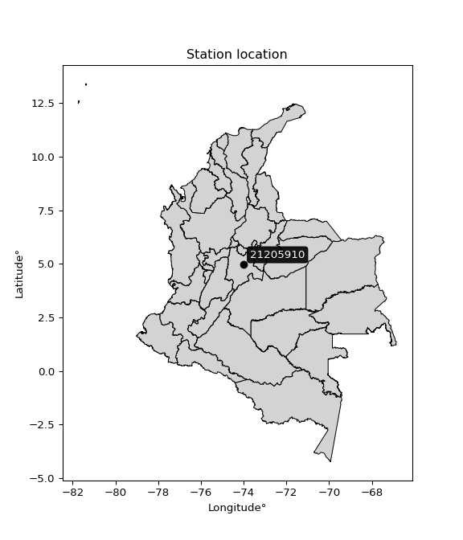</img>

</div>


## A. General information


### 1. General running parameters

• app_version: _v20251225_. • runtime: _2025-12-26 14:29:50.888910_. • Python version: _3.14.0_. • SciPy version: _1.16.3_. • Pandas version: _2.3.3_. • NumPy version: _2.3.5_. • Stations dataset (station_dataset_file): _dataset/pmax24h_in/automatic_colombia.csv_. • Stations catalog (station_catalog_file): _dataset/CNE_IDEAM.xls_. • Plot only fit distributions with Δo > Δ (plot_only_fit): _True_. • Eval low extreme values, if False, evaluates high extreme values (low_extreme): _False_. • Eval every SciPy distribution as logarithmic (pdist_logarithmic_on): _True_. • Standard deviation normalized (ddof): _1.0_. • Return periods to eval in years (Tr): _[2, 2.33, 5, 10, 15, 20, 25, 50, 75, 100, 200, 250, 500, 750, 1000]_. • Minimum data sample per station, 0 means any (minimum_sample): _5_. • Z-Score threshold to adjust a value, 0 means disable (zscore): _3.5_. • Avoid zeros, e.g. rain = 0 (avoid_zeros): _True_. • Avoid null values (avoid_nans): _True_. [:file_folder:Dataset file.](../../dataset/pmax24h_in/automatic_colombia.csv)


### 2. Station info and location

|   id |   CODIGO | NOMBRE                | CATEGORIA               | TECNOLOGIA                              | ESTADO   | FECHA_INSTALACION   |   FECHA_SUSPENSION |   ALTITUD |   LATITUD |   LONGITUD | DEPARTAMENTO   | MUNICIPIO   | AREA_OPERATIVA                            | ENTIDAD                                                     | AREA_HIDROGRAFICA   | ZONA_HIDROGRAFICA   | SUBZONA_HIDROGRAFICA   |   CORRIENTE | OBSERVACION                                                                                                                                                                                                                                                                                                                                                                                                                                                                                                                                                                                                                                                                             | SUBRED                                          | Catalogo   |
|-----:|---------:|:----------------------|:------------------------|:----------------------------------------|:---------|:--------------------|-------------------:|----------:|----------:|-----------:|:---------------|:------------|:------------------------------------------|:------------------------------------------------------------|:--------------------|:--------------------|:-----------------------|------------:|:----------------------------------------------------------------------------------------------------------------------------------------------------------------------------------------------------------------------------------------------------------------------------------------------------------------------------------------------------------------------------------------------------------------------------------------------------------------------------------------------------------------------------------------------------------------------------------------------------------------------------------------------------------------------------------------|:------------------------------------------------|:-----------|
|    0 | 21205910 | LA COSECHA [21205910] | Climatológica Principal | Automática con Telemetría, Convencional | Activa   | 15/09/1976          |                nan |      2570 |   4.98922 |   -74.0012 | Cundinamarca   | Zipaquirá   | Area Operativa 11 - Cundinamarca-Amazonas | INSTITUTO DE HIDROLOGIA METEOROLOGIA Y ESTUDIOS AMBIENTALES | Magdalena Cauca     | Alto Magdalena      | Río Bogotá             |         nan | Cambio de tecnología por instalación o repotenciación de estaciones proyecto Fondo de Adaptación|29/04/2022$Migracion$Cambio de tecnología por instalación o repotenciación de estaciones proyecto Fondo de Adaptación|15/11/2022$Migracion$Cambio de tecnología por instalación o repotenciación de estaciones proyecto Fondo de Adaptación|29/04/2022$Migracion$Cambio de tecnología por instalación o repotenciación de estaciones proyecto Fondo de Adaptación|15/11/2022$Migracion$Se ajustan coordenadas según análisis y solicitud de Julián Urrea_Planeacion Operativa|23/04/2024$Histórico$ Cambio de estado por orden del coordinador y por cambio del sistema de transmisión | Altiplano Cundiboyacense y oriente de Santander | CNE_IDEAM  |

<div align="center">

Map location in: [:earth_americas:Google](http://maps.google.com/maps?q=4.98922,-74.00119) [:earth_americas:OSM](https://www.openstreetmap.org/#map=18/4.98922/-74.00119&layers=P) [:earth_americas:Bing](https://www.bing.com/maps?cp=4.98922~-74.00119&lvl=18) [:earth_americas:Apple](https://maps.apple.com/frame?center=4.98922%2C-74.00119&span=0.003%2C0.006)

</div>


<div align="center">

```geojson
{
  "type": "Feature",
  "geometry": {
    "type": "Point", 
    "coordinates": [-74.00119, 4.98922]
  }, 
  "properties": {
    "Name": "21205910"
  }
}
```

</div>


### 3. Discrete values table and plot

|               |           0 |           1 |           2 |           3 |          4 |          5 |           6 |
|:--------------|------------:|------------:|------------:|------------:|-----------:|-----------:|------------:|
| Date          | 2019        | 2020        | 2021        | 2022        | 2023       | 2024       | 2025        |
| Value         |   36.6      |   27        |   27.6      |   39.8      |   17.6     |   72.4     |   41.2      |
| Value_initial |   36.6      |   27        |   27.6      |   39.8      |   17.6     |   72.4     |   41.2      |
| count         |    7        |    7        |    7        |    7        |    7       |    7       |    7        |
| mean          |   37.4571   |   37.4571   |   37.4571   |   37.4571   |   37.4571  |   37.4571  |   37.4571   |
| std           |   17.5217   |   17.5217   |   17.5217   |   17.5217   |   17.5217  |   17.5217  |   17.5217   |
| zscore        |   -0.048919 |   -0.596811 |   -0.562568 |    0.133712 |   -1.13329 |    1.99426 |    0.213613 |

<div align="center">

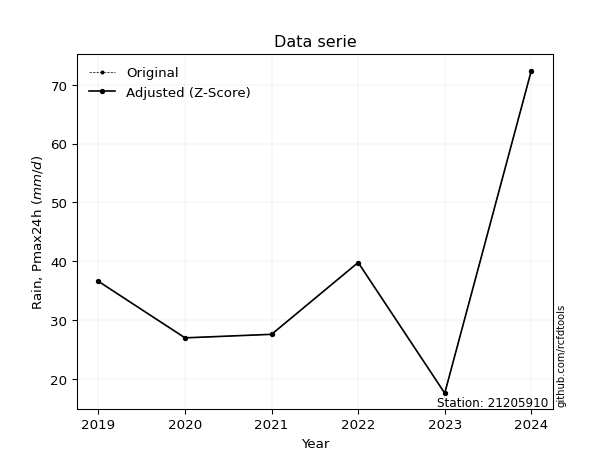</img>

</div>

> If Z-Score is active, values out of range or outliers are replaced with the station mean value.


### 4. Active continuous probability distributions from SciPy (45 of 104 available)

[scipy.stats](https://docs.scipy.org/doc/scipy/reference/stats.html) is a Python´s powerful submodule within the SciPy library for comprehensive statistical analysis, offering over 130 probability distributions (like Normal, Poisson), functions for descriptive stats (mean, variance), hypothesis testing (t-tests, chi-square), random variable generation, and statistical tests, making it essential for data science, modeling, and research. It provides tools to explore, model, and draw conclusions from data efficiently, working seamlessly with NumPy.

<div align="center">

|   id | p_dist             |   n_parameter | fit_method   | label                                                                       | active   | ref                                                                                                        |
|-----:|:-------------------|--------------:|:-------------|:----------------------------------------------------------------------------|:---------|:-----------------------------------------------------------------------------------------------------------|
|    0 | alpha              |             3 | MLE          | Alpha                                                                       | True     | [:mortar_board:](https://docs.scipy.org/doc/scipy/reference/generated/scipy.stats.alpha.html)              |
|    1 | betaprime          |             4 | MLE          | Beta prime                                                                  | True     | [:mortar_board:](https://docs.scipy.org/doc/scipy/reference/generated/scipy.stats.betaprime.html)          |
|    2 | chi2               |             3 | MLE          | Chi²                                                                        | True     | [:mortar_board:](https://docs.scipy.org/doc/scipy/reference/generated/scipy.stats.chi2.html)               |
|    3 | crystalball        |             4 | MLE          | Crystalball                                                                 | True     | [:mortar_board:](https://docs.scipy.org/doc/scipy/reference/generated/scipy.stats.crystalball.html)        |
|    4 | erlang             |             3 | MLE          | Erlang                                                                      | True     | [:mortar_board:](https://docs.scipy.org/doc/scipy/reference/generated/scipy.stats.erlang.html)             |
|    5 | expon              |             2 | MLE          | Exponential                                                                 | True     | [:mortar_board:](https://docs.scipy.org/doc/scipy/reference/generated/scipy.stats.expon.html)              |
|    6 | exponnorm          |             3 | MLE          | Exponentially modified Normal                                               | True     | [:mortar_board:](https://docs.scipy.org/doc/scipy/reference/generated/scipy.stats.exponnorm.html)          |
|    7 | f                  |             4 | MLE          | F                                                                           | True     | [:mortar_board:](https://docs.scipy.org/doc/scipy/reference/generated/scipy.stats.f.html)                  |
|    8 | fatiguelife        |             3 | MLE          | Fatigue-life (Birnbaum-Saunders)                                            | True     | [:mortar_board:](https://docs.scipy.org/doc/scipy/reference/generated/scipy.stats.fatiguelife.html)        |
|    9 | fisk               |             3 | MLE          | Fisk                                                                        | True     | [:mortar_board:](https://docs.scipy.org/doc/scipy/reference/generated/scipy.stats.fisk.html)               |
|   10 | gamma              |             3 | MLE          | Gamma                                                                       | True     | [:mortar_board:](https://docs.scipy.org/doc/scipy/reference/generated/scipy.stats.gamma.html)              |
|   11 | genexpon           |             5 | MLE          | Generalized exponential                                                     | True     | [:mortar_board:](https://docs.scipy.org/doc/scipy/reference/generated/scipy.stats.genexpon.html)           |
|   12 | genlogistic        |             3 | MLE          | Generalized logistic                                                        | True     | [:mortar_board:](https://docs.scipy.org/doc/scipy/reference/generated/scipy.stats.genlogistic.html)        |
|   13 | gibrat             |             2 | MM           | Gibrat                                                                      | True     | [:mortar_board:](https://docs.scipy.org/doc/scipy/reference/generated/scipy.stats.gibrat.html)             |
|   14 | gompertz           |             3 | MLE          | Gompertz (or truncated Gumbel)                                              | True     | [:mortar_board:](https://docs.scipy.org/doc/scipy/reference/generated/scipy.stats.gompertz.html)           |
|   15 | gumbel_l           |             2 | MM           | Gumbel Left Skew                                                            | True     | [:mortar_board:](https://docs.scipy.org/doc/scipy/reference/generated/scipy.stats.gumbel_l.html)           |
|   16 | gumbel_r           |             2 | MM           | Gumbel Right Skew                                                           | True     | [:mortar_board:](https://docs.scipy.org/doc/scipy/reference/generated/scipy.stats.gumbel_r.html)           |
|   17 | halflogistic       |             2 | MM           | Half-logistic                                                               | True     | [:mortar_board:](https://docs.scipy.org/doc/scipy/reference/generated/scipy.stats.halflogistic.html)       |
|   18 | halfnorm           |             2 | MM           | Half Normal                                                                 | True     | [:mortar_board:](https://docs.scipy.org/doc/scipy/reference/generated/scipy.stats.halfnorm.html)           |
|   19 | hypsecant          |             2 | MM           | hyperbolic secant                                                           | True     | [:mortar_board:](https://docs.scipy.org/doc/scipy/reference/generated/scipy.stats.hypsecant.html)          |
|   20 | invgamma           |             3 | MLE          | Inverted gamma                                                              | True     | [:mortar_board:](https://docs.scipy.org/doc/scipy/reference/generated/scipy.stats.invgamma.html)           |
|   21 | invgauss           |             3 | MLE          | Inverse Gaussian                                                            | True     | [:mortar_board:](https://docs.scipy.org/doc/scipy/reference/generated/scipy.stats.invgauss.html)           |
|   22 | invweibull         |             3 | MLE          | Inverted Weibull                                                            | True     | [:mortar_board:](https://docs.scipy.org/doc/scipy/reference/generated/scipy.stats.invweibull.html)         |
|   23 | johnsonsu          |             4 | MLE          | Johnson Su                                                                  | True     | [:mortar_board:](https://docs.scipy.org/doc/scipy/reference/generated/scipy.stats.johnsonsu.html)          |
|   24 | kstwobign          |             2 | MLE          | Limiting distribution of scaled Kolmogorov-Smirnov two-sided test statistic | True     | [:mortar_board:](https://docs.scipy.org/doc/scipy/reference/generated/scipy.stats.kstwobign.html)          |
|   25 | laplace            |             2 | MM           | Laplace                                                                     | True     | [:mortar_board:](https://docs.scipy.org/doc/scipy/reference/generated/scipy.stats.laplace.html)            |
|   26 | laplace_asymmetric |             3 | MLE          | Asymmetric Laplace                                                          | True     | [:mortar_board:](https://docs.scipy.org/doc/scipy/reference/generated/scipy.stats.laplace_asymmetric.html) |
|   27 | loggamma           |             3 | MLE          | Log gamma                                                                   | True     | [:mortar_board:](https://docs.scipy.org/doc/scipy/reference/generated/scipy.stats.loggamma.html)           |
|   28 | logistic           |             2 | MM           | Logistic (or Sech-squared)                                                  | True     | [:mortar_board:](https://docs.scipy.org/doc/scipy/reference/generated/scipy.stats.logistic.html)           |
|   29 | lognorm            |             3 | MLE          | Log Normal                                                                  | True     | [:mortar_board:](https://docs.scipy.org/doc/scipy/reference/generated/scipy.stats.lognorm.html)            |
|   30 | maxwell            |             2 | MM           | Maxwell                                                                     | True     | [:mortar_board:](https://docs.scipy.org/doc/scipy/reference/generated/scipy.stats.maxwell.html)            |
|   31 | mielke             |             4 | MLE          | Mielke Beta-Kappa / Dagum                                                   | True     | [:mortar_board:](https://docs.scipy.org/doc/scipy/reference/generated/scipy.stats.mielke.html)             |
|   32 | moyal              |             2 | MM           | Moyal                                                                       | True     | [:mortar_board:](https://docs.scipy.org/doc/scipy/reference/generated/scipy.stats.moyal.html)              |
|   33 | nakagami           |             3 | MLE          | Nakagami                                                                    | True     | [:mortar_board:](https://docs.scipy.org/doc/scipy/reference/generated/scipy.stats.nakagami.html)           |
|   34 | ncf                |             5 | MLE          | Non-central F distribution                                                  | True     | [:mortar_board:](https://docs.scipy.org/doc/scipy/reference/generated/scipy.stats.ncf.html)                |
|   35 | nct                |             4 | MLE          | Non-central Student’s t                                                     | True     | [:mortar_board:](https://docs.scipy.org/doc/scipy/reference/generated/scipy.stats.nct.html)                |
|   36 | norm               |             2 | MM           | Normal                                                                      | True     | [:mortar_board:](https://docs.scipy.org/doc/scipy/reference/generated/scipy.stats.norm.html)               |
|   37 | pareto             |             3 | MLE          | Pareto                                                                      | True     | [:mortar_board:](https://docs.scipy.org/doc/scipy/reference/generated/scipy.stats.pareto.html)             |
|   38 | pearson3           |             3 | MM           | Pearson type III                                                            | True     | [:mortar_board:](https://docs.scipy.org/doc/scipy/reference/generated/scipy.stats.pearson3.html)           |
|   39 | rayleigh           |             2 | MM           | Rayleigh                                                                    | True     | [:mortar_board:](https://docs.scipy.org/doc/scipy/reference/generated/scipy.stats.rayleigh.html)           |
|   40 | rice               |             3 | MLE          | Rice                                                                        | True     | [:mortar_board:](https://docs.scipy.org/doc/scipy/reference/generated/scipy.stats.rice.html)               |
|   41 | t                  |             3 | MLE          | Student’s t                                                                 | True     | [:mortar_board:](https://docs.scipy.org/doc/scipy/reference/generated/scipy.stats.t.html)                  |
|   42 | truncnorm          |             4 | MLE          | Truncated normal                                                            | True     | [:mortar_board:](https://docs.scipy.org/doc/scipy/reference/generated/scipy.stats.truncnorm.html)          |
|   43 | wald               |             2 | MM           | Wald                                                                        | True     | [:mortar_board:](https://docs.scipy.org/doc/scipy/reference/generated/scipy.stats.wald.html)               |
|   44 | weibull_min        |             3 | MLE          | Weibull minimum                                                             | True     | [:mortar_board:](https://docs.scipy.org/doc/scipy/reference/generated/scipy.stats.weibull_min.html)        |

</div>

> **n_parameter:** # arguments & localization & scale.
>
> **Fit methods:** (MLE) maximum likelihood, (MM) L-moments.
>
>**Inactive:** foldnorm, gennorm, norminvgauss, powernorm, powerlognorm, skewnorm, genextreme, anglit, arcsine, argus, beta, bradford, burr, burr12, cauchy, cosine, halfcauchy, foldcauchy, skewcauchy, wrapcauchy, dgamma, gengamma, exponweib, exponpow, truncexpon, gausshyper, genhalflogistic, genhyperbolic, geninvgauss, halfgennorm, johnsonsb, kappa4, kappa3, ksone, kstwo, loglaplace, levy, levy_l, levy_stable, ncx2, genpareto, truncpareto, lomax, powerlaw, rdist, rel_breitwigner, recipinvgauss, semicircular, studentized_range, trapezoid, triang, truncweibull_min, tukeylambda, uniform, loguniform, vonmises, vonmises_line, weibull_max, dweibull, 


## B. Probability distributions vs. Empirical distributions

A continuous probability distribution (CPD) describes probabilities for variables that can take any value within a range (like rain any time), unlike discrete variables with specific outcomes (like temperature). It uses a Probability Density Function (PDF), a curve where the total area under it equals 1, and the probability of the variable falling within an interval (a to b) is found by calculating the area under the curve between those points. A key feature is that the probability of hitting any single exact value is zero, so probabilities are always expressed for ranges, e.g., $P(a ≤ X ≤ b)$.

<div align="center">

Distributions parameters
|    |   station | p_dist                |   n |             loc |          scale | shape                  | shape1                | shape2             | shape3   |
|---:|----------:|:----------------------|----:|----------------:|---------------:|:-----------------------|:----------------------|:-------------------|:---------|
|  0 |  21205910 | alpha                 |   7 |   -22.9202      |  242.742       | 4.276960436373228      |                       |                    |          |
|  1 |  21205910 | betaprime             |   7 |    -0.304321    |    5.0315      | 48.36497577917857      | 7.428907704867916     |                    |          |
|  2 |  21205910 | chi2                  |   7 |    17.6         |    8.65644     | 1.8156857575451575     |                       |                    |          |
|  3 |  21205910 | crystalball           |   7 |    37.4571      |   16.2219      | 4104.077414767428      | 344.72782811532704    |                    |          |
|  4 |  21205910 | erlang                |   7 |    17.6         |   22.4376      | 0.6586015220160164     |                       |                    |          |
|  5 |  21205910 | expon                 |   7 |    17.6         |   19.8571      |                        |                       |                    |          |
|  6 |  21205910 | exponnorm             |   7 |    22.4025      |    6.4603      | 2.3303191744571867     |                       |                    |          |
|  7 |  21205910 | f                     |   7 |     9.99119     |   23.6898      | 9.26284209614606       | 15.312019554253588    |                    |          |
|  8 |  21205910 | fatiguelife           |   7 |    17.6         |    5.08493e-05 | 716.623157100141       |                       |                    |          |
|  9 |  21205910 | fisk                  |   7 |     8.35228     |   25.3626      | 3.1737146801627407     |                       |                    |          |
| 10 |  21205910 | gamma                 |   7 |    17.6         |   34.277       | 0.4368699766549178     |                       |                    |          |
| 11 |  21205910 | genexpon              |   7 |    17.6         |    1.97178     | 0.09926882343843164    | 8.387823512382987e-07 | 1.09664660682283   |          |
| 12 |  21205910 | genlogistic           |   7 |   -47.2128      |   11.7321      | 743.4161649406462      |                       |                    |          |
| 13 |  21205910 | gibrat                |   7 |    25.0819      |    7.50599     |                        |                       |                    |          |
| 14 |  21205910 | gompertz              |   7 |    17.6         |   67.1803      | 2.5822167272174354     |                       |                    |          |
| 15 |  21205910 | gumbel_l              |   7 |    44.7579      |   12.6482      |                        |                       |                    |          |
| 16 |  21205910 | gumbel_r              |   7 |    30.1564      |   12.6482      |                        |                       |                    |          |
| 17 |  21205910 | halflogistic          |   7 |    18.2304      |   13.8692      |                        |                       |                    |          |
| 18 |  21205910 | halfnorm              |   7 |    15.9857      |   26.9105      |                        |                       |                    |          |
| 19 |  21205910 | hypsecant             |   7 |    37.4571      |   10.3272      |                        |                       |                    |          |
| 20 |  21205910 | invgamma              |   7 |    -2.29639     |  249.526       | 7.260692641342134      |                       |                    |          |
| 21 |  21205910 | invgauss              |   7 |     6.17902     |  108.122       | 0.2892863251532068     |                       |                    |          |
| 22 |  21205910 | invweibull            |   7 |    17.6         |    1.14802     | 0.07271698915196491    |                       |                    |          |
| 23 |  21205910 | johnsonsu             |   7 |     7.18397     |    0.822064    | -7.881377983368097     | 1.893046088482384     |                    |          |
| 24 |  21205910 | kstwobign             |   7 |   -12.3027      |   57.4908      |                        |                       |                    |          |
| 25 |  21205910 | laplace               |   7 |    37.4571      |   11.4706      |                        |                       |                    |          |
| 26 |  21205910 | laplace_asymmetric    |   7 |    36.6         |   11.5762      | 0.963662726360905      |                       |                    |          |
| 27 |  21205910 | loggamma              |   7 | -3717.42        |  537.808       | 1077.1832294761784     |                       |                    |          |
| 28 |  21205910 | logistic              |   7 |    37.4571      |    8.94362     |                        |                       |                    |          |
| 29 |  21205910 | lognorm               |   7 |    17.6         |    0.108946    | 12.68963133698624      |                       |                    |          |
| 30 |  21205910 | maxwell               |   7 |    -0.982021    |   24.0882      |                        |                       |                    |          |
| 31 |  21205910 | mielke                |   7 |    -0.100568    |   29.7771      | 5.62596772687302       | 3.854117697073982     |                    |          |
| 32 |  21205910 | moyal                 |   7 |    28.1804      |    7.30243     |                        |                       |                    |          |
| 33 |  21205910 | nakagami              |   7 |    27           |   19.3665      | 0.18027247751734637    |                       |                    |          |
| 34 |  21205910 | ncf                   |   7 |    -0.138349    |   31.2287      | 91.58548387097866      | 14.81419580184151     | 4.009843054783395  |          |
| 35 |  21205910 | nct                   |   7 |    -0.0715315   |    6.22068     | 4.859726961833954      | 5.068865260049497     |                    |          |
| 36 |  21205910 | norm                  |   7 |    37.4571      |   16.2219      |                        |                       |                    |          |
| 37 |  21205910 | pareto                |   7 |    17.5814      |    0.0185894   | 0.16798443369918786    |                       |                    |          |
| 38 |  21205910 | pearson3              |   7 |    37.4571      |   16.2219      | 1.0976354238748245     |                       |                    |          |
| 39 |  21205910 | rayleigh              |   7 |     6.42364     |   24.7612      |                        |                       |                    |          |
| 40 |  21205910 | rice                  |   7 |    10.5071      |   22.2425      | 0.00037932216250062377 |                       |                    |          |
| 41 |  21205910 | t                     |   7 |    33.965       |    9.87922     | 2.422177527224478      |                       |                    |          |
| 42 |  21205910 | truncnorm             |   7 |    37.4571      |   16.2219      | -205.5094533826848     | 808.1569188552978     |                    |          |
| 43 |  21205910 | wald                  |   7 |    21.2353      |   16.2219      |                        |                       |                    |          |
| 44 |  21205910 | weibull_min           |   7 |    17.6         |   21.4287      | 0.863318741811774      |                       |                    |          |
| 45 |  21205910 | logalpha              |   7 |    -4.34298     |  151.966       | 19.339785105963607     |                       |                    |          |
| 46 |  21205910 | logbetaprime          |   7 |    -1.08626     |   17.1306      | 162.99654997120751     | 604.8664957060614     |                    |          |
| 47 |  21205910 | logchi2               |   7 |     2.8679      |    0.985563    | 1.0102249604773674     |                       |                    |          |
| 48 |  21205910 | logcrystalball        |   7 |     3.53802     |    0.408427    | 71.92546759272483      | 30821.079316737123    |                    |          |
| 49 |  21205910 | logerlang             |   7 |     0.668686    |    0.0583766   | 49.15203765185288      |                       |                    |          |
| 50 |  21205910 | logexpon              |   7 |     2.8679      |    0.670117    |                        |                       |                    |          |
| 51 |  21205910 | logexponnorm          |   7 |     3.3745      |    0.374985    | 0.43607495123010426    |                       |                    |          |
| 52 |  21205910 | logf                  |   7 |    -1.69085     |    5.20806     | 954.543555070388       | 502.3884056370093     |                    |          |
| 53 |  21205910 | logfatiguelife        |   7 |    -0.969131    |    4.4887      | 0.09067147239280908    |                       |                    |          |
| 54 |  21205910 | logfisk               |   7 |    -1.35105     |    4.87376     | 21.082717270326917     |                       |                    |          |
| 55 |  21205910 | loggamma              |   7 |     0.668685    |    0.0583766   | 49.15206737340381      |                       |                    |          |
| 56 |  21205910 | loggenexpon           |   7 |     2.8679      |    1.5763e+09  | 1155662074.060682      | 9714111643.43489      | 473763985.38875103 |          |
| 57 |  21205910 | loggenlogistic        |   7 |     3.39293     |    0.259784    | 1.449686184244968      |                       |                    |          |
| 58 |  21205910 | loggibrat             |   7 |     3.22647     |    0.188963    |                        |                       |                    |          |
| 59 |  21205910 | loggompertz           |   7 |     2.8679      |    1.03072     | 0.9550267888399435     |                       |                    |          |
| 60 |  21205910 | loggumbel_l           |   7 |     3.72183     |    0.318449    |                        |                       |                    |          |
| 61 |  21205910 | loggumbel_r           |   7 |     3.3542      |    0.318449    |                        |                       |                    |          |
| 62 |  21205910 | loghalflogistic       |   7 |     3.05396     |    0.349177    |                        |                       |                    |          |
| 63 |  21205910 | loghalfnorm           |   7 |     2.99742     |    0.677534    |                        |                       |                    |          |
| 64 |  21205910 | loghypsecant          |   7 |     3.53802     |    0.260013    |                        |                       |                    |          |
| 65 |  21205910 | loginvgamma           |   7 |    -2.8018      | 1530.16        | 242.356033570541       |                       |                    |          |
| 66 |  21205910 | loginvgauss           |   7 |     0.696072    |  133.012       | 0.021347432949341206   |                       |                    |          |
| 67 |  21205910 | loginvweibull         |   7 |    -4.39505e+07 |    4.39505e+07 | 117058029.42238607     |                       |                    |          |
| 68 |  21205910 | logjohnsonsu          |   7 |    -0.379548    |    1.8583      | -15.799509346193851    | 10.625694839770066    |                    |          |
| 69 |  21205910 | logkstwobign          |   7 |     1.99954     |    1.76385     |                        |                       |                    |          |
| 70 |  21205910 | loglaplace            |   7 |     3.53802     |    0.288801    |                        |                       |                    |          |
| 71 |  21205910 | loglaplace_asymmetric |   7 |     3.68387     |    0.300769    | 1.2713575607405305     |                       |                    |          |
| 72 |  21205910 | logloggamma           |   7 |   -90.1047      |   13.4483      | 1057.441289540784      |                       |                    |          |
| 73 |  21205910 | loglogistic           |   7 |     3.53802     |    0.225178    |                        |                       |                    |          |
| 74 |  21205910 | loglognorm            |   7 |     2.8679      |    0.00483137  | 12.260525308750088     |                       |                    |          |
| 75 |  21205910 | logmaxwell            |   7 |     2.57022     |    0.606479    |                        |                       |                    |          |
| 76 |  21205910 | logmielke             |   7 |    -0.133683    |    3.69744     | 14.600154669419265     | 16.564084806338663    |                    |          |
| 77 |  21205910 | logmoyal              |   7 |     3.30445     |    0.183857    |                        |                       |                    |          |
| 78 |  21205910 | lognakagami           |   7 |     3.29584     |    0.42596     | 0.2980974991202549     |                       |                    |          |
| 79 |  21205910 | logncf                |   7 |    -3.6966      |    7.17924     | 529.1048434295237      | 662.9199908325108     | 3.211410553145525  |          |
| 80 |  21205910 | lognct                |   7 |    -0.292509    |    0.306057    | 104.42288680377192     | 12.425614023792484    |                    |          |
| 81 |  21205910 | lognorm               |   7 |     3.53802     |    0.408427    |                        |                       |                    |          |
| 82 |  21205910 | logpareto             |   7 |     2.86721     |    0.00069054  | 0.1678794308897975     |                       |                    |          |
| 83 |  21205910 | logpearson3           |   7 |     3.53802     |    0.408426    | 0.20039605337190702    |                       |                    |          |
| 84 |  21205910 | lograyleigh           |   7 |     2.75667     |    0.623423    |                        |                       |                    |          |
| 85 |  21205910 | logrice               |   7 |     2.66577     |    0.471996    | 1.4710046775274577     |                       |                    |          |
| 86 |  21205910 | logt                  |   7 |     3.53803     |    0.408431    | 13531957.977889793     |                       |                    |          |
| 87 |  21205910 | logtruncnorm          |   7 |    -0.146761    |    1.16186     | 2.963008490483671      | 4.431857371973257     |                    |          |
| 88 |  21205910 | logwald               |   7 |     3.12954     |    0.408468    |                        |                       |                    |          |
| 89 |  21205910 | logweibull_min        |   7 |     2.60075     |    1.05629     | 2.4597253687848575     |                       |                    |          |

</div>

> **loc** (Location parameter): This shifts the distribution along the x-axis. For many common distributions, like the normal (Gaussian) distribution, loc represents the mean $μ$. For others, like the uniform distribution, it might represent the minimum value, or for the beta distribution, the left end of the support interval.
>
> **scale** (Scale parameter): This determines the width or spread of the distribution. For the normal distribution, scale represents the standard deviation $σ$. For a uniform distribution, it defines the length of the interval (from $loc$ to $loc + scale$).
>
> **shape** (Shape parameters): Refers to parameters that define the specific form of a probability distribution, distinct from its location (loc) and scale (scale). These parameters are required arguments for most distribution functions. For example, a normal (Gaussian) distribution is fully defined by its location (mean) and scale (standard deviation), so it has no specific shape parameters beyond loc and scale. However, other distributions have intrinsic properties that need specification, as Gamma distribution that takes a shape parameter, often named $a$ or $alpha$.


### 0. Cumulative distribution values - CDF (90 evaluated)

> Ordered by x ascending and calculating $log(f(x))$ separately. 

|   id |   Station |   date |    x |   count |    mean |     std |    zscore |   Value_initial |   station |   m |    alpha |   alpha_pdf |   betaprime |   betaprime_pdf |        chi2 |   chi2_pdf |   crystalball |   crystalball_pdf |      erlang |    erlang_pdf |    expon |   expon_pdf |   exponnorm |   exponnorm_pdf |         f |      f_pdf |   fatiguelife |   fatiguelife_pdf |      fisk |   fisk_pdf |       gamma |   gamma_pdf |    genexpon |   genexpon_pdf |   genlogistic |   genlogistic_pdf |    gibrat |   gibrat_pdf |    gompertz |   gompertz_pdf |   gumbel_l |   gumbel_l_pdf |   gumbel_r |   gumbel_r_pdf |   halflogistic |   halflogistic_pdf |   halfnorm |   halfnorm_pdf |   hypsecant |   hypsecant_pdf |   invgamma |   invgamma_pdf |   invgauss |   invgauss_pdf |   invweibull |   invweibull_pdf |   johnsonsu |   johnsonsu_pdf |   kstwobign |   kstwobign_pdf |   laplace |   laplace_pdf |   laplace_asymmetric |   laplace_asymmetric_pdf |   loggamma |   loggamma_pdf |   logistic |   logistic_pdf |   lognorm |   lognorm_pdf |   maxwell |   maxwell_pdf |    mielke |   mielke_pdf |     moyal |   moyal_pdf |    nakagami |   nakagami_pdf |      ncf |    ncf_pdf |      nct |    nct_pdf |     norm |   norm_pdf |   pareto |   pareto_pdf |   pearson3 |   pearson3_pdf |   rayleigh |   rayleigh_pdf |      rice |   rice_pdf |        t |      t_pdf |   truncnorm |   truncnorm_pdf |     wald |   wald_pdf |   weibull_min |   weibull_min_pdf |   logalpha |   logalpha_pdf |   logbetaprime |   logbetaprime_pdf |     logchi2 |   logchi2_pdf |   logcrystalball |   logcrystalball_pdf |   logerlang |   logerlang_pdf |   logexpon |   logexpon_pdf |   logexponnorm |   logexponnorm_pdf |      logf |   logf_pdf |   logfatiguelife |   logfatiguelife_pdf |   logfisk |   logfisk_pdf |   loggenexpon |   loggenexpon_pdf |   loggenlogistic |   loggenlogistic_pdf |   loggibrat |   loggibrat_pdf |   loggompertz |   loggompertz_pdf |   loggumbel_l |   loggumbel_l_pdf |   loggumbel_r |   loggumbel_r_pdf |   loghalflogistic |   loghalflogistic_pdf |   loghalfnorm |   loghalfnorm_pdf |   loghypsecant |   loghypsecant_pdf |   loginvgamma |   loginvgamma_pdf |   loginvgauss |   loginvgauss_pdf |   loginvweibull |   loginvweibull_pdf |   logjohnsonsu |   logjohnsonsu_pdf |   logkstwobign |   logkstwobign_pdf |   loglaplace |   loglaplace_pdf |   loglaplace_asymmetric |   loglaplace_asymmetric_pdf |   logloggamma |   logloggamma_pdf |   loglogistic |   loglogistic_pdf |   loglognorm |   loglognorm_pdf |   logmaxwell |   logmaxwell_pdf |   logmielke |   logmielke_pdf |   logmoyal |   logmoyal_pdf |   lognakagami |   lognakagami_pdf |   logncf |   logncf_pdf |    lognct |   lognct_pdf |   logpareto |   logpareto_pdf |   logpearson3 |   logpearson3_pdf |   lograyleigh |   lograyleigh_pdf |   logrice |   logrice_pdf |      logt |   logt_pdf |   logtruncnorm |   logtruncnorm_pdf |   logwald |   logwald_pdf |   logweibull_min |   logweibull_min_pdf |
|-----:|----------:|-------:|-----:|--------:|--------:|--------:|----------:|----------------:|----------:|----:|---------:|------------:|------------:|----------------:|------------:|-----------:|--------------:|------------------:|------------:|--------------:|---------:|------------:|------------:|----------------:|----------:|-----------:|--------------:|------------------:|----------:|-----------:|------------:|------------:|------------:|---------------:|--------------:|------------------:|----------:|-------------:|------------:|---------------:|-----------:|---------------:|-----------:|---------------:|---------------:|-------------------:|-----------:|---------------:|------------:|----------------:|-----------:|---------------:|-----------:|---------------:|-------------:|-----------------:|------------:|----------------:|------------:|----------------:|----------:|--------------:|---------------------:|-------------------------:|-----------:|---------------:|-----------:|---------------:|----------:|--------------:|----------:|--------------:|----------:|-------------:|----------:|------------:|------------:|---------------:|---------:|-----------:|---------:|-----------:|---------:|-----------:|---------:|-------------:|-----------:|---------------:|-----------:|---------------:|----------:|-----------:|---------:|-----------:|------------:|----------------:|---------:|-----------:|--------------:|------------------:|-----------:|---------------:|---------------:|-------------------:|------------:|--------------:|-----------------:|---------------------:|------------:|----------------:|-----------:|---------------:|---------------:|-------------------:|----------:|-----------:|-----------------:|---------------------:|----------:|--------------:|--------------:|------------------:|-----------------:|---------------------:|------------:|----------------:|--------------:|------------------:|--------------:|------------------:|--------------:|------------------:|------------------:|----------------------:|--------------:|------------------:|---------------:|-------------------:|--------------:|------------------:|--------------:|------------------:|----------------:|--------------------:|---------------:|-------------------:|---------------:|-------------------:|-------------:|-----------------:|------------------------:|----------------------------:|--------------:|------------------:|--------------:|------------------:|-------------:|-----------------:|-------------:|-----------------:|------------:|----------------:|-----------:|---------------:|--------------:|------------------:|---------:|-------------:|----------:|-------------:|------------:|----------------:|--------------:|------------------:|--------------:|------------------:|----------:|--------------:|----------:|-----------:|---------------:|-------------------:|----------:|--------------:|-----------------:|---------------------:|
|    0 |  21205910 |   2023 | 17.6 |       7 | 37.4571 | 17.5217 | -1.13329  |            17.6 |  21205910 |   1 | 0.043293 |  0.0135835  |   0.0415057 |      0.0143778  | 5.93803e-15 | 1.51737    |      0.110459 |         0.0116261 | 4.35393e-11 | 8071.31       | 0        |  0.0503597  |    0.046863 |       0.0120736 | 0.0426748 | 0.0170907  |     0.0183499 |       2.07183e+09 | 0.0390923 | 0.0128916  | 1.17357e-07 | 1.44311e+07 | 5.34689e-07 |     0.0503448  |     0.0518659 |        0.0130557  | 0         |   0          | 9.80472e-14 |     0.0384371  |   0.110249 |    0.00821739  |  0.0672977 |     0.0143587  |       0        |         0          |  0.0478356 |     0.0295963  |   0.0924172 |      0.00882371 |  0.0411062 |     0.0143793  |  0.0387932 |     0.0159502  |  1.17439e-05 |      2.72877e+09 |   0.0392635 |      0.0153788  |   0.0504085 |      0.013689   | 0.0885423 |    0.00771904 |            0.0876818 |               0.00785996 |  0.0411894 |       0.257823 |   0.097946 |     0.00987884 | 0.0504271 |      0.254237 |  0.102443 |    0.0146384  | 0.0445661 |   0.0124834  | 0.0390573 |  0.0134082  | 0           |    0           | 0.041416 | 0.0143843  | 0.041053 | 0.0134539  | 0.110459 |  0.0116261 | 0        |  9.03658     |  0.0646207 |     0.016827   |  0.0968494 |     0.0164634  | 0.0495748 | 0.0136263  | 0.108686 | 0.00998992 |    0.110459 |       0.0116261 | 0        | 0          |   2.37933e-14 |        5.78184    |  0.0413932 |       0.258948 |      0.0435931 |           0.256723 | 1.40848e-08 |   1.60202e+07 |        0.0504271 |             0.254237 |   0.0411894 |        0.257823 |   0        |       1.49228  |      0.0471502 |           0.251959 | 0.0420861 |   0.255871 |        0.0416551 |             0.256762 | 0.0455712 |      0.217349 |   2.25955e-13 |          0.733148 |        0.0445898 |             0.219711 |    0        |       0         |   1.64296e-08 |          0.926566 |     0.0661677 |         0.20075   |     0.0100037 |          0.144655 |          0        |              0        |      0        |          0        |      0.0482794 |           0.18497  |      0.042121 |          0.255801 |     0.0381651 |          0.264474 |       0.0304399 |            0.28311  |      0.0423619 |           0.256379 |      0.0313497 |           0.331427 |    0.0491202 |         0.170083 |               0.0731312 |                    0.19125  |      0.053514 |          0.258853 |     0.0485243 |          0.205037 |   0.00717589 |      3.65826e+12 |    0.0292727 |         0.280987 |   0.0463477 |        0.21853  | 0.00104576 |      0.0330247 |   0           |        0          | 0.124382 |     0.377332 | 0.0423128 |     0.254221 |    0        |     243.113     |     0.0439574 |          0.256864 |     0.0157898 |          0.281666 | 0.0311715 |      0.30911  | 0.0504243 |   0.254223 |    0           |           0        |  0        |      0        |        0.0334291 |             0.302586 |
|    1 |  21205910 |   2020 | 27   |       7 | 37.4571 | 17.5217 | -0.596811 |            27   |  21205910 |   2 | 0.279058 |  0.0327363  |   0.2857    |      0.0327859  | 0.465756    | 0.033419   |      0.259583 |         0.0199789 | 0.533746    |    0.0288244  | 0.377107 |  0.0313687  |    0.267848 |       0.0328017 | 0.310677  | 0.0334277  |     0.725736  |       0.0106346   | 0.273671  | 0.0338301  | 0.592027    | 0.0226616   | 0.377023    |     0.0313639  |     0.264624  |        0.0299595  | 0.0862299 |   0.0820019  | 0.321457    |     0.0299982  |   0.217777 |    0.01519     |  0.277079  |     0.0281161  |       0.306026 |         0.0326749  |  0.317677  |     0.0272672  |   0.221834  |      0.0197835  |  0.286278  |     0.0329007  |  0.297104  |     0.0326643  |  0.423918    |      0.0028144   |   0.293248  |      0.0328427  |   0.261723  |      0.0284977  | 0.200931  |    0.017517   |            0.203639  |               0.0182546  |  0.287282  |       0.882789 |   0.236994 |     0.0202187  | 0.276605  |      0.819309 |  0.28257  |    0.0227647  | 0.27235   |   0.0333448  | 0.278286  |  0.0329078  | 1.68518e-06 |    1.71019e+08 | 0.285883 | 0.0328146  | 0.282986 | 0.0335995  | 0.259583 |  0.0199789 | 0.648724 |  0.00626516  |  0.290558  |     0.0281916  |  0.291974  |     0.0237616  | 0.240364  | 0.0253242  | 0.27124  | 0.0265306  |    0.259584 |       0.0199789 | 0.2247   | 0.0646948  |   0.387962    |        0.0275974  |  0.28975   |       0.891108 |      0.284421  |           0.867896 | 0.485922    |   0.495486    |        0.276605  |             0.819309 |   0.287282  |        0.882789 |   0.47197  |       0.787967 |      0.278801  |           0.844686 | 0.285585  |   0.877783 |        0.286399  |             0.880253 | 0.267959  |      0.889956 |   0.37892     |          0.917283 |        0.272284  |             0.900059 |    0.158131 |       3.4808    |   0.388295    |          0.858481 |     0.230832  |         0.6339    |     0.300848  |          1.13476  |          0.333143 |              1.27302  |      0.340381 |          1.06877  |      0.238936  |           0.835043 |      0.285522 |          0.877585 |     0.297119  |          0.91471  |       0.32724   |            0.973601 |      0.285787  |           0.877067 |      0.347426  |           0.956339 |    0.216165  |         0.74849  |               0.223941  |                    0.585643 |      0.278026 |          0.806171 |     0.254358  |          0.842269 |   0.642711   |      0.0711177   |    0.30183   |         0.920595 |   0.266849  |        0.882237 | 0.305975   |      1.31535   |   9.07848e-10 |        1.2188e+06 | 0.348382 |     0.640348 | 0.28485   |     0.877563 |    0.660272 |       0.13306   |     0.283814  |          0.864013 |     0.31201   |          0.954419 | 0.295264  |      0.874124 | 0.276593  |   0.819283 |    7.11214e-11 |           2.80476  |  0.277737 |      2.44167  |        0.3004    |             0.884429 |
|    2 |  21205910 |   2021 | 27.6 |       7 | 37.4571 | 17.5217 | -0.562568 |            27.6 |  21205910 |   3 | 0.298788 |  0.0330078  |   0.305415  |      0.0329098  | 0.485407    | 0.0320972  |      0.271712 |         0.020447  | 0.550632    |    0.0274772  | 0.395647 |  0.030435   |    0.287695 |       0.0333296 | 0.330692  | 0.0332721  |     0.731983  |       0.0101928   | 0.294097  | 0.0342313  | 0.605272    | 0.0215058   | 0.395559    |     0.0304307  |     0.282742  |        0.0304175  | 0.137377  |   0.0872577  | 0.339298    |     0.0294715  |   0.227056 |    0.0157391   |  0.294054  |     0.0284562  |       0.325499 |         0.0322315  |  0.333961  |     0.0270128  |   0.233969  |      0.02067    |  0.306058  |     0.0330149  |  0.316677  |     0.0325651  |  0.425554    |      0.00264383  |   0.312952  |      0.0328202  |   0.27892   |      0.028812   | 0.211721  |    0.0184577  |            0.214891  |               0.0192633  |  0.306932  |       0.904834 |   0.249339 |     0.0209276  | 0.294894  |      0.84465  |  0.296321 |    0.0230668  | 0.292506  |   0.0338152  | 0.298089  |  0.0330819  | 0.227154    |    0.136479    | 0.305614 | 0.0329359  | 0.303213 | 0.0338014  | 0.271712 |  0.020447  | 0.652349 |  0.00582916  |  0.307513  |     0.0283149  |  0.306293  |     0.02396    | 0.255678  | 0.0257164  | 0.287556 | 0.0278552  |    0.271712 |       0.020447  | 0.262894 | 0.0625086  |   0.40423     |        0.0266376  |  0.309581  |       0.912983 |      0.303755  |           0.891092 | 0.496618    |   0.477996    |        0.294894  |             0.84465  |   0.306932  |        0.904834 |   0.489008 |       0.762542 |      0.297649  |           0.870091 | 0.305133  |   0.900577 |        0.305997  |             0.902688 | 0.287917  |      0.925793 |   0.398993    |          0.909079 |        0.292435  |             0.933086 |    0.233637 |       3.35341   |   0.407072    |          0.850064 |     0.245122  |         0.666578  |     0.325939  |          1.14741  |          0.360823 |              1.24551  |      0.363701 |          1.05306  |      0.257858  |           0.88675  |      0.305066 |          0.900407 |     0.317437  |          0.933684 |       0.348699  |            0.978458 |      0.305319  |           0.899855 |      0.368436  |           0.955046 |    0.233258  |         0.807677 |               0.23719   |                    0.620291 |      0.29602  |          0.830931 |     0.27331   |          0.882022 |   0.644234   |      0.0675419   |    0.322228  |         0.935129 |   0.286645  |        0.91874  | 0.334892   |      1.31439   |   0.132601    |        3.59472    | 0.362536 |     0.647481 | 0.304398  |     0.900773 |    0.663112 |       0.125512  |     0.303064  |          0.887284 |     0.333085  |          0.962897 | 0.314662  |      0.890726 | 0.294882  |   0.844625 |    0.0599461   |           2.6514   |  0.329628 |      2.27721  |        0.320009  |             0.899604 |
|    3 |  21205910 |   2019 | 36.6 |       7 | 37.4571 | 17.5217 | -0.048919 |            36.6 |  21205910 |   4 | 0.578734 |  0.0268017  |   0.579003  |      0.0259416  | 0.704011    | 0.0179892  |      0.47893  |         0.0245585 | 0.732764    |    0.0147777  | 0.615893 |  0.0193435  |    0.575458 |       0.0272712 | 0.596008  | 0.0244283  |     0.803167  |       0.00622412  | 0.584659  | 0.027283   | 0.746505    | 0.0115226   | 0.615787    |     0.0193433  |     0.556082  |        0.0278041  | 0.665755  |   0.0316015  | 0.570031    |     0.0219288  |   0.40825  |    0.0245469   |  0.548358  |     0.0260487  |       0.579856 |         0.0239296  |  0.556343  |     0.0221103  |   0.473611  |      0.0307166  |  0.579871  |     0.0259004  |  0.58005   |     0.0246903  |  0.442461    |      0.0013808   |   0.58062   |      0.0251378  |   0.53562   |      0.0263979  | 0.463999  |    0.0404511  |            0.481501  |               0.0431627  |  0.578467  |       0.941797 |   0.476059 |     0.0278888  | 0.56036   |      0.965576 |  0.512696 |    0.0238734  | 0.583256  |   0.0276102  | 0.574208  |  0.0262134  | 0.613137    |    0.0221779   | 0.579266 | 0.0259336  | 0.58442  | 0.0263968  | 0.47893  |  0.0245585 | 0.687837 |  0.00275722  |  0.552168  |     0.0246661  |  0.524131  |     0.0234214  | 0.497468  | 0.0265045  | 0.594637 | 0.0347489  |    0.47893  |       0.0245585 | 0.646159 | 0.0266399  |   0.593983    |        0.0166288  |  0.582309  |       0.940388 |      0.574468  |           0.950122 | 0.607545    |   0.325528    |        0.56036   |             0.965576 |   0.578467  |        0.941797 |   0.664646 |       0.500441 |      0.567948  |           0.968053 | 0.576966  |   0.947347 |        0.577696  |             0.944662 | 0.58222   |      1.03576  |   0.631644    |          0.718439 |        0.583214  |             1.01088  |    0.752245 |       0.84656   |   0.627729    |          0.701825 |     0.4945    |         1.08292   |     0.62997   |          0.914113 |          0.653837 |              0.819782 |      0.626232 |          0.79291  |      0.57523   |           1.19018  |      0.576908 |          0.947555 |     0.589752  |          0.918822 |       0.608465  |            0.805135 |      0.576999  |           0.947119 |      0.617404  |           0.770293 |    0.596646  |         1.39665  |               0.496184  |                    1.2976   |      0.557685 |          0.955842 |     0.568438  |          1.08943  |   0.658919   |      0.0408682   |    0.590043  |         0.897239 |   0.581273  |        1.04474  | 0.65445    |      0.878634  |   0.614049    |        1.06947    | 0.5503   |     0.657875 | 0.576852  |     0.950497 |    0.689525 |       0.0711239 |     0.573183  |          0.950419 |     0.599506  |          0.869065 | 0.577525  |      0.910938 | 0.560342  |   0.965574 |    0.58807     |           1.24761  |  0.722383 |      0.782161 |        0.582087  |             0.897496 |
|    4 |  21205910 |   2022 | 39.8 |       7 | 37.4571 | 17.5217 |  0.133712 |            39.8 |  21205910 |   5 | 0.657899 |  0.0226634  |   0.655724  |      0.0220135  | 0.756197    | 0.0147404  |      0.557418 |         0.0243376 | 0.775682    |    0.0121504  | 0.673062 |  0.0164645  |    0.655305 |       0.0226612 | 0.667962  | 0.0205812  |     0.821742  |       0.00541587  | 0.664299  | 0.0225058  | 0.780195    | 0.00961474  | 0.672957    |     0.0164651  |     0.639678  |        0.0243533  | 0.749647  |   0.021607   | 0.636216    |     0.0194585  |   0.491208 |    0.0271817   |  0.627179  |     0.0231332  |       0.651333 |         0.020757   |  0.623814  |     0.0200431  |   0.571601  |      0.030046   |  0.656422  |     0.0219511  |  0.653258  |     0.0210879  |  0.44654     |      0.00117923  |   0.655015  |      0.0213772  |   0.615881  |      0.0236913  | 0.59237   |    0.0355368  |            0.602756  |               0.0330688  |  0.654639  |       0.870871 |   0.565118 |     0.0274788  | 0.639493  |      0.916441 |  0.587307 |    0.0226488  | 0.664072  |   0.022898   | 0.651765  |  0.0222684  | 0.676663    |    0.0178265   | 0.655953 | 0.0220006  | 0.662017 | 0.0221164  | 0.557418 |  0.0243376 | 0.695886 |  0.00229926  |  0.626921  |     0.0220043  |  0.596856  |     0.0219461  | 0.579882  | 0.0248752  | 0.697372 | 0.0290046  |    0.557418 |       0.0243376 | 0.71999  | 0.0199053  |   0.64335     |        0.0142994  |  0.658211  |       0.865949 |      0.651539  |           0.883609 | 0.633547    |   0.295681    |        0.639493  |             0.916441 |   0.654639  |        0.870871 |   0.704075 |       0.441602 |      0.64683   |           0.908081 | 0.653655  |   0.877461 |        0.654133  |             0.874254 | 0.665037  |      0.932776 |   0.688814    |          0.645221 |        0.66406   |             0.911688 |    0.811651 |       0.590105  |   0.684234    |          0.645731 |     0.588366  |         1.14736   |     0.701069  |          0.781863 |          0.717268 |              0.695245 |      0.689011 |          0.704877 |      0.669864  |           1.05399  |      0.653616 |          0.877712 |     0.663562  |          0.838394 |       0.672057  |            0.711353 |      0.653678  |           0.877426 |      0.678517  |           0.687366 |    0.698254  |         1.04482  |               0.617788  |                    1.61562  |      0.636179 |          0.911012 |     0.656496  |          1.00147  |   0.662156   |      0.0365361   |    0.662232  |         0.821875 |   0.664894  |        0.942451 | 0.721574   |      0.72567   |   0.695541    |        0.88123    | 0.604489 |     0.63326  | 0.653789  |     0.880145 |    0.695118 |       0.0626741 |     0.650341  |          0.885354 |     0.669114  |          0.789378 | 0.651514  |      0.850196 | 0.639476  |   0.916447 |    0.681294    |           0.986079 |  0.779396 |      0.589445 |        0.654806  |             0.833818 |
|    5 |  21205910 |   2025 | 41.2 |       7 | 37.4571 | 17.5217 |  0.213613 |            41.2 |  21205910 |   6 | 0.688371 |  0.0208772  |   0.685365  |      0.0203407  | 0.775965    | 0.013519   |      0.591237 |         0.0239468 | 0.792002    |    0.0111795  | 0.695319 |  0.0153437  |    0.685686 |       0.0207582 | 0.695656  | 0.018994   |     0.82911   |       0.00511384  | 0.694395  | 0.0205036  | 0.793159    | 0.0089175   | 0.695215    |     0.0153445  |     0.672639  |        0.0227292  | 0.777639  |   0.0184827  | 0.662728    |     0.0184203  |   0.529898 |    0.0280543   |  0.658599  |     0.0217468  |       0.679445 |         0.0194083  |  0.651226  |     0.0191153  |   0.612918  |      0.0289033  |  0.685973  |     0.0202742  |  0.681718  |     0.0195783  |  0.448141    |      0.00110832  |   0.683828  |      0.019795   |   0.648151  |      0.0224019  | 0.639205  |    0.0314538  |            0.646456  |               0.029431   |  0.684119  |       0.834006 |   0.603123 |     0.0267638  | 0.670665  |      0.885974 |  0.618519 |    0.0219227  | 0.69472   |   0.0208985  | 0.681763  |  0.0205956  | 0.700584    |    0.0163814   | 0.685576 | 0.0203267  | 0.691711 | 0.0203162  | 0.591237 |  0.0239468 | 0.698992 |  0.00214088  |  0.656867  |     0.0207726  |  0.627035  |     0.0211549  | 0.614068  | 0.0239432  | 0.735841 | 0.0259309  |    0.591237 |       0.0239468 | 0.746223 | 0.0176268  |   0.662738    |        0.0134096  |  0.6875    |       0.827859 |      0.681481  |           0.847838 | 0.643576    |   0.284635    |        0.670665  |             0.885974 |   0.684119  |        0.834006 |   0.718955 |       0.419397 |      0.677641  |           0.873551 | 0.683365  |   0.840672 |        0.683732  |             0.837425 | 0.696374  |      0.879315 |   0.710589    |          0.614497 |        0.694719  |             0.861342 |    0.830681 |       0.51305   |   0.70614     |          0.621433 |     0.628203  |         1.15516   |     0.727158  |          0.727529 |          0.740461 |              0.646833 |      0.71275  |          0.668493 |      0.705024  |           0.978926 |      0.683335 |          0.840928 |     0.691877  |          0.799249 |       0.695966  |            0.67186  |      0.683388  |           0.840702 |      0.701679  |           0.652634 |    0.732297  |         0.926947 |               0.669753  |                    1.39596  |      0.667195 |          0.88242  |     0.690241  |          0.949511 |   0.663392   |      0.0350013   |    0.690025  |         0.785588 |   0.696557  |        0.888417 | 0.745651   |      0.667783  |   0.724815    |        0.813066   | 0.626157 |     0.620009 | 0.683587  |     0.843026 |    0.697233 |       0.0597117 |     0.680351  |          0.850079 |     0.695777  |          0.752831 | 0.680363  |      0.818213 | 0.670648  |   0.885984 |    0.71376     |           0.893541 |  0.798675 |      0.527286 |        0.683081  |             0.801446 |
|    6 |  21205910 |   2024 | 72.4 |       7 | 37.4571 | 17.5217 |  1.99426  |            72.4 |  21205910 |   7 | 0.958226 |  0.00238517 |   0.957889  |      0.00255509 | 0.965087    | 0.00206335 |      0.984382 |         0.0024169 | 0.957706    |    0.00208747 | 0.93669  |  0.00318827 |    0.960404 |       0.0026302 | 0.954904  | 0.00258941 |     0.926279  |       0.00184658  | 0.949788  | 0.00236319 | 0.938884    | 0.00223308  | 0.93664     |     0.00318989 |     0.972619  |        0.00230152 | 0.967203  |   0.00154795 | 0.961444    |     0.00335047 |   0.999863 |    9.64193e-05 |  0.96518   |     0.00270448 |       0.960543 |         0.00278884 |  0.96395   |     0.00329388 |   0.97841   |      0.00208896 |  0.957479  |     0.00255619 |  0.957495  |     0.00277894 |  0.470032    |      0.000470873 |   0.956401  |      0.00268196 |   0.973963  |      0.00266899 | 0.976232  |    0.00207203 |            0.973669  |               0.00219194 |  0.958001  |       0.188004 |   0.980296 |     0.00215976 | 0.965779  |      0.185723 |  0.974215 |    0.00296805 | 0.954521  |   0.00232454 | 0.961377  |  0.00264245 | 0.952826    |    0.00318722  | 0.957854 | 0.00255396 | 0.955893 | 0.00245183 | 0.984382 |  0.0024169 | 0.738693 |  0.000800741 |  0.96441   |     0.00289482 |  0.97127   |     0.00309161 | 0.979174  | 0.00260544 | 0.978095 | 0.00123155 |    0.984382 |       0.0024169 | 0.958842 | 0.00210406 |   0.894528    |        0.00373747 |  0.957369  |       0.185358 |      0.960055  |           0.186799 | 0.766384    |   0.166257    |        0.965779  |             0.185723 |   0.958001  |        0.188004 |   0.878827 |       0.180823 |      0.962601  |           0.181338 | 0.958764  |   0.186788 |        0.958401  |             0.187404 | 0.954921  |      0.161104 |   0.929528    |          0.202052 |        0.954546  |             0.168215 |    0.957324 |       0.0860237 |   0.939883    |          0.219682 |     0.997005  |         0.0546544 |     0.947194  |          0.161364 |          0.942367 |              0.160299 |      0.942075 |          0.195069 |      0.963659  |           0.139464 |      0.958794 |          0.186742 |     0.953354  |          0.187923 |       0.922425  |            0.198385 |      0.958843  |           0.186731 |      0.929807  |           0.205976 |    0.961992  |         0.131604 |               0.969529  |                    0.128802 |      0.964922 |          0.190648 |     0.964597  |          0.151658 |   0.678395   |      0.0206664   |    0.953331  |         0.195065 |   0.955662  |        0.158459 | 0.94418    |      0.151555  |   0.963345    |        0.156571   | 0.887247 |     0.291746 | 0.958871  |     0.185697 |    0.721993 |       0.0329836 |     0.960338  |          0.187469 |     0.949912  |          0.196602 | 0.958212  |      0.196725 | 0.965775  |   0.185741 |    0.957683    |           0.158102 |  0.945538 |      0.114422 |        0.956623  |             0.199107 |

An Empirical Distribution Function (EDF) is a step-function estimate of a true cumulative distribution function (CDF) based on observed sample data, representing the proportion of data points less than or equal to a given value. It is calculated by ordering your data and jumping up by $1/n$ (where $n$ is sample size) at each unique data point, allowing analysis without assuming an underlying population distribution, and it gets closer to the true CDF as the sample size grows.


### 1. Empirical - EDF California (1923)

California´s estimates the true probability distribution of water-related data (like rainfall, streamflow) using observed samples, crucial for risk assessment.

<div align="center">


$P=m/n$


</div>


**1.1. Empirical values**

<div align="center">

|                | 0                   | 1                  | 2                   | 3                  | 4                  | 5                  | 6              |
|:---------------|:--------------------|:-------------------|:--------------------|:-------------------|:-------------------|:-------------------|:---------------|
| date           | 2023                | 2020               | 2021                | 2019               | 2022               | 2025               | 2024           |
| x              | 17.6                | 27.0               | 27.6                | 36.6               | 39.8               | 41.2               | 72.4           |
| m              | 1                   | 2                  | 3                   | 4                  | 5                  | 6                  | 7              |
| empirical_dist | edf_california      | edf_california     | edf_california      | edf_california     | edf_california     | edf_california     | edf_california |
| empirical      | 0.14285714285714285 | 0.2857142857142857 | 0.42857142857142855 | 0.5714285714285714 | 0.7142857142857143 | 0.8571428571428571 | 1.0            |
| empirical_tr   | 1.1666666666666665  | 1.4                | 1.75                | 2.333333333333333  | 3.5                | 6.999999999999997  | inf            |

</div>


**1.2. Kolmogorov-Smirnov fit test (sorted by Δ)**


<div align="center">

|                | 0                   | 1                   | 2                   | 3                   | 4                   | 5                   | 6                   | 7                   | 8                   | 9                   | 10                  | 11                  | 12                  | 13                  | 14                  | 15                  | 16                  | 17                  | 18                  | 19                  | 20                  | 21                  | 22                  | 23                  | 24                  | 25                  | 26                  | 27                  | 28                  | 29                  | 30                  | 31                  | 32                  | 33                  | 34                  | 35                  | 36                  | 37                  | 38                  | 39                  | 40                  | 41                  | 42                  | 43                  | 44                  | 45                  | 46                  | 47                  | 48                  | 49                  | 50                  | 51                  | 52                  | 53                  | 54                  | 55                  | 56                    | 57                  | 58                  | 59                  | 60                  | 61                  | 62                  | 63                  | 64                  | 65                  | 66                  | 67                  | 68                  | 69                  | 70                  | 71                  | 72                  | 73                  | 74                  | 75                  | 76                  | 77                  | 78                  | 79                  | 80                  | 81                  | 82                  | 83                  | 84                  | 85                  | 86                  | 87                  | 88                  | 89                  |
|:---------------|:--------------------|:--------------------|:--------------------|:--------------------|:--------------------|:--------------------|:--------------------|:--------------------|:--------------------|:--------------------|:--------------------|:--------------------|:--------------------|:--------------------|:--------------------|:--------------------|:--------------------|:--------------------|:--------------------|:--------------------|:--------------------|:--------------------|:--------------------|:--------------------|:--------------------|:--------------------|:--------------------|:--------------------|:--------------------|:--------------------|:--------------------|:--------------------|:--------------------|:--------------------|:--------------------|:--------------------|:--------------------|:--------------------|:--------------------|:--------------------|:--------------------|:--------------------|:--------------------|:--------------------|:--------------------|:--------------------|:--------------------|:--------------------|:--------------------|:--------------------|:--------------------|:--------------------|:--------------------|:--------------------|:--------------------|:--------------------|:----------------------|:--------------------|:--------------------|:--------------------|:--------------------|:--------------------|:--------------------|:--------------------|:--------------------|:--------------------|:--------------------|:--------------------|:--------------------|:--------------------|:--------------------|:--------------------|:--------------------|:--------------------|:--------------------|:--------------------|:--------------------|:--------------------|:--------------------|:--------------------|:--------------------|:--------------------|:--------------------|:--------------------|:--------------------|:--------------------|:--------------------|:--------------------|:--------------------|:--------------------|
| station        | 21205910            | 21205910            | 21205910            | 21205910            | 21205910            | 21205910            | 21205910            | 21205910            | 21205910            | 21205910            | 21205910            | 21205910            | 21205910            | 21205910            | 21205910            | 21205910            | 21205910            | 21205910            | 21205910            | 21205910            | 21205910            | 21205910            | 21205910            | 21205910            | 21205910            | 21205910            | 21205910            | 21205910            | 21205910            | 21205910            | 21205910            | 21205910            | 21205910            | 21205910            | 21205910            | 21205910            | 21205910            | 21205910            | 21205910            | 21205910            | 21205910            | 21205910            | 21205910            | 21205910            | 21205910            | 21205910            | 21205910            | 21205910            | 21205910            | 21205910            | 21205910            | 21205910            | 21205910            | 21205910            | 21205910            | 21205910            | 21205910              | 21205910            | 21205910            | 21205910            | 21205910            | 21205910            | 21205910            | 21205910            | 21205910            | 21205910            | 21205910            | 21205910            | 21205910            | 21205910            | 21205910            | 21205910            | 21205910            | 21205910            | 21205910            | 21205910            | 21205910            | 21205910            | 21205910            | 21205910            | 21205910            | 21205910            | 21205910            | 21205910            | 21205910            | 21205910            | 21205910            | 21205910            | 21205910            | 21205910            |
| empirical_dist | edf_california      | edf_california      | edf_california      | edf_california      | edf_california      | edf_california      | edf_california      | edf_california      | edf_california      | edf_california      | edf_california      | edf_california      | edf_california      | edf_california      | edf_california      | edf_california      | edf_california      | edf_california      | edf_california      | edf_california      | edf_california      | edf_california      | edf_california      | edf_california      | edf_california      | edf_california      | edf_california      | edf_california      | edf_california      | edf_california      | edf_california      | edf_california      | edf_california      | edf_california      | edf_california      | edf_california      | edf_california      | edf_california      | edf_california      | edf_california      | edf_california      | edf_california      | edf_california      | edf_california      | edf_california      | edf_california      | edf_california      | edf_california      | edf_california      | edf_california      | edf_california      | edf_california      | edf_california      | edf_california      | edf_california      | edf_california      | edf_california        | edf_california      | edf_california      | edf_california      | edf_california      | edf_california      | edf_california      | edf_california      | edf_california      | edf_california      | edf_california      | edf_california      | edf_california      | edf_california      | edf_california      | edf_california      | edf_california      | edf_california      | edf_california      | edf_california      | edf_california      | edf_california      | edf_california      | edf_california      | edf_california      | edf_california      | edf_california      | edf_california      | edf_california      | edf_california      | edf_california      | edf_california      | edf_california      | edf_california      |
| p_dist         | loggumbel_r         | t                   | logmoyal            | loghalflogistic     | loghalfnorm         | loggenexpon         | logwald             | loggompertz         | logkstwobign        | logmielke           | logfisk             | loginvweibull       | lograyleigh         | f                   | expon               | genexpon            | mielke              | loggenlogistic      | fisk                | loginvgauss         | nct                 | wald                | loglogistic         | logmaxwell          | alpha               | logalpha            | loghypsecant        | invgamma            | exponnorm           | ncf                 | betaprime           | logerlang           | loggamma            | loggamma            | johnsonsu           | logfatiguelife      | lognct              | logjohnsonsu        | logf                | loginvgamma         | logweibull_min      | moyal               | invgauss            | logbetaprime        | logrice             | logpearson3         | halflogistic        | logexponnorm        | chi2                | genlogistic         | logexpon            | logcrystalball      | lognorm             | lognorm             | logt                | logloggamma         | loglaplace_asymmetric | weibull_min         | gompertz            | loggibrat           | loglaplace          | gumbel_r            | pearson3            | halfnorm            | kstwobign           | laplace_asymmetric  | laplace             | loggumbel_l         | rayleigh            | logncf              | logchi2             | maxwell             | rice                | hypsecant           | erlang              | logistic            | truncnorm           | crystalball         | norm                | nakagami            | gibrat              | lognakagami         | gamma               | gumbel_l            | loglognorm          | pareto              | logtruncnorm        | logpareto           | fatiguelife         | invweibull          |
| delta          | 0.13285339959434375 | 0.14101521186153865 | 0.14181137921242043 | 0.14285714285714285 | 0.14439254886371877 | 0.14655386336827558 | 0.15095436534421625 | 0.15100331576948078 | 0.15546343351583036 | 0.16058628265151342 | 0.16076910302043246 | 0.16117639706433584 | 0.16136626872378734 | 0.16148714645025342 | 0.16182408343493393 | 0.16192834705172054 | 0.16242305948309566 | 0.16242350398795724 | 0.1627479567968163  | 0.16526549929538314 | 0.16543173035750602 | 0.16567758964069257 | 0.16690214028225503 | 0.16711787950474932 | 0.16877150220572745 | 0.16964250758710964 | 0.17071353086662555 | 0.17117011023623319 | 0.17145699898740607 | 0.1715670455790249  | 0.17177738042500057 | 0.1730235768685141  | 0.17302361951559042 | 0.17302361951559042 | 0.17331446882308732 | 0.17341094809264235 | 0.1735557887443614  | 0.1737547749447762  | 0.17377786491320502 | 0.17380742713682273 | 0.17406150508204543 | 0.17537964265813344 | 0.17542470079510641 | 0.1756623457252653  | 0.1767794834890819  | 0.1767914796747826  | 0.1776982769934794  | 0.17950199506728526 | 0.18004154158583524 | 0.18450408017750153 | 0.18625555173533437 | 0.1864781059182511  | 0.18647810997573855 | 0.18647810997573855 | 0.18649493516068383 | 0.1899477567865141  | 0.19138141883105422   | 0.19440489113446524 | 0.19441494341716037 | 0.194934300493376   | 0.195313211137131   | 0.19854339765216866 | 0.20027598061336016 | 0.20591689600605512 | 0.2089919846605195  | 0.21368004287008913 | 0.217937563316689   | 0.22894012368144634 | 0.23010751018975695 | 0.23098549322456763 | 0.23361597802702783 | 0.23862394167082068 | 0.24307505922157924 | 0.24422442580960746 | 0.24803214748529434 | 0.2540198672053381  | 0.26590575921288384 | 0.26590582788543105 | 0.26590583009693003 | 0.28571260053819447 | 0.2911941756584665  | 0.2959700770229887  | 0.3063124804695665  | 0.3272449128389163  | 0.3569965160671452  | 0.3630093221082831  | 0.368625285195482   | 0.37455812159577706 | 0.4400220544324853  | 0.5299677614705699  |
| deltao         | 0.48442053926100004 | 0.48442053926100004 | 0.48442053926100004 | 0.48442053926100004 | 0.48442053926100004 | 0.48442053926100004 | 0.48442053926100004 | 0.48442053926100004 | 0.48442053926100004 | 0.48442053926100004 | 0.48442053926100004 | 0.48442053926100004 | 0.48442053926100004 | 0.48442053926100004 | 0.48442053926100004 | 0.48442053926100004 | 0.48442053926100004 | 0.48442053926100004 | 0.48442053926100004 | 0.48442053926100004 | 0.48442053926100004 | 0.48442053926100004 | 0.48442053926100004 | 0.48442053926100004 | 0.48442053926100004 | 0.48442053926100004 | 0.48442053926100004 | 0.48442053926100004 | 0.48442053926100004 | 0.48442053926100004 | 0.48442053926100004 | 0.48442053926100004 | 0.48442053926100004 | 0.48442053926100004 | 0.48442053926100004 | 0.48442053926100004 | 0.48442053926100004 | 0.48442053926100004 | 0.48442053926100004 | 0.48442053926100004 | 0.48442053926100004 | 0.48442053926100004 | 0.48442053926100004 | 0.48442053926100004 | 0.48442053926100004 | 0.48442053926100004 | 0.48442053926100004 | 0.48442053926100004 | 0.48442053926100004 | 0.48442053926100004 | 0.48442053926100004 | 0.48442053926100004 | 0.48442053926100004 | 0.48442053926100004 | 0.48442053926100004 | 0.48442053926100004 | 0.48442053926100004   | 0.48442053926100004 | 0.48442053926100004 | 0.48442053926100004 | 0.48442053926100004 | 0.48442053926100004 | 0.48442053926100004 | 0.48442053926100004 | 0.48442053926100004 | 0.48442053926100004 | 0.48442053926100004 | 0.48442053926100004 | 0.48442053926100004 | 0.48442053926100004 | 0.48442053926100004 | 0.48442053926100004 | 0.48442053926100004 | 0.48442053926100004 | 0.48442053926100004 | 0.48442053926100004 | 0.48442053926100004 | 0.48442053926100004 | 0.48442053926100004 | 0.48442053926100004 | 0.48442053926100004 | 0.48442053926100004 | 0.48442053926100004 | 0.48442053926100004 | 0.48442053926100004 | 0.48442053926100004 | 0.48442053926100004 | 0.48442053926100004 | 0.48442053926100004 | 0.48442053926100004 |
| eval           | Δo > Δ              | Δo > Δ              | Δo > Δ              | Δo > Δ              | Δo > Δ              | Δo > Δ              | Δo > Δ              | Δo > Δ              | Δo > Δ              | Δo > Δ              | Δo > Δ              | Δo > Δ              | Δo > Δ              | Δo > Δ              | Δo > Δ              | Δo > Δ              | Δo > Δ              | Δo > Δ              | Δo > Δ              | Δo > Δ              | Δo > Δ              | Δo > Δ              | Δo > Δ              | Δo > Δ              | Δo > Δ              | Δo > Δ              | Δo > Δ              | Δo > Δ              | Δo > Δ              | Δo > Δ              | Δo > Δ              | Δo > Δ              | Δo > Δ              | Δo > Δ              | Δo > Δ              | Δo > Δ              | Δo > Δ              | Δo > Δ              | Δo > Δ              | Δo > Δ              | Δo > Δ              | Δo > Δ              | Δo > Δ              | Δo > Δ              | Δo > Δ              | Δo > Δ              | Δo > Δ              | Δo > Δ              | Δo > Δ              | Δo > Δ              | Δo > Δ              | Δo > Δ              | Δo > Δ              | Δo > Δ              | Δo > Δ              | Δo > Δ              | Δo > Δ                | Δo > Δ              | Δo > Δ              | Δo > Δ              | Δo > Δ              | Δo > Δ              | Δo > Δ              | Δo > Δ              | Δo > Δ              | Δo > Δ              | Δo > Δ              | Δo > Δ              | Δo > Δ              | Δo > Δ              | Δo > Δ              | Δo > Δ              | Δo > Δ              | Δo > Δ              | Δo > Δ              | Δo > Δ              | Δo > Δ              | Δo > Δ              | Δo > Δ              | Δo > Δ              | Δo > Δ              | Δo > Δ              | Δo > Δ              | Δo > Δ              | Δo > Δ              | Δo > Δ              | Δo > Δ              | Δo > Δ              | Δo > Δ              | Δo <= Δ             |
| fit            | 1                   | 1                   | 1                   | 1                   | 1                   | 1                   | 1                   | 1                   | 1                   | 1                   | 1                   | 1                   | 1                   | 1                   | 1                   | 1                   | 1                   | 1                   | 1                   | 1                   | 1                   | 1                   | 1                   | 1                   | 1                   | 1                   | 1                   | 1                   | 1                   | 1                   | 1                   | 1                   | 1                   | 1                   | 1                   | 1                   | 1                   | 1                   | 1                   | 1                   | 1                   | 1                   | 1                   | 1                   | 1                   | 1                   | 1                   | 1                   | 1                   | 1                   | 1                   | 1                   | 1                   | 1                   | 1                   | 1                   | 1                     | 1                   | 1                   | 1                   | 1                   | 1                   | 1                   | 1                   | 1                   | 1                   | 1                   | 1                   | 1                   | 1                   | 1                   | 1                   | 1                   | 1                   | 1                   | 1                   | 1                   | 1                   | 1                   | 1                   | 1                   | 1                   | 1                   | 1                   | 1                   | 1                   | 1                   | 1                   | 1                   | 0                   |
| n              | 7                   | 7                   | 7                   | 7                   | 7                   | 7                   | 7                   | 7                   | 7                   | 7                   | 7                   | 7                   | 7                   | 7                   | 7                   | 7                   | 7                   | 7                   | 7                   | 7                   | 7                   | 7                   | 7                   | 7                   | 7                   | 7                   | 7                   | 7                   | 7                   | 7                   | 7                   | 7                   | 7                   | 7                   | 7                   | 7                   | 7                   | 7                   | 7                   | 7                   | 7                   | 7                   | 7                   | 7                   | 7                   | 7                   | 7                   | 7                   | 7                   | 7                   | 7                   | 7                   | 7                   | 7                   | 7                   | 7                   | 7                     | 7                   | 7                   | 7                   | 7                   | 7                   | 7                   | 7                   | 7                   | 7                   | 7                   | 7                   | 7                   | 7                   | 7                   | 7                   | 7                   | 7                   | 7                   | 7                   | 7                   | 7                   | 7                   | 7                   | 7                   | 7                   | 7                   | 7                   | 7                   | 7                   | 7                   | 7                   | 7                   | 7                   |
| best_fit       | 1                   | 0                   | 0                   | 0                   | 0                   | 0                   | 0                   | 0                   | 0                   | 0                   | 0                   | 0                   | 0                   | 0                   | 0                   | 0                   | 0                   | 0                   | 0                   | 0                   | 0                   | 0                   | 0                   | 0                   | 0                   | 0                   | 0                   | 0                   | 0                   | 0                   | 0                   | 0                   | 0                   | 0                   | 0                   | 0                   | 0                   | 0                   | 0                   | 0                   | 0                   | 0                   | 0                   | 0                   | 0                   | 0                   | 0                   | 0                   | 0                   | 0                   | 0                   | 0                   | 0                   | 0                   | 0                   | 0                   | 0                     | 0                   | 0                   | 0                   | 0                   | 0                   | 0                   | 0                   | 0                   | 0                   | 0                   | 0                   | 0                   | 0                   | 0                   | 0                   | 0                   | 0                   | 0                   | 0                   | 0                   | 0                   | 0                   | 0                   | 0                   | 0                   | 0                   | 0                   | 0                   | 0                   | 0                   | 0                   | 0                   | 0                   |
| best_fit_sort  | 1                   | 2                   | 3                   | 4                   | 5                   | 6                   | 7                   | 8                   | 9                   | 10                  | 11                  | 12                  | 13                  | 14                  | 15                  | 16                  | 17                  | 18                  | 19                  | 20                  | 21                  | 22                  | 23                  | 24                  | 25                  | 26                  | 27                  | 28                  | 29                  | 30                  | 31                  | 32                  | 33                  | 34                  | 35                  | 36                  | 37                  | 38                  | 39                  | 40                  | 41                  | 42                  | 43                  | 44                  | 45                  | 46                  | 47                  | 48                  | 49                  | 50                  | 51                  | 52                  | 53                  | 54                  | 55                  | 56                  | 57                    | 58                  | 59                  | 60                  | 61                  | 62                  | 63                  | 64                  | 65                  | 66                  | 67                  | 68                  | 69                  | 70                  | 71                  | 72                  | 73                  | 74                  | 75                  | 76                  | 77                  | 78                  | 79                  | 80                  | 81                  | 82                  | 83                  | 84                  | 85                  | 86                  | 87                  | 88                  | 89                  | 90                  |

</div>


<div align="center">

</img>

</div>


**1.3. Best fit**

<div align="center">

|   id |   station | empirical_dist   | p_dist      |    delta |   deltao | eval   |   fit |   n |   best_fit |   best_fit_sort |
|-----:|----------:|:-----------------|:------------|---------:|---------:|:-------|------:|----:|-----------:|----------------:|
|    0 |  21205910 | edf_california   | loggumbel_r | 0.132853 | 0.484421 | Δo > Δ |     1 |   7 |          1 |               1 |

</div>


<div align="center">

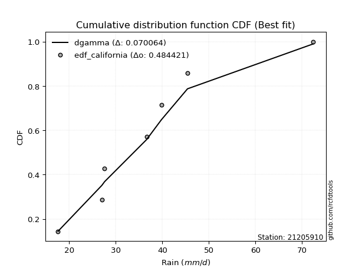</img>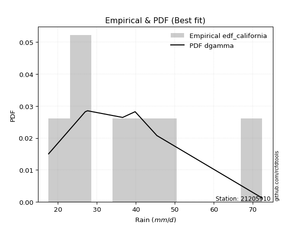</img>

</div>


### 2. Empirical - EDF Hazen (1930)

Hazen method for plotting positions is a formula used to estimate the empirical cumulative probability distribution of flood events or other hydrological data. This formula often results in biased estimations, particularly when extrapolating to extreme events (high return periods).

<div align="center">


$P=(m-0.5)/n$


</div>


**2.1. Empirical values**

<div align="center">

|                | 0                   | 1                   | 2                   | 3         | 4                  | 5                  | 6                  |
|:---------------|:--------------------|:--------------------|:--------------------|:----------|:-------------------|:-------------------|:-------------------|
| date           | 2023                | 2020                | 2021                | 2019      | 2022               | 2025               | 2024               |
| x              | 17.6                | 27.0                | 27.6                | 36.6      | 39.8               | 41.2               | 72.4               |
| m              | 1                   | 2                   | 3                   | 4         | 5                  | 6                  | 7                  |
| empirical_dist | edf_hazen           | edf_hazen           | edf_hazen           | edf_hazen | edf_hazen          | edf_hazen          | edf_hazen          |
| empirical      | 0.07142857142857142 | 0.21428571428571427 | 0.35714285714285715 | 0.5       | 0.6428571428571429 | 0.7857142857142857 | 0.9285714285714286 |
| empirical_tr   | 1.0769230769230769  | 1.2727272727272727  | 1.5555555555555558  | 2.0       | 2.8000000000000003 | 4.666666666666666  | 14.000000000000007 |

</div>


**2.2. Kolmogorov-Smirnov fit test (sorted by Δ)**


<div align="center">

|                | 0                   | 1                   | 2                   | 3                   | 4                   | 5                   | 6                   | 7                   | 8                   | 9                   | 10                  | 11                  | 12                  | 13                  | 14                  | 15                  | 16                  | 17                  | 18                  | 19                  | 20                  | 21                  | 22                  | 23                  | 24                  | 25                  | 26                  | 27                  | 28                  | 29                  | 30                  | 31                  | 32                  | 33                  | 34                  | 35                  | 36                  | 37                  | 38                  | 39                  | 40                  | 41                  | 42                  | 43                    | 44                  | 45                  | 46                  | 47                  | 48                  | 49                  | 50                  | 51                  | 52                  | 53                  | 54                  | 55                  | 56                  | 57                  | 58                  | 59                  | 60                  | 61                  | 62                  | 63                  | 64                  | 65                  | 66                  | 67                  | 68                  | 69                  | 70                  | 71                  | 72                  | 73                  | 74                  | 75                  | 76                  | 77                  | 78                  | 79                  | 80                  | 81                  | 82                  | 83                  | 84                  | 85                  | 86                  | 87                  | 88                  | 89                  |
|:---------------|:--------------------|:--------------------|:--------------------|:--------------------|:--------------------|:--------------------|:--------------------|:--------------------|:--------------------|:--------------------|:--------------------|:--------------------|:--------------------|:--------------------|:--------------------|:--------------------|:--------------------|:--------------------|:--------------------|:--------------------|:--------------------|:--------------------|:--------------------|:--------------------|:--------------------|:--------------------|:--------------------|:--------------------|:--------------------|:--------------------|:--------------------|:--------------------|:--------------------|:--------------------|:--------------------|:--------------------|:--------------------|:--------------------|:--------------------|:--------------------|:--------------------|:--------------------|:--------------------|:----------------------|:--------------------|:--------------------|:--------------------|:--------------------|:--------------------|:--------------------|:--------------------|:--------------------|:--------------------|:--------------------|:--------------------|:--------------------|:--------------------|:--------------------|:--------------------|:--------------------|:--------------------|:--------------------|:--------------------|:--------------------|:--------------------|:--------------------|:--------------------|:--------------------|:--------------------|:--------------------|:--------------------|:--------------------|:--------------------|:--------------------|:--------------------|:--------------------|:--------------------|:--------------------|:--------------------|:--------------------|:--------------------|:--------------------|:--------------------|:--------------------|:--------------------|:--------------------|:--------------------|:--------------------|:--------------------|:--------------------|
| station        | 21205910            | 21205910            | 21205910            | 21205910            | 21205910            | 21205910            | 21205910            | 21205910            | 21205910            | 21205910            | 21205910            | 21205910            | 21205910            | 21205910            | 21205910            | 21205910            | 21205910            | 21205910            | 21205910            | 21205910            | 21205910            | 21205910            | 21205910            | 21205910            | 21205910            | 21205910            | 21205910            | 21205910            | 21205910            | 21205910            | 21205910            | 21205910            | 21205910            | 21205910            | 21205910            | 21205910            | 21205910            | 21205910            | 21205910            | 21205910            | 21205910            | 21205910            | 21205910            | 21205910              | 21205910            | 21205910            | 21205910            | 21205910            | 21205910            | 21205910            | 21205910            | 21205910            | 21205910            | 21205910            | 21205910            | 21205910            | 21205910            | 21205910            | 21205910            | 21205910            | 21205910            | 21205910            | 21205910            | 21205910            | 21205910            | 21205910            | 21205910            | 21205910            | 21205910            | 21205910            | 21205910            | 21205910            | 21205910            | 21205910            | 21205910            | 21205910            | 21205910            | 21205910            | 21205910            | 21205910            | 21205910            | 21205910            | 21205910            | 21205910            | 21205910            | 21205910            | 21205910            | 21205910            | 21205910            | 21205910            |
| empirical_dist | edf_hazen           | edf_hazen           | edf_hazen           | edf_hazen           | edf_hazen           | edf_hazen           | edf_hazen           | edf_hazen           | edf_hazen           | edf_hazen           | edf_hazen           | edf_hazen           | edf_hazen           | edf_hazen           | edf_hazen           | edf_hazen           | edf_hazen           | edf_hazen           | edf_hazen           | edf_hazen           | edf_hazen           | edf_hazen           | edf_hazen           | edf_hazen           | edf_hazen           | edf_hazen           | edf_hazen           | edf_hazen           | edf_hazen           | edf_hazen           | edf_hazen           | edf_hazen           | edf_hazen           | edf_hazen           | edf_hazen           | edf_hazen           | edf_hazen           | edf_hazen           | edf_hazen           | edf_hazen           | edf_hazen           | edf_hazen           | edf_hazen           | edf_hazen             | edf_hazen           | edf_hazen           | edf_hazen           | edf_hazen           | edf_hazen           | edf_hazen           | edf_hazen           | edf_hazen           | edf_hazen           | edf_hazen           | edf_hazen           | edf_hazen           | edf_hazen           | edf_hazen           | edf_hazen           | edf_hazen           | edf_hazen           | edf_hazen           | edf_hazen           | edf_hazen           | edf_hazen           | edf_hazen           | edf_hazen           | edf_hazen           | edf_hazen           | edf_hazen           | edf_hazen           | edf_hazen           | edf_hazen           | edf_hazen           | edf_hazen           | edf_hazen           | edf_hazen           | edf_hazen           | edf_hazen           | edf_hazen           | edf_hazen           | edf_hazen           | edf_hazen           | edf_hazen           | edf_hazen           | edf_hazen           | edf_hazen           | edf_hazen           | edf_hazen           | edf_hazen           |
| p_dist         | logmielke           | logfisk             | mielke              | loggenlogistic      | fisk                | loginvgauss         | nct                 | t                   | loglogistic         | logmaxwell          | f                   | alpha               | logalpha            | loghypsecant        | lograyleigh         | invgamma            | exponnorm           | ncf                 | betaprime           | logerlang           | loggamma            | loggamma            | johnsonsu           | logfatiguelife      | lognct              | logjohnsonsu        | logf                | loginvgamma         | logweibull_min      | moyal               | invgauss            | logbetaprime        | logrice             | logpearson3         | halflogistic        | logexponnorm        | loginvweibull       | genlogistic         | logcrystalball      | lognorm             | lognorm             | logt                | logloggamma         | loglaplace_asymmetric | gompertz            | loglaplace          | loghalfnorm         | gumbel_r            | pearson3            | loggumbel_r         | logkstwobign        | halfnorm            | kstwobign           | laplace_asymmetric  | wald                | laplace             | loghalflogistic     | logmoyal            | loggumbel_l         | rayleigh            | logncf              | genexpon            | expon               | loggenexpon         | maxwell             | rice                | hypsecant           | weibull_min         | loggompertz         | logistic            | truncnorm           | crystalball         | norm                | nakagami            | gibrat              | logwald             | lognakagami         | chi2                | loggibrat           | gumbel_l            | logexpon            | logchi2             | logtruncnorm        | erlang              | gamma               | loglognorm          | pareto              | logpareto           | invweibull          | fatiguelife         |
| delta          | 0.08915771122294203 | 0.08934053159186106 | 0.09099448805452426 | 0.09099493255938584 | 0.09131938536824491 | 0.09383692786681175 | 0.09400315892893463 | 0.09463709653744601 | 0.09547356885368363 | 0.09568930807617793 | 0.09639175180273926 | 0.09734293077715606 | 0.09821393615853824 | 0.09928495943805415 | 0.09950617331129896 | 0.09974153880766179 | 0.10002842755883468 | 0.10013847415045352 | 0.10034880899642917 | 0.10159500543994271 | 0.10159504808701902 | 0.10159504808701902 | 0.10188589739451592 | 0.10198237666407095 | 0.10212721731579    | 0.1023262035162048  | 0.10234929348463362 | 0.10237885570825134 | 0.10263293365347403 | 0.10395107122956204 | 0.10399612936653502 | 0.10423377429669389 | 0.1053509120605105  | 0.1053629082462112  | 0.106269705564908   | 0.10807342363871386 | 0.11295419142857618 | 0.11307550874893013 | 0.1150495344896797  | 0.11504953854716715 | 0.11504953854716715 | 0.11506636373211243 | 0.1185191853579427  | 0.11995284740248283   | 0.12298637198858897 | 0.12388463970855959 | 0.12623215356260797 | 0.12711482622359727 | 0.12884740918478876 | 0.12997006864572758 | 0.13314045904328145 | 0.13448832457748372 | 0.1375634132319481  | 0.14225147144151773 | 0.14615908675388445 | 0.1465089918881176  | 0.15383669228018915 | 0.1544495498290479  | 0.15751155225287494 | 0.15867893876118555 | 0.15955692179599623 | 0.16273678898575286 | 0.16282176560331182 | 0.1646343766488839  | 0.16719537024224929 | 0.17164648779300784 | 0.17279585438103606 | 0.17367598837227868 | 0.17400953102246228 | 0.1825912957767667  | 0.19447718778431244 | 0.19447725645685965 | 0.19447725866835863 | 0.21428402910962305 | 0.2197656042298951  | 0.22238293677278764 | 0.22454150559441735 | 0.2514701130144067  | 0.2522446550783186  | 0.2558163414103449  | 0.25768412316390576 | 0.2716362428898592  | 0.2971967137669106  | 0.31946071891386574 | 0.3777410518981379  | 0.4284250874957166  | 0.43443789353685447 | 0.44598669302434846 | 0.4585391900419985  | 0.5114506258610567  |
| deltao         | 0.48442053926100004 | 0.48442053926100004 | 0.48442053926100004 | 0.48442053926100004 | 0.48442053926100004 | 0.48442053926100004 | 0.48442053926100004 | 0.48442053926100004 | 0.48442053926100004 | 0.48442053926100004 | 0.48442053926100004 | 0.48442053926100004 | 0.48442053926100004 | 0.48442053926100004 | 0.48442053926100004 | 0.48442053926100004 | 0.48442053926100004 | 0.48442053926100004 | 0.48442053926100004 | 0.48442053926100004 | 0.48442053926100004 | 0.48442053926100004 | 0.48442053926100004 | 0.48442053926100004 | 0.48442053926100004 | 0.48442053926100004 | 0.48442053926100004 | 0.48442053926100004 | 0.48442053926100004 | 0.48442053926100004 | 0.48442053926100004 | 0.48442053926100004 | 0.48442053926100004 | 0.48442053926100004 | 0.48442053926100004 | 0.48442053926100004 | 0.48442053926100004 | 0.48442053926100004 | 0.48442053926100004 | 0.48442053926100004 | 0.48442053926100004 | 0.48442053926100004 | 0.48442053926100004 | 0.48442053926100004   | 0.48442053926100004 | 0.48442053926100004 | 0.48442053926100004 | 0.48442053926100004 | 0.48442053926100004 | 0.48442053926100004 | 0.48442053926100004 | 0.48442053926100004 | 0.48442053926100004 | 0.48442053926100004 | 0.48442053926100004 | 0.48442053926100004 | 0.48442053926100004 | 0.48442053926100004 | 0.48442053926100004 | 0.48442053926100004 | 0.48442053926100004 | 0.48442053926100004 | 0.48442053926100004 | 0.48442053926100004 | 0.48442053926100004 | 0.48442053926100004 | 0.48442053926100004 | 0.48442053926100004 | 0.48442053926100004 | 0.48442053926100004 | 0.48442053926100004 | 0.48442053926100004 | 0.48442053926100004 | 0.48442053926100004 | 0.48442053926100004 | 0.48442053926100004 | 0.48442053926100004 | 0.48442053926100004 | 0.48442053926100004 | 0.48442053926100004 | 0.48442053926100004 | 0.48442053926100004 | 0.48442053926100004 | 0.48442053926100004 | 0.48442053926100004 | 0.48442053926100004 | 0.48442053926100004 | 0.48442053926100004 | 0.48442053926100004 | 0.48442053926100004 |
| eval           | Δo > Δ              | Δo > Δ              | Δo > Δ              | Δo > Δ              | Δo > Δ              | Δo > Δ              | Δo > Δ              | Δo > Δ              | Δo > Δ              | Δo > Δ              | Δo > Δ              | Δo > Δ              | Δo > Δ              | Δo > Δ              | Δo > Δ              | Δo > Δ              | Δo > Δ              | Δo > Δ              | Δo > Δ              | Δo > Δ              | Δo > Δ              | Δo > Δ              | Δo > Δ              | Δo > Δ              | Δo > Δ              | Δo > Δ              | Δo > Δ              | Δo > Δ              | Δo > Δ              | Δo > Δ              | Δo > Δ              | Δo > Δ              | Δo > Δ              | Δo > Δ              | Δo > Δ              | Δo > Δ              | Δo > Δ              | Δo > Δ              | Δo > Δ              | Δo > Δ              | Δo > Δ              | Δo > Δ              | Δo > Δ              | Δo > Δ                | Δo > Δ              | Δo > Δ              | Δo > Δ              | Δo > Δ              | Δo > Δ              | Δo > Δ              | Δo > Δ              | Δo > Δ              | Δo > Δ              | Δo > Δ              | Δo > Δ              | Δo > Δ              | Δo > Δ              | Δo > Δ              | Δo > Δ              | Δo > Δ              | Δo > Δ              | Δo > Δ              | Δo > Δ              | Δo > Δ              | Δo > Δ              | Δo > Δ              | Δo > Δ              | Δo > Δ              | Δo > Δ              | Δo > Δ              | Δo > Δ              | Δo > Δ              | Δo > Δ              | Δo > Δ              | Δo > Δ              | Δo > Δ              | Δo > Δ              | Δo > Δ              | Δo > Δ              | Δo > Δ              | Δo > Δ              | Δo > Δ              | Δo > Δ              | Δo > Δ              | Δo > Δ              | Δo > Δ              | Δo > Δ              | Δo > Δ              | Δo > Δ              | Δo <= Δ             |
| fit            | 1                   | 1                   | 1                   | 1                   | 1                   | 1                   | 1                   | 1                   | 1                   | 1                   | 1                   | 1                   | 1                   | 1                   | 1                   | 1                   | 1                   | 1                   | 1                   | 1                   | 1                   | 1                   | 1                   | 1                   | 1                   | 1                   | 1                   | 1                   | 1                   | 1                   | 1                   | 1                   | 1                   | 1                   | 1                   | 1                   | 1                   | 1                   | 1                   | 1                   | 1                   | 1                   | 1                   | 1                     | 1                   | 1                   | 1                   | 1                   | 1                   | 1                   | 1                   | 1                   | 1                   | 1                   | 1                   | 1                   | 1                   | 1                   | 1                   | 1                   | 1                   | 1                   | 1                   | 1                   | 1                   | 1                   | 1                   | 1                   | 1                   | 1                   | 1                   | 1                   | 1                   | 1                   | 1                   | 1                   | 1                   | 1                   | 1                   | 1                   | 1                   | 1                   | 1                   | 1                   | 1                   | 1                   | 1                   | 1                   | 1                   | 0                   |
| n              | 7                   | 7                   | 7                   | 7                   | 7                   | 7                   | 7                   | 7                   | 7                   | 7                   | 7                   | 7                   | 7                   | 7                   | 7                   | 7                   | 7                   | 7                   | 7                   | 7                   | 7                   | 7                   | 7                   | 7                   | 7                   | 7                   | 7                   | 7                   | 7                   | 7                   | 7                   | 7                   | 7                   | 7                   | 7                   | 7                   | 7                   | 7                   | 7                   | 7                   | 7                   | 7                   | 7                   | 7                     | 7                   | 7                   | 7                   | 7                   | 7                   | 7                   | 7                   | 7                   | 7                   | 7                   | 7                   | 7                   | 7                   | 7                   | 7                   | 7                   | 7                   | 7                   | 7                   | 7                   | 7                   | 7                   | 7                   | 7                   | 7                   | 7                   | 7                   | 7                   | 7                   | 7                   | 7                   | 7                   | 7                   | 7                   | 7                   | 7                   | 7                   | 7                   | 7                   | 7                   | 7                   | 7                   | 7                   | 7                   | 7                   | 7                   |
| best_fit       | 1                   | 0                   | 0                   | 0                   | 0                   | 0                   | 0                   | 0                   | 0                   | 0                   | 0                   | 0                   | 0                   | 0                   | 0                   | 0                   | 0                   | 0                   | 0                   | 0                   | 0                   | 0                   | 0                   | 0                   | 0                   | 0                   | 0                   | 0                   | 0                   | 0                   | 0                   | 0                   | 0                   | 0                   | 0                   | 0                   | 0                   | 0                   | 0                   | 0                   | 0                   | 0                   | 0                   | 0                     | 0                   | 0                   | 0                   | 0                   | 0                   | 0                   | 0                   | 0                   | 0                   | 0                   | 0                   | 0                   | 0                   | 0                   | 0                   | 0                   | 0                   | 0                   | 0                   | 0                   | 0                   | 0                   | 0                   | 0                   | 0                   | 0                   | 0                   | 0                   | 0                   | 0                   | 0                   | 0                   | 0                   | 0                   | 0                   | 0                   | 0                   | 0                   | 0                   | 0                   | 0                   | 0                   | 0                   | 0                   | 0                   | 0                   |
| best_fit_sort  | 1                   | 2                   | 3                   | 4                   | 5                   | 6                   | 7                   | 8                   | 9                   | 10                  | 11                  | 12                  | 13                  | 14                  | 15                  | 16                  | 17                  | 18                  | 19                  | 20                  | 21                  | 22                  | 23                  | 24                  | 25                  | 26                  | 27                  | 28                  | 29                  | 30                  | 31                  | 32                  | 33                  | 34                  | 35                  | 36                  | 37                  | 38                  | 39                  | 40                  | 41                  | 42                  | 43                  | 44                    | 45                  | 46                  | 47                  | 48                  | 49                  | 50                  | 51                  | 52                  | 53                  | 54                  | 55                  | 56                  | 57                  | 58                  | 59                  | 60                  | 61                  | 62                  | 63                  | 64                  | 65                  | 66                  | 67                  | 68                  | 69                  | 70                  | 71                  | 72                  | 73                  | 74                  | 75                  | 76                  | 77                  | 78                  | 79                  | 80                  | 81                  | 82                  | 83                  | 84                  | 85                  | 86                  | 87                  | 88                  | 89                  | 90                  |

</div>


<div align="center">

</img>

</div>


**2.3. Best fit**

<div align="center">

|   id |   station | empirical_dist   | p_dist    |     delta |   deltao | eval   |   fit |   n |   best_fit |   best_fit_sort |
|-----:|----------:|:-----------------|:----------|----------:|---------:|:-------|------:|----:|-----------:|----------------:|
|    0 |  21205910 | edf_hazen        | logmielke | 0.0891577 | 0.484421 | Δo > Δ |     1 |   7 |          1 |               1 |

</div>


<div align="center">

</img>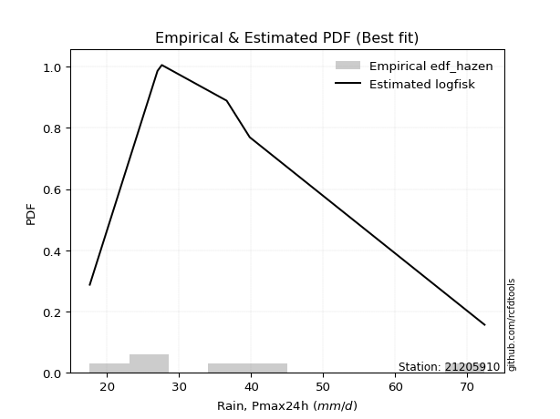</img>

</div>


### 3. Empirical - EDF Weibull (1939)

Weibull plotting position formula is an empirical method used to estimate the non-exceedance probability or plotting position for a set of observed data, is often recommended or widely used in practice, particularly in flood frequency analysis.

<div align="center">


$P=m/(n+1)$


</div>


**3.1. Empirical values**

<div align="center">

|                | 0                  | 1                  | 2           | 3           | 4                  | 5           | 6           |
|:---------------|:-------------------|:-------------------|:------------|:------------|:-------------------|:------------|:------------|
| date           | 2023               | 2020               | 2021        | 2019        | 2022               | 2025        | 2024        |
| x              | 17.6               | 27.0               | 27.6        | 36.6        | 39.8               | 41.2        | 72.4        |
| m              | 1                  | 2                  | 3           | 4           | 5                  | 6           | 7           |
| empirical_dist | edf_weibull        | edf_weibull        | edf_weibull | edf_weibull | edf_weibull        | edf_weibull | edf_weibull |
| empirical      | 0.125              | 0.25               | 0.375       | 0.5         | 0.625              | 0.75        | 0.875       |
| empirical_tr   | 1.1428571428571428 | 1.3333333333333333 | 1.6         | 2.0         | 2.6666666666666665 | 4.0         | 8.0         |

</div>


**3.2. Kolmogorov-Smirnov fit test (sorted by Δ)**


<div align="center">

|                | 0                   | 1                   | 2                   | 3                   | 4                   | 5                   | 6                   | 7                   | 8                   | 9                   | 10                  | 11                  | 12                  | 13                  | 14                  | 15                  | 16                  | 17                  | 18                  | 19                  | 20                  | 21                  | 22                  | 23                  | 24                  | 25                  | 26                  | 27                  | 28                  | 29                  | 30                  | 31                  | 32                  | 33                  | 34                  | 35                  | 36                  | 37                  | 38                  | 39                  | 40                  | 41                  | 42                  | 43                  | 44                  | 45                  | 46                  | 47                  | 48                  | 49                  | 50                  | 51                  | 52                  | 53                  | 54                  | 55                  | 56                  | 57                  | 58                  | 59                    | 60                  | 61                  | 62                  | 63                  | 64                  | 65                  | 66                  | 67                  | 68                  | 69                  | 70                  | 71                  | 72                  | 73                  | 74                  | 75                  | 76                  | 77                  | 78                  | 79                  | 80                  | 81                  | 82                  | 83                  | 84                  | 85                  | 86                  | 87                  | 88                  | 89                  |
|:---------------|:--------------------|:--------------------|:--------------------|:--------------------|:--------------------|:--------------------|:--------------------|:--------------------|:--------------------|:--------------------|:--------------------|:--------------------|:--------------------|:--------------------|:--------------------|:--------------------|:--------------------|:--------------------|:--------------------|:--------------------|:--------------------|:--------------------|:--------------------|:--------------------|:--------------------|:--------------------|:--------------------|:--------------------|:--------------------|:--------------------|:--------------------|:--------------------|:--------------------|:--------------------|:--------------------|:--------------------|:--------------------|:--------------------|:--------------------|:--------------------|:--------------------|:--------------------|:--------------------|:--------------------|:--------------------|:--------------------|:--------------------|:--------------------|:--------------------|:--------------------|:--------------------|:--------------------|:--------------------|:--------------------|:--------------------|:--------------------|:--------------------|:--------------------|:--------------------|:----------------------|:--------------------|:--------------------|:--------------------|:--------------------|:--------------------|:--------------------|:--------------------|:--------------------|:--------------------|:--------------------|:--------------------|:--------------------|:--------------------|:--------------------|:--------------------|:--------------------|:--------------------|:--------------------|:--------------------|:--------------------|:--------------------|:--------------------|:--------------------|:--------------------|:--------------------|:--------------------|:--------------------|:--------------------|:--------------------|:--------------------|
| station        | 21205910            | 21205910            | 21205910            | 21205910            | 21205910            | 21205910            | 21205910            | 21205910            | 21205910            | 21205910            | 21205910            | 21205910            | 21205910            | 21205910            | 21205910            | 21205910            | 21205910            | 21205910            | 21205910            | 21205910            | 21205910            | 21205910            | 21205910            | 21205910            | 21205910            | 21205910            | 21205910            | 21205910            | 21205910            | 21205910            | 21205910            | 21205910            | 21205910            | 21205910            | 21205910            | 21205910            | 21205910            | 21205910            | 21205910            | 21205910            | 21205910            | 21205910            | 21205910            | 21205910            | 21205910            | 21205910            | 21205910            | 21205910            | 21205910            | 21205910            | 21205910            | 21205910            | 21205910            | 21205910            | 21205910            | 21205910            | 21205910            | 21205910            | 21205910            | 21205910              | 21205910            | 21205910            | 21205910            | 21205910            | 21205910            | 21205910            | 21205910            | 21205910            | 21205910            | 21205910            | 21205910            | 21205910            | 21205910            | 21205910            | 21205910            | 21205910            | 21205910            | 21205910            | 21205910            | 21205910            | 21205910            | 21205910            | 21205910            | 21205910            | 21205910            | 21205910            | 21205910            | 21205910            | 21205910            | 21205910            |
| empirical_dist | edf_weibull         | edf_weibull         | edf_weibull         | edf_weibull         | edf_weibull         | edf_weibull         | edf_weibull         | edf_weibull         | edf_weibull         | edf_weibull         | edf_weibull         | edf_weibull         | edf_weibull         | edf_weibull         | edf_weibull         | edf_weibull         | edf_weibull         | edf_weibull         | edf_weibull         | edf_weibull         | edf_weibull         | edf_weibull         | edf_weibull         | edf_weibull         | edf_weibull         | edf_weibull         | edf_weibull         | edf_weibull         | edf_weibull         | edf_weibull         | edf_weibull         | edf_weibull         | edf_weibull         | edf_weibull         | edf_weibull         | edf_weibull         | edf_weibull         | edf_weibull         | edf_weibull         | edf_weibull         | edf_weibull         | edf_weibull         | edf_weibull         | edf_weibull         | edf_weibull         | edf_weibull         | edf_weibull         | edf_weibull         | edf_weibull         | edf_weibull         | edf_weibull         | edf_weibull         | edf_weibull         | edf_weibull         | edf_weibull         | edf_weibull         | edf_weibull         | edf_weibull         | edf_weibull         | edf_weibull           | edf_weibull         | edf_weibull         | edf_weibull         | edf_weibull         | edf_weibull         | edf_weibull         | edf_weibull         | edf_weibull         | edf_weibull         | edf_weibull         | edf_weibull         | edf_weibull         | edf_weibull         | edf_weibull         | edf_weibull         | edf_weibull         | edf_weibull         | edf_weibull         | edf_weibull         | edf_weibull         | edf_weibull         | edf_weibull         | edf_weibull         | edf_weibull         | edf_weibull         | edf_weibull         | edf_weibull         | edf_weibull         | edf_weibull         | edf_weibull         |
| p_dist         | loggenlogistic      | alpha               | mielke              | logfatiguelife      | betaprime           | ncf                 | logalpha            | logf                | loginvgamma         | logerlang           | loggamma            | loggamma            | logjohnsonsu        | lognct              | invgamma            | nct                 | logbetaprime        | logpearson3         | johnsonsu           | fisk                | invgauss            | moyal               | logfisk             | exponnorm           | logexponnorm        | logmielke           | loginvgauss         | logloggamma         | logt                | lognorm             | lognorm             | logcrystalball      | gumbel_r            | logweibull_min      | pearson3            | logrice             | logmaxwell          | f                   | genlogistic         | halfnorm            | loglogistic         | kstwobign           | t                   | loginvweibull       | lograyleigh         | loghypsecant        | logkstwobign        | rayleigh            | logncf              | gompertz            | halflogistic        | loghalfnorm         | genexpon            | expon               | loggumbel_l         | loggumbel_r         | maxwell             | loggenexpon         | rice                | loglaplace_asymmetric | weibull_min         | loggompertz         | hypsecant           | loglaplace          | wald                | logistic            | loghalflogistic     | logmoyal            | truncnorm           | crystalball         | norm                | laplace_asymmetric  | laplace             | chi2                | gumbel_l            | logexpon            | logwald             | logchi2             | gibrat              | nakagami            | lognakagami         | loggibrat           | erlang              | logtruncnorm        | gamma               | loglognorm          | pareto              | invweibull          | logpareto           | fatiguelife         |
| delta          | 0.08321414149068995 | 0.0832261902485728  | 0.08325613163264922 | 0.08340124807727378 | 0.0834943268326377  | 0.08358400434292576 | 0.08360680474095825 | 0.08376383946169585 | 0.0837936645993389  | 0.08381057169798897 | 0.08381059509389001 | 0.08381059509389001 | 0.0838425704888941  | 0.08387070876002878 | 0.08389380510074897 | 0.08442044746600064 | 0.08505517868662194 | 0.0853382080418339  | 0.08573647660644113 | 0.0859076777700972  | 0.08620675862104749 | 0.08637718519679205 | 0.0870825476757629  | 0.08730542631085003 | 0.08760104391928536 | 0.08835509614596121 | 0.08975219052267158 | 0.08992192042894831 | 0.09077478214413404 | 0.09077930721978422 | 0.09077930721978422 | 0.0907793090474559  | 0.09140054050931157 | 0.09157088399157878 | 0.09313312347050307 | 0.09382848002737146 | 0.09572732361083656 | 0.09600786900965486 | 0.09761948598903047 | 0.09877403886319802 | 0.1016904471544815  | 0.1018491275176624  | 0.10309480561575801 | 0.10846546724521333 | 0.10921016450495466 | 0.117142102295197   | 0.11740390461382477 | 0.12296465304689985 | 0.12384263608171053 | 0.12499999999990195 | 0.125               | 0.12623215356260797 | 0.12702250327146714 | 0.1271074798890261  | 0.1298780067161752  | 0.12997006864572758 | 0.1314810845279636  | 0.13164428927321814 | 0.13593220207872214 | 0.13780999025962568   | 0.13796170265799296 | 0.13829524530817655 | 0.14103052020717663 | 0.14174178256570244 | 0.14615908675388445 | 0.146877010062481   | 0.15383669228018915 | 0.1544495498290479  | 0.15876290207002675 | 0.15876297074257395 | 0.15876297295407293 | 0.16010861429866058 | 0.16327863744216065 | 0.21575582730012094 | 0.22010205569605923 | 0.22196983744962007 | 0.22238293677278764 | 0.23592195717557346 | 0.23762274708703796 | 0.24999831482390877 | 0.24999999909215165 | 0.2522446550783186  | 0.28374643319958004 | 0.31505385662405344 | 0.3420267661838522  | 0.3927108017814309  | 0.39872360782256877 | 0.4049677614705699  | 0.41027240731006276 | 0.475736340146771   |
| deltao         | 0.48442053926100004 | 0.48442053926100004 | 0.48442053926100004 | 0.48442053926100004 | 0.48442053926100004 | 0.48442053926100004 | 0.48442053926100004 | 0.48442053926100004 | 0.48442053926100004 | 0.48442053926100004 | 0.48442053926100004 | 0.48442053926100004 | 0.48442053926100004 | 0.48442053926100004 | 0.48442053926100004 | 0.48442053926100004 | 0.48442053926100004 | 0.48442053926100004 | 0.48442053926100004 | 0.48442053926100004 | 0.48442053926100004 | 0.48442053926100004 | 0.48442053926100004 | 0.48442053926100004 | 0.48442053926100004 | 0.48442053926100004 | 0.48442053926100004 | 0.48442053926100004 | 0.48442053926100004 | 0.48442053926100004 | 0.48442053926100004 | 0.48442053926100004 | 0.48442053926100004 | 0.48442053926100004 | 0.48442053926100004 | 0.48442053926100004 | 0.48442053926100004 | 0.48442053926100004 | 0.48442053926100004 | 0.48442053926100004 | 0.48442053926100004 | 0.48442053926100004 | 0.48442053926100004 | 0.48442053926100004 | 0.48442053926100004 | 0.48442053926100004 | 0.48442053926100004 | 0.48442053926100004 | 0.48442053926100004 | 0.48442053926100004 | 0.48442053926100004 | 0.48442053926100004 | 0.48442053926100004 | 0.48442053926100004 | 0.48442053926100004 | 0.48442053926100004 | 0.48442053926100004 | 0.48442053926100004 | 0.48442053926100004 | 0.48442053926100004   | 0.48442053926100004 | 0.48442053926100004 | 0.48442053926100004 | 0.48442053926100004 | 0.48442053926100004 | 0.48442053926100004 | 0.48442053926100004 | 0.48442053926100004 | 0.48442053926100004 | 0.48442053926100004 | 0.48442053926100004 | 0.48442053926100004 | 0.48442053926100004 | 0.48442053926100004 | 0.48442053926100004 | 0.48442053926100004 | 0.48442053926100004 | 0.48442053926100004 | 0.48442053926100004 | 0.48442053926100004 | 0.48442053926100004 | 0.48442053926100004 | 0.48442053926100004 | 0.48442053926100004 | 0.48442053926100004 | 0.48442053926100004 | 0.48442053926100004 | 0.48442053926100004 | 0.48442053926100004 | 0.48442053926100004 |
| eval           | Δo > Δ              | Δo > Δ              | Δo > Δ              | Δo > Δ              | Δo > Δ              | Δo > Δ              | Δo > Δ              | Δo > Δ              | Δo > Δ              | Δo > Δ              | Δo > Δ              | Δo > Δ              | Δo > Δ              | Δo > Δ              | Δo > Δ              | Δo > Δ              | Δo > Δ              | Δo > Δ              | Δo > Δ              | Δo > Δ              | Δo > Δ              | Δo > Δ              | Δo > Δ              | Δo > Δ              | Δo > Δ              | Δo > Δ              | Δo > Δ              | Δo > Δ              | Δo > Δ              | Δo > Δ              | Δo > Δ              | Δo > Δ              | Δo > Δ              | Δo > Δ              | Δo > Δ              | Δo > Δ              | Δo > Δ              | Δo > Δ              | Δo > Δ              | Δo > Δ              | Δo > Δ              | Δo > Δ              | Δo > Δ              | Δo > Δ              | Δo > Δ              | Δo > Δ              | Δo > Δ              | Δo > Δ              | Δo > Δ              | Δo > Δ              | Δo > Δ              | Δo > Δ              | Δo > Δ              | Δo > Δ              | Δo > Δ              | Δo > Δ              | Δo > Δ              | Δo > Δ              | Δo > Δ              | Δo > Δ                | Δo > Δ              | Δo > Δ              | Δo > Δ              | Δo > Δ              | Δo > Δ              | Δo > Δ              | Δo > Δ              | Δo > Δ              | Δo > Δ              | Δo > Δ              | Δo > Δ              | Δo > Δ              | Δo > Δ              | Δo > Δ              | Δo > Δ              | Δo > Δ              | Δo > Δ              | Δo > Δ              | Δo > Δ              | Δo > Δ              | Δo > Δ              | Δo > Δ              | Δo > Δ              | Δo > Δ              | Δo > Δ              | Δo > Δ              | Δo > Δ              | Δo > Δ              | Δo > Δ              | Δo > Δ              |
| fit            | 1                   | 1                   | 1                   | 1                   | 1                   | 1                   | 1                   | 1                   | 1                   | 1                   | 1                   | 1                   | 1                   | 1                   | 1                   | 1                   | 1                   | 1                   | 1                   | 1                   | 1                   | 1                   | 1                   | 1                   | 1                   | 1                   | 1                   | 1                   | 1                   | 1                   | 1                   | 1                   | 1                   | 1                   | 1                   | 1                   | 1                   | 1                   | 1                   | 1                   | 1                   | 1                   | 1                   | 1                   | 1                   | 1                   | 1                   | 1                   | 1                   | 1                   | 1                   | 1                   | 1                   | 1                   | 1                   | 1                   | 1                   | 1                   | 1                   | 1                     | 1                   | 1                   | 1                   | 1                   | 1                   | 1                   | 1                   | 1                   | 1                   | 1                   | 1                   | 1                   | 1                   | 1                   | 1                   | 1                   | 1                   | 1                   | 1                   | 1                   | 1                   | 1                   | 1                   | 1                   | 1                   | 1                   | 1                   | 1                   | 1                   | 1                   |
| n              | 7                   | 7                   | 7                   | 7                   | 7                   | 7                   | 7                   | 7                   | 7                   | 7                   | 7                   | 7                   | 7                   | 7                   | 7                   | 7                   | 7                   | 7                   | 7                   | 7                   | 7                   | 7                   | 7                   | 7                   | 7                   | 7                   | 7                   | 7                   | 7                   | 7                   | 7                   | 7                   | 7                   | 7                   | 7                   | 7                   | 7                   | 7                   | 7                   | 7                   | 7                   | 7                   | 7                   | 7                   | 7                   | 7                   | 7                   | 7                   | 7                   | 7                   | 7                   | 7                   | 7                   | 7                   | 7                   | 7                   | 7                   | 7                   | 7                   | 7                     | 7                   | 7                   | 7                   | 7                   | 7                   | 7                   | 7                   | 7                   | 7                   | 7                   | 7                   | 7                   | 7                   | 7                   | 7                   | 7                   | 7                   | 7                   | 7                   | 7                   | 7                   | 7                   | 7                   | 7                   | 7                   | 7                   | 7                   | 7                   | 7                   | 7                   |
| best_fit       | 1                   | 0                   | 0                   | 0                   | 0                   | 0                   | 0                   | 0                   | 0                   | 0                   | 0                   | 0                   | 0                   | 0                   | 0                   | 0                   | 0                   | 0                   | 0                   | 0                   | 0                   | 0                   | 0                   | 0                   | 0                   | 0                   | 0                   | 0                   | 0                   | 0                   | 0                   | 0                   | 0                   | 0                   | 0                   | 0                   | 0                   | 0                   | 0                   | 0                   | 0                   | 0                   | 0                   | 0                   | 0                   | 0                   | 0                   | 0                   | 0                   | 0                   | 0                   | 0                   | 0                   | 0                   | 0                   | 0                   | 0                   | 0                   | 0                   | 0                     | 0                   | 0                   | 0                   | 0                   | 0                   | 0                   | 0                   | 0                   | 0                   | 0                   | 0                   | 0                   | 0                   | 0                   | 0                   | 0                   | 0                   | 0                   | 0                   | 0                   | 0                   | 0                   | 0                   | 0                   | 0                   | 0                   | 0                   | 0                   | 0                   | 0                   |
| best_fit_sort  | 1                   | 2                   | 3                   | 4                   | 5                   | 6                   | 7                   | 8                   | 9                   | 10                  | 11                  | 12                  | 13                  | 14                  | 15                  | 16                  | 17                  | 18                  | 19                  | 20                  | 21                  | 22                  | 23                  | 24                  | 25                  | 26                  | 27                  | 28                  | 29                  | 30                  | 31                  | 32                  | 33                  | 34                  | 35                  | 36                  | 37                  | 38                  | 39                  | 40                  | 41                  | 42                  | 43                  | 44                  | 45                  | 46                  | 47                  | 48                  | 49                  | 50                  | 51                  | 52                  | 53                  | 54                  | 55                  | 56                  | 57                  | 58                  | 59                  | 60                    | 61                  | 62                  | 63                  | 64                  | 65                  | 66                  | 67                  | 68                  | 69                  | 70                  | 71                  | 72                  | 73                  | 74                  | 75                  | 76                  | 77                  | 78                  | 79                  | 80                  | 81                  | 82                  | 83                  | 84                  | 85                  | 86                  | 87                  | 88                  | 89                  | 90                  |

</div>


<div align="center">

</img>

</div>


**3.3. Best fit**

<div align="center">

|   id |   station | empirical_dist   | p_dist         |     delta |   deltao | eval   |   fit |   n |   best_fit |   best_fit_sort |
|-----:|----------:|:-----------------|:---------------|----------:|---------:|:-------|------:|----:|-----------:|----------------:|
|    0 |  21205910 | edf_weibull      | loggenlogistic | 0.0832141 | 0.484421 | Δo > Δ |     1 |   7 |          1 |               1 |

</div>


<div align="center">

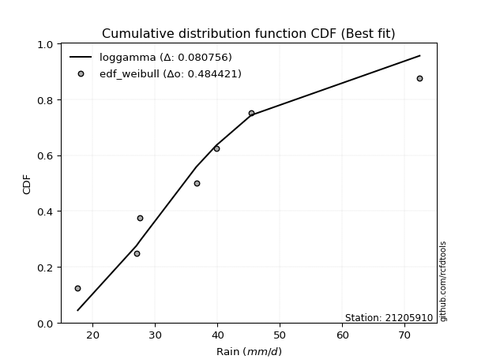</img>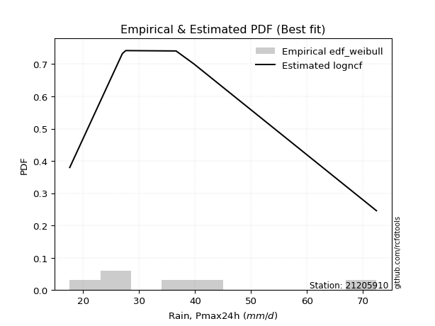</img>

</div>


### 4. Empirical - EDF Beard (1943)

The Beard formula (or Beard´s plotting position formula) in hydrology is used to estimate the empirical non-exceedance probability _(P)_ of a flood event (or other extreme hydrological data point) within a given dataset.

<div align="center">


$P=(m-0.31)/(n+0.38)$


</div>


**4.1. Empirical values**

<div align="center">

|                | 0                   | 1                   | 2                   | 3         | 4                  | 5                  | 6                  |
|:---------------|:--------------------|:--------------------|:--------------------|:----------|:-------------------|:-------------------|:-------------------|
| date           | 2023                | 2020                | 2021                | 2019      | 2022               | 2025               | 2024               |
| x              | 17.6                | 27.0                | 27.6                | 36.6      | 39.8               | 41.2               | 72.4               |
| m              | 1                   | 2                   | 3                   | 4         | 5                  | 6                  | 7                  |
| empirical_dist | edf_beard           | edf_beard           | edf_beard           | edf_beard | edf_beard          | edf_beard          | edf_beard          |
| empirical      | 0.09349593495934959 | 0.22899728997289973 | 0.36449864498644985 | 0.5       | 0.6355013550135502 | 0.7710027100271003 | 0.9065040650406505 |
| empirical_tr   | 1.1031390134529149  | 1.29701230228471    | 1.5735607675906182  | 2.0       | 2.743494423791822  | 4.366863905325444  | 10.695652173913055 |

</div>


**4.2. Kolmogorov-Smirnov fit test (sorted by Δ)**


<div align="center">

|                | 0                   | 1                   | 2                   | 3                   | 4                   | 5                   | 6                   | 7                   | 8                   | 9                   | 10                  | 11                  | 12                  | 13                  | 14                  | 15                  | 16                  | 17                  | 18                  | 19                  | 20                  | 21                  | 22                  | 23                  | 24                  | 25                  | 26                  | 27                  | 28                  | 29                  | 30                  | 31                  | 32                  | 33                  | 34                  | 35                  | 36                  | 37                  | 38                  | 39                  | 40                  | 41                  | 42                  | 43                  | 44                  | 45                  | 46                  | 47                  | 48                  | 49                  | 50                    | 51                  | 52                  | 53                  | 54                  | 55                  | 56                  | 57                  | 58                  | 59                  | 60                  | 61                  | 62                  | 63                  | 64                  | 65                  | 66                  | 67                  | 68                  | 69                  | 70                  | 71                  | 72                  | 73                  | 74                  | 75                  | 76                  | 77                  | 78                  | 79                  | 80                  | 81                  | 82                  | 83                  | 84                  | 85                  | 86                  | 87                  | 88                  | 89                  |
|:---------------|:--------------------|:--------------------|:--------------------|:--------------------|:--------------------|:--------------------|:--------------------|:--------------------|:--------------------|:--------------------|:--------------------|:--------------------|:--------------------|:--------------------|:--------------------|:--------------------|:--------------------|:--------------------|:--------------------|:--------------------|:--------------------|:--------------------|:--------------------|:--------------------|:--------------------|:--------------------|:--------------------|:--------------------|:--------------------|:--------------------|:--------------------|:--------------------|:--------------------|:--------------------|:--------------------|:--------------------|:--------------------|:--------------------|:--------------------|:--------------------|:--------------------|:--------------------|:--------------------|:--------------------|:--------------------|:--------------------|:--------------------|:--------------------|:--------------------|:--------------------|:----------------------|:--------------------|:--------------------|:--------------------|:--------------------|:--------------------|:--------------------|:--------------------|:--------------------|:--------------------|:--------------------|:--------------------|:--------------------|:--------------------|:--------------------|:--------------------|:--------------------|:--------------------|:--------------------|:--------------------|:--------------------|:--------------------|:--------------------|:--------------------|:--------------------|:--------------------|:--------------------|:--------------------|:--------------------|:--------------------|:--------------------|:--------------------|:--------------------|:--------------------|:--------------------|:--------------------|:--------------------|:--------------------|:--------------------|:--------------------|
| station        | 21205910            | 21205910            | 21205910            | 21205910            | 21205910            | 21205910            | 21205910            | 21205910            | 21205910            | 21205910            | 21205910            | 21205910            | 21205910            | 21205910            | 21205910            | 21205910            | 21205910            | 21205910            | 21205910            | 21205910            | 21205910            | 21205910            | 21205910            | 21205910            | 21205910            | 21205910            | 21205910            | 21205910            | 21205910            | 21205910            | 21205910            | 21205910            | 21205910            | 21205910            | 21205910            | 21205910            | 21205910            | 21205910            | 21205910            | 21205910            | 21205910            | 21205910            | 21205910            | 21205910            | 21205910            | 21205910            | 21205910            | 21205910            | 21205910            | 21205910            | 21205910              | 21205910            | 21205910            | 21205910            | 21205910            | 21205910            | 21205910            | 21205910            | 21205910            | 21205910            | 21205910            | 21205910            | 21205910            | 21205910            | 21205910            | 21205910            | 21205910            | 21205910            | 21205910            | 21205910            | 21205910            | 21205910            | 21205910            | 21205910            | 21205910            | 21205910            | 21205910            | 21205910            | 21205910            | 21205910            | 21205910            | 21205910            | 21205910            | 21205910            | 21205910            | 21205910            | 21205910            | 21205910            | 21205910            | 21205910            |
| empirical_dist | edf_beard           | edf_beard           | edf_beard           | edf_beard           | edf_beard           | edf_beard           | edf_beard           | edf_beard           | edf_beard           | edf_beard           | edf_beard           | edf_beard           | edf_beard           | edf_beard           | edf_beard           | edf_beard           | edf_beard           | edf_beard           | edf_beard           | edf_beard           | edf_beard           | edf_beard           | edf_beard           | edf_beard           | edf_beard           | edf_beard           | edf_beard           | edf_beard           | edf_beard           | edf_beard           | edf_beard           | edf_beard           | edf_beard           | edf_beard           | edf_beard           | edf_beard           | edf_beard           | edf_beard           | edf_beard           | edf_beard           | edf_beard           | edf_beard           | edf_beard           | edf_beard           | edf_beard           | edf_beard           | edf_beard           | edf_beard           | edf_beard           | edf_beard           | edf_beard             | edf_beard           | edf_beard           | edf_beard           | edf_beard           | edf_beard           | edf_beard           | edf_beard           | edf_beard           | edf_beard           | edf_beard           | edf_beard           | edf_beard           | edf_beard           | edf_beard           | edf_beard           | edf_beard           | edf_beard           | edf_beard           | edf_beard           | edf_beard           | edf_beard           | edf_beard           | edf_beard           | edf_beard           | edf_beard           | edf_beard           | edf_beard           | edf_beard           | edf_beard           | edf_beard           | edf_beard           | edf_beard           | edf_beard           | edf_beard           | edf_beard           | edf_beard           | edf_beard           | edf_beard           | edf_beard           |
| p_dist         | logmielke           | logfisk             | alpha               | loggenlogistic      | mielke              | logalpha            | nct                 | fisk                | invgamma            | exponnorm           | ncf                 | betaprime           | logerlang           | loggamma            | loggamma            | johnsonsu           | logfatiguelife      | lognct              | logjohnsonsu        | logf                | loginvgamma         | logweibull_min      | moyal               | invgauss            | logbetaprime        | loginvgauss         | logmaxwell          | logrice             | logpearson3         | loglogistic         | logexponnorm        | halflogistic        | t                   | f                   | genlogistic         | lograyleigh         | logcrystalball      | lognorm             | lognorm             | logt                | logloggamma         | loghypsecant        | gompertz            | loginvweibull       | gumbel_r            | pearson3            | logkstwobign        | halfnorm            | kstwobign           | loghalfnorm         | loglaplace_asymmetric | loggumbel_r         | loglaplace          | loggumbel_l         | rayleigh            | logncf              | wald                | genexpon            | expon               | laplace_asymmetric  | loggenexpon         | maxwell             | laplace             | loghalflogistic     | logmoyal            | rice                | hypsecant           | weibull_min         | loggompertz         | logistic            | truncnorm           | crystalball         | norm                | logwald             | gibrat              | nakagami            | lognakagami         | chi2                | gumbel_l            | logexpon            | loggibrat           | logchi2             | logtruncnorm        | erlang              | gamma               | loglognorm          | pareto              | logpareto           | invweibull          | fatiguelife         |
| delta          | 0.08127291192980057 | 0.08222022425371023 | 0.08263135508997066 | 0.08321414149068995 | 0.08325613163264922 | 0.08350236047135284 | 0.08442044746600064 | 0.08465929043802523 | 0.08502996312047639 | 0.08531685187164928 | 0.08542689846326812 | 0.08563723330924378 | 0.08688342975275731 | 0.08688347239983363 | 0.08688347239983363 | 0.08717432170733053 | 0.08727080097688555 | 0.0874156416286046  | 0.08761462782901941 | 0.08763771779744822 | 0.08766728002106594 | 0.08792135796628864 | 0.08923949554237665 | 0.08928455367934962 | 0.0895221986095085  | 0.08975219052267158 | 0.09004268191558795 | 0.09063933637332511 | 0.0906513325590258  | 0.09118909214093135 | 0.09336184795152846 | 0.09349593495934959 | 0.09463709653744601 | 0.09600786900965486 | 0.09836393306174473 | 0.09950617331129896 | 0.1003379588024943  | 0.10033796285998176 | 0.10033796285998176 | 0.10035478804492703 | 0.1038076096707573  | 0.10664074728164685 | 0.10827479630140358 | 0.10846546724521333 | 0.11240325053641187 | 0.11413583349760337 | 0.118428883356096   | 0.11977674889029832 | 0.1228518375447627  | 0.12623215356260797 | 0.12730863524607552   | 0.12997006864572758 | 0.1312404275521523  | 0.14279997656568955 | 0.14396736307400015 | 0.14484534610881084 | 0.14615908675388445 | 0.1480252132985674  | 0.14811018991612637 | 0.14960725928511043 | 0.14992280096169844 | 0.1524837945550639  | 0.1527772824286105  | 0.15383669228018915 | 0.1544495498290479  | 0.15693491210582244 | 0.15808427869385067 | 0.15896441268509323 | 0.15929795533527683 | 0.1678797200895813  | 0.17976561209712705 | 0.17976568076967425 | 0.17976568298117324 | 0.22238293677278764 | 0.2271213920734878  | 0.2289956047968085  | 0.23189729343801005 | 0.2367585373272212  | 0.24110476572315953 | 0.24297254747672034 | 0.2522446550783186  | 0.2569246672026737  | 0.3045525016105033  | 0.30474914322668034 | 0.3630294762109525  | 0.4137135118085312  | 0.4197263178496691  | 0.43127511733716306 | 0.4364718265112204  | 0.4967390501738713  |
| deltao         | 0.48442053926100004 | 0.48442053926100004 | 0.48442053926100004 | 0.48442053926100004 | 0.48442053926100004 | 0.48442053926100004 | 0.48442053926100004 | 0.48442053926100004 | 0.48442053926100004 | 0.48442053926100004 | 0.48442053926100004 | 0.48442053926100004 | 0.48442053926100004 | 0.48442053926100004 | 0.48442053926100004 | 0.48442053926100004 | 0.48442053926100004 | 0.48442053926100004 | 0.48442053926100004 | 0.48442053926100004 | 0.48442053926100004 | 0.48442053926100004 | 0.48442053926100004 | 0.48442053926100004 | 0.48442053926100004 | 0.48442053926100004 | 0.48442053926100004 | 0.48442053926100004 | 0.48442053926100004 | 0.48442053926100004 | 0.48442053926100004 | 0.48442053926100004 | 0.48442053926100004 | 0.48442053926100004 | 0.48442053926100004 | 0.48442053926100004 | 0.48442053926100004 | 0.48442053926100004 | 0.48442053926100004 | 0.48442053926100004 | 0.48442053926100004 | 0.48442053926100004 | 0.48442053926100004 | 0.48442053926100004 | 0.48442053926100004 | 0.48442053926100004 | 0.48442053926100004 | 0.48442053926100004 | 0.48442053926100004 | 0.48442053926100004 | 0.48442053926100004   | 0.48442053926100004 | 0.48442053926100004 | 0.48442053926100004 | 0.48442053926100004 | 0.48442053926100004 | 0.48442053926100004 | 0.48442053926100004 | 0.48442053926100004 | 0.48442053926100004 | 0.48442053926100004 | 0.48442053926100004 | 0.48442053926100004 | 0.48442053926100004 | 0.48442053926100004 | 0.48442053926100004 | 0.48442053926100004 | 0.48442053926100004 | 0.48442053926100004 | 0.48442053926100004 | 0.48442053926100004 | 0.48442053926100004 | 0.48442053926100004 | 0.48442053926100004 | 0.48442053926100004 | 0.48442053926100004 | 0.48442053926100004 | 0.48442053926100004 | 0.48442053926100004 | 0.48442053926100004 | 0.48442053926100004 | 0.48442053926100004 | 0.48442053926100004 | 0.48442053926100004 | 0.48442053926100004 | 0.48442053926100004 | 0.48442053926100004 | 0.48442053926100004 | 0.48442053926100004 | 0.48442053926100004 |
| eval           | Δo > Δ              | Δo > Δ              | Δo > Δ              | Δo > Δ              | Δo > Δ              | Δo > Δ              | Δo > Δ              | Δo > Δ              | Δo > Δ              | Δo > Δ              | Δo > Δ              | Δo > Δ              | Δo > Δ              | Δo > Δ              | Δo > Δ              | Δo > Δ              | Δo > Δ              | Δo > Δ              | Δo > Δ              | Δo > Δ              | Δo > Δ              | Δo > Δ              | Δo > Δ              | Δo > Δ              | Δo > Δ              | Δo > Δ              | Δo > Δ              | Δo > Δ              | Δo > Δ              | Δo > Δ              | Δo > Δ              | Δo > Δ              | Δo > Δ              | Δo > Δ              | Δo > Δ              | Δo > Δ              | Δo > Δ              | Δo > Δ              | Δo > Δ              | Δo > Δ              | Δo > Δ              | Δo > Δ              | Δo > Δ              | Δo > Δ              | Δo > Δ              | Δo > Δ              | Δo > Δ              | Δo > Δ              | Δo > Δ              | Δo > Δ              | Δo > Δ                | Δo > Δ              | Δo > Δ              | Δo > Δ              | Δo > Δ              | Δo > Δ              | Δo > Δ              | Δo > Δ              | Δo > Δ              | Δo > Δ              | Δo > Δ              | Δo > Δ              | Δo > Δ              | Δo > Δ              | Δo > Δ              | Δo > Δ              | Δo > Δ              | Δo > Δ              | Δo > Δ              | Δo > Δ              | Δo > Δ              | Δo > Δ              | Δo > Δ              | Δo > Δ              | Δo > Δ              | Δo > Δ              | Δo > Δ              | Δo > Δ              | Δo > Δ              | Δo > Δ              | Δo > Δ              | Δo > Δ              | Δo > Δ              | Δo > Δ              | Δo > Δ              | Δo > Δ              | Δo > Δ              | Δo > Δ              | Δo > Δ              | Δo <= Δ             |
| fit            | 1                   | 1                   | 1                   | 1                   | 1                   | 1                   | 1                   | 1                   | 1                   | 1                   | 1                   | 1                   | 1                   | 1                   | 1                   | 1                   | 1                   | 1                   | 1                   | 1                   | 1                   | 1                   | 1                   | 1                   | 1                   | 1                   | 1                   | 1                   | 1                   | 1                   | 1                   | 1                   | 1                   | 1                   | 1                   | 1                   | 1                   | 1                   | 1                   | 1                   | 1                   | 1                   | 1                   | 1                   | 1                   | 1                   | 1                   | 1                   | 1                   | 1                   | 1                     | 1                   | 1                   | 1                   | 1                   | 1                   | 1                   | 1                   | 1                   | 1                   | 1                   | 1                   | 1                   | 1                   | 1                   | 1                   | 1                   | 1                   | 1                   | 1                   | 1                   | 1                   | 1                   | 1                   | 1                   | 1                   | 1                   | 1                   | 1                   | 1                   | 1                   | 1                   | 1                   | 1                   | 1                   | 1                   | 1                   | 1                   | 1                   | 0                   |
| n              | 7                   | 7                   | 7                   | 7                   | 7                   | 7                   | 7                   | 7                   | 7                   | 7                   | 7                   | 7                   | 7                   | 7                   | 7                   | 7                   | 7                   | 7                   | 7                   | 7                   | 7                   | 7                   | 7                   | 7                   | 7                   | 7                   | 7                   | 7                   | 7                   | 7                   | 7                   | 7                   | 7                   | 7                   | 7                   | 7                   | 7                   | 7                   | 7                   | 7                   | 7                   | 7                   | 7                   | 7                   | 7                   | 7                   | 7                   | 7                   | 7                   | 7                   | 7                     | 7                   | 7                   | 7                   | 7                   | 7                   | 7                   | 7                   | 7                   | 7                   | 7                   | 7                   | 7                   | 7                   | 7                   | 7                   | 7                   | 7                   | 7                   | 7                   | 7                   | 7                   | 7                   | 7                   | 7                   | 7                   | 7                   | 7                   | 7                   | 7                   | 7                   | 7                   | 7                   | 7                   | 7                   | 7                   | 7                   | 7                   | 7                   | 7                   |
| best_fit       | 1                   | 0                   | 0                   | 0                   | 0                   | 0                   | 0                   | 0                   | 0                   | 0                   | 0                   | 0                   | 0                   | 0                   | 0                   | 0                   | 0                   | 0                   | 0                   | 0                   | 0                   | 0                   | 0                   | 0                   | 0                   | 0                   | 0                   | 0                   | 0                   | 0                   | 0                   | 0                   | 0                   | 0                   | 0                   | 0                   | 0                   | 0                   | 0                   | 0                   | 0                   | 0                   | 0                   | 0                   | 0                   | 0                   | 0                   | 0                   | 0                   | 0                   | 0                     | 0                   | 0                   | 0                   | 0                   | 0                   | 0                   | 0                   | 0                   | 0                   | 0                   | 0                   | 0                   | 0                   | 0                   | 0                   | 0                   | 0                   | 0                   | 0                   | 0                   | 0                   | 0                   | 0                   | 0                   | 0                   | 0                   | 0                   | 0                   | 0                   | 0                   | 0                   | 0                   | 0                   | 0                   | 0                   | 0                   | 0                   | 0                   | 0                   |
| best_fit_sort  | 1                   | 2                   | 3                   | 4                   | 5                   | 6                   | 7                   | 8                   | 9                   | 10                  | 11                  | 12                  | 13                  | 14                  | 15                  | 16                  | 17                  | 18                  | 19                  | 20                  | 21                  | 22                  | 23                  | 24                  | 25                  | 26                  | 27                  | 28                  | 29                  | 30                  | 31                  | 32                  | 33                  | 34                  | 35                  | 36                  | 37                  | 38                  | 39                  | 40                  | 41                  | 42                  | 43                  | 44                  | 45                  | 46                  | 47                  | 48                  | 49                  | 50                  | 51                    | 52                  | 53                  | 54                  | 55                  | 56                  | 57                  | 58                  | 59                  | 60                  | 61                  | 62                  | 63                  | 64                  | 65                  | 66                  | 67                  | 68                  | 69                  | 70                  | 71                  | 72                  | 73                  | 74                  | 75                  | 76                  | 77                  | 78                  | 79                  | 80                  | 81                  | 82                  | 83                  | 84                  | 85                  | 86                  | 87                  | 88                  | 89                  | 90                  |

</div>


<div align="center">

</img>

</div>


**4.3. Best fit**

<div align="center">

|   id |   station | empirical_dist   | p_dist    |     delta |   deltao | eval   |   fit |   n |   best_fit |   best_fit_sort |
|-----:|----------:|:-----------------|:----------|----------:|---------:|:-------|------:|----:|-----------:|----------------:|
|    0 |  21205910 | edf_beard        | logmielke | 0.0812729 | 0.484421 | Δo > Δ |     1 |   7 |          1 |               1 |

</div>


<div align="center">

</img></img>

</div>


### 5. Empirical - EDF Chegodayev (1955)

The Chegodayev formula is an empirical plotting position formula used in hydrological frequency analysis to estimate the exceedance probability or return period of a specific event from a set of observed data. It is primarily used for plotting observed data points on probability paper to fit a theoretical distribution, particularly for analyzing extreme events like maximum flood flows or rainfall intensities. The constant _b_ value in the generalized plotting position formula is 0.3.

<div align="center">


$P=(m-b)/(n+1-2b)$


</div>


**5.1. Empirical values**

<div align="center">

|                | 0                   | 1                   | 2                   | 3              | 4                  | 5                  | 6                  |
|:---------------|:--------------------|:--------------------|:--------------------|:---------------|:-------------------|:-------------------|:-------------------|
| date           | 2023                | 2020                | 2021                | 2019           | 2022               | 2025               | 2024               |
| x              | 17.6                | 27.0                | 27.6                | 36.6           | 39.8               | 41.2               | 72.4               |
| m              | 1                   | 2                   | 3                   | 4              | 5                  | 6                  | 7                  |
| empirical_dist | edf_chegodayev      | edf_chegodayev      | edf_chegodayev      | edf_chegodayev | edf_chegodayev     | edf_chegodayev     | edf_chegodayev     |
| empirical      | 0.09459459459459459 | 0.22972972972972971 | 0.36486486486486486 | 0.5            | 0.6351351351351351 | 0.7702702702702703 | 0.9054054054054054 |
| empirical_tr   | 1.1044776119402986  | 1.2982456140350878  | 1.574468085106383   | 2.0            | 2.7407407407407405 | 4.352941176470589  | 10.571428571428568 |

</div>


**5.2. Kolmogorov-Smirnov fit test (sorted by Δ)**


<div align="center">

|                | 0                   | 1                   | 2                   | 3                   | 4                   | 5                   | 6                   | 7                   | 8                   | 9                   | 10                  | 11                  | 12                  | 13                  | 14                  | 15                  | 16                  | 17                  | 18                  | 19                  | 20                  | 21                  | 22                  | 23                  | 24                  | 25                  | 26                  | 27                  | 28                  | 29                  | 30                  | 31                  | 32                  | 33                  | 34                  | 35                  | 36                  | 37                  | 38                  | 39                  | 40                  | 41                  | 42                  | 43                  | 44                  | 45                  | 46                  | 47                  | 48                  | 49                  | 50                    | 51                  | 52                  | 53                  | 54                  | 55                  | 56                  | 57                  | 58                  | 59                  | 60                  | 61                  | 62                  | 63                  | 64                  | 65                  | 66                  | 67                  | 68                  | 69                  | 70                  | 71                  | 72                  | 73                  | 74                  | 75                  | 76                  | 77                  | 78                  | 79                  | 80                  | 81                  | 82                  | 83                  | 84                  | 85                  | 86                  | 87                  | 88                  | 89                  |
|:---------------|:--------------------|:--------------------|:--------------------|:--------------------|:--------------------|:--------------------|:--------------------|:--------------------|:--------------------|:--------------------|:--------------------|:--------------------|:--------------------|:--------------------|:--------------------|:--------------------|:--------------------|:--------------------|:--------------------|:--------------------|:--------------------|:--------------------|:--------------------|:--------------------|:--------------------|:--------------------|:--------------------|:--------------------|:--------------------|:--------------------|:--------------------|:--------------------|:--------------------|:--------------------|:--------------------|:--------------------|:--------------------|:--------------------|:--------------------|:--------------------|:--------------------|:--------------------|:--------------------|:--------------------|:--------------------|:--------------------|:--------------------|:--------------------|:--------------------|:--------------------|:----------------------|:--------------------|:--------------------|:--------------------|:--------------------|:--------------------|:--------------------|:--------------------|:--------------------|:--------------------|:--------------------|:--------------------|:--------------------|:--------------------|:--------------------|:--------------------|:--------------------|:--------------------|:--------------------|:--------------------|:--------------------|:--------------------|:--------------------|:--------------------|:--------------------|:--------------------|:--------------------|:--------------------|:--------------------|:--------------------|:--------------------|:--------------------|:--------------------|:--------------------|:--------------------|:--------------------|:--------------------|:--------------------|:--------------------|:--------------------|
| station        | 21205910            | 21205910            | 21205910            | 21205910            | 21205910            | 21205910            | 21205910            | 21205910            | 21205910            | 21205910            | 21205910            | 21205910            | 21205910            | 21205910            | 21205910            | 21205910            | 21205910            | 21205910            | 21205910            | 21205910            | 21205910            | 21205910            | 21205910            | 21205910            | 21205910            | 21205910            | 21205910            | 21205910            | 21205910            | 21205910            | 21205910            | 21205910            | 21205910            | 21205910            | 21205910            | 21205910            | 21205910            | 21205910            | 21205910            | 21205910            | 21205910            | 21205910            | 21205910            | 21205910            | 21205910            | 21205910            | 21205910            | 21205910            | 21205910            | 21205910            | 21205910              | 21205910            | 21205910            | 21205910            | 21205910            | 21205910            | 21205910            | 21205910            | 21205910            | 21205910            | 21205910            | 21205910            | 21205910            | 21205910            | 21205910            | 21205910            | 21205910            | 21205910            | 21205910            | 21205910            | 21205910            | 21205910            | 21205910            | 21205910            | 21205910            | 21205910            | 21205910            | 21205910            | 21205910            | 21205910            | 21205910            | 21205910            | 21205910            | 21205910            | 21205910            | 21205910            | 21205910            | 21205910            | 21205910            | 21205910            |
| empirical_dist | edf_chegodayev      | edf_chegodayev      | edf_chegodayev      | edf_chegodayev      | edf_chegodayev      | edf_chegodayev      | edf_chegodayev      | edf_chegodayev      | edf_chegodayev      | edf_chegodayev      | edf_chegodayev      | edf_chegodayev      | edf_chegodayev      | edf_chegodayev      | edf_chegodayev      | edf_chegodayev      | edf_chegodayev      | edf_chegodayev      | edf_chegodayev      | edf_chegodayev      | edf_chegodayev      | edf_chegodayev      | edf_chegodayev      | edf_chegodayev      | edf_chegodayev      | edf_chegodayev      | edf_chegodayev      | edf_chegodayev      | edf_chegodayev      | edf_chegodayev      | edf_chegodayev      | edf_chegodayev      | edf_chegodayev      | edf_chegodayev      | edf_chegodayev      | edf_chegodayev      | edf_chegodayev      | edf_chegodayev      | edf_chegodayev      | edf_chegodayev      | edf_chegodayev      | edf_chegodayev      | edf_chegodayev      | edf_chegodayev      | edf_chegodayev      | edf_chegodayev      | edf_chegodayev      | edf_chegodayev      | edf_chegodayev      | edf_chegodayev      | edf_chegodayev        | edf_chegodayev      | edf_chegodayev      | edf_chegodayev      | edf_chegodayev      | edf_chegodayev      | edf_chegodayev      | edf_chegodayev      | edf_chegodayev      | edf_chegodayev      | edf_chegodayev      | edf_chegodayev      | edf_chegodayev      | edf_chegodayev      | edf_chegodayev      | edf_chegodayev      | edf_chegodayev      | edf_chegodayev      | edf_chegodayev      | edf_chegodayev      | edf_chegodayev      | edf_chegodayev      | edf_chegodayev      | edf_chegodayev      | edf_chegodayev      | edf_chegodayev      | edf_chegodayev      | edf_chegodayev      | edf_chegodayev      | edf_chegodayev      | edf_chegodayev      | edf_chegodayev      | edf_chegodayev      | edf_chegodayev      | edf_chegodayev      | edf_chegodayev      | edf_chegodayev      | edf_chegodayev      | edf_chegodayev      | edf_chegodayev      |
| p_dist         | logmielke           | alpha               | logfisk             | logalpha            | loggenlogistic      | mielke              | invgamma            | nct                 | exponnorm           | fisk                | ncf                 | betaprime           | logerlang           | loggamma            | loggamma            | johnsonsu           | logfatiguelife      | lognct              | logjohnsonsu        | logf                | loginvgamma         | logweibull_min      | moyal               | invgauss            | logbetaprime        | loginvgauss         | logrice             | logpearson3         | logmaxwell          | loglogistic         | logexponnorm        | halflogistic        | t                   | f                   | genlogistic         | lograyleigh         | logcrystalball      | lognorm             | lognorm             | logt                | logloggamma         | loghypsecant        | gompertz            | loginvweibull       | gumbel_r            | pearson3            | logkstwobign        | halfnorm            | kstwobign           | loghalfnorm         | loglaplace_asymmetric | loggumbel_r         | loglaplace          | loggumbel_l         | rayleigh            | logncf              | wald                | genexpon            | expon               | loggenexpon         | laplace_asymmetric  | maxwell             | laplace             | loghalflogistic     | logmoyal            | rice                | hypsecant           | weibull_min         | loggompertz         | logistic            | truncnorm           | crystalball         | norm                | logwald             | gibrat              | nakagami            | lognakagami         | chi2                | gumbel_l            | logexpon            | loggibrat           | logchi2             | erlang              | logtruncnorm        | gamma               | loglognorm          | pareto              | logpareto           | invweibull          | fatiguelife         |
| delta          | 0.08127291192980057 | 0.08189891533314064 | 0.08222022425371023 | 0.08276992071452283 | 0.08321414149068995 | 0.08325613163264922 | 0.08429752336364638 | 0.08442044746600064 | 0.08458441211481926 | 0.08465929043802523 | 0.0846944587064381  | 0.08490479355241376 | 0.0861509899959273  | 0.08615103264300361 | 0.08615103264300361 | 0.08644188195050051 | 0.08653836122005554 | 0.08668320187177458 | 0.08688218807218939 | 0.0869052780406182  | 0.08693484026423592 | 0.08718891820945862 | 0.08850705578554663 | 0.0885521139225196  | 0.08878975885267848 | 0.08975219052267158 | 0.08990689661649509 | 0.08991889280219578 | 0.09004268191558795 | 0.09155531201934636 | 0.09262940819469845 | 0.09459459459459459 | 0.09463709653744601 | 0.09600786900965486 | 0.09763149330491472 | 0.09950617331129896 | 0.09960551904566428 | 0.09960552310315174 | 0.09960552310315174 | 0.09962234828809702 | 0.10307516991392729 | 0.10700696716006186 | 0.10754235654457356 | 0.10846546724521333 | 0.11167081077958185 | 0.11340339374077335 | 0.11769644359926601 | 0.1190443091334683  | 0.12211939778793268 | 0.12623215356260797 | 0.12767485512449053   | 0.12997006864572758 | 0.1316066474305673  | 0.14206753680885953 | 0.14323492331717014 | 0.14411290635198082 | 0.14615908675388445 | 0.14729277354173742 | 0.14737775015929638 | 0.14919036120486845 | 0.14997347916352544 | 0.15175135479823387 | 0.1531435023070255  | 0.15383669228018915 | 0.1544495498290479  | 0.15620247234899243 | 0.15735183893702065 | 0.15823197292826324 | 0.15856551557844684 | 0.16714728033275128 | 0.17903317234029703 | 0.17903324101284424 | 0.17903324322434322 | 0.22238293677278764 | 0.2274876119519028  | 0.2297280445536385  | 0.23226351331642506 | 0.23602609757039122 | 0.24037232596632951 | 0.24224010771989035 | 0.2522446550783186  | 0.25619222744584375 | 0.3040167034698503  | 0.3049187214889183  | 0.3622970364541225  | 0.4129810720517012  | 0.41899387809283906 | 0.43054267758033304 | 0.43537316687597527 | 0.4960066104170413  |
| deltao         | 0.48442053926100004 | 0.48442053926100004 | 0.48442053926100004 | 0.48442053926100004 | 0.48442053926100004 | 0.48442053926100004 | 0.48442053926100004 | 0.48442053926100004 | 0.48442053926100004 | 0.48442053926100004 | 0.48442053926100004 | 0.48442053926100004 | 0.48442053926100004 | 0.48442053926100004 | 0.48442053926100004 | 0.48442053926100004 | 0.48442053926100004 | 0.48442053926100004 | 0.48442053926100004 | 0.48442053926100004 | 0.48442053926100004 | 0.48442053926100004 | 0.48442053926100004 | 0.48442053926100004 | 0.48442053926100004 | 0.48442053926100004 | 0.48442053926100004 | 0.48442053926100004 | 0.48442053926100004 | 0.48442053926100004 | 0.48442053926100004 | 0.48442053926100004 | 0.48442053926100004 | 0.48442053926100004 | 0.48442053926100004 | 0.48442053926100004 | 0.48442053926100004 | 0.48442053926100004 | 0.48442053926100004 | 0.48442053926100004 | 0.48442053926100004 | 0.48442053926100004 | 0.48442053926100004 | 0.48442053926100004 | 0.48442053926100004 | 0.48442053926100004 | 0.48442053926100004 | 0.48442053926100004 | 0.48442053926100004 | 0.48442053926100004 | 0.48442053926100004   | 0.48442053926100004 | 0.48442053926100004 | 0.48442053926100004 | 0.48442053926100004 | 0.48442053926100004 | 0.48442053926100004 | 0.48442053926100004 | 0.48442053926100004 | 0.48442053926100004 | 0.48442053926100004 | 0.48442053926100004 | 0.48442053926100004 | 0.48442053926100004 | 0.48442053926100004 | 0.48442053926100004 | 0.48442053926100004 | 0.48442053926100004 | 0.48442053926100004 | 0.48442053926100004 | 0.48442053926100004 | 0.48442053926100004 | 0.48442053926100004 | 0.48442053926100004 | 0.48442053926100004 | 0.48442053926100004 | 0.48442053926100004 | 0.48442053926100004 | 0.48442053926100004 | 0.48442053926100004 | 0.48442053926100004 | 0.48442053926100004 | 0.48442053926100004 | 0.48442053926100004 | 0.48442053926100004 | 0.48442053926100004 | 0.48442053926100004 | 0.48442053926100004 | 0.48442053926100004 | 0.48442053926100004 |
| eval           | Δo > Δ              | Δo > Δ              | Δo > Δ              | Δo > Δ              | Δo > Δ              | Δo > Δ              | Δo > Δ              | Δo > Δ              | Δo > Δ              | Δo > Δ              | Δo > Δ              | Δo > Δ              | Δo > Δ              | Δo > Δ              | Δo > Δ              | Δo > Δ              | Δo > Δ              | Δo > Δ              | Δo > Δ              | Δo > Δ              | Δo > Δ              | Δo > Δ              | Δo > Δ              | Δo > Δ              | Δo > Δ              | Δo > Δ              | Δo > Δ              | Δo > Δ              | Δo > Δ              | Δo > Δ              | Δo > Δ              | Δo > Δ              | Δo > Δ              | Δo > Δ              | Δo > Δ              | Δo > Δ              | Δo > Δ              | Δo > Δ              | Δo > Δ              | Δo > Δ              | Δo > Δ              | Δo > Δ              | Δo > Δ              | Δo > Δ              | Δo > Δ              | Δo > Δ              | Δo > Δ              | Δo > Δ              | Δo > Δ              | Δo > Δ              | Δo > Δ                | Δo > Δ              | Δo > Δ              | Δo > Δ              | Δo > Δ              | Δo > Δ              | Δo > Δ              | Δo > Δ              | Δo > Δ              | Δo > Δ              | Δo > Δ              | Δo > Δ              | Δo > Δ              | Δo > Δ              | Δo > Δ              | Δo > Δ              | Δo > Δ              | Δo > Δ              | Δo > Δ              | Δo > Δ              | Δo > Δ              | Δo > Δ              | Δo > Δ              | Δo > Δ              | Δo > Δ              | Δo > Δ              | Δo > Δ              | Δo > Δ              | Δo > Δ              | Δo > Δ              | Δo > Δ              | Δo > Δ              | Δo > Δ              | Δo > Δ              | Δo > Δ              | Δo > Δ              | Δo > Δ              | Δo > Δ              | Δo > Δ              | Δo <= Δ             |
| fit            | 1                   | 1                   | 1                   | 1                   | 1                   | 1                   | 1                   | 1                   | 1                   | 1                   | 1                   | 1                   | 1                   | 1                   | 1                   | 1                   | 1                   | 1                   | 1                   | 1                   | 1                   | 1                   | 1                   | 1                   | 1                   | 1                   | 1                   | 1                   | 1                   | 1                   | 1                   | 1                   | 1                   | 1                   | 1                   | 1                   | 1                   | 1                   | 1                   | 1                   | 1                   | 1                   | 1                   | 1                   | 1                   | 1                   | 1                   | 1                   | 1                   | 1                   | 1                     | 1                   | 1                   | 1                   | 1                   | 1                   | 1                   | 1                   | 1                   | 1                   | 1                   | 1                   | 1                   | 1                   | 1                   | 1                   | 1                   | 1                   | 1                   | 1                   | 1                   | 1                   | 1                   | 1                   | 1                   | 1                   | 1                   | 1                   | 1                   | 1                   | 1                   | 1                   | 1                   | 1                   | 1                   | 1                   | 1                   | 1                   | 1                   | 0                   |
| n              | 7                   | 7                   | 7                   | 7                   | 7                   | 7                   | 7                   | 7                   | 7                   | 7                   | 7                   | 7                   | 7                   | 7                   | 7                   | 7                   | 7                   | 7                   | 7                   | 7                   | 7                   | 7                   | 7                   | 7                   | 7                   | 7                   | 7                   | 7                   | 7                   | 7                   | 7                   | 7                   | 7                   | 7                   | 7                   | 7                   | 7                   | 7                   | 7                   | 7                   | 7                   | 7                   | 7                   | 7                   | 7                   | 7                   | 7                   | 7                   | 7                   | 7                   | 7                     | 7                   | 7                   | 7                   | 7                   | 7                   | 7                   | 7                   | 7                   | 7                   | 7                   | 7                   | 7                   | 7                   | 7                   | 7                   | 7                   | 7                   | 7                   | 7                   | 7                   | 7                   | 7                   | 7                   | 7                   | 7                   | 7                   | 7                   | 7                   | 7                   | 7                   | 7                   | 7                   | 7                   | 7                   | 7                   | 7                   | 7                   | 7                   | 7                   |
| best_fit       | 1                   | 0                   | 0                   | 0                   | 0                   | 0                   | 0                   | 0                   | 0                   | 0                   | 0                   | 0                   | 0                   | 0                   | 0                   | 0                   | 0                   | 0                   | 0                   | 0                   | 0                   | 0                   | 0                   | 0                   | 0                   | 0                   | 0                   | 0                   | 0                   | 0                   | 0                   | 0                   | 0                   | 0                   | 0                   | 0                   | 0                   | 0                   | 0                   | 0                   | 0                   | 0                   | 0                   | 0                   | 0                   | 0                   | 0                   | 0                   | 0                   | 0                   | 0                     | 0                   | 0                   | 0                   | 0                   | 0                   | 0                   | 0                   | 0                   | 0                   | 0                   | 0                   | 0                   | 0                   | 0                   | 0                   | 0                   | 0                   | 0                   | 0                   | 0                   | 0                   | 0                   | 0                   | 0                   | 0                   | 0                   | 0                   | 0                   | 0                   | 0                   | 0                   | 0                   | 0                   | 0                   | 0                   | 0                   | 0                   | 0                   | 0                   |
| best_fit_sort  | 1                   | 2                   | 3                   | 4                   | 5                   | 6                   | 7                   | 8                   | 9                   | 10                  | 11                  | 12                  | 13                  | 14                  | 15                  | 16                  | 17                  | 18                  | 19                  | 20                  | 21                  | 22                  | 23                  | 24                  | 25                  | 26                  | 27                  | 28                  | 29                  | 30                  | 31                  | 32                  | 33                  | 34                  | 35                  | 36                  | 37                  | 38                  | 39                  | 40                  | 41                  | 42                  | 43                  | 44                  | 45                  | 46                  | 47                  | 48                  | 49                  | 50                  | 51                    | 52                  | 53                  | 54                  | 55                  | 56                  | 57                  | 58                  | 59                  | 60                  | 61                  | 62                  | 63                  | 64                  | 65                  | 66                  | 67                  | 68                  | 69                  | 70                  | 71                  | 72                  | 73                  | 74                  | 75                  | 76                  | 77                  | 78                  | 79                  | 80                  | 81                  | 82                  | 83                  | 84                  | 85                  | 86                  | 87                  | 88                  | 89                  | 90                  |

</div>


<div align="center">

</img>

</div>


**5.3. Best fit**

<div align="center">

|   id |   station | empirical_dist   | p_dist    |     delta |   deltao | eval   |   fit |   n |   best_fit |   best_fit_sort |
|-----:|----------:|:-----------------|:----------|----------:|---------:|:-------|------:|----:|-----------:|----------------:|
|    0 |  21205910 | edf_chegodayev   | logmielke | 0.0812729 | 0.484421 | Δo > Δ |     1 |   7 |          1 |               1 |

</div>


<div align="center">

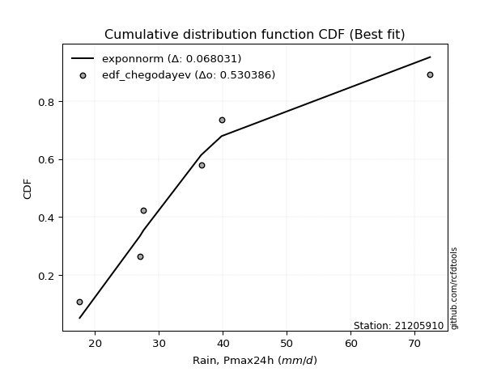</img>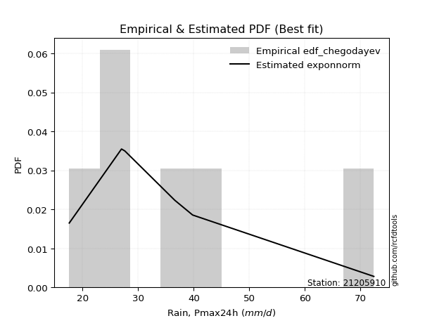</img>

</div>


### 6. Empirical - EDF Blom (1958)

The Blom formula is a specific "plotting position" formula used in hydrology and statistical analysis to estimate the empirical cumulative probability (or non-exceedance probability) of a data series. It is particularly recommended for data that are approximately normally distributed. The constant _a_ is set to 0.375 (or 3/8).

<div align="center">


$P=(m-a)/(n+1-2a)$


</div>


**6.1. Empirical values**

<div align="center">

|                | 0                   | 1                   | 2                  | 3        | 4                  | 5                  | 6                  |
|:---------------|:--------------------|:--------------------|:-------------------|:---------|:-------------------|:-------------------|:-------------------|
| date           | 2023                | 2020                | 2021               | 2019     | 2022               | 2025               | 2024               |
| x              | 17.6                | 27.0                | 27.6               | 36.6     | 39.8               | 41.2               | 72.4               |
| m              | 1                   | 2                   | 3                  | 4        | 5                  | 6                  | 7                  |
| empirical_dist | edf_blom            | edf_blom            | edf_blom           | edf_blom | edf_blom           | edf_blom           | edf_blom           |
| empirical      | 0.08620689655172414 | 0.22413793103448276 | 0.3620689655172414 | 0.5      | 0.6379310344827587 | 0.7758620689655172 | 0.9137931034482759 |
| empirical_tr   | 1.0943396226415094  | 1.288888888888889   | 1.5675675675675675 | 2.0      | 2.7619047619047623 | 4.461538461538462  | 11.600000000000007 |

</div>


**6.2. Kolmogorov-Smirnov fit test (sorted by Δ)**


<div align="center">

|                | 0                   | 1                   | 2                   | 3                   | 4                   | 5                   | 6                   | 7                   | 8                   | 9                   | 10                  | 11                  | 12                  | 13                  | 14                  | 15                  | 16                  | 17                  | 18                  | 19                  | 20                  | 21                  | 22                  | 23                  | 24                  | 25                  | 26                  | 27                  | 28                  | 29                  | 30                  | 31                  | 32                  | 33                  | 34                  | 35                  | 36                  | 37                  | 38                  | 39                  | 40                  | 41                  | 42                  | 43                  | 44                  | 45                  | 46                  | 47                  | 48                    | 49                  | 50                  | 51                  | 52                  | 53                  | 54                  | 55                  | 56                  | 57                  | 58                  | 59                  | 60                  | 61                  | 62                  | 63                  | 64                  | 65                  | 66                  | 67                  | 68                  | 69                  | 70                  | 71                  | 72                  | 73                  | 74                  | 75                  | 76                  | 77                  | 78                  | 79                  | 80                  | 81                  | 82                  | 83                  | 84                  | 85                  | 86                  | 87                  | 88                  | 89                  |
|:---------------|:--------------------|:--------------------|:--------------------|:--------------------|:--------------------|:--------------------|:--------------------|:--------------------|:--------------------|:--------------------|:--------------------|:--------------------|:--------------------|:--------------------|:--------------------|:--------------------|:--------------------|:--------------------|:--------------------|:--------------------|:--------------------|:--------------------|:--------------------|:--------------------|:--------------------|:--------------------|:--------------------|:--------------------|:--------------------|:--------------------|:--------------------|:--------------------|:--------------------|:--------------------|:--------------------|:--------------------|:--------------------|:--------------------|:--------------------|:--------------------|:--------------------|:--------------------|:--------------------|:--------------------|:--------------------|:--------------------|:--------------------|:--------------------|:----------------------|:--------------------|:--------------------|:--------------------|:--------------------|:--------------------|:--------------------|:--------------------|:--------------------|:--------------------|:--------------------|:--------------------|:--------------------|:--------------------|:--------------------|:--------------------|:--------------------|:--------------------|:--------------------|:--------------------|:--------------------|:--------------------|:--------------------|:--------------------|:--------------------|:--------------------|:--------------------|:--------------------|:--------------------|:--------------------|:--------------------|:--------------------|:--------------------|:--------------------|:--------------------|:--------------------|:--------------------|:--------------------|:--------------------|:--------------------|:--------------------|:--------------------|
| station        | 21205910            | 21205910            | 21205910            | 21205910            | 21205910            | 21205910            | 21205910            | 21205910            | 21205910            | 21205910            | 21205910            | 21205910            | 21205910            | 21205910            | 21205910            | 21205910            | 21205910            | 21205910            | 21205910            | 21205910            | 21205910            | 21205910            | 21205910            | 21205910            | 21205910            | 21205910            | 21205910            | 21205910            | 21205910            | 21205910            | 21205910            | 21205910            | 21205910            | 21205910            | 21205910            | 21205910            | 21205910            | 21205910            | 21205910            | 21205910            | 21205910            | 21205910            | 21205910            | 21205910            | 21205910            | 21205910            | 21205910            | 21205910            | 21205910              | 21205910            | 21205910            | 21205910            | 21205910            | 21205910            | 21205910            | 21205910            | 21205910            | 21205910            | 21205910            | 21205910            | 21205910            | 21205910            | 21205910            | 21205910            | 21205910            | 21205910            | 21205910            | 21205910            | 21205910            | 21205910            | 21205910            | 21205910            | 21205910            | 21205910            | 21205910            | 21205910            | 21205910            | 21205910            | 21205910            | 21205910            | 21205910            | 21205910            | 21205910            | 21205910            | 21205910            | 21205910            | 21205910            | 21205910            | 21205910            | 21205910            |
| empirical_dist | edf_blom            | edf_blom            | edf_blom            | edf_blom            | edf_blom            | edf_blom            | edf_blom            | edf_blom            | edf_blom            | edf_blom            | edf_blom            | edf_blom            | edf_blom            | edf_blom            | edf_blom            | edf_blom            | edf_blom            | edf_blom            | edf_blom            | edf_blom            | edf_blom            | edf_blom            | edf_blom            | edf_blom            | edf_blom            | edf_blom            | edf_blom            | edf_blom            | edf_blom            | edf_blom            | edf_blom            | edf_blom            | edf_blom            | edf_blom            | edf_blom            | edf_blom            | edf_blom            | edf_blom            | edf_blom            | edf_blom            | edf_blom            | edf_blom            | edf_blom            | edf_blom            | edf_blom            | edf_blom            | edf_blom            | edf_blom            | edf_blom              | edf_blom            | edf_blom            | edf_blom            | edf_blom            | edf_blom            | edf_blom            | edf_blom            | edf_blom            | edf_blom            | edf_blom            | edf_blom            | edf_blom            | edf_blom            | edf_blom            | edf_blom            | edf_blom            | edf_blom            | edf_blom            | edf_blom            | edf_blom            | edf_blom            | edf_blom            | edf_blom            | edf_blom            | edf_blom            | edf_blom            | edf_blom            | edf_blom            | edf_blom            | edf_blom            | edf_blom            | edf_blom            | edf_blom            | edf_blom            | edf_blom            | edf_blom            | edf_blom            | edf_blom            | edf_blom            | edf_blom            | edf_blom            |
| p_dist         | logmielke           | logfisk             | loggenlogistic      | mielke              | nct                 | fisk                | alpha               | logalpha            | loglogistic         | loginvgauss         | invgamma            | logmaxwell          | exponnorm           | ncf                 | betaprime           | logerlang           | loggamma            | loggamma            | johnsonsu           | logfatiguelife      | lognct              | logjohnsonsu        | logf                | loginvgamma         | logweibull_min      | moyal               | invgauss            | logbetaprime        | t                   | logrice             | logpearson3         | f                   | halflogistic        | logexponnorm        | lograyleigh         | genlogistic         | loghypsecant        | logcrystalball      | lognorm             | lognorm             | logt                | loginvweibull       | logloggamma         | gompertz            | gumbel_r            | pearson3            | logkstwobign        | halfnorm            | loglaplace_asymmetric | loghalfnorm         | kstwobign           | loglaplace          | loggumbel_r         | wald                | laplace_asymmetric  | loggumbel_l         | rayleigh            | logncf              | laplace             | genexpon            | expon               | loghalflogistic     | logmoyal            | loggenexpon         | maxwell             | rice                | hypsecant           | weibull_min         | loggompertz         | logistic            | truncnorm           | crystalball         | norm                | logwald             | nakagami            | gibrat              | lognakagami         | chi2                | gumbel_l            | logexpon            | loggibrat           | logchi2             | logtruncnorm        | erlang              | gamma               | loglognorm          | pareto              | logpareto           | invweibull          | fatiguelife         |
| delta          | 0.08127291192980057 | 0.08222022425371023 | 0.08321414149068995 | 0.08325613163264922 | 0.08442044746600064 | 0.08465929043802523 | 0.0874907140283876  | 0.08836171940976978 | 0.08875941267172288 | 0.08975219052267158 | 0.08988932205889333 | 0.09004268191558795 | 0.09017621081006622 | 0.09028625740168505 | 0.09049659224766071 | 0.09174278869117425 | 0.09174283133825056 | 0.09174283133825056 | 0.09203368064574746 | 0.09213015991530249 | 0.09227500056702154 | 0.09247398676743634 | 0.09249707673586516 | 0.09252663895948288 | 0.09278071690470557 | 0.09409885448079358 | 0.09414391261776656 | 0.09438155754792543 | 0.09463709653744601 | 0.09549869531174204 | 0.09551069149744273 | 0.09600786900965486 | 0.09641748881613954 | 0.0982212068899454  | 0.09950617331129896 | 0.10322329200016167 | 0.10421106781243838 | 0.10519731774091123 | 0.10519732179839869 | 0.10519732179839869 | 0.10521414698334397 | 0.10846546724521333 | 0.10866696860917424 | 0.11313415523982051 | 0.1172626094748288  | 0.1189951924360203  | 0.12328824229451296 | 0.12463610782871526 | 0.12487895577686706   | 0.12623215356260797 | 0.12771119648317963 | 0.12881074808294382 | 0.12997006864572758 | 0.14615908675388445 | 0.14717757981590196 | 0.14765933550410648 | 0.1488267220124171  | 0.14970470504722777 | 0.15034760295940203 | 0.15288457223698437 | 0.15296954885454334 | 0.15383669228018915 | 0.1544495498290479  | 0.1547821599001154  | 0.15734315349348083 | 0.16179427104423938 | 0.1629436376322676  | 0.1638237716235102  | 0.1641573142736938  | 0.17273907902799823 | 0.18462497103554398 | 0.1846250397080912  | 0.18462504191959017 | 0.22238293677278764 | 0.22413624585839154 | 0.22469171260427934 | 0.22946761396880158 | 0.24161789626563818 | 0.24596412466157647 | 0.2478319064151373  | 0.2522446550783186  | 0.2617840261410907  | 0.3021228221412948  | 0.3096085021650973  | 0.36788883514936943 | 0.41857287074694816 | 0.424585676788086   | 0.43613447627558    | 0.4437608649188458  | 0.5015984091122883  |
| deltao         | 0.48442053926100004 | 0.48442053926100004 | 0.48442053926100004 | 0.48442053926100004 | 0.48442053926100004 | 0.48442053926100004 | 0.48442053926100004 | 0.48442053926100004 | 0.48442053926100004 | 0.48442053926100004 | 0.48442053926100004 | 0.48442053926100004 | 0.48442053926100004 | 0.48442053926100004 | 0.48442053926100004 | 0.48442053926100004 | 0.48442053926100004 | 0.48442053926100004 | 0.48442053926100004 | 0.48442053926100004 | 0.48442053926100004 | 0.48442053926100004 | 0.48442053926100004 | 0.48442053926100004 | 0.48442053926100004 | 0.48442053926100004 | 0.48442053926100004 | 0.48442053926100004 | 0.48442053926100004 | 0.48442053926100004 | 0.48442053926100004 | 0.48442053926100004 | 0.48442053926100004 | 0.48442053926100004 | 0.48442053926100004 | 0.48442053926100004 | 0.48442053926100004 | 0.48442053926100004 | 0.48442053926100004 | 0.48442053926100004 | 0.48442053926100004 | 0.48442053926100004 | 0.48442053926100004 | 0.48442053926100004 | 0.48442053926100004 | 0.48442053926100004 | 0.48442053926100004 | 0.48442053926100004 | 0.48442053926100004   | 0.48442053926100004 | 0.48442053926100004 | 0.48442053926100004 | 0.48442053926100004 | 0.48442053926100004 | 0.48442053926100004 | 0.48442053926100004 | 0.48442053926100004 | 0.48442053926100004 | 0.48442053926100004 | 0.48442053926100004 | 0.48442053926100004 | 0.48442053926100004 | 0.48442053926100004 | 0.48442053926100004 | 0.48442053926100004 | 0.48442053926100004 | 0.48442053926100004 | 0.48442053926100004 | 0.48442053926100004 | 0.48442053926100004 | 0.48442053926100004 | 0.48442053926100004 | 0.48442053926100004 | 0.48442053926100004 | 0.48442053926100004 | 0.48442053926100004 | 0.48442053926100004 | 0.48442053926100004 | 0.48442053926100004 | 0.48442053926100004 | 0.48442053926100004 | 0.48442053926100004 | 0.48442053926100004 | 0.48442053926100004 | 0.48442053926100004 | 0.48442053926100004 | 0.48442053926100004 | 0.48442053926100004 | 0.48442053926100004 | 0.48442053926100004 |
| eval           | Δo > Δ              | Δo > Δ              | Δo > Δ              | Δo > Δ              | Δo > Δ              | Δo > Δ              | Δo > Δ              | Δo > Δ              | Δo > Δ              | Δo > Δ              | Δo > Δ              | Δo > Δ              | Δo > Δ              | Δo > Δ              | Δo > Δ              | Δo > Δ              | Δo > Δ              | Δo > Δ              | Δo > Δ              | Δo > Δ              | Δo > Δ              | Δo > Δ              | Δo > Δ              | Δo > Δ              | Δo > Δ              | Δo > Δ              | Δo > Δ              | Δo > Δ              | Δo > Δ              | Δo > Δ              | Δo > Δ              | Δo > Δ              | Δo > Δ              | Δo > Δ              | Δo > Δ              | Δo > Δ              | Δo > Δ              | Δo > Δ              | Δo > Δ              | Δo > Δ              | Δo > Δ              | Δo > Δ              | Δo > Δ              | Δo > Δ              | Δo > Δ              | Δo > Δ              | Δo > Δ              | Δo > Δ              | Δo > Δ                | Δo > Δ              | Δo > Δ              | Δo > Δ              | Δo > Δ              | Δo > Δ              | Δo > Δ              | Δo > Δ              | Δo > Δ              | Δo > Δ              | Δo > Δ              | Δo > Δ              | Δo > Δ              | Δo > Δ              | Δo > Δ              | Δo > Δ              | Δo > Δ              | Δo > Δ              | Δo > Δ              | Δo > Δ              | Δo > Δ              | Δo > Δ              | Δo > Δ              | Δo > Δ              | Δo > Δ              | Δo > Δ              | Δo > Δ              | Δo > Δ              | Δo > Δ              | Δo > Δ              | Δo > Δ              | Δo > Δ              | Δo > Δ              | Δo > Δ              | Δo > Δ              | Δo > Δ              | Δo > Δ              | Δo > Δ              | Δo > Δ              | Δo > Δ              | Δo > Δ              | Δo <= Δ             |
| fit            | 1                   | 1                   | 1                   | 1                   | 1                   | 1                   | 1                   | 1                   | 1                   | 1                   | 1                   | 1                   | 1                   | 1                   | 1                   | 1                   | 1                   | 1                   | 1                   | 1                   | 1                   | 1                   | 1                   | 1                   | 1                   | 1                   | 1                   | 1                   | 1                   | 1                   | 1                   | 1                   | 1                   | 1                   | 1                   | 1                   | 1                   | 1                   | 1                   | 1                   | 1                   | 1                   | 1                   | 1                   | 1                   | 1                   | 1                   | 1                   | 1                     | 1                   | 1                   | 1                   | 1                   | 1                   | 1                   | 1                   | 1                   | 1                   | 1                   | 1                   | 1                   | 1                   | 1                   | 1                   | 1                   | 1                   | 1                   | 1                   | 1                   | 1                   | 1                   | 1                   | 1                   | 1                   | 1                   | 1                   | 1                   | 1                   | 1                   | 1                   | 1                   | 1                   | 1                   | 1                   | 1                   | 1                   | 1                   | 1                   | 1                   | 0                   |
| n              | 7                   | 7                   | 7                   | 7                   | 7                   | 7                   | 7                   | 7                   | 7                   | 7                   | 7                   | 7                   | 7                   | 7                   | 7                   | 7                   | 7                   | 7                   | 7                   | 7                   | 7                   | 7                   | 7                   | 7                   | 7                   | 7                   | 7                   | 7                   | 7                   | 7                   | 7                   | 7                   | 7                   | 7                   | 7                   | 7                   | 7                   | 7                   | 7                   | 7                   | 7                   | 7                   | 7                   | 7                   | 7                   | 7                   | 7                   | 7                   | 7                     | 7                   | 7                   | 7                   | 7                   | 7                   | 7                   | 7                   | 7                   | 7                   | 7                   | 7                   | 7                   | 7                   | 7                   | 7                   | 7                   | 7                   | 7                   | 7                   | 7                   | 7                   | 7                   | 7                   | 7                   | 7                   | 7                   | 7                   | 7                   | 7                   | 7                   | 7                   | 7                   | 7                   | 7                   | 7                   | 7                   | 7                   | 7                   | 7                   | 7                   | 7                   |
| best_fit       | 1                   | 0                   | 0                   | 0                   | 0                   | 0                   | 0                   | 0                   | 0                   | 0                   | 0                   | 0                   | 0                   | 0                   | 0                   | 0                   | 0                   | 0                   | 0                   | 0                   | 0                   | 0                   | 0                   | 0                   | 0                   | 0                   | 0                   | 0                   | 0                   | 0                   | 0                   | 0                   | 0                   | 0                   | 0                   | 0                   | 0                   | 0                   | 0                   | 0                   | 0                   | 0                   | 0                   | 0                   | 0                   | 0                   | 0                   | 0                   | 0                     | 0                   | 0                   | 0                   | 0                   | 0                   | 0                   | 0                   | 0                   | 0                   | 0                   | 0                   | 0                   | 0                   | 0                   | 0                   | 0                   | 0                   | 0                   | 0                   | 0                   | 0                   | 0                   | 0                   | 0                   | 0                   | 0                   | 0                   | 0                   | 0                   | 0                   | 0                   | 0                   | 0                   | 0                   | 0                   | 0                   | 0                   | 0                   | 0                   | 0                   | 0                   |
| best_fit_sort  | 1                   | 2                   | 3                   | 4                   | 5                   | 6                   | 7                   | 8                   | 9                   | 10                  | 11                  | 12                  | 13                  | 14                  | 15                  | 16                  | 17                  | 18                  | 19                  | 20                  | 21                  | 22                  | 23                  | 24                  | 25                  | 26                  | 27                  | 28                  | 29                  | 30                  | 31                  | 32                  | 33                  | 34                  | 35                  | 36                  | 37                  | 38                  | 39                  | 40                  | 41                  | 42                  | 43                  | 44                  | 45                  | 46                  | 47                  | 48                  | 49                    | 50                  | 51                  | 52                  | 53                  | 54                  | 55                  | 56                  | 57                  | 58                  | 59                  | 60                  | 61                  | 62                  | 63                  | 64                  | 65                  | 66                  | 67                  | 68                  | 69                  | 70                  | 71                  | 72                  | 73                  | 74                  | 75                  | 76                  | 77                  | 78                  | 79                  | 80                  | 81                  | 82                  | 83                  | 84                  | 85                  | 86                  | 87                  | 88                  | 89                  | 90                  |

</div>


<div align="center">

</img>

</div>


**6.3. Best fit**

<div align="center">

|   id |   station | empirical_dist   | p_dist    |     delta |   deltao | eval   |   fit |   n |   best_fit |   best_fit_sort |
|-----:|----------:|:-----------------|:----------|----------:|---------:|:-------|------:|----:|-----------:|----------------:|
|    0 |  21205910 | edf_blom         | logmielke | 0.0812729 | 0.484421 | Δo > Δ |     1 |   7 |          1 |               1 |

</div>


<div align="center">

</img>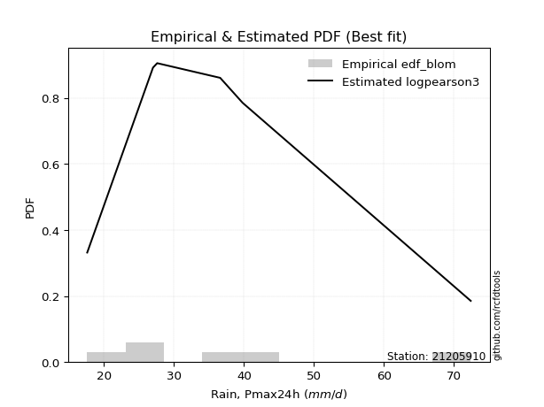</img>

</div>


### 7. Empirical - EDF Tukey (1962)

In hydrology, the Tukey formula is used as a plotting position formula to estimate the empirical probability or frequency of a flood event (or other hydrological data). The formula parameter is given as _c=0.333_ (or 1/3).

<div align="center">


$P=(m-c)/(n+1-2c)$


</div>


**7.1. Empirical values**

<div align="center">

|                | 0                   | 1                   | 2                   | 3         | 4                  | 5                  | 6                  |
|:---------------|:--------------------|:--------------------|:--------------------|:----------|:-------------------|:-------------------|:-------------------|
| date           | 2023                | 2020                | 2021                | 2019      | 2022               | 2025               | 2024               |
| x              | 17.6                | 27.0                | 27.6                | 36.6      | 39.8               | 41.2               | 72.4               |
| m              | 1                   | 2                   | 3                   | 4         | 5                  | 6                  | 7                  |
| empirical_dist | edf_tukey           | edf_tukey           | edf_tukey           | edf_tukey | edf_tukey          | edf_tukey          | edf_tukey          |
| empirical      | 0.09090909090909091 | 0.22727272727272727 | 0.36363636363636365 | 0.5       | 0.6363636363636364 | 0.7727272727272727 | 0.9090909090909091 |
| empirical_tr   | 1.1                 | 1.2941176470588236  | 1.5714285714285714  | 2.0       | 2.75               | 4.3999999999999995 | 10.999999999999996 |

</div>


**7.2. Kolmogorov-Smirnov fit test (sorted by Δ)**


<div align="center">

|                | 0                   | 1                   | 2                   | 3                   | 4                   | 5                   | 6                   | 7                   | 8                   | 9                   | 10                  | 11                  | 12                  | 13                  | 14                  | 15                  | 16                  | 17                  | 18                  | 19                  | 20                  | 21                  | 22                  | 23                  | 24                  | 25                  | 26                  | 27                  | 28                  | 29                  | 30                  | 31                  | 32                  | 33                  | 34                  | 35                  | 36                  | 37                  | 38                  | 39                  | 40                  | 41                  | 42                  | 43                  | 44                  | 45                  | 46                  | 47                  | 48                  | 49                  | 50                    | 51                  | 52                  | 53                  | 54                  | 55                  | 56                  | 57                  | 58                  | 59                  | 60                  | 61                  | 62                  | 63                  | 64                  | 65                  | 66                  | 67                  | 68                  | 69                  | 70                  | 71                  | 72                  | 73                  | 74                  | 75                  | 76                  | 77                  | 78                  | 79                  | 80                  | 81                  | 82                  | 83                  | 84                  | 85                  | 86                  | 87                  | 88                  | 89                  |
|:---------------|:--------------------|:--------------------|:--------------------|:--------------------|:--------------------|:--------------------|:--------------------|:--------------------|:--------------------|:--------------------|:--------------------|:--------------------|:--------------------|:--------------------|:--------------------|:--------------------|:--------------------|:--------------------|:--------------------|:--------------------|:--------------------|:--------------------|:--------------------|:--------------------|:--------------------|:--------------------|:--------------------|:--------------------|:--------------------|:--------------------|:--------------------|:--------------------|:--------------------|:--------------------|:--------------------|:--------------------|:--------------------|:--------------------|:--------------------|:--------------------|:--------------------|:--------------------|:--------------------|:--------------------|:--------------------|:--------------------|:--------------------|:--------------------|:--------------------|:--------------------|:----------------------|:--------------------|:--------------------|:--------------------|:--------------------|:--------------------|:--------------------|:--------------------|:--------------------|:--------------------|:--------------------|:--------------------|:--------------------|:--------------------|:--------------------|:--------------------|:--------------------|:--------------------|:--------------------|:--------------------|:--------------------|:--------------------|:--------------------|:--------------------|:--------------------|:--------------------|:--------------------|:--------------------|:--------------------|:--------------------|:--------------------|:--------------------|:--------------------|:--------------------|:--------------------|:--------------------|:--------------------|:--------------------|:--------------------|:--------------------|
| station        | 21205910            | 21205910            | 21205910            | 21205910            | 21205910            | 21205910            | 21205910            | 21205910            | 21205910            | 21205910            | 21205910            | 21205910            | 21205910            | 21205910            | 21205910            | 21205910            | 21205910            | 21205910            | 21205910            | 21205910            | 21205910            | 21205910            | 21205910            | 21205910            | 21205910            | 21205910            | 21205910            | 21205910            | 21205910            | 21205910            | 21205910            | 21205910            | 21205910            | 21205910            | 21205910            | 21205910            | 21205910            | 21205910            | 21205910            | 21205910            | 21205910            | 21205910            | 21205910            | 21205910            | 21205910            | 21205910            | 21205910            | 21205910            | 21205910            | 21205910            | 21205910              | 21205910            | 21205910            | 21205910            | 21205910            | 21205910            | 21205910            | 21205910            | 21205910            | 21205910            | 21205910            | 21205910            | 21205910            | 21205910            | 21205910            | 21205910            | 21205910            | 21205910            | 21205910            | 21205910            | 21205910            | 21205910            | 21205910            | 21205910            | 21205910            | 21205910            | 21205910            | 21205910            | 21205910            | 21205910            | 21205910            | 21205910            | 21205910            | 21205910            | 21205910            | 21205910            | 21205910            | 21205910            | 21205910            | 21205910            |
| empirical_dist | edf_tukey           | edf_tukey           | edf_tukey           | edf_tukey           | edf_tukey           | edf_tukey           | edf_tukey           | edf_tukey           | edf_tukey           | edf_tukey           | edf_tukey           | edf_tukey           | edf_tukey           | edf_tukey           | edf_tukey           | edf_tukey           | edf_tukey           | edf_tukey           | edf_tukey           | edf_tukey           | edf_tukey           | edf_tukey           | edf_tukey           | edf_tukey           | edf_tukey           | edf_tukey           | edf_tukey           | edf_tukey           | edf_tukey           | edf_tukey           | edf_tukey           | edf_tukey           | edf_tukey           | edf_tukey           | edf_tukey           | edf_tukey           | edf_tukey           | edf_tukey           | edf_tukey           | edf_tukey           | edf_tukey           | edf_tukey           | edf_tukey           | edf_tukey           | edf_tukey           | edf_tukey           | edf_tukey           | edf_tukey           | edf_tukey           | edf_tukey           | edf_tukey             | edf_tukey           | edf_tukey           | edf_tukey           | edf_tukey           | edf_tukey           | edf_tukey           | edf_tukey           | edf_tukey           | edf_tukey           | edf_tukey           | edf_tukey           | edf_tukey           | edf_tukey           | edf_tukey           | edf_tukey           | edf_tukey           | edf_tukey           | edf_tukey           | edf_tukey           | edf_tukey           | edf_tukey           | edf_tukey           | edf_tukey           | edf_tukey           | edf_tukey           | edf_tukey           | edf_tukey           | edf_tukey           | edf_tukey           | edf_tukey           | edf_tukey           | edf_tukey           | edf_tukey           | edf_tukey           | edf_tukey           | edf_tukey           | edf_tukey           | edf_tukey           | edf_tukey           |
| p_dist         | logmielke           | logfisk             | loggenlogistic      | mielke              | alpha               | nct                 | fisk                | logalpha            | invgamma            | exponnorm           | ncf                 | betaprime           | logerlang           | loggamma            | loggamma            | johnsonsu           | logfatiguelife      | lognct              | logjohnsonsu        | logf                | loginvgamma         | logweibull_min      | loginvgauss         | logmaxwell          | loglogistic         | moyal               | invgauss            | logbetaprime        | logrice             | logpearson3         | halflogistic        | t                   | logexponnorm        | f                   | lograyleigh         | genlogistic         | logcrystalball      | lognorm             | lognorm             | logt                | logloggamma         | loghypsecant        | loginvweibull       | gompertz            | gumbel_r            | pearson3            | logkstwobign        | halfnorm            | kstwobign           | loghalfnorm         | loglaplace_asymmetric | loggumbel_r         | loglaplace          | loggumbel_l         | rayleigh            | wald                | logncf              | laplace_asymmetric  | genexpon            | expon               | loggenexpon         | laplace             | loghalflogistic     | maxwell             | logmoyal            | rice                | hypsecant           | weibull_min         | loggompertz         | logistic            | truncnorm           | crystalball         | norm                | logwald             | gibrat              | nakagami            | lognakagami         | chi2                | gumbel_l            | logexpon            | loggibrat           | logchi2             | logtruncnorm        | erlang              | gamma               | loglognorm          | pareto              | logpareto           | invweibull          | fatiguelife         |
| delta          | 0.08127291192980057 | 0.08222022425371023 | 0.08321414149068995 | 0.08325613163264922 | 0.08435591779014306 | 0.08442044746600064 | 0.08465929043802523 | 0.08522692317152525 | 0.0867545258206488  | 0.08704141457182168 | 0.08715146116344052 | 0.08736179600941618 | 0.08860799245292972 | 0.08860803510000603 | 0.08860803510000603 | 0.08889888440750293 | 0.08899536367705796 | 0.089140204328777   | 0.08933919052919181 | 0.08936228049762063 | 0.08939184272123835 | 0.08964592066646104 | 0.08975219052267158 | 0.09004268191558795 | 0.09032681079084515 | 0.09096405824254905 | 0.09100911637952203 | 0.0912467613096809  | 0.09236389907349751 | 0.0923758952591982  | 0.09328269257789501 | 0.09463709653744601 | 0.09508641065170087 | 0.09600786900965486 | 0.09950617331129896 | 0.10008849576191714 | 0.1020625215026667  | 0.10206252556015416 | 0.10206252556015416 | 0.10207935074509944 | 0.10553217237092971 | 0.10577846593156065 | 0.10846546724521333 | 0.10999935900157598 | 0.11412781323658427 | 0.11586039619777577 | 0.12015344605626846 | 0.12150131159047073 | 0.1245764002449351  | 0.12623215356260797 | 0.12644635389598932   | 0.12997006864572758 | 0.1303781462020661  | 0.14452453926586195 | 0.14569192577417256 | 0.14615908675388445 | 0.14656990880898324 | 0.14874497793502423 | 0.14974977599873987 | 0.14983475261629883 | 0.1516473636618709  | 0.1519150010785243  | 0.15383669228018915 | 0.1542083572552363  | 0.1544495498290479  | 0.15865947480599485 | 0.15980884139402307 | 0.1606889753852657  | 0.16102251803544929 | 0.1696042827897537  | 0.18149017479729945 | 0.18149024346984666 | 0.18149024568134564 | 0.22238293677278764 | 0.2262591107234016  | 0.22727104209663604 | 0.23103501208792385 | 0.23848310002739367 | 0.24282932842333194 | 0.2446971101768928  | 0.2522446550783186  | 0.2586492299028462  | 0.3036902202604171  | 0.30647370592685275 | 0.3647540389111249  | 0.4154380745087036  | 0.4214508805498415  | 0.43299968003733547 | 0.43905867056147896 | 0.4984636128740437  |
| deltao         | 0.48442053926100004 | 0.48442053926100004 | 0.48442053926100004 | 0.48442053926100004 | 0.48442053926100004 | 0.48442053926100004 | 0.48442053926100004 | 0.48442053926100004 | 0.48442053926100004 | 0.48442053926100004 | 0.48442053926100004 | 0.48442053926100004 | 0.48442053926100004 | 0.48442053926100004 | 0.48442053926100004 | 0.48442053926100004 | 0.48442053926100004 | 0.48442053926100004 | 0.48442053926100004 | 0.48442053926100004 | 0.48442053926100004 | 0.48442053926100004 | 0.48442053926100004 | 0.48442053926100004 | 0.48442053926100004 | 0.48442053926100004 | 0.48442053926100004 | 0.48442053926100004 | 0.48442053926100004 | 0.48442053926100004 | 0.48442053926100004 | 0.48442053926100004 | 0.48442053926100004 | 0.48442053926100004 | 0.48442053926100004 | 0.48442053926100004 | 0.48442053926100004 | 0.48442053926100004 | 0.48442053926100004 | 0.48442053926100004 | 0.48442053926100004 | 0.48442053926100004 | 0.48442053926100004 | 0.48442053926100004 | 0.48442053926100004 | 0.48442053926100004 | 0.48442053926100004 | 0.48442053926100004 | 0.48442053926100004 | 0.48442053926100004 | 0.48442053926100004   | 0.48442053926100004 | 0.48442053926100004 | 0.48442053926100004 | 0.48442053926100004 | 0.48442053926100004 | 0.48442053926100004 | 0.48442053926100004 | 0.48442053926100004 | 0.48442053926100004 | 0.48442053926100004 | 0.48442053926100004 | 0.48442053926100004 | 0.48442053926100004 | 0.48442053926100004 | 0.48442053926100004 | 0.48442053926100004 | 0.48442053926100004 | 0.48442053926100004 | 0.48442053926100004 | 0.48442053926100004 | 0.48442053926100004 | 0.48442053926100004 | 0.48442053926100004 | 0.48442053926100004 | 0.48442053926100004 | 0.48442053926100004 | 0.48442053926100004 | 0.48442053926100004 | 0.48442053926100004 | 0.48442053926100004 | 0.48442053926100004 | 0.48442053926100004 | 0.48442053926100004 | 0.48442053926100004 | 0.48442053926100004 | 0.48442053926100004 | 0.48442053926100004 | 0.48442053926100004 | 0.48442053926100004 |
| eval           | Δo > Δ              | Δo > Δ              | Δo > Δ              | Δo > Δ              | Δo > Δ              | Δo > Δ              | Δo > Δ              | Δo > Δ              | Δo > Δ              | Δo > Δ              | Δo > Δ              | Δo > Δ              | Δo > Δ              | Δo > Δ              | Δo > Δ              | Δo > Δ              | Δo > Δ              | Δo > Δ              | Δo > Δ              | Δo > Δ              | Δo > Δ              | Δo > Δ              | Δo > Δ              | Δo > Δ              | Δo > Δ              | Δo > Δ              | Δo > Δ              | Δo > Δ              | Δo > Δ              | Δo > Δ              | Δo > Δ              | Δo > Δ              | Δo > Δ              | Δo > Δ              | Δo > Δ              | Δo > Δ              | Δo > Δ              | Δo > Δ              | Δo > Δ              | Δo > Δ              | Δo > Δ              | Δo > Δ              | Δo > Δ              | Δo > Δ              | Δo > Δ              | Δo > Δ              | Δo > Δ              | Δo > Δ              | Δo > Δ              | Δo > Δ              | Δo > Δ                | Δo > Δ              | Δo > Δ              | Δo > Δ              | Δo > Δ              | Δo > Δ              | Δo > Δ              | Δo > Δ              | Δo > Δ              | Δo > Δ              | Δo > Δ              | Δo > Δ              | Δo > Δ              | Δo > Δ              | Δo > Δ              | Δo > Δ              | Δo > Δ              | Δo > Δ              | Δo > Δ              | Δo > Δ              | Δo > Δ              | Δo > Δ              | Δo > Δ              | Δo > Δ              | Δo > Δ              | Δo > Δ              | Δo > Δ              | Δo > Δ              | Δo > Δ              | Δo > Δ              | Δo > Δ              | Δo > Δ              | Δo > Δ              | Δo > Δ              | Δo > Δ              | Δo > Δ              | Δo > Δ              | Δo > Δ              | Δo > Δ              | Δo <= Δ             |
| fit            | 1                   | 1                   | 1                   | 1                   | 1                   | 1                   | 1                   | 1                   | 1                   | 1                   | 1                   | 1                   | 1                   | 1                   | 1                   | 1                   | 1                   | 1                   | 1                   | 1                   | 1                   | 1                   | 1                   | 1                   | 1                   | 1                   | 1                   | 1                   | 1                   | 1                   | 1                   | 1                   | 1                   | 1                   | 1                   | 1                   | 1                   | 1                   | 1                   | 1                   | 1                   | 1                   | 1                   | 1                   | 1                   | 1                   | 1                   | 1                   | 1                   | 1                   | 1                     | 1                   | 1                   | 1                   | 1                   | 1                   | 1                   | 1                   | 1                   | 1                   | 1                   | 1                   | 1                   | 1                   | 1                   | 1                   | 1                   | 1                   | 1                   | 1                   | 1                   | 1                   | 1                   | 1                   | 1                   | 1                   | 1                   | 1                   | 1                   | 1                   | 1                   | 1                   | 1                   | 1                   | 1                   | 1                   | 1                   | 1                   | 1                   | 0                   |
| n              | 7                   | 7                   | 7                   | 7                   | 7                   | 7                   | 7                   | 7                   | 7                   | 7                   | 7                   | 7                   | 7                   | 7                   | 7                   | 7                   | 7                   | 7                   | 7                   | 7                   | 7                   | 7                   | 7                   | 7                   | 7                   | 7                   | 7                   | 7                   | 7                   | 7                   | 7                   | 7                   | 7                   | 7                   | 7                   | 7                   | 7                   | 7                   | 7                   | 7                   | 7                   | 7                   | 7                   | 7                   | 7                   | 7                   | 7                   | 7                   | 7                   | 7                   | 7                     | 7                   | 7                   | 7                   | 7                   | 7                   | 7                   | 7                   | 7                   | 7                   | 7                   | 7                   | 7                   | 7                   | 7                   | 7                   | 7                   | 7                   | 7                   | 7                   | 7                   | 7                   | 7                   | 7                   | 7                   | 7                   | 7                   | 7                   | 7                   | 7                   | 7                   | 7                   | 7                   | 7                   | 7                   | 7                   | 7                   | 7                   | 7                   | 7                   |
| best_fit       | 1                   | 0                   | 0                   | 0                   | 0                   | 0                   | 0                   | 0                   | 0                   | 0                   | 0                   | 0                   | 0                   | 0                   | 0                   | 0                   | 0                   | 0                   | 0                   | 0                   | 0                   | 0                   | 0                   | 0                   | 0                   | 0                   | 0                   | 0                   | 0                   | 0                   | 0                   | 0                   | 0                   | 0                   | 0                   | 0                   | 0                   | 0                   | 0                   | 0                   | 0                   | 0                   | 0                   | 0                   | 0                   | 0                   | 0                   | 0                   | 0                   | 0                   | 0                     | 0                   | 0                   | 0                   | 0                   | 0                   | 0                   | 0                   | 0                   | 0                   | 0                   | 0                   | 0                   | 0                   | 0                   | 0                   | 0                   | 0                   | 0                   | 0                   | 0                   | 0                   | 0                   | 0                   | 0                   | 0                   | 0                   | 0                   | 0                   | 0                   | 0                   | 0                   | 0                   | 0                   | 0                   | 0                   | 0                   | 0                   | 0                   | 0                   |
| best_fit_sort  | 1                   | 2                   | 3                   | 4                   | 5                   | 6                   | 7                   | 8                   | 9                   | 10                  | 11                  | 12                  | 13                  | 14                  | 15                  | 16                  | 17                  | 18                  | 19                  | 20                  | 21                  | 22                  | 23                  | 24                  | 25                  | 26                  | 27                  | 28                  | 29                  | 30                  | 31                  | 32                  | 33                  | 34                  | 35                  | 36                  | 37                  | 38                  | 39                  | 40                  | 41                  | 42                  | 43                  | 44                  | 45                  | 46                  | 47                  | 48                  | 49                  | 50                  | 51                    | 52                  | 53                  | 54                  | 55                  | 56                  | 57                  | 58                  | 59                  | 60                  | 61                  | 62                  | 63                  | 64                  | 65                  | 66                  | 67                  | 68                  | 69                  | 70                  | 71                  | 72                  | 73                  | 74                  | 75                  | 76                  | 77                  | 78                  | 79                  | 80                  | 81                  | 82                  | 83                  | 84                  | 85                  | 86                  | 87                  | 88                  | 89                  | 90                  |

</div>


<div align="center">

</img>

</div>


**7.3. Best fit**

<div align="center">

|   id |   station | empirical_dist   | p_dist    |     delta |   deltao | eval   |   fit |   n |   best_fit |   best_fit_sort |
|-----:|----------:|:-----------------|:----------|----------:|---------:|:-------|------:|----:|-----------:|----------------:|
|    0 |  21205910 | edf_tukey        | logmielke | 0.0812729 | 0.484421 | Δo > Δ |     1 |   7 |          1 |               1 |

</div>


<div align="center">

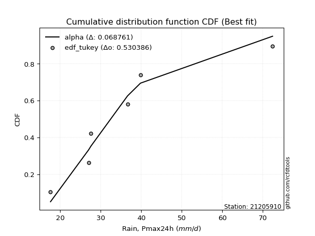</img>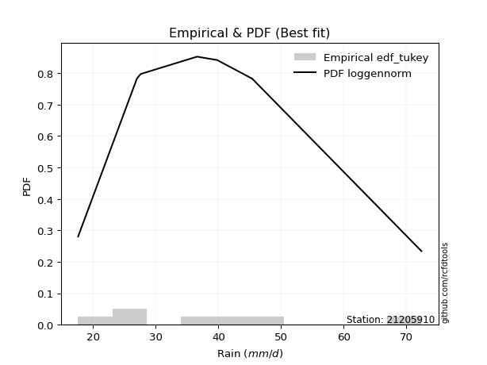</img>

</div>


### 8. Empirical - EDF Gringorten (1963)

Gringorten plotting position formula is essential for estimating the probability and return periods of extreme events like floods and heavy rainfall. The constant _a=0.44_.

<div align="center">


$P=(m-a)/(n+1-2a)$


</div>


**8.1. Empirical values**

<div align="center">

|                | 0                   | 1                   | 2                  | 3              | 4                  | 5                  | 6                  |
|:---------------|:--------------------|:--------------------|:-------------------|:---------------|:-------------------|:-------------------|:-------------------|
| date           | 2023                | 2020                | 2021               | 2019           | 2022               | 2025               | 2024               |
| x              | 17.6                | 27.0                | 27.6               | 36.6           | 39.8               | 41.2               | 72.4               |
| m              | 1                   | 2                   | 3                  | 4              | 5                  | 6                  | 7                  |
| empirical_dist | edf_gringorten      | edf_gringorten      | edf_gringorten     | edf_gringorten | edf_gringorten     | edf_gringorten     | edf_gringorten     |
| empirical      | 0.07865168539325844 | 0.21910112359550563 | 0.3595505617977528 | 0.5            | 0.6404494382022471 | 0.7808988764044943 | 0.9213483146067415 |
| empirical_tr   | 1.0853658536585364  | 1.2805755395683454  | 1.5614035087719298 | 2.0            | 2.781249999999999  | 4.564102564102562  | 12.714285714285701 |

</div>


**8.2. Kolmogorov-Smirnov fit test (sorted by Δ)**


<div align="center">

|                | 0                   | 1                   | 2                   | 3                   | 4                   | 5                   | 6                   | 7                   | 8                   | 9                   | 10                  | 11                  | 12                  | 13                  | 14                  | 15                  | 16                  | 17                  | 18                  | 19                  | 20                  | 21                  | 22                  | 23                  | 24                  | 25                  | 26                  | 27                  | 28                  | 29                  | 30                  | 31                  | 32                  | 33                  | 34                  | 35                  | 36                  | 37                  | 38                  | 39                  | 40                  | 41                  | 42                  | 43                  | 44                  | 45                    | 46                  | 47                  | 48                  | 49                  | 50                  | 51                  | 52                  | 53                  | 54                  | 55                  | 56                  | 57                  | 58                  | 59                  | 60                  | 61                  | 62                  | 63                  | 64                  | 65                  | 66                  | 67                  | 68                  | 69                  | 70                  | 71                  | 72                  | 73                  | 74                  | 75                  | 76                  | 77                  | 78                  | 79                  | 80                  | 81                  | 82                  | 83                  | 84                  | 85                  | 86                  | 87                  | 88                  | 89                  |
|:---------------|:--------------------|:--------------------|:--------------------|:--------------------|:--------------------|:--------------------|:--------------------|:--------------------|:--------------------|:--------------------|:--------------------|:--------------------|:--------------------|:--------------------|:--------------------|:--------------------|:--------------------|:--------------------|:--------------------|:--------------------|:--------------------|:--------------------|:--------------------|:--------------------|:--------------------|:--------------------|:--------------------|:--------------------|:--------------------|:--------------------|:--------------------|:--------------------|:--------------------|:--------------------|:--------------------|:--------------------|:--------------------|:--------------------|:--------------------|:--------------------|:--------------------|:--------------------|:--------------------|:--------------------|:--------------------|:----------------------|:--------------------|:--------------------|:--------------------|:--------------------|:--------------------|:--------------------|:--------------------|:--------------------|:--------------------|:--------------------|:--------------------|:--------------------|:--------------------|:--------------------|:--------------------|:--------------------|:--------------------|:--------------------|:--------------------|:--------------------|:--------------------|:--------------------|:--------------------|:--------------------|:--------------------|:--------------------|:--------------------|:--------------------|:--------------------|:--------------------|:--------------------|:--------------------|:--------------------|:--------------------|:--------------------|:--------------------|:--------------------|:--------------------|:--------------------|:--------------------|:--------------------|:--------------------|:--------------------|:--------------------|
| station        | 21205910            | 21205910            | 21205910            | 21205910            | 21205910            | 21205910            | 21205910            | 21205910            | 21205910            | 21205910            | 21205910            | 21205910            | 21205910            | 21205910            | 21205910            | 21205910            | 21205910            | 21205910            | 21205910            | 21205910            | 21205910            | 21205910            | 21205910            | 21205910            | 21205910            | 21205910            | 21205910            | 21205910            | 21205910            | 21205910            | 21205910            | 21205910            | 21205910            | 21205910            | 21205910            | 21205910            | 21205910            | 21205910            | 21205910            | 21205910            | 21205910            | 21205910            | 21205910            | 21205910            | 21205910            | 21205910              | 21205910            | 21205910            | 21205910            | 21205910            | 21205910            | 21205910            | 21205910            | 21205910            | 21205910            | 21205910            | 21205910            | 21205910            | 21205910            | 21205910            | 21205910            | 21205910            | 21205910            | 21205910            | 21205910            | 21205910            | 21205910            | 21205910            | 21205910            | 21205910            | 21205910            | 21205910            | 21205910            | 21205910            | 21205910            | 21205910            | 21205910            | 21205910            | 21205910            | 21205910            | 21205910            | 21205910            | 21205910            | 21205910            | 21205910            | 21205910            | 21205910            | 21205910            | 21205910            | 21205910            |
| empirical_dist | edf_gringorten      | edf_gringorten      | edf_gringorten      | edf_gringorten      | edf_gringorten      | edf_gringorten      | edf_gringorten      | edf_gringorten      | edf_gringorten      | edf_gringorten      | edf_gringorten      | edf_gringorten      | edf_gringorten      | edf_gringorten      | edf_gringorten      | edf_gringorten      | edf_gringorten      | edf_gringorten      | edf_gringorten      | edf_gringorten      | edf_gringorten      | edf_gringorten      | edf_gringorten      | edf_gringorten      | edf_gringorten      | edf_gringorten      | edf_gringorten      | edf_gringorten      | edf_gringorten      | edf_gringorten      | edf_gringorten      | edf_gringorten      | edf_gringorten      | edf_gringorten      | edf_gringorten      | edf_gringorten      | edf_gringorten      | edf_gringorten      | edf_gringorten      | edf_gringorten      | edf_gringorten      | edf_gringorten      | edf_gringorten      | edf_gringorten      | edf_gringorten      | edf_gringorten        | edf_gringorten      | edf_gringorten      | edf_gringorten      | edf_gringorten      | edf_gringorten      | edf_gringorten      | edf_gringorten      | edf_gringorten      | edf_gringorten      | edf_gringorten      | edf_gringorten      | edf_gringorten      | edf_gringorten      | edf_gringorten      | edf_gringorten      | edf_gringorten      | edf_gringorten      | edf_gringorten      | edf_gringorten      | edf_gringorten      | edf_gringorten      | edf_gringorten      | edf_gringorten      | edf_gringorten      | edf_gringorten      | edf_gringorten      | edf_gringorten      | edf_gringorten      | edf_gringorten      | edf_gringorten      | edf_gringorten      | edf_gringorten      | edf_gringorten      | edf_gringorten      | edf_gringorten      | edf_gringorten      | edf_gringorten      | edf_gringorten      | edf_gringorten      | edf_gringorten      | edf_gringorten      | edf_gringorten      | edf_gringorten      | edf_gringorten      |
| p_dist         | logmielke           | logfisk             | mielke              | loggenlogistic      | fisk                | nct                 | loginvgauss         | loglogistic         | logmaxwell          | alpha               | logalpha            | t                   | invgamma            | exponnorm           | ncf                 | betaprime           | f                   | logerlang           | loggamma            | loggamma            | johnsonsu           | logfatiguelife      | lognct              | logjohnsonsu        | logf                | loginvgamma         | logweibull_min      | moyal               | invgauss            | logbetaprime        | lograyleigh         | logrice             | logpearson3         | halflogistic        | loghypsecant        | logexponnorm        | genlogistic         | loginvweibull       | logcrystalball      | lognorm             | lognorm             | logt                | logloggamma         | gompertz            | gumbel_r            | loglaplace_asymmetric | pearson3            | loghalfnorm         | loglaplace          | logkstwobign        | halfnorm            | loggumbel_r         | kstwobign           | laplace_asymmetric  | wald                | laplace             | loggumbel_l         | loghalflogistic     | rayleigh            | logmoyal            | logncf              | genexpon            | expon               | loggenexpon         | maxwell             | rice                | hypsecant           | weibull_min         | loggompertz         | logistic            | truncnorm           | crystalball         | norm                | nakagami            | gibrat              | logwald             | lognakagami         | chi2                | gumbel_l            | loggibrat           | logexpon            | logchi2             | logtruncnorm        | erlang              | gamma               | loglognorm          | pareto              | logpareto           | invweibull          | fatiguelife         |
| delta          | 0.08434230191315062 | 0.08452512228206965 | 0.08617907874473285 | 0.08617952324959444 | 0.0865039760584535  | 0.08918774961914322 | 0.08975219052267158 | 0.09065815954389222 | 0.09087389876638652 | 0.09252752146736465 | 0.09339852684874683 | 0.09463709653744601 | 0.09492612949787038 | 0.09521301824904327 | 0.09532306484066211 | 0.09553339968663777 | 0.09600786900965486 | 0.0967795961301513  | 0.09677963877722762 | 0.09677963877722762 | 0.09707048808472452 | 0.09716696735427954 | 0.09731180800599859 | 0.0975107942064134  | 0.09753388417484221 | 0.09756344639845993 | 0.09781752434368263 | 0.09913566191977063 | 0.09918072005674361 | 0.09941836498690249 | 0.09950617331129896 | 0.1005355027507191  | 0.10054749893641979 | 0.1014542962551166  | 0.1016926640929498  | 0.10325801432892245 | 0.10826009943913872 | 0.10846546724521333 | 0.11023412517988829 | 0.11023412923737574 | 0.11023412923737574 | 0.11025095442232102 | 0.1137037760481513  | 0.11817096267879756 | 0.12229941691380586 | 0.12236055205737847   | 0.12403199987499736 | 0.12623215356260797 | 0.12629234436345524 | 0.1283250497334901  | 0.1296729152676923  | 0.12997006864572758 | 0.1327480039221567  | 0.14465917609641338 | 0.14615908675388445 | 0.14782919923991344 | 0.15269614294308353 | 0.15383669228018915 | 0.15386352945139414 | 0.1544495498290479  | 0.15474151248620482 | 0.1579213796759615  | 0.15800635629352047 | 0.15981896733909254 | 0.16237996093245788 | 0.16683107848321643 | 0.16798044507124466 | 0.16886057906248733 | 0.16919412171267093 | 0.17777588646697529 | 0.18966177847452104 | 0.18966184714706824 | 0.18966184935856722 | 0.2190994384194144  | 0.22217330888479075 | 0.22238293677278764 | 0.226949210249313   | 0.2466547037046153  | 0.2510009321005535  | 0.2522446550783186  | 0.25286871385411447 | 0.2668208335800678  | 0.29960441842180624 | 0.31464530960407444 | 0.3729256425883466  | 0.4236096781859253  | 0.4296224842270632  | 0.44117128371455716 | 0.4513160760773114  | 0.5066352165512654  |
| deltao         | 0.48442053926100004 | 0.48442053926100004 | 0.48442053926100004 | 0.48442053926100004 | 0.48442053926100004 | 0.48442053926100004 | 0.48442053926100004 | 0.48442053926100004 | 0.48442053926100004 | 0.48442053926100004 | 0.48442053926100004 | 0.48442053926100004 | 0.48442053926100004 | 0.48442053926100004 | 0.48442053926100004 | 0.48442053926100004 | 0.48442053926100004 | 0.48442053926100004 | 0.48442053926100004 | 0.48442053926100004 | 0.48442053926100004 | 0.48442053926100004 | 0.48442053926100004 | 0.48442053926100004 | 0.48442053926100004 | 0.48442053926100004 | 0.48442053926100004 | 0.48442053926100004 | 0.48442053926100004 | 0.48442053926100004 | 0.48442053926100004 | 0.48442053926100004 | 0.48442053926100004 | 0.48442053926100004 | 0.48442053926100004 | 0.48442053926100004 | 0.48442053926100004 | 0.48442053926100004 | 0.48442053926100004 | 0.48442053926100004 | 0.48442053926100004 | 0.48442053926100004 | 0.48442053926100004 | 0.48442053926100004 | 0.48442053926100004 | 0.48442053926100004   | 0.48442053926100004 | 0.48442053926100004 | 0.48442053926100004 | 0.48442053926100004 | 0.48442053926100004 | 0.48442053926100004 | 0.48442053926100004 | 0.48442053926100004 | 0.48442053926100004 | 0.48442053926100004 | 0.48442053926100004 | 0.48442053926100004 | 0.48442053926100004 | 0.48442053926100004 | 0.48442053926100004 | 0.48442053926100004 | 0.48442053926100004 | 0.48442053926100004 | 0.48442053926100004 | 0.48442053926100004 | 0.48442053926100004 | 0.48442053926100004 | 0.48442053926100004 | 0.48442053926100004 | 0.48442053926100004 | 0.48442053926100004 | 0.48442053926100004 | 0.48442053926100004 | 0.48442053926100004 | 0.48442053926100004 | 0.48442053926100004 | 0.48442053926100004 | 0.48442053926100004 | 0.48442053926100004 | 0.48442053926100004 | 0.48442053926100004 | 0.48442053926100004 | 0.48442053926100004 | 0.48442053926100004 | 0.48442053926100004 | 0.48442053926100004 | 0.48442053926100004 | 0.48442053926100004 | 0.48442053926100004 |
| eval           | Δo > Δ              | Δo > Δ              | Δo > Δ              | Δo > Δ              | Δo > Δ              | Δo > Δ              | Δo > Δ              | Δo > Δ              | Δo > Δ              | Δo > Δ              | Δo > Δ              | Δo > Δ              | Δo > Δ              | Δo > Δ              | Δo > Δ              | Δo > Δ              | Δo > Δ              | Δo > Δ              | Δo > Δ              | Δo > Δ              | Δo > Δ              | Δo > Δ              | Δo > Δ              | Δo > Δ              | Δo > Δ              | Δo > Δ              | Δo > Δ              | Δo > Δ              | Δo > Δ              | Δo > Δ              | Δo > Δ              | Δo > Δ              | Δo > Δ              | Δo > Δ              | Δo > Δ              | Δo > Δ              | Δo > Δ              | Δo > Δ              | Δo > Δ              | Δo > Δ              | Δo > Δ              | Δo > Δ              | Δo > Δ              | Δo > Δ              | Δo > Δ              | Δo > Δ                | Δo > Δ              | Δo > Δ              | Δo > Δ              | Δo > Δ              | Δo > Δ              | Δo > Δ              | Δo > Δ              | Δo > Δ              | Δo > Δ              | Δo > Δ              | Δo > Δ              | Δo > Δ              | Δo > Δ              | Δo > Δ              | Δo > Δ              | Δo > Δ              | Δo > Δ              | Δo > Δ              | Δo > Δ              | Δo > Δ              | Δo > Δ              | Δo > Δ              | Δo > Δ              | Δo > Δ              | Δo > Δ              | Δo > Δ              | Δo > Δ              | Δo > Δ              | Δo > Δ              | Δo > Δ              | Δo > Δ              | Δo > Δ              | Δo > Δ              | Δo > Δ              | Δo > Δ              | Δo > Δ              | Δo > Δ              | Δo > Δ              | Δo > Δ              | Δo > Δ              | Δo > Δ              | Δo > Δ              | Δo > Δ              | Δo <= Δ             |
| fit            | 1                   | 1                   | 1                   | 1                   | 1                   | 1                   | 1                   | 1                   | 1                   | 1                   | 1                   | 1                   | 1                   | 1                   | 1                   | 1                   | 1                   | 1                   | 1                   | 1                   | 1                   | 1                   | 1                   | 1                   | 1                   | 1                   | 1                   | 1                   | 1                   | 1                   | 1                   | 1                   | 1                   | 1                   | 1                   | 1                   | 1                   | 1                   | 1                   | 1                   | 1                   | 1                   | 1                   | 1                   | 1                   | 1                     | 1                   | 1                   | 1                   | 1                   | 1                   | 1                   | 1                   | 1                   | 1                   | 1                   | 1                   | 1                   | 1                   | 1                   | 1                   | 1                   | 1                   | 1                   | 1                   | 1                   | 1                   | 1                   | 1                   | 1                   | 1                   | 1                   | 1                   | 1                   | 1                   | 1                   | 1                   | 1                   | 1                   | 1                   | 1                   | 1                   | 1                   | 1                   | 1                   | 1                   | 1                   | 1                   | 1                   | 0                   |
| n              | 7                   | 7                   | 7                   | 7                   | 7                   | 7                   | 7                   | 7                   | 7                   | 7                   | 7                   | 7                   | 7                   | 7                   | 7                   | 7                   | 7                   | 7                   | 7                   | 7                   | 7                   | 7                   | 7                   | 7                   | 7                   | 7                   | 7                   | 7                   | 7                   | 7                   | 7                   | 7                   | 7                   | 7                   | 7                   | 7                   | 7                   | 7                   | 7                   | 7                   | 7                   | 7                   | 7                   | 7                   | 7                   | 7                     | 7                   | 7                   | 7                   | 7                   | 7                   | 7                   | 7                   | 7                   | 7                   | 7                   | 7                   | 7                   | 7                   | 7                   | 7                   | 7                   | 7                   | 7                   | 7                   | 7                   | 7                   | 7                   | 7                   | 7                   | 7                   | 7                   | 7                   | 7                   | 7                   | 7                   | 7                   | 7                   | 7                   | 7                   | 7                   | 7                   | 7                   | 7                   | 7                   | 7                   | 7                   | 7                   | 7                   | 7                   |
| best_fit       | 1                   | 0                   | 0                   | 0                   | 0                   | 0                   | 0                   | 0                   | 0                   | 0                   | 0                   | 0                   | 0                   | 0                   | 0                   | 0                   | 0                   | 0                   | 0                   | 0                   | 0                   | 0                   | 0                   | 0                   | 0                   | 0                   | 0                   | 0                   | 0                   | 0                   | 0                   | 0                   | 0                   | 0                   | 0                   | 0                   | 0                   | 0                   | 0                   | 0                   | 0                   | 0                   | 0                   | 0                   | 0                   | 0                     | 0                   | 0                   | 0                   | 0                   | 0                   | 0                   | 0                   | 0                   | 0                   | 0                   | 0                   | 0                   | 0                   | 0                   | 0                   | 0                   | 0                   | 0                   | 0                   | 0                   | 0                   | 0                   | 0                   | 0                   | 0                   | 0                   | 0                   | 0                   | 0                   | 0                   | 0                   | 0                   | 0                   | 0                   | 0                   | 0                   | 0                   | 0                   | 0                   | 0                   | 0                   | 0                   | 0                   | 0                   |
| best_fit_sort  | 1                   | 2                   | 3                   | 4                   | 5                   | 6                   | 7                   | 8                   | 9                   | 10                  | 11                  | 12                  | 13                  | 14                  | 15                  | 16                  | 17                  | 18                  | 19                  | 20                  | 21                  | 22                  | 23                  | 24                  | 25                  | 26                  | 27                  | 28                  | 29                  | 30                  | 31                  | 32                  | 33                  | 34                  | 35                  | 36                  | 37                  | 38                  | 39                  | 40                  | 41                  | 42                  | 43                  | 44                  | 45                  | 46                    | 47                  | 48                  | 49                  | 50                  | 51                  | 52                  | 53                  | 54                  | 55                  | 56                  | 57                  | 58                  | 59                  | 60                  | 61                  | 62                  | 63                  | 64                  | 65                  | 66                  | 67                  | 68                  | 69                  | 70                  | 71                  | 72                  | 73                  | 74                  | 75                  | 76                  | 77                  | 78                  | 79                  | 80                  | 81                  | 82                  | 83                  | 84                  | 85                  | 86                  | 87                  | 88                  | 89                  | 90                  |

</div>


<div align="center">

</img>

</div>


**8.3. Best fit**

<div align="center">

|   id |   station | empirical_dist   | p_dist    |     delta |   deltao | eval   |   fit |   n |   best_fit |   best_fit_sort |
|-----:|----------:|:-----------------|:----------|----------:|---------:|:-------|------:|----:|-----------:|----------------:|
|    0 |  21205910 | edf_gringorten   | logmielke | 0.0843423 | 0.484421 | Δo > Δ |     1 |   7 |          1 |               1 |

</div>


<div align="center">

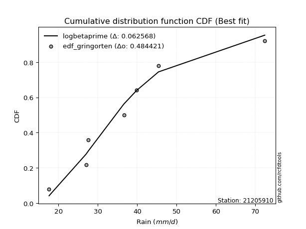</img>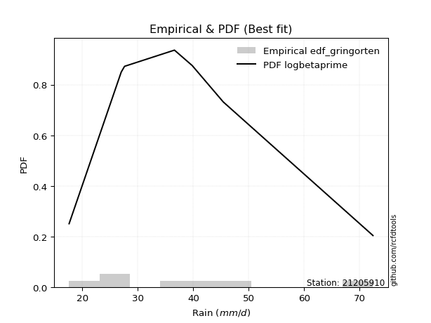</img>

</div>


### 9. Empirical - EDF Filliben (1975)

The specific values of the constants (0.3175) (often denoted as $alpha$) and (0.365) are derived from a method proposed by James J. Filliben in a 1975 paper. This particular formula is the mean value of the $i$-th order statistic of the normal distribution and is considered a robust and effective plotting position formula for the normal probability plot correlation coefficient test for normality.

<div align="center">


$P=(m-0.3175)/(n+0.365)$


</div>


**9.1. Empirical values**

<div align="center">

|                | 0                   | 1                   | 2                   | 3            | 4                  | 5                  | 6                  |
|:---------------|:--------------------|:--------------------|:--------------------|:-------------|:-------------------|:-------------------|:-------------------|
| date           | 2023                | 2020                | 2021                | 2019         | 2022               | 2025               | 2024               |
| x              | 17.6                | 27.0                | 27.6                | 36.6         | 39.8               | 41.2               | 72.4               |
| m              | 1                   | 2                   | 3                   | 4            | 5                  | 6                  | 7                  |
| empirical_dist | edf_filliben        | edf_filliben        | edf_filliben        | edf_filliben | edf_filliben       | edf_filliben       | edf_filliben       |
| empirical      | 0.09266802443991853 | 0.22844534962661237 | 0.36422267481330617 | 0.5          | 0.6357773251866938 | 0.7715546503733877 | 0.9073319755600815 |
| empirical_tr   | 1.1021324354657687  | 1.2960844698636163  | 1.5728777362520021  | 2.0          | 2.7455731593662627 | 4.377414561664191  | 10.791208791208794 |

</div>


**9.2. Kolmogorov-Smirnov fit test (sorted by Δ)**


<div align="center">

|                | 0                   | 1                   | 2                   | 3                   | 4                   | 5                   | 6                   | 7                   | 8                   | 9                   | 10                  | 11                  | 12                  | 13                  | 14                  | 15                  | 16                  | 17                  | 18                  | 19                  | 20                  | 21                  | 22                  | 23                  | 24                  | 25                  | 26                  | 27                  | 28                  | 29                  | 30                  | 31                  | 32                  | 33                  | 34                  | 35                  | 36                  | 37                  | 38                  | 39                  | 40                  | 41                  | 42                  | 43                  | 44                  | 45                  | 46                  | 47                  | 48                  | 49                  | 50                    | 51                  | 52                  | 53                  | 54                  | 55                  | 56                  | 57                  | 58                  | 59                  | 60                  | 61                  | 62                  | 63                  | 64                  | 65                  | 66                  | 67                  | 68                  | 69                  | 70                  | 71                  | 72                  | 73                  | 74                  | 75                  | 76                  | 77                  | 78                  | 79                  | 80                  | 81                  | 82                  | 83                  | 84                  | 85                  | 86                  | 87                  | 88                  | 89                  |
|:---------------|:--------------------|:--------------------|:--------------------|:--------------------|:--------------------|:--------------------|:--------------------|:--------------------|:--------------------|:--------------------|:--------------------|:--------------------|:--------------------|:--------------------|:--------------------|:--------------------|:--------------------|:--------------------|:--------------------|:--------------------|:--------------------|:--------------------|:--------------------|:--------------------|:--------------------|:--------------------|:--------------------|:--------------------|:--------------------|:--------------------|:--------------------|:--------------------|:--------------------|:--------------------|:--------------------|:--------------------|:--------------------|:--------------------|:--------------------|:--------------------|:--------------------|:--------------------|:--------------------|:--------------------|:--------------------|:--------------------|:--------------------|:--------------------|:--------------------|:--------------------|:----------------------|:--------------------|:--------------------|:--------------------|:--------------------|:--------------------|:--------------------|:--------------------|:--------------------|:--------------------|:--------------------|:--------------------|:--------------------|:--------------------|:--------------------|:--------------------|:--------------------|:--------------------|:--------------------|:--------------------|:--------------------|:--------------------|:--------------------|:--------------------|:--------------------|:--------------------|:--------------------|:--------------------|:--------------------|:--------------------|:--------------------|:--------------------|:--------------------|:--------------------|:--------------------|:--------------------|:--------------------|:--------------------|:--------------------|:--------------------|
| station        | 21205910            | 21205910            | 21205910            | 21205910            | 21205910            | 21205910            | 21205910            | 21205910            | 21205910            | 21205910            | 21205910            | 21205910            | 21205910            | 21205910            | 21205910            | 21205910            | 21205910            | 21205910            | 21205910            | 21205910            | 21205910            | 21205910            | 21205910            | 21205910            | 21205910            | 21205910            | 21205910            | 21205910            | 21205910            | 21205910            | 21205910            | 21205910            | 21205910            | 21205910            | 21205910            | 21205910            | 21205910            | 21205910            | 21205910            | 21205910            | 21205910            | 21205910            | 21205910            | 21205910            | 21205910            | 21205910            | 21205910            | 21205910            | 21205910            | 21205910            | 21205910              | 21205910            | 21205910            | 21205910            | 21205910            | 21205910            | 21205910            | 21205910            | 21205910            | 21205910            | 21205910            | 21205910            | 21205910            | 21205910            | 21205910            | 21205910            | 21205910            | 21205910            | 21205910            | 21205910            | 21205910            | 21205910            | 21205910            | 21205910            | 21205910            | 21205910            | 21205910            | 21205910            | 21205910            | 21205910            | 21205910            | 21205910            | 21205910            | 21205910            | 21205910            | 21205910            | 21205910            | 21205910            | 21205910            | 21205910            |
| empirical_dist | edf_filliben        | edf_filliben        | edf_filliben        | edf_filliben        | edf_filliben        | edf_filliben        | edf_filliben        | edf_filliben        | edf_filliben        | edf_filliben        | edf_filliben        | edf_filliben        | edf_filliben        | edf_filliben        | edf_filliben        | edf_filliben        | edf_filliben        | edf_filliben        | edf_filliben        | edf_filliben        | edf_filliben        | edf_filliben        | edf_filliben        | edf_filliben        | edf_filliben        | edf_filliben        | edf_filliben        | edf_filliben        | edf_filliben        | edf_filliben        | edf_filliben        | edf_filliben        | edf_filliben        | edf_filliben        | edf_filliben        | edf_filliben        | edf_filliben        | edf_filliben        | edf_filliben        | edf_filliben        | edf_filliben        | edf_filliben        | edf_filliben        | edf_filliben        | edf_filliben        | edf_filliben        | edf_filliben        | edf_filliben        | edf_filliben        | edf_filliben        | edf_filliben          | edf_filliben        | edf_filliben        | edf_filliben        | edf_filliben        | edf_filliben        | edf_filliben        | edf_filliben        | edf_filliben        | edf_filliben        | edf_filliben        | edf_filliben        | edf_filliben        | edf_filliben        | edf_filliben        | edf_filliben        | edf_filliben        | edf_filliben        | edf_filliben        | edf_filliben        | edf_filliben        | edf_filliben        | edf_filliben        | edf_filliben        | edf_filliben        | edf_filliben        | edf_filliben        | edf_filliben        | edf_filliben        | edf_filliben        | edf_filliben        | edf_filliben        | edf_filliben        | edf_filliben        | edf_filliben        | edf_filliben        | edf_filliben        | edf_filliben        | edf_filliben        | edf_filliben        |
| p_dist         | logmielke           | logfisk             | alpha               | loggenlogistic      | mielke              | logalpha            | nct                 | fisk                | invgamma            | exponnorm           | ncf                 | betaprime           | logerlang           | loggamma            | loggamma            | johnsonsu           | logfatiguelife      | lognct              | logjohnsonsu        | logf                | loginvgamma         | logweibull_min      | loginvgauss         | moyal               | invgauss            | logmaxwell          | logbetaprime        | loglogistic         | logrice             | logpearson3         | halflogistic        | logexponnorm        | t                   | f                   | genlogistic         | lograyleigh         | logcrystalball      | lognorm             | lognorm             | logt                | logloggamma         | loghypsecant        | loginvweibull       | gompertz            | gumbel_r            | pearson3            | logkstwobign        | halfnorm            | kstwobign           | loghalfnorm         | loglaplace_asymmetric | loggumbel_r         | loglaplace          | loggumbel_l         | rayleigh            | logncf              | wald                | genexpon            | expon               | laplace_asymmetric  | loggenexpon         | laplace             | maxwell             | loghalflogistic     | logmoyal            | rice                | hypsecant           | weibull_min         | loggompertz         | logistic            | truncnorm           | crystalball         | norm                | logwald             | gibrat              | nakagami            | lognakagami         | chi2                | gumbel_l            | logexpon            | loggibrat           | logchi2             | logtruncnorm        | erlang              | gamma               | loglognorm          | pareto              | logpareto           | invweibull          | fatiguelife         |
| delta          | 0.08127291192980057 | 0.08222022425371023 | 0.08318329543625802 | 0.08321414149068995 | 0.08325613163264922 | 0.0840543008176402  | 0.08442044746600064 | 0.08465929043802523 | 0.08558190346676375 | 0.08586879221793664 | 0.08597883880955548 | 0.08618917365553114 | 0.08743537009904467 | 0.08743541274612099 | 0.08743541274612099 | 0.08772626205361789 | 0.08782274132317291 | 0.08796758197489196 | 0.08816656817530677 | 0.08818965814373558 | 0.0882192203673533  | 0.088473298312576   | 0.08975219052267158 | 0.089791435888664   | 0.08983649402563698 | 0.09004268191558795 | 0.09007413895579586 | 0.09091312196778767 | 0.09119127671961247 | 0.09120327290531316 | 0.09266802443991853 | 0.09391378829781583 | 0.09463709653744601 | 0.09600786900965486 | 0.0989158734080321  | 0.09950617331129896 | 0.10088989914878166 | 0.10088990320626912 | 0.10088990320626912 | 0.1009067283912144  | 0.10435955001704467 | 0.10636477710850317 | 0.10846546724521333 | 0.10882673664769094 | 0.11295519088269923 | 0.11468777384389073 | 0.11898082370238336 | 0.12032868923658568 | 0.12340377789105006 | 0.12623215356260797 | 0.12703266507293184   | 0.12997006864572758 | 0.1309644573790086  | 0.1433519169119769  | 0.14451930342028751 | 0.1453972864550982  | 0.14615908675388445 | 0.14857715364485477 | 0.14866213026241373 | 0.14933128911196675 | 0.1504747413079858  | 0.15250131225546681 | 0.15303573490135125 | 0.15383669228018915 | 0.1544495498290479  | 0.1574868524521098  | 0.15863621904013803 | 0.1595163530313806  | 0.15984989568156419 | 0.16843166043586866 | 0.1803175524434144  | 0.1803176211159616  | 0.1803176233274606  | 0.22238293677278764 | 0.22684542190034412 | 0.22844366445052114 | 0.23162132326486637 | 0.23731047767350857 | 0.2416567060694469  | 0.2435244878230077  | 0.2522446550783186  | 0.25747660754896107 | 0.3042765314373596  | 0.3053010835729677  | 0.36358141655723986 | 0.4142654521548186  | 0.42027825819595643 | 0.4318270576834504  | 0.4372997370306514  | 0.4972909905201587  |
| deltao         | 0.48442053926100004 | 0.48442053926100004 | 0.48442053926100004 | 0.48442053926100004 | 0.48442053926100004 | 0.48442053926100004 | 0.48442053926100004 | 0.48442053926100004 | 0.48442053926100004 | 0.48442053926100004 | 0.48442053926100004 | 0.48442053926100004 | 0.48442053926100004 | 0.48442053926100004 | 0.48442053926100004 | 0.48442053926100004 | 0.48442053926100004 | 0.48442053926100004 | 0.48442053926100004 | 0.48442053926100004 | 0.48442053926100004 | 0.48442053926100004 | 0.48442053926100004 | 0.48442053926100004 | 0.48442053926100004 | 0.48442053926100004 | 0.48442053926100004 | 0.48442053926100004 | 0.48442053926100004 | 0.48442053926100004 | 0.48442053926100004 | 0.48442053926100004 | 0.48442053926100004 | 0.48442053926100004 | 0.48442053926100004 | 0.48442053926100004 | 0.48442053926100004 | 0.48442053926100004 | 0.48442053926100004 | 0.48442053926100004 | 0.48442053926100004 | 0.48442053926100004 | 0.48442053926100004 | 0.48442053926100004 | 0.48442053926100004 | 0.48442053926100004 | 0.48442053926100004 | 0.48442053926100004 | 0.48442053926100004 | 0.48442053926100004 | 0.48442053926100004   | 0.48442053926100004 | 0.48442053926100004 | 0.48442053926100004 | 0.48442053926100004 | 0.48442053926100004 | 0.48442053926100004 | 0.48442053926100004 | 0.48442053926100004 | 0.48442053926100004 | 0.48442053926100004 | 0.48442053926100004 | 0.48442053926100004 | 0.48442053926100004 | 0.48442053926100004 | 0.48442053926100004 | 0.48442053926100004 | 0.48442053926100004 | 0.48442053926100004 | 0.48442053926100004 | 0.48442053926100004 | 0.48442053926100004 | 0.48442053926100004 | 0.48442053926100004 | 0.48442053926100004 | 0.48442053926100004 | 0.48442053926100004 | 0.48442053926100004 | 0.48442053926100004 | 0.48442053926100004 | 0.48442053926100004 | 0.48442053926100004 | 0.48442053926100004 | 0.48442053926100004 | 0.48442053926100004 | 0.48442053926100004 | 0.48442053926100004 | 0.48442053926100004 | 0.48442053926100004 | 0.48442053926100004 |
| eval           | Δo > Δ              | Δo > Δ              | Δo > Δ              | Δo > Δ              | Δo > Δ              | Δo > Δ              | Δo > Δ              | Δo > Δ              | Δo > Δ              | Δo > Δ              | Δo > Δ              | Δo > Δ              | Δo > Δ              | Δo > Δ              | Δo > Δ              | Δo > Δ              | Δo > Δ              | Δo > Δ              | Δo > Δ              | Δo > Δ              | Δo > Δ              | Δo > Δ              | Δo > Δ              | Δo > Δ              | Δo > Δ              | Δo > Δ              | Δo > Δ              | Δo > Δ              | Δo > Δ              | Δo > Δ              | Δo > Δ              | Δo > Δ              | Δo > Δ              | Δo > Δ              | Δo > Δ              | Δo > Δ              | Δo > Δ              | Δo > Δ              | Δo > Δ              | Δo > Δ              | Δo > Δ              | Δo > Δ              | Δo > Δ              | Δo > Δ              | Δo > Δ              | Δo > Δ              | Δo > Δ              | Δo > Δ              | Δo > Δ              | Δo > Δ              | Δo > Δ                | Δo > Δ              | Δo > Δ              | Δo > Δ              | Δo > Δ              | Δo > Δ              | Δo > Δ              | Δo > Δ              | Δo > Δ              | Δo > Δ              | Δo > Δ              | Δo > Δ              | Δo > Δ              | Δo > Δ              | Δo > Δ              | Δo > Δ              | Δo > Δ              | Δo > Δ              | Δo > Δ              | Δo > Δ              | Δo > Δ              | Δo > Δ              | Δo > Δ              | Δo > Δ              | Δo > Δ              | Δo > Δ              | Δo > Δ              | Δo > Δ              | Δo > Δ              | Δo > Δ              | Δo > Δ              | Δo > Δ              | Δo > Δ              | Δo > Δ              | Δo > Δ              | Δo > Δ              | Δo > Δ              | Δo > Δ              | Δo > Δ              | Δo <= Δ             |
| fit            | 1                   | 1                   | 1                   | 1                   | 1                   | 1                   | 1                   | 1                   | 1                   | 1                   | 1                   | 1                   | 1                   | 1                   | 1                   | 1                   | 1                   | 1                   | 1                   | 1                   | 1                   | 1                   | 1                   | 1                   | 1                   | 1                   | 1                   | 1                   | 1                   | 1                   | 1                   | 1                   | 1                   | 1                   | 1                   | 1                   | 1                   | 1                   | 1                   | 1                   | 1                   | 1                   | 1                   | 1                   | 1                   | 1                   | 1                   | 1                   | 1                   | 1                   | 1                     | 1                   | 1                   | 1                   | 1                   | 1                   | 1                   | 1                   | 1                   | 1                   | 1                   | 1                   | 1                   | 1                   | 1                   | 1                   | 1                   | 1                   | 1                   | 1                   | 1                   | 1                   | 1                   | 1                   | 1                   | 1                   | 1                   | 1                   | 1                   | 1                   | 1                   | 1                   | 1                   | 1                   | 1                   | 1                   | 1                   | 1                   | 1                   | 0                   |
| n              | 7                   | 7                   | 7                   | 7                   | 7                   | 7                   | 7                   | 7                   | 7                   | 7                   | 7                   | 7                   | 7                   | 7                   | 7                   | 7                   | 7                   | 7                   | 7                   | 7                   | 7                   | 7                   | 7                   | 7                   | 7                   | 7                   | 7                   | 7                   | 7                   | 7                   | 7                   | 7                   | 7                   | 7                   | 7                   | 7                   | 7                   | 7                   | 7                   | 7                   | 7                   | 7                   | 7                   | 7                   | 7                   | 7                   | 7                   | 7                   | 7                   | 7                   | 7                     | 7                   | 7                   | 7                   | 7                   | 7                   | 7                   | 7                   | 7                   | 7                   | 7                   | 7                   | 7                   | 7                   | 7                   | 7                   | 7                   | 7                   | 7                   | 7                   | 7                   | 7                   | 7                   | 7                   | 7                   | 7                   | 7                   | 7                   | 7                   | 7                   | 7                   | 7                   | 7                   | 7                   | 7                   | 7                   | 7                   | 7                   | 7                   | 7                   |
| best_fit       | 1                   | 0                   | 0                   | 0                   | 0                   | 0                   | 0                   | 0                   | 0                   | 0                   | 0                   | 0                   | 0                   | 0                   | 0                   | 0                   | 0                   | 0                   | 0                   | 0                   | 0                   | 0                   | 0                   | 0                   | 0                   | 0                   | 0                   | 0                   | 0                   | 0                   | 0                   | 0                   | 0                   | 0                   | 0                   | 0                   | 0                   | 0                   | 0                   | 0                   | 0                   | 0                   | 0                   | 0                   | 0                   | 0                   | 0                   | 0                   | 0                   | 0                   | 0                     | 0                   | 0                   | 0                   | 0                   | 0                   | 0                   | 0                   | 0                   | 0                   | 0                   | 0                   | 0                   | 0                   | 0                   | 0                   | 0                   | 0                   | 0                   | 0                   | 0                   | 0                   | 0                   | 0                   | 0                   | 0                   | 0                   | 0                   | 0                   | 0                   | 0                   | 0                   | 0                   | 0                   | 0                   | 0                   | 0                   | 0                   | 0                   | 0                   |
| best_fit_sort  | 1                   | 2                   | 3                   | 4                   | 5                   | 6                   | 7                   | 8                   | 9                   | 10                  | 11                  | 12                  | 13                  | 14                  | 15                  | 16                  | 17                  | 18                  | 19                  | 20                  | 21                  | 22                  | 23                  | 24                  | 25                  | 26                  | 27                  | 28                  | 29                  | 30                  | 31                  | 32                  | 33                  | 34                  | 35                  | 36                  | 37                  | 38                  | 39                  | 40                  | 41                  | 42                  | 43                  | 44                  | 45                  | 46                  | 47                  | 48                  | 49                  | 50                  | 51                    | 52                  | 53                  | 54                  | 55                  | 56                  | 57                  | 58                  | 59                  | 60                  | 61                  | 62                  | 63                  | 64                  | 65                  | 66                  | 67                  | 68                  | 69                  | 70                  | 71                  | 72                  | 73                  | 74                  | 75                  | 76                  | 77                  | 78                  | 79                  | 80                  | 81                  | 82                  | 83                  | 84                  | 85                  | 86                  | 87                  | 88                  | 89                  | 90                  |

</div>


<div align="center">

</img>

</div>


**9.3. Best fit**

<div align="center">

|   id |   station | empirical_dist   | p_dist    |     delta |   deltao | eval   |   fit |   n |   best_fit |   best_fit_sort |
|-----:|----------:|:-----------------|:----------|----------:|---------:|:-------|------:|----:|-----------:|----------------:|
|    0 |  21205910 | edf_filliben     | logmielke | 0.0812729 | 0.484421 | Δo > Δ |     1 |   7 |          1 |               1 |

</div>


<div align="center">

</img>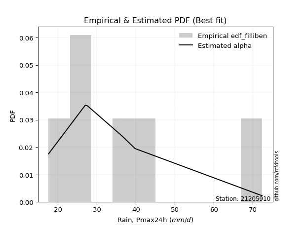</img>

</div>


### 10. Empirical - EDF Jenkinson (1977)

The Jenkinson formula in hydrology is an empirical plotting position formula used to estimate the non-exceedance probability _(P)_ or return period _(T)_ of a given ordered observation within a sample. It is a widely used method in the frequency analysis of extreme events such as floods and rainfall, as it provides a distribution-free way to plot data. _a≈0.31_ and _b≈0.38_ are constants derived to approximate the median of the probability distribution for the given rank.

<div align="center">


$P=(m-a)/(n+b)$


</div>


**10.1. Empirical values**

<div align="center">

|                | 0                   | 1                   | 2                   | 3             | 4                  | 5                  | 6                  |
|:---------------|:--------------------|:--------------------|:--------------------|:--------------|:-------------------|:-------------------|:-------------------|
| date           | 2023                | 2020                | 2021                | 2019          | 2022               | 2025               | 2024               |
| x              | 17.6                | 27.0                | 27.6                | 36.6          | 39.8               | 41.2               | 72.4               |
| m              | 1                   | 2                   | 3                   | 4             | 5                  | 6                  | 7                  |
| empirical_dist | edf_jenkinson       | edf_jenkinson       | edf_jenkinson       | edf_jenkinson | edf_jenkinson      | edf_jenkinson      | edf_jenkinson      |
| empirical      | 0.09349593495934959 | 0.22899728997289973 | 0.36449864498644985 | 0.5           | 0.6355013550135502 | 0.7710027100271003 | 0.9065040650406505 |
| empirical_tr   | 1.1031390134529149  | 1.29701230228471    | 1.5735607675906182  | 2.0           | 2.743494423791822  | 4.366863905325444  | 10.695652173913055 |

</div>


**10.2. Kolmogorov-Smirnov fit test (sorted by Δ)**


<div align="center">

|                | 0                   | 1                   | 2                   | 3                   | 4                   | 5                   | 6                   | 7                   | 8                   | 9                   | 10                  | 11                  | 12                  | 13                  | 14                  | 15                  | 16                  | 17                  | 18                  | 19                  | 20                  | 21                  | 22                  | 23                  | 24                  | 25                  | 26                  | 27                  | 28                  | 29                  | 30                  | 31                  | 32                  | 33                  | 34                  | 35                  | 36                  | 37                  | 38                  | 39                  | 40                  | 41                  | 42                  | 43                  | 44                  | 45                  | 46                  | 47                  | 48                  | 49                  | 50                    | 51                  | 52                  | 53                  | 54                  | 55                  | 56                  | 57                  | 58                  | 59                  | 60                  | 61                  | 62                  | 63                  | 64                  | 65                  | 66                  | 67                  | 68                  | 69                  | 70                  | 71                  | 72                  | 73                  | 74                  | 75                  | 76                  | 77                  | 78                  | 79                  | 80                  | 81                  | 82                  | 83                  | 84                  | 85                  | 86                  | 87                  | 88                  | 89                  |
|:---------------|:--------------------|:--------------------|:--------------------|:--------------------|:--------------------|:--------------------|:--------------------|:--------------------|:--------------------|:--------------------|:--------------------|:--------------------|:--------------------|:--------------------|:--------------------|:--------------------|:--------------------|:--------------------|:--------------------|:--------------------|:--------------------|:--------------------|:--------------------|:--------------------|:--------------------|:--------------------|:--------------------|:--------------------|:--------------------|:--------------------|:--------------------|:--------------------|:--------------------|:--------------------|:--------------------|:--------------------|:--------------------|:--------------------|:--------------------|:--------------------|:--------------------|:--------------------|:--------------------|:--------------------|:--------------------|:--------------------|:--------------------|:--------------------|:--------------------|:--------------------|:----------------------|:--------------------|:--------------------|:--------------------|:--------------------|:--------------------|:--------------------|:--------------------|:--------------------|:--------------------|:--------------------|:--------------------|:--------------------|:--------------------|:--------------------|:--------------------|:--------------------|:--------------------|:--------------------|:--------------------|:--------------------|:--------------------|:--------------------|:--------------------|:--------------------|:--------------------|:--------------------|:--------------------|:--------------------|:--------------------|:--------------------|:--------------------|:--------------------|:--------------------|:--------------------|:--------------------|:--------------------|:--------------------|:--------------------|:--------------------|
| station        | 21205910            | 21205910            | 21205910            | 21205910            | 21205910            | 21205910            | 21205910            | 21205910            | 21205910            | 21205910            | 21205910            | 21205910            | 21205910            | 21205910            | 21205910            | 21205910            | 21205910            | 21205910            | 21205910            | 21205910            | 21205910            | 21205910            | 21205910            | 21205910            | 21205910            | 21205910            | 21205910            | 21205910            | 21205910            | 21205910            | 21205910            | 21205910            | 21205910            | 21205910            | 21205910            | 21205910            | 21205910            | 21205910            | 21205910            | 21205910            | 21205910            | 21205910            | 21205910            | 21205910            | 21205910            | 21205910            | 21205910            | 21205910            | 21205910            | 21205910            | 21205910              | 21205910            | 21205910            | 21205910            | 21205910            | 21205910            | 21205910            | 21205910            | 21205910            | 21205910            | 21205910            | 21205910            | 21205910            | 21205910            | 21205910            | 21205910            | 21205910            | 21205910            | 21205910            | 21205910            | 21205910            | 21205910            | 21205910            | 21205910            | 21205910            | 21205910            | 21205910            | 21205910            | 21205910            | 21205910            | 21205910            | 21205910            | 21205910            | 21205910            | 21205910            | 21205910            | 21205910            | 21205910            | 21205910            | 21205910            |
| empirical_dist | edf_jenkinson       | edf_jenkinson       | edf_jenkinson       | edf_jenkinson       | edf_jenkinson       | edf_jenkinson       | edf_jenkinson       | edf_jenkinson       | edf_jenkinson       | edf_jenkinson       | edf_jenkinson       | edf_jenkinson       | edf_jenkinson       | edf_jenkinson       | edf_jenkinson       | edf_jenkinson       | edf_jenkinson       | edf_jenkinson       | edf_jenkinson       | edf_jenkinson       | edf_jenkinson       | edf_jenkinson       | edf_jenkinson       | edf_jenkinson       | edf_jenkinson       | edf_jenkinson       | edf_jenkinson       | edf_jenkinson       | edf_jenkinson       | edf_jenkinson       | edf_jenkinson       | edf_jenkinson       | edf_jenkinson       | edf_jenkinson       | edf_jenkinson       | edf_jenkinson       | edf_jenkinson       | edf_jenkinson       | edf_jenkinson       | edf_jenkinson       | edf_jenkinson       | edf_jenkinson       | edf_jenkinson       | edf_jenkinson       | edf_jenkinson       | edf_jenkinson       | edf_jenkinson       | edf_jenkinson       | edf_jenkinson       | edf_jenkinson       | edf_jenkinson         | edf_jenkinson       | edf_jenkinson       | edf_jenkinson       | edf_jenkinson       | edf_jenkinson       | edf_jenkinson       | edf_jenkinson       | edf_jenkinson       | edf_jenkinson       | edf_jenkinson       | edf_jenkinson       | edf_jenkinson       | edf_jenkinson       | edf_jenkinson       | edf_jenkinson       | edf_jenkinson       | edf_jenkinson       | edf_jenkinson       | edf_jenkinson       | edf_jenkinson       | edf_jenkinson       | edf_jenkinson       | edf_jenkinson       | edf_jenkinson       | edf_jenkinson       | edf_jenkinson       | edf_jenkinson       | edf_jenkinson       | edf_jenkinson       | edf_jenkinson       | edf_jenkinson       | edf_jenkinson       | edf_jenkinson       | edf_jenkinson       | edf_jenkinson       | edf_jenkinson       | edf_jenkinson       | edf_jenkinson       | edf_jenkinson       |
| p_dist         | logmielke           | logfisk             | alpha               | loggenlogistic      | mielke              | logalpha            | nct                 | fisk                | invgamma            | exponnorm           | ncf                 | betaprime           | logerlang           | loggamma            | loggamma            | johnsonsu           | logfatiguelife      | lognct              | logjohnsonsu        | logf                | loginvgamma         | logweibull_min      | moyal               | invgauss            | logbetaprime        | loginvgauss         | logmaxwell          | logrice             | logpearson3         | loglogistic         | logexponnorm        | halflogistic        | t                   | f                   | genlogistic         | lograyleigh         | logcrystalball      | lognorm             | lognorm             | logt                | logloggamma         | loghypsecant        | gompertz            | loginvweibull       | gumbel_r            | pearson3            | logkstwobign        | halfnorm            | kstwobign           | loghalfnorm         | loglaplace_asymmetric | loggumbel_r         | loglaplace          | loggumbel_l         | rayleigh            | logncf              | wald                | genexpon            | expon               | laplace_asymmetric  | loggenexpon         | maxwell             | laplace             | loghalflogistic     | logmoyal            | rice                | hypsecant           | weibull_min         | loggompertz         | logistic            | truncnorm           | crystalball         | norm                | logwald             | gibrat              | nakagami            | lognakagami         | chi2                | gumbel_l            | logexpon            | loggibrat           | logchi2             | logtruncnorm        | erlang              | gamma               | loglognorm          | pareto              | logpareto           | invweibull          | fatiguelife         |
| delta          | 0.08127291192980057 | 0.08222022425371023 | 0.08263135508997066 | 0.08321414149068995 | 0.08325613163264922 | 0.08350236047135284 | 0.08442044746600064 | 0.08465929043802523 | 0.08502996312047639 | 0.08531685187164928 | 0.08542689846326812 | 0.08563723330924378 | 0.08688342975275731 | 0.08688347239983363 | 0.08688347239983363 | 0.08717432170733053 | 0.08727080097688555 | 0.0874156416286046  | 0.08761462782901941 | 0.08763771779744822 | 0.08766728002106594 | 0.08792135796628864 | 0.08923949554237665 | 0.08928455367934962 | 0.0895221986095085  | 0.08975219052267158 | 0.09004268191558795 | 0.09063933637332511 | 0.0906513325590258  | 0.09118909214093135 | 0.09336184795152846 | 0.09349593495934959 | 0.09463709653744601 | 0.09600786900965486 | 0.09836393306174473 | 0.09950617331129896 | 0.1003379588024943  | 0.10033796285998176 | 0.10033796285998176 | 0.10035478804492703 | 0.1038076096707573  | 0.10664074728164685 | 0.10827479630140358 | 0.10846546724521333 | 0.11240325053641187 | 0.11413583349760337 | 0.118428883356096   | 0.11977674889029832 | 0.1228518375447627  | 0.12623215356260797 | 0.12730863524607552   | 0.12997006864572758 | 0.1312404275521523  | 0.14279997656568955 | 0.14396736307400015 | 0.14484534610881084 | 0.14615908675388445 | 0.1480252132985674  | 0.14811018991612637 | 0.14960725928511043 | 0.14992280096169844 | 0.1524837945550639  | 0.1527772824286105  | 0.15383669228018915 | 0.1544495498290479  | 0.15693491210582244 | 0.15808427869385067 | 0.15896441268509323 | 0.15929795533527683 | 0.1678797200895813  | 0.17976561209712705 | 0.17976568076967425 | 0.17976568298117324 | 0.22238293677278764 | 0.2271213920734878  | 0.2289956047968085  | 0.23189729343801005 | 0.2367585373272212  | 0.24110476572315953 | 0.24297254747672034 | 0.2522446550783186  | 0.2569246672026737  | 0.3045525016105033  | 0.30474914322668034 | 0.3630294762109525  | 0.4137135118085312  | 0.4197263178496691  | 0.43127511733716306 | 0.4364718265112204  | 0.4967390501738713  |
| deltao         | 0.48442053926100004 | 0.48442053926100004 | 0.48442053926100004 | 0.48442053926100004 | 0.48442053926100004 | 0.48442053926100004 | 0.48442053926100004 | 0.48442053926100004 | 0.48442053926100004 | 0.48442053926100004 | 0.48442053926100004 | 0.48442053926100004 | 0.48442053926100004 | 0.48442053926100004 | 0.48442053926100004 | 0.48442053926100004 | 0.48442053926100004 | 0.48442053926100004 | 0.48442053926100004 | 0.48442053926100004 | 0.48442053926100004 | 0.48442053926100004 | 0.48442053926100004 | 0.48442053926100004 | 0.48442053926100004 | 0.48442053926100004 | 0.48442053926100004 | 0.48442053926100004 | 0.48442053926100004 | 0.48442053926100004 | 0.48442053926100004 | 0.48442053926100004 | 0.48442053926100004 | 0.48442053926100004 | 0.48442053926100004 | 0.48442053926100004 | 0.48442053926100004 | 0.48442053926100004 | 0.48442053926100004 | 0.48442053926100004 | 0.48442053926100004 | 0.48442053926100004 | 0.48442053926100004 | 0.48442053926100004 | 0.48442053926100004 | 0.48442053926100004 | 0.48442053926100004 | 0.48442053926100004 | 0.48442053926100004 | 0.48442053926100004 | 0.48442053926100004   | 0.48442053926100004 | 0.48442053926100004 | 0.48442053926100004 | 0.48442053926100004 | 0.48442053926100004 | 0.48442053926100004 | 0.48442053926100004 | 0.48442053926100004 | 0.48442053926100004 | 0.48442053926100004 | 0.48442053926100004 | 0.48442053926100004 | 0.48442053926100004 | 0.48442053926100004 | 0.48442053926100004 | 0.48442053926100004 | 0.48442053926100004 | 0.48442053926100004 | 0.48442053926100004 | 0.48442053926100004 | 0.48442053926100004 | 0.48442053926100004 | 0.48442053926100004 | 0.48442053926100004 | 0.48442053926100004 | 0.48442053926100004 | 0.48442053926100004 | 0.48442053926100004 | 0.48442053926100004 | 0.48442053926100004 | 0.48442053926100004 | 0.48442053926100004 | 0.48442053926100004 | 0.48442053926100004 | 0.48442053926100004 | 0.48442053926100004 | 0.48442053926100004 | 0.48442053926100004 | 0.48442053926100004 |
| eval           | Δo > Δ              | Δo > Δ              | Δo > Δ              | Δo > Δ              | Δo > Δ              | Δo > Δ              | Δo > Δ              | Δo > Δ              | Δo > Δ              | Δo > Δ              | Δo > Δ              | Δo > Δ              | Δo > Δ              | Δo > Δ              | Δo > Δ              | Δo > Δ              | Δo > Δ              | Δo > Δ              | Δo > Δ              | Δo > Δ              | Δo > Δ              | Δo > Δ              | Δo > Δ              | Δo > Δ              | Δo > Δ              | Δo > Δ              | Δo > Δ              | Δo > Δ              | Δo > Δ              | Δo > Δ              | Δo > Δ              | Δo > Δ              | Δo > Δ              | Δo > Δ              | Δo > Δ              | Δo > Δ              | Δo > Δ              | Δo > Δ              | Δo > Δ              | Δo > Δ              | Δo > Δ              | Δo > Δ              | Δo > Δ              | Δo > Δ              | Δo > Δ              | Δo > Δ              | Δo > Δ              | Δo > Δ              | Δo > Δ              | Δo > Δ              | Δo > Δ                | Δo > Δ              | Δo > Δ              | Δo > Δ              | Δo > Δ              | Δo > Δ              | Δo > Δ              | Δo > Δ              | Δo > Δ              | Δo > Δ              | Δo > Δ              | Δo > Δ              | Δo > Δ              | Δo > Δ              | Δo > Δ              | Δo > Δ              | Δo > Δ              | Δo > Δ              | Δo > Δ              | Δo > Δ              | Δo > Δ              | Δo > Δ              | Δo > Δ              | Δo > Δ              | Δo > Δ              | Δo > Δ              | Δo > Δ              | Δo > Δ              | Δo > Δ              | Δo > Δ              | Δo > Δ              | Δo > Δ              | Δo > Δ              | Δo > Δ              | Δo > Δ              | Δo > Δ              | Δo > Δ              | Δo > Δ              | Δo > Δ              | Δo <= Δ             |
| fit            | 1                   | 1                   | 1                   | 1                   | 1                   | 1                   | 1                   | 1                   | 1                   | 1                   | 1                   | 1                   | 1                   | 1                   | 1                   | 1                   | 1                   | 1                   | 1                   | 1                   | 1                   | 1                   | 1                   | 1                   | 1                   | 1                   | 1                   | 1                   | 1                   | 1                   | 1                   | 1                   | 1                   | 1                   | 1                   | 1                   | 1                   | 1                   | 1                   | 1                   | 1                   | 1                   | 1                   | 1                   | 1                   | 1                   | 1                   | 1                   | 1                   | 1                   | 1                     | 1                   | 1                   | 1                   | 1                   | 1                   | 1                   | 1                   | 1                   | 1                   | 1                   | 1                   | 1                   | 1                   | 1                   | 1                   | 1                   | 1                   | 1                   | 1                   | 1                   | 1                   | 1                   | 1                   | 1                   | 1                   | 1                   | 1                   | 1                   | 1                   | 1                   | 1                   | 1                   | 1                   | 1                   | 1                   | 1                   | 1                   | 1                   | 0                   |
| n              | 7                   | 7                   | 7                   | 7                   | 7                   | 7                   | 7                   | 7                   | 7                   | 7                   | 7                   | 7                   | 7                   | 7                   | 7                   | 7                   | 7                   | 7                   | 7                   | 7                   | 7                   | 7                   | 7                   | 7                   | 7                   | 7                   | 7                   | 7                   | 7                   | 7                   | 7                   | 7                   | 7                   | 7                   | 7                   | 7                   | 7                   | 7                   | 7                   | 7                   | 7                   | 7                   | 7                   | 7                   | 7                   | 7                   | 7                   | 7                   | 7                   | 7                   | 7                     | 7                   | 7                   | 7                   | 7                   | 7                   | 7                   | 7                   | 7                   | 7                   | 7                   | 7                   | 7                   | 7                   | 7                   | 7                   | 7                   | 7                   | 7                   | 7                   | 7                   | 7                   | 7                   | 7                   | 7                   | 7                   | 7                   | 7                   | 7                   | 7                   | 7                   | 7                   | 7                   | 7                   | 7                   | 7                   | 7                   | 7                   | 7                   | 7                   |
| best_fit       | 1                   | 0                   | 0                   | 0                   | 0                   | 0                   | 0                   | 0                   | 0                   | 0                   | 0                   | 0                   | 0                   | 0                   | 0                   | 0                   | 0                   | 0                   | 0                   | 0                   | 0                   | 0                   | 0                   | 0                   | 0                   | 0                   | 0                   | 0                   | 0                   | 0                   | 0                   | 0                   | 0                   | 0                   | 0                   | 0                   | 0                   | 0                   | 0                   | 0                   | 0                   | 0                   | 0                   | 0                   | 0                   | 0                   | 0                   | 0                   | 0                   | 0                   | 0                     | 0                   | 0                   | 0                   | 0                   | 0                   | 0                   | 0                   | 0                   | 0                   | 0                   | 0                   | 0                   | 0                   | 0                   | 0                   | 0                   | 0                   | 0                   | 0                   | 0                   | 0                   | 0                   | 0                   | 0                   | 0                   | 0                   | 0                   | 0                   | 0                   | 0                   | 0                   | 0                   | 0                   | 0                   | 0                   | 0                   | 0                   | 0                   | 0                   |
| best_fit_sort  | 1                   | 2                   | 3                   | 4                   | 5                   | 6                   | 7                   | 8                   | 9                   | 10                  | 11                  | 12                  | 13                  | 14                  | 15                  | 16                  | 17                  | 18                  | 19                  | 20                  | 21                  | 22                  | 23                  | 24                  | 25                  | 26                  | 27                  | 28                  | 29                  | 30                  | 31                  | 32                  | 33                  | 34                  | 35                  | 36                  | 37                  | 38                  | 39                  | 40                  | 41                  | 42                  | 43                  | 44                  | 45                  | 46                  | 47                  | 48                  | 49                  | 50                  | 51                    | 52                  | 53                  | 54                  | 55                  | 56                  | 57                  | 58                  | 59                  | 60                  | 61                  | 62                  | 63                  | 64                  | 65                  | 66                  | 67                  | 68                  | 69                  | 70                  | 71                  | 72                  | 73                  | 74                  | 75                  | 76                  | 77                  | 78                  | 79                  | 80                  | 81                  | 82                  | 83                  | 84                  | 85                  | 86                  | 87                  | 88                  | 89                  | 90                  |

</div>


<div align="center">

</img>

</div>


**10.3. Best fit**

<div align="center">

|   id |   station | empirical_dist   | p_dist    |     delta |   deltao | eval   |   fit |   n |   best_fit |   best_fit_sort |
|-----:|----------:|:-----------------|:----------|----------:|---------:|:-------|------:|----:|-----------:|----------------:|
|    0 |  21205910 | edf_jenkinson    | logmielke | 0.0812729 | 0.484421 | Δo > Δ |     1 |   7 |          1 |               1 |

</div>


<div align="center">

</img></img>

</div>


### 11. Empirical - EDF Cunnane (1978)

Cunnane´s work in statistical hydrology has focused on the performance and evaluation of different probability distributions (such as GEV, Gumbel, Lognormal) for flood frequency estimation. _b_ is a constant, typically set to 0.4.

<div align="center">


$P=(m-b)/(n+1-2b)$


</div>


**11.1. Empirical values**

<div align="center">

|                | 0                   | 1                   | 2                  | 3           | 4                  | 5                  | 6                  |
|:---------------|:--------------------|:--------------------|:-------------------|:------------|:-------------------|:-------------------|:-------------------|
| date           | 2023                | 2020                | 2021               | 2019        | 2022               | 2025               | 2024               |
| x              | 17.6                | 27.0                | 27.6               | 36.6        | 39.8               | 41.2               | 72.4               |
| m              | 1                   | 2                   | 3                  | 4           | 5                  | 6                  | 7                  |
| empirical_dist | edf_cunnane         | edf_cunnane         | edf_cunnane        | edf_cunnane | edf_cunnane        | edf_cunnane        | edf_cunnane        |
| empirical      | 0.08333333333333333 | 0.22222222222222224 | 0.3611111111111111 | 0.5         | 0.6388888888888888 | 0.7777777777777777 | 0.9166666666666666 |
| empirical_tr   | 1.090909090909091   | 1.2857142857142856  | 1.565217391304348  | 2.0         | 2.7692307692307687 | 4.499999999999998  | 11.999999999999995 |

</div>


**11.2. Kolmogorov-Smirnov fit test (sorted by Δ)**


<div align="center">

|                | 0                   | 1                   | 2                   | 3                   | 4                   | 5                   | 6                   | 7                   | 8                   | 9                   | 10                  | 11                  | 12                  | 13                  | 14                  | 15                  | 16                  | 17                  | 18                  | 19                  | 20                  | 21                  | 22                  | 23                  | 24                  | 25                  | 26                  | 27                  | 28                  | 29                  | 30                  | 31                  | 32                  | 33                  | 34                  | 35                  | 36                  | 37                  | 38                  | 39                  | 40                  | 41                  | 42                  | 43                  | 44                  | 45                  | 46                    | 47                  | 48                  | 49                  | 50                  | 51                  | 52                  | 53                  | 54                  | 55                  | 56                  | 57                  | 58                  | 59                  | 60                  | 61                  | 62                  | 63                  | 64                  | 65                  | 66                  | 67                  | 68                  | 69                  | 70                  | 71                  | 72                  | 73                  | 74                  | 75                  | 76                  | 77                  | 78                  | 79                  | 80                  | 81                  | 82                  | 83                  | 84                  | 85                  | 86                  | 87                  | 88                  | 89                  |
|:---------------|:--------------------|:--------------------|:--------------------|:--------------------|:--------------------|:--------------------|:--------------------|:--------------------|:--------------------|:--------------------|:--------------------|:--------------------|:--------------------|:--------------------|:--------------------|:--------------------|:--------------------|:--------------------|:--------------------|:--------------------|:--------------------|:--------------------|:--------------------|:--------------------|:--------------------|:--------------------|:--------------------|:--------------------|:--------------------|:--------------------|:--------------------|:--------------------|:--------------------|:--------------------|:--------------------|:--------------------|:--------------------|:--------------------|:--------------------|:--------------------|:--------------------|:--------------------|:--------------------|:--------------------|:--------------------|:--------------------|:----------------------|:--------------------|:--------------------|:--------------------|:--------------------|:--------------------|:--------------------|:--------------------|:--------------------|:--------------------|:--------------------|:--------------------|:--------------------|:--------------------|:--------------------|:--------------------|:--------------------|:--------------------|:--------------------|:--------------------|:--------------------|:--------------------|:--------------------|:--------------------|:--------------------|:--------------------|:--------------------|:--------------------|:--------------------|:--------------------|:--------------------|:--------------------|:--------------------|:--------------------|:--------------------|:--------------------|:--------------------|:--------------------|:--------------------|:--------------------|:--------------------|:--------------------|:--------------------|:--------------------|
| station        | 21205910            | 21205910            | 21205910            | 21205910            | 21205910            | 21205910            | 21205910            | 21205910            | 21205910            | 21205910            | 21205910            | 21205910            | 21205910            | 21205910            | 21205910            | 21205910            | 21205910            | 21205910            | 21205910            | 21205910            | 21205910            | 21205910            | 21205910            | 21205910            | 21205910            | 21205910            | 21205910            | 21205910            | 21205910            | 21205910            | 21205910            | 21205910            | 21205910            | 21205910            | 21205910            | 21205910            | 21205910            | 21205910            | 21205910            | 21205910            | 21205910            | 21205910            | 21205910            | 21205910            | 21205910            | 21205910            | 21205910              | 21205910            | 21205910            | 21205910            | 21205910            | 21205910            | 21205910            | 21205910            | 21205910            | 21205910            | 21205910            | 21205910            | 21205910            | 21205910            | 21205910            | 21205910            | 21205910            | 21205910            | 21205910            | 21205910            | 21205910            | 21205910            | 21205910            | 21205910            | 21205910            | 21205910            | 21205910            | 21205910            | 21205910            | 21205910            | 21205910            | 21205910            | 21205910            | 21205910            | 21205910            | 21205910            | 21205910            | 21205910            | 21205910            | 21205910            | 21205910            | 21205910            | 21205910            | 21205910            |
| empirical_dist | edf_cunnane         | edf_cunnane         | edf_cunnane         | edf_cunnane         | edf_cunnane         | edf_cunnane         | edf_cunnane         | edf_cunnane         | edf_cunnane         | edf_cunnane         | edf_cunnane         | edf_cunnane         | edf_cunnane         | edf_cunnane         | edf_cunnane         | edf_cunnane         | edf_cunnane         | edf_cunnane         | edf_cunnane         | edf_cunnane         | edf_cunnane         | edf_cunnane         | edf_cunnane         | edf_cunnane         | edf_cunnane         | edf_cunnane         | edf_cunnane         | edf_cunnane         | edf_cunnane         | edf_cunnane         | edf_cunnane         | edf_cunnane         | edf_cunnane         | edf_cunnane         | edf_cunnane         | edf_cunnane         | edf_cunnane         | edf_cunnane         | edf_cunnane         | edf_cunnane         | edf_cunnane         | edf_cunnane         | edf_cunnane         | edf_cunnane         | edf_cunnane         | edf_cunnane         | edf_cunnane           | edf_cunnane         | edf_cunnane         | edf_cunnane         | edf_cunnane         | edf_cunnane         | edf_cunnane         | edf_cunnane         | edf_cunnane         | edf_cunnane         | edf_cunnane         | edf_cunnane         | edf_cunnane         | edf_cunnane         | edf_cunnane         | edf_cunnane         | edf_cunnane         | edf_cunnane         | edf_cunnane         | edf_cunnane         | edf_cunnane         | edf_cunnane         | edf_cunnane         | edf_cunnane         | edf_cunnane         | edf_cunnane         | edf_cunnane         | edf_cunnane         | edf_cunnane         | edf_cunnane         | edf_cunnane         | edf_cunnane         | edf_cunnane         | edf_cunnane         | edf_cunnane         | edf_cunnane         | edf_cunnane         | edf_cunnane         | edf_cunnane         | edf_cunnane         | edf_cunnane         | edf_cunnane         | edf_cunnane         | edf_cunnane         |
| p_dist         | logmielke           | logfisk             | loggenlogistic      | mielke              | fisk                | nct                 | loglogistic         | alpha               | loginvgauss         | logmaxwell          | logalpha            | invgamma            | exponnorm           | ncf                 | betaprime           | logerlang           | loggamma            | loggamma            | johnsonsu           | logfatiguelife      | lognct              | logjohnsonsu        | logf                | loginvgamma         | t                   | logweibull_min      | f                   | moyal               | invgauss            | logbetaprime        | logrice             | logpearson3         | halflogistic        | lograyleigh         | logexponnorm        | loghypsecant        | genlogistic         | logcrystalball      | lognorm             | lognorm             | logt                | loginvweibull       | logloggamma         | gompertz            | gumbel_r            | pearson3            | loglaplace_asymmetric | logkstwobign        | loghalfnorm         | halfnorm            | loglaplace          | kstwobign           | loggumbel_r         | wald                | laplace_asymmetric  | laplace             | loggumbel_l         | rayleigh            | logncf              | loghalflogistic     | logmoyal            | genexpon            | expon               | loggenexpon         | maxwell             | rice                | hypsecant           | weibull_min         | loggompertz         | logistic            | truncnorm           | crystalball         | norm                | nakagami            | logwald             | gibrat              | lognakagami         | chi2                | gumbel_l            | logexpon            | loggibrat           | logchi2             | logtruncnorm        | erlang              | gamma               | loglognorm          | pareto              | logpareto           | invweibull          | fatiguelife         |
| delta          | 0.08127291192980057 | 0.08222022425371023 | 0.08321414149068995 | 0.08325613163264922 | 0.08465929043802523 | 0.08606665099242661 | 0.0878015582655926  | 0.08940642284064804 | 0.08975219052267158 | 0.09004268191558795 | 0.09027742822203022 | 0.09180503087115377 | 0.09209191962232666 | 0.0922019662139455  | 0.09241230105992115 | 0.09365849750343469 | 0.093658540150511   | 0.093658540150511   | 0.0939493894580079  | 0.09404586872756293 | 0.09419070937928198 | 0.09438969557969679 | 0.0944127855481256  | 0.09444234777174332 | 0.09463709653744601 | 0.09469642571696602 | 0.09600786900965486 | 0.09601456329305402 | 0.096059621430027   | 0.09629726636018587 | 0.09741440412400248 | 0.09742640030970318 | 0.09833319762839998 | 0.09950617331129896 | 0.10013691570220584 | 0.10325321340630811 | 0.10513900081242211 | 0.10711302655317168 | 0.10711303061065913 | 0.10711303061065913 | 0.10712985579560441 | 0.10846546724521333 | 0.11058267742143468 | 0.11504986405208095 | 0.11917831828708925 | 0.12091090124828074 | 0.12392110137073678   | 0.1252039511067735  | 0.12623215356260797 | 0.1265518166409757  | 0.12785289367681354 | 0.12962690529544008 | 0.12997006864572758 | 0.14615908675388445 | 0.14621972540977168 | 0.14938974855327175 | 0.14957504431636692 | 0.15074243082467753 | 0.1516204138594882  | 0.15383669228018915 | 0.1544495498290479  | 0.1548002810492449  | 0.15488525766680386 | 0.15669786871237593 | 0.15925886230574127 | 0.16370997985649982 | 0.16485934644452804 | 0.16573948043577072 | 0.1660730230859543  | 0.17465478784025867 | 0.18654067984780442 | 0.18654074852035163 | 0.1865407507318506  | 0.222220537046131   | 0.22238293677278764 | 0.22373385819814906 | 0.2285097595626713  | 0.2435336050778987  | 0.2478798334738369  | 0.24974761522739783 | 0.2522446550783186  | 0.2636997349533512  | 0.30116496773516455 | 0.31152421097735783 | 0.36980454396163    | 0.4204885795592087  | 0.42650138560034656 | 0.43805018508784055 | 0.4466344281372365  | 0.5035141179245488  |
| deltao         | 0.48442053926100004 | 0.48442053926100004 | 0.48442053926100004 | 0.48442053926100004 | 0.48442053926100004 | 0.48442053926100004 | 0.48442053926100004 | 0.48442053926100004 | 0.48442053926100004 | 0.48442053926100004 | 0.48442053926100004 | 0.48442053926100004 | 0.48442053926100004 | 0.48442053926100004 | 0.48442053926100004 | 0.48442053926100004 | 0.48442053926100004 | 0.48442053926100004 | 0.48442053926100004 | 0.48442053926100004 | 0.48442053926100004 | 0.48442053926100004 | 0.48442053926100004 | 0.48442053926100004 | 0.48442053926100004 | 0.48442053926100004 | 0.48442053926100004 | 0.48442053926100004 | 0.48442053926100004 | 0.48442053926100004 | 0.48442053926100004 | 0.48442053926100004 | 0.48442053926100004 | 0.48442053926100004 | 0.48442053926100004 | 0.48442053926100004 | 0.48442053926100004 | 0.48442053926100004 | 0.48442053926100004 | 0.48442053926100004 | 0.48442053926100004 | 0.48442053926100004 | 0.48442053926100004 | 0.48442053926100004 | 0.48442053926100004 | 0.48442053926100004 | 0.48442053926100004   | 0.48442053926100004 | 0.48442053926100004 | 0.48442053926100004 | 0.48442053926100004 | 0.48442053926100004 | 0.48442053926100004 | 0.48442053926100004 | 0.48442053926100004 | 0.48442053926100004 | 0.48442053926100004 | 0.48442053926100004 | 0.48442053926100004 | 0.48442053926100004 | 0.48442053926100004 | 0.48442053926100004 | 0.48442053926100004 | 0.48442053926100004 | 0.48442053926100004 | 0.48442053926100004 | 0.48442053926100004 | 0.48442053926100004 | 0.48442053926100004 | 0.48442053926100004 | 0.48442053926100004 | 0.48442053926100004 | 0.48442053926100004 | 0.48442053926100004 | 0.48442053926100004 | 0.48442053926100004 | 0.48442053926100004 | 0.48442053926100004 | 0.48442053926100004 | 0.48442053926100004 | 0.48442053926100004 | 0.48442053926100004 | 0.48442053926100004 | 0.48442053926100004 | 0.48442053926100004 | 0.48442053926100004 | 0.48442053926100004 | 0.48442053926100004 | 0.48442053926100004 | 0.48442053926100004 |
| eval           | Δo > Δ              | Δo > Δ              | Δo > Δ              | Δo > Δ              | Δo > Δ              | Δo > Δ              | Δo > Δ              | Δo > Δ              | Δo > Δ              | Δo > Δ              | Δo > Δ              | Δo > Δ              | Δo > Δ              | Δo > Δ              | Δo > Δ              | Δo > Δ              | Δo > Δ              | Δo > Δ              | Δo > Δ              | Δo > Δ              | Δo > Δ              | Δo > Δ              | Δo > Δ              | Δo > Δ              | Δo > Δ              | Δo > Δ              | Δo > Δ              | Δo > Δ              | Δo > Δ              | Δo > Δ              | Δo > Δ              | Δo > Δ              | Δo > Δ              | Δo > Δ              | Δo > Δ              | Δo > Δ              | Δo > Δ              | Δo > Δ              | Δo > Δ              | Δo > Δ              | Δo > Δ              | Δo > Δ              | Δo > Δ              | Δo > Δ              | Δo > Δ              | Δo > Δ              | Δo > Δ                | Δo > Δ              | Δo > Δ              | Δo > Δ              | Δo > Δ              | Δo > Δ              | Δo > Δ              | Δo > Δ              | Δo > Δ              | Δo > Δ              | Δo > Δ              | Δo > Δ              | Δo > Δ              | Δo > Δ              | Δo > Δ              | Δo > Δ              | Δo > Δ              | Δo > Δ              | Δo > Δ              | Δo > Δ              | Δo > Δ              | Δo > Δ              | Δo > Δ              | Δo > Δ              | Δo > Δ              | Δo > Δ              | Δo > Δ              | Δo > Δ              | Δo > Δ              | Δo > Δ              | Δo > Δ              | Δo > Δ              | Δo > Δ              | Δo > Δ              | Δo > Δ              | Δo > Δ              | Δo > Δ              | Δo > Δ              | Δo > Δ              | Δo > Δ              | Δo > Δ              | Δo > Δ              | Δo > Δ              | Δo <= Δ             |
| fit            | 1                   | 1                   | 1                   | 1                   | 1                   | 1                   | 1                   | 1                   | 1                   | 1                   | 1                   | 1                   | 1                   | 1                   | 1                   | 1                   | 1                   | 1                   | 1                   | 1                   | 1                   | 1                   | 1                   | 1                   | 1                   | 1                   | 1                   | 1                   | 1                   | 1                   | 1                   | 1                   | 1                   | 1                   | 1                   | 1                   | 1                   | 1                   | 1                   | 1                   | 1                   | 1                   | 1                   | 1                   | 1                   | 1                   | 1                     | 1                   | 1                   | 1                   | 1                   | 1                   | 1                   | 1                   | 1                   | 1                   | 1                   | 1                   | 1                   | 1                   | 1                   | 1                   | 1                   | 1                   | 1                   | 1                   | 1                   | 1                   | 1                   | 1                   | 1                   | 1                   | 1                   | 1                   | 1                   | 1                   | 1                   | 1                   | 1                   | 1                   | 1                   | 1                   | 1                   | 1                   | 1                   | 1                   | 1                   | 1                   | 1                   | 0                   |
| n              | 7                   | 7                   | 7                   | 7                   | 7                   | 7                   | 7                   | 7                   | 7                   | 7                   | 7                   | 7                   | 7                   | 7                   | 7                   | 7                   | 7                   | 7                   | 7                   | 7                   | 7                   | 7                   | 7                   | 7                   | 7                   | 7                   | 7                   | 7                   | 7                   | 7                   | 7                   | 7                   | 7                   | 7                   | 7                   | 7                   | 7                   | 7                   | 7                   | 7                   | 7                   | 7                   | 7                   | 7                   | 7                   | 7                   | 7                     | 7                   | 7                   | 7                   | 7                   | 7                   | 7                   | 7                   | 7                   | 7                   | 7                   | 7                   | 7                   | 7                   | 7                   | 7                   | 7                   | 7                   | 7                   | 7                   | 7                   | 7                   | 7                   | 7                   | 7                   | 7                   | 7                   | 7                   | 7                   | 7                   | 7                   | 7                   | 7                   | 7                   | 7                   | 7                   | 7                   | 7                   | 7                   | 7                   | 7                   | 7                   | 7                   | 7                   |
| best_fit       | 1                   | 0                   | 0                   | 0                   | 0                   | 0                   | 0                   | 0                   | 0                   | 0                   | 0                   | 0                   | 0                   | 0                   | 0                   | 0                   | 0                   | 0                   | 0                   | 0                   | 0                   | 0                   | 0                   | 0                   | 0                   | 0                   | 0                   | 0                   | 0                   | 0                   | 0                   | 0                   | 0                   | 0                   | 0                   | 0                   | 0                   | 0                   | 0                   | 0                   | 0                   | 0                   | 0                   | 0                   | 0                   | 0                   | 0                     | 0                   | 0                   | 0                   | 0                   | 0                   | 0                   | 0                   | 0                   | 0                   | 0                   | 0                   | 0                   | 0                   | 0                   | 0                   | 0                   | 0                   | 0                   | 0                   | 0                   | 0                   | 0                   | 0                   | 0                   | 0                   | 0                   | 0                   | 0                   | 0                   | 0                   | 0                   | 0                   | 0                   | 0                   | 0                   | 0                   | 0                   | 0                   | 0                   | 0                   | 0                   | 0                   | 0                   |
| best_fit_sort  | 1                   | 2                   | 3                   | 4                   | 5                   | 6                   | 7                   | 8                   | 9                   | 10                  | 11                  | 12                  | 13                  | 14                  | 15                  | 16                  | 17                  | 18                  | 19                  | 20                  | 21                  | 22                  | 23                  | 24                  | 25                  | 26                  | 27                  | 28                  | 29                  | 30                  | 31                  | 32                  | 33                  | 34                  | 35                  | 36                  | 37                  | 38                  | 39                  | 40                  | 41                  | 42                  | 43                  | 44                  | 45                  | 46                  | 47                    | 48                  | 49                  | 50                  | 51                  | 52                  | 53                  | 54                  | 55                  | 56                  | 57                  | 58                  | 59                  | 60                  | 61                  | 62                  | 63                  | 64                  | 65                  | 66                  | 67                  | 68                  | 69                  | 70                  | 71                  | 72                  | 73                  | 74                  | 75                  | 76                  | 77                  | 78                  | 79                  | 80                  | 81                  | 82                  | 83                  | 84                  | 85                  | 86                  | 87                  | 88                  | 89                  | 90                  |

</div>


<div align="center">

</img>

</div>


**11.3. Best fit**

<div align="center">

|   id |   station | empirical_dist   | p_dist    |     delta |   deltao | eval   |   fit |   n |   best_fit |   best_fit_sort |
|-----:|----------:|:-----------------|:----------|----------:|---------:|:-------|------:|----:|-----------:|----------------:|
|    0 |  21205910 | edf_cunnane      | logmielke | 0.0812729 | 0.484421 | Δo > Δ |     1 |   7 |          1 |               1 |

</div>


<div align="center">

</img>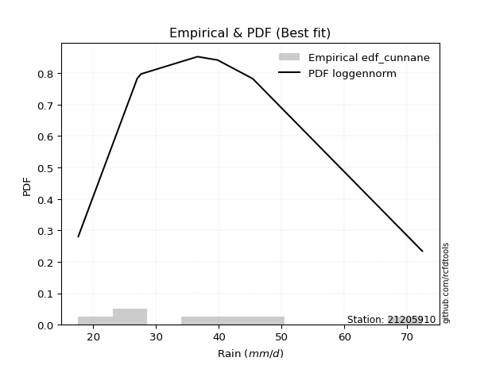</img>

</div>


### 12. Empirical - EDF Adamowski (1981)

The Adamowski formula in hydrology refers to a specific plotting position formula used for estimating the non-parametric empirical distribution of hydrological events (like flood peaks) to calculate their return periods. This formula provides an alternative to traditional parametric methods (like the Gumbel or Log Pearson Type III distributions). 

<div align="center">


$P=(m-0.25)/(n+0.5)$


</div>


**12.1. Empirical values**

<div align="center">

|                | 0                  | 1                   | 2                   | 3             | 4                  | 5                  | 6                  |
|:---------------|:-------------------|:--------------------|:--------------------|:--------------|:-------------------|:-------------------|:-------------------|
| date           | 2023               | 2020                | 2021                | 2019          | 2022               | 2025               | 2024               |
| x              | 17.6               | 27.0                | 27.6                | 36.6          | 39.8               | 41.2               | 72.4               |
| m              | 1                  | 2                   | 3                   | 4             | 5                  | 6                  | 7                  |
| empirical_dist | edf_adamowski      | edf_adamowski       | edf_adamowski       | edf_adamowski | edf_adamowski      | edf_adamowski      | edf_adamowski      |
| empirical      | 0.1                | 0.23333333333333334 | 0.36666666666666664 | 0.5           | 0.6333333333333333 | 0.7666666666666667 | 0.9                |
| empirical_tr   | 1.1111111111111112 | 1.3043478260869565  | 1.5789473684210527  | 2.0           | 2.727272727272727  | 4.2857142857142865 | 10.000000000000002 |

</div>


**12.2. Kolmogorov-Smirnov fit test (sorted by Δ)**


<div align="center">

|                | 0                   | 1                   | 2                   | 3                   | 4                   | 5                   | 6                   | 7                   | 8                   | 9                   | 10                  | 11                  | 12                  | 13                  | 14                  | 15                  | 16                  | 17                  | 18                  | 19                  | 20                  | 21                  | 22                  | 23                  | 24                  | 25                  | 26                  | 27                  | 28                  | 29                  | 30                  | 31                  | 32                  | 33                  | 34                  | 35                  | 36                  | 37                  | 38                  | 39                  | 40                  | 41                  | 42                  | 43                  | 44                  | 45                  | 46                  | 47                  | 48                  | 49                  | 50                    | 51                  | 52                  | 53                  | 54                  | 55                  | 56                  | 57                  | 58                  | 59                  | 60                  | 61                  | 62                  | 63                  | 64                  | 65                  | 66                  | 67                  | 68                  | 69                  | 70                  | 71                  | 72                  | 73                  | 74                  | 75                  | 76                  | 77                  | 78                  | 79                  | 80                  | 81                  | 82                  | 83                  | 84                  | 85                  | 86                  | 87                  | 88                  | 89                  |
|:---------------|:--------------------|:--------------------|:--------------------|:--------------------|:--------------------|:--------------------|:--------------------|:--------------------|:--------------------|:--------------------|:--------------------|:--------------------|:--------------------|:--------------------|:--------------------|:--------------------|:--------------------|:--------------------|:--------------------|:--------------------|:--------------------|:--------------------|:--------------------|:--------------------|:--------------------|:--------------------|:--------------------|:--------------------|:--------------------|:--------------------|:--------------------|:--------------------|:--------------------|:--------------------|:--------------------|:--------------------|:--------------------|:--------------------|:--------------------|:--------------------|:--------------------|:--------------------|:--------------------|:--------------------|:--------------------|:--------------------|:--------------------|:--------------------|:--------------------|:--------------------|:----------------------|:--------------------|:--------------------|:--------------------|:--------------------|:--------------------|:--------------------|:--------------------|:--------------------|:--------------------|:--------------------|:--------------------|:--------------------|:--------------------|:--------------------|:--------------------|:--------------------|:--------------------|:--------------------|:--------------------|:--------------------|:--------------------|:--------------------|:--------------------|:--------------------|:--------------------|:--------------------|:--------------------|:--------------------|:--------------------|:--------------------|:--------------------|:--------------------|:--------------------|:--------------------|:--------------------|:--------------------|:--------------------|:--------------------|:--------------------|
| station        | 21205910            | 21205910            | 21205910            | 21205910            | 21205910            | 21205910            | 21205910            | 21205910            | 21205910            | 21205910            | 21205910            | 21205910            | 21205910            | 21205910            | 21205910            | 21205910            | 21205910            | 21205910            | 21205910            | 21205910            | 21205910            | 21205910            | 21205910            | 21205910            | 21205910            | 21205910            | 21205910            | 21205910            | 21205910            | 21205910            | 21205910            | 21205910            | 21205910            | 21205910            | 21205910            | 21205910            | 21205910            | 21205910            | 21205910            | 21205910            | 21205910            | 21205910            | 21205910            | 21205910            | 21205910            | 21205910            | 21205910            | 21205910            | 21205910            | 21205910            | 21205910              | 21205910            | 21205910            | 21205910            | 21205910            | 21205910            | 21205910            | 21205910            | 21205910            | 21205910            | 21205910            | 21205910            | 21205910            | 21205910            | 21205910            | 21205910            | 21205910            | 21205910            | 21205910            | 21205910            | 21205910            | 21205910            | 21205910            | 21205910            | 21205910            | 21205910            | 21205910            | 21205910            | 21205910            | 21205910            | 21205910            | 21205910            | 21205910            | 21205910            | 21205910            | 21205910            | 21205910            | 21205910            | 21205910            | 21205910            |
| empirical_dist | edf_adamowski       | edf_adamowski       | edf_adamowski       | edf_adamowski       | edf_adamowski       | edf_adamowski       | edf_adamowski       | edf_adamowski       | edf_adamowski       | edf_adamowski       | edf_adamowski       | edf_adamowski       | edf_adamowski       | edf_adamowski       | edf_adamowski       | edf_adamowski       | edf_adamowski       | edf_adamowski       | edf_adamowski       | edf_adamowski       | edf_adamowski       | edf_adamowski       | edf_adamowski       | edf_adamowski       | edf_adamowski       | edf_adamowski       | edf_adamowski       | edf_adamowski       | edf_adamowski       | edf_adamowski       | edf_adamowski       | edf_adamowski       | edf_adamowski       | edf_adamowski       | edf_adamowski       | edf_adamowski       | edf_adamowski       | edf_adamowski       | edf_adamowski       | edf_adamowski       | edf_adamowski       | edf_adamowski       | edf_adamowski       | edf_adamowski       | edf_adamowski       | edf_adamowski       | edf_adamowski       | edf_adamowski       | edf_adamowski       | edf_adamowski       | edf_adamowski         | edf_adamowski       | edf_adamowski       | edf_adamowski       | edf_adamowski       | edf_adamowski       | edf_adamowski       | edf_adamowski       | edf_adamowski       | edf_adamowski       | edf_adamowski       | edf_adamowski       | edf_adamowski       | edf_adamowski       | edf_adamowski       | edf_adamowski       | edf_adamowski       | edf_adamowski       | edf_adamowski       | edf_adamowski       | edf_adamowski       | edf_adamowski       | edf_adamowski       | edf_adamowski       | edf_adamowski       | edf_adamowski       | edf_adamowski       | edf_adamowski       | edf_adamowski       | edf_adamowski       | edf_adamowski       | edf_adamowski       | edf_adamowski       | edf_adamowski       | edf_adamowski       | edf_adamowski       | edf_adamowski       | edf_adamowski       | edf_adamowski       | edf_adamowski       |
| p_dist         | alpha               | invgamma            | exponnorm           | ncf                 | logmielke           | betaprime           | logfisk             | logalpha            | logerlang           | loggamma            | loggamma            | johnsonsu           | logfatiguelife      | lognct              | loggenlogistic      | mielke              | logjohnsonsu        | logf                | loginvgamma         | logweibull_min      | nct                 | fisk                | moyal               | invgauss            | logbetaprime        | logrice             | logpearson3         | logexponnorm        | loginvgauss         | logmaxwell          | loglogistic         | genlogistic         | t                   | logcrystalball      | lognorm             | lognorm             | f                   | logt                | logloggamma         | lograyleigh         | halflogistic        | gompertz            | gumbel_r            | loginvweibull       | loghypsecant        | pearson3            | halfnorm            | logkstwobign        | kstwobign           | loghalfnorm         | loglaplace_asymmetric | loggumbel_r         | loglaplace          | loggumbel_l         | rayleigh            | logncf              | genexpon            | expon               | loggenexpon         | wald                | maxwell             | laplace_asymmetric  | rice                | hypsecant           | loghalflogistic     | logmoyal            | weibull_min         | laplace             | loggompertz         | logistic            | truncnorm           | crystalball         | norm                | logwald             | gibrat              | chi2                | nakagami            | lognakagami         | gumbel_l            | logexpon            | loggibrat           | logchi2             | erlang              | logtruncnorm        | gamma               | loglognorm          | pareto              | logpareto           | invweibull          | fatiguelife         |
| delta          | 0.07873365738999616 | 0.08069391976004281 | 0.0809808085112157  | 0.08109085510283454 | 0.08127291192980057 | 0.08130118994881019 | 0.08222022425371023 | 0.08230935158982045 | 0.08254738639232373 | 0.08254742903940004 | 0.08254742903940004 | 0.08283827834689694 | 0.08293475761645197 | 0.08307959826817102 | 0.08321414149068995 | 0.08325613163264922 | 0.08327858446858583 | 0.08330167443701464 | 0.08333123666063236 | 0.08358531460585505 | 0.08442044746600064 | 0.08465929043802523 | 0.08490345218194306 | 0.08494851031891604 | 0.08518615524907491 | 0.08630329301289152 | 0.08631528919859222 | 0.08902580459109488 | 0.08975219052267158 | 0.09004268191558795 | 0.09335711382114814 | 0.09402788970131115 | 0.09463709653744601 | 0.09600191544206071 | 0.09600191949954817 | 0.09600191949954817 | 0.09600786900965486 | 0.09601874468449345 | 0.09947156631032372 | 0.09950617331129896 | 0.1                 | 0.10393875294096999 | 0.10806720717597829 | 0.10846546724521333 | 0.10880876896186364 | 0.10979979013716978 | 0.11544070552986474 | 0.11740390461382477 | 0.11851579418432912 | 0.12623215356260797 | 0.12947665692629232   | 0.12997006864572758 | 0.13340844923236908 | 0.13846393320525596 | 0.13963131971356657 | 0.14050930274837725 | 0.1436891699381338  | 0.14377414655569276 | 0.14558675760126483 | 0.14615908675388445 | 0.1481477511946303  | 0.15177528096532722 | 0.15259886874538886 | 0.15374823533341708 | 0.15383669228018915 | 0.1544495498290479  | 0.15462836932465962 | 0.1549453041088273  | 0.15496191197484321 | 0.1635436767291477  | 0.17542956873669346 | 0.17542963740924067 | 0.17542963962073965 | 0.22238293677278764 | 0.2292894137537046  | 0.2324224939667876  | 0.2333316481572421  | 0.23406531511822684 | 0.23676872236272595 | 0.23863650411628673 | 0.2522446550783186  | 0.2525886238422401  | 0.3004130998662467  | 0.3067205232907201  | 0.35869343285051886 | 0.4093774684480976  | 0.41539027448923543 | 0.4269390739767294  | 0.4299677614705699  | 0.4924030068134377  |
| deltao         | 0.48442053926100004 | 0.48442053926100004 | 0.48442053926100004 | 0.48442053926100004 | 0.48442053926100004 | 0.48442053926100004 | 0.48442053926100004 | 0.48442053926100004 | 0.48442053926100004 | 0.48442053926100004 | 0.48442053926100004 | 0.48442053926100004 | 0.48442053926100004 | 0.48442053926100004 | 0.48442053926100004 | 0.48442053926100004 | 0.48442053926100004 | 0.48442053926100004 | 0.48442053926100004 | 0.48442053926100004 | 0.48442053926100004 | 0.48442053926100004 | 0.48442053926100004 | 0.48442053926100004 | 0.48442053926100004 | 0.48442053926100004 | 0.48442053926100004 | 0.48442053926100004 | 0.48442053926100004 | 0.48442053926100004 | 0.48442053926100004 | 0.48442053926100004 | 0.48442053926100004 | 0.48442053926100004 | 0.48442053926100004 | 0.48442053926100004 | 0.48442053926100004 | 0.48442053926100004 | 0.48442053926100004 | 0.48442053926100004 | 0.48442053926100004 | 0.48442053926100004 | 0.48442053926100004 | 0.48442053926100004 | 0.48442053926100004 | 0.48442053926100004 | 0.48442053926100004 | 0.48442053926100004 | 0.48442053926100004 | 0.48442053926100004 | 0.48442053926100004   | 0.48442053926100004 | 0.48442053926100004 | 0.48442053926100004 | 0.48442053926100004 | 0.48442053926100004 | 0.48442053926100004 | 0.48442053926100004 | 0.48442053926100004 | 0.48442053926100004 | 0.48442053926100004 | 0.48442053926100004 | 0.48442053926100004 | 0.48442053926100004 | 0.48442053926100004 | 0.48442053926100004 | 0.48442053926100004 | 0.48442053926100004 | 0.48442053926100004 | 0.48442053926100004 | 0.48442053926100004 | 0.48442053926100004 | 0.48442053926100004 | 0.48442053926100004 | 0.48442053926100004 | 0.48442053926100004 | 0.48442053926100004 | 0.48442053926100004 | 0.48442053926100004 | 0.48442053926100004 | 0.48442053926100004 | 0.48442053926100004 | 0.48442053926100004 | 0.48442053926100004 | 0.48442053926100004 | 0.48442053926100004 | 0.48442053926100004 | 0.48442053926100004 | 0.48442053926100004 | 0.48442053926100004 |
| eval           | Δo > Δ              | Δo > Δ              | Δo > Δ              | Δo > Δ              | Δo > Δ              | Δo > Δ              | Δo > Δ              | Δo > Δ              | Δo > Δ              | Δo > Δ              | Δo > Δ              | Δo > Δ              | Δo > Δ              | Δo > Δ              | Δo > Δ              | Δo > Δ              | Δo > Δ              | Δo > Δ              | Δo > Δ              | Δo > Δ              | Δo > Δ              | Δo > Δ              | Δo > Δ              | Δo > Δ              | Δo > Δ              | Δo > Δ              | Δo > Δ              | Δo > Δ              | Δo > Δ              | Δo > Δ              | Δo > Δ              | Δo > Δ              | Δo > Δ              | Δo > Δ              | Δo > Δ              | Δo > Δ              | Δo > Δ              | Δo > Δ              | Δo > Δ              | Δo > Δ              | Δo > Δ              | Δo > Δ              | Δo > Δ              | Δo > Δ              | Δo > Δ              | Δo > Δ              | Δo > Δ              | Δo > Δ              | Δo > Δ              | Δo > Δ              | Δo > Δ                | Δo > Δ              | Δo > Δ              | Δo > Δ              | Δo > Δ              | Δo > Δ              | Δo > Δ              | Δo > Δ              | Δo > Δ              | Δo > Δ              | Δo > Δ              | Δo > Δ              | Δo > Δ              | Δo > Δ              | Δo > Δ              | Δo > Δ              | Δo > Δ              | Δo > Δ              | Δo > Δ              | Δo > Δ              | Δo > Δ              | Δo > Δ              | Δo > Δ              | Δo > Δ              | Δo > Δ              | Δo > Δ              | Δo > Δ              | Δo > Δ              | Δo > Δ              | Δo > Δ              | Δo > Δ              | Δo > Δ              | Δo > Δ              | Δo > Δ              | Δo > Δ              | Δo > Δ              | Δo > Δ              | Δo > Δ              | Δo > Δ              | Δo <= Δ             |
| fit            | 1                   | 1                   | 1                   | 1                   | 1                   | 1                   | 1                   | 1                   | 1                   | 1                   | 1                   | 1                   | 1                   | 1                   | 1                   | 1                   | 1                   | 1                   | 1                   | 1                   | 1                   | 1                   | 1                   | 1                   | 1                   | 1                   | 1                   | 1                   | 1                   | 1                   | 1                   | 1                   | 1                   | 1                   | 1                   | 1                   | 1                   | 1                   | 1                   | 1                   | 1                   | 1                   | 1                   | 1                   | 1                   | 1                   | 1                   | 1                   | 1                   | 1                   | 1                     | 1                   | 1                   | 1                   | 1                   | 1                   | 1                   | 1                   | 1                   | 1                   | 1                   | 1                   | 1                   | 1                   | 1                   | 1                   | 1                   | 1                   | 1                   | 1                   | 1                   | 1                   | 1                   | 1                   | 1                   | 1                   | 1                   | 1                   | 1                   | 1                   | 1                   | 1                   | 1                   | 1                   | 1                   | 1                   | 1                   | 1                   | 1                   | 0                   |
| n              | 7                   | 7                   | 7                   | 7                   | 7                   | 7                   | 7                   | 7                   | 7                   | 7                   | 7                   | 7                   | 7                   | 7                   | 7                   | 7                   | 7                   | 7                   | 7                   | 7                   | 7                   | 7                   | 7                   | 7                   | 7                   | 7                   | 7                   | 7                   | 7                   | 7                   | 7                   | 7                   | 7                   | 7                   | 7                   | 7                   | 7                   | 7                   | 7                   | 7                   | 7                   | 7                   | 7                   | 7                   | 7                   | 7                   | 7                   | 7                   | 7                   | 7                   | 7                     | 7                   | 7                   | 7                   | 7                   | 7                   | 7                   | 7                   | 7                   | 7                   | 7                   | 7                   | 7                   | 7                   | 7                   | 7                   | 7                   | 7                   | 7                   | 7                   | 7                   | 7                   | 7                   | 7                   | 7                   | 7                   | 7                   | 7                   | 7                   | 7                   | 7                   | 7                   | 7                   | 7                   | 7                   | 7                   | 7                   | 7                   | 7                   | 7                   |
| best_fit       | 1                   | 0                   | 0                   | 0                   | 0                   | 0                   | 0                   | 0                   | 0                   | 0                   | 0                   | 0                   | 0                   | 0                   | 0                   | 0                   | 0                   | 0                   | 0                   | 0                   | 0                   | 0                   | 0                   | 0                   | 0                   | 0                   | 0                   | 0                   | 0                   | 0                   | 0                   | 0                   | 0                   | 0                   | 0                   | 0                   | 0                   | 0                   | 0                   | 0                   | 0                   | 0                   | 0                   | 0                   | 0                   | 0                   | 0                   | 0                   | 0                   | 0                   | 0                     | 0                   | 0                   | 0                   | 0                   | 0                   | 0                   | 0                   | 0                   | 0                   | 0                   | 0                   | 0                   | 0                   | 0                   | 0                   | 0                   | 0                   | 0                   | 0                   | 0                   | 0                   | 0                   | 0                   | 0                   | 0                   | 0                   | 0                   | 0                   | 0                   | 0                   | 0                   | 0                   | 0                   | 0                   | 0                   | 0                   | 0                   | 0                   | 0                   |
| best_fit_sort  | 1                   | 2                   | 3                   | 4                   | 5                   | 6                   | 7                   | 8                   | 9                   | 10                  | 11                  | 12                  | 13                  | 14                  | 15                  | 16                  | 17                  | 18                  | 19                  | 20                  | 21                  | 22                  | 23                  | 24                  | 25                  | 26                  | 27                  | 28                  | 29                  | 30                  | 31                  | 32                  | 33                  | 34                  | 35                  | 36                  | 37                  | 38                  | 39                  | 40                  | 41                  | 42                  | 43                  | 44                  | 45                  | 46                  | 47                  | 48                  | 49                  | 50                  | 51                    | 52                  | 53                  | 54                  | 55                  | 56                  | 57                  | 58                  | 59                  | 60                  | 61                  | 62                  | 63                  | 64                  | 65                  | 66                  | 67                  | 68                  | 69                  | 70                  | 71                  | 72                  | 73                  | 74                  | 75                  | 76                  | 77                  | 78                  | 79                  | 80                  | 81                  | 82                  | 83                  | 84                  | 85                  | 86                  | 87                  | 88                  | 89                  | 90                  |

</div>


<div align="center">

</img>

</div>


**12.3. Best fit**

<div align="center">

|   id |   station | empirical_dist   | p_dist   |     delta |   deltao | eval   |   fit |   n |   best_fit |   best_fit_sort |
|-----:|----------:|:-----------------|:---------|----------:|---------:|:-------|------:|----:|-----------:|----------------:|
|    0 |  21205910 | edf_adamowski    | alpha    | 0.0787337 | 0.484421 | Δo > Δ |     1 |   7 |          1 |               1 |

</div>


<div align="center">

</img>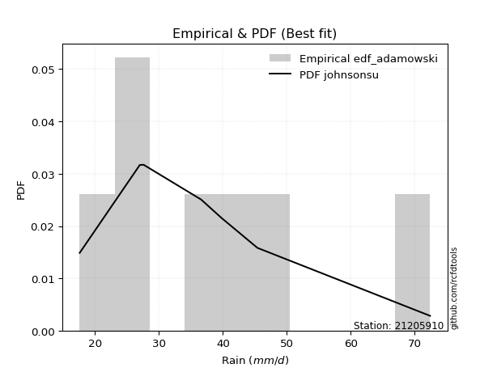</img>

</div>


## C. Best fit & Estimate extreme values for specific return periods - Tr


### 1. Best fit (ordered by delta Δ)

<div align="center">

|   id |   station | empirical_dist   | p_dist         |     delta |   deltao | eval   |   fit |   n |   best_fit |   best_fit_sort |
|-----:|----------:|:-----------------|:---------------|----------:|---------:|:-------|------:|----:|-----------:|----------------:|
|    0 |  21205910 | edf_adamowski    | alpha          | 0.0787337 | 0.484421 | Δo > Δ |     1 |   7 |          1 |               1 |
|    1 |  21205910 | edf_cunnane      | logmielke      | 0.0812729 | 0.484421 | Δo > Δ |     1 |   7 |          1 |               2 |
|    2 |  21205910 | edf_jenkinson    | logmielke      | 0.0812729 | 0.484421 | Δo > Δ |     1 |   7 |          1 |               3 |
|    3 |  21205910 | edf_filliben     | logmielke      | 0.0812729 | 0.484421 | Δo > Δ |     1 |   7 |          1 |               4 |
|    4 |  21205910 | edf_tukey        | logmielke      | 0.0812729 | 0.484421 | Δo > Δ |     1 |   7 |          1 |               5 |
|    5 |  21205910 | edf_blom         | logmielke      | 0.0812729 | 0.484421 | Δo > Δ |     1 |   7 |          1 |               6 |
|    6 |  21205910 | edf_chegodayev   | logmielke      | 0.0812729 | 0.484421 | Δo > Δ |     1 |   7 |          1 |               7 |
|    7 |  21205910 | edf_beard        | logmielke      | 0.0812729 | 0.484421 | Δo > Δ |     1 |   7 |          1 |               8 |
|    8 |  21205910 | edf_weibull      | loggenlogistic | 0.0832141 | 0.484421 | Δo > Δ |     1 |   7 |          1 |               9 |
|    9 |  21205910 | edf_gringorten   | logmielke      | 0.0843423 | 0.484421 | Δo > Δ |     1 |   7 |          1 |              10 |
|   10 |  21205910 | edf_hazen        | logmielke      | 0.0891577 | 0.484421 | Δo > Δ |     1 |   7 |          1 |              11 |
|   11 |  21205910 | edf_california   | loggumbel_r    | 0.132853  | 0.484421 | Δo > Δ |     1 |   7 |          1 |              12 |

</div>

:file_folder:Tables: [bestfit_21205910.csv](table/bestfit_21205910.csv) | [extreme_21205910.csv](table/extreme_21205910.csv)


### 2. Extreme values

In hydrology, a return period (or recurrence interval $Tr$) is the statistical average time between extreme events like floods or droughts of a specific magnitude, indicating how rare an event is, with a 100-year flood, for example, having a 1% chance of occurring in any given year, not that it happens exactly every century. It is a key tool for infrastructure design (like bridges or dams) and risk assessment, calculated from historical data to determine the probability of future events, although it is important to remember it is statistical average, and events can cluster or be missed.

> risk_rate: assuming the return period as the project useful life.

|   id |      tr |   prob_l |     prob_g |    alpha |   betaprime |     chi2 |   crystalball |   erlang |    expon |   exponnorm |        f |   fatiguelife |     fisk |    gamma |   genexpon |   genlogistic |   gibrat |   gompertz |   gumbel_l |   gumbel_r |   halflogistic |   halfnorm |   hypsecant |   invgamma |   invgauss |     invweibull |   johnsonsu |   kstwobign |   laplace |   laplace_asymmetric |   loggamma |   logistic |   lognorm |   maxwell |   mielke |    moyal |   nakagami |      ncf |      nct |    norm |           pareto |   pearson3 |   rayleigh |    rice |        t |   truncnorm |     wald |   weibull_min |   logalpha |   logbetaprime |     logchi2 |   logcrystalball |   logerlang |   logexpon |   logexponnorm |     logf |   logfatiguelife |   logfisk |   loggenexpon |   loggenlogistic |   loggibrat |   loggompertz |   loggumbel_l |   loggumbel_r |   loghalflogistic |   loghalfnorm |   loghypsecant |   loginvgamma |   loginvgauss |   loginvweibull |   logjohnsonsu |   logkstwobign |   loglaplace |   loglaplace_asymmetric |   logloggamma |   loglogistic |    loglognorm |   logmaxwell |   logmielke |   logmoyal |   lognakagami |   logncf |   lognct |         logpareto |   logpearson3 |   lograyleigh |   logrice |     logt |   logtruncnorm |   logwald |   logweibull_min |   station |   n |   risk_rate |
|-----:|--------:|---------:|-----------:|---------:|------------:|---------:|--------------:|---------:|---------:|------------:|---------:|--------------:|---------:|---------:|-----------:|--------------:|---------:|-----------:|-----------:|-----------:|---------------:|-----------:|------------:|-----------:|-----------:|---------------:|------------:|------------:|----------:|---------------------:|-----------:|-----------:|----------:|----------:|---------:|---------:|-----------:|---------:|---------:|--------:|-----------------:|-----------:|-----------:|--------:|---------:|------------:|---------:|--------------:|-----------:|---------------:|------------:|-----------------:|------------:|-----------:|---------------:|---------:|-----------------:|----------:|--------------:|-----------------:|------------:|--------------:|--------------:|--------------:|------------------:|--------------:|---------------:|--------------:|--------------:|----------------:|---------------:|---------------:|-------------:|------------------------:|--------------:|--------------:|--------------:|-------------:|------------:|-----------:|--------------:|---------:|---------:|------------------:|--------------:|--------------:|----------:|---------:|---------------:|----------:|-----------------:|----------:|----:|------------:|
|    0 |    2    | 0.5      | 0.5        |  33.8355 |     33.7413 |  28.0617 |       37.4571 |  25.8823 |  31.3639 |     34.0056 |  32.9947 |       17.6001 |  33.7149 |  23.5832 |    31.3679 |       34.6459 |  32.5878 |    33.5742 |    40.1222 |    34.7921 |        33.4672 |    34.1365 |     37.4571 |    33.7091 |    33.5677 |  194.982       |     33.6009 |     35.2751 |   37.4571 |              37.0364 |    33.7365 |    37.4571 |   34.3986 |   36.0697 |  33.7835 |  33.9318 |    32.3832 |  33.7318 |  33.6205 | 37.4571 |     18.7329      |    34.5484 |    35.5777 | 36.6956 |  33.965  |     37.4571 |  32.1987 |       31.6159 |    33.6059 |        33.8894 |     27.7971 |          34.3986 |     33.7365 |    28.0052 |        34.1492 |  33.8009 |          33.7697 |   33.8763 |       30.9541 |          33.7856 |     30.4302 |       30.8873 |       36.7859 |       32.1663 |           31.1111 |       31.6397 |        34.3986 |       33.8034 |       33.3014 |         32.2982 |        33.7989 |        31.7931 |      34.3986 |                 36.7074 |       34.4695 |       34.3986 |  17.6852      |      33.2178 |     33.9238 |    31.477  |       33.2832 |  33.9326 |  33.8134 |     18.3585       |       33.9328 |       32.8088 |   33.6714 |  34.3992 |        34.314  |   30.1325 |          33.4752 |  21205910 |   7 |    0.75     |
|    1 |    2.33 | 0.570815 | 0.429185   |  36.3066 |     36.2867 |  30.5271 |       40.352  |  28.3564 |  34.3965 |     36.4305 |  35.5942 |       18.4317 |  36.0994 |  26.1018 |    34.4014 |       37.135  |  34.0542 |    36.6358 |    42.6407 |    37.4745 |        36.2251 |    37.2608 |     39.7739 |    36.2532 |    36.2292 | 3294.83        |     36.2135 |     37.9611 |   39.209  |              38.871  |    36.3047 |    40.0077 |   36.9993 |   39.0773 |  36.1546 |  36.471  |    34.8239 |  36.2766 |  36.0911 | 40.352  |     20.4397      |    37.3654 |    38.6297 | 39.4372 |  35.9223 |     40.352  |  34.0968 |       35.2518 |    36.1573 |        36.4597 |     32.9282 |          36.9993 |     36.3047 |    31.023  |        36.7087 |  36.3637 |          36.3351 |   36.2011 |       33.7565 |          36.1562 |     31.5746 |       33.8413 |       39.194  |       34.4136 |           33.3481 |       34.229  |        36.4647 |       36.3659 |       35.8597 |         34.9751 |        36.3623 |        34.524  |      35.9497 |                 38.6145 |       37.1075 |       36.68   |  18.3748      |      35.8307 |     36.237  |    33.555  |       35.2134 |  37.7662 |  36.3688 |     19.5646       |       36.509  |       35.4292 |   36.332  |  37      |        36.1066 |   31.6077 |          36.1451 |  21205910 |   7 |    0.729209 |
|    2 |    5    | 0.8      | 0.2        |  47.7396 |     48.1024 |  43.0829 |       51.1099 |  41.9309 |  49.5588 |     48.0177 |  47.8758 |       36.097  |  47.6073 |  41.9831 |    49.568  |       47.9471 |  42.4967 |    50.1453 |    50.777  |    49.1279 |        48.7041 |    50.4729 |     49.0667 |    48.0907 |    48.5922 |    1.04275e+09 |     48.3961 |     49.3705 |   47.9676 |              48.0435 |    48.2106 |    49.8556 |   48.5094 |   50.9146 |  47.4112 |  48.2328 |    48.5815 |  48.0938 |  47.7385 | 51.1099 |    286.85        |    49.5532 |    50.8482 | 50.4128 |  44.0068 |     51.1099 |  44.7227 |       54.7869 |    48.0483 |        48.2389 |     90.3612 |          48.5094 |     48.2106 |    51.7493 |        48.2335 |  48.1957 |          48.2029 |   47.1796 |       48.5907 |          47.4087 |     39.0518 |       48.7159 |       48.1045 |       46.1481 |           45.6579 |       47.7376 |        46.0771 |       48.1951 |       48.0392 |         49.4304 |        48.1924 |        48.9941 |      44.8194 |                 46.3901 |       48.7492 |       47.0014 |   6.46277e+64 |      48.2714 |     47.0989 |    45.1197 |       45.7376 |  56.9849 |  48.1621 | 412446            |       48.2878 |       48.1908 |   48.5575 |  48.5103 |        46.1361 |   41.3041 |          48.5455 |  21205910 |   7 |    0.67232  |
|    3 |   10    | 0.9      | 0.1        |  58.1166 |     58.6443 |  54.6607 |       58.2464 |  55.2253 |  63.3228 |     58.453  |  58.9944 |       60.4884 |  59.0355 |  59.2177 |    63.3359 |       56.7521 |  52.1201 |    60.4262 |    55.3069 |    58.6195 |        59.0673 |    60.2495 |     56.4874 |    58.6882 |    59.3094 |    3.16249e+13 |     59.1798 |     58.0572 |   55.9184 |              56.37   |    58.7577 |    57.1083 |   58.0576 |   59.2451 |  58.243  |  58.4733 |    60.6334 |  58.6427 |  58.5118 | 58.2464 |  16697.6         |    59.2094 |    59.5602 | 58.2387 |  51.2444 |     58.2464 |  55.9993 |       73.9063 |    58.6943 |        58.5144 |    258.775  |          58.0576 |     58.7577 |    82.3436 |        58.1188 |  58.6345 |          58.6939 |   57.8624 |       63.8659 |          58.2362 |     49.7574 |       62.3397 |       53.916  |       58.6056 |           59.269  |       61.0607 |        55.5425 |       58.6297 |       59.249  |         65.5177 |        58.6232 |        63.9573 |      54.7525 |                 54.6564 |       58.3633 |       56.4176 | inf           |      59.536  |     57.6485 |    58.3903 |       56.1287 |  75.7889 |  58.5795 |      4.54065e+272 |       58.5227 |       60.0102 |   59.1105 |  58.0589 |        56.8757 |   54.8667 |          59.3471 |  21205910 |   7 |    0.651322 |
|    4 |   15    | 0.933333 | 0.0666667  |  64.5248 |     64.9789 |  61.478  |       61.8077 |  63.2468 |  71.3741 |     64.5571 |  65.7105 |       76.4408 |  66.6061 |  70.0294 |    71.3896 |       61.7196 |  58.7579 |    65.7831 |    57.3584 |    63.9745 |        64.932  |    65.3372 |     60.7223 |    65.071  |    65.5179 |    1.06819e+16 |     65.574  |     62.6689 |   60.5694 |              61.2407 |    65.0452 |    61.0599 |   63.5038 |   63.5194 |  65.2304 |  64.4164 |    67.1481 |  64.9835 |  65.1945 | 61.8077 | 186422           |    64.5175 |    64.0491 | 62.271  |  55.9685 |     61.8077 |  63.2406 |       85.5439 |    65.0988 |        64.58   |    495.807  |          63.5038 |     65.0452 |   108.052  |        63.926  |  64.8466 |          64.9417 |   64.8855 |       73.8096 |          65.2214 |     58.8073 |       70.352  |       56.774  |       67.0646 |           68.6992 |       69.4053 |        61.7919 |       64.8389 |       66.11   |         76.8061 |        64.8278 |        73.6778 |      61.5545 |                 60.1588 |       63.8291 |       62.3194 | inf           |      66.3004 |     64.6013 |    67.8149 |       62.5265 |  87.7121 |  64.7909 |    inf            |       64.5458 |       67.1906 |   65.2606 |  63.5053 |        63.9008 |   65.841  |          65.6585 |  21205910 |   7 |    0.644736 |
|    5 |   20    | 0.95     | 0.05       |  69.3003 |     69.5919 |  66.3294 |       64.1398 |  69.0172 |  77.0867 |     68.888  |  70.6107 |       88.2515 |  72.49   |  77.9367 |    77.1038 |       65.1977 |  63.9648 |    69.3405 |    58.6353 |    67.724  |        69.041  |    68.7293 |     63.7098 |    69.7254 |    69.9165 |    6.29687e+17 |     70.1816 |     65.7754 |   63.8693 |              64.6966 |    69.5972 |    63.7911 |   67.3443 |   66.3561 |  70.5656 |  68.6255 |    71.5352 |  69.6019 |  70.1657 | 64.1398 |      1.03328e+06 |    68.1743 |    67.0327 | 64.9511 |  59.6595 |     64.1398 |  68.6369 |       93.9727 |    69.7642 |        68.9462 |    795.339  |          67.3443 |     69.5972 |   131.025  |        68.1068 |  69.3409 |          69.463  |   70.3312 |       81.374  |          70.5552 |     67.044  |       76.0535 |       58.6289 |       73.7041 |           76.1867 |       75.5932 |        66.6191 |       69.3309 |       71.1572 |         85.8487 |        69.3155 |        81.0457 |      66.8871 |                 64.3956 |       67.6757 |       66.7555 | inf           |      71.2089 |     70.0076 |    75.396  |       67.2095 |  96.6551 |  69.2914 |    inf            |       68.8731 |       72.4323 |   69.6478 |  67.3459 |        69.2073 |   75.4236 |          70.1631 |  21205910 |   7 |    0.641514 |
|    6 |   25    | 0.96     | 0.04       |  73.1629 |     73.2497 |  70.0992 |       65.8566 |  73.5306 |  81.5177 |     72.2473 |  74.5002 |       97.6357 |  77.3892 |  84.1823 |    81.5361 |       67.8767 |  68.3055 |    71.9756 |    59.544  |    70.6121 |        72.2067 |    71.2531 |     66.0219 |    73.4198 |    73.3292 |    1.45497e+19 |     73.8041 |     68.1024 |   66.4289 |              67.3771 |    73.1901 |    65.8804 |   70.3191 |   68.462  |  74.9489 |  71.8879 |    74.8127 |  73.2645 |  74.1719 | 65.8567 |      3.9004e+06  |    70.9587 |    69.2494 | 66.9424 |  62.7595 |     65.8566 |  72.9591 |      100.6    |    73.4639 |        72.3786 |   1153.63   |          70.3191 |     73.1901 |   152.158  |        71.3984 |  72.887  |          73.0307 |   74.8631 |       87.5535 |          74.9377 |     74.7856 |       80.4848 |       59.9857 |       79.2631 |           82.5075 |       80.5525 |        70.6123 |       72.8752 |       75.1874 |         93.5334 |        72.8557 |        87.0431 |      71.3395 |                 67.8864 |       70.6508 |       70.3612 | inf           |      75.0864 |     74.518  |    81.8505 |       70.9255 | 103.891  |  72.8469 |    inf            |       72.27   |       76.5899 |   73.0729 |  70.3208 |        73.4957 |   84.0956 |          73.6798 |  21205910 |   7 |    0.639603 |
|    7 |   50    | 0.98     | 0.02       |  86.2558 |     85.1297 |  81.8405 |       70.7729 |  87.7199 |  95.2816 |     82.6824 |  87.1453 |      127.744  |  94.8001 | 104.087  |    95.304  |       76.1293 |  83.6067 |    79.5582 |    62.0107 |    79.5089 |        81.9609 |    78.5889 |     73.1904 |    85.4399 |    83.9535 |    2.31134e+23 |     85.3715 |     74.9353 |   74.3797 |              75.7037 |    84.7543 |    72.2641 |   79.5847 |   74.5697 |  90.1413 |  82.0158 |    84.3684 |  85.163  |  87.5809 | 70.7729 |      2.41612e+08 |    79.3714 |    75.6843 | 72.7227 |  74.0457 |     70.7729 |  87.0713 |      121.637  |    85.4789 |        83.3504 |   3751.5    |          79.5847 |     84.7543 |   242.115  |        81.9842 |  84.2972 |          84.5104 |   90.9942 |      108.644  |          90.1292 |    109.929  |       94.2946 |       63.8293 |       99.1636 |          105.474  |       96.8927 |        84.5792 |       84.2792 |       88.4282 |        121.805  |        84.2426 |       107.344  |      87.1501 |                 79.9831 |       79.8933 |       82.6295 | inf           |      87.5679 |     90.6629 |   105.624  |       82.9487 | 128.189  |  84.3163 |    inf            |       83.0991 |       90.0602 |   83.8795 |  79.5867 |        87.6004 |  119.977  |          84.7681 |  21205910 |   7 |    0.63583  |
|    8 |   75    | 0.986667 | 0.0133333  |  94.8661 |     92.4919 |  88.7264 |       73.4108 |  96.1161 | 103.333  |     88.7865 |  94.9854 |      145.877  | 106.791  | 116.016  |   103.358  |       80.926  |  93.9411 |    83.6269 |    63.258  |    84.68   |        87.631  |    82.5822 |     77.3796 |    92.904  |    90.1938 |    6.39219e+25 |     92.3852 |     78.6948 |   79.0306 |              80.5744 |    91.8393 |    75.9511 |   85.0499 |   77.8903 | 100.301  |  87.9384 |    89.573  |  92.5387 |  96.1977 | 73.4108 |      2.70009e+09 |    84.1574 |    79.1851 | 75.8674 |  82.0969 |     73.4108 |  95.7553 |      134.226  |    92.9216 |        90.02   |   7580.36   |          85.0499 |     91.8393 |   317.704  |        88.4927 |  91.2877 |          91.5419 |  102.16   |      122.435  |         100.29   |    142.594  |      102.402  |       65.8656 |      112.953  |          121.659  |      107.141  |        93.9875 |       91.2659 |       96.7365 |        142.014  |        91.2158 |       120.468  |      97.9768 |                 88.0353 |       85.3281 |       90.6671 | inf           |      95.2038 |    101.924  |   122.61   |       90.3307 | 143.799  |  91.3663 |    inf            |       89.6608 |       98.3586 |   90.3446 |  85.0521 |        96.1768 |  149.301  |          91.3918 |  21205910 |   7 |    0.634587 |
|    9 |  100    | 0.99     | 0.01       | 101.502  |     97.9217 |  93.6184 |       75.195  | 102.108  | 109.046  |     93.1174 | 100.767  |      158.924  | 116.246  | 124.583  |   109.072  |       84.3209 | 101.947  |    86.3711 |    64.0739 |    88.34   |        91.6442 |    85.3025 |     80.3512 |    98.4159 |    94.6354 |    3.41863e+27 |     97.4822 |     81.2706 |   82.3305 |              84.0302 |    97.0248 |    78.5541 |   88.9575 |   80.1521 | 108.162  |  92.1403 |    93.1154 |  97.9793 | 102.703  | 75.195  |      1.49668e+10 |    87.5034 |    81.5701 | 78.0098 |  88.6113 |     75.195  | 102.087  |      143.274  |    98.4085 |        94.8784 |  12548      |          88.9575 |     97.0248 |   385.254  |        93.2807 |  96.405  |          96.688  |  111.012  |      132.93   |         108.152  |    174.434  |      108.165  |       67.2326 |      123.856  |          134.593  |      114.736  |       101.289  |       96.3804 |      102.908  |        158.312  |        96.3189 |       130.375  |     106.465  |                 94.2353 |       89.2065 |       96.8084 | inf           |     100.783  |    110.901  |   136.292  |       95.7302 | 155.554  |  96.5389 |    inf            |       94.4308 |      104.446  |   95.0056 |  88.9599 |       102.256  |  175.106  |          96.1611 |  21205910 |   7 |    0.633968 |
|   10 |  200    | 0.995    | 0.005      | 119.72   |    111.777  | 105.424  |       79.2421 | 116.645  | 122.809  |    103.552  | 115.514  |      190.861  | 142.794  | 145.516  |   122.84   |       92.4825 | 123.727  |    92.5563 |    65.8473 |    97.1388 |       101.292  |    91.5244 |     87.5101 |   112.505  |   105.388  |    4.8823e+31  |    110.203  |     87.2034 |   90.2814 |              92.3567 |   110.105  |    84.7984 |   98.4997 |   85.3268 | 129.636  | 102.264  |   101.201  | 111.865  | 119.877  | 79.2421 |      9.27131e+11 |    95.4225 |    87.0273 | 82.9119 | 107.672  |     79.2421 | 117.858  |      165.436  |   112.399  |       107.055  |  42858.6    |          98.4997 |    110.105  |   613.016  |       105.494  | 109.321  |         109.669  |  136.143  |      160.865  |         129.634  |    301.83   |      122.089  |       70.3026 |      154.57   |          171.599  |      134.194  |       121.295  |      109.289  |      118.808  |        205.565  |       109.193  |       156.402  |     130.06   |                111.027  |       98.652  |      113.29   | inf           |     114.807  |    136.621  |   175.859  |      109.312  | 186.391  | 109.639  |    inf            |      106.35   |      119.829  |  106.514  |  98.5024 |       116.191  |  260.474  |         107.911  |  21205910 |   7 |    0.633042 |
|   11 |  250    | 0.996    | 0.004      | 126.397  |    116.487  | 109.229  |       80.4788 | 121.351  | 127.24   |    106.912  | 120.524  |      201.269  | 152.633  | 152.33   |   127.272  |       95.1064 | 131.542  |    94.4321 |    66.3691 |    99.9675 |       104.394  |    93.4385 |     89.8147 |   117.303  |   108.866  |    1.0576e+33  |    114.436  |     89.0394 |   92.841  |              95.0373 |   114.504  |    86.8031 |  101.615  |   86.9197 | 137.399  | 105.523  |   103.683  | 116.587  | 125.902  | 80.4788 |      3.49977e+12 |    97.9343 |    88.7072 | 84.4209 | 115.012  |     80.4788 | 123.075  |      172.671  |   117.152  |       111.126  |  63877.2    |         101.615  |    114.504  |   711.89   |       109.656  | 113.667  |         114.034  |  145.572  |      170.715  |         137.401  |    367.457  |      126.582  |       71.2322 |      165.98   |          185.537  |      140.819  |       128.541  |      113.633  |      124.258  |        223.571  |       113.524  |       165.466  |     138.718  |                117.046  |      101.728  |      119.155  | inf           |     119.505  |    146.357  |   190.898  |      113.862  | 197.128  | 114.063  |    inf            |      110.324  |      125.006  |  110.308  | 101.618  |       120.272  |  297.044  |         111.776  |  21205910 |   7 |    0.632858 |
|   12 |  500    | 0.998    | 0.002      | 150.432  |    131.972  | 121.061  |       84.1465 | 136.035  | 141.004  |    117.347  | 136.978  |      233.92   | 187.963  | 173.692  |   141.04   |      103.25   | 158.55   |    99.9458 |    67.8649 |   108.747  |       114.021  |    99.1454 |     96.973  |   133.099  |   119.718  |    1.47931e+37 |    128.043  |     94.5417 |  100.792  |             103.364  |   128.794  |    93.0203 |  111.445  |   91.673  | 164.563  | 115.646  |   111.066  | 132.113  | 146.357  | 84.1465 |      2.16796e+14 |   105.639  |    93.7193 | 88.9232 | 142.515  |     84.1465 | 139.665  |      195.437  |   132.76   |       124.277  | 222714      |         111.445  |    128.794  |  1132.76   |       123.408  | 127.8    |         128.22   |  179.994  |      204.247  |         164.582  |    725.26   |      140.568  |       73.966  |      207.042  |          236.426  |      162.579  |       153.926  |      127.759  |      142.31   |        290.137  |       127.601  |       195.894  |     169.461  |                137.902  |      111.411  |      139.345  | inf           |     134.698  |    182.276  |   246.317  |      128.565  | 233.221  | 128.499  |    inf            |      123.124  |      141.819  |  122.39   | 111.449  |       131.046  |  451.066  |         124.052  |  21205910 |   7 |    0.632489 |
|   13 |  750    | 0.998667 | 0.00133333 | 167.413  |    141.671  | 127.991  |       86.1839 | 144.666  | 149.056  |    123.451  | 147.271  |      253.212  | 212.483  | 186.307  |   149.094  |      108.011  | 176.412  |   102.973  |    68.6643 |   113.88   |       119.649  |   102.334  |    101.16   |   143.012  |   126.101  |    3.92328e+39 |    136.333  |     97.6327 |  105.443  |             108.235  |   137.618  |    96.6526 |  117.311  |   94.3315 | 182.857  | 121.568  |   115.178  | 141.84   | 159.67   | 86.1839 |      2.42276e+15 |   110.085  |    96.5221 | 91.4409 | 162.577  |     86.1839 | 149.612  |      208.945  |   142.525  |       132.345  | 465059      |         117.311  |    137.618  |  1486.41   |       132.099  | 136.539  |         136.982  |  204.426  |      226.091  |         182.891  |   1137.05   |      148.768  |       75.4698 |      235.603  |          272.416  |      176.167  |       171.041  |      136.494  |      153.713  |        337.888  |       136.301  |       215.381  |     190.513  |                151.785  |      117.172  |      152.69   | inf           |     144.022  |    208.11   |   285.921  |      137.58   | 256.397  | 137.467  |    inf            |      130.95   |      152.189  |  129.676  | 117.315  |       135.844  |  579.448  |         131.431  |  21205910 |   7 |    0.632366 |
|   14 | 1000    | 0.999    | 0.001      | 181.146  |    148.86   | 132.91   |       87.5867 | 150.805  | 154.768  |    127.782  | 154.894  |      266.973  | 231.875  | 195.303  |   154.808  |      111.388  | 190.08   |   105.041  |    69.2023 |   117.521  |       123.642  |   104.535  |    104.131  |   150.369  |   130.645  |    2.05492e+41 |    142.37   |     99.7741 |  108.743  |             111.69   |   144.099  |    99.2285 |  121.529  |   96.169  | 197.05   | 125.77   |   118.013  | 149.051  | 169.782  | 87.5867 |      1.34296e+16 |   113.215  |    98.4589 | 93.1807 | 178.966  |     87.5867 | 156.767  |      218.609  |   149.758  |       138.247  | 785862      |         121.529  |    144.099  |  1802.45   |       138.587  | 142.963  |         143.418  |  224.072  |      242.671  |         197.098  |   1604.06   |      154.595  |       76.4991 |      258.22   |          301.22   |      186.209  |       184.325  |      142.916  |      162.208  |        376.452  |       142.694  |       230.007  |     207.018  |                162.475  |      121.306  |      162.92   | inf           |     150.842  |    229.075  |   317.824  |      144.166  | 273.835  | 144.078  |    inf            |      136.663  |      159.794  |  134.947  | 121.532  |       138.585  |  693.84   |         136.758  |  21205910 |   7 |    0.632305 |

<div align="center">

</img>

</div>


<div align="center">

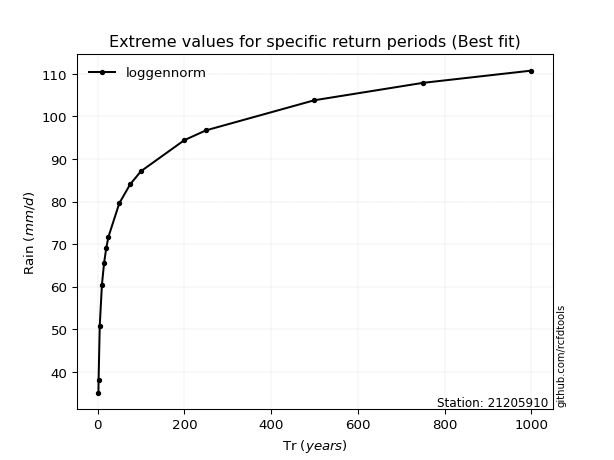</img>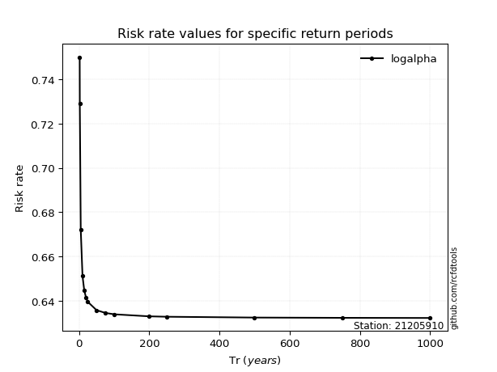</img>

</div>


<sub>**APP DISCLAIMER**: NO WARRANTY - This software is provided by [github.com/rcfdtools](https://github.com/rcfdtools) "as is", without any express or implied warranty, including warranties of merchantability, fitness for a particular purpose, or non-infringement. There is no guarantee that the software will be error-free or operate without interruption. LIMITATION OF LIABILITY - Neither the authors nor copyright holders will be liable for claims or damages arising from the software or its use. You are responsible for determining if the software is appropriate for your use and assume all associated risks, including errors, legal compliance, and data loss. NO PROFESSIONAL ADVICE - The software provides general information and does not offer professional advice. It should not replace consultation with professional advisors.</sub>