<div align="center">


</div>

# Station (rain, Pmax24h): 21205940

Probable Maximum Precipitation (PMP) is the greatest amount of rainfall for a specific duration that is meteorologically possible for a given location, acting as a "worst-case" scenario for extreme storms, crucial for designing safety-critical infrastructure like bridges, river deviations, dams, spillways, and nuclear plants to prevent catastrophic failure. PMP is calculated by hydrologists using meteorological data to determine the upper limit of extreme rainfall, often leading to the Probable Maximum Flood (PMF) for flood control design, and is increasingly being studied for climate change impacts.

<div align="center">

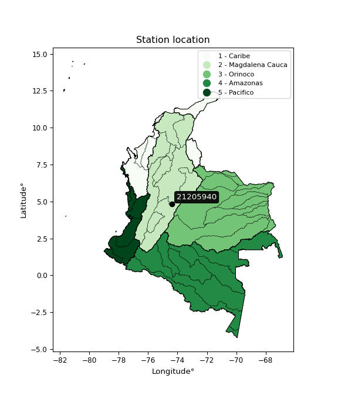</img>

</div>


## A. General information


### 1. General running parameters

• app_version: _v20251225_. • runtime: _2025-12-26 14:29:50.888910_. • Python version: _3.14.0_. • SciPy version: _1.16.3_. • Pandas version: _2.3.3_. • NumPy version: _2.3.5_. • Stations dataset (station_dataset_file): _dataset/pmax24h_in/automatic_colombia.csv_. • Stations catalog (station_catalog_file): _dataset/CNE_IDEAM.xls_. • Plot only fit distributions with Δo > Δ (plot_only_fit): _True_. • Eval low extreme values, if False, evaluates high extreme values (low_extreme): _False_. • Eval every SciPy distribution as logarithmic (pdist_logarithmic_on): _True_. • Standard deviation normalized (ddof): _1.0_. • Return periods to eval in years (Tr): _[2, 2.33, 5, 10, 15, 20, 25, 50, 75, 100, 200, 250, 500, 750, 1000]_. • Minimum data sample per station, 0 means any (minimum_sample): _5_. • Z-Score threshold to adjust a value, 0 means disable (zscore): _3.5_. • Avoid zeros, e.g. rain = 0 (avoid_zeros): _True_. • Avoid null values (avoid_nans): _True_. [:file_folder:Dataset file.](../../dataset/pmax24h_in/automatic_colombia.csv)


### 2. Station info and location

|   id |   CODIGO | NOMBRE                | CATEGORIA               | TECNOLOGIA                              | ESTADO   | FECHA_INSTALACION   |   FECHA_SUSPENSION |   ALTITUD |   LATITUD |   LONGITUD | DEPARTAMENTO   | MUNICIPIO   | AREA_OPERATIVA                            | ENTIDAD                                                     | AREA_HIDROGRAFICA   | ZONA_HIDROGRAFICA   | SUBZONA_HIDROGRAFICA   |   CORRIENTE | OBSERVACION                                                                                                                                                                                                                                                                                                                                                                                                                                                                                                                                                                                                                                                                                                                                                                                                                                                                                                                                                                                                                                                                                                                                                                                                                                                                                                                                                                                                                                                                                                                                                                                                                                                                                                                                                                                                                  | SUBRED                                                                          | Catalogo   |
|-----:|---------:|:----------------------|:------------------------|:----------------------------------------|:---------|:--------------------|-------------------:|----------:|----------:|-----------:|:---------------|:------------|:------------------------------------------|:------------------------------------------------------------|:--------------------|:--------------------|:-----------------------|------------:|:-----------------------------------------------------------------------------------------------------------------------------------------------------------------------------------------------------------------------------------------------------------------------------------------------------------------------------------------------------------------------------------------------------------------------------------------------------------------------------------------------------------------------------------------------------------------------------------------------------------------------------------------------------------------------------------------------------------------------------------------------------------------------------------------------------------------------------------------------------------------------------------------------------------------------------------------------------------------------------------------------------------------------------------------------------------------------------------------------------------------------------------------------------------------------------------------------------------------------------------------------------------------------------------------------------------------------------------------------------------------------------------------------------------------------------------------------------------------------------------------------------------------------------------------------------------------------------------------------------------------------------------------------------------------------------------------------------------------------------------------------------------------------------------------------------------------------------|:--------------------------------------------------------------------------------|:-----------|
|    0 | 21205940 | VILLA INES [21205940] | Climatológica Principal | Automática con Telemetría, Convencional | Activa   | 15/02/1977          |                nan |      2590 |   4.83211 |   -74.3806 | Cundinamarca   | Facatativá  | Area Operativa 11 - Cundinamarca-Amazonas | INSTITUTO DE HIDROLOGIA METEOROLOGIA Y ESTUDIOS AMBIENTALES | Magdalena Cauca     | Alto Magdalena      | Río Bogotá             |         nan | Cambio de tecnología por instalación o repotenciación de estaciones proyecto Fondo de Adaptación|18/08/2022$Migracion$Cambio de tecnología por instalación o repotenciación de estaciones proyecto Fondo de Adaptación|16/11/2022$Migracion$Cambio de tecnología por instalación o repotenciación de estaciones proyecto Fondo de Adaptación|18/08/2022$Migracion$Cambio de tecnología por instalación o repotenciación de estaciones proyecto Fondo de Adaptación|16/11/2022$Migracion$Cambio de tecnología por instalación o repotenciación de estaciones proyecto Fondo de Adaptación|18/08/2022$Migracion$Cambio de tecnología por instalación o repotenciación de estaciones proyecto Fondo de Adaptación|16/11/2022$Migracion$Cambio de tecnología por instalación o repotenciación de estaciones proyecto Fondo de Adaptación|18/08/2022$Migracion$Cambio de tecnología por instalación o repotenciación de estaciones proyecto Fondo de Adaptación|16/11/2022$Migracion$Cambio de tecnología por instalación o repotenciación de estaciones proyecto Fondo de Adaptación|18/08/2022$Migracion$Cambio de tecnología por instalación o repotenciación de estaciones proyecto Fondo de Adaptación|16/11/2022$Migracion$Cambio de tecnología por instalación o repotenciación de estaciones proyecto Fondo de Adaptación|18/08/2022$Migracion$Cambio de tecnología por instalación o repotenciación de estaciones proyecto Fondo de Adaptación|20/06/2025$mvelez$La estación fue actualizada en sus coordenadas luego de la reunión con el grupo de automatización 17/06/2025 se realiza el cambio bajo el memorando 20253180105293|20/06/2025$mvelez$La estación fue actualizada en sus coordenadas luego de la reunión con el grupo de automatización 17/06/2025 se realiza el cambio bajo el memorando 20253180105293 | RED ALERTAS - AREA OPERATIVA 11,Altiplano Cundiboyacense y oriente de Santander | CNE_IDEAM  |

<div align="center">

Map location in: [:earth_americas:Google](http://maps.google.com/maps?q=4.83211,-74.38056) [:earth_americas:OSM](https://www.openstreetmap.org/#map=18/4.83211/-74.38056&layers=P) [:earth_americas:Bing](https://www.bing.com/maps?cp=4.83211~-74.38056&lvl=18) [:earth_americas:Apple](https://maps.apple.com/frame?center=4.83211%2C-74.38056&span=0.003%2C0.006)

</div>


<div align="center">

```geojson
{
  "type": "Feature",
  "geometry": {
    "type": "Point", 
    "coordinates": [-74.38056, 4.83211]
  }, 
  "properties": {
    "Name": "21205940"
  }
}
```

</div>


### 3. Discrete values table and plot

|               |         0 |           1 |           2 |           3 |            4 |            5 |          6 |
|:--------------|----------:|------------:|------------:|------------:|-------------:|-------------:|-----------:|
| Date          | 2019      | 2020        | 2021        | 2022        | 2023         | 2024         | 2025       |
| Value         |   54      |   29.8      |   30        |   43        |   35.4       |   35.2       |   22       |
| Value_initial |   54      |   29.8      |   30        |   43        |   35.4       |   35.2       |   22       |
| count         |    7      |    7        |    7        |    7        |    7         |    7         |    7       |
| mean          |   35.6286 |   35.6286   |   35.6286   |   35.6286   |   35.6286    |   35.6286    |   35.6286  |
| std           |   10.356  |   10.356    |   10.356    |   10.356    |   10.356     |   10.356     |   10.356   |
| zscore        |    1.774  |   -0.562823 |   -0.543511 |    0.711806 |   -0.0220715 |   -0.0413841 |   -1.31601 |

<div align="center">

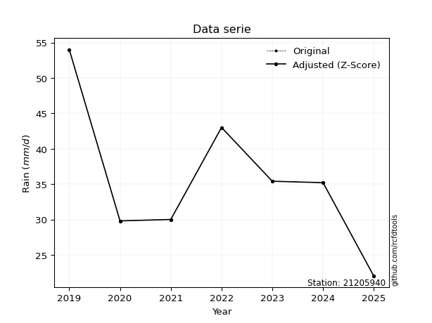</img>

</div>

> If Z-Score is active, values out of range or outliers are replaced with the station mean value.


### 4. Active continuous probability distributions from SciPy (45 of 104 available)

[scipy.stats](https://docs.scipy.org/doc/scipy/reference/stats.html) is a Python´s powerful submodule within the SciPy library for comprehensive statistical analysis, offering over 130 probability distributions (like Normal, Poisson), functions for descriptive stats (mean, variance), hypothesis testing (t-tests, chi-square), random variable generation, and statistical tests, making it essential for data science, modeling, and research. It provides tools to explore, model, and draw conclusions from data efficiently, working seamlessly with NumPy.

<div align="center">

|   id | p_dist             |   n_parameter | fit_method   | label                                                                       | active   | ref                                                                                                        |
|-----:|:-------------------|--------------:|:-------------|:----------------------------------------------------------------------------|:---------|:-----------------------------------------------------------------------------------------------------------|
|    0 | alpha              |             3 | MLE          | Alpha                                                                       | True     | [:mortar_board:](https://docs.scipy.org/doc/scipy/reference/generated/scipy.stats.alpha.html)              |
|    1 | betaprime          |             4 | MLE          | Beta prime                                                                  | True     | [:mortar_board:](https://docs.scipy.org/doc/scipy/reference/generated/scipy.stats.betaprime.html)          |
|    2 | chi2               |             3 | MLE          | Chi²                                                                        | True     | [:mortar_board:](https://docs.scipy.org/doc/scipy/reference/generated/scipy.stats.chi2.html)               |
|    3 | crystalball        |             4 | MLE          | Crystalball                                                                 | True     | [:mortar_board:](https://docs.scipy.org/doc/scipy/reference/generated/scipy.stats.crystalball.html)        |
|    4 | erlang             |             3 | MLE          | Erlang                                                                      | True     | [:mortar_board:](https://docs.scipy.org/doc/scipy/reference/generated/scipy.stats.erlang.html)             |
|    5 | expon              |             2 | MLE          | Exponential                                                                 | True     | [:mortar_board:](https://docs.scipy.org/doc/scipy/reference/generated/scipy.stats.expon.html)              |
|    6 | exponnorm          |             3 | MLE          | Exponentially modified Normal                                               | True     | [:mortar_board:](https://docs.scipy.org/doc/scipy/reference/generated/scipy.stats.exponnorm.html)          |
|    7 | f                  |             4 | MLE          | F                                                                           | True     | [:mortar_board:](https://docs.scipy.org/doc/scipy/reference/generated/scipy.stats.f.html)                  |
|    8 | fatiguelife        |             3 | MLE          | Fatigue-life (Birnbaum-Saunders)                                            | True     | [:mortar_board:](https://docs.scipy.org/doc/scipy/reference/generated/scipy.stats.fatiguelife.html)        |
|    9 | fisk               |             3 | MLE          | Fisk                                                                        | True     | [:mortar_board:](https://docs.scipy.org/doc/scipy/reference/generated/scipy.stats.fisk.html)               |
|   10 | gamma              |             3 | MLE          | Gamma                                                                       | True     | [:mortar_board:](https://docs.scipy.org/doc/scipy/reference/generated/scipy.stats.gamma.html)              |
|   11 | genexpon           |             5 | MLE          | Generalized exponential                                                     | True     | [:mortar_board:](https://docs.scipy.org/doc/scipy/reference/generated/scipy.stats.genexpon.html)           |
|   12 | genlogistic        |             3 | MLE          | Generalized logistic                                                        | True     | [:mortar_board:](https://docs.scipy.org/doc/scipy/reference/generated/scipy.stats.genlogistic.html)        |
|   13 | gibrat             |             2 | MM           | Gibrat                                                                      | True     | [:mortar_board:](https://docs.scipy.org/doc/scipy/reference/generated/scipy.stats.gibrat.html)             |
|   14 | gompertz           |             3 | MLE          | Gompertz (or truncated Gumbel)                                              | True     | [:mortar_board:](https://docs.scipy.org/doc/scipy/reference/generated/scipy.stats.gompertz.html)           |
|   15 | gumbel_l           |             2 | MM           | Gumbel Left Skew                                                            | True     | [:mortar_board:](https://docs.scipy.org/doc/scipy/reference/generated/scipy.stats.gumbel_l.html)           |
|   16 | gumbel_r           |             2 | MM           | Gumbel Right Skew                                                           | True     | [:mortar_board:](https://docs.scipy.org/doc/scipy/reference/generated/scipy.stats.gumbel_r.html)           |
|   17 | halflogistic       |             2 | MM           | Half-logistic                                                               | True     | [:mortar_board:](https://docs.scipy.org/doc/scipy/reference/generated/scipy.stats.halflogistic.html)       |
|   18 | halfnorm           |             2 | MM           | Half Normal                                                                 | True     | [:mortar_board:](https://docs.scipy.org/doc/scipy/reference/generated/scipy.stats.halfnorm.html)           |
|   19 | hypsecant          |             2 | MM           | hyperbolic secant                                                           | True     | [:mortar_board:](https://docs.scipy.org/doc/scipy/reference/generated/scipy.stats.hypsecant.html)          |
|   20 | invgamma           |             3 | MLE          | Inverted gamma                                                              | True     | [:mortar_board:](https://docs.scipy.org/doc/scipy/reference/generated/scipy.stats.invgamma.html)           |
|   21 | invgauss           |             3 | MLE          | Inverse Gaussian                                                            | True     | [:mortar_board:](https://docs.scipy.org/doc/scipy/reference/generated/scipy.stats.invgauss.html)           |
|   22 | invweibull         |             3 | MLE          | Inverted Weibull                                                            | True     | [:mortar_board:](https://docs.scipy.org/doc/scipy/reference/generated/scipy.stats.invweibull.html)         |
|   23 | johnsonsu          |             4 | MLE          | Johnson Su                                                                  | True     | [:mortar_board:](https://docs.scipy.org/doc/scipy/reference/generated/scipy.stats.johnsonsu.html)          |
|   24 | kstwobign          |             2 | MLE          | Limiting distribution of scaled Kolmogorov-Smirnov two-sided test statistic | True     | [:mortar_board:](https://docs.scipy.org/doc/scipy/reference/generated/scipy.stats.kstwobign.html)          |
|   25 | laplace            |             2 | MM           | Laplace                                                                     | True     | [:mortar_board:](https://docs.scipy.org/doc/scipy/reference/generated/scipy.stats.laplace.html)            |
|   26 | laplace_asymmetric |             3 | MLE          | Asymmetric Laplace                                                          | True     | [:mortar_board:](https://docs.scipy.org/doc/scipy/reference/generated/scipy.stats.laplace_asymmetric.html) |
|   27 | loggamma           |             3 | MLE          | Log gamma                                                                   | True     | [:mortar_board:](https://docs.scipy.org/doc/scipy/reference/generated/scipy.stats.loggamma.html)           |
|   28 | logistic           |             2 | MM           | Logistic (or Sech-squared)                                                  | True     | [:mortar_board:](https://docs.scipy.org/doc/scipy/reference/generated/scipy.stats.logistic.html)           |
|   29 | lognorm            |             3 | MLE          | Log Normal                                                                  | True     | [:mortar_board:](https://docs.scipy.org/doc/scipy/reference/generated/scipy.stats.lognorm.html)            |
|   30 | maxwell            |             2 | MM           | Maxwell                                                                     | True     | [:mortar_board:](https://docs.scipy.org/doc/scipy/reference/generated/scipy.stats.maxwell.html)            |
|   31 | mielke             |             4 | MLE          | Mielke Beta-Kappa / Dagum                                                   | True     | [:mortar_board:](https://docs.scipy.org/doc/scipy/reference/generated/scipy.stats.mielke.html)             |
|   32 | moyal              |             2 | MM           | Moyal                                                                       | True     | [:mortar_board:](https://docs.scipy.org/doc/scipy/reference/generated/scipy.stats.moyal.html)              |
|   33 | nakagami           |             3 | MLE          | Nakagami                                                                    | True     | [:mortar_board:](https://docs.scipy.org/doc/scipy/reference/generated/scipy.stats.nakagami.html)           |
|   34 | ncf                |             5 | MLE          | Non-central F distribution                                                  | True     | [:mortar_board:](https://docs.scipy.org/doc/scipy/reference/generated/scipy.stats.ncf.html)                |
|   35 | nct                |             4 | MLE          | Non-central Student’s t                                                     | True     | [:mortar_board:](https://docs.scipy.org/doc/scipy/reference/generated/scipy.stats.nct.html)                |
|   36 | norm               |             2 | MM           | Normal                                                                      | True     | [:mortar_board:](https://docs.scipy.org/doc/scipy/reference/generated/scipy.stats.norm.html)               |
|   37 | pareto             |             3 | MLE          | Pareto                                                                      | True     | [:mortar_board:](https://docs.scipy.org/doc/scipy/reference/generated/scipy.stats.pareto.html)             |
|   38 | pearson3           |             3 | MM           | Pearson type III                                                            | True     | [:mortar_board:](https://docs.scipy.org/doc/scipy/reference/generated/scipy.stats.pearson3.html)           |
|   39 | rayleigh           |             2 | MM           | Rayleigh                                                                    | True     | [:mortar_board:](https://docs.scipy.org/doc/scipy/reference/generated/scipy.stats.rayleigh.html)           |
|   40 | rice               |             3 | MLE          | Rice                                                                        | True     | [:mortar_board:](https://docs.scipy.org/doc/scipy/reference/generated/scipy.stats.rice.html)               |
|   41 | t                  |             3 | MLE          | Student’s t                                                                 | True     | [:mortar_board:](https://docs.scipy.org/doc/scipy/reference/generated/scipy.stats.t.html)                  |
|   42 | truncnorm          |             4 | MLE          | Truncated normal                                                            | True     | [:mortar_board:](https://docs.scipy.org/doc/scipy/reference/generated/scipy.stats.truncnorm.html)          |
|   43 | wald               |             2 | MM           | Wald                                                                        | True     | [:mortar_board:](https://docs.scipy.org/doc/scipy/reference/generated/scipy.stats.wald.html)               |
|   44 | weibull_min        |             3 | MLE          | Weibull minimum                                                             | True     | [:mortar_board:](https://docs.scipy.org/doc/scipy/reference/generated/scipy.stats.weibull_min.html)        |

</div>

> **n_parameter:** # arguments & localization & scale.
>
> **Fit methods:** (MLE) maximum likelihood, (MM) L-moments.
>
>**Inactive:** foldnorm, gennorm, norminvgauss, powernorm, powerlognorm, skewnorm, genextreme, anglit, arcsine, argus, beta, bradford, burr, burr12, cauchy, cosine, halfcauchy, foldcauchy, skewcauchy, wrapcauchy, dgamma, gengamma, exponweib, exponpow, truncexpon, gausshyper, genhalflogistic, genhyperbolic, geninvgauss, halfgennorm, johnsonsb, kappa4, kappa3, ksone, kstwo, loglaplace, levy, levy_l, levy_stable, ncx2, genpareto, truncpareto, lomax, powerlaw, rdist, rel_breitwigner, recipinvgauss, semicircular, studentized_range, trapezoid, triang, truncweibull_min, tukeylambda, uniform, loguniform, vonmises, vonmises_line, weibull_max, dweibull, 


## B. Probability distributions vs. Empirical distributions

A continuous probability distribution (CPD) describes probabilities for variables that can take any value within a range (like rain any time), unlike discrete variables with specific outcomes (like temperature). It uses a Probability Density Function (PDF), a curve where the total area under it equals 1, and the probability of the variable falling within an interval (a to b) is found by calculating the area under the curve between those points. A key feature is that the probability of hitting any single exact value is zero, so probabilities are always expressed for ranges, e.g., $P(a ≤ X ≤ b)$.

<div align="center">

Distributions parameters
|    |   station | p_dist                |   n |             loc |         scale | shape                 | shape1                 | shape2                 | shape3   |
|---:|----------:|:----------------------|----:|----------------:|--------------:|:----------------------|:-----------------------|:-----------------------|:---------|
|  0 |  21205940 | alpha                 |   7 |   -27.1681      | 420.933       | 6.853522030315915     |                        |                        |          |
|  1 |  21205940 | betaprime             |   7 |    -0.335046    |  18.8798      | 41.549839323612375    | 22.806802559371455     |                        |          |
|  2 |  21205940 | chi2                  |   7 |    22           |  12.1617      | 1.077890746253244     |                        |                        |          |
|  3 |  21205940 | crystalball           |   7 |    35.6286      |   9.58775     | 3899.630921016676     | 123.73223533147652     |                        |          |
|  4 |  21205940 | erlang                |   7 |    16.9562      |   5.39495     | 3.4610742199767106    |                        |                        |          |
|  5 |  21205940 | expon                 |   7 |    22           |  13.6286      |                       |                        |                        |          |
|  6 |  21205940 | exponnorm             |   7 |    26.8342      |   5.11639     | 1.7188628244177813    |                        |                        |          |
|  7 |  21205940 | f                     |   7 |    -0.709925    |  34.5435      | 119.9512489220919     | 40.18903758886525      |                        |          |
|  8 |  21205940 | fatiguelife           |   7 |    22           |   5.50571e-05 | 512.3772520637336     |                        |                        |          |
|  9 |  21205940 | fisk                  |   7 |    -0.0808599   |  34.3368      | 6.554984738967375     |                        |                        |          |
| 10 |  21205940 | gamma                 |   7 |    16.9562      |   5.39493     | 3.461089659897718     |                        |                        |          |
| 11 |  21205940 | genexpon              |   7 |    22           |   2.22916     | 0.16345197053519248   | 2.2998289677136805e-07 | 1.2528320138151368     |          |
| 12 |  21205940 | genlogistic           |   7 |   -12.907       |   7.82336     | 278.88016615572394    |                        |                        |          |
| 13 |  21205940 | gibrat                |   7 |    28.3143      |   4.43631     |                       |                        |                        |          |
| 14 |  21205940 | gompertz              |   7 |    29.8         |   2.53431     | 0.0004229492625820591 |                        |                        |          |
| 15 |  21205940 | gumbel_l              |   7 |    39.9436      |   7.47554     |                       |                        |                        |          |
| 16 |  21205940 | gumbel_r              |   7 |    31.3136      |   7.47554     |                       |                        |                        |          |
| 17 |  21205940 | halflogistic          |   7 |    24.2648      |   8.19721     |                       |                        |                        |          |
| 18 |  21205940 | halfnorm              |   7 |    22.9381      |  15.9051      |                       |                        |                        |          |
| 19 |  21205940 | hypsecant             |   7 |    35.6286      |   6.10375     |                       |                        |                        |          |
| 20 |  21205940 | invgamma              |   7 |    -4.68391     | 716.23        | 18.758970524024264    |                        |                        |          |
| 21 |  21205940 | invgauss              |   7 |     5.9923      | 268.992       | 0.11017515373211981   |                        |                        |          |
| 22 |  21205940 | invweibull            |   7 |    -2.80132e+08 |   2.80132e+08 | 35721342.54484869     |                        |                        |          |
| 23 |  21205940 | johnsonsu             |   7 |     5.97524     |   2.08277     | -10.20832729703598    | 3.0948169487450485     |                        |          |
| 24 |  21205940 | kstwobign             |   7 |     3.16426     |  37.3021      |                       |                        |                        |          |
| 25 |  21205940 | laplace               |   7 |    35.6286      |   6.77956     |                       |                        |                        |          |
| 26 |  21205940 | laplace_asymmetric    |   7 |    35.2         |   7.21895     | 0.970757786361943     |                        |                        |          |
| 27 |  21205940 | loggamma              |   7 | -2232.02        | 323.829       | 1100.0937809466686    |                        |                        |          |
| 28 |  21205940 | logistic              |   7 |    35.6286      |   5.286       |                       |                        |                        |          |
| 29 |  21205940 | lognorm               |   7 |    22           |   0.0826525   | 12.573619627310649    |                        |                        |          |
| 30 |  21205940 | maxwell               |   7 |    12.9096      |  14.237       |                       |                        |                        |          |
| 31 |  21205940 | mielke                |   7 |  -189.991       | 163.572       | 156049.34266338457    | 28.62573176921049      |                        |          |
| 32 |  21205940 | moyal                 |   7 |    30.1457      |   4.316       |                       |                        |                        |          |
| 33 |  21205940 | nakagami              |   7 |    29.8         |   8.07911     | 0.20408481979851867   |                        |                        |          |
| 34 |  21205940 | ncf                   |   7 |     4.40572     |  29.9052      | 40.671492920424825    | 46.937872317957655     | 0.00016014824824606404 |          |
| 35 |  21205940 | nct                   |   7 |    -0.110117    |   4.77266     | 11.117828010871298    | 6.97594200584287       |                        |          |
| 36 |  21205940 | norm                  |   7 |    35.6286      |   9.58775     |                       |                        |                        |          |
| 37 |  21205940 | pareto                |   7 |    21.9866      |   0.0134357   | 0.16792681140771518   |                        |                        |          |
| 38 |  21205940 | pearson3              |   7 |    35.6286      |   9.58775     | 0.5986259710034679    |                        |                        |          |
| 39 |  21205940 | rayleigh              |   7 |    17.2867      |  14.6347      |                       |                        |                        |          |
| 40 |  21205940 | rice                  |   7 |    18.1637      |  14.0881      | 0.002456318914259204  |                        |                        |          |
| 41 |  21205940 | t                     |   7 |    35.6283      |   9.58735     | 18094.284042352185    |                        |                        |          |
| 42 |  21205940 | truncnorm             |   7 |     2.73684     |  23.479       | 0.820443804074837     | 1106.635523970121      |                        |          |
| 43 |  21205940 | wald                  |   7 |    26.0408      |   9.58775     |                       |                        |                        |          |
| 44 |  21205940 | weibull_min           |   7 |    20.361       |  16.9014      | 1.5603299547390348    |                        |                        |          |
| 45 |  21205940 | logalpha              |   7 |    -3.00853     | 161.198       | 24.671809054284026    |                        |                        |          |
| 46 |  21205940 | logbetaprime          |   7 |     0.280203    |  39.6461      | 162.13929973354772    | 1974.278529016432      |                        |          |
| 47 |  21205940 | logchi2               |   7 |     3.09104     |   0.946293    | 1.0873713764320077    |                        |                        |          |
| 48 |  21205940 | logcrystalball        |   7 |     3.53781     |   0.265555    | 285.3807491281588     | 54.51904832877179      |                        |          |
| 49 |  21205940 | logerlang             |   7 |    -3.63709     |   0.00982289  | 730.423546539389      |                        |                        |          |
| 50 |  21205940 | logexpon              |   7 |     3.09104     |   0.44677     |                       |                        |                        |          |
| 51 |  21205940 | logexponnorm          |   7 |     3.51018     |   0.264114    | 0.10461998824263899   |                        |                        |          |
| 52 |  21205940 | logf                  |   7 |    -5.93448     |   9.46724     | 7941.03264040358      | 3746.945613795353      |                        |          |
| 53 |  21205940 | logfatiguelife        |   7 |    -4.25112     |   7.7844      | 0.03410007603538284   |                        |                        |          |
| 54 |  21205940 | logfisk               |   7 |    -1.43685     |   4.96762     | 32.53074317464382     |                        |                        |          |
| 55 |  21205940 | loggamma              |   7 |    -3.64263     |   0.00982175  | 731.0699036579404     |                        |                        |          |
| 56 |  21205940 | loggenexpon           |   7 |     3.09104     |   0.672601    | 1.2044598181700032    | 1.0819137123501168     | 0.7893226760138086     |          |
| 57 |  21205940 | loggenlogistic        |   7 |     3.45882     |   0.168342    | 1.365588946556111     |                        |                        |          |
| 58 |  21205940 | loggibrat             |   7 |     3.33525     |   0.122866    |                       |                        |                        |          |
| 59 |  21205940 | loggompertz           |   7 |     3.09104     |   0.750915    | 1.134337690194012     |                        |                        |          |
| 60 |  21205940 | loggumbel_l           |   7 |     3.65733     |   0.207052    |                       |                        |                        |          |
| 61 |  21205940 | loggumbel_r           |   7 |     3.4183      |   0.207052    |                       |                        |                        |          |
| 62 |  21205940 | loghalflogistic       |   7 |     3.22304     |   0.227059    |                       |                        |                        |          |
| 63 |  21205940 | loghalfnorm           |   7 |     3.18634     |   0.440501    |                       |                        |                        |          |
| 64 |  21205940 | loghypsecant          |   7 |     3.53781     |   0.169058    |                       |                        |                        |          |
| 65 |  21205940 | loginvgamma           |   7 |    -0.572922    | 979.822       | 239.47254899068128    |                        |                        |          |
| 66 |  21205940 | loginvgauss           |   7 |     1.61737     |  94.7841      | 0.020233181971245552  |                        |                        |          |
| 67 |  21205940 | loginvweibull         |   7 |    -1.532e+07   |   1.532e+07   | 61471517.366623715    |                        |                        |          |
| 68 |  21205940 | logjohnsonsu          |   7 |     0.168803    |   5.07892     | -14.269262607467525   | 22.944682015350196     |                        |          |
| 69 |  21205940 | logkstwobign          |   7 |     2.51859     |   1.16781     |                       |                        |                        |          |
| 70 |  21205940 | loglaplace            |   7 |     3.53781     |   0.187776    |                       |                        |                        |          |
| 71 |  21205940 | loglaplace_asymmetric |   7 |     3.56105     |   0.203314    | 1.0588102699141961    |                        |                        |          |
| 72 |  21205940 | logloggamma           |   7 |   -55.1144      |   8.47759     | 1011.2043964847678    |                        |                        |          |
| 73 |  21205940 | loglogistic           |   7 |     3.53781     |   0.146408    |                       |                        |                        |          |
| 74 |  21205940 | loglognorm            |   7 |     3.09104     |   0.00343331  | 12.120622788655279    |                        |                        |          |
| 75 |  21205940 | logmaxwell            |   7 |     2.90856     |   0.394326    |                       |                        |                        |          |
| 76 |  21205940 | logmielke             |   7 |   -12.4597      |  15.9359      | 122.15108292940937    | 96.74979304309328      |                        |          |
| 77 |  21205940 | logmoyal              |   7 |     3.38595     |   0.119542    |                       |                        |                        |          |
| 78 |  21205940 | lognakagami           |   7 |     3.39451     |   0.252505    | 0.08786188352355045   |                        |                        |          |
| 79 |  21205940 | logncf                |   7 |    -3.54384     |   7.07653     | 532.7247597681692     | 842.3037360984972      | 0.07800445558077371    |          |
| 80 |  21205940 | lognct                |   7 |    -0.840604    |   0.0558697   | 140.35220885909624    | 77.9298945449555       |                        |          |
| 81 |  21205940 | lognorm               |   7 |     3.53781     |   0.265555    |                       |                        |                        |          |
| 82 |  21205940 | logpareto             |   7 |     3.09058     |   0.00046337  | 0.16786980674705193   |                        |                        |          |
| 83 |  21205940 | logpearson3           |   7 |     3.53781     |   0.265555    | 0.06374346580223743   |                        |                        |          |
| 84 |  21205940 | lograyleigh           |   7 |     3.02979     |   0.405343    |                       |                        |                        |          |
| 85 |  21205940 | logrice               |   7 |     2.9526      |   0.301264    | 1.5970048822062326    |                        |                        |          |
| 86 |  21205940 | logt                  |   7 |     3.53781     |   0.265552    | 165383001.20639843    |                        |                        |          |
| 87 |  21205940 | logtruncnorm          |   7 |    -0.0924977   |   1.22361     | 2.601762408023048     | 3.335610363375031      |                        |          |
| 88 |  21205940 | logwald               |   7 |     3.27224     |   0.265576    |                       |                        |                        |          |
| 89 |  21205940 | logweibull_min        |   7 |     2.86045     |   0.761217    | 2.7931294849139974    |                        |                        |          |

</div>

> **loc** (Location parameter): This shifts the distribution along the x-axis. For many common distributions, like the normal (Gaussian) distribution, loc represents the mean $μ$. For others, like the uniform distribution, it might represent the minimum value, or for the beta distribution, the left end of the support interval.
>
> **scale** (Scale parameter): This determines the width or spread of the distribution. For the normal distribution, scale represents the standard deviation $σ$. For a uniform distribution, it defines the length of the interval (from $loc$ to $loc + scale$).
>
> **shape** (Shape parameters): Refers to parameters that define the specific form of a probability distribution, distinct from its location (loc) and scale (scale). These parameters are required arguments for most distribution functions. For example, a normal (Gaussian) distribution is fully defined by its location (mean) and scale (standard deviation), so it has no specific shape parameters beyond loc and scale. However, other distributions have intrinsic properties that need specification, as Gamma distribution that takes a shape parameter, often named $a$ or $alpha$.


### 0. Cumulative distribution values - CDF (90 evaluated)

> Ordered by x ascending and calculating $log(f(x))$ separately. 

|   id |   Station |   date |    x |   count |    mean |    std |     zscore |   Value_initial |   station |   m |     alpha |   alpha_pdf |   betaprime |   betaprime_pdf |        chi2 |        chi2_pdf |   crystalball |   crystalball_pdf |   erlang |   erlang_pdf |    expon |   expon_pdf |   exponnorm |   exponnorm_pdf |         f |      f_pdf |   fatiguelife |   fatiguelife_pdf |      fisk |   fisk_pdf |     gamma |   gamma_pdf |    genexpon |   genexpon_pdf |   genlogistic |   genlogistic_pdf |   gibrat |   gibrat_pdf |    gompertz |   gompertz_pdf |   gumbel_l |   gumbel_l_pdf |   gumbel_r |   gumbel_r_pdf |   halflogistic |   halflogistic_pdf |   halfnorm |   halfnorm_pdf |   hypsecant |   hypsecant_pdf |   invgamma |   invgamma_pdf |   invgauss |   invgauss_pdf |   invweibull |   invweibull_pdf |   johnsonsu |   johnsonsu_pdf |   kstwobign |   kstwobign_pdf |   laplace |   laplace_pdf |   laplace_asymmetric |   laplace_asymmetric_pdf |   loggamma |   loggamma_pdf |   logistic |   logistic_pdf |   lognorm |   lognorm_pdf |   maxwell |   maxwell_pdf |   mielke |   mielke_pdf |     moyal |   moyal_pdf |    nakagami |   nakagami_pdf |       ncf |    ncf_pdf |       nct |    nct_pdf |     norm |   norm_pdf |   pareto |   pareto_pdf |   pearson3 |   pearson3_pdf |   rayleigh |   rayleigh_pdf |      rice |   rice_pdf |         t |      t_pdf |   truncnorm |   truncnorm_pdf |     wald |   wald_pdf |   weibull_min |   weibull_min_pdf |   logalpha |   logalpha_pdf |   logbetaprime |   logbetaprime_pdf |     logchi2 |   logchi2_pdf |   logcrystalball |   logcrystalball_pdf |   logerlang |   logerlang_pdf |   logexpon |   logexpon_pdf |   logexponnorm |   logexponnorm_pdf |      logf |   logf_pdf |   logfatiguelife |   logfatiguelife_pdf |   logfisk |   logfisk_pdf |   loggenexpon |   loggenexpon_pdf |   loggenlogistic |   loggenlogistic_pdf |   loggibrat |   loggibrat_pdf |   loggompertz |   loggompertz_pdf |   loggumbel_l |   loggumbel_l_pdf |   loggumbel_r |   loggumbel_r_pdf |   loghalflogistic |   loghalflogistic_pdf |   loghalfnorm |   loghalfnorm_pdf |   loghypsecant |   loghypsecant_pdf |   loginvgamma |   loginvgamma_pdf |   loginvgauss |   loginvgauss_pdf |   loginvweibull |   loginvweibull_pdf |   logjohnsonsu |   logjohnsonsu_pdf |   logkstwobign |   logkstwobign_pdf |   loglaplace |   loglaplace_pdf |   loglaplace_asymmetric |   loglaplace_asymmetric_pdf |   logloggamma |   logloggamma_pdf |   loglogistic |   loglogistic_pdf |   loglognorm |   loglognorm_pdf |   logmaxwell |   logmaxwell_pdf |   logmielke |   logmielke_pdf |    logmoyal |   logmoyal_pdf |   lognakagami |   lognakagami_pdf |   logncf |   logncf_pdf |   lognct |   lognct_pdf |   logpareto |   logpareto_pdf |   logpearson3 |   logpearson3_pdf |   lograyleigh |   lograyleigh_pdf |   logrice |   logrice_pdf |      logt |   logt_pdf |   logtruncnorm |   logtruncnorm_pdf |   logwald |   logwald_pdf |   logweibull_min |   logweibull_min_pdf |
|-----:|----------:|-------:|-----:|--------:|--------:|-------:|-----------:|----------------:|----------:|----:|----------:|------------:|------------:|----------------:|------------:|----------------:|--------------:|------------------:|---------:|-------------:|---------:|------------:|------------:|----------------:|----------:|-----------:|--------------:|------------------:|----------:|-----------:|----------:|------------:|------------:|---------------:|--------------:|------------------:|---------:|-------------:|------------:|---------------:|-----------:|---------------:|-----------:|---------------:|---------------:|-------------------:|-----------:|---------------:|------------:|----------------:|-----------:|---------------:|-----------:|---------------:|-------------:|-----------------:|------------:|----------------:|------------:|----------------:|----------:|--------------:|---------------------:|-------------------------:|-----------:|---------------:|-----------:|---------------:|----------:|--------------:|----------:|--------------:|---------:|-------------:|----------:|------------:|------------:|---------------:|----------:|-----------:|----------:|-----------:|---------:|-----------:|---------:|-------------:|-----------:|---------------:|-----------:|---------------:|----------:|-----------:|----------:|-----------:|------------:|----------------:|---------:|-----------:|--------------:|------------------:|-----------:|---------------:|---------------:|-------------------:|------------:|--------------:|-----------------:|---------------------:|------------:|----------------:|-----------:|---------------:|---------------:|-------------------:|----------:|-----------:|-----------------:|---------------------:|----------:|--------------:|--------------:|------------------:|-----------------:|---------------------:|------------:|----------------:|--------------:|------------------:|--------------:|------------------:|--------------:|------------------:|------------------:|----------------------:|--------------:|------------------:|---------------:|-------------------:|--------------:|------------------:|--------------:|------------------:|----------------:|--------------------:|---------------:|-------------------:|---------------:|-------------------:|-------------:|-----------------:|------------------------:|----------------------------:|--------------:|------------------:|--------------:|------------------:|-------------:|-----------------:|-------------:|-----------------:|------------:|----------------:|------------:|---------------:|--------------:|------------------:|---------:|-------------:|---------:|-------------:|------------:|----------------:|--------------:|------------------:|--------------:|------------------:|----------:|--------------:|----------:|-----------:|---------------:|-------------------:|----------:|--------------:|-----------------:|---------------------:|
|    0 |  21205940 |   2025 | 22   |       7 | 35.6286 | 10.356 | -1.31601   |            22   |  21205940 |   1 | 0.0438588 |  0.016166   |   0.0441446 |      0.0164745  | 4.77883e-09 | 362473          |      0.077592 |        0.0151509  | 0.035313 |   0.0193645  | 0        |  0.0733753  |   0.0422021 |      0.0148012  | 0.0429334 | 0.0165228  |     0.0532626 |       1.08716e+09 | 0.0524474 | 0.0147531  | 0.0353133 |  0.0193646  | 4.97469e-07 |     0.0733243  |     0.0407635 |         0.0165781 | 0        |   0          | 0           |    0           |  0.0866995 |     0.0110798  |  0.0309318 |     0.0143826  |       0        |         0          |   0        |     0          |   0.0680022 |      0.0110565  |  0.0422819 |     0.0165205  |  0.0401491 |     0.0172838  |    0.0404849 |       0.0165552  |   0.0413356 |      0.0169495  |   0.0393099 |       0.0181088 |  0.066978 |    0.0098794  |            0.0737652 |                0.0105261 |  0.0440091 |       0.365948 |  0.0705522 |     0.0124053  | 0.0462454 |      0.364859 |  0.06135  |    0.0186346  |      nan |          nan | 0.0101884 |  0.00875232 | 0           |    0           | 0.0433479 | 0.0166597  | 0.0418149 | 0.0160532  | 0.077592 | 0.0151509  | 0        |  12.4986     |  0.0557866 |     0.0170848  |  0.0505413 |     0.0208947  | 0.0363977 | 0.0186256  | 0.0775958 | 0.0151506  | 7.92404e-10 |      0.0589162  | 0        | 0          |     0.0258923 |        0.0243274  |  0.0395527 |       0.369968 |      0.0410108 |           0.367298 | 5.21752e-09 |   3.19383e+06 |        0.0462454 |             0.364859 |   0.0439462 |        0.365659 |   0        |       2.23829  |      0.0461791 |           0.364843 | 0.0433768 |   0.365778 |        0.0431297 |             0.366007 | 0.0467489 |      0.320167 |     1.426e-10 |          1.79075  |        0.0437626 |             0.319098 |    0        |        0        |   5.58781e-08 |          1.51061  |     0.0628343 |          0.29373  |     0.0077689 |          0.182265 |          0        |              0        |      0        |          0        |      0.0452307 |           0.266647 |     0.0390716 |          0.370538 |     0.0366311 |          0.386988 |        0.029105 |            0.413048 |      0.0440928 |           0.365121 |      0.0301271 |           0.48778  |    0.0463087 |         0.246617 |               0.0595498 |                    0.276627 |      0.048173 |          0.36896  |      0.045151 |          0.294467 |   0.00717438 |       3.6998e+12 |     0.024728 |         0.389328 |   0.0450026 |        0.323178 | 0.000596458 |      0.0315921 |    0          |       0           | 0.207024 |     0.547208 | 0.039047 |     0.374534 |    0        |     362.28      |     0.0443046 |          0.365702 |     0.0113523 |          0.368565 | 0.0298883 |      0.436843 | 0.0462437 |   0.364853 |    2.14591e-06 |           2.62361  |  0        |      0        |         0.034962 |             0.416    |
|    1 |  21205940 |   2020 | 29.8 |       7 | 35.6286 | 10.356 | -0.562823  |            29.8 |  21205940 |   2 | 0.29619   |  0.0448348  |   0.296726  |      0.0443979  | 0.547675    |      0.0305853  |      0.271621 |        0.0345894  | 0.319148 |   0.0455145  | 0.435789 |  0.0413991  |   0.296968  |      0.047981   | 0.298831  | 0.0448629  |     0.768707  |       0.0143437   | 0.286766  | 0.0448682  | 0.319148  |  0.0455145  | 0.435566    |     0.0413869  |     0.305746  |         0.0462129 | 0.136988 |   0.147611   | 3.19379e-09 |    0.000166891 |  0.226985  |     0.0266226  |  0.293927  |     0.0481425  |       0.325356 |         0.0545395  |   0.333841 |     0.0457073  |   0.233877  |      0.0349612  |  0.299764  |     0.045108   |  0.305843  |     0.0452696  |    0.305415  |       0.0461924  |   0.303238  |      0.0452112  |   0.31227   |       0.0450102 |  0.211639 |    0.0312172  |            0.224511  |                0.0320371 |  0.297818  |       1.32254  |  0.249245  |     0.0353995  | 0.294722  |      1.29873  |  0.296218 |    0.0390242  |      nan |          nan | 0.297941  |  0.0559713  | 4.25155e-07 |    4.88459e+07 | 0.298728  | 0.0446021  | 0.299171  | 0.0457526  | 0.271621 | 0.0345894  | 0.656638 |   0.00737956 |  0.291944  |     0.0408917  |  0.306185  |     0.0405366  | 0.289022  | 0.041684   | 0.271625  | 0.0345901  | 0.395452    |      0.0424519  | 0.262616 | 0.105792   |     0.331649  |        0.0445182  |  0.307347  |       1.38189  |      0.302277  |           1.35379  | 0.393686    |   0.63501     |        0.294723  |             1.29873  |   0.297726  |        1.32281  |   0.493    |       1.13481  |      0.294799  |           1.29947  | 0.298534  |   1.32901  |        0.298912  |             1.33146  | 0.288069  |      1.38089  |     0.462534  |          1.2215   |        0.291666  |             1.40624  |    0.23297  |        5.16049  |   0.431581    |          1.28627  |     0.244986  |          1.02473  |     0.325705  |          1.7646   |          0.360608 |              1.91572  |      0.363473 |          1.61995  |      0.257677  |           1.3631   |     0.308265  |          1.38674  |     0.320566  |          1.42039  |        0.351119 |            1.47456  |      0.297288  |           1.32046  |      0.37292   |           1.44153  |    0.233093  |         1.24134  |               0.243838  |                    1.1327   |      0.295362 |          1.28749  |      0.27313  |          1.356    |   0.64422    |       0.101295   |     0.322037 |         1.43805  |   0.293111  |        1.40394  | 0.334624    |      2.02162   |    0.00243618 |       4.81991e+11 | 0.402222 |     0.710948 | 0.310201 |     1.38741  |    0.663382 |       0.185925  |     0.297319  |          1.31912  |     0.332888  |          1.48085  | 0.312172  |      1.35481  | 0.294721  |   1.29875  |    0.581654    |           1.33447  |  0.329149 |      3.50498  |         0.310373 |             1.34029  |
|    2 |  21205940 |   2021 | 30   |       7 | 35.6286 | 10.356 | -0.543511  |            30   |  21205940 |   3 | 0.305187  |  0.045127   |   0.305633  |      0.0446725  | 0.553731    |      0.0299828  |      0.278582 |        0.0350232  | 0.328256 |   0.045558   | 0.444008 |  0.040796   |   0.306604  |      0.0483671  | 0.30783   | 0.0451198  |     0.771547  |       0.0140656   | 0.295792  | 0.0453909  | 0.328256  |  0.045558   | 0.443783    |     0.0407843  |     0.315009  |         0.0464163 | 0.166608 |   0.148186   | 3.47331e-05 |    0.000180589 |  0.232363  |     0.0271542  |  0.303583  |     0.0484114  |       0.336221 |         0.0541011  |   0.342958 |     0.0454565  |   0.240954  |      0.0358129  |  0.308811  |     0.0453568  |  0.314915  |     0.0454459  |    0.314674  |       0.0463944  |   0.312302  |      0.0454218  |   0.321282  |       0.0451037 |  0.217975 |    0.0321518  |            0.231011  |                0.0329646 |  0.306721  |       1.33929  |  0.256392  |     0.0360679  | 0.303468  |      1.31609  |  0.304049 |    0.0392896  |      nan |          nan | 0.309144  |  0.0560475  | 0.174206    |    0.355491    | 0.307674  | 0.0448566  | 0.308348  | 0.0460205  | 0.278582 | 0.0350232  | 0.658092 |   0.00716491 |  0.300154  |     0.0412026  |  0.31431   |     0.0407022  | 0.297381  | 0.0419019  | 0.278586  | 0.035024   | 0.403901    |      0.0420356  | 0.28353  | 0.103307   |     0.340546  |        0.0444447  |  0.316641  |       1.39688  |      0.311386  |           1.36952  | 0.397905    |   0.626506    |        0.303468  |             1.31609  |   0.306631  |        1.33957  |   0.500534 |       1.11795  |      0.303549  |           1.31682  | 0.30748   |   1.34561  |        0.307874  |             1.34797  | 0.297387  |      1.40495  |     0.470659  |          1.2077   |        0.301147  |             1.42847  |    0.266918 |        4.98455  |   0.440158    |          1.27819  |     0.25192   |          1.04866  |     0.337529  |          1.77053  |          0.373353 |              1.89512  |      0.37427  |          1.60818  |      0.266919  |           1.40023  |     0.317591  |          1.4015   |     0.330106  |          1.43204  |        0.360988 |            1.47586  |      0.306178  |           1.33727  |      0.382554  |           1.43886  |    0.241546  |         1.28636  |               0.251534  |                    1.16845  |      0.304032 |          1.30482  |      0.282293 |          1.38383  |   0.64489    |       0.0990439  |     0.331687 |         1.44713  |   0.302577  |        1.42619  | 0.34813     |      2.01628   |    0.446146   |      11.7199      | 0.406983 |     0.712426 | 0.319529 |     1.40153  |    0.66461  |       0.181257  |     0.306199  |          1.33596  |     0.34281   |          1.48558  | 0.321274  |      1.36673  | 0.303467  |   1.3161   |    0.590511    |           1.31382  |  0.352178 |      3.38051  |         0.319379 |             1.35264  |
|    3 |  21205940 |   2024 | 35.2 |       7 | 35.6286 | 10.356 | -0.0413841 |            35.2 |  21205940 |   4 | 0.541559  |  0.042937   |   0.539428  |      0.0425591  | 0.678386    |      0.0192201  |      0.482173 |        0.041568   | 0.554699 |   0.0396799  | 0.620368 |  0.0278556  |   0.558347  |      0.0444192  | 0.542446  | 0.0424274  |     0.83037   |       0.00914733  | 0.54433   | 0.0460835  | 0.5547    |  0.03968    | 0.620114    |     0.027855   |     0.551643  |         0.0418998 | 0.669894 |   0.0526013  | 0.00313393  |    0.00140103  |  0.411499  |     0.0417374  |  0.55179   |     0.0438882  |       0.583007 |         0.0402639  |   0.559257 |     0.0372685  |   0.477668  |      0.0520216  |  0.543926  |     0.042378   |  0.546953  |     0.041411   |    0.551148  |       0.0418696  |   0.54584   |      0.0418615  |   0.547977  |       0.0401178 |  0.469371 |    0.0692332  |            0.485165  |                0.0692317 |  0.539802  |       1.49149  |  0.479742  |     0.0472171  | 0.534859  |      1.49656  |  0.515845 |    0.0403297  |      nan |          nan | 0.577658  |  0.0440769  | 0.658739    |    0.0461489   | 0.541182  | 0.0423185  | 0.546807  | 0.0427978  | 0.482173 | 0.041568   | 0.685634 |   0.00399522 |  0.522005  |     0.0418181  |  0.52722   |     0.0395427  | 0.518655  | 0.041317   | 0.482183  | 0.0415692  | 0.595176    |      0.031716   | 0.649655 | 0.0445174  |     0.557906  |        0.0379437  |  0.553616  |       1.47655  |      0.546308  |           1.48121  | 0.484924    |   0.476288    |        0.534859  |             1.49656  |   0.53978   |        1.49198  |   0.650762 |       0.781694 |      0.535007  |           1.49654  | 0.541047  |   1.4904   |        0.541569  |             1.48942  | 0.549256  |      1.61143  |     0.638168  |          0.894701 |        0.55216   |             1.5797   |    0.728593 |        1.46813  |   0.627236    |          1.05297  |     0.466412  |          1.61874  |     0.605401  |          1.4674   |          0.631743 |              1.32323  |      0.605022 |          1.26146  |      0.543608  |           1.86521  |     0.554743  |          1.47406  |     0.565666  |          1.42696  |        0.584782 |            1.2589   |      0.539095  |           1.49152  |      0.597053  |           1.20079  |    0.55819   |         2.35286  |               0.528542  |                    2.45524  |      0.534    |          1.49212  |      0.539589 |          1.69685  |   0.657575   |       0.0644935  |     0.56619  |         1.40919  |   0.553357  |        1.57871  | 0.630677    |      1.42935   |    0.782505   |       0.797142    | 0.521963 |     0.716098 | 0.555451 |     1.45988  |    0.687189 |       0.111616  |     0.539046  |          1.49228  |     0.576363  |          1.36978  | 0.550658  |      1.42995  | 0.534861  |   1.49658  |    0.765352    |           0.897097 |  0.700832 |      1.31995  |         0.547563 |             1.43059  |
|    4 |  21205940 |   2023 | 35.4 |       7 | 35.6286 | 10.356 | -0.0220715 |            35.4 |  21205940 |   5 | 0.550108  |  0.0425571  |   0.547904  |      0.042198   | 0.682201    |      0.018931   |      0.49049  |        0.0415978  | 0.562595 |   0.0392757  | 0.625899 |  0.0274498  |   0.567176  |      0.0438664  | 0.550894  | 0.0420476  |     0.832186  |       0.00901621  | 0.553505  | 0.0456579  | 0.562595  |  0.0392758  | 0.625644    |     0.0274495  |     0.559979  |         0.0414617 | 0.680198 |   0.0504565  | 0.00342544  |    0.00151563  |  0.419898  |     0.0422572  |  0.560519  |     0.0434056  |       0.591003 |         0.0396913  |   0.566675 |     0.0369061  |   0.488083  |      0.0521133  |  0.552363  |     0.0419885  |  0.555196  |     0.0410176  |    0.559478  |       0.0414322  |   0.554173  |      0.0414685  |   0.555963  |       0.0397364 |  0.483424 |    0.071306   |            0.498827  |                0.0673945 |  0.54824   |       1.4872   |  0.489191  |     0.0472726  | 0.543329  |      1.49343  |  0.523895 |    0.0401596  |      nan |          nan | 0.586402  |  0.0433708  | 0.667839    |    0.0448566   | 0.549609  | 0.0419489  | 0.555325  | 0.0423807  | 0.49049  | 0.0415978  | 0.686426 |   0.00392573 |  0.530346  |     0.0415851  |  0.535106  |     0.0393173  | 0.526895  | 0.0410864  | 0.4905    | 0.041599   | 0.601482    |      0.0313435  | 0.658419 | 0.0431306  |     0.565458  |        0.0375764  |  0.561962  |       1.46948  |      0.554684  |           1.47541  | 0.487611    |   0.472275    |        0.54333   |             1.49343  |   0.548221  |        1.48769  |   0.655163 |       0.771843 |      0.543477  |           1.49337  | 0.549479  |   1.4858   |        0.549995  |             1.48471  | 0.558363  |      1.60323  |     0.643208  |          0.884429 |        0.561085  |             1.57043  |    0.736746 |        1.41032  |   0.633176    |          1.04403  |     0.475629  |          1.6349   |     0.613658  |          1.44727  |          0.639181 |              1.30241  |      0.61213  |          1.24763  |      0.554149  |           1.85567  |     0.563074  |          1.46677  |     0.573725  |          1.4177   |        0.591877 |            1.24554  |      0.547534  |           1.48731  |      0.603822  |           1.18862  |    0.571322  |         2.28293  |               0.542249  |                    2.38385  |      0.542446 |          1.48941  |      0.549187 |          1.69103  |   0.657939   |       0.0636997  |     0.574149 |         1.39994  |   0.562276  |        1.56941  | 0.638702    |      1.40337   |    0.786953   |       0.773412    | 0.526018 |     0.715132 | 0.563701 |     1.45231  |    0.687817 |       0.110066  |     0.547489  |          1.48816  |     0.584093  |          1.35913  | 0.558744  |      1.42413  | 0.543331  |   1.49345  |    0.7704      |           0.88477  |  0.708195 |      1.2797   |         0.555654 |             1.42544  |
|    5 |  21205940 |   2022 | 43   |       7 | 35.6286 | 10.356 |  0.711806  |            43   |  21205940 |   6 | 0.803616  |  0.0236727  |   0.801492  |      0.0239676  | 0.793545    |      0.0112594  |      0.779005 |        0.0309624  | 0.796862 |   0.0224453  | 0.785808 |  0.0157164  |   0.811705  |      0.021321   | 0.802006  | 0.02362    |     0.885965  |       0.0055372   | 0.815638  | 0.02288    | 0.796862  |  0.0224453  | 0.785579    |     0.0157223  |     0.80281   |         0.0225296 | 0.884356 |   0.0132697  | 0.0740204   |    0.0282532   |  0.778004  |     0.0446958  |  0.811033  |     0.0227231  |       0.815347 |         0.0204465  |   0.792816 |     0.0226424  |   0.815103  |      0.0286174  |  0.802302  |     0.0234474  |  0.799984  |     0.0232111  |    0.802241  |       0.0225411  |   0.801175  |      0.0232817  |   0.795836  |       0.0233051 |  0.831438 |    0.0248633  |            0.819641  |                0.0242536 |  0.800979  |       1.02984  |  0.801313  |     0.0301193  | 0.799885  |      1.05462  |  0.78475  |    0.0268249  |      nan |          nan | 0.82154   |  0.020326   | 0.886076    |    0.0172751   | 0.801162  | 0.0237721  | 0.80468   | 0.0230561  | 0.779005 | 0.0309624  | 0.709195 |   0.00232394 |  0.792436  |     0.0259695  |  0.786376  |     0.0256471  | 0.788592  | 0.0264548  | 0.779018  | 0.0309615  | 0.790344    |      0.0189595  | 0.856403 | 0.0149656  |     0.793578  |        0.0224479  |  0.805178  |       0.969227 |      0.801978  |           0.997011 | 0.568164    |   0.364446    |        0.799885  |             1.05462  |   0.80103   |        1.03     |   0.776871 |       0.499427 |      0.799931  |           1.05385  | 0.801239  |   1.02333  |        0.801306  |             1.02075  | 0.813822  |      0.948227 |     0.783825  |          0.576468 |        0.810882  |             0.936087 |    0.893111 |        0.432427 |   0.804991    |          0.719108 |     0.808236  |          1.52955  |     0.826231  |          0.761698 |          0.829042 |              0.688563 |      0.808108 |          0.773009 |      0.834034  |           0.937834 |     0.805393  |          0.964489 |     0.804139  |          0.91014  |        0.786375 |            0.758294 |      0.800451  |           1.03117  |      0.79245   |           0.753888 |    0.847836  |         0.81035  |               0.833752  |                    0.865776 |      0.799446 |          1.06102  |      0.821389 |          1.00206  |   0.668264   |       0.0446781  |     0.802833 |         0.913377 |   0.811539  |        0.931624 | 0.835117    |      0.679743  |    0.888811   |       0.359012    | 0.659203 |     0.642528 | 0.803194 |     0.953979 |    0.70526  |       0.0737793 |     0.800779  |          1.03338  |     0.803672  |          0.873973 | 0.799025  |      0.983787 | 0.799889  |   1.05462  |    0.906851    |           0.543139 |  0.866348 |      0.496182 |         0.798137 |             1.00163  |
|    6 |  21205940 |   2019 | 54   |       7 | 35.6286 | 10.356 |  1.774     |            54   |  21205940 |   7 | 0.952301  |  0.00634596 |   0.953318  |      0.00650026 | 0.884143    |      0.00589891 |      0.972326 |        0.00663622 | 0.946001 |   0.00695339 | 0.904441 |  0.00701169 |   0.946054  |      0.00613418 | 0.951985  | 0.00649032 |     0.931613  |       0.00306598  | 0.951556  | 0.00558735 | 0.946001  |  0.00695337 | 0.904285    |     0.00701823 |     0.947573  |         0.0065219 | 0.960465 |   0.00332318 | 0.997351    |    0.00620209  |  0.998578  |     0.00124709 |  0.953051  |     0.00613051 |       0.94821  |         0.00615436 |   0.949174 |     0.00745078 |   0.968641  |      0.00512937 |  0.951319  |     0.00648083 |  0.950251  |     0.00670301 |    0.947251  |       0.00654577 |   0.950517  |      0.00658521 |   0.951266  |       0.0071216 |  0.966726 |    0.00490802 |            0.958911  |                0.0055254 |  0.953235  |       0.353501 |  0.969982  |     0.00550827 | 0.955338  |      0.354778 |  0.960338 |    0.00724992 |      nan |          nan | 0.949709  |  0.0058184  | 0.983371    |    0.00333416  | 0.952402  | 0.00653696 | 0.950075  | 0.00632502 | 0.972326 | 0.00663622 | 0.729044 |   0.0014213  |  0.958547  |     0.00686052 |  0.957004  |     0.00737025 | 0.960651  | 0.00710477 | 0.972325  | 0.00663562 | 0.929584    |      0.00760751 | 0.949747 | 0.00445227 |     0.94644   |        0.00727161 |  0.949015  |       0.344849 |      0.950151  |           0.352231 | 0.641241    |   0.282734    |        0.955338  |             0.354777 |   0.953278  |        0.353346 |   0.865991 |       0.29995  |      0.955273  |           0.354685 | 0.952634  |   0.353052 |        0.952398  |             0.353053 | 0.946354  |      0.30438  |     0.884621  |          0.327505 |        0.944277  |             0.314955 |    0.9527   |        0.150914 |   0.926905    |          0.365061 |     0.993001  |          0.167732 |     0.938446  |          0.287946 |          0.933721 |              0.28223  |      0.931561 |          0.34439  |      0.955928  |           0.259862 |     0.948669  |          0.344602 |     0.941846  |          0.347305 |        0.908146 |            0.351095 |      0.952982  |           0.354489 |      0.916056  |           0.361944 |    0.954764  |         0.240905 |               0.949234  |                    0.264379 |      0.955938 |          0.355793 |      0.956127 |          0.286513 |   0.676978   |       0.0329864  |     0.942626 |         0.355955 |   0.944041  |        0.312575 | 0.936017    |      0.267045  |    0.947377   |       0.178287    | 0.789214 |     0.491787 | 0.945983 |     0.349296 |    0.719379 |       0.052435  |     0.953504  |          0.353805 |     0.939182  |          0.355055 | 0.948309  |      0.364725 | 0.95534   |   0.354767 |    1           |           0.297004 |  0.939426 |      0.198492 |         0.950392 |             0.368785 |

An Empirical Distribution Function (EDF) is a step-function estimate of a true cumulative distribution function (CDF) based on observed sample data, representing the proportion of data points less than or equal to a given value. It is calculated by ordering your data and jumping up by $1/n$ (where $n$ is sample size) at each unique data point, allowing analysis without assuming an underlying population distribution, and it gets closer to the true CDF as the sample size grows.


### 1. Empirical - EDF California (1923)

California´s estimates the true probability distribution of water-related data (like rainfall, streamflow) using observed samples, crucial for risk assessment.

<div align="center">


$P=m/n$


</div>


**1.1. Empirical values**

<div align="center">

|                | 0                   | 1                  | 2                   | 3                  | 4                  | 5                  | 6              |
|:---------------|:--------------------|:-------------------|:--------------------|:-------------------|:-------------------|:-------------------|:---------------|
| date           | 2025                | 2020               | 2021                | 2024               | 2023               | 2022               | 2019           |
| x              | 22.0                | 29.8               | 30.0                | 35.2               | 35.4               | 43.0               | 54.0           |
| m              | 1                   | 2                  | 3                   | 4                  | 5                  | 6                  | 7              |
| empirical_dist | edf_california      | edf_california     | edf_california      | edf_california     | edf_california     | edf_california     | edf_california |
| empirical      | 0.14285714285714285 | 0.2857142857142857 | 0.42857142857142855 | 0.5714285714285714 | 0.7142857142857143 | 0.8571428571428571 | 1.0            |
| empirical_tr   | 1.1666666666666665  | 1.4                | 1.75                | 2.333333333333333  | 3.5                | 6.999999999999997  | inf            |

</div>


**1.2. Kolmogorov-Smirnov fit test (sorted by Δ)**


<div align="center">

|                | 0                   | 1                   | 2                   | 3                   | 4                   | 5                   | 6                   | 7                   | 8                   | 9                   | 10                  | 11                  | 12                  | 13                  | 14                  | 15                  | 16                  | 17                  | 18                  | 19                  | 20                  | 21                  | 22                  | 23                  | 24                  | 25                  | 26                  | 27                  | 28                  | 29                  | 30                  | 31                  | 32                  | 33                  | 34                  | 35                  | 36                  | 37                  | 38                  | 39                  | 40                  | 41                  | 42                  | 43                  | 44                  | 45                  | 46                  | 47                  | 48                  | 49                  | 50                  | 51                  | 52                  | 53                  | 54                  | 55                  | 56                  | 57                  | 58                  | 59                  | 60                  | 61                    | 62                  | 63                  | 64                  | 65                  | 66                  | 67                  | 68                  | 69                  | 70                  | 71                  | 72                  | 73                  | 74                  | 75                  | 76                  | 77                  | 78                  | 79                  | 80                  | 81                  | 82                  | 83                  | 84                  | 85                  | 86                  | 87                  | 88                  | 89                  |
|:---------------|:--------------------|:--------------------|:--------------------|:--------------------|:--------------------|:--------------------|:--------------------|:--------------------|:--------------------|:--------------------|:--------------------|:--------------------|:--------------------|:--------------------|:--------------------|:--------------------|:--------------------|:--------------------|:--------------------|:--------------------|:--------------------|:--------------------|:--------------------|:--------------------|:--------------------|:--------------------|:--------------------|:--------------------|:--------------------|:--------------------|:--------------------|:--------------------|:--------------------|:--------------------|:--------------------|:--------------------|:--------------------|:--------------------|:--------------------|:--------------------|:--------------------|:--------------------|:--------------------|:--------------------|:--------------------|:--------------------|:--------------------|:--------------------|:--------------------|:--------------------|:--------------------|:--------------------|:--------------------|:--------------------|:--------------------|:--------------------|:--------------------|:--------------------|:--------------------|:--------------------|:--------------------|:----------------------|:--------------------|:--------------------|:--------------------|:--------------------|:--------------------|:--------------------|:--------------------|:--------------------|:--------------------|:--------------------|:--------------------|:--------------------|:--------------------|:--------------------|:--------------------|:--------------------|:--------------------|:--------------------|:--------------------|:--------------------|:--------------------|:--------------------|:--------------------|:--------------------|:--------------------|:--------------------|:--------------------|:--------------------|
| station        | 21205940            | 21205940            | 21205940            | 21205940            | 21205940            | 21205940            | 21205940            | 21205940            | 21205940            | 21205940            | 21205940            | 21205940            | 21205940            | 21205940            | 21205940            | 21205940            | 21205940            | 21205940            | 21205940            | 21205940            | 21205940            | 21205940            | 21205940            | 21205940            | 21205940            | 21205940            | 21205940            | 21205940            | 21205940            | 21205940            | 21205940            | 21205940            | 21205940            | 21205940            | 21205940            | 21205940            | 21205940            | 21205940            | 21205940            | 21205940            | 21205940            | 21205940            | 21205940            | 21205940            | 21205940            | 21205940            | 21205940            | 21205940            | 21205940            | 21205940            | 21205940            | 21205940            | 21205940            | 21205940            | 21205940            | 21205940            | 21205940            | 21205940            | 21205940            | 21205940            | 21205940            | 21205940              | 21205940            | 21205940            | 21205940            | 21205940            | 21205940            | 21205940            | 21205940            | 21205940            | 21205940            | 21205940            | 21205940            | 21205940            | 21205940            | 21205940            | 21205940            | 21205940            | 21205940            | 21205940            | 21205940            | 21205940            | 21205940            | 21205940            | 21205940            | 21205940            | 21205940            | 21205940            | 21205940            | 21205940            |
| empirical_dist | edf_california      | edf_california      | edf_california      | edf_california      | edf_california      | edf_california      | edf_california      | edf_california      | edf_california      | edf_california      | edf_california      | edf_california      | edf_california      | edf_california      | edf_california      | edf_california      | edf_california      | edf_california      | edf_california      | edf_california      | edf_california      | edf_california      | edf_california      | edf_california      | edf_california      | edf_california      | edf_california      | edf_california      | edf_california      | edf_california      | edf_california      | edf_california      | edf_california      | edf_california      | edf_california      | edf_california      | edf_california      | edf_california      | edf_california      | edf_california      | edf_california      | edf_california      | edf_california      | edf_california      | edf_california      | edf_california      | edf_california      | edf_california      | edf_california      | edf_california      | edf_california      | edf_california      | edf_california      | edf_california      | edf_california      | edf_california      | edf_california      | edf_california      | edf_california      | edf_california      | edf_california      | edf_california        | edf_california      | edf_california      | edf_california      | edf_california      | edf_california      | edf_california      | edf_california      | edf_california      | edf_california      | edf_california      | edf_california      | edf_california      | edf_california      | edf_california      | edf_california      | edf_california      | edf_california      | edf_california      | edf_california      | edf_california      | edf_california      | edf_california      | edf_california      | edf_california      | edf_california      | edf_california      | edf_california      | edf_california      |
| p_dist         | logkstwobign        | loginvweibull       | lograyleigh         | moyal               | loggumbel_r         | logmaxwell          | loginvgauss         | logmoyal            | truncnorm           | logwald             | loghalfnorm         | halflogistic        | loghalflogistic     | wald                | loggompertz         | exponnorm           | halfnorm            | weibull_min         | genexpon            | expon               | lognct              | loginvgamma         | gamma               | erlang              | logmielke           | logalpha            | loggenlogistic      | gumbel_r            | genlogistic         | invweibull          | logrice             | logfisk             | kstwobign           | logweibull_min      | nct                 | invgauss            | logbetaprime        | johnsonsu           | fisk                | loghypsecant        | loggibrat           | invgamma            | f                   | alpha               | logfatiguelife      | ncf                 | logf                | loglogistic         | loggamma            | loggamma            | logerlang           | betaprime           | logjohnsonsu        | logpearson3         | logexponnorm        | logt                | logcrystalball      | lognorm             | lognorm             | logloggamma         | loggenexpon         | loglaplace_asymmetric | rayleigh            | pearson3            | loglaplace          | rice                | maxwell             | logexpon            | logncf              | laplace_asymmetric  | t                   | norm                | crystalball         | logistic            | hypsecant           | laplace             | loggumbel_l         | chi2                | gibrat              | lognakagami         | nakagami            | gumbel_l            | logtruncnorm        | loglognorm          | logchi2             | pareto              | logpareto           | fatiguelife         | gompertz            | mielke              |
| delta          | 0.1127300285615252  | 0.12240863649670175 | 0.1315048505576054  | 0.13266876037209085 | 0.135088246524985   | 0.14013718301651867 | 0.140560992571248   | 0.14226068443684153 | 0.1428571420647387  | 0.14285714285714285 | 0.14285714285714285 | 0.14285714285714285 | 0.14285714285714285 | 0.14504177997129908 | 0.1458663340507722  | 0.14710955982284168 | 0.1476111015577537  | 0.14882758596803902 | 0.1498513889018035  | 0.1500747481684227  | 0.150584343000289   | 0.1512116962415786  | 0.15169049856567496 | 0.15169093374324172 | 0.15200964204901124 | 0.152323956512028   | 0.15320115895160924 | 0.15376650930109093 | 0.15430681816691805 | 0.15480770588087533 | 0.15554204710430164 | 0.1559223399583406  | 0.15832276789702304 | 0.1586315370544703  | 0.15896033090275863 | 0.15908929670023086 | 0.15960122910379615 | 0.1601124057056139  | 0.16078111371494097 | 0.16165239988961438 | 0.16165308108080206 | 0.1619224176278975  | 0.16339191713946544 | 0.1641773645721043  | 0.16429071914410454 | 0.16467668709678762 | 0.16480693117471845 | 0.16509879363326552 | 0.1660455837091167  | 0.1660455837091167  | 0.1660642676893973  | 0.16638178616487298 | 0.16675142142897414 | 0.16679655240499547 | 0.1708086372535209  | 0.17095422579085673 | 0.1709559838555329  | 0.1709565042552793  | 0.1709565042552793  | 0.17183939203960064 | 0.17681987412775035 | 0.1770378038133817    | 0.17917995195852365 | 0.18394019246083215 | 0.1870249789002204  | 0.18739022806132932 | 0.19039106057521105 | 0.2072853426183061  | 0.2107859924132749  | 0.21545870479372153 | 0.22378533020995384 | 0.22379557801360622 | 0.2237955899276438  | 0.22509425235154906 | 0.22620290496799456 | 0.23086210075117447 | 0.23865639601913913 | 0.2619606348773872  | 0.2619635469822256  | 0.2832781085709385  | 0.28571386055898956 | 0.29438724587882026 | 0.29593939112257905 | 0.35850577127439776 | 0.3587585284115383  | 0.37092355184552805 | 0.37766808457571466 | 0.4829924422672972  | 0.7831224952587323  | nan                 |
| deltao         | 0.48442053926100004 | 0.48442053926100004 | 0.48442053926100004 | 0.48442053926100004 | 0.48442053926100004 | 0.48442053926100004 | 0.48442053926100004 | 0.48442053926100004 | 0.48442053926100004 | 0.48442053926100004 | 0.48442053926100004 | 0.48442053926100004 | 0.48442053926100004 | 0.48442053926100004 | 0.48442053926100004 | 0.48442053926100004 | 0.48442053926100004 | 0.48442053926100004 | 0.48442053926100004 | 0.48442053926100004 | 0.48442053926100004 | 0.48442053926100004 | 0.48442053926100004 | 0.48442053926100004 | 0.48442053926100004 | 0.48442053926100004 | 0.48442053926100004 | 0.48442053926100004 | 0.48442053926100004 | 0.48442053926100004 | 0.48442053926100004 | 0.48442053926100004 | 0.48442053926100004 | 0.48442053926100004 | 0.48442053926100004 | 0.48442053926100004 | 0.48442053926100004 | 0.48442053926100004 | 0.48442053926100004 | 0.48442053926100004 | 0.48442053926100004 | 0.48442053926100004 | 0.48442053926100004 | 0.48442053926100004 | 0.48442053926100004 | 0.48442053926100004 | 0.48442053926100004 | 0.48442053926100004 | 0.48442053926100004 | 0.48442053926100004 | 0.48442053926100004 | 0.48442053926100004 | 0.48442053926100004 | 0.48442053926100004 | 0.48442053926100004 | 0.48442053926100004 | 0.48442053926100004 | 0.48442053926100004 | 0.48442053926100004 | 0.48442053926100004 | 0.48442053926100004 | 0.48442053926100004   | 0.48442053926100004 | 0.48442053926100004 | 0.48442053926100004 | 0.48442053926100004 | 0.48442053926100004 | 0.48442053926100004 | 0.48442053926100004 | 0.48442053926100004 | 0.48442053926100004 | 0.48442053926100004 | 0.48442053926100004 | 0.48442053926100004 | 0.48442053926100004 | 0.48442053926100004 | 0.48442053926100004 | 0.48442053926100004 | 0.48442053926100004 | 0.48442053926100004 | 0.48442053926100004 | 0.48442053926100004 | 0.48442053926100004 | 0.48442053926100004 | 0.48442053926100004 | 0.48442053926100004 | 0.48442053926100004 | 0.48442053926100004 | 0.48442053926100004 | 0.48442053926100004 |
| eval           | Δo > Δ              | Δo > Δ              | Δo > Δ              | Δo > Δ              | Δo > Δ              | Δo > Δ              | Δo > Δ              | Δo > Δ              | Δo > Δ              | Δo > Δ              | Δo > Δ              | Δo > Δ              | Δo > Δ              | Δo > Δ              | Δo > Δ              | Δo > Δ              | Δo > Δ              | Δo > Δ              | Δo > Δ              | Δo > Δ              | Δo > Δ              | Δo > Δ              | Δo > Δ              | Δo > Δ              | Δo > Δ              | Δo > Δ              | Δo > Δ              | Δo > Δ              | Δo > Δ              | Δo > Δ              | Δo > Δ              | Δo > Δ              | Δo > Δ              | Δo > Δ              | Δo > Δ              | Δo > Δ              | Δo > Δ              | Δo > Δ              | Δo > Δ              | Δo > Δ              | Δo > Δ              | Δo > Δ              | Δo > Δ              | Δo > Δ              | Δo > Δ              | Δo > Δ              | Δo > Δ              | Δo > Δ              | Δo > Δ              | Δo > Δ              | Δo > Δ              | Δo > Δ              | Δo > Δ              | Δo > Δ              | Δo > Δ              | Δo > Δ              | Δo > Δ              | Δo > Δ              | Δo > Δ              | Δo > Δ              | Δo > Δ              | Δo > Δ                | Δo > Δ              | Δo > Δ              | Δo > Δ              | Δo > Δ              | Δo > Δ              | Δo > Δ              | Δo > Δ              | Δo > Δ              | Δo > Δ              | Δo > Δ              | Δo > Δ              | Δo > Δ              | Δo > Δ              | Δo > Δ              | Δo > Δ              | Δo > Δ              | Δo > Δ              | Δo > Δ              | Δo > Δ              | Δo > Δ              | Δo > Δ              | Δo > Δ              | Δo > Δ              | Δo > Δ              | Δo > Δ              | Δo > Δ              | Δo <= Δ             | Δo <= Δ             |
| fit            | 1                   | 1                   | 1                   | 1                   | 1                   | 1                   | 1                   | 1                   | 1                   | 1                   | 1                   | 1                   | 1                   | 1                   | 1                   | 1                   | 1                   | 1                   | 1                   | 1                   | 1                   | 1                   | 1                   | 1                   | 1                   | 1                   | 1                   | 1                   | 1                   | 1                   | 1                   | 1                   | 1                   | 1                   | 1                   | 1                   | 1                   | 1                   | 1                   | 1                   | 1                   | 1                   | 1                   | 1                   | 1                   | 1                   | 1                   | 1                   | 1                   | 1                   | 1                   | 1                   | 1                   | 1                   | 1                   | 1                   | 1                   | 1                   | 1                   | 1                   | 1                   | 1                     | 1                   | 1                   | 1                   | 1                   | 1                   | 1                   | 1                   | 1                   | 1                   | 1                   | 1                   | 1                   | 1                   | 1                   | 1                   | 1                   | 1                   | 1                   | 1                   | 1                   | 1                   | 1                   | 1                   | 1                   | 1                   | 1                   | 0                   | 0                   |
| n              | 7                   | 7                   | 7                   | 7                   | 7                   | 7                   | 7                   | 7                   | 7                   | 7                   | 7                   | 7                   | 7                   | 7                   | 7                   | 7                   | 7                   | 7                   | 7                   | 7                   | 7                   | 7                   | 7                   | 7                   | 7                   | 7                   | 7                   | 7                   | 7                   | 7                   | 7                   | 7                   | 7                   | 7                   | 7                   | 7                   | 7                   | 7                   | 7                   | 7                   | 7                   | 7                   | 7                   | 7                   | 7                   | 7                   | 7                   | 7                   | 7                   | 7                   | 7                   | 7                   | 7                   | 7                   | 7                   | 7                   | 7                   | 7                   | 7                   | 7                   | 7                   | 7                     | 7                   | 7                   | 7                   | 7                   | 7                   | 7                   | 7                   | 7                   | 7                   | 7                   | 7                   | 7                   | 7                   | 7                   | 7                   | 7                   | 7                   | 7                   | 7                   | 7                   | 7                   | 7                   | 7                   | 7                   | 7                   | 7                   | 7                   | 7                   |
| best_fit       | 1                   | 0                   | 0                   | 0                   | 0                   | 0                   | 0                   | 0                   | 0                   | 0                   | 0                   | 0                   | 0                   | 0                   | 0                   | 0                   | 0                   | 0                   | 0                   | 0                   | 0                   | 0                   | 0                   | 0                   | 0                   | 0                   | 0                   | 0                   | 0                   | 0                   | 0                   | 0                   | 0                   | 0                   | 0                   | 0                   | 0                   | 0                   | 0                   | 0                   | 0                   | 0                   | 0                   | 0                   | 0                   | 0                   | 0                   | 0                   | 0                   | 0                   | 0                   | 0                   | 0                   | 0                   | 0                   | 0                   | 0                   | 0                   | 0                   | 0                   | 0                   | 0                     | 0                   | 0                   | 0                   | 0                   | 0                   | 0                   | 0                   | 0                   | 0                   | 0                   | 0                   | 0                   | 0                   | 0                   | 0                   | 0                   | 0                   | 0                   | 0                   | 0                   | 0                   | 0                   | 0                   | 0                   | 0                   | 0                   | 0                   | 0                   |
| best_fit_sort  | 1                   | 2                   | 3                   | 4                   | 5                   | 6                   | 7                   | 8                   | 9                   | 10                  | 11                  | 12                  | 13                  | 14                  | 15                  | 16                  | 17                  | 18                  | 19                  | 20                  | 21                  | 22                  | 23                  | 24                  | 25                  | 26                  | 27                  | 28                  | 29                  | 30                  | 31                  | 32                  | 33                  | 34                  | 35                  | 36                  | 37                  | 38                  | 39                  | 40                  | 41                  | 42                  | 43                  | 44                  | 45                  | 46                  | 47                  | 48                  | 49                  | 50                  | 51                  | 52                  | 53                  | 54                  | 55                  | 56                  | 57                  | 58                  | 59                  | 60                  | 61                  | 62                    | 63                  | 64                  | 65                  | 66                  | 67                  | 68                  | 69                  | 70                  | 71                  | 72                  | 73                  | 74                  | 75                  | 76                  | 77                  | 78                  | 79                  | 80                  | 81                  | 82                  | 83                  | 84                  | 85                  | 86                  | 87                  | 88                  | 89                  | 90                  |

</div>


<div align="center">

</img>

</div>


**1.3. Best fit**

<div align="center">

|   id |   station | empirical_dist   | p_dist       |   delta |   deltao | eval   |   fit |   n |   best_fit |   best_fit_sort |
|-----:|----------:|:-----------------|:-------------|--------:|---------:|:-------|------:|----:|-----------:|----------------:|
|    0 |  21205940 | edf_california   | logkstwobign | 0.11273 | 0.484421 | Δo > Δ |     1 |   7 |          1 |               1 |

</div>


<div align="center">

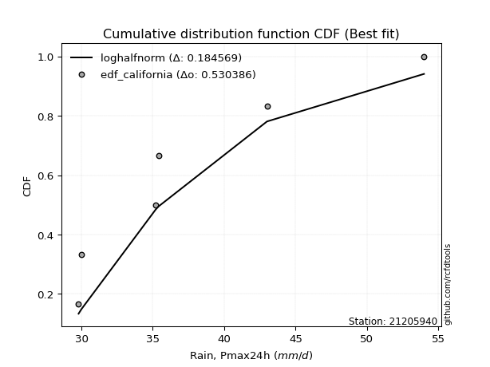</img>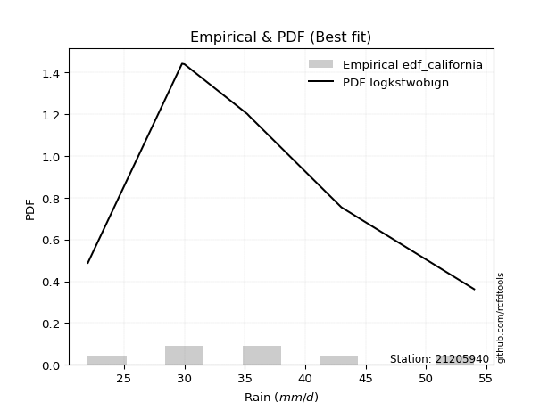</img>

</div>


### 2. Empirical - EDF Hazen (1930)

Hazen method for plotting positions is a formula used to estimate the empirical cumulative probability distribution of flood events or other hydrological data. This formula often results in biased estimations, particularly when extrapolating to extreme events (high return periods).

<div align="center">


$P=(m-0.5)/n$


</div>


**2.1. Empirical values**

<div align="center">

|                | 0                   | 1                   | 2                   | 3         | 4                  | 5                  | 6                  |
|:---------------|:--------------------|:--------------------|:--------------------|:----------|:-------------------|:-------------------|:-------------------|
| date           | 2025                | 2020                | 2021                | 2024      | 2023               | 2022               | 2019               |
| x              | 22.0                | 29.8                | 30.0                | 35.2      | 35.4               | 43.0               | 54.0               |
| m              | 1                   | 2                   | 3                   | 4         | 5                  | 6                  | 7                  |
| empirical_dist | edf_hazen           | edf_hazen           | edf_hazen           | edf_hazen | edf_hazen          | edf_hazen          | edf_hazen          |
| empirical      | 0.07142857142857142 | 0.21428571428571427 | 0.35714285714285715 | 0.5       | 0.6428571428571429 | 0.7857142857142857 | 0.9285714285714286 |
| empirical_tr   | 1.0769230769230769  | 1.2727272727272727  | 1.5555555555555558  | 2.0       | 2.8000000000000003 | 4.666666666666666  | 14.000000000000007 |

</div>


**2.2. Kolmogorov-Smirnov fit test (sorted by Δ)**


<div align="center">

|                | 0                   | 1                   | 2                   | 3                   | 4                   | 5                   | 6                   | 7                   | 8                   | 9                   | 10                  | 11                  | 12                  | 13                  | 14                  | 15                  | 16                  | 17                  | 18                  | 19                  | 20                  | 21                  | 22                  | 23                  | 24                  | 25                  | 26                  | 27                  | 28                  | 29                  | 30                  | 31                  | 32                  | 33                  | 34                  | 35                  | 36                  | 37                  | 38                  | 39                  | 40                  | 41                    | 42                  | 43                  | 44                  | 45                  | 46                  | 47                  | 48                  | 49                  | 50                  | 51                  | 52                  | 53                  | 54                  | 55                  | 56                  | 57                  | 58                  | 59                  | 60                  | 61                  | 62                  | 63                  | 64                  | 65                  | 66                  | 67                  | 68                  | 69                  | 70                  | 71                  | 72                  | 73                  | 74                  | 75                  | 76                  | 77                  | 78                  | 79                  | 80                  | 81                  | 82                  | 83                  | 84                  | 85                  | 86                  | 87                  | 88                  | 89                  |
|:---------------|:--------------------|:--------------------|:--------------------|:--------------------|:--------------------|:--------------------|:--------------------|:--------------------|:--------------------|:--------------------|:--------------------|:--------------------|:--------------------|:--------------------|:--------------------|:--------------------|:--------------------|:--------------------|:--------------------|:--------------------|:--------------------|:--------------------|:--------------------|:--------------------|:--------------------|:--------------------|:--------------------|:--------------------|:--------------------|:--------------------|:--------------------|:--------------------|:--------------------|:--------------------|:--------------------|:--------------------|:--------------------|:--------------------|:--------------------|:--------------------|:--------------------|:----------------------|:--------------------|:--------------------|:--------------------|:--------------------|:--------------------|:--------------------|:--------------------|:--------------------|:--------------------|:--------------------|:--------------------|:--------------------|:--------------------|:--------------------|:--------------------|:--------------------|:--------------------|:--------------------|:--------------------|:--------------------|:--------------------|:--------------------|:--------------------|:--------------------|:--------------------|:--------------------|:--------------------|:--------------------|:--------------------|:--------------------|:--------------------|:--------------------|:--------------------|:--------------------|:--------------------|:--------------------|:--------------------|:--------------------|:--------------------|:--------------------|:--------------------|:--------------------|:--------------------|:--------------------|:--------------------|:--------------------|:--------------------|:--------------------|
| station        | 21205940            | 21205940            | 21205940            | 21205940            | 21205940            | 21205940            | 21205940            | 21205940            | 21205940            | 21205940            | 21205940            | 21205940            | 21205940            | 21205940            | 21205940            | 21205940            | 21205940            | 21205940            | 21205940            | 21205940            | 21205940            | 21205940            | 21205940            | 21205940            | 21205940            | 21205940            | 21205940            | 21205940            | 21205940            | 21205940            | 21205940            | 21205940            | 21205940            | 21205940            | 21205940            | 21205940            | 21205940            | 21205940            | 21205940            | 21205940            | 21205940            | 21205940              | 21205940            | 21205940            | 21205940            | 21205940            | 21205940            | 21205940            | 21205940            | 21205940            | 21205940            | 21205940            | 21205940            | 21205940            | 21205940            | 21205940            | 21205940            | 21205940            | 21205940            | 21205940            | 21205940            | 21205940            | 21205940            | 21205940            | 21205940            | 21205940            | 21205940            | 21205940            | 21205940            | 21205940            | 21205940            | 21205940            | 21205940            | 21205940            | 21205940            | 21205940            | 21205940            | 21205940            | 21205940            | 21205940            | 21205940            | 21205940            | 21205940            | 21205940            | 21205940            | 21205940            | 21205940            | 21205940            | 21205940            | 21205940            |
| empirical_dist | edf_hazen           | edf_hazen           | edf_hazen           | edf_hazen           | edf_hazen           | edf_hazen           | edf_hazen           | edf_hazen           | edf_hazen           | edf_hazen           | edf_hazen           | edf_hazen           | edf_hazen           | edf_hazen           | edf_hazen           | edf_hazen           | edf_hazen           | edf_hazen           | edf_hazen           | edf_hazen           | edf_hazen           | edf_hazen           | edf_hazen           | edf_hazen           | edf_hazen           | edf_hazen           | edf_hazen           | edf_hazen           | edf_hazen           | edf_hazen           | edf_hazen           | edf_hazen           | edf_hazen           | edf_hazen           | edf_hazen           | edf_hazen           | edf_hazen           | edf_hazen           | edf_hazen           | edf_hazen           | edf_hazen           | edf_hazen             | edf_hazen           | edf_hazen           | edf_hazen           | edf_hazen           | edf_hazen           | edf_hazen           | edf_hazen           | edf_hazen           | edf_hazen           | edf_hazen           | edf_hazen           | edf_hazen           | edf_hazen           | edf_hazen           | edf_hazen           | edf_hazen           | edf_hazen           | edf_hazen           | edf_hazen           | edf_hazen           | edf_hazen           | edf_hazen           | edf_hazen           | edf_hazen           | edf_hazen           | edf_hazen           | edf_hazen           | edf_hazen           | edf_hazen           | edf_hazen           | edf_hazen           | edf_hazen           | edf_hazen           | edf_hazen           | edf_hazen           | edf_hazen           | edf_hazen           | edf_hazen           | edf_hazen           | edf_hazen           | edf_hazen           | edf_hazen           | edf_hazen           | edf_hazen           | edf_hazen           | edf_hazen           | edf_hazen           | edf_hazen           |
| p_dist         | logmielke           | loggenlogistic      | gumbel_r            | exponnorm           | moyal               | logfisk             | nct                 | logbetaprime        | johnsonsu           | fisk                | loghypsecant        | invgamma            | invweibull          | genlogistic         | invgauss            | f                   | alpha               | logfatiguelife      | logalpha            | ncf                 | logf                | loglogistic         | loginvgamma         | loggamma            | loggamma            | logerlang           | betaprime           | logjohnsonsu        | logpearson3         | lognct              | logweibull_min      | logrice             | kstwobign           | logexponnorm        | logt                | logcrystalball      | lognorm             | lognorm             | logloggamma         | erlang              | gamma               | loglaplace_asymmetric | loginvgauss         | rayleigh            | logmaxwell          | halflogistic        | loggumbel_r         | pearson3            | loglaplace          | rice                | weibull_min         | lograyleigh         | maxwell             | halfnorm            | logmoyal            | loginvweibull       | laplace_asymmetric  | loghalflogistic     | loghalfnorm         | wald                | t                   | norm                | crystalball         | logistic            | hypsecant           | logkstwobign        | laplace             | loggumbel_l         | truncnorm           | logncf              | gibrat              | logwald             | nakagami            | loggompertz         | genexpon            | expon               | gumbel_l            | loggibrat           | loggenexpon         | logexpon            | lognakagami         | logchi2             | chi2                | logtruncnorm        | loglognorm          | pareto              | logpareto           | fatiguelife         | gompertz            | mielke              |
| delta          | 0.08058107062043984 | 0.08177258752303784 | 0.08233793787251953 | 0.08268257152467393 | 0.08365517504045908 | 0.0844937685297692  | 0.08753175947418723 | 0.08817265767522475 | 0.08895201797372829 | 0.08935254228636957 | 0.09022382846104299 | 0.0904938461993261  | 0.09112940916141424 | 0.09145992395405159 | 0.09155766722398209 | 0.09196334571089404 | 0.0927487931435329  | 0.09286214771553314 | 0.093061168651041   | 0.09324811566821622 | 0.09337835974614705 | 0.09367022220469412 | 0.09397911701511294 | 0.09461701228054531 | 0.09461701228054531 | 0.09463569626082591 | 0.09495321473630158 | 0.09532285000040275 | 0.09536798097642407 | 0.0959154426750514  | 0.09608683612356209 | 0.09788596266522695 | 0.09798424437949085 | 0.09938006582494952 | 0.09952565436228533 | 0.0995274124269615  | 0.09952793282670791 | 0.09952793282670791 | 0.10041082061102924 | 0.10486240718791681 | 0.10486275468801268 | 0.10560923238481029   | 0.10627978820861719 | 0.10775138052995226 | 0.10775176785819271 | 0.11107058226743685 | 0.11141932749356745 | 0.11251162103226076 | 0.11559640747164901 | 0.11596165663275793 | 0.11736360713389962 | 0.11860257509879504 | 0.11896248914663965 | 0.11955557292639327 | 0.1306769575195461  | 0.13683355809543754 | 0.14403013336515014 | 0.14632189396268827 | 0.14918753488447048 | 0.14965465359187735 | 0.15235675878138244 | 0.15236700658503483 | 0.15236701849907242 | 0.15366568092297767 | 0.15477433353942316 | 0.15863466508726146 | 0.15943352932260307 | 0.16722782459056773 | 0.18116623922656103 | 0.18793644647750704 | 0.19053497555365423 | 0.20083152316246078 | 0.21428528913041817 | 0.21729490547934363 | 0.22127996033037492 | 0.22150331959699412 | 0.22295867445024886 | 0.2285927019247782  | 0.24824844555632178 | 0.2787139140468775  | 0.28250471764427554 | 0.2873299569829669  | 0.3333892063059586  | 0.36736796255115045 | 0.42993434270296915 | 0.44235212327409945 | 0.44909665600428605 | 0.5544210136958686  | 0.711693923830161   | nan                 |
| deltao         | 0.48442053926100004 | 0.48442053926100004 | 0.48442053926100004 | 0.48442053926100004 | 0.48442053926100004 | 0.48442053926100004 | 0.48442053926100004 | 0.48442053926100004 | 0.48442053926100004 | 0.48442053926100004 | 0.48442053926100004 | 0.48442053926100004 | 0.48442053926100004 | 0.48442053926100004 | 0.48442053926100004 | 0.48442053926100004 | 0.48442053926100004 | 0.48442053926100004 | 0.48442053926100004 | 0.48442053926100004 | 0.48442053926100004 | 0.48442053926100004 | 0.48442053926100004 | 0.48442053926100004 | 0.48442053926100004 | 0.48442053926100004 | 0.48442053926100004 | 0.48442053926100004 | 0.48442053926100004 | 0.48442053926100004 | 0.48442053926100004 | 0.48442053926100004 | 0.48442053926100004 | 0.48442053926100004 | 0.48442053926100004 | 0.48442053926100004 | 0.48442053926100004 | 0.48442053926100004 | 0.48442053926100004 | 0.48442053926100004 | 0.48442053926100004 | 0.48442053926100004   | 0.48442053926100004 | 0.48442053926100004 | 0.48442053926100004 | 0.48442053926100004 | 0.48442053926100004 | 0.48442053926100004 | 0.48442053926100004 | 0.48442053926100004 | 0.48442053926100004 | 0.48442053926100004 | 0.48442053926100004 | 0.48442053926100004 | 0.48442053926100004 | 0.48442053926100004 | 0.48442053926100004 | 0.48442053926100004 | 0.48442053926100004 | 0.48442053926100004 | 0.48442053926100004 | 0.48442053926100004 | 0.48442053926100004 | 0.48442053926100004 | 0.48442053926100004 | 0.48442053926100004 | 0.48442053926100004 | 0.48442053926100004 | 0.48442053926100004 | 0.48442053926100004 | 0.48442053926100004 | 0.48442053926100004 | 0.48442053926100004 | 0.48442053926100004 | 0.48442053926100004 | 0.48442053926100004 | 0.48442053926100004 | 0.48442053926100004 | 0.48442053926100004 | 0.48442053926100004 | 0.48442053926100004 | 0.48442053926100004 | 0.48442053926100004 | 0.48442053926100004 | 0.48442053926100004 | 0.48442053926100004 | 0.48442053926100004 | 0.48442053926100004 | 0.48442053926100004 | 0.48442053926100004 |
| eval           | Δo > Δ              | Δo > Δ              | Δo > Δ              | Δo > Δ              | Δo > Δ              | Δo > Δ              | Δo > Δ              | Δo > Δ              | Δo > Δ              | Δo > Δ              | Δo > Δ              | Δo > Δ              | Δo > Δ              | Δo > Δ              | Δo > Δ              | Δo > Δ              | Δo > Δ              | Δo > Δ              | Δo > Δ              | Δo > Δ              | Δo > Δ              | Δo > Δ              | Δo > Δ              | Δo > Δ              | Δo > Δ              | Δo > Δ              | Δo > Δ              | Δo > Δ              | Δo > Δ              | Δo > Δ              | Δo > Δ              | Δo > Δ              | Δo > Δ              | Δo > Δ              | Δo > Δ              | Δo > Δ              | Δo > Δ              | Δo > Δ              | Δo > Δ              | Δo > Δ              | Δo > Δ              | Δo > Δ                | Δo > Δ              | Δo > Δ              | Δo > Δ              | Δo > Δ              | Δo > Δ              | Δo > Δ              | Δo > Δ              | Δo > Δ              | Δo > Δ              | Δo > Δ              | Δo > Δ              | Δo > Δ              | Δo > Δ              | Δo > Δ              | Δo > Δ              | Δo > Δ              | Δo > Δ              | Δo > Δ              | Δo > Δ              | Δo > Δ              | Δo > Δ              | Δo > Δ              | Δo > Δ              | Δo > Δ              | Δo > Δ              | Δo > Δ              | Δo > Δ              | Δo > Δ              | Δo > Δ              | Δo > Δ              | Δo > Δ              | Δo > Δ              | Δo > Δ              | Δo > Δ              | Δo > Δ              | Δo > Δ              | Δo > Δ              | Δo > Δ              | Δo > Δ              | Δo > Δ              | Δo > Δ              | Δo > Δ              | Δo > Δ              | Δo > Δ              | Δo > Δ              | Δo <= Δ             | Δo <= Δ             | Δo <= Δ             |
| fit            | 1                   | 1                   | 1                   | 1                   | 1                   | 1                   | 1                   | 1                   | 1                   | 1                   | 1                   | 1                   | 1                   | 1                   | 1                   | 1                   | 1                   | 1                   | 1                   | 1                   | 1                   | 1                   | 1                   | 1                   | 1                   | 1                   | 1                   | 1                   | 1                   | 1                   | 1                   | 1                   | 1                   | 1                   | 1                   | 1                   | 1                   | 1                   | 1                   | 1                   | 1                   | 1                     | 1                   | 1                   | 1                   | 1                   | 1                   | 1                   | 1                   | 1                   | 1                   | 1                   | 1                   | 1                   | 1                   | 1                   | 1                   | 1                   | 1                   | 1                   | 1                   | 1                   | 1                   | 1                   | 1                   | 1                   | 1                   | 1                   | 1                   | 1                   | 1                   | 1                   | 1                   | 1                   | 1                   | 1                   | 1                   | 1                   | 1                   | 1                   | 1                   | 1                   | 1                   | 1                   | 1                   | 1                   | 1                   | 0                   | 0                   | 0                   |
| n              | 7                   | 7                   | 7                   | 7                   | 7                   | 7                   | 7                   | 7                   | 7                   | 7                   | 7                   | 7                   | 7                   | 7                   | 7                   | 7                   | 7                   | 7                   | 7                   | 7                   | 7                   | 7                   | 7                   | 7                   | 7                   | 7                   | 7                   | 7                   | 7                   | 7                   | 7                   | 7                   | 7                   | 7                   | 7                   | 7                   | 7                   | 7                   | 7                   | 7                   | 7                   | 7                     | 7                   | 7                   | 7                   | 7                   | 7                   | 7                   | 7                   | 7                   | 7                   | 7                   | 7                   | 7                   | 7                   | 7                   | 7                   | 7                   | 7                   | 7                   | 7                   | 7                   | 7                   | 7                   | 7                   | 7                   | 7                   | 7                   | 7                   | 7                   | 7                   | 7                   | 7                   | 7                   | 7                   | 7                   | 7                   | 7                   | 7                   | 7                   | 7                   | 7                   | 7                   | 7                   | 7                   | 7                   | 7                   | 7                   | 7                   | 7                   |
| best_fit       | 1                   | 0                   | 0                   | 0                   | 0                   | 0                   | 0                   | 0                   | 0                   | 0                   | 0                   | 0                   | 0                   | 0                   | 0                   | 0                   | 0                   | 0                   | 0                   | 0                   | 0                   | 0                   | 0                   | 0                   | 0                   | 0                   | 0                   | 0                   | 0                   | 0                   | 0                   | 0                   | 0                   | 0                   | 0                   | 0                   | 0                   | 0                   | 0                   | 0                   | 0                   | 0                     | 0                   | 0                   | 0                   | 0                   | 0                   | 0                   | 0                   | 0                   | 0                   | 0                   | 0                   | 0                   | 0                   | 0                   | 0                   | 0                   | 0                   | 0                   | 0                   | 0                   | 0                   | 0                   | 0                   | 0                   | 0                   | 0                   | 0                   | 0                   | 0                   | 0                   | 0                   | 0                   | 0                   | 0                   | 0                   | 0                   | 0                   | 0                   | 0                   | 0                   | 0                   | 0                   | 0                   | 0                   | 0                   | 0                   | 0                   | 0                   |
| best_fit_sort  | 1                   | 2                   | 3                   | 4                   | 5                   | 6                   | 7                   | 8                   | 9                   | 10                  | 11                  | 12                  | 13                  | 14                  | 15                  | 16                  | 17                  | 18                  | 19                  | 20                  | 21                  | 22                  | 23                  | 24                  | 25                  | 26                  | 27                  | 28                  | 29                  | 30                  | 31                  | 32                  | 33                  | 34                  | 35                  | 36                  | 37                  | 38                  | 39                  | 40                  | 41                  | 42                    | 43                  | 44                  | 45                  | 46                  | 47                  | 48                  | 49                  | 50                  | 51                  | 52                  | 53                  | 54                  | 55                  | 56                  | 57                  | 58                  | 59                  | 60                  | 61                  | 62                  | 63                  | 64                  | 65                  | 66                  | 67                  | 68                  | 69                  | 70                  | 71                  | 72                  | 73                  | 74                  | 75                  | 76                  | 77                  | 78                  | 79                  | 80                  | 81                  | 82                  | 83                  | 84                  | 85                  | 86                  | 87                  | 88                  | 89                  | 90                  |

</div>


<div align="center">

</img>

</div>


**2.3. Best fit**

<div align="center">

|   id |   station | empirical_dist   | p_dist    |     delta |   deltao | eval   |   fit |   n |   best_fit |   best_fit_sort |
|-----:|----------:|:-----------------|:----------|----------:|---------:|:-------|------:|----:|-----------:|----------------:|
|    0 |  21205940 | edf_hazen        | logmielke | 0.0805811 | 0.484421 | Δo > Δ |     1 |   7 |          1 |               1 |

</div>


<div align="center">

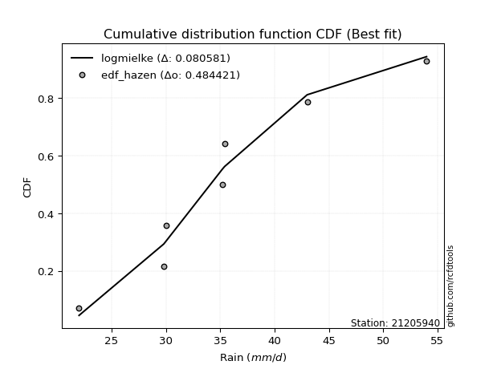</img>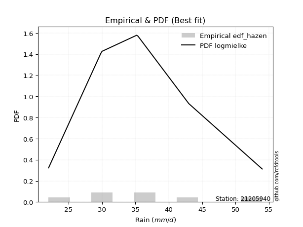</img>

</div>


### 3. Empirical - EDF Weibull (1939)

Weibull plotting position formula is an empirical method used to estimate the non-exceedance probability or plotting position for a set of observed data, is often recommended or widely used in practice, particularly in flood frequency analysis.

<div align="center">


$P=m/(n+1)$


</div>


**3.1. Empirical values**

<div align="center">

|                | 0                  | 1                  | 2           | 3           | 4                  | 5           | 6           |
|:---------------|:-------------------|:-------------------|:------------|:------------|:-------------------|:------------|:------------|
| date           | 2025               | 2020               | 2021        | 2024        | 2023               | 2022        | 2019        |
| x              | 22.0               | 29.8               | 30.0        | 35.2        | 35.4               | 43.0        | 54.0        |
| m              | 1                  | 2                  | 3           | 4           | 5                  | 6           | 7           |
| empirical_dist | edf_weibull        | edf_weibull        | edf_weibull | edf_weibull | edf_weibull        | edf_weibull | edf_weibull |
| empirical      | 0.125              | 0.25               | 0.375       | 0.5         | 0.625              | 0.75        | 0.875       |
| empirical_tr   | 1.1428571428571428 | 1.3333333333333333 | 1.6         | 2.0         | 2.6666666666666665 | 4.0         | 8.0         |

</div>


**3.2. Kolmogorov-Smirnov fit test (sorted by Δ)**


<div align="center">

|                | 0                   | 1                   | 2                   | 3                   | 4                   | 5                   | 6                   | 7                   | 8                   | 9                   | 10                  | 11                  | 12                  | 13                  | 14                  | 15                  | 16                  | 17                  | 18                  | 19                  | 20                  | 21                  | 22                  | 23                  | 24                  | 25                  | 26                  | 27                  | 28                  | 29                  | 30                  | 31                  | 32                  | 33                  | 34                  | 35                  | 36                  | 37                  | 38                  | 39                  | 40                  | 41                  | 42                  | 43                  | 44                  | 45                  | 46                  | 47                  | 48                  | 49                  | 50                  | 51                  | 52                    | 53                  | 54                  | 55                  | 56                  | 57                  | 58                  | 59                  | 60                  | 61                  | 62                  | 63                  | 64                  | 65                  | 66                  | 67                  | 68                  | 69                  | 70                  | 71                  | 72                  | 73                  | 74                  | 75                  | 76                  | 77                  | 78                  | 79                  | 80                  | 81                  | 82                  | 83                  | 84                  | 85                  | 86                  | 87                  | 88                  | 89                  |
|:---------------|:--------------------|:--------------------|:--------------------|:--------------------|:--------------------|:--------------------|:--------------------|:--------------------|:--------------------|:--------------------|:--------------------|:--------------------|:--------------------|:--------------------|:--------------------|:--------------------|:--------------------|:--------------------|:--------------------|:--------------------|:--------------------|:--------------------|:--------------------|:--------------------|:--------------------|:--------------------|:--------------------|:--------------------|:--------------------|:--------------------|:--------------------|:--------------------|:--------------------|:--------------------|:--------------------|:--------------------|:--------------------|:--------------------|:--------------------|:--------------------|:--------------------|:--------------------|:--------------------|:--------------------|:--------------------|:--------------------|:--------------------|:--------------------|:--------------------|:--------------------|:--------------------|:--------------------|:----------------------|:--------------------|:--------------------|:--------------------|:--------------------|:--------------------|:--------------------|:--------------------|:--------------------|:--------------------|:--------------------|:--------------------|:--------------------|:--------------------|:--------------------|:--------------------|:--------------------|:--------------------|:--------------------|:--------------------|:--------------------|:--------------------|:--------------------|:--------------------|:--------------------|:--------------------|:--------------------|:--------------------|:--------------------|:--------------------|:--------------------|:--------------------|:--------------------|:--------------------|:--------------------|:--------------------|:--------------------|:--------------------|
| station        | 21205940            | 21205940            | 21205940            | 21205940            | 21205940            | 21205940            | 21205940            | 21205940            | 21205940            | 21205940            | 21205940            | 21205940            | 21205940            | 21205940            | 21205940            | 21205940            | 21205940            | 21205940            | 21205940            | 21205940            | 21205940            | 21205940            | 21205940            | 21205940            | 21205940            | 21205940            | 21205940            | 21205940            | 21205940            | 21205940            | 21205940            | 21205940            | 21205940            | 21205940            | 21205940            | 21205940            | 21205940            | 21205940            | 21205940            | 21205940            | 21205940            | 21205940            | 21205940            | 21205940            | 21205940            | 21205940            | 21205940            | 21205940            | 21205940            | 21205940            | 21205940            | 21205940            | 21205940              | 21205940            | 21205940            | 21205940            | 21205940            | 21205940            | 21205940            | 21205940            | 21205940            | 21205940            | 21205940            | 21205940            | 21205940            | 21205940            | 21205940            | 21205940            | 21205940            | 21205940            | 21205940            | 21205940            | 21205940            | 21205940            | 21205940            | 21205940            | 21205940            | 21205940            | 21205940            | 21205940            | 21205940            | 21205940            | 21205940            | 21205940            | 21205940            | 21205940            | 21205940            | 21205940            | 21205940            | 21205940            |
| empirical_dist | edf_weibull         | edf_weibull         | edf_weibull         | edf_weibull         | edf_weibull         | edf_weibull         | edf_weibull         | edf_weibull         | edf_weibull         | edf_weibull         | edf_weibull         | edf_weibull         | edf_weibull         | edf_weibull         | edf_weibull         | edf_weibull         | edf_weibull         | edf_weibull         | edf_weibull         | edf_weibull         | edf_weibull         | edf_weibull         | edf_weibull         | edf_weibull         | edf_weibull         | edf_weibull         | edf_weibull         | edf_weibull         | edf_weibull         | edf_weibull         | edf_weibull         | edf_weibull         | edf_weibull         | edf_weibull         | edf_weibull         | edf_weibull         | edf_weibull         | edf_weibull         | edf_weibull         | edf_weibull         | edf_weibull         | edf_weibull         | edf_weibull         | edf_weibull         | edf_weibull         | edf_weibull         | edf_weibull         | edf_weibull         | edf_weibull         | edf_weibull         | edf_weibull         | edf_weibull         | edf_weibull           | edf_weibull         | edf_weibull         | edf_weibull         | edf_weibull         | edf_weibull         | edf_weibull         | edf_weibull         | edf_weibull         | edf_weibull         | edf_weibull         | edf_weibull         | edf_weibull         | edf_weibull         | edf_weibull         | edf_weibull         | edf_weibull         | edf_weibull         | edf_weibull         | edf_weibull         | edf_weibull         | edf_weibull         | edf_weibull         | edf_weibull         | edf_weibull         | edf_weibull         | edf_weibull         | edf_weibull         | edf_weibull         | edf_weibull         | edf_weibull         | edf_weibull         | edf_weibull         | edf_weibull         | edf_weibull         | edf_weibull         | edf_weibull         | edf_weibull         |
| p_dist         | logfisk             | fisk                | logmielke           | logpearson3         | betaprime           | logjohnsonsu        | loggamma            | loggamma            | logerlang           | alpha               | loggenlogistic      | logexponnorm        | logf                | ncf                 | logt                | logcrystalball      | lognorm             | lognorm             | logfatiguelife      | f                   | logloggamma         | invgamma            | exponnorm           | nct                 | johnsonsu           | logbetaprime        | genlogistic         | invweibull          | invgauss            | logalpha            | kstwobign           | loginvgamma         | lognct              | loginvgauss         | gamma               | erlang              | rayleigh            | logweibull_min      | loglogistic         | gumbel_r            | pearson3            | logrice             | rice                | weibull_min         | logmaxwell          | maxwell             | loginvweibull       | loghypsecant        | lograyleigh         | moyal               | loggumbel_r         | logkstwobign        | loglaplace_asymmetric | halfnorm            | loghalfnorm         | halflogistic        | logmoyal            | loghalflogistic     | loglaplace          | t                   | norm                | crystalball         | logistic            | hypsecant           | laplace_asymmetric  | truncnorm           | loggumbel_l         | wald                | logncf              | laplace             | loggompertz         | genexpon            | expon               | logwald             | gumbel_l            | gibrat              | loggenexpon         | loggibrat           | logchi2             | logexpon            | nakagami            | lognakagami         | chi2                | logtruncnorm        | loglognorm          | pareto              | logpareto           | fatiguelife         | gompertz            | mielke              |
| delta          | 0.07825106018385797 | 0.07920758030607417 | 0.0799974291096805  | 0.08069542707028002 | 0.08085542479139568 | 0.08090715466363649 | 0.08099085521485384 | 0.08099085521485384 | 0.08105383142495995 | 0.08114120246465359 | 0.08123738395782712 | 0.08152292296780661 | 0.08162320195696401 | 0.08165211638707717 | 0.08166851150514243 | 0.0816702695698186  | 0.081670789969565   | 0.081670789969565   | 0.08187026069421624 | 0.08206662259656708 | 0.08255367775388633 | 0.0827181171567275  | 0.08279793959462581 | 0.08318510249337681 | 0.0836644363799414  | 0.08398920547650576 | 0.0842365153375676  | 0.08451507335865518 | 0.08485090607064186 | 0.08544727557473678 | 0.0856900855104116  | 0.0859284131954759  | 0.08595298205494789 | 0.08836886231951614 | 0.08968672877922118 | 0.08968696151361208 | 0.08989423767280935 | 0.0900380389372035  | 0.09270670047138674 | 0.09406821877523781 | 0.09465447817511785 | 0.09511174140872919 | 0.09810451377561502 | 0.0991077083210698  | 0.10027195848722523 | 0.10110534628949674 | 0.10111927238115181 | 0.10808097131818584 | 0.11364770770046258 | 0.11481161751494802 | 0.11723110366784213 | 0.12292037937297573 | 0.12346637524195314   | 0.125               | 0.125               | 0.125               | 0.1306769575195461  | 0.1317433916997327  | 0.13345355032879186 | 0.13449961592423954 | 0.13450986372789192 | 0.1345098756419295  | 0.13580853806583476 | 0.13691719068228025 | 0.14398921060242093 | 0.1454519535122753  | 0.14937068173342483 | 0.14965465359187735 | 0.15222216076322131 | 0.15702473795677244 | 0.1815806197650579  | 0.1855656746160892  | 0.1857890338827084  | 0.20083152316246078 | 0.20510153159310596 | 0.20839211841079708 | 0.21253415984203605 | 0.2285927019247782  | 0.23375852841153832 | 0.2429996283325918  | 0.2499995748447039  | 0.28250471764427554 | 0.2976749205916729  | 0.33165367683686475 | 0.39422005698868345 | 0.40663783755981375 | 0.41338237029000036 | 0.5187067279815829  | 0.6759796381158752  | nan                 |
| deltao         | 0.48442053926100004 | 0.48442053926100004 | 0.48442053926100004 | 0.48442053926100004 | 0.48442053926100004 | 0.48442053926100004 | 0.48442053926100004 | 0.48442053926100004 | 0.48442053926100004 | 0.48442053926100004 | 0.48442053926100004 | 0.48442053926100004 | 0.48442053926100004 | 0.48442053926100004 | 0.48442053926100004 | 0.48442053926100004 | 0.48442053926100004 | 0.48442053926100004 | 0.48442053926100004 | 0.48442053926100004 | 0.48442053926100004 | 0.48442053926100004 | 0.48442053926100004 | 0.48442053926100004 | 0.48442053926100004 | 0.48442053926100004 | 0.48442053926100004 | 0.48442053926100004 | 0.48442053926100004 | 0.48442053926100004 | 0.48442053926100004 | 0.48442053926100004 | 0.48442053926100004 | 0.48442053926100004 | 0.48442053926100004 | 0.48442053926100004 | 0.48442053926100004 | 0.48442053926100004 | 0.48442053926100004 | 0.48442053926100004 | 0.48442053926100004 | 0.48442053926100004 | 0.48442053926100004 | 0.48442053926100004 | 0.48442053926100004 | 0.48442053926100004 | 0.48442053926100004 | 0.48442053926100004 | 0.48442053926100004 | 0.48442053926100004 | 0.48442053926100004 | 0.48442053926100004 | 0.48442053926100004   | 0.48442053926100004 | 0.48442053926100004 | 0.48442053926100004 | 0.48442053926100004 | 0.48442053926100004 | 0.48442053926100004 | 0.48442053926100004 | 0.48442053926100004 | 0.48442053926100004 | 0.48442053926100004 | 0.48442053926100004 | 0.48442053926100004 | 0.48442053926100004 | 0.48442053926100004 | 0.48442053926100004 | 0.48442053926100004 | 0.48442053926100004 | 0.48442053926100004 | 0.48442053926100004 | 0.48442053926100004 | 0.48442053926100004 | 0.48442053926100004 | 0.48442053926100004 | 0.48442053926100004 | 0.48442053926100004 | 0.48442053926100004 | 0.48442053926100004 | 0.48442053926100004 | 0.48442053926100004 | 0.48442053926100004 | 0.48442053926100004 | 0.48442053926100004 | 0.48442053926100004 | 0.48442053926100004 | 0.48442053926100004 | 0.48442053926100004 | 0.48442053926100004 |
| eval           | Δo > Δ              | Δo > Δ              | Δo > Δ              | Δo > Δ              | Δo > Δ              | Δo > Δ              | Δo > Δ              | Δo > Δ              | Δo > Δ              | Δo > Δ              | Δo > Δ              | Δo > Δ              | Δo > Δ              | Δo > Δ              | Δo > Δ              | Δo > Δ              | Δo > Δ              | Δo > Δ              | Δo > Δ              | Δo > Δ              | Δo > Δ              | Δo > Δ              | Δo > Δ              | Δo > Δ              | Δo > Δ              | Δo > Δ              | Δo > Δ              | Δo > Δ              | Δo > Δ              | Δo > Δ              | Δo > Δ              | Δo > Δ              | Δo > Δ              | Δo > Δ              | Δo > Δ              | Δo > Δ              | Δo > Δ              | Δo > Δ              | Δo > Δ              | Δo > Δ              | Δo > Δ              | Δo > Δ              | Δo > Δ              | Δo > Δ              | Δo > Δ              | Δo > Δ              | Δo > Δ              | Δo > Δ              | Δo > Δ              | Δo > Δ              | Δo > Δ              | Δo > Δ              | Δo > Δ                | Δo > Δ              | Δo > Δ              | Δo > Δ              | Δo > Δ              | Δo > Δ              | Δo > Δ              | Δo > Δ              | Δo > Δ              | Δo > Δ              | Δo > Δ              | Δo > Δ              | Δo > Δ              | Δo > Δ              | Δo > Δ              | Δo > Δ              | Δo > Δ              | Δo > Δ              | Δo > Δ              | Δo > Δ              | Δo > Δ              | Δo > Δ              | Δo > Δ              | Δo > Δ              | Δo > Δ              | Δo > Δ              | Δo > Δ              | Δo > Δ              | Δo > Δ              | Δo > Δ              | Δo > Δ              | Δo > Δ              | Δo > Δ              | Δo > Δ              | Δo > Δ              | Δo <= Δ             | Δo <= Δ             | Δo <= Δ             |
| fit            | 1                   | 1                   | 1                   | 1                   | 1                   | 1                   | 1                   | 1                   | 1                   | 1                   | 1                   | 1                   | 1                   | 1                   | 1                   | 1                   | 1                   | 1                   | 1                   | 1                   | 1                   | 1                   | 1                   | 1                   | 1                   | 1                   | 1                   | 1                   | 1                   | 1                   | 1                   | 1                   | 1                   | 1                   | 1                   | 1                   | 1                   | 1                   | 1                   | 1                   | 1                   | 1                   | 1                   | 1                   | 1                   | 1                   | 1                   | 1                   | 1                   | 1                   | 1                   | 1                   | 1                     | 1                   | 1                   | 1                   | 1                   | 1                   | 1                   | 1                   | 1                   | 1                   | 1                   | 1                   | 1                   | 1                   | 1                   | 1                   | 1                   | 1                   | 1                   | 1                   | 1                   | 1                   | 1                   | 1                   | 1                   | 1                   | 1                   | 1                   | 1                   | 1                   | 1                   | 1                   | 1                   | 1                   | 1                   | 0                   | 0                   | 0                   |
| n              | 7                   | 7                   | 7                   | 7                   | 7                   | 7                   | 7                   | 7                   | 7                   | 7                   | 7                   | 7                   | 7                   | 7                   | 7                   | 7                   | 7                   | 7                   | 7                   | 7                   | 7                   | 7                   | 7                   | 7                   | 7                   | 7                   | 7                   | 7                   | 7                   | 7                   | 7                   | 7                   | 7                   | 7                   | 7                   | 7                   | 7                   | 7                   | 7                   | 7                   | 7                   | 7                   | 7                   | 7                   | 7                   | 7                   | 7                   | 7                   | 7                   | 7                   | 7                   | 7                   | 7                     | 7                   | 7                   | 7                   | 7                   | 7                   | 7                   | 7                   | 7                   | 7                   | 7                   | 7                   | 7                   | 7                   | 7                   | 7                   | 7                   | 7                   | 7                   | 7                   | 7                   | 7                   | 7                   | 7                   | 7                   | 7                   | 7                   | 7                   | 7                   | 7                   | 7                   | 7                   | 7                   | 7                   | 7                   | 7                   | 7                   | 7                   |
| best_fit       | 1                   | 0                   | 0                   | 0                   | 0                   | 0                   | 0                   | 0                   | 0                   | 0                   | 0                   | 0                   | 0                   | 0                   | 0                   | 0                   | 0                   | 0                   | 0                   | 0                   | 0                   | 0                   | 0                   | 0                   | 0                   | 0                   | 0                   | 0                   | 0                   | 0                   | 0                   | 0                   | 0                   | 0                   | 0                   | 0                   | 0                   | 0                   | 0                   | 0                   | 0                   | 0                   | 0                   | 0                   | 0                   | 0                   | 0                   | 0                   | 0                   | 0                   | 0                   | 0                   | 0                     | 0                   | 0                   | 0                   | 0                   | 0                   | 0                   | 0                   | 0                   | 0                   | 0                   | 0                   | 0                   | 0                   | 0                   | 0                   | 0                   | 0                   | 0                   | 0                   | 0                   | 0                   | 0                   | 0                   | 0                   | 0                   | 0                   | 0                   | 0                   | 0                   | 0                   | 0                   | 0                   | 0                   | 0                   | 0                   | 0                   | 0                   |
| best_fit_sort  | 1                   | 2                   | 3                   | 4                   | 5                   | 6                   | 7                   | 8                   | 9                   | 10                  | 11                  | 12                  | 13                  | 14                  | 15                  | 16                  | 17                  | 18                  | 19                  | 20                  | 21                  | 22                  | 23                  | 24                  | 25                  | 26                  | 27                  | 28                  | 29                  | 30                  | 31                  | 32                  | 33                  | 34                  | 35                  | 36                  | 37                  | 38                  | 39                  | 40                  | 41                  | 42                  | 43                  | 44                  | 45                  | 46                  | 47                  | 48                  | 49                  | 50                  | 51                  | 52                  | 53                    | 54                  | 55                  | 56                  | 57                  | 58                  | 59                  | 60                  | 61                  | 62                  | 63                  | 64                  | 65                  | 66                  | 67                  | 68                  | 69                  | 70                  | 71                  | 72                  | 73                  | 74                  | 75                  | 76                  | 77                  | 78                  | 79                  | 80                  | 81                  | 82                  | 83                  | 84                  | 85                  | 86                  | 87                  | 88                  | 89                  | 90                  |

</div>


<div align="center">

</img>

</div>


**3.3. Best fit**

<div align="center">

|   id |   station | empirical_dist   | p_dist   |     delta |   deltao | eval   |   fit |   n |   best_fit |   best_fit_sort |
|-----:|----------:|:-----------------|:---------|----------:|---------:|:-------|------:|----:|-----------:|----------------:|
|    0 |  21205940 | edf_weibull      | logfisk  | 0.0782511 | 0.484421 | Δo > Δ |     1 |   7 |          1 |               1 |

</div>


<div align="center">

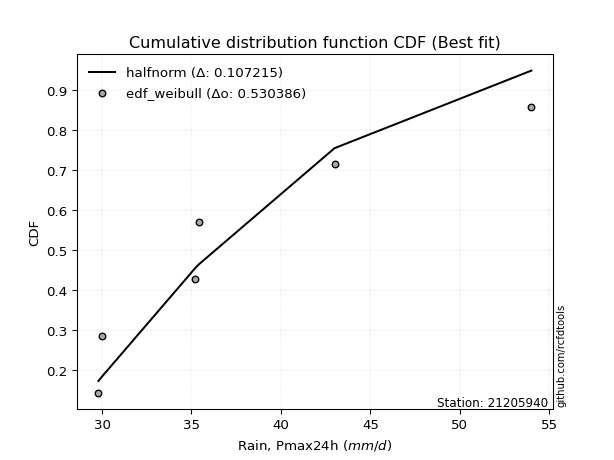</img></img>

</div>


### 4. Empirical - EDF Beard (1943)

The Beard formula (or Beard´s plotting position formula) in hydrology is used to estimate the empirical non-exceedance probability _(P)_ of a flood event (or other extreme hydrological data point) within a given dataset.

<div align="center">


$P=(m-0.31)/(n+0.38)$


</div>


**4.1. Empirical values**

<div align="center">

|                | 0                   | 1                   | 2                   | 3         | 4                  | 5                  | 6                  |
|:---------------|:--------------------|:--------------------|:--------------------|:----------|:-------------------|:-------------------|:-------------------|
| date           | 2025                | 2020                | 2021                | 2024      | 2023               | 2022               | 2019               |
| x              | 22.0                | 29.8                | 30.0                | 35.2      | 35.4               | 43.0               | 54.0               |
| m              | 1                   | 2                   | 3                   | 4         | 5                  | 6                  | 7                  |
| empirical_dist | edf_beard           | edf_beard           | edf_beard           | edf_beard | edf_beard          | edf_beard          | edf_beard          |
| empirical      | 0.09349593495934959 | 0.22899728997289973 | 0.36449864498644985 | 0.5       | 0.6355013550135502 | 0.7710027100271003 | 0.9065040650406505 |
| empirical_tr   | 1.1031390134529149  | 1.29701230228471    | 1.5735607675906182  | 2.0       | 2.743494423791822  | 4.366863905325444  | 10.695652173913055 |

</div>


**4.2. Kolmogorov-Smirnov fit test (sorted by Δ)**


<div align="center">

|                | 0                   | 1                   | 2                   | 3                   | 4                   | 5                   | 6                   | 7                   | 8                   | 9                   | 10                  | 11                  | 12                  | 13                  | 14                  | 15                  | 16                  | 17                  | 18                  | 19                  | 20                  | 21                  | 22                  | 23                  | 24                  | 25                  | 26                  | 27                  | 28                  | 29                  | 30                  | 31                  | 32                  | 33                  | 34                  | 35                  | 36                  | 37                  | 38                  | 39                  | 40                  | 41                  | 42                  | 43                  | 44                  | 45                  | 46                  | 47                  | 48                  | 49                  | 50                  | 51                  | 52                    | 53                  | 54                  | 55                  | 56                  | 57                  | 58                  | 59                  | 60                  | 61                  | 62                  | 63                  | 64                  | 65                  | 66                  | 67                  | 68                  | 69                  | 70                  | 71                  | 72                  | 73                  | 74                  | 75                  | 76                  | 77                  | 78                  | 79                  | 80                  | 81                  | 82                  | 83                  | 84                  | 85                  | 86                  | 87                  | 88                  | 89                  |
|:---------------|:--------------------|:--------------------|:--------------------|:--------------------|:--------------------|:--------------------|:--------------------|:--------------------|:--------------------|:--------------------|:--------------------|:--------------------|:--------------------|:--------------------|:--------------------|:--------------------|:--------------------|:--------------------|:--------------------|:--------------------|:--------------------|:--------------------|:--------------------|:--------------------|:--------------------|:--------------------|:--------------------|:--------------------|:--------------------|:--------------------|:--------------------|:--------------------|:--------------------|:--------------------|:--------------------|:--------------------|:--------------------|:--------------------|:--------------------|:--------------------|:--------------------|:--------------------|:--------------------|:--------------------|:--------------------|:--------------------|:--------------------|:--------------------|:--------------------|:--------------------|:--------------------|:--------------------|:----------------------|:--------------------|:--------------------|:--------------------|:--------------------|:--------------------|:--------------------|:--------------------|:--------------------|:--------------------|:--------------------|:--------------------|:--------------------|:--------------------|:--------------------|:--------------------|:--------------------|:--------------------|:--------------------|:--------------------|:--------------------|:--------------------|:--------------------|:--------------------|:--------------------|:--------------------|:--------------------|:--------------------|:--------------------|:--------------------|:--------------------|:--------------------|:--------------------|:--------------------|:--------------------|:--------------------|:--------------------|:--------------------|
| station        | 21205940            | 21205940            | 21205940            | 21205940            | 21205940            | 21205940            | 21205940            | 21205940            | 21205940            | 21205940            | 21205940            | 21205940            | 21205940            | 21205940            | 21205940            | 21205940            | 21205940            | 21205940            | 21205940            | 21205940            | 21205940            | 21205940            | 21205940            | 21205940            | 21205940            | 21205940            | 21205940            | 21205940            | 21205940            | 21205940            | 21205940            | 21205940            | 21205940            | 21205940            | 21205940            | 21205940            | 21205940            | 21205940            | 21205940            | 21205940            | 21205940            | 21205940            | 21205940            | 21205940            | 21205940            | 21205940            | 21205940            | 21205940            | 21205940            | 21205940            | 21205940            | 21205940            | 21205940              | 21205940            | 21205940            | 21205940            | 21205940            | 21205940            | 21205940            | 21205940            | 21205940            | 21205940            | 21205940            | 21205940            | 21205940            | 21205940            | 21205940            | 21205940            | 21205940            | 21205940            | 21205940            | 21205940            | 21205940            | 21205940            | 21205940            | 21205940            | 21205940            | 21205940            | 21205940            | 21205940            | 21205940            | 21205940            | 21205940            | 21205940            | 21205940            | 21205940            | 21205940            | 21205940            | 21205940            | 21205940            |
| empirical_dist | edf_beard           | edf_beard           | edf_beard           | edf_beard           | edf_beard           | edf_beard           | edf_beard           | edf_beard           | edf_beard           | edf_beard           | edf_beard           | edf_beard           | edf_beard           | edf_beard           | edf_beard           | edf_beard           | edf_beard           | edf_beard           | edf_beard           | edf_beard           | edf_beard           | edf_beard           | edf_beard           | edf_beard           | edf_beard           | edf_beard           | edf_beard           | edf_beard           | edf_beard           | edf_beard           | edf_beard           | edf_beard           | edf_beard           | edf_beard           | edf_beard           | edf_beard           | edf_beard           | edf_beard           | edf_beard           | edf_beard           | edf_beard           | edf_beard           | edf_beard           | edf_beard           | edf_beard           | edf_beard           | edf_beard           | edf_beard           | edf_beard           | edf_beard           | edf_beard           | edf_beard           | edf_beard             | edf_beard           | edf_beard           | edf_beard           | edf_beard           | edf_beard           | edf_beard           | edf_beard           | edf_beard           | edf_beard           | edf_beard           | edf_beard           | edf_beard           | edf_beard           | edf_beard           | edf_beard           | edf_beard           | edf_beard           | edf_beard           | edf_beard           | edf_beard           | edf_beard           | edf_beard           | edf_beard           | edf_beard           | edf_beard           | edf_beard           | edf_beard           | edf_beard           | edf_beard           | edf_beard           | edf_beard           | edf_beard           | edf_beard           | edf_beard           | edf_beard           | edf_beard           | edf_beard           |
| p_dist         | exponnorm           | logmielke           | loggenlogistic      | gumbel_r            | invweibull          | genlogistic         | logfisk             | logalpha            | loginvgamma         | nct                 | invgauss            | logbetaprime        | lognct              | johnsonsu           | logweibull_min      | fisk                | invgamma            | logrice             | kstwobign           | moyal               | f                   | alpha               | logfatiguelife      | ncf                 | logf                | loglogistic         | loggamma            | loggamma            | logerlang           | betaprime           | logjohnsonsu        | logpearson3         | erlang              | gamma               | loginvgauss         | logexponnorm        | logt                | logcrystalball      | lognorm             | lognorm             | logmaxwell          | logloggamma         | halflogistic        | loghypsecant        | rayleigh            | weibull_min         | lograyleigh         | halfnorm            | pearson3            | loggumbel_r         | rice                | maxwell             | loglaplace_asymmetric | loginvweibull       | loglaplace          | logmoyal            | loghalflogistic     | loghalfnorm         | laplace_asymmetric  | logkstwobign        | t                   | norm                | crystalball         | logistic            | hypsecant           | wald                | laplace             | loggumbel_l         | truncnorm           | logncf              | gibrat              | logwald             | loggompertz         | genexpon            | expon               | gumbel_l            | loggibrat           | nakagami            | loggenexpon         | logexpon            | logchi2             | lognakagami         | chi2                | logtruncnorm        | loglognorm          | pareto              | logpareto           | fatiguelife         | gompertz            | mielke              |
| delta          | 0.06832520055067759 | 0.07322528277684714 | 0.07441679967944514 | 0.07498215002892683 | 0.07641783347422879 | 0.07674834826686613 | 0.0771379806861765  | 0.07834959296385555 | 0.07926754132792749 | 0.08017597163059453 | 0.08030493742806677 | 0.08081686983163205 | 0.08120386698786594 | 0.08132804643344982 | 0.08137526043637663 | 0.08199675444277688 | 0.0831380583557334  | 0.0831743869780415  | 0.0832726686923054  | 0.08330755247429761 | 0.08460755786730134 | 0.0853930052999402  | 0.08550635987194044 | 0.08589232782462353 | 0.08602257190255436 | 0.08631443436110142 | 0.08726122443695261 | 0.08726122443695261 | 0.08727990841723321 | 0.08759742689270889 | 0.08796706215681005 | 0.08801219313283137 | 0.09015083150073136 | 0.09015117900082723 | 0.09156821252143174 | 0.09202427798135682 | 0.09216986651869263 | 0.0921716245833688  | 0.09217214498311521 | 0.09217214498311521 | 0.09304019217100726 | 0.09305503276743654 | 0.0963590065802514  | 0.09757961630463569 | 0.10039559268635956 | 0.10265203144671417 | 0.10389099941160959 | 0.10484399723920781 | 0.10515583318866806 | 0.10540076964027223 | 0.10860586878916523 | 0.11160670130304695 | 0.11296502022840299   | 0.12212198240825209 | 0.12295219531524171 | 0.1306769575195461  | 0.1317433916997327  | 0.13447595919728503 | 0.13667434552155744 | 0.143923089400076   | 0.14500097093778974 | 0.14501121874144213 | 0.14501123065547972 | 0.14630989307938497 | 0.14741854569583046 | 0.14965465359187735 | 0.15207774147901038 | 0.15987203674697503 | 0.16645466353937557 | 0.1732248707903216  | 0.19789076339724693 | 0.20083152316246078 | 0.20258332979215818 | 0.20656838464318947 | 0.20679174390980867 | 0.21560288660665616 | 0.2285927019247782  | 0.22899686481760362 | 0.23353686986913633 | 0.2640023383596921  | 0.26526259345218883 | 0.28250471764427554 | 0.3186776306187732  | 0.35265638686396505 | 0.41522276701578376 | 0.42764054758691405 | 0.43438508031710066 | 0.5397094380086832  | 0.6969823481429755  | nan                 |
| deltao         | 0.48442053926100004 | 0.48442053926100004 | 0.48442053926100004 | 0.48442053926100004 | 0.48442053926100004 | 0.48442053926100004 | 0.48442053926100004 | 0.48442053926100004 | 0.48442053926100004 | 0.48442053926100004 | 0.48442053926100004 | 0.48442053926100004 | 0.48442053926100004 | 0.48442053926100004 | 0.48442053926100004 | 0.48442053926100004 | 0.48442053926100004 | 0.48442053926100004 | 0.48442053926100004 | 0.48442053926100004 | 0.48442053926100004 | 0.48442053926100004 | 0.48442053926100004 | 0.48442053926100004 | 0.48442053926100004 | 0.48442053926100004 | 0.48442053926100004 | 0.48442053926100004 | 0.48442053926100004 | 0.48442053926100004 | 0.48442053926100004 | 0.48442053926100004 | 0.48442053926100004 | 0.48442053926100004 | 0.48442053926100004 | 0.48442053926100004 | 0.48442053926100004 | 0.48442053926100004 | 0.48442053926100004 | 0.48442053926100004 | 0.48442053926100004 | 0.48442053926100004 | 0.48442053926100004 | 0.48442053926100004 | 0.48442053926100004 | 0.48442053926100004 | 0.48442053926100004 | 0.48442053926100004 | 0.48442053926100004 | 0.48442053926100004 | 0.48442053926100004 | 0.48442053926100004 | 0.48442053926100004   | 0.48442053926100004 | 0.48442053926100004 | 0.48442053926100004 | 0.48442053926100004 | 0.48442053926100004 | 0.48442053926100004 | 0.48442053926100004 | 0.48442053926100004 | 0.48442053926100004 | 0.48442053926100004 | 0.48442053926100004 | 0.48442053926100004 | 0.48442053926100004 | 0.48442053926100004 | 0.48442053926100004 | 0.48442053926100004 | 0.48442053926100004 | 0.48442053926100004 | 0.48442053926100004 | 0.48442053926100004 | 0.48442053926100004 | 0.48442053926100004 | 0.48442053926100004 | 0.48442053926100004 | 0.48442053926100004 | 0.48442053926100004 | 0.48442053926100004 | 0.48442053926100004 | 0.48442053926100004 | 0.48442053926100004 | 0.48442053926100004 | 0.48442053926100004 | 0.48442053926100004 | 0.48442053926100004 | 0.48442053926100004 | 0.48442053926100004 | 0.48442053926100004 |
| eval           | Δo > Δ              | Δo > Δ              | Δo > Δ              | Δo > Δ              | Δo > Δ              | Δo > Δ              | Δo > Δ              | Δo > Δ              | Δo > Δ              | Δo > Δ              | Δo > Δ              | Δo > Δ              | Δo > Δ              | Δo > Δ              | Δo > Δ              | Δo > Δ              | Δo > Δ              | Δo > Δ              | Δo > Δ              | Δo > Δ              | Δo > Δ              | Δo > Δ              | Δo > Δ              | Δo > Δ              | Δo > Δ              | Δo > Δ              | Δo > Δ              | Δo > Δ              | Δo > Δ              | Δo > Δ              | Δo > Δ              | Δo > Δ              | Δo > Δ              | Δo > Δ              | Δo > Δ              | Δo > Δ              | Δo > Δ              | Δo > Δ              | Δo > Δ              | Δo > Δ              | Δo > Δ              | Δo > Δ              | Δo > Δ              | Δo > Δ              | Δo > Δ              | Δo > Δ              | Δo > Δ              | Δo > Δ              | Δo > Δ              | Δo > Δ              | Δo > Δ              | Δo > Δ              | Δo > Δ                | Δo > Δ              | Δo > Δ              | Δo > Δ              | Δo > Δ              | Δo > Δ              | Δo > Δ              | Δo > Δ              | Δo > Δ              | Δo > Δ              | Δo > Δ              | Δo > Δ              | Δo > Δ              | Δo > Δ              | Δo > Δ              | Δo > Δ              | Δo > Δ              | Δo > Δ              | Δo > Δ              | Δo > Δ              | Δo > Δ              | Δo > Δ              | Δo > Δ              | Δo > Δ              | Δo > Δ              | Δo > Δ              | Δo > Δ              | Δo > Δ              | Δo > Δ              | Δo > Δ              | Δo > Δ              | Δo > Δ              | Δo > Δ              | Δo > Δ              | Δo > Δ              | Δo <= Δ             | Δo <= Δ             | Δo <= Δ             |
| fit            | 1                   | 1                   | 1                   | 1                   | 1                   | 1                   | 1                   | 1                   | 1                   | 1                   | 1                   | 1                   | 1                   | 1                   | 1                   | 1                   | 1                   | 1                   | 1                   | 1                   | 1                   | 1                   | 1                   | 1                   | 1                   | 1                   | 1                   | 1                   | 1                   | 1                   | 1                   | 1                   | 1                   | 1                   | 1                   | 1                   | 1                   | 1                   | 1                   | 1                   | 1                   | 1                   | 1                   | 1                   | 1                   | 1                   | 1                   | 1                   | 1                   | 1                   | 1                   | 1                   | 1                     | 1                   | 1                   | 1                   | 1                   | 1                   | 1                   | 1                   | 1                   | 1                   | 1                   | 1                   | 1                   | 1                   | 1                   | 1                   | 1                   | 1                   | 1                   | 1                   | 1                   | 1                   | 1                   | 1                   | 1                   | 1                   | 1                   | 1                   | 1                   | 1                   | 1                   | 1                   | 1                   | 1                   | 1                   | 0                   | 0                   | 0                   |
| n              | 7                   | 7                   | 7                   | 7                   | 7                   | 7                   | 7                   | 7                   | 7                   | 7                   | 7                   | 7                   | 7                   | 7                   | 7                   | 7                   | 7                   | 7                   | 7                   | 7                   | 7                   | 7                   | 7                   | 7                   | 7                   | 7                   | 7                   | 7                   | 7                   | 7                   | 7                   | 7                   | 7                   | 7                   | 7                   | 7                   | 7                   | 7                   | 7                   | 7                   | 7                   | 7                   | 7                   | 7                   | 7                   | 7                   | 7                   | 7                   | 7                   | 7                   | 7                   | 7                   | 7                     | 7                   | 7                   | 7                   | 7                   | 7                   | 7                   | 7                   | 7                   | 7                   | 7                   | 7                   | 7                   | 7                   | 7                   | 7                   | 7                   | 7                   | 7                   | 7                   | 7                   | 7                   | 7                   | 7                   | 7                   | 7                   | 7                   | 7                   | 7                   | 7                   | 7                   | 7                   | 7                   | 7                   | 7                   | 7                   | 7                   | 7                   |
| best_fit       | 1                   | 0                   | 0                   | 0                   | 0                   | 0                   | 0                   | 0                   | 0                   | 0                   | 0                   | 0                   | 0                   | 0                   | 0                   | 0                   | 0                   | 0                   | 0                   | 0                   | 0                   | 0                   | 0                   | 0                   | 0                   | 0                   | 0                   | 0                   | 0                   | 0                   | 0                   | 0                   | 0                   | 0                   | 0                   | 0                   | 0                   | 0                   | 0                   | 0                   | 0                   | 0                   | 0                   | 0                   | 0                   | 0                   | 0                   | 0                   | 0                   | 0                   | 0                   | 0                   | 0                     | 0                   | 0                   | 0                   | 0                   | 0                   | 0                   | 0                   | 0                   | 0                   | 0                   | 0                   | 0                   | 0                   | 0                   | 0                   | 0                   | 0                   | 0                   | 0                   | 0                   | 0                   | 0                   | 0                   | 0                   | 0                   | 0                   | 0                   | 0                   | 0                   | 0                   | 0                   | 0                   | 0                   | 0                   | 0                   | 0                   | 0                   |
| best_fit_sort  | 1                   | 2                   | 3                   | 4                   | 5                   | 6                   | 7                   | 8                   | 9                   | 10                  | 11                  | 12                  | 13                  | 14                  | 15                  | 16                  | 17                  | 18                  | 19                  | 20                  | 21                  | 22                  | 23                  | 24                  | 25                  | 26                  | 27                  | 28                  | 29                  | 30                  | 31                  | 32                  | 33                  | 34                  | 35                  | 36                  | 37                  | 38                  | 39                  | 40                  | 41                  | 42                  | 43                  | 44                  | 45                  | 46                  | 47                  | 48                  | 49                  | 50                  | 51                  | 52                  | 53                    | 54                  | 55                  | 56                  | 57                  | 58                  | 59                  | 60                  | 61                  | 62                  | 63                  | 64                  | 65                  | 66                  | 67                  | 68                  | 69                  | 70                  | 71                  | 72                  | 73                  | 74                  | 75                  | 76                  | 77                  | 78                  | 79                  | 80                  | 81                  | 82                  | 83                  | 84                  | 85                  | 86                  | 87                  | 88                  | 89                  | 90                  |

</div>


<div align="center">

</img>

</div>


**4.3. Best fit**

<div align="center">

|   id |   station | empirical_dist   | p_dist    |     delta |   deltao | eval   |   fit |   n |   best_fit |   best_fit_sort |
|-----:|----------:|:-----------------|:----------|----------:|---------:|:-------|------:|----:|-----------:|----------------:|
|    0 |  21205940 | edf_beard        | exponnorm | 0.0683252 | 0.484421 | Δo > Δ |     1 |   7 |          1 |               1 |

</div>


<div align="center">

</img>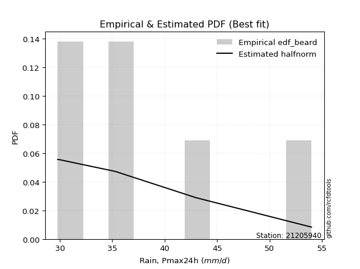</img>

</div>


### 5. Empirical - EDF Chegodayev (1955)

The Chegodayev formula is an empirical plotting position formula used in hydrological frequency analysis to estimate the exceedance probability or return period of a specific event from a set of observed data. It is primarily used for plotting observed data points on probability paper to fit a theoretical distribution, particularly for analyzing extreme events like maximum flood flows or rainfall intensities. The constant _b_ value in the generalized plotting position formula is 0.3.

<div align="center">


$P=(m-b)/(n+1-2b)$


</div>


**5.1. Empirical values**

<div align="center">

|                | 0                   | 1                   | 2                   | 3              | 4                  | 5                  | 6                  |
|:---------------|:--------------------|:--------------------|:--------------------|:---------------|:-------------------|:-------------------|:-------------------|
| date           | 2025                | 2020                | 2021                | 2024           | 2023               | 2022               | 2019               |
| x              | 22.0                | 29.8                | 30.0                | 35.2           | 35.4               | 43.0               | 54.0               |
| m              | 1                   | 2                   | 3                   | 4              | 5                  | 6                  | 7                  |
| empirical_dist | edf_chegodayev      | edf_chegodayev      | edf_chegodayev      | edf_chegodayev | edf_chegodayev     | edf_chegodayev     | edf_chegodayev     |
| empirical      | 0.09459459459459459 | 0.22972972972972971 | 0.36486486486486486 | 0.5            | 0.6351351351351351 | 0.7702702702702703 | 0.9054054054054054 |
| empirical_tr   | 1.1044776119402986  | 1.2982456140350878  | 1.574468085106383   | 2.0            | 2.7407407407407405 | 4.352941176470589  | 10.571428571428568 |

</div>


**5.2. Kolmogorov-Smirnov fit test (sorted by Δ)**


<div align="center">

|                | 0                   | 1                   | 2                   | 3                   | 4                   | 5                   | 6                   | 7                   | 8                   | 9                   | 10                  | 11                  | 12                  | 13                  | 14                  | 15                  | 16                  | 17                  | 18                  | 19                  | 20                  | 21                  | 22                  | 23                  | 24                  | 25                  | 26                  | 27                  | 28                  | 29                  | 30                  | 31                  | 32                  | 33                  | 34                  | 35                  | 36                  | 37                  | 38                  | 39                  | 40                  | 41                  | 42                  | 43                  | 44                  | 45                  | 46                  | 47                  | 48                  | 49                  | 50                  | 51                  | 52                    | 53                  | 54                  | 55                  | 56                  | 57                  | 58                  | 59                  | 60                  | 61                  | 62                  | 63                  | 64                  | 65                  | 66                  | 67                  | 68                  | 69                  | 70                  | 71                  | 72                  | 73                  | 74                  | 75                  | 76                  | 77                  | 78                  | 79                  | 80                  | 81                  | 82                  | 83                  | 84                  | 85                  | 86                  | 87                  | 88                  | 89                  |
|:---------------|:--------------------|:--------------------|:--------------------|:--------------------|:--------------------|:--------------------|:--------------------|:--------------------|:--------------------|:--------------------|:--------------------|:--------------------|:--------------------|:--------------------|:--------------------|:--------------------|:--------------------|:--------------------|:--------------------|:--------------------|:--------------------|:--------------------|:--------------------|:--------------------|:--------------------|:--------------------|:--------------------|:--------------------|:--------------------|:--------------------|:--------------------|:--------------------|:--------------------|:--------------------|:--------------------|:--------------------|:--------------------|:--------------------|:--------------------|:--------------------|:--------------------|:--------------------|:--------------------|:--------------------|:--------------------|:--------------------|:--------------------|:--------------------|:--------------------|:--------------------|:--------------------|:--------------------|:----------------------|:--------------------|:--------------------|:--------------------|:--------------------|:--------------------|:--------------------|:--------------------|:--------------------|:--------------------|:--------------------|:--------------------|:--------------------|:--------------------|:--------------------|:--------------------|:--------------------|:--------------------|:--------------------|:--------------------|:--------------------|:--------------------|:--------------------|:--------------------|:--------------------|:--------------------|:--------------------|:--------------------|:--------------------|:--------------------|:--------------------|:--------------------|:--------------------|:--------------------|:--------------------|:--------------------|:--------------------|:--------------------|
| station        | 21205940            | 21205940            | 21205940            | 21205940            | 21205940            | 21205940            | 21205940            | 21205940            | 21205940            | 21205940            | 21205940            | 21205940            | 21205940            | 21205940            | 21205940            | 21205940            | 21205940            | 21205940            | 21205940            | 21205940            | 21205940            | 21205940            | 21205940            | 21205940            | 21205940            | 21205940            | 21205940            | 21205940            | 21205940            | 21205940            | 21205940            | 21205940            | 21205940            | 21205940            | 21205940            | 21205940            | 21205940            | 21205940            | 21205940            | 21205940            | 21205940            | 21205940            | 21205940            | 21205940            | 21205940            | 21205940            | 21205940            | 21205940            | 21205940            | 21205940            | 21205940            | 21205940            | 21205940              | 21205940            | 21205940            | 21205940            | 21205940            | 21205940            | 21205940            | 21205940            | 21205940            | 21205940            | 21205940            | 21205940            | 21205940            | 21205940            | 21205940            | 21205940            | 21205940            | 21205940            | 21205940            | 21205940            | 21205940            | 21205940            | 21205940            | 21205940            | 21205940            | 21205940            | 21205940            | 21205940            | 21205940            | 21205940            | 21205940            | 21205940            | 21205940            | 21205940            | 21205940            | 21205940            | 21205940            | 21205940            |
| empirical_dist | edf_chegodayev      | edf_chegodayev      | edf_chegodayev      | edf_chegodayev      | edf_chegodayev      | edf_chegodayev      | edf_chegodayev      | edf_chegodayev      | edf_chegodayev      | edf_chegodayev      | edf_chegodayev      | edf_chegodayev      | edf_chegodayev      | edf_chegodayev      | edf_chegodayev      | edf_chegodayev      | edf_chegodayev      | edf_chegodayev      | edf_chegodayev      | edf_chegodayev      | edf_chegodayev      | edf_chegodayev      | edf_chegodayev      | edf_chegodayev      | edf_chegodayev      | edf_chegodayev      | edf_chegodayev      | edf_chegodayev      | edf_chegodayev      | edf_chegodayev      | edf_chegodayev      | edf_chegodayev      | edf_chegodayev      | edf_chegodayev      | edf_chegodayev      | edf_chegodayev      | edf_chegodayev      | edf_chegodayev      | edf_chegodayev      | edf_chegodayev      | edf_chegodayev      | edf_chegodayev      | edf_chegodayev      | edf_chegodayev      | edf_chegodayev      | edf_chegodayev      | edf_chegodayev      | edf_chegodayev      | edf_chegodayev      | edf_chegodayev      | edf_chegodayev      | edf_chegodayev      | edf_chegodayev        | edf_chegodayev      | edf_chegodayev      | edf_chegodayev      | edf_chegodayev      | edf_chegodayev      | edf_chegodayev      | edf_chegodayev      | edf_chegodayev      | edf_chegodayev      | edf_chegodayev      | edf_chegodayev      | edf_chegodayev      | edf_chegodayev      | edf_chegodayev      | edf_chegodayev      | edf_chegodayev      | edf_chegodayev      | edf_chegodayev      | edf_chegodayev      | edf_chegodayev      | edf_chegodayev      | edf_chegodayev      | edf_chegodayev      | edf_chegodayev      | edf_chegodayev      | edf_chegodayev      | edf_chegodayev      | edf_chegodayev      | edf_chegodayev      | edf_chegodayev      | edf_chegodayev      | edf_chegodayev      | edf_chegodayev      | edf_chegodayev      | edf_chegodayev      | edf_chegodayev      | edf_chegodayev      |
| p_dist         | exponnorm           | logmielke           | loggenlogistic      | gumbel_r            | invweibull          | genlogistic         | logfisk             | logalpha            | loginvgamma         | nct                 | invgauss            | logbetaprime        | lognct              | logweibull_min      | johnsonsu           | fisk                | logrice             | kstwobign           | invgamma            | f                   | moyal               | alpha               | logfatiguelife      | ncf                 | logf                | loglogistic         | loggamma            | loggamma            | logerlang           | betaprime           | logjohnsonsu        | logpearson3         | erlang              | gamma               | loginvgauss         | logexponnorm        | logt                | logcrystalball      | lognorm             | lognorm             | logmaxwell          | logloggamma         | halflogistic        | loghypsecant        | rayleigh            | weibull_min         | lograyleigh         | halfnorm            | pearson3            | loggumbel_r         | rice                | maxwell             | loglaplace_asymmetric | loginvweibull       | loglaplace          | logmoyal            | loghalflogistic     | loghalfnorm         | laplace_asymmetric  | logkstwobign        | t                   | norm                | crystalball         | logistic            | hypsecant           | wald                | laplace             | loggumbel_l         | truncnorm           | logncf              | gibrat              | logwald             | loggompertz         | genexpon            | expon               | gumbel_l            | loggibrat           | nakagami            | loggenexpon         | logexpon            | logchi2             | lognakagami         | chi2                | logtruncnorm        | loglognorm          | pareto              | logpareto           | fatiguelife         | gompertz            | mielke              |
| delta          | 0.06795898067226247 | 0.07285906289843203 | 0.07405057980103003 | 0.07461593015051171 | 0.0756853937173988  | 0.07601590851003615 | 0.07677176080776138 | 0.07761715320702556 | 0.0785351015710975  | 0.07980975175217941 | 0.07993871754965165 | 0.08045064995321694 | 0.08047142723103595 | 0.08064282067954665 | 0.0809618265550347  | 0.08163053456436176 | 0.08244194722121151 | 0.08254022893547541 | 0.08277183847731828 | 0.08424133798888622 | 0.0844062121095426  | 0.08502678542152509 | 0.08514013999352532 | 0.08552610794620841 | 0.08565635202413924 | 0.0859482144826863  | 0.08689500455853749 | 0.08689500455853749 | 0.08691368853881809 | 0.08723120701429377 | 0.08760084227839493 | 0.08764597325441625 | 0.08941839174390137 | 0.08941873924399724 | 0.09083577276460175 | 0.0916580581029417  | 0.09180364664027751 | 0.09180540470495369 | 0.09180592510470009 | 0.09180592510470009 | 0.09230775241417727 | 0.09268881288902142 | 0.09562656682342141 | 0.0979458361830507  | 0.10002937280794444 | 0.10191959168988418 | 0.1031585596547796  | 0.10411155748237783 | 0.10478961331025294 | 0.10540076964027223 | 0.10823964891075011 | 0.11124048142463183 | 0.113331240106818     | 0.1213895426514221  | 0.12331841519365672 | 0.1306769575195461  | 0.1317433916997327  | 0.13374351944045504 | 0.13630812564314232 | 0.14319064964324602 | 0.14463475105937462 | 0.144644998863027   | 0.1446450107770646  | 0.14594367320096985 | 0.14705232581741534 | 0.14965465359187735 | 0.15171152160059526 | 0.1595058168685599  | 0.16572222378254559 | 0.1724924310334916  | 0.19825698327566194 | 0.20083152316246078 | 0.2018508900353282  | 0.20583594488635948 | 0.20605930415297868 | 0.21523666672824104 | 0.2285927019247782  | 0.2297293045744336  | 0.23280443011230634 | 0.2632698986028621  | 0.2641639338169437  | 0.28250471764427554 | 0.31794519086194317 | 0.35192394710713504 | 0.41449032725895374 | 0.42690810783008404 | 0.43365264056027064 | 0.5389769982518532  | 0.6962499083861455  | nan                 |
| deltao         | 0.48442053926100004 | 0.48442053926100004 | 0.48442053926100004 | 0.48442053926100004 | 0.48442053926100004 | 0.48442053926100004 | 0.48442053926100004 | 0.48442053926100004 | 0.48442053926100004 | 0.48442053926100004 | 0.48442053926100004 | 0.48442053926100004 | 0.48442053926100004 | 0.48442053926100004 | 0.48442053926100004 | 0.48442053926100004 | 0.48442053926100004 | 0.48442053926100004 | 0.48442053926100004 | 0.48442053926100004 | 0.48442053926100004 | 0.48442053926100004 | 0.48442053926100004 | 0.48442053926100004 | 0.48442053926100004 | 0.48442053926100004 | 0.48442053926100004 | 0.48442053926100004 | 0.48442053926100004 | 0.48442053926100004 | 0.48442053926100004 | 0.48442053926100004 | 0.48442053926100004 | 0.48442053926100004 | 0.48442053926100004 | 0.48442053926100004 | 0.48442053926100004 | 0.48442053926100004 | 0.48442053926100004 | 0.48442053926100004 | 0.48442053926100004 | 0.48442053926100004 | 0.48442053926100004 | 0.48442053926100004 | 0.48442053926100004 | 0.48442053926100004 | 0.48442053926100004 | 0.48442053926100004 | 0.48442053926100004 | 0.48442053926100004 | 0.48442053926100004 | 0.48442053926100004 | 0.48442053926100004   | 0.48442053926100004 | 0.48442053926100004 | 0.48442053926100004 | 0.48442053926100004 | 0.48442053926100004 | 0.48442053926100004 | 0.48442053926100004 | 0.48442053926100004 | 0.48442053926100004 | 0.48442053926100004 | 0.48442053926100004 | 0.48442053926100004 | 0.48442053926100004 | 0.48442053926100004 | 0.48442053926100004 | 0.48442053926100004 | 0.48442053926100004 | 0.48442053926100004 | 0.48442053926100004 | 0.48442053926100004 | 0.48442053926100004 | 0.48442053926100004 | 0.48442053926100004 | 0.48442053926100004 | 0.48442053926100004 | 0.48442053926100004 | 0.48442053926100004 | 0.48442053926100004 | 0.48442053926100004 | 0.48442053926100004 | 0.48442053926100004 | 0.48442053926100004 | 0.48442053926100004 | 0.48442053926100004 | 0.48442053926100004 | 0.48442053926100004 | 0.48442053926100004 |
| eval           | Δo > Δ              | Δo > Δ              | Δo > Δ              | Δo > Δ              | Δo > Δ              | Δo > Δ              | Δo > Δ              | Δo > Δ              | Δo > Δ              | Δo > Δ              | Δo > Δ              | Δo > Δ              | Δo > Δ              | Δo > Δ              | Δo > Δ              | Δo > Δ              | Δo > Δ              | Δo > Δ              | Δo > Δ              | Δo > Δ              | Δo > Δ              | Δo > Δ              | Δo > Δ              | Δo > Δ              | Δo > Δ              | Δo > Δ              | Δo > Δ              | Δo > Δ              | Δo > Δ              | Δo > Δ              | Δo > Δ              | Δo > Δ              | Δo > Δ              | Δo > Δ              | Δo > Δ              | Δo > Δ              | Δo > Δ              | Δo > Δ              | Δo > Δ              | Δo > Δ              | Δo > Δ              | Δo > Δ              | Δo > Δ              | Δo > Δ              | Δo > Δ              | Δo > Δ              | Δo > Δ              | Δo > Δ              | Δo > Δ              | Δo > Δ              | Δo > Δ              | Δo > Δ              | Δo > Δ                | Δo > Δ              | Δo > Δ              | Δo > Δ              | Δo > Δ              | Δo > Δ              | Δo > Δ              | Δo > Δ              | Δo > Δ              | Δo > Δ              | Δo > Δ              | Δo > Δ              | Δo > Δ              | Δo > Δ              | Δo > Δ              | Δo > Δ              | Δo > Δ              | Δo > Δ              | Δo > Δ              | Δo > Δ              | Δo > Δ              | Δo > Δ              | Δo > Δ              | Δo > Δ              | Δo > Δ              | Δo > Δ              | Δo > Δ              | Δo > Δ              | Δo > Δ              | Δo > Δ              | Δo > Δ              | Δo > Δ              | Δo > Δ              | Δo > Δ              | Δo > Δ              | Δo <= Δ             | Δo <= Δ             | Δo <= Δ             |
| fit            | 1                   | 1                   | 1                   | 1                   | 1                   | 1                   | 1                   | 1                   | 1                   | 1                   | 1                   | 1                   | 1                   | 1                   | 1                   | 1                   | 1                   | 1                   | 1                   | 1                   | 1                   | 1                   | 1                   | 1                   | 1                   | 1                   | 1                   | 1                   | 1                   | 1                   | 1                   | 1                   | 1                   | 1                   | 1                   | 1                   | 1                   | 1                   | 1                   | 1                   | 1                   | 1                   | 1                   | 1                   | 1                   | 1                   | 1                   | 1                   | 1                   | 1                   | 1                   | 1                   | 1                     | 1                   | 1                   | 1                   | 1                   | 1                   | 1                   | 1                   | 1                   | 1                   | 1                   | 1                   | 1                   | 1                   | 1                   | 1                   | 1                   | 1                   | 1                   | 1                   | 1                   | 1                   | 1                   | 1                   | 1                   | 1                   | 1                   | 1                   | 1                   | 1                   | 1                   | 1                   | 1                   | 1                   | 1                   | 0                   | 0                   | 0                   |
| n              | 7                   | 7                   | 7                   | 7                   | 7                   | 7                   | 7                   | 7                   | 7                   | 7                   | 7                   | 7                   | 7                   | 7                   | 7                   | 7                   | 7                   | 7                   | 7                   | 7                   | 7                   | 7                   | 7                   | 7                   | 7                   | 7                   | 7                   | 7                   | 7                   | 7                   | 7                   | 7                   | 7                   | 7                   | 7                   | 7                   | 7                   | 7                   | 7                   | 7                   | 7                   | 7                   | 7                   | 7                   | 7                   | 7                   | 7                   | 7                   | 7                   | 7                   | 7                   | 7                   | 7                     | 7                   | 7                   | 7                   | 7                   | 7                   | 7                   | 7                   | 7                   | 7                   | 7                   | 7                   | 7                   | 7                   | 7                   | 7                   | 7                   | 7                   | 7                   | 7                   | 7                   | 7                   | 7                   | 7                   | 7                   | 7                   | 7                   | 7                   | 7                   | 7                   | 7                   | 7                   | 7                   | 7                   | 7                   | 7                   | 7                   | 7                   |
| best_fit       | 1                   | 0                   | 0                   | 0                   | 0                   | 0                   | 0                   | 0                   | 0                   | 0                   | 0                   | 0                   | 0                   | 0                   | 0                   | 0                   | 0                   | 0                   | 0                   | 0                   | 0                   | 0                   | 0                   | 0                   | 0                   | 0                   | 0                   | 0                   | 0                   | 0                   | 0                   | 0                   | 0                   | 0                   | 0                   | 0                   | 0                   | 0                   | 0                   | 0                   | 0                   | 0                   | 0                   | 0                   | 0                   | 0                   | 0                   | 0                   | 0                   | 0                   | 0                   | 0                   | 0                     | 0                   | 0                   | 0                   | 0                   | 0                   | 0                   | 0                   | 0                   | 0                   | 0                   | 0                   | 0                   | 0                   | 0                   | 0                   | 0                   | 0                   | 0                   | 0                   | 0                   | 0                   | 0                   | 0                   | 0                   | 0                   | 0                   | 0                   | 0                   | 0                   | 0                   | 0                   | 0                   | 0                   | 0                   | 0                   | 0                   | 0                   |
| best_fit_sort  | 1                   | 2                   | 3                   | 4                   | 5                   | 6                   | 7                   | 8                   | 9                   | 10                  | 11                  | 12                  | 13                  | 14                  | 15                  | 16                  | 17                  | 18                  | 19                  | 20                  | 21                  | 22                  | 23                  | 24                  | 25                  | 26                  | 27                  | 28                  | 29                  | 30                  | 31                  | 32                  | 33                  | 34                  | 35                  | 36                  | 37                  | 38                  | 39                  | 40                  | 41                  | 42                  | 43                  | 44                  | 45                  | 46                  | 47                  | 48                  | 49                  | 50                  | 51                  | 52                  | 53                    | 54                  | 55                  | 56                  | 57                  | 58                  | 59                  | 60                  | 61                  | 62                  | 63                  | 64                  | 65                  | 66                  | 67                  | 68                  | 69                  | 70                  | 71                  | 72                  | 73                  | 74                  | 75                  | 76                  | 77                  | 78                  | 79                  | 80                  | 81                  | 82                  | 83                  | 84                  | 85                  | 86                  | 87                  | 88                  | 89                  | 90                  |

</div>


<div align="center">

</img>

</div>


**5.3. Best fit**

<div align="center">

|   id |   station | empirical_dist   | p_dist    |    delta |   deltao | eval   |   fit |   n |   best_fit |   best_fit_sort |
|-----:|----------:|:-----------------|:----------|---------:|---------:|:-------|------:|----:|-----------:|----------------:|
|    0 |  21205940 | edf_chegodayev   | exponnorm | 0.067959 | 0.484421 | Δo > Δ |     1 |   7 |          1 |               1 |

</div>


<div align="center">

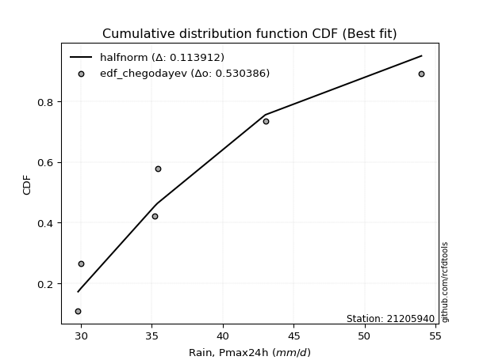</img>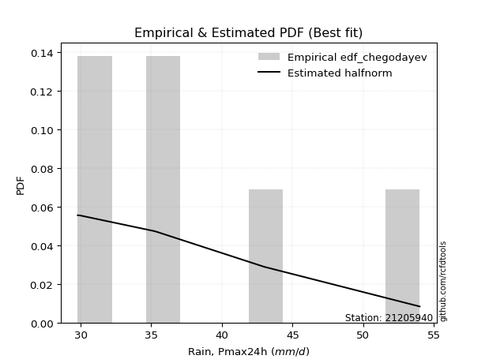</img>

</div>


### 6. Empirical - EDF Blom (1958)

The Blom formula is a specific "plotting position" formula used in hydrology and statistical analysis to estimate the empirical cumulative probability (or non-exceedance probability) of a data series. It is particularly recommended for data that are approximately normally distributed. The constant _a_ is set to 0.375 (or 3/8).

<div align="center">


$P=(m-a)/(n+1-2a)$


</div>


**6.1. Empirical values**

<div align="center">

|                | 0                   | 1                   | 2                  | 3        | 4                  | 5                  | 6                  |
|:---------------|:--------------------|:--------------------|:-------------------|:---------|:-------------------|:-------------------|:-------------------|
| date           | 2025                | 2020                | 2021               | 2024     | 2023               | 2022               | 2019               |
| x              | 22.0                | 29.8                | 30.0               | 35.2     | 35.4               | 43.0               | 54.0               |
| m              | 1                   | 2                   | 3                  | 4        | 5                  | 6                  | 7                  |
| empirical_dist | edf_blom            | edf_blom            | edf_blom           | edf_blom | edf_blom           | edf_blom           | edf_blom           |
| empirical      | 0.08620689655172414 | 0.22413793103448276 | 0.3620689655172414 | 0.5      | 0.6379310344827587 | 0.7758620689655172 | 0.9137931034482759 |
| empirical_tr   | 1.0943396226415094  | 1.288888888888889   | 1.5675675675675675 | 2.0      | 2.7619047619047623 | 4.461538461538462  | 11.600000000000007 |

</div>


**6.2. Kolmogorov-Smirnov fit test (sorted by Δ)**


<div align="center">

|                | 0                   | 1                   | 2                   | 3                   | 4                   | 5                   | 6                   | 7                   | 8                   | 9                   | 10                  | 11                  | 12                  | 13                  | 14                  | 15                  | 16                  | 17                  | 18                  | 19                  | 20                  | 21                  | 22                  | 23                  | 24                  | 25                  | 26                  | 27                  | 28                  | 29                  | 30                  | 31                  | 32                  | 33                  | 34                  | 35                  | 36                  | 37                  | 38                  | 39                  | 40                  | 41                  | 42                  | 43                  | 44                  | 45                  | 46                  | 47                  | 48                  | 49                  | 50                    | 51                  | 52                  | 53                  | 54                  | 55                  | 56                  | 57                  | 58                  | 59                  | 60                  | 61                  | 62                  | 63                  | 64                  | 65                  | 66                  | 67                  | 68                  | 69                  | 70                  | 71                  | 72                  | 73                  | 74                  | 75                  | 76                  | 77                  | 78                  | 79                  | 80                  | 81                  | 82                  | 83                  | 84                  | 85                  | 86                  | 87                  | 88                  | 89                  |
|:---------------|:--------------------|:--------------------|:--------------------|:--------------------|:--------------------|:--------------------|:--------------------|:--------------------|:--------------------|:--------------------|:--------------------|:--------------------|:--------------------|:--------------------|:--------------------|:--------------------|:--------------------|:--------------------|:--------------------|:--------------------|:--------------------|:--------------------|:--------------------|:--------------------|:--------------------|:--------------------|:--------------------|:--------------------|:--------------------|:--------------------|:--------------------|:--------------------|:--------------------|:--------------------|:--------------------|:--------------------|:--------------------|:--------------------|:--------------------|:--------------------|:--------------------|:--------------------|:--------------------|:--------------------|:--------------------|:--------------------|:--------------------|:--------------------|:--------------------|:--------------------|:----------------------|:--------------------|:--------------------|:--------------------|:--------------------|:--------------------|:--------------------|:--------------------|:--------------------|:--------------------|:--------------------|:--------------------|:--------------------|:--------------------|:--------------------|:--------------------|:--------------------|:--------------------|:--------------------|:--------------------|:--------------------|:--------------------|:--------------------|:--------------------|:--------------------|:--------------------|:--------------------|:--------------------|:--------------------|:--------------------|:--------------------|:--------------------|:--------------------|:--------------------|:--------------------|:--------------------|:--------------------|:--------------------|:--------------------|:--------------------|
| station        | 21205940            | 21205940            | 21205940            | 21205940            | 21205940            | 21205940            | 21205940            | 21205940            | 21205940            | 21205940            | 21205940            | 21205940            | 21205940            | 21205940            | 21205940            | 21205940            | 21205940            | 21205940            | 21205940            | 21205940            | 21205940            | 21205940            | 21205940            | 21205940            | 21205940            | 21205940            | 21205940            | 21205940            | 21205940            | 21205940            | 21205940            | 21205940            | 21205940            | 21205940            | 21205940            | 21205940            | 21205940            | 21205940            | 21205940            | 21205940            | 21205940            | 21205940            | 21205940            | 21205940            | 21205940            | 21205940            | 21205940            | 21205940            | 21205940            | 21205940            | 21205940              | 21205940            | 21205940            | 21205940            | 21205940            | 21205940            | 21205940            | 21205940            | 21205940            | 21205940            | 21205940            | 21205940            | 21205940            | 21205940            | 21205940            | 21205940            | 21205940            | 21205940            | 21205940            | 21205940            | 21205940            | 21205940            | 21205940            | 21205940            | 21205940            | 21205940            | 21205940            | 21205940            | 21205940            | 21205940            | 21205940            | 21205940            | 21205940            | 21205940            | 21205940            | 21205940            | 21205940            | 21205940            | 21205940            | 21205940            |
| empirical_dist | edf_blom            | edf_blom            | edf_blom            | edf_blom            | edf_blom            | edf_blom            | edf_blom            | edf_blom            | edf_blom            | edf_blom            | edf_blom            | edf_blom            | edf_blom            | edf_blom            | edf_blom            | edf_blom            | edf_blom            | edf_blom            | edf_blom            | edf_blom            | edf_blom            | edf_blom            | edf_blom            | edf_blom            | edf_blom            | edf_blom            | edf_blom            | edf_blom            | edf_blom            | edf_blom            | edf_blom            | edf_blom            | edf_blom            | edf_blom            | edf_blom            | edf_blom            | edf_blom            | edf_blom            | edf_blom            | edf_blom            | edf_blom            | edf_blom            | edf_blom            | edf_blom            | edf_blom            | edf_blom            | edf_blom            | edf_blom            | edf_blom            | edf_blom            | edf_blom              | edf_blom            | edf_blom            | edf_blom            | edf_blom            | edf_blom            | edf_blom            | edf_blom            | edf_blom            | edf_blom            | edf_blom            | edf_blom            | edf_blom            | edf_blom            | edf_blom            | edf_blom            | edf_blom            | edf_blom            | edf_blom            | edf_blom            | edf_blom            | edf_blom            | edf_blom            | edf_blom            | edf_blom            | edf_blom            | edf_blom            | edf_blom            | edf_blom            | edf_blom            | edf_blom            | edf_blom            | edf_blom            | edf_blom            | edf_blom            | edf_blom            | edf_blom            | edf_blom            | edf_blom            | edf_blom            |
| p_dist         | exponnorm           | logmielke           | loggenlogistic      | gumbel_r            | moyal               | logfisk             | invweibull          | genlogistic         | nct                 | invgauss            | logalpha            | logbetaprime        | johnsonsu           | loginvgamma         | fisk                | invgamma            | lognct              | logweibull_min      | f                   | alpha               | logfatiguelife      | logrice             | kstwobign           | ncf                 | logf                | loglogistic         | loggamma            | loggamma            | logerlang           | betaprime           | logjohnsonsu        | logpearson3         | logexponnorm        | logt                | logcrystalball      | lognorm             | lognorm             | erlang              | gamma               | loghypsecant        | logloggamma         | loginvgauss         | logmaxwell          | halflogistic        | rayleigh            | loggumbel_r         | weibull_min         | pearson3            | lograyleigh         | halfnorm            | loglaplace_asymmetric | rice                | maxwell             | loglaplace          | loginvweibull       | logmoyal            | loghalflogistic     | laplace_asymmetric  | loghalfnorm         | t                   | norm                | crystalball         | logistic            | logkstwobign        | wald                | hypsecant           | laplace             | loggumbel_l         | truncnorm           | logncf              | gibrat              | logwald             | loggompertz         | genexpon            | expon               | gumbel_l            | nakagami            | loggibrat           | loggenexpon         | logexpon            | logchi2             | lognakagami         | chi2                | logtruncnorm        | loglognorm          | pareto              | logpareto           | fatiguelife         | gompertz            | mielke              |
| delta          | 0.07283035477590544 | 0.07565496224605561 | 0.07684647914865361 | 0.0774118294981353  | 0.07765766812398978 | 0.07956766015538497 | 0.08127719241264575 | 0.0816077072052831  | 0.082605651099803   | 0.08273461689727524 | 0.08320895190227251 | 0.08324654930084052 | 0.08375772590265829 | 0.08412690026634445 | 0.08442643391198534 | 0.08556773782494187 | 0.0860632259262829  | 0.0862346193747936  | 0.08703723733650981 | 0.08782268476914867 | 0.08793603934114891 | 0.08803374591645846 | 0.08813202763072236 | 0.088322007293832   | 0.08845225137176282 | 0.08874411383030989 | 0.08969090390616108 | 0.08969090390616108 | 0.08970958788644168 | 0.09002710636191735 | 0.09039674162601852 | 0.09044187260203984 | 0.09445395745056528 | 0.0945995459879011  | 0.09460130405257727 | 0.09460182445232368 | 0.09460182445232368 | 0.09501019043914832 | 0.09501053793924419 | 0.09514993683542722 | 0.09548471223664501 | 0.0964275714598487  | 0.09789955110942422 | 0.10121836551866836 | 0.10282527215556803 | 0.10540076964027223 | 0.10751139038513113 | 0.10758551265787653 | 0.10875035835002655 | 0.10970335617762478 | 0.11053534075919452   | 0.1110355482583737  | 0.11403638077225542 | 0.12052251584603324 | 0.12698134134666905 | 0.1306769575195461  | 0.13646967721391978 | 0.1391040249907659  | 0.139335318135702   | 0.1474306504069982  | 0.1474408982106506  | 0.14744091012468818 | 0.14873957254859344 | 0.14878244833849297 | 0.14965465359187735 | 0.14984822516503893 | 0.15450742094821884 | 0.1623017162161835  | 0.17131402247779254 | 0.17808422972873855 | 0.19546108392803846 | 0.20083152316246078 | 0.20744268873057514 | 0.21142774358160643 | 0.21165110284822564 | 0.21803256607586463 | 0.22413750587918665 | 0.2285927019247782  | 0.2383962288075533  | 0.26886169729810905 | 0.27255163185981424 | 0.28250471764427554 | 0.3235369895571901  | 0.357515745802382   | 0.4200821259542007  | 0.432499906525331   | 0.4392444392555176  | 0.5445687969471001  | 0.7018417070813925  | nan                 |
| deltao         | 0.48442053926100004 | 0.48442053926100004 | 0.48442053926100004 | 0.48442053926100004 | 0.48442053926100004 | 0.48442053926100004 | 0.48442053926100004 | 0.48442053926100004 | 0.48442053926100004 | 0.48442053926100004 | 0.48442053926100004 | 0.48442053926100004 | 0.48442053926100004 | 0.48442053926100004 | 0.48442053926100004 | 0.48442053926100004 | 0.48442053926100004 | 0.48442053926100004 | 0.48442053926100004 | 0.48442053926100004 | 0.48442053926100004 | 0.48442053926100004 | 0.48442053926100004 | 0.48442053926100004 | 0.48442053926100004 | 0.48442053926100004 | 0.48442053926100004 | 0.48442053926100004 | 0.48442053926100004 | 0.48442053926100004 | 0.48442053926100004 | 0.48442053926100004 | 0.48442053926100004 | 0.48442053926100004 | 0.48442053926100004 | 0.48442053926100004 | 0.48442053926100004 | 0.48442053926100004 | 0.48442053926100004 | 0.48442053926100004 | 0.48442053926100004 | 0.48442053926100004 | 0.48442053926100004 | 0.48442053926100004 | 0.48442053926100004 | 0.48442053926100004 | 0.48442053926100004 | 0.48442053926100004 | 0.48442053926100004 | 0.48442053926100004 | 0.48442053926100004   | 0.48442053926100004 | 0.48442053926100004 | 0.48442053926100004 | 0.48442053926100004 | 0.48442053926100004 | 0.48442053926100004 | 0.48442053926100004 | 0.48442053926100004 | 0.48442053926100004 | 0.48442053926100004 | 0.48442053926100004 | 0.48442053926100004 | 0.48442053926100004 | 0.48442053926100004 | 0.48442053926100004 | 0.48442053926100004 | 0.48442053926100004 | 0.48442053926100004 | 0.48442053926100004 | 0.48442053926100004 | 0.48442053926100004 | 0.48442053926100004 | 0.48442053926100004 | 0.48442053926100004 | 0.48442053926100004 | 0.48442053926100004 | 0.48442053926100004 | 0.48442053926100004 | 0.48442053926100004 | 0.48442053926100004 | 0.48442053926100004 | 0.48442053926100004 | 0.48442053926100004 | 0.48442053926100004 | 0.48442053926100004 | 0.48442053926100004 | 0.48442053926100004 | 0.48442053926100004 | 0.48442053926100004 |
| eval           | Δo > Δ              | Δo > Δ              | Δo > Δ              | Δo > Δ              | Δo > Δ              | Δo > Δ              | Δo > Δ              | Δo > Δ              | Δo > Δ              | Δo > Δ              | Δo > Δ              | Δo > Δ              | Δo > Δ              | Δo > Δ              | Δo > Δ              | Δo > Δ              | Δo > Δ              | Δo > Δ              | Δo > Δ              | Δo > Δ              | Δo > Δ              | Δo > Δ              | Δo > Δ              | Δo > Δ              | Δo > Δ              | Δo > Δ              | Δo > Δ              | Δo > Δ              | Δo > Δ              | Δo > Δ              | Δo > Δ              | Δo > Δ              | Δo > Δ              | Δo > Δ              | Δo > Δ              | Δo > Δ              | Δo > Δ              | Δo > Δ              | Δo > Δ              | Δo > Δ              | Δo > Δ              | Δo > Δ              | Δo > Δ              | Δo > Δ              | Δo > Δ              | Δo > Δ              | Δo > Δ              | Δo > Δ              | Δo > Δ              | Δo > Δ              | Δo > Δ                | Δo > Δ              | Δo > Δ              | Δo > Δ              | Δo > Δ              | Δo > Δ              | Δo > Δ              | Δo > Δ              | Δo > Δ              | Δo > Δ              | Δo > Δ              | Δo > Δ              | Δo > Δ              | Δo > Δ              | Δo > Δ              | Δo > Δ              | Δo > Δ              | Δo > Δ              | Δo > Δ              | Δo > Δ              | Δo > Δ              | Δo > Δ              | Δo > Δ              | Δo > Δ              | Δo > Δ              | Δo > Δ              | Δo > Δ              | Δo > Δ              | Δo > Δ              | Δo > Δ              | Δo > Δ              | Δo > Δ              | Δo > Δ              | Δo > Δ              | Δo > Δ              | Δo > Δ              | Δo > Δ              | Δo <= Δ             | Δo <= Δ             | Δo <= Δ             |
| fit            | 1                   | 1                   | 1                   | 1                   | 1                   | 1                   | 1                   | 1                   | 1                   | 1                   | 1                   | 1                   | 1                   | 1                   | 1                   | 1                   | 1                   | 1                   | 1                   | 1                   | 1                   | 1                   | 1                   | 1                   | 1                   | 1                   | 1                   | 1                   | 1                   | 1                   | 1                   | 1                   | 1                   | 1                   | 1                   | 1                   | 1                   | 1                   | 1                   | 1                   | 1                   | 1                   | 1                   | 1                   | 1                   | 1                   | 1                   | 1                   | 1                   | 1                   | 1                     | 1                   | 1                   | 1                   | 1                   | 1                   | 1                   | 1                   | 1                   | 1                   | 1                   | 1                   | 1                   | 1                   | 1                   | 1                   | 1                   | 1                   | 1                   | 1                   | 1                   | 1                   | 1                   | 1                   | 1                   | 1                   | 1                   | 1                   | 1                   | 1                   | 1                   | 1                   | 1                   | 1                   | 1                   | 1                   | 1                   | 0                   | 0                   | 0                   |
| n              | 7                   | 7                   | 7                   | 7                   | 7                   | 7                   | 7                   | 7                   | 7                   | 7                   | 7                   | 7                   | 7                   | 7                   | 7                   | 7                   | 7                   | 7                   | 7                   | 7                   | 7                   | 7                   | 7                   | 7                   | 7                   | 7                   | 7                   | 7                   | 7                   | 7                   | 7                   | 7                   | 7                   | 7                   | 7                   | 7                   | 7                   | 7                   | 7                   | 7                   | 7                   | 7                   | 7                   | 7                   | 7                   | 7                   | 7                   | 7                   | 7                   | 7                   | 7                     | 7                   | 7                   | 7                   | 7                   | 7                   | 7                   | 7                   | 7                   | 7                   | 7                   | 7                   | 7                   | 7                   | 7                   | 7                   | 7                   | 7                   | 7                   | 7                   | 7                   | 7                   | 7                   | 7                   | 7                   | 7                   | 7                   | 7                   | 7                   | 7                   | 7                   | 7                   | 7                   | 7                   | 7                   | 7                   | 7                   | 7                   | 7                   | 7                   |
| best_fit       | 1                   | 0                   | 0                   | 0                   | 0                   | 0                   | 0                   | 0                   | 0                   | 0                   | 0                   | 0                   | 0                   | 0                   | 0                   | 0                   | 0                   | 0                   | 0                   | 0                   | 0                   | 0                   | 0                   | 0                   | 0                   | 0                   | 0                   | 0                   | 0                   | 0                   | 0                   | 0                   | 0                   | 0                   | 0                   | 0                   | 0                   | 0                   | 0                   | 0                   | 0                   | 0                   | 0                   | 0                   | 0                   | 0                   | 0                   | 0                   | 0                   | 0                   | 0                     | 0                   | 0                   | 0                   | 0                   | 0                   | 0                   | 0                   | 0                   | 0                   | 0                   | 0                   | 0                   | 0                   | 0                   | 0                   | 0                   | 0                   | 0                   | 0                   | 0                   | 0                   | 0                   | 0                   | 0                   | 0                   | 0                   | 0                   | 0                   | 0                   | 0                   | 0                   | 0                   | 0                   | 0                   | 0                   | 0                   | 0                   | 0                   | 0                   |
| best_fit_sort  | 1                   | 2                   | 3                   | 4                   | 5                   | 6                   | 7                   | 8                   | 9                   | 10                  | 11                  | 12                  | 13                  | 14                  | 15                  | 16                  | 17                  | 18                  | 19                  | 20                  | 21                  | 22                  | 23                  | 24                  | 25                  | 26                  | 27                  | 28                  | 29                  | 30                  | 31                  | 32                  | 33                  | 34                  | 35                  | 36                  | 37                  | 38                  | 39                  | 40                  | 41                  | 42                  | 43                  | 44                  | 45                  | 46                  | 47                  | 48                  | 49                  | 50                  | 51                    | 52                  | 53                  | 54                  | 55                  | 56                  | 57                  | 58                  | 59                  | 60                  | 61                  | 62                  | 63                  | 64                  | 65                  | 66                  | 67                  | 68                  | 69                  | 70                  | 71                  | 72                  | 73                  | 74                  | 75                  | 76                  | 77                  | 78                  | 79                  | 80                  | 81                  | 82                  | 83                  | 84                  | 85                  | 86                  | 87                  | 88                  | 89                  | 90                  |

</div>


<div align="center">

</img>

</div>


**6.3. Best fit**

<div align="center">

|   id |   station | empirical_dist   | p_dist    |     delta |   deltao | eval   |   fit |   n |   best_fit |   best_fit_sort |
|-----:|----------:|:-----------------|:----------|----------:|---------:|:-------|------:|----:|-----------:|----------------:|
|    0 |  21205940 | edf_blom         | exponnorm | 0.0728304 | 0.484421 | Δo > Δ |     1 |   7 |          1 |               1 |

</div>


<div align="center">

</img>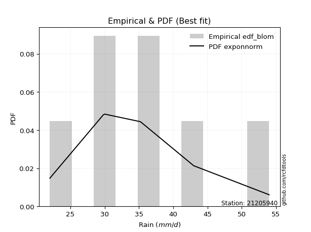</img>

</div>


### 7. Empirical - EDF Tukey (1962)

In hydrology, the Tukey formula is used as a plotting position formula to estimate the empirical probability or frequency of a flood event (or other hydrological data). The formula parameter is given as _c=0.333_ (or 1/3).

<div align="center">


$P=(m-c)/(n+1-2c)$


</div>


**7.1. Empirical values**

<div align="center">

|                | 0                   | 1                   | 2                   | 3         | 4                  | 5                  | 6                  |
|:---------------|:--------------------|:--------------------|:--------------------|:----------|:-------------------|:-------------------|:-------------------|
| date           | 2025                | 2020                | 2021                | 2024      | 2023               | 2022               | 2019               |
| x              | 22.0                | 29.8                | 30.0                | 35.2      | 35.4               | 43.0               | 54.0               |
| m              | 1                   | 2                   | 3                   | 4         | 5                  | 6                  | 7                  |
| empirical_dist | edf_tukey           | edf_tukey           | edf_tukey           | edf_tukey | edf_tukey          | edf_tukey          | edf_tukey          |
| empirical      | 0.09090909090909091 | 0.22727272727272727 | 0.36363636363636365 | 0.5       | 0.6363636363636364 | 0.7727272727272727 | 0.9090909090909091 |
| empirical_tr   | 1.1                 | 1.2941176470588236  | 1.5714285714285714  | 2.0       | 2.75               | 4.3999999999999995 | 10.999999999999996 |

</div>


**7.2. Kolmogorov-Smirnov fit test (sorted by Δ)**


<div align="center">

|                | 0                   | 1                   | 2                   | 3                   | 4                   | 5                   | 6                   | 7                   | 8                   | 9                   | 10                  | 11                  | 12                  | 13                  | 14                  | 15                  | 16                  | 17                  | 18                  | 19                  | 20                  | 21                  | 22                  | 23                  | 24                  | 25                  | 26                  | 27                  | 28                  | 29                  | 30                  | 31                  | 32                  | 33                  | 34                  | 35                  | 36                  | 37                  | 38                  | 39                  | 40                  | 41                  | 42                  | 43                  | 44                  | 45                  | 46                  | 47                  | 48                  | 49                  | 50                  | 51                    | 52                  | 53                  | 54                  | 55                  | 56                  | 57                  | 58                  | 59                  | 60                  | 61                  | 62                  | 63                  | 64                  | 65                  | 66                  | 67                  | 68                  | 69                  | 70                  | 71                  | 72                  | 73                  | 74                  | 75                  | 76                  | 77                  | 78                  | 79                  | 80                  | 81                  | 82                  | 83                  | 84                  | 85                  | 86                  | 87                  | 88                  | 89                  |
|:---------------|:--------------------|:--------------------|:--------------------|:--------------------|:--------------------|:--------------------|:--------------------|:--------------------|:--------------------|:--------------------|:--------------------|:--------------------|:--------------------|:--------------------|:--------------------|:--------------------|:--------------------|:--------------------|:--------------------|:--------------------|:--------------------|:--------------------|:--------------------|:--------------------|:--------------------|:--------------------|:--------------------|:--------------------|:--------------------|:--------------------|:--------------------|:--------------------|:--------------------|:--------------------|:--------------------|:--------------------|:--------------------|:--------------------|:--------------------|:--------------------|:--------------------|:--------------------|:--------------------|:--------------------|:--------------------|:--------------------|:--------------------|:--------------------|:--------------------|:--------------------|:--------------------|:----------------------|:--------------------|:--------------------|:--------------------|:--------------------|:--------------------|:--------------------|:--------------------|:--------------------|:--------------------|:--------------------|:--------------------|:--------------------|:--------------------|:--------------------|:--------------------|:--------------------|:--------------------|:--------------------|:--------------------|:--------------------|:--------------------|:--------------------|:--------------------|:--------------------|:--------------------|:--------------------|:--------------------|:--------------------|:--------------------|:--------------------|:--------------------|:--------------------|:--------------------|:--------------------|:--------------------|:--------------------|:--------------------|:--------------------|
| station        | 21205940            | 21205940            | 21205940            | 21205940            | 21205940            | 21205940            | 21205940            | 21205940            | 21205940            | 21205940            | 21205940            | 21205940            | 21205940            | 21205940            | 21205940            | 21205940            | 21205940            | 21205940            | 21205940            | 21205940            | 21205940            | 21205940            | 21205940            | 21205940            | 21205940            | 21205940            | 21205940            | 21205940            | 21205940            | 21205940            | 21205940            | 21205940            | 21205940            | 21205940            | 21205940            | 21205940            | 21205940            | 21205940            | 21205940            | 21205940            | 21205940            | 21205940            | 21205940            | 21205940            | 21205940            | 21205940            | 21205940            | 21205940            | 21205940            | 21205940            | 21205940            | 21205940              | 21205940            | 21205940            | 21205940            | 21205940            | 21205940            | 21205940            | 21205940            | 21205940            | 21205940            | 21205940            | 21205940            | 21205940            | 21205940            | 21205940            | 21205940            | 21205940            | 21205940            | 21205940            | 21205940            | 21205940            | 21205940            | 21205940            | 21205940            | 21205940            | 21205940            | 21205940            | 21205940            | 21205940            | 21205940            | 21205940            | 21205940            | 21205940            | 21205940            | 21205940            | 21205940            | 21205940            | 21205940            | 21205940            |
| empirical_dist | edf_tukey           | edf_tukey           | edf_tukey           | edf_tukey           | edf_tukey           | edf_tukey           | edf_tukey           | edf_tukey           | edf_tukey           | edf_tukey           | edf_tukey           | edf_tukey           | edf_tukey           | edf_tukey           | edf_tukey           | edf_tukey           | edf_tukey           | edf_tukey           | edf_tukey           | edf_tukey           | edf_tukey           | edf_tukey           | edf_tukey           | edf_tukey           | edf_tukey           | edf_tukey           | edf_tukey           | edf_tukey           | edf_tukey           | edf_tukey           | edf_tukey           | edf_tukey           | edf_tukey           | edf_tukey           | edf_tukey           | edf_tukey           | edf_tukey           | edf_tukey           | edf_tukey           | edf_tukey           | edf_tukey           | edf_tukey           | edf_tukey           | edf_tukey           | edf_tukey           | edf_tukey           | edf_tukey           | edf_tukey           | edf_tukey           | edf_tukey           | edf_tukey           | edf_tukey             | edf_tukey           | edf_tukey           | edf_tukey           | edf_tukey           | edf_tukey           | edf_tukey           | edf_tukey           | edf_tukey           | edf_tukey           | edf_tukey           | edf_tukey           | edf_tukey           | edf_tukey           | edf_tukey           | edf_tukey           | edf_tukey           | edf_tukey           | edf_tukey           | edf_tukey           | edf_tukey           | edf_tukey           | edf_tukey           | edf_tukey           | edf_tukey           | edf_tukey           | edf_tukey           | edf_tukey           | edf_tukey           | edf_tukey           | edf_tukey           | edf_tukey           | edf_tukey           | edf_tukey           | edf_tukey           | edf_tukey           | edf_tukey           | edf_tukey           | edf_tukey           |
| p_dist         | exponnorm           | logmielke           | loggenlogistic      | gumbel_r            | logfisk             | invweibull          | genlogistic         | logalpha            | moyal               | loginvgamma         | nct                 | invgauss            | logbetaprime        | johnsonsu           | fisk                | lognct              | logweibull_min      | invgamma            | logrice             | kstwobign           | f                   | alpha               | logfatiguelife      | ncf                 | logf                | loglogistic         | loggamma            | loggamma            | logerlang           | betaprime           | logjohnsonsu        | logpearson3         | erlang              | gamma               | logexponnorm        | logt                | logcrystalball      | lognorm             | lognorm             | loginvgauss         | logloggamma         | logmaxwell          | loghypsecant        | halflogistic        | rayleigh            | weibull_min         | loggumbel_r         | lograyleigh         | pearson3            | halfnorm            | rice                | loglaplace_asymmetric | maxwell             | loglaplace          | loginvweibull       | logmoyal            | loghalflogistic     | loghalfnorm         | laplace_asymmetric  | logkstwobign        | t                   | norm                | crystalball         | logistic            | hypsecant           | wald                | laplace             | loggumbel_l         | truncnorm           | logncf              | gibrat              | logwald             | loggompertz         | genexpon            | expon               | gumbel_l            | nakagami            | loggibrat           | loggenexpon         | logexpon            | logchi2             | lognakagami         | chi2                | logtruncnorm        | loglognorm          | pareto              | logpareto           | fatiguelife         | gompertz            | mielke              |
| delta          | 0.06969555853766093 | 0.07408756412693329 | 0.07527908102953129 | 0.07584443137901298 | 0.07800026203626265 | 0.07814239617440125 | 0.0784729109670386  | 0.08007415566402801 | 0.08072070842403893 | 0.08099210402809995 | 0.08103825298068068 | 0.08116721877815292 | 0.0816791511817182  | 0.08219032778353597 | 0.08285903579286302 | 0.0829284296880384  | 0.0830998231365491  | 0.08400033970581955 | 0.08489894967821396 | 0.08499723139247786 | 0.08546983921738749 | 0.08625528665002635 | 0.08636864122202659 | 0.08675460917470967 | 0.0868848532526405  | 0.08717671571118757 | 0.08812350578703876 | 0.08812350578703876 | 0.08814218976731936 | 0.08845970824279503 | 0.0888293435068962  | 0.08887447448291752 | 0.09187539420090382 | 0.09187574170099969 | 0.09288655933144296 | 0.09303214786877878 | 0.09303390593345495 | 0.09303442633320136 | 0.09303442633320136 | 0.0932927752216042  | 0.09391731411752269 | 0.09476475487117972 | 0.09671733495454948 | 0.09808356928042386 | 0.1012578740364457  | 0.10437659414688663 | 0.10540076964027223 | 0.10561556211178205 | 0.1060181145387542  | 0.10656855993938028 | 0.10946815013925137 | 0.11210273887831679   | 0.1124689826531331  | 0.1220899139651555  | 0.12384654510842455 | 0.1306769575195461  | 0.13333488097567528 | 0.1362005218974575  | 0.13753662687164359 | 0.14564765210024846 | 0.1458632522878759  | 0.14587350009152827 | 0.14587351200556586 | 0.14717217442947111 | 0.1482808270459166  | 0.14965465359187735 | 0.15294002282909652 | 0.16073431809706118 | 0.16817922623954804 | 0.17494943349049405 | 0.19702848204716072 | 0.20083152316246078 | 0.20430789249233064 | 0.20829294734336193 | 0.20851630660998113 | 0.2164651679567423  | 0.22727230211743116 | 0.2285927019247782  | 0.2352614325693088  | 0.2657269010598645  | 0.2678494375024474  | 0.28250471764427554 | 0.3204021933189456  | 0.35438094956413746 | 0.41694732971595616 | 0.42936511028708646 | 0.43610964301727306 | 0.5414340007088556  | 0.698706910843148   | nan                 |
| deltao         | 0.48442053926100004 | 0.48442053926100004 | 0.48442053926100004 | 0.48442053926100004 | 0.48442053926100004 | 0.48442053926100004 | 0.48442053926100004 | 0.48442053926100004 | 0.48442053926100004 | 0.48442053926100004 | 0.48442053926100004 | 0.48442053926100004 | 0.48442053926100004 | 0.48442053926100004 | 0.48442053926100004 | 0.48442053926100004 | 0.48442053926100004 | 0.48442053926100004 | 0.48442053926100004 | 0.48442053926100004 | 0.48442053926100004 | 0.48442053926100004 | 0.48442053926100004 | 0.48442053926100004 | 0.48442053926100004 | 0.48442053926100004 | 0.48442053926100004 | 0.48442053926100004 | 0.48442053926100004 | 0.48442053926100004 | 0.48442053926100004 | 0.48442053926100004 | 0.48442053926100004 | 0.48442053926100004 | 0.48442053926100004 | 0.48442053926100004 | 0.48442053926100004 | 0.48442053926100004 | 0.48442053926100004 | 0.48442053926100004 | 0.48442053926100004 | 0.48442053926100004 | 0.48442053926100004 | 0.48442053926100004 | 0.48442053926100004 | 0.48442053926100004 | 0.48442053926100004 | 0.48442053926100004 | 0.48442053926100004 | 0.48442053926100004 | 0.48442053926100004 | 0.48442053926100004   | 0.48442053926100004 | 0.48442053926100004 | 0.48442053926100004 | 0.48442053926100004 | 0.48442053926100004 | 0.48442053926100004 | 0.48442053926100004 | 0.48442053926100004 | 0.48442053926100004 | 0.48442053926100004 | 0.48442053926100004 | 0.48442053926100004 | 0.48442053926100004 | 0.48442053926100004 | 0.48442053926100004 | 0.48442053926100004 | 0.48442053926100004 | 0.48442053926100004 | 0.48442053926100004 | 0.48442053926100004 | 0.48442053926100004 | 0.48442053926100004 | 0.48442053926100004 | 0.48442053926100004 | 0.48442053926100004 | 0.48442053926100004 | 0.48442053926100004 | 0.48442053926100004 | 0.48442053926100004 | 0.48442053926100004 | 0.48442053926100004 | 0.48442053926100004 | 0.48442053926100004 | 0.48442053926100004 | 0.48442053926100004 | 0.48442053926100004 | 0.48442053926100004 | 0.48442053926100004 |
| eval           | Δo > Δ              | Δo > Δ              | Δo > Δ              | Δo > Δ              | Δo > Δ              | Δo > Δ              | Δo > Δ              | Δo > Δ              | Δo > Δ              | Δo > Δ              | Δo > Δ              | Δo > Δ              | Δo > Δ              | Δo > Δ              | Δo > Δ              | Δo > Δ              | Δo > Δ              | Δo > Δ              | Δo > Δ              | Δo > Δ              | Δo > Δ              | Δo > Δ              | Δo > Δ              | Δo > Δ              | Δo > Δ              | Δo > Δ              | Δo > Δ              | Δo > Δ              | Δo > Δ              | Δo > Δ              | Δo > Δ              | Δo > Δ              | Δo > Δ              | Δo > Δ              | Δo > Δ              | Δo > Δ              | Δo > Δ              | Δo > Δ              | Δo > Δ              | Δo > Δ              | Δo > Δ              | Δo > Δ              | Δo > Δ              | Δo > Δ              | Δo > Δ              | Δo > Δ              | Δo > Δ              | Δo > Δ              | Δo > Δ              | Δo > Δ              | Δo > Δ              | Δo > Δ                | Δo > Δ              | Δo > Δ              | Δo > Δ              | Δo > Δ              | Δo > Δ              | Δo > Δ              | Δo > Δ              | Δo > Δ              | Δo > Δ              | Δo > Δ              | Δo > Δ              | Δo > Δ              | Δo > Δ              | Δo > Δ              | Δo > Δ              | Δo > Δ              | Δo > Δ              | Δo > Δ              | Δo > Δ              | Δo > Δ              | Δo > Δ              | Δo > Δ              | Δo > Δ              | Δo > Δ              | Δo > Δ              | Δo > Δ              | Δo > Δ              | Δo > Δ              | Δo > Δ              | Δo > Δ              | Δo > Δ              | Δo > Δ              | Δo > Δ              | Δo > Δ              | Δo > Δ              | Δo <= Δ             | Δo <= Δ             | Δo <= Δ             |
| fit            | 1                   | 1                   | 1                   | 1                   | 1                   | 1                   | 1                   | 1                   | 1                   | 1                   | 1                   | 1                   | 1                   | 1                   | 1                   | 1                   | 1                   | 1                   | 1                   | 1                   | 1                   | 1                   | 1                   | 1                   | 1                   | 1                   | 1                   | 1                   | 1                   | 1                   | 1                   | 1                   | 1                   | 1                   | 1                   | 1                   | 1                   | 1                   | 1                   | 1                   | 1                   | 1                   | 1                   | 1                   | 1                   | 1                   | 1                   | 1                   | 1                   | 1                   | 1                   | 1                     | 1                   | 1                   | 1                   | 1                   | 1                   | 1                   | 1                   | 1                   | 1                   | 1                   | 1                   | 1                   | 1                   | 1                   | 1                   | 1                   | 1                   | 1                   | 1                   | 1                   | 1                   | 1                   | 1                   | 1                   | 1                   | 1                   | 1                   | 1                   | 1                   | 1                   | 1                   | 1                   | 1                   | 1                   | 1                   | 0                   | 0                   | 0                   |
| n              | 7                   | 7                   | 7                   | 7                   | 7                   | 7                   | 7                   | 7                   | 7                   | 7                   | 7                   | 7                   | 7                   | 7                   | 7                   | 7                   | 7                   | 7                   | 7                   | 7                   | 7                   | 7                   | 7                   | 7                   | 7                   | 7                   | 7                   | 7                   | 7                   | 7                   | 7                   | 7                   | 7                   | 7                   | 7                   | 7                   | 7                   | 7                   | 7                   | 7                   | 7                   | 7                   | 7                   | 7                   | 7                   | 7                   | 7                   | 7                   | 7                   | 7                   | 7                   | 7                     | 7                   | 7                   | 7                   | 7                   | 7                   | 7                   | 7                   | 7                   | 7                   | 7                   | 7                   | 7                   | 7                   | 7                   | 7                   | 7                   | 7                   | 7                   | 7                   | 7                   | 7                   | 7                   | 7                   | 7                   | 7                   | 7                   | 7                   | 7                   | 7                   | 7                   | 7                   | 7                   | 7                   | 7                   | 7                   | 7                   | 7                   | 7                   |
| best_fit       | 1                   | 0                   | 0                   | 0                   | 0                   | 0                   | 0                   | 0                   | 0                   | 0                   | 0                   | 0                   | 0                   | 0                   | 0                   | 0                   | 0                   | 0                   | 0                   | 0                   | 0                   | 0                   | 0                   | 0                   | 0                   | 0                   | 0                   | 0                   | 0                   | 0                   | 0                   | 0                   | 0                   | 0                   | 0                   | 0                   | 0                   | 0                   | 0                   | 0                   | 0                   | 0                   | 0                   | 0                   | 0                   | 0                   | 0                   | 0                   | 0                   | 0                   | 0                   | 0                     | 0                   | 0                   | 0                   | 0                   | 0                   | 0                   | 0                   | 0                   | 0                   | 0                   | 0                   | 0                   | 0                   | 0                   | 0                   | 0                   | 0                   | 0                   | 0                   | 0                   | 0                   | 0                   | 0                   | 0                   | 0                   | 0                   | 0                   | 0                   | 0                   | 0                   | 0                   | 0                   | 0                   | 0                   | 0                   | 0                   | 0                   | 0                   |
| best_fit_sort  | 1                   | 2                   | 3                   | 4                   | 5                   | 6                   | 7                   | 8                   | 9                   | 10                  | 11                  | 12                  | 13                  | 14                  | 15                  | 16                  | 17                  | 18                  | 19                  | 20                  | 21                  | 22                  | 23                  | 24                  | 25                  | 26                  | 27                  | 28                  | 29                  | 30                  | 31                  | 32                  | 33                  | 34                  | 35                  | 36                  | 37                  | 38                  | 39                  | 40                  | 41                  | 42                  | 43                  | 44                  | 45                  | 46                  | 47                  | 48                  | 49                  | 50                  | 51                  | 52                    | 53                  | 54                  | 55                  | 56                  | 57                  | 58                  | 59                  | 60                  | 61                  | 62                  | 63                  | 64                  | 65                  | 66                  | 67                  | 68                  | 69                  | 70                  | 71                  | 72                  | 73                  | 74                  | 75                  | 76                  | 77                  | 78                  | 79                  | 80                  | 81                  | 82                  | 83                  | 84                  | 85                  | 86                  | 87                  | 88                  | 89                  | 90                  |

</div>


<div align="center">

</img>

</div>


**7.3. Best fit**

<div align="center">

|   id |   station | empirical_dist   | p_dist    |     delta |   deltao | eval   |   fit |   n |   best_fit |   best_fit_sort |
|-----:|----------:|:-----------------|:----------|----------:|---------:|:-------|------:|----:|-----------:|----------------:|
|    0 |  21205940 | edf_tukey        | exponnorm | 0.0696956 | 0.484421 | Δo > Δ |     1 |   7 |          1 |               1 |

</div>


<div align="center">

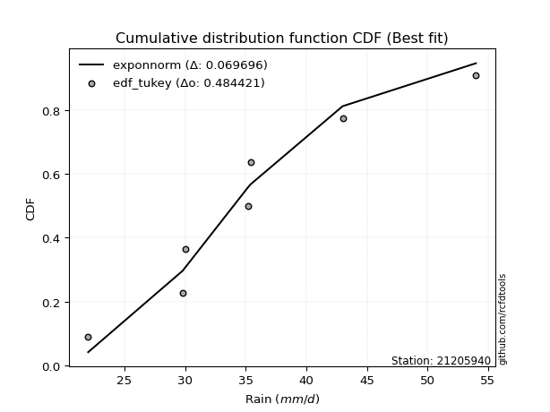</img></img>

</div>


### 8. Empirical - EDF Gringorten (1963)

Gringorten plotting position formula is essential for estimating the probability and return periods of extreme events like floods and heavy rainfall. The constant _a=0.44_.

<div align="center">


$P=(m-a)/(n+1-2a)$


</div>


**8.1. Empirical values**

<div align="center">

|                | 0                   | 1                   | 2                  | 3              | 4                  | 5                  | 6                  |
|:---------------|:--------------------|:--------------------|:-------------------|:---------------|:-------------------|:-------------------|:-------------------|
| date           | 2025                | 2020                | 2021               | 2024           | 2023               | 2022               | 2019               |
| x              | 22.0                | 29.8                | 30.0               | 35.2           | 35.4               | 43.0               | 54.0               |
| m              | 1                   | 2                   | 3                  | 4              | 5                  | 6                  | 7                  |
| empirical_dist | edf_gringorten      | edf_gringorten      | edf_gringorten     | edf_gringorten | edf_gringorten     | edf_gringorten     | edf_gringorten     |
| empirical      | 0.07865168539325844 | 0.21910112359550563 | 0.3595505617977528 | 0.5            | 0.6404494382022471 | 0.7808988764044943 | 0.9213483146067415 |
| empirical_tr   | 1.0853658536585364  | 1.2805755395683454  | 1.5614035087719298 | 2.0            | 2.781249999999999  | 4.564102564102562  | 12.714285714285701 |

</div>


**8.2. Kolmogorov-Smirnov fit test (sorted by Δ)**


<div align="center">

|                | 0                   | 1                   | 2                   | 3                   | 4                   | 5                   | 6                   | 7                   | 8                   | 9                   | 10                  | 11                  | 12                  | 13                  | 14                  | 15                  | 16                  | 17                  | 18                  | 19                  | 20                  | 21                  | 22                  | 23                  | 24                  | 25                  | 26                  | 27                  | 28                  | 29                  | 30                  | 31                  | 32                  | 33                  | 34                  | 35                  | 36                  | 37                  | 38                  | 39                  | 40                  | 41                  | 42                  | 43                  | 44                  | 45                  | 46                    | 47                  | 48                  | 49                  | 50                  | 51                  | 52                  | 53                  | 54                  | 55                  | 56                  | 57                  | 58                  | 59                  | 60                  | 61                  | 62                  | 63                  | 64                  | 65                  | 66                  | 67                  | 68                  | 69                  | 70                  | 71                  | 72                  | 73                  | 74                  | 75                  | 76                  | 77                  | 78                  | 79                  | 80                  | 81                  | 82                  | 83                  | 84                  | 85                  | 86                  | 87                  | 88                  | 89                  |
|:---------------|:--------------------|:--------------------|:--------------------|:--------------------|:--------------------|:--------------------|:--------------------|:--------------------|:--------------------|:--------------------|:--------------------|:--------------------|:--------------------|:--------------------|:--------------------|:--------------------|:--------------------|:--------------------|:--------------------|:--------------------|:--------------------|:--------------------|:--------------------|:--------------------|:--------------------|:--------------------|:--------------------|:--------------------|:--------------------|:--------------------|:--------------------|:--------------------|:--------------------|:--------------------|:--------------------|:--------------------|:--------------------|:--------------------|:--------------------|:--------------------|:--------------------|:--------------------|:--------------------|:--------------------|:--------------------|:--------------------|:----------------------|:--------------------|:--------------------|:--------------------|:--------------------|:--------------------|:--------------------|:--------------------|:--------------------|:--------------------|:--------------------|:--------------------|:--------------------|:--------------------|:--------------------|:--------------------|:--------------------|:--------------------|:--------------------|:--------------------|:--------------------|:--------------------|:--------------------|:--------------------|:--------------------|:--------------------|:--------------------|:--------------------|:--------------------|:--------------------|:--------------------|:--------------------|:--------------------|:--------------------|:--------------------|:--------------------|:--------------------|:--------------------|:--------------------|:--------------------|:--------------------|:--------------------|:--------------------|:--------------------|
| station        | 21205940            | 21205940            | 21205940            | 21205940            | 21205940            | 21205940            | 21205940            | 21205940            | 21205940            | 21205940            | 21205940            | 21205940            | 21205940            | 21205940            | 21205940            | 21205940            | 21205940            | 21205940            | 21205940            | 21205940            | 21205940            | 21205940            | 21205940            | 21205940            | 21205940            | 21205940            | 21205940            | 21205940            | 21205940            | 21205940            | 21205940            | 21205940            | 21205940            | 21205940            | 21205940            | 21205940            | 21205940            | 21205940            | 21205940            | 21205940            | 21205940            | 21205940            | 21205940            | 21205940            | 21205940            | 21205940            | 21205940              | 21205940            | 21205940            | 21205940            | 21205940            | 21205940            | 21205940            | 21205940            | 21205940            | 21205940            | 21205940            | 21205940            | 21205940            | 21205940            | 21205940            | 21205940            | 21205940            | 21205940            | 21205940            | 21205940            | 21205940            | 21205940            | 21205940            | 21205940            | 21205940            | 21205940            | 21205940            | 21205940            | 21205940            | 21205940            | 21205940            | 21205940            | 21205940            | 21205940            | 21205940            | 21205940            | 21205940            | 21205940            | 21205940            | 21205940            | 21205940            | 21205940            | 21205940            | 21205940            |
| empirical_dist | edf_gringorten      | edf_gringorten      | edf_gringorten      | edf_gringorten      | edf_gringorten      | edf_gringorten      | edf_gringorten      | edf_gringorten      | edf_gringorten      | edf_gringorten      | edf_gringorten      | edf_gringorten      | edf_gringorten      | edf_gringorten      | edf_gringorten      | edf_gringorten      | edf_gringorten      | edf_gringorten      | edf_gringorten      | edf_gringorten      | edf_gringorten      | edf_gringorten      | edf_gringorten      | edf_gringorten      | edf_gringorten      | edf_gringorten      | edf_gringorten      | edf_gringorten      | edf_gringorten      | edf_gringorten      | edf_gringorten      | edf_gringorten      | edf_gringorten      | edf_gringorten      | edf_gringorten      | edf_gringorten      | edf_gringorten      | edf_gringorten      | edf_gringorten      | edf_gringorten      | edf_gringorten      | edf_gringorten      | edf_gringorten      | edf_gringorten      | edf_gringorten      | edf_gringorten      | edf_gringorten        | edf_gringorten      | edf_gringorten      | edf_gringorten      | edf_gringorten      | edf_gringorten      | edf_gringorten      | edf_gringorten      | edf_gringorten      | edf_gringorten      | edf_gringorten      | edf_gringorten      | edf_gringorten      | edf_gringorten      | edf_gringorten      | edf_gringorten      | edf_gringorten      | edf_gringorten      | edf_gringorten      | edf_gringorten      | edf_gringorten      | edf_gringorten      | edf_gringorten      | edf_gringorten      | edf_gringorten      | edf_gringorten      | edf_gringorten      | edf_gringorten      | edf_gringorten      | edf_gringorten      | edf_gringorten      | edf_gringorten      | edf_gringorten      | edf_gringorten      | edf_gringorten      | edf_gringorten      | edf_gringorten      | edf_gringorten      | edf_gringorten      | edf_gringorten      | edf_gringorten      | edf_gringorten      | edf_gringorten      | edf_gringorten      |
| p_dist         | exponnorm           | logmielke           | moyal               | loggenlogistic      | gumbel_r            | logfisk             | nct                 | logbetaprime        | johnsonsu           | invweibull          | genlogistic         | invgauss            | fisk                | invgamma            | logalpha            | loginvgamma         | f                   | alpha               | logfatiguelife      | ncf                 | logf                | lognct              | loglogistic         | logweibull_min      | loggamma            | loggamma            | logerlang           | betaprime           | loghypsecant        | logjohnsonsu        | logpearson3         | logrice             | kstwobign           | logexponnorm        | logt                | logcrystalball      | lognorm             | lognorm             | logloggamma         | erlang              | gamma               | loginvgauss         | logmaxwell          | rayleigh            | halflogistic        | loggumbel_r         | loglaplace_asymmetric | pearson3            | weibull_min         | rice                | lograyleigh         | halfnorm            | maxwell             | loglaplace          | logmoyal            | loginvweibull       | loghalflogistic     | laplace_asymmetric  | loghalfnorm         | wald                | t                   | norm                | crystalball         | logistic            | hypsecant           | logkstwobign        | laplace             | loggumbel_l         | truncnorm           | logncf              | gibrat              | logwald             | loggompertz         | genexpon            | expon               | nakagami            | gumbel_l            | loggibrat           | loggenexpon         | logexpon            | logchi2             | lognakagami         | chi2                | logtruncnorm        | loglognorm          | pareto              | logpareto           | fatiguelife         | gompertz            | mielke              |
| delta          | 0.07786716221488257 | 0.07817336596554403 | 0.07883976573066773 | 0.07936488286814203 | 0.07993023321762371 | 0.08208606387487338 | 0.08512405481929142 | 0.08576495302032894 | 0.0862761296221467  | 0.08631399985162289 | 0.08664451464426023 | 0.08674225791419074 | 0.08694483763147376 | 0.08808614154443029 | 0.08824575934124965 | 0.08916370770532159 | 0.08955564105599823 | 0.09034108848863709 | 0.09045444306063732 | 0.09084041101332041 | 0.09097065509125124 | 0.09110003336526004 | 0.0912625175497983  | 0.09127142681377073 | 0.0922093076256495  | 0.0922093076256495  | 0.09222799160593009 | 0.09254551008140577 | 0.09263153311593864 | 0.09291514534550693 | 0.09296027632152826 | 0.0930705533554356  | 0.0931688350696995  | 0.0969723611700537  | 0.09711794970738952 | 0.09711970777206569 | 0.0971202281718121  | 0.0971202281718121  | 0.09800311595613342 | 0.10004699787812546 | 0.10004734537822133 | 0.10146437889882584 | 0.10293635854840136 | 0.10534367587505644 | 0.1062551729576455  | 0.1066039181837761  | 0.10801693703970594   | 0.11010391637736494 | 0.11254819782410827 | 0.11355395197786211 | 0.11378716578900369 | 0.11474016361660191 | 0.11655478449174383 | 0.11800411212654466 | 0.1306769575195461  | 0.1320181487856462  | 0.14150648465289692 | 0.14162242871025432 | 0.14437212557467913 | 0.14965465359187735 | 0.14994905412648663 | 0.149959301930139   | 0.1499593138441766  | 0.15125797626808185 | 0.15236662888452734 | 0.1538192557774701  | 0.15702582466770726 | 0.16482011993567192 | 0.17635082991676967 | 0.1831210371677157  | 0.19294268020854988 | 0.20083152316246078 | 0.21247949616955228 | 0.21646455102058357 | 0.21668791028720277 | 0.21910069844020952 | 0.22055096979535305 | 0.2285927019247782  | 0.24343303624653043 | 0.2738985047370862  | 0.2801068430182798  | 0.28250471764427554 | 0.3285737969961673  | 0.36255255324135915 | 0.42511893339317786 | 0.43753671396430815 | 0.44428124669449476 | 0.5496056043860773  | 0.7068785145203695  | nan                 |
| deltao         | 0.48442053926100004 | 0.48442053926100004 | 0.48442053926100004 | 0.48442053926100004 | 0.48442053926100004 | 0.48442053926100004 | 0.48442053926100004 | 0.48442053926100004 | 0.48442053926100004 | 0.48442053926100004 | 0.48442053926100004 | 0.48442053926100004 | 0.48442053926100004 | 0.48442053926100004 | 0.48442053926100004 | 0.48442053926100004 | 0.48442053926100004 | 0.48442053926100004 | 0.48442053926100004 | 0.48442053926100004 | 0.48442053926100004 | 0.48442053926100004 | 0.48442053926100004 | 0.48442053926100004 | 0.48442053926100004 | 0.48442053926100004 | 0.48442053926100004 | 0.48442053926100004 | 0.48442053926100004 | 0.48442053926100004 | 0.48442053926100004 | 0.48442053926100004 | 0.48442053926100004 | 0.48442053926100004 | 0.48442053926100004 | 0.48442053926100004 | 0.48442053926100004 | 0.48442053926100004 | 0.48442053926100004 | 0.48442053926100004 | 0.48442053926100004 | 0.48442053926100004 | 0.48442053926100004 | 0.48442053926100004 | 0.48442053926100004 | 0.48442053926100004 | 0.48442053926100004   | 0.48442053926100004 | 0.48442053926100004 | 0.48442053926100004 | 0.48442053926100004 | 0.48442053926100004 | 0.48442053926100004 | 0.48442053926100004 | 0.48442053926100004 | 0.48442053926100004 | 0.48442053926100004 | 0.48442053926100004 | 0.48442053926100004 | 0.48442053926100004 | 0.48442053926100004 | 0.48442053926100004 | 0.48442053926100004 | 0.48442053926100004 | 0.48442053926100004 | 0.48442053926100004 | 0.48442053926100004 | 0.48442053926100004 | 0.48442053926100004 | 0.48442053926100004 | 0.48442053926100004 | 0.48442053926100004 | 0.48442053926100004 | 0.48442053926100004 | 0.48442053926100004 | 0.48442053926100004 | 0.48442053926100004 | 0.48442053926100004 | 0.48442053926100004 | 0.48442053926100004 | 0.48442053926100004 | 0.48442053926100004 | 0.48442053926100004 | 0.48442053926100004 | 0.48442053926100004 | 0.48442053926100004 | 0.48442053926100004 | 0.48442053926100004 | 0.48442053926100004 | 0.48442053926100004 |
| eval           | Δo > Δ              | Δo > Δ              | Δo > Δ              | Δo > Δ              | Δo > Δ              | Δo > Δ              | Δo > Δ              | Δo > Δ              | Δo > Δ              | Δo > Δ              | Δo > Δ              | Δo > Δ              | Δo > Δ              | Δo > Δ              | Δo > Δ              | Δo > Δ              | Δo > Δ              | Δo > Δ              | Δo > Δ              | Δo > Δ              | Δo > Δ              | Δo > Δ              | Δo > Δ              | Δo > Δ              | Δo > Δ              | Δo > Δ              | Δo > Δ              | Δo > Δ              | Δo > Δ              | Δo > Δ              | Δo > Δ              | Δo > Δ              | Δo > Δ              | Δo > Δ              | Δo > Δ              | Δo > Δ              | Δo > Δ              | Δo > Δ              | Δo > Δ              | Δo > Δ              | Δo > Δ              | Δo > Δ              | Δo > Δ              | Δo > Δ              | Δo > Δ              | Δo > Δ              | Δo > Δ                | Δo > Δ              | Δo > Δ              | Δo > Δ              | Δo > Δ              | Δo > Δ              | Δo > Δ              | Δo > Δ              | Δo > Δ              | Δo > Δ              | Δo > Δ              | Δo > Δ              | Δo > Δ              | Δo > Δ              | Δo > Δ              | Δo > Δ              | Δo > Δ              | Δo > Δ              | Δo > Δ              | Δo > Δ              | Δo > Δ              | Δo > Δ              | Δo > Δ              | Δo > Δ              | Δo > Δ              | Δo > Δ              | Δo > Δ              | Δo > Δ              | Δo > Δ              | Δo > Δ              | Δo > Δ              | Δo > Δ              | Δo > Δ              | Δo > Δ              | Δo > Δ              | Δo > Δ              | Δo > Δ              | Δo > Δ              | Δo > Δ              | Δo > Δ              | Δo > Δ              | Δo <= Δ             | Δo <= Δ             | Δo <= Δ             |
| fit            | 1                   | 1                   | 1                   | 1                   | 1                   | 1                   | 1                   | 1                   | 1                   | 1                   | 1                   | 1                   | 1                   | 1                   | 1                   | 1                   | 1                   | 1                   | 1                   | 1                   | 1                   | 1                   | 1                   | 1                   | 1                   | 1                   | 1                   | 1                   | 1                   | 1                   | 1                   | 1                   | 1                   | 1                   | 1                   | 1                   | 1                   | 1                   | 1                   | 1                   | 1                   | 1                   | 1                   | 1                   | 1                   | 1                   | 1                     | 1                   | 1                   | 1                   | 1                   | 1                   | 1                   | 1                   | 1                   | 1                   | 1                   | 1                   | 1                   | 1                   | 1                   | 1                   | 1                   | 1                   | 1                   | 1                   | 1                   | 1                   | 1                   | 1                   | 1                   | 1                   | 1                   | 1                   | 1                   | 1                   | 1                   | 1                   | 1                   | 1                   | 1                   | 1                   | 1                   | 1                   | 1                   | 1                   | 1                   | 0                   | 0                   | 0                   |
| n              | 7                   | 7                   | 7                   | 7                   | 7                   | 7                   | 7                   | 7                   | 7                   | 7                   | 7                   | 7                   | 7                   | 7                   | 7                   | 7                   | 7                   | 7                   | 7                   | 7                   | 7                   | 7                   | 7                   | 7                   | 7                   | 7                   | 7                   | 7                   | 7                   | 7                   | 7                   | 7                   | 7                   | 7                   | 7                   | 7                   | 7                   | 7                   | 7                   | 7                   | 7                   | 7                   | 7                   | 7                   | 7                   | 7                   | 7                     | 7                   | 7                   | 7                   | 7                   | 7                   | 7                   | 7                   | 7                   | 7                   | 7                   | 7                   | 7                   | 7                   | 7                   | 7                   | 7                   | 7                   | 7                   | 7                   | 7                   | 7                   | 7                   | 7                   | 7                   | 7                   | 7                   | 7                   | 7                   | 7                   | 7                   | 7                   | 7                   | 7                   | 7                   | 7                   | 7                   | 7                   | 7                   | 7                   | 7                   | 7                   | 7                   | 7                   |
| best_fit       | 1                   | 0                   | 0                   | 0                   | 0                   | 0                   | 0                   | 0                   | 0                   | 0                   | 0                   | 0                   | 0                   | 0                   | 0                   | 0                   | 0                   | 0                   | 0                   | 0                   | 0                   | 0                   | 0                   | 0                   | 0                   | 0                   | 0                   | 0                   | 0                   | 0                   | 0                   | 0                   | 0                   | 0                   | 0                   | 0                   | 0                   | 0                   | 0                   | 0                   | 0                   | 0                   | 0                   | 0                   | 0                   | 0                   | 0                     | 0                   | 0                   | 0                   | 0                   | 0                   | 0                   | 0                   | 0                   | 0                   | 0                   | 0                   | 0                   | 0                   | 0                   | 0                   | 0                   | 0                   | 0                   | 0                   | 0                   | 0                   | 0                   | 0                   | 0                   | 0                   | 0                   | 0                   | 0                   | 0                   | 0                   | 0                   | 0                   | 0                   | 0                   | 0                   | 0                   | 0                   | 0                   | 0                   | 0                   | 0                   | 0                   | 0                   |
| best_fit_sort  | 1                   | 2                   | 3                   | 4                   | 5                   | 6                   | 7                   | 8                   | 9                   | 10                  | 11                  | 12                  | 13                  | 14                  | 15                  | 16                  | 17                  | 18                  | 19                  | 20                  | 21                  | 22                  | 23                  | 24                  | 25                  | 26                  | 27                  | 28                  | 29                  | 30                  | 31                  | 32                  | 33                  | 34                  | 35                  | 36                  | 37                  | 38                  | 39                  | 40                  | 41                  | 42                  | 43                  | 44                  | 45                  | 46                  | 47                    | 48                  | 49                  | 50                  | 51                  | 52                  | 53                  | 54                  | 55                  | 56                  | 57                  | 58                  | 59                  | 60                  | 61                  | 62                  | 63                  | 64                  | 65                  | 66                  | 67                  | 68                  | 69                  | 70                  | 71                  | 72                  | 73                  | 74                  | 75                  | 76                  | 77                  | 78                  | 79                  | 80                  | 81                  | 82                  | 83                  | 84                  | 85                  | 86                  | 87                  | 88                  | 89                  | 90                  |

</div>


<div align="center">

</img>

</div>


**8.3. Best fit**

<div align="center">

|   id |   station | empirical_dist   | p_dist    |     delta |   deltao | eval   |   fit |   n |   best_fit |   best_fit_sort |
|-----:|----------:|:-----------------|:----------|----------:|---------:|:-------|------:|----:|-----------:|----------------:|
|    0 |  21205940 | edf_gringorten   | exponnorm | 0.0778672 | 0.484421 | Δo > Δ |     1 |   7 |          1 |               1 |

</div>


<div align="center">

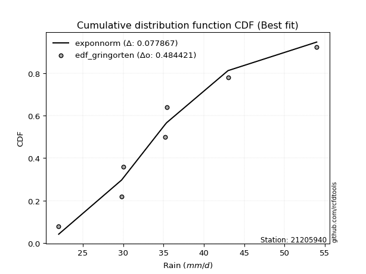</img></img>

</div>


### 9. Empirical - EDF Filliben (1975)

The specific values of the constants (0.3175) (often denoted as $alpha$) and (0.365) are derived from a method proposed by James J. Filliben in a 1975 paper. This particular formula is the mean value of the $i$-th order statistic of the normal distribution and is considered a robust and effective plotting position formula for the normal probability plot correlation coefficient test for normality.

<div align="center">


$P=(m-0.3175)/(n+0.365)$


</div>


**9.1. Empirical values**

<div align="center">

|                | 0                   | 1                   | 2                   | 3            | 4                  | 5                  | 6                  |
|:---------------|:--------------------|:--------------------|:--------------------|:-------------|:-------------------|:-------------------|:-------------------|
| date           | 2025                | 2020                | 2021                | 2024         | 2023               | 2022               | 2019               |
| x              | 22.0                | 29.8                | 30.0                | 35.2         | 35.4               | 43.0               | 54.0               |
| m              | 1                   | 2                   | 3                   | 4            | 5                  | 6                  | 7                  |
| empirical_dist | edf_filliben        | edf_filliben        | edf_filliben        | edf_filliben | edf_filliben       | edf_filliben       | edf_filliben       |
| empirical      | 0.09266802443991853 | 0.22844534962661237 | 0.36422267481330617 | 0.5          | 0.6357773251866938 | 0.7715546503733877 | 0.9073319755600815 |
| empirical_tr   | 1.1021324354657687  | 1.2960844698636163  | 1.5728777362520021  | 2.0          | 2.7455731593662627 | 4.377414561664191  | 10.791208791208794 |

</div>


**9.2. Kolmogorov-Smirnov fit test (sorted by Δ)**


<div align="center">

|                | 0                   | 1                   | 2                   | 3                   | 4                   | 5                   | 6                   | 7                   | 8                   | 9                   | 10                  | 11                  | 12                  | 13                  | 14                  | 15                  | 16                  | 17                  | 18                  | 19                  | 20                  | 21                  | 22                  | 23                  | 24                  | 25                  | 26                  | 27                  | 28                  | 29                  | 30                  | 31                  | 32                  | 33                  | 34                  | 35                  | 36                  | 37                  | 38                  | 39                  | 40                  | 41                  | 42                  | 43                  | 44                  | 45                  | 46                  | 47                  | 48                  | 49                  | 50                  | 51                  | 52                    | 53                  | 54                  | 55                  | 56                  | 57                  | 58                  | 59                  | 60                  | 61                  | 62                  | 63                  | 64                  | 65                  | 66                  | 67                  | 68                  | 69                  | 70                  | 71                  | 72                  | 73                  | 74                  | 75                  | 76                  | 77                  | 78                  | 79                  | 80                  | 81                  | 82                  | 83                  | 84                  | 85                  | 86                  | 87                  | 88                  | 89                  |
|:---------------|:--------------------|:--------------------|:--------------------|:--------------------|:--------------------|:--------------------|:--------------------|:--------------------|:--------------------|:--------------------|:--------------------|:--------------------|:--------------------|:--------------------|:--------------------|:--------------------|:--------------------|:--------------------|:--------------------|:--------------------|:--------------------|:--------------------|:--------------------|:--------------------|:--------------------|:--------------------|:--------------------|:--------------------|:--------------------|:--------------------|:--------------------|:--------------------|:--------------------|:--------------------|:--------------------|:--------------------|:--------------------|:--------------------|:--------------------|:--------------------|:--------------------|:--------------------|:--------------------|:--------------------|:--------------------|:--------------------|:--------------------|:--------------------|:--------------------|:--------------------|:--------------------|:--------------------|:----------------------|:--------------------|:--------------------|:--------------------|:--------------------|:--------------------|:--------------------|:--------------------|:--------------------|:--------------------|:--------------------|:--------------------|:--------------------|:--------------------|:--------------------|:--------------------|:--------------------|:--------------------|:--------------------|:--------------------|:--------------------|:--------------------|:--------------------|:--------------------|:--------------------|:--------------------|:--------------------|:--------------------|:--------------------|:--------------------|:--------------------|:--------------------|:--------------------|:--------------------|:--------------------|:--------------------|:--------------------|:--------------------|
| station        | 21205940            | 21205940            | 21205940            | 21205940            | 21205940            | 21205940            | 21205940            | 21205940            | 21205940            | 21205940            | 21205940            | 21205940            | 21205940            | 21205940            | 21205940            | 21205940            | 21205940            | 21205940            | 21205940            | 21205940            | 21205940            | 21205940            | 21205940            | 21205940            | 21205940            | 21205940            | 21205940            | 21205940            | 21205940            | 21205940            | 21205940            | 21205940            | 21205940            | 21205940            | 21205940            | 21205940            | 21205940            | 21205940            | 21205940            | 21205940            | 21205940            | 21205940            | 21205940            | 21205940            | 21205940            | 21205940            | 21205940            | 21205940            | 21205940            | 21205940            | 21205940            | 21205940            | 21205940              | 21205940            | 21205940            | 21205940            | 21205940            | 21205940            | 21205940            | 21205940            | 21205940            | 21205940            | 21205940            | 21205940            | 21205940            | 21205940            | 21205940            | 21205940            | 21205940            | 21205940            | 21205940            | 21205940            | 21205940            | 21205940            | 21205940            | 21205940            | 21205940            | 21205940            | 21205940            | 21205940            | 21205940            | 21205940            | 21205940            | 21205940            | 21205940            | 21205940            | 21205940            | 21205940            | 21205940            | 21205940            |
| empirical_dist | edf_filliben        | edf_filliben        | edf_filliben        | edf_filliben        | edf_filliben        | edf_filliben        | edf_filliben        | edf_filliben        | edf_filliben        | edf_filliben        | edf_filliben        | edf_filliben        | edf_filliben        | edf_filliben        | edf_filliben        | edf_filliben        | edf_filliben        | edf_filliben        | edf_filliben        | edf_filliben        | edf_filliben        | edf_filliben        | edf_filliben        | edf_filliben        | edf_filliben        | edf_filliben        | edf_filliben        | edf_filliben        | edf_filliben        | edf_filliben        | edf_filliben        | edf_filliben        | edf_filliben        | edf_filliben        | edf_filliben        | edf_filliben        | edf_filliben        | edf_filliben        | edf_filliben        | edf_filliben        | edf_filliben        | edf_filliben        | edf_filliben        | edf_filliben        | edf_filliben        | edf_filliben        | edf_filliben        | edf_filliben        | edf_filliben        | edf_filliben        | edf_filliben        | edf_filliben        | edf_filliben          | edf_filliben        | edf_filliben        | edf_filliben        | edf_filliben        | edf_filliben        | edf_filliben        | edf_filliben        | edf_filliben        | edf_filliben        | edf_filliben        | edf_filliben        | edf_filliben        | edf_filliben        | edf_filliben        | edf_filliben        | edf_filliben        | edf_filliben        | edf_filliben        | edf_filliben        | edf_filliben        | edf_filliben        | edf_filliben        | edf_filliben        | edf_filliben        | edf_filliben        | edf_filliben        | edf_filliben        | edf_filliben        | edf_filliben        | edf_filliben        | edf_filliben        | edf_filliben        | edf_filliben        | edf_filliben        | edf_filliben        | edf_filliben        | edf_filliben        |
| p_dist         | exponnorm           | logmielke           | loggenlogistic      | gumbel_r            | invweibull          | genlogistic         | logfisk             | logalpha            | loginvgamma         | nct                 | invgauss            | logbetaprime        | johnsonsu           | lognct              | logweibull_min      | fisk                | moyal               | invgamma            | logrice             | kstwobign           | f                   | alpha               | logfatiguelife      | ncf                 | logf                | loglogistic         | loggamma            | loggamma            | logerlang           | betaprime           | logjohnsonsu        | logpearson3         | erlang              | gamma               | loginvgauss         | logexponnorm        | logt                | logcrystalball      | lognorm             | lognorm             | logloggamma         | logmaxwell          | halflogistic        | loghypsecant        | rayleigh            | weibull_min         | lograyleigh         | halfnorm            | loggumbel_r         | pearson3            | rice                | maxwell             | loglaplace_asymmetric | loginvweibull       | loglaplace          | logmoyal            | loghalflogistic     | loghalfnorm         | laplace_asymmetric  | logkstwobign        | t                   | norm                | crystalball         | logistic            | hypsecant           | wald                | laplace             | loggumbel_l         | truncnorm           | logncf              | gibrat              | logwald             | loggompertz         | genexpon            | expon               | gumbel_l            | nakagami            | loggibrat           | loggenexpon         | logexpon            | logchi2             | lognakagami         | chi2                | logtruncnorm        | loglognorm          | pareto              | logpareto           | fatiguelife         | gompertz            | mielke              |
| delta          | 0.06860117072382121 | 0.07350125294999077 | 0.07469276985258877 | 0.07525812020207046 | 0.07696977382051615 | 0.0773002886131535  | 0.07741395085932012 | 0.07890153331014291 | 0.07981948167421485 | 0.08045194180373816 | 0.0805809076012104  | 0.08109284000477568 | 0.08160401660659344 | 0.0817558073341533  | 0.081927200782664   | 0.0822727246159205  | 0.08247964195486655 | 0.08341402852887703 | 0.08372632732432886 | 0.08382460903859276 | 0.08488352804044497 | 0.08566897547308383 | 0.08578233004508407 | 0.08616829799776715 | 0.08629854207569798 | 0.08659040453424505 | 0.08753719461009624 | 0.08753719461009624 | 0.08755587859037683 | 0.08787339706585251 | 0.08824303232995367 | 0.088288163305975   | 0.09070277184701872 | 0.09070311934711459 | 0.0921201528677191  | 0.09230024815450044 | 0.09244583669183626 | 0.09244759475651243 | 0.09244811515625884 | 0.09244811515625884 | 0.09333100294058017 | 0.09359213251729462 | 0.09691094692653876 | 0.097303646131492   | 0.10067156285950318 | 0.10320397179300153 | 0.10444293975789695 | 0.10539593758549518 | 0.10540076964027223 | 0.10543180336181168 | 0.10888183896230885 | 0.11188267147619058 | 0.11268905005525931   | 0.12267392275453945 | 0.12267622514209803 | 0.1306769575195461  | 0.13216225862179018 | 0.1350278995435724  | 0.13695031569470106 | 0.14447502974636336 | 0.14527694111093337 | 0.14528718891458575 | 0.14528720082862334 | 0.1465858632525286  | 0.14769451586897409 | 0.14965465359187735 | 0.152353711652154   | 0.16014800692011866 | 0.16700660388566294 | 0.17377681113660895 | 0.19761479322410325 | 0.20083152316246078 | 0.20313527013844554 | 0.20712032498947683 | 0.20734368425609603 | 0.2158788567797998  | 0.22844492447131626 | 0.2285927019247782  | 0.2340888102154237  | 0.2645542787059795  | 0.2660905039716198  | 0.28250471764427554 | 0.31922957096506055 | 0.3532083272102524  | 0.4157747073620711  | 0.4281924879332014  | 0.434937020663388   | 0.5402613783549706  | 0.6975342884892629  | nan                 |
| deltao         | 0.48442053926100004 | 0.48442053926100004 | 0.48442053926100004 | 0.48442053926100004 | 0.48442053926100004 | 0.48442053926100004 | 0.48442053926100004 | 0.48442053926100004 | 0.48442053926100004 | 0.48442053926100004 | 0.48442053926100004 | 0.48442053926100004 | 0.48442053926100004 | 0.48442053926100004 | 0.48442053926100004 | 0.48442053926100004 | 0.48442053926100004 | 0.48442053926100004 | 0.48442053926100004 | 0.48442053926100004 | 0.48442053926100004 | 0.48442053926100004 | 0.48442053926100004 | 0.48442053926100004 | 0.48442053926100004 | 0.48442053926100004 | 0.48442053926100004 | 0.48442053926100004 | 0.48442053926100004 | 0.48442053926100004 | 0.48442053926100004 | 0.48442053926100004 | 0.48442053926100004 | 0.48442053926100004 | 0.48442053926100004 | 0.48442053926100004 | 0.48442053926100004 | 0.48442053926100004 | 0.48442053926100004 | 0.48442053926100004 | 0.48442053926100004 | 0.48442053926100004 | 0.48442053926100004 | 0.48442053926100004 | 0.48442053926100004 | 0.48442053926100004 | 0.48442053926100004 | 0.48442053926100004 | 0.48442053926100004 | 0.48442053926100004 | 0.48442053926100004 | 0.48442053926100004 | 0.48442053926100004   | 0.48442053926100004 | 0.48442053926100004 | 0.48442053926100004 | 0.48442053926100004 | 0.48442053926100004 | 0.48442053926100004 | 0.48442053926100004 | 0.48442053926100004 | 0.48442053926100004 | 0.48442053926100004 | 0.48442053926100004 | 0.48442053926100004 | 0.48442053926100004 | 0.48442053926100004 | 0.48442053926100004 | 0.48442053926100004 | 0.48442053926100004 | 0.48442053926100004 | 0.48442053926100004 | 0.48442053926100004 | 0.48442053926100004 | 0.48442053926100004 | 0.48442053926100004 | 0.48442053926100004 | 0.48442053926100004 | 0.48442053926100004 | 0.48442053926100004 | 0.48442053926100004 | 0.48442053926100004 | 0.48442053926100004 | 0.48442053926100004 | 0.48442053926100004 | 0.48442053926100004 | 0.48442053926100004 | 0.48442053926100004 | 0.48442053926100004 | 0.48442053926100004 |
| eval           | Δo > Δ              | Δo > Δ              | Δo > Δ              | Δo > Δ              | Δo > Δ              | Δo > Δ              | Δo > Δ              | Δo > Δ              | Δo > Δ              | Δo > Δ              | Δo > Δ              | Δo > Δ              | Δo > Δ              | Δo > Δ              | Δo > Δ              | Δo > Δ              | Δo > Δ              | Δo > Δ              | Δo > Δ              | Δo > Δ              | Δo > Δ              | Δo > Δ              | Δo > Δ              | Δo > Δ              | Δo > Δ              | Δo > Δ              | Δo > Δ              | Δo > Δ              | Δo > Δ              | Δo > Δ              | Δo > Δ              | Δo > Δ              | Δo > Δ              | Δo > Δ              | Δo > Δ              | Δo > Δ              | Δo > Δ              | Δo > Δ              | Δo > Δ              | Δo > Δ              | Δo > Δ              | Δo > Δ              | Δo > Δ              | Δo > Δ              | Δo > Δ              | Δo > Δ              | Δo > Δ              | Δo > Δ              | Δo > Δ              | Δo > Δ              | Δo > Δ              | Δo > Δ              | Δo > Δ                | Δo > Δ              | Δo > Δ              | Δo > Δ              | Δo > Δ              | Δo > Δ              | Δo > Δ              | Δo > Δ              | Δo > Δ              | Δo > Δ              | Δo > Δ              | Δo > Δ              | Δo > Δ              | Δo > Δ              | Δo > Δ              | Δo > Δ              | Δo > Δ              | Δo > Δ              | Δo > Δ              | Δo > Δ              | Δo > Δ              | Δo > Δ              | Δo > Δ              | Δo > Δ              | Δo > Δ              | Δo > Δ              | Δo > Δ              | Δo > Δ              | Δo > Δ              | Δo > Δ              | Δo > Δ              | Δo > Δ              | Δo > Δ              | Δo > Δ              | Δo > Δ              | Δo <= Δ             | Δo <= Δ             | Δo <= Δ             |
| fit            | 1                   | 1                   | 1                   | 1                   | 1                   | 1                   | 1                   | 1                   | 1                   | 1                   | 1                   | 1                   | 1                   | 1                   | 1                   | 1                   | 1                   | 1                   | 1                   | 1                   | 1                   | 1                   | 1                   | 1                   | 1                   | 1                   | 1                   | 1                   | 1                   | 1                   | 1                   | 1                   | 1                   | 1                   | 1                   | 1                   | 1                   | 1                   | 1                   | 1                   | 1                   | 1                   | 1                   | 1                   | 1                   | 1                   | 1                   | 1                   | 1                   | 1                   | 1                   | 1                   | 1                     | 1                   | 1                   | 1                   | 1                   | 1                   | 1                   | 1                   | 1                   | 1                   | 1                   | 1                   | 1                   | 1                   | 1                   | 1                   | 1                   | 1                   | 1                   | 1                   | 1                   | 1                   | 1                   | 1                   | 1                   | 1                   | 1                   | 1                   | 1                   | 1                   | 1                   | 1                   | 1                   | 1                   | 1                   | 0                   | 0                   | 0                   |
| n              | 7                   | 7                   | 7                   | 7                   | 7                   | 7                   | 7                   | 7                   | 7                   | 7                   | 7                   | 7                   | 7                   | 7                   | 7                   | 7                   | 7                   | 7                   | 7                   | 7                   | 7                   | 7                   | 7                   | 7                   | 7                   | 7                   | 7                   | 7                   | 7                   | 7                   | 7                   | 7                   | 7                   | 7                   | 7                   | 7                   | 7                   | 7                   | 7                   | 7                   | 7                   | 7                   | 7                   | 7                   | 7                   | 7                   | 7                   | 7                   | 7                   | 7                   | 7                   | 7                   | 7                     | 7                   | 7                   | 7                   | 7                   | 7                   | 7                   | 7                   | 7                   | 7                   | 7                   | 7                   | 7                   | 7                   | 7                   | 7                   | 7                   | 7                   | 7                   | 7                   | 7                   | 7                   | 7                   | 7                   | 7                   | 7                   | 7                   | 7                   | 7                   | 7                   | 7                   | 7                   | 7                   | 7                   | 7                   | 7                   | 7                   | 7                   |
| best_fit       | 1                   | 0                   | 0                   | 0                   | 0                   | 0                   | 0                   | 0                   | 0                   | 0                   | 0                   | 0                   | 0                   | 0                   | 0                   | 0                   | 0                   | 0                   | 0                   | 0                   | 0                   | 0                   | 0                   | 0                   | 0                   | 0                   | 0                   | 0                   | 0                   | 0                   | 0                   | 0                   | 0                   | 0                   | 0                   | 0                   | 0                   | 0                   | 0                   | 0                   | 0                   | 0                   | 0                   | 0                   | 0                   | 0                   | 0                   | 0                   | 0                   | 0                   | 0                   | 0                   | 0                     | 0                   | 0                   | 0                   | 0                   | 0                   | 0                   | 0                   | 0                   | 0                   | 0                   | 0                   | 0                   | 0                   | 0                   | 0                   | 0                   | 0                   | 0                   | 0                   | 0                   | 0                   | 0                   | 0                   | 0                   | 0                   | 0                   | 0                   | 0                   | 0                   | 0                   | 0                   | 0                   | 0                   | 0                   | 0                   | 0                   | 0                   |
| best_fit_sort  | 1                   | 2                   | 3                   | 4                   | 5                   | 6                   | 7                   | 8                   | 9                   | 10                  | 11                  | 12                  | 13                  | 14                  | 15                  | 16                  | 17                  | 18                  | 19                  | 20                  | 21                  | 22                  | 23                  | 24                  | 25                  | 26                  | 27                  | 28                  | 29                  | 30                  | 31                  | 32                  | 33                  | 34                  | 35                  | 36                  | 37                  | 38                  | 39                  | 40                  | 41                  | 42                  | 43                  | 44                  | 45                  | 46                  | 47                  | 48                  | 49                  | 50                  | 51                  | 52                  | 53                    | 54                  | 55                  | 56                  | 57                  | 58                  | 59                  | 60                  | 61                  | 62                  | 63                  | 64                  | 65                  | 66                  | 67                  | 68                  | 69                  | 70                  | 71                  | 72                  | 73                  | 74                  | 75                  | 76                  | 77                  | 78                  | 79                  | 80                  | 81                  | 82                  | 83                  | 84                  | 85                  | 86                  | 87                  | 88                  | 89                  | 90                  |

</div>


<div align="center">

</img>

</div>


**9.3. Best fit**

<div align="center">

|   id |   station | empirical_dist   | p_dist    |     delta |   deltao | eval   |   fit |   n |   best_fit |   best_fit_sort |
|-----:|----------:|:-----------------|:----------|----------:|---------:|:-------|------:|----:|-----------:|----------------:|
|    0 |  21205940 | edf_filliben     | exponnorm | 0.0686012 | 0.484421 | Δo > Δ |     1 |   7 |          1 |               1 |

</div>


<div align="center">

</img>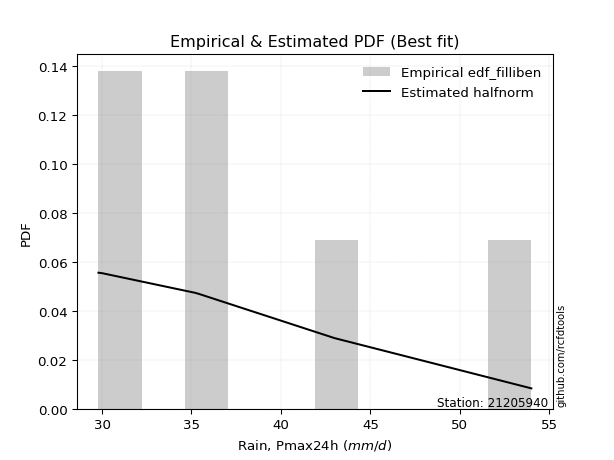</img>

</div>


### 10. Empirical - EDF Jenkinson (1977)

The Jenkinson formula in hydrology is an empirical plotting position formula used to estimate the non-exceedance probability _(P)_ or return period _(T)_ of a given ordered observation within a sample. It is a widely used method in the frequency analysis of extreme events such as floods and rainfall, as it provides a distribution-free way to plot data. _a≈0.31_ and _b≈0.38_ are constants derived to approximate the median of the probability distribution for the given rank.

<div align="center">


$P=(m-a)/(n+b)$


</div>


**10.1. Empirical values**

<div align="center">

|                | 0                   | 1                   | 2                   | 3             | 4                  | 5                  | 6                  |
|:---------------|:--------------------|:--------------------|:--------------------|:--------------|:-------------------|:-------------------|:-------------------|
| date           | 2025                | 2020                | 2021                | 2024          | 2023               | 2022               | 2019               |
| x              | 22.0                | 29.8                | 30.0                | 35.2          | 35.4               | 43.0               | 54.0               |
| m              | 1                   | 2                   | 3                   | 4             | 5                  | 6                  | 7                  |
| empirical_dist | edf_jenkinson       | edf_jenkinson       | edf_jenkinson       | edf_jenkinson | edf_jenkinson      | edf_jenkinson      | edf_jenkinson      |
| empirical      | 0.09349593495934959 | 0.22899728997289973 | 0.36449864498644985 | 0.5           | 0.6355013550135502 | 0.7710027100271003 | 0.9065040650406505 |
| empirical_tr   | 1.1031390134529149  | 1.29701230228471    | 1.5735607675906182  | 2.0           | 2.743494423791822  | 4.366863905325444  | 10.695652173913055 |

</div>


**10.2. Kolmogorov-Smirnov fit test (sorted by Δ)**


<div align="center">

|                | 0                   | 1                   | 2                   | 3                   | 4                   | 5                   | 6                   | 7                   | 8                   | 9                   | 10                  | 11                  | 12                  | 13                  | 14                  | 15                  | 16                  | 17                  | 18                  | 19                  | 20                  | 21                  | 22                  | 23                  | 24                  | 25                  | 26                  | 27                  | 28                  | 29                  | 30                  | 31                  | 32                  | 33                  | 34                  | 35                  | 36                  | 37                  | 38                  | 39                  | 40                  | 41                  | 42                  | 43                  | 44                  | 45                  | 46                  | 47                  | 48                  | 49                  | 50                  | 51                  | 52                    | 53                  | 54                  | 55                  | 56                  | 57                  | 58                  | 59                  | 60                  | 61                  | 62                  | 63                  | 64                  | 65                  | 66                  | 67                  | 68                  | 69                  | 70                  | 71                  | 72                  | 73                  | 74                  | 75                  | 76                  | 77                  | 78                  | 79                  | 80                  | 81                  | 82                  | 83                  | 84                  | 85                  | 86                  | 87                  | 88                  | 89                  |
|:---------------|:--------------------|:--------------------|:--------------------|:--------------------|:--------------------|:--------------------|:--------------------|:--------------------|:--------------------|:--------------------|:--------------------|:--------------------|:--------------------|:--------------------|:--------------------|:--------------------|:--------------------|:--------------------|:--------------------|:--------------------|:--------------------|:--------------------|:--------------------|:--------------------|:--------------------|:--------------------|:--------------------|:--------------------|:--------------------|:--------------------|:--------------------|:--------------------|:--------------------|:--------------------|:--------------------|:--------------------|:--------------------|:--------------------|:--------------------|:--------------------|:--------------------|:--------------------|:--------------------|:--------------------|:--------------------|:--------------------|:--------------------|:--------------------|:--------------------|:--------------------|:--------------------|:--------------------|:----------------------|:--------------------|:--------------------|:--------------------|:--------------------|:--------------------|:--------------------|:--------------------|:--------------------|:--------------------|:--------------------|:--------------------|:--------------------|:--------------------|:--------------------|:--------------------|:--------------------|:--------------------|:--------------------|:--------------------|:--------------------|:--------------------|:--------------------|:--------------------|:--------------------|:--------------------|:--------------------|:--------------------|:--------------------|:--------------------|:--------------------|:--------------------|:--------------------|:--------------------|:--------------------|:--------------------|:--------------------|:--------------------|
| station        | 21205940            | 21205940            | 21205940            | 21205940            | 21205940            | 21205940            | 21205940            | 21205940            | 21205940            | 21205940            | 21205940            | 21205940            | 21205940            | 21205940            | 21205940            | 21205940            | 21205940            | 21205940            | 21205940            | 21205940            | 21205940            | 21205940            | 21205940            | 21205940            | 21205940            | 21205940            | 21205940            | 21205940            | 21205940            | 21205940            | 21205940            | 21205940            | 21205940            | 21205940            | 21205940            | 21205940            | 21205940            | 21205940            | 21205940            | 21205940            | 21205940            | 21205940            | 21205940            | 21205940            | 21205940            | 21205940            | 21205940            | 21205940            | 21205940            | 21205940            | 21205940            | 21205940            | 21205940              | 21205940            | 21205940            | 21205940            | 21205940            | 21205940            | 21205940            | 21205940            | 21205940            | 21205940            | 21205940            | 21205940            | 21205940            | 21205940            | 21205940            | 21205940            | 21205940            | 21205940            | 21205940            | 21205940            | 21205940            | 21205940            | 21205940            | 21205940            | 21205940            | 21205940            | 21205940            | 21205940            | 21205940            | 21205940            | 21205940            | 21205940            | 21205940            | 21205940            | 21205940            | 21205940            | 21205940            | 21205940            |
| empirical_dist | edf_jenkinson       | edf_jenkinson       | edf_jenkinson       | edf_jenkinson       | edf_jenkinson       | edf_jenkinson       | edf_jenkinson       | edf_jenkinson       | edf_jenkinson       | edf_jenkinson       | edf_jenkinson       | edf_jenkinson       | edf_jenkinson       | edf_jenkinson       | edf_jenkinson       | edf_jenkinson       | edf_jenkinson       | edf_jenkinson       | edf_jenkinson       | edf_jenkinson       | edf_jenkinson       | edf_jenkinson       | edf_jenkinson       | edf_jenkinson       | edf_jenkinson       | edf_jenkinson       | edf_jenkinson       | edf_jenkinson       | edf_jenkinson       | edf_jenkinson       | edf_jenkinson       | edf_jenkinson       | edf_jenkinson       | edf_jenkinson       | edf_jenkinson       | edf_jenkinson       | edf_jenkinson       | edf_jenkinson       | edf_jenkinson       | edf_jenkinson       | edf_jenkinson       | edf_jenkinson       | edf_jenkinson       | edf_jenkinson       | edf_jenkinson       | edf_jenkinson       | edf_jenkinson       | edf_jenkinson       | edf_jenkinson       | edf_jenkinson       | edf_jenkinson       | edf_jenkinson       | edf_jenkinson         | edf_jenkinson       | edf_jenkinson       | edf_jenkinson       | edf_jenkinson       | edf_jenkinson       | edf_jenkinson       | edf_jenkinson       | edf_jenkinson       | edf_jenkinson       | edf_jenkinson       | edf_jenkinson       | edf_jenkinson       | edf_jenkinson       | edf_jenkinson       | edf_jenkinson       | edf_jenkinson       | edf_jenkinson       | edf_jenkinson       | edf_jenkinson       | edf_jenkinson       | edf_jenkinson       | edf_jenkinson       | edf_jenkinson       | edf_jenkinson       | edf_jenkinson       | edf_jenkinson       | edf_jenkinson       | edf_jenkinson       | edf_jenkinson       | edf_jenkinson       | edf_jenkinson       | edf_jenkinson       | edf_jenkinson       | edf_jenkinson       | edf_jenkinson       | edf_jenkinson       | edf_jenkinson       |
| p_dist         | exponnorm           | logmielke           | loggenlogistic      | gumbel_r            | invweibull          | genlogistic         | logfisk             | logalpha            | loginvgamma         | nct                 | invgauss            | logbetaprime        | lognct              | johnsonsu           | logweibull_min      | fisk                | invgamma            | logrice             | kstwobign           | moyal               | f                   | alpha               | logfatiguelife      | ncf                 | logf                | loglogistic         | loggamma            | loggamma            | logerlang           | betaprime           | logjohnsonsu        | logpearson3         | erlang              | gamma               | loginvgauss         | logexponnorm        | logt                | logcrystalball      | lognorm             | lognorm             | logmaxwell          | logloggamma         | halflogistic        | loghypsecant        | rayleigh            | weibull_min         | lograyleigh         | halfnorm            | pearson3            | loggumbel_r         | rice                | maxwell             | loglaplace_asymmetric | loginvweibull       | loglaplace          | logmoyal            | loghalflogistic     | loghalfnorm         | laplace_asymmetric  | logkstwobign        | t                   | norm                | crystalball         | logistic            | hypsecant           | wald                | laplace             | loggumbel_l         | truncnorm           | logncf              | gibrat              | logwald             | loggompertz         | genexpon            | expon               | gumbel_l            | loggibrat           | nakagami            | loggenexpon         | logexpon            | logchi2             | lognakagami         | chi2                | logtruncnorm        | loglognorm          | pareto              | logpareto           | fatiguelife         | gompertz            | mielke              |
| delta          | 0.06832520055067759 | 0.07322528277684714 | 0.07441679967944514 | 0.07498215002892683 | 0.07641783347422879 | 0.07674834826686613 | 0.0771379806861765  | 0.07834959296385555 | 0.07926754132792749 | 0.08017597163059453 | 0.08030493742806677 | 0.08081686983163205 | 0.08120386698786594 | 0.08132804643344982 | 0.08137526043637663 | 0.08199675444277688 | 0.0831380583557334  | 0.0831743869780415  | 0.0832726686923054  | 0.08330755247429761 | 0.08460755786730134 | 0.0853930052999402  | 0.08550635987194044 | 0.08589232782462353 | 0.08602257190255436 | 0.08631443436110142 | 0.08726122443695261 | 0.08726122443695261 | 0.08727990841723321 | 0.08759742689270889 | 0.08796706215681005 | 0.08801219313283137 | 0.09015083150073136 | 0.09015117900082723 | 0.09156821252143174 | 0.09202427798135682 | 0.09216986651869263 | 0.0921716245833688  | 0.09217214498311521 | 0.09217214498311521 | 0.09304019217100726 | 0.09305503276743654 | 0.0963590065802514  | 0.09757961630463569 | 0.10039559268635956 | 0.10265203144671417 | 0.10389099941160959 | 0.10484399723920781 | 0.10515583318866806 | 0.10540076964027223 | 0.10860586878916523 | 0.11160670130304695 | 0.11296502022840299   | 0.12212198240825209 | 0.12295219531524171 | 0.1306769575195461  | 0.1317433916997327  | 0.13447595919728503 | 0.13667434552155744 | 0.143923089400076   | 0.14500097093778974 | 0.14501121874144213 | 0.14501123065547972 | 0.14630989307938497 | 0.14741854569583046 | 0.14965465359187735 | 0.15207774147901038 | 0.15987203674697503 | 0.16645466353937557 | 0.1732248707903216  | 0.19789076339724693 | 0.20083152316246078 | 0.20258332979215818 | 0.20656838464318947 | 0.20679174390980867 | 0.21560288660665616 | 0.2285927019247782  | 0.22899686481760362 | 0.23353686986913633 | 0.2640023383596921  | 0.26526259345218883 | 0.28250471764427554 | 0.3186776306187732  | 0.35265638686396505 | 0.41522276701578376 | 0.42764054758691405 | 0.43438508031710066 | 0.5397094380086832  | 0.6969823481429755  | nan                 |
| deltao         | 0.48442053926100004 | 0.48442053926100004 | 0.48442053926100004 | 0.48442053926100004 | 0.48442053926100004 | 0.48442053926100004 | 0.48442053926100004 | 0.48442053926100004 | 0.48442053926100004 | 0.48442053926100004 | 0.48442053926100004 | 0.48442053926100004 | 0.48442053926100004 | 0.48442053926100004 | 0.48442053926100004 | 0.48442053926100004 | 0.48442053926100004 | 0.48442053926100004 | 0.48442053926100004 | 0.48442053926100004 | 0.48442053926100004 | 0.48442053926100004 | 0.48442053926100004 | 0.48442053926100004 | 0.48442053926100004 | 0.48442053926100004 | 0.48442053926100004 | 0.48442053926100004 | 0.48442053926100004 | 0.48442053926100004 | 0.48442053926100004 | 0.48442053926100004 | 0.48442053926100004 | 0.48442053926100004 | 0.48442053926100004 | 0.48442053926100004 | 0.48442053926100004 | 0.48442053926100004 | 0.48442053926100004 | 0.48442053926100004 | 0.48442053926100004 | 0.48442053926100004 | 0.48442053926100004 | 0.48442053926100004 | 0.48442053926100004 | 0.48442053926100004 | 0.48442053926100004 | 0.48442053926100004 | 0.48442053926100004 | 0.48442053926100004 | 0.48442053926100004 | 0.48442053926100004 | 0.48442053926100004   | 0.48442053926100004 | 0.48442053926100004 | 0.48442053926100004 | 0.48442053926100004 | 0.48442053926100004 | 0.48442053926100004 | 0.48442053926100004 | 0.48442053926100004 | 0.48442053926100004 | 0.48442053926100004 | 0.48442053926100004 | 0.48442053926100004 | 0.48442053926100004 | 0.48442053926100004 | 0.48442053926100004 | 0.48442053926100004 | 0.48442053926100004 | 0.48442053926100004 | 0.48442053926100004 | 0.48442053926100004 | 0.48442053926100004 | 0.48442053926100004 | 0.48442053926100004 | 0.48442053926100004 | 0.48442053926100004 | 0.48442053926100004 | 0.48442053926100004 | 0.48442053926100004 | 0.48442053926100004 | 0.48442053926100004 | 0.48442053926100004 | 0.48442053926100004 | 0.48442053926100004 | 0.48442053926100004 | 0.48442053926100004 | 0.48442053926100004 | 0.48442053926100004 |
| eval           | Δo > Δ              | Δo > Δ              | Δo > Δ              | Δo > Δ              | Δo > Δ              | Δo > Δ              | Δo > Δ              | Δo > Δ              | Δo > Δ              | Δo > Δ              | Δo > Δ              | Δo > Δ              | Δo > Δ              | Δo > Δ              | Δo > Δ              | Δo > Δ              | Δo > Δ              | Δo > Δ              | Δo > Δ              | Δo > Δ              | Δo > Δ              | Δo > Δ              | Δo > Δ              | Δo > Δ              | Δo > Δ              | Δo > Δ              | Δo > Δ              | Δo > Δ              | Δo > Δ              | Δo > Δ              | Δo > Δ              | Δo > Δ              | Δo > Δ              | Δo > Δ              | Δo > Δ              | Δo > Δ              | Δo > Δ              | Δo > Δ              | Δo > Δ              | Δo > Δ              | Δo > Δ              | Δo > Δ              | Δo > Δ              | Δo > Δ              | Δo > Δ              | Δo > Δ              | Δo > Δ              | Δo > Δ              | Δo > Δ              | Δo > Δ              | Δo > Δ              | Δo > Δ              | Δo > Δ                | Δo > Δ              | Δo > Δ              | Δo > Δ              | Δo > Δ              | Δo > Δ              | Δo > Δ              | Δo > Δ              | Δo > Δ              | Δo > Δ              | Δo > Δ              | Δo > Δ              | Δo > Δ              | Δo > Δ              | Δo > Δ              | Δo > Δ              | Δo > Δ              | Δo > Δ              | Δo > Δ              | Δo > Δ              | Δo > Δ              | Δo > Δ              | Δo > Δ              | Δo > Δ              | Δo > Δ              | Δo > Δ              | Δo > Δ              | Δo > Δ              | Δo > Δ              | Δo > Δ              | Δo > Δ              | Δo > Δ              | Δo > Δ              | Δo > Δ              | Δo > Δ              | Δo <= Δ             | Δo <= Δ             | Δo <= Δ             |
| fit            | 1                   | 1                   | 1                   | 1                   | 1                   | 1                   | 1                   | 1                   | 1                   | 1                   | 1                   | 1                   | 1                   | 1                   | 1                   | 1                   | 1                   | 1                   | 1                   | 1                   | 1                   | 1                   | 1                   | 1                   | 1                   | 1                   | 1                   | 1                   | 1                   | 1                   | 1                   | 1                   | 1                   | 1                   | 1                   | 1                   | 1                   | 1                   | 1                   | 1                   | 1                   | 1                   | 1                   | 1                   | 1                   | 1                   | 1                   | 1                   | 1                   | 1                   | 1                   | 1                   | 1                     | 1                   | 1                   | 1                   | 1                   | 1                   | 1                   | 1                   | 1                   | 1                   | 1                   | 1                   | 1                   | 1                   | 1                   | 1                   | 1                   | 1                   | 1                   | 1                   | 1                   | 1                   | 1                   | 1                   | 1                   | 1                   | 1                   | 1                   | 1                   | 1                   | 1                   | 1                   | 1                   | 1                   | 1                   | 0                   | 0                   | 0                   |
| n              | 7                   | 7                   | 7                   | 7                   | 7                   | 7                   | 7                   | 7                   | 7                   | 7                   | 7                   | 7                   | 7                   | 7                   | 7                   | 7                   | 7                   | 7                   | 7                   | 7                   | 7                   | 7                   | 7                   | 7                   | 7                   | 7                   | 7                   | 7                   | 7                   | 7                   | 7                   | 7                   | 7                   | 7                   | 7                   | 7                   | 7                   | 7                   | 7                   | 7                   | 7                   | 7                   | 7                   | 7                   | 7                   | 7                   | 7                   | 7                   | 7                   | 7                   | 7                   | 7                   | 7                     | 7                   | 7                   | 7                   | 7                   | 7                   | 7                   | 7                   | 7                   | 7                   | 7                   | 7                   | 7                   | 7                   | 7                   | 7                   | 7                   | 7                   | 7                   | 7                   | 7                   | 7                   | 7                   | 7                   | 7                   | 7                   | 7                   | 7                   | 7                   | 7                   | 7                   | 7                   | 7                   | 7                   | 7                   | 7                   | 7                   | 7                   |
| best_fit       | 1                   | 0                   | 0                   | 0                   | 0                   | 0                   | 0                   | 0                   | 0                   | 0                   | 0                   | 0                   | 0                   | 0                   | 0                   | 0                   | 0                   | 0                   | 0                   | 0                   | 0                   | 0                   | 0                   | 0                   | 0                   | 0                   | 0                   | 0                   | 0                   | 0                   | 0                   | 0                   | 0                   | 0                   | 0                   | 0                   | 0                   | 0                   | 0                   | 0                   | 0                   | 0                   | 0                   | 0                   | 0                   | 0                   | 0                   | 0                   | 0                   | 0                   | 0                   | 0                   | 0                     | 0                   | 0                   | 0                   | 0                   | 0                   | 0                   | 0                   | 0                   | 0                   | 0                   | 0                   | 0                   | 0                   | 0                   | 0                   | 0                   | 0                   | 0                   | 0                   | 0                   | 0                   | 0                   | 0                   | 0                   | 0                   | 0                   | 0                   | 0                   | 0                   | 0                   | 0                   | 0                   | 0                   | 0                   | 0                   | 0                   | 0                   |
| best_fit_sort  | 1                   | 2                   | 3                   | 4                   | 5                   | 6                   | 7                   | 8                   | 9                   | 10                  | 11                  | 12                  | 13                  | 14                  | 15                  | 16                  | 17                  | 18                  | 19                  | 20                  | 21                  | 22                  | 23                  | 24                  | 25                  | 26                  | 27                  | 28                  | 29                  | 30                  | 31                  | 32                  | 33                  | 34                  | 35                  | 36                  | 37                  | 38                  | 39                  | 40                  | 41                  | 42                  | 43                  | 44                  | 45                  | 46                  | 47                  | 48                  | 49                  | 50                  | 51                  | 52                  | 53                    | 54                  | 55                  | 56                  | 57                  | 58                  | 59                  | 60                  | 61                  | 62                  | 63                  | 64                  | 65                  | 66                  | 67                  | 68                  | 69                  | 70                  | 71                  | 72                  | 73                  | 74                  | 75                  | 76                  | 77                  | 78                  | 79                  | 80                  | 81                  | 82                  | 83                  | 84                  | 85                  | 86                  | 87                  | 88                  | 89                  | 90                  |

</div>


<div align="center">

</img>

</div>


**10.3. Best fit**

<div align="center">

|   id |   station | empirical_dist   | p_dist    |     delta |   deltao | eval   |   fit |   n |   best_fit |   best_fit_sort |
|-----:|----------:|:-----------------|:----------|----------:|---------:|:-------|------:|----:|-----------:|----------------:|
|    0 |  21205940 | edf_jenkinson    | exponnorm | 0.0683252 | 0.484421 | Δo > Δ |     1 |   7 |          1 |               1 |

</div>


<div align="center">

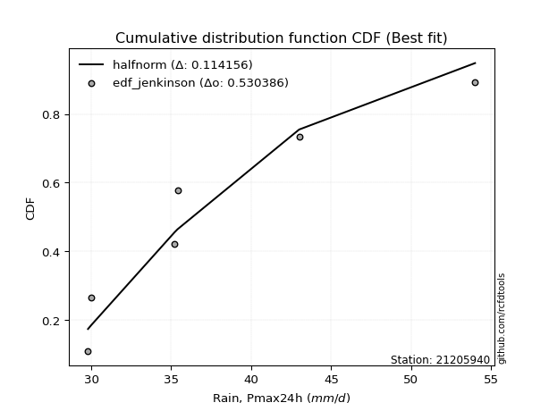</img></img>

</div>


### 11. Empirical - EDF Cunnane (1978)

Cunnane´s work in statistical hydrology has focused on the performance and evaluation of different probability distributions (such as GEV, Gumbel, Lognormal) for flood frequency estimation. _b_ is a constant, typically set to 0.4.

<div align="center">


$P=(m-b)/(n+1-2b)$


</div>


**11.1. Empirical values**

<div align="center">

|                | 0                   | 1                   | 2                  | 3           | 4                  | 5                  | 6                  |
|:---------------|:--------------------|:--------------------|:-------------------|:------------|:-------------------|:-------------------|:-------------------|
| date           | 2025                | 2020                | 2021               | 2024        | 2023               | 2022               | 2019               |
| x              | 22.0                | 29.8                | 30.0               | 35.2        | 35.4               | 43.0               | 54.0               |
| m              | 1                   | 2                   | 3                  | 4           | 5                  | 6                  | 7                  |
| empirical_dist | edf_cunnane         | edf_cunnane         | edf_cunnane        | edf_cunnane | edf_cunnane        | edf_cunnane        | edf_cunnane        |
| empirical      | 0.08333333333333333 | 0.22222222222222224 | 0.3611111111111111 | 0.5         | 0.6388888888888888 | 0.7777777777777777 | 0.9166666666666666 |
| empirical_tr   | 1.090909090909091   | 1.2857142857142856  | 1.565217391304348  | 2.0         | 2.7692307692307687 | 4.499999999999998  | 11.999999999999995 |

</div>


**11.2. Kolmogorov-Smirnov fit test (sorted by Δ)**


<div align="center">

|                | 0                   | 1                   | 2                   | 3                   | 4                   | 5                   | 6                   | 7                   | 8                   | 9                   | 10                  | 11                  | 12                  | 13                  | 14                  | 15                  | 16                  | 17                  | 18                  | 19                  | 20                  | 21                  | 22                  | 23                  | 24                  | 25                  | 26                  | 27                  | 28                  | 29                  | 30                  | 31                  | 32                  | 33                  | 34                  | 35                  | 36                  | 37                  | 38                  | 39                  | 40                  | 41                  | 42                  | 43                  | 44                  | 45                  | 46                  | 47                  | 48                    | 49                  | 50                  | 51                  | 52                  | 53                  | 54                  | 55                  | 56                  | 57                  | 58                  | 59                  | 60                  | 61                  | 62                  | 63                  | 64                  | 65                  | 66                  | 67                  | 68                  | 69                  | 70                  | 71                  | 72                  | 73                  | 74                  | 75                  | 76                  | 77                  | 78                  | 79                  | 80                  | 81                  | 82                  | 83                  | 84                  | 85                  | 86                  | 87                  | 88                  | 89                  |
|:---------------|:--------------------|:--------------------|:--------------------|:--------------------|:--------------------|:--------------------|:--------------------|:--------------------|:--------------------|:--------------------|:--------------------|:--------------------|:--------------------|:--------------------|:--------------------|:--------------------|:--------------------|:--------------------|:--------------------|:--------------------|:--------------------|:--------------------|:--------------------|:--------------------|:--------------------|:--------------------|:--------------------|:--------------------|:--------------------|:--------------------|:--------------------|:--------------------|:--------------------|:--------------------|:--------------------|:--------------------|:--------------------|:--------------------|:--------------------|:--------------------|:--------------------|:--------------------|:--------------------|:--------------------|:--------------------|:--------------------|:--------------------|:--------------------|:----------------------|:--------------------|:--------------------|:--------------------|:--------------------|:--------------------|:--------------------|:--------------------|:--------------------|:--------------------|:--------------------|:--------------------|:--------------------|:--------------------|:--------------------|:--------------------|:--------------------|:--------------------|:--------------------|:--------------------|:--------------------|:--------------------|:--------------------|:--------------------|:--------------------|:--------------------|:--------------------|:--------------------|:--------------------|:--------------------|:--------------------|:--------------------|:--------------------|:--------------------|:--------------------|:--------------------|:--------------------|:--------------------|:--------------------|:--------------------|:--------------------|:--------------------|
| station        | 21205940            | 21205940            | 21205940            | 21205940            | 21205940            | 21205940            | 21205940            | 21205940            | 21205940            | 21205940            | 21205940            | 21205940            | 21205940            | 21205940            | 21205940            | 21205940            | 21205940            | 21205940            | 21205940            | 21205940            | 21205940            | 21205940            | 21205940            | 21205940            | 21205940            | 21205940            | 21205940            | 21205940            | 21205940            | 21205940            | 21205940            | 21205940            | 21205940            | 21205940            | 21205940            | 21205940            | 21205940            | 21205940            | 21205940            | 21205940            | 21205940            | 21205940            | 21205940            | 21205940            | 21205940            | 21205940            | 21205940            | 21205940            | 21205940              | 21205940            | 21205940            | 21205940            | 21205940            | 21205940            | 21205940            | 21205940            | 21205940            | 21205940            | 21205940            | 21205940            | 21205940            | 21205940            | 21205940            | 21205940            | 21205940            | 21205940            | 21205940            | 21205940            | 21205940            | 21205940            | 21205940            | 21205940            | 21205940            | 21205940            | 21205940            | 21205940            | 21205940            | 21205940            | 21205940            | 21205940            | 21205940            | 21205940            | 21205940            | 21205940            | 21205940            | 21205940            | 21205940            | 21205940            | 21205940            | 21205940            |
| empirical_dist | edf_cunnane         | edf_cunnane         | edf_cunnane         | edf_cunnane         | edf_cunnane         | edf_cunnane         | edf_cunnane         | edf_cunnane         | edf_cunnane         | edf_cunnane         | edf_cunnane         | edf_cunnane         | edf_cunnane         | edf_cunnane         | edf_cunnane         | edf_cunnane         | edf_cunnane         | edf_cunnane         | edf_cunnane         | edf_cunnane         | edf_cunnane         | edf_cunnane         | edf_cunnane         | edf_cunnane         | edf_cunnane         | edf_cunnane         | edf_cunnane         | edf_cunnane         | edf_cunnane         | edf_cunnane         | edf_cunnane         | edf_cunnane         | edf_cunnane         | edf_cunnane         | edf_cunnane         | edf_cunnane         | edf_cunnane         | edf_cunnane         | edf_cunnane         | edf_cunnane         | edf_cunnane         | edf_cunnane         | edf_cunnane         | edf_cunnane         | edf_cunnane         | edf_cunnane         | edf_cunnane         | edf_cunnane         | edf_cunnane           | edf_cunnane         | edf_cunnane         | edf_cunnane         | edf_cunnane         | edf_cunnane         | edf_cunnane         | edf_cunnane         | edf_cunnane         | edf_cunnane         | edf_cunnane         | edf_cunnane         | edf_cunnane         | edf_cunnane         | edf_cunnane         | edf_cunnane         | edf_cunnane         | edf_cunnane         | edf_cunnane         | edf_cunnane         | edf_cunnane         | edf_cunnane         | edf_cunnane         | edf_cunnane         | edf_cunnane         | edf_cunnane         | edf_cunnane         | edf_cunnane         | edf_cunnane         | edf_cunnane         | edf_cunnane         | edf_cunnane         | edf_cunnane         | edf_cunnane         | edf_cunnane         | edf_cunnane         | edf_cunnane         | edf_cunnane         | edf_cunnane         | edf_cunnane         | edf_cunnane         | edf_cunnane         |
| p_dist         | exponnorm           | logmielke           | moyal               | loggenlogistic      | gumbel_r            | logfisk             | invweibull          | genlogistic         | nct                 | invgauss            | logbetaprime        | johnsonsu           | logalpha            | fisk                | loginvgamma         | invgamma            | lognct              | f                   | logweibull_min      | alpha               | logfatiguelife      | ncf                 | logf                | loglogistic         | logrice             | kstwobign           | loggamma            | loggamma            | logerlang           | betaprime           | logjohnsonsu        | logpearson3         | loghypsecant        | logexponnorm        | logt                | logcrystalball      | lognorm             | lognorm             | logloggamma         | erlang              | gamma               | loginvgauss         | logmaxwell          | halflogistic        | rayleigh            | loggumbel_r         | pearson3            | weibull_min         | loglaplace_asymmetric | lograyleigh         | halfnorm            | rice                | maxwell             | loglaplace          | loginvweibull       | logmoyal            | loghalflogistic     | laplace_asymmetric  | loghalfnorm         | t                   | norm                | crystalball         | wald                | logistic            | logkstwobign        | hypsecant           | laplace             | loggumbel_l         | truncnorm           | logncf              | gibrat              | logwald             | loggompertz         | genexpon            | expon               | gumbel_l            | nakagami            | loggibrat           | loggenexpon         | logexpon            | logchi2             | lognakagami         | chi2                | logtruncnorm        | loglognorm          | pareto              | logpareto           | fatiguelife         | gompertz            | mielke              |
| delta          | 0.07474606358816596 | 0.07661281665218578 | 0.07765766812398978 | 0.07780433355478378 | 0.07836968390426546 | 0.08052551456151513 | 0.08319290122490627 | 0.08352341601754362 | 0.08356350550593317 | 0.0836924713034054  | 0.08420440370697069 | 0.08471558030878845 | 0.08512466071453303 | 0.08538428831811551 | 0.08604260907860498 | 0.08652559223107203 | 0.08797893473854343 | 0.08799509174263997 | 0.08815032818705412 | 0.08878053917527884 | 0.08889389374727907 | 0.08927986169996216 | 0.08941010577789299 | 0.08970196823644006 | 0.08994945472871899 | 0.09004773644298289 | 0.09064875831229124 | 0.09064875831229124 | 0.09066744229257184 | 0.09098496076804752 | 0.09135459603214868 | 0.09139972700817    | 0.09419208242929694 | 0.09541181185669545 | 0.09555740039403127 | 0.09555915845870744 | 0.09555967885845384 | 0.09555967885845384 | 0.09644256664277517 | 0.09692589925140885 | 0.09692624675150471 | 0.09834328027210923 | 0.09981525992168475 | 0.10313407433092889 | 0.10378312656169819 | 0.10540076964027223 | 0.10854336706400669 | 0.10942709919739166 | 0.10957748635306425   | 0.11066606716228708 | 0.1116190649898853  | 0.11199340266450386 | 0.11499423517838558 | 0.11956466143990296 | 0.12889705015892958 | 0.1306769575195461  | 0.1383853860261803  | 0.14006187939689607 | 0.14125102694796252 | 0.14838850481312837 | 0.14839875261678076 | 0.14839876453081835 | 0.14965465359187735 | 0.1496974269547236  | 0.1506981571507535  | 0.1508060795711691  | 0.155465275354349   | 0.16325957062231367 | 0.17322973129005306 | 0.17999993854099908 | 0.19450322952190818 | 0.20083152316246078 | 0.20935839754283567 | 0.21334345239386696 | 0.21356681166048616 | 0.2189904204819948  | 0.22222179706692613 | 0.2285927019247782  | 0.24031193761981381 | 0.2707774061103696  | 0.27542519507820495 | 0.28250471764427554 | 0.3254526983694507  | 0.35943145461464254 | 0.42199783476646124 | 0.43441561533759154 | 0.44116014806777815 | 0.5464845057593607  | 0.7037574158936529  | nan                 |
| deltao         | 0.48442053926100004 | 0.48442053926100004 | 0.48442053926100004 | 0.48442053926100004 | 0.48442053926100004 | 0.48442053926100004 | 0.48442053926100004 | 0.48442053926100004 | 0.48442053926100004 | 0.48442053926100004 | 0.48442053926100004 | 0.48442053926100004 | 0.48442053926100004 | 0.48442053926100004 | 0.48442053926100004 | 0.48442053926100004 | 0.48442053926100004 | 0.48442053926100004 | 0.48442053926100004 | 0.48442053926100004 | 0.48442053926100004 | 0.48442053926100004 | 0.48442053926100004 | 0.48442053926100004 | 0.48442053926100004 | 0.48442053926100004 | 0.48442053926100004 | 0.48442053926100004 | 0.48442053926100004 | 0.48442053926100004 | 0.48442053926100004 | 0.48442053926100004 | 0.48442053926100004 | 0.48442053926100004 | 0.48442053926100004 | 0.48442053926100004 | 0.48442053926100004 | 0.48442053926100004 | 0.48442053926100004 | 0.48442053926100004 | 0.48442053926100004 | 0.48442053926100004 | 0.48442053926100004 | 0.48442053926100004 | 0.48442053926100004 | 0.48442053926100004 | 0.48442053926100004 | 0.48442053926100004 | 0.48442053926100004   | 0.48442053926100004 | 0.48442053926100004 | 0.48442053926100004 | 0.48442053926100004 | 0.48442053926100004 | 0.48442053926100004 | 0.48442053926100004 | 0.48442053926100004 | 0.48442053926100004 | 0.48442053926100004 | 0.48442053926100004 | 0.48442053926100004 | 0.48442053926100004 | 0.48442053926100004 | 0.48442053926100004 | 0.48442053926100004 | 0.48442053926100004 | 0.48442053926100004 | 0.48442053926100004 | 0.48442053926100004 | 0.48442053926100004 | 0.48442053926100004 | 0.48442053926100004 | 0.48442053926100004 | 0.48442053926100004 | 0.48442053926100004 | 0.48442053926100004 | 0.48442053926100004 | 0.48442053926100004 | 0.48442053926100004 | 0.48442053926100004 | 0.48442053926100004 | 0.48442053926100004 | 0.48442053926100004 | 0.48442053926100004 | 0.48442053926100004 | 0.48442053926100004 | 0.48442053926100004 | 0.48442053926100004 | 0.48442053926100004 | 0.48442053926100004 |
| eval           | Δo > Δ              | Δo > Δ              | Δo > Δ              | Δo > Δ              | Δo > Δ              | Δo > Δ              | Δo > Δ              | Δo > Δ              | Δo > Δ              | Δo > Δ              | Δo > Δ              | Δo > Δ              | Δo > Δ              | Δo > Δ              | Δo > Δ              | Δo > Δ              | Δo > Δ              | Δo > Δ              | Δo > Δ              | Δo > Δ              | Δo > Δ              | Δo > Δ              | Δo > Δ              | Δo > Δ              | Δo > Δ              | Δo > Δ              | Δo > Δ              | Δo > Δ              | Δo > Δ              | Δo > Δ              | Δo > Δ              | Δo > Δ              | Δo > Δ              | Δo > Δ              | Δo > Δ              | Δo > Δ              | Δo > Δ              | Δo > Δ              | Δo > Δ              | Δo > Δ              | Δo > Δ              | Δo > Δ              | Δo > Δ              | Δo > Δ              | Δo > Δ              | Δo > Δ              | Δo > Δ              | Δo > Δ              | Δo > Δ                | Δo > Δ              | Δo > Δ              | Δo > Δ              | Δo > Δ              | Δo > Δ              | Δo > Δ              | Δo > Δ              | Δo > Δ              | Δo > Δ              | Δo > Δ              | Δo > Δ              | Δo > Δ              | Δo > Δ              | Δo > Δ              | Δo > Δ              | Δo > Δ              | Δo > Δ              | Δo > Δ              | Δo > Δ              | Δo > Δ              | Δo > Δ              | Δo > Δ              | Δo > Δ              | Δo > Δ              | Δo > Δ              | Δo > Δ              | Δo > Δ              | Δo > Δ              | Δo > Δ              | Δo > Δ              | Δo > Δ              | Δo > Δ              | Δo > Δ              | Δo > Δ              | Δo > Δ              | Δo > Δ              | Δo > Δ              | Δo > Δ              | Δo <= Δ             | Δo <= Δ             | Δo <= Δ             |
| fit            | 1                   | 1                   | 1                   | 1                   | 1                   | 1                   | 1                   | 1                   | 1                   | 1                   | 1                   | 1                   | 1                   | 1                   | 1                   | 1                   | 1                   | 1                   | 1                   | 1                   | 1                   | 1                   | 1                   | 1                   | 1                   | 1                   | 1                   | 1                   | 1                   | 1                   | 1                   | 1                   | 1                   | 1                   | 1                   | 1                   | 1                   | 1                   | 1                   | 1                   | 1                   | 1                   | 1                   | 1                   | 1                   | 1                   | 1                   | 1                   | 1                     | 1                   | 1                   | 1                   | 1                   | 1                   | 1                   | 1                   | 1                   | 1                   | 1                   | 1                   | 1                   | 1                   | 1                   | 1                   | 1                   | 1                   | 1                   | 1                   | 1                   | 1                   | 1                   | 1                   | 1                   | 1                   | 1                   | 1                   | 1                   | 1                   | 1                   | 1                   | 1                   | 1                   | 1                   | 1                   | 1                   | 1                   | 1                   | 0                   | 0                   | 0                   |
| n              | 7                   | 7                   | 7                   | 7                   | 7                   | 7                   | 7                   | 7                   | 7                   | 7                   | 7                   | 7                   | 7                   | 7                   | 7                   | 7                   | 7                   | 7                   | 7                   | 7                   | 7                   | 7                   | 7                   | 7                   | 7                   | 7                   | 7                   | 7                   | 7                   | 7                   | 7                   | 7                   | 7                   | 7                   | 7                   | 7                   | 7                   | 7                   | 7                   | 7                   | 7                   | 7                   | 7                   | 7                   | 7                   | 7                   | 7                   | 7                   | 7                     | 7                   | 7                   | 7                   | 7                   | 7                   | 7                   | 7                   | 7                   | 7                   | 7                   | 7                   | 7                   | 7                   | 7                   | 7                   | 7                   | 7                   | 7                   | 7                   | 7                   | 7                   | 7                   | 7                   | 7                   | 7                   | 7                   | 7                   | 7                   | 7                   | 7                   | 7                   | 7                   | 7                   | 7                   | 7                   | 7                   | 7                   | 7                   | 7                   | 7                   | 7                   |
| best_fit       | 1                   | 0                   | 0                   | 0                   | 0                   | 0                   | 0                   | 0                   | 0                   | 0                   | 0                   | 0                   | 0                   | 0                   | 0                   | 0                   | 0                   | 0                   | 0                   | 0                   | 0                   | 0                   | 0                   | 0                   | 0                   | 0                   | 0                   | 0                   | 0                   | 0                   | 0                   | 0                   | 0                   | 0                   | 0                   | 0                   | 0                   | 0                   | 0                   | 0                   | 0                   | 0                   | 0                   | 0                   | 0                   | 0                   | 0                   | 0                   | 0                     | 0                   | 0                   | 0                   | 0                   | 0                   | 0                   | 0                   | 0                   | 0                   | 0                   | 0                   | 0                   | 0                   | 0                   | 0                   | 0                   | 0                   | 0                   | 0                   | 0                   | 0                   | 0                   | 0                   | 0                   | 0                   | 0                   | 0                   | 0                   | 0                   | 0                   | 0                   | 0                   | 0                   | 0                   | 0                   | 0                   | 0                   | 0                   | 0                   | 0                   | 0                   |
| best_fit_sort  | 1                   | 2                   | 3                   | 4                   | 5                   | 6                   | 7                   | 8                   | 9                   | 10                  | 11                  | 12                  | 13                  | 14                  | 15                  | 16                  | 17                  | 18                  | 19                  | 20                  | 21                  | 22                  | 23                  | 24                  | 25                  | 26                  | 27                  | 28                  | 29                  | 30                  | 31                  | 32                  | 33                  | 34                  | 35                  | 36                  | 37                  | 38                  | 39                  | 40                  | 41                  | 42                  | 43                  | 44                  | 45                  | 46                  | 47                  | 48                  | 49                    | 50                  | 51                  | 52                  | 53                  | 54                  | 55                  | 56                  | 57                  | 58                  | 59                  | 60                  | 61                  | 62                  | 63                  | 64                  | 65                  | 66                  | 67                  | 68                  | 69                  | 70                  | 71                  | 72                  | 73                  | 74                  | 75                  | 76                  | 77                  | 78                  | 79                  | 80                  | 81                  | 82                  | 83                  | 84                  | 85                  | 86                  | 87                  | 88                  | 89                  | 90                  |

</div>


<div align="center">

</img>

</div>


**11.3. Best fit**

<div align="center">

|   id |   station | empirical_dist   | p_dist    |     delta |   deltao | eval   |   fit |   n |   best_fit |   best_fit_sort |
|-----:|----------:|:-----------------|:----------|----------:|---------:|:-------|------:|----:|-----------:|----------------:|
|    0 |  21205940 | edf_cunnane      | exponnorm | 0.0747461 | 0.484421 | Δo > Δ |     1 |   7 |          1 |               1 |

</div>


<div align="center">

</img>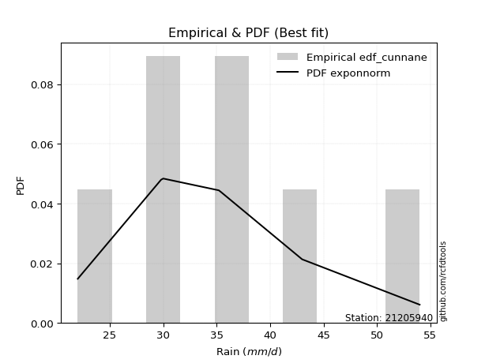</img>

</div>


### 12. Empirical - EDF Adamowski (1981)

The Adamowski formula in hydrology refers to a specific plotting position formula used for estimating the non-parametric empirical distribution of hydrological events (like flood peaks) to calculate their return periods. This formula provides an alternative to traditional parametric methods (like the Gumbel or Log Pearson Type III distributions). 

<div align="center">


$P=(m-0.25)/(n+0.5)$


</div>


**12.1. Empirical values**

<div align="center">

|                | 0                  | 1                   | 2                   | 3             | 4                  | 5                  | 6                  |
|:---------------|:-------------------|:--------------------|:--------------------|:--------------|:-------------------|:-------------------|:-------------------|
| date           | 2025               | 2020                | 2021                | 2024          | 2023               | 2022               | 2019               |
| x              | 22.0               | 29.8                | 30.0                | 35.2          | 35.4               | 43.0               | 54.0               |
| m              | 1                  | 2                   | 3                   | 4             | 5                  | 6                  | 7                  |
| empirical_dist | edf_adamowski      | edf_adamowski       | edf_adamowski       | edf_adamowski | edf_adamowski      | edf_adamowski      | edf_adamowski      |
| empirical      | 0.1                | 0.23333333333333334 | 0.36666666666666664 | 0.5           | 0.6333333333333333 | 0.7666666666666667 | 0.9                |
| empirical_tr   | 1.1111111111111112 | 1.3043478260869565  | 1.5789473684210527  | 2.0           | 2.727272727272727  | 4.2857142857142865 | 10.000000000000002 |

</div>


**12.2. Kolmogorov-Smirnov fit test (sorted by Δ)**


<div align="center">

|                | 0                   | 1                   | 2                   | 3                   | 4                   | 5                   | 6                   | 7                   | 8                   | 9                   | 10                  | 11                  | 12                  | 13                  | 14                  | 15                  | 16                  | 17                  | 18                  | 19                  | 20                  | 21                  | 22                  | 23                  | 24                  | 25                  | 26                  | 27                  | 28                  | 29                  | 30                  | 31                  | 32                  | 33                  | 34                  | 35                  | 36                  | 37                  | 38                  | 39                  | 40                  | 41                  | 42                  | 43                  | 44                  | 45                  | 46                  | 47                  | 48                  | 49                  | 50                  | 51                  | 52                    | 53                  | 54                  | 55                  | 56                  | 57                  | 58                  | 59                  | 60                  | 61                  | 62                  | 63                  | 64                  | 65                  | 66                  | 67                  | 68                  | 69                  | 70                  | 71                  | 72                  | 73                  | 74                  | 75                  | 76                  | 77                  | 78                  | 79                  | 80                  | 81                  | 82                  | 83                  | 84                  | 85                  | 86                  | 87                  | 88                  | 89                  |
|:---------------|:--------------------|:--------------------|:--------------------|:--------------------|:--------------------|:--------------------|:--------------------|:--------------------|:--------------------|:--------------------|:--------------------|:--------------------|:--------------------|:--------------------|:--------------------|:--------------------|:--------------------|:--------------------|:--------------------|:--------------------|:--------------------|:--------------------|:--------------------|:--------------------|:--------------------|:--------------------|:--------------------|:--------------------|:--------------------|:--------------------|:--------------------|:--------------------|:--------------------|:--------------------|:--------------------|:--------------------|:--------------------|:--------------------|:--------------------|:--------------------|:--------------------|:--------------------|:--------------------|:--------------------|:--------------------|:--------------------|:--------------------|:--------------------|:--------------------|:--------------------|:--------------------|:--------------------|:----------------------|:--------------------|:--------------------|:--------------------|:--------------------|:--------------------|:--------------------|:--------------------|:--------------------|:--------------------|:--------------------|:--------------------|:--------------------|:--------------------|:--------------------|:--------------------|:--------------------|:--------------------|:--------------------|:--------------------|:--------------------|:--------------------|:--------------------|:--------------------|:--------------------|:--------------------|:--------------------|:--------------------|:--------------------|:--------------------|:--------------------|:--------------------|:--------------------|:--------------------|:--------------------|:--------------------|:--------------------|:--------------------|
| station        | 21205940            | 21205940            | 21205940            | 21205940            | 21205940            | 21205940            | 21205940            | 21205940            | 21205940            | 21205940            | 21205940            | 21205940            | 21205940            | 21205940            | 21205940            | 21205940            | 21205940            | 21205940            | 21205940            | 21205940            | 21205940            | 21205940            | 21205940            | 21205940            | 21205940            | 21205940            | 21205940            | 21205940            | 21205940            | 21205940            | 21205940            | 21205940            | 21205940            | 21205940            | 21205940            | 21205940            | 21205940            | 21205940            | 21205940            | 21205940            | 21205940            | 21205940            | 21205940            | 21205940            | 21205940            | 21205940            | 21205940            | 21205940            | 21205940            | 21205940            | 21205940            | 21205940            | 21205940              | 21205940            | 21205940            | 21205940            | 21205940            | 21205940            | 21205940            | 21205940            | 21205940            | 21205940            | 21205940            | 21205940            | 21205940            | 21205940            | 21205940            | 21205940            | 21205940            | 21205940            | 21205940            | 21205940            | 21205940            | 21205940            | 21205940            | 21205940            | 21205940            | 21205940            | 21205940            | 21205940            | 21205940            | 21205940            | 21205940            | 21205940            | 21205940            | 21205940            | 21205940            | 21205940            | 21205940            | 21205940            |
| empirical_dist | edf_adamowski       | edf_adamowski       | edf_adamowski       | edf_adamowski       | edf_adamowski       | edf_adamowski       | edf_adamowski       | edf_adamowski       | edf_adamowski       | edf_adamowski       | edf_adamowski       | edf_adamowski       | edf_adamowski       | edf_adamowski       | edf_adamowski       | edf_adamowski       | edf_adamowski       | edf_adamowski       | edf_adamowski       | edf_adamowski       | edf_adamowski       | edf_adamowski       | edf_adamowski       | edf_adamowski       | edf_adamowski       | edf_adamowski       | edf_adamowski       | edf_adamowski       | edf_adamowski       | edf_adamowski       | edf_adamowski       | edf_adamowski       | edf_adamowski       | edf_adamowski       | edf_adamowski       | edf_adamowski       | edf_adamowski       | edf_adamowski       | edf_adamowski       | edf_adamowski       | edf_adamowski       | edf_adamowski       | edf_adamowski       | edf_adamowski       | edf_adamowski       | edf_adamowski       | edf_adamowski       | edf_adamowski       | edf_adamowski       | edf_adamowski       | edf_adamowski       | edf_adamowski       | edf_adamowski         | edf_adamowski       | edf_adamowski       | edf_adamowski       | edf_adamowski       | edf_adamowski       | edf_adamowski       | edf_adamowski       | edf_adamowski       | edf_adamowski       | edf_adamowski       | edf_adamowski       | edf_adamowski       | edf_adamowski       | edf_adamowski       | edf_adamowski       | edf_adamowski       | edf_adamowski       | edf_adamowski       | edf_adamowski       | edf_adamowski       | edf_adamowski       | edf_adamowski       | edf_adamowski       | edf_adamowski       | edf_adamowski       | edf_adamowski       | edf_adamowski       | edf_adamowski       | edf_adamowski       | edf_adamowski       | edf_adamowski       | edf_adamowski       | edf_adamowski       | edf_adamowski       | edf_adamowski       | edf_adamowski       | edf_adamowski       |
| p_dist         | exponnorm           | logmielke           | loggenlogistic      | gumbel_r            | genlogistic         | invweibull          | logalpha            | loginvgamma         | logfisk             | lognct              | logweibull_min      | nct                 | invgauss            | logbetaprime        | logrice             | kstwobign           | johnsonsu           | fisk                | invgamma            | f                   | alpha               | logfatiguelife      | ncf                 | logf                | loglogistic         | loggamma            | loggamma            | logerlang           | betaprime           | logjohnsonsu        | erlang              | gamma               | logpearson3         | loginvgauss         | logmaxwell          | moyal               | logexponnorm        | logt                | logcrystalball      | lognorm             | lognorm             | logloggamma         | rayleigh            | weibull_min         | lograyleigh         | loghypsecant        | halflogistic        | halfnorm            | pearson3            | loggumbel_r         | rice                | maxwell             | loglaplace_asymmetric | loginvweibull       | loglaplace          | loghalfnorm         | logmoyal            | loghalflogistic     | laplace_asymmetric  | logkstwobign        | t                   | norm                | crystalball         | logistic            | hypsecant           | wald                | laplace             | loggumbel_l         | truncnorm           | logncf              | loggompertz         | gibrat              | logwald             | genexpon            | expon               | gumbel_l            | loggibrat           | loggenexpon         | nakagami            | logchi2             | logexpon            | lognakagami         | chi2                | logtruncnorm        | loglognorm          | pareto              | logpareto           | fatiguelife         | gompertz            | mielke              |
| delta          | 0.06615717887046069 | 0.07105726109663024 | 0.07224877799922824 | 0.07281412834870993 | 0.07335443721453705 | 0.07385532492849434 | 0.07401354960342194 | 0.07493149796749388 | 0.0749699590059596  | 0.07686782362743233 | 0.07767915610208931 | 0.07800794995037763 | 0.07813691574784987 | 0.07864884815141515 | 0.07883834361760789 | 0.07893662533187179 | 0.07916002475323292 | 0.07982873276255997 | 0.0809700366755165  | 0.08243953618708444 | 0.0832249836197233  | 0.08333833819172354 | 0.08372430614440662 | 0.08385455022233745 | 0.08437336713805338 | 0.08509320275673571 | 0.08509320275673571 | 0.0851118867370163  | 0.08542940521249198 | 0.08579904047659315 | 0.08581478814029775 | 0.08581513564039361 | 0.08584417145261447 | 0.08723216916099813 | 0.08870414881057365 | 0.08981161751494803 | 0.08985625630113991 | 0.09000184483847573 | 0.0900036029031519  | 0.09000412330289831 | 0.09000412330289831 | 0.09088701108721964 | 0.09822757100614266 | 0.09831598808628056 | 0.09955495605117598 | 0.09974763798485248 | 0.1                 | 0.1005079538787742  | 0.10298781150845115 | 0.10540076964027223 | 0.10643784710894832 | 0.10943867962283005 | 0.11513304190861978   | 0.11778593904781848 | 0.1251202169954585  | 0.13013991583685142 | 0.1306769575195461  | 0.1317433916997327  | 0.13565587726908757 | 0.1395870460396424  | 0.14283294925757284 | 0.14284319706122522 | 0.14284320897526281 | 0.14414187139916806 | 0.14525052401561356 | 0.14965465359187735 | 0.14990971979879347 | 0.15770401506675813 | 0.16211862017894196 | 0.16888882742988798 | 0.19824728643172457 | 0.20005878507746372 | 0.20083152316246078 | 0.20223234128275586 | 0.20245570054937506 | 0.21343486492643926 | 0.2285927019247782  | 0.22920082650870272 | 0.23333290817803723 | 0.25875852841153835 | 0.2596662949992585  | 0.28250471764427554 | 0.31434158725833955 | 0.3483203435035314  | 0.4108867236553501  | 0.4233045042264804  | 0.430049036956667   | 0.5353733946482495  | 0.692646304782542   | nan                 |
| deltao         | 0.48442053926100004 | 0.48442053926100004 | 0.48442053926100004 | 0.48442053926100004 | 0.48442053926100004 | 0.48442053926100004 | 0.48442053926100004 | 0.48442053926100004 | 0.48442053926100004 | 0.48442053926100004 | 0.48442053926100004 | 0.48442053926100004 | 0.48442053926100004 | 0.48442053926100004 | 0.48442053926100004 | 0.48442053926100004 | 0.48442053926100004 | 0.48442053926100004 | 0.48442053926100004 | 0.48442053926100004 | 0.48442053926100004 | 0.48442053926100004 | 0.48442053926100004 | 0.48442053926100004 | 0.48442053926100004 | 0.48442053926100004 | 0.48442053926100004 | 0.48442053926100004 | 0.48442053926100004 | 0.48442053926100004 | 0.48442053926100004 | 0.48442053926100004 | 0.48442053926100004 | 0.48442053926100004 | 0.48442053926100004 | 0.48442053926100004 | 0.48442053926100004 | 0.48442053926100004 | 0.48442053926100004 | 0.48442053926100004 | 0.48442053926100004 | 0.48442053926100004 | 0.48442053926100004 | 0.48442053926100004 | 0.48442053926100004 | 0.48442053926100004 | 0.48442053926100004 | 0.48442053926100004 | 0.48442053926100004 | 0.48442053926100004 | 0.48442053926100004 | 0.48442053926100004 | 0.48442053926100004   | 0.48442053926100004 | 0.48442053926100004 | 0.48442053926100004 | 0.48442053926100004 | 0.48442053926100004 | 0.48442053926100004 | 0.48442053926100004 | 0.48442053926100004 | 0.48442053926100004 | 0.48442053926100004 | 0.48442053926100004 | 0.48442053926100004 | 0.48442053926100004 | 0.48442053926100004 | 0.48442053926100004 | 0.48442053926100004 | 0.48442053926100004 | 0.48442053926100004 | 0.48442053926100004 | 0.48442053926100004 | 0.48442053926100004 | 0.48442053926100004 | 0.48442053926100004 | 0.48442053926100004 | 0.48442053926100004 | 0.48442053926100004 | 0.48442053926100004 | 0.48442053926100004 | 0.48442053926100004 | 0.48442053926100004 | 0.48442053926100004 | 0.48442053926100004 | 0.48442053926100004 | 0.48442053926100004 | 0.48442053926100004 | 0.48442053926100004 | 0.48442053926100004 |
| eval           | Δo > Δ              | Δo > Δ              | Δo > Δ              | Δo > Δ              | Δo > Δ              | Δo > Δ              | Δo > Δ              | Δo > Δ              | Δo > Δ              | Δo > Δ              | Δo > Δ              | Δo > Δ              | Δo > Δ              | Δo > Δ              | Δo > Δ              | Δo > Δ              | Δo > Δ              | Δo > Δ              | Δo > Δ              | Δo > Δ              | Δo > Δ              | Δo > Δ              | Δo > Δ              | Δo > Δ              | Δo > Δ              | Δo > Δ              | Δo > Δ              | Δo > Δ              | Δo > Δ              | Δo > Δ              | Δo > Δ              | Δo > Δ              | Δo > Δ              | Δo > Δ              | Δo > Δ              | Δo > Δ              | Δo > Δ              | Δo > Δ              | Δo > Δ              | Δo > Δ              | Δo > Δ              | Δo > Δ              | Δo > Δ              | Δo > Δ              | Δo > Δ              | Δo > Δ              | Δo > Δ              | Δo > Δ              | Δo > Δ              | Δo > Δ              | Δo > Δ              | Δo > Δ              | Δo > Δ                | Δo > Δ              | Δo > Δ              | Δo > Δ              | Δo > Δ              | Δo > Δ              | Δo > Δ              | Δo > Δ              | Δo > Δ              | Δo > Δ              | Δo > Δ              | Δo > Δ              | Δo > Δ              | Δo > Δ              | Δo > Δ              | Δo > Δ              | Δo > Δ              | Δo > Δ              | Δo > Δ              | Δo > Δ              | Δo > Δ              | Δo > Δ              | Δo > Δ              | Δo > Δ              | Δo > Δ              | Δo > Δ              | Δo > Δ              | Δo > Δ              | Δo > Δ              | Δo > Δ              | Δo > Δ              | Δo > Δ              | Δo > Δ              | Δo > Δ              | Δo > Δ              | Δo <= Δ             | Δo <= Δ             | Δo <= Δ             |
| fit            | 1                   | 1                   | 1                   | 1                   | 1                   | 1                   | 1                   | 1                   | 1                   | 1                   | 1                   | 1                   | 1                   | 1                   | 1                   | 1                   | 1                   | 1                   | 1                   | 1                   | 1                   | 1                   | 1                   | 1                   | 1                   | 1                   | 1                   | 1                   | 1                   | 1                   | 1                   | 1                   | 1                   | 1                   | 1                   | 1                   | 1                   | 1                   | 1                   | 1                   | 1                   | 1                   | 1                   | 1                   | 1                   | 1                   | 1                   | 1                   | 1                   | 1                   | 1                   | 1                   | 1                     | 1                   | 1                   | 1                   | 1                   | 1                   | 1                   | 1                   | 1                   | 1                   | 1                   | 1                   | 1                   | 1                   | 1                   | 1                   | 1                   | 1                   | 1                   | 1                   | 1                   | 1                   | 1                   | 1                   | 1                   | 1                   | 1                   | 1                   | 1                   | 1                   | 1                   | 1                   | 1                   | 1                   | 1                   | 0                   | 0                   | 0                   |
| n              | 7                   | 7                   | 7                   | 7                   | 7                   | 7                   | 7                   | 7                   | 7                   | 7                   | 7                   | 7                   | 7                   | 7                   | 7                   | 7                   | 7                   | 7                   | 7                   | 7                   | 7                   | 7                   | 7                   | 7                   | 7                   | 7                   | 7                   | 7                   | 7                   | 7                   | 7                   | 7                   | 7                   | 7                   | 7                   | 7                   | 7                   | 7                   | 7                   | 7                   | 7                   | 7                   | 7                   | 7                   | 7                   | 7                   | 7                   | 7                   | 7                   | 7                   | 7                   | 7                   | 7                     | 7                   | 7                   | 7                   | 7                   | 7                   | 7                   | 7                   | 7                   | 7                   | 7                   | 7                   | 7                   | 7                   | 7                   | 7                   | 7                   | 7                   | 7                   | 7                   | 7                   | 7                   | 7                   | 7                   | 7                   | 7                   | 7                   | 7                   | 7                   | 7                   | 7                   | 7                   | 7                   | 7                   | 7                   | 7                   | 7                   | 7                   |
| best_fit       | 1                   | 0                   | 0                   | 0                   | 0                   | 0                   | 0                   | 0                   | 0                   | 0                   | 0                   | 0                   | 0                   | 0                   | 0                   | 0                   | 0                   | 0                   | 0                   | 0                   | 0                   | 0                   | 0                   | 0                   | 0                   | 0                   | 0                   | 0                   | 0                   | 0                   | 0                   | 0                   | 0                   | 0                   | 0                   | 0                   | 0                   | 0                   | 0                   | 0                   | 0                   | 0                   | 0                   | 0                   | 0                   | 0                   | 0                   | 0                   | 0                   | 0                   | 0                   | 0                   | 0                     | 0                   | 0                   | 0                   | 0                   | 0                   | 0                   | 0                   | 0                   | 0                   | 0                   | 0                   | 0                   | 0                   | 0                   | 0                   | 0                   | 0                   | 0                   | 0                   | 0                   | 0                   | 0                   | 0                   | 0                   | 0                   | 0                   | 0                   | 0                   | 0                   | 0                   | 0                   | 0                   | 0                   | 0                   | 0                   | 0                   | 0                   |
| best_fit_sort  | 1                   | 2                   | 3                   | 4                   | 5                   | 6                   | 7                   | 8                   | 9                   | 10                  | 11                  | 12                  | 13                  | 14                  | 15                  | 16                  | 17                  | 18                  | 19                  | 20                  | 21                  | 22                  | 23                  | 24                  | 25                  | 26                  | 27                  | 28                  | 29                  | 30                  | 31                  | 32                  | 33                  | 34                  | 35                  | 36                  | 37                  | 38                  | 39                  | 40                  | 41                  | 42                  | 43                  | 44                  | 45                  | 46                  | 47                  | 48                  | 49                  | 50                  | 51                  | 52                  | 53                    | 54                  | 55                  | 56                  | 57                  | 58                  | 59                  | 60                  | 61                  | 62                  | 63                  | 64                  | 65                  | 66                  | 67                  | 68                  | 69                  | 70                  | 71                  | 72                  | 73                  | 74                  | 75                  | 76                  | 77                  | 78                  | 79                  | 80                  | 81                  | 82                  | 83                  | 84                  | 85                  | 86                  | 87                  | 88                  | 89                  | 90                  |

</div>


<div align="center">

</img>

</div>


**12.3. Best fit**

<div align="center">

|   id |   station | empirical_dist   | p_dist    |     delta |   deltao | eval   |   fit |   n |   best_fit |   best_fit_sort |
|-----:|----------:|:-----------------|:----------|----------:|---------:|:-------|------:|----:|-----------:|----------------:|
|    0 |  21205940 | edf_adamowski    | exponnorm | 0.0661572 | 0.484421 | Δo > Δ |     1 |   7 |          1 |               1 |

</div>


<div align="center">

</img>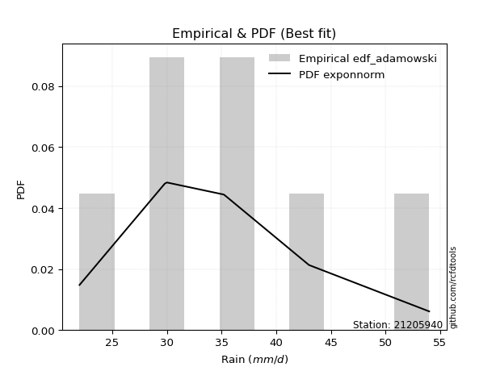</img>

</div>


## C. Best fit & Estimate extreme values for specific return periods - Tr


### 1. Best fit (ordered by delta Δ)

<div align="center">

|   id |   station | empirical_dist   | p_dist       |     delta |   deltao | eval   |   fit |   n |   best_fit |   best_fit_sort |
|-----:|----------:|:-----------------|:-------------|----------:|---------:|:-------|------:|----:|-----------:|----------------:|
|    0 |  21205940 | edf_adamowski    | exponnorm    | 0.0661572 | 0.484421 | Δo > Δ |     1 |   7 |          1 |               1 |
|    1 |  21205940 | edf_chegodayev   | exponnorm    | 0.067959  | 0.484421 | Δo > Δ |     1 |   7 |          1 |               2 |
|    2 |  21205940 | edf_jenkinson    | exponnorm    | 0.0683252 | 0.484421 | Δo > Δ |     1 |   7 |          1 |               3 |
|    3 |  21205940 | edf_beard        | exponnorm    | 0.0683252 | 0.484421 | Δo > Δ |     1 |   7 |          1 |               4 |
|    4 |  21205940 | edf_filliben     | exponnorm    | 0.0686012 | 0.484421 | Δo > Δ |     1 |   7 |          1 |               5 |
|    5 |  21205940 | edf_tukey        | exponnorm    | 0.0696956 | 0.484421 | Δo > Δ |     1 |   7 |          1 |               6 |
|    6 |  21205940 | edf_blom         | exponnorm    | 0.0728304 | 0.484421 | Δo > Δ |     1 |   7 |          1 |               7 |
|    7 |  21205940 | edf_cunnane      | exponnorm    | 0.0747461 | 0.484421 | Δo > Δ |     1 |   7 |          1 |               8 |
|    8 |  21205940 | edf_gringorten   | exponnorm    | 0.0778672 | 0.484421 | Δo > Δ |     1 |   7 |          1 |               9 |
|    9 |  21205940 | edf_weibull      | logfisk      | 0.0782511 | 0.484421 | Δo > Δ |     1 |   7 |          1 |              10 |
|   10 |  21205940 | edf_hazen        | logmielke    | 0.0805811 | 0.484421 | Δo > Δ |     1 |   7 |          1 |              11 |
|   11 |  21205940 | edf_california   | logkstwobign | 0.11273   | 0.484421 | Δo > Δ |     1 |   7 |          1 |              12 |

</div>

:file_folder:Tables: [bestfit_21205940.csv](table/bestfit_21205940.csv) | [extreme_21205940.csv](table/extreme_21205940.csv)


### 2. Extreme values

In hydrology, a return period (or recurrence interval $Tr$) is the statistical average time between extreme events like floods or droughts of a specific magnitude, indicating how rare an event is, with a 100-year flood, for example, having a 1% chance of occurring in any given year, not that it happens exactly every century. It is a key tool for infrastructure design (like bridges or dams) and risk assessment, calculated from historical data to determine the probability of future events, although it is important to remember it is statistical average, and events can cluster or be missed.

> risk_rate: assuming the return period as the project useful life.

|   id |      tr |   prob_l |     prob_g |   alpha |   betaprime |     chi2 |   crystalball |   erlang |    expon |   exponnorm |       f |   fatiguelife |    fisk |   gamma |   genexpon |   genlogistic |   gibrat |   gompertz |   gumbel_l |   gumbel_r |   halflogistic |   halfnorm |   hypsecant |   invgamma |   invgauss |   invweibull |   johnsonsu |   kstwobign |   laplace |   laplace_asymmetric |   loggamma |   logistic |   lognorm |   maxwell |   mielke |   moyal |   nakagami |     ncf |     nct |    norm |           pareto |   pearson3 |   rayleigh |    rice |       t |   truncnorm |     wald |   weibull_min |   logalpha |   logbetaprime |     logchi2 |   logcrystalball |   logerlang |   logexpon |   logexponnorm |    logf |   logfatiguelife |   logfisk |   loggenexpon |   loggenlogistic |   loggibrat |   loggompertz |   loggumbel_l |   loggumbel_r |   loghalflogistic |   loghalfnorm |   loghypsecant |   loginvgamma |   loginvgauss |   loginvweibull |   logjohnsonsu |   logkstwobign |   loglaplace |   loglaplace_asymmetric |   logloggamma |   loglogistic |    loglognorm |   logmaxwell |   logmielke |   logmoyal |   lognakagami |   logncf |   lognct |        logpareto |   logpearson3 |   lograyleigh |   logrice |    logt |   logtruncnorm |   logwald |   logweibull_min |   station |   n |   risk_rate |
|-----:|--------:|---------:|-----------:|--------:|------------:|---------:|--------------:|---------:|---------:|------------:|--------:|--------------:|--------:|--------:|-----------:|--------------:|---------:|-----------:|-----------:|-----------:|---------------:|-----------:|------------:|-----------:|-----------:|-------------:|------------:|------------:|----------:|---------------------:|-----------:|-----------:|----------:|----------:|---------:|--------:|-----------:|--------:|--------:|--------:|-----------------:|-----------:|-----------:|--------:|--------:|------------:|---------:|--------------:|-----------:|---------------:|------------:|-----------------:|------------:|-----------:|---------------:|--------:|-----------------:|----------:|--------------:|-----------------:|------------:|--------------:|--------------:|--------------:|------------------:|--------------:|---------------:|--------------:|--------------:|----------------:|---------------:|---------------:|-------------:|------------------------:|--------------:|--------------:|--------------:|-------------:|------------:|-----------:|--------------:|---------:|---------:|-----------------:|--------------:|--------------:|----------:|--------:|---------------:|----------:|-----------------:|----------:|----:|------------:|
|    0 |    2    | 0.5      | 0.5        | 34.2503 |     34.2897 |  28.3557 |       35.6286 |  33.8643 |  31.4466 |     33.9319 | 34.2193 |       22.0001 | 34.256  | 33.8643 |    31.4531 |       34.0022 |  32.7506 |    48.5598 |    37.2037 |    34.0535 |        33.2704 |    33.666  |     35.6286 |    34.1852 |    34.0932 |      34.0126 |     34.1298 |     34.0345 |   35.6286 |              35.4174 |    34.2772 |    35.6286 |   34.3916 |   34.8086 |  33.7771 | 33.545  |    32.4722 | 34.2451 | 34.1318 | 35.6286 |     22.82        |    34.6772 |    34.5177 | 34.7511 | 35.6283 |     32.4305 |  32.5206 |       33.7241 |    33.9589 |        34.1249 |     36.3598 |          34.3916 |     34.278  |    29.9857 |        34.3883 | 34.2486 |          34.2363 |   34.1502 |       30.7539 |          34.0708 |     31.7569 |       31.4735 |       35.9252 |       32.9235 |           32.2169 |       32.5722 |        34.3916 |       33.9321 |       33.6488 |         33.0232 |        34.2933 |        32.6237 |      34.3916 |                 34.7818 |       34.4085 |       34.3916 |  22.0757      |      33.6193 |     34.0449 |    32.463  |       30.1837 |  34.1399 |  33.9051 |    22.632        |       34.2947 |       33.3496 |   33.9863 | 34.3916 |        28.1426 |   31.5547 |          34.0577 |  21205940 |   7 |    0.75     |
|    1 |    2.33 | 0.570815 | 0.429185   | 35.8922 |     35.9498 |  30.5862 |       37.3395 |  35.6105 |  33.528  |     35.4832 | 35.8792 |       22.4604 | 35.7828 | 35.6105 |    33.536  |       35.6632 |  33.6173 |    49.0642 |    38.6922 |    35.6388 |        34.9004 |    35.5125 |     36.9978 |    35.8442 |    35.7844 |      35.6757 |     35.8053 |     35.7773 |   36.664  |              36.5531 |    35.944  |    37.136  |   36.0606 |   36.5861 |  35.4411 | 35.0457 |    33.5289 | 35.9116 | 35.769  | 37.3395 |     24.056       |    36.3888 |    36.3216 | 36.4876 | 37.3392 |     34.4486 |  33.6425 |       35.5431 |    35.6145 |        35.7908 |     43.3153 |          36.0606 |     35.9443 |    32.1031 |        36.0571 | 35.9145 |          35.9023 |   35.6771 |       32.8154 |          35.6208 |     32.5284 |       33.4287 |       37.4373 |       34.4014 |           33.7048 |       34.2813 |        35.721  |       35.5878 |       35.3275 |         34.8155 |        35.9612 |        34.4531 |      35.3922 |                 35.8407 |       36.0837 |       35.858  |  22.6668      |      35.3159 |     35.5937 |    33.8409 |       30.6217 |  37.712  |  35.5742 |    23.6195       |       35.9619 |       35.0581 |   35.7024 | 36.0606 |        29.5612 |   32.5507 |          35.78   |  21205940 |   7 |    0.729209 |
|    2 |    5    | 0.8      | 0.2        | 42.8484 |     42.938  |  43.5838 |       43.6978 |  43.1407 |  43.9343 |     42.467  | 42.9154 |       32.2384 | 42.3428 | 43.1407 |    43.9495 |       42.876  |  38.6071 |    50.6938 |    43.5011 |    42.5264 |        42.2759 |    43.3213 |     42.4903 |    42.9023 |    43.0007 |      42.9011 |     42.9497 |     43.1801 |   41.8406 |              42.2313 |    42.9592 |    42.9565 |   43.0047 |   43.5824 |  42.8152 | 41.9974 |    39.1226 | 42.9512 | 42.7991 | 43.6978 |    217.244       |    43.2952 |    43.5432 | 43.4394 | 43.6974 |     43.5191 |  39.9228 |       43.2896 |    42.7729 |        42.915  |    119.769  |          43.0047 |     42.9571 |    45.1546 |        43.0028 | 42.9481 |          42.9451 |   42.3954 |       44.2666 |          42.5139 |     37.3491 |       42.705  |       42.771  |       41.6318 |           41.3445 |       42.5581 |        41.5902 |       42.7624 |       42.8063 |         43.8021 |        42.9812 |        43.439  |      40.8485 |                 41.5006 |       43.0225 |       42.1307 |   3.13294e+41 |      42.8675 |     42.4831 |    41.0262 |       36.0301 |  55.218  |  42.8571 | 18893.9          |       42.9676 |       42.8209 |   43.0427 | 43.0045 |        36.6575 |   38.7356 |          43.0803 |  21205940 |   7 |    0.67232  |
|    3 |   10    | 0.9      | 0.1        | 48.3765 |     48.4016 |  56.9094 |       47.9158 |  49.0866 |  53.3809 |     48.5721 | 48.4701 |       45.7393 | 47.9295 | 49.0866 |    53.4027 |       48.7486 |  44.2949 |    51.6013 |    46.1784 |    48.1363 |        48.401  |    49.0997 |     46.8761 |    48.503  |    48.6802 |      48.786  |     48.6059 |     48.8164 |   46.5399 |              47.3859 |    48.4301 |    47.2431 |   48.334  |   48.506  |  48.999  | 48.0499 |    43.8508 | 48.4735 | 48.49   | 47.9158 |  12134.5         |    48.3653 |    48.6923 | 48.3962 | 47.9154 |     50.6703 |  46.5877 |       49.2055 |    48.5761 |        48.5954 |    339.009  |          48.334  |     48.4259 |    61.545  |        48.3363 | 48.4589 |          48.4721 |   48.3221 |       56.7749 |          48.5972 |     43.7213 |       50.5747 |       46.0632 |       48.6301 |           48.9893 |       49.9441 |        46.9621 |       48.5942 |       49.1139 |         52.8102 |        48.4583 |        51.8219 |      46.5267 |                 47.4087 |       48.3143 |       47.4418 | inf           |      49.1307 |     48.5874 |    48.5139 |       44.4358 |  71.8492 |  48.8364 |     4.07332e+183 |       48.4192 |       49.3848 |   48.8372 | 48.3337 |        42.4696 |   46.5894 |          48.7424 |  21205940 |   7 |    0.651322 |
|    4 |   15    | 0.933333 | 0.0666667  | 51.475  |     51.4167 |  65.0934 |       50.0206 |  52.3497 |  58.9069 |     52.1381 | 51.5547 |       54.5691 | 51.2772 | 52.3497 |    58.9324 |       52.0614 |  48.2181 |    52.0123 |    47.3909 |    51.3013 |        51.8672 |    52.1067 |     49.3791 |    51.6241 |    51.8056 |      52.1063 |     51.7434 |     51.8086 |   49.2887 |              50.4011 |    51.4402 |    49.5786 |   51.2356 |   51.0323 |  52.5601 | 51.5625 |    46.3864 | 51.5252 | 51.7153 | 50.0206 | 135495           |    51.0451 |    51.3454 | 50.9502 | 50.0204 |     54.5045 |  50.8676 |       52.3653 |    51.8538 |        51.7661 |    641.956  |          51.2355 |     51.4347 |    73.7676 |        51.2413 | 51.5005 |          51.5255 |   51.9647 |       65.2586 |          52.3056 |     48.7395 |       54.9923 |       47.6365 |       53.0856 |           53.9261 |       54.2817 |        50.3333 |       51.8928 |       52.7663 |         58.6871 |        51.4734 |        56.911  |      50.2074 |                 51.2474 |       51.1836 |       50.6122 | inf           |      52.6915 |     52.327  |    53.471  |       50.3157 |  82.1989 |  52.2419 |   inf            |       51.4143 |       53.1504 |   52.038  | 51.2352 |        45.3005 |   52.4534 |          51.8264 |  21205940 |   7 |    0.644736 |
|    5 |   20    | 0.95     | 0.05       | 53.6457 |     53.506  |  71.0259 |       51.399  |  54.5959 |  62.8276 |     54.6681 | 53.7001 |       61.1065 | 53.7264 | 54.5958 |    62.8558 |       54.3808 |  51.2955 |    52.2681 |    48.1456 |    53.5174 |        54.2958 |    54.1116 |     51.1449 |    53.7991 |    53.9627 |      54.431  |     53.9219 |     53.8242 |   51.2391 |              52.5404 |    53.5213 |    51.1929 |   53.2295 |   52.7089 |  55.085  | 54.0502 |    48.0905 | 53.6411 | 53.9882 | 51.399  | 751404           |    52.8549 |    53.1088 | 52.6477 | 51.3989 |     57.097  |  54.057  |       54.5045 |    54.1557 |        53.9769 |   1019.62   |          53.2294 |     53.515  |    83.885  |        53.2381 | 53.6074 |          53.6418 |   54.6734 |       71.8847 |          55.0426 |     53.0758 |       58.056  |       48.6427 |       56.446  |           57.6785 |       57.3809 |        52.8561 |       54.2113 |       55.3682 |         63.1871 |        53.5588 |        60.6181 |      52.9942 |                 54.158  |       53.1505 |       52.9264 | inf           |      55.1961 |     55.097  |    57.2852 |       54.8189 |  89.8772 |  54.6453 |   inf            |       53.4833 |       55.8108 |   54.2543 | 53.2291 |        47.0006 |   57.2982 |          53.9429 |  21205940 |   7 |    0.641514 |
|    6 |   25    | 0.96     | 0.04       | 55.3218 |     55.1055 |  75.6872 |       52.4137 |  56.3052 |  65.8687 |     56.6305 | 55.3467 |       66.3007 | 55.6787 | 56.3051 |    65.8991 |       56.1673 |  53.861  |    52.4501 |    48.6827 |    55.2243 |        56.1669 |    55.6032 |     52.5114 |    55.4709 |    55.608  |      56.2217 |     55.5914 |     55.334  |   52.7519 |              54.1998 |    55.1118 |    52.4278 |   54.7467 |   53.9536 |  57.0477 | 55.9784 |    49.3626 | 55.2615 | 55.7499 | 52.4137 |      2.83766e+06 |    54.2151 |    54.419  | 53.909  | 52.4137 |     59.0427 |  56.6116 |       56.1134 |    55.9347 |        55.6767 |   1466.51   |          54.7466 |     55.1048 |    92.6789 |        54.7578 | 55.2198 |          55.2619 |   56.8589 |       77.4061 |          57.2367 |     56.9842 |       60.3959 |       49.3717 |       59.1788 |           60.7467 |       59.8011 |        54.895  |       56.004  |       57.3994 |         66.8872 |        55.1531 |        63.5521 |      55.2619 |                 56.529  |       54.6446 |       54.768  | inf           |      57.1321 |     57.3241 |    60.4277 |       58.4816 |  96.0419 |  56.5093 |   inf            |       55.0636 |       57.8733 |   55.9492 | 54.7463 |        48.1399 |   61.4996 |          55.551  |  21205940 |   7 |    0.639603 |
|    7 |   50    | 0.98     | 0.02       | 60.5303 |     59.9951 |  90.4353 |       55.3194 |  61.4656 |  75.3153 |     62.7263 | 60.4029 |       82.9661 | 62.0932 | 61.4656 |    75.3522 |       61.6706 |  62.9046 |    52.9443 |    50.1406 |    60.4827 |        61.932  |    59.939  |     56.7482 |    60.6172 |    60.5964 |      61.7379 |     60.7003 |     59.7675 |   57.4511 |              59.3543 |    59.9573 |    56.2007 |   59.3348 |   57.5634 |  63.1933 | 61.9643 |    53.0688 | 60.2168 | 61.2562 | 55.3194 |      1.76029e+08 |    58.2427 |    58.2222 | 57.5701 | 55.3197 |     64.7707 |  64.9524 |       60.8733 |    61.4619 |        60.9085 |   4629.79   |          59.3348 |     59.9481 |   126.32   |        59.3548 | 60.1433 |          60.2123 |   64.2051 |       96.9679 |          64.5141 |     73.2031 |       67.4827 |       51.4061 |       68.4569 |           71.2649 |       67.431  |        61.73   |       61.578  |       63.8182 |         79.7032 |        60.013  |        73.0145 |      62.9436 |                 64.5766 |       59.1495 |       60.801  | inf           |      63.1397 |     64.7536 |    71.3248 |       70.7294 | 116.468  |  62.3358 |   inf            |       59.8733 |       64.3023 |   61.1168 | 59.3343 |        50.7613 |   77.4836 |          60.3984 |  21205940 |   7 |    0.63583  |
|    8 |   75    | 0.986667 | 0.0133333  | 63.6057 |     62.8219 |  99.2147 |       56.8785 |  64.3989 |  80.8412 |     66.2921 | 63.341  |       93.0028 | 66.1289 | 64.3989 |    80.8819 |       64.8692 |  69.0126 |    53.1942 |    50.8778 |    63.539  |        65.2832 |    62.2991 |     59.2242 |    63.6163 |    63.4473 |      64.9441 |     63.6547 |     62.2068 |   60.2    |              62.3695 |    62.7464 |    58.3799 |   61.9532 |   59.526  |  66.8353 | 65.4648 |    55.0871 | 63.0825 | 64.5256 | 56.8785 |      1.9688e+09  |    60.4855 |    60.2913 | 59.562  | 56.8791 |     67.9288 |  70.085  |       63.5165 |    64.7173 |        63.956  |   9176.87   |          61.9532 |     62.7359 |   151.407  |        61.9792 | 62.9851 |          63.0716 |   68.9572 |      110.345  |          69.1396 |     86.6956 |       71.5148 |       52.4666 |       74.5043 |           78.197  |       71.986  |        66.1119 |       64.8636 |       67.6725 |         88.2526 |        62.8125 |        78.8088 |      67.9231 |                 69.8054 |       61.7116 |       64.5838 | inf           |      66.6669 |     69.5106 |    78.5863 |       78.4758 | 129.394  |  65.7916 |   inf            |       62.6385 |       68.0951 |   64.0923 | 61.9526 |        51.7604 |   89.321  |          63.152  |  21205940 |   7 |    0.634587 |
|    9 |  100    | 0.99     | 0.01       | 65.811  |     64.8203 | 105.499  |       57.933  |  66.4487 |  84.7619 |     68.8221 | 65.4246 |      100.225  | 69.135  | 66.4486 |    84.8054 |       67.1331 |  73.7442 |    53.3577 |    51.3601 |    65.7022 |        67.6551 |    63.907  |     60.9805 |    65.747  |    65.4464 |      67.2134 |     65.7427 |     63.8781 |   62.1504 |              64.5088 |    64.7124 |    59.9184 |   63.7893 |   60.8628 |  69.4447 | 67.9483 |    56.461  | 65.1086 | 66.876  | 57.933  |      1.09197e+10 |    62.0351 |    61.7009 | 60.9189 | 57.9338 |     70.0945 |  73.8271 |       65.3379 |    67.0449 |        66.1198 |  14974.7    |          63.7893 |     64.701  |   172.172  |        63.8201 | 64.9917 |          65.0914 |   72.5624 |      120.83   |          72.6061 |     98.8346 |       74.3303 |       53.172  |       79.1046 |           83.5072 |       75.264  |        69.4075 |       67.2138 |       70.4604 |         94.8521 |        64.787  |        83.0421 |      71.6932 |                 73.77   |       63.5046 |       67.3953 | inf           |      69.1816 |     73.0933 |    84.1821 |       84.2273 | 139.04   |  68.2731 |   inf            |       64.5864 |       70.8063 |   66.1897 | 63.7888 |        52.288  |   99.0764 |          65.0768 |  21205940 |   7 |    0.633968 |
|   10 |  200    | 0.995    | 0.005      | 71.2336 |     69.6302 | 120.798  |       60.325  |  71.2972 |  94.2085 |     74.9179 | 70.4611 |      117.902  | 76.9142 | 71.2971 |    94.2585 |       72.5756 |  86.6172 |    53.713  |    52.4082 |    70.9026 |        73.3576 |    67.5843 |     65.2117 |    70.9097 |    70.1981 |      72.6689 |     70.7632 |     67.7275 |   66.8496 |              69.6633 |    69.4243 |    63.609  |   68.1586 |   63.9213 |  75.8267 | 73.9317 |    59.598  | 69.9852 | 72.6696 | 60.325  |      6.77385e+11 |    65.6484 |    64.9263 | 64.0238 | 60.3263 |     75.0865 |  83.1483 |       69.5667 |    72.7343 |        71.3574 |  49315      |          68.1586 |     69.4106 |   234.669  |        68.202  | 69.812  |          69.9462 |   82.1515 |      149.984  |          81.6522 |    141.171  |       80.9745 |       54.7383 |       91.3601 |           97.7964 |       83.3332 |        78.0373 |       72.9616 |       77.3837 |        112.809  |        69.5227 |        93.6776 |      81.659  |                 84.2721 |       67.7588 |       74.6489 | inf           |      75.2974 |     82.514  |    99.3558 |       98.9581 | 164.023  |  74.3752 |   inf            |       69.2501 |       77.4229 |   71.2144 | 68.1579 |        53.1184 |  128.263  |          69.6352 |  21205940 |   7 |    0.633042 |
|   11 |  250    | 0.996    | 0.004      | 73.0193 |     71.1813 | 125.763  |       61.0559 |  72.8343 |  97.2496 |     76.8803 | 72.0916 |      123.663  | 79.5926 | 72.8343 |    97.3017 |       74.3252 |  91.2361 |    53.8175 |    52.7166 |    72.5745 |        75.1908 |    68.7156 |     66.5738 |    72.5847 |    71.7114 |      74.4227 |     72.3799 |     68.9188 |   68.3624 |              71.3227 |    70.9375 |    64.7938 |   69.5526 |   64.8627 |  77.9116 | 75.8579 |    60.5613 | 71.5578 | 74.5797 | 61.0559 |      2.55819e+12 |    66.7801 |    65.9192 | 64.9796 | 61.0575 |     76.6322 |  86.232  |       70.885  |    74.5949 |        73.0547 |  72605.7    |          69.5526 |     70.923  |   259.269  |        69.6006 | 71.3633 |          71.5093 |   85.5398 |      160.688  |          84.7902 |    160.436  |       83.0748 |       55.2079 |       95.6902 |          102.891  |       85.9855 |        81.0375 |       74.8421 |       79.6802 |        119.275  |        71.0446 |        97.2374 |      85.1533 |                 87.9615 |       69.1126 |       77.1393 | inf           |      77.2866 |     85.8057 |   104.8    |      103.966  | 172.623  |  76.3817 |   inf            |       70.7465 |       79.5815 |   72.8271 | 69.5519 |        53.2905 |  139.701  |          71.0828 |  21205940 |   7 |    0.632858 |
|   12 |  500    | 0.998    | 0.002      | 78.7173 |     76.0211 | 141.293  |       63.2237 |  77.5471 | 106.696  |     82.9761 | 77.1984 |      141.736  | 88.5063 | 77.547  |   106.755  |       79.7559 | 107.199  |    54.1172 |    53.6006 |    77.7636 |        80.8809 |    72.0886 |     70.8046 |    77.8425 |    76.3714 |      79.8664 |     77.4151 |     72.4888 |   73.0617 |              76.4772 |    75.6388 |    68.4684 |   73.8564 |   67.6721 |  84.4874 | 81.8412 |    63.4275 | 76.4639 | 80.6738 | 63.2237 |      1.58693e+14 |    70.2121 |    68.8815 | 67.8313 | 63.2258 |     81.2652 |  96.0373 |       74.8631 |    80.4807 |        78.375  | 243390      |          73.8564 |     75.6219 |   353.381  |        73.9197 | 76.1934 |          76.3786 |   97.1358 |      198.742  |          95.3123 |    249.632  |       89.4905 |       56.5764 |      110.481  |          120.456  |       94.4052 |        91.1125 |       80.7928 |       87.0453 |        141.801  |        75.7768 |       108.736  |      96.9901 |                100.484  |       73.2817 |       85.4036 | inf           |      83.5406 |     96.9309 |   123.69   |      120.366  | 201.212  |  82.7631 |   inf            |       75.3917 |       86.3865 |   77.834  | 73.8556 |        53.6409 |  183.296  |          75.5308 |  21205940 |   7 |    0.632489 |
|   13 |  750    | 0.998667 | 0.00133333 | 82.1717 |     78.874  | 150.442  |       64.4279 |  80.2654 | 112.222  |     86.5419 | 80.2221 |      152.414  | 94.1685 | 80.2653 |   112.285  |       82.9306 | 117.756  |    54.2774 |    54.0731 |    80.7972 |        84.2073 |    73.973  |     73.2795 |    80.9635 |    79.073  |      83.0487 |     80.3752 |     74.4944 |   75.8105 |              79.4924 |    78.3954 |    70.6152 |   76.3613 |   69.2434 |  88.4062 | 85.3412 |    65.0248 | 79.3553 | 84.3625 | 64.4279 |      1.77492e+15 |    72.1681 |    70.5381 | 69.426  | 64.4304 |     83.8682 | 101.916  |       77.1161 |    84.0062 |        81.527  | 496295      |          76.3613 |     78.3771 |   423.56   |        76.4346 | 79.0326 |          79.2424 |  104.758  |      224.841  |         102.055  |    334.408  |       93.1733 |       57.3216 |      120.165  |          132.082  |       99.4629 |        97.5771 |       84.3584 |       91.5276 |        156.892  |        78.5541 |       115.782  |     104.663  |                108.62   |       75.7009 |       90.6359 | inf           |      87.2566 |    104.13   |   136.281  |      130.567  | 219.334  |  86.6096 |   inf            |       78.1126 |       90.4424 |   80.7666 | 76.3604 |        53.7596 |  215.713  |          78.1045 |  21205940 |   7 |    0.632366 |
|   14 | 1000    | 0.999    | 0.001      | 84.6842 |     80.9106 | 156.958  |       65.2569 |  82.1789 | 116.143  |     89.0719 | 82.3865 |      160.031  | 98.402  | 82.1788 |   116.208  |       85.1825 | 125.834  |    54.3852 |    54.3911 |    82.949  |        86.5669 |    75.2743 |     75.0354 |    83.2011 |    80.9808 |      85.3061 |     82.4841 |     75.8838 |   77.7609 |              81.6318 |    80.3565 |    72.1377 |   78.1351 |   70.3294 |  91.2198 | 87.8244 |    66.1262 | 81.419  | 87.0401 | 65.2569 |      9.8443e+15  |    73.5355 |    71.6828 | 70.528  | 65.2598 |     85.6715 | 106.145  |       78.6847 |    86.548  |        83.7839 | 824369      |          78.1351 |     80.3371 |   481.653  |        78.2159 | 81.0556 |          81.2835 |  110.586  |      245.325  |         107.124  |    418.259  |       95.7571 |       57.8287 |      127.544  |          141.003  |      103.113  |       102.44   |       86.9294 |       94.7908 |        168.561  |        80.5311 |       120.93   |     110.472  |                114.789  |       77.4109 |       94.5395 | inf           |      89.9212 |    109.577  |   145.984  |      138.083  | 232.86   |  89.3938 |   inf            |       80.047  |       93.3559 |   82.8513 | 78.1342 |        53.8193 |  242.521  |          79.9203 |  21205940 |   7 |    0.632305 |

<div align="center">

</img>

</div>


<div align="center">

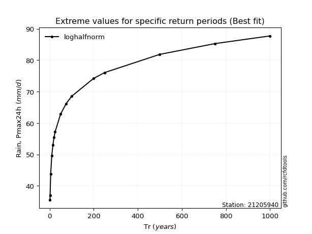</img>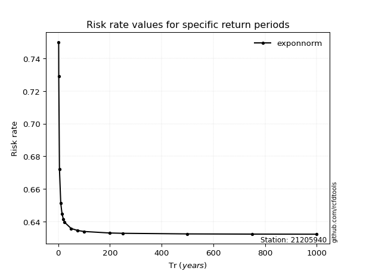</img>

</div>


<sub>**APP DISCLAIMER**: NO WARRANTY - This software is provided by [github.com/rcfdtools](https://github.com/rcfdtools) "as is", without any express or implied warranty, including warranties of merchantability, fitness for a particular purpose, or non-infringement. There is no guarantee that the software will be error-free or operate without interruption. LIMITATION OF LIABILITY - Neither the authors nor copyright holders will be liable for claims or damages arising from the software or its use. You are responsible for determining if the software is appropriate for your use and assume all associated risks, including errors, legal compliance, and data loss. NO PROFESSIONAL ADVICE - The software provides general information and does not offer professional advice. It should not replace consultation with professional advisors.</sub>