<div align="center">


</div>

# Station (rain, Pmax24h): 21206280

Probable Maximum Precipitation (PMP) is the greatest amount of rainfall for a specific duration that is meteorologically possible for a given location, acting as a "worst-case" scenario for extreme storms, crucial for designing safety-critical infrastructure like bridges, river deviations, dams, spillways, and nuclear plants to prevent catastrophic failure. PMP is calculated by hydrologists using meteorological data to determine the upper limit of extreme rainfall, often leading to the Probable Maximum Flood (PMF) for flood control design, and is increasingly being studied for climate change impacts.

<div align="center">

</img>

</div>


## A. General information


### 1. General running parameters

• app_version: _v20251225_. • runtime: _2025-12-26 14:29:50.888910_. • Python version: _3.14.0_. • SciPy version: _1.16.3_. • Pandas version: _2.3.3_. • NumPy version: _2.3.5_. • Stations dataset (station_dataset_file): _dataset/pmax24h_in/automatic_colombia.csv_. • Stations catalog (station_catalog_file): _dataset/CNE_IDEAM.xls_. • Plot only fit distributions with Δo > Δ (plot_only_fit): _True_. • Eval low extreme values, if False, evaluates high extreme values (low_extreme): _False_. • Eval every SciPy distribution as logarithmic (pdist_logarithmic_on): _True_. • Standard deviation normalized (ddof): _1.0_. • Return periods to eval in years (Tr): _[2, 2.33, 5, 10, 15, 20, 25, 50, 75, 100, 200, 250, 500, 750, 1000]_. • Minimum data sample per station, 0 means any (minimum_sample): _5_. • Z-Score threshold to adjust a value, 0 means disable (zscore): _3.5_. • Avoid zeros, e.g. rain = 0 (avoid_zeros): _True_. • Avoid null values (avoid_nans): _True_. [:file_folder:Dataset file.](../../dataset/pmax24h_in/automatic_colombia.csv)


### 2. Station info and location

|   id |   CODIGO | NOMBRE              | CATEGORIA               | TECNOLOGIA                              | ESTADO   | FECHA_INSTALACION   |   FECHA_SUSPENSION |   ALTITUD |   LATITUD |   LONGITUD | DEPARTAMENTO   | MUNICIPIO   | AREA_OPERATIVA                            | ENTIDAD                                                     | AREA_HIDROGRAFICA   | ZONA_HIDROGRAFICA   | SUBZONA_HIDROGRAFICA   |   CORRIENTE | OBSERVACION                                                                                              | SUBRED                                                                          | Catalogo   |
|-----:|---------:|:--------------------|:------------------------|:----------------------------------------|:---------|:--------------------|-------------------:|----------:|----------:|-----------:|:---------------|:------------|:------------------------------------------|:------------------------------------------------------------|:--------------------|:--------------------|:-----------------------|------------:|:---------------------------------------------------------------------------------------------------------|:--------------------------------------------------------------------------------|:-----------|
|    0 | 21206280 | ACAPULCO [21206280] | Climatológica Principal | Automática con Telemetría, Convencional | Activa   | 15/02/1990          |                nan |      2680 |   4.64823 |   -74.3204 | Cundinamarca   | Bojacá      | Area Operativa 11 - Cundinamarca-Amazonas | INSTITUTO DE HIDROLOGIA METEOROLOGIA Y ESTUDIOS AMBIENTALES | Magdalena Cauca     | Alto Magdalena      | Río Bogotá             |         nan | Actualizada Tecnologia. Tipo de Transmision y Estado por solicitud de la coordinadora del Ao. (21032023) | Altiplano Cundiboyacense y oriente de Santander,RED ALERTAS - AREA OPERATIVA 11 | CNE_IDEAM  |

<div align="center">

Map location in: [:earth_americas:Google](http://maps.google.com/maps?q=4.64823,-74.32035) [:earth_americas:OSM](https://www.openstreetmap.org/#map=18/4.64823/-74.32035&layers=P) [:earth_americas:Bing](https://www.bing.com/maps?cp=4.64823~-74.32035&lvl=18) [:earth_americas:Apple](https://maps.apple.com/frame?center=4.64823%2C-74.32035&span=0.003%2C0.006)

</div>


<div align="center">

```geojson
{
  "type": "Feature",
  "geometry": {
    "type": "Point", 
    "coordinates": [-74.32035, 4.64823]
  }, 
  "properties": {
    "Name": "21206280"
  }
}
```

</div>


### 3. Discrete values table and plot

|               |           0 |           1 |          2 |           3 |           4 |          5 |            6 |
|:--------------|------------:|------------:|-----------:|------------:|------------:|-----------:|-------------:|
| Date          | 2019        | 2020        | 2021       | 2022        | 2023        | 2024       | 2025         |
| Value         |   31.8      |   39.4      |   46       |   39.8      |   34        |   22.6     |   35.1       |
| Value_initial |   31.8      |   39.4      |   46       |   39.8      |   34        |   22.6     |   35.1       |
| count         |    7        |    7        |    7       |    7        |    7        |    7       |    7         |
| mean          |   35.5286   |   35.5286   |   35.5286  |   35.5286   |   35.5286   |   35.5286  |   35.5286    |
| std           |    7.37625  |    7.37625  |    7.37625 |    7.37625  |    7.37625  |    7.37625 |    7.37625   |
| zscore        |   -0.505483 |    0.524851 |    1.41961 |    0.579079 |   -0.207229 |   -1.75273 |   -0.0581015 |

<div align="center">

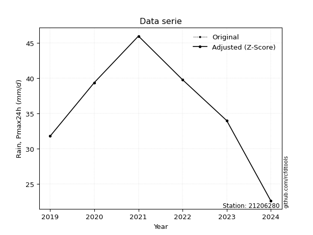</img>

</div>

> If Z-Score is active, values out of range or outliers are replaced with the station mean value.


### 4. Active continuous probability distributions from SciPy (45 of 104 available)

[scipy.stats](https://docs.scipy.org/doc/scipy/reference/stats.html) is a Python´s powerful submodule within the SciPy library for comprehensive statistical analysis, offering over 130 probability distributions (like Normal, Poisson), functions for descriptive stats (mean, variance), hypothesis testing (t-tests, chi-square), random variable generation, and statistical tests, making it essential for data science, modeling, and research. It provides tools to explore, model, and draw conclusions from data efficiently, working seamlessly with NumPy.

<div align="center">

|   id | p_dist             |   n_parameter | fit_method   | label                                                                       | active   | ref                                                                                                        |
|-----:|:-------------------|--------------:|:-------------|:----------------------------------------------------------------------------|:---------|:-----------------------------------------------------------------------------------------------------------|
|    0 | alpha              |             3 | MLE          | Alpha                                                                       | True     | [:mortar_board:](https://docs.scipy.org/doc/scipy/reference/generated/scipy.stats.alpha.html)              |
|    1 | betaprime          |             4 | MLE          | Beta prime                                                                  | True     | [:mortar_board:](https://docs.scipy.org/doc/scipy/reference/generated/scipy.stats.betaprime.html)          |
|    2 | chi2               |             3 | MLE          | Chi²                                                                        | True     | [:mortar_board:](https://docs.scipy.org/doc/scipy/reference/generated/scipy.stats.chi2.html)               |
|    3 | crystalball        |             4 | MLE          | Crystalball                                                                 | True     | [:mortar_board:](https://docs.scipy.org/doc/scipy/reference/generated/scipy.stats.crystalball.html)        |
|    4 | erlang             |             3 | MLE          | Erlang                                                                      | True     | [:mortar_board:](https://docs.scipy.org/doc/scipy/reference/generated/scipy.stats.erlang.html)             |
|    5 | expon              |             2 | MLE          | Exponential                                                                 | True     | [:mortar_board:](https://docs.scipy.org/doc/scipy/reference/generated/scipy.stats.expon.html)              |
|    6 | exponnorm          |             3 | MLE          | Exponentially modified Normal                                               | True     | [:mortar_board:](https://docs.scipy.org/doc/scipy/reference/generated/scipy.stats.exponnorm.html)          |
|    7 | f                  |             4 | MLE          | F                                                                           | True     | [:mortar_board:](https://docs.scipy.org/doc/scipy/reference/generated/scipy.stats.f.html)                  |
|    8 | fatiguelife        |             3 | MLE          | Fatigue-life (Birnbaum-Saunders)                                            | True     | [:mortar_board:](https://docs.scipy.org/doc/scipy/reference/generated/scipy.stats.fatiguelife.html)        |
|    9 | fisk               |             3 | MLE          | Fisk                                                                        | True     | [:mortar_board:](https://docs.scipy.org/doc/scipy/reference/generated/scipy.stats.fisk.html)               |
|   10 | gamma              |             3 | MLE          | Gamma                                                                       | True     | [:mortar_board:](https://docs.scipy.org/doc/scipy/reference/generated/scipy.stats.gamma.html)              |
|   11 | genexpon           |             5 | MLE          | Generalized exponential                                                     | True     | [:mortar_board:](https://docs.scipy.org/doc/scipy/reference/generated/scipy.stats.genexpon.html)           |
|   12 | genlogistic        |             3 | MLE          | Generalized logistic                                                        | True     | [:mortar_board:](https://docs.scipy.org/doc/scipy/reference/generated/scipy.stats.genlogistic.html)        |
|   13 | gibrat             |             2 | MM           | Gibrat                                                                      | True     | [:mortar_board:](https://docs.scipy.org/doc/scipy/reference/generated/scipy.stats.gibrat.html)             |
|   14 | gompertz           |             3 | MLE          | Gompertz (or truncated Gumbel)                                              | True     | [:mortar_board:](https://docs.scipy.org/doc/scipy/reference/generated/scipy.stats.gompertz.html)           |
|   15 | gumbel_l           |             2 | MM           | Gumbel Left Skew                                                            | True     | [:mortar_board:](https://docs.scipy.org/doc/scipy/reference/generated/scipy.stats.gumbel_l.html)           |
|   16 | gumbel_r           |             2 | MM           | Gumbel Right Skew                                                           | True     | [:mortar_board:](https://docs.scipy.org/doc/scipy/reference/generated/scipy.stats.gumbel_r.html)           |
|   17 | halflogistic       |             2 | MM           | Half-logistic                                                               | True     | [:mortar_board:](https://docs.scipy.org/doc/scipy/reference/generated/scipy.stats.halflogistic.html)       |
|   18 | halfnorm           |             2 | MM           | Half Normal                                                                 | True     | [:mortar_board:](https://docs.scipy.org/doc/scipy/reference/generated/scipy.stats.halfnorm.html)           |
|   19 | hypsecant          |             2 | MM           | hyperbolic secant                                                           | True     | [:mortar_board:](https://docs.scipy.org/doc/scipy/reference/generated/scipy.stats.hypsecant.html)          |
|   20 | invgamma           |             3 | MLE          | Inverted gamma                                                              | True     | [:mortar_board:](https://docs.scipy.org/doc/scipy/reference/generated/scipy.stats.invgamma.html)           |
|   21 | invgauss           |             3 | MLE          | Inverse Gaussian                                                            | True     | [:mortar_board:](https://docs.scipy.org/doc/scipy/reference/generated/scipy.stats.invgauss.html)           |
|   22 | invweibull         |             3 | MLE          | Inverted Weibull                                                            | True     | [:mortar_board:](https://docs.scipy.org/doc/scipy/reference/generated/scipy.stats.invweibull.html)         |
|   23 | johnsonsu          |             4 | MLE          | Johnson Su                                                                  | True     | [:mortar_board:](https://docs.scipy.org/doc/scipy/reference/generated/scipy.stats.johnsonsu.html)          |
|   24 | kstwobign          |             2 | MLE          | Limiting distribution of scaled Kolmogorov-Smirnov two-sided test statistic | True     | [:mortar_board:](https://docs.scipy.org/doc/scipy/reference/generated/scipy.stats.kstwobign.html)          |
|   25 | laplace            |             2 | MM           | Laplace                                                                     | True     | [:mortar_board:](https://docs.scipy.org/doc/scipy/reference/generated/scipy.stats.laplace.html)            |
|   26 | laplace_asymmetric |             3 | MLE          | Asymmetric Laplace                                                          | True     | [:mortar_board:](https://docs.scipy.org/doc/scipy/reference/generated/scipy.stats.laplace_asymmetric.html) |
|   27 | loggamma           |             3 | MLE          | Log gamma                                                                   | True     | [:mortar_board:](https://docs.scipy.org/doc/scipy/reference/generated/scipy.stats.loggamma.html)           |
|   28 | logistic           |             2 | MM           | Logistic (or Sech-squared)                                                  | True     | [:mortar_board:](https://docs.scipy.org/doc/scipy/reference/generated/scipy.stats.logistic.html)           |
|   29 | lognorm            |             3 | MLE          | Log Normal                                                                  | True     | [:mortar_board:](https://docs.scipy.org/doc/scipy/reference/generated/scipy.stats.lognorm.html)            |
|   30 | maxwell            |             2 | MM           | Maxwell                                                                     | True     | [:mortar_board:](https://docs.scipy.org/doc/scipy/reference/generated/scipy.stats.maxwell.html)            |
|   31 | mielke             |             4 | MLE          | Mielke Beta-Kappa / Dagum                                                   | True     | [:mortar_board:](https://docs.scipy.org/doc/scipy/reference/generated/scipy.stats.mielke.html)             |
|   32 | moyal              |             2 | MM           | Moyal                                                                       | True     | [:mortar_board:](https://docs.scipy.org/doc/scipy/reference/generated/scipy.stats.moyal.html)              |
|   33 | nakagami           |             3 | MLE          | Nakagami                                                                    | True     | [:mortar_board:](https://docs.scipy.org/doc/scipy/reference/generated/scipy.stats.nakagami.html)           |
|   34 | ncf                |             5 | MLE          | Non-central F distribution                                                  | True     | [:mortar_board:](https://docs.scipy.org/doc/scipy/reference/generated/scipy.stats.ncf.html)                |
|   35 | nct                |             4 | MLE          | Non-central Student’s t                                                     | True     | [:mortar_board:](https://docs.scipy.org/doc/scipy/reference/generated/scipy.stats.nct.html)                |
|   36 | norm               |             2 | MM           | Normal                                                                      | True     | [:mortar_board:](https://docs.scipy.org/doc/scipy/reference/generated/scipy.stats.norm.html)               |
|   37 | pareto             |             3 | MLE          | Pareto                                                                      | True     | [:mortar_board:](https://docs.scipy.org/doc/scipy/reference/generated/scipy.stats.pareto.html)             |
|   38 | pearson3           |             3 | MM           | Pearson type III                                                            | True     | [:mortar_board:](https://docs.scipy.org/doc/scipy/reference/generated/scipy.stats.pearson3.html)           |
|   39 | rayleigh           |             2 | MM           | Rayleigh                                                                    | True     | [:mortar_board:](https://docs.scipy.org/doc/scipy/reference/generated/scipy.stats.rayleigh.html)           |
|   40 | rice               |             3 | MLE          | Rice                                                                        | True     | [:mortar_board:](https://docs.scipy.org/doc/scipy/reference/generated/scipy.stats.rice.html)               |
|   41 | t                  |             3 | MLE          | Student’s t                                                                 | True     | [:mortar_board:](https://docs.scipy.org/doc/scipy/reference/generated/scipy.stats.t.html)                  |
|   42 | truncnorm          |             4 | MLE          | Truncated normal                                                            | True     | [:mortar_board:](https://docs.scipy.org/doc/scipy/reference/generated/scipy.stats.truncnorm.html)          |
|   43 | wald               |             2 | MM           | Wald                                                                        | True     | [:mortar_board:](https://docs.scipy.org/doc/scipy/reference/generated/scipy.stats.wald.html)               |
|   44 | weibull_min        |             3 | MLE          | Weibull minimum                                                             | True     | [:mortar_board:](https://docs.scipy.org/doc/scipy/reference/generated/scipy.stats.weibull_min.html)        |

</div>

> **n_parameter:** # arguments & localization & scale.
>
> **Fit methods:** (MLE) maximum likelihood, (MM) L-moments.
>
>**Inactive:** foldnorm, gennorm, norminvgauss, powernorm, powerlognorm, skewnorm, genextreme, anglit, arcsine, argus, beta, bradford, burr, burr12, cauchy, cosine, halfcauchy, foldcauchy, skewcauchy, wrapcauchy, dgamma, gengamma, exponweib, exponpow, truncexpon, gausshyper, genhalflogistic, genhyperbolic, geninvgauss, halfgennorm, johnsonsb, kappa4, kappa3, ksone, kstwo, loglaplace, levy, levy_l, levy_stable, ncx2, genpareto, truncpareto, lomax, powerlaw, rdist, rel_breitwigner, recipinvgauss, semicircular, studentized_range, trapezoid, triang, truncweibull_min, tukeylambda, uniform, loguniform, vonmises, vonmises_line, weibull_max, dweibull, 


## B. Probability distributions vs. Empirical distributions

A continuous probability distribution (CPD) describes probabilities for variables that can take any value within a range (like rain any time), unlike discrete variables with specific outcomes (like temperature). It uses a Probability Density Function (PDF), a curve where the total area under it equals 1, and the probability of the variable falling within an interval (a to b) is found by calculating the area under the curve between those points. A key feature is that the probability of hitting any single exact value is zero, so probabilities are always expressed for ranges, e.g., $P(a ≤ X ≤ b)$.

<div align="center">

Distributions parameters
|    |   station | p_dist                |   n |               loc |            scale | shape                 | shape1                | shape2                | shape3   |
|---:|----------:|:----------------------|----:|------------------:|-----------------:|:----------------------|:----------------------|:----------------------|:---------|
|  0 |  21206280 | alpha                 |   7 |    -139.438       |   4374.71        | 25.055704195829946    |                       |                       |          |
|  1 |  21206280 | betaprime             |   7 |       0.461089    |     45.8441      | 40.07591448169242     | 53.46910736349017     |                       |          |
|  2 |  21206280 | chi2                  |   7 |     -49.0867      |      0.290096    | 291.31236237158885    |                       |                       |          |
|  3 |  21206280 | crystalball           |   7 |      35.5286      |      6.82908     | 3130.1985331343703    | 2556.362394972478     |                       |          |
|  4 |  21206280 | erlang                |   7 |     -77.6159      |      0.424536    | 266.569250923842      |                       |                       |          |
|  5 |  21206280 | expon                 |   7 |      22.6         |     12.9286      |                       |                       |                       |          |
|  6 |  21206280 | exponnorm             |   7 |      35.5245      |      6.82907     | 0.0005894037461200096 |                       |                       |          |
|  7 |  21206280 | f                     |   7 |   -1461.67        |   1497.18        | 165953.08821008547    | 223266.34217925835    |                       |          |
|  8 |  21206280 | fatiguelife           |   7 |      22.6         |      2.03983e-05 | 709.2019578102802     |                       |                       |          |
|  9 |  21206280 | fisk                  |   7 | -452280           | 452316           | 117356.49644128137    |                       |                       |          |
| 10 |  21206280 | gamma                 |   7 |     -72.3245      |      0.449381    | 239.92427749270564    |                       |                       |          |
| 11 |  21206280 | genexpon              |   7 |      22.6         |      1.85474     | 0.14343775783588114   | 3.612215537529318e-07 | 1.2820619551571415    |          |
| 12 |  21206280 | genlogistic           |   7 |      38.6871      |      3.05033     | 0.5828488447375957    |                       |                       |          |
| 13 |  21206280 | gibrat                |   7 |      30.3188      |      3.15988     |                       |                       |                       |          |
| 14 |  21206280 | gompertz              |   7 |      31.7999      |      1.77859     | 0.0019272477622585531 |                       |                       |          |
| 15 |  21206280 | gumbel_l              |   7 |      38.602       |      5.32461     |                       |                       |                       |          |
| 16 |  21206280 | gumbel_r              |   7 |      32.4551      |      5.32461     |                       |                       |                       |          |
| 17 |  21206280 | halflogistic          |   7 |      27.4345      |      5.83863     |                       |                       |                       |          |
| 18 |  21206280 | halfnorm              |   7 |      26.4895      |     11.3287      |                       |                       |                       |          |
| 19 |  21206280 | hypsecant             |   7 |      35.5286      |      4.34753     |                       |                       |                       |          |
| 20 |  21206280 | invgamma              |   7 |     -67.3456      |  21583.2         | 210.89124852136058    |                       |                       |          |
| 21 |  21206280 | invgauss              |   7 |     -17.721       |   2795.01        | 0.01906060491438613   |                       |                       |          |
| 22 |  21206280 | invweibull            |   7 |      -7.89574e+08 |      7.89574e+08 | 110980904.32640126    |                       |                       |          |
| 23 |  21206280 | johnsonsu             |   7 |      69.4422      |      6.96321     | 11.534272848058107    | 5.086987290689455     |                       |          |
| 24 |  21206280 | kstwobign             |   7 |       6.66994     |     33.0314      |                       |                       |                       |          |
| 25 |  21206280 | laplace               |   7 |      35.5286      |      4.82889     |                       |                       |                       |          |
| 26 |  21206280 | laplace_asymmetric    |   7 |      35.1         |      5.24397     | 0.9599708830835874    |                       |                       |          |
| 27 |  21206280 | loggamma              |   7 |      23.2155      |     11.6784      | 3.3557506462423365    |                       |                       |          |
| 28 |  21206280 | logistic              |   7 |      35.5286      |      3.76507     |                       |                       |                       |          |
| 29 |  21206280 | lognorm               |   7 |      22.6         |      0.0847845   | 12.578661161398044    |                       |                       |          |
| 30 |  21206280 | maxwell               |   7 |      19.3465      |     10.1406      |                       |                       |                       |          |
| 31 |  21206280 | mielke                |   7 |      -0.153487    |     41.1288      | 5.264084663196481     | 15.828253435623006    |                       |          |
| 32 |  21206280 | moyal                 |   7 |      31.6233      |      3.07417     |                       |                       |                       |          |
| 33 |  21206280 | nakagami              |   7 |      31.8         |      5.91129     | 0.06824252568563938   |                       |                       |          |
| 34 |  21206280 | ncf                   |   7 |       1.15967     |     10.4295      | 24.394712608348925    | 1275.8849688534483    | 55.86718597302627     |          |
| 35 |  21206280 | nct                   |   7 |    -427.564       |      6.74141     | 88409.4789169356      | 68.69277375971608     |                       |          |
| 36 |  21206280 | norm                  |   7 |      35.5286      |      6.82908     |                       |                       |                       |          |
| 37 |  21206280 | pareto                |   7 |      22.5862      |      0.0137889   | 0.16783773159843332   |                       |                       |          |
| 38 |  21206280 | pearson3              |   7 |      35.5286      |      6.82909     | -0.41822524788436616  |                       |                       |          |
| 39 |  21206280 | rayleigh              |   7 |      22.4641      |     10.4239      |                       |                       |                       |          |
| 40 |  21206280 | rice                  |   7 |      18.2324      |      7.40038     | 2.077036282214892     |                       |                       |          |
| 41 |  21206280 | t                     |   7 |      35.5286      |      6.82885     | 14832756.574580498    |                       |                       |          |
| 42 |  21206280 | truncnorm             |   7 |      10.3056      |     13.0498      | 1.6471047916601167    | 294.3144736637141     |                       |          |
| 43 |  21206280 | wald                  |   7 |      28.6994      |      6.82912     |                       |                       |                       |          |
| 44 |  21206280 | weibull_min           |   7 |      -1.41014     |     39.709       | 6.417908604661347     |                       |                       |          |
| 45 |  21206280 | logalpha              |   7 |      -4.31704     |    286.459       | 36.44707486230648     |                       |                       |          |
| 46 |  21206280 | logbetaprime          |   7 |      -3.47839     |      9.45592     | 1928.0078497269678    | 2592.9352416048987    |                       |          |
| 47 |  21206280 | logchi2               |   7 |       3.11795     |      0.955057    | 1.0998104674121358    |                       |                       |          |
| 48 |  21206280 | logcrystalball        |   7 |       3.54975     |      0.209204    | 27.68206319255574     | 80.89768533514834     |                       |          |
| 49 |  21206280 | logerlang             |   7 |      -0.0104349   |      0.0131101   | 271.45833861490405    |                       |                       |          |
| 50 |  21206280 | logexpon              |   7 |       3.11795     |      0.4318      |                       |                       |                       |          |
| 51 |  21206280 | logexponnorm          |   7 |       3.54955     |      0.209205    | 0.0009370326839224551 |                       |                       |          |
| 52 |  21206280 | logf                  |   7 |    -289.03        |    292.58        | 12348837.66091673     | 5721674.344774444     |                       |          |
| 53 |  21206280 | logfatiguelife        |   7 |    -101.175       |    104.723       | 0.001996801699005215  |                       |                       |          |
| 54 |  21206280 | logfisk               |   7 |      -1.59342e+07 |      1.59342e+07 | 139492683.20393646    |                       |                       |          |
| 55 |  21206280 | loggamma              |   7 |      -0.0955117   |      0.0125478   | 290.5954062307944     |                       |                       |          |
| 56 |  21206280 | loggenexpon           |   7 |       3.11775     |      0.00240987  | 0.0017725141045868845 | 1.100353432628244     | 3.122087744140033e-05 |          |
| 57 |  21206280 | loggenlogistic        |   7 |       3.7132      |      0.0633601   | 0.3317932111794685    |                       |                       |          |
| 58 |  21206280 | loggibrat             |   7 |       3.3901      |      0.0968302   |                       |                       |                       |          |
| 59 |  21206280 | loggompertz           |   7 |       3.09698     |      0.184145    | 0.05641118283531944   |                       |                       |          |
| 60 |  21206280 | loggumbel_l           |   7 |       3.6439      |      0.163117    |                       |                       |                       |          |
| 61 |  21206280 | loggumbel_r           |   7 |       3.4556      |      0.163117    |                       |                       |                       |          |
| 62 |  21206280 | loghalflogistic       |   7 |       3.30183     |      0.17884     |                       |                       |                       |          |
| 63 |  21206280 | loghalfnorm           |   7 |       3.27287     |      0.347022    |                       |                       |                       |          |
| 64 |  21206280 | loghypsecant          |   7 |       3.54975     |      0.133184    |                       |                       |                       |          |
| 65 |  21206280 | loginvgamma           |   7 |      -1.03097     |   2078.73        | 455.0456400865975     |                       |                       |          |
| 66 |  21206280 | loginvgauss           |   7 |       1.35978     |    203.309       | 0.010739163663105622  |                       |                       |          |
| 67 |  21206280 | loginvweibull         |   7 |      -2.80073e+07 |      2.80073e+07 | 119690494.74876672    |                       |                       |          |
| 68 |  21206280 | logjohnsonsu          |   7 |       4.05374     |      0.0269359   | 8.605371290880985     | 2.4317041090348175    |                       |          |
| 69 |  21206280 | logkstwobign          |   7 |       2.59814     |      1.08882     |                       |                       |                       |          |
| 70 |  21206280 | loglaplace            |   7 |       3.54975     |      0.147931    |                       |                       |                       |          |
| 71 |  21206280 | loglaplace_asymmetric |   7 |       3.5582      |      0.154484    | 1.027654891131482     |                       |                       |          |
| 72 |  21206280 | logloggamma           |   7 |       3.6986      |      0.133752    | 0.7394790619728384    |                       |                       |          |
| 73 |  21206280 | loglogistic           |   7 |       3.54975     |      0.115341    |                       |                       |                       |          |
| 74 |  21206280 | loglognorm            |   7 |       3.11795     |      0.00347313  | 12.122057699768797    |                       |                       |          |
| 75 |  21206280 | logmaxwell            |   7 |       3.05402     |      0.310652    |                       |                       |                       |          |
| 76 |  21206280 | logmielke             |   7 |      -0.990757    |      4.71486     | 22.802714806937416    | 77.31834374892915     |                       |          |
| 77 |  21206280 | logmoyal              |   7 |       3.43011     |      0.0941756   |                       |                       |                       |          |
| 78 |  21206280 | lognakagami           |   7 |       3.45947     |      0.169914    | 0.08545668652548724   |                       |                       |          |
| 79 |  21206280 | logncf                |   7 |      -3.69184     |      7.23812     | 539.4547292809466     | 717.6396061971209     | 0.0007849769999783141 |          |
| 80 |  21206280 | lognct                |   7 |      -0.736226    |      0.0216742   | 199.3660126044847     | 197.0101836570759     |                       |          |
| 81 |  21206280 | lognorm               |   7 |       3.54975     |      0.209206    |                       |                       |                       |          |
| 82 |  21206280 | logpareto             |   7 |       3.11748     |      0.000468591 | 0.16781659353629302   |                       |                       |          |
| 83 |  21206280 | logpearson3           |   7 |       3.54975     |      0.209205    | -0.8619378749945104   |                       |                       |          |
| 84 |  21206280 | lograyleigh           |   7 |       3.14954     |      0.319318    |                       |                       |                       |          |
| 85 |  21206280 | logrice               |   7 |       2.94923     |      0.221895    | 2.492614218660833     |                       |                       |          |
| 86 |  21206280 | logt                  |   7 |       3.58398     |      0.151961    | 3.43351275483388      |                       |                       |          |
| 87 |  21206280 | logtruncnorm          |   7 |      -0.0684133   |      1.1145      | 3.1654314620133546    | 3.49668217380792      |                       |          |
| 88 |  21206280 | logwald               |   7 |       3.34052     |      0.209224    |                       |                       |                       |          |
| 89 |  21206280 | logweibull_min        |   7 |      -2.53946e+06 |      2.53946e+06 | 15672728.08697217     |                       |                       |          |

</div>

> **loc** (Location parameter): This shifts the distribution along the x-axis. For many common distributions, like the normal (Gaussian) distribution, loc represents the mean $μ$. For others, like the uniform distribution, it might represent the minimum value, or for the beta distribution, the left end of the support interval.
>
> **scale** (Scale parameter): This determines the width or spread of the distribution. For the normal distribution, scale represents the standard deviation $σ$. For a uniform distribution, it defines the length of the interval (from $loc$ to $loc + scale$).
>
> **shape** (Shape parameters): Refers to parameters that define the specific form of a probability distribution, distinct from its location (loc) and scale (scale). These parameters are required arguments for most distribution functions. For example, a normal (Gaussian) distribution is fully defined by its location (mean) and scale (standard deviation), so it has no specific shape parameters beyond loc and scale. However, other distributions have intrinsic properties that need specification, as Gamma distribution that takes a shape parameter, often named $a$ or $alpha$.


### 0. Cumulative distribution values - CDF (90 evaluated)

> Ordered by x ascending and calculating $log(f(x))$ separately. 

|   id |   Station |   date |    x |   count |    mean |     std |     zscore |   Value_initial |   station |   m |     alpha |   alpha_pdf |   betaprime |   betaprime_pdf |      chi2 |   chi2_pdf |   crystalball |   crystalball_pdf |    erlang |   erlang_pdf |    expon |   expon_pdf |   exponnorm |   exponnorm_pdf |         f |      f_pdf |   fatiguelife |   fatiguelife_pdf |      fisk |   fisk_pdf |     gamma |   gamma_pdf |    genexpon |   genexpon_pdf |   genlogistic |   genlogistic_pdf |   gibrat |   gibrat_pdf |    gompertz |   gompertz_pdf |   gumbel_l |   gumbel_l_pdf |   gumbel_r |   gumbel_r_pdf |   halflogistic |   halflogistic_pdf |   halfnorm |   halfnorm_pdf |   hypsecant |   hypsecant_pdf |   invgamma |   invgamma_pdf |   invgauss |   invgauss_pdf |   invweibull |   invweibull_pdf |   johnsonsu |   johnsonsu_pdf |   kstwobign |   kstwobign_pdf |   laplace |   laplace_pdf |   laplace_asymmetric |   laplace_asymmetric_pdf |   loggamma |   loggamma_pdf |   logistic |   logistic_pdf |   lognorm |   lognorm_pdf |    maxwell |   maxwell_pdf |    mielke |   mielke_pdf |       moyal |   moyal_pdf |   nakagami |   nakagami_pdf |       ncf |   ncf_pdf |       nct |   nct_pdf |     norm |   norm_pdf |   pareto |   pareto_pdf |   pearson3 |   pearson3_pdf |    rayleigh |   rayleigh_pdf |      rice |   rice_pdf |         t |      t_pdf |   truncnorm |   truncnorm_pdf |     wald |   wald_pdf |   weibull_min |   weibull_min_pdf |   logalpha |   logalpha_pdf |   logbetaprime |   logbetaprime_pdf |    logchi2 |   logchi2_pdf |   logcrystalball |   logcrystalball_pdf |   logerlang |   logerlang_pdf |   logexpon |   logexpon_pdf |   logexponnorm |   logexponnorm_pdf |      logf |   logf_pdf |   logfatiguelife |   logfatiguelife_pdf |   logfisk |   logfisk_pdf |   loggenexpon |   loggenexpon_pdf |   loggenlogistic |   loggenlogistic_pdf |   loggibrat |   loggibrat_pdf |   loggompertz |   loggompertz_pdf |   loggumbel_l |   loggumbel_l_pdf |   loggumbel_r |   loggumbel_r_pdf |   loghalflogistic |   loghalflogistic_pdf |   loghalfnorm |   loghalfnorm_pdf |   loghypsecant |   loghypsecant_pdf |   loginvgamma |   loginvgamma_pdf |   loginvgauss |   loginvgauss_pdf |   loginvweibull |   loginvweibull_pdf |   logjohnsonsu |   logjohnsonsu_pdf |   logkstwobign |   logkstwobign_pdf |   loglaplace |   loglaplace_pdf |   loglaplace_asymmetric |   loglaplace_asymmetric_pdf |   logloggamma |   logloggamma_pdf |   loglogistic |   loglogistic_pdf |   loglognorm |   loglognorm_pdf |   logmaxwell |   logmaxwell_pdf |   logmielke |   logmielke_pdf |    logmoyal |   logmoyal_pdf |   lognakagami |   lognakagami_pdf |   logncf |   logncf_pdf |    lognct |   lognct_pdf |   logpareto |   logpareto_pdf |   logpearson3 |   logpearson3_pdf |   lograyleigh |   lograyleigh_pdf |   logrice |   logrice_pdf |      logt |   logt_pdf |   logtruncnorm |   logtruncnorm_pdf |   logwald |   logwald_pdf |   logweibull_min |   logweibull_min_pdf |
|-----:|----------:|-------:|-----:|--------:|--------:|--------:|-----------:|----------------:|----------:|----:|----------:|------------:|------------:|----------------:|----------:|-----------:|--------------:|------------------:|----------:|-------------:|---------:|------------:|------------:|----------------:|----------:|-----------:|--------------:|------------------:|----------:|-----------:|----------:|------------:|------------:|---------------:|--------------:|------------------:|---------:|-------------:|------------:|---------------:|-----------:|---------------:|-----------:|---------------:|---------------:|-------------------:|-----------:|---------------:|------------:|----------------:|-----------:|---------------:|-----------:|---------------:|-------------:|-----------------:|------------:|----------------:|------------:|----------------:|----------:|--------------:|---------------------:|-------------------------:|-----------:|---------------:|-----------:|---------------:|----------:|--------------:|-----------:|--------------:|----------:|-------------:|------------:|------------:|-----------:|---------------:|----------:|----------:|----------:|----------:|---------:|-----------:|---------:|-------------:|-----------:|---------------:|------------:|---------------:|----------:|-----------:|----------:|-----------:|------------:|----------------:|---------:|-----------:|--------------:|------------------:|-----------:|---------------:|---------------:|-------------------:|-----------:|--------------:|-----------------:|---------------------:|------------:|----------------:|-----------:|---------------:|---------------:|-------------------:|----------:|-----------:|-----------------:|---------------------:|----------:|--------------:|--------------:|------------------:|-----------------:|---------------------:|------------:|----------------:|--------------:|------------------:|--------------:|------------------:|--------------:|------------------:|------------------:|----------------------:|--------------:|------------------:|---------------:|-------------------:|--------------:|------------------:|--------------:|------------------:|----------------:|--------------------:|---------------:|-------------------:|---------------:|-------------------:|-------------:|-----------------:|------------------------:|----------------------------:|--------------:|------------------:|--------------:|------------------:|-------------:|-----------------:|-------------:|-----------------:|------------:|----------------:|------------:|---------------:|--------------:|------------------:|---------:|-------------:|----------:|-------------:|------------:|----------------:|--------------:|------------------:|--------------:|------------------:|----------:|--------------:|----------:|-----------:|---------------:|-------------------:|----------:|--------------:|-----------------:|---------------------:|
|    0 |  21206280 |   2024 | 22.6 |       7 | 35.5286 | 7.37625 | -1.75273   |            22.6 |  21206280 |   1 | 0.0260493 |   0.0100789 |   0.0197652 |       0.0100081 | 0.0283974 |  0.0103663 |      0.029168 |        0.00973367 | 0.0271453 |   0.00979849 | 0        |   0.0773481 |   0.0291685 |      0.00973383 | 0.0294703 | 0.00985032 |     0.0214369 |       5.25627e+09 | 0.0309839 | 0.00779014 | 0.0280704 |   0.0100728 | 1.88136e-07 |      0.0773357 |      0.046104 |        0.00876453 | 0        |   0          | 0           |     0          |  0.0483179 |      0.0088516 | 0.00172022 |     0.00205643 |       0        |          0         |   0        |      0         |   0.0325093 |      0.00746467 |  0.0262466 |      0.0102642 |  0.0249616 |      0.010614  |    0.0236333 |        0.0124407 |   0.0430661 |      0.00982747 |   0.0258322 |       0.0155814 | 0.0343729 |    0.00711818 |            0.0400384 |               0.00795349 |  0.0183031 |       0.228454 |   0.031255 |     0.00804186 | 0.0195088 |      0.226604 | 0.00851727 |    0.00769296 | 0.0443205 |    0.0102528 | 1.43269e-05 | 4.59972e-05 | 0          |    0           | 0.0238113 | 0.010255  | 0.0291618 | 0.0097433 | 0.029168 | 0.00973367 | 0        |  12.172      |  0.0395007 |      0.0100187 | 8.49279e-05 |     0.00125021 | 0.0220748 |  0.0109468 | 0.0291634 | 0.00973273 | 0           |       0         | 0        | 0          |     0.0388288 |         0.0101748 |  0.0186974 |       0.23695  |      0.0171202 |           0.213087 | 2.8456e-09 |   3.52364e+06 |        0.0195078 |             0.226596 |   0.0197493 |        0.24176  |   0        |       2.31588  |      0.0195087 |           0.226603 | 0.0193857 |   0.225712 |        0.0196054 |             0.228598 | 0.0184052 |      0.158159 |    0.00014763 |          0.7366   |        0.0442848 |             0.231883 |    0        |        0        |    0.00678213 |          0.34097  |     0.0389988 |          0.234361 |   0.000361745 |         0.0175743 |          0        |              0        |      0        |          0        |      0.0248669 |           0.186521 |     0.0177551 |          0.232343 |     0.0204084 |          0.272307 |       0.0200008 |            0.334375 |      0.0438024 |           0.240914 |      0.0234081 |           0.442487 |    0.0269955 |         0.182488 |               0.0320848 |                    0.202101 |     0.0437686 |          0.240178 |     0.0231196 |          0.195811 |   0.00716122 |      3.69337e+12 |   0.00228863 |         0.106491 |   0.0433732 |        0.240709 | 1.55963e-07 |    2.35593e-05 |     0         |       0           | 0.226118 |     0.546119 | 0.0162358 |     0.223544 |    0        |     358.131     |      0.036964 |          0.254232 |      0        |          0        | 0.0167927 |      0.243609 | 0.0228954 |   0.1313   |    0           |            0       |  0        |      0        |        0.0379579 |             0.22976  |
|    1 |  21206280 |   2019 | 31.8 |       7 | 35.5286 | 7.37625 | -0.505483  |            31.8 |  21206280 |   2 | 0.311425  |   0.0527393 |   0.334186  |       0.0551648 | 0.309565  |  0.0518372 |      0.292538 |        0.0503288  | 0.299099  |   0.0512289  | 0.509143 |   0.0379668 |   0.292542  |      0.0503291  | 0.294288  | 0.050341   |     0.828167  |       0.013113    | 0.25812   | 0.0496849  | 0.303234  |   0.0513681 | 0.509088    |      0.0379651 |      0.253109 |        0.0437844  | 0.224319 |   0.202133   | 7.07918e-08 |     0.00108362 |  0.243265  |      0.0396149 | 0.322734   |     0.0685475  |       0.357351 |          0.0747008 |   0.360759 |      0.063102  |   0.255389  |      0.0526408  |  0.313396  |      0.0524655 |  0.322094  |      0.0526106 |    0.357833  |        0.0516889 |   0.267976  |      0.0437725  |   0.390968  |       0.0507639 | 0.231012  |    0.0478396  |            0.248984  |               0.0494598  |  0.340474  |       1.74301  |   0.270852 |     0.0524535  | 0.333032  |      1.73738  | 0.319617   |    0.0558255  | 0.263196  |    0.0425761 | 0.331218    | 0.0786472   | 0.00721895 |    2.77331e+11 | 0.318157  | 0.0529011 | 0.292815  | 0.0503592 | 0.292538 | 0.0503288  | 0.66436  |   0.00611399 |  0.275713  |      0.0454801 | 0.330395    |     0.0575323  | 0.303813  |  0.0511422 | 0.29253   | 0.0503299  | 1.45324e-11 |       0.158214  | 0.323177 | 0.137519   |     0.272092  |         0.0446739 |  0.348493  |       1.75177  |      0.329206  |           1.73286  | 0.410296   |   0.587838    |        0.333028  |             1.73739  |   0.346428  |        1.73727  |   0.546569 |       1.05009  |      0.333032  |           1.73738  | 0.332548  |   1.7366   |        0.335517  |             1.74473  | 0.271543  |      1.73167  |    0.449103   |          1.51633  |        0.26324   |             1.35381  |    0.369344 |        5.44015  |    0.293542   |          1.54955  |     0.275885  |          1.43301  |   0.376606    |         2.25468   |          0.414248 |              2.31603  |      0.409226 |          1.98975  |      0.299071  |           1.92944  |     0.350941  |          1.77131  |     0.37222   |          1.74127  |       0.402939  |            1.56523  |      0.272658  |           1.3582   |      0.441246  |           1.50764  |    0.27159   |         1.83593  |               0.275775  |                    1.7371   |     0.271161  |          1.36001  |     0.313726  |          1.86666  |   0.647475   |      0.0897039   |   0.363821   |         1.86678  |   0.266982  |        1.35246  | 0.392167    |    2.51358     |     0.0027242 |       1.04844e+12 | 0.442029 |     0.684247 | 0.350483  |     1.7745   |    0.669246 |       0.162305  |      0.291314 |          1.45716  |      0.375626 |          1.89779  | 0.341342  |      1.73646  | 0.23281   |   1.64451  |    1.45471e-06 |            4.43258 |  0.422102 |      3.77651  |        0.27273   |             1.42939  |
|    2 |  21206280 |   2023 | 34   |       7 | 35.5286 | 7.37625 | -0.207229  |            34   |  21206280 |   3 | 0.433389  |   0.0572083 |   0.457986  |       0.0563947 | 0.42994   |  0.0567206 |      0.411444 |        0.0569729  | 0.418957  |   0.05688    | 0.58595  |   0.032026  |   0.411448  |      0.0569731  | 0.41302   | 0.056801   |     0.854083  |       0.0105823   | 0.381083  | 0.0611954  | 0.423122  |   0.0567652 | 0.585892    |      0.0320254 |      0.364527 |        0.057322   | 0.560684 |   0.107117   | 0.00470136  |     0.00371557 |  0.343839  |      0.0519236 | 0.473237   |     0.0664943  |       0.509642 |          0.0633937 |   0.492641 |      0.0565353 |   0.390321  |      0.0689128  |  0.434333  |      0.0565664 |  0.441905  |      0.0554142 |    0.470322  |        0.0498674 |   0.375236  |      0.0534152  |   0.49972   |       0.0476178 | 0.36433   |    0.0754481  |            0.385449  |               0.0765683  |  0.462117  |       1.86484  |   0.399875 |     0.0637372  | 0.45549   |      1.89506  | 0.445679   |    0.0578366  | 0.369576  |    0.0541069 | 0.496893    | 0.0699958   | 0.753495   |    0.046334    | 0.439111  | 0.0561458 | 0.411762  | 0.0569788 | 0.411444 | 0.0569729  | 0.676208 |   0.0047613  |  0.38593   |      0.0542684 | 0.457931    |     0.0575497  | 0.422909  |  0.0563366 | 0.411439  | 0.0569747  | 0.302588    |       0.118162  | 0.561516 | 0.0827169  |     0.380804  |         0.0537937 |  0.470018  |       1.8524   |      0.450987  |           1.87912  | 0.447388   |   0.5237      |        0.455487  |             1.89507  |   0.467303  |        1.84819  |   0.611644 |       0.899389 |      0.45549   |           1.89506  | 0.454933  |   1.89452  |        0.458321  |             1.89777  | 0.401026  |      2.10282  |    0.547744   |          1.42292  |        0.369598  |             1.83907  |    0.633671 |        2.76191  |    0.408096   |          1.86696  |     0.385199  |          1.83349  |   0.523077    |         2.07807   |          0.556502 |              1.92995  |      0.534904 |          1.76081  |      0.444384  |           2.35361  |     0.473557  |          1.86461  |     0.490861  |          1.77878  |       0.505119  |            1.47427  |      0.376481  |           1.74833  |      0.538467  |           1.38944  |    0.426877  |         2.88565  |               0.420293  |                    2.64742  |     0.375599  |          1.76607  |     0.449476  |          2.14535  |   0.652939   |      0.0745852   |   0.489745   |         1.86902  |   0.372492  |        1.81429  | 0.548576    |    2.12276     |     0.721079  |       1.81999     | 0.487882 |     0.685143 | 0.472944  |     1.85665  |    0.679015 |       0.131742  |      0.399848 |          1.78055  |      0.501561 |          1.84202  | 0.462724  |      1.86472  | 0.363418  |   2.2309   |    0.269895    |            3.65898 |  0.619496 |      2.26187  |        0.381976  |             1.83552  |
|    3 |  21206280 |   2025 | 35.1 |       7 | 35.5286 | 7.37625 | -0.0581015 |            35.1 |  21206280 |   4 | 0.496495  |   0.0572877 |   0.519329  |       0.0549304 | 0.49267   |  0.0570983 |      0.47498  |        0.0583032  | 0.48208   |   0.0576456  | 0.619721 |   0.0294138 |   0.474984  |      0.0583033  | 0.476319  | 0.0580464  |     0.865159  |       0.00957846  | 0.450277  | 0.0642228  | 0.486051  |   0.0574116 | 0.619663    |      0.0294137 |      0.43079  |        0.0629062  | 0.66062  |   0.0765822  | 0.0103427   |     0.00685732 |  0.404313  |      0.0579553 | 0.544156   |     0.0621885  |       0.575993 |          0.057225  |   0.552778 |      0.0527614 |   0.468672  |      0.072862   |  0.49666   |      0.0565234 |  0.502658  |      0.0548352 |    0.523993  |        0.0475992 |   0.43615   |      0.057172   |   0.550785  |       0.0451548 | 0.457536  |    0.0947498  |            0.479585  |               0.095268   |  0.521522  |       1.85968  |   0.471574 |     0.0661852  | 0.516111  |      1.90538  | 0.508851   |    0.0568124  | 0.432048  |    0.0593406 | 0.569974    | 0.0627365   | 0.795772   |    0.0322634   | 0.500761  | 0.0557249 | 0.475297  | 0.0582943 | 0.47498  | 0.0583032  | 0.68117  |   0.00427622 |  0.447419  |      0.0573396 | 0.520357    |     0.0557778  | 0.485382  |  0.0570263 | 0.474977  | 0.0583052  | 0.422971    |       0.101034  | 0.641841 | 0.0642471  |     0.441956  |         0.0572207 |  0.528874  |       1.83783  |      0.51102   |           1.88456  | 0.463646   |   0.49793     |        0.516108  |             1.9054   |   0.526117  |        1.83942  |   0.63925  |       0.835455 |      0.516111  |           1.90539  | 0.515628  |   1.905    |        0.518987  |             1.90545  | 0.469425  |      2.18039  |    0.592073   |          1.35986  |        0.432048  |             2.08213  |    0.709386 |        2.03834  |    0.469559   |          1.98891  |     0.446401  |          2.00685  |   0.586776    |         1.91775   |          0.614905 |              1.73868  |      0.589057 |          1.63975  |      0.520184  |           2.38519  |     0.532726  |          1.84522  |     0.54699   |          1.74128  |       0.55097   |            1.40351  |      0.435058  |           1.92885  |      0.581571  |           1.31677  |    0.527763  |         3.19229  |               0.513636  |                    3.23538  |     0.434883  |          1.95549  |     0.518309  |          2.16458  |   0.655223   |      0.0690213   |   0.548447   |         1.81265  |   0.433982  |        2.04711  | 0.612441    |    1.88757     |     0.769755  |       1.2975      | 0.509659 |     0.682391 | 0.531779  |     1.83234  |    0.683029 |       0.120696  |      0.458659 |          1.90938  |      0.55909  |          1.7671   | 0.522201  |      1.86435  | 0.437413  |   2.39847  |    0.381178    |            3.33552 |  0.683741 |      1.79539  |        0.443298  |             2.01242  |
|    4 |  21206280 |   2020 | 39.4 |       7 | 35.5286 | 7.37625 |  0.524851  |            39.4 |  21206280 |   5 | 0.723699  |   0.0457463 |   0.728605  |       0.0408398 | 0.721392  |  0.046503  |      0.71461  |        0.0497464  | 0.715419  |   0.0478634  | 0.727318 |   0.0210915 |   0.714614  |      0.0497461  | 0.714476  | 0.0493932  |     0.899664  |       0.00670017  | 0.714249  | 0.0529541  | 0.71774   |   0.0474065 | 0.727262    |      0.0210925 |      0.711871 |        0.0600994  | 0.854441 |   0.0251634  | 0.127453    |     0.0678311  |  0.68704   |      0.068279  | 0.76234    |     0.0388518  |       0.771767 |          0.0346293 |   0.745555 |      0.036791  |   0.752045  |      0.051438   |  0.72052   |      0.0451127 |  0.717344  |      0.0430056 |    0.702488  |        0.0348679 |   0.692964  |      0.0579506  |   0.720091  |       0.0333075 | 0.775722  |    0.046445   |            0.763142  |               0.0433596  |  0.721695  |       1.53469  |   0.736576 |     0.0515347  | 0.72334   |      1.59967  | 0.728728   |    0.0435447  | 0.705427  |    0.0610054 | 0.777728    | 0.0352015   | 0.886692   |    0.0143254   | 0.719603  | 0.0438807 | 0.714786  | 0.0496977 | 0.71461  | 0.0497464  | 0.69659  |   0.00302868 |  0.698644  |      0.0554525 | 0.732824    |     0.0416432  | 0.716665  |  0.0476441 | 0.714615  | 0.0497476  | 0.740986    |       0.0511678 | 0.823582 | 0.026881   |     0.696357  |         0.0569154 |  0.725246  |       1.49627  |      0.7155    |           1.57836  | 0.516574   |   0.422017    |        0.723339  |             1.59968  |   0.723691  |        1.51295  |   0.723959 |       0.639279 |      0.72334   |           1.59967  | 0.722796  |   1.60009  |        0.725713  |             1.59171  | 0.708733  |      1.80716  |    0.733177   |          1.07071  |        0.705368  |             2.40371  |    0.858774 |        0.789306 |    0.709706   |          2.03877  |     0.699077  |          2.21546  |   0.769126    |         1.23774   |          0.777835 |              1.10426  |      0.752014 |          1.17971  |      0.761008  |           1.63054  |     0.728944  |          1.48738  |     0.730117  |          1.38094  |       0.695058  |            1.0805   |      0.684727  |           2.26856  |      0.716778  |           1.019    |    0.783785  |         1.4616   |               0.774527  |                    1.49989  |     0.688313  |          2.2912   |     0.745586  |          1.64458  |   0.662279   |      0.0542421   |   0.736362   |         1.39736  |   0.703632  |        2.39523  | 0.78387     |    1.119       |     0.871651  |       0.613159    | 0.587243 |     0.656229 | 0.725971  |     1.46899  |    0.695177 |       0.0919571 |      0.69321  |          2.03846  |      0.740129 |          1.33606  | 0.7238    |      1.55209  | 0.704363  |   1.97122  |    0.707815    |            2.36751 |  0.828251 |      0.849528 |        0.697359  |             2.23241  |
|    5 |  21206280 |   2022 | 39.8 |       7 | 35.5286 | 7.37625 |  0.579079  |            39.8 |  21206280 |   6 | 0.741655  |   0.0440239 |   0.744614  |       0.0392015 | 0.739658  |  0.0448143 |      0.734171 |        0.0480392  | 0.734229  |   0.0461734  | 0.735625 |   0.0204489 |   0.734174  |      0.0480389  | 0.733898  | 0.0477001  |     0.902303  |       0.00649397  | 0.734951  | 0.0505412  | 0.736368  |   0.0457194 | 0.73557     |      0.02045   |      0.735417 |        0.0575836  | 0.864067 |   0.0230082  | 0.157354    |     0.082027   |  0.714156  |      0.0672284 | 0.777459   |     0.0367549  |       0.785257 |          0.0328306 |   0.759976 |      0.035318  |   0.771948  |      0.0480818  |  0.738233  |      0.0434442 |  0.734233  |      0.0414314 |    0.716182  |        0.0336041 |   0.715889  |      0.0566342  |   0.733187  |       0.0321736 | 0.793552  |    0.0427528  |            0.779866  |               0.0402981  |  0.736969  |       1.48937  |   0.756666 |     0.0489028  | 0.739263  |      1.55272  | 0.745812   |    0.0418673  | 0.729418  |    0.0588881 | 0.791394    | 0.033145    | 0.892263   |    0.0135387   | 0.736833  | 0.0422589 | 0.734327  | 0.0479898 | 0.734171 | 0.0480392  | 0.697785 |   0.00294665 |  0.720548  |      0.0540344 | 0.749157    |     0.0400208  | 0.735399  |  0.046009  | 0.734176  | 0.0480403  | 0.760767    |       0.0477655 | 0.833952 | 0.0249927  |     0.718859  |         0.0555573 |  0.740133  |       1.45112  |      0.731216  |           1.53294  | 0.520808   |   0.416402    |        0.739263  |             1.55274  |   0.738749  |        1.46827  |   0.730341 |       0.624498 |      0.739263  |           1.55272  | 0.738724  |   1.55323  |        0.741554  |             1.54436  | 0.726645  |      1.73889  |    0.743853   |          1.04306  |        0.729361  |             2.34398  |    0.866462 |        0.733585 |    0.730122   |          2.00227  |     0.721299  |          2.18293  |   0.781345    |         1.1819    |          0.788746 |              1.05647  |      0.76373  |          1.14022  |      0.777023  |           1.5406   |     0.743737  |          1.44127  |     0.743854  |          1.33879  |       0.705822  |            1.05088  |      0.707573  |           2.25327  |      0.726938  |           0.992577 |    0.798056  |         1.36513  |               0.78918   |                    1.40241  |     0.711359  |          2.26998  |     0.761838  |          1.57308  |   0.662821   |      0.0532408   |   0.750248   |         1.35192  |   0.727572  |        2.3419   | 0.794897    |    1.06463     |     0.877687  |       0.582495    | 0.593855 |     0.652822 | 0.740581  |     1.42349  |    0.696096 |       0.0900448 |      0.713681 |          2.01367  |      0.753403 |          1.29224  | 0.739252  |      1.50693  | 0.72381   |   1.87865  |    0.731369    |            2.29645 |  0.83658  |      0.800298 |        0.719755  |             2.20018  |
|    6 |  21206280 |   2021 | 46   |       7 | 35.5286 | 7.37625 |  1.41961   |            46   |  21206280 |   7 | 0.928471  |   0.0173674 |   0.91328   |       0.0166989 | 0.930463  |  0.0176382 |      0.937406 |        0.0180299  | 0.931031  |   0.018058   | 0.836337 |   0.012659  |   0.937408  |      0.0180296  | 0.936232  | 0.0180833  |     0.934507  |       0.00411569  | 0.932673  | 0.0162919  | 0.931153  |   0.0179017 | 0.83629     |      0.0126606 |      0.950528 |        0.0151419  | 0.945414 |   0.00705168 | 0.996487    |     0.0111656  |  0.98191   |      0.0136316 | 0.924442   |     0.0136403  |       0.920132 |          0.013133  |   0.914968 |      0.0159845 |   0.942895  |      0.0130647  |  0.92435   |      0.017648  |  0.914716  |      0.0178427 |    0.869662  |        0.0170706 |   0.95769   |      0.0187605  |   0.882641  |       0.0169115 | 0.942825  |    0.0118401  |            0.929243  |               0.0129529  |  0.900885  |       0.776251 |   0.941652 |     0.014593   | 0.90875   |      0.784214 | 0.925126   |    0.0171833  | 0.951481  |    0.0150739 | 0.923131    | 0.0124636   | 0.95029    |    0.00630451  | 0.919468  | 0.0177279 | 0.937344  | 0.018018  | 0.937406 | 0.0180299  | 0.712992 |   0.00205737 |  0.952057  |      0.0189545 | 0.92184     |     0.0169299  | 0.932531  |  0.0181226 | 0.937412  | 0.0180292  | 0.937376    |       0.0145798 | 0.929942 | 0.00910902 |     0.955815  |         0.018658  |  0.899744  |       0.759087 |      0.900222  |           0.798765 | 0.575916   |   0.348392    |        0.90875   |             0.784217 |   0.900584  |        0.769193 |   0.807157 |       0.446602 |      0.90875   |           0.784214 | 0.908362  |   0.78567  |        0.909731  |             0.776217 | 0.904224  |      0.758148 |    0.866419   |          0.657419 |        0.951487  |             0.693527 |    0.934541 |        0.290712 |    0.947263   |          0.858834 |     0.95511   |          0.854093 |   0.903415    |         0.562557  |          0.900122 |              0.530584 |      0.890746 |          0.637685 |      0.921968  |           0.580047 |     0.901493  |          0.746431 |     0.892477  |          0.725302 |       0.828897  |            0.66475  |      0.959812  |           0.927857 |      0.844586  |           0.644325 |    0.924107  |         0.513031 |               0.919526  |                    0.53533  |     0.958653  |          0.879871 |     0.918187  |          0.65128  |   0.669657   |      0.0420543   |   0.898514   |         0.713084 |   0.951528  |        0.698032 | 0.904065    |    0.506877    |     0.938806  |       0.298929    | 0.683994 |     0.587716 | 0.896987  |     0.747279 |    0.707486 |       0.0690262 |      0.943394 |          0.977201 |      0.8958   |          0.693988 | 0.904948  |      0.779232 | 0.902881  |   0.702209 |    0.999994    |            1.47047 |  0.916104 |      0.365635 |        0.955335  |             0.856898 |

An Empirical Distribution Function (EDF) is a step-function estimate of a true cumulative distribution function (CDF) based on observed sample data, representing the proportion of data points less than or equal to a given value. It is calculated by ordering your data and jumping up by $1/n$ (where $n$ is sample size) at each unique data point, allowing analysis without assuming an underlying population distribution, and it gets closer to the true CDF as the sample size grows.


### 1. Empirical - EDF California (1923)

California´s estimates the true probability distribution of water-related data (like rainfall, streamflow) using observed samples, crucial for risk assessment.

<div align="center">


$P=m/n$


</div>


**1.1. Empirical values**

<div align="center">

|                | 0                   | 1                  | 2                   | 3                  | 4                  | 5                  | 6              |
|:---------------|:--------------------|:-------------------|:--------------------|:-------------------|:-------------------|:-------------------|:---------------|
| date           | 2024                | 2019               | 2023                | 2025               | 2020               | 2022               | 2021           |
| x              | 22.6                | 31.8               | 34.0                | 35.1               | 39.4               | 39.8               | 46.0           |
| m              | 1                   | 2                  | 3                   | 4                  | 5                  | 6                  | 7              |
| empirical_dist | edf_california      | edf_california     | edf_california      | edf_california     | edf_california     | edf_california     | edf_california |
| empirical      | 0.14285714285714285 | 0.2857142857142857 | 0.42857142857142855 | 0.5714285714285714 | 0.7142857142857143 | 0.8571428571428571 | 1.0            |
| empirical_tr   | 1.1666666666666665  | 1.4                | 1.75                | 2.333333333333333  | 3.5                | 6.999999999999997  | inf            |

</div>


**1.2. Kolmogorov-Smirnov fit test (sorted by Δ)**


<div align="center">

|                | 0                   | 1                   | 2                     | 3                   | 4                   | 5                   | 6                   | 7                   | 8                   | 9                   | 10                  | 11                  | 12                  | 13                  | 14                  | 15                  | 16                  | 17                  | 18                  | 19                  | 20                  | 21                  | 22                  | 23                  | 24                  | 25                  | 26                  | 27                  | 28                  | 29                  | 30                  | 31                  | 32                  | 33                  | 34                  | 35                  | 36                  | 37                  | 38                  | 39                  | 40                  | 41                  | 42                  | 43                  | 44                  | 45                  | 46                  | 47                  | 48                  | 49                  | 50                  | 51                  | 52                  | 53                  | 54                  | 55                  | 56                  | 57                  | 58                  | 59                  | 60                  | 61                  | 62                  | 63                  | 64                  | 65                  | 66                  | 67                  | 68                  | 69                  | 70                  | 71                  | 72                  | 73                  | 74                  | 75                  | 76                  | 77                  | 78                  | 79                  | 80                  | 81                  | 82                  | 83                  | 84                  | 85                  | 86                  | 87                  | 88                  | 89                  |
|:---------------|:--------------------|:--------------------|:----------------------|:--------------------|:--------------------|:--------------------|:--------------------|:--------------------|:--------------------|:--------------------|:--------------------|:--------------------|:--------------------|:--------------------|:--------------------|:--------------------|:--------------------|:--------------------|:--------------------|:--------------------|:--------------------|:--------------------|:--------------------|:--------------------|:--------------------|:--------------------|:--------------------|:--------------------|:--------------------|:--------------------|:--------------------|:--------------------|:--------------------|:--------------------|:--------------------|:--------------------|:--------------------|:--------------------|:--------------------|:--------------------|:--------------------|:--------------------|:--------------------|:--------------------|:--------------------|:--------------------|:--------------------|:--------------------|:--------------------|:--------------------|:--------------------|:--------------------|:--------------------|:--------------------|:--------------------|:--------------------|:--------------------|:--------------------|:--------------------|:--------------------|:--------------------|:--------------------|:--------------------|:--------------------|:--------------------|:--------------------|:--------------------|:--------------------|:--------------------|:--------------------|:--------------------|:--------------------|:--------------------|:--------------------|:--------------------|:--------------------|:--------------------|:--------------------|:--------------------|:--------------------|:--------------------|:--------------------|:--------------------|:--------------------|:--------------------|:--------------------|:--------------------|:--------------------|:--------------------|:--------------------|
| station        | 21206280            | 21206280            | 21206280              | 21206280            | 21206280            | 21206280            | 21206280            | 21206280            | 21206280            | 21206280            | 21206280            | 21206280            | 21206280            | 21206280            | 21206280            | 21206280            | 21206280            | 21206280            | 21206280            | 21206280            | 21206280            | 21206280            | 21206280            | 21206280            | 21206280            | 21206280            | 21206280            | 21206280            | 21206280            | 21206280            | 21206280            | 21206280            | 21206280            | 21206280            | 21206280            | 21206280            | 21206280            | 21206280            | 21206280            | 21206280            | 21206280            | 21206280            | 21206280            | 21206280            | 21206280            | 21206280            | 21206280            | 21206280            | 21206280            | 21206280            | 21206280            | 21206280            | 21206280            | 21206280            | 21206280            | 21206280            | 21206280            | 21206280            | 21206280            | 21206280            | 21206280            | 21206280            | 21206280            | 21206280            | 21206280            | 21206280            | 21206280            | 21206280            | 21206280            | 21206280            | 21206280            | 21206280            | 21206280            | 21206280            | 21206280            | 21206280            | 21206280            | 21206280            | 21206280            | 21206280            | 21206280            | 21206280            | 21206280            | 21206280            | 21206280            | 21206280            | 21206280            | 21206280            | 21206280            | 21206280            |
| empirical_dist | edf_california      | edf_california      | edf_california        | edf_california      | edf_california      | edf_california      | edf_california      | edf_california      | edf_california      | edf_california      | edf_california      | edf_california      | edf_california      | edf_california      | edf_california      | edf_california      | edf_california      | edf_california      | edf_california      | edf_california      | edf_california      | edf_california      | edf_california      | edf_california      | edf_california      | edf_california      | edf_california      | edf_california      | edf_california      | edf_california      | edf_california      | edf_california      | edf_california      | edf_california      | edf_california      | edf_california      | edf_california      | edf_california      | edf_california      | edf_california      | edf_california      | edf_california      | edf_california      | edf_california      | edf_california      | edf_california      | edf_california      | edf_california      | edf_california      | edf_california      | edf_california      | edf_california      | edf_california      | edf_california      | edf_california      | edf_california      | edf_california      | edf_california      | edf_california      | edf_california      | edf_california      | edf_california      | edf_california      | edf_california      | edf_california      | edf_california      | edf_california      | edf_california      | edf_california      | edf_california      | edf_california      | edf_california      | edf_california      | edf_california      | edf_california      | edf_california      | edf_california      | edf_california      | edf_california      | edf_california      | edf_california      | edf_california      | edf_california      | edf_california      | edf_california      | edf_california      | edf_california      | edf_california      | edf_california      | edf_california      |
| p_dist         | laplace_asymmetric  | hypsecant           | loglaplace_asymmetric | logistic            | laplace             | loglaplace          | alpha               | chi2                | loghypsecant        | invgamma            | loglogistic         | ncf                 | gamma               | rice                | fisk                | loginvgauss         | nct                 | invgauss            | erlang              | t                   | exponnorm           | crystalball         | norm                | betaprime           | logerlang           | f                   | logfatiguelife      | lognorm             | lognorm             | logexponnorm        | logcrystalball      | logf                | kstwobign           | logalpha            | loggamma            | loggamma            | loginvgamma         | logbetaprime        | logrice             | lognct              | logfisk             | logt                | maxwell             | loggumbel_l         | loggompertz         | pearson3            | logweibull_min      | logmielke           | weibull_min         | loggenlogistic      | mielke              | logmaxwell          | genlogistic         | invweibull          | gumbel_r            | johnsonsu           | loggumbel_r         | rayleigh            | moyal               | logmoyal            | loghalfnorm         | halfnorm            | gibrat              | halflogistic        | loghalflogistic     | wald                | lograyleigh         | logpearson3         | logloggamma         | logjohnsonsu        | logkstwobign        | loggenexpon         | gumbel_l            | loginvweibull       | logwald             | loggibrat           | genexpon            | expon               | logexpon            | logtruncnorm        | truncnorm           | lognakagami         | logncf              | nakagami            | loglognorm          | pareto              | logpareto           | logchi2             | fatiguelife         | gompertz            |
| delta          | 0.10281879229378765 | 0.11034782223342324 | 0.11077233890146625   | 0.1116021025127925  | 0.11389213306984008 | 0.11586164710750149 | 0.11680780482775434 | 0.11748474859432612 | 0.11799021379052833 | 0.11890959097383202 | 0.11973754376274842 | 0.12031008693032075 | 0.12077495386152093 | 0.12174410055906948 | 0.1221914837667164  | 0.12244878158525122 | 0.12281616743796941 | 0.12291016580461689 | 0.12291350933460443 | 0.1229665233148961  | 0.12296861841801698 | 0.12297203446445415 | 0.12297204843168497 | 0.12309197593174205 | 0.12310782431333403 | 0.12324465677737806 | 0.12325178011375776 | 0.12334832749296815 | 0.12334832749296815 | 0.12334845915618994 | 0.12334929637523984 | 0.12347143357918577 | 0.12395581585041227 | 0.1241597371374104  | 0.12455408176810397 | 0.12455408176810397 | 0.12510200550419281 | 0.12592692949475148 | 0.12606448636670398 | 0.12662134129015526 | 0.13049794163890915 | 0.13401535066063913 | 0.13433986867408956 | 0.13584365688776134 | 0.13607500862656302 | 0.13659439283325647 | 0.1373879603346596  | 0.13744673156592774 | 0.13828420080478565 | 0.13938035933113913 | 0.13938106420611623 | 0.14056851419218985 | 0.14063898303095107 | 0.14096085247606882 | 0.14113692729265445 | 0.14125403621329002 | 0.1424953983034253  | 0.14277221499113957 | 0.14284281598813747 | 0.14285698689432658 | 0.14285714285714285 | 0.14285714285714285 | 0.14285714285714285 | 0.14285714285714285 | 0.14285714285714285 | 0.14285714285714285 | 0.14285714285714285 | 0.14346139821710002 | 0.1457842345825484  | 0.14956982217826165 | 0.15553157815473428 | 0.16338907740029573 | 0.167116021076532   | 0.17110270663825622 | 0.19092433840424378 | 0.2050998801931801  | 0.22337353799487547 | 0.22342860333990366 | 0.26085493551643746 | 0.28571283100678085 | 0.2857142856997533  | 0.2925080576014462  | 0.31600627292684724 | 0.324923580202138   | 0.3617604560537583  | 0.37864581207553993 | 0.3835315945072194  | 0.4240839519305929  | 0.5424532108697933  | 0.6997885552511792  |
| deltao         | 0.48442053926100004 | 0.48442053926100004 | 0.48442053926100004   | 0.48442053926100004 | 0.48442053926100004 | 0.48442053926100004 | 0.48442053926100004 | 0.48442053926100004 | 0.48442053926100004 | 0.48442053926100004 | 0.48442053926100004 | 0.48442053926100004 | 0.48442053926100004 | 0.48442053926100004 | 0.48442053926100004 | 0.48442053926100004 | 0.48442053926100004 | 0.48442053926100004 | 0.48442053926100004 | 0.48442053926100004 | 0.48442053926100004 | 0.48442053926100004 | 0.48442053926100004 | 0.48442053926100004 | 0.48442053926100004 | 0.48442053926100004 | 0.48442053926100004 | 0.48442053926100004 | 0.48442053926100004 | 0.48442053926100004 | 0.48442053926100004 | 0.48442053926100004 | 0.48442053926100004 | 0.48442053926100004 | 0.48442053926100004 | 0.48442053926100004 | 0.48442053926100004 | 0.48442053926100004 | 0.48442053926100004 | 0.48442053926100004 | 0.48442053926100004 | 0.48442053926100004 | 0.48442053926100004 | 0.48442053926100004 | 0.48442053926100004 | 0.48442053926100004 | 0.48442053926100004 | 0.48442053926100004 | 0.48442053926100004 | 0.48442053926100004 | 0.48442053926100004 | 0.48442053926100004 | 0.48442053926100004 | 0.48442053926100004 | 0.48442053926100004 | 0.48442053926100004 | 0.48442053926100004 | 0.48442053926100004 | 0.48442053926100004 | 0.48442053926100004 | 0.48442053926100004 | 0.48442053926100004 | 0.48442053926100004 | 0.48442053926100004 | 0.48442053926100004 | 0.48442053926100004 | 0.48442053926100004 | 0.48442053926100004 | 0.48442053926100004 | 0.48442053926100004 | 0.48442053926100004 | 0.48442053926100004 | 0.48442053926100004 | 0.48442053926100004 | 0.48442053926100004 | 0.48442053926100004 | 0.48442053926100004 | 0.48442053926100004 | 0.48442053926100004 | 0.48442053926100004 | 0.48442053926100004 | 0.48442053926100004 | 0.48442053926100004 | 0.48442053926100004 | 0.48442053926100004 | 0.48442053926100004 | 0.48442053926100004 | 0.48442053926100004 | 0.48442053926100004 | 0.48442053926100004 |
| eval           | Δo > Δ              | Δo > Δ              | Δo > Δ                | Δo > Δ              | Δo > Δ              | Δo > Δ              | Δo > Δ              | Δo > Δ              | Δo > Δ              | Δo > Δ              | Δo > Δ              | Δo > Δ              | Δo > Δ              | Δo > Δ              | Δo > Δ              | Δo > Δ              | Δo > Δ              | Δo > Δ              | Δo > Δ              | Δo > Δ              | Δo > Δ              | Δo > Δ              | Δo > Δ              | Δo > Δ              | Δo > Δ              | Δo > Δ              | Δo > Δ              | Δo > Δ              | Δo > Δ              | Δo > Δ              | Δo > Δ              | Δo > Δ              | Δo > Δ              | Δo > Δ              | Δo > Δ              | Δo > Δ              | Δo > Δ              | Δo > Δ              | Δo > Δ              | Δo > Δ              | Δo > Δ              | Δo > Δ              | Δo > Δ              | Δo > Δ              | Δo > Δ              | Δo > Δ              | Δo > Δ              | Δo > Δ              | Δo > Δ              | Δo > Δ              | Δo > Δ              | Δo > Δ              | Δo > Δ              | Δo > Δ              | Δo > Δ              | Δo > Δ              | Δo > Δ              | Δo > Δ              | Δo > Δ              | Δo > Δ              | Δo > Δ              | Δo > Δ              | Δo > Δ              | Δo > Δ              | Δo > Δ              | Δo > Δ              | Δo > Δ              | Δo > Δ              | Δo > Δ              | Δo > Δ              | Δo > Δ              | Δo > Δ              | Δo > Δ              | Δo > Δ              | Δo > Δ              | Δo > Δ              | Δo > Δ              | Δo > Δ              | Δo > Δ              | Δo > Δ              | Δo > Δ              | Δo > Δ              | Δo > Δ              | Δo > Δ              | Δo > Δ              | Δo > Δ              | Δo > Δ              | Δo > Δ              | Δo <= Δ             | Δo <= Δ             |
| fit            | 1                   | 1                   | 1                     | 1                   | 1                   | 1                   | 1                   | 1                   | 1                   | 1                   | 1                   | 1                   | 1                   | 1                   | 1                   | 1                   | 1                   | 1                   | 1                   | 1                   | 1                   | 1                   | 1                   | 1                   | 1                   | 1                   | 1                   | 1                   | 1                   | 1                   | 1                   | 1                   | 1                   | 1                   | 1                   | 1                   | 1                   | 1                   | 1                   | 1                   | 1                   | 1                   | 1                   | 1                   | 1                   | 1                   | 1                   | 1                   | 1                   | 1                   | 1                   | 1                   | 1                   | 1                   | 1                   | 1                   | 1                   | 1                   | 1                   | 1                   | 1                   | 1                   | 1                   | 1                   | 1                   | 1                   | 1                   | 1                   | 1                   | 1                   | 1                   | 1                   | 1                   | 1                   | 1                   | 1                   | 1                   | 1                   | 1                   | 1                   | 1                   | 1                   | 1                   | 1                   | 1                   | 1                   | 1                   | 1                   | 0                   | 0                   |
| n              | 7                   | 7                   | 7                     | 7                   | 7                   | 7                   | 7                   | 7                   | 7                   | 7                   | 7                   | 7                   | 7                   | 7                   | 7                   | 7                   | 7                   | 7                   | 7                   | 7                   | 7                   | 7                   | 7                   | 7                   | 7                   | 7                   | 7                   | 7                   | 7                   | 7                   | 7                   | 7                   | 7                   | 7                   | 7                   | 7                   | 7                   | 7                   | 7                   | 7                   | 7                   | 7                   | 7                   | 7                   | 7                   | 7                   | 7                   | 7                   | 7                   | 7                   | 7                   | 7                   | 7                   | 7                   | 7                   | 7                   | 7                   | 7                   | 7                   | 7                   | 7                   | 7                   | 7                   | 7                   | 7                   | 7                   | 7                   | 7                   | 7                   | 7                   | 7                   | 7                   | 7                   | 7                   | 7                   | 7                   | 7                   | 7                   | 7                   | 7                   | 7                   | 7                   | 7                   | 7                   | 7                   | 7                   | 7                   | 7                   | 7                   | 7                   |
| best_fit       | 1                   | 0                   | 0                     | 0                   | 0                   | 0                   | 0                   | 0                   | 0                   | 0                   | 0                   | 0                   | 0                   | 0                   | 0                   | 0                   | 0                   | 0                   | 0                   | 0                   | 0                   | 0                   | 0                   | 0                   | 0                   | 0                   | 0                   | 0                   | 0                   | 0                   | 0                   | 0                   | 0                   | 0                   | 0                   | 0                   | 0                   | 0                   | 0                   | 0                   | 0                   | 0                   | 0                   | 0                   | 0                   | 0                   | 0                   | 0                   | 0                   | 0                   | 0                   | 0                   | 0                   | 0                   | 0                   | 0                   | 0                   | 0                   | 0                   | 0                   | 0                   | 0                   | 0                   | 0                   | 0                   | 0                   | 0                   | 0                   | 0                   | 0                   | 0                   | 0                   | 0                   | 0                   | 0                   | 0                   | 0                   | 0                   | 0                   | 0                   | 0                   | 0                   | 0                   | 0                   | 0                   | 0                   | 0                   | 0                   | 0                   | 0                   |
| best_fit_sort  | 1                   | 2                   | 3                     | 4                   | 5                   | 6                   | 7                   | 8                   | 9                   | 10                  | 11                  | 12                  | 13                  | 14                  | 15                  | 16                  | 17                  | 18                  | 19                  | 20                  | 21                  | 22                  | 23                  | 24                  | 25                  | 26                  | 27                  | 28                  | 29                  | 30                  | 31                  | 32                  | 33                  | 34                  | 35                  | 36                  | 37                  | 38                  | 39                  | 40                  | 41                  | 42                  | 43                  | 44                  | 45                  | 46                  | 47                  | 48                  | 49                  | 50                  | 51                  | 52                  | 53                  | 54                  | 55                  | 56                  | 57                  | 58                  | 59                  | 60                  | 61                  | 62                  | 63                  | 64                  | 65                  | 66                  | 67                  | 68                  | 69                  | 70                  | 71                  | 72                  | 73                  | 74                  | 75                  | 76                  | 77                  | 78                  | 79                  | 80                  | 81                  | 82                  | 83                  | 84                  | 85                  | 86                  | 87                  | 88                  | 89                  | 90                  |

</div>


<div align="center">

</img>

</div>


**1.3. Best fit**

<div align="center">

|   id |   station | empirical_dist   | p_dist             |    delta |   deltao | eval   |   fit |   n |   best_fit |   best_fit_sort |
|-----:|----------:|:-----------------|:-------------------|---------:|---------:|:-------|------:|----:|-----------:|----------------:|
|    0 |  21206280 | edf_california   | laplace_asymmetric | 0.102819 | 0.484421 | Δo > Δ |     1 |   7 |          1 |               1 |

</div>


<div align="center">

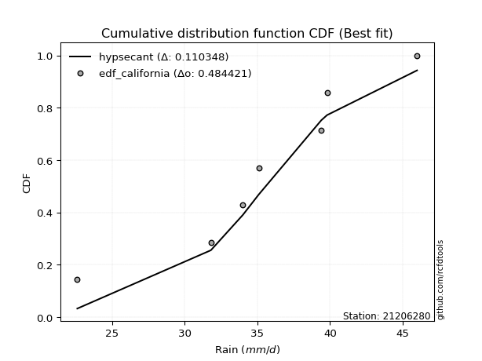</img>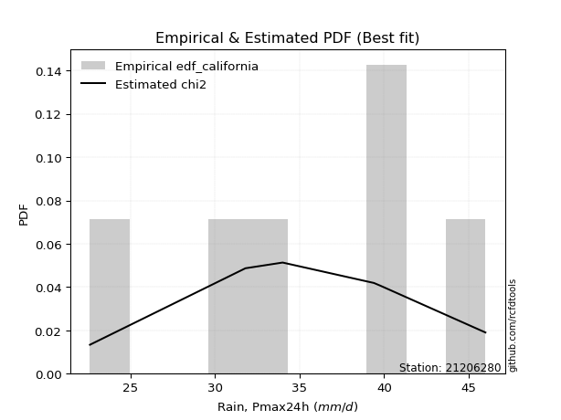</img>

</div>


### 2. Empirical - EDF Hazen (1930)

Hazen method for plotting positions is a formula used to estimate the empirical cumulative probability distribution of flood events or other hydrological data. This formula often results in biased estimations, particularly when extrapolating to extreme events (high return periods).

<div align="center">


$P=(m-0.5)/n$


</div>


**2.1. Empirical values**

<div align="center">

|                | 0                   | 1                   | 2                   | 3         | 4                  | 5                  | 6                  |
|:---------------|:--------------------|:--------------------|:--------------------|:----------|:-------------------|:-------------------|:-------------------|
| date           | 2024                | 2019                | 2023                | 2025      | 2020               | 2022               | 2021               |
| x              | 22.6                | 31.8                | 34.0                | 35.1      | 39.4               | 39.8               | 46.0               |
| m              | 1                   | 2                   | 3                   | 4         | 5                  | 6                  | 7                  |
| empirical_dist | edf_hazen           | edf_hazen           | edf_hazen           | edf_hazen | edf_hazen          | edf_hazen          | edf_hazen          |
| empirical      | 0.07142857142857142 | 0.21428571428571427 | 0.35714285714285715 | 0.5       | 0.6428571428571429 | 0.7857142857142857 | 0.9285714285714286 |
| empirical_tr   | 1.0769230769230769  | 1.2727272727272727  | 1.5555555555555558  | 2.0       | 2.8000000000000003 | 4.666666666666666  | 14.000000000000007 |

</div>


**2.2. Kolmogorov-Smirnov fit test (sorted by Δ)**


<div align="center">

|                | 0                   | 1                   | 2                   | 3                   | 4                   | 5                   | 6                   | 7                   | 8                   | 9                   | 10                  | 11                  | 12                  | 13                  | 14                  | 15                  | 16                  | 17                  | 18                  | 19                  | 20                  | 21                  | 22                  | 23                  | 24                  | 25                  | 26                  | 27                  | 28                  | 29                  | 30                  | 31                  | 32                  | 33                  | 34                  | 35                  | 36                  | 37                  | 38                  | 39                  | 40                  | 41                  | 42                  | 43                  | 44                  | 45                  | 46                  | 47                  | 48                  | 49                  | 50                    | 51                  | 52                  | 53                  | 54                  | 55                  | 56                  | 57                  | 58                  | 59                  | 60                  | 61                  | 62                  | 63                  | 64                  | 65                  | 66                  | 67                  | 68                  | 69                  | 70                  | 71                  | 72                  | 73                  | 74                  | 75                  | 76                  | 77                  | 78                  | 79                  | 80                  | 81                  | 82                  | 83                  | 84                  | 85                  | 86                  | 87                  | 88                  | 89                  |
|:---------------|:--------------------|:--------------------|:--------------------|:--------------------|:--------------------|:--------------------|:--------------------|:--------------------|:--------------------|:--------------------|:--------------------|:--------------------|:--------------------|:--------------------|:--------------------|:--------------------|:--------------------|:--------------------|:--------------------|:--------------------|:--------------------|:--------------------|:--------------------|:--------------------|:--------------------|:--------------------|:--------------------|:--------------------|:--------------------|:--------------------|:--------------------|:--------------------|:--------------------|:--------------------|:--------------------|:--------------------|:--------------------|:--------------------|:--------------------|:--------------------|:--------------------|:--------------------|:--------------------|:--------------------|:--------------------|:--------------------|:--------------------|:--------------------|:--------------------|:--------------------|:----------------------|:--------------------|:--------------------|:--------------------|:--------------------|:--------------------|:--------------------|:--------------------|:--------------------|:--------------------|:--------------------|:--------------------|:--------------------|:--------------------|:--------------------|:--------------------|:--------------------|:--------------------|:--------------------|:--------------------|:--------------------|:--------------------|:--------------------|:--------------------|:--------------------|:--------------------|:--------------------|:--------------------|:--------------------|:--------------------|:--------------------|:--------------------|:--------------------|:--------------------|:--------------------|:--------------------|:--------------------|:--------------------|:--------------------|:--------------------|
| station        | 21206280            | 21206280            | 21206280            | 21206280            | 21206280            | 21206280            | 21206280            | 21206280            | 21206280            | 21206280            | 21206280            | 21206280            | 21206280            | 21206280            | 21206280            | 21206280            | 21206280            | 21206280            | 21206280            | 21206280            | 21206280            | 21206280            | 21206280            | 21206280            | 21206280            | 21206280            | 21206280            | 21206280            | 21206280            | 21206280            | 21206280            | 21206280            | 21206280            | 21206280            | 21206280            | 21206280            | 21206280            | 21206280            | 21206280            | 21206280            | 21206280            | 21206280            | 21206280            | 21206280            | 21206280            | 21206280            | 21206280            | 21206280            | 21206280            | 21206280            | 21206280              | 21206280            | 21206280            | 21206280            | 21206280            | 21206280            | 21206280            | 21206280            | 21206280            | 21206280            | 21206280            | 21206280            | 21206280            | 21206280            | 21206280            | 21206280            | 21206280            | 21206280            | 21206280            | 21206280            | 21206280            | 21206280            | 21206280            | 21206280            | 21206280            | 21206280            | 21206280            | 21206280            | 21206280            | 21206280            | 21206280            | 21206280            | 21206280            | 21206280            | 21206280            | 21206280            | 21206280            | 21206280            | 21206280            | 21206280            |
| empirical_dist | edf_hazen           | edf_hazen           | edf_hazen           | edf_hazen           | edf_hazen           | edf_hazen           | edf_hazen           | edf_hazen           | edf_hazen           | edf_hazen           | edf_hazen           | edf_hazen           | edf_hazen           | edf_hazen           | edf_hazen           | edf_hazen           | edf_hazen           | edf_hazen           | edf_hazen           | edf_hazen           | edf_hazen           | edf_hazen           | edf_hazen           | edf_hazen           | edf_hazen           | edf_hazen           | edf_hazen           | edf_hazen           | edf_hazen           | edf_hazen           | edf_hazen           | edf_hazen           | edf_hazen           | edf_hazen           | edf_hazen           | edf_hazen           | edf_hazen           | edf_hazen           | edf_hazen           | edf_hazen           | edf_hazen           | edf_hazen           | edf_hazen           | edf_hazen           | edf_hazen           | edf_hazen           | edf_hazen           | edf_hazen           | edf_hazen           | edf_hazen           | edf_hazen             | edf_hazen           | edf_hazen           | edf_hazen           | edf_hazen           | edf_hazen           | edf_hazen           | edf_hazen           | edf_hazen           | edf_hazen           | edf_hazen           | edf_hazen           | edf_hazen           | edf_hazen           | edf_hazen           | edf_hazen           | edf_hazen           | edf_hazen           | edf_hazen           | edf_hazen           | edf_hazen           | edf_hazen           | edf_hazen           | edf_hazen           | edf_hazen           | edf_hazen           | edf_hazen           | edf_hazen           | edf_hazen           | edf_hazen           | edf_hazen           | edf_hazen           | edf_hazen           | edf_hazen           | edf_hazen           | edf_hazen           | edf_hazen           | edf_hazen           | edf_hazen           | edf_hazen           |
| p_dist         | logt                | loggumbel_l         | pearson3            | logfisk             | logweibull_min      | logmielke           | weibull_min         | loggenlogistic      | mielke              | genlogistic         | johnsonsu           | fisk                | logloggamma         | logpearson3         | logjohnsonsu        | t                   | norm                | crystalball         | exponnorm           | nct                 | loggompertz         | f                   | erlang              | gamma               | rice                | logistic            | chi2                | gumbel_l            | alpha               | invgamma            | loglogistic         | ncf                 | maxwell             | invgauss            | hypsecant           | logbetaprime        | rayleigh            | loghypsecant        | logf                | logcrystalball      | logexponnorm        | lognorm             | lognorm             | gumbel_r            | betaprime           | laplace_asymmetric  | logfatiguelife      | loggamma            | loggamma            | logrice             | loglaplace_asymmetric | logerlang           | laplace             | logalpha            | lognct              | loginvgamma         | moyal               | loglaplace          | invweibull          | halfnorm            | logmaxwell          | halflogistic        | loginvgauss         | lograyleigh         | loggumbel_r         | kstwobign           | loginvweibull       | logmoyal            | loghalfnorm         | loghalflogistic     | wald                | gibrat              | logtruncnorm        | truncnorm           | logkstwobign        | loggenexpon         | logncf              | logwald             | loggibrat           | genexpon            | expon               | logexpon            | logchi2             | lognakagami         | nakagami            | loglognorm          | pareto              | logpareto           | fatiguelife         | gompertz            |
| delta          | 0.06258677923206774 | 0.06441508545918995 | 0.06516582140468508 | 0.0658757905146985  | 0.06595938890608821 | 0.06601816013735634 | 0.06685562937621425 | 0.06795178790256773 | 0.06795249277754484 | 0.06921041160237967 | 0.06982546478471863 | 0.07139151568403901 | 0.07435566315397701 | 0.07702787829837257 | 0.07814125074969025 | 0.07824470601938385 | 0.07825258748565758 | 0.07825259135916893 | 0.07825583217069218 | 0.07852953387410869 | 0.07925644242454352 | 0.08000274105750152 | 0.08481291463213811 | 0.0889485631328559  | 0.08952752802334193 | 0.0937191595453466  | 0.09527962923561337 | 0.09568744964796061 | 0.09713972061517182 | 0.09911072660523032 | 0.10272879336561291 | 0.10387094549264322 | 0.10533158998297151 | 0.10780870114833432 | 0.10918811798283257 | 0.1149206670121671  | 0.11610939087221159 | 0.11815088006285668 | 0.11826230849593719 | 0.11874278434464783 | 0.11874589475812478 | 0.11874618989145339 | 0.11874618989145339 | 0.11948250988227738 | 0.11990048397125483 | 0.12028483381036448 | 0.12123084934885434 | 0.12618860675192337 | 0.12618860675192337 | 0.12705671217838885 | 0.13167033140186424   | 0.13214267516225844 | 0.1328650304590877  | 0.13420700500091357 | 0.13619716198183165 | 0.13665560132406177 | 0.1397504397858606  | 0.14092804487821853 | 0.14354685050905983 | 0.1464729257951474  | 0.14953510012402368 | 0.1524988869290182  | 0.15793430900834257 | 0.1613399263513365  | 0.16593397193913623 | 0.17668254239372014 | 0.18865289351777229 | 0.191433006428339   | 0.19494021266177372 | 0.19996275933747323 | 0.2043729056567855  | 0.21158392600606868 | 0.2142842595782094  | 0.2142857142711819  | 0.2269601495833057  | 0.23481764882886716 | 0.24457770149827585 | 0.2623529098328152  | 0.2765284516217515  | 0.29480210942344687 | 0.29485717476847506 | 0.33228350694500886 | 0.3526553805020215  | 0.3639366290300176  | 0.3963521516307094  | 0.4331890274823297  | 0.45007438350411133 | 0.4549601659357908  | 0.6138817822983647  | 0.6283599838226078  |
| deltao         | 0.48442053926100004 | 0.48442053926100004 | 0.48442053926100004 | 0.48442053926100004 | 0.48442053926100004 | 0.48442053926100004 | 0.48442053926100004 | 0.48442053926100004 | 0.48442053926100004 | 0.48442053926100004 | 0.48442053926100004 | 0.48442053926100004 | 0.48442053926100004 | 0.48442053926100004 | 0.48442053926100004 | 0.48442053926100004 | 0.48442053926100004 | 0.48442053926100004 | 0.48442053926100004 | 0.48442053926100004 | 0.48442053926100004 | 0.48442053926100004 | 0.48442053926100004 | 0.48442053926100004 | 0.48442053926100004 | 0.48442053926100004 | 0.48442053926100004 | 0.48442053926100004 | 0.48442053926100004 | 0.48442053926100004 | 0.48442053926100004 | 0.48442053926100004 | 0.48442053926100004 | 0.48442053926100004 | 0.48442053926100004 | 0.48442053926100004 | 0.48442053926100004 | 0.48442053926100004 | 0.48442053926100004 | 0.48442053926100004 | 0.48442053926100004 | 0.48442053926100004 | 0.48442053926100004 | 0.48442053926100004 | 0.48442053926100004 | 0.48442053926100004 | 0.48442053926100004 | 0.48442053926100004 | 0.48442053926100004 | 0.48442053926100004 | 0.48442053926100004   | 0.48442053926100004 | 0.48442053926100004 | 0.48442053926100004 | 0.48442053926100004 | 0.48442053926100004 | 0.48442053926100004 | 0.48442053926100004 | 0.48442053926100004 | 0.48442053926100004 | 0.48442053926100004 | 0.48442053926100004 | 0.48442053926100004 | 0.48442053926100004 | 0.48442053926100004 | 0.48442053926100004 | 0.48442053926100004 | 0.48442053926100004 | 0.48442053926100004 | 0.48442053926100004 | 0.48442053926100004 | 0.48442053926100004 | 0.48442053926100004 | 0.48442053926100004 | 0.48442053926100004 | 0.48442053926100004 | 0.48442053926100004 | 0.48442053926100004 | 0.48442053926100004 | 0.48442053926100004 | 0.48442053926100004 | 0.48442053926100004 | 0.48442053926100004 | 0.48442053926100004 | 0.48442053926100004 | 0.48442053926100004 | 0.48442053926100004 | 0.48442053926100004 | 0.48442053926100004 | 0.48442053926100004 |
| eval           | Δo > Δ              | Δo > Δ              | Δo > Δ              | Δo > Δ              | Δo > Δ              | Δo > Δ              | Δo > Δ              | Δo > Δ              | Δo > Δ              | Δo > Δ              | Δo > Δ              | Δo > Δ              | Δo > Δ              | Δo > Δ              | Δo > Δ              | Δo > Δ              | Δo > Δ              | Δo > Δ              | Δo > Δ              | Δo > Δ              | Δo > Δ              | Δo > Δ              | Δo > Δ              | Δo > Δ              | Δo > Δ              | Δo > Δ              | Δo > Δ              | Δo > Δ              | Δo > Δ              | Δo > Δ              | Δo > Δ              | Δo > Δ              | Δo > Δ              | Δo > Δ              | Δo > Δ              | Δo > Δ              | Δo > Δ              | Δo > Δ              | Δo > Δ              | Δo > Δ              | Δo > Δ              | Δo > Δ              | Δo > Δ              | Δo > Δ              | Δo > Δ              | Δo > Δ              | Δo > Δ              | Δo > Δ              | Δo > Δ              | Δo > Δ              | Δo > Δ                | Δo > Δ              | Δo > Δ              | Δo > Δ              | Δo > Δ              | Δo > Δ              | Δo > Δ              | Δo > Δ              | Δo > Δ              | Δo > Δ              | Δo > Δ              | Δo > Δ              | Δo > Δ              | Δo > Δ              | Δo > Δ              | Δo > Δ              | Δo > Δ              | Δo > Δ              | Δo > Δ              | Δo > Δ              | Δo > Δ              | Δo > Δ              | Δo > Δ              | Δo > Δ              | Δo > Δ              | Δo > Δ              | Δo > Δ              | Δo > Δ              | Δo > Δ              | Δo > Δ              | Δo > Δ              | Δo > Δ              | Δo > Δ              | Δo > Δ              | Δo > Δ              | Δo > Δ              | Δo > Δ              | Δo > Δ              | Δo <= Δ             | Δo <= Δ             |
| fit            | 1                   | 1                   | 1                   | 1                   | 1                   | 1                   | 1                   | 1                   | 1                   | 1                   | 1                   | 1                   | 1                   | 1                   | 1                   | 1                   | 1                   | 1                   | 1                   | 1                   | 1                   | 1                   | 1                   | 1                   | 1                   | 1                   | 1                   | 1                   | 1                   | 1                   | 1                   | 1                   | 1                   | 1                   | 1                   | 1                   | 1                   | 1                   | 1                   | 1                   | 1                   | 1                   | 1                   | 1                   | 1                   | 1                   | 1                   | 1                   | 1                   | 1                   | 1                     | 1                   | 1                   | 1                   | 1                   | 1                   | 1                   | 1                   | 1                   | 1                   | 1                   | 1                   | 1                   | 1                   | 1                   | 1                   | 1                   | 1                   | 1                   | 1                   | 1                   | 1                   | 1                   | 1                   | 1                   | 1                   | 1                   | 1                   | 1                   | 1                   | 1                   | 1                   | 1                   | 1                   | 1                   | 1                   | 1                   | 1                   | 0                   | 0                   |
| n              | 7                   | 7                   | 7                   | 7                   | 7                   | 7                   | 7                   | 7                   | 7                   | 7                   | 7                   | 7                   | 7                   | 7                   | 7                   | 7                   | 7                   | 7                   | 7                   | 7                   | 7                   | 7                   | 7                   | 7                   | 7                   | 7                   | 7                   | 7                   | 7                   | 7                   | 7                   | 7                   | 7                   | 7                   | 7                   | 7                   | 7                   | 7                   | 7                   | 7                   | 7                   | 7                   | 7                   | 7                   | 7                   | 7                   | 7                   | 7                   | 7                   | 7                   | 7                     | 7                   | 7                   | 7                   | 7                   | 7                   | 7                   | 7                   | 7                   | 7                   | 7                   | 7                   | 7                   | 7                   | 7                   | 7                   | 7                   | 7                   | 7                   | 7                   | 7                   | 7                   | 7                   | 7                   | 7                   | 7                   | 7                   | 7                   | 7                   | 7                   | 7                   | 7                   | 7                   | 7                   | 7                   | 7                   | 7                   | 7                   | 7                   | 7                   |
| best_fit       | 1                   | 0                   | 0                   | 0                   | 0                   | 0                   | 0                   | 0                   | 0                   | 0                   | 0                   | 0                   | 0                   | 0                   | 0                   | 0                   | 0                   | 0                   | 0                   | 0                   | 0                   | 0                   | 0                   | 0                   | 0                   | 0                   | 0                   | 0                   | 0                   | 0                   | 0                   | 0                   | 0                   | 0                   | 0                   | 0                   | 0                   | 0                   | 0                   | 0                   | 0                   | 0                   | 0                   | 0                   | 0                   | 0                   | 0                   | 0                   | 0                   | 0                   | 0                     | 0                   | 0                   | 0                   | 0                   | 0                   | 0                   | 0                   | 0                   | 0                   | 0                   | 0                   | 0                   | 0                   | 0                   | 0                   | 0                   | 0                   | 0                   | 0                   | 0                   | 0                   | 0                   | 0                   | 0                   | 0                   | 0                   | 0                   | 0                   | 0                   | 0                   | 0                   | 0                   | 0                   | 0                   | 0                   | 0                   | 0                   | 0                   | 0                   |
| best_fit_sort  | 1                   | 2                   | 3                   | 4                   | 5                   | 6                   | 7                   | 8                   | 9                   | 10                  | 11                  | 12                  | 13                  | 14                  | 15                  | 16                  | 17                  | 18                  | 19                  | 20                  | 21                  | 22                  | 23                  | 24                  | 25                  | 26                  | 27                  | 28                  | 29                  | 30                  | 31                  | 32                  | 33                  | 34                  | 35                  | 36                  | 37                  | 38                  | 39                  | 40                  | 41                  | 42                  | 43                  | 44                  | 45                  | 46                  | 47                  | 48                  | 49                  | 50                  | 51                    | 52                  | 53                  | 54                  | 55                  | 56                  | 57                  | 58                  | 59                  | 60                  | 61                  | 62                  | 63                  | 64                  | 65                  | 66                  | 67                  | 68                  | 69                  | 70                  | 71                  | 72                  | 73                  | 74                  | 75                  | 76                  | 77                  | 78                  | 79                  | 80                  | 81                  | 82                  | 83                  | 84                  | 85                  | 86                  | 87                  | 88                  | 89                  | 90                  |

</div>


<div align="center">

</img>

</div>


**2.3. Best fit**

<div align="center">

|   id |   station | empirical_dist   | p_dist   |     delta |   deltao | eval   |   fit |   n |   best_fit |   best_fit_sort |
|-----:|----------:|:-----------------|:---------|----------:|---------:|:-------|------:|----:|-----------:|----------------:|
|    0 |  21206280 | edf_hazen        | logt     | 0.0625868 | 0.484421 | Δo > Δ |     1 |   7 |          1 |               1 |

</div>


<div align="center">

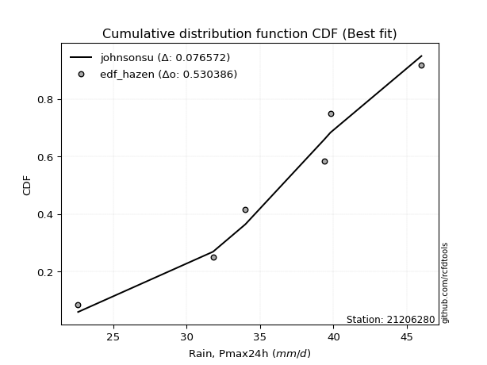</img>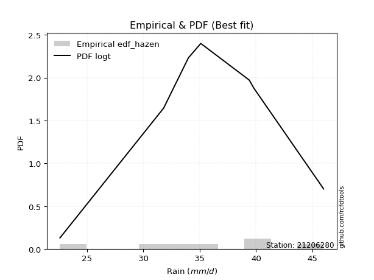</img>

</div>


### 3. Empirical - EDF Weibull (1939)

Weibull plotting position formula is an empirical method used to estimate the non-exceedance probability or plotting position for a set of observed data, is often recommended or widely used in practice, particularly in flood frequency analysis.

<div align="center">


$P=m/(n+1)$


</div>


**3.1. Empirical values**

<div align="center">

|                | 0                  | 1                  | 2           | 3           | 4                  | 5           | 6           |
|:---------------|:-------------------|:-------------------|:------------|:------------|:-------------------|:------------|:------------|
| date           | 2024               | 2019               | 2023        | 2025        | 2020               | 2022        | 2021        |
| x              | 22.6               | 31.8               | 34.0        | 35.1        | 39.4               | 39.8        | 46.0        |
| m              | 1                  | 2                  | 3           | 4           | 5                  | 6           | 7           |
| empirical_dist | edf_weibull        | edf_weibull        | edf_weibull | edf_weibull | edf_weibull        | edf_weibull | edf_weibull |
| empirical      | 0.125              | 0.25               | 0.375       | 0.5         | 0.625              | 0.75        | 0.875       |
| empirical_tr   | 1.1428571428571428 | 1.3333333333333333 | 1.6         | 2.0         | 2.6666666666666665 | 4.0         | 8.0         |

</div>


**3.2. Kolmogorov-Smirnov fit test (sorted by Δ)**


<div align="center">

|                | 0                   | 1                   | 2                   | 3                   | 4                   | 5                   | 6                   | 7                   | 8                   | 9                   | 10                  | 11                  | 12                  | 13                  | 14                  | 15                  | 16                  | 17                  | 18                  | 19                  | 20                  | 21                  | 22                  | 23                  | 24                  | 25                  | 26                  | 27                  | 28                  | 29                  | 30                  | 31                  | 32                  | 33                  | 34                  | 35                  | 36                  | 37                  | 38                  | 39                  | 40                  | 41                  | 42                  | 43                  | 44                  | 45                  | 46                  | 47                  | 48                  | 49                  | 50                  | 51                  | 52                  | 53                  | 54                  | 55                  | 56                  | 57                  | 58                  | 59                  | 60                  | 61                  | 62                    | 63                  | 64                  | 65                  | 66                  | 67                  | 68                  | 69                  | 70                  | 71                  | 72                  | 73                  | 74                  | 75                  | 76                  | 77                  | 78                  | 79                  | 80                  | 81                  | 82                  | 83                  | 84                  | 85                  | 86                  | 87                  | 88                  | 89                  |
|:---------------|:--------------------|:--------------------|:--------------------|:--------------------|:--------------------|:--------------------|:--------------------|:--------------------|:--------------------|:--------------------|:--------------------|:--------------------|:--------------------|:--------------------|:--------------------|:--------------------|:--------------------|:--------------------|:--------------------|:--------------------|:--------------------|:--------------------|:--------------------|:--------------------|:--------------------|:--------------------|:--------------------|:--------------------|:--------------------|:--------------------|:--------------------|:--------------------|:--------------------|:--------------------|:--------------------|:--------------------|:--------------------|:--------------------|:--------------------|:--------------------|:--------------------|:--------------------|:--------------------|:--------------------|:--------------------|:--------------------|:--------------------|:--------------------|:--------------------|:--------------------|:--------------------|:--------------------|:--------------------|:--------------------|:--------------------|:--------------------|:--------------------|:--------------------|:--------------------|:--------------------|:--------------------|:--------------------|:----------------------|:--------------------|:--------------------|:--------------------|:--------------------|:--------------------|:--------------------|:--------------------|:--------------------|:--------------------|:--------------------|:--------------------|:--------------------|:--------------------|:--------------------|:--------------------|:--------------------|:--------------------|:--------------------|:--------------------|:--------------------|:--------------------|:--------------------|:--------------------|:--------------------|:--------------------|:--------------------|:--------------------|
| station        | 21206280            | 21206280            | 21206280            | 21206280            | 21206280            | 21206280            | 21206280            | 21206280            | 21206280            | 21206280            | 21206280            | 21206280            | 21206280            | 21206280            | 21206280            | 21206280            | 21206280            | 21206280            | 21206280            | 21206280            | 21206280            | 21206280            | 21206280            | 21206280            | 21206280            | 21206280            | 21206280            | 21206280            | 21206280            | 21206280            | 21206280            | 21206280            | 21206280            | 21206280            | 21206280            | 21206280            | 21206280            | 21206280            | 21206280            | 21206280            | 21206280            | 21206280            | 21206280            | 21206280            | 21206280            | 21206280            | 21206280            | 21206280            | 21206280            | 21206280            | 21206280            | 21206280            | 21206280            | 21206280            | 21206280            | 21206280            | 21206280            | 21206280            | 21206280            | 21206280            | 21206280            | 21206280            | 21206280              | 21206280            | 21206280            | 21206280            | 21206280            | 21206280            | 21206280            | 21206280            | 21206280            | 21206280            | 21206280            | 21206280            | 21206280            | 21206280            | 21206280            | 21206280            | 21206280            | 21206280            | 21206280            | 21206280            | 21206280            | 21206280            | 21206280            | 21206280            | 21206280            | 21206280            | 21206280            | 21206280            |
| empirical_dist | edf_weibull         | edf_weibull         | edf_weibull         | edf_weibull         | edf_weibull         | edf_weibull         | edf_weibull         | edf_weibull         | edf_weibull         | edf_weibull         | edf_weibull         | edf_weibull         | edf_weibull         | edf_weibull         | edf_weibull         | edf_weibull         | edf_weibull         | edf_weibull         | edf_weibull         | edf_weibull         | edf_weibull         | edf_weibull         | edf_weibull         | edf_weibull         | edf_weibull         | edf_weibull         | edf_weibull         | edf_weibull         | edf_weibull         | edf_weibull         | edf_weibull         | edf_weibull         | edf_weibull         | edf_weibull         | edf_weibull         | edf_weibull         | edf_weibull         | edf_weibull         | edf_weibull         | edf_weibull         | edf_weibull         | edf_weibull         | edf_weibull         | edf_weibull         | edf_weibull         | edf_weibull         | edf_weibull         | edf_weibull         | edf_weibull         | edf_weibull         | edf_weibull         | edf_weibull         | edf_weibull         | edf_weibull         | edf_weibull         | edf_weibull         | edf_weibull         | edf_weibull         | edf_weibull         | edf_weibull         | edf_weibull         | edf_weibull         | edf_weibull           | edf_weibull         | edf_weibull         | edf_weibull         | edf_weibull         | edf_weibull         | edf_weibull         | edf_weibull         | edf_weibull         | edf_weibull         | edf_weibull         | edf_weibull         | edf_weibull         | edf_weibull         | edf_weibull         | edf_weibull         | edf_weibull         | edf_weibull         | edf_weibull         | edf_weibull         | edf_weibull         | edf_weibull         | edf_weibull         | edf_weibull         | edf_weibull         | edf_weibull         | edf_weibull         | edf_weibull         |
| p_dist         | mielke              | loggenlogistic      | logmielke           | johnsonsu           | logloggamma         | logjohnsonsu        | pearson3            | loggumbel_l         | weibull_min         | genlogistic         | logweibull_min      | logpearson3         | fisk                | f                   | exponnorm           | norm                | crystalball         | t                   | nct                 | chi2                | gamma               | erlang              | invgamma            | alpha               | invgauss            | ncf                 | logt                | rice                | betaprime           | logerlang           | logfatiguelife      | lognorm             | lognorm             | logexponnorm        | logcrystalball      | logf                | logalpha            | logfisk             | loggamma            | loggamma            | gumbel_l            | loginvgamma         | invweibull          | logbetaprime        | logrice             | lognct              | logistic            | maxwell             | loggompertz         | loglogistic         | loginvgauss         | logmaxwell          | rayleigh            | halfnorm            | lograyleigh         | hypsecant           | loghypsecant        | gumbel_r            | laplace_asymmetric  | kstwobign           | halflogistic        | loggumbel_r         | loglaplace_asymmetric | laplace             | moyal               | loginvweibull       | loglaplace          | loghalfnorm         | logmoyal            | loghalflogistic     | logkstwobign        | logncf              | wald                | loggenexpon         | gibrat              | logwald             | logtruncnorm        | truncnorm           | loggibrat           | genexpon            | expon               | logexpon            | logchi2             | lognakagami         | nakagami            | loglognorm          | pareto              | logpareto           | fatiguelife         | gompertz            |
| delta          | 0.08067952726225758 | 0.08071524769912766 | 0.08162683040126066 | 0.08269033468721132 | 0.08365297359979906 | 0.08481244700567014 | 0.08549931854309953 | 0.08600116742803415 | 0.08617122311970415 | 0.08687094043153665 | 0.08704207830944893 | 0.08803598355966095 | 0.09401605798909052 | 0.09552968882730614 | 0.09583145743789939 | 0.09583200736860456 | 0.09583200901248429 | 0.09583656484453319 | 0.09583822108912529 | 0.09660256585655622 | 0.09692962018336587 | 0.09785467266088543 | 0.09875337689765384 | 0.09895066197061149 | 0.10003840191626953 | 0.10118865073184029 | 0.1021046489054244  | 0.10292518811578269 | 0.1052348330745992  | 0.10525068145619118 | 0.10539463725661491 | 0.1054911846358253  | 0.1054911846358253  | 0.1054913162990471  | 0.10549215351809699 | 0.10561429072204293 | 0.10630259428026755 | 0.1065948253257116  | 0.10669693891096112 | 0.10669693891096112 | 0.10691034386507525 | 0.10724486264704997 | 0.1078325647947741  | 0.10787979572255436 | 0.10820734350956113 | 0.10876419843301241 | 0.1115763024024895  | 0.11648272581694671 | 0.11821786576942017 | 0.12058593622275582 | 0.12222002329405685 | 0.122711371335047   | 0.12491507213399672 | 0.125               | 0.12656108487762086 | 0.12704526083997547 | 0.13600802291999958 | 0.13733965273942028 | 0.13814197666750738 | 0.1409682566794344  | 0.14676705824563874 | 0.14807682908199338 | 0.14952747425900714   | 0.1507221733162306  | 0.15272817555284846 | 0.15293860780348656 | 0.15878518773536143 | 0.1599040613140389  | 0.17357586357119614 | 0.1815016623995671  | 0.19124586386901998 | 0.19202929846989125 | 0.1985824111407719  | 0.19910336311458143 | 0.22944106886321158 | 0.24449576697567232 | 0.24999854529249513 | 0.24999999998546762 | 0.25867130876460864 | 0.25908782370916117 | 0.25914288905418936 | 0.29656922123072316 | 0.2990839519305929  | 0.34607948617287476 | 0.37849500877356657 | 0.397474741768044   | 0.41436009778982563 | 0.4192458802215051  | 0.578167496584079   | 0.5926456981083221  |
| deltao         | 0.48442053926100004 | 0.48442053926100004 | 0.48442053926100004 | 0.48442053926100004 | 0.48442053926100004 | 0.48442053926100004 | 0.48442053926100004 | 0.48442053926100004 | 0.48442053926100004 | 0.48442053926100004 | 0.48442053926100004 | 0.48442053926100004 | 0.48442053926100004 | 0.48442053926100004 | 0.48442053926100004 | 0.48442053926100004 | 0.48442053926100004 | 0.48442053926100004 | 0.48442053926100004 | 0.48442053926100004 | 0.48442053926100004 | 0.48442053926100004 | 0.48442053926100004 | 0.48442053926100004 | 0.48442053926100004 | 0.48442053926100004 | 0.48442053926100004 | 0.48442053926100004 | 0.48442053926100004 | 0.48442053926100004 | 0.48442053926100004 | 0.48442053926100004 | 0.48442053926100004 | 0.48442053926100004 | 0.48442053926100004 | 0.48442053926100004 | 0.48442053926100004 | 0.48442053926100004 | 0.48442053926100004 | 0.48442053926100004 | 0.48442053926100004 | 0.48442053926100004 | 0.48442053926100004 | 0.48442053926100004 | 0.48442053926100004 | 0.48442053926100004 | 0.48442053926100004 | 0.48442053926100004 | 0.48442053926100004 | 0.48442053926100004 | 0.48442053926100004 | 0.48442053926100004 | 0.48442053926100004 | 0.48442053926100004 | 0.48442053926100004 | 0.48442053926100004 | 0.48442053926100004 | 0.48442053926100004 | 0.48442053926100004 | 0.48442053926100004 | 0.48442053926100004 | 0.48442053926100004 | 0.48442053926100004   | 0.48442053926100004 | 0.48442053926100004 | 0.48442053926100004 | 0.48442053926100004 | 0.48442053926100004 | 0.48442053926100004 | 0.48442053926100004 | 0.48442053926100004 | 0.48442053926100004 | 0.48442053926100004 | 0.48442053926100004 | 0.48442053926100004 | 0.48442053926100004 | 0.48442053926100004 | 0.48442053926100004 | 0.48442053926100004 | 0.48442053926100004 | 0.48442053926100004 | 0.48442053926100004 | 0.48442053926100004 | 0.48442053926100004 | 0.48442053926100004 | 0.48442053926100004 | 0.48442053926100004 | 0.48442053926100004 | 0.48442053926100004 | 0.48442053926100004 |
| eval           | Δo > Δ              | Δo > Δ              | Δo > Δ              | Δo > Δ              | Δo > Δ              | Δo > Δ              | Δo > Δ              | Δo > Δ              | Δo > Δ              | Δo > Δ              | Δo > Δ              | Δo > Δ              | Δo > Δ              | Δo > Δ              | Δo > Δ              | Δo > Δ              | Δo > Δ              | Δo > Δ              | Δo > Δ              | Δo > Δ              | Δo > Δ              | Δo > Δ              | Δo > Δ              | Δo > Δ              | Δo > Δ              | Δo > Δ              | Δo > Δ              | Δo > Δ              | Δo > Δ              | Δo > Δ              | Δo > Δ              | Δo > Δ              | Δo > Δ              | Δo > Δ              | Δo > Δ              | Δo > Δ              | Δo > Δ              | Δo > Δ              | Δo > Δ              | Δo > Δ              | Δo > Δ              | Δo > Δ              | Δo > Δ              | Δo > Δ              | Δo > Δ              | Δo > Δ              | Δo > Δ              | Δo > Δ              | Δo > Δ              | Δo > Δ              | Δo > Δ              | Δo > Δ              | Δo > Δ              | Δo > Δ              | Δo > Δ              | Δo > Δ              | Δo > Δ              | Δo > Δ              | Δo > Δ              | Δo > Δ              | Δo > Δ              | Δo > Δ              | Δo > Δ                | Δo > Δ              | Δo > Δ              | Δo > Δ              | Δo > Δ              | Δo > Δ              | Δo > Δ              | Δo > Δ              | Δo > Δ              | Δo > Δ              | Δo > Δ              | Δo > Δ              | Δo > Δ              | Δo > Δ              | Δo > Δ              | Δo > Δ              | Δo > Δ              | Δo > Δ              | Δo > Δ              | Δo > Δ              | Δo > Δ              | Δo > Δ              | Δo > Δ              | Δo > Δ              | Δo > Δ              | Δo > Δ              | Δo <= Δ             | Δo <= Δ             |
| fit            | 1                   | 1                   | 1                   | 1                   | 1                   | 1                   | 1                   | 1                   | 1                   | 1                   | 1                   | 1                   | 1                   | 1                   | 1                   | 1                   | 1                   | 1                   | 1                   | 1                   | 1                   | 1                   | 1                   | 1                   | 1                   | 1                   | 1                   | 1                   | 1                   | 1                   | 1                   | 1                   | 1                   | 1                   | 1                   | 1                   | 1                   | 1                   | 1                   | 1                   | 1                   | 1                   | 1                   | 1                   | 1                   | 1                   | 1                   | 1                   | 1                   | 1                   | 1                   | 1                   | 1                   | 1                   | 1                   | 1                   | 1                   | 1                   | 1                   | 1                   | 1                   | 1                   | 1                     | 1                   | 1                   | 1                   | 1                   | 1                   | 1                   | 1                   | 1                   | 1                   | 1                   | 1                   | 1                   | 1                   | 1                   | 1                   | 1                   | 1                   | 1                   | 1                   | 1                   | 1                   | 1                   | 1                   | 1                   | 1                   | 0                   | 0                   |
| n              | 7                   | 7                   | 7                   | 7                   | 7                   | 7                   | 7                   | 7                   | 7                   | 7                   | 7                   | 7                   | 7                   | 7                   | 7                   | 7                   | 7                   | 7                   | 7                   | 7                   | 7                   | 7                   | 7                   | 7                   | 7                   | 7                   | 7                   | 7                   | 7                   | 7                   | 7                   | 7                   | 7                   | 7                   | 7                   | 7                   | 7                   | 7                   | 7                   | 7                   | 7                   | 7                   | 7                   | 7                   | 7                   | 7                   | 7                   | 7                   | 7                   | 7                   | 7                   | 7                   | 7                   | 7                   | 7                   | 7                   | 7                   | 7                   | 7                   | 7                   | 7                   | 7                   | 7                     | 7                   | 7                   | 7                   | 7                   | 7                   | 7                   | 7                   | 7                   | 7                   | 7                   | 7                   | 7                   | 7                   | 7                   | 7                   | 7                   | 7                   | 7                   | 7                   | 7                   | 7                   | 7                   | 7                   | 7                   | 7                   | 7                   | 7                   |
| best_fit       | 1                   | 0                   | 0                   | 0                   | 0                   | 0                   | 0                   | 0                   | 0                   | 0                   | 0                   | 0                   | 0                   | 0                   | 0                   | 0                   | 0                   | 0                   | 0                   | 0                   | 0                   | 0                   | 0                   | 0                   | 0                   | 0                   | 0                   | 0                   | 0                   | 0                   | 0                   | 0                   | 0                   | 0                   | 0                   | 0                   | 0                   | 0                   | 0                   | 0                   | 0                   | 0                   | 0                   | 0                   | 0                   | 0                   | 0                   | 0                   | 0                   | 0                   | 0                   | 0                   | 0                   | 0                   | 0                   | 0                   | 0                   | 0                   | 0                   | 0                   | 0                   | 0                   | 0                     | 0                   | 0                   | 0                   | 0                   | 0                   | 0                   | 0                   | 0                   | 0                   | 0                   | 0                   | 0                   | 0                   | 0                   | 0                   | 0                   | 0                   | 0                   | 0                   | 0                   | 0                   | 0                   | 0                   | 0                   | 0                   | 0                   | 0                   |
| best_fit_sort  | 1                   | 2                   | 3                   | 4                   | 5                   | 6                   | 7                   | 8                   | 9                   | 10                  | 11                  | 12                  | 13                  | 14                  | 15                  | 16                  | 17                  | 18                  | 19                  | 20                  | 21                  | 22                  | 23                  | 24                  | 25                  | 26                  | 27                  | 28                  | 29                  | 30                  | 31                  | 32                  | 33                  | 34                  | 35                  | 36                  | 37                  | 38                  | 39                  | 40                  | 41                  | 42                  | 43                  | 44                  | 45                  | 46                  | 47                  | 48                  | 49                  | 50                  | 51                  | 52                  | 53                  | 54                  | 55                  | 56                  | 57                  | 58                  | 59                  | 60                  | 61                  | 62                  | 63                    | 64                  | 65                  | 66                  | 67                  | 68                  | 69                  | 70                  | 71                  | 72                  | 73                  | 74                  | 75                  | 76                  | 77                  | 78                  | 79                  | 80                  | 81                  | 82                  | 83                  | 84                  | 85                  | 86                  | 87                  | 88                  | 89                  | 90                  |

</div>


<div align="center">

</img>

</div>


**3.3. Best fit**

<div align="center">

|   id |   station | empirical_dist   | p_dist   |     delta |   deltao | eval   |   fit |   n |   best_fit |   best_fit_sort |
|-----:|----------:|:-----------------|:---------|----------:|---------:|:-------|------:|----:|-----------:|----------------:|
|    0 |  21206280 | edf_weibull      | mielke   | 0.0806795 | 0.484421 | Δo > Δ |     1 |   7 |          1 |               1 |

</div>


<div align="center">

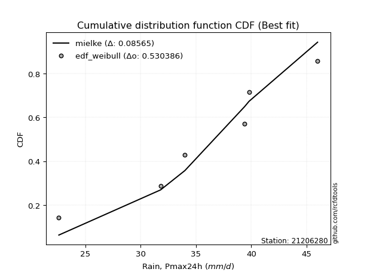</img>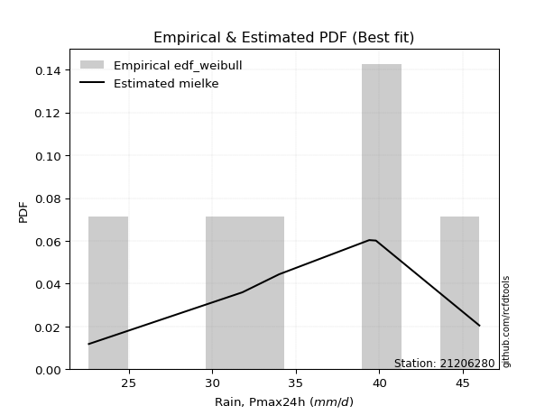</img>

</div>


### 4. Empirical - EDF Beard (1943)

The Beard formula (or Beard´s plotting position formula) in hydrology is used to estimate the empirical non-exceedance probability _(P)_ of a flood event (or other extreme hydrological data point) within a given dataset.

<div align="center">


$P=(m-0.31)/(n+0.38)$


</div>


**4.1. Empirical values**

<div align="center">

|                | 0                   | 1                   | 2                   | 3         | 4                  | 5                  | 6                  |
|:---------------|:--------------------|:--------------------|:--------------------|:----------|:-------------------|:-------------------|:-------------------|
| date           | 2024                | 2019                | 2023                | 2025      | 2020               | 2022               | 2021               |
| x              | 22.6                | 31.8                | 34.0                | 35.1      | 39.4               | 39.8               | 46.0               |
| m              | 1                   | 2                   | 3                   | 4         | 5                  | 6                  | 7                  |
| empirical_dist | edf_beard           | edf_beard           | edf_beard           | edf_beard | edf_beard          | edf_beard          | edf_beard          |
| empirical      | 0.09349593495934959 | 0.22899728997289973 | 0.36449864498644985 | 0.5       | 0.6355013550135502 | 0.7710027100271003 | 0.9065040650406505 |
| empirical_tr   | 1.1031390134529149  | 1.29701230228471    | 1.5735607675906182  | 2.0       | 2.743494423791822  | 4.366863905325444  | 10.695652173913055 |

</div>


**4.2. Kolmogorov-Smirnov fit test (sorted by Δ)**


<div align="center">

|                | 0                    | 1                    | 2                   | 3                   | 4                   | 5                   | 6                   | 7                   | 8                   | 9                   | 10                  | 11                  | 12                  | 13                  | 14                  | 15                  | 16                  | 17                  | 18                  | 19                  | 20                  | 21                  | 22                  | 23                  | 24                  | 25                  | 26                  | 27                  | 28                  | 29                  | 30                  | 31                  | 32                  | 33                  | 34                  | 35                  | 36                  | 37                  | 38                  | 39                  | 40                  | 41                  | 42                  | 43                  | 44                  | 45                  | 46                  | 47                  | 48                  | 49                  | 50                  | 51                  | 52                  | 53                  | 54                  | 55                  | 56                  | 57                    | 58                  | 59                  | 60                  | 61                  | 62                  | 63                  | 64                  | 65                  | 66                  | 67                  | 68                  | 69                  | 70                  | 71                  | 72                  | 73                  | 74                  | 75                  | 76                  | 77                  | 78                  | 79                  | 80                  | 81                  | 82                  | 83                  | 84                  | 85                  | 86                  | 87                  | 88                  | 89                  |
|:---------------|:---------------------|:---------------------|:--------------------|:--------------------|:--------------------|:--------------------|:--------------------|:--------------------|:--------------------|:--------------------|:--------------------|:--------------------|:--------------------|:--------------------|:--------------------|:--------------------|:--------------------|:--------------------|:--------------------|:--------------------|:--------------------|:--------------------|:--------------------|:--------------------|:--------------------|:--------------------|:--------------------|:--------------------|:--------------------|:--------------------|:--------------------|:--------------------|:--------------------|:--------------------|:--------------------|:--------------------|:--------------------|:--------------------|:--------------------|:--------------------|:--------------------|:--------------------|:--------------------|:--------------------|:--------------------|:--------------------|:--------------------|:--------------------|:--------------------|:--------------------|:--------------------|:--------------------|:--------------------|:--------------------|:--------------------|:--------------------|:--------------------|:----------------------|:--------------------|:--------------------|:--------------------|:--------------------|:--------------------|:--------------------|:--------------------|:--------------------|:--------------------|:--------------------|:--------------------|:--------------------|:--------------------|:--------------------|:--------------------|:--------------------|:--------------------|:--------------------|:--------------------|:--------------------|:--------------------|:--------------------|:--------------------|:--------------------|:--------------------|:--------------------|:--------------------|:--------------------|:--------------------|:--------------------|:--------------------|:--------------------|
| station        | 21206280             | 21206280             | 21206280            | 21206280            | 21206280            | 21206280            | 21206280            | 21206280            | 21206280            | 21206280            | 21206280            | 21206280            | 21206280            | 21206280            | 21206280            | 21206280            | 21206280            | 21206280            | 21206280            | 21206280            | 21206280            | 21206280            | 21206280            | 21206280            | 21206280            | 21206280            | 21206280            | 21206280            | 21206280            | 21206280            | 21206280            | 21206280            | 21206280            | 21206280            | 21206280            | 21206280            | 21206280            | 21206280            | 21206280            | 21206280            | 21206280            | 21206280            | 21206280            | 21206280            | 21206280            | 21206280            | 21206280            | 21206280            | 21206280            | 21206280            | 21206280            | 21206280            | 21206280            | 21206280            | 21206280            | 21206280            | 21206280            | 21206280              | 21206280            | 21206280            | 21206280            | 21206280            | 21206280            | 21206280            | 21206280            | 21206280            | 21206280            | 21206280            | 21206280            | 21206280            | 21206280            | 21206280            | 21206280            | 21206280            | 21206280            | 21206280            | 21206280            | 21206280            | 21206280            | 21206280            | 21206280            | 21206280            | 21206280            | 21206280            | 21206280            | 21206280            | 21206280            | 21206280            | 21206280            | 21206280            |
| empirical_dist | edf_beard            | edf_beard            | edf_beard           | edf_beard           | edf_beard           | edf_beard           | edf_beard           | edf_beard           | edf_beard           | edf_beard           | edf_beard           | edf_beard           | edf_beard           | edf_beard           | edf_beard           | edf_beard           | edf_beard           | edf_beard           | edf_beard           | edf_beard           | edf_beard           | edf_beard           | edf_beard           | edf_beard           | edf_beard           | edf_beard           | edf_beard           | edf_beard           | edf_beard           | edf_beard           | edf_beard           | edf_beard           | edf_beard           | edf_beard           | edf_beard           | edf_beard           | edf_beard           | edf_beard           | edf_beard           | edf_beard           | edf_beard           | edf_beard           | edf_beard           | edf_beard           | edf_beard           | edf_beard           | edf_beard           | edf_beard           | edf_beard           | edf_beard           | edf_beard           | edf_beard           | edf_beard           | edf_beard           | edf_beard           | edf_beard           | edf_beard           | edf_beard             | edf_beard           | edf_beard           | edf_beard           | edf_beard           | edf_beard           | edf_beard           | edf_beard           | edf_beard           | edf_beard           | edf_beard           | edf_beard           | edf_beard           | edf_beard           | edf_beard           | edf_beard           | edf_beard           | edf_beard           | edf_beard           | edf_beard           | edf_beard           | edf_beard           | edf_beard           | edf_beard           | edf_beard           | edf_beard           | edf_beard           | edf_beard           | edf_beard           | edf_beard           | edf_beard           | edf_beard           | edf_beard           |
| p_dist         | weibull_min          | logweibull_min       | logpearson3         | pearson3            | loggumbel_l         | johnsonsu           | logjohnsonsu        | logloggamma         | logmielke           | loggenlogistic      | mielke              | logt                | logfisk             | genlogistic         | fisk                | f                   | norm                | crystalball         | exponnorm           | t                   | nct                 | erlang              | rice                | gamma               | invgamma            | chi2                | loggompertz         | alpha               | ncf                 | invgauss            | maxwell             | gumbel_l            | logbetaprime        | logistic            | rayleigh            | logf                | logcrystalball      | logexponnorm        | lognorm             | lognorm             | betaprime           | logfatiguelife      | loglogistic         | loggamma            | loggamma            | logrice             | hypsecant           | logerlang           | logalpha            | lognct              | loginvgamma         | loghypsecant        | gumbel_r            | laplace_asymmetric  | invweibull          | halfnorm            | logmaxwell          | loglaplace_asymmetric | laplace             | moyal               | loginvgauss         | halflogistic        | lograyleigh         | loglaplace          | loggumbel_r         | kstwobign           | loginvweibull       | loghalfnorm         | logmoyal            | loghalflogistic     | wald                | logkstwobign        | gibrat              | loggenexpon         | logncf              | logtruncnorm        | truncnorm           | logwald             | loggibrat           | genexpon            | expon               | logexpon            | logchi2             | lognakagami         | nakagami            | loglognorm          | pareto              | logpareto           | fatiguelife         | gompertz            |
| delta          | 0.060855275179223955 | 0.061857976564803296 | 0.06231630261118712 | 0.06314312616565276 | 0.0635751779337066  | 0.06384968918497325 | 0.0649419736693787  | 0.06511713967842164 | 0.0681308111867206  | 0.06986650230184865 | 0.06992528094283557 | 0.070600583864774   | 0.07509076028506119 | 0.07636958541798644 | 0.0787473035276317  | 0.07897470174869947 | 0.0791087476982244  | 0.07910876163007097 | 0.0791122823692918  | 0.07911379382424455 | 0.07928426437174618 | 0.07991779740001381 | 0.0811638824757589  | 0.08223868782063481 | 0.085018682795022   | 0.08589090822193302 | 0.08671380072876976 | 0.0881976830378568  | 0.08915936980545777 | 0.09309712546114887 | 0.09322682033445417 | 0.09568744964796061 | 0.10020909132498165 | 0.1010749473889393  | 0.10139781518502614 | 0.10355073280875174 | 0.10403120865746238 | 0.10403431907093932 | 0.10403461420426793 | 0.10403461420426793 | 0.10518890828406938 | 0.10651927366166888 | 0.11008458120920561 | 0.11147703106473791 | 0.11147703106473791 | 0.1123451364912034  | 0.11654390582642526 | 0.11743109947507299 | 0.11949542931372811 | 0.1214855862946462  | 0.12194402563687631 | 0.12550666790644938 | 0.12683829772587008 | 0.12764062165395718 | 0.12883527482187437 | 0.13176135010796194 | 0.13482352443683823 | 0.13902611924545694   | 0.1402208183026804  | 0.14222682053929825 | 0.14322273332115712 | 0.1451430990854255  | 0.14662835066415106 | 0.14828383272181123 | 0.15857818409554353 | 0.16197096670653469 | 0.17394131783058683 | 0.18022863697458827 | 0.1840772185847463  | 0.19200301741311726 | 0.1970171178131928  | 0.21224857389612026 | 0.21893971384966138 | 0.2201060731416817  | 0.22251033796749775 | 0.22899583526539485 | 0.22899728995836735 | 0.2549971219892225  | 0.2691726637781588  | 0.28009053373626147 | 0.28014559908128966 | 0.31757193125782346 | 0.3305880169712434  | 0.3565808411864249  | 0.3889963637871167  | 0.4184774517951443  | 0.43536280781692593 | 0.4402485902486054  | 0.5991702066111793  | 0.6136484081354224  |
| deltao         | 0.48442053926100004  | 0.48442053926100004  | 0.48442053926100004 | 0.48442053926100004 | 0.48442053926100004 | 0.48442053926100004 | 0.48442053926100004 | 0.48442053926100004 | 0.48442053926100004 | 0.48442053926100004 | 0.48442053926100004 | 0.48442053926100004 | 0.48442053926100004 | 0.48442053926100004 | 0.48442053926100004 | 0.48442053926100004 | 0.48442053926100004 | 0.48442053926100004 | 0.48442053926100004 | 0.48442053926100004 | 0.48442053926100004 | 0.48442053926100004 | 0.48442053926100004 | 0.48442053926100004 | 0.48442053926100004 | 0.48442053926100004 | 0.48442053926100004 | 0.48442053926100004 | 0.48442053926100004 | 0.48442053926100004 | 0.48442053926100004 | 0.48442053926100004 | 0.48442053926100004 | 0.48442053926100004 | 0.48442053926100004 | 0.48442053926100004 | 0.48442053926100004 | 0.48442053926100004 | 0.48442053926100004 | 0.48442053926100004 | 0.48442053926100004 | 0.48442053926100004 | 0.48442053926100004 | 0.48442053926100004 | 0.48442053926100004 | 0.48442053926100004 | 0.48442053926100004 | 0.48442053926100004 | 0.48442053926100004 | 0.48442053926100004 | 0.48442053926100004 | 0.48442053926100004 | 0.48442053926100004 | 0.48442053926100004 | 0.48442053926100004 | 0.48442053926100004 | 0.48442053926100004 | 0.48442053926100004   | 0.48442053926100004 | 0.48442053926100004 | 0.48442053926100004 | 0.48442053926100004 | 0.48442053926100004 | 0.48442053926100004 | 0.48442053926100004 | 0.48442053926100004 | 0.48442053926100004 | 0.48442053926100004 | 0.48442053926100004 | 0.48442053926100004 | 0.48442053926100004 | 0.48442053926100004 | 0.48442053926100004 | 0.48442053926100004 | 0.48442053926100004 | 0.48442053926100004 | 0.48442053926100004 | 0.48442053926100004 | 0.48442053926100004 | 0.48442053926100004 | 0.48442053926100004 | 0.48442053926100004 | 0.48442053926100004 | 0.48442053926100004 | 0.48442053926100004 | 0.48442053926100004 | 0.48442053926100004 | 0.48442053926100004 | 0.48442053926100004 | 0.48442053926100004 |
| eval           | Δo > Δ               | Δo > Δ               | Δo > Δ              | Δo > Δ              | Δo > Δ              | Δo > Δ              | Δo > Δ              | Δo > Δ              | Δo > Δ              | Δo > Δ              | Δo > Δ              | Δo > Δ              | Δo > Δ              | Δo > Δ              | Δo > Δ              | Δo > Δ              | Δo > Δ              | Δo > Δ              | Δo > Δ              | Δo > Δ              | Δo > Δ              | Δo > Δ              | Δo > Δ              | Δo > Δ              | Δo > Δ              | Δo > Δ              | Δo > Δ              | Δo > Δ              | Δo > Δ              | Δo > Δ              | Δo > Δ              | Δo > Δ              | Δo > Δ              | Δo > Δ              | Δo > Δ              | Δo > Δ              | Δo > Δ              | Δo > Δ              | Δo > Δ              | Δo > Δ              | Δo > Δ              | Δo > Δ              | Δo > Δ              | Δo > Δ              | Δo > Δ              | Δo > Δ              | Δo > Δ              | Δo > Δ              | Δo > Δ              | Δo > Δ              | Δo > Δ              | Δo > Δ              | Δo > Δ              | Δo > Δ              | Δo > Δ              | Δo > Δ              | Δo > Δ              | Δo > Δ                | Δo > Δ              | Δo > Δ              | Δo > Δ              | Δo > Δ              | Δo > Δ              | Δo > Δ              | Δo > Δ              | Δo > Δ              | Δo > Δ              | Δo > Δ              | Δo > Δ              | Δo > Δ              | Δo > Δ              | Δo > Δ              | Δo > Δ              | Δo > Δ              | Δo > Δ              | Δo > Δ              | Δo > Δ              | Δo > Δ              | Δo > Δ              | Δo > Δ              | Δo > Δ              | Δo > Δ              | Δo > Δ              | Δo > Δ              | Δo > Δ              | Δo > Δ              | Δo > Δ              | Δo > Δ              | Δo <= Δ             | Δo <= Δ             |
| fit            | 1                    | 1                    | 1                   | 1                   | 1                   | 1                   | 1                   | 1                   | 1                   | 1                   | 1                   | 1                   | 1                   | 1                   | 1                   | 1                   | 1                   | 1                   | 1                   | 1                   | 1                   | 1                   | 1                   | 1                   | 1                   | 1                   | 1                   | 1                   | 1                   | 1                   | 1                   | 1                   | 1                   | 1                   | 1                   | 1                   | 1                   | 1                   | 1                   | 1                   | 1                   | 1                   | 1                   | 1                   | 1                   | 1                   | 1                   | 1                   | 1                   | 1                   | 1                   | 1                   | 1                   | 1                   | 1                   | 1                   | 1                   | 1                     | 1                   | 1                   | 1                   | 1                   | 1                   | 1                   | 1                   | 1                   | 1                   | 1                   | 1                   | 1                   | 1                   | 1                   | 1                   | 1                   | 1                   | 1                   | 1                   | 1                   | 1                   | 1                   | 1                   | 1                   | 1                   | 1                   | 1                   | 1                   | 1                   | 1                   | 0                   | 0                   |
| n              | 7                    | 7                    | 7                   | 7                   | 7                   | 7                   | 7                   | 7                   | 7                   | 7                   | 7                   | 7                   | 7                   | 7                   | 7                   | 7                   | 7                   | 7                   | 7                   | 7                   | 7                   | 7                   | 7                   | 7                   | 7                   | 7                   | 7                   | 7                   | 7                   | 7                   | 7                   | 7                   | 7                   | 7                   | 7                   | 7                   | 7                   | 7                   | 7                   | 7                   | 7                   | 7                   | 7                   | 7                   | 7                   | 7                   | 7                   | 7                   | 7                   | 7                   | 7                   | 7                   | 7                   | 7                   | 7                   | 7                   | 7                   | 7                     | 7                   | 7                   | 7                   | 7                   | 7                   | 7                   | 7                   | 7                   | 7                   | 7                   | 7                   | 7                   | 7                   | 7                   | 7                   | 7                   | 7                   | 7                   | 7                   | 7                   | 7                   | 7                   | 7                   | 7                   | 7                   | 7                   | 7                   | 7                   | 7                   | 7                   | 7                   | 7                   |
| best_fit       | 1                    | 0                    | 0                   | 0                   | 0                   | 0                   | 0                   | 0                   | 0                   | 0                   | 0                   | 0                   | 0                   | 0                   | 0                   | 0                   | 0                   | 0                   | 0                   | 0                   | 0                   | 0                   | 0                   | 0                   | 0                   | 0                   | 0                   | 0                   | 0                   | 0                   | 0                   | 0                   | 0                   | 0                   | 0                   | 0                   | 0                   | 0                   | 0                   | 0                   | 0                   | 0                   | 0                   | 0                   | 0                   | 0                   | 0                   | 0                   | 0                   | 0                   | 0                   | 0                   | 0                   | 0                   | 0                   | 0                   | 0                   | 0                     | 0                   | 0                   | 0                   | 0                   | 0                   | 0                   | 0                   | 0                   | 0                   | 0                   | 0                   | 0                   | 0                   | 0                   | 0                   | 0                   | 0                   | 0                   | 0                   | 0                   | 0                   | 0                   | 0                   | 0                   | 0                   | 0                   | 0                   | 0                   | 0                   | 0                   | 0                   | 0                   |
| best_fit_sort  | 1                    | 2                    | 3                   | 4                   | 5                   | 6                   | 7                   | 8                   | 9                   | 10                  | 11                  | 12                  | 13                  | 14                  | 15                  | 16                  | 17                  | 18                  | 19                  | 20                  | 21                  | 22                  | 23                  | 24                  | 25                  | 26                  | 27                  | 28                  | 29                  | 30                  | 31                  | 32                  | 33                  | 34                  | 35                  | 36                  | 37                  | 38                  | 39                  | 40                  | 41                  | 42                  | 43                  | 44                  | 45                  | 46                  | 47                  | 48                  | 49                  | 50                  | 51                  | 52                  | 53                  | 54                  | 55                  | 56                  | 57                  | 58                    | 59                  | 60                  | 61                  | 62                  | 63                  | 64                  | 65                  | 66                  | 67                  | 68                  | 69                  | 70                  | 71                  | 72                  | 73                  | 74                  | 75                  | 76                  | 77                  | 78                  | 79                  | 80                  | 81                  | 82                  | 83                  | 84                  | 85                  | 86                  | 87                  | 88                  | 89                  | 90                  |

</div>


<div align="center">

</img>

</div>


**4.3. Best fit**

<div align="center">

|   id |   station | empirical_dist   | p_dist      |     delta |   deltao | eval   |   fit |   n |   best_fit |   best_fit_sort |
|-----:|----------:|:-----------------|:------------|----------:|---------:|:-------|------:|----:|-----------:|----------------:|
|    0 |  21206280 | edf_beard        | weibull_min | 0.0608553 | 0.484421 | Δo > Δ |     1 |   7 |          1 |               1 |

</div>


<div align="center">

</img>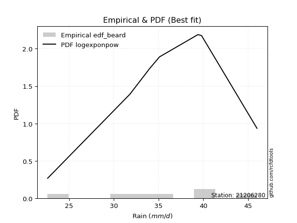</img>

</div>


### 5. Empirical - EDF Chegodayev (1955)

The Chegodayev formula is an empirical plotting position formula used in hydrological frequency analysis to estimate the exceedance probability or return period of a specific event from a set of observed data. It is primarily used for plotting observed data points on probability paper to fit a theoretical distribution, particularly for analyzing extreme events like maximum flood flows or rainfall intensities. The constant _b_ value in the generalized plotting position formula is 0.3.

<div align="center">


$P=(m-b)/(n+1-2b)$


</div>


**5.1. Empirical values**

<div align="center">

|                | 0                   | 1                   | 2                   | 3              | 4                  | 5                  | 6                  |
|:---------------|:--------------------|:--------------------|:--------------------|:---------------|:-------------------|:-------------------|:-------------------|
| date           | 2024                | 2019                | 2023                | 2025           | 2020               | 2022               | 2021               |
| x              | 22.6                | 31.8                | 34.0                | 35.1           | 39.4               | 39.8               | 46.0               |
| m              | 1                   | 2                   | 3                   | 4              | 5                  | 6                  | 7                  |
| empirical_dist | edf_chegodayev      | edf_chegodayev      | edf_chegodayev      | edf_chegodayev | edf_chegodayev     | edf_chegodayev     | edf_chegodayev     |
| empirical      | 0.09459459459459459 | 0.22972972972972971 | 0.36486486486486486 | 0.5            | 0.6351351351351351 | 0.7702702702702703 | 0.9054054054054054 |
| empirical_tr   | 1.1044776119402986  | 1.2982456140350878  | 1.574468085106383   | 2.0            | 2.7407407407407405 | 4.352941176470589  | 10.571428571428568 |

</div>


**5.2. Kolmogorov-Smirnov fit test (sorted by Δ)**


<div align="center">

|                | 0                    | 1                   | 2                    | 3                   | 4                   | 5                   | 6                   | 7                   | 8                   | 9                   | 10                  | 11                  | 12                  | 13                  | 14                  | 15                  | 16                  | 17                  | 18                  | 19                  | 20                  | 21                  | 22                  | 23                  | 24                  | 25                  | 26                  | 27                  | 28                  | 29                  | 30                  | 31                  | 32                  | 33                  | 34                  | 35                  | 36                  | 37                  | 38                  | 39                  | 40                  | 41                  | 42                  | 43                  | 44                  | 45                  | 46                  | 47                  | 48                  | 49                  | 50                  | 51                  | 52                  | 53                  | 54                  | 55                  | 56                  | 57                    | 58                  | 59                  | 60                  | 61                  | 62                  | 63                  | 64                  | 65                  | 66                  | 67                  | 68                  | 69                  | 70                  | 71                  | 72                  | 73                  | 74                  | 75                  | 76                  | 77                  | 78                  | 79                  | 80                  | 81                  | 82                  | 83                  | 84                  | 85                  | 86                  | 87                  | 88                  | 89                  |
|:---------------|:---------------------|:--------------------|:---------------------|:--------------------|:--------------------|:--------------------|:--------------------|:--------------------|:--------------------|:--------------------|:--------------------|:--------------------|:--------------------|:--------------------|:--------------------|:--------------------|:--------------------|:--------------------|:--------------------|:--------------------|:--------------------|:--------------------|:--------------------|:--------------------|:--------------------|:--------------------|:--------------------|:--------------------|:--------------------|:--------------------|:--------------------|:--------------------|:--------------------|:--------------------|:--------------------|:--------------------|:--------------------|:--------------------|:--------------------|:--------------------|:--------------------|:--------------------|:--------------------|:--------------------|:--------------------|:--------------------|:--------------------|:--------------------|:--------------------|:--------------------|:--------------------|:--------------------|:--------------------|:--------------------|:--------------------|:--------------------|:--------------------|:----------------------|:--------------------|:--------------------|:--------------------|:--------------------|:--------------------|:--------------------|:--------------------|:--------------------|:--------------------|:--------------------|:--------------------|:--------------------|:--------------------|:--------------------|:--------------------|:--------------------|:--------------------|:--------------------|:--------------------|:--------------------|:--------------------|:--------------------|:--------------------|:--------------------|:--------------------|:--------------------|:--------------------|:--------------------|:--------------------|:--------------------|:--------------------|:--------------------|
| station        | 21206280             | 21206280            | 21206280             | 21206280            | 21206280            | 21206280            | 21206280            | 21206280            | 21206280            | 21206280            | 21206280            | 21206280            | 21206280            | 21206280            | 21206280            | 21206280            | 21206280            | 21206280            | 21206280            | 21206280            | 21206280            | 21206280            | 21206280            | 21206280            | 21206280            | 21206280            | 21206280            | 21206280            | 21206280            | 21206280            | 21206280            | 21206280            | 21206280            | 21206280            | 21206280            | 21206280            | 21206280            | 21206280            | 21206280            | 21206280            | 21206280            | 21206280            | 21206280            | 21206280            | 21206280            | 21206280            | 21206280            | 21206280            | 21206280            | 21206280            | 21206280            | 21206280            | 21206280            | 21206280            | 21206280            | 21206280            | 21206280            | 21206280              | 21206280            | 21206280            | 21206280            | 21206280            | 21206280            | 21206280            | 21206280            | 21206280            | 21206280            | 21206280            | 21206280            | 21206280            | 21206280            | 21206280            | 21206280            | 21206280            | 21206280            | 21206280            | 21206280            | 21206280            | 21206280            | 21206280            | 21206280            | 21206280            | 21206280            | 21206280            | 21206280            | 21206280            | 21206280            | 21206280            | 21206280            | 21206280            |
| empirical_dist | edf_chegodayev       | edf_chegodayev      | edf_chegodayev       | edf_chegodayev      | edf_chegodayev      | edf_chegodayev      | edf_chegodayev      | edf_chegodayev      | edf_chegodayev      | edf_chegodayev      | edf_chegodayev      | edf_chegodayev      | edf_chegodayev      | edf_chegodayev      | edf_chegodayev      | edf_chegodayev      | edf_chegodayev      | edf_chegodayev      | edf_chegodayev      | edf_chegodayev      | edf_chegodayev      | edf_chegodayev      | edf_chegodayev      | edf_chegodayev      | edf_chegodayev      | edf_chegodayev      | edf_chegodayev      | edf_chegodayev      | edf_chegodayev      | edf_chegodayev      | edf_chegodayev      | edf_chegodayev      | edf_chegodayev      | edf_chegodayev      | edf_chegodayev      | edf_chegodayev      | edf_chegodayev      | edf_chegodayev      | edf_chegodayev      | edf_chegodayev      | edf_chegodayev      | edf_chegodayev      | edf_chegodayev      | edf_chegodayev      | edf_chegodayev      | edf_chegodayev      | edf_chegodayev      | edf_chegodayev      | edf_chegodayev      | edf_chegodayev      | edf_chegodayev      | edf_chegodayev      | edf_chegodayev      | edf_chegodayev      | edf_chegodayev      | edf_chegodayev      | edf_chegodayev      | edf_chegodayev        | edf_chegodayev      | edf_chegodayev      | edf_chegodayev      | edf_chegodayev      | edf_chegodayev      | edf_chegodayev      | edf_chegodayev      | edf_chegodayev      | edf_chegodayev      | edf_chegodayev      | edf_chegodayev      | edf_chegodayev      | edf_chegodayev      | edf_chegodayev      | edf_chegodayev      | edf_chegodayev      | edf_chegodayev      | edf_chegodayev      | edf_chegodayev      | edf_chegodayev      | edf_chegodayev      | edf_chegodayev      | edf_chegodayev      | edf_chegodayev      | edf_chegodayev      | edf_chegodayev      | edf_chegodayev      | edf_chegodayev      | edf_chegodayev      | edf_chegodayev      | edf_chegodayev      | edf_chegodayev      |
| p_dist         | weibull_min          | logpearson3         | logweibull_min       | pearson3            | johnsonsu           | loggumbel_l         | logjohnsonsu        | logloggamma         | logmielke           | loggenlogistic      | mielke              | logt                | logfisk             | genlogistic         | fisk                | f                   | norm                | crystalball         | exponnorm           | t                   | nct                 | erlang              | rice                | gamma               | invgamma            | chi2                | loggompertz         | ncf                 | alpha               | invgauss            | maxwell             | gumbel_l            | logbetaprime        | rayleigh            | logistic            | logf                | logcrystalball      | logexponnorm        | lognorm             | lognorm             | betaprime           | logfatiguelife      | loglogistic         | loggamma            | loggamma            | logrice             | logerlang           | hypsecant           | logalpha            | lognct              | loginvgamma         | loghypsecant        | gumbel_r            | laplace_asymmetric  | invweibull          | halfnorm            | logmaxwell          | loglaplace_asymmetric | laplace             | loginvgauss         | moyal               | halflogistic        | lograyleigh         | loglaplace          | loggumbel_r         | kstwobign           | loginvweibull       | loghalfnorm         | logmoyal            | loghalflogistic     | wald                | logkstwobign        | gibrat              | loggenexpon         | logncf              | logtruncnorm        | truncnorm           | logwald             | loggibrat           | genexpon            | expon               | logexpon            | logchi2             | lognakagami         | nakagami            | loglognorm          | pareto              | logpareto           | fatiguelife         | gompertz            |
| delta          | 0.061221495057639075 | 0.06158386285435713 | 0.062224196443218416 | 0.06350934604406788 | 0.06384968918497325 | 0.06394139781212171 | 0.0649419736693787  | 0.06511713967842164 | 0.06849703106513572 | 0.07023272218026377 | 0.07029150082125069 | 0.071699243500019   | 0.07618941992030619 | 0.07673580529640156 | 0.07911352340604683 | 0.07934092162711459 | 0.07947496757663952 | 0.07947498150848609 | 0.07947850224770692 | 0.07948001370265967 | 0.0796504842501613  | 0.08028401727842893 | 0.08153010235417402 | 0.08260490769904993 | 0.08538490267343712 | 0.08625712810034813 | 0.08781246036401476 | 0.08842693004862778 | 0.08856390291627192 | 0.09236468570431888 | 0.0935930402128693  | 0.09568744964796061 | 0.09947665156815166 | 0.10066537542819615 | 0.10144116726735442 | 0.10281829305192175 | 0.10329876890063239 | 0.10330187931410933 | 0.10330217444743794 | 0.10330217444743794 | 0.10445646852723939 | 0.1057868339048389  | 0.11045080108762073 | 0.11074459130790792 | 0.11074459130790792 | 0.1116126967343734  | 0.116698659718243   | 0.11691012570484038 | 0.11876298955689812 | 0.12075314653781621 | 0.12121158588004632 | 0.1258728877848645  | 0.1272045176042852  | 0.1280068415323723  | 0.12810283506504438 | 0.13102891035113196 | 0.13409108468000824 | 0.13939233912387206   | 0.14058703818109552 | 0.14249029356432713 | 0.14259304041771337 | 0.1447768792070105  | 0.14589591090732107 | 0.14865005260022635 | 0.15821196421712852 | 0.1612385269497047  | 0.17320887807375684 | 0.17949619721775828 | 0.18371099870633129 | 0.19163679753470225 | 0.1966508979347778  | 0.21151613413929027 | 0.2193059337280765  | 0.21937363338485172 | 0.22141167833225261 | 0.22972827502222484 | 0.22972972971519734 | 0.25463090211080747 | 0.2688064438997438  | 0.27935809397943145 | 0.27941315932445965 | 0.31683949150099344 | 0.32948935733599827 | 0.3562146213080099  | 0.3886301439087017  | 0.41774501203831427 | 0.4346303680600959  | 0.4395161504917754  | 0.5984377668543492  | 0.6129159683785924  |
| deltao         | 0.48442053926100004  | 0.48442053926100004 | 0.48442053926100004  | 0.48442053926100004 | 0.48442053926100004 | 0.48442053926100004 | 0.48442053926100004 | 0.48442053926100004 | 0.48442053926100004 | 0.48442053926100004 | 0.48442053926100004 | 0.48442053926100004 | 0.48442053926100004 | 0.48442053926100004 | 0.48442053926100004 | 0.48442053926100004 | 0.48442053926100004 | 0.48442053926100004 | 0.48442053926100004 | 0.48442053926100004 | 0.48442053926100004 | 0.48442053926100004 | 0.48442053926100004 | 0.48442053926100004 | 0.48442053926100004 | 0.48442053926100004 | 0.48442053926100004 | 0.48442053926100004 | 0.48442053926100004 | 0.48442053926100004 | 0.48442053926100004 | 0.48442053926100004 | 0.48442053926100004 | 0.48442053926100004 | 0.48442053926100004 | 0.48442053926100004 | 0.48442053926100004 | 0.48442053926100004 | 0.48442053926100004 | 0.48442053926100004 | 0.48442053926100004 | 0.48442053926100004 | 0.48442053926100004 | 0.48442053926100004 | 0.48442053926100004 | 0.48442053926100004 | 0.48442053926100004 | 0.48442053926100004 | 0.48442053926100004 | 0.48442053926100004 | 0.48442053926100004 | 0.48442053926100004 | 0.48442053926100004 | 0.48442053926100004 | 0.48442053926100004 | 0.48442053926100004 | 0.48442053926100004 | 0.48442053926100004   | 0.48442053926100004 | 0.48442053926100004 | 0.48442053926100004 | 0.48442053926100004 | 0.48442053926100004 | 0.48442053926100004 | 0.48442053926100004 | 0.48442053926100004 | 0.48442053926100004 | 0.48442053926100004 | 0.48442053926100004 | 0.48442053926100004 | 0.48442053926100004 | 0.48442053926100004 | 0.48442053926100004 | 0.48442053926100004 | 0.48442053926100004 | 0.48442053926100004 | 0.48442053926100004 | 0.48442053926100004 | 0.48442053926100004 | 0.48442053926100004 | 0.48442053926100004 | 0.48442053926100004 | 0.48442053926100004 | 0.48442053926100004 | 0.48442053926100004 | 0.48442053926100004 | 0.48442053926100004 | 0.48442053926100004 | 0.48442053926100004 | 0.48442053926100004 |
| eval           | Δo > Δ               | Δo > Δ              | Δo > Δ               | Δo > Δ              | Δo > Δ              | Δo > Δ              | Δo > Δ              | Δo > Δ              | Δo > Δ              | Δo > Δ              | Δo > Δ              | Δo > Δ              | Δo > Δ              | Δo > Δ              | Δo > Δ              | Δo > Δ              | Δo > Δ              | Δo > Δ              | Δo > Δ              | Δo > Δ              | Δo > Δ              | Δo > Δ              | Δo > Δ              | Δo > Δ              | Δo > Δ              | Δo > Δ              | Δo > Δ              | Δo > Δ              | Δo > Δ              | Δo > Δ              | Δo > Δ              | Δo > Δ              | Δo > Δ              | Δo > Δ              | Δo > Δ              | Δo > Δ              | Δo > Δ              | Δo > Δ              | Δo > Δ              | Δo > Δ              | Δo > Δ              | Δo > Δ              | Δo > Δ              | Δo > Δ              | Δo > Δ              | Δo > Δ              | Δo > Δ              | Δo > Δ              | Δo > Δ              | Δo > Δ              | Δo > Δ              | Δo > Δ              | Δo > Δ              | Δo > Δ              | Δo > Δ              | Δo > Δ              | Δo > Δ              | Δo > Δ                | Δo > Δ              | Δo > Δ              | Δo > Δ              | Δo > Δ              | Δo > Δ              | Δo > Δ              | Δo > Δ              | Δo > Δ              | Δo > Δ              | Δo > Δ              | Δo > Δ              | Δo > Δ              | Δo > Δ              | Δo > Δ              | Δo > Δ              | Δo > Δ              | Δo > Δ              | Δo > Δ              | Δo > Δ              | Δo > Δ              | Δo > Δ              | Δo > Δ              | Δo > Δ              | Δo > Δ              | Δo > Δ              | Δo > Δ              | Δo > Δ              | Δo > Δ              | Δo > Δ              | Δo > Δ              | Δo <= Δ             | Δo <= Δ             |
| fit            | 1                    | 1                   | 1                    | 1                   | 1                   | 1                   | 1                   | 1                   | 1                   | 1                   | 1                   | 1                   | 1                   | 1                   | 1                   | 1                   | 1                   | 1                   | 1                   | 1                   | 1                   | 1                   | 1                   | 1                   | 1                   | 1                   | 1                   | 1                   | 1                   | 1                   | 1                   | 1                   | 1                   | 1                   | 1                   | 1                   | 1                   | 1                   | 1                   | 1                   | 1                   | 1                   | 1                   | 1                   | 1                   | 1                   | 1                   | 1                   | 1                   | 1                   | 1                   | 1                   | 1                   | 1                   | 1                   | 1                   | 1                   | 1                     | 1                   | 1                   | 1                   | 1                   | 1                   | 1                   | 1                   | 1                   | 1                   | 1                   | 1                   | 1                   | 1                   | 1                   | 1                   | 1                   | 1                   | 1                   | 1                   | 1                   | 1                   | 1                   | 1                   | 1                   | 1                   | 1                   | 1                   | 1                   | 1                   | 1                   | 0                   | 0                   |
| n              | 7                    | 7                   | 7                    | 7                   | 7                   | 7                   | 7                   | 7                   | 7                   | 7                   | 7                   | 7                   | 7                   | 7                   | 7                   | 7                   | 7                   | 7                   | 7                   | 7                   | 7                   | 7                   | 7                   | 7                   | 7                   | 7                   | 7                   | 7                   | 7                   | 7                   | 7                   | 7                   | 7                   | 7                   | 7                   | 7                   | 7                   | 7                   | 7                   | 7                   | 7                   | 7                   | 7                   | 7                   | 7                   | 7                   | 7                   | 7                   | 7                   | 7                   | 7                   | 7                   | 7                   | 7                   | 7                   | 7                   | 7                   | 7                     | 7                   | 7                   | 7                   | 7                   | 7                   | 7                   | 7                   | 7                   | 7                   | 7                   | 7                   | 7                   | 7                   | 7                   | 7                   | 7                   | 7                   | 7                   | 7                   | 7                   | 7                   | 7                   | 7                   | 7                   | 7                   | 7                   | 7                   | 7                   | 7                   | 7                   | 7                   | 7                   |
| best_fit       | 1                    | 0                   | 0                    | 0                   | 0                   | 0                   | 0                   | 0                   | 0                   | 0                   | 0                   | 0                   | 0                   | 0                   | 0                   | 0                   | 0                   | 0                   | 0                   | 0                   | 0                   | 0                   | 0                   | 0                   | 0                   | 0                   | 0                   | 0                   | 0                   | 0                   | 0                   | 0                   | 0                   | 0                   | 0                   | 0                   | 0                   | 0                   | 0                   | 0                   | 0                   | 0                   | 0                   | 0                   | 0                   | 0                   | 0                   | 0                   | 0                   | 0                   | 0                   | 0                   | 0                   | 0                   | 0                   | 0                   | 0                   | 0                     | 0                   | 0                   | 0                   | 0                   | 0                   | 0                   | 0                   | 0                   | 0                   | 0                   | 0                   | 0                   | 0                   | 0                   | 0                   | 0                   | 0                   | 0                   | 0                   | 0                   | 0                   | 0                   | 0                   | 0                   | 0                   | 0                   | 0                   | 0                   | 0                   | 0                   | 0                   | 0                   |
| best_fit_sort  | 1                    | 2                   | 3                    | 4                   | 5                   | 6                   | 7                   | 8                   | 9                   | 10                  | 11                  | 12                  | 13                  | 14                  | 15                  | 16                  | 17                  | 18                  | 19                  | 20                  | 21                  | 22                  | 23                  | 24                  | 25                  | 26                  | 27                  | 28                  | 29                  | 30                  | 31                  | 32                  | 33                  | 34                  | 35                  | 36                  | 37                  | 38                  | 39                  | 40                  | 41                  | 42                  | 43                  | 44                  | 45                  | 46                  | 47                  | 48                  | 49                  | 50                  | 51                  | 52                  | 53                  | 54                  | 55                  | 56                  | 57                  | 58                    | 59                  | 60                  | 61                  | 62                  | 63                  | 64                  | 65                  | 66                  | 67                  | 68                  | 69                  | 70                  | 71                  | 72                  | 73                  | 74                  | 75                  | 76                  | 77                  | 78                  | 79                  | 80                  | 81                  | 82                  | 83                  | 84                  | 85                  | 86                  | 87                  | 88                  | 89                  | 90                  |

</div>


<div align="center">

</img>

</div>


**5.3. Best fit**

<div align="center">

|   id |   station | empirical_dist   | p_dist      |     delta |   deltao | eval   |   fit |   n |   best_fit |   best_fit_sort |
|-----:|----------:|:-----------------|:------------|----------:|---------:|:-------|------:|----:|-----------:|----------------:|
|    0 |  21206280 | edf_chegodayev   | weibull_min | 0.0612215 | 0.484421 | Δo > Δ |     1 |   7 |          1 |               1 |

</div>


<div align="center">

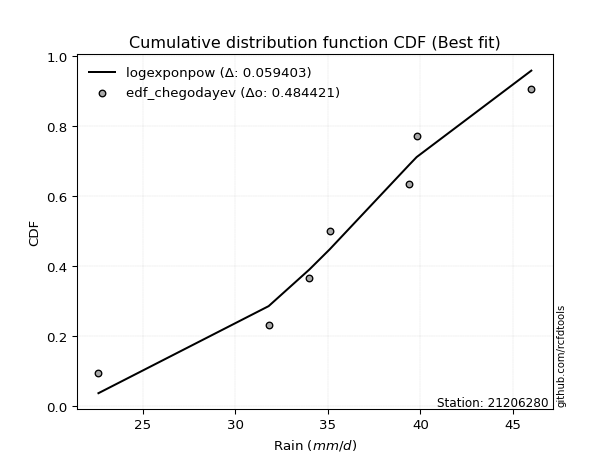</img>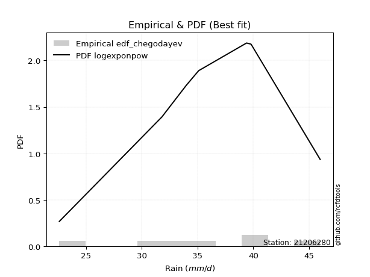</img>

</div>


### 6. Empirical - EDF Blom (1958)

The Blom formula is a specific "plotting position" formula used in hydrology and statistical analysis to estimate the empirical cumulative probability (or non-exceedance probability) of a data series. It is particularly recommended for data that are approximately normally distributed. The constant _a_ is set to 0.375 (or 3/8).

<div align="center">


$P=(m-a)/(n+1-2a)$


</div>


**6.1. Empirical values**

<div align="center">

|                | 0                   | 1                   | 2                  | 3        | 4                  | 5                  | 6                  |
|:---------------|:--------------------|:--------------------|:-------------------|:---------|:-------------------|:-------------------|:-------------------|
| date           | 2024                | 2019                | 2023               | 2025     | 2020               | 2022               | 2021               |
| x              | 22.6                | 31.8                | 34.0               | 35.1     | 39.4               | 39.8               | 46.0               |
| m              | 1                   | 2                   | 3                  | 4        | 5                  | 6                  | 7                  |
| empirical_dist | edf_blom            | edf_blom            | edf_blom           | edf_blom | edf_blom           | edf_blom           | edf_blom           |
| empirical      | 0.08620689655172414 | 0.22413793103448276 | 0.3620689655172414 | 0.5      | 0.6379310344827587 | 0.7758620689655172 | 0.9137931034482759 |
| empirical_tr   | 1.0943396226415094  | 1.288888888888889   | 1.5675675675675675 | 2.0      | 2.7619047619047623 | 4.461538461538462  | 11.600000000000007 |

</div>


**6.2. Kolmogorov-Smirnov fit test (sorted by Δ)**


<div align="center">

|                | 0                   | 1                   | 2                    | 3                   | 4                   | 5                   | 6                   | 7                   | 8                   | 9                   | 10                  | 11                  | 12                  | 13                  | 14                  | 15                  | 16                  | 17                  | 18                  | 19                  | 20                  | 21                  | 22                  | 23                  | 24                  | 25                  | 26                  | 27                  | 28                  | 29                  | 30                  | 31                  | 32                  | 33                  | 34                  | 35                  | 36                  | 37                  | 38                  | 39                  | 40                  | 41                  | 42                  | 43                  | 44                  | 45                  | 46                  | 47                  | 48                  | 49                  | 50                  | 51                  | 52                  | 53                  | 54                  | 55                    | 56                  | 57                  | 58                  | 59                  | 60                  | 61                  | 62                  | 63                  | 64                  | 65                  | 66                  | 67                  | 68                  | 69                  | 70                  | 71                  | 72                  | 73                  | 74                  | 75                  | 76                  | 77                  | 78                  | 79                  | 80                  | 81                  | 82                  | 83                  | 84                  | 85                  | 86                  | 87                  | 88                  | 89                  |
|:---------------|:--------------------|:--------------------|:---------------------|:--------------------|:--------------------|:--------------------|:--------------------|:--------------------|:--------------------|:--------------------|:--------------------|:--------------------|:--------------------|:--------------------|:--------------------|:--------------------|:--------------------|:--------------------|:--------------------|:--------------------|:--------------------|:--------------------|:--------------------|:--------------------|:--------------------|:--------------------|:--------------------|:--------------------|:--------------------|:--------------------|:--------------------|:--------------------|:--------------------|:--------------------|:--------------------|:--------------------|:--------------------|:--------------------|:--------------------|:--------------------|:--------------------|:--------------------|:--------------------|:--------------------|:--------------------|:--------------------|:--------------------|:--------------------|:--------------------|:--------------------|:--------------------|:--------------------|:--------------------|:--------------------|:--------------------|:----------------------|:--------------------|:--------------------|:--------------------|:--------------------|:--------------------|:--------------------|:--------------------|:--------------------|:--------------------|:--------------------|:--------------------|:--------------------|:--------------------|:--------------------|:--------------------|:--------------------|:--------------------|:--------------------|:--------------------|:--------------------|:--------------------|:--------------------|:--------------------|:--------------------|:--------------------|:--------------------|:--------------------|:--------------------|:--------------------|:--------------------|:--------------------|:--------------------|:--------------------|:--------------------|
| station        | 21206280            | 21206280            | 21206280             | 21206280            | 21206280            | 21206280            | 21206280            | 21206280            | 21206280            | 21206280            | 21206280            | 21206280            | 21206280            | 21206280            | 21206280            | 21206280            | 21206280            | 21206280            | 21206280            | 21206280            | 21206280            | 21206280            | 21206280            | 21206280            | 21206280            | 21206280            | 21206280            | 21206280            | 21206280            | 21206280            | 21206280            | 21206280            | 21206280            | 21206280            | 21206280            | 21206280            | 21206280            | 21206280            | 21206280            | 21206280            | 21206280            | 21206280            | 21206280            | 21206280            | 21206280            | 21206280            | 21206280            | 21206280            | 21206280            | 21206280            | 21206280            | 21206280            | 21206280            | 21206280            | 21206280            | 21206280              | 21206280            | 21206280            | 21206280            | 21206280            | 21206280            | 21206280            | 21206280            | 21206280            | 21206280            | 21206280            | 21206280            | 21206280            | 21206280            | 21206280            | 21206280            | 21206280            | 21206280            | 21206280            | 21206280            | 21206280            | 21206280            | 21206280            | 21206280            | 21206280            | 21206280            | 21206280            | 21206280            | 21206280            | 21206280            | 21206280            | 21206280            | 21206280            | 21206280            | 21206280            |
| empirical_dist | edf_blom            | edf_blom            | edf_blom             | edf_blom            | edf_blom            | edf_blom            | edf_blom            | edf_blom            | edf_blom            | edf_blom            | edf_blom            | edf_blom            | edf_blom            | edf_blom            | edf_blom            | edf_blom            | edf_blom            | edf_blom            | edf_blom            | edf_blom            | edf_blom            | edf_blom            | edf_blom            | edf_blom            | edf_blom            | edf_blom            | edf_blom            | edf_blom            | edf_blom            | edf_blom            | edf_blom            | edf_blom            | edf_blom            | edf_blom            | edf_blom            | edf_blom            | edf_blom            | edf_blom            | edf_blom            | edf_blom            | edf_blom            | edf_blom            | edf_blom            | edf_blom            | edf_blom            | edf_blom            | edf_blom            | edf_blom            | edf_blom            | edf_blom            | edf_blom            | edf_blom            | edf_blom            | edf_blom            | edf_blom            | edf_blom              | edf_blom            | edf_blom            | edf_blom            | edf_blom            | edf_blom            | edf_blom            | edf_blom            | edf_blom            | edf_blom            | edf_blom            | edf_blom            | edf_blom            | edf_blom            | edf_blom            | edf_blom            | edf_blom            | edf_blom            | edf_blom            | edf_blom            | edf_blom            | edf_blom            | edf_blom            | edf_blom            | edf_blom            | edf_blom            | edf_blom            | edf_blom            | edf_blom            | edf_blom            | edf_blom            | edf_blom            | edf_blom            | edf_blom            | edf_blom            |
| p_dist         | weibull_min         | logweibull_min      | pearson3             | loggumbel_l         | johnsonsu           | logloggamma         | logmielke           | logt                | logpearson3         | loggenlogistic      | mielke              | logjohnsonsu        | logfisk             | genlogistic         | fisk                | f                   | norm                | crystalball         | exponnorm           | t                   | nct                 | erlang              | loggompertz         | rice                | gamma               | chi2                | alpha               | invgamma            | ncf                 | maxwell             | gumbel_l            | invgauss            | logistic            | logbetaprime        | rayleigh            | loglogistic         | logf                | logcrystalball      | logexponnorm        | lognorm             | lognorm             | betaprime           | logfatiguelife      | hypsecant           | loggamma            | loggamma            | logrice             | logerlang           | loghypsecant        | logalpha            | gumbel_r            | laplace_asymmetric  | lognct              | loginvgamma         | invweibull          | loglaplace_asymmetric | halfnorm            | laplace             | logmaxwell          | moyal               | loglaplace          | halflogistic        | loginvgauss         | lograyleigh         | loggumbel_r         | kstwobign           | loginvweibull       | loghalfnorm         | logmoyal            | loghalflogistic     | wald                | gibrat              | logkstwobign        | logtruncnorm        | truncnorm           | loggenexpon         | logncf              | logwald             | loggibrat           | genexpon            | expon               | logexpon            | logchi2             | lognakagami         | nakagami            | loglognorm          | pareto              | logpareto           | fatiguelife         | gompertz            |
| delta          | 0.05842559571001549 | 0.05942829709559483 | 0.060713446696444295 | 0.06114549846449813 | 0.06384968918497325 | 0.06511713967842164 | 0.06601816013735634 | 0.06643224780165813 | 0.06717566154960408 | 0.06795178790256773 | 0.06795249277754484 | 0.06828903400092179 | 0.07080189888908273 | 0.07393990594877797 | 0.07631762405842324 | 0.076545022279491   | 0.07667906822901593 | 0.0766790821608625  | 0.07668260290008333 | 0.07668411435503608 | 0.07685458490253771 | 0.07748811793080534 | 0.07942476232114432 | 0.07967531127457345 | 0.07980900835142635 | 0.08542741248684488 | 0.08728750386640333 | 0.08925850985646183 | 0.09401872874387474 | 0.09547937323420302 | 0.09568744964796061 | 0.09795648439956584 | 0.09864526791973083 | 0.10506845026339862 | 0.1062571741234431  | 0.10765490173999714 | 0.1084100917471687  | 0.10889056759587934 | 0.10889367800935629 | 0.1088939731426849  | 0.1088939731426849  | 0.11004826722248634 | 0.11137863260008585 | 0.1141142263572168  | 0.11633639000315488 | 0.11633639000315488 | 0.11720449542962036 | 0.12229045841348996 | 0.12307698843724091 | 0.12435478825214508 | 0.12440861825666161 | 0.1252109421847487  | 0.12634494523306317 | 0.12680338457529328 | 0.13369463376029134 | 0.13659643977624847   | 0.1366207090463789  | 0.13779113883347194 | 0.1396828833752552  | 0.13979714107008978 | 0.14585415325260276 | 0.14757277855463397 | 0.14808209225957408 | 0.15148770960256802 | 0.161007863564752   | 0.16683032564495165 | 0.1788006767690038  | 0.18508799591300523 | 0.18650689805395476 | 0.19443269688232573 | 0.19944679728240128 | 0.2165100343804529  | 0.21710793283453722 | 0.2241364763269779  | 0.2241379310199504  | 0.22496543208009867 | 0.22979937637512315 | 0.25742680145843094 | 0.27160234324736726 | 0.2849498926746784  | 0.2850049580197066  | 0.3224312901962404  | 0.3378770553788688  | 0.3590105206556334  | 0.3914260432563252  | 0.4233368107335612  | 0.44022216675534287 | 0.44510794918702234 | 0.6040295655495962  | 0.6185077670738394  |
| deltao         | 0.48442053926100004 | 0.48442053926100004 | 0.48442053926100004  | 0.48442053926100004 | 0.48442053926100004 | 0.48442053926100004 | 0.48442053926100004 | 0.48442053926100004 | 0.48442053926100004 | 0.48442053926100004 | 0.48442053926100004 | 0.48442053926100004 | 0.48442053926100004 | 0.48442053926100004 | 0.48442053926100004 | 0.48442053926100004 | 0.48442053926100004 | 0.48442053926100004 | 0.48442053926100004 | 0.48442053926100004 | 0.48442053926100004 | 0.48442053926100004 | 0.48442053926100004 | 0.48442053926100004 | 0.48442053926100004 | 0.48442053926100004 | 0.48442053926100004 | 0.48442053926100004 | 0.48442053926100004 | 0.48442053926100004 | 0.48442053926100004 | 0.48442053926100004 | 0.48442053926100004 | 0.48442053926100004 | 0.48442053926100004 | 0.48442053926100004 | 0.48442053926100004 | 0.48442053926100004 | 0.48442053926100004 | 0.48442053926100004 | 0.48442053926100004 | 0.48442053926100004 | 0.48442053926100004 | 0.48442053926100004 | 0.48442053926100004 | 0.48442053926100004 | 0.48442053926100004 | 0.48442053926100004 | 0.48442053926100004 | 0.48442053926100004 | 0.48442053926100004 | 0.48442053926100004 | 0.48442053926100004 | 0.48442053926100004 | 0.48442053926100004 | 0.48442053926100004   | 0.48442053926100004 | 0.48442053926100004 | 0.48442053926100004 | 0.48442053926100004 | 0.48442053926100004 | 0.48442053926100004 | 0.48442053926100004 | 0.48442053926100004 | 0.48442053926100004 | 0.48442053926100004 | 0.48442053926100004 | 0.48442053926100004 | 0.48442053926100004 | 0.48442053926100004 | 0.48442053926100004 | 0.48442053926100004 | 0.48442053926100004 | 0.48442053926100004 | 0.48442053926100004 | 0.48442053926100004 | 0.48442053926100004 | 0.48442053926100004 | 0.48442053926100004 | 0.48442053926100004 | 0.48442053926100004 | 0.48442053926100004 | 0.48442053926100004 | 0.48442053926100004 | 0.48442053926100004 | 0.48442053926100004 | 0.48442053926100004 | 0.48442053926100004 | 0.48442053926100004 | 0.48442053926100004 |
| eval           | Δo > Δ              | Δo > Δ              | Δo > Δ               | Δo > Δ              | Δo > Δ              | Δo > Δ              | Δo > Δ              | Δo > Δ              | Δo > Δ              | Δo > Δ              | Δo > Δ              | Δo > Δ              | Δo > Δ              | Δo > Δ              | Δo > Δ              | Δo > Δ              | Δo > Δ              | Δo > Δ              | Δo > Δ              | Δo > Δ              | Δo > Δ              | Δo > Δ              | Δo > Δ              | Δo > Δ              | Δo > Δ              | Δo > Δ              | Δo > Δ              | Δo > Δ              | Δo > Δ              | Δo > Δ              | Δo > Δ              | Δo > Δ              | Δo > Δ              | Δo > Δ              | Δo > Δ              | Δo > Δ              | Δo > Δ              | Δo > Δ              | Δo > Δ              | Δo > Δ              | Δo > Δ              | Δo > Δ              | Δo > Δ              | Δo > Δ              | Δo > Δ              | Δo > Δ              | Δo > Δ              | Δo > Δ              | Δo > Δ              | Δo > Δ              | Δo > Δ              | Δo > Δ              | Δo > Δ              | Δo > Δ              | Δo > Δ              | Δo > Δ                | Δo > Δ              | Δo > Δ              | Δo > Δ              | Δo > Δ              | Δo > Δ              | Δo > Δ              | Δo > Δ              | Δo > Δ              | Δo > Δ              | Δo > Δ              | Δo > Δ              | Δo > Δ              | Δo > Δ              | Δo > Δ              | Δo > Δ              | Δo > Δ              | Δo > Δ              | Δo > Δ              | Δo > Δ              | Δo > Δ              | Δo > Δ              | Δo > Δ              | Δo > Δ              | Δo > Δ              | Δo > Δ              | Δo > Δ              | Δo > Δ              | Δo > Δ              | Δo > Δ              | Δo > Δ              | Δo > Δ              | Δo > Δ              | Δo <= Δ             | Δo <= Δ             |
| fit            | 1                   | 1                   | 1                    | 1                   | 1                   | 1                   | 1                   | 1                   | 1                   | 1                   | 1                   | 1                   | 1                   | 1                   | 1                   | 1                   | 1                   | 1                   | 1                   | 1                   | 1                   | 1                   | 1                   | 1                   | 1                   | 1                   | 1                   | 1                   | 1                   | 1                   | 1                   | 1                   | 1                   | 1                   | 1                   | 1                   | 1                   | 1                   | 1                   | 1                   | 1                   | 1                   | 1                   | 1                   | 1                   | 1                   | 1                   | 1                   | 1                   | 1                   | 1                   | 1                   | 1                   | 1                   | 1                   | 1                     | 1                   | 1                   | 1                   | 1                   | 1                   | 1                   | 1                   | 1                   | 1                   | 1                   | 1                   | 1                   | 1                   | 1                   | 1                   | 1                   | 1                   | 1                   | 1                   | 1                   | 1                   | 1                   | 1                   | 1                   | 1                   | 1                   | 1                   | 1                   | 1                   | 1                   | 1                   | 1                   | 0                   | 0                   |
| n              | 7                   | 7                   | 7                    | 7                   | 7                   | 7                   | 7                   | 7                   | 7                   | 7                   | 7                   | 7                   | 7                   | 7                   | 7                   | 7                   | 7                   | 7                   | 7                   | 7                   | 7                   | 7                   | 7                   | 7                   | 7                   | 7                   | 7                   | 7                   | 7                   | 7                   | 7                   | 7                   | 7                   | 7                   | 7                   | 7                   | 7                   | 7                   | 7                   | 7                   | 7                   | 7                   | 7                   | 7                   | 7                   | 7                   | 7                   | 7                   | 7                   | 7                   | 7                   | 7                   | 7                   | 7                   | 7                   | 7                     | 7                   | 7                   | 7                   | 7                   | 7                   | 7                   | 7                   | 7                   | 7                   | 7                   | 7                   | 7                   | 7                   | 7                   | 7                   | 7                   | 7                   | 7                   | 7                   | 7                   | 7                   | 7                   | 7                   | 7                   | 7                   | 7                   | 7                   | 7                   | 7                   | 7                   | 7                   | 7                   | 7                   | 7                   |
| best_fit       | 1                   | 0                   | 0                    | 0                   | 0                   | 0                   | 0                   | 0                   | 0                   | 0                   | 0                   | 0                   | 0                   | 0                   | 0                   | 0                   | 0                   | 0                   | 0                   | 0                   | 0                   | 0                   | 0                   | 0                   | 0                   | 0                   | 0                   | 0                   | 0                   | 0                   | 0                   | 0                   | 0                   | 0                   | 0                   | 0                   | 0                   | 0                   | 0                   | 0                   | 0                   | 0                   | 0                   | 0                   | 0                   | 0                   | 0                   | 0                   | 0                   | 0                   | 0                   | 0                   | 0                   | 0                   | 0                   | 0                     | 0                   | 0                   | 0                   | 0                   | 0                   | 0                   | 0                   | 0                   | 0                   | 0                   | 0                   | 0                   | 0                   | 0                   | 0                   | 0                   | 0                   | 0                   | 0                   | 0                   | 0                   | 0                   | 0                   | 0                   | 0                   | 0                   | 0                   | 0                   | 0                   | 0                   | 0                   | 0                   | 0                   | 0                   |
| best_fit_sort  | 1                   | 2                   | 3                    | 4                   | 5                   | 6                   | 7                   | 8                   | 9                   | 10                  | 11                  | 12                  | 13                  | 14                  | 15                  | 16                  | 17                  | 18                  | 19                  | 20                  | 21                  | 22                  | 23                  | 24                  | 25                  | 26                  | 27                  | 28                  | 29                  | 30                  | 31                  | 32                  | 33                  | 34                  | 35                  | 36                  | 37                  | 38                  | 39                  | 40                  | 41                  | 42                  | 43                  | 44                  | 45                  | 46                  | 47                  | 48                  | 49                  | 50                  | 51                  | 52                  | 53                  | 54                  | 55                  | 56                    | 57                  | 58                  | 59                  | 60                  | 61                  | 62                  | 63                  | 64                  | 65                  | 66                  | 67                  | 68                  | 69                  | 70                  | 71                  | 72                  | 73                  | 74                  | 75                  | 76                  | 77                  | 78                  | 79                  | 80                  | 81                  | 82                  | 83                  | 84                  | 85                  | 86                  | 87                  | 88                  | 89                  | 90                  |

</div>


<div align="center">

</img>

</div>


**6.3. Best fit**

<div align="center">

|   id |   station | empirical_dist   | p_dist      |     delta |   deltao | eval   |   fit |   n |   best_fit |   best_fit_sort |
|-----:|----------:|:-----------------|:------------|----------:|---------:|:-------|------:|----:|-----------:|----------------:|
|    0 |  21206280 | edf_blom         | weibull_min | 0.0584256 | 0.484421 | Δo > Δ |     1 |   7 |          1 |               1 |

</div>


<div align="center">

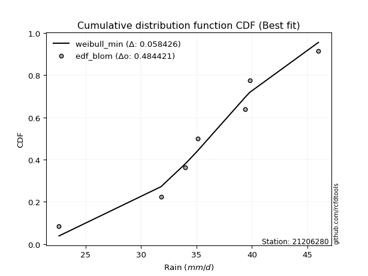</img>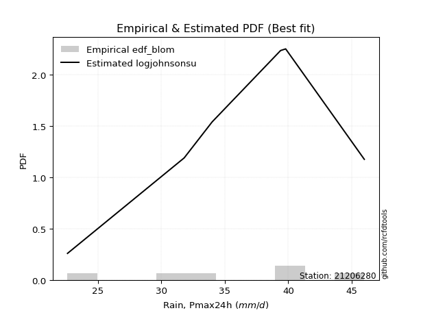</img>

</div>


### 7. Empirical - EDF Tukey (1962)

In hydrology, the Tukey formula is used as a plotting position formula to estimate the empirical probability or frequency of a flood event (or other hydrological data). The formula parameter is given as _c=0.333_ (or 1/3).

<div align="center">


$P=(m-c)/(n+1-2c)$


</div>


**7.1. Empirical values**

<div align="center">

|                | 0                   | 1                   | 2                   | 3         | 4                  | 5                  | 6                  |
|:---------------|:--------------------|:--------------------|:--------------------|:----------|:-------------------|:-------------------|:-------------------|
| date           | 2024                | 2019                | 2023                | 2025      | 2020               | 2022               | 2021               |
| x              | 22.6                | 31.8                | 34.0                | 35.1      | 39.4               | 39.8               | 46.0               |
| m              | 1                   | 2                   | 3                   | 4         | 5                  | 6                  | 7                  |
| empirical_dist | edf_tukey           | edf_tukey           | edf_tukey           | edf_tukey | edf_tukey          | edf_tukey          | edf_tukey          |
| empirical      | 0.09090909090909091 | 0.22727272727272727 | 0.36363636363636365 | 0.5       | 0.6363636363636364 | 0.7727272727272727 | 0.9090909090909091 |
| empirical_tr   | 1.1                 | 1.2941176470588236  | 1.5714285714285714  | 2.0       | 2.75               | 4.3999999999999995 | 10.999999999999996 |

</div>


**7.2. Kolmogorov-Smirnov fit test (sorted by Δ)**


<div align="center">

|                | 0                   | 1                   | 2                    | 3                   | 4                   | 5                   | 6                   | 7                   | 8                   | 9                   | 10                  | 11                  | 12                  | 13                  | 14                  | 15                  | 16                  | 17                  | 18                  | 19                  | 20                  | 21                  | 22                  | 23                  | 24                  | 25                  | 26                  | 27                  | 28                  | 29                  | 30                  | 31                  | 32                  | 33                  | 34                  | 35                  | 36                  | 37                  | 38                  | 39                  | 40                  | 41                  | 42                  | 43                  | 44                  | 45                  | 46                  | 47                  | 48                  | 49                  | 50                  | 51                  | 52                  | 53                  | 54                  | 55                  | 56                  | 57                    | 58                  | 59                  | 60                  | 61                  | 62                  | 63                  | 64                  | 65                  | 66                  | 67                  | 68                  | 69                  | 70                  | 71                  | 72                  | 73                  | 74                  | 75                  | 76                  | 77                  | 78                  | 79                  | 80                  | 81                  | 82                  | 83                  | 84                  | 85                  | 86                  | 87                  | 88                  | 89                  |
|:---------------|:--------------------|:--------------------|:---------------------|:--------------------|:--------------------|:--------------------|:--------------------|:--------------------|:--------------------|:--------------------|:--------------------|:--------------------|:--------------------|:--------------------|:--------------------|:--------------------|:--------------------|:--------------------|:--------------------|:--------------------|:--------------------|:--------------------|:--------------------|:--------------------|:--------------------|:--------------------|:--------------------|:--------------------|:--------------------|:--------------------|:--------------------|:--------------------|:--------------------|:--------------------|:--------------------|:--------------------|:--------------------|:--------------------|:--------------------|:--------------------|:--------------------|:--------------------|:--------------------|:--------------------|:--------------------|:--------------------|:--------------------|:--------------------|:--------------------|:--------------------|:--------------------|:--------------------|:--------------------|:--------------------|:--------------------|:--------------------|:--------------------|:----------------------|:--------------------|:--------------------|:--------------------|:--------------------|:--------------------|:--------------------|:--------------------|:--------------------|:--------------------|:--------------------|:--------------------|:--------------------|:--------------------|:--------------------|:--------------------|:--------------------|:--------------------|:--------------------|:--------------------|:--------------------|:--------------------|:--------------------|:--------------------|:--------------------|:--------------------|:--------------------|:--------------------|:--------------------|:--------------------|:--------------------|:--------------------|:--------------------|
| station        | 21206280            | 21206280            | 21206280             | 21206280            | 21206280            | 21206280            | 21206280            | 21206280            | 21206280            | 21206280            | 21206280            | 21206280            | 21206280            | 21206280            | 21206280            | 21206280            | 21206280            | 21206280            | 21206280            | 21206280            | 21206280            | 21206280            | 21206280            | 21206280            | 21206280            | 21206280            | 21206280            | 21206280            | 21206280            | 21206280            | 21206280            | 21206280            | 21206280            | 21206280            | 21206280            | 21206280            | 21206280            | 21206280            | 21206280            | 21206280            | 21206280            | 21206280            | 21206280            | 21206280            | 21206280            | 21206280            | 21206280            | 21206280            | 21206280            | 21206280            | 21206280            | 21206280            | 21206280            | 21206280            | 21206280            | 21206280            | 21206280            | 21206280              | 21206280            | 21206280            | 21206280            | 21206280            | 21206280            | 21206280            | 21206280            | 21206280            | 21206280            | 21206280            | 21206280            | 21206280            | 21206280            | 21206280            | 21206280            | 21206280            | 21206280            | 21206280            | 21206280            | 21206280            | 21206280            | 21206280            | 21206280            | 21206280            | 21206280            | 21206280            | 21206280            | 21206280            | 21206280            | 21206280            | 21206280            | 21206280            |
| empirical_dist | edf_tukey           | edf_tukey           | edf_tukey            | edf_tukey           | edf_tukey           | edf_tukey           | edf_tukey           | edf_tukey           | edf_tukey           | edf_tukey           | edf_tukey           | edf_tukey           | edf_tukey           | edf_tukey           | edf_tukey           | edf_tukey           | edf_tukey           | edf_tukey           | edf_tukey           | edf_tukey           | edf_tukey           | edf_tukey           | edf_tukey           | edf_tukey           | edf_tukey           | edf_tukey           | edf_tukey           | edf_tukey           | edf_tukey           | edf_tukey           | edf_tukey           | edf_tukey           | edf_tukey           | edf_tukey           | edf_tukey           | edf_tukey           | edf_tukey           | edf_tukey           | edf_tukey           | edf_tukey           | edf_tukey           | edf_tukey           | edf_tukey           | edf_tukey           | edf_tukey           | edf_tukey           | edf_tukey           | edf_tukey           | edf_tukey           | edf_tukey           | edf_tukey           | edf_tukey           | edf_tukey           | edf_tukey           | edf_tukey           | edf_tukey           | edf_tukey           | edf_tukey             | edf_tukey           | edf_tukey           | edf_tukey           | edf_tukey           | edf_tukey           | edf_tukey           | edf_tukey           | edf_tukey           | edf_tukey           | edf_tukey           | edf_tukey           | edf_tukey           | edf_tukey           | edf_tukey           | edf_tukey           | edf_tukey           | edf_tukey           | edf_tukey           | edf_tukey           | edf_tukey           | edf_tukey           | edf_tukey           | edf_tukey           | edf_tukey           | edf_tukey           | edf_tukey           | edf_tukey           | edf_tukey           | edf_tukey           | edf_tukey           | edf_tukey           | edf_tukey           |
| p_dist         | weibull_min         | logweibull_min      | pearson3             | loggumbel_l         | johnsonsu           | logpearson3         | logloggamma         | logjohnsonsu        | logmielke           | logt                | loggenlogistic      | mielke              | logfisk             | genlogistic         | fisk                | f                   | norm                | crystalball         | exponnorm           | t                   | nct                 | erlang              | rice                | gamma               | loggompertz         | chi2                | invgamma            | alpha               | ncf                 | maxwell             | invgauss            | gumbel_l            | logistic            | logbetaprime        | rayleigh            | logf                | logcrystalball      | logexponnorm        | lognorm             | lognorm             | betaprime           | logfatiguelife      | loglogistic         | loggamma            | loggamma            | logrice             | hypsecant           | logerlang           | logalpha            | lognct              | loginvgamma         | loghypsecant        | gumbel_r            | laplace_asymmetric  | invweibull          | halfnorm            | logmaxwell          | loglaplace_asymmetric | laplace             | moyal               | loginvgauss         | halflogistic        | loglaplace          | lograyleigh         | loggumbel_r         | kstwobign           | loginvweibull       | loghalfnorm         | logmoyal            | loghalflogistic     | wald                | logkstwobign        | gibrat              | loggenexpon         | logncf              | logtruncnorm        | truncnorm           | logwald             | loggibrat           | genexpon            | expon               | logexpon            | logchi2             | lognakagami         | nakagami            | loglognorm          | pareto              | logpareto           | fatiguelife         | gompertz            |
| delta          | 0.05999299382913781 | 0.06099569521471715 | 0.062280844815566616 | 0.06271289658362045 | 0.06384968918497325 | 0.06404086531135958 | 0.06511713967842164 | 0.06515423776267726 | 0.06726852983663445 | 0.0680137398145153  | 0.06900422095176251 | 0.06906299959274942 | 0.07250391623480251 | 0.0755073040679003  | 0.07788502217754556 | 0.07811242039861332 | 0.07824646634813825 | 0.07824648027998482 | 0.07825000101920565 | 0.0782515124741584  | 0.07842198302166004 | 0.07905551604992767 | 0.08030160112567275 | 0.08137640647054867 | 0.08412695667851108 | 0.08502862687184687 | 0.08612371361821733 | 0.08733540168777065 | 0.09088393250563023 | 0.09236453898436803 | 0.09482168816132133 | 0.09568744964796061 | 0.10021266603885315 | 0.10193365402515411 | 0.1031223778851986  | 0.1052752955089242  | 0.10575577135763484 | 0.10575888177111178 | 0.1057591769044404  | 0.1057591769044404  | 0.10691347098424184 | 0.10824383636184134 | 0.10922229985911946 | 0.11320159376491037 | 0.11320159376491037 | 0.11406969919137586 | 0.11568162447633912 | 0.11915566217524545 | 0.12121999201390057 | 0.12321014899481866 | 0.12366858833704877 | 0.12464438655636323 | 0.12597601637578393 | 0.12677834030387103 | 0.13055983752204683 | 0.1334859128081344  | 0.1365480871370107  | 0.1381638378953708    | 0.13935853695259426 | 0.1413645391892121  | 0.14494729602132958 | 0.1460053804355117  | 0.14742155137172508 | 0.14835291336432352 | 0.15944046544562973 | 0.16369552940670715 | 0.1756658805307593  | 0.18195319967476073 | 0.1849394999348325  | 0.19286529876320346 | 0.197879399163279   | 0.21397313659629272 | 0.21807743249957523 | 0.22183063584185417 | 0.2250971820177563  | 0.2272712725652224  | 0.2272727272581949  | 0.2558594033393087  | 0.270034945128245   | 0.2818150964364339  | 0.28187016178146207 | 0.31929649395799586 | 0.33317486102150196 | 0.3574431225365111  | 0.3898586451372029  | 0.4202020144953167  | 0.43708737051709834 | 0.4419731529487778  | 0.6008947693113517  | 0.6153729708355948  |
| deltao         | 0.48442053926100004 | 0.48442053926100004 | 0.48442053926100004  | 0.48442053926100004 | 0.48442053926100004 | 0.48442053926100004 | 0.48442053926100004 | 0.48442053926100004 | 0.48442053926100004 | 0.48442053926100004 | 0.48442053926100004 | 0.48442053926100004 | 0.48442053926100004 | 0.48442053926100004 | 0.48442053926100004 | 0.48442053926100004 | 0.48442053926100004 | 0.48442053926100004 | 0.48442053926100004 | 0.48442053926100004 | 0.48442053926100004 | 0.48442053926100004 | 0.48442053926100004 | 0.48442053926100004 | 0.48442053926100004 | 0.48442053926100004 | 0.48442053926100004 | 0.48442053926100004 | 0.48442053926100004 | 0.48442053926100004 | 0.48442053926100004 | 0.48442053926100004 | 0.48442053926100004 | 0.48442053926100004 | 0.48442053926100004 | 0.48442053926100004 | 0.48442053926100004 | 0.48442053926100004 | 0.48442053926100004 | 0.48442053926100004 | 0.48442053926100004 | 0.48442053926100004 | 0.48442053926100004 | 0.48442053926100004 | 0.48442053926100004 | 0.48442053926100004 | 0.48442053926100004 | 0.48442053926100004 | 0.48442053926100004 | 0.48442053926100004 | 0.48442053926100004 | 0.48442053926100004 | 0.48442053926100004 | 0.48442053926100004 | 0.48442053926100004 | 0.48442053926100004 | 0.48442053926100004 | 0.48442053926100004   | 0.48442053926100004 | 0.48442053926100004 | 0.48442053926100004 | 0.48442053926100004 | 0.48442053926100004 | 0.48442053926100004 | 0.48442053926100004 | 0.48442053926100004 | 0.48442053926100004 | 0.48442053926100004 | 0.48442053926100004 | 0.48442053926100004 | 0.48442053926100004 | 0.48442053926100004 | 0.48442053926100004 | 0.48442053926100004 | 0.48442053926100004 | 0.48442053926100004 | 0.48442053926100004 | 0.48442053926100004 | 0.48442053926100004 | 0.48442053926100004 | 0.48442053926100004 | 0.48442053926100004 | 0.48442053926100004 | 0.48442053926100004 | 0.48442053926100004 | 0.48442053926100004 | 0.48442053926100004 | 0.48442053926100004 | 0.48442053926100004 | 0.48442053926100004 |
| eval           | Δo > Δ              | Δo > Δ              | Δo > Δ               | Δo > Δ              | Δo > Δ              | Δo > Δ              | Δo > Δ              | Δo > Δ              | Δo > Δ              | Δo > Δ              | Δo > Δ              | Δo > Δ              | Δo > Δ              | Δo > Δ              | Δo > Δ              | Δo > Δ              | Δo > Δ              | Δo > Δ              | Δo > Δ              | Δo > Δ              | Δo > Δ              | Δo > Δ              | Δo > Δ              | Δo > Δ              | Δo > Δ              | Δo > Δ              | Δo > Δ              | Δo > Δ              | Δo > Δ              | Δo > Δ              | Δo > Δ              | Δo > Δ              | Δo > Δ              | Δo > Δ              | Δo > Δ              | Δo > Δ              | Δo > Δ              | Δo > Δ              | Δo > Δ              | Δo > Δ              | Δo > Δ              | Δo > Δ              | Δo > Δ              | Δo > Δ              | Δo > Δ              | Δo > Δ              | Δo > Δ              | Δo > Δ              | Δo > Δ              | Δo > Δ              | Δo > Δ              | Δo > Δ              | Δo > Δ              | Δo > Δ              | Δo > Δ              | Δo > Δ              | Δo > Δ              | Δo > Δ                | Δo > Δ              | Δo > Δ              | Δo > Δ              | Δo > Δ              | Δo > Δ              | Δo > Δ              | Δo > Δ              | Δo > Δ              | Δo > Δ              | Δo > Δ              | Δo > Δ              | Δo > Δ              | Δo > Δ              | Δo > Δ              | Δo > Δ              | Δo > Δ              | Δo > Δ              | Δo > Δ              | Δo > Δ              | Δo > Δ              | Δo > Δ              | Δo > Δ              | Δo > Δ              | Δo > Δ              | Δo > Δ              | Δo > Δ              | Δo > Δ              | Δo > Δ              | Δo > Δ              | Δo > Δ              | Δo <= Δ             | Δo <= Δ             |
| fit            | 1                   | 1                   | 1                    | 1                   | 1                   | 1                   | 1                   | 1                   | 1                   | 1                   | 1                   | 1                   | 1                   | 1                   | 1                   | 1                   | 1                   | 1                   | 1                   | 1                   | 1                   | 1                   | 1                   | 1                   | 1                   | 1                   | 1                   | 1                   | 1                   | 1                   | 1                   | 1                   | 1                   | 1                   | 1                   | 1                   | 1                   | 1                   | 1                   | 1                   | 1                   | 1                   | 1                   | 1                   | 1                   | 1                   | 1                   | 1                   | 1                   | 1                   | 1                   | 1                   | 1                   | 1                   | 1                   | 1                   | 1                   | 1                     | 1                   | 1                   | 1                   | 1                   | 1                   | 1                   | 1                   | 1                   | 1                   | 1                   | 1                   | 1                   | 1                   | 1                   | 1                   | 1                   | 1                   | 1                   | 1                   | 1                   | 1                   | 1                   | 1                   | 1                   | 1                   | 1                   | 1                   | 1                   | 1                   | 1                   | 0                   | 0                   |
| n              | 7                   | 7                   | 7                    | 7                   | 7                   | 7                   | 7                   | 7                   | 7                   | 7                   | 7                   | 7                   | 7                   | 7                   | 7                   | 7                   | 7                   | 7                   | 7                   | 7                   | 7                   | 7                   | 7                   | 7                   | 7                   | 7                   | 7                   | 7                   | 7                   | 7                   | 7                   | 7                   | 7                   | 7                   | 7                   | 7                   | 7                   | 7                   | 7                   | 7                   | 7                   | 7                   | 7                   | 7                   | 7                   | 7                   | 7                   | 7                   | 7                   | 7                   | 7                   | 7                   | 7                   | 7                   | 7                   | 7                   | 7                   | 7                     | 7                   | 7                   | 7                   | 7                   | 7                   | 7                   | 7                   | 7                   | 7                   | 7                   | 7                   | 7                   | 7                   | 7                   | 7                   | 7                   | 7                   | 7                   | 7                   | 7                   | 7                   | 7                   | 7                   | 7                   | 7                   | 7                   | 7                   | 7                   | 7                   | 7                   | 7                   | 7                   |
| best_fit       | 1                   | 0                   | 0                    | 0                   | 0                   | 0                   | 0                   | 0                   | 0                   | 0                   | 0                   | 0                   | 0                   | 0                   | 0                   | 0                   | 0                   | 0                   | 0                   | 0                   | 0                   | 0                   | 0                   | 0                   | 0                   | 0                   | 0                   | 0                   | 0                   | 0                   | 0                   | 0                   | 0                   | 0                   | 0                   | 0                   | 0                   | 0                   | 0                   | 0                   | 0                   | 0                   | 0                   | 0                   | 0                   | 0                   | 0                   | 0                   | 0                   | 0                   | 0                   | 0                   | 0                   | 0                   | 0                   | 0                   | 0                   | 0                     | 0                   | 0                   | 0                   | 0                   | 0                   | 0                   | 0                   | 0                   | 0                   | 0                   | 0                   | 0                   | 0                   | 0                   | 0                   | 0                   | 0                   | 0                   | 0                   | 0                   | 0                   | 0                   | 0                   | 0                   | 0                   | 0                   | 0                   | 0                   | 0                   | 0                   | 0                   | 0                   |
| best_fit_sort  | 1                   | 2                   | 3                    | 4                   | 5                   | 6                   | 7                   | 8                   | 9                   | 10                  | 11                  | 12                  | 13                  | 14                  | 15                  | 16                  | 17                  | 18                  | 19                  | 20                  | 21                  | 22                  | 23                  | 24                  | 25                  | 26                  | 27                  | 28                  | 29                  | 30                  | 31                  | 32                  | 33                  | 34                  | 35                  | 36                  | 37                  | 38                  | 39                  | 40                  | 41                  | 42                  | 43                  | 44                  | 45                  | 46                  | 47                  | 48                  | 49                  | 50                  | 51                  | 52                  | 53                  | 54                  | 55                  | 56                  | 57                  | 58                    | 59                  | 60                  | 61                  | 62                  | 63                  | 64                  | 65                  | 66                  | 67                  | 68                  | 69                  | 70                  | 71                  | 72                  | 73                  | 74                  | 75                  | 76                  | 77                  | 78                  | 79                  | 80                  | 81                  | 82                  | 83                  | 84                  | 85                  | 86                  | 87                  | 88                  | 89                  | 90                  |

</div>


<div align="center">

</img>

</div>


**7.3. Best fit**

<div align="center">

|   id |   station | empirical_dist   | p_dist      |    delta |   deltao | eval   |   fit |   n |   best_fit |   best_fit_sort |
|-----:|----------:|:-----------------|:------------|---------:|---------:|:-------|------:|----:|-----------:|----------------:|
|    0 |  21206280 | edf_tukey        | weibull_min | 0.059993 | 0.484421 | Δo > Δ |     1 |   7 |          1 |               1 |

</div>


<div align="center">

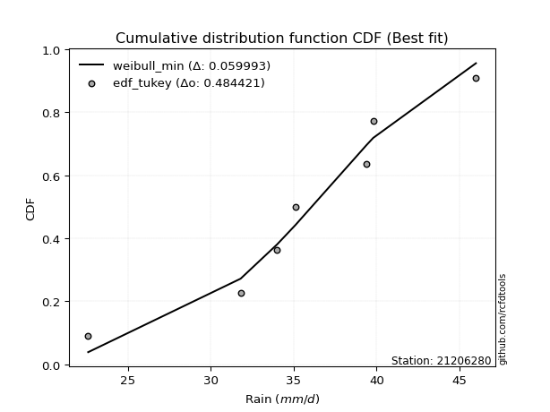</img></img>

</div>


### 8. Empirical - EDF Gringorten (1963)

Gringorten plotting position formula is essential for estimating the probability and return periods of extreme events like floods and heavy rainfall. The constant _a=0.44_.

<div align="center">


$P=(m-a)/(n+1-2a)$


</div>


**8.1. Empirical values**

<div align="center">

|                | 0                   | 1                   | 2                  | 3              | 4                  | 5                  | 6                  |
|:---------------|:--------------------|:--------------------|:-------------------|:---------------|:-------------------|:-------------------|:-------------------|
| date           | 2024                | 2019                | 2023               | 2025           | 2020               | 2022               | 2021               |
| x              | 22.6                | 31.8                | 34.0               | 35.1           | 39.4               | 39.8               | 46.0               |
| m              | 1                   | 2                   | 3                  | 4              | 5                  | 6                  | 7                  |
| empirical_dist | edf_gringorten      | edf_gringorten      | edf_gringorten     | edf_gringorten | edf_gringorten     | edf_gringorten     | edf_gringorten     |
| empirical      | 0.07865168539325844 | 0.21910112359550563 | 0.3595505617977528 | 0.5            | 0.6404494382022471 | 0.7808988764044943 | 0.9213483146067415 |
| empirical_tr   | 1.0853658536585364  | 1.2805755395683454  | 1.5614035087719298 | 2.0            | 2.781249999999999  | 4.564102564102562  | 12.714285714285701 |

</div>


**8.2. Kolmogorov-Smirnov fit test (sorted by Δ)**


<div align="center">

|                | 0                   | 1                   | 2                    | 3                    | 4                   | 5                   | 6                   | 7                   | 8                   | 9                   | 10                  | 11                  | 12                  | 13                  | 14                  | 15                  | 16                  | 17                  | 18                  | 19                  | 20                  | 21                  | 22                  | 23                  | 24                  | 25                  | 26                  | 27                  | 28                  | 29                  | 30                  | 31                  | 32                  | 33                  | 34                  | 35                  | 36                  | 37                  | 38                  | 39                  | 40                  | 41                  | 42                  | 43                  | 44                  | 45                  | 46                  | 47                  | 48                  | 49                  | 50                  | 51                  | 52                  | 53                  | 54                    | 55                  | 56                  | 57                  | 58                  | 59                  | 60                  | 61                  | 62                  | 63                  | 64                  | 65                  | 66                  | 67                  | 68                  | 69                  | 70                  | 71                  | 72                  | 73                  | 74                  | 75                  | 76                  | 77                  | 78                  | 79                  | 80                  | 81                  | 82                  | 83                  | 84                  | 85                  | 86                  | 87                  | 88                  | 89                  |
|:---------------|:--------------------|:--------------------|:---------------------|:---------------------|:--------------------|:--------------------|:--------------------|:--------------------|:--------------------|:--------------------|:--------------------|:--------------------|:--------------------|:--------------------|:--------------------|:--------------------|:--------------------|:--------------------|:--------------------|:--------------------|:--------------------|:--------------------|:--------------------|:--------------------|:--------------------|:--------------------|:--------------------|:--------------------|:--------------------|:--------------------|:--------------------|:--------------------|:--------------------|:--------------------|:--------------------|:--------------------|:--------------------|:--------------------|:--------------------|:--------------------|:--------------------|:--------------------|:--------------------|:--------------------|:--------------------|:--------------------|:--------------------|:--------------------|:--------------------|:--------------------|:--------------------|:--------------------|:--------------------|:--------------------|:----------------------|:--------------------|:--------------------|:--------------------|:--------------------|:--------------------|:--------------------|:--------------------|:--------------------|:--------------------|:--------------------|:--------------------|:--------------------|:--------------------|:--------------------|:--------------------|:--------------------|:--------------------|:--------------------|:--------------------|:--------------------|:--------------------|:--------------------|:--------------------|:--------------------|:--------------------|:--------------------|:--------------------|:--------------------|:--------------------|:--------------------|:--------------------|:--------------------|:--------------------|:--------------------|:--------------------|
| station        | 21206280            | 21206280            | 21206280             | 21206280             | 21206280            | 21206280            | 21206280            | 21206280            | 21206280            | 21206280            | 21206280            | 21206280            | 21206280            | 21206280            | 21206280            | 21206280            | 21206280            | 21206280            | 21206280            | 21206280            | 21206280            | 21206280            | 21206280            | 21206280            | 21206280            | 21206280            | 21206280            | 21206280            | 21206280            | 21206280            | 21206280            | 21206280            | 21206280            | 21206280            | 21206280            | 21206280            | 21206280            | 21206280            | 21206280            | 21206280            | 21206280            | 21206280            | 21206280            | 21206280            | 21206280            | 21206280            | 21206280            | 21206280            | 21206280            | 21206280            | 21206280            | 21206280            | 21206280            | 21206280            | 21206280              | 21206280            | 21206280            | 21206280            | 21206280            | 21206280            | 21206280            | 21206280            | 21206280            | 21206280            | 21206280            | 21206280            | 21206280            | 21206280            | 21206280            | 21206280            | 21206280            | 21206280            | 21206280            | 21206280            | 21206280            | 21206280            | 21206280            | 21206280            | 21206280            | 21206280            | 21206280            | 21206280            | 21206280            | 21206280            | 21206280            | 21206280            | 21206280            | 21206280            | 21206280            | 21206280            |
| empirical_dist | edf_gringorten      | edf_gringorten      | edf_gringorten       | edf_gringorten       | edf_gringorten      | edf_gringorten      | edf_gringorten      | edf_gringorten      | edf_gringorten      | edf_gringorten      | edf_gringorten      | edf_gringorten      | edf_gringorten      | edf_gringorten      | edf_gringorten      | edf_gringorten      | edf_gringorten      | edf_gringorten      | edf_gringorten      | edf_gringorten      | edf_gringorten      | edf_gringorten      | edf_gringorten      | edf_gringorten      | edf_gringorten      | edf_gringorten      | edf_gringorten      | edf_gringorten      | edf_gringorten      | edf_gringorten      | edf_gringorten      | edf_gringorten      | edf_gringorten      | edf_gringorten      | edf_gringorten      | edf_gringorten      | edf_gringorten      | edf_gringorten      | edf_gringorten      | edf_gringorten      | edf_gringorten      | edf_gringorten      | edf_gringorten      | edf_gringorten      | edf_gringorten      | edf_gringorten      | edf_gringorten      | edf_gringorten      | edf_gringorten      | edf_gringorten      | edf_gringorten      | edf_gringorten      | edf_gringorten      | edf_gringorten      | edf_gringorten        | edf_gringorten      | edf_gringorten      | edf_gringorten      | edf_gringorten      | edf_gringorten      | edf_gringorten      | edf_gringorten      | edf_gringorten      | edf_gringorten      | edf_gringorten      | edf_gringorten      | edf_gringorten      | edf_gringorten      | edf_gringorten      | edf_gringorten      | edf_gringorten      | edf_gringorten      | edf_gringorten      | edf_gringorten      | edf_gringorten      | edf_gringorten      | edf_gringorten      | edf_gringorten      | edf_gringorten      | edf_gringorten      | edf_gringorten      | edf_gringorten      | edf_gringorten      | edf_gringorten      | edf_gringorten      | edf_gringorten      | edf_gringorten      | edf_gringorten      | edf_gringorten      | edf_gringorten      |
| p_dist         | loggumbel_l         | pearson3            | logweibull_min       | weibull_min          | logt                | johnsonsu           | logmielke           | loggenlogistic      | mielke              | logfisk             | logloggamma         | genlogistic         | logpearson3         | logjohnsonsu        | fisk                | norm                | crystalball         | exponnorm           | t                   | nct                 | loggompertz         | f                   | erlang              | gamma               | rice                | chi2                | alpha               | invgamma            | gumbel_l            | logistic            | ncf                 | maxwell             | invgauss            | loglogistic         | logbetaprime        | rayleigh            | hypsecant           | logf                | logcrystalball      | logexponnorm        | lognorm             | lognorm             | betaprime           | logfatiguelife      | loghypsecant        | loggamma            | loggamma            | gumbel_r            | logrice             | laplace_asymmetric  | logerlang           | logalpha            | lognct              | loginvgamma         | loglaplace_asymmetric | laplace             | moyal               | invweibull          | halfnorm            | loglaplace          | logmaxwell          | halflogistic        | loginvgauss         | lograyleigh         | loggumbel_r         | kstwobign           | loginvweibull       | logmoyal            | loghalfnorm         | loghalflogistic     | wald                | gibrat              | logtruncnorm        | truncnorm           | logkstwobign        | loggenexpon         | logncf              | logwald             | loggibrat           | genexpon            | expon               | logexpon            | logchi2             | lognakagami         | nakagami            | loglognorm          | pareto              | logpareto           | fatiguelife         | gompertz            |
| delta          | 0.05959967614939854 | 0.06035041209489367 | 0.061143979596296805 | 0.062040220066422846 | 0.06391384408216971 | 0.06501005547492722 | 0.06601816013735634 | 0.06795178790256773 | 0.06795249277754484 | 0.06828349516959431 | 0.0695402538441856  | 0.07142150222928956 | 0.07221246898858122 | 0.07332584143989884 | 0.07379922033893482 | 0.07416066450952752 | 0.07416067844137408 | 0.07416419918059491 | 0.07416571063554767 | 0.0743361811830493  | 0.07444103311475217 | 0.07518733174771017 | 0.07999750532234676 | 0.08413315382306455 | 0.08471211871355058 | 0.09046421992582201 | 0.09232431130538046 | 0.09429531729543897 | 0.09568744964796061 | 0.09612686420024241 | 0.09905553618285187 | 0.10051618067318016 | 0.10299329183854297 | 0.10513649802050873 | 0.11010525770237575 | 0.11129398156242024 | 0.11159582263772838 | 0.11344689918614584 | 0.11392737503485648 | 0.11393048544833342 | 0.11393078058166203 | 0.11393078058166203 | 0.11508507466146348 | 0.11641544003906298 | 0.12055858471775249 | 0.12137319744213201 | 0.12137319744213201 | 0.12189021453717319 | 0.1222413028685975  | 0.12269253846526029 | 0.1273272658524671  | 0.1293915956911222  | 0.1313817526720403  | 0.1318401920142704  | 0.13407803605676005   | 0.13527273511398352 | 0.13734273513096495 | 0.13873144119926847 | 0.14165751648535604 | 0.14333574953311434 | 0.14471969081423233 | 0.15009118227412255 | 0.15311889969855122 | 0.15652451704154516 | 0.16352626728424058 | 0.17186713308392879 | 0.18383748420798093 | 0.18902530177344334 | 0.19012480335198237 | 0.1969511006018143  | 0.20196520100188986 | 0.2139916306609645  | 0.21909966888800075 | 0.21910112358097325 | 0.22214474027351436 | 0.2300022395190758  | 0.23735458753358873 | 0.2599452051779195  | 0.27412074696685584 | 0.28998670011365557 | 0.29004176545868376 | 0.32746809763521756 | 0.3454322665373344  | 0.36152892437512196 | 0.39394444697581377 | 0.4283736181725384  | 0.44525897419432003 | 0.4501447566259995  | 0.6090663729885734  | 0.6235445745128164  |
| deltao         | 0.48442053926100004 | 0.48442053926100004 | 0.48442053926100004  | 0.48442053926100004  | 0.48442053926100004 | 0.48442053926100004 | 0.48442053926100004 | 0.48442053926100004 | 0.48442053926100004 | 0.48442053926100004 | 0.48442053926100004 | 0.48442053926100004 | 0.48442053926100004 | 0.48442053926100004 | 0.48442053926100004 | 0.48442053926100004 | 0.48442053926100004 | 0.48442053926100004 | 0.48442053926100004 | 0.48442053926100004 | 0.48442053926100004 | 0.48442053926100004 | 0.48442053926100004 | 0.48442053926100004 | 0.48442053926100004 | 0.48442053926100004 | 0.48442053926100004 | 0.48442053926100004 | 0.48442053926100004 | 0.48442053926100004 | 0.48442053926100004 | 0.48442053926100004 | 0.48442053926100004 | 0.48442053926100004 | 0.48442053926100004 | 0.48442053926100004 | 0.48442053926100004 | 0.48442053926100004 | 0.48442053926100004 | 0.48442053926100004 | 0.48442053926100004 | 0.48442053926100004 | 0.48442053926100004 | 0.48442053926100004 | 0.48442053926100004 | 0.48442053926100004 | 0.48442053926100004 | 0.48442053926100004 | 0.48442053926100004 | 0.48442053926100004 | 0.48442053926100004 | 0.48442053926100004 | 0.48442053926100004 | 0.48442053926100004 | 0.48442053926100004   | 0.48442053926100004 | 0.48442053926100004 | 0.48442053926100004 | 0.48442053926100004 | 0.48442053926100004 | 0.48442053926100004 | 0.48442053926100004 | 0.48442053926100004 | 0.48442053926100004 | 0.48442053926100004 | 0.48442053926100004 | 0.48442053926100004 | 0.48442053926100004 | 0.48442053926100004 | 0.48442053926100004 | 0.48442053926100004 | 0.48442053926100004 | 0.48442053926100004 | 0.48442053926100004 | 0.48442053926100004 | 0.48442053926100004 | 0.48442053926100004 | 0.48442053926100004 | 0.48442053926100004 | 0.48442053926100004 | 0.48442053926100004 | 0.48442053926100004 | 0.48442053926100004 | 0.48442053926100004 | 0.48442053926100004 | 0.48442053926100004 | 0.48442053926100004 | 0.48442053926100004 | 0.48442053926100004 | 0.48442053926100004 |
| eval           | Δo > Δ              | Δo > Δ              | Δo > Δ               | Δo > Δ               | Δo > Δ              | Δo > Δ              | Δo > Δ              | Δo > Δ              | Δo > Δ              | Δo > Δ              | Δo > Δ              | Δo > Δ              | Δo > Δ              | Δo > Δ              | Δo > Δ              | Δo > Δ              | Δo > Δ              | Δo > Δ              | Δo > Δ              | Δo > Δ              | Δo > Δ              | Δo > Δ              | Δo > Δ              | Δo > Δ              | Δo > Δ              | Δo > Δ              | Δo > Δ              | Δo > Δ              | Δo > Δ              | Δo > Δ              | Δo > Δ              | Δo > Δ              | Δo > Δ              | Δo > Δ              | Δo > Δ              | Δo > Δ              | Δo > Δ              | Δo > Δ              | Δo > Δ              | Δo > Δ              | Δo > Δ              | Δo > Δ              | Δo > Δ              | Δo > Δ              | Δo > Δ              | Δo > Δ              | Δo > Δ              | Δo > Δ              | Δo > Δ              | Δo > Δ              | Δo > Δ              | Δo > Δ              | Δo > Δ              | Δo > Δ              | Δo > Δ                | Δo > Δ              | Δo > Δ              | Δo > Δ              | Δo > Δ              | Δo > Δ              | Δo > Δ              | Δo > Δ              | Δo > Δ              | Δo > Δ              | Δo > Δ              | Δo > Δ              | Δo > Δ              | Δo > Δ              | Δo > Δ              | Δo > Δ              | Δo > Δ              | Δo > Δ              | Δo > Δ              | Δo > Δ              | Δo > Δ              | Δo > Δ              | Δo > Δ              | Δo > Δ              | Δo > Δ              | Δo > Δ              | Δo > Δ              | Δo > Δ              | Δo > Δ              | Δo > Δ              | Δo > Δ              | Δo > Δ              | Δo > Δ              | Δo > Δ              | Δo <= Δ             | Δo <= Δ             |
| fit            | 1                   | 1                   | 1                    | 1                    | 1                   | 1                   | 1                   | 1                   | 1                   | 1                   | 1                   | 1                   | 1                   | 1                   | 1                   | 1                   | 1                   | 1                   | 1                   | 1                   | 1                   | 1                   | 1                   | 1                   | 1                   | 1                   | 1                   | 1                   | 1                   | 1                   | 1                   | 1                   | 1                   | 1                   | 1                   | 1                   | 1                   | 1                   | 1                   | 1                   | 1                   | 1                   | 1                   | 1                   | 1                   | 1                   | 1                   | 1                   | 1                   | 1                   | 1                   | 1                   | 1                   | 1                   | 1                     | 1                   | 1                   | 1                   | 1                   | 1                   | 1                   | 1                   | 1                   | 1                   | 1                   | 1                   | 1                   | 1                   | 1                   | 1                   | 1                   | 1                   | 1                   | 1                   | 1                   | 1                   | 1                   | 1                   | 1                   | 1                   | 1                   | 1                   | 1                   | 1                   | 1                   | 1                   | 1                   | 1                   | 0                   | 0                   |
| n              | 7                   | 7                   | 7                    | 7                    | 7                   | 7                   | 7                   | 7                   | 7                   | 7                   | 7                   | 7                   | 7                   | 7                   | 7                   | 7                   | 7                   | 7                   | 7                   | 7                   | 7                   | 7                   | 7                   | 7                   | 7                   | 7                   | 7                   | 7                   | 7                   | 7                   | 7                   | 7                   | 7                   | 7                   | 7                   | 7                   | 7                   | 7                   | 7                   | 7                   | 7                   | 7                   | 7                   | 7                   | 7                   | 7                   | 7                   | 7                   | 7                   | 7                   | 7                   | 7                   | 7                   | 7                   | 7                     | 7                   | 7                   | 7                   | 7                   | 7                   | 7                   | 7                   | 7                   | 7                   | 7                   | 7                   | 7                   | 7                   | 7                   | 7                   | 7                   | 7                   | 7                   | 7                   | 7                   | 7                   | 7                   | 7                   | 7                   | 7                   | 7                   | 7                   | 7                   | 7                   | 7                   | 7                   | 7                   | 7                   | 7                   | 7                   |
| best_fit       | 1                   | 0                   | 0                    | 0                    | 0                   | 0                   | 0                   | 0                   | 0                   | 0                   | 0                   | 0                   | 0                   | 0                   | 0                   | 0                   | 0                   | 0                   | 0                   | 0                   | 0                   | 0                   | 0                   | 0                   | 0                   | 0                   | 0                   | 0                   | 0                   | 0                   | 0                   | 0                   | 0                   | 0                   | 0                   | 0                   | 0                   | 0                   | 0                   | 0                   | 0                   | 0                   | 0                   | 0                   | 0                   | 0                   | 0                   | 0                   | 0                   | 0                   | 0                   | 0                   | 0                   | 0                   | 0                     | 0                   | 0                   | 0                   | 0                   | 0                   | 0                   | 0                   | 0                   | 0                   | 0                   | 0                   | 0                   | 0                   | 0                   | 0                   | 0                   | 0                   | 0                   | 0                   | 0                   | 0                   | 0                   | 0                   | 0                   | 0                   | 0                   | 0                   | 0                   | 0                   | 0                   | 0                   | 0                   | 0                   | 0                   | 0                   |
| best_fit_sort  | 1                   | 2                   | 3                    | 4                    | 5                   | 6                   | 7                   | 8                   | 9                   | 10                  | 11                  | 12                  | 13                  | 14                  | 15                  | 16                  | 17                  | 18                  | 19                  | 20                  | 21                  | 22                  | 23                  | 24                  | 25                  | 26                  | 27                  | 28                  | 29                  | 30                  | 31                  | 32                  | 33                  | 34                  | 35                  | 36                  | 37                  | 38                  | 39                  | 40                  | 41                  | 42                  | 43                  | 44                  | 45                  | 46                  | 47                  | 48                  | 49                  | 50                  | 51                  | 52                  | 53                  | 54                  | 55                    | 56                  | 57                  | 58                  | 59                  | 60                  | 61                  | 62                  | 63                  | 64                  | 65                  | 66                  | 67                  | 68                  | 69                  | 70                  | 71                  | 72                  | 73                  | 74                  | 75                  | 76                  | 77                  | 78                  | 79                  | 80                  | 81                  | 82                  | 83                  | 84                  | 85                  | 86                  | 87                  | 88                  | 89                  | 90                  |

</div>


<div align="center">

</img>

</div>


**8.3. Best fit**

<div align="center">

|   id |   station | empirical_dist   | p_dist      |     delta |   deltao | eval   |   fit |   n |   best_fit |   best_fit_sort |
|-----:|----------:|:-----------------|:------------|----------:|---------:|:-------|------:|----:|-----------:|----------------:|
|    0 |  21206280 | edf_gringorten   | loggumbel_l | 0.0595997 | 0.484421 | Δo > Δ |     1 |   7 |          1 |               1 |

</div>


<div align="center">

</img>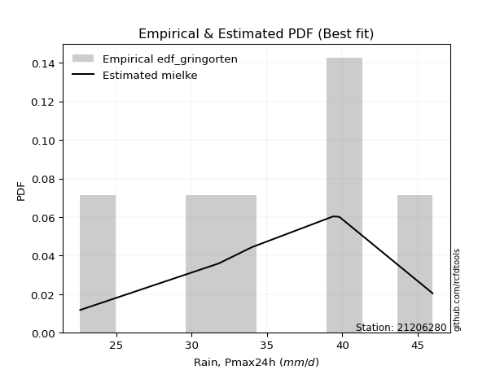</img>

</div>


### 9. Empirical - EDF Filliben (1975)

The specific values of the constants (0.3175) (often denoted as $alpha$) and (0.365) are derived from a method proposed by James J. Filliben in a 1975 paper. This particular formula is the mean value of the $i$-th order statistic of the normal distribution and is considered a robust and effective plotting position formula for the normal probability plot correlation coefficient test for normality.

<div align="center">


$P=(m-0.3175)/(n+0.365)$


</div>


**9.1. Empirical values**

<div align="center">

|                | 0                   | 1                   | 2                   | 3            | 4                  | 5                  | 6                  |
|:---------------|:--------------------|:--------------------|:--------------------|:-------------|:-------------------|:-------------------|:-------------------|
| date           | 2024                | 2019                | 2023                | 2025         | 2020               | 2022               | 2021               |
| x              | 22.6                | 31.8                | 34.0                | 35.1         | 39.4               | 39.8               | 46.0               |
| m              | 1                   | 2                   | 3                   | 4            | 5                  | 6                  | 7                  |
| empirical_dist | edf_filliben        | edf_filliben        | edf_filliben        | edf_filliben | edf_filliben       | edf_filliben       | edf_filliben       |
| empirical      | 0.09266802443991853 | 0.22844534962661237 | 0.36422267481330617 | 0.5          | 0.6357773251866938 | 0.7715546503733877 | 0.9073319755600815 |
| empirical_tr   | 1.1021324354657687  | 1.2960844698636163  | 1.5728777362520021  | 2.0          | 2.7455731593662627 | 4.377414561664191  | 10.791208791208794 |

</div>


**9.2. Kolmogorov-Smirnov fit test (sorted by Δ)**


<div align="center">

|                | 0                   | 1                   | 2                   | 3                   | 4                   | 5                   | 6                   | 7                   | 8                   | 9                   | 10                  | 11                  | 12                  | 13                  | 14                  | 15                  | 16                  | 17                  | 18                  | 19                  | 20                  | 21                  | 22                  | 23                  | 24                  | 25                  | 26                  | 27                  | 28                  | 29                  | 30                  | 31                  | 32                  | 33                  | 34                  | 35                  | 36                  | 37                  | 38                  | 39                  | 40                  | 41                  | 42                  | 43                  | 44                  | 45                  | 46                  | 47                  | 48                  | 49                  | 50                  | 51                  | 52                  | 53                  | 54                  | 55                  | 56                  | 57                    | 58                  | 59                  | 60                  | 61                  | 62                  | 63                  | 64                  | 65                  | 66                  | 67                  | 68                  | 69                  | 70                  | 71                  | 72                  | 73                  | 74                  | 75                  | 76                  | 77                  | 78                  | 79                  | 80                  | 81                  | 82                  | 83                  | 84                  | 85                  | 86                  | 87                  | 88                  | 89                  |
|:---------------|:--------------------|:--------------------|:--------------------|:--------------------|:--------------------|:--------------------|:--------------------|:--------------------|:--------------------|:--------------------|:--------------------|:--------------------|:--------------------|:--------------------|:--------------------|:--------------------|:--------------------|:--------------------|:--------------------|:--------------------|:--------------------|:--------------------|:--------------------|:--------------------|:--------------------|:--------------------|:--------------------|:--------------------|:--------------------|:--------------------|:--------------------|:--------------------|:--------------------|:--------------------|:--------------------|:--------------------|:--------------------|:--------------------|:--------------------|:--------------------|:--------------------|:--------------------|:--------------------|:--------------------|:--------------------|:--------------------|:--------------------|:--------------------|:--------------------|:--------------------|:--------------------|:--------------------|:--------------------|:--------------------|:--------------------|:--------------------|:--------------------|:----------------------|:--------------------|:--------------------|:--------------------|:--------------------|:--------------------|:--------------------|:--------------------|:--------------------|:--------------------|:--------------------|:--------------------|:--------------------|:--------------------|:--------------------|:--------------------|:--------------------|:--------------------|:--------------------|:--------------------|:--------------------|:--------------------|:--------------------|:--------------------|:--------------------|:--------------------|:--------------------|:--------------------|:--------------------|:--------------------|:--------------------|:--------------------|:--------------------|
| station        | 21206280            | 21206280            | 21206280            | 21206280            | 21206280            | 21206280            | 21206280            | 21206280            | 21206280            | 21206280            | 21206280            | 21206280            | 21206280            | 21206280            | 21206280            | 21206280            | 21206280            | 21206280            | 21206280            | 21206280            | 21206280            | 21206280            | 21206280            | 21206280            | 21206280            | 21206280            | 21206280            | 21206280            | 21206280            | 21206280            | 21206280            | 21206280            | 21206280            | 21206280            | 21206280            | 21206280            | 21206280            | 21206280            | 21206280            | 21206280            | 21206280            | 21206280            | 21206280            | 21206280            | 21206280            | 21206280            | 21206280            | 21206280            | 21206280            | 21206280            | 21206280            | 21206280            | 21206280            | 21206280            | 21206280            | 21206280            | 21206280            | 21206280              | 21206280            | 21206280            | 21206280            | 21206280            | 21206280            | 21206280            | 21206280            | 21206280            | 21206280            | 21206280            | 21206280            | 21206280            | 21206280            | 21206280            | 21206280            | 21206280            | 21206280            | 21206280            | 21206280            | 21206280            | 21206280            | 21206280            | 21206280            | 21206280            | 21206280            | 21206280            | 21206280            | 21206280            | 21206280            | 21206280            | 21206280            | 21206280            |
| empirical_dist | edf_filliben        | edf_filliben        | edf_filliben        | edf_filliben        | edf_filliben        | edf_filliben        | edf_filliben        | edf_filliben        | edf_filliben        | edf_filliben        | edf_filliben        | edf_filliben        | edf_filliben        | edf_filliben        | edf_filliben        | edf_filliben        | edf_filliben        | edf_filliben        | edf_filliben        | edf_filliben        | edf_filliben        | edf_filliben        | edf_filliben        | edf_filliben        | edf_filliben        | edf_filliben        | edf_filliben        | edf_filliben        | edf_filliben        | edf_filliben        | edf_filliben        | edf_filliben        | edf_filliben        | edf_filliben        | edf_filliben        | edf_filliben        | edf_filliben        | edf_filliben        | edf_filliben        | edf_filliben        | edf_filliben        | edf_filliben        | edf_filliben        | edf_filliben        | edf_filliben        | edf_filliben        | edf_filliben        | edf_filliben        | edf_filliben        | edf_filliben        | edf_filliben        | edf_filliben        | edf_filliben        | edf_filliben        | edf_filliben        | edf_filliben        | edf_filliben        | edf_filliben          | edf_filliben        | edf_filliben        | edf_filliben        | edf_filliben        | edf_filliben        | edf_filliben        | edf_filliben        | edf_filliben        | edf_filliben        | edf_filliben        | edf_filliben        | edf_filliben        | edf_filliben        | edf_filliben        | edf_filliben        | edf_filliben        | edf_filliben        | edf_filliben        | edf_filliben        | edf_filliben        | edf_filliben        | edf_filliben        | edf_filliben        | edf_filliben        | edf_filliben        | edf_filliben        | edf_filliben        | edf_filliben        | edf_filliben        | edf_filliben        | edf_filliben        | edf_filliben        |
| p_dist         | weibull_min         | logweibull_min      | pearson3            | logpearson3         | loggumbel_l         | johnsonsu           | logjohnsonsu        | logloggamma         | logmielke           | loggenlogistic      | mielke              | logt                | logfisk             | genlogistic         | fisk                | f                   | norm                | crystalball         | exponnorm           | t                   | nct                 | erlang              | rice                | gamma               | invgamma            | chi2                | loggompertz         | alpha               | ncf                 | maxwell             | invgauss            | gumbel_l            | logbetaprime        | logistic            | rayleigh            | logf                | logcrystalball      | logexponnorm        | lognorm             | lognorm             | betaprime           | logfatiguelife      | loglogistic         | loggamma            | loggamma            | logrice             | hypsecant           | logerlang           | logalpha            | lognct              | loginvgamma         | loghypsecant        | gumbel_r            | laplace_asymmetric  | invweibull          | halfnorm            | logmaxwell          | loglaplace_asymmetric | laplace             | moyal               | loginvgauss         | halflogistic        | lograyleigh         | loglaplace          | loggumbel_r         | kstwobign           | loginvweibull       | loghalfnorm         | logmoyal            | loghalflogistic     | wald                | logkstwobign        | gibrat              | loggenexpon         | logncf              | logtruncnorm        | truncnorm           | logwald             | loggibrat           | genexpon            | expon               | logexpon            | logchi2             | lognakagami         | nakagami            | loglognorm          | pareto              | logpareto           | fatiguelife         | gompertz            |
| delta          | 0.06057930500608033 | 0.06158200639165967 | 0.06286715599250914 | 0.06286824295747448 | 0.06329920776056297 | 0.06384968918497325 | 0.0649419736693787  | 0.06511713967842164 | 0.06785484101357697 | 0.06959053212870503 | 0.06964931076969194 | 0.06977267334534293 | 0.07426284976563013 | 0.07609361524484282 | 0.07847133335448808 | 0.07869873157555585 | 0.07883277752508078 | 0.07883279145692734 | 0.07883631219614817 | 0.07883782365110092 | 0.07900829419860256 | 0.07964182722687019 | 0.08088791230261527 | 0.08196271764749119 | 0.08495109126433223 | 0.08561493804878939 | 0.0858858902093387  | 0.08792171286471318 | 0.08971131015174513 | 0.09295085016131055 | 0.09364906580743623 | 0.09568744964796061 | 0.10076103167126901 | 0.10079897721579567 | 0.1019497555313135  | 0.1041026731550391  | 0.10458314900374974 | 0.10458625941722668 | 0.1045865545505553  | 0.1045865545505553  | 0.10574084863035674 | 0.10707121400795624 | 0.10980861103606199 | 0.11202897141102527 | 0.11202897141102527 | 0.11289707683749076 | 0.11626793565328164 | 0.11798303982136035 | 0.12004736966001547 | 0.12203752664093356 | 0.12249596598316367 | 0.12523069773330575 | 0.12656232755272645 | 0.12736465148081355 | 0.12938721516816173 | 0.1323132904542493  | 0.1353754647831256  | 0.1387501490723133    | 0.13994484812953678 | 0.14195085036615462 | 0.14377467366744448 | 0.14541906925856918 | 0.14718029101043842 | 0.1480078625486676  | 0.1588541542686872  | 0.16252290705282205 | 0.1744932581768742  | 0.18078057732087563 | 0.18435318875788997 | 0.19227898758626094 | 0.1972930879863365  | 0.21280051424240762 | 0.21866374367651775 | 0.22065801348796907 | 0.22333824848692874 | 0.2284438949191075  | 0.22844534961208    | 0.25527309216236616 | 0.2694486339513025  | 0.28064247408254883 | 0.280697539427577   | 0.3181238716041108  | 0.3314159274906744  | 0.3568568113595686  | 0.3892723339602604  | 0.41902939214143164 | 0.4359147481632133  | 0.44080053059489277 | 0.5997221469574666  | 0.6142003484817098  |
| deltao         | 0.48442053926100004 | 0.48442053926100004 | 0.48442053926100004 | 0.48442053926100004 | 0.48442053926100004 | 0.48442053926100004 | 0.48442053926100004 | 0.48442053926100004 | 0.48442053926100004 | 0.48442053926100004 | 0.48442053926100004 | 0.48442053926100004 | 0.48442053926100004 | 0.48442053926100004 | 0.48442053926100004 | 0.48442053926100004 | 0.48442053926100004 | 0.48442053926100004 | 0.48442053926100004 | 0.48442053926100004 | 0.48442053926100004 | 0.48442053926100004 | 0.48442053926100004 | 0.48442053926100004 | 0.48442053926100004 | 0.48442053926100004 | 0.48442053926100004 | 0.48442053926100004 | 0.48442053926100004 | 0.48442053926100004 | 0.48442053926100004 | 0.48442053926100004 | 0.48442053926100004 | 0.48442053926100004 | 0.48442053926100004 | 0.48442053926100004 | 0.48442053926100004 | 0.48442053926100004 | 0.48442053926100004 | 0.48442053926100004 | 0.48442053926100004 | 0.48442053926100004 | 0.48442053926100004 | 0.48442053926100004 | 0.48442053926100004 | 0.48442053926100004 | 0.48442053926100004 | 0.48442053926100004 | 0.48442053926100004 | 0.48442053926100004 | 0.48442053926100004 | 0.48442053926100004 | 0.48442053926100004 | 0.48442053926100004 | 0.48442053926100004 | 0.48442053926100004 | 0.48442053926100004 | 0.48442053926100004   | 0.48442053926100004 | 0.48442053926100004 | 0.48442053926100004 | 0.48442053926100004 | 0.48442053926100004 | 0.48442053926100004 | 0.48442053926100004 | 0.48442053926100004 | 0.48442053926100004 | 0.48442053926100004 | 0.48442053926100004 | 0.48442053926100004 | 0.48442053926100004 | 0.48442053926100004 | 0.48442053926100004 | 0.48442053926100004 | 0.48442053926100004 | 0.48442053926100004 | 0.48442053926100004 | 0.48442053926100004 | 0.48442053926100004 | 0.48442053926100004 | 0.48442053926100004 | 0.48442053926100004 | 0.48442053926100004 | 0.48442053926100004 | 0.48442053926100004 | 0.48442053926100004 | 0.48442053926100004 | 0.48442053926100004 | 0.48442053926100004 | 0.48442053926100004 |
| eval           | Δo > Δ              | Δo > Δ              | Δo > Δ              | Δo > Δ              | Δo > Δ              | Δo > Δ              | Δo > Δ              | Δo > Δ              | Δo > Δ              | Δo > Δ              | Δo > Δ              | Δo > Δ              | Δo > Δ              | Δo > Δ              | Δo > Δ              | Δo > Δ              | Δo > Δ              | Δo > Δ              | Δo > Δ              | Δo > Δ              | Δo > Δ              | Δo > Δ              | Δo > Δ              | Δo > Δ              | Δo > Δ              | Δo > Δ              | Δo > Δ              | Δo > Δ              | Δo > Δ              | Δo > Δ              | Δo > Δ              | Δo > Δ              | Δo > Δ              | Δo > Δ              | Δo > Δ              | Δo > Δ              | Δo > Δ              | Δo > Δ              | Δo > Δ              | Δo > Δ              | Δo > Δ              | Δo > Δ              | Δo > Δ              | Δo > Δ              | Δo > Δ              | Δo > Δ              | Δo > Δ              | Δo > Δ              | Δo > Δ              | Δo > Δ              | Δo > Δ              | Δo > Δ              | Δo > Δ              | Δo > Δ              | Δo > Δ              | Δo > Δ              | Δo > Δ              | Δo > Δ                | Δo > Δ              | Δo > Δ              | Δo > Δ              | Δo > Δ              | Δo > Δ              | Δo > Δ              | Δo > Δ              | Δo > Δ              | Δo > Δ              | Δo > Δ              | Δo > Δ              | Δo > Δ              | Δo > Δ              | Δo > Δ              | Δo > Δ              | Δo > Δ              | Δo > Δ              | Δo > Δ              | Δo > Δ              | Δo > Δ              | Δo > Δ              | Δo > Δ              | Δo > Δ              | Δo > Δ              | Δo > Δ              | Δo > Δ              | Δo > Δ              | Δo > Δ              | Δo > Δ              | Δo > Δ              | Δo <= Δ             | Δo <= Δ             |
| fit            | 1                   | 1                   | 1                   | 1                   | 1                   | 1                   | 1                   | 1                   | 1                   | 1                   | 1                   | 1                   | 1                   | 1                   | 1                   | 1                   | 1                   | 1                   | 1                   | 1                   | 1                   | 1                   | 1                   | 1                   | 1                   | 1                   | 1                   | 1                   | 1                   | 1                   | 1                   | 1                   | 1                   | 1                   | 1                   | 1                   | 1                   | 1                   | 1                   | 1                   | 1                   | 1                   | 1                   | 1                   | 1                   | 1                   | 1                   | 1                   | 1                   | 1                   | 1                   | 1                   | 1                   | 1                   | 1                   | 1                   | 1                   | 1                     | 1                   | 1                   | 1                   | 1                   | 1                   | 1                   | 1                   | 1                   | 1                   | 1                   | 1                   | 1                   | 1                   | 1                   | 1                   | 1                   | 1                   | 1                   | 1                   | 1                   | 1                   | 1                   | 1                   | 1                   | 1                   | 1                   | 1                   | 1                   | 1                   | 1                   | 0                   | 0                   |
| n              | 7                   | 7                   | 7                   | 7                   | 7                   | 7                   | 7                   | 7                   | 7                   | 7                   | 7                   | 7                   | 7                   | 7                   | 7                   | 7                   | 7                   | 7                   | 7                   | 7                   | 7                   | 7                   | 7                   | 7                   | 7                   | 7                   | 7                   | 7                   | 7                   | 7                   | 7                   | 7                   | 7                   | 7                   | 7                   | 7                   | 7                   | 7                   | 7                   | 7                   | 7                   | 7                   | 7                   | 7                   | 7                   | 7                   | 7                   | 7                   | 7                   | 7                   | 7                   | 7                   | 7                   | 7                   | 7                   | 7                   | 7                   | 7                     | 7                   | 7                   | 7                   | 7                   | 7                   | 7                   | 7                   | 7                   | 7                   | 7                   | 7                   | 7                   | 7                   | 7                   | 7                   | 7                   | 7                   | 7                   | 7                   | 7                   | 7                   | 7                   | 7                   | 7                   | 7                   | 7                   | 7                   | 7                   | 7                   | 7                   | 7                   | 7                   |
| best_fit       | 1                   | 0                   | 0                   | 0                   | 0                   | 0                   | 0                   | 0                   | 0                   | 0                   | 0                   | 0                   | 0                   | 0                   | 0                   | 0                   | 0                   | 0                   | 0                   | 0                   | 0                   | 0                   | 0                   | 0                   | 0                   | 0                   | 0                   | 0                   | 0                   | 0                   | 0                   | 0                   | 0                   | 0                   | 0                   | 0                   | 0                   | 0                   | 0                   | 0                   | 0                   | 0                   | 0                   | 0                   | 0                   | 0                   | 0                   | 0                   | 0                   | 0                   | 0                   | 0                   | 0                   | 0                   | 0                   | 0                   | 0                   | 0                     | 0                   | 0                   | 0                   | 0                   | 0                   | 0                   | 0                   | 0                   | 0                   | 0                   | 0                   | 0                   | 0                   | 0                   | 0                   | 0                   | 0                   | 0                   | 0                   | 0                   | 0                   | 0                   | 0                   | 0                   | 0                   | 0                   | 0                   | 0                   | 0                   | 0                   | 0                   | 0                   |
| best_fit_sort  | 1                   | 2                   | 3                   | 4                   | 5                   | 6                   | 7                   | 8                   | 9                   | 10                  | 11                  | 12                  | 13                  | 14                  | 15                  | 16                  | 17                  | 18                  | 19                  | 20                  | 21                  | 22                  | 23                  | 24                  | 25                  | 26                  | 27                  | 28                  | 29                  | 30                  | 31                  | 32                  | 33                  | 34                  | 35                  | 36                  | 37                  | 38                  | 39                  | 40                  | 41                  | 42                  | 43                  | 44                  | 45                  | 46                  | 47                  | 48                  | 49                  | 50                  | 51                  | 52                  | 53                  | 54                  | 55                  | 56                  | 57                  | 58                    | 59                  | 60                  | 61                  | 62                  | 63                  | 64                  | 65                  | 66                  | 67                  | 68                  | 69                  | 70                  | 71                  | 72                  | 73                  | 74                  | 75                  | 76                  | 77                  | 78                  | 79                  | 80                  | 81                  | 82                  | 83                  | 84                  | 85                  | 86                  | 87                  | 88                  | 89                  | 90                  |

</div>


<div align="center">

</img>

</div>


**9.3. Best fit**

<div align="center">

|   id |   station | empirical_dist   | p_dist      |     delta |   deltao | eval   |   fit |   n |   best_fit |   best_fit_sort |
|-----:|----------:|:-----------------|:------------|----------:|---------:|:-------|------:|----:|-----------:|----------------:|
|    0 |  21206280 | edf_filliben     | weibull_min | 0.0605793 | 0.484421 | Δo > Δ |     1 |   7 |          1 |               1 |

</div>


<div align="center">

</img>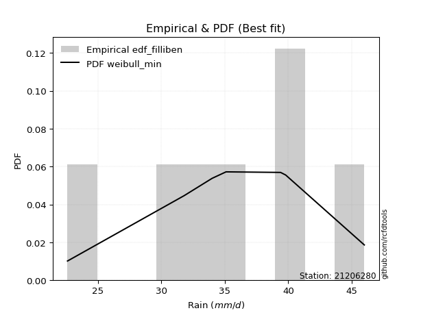</img>

</div>


### 10. Empirical - EDF Jenkinson (1977)

The Jenkinson formula in hydrology is an empirical plotting position formula used to estimate the non-exceedance probability _(P)_ or return period _(T)_ of a given ordered observation within a sample. It is a widely used method in the frequency analysis of extreme events such as floods and rainfall, as it provides a distribution-free way to plot data. _a≈0.31_ and _b≈0.38_ are constants derived to approximate the median of the probability distribution for the given rank.

<div align="center">


$P=(m-a)/(n+b)$


</div>


**10.1. Empirical values**

<div align="center">

|                | 0                   | 1                   | 2                   | 3             | 4                  | 5                  | 6                  |
|:---------------|:--------------------|:--------------------|:--------------------|:--------------|:-------------------|:-------------------|:-------------------|
| date           | 2024                | 2019                | 2023                | 2025          | 2020               | 2022               | 2021               |
| x              | 22.6                | 31.8                | 34.0                | 35.1          | 39.4               | 39.8               | 46.0               |
| m              | 1                   | 2                   | 3                   | 4             | 5                  | 6                  | 7                  |
| empirical_dist | edf_jenkinson       | edf_jenkinson       | edf_jenkinson       | edf_jenkinson | edf_jenkinson      | edf_jenkinson      | edf_jenkinson      |
| empirical      | 0.09349593495934959 | 0.22899728997289973 | 0.36449864498644985 | 0.5           | 0.6355013550135502 | 0.7710027100271003 | 0.9065040650406505 |
| empirical_tr   | 1.1031390134529149  | 1.29701230228471    | 1.5735607675906182  | 2.0           | 2.743494423791822  | 4.366863905325444  | 10.695652173913055 |

</div>


**10.2. Kolmogorov-Smirnov fit test (sorted by Δ)**


<div align="center">

|                | 0                    | 1                    | 2                   | 3                   | 4                   | 5                   | 6                   | 7                   | 8                   | 9                   | 10                  | 11                  | 12                  | 13                  | 14                  | 15                  | 16                  | 17                  | 18                  | 19                  | 20                  | 21                  | 22                  | 23                  | 24                  | 25                  | 26                  | 27                  | 28                  | 29                  | 30                  | 31                  | 32                  | 33                  | 34                  | 35                  | 36                  | 37                  | 38                  | 39                  | 40                  | 41                  | 42                  | 43                  | 44                  | 45                  | 46                  | 47                  | 48                  | 49                  | 50                  | 51                  | 52                  | 53                  | 54                  | 55                  | 56                  | 57                    | 58                  | 59                  | 60                  | 61                  | 62                  | 63                  | 64                  | 65                  | 66                  | 67                  | 68                  | 69                  | 70                  | 71                  | 72                  | 73                  | 74                  | 75                  | 76                  | 77                  | 78                  | 79                  | 80                  | 81                  | 82                  | 83                  | 84                  | 85                  | 86                  | 87                  | 88                  | 89                  |
|:---------------|:---------------------|:---------------------|:--------------------|:--------------------|:--------------------|:--------------------|:--------------------|:--------------------|:--------------------|:--------------------|:--------------------|:--------------------|:--------------------|:--------------------|:--------------------|:--------------------|:--------------------|:--------------------|:--------------------|:--------------------|:--------------------|:--------------------|:--------------------|:--------------------|:--------------------|:--------------------|:--------------------|:--------------------|:--------------------|:--------------------|:--------------------|:--------------------|:--------------------|:--------------------|:--------------------|:--------------------|:--------------------|:--------------------|:--------------------|:--------------------|:--------------------|:--------------------|:--------------------|:--------------------|:--------------------|:--------------------|:--------------------|:--------------------|:--------------------|:--------------------|:--------------------|:--------------------|:--------------------|:--------------------|:--------------------|:--------------------|:--------------------|:----------------------|:--------------------|:--------------------|:--------------------|:--------------------|:--------------------|:--------------------|:--------------------|:--------------------|:--------------------|:--------------------|:--------------------|:--------------------|:--------------------|:--------------------|:--------------------|:--------------------|:--------------------|:--------------------|:--------------------|:--------------------|:--------------------|:--------------------|:--------------------|:--------------------|:--------------------|:--------------------|:--------------------|:--------------------|:--------------------|:--------------------|:--------------------|:--------------------|
| station        | 21206280             | 21206280             | 21206280            | 21206280            | 21206280            | 21206280            | 21206280            | 21206280            | 21206280            | 21206280            | 21206280            | 21206280            | 21206280            | 21206280            | 21206280            | 21206280            | 21206280            | 21206280            | 21206280            | 21206280            | 21206280            | 21206280            | 21206280            | 21206280            | 21206280            | 21206280            | 21206280            | 21206280            | 21206280            | 21206280            | 21206280            | 21206280            | 21206280            | 21206280            | 21206280            | 21206280            | 21206280            | 21206280            | 21206280            | 21206280            | 21206280            | 21206280            | 21206280            | 21206280            | 21206280            | 21206280            | 21206280            | 21206280            | 21206280            | 21206280            | 21206280            | 21206280            | 21206280            | 21206280            | 21206280            | 21206280            | 21206280            | 21206280              | 21206280            | 21206280            | 21206280            | 21206280            | 21206280            | 21206280            | 21206280            | 21206280            | 21206280            | 21206280            | 21206280            | 21206280            | 21206280            | 21206280            | 21206280            | 21206280            | 21206280            | 21206280            | 21206280            | 21206280            | 21206280            | 21206280            | 21206280            | 21206280            | 21206280            | 21206280            | 21206280            | 21206280            | 21206280            | 21206280            | 21206280            | 21206280            |
| empirical_dist | edf_jenkinson        | edf_jenkinson        | edf_jenkinson       | edf_jenkinson       | edf_jenkinson       | edf_jenkinson       | edf_jenkinson       | edf_jenkinson       | edf_jenkinson       | edf_jenkinson       | edf_jenkinson       | edf_jenkinson       | edf_jenkinson       | edf_jenkinson       | edf_jenkinson       | edf_jenkinson       | edf_jenkinson       | edf_jenkinson       | edf_jenkinson       | edf_jenkinson       | edf_jenkinson       | edf_jenkinson       | edf_jenkinson       | edf_jenkinson       | edf_jenkinson       | edf_jenkinson       | edf_jenkinson       | edf_jenkinson       | edf_jenkinson       | edf_jenkinson       | edf_jenkinson       | edf_jenkinson       | edf_jenkinson       | edf_jenkinson       | edf_jenkinson       | edf_jenkinson       | edf_jenkinson       | edf_jenkinson       | edf_jenkinson       | edf_jenkinson       | edf_jenkinson       | edf_jenkinson       | edf_jenkinson       | edf_jenkinson       | edf_jenkinson       | edf_jenkinson       | edf_jenkinson       | edf_jenkinson       | edf_jenkinson       | edf_jenkinson       | edf_jenkinson       | edf_jenkinson       | edf_jenkinson       | edf_jenkinson       | edf_jenkinson       | edf_jenkinson       | edf_jenkinson       | edf_jenkinson         | edf_jenkinson       | edf_jenkinson       | edf_jenkinson       | edf_jenkinson       | edf_jenkinson       | edf_jenkinson       | edf_jenkinson       | edf_jenkinson       | edf_jenkinson       | edf_jenkinson       | edf_jenkinson       | edf_jenkinson       | edf_jenkinson       | edf_jenkinson       | edf_jenkinson       | edf_jenkinson       | edf_jenkinson       | edf_jenkinson       | edf_jenkinson       | edf_jenkinson       | edf_jenkinson       | edf_jenkinson       | edf_jenkinson       | edf_jenkinson       | edf_jenkinson       | edf_jenkinson       | edf_jenkinson       | edf_jenkinson       | edf_jenkinson       | edf_jenkinson       | edf_jenkinson       | edf_jenkinson       |
| p_dist         | weibull_min          | logweibull_min       | logpearson3         | pearson3            | loggumbel_l         | johnsonsu           | logjohnsonsu        | logloggamma         | logmielke           | loggenlogistic      | mielke              | logt                | logfisk             | genlogistic         | fisk                | f                   | norm                | crystalball         | exponnorm           | t                   | nct                 | erlang              | rice                | gamma               | invgamma            | chi2                | loggompertz         | alpha               | ncf                 | invgauss            | maxwell             | gumbel_l            | logbetaprime        | logistic            | rayleigh            | logf                | logcrystalball      | logexponnorm        | lognorm             | lognorm             | betaprime           | logfatiguelife      | loglogistic         | loggamma            | loggamma            | logrice             | hypsecant           | logerlang           | logalpha            | lognct              | loginvgamma         | loghypsecant        | gumbel_r            | laplace_asymmetric  | invweibull          | halfnorm            | logmaxwell          | loglaplace_asymmetric | laplace             | moyal               | loginvgauss         | halflogistic        | lograyleigh         | loglaplace          | loggumbel_r         | kstwobign           | loginvweibull       | loghalfnorm         | logmoyal            | loghalflogistic     | wald                | logkstwobign        | gibrat              | loggenexpon         | logncf              | logtruncnorm        | truncnorm           | logwald             | loggibrat           | genexpon            | expon               | logexpon            | logchi2             | lognakagami         | nakagami            | loglognorm          | pareto              | logpareto           | fatiguelife         | gompertz            |
| delta          | 0.060855275179223955 | 0.061857976564803296 | 0.06231630261118712 | 0.06314312616565276 | 0.0635751779337066  | 0.06384968918497325 | 0.0649419736693787  | 0.06511713967842164 | 0.0681308111867206  | 0.06986650230184865 | 0.06992528094283557 | 0.070600583864774   | 0.07509076028506119 | 0.07636958541798644 | 0.0787473035276317  | 0.07897470174869947 | 0.0791087476982244  | 0.07910876163007097 | 0.0791122823692918  | 0.07911379382424455 | 0.07928426437174618 | 0.07991779740001381 | 0.0811638824757589  | 0.08223868782063481 | 0.085018682795022   | 0.08589090822193302 | 0.08671380072876976 | 0.0881976830378568  | 0.08915936980545777 | 0.09309712546114887 | 0.09322682033445417 | 0.09568744964796061 | 0.10020909132498165 | 0.1010749473889393  | 0.10139781518502614 | 0.10355073280875174 | 0.10403120865746238 | 0.10403431907093932 | 0.10403461420426793 | 0.10403461420426793 | 0.10518890828406938 | 0.10651927366166888 | 0.11008458120920561 | 0.11147703106473791 | 0.11147703106473791 | 0.1123451364912034  | 0.11654390582642526 | 0.11743109947507299 | 0.11949542931372811 | 0.1214855862946462  | 0.12194402563687631 | 0.12550666790644938 | 0.12683829772587008 | 0.12764062165395718 | 0.12883527482187437 | 0.13176135010796194 | 0.13482352443683823 | 0.13902611924545694   | 0.1402208183026804  | 0.14222682053929825 | 0.14322273332115712 | 0.1451430990854255  | 0.14662835066415106 | 0.14828383272181123 | 0.15857818409554353 | 0.16197096670653469 | 0.17394131783058683 | 0.18022863697458827 | 0.1840772185847463  | 0.19200301741311726 | 0.1970171178131928  | 0.21224857389612026 | 0.21893971384966138 | 0.2201060731416817  | 0.22251033796749775 | 0.22899583526539485 | 0.22899728995836735 | 0.2549971219892225  | 0.2691726637781588  | 0.28009053373626147 | 0.28014559908128966 | 0.31757193125782346 | 0.3305880169712434  | 0.3565808411864249  | 0.3889963637871167  | 0.4184774517951443  | 0.43536280781692593 | 0.4402485902486054  | 0.5991702066111793  | 0.6136484081354224  |
| deltao         | 0.48442053926100004  | 0.48442053926100004  | 0.48442053926100004 | 0.48442053926100004 | 0.48442053926100004 | 0.48442053926100004 | 0.48442053926100004 | 0.48442053926100004 | 0.48442053926100004 | 0.48442053926100004 | 0.48442053926100004 | 0.48442053926100004 | 0.48442053926100004 | 0.48442053926100004 | 0.48442053926100004 | 0.48442053926100004 | 0.48442053926100004 | 0.48442053926100004 | 0.48442053926100004 | 0.48442053926100004 | 0.48442053926100004 | 0.48442053926100004 | 0.48442053926100004 | 0.48442053926100004 | 0.48442053926100004 | 0.48442053926100004 | 0.48442053926100004 | 0.48442053926100004 | 0.48442053926100004 | 0.48442053926100004 | 0.48442053926100004 | 0.48442053926100004 | 0.48442053926100004 | 0.48442053926100004 | 0.48442053926100004 | 0.48442053926100004 | 0.48442053926100004 | 0.48442053926100004 | 0.48442053926100004 | 0.48442053926100004 | 0.48442053926100004 | 0.48442053926100004 | 0.48442053926100004 | 0.48442053926100004 | 0.48442053926100004 | 0.48442053926100004 | 0.48442053926100004 | 0.48442053926100004 | 0.48442053926100004 | 0.48442053926100004 | 0.48442053926100004 | 0.48442053926100004 | 0.48442053926100004 | 0.48442053926100004 | 0.48442053926100004 | 0.48442053926100004 | 0.48442053926100004 | 0.48442053926100004   | 0.48442053926100004 | 0.48442053926100004 | 0.48442053926100004 | 0.48442053926100004 | 0.48442053926100004 | 0.48442053926100004 | 0.48442053926100004 | 0.48442053926100004 | 0.48442053926100004 | 0.48442053926100004 | 0.48442053926100004 | 0.48442053926100004 | 0.48442053926100004 | 0.48442053926100004 | 0.48442053926100004 | 0.48442053926100004 | 0.48442053926100004 | 0.48442053926100004 | 0.48442053926100004 | 0.48442053926100004 | 0.48442053926100004 | 0.48442053926100004 | 0.48442053926100004 | 0.48442053926100004 | 0.48442053926100004 | 0.48442053926100004 | 0.48442053926100004 | 0.48442053926100004 | 0.48442053926100004 | 0.48442053926100004 | 0.48442053926100004 | 0.48442053926100004 |
| eval           | Δo > Δ               | Δo > Δ               | Δo > Δ              | Δo > Δ              | Δo > Δ              | Δo > Δ              | Δo > Δ              | Δo > Δ              | Δo > Δ              | Δo > Δ              | Δo > Δ              | Δo > Δ              | Δo > Δ              | Δo > Δ              | Δo > Δ              | Δo > Δ              | Δo > Δ              | Δo > Δ              | Δo > Δ              | Δo > Δ              | Δo > Δ              | Δo > Δ              | Δo > Δ              | Δo > Δ              | Δo > Δ              | Δo > Δ              | Δo > Δ              | Δo > Δ              | Δo > Δ              | Δo > Δ              | Δo > Δ              | Δo > Δ              | Δo > Δ              | Δo > Δ              | Δo > Δ              | Δo > Δ              | Δo > Δ              | Δo > Δ              | Δo > Δ              | Δo > Δ              | Δo > Δ              | Δo > Δ              | Δo > Δ              | Δo > Δ              | Δo > Δ              | Δo > Δ              | Δo > Δ              | Δo > Δ              | Δo > Δ              | Δo > Δ              | Δo > Δ              | Δo > Δ              | Δo > Δ              | Δo > Δ              | Δo > Δ              | Δo > Δ              | Δo > Δ              | Δo > Δ                | Δo > Δ              | Δo > Δ              | Δo > Δ              | Δo > Δ              | Δo > Δ              | Δo > Δ              | Δo > Δ              | Δo > Δ              | Δo > Δ              | Δo > Δ              | Δo > Δ              | Δo > Δ              | Δo > Δ              | Δo > Δ              | Δo > Δ              | Δo > Δ              | Δo > Δ              | Δo > Δ              | Δo > Δ              | Δo > Δ              | Δo > Δ              | Δo > Δ              | Δo > Δ              | Δo > Δ              | Δo > Δ              | Δo > Δ              | Δo > Δ              | Δo > Δ              | Δo > Δ              | Δo > Δ              | Δo <= Δ             | Δo <= Δ             |
| fit            | 1                    | 1                    | 1                   | 1                   | 1                   | 1                   | 1                   | 1                   | 1                   | 1                   | 1                   | 1                   | 1                   | 1                   | 1                   | 1                   | 1                   | 1                   | 1                   | 1                   | 1                   | 1                   | 1                   | 1                   | 1                   | 1                   | 1                   | 1                   | 1                   | 1                   | 1                   | 1                   | 1                   | 1                   | 1                   | 1                   | 1                   | 1                   | 1                   | 1                   | 1                   | 1                   | 1                   | 1                   | 1                   | 1                   | 1                   | 1                   | 1                   | 1                   | 1                   | 1                   | 1                   | 1                   | 1                   | 1                   | 1                   | 1                     | 1                   | 1                   | 1                   | 1                   | 1                   | 1                   | 1                   | 1                   | 1                   | 1                   | 1                   | 1                   | 1                   | 1                   | 1                   | 1                   | 1                   | 1                   | 1                   | 1                   | 1                   | 1                   | 1                   | 1                   | 1                   | 1                   | 1                   | 1                   | 1                   | 1                   | 0                   | 0                   |
| n              | 7                    | 7                    | 7                   | 7                   | 7                   | 7                   | 7                   | 7                   | 7                   | 7                   | 7                   | 7                   | 7                   | 7                   | 7                   | 7                   | 7                   | 7                   | 7                   | 7                   | 7                   | 7                   | 7                   | 7                   | 7                   | 7                   | 7                   | 7                   | 7                   | 7                   | 7                   | 7                   | 7                   | 7                   | 7                   | 7                   | 7                   | 7                   | 7                   | 7                   | 7                   | 7                   | 7                   | 7                   | 7                   | 7                   | 7                   | 7                   | 7                   | 7                   | 7                   | 7                   | 7                   | 7                   | 7                   | 7                   | 7                   | 7                     | 7                   | 7                   | 7                   | 7                   | 7                   | 7                   | 7                   | 7                   | 7                   | 7                   | 7                   | 7                   | 7                   | 7                   | 7                   | 7                   | 7                   | 7                   | 7                   | 7                   | 7                   | 7                   | 7                   | 7                   | 7                   | 7                   | 7                   | 7                   | 7                   | 7                   | 7                   | 7                   |
| best_fit       | 1                    | 0                    | 0                   | 0                   | 0                   | 0                   | 0                   | 0                   | 0                   | 0                   | 0                   | 0                   | 0                   | 0                   | 0                   | 0                   | 0                   | 0                   | 0                   | 0                   | 0                   | 0                   | 0                   | 0                   | 0                   | 0                   | 0                   | 0                   | 0                   | 0                   | 0                   | 0                   | 0                   | 0                   | 0                   | 0                   | 0                   | 0                   | 0                   | 0                   | 0                   | 0                   | 0                   | 0                   | 0                   | 0                   | 0                   | 0                   | 0                   | 0                   | 0                   | 0                   | 0                   | 0                   | 0                   | 0                   | 0                   | 0                     | 0                   | 0                   | 0                   | 0                   | 0                   | 0                   | 0                   | 0                   | 0                   | 0                   | 0                   | 0                   | 0                   | 0                   | 0                   | 0                   | 0                   | 0                   | 0                   | 0                   | 0                   | 0                   | 0                   | 0                   | 0                   | 0                   | 0                   | 0                   | 0                   | 0                   | 0                   | 0                   |
| best_fit_sort  | 1                    | 2                    | 3                   | 4                   | 5                   | 6                   | 7                   | 8                   | 9                   | 10                  | 11                  | 12                  | 13                  | 14                  | 15                  | 16                  | 17                  | 18                  | 19                  | 20                  | 21                  | 22                  | 23                  | 24                  | 25                  | 26                  | 27                  | 28                  | 29                  | 30                  | 31                  | 32                  | 33                  | 34                  | 35                  | 36                  | 37                  | 38                  | 39                  | 40                  | 41                  | 42                  | 43                  | 44                  | 45                  | 46                  | 47                  | 48                  | 49                  | 50                  | 51                  | 52                  | 53                  | 54                  | 55                  | 56                  | 57                  | 58                    | 59                  | 60                  | 61                  | 62                  | 63                  | 64                  | 65                  | 66                  | 67                  | 68                  | 69                  | 70                  | 71                  | 72                  | 73                  | 74                  | 75                  | 76                  | 77                  | 78                  | 79                  | 80                  | 81                  | 82                  | 83                  | 84                  | 85                  | 86                  | 87                  | 88                  | 89                  | 90                  |

</div>


<div align="center">

</img>

</div>


**10.3. Best fit**

<div align="center">

|   id |   station | empirical_dist   | p_dist      |     delta |   deltao | eval   |   fit |   n |   best_fit |   best_fit_sort |
|-----:|----------:|:-----------------|:------------|----------:|---------:|:-------|------:|----:|-----------:|----------------:|
|    0 |  21206280 | edf_jenkinson    | weibull_min | 0.0608553 | 0.484421 | Δo > Δ |     1 |   7 |          1 |               1 |

</div>


<div align="center">

</img>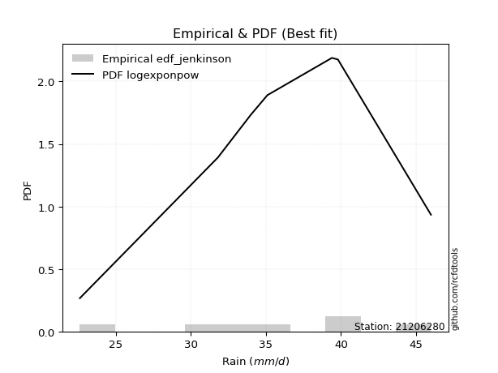</img>

</div>


### 11. Empirical - EDF Cunnane (1978)

Cunnane´s work in statistical hydrology has focused on the performance and evaluation of different probability distributions (such as GEV, Gumbel, Lognormal) for flood frequency estimation. _b_ is a constant, typically set to 0.4.

<div align="center">


$P=(m-b)/(n+1-2b)$


</div>


**11.1. Empirical values**

<div align="center">

|                | 0                   | 1                   | 2                  | 3           | 4                  | 5                  | 6                  |
|:---------------|:--------------------|:--------------------|:-------------------|:------------|:-------------------|:-------------------|:-------------------|
| date           | 2024                | 2019                | 2023               | 2025        | 2020               | 2022               | 2021               |
| x              | 22.6                | 31.8                | 34.0               | 35.1        | 39.4               | 39.8               | 46.0               |
| m              | 1                   | 2                   | 3                  | 4           | 5                  | 6                  | 7                  |
| empirical_dist | edf_cunnane         | edf_cunnane         | edf_cunnane        | edf_cunnane | edf_cunnane        | edf_cunnane        | edf_cunnane        |
| empirical      | 0.08333333333333333 | 0.22222222222222224 | 0.3611111111111111 | 0.5         | 0.6388888888888888 | 0.7777777777777777 | 0.9166666666666666 |
| empirical_tr   | 1.090909090909091   | 1.2857142857142856  | 1.565217391304348  | 2.0         | 2.7692307692307687 | 4.499999999999998  | 11.999999999999995 |

</div>


**11.2. Kolmogorov-Smirnov fit test (sorted by Δ)**


<div align="center">

|                | 0                   | 1                    | 2                   | 3                   | 4                   | 5                   | 6                   | 7                   | 8                   | 9                   | 10                  | 11                  | 12                  | 13                  | 14                  | 15                  | 16                  | 17                  | 18                  | 19                  | 20                  | 21                  | 22                  | 23                  | 24                  | 25                  | 26                  | 27                  | 28                  | 29                  | 30                  | 31                  | 32                  | 33                  | 34                  | 35                  | 36                  | 37                  | 38                  | 39                  | 40                  | 41                  | 42                  | 43                  | 44                  | 45                  | 46                  | 47                  | 48                  | 49                  | 50                  | 51                  | 52                  | 53                  | 54                  | 55                    | 56                  | 57                  | 58                  | 59                  | 60                  | 61                  | 62                  | 63                  | 64                  | 65                  | 66                  | 67                  | 68                  | 69                  | 70                  | 71                  | 72                  | 73                  | 74                  | 75                  | 76                  | 77                  | 78                  | 79                  | 80                  | 81                  | 82                  | 83                  | 84                  | 85                  | 86                  | 87                  | 88                  | 89                  |
|:---------------|:--------------------|:---------------------|:--------------------|:--------------------|:--------------------|:--------------------|:--------------------|:--------------------|:--------------------|:--------------------|:--------------------|:--------------------|:--------------------|:--------------------|:--------------------|:--------------------|:--------------------|:--------------------|:--------------------|:--------------------|:--------------------|:--------------------|:--------------------|:--------------------|:--------------------|:--------------------|:--------------------|:--------------------|:--------------------|:--------------------|:--------------------|:--------------------|:--------------------|:--------------------|:--------------------|:--------------------|:--------------------|:--------------------|:--------------------|:--------------------|:--------------------|:--------------------|:--------------------|:--------------------|:--------------------|:--------------------|:--------------------|:--------------------|:--------------------|:--------------------|:--------------------|:--------------------|:--------------------|:--------------------|:--------------------|:----------------------|:--------------------|:--------------------|:--------------------|:--------------------|:--------------------|:--------------------|:--------------------|:--------------------|:--------------------|:--------------------|:--------------------|:--------------------|:--------------------|:--------------------|:--------------------|:--------------------|:--------------------|:--------------------|:--------------------|:--------------------|:--------------------|:--------------------|:--------------------|:--------------------|:--------------------|:--------------------|:--------------------|:--------------------|:--------------------|:--------------------|:--------------------|:--------------------|:--------------------|:--------------------|
| station        | 21206280            | 21206280             | 21206280            | 21206280            | 21206280            | 21206280            | 21206280            | 21206280            | 21206280            | 21206280            | 21206280            | 21206280            | 21206280            | 21206280            | 21206280            | 21206280            | 21206280            | 21206280            | 21206280            | 21206280            | 21206280            | 21206280            | 21206280            | 21206280            | 21206280            | 21206280            | 21206280            | 21206280            | 21206280            | 21206280            | 21206280            | 21206280            | 21206280            | 21206280            | 21206280            | 21206280            | 21206280            | 21206280            | 21206280            | 21206280            | 21206280            | 21206280            | 21206280            | 21206280            | 21206280            | 21206280            | 21206280            | 21206280            | 21206280            | 21206280            | 21206280            | 21206280            | 21206280            | 21206280            | 21206280            | 21206280              | 21206280            | 21206280            | 21206280            | 21206280            | 21206280            | 21206280            | 21206280            | 21206280            | 21206280            | 21206280            | 21206280            | 21206280            | 21206280            | 21206280            | 21206280            | 21206280            | 21206280            | 21206280            | 21206280            | 21206280            | 21206280            | 21206280            | 21206280            | 21206280            | 21206280            | 21206280            | 21206280            | 21206280            | 21206280            | 21206280            | 21206280            | 21206280            | 21206280            | 21206280            |
| empirical_dist | edf_cunnane         | edf_cunnane          | edf_cunnane         | edf_cunnane         | edf_cunnane         | edf_cunnane         | edf_cunnane         | edf_cunnane         | edf_cunnane         | edf_cunnane         | edf_cunnane         | edf_cunnane         | edf_cunnane         | edf_cunnane         | edf_cunnane         | edf_cunnane         | edf_cunnane         | edf_cunnane         | edf_cunnane         | edf_cunnane         | edf_cunnane         | edf_cunnane         | edf_cunnane         | edf_cunnane         | edf_cunnane         | edf_cunnane         | edf_cunnane         | edf_cunnane         | edf_cunnane         | edf_cunnane         | edf_cunnane         | edf_cunnane         | edf_cunnane         | edf_cunnane         | edf_cunnane         | edf_cunnane         | edf_cunnane         | edf_cunnane         | edf_cunnane         | edf_cunnane         | edf_cunnane         | edf_cunnane         | edf_cunnane         | edf_cunnane         | edf_cunnane         | edf_cunnane         | edf_cunnane         | edf_cunnane         | edf_cunnane         | edf_cunnane         | edf_cunnane         | edf_cunnane         | edf_cunnane         | edf_cunnane         | edf_cunnane         | edf_cunnane           | edf_cunnane         | edf_cunnane         | edf_cunnane         | edf_cunnane         | edf_cunnane         | edf_cunnane         | edf_cunnane         | edf_cunnane         | edf_cunnane         | edf_cunnane         | edf_cunnane         | edf_cunnane         | edf_cunnane         | edf_cunnane         | edf_cunnane         | edf_cunnane         | edf_cunnane         | edf_cunnane         | edf_cunnane         | edf_cunnane         | edf_cunnane         | edf_cunnane         | edf_cunnane         | edf_cunnane         | edf_cunnane         | edf_cunnane         | edf_cunnane         | edf_cunnane         | edf_cunnane         | edf_cunnane         | edf_cunnane         | edf_cunnane         | edf_cunnane         | edf_cunnane         |
| p_dist         | logweibull_min      | weibull_min          | pearson3            | loggumbel_l         | johnsonsu           | logt                | logmielke           | logloggamma         | loggenlogistic      | mielke              | logpearson3         | logfisk             | logjohnsonsu        | genlogistic         | fisk                | f                   | norm                | crystalball         | exponnorm           | t                   | nct                 | loggompertz         | erlang              | gamma               | rice                | chi2                | alpha               | invgamma            | gumbel_l            | ncf                 | maxwell             | logistic            | invgauss            | loglogistic         | logbetaprime        | rayleigh            | logf                | logcrystalball      | logexponnorm        | lognorm             | lognorm             | betaprime           | hypsecant           | logfatiguelife      | loggamma            | loggamma            | logrice             | loghypsecant        | gumbel_r            | logerlang           | laplace_asymmetric  | logalpha            | lognct              | loginvgamma         | invweibull          | loglaplace_asymmetric | laplace             | halfnorm            | moyal               | logmaxwell          | loglaplace          | halflogistic        | loginvgauss         | lograyleigh         | loggumbel_r         | kstwobign           | loginvweibull       | loghalfnorm         | logmoyal            | loghalflogistic     | wald                | gibrat              | logkstwobign        | logtruncnorm        | truncnorm           | loggenexpon         | logncf              | logwald             | loggibrat           | genexpon            | expon               | logexpon            | logchi2             | lognakagami         | nakagami            | loglognorm          | pareto              | logpareto           | fatiguelife         | gompertz            |
| delta          | 0.05847044268946466 | 0.058919121439706235 | 0.05975559229031413 | 0.06018764405836796 | 0.06384968918497325 | 0.06547439339552796 | 0.06601816013735634 | 0.066419155217469   | 0.06795178790256773 | 0.06795249277754484 | 0.0690913703618646  | 0.06984404448295256 | 0.07020474281318223 | 0.07298205154264781 | 0.07535976965229307 | 0.07558716787336084 | 0.07572121382288577 | 0.07572122775473233 | 0.07572474849395316 | 0.07572625994890592 | 0.07589673049640755 | 0.0765511991027535  | 0.07687640669563015 | 0.08101205519634794 | 0.08159102008683397 | 0.0873431212991054  | 0.08920321267866385 | 0.09117421866872236 | 0.09568744964796061 | 0.09593443755613526 | 0.09739508204646355 | 0.09768741351360066 | 0.09987219321182636 | 0.10669704733386698 | 0.10698415907565914 | 0.10817288293570362 | 0.11032580055942923 | 0.11080627640813986 | 0.11080938682161681 | 0.11080968195494542 | 0.11080968195494542 | 0.11196397603474686 | 0.11315637195108663 | 0.11329434141234637 | 0.1182520988154154  | 0.1182520988154154  | 0.11912020424188088 | 0.12211913403111074 | 0.12345076385053144 | 0.12420616722575048 | 0.12425308777861854 | 0.1262704970644056  | 0.1282606540453237  | 0.1287190933875538  | 0.13561034257255186 | 0.1356385853701183    | 0.13683328442734177 | 0.13853641785863943 | 0.13883928666395962 | 0.14159859218751572 | 0.1448962988464726  | 0.14853063296076424 | 0.1499978010718346  | 0.15340341841482855 | 0.16196571797088227 | 0.16874603445721217 | 0.18071638558126432 | 0.18700370472526576 | 0.18746475246008504 | 0.195390551288456   | 0.20040465168853155 | 0.21555217997432274 | 0.21902364164679775 | 0.22222076751471737 | 0.22222222220768986 | 0.2268811408923592  | 0.23267293959351387 | 0.2583846558645612  | 0.27256019765349754 | 0.28686560148693896 | 0.28692066683196715 | 0.32434699900850095 | 0.3407506185972595  | 0.35996837506176366 | 0.39238389766245546 | 0.42525251954582177 | 0.4421378755676034  | 0.4470236579992829  | 0.6059452743618567  | 0.6204234758860998  |
| deltao         | 0.48442053926100004 | 0.48442053926100004  | 0.48442053926100004 | 0.48442053926100004 | 0.48442053926100004 | 0.48442053926100004 | 0.48442053926100004 | 0.48442053926100004 | 0.48442053926100004 | 0.48442053926100004 | 0.48442053926100004 | 0.48442053926100004 | 0.48442053926100004 | 0.48442053926100004 | 0.48442053926100004 | 0.48442053926100004 | 0.48442053926100004 | 0.48442053926100004 | 0.48442053926100004 | 0.48442053926100004 | 0.48442053926100004 | 0.48442053926100004 | 0.48442053926100004 | 0.48442053926100004 | 0.48442053926100004 | 0.48442053926100004 | 0.48442053926100004 | 0.48442053926100004 | 0.48442053926100004 | 0.48442053926100004 | 0.48442053926100004 | 0.48442053926100004 | 0.48442053926100004 | 0.48442053926100004 | 0.48442053926100004 | 0.48442053926100004 | 0.48442053926100004 | 0.48442053926100004 | 0.48442053926100004 | 0.48442053926100004 | 0.48442053926100004 | 0.48442053926100004 | 0.48442053926100004 | 0.48442053926100004 | 0.48442053926100004 | 0.48442053926100004 | 0.48442053926100004 | 0.48442053926100004 | 0.48442053926100004 | 0.48442053926100004 | 0.48442053926100004 | 0.48442053926100004 | 0.48442053926100004 | 0.48442053926100004 | 0.48442053926100004 | 0.48442053926100004   | 0.48442053926100004 | 0.48442053926100004 | 0.48442053926100004 | 0.48442053926100004 | 0.48442053926100004 | 0.48442053926100004 | 0.48442053926100004 | 0.48442053926100004 | 0.48442053926100004 | 0.48442053926100004 | 0.48442053926100004 | 0.48442053926100004 | 0.48442053926100004 | 0.48442053926100004 | 0.48442053926100004 | 0.48442053926100004 | 0.48442053926100004 | 0.48442053926100004 | 0.48442053926100004 | 0.48442053926100004 | 0.48442053926100004 | 0.48442053926100004 | 0.48442053926100004 | 0.48442053926100004 | 0.48442053926100004 | 0.48442053926100004 | 0.48442053926100004 | 0.48442053926100004 | 0.48442053926100004 | 0.48442053926100004 | 0.48442053926100004 | 0.48442053926100004 | 0.48442053926100004 | 0.48442053926100004 |
| eval           | Δo > Δ              | Δo > Δ               | Δo > Δ              | Δo > Δ              | Δo > Δ              | Δo > Δ              | Δo > Δ              | Δo > Δ              | Δo > Δ              | Δo > Δ              | Δo > Δ              | Δo > Δ              | Δo > Δ              | Δo > Δ              | Δo > Δ              | Δo > Δ              | Δo > Δ              | Δo > Δ              | Δo > Δ              | Δo > Δ              | Δo > Δ              | Δo > Δ              | Δo > Δ              | Δo > Δ              | Δo > Δ              | Δo > Δ              | Δo > Δ              | Δo > Δ              | Δo > Δ              | Δo > Δ              | Δo > Δ              | Δo > Δ              | Δo > Δ              | Δo > Δ              | Δo > Δ              | Δo > Δ              | Δo > Δ              | Δo > Δ              | Δo > Δ              | Δo > Δ              | Δo > Δ              | Δo > Δ              | Δo > Δ              | Δo > Δ              | Δo > Δ              | Δo > Δ              | Δo > Δ              | Δo > Δ              | Δo > Δ              | Δo > Δ              | Δo > Δ              | Δo > Δ              | Δo > Δ              | Δo > Δ              | Δo > Δ              | Δo > Δ                | Δo > Δ              | Δo > Δ              | Δo > Δ              | Δo > Δ              | Δo > Δ              | Δo > Δ              | Δo > Δ              | Δo > Δ              | Δo > Δ              | Δo > Δ              | Δo > Δ              | Δo > Δ              | Δo > Δ              | Δo > Δ              | Δo > Δ              | Δo > Δ              | Δo > Δ              | Δo > Δ              | Δo > Δ              | Δo > Δ              | Δo > Δ              | Δo > Δ              | Δo > Δ              | Δo > Δ              | Δo > Δ              | Δo > Δ              | Δo > Δ              | Δo > Δ              | Δo > Δ              | Δo > Δ              | Δo > Δ              | Δo > Δ              | Δo <= Δ             | Δo <= Δ             |
| fit            | 1                   | 1                    | 1                   | 1                   | 1                   | 1                   | 1                   | 1                   | 1                   | 1                   | 1                   | 1                   | 1                   | 1                   | 1                   | 1                   | 1                   | 1                   | 1                   | 1                   | 1                   | 1                   | 1                   | 1                   | 1                   | 1                   | 1                   | 1                   | 1                   | 1                   | 1                   | 1                   | 1                   | 1                   | 1                   | 1                   | 1                   | 1                   | 1                   | 1                   | 1                   | 1                   | 1                   | 1                   | 1                   | 1                   | 1                   | 1                   | 1                   | 1                   | 1                   | 1                   | 1                   | 1                   | 1                   | 1                     | 1                   | 1                   | 1                   | 1                   | 1                   | 1                   | 1                   | 1                   | 1                   | 1                   | 1                   | 1                   | 1                   | 1                   | 1                   | 1                   | 1                   | 1                   | 1                   | 1                   | 1                   | 1                   | 1                   | 1                   | 1                   | 1                   | 1                   | 1                   | 1                   | 1                   | 1                   | 1                   | 0                   | 0                   |
| n              | 7                   | 7                    | 7                   | 7                   | 7                   | 7                   | 7                   | 7                   | 7                   | 7                   | 7                   | 7                   | 7                   | 7                   | 7                   | 7                   | 7                   | 7                   | 7                   | 7                   | 7                   | 7                   | 7                   | 7                   | 7                   | 7                   | 7                   | 7                   | 7                   | 7                   | 7                   | 7                   | 7                   | 7                   | 7                   | 7                   | 7                   | 7                   | 7                   | 7                   | 7                   | 7                   | 7                   | 7                   | 7                   | 7                   | 7                   | 7                   | 7                   | 7                   | 7                   | 7                   | 7                   | 7                   | 7                   | 7                     | 7                   | 7                   | 7                   | 7                   | 7                   | 7                   | 7                   | 7                   | 7                   | 7                   | 7                   | 7                   | 7                   | 7                   | 7                   | 7                   | 7                   | 7                   | 7                   | 7                   | 7                   | 7                   | 7                   | 7                   | 7                   | 7                   | 7                   | 7                   | 7                   | 7                   | 7                   | 7                   | 7                   | 7                   |
| best_fit       | 1                   | 0                    | 0                   | 0                   | 0                   | 0                   | 0                   | 0                   | 0                   | 0                   | 0                   | 0                   | 0                   | 0                   | 0                   | 0                   | 0                   | 0                   | 0                   | 0                   | 0                   | 0                   | 0                   | 0                   | 0                   | 0                   | 0                   | 0                   | 0                   | 0                   | 0                   | 0                   | 0                   | 0                   | 0                   | 0                   | 0                   | 0                   | 0                   | 0                   | 0                   | 0                   | 0                   | 0                   | 0                   | 0                   | 0                   | 0                   | 0                   | 0                   | 0                   | 0                   | 0                   | 0                   | 0                   | 0                     | 0                   | 0                   | 0                   | 0                   | 0                   | 0                   | 0                   | 0                   | 0                   | 0                   | 0                   | 0                   | 0                   | 0                   | 0                   | 0                   | 0                   | 0                   | 0                   | 0                   | 0                   | 0                   | 0                   | 0                   | 0                   | 0                   | 0                   | 0                   | 0                   | 0                   | 0                   | 0                   | 0                   | 0                   |
| best_fit_sort  | 1                   | 2                    | 3                   | 4                   | 5                   | 6                   | 7                   | 8                   | 9                   | 10                  | 11                  | 12                  | 13                  | 14                  | 15                  | 16                  | 17                  | 18                  | 19                  | 20                  | 21                  | 22                  | 23                  | 24                  | 25                  | 26                  | 27                  | 28                  | 29                  | 30                  | 31                  | 32                  | 33                  | 34                  | 35                  | 36                  | 37                  | 38                  | 39                  | 40                  | 41                  | 42                  | 43                  | 44                  | 45                  | 46                  | 47                  | 48                  | 49                  | 50                  | 51                  | 52                  | 53                  | 54                  | 55                  | 56                    | 57                  | 58                  | 59                  | 60                  | 61                  | 62                  | 63                  | 64                  | 65                  | 66                  | 67                  | 68                  | 69                  | 70                  | 71                  | 72                  | 73                  | 74                  | 75                  | 76                  | 77                  | 78                  | 79                  | 80                  | 81                  | 82                  | 83                  | 84                  | 85                  | 86                  | 87                  | 88                  | 89                  | 90                  |

</div>


<div align="center">

</img>

</div>


**11.3. Best fit**

<div align="center">

|   id |   station | empirical_dist   | p_dist         |     delta |   deltao | eval   |   fit |   n |   best_fit |   best_fit_sort |
|-----:|----------:|:-----------------|:---------------|----------:|---------:|:-------|------:|----:|-----------:|----------------:|
|    0 |  21206280 | edf_cunnane      | logweibull_min | 0.0584704 | 0.484421 | Δo > Δ |     1 |   7 |          1 |               1 |

</div>


<div align="center">

</img>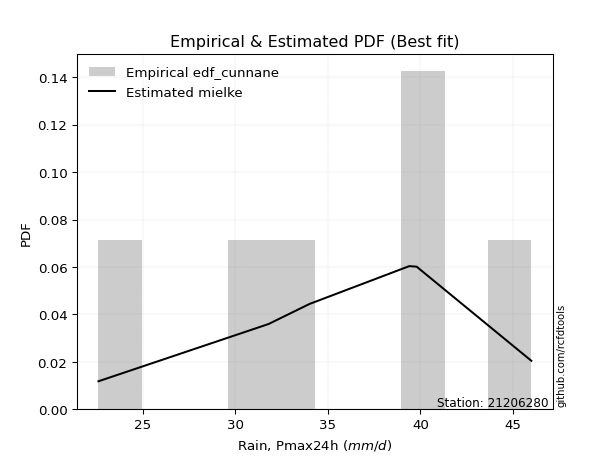</img>

</div>


### 12. Empirical - EDF Adamowski (1981)

The Adamowski formula in hydrology refers to a specific plotting position formula used for estimating the non-parametric empirical distribution of hydrological events (like flood peaks) to calculate their return periods. This formula provides an alternative to traditional parametric methods (like the Gumbel or Log Pearson Type III distributions). 

<div align="center">


$P=(m-0.25)/(n+0.5)$


</div>


**12.1. Empirical values**

<div align="center">

|                | 0                  | 1                   | 2                   | 3             | 4                  | 5                  | 6                  |
|:---------------|:-------------------|:--------------------|:--------------------|:--------------|:-------------------|:-------------------|:-------------------|
| date           | 2024               | 2019                | 2023                | 2025          | 2020               | 2022               | 2021               |
| x              | 22.6               | 31.8                | 34.0                | 35.1          | 39.4               | 39.8               | 46.0               |
| m              | 1                  | 2                   | 3                   | 4             | 5                  | 6                  | 7                  |
| empirical_dist | edf_adamowski      | edf_adamowski       | edf_adamowski       | edf_adamowski | edf_adamowski      | edf_adamowski      | edf_adamowski      |
| empirical      | 0.1                | 0.23333333333333334 | 0.36666666666666664 | 0.5           | 0.6333333333333333 | 0.7666666666666667 | 0.9                |
| empirical_tr   | 1.1111111111111112 | 1.3043478260869565  | 1.5789473684210527  | 2.0           | 2.727272727272727  | 4.2857142857142865 | 10.000000000000002 |

</div>


**12.2. Kolmogorov-Smirnov fit test (sorted by Δ)**


<div align="center">

|                | 0                   | 1                   | 2                   | 3                   | 4                   | 5                   | 6                   | 7                   | 8                   | 9                   | 10                  | 11                  | 12                  | 13                  | 14                  | 15                  | 16                  | 17                  | 18                  | 19                  | 20                  | 21                  | 22                  | 23                  | 24                  | 25                  | 26                  | 27                  | 28                  | 29                  | 30                  | 31                  | 32                  | 33                  | 34                  | 35                  | 36                  | 37                  | 38                  | 39                  | 40                  | 41                  | 42                  | 43                  | 44                  | 45                  | 46                  | 47                  | 48                  | 49                  | 50                  | 51                  | 52                  | 53                  | 54                  | 55                  | 56                  | 57                  | 58                    | 59                  | 60                  | 61                  | 62                  | 63                  | 64                  | 65                  | 66                  | 67                  | 68                  | 69                  | 70                  | 71                  | 72                  | 73                  | 74                  | 75                  | 76                  | 77                  | 78                  | 79                  | 80                  | 81                  | 82                  | 83                  | 84                  | 85                  | 86                  | 87                  | 88                  | 89                  |
|:---------------|:--------------------|:--------------------|:--------------------|:--------------------|:--------------------|:--------------------|:--------------------|:--------------------|:--------------------|:--------------------|:--------------------|:--------------------|:--------------------|:--------------------|:--------------------|:--------------------|:--------------------|:--------------------|:--------------------|:--------------------|:--------------------|:--------------------|:--------------------|:--------------------|:--------------------|:--------------------|:--------------------|:--------------------|:--------------------|:--------------------|:--------------------|:--------------------|:--------------------|:--------------------|:--------------------|:--------------------|:--------------------|:--------------------|:--------------------|:--------------------|:--------------------|:--------------------|:--------------------|:--------------------|:--------------------|:--------------------|:--------------------|:--------------------|:--------------------|:--------------------|:--------------------|:--------------------|:--------------------|:--------------------|:--------------------|:--------------------|:--------------------|:--------------------|:----------------------|:--------------------|:--------------------|:--------------------|:--------------------|:--------------------|:--------------------|:--------------------|:--------------------|:--------------------|:--------------------|:--------------------|:--------------------|:--------------------|:--------------------|:--------------------|:--------------------|:--------------------|:--------------------|:--------------------|:--------------------|:--------------------|:--------------------|:--------------------|:--------------------|:--------------------|:--------------------|:--------------------|:--------------------|:--------------------|:--------------------|:--------------------|
| station        | 21206280            | 21206280            | 21206280            | 21206280            | 21206280            | 21206280            | 21206280            | 21206280            | 21206280            | 21206280            | 21206280            | 21206280            | 21206280            | 21206280            | 21206280            | 21206280            | 21206280            | 21206280            | 21206280            | 21206280            | 21206280            | 21206280            | 21206280            | 21206280            | 21206280            | 21206280            | 21206280            | 21206280            | 21206280            | 21206280            | 21206280            | 21206280            | 21206280            | 21206280            | 21206280            | 21206280            | 21206280            | 21206280            | 21206280            | 21206280            | 21206280            | 21206280            | 21206280            | 21206280            | 21206280            | 21206280            | 21206280            | 21206280            | 21206280            | 21206280            | 21206280            | 21206280            | 21206280            | 21206280            | 21206280            | 21206280            | 21206280            | 21206280            | 21206280              | 21206280            | 21206280            | 21206280            | 21206280            | 21206280            | 21206280            | 21206280            | 21206280            | 21206280            | 21206280            | 21206280            | 21206280            | 21206280            | 21206280            | 21206280            | 21206280            | 21206280            | 21206280            | 21206280            | 21206280            | 21206280            | 21206280            | 21206280            | 21206280            | 21206280            | 21206280            | 21206280            | 21206280            | 21206280            | 21206280            | 21206280            |
| empirical_dist | edf_adamowski       | edf_adamowski       | edf_adamowski       | edf_adamowski       | edf_adamowski       | edf_adamowski       | edf_adamowski       | edf_adamowski       | edf_adamowski       | edf_adamowski       | edf_adamowski       | edf_adamowski       | edf_adamowski       | edf_adamowski       | edf_adamowski       | edf_adamowski       | edf_adamowski       | edf_adamowski       | edf_adamowski       | edf_adamowski       | edf_adamowski       | edf_adamowski       | edf_adamowski       | edf_adamowski       | edf_adamowski       | edf_adamowski       | edf_adamowski       | edf_adamowski       | edf_adamowski       | edf_adamowski       | edf_adamowski       | edf_adamowski       | edf_adamowski       | edf_adamowski       | edf_adamowski       | edf_adamowski       | edf_adamowski       | edf_adamowski       | edf_adamowski       | edf_adamowski       | edf_adamowski       | edf_adamowski       | edf_adamowski       | edf_adamowski       | edf_adamowski       | edf_adamowski       | edf_adamowski       | edf_adamowski       | edf_adamowski       | edf_adamowski       | edf_adamowski       | edf_adamowski       | edf_adamowski       | edf_adamowski       | edf_adamowski       | edf_adamowski       | edf_adamowski       | edf_adamowski       | edf_adamowski         | edf_adamowski       | edf_adamowski       | edf_adamowski       | edf_adamowski       | edf_adamowski       | edf_adamowski       | edf_adamowski       | edf_adamowski       | edf_adamowski       | edf_adamowski       | edf_adamowski       | edf_adamowski       | edf_adamowski       | edf_adamowski       | edf_adamowski       | edf_adamowski       | edf_adamowski       | edf_adamowski       | edf_adamowski       | edf_adamowski       | edf_adamowski       | edf_adamowski       | edf_adamowski       | edf_adamowski       | edf_adamowski       | edf_adamowski       | edf_adamowski       | edf_adamowski       | edf_adamowski       | edf_adamowski       | edf_adamowski       |
| p_dist         | weibull_min         | logpearson3         | johnsonsu           | logweibull_min      | logjohnsonsu        | logloggamma         | pearson3            | loggumbel_l         | logmielke           | loggenlogistic      | mielke              | logt                | genlogistic         | fisk                | f                   | norm                | crystalball         | exponnorm           | t                   | nct                 | logfisk             | erlang              | rice                | gamma               | ncf                 | invgamma            | chi2                | invgauss            | alpha               | loggompertz         | maxwell             | gumbel_l            | logbetaprime        | logf                | logcrystalball      | logexponnorm        | lognorm             | lognorm             | rayleigh            | betaprime           | logfatiguelife      | logistic            | loggamma            | loggamma            | logrice             | loglogistic         | logerlang           | logalpha            | lognct              | loginvgamma         | hypsecant           | invweibull          | halfnorm            | loghypsecant        | gumbel_r            | laplace_asymmetric  | logmaxwell          | loginvgauss         | loglaplace_asymmetric | lograyleigh         | laplace             | halflogistic        | moyal               | loglaplace          | loggumbel_r         | kstwobign           | loginvweibull       | loghalfnorm         | logmoyal            | loghalflogistic     | wald                | logkstwobign        | loggenexpon         | logncf              | gibrat              | logtruncnorm        | truncnorm           | logwald             | loggibrat           | genexpon            | expon               | logexpon            | logchi2             | lognakagami         | nakagami            | loglognorm          | pareto              | logpareto           | fatiguelife         | gompertz            |
| delta          | 0.06302329685944086 | 0.06303598355966096 | 0.06384968918497325 | 0.0640259982450202  | 0.0649419736693787  | 0.06511713967842164 | 0.06531114784586967 | 0.0657431996139235  | 0.0702988328669375  | 0.07203452398206556 | 0.07209330262305247 | 0.0771046489054244  | 0.07853760709820334 | 0.08091532520784861 | 0.08114272342891637 | 0.0812767693784413  | 0.08127678331028787 | 0.0812803040495087  | 0.08128181550446145 | 0.08145228605196309 | 0.0815948253257116  | 0.08208581908023072 | 0.0833319041559758  | 0.08440670950085172 | 0.08627005751859029 | 0.08718670447523891 | 0.08805892990214992 | 0.08876108210071526 | 0.0903657047180737  | 0.09321786576942018 | 0.09539484201467108 | 0.09568744964796061 | 0.09587304796454804 | 0.09921468944831813 | 0.09969516529702876 | 0.09969827571050571 | 0.09969857084383432 | 0.09969857084383432 | 0.09991507213399672 | 0.10085286492363577 | 0.10218323030123527 | 0.1032429690691562  | 0.1071409877043043  | 0.1071409877043043  | 0.10800909313076978 | 0.11225260288942251 | 0.11309505611463938 | 0.1151593859532945  | 0.11714954293421259 | 0.1176079822764427  | 0.11871192750664217 | 0.12449923146144076 | 0.12742530674752833 | 0.12767468958666628 | 0.12900631940608698 | 0.12980864333417408 | 0.13048748107640462 | 0.1388866899607235  | 0.14119414092567384   | 0.14229230730371745 | 0.1423888399828973  | 0.1429750774052087  | 0.14439484221951515 | 0.15045185440202813 | 0.15641016241532674 | 0.15763492334610107 | 0.16960527447015322 | 0.17589259361415466 | 0.1819091969045295  | 0.18983499573290047 | 0.19484909613297602 | 0.20791253053568665 | 0.2157700297812481  | 0.21600627292684726 | 0.22110773552987828 | 0.23333187862582846 | 0.23333333331880096 | 0.2528291003090057  | 0.267004642097942   | 0.27575449037582783 | 0.275809555720856   | 0.3132358878973898  | 0.3240839519305929  | 0.3544128195062081  | 0.3868283421068999  | 0.41414140843471065 | 0.4310267644564923  | 0.43591254688817177 | 0.5948341632507457  | 0.6093123647749888  |
| deltao         | 0.48442053926100004 | 0.48442053926100004 | 0.48442053926100004 | 0.48442053926100004 | 0.48442053926100004 | 0.48442053926100004 | 0.48442053926100004 | 0.48442053926100004 | 0.48442053926100004 | 0.48442053926100004 | 0.48442053926100004 | 0.48442053926100004 | 0.48442053926100004 | 0.48442053926100004 | 0.48442053926100004 | 0.48442053926100004 | 0.48442053926100004 | 0.48442053926100004 | 0.48442053926100004 | 0.48442053926100004 | 0.48442053926100004 | 0.48442053926100004 | 0.48442053926100004 | 0.48442053926100004 | 0.48442053926100004 | 0.48442053926100004 | 0.48442053926100004 | 0.48442053926100004 | 0.48442053926100004 | 0.48442053926100004 | 0.48442053926100004 | 0.48442053926100004 | 0.48442053926100004 | 0.48442053926100004 | 0.48442053926100004 | 0.48442053926100004 | 0.48442053926100004 | 0.48442053926100004 | 0.48442053926100004 | 0.48442053926100004 | 0.48442053926100004 | 0.48442053926100004 | 0.48442053926100004 | 0.48442053926100004 | 0.48442053926100004 | 0.48442053926100004 | 0.48442053926100004 | 0.48442053926100004 | 0.48442053926100004 | 0.48442053926100004 | 0.48442053926100004 | 0.48442053926100004 | 0.48442053926100004 | 0.48442053926100004 | 0.48442053926100004 | 0.48442053926100004 | 0.48442053926100004 | 0.48442053926100004 | 0.48442053926100004   | 0.48442053926100004 | 0.48442053926100004 | 0.48442053926100004 | 0.48442053926100004 | 0.48442053926100004 | 0.48442053926100004 | 0.48442053926100004 | 0.48442053926100004 | 0.48442053926100004 | 0.48442053926100004 | 0.48442053926100004 | 0.48442053926100004 | 0.48442053926100004 | 0.48442053926100004 | 0.48442053926100004 | 0.48442053926100004 | 0.48442053926100004 | 0.48442053926100004 | 0.48442053926100004 | 0.48442053926100004 | 0.48442053926100004 | 0.48442053926100004 | 0.48442053926100004 | 0.48442053926100004 | 0.48442053926100004 | 0.48442053926100004 | 0.48442053926100004 | 0.48442053926100004 | 0.48442053926100004 | 0.48442053926100004 | 0.48442053926100004 |
| eval           | Δo > Δ              | Δo > Δ              | Δo > Δ              | Δo > Δ              | Δo > Δ              | Δo > Δ              | Δo > Δ              | Δo > Δ              | Δo > Δ              | Δo > Δ              | Δo > Δ              | Δo > Δ              | Δo > Δ              | Δo > Δ              | Δo > Δ              | Δo > Δ              | Δo > Δ              | Δo > Δ              | Δo > Δ              | Δo > Δ              | Δo > Δ              | Δo > Δ              | Δo > Δ              | Δo > Δ              | Δo > Δ              | Δo > Δ              | Δo > Δ              | Δo > Δ              | Δo > Δ              | Δo > Δ              | Δo > Δ              | Δo > Δ              | Δo > Δ              | Δo > Δ              | Δo > Δ              | Δo > Δ              | Δo > Δ              | Δo > Δ              | Δo > Δ              | Δo > Δ              | Δo > Δ              | Δo > Δ              | Δo > Δ              | Δo > Δ              | Δo > Δ              | Δo > Δ              | Δo > Δ              | Δo > Δ              | Δo > Δ              | Δo > Δ              | Δo > Δ              | Δo > Δ              | Δo > Δ              | Δo > Δ              | Δo > Δ              | Δo > Δ              | Δo > Δ              | Δo > Δ              | Δo > Δ                | Δo > Δ              | Δo > Δ              | Δo > Δ              | Δo > Δ              | Δo > Δ              | Δo > Δ              | Δo > Δ              | Δo > Δ              | Δo > Δ              | Δo > Δ              | Δo > Δ              | Δo > Δ              | Δo > Δ              | Δo > Δ              | Δo > Δ              | Δo > Δ              | Δo > Δ              | Δo > Δ              | Δo > Δ              | Δo > Δ              | Δo > Δ              | Δo > Δ              | Δo > Δ              | Δo > Δ              | Δo > Δ              | Δo > Δ              | Δo > Δ              | Δo > Δ              | Δo > Δ              | Δo <= Δ             | Δo <= Δ             |
| fit            | 1                   | 1                   | 1                   | 1                   | 1                   | 1                   | 1                   | 1                   | 1                   | 1                   | 1                   | 1                   | 1                   | 1                   | 1                   | 1                   | 1                   | 1                   | 1                   | 1                   | 1                   | 1                   | 1                   | 1                   | 1                   | 1                   | 1                   | 1                   | 1                   | 1                   | 1                   | 1                   | 1                   | 1                   | 1                   | 1                   | 1                   | 1                   | 1                   | 1                   | 1                   | 1                   | 1                   | 1                   | 1                   | 1                   | 1                   | 1                   | 1                   | 1                   | 1                   | 1                   | 1                   | 1                   | 1                   | 1                   | 1                   | 1                   | 1                     | 1                   | 1                   | 1                   | 1                   | 1                   | 1                   | 1                   | 1                   | 1                   | 1                   | 1                   | 1                   | 1                   | 1                   | 1                   | 1                   | 1                   | 1                   | 1                   | 1                   | 1                   | 1                   | 1                   | 1                   | 1                   | 1                   | 1                   | 1                   | 1                   | 0                   | 0                   |
| n              | 7                   | 7                   | 7                   | 7                   | 7                   | 7                   | 7                   | 7                   | 7                   | 7                   | 7                   | 7                   | 7                   | 7                   | 7                   | 7                   | 7                   | 7                   | 7                   | 7                   | 7                   | 7                   | 7                   | 7                   | 7                   | 7                   | 7                   | 7                   | 7                   | 7                   | 7                   | 7                   | 7                   | 7                   | 7                   | 7                   | 7                   | 7                   | 7                   | 7                   | 7                   | 7                   | 7                   | 7                   | 7                   | 7                   | 7                   | 7                   | 7                   | 7                   | 7                   | 7                   | 7                   | 7                   | 7                   | 7                   | 7                   | 7                   | 7                     | 7                   | 7                   | 7                   | 7                   | 7                   | 7                   | 7                   | 7                   | 7                   | 7                   | 7                   | 7                   | 7                   | 7                   | 7                   | 7                   | 7                   | 7                   | 7                   | 7                   | 7                   | 7                   | 7                   | 7                   | 7                   | 7                   | 7                   | 7                   | 7                   | 7                   | 7                   |
| best_fit       | 1                   | 0                   | 0                   | 0                   | 0                   | 0                   | 0                   | 0                   | 0                   | 0                   | 0                   | 0                   | 0                   | 0                   | 0                   | 0                   | 0                   | 0                   | 0                   | 0                   | 0                   | 0                   | 0                   | 0                   | 0                   | 0                   | 0                   | 0                   | 0                   | 0                   | 0                   | 0                   | 0                   | 0                   | 0                   | 0                   | 0                   | 0                   | 0                   | 0                   | 0                   | 0                   | 0                   | 0                   | 0                   | 0                   | 0                   | 0                   | 0                   | 0                   | 0                   | 0                   | 0                   | 0                   | 0                   | 0                   | 0                   | 0                   | 0                     | 0                   | 0                   | 0                   | 0                   | 0                   | 0                   | 0                   | 0                   | 0                   | 0                   | 0                   | 0                   | 0                   | 0                   | 0                   | 0                   | 0                   | 0                   | 0                   | 0                   | 0                   | 0                   | 0                   | 0                   | 0                   | 0                   | 0                   | 0                   | 0                   | 0                   | 0                   |
| best_fit_sort  | 1                   | 2                   | 3                   | 4                   | 5                   | 6                   | 7                   | 8                   | 9                   | 10                  | 11                  | 12                  | 13                  | 14                  | 15                  | 16                  | 17                  | 18                  | 19                  | 20                  | 21                  | 22                  | 23                  | 24                  | 25                  | 26                  | 27                  | 28                  | 29                  | 30                  | 31                  | 32                  | 33                  | 34                  | 35                  | 36                  | 37                  | 38                  | 39                  | 40                  | 41                  | 42                  | 43                  | 44                  | 45                  | 46                  | 47                  | 48                  | 49                  | 50                  | 51                  | 52                  | 53                  | 54                  | 55                  | 56                  | 57                  | 58                  | 59                    | 60                  | 61                  | 62                  | 63                  | 64                  | 65                  | 66                  | 67                  | 68                  | 69                  | 70                  | 71                  | 72                  | 73                  | 74                  | 75                  | 76                  | 77                  | 78                  | 79                  | 80                  | 81                  | 82                  | 83                  | 84                  | 85                  | 86                  | 87                  | 88                  | 89                  | 90                  |

</div>


<div align="center">

</img>

</div>


**12.3. Best fit**

<div align="center">

|   id |   station | empirical_dist   | p_dist      |     delta |   deltao | eval   |   fit |   n |   best_fit |   best_fit_sort |
|-----:|----------:|:-----------------|:------------|----------:|---------:|:-------|------:|----:|-----------:|----------------:|
|    0 |  21206280 | edf_adamowski    | weibull_min | 0.0630233 | 0.484421 | Δo > Δ |     1 |   7 |          1 |               1 |

</div>


<div align="center">

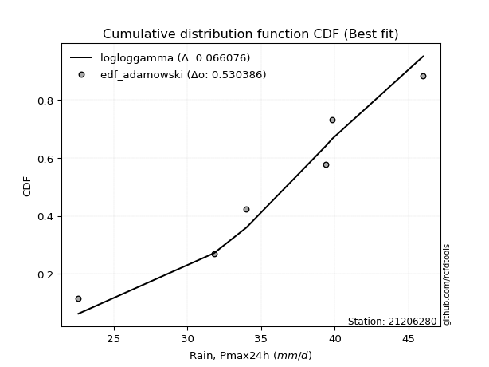</img>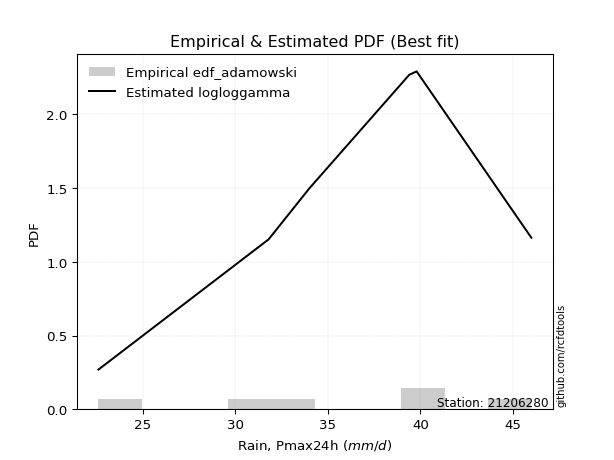</img>

</div>


## C. Best fit & Estimate extreme values for specific return periods - Tr


### 1. Best fit (ordered by delta Δ)

<div align="center">

|   id |   station | empirical_dist   | p_dist             |     delta |   deltao | eval   |   fit |   n |   best_fit |   best_fit_sort |
|-----:|----------:|:-----------------|:-------------------|----------:|---------:|:-------|------:|----:|-----------:|----------------:|
|    0 |  21206280 | edf_blom         | weibull_min        | 0.0584256 | 0.484421 | Δo > Δ |     1 |   7 |          1 |               1 |
|    1 |  21206280 | edf_cunnane      | logweibull_min     | 0.0584704 | 0.484421 | Δo > Δ |     1 |   7 |          1 |               2 |
|    2 |  21206280 | edf_gringorten   | loggumbel_l        | 0.0595997 | 0.484421 | Δo > Δ |     1 |   7 |          1 |               3 |
|    3 |  21206280 | edf_tukey        | weibull_min        | 0.059993  | 0.484421 | Δo > Δ |     1 |   7 |          1 |               4 |
|    4 |  21206280 | edf_filliben     | weibull_min        | 0.0605793 | 0.484421 | Δo > Δ |     1 |   7 |          1 |               5 |
|    5 |  21206280 | edf_jenkinson    | weibull_min        | 0.0608553 | 0.484421 | Δo > Δ |     1 |   7 |          1 |               6 |
|    6 |  21206280 | edf_beard        | weibull_min        | 0.0608553 | 0.484421 | Δo > Δ |     1 |   7 |          1 |               7 |
|    7 |  21206280 | edf_chegodayev   | weibull_min        | 0.0612215 | 0.484421 | Δo > Δ |     1 |   7 |          1 |               8 |
|    8 |  21206280 | edf_hazen        | logt               | 0.0625868 | 0.484421 | Δo > Δ |     1 |   7 |          1 |               9 |
|    9 |  21206280 | edf_adamowski    | weibull_min        | 0.0630233 | 0.484421 | Δo > Δ |     1 |   7 |          1 |              10 |
|   10 |  21206280 | edf_weibull      | mielke             | 0.0806795 | 0.484421 | Δo > Δ |     1 |   7 |          1 |              11 |
|   11 |  21206280 | edf_california   | laplace_asymmetric | 0.102819  | 0.484421 | Δo > Δ |     1 |   7 |          1 |              12 |

</div>

:file_folder:Tables: [bestfit_21206280.csv](table/bestfit_21206280.csv) | [extreme_21206280.csv](table/extreme_21206280.csv)


### 2. Extreme values

In hydrology, a return period (or recurrence interval $Tr$) is the statistical average time between extreme events like floods or droughts of a specific magnitude, indicating how rare an event is, with a 100-year flood, for example, having a 1% chance of occurring in any given year, not that it happens exactly every century. It is a key tool for infrastructure design (like bridges or dams) and risk assessment, calculated from historical data to determine the probability of future events, although it is important to remember it is statistical average, and events can cluster or be missed.

> risk_rate: assuming the return period as the project useful life.

|   id |      tr |   prob_l |     prob_g |   alpha |   betaprime |    chi2 |   crystalball |   erlang |    expon |   exponnorm |       f |   fatiguelife |    fisk |   gamma |   genexpon |   genlogistic |   gibrat |   gompertz |   gumbel_l |   gumbel_r |   halflogistic |   halfnorm |   hypsecant |   invgamma |   invgauss |   invweibull |   johnsonsu |   kstwobign |   laplace |   laplace_asymmetric |   loggamma |   logistic |   lognorm |   maxwell |   mielke |   moyal |   nakagami |     ncf |     nct |    norm |           pareto |   pearson3 |   rayleigh |    rice |       t |   truncnorm |    wald |   weibull_min |   logalpha |   logbetaprime |     logchi2 |   logcrystalball |   logerlang |   logexpon |   logexponnorm |    logf |   logfatiguelife |   logfisk |   loggenexpon |   loggenlogistic |   loggibrat |   loggompertz |   loggumbel_l |   loggumbel_r |   loghalflogistic |   loghalfnorm |   loghypsecant |   loginvgamma |   loginvgauss |   loginvweibull |   logjohnsonsu |   logkstwobign |   loglaplace |   loglaplace_asymmetric |   logloggamma |   loglogistic |    loglognorm |   logmaxwell |   logmielke |   logmoyal |   lognakagami |   logncf |   lognct |        logpareto |   logpearson3 |   lograyleigh |   logrice |     logt |   logtruncnorm |   logwald |   logweibull_min |   station |   n |   risk_rate |
|-----:|--------:|---------:|-----------:|--------:|------------:|--------:|--------------:|---------:|---------:|------------:|--------:|--------------:|--------:|--------:|-----------:|--------------:|---------:|-----------:|-----------:|-----------:|---------------:|-----------:|------------:|-----------:|-----------:|-------------:|------------:|------------:|----------:|---------------------:|-----------:|-----------:|----------:|----------:|---------:|--------:|-----------:|--------:|--------:|--------:|-----------------:|-----------:|-----------:|--------:|--------:|------------:|--------:|--------------:|-----------:|---------------:|------------:|-----------------:|------------:|-----------:|---------------:|--------:|-----------------:|----------:|--------------:|-----------------:|------------:|--------------:|--------------:|--------------:|------------------:|--------------:|---------------:|--------------:|--------------:|----------------:|---------------:|---------------:|-------------:|------------------------:|--------------:|--------------:|--------------:|-------------:|------------:|-----------:|--------------:|---------:|---------:|-----------------:|--------------:|--------------:|----------:|---------:|---------------:|----------:|-----------------:|----------:|----:|------------:|
|    0 |    2    | 0.5      | 0.5        | 35.1612 |     34.7501 | 35.2284 |       35.5286 |  35.4109 |  31.5614 |     35.5285 | 35.5075 |       22.6    | 35.8691 | 35.3431 |    31.5628 |       36.1669 |  33.4787 |    42.2721 |    36.6505 |    34.4067 |        33.8489 |    34.1307 |     35.5286 |    35.1591 |    35.0515 |      34.6019 |     36.1903 |     34.0059 |   35.5286 |              35.3186 |    34.6969 |    35.5286 |   34.8046 |   34.9445 |  36.2049 | 34.0445 |    31.9085 | 35.0863 | 35.5232 | 35.5286 |     23.4435      |    36.0033 |    34.7374 | 35.3564 | 35.5286 |     35.9087 | 33.3148 |       36.0947 |    34.5549 |        34.8955 |     37.9208 |          34.8047 |     34.6065 |    30.4855 |        34.8046 | 34.8139 |          34.7523 |   35.5944 |       32.8992 |          36.2053 |     32.6855 |       35.6349 |       36.0216 |       33.6287 |           33.0593 |       33.3457 |        34.8046 |       34.4859 |       34.1753 |         33.8824 |        36.2513 |        33.0897 |      34.8046 |                 34.9504 |       36.2375 |       34.8046 |  22.6786      |      34.1874 |     36.1932 |    33.2577 |       32.0492 |  34.6072 |  34.4997 |    23.2575       |       35.8538 |       33.9712 |   34.6852 |  36.0164 |        36.4457 |   32.5223 |          36.0709 |  21206280 |   7 |    0.75     |
|    1 |    2.33 | 0.570815 | 0.429185   | 36.4137 |     36.0553 | 36.4825 |       36.7472 |  36.6515 |  33.5359 |     36.7472 | 36.7326 |       22.9268 | 36.9683 | 36.589  |    33.5376 |       37.2214 |  34.096  |    42.6254 |    37.7107 |    35.5359 |        35.0099 |    35.4459 |     36.5039 |    36.4299 |    36.3647 |      36.1107 |     37.3618 |     35.5491 |   36.266  |              36.1529 |    36.0508 |    36.6023 |   36.1285 |   36.2106 |  37.3015 | 35.1134 |    32.0864 | 36.3777 | 36.7423 | 36.7472 |     24.7157      |    37.1965 |    36.0222 | 36.6091 | 36.7472 |     36.7503 | 34.1139 |       37.2765 |    35.9173 |        36.2408 |     45.337  |          36.1286 |     35.9705 |    32.5636 |        36.1285 | 36.1392 |          36.0738 |   36.773  |       34.5619 |          37.3022 |     33.3097 |       36.8727 |       37.2108 |       34.8124 |           34.2561 |       34.7166 |        35.8602 |       35.8384 |       35.5871 |         35.6063 |        37.4614 |        34.8165 |      35.5999 |                 35.7662 |       37.4283 |       35.9685 |  23.2932      |      35.5395 |     37.3086 |    34.3648 |       32.3435 |  38.4316 |  35.8632 |    24.2859       |       37.1319 |       35.3349 |   36.034  |  37.0842 |        37.3527 |   33.3284 |          37.2536 |  21206280 |   7 |    0.729209 |
|    2 |    5    | 0.8      | 0.2        | 41.2299 |     41.3367 | 41.2515 |       41.2761 |  41.3409 |  43.4077 |     41.276  | 41.2938 |       29.8672 | 41.2122 | 41.3031 |    43.411  |       41.0132 |  37.6501 |    43.7676 |    41.1359 |    40.4417 |        40.2633 |    41.0079 |     40.416  |    41.3409 |    41.5349 |      42.6656 |     41.3805 |     42.1044 |   39.9532 |              40.324  |    41.6595 |    40.7481 |   41.5053 |   41.1939 |  41.0921 | 40.0649 |    35.2334 | 41.4262 | 41.274  | 41.2761 |    223.999       |    41.3702 |    41.1659 | 41.3138 | 41.2759 |     40.6867 | 38.5872 |       41.3552 |    41.6095 |        41.7823 |    127.5    |          41.5053 |     41.6296 |    45.2818 |        41.5053 | 41.5212 |          41.4458 |   41.7018 |       42.1898 |          41.0929 |     37.1425 |       41.2802 |       41.3275 |       40.4579 |           40.2367 |       41.1652 |        40.426  |       41.5053 |       41.6414 |         44.1731 |        41.5245 |        43.2145 |      39.857  |                 40.1165 |       41.4478 |       40.8394 |   1.05292e+42 |      41.4009 |     41.1243 |    39.9936 |       36.0224 |  57.4712 |  41.6359 | 21384.3          |       41.6221 |       41.3652 |   41.5608 |  41.6684 |        41.0665 |   38.2238 |          41.3462 |  21206280 |   7 |    0.67232  |
|    3 |   10    | 0.9      | 0.1        | 44.573  |     45.2524 | 44.5105 |       44.2804 |  44.5213 |  52.3691 |     44.2803 | 44.3268 |       39.4503 | 44.3377 | 44.504  |    52.3738 |       43.6249 |  41.7014 |    44.404  |    43.0429 |    44.4375 |        44.626  |    45.1237 |     43.5399 |    44.7704 |    45.2279 |      48.0046 |     43.7791 |     47.0954 |   43.3004 |              44.1104 |    45.9477 |    43.8013 |   45.5066 |   44.7008 |  43.6213 | 44.3759 |    40.3952 | 44.9958 | 44.2816 | 44.2804 |  12544.3         |    43.918  |    44.8335 | 44.4653 | 44.2801 |     43.9406 | 43.3345 |       43.8095 |    46.0155 |        45.9872 |    366.123  |          45.5066 |     45.9651 |    61.0814 |        45.5066 | 45.5285 |          45.4483 |   45.7493 |       48.6935 |          43.6216 |     42.052  |       44.0114 |       43.8138 |       45.7261 |           45.9894 |       46.6964 |        44.4859 |       45.9086 |       46.4934 |         52.6525 |        43.8457 |        50.9424 |      44.1607 |                 44.5221 |       43.7985 |       44.8436 | inf           |      46.0965 |     43.6384 |    45.64   |       41.5247 |  75.9309 |  46.188  |     3.00955e+186 |       44.3113 |       46.2838 |   45.7143 |  45.8146 |        43.249  |   44.2077 |          43.8165 |  21206280 |   7 |    0.651322 |
|    4 |   15    | 0.933333 | 0.0666667  | 46.2881 |     47.3421 | 46.1655 |       45.7796 |  46.1292 |  57.6112 |     45.7795 | 45.8425 |       45.7177 | 46.0407 | 46.1233 |    57.6167 |       45.0139 |  44.4958 |    44.6922 |    43.9066 |    46.6918 |        47.0949 |    47.2655 |     45.3227 |    46.5356 |    47.1526 |      51.0167 |     44.9031 |     49.745  |   45.2583 |              46.3253 |    48.2798 |    45.4648 |   47.6454 |   46.5002 |  44.9704 | 46.8778 |    43.6613 | 46.844  | 45.7828 | 45.7796 | 140252           |    45.1252 |    46.7232 | 46.0445 | 45.7793 |     45.7305 | 46.3829 |       44.9669 |    48.4316 |        48.2632 |    698.972  |          47.6453 |     48.3258 |    72.7688 |        47.6454 | 47.6713 |          47.5894 |   48.1175 |       52.4388 |          44.9703 |     45.8116 |       45.3158 |       44.9884 |       48.9956 |           49.6022 |       49.8628 |        46.9831 |       48.3292 |       49.2129 |         58.136  |        44.8969 |        55.5918 |      46.8906 |                 47.3202 |       44.8898 |       47.1881 | inf           |      48.7089 |     44.9757 |    49.2756 |       45.1974 |  87.5677 |  48.7149 |   inf            |       45.551  |       49.0421 |   47.9461 |  48.5039 |        44.0906 |   48.5355 |          44.9833 |  21206280 |   7 |    0.644736 |
|    5 |   20    | 0.95     | 0.05       | 47.4286 |     48.7626 | 47.2597 |       46.7614 |  47.1897 |  61.3305 |     46.7613 | 46.8359 |       50.358  | 47.2177 | 47.1918 |    61.3366 |       45.9653 |  46.6878 |    44.8717 |    44.4441 |    48.2703 |        48.8247 |    48.6935 |     46.5804 |    47.7117 |    48.4433 |      53.1258 |     45.6143 |     51.5299 |   46.6475 |              47.8968 |    49.8819 |    46.6146 |   49.1002 |   47.6944 |  45.9032 | 48.6498 |    45.9541 | 48.0787 | 46.766  | 46.7614 | 778493           |    45.8931 |    47.9792 | 47.0806 | 46.7611 |     46.9564 | 48.6547 |       45.7022 |    50.0997 |        49.8227 |   1116.52   |          49.1001 |     49.9488 |    82.3936 |        49.1002 | 49.129  |          49.0465 |   49.8257 |       55.0899 |          45.9028 |     48.9945 |       46.1494 |       45.7355 |       51.423  |           52.3012 |       52.0923 |        48.8286 |       50.0027 |       51.1141 |         62.3119 |        45.5481 |        58.9607 |      48.9291 |                 49.4115 |       45.5777 |       48.8798 | inf           |      50.5238 |     45.9008 |    52.0243 |       47.9228 |  96.266  |  50.4721 |   inf            |       46.3236 |       50.9658 |   49.4684 |  50.5983 |        44.5375 |   52.0339 |          45.7252 |  21206280 |   7 |    0.641514 |
|    6 |   25    | 0.96     | 0.04       | 48.2772 |     49.8355 | 48.0704 |       47.4841 |  47.9743 |  64.2155 |     47.4841 | 47.5676 |       54.0449 | 48.1182 | 47.9824 |    64.222  |       46.6896 |  48.5151 |    44.9994 |    44.8267 |    49.4861 |        50.1574 |    49.7559 |     47.5537 |    48.5878 |    49.4089 |      54.7503 |     46.1256 |     52.8668 |   47.725  |              49.1157 |    51.1009 |    47.4942 |   50.1994 |   48.5809 |  46.62   | 50.0232 |    47.697  | 49      | 47.4899 | 47.4841 |      2.94204e+06 |    46.447  |    48.9124 | 47.8443 | 47.4838 |     47.8842 | 50.4742 |       46.2325 |    51.3735 |        51.007  |   1612.91   |          50.1994 |     51.1842 |    90.7276 |        50.1994 | 50.2307 |          50.1478 |   51.1732 |       57.1478 |          46.6194 |     51.8163 |       46.753  |       46.2746 |       53.3744 |           54.4804 |       53.8156 |        50.3065 |       51.2818 |       52.5787 |         65.7318 |        46.0093 |        61.6172 |      50.5712 |                 51.0971 |       46.0713 |       50.2148 | inf           |      51.9148 |     46.6125 |    54.2599 |       50.089  | 103.287  |  51.8207 |   inf            |       46.8718 |       52.4438 |   50.6208 |  52.3561 |        44.8148 |   55.017  |          46.2606 |  21206280 |   7 |    0.639603 |
|    7 |   50    | 0.98     | 0.02       | 50.7505 |     53.0415 | 50.4169 |       49.5538 |  50.2389 |  73.1769 |     49.5537 | 49.6646 |       65.8741 | 50.8692 | 50.2656 |    73.1848 |       48.8896 |  54.9566 |    45.346  |    45.8651 |    53.2314 |        54.2637 |    52.8442 |     50.5715 |    51.1459 |    52.248  |      59.7547 |     47.5348 |     56.7927 |   51.0722 |              52.9022 |    54.788  |    50.1815 |   53.4852 |   51.1521 |  48.8428 | 54.2868 |    52.8547 | 51.6971 | 49.5631 | 49.5538 |      1.82904e+08 |    47.9804 |    51.6214 | 50.0349 | 49.5533 |     50.6505 | 56.4152 |       47.7025 |    55.2503 |        54.5782 |   5160.62   |          53.4852 |     54.9243 |   122.384  |        53.4852 | 53.5245 |          53.4416 |   55.5203 |       63.5757 |          48.8417 |     63.1236 |       48.4352 |       47.7703 |       59.8636 |           61.7825 |       59.155  |        55.179  |       55.1813 |       57.1029 |         77.4922 |        47.2474 |        70.13   |      56.0319 |                 56.7086 |       47.4282 |       54.5238 | inf           |      56.1693 |     48.8267 |    61.8307 |       57.0456 | 126.764  |  55.9619 |   inf            |       48.3434 |       56.9815 |   54.0758 |  58.7874 |        45.3916 |   66      |          47.7458 |  21206280 |   7 |    0.63583  |
|    8 |   75    | 0.986667 | 0.0133333  | 52.1046 |     54.8471 | 51.6912 |       50.6643 |  51.465  |  78.419  |     50.6642 | 50.791  |       72.9982 | 52.4582 | 51.5023 |    78.4277 |       50.1545 |  59.3072 |    45.5214 |    46.3902 |    55.4084 |        56.6507 |    54.5252 |     52.3351 |    52.5494 |    53.8173 |      62.6634 |     48.2586 |     58.9527 |   53.0301 |              55.1171 |    56.8934 |    51.7337 |   55.3361 |   52.5501 |  50.1575 | 56.7801 |    55.683  | 53.1804 | 50.6758 | 50.6643 |      2.04832e+09 |    48.7715 |    53.0951 | 51.2125 | 50.6638 |     52.196  | 60.071  |       48.463  |    57.4802 |        56.6102 |  10308.4    |          55.336  |     57.062  |   145.801  |        55.3361 | 55.3804 |          55.2981 |   58.1973 |       67.3761 |          50.1562 |     72.1259 |       49.3107 |       48.545  |       63.992  |           66.4689 |       62.281  |        58.2421 |       57.4286 |       59.7498 |         85.2721 |        47.8633 |        75.3054 |      59.4955 |                 60.2727 |       48.1242 |       57.1789 | inf           |      58.627  |     50.1431 |    66.7384 |       61.2493 | 141.774  |  58.3684 |   inf            |       49.0722 |       59.6129 |   56.0284 |  63.4475 |        45.5907 |   73.8221 |          48.5149 |  21206280 |   7 |    0.634587 |
|    9 |  100    | 0.99     | 0.01       | 53.0315 |     56.1036 | 52.5591 |       51.4154 |  52.2987 |  82.1383 |     51.4153 | 51.5533 |       78.1243 | 53.58   | 52.3434 |    82.1477 |       51.046  |  62.6774 |    45.636  |    46.7337 |    56.9491 |        58.3402 |    55.6705 |     53.586  |    53.5112 |    54.8971 |      64.7221 |     48.7358 |     60.4327 |   54.4193 |              56.6886 |    58.3707 |    52.8295 |   56.6241 |   53.5022 |  51.1022 | 58.549  |    57.6087 | 54.198  | 51.4284 | 51.4154 |      1.1371e+10  |    49.2942 |    54.0992 | 52.0097 | 51.4149 |     53.2634 | 62.7364 |       48.9668 |    59.0518 |        58.0329 |  16912.9    |          56.624  |     58.5627 |   165.086  |        56.6241 | 56.6721 |          56.5906 |   60.1647 |       70.0964 |          51.1008 |     79.973  |       49.8926 |       49.0585 |       67.0849 |           69.9992 |       64.5046 |        60.5175 |       59.0142 |       61.6344 |         91.2459 |        48.2615 |        79.0702 |      62.0821 |                 62.9364 |       48.583  |       59.1311 | inf           |      60.3623 |     51.0927 |    70.4546 |       64.2859 | 153.045  |  60.0752 |   inf            |       49.5409 |       61.4749 |   57.3897 |  67.2855 |        45.6917 |   80.1035 |          49.0246 |  21206280 |   7 |    0.633968 |
|   10 |  200    | 0.995    | 0.005      | 55.1675 |     59.064  | 54.546  |       53.1191 |  54.2029 |  91.0997 |     53.119  | 53.2837 |       90.6719 | 56.2711 | 54.2653 |    91.1105 |       53.1813 |  71.8466 |    45.8853 |    47.4802 |    60.6533 |        62.4018 |    58.2897 |     56.5998 |    55.7309 |    57.4026 |      69.6714 |     49.7827 |     63.8414 |   57.7664 |              60.475  |    61.8893 |    55.4582 |   59.658  |   55.6807 |  53.4309 | 62.8108 |    61.9958 | 56.5498 | 53.1358 | 53.1191 |      7.06932e+11 |    50.4432 |    56.3965 | 53.82   | 53.1185 |     55.745  | 69.3757 |       50.0795 |    62.8187 |        61.4119 |  56428      |          59.6578 |     62.1399 |   222.687  |        59.6579 | 59.7154 |          59.6365 |   65.1596 |       76.7463 |          53.4293 |    105.918  |       51.1826 |       50.1934 |       75.146  |           79.2728 |       69.8932 |        66.3708 |       62.8204 |       66.2145 |        107.376  |        49.1125 |        88.4729 |      68.7857 |                 69.8481 |       49.5903 |       64.0898 | inf           |      64.528  |     53.4475 |    80.2806 |       71.78   | 182.493  |  64.2017 |   inf            |       50.5317 |       65.9571 |   60.6044 |  78.9705 |        45.8449 |   98.1727 |          50.1511 |  21206280 |   7 |    0.633042 |
|   11 |  250    | 0.996    | 0.004      | 55.8297 |     60.0003 | 55.1582 |       53.6398 |  54.7885 |  93.9846 |     53.6397 | 53.8129 |       94.7611 | 57.135  | 54.8564 |    93.9958 |       53.8661 |  75.1365 |    45.9587 |    47.6999 |    61.8441 |        63.7076 |    59.0955 |     57.5699 |    56.4201 |    58.1839 |      71.2625 |     50.0931 |     64.8963 |   58.844  |              61.6939 |    63.0131 |    56.3022 |   60.6172 |   56.3512 |  54.1986 | 64.1828 |    63.3385 | 57.2806 | 53.6577 | 53.6398 |      2.67166e+12 |    50.7843 |    57.1037 | 54.3738 | 53.6392 |     56.519  | 71.5722 |       50.4115 |    64.0287 |        62.4883 |  83424.7    |          60.617  |     63.2832 |   245.211  |        60.6171 | 60.6777 |          60.5999 |   66.8495 |       78.9191 |          54.197  |    117.153  |       51.5688 |       50.5323 |       77.938  |           82.5077 |       71.6399 |        68.3729 |       64.0448 |       67.7043 |        113.145  |        49.3585 |        91.6035 |      71.0942 |                 72.2309 |       49.8893 |       65.7684 | inf           |      65.8673 |     54.2284 |    83.7267 |       74.2454 | 192.709  |  65.5379 |   inf            |       50.8147 |       67.4016 |   61.623  |  83.6843 |        45.8758 |  105.006  |          50.4875 |  21206280 |   7 |    0.632858 |
|   12 |  500    | 0.998    | 0.002      | 57.8204 |     62.8677 | 56.9877 |       55.1838 |  56.535  | 102.946  |     55.1837 | 55.3833 |      107.589  | 59.8144 | 56.6203 |   102.959  |       55.9887 |  86.5063 |    46.1689 |    48.3296 |    65.5402 |        67.7605 |    61.498  |     60.5835 |    58.4938 |    60.5448 |      76.201  |     50.9882 |     68.0576 |   62.1911 |              65.4804 |    66.4868 |    58.9195 |   63.5532 |   58.3523 |  56.6461 | 68.4445 |    67.3189 | 59.4814 | 55.2054 | 55.1838 |      1.66096e+14 |    51.7688 |    59.2137 | 56.0173 | 55.1831 |     58.8533 | 78.5562 |       51.3753 |    67.7905 |        65.8074 | 283278      |          63.553  |     66.8196 |   330.769  |        63.5532 | 63.6241 |          63.5504 |   72.3743 |       85.7784 |          56.6447 |    165.984  |       52.6932 |       51.5165 |       87.2817 |           93.4133 |       77.1109 |        74.9855 |       67.8562 |       72.3919 |        133.1    |        50.0517 |       101.664  |      78.7709 |                 80.1633 |       50.7533 |       71.2588 | inf           |      70.0314 |     56.734  |    95.4033 |       82.0694 | 226.929  |  69.7243 |   inf            |       51.6    |       71.902  |   64.7472 | 102.611  |        45.9378 |  130.059  |          51.4642 |  21206280 |   7 |    0.632489 |
|   13 |  750    | 0.998667 | 0.00133333 | 58.9439 |     64.5214 | 58.013  |       56.0415 |  57.5118 | 108.188  |     56.0414 | 56.2564 |      115.169  | 61.3798 | 57.607  |   108.202  |       57.2283 |  94.0256 |    46.2813 |    48.6661 |    67.7009 |        70.1298 |    62.8402 |     62.3462 |    59.6657 |    61.8848 |      79.0881 |     51.4696 |     69.8335 |   64.149  |              67.6953 |    68.5118 |    60.4486 |   65.2452 |   59.4715 |  58.1248 | 70.9374 |    69.5266 | 60.7257 | 56.0653 | 56.0415 |      1.86009e+15 |    52.2984 |    60.3936 | 56.9311 | 56.0408 |     60.1736 | 82.7437 |       51.8977 |    69.9982 |        67.7367 | 581971      |          65.2451 |     68.8827 |   394.059  |        65.2452 | 65.3224 |          65.2517 |   75.811  |       89.8733 |          58.1238 |    208.996  |       53.3046 |       52.0504 |       93.2546 |          100.445  |       80.3473 |        79.1462 |       70.0964 |       75.182  |        146.359  |        50.4141 |       107.794  |      83.6402 |                 85.2014 |       51.2192 |       74.6763 | inf           |      72.4741 |     58.2597 |   102.975  |       86.7644 | 248.812  |  72.2039 |   inf            |       52.0021 |       74.5484 |   66.5518 | 117.849  |        45.9586 |  147.863  |          51.994  |  21206280 |   7 |    0.632366 |
|   14 | 1000    | 0.999    | 0.001      | 59.7249 |     65.6861 | 58.7227 |       56.632  |  58.1869 | 111.907  |     56.6319 | 56.8577 |      120.575  | 62.49   | 58.2892 |   111.921  |       58.1072 |  99.7798 |    46.3569 |    48.8926 |    69.2336 |        71.8104 |    63.7671 |     63.597  |    60.481  |    62.8195 |      81.136  |     51.7947 |     71.0639 |   65.5382 |              69.2668 |    69.9473 |    61.533  |   66.4363 |   60.245  |  59.1963 | 72.7062 |    71.0445 | 61.5916 | 56.6574 | 56.632  |      1.03261e+16 |    52.6559 |    61.209  | 57.5605 | 56.6313 |     61.0917 | 85.7558 |       52.2522 |    71.5699 |        69.102  | 971814      |          66.4361 |     70.3458 |   446.179  |        66.4363 | 66.5181 |          66.4497 |   78.3467 |       92.8178 |          59.1954 |    249.296  |       53.7203 |       52.4128 |       97.7376 |          105.751  |       82.6613 |        82.2375 |       71.6928 |       77.1854 |        156.556  |        50.6545 |       112.255  |      87.2765 |                 88.9669 |       51.5345 |       77.1987 | inf           |      74.212  |     59.371  |   108.708  |       90.1497 | 265.234  |  73.9793 |   inf            |       52.2651 |       76.4339 |   67.824  | 131.308  |        45.9689 |  162.157  |          52.3536 |  21206280 |   7 |    0.632305 |

<div align="center">

</img>

</div>


<div align="center">

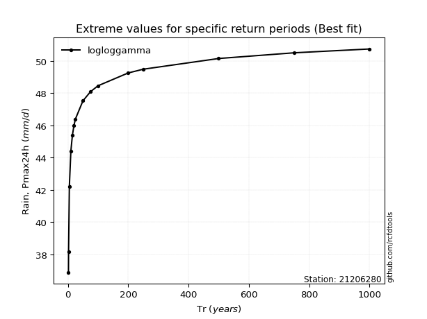</img>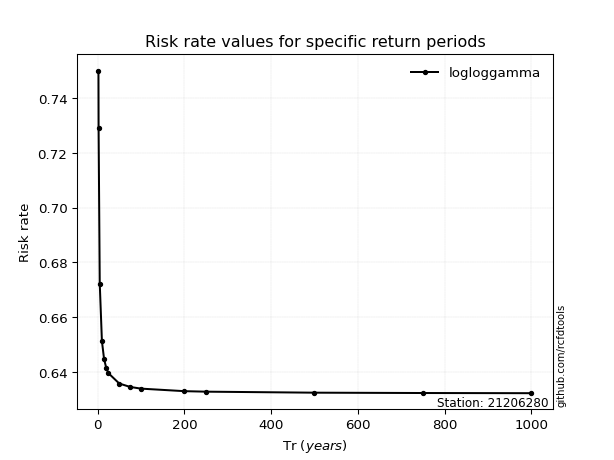</img>

</div>


<sub>**APP DISCLAIMER**: NO WARRANTY - This software is provided by [github.com/rcfdtools](https://github.com/rcfdtools) "as is", without any express or implied warranty, including warranties of merchantability, fitness for a particular purpose, or non-infringement. There is no guarantee that the software will be error-free or operate without interruption. LIMITATION OF LIABILITY - Neither the authors nor copyright holders will be liable for claims or damages arising from the software or its use. You are responsible for determining if the software is appropriate for your use and assume all associated risks, including errors, legal compliance, and data loss. NO PROFESSIONAL ADVICE - The software provides general information and does not offer professional advice. It should not replace consultation with professional advisors.</sub>