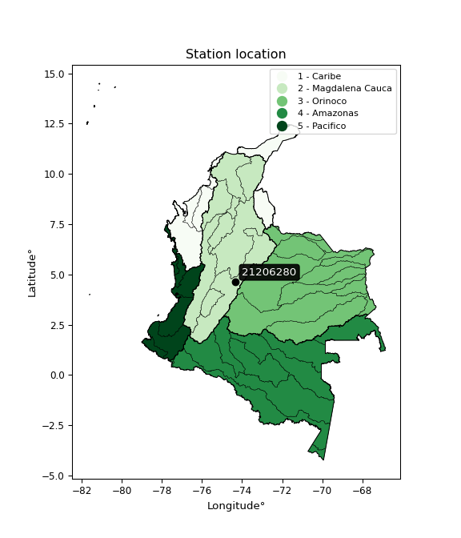

<div align="center">


</div>

# PMP Station (Rain, Pmax24h): 21206280

Probable Maximum Precipitation (PMP) is the greatest amount of rainfall for a specific duration that is meteorologically possible for a given location, acting as a "worst-case" scenario for extreme storms, crucial for designing safety-critical infrastructure like bridges, river deviations, dams, spillways, and nuclear plants to prevent catastrophic failure. PMP is calculated by hydrologists using meteorological data to determine the upper limit of extreme rainfall, often leading to the Probable Maximum Flood (PMF) for flood control design, and is increasingly being studied for climate change impacts. Probable Maximum Precipitation (PMP) is the theoretical upper limit of rainfall, a deterministic estimate for extreme events, while probability distributions (like GEV, Gumbel) describe the likelihood and frequency of various precipitation amounts, including rare ones, showing how often events occur, with PMP representing the extreme end of these distributions, used for critical infrastructure design to ensure safety against the worst conceivable weather, unlike standard statistical forecasts which cover typical probabilities.

The most common probability distributions in hydrology, used for analyzing floods, rainfall, and streamflow, include the Normal, Log-Normal, Gumbel, Gamma (including Log-Pearson Type III), and Generalized Extreme Value (GEV) distributions, often chosen based on the data´s skewness and whether modeling extremes or general conditions, with Gumbel and GEV popular for extreme events like floods, while the Normal distribution serves as a baseline, though often requiring transformations for skewed hydrological data. These distributions help in designing water infrastructure, managing water resources, and forecasting hydrologic events.

> Hydrological data often isn´t perfectly normal (it´s skewed), so different distributions are needed for different applications, such as: **Flood Frequency Analysis**: Using Gumbel, GEV, or Log-Pearson Type III for predicting extreme flood magnitudes and their return periods, **Rainfall Analysis**: Normal for annual totals, but Log-Normal, Weibull, or GEV for intensity or extreme daily rainfall, **Streamflow Modeling**: Gamma and Log-Normal for maximum flows, GEV for minimum flows, and Kappa for daily flows.

<div align="center">

</img>

</div>


## A. General information


### 1. General running parameters

• app_version: _v20260113_. • runtime: _2026-01-17 18:24:04.630693_. • Python version: _3.14.0_. • SciPy version: _1.16.3_. • Pandas version: _2.3.3_. • NumPy version: _2.3.5_. • Stations dataset (station_dataset_file): _dataset/pmax24h_in/automatic_colombia_2003_2025.csv_. • Stations catalog (station_catalog_file): _dataset/CNE.xls_. • Minimum year to eval til year_max (date_min): _1900_. • Maximum year to eval since year_min (date_max): _2025_. • Creates, save and include plots into reports (create_plot): _False_. • Plot only fit distributions with Δo > Δ (plot_only_fit): _True_. • Plot only simple graphs avoiding multiple CDFs and multiple Extreme values plots (plot_only_simple): _True_. • Eval low extreme values, if False, evaluates high extreme values (low_extreme): _False_. • Eval every SciPy distribution as logarithmic (pdist_logarithmic_on): _True_. • Standard deviation normalized (ddof): _1.0_. • Return periods to eval in years (Tr): _[2, 2.33, 5, 10, 15, 20, 25, 50, 75, 100, 200, 250, 500, 750, 1000]_. • Minimum data sample per station, 0 means any (minimum_sample): _5_. • Z-Score maximum threshold to adjust a value, 0 means disable (zscore_max): _3.5_. • Z-Score minimum threshold to adjust a value, 0 means disable (zscore_min): _-2.5_. • Avoid zeros, e.g. rain = 0 (avoid_zeros): _True_. • Avoid null values (avoid_nans): _True_. 

:file_folder:Table: [dataset.csv](../../dataset/pmax24h_in/automatic_colombia_2003_2025.csv)

> Delta Degrees of Freedom (DDOF): is a parameter used in the formulas for calculating variance and standard deviation. When ddof=0, the divisor is $N$ (the total number of observations) and this is used when your data set is the entire population. When ddof=1, the divisor is $N-1$ and this is used when your data set is a sample drawn from a larger population. Using $N-1$ provides an unbiased estimate of the population variance (known as Bessel´s correction).


### 2. Station info and location

|   id |   CODIGO | NOMBRE              | CATEGORIA               | TECNOLOGIA                              | ESTADO   | FECHA_INSTALACION   |   FECHA_SUSPENSION |   ALTITUD |   LATITUD |   LONGITUD | DEPARTAMENTO   | MUNICIPIO   | AREA_OPERATIVA                            | ENTIDAD                                                     | AREA_HIDROGRAFICA   | ZONA_HIDROGRAFICA   | SUBZONA_HIDROGRAFICA   |   CORRIENTE | Catalogo   |   Version |
|-----:|---------:|:--------------------|:------------------------|:----------------------------------------|:---------|:--------------------|-------------------:|----------:|----------:|-----------:|:---------------|:------------|:------------------------------------------|:------------------------------------------------------------|:--------------------|:--------------------|:-----------------------|------------:|:-----------|----------:|
|    0 | 21206280 | ACAPULCO [21206280] | Climatológica Principal | Automática con Telemetría, Convencional | Activa   | 15/02/1990          |                nan |      2680 |   4.64823 |   -74.3204 | Cundinamarca   | Bojacá      | Area Operativa 11 - Cundinamarca-Amazonas | INSTITUTO DE HIDROLOGIA METEOROLOGIA Y ESTUDIOS AMBIENTALES | Magdalena Cauca     | Alto Magdalena      | Río Bogotá             |         nan | CNE_IDEAM  |  20251226 |

<div align="center">

Dynamic map: [:earth_americas:Google](http://maps.google.com/maps?q=4.64823,-74.32035) [:earth_americas:OSM](https://www.openstreetmap.org/#map=18/4.64823/-74.32035&layers=P) [:earth_americas:Bing](https://www.bing.com/maps?cp=4.64823~-74.32035&lvl=18) [:earth_americas:Apple](https://maps.apple.com/frame?center=4.64823%2C-74.32035&span=0.003%2C0.006)

</div>


<div align="center">

```geojson
{
  "type": "Feature",
  "geometry": {
    "type": "Point", 
    "coordinates": [-74.32035, 4.64823]
  }, 
  "properties": {
    "Name": "21206280"
  }
}
```

</div>


### 3. Discrete values table and plot

<div align="center">

|               |           0 |           1 |          2 |           3 |           4 |          5 |            6 |
|:--------------|------------:|------------:|-----------:|------------:|------------:|-----------:|-------------:|
| Date          | 2019        | 2020        | 2021       | 2022        | 2023        | 2024       | 2025         |
| Value         |   31.8      |   39.4      |   46       |   39.8      |   34        |   22.6     |   35.1       |
| Value_initial |   31.8      |   39.4      |   46       |   39.8      |   34        |   22.6     |   35.1       |
| count         |    7        |    7        |    7       |    7        |    7        |    7       |    7         |
| mean          |   35.5286   |   35.5286   |   35.5286  |   35.5286   |   35.5286   |   35.5286  |   35.5286    |
| std           |    7.37625  |    7.37625  |    7.37625 |    7.37625  |    7.37625  |    7.37625 |    7.37625   |
| zscore        |   -0.505483 |    0.524851 |    1.41961 |    0.579079 |   -0.207229 |   -1.75273 |   -0.0581015 |


</div>


> The initial value (value_initial) correspond to the initial obtained or null completed value, and value (value) is adjusted only when the initial value is outside the valid range (outlier) definite through the Z-Score value. If Z-Score is active, values out of range or outliers are replaced with the station mean value. A Z-Score (or standard score) measures how many standard deviations a data point is from the mean of a dataset, indicating its relative position; positive scores mean above the mean, negative mean below, and a score of zero is exactly at the mean, allowing for comparison of values from different distributions. It´s calculated using the formula $z=(x–μ)/σ$, where $x$ is the data point, $μ$ is the mean, and $σ$ is the standard deviation, helping identify outliers and understand probability.
>
> <sub>**Note**: In this study, "completing" (filling gaps in) and "extending" (forecasting or lengthening the historical record) rainfall data series are avoided for certain critical analyses because they introduce artificial bias and uncertainty, which can distort the statistics of rare events (extremes), alter day-to-day variability, and compromise the integrity and homogeneity of the original data. Some reasons against Completing/Extending rainfall data are: **Distortion of Extremes and Variability**: The primary issue is that most gap-filling or extension methods rely on averaging or regression with nearby stations, which inherently smooths the data. Rainfall is highly variable in space and time, with a large percentage of zero values and occasional large storms. Infilling methods often underestimate the highest values and overestimate the lowest (zero) values, which severely distorts analyses focused on flood frequency, drought severity, and intensity-duration-frequency (IDF) curves, **Loss of Data Homogeneity**: Infilled or extended data are synthetic estimates, not actual measurements. Combining these estimates with observed data can violate the assumption of data homogeneity, which requires that the data properties do not change over time. Inhomogeneity can lead to incorrect conclusions about long-term trends or changes in climate patterns, **Propagation of Errors**: Errors and biases from the original data (e.g., wind-induced undercatch, instrument errors, site changes) or the data used for imputation can propagate through the analysis, leading to unreliable hydrological models and inaccurate predictions, **Compromised Statistical Integrity**: For statistical analyses, especially those involving the frequency of events, using artificial data can introduce time bias or autocorrelation that doesn´t exist in reality, making it difficult to assess the true probability of events, **Difficulty in Validation**: It is difficult to accurately validate the quality of filled or extended data, especially for past periods where ground-truth measurements are unavailable. The reliability of imputation techniques heavily depends on the density of the surrounding station network and the complexity of the local topography.</sub>


### 4. Active continuous probability distributions from SciPy (80 of 104 available)

A Probability Density Function (PDF) describes the relative likelihood of a continuous random variable falling within a specific range, where the total area under its curve equals 1, and the area over any interval gives the actual probability for that range. Unlike discrete probabilities (like rolling a die), a PDF shows density, not direct probability for a single point (which is zero), with higher points indicating higher likelihood, often visualized as a bell curve for normal distributions.

A log of a probability density function (log-PDF) is simply the logarithm of the PDF´s value, denoted as $log(f(x))$, useful for converting multiplication of probabilities into addition, improving numerical stability with tiny numbers, and connecting to information theory concepts like entropy. Instead of dealing with very small probabilities (e.g., 0.000001), log-PDFs use negative numbers (e.g., $log(0.00001) ≈ -11.51$ that are easier for computers to handle, preventing underflow errors and simplifying complex calculations. In this study, each active probability distribution from SciPy is also evaluated in the $log$ form.

[scipy.stats](https://docs.scipy.org/doc/scipy/reference/stats.html) is a Python´s powerful submodule within the SciPy library for comprehensive statistical analysis, offering over 130 probability distributions (like Normal, Poisson), functions for descriptive stats (mean, variance), hypothesis testing (t-tests, chi-square), random variable generation, and statistical tests, making it essential for data science, modeling, and research. It provides tools to explore, model, and draw conclusions from data efficiently, working seamlessly with NumPy.

<div align="center">

|   id | p_dist           |   n_parameter | fit_method   | label                                                                       | active   | ref                                                                                                      |
|-----:|:-----------------|--------------:|:-------------|:----------------------------------------------------------------------------|:---------|:---------------------------------------------------------------------------------------------------------|
|    0 | alpha            |             3 | MLE          | Alpha                                                                       | True     | [:mortar_board:](https://docs.scipy.org/doc/scipy/reference/generated/scipy.stats.alpha.html)            |
|    1 | anglit           |             2 | MM           | Anglit                                                                      | True     | [:mortar_board:](https://docs.scipy.org/doc/scipy/reference/generated/scipy.stats.anglit.html)           |
|    2 | arcsine          |             2 | MM           | Arcsine                                                                     | True     | [:mortar_board:](https://docs.scipy.org/doc/scipy/reference/generated/scipy.stats.arcsine.html)          |
|    3 | argus            |             3 | MLE          | Argus                                                                       | True     | [:mortar_board:](https://docs.scipy.org/doc/scipy/reference/generated/scipy.stats.argus.html)            |
|    4 | beta             |             4 | MLE          | Beta                                                                        | True     | [:mortar_board:](https://docs.scipy.org/doc/scipy/reference/generated/scipy.stats.beta.html)             |
|    5 | betaprime        |             4 | MLE          | Beta prime                                                                  | True     | [:mortar_board:](https://docs.scipy.org/doc/scipy/reference/generated/scipy.stats.betaprime.html)        |
|    6 | bradford         |             3 | MLE          | Bradford                                                                    | True     | [:mortar_board:](https://docs.scipy.org/doc/scipy/reference/generated/scipy.stats.bradford.html)         |
|    7 | burr             |             4 | MLE          | Burr (Type III)                                                             | True     | [:mortar_board:](https://docs.scipy.org/doc/scipy/reference/generated/scipy.stats.burr.html)             |
|    8 | burr12           |             4 | MLE          | Burr (Type III) 12                                                          | True     | [:mortar_board:](https://docs.scipy.org/doc/scipy/reference/generated/scipy.stats.burr12.html)           |
|    9 | cosine           |             2 | MLE          | Cosine                                                                      | True     | [:mortar_board:](https://docs.scipy.org/doc/scipy/reference/generated/scipy.stats.cosine.html)           |
|   10 | crystalball      |             4 | MLE          | Crystalball                                                                 | True     | [:mortar_board:](https://docs.scipy.org/doc/scipy/reference/generated/scipy.stats.crystalball.html)      |
|   11 | dgamma           |             3 | MLE          | Double gamma                                                                | True     | [:mortar_board:](https://docs.scipy.org/doc/scipy/reference/generated/scipy.stats.dgamma.html)           |
|   12 | dweibull         |             3 | MLE          | Double Weibull                                                              | True     | [:mortar_board:](https://docs.scipy.org/doc/scipy/reference/generated/scipy.stats.dweibull.html)         |
|   13 | erlang           |             3 | MLE          | Erlang                                                                      | True     | [:mortar_board:](https://docs.scipy.org/doc/scipy/reference/generated/scipy.stats.erlang.html)           |
|   14 | exponnorm        |             3 | MLE          | Exponentially modified Normal                                               | True     | [:mortar_board:](https://docs.scipy.org/doc/scipy/reference/generated/scipy.stats.exponnorm.html)        |
|   15 | exponpow         |             3 | MLE          | Exponential power                                                           | True     | [:mortar_board:](https://docs.scipy.org/doc/scipy/reference/generated/scipy.stats.exponpow.html)         |
|   16 | exponweib        |             4 | MLE          | Exponentiated Weibull                                                       | True     | [:mortar_board:](https://docs.scipy.org/doc/scipy/reference/generated/scipy.stats.exponweib.html)        |
|   17 | f                |             4 | MLE          | F                                                                           | True     | [:mortar_board:](https://docs.scipy.org/doc/scipy/reference/generated/scipy.stats.f.html)                |
|   18 | fatiguelife      |             3 | MLE          | Fatigue-life (Birnbaum-Saunders)                                            | True     | [:mortar_board:](https://docs.scipy.org/doc/scipy/reference/generated/scipy.stats.fatiguelife.html)      |
|   19 | foldnorm         |             3 | MM           | Fold Normal                                                                 | True     | [:mortar_board:](https://docs.scipy.org/doc/scipy/reference/generated/scipy.stats.foldnorm.html)         |
|   20 | gamma            |             3 | MLE          | Gamma                                                                       | True     | [:mortar_board:](https://docs.scipy.org/doc/scipy/reference/generated/scipy.stats.gamma.html)            |
|   21 | gausshyper       |             6 | MLE          | Gauss hypergeometric                                                        | True     | [:mortar_board:](https://docs.scipy.org/doc/scipy/reference/generated/scipy.stats.gausshyper.html)       |
|   22 | genexpon         |             5 | MLE          | Generalized exponential                                                     | True     | [:mortar_board:](https://docs.scipy.org/doc/scipy/reference/generated/scipy.stats.genexpon.html)         |
|   23 | genextreme       |             3 | MLE          | Generalized exponential                                                     | True     | [:mortar_board:](https://docs.scipy.org/doc/scipy/reference/generated/scipy.stats.genextreme.html)       |
|   24 | gengamma         |             4 | MLE          | Generalized gamma                                                           | True     | [:mortar_board:](https://docs.scipy.org/doc/scipy/reference/generated/scipy.stats.gengamma.html)         |
|   25 | genhalflogistic  |             3 | MLE          | Generalized half-logistic                                                   | True     | [:mortar_board:](https://docs.scipy.org/doc/scipy/reference/generated/scipy.stats.genhalflogistic.html)  |
|   26 | genlogistic      |             3 | MLE          | Generalized logistic                                                        | True     | [:mortar_board:](https://docs.scipy.org/doc/scipy/reference/generated/scipy.stats.genlogistic.html)      |
|   27 | gennorm          |             3 | MLE          | Generalized Normal                                                          | True     | [:mortar_board:](https://docs.scipy.org/doc/scipy/reference/generated/scipy.stats.gennorm.html)          |
|   28 | genpareto        |             3 | MLE          | Generalized Pareto                                                          | True     | [:mortar_board:](https://docs.scipy.org/doc/scipy/reference/generated/scipy.stats.genpareto.html)        |
|   29 | gompertz         |             3 | MLE          | Gompertz (or truncated Gumbel)                                              | True     | [:mortar_board:](https://docs.scipy.org/doc/scipy/reference/generated/scipy.stats.gompertz.html)         |
|   30 | gumbel_l         |             2 | MM           | Gumbel Left Skew                                                            | True     | [:mortar_board:](https://docs.scipy.org/doc/scipy/reference/generated/scipy.stats.gumbel_l.html)         |
|   31 | gumbel_r         |             2 | MM           | Gumbel Right Skew                                                           | True     | [:mortar_board:](https://docs.scipy.org/doc/scipy/reference/generated/scipy.stats.gumbel_r.html)         |
|   32 | halfgennorm      |             3 | MLE          | Upper half of a generalized normal                                          | True     | [:mortar_board:](https://docs.scipy.org/doc/scipy/reference/generated/scipy.stats.halfgennorm.html)      |
|   33 | halflogistic     |             2 | MM           | Half-logistic                                                               | True     | [:mortar_board:](https://docs.scipy.org/doc/scipy/reference/generated/scipy.stats.halflogistic.html)     |
|   34 | halfnorm         |             2 | MM           | Half Normal                                                                 | True     | [:mortar_board:](https://docs.scipy.org/doc/scipy/reference/generated/scipy.stats.halfnorm.html)         |
|   35 | hypsecant        |             2 | MM           | hyperbolic secant                                                           | True     | [:mortar_board:](https://docs.scipy.org/doc/scipy/reference/generated/scipy.stats.hypsecant.html)        |
|   36 | invgamma         |             3 | MLE          | Inverted gamma                                                              | True     | [:mortar_board:](https://docs.scipy.org/doc/scipy/reference/generated/scipy.stats.invgamma.html)         |
|   37 | invgauss         |             3 | MLE          | Inverse Gaussian                                                            | True     | [:mortar_board:](https://docs.scipy.org/doc/scipy/reference/generated/scipy.stats.invgauss.html)         |
|   38 | invweibull       |             3 | MLE          | Inverted Weibull                                                            | True     | [:mortar_board:](https://docs.scipy.org/doc/scipy/reference/generated/scipy.stats.invweibull.html)       |
|   39 | johnsonsb        |             4 | MLE          | Johnson SB                                                                  | True     | [:mortar_board:](https://docs.scipy.org/doc/scipy/reference/generated/scipy.stats.johnsonsb.html)        |
|   40 | johnsonsu        |             4 | MLE          | Johnson Su                                                                  | True     | [:mortar_board:](https://docs.scipy.org/doc/scipy/reference/generated/scipy.stats.johnsonsu.html)        |
|   41 | kappa3           |             3 | MLE          | Kappa 3                                                                     | True     | [:mortar_board:](https://docs.scipy.org/doc/scipy/reference/generated/scipy.stats.kappa3.html)           |
|   42 | kappa4           |             4 | MLE          | Kappa 4                                                                     | True     | [:mortar_board:](https://docs.scipy.org/doc/scipy/reference/generated/scipy.stats.kappa4.html)           |
|   43 | ksone            |             3 | MLE          | Kolmogorov-Smirnov one-sided test statistic distribution                    | True     | [:mortar_board:](https://docs.scipy.org/doc/scipy/reference/generated/scipy.stats.ksone.html)            |
|   44 | kstwobign        |             2 | MLE          | Limiting distribution of scaled Kolmogorov-Smirnov two-sided test statistic | True     | [:mortar_board:](https://docs.scipy.org/doc/scipy/reference/generated/scipy.stats.kstwobign.html)        |
|   45 | laplace          |             2 | MM           | Laplace                                                                     | True     | [:mortar_board:](https://docs.scipy.org/doc/scipy/reference/generated/scipy.stats.laplace.html)          |
|   46 | levy_l           |             2 | MLE          | Left-skewed Levy                                                            | True     | [:mortar_board:](https://docs.scipy.org/doc/scipy/reference/generated/scipy.stats.levy_l.html)           |
|   47 | loggamma         |             3 | MLE          | Log gamma                                                                   | True     | [:mortar_board:](https://docs.scipy.org/doc/scipy/reference/generated/scipy.stats.loggamma.html)         |
|   48 | logistic         |             2 | MM           | Logistic (or Sech-squared)                                                  | True     | [:mortar_board:](https://docs.scipy.org/doc/scipy/reference/generated/scipy.stats.logistic.html)         |
|   49 | loglaplace       |             3 | MLE          | Log-Laplace                                                                 | True     | [:mortar_board:](https://docs.scipy.org/doc/scipy/reference/generated/scipy.stats.loglaplace.html)       |
|   50 | lomax            |             3 | MLE          | Lomax (Pareto of the second kind)                                           | True     | [:mortar_board:](https://docs.scipy.org/doc/scipy/reference/generated/scipy.stats.lomax.html)            |
|   51 | maxwell          |             2 | MM           | Maxwell                                                                     | True     | [:mortar_board:](https://docs.scipy.org/doc/scipy/reference/generated/scipy.stats.maxwell.html)          |
|   52 | mielke           |             4 | MLE          | Mielke Beta-Kappa / Dagum                                                   | True     | [:mortar_board:](https://docs.scipy.org/doc/scipy/reference/generated/scipy.stats.mielke.html)           |
|   53 | moyal            |             2 | MM           | Moyal                                                                       | True     | [:mortar_board:](https://docs.scipy.org/doc/scipy/reference/generated/scipy.stats.moyal.html)            |
|   54 | nakagami         |             3 | MLE          | Nakagami                                                                    | True     | [:mortar_board:](https://docs.scipy.org/doc/scipy/reference/generated/scipy.stats.nakagami.html)         |
|   55 | ncf              |             5 | MLE          | Non-central F distribution                                                  | True     | [:mortar_board:](https://docs.scipy.org/doc/scipy/reference/generated/scipy.stats.ncf.html)              |
|   56 | nct              |             4 | MLE          | Non-central Student’s t                                                     | True     | [:mortar_board:](https://docs.scipy.org/doc/scipy/reference/generated/scipy.stats.nct.html)              |
|   57 | norm             |             2 | MM           | Normal                                                                      | True     | [:mortar_board:](https://docs.scipy.org/doc/scipy/reference/generated/scipy.stats.norm.html)             |
|   58 | pearson3         |             3 | MM           | Pearson type III                                                            | True     | [:mortar_board:](https://docs.scipy.org/doc/scipy/reference/generated/scipy.stats.pearson3.html)         |
|   59 | powerlaw         |             3 | MLE          | Power-function                                                              | True     | [:mortar_board:](https://docs.scipy.org/doc/scipy/reference/generated/scipy.stats.powerlaw.html)         |
|   60 | rayleigh         |             2 | MM           | Rayleigh                                                                    | True     | [:mortar_board:](https://docs.scipy.org/doc/scipy/reference/generated/scipy.stats.rayleigh.html)         |
|   61 | rdist            |             3 | MLE          | R-distributed (symmetric beta)                                              | True     | [:mortar_board:](https://docs.scipy.org/doc/scipy/reference/generated/scipy.stats.rdist.html)            |
|   62 | rice             |             3 | MLE          | Rice                                                                        | True     | [:mortar_board:](https://docs.scipy.org/doc/scipy/reference/generated/scipy.stats.rice.html)             |
|   63 | semicircular     |             2 | MM           | Semicircular                                                                | True     | [:mortar_board:](https://docs.scipy.org/doc/scipy/reference/generated/scipy.stats.semicircular.html)     |
|   64 | skewnorm         |             3 | MLE          | Skew normal                                                                 | True     | [:mortar_board:](https://docs.scipy.org/doc/scipy/reference/generated/scipy.stats.skewnorm.html)         |
|   65 | t                |             3 | MLE          | Student’s t                                                                 | True     | [:mortar_board:](https://docs.scipy.org/doc/scipy/reference/generated/scipy.stats.t.html)                |
|   66 | trapezoid        |             4 | MLE          | Trapezoid                                                                   | True     | [:mortar_board:](https://docs.scipy.org/doc/scipy/reference/generated/scipy.stats.trapezoid.html)        |
|   67 | triang           |             3 | MLE          | Triangular                                                                  | True     | [:mortar_board:](https://docs.scipy.org/doc/scipy/reference/generated/scipy.stats.triang.html)           |
|   68 | truncexpon       |             3 | MLE          | Truncated exponential                                                       | True     | [:mortar_board:](https://docs.scipy.org/doc/scipy/reference/generated/scipy.stats.truncexpon.html)       |
|   69 | truncnorm        |             4 | MLE          | Truncated normal                                                            | True     | [:mortar_board:](https://docs.scipy.org/doc/scipy/reference/generated/scipy.stats.truncnorm.html)        |
|   70 | truncpareto      |             4 | MLE          | Upper truncated Pareto                                                      | True     | [:mortar_board:](https://docs.scipy.org/doc/scipy/reference/generated/scipy.stats.truncpareto.html)      |
|   71 | truncweibull_min |             5 | MLE          | Doubly truncated Weibull minimum                                            | True     | [:mortar_board:](https://docs.scipy.org/doc/scipy/reference/generated/scipy.stats.truncweibull_min.html) |
|   72 | tukeylambda      |             3 | MLE          | Tukey-Lamdba                                                                | True     | [:mortar_board:](https://docs.scipy.org/doc/scipy/reference/generated/scipy.stats.tukeylambda.html)      |
|   73 | uniform          |             2 | MLE          | Uniform                                                                     | True     | [:mortar_board:](https://docs.scipy.org/doc/scipy/reference/generated/scipy.stats.uniform.html)          |
|   74 | vonmises         |             3 | MLE          | Von Mises                                                                   | True     | [:mortar_board:](https://docs.scipy.org/doc/scipy/reference/generated/scipy.stats.vonmises.html)         |
|   75 | vonmises_line    |             3 | MLE          | Von Mises line                                                              | True     | [:mortar_board:](https://docs.scipy.org/doc/scipy/reference/generated/scipy.stats.vonmises_line.html)    |
|   76 | wald             |             2 | MM           | Wald                                                                        | True     | [:mortar_board:](https://docs.scipy.org/doc/scipy/reference/generated/scipy.stats.wald.html)             |
|   77 | weibull_max      |             3 | MLE          | Weibull maximum                                                             | True     | [:mortar_board:](https://docs.scipy.org/doc/scipy/reference/generated/scipy.stats.weibull_max.html)      |
|   78 | weibull_min      |             3 | MLE          | Weibull minimum                                                             | True     | [:mortar_board:](https://docs.scipy.org/doc/scipy/reference/generated/scipy.stats.weibull_min.html)      |
|   79 | wrapcauchy       |             3 | MLE          | Wrapped  Cauchy                                                             | True     | [:mortar_board:](https://docs.scipy.org/doc/scipy/reference/generated/scipy.stats.wrapcauchy.html)       |

</div>

> **n_parameter:** # arguments & localization & scale.
>
> **Fit methods:** (MLE) maximum likelihood, (MM) L-moments.
>
>**Inactive** (With the only purpose of prevent loops, zero divisions, infinite values, over high estimated values or horizontal trending for recurrence intervals estimations, the follow distributions were disabled.)**:** lognorm, norminvgauss, powernorm, powerlognorm, cauchy, halfcauchy, foldcauchy, skewcauchy, chi2, expon, fisk, genhyperbolic, geninvgauss, gibrat, kstwo, laplace_asymmetric, levy, levy_stable, ncx2, pareto, rel_breitwigner, recipinvgauss, studentized_range, loguniform, 


## B. Probability (PDF) vs. Empirical (EDF) distributions functions

A continuous probability distribution (CPD) describes probabilities for variables that can take any value within a range (like rain any time), unlike discrete variables with specific outcomes (like temperature). It uses a Probability Density Function (PDF), a curve where the total area under it equals 1, and the probability of the variable falling within an interval (a to b) is found by calculating the area under the curve between those points. A key feature is that the probability of hitting any single exact value is zero, so probabilities are always expressed for ranges, e.g., $P(a ≤ X ≤ b)$.

<div align="center">

Distributions parameters from station values
|     |   station | p_dist              |   n |             loc |           scale | shape                 | shape1                 | shape2                | shape3             |
|----:|----------:|:--------------------|----:|----------------:|----------------:|:----------------------|:-----------------------|:----------------------|:-------------------|
|   0 |  21206280 | alpha               |   7 |  -139.438       |  4374.71        | 25.055704195829946    |                        |                       |                    |
|   1 |  21206280 | anglit              |   7 |    35.5286      |    19.9778      |                       |                        |                       |                    |
|   2 |  21206280 | arcsine             |   7 |    25.8708      |    19.3155      |                       |                        |                       |                    |
|   3 |  21206280 | argus               |   7 |    18.2091      |    28.9823      | 0.6046589460997976    |                        |                       |                    |
|   4 |  21206280 | beta                |   7 |     5.67952     |    40.3205      | 2.7115932821409205    | 0.9270229127460927     |                       |                    |
|   5 |  21206280 | betaprime           |   7 |     0.461089    |    45.8441      | 40.07591448169242     | 53.46910736349017      |                       |                    |
|   6 |  21206280 | bradford            |   7 |    22.6         |    23.4001      | 1.0467011935252195    |                        |                       |                    |
|   7 |  21206280 | burr                |   7 |    -0.428788    |    41.386       | 15.907115466344939    | 0.3341265802781398     |                       |                    |
|   8 |  21206280 | burr12              |   7 |   -12.6417      |    35.1387      | 1385.9106522746783    | 0.002368171423401156   |                       |                    |
|   9 |  21206280 | cosine              |   7 |    35.0651      |     5.90077     |                       |                        |                       |                    |
|  10 |  21206280 | crystalball         |   7 |    35.5286      |     6.82908     | 3130.1985331343703    | 2556.362394972478      |                       |                    |
|  11 |  21206280 | dgamma              |   7 |    35.1         |     6.9859      | 0.5007800467985712    |                        |                       |                    |
|  12 |  21206280 | dweibull            |   7 |    35.1         |     7.20417     | 0.7487208065173641    |                        |                       |                    |
|  13 |  21206280 | erlang              |   7 |   -77.6159      |     0.424536    | 266.569250923842      |                        |                       |                    |
|  14 |  21206280 | exponnorm           |   7 |    35.5245      |     6.82907     | 0.0005894037461200096 |                        |                       |                    |
|  15 |  21206280 | exponpow            |   7 |    22.6         |     1.46372     | 0.12232895781114164   |                        |                       |                    |
|  16 |  21206280 | exponweib           |   7 |    22.6         |     1.2206      | 1.2713862688331024    | 0.2986721565172442     |                       |                    |
|  17 |  21206280 | f                   |   7 | -1461.67        |  1497.18        | 165953.08821008547    | 223266.34217925835     |                       |                    |
|  18 |  21206280 | fatiguelife         |   7 |    22.6         |     2.03983e-05 | 709.2019578102802     |                        |                       |                    |
|  19 |  21206280 | foldnorm            |   7 |    34.9033      |     1.95959     | 4.269433297972737e-06 |                        |                       |                    |
|  20 |  21206280 | gamma               |   7 |   -72.3245      |     0.449381    | 239.92427749270564    |                        |                       |                    |
|  21 |  21206280 | gausshyper          |   7 |    22.5849      |    23.4151      | 1.1263080035104822    | 0.8467171753932214     | 1.3277000866552742    | 0.8416932715988927 |
|  22 |  21206280 | genexpon            |   7 |    22.6         |     1.85474     | 0.14343775783588114   | 3.612215537529318e-07  | 1.2820619551571415    |                    |
|  23 |  21206280 | genextreme          |   7 |    33.909       |     7.45346     | 0.5123807140349657    |                        |                       |                    |
|  24 |  21206280 | gengamma            |   7 |    22.6         |     1.22619     | 1.2888769854201265    | 0.27108337815411954    |                       |                    |
|  25 |  21206280 | genhalflogistic     |   7 |    22.3954      |    24.2167      | 1.0259304944445673    |                        |                       |                    |
|  26 |  21206280 | genlogistic         |   7 |    38.6871      |     3.05033     | 0.5828488447375957    |                        |                       |                    |
|  27 |  21206280 | gennorm             |   7 |    35.5651      |     8.93262     | 1.748363452298228     |                        |                       |                    |
|  28 |  21206280 | genpareto           |   7 |    -0.276891    |    90.1664      | -1.948411642932696    |                        |                       |                    |
|  29 |  21206280 | gompertz            |   7 |    31.7999      |     1.77859     | 0.0019272477622585531 |                        |                       |                    |
|  30 |  21206280 | gumbel_l            |   7 |    38.602       |     5.32461     |                       |                        |                       |                    |
|  31 |  21206280 | gumbel_r            |   7 |    32.4551      |     5.32461     |                       |                        |                       |                    |
|  32 |  21206280 | halfgennorm         |   7 |    22.6         |     1.11872     | 0.4114837507920718    |                        |                       |                    |
|  33 |  21206280 | halflogistic        |   7 |    27.4345      |     5.83863     |                       |                        |                       |                    |
|  34 |  21206280 | halfnorm            |   7 |    26.4895      |    11.3287      |                       |                        |                       |                    |
|  35 |  21206280 | hypsecant           |   7 |    35.5286      |     4.34753     |                       |                        |                       |                    |
|  36 |  21206280 | invgamma            |   7 |   -67.3456      | 21583.2         | 210.89124852136058    |                        |                       |                    |
|  37 |  21206280 | invgauss            |   7 |   -17.721       |  2795.01        | 0.01906060491438613   |                        |                       |                    |
|  38 |  21206280 | invweibull          |   7 |    -7.89574e+08 |     7.89574e+08 | 110980904.32640126    |                        |                       |                    |
|  39 |  21206280 | johnsonsb           |   7 |    22.6         |    23.4002      | 0.43224769162351323   | 0.12000037185044357    |                       |                    |
|  40 |  21206280 | johnsonsu           |   7 |    69.4422      |     6.96321     | 11.534272848058107    | 5.086987290689455      |                       |                    |
|  41 |  21206280 | kappa3              |   7 |    22.6         |    23.3982      | 25559.65276161291     |                        |                       |                    |
|  42 |  21206280 | kappa4              |   7 |    20.6986      |    26.7521      | 1.0766845566915455    | 1.056733103981171      |                       |                    |
|  43 |  21206280 | ksone               |   7 |    20.26        |    28.08        | 1.0                   |                        |                       |                    |
|  44 |  21206280 | kstwobign           |   7 |     6.66994     |    33.0314      |                       |                        |                       |                    |
|  45 |  21206280 | laplace             |   7 |    35.5286      |     4.82889     |                       |                        |                       |                    |
|  46 |  21206280 | levy_l              |   7 |    47.0773      |     4.78722     |                       |                        |                       |                    |
|  47 |  21206280 | loggamma            |   7 |    23.2155      |    11.6784      | 3.3557506462423365    |                        |                       |                    |
|  48 |  21206280 | logistic            |   7 |    35.5286      |     3.76507     |                       |                        |                       |                    |
|  49 |  21206280 | loglaplace          |   7 |    -0.108174    |    35.2082      | 6.496124252096054     |                        |                       |                    |
|  50 |  21206280 | lomax               |   7 |    22.6         |   918.134       | 71.01254911908333     |                        |                       |                    |
|  51 |  21206280 | maxwell             |   7 |    19.3465      |    10.1406      |                       |                        |                       |                    |
|  52 |  21206280 | mielke              |   7 |    -0.153487    |    41.1288      | 5.264084663196481     | 15.828253435623006     |                       |                    |
|  53 |  21206280 | moyal               |   7 |    31.6233      |     3.07417     |                       |                        |                       |                    |
|  54 |  21206280 | nakagami            |   7 |    31.8         |     5.91129     | 0.06824252568563938   |                        |                       |                    |
|  55 |  21206280 | ncf                 |   7 |     1.15967     |    10.4295      | 24.394712608348925    | 1275.8849688534483     | 55.86718597302627     |                    |
|  56 |  21206280 | nct                 |   7 |  -427.564       |     6.74141     | 88409.4789169356      | 68.69277375971608      |                       |                    |
|  57 |  21206280 | norm                |   7 |    35.5286      |     6.82908     |                       |                        |                       |                    |
|  58 |  21206280 | pearson3            |   7 |    35.5286      |     6.82909     | -0.41822524788436616  |                        |                       |                    |
|  59 |  21206280 | powerlaw            |   7 |    22.6         |    23.4         | 0.17792397119659117   |                        |                       |                    |
|  60 |  21206280 | rayleigh            |   7 |    22.4641      |    10.4239      |                       |                        |                       |                    |
|  61 |  21206280 | rdist               |   7 |    22.384       |    12.716       | 1.0284351359546373    |                        |                       |                    |
|  62 |  21206280 | rice                |   7 |    18.2324      |     7.40038     | 2.077036282214892     |                        |                       |                    |
|  63 |  21206280 | semicircular        |   7 |    35.5286      |    13.6582      |                       |                        |                       |                    |
|  64 |  21206280 | skewnorm            |   7 |    42.6856      |     9.8924      | -2.145042301871492    |                        |                       |                    |
|  65 |  21206280 | t                   |   7 |    35.5286      |     6.82885     | 14832756.574580498    |                        |                       |                    |
|  66 |  21206280 | trapezoid           |   7 |    20.26        |    28.08        | 1.0                   | 1.0                    |                       |                    |
|  67 |  21206280 | triang              |   7 |    17.2278      |    28.7786      | 0.9999999999958236    |                        |                       |                    |
|  68 |  21206280 | truncexpon          |   7 |    22.6         |    27.2433      | 0.8589283593560402    |                        |                       |                    |
|  69 |  21206280 | truncnorm           |   7 |    10.3056      |    13.0498      | 1.6471047916601167    | 294.3144736637141      |                       |                    |
|  70 |  21206280 | truncpareto         |   7 |    22.5862      |     0.0137889   | 0.16783773159843332   | 1698.0208200330019     |                       |                    |
|  71 |  21206280 | truncweibull_min    |   7 |    21.2779      |    33.2409      | 1.3988521000056346    | 0.001408078824675754   | 0.7437233705608015    |                    |
|  72 |  21206280 | tukeylambda         |   7 |    28.8502      |     8.18931     | 1.3102441199982655    |                        |                       |                    |
|  73 |  21206280 | uniform             |   7 |    22.6         |    23.4         |                       |                        |                       |                    |
|  74 |  21206280 | vonmises            |   7 |     2.37414     |     1           | 1.2538325996098394    |                        |                       |                    |
|  75 |  21206280 | vonmises_line       |   7 |    34.3         |     3.72423     | 0.30293309421722014   |                        |                       |                    |
|  76 |  21206280 | wald                |   7 |    28.6994      |     6.82912     |                       |                        |                       |                    |
|  77 |  21206280 | weibull_max         |   7 |    46           |     1.30498     | 0.3640604111324601    |                        |                       |                    |
|  78 |  21206280 | weibull_min         |   7 |    -1.41014     |    39.709       | 6.417908604661347     |                        |                       |                    |
|  79 |  21206280 | wrapcauchy          |   7 |    22.5995      |     3.7243      | 0.001998757536657661  |                        |                       |                    |
|  80 |  21206280 | logalpha            |   7 |    -4.31704     |   286.459       | 36.44707486230648     |                        |                       |                    |
|  81 |  21206280 | loganglit           |   7 |     3.54975     |     0.61201     |                       |                        |                       |                    |
|  82 |  21206280 | logarcsine          |   7 |     3.25389     |     0.591714    |                       |                        |                       |                    |
|  83 |  21206280 | logargus            |   7 |     2.94058     |     0.912733    | 1.6591965133847317    |                        |                       |                    |
|  84 |  21206280 | logbeta             |   7 |     1.68385     |     2.14479     | 8.388686097181859     | 0.42803579885219717    |                       |                    |
|  85 |  21206280 | logbetaprime        |   7 |    -3.47839     |     9.45592     | 1928.0078497269678    | 2592.9352416048987     |                       |                    |
|  86 |  21206280 | logbradford         |   7 |     3.11317     |     0.716232    | 2.384941176723169e-05 |                        |                       |                    |
|  87 |  21206280 | logburr             |   7 |     0.429414    |     3.29993     | 55.20292510045156     | 0.27833602548453923    |                       |                    |
|  88 |  21206280 | logburr12           |   7 |    -4.92924     |     9.96142     | 52.146672647382786    | 2506.094862982037      |                       |                    |
|  89 |  21206280 | logcosine           |   7 |     3.52168     |     0.183807    |                       |                        |                       |                    |
|  90 |  21206280 | logcrystalball      |   7 |     3.54975     |     0.209204    | 27.68206319255574     | 80.89768533514834      |                       |                    |
|  91 |  21206280 | logdgamma           |   7 |     3.5582      |     0.18913     | 0.737069426232799     |                        |                       |                    |
|  92 |  21206280 | logdweibull         |   7 |     3.5582      |     0.153592    | 0.9720970134966449    |                        |                       |                    |
|  93 |  21206280 | logerlang           |   7 |    -0.0104349   |     0.0131101   | 271.45833861490405    |                        |                       |                    |
|  94 |  21206280 | logexponnorm        |   7 |     3.54955     |     0.209205    | 0.0009370326839224551 |                        |                       |                    |
|  95 |  21206280 | logexponpow         |   7 |     2.40023     |     1.33628     | 5.3393209132436015    |                        |                       |                    |
|  96 |  21206280 | logexponweib        |   7 |     3.11795     |     0.733714    | 0.015679991959872464  | 55.60831165366842      |                       |                    |
|  97 |  21206280 | logf                |   7 |  -289.03        |   292.58        | 12348837.66091673     | 5721674.344774444      |                       |                    |
|  98 |  21206280 | logfatiguelife      |   7 |  -101.175       |   104.723       | 0.001996801699005215  |                        |                       |                    |
|  99 |  21206280 | logfoldnorm         |   7 |     2.92297     |     0.207067    | 3.0267376961390493    |                        |                       |                    |
| 100 |  21206280 | loggamma            |   7 |    -0.0955117   |     0.0125478   | 290.5954062307944     |                        |                       |                    |
| 101 |  21206280 | loggausshyper       |   7 |     3.11018     |     0.718461    | 1.0735666409853404    | 0.9812051111634251     | 1.0209541136671416    | 1.0454813470699102 |
| 102 |  21206280 | loggenexpon         |   7 |     3.11775     |     0.00240987  | 0.0017725141045868845 | 1.100353432628244      | 3.122087744140033e-05 |                    |
| 103 |  21206280 | loggenextreme       |   7 |     3.52778     |     0.243173    | 0.7684125244156232    |                        |                       |                    |
| 104 |  21206280 | loggengamma         |   7 |     3.11795     |     0.684925    | 0.18575446920082028   | 3.025307539103405      |                       |                    |
| 105 |  21206280 | loggenhalflogistic  |   7 |     3.1028      |     0.732847    | 1.009644943156304     |                        |                       |                    |
| 106 |  21206280 | loggenlogistic      |   7 |     3.7132      |     0.0633601   | 0.3317932111794685    |                        |                       |                    |
| 107 |  21206280 | loggennorm          |   7 |     3.55821     |     0.15253     | 0.9902589916044445    |                        |                       |                    |
| 108 |  21206280 | loggenpareto        |   7 |    -0.00953036  |     4.88211     | -1.2719887161143522   |                        |                       |                    |
| 109 |  21206280 | loggompertz         |   7 |     3.09698     |     0.184145    | 0.05641118283531944   |                        |                       |                    |
| 110 |  21206280 | loggumbel_l         |   7 |     3.6439      |     0.163117    |                       |                        |                       |                    |
| 111 |  21206280 | loggumbel_r         |   7 |     3.4556      |     0.163117    |                       |                        |                       |                    |
| 112 |  21206280 | loghalfgennorm      |   7 |     3.11795     |     0.710715    | 303127.5371394071     |                        |                       |                    |
| 113 |  21206280 | loghalflogistic     |   7 |     3.30183     |     0.17884     |                       |                        |                       |                    |
| 114 |  21206280 | loghalfnorm         |   7 |     3.27287     |     0.347022    |                       |                        |                       |                    |
| 115 |  21206280 | loghypsecant        |   7 |     3.54975     |     0.133184    |                       |                        |                       |                    |
| 116 |  21206280 | loginvgamma         |   7 |    -1.03097     |  2078.73        | 455.0456400865975     |                        |                       |                    |
| 117 |  21206280 | loginvgauss         |   7 |     1.35978     |   203.309       | 0.010739163663105622  |                        |                       |                    |
| 118 |  21206280 | loginvweibull       |   7 |    -2.80073e+07 |     2.80073e+07 | 119690494.74876672    |                        |                       |                    |
| 119 |  21206280 | logjohnsonsb        |   7 |     3.11795     |     0.710692    | -0.17601617143169918  | 0.1685191818653331     |                       |                    |
| 120 |  21206280 | logjohnsonsu        |   7 |     4.05374     |     0.0269359   | 8.605371290880985     | 2.4317041090348175     |                       |                    |
| 121 |  21206280 | logkappa3           |   7 |     3.11795     |     0.710176    | 2684.7386191139685    |                        |                       |                    |
| 122 |  21206280 | logkappa4           |   7 |     3.09427     |     0.774484    | 1.0315626590646199    | 1.0520939868887973     |                       |                    |
| 123 |  21206280 | logksone            |   7 |     3.04688     |     0.85283     | 1.0                   |                        |                       |                    |
| 124 |  21206280 | logkstwobign        |   7 |     2.59814     |     1.08882     |                       |                        |                       |                    |
| 125 |  21206280 | loglaplace          |   7 |     3.54975     |     0.147931    |                       |                        |                       |                    |
| 126 |  21206280 | loglevy_l           |   7 |     3.85534     |     0.118473    |                       |                        |                       |                    |
| 127 |  21206280 | logloggamma         |   7 |     3.6986      |     0.133752    | 0.7394790619728384    |                        |                       |                    |
| 128 |  21206280 | loglogistic         |   7 |     3.54975     |     0.115341    |                       |                        |                       |                    |
| 129 |  21206280 | logloglaplace       |   7 |    -0.195372    |     3.75357     | 23.927815336380974    |                        |                       |                    |
| 130 |  21206280 | loglomax            |   7 |     3.11795     |     1.27451e+13 | 4285059270044.306     |                        |                       |                    |
| 131 |  21206280 | logmaxwell          |   7 |     3.05402     |     0.310652    |                       |                        |                       |                    |
| 132 |  21206280 | logmielke           |   7 |    -0.990757    |     4.71486     | 22.802714806937416    | 77.31834374892915      |                       |                    |
| 133 |  21206280 | logmoyal            |   7 |     3.43011     |     0.0941756   |                       |                        |                       |                    |
| 134 |  21206280 | lognakagami         |   7 |     3.45947     |     0.169914    | 0.08545668652548724   |                        |                       |                    |
| 135 |  21206280 | logncf              |   7 |    -3.69184     |     7.23812     | 539.4547292809466     | 717.6396061971209      | 0.0007849769999783141 |                    |
| 136 |  21206280 | lognct              |   7 |    -0.736226    |     0.0216742   | 199.3660126044847     | 197.0101836570759      |                       |                    |
| 137 |  21206280 | lognorm             |   7 |     3.54975     |     0.209206    |                       |                        |                       |                    |
| 138 |  21206280 | logpearson3         |   7 |     3.54975     |     0.209205    | -0.8619378749945104   |                        |                       |                    |
| 139 |  21206280 | logpowerlaw         |   7 |     3.11795     |     0.710691    | 0.18792812724942695   |                        |                       |                    |
| 140 |  21206280 | lograyleigh         |   7 |     3.14954     |     0.319318    |                       |                        |                       |                    |
| 141 |  21206280 | logrdist            |   7 |     3.87085     |     0.411383    | 1.0962620621983672    |                        |                       |                    |
| 142 |  21206280 | logrice             |   7 |     2.94923     |     0.221895    | 2.492614218660833     |                        |                       |                    |
| 143 |  21206280 | logsemicircular     |   7 |     3.54975     |     0.418405    |                       |                        |                       |                    |
| 144 |  21206280 | logskewnorm         |   7 |     3.80636     |     0.331083    | -4.598180383664861    |                        |                       |                    |
| 145 |  21206280 | logt                |   7 |     3.58398     |     0.151961    | 3.43351275483388      |                        |                       |                    |
| 146 |  21206280 | logtrapezoid        |   7 |     2.95803     |     0.887584    | 1.0                   | 1.0                    |                       |                    |
| 147 |  21206280 | logtriang           |   7 |     2.97049     |     0.858151    | 0.9999996495826666    |                        |                       |                    |
| 148 |  21206280 | logtruncexpon       |   7 |     3.11795     |     0.740559    | 0.9596869373218093    |                        |                       |                    |
| 149 |  21206280 | logtruncnorm        |   7 |    -0.0684133   |     1.1145      | 3.1654314620133546    | 3.49668217380792       |                       |                    |
| 150 |  21206280 | logtruncpareto      |   7 |     3.11748     |     0.000468591 | 0.16781659353629302   | 1517.6577883581776     |                       |                    |
| 151 |  21206280 | logtruncweibull_min |   7 |     3.11452     |     0.836847    | 1.0460305256987095    | 1.4698534302608154e-07 | 0.8533532423733622    |                    |
| 152 |  21206280 | logtukeylambda      |   7 |     3.64405     |     0.260622    | 1.4119091608493601    |                        |                       |                    |
| 153 |  21206280 | loguniform          |   7 |     3.11795     |     0.710691    |                       |                        |                       |                    |
| 154 |  21206280 | logvonmises         |   7 |    -2.73211     |     1           | 23.366818278154973    |                        |                       |                    |
| 155 |  21206280 | logvonmises_line    |   7 |     3.56367     |     0.141877    | 0.8705597762684485    |                        |                       |                    |
| 156 |  21206280 | logwald             |   7 |     3.34052     |     0.209224    |                       |                        |                       |                    |
| 157 |  21206280 | logweibull_max      |   7 |     3.84423     |     0.316452    | 1.3013465506790216    |                        |                       |                    |
| 158 |  21206280 | logweibull_min      |   7 |    -2.53946e+06 |     2.53946e+06 | 15672728.08697217     |                        |                       |                    |
| 159 |  21206280 | logwrapcauchy       |   7 |     3.11795     |     0.11311     | 0.5                   |                        |                       |                    |

</div>

> **loc** (Location parameter): This shifts the distribution along the x-axis. For many common distributions, like the normal (Gaussian) distribution, loc represents the mean $μ$. For others, like the uniform distribution, it might represent the minimum value, or for the beta distribution, the left end of the support interval.
>
> **scale** (Scale parameter): This determines the width or spread of the distribution. For the normal distribution, scale represents the standard deviation $σ$. For a uniform distribution, it defines the length of the interval (from $loc$ to $loc + scale$).
>
> **shape** (Shape parameters): Refers to parameters that define the specific form of a probability distribution, distinct from its location (loc) and scale (scale). These parameters are required arguments for most distribution functions. For example, a normal (Gaussian) distribution is fully defined by its location (mean) and scale (standard deviation), so it has no specific shape parameters beyond loc and scale. However, other distributions have intrinsic properties that need specification, as Gamma distribution that takes a shape parameter, often named $a$ or $alpha$.


### 0. Cumulative distribution values - CDF (160 evaluated)

Cumulative Distribution Function (CDF), denoted as $F$<sub>$X$</sub>$(x)$, is a function that gives the probability that a random variable $X$ will take a value less than or equal to a specific value, $x$ (i.e., $(P(X≥x)$. It essentially "accumulates" probabilities from a given point up to the far right (positive infinity), providing a complete picture of the distribution´s probabilities for both discrete (like rain) and continuous (like temperature) variables, helping to find probabilities over ranges or above certain values. Each station is evaluated separately ordering the $x$ values ascending, calculating the CDF and PDF values for the activated distributions and their logarithmic forms.

<div align="center">

CDF ordered by x ascending and calculating $log(f(x))$ separately
|   id |   Station |   date |    x |   count |    mean |     std |     zscore |   Value_initial |   station |   m |     alpha |   alpha_pdf |    anglit |   anglit_pdf |   arcsine |   arcsine_pdf |     argus |   argus_pdf |      beta |   beta_pdf |   betaprime |   betaprime_pdf |   bradford |   bradford_pdf |      burr |   burr_pdf |     burr12 |   burr12_pdf |    cosine |   cosine_pdf |   crystalball |   crystalball_pdf |    dgamma |   dgamma_pdf |   dweibull |   dweibull_pdf |    erlang |   erlang_pdf |   exponnorm |   exponnorm_pdf |   exponpow |   exponpow_pdf |   exponweib |   exponweib_pdf |         f |      f_pdf |   fatiguelife |   fatiguelife_pdf |   foldnorm |   foldnorm_pdf |     gamma |   gamma_pdf |   gausshyper |   gausshyper_pdf |    genexpon |   genexpon_pdf |   genextreme |   genextreme_pdf |    gengamma |   gengamma_pdf |   genhalflogistic |   genhalflogistic_pdf |   genlogistic |   genlogistic_pdf |   gennorm |   gennorm_pdf |   genpareto |   genpareto_pdf |    gompertz |   gompertz_pdf |   gumbel_l |   gumbel_l_pdf |   gumbel_r |   gumbel_r_pdf |   halfgennorm |   halfgennorm_pdf |   halflogistic |   halflogistic_pdf |   halfnorm |   halfnorm_pdf |   hypsecant |   hypsecant_pdf |   invgamma |   invgamma_pdf |   invgauss |   invgauss_pdf |   invweibull |   invweibull_pdf |   johnsonsb |   johnsonsb_pdf |   johnsonsu |   johnsonsu_pdf |      kappa3 |   kappa3_pdf |      kappa4 |   kappa4_pdf |     ksone |   ksone_pdf |   kstwobign |   kstwobign_pdf |   laplace |   laplace_pdf |   levy_l |   levy_l_pdf |   loggamma |   loggamma_pdf |   logistic |   logistic_pdf |   loglaplace |   loglaplace_pdf |       lomax |   lomax_pdf |    maxwell |   maxwell_pdf |    mielke |   mielke_pdf |       moyal |   moyal_pdf |   nakagami |   nakagami_pdf |       ncf |   ncf_pdf |       nct |   nct_pdf |     norm |   norm_pdf |   pearson3 |   pearson3_pdf |   powerlaw |   powerlaw_pdf |    rayleigh |   rayleigh_pdf |    rdist |      rdist_pdf |      rice |   rice_pdf |   semicircular |   semicircular_pdf |   skewnorm |   skewnorm_pdf |         t |      t_pdf |   trapezoid |   trapezoid_pdf |    triang |   triang_pdf |   truncexpon |   truncexpon_pdf |   truncnorm |   truncnorm_pdf |   truncpareto |   truncpareto_pdf |   truncweibull_min |   truncweibull_min_pdf |   tukeylambda |   tukeylambda_pdf |   uniform |   uniform_pdf |   vonmises |   vonmises_pdf |   vonmises_line |   vonmises_line_pdf |     wald |   wald_pdf |   weibull_max |   weibull_max_pdf |   weibull_min |   weibull_min_pdf |   wrapcauchy |   wrapcauchy_pdf |   logalpha |   logalpha_pdf |   loganglit |   loganglit_pdf |   logarcsine |   logarcsine_pdf |   logargus |   logargus_pdf |    logbeta |   logbeta_pdf |   logbetaprime |   logbetaprime_pdf |   logbradford |   logbradford_pdf |   logburr |   logburr_pdf |   logburr12 |   logburr12_pdf |   logcosine |   logcosine_pdf |   logcrystalball |   logcrystalball_pdf |   logdgamma |   logdgamma_pdf |   logdweibull |   logdweibull_pdf |   logerlang |   logerlang_pdf |   logexponnorm |   logexponnorm_pdf |   logexponpow |   logexponpow_pdf |   logexponweib |   logexponweib_pdf |      logf |   logf_pdf |   logfatiguelife |   logfatiguelife_pdf |   logfoldnorm |   logfoldnorm_pdf |   loggausshyper |   loggausshyper_pdf |   loggenexpon |   loggenexpon_pdf |   loggenextreme |   loggenextreme_pdf |   loggengamma |   loggengamma_pdf |   loggenhalflogistic |   loggenhalflogistic_pdf |   loggenlogistic |   loggenlogistic_pdf |   loggennorm |   loggennorm_pdf |   loggenpareto |   loggenpareto_pdf |   loggompertz |   loggompertz_pdf |   loggumbel_l |   loggumbel_l_pdf |   loggumbel_r |   loggumbel_r_pdf |   loghalfgennorm |   loghalfgennorm_pdf |   loghalflogistic |   loghalflogistic_pdf |   loghalfnorm |   loghalfnorm_pdf |   loghypsecant |   loghypsecant_pdf |   loginvgamma |   loginvgamma_pdf |   loginvgauss |   loginvgauss_pdf |   loginvweibull |   loginvweibull_pdf |   logjohnsonsb |   logjohnsonsb_pdf |   logjohnsonsu |   logjohnsonsu_pdf |   logkappa3 |   logkappa3_pdf |   logkappa4 |   logkappa4_pdf |   logksone |   logksone_pdf |   logkstwobign |   logkstwobign_pdf |   loglevy_l |   loglevy_l_pdf |   logloggamma |   logloggamma_pdf |   loglogistic |   loglogistic_pdf |   logloglaplace |   logloglaplace_pdf |    loglomax |   loglomax_pdf |   logmaxwell |   logmaxwell_pdf |   logmielke |   logmielke_pdf |    logmoyal |   logmoyal_pdf |   lognakagami |   lognakagami_pdf |   logncf |   logncf_pdf |    lognct |   lognct_pdf |   lognorm |   lognorm_pdf |   logpearson3 |   logpearson3_pdf |   logpowerlaw |   logpowerlaw_pdf |   lograyleigh |   lograyleigh_pdf |    logrdist |   logrdist_pdf |   logrice |   logrice_pdf |   logsemicircular |   logsemicircular_pdf |   logskewnorm |   logskewnorm_pdf |      logt |   logt_pdf |   logtrapezoid |   logtrapezoid_pdf |   logtriang |   logtriang_pdf |   logtruncexpon |   logtruncexpon_pdf |   logtruncnorm |   logtruncnorm_pdf |   logtruncpareto |   logtruncpareto_pdf |   logtruncweibull_min |   logtruncweibull_min_pdf |   logtukeylambda |   logtukeylambda_pdf |   loguniform |   loguniform_pdf |   logvonmises |   logvonmises_pdf |   logvonmises_line |   logvonmises_line_pdf |   logwald |   logwald_pdf |   logweibull_max |   logweibull_max_pdf |   logweibull_min |   logweibull_min_pdf |   logwrapcauchy |   logwrapcauchy_pdf |
|-----:|----------:|-------:|-----:|--------:|--------:|--------:|-----------:|----------------:|----------:|----:|----------:|------------:|----------:|-------------:|----------:|--------------:|----------:|------------:|----------:|-----------:|------------:|----------------:|-----------:|---------------:|----------:|-----------:|-----------:|-------------:|----------:|-------------:|--------------:|------------------:|----------:|-------------:|-----------:|---------------:|----------:|-------------:|------------:|----------------:|-----------:|---------------:|------------:|----------------:|----------:|-----------:|--------------:|------------------:|-----------:|---------------:|----------:|------------:|-------------:|-----------------:|------------:|---------------:|-------------:|-----------------:|------------:|---------------:|------------------:|----------------------:|--------------:|------------------:|----------:|--------------:|------------:|----------------:|------------:|---------------:|-----------:|---------------:|-----------:|---------------:|--------------:|------------------:|---------------:|-------------------:|-----------:|---------------:|------------:|----------------:|-----------:|---------------:|-----------:|---------------:|-------------:|-----------------:|------------:|----------------:|------------:|----------------:|------------:|-------------:|------------:|-------------:|----------:|------------:|------------:|----------------:|----------:|--------------:|---------:|-------------:|-----------:|---------------:|-----------:|---------------:|-------------:|-----------------:|------------:|------------:|-----------:|--------------:|----------:|-------------:|------------:|------------:|-----------:|---------------:|----------:|----------:|----------:|----------:|---------:|-----------:|-----------:|---------------:|-----------:|---------------:|------------:|---------------:|---------:|---------------:|----------:|-----------:|---------------:|-------------------:|-----------:|---------------:|----------:|-----------:|------------:|----------------:|----------:|-------------:|-------------:|-----------------:|------------:|----------------:|--------------:|------------------:|-------------------:|-----------------------:|--------------:|------------------:|----------:|--------------:|-----------:|---------------:|----------------:|--------------------:|---------:|-----------:|--------------:|------------------:|--------------:|------------------:|-------------:|-----------------:|-----------:|---------------:|------------:|----------------:|-------------:|-----------------:|-----------:|---------------:|-----------:|--------------:|---------------:|-------------------:|--------------:|------------------:|----------:|--------------:|------------:|----------------:|------------:|----------------:|-----------------:|---------------------:|------------:|----------------:|--------------:|------------------:|------------:|----------------:|---------------:|-------------------:|--------------:|------------------:|---------------:|-------------------:|----------:|-----------:|-----------------:|---------------------:|--------------:|------------------:|----------------:|--------------------:|--------------:|------------------:|----------------:|--------------------:|--------------:|------------------:|---------------------:|-------------------------:|-----------------:|---------------------:|-------------:|-----------------:|---------------:|-------------------:|--------------:|------------------:|--------------:|------------------:|--------------:|------------------:|-----------------:|---------------------:|------------------:|----------------------:|--------------:|------------------:|---------------:|-------------------:|--------------:|------------------:|--------------:|------------------:|----------------:|--------------------:|---------------:|-------------------:|---------------:|-------------------:|------------:|----------------:|------------:|----------------:|-----------:|---------------:|---------------:|-------------------:|------------:|----------------:|--------------:|------------------:|--------------:|------------------:|----------------:|--------------------:|------------:|---------------:|-------------:|-----------------:|------------:|----------------:|------------:|---------------:|--------------:|------------------:|---------:|-------------:|----------:|-------------:|----------:|--------------:|--------------:|------------------:|--------------:|------------------:|--------------:|------------------:|------------:|---------------:|----------:|--------------:|------------------:|----------------------:|--------------:|------------------:|----------:|-----------:|---------------:|-------------------:|------------:|----------------:|----------------:|--------------------:|---------------:|-------------------:|-----------------:|---------------------:|----------------------:|--------------------------:|-----------------:|---------------------:|-------------:|-----------------:|--------------:|------------------:|-------------------:|-----------------------:|----------:|--------------:|-----------------:|---------------------:|-----------------:|---------------------:|----------------:|--------------------:|
|    0 |  21206280 |   2024 | 22.6 |       7 | 35.5286 | 7.37625 | -1.75273   |            22.6 |  21206280 |   1 | 0.0260493 |   0.0100789 | 0.0189918 |    0.0136648 |  0        |     0         | 0.0318481 |   0.0144522 | 0.0855583 |  0.0138825 |   0.0197652 |       0.0100081 | 2.6805e-06 |      0.0624528 | 0.0443491 |  0.0102347 | 0.00959554 |    0.090664  | 0.0274193 |    0.0130662 |      0.029168 |        0.00973367 | 0.0293297 |  0.00505359  |   0.110374 |     0.00998767 | 0.0271453 |   0.00979849 |   0.0291685 |      0.00973383 |  0.0162988 |    5.61159e+11 | 3.02177e-06 |     3.22971e+08 | 0.0294703 | 0.00985032 |     0.0214369 |       5.25627e+09 |   0        |    0           | 0.0280704 |   0.0100728 |  0.000342919 |        0.0255792 | 1.88136e-07 |      0.0773357 |    0.0462989 |        0.0107382 | 7.18481e-06 |    7.06558e+08 |        0.00424368 |             0.0208271 |      0.046104 |        0.00876453 | 0.0306468 |    0.00923087 |    0.295298 |       0.0154564 | 0           |     0          |  0.0483179 |      0.0088516 | 0.00172022 |     0.00205643 |   1.81487e-13 |        0.29025    |       0        |          0         |   0        |      0         |   0.0325093 |      0.00746467 |  0.0262466 |      0.0102642 |  0.0249616 |      0.010614  |    0.0236333 |        0.0124407 | 4.09753e-05 |     5.76742e+09 |   0.0430661 |      0.00982747 | 5.77982e-10 |    0.0427213 | 1.51964e-15 |    0.5138    | 0.0833333 |   0.0356125 |   0.0258322 |       0.0155814 | 0.0343729 |    0.00711818 | 0.341686 |    0.0065364 |  0.0183031 |       0.228454 |   0.031255 |     0.00804186 |    0.0269955 |         0.182488 | 5.49565e-16 |   0.0773445 | 0.00851727 |    0.00769296 | 0.0443205 |    0.0102528 | 1.43269e-05 | 4.59972e-05 | 0          |    0           | 0.0238113 | 0.010255  | 0.0291618 | 0.0097433 | 0.029168 | 0.00973367 |  0.0395007 |      0.0100187 | 0.00153279 |    7.67638e+10 | 8.49279e-05 |     0.00125021 | 0.505513 |      0.0255258 | 0.0220748 |  0.0109468 |     0.00735057 |          0.0150303 |   0.042315 |      0.0102668 | 0.0291634 | 0.00973273 |  0.00694444 |      0.00593542 | 0.0348468 |    0.012973  |  1.25366e-07 |        0.0636838 | 0           |       0         |      0        |       17.0717     |          0.0223941 |              0.0237884 |   2.13163e-14 |         0.122103  |  0        |      0.042735 |    3.89067 |      0.141482  |     5.28524e-08 |           0.0308542 | 0        | 0          |     0.0572597 |       0.00254798  |     0.0388288 |         0.0101748 |  2.00995e-05 |        0.0429053 |  0.0186974 |       0.23695  |  0.00636298 |        0.259846 |     0        |          0       |  0.0310553 |       0.355926 | 0.00818936 |   0.0530183   |      0.0171202 |           0.213087 |    0.00667368 |           1.39621 |  0.042923 |      0.245302 |    0.036159 |        0.230024 |   0.0214143 |        0.358776 |        0.0195078 |             0.226596 |   0.0289319 |        0.16608  |     0.0309151 |          0.189998 |   0.0197493 |        0.24176  |      0.0195087 |           0.226603 |     0.0361899 |          0.26911  |    1.32652e-05 |            6.18428 | 0.0193857 |   0.225712 |        0.0196054 |             0.228598 |     0.0184939 |          0.219873 |       0.0113119 |             1.55456 |    0.00014763 |          0.7366   |       0.0524464 |            0.277035 |   3.16243e-09 |       4.00184e+06 |            0.0104485 |                 0.696743 |        0.0442848 |             0.231883 |    0.0292682 |         0.187559 |       0.734433 |           0.293772 |    0.00678213 |          0.34097  |     0.0389988 |          0.234361 |   0.000361745 |         0.0175743 |          0       |              1.40704 |          0        |              0        |      0        |          0        |      0.0248669 |           0.186521 |     0.0177551 |          0.232343 |     0.0204084 |          0.272307 |       0.0200008 |            0.334375 |    6.17231e-10 |        1.45976e+06 |      0.0438024 |           0.240914 | 9.63911e-13 |         1.40397 | 3.41642e-16 |         3.97972 |  0.0833333 |        1.17257 |      0.0234081 |           0.442487 |    0.311454 |        0.200116 |     0.0437686 |          0.240178 |     0.0231196 |          0.195811 |       0.0252657 |            0.182461 | 8.22388e-13 |       0.336212 |   0.00228863 |         0.106491 |   0.0433732 |        0.240709 | 1.55963e-07 |    2.35593e-05 |     0         |       0           | 0.226118 |     0.546119 | 0.0162358 |     0.223544 | 0.0195088 |      0.226604 |      0.036964 |          0.254232 |      0.001389 |       5.87791e+11 |      0        |          0        | 0           |    0           | 0.0167927 |      0.243609 |          0        |               0       |     0.0375924 |          0.277457 | 0.0228954 |   0.1313   |      0.0324637 |           0.405994 |   0.0295269 |        0.400475 |     1.37729e-07 |            2.18859  |    0           |            0       |         0        |          506.201     |            0.00556494 |                  1.69327  |      0           |              0       |     0        |          1.40708 |       1.01942 |          0.221682 |        2.15394e-10 |               0.39187  |  0        |      0        |        0.0524459 |             0.277026 |        0.0379579 |             0.22976  |        0        |            4.22124  |
|    1 |  21206280 |   2019 | 31.8 |       7 | 35.5286 | 7.37625 | -0.505483  |            31.8 |  21206280 |   2 | 0.311425  |   0.0527393 | 0.317668  |    0.0466087 |  0.373833 |     0.035729  | 0.294493  |   0.0414362 | 0.283829  |  0.0302727 |   0.334186  |       0.0551648 | 0.481228   |      0.0442451 | 0.263057  |  0.0425847 | 0.537391   |    0.0341643 | 0.328292  |    0.0499189 |      0.292538 |        0.0503288  | 0.165787  |  0.0366678   |   0.286361 |     0.0362119  | 0.299099  |   0.0512289  |   0.292542  |      0.0503291  |  0.917741  |    0.0047906   | 0.800308    |     0.0115638   | 0.294288  | 0.050341   |     0.828167  |       0.013113    |   0        |    0           | 0.303234  |   0.0513681 |  0.397452    |        0.0424936 | 0.509088    |      0.0379651 |    0.27187   |        0.0414916 | 0.738686    |    0.0117835   |        0.242735   |             0.0322991 |      0.253109 |        0.0437844  | 0.281174  |    0.0503945  |    0.454657 |       0.0197106 | 7.07918e-08 |     0.00108362 |  0.243265  |      0.0396149 | 0.322734   |     0.0685475  |   0.572704    |        0.0268693  |       0.357351 |          0.0747008 |   0.360759 |      0.063102  |   0.255389  |      0.0526408  |  0.313396  |      0.0524655 |  0.322094  |      0.0526106 |    0.357833  |        0.0516889 | 0.648087    |     0.00797715  |   0.267976  |      0.0437725  | 0.393036    |    0.0427213 | 0.403561    |    0.0413352 | 0.410969  |   0.0356125 |   0.390968  |       0.0507639 | 0.231012  |    0.0478396  | 0.424372 |    0.012498  |  0.340474  |       1.74301  |   0.270852 |     0.0524535  |    0.27159   |         1.83593  | 0.507385    |   0.037723  | 0.319617   |    0.0558255  | 0.263196  |    0.0425761 | 0.331218    | 0.0786472   | 0.00721895 |    2.77331e+11 | 0.318157  | 0.0529011 | 0.292815  | 0.0503592 | 0.292538 | 0.0503288  |  0.275713  |      0.0454801 | 0.846963   |    0.0163799   | 0.330395    |     0.0575323  | 0.769638 |      0.0375486 | 0.303813  |  0.0511422 |     0.328391   |          0.0448405 |   0.270629 |      0.0436231 | 0.29253   | 0.0503299  |  0.168895   |      0.0292713  | 0.256395  |    0.0351896 |  0.49722     |        0.0454327 | 1.45324e-11 |       0.158214  |      0.931792 |        0.00857512 |          0.374808  |              0.0450358 |   0.725016    |         0.0775298 |  0.393162 |      0.042735 |    5.04856 |      0.0666481 |     0.361706    |           0.0529534 | 0.323177 | 0.137519   |     0.092126  |       0.00563226  |     0.272092  |         0.0446739 |  0.393569    |        0.0426005 |  0.348493  |       1.75177  |  0.35461    |        1.56336  |     0.40129  |          1.12978 |  0.298871  |       1.29353  | 0.0646221  |   0.373739    |      0.329206  |           1.73286  |    0.4835     |           1.3962  |  0.268891 |      1.35134  |    0.275084 |        1.44958  |   0.393285  |        1.68263  |        0.333028  |             1.73739  |   0.225898  |        1.49705  |     0.260811  |          1.67117  |   0.346428  |        1.73727  |      0.333032  |           1.73738  |     0.284942  |          1.39213  |    0.513356    |            1.31066 | 0.332548  |   1.7366   |        0.335517  |             1.74473  |     0.331492  |          1.7521   |       0.543548  |             1.38455 |    0.449103   |          1.51633  |       0.275375  |            1.20113  |   0.719937    |       1.06854     |            0.322831  |                 1.20163  |        0.26324   |             1.35381  |    0.263388  |         1.70394  |       0.84131  |           0.337936 |    0.293542   |          1.54955  |     0.275885  |          1.43301  |   0.376606    |         2.25468   |          0       |              1.40704 |          0.414248 |              2.31603  |      0.409226 |          1.98975  |      0.299071  |           1.92944  |     0.350941  |          1.77131  |     0.37222   |          1.74127  |       0.402939  |            1.56523  |    0.424992    |        0.372245    |      0.272658  |           1.3582   | 0.479478    |         1.40397 | 0.473293    |         1.36766 |  0.483784  |        1.17257 |      0.441246  |           1.50764  |    0.415657 |        0.474672 |     0.271161  |          1.36001  |     0.313726  |          1.86666  |       0.264219  |            1.72981  | 0.108475    |       0.299649 |   0.363821   |         1.86678  |   0.266982  |        1.35246  | 0.392167    |    2.51358     |     0.0027242 |       1.04844e+12 | 0.442029 |     0.684247 | 0.350483  |     1.7745   | 0.333032  |      1.73738  |      0.291314 |          1.45716  |      0.871341 |       0.479478    |      0.375626 |          1.89779  | 1.18896e-09 |    7.13455e+06 | 0.341342  |      1.73646  |          0.363704 |               1.4857  |     0.29475   |          1.39194  | 0.23281   |   1.64451  |      0.319166  |           1.273    |   0.324674  |        1.32797  |     0.598794    |            1.38002  |    1.45471e-06 |            4.43258 |         0.945949 |            0.229411  |            0.571977   |                  1.41387  |      1.80265e-11 |              3.83684 |     0.480541 |          1.40708 |       1.32987 |          1.73892  |        0.283694    |               1.78578  |  0.422102 |      3.77651  |        0.275367  |             1.2011   |        0.27273   |             1.42939  |        0.493506 |            0.470588 |
|    2 |  21206280 |   2023 | 34   |       7 | 35.5286 | 7.37625 | -0.207229  |            34   |  21206280 |   3 | 0.433389  |   0.0572083 | 0.423785  |    0.0494707 |  0.449407 |     0.0333797 | 0.391232  |   0.0463548 | 0.355763  |  0.0351962 |   0.457986  |       0.0563947 | 0.575324   |      0.0413615 | 0.369486  |  0.0541422 | 0.60523    |    0.0277791 | 0.442698  |    0.0535056 |      0.411444 |        0.0569729  | 0.287662  |  0.0869444   |   0.391411 |     0.065232   | 0.418957  |   0.05688    |   0.411448  |      0.0569731  |  0.926923  |    0.00364514  | 0.822562    |     0.00886813  | 0.41302   | 0.056801   |     0.854083  |       0.0105823   |   0        |    0           | 0.423122  |   0.0567652 |  0.489812    |        0.0414953 | 0.585892    |      0.0320254 |    0.372385  |        0.0496639 | 0.761614    |    0.00924295  |        0.318268   |             0.0364996 |      0.364527 |        0.057322   | 0.40332   |    0.0599254  |    0.499795 |       0.0213937 | 0.00470136  |     0.00371557 |  0.343839  |      0.0519236 | 0.473237   |     0.0664943  |   0.625657    |        0.0215739  |       0.509642 |          0.0633937 |   0.492641 |      0.0565353 |   0.390321  |      0.0689128  |  0.434333  |      0.0565664 |  0.441905  |      0.0554142 |    0.470322  |        0.0498674 | 0.664979    |     0.00747817  |   0.375236  |      0.0534152  | 0.487023    |    0.0427213 | 0.494167    |    0.0410672 | 0.489316  |   0.0356125 |   0.49972   |       0.0476178 | 0.36433   |    0.0754481  | 0.454847 |    0.0153704 |  0.462117  |       1.86484  |   0.399875 |     0.0637372  |    0.426877  |         2.88565  | 0.583679    |   0.0318052 | 0.445679   |    0.0578366  | 0.369576  |    0.0541069 | 0.496893    | 0.0699958   | 0.753495   |    0.046334    | 0.439111  | 0.0561458 | 0.411762  | 0.0569788 | 0.411444 | 0.0569729  |  0.38593   |      0.0542684 | 0.879898   |    0.0137329   | 0.457931    |     0.0575497  | 0.871043 |      0.0611473 | 0.422909  |  0.0563366 |     0.428901   |          0.0463181 |   0.377437 |      0.0532218 | 0.411439  | 0.0569747  |  0.23943    |      0.0348516  | 0.339656  |    0.0405023 |  0.593242    |        0.041908  | 0.302588    |       0.118162  |      0.948409 |        0.00667792 |          0.474785  |              0.0457104 |   0.900959    |         0.0838553 |  0.487179 |      0.042735 |    5.58093 |      0.378476  |     0.48304     |           0.0564953 | 0.561516 | 0.0827169  |     0.106156  |       0.0072233   |     0.380804  |         0.0537937 |  0.487241    |        0.0425642 |  0.470018  |       1.8524   |  0.461819   |        1.62919  |     0.474809 |          1.07927 |  0.393486  |       1.53801  | 0.0951273  |   0.550675    |      0.450987  |           1.87912  |    0.576897   |           1.39619 |  0.373934 |      1.80107  |    0.385385 |        1.84484  |   0.508107  |        1.73148  |        0.455487  |             1.89507  |   0.36317   |        2.87124  |     0.402622  |          2.6626   |   0.467303  |        1.84819  |      0.45549   |           1.89506  |     0.389483  |          1.73391  |    0.600005    |            1.28098 | 0.454933  |   1.89452  |        0.458321  |             1.89777  |     0.455118  |          1.91443  |       0.633995  |             1.32071 |    0.547744   |          1.42292  |       0.365744  |            1.50607  |   0.7859      |       0.905272    |            0.408498  |                 1.36491  |        0.369598  |             1.83907  |    0.406368  |         2.64071  |       0.86439  |           0.352695 |    0.408096   |          1.86696  |     0.385199  |          1.83349  |   0.523077    |         2.07807   |          0       |              1.40704 |          0.556502 |              1.92995  |      0.534904 |          1.76081  |      0.444384  |           2.35361  |     0.473557  |          1.86461  |     0.490861  |          1.77878  |       0.505119  |            1.47427  |    0.450141    |        0.383993    |      0.376481  |           1.74833  | 0.573395    |         1.40397 | 0.564954    |         1.3735  |  0.562222  |        1.17257 |      0.538467  |           1.38944  |    0.451559 |        0.607799 |     0.375599  |          1.76607  |     0.449476  |          2.14535  |       0.407797  |            2.62181  | 0.128302    |       0.293163 |   0.489745   |         1.86902  |   0.372492  |        1.81429  | 0.548576    |    2.12276     |     0.721079  |       1.81999     | 0.487882 |     0.685143 | 0.472944  |     1.85665  | 0.45549   |      1.89506  |      0.399848 |          1.78055  |      0.90113  |       0.414651    |      0.501561 |          1.84202  | 0.169354    |    1.42269     | 0.462724  |      1.86472  |          0.464431 |               1.51916 |     0.397712  |          1.68528  | 0.363418  |   2.2309   |      0.410003  |           1.44283  |   0.419584  |        1.50965  |     0.687063    |            1.26083  |    0.269895    |            3.65898 |         0.959757 |            0.186212  |            0.663228   |                  1.31505  |      0.194574    |              2.69403 |     0.574667 |          1.40708 |       1.4527  |          1.9043   |        0.417435    |               2.16922  |  0.619496 |      2.26187  |        0.365734  |             1.50604  |        0.381976  |             1.83552  |        0.525302 |            0.492685 |
|    3 |  21206280 |   2025 | 35.1 |       7 | 35.5286 | 7.37625 | -0.0581015 |            35.1 |  21206280 |   4 | 0.496495  |   0.0572877 | 0.478554  |    0.0500095 |  0.48587  |     0.0329914 | 0.44339   |   0.0484286 | 0.395918  |  0.0378328 |   0.519329  |       0.0549304 | 0.620096   |      0.0400562 | 0.432002  |  0.0593845 | 0.634306   |    0.0251402 | 0.50188   |    0.0539433 |      0.47498  |        0.0583032  | 0.5       |  1.23441e+06 |   0.5      |   232.546      | 0.48208   |   0.0576456  |   0.474984  |      0.0583033  |  0.930699  |    0.00323507  | 0.831762    |     0.00789215  | 0.476319  | 0.0580464  |     0.865159  |       0.00957846  |   0.079965 |    0.405123    | 0.486051  |   0.0574116 |  0.535216    |        0.0410678 | 0.619663    |      0.0294137 |    0.428939  |        0.0530557 | 0.771253    |    0.0083116   |        0.35973    |             0.0389261 |      0.43079  |        0.0629062  | 0.470833  |    0.0624885  |    0.523878 |       0.0224187 | 0.0103427   |     0.00685732 |  0.404313  |      0.0579553 | 0.544156   |     0.0621885  |   0.648225    |        0.0195128  |       0.575993 |          0.057225  |   0.552778 |      0.0527614 |   0.468672  |      0.072862   |  0.49666   |      0.0565234 |  0.502658  |      0.0548352 |    0.523993  |        0.0475992 | 0.673169    |     0.00743453  |   0.43615   |      0.057172   | 0.534017    |    0.0427213 | 0.539302    |    0.0410038 | 0.52849   |   0.0356125 |   0.550785  |       0.0451548 | 0.457536  |    0.0947498  | 0.472752 |    0.0172434 |  0.521522  |       1.85968  |   0.471574 |     0.0661852  |    0.527763  |         3.19229  | 0.617216    |   0.0292086 | 0.508851   |    0.0568124  | 0.432048  |    0.0593406 | 0.569974    | 0.0627365   | 0.795772   |    0.0322634   | 0.500761  | 0.0557249 | 0.475297  | 0.0582943 | 0.47498  | 0.0583032  |  0.447419  |      0.0573396 | 0.894438   |    0.0127314   | 0.520357    |     0.0557778  | 1        | 523205         | 0.485382  |  0.0570263 |     0.480027   |          0.046588  |   0.438202 |      0.0571056 | 0.474977  | 0.0583052  |  0.279302   |      0.0376417  | 0.38567   |    0.0431586 |  0.638423    |        0.0402496 | 0.422971    |       0.101034  |      0.955368 |        0.00599757 |          0.525107  |              0.0457553 |   0.999948    |         0.116659  |  0.534188 |      0.042735 |    5.88089 |      0.153427  |     0.545136    |           0.0561585 | 0.641841 | 0.0642471  |     0.114669  |       0.00829456  |     0.441956  |         0.0572207 |  0.534062    |        0.0425676 |  0.528874  |       1.83783  |  0.513807   |        1.63334  |     0.509094 |          1.07633 |  0.444375  |       1.65867  | 0.114432   |   0.666075    |      0.51102   |           1.88456  |    0.621353   |           1.39619 |  0.434914 |      2.02853  |    0.446859 |        2.01215  |   0.56304   |        1.71472  |        0.516108  |             1.9054   |   0.5       |    14935.6      |     0.5       |          8.05357  |   0.526117  |        1.83942  |      0.516111  |           1.90539  |     0.447204  |          1.88974  |    0.640594    |            1.26872 | 0.515628  |   1.905    |        0.518987  |             1.90545  |     0.516363  |          1.92501  |       0.675596  |             1.29258 |    0.592073   |          1.35986  |       0.41614   |            1.65994  |   0.81353     |       0.830473    |            0.453365  |                 1.4548   |        0.432048  |             2.08213  |    0.499976  |         3.26416  |       0.875752 |           0.36119  |    0.469559   |          1.98891  |     0.446401  |          2.00685  |   0.586776    |         1.91775   |          0       |              1.40704 |          0.614905 |              1.73868  |      0.589057 |          1.63975  |      0.520184  |           2.38519  |     0.532726  |          1.84522  |     0.54699   |          1.74128  |       0.55097   |            1.40351  |    0.462595    |        0.399534    |      0.435058  |           1.92885  | 0.618099    |         1.40397 | 0.608753    |         1.3778  |  0.599557  |        1.17257 |      0.581571  |           1.31677  |    0.472242 |        0.694535 |     0.434883  |          1.95549  |     0.518309  |          2.16458  |       0.5       |            3.18734  | 0.137584    |       0.289835 |   0.548447   |         1.81265  |   0.433982  |        2.04711  | 0.612441    |    1.88757     |     0.769755  |       1.2975      | 0.509659 |     0.682391 | 0.531779  |     1.83234  | 0.516111  |      1.90538  |      0.458659 |          1.90938  |      0.913934 |       0.390127    |      0.55909  |          1.7671   | 0.211046    |    1.21662     | 0.522201  |      1.86435  |          0.512858 |               1.52123 |     0.453522  |          1.81922  | 0.437413  |   2.39847  |      0.45723   |           1.52366  |   0.469029  |        1.59612  |     0.726358    |            1.20777  |    0.381178    |            3.33552 |         0.965431 |            0.170598  |            0.704374   |                  1.26962  |      0.279046    |              2.61905 |     0.619469 |          1.40708 |       1.51366 |          1.9168   |        0.487779    |               2.23367  |  0.683741 |      1.79539  |        0.416129  |             1.65991  |        0.443298  |             2.01242  |        0.541567 |            0.532649 |
|    4 |  21206280 |   2020 | 39.4 |       7 | 35.5286 | 7.37625 |  0.524851  |            39.4 |  21206280 |   5 | 0.723699  |   0.0457463 | 0.688971  |    0.0463429 |  0.631289 |     0.0359759 | 0.663639  |   0.0528569 | 0.582897  |  0.0495645 |   0.728605  |       0.0408398 | 0.782514   |      0.0356573 | 0.705513  |  0.0610039 | 0.724455   |    0.0173776 | 0.723602  |    0.0469872 |      0.71461  |        0.0497464  | 0.866173  |  0.0278439   |   0.746569 |     0.0299855  | 0.715419  |   0.0478634  |   0.714614  |      0.0497461  |  0.942112  |    0.00218692  | 0.8597      |     0.00536891  | 0.714476  | 0.0493932  |     0.899664  |       0.00670017  |   0.978251 |    0.0292636   | 0.71774   |   0.0474065 |  0.709432    |        0.0402429 | 0.727262    |      0.0210925 |    0.672658  |        0.0574833 | 0.801197    |    0.00586332  |        0.551881   |             0.0513523 |      0.711871 |        0.0600994  | 0.722335  |    0.0500323  |    0.631962 |       0.0286199 | 0.127453    |     0.0678311  |  0.68704   |      0.068279  | 0.76234    |     0.0388518  |   0.718688    |        0.0137609  |       0.771767 |          0.0346293 |   0.745555 |      0.036791  |   0.752045  |      0.051438   |  0.72052   |      0.0451127 |  0.717344  |      0.0430056 |    0.702488  |        0.0348679 | 0.706904    |     0.00871164  |   0.692964  |      0.0579506  | 0.717718    |    0.0427213 | 0.71579     |    0.0412166 | 0.681624  |   0.0356125 |   0.720091  |       0.0333075 | 0.775722  |    0.046445   | 0.570272 |    0.0300427 |  0.721695  |       1.53469  |   0.736576 |     0.0515347  |    0.783785  |         1.4616   | 0.724079    |   0.0209575 | 0.728728   |    0.0435447  | 0.705427  |    0.0610054 | 0.777728    | 0.0352015   | 0.886692   |    0.0143254   | 0.719603  | 0.0438807 | 0.714786  | 0.0496977 | 0.71461  | 0.0497464  |  0.698644  |      0.0554525 | 0.942748   |    0.00998437  | 0.732824    |     0.0416432  | 1        |      0         | 0.716665  |  0.0476441 |     0.678005   |          0.0446993 |   0.695856 |      0.0581547 | 0.714615  | 0.0497476  |  0.464611   |      0.0485487  | 0.593577  |    0.0535425 |  0.798529    |        0.0343727 | 0.740986    |       0.0511678 |      0.976995 |        0.00424785 |          0.719936  |              0.0445386 |   1           |         0         |  0.717949 |      0.042735 |    6.26045 |      0.295922  |     0.765308    |           0.0443806 | 0.823582 | 0.026881   |     0.164612  |       0.016382    |     0.696357  |         0.0569154 |  0.717331    |        0.0426997 |  0.725246  |       1.49627  |  0.697135   |        1.5016   |     0.637681 |          1.18503 |  0.660485  |       2.06145  | 0.228333   |   1.42553     |      0.7155    |           1.57836  |    0.782703   |           1.39619 |  0.702616 |      2.39123  |    0.698367 |        2.19081  |   0.748857  |        1.45188  |        0.723339  |             1.59968  |   0.797711  |        1.31406  |     0.765794  |          1.49412  |   0.723691  |        1.51295  |      0.72334   |           1.59967  |     0.688831  |          2.18724  |    0.784963    |            1.23141 | 0.722796  |   1.60009  |        0.725713  |             1.59171  |     0.725457  |          1.6101   |       0.819611  |             1.20325 |    0.733177   |          1.07071  |       0.639512  |            2.18253  |   0.894391    |       0.573023    |            0.644001  |                 1.87141  |        0.705368  |             2.40371  |    0.76375   |         1.52715  |       0.919838 |           0.406912 |    0.709706   |          2.03877  |     0.699077  |          2.21546  |   0.769126    |         1.23774   |          0       |              1.40704 |          0.777835 |              1.10426  |      0.752014 |          1.17971  |      0.761008  |           1.63054  |     0.728944  |          1.48738  |     0.730117  |          1.38094  |       0.695058  |            1.0805   |    0.515682    |        0.554614    |      0.684727  |           2.26856  | 0.780348    |         1.40397 | 0.769355    |         1.40559 |  0.735065  |        1.17257 |      0.716778  |           1.019    |    0.580766 |        1.28069  |     0.688313  |          2.2912   |     0.745586  |          1.64458  |       0.757977  |            1.49674  | 0.17045     |       0.279011 |   0.736362   |         1.39736  |   0.703632  |        2.39523  | 0.78387     |    1.119       |     0.871651  |       0.613159    | 0.587243 |     0.656229 | 0.725971  |     1.46899  | 0.72334   |      1.59967  |      0.69321  |          2.03846  |      0.954858 |       0.322849    |      0.740129 |          1.33606  | 0.331297    |    0.927261    | 0.7238    |      1.55209  |          0.685895 |               1.45317 |     0.68681   |          2.15131  | 0.704363  |   1.97122  |      0.650264  |           1.81704  |   0.671619  |        1.90998  |     0.855587    |            1.03326  |    0.707815    |            2.36751 |         0.982602 |            0.129977  |            0.841977   |                  1.11438  |      0.575908    |              2.55965 |     0.782078 |          1.40708 |       1.72222 |          1.609    |        0.7267      |               1.74207  |  0.828251 |      0.849528 |        0.6395    |             2.18255  |        0.697359  |             2.23241  |        0.623398 |            1.00524  |
|    5 |  21206280 |   2022 | 39.8 |       7 | 35.5286 | 7.37625 |  0.579079  |            39.8 |  21206280 |   6 | 0.741655  |   0.0440239 | 0.707352  |    0.0455484 |  0.64583  |     0.0367485 | 0.684785  |   0.0528591 | 0.60297   |  0.0508063 |   0.744614  |       0.0392015 | 0.796704   |      0.0352967 | 0.729502  |  0.0588798 | 0.731293   |    0.0168171 | 0.742146  |    0.0457166 |      0.734171 |        0.0480392  | 0.87676   |  0.0251524   |   0.758155 |     0.0279822  | 0.734229  |   0.0461734  |   0.734174  |      0.0480389  |  0.942973  |    0.00211858  | 0.861814    |     0.00520289  | 0.733898  | 0.0477001  |     0.902303  |       0.00649397  |   0.98754  |    0.0179412   | 0.736368  |   0.0457194 |  0.725534    |        0.0402713 | 0.73557     |      0.02045   |    0.695549  |        0.0569381 | 0.803509    |    0.00569961  |        0.572714   |             0.0528237 |      0.735417 |        0.0575836  | 0.741927  |    0.0479174  |    0.643584 |       0.0295042 | 0.157354    |     0.082027   |  0.714156  |      0.0672284 | 0.777459   |     0.0367549  |   0.724111    |        0.0133587  |       0.785257 |          0.0328306 |   0.759976 |      0.035318  |   0.771948  |      0.0480818  |  0.738233  |      0.0434442 |  0.734233  |      0.0414314 |    0.716182  |        0.0336041 | 0.710446    |     0.00900675  |   0.715889  |      0.0566342  | 0.734807    |    0.0427213 | 0.732289    |    0.0412827 | 0.695869  |   0.0356125 |   0.733187  |       0.0321736 | 0.793552  |    0.0427528  | 0.582674 |    0.0320003 |  0.736969  |       1.48937  |   0.756666 |     0.0489028  |    0.798056  |         1.36513  | 0.732335    |   0.0203217 | 0.745812   |    0.0418673  | 0.729418  |    0.0588881 | 0.791394    | 0.033145    | 0.892263   |    0.0135387   | 0.736833  | 0.0422589 | 0.734327  | 0.0479898 | 0.734171 | 0.0480392  |  0.720548  |      0.0540344 | 0.946703   |    0.00979309  | 0.749157    |     0.0400208  | 1        |      0         | 0.735399  |  0.046009  |     0.695801   |          0.0442729 |   0.718847 |      0.0567549 | 0.734176  | 0.0480403  |  0.484234   |      0.0495633  | 0.615187  |    0.0545084 |  0.812177    |        0.0338717 | 0.760767    |       0.0477655 |      0.978671 |        0.0041328  |          0.737712  |              0.0443357 |   1           |         0         |  0.735043 |      0.042735 |    6.39532 |      0.371357  |     0.782778    |           0.0429757 | 0.833952 | 0.0249927  |     0.171433  |       0.0177528   |     0.718859  |         0.0555573 |  0.734414    |        0.0427178 |  0.740133  |       1.45112  |  0.712193   |        1.47952  |     0.649759 |          1.20704 |  0.68144   |       2.08724  | 0.243291   |   1.53807     |      0.731216  |           1.53294  |    0.796806   |           1.39619 |  0.726534 |      2.34161  |    0.720333 |        2.15685  |   0.763343  |        1.41599  |        0.739263  |             1.55274  |   0.810494  |        1.21858  |     0.780394  |          1.39771  |   0.738749  |        1.46827  |      0.739263  |           1.55272  |     0.710867  |          2.1745   |    0.797388    |            1.22857 | 0.738724  |   1.55323  |        0.741554  |             1.54436  |     0.741479  |          1.56186  |       0.831731  |             1.19649 |    0.743853   |          1.04306  |       0.661735  |            2.21718  |   0.900072    |       0.551846    |            0.66313   |                 1.91645  |        0.729361  |             2.34398  |    0.77868   |         1.43     |       0.923978 |           0.412823 |    0.730122   |          2.00227  |     0.721299  |          2.18293  |   0.781345    |         1.1819    |          0       |              1.40704 |          0.788746 |              1.05647  |      0.76373  |          1.14022  |      0.777023  |           1.5406   |     0.743737  |          1.44127  |     0.743854  |          1.33879  |       0.705822  |            1.05088  |    0.521421    |        0.582329    |      0.707573  |           2.25327  | 0.794529    |         1.40397 | 0.783572    |         1.40942 |  0.746909  |        1.17257 |      0.726938  |           0.992577 |    0.59414  |        1.36894  |     0.711359  |          2.26998  |     0.761838  |          1.57308  |       0.772614  |            1.40255  | 0.173262    |       0.277951 |   0.750248   |         1.35192  |   0.727572  |        2.3419   | 0.794897    |    1.06463     |     0.877687  |       0.582495    | 0.593855 |     0.652822 | 0.740581  |     1.42349  | 0.739263  |      1.55272  |      0.713681 |          2.01367  |      0.958095 |       0.318161    |      0.753403 |          1.29224  | 0.340601    |    0.915058    | 0.739252  |      1.50693  |          0.700514 |               1.44125 |     0.708543  |          2.15047  | 0.72381   |   1.87865  |      0.668747  |           1.84269  |   0.691051  |        1.93741  |     0.865953    |            1.01926  |    0.731369    |            2.29645 |         0.983901 |            0.127274  |            0.853168   |                  1.10155  |      0.601791    |              2.56551 |     0.796291 |          1.40708 |       1.73823 |          1.56134  |        0.743911    |               1.6655   |  0.83658  |      0.800298 |        0.661724  |             2.21721  |        0.719755  |             2.20018  |        0.633997 |            1.09559  |
|    6 |  21206280 |   2021 | 46   |       7 | 35.5286 | 7.37625 |  1.41961   |            46   |  21206280 |   7 | 0.928471  |   0.0173674 | 0.93329   |    0.0249797 |  1        |     0         | 0.974753  |   0.0309362 | 1         |  0.818536  |   0.91328   |       0.0166989 | 0.999999   |      0.030514  | 0.951459  |  0.0150704 | 0.813791   |    0.0104218 | 0.947788  |    0.0194578 |      0.937406 |        0.0180299  | 0.961261  |  0.00680397  |   0.872117 |     0.0119773  | 0.931031  |   0.018058   |   0.937408  |      0.0180296  |  0.953578  |    0.0013864   | 0.887895    |     0.0034126   | 0.936232  | 0.0180833  |     0.934507  |       0.00411569  |   1        |    4.43101e-08 | 0.931153  |   0.0179017 |  1           |        8.02784   | 0.83629     |      0.0126606 |    0.96942   |        0.0239278 | 0.832683    |    0.00390422  |        1          |             0.209011  |      0.950528 |        0.0151419  | 0.936987  |    0.0169181  |    1        |  461854         | 0.996487    |     0.0111656  |  0.98191   |      0.0136316 | 0.924442   |     0.0136403  |   0.791453    |        0.00881487 |       0.920132 |          0.013133  |   0.914968 |      0.0159845 |   0.942895  |      0.0130647  |  0.92435   |      0.017648  |  0.914716  |      0.0178427 |    0.869662  |        0.0170706 | 0.967849    |    49.9948      |   0.95769   |      0.0187605  | 0.999679    |    0.0427096 | 0.99915     |    0.0558293 | 0.916667  |   0.0356125 |   0.882641  |       0.0169115 | 0.942825  |    0.0118401  | 0.964974 |    0.0846237 |  0.900885  |       0.776251 |   0.941652 |     0.014593   |    0.924107  |         0.513031 | 0.832569    |   0.012628  | 0.925126   |    0.0171833  | 0.951481  |    0.0150739 | 0.923131    | 0.0124636   | 0.95029    |    0.00630451  | 0.919468  | 0.0177279 | 0.937344  | 0.018018  | 0.937406 | 0.0180299  |  0.952057  |      0.0189545 | 1          |    0.00760359  | 0.92184     |     0.0169299  | 1        |      0         | 0.932531  |  0.0181226 |     0.934774   |          0.0299256 |   0.956589 |      0.0180087 | 0.937412  | 0.0180292  |  0.840278   |      0.0652896  | 0.999553  |    0.0694805 |  1           |        0.0269775 | 0.937376    |       0.0145798 |      1        |        0.00288554 |          1         |              0.0399389 |   1           |         0         |  1        |      0.042735 |    7.36491 |      0.359558  |     1           |           0.0308542 | 0.929942 | 0.00910902 |     0.999994  |       3.28562e+08 |     0.955815  |         0.018658  |  1           |        0.0429053 |  0.899744  |       0.759087 |  0.895179   |        1.00104  |     0.891681 |          3.22349 |  0.974814  |       1.46605  | 0.999999   |   4.95353e+08 |      0.900222  |           0.798765 |    0.998938   |           1.39618 |  0.951705 |      0.700878 |    0.952064 |        0.866563 |   0.924164  |        0.780102 |        0.90875   |             0.784217 |   0.922123  |        0.463334 |     0.91164   |          0.550478 |   0.900584  |        0.769193 |      0.90875   |           0.784214 |     0.95794   |          0.935629 |    0.971311    |            1.09333 | 0.908362  |   0.78567  |        0.909731  |             0.776217 |     0.911023  |          0.777605 |       1         |             2.10713 |    0.866419   |          0.657419 |       0.980304  |            1.6272   |   0.959779    |       0.286183    |            1         |                 3.87639  |        0.951487  |             0.693527 |    0.912941  |         0.559864 |       1        |         455.602    |    0.947263   |          0.858834 |     0.95511   |          0.854093 |   0.903415    |         0.562557  |          0.99997 |              1.40694 |          0.900122 |              0.530584 |      0.890746 |          0.637685 |      0.921968  |           0.580047 |     0.901493  |          0.746431 |     0.892477  |          0.725302 |       0.828897  |            0.66475  |    0.992694    |    26769.9         |      0.959812  |           0.927857 | 0.997787    |         1.4003  | 0.996766    |         1.74084 |  0.916667  |        1.17257 |      0.844586  |           0.644325 |    0.964828 |        3.4234   |     0.958653  |          0.879871 |     0.918187  |          0.65128  |       0.905376  |            0.56266  | 0.21254     |       0.264786 |   0.898514   |         0.713084 |   0.951528  |        0.698032 | 0.904065    |    0.506877    |     0.938806  |       0.298929    | 0.683994 |     0.587716 | 0.896987  |     0.747279 | 0.90875   |      0.784214 |      0.943394 |          0.977201 |      1        |       0.26443     |      0.8958   |          0.693988 | 0.465157    |    0.828155    | 0.904948  |      0.779232 |          0.890398 |               1.13424 |     0.955378  |          0.910084 | 0.902881  |   0.702209 |      0.962127  |           2.21023  |   0.999999  |        2.33059  |     0.999989    |            0.838272 |    0.999994    |            1.47047 |         1        |            0.0975654 |            0.999998   |                  0.930905 |      0.999996    |              3.81408 |     1        |          1.40708 |       1.90825 |          0.784203 |        0.910388    |               0.725507 |  0.916104 |      0.365635 |        0.980306  |             1.62731  |        0.955335  |             0.856898 |        1        |            4.22124  |


</div>

An Empirical Distribution Function (EDF) is a step-function estimate of a true cumulative distribution function (CDF) based on observed sample data, representing the proportion of data points less than or equal to a given value. It is calculated by ordering your data and jumping up by $1/n$ (where $n$ is sample size) at each unique data point, allowing analysis without assuming an underlying population distribution, and it gets closer to the true CDF as the sample size grows. For the empirical probability calculations, the parameter $m$ correspond to the order number which means the position of the $x$ values in an ascending order list.

The Kolmogorov-Smirnov (K-S) test is a non-parametric statistical test used to determine if a sample data set comes from a specific theoretical distribution (one-sample) or if two different samples come from the same underlying distribution (two-sample), by comparing their cumulative distribution functions (CDFs). It calculates the maximum vertical difference (D statistic) between these functions, with a small p-value indicating a significant difference and rejection of the null hypothesis (that the data/samples match).


### 1. EDF California (1923)

California´s estimates the true probability distribution of water-related data (like rainfall, streamflow) using observed samples, crucial for risk assessment.

<div align="center">


$P=m/n$


</div>


**1.1. Empirical values**

<div align="center">

|                | 0                   | 1                  | 2                   | 3                  | 4                  | 5                  | 6              |
|:---------------|:--------------------|:-------------------|:--------------------|:-------------------|:-------------------|:-------------------|:---------------|
| date           | 2024                | 2019               | 2023                | 2025               | 2020               | 2022               | 2021           |
| x              | 22.6                | 31.8               | 34.0                | 35.1               | 39.4               | 39.8               | 46.0           |
| m              | 1                   | 2                  | 3                   | 4                  | 5                  | 6                  | 7              |
| empirical_dist | edf_california      | edf_california     | edf_california      | edf_california     | edf_california     | edf_california     | edf_california |
| empirical      | 0.14285714285714285 | 0.2857142857142857 | 0.42857142857142855 | 0.5714285714285714 | 0.7142857142857143 | 0.8571428571428571 | 1.0            |
| empirical_tr   | 1.1666666666666665  | 1.4                | 1.75                | 2.333333333333333  | 3.5                | 6.999999999999997  | inf            |

</div>


**1.2. Kolmogorov-Smirnov fit test (sorted by Δ)**


<div align="center">

|                | 0                   | 1                   | 2                   | 3                   | 4                   | 5                   | 6                   | 7                   | 8                   | 9                   | 10                  | 11                  | 12                  | 13                  | 14                  | 15                  | 16                  | 17                  | 18                  | 19                  | 20                  | 21                  | 22                  | 23                  | 24                  | 25                  | 26                  | 27                  | 28                  | 29                  | 30                  | 31                  | 32                  | 33                  | 34                  | 35                  | 36                  | 37                  | 38                  | 39                  | 40                  | 41                  | 42                  | 43                  | 44                  | 45                  | 46                  | 47                  | 48                  | 49                  | 50                  | 51                  | 52                  | 53                  | 54                  | 55                  | 56                  | 57                  | 58                  | 59                  | 60                  | 61                  | 62                  | 63                  | 64                  | 65                  | 66                  | 67                  | 68                  | 69                  | 70                  | 71                  | 72                  | 73                  | 74                  | 75                  | 76                  | 77                  | 78                  | 79                  | 80                  | 81                  | 82                  | 83                  | 84                  | 85                  | 86                  | 87                  | 88                  | 89                  | 90                  | 91                  | 92                  | 93                  | 94                  | 95                  | 96                  | 97                  | 98                  | 99                  | 100                 | 101                 | 102                 | 103                 | 104                 | 105                 | 106                 | 107                 | 108                 | 109                 | 110                 | 111                 | 112                 | 113                 | 114                 | 115                 | 116                 | 117                 | 118                 | 119                 | 120                 | 121                 | 122                 | 123                 | 124                 | 125                 | 126                 | 127                 | 128                 | 129                 | 130                 | 131                 | 132                 | 133                 | 134                 | 135                 | 136                 | 137                 | 138                 | 139                 | 140                 | 141                 | 142                 | 143                 | 144                 | 145                 | 146                 | 147                 | 148                 | 149                 | 150                 | 151                 | 152                 | 153                 | 154                 | 155                 | 156                 | 157                 | 158                 | 159                 |
|:---------------|:--------------------|:--------------------|:--------------------|:--------------------|:--------------------|:--------------------|:--------------------|:--------------------|:--------------------|:--------------------|:--------------------|:--------------------|:--------------------|:--------------------|:--------------------|:--------------------|:--------------------|:--------------------|:--------------------|:--------------------|:--------------------|:--------------------|:--------------------|:--------------------|:--------------------|:--------------------|:--------------------|:--------------------|:--------------------|:--------------------|:--------------------|:--------------------|:--------------------|:--------------------|:--------------------|:--------------------|:--------------------|:--------------------|:--------------------|:--------------------|:--------------------|:--------------------|:--------------------|:--------------------|:--------------------|:--------------------|:--------------------|:--------------------|:--------------------|:--------------------|:--------------------|:--------------------|:--------------------|:--------------------|:--------------------|:--------------------|:--------------------|:--------------------|:--------------------|:--------------------|:--------------------|:--------------------|:--------------------|:--------------------|:--------------------|:--------------------|:--------------------|:--------------------|:--------------------|:--------------------|:--------------------|:--------------------|:--------------------|:--------------------|:--------------------|:--------------------|:--------------------|:--------------------|:--------------------|:--------------------|:--------------------|:--------------------|:--------------------|:--------------------|:--------------------|:--------------------|:--------------------|:--------------------|:--------------------|:--------------------|:--------------------|:--------------------|:--------------------|:--------------------|:--------------------|:--------------------|:--------------------|:--------------------|:--------------------|:--------------------|:--------------------|:--------------------|:--------------------|:--------------------|:--------------------|:--------------------|:--------------------|:--------------------|:--------------------|:--------------------|:--------------------|:--------------------|:--------------------|:--------------------|:--------------------|:--------------------|:--------------------|:--------------------|:--------------------|:--------------------|:--------------------|:--------------------|:--------------------|:--------------------|:--------------------|:--------------------|:--------------------|:--------------------|:--------------------|:--------------------|:--------------------|:--------------------|:--------------------|:--------------------|:--------------------|:--------------------|:--------------------|:--------------------|:--------------------|:--------------------|:--------------------|:--------------------|:--------------------|:--------------------|:--------------------|:--------------------|:--------------------|:--------------------|:--------------------|:--------------------|:--------------------|:--------------------|:--------------------|:--------------------|:--------------------|:--------------------|:--------------------|:--------------------|:--------------------|:--------------------|
| station        | 21206280            | 21206280            | 21206280            | 21206280            | 21206280            | 21206280            | 21206280            | 21206280            | 21206280            | 21206280            | 21206280            | 21206280            | 21206280            | 21206280            | 21206280            | 21206280            | 21206280            | 21206280            | 21206280            | 21206280            | 21206280            | 21206280            | 21206280            | 21206280            | 21206280            | 21206280            | 21206280            | 21206280            | 21206280            | 21206280            | 21206280            | 21206280            | 21206280            | 21206280            | 21206280            | 21206280            | 21206280            | 21206280            | 21206280            | 21206280            | 21206280            | 21206280            | 21206280            | 21206280            | 21206280            | 21206280            | 21206280            | 21206280            | 21206280            | 21206280            | 21206280            | 21206280            | 21206280            | 21206280            | 21206280            | 21206280            | 21206280            | 21206280            | 21206280            | 21206280            | 21206280            | 21206280            | 21206280            | 21206280            | 21206280            | 21206280            | 21206280            | 21206280            | 21206280            | 21206280            | 21206280            | 21206280            | 21206280            | 21206280            | 21206280            | 21206280            | 21206280            | 21206280            | 21206280            | 21206280            | 21206280            | 21206280            | 21206280            | 21206280            | 21206280            | 21206280            | 21206280            | 21206280            | 21206280            | 21206280            | 21206280            | 21206280            | 21206280            | 21206280            | 21206280            | 21206280            | 21206280            | 21206280            | 21206280            | 21206280            | 21206280            | 21206280            | 21206280            | 21206280            | 21206280            | 21206280            | 21206280            | 21206280            | 21206280            | 21206280            | 21206280            | 21206280            | 21206280            | 21206280            | 21206280            | 21206280            | 21206280            | 21206280            | 21206280            | 21206280            | 21206280            | 21206280            | 21206280            | 21206280            | 21206280            | 21206280            | 21206280            | 21206280            | 21206280            | 21206280            | 21206280            | 21206280            | 21206280            | 21206280            | 21206280            | 21206280            | 21206280            | 21206280            | 21206280            | 21206280            | 21206280            | 21206280            | 21206280            | 21206280            | 21206280            | 21206280            | 21206280            | 21206280            | 21206280            | 21206280            | 21206280            | 21206280            | 21206280            | 21206280            | 21206280            | 21206280            | 21206280            | 21206280            | 21206280            | 21206280            |
| empirical_dist | edf_california      | edf_california      | edf_california      | edf_california      | edf_california      | edf_california      | edf_california      | edf_california      | edf_california      | edf_california      | edf_california      | edf_california      | edf_california      | edf_california      | edf_california      | edf_california      | edf_california      | edf_california      | edf_california      | edf_california      | edf_california      | edf_california      | edf_california      | edf_california      | edf_california      | edf_california      | edf_california      | edf_california      | edf_california      | edf_california      | edf_california      | edf_california      | edf_california      | edf_california      | edf_california      | edf_california      | edf_california      | edf_california      | edf_california      | edf_california      | edf_california      | edf_california      | edf_california      | edf_california      | edf_california      | edf_california      | edf_california      | edf_california      | edf_california      | edf_california      | edf_california      | edf_california      | edf_california      | edf_california      | edf_california      | edf_california      | edf_california      | edf_california      | edf_california      | edf_california      | edf_california      | edf_california      | edf_california      | edf_california      | edf_california      | edf_california      | edf_california      | edf_california      | edf_california      | edf_california      | edf_california      | edf_california      | edf_california      | edf_california      | edf_california      | edf_california      | edf_california      | edf_california      | edf_california      | edf_california      | edf_california      | edf_california      | edf_california      | edf_california      | edf_california      | edf_california      | edf_california      | edf_california      | edf_california      | edf_california      | edf_california      | edf_california      | edf_california      | edf_california      | edf_california      | edf_california      | edf_california      | edf_california      | edf_california      | edf_california      | edf_california      | edf_california      | edf_california      | edf_california      | edf_california      | edf_california      | edf_california      | edf_california      | edf_california      | edf_california      | edf_california      | edf_california      | edf_california      | edf_california      | edf_california      | edf_california      | edf_california      | edf_california      | edf_california      | edf_california      | edf_california      | edf_california      | edf_california      | edf_california      | edf_california      | edf_california      | edf_california      | edf_california      | edf_california      | edf_california      | edf_california      | edf_california      | edf_california      | edf_california      | edf_california      | edf_california      | edf_california      | edf_california      | edf_california      | edf_california      | edf_california      | edf_california      | edf_california      | edf_california      | edf_california      | edf_california      | edf_california      | edf_california      | edf_california      | edf_california      | edf_california      | edf_california      | edf_california      | edf_california      | edf_california      | edf_california      | edf_california      | edf_california      | edf_california      | edf_california      |
| p_dist         | hypsecant           | logistic            | logdweibull         | loggennorm          | laplace             | logdgamma           | gennorm             | cosine              | loglaplace          | loglaplace          | alpha               | logloglaplace       | loghypsecant        | invgamma            | loglogistic         | ncf                 | truncweibull_min    | gamma               | logcosine           | rice                | loginvgauss         | nct                 | invgauss            | erlang              | t                   | exponnorm           | crystalball         | norm                | betaprime           | logerlang           | f                   | logfatiguelife      | lognorm             | logexponnorm        | logcrystalball      | logf                | kstwobign           | logalpha            | logfoldnorm         | loggamma            | loggamma            | loginvgamma         | logbetaprime        | logrice             | lognct              | dweibull            | logt                | maxwell             | loggumbel_l         | loggompertz         | logburr             | pearson3            | logburr12           | logweibull_min      | logmielke           | weibull_min         | skewnorm            | loggenlogistic      | mielke              | burr                | logmaxwell          | genlogistic         | invweibull          | gumbel_r            | johnsonsu           | loggumbel_r         | gausshyper          | rayleigh            | wrapcauchy          | moyal               | logmoyal            | vonmises_line       | kappa3              | logvonmises_line    | kappa4              | loghalflogistic     | halfnorm            | wald                | loghalfnorm         | halflogistic        | lograyleigh         | uniform             | logpearson3         | loganglit           | logloggamma         | logexponpow         | logskewnorm         | logjohnsonsu        | anglit              | dgamma              | logkstwobign        | logsemicircular     | ksone               | semicircular        | genextreme          | loggenexpon         | logtriang           | gumbel_l            | loginvweibull       | argus               | logargus            | logkappa4           | logtrapezoid        | logwald             | logkappa3           | loggenhalflogistic  | loguniform          | loggenextreme       | logweibull_max      | bradford            | logbradford         | logksone            | logarcsine          | arcsine             | truncexpon          | genpareto           | lomax               | logwrapcauchy       | genexpon            | logexponweib        | triang              | burr12              | beta                | loggausshyper       | loglevy_l           | levy_l              | genhalflogistic     | logtruncnorm        | truncnorm           | logtruncweibull_min | halfgennorm         | logtukeylambda      | lognakagami         | logtruncexpon       | logncf              | nakagami            | logjohnsonsb        | johnsonsb           | trapezoid           | loggengamma         | gengamma            | tukeylambda         | rdist               | foldnorm            | exponweib           | logrdist            | fatiguelife         | powerlaw            | logpowerlaw         | loggenpareto        | logbeta             | exponpow            | truncpareto         | logtruncpareto      | weibull_max         | gompertz            | loglomax            | loghalfgennorm      | logvonmises         | vonmises            |
| delta          | 0.11034782223342324 | 0.1116021025127925  | 0.11194200140788768 | 0.11358893857852483 | 0.11389213306984008 | 0.11392525246859207 | 0.11521617344136803 | 0.1154378642747389  | 0.11586164710750149 | 0.11586164710750149 | 0.11680780482775434 | 0.11759146461143807 | 0.11799021379052833 | 0.11890959097383202 | 0.11973754376274842 | 0.12031008693032075 | 0.12046301926587571 | 0.12077495386152093 | 0.12144289216319737 | 0.12174410055906948 | 0.12244878158525122 | 0.12281616743796941 | 0.12291016580461689 | 0.12291350933460443 | 0.1229665233148961  | 0.12296861841801698 | 0.12297203446445415 | 0.12297204843168497 | 0.12309197593174205 | 0.12310782431333403 | 0.12324465677737806 | 0.12325178011375776 | 0.12334832749296815 | 0.12334845915618994 | 0.12334929637523984 | 0.12347143357918577 | 0.12395581585041227 | 0.1241597371374104  | 0.12436319320793648 | 0.12455408176810397 | 0.12455408176810397 | 0.12510200550419281 | 0.12592692949475148 | 0.12606448636670398 | 0.12662134129015526 | 0.1278832666083346  | 0.13401535066063913 | 0.13433986867408956 | 0.13584365688776134 | 0.13607500862656302 | 0.1365149352194237  | 0.13659439283325647 | 0.13681011837106227 | 0.1373879603346596  | 0.13744673156592774 | 0.13828420080478565 | 0.13829590438806705 | 0.13938035933113913 | 0.13938106420611623 | 0.13942687757937022 | 0.14056851419218985 | 0.14063898303095107 | 0.14096085247606882 | 0.14113692729265445 | 0.14125403621329002 | 0.1424953983034253  | 0.1425142237015451  | 0.14277221499113957 | 0.14283704334974062 | 0.14284281598813747 | 0.14285698689432658 | 0.1428570900047595  | 0.14285714227916038 | 0.14285714264174884 | 0.14285714285714132 | 0.14285714285714285 | 0.14285714285714285 | 0.14285714285714285 | 0.14285714285714285 | 0.14285714285714285 | 0.14285714285714285 | 0.14285714285714285 | 0.14346139821710002 | 0.1449502869497663  | 0.1457842345825484  | 0.14627561685973    | 0.1485994748520857  | 0.14956982217826165 | 0.14979068341534496 | 0.1518873044286333  | 0.15553157815473428 | 0.15662869359051468 | 0.16127391127391133 | 0.16134229780775222 | 0.1615940215736139  | 0.16338907740029573 | 0.1660921806083835  | 0.167116021076532   | 0.17110270663825622 | 0.17235763944595506 | 0.17570239112875174 | 0.1875784392979415  | 0.18839553866050862 | 0.19092433840424378 | 0.19376369168599394 | 0.194012768804954   | 0.1948266919278785  | 0.1954076644811069  | 0.1954188727540792  | 0.195514078788179   | 0.19778586178504542 | 0.19806986232085094 | 0.20738346428478271 | 0.21131301066982644 | 0.21150536866970643 | 0.21355857811146695 | 0.22167086358144272 | 0.2231462336914104  | 0.22337353799487547 | 0.22764144992046464 | 0.24195566277641822 | 0.25167664120779587 | 0.2541728556814934  | 0.2578333104122844  | 0.26300253396840134 | 0.27446870666656065 | 0.28442899001750555 | 0.28571283100678085 | 0.2857142856997533  | 0.28626296144499086 | 0.2869899484092676  | 0.2923822641704652  | 0.2925080576014462  | 0.31307999933010244 | 0.31600627292684724 | 0.324923580202138   | 0.33572164001655425 | 0.3623729280441311  | 0.3729092673180993  | 0.4342226603192443  | 0.45297151243633127 | 0.47238715205100795 | 0.4839241243675335  | 0.49146359885116664 | 0.5145936511328575  | 0.5348433165388968  | 0.5424532108697933  | 0.5612490974656387  | 0.5856268056364897  | 0.5915754977338674  | 0.6138523071558479  | 0.6320265899540077  | 0.6460772443383692  | 0.6602346304278255  | 0.6857100131082401  | 0.6997885552511792  | 0.7874599660845736  | 0.8571428571428571  | 1.0441545782249242  | 6.364905850104279   |
| deltao         | 0.48442053926100004 | 0.48442053926100004 | 0.48442053926100004 | 0.48442053926100004 | 0.48442053926100004 | 0.48442053926100004 | 0.48442053926100004 | 0.48442053926100004 | 0.48442053926100004 | 0.48442053926100004 | 0.48442053926100004 | 0.48442053926100004 | 0.48442053926100004 | 0.48442053926100004 | 0.48442053926100004 | 0.48442053926100004 | 0.48442053926100004 | 0.48442053926100004 | 0.48442053926100004 | 0.48442053926100004 | 0.48442053926100004 | 0.48442053926100004 | 0.48442053926100004 | 0.48442053926100004 | 0.48442053926100004 | 0.48442053926100004 | 0.48442053926100004 | 0.48442053926100004 | 0.48442053926100004 | 0.48442053926100004 | 0.48442053926100004 | 0.48442053926100004 | 0.48442053926100004 | 0.48442053926100004 | 0.48442053926100004 | 0.48442053926100004 | 0.48442053926100004 | 0.48442053926100004 | 0.48442053926100004 | 0.48442053926100004 | 0.48442053926100004 | 0.48442053926100004 | 0.48442053926100004 | 0.48442053926100004 | 0.48442053926100004 | 0.48442053926100004 | 0.48442053926100004 | 0.48442053926100004 | 0.48442053926100004 | 0.48442053926100004 | 0.48442053926100004 | 0.48442053926100004 | 0.48442053926100004 | 0.48442053926100004 | 0.48442053926100004 | 0.48442053926100004 | 0.48442053926100004 | 0.48442053926100004 | 0.48442053926100004 | 0.48442053926100004 | 0.48442053926100004 | 0.48442053926100004 | 0.48442053926100004 | 0.48442053926100004 | 0.48442053926100004 | 0.48442053926100004 | 0.48442053926100004 | 0.48442053926100004 | 0.48442053926100004 | 0.48442053926100004 | 0.48442053926100004 | 0.48442053926100004 | 0.48442053926100004 | 0.48442053926100004 | 0.48442053926100004 | 0.48442053926100004 | 0.48442053926100004 | 0.48442053926100004 | 0.48442053926100004 | 0.48442053926100004 | 0.48442053926100004 | 0.48442053926100004 | 0.48442053926100004 | 0.48442053926100004 | 0.48442053926100004 | 0.48442053926100004 | 0.48442053926100004 | 0.48442053926100004 | 0.48442053926100004 | 0.48442053926100004 | 0.48442053926100004 | 0.48442053926100004 | 0.48442053926100004 | 0.48442053926100004 | 0.48442053926100004 | 0.48442053926100004 | 0.48442053926100004 | 0.48442053926100004 | 0.48442053926100004 | 0.48442053926100004 | 0.48442053926100004 | 0.48442053926100004 | 0.48442053926100004 | 0.48442053926100004 | 0.48442053926100004 | 0.48442053926100004 | 0.48442053926100004 | 0.48442053926100004 | 0.48442053926100004 | 0.48442053926100004 | 0.48442053926100004 | 0.48442053926100004 | 0.48442053926100004 | 0.48442053926100004 | 0.48442053926100004 | 0.48442053926100004 | 0.48442053926100004 | 0.48442053926100004 | 0.48442053926100004 | 0.48442053926100004 | 0.48442053926100004 | 0.48442053926100004 | 0.48442053926100004 | 0.48442053926100004 | 0.48442053926100004 | 0.48442053926100004 | 0.48442053926100004 | 0.48442053926100004 | 0.48442053926100004 | 0.48442053926100004 | 0.48442053926100004 | 0.48442053926100004 | 0.48442053926100004 | 0.48442053926100004 | 0.48442053926100004 | 0.48442053926100004 | 0.48442053926100004 | 0.48442053926100004 | 0.48442053926100004 | 0.48442053926100004 | 0.48442053926100004 | 0.48442053926100004 | 0.48442053926100004 | 0.48442053926100004 | 0.48442053926100004 | 0.48442053926100004 | 0.48442053926100004 | 0.48442053926100004 | 0.48442053926100004 | 0.48442053926100004 | 0.48442053926100004 | 0.48442053926100004 | 0.48442053926100004 | 0.48442053926100004 | 0.48442053926100004 | 0.48442053926100004 | 0.48442053926100004 | 0.48442053926100004 | 0.48442053926100004 | 0.48442053926100004 |
| eval           | Δo > Δ              | Δo > Δ              | Δo > Δ              | Δo > Δ              | Δo > Δ              | Δo > Δ              | Δo > Δ              | Δo > Δ              | Δo > Δ              | Δo > Δ              | Δo > Δ              | Δo > Δ              | Δo > Δ              | Δo > Δ              | Δo > Δ              | Δo > Δ              | Δo > Δ              | Δo > Δ              | Δo > Δ              | Δo > Δ              | Δo > Δ              | Δo > Δ              | Δo > Δ              | Δo > Δ              | Δo > Δ              | Δo > Δ              | Δo > Δ              | Δo > Δ              | Δo > Δ              | Δo > Δ              | Δo > Δ              | Δo > Δ              | Δo > Δ              | Δo > Δ              | Δo > Δ              | Δo > Δ              | Δo > Δ              | Δo > Δ              | Δo > Δ              | Δo > Δ              | Δo > Δ              | Δo > Δ              | Δo > Δ              | Δo > Δ              | Δo > Δ              | Δo > Δ              | Δo > Δ              | Δo > Δ              | Δo > Δ              | Δo > Δ              | Δo > Δ              | Δo > Δ              | Δo > Δ              | Δo > Δ              | Δo > Δ              | Δo > Δ              | Δo > Δ              | Δo > Δ              | Δo > Δ              | Δo > Δ              | Δo > Δ              | Δo > Δ              | Δo > Δ              | Δo > Δ              | Δo > Δ              | Δo > Δ              | Δo > Δ              | Δo > Δ              | Δo > Δ              | Δo > Δ              | Δo > Δ              | Δo > Δ              | Δo > Δ              | Δo > Δ              | Δo > Δ              | Δo > Δ              | Δo > Δ              | Δo > Δ              | Δo > Δ              | Δo > Δ              | Δo > Δ              | Δo > Δ              | Δo > Δ              | Δo > Δ              | Δo > Δ              | Δo > Δ              | Δo > Δ              | Δo > Δ              | Δo > Δ              | Δo > Δ              | Δo > Δ              | Δo > Δ              | Δo > Δ              | Δo > Δ              | Δo > Δ              | Δo > Δ              | Δo > Δ              | Δo > Δ              | Δo > Δ              | Δo > Δ              | Δo > Δ              | Δo > Δ              | Δo > Δ              | Δo > Δ              | Δo > Δ              | Δo > Δ              | Δo > Δ              | Δo > Δ              | Δo > Δ              | Δo > Δ              | Δo > Δ              | Δo > Δ              | Δo > Δ              | Δo > Δ              | Δo > Δ              | Δo > Δ              | Δo > Δ              | Δo > Δ              | Δo > Δ              | Δo > Δ              | Δo > Δ              | Δo > Δ              | Δo > Δ              | Δo > Δ              | Δo > Δ              | Δo > Δ              | Δo > Δ              | Δo > Δ              | Δo > Δ              | Δo > Δ              | Δo > Δ              | Δo > Δ              | Δo > Δ              | Δo > Δ              | Δo > Δ              | Δo > Δ              | Δo > Δ              | Δo > Δ              | Δo > Δ              | Δo > Δ              | Δo > Δ              | Δo > Δ              | Δo > Δ              | Δo <= Δ             | Δo <= Δ             | Δo <= Δ             | Δo <= Δ             | Δo <= Δ             | Δo <= Δ             | Δo <= Δ             | Δo <= Δ             | Δo <= Δ             | Δo <= Δ             | Δo <= Δ             | Δo <= Δ             | Δo <= Δ             | Δo <= Δ             | Δo <= Δ             | Δo <= Δ             | Δo <= Δ             |
| fit            | 1                   | 1                   | 1                   | 1                   | 1                   | 1                   | 1                   | 1                   | 1                   | 1                   | 1                   | 1                   | 1                   | 1                   | 1                   | 1                   | 1                   | 1                   | 1                   | 1                   | 1                   | 1                   | 1                   | 1                   | 1                   | 1                   | 1                   | 1                   | 1                   | 1                   | 1                   | 1                   | 1                   | 1                   | 1                   | 1                   | 1                   | 1                   | 1                   | 1                   | 1                   | 1                   | 1                   | 1                   | 1                   | 1                   | 1                   | 1                   | 1                   | 1                   | 1                   | 1                   | 1                   | 1                   | 1                   | 1                   | 1                   | 1                   | 1                   | 1                   | 1                   | 1                   | 1                   | 1                   | 1                   | 1                   | 1                   | 1                   | 1                   | 1                   | 1                   | 1                   | 1                   | 1                   | 1                   | 1                   | 1                   | 1                   | 1                   | 1                   | 1                   | 1                   | 1                   | 1                   | 1                   | 1                   | 1                   | 1                   | 1                   | 1                   | 1                   | 1                   | 1                   | 1                   | 1                   | 1                   | 1                   | 1                   | 1                   | 1                   | 1                   | 1                   | 1                   | 1                   | 1                   | 1                   | 1                   | 1                   | 1                   | 1                   | 1                   | 1                   | 1                   | 1                   | 1                   | 1                   | 1                   | 1                   | 1                   | 1                   | 1                   | 1                   | 1                   | 1                   | 1                   | 1                   | 1                   | 1                   | 1                   | 1                   | 1                   | 1                   | 1                   | 1                   | 1                   | 1                   | 1                   | 1                   | 1                   | 1                   | 1                   | 1                   | 1                   | 0                   | 0                   | 0                   | 0                   | 0                   | 0                   | 0                   | 0                   | 0                   | 0                   | 0                   | 0                   | 0                   | 0                   | 0                   | 0                   | 0                   |
| n              | 7                   | 7                   | 7                   | 7                   | 7                   | 7                   | 7                   | 7                   | 7                   | 7                   | 7                   | 7                   | 7                   | 7                   | 7                   | 7                   | 7                   | 7                   | 7                   | 7                   | 7                   | 7                   | 7                   | 7                   | 7                   | 7                   | 7                   | 7                   | 7                   | 7                   | 7                   | 7                   | 7                   | 7                   | 7                   | 7                   | 7                   | 7                   | 7                   | 7                   | 7                   | 7                   | 7                   | 7                   | 7                   | 7                   | 7                   | 7                   | 7                   | 7                   | 7                   | 7                   | 7                   | 7                   | 7                   | 7                   | 7                   | 7                   | 7                   | 7                   | 7                   | 7                   | 7                   | 7                   | 7                   | 7                   | 7                   | 7                   | 7                   | 7                   | 7                   | 7                   | 7                   | 7                   | 7                   | 7                   | 7                   | 7                   | 7                   | 7                   | 7                   | 7                   | 7                   | 7                   | 7                   | 7                   | 7                   | 7                   | 7                   | 7                   | 7                   | 7                   | 7                   | 7                   | 7                   | 7                   | 7                   | 7                   | 7                   | 7                   | 7                   | 7                   | 7                   | 7                   | 7                   | 7                   | 7                   | 7                   | 7                   | 7                   | 7                   | 7                   | 7                   | 7                   | 7                   | 7                   | 7                   | 7                   | 7                   | 7                   | 7                   | 7                   | 7                   | 7                   | 7                   | 7                   | 7                   | 7                   | 7                   | 7                   | 7                   | 7                   | 7                   | 7                   | 7                   | 7                   | 7                   | 7                   | 7                   | 7                   | 7                   | 7                   | 7                   | 7                   | 7                   | 7                   | 7                   | 7                   | 7                   | 7                   | 7                   | 7                   | 7                   | 7                   | 7                   | 7                   | 7                   | 7                   | 7                   | 7                   |
| best_fit       | 1                   | 0                   | 0                   | 0                   | 0                   | 0                   | 0                   | 0                   | 0                   | 0                   | 0                   | 0                   | 0                   | 0                   | 0                   | 0                   | 0                   | 0                   | 0                   | 0                   | 0                   | 0                   | 0                   | 0                   | 0                   | 0                   | 0                   | 0                   | 0                   | 0                   | 0                   | 0                   | 0                   | 0                   | 0                   | 0                   | 0                   | 0                   | 0                   | 0                   | 0                   | 0                   | 0                   | 0                   | 0                   | 0                   | 0                   | 0                   | 0                   | 0                   | 0                   | 0                   | 0                   | 0                   | 0                   | 0                   | 0                   | 0                   | 0                   | 0                   | 0                   | 0                   | 0                   | 0                   | 0                   | 0                   | 0                   | 0                   | 0                   | 0                   | 0                   | 0                   | 0                   | 0                   | 0                   | 0                   | 0                   | 0                   | 0                   | 0                   | 0                   | 0                   | 0                   | 0                   | 0                   | 0                   | 0                   | 0                   | 0                   | 0                   | 0                   | 0                   | 0                   | 0                   | 0                   | 0                   | 0                   | 0                   | 0                   | 0                   | 0                   | 0                   | 0                   | 0                   | 0                   | 0                   | 0                   | 0                   | 0                   | 0                   | 0                   | 0                   | 0                   | 0                   | 0                   | 0                   | 0                   | 0                   | 0                   | 0                   | 0                   | 0                   | 0                   | 0                   | 0                   | 0                   | 0                   | 0                   | 0                   | 0                   | 0                   | 0                   | 0                   | 0                   | 0                   | 0                   | 0                   | 0                   | 0                   | 0                   | 0                   | 0                   | 0                   | 0                   | 0                   | 0                   | 0                   | 0                   | 0                   | 0                   | 0                   | 0                   | 0                   | 0                   | 0                   | 0                   | 0                   | 0                   | 0                   | 0                   |
| best_fit_sort  | 1                   | 2                   | 3                   | 4                   | 5                   | 6                   | 7                   | 8                   | 9                   | 10                  | 11                  | 12                  | 13                  | 14                  | 15                  | 16                  | 17                  | 18                  | 19                  | 20                  | 21                  | 22                  | 23                  | 24                  | 25                  | 26                  | 27                  | 28                  | 29                  | 30                  | 31                  | 32                  | 33                  | 34                  | 35                  | 36                  | 37                  | 38                  | 39                  | 40                  | 41                  | 42                  | 43                  | 44                  | 45                  | 46                  | 47                  | 48                  | 49                  | 50                  | 51                  | 52                  | 53                  | 54                  | 55                  | 56                  | 57                  | 58                  | 59                  | 60                  | 61                  | 62                  | 63                  | 64                  | 65                  | 66                  | 67                  | 68                  | 69                  | 70                  | 71                  | 72                  | 73                  | 74                  | 75                  | 76                  | 77                  | 78                  | 79                  | 80                  | 81                  | 82                  | 83                  | 84                  | 85                  | 86                  | 87                  | 88                  | 89                  | 90                  | 91                  | 92                  | 93                  | 94                  | 95                  | 96                  | 97                  | 98                  | 99                  | 100                 | 101                 | 102                 | 103                 | 104                 | 105                 | 106                 | 107                 | 108                 | 109                 | 110                 | 111                 | 112                 | 113                 | 114                 | 115                 | 116                 | 117                 | 118                 | 119                 | 120                 | 121                 | 122                 | 123                 | 124                 | 125                 | 126                 | 127                 | 128                 | 129                 | 130                 | 131                 | 132                 | 133                 | 134                 | 135                 | 136                 | 137                 | 138                 | 139                 | 140                 | 141                 | 142                 | 143                 | 144                 | 145                 | 146                 | 147                 | 148                 | 149                 | 150                 | 151                 | 152                 | 153                 | 154                 | 155                 | 156                 | 157                 | 158                 | 159                 | 160                 |

</div>


**1.3. Best fit**

<div align="center">

|   id |   station | empirical_dist   | p_dist    |    delta |   deltao | eval   |   fit |   n |   best_fit |   best_fit_sort |
|-----:|----------:|:-----------------|:----------|---------:|---------:|:-------|------:|----:|-----------:|----------------:|
|    0 |  21206280 | edf_california   | hypsecant | 0.110348 | 0.484421 | Δo > Δ |     1 |   7 |          1 |               1 |

</div>


### 2. EDF Hazen (1930)

Hazen method for plotting positions is a formula used to estimate the empirical cumulative probability distribution of flood events or other hydrological data. This formula often results in biased estimations, particularly when extrapolating to extreme events (high return periods).

<div align="center">


$P=(m-0.5)/n$


</div>


**2.1. Empirical values**

<div align="center">

|                | 0                   | 1                   | 2                   | 3         | 4                  | 5                  | 6                  |
|:---------------|:--------------------|:--------------------|:--------------------|:----------|:-------------------|:-------------------|:-------------------|
| date           | 2024                | 2019                | 2023                | 2025      | 2020               | 2022               | 2021               |
| x              | 22.6                | 31.8                | 34.0                | 35.1      | 39.4               | 39.8               | 46.0               |
| m              | 1                   | 2                   | 3                   | 4         | 5                  | 6                  | 7                  |
| empirical_dist | edf_hazen           | edf_hazen           | edf_hazen           | edf_hazen | edf_hazen          | edf_hazen          | edf_hazen          |
| empirical      | 0.07142857142857142 | 0.21428571428571427 | 0.35714285714285715 | 0.5       | 0.6428571428571429 | 0.7857142857142857 | 0.9285714285714286 |
| empirical_tr   | 1.0769230769230769  | 1.2727272727272727  | 1.5555555555555558  | 2.0       | 2.8000000000000003 | 4.666666666666666  | 14.000000000000007 |

</div>


**2.2. Kolmogorov-Smirnov fit test (sorted by Δ)**


<div align="center">

|                | 0                   | 1                   | 2                   | 3                   | 4                   | 5                   | 6                   | 7                   | 8                   | 9                   | 10                  | 11                  | 12                  | 13                  | 14                  | 15                  | 16                  | 17                  | 18                  | 19                  | 20                  | 21                  | 22                  | 23                  | 24                  | 25                  | 26                  | 27                  | 28                  | 29                  | 30                  | 31                  | 32                  | 33                  | 34                  | 35                  | 36                  | 37                  | 38                  | 39                  | 40                  | 41                  | 42                  | 43                  | 44                  | 45                  | 46                  | 47                  | 48                  | 49                  | 50                  | 51                  | 52                  | 53                  | 54                  | 55                  | 56                  | 57                  | 58                  | 59                  | 60                  | 61                  | 62                  | 63                  | 64                  | 65                  | 66                  | 67                  | 68                  | 69                  | 70                  | 71                  | 72                  | 73                  | 74                  | 75                  | 76                  | 77                  | 78                  | 79                  | 80                  | 81                  | 82                  | 83                  | 84                  | 85                  | 86                  | 87                  | 88                  | 89                  | 90                  | 91                  | 92                  | 93                  | 94                  | 95                  | 96                  | 97                  | 98                  | 99                  | 100                 | 101                 | 102                 | 103                 | 104                 | 105                 | 106                 | 107                 | 108                 | 109                 | 110                 | 111                 | 112                 | 113                 | 114                 | 115                 | 116                 | 117                 | 118                 | 119                 | 120                 | 121                 | 122                 | 123                 | 124                 | 125                 | 126                 | 127                 | 128                 | 129                 | 130                 | 131                 | 132                 | 133                 | 134                 | 135                 | 136                 | 137                 | 138                 | 139                 | 140                 | 141                 | 142                 | 143                 | 144                 | 145                 | 146                 | 147                 | 148                 | 149                 | 150                 | 151                 | 152                 | 153                 | 154                 | 155                 | 156                 | 157                 | 158                 | 159                 |
|:---------------|:--------------------|:--------------------|:--------------------|:--------------------|:--------------------|:--------------------|:--------------------|:--------------------|:--------------------|:--------------------|:--------------------|:--------------------|:--------------------|:--------------------|:--------------------|:--------------------|:--------------------|:--------------------|:--------------------|:--------------------|:--------------------|:--------------------|:--------------------|:--------------------|:--------------------|:--------------------|:--------------------|:--------------------|:--------------------|:--------------------|:--------------------|:--------------------|:--------------------|:--------------------|:--------------------|:--------------------|:--------------------|:--------------------|:--------------------|:--------------------|:--------------------|:--------------------|:--------------------|:--------------------|:--------------------|:--------------------|:--------------------|:--------------------|:--------------------|:--------------------|:--------------------|:--------------------|:--------------------|:--------------------|:--------------------|:--------------------|:--------------------|:--------------------|:--------------------|:--------------------|:--------------------|:--------------------|:--------------------|:--------------------|:--------------------|:--------------------|:--------------------|:--------------------|:--------------------|:--------------------|:--------------------|:--------------------|:--------------------|:--------------------|:--------------------|:--------------------|:--------------------|:--------------------|:--------------------|:--------------------|:--------------------|:--------------------|:--------------------|:--------------------|:--------------------|:--------------------|:--------------------|:--------------------|:--------------------|:--------------------|:--------------------|:--------------------|:--------------------|:--------------------|:--------------------|:--------------------|:--------------------|:--------------------|:--------------------|:--------------------|:--------------------|:--------------------|:--------------------|:--------------------|:--------------------|:--------------------|:--------------------|:--------------------|:--------------------|:--------------------|:--------------------|:--------------------|:--------------------|:--------------------|:--------------------|:--------------------|:--------------------|:--------------------|:--------------------|:--------------------|:--------------------|:--------------------|:--------------------|:--------------------|:--------------------|:--------------------|:--------------------|:--------------------|:--------------------|:--------------------|:--------------------|:--------------------|:--------------------|:--------------------|:--------------------|:--------------------|:--------------------|:--------------------|:--------------------|:--------------------|:--------------------|:--------------------|:--------------------|:--------------------|:--------------------|:--------------------|:--------------------|:--------------------|:--------------------|:--------------------|:--------------------|:--------------------|:--------------------|:--------------------|:--------------------|:--------------------|:--------------------|:--------------------|:--------------------|:--------------------|
| station        | 21206280            | 21206280            | 21206280            | 21206280            | 21206280            | 21206280            | 21206280            | 21206280            | 21206280            | 21206280            | 21206280            | 21206280            | 21206280            | 21206280            | 21206280            | 21206280            | 21206280            | 21206280            | 21206280            | 21206280            | 21206280            | 21206280            | 21206280            | 21206280            | 21206280            | 21206280            | 21206280            | 21206280            | 21206280            | 21206280            | 21206280            | 21206280            | 21206280            | 21206280            | 21206280            | 21206280            | 21206280            | 21206280            | 21206280            | 21206280            | 21206280            | 21206280            | 21206280            | 21206280            | 21206280            | 21206280            | 21206280            | 21206280            | 21206280            | 21206280            | 21206280            | 21206280            | 21206280            | 21206280            | 21206280            | 21206280            | 21206280            | 21206280            | 21206280            | 21206280            | 21206280            | 21206280            | 21206280            | 21206280            | 21206280            | 21206280            | 21206280            | 21206280            | 21206280            | 21206280            | 21206280            | 21206280            | 21206280            | 21206280            | 21206280            | 21206280            | 21206280            | 21206280            | 21206280            | 21206280            | 21206280            | 21206280            | 21206280            | 21206280            | 21206280            | 21206280            | 21206280            | 21206280            | 21206280            | 21206280            | 21206280            | 21206280            | 21206280            | 21206280            | 21206280            | 21206280            | 21206280            | 21206280            | 21206280            | 21206280            | 21206280            | 21206280            | 21206280            | 21206280            | 21206280            | 21206280            | 21206280            | 21206280            | 21206280            | 21206280            | 21206280            | 21206280            | 21206280            | 21206280            | 21206280            | 21206280            | 21206280            | 21206280            | 21206280            | 21206280            | 21206280            | 21206280            | 21206280            | 21206280            | 21206280            | 21206280            | 21206280            | 21206280            | 21206280            | 21206280            | 21206280            | 21206280            | 21206280            | 21206280            | 21206280            | 21206280            | 21206280            | 21206280            | 21206280            | 21206280            | 21206280            | 21206280            | 21206280            | 21206280            | 21206280            | 21206280            | 21206280            | 21206280            | 21206280            | 21206280            | 21206280            | 21206280            | 21206280            | 21206280            | 21206280            | 21206280            | 21206280            | 21206280            | 21206280            | 21206280            |
| empirical_dist | edf_hazen           | edf_hazen           | edf_hazen           | edf_hazen           | edf_hazen           | edf_hazen           | edf_hazen           | edf_hazen           | edf_hazen           | edf_hazen           | edf_hazen           | edf_hazen           | edf_hazen           | edf_hazen           | edf_hazen           | edf_hazen           | edf_hazen           | edf_hazen           | edf_hazen           | edf_hazen           | edf_hazen           | edf_hazen           | edf_hazen           | edf_hazen           | edf_hazen           | edf_hazen           | edf_hazen           | edf_hazen           | edf_hazen           | edf_hazen           | edf_hazen           | edf_hazen           | edf_hazen           | edf_hazen           | edf_hazen           | edf_hazen           | edf_hazen           | edf_hazen           | edf_hazen           | edf_hazen           | edf_hazen           | edf_hazen           | edf_hazen           | edf_hazen           | edf_hazen           | edf_hazen           | edf_hazen           | edf_hazen           | edf_hazen           | edf_hazen           | edf_hazen           | edf_hazen           | edf_hazen           | edf_hazen           | edf_hazen           | edf_hazen           | edf_hazen           | edf_hazen           | edf_hazen           | edf_hazen           | edf_hazen           | edf_hazen           | edf_hazen           | edf_hazen           | edf_hazen           | edf_hazen           | edf_hazen           | edf_hazen           | edf_hazen           | edf_hazen           | edf_hazen           | edf_hazen           | edf_hazen           | edf_hazen           | edf_hazen           | edf_hazen           | edf_hazen           | edf_hazen           | edf_hazen           | edf_hazen           | edf_hazen           | edf_hazen           | edf_hazen           | edf_hazen           | edf_hazen           | edf_hazen           | edf_hazen           | edf_hazen           | edf_hazen           | edf_hazen           | edf_hazen           | edf_hazen           | edf_hazen           | edf_hazen           | edf_hazen           | edf_hazen           | edf_hazen           | edf_hazen           | edf_hazen           | edf_hazen           | edf_hazen           | edf_hazen           | edf_hazen           | edf_hazen           | edf_hazen           | edf_hazen           | edf_hazen           | edf_hazen           | edf_hazen           | edf_hazen           | edf_hazen           | edf_hazen           | edf_hazen           | edf_hazen           | edf_hazen           | edf_hazen           | edf_hazen           | edf_hazen           | edf_hazen           | edf_hazen           | edf_hazen           | edf_hazen           | edf_hazen           | edf_hazen           | edf_hazen           | edf_hazen           | edf_hazen           | edf_hazen           | edf_hazen           | edf_hazen           | edf_hazen           | edf_hazen           | edf_hazen           | edf_hazen           | edf_hazen           | edf_hazen           | edf_hazen           | edf_hazen           | edf_hazen           | edf_hazen           | edf_hazen           | edf_hazen           | edf_hazen           | edf_hazen           | edf_hazen           | edf_hazen           | edf_hazen           | edf_hazen           | edf_hazen           | edf_hazen           | edf_hazen           | edf_hazen           | edf_hazen           | edf_hazen           | edf_hazen           | edf_hazen           | edf_hazen           | edf_hazen           | edf_hazen           | edf_hazen           |
| p_dist         | logt                | loggumbel_l         | logburr             | pearson3            | logburr12           | logweibull_min      | logmielke           | weibull_min         | skewnorm            | loggenlogistic      | mielke              | burr                | genlogistic         | johnsonsu           | logloggamma         | logexponpow         | logpearson3         | logjohnsonsu        | t                   | norm                | crystalball         | exponnorm           | nct                 | loggompertz         | gennorm             | f                   | logskewnorm         | logvonmises_line    | erlang              | gamma               | rice                | genextreme          | logistic            | gumbel_l            | alpha               | invgamma            | argus               | loglogistic         | anglit              | dweibull            | ncf                 | logargus            | maxwell             | invgauss            | hypsecant           | logtriang           | cosine              | semicircular        | logbetaprime        | logloglaplace       | rayleigh            | logtrapezoid        | logfoldnorm         | loghypsecant        | logf                | logcrystalball      | logexponnorm        | lognorm             | gumbel_r            | betaprime           | loggennorm          | logfatiguelife      | loggenhalflogistic  | logdweibull         | loggenextreme       | logweibull_max      | loggamma            | loggamma            | logrice             | logerlang           | laplace             | logalpha            | lognct              | loginvgamma         | moyal               | loganglit           | loglaplace          | loglaplace          | invweibull          | halfnorm            | vonmises_line       | logsemicircular     | logmaxwell          | halflogistic        | logdgamma           | loginvgauss         | arcsine             | truncweibull_min    | lograyleigh         | loggumbel_r         | triang              | kstwobign           | kappa3              | uniform             | logcosine           | wrapcauchy          | beta                | gausshyper          | logarcsine          | loginvweibull       | kappa4              | logmoyal            | loghalfnorm         | ksone               | loghalflogistic     | wald                | genhalflogistic     | logtruncnorm        | truncnorm           | logtukeylambda      | dgamma              | logkstwobign        | loggenexpon         | loglevy_l           | genpareto           | logncf              | logkappa4           | logwald             | logjohnsonsb        | logkappa3           | loguniform          | bradford            | logbradford         | logksone            | levy_l              | logwrapcauchy       | truncexpon          | lomax               | genexpon            | logexponweib        | trapezoid           | burr12              | loggausshyper       | logtruncweibull_min | halfgennorm         | lognakagami         | logtruncexpon       | nakagami            | foldnorm            | johnsonsb           | logrdist            | loggengamma         | gengamma            | logbeta             | tukeylambda         | rdist               | exponweib           | fatiguelife         | weibull_max         | gompertz            | powerlaw            | logpowerlaw         | loggenpareto        | exponpow            | loglomax            | truncpareto         | logtruncpareto      | loghalfgennorm      | logvonmises         | vonmises            |
| delta          | 0.06258677923206774 | 0.06441508545918995 | 0.06508636379085231 | 0.06516582140468508 | 0.06538154694249088 | 0.06595938890608821 | 0.06601816013735634 | 0.06685562937621425 | 0.06686733295949565 | 0.06795178790256773 | 0.06795249277754484 | 0.06799830615079883 | 0.06921041160237967 | 0.06982546478471863 | 0.07435566315397701 | 0.07484704543115861 | 0.07702787829837257 | 0.07814125074969025 | 0.07824470601938385 | 0.07825258748565758 | 0.07825259135916893 | 0.07825583217069218 | 0.07852953387410869 | 0.07925644242454352 | 0.07947741519806883 | 0.08000274105750152 | 0.0804640425173401  | 0.08384236307043291 | 0.08481291463213811 | 0.0889485631328559  | 0.08952752802334193 | 0.09016545014504251 | 0.0937191595453466  | 0.09568744964796061 | 0.09713972061517182 | 0.09911072660523032 | 0.10092906801738366 | 0.10272879336561291 | 0.10338235217274197 | 0.10371194886458646 | 0.10387094549264322 | 0.10427381970018035 | 0.10533158998297151 | 0.10780870114833432 | 0.10918811798283257 | 0.11038805361734869 | 0.11400598838495932 | 0.1141054622912234  | 0.1149206670121671  | 0.1151196689708267  | 0.11610939087221159 | 0.11696696723193722 | 0.11720620386899558 | 0.11815088006285668 | 0.11826230849593719 | 0.11874278434464783 | 0.11874589475812478 | 0.11874618989145339 | 0.11948250988227738 | 0.11990048397125483 | 0.12089301591228019 | 0.12123084934885434 | 0.1225841973763826  | 0.12293688891456345 | 0.12397909305253552 | 0.12399030132550781 | 0.12618860675192337 | 0.12618860675192337 | 0.12705671217838885 | 0.13214267516225844 | 0.1328650304590877  | 0.13420700500091357 | 0.13619716198183165 | 0.13665560132406177 | 0.1397504397858606  | 0.14032470835092284 | 0.14092804487821853 | 0.14092804487821853 | 0.14354685050905983 | 0.1464729257951474  | 0.14742049497523083 | 0.1494179970259996  | 0.14953510012402368 | 0.1524988869290182  | 0.1548536569377018  | 0.15793430900834257 | 0.1595467871154507  | 0.16052202339450913 | 0.1613399263513365  | 0.16593397193913623 | 0.17052709134784683 | 0.17668254239372014 | 0.1787505008247953  | 0.17887667887667888 | 0.1789995161421785  | 0.17928375994487236 | 0.182744284252922   | 0.18316607672677518 | 0.187004494260233   | 0.18865289351777229 | 0.18927527880968195 | 0.191433006428339   | 0.19494021266177372 | 0.1966829466829467  | 0.19996275933747323 | 0.2043729056567855  | 0.21300041858893415 | 0.2142842595782094  | 0.2142857142711819  | 0.2209536927418938  | 0.2233158758572047  | 0.2269601495833057  | 0.23481764882886716 | 0.24002556480580825 | 0.24037134541487185 | 0.24457770149827585 | 0.2590070107265129  | 0.2623529098328152  | 0.26429306858798285 | 0.26519226311456534 | 0.2662552633564499  | 0.26694265021675045 | 0.2692144332136168  | 0.2694984337494224  | 0.27025766691055986 | 0.2792207536008585  | 0.2829339400982779  | 0.2930994350100141  | 0.29480210942344687 | 0.29907002134903604 | 0.3014806958895279  | 0.32310521263636727 | 0.3292618818408558  | 0.35769153287356226 | 0.358418519837839   | 0.3639366290300176  | 0.38450857075867384 | 0.3963521516307094  | 0.42003502742259524 | 0.4338014994727025  | 0.4634147451103255  | 0.5056512317478157  | 0.5244000838649027  | 0.5424237357272765  | 0.5438157234795793  | 0.5553526957961049  | 0.5860222225614289  | 0.6138817822983647  | 0.6142814416796687  | 0.6283599838226078  | 0.6326776688942101  | 0.6570553770650611  | 0.6630040691624389  | 0.7034551613825791  | 0.7160313946560022  | 0.7175058157669406  | 0.7316632018563969  | 0.7857142857142857  | 1.1155831496534956  | 6.43633442153285    |
| deltao         | 0.48442053926100004 | 0.48442053926100004 | 0.48442053926100004 | 0.48442053926100004 | 0.48442053926100004 | 0.48442053926100004 | 0.48442053926100004 | 0.48442053926100004 | 0.48442053926100004 | 0.48442053926100004 | 0.48442053926100004 | 0.48442053926100004 | 0.48442053926100004 | 0.48442053926100004 | 0.48442053926100004 | 0.48442053926100004 | 0.48442053926100004 | 0.48442053926100004 | 0.48442053926100004 | 0.48442053926100004 | 0.48442053926100004 | 0.48442053926100004 | 0.48442053926100004 | 0.48442053926100004 | 0.48442053926100004 | 0.48442053926100004 | 0.48442053926100004 | 0.48442053926100004 | 0.48442053926100004 | 0.48442053926100004 | 0.48442053926100004 | 0.48442053926100004 | 0.48442053926100004 | 0.48442053926100004 | 0.48442053926100004 | 0.48442053926100004 | 0.48442053926100004 | 0.48442053926100004 | 0.48442053926100004 | 0.48442053926100004 | 0.48442053926100004 | 0.48442053926100004 | 0.48442053926100004 | 0.48442053926100004 | 0.48442053926100004 | 0.48442053926100004 | 0.48442053926100004 | 0.48442053926100004 | 0.48442053926100004 | 0.48442053926100004 | 0.48442053926100004 | 0.48442053926100004 | 0.48442053926100004 | 0.48442053926100004 | 0.48442053926100004 | 0.48442053926100004 | 0.48442053926100004 | 0.48442053926100004 | 0.48442053926100004 | 0.48442053926100004 | 0.48442053926100004 | 0.48442053926100004 | 0.48442053926100004 | 0.48442053926100004 | 0.48442053926100004 | 0.48442053926100004 | 0.48442053926100004 | 0.48442053926100004 | 0.48442053926100004 | 0.48442053926100004 | 0.48442053926100004 | 0.48442053926100004 | 0.48442053926100004 | 0.48442053926100004 | 0.48442053926100004 | 0.48442053926100004 | 0.48442053926100004 | 0.48442053926100004 | 0.48442053926100004 | 0.48442053926100004 | 0.48442053926100004 | 0.48442053926100004 | 0.48442053926100004 | 0.48442053926100004 | 0.48442053926100004 | 0.48442053926100004 | 0.48442053926100004 | 0.48442053926100004 | 0.48442053926100004 | 0.48442053926100004 | 0.48442053926100004 | 0.48442053926100004 | 0.48442053926100004 | 0.48442053926100004 | 0.48442053926100004 | 0.48442053926100004 | 0.48442053926100004 | 0.48442053926100004 | 0.48442053926100004 | 0.48442053926100004 | 0.48442053926100004 | 0.48442053926100004 | 0.48442053926100004 | 0.48442053926100004 | 0.48442053926100004 | 0.48442053926100004 | 0.48442053926100004 | 0.48442053926100004 | 0.48442053926100004 | 0.48442053926100004 | 0.48442053926100004 | 0.48442053926100004 | 0.48442053926100004 | 0.48442053926100004 | 0.48442053926100004 | 0.48442053926100004 | 0.48442053926100004 | 0.48442053926100004 | 0.48442053926100004 | 0.48442053926100004 | 0.48442053926100004 | 0.48442053926100004 | 0.48442053926100004 | 0.48442053926100004 | 0.48442053926100004 | 0.48442053926100004 | 0.48442053926100004 | 0.48442053926100004 | 0.48442053926100004 | 0.48442053926100004 | 0.48442053926100004 | 0.48442053926100004 | 0.48442053926100004 | 0.48442053926100004 | 0.48442053926100004 | 0.48442053926100004 | 0.48442053926100004 | 0.48442053926100004 | 0.48442053926100004 | 0.48442053926100004 | 0.48442053926100004 | 0.48442053926100004 | 0.48442053926100004 | 0.48442053926100004 | 0.48442053926100004 | 0.48442053926100004 | 0.48442053926100004 | 0.48442053926100004 | 0.48442053926100004 | 0.48442053926100004 | 0.48442053926100004 | 0.48442053926100004 | 0.48442053926100004 | 0.48442053926100004 | 0.48442053926100004 | 0.48442053926100004 | 0.48442053926100004 | 0.48442053926100004 | 0.48442053926100004 | 0.48442053926100004 |
| eval           | Δo > Δ              | Δo > Δ              | Δo > Δ              | Δo > Δ              | Δo > Δ              | Δo > Δ              | Δo > Δ              | Δo > Δ              | Δo > Δ              | Δo > Δ              | Δo > Δ              | Δo > Δ              | Δo > Δ              | Δo > Δ              | Δo > Δ              | Δo > Δ              | Δo > Δ              | Δo > Δ              | Δo > Δ              | Δo > Δ              | Δo > Δ              | Δo > Δ              | Δo > Δ              | Δo > Δ              | Δo > Δ              | Δo > Δ              | Δo > Δ              | Δo > Δ              | Δo > Δ              | Δo > Δ              | Δo > Δ              | Δo > Δ              | Δo > Δ              | Δo > Δ              | Δo > Δ              | Δo > Δ              | Δo > Δ              | Δo > Δ              | Δo > Δ              | Δo > Δ              | Δo > Δ              | Δo > Δ              | Δo > Δ              | Δo > Δ              | Δo > Δ              | Δo > Δ              | Δo > Δ              | Δo > Δ              | Δo > Δ              | Δo > Δ              | Δo > Δ              | Δo > Δ              | Δo > Δ              | Δo > Δ              | Δo > Δ              | Δo > Δ              | Δo > Δ              | Δo > Δ              | Δo > Δ              | Δo > Δ              | Δo > Δ              | Δo > Δ              | Δo > Δ              | Δo > Δ              | Δo > Δ              | Δo > Δ              | Δo > Δ              | Δo > Δ              | Δo > Δ              | Δo > Δ              | Δo > Δ              | Δo > Δ              | Δo > Δ              | Δo > Δ              | Δo > Δ              | Δo > Δ              | Δo > Δ              | Δo > Δ              | Δo > Δ              | Δo > Δ              | Δo > Δ              | Δo > Δ              | Δo > Δ              | Δo > Δ              | Δo > Δ              | Δo > Δ              | Δo > Δ              | Δo > Δ              | Δo > Δ              | Δo > Δ              | Δo > Δ              | Δo > Δ              | Δo > Δ              | Δo > Δ              | Δo > Δ              | Δo > Δ              | Δo > Δ              | Δo > Δ              | Δo > Δ              | Δo > Δ              | Δo > Δ              | Δo > Δ              | Δo > Δ              | Δo > Δ              | Δo > Δ              | Δo > Δ              | Δo > Δ              | Δo > Δ              | Δo > Δ              | Δo > Δ              | Δo > Δ              | Δo > Δ              | Δo > Δ              | Δo > Δ              | Δo > Δ              | Δo > Δ              | Δo > Δ              | Δo > Δ              | Δo > Δ              | Δo > Δ              | Δo > Δ              | Δo > Δ              | Δo > Δ              | Δo > Δ              | Δo > Δ              | Δo > Δ              | Δo > Δ              | Δo > Δ              | Δo > Δ              | Δo > Δ              | Δo > Δ              | Δo > Δ              | Δo > Δ              | Δo > Δ              | Δo > Δ              | Δo > Δ              | Δo > Δ              | Δo > Δ              | Δo > Δ              | Δo > Δ              | Δo > Δ              | Δo <= Δ             | Δo <= Δ             | Δo <= Δ             | Δo <= Δ             | Δo <= Δ             | Δo <= Δ             | Δo <= Δ             | Δo <= Δ             | Δo <= Δ             | Δo <= Δ             | Δo <= Δ             | Δo <= Δ             | Δo <= Δ             | Δo <= Δ             | Δo <= Δ             | Δo <= Δ             | Δo <= Δ             | Δo <= Δ             | Δo <= Δ             |
| fit            | 1                   | 1                   | 1                   | 1                   | 1                   | 1                   | 1                   | 1                   | 1                   | 1                   | 1                   | 1                   | 1                   | 1                   | 1                   | 1                   | 1                   | 1                   | 1                   | 1                   | 1                   | 1                   | 1                   | 1                   | 1                   | 1                   | 1                   | 1                   | 1                   | 1                   | 1                   | 1                   | 1                   | 1                   | 1                   | 1                   | 1                   | 1                   | 1                   | 1                   | 1                   | 1                   | 1                   | 1                   | 1                   | 1                   | 1                   | 1                   | 1                   | 1                   | 1                   | 1                   | 1                   | 1                   | 1                   | 1                   | 1                   | 1                   | 1                   | 1                   | 1                   | 1                   | 1                   | 1                   | 1                   | 1                   | 1                   | 1                   | 1                   | 1                   | 1                   | 1                   | 1                   | 1                   | 1                   | 1                   | 1                   | 1                   | 1                   | 1                   | 1                   | 1                   | 1                   | 1                   | 1                   | 1                   | 1                   | 1                   | 1                   | 1                   | 1                   | 1                   | 1                   | 1                   | 1                   | 1                   | 1                   | 1                   | 1                   | 1                   | 1                   | 1                   | 1                   | 1                   | 1                   | 1                   | 1                   | 1                   | 1                   | 1                   | 1                   | 1                   | 1                   | 1                   | 1                   | 1                   | 1                   | 1                   | 1                   | 1                   | 1                   | 1                   | 1                   | 1                   | 1                   | 1                   | 1                   | 1                   | 1                   | 1                   | 1                   | 1                   | 1                   | 1                   | 1                   | 1                   | 1                   | 1                   | 1                   | 1                   | 1                   | 0                   | 0                   | 0                   | 0                   | 0                   | 0                   | 0                   | 0                   | 0                   | 0                   | 0                   | 0                   | 0                   | 0                   | 0                   | 0                   | 0                   | 0                   | 0                   |
| n              | 7                   | 7                   | 7                   | 7                   | 7                   | 7                   | 7                   | 7                   | 7                   | 7                   | 7                   | 7                   | 7                   | 7                   | 7                   | 7                   | 7                   | 7                   | 7                   | 7                   | 7                   | 7                   | 7                   | 7                   | 7                   | 7                   | 7                   | 7                   | 7                   | 7                   | 7                   | 7                   | 7                   | 7                   | 7                   | 7                   | 7                   | 7                   | 7                   | 7                   | 7                   | 7                   | 7                   | 7                   | 7                   | 7                   | 7                   | 7                   | 7                   | 7                   | 7                   | 7                   | 7                   | 7                   | 7                   | 7                   | 7                   | 7                   | 7                   | 7                   | 7                   | 7                   | 7                   | 7                   | 7                   | 7                   | 7                   | 7                   | 7                   | 7                   | 7                   | 7                   | 7                   | 7                   | 7                   | 7                   | 7                   | 7                   | 7                   | 7                   | 7                   | 7                   | 7                   | 7                   | 7                   | 7                   | 7                   | 7                   | 7                   | 7                   | 7                   | 7                   | 7                   | 7                   | 7                   | 7                   | 7                   | 7                   | 7                   | 7                   | 7                   | 7                   | 7                   | 7                   | 7                   | 7                   | 7                   | 7                   | 7                   | 7                   | 7                   | 7                   | 7                   | 7                   | 7                   | 7                   | 7                   | 7                   | 7                   | 7                   | 7                   | 7                   | 7                   | 7                   | 7                   | 7                   | 7                   | 7                   | 7                   | 7                   | 7                   | 7                   | 7                   | 7                   | 7                   | 7                   | 7                   | 7                   | 7                   | 7                   | 7                   | 7                   | 7                   | 7                   | 7                   | 7                   | 7                   | 7                   | 7                   | 7                   | 7                   | 7                   | 7                   | 7                   | 7                   | 7                   | 7                   | 7                   | 7                   | 7                   |
| best_fit       | 1                   | 0                   | 0                   | 0                   | 0                   | 0                   | 0                   | 0                   | 0                   | 0                   | 0                   | 0                   | 0                   | 0                   | 0                   | 0                   | 0                   | 0                   | 0                   | 0                   | 0                   | 0                   | 0                   | 0                   | 0                   | 0                   | 0                   | 0                   | 0                   | 0                   | 0                   | 0                   | 0                   | 0                   | 0                   | 0                   | 0                   | 0                   | 0                   | 0                   | 0                   | 0                   | 0                   | 0                   | 0                   | 0                   | 0                   | 0                   | 0                   | 0                   | 0                   | 0                   | 0                   | 0                   | 0                   | 0                   | 0                   | 0                   | 0                   | 0                   | 0                   | 0                   | 0                   | 0                   | 0                   | 0                   | 0                   | 0                   | 0                   | 0                   | 0                   | 0                   | 0                   | 0                   | 0                   | 0                   | 0                   | 0                   | 0                   | 0                   | 0                   | 0                   | 0                   | 0                   | 0                   | 0                   | 0                   | 0                   | 0                   | 0                   | 0                   | 0                   | 0                   | 0                   | 0                   | 0                   | 0                   | 0                   | 0                   | 0                   | 0                   | 0                   | 0                   | 0                   | 0                   | 0                   | 0                   | 0                   | 0                   | 0                   | 0                   | 0                   | 0                   | 0                   | 0                   | 0                   | 0                   | 0                   | 0                   | 0                   | 0                   | 0                   | 0                   | 0                   | 0                   | 0                   | 0                   | 0                   | 0                   | 0                   | 0                   | 0                   | 0                   | 0                   | 0                   | 0                   | 0                   | 0                   | 0                   | 0                   | 0                   | 0                   | 0                   | 0                   | 0                   | 0                   | 0                   | 0                   | 0                   | 0                   | 0                   | 0                   | 0                   | 0                   | 0                   | 0                   | 0                   | 0                   | 0                   | 0                   |
| best_fit_sort  | 1                   | 2                   | 3                   | 4                   | 5                   | 6                   | 7                   | 8                   | 9                   | 10                  | 11                  | 12                  | 13                  | 14                  | 15                  | 16                  | 17                  | 18                  | 19                  | 20                  | 21                  | 22                  | 23                  | 24                  | 25                  | 26                  | 27                  | 28                  | 29                  | 30                  | 31                  | 32                  | 33                  | 34                  | 35                  | 36                  | 37                  | 38                  | 39                  | 40                  | 41                  | 42                  | 43                  | 44                  | 45                  | 46                  | 47                  | 48                  | 49                  | 50                  | 51                  | 52                  | 53                  | 54                  | 55                  | 56                  | 57                  | 58                  | 59                  | 60                  | 61                  | 62                  | 63                  | 64                  | 65                  | 66                  | 67                  | 68                  | 69                  | 70                  | 71                  | 72                  | 73                  | 74                  | 75                  | 76                  | 77                  | 78                  | 79                  | 80                  | 81                  | 82                  | 83                  | 84                  | 85                  | 86                  | 87                  | 88                  | 89                  | 90                  | 91                  | 92                  | 93                  | 94                  | 95                  | 96                  | 97                  | 98                  | 99                  | 100                 | 101                 | 102                 | 103                 | 104                 | 105                 | 106                 | 107                 | 108                 | 109                 | 110                 | 111                 | 112                 | 113                 | 114                 | 115                 | 116                 | 117                 | 118                 | 119                 | 120                 | 121                 | 122                 | 123                 | 124                 | 125                 | 126                 | 127                 | 128                 | 129                 | 130                 | 131                 | 132                 | 133                 | 134                 | 135                 | 136                 | 137                 | 138                 | 139                 | 140                 | 141                 | 142                 | 143                 | 144                 | 145                 | 146                 | 147                 | 148                 | 149                 | 150                 | 151                 | 152                 | 153                 | 154                 | 155                 | 156                 | 157                 | 158                 | 159                 | 160                 |

</div>


**2.3. Best fit**

<div align="center">

|   id |   station | empirical_dist   | p_dist   |     delta |   deltao | eval   |   fit |   n |   best_fit |   best_fit_sort |
|-----:|----------:|:-----------------|:---------|----------:|---------:|:-------|------:|----:|-----------:|----------------:|
|    0 |  21206280 | edf_hazen        | logt     | 0.0625868 | 0.484421 | Δo > Δ |     1 |   7 |          1 |               1 |

</div>


### 3. EDF Weibull (1939)

Weibull plotting position formula is an empirical method used to estimate the non-exceedance probability or plotting position for a set of observed data, is often recommended or widely used in practice, particularly in flood frequency analysis.

<div align="center">


$P=m/(n+1)$


</div>


**3.1. Empirical values**

<div align="center">

|                | 0                  | 1                  | 2           | 3           | 4                  | 5           | 6           |
|:---------------|:-------------------|:-------------------|:------------|:------------|:-------------------|:------------|:------------|
| date           | 2024               | 2019               | 2023        | 2025        | 2020               | 2022        | 2021        |
| x              | 22.6               | 31.8               | 34.0        | 35.1        | 39.4               | 39.8        | 46.0        |
| m              | 1                  | 2                  | 3           | 4           | 5                  | 6           | 7           |
| empirical_dist | edf_weibull        | edf_weibull        | edf_weibull | edf_weibull | edf_weibull        | edf_weibull | edf_weibull |
| empirical      | 0.125              | 0.25               | 0.375       | 0.5         | 0.625              | 0.75        | 0.875       |
| empirical_tr   | 1.1428571428571428 | 1.3333333333333333 | 1.6         | 2.0         | 2.6666666666666665 | 4.0         | 8.0         |

</div>


**3.2. Kolmogorov-Smirnov fit test (sorted by Δ)**


<div align="center">

|                | 0                   | 1                   | 2                   | 3                   | 4                   | 5                   | 6                   | 7                   | 8                   | 9                   | 10                  | 11                  | 12                  | 13                  | 14                  | 15                  | 16                  | 17                  | 18                  | 19                  | 20                  | 21                  | 22                  | 23                  | 24                  | 25                  | 26                  | 27                  | 28                  | 29                  | 30                  | 31                  | 32                  | 33                  | 34                  | 35                  | 36                  | 37                  | 38                  | 39                  | 40                  | 41                  | 42                  | 43                  | 44                  | 45                  | 46                  | 47                  | 48                  | 49                  | 50                  | 51                  | 52                  | 53                  | 54                  | 55                  | 56                  | 57                  | 58                  | 59                  | 60                  | 61                  | 62                  | 63                  | 64                  | 65                  | 66                  | 67                  | 68                  | 69                  | 70                  | 71                  | 72                  | 73                  | 74                  | 75                  | 76                  | 77                  | 78                  | 79                  | 80                  | 81                  | 82                  | 83                  | 84                  | 85                  | 86                  | 87                  | 88                  | 89                  | 90                  | 91                  | 92                  | 93                  | 94                  | 95                  | 96                  | 97                  | 98                  | 99                  | 100                 | 101                 | 102                 | 103                 | 104                 | 105                 | 106                 | 107                 | 108                 | 109                 | 110                 | 111                 | 112                 | 113                 | 114                 | 115                 | 116                 | 117                 | 118                 | 119                 | 120                 | 121                 | 122                 | 123                 | 124                 | 125                 | 126                 | 127                 | 128                 | 129                 | 130                 | 131                 | 132                 | 133                 | 134                 | 135                 | 136                 | 137                 | 138                 | 139                 | 140                 | 141                 | 142                 | 143                 | 144                 | 145                 | 146                 | 147                 | 148                 | 149                 | 150                 | 151                 | 152                 | 153                 | 154                 | 155                 | 156                 | 157                 | 158                 | 159                 |
|:---------------|:--------------------|:--------------------|:--------------------|:--------------------|:--------------------|:--------------------|:--------------------|:--------------------|:--------------------|:--------------------|:--------------------|:--------------------|:--------------------|:--------------------|:--------------------|:--------------------|:--------------------|:--------------------|:--------------------|:--------------------|:--------------------|:--------------------|:--------------------|:--------------------|:--------------------|:--------------------|:--------------------|:--------------------|:--------------------|:--------------------|:--------------------|:--------------------|:--------------------|:--------------------|:--------------------|:--------------------|:--------------------|:--------------------|:--------------------|:--------------------|:--------------------|:--------------------|:--------------------|:--------------------|:--------------------|:--------------------|:--------------------|:--------------------|:--------------------|:--------------------|:--------------------|:--------------------|:--------------------|:--------------------|:--------------------|:--------------------|:--------------------|:--------------------|:--------------------|:--------------------|:--------------------|:--------------------|:--------------------|:--------------------|:--------------------|:--------------------|:--------------------|:--------------------|:--------------------|:--------------------|:--------------------|:--------------------|:--------------------|:--------------------|:--------------------|:--------------------|:--------------------|:--------------------|:--------------------|:--------------------|:--------------------|:--------------------|:--------------------|:--------------------|:--------------------|:--------------------|:--------------------|:--------------------|:--------------------|:--------------------|:--------------------|:--------------------|:--------------------|:--------------------|:--------------------|:--------------------|:--------------------|:--------------------|:--------------------|:--------------------|:--------------------|:--------------------|:--------------------|:--------------------|:--------------------|:--------------------|:--------------------|:--------------------|:--------------------|:--------------------|:--------------------|:--------------------|:--------------------|:--------------------|:--------------------|:--------------------|:--------------------|:--------------------|:--------------------|:--------------------|:--------------------|:--------------------|:--------------------|:--------------------|:--------------------|:--------------------|:--------------------|:--------------------|:--------------------|:--------------------|:--------------------|:--------------------|:--------------------|:--------------------|:--------------------|:--------------------|:--------------------|:--------------------|:--------------------|:--------------------|:--------------------|:--------------------|:--------------------|:--------------------|:--------------------|:--------------------|:--------------------|:--------------------|:--------------------|:--------------------|:--------------------|:--------------------|:--------------------|:--------------------|:--------------------|:--------------------|:--------------------|:--------------------|:--------------------|:--------------------|
| station        | 21206280            | 21206280            | 21206280            | 21206280            | 21206280            | 21206280            | 21206280            | 21206280            | 21206280            | 21206280            | 21206280            | 21206280            | 21206280            | 21206280            | 21206280            | 21206280            | 21206280            | 21206280            | 21206280            | 21206280            | 21206280            | 21206280            | 21206280            | 21206280            | 21206280            | 21206280            | 21206280            | 21206280            | 21206280            | 21206280            | 21206280            | 21206280            | 21206280            | 21206280            | 21206280            | 21206280            | 21206280            | 21206280            | 21206280            | 21206280            | 21206280            | 21206280            | 21206280            | 21206280            | 21206280            | 21206280            | 21206280            | 21206280            | 21206280            | 21206280            | 21206280            | 21206280            | 21206280            | 21206280            | 21206280            | 21206280            | 21206280            | 21206280            | 21206280            | 21206280            | 21206280            | 21206280            | 21206280            | 21206280            | 21206280            | 21206280            | 21206280            | 21206280            | 21206280            | 21206280            | 21206280            | 21206280            | 21206280            | 21206280            | 21206280            | 21206280            | 21206280            | 21206280            | 21206280            | 21206280            | 21206280            | 21206280            | 21206280            | 21206280            | 21206280            | 21206280            | 21206280            | 21206280            | 21206280            | 21206280            | 21206280            | 21206280            | 21206280            | 21206280            | 21206280            | 21206280            | 21206280            | 21206280            | 21206280            | 21206280            | 21206280            | 21206280            | 21206280            | 21206280            | 21206280            | 21206280            | 21206280            | 21206280            | 21206280            | 21206280            | 21206280            | 21206280            | 21206280            | 21206280            | 21206280            | 21206280            | 21206280            | 21206280            | 21206280            | 21206280            | 21206280            | 21206280            | 21206280            | 21206280            | 21206280            | 21206280            | 21206280            | 21206280            | 21206280            | 21206280            | 21206280            | 21206280            | 21206280            | 21206280            | 21206280            | 21206280            | 21206280            | 21206280            | 21206280            | 21206280            | 21206280            | 21206280            | 21206280            | 21206280            | 21206280            | 21206280            | 21206280            | 21206280            | 21206280            | 21206280            | 21206280            | 21206280            | 21206280            | 21206280            | 21206280            | 21206280            | 21206280            | 21206280            | 21206280            | 21206280            |
| empirical_dist | edf_weibull         | edf_weibull         | edf_weibull         | edf_weibull         | edf_weibull         | edf_weibull         | edf_weibull         | edf_weibull         | edf_weibull         | edf_weibull         | edf_weibull         | edf_weibull         | edf_weibull         | edf_weibull         | edf_weibull         | edf_weibull         | edf_weibull         | edf_weibull         | edf_weibull         | edf_weibull         | edf_weibull         | edf_weibull         | edf_weibull         | edf_weibull         | edf_weibull         | edf_weibull         | edf_weibull         | edf_weibull         | edf_weibull         | edf_weibull         | edf_weibull         | edf_weibull         | edf_weibull         | edf_weibull         | edf_weibull         | edf_weibull         | edf_weibull         | edf_weibull         | edf_weibull         | edf_weibull         | edf_weibull         | edf_weibull         | edf_weibull         | edf_weibull         | edf_weibull         | edf_weibull         | edf_weibull         | edf_weibull         | edf_weibull         | edf_weibull         | edf_weibull         | edf_weibull         | edf_weibull         | edf_weibull         | edf_weibull         | edf_weibull         | edf_weibull         | edf_weibull         | edf_weibull         | edf_weibull         | edf_weibull         | edf_weibull         | edf_weibull         | edf_weibull         | edf_weibull         | edf_weibull         | edf_weibull         | edf_weibull         | edf_weibull         | edf_weibull         | edf_weibull         | edf_weibull         | edf_weibull         | edf_weibull         | edf_weibull         | edf_weibull         | edf_weibull         | edf_weibull         | edf_weibull         | edf_weibull         | edf_weibull         | edf_weibull         | edf_weibull         | edf_weibull         | edf_weibull         | edf_weibull         | edf_weibull         | edf_weibull         | edf_weibull         | edf_weibull         | edf_weibull         | edf_weibull         | edf_weibull         | edf_weibull         | edf_weibull         | edf_weibull         | edf_weibull         | edf_weibull         | edf_weibull         | edf_weibull         | edf_weibull         | edf_weibull         | edf_weibull         | edf_weibull         | edf_weibull         | edf_weibull         | edf_weibull         | edf_weibull         | edf_weibull         | edf_weibull         | edf_weibull         | edf_weibull         | edf_weibull         | edf_weibull         | edf_weibull         | edf_weibull         | edf_weibull         | edf_weibull         | edf_weibull         | edf_weibull         | edf_weibull         | edf_weibull         | edf_weibull         | edf_weibull         | edf_weibull         | edf_weibull         | edf_weibull         | edf_weibull         | edf_weibull         | edf_weibull         | edf_weibull         | edf_weibull         | edf_weibull         | edf_weibull         | edf_weibull         | edf_weibull         | edf_weibull         | edf_weibull         | edf_weibull         | edf_weibull         | edf_weibull         | edf_weibull         | edf_weibull         | edf_weibull         | edf_weibull         | edf_weibull         | edf_weibull         | edf_weibull         | edf_weibull         | edf_weibull         | edf_weibull         | edf_weibull         | edf_weibull         | edf_weibull         | edf_weibull         | edf_weibull         | edf_weibull         | edf_weibull         | edf_weibull         | edf_weibull         |
| p_dist         | burr                | mielke              | loggenlogistic      | logmielke           | logburr             | skewnorm            | johnsonsu           | logloggamma         | logjohnsonsu        | pearson3            | loggumbel_l         | weibull_min         | genlogistic         | logweibull_min      | logskewnorm         | logpearson3         | logexponpow         | logburr12           | logtrapezoid        | genextreme          | f                   | exponnorm           | norm                | crystalball         | t                   | nct                 | gamma               | gennorm             | erlang              | cosine              | invgamma            | alpha               | argus               | logargus            | invgauss            | ncf                 | logt                | rice                | betaprime           | logerlang           | loggenextreme       | logweibull_max      | logfatiguelife      | lognorm             | logexponnorm        | logcrystalball      | logf                | anglit              | logalpha            | logfoldnorm         | loggamma            | loggamma            | gumbel_l            | loginvgamma         | invweibull          | logbetaprime        | logrice             | lognct              | logistic            | maxwell             | semicircular        | loggompertz         | loganglit           | loglogistic         | dweibull            | loginvgauss         | logmaxwell          | rayleigh            | logtriang           | logvonmises_line    | truncweibull_min    | loggenhalflogistic  | halfnorm            | logsemicircular     | arcsine             | lograyleigh         | hypsecant           | logloglaplace       | triang              | loghypsecant        | gumbel_r            | loggennorm          | vonmises_line       | logdweibull         | kstwobign           | kappa3              | uniform             | logcosine           | wrapcauchy          | halflogistic        | beta                | gausshyper          | loggumbel_r         | laplace             | logarcsine          | moyal               | loginvweibull       | kappa4              | loglaplace          | loglaplace          | loghalfnorm         | ksone               | logdgamma           | logmoyal            | genhalflogistic     | loghalflogistic     | loglevy_l           | logkstwobign        | logncf              | wald                | loggenexpon         | genpareto           | levy_l              | logkappa4           | logjohnsonsb        | logkappa3           | loguniform          | bradford            | logbradford         | logksone            | dgamma              | logwrapcauchy       | logwald             | truncexpon          | logtruncnorm        | logtukeylambda      | truncnorm           | lomax               | genexpon            | logexponweib        | trapezoid           | burr12              | loggausshyper       | logtruncweibull_min | halfgennorm         | lognakagami         | logtruncexpon       | nakagami            | johnsonsb           | logrdist            | foldnorm            | loggengamma         | gengamma            | logbeta             | rdist               | tukeylambda         | exponweib           | fatiguelife         | weibull_max         | gompertz            | powerlaw            | loggenpareto        | logpowerlaw         | loglomax            | exponpow            | truncpareto         | logtruncpareto      | loghalfgennorm      | logvonmises         | vonmises            |
| delta          | 0.08065094480306834 | 0.08067952726225758 | 0.08071524769912766 | 0.08162683040126066 | 0.08207696197073397 | 0.08268495241914162 | 0.08269033468721132 | 0.08365297359979906 | 0.08481244700567014 | 0.08549931854309953 | 0.08600116742803415 | 0.08617122311970415 | 0.08687094043153665 | 0.08704207830944893 | 0.08740764638208473 | 0.08803598355966095 | 0.0888100875867521  | 0.08884099369577747 | 0.09253625290046913 | 0.09442012109656595 | 0.09552968882730614 | 0.09583145743789939 | 0.09583200736860456 | 0.09583200901248429 | 0.09583656484453319 | 0.09583822108912529 | 0.09692962018336587 | 0.09733455805521174 | 0.09785467266088543 | 0.09860234688005409 | 0.09875337689765384 | 0.09895066197061149 | 0.09975318400387123 | 0.09981357759101295 | 0.10003840191626953 | 0.10118865073184029 | 0.1021046489054244  | 0.10292518811578269 | 0.1052348330745992  | 0.10525068145619118 | 0.10530442821583319 | 0.10530635047925752 | 0.10539463725661491 | 0.1054911846358253  | 0.1054913162990471  | 0.10549215351809699 | 0.10561429072204293 | 0.10600820146908936 | 0.10630259428026755 | 0.10650605035079364 | 0.10669693891096112 | 0.10669693891096112 | 0.10691034386507525 | 0.10724486264704997 | 0.1078325647947741  | 0.10787979572255436 | 0.10820734350956113 | 0.10876419843301241 | 0.1115763024024895  | 0.11648272581694671 | 0.11764943123966493 | 0.11821786576942017 | 0.11863702295710016 | 0.12058593622275582 | 0.12156909172172936 | 0.12222002329405685 | 0.122711371335047   | 0.12491507213399672 | 0.12499930188445185 | 0.12499999978460599 | 0.12499999999461486 | 0.12499999999999967 | 0.125               | 0.125               | 0.125               | 0.12656108487762086 | 0.12704526083997547 | 0.1329768118279696  | 0.13481280563356113 | 0.13600802291999958 | 0.13733965273942028 | 0.1387501587694231  | 0.14030781304513862 | 0.14079403177170635 | 0.1409682566794344  | 0.14303621511050957 | 0.14316239316239315 | 0.14328523042789276 | 0.14356947423058664 | 0.14676705824563874 | 0.1470299985386363  | 0.14745179101248945 | 0.14807682908199338 | 0.1507221733162306  | 0.15129020854594727 | 0.15272817555284846 | 0.15293860780348656 | 0.15356099309539623 | 0.15878518773536143 | 0.15878518773536143 | 0.1599040613140389  | 0.16096866096866097 | 0.17271079979484472 | 0.17357586357119614 | 0.17728613287464845 | 0.1815016623995671  | 0.18645413623437967 | 0.19124586386901998 | 0.19202929846989125 | 0.1985824111407719  | 0.19910336311458143 | 0.20465705970058612 | 0.21668623833913125 | 0.2232927250122272  | 0.22857878287369715 | 0.22947797740027964 | 0.2305409776421642  | 0.2312283645024647  | 0.23350014749933112 | 0.23378414803513664 | 0.2411730187143476  | 0.24350646788657276 | 0.24449576697567232 | 0.24721965438399213 | 0.24999854529249513 | 0.24999999998197353 | 0.24999999998546762 | 0.2573851492957284  | 0.25908782370916117 | 0.26335573563475034 | 0.2657664101752422  | 0.28739092692208157 | 0.2935475961265701  | 0.32197724715927656 | 0.3227042341235533  | 0.34607948617287476 | 0.34879428504438814 | 0.37849500877356657 | 0.3980872137584168  | 0.4098433165388969  | 0.42003502742259524 | 0.46993694603353    | 0.48868579815061697 | 0.5067094500129907  | 0.5196384100818192  | 0.5259585806224365  | 0.5503079368471432  | 0.578167496584079   | 0.578567155965383   | 0.5926456981083221  | 0.5969633831799244  | 0.6094326405910103  | 0.6213410913507754  | 0.6624599660845736  | 0.6677408756682934  | 0.6817915300526549  | 0.6959489161421112  | 0.75                | 1.0972200203946532  | 6.489905850104279   |
| deltao         | 0.48442053926100004 | 0.48442053926100004 | 0.48442053926100004 | 0.48442053926100004 | 0.48442053926100004 | 0.48442053926100004 | 0.48442053926100004 | 0.48442053926100004 | 0.48442053926100004 | 0.48442053926100004 | 0.48442053926100004 | 0.48442053926100004 | 0.48442053926100004 | 0.48442053926100004 | 0.48442053926100004 | 0.48442053926100004 | 0.48442053926100004 | 0.48442053926100004 | 0.48442053926100004 | 0.48442053926100004 | 0.48442053926100004 | 0.48442053926100004 | 0.48442053926100004 | 0.48442053926100004 | 0.48442053926100004 | 0.48442053926100004 | 0.48442053926100004 | 0.48442053926100004 | 0.48442053926100004 | 0.48442053926100004 | 0.48442053926100004 | 0.48442053926100004 | 0.48442053926100004 | 0.48442053926100004 | 0.48442053926100004 | 0.48442053926100004 | 0.48442053926100004 | 0.48442053926100004 | 0.48442053926100004 | 0.48442053926100004 | 0.48442053926100004 | 0.48442053926100004 | 0.48442053926100004 | 0.48442053926100004 | 0.48442053926100004 | 0.48442053926100004 | 0.48442053926100004 | 0.48442053926100004 | 0.48442053926100004 | 0.48442053926100004 | 0.48442053926100004 | 0.48442053926100004 | 0.48442053926100004 | 0.48442053926100004 | 0.48442053926100004 | 0.48442053926100004 | 0.48442053926100004 | 0.48442053926100004 | 0.48442053926100004 | 0.48442053926100004 | 0.48442053926100004 | 0.48442053926100004 | 0.48442053926100004 | 0.48442053926100004 | 0.48442053926100004 | 0.48442053926100004 | 0.48442053926100004 | 0.48442053926100004 | 0.48442053926100004 | 0.48442053926100004 | 0.48442053926100004 | 0.48442053926100004 | 0.48442053926100004 | 0.48442053926100004 | 0.48442053926100004 | 0.48442053926100004 | 0.48442053926100004 | 0.48442053926100004 | 0.48442053926100004 | 0.48442053926100004 | 0.48442053926100004 | 0.48442053926100004 | 0.48442053926100004 | 0.48442053926100004 | 0.48442053926100004 | 0.48442053926100004 | 0.48442053926100004 | 0.48442053926100004 | 0.48442053926100004 | 0.48442053926100004 | 0.48442053926100004 | 0.48442053926100004 | 0.48442053926100004 | 0.48442053926100004 | 0.48442053926100004 | 0.48442053926100004 | 0.48442053926100004 | 0.48442053926100004 | 0.48442053926100004 | 0.48442053926100004 | 0.48442053926100004 | 0.48442053926100004 | 0.48442053926100004 | 0.48442053926100004 | 0.48442053926100004 | 0.48442053926100004 | 0.48442053926100004 | 0.48442053926100004 | 0.48442053926100004 | 0.48442053926100004 | 0.48442053926100004 | 0.48442053926100004 | 0.48442053926100004 | 0.48442053926100004 | 0.48442053926100004 | 0.48442053926100004 | 0.48442053926100004 | 0.48442053926100004 | 0.48442053926100004 | 0.48442053926100004 | 0.48442053926100004 | 0.48442053926100004 | 0.48442053926100004 | 0.48442053926100004 | 0.48442053926100004 | 0.48442053926100004 | 0.48442053926100004 | 0.48442053926100004 | 0.48442053926100004 | 0.48442053926100004 | 0.48442053926100004 | 0.48442053926100004 | 0.48442053926100004 | 0.48442053926100004 | 0.48442053926100004 | 0.48442053926100004 | 0.48442053926100004 | 0.48442053926100004 | 0.48442053926100004 | 0.48442053926100004 | 0.48442053926100004 | 0.48442053926100004 | 0.48442053926100004 | 0.48442053926100004 | 0.48442053926100004 | 0.48442053926100004 | 0.48442053926100004 | 0.48442053926100004 | 0.48442053926100004 | 0.48442053926100004 | 0.48442053926100004 | 0.48442053926100004 | 0.48442053926100004 | 0.48442053926100004 | 0.48442053926100004 | 0.48442053926100004 | 0.48442053926100004 | 0.48442053926100004 | 0.48442053926100004 | 0.48442053926100004 |
| eval           | Δo > Δ              | Δo > Δ              | Δo > Δ              | Δo > Δ              | Δo > Δ              | Δo > Δ              | Δo > Δ              | Δo > Δ              | Δo > Δ              | Δo > Δ              | Δo > Δ              | Δo > Δ              | Δo > Δ              | Δo > Δ              | Δo > Δ              | Δo > Δ              | Δo > Δ              | Δo > Δ              | Δo > Δ              | Δo > Δ              | Δo > Δ              | Δo > Δ              | Δo > Δ              | Δo > Δ              | Δo > Δ              | Δo > Δ              | Δo > Δ              | Δo > Δ              | Δo > Δ              | Δo > Δ              | Δo > Δ              | Δo > Δ              | Δo > Δ              | Δo > Δ              | Δo > Δ              | Δo > Δ              | Δo > Δ              | Δo > Δ              | Δo > Δ              | Δo > Δ              | Δo > Δ              | Δo > Δ              | Δo > Δ              | Δo > Δ              | Δo > Δ              | Δo > Δ              | Δo > Δ              | Δo > Δ              | Δo > Δ              | Δo > Δ              | Δo > Δ              | Δo > Δ              | Δo > Δ              | Δo > Δ              | Δo > Δ              | Δo > Δ              | Δo > Δ              | Δo > Δ              | Δo > Δ              | Δo > Δ              | Δo > Δ              | Δo > Δ              | Δo > Δ              | Δo > Δ              | Δo > Δ              | Δo > Δ              | Δo > Δ              | Δo > Δ              | Δo > Δ              | Δo > Δ              | Δo > Δ              | Δo > Δ              | Δo > Δ              | Δo > Δ              | Δo > Δ              | Δo > Δ              | Δo > Δ              | Δo > Δ              | Δo > Δ              | Δo > Δ              | Δo > Δ              | Δo > Δ              | Δo > Δ              | Δo > Δ              | Δo > Δ              | Δo > Δ              | Δo > Δ              | Δo > Δ              | Δo > Δ              | Δo > Δ              | Δo > Δ              | Δo > Δ              | Δo > Δ              | Δo > Δ              | Δo > Δ              | Δo > Δ              | Δo > Δ              | Δo > Δ              | Δo > Δ              | Δo > Δ              | Δo > Δ              | Δo > Δ              | Δo > Δ              | Δo > Δ              | Δo > Δ              | Δo > Δ              | Δo > Δ              | Δo > Δ              | Δo > Δ              | Δo > Δ              | Δo > Δ              | Δo > Δ              | Δo > Δ              | Δo > Δ              | Δo > Δ              | Δo > Δ              | Δo > Δ              | Δo > Δ              | Δo > Δ              | Δo > Δ              | Δo > Δ              | Δo > Δ              | Δo > Δ              | Δo > Δ              | Δo > Δ              | Δo > Δ              | Δo > Δ              | Δo > Δ              | Δo > Δ              | Δo > Δ              | Δo > Δ              | Δo > Δ              | Δo > Δ              | Δo > Δ              | Δo > Δ              | Δo > Δ              | Δo > Δ              | Δo > Δ              | Δo > Δ              | Δo > Δ              | Δo > Δ              | Δo > Δ              | Δo <= Δ             | Δo <= Δ             | Δo <= Δ             | Δo <= Δ             | Δo <= Δ             | Δo <= Δ             | Δo <= Δ             | Δo <= Δ             | Δo <= Δ             | Δo <= Δ             | Δo <= Δ             | Δo <= Δ             | Δo <= Δ             | Δo <= Δ             | Δo <= Δ             | Δo <= Δ             | Δo <= Δ             | Δo <= Δ             |
| fit            | 1                   | 1                   | 1                   | 1                   | 1                   | 1                   | 1                   | 1                   | 1                   | 1                   | 1                   | 1                   | 1                   | 1                   | 1                   | 1                   | 1                   | 1                   | 1                   | 1                   | 1                   | 1                   | 1                   | 1                   | 1                   | 1                   | 1                   | 1                   | 1                   | 1                   | 1                   | 1                   | 1                   | 1                   | 1                   | 1                   | 1                   | 1                   | 1                   | 1                   | 1                   | 1                   | 1                   | 1                   | 1                   | 1                   | 1                   | 1                   | 1                   | 1                   | 1                   | 1                   | 1                   | 1                   | 1                   | 1                   | 1                   | 1                   | 1                   | 1                   | 1                   | 1                   | 1                   | 1                   | 1                   | 1                   | 1                   | 1                   | 1                   | 1                   | 1                   | 1                   | 1                   | 1                   | 1                   | 1                   | 1                   | 1                   | 1                   | 1                   | 1                   | 1                   | 1                   | 1                   | 1                   | 1                   | 1                   | 1                   | 1                   | 1                   | 1                   | 1                   | 1                   | 1                   | 1                   | 1                   | 1                   | 1                   | 1                   | 1                   | 1                   | 1                   | 1                   | 1                   | 1                   | 1                   | 1                   | 1                   | 1                   | 1                   | 1                   | 1                   | 1                   | 1                   | 1                   | 1                   | 1                   | 1                   | 1                   | 1                   | 1                   | 1                   | 1                   | 1                   | 1                   | 1                   | 1                   | 1                   | 1                   | 1                   | 1                   | 1                   | 1                   | 1                   | 1                   | 1                   | 1                   | 1                   | 1                   | 1                   | 1                   | 1                   | 0                   | 0                   | 0                   | 0                   | 0                   | 0                   | 0                   | 0                   | 0                   | 0                   | 0                   | 0                   | 0                   | 0                   | 0                   | 0                   | 0                   | 0                   |
| n              | 7                   | 7                   | 7                   | 7                   | 7                   | 7                   | 7                   | 7                   | 7                   | 7                   | 7                   | 7                   | 7                   | 7                   | 7                   | 7                   | 7                   | 7                   | 7                   | 7                   | 7                   | 7                   | 7                   | 7                   | 7                   | 7                   | 7                   | 7                   | 7                   | 7                   | 7                   | 7                   | 7                   | 7                   | 7                   | 7                   | 7                   | 7                   | 7                   | 7                   | 7                   | 7                   | 7                   | 7                   | 7                   | 7                   | 7                   | 7                   | 7                   | 7                   | 7                   | 7                   | 7                   | 7                   | 7                   | 7                   | 7                   | 7                   | 7                   | 7                   | 7                   | 7                   | 7                   | 7                   | 7                   | 7                   | 7                   | 7                   | 7                   | 7                   | 7                   | 7                   | 7                   | 7                   | 7                   | 7                   | 7                   | 7                   | 7                   | 7                   | 7                   | 7                   | 7                   | 7                   | 7                   | 7                   | 7                   | 7                   | 7                   | 7                   | 7                   | 7                   | 7                   | 7                   | 7                   | 7                   | 7                   | 7                   | 7                   | 7                   | 7                   | 7                   | 7                   | 7                   | 7                   | 7                   | 7                   | 7                   | 7                   | 7                   | 7                   | 7                   | 7                   | 7                   | 7                   | 7                   | 7                   | 7                   | 7                   | 7                   | 7                   | 7                   | 7                   | 7                   | 7                   | 7                   | 7                   | 7                   | 7                   | 7                   | 7                   | 7                   | 7                   | 7                   | 7                   | 7                   | 7                   | 7                   | 7                   | 7                   | 7                   | 7                   | 7                   | 7                   | 7                   | 7                   | 7                   | 7                   | 7                   | 7                   | 7                   | 7                   | 7                   | 7                   | 7                   | 7                   | 7                   | 7                   | 7                   | 7                   |
| best_fit       | 1                   | 0                   | 0                   | 0                   | 0                   | 0                   | 0                   | 0                   | 0                   | 0                   | 0                   | 0                   | 0                   | 0                   | 0                   | 0                   | 0                   | 0                   | 0                   | 0                   | 0                   | 0                   | 0                   | 0                   | 0                   | 0                   | 0                   | 0                   | 0                   | 0                   | 0                   | 0                   | 0                   | 0                   | 0                   | 0                   | 0                   | 0                   | 0                   | 0                   | 0                   | 0                   | 0                   | 0                   | 0                   | 0                   | 0                   | 0                   | 0                   | 0                   | 0                   | 0                   | 0                   | 0                   | 0                   | 0                   | 0                   | 0                   | 0                   | 0                   | 0                   | 0                   | 0                   | 0                   | 0                   | 0                   | 0                   | 0                   | 0                   | 0                   | 0                   | 0                   | 0                   | 0                   | 0                   | 0                   | 0                   | 0                   | 0                   | 0                   | 0                   | 0                   | 0                   | 0                   | 0                   | 0                   | 0                   | 0                   | 0                   | 0                   | 0                   | 0                   | 0                   | 0                   | 0                   | 0                   | 0                   | 0                   | 0                   | 0                   | 0                   | 0                   | 0                   | 0                   | 0                   | 0                   | 0                   | 0                   | 0                   | 0                   | 0                   | 0                   | 0                   | 0                   | 0                   | 0                   | 0                   | 0                   | 0                   | 0                   | 0                   | 0                   | 0                   | 0                   | 0                   | 0                   | 0                   | 0                   | 0                   | 0                   | 0                   | 0                   | 0                   | 0                   | 0                   | 0                   | 0                   | 0                   | 0                   | 0                   | 0                   | 0                   | 0                   | 0                   | 0                   | 0                   | 0                   | 0                   | 0                   | 0                   | 0                   | 0                   | 0                   | 0                   | 0                   | 0                   | 0                   | 0                   | 0                   | 0                   |
| best_fit_sort  | 1                   | 2                   | 3                   | 4                   | 5                   | 6                   | 7                   | 8                   | 9                   | 10                  | 11                  | 12                  | 13                  | 14                  | 15                  | 16                  | 17                  | 18                  | 19                  | 20                  | 21                  | 22                  | 23                  | 24                  | 25                  | 26                  | 27                  | 28                  | 29                  | 30                  | 31                  | 32                  | 33                  | 34                  | 35                  | 36                  | 37                  | 38                  | 39                  | 40                  | 41                  | 42                  | 43                  | 44                  | 45                  | 46                  | 47                  | 48                  | 49                  | 50                  | 51                  | 52                  | 53                  | 54                  | 55                  | 56                  | 57                  | 58                  | 59                  | 60                  | 61                  | 62                  | 63                  | 64                  | 65                  | 66                  | 67                  | 68                  | 69                  | 70                  | 71                  | 72                  | 73                  | 74                  | 75                  | 76                  | 77                  | 78                  | 79                  | 80                  | 81                  | 82                  | 83                  | 84                  | 85                  | 86                  | 87                  | 88                  | 89                  | 90                  | 91                  | 92                  | 93                  | 94                  | 95                  | 96                  | 97                  | 98                  | 99                  | 100                 | 101                 | 102                 | 103                 | 104                 | 105                 | 106                 | 107                 | 108                 | 109                 | 110                 | 111                 | 112                 | 113                 | 114                 | 115                 | 116                 | 117                 | 118                 | 119                 | 120                 | 121                 | 122                 | 123                 | 124                 | 125                 | 126                 | 127                 | 128                 | 129                 | 130                 | 131                 | 132                 | 133                 | 134                 | 135                 | 136                 | 137                 | 138                 | 139                 | 140                 | 141                 | 142                 | 143                 | 144                 | 145                 | 146                 | 147                 | 148                 | 149                 | 150                 | 151                 | 152                 | 153                 | 154                 | 155                 | 156                 | 157                 | 158                 | 159                 | 160                 |

</div>


**3.3. Best fit**

<div align="center">

|   id |   station | empirical_dist   | p_dist   |     delta |   deltao | eval   |   fit |   n |   best_fit |   best_fit_sort |
|-----:|----------:|:-----------------|:---------|----------:|---------:|:-------|------:|----:|-----------:|----------------:|
|    0 |  21206280 | edf_weibull      | burr     | 0.0806509 | 0.484421 | Δo > Δ |     1 |   7 |          1 |               1 |

</div>


### 4. EDF Beard (1943)

The Beard formula (or Beard´s plotting position formula) in hydrology is used to estimate the empirical non-exceedance probability _(P)_ of a flood event (or other extreme hydrological data point) within a given dataset.

<div align="center">


$P=(m-0.31)/(n+0.38)$


</div>


**4.1. Empirical values**

<div align="center">

|                | 0                   | 1                   | 2                   | 3         | 4                  | 5                  | 6                  |
|:---------------|:--------------------|:--------------------|:--------------------|:----------|:-------------------|:-------------------|:-------------------|
| date           | 2024                | 2019                | 2023                | 2025      | 2020               | 2022               | 2021               |
| x              | 22.6                | 31.8                | 34.0                | 35.1      | 39.4               | 39.8               | 46.0               |
| m              | 1                   | 2                   | 3                   | 4         | 5                  | 6                  | 7                  |
| empirical_dist | edf_beard           | edf_beard           | edf_beard           | edf_beard | edf_beard          | edf_beard          | edf_beard          |
| empirical      | 0.09349593495934959 | 0.22899728997289973 | 0.36449864498644985 | 0.5       | 0.6355013550135502 | 0.7710027100271003 | 0.9065040650406505 |
| empirical_tr   | 1.1031390134529149  | 1.29701230228471    | 1.5735607675906182  | 2.0       | 2.743494423791822  | 4.366863905325444  | 10.695652173913055 |

</div>


**4.2. Kolmogorov-Smirnov fit test (sorted by Δ)**


<div align="center">

|                | 0                   | 1                    | 2                   | 3                    | 4                   | 5                   | 6                   | 7                   | 8                   | 9                   | 10                  | 11                  | 12                  | 13                  | 14                  | 15                  | 16                  | 17                  | 18                  | 19                  | 20                  | 21                  | 22                  | 23                  | 24                  | 25                  | 26                  | 27                  | 28                  | 29                  | 30                  | 31                  | 32                  | 33                  | 34                  | 35                  | 36                  | 37                  | 38                  | 39                  | 40                  | 41                  | 42                  | 43                  | 44                  | 45                  | 46                  | 47                  | 48                  | 49                  | 50                  | 51                  | 52                  | 53                  | 54                  | 55                  | 56                  | 57                  | 58                  | 59                  | 60                  | 61                  | 62                  | 63                  | 64                  | 65                  | 66                  | 67                  | 68                  | 69                  | 70                  | 71                  | 72                  | 73                  | 74                  | 75                  | 76                  | 77                  | 78                  | 79                  | 80                  | 81                  | 82                  | 83                  | 84                  | 85                  | 86                  | 87                  | 88                  | 89                  | 90                  | 91                  | 92                  | 93                  | 94                  | 95                  | 96                  | 97                  | 98                  | 99                  | 100                 | 101                 | 102                 | 103                 | 104                 | 105                 | 106                 | 107                 | 108                 | 109                 | 110                 | 111                 | 112                 | 113                 | 114                 | 115                 | 116                 | 117                 | 118                 | 119                 | 120                 | 121                 | 122                 | 123                 | 124                 | 125                 | 126                 | 127                 | 128                 | 129                 | 130                 | 131                 | 132                 | 133                 | 134                 | 135                 | 136                 | 137                 | 138                 | 139                 | 140                 | 141                 | 142                 | 143                 | 144                 | 145                 | 146                 | 147                 | 148                 | 149                 | 150                 | 151                 | 152                 | 153                 | 154                 | 155                 | 156                 | 157                 | 158                 | 159                 |
|:---------------|:--------------------|:---------------------|:--------------------|:---------------------|:--------------------|:--------------------|:--------------------|:--------------------|:--------------------|:--------------------|:--------------------|:--------------------|:--------------------|:--------------------|:--------------------|:--------------------|:--------------------|:--------------------|:--------------------|:--------------------|:--------------------|:--------------------|:--------------------|:--------------------|:--------------------|:--------------------|:--------------------|:--------------------|:--------------------|:--------------------|:--------------------|:--------------------|:--------------------|:--------------------|:--------------------|:--------------------|:--------------------|:--------------------|:--------------------|:--------------------|:--------------------|:--------------------|:--------------------|:--------------------|:--------------------|:--------------------|:--------------------|:--------------------|:--------------------|:--------------------|:--------------------|:--------------------|:--------------------|:--------------------|:--------------------|:--------------------|:--------------------|:--------------------|:--------------------|:--------------------|:--------------------|:--------------------|:--------------------|:--------------------|:--------------------|:--------------------|:--------------------|:--------------------|:--------------------|:--------------------|:--------------------|:--------------------|:--------------------|:--------------------|:--------------------|:--------------------|:--------------------|:--------------------|:--------------------|:--------------------|:--------------------|:--------------------|:--------------------|:--------------------|:--------------------|:--------------------|:--------------------|:--------------------|:--------------------|:--------------------|:--------------------|:--------------------|:--------------------|:--------------------|:--------------------|:--------------------|:--------------------|:--------------------|:--------------------|:--------------------|:--------------------|:--------------------|:--------------------|:--------------------|:--------------------|:--------------------|:--------------------|:--------------------|:--------------------|:--------------------|:--------------------|:--------------------|:--------------------|:--------------------|:--------------------|:--------------------|:--------------------|:--------------------|:--------------------|:--------------------|:--------------------|:--------------------|:--------------------|:--------------------|:--------------------|:--------------------|:--------------------|:--------------------|:--------------------|:--------------------|:--------------------|:--------------------|:--------------------|:--------------------|:--------------------|:--------------------|:--------------------|:--------------------|:--------------------|:--------------------|:--------------------|:--------------------|:--------------------|:--------------------|:--------------------|:--------------------|:--------------------|:--------------------|:--------------------|:--------------------|:--------------------|:--------------------|:--------------------|:--------------------|:--------------------|:--------------------|:--------------------|:--------------------|:--------------------|:--------------------|
| station        | 21206280            | 21206280             | 21206280            | 21206280             | 21206280            | 21206280            | 21206280            | 21206280            | 21206280            | 21206280            | 21206280            | 21206280            | 21206280            | 21206280            | 21206280            | 21206280            | 21206280            | 21206280            | 21206280            | 21206280            | 21206280            | 21206280            | 21206280            | 21206280            | 21206280            | 21206280            | 21206280            | 21206280            | 21206280            | 21206280            | 21206280            | 21206280            | 21206280            | 21206280            | 21206280            | 21206280            | 21206280            | 21206280            | 21206280            | 21206280            | 21206280            | 21206280            | 21206280            | 21206280            | 21206280            | 21206280            | 21206280            | 21206280            | 21206280            | 21206280            | 21206280            | 21206280            | 21206280            | 21206280            | 21206280            | 21206280            | 21206280            | 21206280            | 21206280            | 21206280            | 21206280            | 21206280            | 21206280            | 21206280            | 21206280            | 21206280            | 21206280            | 21206280            | 21206280            | 21206280            | 21206280            | 21206280            | 21206280            | 21206280            | 21206280            | 21206280            | 21206280            | 21206280            | 21206280            | 21206280            | 21206280            | 21206280            | 21206280            | 21206280            | 21206280            | 21206280            | 21206280            | 21206280            | 21206280            | 21206280            | 21206280            | 21206280            | 21206280            | 21206280            | 21206280            | 21206280            | 21206280            | 21206280            | 21206280            | 21206280            | 21206280            | 21206280            | 21206280            | 21206280            | 21206280            | 21206280            | 21206280            | 21206280            | 21206280            | 21206280            | 21206280            | 21206280            | 21206280            | 21206280            | 21206280            | 21206280            | 21206280            | 21206280            | 21206280            | 21206280            | 21206280            | 21206280            | 21206280            | 21206280            | 21206280            | 21206280            | 21206280            | 21206280            | 21206280            | 21206280            | 21206280            | 21206280            | 21206280            | 21206280            | 21206280            | 21206280            | 21206280            | 21206280            | 21206280            | 21206280            | 21206280            | 21206280            | 21206280            | 21206280            | 21206280            | 21206280            | 21206280            | 21206280            | 21206280            | 21206280            | 21206280            | 21206280            | 21206280            | 21206280            | 21206280            | 21206280            | 21206280            | 21206280            | 21206280            | 21206280            |
| empirical_dist | edf_beard           | edf_beard            | edf_beard           | edf_beard            | edf_beard           | edf_beard           | edf_beard           | edf_beard           | edf_beard           | edf_beard           | edf_beard           | edf_beard           | edf_beard           | edf_beard           | edf_beard           | edf_beard           | edf_beard           | edf_beard           | edf_beard           | edf_beard           | edf_beard           | edf_beard           | edf_beard           | edf_beard           | edf_beard           | edf_beard           | edf_beard           | edf_beard           | edf_beard           | edf_beard           | edf_beard           | edf_beard           | edf_beard           | edf_beard           | edf_beard           | edf_beard           | edf_beard           | edf_beard           | edf_beard           | edf_beard           | edf_beard           | edf_beard           | edf_beard           | edf_beard           | edf_beard           | edf_beard           | edf_beard           | edf_beard           | edf_beard           | edf_beard           | edf_beard           | edf_beard           | edf_beard           | edf_beard           | edf_beard           | edf_beard           | edf_beard           | edf_beard           | edf_beard           | edf_beard           | edf_beard           | edf_beard           | edf_beard           | edf_beard           | edf_beard           | edf_beard           | edf_beard           | edf_beard           | edf_beard           | edf_beard           | edf_beard           | edf_beard           | edf_beard           | edf_beard           | edf_beard           | edf_beard           | edf_beard           | edf_beard           | edf_beard           | edf_beard           | edf_beard           | edf_beard           | edf_beard           | edf_beard           | edf_beard           | edf_beard           | edf_beard           | edf_beard           | edf_beard           | edf_beard           | edf_beard           | edf_beard           | edf_beard           | edf_beard           | edf_beard           | edf_beard           | edf_beard           | edf_beard           | edf_beard           | edf_beard           | edf_beard           | edf_beard           | edf_beard           | edf_beard           | edf_beard           | edf_beard           | edf_beard           | edf_beard           | edf_beard           | edf_beard           | edf_beard           | edf_beard           | edf_beard           | edf_beard           | edf_beard           | edf_beard           | edf_beard           | edf_beard           | edf_beard           | edf_beard           | edf_beard           | edf_beard           | edf_beard           | edf_beard           | edf_beard           | edf_beard           | edf_beard           | edf_beard           | edf_beard           | edf_beard           | edf_beard           | edf_beard           | edf_beard           | edf_beard           | edf_beard           | edf_beard           | edf_beard           | edf_beard           | edf_beard           | edf_beard           | edf_beard           | edf_beard           | edf_beard           | edf_beard           | edf_beard           | edf_beard           | edf_beard           | edf_beard           | edf_beard           | edf_beard           | edf_beard           | edf_beard           | edf_beard           | edf_beard           | edf_beard           | edf_beard           | edf_beard           | edf_beard           | edf_beard           | edf_beard           |
| p_dist         | logexponpow         | weibull_min          | skewnorm            | logweibull_min       | logpearson3         | logburr12           | pearson3            | loggumbel_l         | johnsonsu           | logjohnsonsu        | logloggamma         | logskewnorm         | logburr             | logmielke           | loggenlogistic      | mielke              | burr                | logt                | genextreme          | genlogistic         | f                   | norm                | crystalball         | exponnorm           | t                   | nct                 | erlang              | rice                | gamma               | invgamma            | argus               | loggompertz         | gennorm             | alpha               | anglit              | ncf                 | logargus            | invgauss            | maxwell             | logvonmises_line    | logtriang           | gumbel_l            | cosine              | semicircular        | logbetaprime        | logistic            | rayleigh            | logtrapezoid        | logfoldnorm         | logf                | logcrystalball      | logexponnorm        | lognorm             | betaprime           | logfatiguelife      | loggenhalflogistic  | loggenextreme       | logweibull_max      | loglogistic         | dweibull            | loggamma            | loggamma            | logrice             | hypsecant           | logerlang           | logalpha            | lognct              | loginvgamma         | logloglaplace       | loghypsecant        | loganglit           | gumbel_r            | loggennorm          | invweibull          | logdweibull         | halfnorm            | vonmises_line       | logsemicircular     | logmaxwell          | laplace             | moyal               | loginvgauss         | arcsine             | halflogistic        | truncweibull_min    | lograyleigh         | loglaplace          | loglaplace          | triang              | loggumbel_r         | kstwobign           | logdgamma           | kappa3              | uniform             | logcosine           | wrapcauchy          | beta                | gausshyper          | logarcsine          | loginvweibull       | kappa4              | loghalfnorm         | ksone               | logmoyal            | loghalflogistic     | wald                | genhalflogistic     | logkstwobign        | loglevy_l           | loggenexpon         | logncf              | genpareto           | logtruncnorm        | logtukeylambda      | truncnorm           | dgamma              | logkappa4           | levy_l              | logjohnsonsb        | logkappa3           | loguniform          | bradford            | logbradford         | logksone            | logwald             | logwrapcauchy       | truncexpon          | lomax               | genexpon            | logexponweib        | trapezoid           | burr12              | loggausshyper       | logtruncweibull_min | halfgennorm         | lognakagami         | logtruncexpon       | nakagami            | johnsonsb           | foldnorm            | logrdist            | loggengamma         | gengamma            | logbeta             | tukeylambda         | rdist               | exponweib           | fatiguelife         | weibull_max         | gompertz            | powerlaw            | loggenpareto        | logpowerlaw         | exponpow            | loglomax            | truncpareto         | logtruncpareto      | loghalfgennorm      | logvonmises         | vonmises            |
| delta          | 0.06013546974397321 | 0.060855275179223955 | 0.06179830589250013 | 0.061857976564803296 | 0.06231630261118712 | 0.06286529889573278 | 0.06314312616565276 | 0.0635751779337066  | 0.06384968918497325 | 0.0649419736693787  | 0.06511713967842164 | 0.06575246683015465 | 0.06711419517523398 | 0.0681308111867206  | 0.06986650230184865 | 0.06992528094283557 | 0.07001117159611847 | 0.070600583864774   | 0.07545387445785712 | 0.07636958541798644 | 0.07897470174869947 | 0.0791087476982244  | 0.07910876163007097 | 0.0791122823692918  | 0.07911379382424455 | 0.07928426437174618 | 0.07991779740001381 | 0.0811638824757589  | 0.08223868782063481 | 0.085018682795022   | 0.08621749233019826 | 0.08671380072876976 | 0.08683320304166153 | 0.0881976830378568  | 0.08867077648555652 | 0.08915936980545777 | 0.08956224401299495 | 0.09309712546114887 | 0.09322682033445417 | 0.09349593474395558 | 0.09567647793016323 | 0.09568744964796061 | 0.09929441269777387 | 0.09939388660403795 | 0.10020909132498165 | 0.1010749473889393  | 0.10139781518502614 | 0.10225539154475183 | 0.10249462818181013 | 0.10355073280875174 | 0.10403120865746238 | 0.10403431907093932 | 0.10403461420426793 | 0.10518890828406938 | 0.10651927366166888 | 0.1078726216891972  | 0.10926751736535012 | 0.10927872563832242 | 0.11008458120920561 | 0.11106773670817915 | 0.11147703106473791 | 0.11147703106473791 | 0.1123451364912034  | 0.11654390582642526 | 0.11743109947507299 | 0.11949542931372811 | 0.1214855862946462  | 0.12194402563687631 | 0.1224754568144194  | 0.12550666790644938 | 0.1256131326637374  | 0.12683829772587008 | 0.1282488037558729  | 0.12883527482187437 | 0.13029267675815615 | 0.13176135010796194 | 0.13270891928804537 | 0.13470642133881414 | 0.13482352443683823 | 0.1402208183026804  | 0.14222682053929825 | 0.14322273332115712 | 0.14483521142826525 | 0.1451430990854255  | 0.14581044770732368 | 0.14662835066415106 | 0.14828383272181123 | 0.14828383272181123 | 0.15581551566066143 | 0.15857818409554353 | 0.16197096670653469 | 0.1622094447812945  | 0.16403892513760984 | 0.16416510318949343 | 0.16428794045499304 | 0.1645721842576869  | 0.1680327085657366  | 0.16845450103958973 | 0.17229291857304754 | 0.17394131783058683 | 0.1745637031224965  | 0.18022863697458827 | 0.18197137099576124 | 0.1840772185847463  | 0.19200301741311726 | 0.1970171178131928  | 0.19828884290174875 | 0.21224857389612026 | 0.21795820127503007 | 0.2201060731416817  | 0.22251033796749775 | 0.2256597697276864  | 0.22899583526539485 | 0.22899728995487326 | 0.22899728995836735 | 0.2306716637007974  | 0.24429543503932746 | 0.24819030337978165 | 0.24958149290079745 | 0.25048068742737994 | 0.2515436876692645  | 0.25223107452956495 | 0.2545028575264314  | 0.2547868580622369  | 0.2549971219892225  | 0.264509177913673   | 0.2682223644110924  | 0.2783878593228287  | 0.28009053373626147 | 0.28435844566185065 | 0.2867691202023425  | 0.30839363694918187 | 0.3145503061536704  | 0.34297995718637686 | 0.3437069441506536  | 0.3565808411864249  | 0.36979699507148844 | 0.3889963637871167  | 0.4190899237855171  | 0.42003502742259524 | 0.4413473815795474  | 0.4909396560606303  | 0.5096885081777173  | 0.5277121600400911  | 0.5364599356359867  | 0.5406411201089195  | 0.5713106468742435  | 0.5991702066111793  | 0.5995698659924833  | 0.6136484081354224  | 0.6179660932070247  | 0.6409367056316607  | 0.6423438013778757  | 0.6887435856953937  | 0.6939640311252241  | 0.7027942400797552  | 0.7169516261692115  | 0.7710027100271003  | 1.10087157396631    | 6.458401785063629   |
| deltao         | 0.48442053926100004 | 0.48442053926100004  | 0.48442053926100004 | 0.48442053926100004  | 0.48442053926100004 | 0.48442053926100004 | 0.48442053926100004 | 0.48442053926100004 | 0.48442053926100004 | 0.48442053926100004 | 0.48442053926100004 | 0.48442053926100004 | 0.48442053926100004 | 0.48442053926100004 | 0.48442053926100004 | 0.48442053926100004 | 0.48442053926100004 | 0.48442053926100004 | 0.48442053926100004 | 0.48442053926100004 | 0.48442053926100004 | 0.48442053926100004 | 0.48442053926100004 | 0.48442053926100004 | 0.48442053926100004 | 0.48442053926100004 | 0.48442053926100004 | 0.48442053926100004 | 0.48442053926100004 | 0.48442053926100004 | 0.48442053926100004 | 0.48442053926100004 | 0.48442053926100004 | 0.48442053926100004 | 0.48442053926100004 | 0.48442053926100004 | 0.48442053926100004 | 0.48442053926100004 | 0.48442053926100004 | 0.48442053926100004 | 0.48442053926100004 | 0.48442053926100004 | 0.48442053926100004 | 0.48442053926100004 | 0.48442053926100004 | 0.48442053926100004 | 0.48442053926100004 | 0.48442053926100004 | 0.48442053926100004 | 0.48442053926100004 | 0.48442053926100004 | 0.48442053926100004 | 0.48442053926100004 | 0.48442053926100004 | 0.48442053926100004 | 0.48442053926100004 | 0.48442053926100004 | 0.48442053926100004 | 0.48442053926100004 | 0.48442053926100004 | 0.48442053926100004 | 0.48442053926100004 | 0.48442053926100004 | 0.48442053926100004 | 0.48442053926100004 | 0.48442053926100004 | 0.48442053926100004 | 0.48442053926100004 | 0.48442053926100004 | 0.48442053926100004 | 0.48442053926100004 | 0.48442053926100004 | 0.48442053926100004 | 0.48442053926100004 | 0.48442053926100004 | 0.48442053926100004 | 0.48442053926100004 | 0.48442053926100004 | 0.48442053926100004 | 0.48442053926100004 | 0.48442053926100004 | 0.48442053926100004 | 0.48442053926100004 | 0.48442053926100004 | 0.48442053926100004 | 0.48442053926100004 | 0.48442053926100004 | 0.48442053926100004 | 0.48442053926100004 | 0.48442053926100004 | 0.48442053926100004 | 0.48442053926100004 | 0.48442053926100004 | 0.48442053926100004 | 0.48442053926100004 | 0.48442053926100004 | 0.48442053926100004 | 0.48442053926100004 | 0.48442053926100004 | 0.48442053926100004 | 0.48442053926100004 | 0.48442053926100004 | 0.48442053926100004 | 0.48442053926100004 | 0.48442053926100004 | 0.48442053926100004 | 0.48442053926100004 | 0.48442053926100004 | 0.48442053926100004 | 0.48442053926100004 | 0.48442053926100004 | 0.48442053926100004 | 0.48442053926100004 | 0.48442053926100004 | 0.48442053926100004 | 0.48442053926100004 | 0.48442053926100004 | 0.48442053926100004 | 0.48442053926100004 | 0.48442053926100004 | 0.48442053926100004 | 0.48442053926100004 | 0.48442053926100004 | 0.48442053926100004 | 0.48442053926100004 | 0.48442053926100004 | 0.48442053926100004 | 0.48442053926100004 | 0.48442053926100004 | 0.48442053926100004 | 0.48442053926100004 | 0.48442053926100004 | 0.48442053926100004 | 0.48442053926100004 | 0.48442053926100004 | 0.48442053926100004 | 0.48442053926100004 | 0.48442053926100004 | 0.48442053926100004 | 0.48442053926100004 | 0.48442053926100004 | 0.48442053926100004 | 0.48442053926100004 | 0.48442053926100004 | 0.48442053926100004 | 0.48442053926100004 | 0.48442053926100004 | 0.48442053926100004 | 0.48442053926100004 | 0.48442053926100004 | 0.48442053926100004 | 0.48442053926100004 | 0.48442053926100004 | 0.48442053926100004 | 0.48442053926100004 | 0.48442053926100004 | 0.48442053926100004 | 0.48442053926100004 | 0.48442053926100004 | 0.48442053926100004 |
| eval           | Δo > Δ              | Δo > Δ               | Δo > Δ              | Δo > Δ               | Δo > Δ              | Δo > Δ              | Δo > Δ              | Δo > Δ              | Δo > Δ              | Δo > Δ              | Δo > Δ              | Δo > Δ              | Δo > Δ              | Δo > Δ              | Δo > Δ              | Δo > Δ              | Δo > Δ              | Δo > Δ              | Δo > Δ              | Δo > Δ              | Δo > Δ              | Δo > Δ              | Δo > Δ              | Δo > Δ              | Δo > Δ              | Δo > Δ              | Δo > Δ              | Δo > Δ              | Δo > Δ              | Δo > Δ              | Δo > Δ              | Δo > Δ              | Δo > Δ              | Δo > Δ              | Δo > Δ              | Δo > Δ              | Δo > Δ              | Δo > Δ              | Δo > Δ              | Δo > Δ              | Δo > Δ              | Δo > Δ              | Δo > Δ              | Δo > Δ              | Δo > Δ              | Δo > Δ              | Δo > Δ              | Δo > Δ              | Δo > Δ              | Δo > Δ              | Δo > Δ              | Δo > Δ              | Δo > Δ              | Δo > Δ              | Δo > Δ              | Δo > Δ              | Δo > Δ              | Δo > Δ              | Δo > Δ              | Δo > Δ              | Δo > Δ              | Δo > Δ              | Δo > Δ              | Δo > Δ              | Δo > Δ              | Δo > Δ              | Δo > Δ              | Δo > Δ              | Δo > Δ              | Δo > Δ              | Δo > Δ              | Δo > Δ              | Δo > Δ              | Δo > Δ              | Δo > Δ              | Δo > Δ              | Δo > Δ              | Δo > Δ              | Δo > Δ              | Δo > Δ              | Δo > Δ              | Δo > Δ              | Δo > Δ              | Δo > Δ              | Δo > Δ              | Δo > Δ              | Δo > Δ              | Δo > Δ              | Δo > Δ              | Δo > Δ              | Δo > Δ              | Δo > Δ              | Δo > Δ              | Δo > Δ              | Δo > Δ              | Δo > Δ              | Δo > Δ              | Δo > Δ              | Δo > Δ              | Δo > Δ              | Δo > Δ              | Δo > Δ              | Δo > Δ              | Δo > Δ              | Δo > Δ              | Δo > Δ              | Δo > Δ              | Δo > Δ              | Δo > Δ              | Δo > Δ              | Δo > Δ              | Δo > Δ              | Δo > Δ              | Δo > Δ              | Δo > Δ              | Δo > Δ              | Δo > Δ              | Δo > Δ              | Δo > Δ              | Δo > Δ              | Δo > Δ              | Δo > Δ              | Δo > Δ              | Δo > Δ              | Δo > Δ              | Δo > Δ              | Δo > Δ              | Δo > Δ              | Δo > Δ              | Δo > Δ              | Δo > Δ              | Δo > Δ              | Δo > Δ              | Δo > Δ              | Δo > Δ              | Δo > Δ              | Δo > Δ              | Δo > Δ              | Δo > Δ              | Δo > Δ              | Δo > Δ              | Δo <= Δ             | Δo <= Δ             | Δo <= Δ             | Δo <= Δ             | Δo <= Δ             | Δo <= Δ             | Δo <= Δ             | Δo <= Δ             | Δo <= Δ             | Δo <= Δ             | Δo <= Δ             | Δo <= Δ             | Δo <= Δ             | Δo <= Δ             | Δo <= Δ             | Δo <= Δ             | Δo <= Δ             | Δo <= Δ             | Δo <= Δ             |
| fit            | 1                   | 1                    | 1                   | 1                    | 1                   | 1                   | 1                   | 1                   | 1                   | 1                   | 1                   | 1                   | 1                   | 1                   | 1                   | 1                   | 1                   | 1                   | 1                   | 1                   | 1                   | 1                   | 1                   | 1                   | 1                   | 1                   | 1                   | 1                   | 1                   | 1                   | 1                   | 1                   | 1                   | 1                   | 1                   | 1                   | 1                   | 1                   | 1                   | 1                   | 1                   | 1                   | 1                   | 1                   | 1                   | 1                   | 1                   | 1                   | 1                   | 1                   | 1                   | 1                   | 1                   | 1                   | 1                   | 1                   | 1                   | 1                   | 1                   | 1                   | 1                   | 1                   | 1                   | 1                   | 1                   | 1                   | 1                   | 1                   | 1                   | 1                   | 1                   | 1                   | 1                   | 1                   | 1                   | 1                   | 1                   | 1                   | 1                   | 1                   | 1                   | 1                   | 1                   | 1                   | 1                   | 1                   | 1                   | 1                   | 1                   | 1                   | 1                   | 1                   | 1                   | 1                   | 1                   | 1                   | 1                   | 1                   | 1                   | 1                   | 1                   | 1                   | 1                   | 1                   | 1                   | 1                   | 1                   | 1                   | 1                   | 1                   | 1                   | 1                   | 1                   | 1                   | 1                   | 1                   | 1                   | 1                   | 1                   | 1                   | 1                   | 1                   | 1                   | 1                   | 1                   | 1                   | 1                   | 1                   | 1                   | 1                   | 1                   | 1                   | 1                   | 1                   | 1                   | 1                   | 1                   | 1                   | 1                   | 1                   | 1                   | 0                   | 0                   | 0                   | 0                   | 0                   | 0                   | 0                   | 0                   | 0                   | 0                   | 0                   | 0                   | 0                   | 0                   | 0                   | 0                   | 0                   | 0                   | 0                   |
| n              | 7                   | 7                    | 7                   | 7                    | 7                   | 7                   | 7                   | 7                   | 7                   | 7                   | 7                   | 7                   | 7                   | 7                   | 7                   | 7                   | 7                   | 7                   | 7                   | 7                   | 7                   | 7                   | 7                   | 7                   | 7                   | 7                   | 7                   | 7                   | 7                   | 7                   | 7                   | 7                   | 7                   | 7                   | 7                   | 7                   | 7                   | 7                   | 7                   | 7                   | 7                   | 7                   | 7                   | 7                   | 7                   | 7                   | 7                   | 7                   | 7                   | 7                   | 7                   | 7                   | 7                   | 7                   | 7                   | 7                   | 7                   | 7                   | 7                   | 7                   | 7                   | 7                   | 7                   | 7                   | 7                   | 7                   | 7                   | 7                   | 7                   | 7                   | 7                   | 7                   | 7                   | 7                   | 7                   | 7                   | 7                   | 7                   | 7                   | 7                   | 7                   | 7                   | 7                   | 7                   | 7                   | 7                   | 7                   | 7                   | 7                   | 7                   | 7                   | 7                   | 7                   | 7                   | 7                   | 7                   | 7                   | 7                   | 7                   | 7                   | 7                   | 7                   | 7                   | 7                   | 7                   | 7                   | 7                   | 7                   | 7                   | 7                   | 7                   | 7                   | 7                   | 7                   | 7                   | 7                   | 7                   | 7                   | 7                   | 7                   | 7                   | 7                   | 7                   | 7                   | 7                   | 7                   | 7                   | 7                   | 7                   | 7                   | 7                   | 7                   | 7                   | 7                   | 7                   | 7                   | 7                   | 7                   | 7                   | 7                   | 7                   | 7                   | 7                   | 7                   | 7                   | 7                   | 7                   | 7                   | 7                   | 7                   | 7                   | 7                   | 7                   | 7                   | 7                   | 7                   | 7                   | 7                   | 7                   | 7                   |
| best_fit       | 1                   | 0                    | 0                   | 0                    | 0                   | 0                   | 0                   | 0                   | 0                   | 0                   | 0                   | 0                   | 0                   | 0                   | 0                   | 0                   | 0                   | 0                   | 0                   | 0                   | 0                   | 0                   | 0                   | 0                   | 0                   | 0                   | 0                   | 0                   | 0                   | 0                   | 0                   | 0                   | 0                   | 0                   | 0                   | 0                   | 0                   | 0                   | 0                   | 0                   | 0                   | 0                   | 0                   | 0                   | 0                   | 0                   | 0                   | 0                   | 0                   | 0                   | 0                   | 0                   | 0                   | 0                   | 0                   | 0                   | 0                   | 0                   | 0                   | 0                   | 0                   | 0                   | 0                   | 0                   | 0                   | 0                   | 0                   | 0                   | 0                   | 0                   | 0                   | 0                   | 0                   | 0                   | 0                   | 0                   | 0                   | 0                   | 0                   | 0                   | 0                   | 0                   | 0                   | 0                   | 0                   | 0                   | 0                   | 0                   | 0                   | 0                   | 0                   | 0                   | 0                   | 0                   | 0                   | 0                   | 0                   | 0                   | 0                   | 0                   | 0                   | 0                   | 0                   | 0                   | 0                   | 0                   | 0                   | 0                   | 0                   | 0                   | 0                   | 0                   | 0                   | 0                   | 0                   | 0                   | 0                   | 0                   | 0                   | 0                   | 0                   | 0                   | 0                   | 0                   | 0                   | 0                   | 0                   | 0                   | 0                   | 0                   | 0                   | 0                   | 0                   | 0                   | 0                   | 0                   | 0                   | 0                   | 0                   | 0                   | 0                   | 0                   | 0                   | 0                   | 0                   | 0                   | 0                   | 0                   | 0                   | 0                   | 0                   | 0                   | 0                   | 0                   | 0                   | 0                   | 0                   | 0                   | 0                   | 0                   |
| best_fit_sort  | 1                   | 2                    | 3                   | 4                    | 5                   | 6                   | 7                   | 8                   | 9                   | 10                  | 11                  | 12                  | 13                  | 14                  | 15                  | 16                  | 17                  | 18                  | 19                  | 20                  | 21                  | 22                  | 23                  | 24                  | 25                  | 26                  | 27                  | 28                  | 29                  | 30                  | 31                  | 32                  | 33                  | 34                  | 35                  | 36                  | 37                  | 38                  | 39                  | 40                  | 41                  | 42                  | 43                  | 44                  | 45                  | 46                  | 47                  | 48                  | 49                  | 50                  | 51                  | 52                  | 53                  | 54                  | 55                  | 56                  | 57                  | 58                  | 59                  | 60                  | 61                  | 62                  | 63                  | 64                  | 65                  | 66                  | 67                  | 68                  | 69                  | 70                  | 71                  | 72                  | 73                  | 74                  | 75                  | 76                  | 77                  | 78                  | 79                  | 80                  | 81                  | 82                  | 83                  | 84                  | 85                  | 86                  | 87                  | 88                  | 89                  | 90                  | 91                  | 92                  | 93                  | 94                  | 95                  | 96                  | 97                  | 98                  | 99                  | 100                 | 101                 | 102                 | 103                 | 104                 | 105                 | 106                 | 107                 | 108                 | 109                 | 110                 | 111                 | 112                 | 113                 | 114                 | 115                 | 116                 | 117                 | 118                 | 119                 | 120                 | 121                 | 122                 | 123                 | 124                 | 125                 | 126                 | 127                 | 128                 | 129                 | 130                 | 131                 | 132                 | 133                 | 134                 | 135                 | 136                 | 137                 | 138                 | 139                 | 140                 | 141                 | 142                 | 143                 | 144                 | 145                 | 146                 | 147                 | 148                 | 149                 | 150                 | 151                 | 152                 | 153                 | 154                 | 155                 | 156                 | 157                 | 158                 | 159                 | 160                 |

</div>


**4.3. Best fit**

<div align="center">

|   id |   station | empirical_dist   | p_dist      |     delta |   deltao | eval   |   fit |   n |   best_fit |   best_fit_sort |
|-----:|----------:|:-----------------|:------------|----------:|---------:|:-------|------:|----:|-----------:|----------------:|
|    0 |  21206280 | edf_beard        | logexponpow | 0.0601355 | 0.484421 | Δo > Δ |     1 |   7 |          1 |               1 |

</div>


### 5. EDF Chegodayev (1955)

The Chegodayev formula is an empirical plotting position formula used in hydrological frequency analysis to estimate the exceedance probability or return period of a specific event from a set of observed data. It is primarily used for plotting observed data points on probability paper to fit a theoretical distribution, particularly for analyzing extreme events like maximum flood flows or rainfall intensities. The constant _b_ value in the generalized plotting position formula is 0.3.

<div align="center">


$P=(m-b)/(n+1-2b)$


</div>


**5.1. Empirical values**

<div align="center">

|                | 0                   | 1                   | 2                   | 3              | 4                  | 5                  | 6                  |
|:---------------|:--------------------|:--------------------|:--------------------|:---------------|:-------------------|:-------------------|:-------------------|
| date           | 2024                | 2019                | 2023                | 2025           | 2020               | 2022               | 2021               |
| x              | 22.6                | 31.8                | 34.0                | 35.1           | 39.4               | 39.8               | 46.0               |
| m              | 1                   | 2                   | 3                   | 4              | 5                  | 6                  | 7                  |
| empirical_dist | edf_chegodayev      | edf_chegodayev      | edf_chegodayev      | edf_chegodayev | edf_chegodayev     | edf_chegodayev     | edf_chegodayev     |
| empirical      | 0.09459459459459459 | 0.22972972972972971 | 0.36486486486486486 | 0.5            | 0.6351351351351351 | 0.7702702702702703 | 0.9054054054054054 |
| empirical_tr   | 1.1044776119402986  | 1.2982456140350878  | 1.574468085106383   | 2.0            | 2.7407407407407405 | 4.352941176470589  | 10.571428571428568 |

</div>


**5.2. Kolmogorov-Smirnov fit test (sorted by Δ)**


<div align="center">

|                | 0                   | 1                    | 2                   | 3                   | 4                    | 5                   | 6                   | 7                   | 8                   | 9                   | 10                  | 11                  | 12                  | 13                  | 14                  | 15                  | 16                  | 17                  | 18                  | 19                  | 20                  | 21                  | 22                  | 23                  | 24                  | 25                  | 26                  | 27                  | 28                  | 29                  | 30                  | 31                  | 32                  | 33                  | 34                  | 35                  | 36                  | 37                  | 38                  | 39                  | 40                  | 41                  | 42                  | 43                  | 44                  | 45                  | 46                  | 47                  | 48                  | 49                  | 50                  | 51                  | 52                  | 53                  | 54                  | 55                  | 56                  | 57                  | 58                  | 59                  | 60                  | 61                  | 62                  | 63                  | 64                  | 65                  | 66                  | 67                  | 68                  | 69                  | 70                  | 71                  | 72                  | 73                  | 74                  | 75                  | 76                  | 77                  | 78                  | 79                  | 80                  | 81                  | 82                  | 83                  | 84                  | 85                  | 86                  | 87                  | 88                  | 89                  | 90                  | 91                  | 92                  | 93                  | 94                  | 95                  | 96                  | 97                  | 98                  | 99                  | 100                 | 101                 | 102                 | 103                 | 104                 | 105                 | 106                 | 107                 | 108                 | 109                 | 110                 | 111                 | 112                 | 113                 | 114                 | 115                 | 116                 | 117                 | 118                 | 119                 | 120                 | 121                 | 122                 | 123                 | 124                 | 125                 | 126                 | 127                 | 128                 | 129                 | 130                 | 131                 | 132                 | 133                 | 134                 | 135                 | 136                 | 137                 | 138                 | 139                 | 140                 | 141                 | 142                 | 143                 | 144                 | 145                 | 146                 | 147                 | 148                 | 149                 | 150                 | 151                 | 152                 | 153                 | 154                 | 155                 | 156                 | 157                 | 158                 | 159                 |
|:---------------|:--------------------|:---------------------|:--------------------|:--------------------|:---------------------|:--------------------|:--------------------|:--------------------|:--------------------|:--------------------|:--------------------|:--------------------|:--------------------|:--------------------|:--------------------|:--------------------|:--------------------|:--------------------|:--------------------|:--------------------|:--------------------|:--------------------|:--------------------|:--------------------|:--------------------|:--------------------|:--------------------|:--------------------|:--------------------|:--------------------|:--------------------|:--------------------|:--------------------|:--------------------|:--------------------|:--------------------|:--------------------|:--------------------|:--------------------|:--------------------|:--------------------|:--------------------|:--------------------|:--------------------|:--------------------|:--------------------|:--------------------|:--------------------|:--------------------|:--------------------|:--------------------|:--------------------|:--------------------|:--------------------|:--------------------|:--------------------|:--------------------|:--------------------|:--------------------|:--------------------|:--------------------|:--------------------|:--------------------|:--------------------|:--------------------|:--------------------|:--------------------|:--------------------|:--------------------|:--------------------|:--------------------|:--------------------|:--------------------|:--------------------|:--------------------|:--------------------|:--------------------|:--------------------|:--------------------|:--------------------|:--------------------|:--------------------|:--------------------|:--------------------|:--------------------|:--------------------|:--------------------|:--------------------|:--------------------|:--------------------|:--------------------|:--------------------|:--------------------|:--------------------|:--------------------|:--------------------|:--------------------|:--------------------|:--------------------|:--------------------|:--------------------|:--------------------|:--------------------|:--------------------|:--------------------|:--------------------|:--------------------|:--------------------|:--------------------|:--------------------|:--------------------|:--------------------|:--------------------|:--------------------|:--------------------|:--------------------|:--------------------|:--------------------|:--------------------|:--------------------|:--------------------|:--------------------|:--------------------|:--------------------|:--------------------|:--------------------|:--------------------|:--------------------|:--------------------|:--------------------|:--------------------|:--------------------|:--------------------|:--------------------|:--------------------|:--------------------|:--------------------|:--------------------|:--------------------|:--------------------|:--------------------|:--------------------|:--------------------|:--------------------|:--------------------|:--------------------|:--------------------|:--------------------|:--------------------|:--------------------|:--------------------|:--------------------|:--------------------|:--------------------|:--------------------|:--------------------|:--------------------|:--------------------|:--------------------|:--------------------|
| station        | 21206280            | 21206280             | 21206280            | 21206280            | 21206280             | 21206280            | 21206280            | 21206280            | 21206280            | 21206280            | 21206280            | 21206280            | 21206280            | 21206280            | 21206280            | 21206280            | 21206280            | 21206280            | 21206280            | 21206280            | 21206280            | 21206280            | 21206280            | 21206280            | 21206280            | 21206280            | 21206280            | 21206280            | 21206280            | 21206280            | 21206280            | 21206280            | 21206280            | 21206280            | 21206280            | 21206280            | 21206280            | 21206280            | 21206280            | 21206280            | 21206280            | 21206280            | 21206280            | 21206280            | 21206280            | 21206280            | 21206280            | 21206280            | 21206280            | 21206280            | 21206280            | 21206280            | 21206280            | 21206280            | 21206280            | 21206280            | 21206280            | 21206280            | 21206280            | 21206280            | 21206280            | 21206280            | 21206280            | 21206280            | 21206280            | 21206280            | 21206280            | 21206280            | 21206280            | 21206280            | 21206280            | 21206280            | 21206280            | 21206280            | 21206280            | 21206280            | 21206280            | 21206280            | 21206280            | 21206280            | 21206280            | 21206280            | 21206280            | 21206280            | 21206280            | 21206280            | 21206280            | 21206280            | 21206280            | 21206280            | 21206280            | 21206280            | 21206280            | 21206280            | 21206280            | 21206280            | 21206280            | 21206280            | 21206280            | 21206280            | 21206280            | 21206280            | 21206280            | 21206280            | 21206280            | 21206280            | 21206280            | 21206280            | 21206280            | 21206280            | 21206280            | 21206280            | 21206280            | 21206280            | 21206280            | 21206280            | 21206280            | 21206280            | 21206280            | 21206280            | 21206280            | 21206280            | 21206280            | 21206280            | 21206280            | 21206280            | 21206280            | 21206280            | 21206280            | 21206280            | 21206280            | 21206280            | 21206280            | 21206280            | 21206280            | 21206280            | 21206280            | 21206280            | 21206280            | 21206280            | 21206280            | 21206280            | 21206280            | 21206280            | 21206280            | 21206280            | 21206280            | 21206280            | 21206280            | 21206280            | 21206280            | 21206280            | 21206280            | 21206280            | 21206280            | 21206280            | 21206280            | 21206280            | 21206280            | 21206280            |
| empirical_dist | edf_chegodayev      | edf_chegodayev       | edf_chegodayev      | edf_chegodayev      | edf_chegodayev       | edf_chegodayev      | edf_chegodayev      | edf_chegodayev      | edf_chegodayev      | edf_chegodayev      | edf_chegodayev      | edf_chegodayev      | edf_chegodayev      | edf_chegodayev      | edf_chegodayev      | edf_chegodayev      | edf_chegodayev      | edf_chegodayev      | edf_chegodayev      | edf_chegodayev      | edf_chegodayev      | edf_chegodayev      | edf_chegodayev      | edf_chegodayev      | edf_chegodayev      | edf_chegodayev      | edf_chegodayev      | edf_chegodayev      | edf_chegodayev      | edf_chegodayev      | edf_chegodayev      | edf_chegodayev      | edf_chegodayev      | edf_chegodayev      | edf_chegodayev      | edf_chegodayev      | edf_chegodayev      | edf_chegodayev      | edf_chegodayev      | edf_chegodayev      | edf_chegodayev      | edf_chegodayev      | edf_chegodayev      | edf_chegodayev      | edf_chegodayev      | edf_chegodayev      | edf_chegodayev      | edf_chegodayev      | edf_chegodayev      | edf_chegodayev      | edf_chegodayev      | edf_chegodayev      | edf_chegodayev      | edf_chegodayev      | edf_chegodayev      | edf_chegodayev      | edf_chegodayev      | edf_chegodayev      | edf_chegodayev      | edf_chegodayev      | edf_chegodayev      | edf_chegodayev      | edf_chegodayev      | edf_chegodayev      | edf_chegodayev      | edf_chegodayev      | edf_chegodayev      | edf_chegodayev      | edf_chegodayev      | edf_chegodayev      | edf_chegodayev      | edf_chegodayev      | edf_chegodayev      | edf_chegodayev      | edf_chegodayev      | edf_chegodayev      | edf_chegodayev      | edf_chegodayev      | edf_chegodayev      | edf_chegodayev      | edf_chegodayev      | edf_chegodayev      | edf_chegodayev      | edf_chegodayev      | edf_chegodayev      | edf_chegodayev      | edf_chegodayev      | edf_chegodayev      | edf_chegodayev      | edf_chegodayev      | edf_chegodayev      | edf_chegodayev      | edf_chegodayev      | edf_chegodayev      | edf_chegodayev      | edf_chegodayev      | edf_chegodayev      | edf_chegodayev      | edf_chegodayev      | edf_chegodayev      | edf_chegodayev      | edf_chegodayev      | edf_chegodayev      | edf_chegodayev      | edf_chegodayev      | edf_chegodayev      | edf_chegodayev      | edf_chegodayev      | edf_chegodayev      | edf_chegodayev      | edf_chegodayev      | edf_chegodayev      | edf_chegodayev      | edf_chegodayev      | edf_chegodayev      | edf_chegodayev      | edf_chegodayev      | edf_chegodayev      | edf_chegodayev      | edf_chegodayev      | edf_chegodayev      | edf_chegodayev      | edf_chegodayev      | edf_chegodayev      | edf_chegodayev      | edf_chegodayev      | edf_chegodayev      | edf_chegodayev      | edf_chegodayev      | edf_chegodayev      | edf_chegodayev      | edf_chegodayev      | edf_chegodayev      | edf_chegodayev      | edf_chegodayev      | edf_chegodayev      | edf_chegodayev      | edf_chegodayev      | edf_chegodayev      | edf_chegodayev      | edf_chegodayev      | edf_chegodayev      | edf_chegodayev      | edf_chegodayev      | edf_chegodayev      | edf_chegodayev      | edf_chegodayev      | edf_chegodayev      | edf_chegodayev      | edf_chegodayev      | edf_chegodayev      | edf_chegodayev      | edf_chegodayev      | edf_chegodayev      | edf_chegodayev      | edf_chegodayev      | edf_chegodayev      | edf_chegodayev      | edf_chegodayev      | edf_chegodayev      |
| p_dist         | logexponpow         | weibull_min          | logpearson3         | skewnorm            | logweibull_min       | logburr12           | pearson3            | johnsonsu           | loggumbel_l         | logjohnsonsu        | logskewnorm         | logloggamma         | logburr             | logmielke           | loggenlogistic      | mielke              | burr                | logt                | genextreme          | genlogistic         | f                   | norm                | crystalball         | exponnorm           | t                   | nct                 | erlang              | rice                | gamma               | invgamma            | argus               | gennorm             | loggompertz         | anglit              | ncf                 | alpha               | logargus            | invgauss            | maxwell             | logvonmises_line    | logtriang           | gumbel_l            | cosine              | semicircular        | logbetaprime        | rayleigh            | logistic            | logtrapezoid        | logfoldnorm         | logf                | logcrystalball      | logexponnorm        | lognorm             | betaprime           | logfatiguelife      | loggenhalflogistic  | loggenextreme       | logweibull_max      | loglogistic         | loggamma            | loggamma            | dweibull            | logrice             | logerlang           | hypsecant           | logalpha            | lognct              | loginvgamma         | logloglaplace       | loganglit           | loghypsecant        | gumbel_r            | invweibull          | loggennorm          | logdweibull         | halfnorm            | vonmises_line       | logsemicircular     | logmaxwell          | laplace             | loginvgauss         | moyal               | arcsine             | halflogistic        | truncweibull_min    | lograyleigh         | loglaplace          | loglaplace          | triang              | loggumbel_r         | kstwobign           | logdgamma           | kappa3              | uniform             | logcosine           | wrapcauchy          | beta                | gausshyper          | logarcsine          | loginvweibull       | kappa4              | loghalfnorm         | ksone               | logmoyal            | loghalflogistic     | wald                | genhalflogistic     | logkstwobign        | loglevy_l           | loggenexpon         | logncf              | genpareto           | logtruncnorm        | logtukeylambda      | truncnorm           | dgamma              | logkappa4           | levy_l              | logjohnsonsb        | logkappa3           | loguniform          | bradford            | logbradford         | logksone            | logwald             | logwrapcauchy       | truncexpon          | lomax               | genexpon            | logexponweib        | trapezoid           | burr12              | loggausshyper       | logtruncweibull_min | halfgennorm         | lognakagami         | logtruncexpon       | nakagami            | johnsonsb           | foldnorm            | logrdist            | loggengamma         | gengamma            | logbeta             | tukeylambda         | rdist               | exponweib           | fatiguelife         | weibull_max         | gompertz            | powerlaw            | loggenpareto        | logpowerlaw         | exponpow            | loglomax            | truncpareto         | logtruncpareto      | loghalfgennorm      | logvonmises         | vonmises            |
| delta          | 0.0594030299871432  | 0.061221495057639075 | 0.06158386285435713 | 0.06179830589250013 | 0.062224196443218416 | 0.0632315187741479  | 0.06350934604406788 | 0.06384968918497325 | 0.06394139781212171 | 0.0649419736693787  | 0.06502002707332466 | 0.06511713967842164 | 0.0674804150536491  | 0.06849703106513572 | 0.07023272218026377 | 0.07029150082125069 | 0.07037739147453359 | 0.071699243500019   | 0.0747214347010271  | 0.07673580529640156 | 0.07934092162711459 | 0.07947496757663952 | 0.07947498150848609 | 0.07947850224770692 | 0.07948001370265967 | 0.0796504842501613  | 0.08028401727842893 | 0.08153010235417402 | 0.08260490769904993 | 0.08538490267343712 | 0.08548505257336825 | 0.08719942292007665 | 0.08781246036401476 | 0.08793833672872653 | 0.08842693004862778 | 0.08856390291627192 | 0.08882980425616493 | 0.09236468570431888 | 0.0935930402128693  | 0.09459459437920058 | 0.09494403817333325 | 0.09568744964796061 | 0.09856197294094388 | 0.09866144684720796 | 0.09947665156815166 | 0.10066537542819615 | 0.10144116726735442 | 0.10152295178792181 | 0.10176218842498014 | 0.10281829305192175 | 0.10329876890063239 | 0.10330187931410933 | 0.10330217444743794 | 0.10445646852723939 | 0.1057868339048389  | 0.10714018193236718 | 0.1085350776085201  | 0.1085462858814924  | 0.11045080108762073 | 0.11074459130790792 | 0.11074459130790792 | 0.11143395658659427 | 0.1116126967343734  | 0.116698659718243   | 0.11691012570484038 | 0.11876298955689812 | 0.12075314653781621 | 0.12121158588004632 | 0.12284167669283452 | 0.1248806929069074  | 0.1258728877848645  | 0.1272045176042852  | 0.12810283506504438 | 0.128615023634288   | 0.13065889663657126 | 0.13102891035113196 | 0.13197647953121538 | 0.13397398158198415 | 0.13409108468000824 | 0.14058703818109552 | 0.14249029356432713 | 0.14259304041771337 | 0.14410277167143526 | 0.1447768792070105  | 0.1450780079504937  | 0.14589591090732107 | 0.14865005260022635 | 0.14865005260022635 | 0.1550830759038314  | 0.15821196421712852 | 0.1612385269497047  | 0.16257566465970963 | 0.16330648538077985 | 0.16343266343266344 | 0.16355550069816305 | 0.16383974450085692 | 0.16730026880890658 | 0.16772206128275974 | 0.17156047881621755 | 0.17320887807375684 | 0.1738312633656665  | 0.17949619721775828 | 0.18123893123893126 | 0.18371099870633129 | 0.19163679753470225 | 0.1966508979347778  | 0.19755640314491874 | 0.21151613413929027 | 0.2168595416397851  | 0.21937363338485172 | 0.22141167833225261 | 0.2249273299708564  | 0.22972827502222484 | 0.22972972971170325 | 0.22972972971519734 | 0.2310378835792125  | 0.24356299528249747 | 0.24709164374453668 | 0.24884905314396744 | 0.24974824767054993 | 0.2508112479124345  | 0.251498634772735   | 0.2537704177696014  | 0.2540544183054069  | 0.25463090211080747 | 0.26377673815684305 | 0.2674899246542624  | 0.2776554195659987  | 0.27935809397943145 | 0.28362600590502063 | 0.2860366804455125  | 0.30766119719235185 | 0.3138178663968404  | 0.34224751742954684 | 0.3429745043938236  | 0.3562146213080099  | 0.3690645553146584  | 0.3886301439087017  | 0.4183574840286871  | 0.42003502742259524 | 0.44024872194430226 | 0.49020721630380026 | 0.5089560684208873  | 0.5269797202832611  | 0.5360937157575716  | 0.5399086803520895  | 0.5705782071174135  | 0.5984377668543492  | 0.5988374262356533  | 0.6129159683785924  | 0.6172336534501947  | 0.6398380459964157  | 0.6416113616210457  | 0.6880111459385637  | 0.692865371489979   | 0.7020618003229252  | 0.7162191864123815  | 0.7702702702702703  | 1.10013913420948    | 6.4595004446988735  |
| deltao         | 0.48442053926100004 | 0.48442053926100004  | 0.48442053926100004 | 0.48442053926100004 | 0.48442053926100004  | 0.48442053926100004 | 0.48442053926100004 | 0.48442053926100004 | 0.48442053926100004 | 0.48442053926100004 | 0.48442053926100004 | 0.48442053926100004 | 0.48442053926100004 | 0.48442053926100004 | 0.48442053926100004 | 0.48442053926100004 | 0.48442053926100004 | 0.48442053926100004 | 0.48442053926100004 | 0.48442053926100004 | 0.48442053926100004 | 0.48442053926100004 | 0.48442053926100004 | 0.48442053926100004 | 0.48442053926100004 | 0.48442053926100004 | 0.48442053926100004 | 0.48442053926100004 | 0.48442053926100004 | 0.48442053926100004 | 0.48442053926100004 | 0.48442053926100004 | 0.48442053926100004 | 0.48442053926100004 | 0.48442053926100004 | 0.48442053926100004 | 0.48442053926100004 | 0.48442053926100004 | 0.48442053926100004 | 0.48442053926100004 | 0.48442053926100004 | 0.48442053926100004 | 0.48442053926100004 | 0.48442053926100004 | 0.48442053926100004 | 0.48442053926100004 | 0.48442053926100004 | 0.48442053926100004 | 0.48442053926100004 | 0.48442053926100004 | 0.48442053926100004 | 0.48442053926100004 | 0.48442053926100004 | 0.48442053926100004 | 0.48442053926100004 | 0.48442053926100004 | 0.48442053926100004 | 0.48442053926100004 | 0.48442053926100004 | 0.48442053926100004 | 0.48442053926100004 | 0.48442053926100004 | 0.48442053926100004 | 0.48442053926100004 | 0.48442053926100004 | 0.48442053926100004 | 0.48442053926100004 | 0.48442053926100004 | 0.48442053926100004 | 0.48442053926100004 | 0.48442053926100004 | 0.48442053926100004 | 0.48442053926100004 | 0.48442053926100004 | 0.48442053926100004 | 0.48442053926100004 | 0.48442053926100004 | 0.48442053926100004 | 0.48442053926100004 | 0.48442053926100004 | 0.48442053926100004 | 0.48442053926100004 | 0.48442053926100004 | 0.48442053926100004 | 0.48442053926100004 | 0.48442053926100004 | 0.48442053926100004 | 0.48442053926100004 | 0.48442053926100004 | 0.48442053926100004 | 0.48442053926100004 | 0.48442053926100004 | 0.48442053926100004 | 0.48442053926100004 | 0.48442053926100004 | 0.48442053926100004 | 0.48442053926100004 | 0.48442053926100004 | 0.48442053926100004 | 0.48442053926100004 | 0.48442053926100004 | 0.48442053926100004 | 0.48442053926100004 | 0.48442053926100004 | 0.48442053926100004 | 0.48442053926100004 | 0.48442053926100004 | 0.48442053926100004 | 0.48442053926100004 | 0.48442053926100004 | 0.48442053926100004 | 0.48442053926100004 | 0.48442053926100004 | 0.48442053926100004 | 0.48442053926100004 | 0.48442053926100004 | 0.48442053926100004 | 0.48442053926100004 | 0.48442053926100004 | 0.48442053926100004 | 0.48442053926100004 | 0.48442053926100004 | 0.48442053926100004 | 0.48442053926100004 | 0.48442053926100004 | 0.48442053926100004 | 0.48442053926100004 | 0.48442053926100004 | 0.48442053926100004 | 0.48442053926100004 | 0.48442053926100004 | 0.48442053926100004 | 0.48442053926100004 | 0.48442053926100004 | 0.48442053926100004 | 0.48442053926100004 | 0.48442053926100004 | 0.48442053926100004 | 0.48442053926100004 | 0.48442053926100004 | 0.48442053926100004 | 0.48442053926100004 | 0.48442053926100004 | 0.48442053926100004 | 0.48442053926100004 | 0.48442053926100004 | 0.48442053926100004 | 0.48442053926100004 | 0.48442053926100004 | 0.48442053926100004 | 0.48442053926100004 | 0.48442053926100004 | 0.48442053926100004 | 0.48442053926100004 | 0.48442053926100004 | 0.48442053926100004 | 0.48442053926100004 | 0.48442053926100004 | 0.48442053926100004 | 0.48442053926100004 |
| eval           | Δo > Δ              | Δo > Δ               | Δo > Δ              | Δo > Δ              | Δo > Δ               | Δo > Δ              | Δo > Δ              | Δo > Δ              | Δo > Δ              | Δo > Δ              | Δo > Δ              | Δo > Δ              | Δo > Δ              | Δo > Δ              | Δo > Δ              | Δo > Δ              | Δo > Δ              | Δo > Δ              | Δo > Δ              | Δo > Δ              | Δo > Δ              | Δo > Δ              | Δo > Δ              | Δo > Δ              | Δo > Δ              | Δo > Δ              | Δo > Δ              | Δo > Δ              | Δo > Δ              | Δo > Δ              | Δo > Δ              | Δo > Δ              | Δo > Δ              | Δo > Δ              | Δo > Δ              | Δo > Δ              | Δo > Δ              | Δo > Δ              | Δo > Δ              | Δo > Δ              | Δo > Δ              | Δo > Δ              | Δo > Δ              | Δo > Δ              | Δo > Δ              | Δo > Δ              | Δo > Δ              | Δo > Δ              | Δo > Δ              | Δo > Δ              | Δo > Δ              | Δo > Δ              | Δo > Δ              | Δo > Δ              | Δo > Δ              | Δo > Δ              | Δo > Δ              | Δo > Δ              | Δo > Δ              | Δo > Δ              | Δo > Δ              | Δo > Δ              | Δo > Δ              | Δo > Δ              | Δo > Δ              | Δo > Δ              | Δo > Δ              | Δo > Δ              | Δo > Δ              | Δo > Δ              | Δo > Δ              | Δo > Δ              | Δo > Δ              | Δo > Δ              | Δo > Δ              | Δo > Δ              | Δo > Δ              | Δo > Δ              | Δo > Δ              | Δo > Δ              | Δo > Δ              | Δo > Δ              | Δo > Δ              | Δo > Δ              | Δo > Δ              | Δo > Δ              | Δo > Δ              | Δo > Δ              | Δo > Δ              | Δo > Δ              | Δo > Δ              | Δo > Δ              | Δo > Δ              | Δo > Δ              | Δo > Δ              | Δo > Δ              | Δo > Δ              | Δo > Δ              | Δo > Δ              | Δo > Δ              | Δo > Δ              | Δo > Δ              | Δo > Δ              | Δo > Δ              | Δo > Δ              | Δo > Δ              | Δo > Δ              | Δo > Δ              | Δo > Δ              | Δo > Δ              | Δo > Δ              | Δo > Δ              | Δo > Δ              | Δo > Δ              | Δo > Δ              | Δo > Δ              | Δo > Δ              | Δo > Δ              | Δo > Δ              | Δo > Δ              | Δo > Δ              | Δo > Δ              | Δo > Δ              | Δo > Δ              | Δo > Δ              | Δo > Δ              | Δo > Δ              | Δo > Δ              | Δo > Δ              | Δo > Δ              | Δo > Δ              | Δo > Δ              | Δo > Δ              | Δo > Δ              | Δo > Δ              | Δo > Δ              | Δo > Δ              | Δo > Δ              | Δo > Δ              | Δo > Δ              | Δo > Δ              | Δo <= Δ             | Δo <= Δ             | Δo <= Δ             | Δo <= Δ             | Δo <= Δ             | Δo <= Δ             | Δo <= Δ             | Δo <= Δ             | Δo <= Δ             | Δo <= Δ             | Δo <= Δ             | Δo <= Δ             | Δo <= Δ             | Δo <= Δ             | Δo <= Δ             | Δo <= Δ             | Δo <= Δ             | Δo <= Δ             | Δo <= Δ             |
| fit            | 1                   | 1                    | 1                   | 1                   | 1                    | 1                   | 1                   | 1                   | 1                   | 1                   | 1                   | 1                   | 1                   | 1                   | 1                   | 1                   | 1                   | 1                   | 1                   | 1                   | 1                   | 1                   | 1                   | 1                   | 1                   | 1                   | 1                   | 1                   | 1                   | 1                   | 1                   | 1                   | 1                   | 1                   | 1                   | 1                   | 1                   | 1                   | 1                   | 1                   | 1                   | 1                   | 1                   | 1                   | 1                   | 1                   | 1                   | 1                   | 1                   | 1                   | 1                   | 1                   | 1                   | 1                   | 1                   | 1                   | 1                   | 1                   | 1                   | 1                   | 1                   | 1                   | 1                   | 1                   | 1                   | 1                   | 1                   | 1                   | 1                   | 1                   | 1                   | 1                   | 1                   | 1                   | 1                   | 1                   | 1                   | 1                   | 1                   | 1                   | 1                   | 1                   | 1                   | 1                   | 1                   | 1                   | 1                   | 1                   | 1                   | 1                   | 1                   | 1                   | 1                   | 1                   | 1                   | 1                   | 1                   | 1                   | 1                   | 1                   | 1                   | 1                   | 1                   | 1                   | 1                   | 1                   | 1                   | 1                   | 1                   | 1                   | 1                   | 1                   | 1                   | 1                   | 1                   | 1                   | 1                   | 1                   | 1                   | 1                   | 1                   | 1                   | 1                   | 1                   | 1                   | 1                   | 1                   | 1                   | 1                   | 1                   | 1                   | 1                   | 1                   | 1                   | 1                   | 1                   | 1                   | 1                   | 1                   | 1                   | 1                   | 0                   | 0                   | 0                   | 0                   | 0                   | 0                   | 0                   | 0                   | 0                   | 0                   | 0                   | 0                   | 0                   | 0                   | 0                   | 0                   | 0                   | 0                   | 0                   |
| n              | 7                   | 7                    | 7                   | 7                   | 7                    | 7                   | 7                   | 7                   | 7                   | 7                   | 7                   | 7                   | 7                   | 7                   | 7                   | 7                   | 7                   | 7                   | 7                   | 7                   | 7                   | 7                   | 7                   | 7                   | 7                   | 7                   | 7                   | 7                   | 7                   | 7                   | 7                   | 7                   | 7                   | 7                   | 7                   | 7                   | 7                   | 7                   | 7                   | 7                   | 7                   | 7                   | 7                   | 7                   | 7                   | 7                   | 7                   | 7                   | 7                   | 7                   | 7                   | 7                   | 7                   | 7                   | 7                   | 7                   | 7                   | 7                   | 7                   | 7                   | 7                   | 7                   | 7                   | 7                   | 7                   | 7                   | 7                   | 7                   | 7                   | 7                   | 7                   | 7                   | 7                   | 7                   | 7                   | 7                   | 7                   | 7                   | 7                   | 7                   | 7                   | 7                   | 7                   | 7                   | 7                   | 7                   | 7                   | 7                   | 7                   | 7                   | 7                   | 7                   | 7                   | 7                   | 7                   | 7                   | 7                   | 7                   | 7                   | 7                   | 7                   | 7                   | 7                   | 7                   | 7                   | 7                   | 7                   | 7                   | 7                   | 7                   | 7                   | 7                   | 7                   | 7                   | 7                   | 7                   | 7                   | 7                   | 7                   | 7                   | 7                   | 7                   | 7                   | 7                   | 7                   | 7                   | 7                   | 7                   | 7                   | 7                   | 7                   | 7                   | 7                   | 7                   | 7                   | 7                   | 7                   | 7                   | 7                   | 7                   | 7                   | 7                   | 7                   | 7                   | 7                   | 7                   | 7                   | 7                   | 7                   | 7                   | 7                   | 7                   | 7                   | 7                   | 7                   | 7                   | 7                   | 7                   | 7                   | 7                   |
| best_fit       | 1                   | 0                    | 0                   | 0                   | 0                    | 0                   | 0                   | 0                   | 0                   | 0                   | 0                   | 0                   | 0                   | 0                   | 0                   | 0                   | 0                   | 0                   | 0                   | 0                   | 0                   | 0                   | 0                   | 0                   | 0                   | 0                   | 0                   | 0                   | 0                   | 0                   | 0                   | 0                   | 0                   | 0                   | 0                   | 0                   | 0                   | 0                   | 0                   | 0                   | 0                   | 0                   | 0                   | 0                   | 0                   | 0                   | 0                   | 0                   | 0                   | 0                   | 0                   | 0                   | 0                   | 0                   | 0                   | 0                   | 0                   | 0                   | 0                   | 0                   | 0                   | 0                   | 0                   | 0                   | 0                   | 0                   | 0                   | 0                   | 0                   | 0                   | 0                   | 0                   | 0                   | 0                   | 0                   | 0                   | 0                   | 0                   | 0                   | 0                   | 0                   | 0                   | 0                   | 0                   | 0                   | 0                   | 0                   | 0                   | 0                   | 0                   | 0                   | 0                   | 0                   | 0                   | 0                   | 0                   | 0                   | 0                   | 0                   | 0                   | 0                   | 0                   | 0                   | 0                   | 0                   | 0                   | 0                   | 0                   | 0                   | 0                   | 0                   | 0                   | 0                   | 0                   | 0                   | 0                   | 0                   | 0                   | 0                   | 0                   | 0                   | 0                   | 0                   | 0                   | 0                   | 0                   | 0                   | 0                   | 0                   | 0                   | 0                   | 0                   | 0                   | 0                   | 0                   | 0                   | 0                   | 0                   | 0                   | 0                   | 0                   | 0                   | 0                   | 0                   | 0                   | 0                   | 0                   | 0                   | 0                   | 0                   | 0                   | 0                   | 0                   | 0                   | 0                   | 0                   | 0                   | 0                   | 0                   | 0                   |
| best_fit_sort  | 1                   | 2                    | 3                   | 4                   | 5                    | 6                   | 7                   | 8                   | 9                   | 10                  | 11                  | 12                  | 13                  | 14                  | 15                  | 16                  | 17                  | 18                  | 19                  | 20                  | 21                  | 22                  | 23                  | 24                  | 25                  | 26                  | 27                  | 28                  | 29                  | 30                  | 31                  | 32                  | 33                  | 34                  | 35                  | 36                  | 37                  | 38                  | 39                  | 40                  | 41                  | 42                  | 43                  | 44                  | 45                  | 46                  | 47                  | 48                  | 49                  | 50                  | 51                  | 52                  | 53                  | 54                  | 55                  | 56                  | 57                  | 58                  | 59                  | 60                  | 61                  | 62                  | 63                  | 64                  | 65                  | 66                  | 67                  | 68                  | 69                  | 70                  | 71                  | 72                  | 73                  | 74                  | 75                  | 76                  | 77                  | 78                  | 79                  | 80                  | 81                  | 82                  | 83                  | 84                  | 85                  | 86                  | 87                  | 88                  | 89                  | 90                  | 91                  | 92                  | 93                  | 94                  | 95                  | 96                  | 97                  | 98                  | 99                  | 100                 | 101                 | 102                 | 103                 | 104                 | 105                 | 106                 | 107                 | 108                 | 109                 | 110                 | 111                 | 112                 | 113                 | 114                 | 115                 | 116                 | 117                 | 118                 | 119                 | 120                 | 121                 | 122                 | 123                 | 124                 | 125                 | 126                 | 127                 | 128                 | 129                 | 130                 | 131                 | 132                 | 133                 | 134                 | 135                 | 136                 | 137                 | 138                 | 139                 | 140                 | 141                 | 142                 | 143                 | 144                 | 145                 | 146                 | 147                 | 148                 | 149                 | 150                 | 151                 | 152                 | 153                 | 154                 | 155                 | 156                 | 157                 | 158                 | 159                 | 160                 |

</div>


**5.3. Best fit**

<div align="center">

|   id |   station | empirical_dist   | p_dist      |    delta |   deltao | eval   |   fit |   n |   best_fit |   best_fit_sort |
|-----:|----------:|:-----------------|:------------|---------:|---------:|:-------|------:|----:|-----------:|----------------:|
|    0 |  21206280 | edf_chegodayev   | logexponpow | 0.059403 | 0.484421 | Δo > Δ |     1 |   7 |          1 |               1 |

</div>


### 6. EDF Blom (1958)

The Blom formula is a specific "plotting position" formula used in hydrology and statistical analysis to estimate the empirical cumulative probability (or non-exceedance probability) of a data series. It is particularly recommended for data that are approximately normally distributed. The constant _a_ is set to 0.375 (or 3/8).

<div align="center">


$P=(m-a)/(n+1-2a)$


</div>


**6.1. Empirical values**

<div align="center">

|                | 0                   | 1                   | 2                  | 3        | 4                  | 5                  | 6                  |
|:---------------|:--------------------|:--------------------|:-------------------|:---------|:-------------------|:-------------------|:-------------------|
| date           | 2024                | 2019                | 2023               | 2025     | 2020               | 2022               | 2021               |
| x              | 22.6                | 31.8                | 34.0               | 35.1     | 39.4               | 39.8               | 46.0               |
| m              | 1                   | 2                   | 3                  | 4        | 5                  | 6                  | 7                  |
| empirical_dist | edf_blom            | edf_blom            | edf_blom           | edf_blom | edf_blom           | edf_blom           | edf_blom           |
| empirical      | 0.08620689655172414 | 0.22413793103448276 | 0.3620689655172414 | 0.5      | 0.6379310344827587 | 0.7758620689655172 | 0.9137931034482759 |
| empirical_tr   | 1.0943396226415094  | 1.288888888888889   | 1.5675675675675675 | 2.0      | 2.7619047619047623 | 4.461538461538462  | 11.600000000000007 |

</div>


**6.2. Kolmogorov-Smirnov fit test (sorted by Δ)**


<div align="center">

|                | 0                   | 1                   | 2                   | 3                    | 4                   | 5                   | 6                   | 7                   | 8                   | 9                   | 10                  | 11                  | 12                  | 13                  | 14                  | 15                  | 16                  | 17                  | 18                  | 19                  | 20                  | 21                  | 22                  | 23                  | 24                  | 25                  | 26                  | 27                  | 28                  | 29                  | 30                  | 31                  | 32                  | 33                  | 34                  | 35                  | 36                  | 37                  | 38                  | 39                  | 40                  | 41                  | 42                  | 43                  | 44                  | 45                  | 46                  | 47                  | 48                  | 49                  | 50                  | 51                  | 52                  | 53                  | 54                  | 55                  | 56                  | 57                  | 58                  | 59                  | 60                  | 61                  | 62                  | 63                  | 64                  | 65                  | 66                  | 67                  | 68                  | 69                  | 70                  | 71                  | 72                  | 73                  | 74                  | 75                  | 76                  | 77                  | 78                  | 79                  | 80                  | 81                  | 82                  | 83                  | 84                  | 85                  | 86                  | 87                  | 88                  | 89                  | 90                  | 91                  | 92                  | 93                  | 94                  | 95                  | 96                  | 97                  | 98                  | 99                  | 100                 | 101                 | 102                 | 103                 | 104                 | 105                 | 106                 | 107                 | 108                 | 109                 | 110                 | 111                 | 112                 | 113                 | 114                 | 115                 | 116                 | 117                 | 118                 | 119                 | 120                 | 121                 | 122                 | 123                 | 124                 | 125                 | 126                 | 127                 | 128                 | 129                 | 130                 | 131                 | 132                 | 133                 | 134                 | 135                 | 136                 | 137                 | 138                 | 139                 | 140                 | 141                 | 142                 | 143                 | 144                 | 145                 | 146                 | 147                 | 148                 | 149                 | 150                 | 151                 | 152                 | 153                 | 154                 | 155                 | 156                 | 157                 | 158                 | 159                 |
|:---------------|:--------------------|:--------------------|:--------------------|:---------------------|:--------------------|:--------------------|:--------------------|:--------------------|:--------------------|:--------------------|:--------------------|:--------------------|:--------------------|:--------------------|:--------------------|:--------------------|:--------------------|:--------------------|:--------------------|:--------------------|:--------------------|:--------------------|:--------------------|:--------------------|:--------------------|:--------------------|:--------------------|:--------------------|:--------------------|:--------------------|:--------------------|:--------------------|:--------------------|:--------------------|:--------------------|:--------------------|:--------------------|:--------------------|:--------------------|:--------------------|:--------------------|:--------------------|:--------------------|:--------------------|:--------------------|:--------------------|:--------------------|:--------------------|:--------------------|:--------------------|:--------------------|:--------------------|:--------------------|:--------------------|:--------------------|:--------------------|:--------------------|:--------------------|:--------------------|:--------------------|:--------------------|:--------------------|:--------------------|:--------------------|:--------------------|:--------------------|:--------------------|:--------------------|:--------------------|:--------------------|:--------------------|:--------------------|:--------------------|:--------------------|:--------------------|:--------------------|:--------------------|:--------------------|:--------------------|:--------------------|:--------------------|:--------------------|:--------------------|:--------------------|:--------------------|:--------------------|:--------------------|:--------------------|:--------------------|:--------------------|:--------------------|:--------------------|:--------------------|:--------------------|:--------------------|:--------------------|:--------------------|:--------------------|:--------------------|:--------------------|:--------------------|:--------------------|:--------------------|:--------------------|:--------------------|:--------------------|:--------------------|:--------------------|:--------------------|:--------------------|:--------------------|:--------------------|:--------------------|:--------------------|:--------------------|:--------------------|:--------------------|:--------------------|:--------------------|:--------------------|:--------------------|:--------------------|:--------------------|:--------------------|:--------------------|:--------------------|:--------------------|:--------------------|:--------------------|:--------------------|:--------------------|:--------------------|:--------------------|:--------------------|:--------------------|:--------------------|:--------------------|:--------------------|:--------------------|:--------------------|:--------------------|:--------------------|:--------------------|:--------------------|:--------------------|:--------------------|:--------------------|:--------------------|:--------------------|:--------------------|:--------------------|:--------------------|:--------------------|:--------------------|:--------------------|:--------------------|:--------------------|:--------------------|:--------------------|:--------------------|
| station        | 21206280            | 21206280            | 21206280            | 21206280             | 21206280            | 21206280            | 21206280            | 21206280            | 21206280            | 21206280            | 21206280            | 21206280            | 21206280            | 21206280            | 21206280            | 21206280            | 21206280            | 21206280            | 21206280            | 21206280            | 21206280            | 21206280            | 21206280            | 21206280            | 21206280            | 21206280            | 21206280            | 21206280            | 21206280            | 21206280            | 21206280            | 21206280            | 21206280            | 21206280            | 21206280            | 21206280            | 21206280            | 21206280            | 21206280            | 21206280            | 21206280            | 21206280            | 21206280            | 21206280            | 21206280            | 21206280            | 21206280            | 21206280            | 21206280            | 21206280            | 21206280            | 21206280            | 21206280            | 21206280            | 21206280            | 21206280            | 21206280            | 21206280            | 21206280            | 21206280            | 21206280            | 21206280            | 21206280            | 21206280            | 21206280            | 21206280            | 21206280            | 21206280            | 21206280            | 21206280            | 21206280            | 21206280            | 21206280            | 21206280            | 21206280            | 21206280            | 21206280            | 21206280            | 21206280            | 21206280            | 21206280            | 21206280            | 21206280            | 21206280            | 21206280            | 21206280            | 21206280            | 21206280            | 21206280            | 21206280            | 21206280            | 21206280            | 21206280            | 21206280            | 21206280            | 21206280            | 21206280            | 21206280            | 21206280            | 21206280            | 21206280            | 21206280            | 21206280            | 21206280            | 21206280            | 21206280            | 21206280            | 21206280            | 21206280            | 21206280            | 21206280            | 21206280            | 21206280            | 21206280            | 21206280            | 21206280            | 21206280            | 21206280            | 21206280            | 21206280            | 21206280            | 21206280            | 21206280            | 21206280            | 21206280            | 21206280            | 21206280            | 21206280            | 21206280            | 21206280            | 21206280            | 21206280            | 21206280            | 21206280            | 21206280            | 21206280            | 21206280            | 21206280            | 21206280            | 21206280            | 21206280            | 21206280            | 21206280            | 21206280            | 21206280            | 21206280            | 21206280            | 21206280            | 21206280            | 21206280            | 21206280            | 21206280            | 21206280            | 21206280            | 21206280            | 21206280            | 21206280            | 21206280            | 21206280            | 21206280            |
| empirical_dist | edf_blom            | edf_blom            | edf_blom            | edf_blom             | edf_blom            | edf_blom            | edf_blom            | edf_blom            | edf_blom            | edf_blom            | edf_blom            | edf_blom            | edf_blom            | edf_blom            | edf_blom            | edf_blom            | edf_blom            | edf_blom            | edf_blom            | edf_blom            | edf_blom            | edf_blom            | edf_blom            | edf_blom            | edf_blom            | edf_blom            | edf_blom            | edf_blom            | edf_blom            | edf_blom            | edf_blom            | edf_blom            | edf_blom            | edf_blom            | edf_blom            | edf_blom            | edf_blom            | edf_blom            | edf_blom            | edf_blom            | edf_blom            | edf_blom            | edf_blom            | edf_blom            | edf_blom            | edf_blom            | edf_blom            | edf_blom            | edf_blom            | edf_blom            | edf_blom            | edf_blom            | edf_blom            | edf_blom            | edf_blom            | edf_blom            | edf_blom            | edf_blom            | edf_blom            | edf_blom            | edf_blom            | edf_blom            | edf_blom            | edf_blom            | edf_blom            | edf_blom            | edf_blom            | edf_blom            | edf_blom            | edf_blom            | edf_blom            | edf_blom            | edf_blom            | edf_blom            | edf_blom            | edf_blom            | edf_blom            | edf_blom            | edf_blom            | edf_blom            | edf_blom            | edf_blom            | edf_blom            | edf_blom            | edf_blom            | edf_blom            | edf_blom            | edf_blom            | edf_blom            | edf_blom            | edf_blom            | edf_blom            | edf_blom            | edf_blom            | edf_blom            | edf_blom            | edf_blom            | edf_blom            | edf_blom            | edf_blom            | edf_blom            | edf_blom            | edf_blom            | edf_blom            | edf_blom            | edf_blom            | edf_blom            | edf_blom            | edf_blom            | edf_blom            | edf_blom            | edf_blom            | edf_blom            | edf_blom            | edf_blom            | edf_blom            | edf_blom            | edf_blom            | edf_blom            | edf_blom            | edf_blom            | edf_blom            | edf_blom            | edf_blom            | edf_blom            | edf_blom            | edf_blom            | edf_blom            | edf_blom            | edf_blom            | edf_blom            | edf_blom            | edf_blom            | edf_blom            | edf_blom            | edf_blom            | edf_blom            | edf_blom            | edf_blom            | edf_blom            | edf_blom            | edf_blom            | edf_blom            | edf_blom            | edf_blom            | edf_blom            | edf_blom            | edf_blom            | edf_blom            | edf_blom            | edf_blom            | edf_blom            | edf_blom            | edf_blom            | edf_blom            | edf_blom            | edf_blom            | edf_blom            | edf_blom            | edf_blom            |
| p_dist         | weibull_min         | logweibull_min      | logburr12           | pearson3             | loggumbel_l         | skewnorm            | johnsonsu           | logexponpow         | logburr             | logloggamma         | logmielke           | logt                | logpearson3         | loggenlogistic      | mielke              | burr                | logjohnsonsu        | logskewnorm         | genlogistic         | f                   | norm                | crystalball         | exponnorm           | t                   | nct                 | erlang              | loggompertz         | rice                | gamma               | genextreme          | gennorm             | alpha               | logvonmises_line    | invgamma            | argus               | anglit              | ncf                 | logargus            | maxwell             | gumbel_l            | invgauss            | logistic            | logtriang           | cosine              | semicircular        | logbetaprime        | rayleigh            | logtrapezoid        | logfoldnorm         | loglogistic         | logf                | dweibull            | logcrystalball      | logexponnorm        | lognorm             | betaprime           | logfatiguelife      | loggenhalflogistic  | hypsecant           | loggenextreme       | logweibull_max      | loggamma            | loggamma            | logrice             | logloglaplace       | logerlang           | loghypsecant        | logalpha            | gumbel_r            | loggennorm          | lognct              | loginvgamma         | logdweibull         | loganglit           | invweibull          | halfnorm            | vonmises_line       | laplace             | logsemicircular     | logmaxwell          | moyal               | loglaplace          | loglaplace          | halflogistic        | loginvgauss         | arcsine             | truncweibull_min    | lograyleigh         | logdgamma           | triang              | loggumbel_r         | kstwobign           | kappa3              | uniform             | logcosine           | wrapcauchy          | beta                | gausshyper          | logarcsine          | loginvweibull       | kappa4              | loghalfnorm         | logmoyal            | ksone               | loghalflogistic     | wald                | genhalflogistic     | logkstwobign        | logtruncnorm        | logtukeylambda      | truncnorm           | loggenexpon         | loglevy_l           | dgamma              | logncf              | genpareto           | logkappa4           | logjohnsonsb        | logkappa3           | levy_l              | loguniform          | bradford            | logwald             | logbradford         | logksone            | logwrapcauchy       | truncexpon          | lomax               | genexpon            | logexponweib        | trapezoid           | burr12              | loggausshyper       | logtruncweibull_min | halfgennorm         | lognakagami         | logtruncexpon       | nakagami            | foldnorm            | johnsonsb           | logrdist            | loggengamma         | gengamma            | logbeta             | tukeylambda         | rdist               | exponweib           | fatiguelife         | weibull_max         | gompertz            | powerlaw            | logpowerlaw         | loggenpareto        | exponpow            | loglomax            | truncpareto         | logtruncpareto      | loghalfgennorm      | logvonmises         | vonmises            |
| delta          | 0.05842559571001549 | 0.05942829709559483 | 0.06043561942652431 | 0.060713446696444295 | 0.06114549846449813 | 0.06179830589250013 | 0.06384968918497325 | 0.06499482868239015 | 0.06508636379085231 | 0.06511713967842164 | 0.06601816013735634 | 0.06643224780165813 | 0.06717566154960408 | 0.06795178790256773 | 0.06795249277754484 | 0.06799830615079883 | 0.06828903400092179 | 0.07061182576857161 | 0.07393990594877797 | 0.076545022279491   | 0.07667906822901593 | 0.0766790821608625  | 0.07668260290008333 | 0.07668411435503608 | 0.07685458490253771 | 0.07748811793080534 | 0.07942476232114432 | 0.07967531127457345 | 0.07980900835142635 | 0.08031323339627405 | 0.08440352357245307 | 0.08728750386640333 | 0.08876847144481714 | 0.08925850985646183 | 0.0910768512686152  | 0.09353013542397348 | 0.09401872874387474 | 0.09442160295141189 | 0.09547937323420302 | 0.09568744964796061 | 0.09795648439956584 | 0.09864526791973083 | 0.1005358368685802  | 0.10415377163619083 | 0.10425324554245491 | 0.10506845026339862 | 0.1062571741234431  | 0.10711475048316876 | 0.10735398712022709 | 0.10765490173999714 | 0.1084100917471687  | 0.10863805723897069 | 0.10889056759587934 | 0.10889367800935629 | 0.1088939731426849  | 0.11004826722248634 | 0.11137863260008585 | 0.11273198062761414 | 0.1141142263572168  | 0.11412687630376706 | 0.11413808457673935 | 0.11633639000315488 | 0.11633639000315488 | 0.11720449542962036 | 0.12004577734521094 | 0.12229045841348996 | 0.12307698843724091 | 0.12435478825214508 | 0.12440861825666161 | 0.12581912428666442 | 0.12634494523306317 | 0.12680338457529328 | 0.12786299728894768 | 0.13047249160215435 | 0.13369463376029134 | 0.1366207090463789  | 0.13756827822646234 | 0.13779113883347194 | 0.1395657802772311  | 0.1396828833752552  | 0.13979714107008978 | 0.14585415325260276 | 0.14585415325260276 | 0.14757277855463397 | 0.14808209225957408 | 0.1496945703666822  | 0.15066980664574064 | 0.15148770960256802 | 0.15977976531208604 | 0.16067487459907837 | 0.161007863564752   | 0.16683032564495165 | 0.1688982840760268  | 0.1690244621279104  | 0.16914729939341    | 0.16943154319610387 | 0.17289206750415353 | 0.1733138599780067  | 0.1771522775114645  | 0.1788006767690038  | 0.17942306206091346 | 0.18508799591300523 | 0.18650689805395476 | 0.1868307299341782  | 0.19443269688232573 | 0.19944679728240128 | 0.2031482018401657  | 0.21710793283453722 | 0.2241364763269779  | 0.2241379310164563  | 0.2241379310199504  | 0.22496543208009867 | 0.22524723968265553 | 0.22824198423158892 | 0.22979937637512315 | 0.23051912866610336 | 0.24915479397774443 | 0.2544408518392144  | 0.2553400463657969  | 0.2554793417874071  | 0.25640304660768143 | 0.25709043346798194 | 0.25742680145843094 | 0.25936221646484836 | 0.2596462170006539  | 0.26936853685209    | 0.27308172334950936 | 0.28324721826124566 | 0.2849498926746784  | 0.2892178046002676  | 0.29162847914075946 | 0.3132529958875988  | 0.31940966509208735 | 0.3478393161247938  | 0.34856630308907055 | 0.3590105206556334  | 0.3746563540099054  | 0.3914260432563252  | 0.42003502742259524 | 0.42394928272393406 | 0.4486364199871728  | 0.4957990149990472  | 0.5145478671161342  | 0.5325715189785081  | 0.5388896151051952  | 0.5455004790473365  | 0.5761700058126604  | 0.6040295655495962  | 0.6044292249309002  | 0.6185077670738394  | 0.6228254521454416  | 0.6472031603162927  | 0.6482257440392862  | 0.6936029446338107  | 0.7012530695328495  | 0.7076535990181722  | 0.7218109851076284  | 0.7758620689655172  | 1.1057309329047271  | 6.451112746656003   |
| deltao         | 0.48442053926100004 | 0.48442053926100004 | 0.48442053926100004 | 0.48442053926100004  | 0.48442053926100004 | 0.48442053926100004 | 0.48442053926100004 | 0.48442053926100004 | 0.48442053926100004 | 0.48442053926100004 | 0.48442053926100004 | 0.48442053926100004 | 0.48442053926100004 | 0.48442053926100004 | 0.48442053926100004 | 0.48442053926100004 | 0.48442053926100004 | 0.48442053926100004 | 0.48442053926100004 | 0.48442053926100004 | 0.48442053926100004 | 0.48442053926100004 | 0.48442053926100004 | 0.48442053926100004 | 0.48442053926100004 | 0.48442053926100004 | 0.48442053926100004 | 0.48442053926100004 | 0.48442053926100004 | 0.48442053926100004 | 0.48442053926100004 | 0.48442053926100004 | 0.48442053926100004 | 0.48442053926100004 | 0.48442053926100004 | 0.48442053926100004 | 0.48442053926100004 | 0.48442053926100004 | 0.48442053926100004 | 0.48442053926100004 | 0.48442053926100004 | 0.48442053926100004 | 0.48442053926100004 | 0.48442053926100004 | 0.48442053926100004 | 0.48442053926100004 | 0.48442053926100004 | 0.48442053926100004 | 0.48442053926100004 | 0.48442053926100004 | 0.48442053926100004 | 0.48442053926100004 | 0.48442053926100004 | 0.48442053926100004 | 0.48442053926100004 | 0.48442053926100004 | 0.48442053926100004 | 0.48442053926100004 | 0.48442053926100004 | 0.48442053926100004 | 0.48442053926100004 | 0.48442053926100004 | 0.48442053926100004 | 0.48442053926100004 | 0.48442053926100004 | 0.48442053926100004 | 0.48442053926100004 | 0.48442053926100004 | 0.48442053926100004 | 0.48442053926100004 | 0.48442053926100004 | 0.48442053926100004 | 0.48442053926100004 | 0.48442053926100004 | 0.48442053926100004 | 0.48442053926100004 | 0.48442053926100004 | 0.48442053926100004 | 0.48442053926100004 | 0.48442053926100004 | 0.48442053926100004 | 0.48442053926100004 | 0.48442053926100004 | 0.48442053926100004 | 0.48442053926100004 | 0.48442053926100004 | 0.48442053926100004 | 0.48442053926100004 | 0.48442053926100004 | 0.48442053926100004 | 0.48442053926100004 | 0.48442053926100004 | 0.48442053926100004 | 0.48442053926100004 | 0.48442053926100004 | 0.48442053926100004 | 0.48442053926100004 | 0.48442053926100004 | 0.48442053926100004 | 0.48442053926100004 | 0.48442053926100004 | 0.48442053926100004 | 0.48442053926100004 | 0.48442053926100004 | 0.48442053926100004 | 0.48442053926100004 | 0.48442053926100004 | 0.48442053926100004 | 0.48442053926100004 | 0.48442053926100004 | 0.48442053926100004 | 0.48442053926100004 | 0.48442053926100004 | 0.48442053926100004 | 0.48442053926100004 | 0.48442053926100004 | 0.48442053926100004 | 0.48442053926100004 | 0.48442053926100004 | 0.48442053926100004 | 0.48442053926100004 | 0.48442053926100004 | 0.48442053926100004 | 0.48442053926100004 | 0.48442053926100004 | 0.48442053926100004 | 0.48442053926100004 | 0.48442053926100004 | 0.48442053926100004 | 0.48442053926100004 | 0.48442053926100004 | 0.48442053926100004 | 0.48442053926100004 | 0.48442053926100004 | 0.48442053926100004 | 0.48442053926100004 | 0.48442053926100004 | 0.48442053926100004 | 0.48442053926100004 | 0.48442053926100004 | 0.48442053926100004 | 0.48442053926100004 | 0.48442053926100004 | 0.48442053926100004 | 0.48442053926100004 | 0.48442053926100004 | 0.48442053926100004 | 0.48442053926100004 | 0.48442053926100004 | 0.48442053926100004 | 0.48442053926100004 | 0.48442053926100004 | 0.48442053926100004 | 0.48442053926100004 | 0.48442053926100004 | 0.48442053926100004 | 0.48442053926100004 | 0.48442053926100004 | 0.48442053926100004 | 0.48442053926100004 |
| eval           | Δo > Δ              | Δo > Δ              | Δo > Δ              | Δo > Δ               | Δo > Δ              | Δo > Δ              | Δo > Δ              | Δo > Δ              | Δo > Δ              | Δo > Δ              | Δo > Δ              | Δo > Δ              | Δo > Δ              | Δo > Δ              | Δo > Δ              | Δo > Δ              | Δo > Δ              | Δo > Δ              | Δo > Δ              | Δo > Δ              | Δo > Δ              | Δo > Δ              | Δo > Δ              | Δo > Δ              | Δo > Δ              | Δo > Δ              | Δo > Δ              | Δo > Δ              | Δo > Δ              | Δo > Δ              | Δo > Δ              | Δo > Δ              | Δo > Δ              | Δo > Δ              | Δo > Δ              | Δo > Δ              | Δo > Δ              | Δo > Δ              | Δo > Δ              | Δo > Δ              | Δo > Δ              | Δo > Δ              | Δo > Δ              | Δo > Δ              | Δo > Δ              | Δo > Δ              | Δo > Δ              | Δo > Δ              | Δo > Δ              | Δo > Δ              | Δo > Δ              | Δo > Δ              | Δo > Δ              | Δo > Δ              | Δo > Δ              | Δo > Δ              | Δo > Δ              | Δo > Δ              | Δo > Δ              | Δo > Δ              | Δo > Δ              | Δo > Δ              | Δo > Δ              | Δo > Δ              | Δo > Δ              | Δo > Δ              | Δo > Δ              | Δo > Δ              | Δo > Δ              | Δo > Δ              | Δo > Δ              | Δo > Δ              | Δo > Δ              | Δo > Δ              | Δo > Δ              | Δo > Δ              | Δo > Δ              | Δo > Δ              | Δo > Δ              | Δo > Δ              | Δo > Δ              | Δo > Δ              | Δo > Δ              | Δo > Δ              | Δo > Δ              | Δo > Δ              | Δo > Δ              | Δo > Δ              | Δo > Δ              | Δo > Δ              | Δo > Δ              | Δo > Δ              | Δo > Δ              | Δo > Δ              | Δo > Δ              | Δo > Δ              | Δo > Δ              | Δo > Δ              | Δo > Δ              | Δo > Δ              | Δo > Δ              | Δo > Δ              | Δo > Δ              | Δo > Δ              | Δo > Δ              | Δo > Δ              | Δo > Δ              | Δo > Δ              | Δo > Δ              | Δo > Δ              | Δo > Δ              | Δo > Δ              | Δo > Δ              | Δo > Δ              | Δo > Δ              | Δo > Δ              | Δo > Δ              | Δo > Δ              | Δo > Δ              | Δo > Δ              | Δo > Δ              | Δo > Δ              | Δo > Δ              | Δo > Δ              | Δo > Δ              | Δo > Δ              | Δo > Δ              | Δo > Δ              | Δo > Δ              | Δo > Δ              | Δo > Δ              | Δo > Δ              | Δo > Δ              | Δo > Δ              | Δo > Δ              | Δo > Δ              | Δo > Δ              | Δo > Δ              | Δo > Δ              | Δo > Δ              | Δo > Δ              | Δo <= Δ             | Δo <= Δ             | Δo <= Δ             | Δo <= Δ             | Δo <= Δ             | Δo <= Δ             | Δo <= Δ             | Δo <= Δ             | Δo <= Δ             | Δo <= Δ             | Δo <= Δ             | Δo <= Δ             | Δo <= Δ             | Δo <= Δ             | Δo <= Δ             | Δo <= Δ             | Δo <= Δ             | Δo <= Δ             | Δo <= Δ             |
| fit            | 1                   | 1                   | 1                   | 1                    | 1                   | 1                   | 1                   | 1                   | 1                   | 1                   | 1                   | 1                   | 1                   | 1                   | 1                   | 1                   | 1                   | 1                   | 1                   | 1                   | 1                   | 1                   | 1                   | 1                   | 1                   | 1                   | 1                   | 1                   | 1                   | 1                   | 1                   | 1                   | 1                   | 1                   | 1                   | 1                   | 1                   | 1                   | 1                   | 1                   | 1                   | 1                   | 1                   | 1                   | 1                   | 1                   | 1                   | 1                   | 1                   | 1                   | 1                   | 1                   | 1                   | 1                   | 1                   | 1                   | 1                   | 1                   | 1                   | 1                   | 1                   | 1                   | 1                   | 1                   | 1                   | 1                   | 1                   | 1                   | 1                   | 1                   | 1                   | 1                   | 1                   | 1                   | 1                   | 1                   | 1                   | 1                   | 1                   | 1                   | 1                   | 1                   | 1                   | 1                   | 1                   | 1                   | 1                   | 1                   | 1                   | 1                   | 1                   | 1                   | 1                   | 1                   | 1                   | 1                   | 1                   | 1                   | 1                   | 1                   | 1                   | 1                   | 1                   | 1                   | 1                   | 1                   | 1                   | 1                   | 1                   | 1                   | 1                   | 1                   | 1                   | 1                   | 1                   | 1                   | 1                   | 1                   | 1                   | 1                   | 1                   | 1                   | 1                   | 1                   | 1                   | 1                   | 1                   | 1                   | 1                   | 1                   | 1                   | 1                   | 1                   | 1                   | 1                   | 1                   | 1                   | 1                   | 1                   | 1                   | 1                   | 0                   | 0                   | 0                   | 0                   | 0                   | 0                   | 0                   | 0                   | 0                   | 0                   | 0                   | 0                   | 0                   | 0                   | 0                   | 0                   | 0                   | 0                   | 0                   |
| n              | 7                   | 7                   | 7                   | 7                    | 7                   | 7                   | 7                   | 7                   | 7                   | 7                   | 7                   | 7                   | 7                   | 7                   | 7                   | 7                   | 7                   | 7                   | 7                   | 7                   | 7                   | 7                   | 7                   | 7                   | 7                   | 7                   | 7                   | 7                   | 7                   | 7                   | 7                   | 7                   | 7                   | 7                   | 7                   | 7                   | 7                   | 7                   | 7                   | 7                   | 7                   | 7                   | 7                   | 7                   | 7                   | 7                   | 7                   | 7                   | 7                   | 7                   | 7                   | 7                   | 7                   | 7                   | 7                   | 7                   | 7                   | 7                   | 7                   | 7                   | 7                   | 7                   | 7                   | 7                   | 7                   | 7                   | 7                   | 7                   | 7                   | 7                   | 7                   | 7                   | 7                   | 7                   | 7                   | 7                   | 7                   | 7                   | 7                   | 7                   | 7                   | 7                   | 7                   | 7                   | 7                   | 7                   | 7                   | 7                   | 7                   | 7                   | 7                   | 7                   | 7                   | 7                   | 7                   | 7                   | 7                   | 7                   | 7                   | 7                   | 7                   | 7                   | 7                   | 7                   | 7                   | 7                   | 7                   | 7                   | 7                   | 7                   | 7                   | 7                   | 7                   | 7                   | 7                   | 7                   | 7                   | 7                   | 7                   | 7                   | 7                   | 7                   | 7                   | 7                   | 7                   | 7                   | 7                   | 7                   | 7                   | 7                   | 7                   | 7                   | 7                   | 7                   | 7                   | 7                   | 7                   | 7                   | 7                   | 7                   | 7                   | 7                   | 7                   | 7                   | 7                   | 7                   | 7                   | 7                   | 7                   | 7                   | 7                   | 7                   | 7                   | 7                   | 7                   | 7                   | 7                   | 7                   | 7                   | 7                   |
| best_fit       | 1                   | 0                   | 0                   | 0                    | 0                   | 0                   | 0                   | 0                   | 0                   | 0                   | 0                   | 0                   | 0                   | 0                   | 0                   | 0                   | 0                   | 0                   | 0                   | 0                   | 0                   | 0                   | 0                   | 0                   | 0                   | 0                   | 0                   | 0                   | 0                   | 0                   | 0                   | 0                   | 0                   | 0                   | 0                   | 0                   | 0                   | 0                   | 0                   | 0                   | 0                   | 0                   | 0                   | 0                   | 0                   | 0                   | 0                   | 0                   | 0                   | 0                   | 0                   | 0                   | 0                   | 0                   | 0                   | 0                   | 0                   | 0                   | 0                   | 0                   | 0                   | 0                   | 0                   | 0                   | 0                   | 0                   | 0                   | 0                   | 0                   | 0                   | 0                   | 0                   | 0                   | 0                   | 0                   | 0                   | 0                   | 0                   | 0                   | 0                   | 0                   | 0                   | 0                   | 0                   | 0                   | 0                   | 0                   | 0                   | 0                   | 0                   | 0                   | 0                   | 0                   | 0                   | 0                   | 0                   | 0                   | 0                   | 0                   | 0                   | 0                   | 0                   | 0                   | 0                   | 0                   | 0                   | 0                   | 0                   | 0                   | 0                   | 0                   | 0                   | 0                   | 0                   | 0                   | 0                   | 0                   | 0                   | 0                   | 0                   | 0                   | 0                   | 0                   | 0                   | 0                   | 0                   | 0                   | 0                   | 0                   | 0                   | 0                   | 0                   | 0                   | 0                   | 0                   | 0                   | 0                   | 0                   | 0                   | 0                   | 0                   | 0                   | 0                   | 0                   | 0                   | 0                   | 0                   | 0                   | 0                   | 0                   | 0                   | 0                   | 0                   | 0                   | 0                   | 0                   | 0                   | 0                   | 0                   | 0                   |
| best_fit_sort  | 1                   | 2                   | 3                   | 4                    | 5                   | 6                   | 7                   | 8                   | 9                   | 10                  | 11                  | 12                  | 13                  | 14                  | 15                  | 16                  | 17                  | 18                  | 19                  | 20                  | 21                  | 22                  | 23                  | 24                  | 25                  | 26                  | 27                  | 28                  | 29                  | 30                  | 31                  | 32                  | 33                  | 34                  | 35                  | 36                  | 37                  | 38                  | 39                  | 40                  | 41                  | 42                  | 43                  | 44                  | 45                  | 46                  | 47                  | 48                  | 49                  | 50                  | 51                  | 52                  | 53                  | 54                  | 55                  | 56                  | 57                  | 58                  | 59                  | 60                  | 61                  | 62                  | 63                  | 64                  | 65                  | 66                  | 67                  | 68                  | 69                  | 70                  | 71                  | 72                  | 73                  | 74                  | 75                  | 76                  | 77                  | 78                  | 79                  | 80                  | 81                  | 82                  | 83                  | 84                  | 85                  | 86                  | 87                  | 88                  | 89                  | 90                  | 91                  | 92                  | 93                  | 94                  | 95                  | 96                  | 97                  | 98                  | 99                  | 100                 | 101                 | 102                 | 103                 | 104                 | 105                 | 106                 | 107                 | 108                 | 109                 | 110                 | 111                 | 112                 | 113                 | 114                 | 115                 | 116                 | 117                 | 118                 | 119                 | 120                 | 121                 | 122                 | 123                 | 124                 | 125                 | 126                 | 127                 | 128                 | 129                 | 130                 | 131                 | 132                 | 133                 | 134                 | 135                 | 136                 | 137                 | 138                 | 139                 | 140                 | 141                 | 142                 | 143                 | 144                 | 145                 | 146                 | 147                 | 148                 | 149                 | 150                 | 151                 | 152                 | 153                 | 154                 | 155                 | 156                 | 157                 | 158                 | 159                 | 160                 |

</div>


**6.3. Best fit**

<div align="center">

|   id |   station | empirical_dist   | p_dist      |     delta |   deltao | eval   |   fit |   n |   best_fit |   best_fit_sort |
|-----:|----------:|:-----------------|:------------|----------:|---------:|:-------|------:|----:|-----------:|----------------:|
|    0 |  21206280 | edf_blom         | weibull_min | 0.0584256 | 0.484421 | Δo > Δ |     1 |   7 |          1 |               1 |

</div>


### 7. EDF Tukey (1962)

In hydrology, the Tukey formula is used as a plotting position formula to estimate the empirical probability or frequency of a flood event (or other hydrological data). The formula parameter is given as _c=0.333_ (or 1/3).

<div align="center">


$P=(m-c)/(n+1-2c)$


</div>


**7.1. Empirical values**

<div align="center">

|                | 0                   | 1                   | 2                   | 3         | 4                  | 5                  | 6                  |
|:---------------|:--------------------|:--------------------|:--------------------|:----------|:-------------------|:-------------------|:-------------------|
| date           | 2024                | 2019                | 2023                | 2025      | 2020               | 2022               | 2021               |
| x              | 22.6                | 31.8                | 34.0                | 35.1      | 39.4               | 39.8               | 46.0               |
| m              | 1                   | 2                   | 3                   | 4         | 5                  | 6                  | 7                  |
| empirical_dist | edf_tukey           | edf_tukey           | edf_tukey           | edf_tukey | edf_tukey          | edf_tukey          | edf_tukey          |
| empirical      | 0.09090909090909091 | 0.22727272727272727 | 0.36363636363636365 | 0.5       | 0.6363636363636364 | 0.7727272727272727 | 0.9090909090909091 |
| empirical_tr   | 1.1                 | 1.2941176470588236  | 1.5714285714285714  | 2.0       | 2.75               | 4.3999999999999995 | 10.999999999999996 |

</div>


**7.2. Kolmogorov-Smirnov fit test (sorted by Δ)**


<div align="center">

|                | 0                   | 1                   | 2                   | 3                   | 4                   | 5                    | 6                   | 7                   | 8                   | 9                   | 10                  | 11                  | 12                  | 13                  | 14                  | 15                  | 16                  | 17                  | 18                  | 19                  | 20                  | 21                  | 22                  | 23                  | 24                  | 25                  | 26                  | 27                  | 28                  | 29                  | 30                  | 31                  | 32                  | 33                  | 34                  | 35                  | 36                  | 37                  | 38                  | 39                  | 40                  | 41                  | 42                  | 43                  | 44                  | 45                  | 46                  | 47                  | 48                  | 49                  | 50                  | 51                  | 52                  | 53                  | 54                  | 55                  | 56                  | 57                  | 58                  | 59                  | 60                  | 61                  | 62                  | 63                  | 64                  | 65                  | 66                  | 67                  | 68                  | 69                  | 70                  | 71                  | 72                  | 73                  | 74                  | 75                  | 76                  | 77                  | 78                  | 79                  | 80                  | 81                  | 82                  | 83                  | 84                  | 85                  | 86                  | 87                  | 88                  | 89                  | 90                  | 91                  | 92                  | 93                  | 94                  | 95                  | 96                  | 97                  | 98                  | 99                  | 100                 | 101                 | 102                 | 103                 | 104                 | 105                 | 106                 | 107                 | 108                 | 109                 | 110                 | 111                 | 112                 | 113                 | 114                 | 115                 | 116                 | 117                 | 118                 | 119                 | 120                 | 121                 | 122                 | 123                 | 124                 | 125                 | 126                 | 127                 | 128                 | 129                 | 130                 | 131                 | 132                 | 133                 | 134                 | 135                 | 136                 | 137                 | 138                 | 139                 | 140                 | 141                 | 142                 | 143                 | 144                 | 145                 | 146                 | 147                 | 148                 | 149                 | 150                 | 151                 | 152                 | 153                 | 154                 | 155                 | 156                 | 157                 | 158                 | 159                 |
|:---------------|:--------------------|:--------------------|:--------------------|:--------------------|:--------------------|:---------------------|:--------------------|:--------------------|:--------------------|:--------------------|:--------------------|:--------------------|:--------------------|:--------------------|:--------------------|:--------------------|:--------------------|:--------------------|:--------------------|:--------------------|:--------------------|:--------------------|:--------------------|:--------------------|:--------------------|:--------------------|:--------------------|:--------------------|:--------------------|:--------------------|:--------------------|:--------------------|:--------------------|:--------------------|:--------------------|:--------------------|:--------------------|:--------------------|:--------------------|:--------------------|:--------------------|:--------------------|:--------------------|:--------------------|:--------------------|:--------------------|:--------------------|:--------------------|:--------------------|:--------------------|:--------------------|:--------------------|:--------------------|:--------------------|:--------------------|:--------------------|:--------------------|:--------------------|:--------------------|:--------------------|:--------------------|:--------------------|:--------------------|:--------------------|:--------------------|:--------------------|:--------------------|:--------------------|:--------------------|:--------------------|:--------------------|:--------------------|:--------------------|:--------------------|:--------------------|:--------------------|:--------------------|:--------------------|:--------------------|:--------------------|:--------------------|:--------------------|:--------------------|:--------------------|:--------------------|:--------------------|:--------------------|:--------------------|:--------------------|:--------------------|:--------------------|:--------------------|:--------------------|:--------------------|:--------------------|:--------------------|:--------------------|:--------------------|:--------------------|:--------------------|:--------------------|:--------------------|:--------------------|:--------------------|:--------------------|:--------------------|:--------------------|:--------------------|:--------------------|:--------------------|:--------------------|:--------------------|:--------------------|:--------------------|:--------------------|:--------------------|:--------------------|:--------------------|:--------------------|:--------------------|:--------------------|:--------------------|:--------------------|:--------------------|:--------------------|:--------------------|:--------------------|:--------------------|:--------------------|:--------------------|:--------------------|:--------------------|:--------------------|:--------------------|:--------------------|:--------------------|:--------------------|:--------------------|:--------------------|:--------------------|:--------------------|:--------------------|:--------------------|:--------------------|:--------------------|:--------------------|:--------------------|:--------------------|:--------------------|:--------------------|:--------------------|:--------------------|:--------------------|:--------------------|:--------------------|:--------------------|:--------------------|:--------------------|:--------------------|:--------------------|
| station        | 21206280            | 21206280            | 21206280            | 21206280            | 21206280            | 21206280             | 21206280            | 21206280            | 21206280            | 21206280            | 21206280            | 21206280            | 21206280            | 21206280            | 21206280            | 21206280            | 21206280            | 21206280            | 21206280            | 21206280            | 21206280            | 21206280            | 21206280            | 21206280            | 21206280            | 21206280            | 21206280            | 21206280            | 21206280            | 21206280            | 21206280            | 21206280            | 21206280            | 21206280            | 21206280            | 21206280            | 21206280            | 21206280            | 21206280            | 21206280            | 21206280            | 21206280            | 21206280            | 21206280            | 21206280            | 21206280            | 21206280            | 21206280            | 21206280            | 21206280            | 21206280            | 21206280            | 21206280            | 21206280            | 21206280            | 21206280            | 21206280            | 21206280            | 21206280            | 21206280            | 21206280            | 21206280            | 21206280            | 21206280            | 21206280            | 21206280            | 21206280            | 21206280            | 21206280            | 21206280            | 21206280            | 21206280            | 21206280            | 21206280            | 21206280            | 21206280            | 21206280            | 21206280            | 21206280            | 21206280            | 21206280            | 21206280            | 21206280            | 21206280            | 21206280            | 21206280            | 21206280            | 21206280            | 21206280            | 21206280            | 21206280            | 21206280            | 21206280            | 21206280            | 21206280            | 21206280            | 21206280            | 21206280            | 21206280            | 21206280            | 21206280            | 21206280            | 21206280            | 21206280            | 21206280            | 21206280            | 21206280            | 21206280            | 21206280            | 21206280            | 21206280            | 21206280            | 21206280            | 21206280            | 21206280            | 21206280            | 21206280            | 21206280            | 21206280            | 21206280            | 21206280            | 21206280            | 21206280            | 21206280            | 21206280            | 21206280            | 21206280            | 21206280            | 21206280            | 21206280            | 21206280            | 21206280            | 21206280            | 21206280            | 21206280            | 21206280            | 21206280            | 21206280            | 21206280            | 21206280            | 21206280            | 21206280            | 21206280            | 21206280            | 21206280            | 21206280            | 21206280            | 21206280            | 21206280            | 21206280            | 21206280            | 21206280            | 21206280            | 21206280            | 21206280            | 21206280            | 21206280            | 21206280            | 21206280            | 21206280            |
| empirical_dist | edf_tukey           | edf_tukey           | edf_tukey           | edf_tukey           | edf_tukey           | edf_tukey            | edf_tukey           | edf_tukey           | edf_tukey           | edf_tukey           | edf_tukey           | edf_tukey           | edf_tukey           | edf_tukey           | edf_tukey           | edf_tukey           | edf_tukey           | edf_tukey           | edf_tukey           | edf_tukey           | edf_tukey           | edf_tukey           | edf_tukey           | edf_tukey           | edf_tukey           | edf_tukey           | edf_tukey           | edf_tukey           | edf_tukey           | edf_tukey           | edf_tukey           | edf_tukey           | edf_tukey           | edf_tukey           | edf_tukey           | edf_tukey           | edf_tukey           | edf_tukey           | edf_tukey           | edf_tukey           | edf_tukey           | edf_tukey           | edf_tukey           | edf_tukey           | edf_tukey           | edf_tukey           | edf_tukey           | edf_tukey           | edf_tukey           | edf_tukey           | edf_tukey           | edf_tukey           | edf_tukey           | edf_tukey           | edf_tukey           | edf_tukey           | edf_tukey           | edf_tukey           | edf_tukey           | edf_tukey           | edf_tukey           | edf_tukey           | edf_tukey           | edf_tukey           | edf_tukey           | edf_tukey           | edf_tukey           | edf_tukey           | edf_tukey           | edf_tukey           | edf_tukey           | edf_tukey           | edf_tukey           | edf_tukey           | edf_tukey           | edf_tukey           | edf_tukey           | edf_tukey           | edf_tukey           | edf_tukey           | edf_tukey           | edf_tukey           | edf_tukey           | edf_tukey           | edf_tukey           | edf_tukey           | edf_tukey           | edf_tukey           | edf_tukey           | edf_tukey           | edf_tukey           | edf_tukey           | edf_tukey           | edf_tukey           | edf_tukey           | edf_tukey           | edf_tukey           | edf_tukey           | edf_tukey           | edf_tukey           | edf_tukey           | edf_tukey           | edf_tukey           | edf_tukey           | edf_tukey           | edf_tukey           | edf_tukey           | edf_tukey           | edf_tukey           | edf_tukey           | edf_tukey           | edf_tukey           | edf_tukey           | edf_tukey           | edf_tukey           | edf_tukey           | edf_tukey           | edf_tukey           | edf_tukey           | edf_tukey           | edf_tukey           | edf_tukey           | edf_tukey           | edf_tukey           | edf_tukey           | edf_tukey           | edf_tukey           | edf_tukey           | edf_tukey           | edf_tukey           | edf_tukey           | edf_tukey           | edf_tukey           | edf_tukey           | edf_tukey           | edf_tukey           | edf_tukey           | edf_tukey           | edf_tukey           | edf_tukey           | edf_tukey           | edf_tukey           | edf_tukey           | edf_tukey           | edf_tukey           | edf_tukey           | edf_tukey           | edf_tukey           | edf_tukey           | edf_tukey           | edf_tukey           | edf_tukey           | edf_tukey           | edf_tukey           | edf_tukey           | edf_tukey           | edf_tukey           | edf_tukey           | edf_tukey           | edf_tukey           |
| p_dist         | weibull_min         | logweibull_min      | skewnorm            | logexponpow         | logburr12           | pearson3             | loggumbel_l         | johnsonsu           | logpearson3         | logloggamma         | logjohnsonsu        | logburr             | logmielke           | logskewnorm         | logt                | loggenlogistic      | mielke              | burr                | genlogistic         | genextreme          | f                   | norm                | crystalball         | exponnorm           | t                   | nct                 | erlang              | rice                | gamma               | loggompertz         | gennorm             | invgamma            | alpha               | argus               | anglit              | ncf                 | logvonmises_line    | logargus            | maxwell             | invgauss            | gumbel_l            | logtriang           | logistic            | cosine              | semicircular        | logbetaprime        | rayleigh            | logtrapezoid        | logfoldnorm         | logf                | logcrystalball      | logexponnorm        | lognorm             | betaprime           | logfatiguelife      | loglogistic         | loggenhalflogistic  | dweibull            | loggenextreme       | logweibull_max      | loggamma            | loggamma            | logrice             | hypsecant           | logerlang           | logalpha            | logloglaplace       | lognct              | loginvgamma         | loghypsecant        | gumbel_r            | loganglit           | loggennorm          | logdweibull         | invweibull          | halfnorm            | vonmises_line       | logsemicircular     | logmaxwell          | laplace             | moyal               | loginvgauss         | halflogistic        | arcsine             | loglaplace          | loglaplace          | truncweibull_min    | lograyleigh         | triang              | loggumbel_r         | logdgamma           | kstwobign           | kappa3              | uniform             | logcosine           | wrapcauchy          | beta                | gausshyper          | logarcsine          | loginvweibull       | kappa4              | loghalfnorm         | ksone               | logmoyal            | loghalflogistic     | wald                | genhalflogistic     | logkstwobign        | loglevy_l           | loggenexpon         | logncf              | logtruncnorm        | logtukeylambda      | truncnorm           | genpareto           | dgamma              | logkappa4           | levy_l              | logjohnsonsb        | logkappa3           | loguniform          | bradford            | logwald             | logbradford         | logksone            | logwrapcauchy       | truncexpon          | lomax               | genexpon            | logexponweib        | trapezoid           | burr12              | loggausshyper       | logtruncweibull_min | halfgennorm         | lognakagami         | logtruncexpon       | nakagami            | foldnorm            | johnsonsb           | logrdist            | loggengamma         | gengamma            | logbeta             | tukeylambda         | rdist               | exponweib           | fatiguelife         | weibull_max         | gompertz            | powerlaw            | loggenpareto        | logpowerlaw         | exponpow            | loglomax            | truncpareto         | logtruncpareto      | loghalfgennorm      | logvonmises         | vonmises            |
| delta          | 0.05999299382913781 | 0.06099569521471715 | 0.06179830589250013 | 0.06186003244414562 | 0.06200301754564663 | 0.062280844815566616 | 0.06271289658362045 | 0.06384968918497325 | 0.06404086531135958 | 0.06511713967842164 | 0.06515423776267726 | 0.06625191382514783 | 0.06726852983663445 | 0.06747702953032711 | 0.0680137398145153  | 0.06900422095176251 | 0.06906299959274942 | 0.06914889024603232 | 0.0755073040679003  | 0.07717843715802952 | 0.07811242039861332 | 0.07824646634813825 | 0.07824648027998482 | 0.07825000101920565 | 0.0782515124741584  | 0.07842198302166004 | 0.07905551604992767 | 0.08030160112567275 | 0.08137640647054867 | 0.08412695667851108 | 0.08597092169157539 | 0.08612371361821733 | 0.08733540168777065 | 0.08794205503037067 | 0.09039533918572898 | 0.09088393250563023 | 0.0909090906936969  | 0.09128680671316736 | 0.09236453898436803 | 0.09482168816132133 | 0.09568744964796061 | 0.0974010406303357  | 0.10021266603885315 | 0.10101897539794633 | 0.1011184493042104  | 0.10193365402515411 | 0.1031223778851986  | 0.10397995424492423 | 0.10421919088198259 | 0.1052752955089242  | 0.10575577135763484 | 0.10575888177111178 | 0.1057591769044404  | 0.10691347098424184 | 0.10824383636184134 | 0.10922229985911946 | 0.1095971843893696  | 0.11020545535809301 | 0.11099208006552252 | 0.11100328833849482 | 0.11320159376491037 | 0.11320159376491037 | 0.11406969919137586 | 0.11568162447633912 | 0.11915566217524545 | 0.12121999201390057 | 0.12161317546433326 | 0.12321014899481866 | 0.12366858833704877 | 0.12464438655636323 | 0.12597601637578393 | 0.12733769536390985 | 0.12738652240578674 | 0.12943039540807    | 0.13055983752204683 | 0.1334859128081344  | 0.13443348198821783 | 0.1364309840389866  | 0.1365480871370107  | 0.13935853695259426 | 0.1413645391892121  | 0.14494729602132958 | 0.1460053804355117  | 0.1465597741284377  | 0.14742155137172508 | 0.14742155137172508 | 0.14753501040749614 | 0.14835291336432352 | 0.15754007836083384 | 0.15944046544562973 | 0.16134716343120836 | 0.16369552940670715 | 0.1657634878377823  | 0.1658896658896659  | 0.1660125031551655  | 0.16629674695785937 | 0.169757271265909   | 0.1701790637397622  | 0.17401748127322    | 0.1756658805307593  | 0.17628826582266896 | 0.18195319967476073 | 0.1836959336959337  | 0.1849394999348325  | 0.19286529876320346 | 0.197879399163279   | 0.20001340560192116 | 0.21397313659629272 | 0.22054504532528876 | 0.22183063584185417 | 0.2250971820177563  | 0.2272712725652224  | 0.2272727272547008  | 0.2272727272581949  | 0.22738433242785885 | 0.22980938235071124 | 0.24601999773949992 | 0.2507771474300403  | 0.25130605560096986 | 0.25220525012755235 | 0.2532682503694369  | 0.25395563722973746 | 0.2558594033393087  | 0.25622742022660383 | 0.2565114207624094  | 0.2662337406138455  | 0.2699469271112649  | 0.28011242202300113 | 0.2818150964364339  | 0.28608300836202305 | 0.2884936829025149  | 0.3101181996493543  | 0.3162748688538428  | 0.34470451988654927 | 0.345431506850826   | 0.3574431225365111  | 0.37152155777166085 | 0.3898586451372029  | 0.42003502742259524 | 0.42081448648568953 | 0.44393422562980595 | 0.4926642187608027  | 0.5114130708778897  | 0.5294367227402634  | 0.5373222169860729  | 0.5423656828090919  | 0.5730352095744159  | 0.6008947693113517  | 0.6012944286926557  | 0.6153729708355948  | 0.6196906559071971  | 0.6435235496819194  | 0.6440683640780481  | 0.6904681483955661  | 0.6965508751754826  | 0.7045188027799276  | 0.7186761888693839  | 0.7727272727272727  | 1.1025961366664825  | 6.45581494101337    |
| deltao         | 0.48442053926100004 | 0.48442053926100004 | 0.48442053926100004 | 0.48442053926100004 | 0.48442053926100004 | 0.48442053926100004  | 0.48442053926100004 | 0.48442053926100004 | 0.48442053926100004 | 0.48442053926100004 | 0.48442053926100004 | 0.48442053926100004 | 0.48442053926100004 | 0.48442053926100004 | 0.48442053926100004 | 0.48442053926100004 | 0.48442053926100004 | 0.48442053926100004 | 0.48442053926100004 | 0.48442053926100004 | 0.48442053926100004 | 0.48442053926100004 | 0.48442053926100004 | 0.48442053926100004 | 0.48442053926100004 | 0.48442053926100004 | 0.48442053926100004 | 0.48442053926100004 | 0.48442053926100004 | 0.48442053926100004 | 0.48442053926100004 | 0.48442053926100004 | 0.48442053926100004 | 0.48442053926100004 | 0.48442053926100004 | 0.48442053926100004 | 0.48442053926100004 | 0.48442053926100004 | 0.48442053926100004 | 0.48442053926100004 | 0.48442053926100004 | 0.48442053926100004 | 0.48442053926100004 | 0.48442053926100004 | 0.48442053926100004 | 0.48442053926100004 | 0.48442053926100004 | 0.48442053926100004 | 0.48442053926100004 | 0.48442053926100004 | 0.48442053926100004 | 0.48442053926100004 | 0.48442053926100004 | 0.48442053926100004 | 0.48442053926100004 | 0.48442053926100004 | 0.48442053926100004 | 0.48442053926100004 | 0.48442053926100004 | 0.48442053926100004 | 0.48442053926100004 | 0.48442053926100004 | 0.48442053926100004 | 0.48442053926100004 | 0.48442053926100004 | 0.48442053926100004 | 0.48442053926100004 | 0.48442053926100004 | 0.48442053926100004 | 0.48442053926100004 | 0.48442053926100004 | 0.48442053926100004 | 0.48442053926100004 | 0.48442053926100004 | 0.48442053926100004 | 0.48442053926100004 | 0.48442053926100004 | 0.48442053926100004 | 0.48442053926100004 | 0.48442053926100004 | 0.48442053926100004 | 0.48442053926100004 | 0.48442053926100004 | 0.48442053926100004 | 0.48442053926100004 | 0.48442053926100004 | 0.48442053926100004 | 0.48442053926100004 | 0.48442053926100004 | 0.48442053926100004 | 0.48442053926100004 | 0.48442053926100004 | 0.48442053926100004 | 0.48442053926100004 | 0.48442053926100004 | 0.48442053926100004 | 0.48442053926100004 | 0.48442053926100004 | 0.48442053926100004 | 0.48442053926100004 | 0.48442053926100004 | 0.48442053926100004 | 0.48442053926100004 | 0.48442053926100004 | 0.48442053926100004 | 0.48442053926100004 | 0.48442053926100004 | 0.48442053926100004 | 0.48442053926100004 | 0.48442053926100004 | 0.48442053926100004 | 0.48442053926100004 | 0.48442053926100004 | 0.48442053926100004 | 0.48442053926100004 | 0.48442053926100004 | 0.48442053926100004 | 0.48442053926100004 | 0.48442053926100004 | 0.48442053926100004 | 0.48442053926100004 | 0.48442053926100004 | 0.48442053926100004 | 0.48442053926100004 | 0.48442053926100004 | 0.48442053926100004 | 0.48442053926100004 | 0.48442053926100004 | 0.48442053926100004 | 0.48442053926100004 | 0.48442053926100004 | 0.48442053926100004 | 0.48442053926100004 | 0.48442053926100004 | 0.48442053926100004 | 0.48442053926100004 | 0.48442053926100004 | 0.48442053926100004 | 0.48442053926100004 | 0.48442053926100004 | 0.48442053926100004 | 0.48442053926100004 | 0.48442053926100004 | 0.48442053926100004 | 0.48442053926100004 | 0.48442053926100004 | 0.48442053926100004 | 0.48442053926100004 | 0.48442053926100004 | 0.48442053926100004 | 0.48442053926100004 | 0.48442053926100004 | 0.48442053926100004 | 0.48442053926100004 | 0.48442053926100004 | 0.48442053926100004 | 0.48442053926100004 | 0.48442053926100004 | 0.48442053926100004 | 0.48442053926100004 |
| eval           | Δo > Δ              | Δo > Δ              | Δo > Δ              | Δo > Δ              | Δo > Δ              | Δo > Δ               | Δo > Δ              | Δo > Δ              | Δo > Δ              | Δo > Δ              | Δo > Δ              | Δo > Δ              | Δo > Δ              | Δo > Δ              | Δo > Δ              | Δo > Δ              | Δo > Δ              | Δo > Δ              | Δo > Δ              | Δo > Δ              | Δo > Δ              | Δo > Δ              | Δo > Δ              | Δo > Δ              | Δo > Δ              | Δo > Δ              | Δo > Δ              | Δo > Δ              | Δo > Δ              | Δo > Δ              | Δo > Δ              | Δo > Δ              | Δo > Δ              | Δo > Δ              | Δo > Δ              | Δo > Δ              | Δo > Δ              | Δo > Δ              | Δo > Δ              | Δo > Δ              | Δo > Δ              | Δo > Δ              | Δo > Δ              | Δo > Δ              | Δo > Δ              | Δo > Δ              | Δo > Δ              | Δo > Δ              | Δo > Δ              | Δo > Δ              | Δo > Δ              | Δo > Δ              | Δo > Δ              | Δo > Δ              | Δo > Δ              | Δo > Δ              | Δo > Δ              | Δo > Δ              | Δo > Δ              | Δo > Δ              | Δo > Δ              | Δo > Δ              | Δo > Δ              | Δo > Δ              | Δo > Δ              | Δo > Δ              | Δo > Δ              | Δo > Δ              | Δo > Δ              | Δo > Δ              | Δo > Δ              | Δo > Δ              | Δo > Δ              | Δo > Δ              | Δo > Δ              | Δo > Δ              | Δo > Δ              | Δo > Δ              | Δo > Δ              | Δo > Δ              | Δo > Δ              | Δo > Δ              | Δo > Δ              | Δo > Δ              | Δo > Δ              | Δo > Δ              | Δo > Δ              | Δo > Δ              | Δo > Δ              | Δo > Δ              | Δo > Δ              | Δo > Δ              | Δo > Δ              | Δo > Δ              | Δo > Δ              | Δo > Δ              | Δo > Δ              | Δo > Δ              | Δo > Δ              | Δo > Δ              | Δo > Δ              | Δo > Δ              | Δo > Δ              | Δo > Δ              | Δo > Δ              | Δo > Δ              | Δo > Δ              | Δo > Δ              | Δo > Δ              | Δo > Δ              | Δo > Δ              | Δo > Δ              | Δo > Δ              | Δo > Δ              | Δo > Δ              | Δo > Δ              | Δo > Δ              | Δo > Δ              | Δo > Δ              | Δo > Δ              | Δo > Δ              | Δo > Δ              | Δo > Δ              | Δo > Δ              | Δo > Δ              | Δo > Δ              | Δo > Δ              | Δo > Δ              | Δo > Δ              | Δo > Δ              | Δo > Δ              | Δo > Δ              | Δo > Δ              | Δo > Δ              | Δo > Δ              | Δo > Δ              | Δo > Δ              | Δo > Δ              | Δo > Δ              | Δo > Δ              | Δo > Δ              | Δo <= Δ             | Δo <= Δ             | Δo <= Δ             | Δo <= Δ             | Δo <= Δ             | Δo <= Δ             | Δo <= Δ             | Δo <= Δ             | Δo <= Δ             | Δo <= Δ             | Δo <= Δ             | Δo <= Δ             | Δo <= Δ             | Δo <= Δ             | Δo <= Δ             | Δo <= Δ             | Δo <= Δ             | Δo <= Δ             | Δo <= Δ             |
| fit            | 1                   | 1                   | 1                   | 1                   | 1                   | 1                    | 1                   | 1                   | 1                   | 1                   | 1                   | 1                   | 1                   | 1                   | 1                   | 1                   | 1                   | 1                   | 1                   | 1                   | 1                   | 1                   | 1                   | 1                   | 1                   | 1                   | 1                   | 1                   | 1                   | 1                   | 1                   | 1                   | 1                   | 1                   | 1                   | 1                   | 1                   | 1                   | 1                   | 1                   | 1                   | 1                   | 1                   | 1                   | 1                   | 1                   | 1                   | 1                   | 1                   | 1                   | 1                   | 1                   | 1                   | 1                   | 1                   | 1                   | 1                   | 1                   | 1                   | 1                   | 1                   | 1                   | 1                   | 1                   | 1                   | 1                   | 1                   | 1                   | 1                   | 1                   | 1                   | 1                   | 1                   | 1                   | 1                   | 1                   | 1                   | 1                   | 1                   | 1                   | 1                   | 1                   | 1                   | 1                   | 1                   | 1                   | 1                   | 1                   | 1                   | 1                   | 1                   | 1                   | 1                   | 1                   | 1                   | 1                   | 1                   | 1                   | 1                   | 1                   | 1                   | 1                   | 1                   | 1                   | 1                   | 1                   | 1                   | 1                   | 1                   | 1                   | 1                   | 1                   | 1                   | 1                   | 1                   | 1                   | 1                   | 1                   | 1                   | 1                   | 1                   | 1                   | 1                   | 1                   | 1                   | 1                   | 1                   | 1                   | 1                   | 1                   | 1                   | 1                   | 1                   | 1                   | 1                   | 1                   | 1                   | 1                   | 1                   | 1                   | 1                   | 0                   | 0                   | 0                   | 0                   | 0                   | 0                   | 0                   | 0                   | 0                   | 0                   | 0                   | 0                   | 0                   | 0                   | 0                   | 0                   | 0                   | 0                   | 0                   |
| n              | 7                   | 7                   | 7                   | 7                   | 7                   | 7                    | 7                   | 7                   | 7                   | 7                   | 7                   | 7                   | 7                   | 7                   | 7                   | 7                   | 7                   | 7                   | 7                   | 7                   | 7                   | 7                   | 7                   | 7                   | 7                   | 7                   | 7                   | 7                   | 7                   | 7                   | 7                   | 7                   | 7                   | 7                   | 7                   | 7                   | 7                   | 7                   | 7                   | 7                   | 7                   | 7                   | 7                   | 7                   | 7                   | 7                   | 7                   | 7                   | 7                   | 7                   | 7                   | 7                   | 7                   | 7                   | 7                   | 7                   | 7                   | 7                   | 7                   | 7                   | 7                   | 7                   | 7                   | 7                   | 7                   | 7                   | 7                   | 7                   | 7                   | 7                   | 7                   | 7                   | 7                   | 7                   | 7                   | 7                   | 7                   | 7                   | 7                   | 7                   | 7                   | 7                   | 7                   | 7                   | 7                   | 7                   | 7                   | 7                   | 7                   | 7                   | 7                   | 7                   | 7                   | 7                   | 7                   | 7                   | 7                   | 7                   | 7                   | 7                   | 7                   | 7                   | 7                   | 7                   | 7                   | 7                   | 7                   | 7                   | 7                   | 7                   | 7                   | 7                   | 7                   | 7                   | 7                   | 7                   | 7                   | 7                   | 7                   | 7                   | 7                   | 7                   | 7                   | 7                   | 7                   | 7                   | 7                   | 7                   | 7                   | 7                   | 7                   | 7                   | 7                   | 7                   | 7                   | 7                   | 7                   | 7                   | 7                   | 7                   | 7                   | 7                   | 7                   | 7                   | 7                   | 7                   | 7                   | 7                   | 7                   | 7                   | 7                   | 7                   | 7                   | 7                   | 7                   | 7                   | 7                   | 7                   | 7                   | 7                   |
| best_fit       | 1                   | 0                   | 0                   | 0                   | 0                   | 0                    | 0                   | 0                   | 0                   | 0                   | 0                   | 0                   | 0                   | 0                   | 0                   | 0                   | 0                   | 0                   | 0                   | 0                   | 0                   | 0                   | 0                   | 0                   | 0                   | 0                   | 0                   | 0                   | 0                   | 0                   | 0                   | 0                   | 0                   | 0                   | 0                   | 0                   | 0                   | 0                   | 0                   | 0                   | 0                   | 0                   | 0                   | 0                   | 0                   | 0                   | 0                   | 0                   | 0                   | 0                   | 0                   | 0                   | 0                   | 0                   | 0                   | 0                   | 0                   | 0                   | 0                   | 0                   | 0                   | 0                   | 0                   | 0                   | 0                   | 0                   | 0                   | 0                   | 0                   | 0                   | 0                   | 0                   | 0                   | 0                   | 0                   | 0                   | 0                   | 0                   | 0                   | 0                   | 0                   | 0                   | 0                   | 0                   | 0                   | 0                   | 0                   | 0                   | 0                   | 0                   | 0                   | 0                   | 0                   | 0                   | 0                   | 0                   | 0                   | 0                   | 0                   | 0                   | 0                   | 0                   | 0                   | 0                   | 0                   | 0                   | 0                   | 0                   | 0                   | 0                   | 0                   | 0                   | 0                   | 0                   | 0                   | 0                   | 0                   | 0                   | 0                   | 0                   | 0                   | 0                   | 0                   | 0                   | 0                   | 0                   | 0                   | 0                   | 0                   | 0                   | 0                   | 0                   | 0                   | 0                   | 0                   | 0                   | 0                   | 0                   | 0                   | 0                   | 0                   | 0                   | 0                   | 0                   | 0                   | 0                   | 0                   | 0                   | 0                   | 0                   | 0                   | 0                   | 0                   | 0                   | 0                   | 0                   | 0                   | 0                   | 0                   | 0                   |
| best_fit_sort  | 1                   | 2                   | 3                   | 4                   | 5                   | 6                    | 7                   | 8                   | 9                   | 10                  | 11                  | 12                  | 13                  | 14                  | 15                  | 16                  | 17                  | 18                  | 19                  | 20                  | 21                  | 22                  | 23                  | 24                  | 25                  | 26                  | 27                  | 28                  | 29                  | 30                  | 31                  | 32                  | 33                  | 34                  | 35                  | 36                  | 37                  | 38                  | 39                  | 40                  | 41                  | 42                  | 43                  | 44                  | 45                  | 46                  | 47                  | 48                  | 49                  | 50                  | 51                  | 52                  | 53                  | 54                  | 55                  | 56                  | 57                  | 58                  | 59                  | 60                  | 61                  | 62                  | 63                  | 64                  | 65                  | 66                  | 67                  | 68                  | 69                  | 70                  | 71                  | 72                  | 73                  | 74                  | 75                  | 76                  | 77                  | 78                  | 79                  | 80                  | 81                  | 82                  | 83                  | 84                  | 85                  | 86                  | 87                  | 88                  | 89                  | 90                  | 91                  | 92                  | 93                  | 94                  | 95                  | 96                  | 97                  | 98                  | 99                  | 100                 | 101                 | 102                 | 103                 | 104                 | 105                 | 106                 | 107                 | 108                 | 109                 | 110                 | 111                 | 112                 | 113                 | 114                 | 115                 | 116                 | 117                 | 118                 | 119                 | 120                 | 121                 | 122                 | 123                 | 124                 | 125                 | 126                 | 127                 | 128                 | 129                 | 130                 | 131                 | 132                 | 133                 | 134                 | 135                 | 136                 | 137                 | 138                 | 139                 | 140                 | 141                 | 142                 | 143                 | 144                 | 145                 | 146                 | 147                 | 148                 | 149                 | 150                 | 151                 | 152                 | 153                 | 154                 | 155                 | 156                 | 157                 | 158                 | 159                 | 160                 |

</div>


**7.3. Best fit**

<div align="center">

|   id |   station | empirical_dist   | p_dist      |    delta |   deltao | eval   |   fit |   n |   best_fit |   best_fit_sort |
|-----:|----------:|:-----------------|:------------|---------:|---------:|:-------|------:|----:|-----------:|----------------:|
|    0 |  21206280 | edf_tukey        | weibull_min | 0.059993 | 0.484421 | Δo > Δ |     1 |   7 |          1 |               1 |

</div>


### 8. EDF Gringorten (1963)

Gringorten plotting position formula is essential for estimating the probability and return periods of extreme events like floods and heavy rainfall. The constant _a=0.44_.

<div align="center">


$P=(m-a)/(n+1-2a)$


</div>


**8.1. Empirical values**

<div align="center">

|                | 0                   | 1                   | 2                  | 3              | 4                  | 5                  | 6                  |
|:---------------|:--------------------|:--------------------|:-------------------|:---------------|:-------------------|:-------------------|:-------------------|
| date           | 2024                | 2019                | 2023               | 2025           | 2020               | 2022               | 2021               |
| x              | 22.6                | 31.8                | 34.0               | 35.1           | 39.4               | 39.8               | 46.0               |
| m              | 1                   | 2                   | 3                  | 4              | 5                  | 6                  | 7                  |
| empirical_dist | edf_gringorten      | edf_gringorten      | edf_gringorten     | edf_gringorten | edf_gringorten     | edf_gringorten     | edf_gringorten     |
| empirical      | 0.07865168539325844 | 0.21910112359550563 | 0.3595505617977528 | 0.5            | 0.6404494382022471 | 0.7808988764044943 | 0.9213483146067415 |
| empirical_tr   | 1.0853658536585364  | 1.2805755395683454  | 1.5614035087719298 | 2.0            | 2.781249999999999  | 4.564102564102562  | 12.714285714285701 |

</div>


**8.2. Kolmogorov-Smirnov fit test (sorted by Δ)**


<div align="center">

|                | 0                   | 1                   | 2                   | 3                    | 4                    | 5                    | 6                   | 7                   | 8                   | 9                   | 10                  | 11                  | 12                  | 13                  | 14                  | 15                  | 16                  | 17                  | 18                  | 19                  | 20                  | 21                  | 22                  | 23                  | 24                  | 25                  | 26                  | 27                  | 28                  | 29                  | 30                  | 31                  | 32                  | 33                  | 34                  | 35                  | 36                  | 37                  | 38                  | 39                  | 40                  | 41                  | 42                  | 43                  | 44                  | 45                  | 46                  | 47                  | 48                  | 49                  | 50                  | 51                  | 52                  | 53                  | 54                  | 55                  | 56                  | 57                  | 58                  | 59                  | 60                  | 61                  | 62                  | 63                  | 64                  | 65                  | 66                  | 67                  | 68                  | 69                  | 70                  | 71                  | 72                  | 73                  | 74                  | 75                  | 76                  | 77                  | 78                  | 79                  | 80                  | 81                  | 82                  | 83                  | 84                  | 85                  | 86                  | 87                  | 88                  | 89                  | 90                  | 91                  | 92                  | 93                  | 94                  | 95                  | 96                  | 97                  | 98                  | 99                  | 100                 | 101                 | 102                 | 103                 | 104                 | 105                 | 106                 | 107                 | 108                 | 109                 | 110                 | 111                 | 112                 | 113                 | 114                 | 115                 | 116                 | 117                 | 118                 | 119                 | 120                 | 121                 | 122                 | 123                 | 124                 | 125                 | 126                 | 127                 | 128                 | 129                 | 130                 | 131                 | 132                 | 133                 | 134                 | 135                 | 136                 | 137                 | 138                 | 139                 | 140                 | 141                 | 142                 | 143                 | 144                 | 145                 | 146                 | 147                 | 148                 | 149                 | 150                 | 151                 | 152                 | 153                 | 154                 | 155                 | 156                 | 157                 | 158                 | 159                 |
|:---------------|:--------------------|:--------------------|:--------------------|:---------------------|:---------------------|:---------------------|:--------------------|:--------------------|:--------------------|:--------------------|:--------------------|:--------------------|:--------------------|:--------------------|:--------------------|:--------------------|:--------------------|:--------------------|:--------------------|:--------------------|:--------------------|:--------------------|:--------------------|:--------------------|:--------------------|:--------------------|:--------------------|:--------------------|:--------------------|:--------------------|:--------------------|:--------------------|:--------------------|:--------------------|:--------------------|:--------------------|:--------------------|:--------------------|:--------------------|:--------------------|:--------------------|:--------------------|:--------------------|:--------------------|:--------------------|:--------------------|:--------------------|:--------------------|:--------------------|:--------------------|:--------------------|:--------------------|:--------------------|:--------------------|:--------------------|:--------------------|:--------------------|:--------------------|:--------------------|:--------------------|:--------------------|:--------------------|:--------------------|:--------------------|:--------------------|:--------------------|:--------------------|:--------------------|:--------------------|:--------------------|:--------------------|:--------------------|:--------------------|:--------------------|:--------------------|:--------------------|:--------------------|:--------------------|:--------------------|:--------------------|:--------------------|:--------------------|:--------------------|:--------------------|:--------------------|:--------------------|:--------------------|:--------------------|:--------------------|:--------------------|:--------------------|:--------------------|:--------------------|:--------------------|:--------------------|:--------------------|:--------------------|:--------------------|:--------------------|:--------------------|:--------------------|:--------------------|:--------------------|:--------------------|:--------------------|:--------------------|:--------------------|:--------------------|:--------------------|:--------------------|:--------------------|:--------------------|:--------------------|:--------------------|:--------------------|:--------------------|:--------------------|:--------------------|:--------------------|:--------------------|:--------------------|:--------------------|:--------------------|:--------------------|:--------------------|:--------------------|:--------------------|:--------------------|:--------------------|:--------------------|:--------------------|:--------------------|:--------------------|:--------------------|:--------------------|:--------------------|:--------------------|:--------------------|:--------------------|:--------------------|:--------------------|:--------------------|:--------------------|:--------------------|:--------------------|:--------------------|:--------------------|:--------------------|:--------------------|:--------------------|:--------------------|:--------------------|:--------------------|:--------------------|:--------------------|:--------------------|:--------------------|:--------------------|:--------------------|:--------------------|
| station        | 21206280            | 21206280            | 21206280            | 21206280             | 21206280             | 21206280             | 21206280            | 21206280            | 21206280            | 21206280            | 21206280            | 21206280            | 21206280            | 21206280            | 21206280            | 21206280            | 21206280            | 21206280            | 21206280            | 21206280            | 21206280            | 21206280            | 21206280            | 21206280            | 21206280            | 21206280            | 21206280            | 21206280            | 21206280            | 21206280            | 21206280            | 21206280            | 21206280            | 21206280            | 21206280            | 21206280            | 21206280            | 21206280            | 21206280            | 21206280            | 21206280            | 21206280            | 21206280            | 21206280            | 21206280            | 21206280            | 21206280            | 21206280            | 21206280            | 21206280            | 21206280            | 21206280            | 21206280            | 21206280            | 21206280            | 21206280            | 21206280            | 21206280            | 21206280            | 21206280            | 21206280            | 21206280            | 21206280            | 21206280            | 21206280            | 21206280            | 21206280            | 21206280            | 21206280            | 21206280            | 21206280            | 21206280            | 21206280            | 21206280            | 21206280            | 21206280            | 21206280            | 21206280            | 21206280            | 21206280            | 21206280            | 21206280            | 21206280            | 21206280            | 21206280            | 21206280            | 21206280            | 21206280            | 21206280            | 21206280            | 21206280            | 21206280            | 21206280            | 21206280            | 21206280            | 21206280            | 21206280            | 21206280            | 21206280            | 21206280            | 21206280            | 21206280            | 21206280            | 21206280            | 21206280            | 21206280            | 21206280            | 21206280            | 21206280            | 21206280            | 21206280            | 21206280            | 21206280            | 21206280            | 21206280            | 21206280            | 21206280            | 21206280            | 21206280            | 21206280            | 21206280            | 21206280            | 21206280            | 21206280            | 21206280            | 21206280            | 21206280            | 21206280            | 21206280            | 21206280            | 21206280            | 21206280            | 21206280            | 21206280            | 21206280            | 21206280            | 21206280            | 21206280            | 21206280            | 21206280            | 21206280            | 21206280            | 21206280            | 21206280            | 21206280            | 21206280            | 21206280            | 21206280            | 21206280            | 21206280            | 21206280            | 21206280            | 21206280            | 21206280            | 21206280            | 21206280            | 21206280            | 21206280            | 21206280            | 21206280            |
| empirical_dist | edf_gringorten      | edf_gringorten      | edf_gringorten      | edf_gringorten       | edf_gringorten       | edf_gringorten       | edf_gringorten      | edf_gringorten      | edf_gringorten      | edf_gringorten      | edf_gringorten      | edf_gringorten      | edf_gringorten      | edf_gringorten      | edf_gringorten      | edf_gringorten      | edf_gringorten      | edf_gringorten      | edf_gringorten      | edf_gringorten      | edf_gringorten      | edf_gringorten      | edf_gringorten      | edf_gringorten      | edf_gringorten      | edf_gringorten      | edf_gringorten      | edf_gringorten      | edf_gringorten      | edf_gringorten      | edf_gringorten      | edf_gringorten      | edf_gringorten      | edf_gringorten      | edf_gringorten      | edf_gringorten      | edf_gringorten      | edf_gringorten      | edf_gringorten      | edf_gringorten      | edf_gringorten      | edf_gringorten      | edf_gringorten      | edf_gringorten      | edf_gringorten      | edf_gringorten      | edf_gringorten      | edf_gringorten      | edf_gringorten      | edf_gringorten      | edf_gringorten      | edf_gringorten      | edf_gringorten      | edf_gringorten      | edf_gringorten      | edf_gringorten      | edf_gringorten      | edf_gringorten      | edf_gringorten      | edf_gringorten      | edf_gringorten      | edf_gringorten      | edf_gringorten      | edf_gringorten      | edf_gringorten      | edf_gringorten      | edf_gringorten      | edf_gringorten      | edf_gringorten      | edf_gringorten      | edf_gringorten      | edf_gringorten      | edf_gringorten      | edf_gringorten      | edf_gringorten      | edf_gringorten      | edf_gringorten      | edf_gringorten      | edf_gringorten      | edf_gringorten      | edf_gringorten      | edf_gringorten      | edf_gringorten      | edf_gringorten      | edf_gringorten      | edf_gringorten      | edf_gringorten      | edf_gringorten      | edf_gringorten      | edf_gringorten      | edf_gringorten      | edf_gringorten      | edf_gringorten      | edf_gringorten      | edf_gringorten      | edf_gringorten      | edf_gringorten      | edf_gringorten      | edf_gringorten      | edf_gringorten      | edf_gringorten      | edf_gringorten      | edf_gringorten      | edf_gringorten      | edf_gringorten      | edf_gringorten      | edf_gringorten      | edf_gringorten      | edf_gringorten      | edf_gringorten      | edf_gringorten      | edf_gringorten      | edf_gringorten      | edf_gringorten      | edf_gringorten      | edf_gringorten      | edf_gringorten      | edf_gringorten      | edf_gringorten      | edf_gringorten      | edf_gringorten      | edf_gringorten      | edf_gringorten      | edf_gringorten      | edf_gringorten      | edf_gringorten      | edf_gringorten      | edf_gringorten      | edf_gringorten      | edf_gringorten      | edf_gringorten      | edf_gringorten      | edf_gringorten      | edf_gringorten      | edf_gringorten      | edf_gringorten      | edf_gringorten      | edf_gringorten      | edf_gringorten      | edf_gringorten      | edf_gringorten      | edf_gringorten      | edf_gringorten      | edf_gringorten      | edf_gringorten      | edf_gringorten      | edf_gringorten      | edf_gringorten      | edf_gringorten      | edf_gringorten      | edf_gringorten      | edf_gringorten      | edf_gringorten      | edf_gringorten      | edf_gringorten      | edf_gringorten      | edf_gringorten      | edf_gringorten      | edf_gringorten      | edf_gringorten      |
| p_dist         | loggumbel_l         | pearson3            | logburr12           | logweibull_min       | weibull_min          | skewnorm             | logt                | johnsonsu           | logburr             | logmielke           | loggenlogistic      | mielke              | burr                | logloggamma         | logexponpow         | genlogistic         | logpearson3         | logjohnsonsu        | norm                | crystalball         | exponnorm           | t                   | nct                 | loggompertz         | f                   | logskewnorm         | erlang              | gennorm             | gamma               | rice                | genextreme          | logvonmises_line    | alpha               | invgamma            | gumbel_l            | argus               | logistic            | anglit              | ncf                 | logargus            | maxwell             | invgauss            | loglogistic         | logtriang           | dweibull            | cosine              | semicircular        | logbetaprime        | rayleigh            | hypsecant           | logtrapezoid        | logfoldnorm         | logf                | logcrystalball      | logexponnorm        | lognorm             | betaprime           | logfatiguelife      | logloglaplace       | loggenhalflogistic  | loggenextreme       | logweibull_max      | loghypsecant        | loggamma            | loggamma            | gumbel_r            | logrice             | loggennorm          | logdweibull         | logerlang           | logalpha            | lognct              | loginvgamma         | laplace             | loganglit           | moyal               | invweibull          | halfnorm            | vonmises_line       | loglaplace          | loglaplace          | logsemicircular     | logmaxwell          | halflogistic        | loginvgauss         | arcsine             | truncweibull_min    | lograyleigh         | logdgamma           | loggumbel_r         | triang              | kstwobign           | kappa3              | uniform             | logcosine           | wrapcauchy          | beta                | gausshyper          | logarcsine          | loginvweibull       | kappa4              | logmoyal            | loghalfnorm         | ksone               | loghalflogistic     | wald                | genhalflogistic     | logtruncnorm        | truncnorm           | logtukeylambda      | logkstwobign        | dgamma              | loggenexpon         | loglevy_l           | genpareto           | logncf              | logkappa4           | logjohnsonsb        | logwald             | logkappa3           | loguniform          | bradford            | levy_l              | logbradford         | logksone            | logwrapcauchy       | truncexpon          | lomax               | genexpon            | logexponweib        | trapezoid           | burr12              | loggausshyper       | logtruncweibull_min | halfgennorm         | lognakagami         | logtruncexpon       | nakagami            | foldnorm            | johnsonsb           | logrdist            | loggengamma         | gengamma            | logbeta             | tukeylambda         | rdist               | exponweib           | fatiguelife         | weibull_max         | gompertz            | powerlaw            | logpowerlaw         | loggenpareto        | exponpow            | loglomax            | truncpareto         | logtruncpareto      | loghalfgennorm      | logvonmises         | vonmises            |
| delta          | 0.05959967614939854 | 0.06035041209489367 | 0.06056613763269947 | 0.061143979596296805 | 0.062040220066422846 | 0.062051923649704244 | 0.06391384408216971 | 0.06501005547492722 | 0.06508636379085231 | 0.06601816013735634 | 0.06795178790256773 | 0.06795249277754484 | 0.06799830615079883 | 0.0695402538441856  | 0.0700316361213672  | 0.07142150222928956 | 0.07221246898858122 | 0.07332584143989884 | 0.07416066450952752 | 0.07416067844137408 | 0.07416419918059491 | 0.07416571063554767 | 0.0743361811830493  | 0.07444103311475217 | 0.07518733174771017 | 0.07564863320754875 | 0.07999750532234676 | 0.08188511985296465 | 0.08413315382306455 | 0.08471211871355058 | 0.0853500408352511  | 0.08625006772532873 | 0.09232431130538046 | 0.09429531729543897 | 0.09568744964796061 | 0.09611365870759225 | 0.09612686420024241 | 0.09856694286295062 | 0.09905553618285187 | 0.09945841039038894 | 0.10051618067318016 | 0.10299329183854297 | 0.10513649802050873 | 0.10557264430755733 | 0.10611965351948227 | 0.10919057907516797 | 0.10929005298143205 | 0.11010525770237575 | 0.11129398156242024 | 0.11159582263772838 | 0.11215155792214582 | 0.11239079455920423 | 0.11344689918614584 | 0.11392737503485648 | 0.11393048544833342 | 0.11393078058166203 | 0.11508507466146348 | 0.11641544003906298 | 0.11752737362572252 | 0.11776878806659119 | 0.11916368374274411 | 0.1191748920157164  | 0.12055858471775249 | 0.12137319744213201 | 0.12137319744213201 | 0.12189021453717319 | 0.1222413028685975  | 0.123300720567176   | 0.12534459356945926 | 0.1273272658524671  | 0.1293915956911222  | 0.1313817526720403  | 0.1318401920142704  | 0.13527273511398352 | 0.1355092990411315  | 0.13734273513096495 | 0.13873144119926847 | 0.14165751648535604 | 0.14260508566543947 | 0.14333574953311434 | 0.14333574953311434 | 0.14460258771620824 | 0.14471969081423233 | 0.15009118227412255 | 0.15311889969855122 | 0.15473137780565935 | 0.15570661408471778 | 0.15652451704154516 | 0.15726136159259763 | 0.16352626728424058 | 0.16571168203805542 | 0.17186713308392879 | 0.17393509151500394 | 0.17406126956688753 | 0.17418410683238714 | 0.174468350635081   | 0.1779288749431306  | 0.17835066741698383 | 0.18218908495044164 | 0.18383748420798093 | 0.1844598694998906  | 0.18902530177344334 | 0.19012480335198237 | 0.19186753737315534 | 0.1969511006018143  | 0.20196520100188986 | 0.20818500927914274 | 0.21909966888800075 | 0.21910112358097325 | 0.2209536927418938  | 0.22214474027351436 | 0.2257235805121005  | 0.2300022395190758  | 0.23280245084112122 | 0.2355559361050805  | 0.23735458753358873 | 0.2541916014167216  | 0.25947765927819144 | 0.2599452051779195  | 0.26037685380477404 | 0.2614398540466586  | 0.26212724090695905 | 0.2630345529458728  | 0.2643990239038255  | 0.264683024439631   | 0.2744053442910671  | 0.2781185307884865  | 0.2882840257002228  | 0.28998670011365557 | 0.29425461203924475 | 0.2966652865797365  | 0.31828980332657597 | 0.3244464725310645  | 0.35287612356377096 | 0.3536031105280477  | 0.36152892437512196 | 0.37969316144888254 | 0.39394444697581377 | 0.42003502742259524 | 0.4289860901629112  | 0.4561916311456384  | 0.5008358224380244  | 0.5195846745551114  | 0.5376083264174851  | 0.5414080188246837  | 0.5505372864863136  | 0.5812068132516376  | 0.6090663729885734  | 0.6094660323698773  | 0.6235445745128164  | 0.6278622595844188  | 0.6522399677552698  | 0.6557809551977519  | 0.6986397520727878  | 0.7088082806913151  | 0.7126904064571493  | 0.7268477925466056  | 0.7808988764044943  | 1.1107677403437042  | 6.443557535497537   |
| deltao         | 0.48442053926100004 | 0.48442053926100004 | 0.48442053926100004 | 0.48442053926100004  | 0.48442053926100004  | 0.48442053926100004  | 0.48442053926100004 | 0.48442053926100004 | 0.48442053926100004 | 0.48442053926100004 | 0.48442053926100004 | 0.48442053926100004 | 0.48442053926100004 | 0.48442053926100004 | 0.48442053926100004 | 0.48442053926100004 | 0.48442053926100004 | 0.48442053926100004 | 0.48442053926100004 | 0.48442053926100004 | 0.48442053926100004 | 0.48442053926100004 | 0.48442053926100004 | 0.48442053926100004 | 0.48442053926100004 | 0.48442053926100004 | 0.48442053926100004 | 0.48442053926100004 | 0.48442053926100004 | 0.48442053926100004 | 0.48442053926100004 | 0.48442053926100004 | 0.48442053926100004 | 0.48442053926100004 | 0.48442053926100004 | 0.48442053926100004 | 0.48442053926100004 | 0.48442053926100004 | 0.48442053926100004 | 0.48442053926100004 | 0.48442053926100004 | 0.48442053926100004 | 0.48442053926100004 | 0.48442053926100004 | 0.48442053926100004 | 0.48442053926100004 | 0.48442053926100004 | 0.48442053926100004 | 0.48442053926100004 | 0.48442053926100004 | 0.48442053926100004 | 0.48442053926100004 | 0.48442053926100004 | 0.48442053926100004 | 0.48442053926100004 | 0.48442053926100004 | 0.48442053926100004 | 0.48442053926100004 | 0.48442053926100004 | 0.48442053926100004 | 0.48442053926100004 | 0.48442053926100004 | 0.48442053926100004 | 0.48442053926100004 | 0.48442053926100004 | 0.48442053926100004 | 0.48442053926100004 | 0.48442053926100004 | 0.48442053926100004 | 0.48442053926100004 | 0.48442053926100004 | 0.48442053926100004 | 0.48442053926100004 | 0.48442053926100004 | 0.48442053926100004 | 0.48442053926100004 | 0.48442053926100004 | 0.48442053926100004 | 0.48442053926100004 | 0.48442053926100004 | 0.48442053926100004 | 0.48442053926100004 | 0.48442053926100004 | 0.48442053926100004 | 0.48442053926100004 | 0.48442053926100004 | 0.48442053926100004 | 0.48442053926100004 | 0.48442053926100004 | 0.48442053926100004 | 0.48442053926100004 | 0.48442053926100004 | 0.48442053926100004 | 0.48442053926100004 | 0.48442053926100004 | 0.48442053926100004 | 0.48442053926100004 | 0.48442053926100004 | 0.48442053926100004 | 0.48442053926100004 | 0.48442053926100004 | 0.48442053926100004 | 0.48442053926100004 | 0.48442053926100004 | 0.48442053926100004 | 0.48442053926100004 | 0.48442053926100004 | 0.48442053926100004 | 0.48442053926100004 | 0.48442053926100004 | 0.48442053926100004 | 0.48442053926100004 | 0.48442053926100004 | 0.48442053926100004 | 0.48442053926100004 | 0.48442053926100004 | 0.48442053926100004 | 0.48442053926100004 | 0.48442053926100004 | 0.48442053926100004 | 0.48442053926100004 | 0.48442053926100004 | 0.48442053926100004 | 0.48442053926100004 | 0.48442053926100004 | 0.48442053926100004 | 0.48442053926100004 | 0.48442053926100004 | 0.48442053926100004 | 0.48442053926100004 | 0.48442053926100004 | 0.48442053926100004 | 0.48442053926100004 | 0.48442053926100004 | 0.48442053926100004 | 0.48442053926100004 | 0.48442053926100004 | 0.48442053926100004 | 0.48442053926100004 | 0.48442053926100004 | 0.48442053926100004 | 0.48442053926100004 | 0.48442053926100004 | 0.48442053926100004 | 0.48442053926100004 | 0.48442053926100004 | 0.48442053926100004 | 0.48442053926100004 | 0.48442053926100004 | 0.48442053926100004 | 0.48442053926100004 | 0.48442053926100004 | 0.48442053926100004 | 0.48442053926100004 | 0.48442053926100004 | 0.48442053926100004 | 0.48442053926100004 | 0.48442053926100004 | 0.48442053926100004 | 0.48442053926100004 |
| eval           | Δo > Δ              | Δo > Δ              | Δo > Δ              | Δo > Δ               | Δo > Δ               | Δo > Δ               | Δo > Δ              | Δo > Δ              | Δo > Δ              | Δo > Δ              | Δo > Δ              | Δo > Δ              | Δo > Δ              | Δo > Δ              | Δo > Δ              | Δo > Δ              | Δo > Δ              | Δo > Δ              | Δo > Δ              | Δo > Δ              | Δo > Δ              | Δo > Δ              | Δo > Δ              | Δo > Δ              | Δo > Δ              | Δo > Δ              | Δo > Δ              | Δo > Δ              | Δo > Δ              | Δo > Δ              | Δo > Δ              | Δo > Δ              | Δo > Δ              | Δo > Δ              | Δo > Δ              | Δo > Δ              | Δo > Δ              | Δo > Δ              | Δo > Δ              | Δo > Δ              | Δo > Δ              | Δo > Δ              | Δo > Δ              | Δo > Δ              | Δo > Δ              | Δo > Δ              | Δo > Δ              | Δo > Δ              | Δo > Δ              | Δo > Δ              | Δo > Δ              | Δo > Δ              | Δo > Δ              | Δo > Δ              | Δo > Δ              | Δo > Δ              | Δo > Δ              | Δo > Δ              | Δo > Δ              | Δo > Δ              | Δo > Δ              | Δo > Δ              | Δo > Δ              | Δo > Δ              | Δo > Δ              | Δo > Δ              | Δo > Δ              | Δo > Δ              | Δo > Δ              | Δo > Δ              | Δo > Δ              | Δo > Δ              | Δo > Δ              | Δo > Δ              | Δo > Δ              | Δo > Δ              | Δo > Δ              | Δo > Δ              | Δo > Δ              | Δo > Δ              | Δo > Δ              | Δo > Δ              | Δo > Δ              | Δo > Δ              | Δo > Δ              | Δo > Δ              | Δo > Δ              | Δo > Δ              | Δo > Δ              | Δo > Δ              | Δo > Δ              | Δo > Δ              | Δo > Δ              | Δo > Δ              | Δo > Δ              | Δo > Δ              | Δo > Δ              | Δo > Δ              | Δo > Δ              | Δo > Δ              | Δo > Δ              | Δo > Δ              | Δo > Δ              | Δo > Δ              | Δo > Δ              | Δo > Δ              | Δo > Δ              | Δo > Δ              | Δo > Δ              | Δo > Δ              | Δo > Δ              | Δo > Δ              | Δo > Δ              | Δo > Δ              | Δo > Δ              | Δo > Δ              | Δo > Δ              | Δo > Δ              | Δo > Δ              | Δo > Δ              | Δo > Δ              | Δo > Δ              | Δo > Δ              | Δo > Δ              | Δo > Δ              | Δo > Δ              | Δo > Δ              | Δo > Δ              | Δo > Δ              | Δo > Δ              | Δo > Δ              | Δo > Δ              | Δo > Δ              | Δo > Δ              | Δo > Δ              | Δo > Δ              | Δo > Δ              | Δo > Δ              | Δo > Δ              | Δo > Δ              | Δo > Δ              | Δo <= Δ             | Δo <= Δ             | Δo <= Δ             | Δo <= Δ             | Δo <= Δ             | Δo <= Δ             | Δo <= Δ             | Δo <= Δ             | Δo <= Δ             | Δo <= Δ             | Δo <= Δ             | Δo <= Δ             | Δo <= Δ             | Δo <= Δ             | Δo <= Δ             | Δo <= Δ             | Δo <= Δ             | Δo <= Δ             | Δo <= Δ             |
| fit            | 1                   | 1                   | 1                   | 1                    | 1                    | 1                    | 1                   | 1                   | 1                   | 1                   | 1                   | 1                   | 1                   | 1                   | 1                   | 1                   | 1                   | 1                   | 1                   | 1                   | 1                   | 1                   | 1                   | 1                   | 1                   | 1                   | 1                   | 1                   | 1                   | 1                   | 1                   | 1                   | 1                   | 1                   | 1                   | 1                   | 1                   | 1                   | 1                   | 1                   | 1                   | 1                   | 1                   | 1                   | 1                   | 1                   | 1                   | 1                   | 1                   | 1                   | 1                   | 1                   | 1                   | 1                   | 1                   | 1                   | 1                   | 1                   | 1                   | 1                   | 1                   | 1                   | 1                   | 1                   | 1                   | 1                   | 1                   | 1                   | 1                   | 1                   | 1                   | 1                   | 1                   | 1                   | 1                   | 1                   | 1                   | 1                   | 1                   | 1                   | 1                   | 1                   | 1                   | 1                   | 1                   | 1                   | 1                   | 1                   | 1                   | 1                   | 1                   | 1                   | 1                   | 1                   | 1                   | 1                   | 1                   | 1                   | 1                   | 1                   | 1                   | 1                   | 1                   | 1                   | 1                   | 1                   | 1                   | 1                   | 1                   | 1                   | 1                   | 1                   | 1                   | 1                   | 1                   | 1                   | 1                   | 1                   | 1                   | 1                   | 1                   | 1                   | 1                   | 1                   | 1                   | 1                   | 1                   | 1                   | 1                   | 1                   | 1                   | 1                   | 1                   | 1                   | 1                   | 1                   | 1                   | 1                   | 1                   | 1                   | 1                   | 0                   | 0                   | 0                   | 0                   | 0                   | 0                   | 0                   | 0                   | 0                   | 0                   | 0                   | 0                   | 0                   | 0                   | 0                   | 0                   | 0                   | 0                   | 0                   |
| n              | 7                   | 7                   | 7                   | 7                    | 7                    | 7                    | 7                   | 7                   | 7                   | 7                   | 7                   | 7                   | 7                   | 7                   | 7                   | 7                   | 7                   | 7                   | 7                   | 7                   | 7                   | 7                   | 7                   | 7                   | 7                   | 7                   | 7                   | 7                   | 7                   | 7                   | 7                   | 7                   | 7                   | 7                   | 7                   | 7                   | 7                   | 7                   | 7                   | 7                   | 7                   | 7                   | 7                   | 7                   | 7                   | 7                   | 7                   | 7                   | 7                   | 7                   | 7                   | 7                   | 7                   | 7                   | 7                   | 7                   | 7                   | 7                   | 7                   | 7                   | 7                   | 7                   | 7                   | 7                   | 7                   | 7                   | 7                   | 7                   | 7                   | 7                   | 7                   | 7                   | 7                   | 7                   | 7                   | 7                   | 7                   | 7                   | 7                   | 7                   | 7                   | 7                   | 7                   | 7                   | 7                   | 7                   | 7                   | 7                   | 7                   | 7                   | 7                   | 7                   | 7                   | 7                   | 7                   | 7                   | 7                   | 7                   | 7                   | 7                   | 7                   | 7                   | 7                   | 7                   | 7                   | 7                   | 7                   | 7                   | 7                   | 7                   | 7                   | 7                   | 7                   | 7                   | 7                   | 7                   | 7                   | 7                   | 7                   | 7                   | 7                   | 7                   | 7                   | 7                   | 7                   | 7                   | 7                   | 7                   | 7                   | 7                   | 7                   | 7                   | 7                   | 7                   | 7                   | 7                   | 7                   | 7                   | 7                   | 7                   | 7                   | 7                   | 7                   | 7                   | 7                   | 7                   | 7                   | 7                   | 7                   | 7                   | 7                   | 7                   | 7                   | 7                   | 7                   | 7                   | 7                   | 7                   | 7                   | 7                   |
| best_fit       | 1                   | 0                   | 0                   | 0                    | 0                    | 0                    | 0                   | 0                   | 0                   | 0                   | 0                   | 0                   | 0                   | 0                   | 0                   | 0                   | 0                   | 0                   | 0                   | 0                   | 0                   | 0                   | 0                   | 0                   | 0                   | 0                   | 0                   | 0                   | 0                   | 0                   | 0                   | 0                   | 0                   | 0                   | 0                   | 0                   | 0                   | 0                   | 0                   | 0                   | 0                   | 0                   | 0                   | 0                   | 0                   | 0                   | 0                   | 0                   | 0                   | 0                   | 0                   | 0                   | 0                   | 0                   | 0                   | 0                   | 0                   | 0                   | 0                   | 0                   | 0                   | 0                   | 0                   | 0                   | 0                   | 0                   | 0                   | 0                   | 0                   | 0                   | 0                   | 0                   | 0                   | 0                   | 0                   | 0                   | 0                   | 0                   | 0                   | 0                   | 0                   | 0                   | 0                   | 0                   | 0                   | 0                   | 0                   | 0                   | 0                   | 0                   | 0                   | 0                   | 0                   | 0                   | 0                   | 0                   | 0                   | 0                   | 0                   | 0                   | 0                   | 0                   | 0                   | 0                   | 0                   | 0                   | 0                   | 0                   | 0                   | 0                   | 0                   | 0                   | 0                   | 0                   | 0                   | 0                   | 0                   | 0                   | 0                   | 0                   | 0                   | 0                   | 0                   | 0                   | 0                   | 0                   | 0                   | 0                   | 0                   | 0                   | 0                   | 0                   | 0                   | 0                   | 0                   | 0                   | 0                   | 0                   | 0                   | 0                   | 0                   | 0                   | 0                   | 0                   | 0                   | 0                   | 0                   | 0                   | 0                   | 0                   | 0                   | 0                   | 0                   | 0                   | 0                   | 0                   | 0                   | 0                   | 0                   | 0                   |
| best_fit_sort  | 1                   | 2                   | 3                   | 4                    | 5                    | 6                    | 7                   | 8                   | 9                   | 10                  | 11                  | 12                  | 13                  | 14                  | 15                  | 16                  | 17                  | 18                  | 19                  | 20                  | 21                  | 22                  | 23                  | 24                  | 25                  | 26                  | 27                  | 28                  | 29                  | 30                  | 31                  | 32                  | 33                  | 34                  | 35                  | 36                  | 37                  | 38                  | 39                  | 40                  | 41                  | 42                  | 43                  | 44                  | 45                  | 46                  | 47                  | 48                  | 49                  | 50                  | 51                  | 52                  | 53                  | 54                  | 55                  | 56                  | 57                  | 58                  | 59                  | 60                  | 61                  | 62                  | 63                  | 64                  | 65                  | 66                  | 67                  | 68                  | 69                  | 70                  | 71                  | 72                  | 73                  | 74                  | 75                  | 76                  | 77                  | 78                  | 79                  | 80                  | 81                  | 82                  | 83                  | 84                  | 85                  | 86                  | 87                  | 88                  | 89                  | 90                  | 91                  | 92                  | 93                  | 94                  | 95                  | 96                  | 97                  | 98                  | 99                  | 100                 | 101                 | 102                 | 103                 | 104                 | 105                 | 106                 | 107                 | 108                 | 109                 | 110                 | 111                 | 112                 | 113                 | 114                 | 115                 | 116                 | 117                 | 118                 | 119                 | 120                 | 121                 | 122                 | 123                 | 124                 | 125                 | 126                 | 127                 | 128                 | 129                 | 130                 | 131                 | 132                 | 133                 | 134                 | 135                 | 136                 | 137                 | 138                 | 139                 | 140                 | 141                 | 142                 | 143                 | 144                 | 145                 | 146                 | 147                 | 148                 | 149                 | 150                 | 151                 | 152                 | 153                 | 154                 | 155                 | 156                 | 157                 | 158                 | 159                 | 160                 |

</div>


**8.3. Best fit**

<div align="center">

|   id |   station | empirical_dist   | p_dist      |     delta |   deltao | eval   |   fit |   n |   best_fit |   best_fit_sort |
|-----:|----------:|:-----------------|:------------|----------:|---------:|:-------|------:|----:|-----------:|----------------:|
|    0 |  21206280 | edf_gringorten   | loggumbel_l | 0.0595997 | 0.484421 | Δo > Δ |     1 |   7 |          1 |               1 |

</div>


### 9. EDF Filliben (1975)

The specific values of the constants (0.3175) (often denoted as $alpha$) and (0.365) are derived from a method proposed by James J. Filliben in a 1975 paper. This particular formula is the mean value of the $i$-th order statistic of the normal distribution and is considered a robust and effective plotting position formula for the normal probability plot correlation coefficient test for normality.

<div align="center">


$P=(m-0.3175)/(n+0.365)$


</div>


**9.1. Empirical values**

<div align="center">

|                | 0                   | 1                   | 2                   | 3            | 4                  | 5                  | 6                  |
|:---------------|:--------------------|:--------------------|:--------------------|:-------------|:-------------------|:-------------------|:-------------------|
| date           | 2024                | 2019                | 2023                | 2025         | 2020               | 2022               | 2021               |
| x              | 22.6                | 31.8                | 34.0                | 35.1         | 39.4               | 39.8               | 46.0               |
| m              | 1                   | 2                   | 3                   | 4            | 5                  | 6                  | 7                  |
| empirical_dist | edf_filliben        | edf_filliben        | edf_filliben        | edf_filliben | edf_filliben       | edf_filliben       | edf_filliben       |
| empirical      | 0.09266802443991853 | 0.22844534962661237 | 0.36422267481330617 | 0.5          | 0.6357773251866938 | 0.7715546503733877 | 0.9073319755600815 |
| empirical_tr   | 1.1021324354657687  | 1.2960844698636163  | 1.5728777362520021  | 2.0          | 2.7455731593662627 | 4.377414561664191  | 10.791208791208794 |

</div>


**9.2. Kolmogorov-Smirnov fit test (sorted by Δ)**


<div align="center">

|                | 0                   | 1                    | 2                   | 3                   | 4                   | 5                   | 6                   | 7                   | 8                   | 9                   | 10                  | 11                  | 12                  | 13                  | 14                  | 15                  | 16                  | 17                  | 18                  | 19                  | 20                  | 21                  | 22                  | 23                  | 24                  | 25                  | 26                  | 27                  | 28                  | 29                  | 30                  | 31                  | 32                  | 33                  | 34                  | 35                  | 36                  | 37                  | 38                  | 39                  | 40                  | 41                  | 42                  | 43                  | 44                  | 45                  | 46                  | 47                  | 48                  | 49                  | 50                  | 51                  | 52                  | 53                  | 54                  | 55                  | 56                  | 57                  | 58                  | 59                  | 60                  | 61                  | 62                  | 63                  | 64                  | 65                  | 66                  | 67                  | 68                  | 69                  | 70                  | 71                  | 72                  | 73                  | 74                  | 75                  | 76                  | 77                  | 78                  | 79                  | 80                  | 81                  | 82                  | 83                  | 84                  | 85                  | 86                  | 87                  | 88                  | 89                  | 90                  | 91                  | 92                  | 93                  | 94                  | 95                  | 96                  | 97                  | 98                  | 99                  | 100                 | 101                 | 102                 | 103                 | 104                 | 105                 | 106                 | 107                 | 108                 | 109                 | 110                 | 111                 | 112                 | 113                 | 114                 | 115                 | 116                 | 117                 | 118                 | 119                 | 120                 | 121                 | 122                 | 123                 | 124                 | 125                 | 126                 | 127                 | 128                 | 129                 | 130                 | 131                 | 132                 | 133                 | 134                 | 135                 | 136                 | 137                 | 138                 | 139                 | 140                 | 141                 | 142                 | 143                 | 144                 | 145                 | 146                 | 147                 | 148                 | 149                 | 150                 | 151                 | 152                 | 153                 | 154                 | 155                 | 156                 | 157                 | 158                 | 159                 |
|:---------------|:--------------------|:---------------------|:--------------------|:--------------------|:--------------------|:--------------------|:--------------------|:--------------------|:--------------------|:--------------------|:--------------------|:--------------------|:--------------------|:--------------------|:--------------------|:--------------------|:--------------------|:--------------------|:--------------------|:--------------------|:--------------------|:--------------------|:--------------------|:--------------------|:--------------------|:--------------------|:--------------------|:--------------------|:--------------------|:--------------------|:--------------------|:--------------------|:--------------------|:--------------------|:--------------------|:--------------------|:--------------------|:--------------------|:--------------------|:--------------------|:--------------------|:--------------------|:--------------------|:--------------------|:--------------------|:--------------------|:--------------------|:--------------------|:--------------------|:--------------------|:--------------------|:--------------------|:--------------------|:--------------------|:--------------------|:--------------------|:--------------------|:--------------------|:--------------------|:--------------------|:--------------------|:--------------------|:--------------------|:--------------------|:--------------------|:--------------------|:--------------------|:--------------------|:--------------------|:--------------------|:--------------------|:--------------------|:--------------------|:--------------------|:--------------------|:--------------------|:--------------------|:--------------------|:--------------------|:--------------------|:--------------------|:--------------------|:--------------------|:--------------------|:--------------------|:--------------------|:--------------------|:--------------------|:--------------------|:--------------------|:--------------------|:--------------------|:--------------------|:--------------------|:--------------------|:--------------------|:--------------------|:--------------------|:--------------------|:--------------------|:--------------------|:--------------------|:--------------------|:--------------------|:--------------------|:--------------------|:--------------------|:--------------------|:--------------------|:--------------------|:--------------------|:--------------------|:--------------------|:--------------------|:--------------------|:--------------------|:--------------------|:--------------------|:--------------------|:--------------------|:--------------------|:--------------------|:--------------------|:--------------------|:--------------------|:--------------------|:--------------------|:--------------------|:--------------------|:--------------------|:--------------------|:--------------------|:--------------------|:--------------------|:--------------------|:--------------------|:--------------------|:--------------------|:--------------------|:--------------------|:--------------------|:--------------------|:--------------------|:--------------------|:--------------------|:--------------------|:--------------------|:--------------------|:--------------------|:--------------------|:--------------------|:--------------------|:--------------------|:--------------------|:--------------------|:--------------------|:--------------------|:--------------------|:--------------------|:--------------------|
| station        | 21206280            | 21206280             | 21206280            | 21206280            | 21206280            | 21206280            | 21206280            | 21206280            | 21206280            | 21206280            | 21206280            | 21206280            | 21206280            | 21206280            | 21206280            | 21206280            | 21206280            | 21206280            | 21206280            | 21206280            | 21206280            | 21206280            | 21206280            | 21206280            | 21206280            | 21206280            | 21206280            | 21206280            | 21206280            | 21206280            | 21206280            | 21206280            | 21206280            | 21206280            | 21206280            | 21206280            | 21206280            | 21206280            | 21206280            | 21206280            | 21206280            | 21206280            | 21206280            | 21206280            | 21206280            | 21206280            | 21206280            | 21206280            | 21206280            | 21206280            | 21206280            | 21206280            | 21206280            | 21206280            | 21206280            | 21206280            | 21206280            | 21206280            | 21206280            | 21206280            | 21206280            | 21206280            | 21206280            | 21206280            | 21206280            | 21206280            | 21206280            | 21206280            | 21206280            | 21206280            | 21206280            | 21206280            | 21206280            | 21206280            | 21206280            | 21206280            | 21206280            | 21206280            | 21206280            | 21206280            | 21206280            | 21206280            | 21206280            | 21206280            | 21206280            | 21206280            | 21206280            | 21206280            | 21206280            | 21206280            | 21206280            | 21206280            | 21206280            | 21206280            | 21206280            | 21206280            | 21206280            | 21206280            | 21206280            | 21206280            | 21206280            | 21206280            | 21206280            | 21206280            | 21206280            | 21206280            | 21206280            | 21206280            | 21206280            | 21206280            | 21206280            | 21206280            | 21206280            | 21206280            | 21206280            | 21206280            | 21206280            | 21206280            | 21206280            | 21206280            | 21206280            | 21206280            | 21206280            | 21206280            | 21206280            | 21206280            | 21206280            | 21206280            | 21206280            | 21206280            | 21206280            | 21206280            | 21206280            | 21206280            | 21206280            | 21206280            | 21206280            | 21206280            | 21206280            | 21206280            | 21206280            | 21206280            | 21206280            | 21206280            | 21206280            | 21206280            | 21206280            | 21206280            | 21206280            | 21206280            | 21206280            | 21206280            | 21206280            | 21206280            | 21206280            | 21206280            | 21206280            | 21206280            | 21206280            | 21206280            |
| empirical_dist | edf_filliben        | edf_filliben         | edf_filliben        | edf_filliben        | edf_filliben        | edf_filliben        | edf_filliben        | edf_filliben        | edf_filliben        | edf_filliben        | edf_filliben        | edf_filliben        | edf_filliben        | edf_filliben        | edf_filliben        | edf_filliben        | edf_filliben        | edf_filliben        | edf_filliben        | edf_filliben        | edf_filliben        | edf_filliben        | edf_filliben        | edf_filliben        | edf_filliben        | edf_filliben        | edf_filliben        | edf_filliben        | edf_filliben        | edf_filliben        | edf_filliben        | edf_filliben        | edf_filliben        | edf_filliben        | edf_filliben        | edf_filliben        | edf_filliben        | edf_filliben        | edf_filliben        | edf_filliben        | edf_filliben        | edf_filliben        | edf_filliben        | edf_filliben        | edf_filliben        | edf_filliben        | edf_filliben        | edf_filliben        | edf_filliben        | edf_filliben        | edf_filliben        | edf_filliben        | edf_filliben        | edf_filliben        | edf_filliben        | edf_filliben        | edf_filliben        | edf_filliben        | edf_filliben        | edf_filliben        | edf_filliben        | edf_filliben        | edf_filliben        | edf_filliben        | edf_filliben        | edf_filliben        | edf_filliben        | edf_filliben        | edf_filliben        | edf_filliben        | edf_filliben        | edf_filliben        | edf_filliben        | edf_filliben        | edf_filliben        | edf_filliben        | edf_filliben        | edf_filliben        | edf_filliben        | edf_filliben        | edf_filliben        | edf_filliben        | edf_filliben        | edf_filliben        | edf_filliben        | edf_filliben        | edf_filliben        | edf_filliben        | edf_filliben        | edf_filliben        | edf_filliben        | edf_filliben        | edf_filliben        | edf_filliben        | edf_filliben        | edf_filliben        | edf_filliben        | edf_filliben        | edf_filliben        | edf_filliben        | edf_filliben        | edf_filliben        | edf_filliben        | edf_filliben        | edf_filliben        | edf_filliben        | edf_filliben        | edf_filliben        | edf_filliben        | edf_filliben        | edf_filliben        | edf_filliben        | edf_filliben        | edf_filliben        | edf_filliben        | edf_filliben        | edf_filliben        | edf_filliben        | edf_filliben        | edf_filliben        | edf_filliben        | edf_filliben        | edf_filliben        | edf_filliben        | edf_filliben        | edf_filliben        | edf_filliben        | edf_filliben        | edf_filliben        | edf_filliben        | edf_filliben        | edf_filliben        | edf_filliben        | edf_filliben        | edf_filliben        | edf_filliben        | edf_filliben        | edf_filliben        | edf_filliben        | edf_filliben        | edf_filliben        | edf_filliben        | edf_filliben        | edf_filliben        | edf_filliben        | edf_filliben        | edf_filliben        | edf_filliben        | edf_filliben        | edf_filliben        | edf_filliben        | edf_filliben        | edf_filliben        | edf_filliben        | edf_filliben        | edf_filliben        | edf_filliben        | edf_filliben        | edf_filliben        | edf_filliben        |
| p_dist         | weibull_min         | logexponpow          | logweibull_min      | skewnorm            | logburr12           | pearson3            | logpearson3         | loggumbel_l         | johnsonsu           | logjohnsonsu        | logloggamma         | logskewnorm         | logburr             | logmielke           | loggenlogistic      | mielke              | burr                | logt                | genextreme          | genlogistic         | f                   | norm                | crystalball         | exponnorm           | t                   | nct                 | erlang              | rice                | gamma               | invgamma            | loggompertz         | gennorm             | argus               | alpha               | anglit              | ncf                 | logargus            | logvonmises_line    | maxwell             | invgauss            | gumbel_l            | logtriang           | cosine              | semicircular        | logbetaprime        | logistic            | rayleigh            | logtrapezoid        | logfoldnorm         | logf                | logcrystalball      | logexponnorm        | lognorm             | betaprime           | logfatiguelife      | loggenhalflogistic  | loglogistic         | loggenextreme       | logweibull_max      | dweibull            | loggamma            | loggamma            | logrice             | hypsecant           | logerlang           | logalpha            | lognct              | logloglaplace       | loginvgamma         | loghypsecant        | loganglit           | gumbel_r            | loggennorm          | invweibull          | logdweibull         | halfnorm            | vonmises_line       | logsemicircular     | logmaxwell          | laplace             | moyal               | loginvgauss         | arcsine             | halflogistic        | truncweibull_min    | lograyleigh         | loglaplace          | loglaplace          | triang              | loggumbel_r         | logdgamma           | kstwobign           | kappa3              | uniform             | logcosine           | wrapcauchy          | beta                | gausshyper          | logarcsine          | loginvweibull       | kappa4              | loghalfnorm         | ksone               | logmoyal            | loghalflogistic     | wald                | genhalflogistic     | logkstwobign        | loglevy_l           | loggenexpon         | logncf              | genpareto           | logtruncnorm        | logtukeylambda      | truncnorm           | dgamma              | logkappa4           | levy_l              | logjohnsonsb        | logkappa3           | loguniform          | bradford            | logbradford         | logwald             | logksone            | logwrapcauchy       | truncexpon          | lomax               | genexpon            | logexponweib        | trapezoid           | burr12              | loggausshyper       | logtruncweibull_min | halfgennorm         | lognakagami         | logtruncexpon       | nakagami            | johnsonsb           | foldnorm            | logrdist            | loggengamma         | gengamma            | logbeta             | tukeylambda         | rdist               | exponweib           | fatiguelife         | weibull_max         | gompertz            | powerlaw            | loggenpareto        | logpowerlaw         | exponpow            | loglomax            | truncpareto         | logtruncpareto      | loghalfgennorm      | logvonmises         | vonmises            |
| delta          | 0.06057930500608033 | 0.060687410090260574 | 0.06158200639165967 | 0.06179830589250013 | 0.06258932872258915 | 0.06286715599250914 | 0.06286824295747448 | 0.06329920776056297 | 0.06384968918497325 | 0.0649419736693787  | 0.06511713967842164 | 0.06630440717644201 | 0.06683822500209036 | 0.06785484101357697 | 0.06959053212870503 | 0.06964931076969194 | 0.06973520142297485 | 0.06977267334534293 | 0.07600581480414448 | 0.07609361524484282 | 0.07869873157555585 | 0.07883277752508078 | 0.07883279145692734 | 0.07883631219614817 | 0.07883782365110092 | 0.07900829419860256 | 0.07964182722687019 | 0.08088791230261527 | 0.08196271764749119 | 0.08495109126433223 | 0.0858858902093387  | 0.08655723286851791 | 0.08676943267648562 | 0.08792171286471318 | 0.08922271683184388 | 0.08971131015174513 | 0.09011418435928231 | 0.09266802422452453 | 0.09295085016131055 | 0.09364906580743623 | 0.09568744964796061 | 0.0962284182764506  | 0.09984635304406123 | 0.0999458269503253  | 0.10076103167126901 | 0.10079897721579567 | 0.1019497555313135  | 0.10280733189103919 | 0.10304656852809749 | 0.1041026731550391  | 0.10458314900374974 | 0.10458625941722668 | 0.1045865545505553  | 0.10574084863035674 | 0.10707121400795624 | 0.10842456203548456 | 0.10980861103606199 | 0.10981945771163748 | 0.10983066598460978 | 0.11079176653503553 | 0.11202897141102527 | 0.11202897141102527 | 0.11289707683749076 | 0.11626793565328164 | 0.11798303982136035 | 0.12004736966001547 | 0.12203752664093356 | 0.12219948664127578 | 0.12249596598316367 | 0.12523069773330575 | 0.12616507301002475 | 0.12656232755272645 | 0.12797283358272926 | 0.12938721516816173 | 0.13001670658501252 | 0.1323132904542493  | 0.13326085963433273 | 0.1352583616851015  | 0.1353754647831256  | 0.13994484812953678 | 0.14195085036615462 | 0.14377467366744448 | 0.1453871517745526  | 0.14541906925856918 | 0.14636238805361104 | 0.14718029101043842 | 0.1480078625486676  | 0.1480078625486676  | 0.1563674560069488  | 0.1588541542686872  | 0.16193347460815088 | 0.16252290705282205 | 0.1645908654838972  | 0.1647170435357808  | 0.1648398808012804  | 0.16512412460397427 | 0.16858464891202396 | 0.1690064413858771  | 0.1728448589193349  | 0.1744932581768742  | 0.17511564346878386 | 0.18078057732087563 | 0.1825233113420486  | 0.18435318875788997 | 0.19227898758626094 | 0.1972930879863365  | 0.1988407832480361  | 0.21280051424240762 | 0.21878611179446114 | 0.22065801348796907 | 0.22333824848692874 | 0.22621171007397375 | 0.2284438949191075  | 0.2284453496085859  | 0.22844534961208    | 0.23039569352765377 | 0.24484737538561482 | 0.24901821389921272 | 0.2501334332470848  | 0.2510326277736673  | 0.25209562801555185 | 0.2527830148758523  | 0.2550547978727188  | 0.25527309216236616 | 0.25533879840852425 | 0.26506111825996037 | 0.26877430475737973 | 0.2789397996691161  | 0.28064247408254883 | 0.284910386008138   | 0.2873210605486299  | 0.30894557729546923 | 0.31510224649995777 | 0.3435318975326642  | 0.344258884496941   | 0.3568568113595686  | 0.3703489354177758  | 0.3892723339602604  | 0.4196418641318045  | 0.42003502742259524 | 0.4421752920989784  | 0.49149159640691764 | 0.5102404485240046  | 0.5282641003863784  | 0.5367359058091303  | 0.5411930604552069  | 0.5718625872205308  | 0.5997221469574666  | 0.6001218063387707  | 0.6142003484817098  | 0.618518033553312   | 0.6417646161510918  | 0.6428957417241631  | 0.6892955260416811  | 0.6947919416446551  | 0.7033461804260426  | 0.7175035665154988  | 0.7715546503733877  | 1.1014235143125974  | 6.457573874544197   |
| deltao         | 0.48442053926100004 | 0.48442053926100004  | 0.48442053926100004 | 0.48442053926100004 | 0.48442053926100004 | 0.48442053926100004 | 0.48442053926100004 | 0.48442053926100004 | 0.48442053926100004 | 0.48442053926100004 | 0.48442053926100004 | 0.48442053926100004 | 0.48442053926100004 | 0.48442053926100004 | 0.48442053926100004 | 0.48442053926100004 | 0.48442053926100004 | 0.48442053926100004 | 0.48442053926100004 | 0.48442053926100004 | 0.48442053926100004 | 0.48442053926100004 | 0.48442053926100004 | 0.48442053926100004 | 0.48442053926100004 | 0.48442053926100004 | 0.48442053926100004 | 0.48442053926100004 | 0.48442053926100004 | 0.48442053926100004 | 0.48442053926100004 | 0.48442053926100004 | 0.48442053926100004 | 0.48442053926100004 | 0.48442053926100004 | 0.48442053926100004 | 0.48442053926100004 | 0.48442053926100004 | 0.48442053926100004 | 0.48442053926100004 | 0.48442053926100004 | 0.48442053926100004 | 0.48442053926100004 | 0.48442053926100004 | 0.48442053926100004 | 0.48442053926100004 | 0.48442053926100004 | 0.48442053926100004 | 0.48442053926100004 | 0.48442053926100004 | 0.48442053926100004 | 0.48442053926100004 | 0.48442053926100004 | 0.48442053926100004 | 0.48442053926100004 | 0.48442053926100004 | 0.48442053926100004 | 0.48442053926100004 | 0.48442053926100004 | 0.48442053926100004 | 0.48442053926100004 | 0.48442053926100004 | 0.48442053926100004 | 0.48442053926100004 | 0.48442053926100004 | 0.48442053926100004 | 0.48442053926100004 | 0.48442053926100004 | 0.48442053926100004 | 0.48442053926100004 | 0.48442053926100004 | 0.48442053926100004 | 0.48442053926100004 | 0.48442053926100004 | 0.48442053926100004 | 0.48442053926100004 | 0.48442053926100004 | 0.48442053926100004 | 0.48442053926100004 | 0.48442053926100004 | 0.48442053926100004 | 0.48442053926100004 | 0.48442053926100004 | 0.48442053926100004 | 0.48442053926100004 | 0.48442053926100004 | 0.48442053926100004 | 0.48442053926100004 | 0.48442053926100004 | 0.48442053926100004 | 0.48442053926100004 | 0.48442053926100004 | 0.48442053926100004 | 0.48442053926100004 | 0.48442053926100004 | 0.48442053926100004 | 0.48442053926100004 | 0.48442053926100004 | 0.48442053926100004 | 0.48442053926100004 | 0.48442053926100004 | 0.48442053926100004 | 0.48442053926100004 | 0.48442053926100004 | 0.48442053926100004 | 0.48442053926100004 | 0.48442053926100004 | 0.48442053926100004 | 0.48442053926100004 | 0.48442053926100004 | 0.48442053926100004 | 0.48442053926100004 | 0.48442053926100004 | 0.48442053926100004 | 0.48442053926100004 | 0.48442053926100004 | 0.48442053926100004 | 0.48442053926100004 | 0.48442053926100004 | 0.48442053926100004 | 0.48442053926100004 | 0.48442053926100004 | 0.48442053926100004 | 0.48442053926100004 | 0.48442053926100004 | 0.48442053926100004 | 0.48442053926100004 | 0.48442053926100004 | 0.48442053926100004 | 0.48442053926100004 | 0.48442053926100004 | 0.48442053926100004 | 0.48442053926100004 | 0.48442053926100004 | 0.48442053926100004 | 0.48442053926100004 | 0.48442053926100004 | 0.48442053926100004 | 0.48442053926100004 | 0.48442053926100004 | 0.48442053926100004 | 0.48442053926100004 | 0.48442053926100004 | 0.48442053926100004 | 0.48442053926100004 | 0.48442053926100004 | 0.48442053926100004 | 0.48442053926100004 | 0.48442053926100004 | 0.48442053926100004 | 0.48442053926100004 | 0.48442053926100004 | 0.48442053926100004 | 0.48442053926100004 | 0.48442053926100004 | 0.48442053926100004 | 0.48442053926100004 | 0.48442053926100004 | 0.48442053926100004 | 0.48442053926100004 |
| eval           | Δo > Δ              | Δo > Δ               | Δo > Δ              | Δo > Δ              | Δo > Δ              | Δo > Δ              | Δo > Δ              | Δo > Δ              | Δo > Δ              | Δo > Δ              | Δo > Δ              | Δo > Δ              | Δo > Δ              | Δo > Δ              | Δo > Δ              | Δo > Δ              | Δo > Δ              | Δo > Δ              | Δo > Δ              | Δo > Δ              | Δo > Δ              | Δo > Δ              | Δo > Δ              | Δo > Δ              | Δo > Δ              | Δo > Δ              | Δo > Δ              | Δo > Δ              | Δo > Δ              | Δo > Δ              | Δo > Δ              | Δo > Δ              | Δo > Δ              | Δo > Δ              | Δo > Δ              | Δo > Δ              | Δo > Δ              | Δo > Δ              | Δo > Δ              | Δo > Δ              | Δo > Δ              | Δo > Δ              | Δo > Δ              | Δo > Δ              | Δo > Δ              | Δo > Δ              | Δo > Δ              | Δo > Δ              | Δo > Δ              | Δo > Δ              | Δo > Δ              | Δo > Δ              | Δo > Δ              | Δo > Δ              | Δo > Δ              | Δo > Δ              | Δo > Δ              | Δo > Δ              | Δo > Δ              | Δo > Δ              | Δo > Δ              | Δo > Δ              | Δo > Δ              | Δo > Δ              | Δo > Δ              | Δo > Δ              | Δo > Δ              | Δo > Δ              | Δo > Δ              | Δo > Δ              | Δo > Δ              | Δo > Δ              | Δo > Δ              | Δo > Δ              | Δo > Δ              | Δo > Δ              | Δo > Δ              | Δo > Δ              | Δo > Δ              | Δo > Δ              | Δo > Δ              | Δo > Δ              | Δo > Δ              | Δo > Δ              | Δo > Δ              | Δo > Δ              | Δo > Δ              | Δo > Δ              | Δo > Δ              | Δo > Δ              | Δo > Δ              | Δo > Δ              | Δo > Δ              | Δo > Δ              | Δo > Δ              | Δo > Δ              | Δo > Δ              | Δo > Δ              | Δo > Δ              | Δo > Δ              | Δo > Δ              | Δo > Δ              | Δo > Δ              | Δo > Δ              | Δo > Δ              | Δo > Δ              | Δo > Δ              | Δo > Δ              | Δo > Δ              | Δo > Δ              | Δo > Δ              | Δo > Δ              | Δo > Δ              | Δo > Δ              | Δo > Δ              | Δo > Δ              | Δo > Δ              | Δo > Δ              | Δo > Δ              | Δo > Δ              | Δo > Δ              | Δo > Δ              | Δo > Δ              | Δo > Δ              | Δo > Δ              | Δo > Δ              | Δo > Δ              | Δo > Δ              | Δo > Δ              | Δo > Δ              | Δo > Δ              | Δo > Δ              | Δo > Δ              | Δo > Δ              | Δo > Δ              | Δo > Δ              | Δo > Δ              | Δo > Δ              | Δo > Δ              | Δo > Δ              | Δo > Δ              | Δo <= Δ             | Δo <= Δ             | Δo <= Δ             | Δo <= Δ             | Δo <= Δ             | Δo <= Δ             | Δo <= Δ             | Δo <= Δ             | Δo <= Δ             | Δo <= Δ             | Δo <= Δ             | Δo <= Δ             | Δo <= Δ             | Δo <= Δ             | Δo <= Δ             | Δo <= Δ             | Δo <= Δ             | Δo <= Δ             | Δo <= Δ             |
| fit            | 1                   | 1                    | 1                   | 1                   | 1                   | 1                   | 1                   | 1                   | 1                   | 1                   | 1                   | 1                   | 1                   | 1                   | 1                   | 1                   | 1                   | 1                   | 1                   | 1                   | 1                   | 1                   | 1                   | 1                   | 1                   | 1                   | 1                   | 1                   | 1                   | 1                   | 1                   | 1                   | 1                   | 1                   | 1                   | 1                   | 1                   | 1                   | 1                   | 1                   | 1                   | 1                   | 1                   | 1                   | 1                   | 1                   | 1                   | 1                   | 1                   | 1                   | 1                   | 1                   | 1                   | 1                   | 1                   | 1                   | 1                   | 1                   | 1                   | 1                   | 1                   | 1                   | 1                   | 1                   | 1                   | 1                   | 1                   | 1                   | 1                   | 1                   | 1                   | 1                   | 1                   | 1                   | 1                   | 1                   | 1                   | 1                   | 1                   | 1                   | 1                   | 1                   | 1                   | 1                   | 1                   | 1                   | 1                   | 1                   | 1                   | 1                   | 1                   | 1                   | 1                   | 1                   | 1                   | 1                   | 1                   | 1                   | 1                   | 1                   | 1                   | 1                   | 1                   | 1                   | 1                   | 1                   | 1                   | 1                   | 1                   | 1                   | 1                   | 1                   | 1                   | 1                   | 1                   | 1                   | 1                   | 1                   | 1                   | 1                   | 1                   | 1                   | 1                   | 1                   | 1                   | 1                   | 1                   | 1                   | 1                   | 1                   | 1                   | 1                   | 1                   | 1                   | 1                   | 1                   | 1                   | 1                   | 1                   | 1                   | 1                   | 0                   | 0                   | 0                   | 0                   | 0                   | 0                   | 0                   | 0                   | 0                   | 0                   | 0                   | 0                   | 0                   | 0                   | 0                   | 0                   | 0                   | 0                   | 0                   |
| n              | 7                   | 7                    | 7                   | 7                   | 7                   | 7                   | 7                   | 7                   | 7                   | 7                   | 7                   | 7                   | 7                   | 7                   | 7                   | 7                   | 7                   | 7                   | 7                   | 7                   | 7                   | 7                   | 7                   | 7                   | 7                   | 7                   | 7                   | 7                   | 7                   | 7                   | 7                   | 7                   | 7                   | 7                   | 7                   | 7                   | 7                   | 7                   | 7                   | 7                   | 7                   | 7                   | 7                   | 7                   | 7                   | 7                   | 7                   | 7                   | 7                   | 7                   | 7                   | 7                   | 7                   | 7                   | 7                   | 7                   | 7                   | 7                   | 7                   | 7                   | 7                   | 7                   | 7                   | 7                   | 7                   | 7                   | 7                   | 7                   | 7                   | 7                   | 7                   | 7                   | 7                   | 7                   | 7                   | 7                   | 7                   | 7                   | 7                   | 7                   | 7                   | 7                   | 7                   | 7                   | 7                   | 7                   | 7                   | 7                   | 7                   | 7                   | 7                   | 7                   | 7                   | 7                   | 7                   | 7                   | 7                   | 7                   | 7                   | 7                   | 7                   | 7                   | 7                   | 7                   | 7                   | 7                   | 7                   | 7                   | 7                   | 7                   | 7                   | 7                   | 7                   | 7                   | 7                   | 7                   | 7                   | 7                   | 7                   | 7                   | 7                   | 7                   | 7                   | 7                   | 7                   | 7                   | 7                   | 7                   | 7                   | 7                   | 7                   | 7                   | 7                   | 7                   | 7                   | 7                   | 7                   | 7                   | 7                   | 7                   | 7                   | 7                   | 7                   | 7                   | 7                   | 7                   | 7                   | 7                   | 7                   | 7                   | 7                   | 7                   | 7                   | 7                   | 7                   | 7                   | 7                   | 7                   | 7                   | 7                   |
| best_fit       | 1                   | 0                    | 0                   | 0                   | 0                   | 0                   | 0                   | 0                   | 0                   | 0                   | 0                   | 0                   | 0                   | 0                   | 0                   | 0                   | 0                   | 0                   | 0                   | 0                   | 0                   | 0                   | 0                   | 0                   | 0                   | 0                   | 0                   | 0                   | 0                   | 0                   | 0                   | 0                   | 0                   | 0                   | 0                   | 0                   | 0                   | 0                   | 0                   | 0                   | 0                   | 0                   | 0                   | 0                   | 0                   | 0                   | 0                   | 0                   | 0                   | 0                   | 0                   | 0                   | 0                   | 0                   | 0                   | 0                   | 0                   | 0                   | 0                   | 0                   | 0                   | 0                   | 0                   | 0                   | 0                   | 0                   | 0                   | 0                   | 0                   | 0                   | 0                   | 0                   | 0                   | 0                   | 0                   | 0                   | 0                   | 0                   | 0                   | 0                   | 0                   | 0                   | 0                   | 0                   | 0                   | 0                   | 0                   | 0                   | 0                   | 0                   | 0                   | 0                   | 0                   | 0                   | 0                   | 0                   | 0                   | 0                   | 0                   | 0                   | 0                   | 0                   | 0                   | 0                   | 0                   | 0                   | 0                   | 0                   | 0                   | 0                   | 0                   | 0                   | 0                   | 0                   | 0                   | 0                   | 0                   | 0                   | 0                   | 0                   | 0                   | 0                   | 0                   | 0                   | 0                   | 0                   | 0                   | 0                   | 0                   | 0                   | 0                   | 0                   | 0                   | 0                   | 0                   | 0                   | 0                   | 0                   | 0                   | 0                   | 0                   | 0                   | 0                   | 0                   | 0                   | 0                   | 0                   | 0                   | 0                   | 0                   | 0                   | 0                   | 0                   | 0                   | 0                   | 0                   | 0                   | 0                   | 0                   | 0                   |
| best_fit_sort  | 1                   | 2                    | 3                   | 4                   | 5                   | 6                   | 7                   | 8                   | 9                   | 10                  | 11                  | 12                  | 13                  | 14                  | 15                  | 16                  | 17                  | 18                  | 19                  | 20                  | 21                  | 22                  | 23                  | 24                  | 25                  | 26                  | 27                  | 28                  | 29                  | 30                  | 31                  | 32                  | 33                  | 34                  | 35                  | 36                  | 37                  | 38                  | 39                  | 40                  | 41                  | 42                  | 43                  | 44                  | 45                  | 46                  | 47                  | 48                  | 49                  | 50                  | 51                  | 52                  | 53                  | 54                  | 55                  | 56                  | 57                  | 58                  | 59                  | 60                  | 61                  | 62                  | 63                  | 64                  | 65                  | 66                  | 67                  | 68                  | 69                  | 70                  | 71                  | 72                  | 73                  | 74                  | 75                  | 76                  | 77                  | 78                  | 79                  | 80                  | 81                  | 82                  | 83                  | 84                  | 85                  | 86                  | 87                  | 88                  | 89                  | 90                  | 91                  | 92                  | 93                  | 94                  | 95                  | 96                  | 97                  | 98                  | 99                  | 100                 | 101                 | 102                 | 103                 | 104                 | 105                 | 106                 | 107                 | 108                 | 109                 | 110                 | 111                 | 112                 | 113                 | 114                 | 115                 | 116                 | 117                 | 118                 | 119                 | 120                 | 121                 | 122                 | 123                 | 124                 | 125                 | 126                 | 127                 | 128                 | 129                 | 130                 | 131                 | 132                 | 133                 | 134                 | 135                 | 136                 | 137                 | 138                 | 139                 | 140                 | 141                 | 142                 | 143                 | 144                 | 145                 | 146                 | 147                 | 148                 | 149                 | 150                 | 151                 | 152                 | 153                 | 154                 | 155                 | 156                 | 157                 | 158                 | 159                 | 160                 |

</div>


**9.3. Best fit**

<div align="center">

|   id |   station | empirical_dist   | p_dist      |     delta |   deltao | eval   |   fit |   n |   best_fit |   best_fit_sort |
|-----:|----------:|:-----------------|:------------|----------:|---------:|:-------|------:|----:|-----------:|----------------:|
|    0 |  21206280 | edf_filliben     | weibull_min | 0.0605793 | 0.484421 | Δo > Δ |     1 |   7 |          1 |               1 |

</div>


### 10. EDF Jenkinson (1977)

The Jenkinson formula in hydrology is an empirical plotting position formula used to estimate the non-exceedance probability _(P)_ or return period _(T)_ of a given ordered observation within a sample. It is a widely used method in the frequency analysis of extreme events such as floods and rainfall, as it provides a distribution-free way to plot data. _a≈0.31_ and _b≈0.38_ are constants derived to approximate the median of the probability distribution for the given rank.

<div align="center">


$P=(m-a)/(n+b)$


</div>


**10.1. Empirical values**

<div align="center">

|                | 0                   | 1                   | 2                   | 3             | 4                  | 5                  | 6                  |
|:---------------|:--------------------|:--------------------|:--------------------|:--------------|:-------------------|:-------------------|:-------------------|
| date           | 2024                | 2019                | 2023                | 2025          | 2020               | 2022               | 2021               |
| x              | 22.6                | 31.8                | 34.0                | 35.1          | 39.4               | 39.8               | 46.0               |
| m              | 1                   | 2                   | 3                   | 4             | 5                  | 6                  | 7                  |
| empirical_dist | edf_jenkinson       | edf_jenkinson       | edf_jenkinson       | edf_jenkinson | edf_jenkinson      | edf_jenkinson      | edf_jenkinson      |
| empirical      | 0.09349593495934959 | 0.22899728997289973 | 0.36449864498644985 | 0.5           | 0.6355013550135502 | 0.7710027100271003 | 0.9065040650406505 |
| empirical_tr   | 1.1031390134529149  | 1.29701230228471    | 1.5735607675906182  | 2.0           | 2.743494423791822  | 4.366863905325444  | 10.695652173913055 |

</div>


**10.2. Kolmogorov-Smirnov fit test (sorted by Δ)**


<div align="center">

|                | 0                   | 1                    | 2                   | 3                    | 4                   | 5                   | 6                   | 7                   | 8                   | 9                   | 10                  | 11                  | 12                  | 13                  | 14                  | 15                  | 16                  | 17                  | 18                  | 19                  | 20                  | 21                  | 22                  | 23                  | 24                  | 25                  | 26                  | 27                  | 28                  | 29                  | 30                  | 31                  | 32                  | 33                  | 34                  | 35                  | 36                  | 37                  | 38                  | 39                  | 40                  | 41                  | 42                  | 43                  | 44                  | 45                  | 46                  | 47                  | 48                  | 49                  | 50                  | 51                  | 52                  | 53                  | 54                  | 55                  | 56                  | 57                  | 58                  | 59                  | 60                  | 61                  | 62                  | 63                  | 64                  | 65                  | 66                  | 67                  | 68                  | 69                  | 70                  | 71                  | 72                  | 73                  | 74                  | 75                  | 76                  | 77                  | 78                  | 79                  | 80                  | 81                  | 82                  | 83                  | 84                  | 85                  | 86                  | 87                  | 88                  | 89                  | 90                  | 91                  | 92                  | 93                  | 94                  | 95                  | 96                  | 97                  | 98                  | 99                  | 100                 | 101                 | 102                 | 103                 | 104                 | 105                 | 106                 | 107                 | 108                 | 109                 | 110                 | 111                 | 112                 | 113                 | 114                 | 115                 | 116                 | 117                 | 118                 | 119                 | 120                 | 121                 | 122                 | 123                 | 124                 | 125                 | 126                 | 127                 | 128                 | 129                 | 130                 | 131                 | 132                 | 133                 | 134                 | 135                 | 136                 | 137                 | 138                 | 139                 | 140                 | 141                 | 142                 | 143                 | 144                 | 145                 | 146                 | 147                 | 148                 | 149                 | 150                 | 151                 | 152                 | 153                 | 154                 | 155                 | 156                 | 157                 | 158                 | 159                 |
|:---------------|:--------------------|:---------------------|:--------------------|:---------------------|:--------------------|:--------------------|:--------------------|:--------------------|:--------------------|:--------------------|:--------------------|:--------------------|:--------------------|:--------------------|:--------------------|:--------------------|:--------------------|:--------------------|:--------------------|:--------------------|:--------------------|:--------------------|:--------------------|:--------------------|:--------------------|:--------------------|:--------------------|:--------------------|:--------------------|:--------------------|:--------------------|:--------------------|:--------------------|:--------------------|:--------------------|:--------------------|:--------------------|:--------------------|:--------------------|:--------------------|:--------------------|:--------------------|:--------------------|:--------------------|:--------------------|:--------------------|:--------------------|:--------------------|:--------------------|:--------------------|:--------------------|:--------------------|:--------------------|:--------------------|:--------------------|:--------------------|:--------------------|:--------------------|:--------------------|:--------------------|:--------------------|:--------------------|:--------------------|:--------------------|:--------------------|:--------------------|:--------------------|:--------------------|:--------------------|:--------------------|:--------------------|:--------------------|:--------------------|:--------------------|:--------------------|:--------------------|:--------------------|:--------------------|:--------------------|:--------------------|:--------------------|:--------------------|:--------------------|:--------------------|:--------------------|:--------------------|:--------------------|:--------------------|:--------------------|:--------------------|:--------------------|:--------------------|:--------------------|:--------------------|:--------------------|:--------------------|:--------------------|:--------------------|:--------------------|:--------------------|:--------------------|:--------------------|:--------------------|:--------------------|:--------------------|:--------------------|:--------------------|:--------------------|:--------------------|:--------------------|:--------------------|:--------------------|:--------------------|:--------------------|:--------------------|:--------------------|:--------------------|:--------------------|:--------------------|:--------------------|:--------------------|:--------------------|:--------------------|:--------------------|:--------------------|:--------------------|:--------------------|:--------------------|:--------------------|:--------------------|:--------------------|:--------------------|:--------------------|:--------------------|:--------------------|:--------------------|:--------------------|:--------------------|:--------------------|:--------------------|:--------------------|:--------------------|:--------------------|:--------------------|:--------------------|:--------------------|:--------------------|:--------------------|:--------------------|:--------------------|:--------------------|:--------------------|:--------------------|:--------------------|:--------------------|:--------------------|:--------------------|:--------------------|:--------------------|:--------------------|
| station        | 21206280            | 21206280             | 21206280            | 21206280             | 21206280            | 21206280            | 21206280            | 21206280            | 21206280            | 21206280            | 21206280            | 21206280            | 21206280            | 21206280            | 21206280            | 21206280            | 21206280            | 21206280            | 21206280            | 21206280            | 21206280            | 21206280            | 21206280            | 21206280            | 21206280            | 21206280            | 21206280            | 21206280            | 21206280            | 21206280            | 21206280            | 21206280            | 21206280            | 21206280            | 21206280            | 21206280            | 21206280            | 21206280            | 21206280            | 21206280            | 21206280            | 21206280            | 21206280            | 21206280            | 21206280            | 21206280            | 21206280            | 21206280            | 21206280            | 21206280            | 21206280            | 21206280            | 21206280            | 21206280            | 21206280            | 21206280            | 21206280            | 21206280            | 21206280            | 21206280            | 21206280            | 21206280            | 21206280            | 21206280            | 21206280            | 21206280            | 21206280            | 21206280            | 21206280            | 21206280            | 21206280            | 21206280            | 21206280            | 21206280            | 21206280            | 21206280            | 21206280            | 21206280            | 21206280            | 21206280            | 21206280            | 21206280            | 21206280            | 21206280            | 21206280            | 21206280            | 21206280            | 21206280            | 21206280            | 21206280            | 21206280            | 21206280            | 21206280            | 21206280            | 21206280            | 21206280            | 21206280            | 21206280            | 21206280            | 21206280            | 21206280            | 21206280            | 21206280            | 21206280            | 21206280            | 21206280            | 21206280            | 21206280            | 21206280            | 21206280            | 21206280            | 21206280            | 21206280            | 21206280            | 21206280            | 21206280            | 21206280            | 21206280            | 21206280            | 21206280            | 21206280            | 21206280            | 21206280            | 21206280            | 21206280            | 21206280            | 21206280            | 21206280            | 21206280            | 21206280            | 21206280            | 21206280            | 21206280            | 21206280            | 21206280            | 21206280            | 21206280            | 21206280            | 21206280            | 21206280            | 21206280            | 21206280            | 21206280            | 21206280            | 21206280            | 21206280            | 21206280            | 21206280            | 21206280            | 21206280            | 21206280            | 21206280            | 21206280            | 21206280            | 21206280            | 21206280            | 21206280            | 21206280            | 21206280            | 21206280            |
| empirical_dist | edf_jenkinson       | edf_jenkinson        | edf_jenkinson       | edf_jenkinson        | edf_jenkinson       | edf_jenkinson       | edf_jenkinson       | edf_jenkinson       | edf_jenkinson       | edf_jenkinson       | edf_jenkinson       | edf_jenkinson       | edf_jenkinson       | edf_jenkinson       | edf_jenkinson       | edf_jenkinson       | edf_jenkinson       | edf_jenkinson       | edf_jenkinson       | edf_jenkinson       | edf_jenkinson       | edf_jenkinson       | edf_jenkinson       | edf_jenkinson       | edf_jenkinson       | edf_jenkinson       | edf_jenkinson       | edf_jenkinson       | edf_jenkinson       | edf_jenkinson       | edf_jenkinson       | edf_jenkinson       | edf_jenkinson       | edf_jenkinson       | edf_jenkinson       | edf_jenkinson       | edf_jenkinson       | edf_jenkinson       | edf_jenkinson       | edf_jenkinson       | edf_jenkinson       | edf_jenkinson       | edf_jenkinson       | edf_jenkinson       | edf_jenkinson       | edf_jenkinson       | edf_jenkinson       | edf_jenkinson       | edf_jenkinson       | edf_jenkinson       | edf_jenkinson       | edf_jenkinson       | edf_jenkinson       | edf_jenkinson       | edf_jenkinson       | edf_jenkinson       | edf_jenkinson       | edf_jenkinson       | edf_jenkinson       | edf_jenkinson       | edf_jenkinson       | edf_jenkinson       | edf_jenkinson       | edf_jenkinson       | edf_jenkinson       | edf_jenkinson       | edf_jenkinson       | edf_jenkinson       | edf_jenkinson       | edf_jenkinson       | edf_jenkinson       | edf_jenkinson       | edf_jenkinson       | edf_jenkinson       | edf_jenkinson       | edf_jenkinson       | edf_jenkinson       | edf_jenkinson       | edf_jenkinson       | edf_jenkinson       | edf_jenkinson       | edf_jenkinson       | edf_jenkinson       | edf_jenkinson       | edf_jenkinson       | edf_jenkinson       | edf_jenkinson       | edf_jenkinson       | edf_jenkinson       | edf_jenkinson       | edf_jenkinson       | edf_jenkinson       | edf_jenkinson       | edf_jenkinson       | edf_jenkinson       | edf_jenkinson       | edf_jenkinson       | edf_jenkinson       | edf_jenkinson       | edf_jenkinson       | edf_jenkinson       | edf_jenkinson       | edf_jenkinson       | edf_jenkinson       | edf_jenkinson       | edf_jenkinson       | edf_jenkinson       | edf_jenkinson       | edf_jenkinson       | edf_jenkinson       | edf_jenkinson       | edf_jenkinson       | edf_jenkinson       | edf_jenkinson       | edf_jenkinson       | edf_jenkinson       | edf_jenkinson       | edf_jenkinson       | edf_jenkinson       | edf_jenkinson       | edf_jenkinson       | edf_jenkinson       | edf_jenkinson       | edf_jenkinson       | edf_jenkinson       | edf_jenkinson       | edf_jenkinson       | edf_jenkinson       | edf_jenkinson       | edf_jenkinson       | edf_jenkinson       | edf_jenkinson       | edf_jenkinson       | edf_jenkinson       | edf_jenkinson       | edf_jenkinson       | edf_jenkinson       | edf_jenkinson       | edf_jenkinson       | edf_jenkinson       | edf_jenkinson       | edf_jenkinson       | edf_jenkinson       | edf_jenkinson       | edf_jenkinson       | edf_jenkinson       | edf_jenkinson       | edf_jenkinson       | edf_jenkinson       | edf_jenkinson       | edf_jenkinson       | edf_jenkinson       | edf_jenkinson       | edf_jenkinson       | edf_jenkinson       | edf_jenkinson       | edf_jenkinson       | edf_jenkinson       | edf_jenkinson       | edf_jenkinson       |
| p_dist         | logexponpow         | weibull_min          | skewnorm            | logweibull_min       | logpearson3         | logburr12           | pearson3            | loggumbel_l         | johnsonsu           | logjohnsonsu        | logloggamma         | logskewnorm         | logburr             | logmielke           | loggenlogistic      | mielke              | burr                | logt                | genextreme          | genlogistic         | f                   | norm                | crystalball         | exponnorm           | t                   | nct                 | erlang              | rice                | gamma               | invgamma            | argus               | loggompertz         | gennorm             | alpha               | anglit              | ncf                 | logargus            | invgauss            | maxwell             | logvonmises_line    | logtriang           | gumbel_l            | cosine              | semicircular        | logbetaprime        | logistic            | rayleigh            | logtrapezoid        | logfoldnorm         | logf                | logcrystalball      | logexponnorm        | lognorm             | betaprime           | logfatiguelife      | loggenhalflogistic  | loggenextreme       | logweibull_max      | loglogistic         | dweibull            | loggamma            | loggamma            | logrice             | hypsecant           | logerlang           | logalpha            | lognct              | loginvgamma         | logloglaplace       | loghypsecant        | loganglit           | gumbel_r            | loggennorm          | invweibull          | logdweibull         | halfnorm            | vonmises_line       | logsemicircular     | logmaxwell          | laplace             | moyal               | loginvgauss         | arcsine             | halflogistic        | truncweibull_min    | lograyleigh         | loglaplace          | loglaplace          | triang              | loggumbel_r         | kstwobign           | logdgamma           | kappa3              | uniform             | logcosine           | wrapcauchy          | beta                | gausshyper          | logarcsine          | loginvweibull       | kappa4              | loghalfnorm         | ksone               | logmoyal            | loghalflogistic     | wald                | genhalflogistic     | logkstwobign        | loglevy_l           | loggenexpon         | logncf              | genpareto           | logtruncnorm        | logtukeylambda      | truncnorm           | dgamma              | logkappa4           | levy_l              | logjohnsonsb        | logkappa3           | loguniform          | bradford            | logbradford         | logksone            | logwald             | logwrapcauchy       | truncexpon          | lomax               | genexpon            | logexponweib        | trapezoid           | burr12              | loggausshyper       | logtruncweibull_min | halfgennorm         | lognakagami         | logtruncexpon       | nakagami            | johnsonsb           | foldnorm            | logrdist            | loggengamma         | gengamma            | logbeta             | tukeylambda         | rdist               | exponweib           | fatiguelife         | weibull_max         | gompertz            | powerlaw            | loggenpareto        | logpowerlaw         | exponpow            | loglomax            | truncpareto         | logtruncpareto      | loghalfgennorm      | logvonmises         | vonmises            |
| delta          | 0.06013546974397321 | 0.060855275179223955 | 0.06179830589250013 | 0.061857976564803296 | 0.06231630261118712 | 0.06286529889573278 | 0.06314312616565276 | 0.0635751779337066  | 0.06384968918497325 | 0.0649419736693787  | 0.06511713967842164 | 0.06575246683015465 | 0.06711419517523398 | 0.0681308111867206  | 0.06986650230184865 | 0.06992528094283557 | 0.07001117159611847 | 0.070600583864774   | 0.07545387445785712 | 0.07636958541798644 | 0.07897470174869947 | 0.0791087476982244  | 0.07910876163007097 | 0.0791122823692918  | 0.07911379382424455 | 0.07928426437174618 | 0.07991779740001381 | 0.0811638824757589  | 0.08223868782063481 | 0.085018682795022   | 0.08621749233019826 | 0.08671380072876976 | 0.08683320304166153 | 0.0881976830378568  | 0.08867077648555652 | 0.08915936980545777 | 0.08956224401299495 | 0.09309712546114887 | 0.09322682033445417 | 0.09349593474395558 | 0.09567647793016323 | 0.09568744964796061 | 0.09929441269777387 | 0.09939388660403795 | 0.10020909132498165 | 0.1010749473889393  | 0.10139781518502614 | 0.10225539154475183 | 0.10249462818181013 | 0.10355073280875174 | 0.10403120865746238 | 0.10403431907093932 | 0.10403461420426793 | 0.10518890828406938 | 0.10651927366166888 | 0.1078726216891972  | 0.10926751736535012 | 0.10927872563832242 | 0.11008458120920561 | 0.11106773670817915 | 0.11147703106473791 | 0.11147703106473791 | 0.1123451364912034  | 0.11654390582642526 | 0.11743109947507299 | 0.11949542931372811 | 0.1214855862946462  | 0.12194402563687631 | 0.1224754568144194  | 0.12550666790644938 | 0.1256131326637374  | 0.12683829772587008 | 0.1282488037558729  | 0.12883527482187437 | 0.13029267675815615 | 0.13176135010796194 | 0.13270891928804537 | 0.13470642133881414 | 0.13482352443683823 | 0.1402208183026804  | 0.14222682053929825 | 0.14322273332115712 | 0.14483521142826525 | 0.1451430990854255  | 0.14581044770732368 | 0.14662835066415106 | 0.14828383272181123 | 0.14828383272181123 | 0.15581551566066143 | 0.15857818409554353 | 0.16197096670653469 | 0.1622094447812945  | 0.16403892513760984 | 0.16416510318949343 | 0.16428794045499304 | 0.1645721842576869  | 0.1680327085657366  | 0.16845450103958973 | 0.17229291857304754 | 0.17394131783058683 | 0.1745637031224965  | 0.18022863697458827 | 0.18197137099576124 | 0.1840772185847463  | 0.19200301741311726 | 0.1970171178131928  | 0.19828884290174875 | 0.21224857389612026 | 0.21795820127503007 | 0.2201060731416817  | 0.22251033796749775 | 0.2256597697276864  | 0.22899583526539485 | 0.22899728995487326 | 0.22899728995836735 | 0.2306716637007974  | 0.24429543503932746 | 0.24819030337978165 | 0.24958149290079745 | 0.25048068742737994 | 0.2515436876692645  | 0.25223107452956495 | 0.2545028575264314  | 0.2547868580622369  | 0.2549971219892225  | 0.264509177913673   | 0.2682223644110924  | 0.2783878593228287  | 0.28009053373626147 | 0.28435844566185065 | 0.2867691202023425  | 0.30839363694918187 | 0.3145503061536704  | 0.34297995718637686 | 0.3437069441506536  | 0.3565808411864249  | 0.36979699507148844 | 0.3889963637871167  | 0.4190899237855171  | 0.42003502742259524 | 0.4413473815795474  | 0.4909396560606303  | 0.5096885081777173  | 0.5277121600400911  | 0.5364599356359867  | 0.5406411201089195  | 0.5713106468742435  | 0.5991702066111793  | 0.5995698659924833  | 0.6136484081354224  | 0.6179660932070247  | 0.6409367056316607  | 0.6423438013778757  | 0.6887435856953937  | 0.6939640311252241  | 0.7027942400797552  | 0.7169516261692115  | 0.7710027100271003  | 1.10087157396631    | 6.458401785063629   |
| deltao         | 0.48442053926100004 | 0.48442053926100004  | 0.48442053926100004 | 0.48442053926100004  | 0.48442053926100004 | 0.48442053926100004 | 0.48442053926100004 | 0.48442053926100004 | 0.48442053926100004 | 0.48442053926100004 | 0.48442053926100004 | 0.48442053926100004 | 0.48442053926100004 | 0.48442053926100004 | 0.48442053926100004 | 0.48442053926100004 | 0.48442053926100004 | 0.48442053926100004 | 0.48442053926100004 | 0.48442053926100004 | 0.48442053926100004 | 0.48442053926100004 | 0.48442053926100004 | 0.48442053926100004 | 0.48442053926100004 | 0.48442053926100004 | 0.48442053926100004 | 0.48442053926100004 | 0.48442053926100004 | 0.48442053926100004 | 0.48442053926100004 | 0.48442053926100004 | 0.48442053926100004 | 0.48442053926100004 | 0.48442053926100004 | 0.48442053926100004 | 0.48442053926100004 | 0.48442053926100004 | 0.48442053926100004 | 0.48442053926100004 | 0.48442053926100004 | 0.48442053926100004 | 0.48442053926100004 | 0.48442053926100004 | 0.48442053926100004 | 0.48442053926100004 | 0.48442053926100004 | 0.48442053926100004 | 0.48442053926100004 | 0.48442053926100004 | 0.48442053926100004 | 0.48442053926100004 | 0.48442053926100004 | 0.48442053926100004 | 0.48442053926100004 | 0.48442053926100004 | 0.48442053926100004 | 0.48442053926100004 | 0.48442053926100004 | 0.48442053926100004 | 0.48442053926100004 | 0.48442053926100004 | 0.48442053926100004 | 0.48442053926100004 | 0.48442053926100004 | 0.48442053926100004 | 0.48442053926100004 | 0.48442053926100004 | 0.48442053926100004 | 0.48442053926100004 | 0.48442053926100004 | 0.48442053926100004 | 0.48442053926100004 | 0.48442053926100004 | 0.48442053926100004 | 0.48442053926100004 | 0.48442053926100004 | 0.48442053926100004 | 0.48442053926100004 | 0.48442053926100004 | 0.48442053926100004 | 0.48442053926100004 | 0.48442053926100004 | 0.48442053926100004 | 0.48442053926100004 | 0.48442053926100004 | 0.48442053926100004 | 0.48442053926100004 | 0.48442053926100004 | 0.48442053926100004 | 0.48442053926100004 | 0.48442053926100004 | 0.48442053926100004 | 0.48442053926100004 | 0.48442053926100004 | 0.48442053926100004 | 0.48442053926100004 | 0.48442053926100004 | 0.48442053926100004 | 0.48442053926100004 | 0.48442053926100004 | 0.48442053926100004 | 0.48442053926100004 | 0.48442053926100004 | 0.48442053926100004 | 0.48442053926100004 | 0.48442053926100004 | 0.48442053926100004 | 0.48442053926100004 | 0.48442053926100004 | 0.48442053926100004 | 0.48442053926100004 | 0.48442053926100004 | 0.48442053926100004 | 0.48442053926100004 | 0.48442053926100004 | 0.48442053926100004 | 0.48442053926100004 | 0.48442053926100004 | 0.48442053926100004 | 0.48442053926100004 | 0.48442053926100004 | 0.48442053926100004 | 0.48442053926100004 | 0.48442053926100004 | 0.48442053926100004 | 0.48442053926100004 | 0.48442053926100004 | 0.48442053926100004 | 0.48442053926100004 | 0.48442053926100004 | 0.48442053926100004 | 0.48442053926100004 | 0.48442053926100004 | 0.48442053926100004 | 0.48442053926100004 | 0.48442053926100004 | 0.48442053926100004 | 0.48442053926100004 | 0.48442053926100004 | 0.48442053926100004 | 0.48442053926100004 | 0.48442053926100004 | 0.48442053926100004 | 0.48442053926100004 | 0.48442053926100004 | 0.48442053926100004 | 0.48442053926100004 | 0.48442053926100004 | 0.48442053926100004 | 0.48442053926100004 | 0.48442053926100004 | 0.48442053926100004 | 0.48442053926100004 | 0.48442053926100004 | 0.48442053926100004 | 0.48442053926100004 | 0.48442053926100004 | 0.48442053926100004 | 0.48442053926100004 |
| eval           | Δo > Δ              | Δo > Δ               | Δo > Δ              | Δo > Δ               | Δo > Δ              | Δo > Δ              | Δo > Δ              | Δo > Δ              | Δo > Δ              | Δo > Δ              | Δo > Δ              | Δo > Δ              | Δo > Δ              | Δo > Δ              | Δo > Δ              | Δo > Δ              | Δo > Δ              | Δo > Δ              | Δo > Δ              | Δo > Δ              | Δo > Δ              | Δo > Δ              | Δo > Δ              | Δo > Δ              | Δo > Δ              | Δo > Δ              | Δo > Δ              | Δo > Δ              | Δo > Δ              | Δo > Δ              | Δo > Δ              | Δo > Δ              | Δo > Δ              | Δo > Δ              | Δo > Δ              | Δo > Δ              | Δo > Δ              | Δo > Δ              | Δo > Δ              | Δo > Δ              | Δo > Δ              | Δo > Δ              | Δo > Δ              | Δo > Δ              | Δo > Δ              | Δo > Δ              | Δo > Δ              | Δo > Δ              | Δo > Δ              | Δo > Δ              | Δo > Δ              | Δo > Δ              | Δo > Δ              | Δo > Δ              | Δo > Δ              | Δo > Δ              | Δo > Δ              | Δo > Δ              | Δo > Δ              | Δo > Δ              | Δo > Δ              | Δo > Δ              | Δo > Δ              | Δo > Δ              | Δo > Δ              | Δo > Δ              | Δo > Δ              | Δo > Δ              | Δo > Δ              | Δo > Δ              | Δo > Δ              | Δo > Δ              | Δo > Δ              | Δo > Δ              | Δo > Δ              | Δo > Δ              | Δo > Δ              | Δo > Δ              | Δo > Δ              | Δo > Δ              | Δo > Δ              | Δo > Δ              | Δo > Δ              | Δo > Δ              | Δo > Δ              | Δo > Δ              | Δo > Δ              | Δo > Δ              | Δo > Δ              | Δo > Δ              | Δo > Δ              | Δo > Δ              | Δo > Δ              | Δo > Δ              | Δo > Δ              | Δo > Δ              | Δo > Δ              | Δo > Δ              | Δo > Δ              | Δo > Δ              | Δo > Δ              | Δo > Δ              | Δo > Δ              | Δo > Δ              | Δo > Δ              | Δo > Δ              | Δo > Δ              | Δo > Δ              | Δo > Δ              | Δo > Δ              | Δo > Δ              | Δo > Δ              | Δo > Δ              | Δo > Δ              | Δo > Δ              | Δo > Δ              | Δo > Δ              | Δo > Δ              | Δo > Δ              | Δo > Δ              | Δo > Δ              | Δo > Δ              | Δo > Δ              | Δo > Δ              | Δo > Δ              | Δo > Δ              | Δo > Δ              | Δo > Δ              | Δo > Δ              | Δo > Δ              | Δo > Δ              | Δo > Δ              | Δo > Δ              | Δo > Δ              | Δo > Δ              | Δo > Δ              | Δo > Δ              | Δo > Δ              | Δo > Δ              | Δo > Δ              | Δo > Δ              | Δo <= Δ             | Δo <= Δ             | Δo <= Δ             | Δo <= Δ             | Δo <= Δ             | Δo <= Δ             | Δo <= Δ             | Δo <= Δ             | Δo <= Δ             | Δo <= Δ             | Δo <= Δ             | Δo <= Δ             | Δo <= Δ             | Δo <= Δ             | Δo <= Δ             | Δo <= Δ             | Δo <= Δ             | Δo <= Δ             | Δo <= Δ             |
| fit            | 1                   | 1                    | 1                   | 1                    | 1                   | 1                   | 1                   | 1                   | 1                   | 1                   | 1                   | 1                   | 1                   | 1                   | 1                   | 1                   | 1                   | 1                   | 1                   | 1                   | 1                   | 1                   | 1                   | 1                   | 1                   | 1                   | 1                   | 1                   | 1                   | 1                   | 1                   | 1                   | 1                   | 1                   | 1                   | 1                   | 1                   | 1                   | 1                   | 1                   | 1                   | 1                   | 1                   | 1                   | 1                   | 1                   | 1                   | 1                   | 1                   | 1                   | 1                   | 1                   | 1                   | 1                   | 1                   | 1                   | 1                   | 1                   | 1                   | 1                   | 1                   | 1                   | 1                   | 1                   | 1                   | 1                   | 1                   | 1                   | 1                   | 1                   | 1                   | 1                   | 1                   | 1                   | 1                   | 1                   | 1                   | 1                   | 1                   | 1                   | 1                   | 1                   | 1                   | 1                   | 1                   | 1                   | 1                   | 1                   | 1                   | 1                   | 1                   | 1                   | 1                   | 1                   | 1                   | 1                   | 1                   | 1                   | 1                   | 1                   | 1                   | 1                   | 1                   | 1                   | 1                   | 1                   | 1                   | 1                   | 1                   | 1                   | 1                   | 1                   | 1                   | 1                   | 1                   | 1                   | 1                   | 1                   | 1                   | 1                   | 1                   | 1                   | 1                   | 1                   | 1                   | 1                   | 1                   | 1                   | 1                   | 1                   | 1                   | 1                   | 1                   | 1                   | 1                   | 1                   | 1                   | 1                   | 1                   | 1                   | 1                   | 0                   | 0                   | 0                   | 0                   | 0                   | 0                   | 0                   | 0                   | 0                   | 0                   | 0                   | 0                   | 0                   | 0                   | 0                   | 0                   | 0                   | 0                   | 0                   |
| n              | 7                   | 7                    | 7                   | 7                    | 7                   | 7                   | 7                   | 7                   | 7                   | 7                   | 7                   | 7                   | 7                   | 7                   | 7                   | 7                   | 7                   | 7                   | 7                   | 7                   | 7                   | 7                   | 7                   | 7                   | 7                   | 7                   | 7                   | 7                   | 7                   | 7                   | 7                   | 7                   | 7                   | 7                   | 7                   | 7                   | 7                   | 7                   | 7                   | 7                   | 7                   | 7                   | 7                   | 7                   | 7                   | 7                   | 7                   | 7                   | 7                   | 7                   | 7                   | 7                   | 7                   | 7                   | 7                   | 7                   | 7                   | 7                   | 7                   | 7                   | 7                   | 7                   | 7                   | 7                   | 7                   | 7                   | 7                   | 7                   | 7                   | 7                   | 7                   | 7                   | 7                   | 7                   | 7                   | 7                   | 7                   | 7                   | 7                   | 7                   | 7                   | 7                   | 7                   | 7                   | 7                   | 7                   | 7                   | 7                   | 7                   | 7                   | 7                   | 7                   | 7                   | 7                   | 7                   | 7                   | 7                   | 7                   | 7                   | 7                   | 7                   | 7                   | 7                   | 7                   | 7                   | 7                   | 7                   | 7                   | 7                   | 7                   | 7                   | 7                   | 7                   | 7                   | 7                   | 7                   | 7                   | 7                   | 7                   | 7                   | 7                   | 7                   | 7                   | 7                   | 7                   | 7                   | 7                   | 7                   | 7                   | 7                   | 7                   | 7                   | 7                   | 7                   | 7                   | 7                   | 7                   | 7                   | 7                   | 7                   | 7                   | 7                   | 7                   | 7                   | 7                   | 7                   | 7                   | 7                   | 7                   | 7                   | 7                   | 7                   | 7                   | 7                   | 7                   | 7                   | 7                   | 7                   | 7                   | 7                   |
| best_fit       | 1                   | 0                    | 0                   | 0                    | 0                   | 0                   | 0                   | 0                   | 0                   | 0                   | 0                   | 0                   | 0                   | 0                   | 0                   | 0                   | 0                   | 0                   | 0                   | 0                   | 0                   | 0                   | 0                   | 0                   | 0                   | 0                   | 0                   | 0                   | 0                   | 0                   | 0                   | 0                   | 0                   | 0                   | 0                   | 0                   | 0                   | 0                   | 0                   | 0                   | 0                   | 0                   | 0                   | 0                   | 0                   | 0                   | 0                   | 0                   | 0                   | 0                   | 0                   | 0                   | 0                   | 0                   | 0                   | 0                   | 0                   | 0                   | 0                   | 0                   | 0                   | 0                   | 0                   | 0                   | 0                   | 0                   | 0                   | 0                   | 0                   | 0                   | 0                   | 0                   | 0                   | 0                   | 0                   | 0                   | 0                   | 0                   | 0                   | 0                   | 0                   | 0                   | 0                   | 0                   | 0                   | 0                   | 0                   | 0                   | 0                   | 0                   | 0                   | 0                   | 0                   | 0                   | 0                   | 0                   | 0                   | 0                   | 0                   | 0                   | 0                   | 0                   | 0                   | 0                   | 0                   | 0                   | 0                   | 0                   | 0                   | 0                   | 0                   | 0                   | 0                   | 0                   | 0                   | 0                   | 0                   | 0                   | 0                   | 0                   | 0                   | 0                   | 0                   | 0                   | 0                   | 0                   | 0                   | 0                   | 0                   | 0                   | 0                   | 0                   | 0                   | 0                   | 0                   | 0                   | 0                   | 0                   | 0                   | 0                   | 0                   | 0                   | 0                   | 0                   | 0                   | 0                   | 0                   | 0                   | 0                   | 0                   | 0                   | 0                   | 0                   | 0                   | 0                   | 0                   | 0                   | 0                   | 0                   | 0                   |
| best_fit_sort  | 1                   | 2                    | 3                   | 4                    | 5                   | 6                   | 7                   | 8                   | 9                   | 10                  | 11                  | 12                  | 13                  | 14                  | 15                  | 16                  | 17                  | 18                  | 19                  | 20                  | 21                  | 22                  | 23                  | 24                  | 25                  | 26                  | 27                  | 28                  | 29                  | 30                  | 31                  | 32                  | 33                  | 34                  | 35                  | 36                  | 37                  | 38                  | 39                  | 40                  | 41                  | 42                  | 43                  | 44                  | 45                  | 46                  | 47                  | 48                  | 49                  | 50                  | 51                  | 52                  | 53                  | 54                  | 55                  | 56                  | 57                  | 58                  | 59                  | 60                  | 61                  | 62                  | 63                  | 64                  | 65                  | 66                  | 67                  | 68                  | 69                  | 70                  | 71                  | 72                  | 73                  | 74                  | 75                  | 76                  | 77                  | 78                  | 79                  | 80                  | 81                  | 82                  | 83                  | 84                  | 85                  | 86                  | 87                  | 88                  | 89                  | 90                  | 91                  | 92                  | 93                  | 94                  | 95                  | 96                  | 97                  | 98                  | 99                  | 100                 | 101                 | 102                 | 103                 | 104                 | 105                 | 106                 | 107                 | 108                 | 109                 | 110                 | 111                 | 112                 | 113                 | 114                 | 115                 | 116                 | 117                 | 118                 | 119                 | 120                 | 121                 | 122                 | 123                 | 124                 | 125                 | 126                 | 127                 | 128                 | 129                 | 130                 | 131                 | 132                 | 133                 | 134                 | 135                 | 136                 | 137                 | 138                 | 139                 | 140                 | 141                 | 142                 | 143                 | 144                 | 145                 | 146                 | 147                 | 148                 | 149                 | 150                 | 151                 | 152                 | 153                 | 154                 | 155                 | 156                 | 157                 | 158                 | 159                 | 160                 |

</div>


**10.3. Best fit**

<div align="center">

|   id |   station | empirical_dist   | p_dist      |     delta |   deltao | eval   |   fit |   n |   best_fit |   best_fit_sort |
|-----:|----------:|:-----------------|:------------|----------:|---------:|:-------|------:|----:|-----------:|----------------:|
|    0 |  21206280 | edf_jenkinson    | logexponpow | 0.0601355 | 0.484421 | Δo > Δ |     1 |   7 |          1 |               1 |

</div>


### 11. EDF Cunnane (1978)

Cunnane´s work in statistical hydrology has focused on the performance and evaluation of different probability distributions (such as GEV, Gumbel, Lognormal) for flood frequency estimation. _b_ is a constant, typically set to 0.4.

<div align="center">


$P=(m-b)/(n+1-2b)$


</div>


**11.1. Empirical values**

<div align="center">

|                | 0                   | 1                   | 2                  | 3           | 4                  | 5                  | 6                  |
|:---------------|:--------------------|:--------------------|:-------------------|:------------|:-------------------|:-------------------|:-------------------|
| date           | 2024                | 2019                | 2023               | 2025        | 2020               | 2022               | 2021               |
| x              | 22.6                | 31.8                | 34.0               | 35.1        | 39.4               | 39.8               | 46.0               |
| m              | 1                   | 2                   | 3                  | 4           | 5                  | 6                  | 7                  |
| empirical_dist | edf_cunnane         | edf_cunnane         | edf_cunnane        | edf_cunnane | edf_cunnane        | edf_cunnane        | edf_cunnane        |
| empirical      | 0.08333333333333333 | 0.22222222222222224 | 0.3611111111111111 | 0.5         | 0.6388888888888888 | 0.7777777777777777 | 0.9166666666666666 |
| empirical_tr   | 1.090909090909091   | 1.2857142857142856  | 1.565217391304348  | 2.0         | 2.7692307692307687 | 4.499999999999998  | 11.999999999999995 |

</div>


**11.2. Kolmogorov-Smirnov fit test (sorted by Δ)**


<div align="center">

|                | 0                   | 1                    | 2                   | 3                   | 4                   | 5                   | 6                   | 7                   | 8                   | 9                   | 10                  | 11                  | 12                  | 13                  | 14                  | 15                  | 16                  | 17                  | 18                  | 19                  | 20                  | 21                  | 22                  | 23                  | 24                  | 25                  | 26                  | 27                  | 28                  | 29                  | 30                  | 31                  | 32                  | 33                  | 34                  | 35                  | 36                  | 37                  | 38                  | 39                  | 40                  | 41                  | 42                  | 43                  | 44                  | 45                  | 46                  | 47                  | 48                  | 49                  | 50                  | 51                  | 52                  | 53                  | 54                  | 55                  | 56                  | 57                  | 58                  | 59                  | 60                  | 61                  | 62                  | 63                  | 64                  | 65                  | 66                  | 67                  | 68                  | 69                  | 70                  | 71                  | 72                  | 73                  | 74                  | 75                  | 76                  | 77                  | 78                  | 79                  | 80                  | 81                  | 82                  | 83                  | 84                  | 85                  | 86                  | 87                  | 88                  | 89                  | 90                  | 91                  | 92                  | 93                  | 94                  | 95                  | 96                  | 97                  | 98                  | 99                  | 100                 | 101                 | 102                 | 103                 | 104                 | 105                 | 106                 | 107                 | 108                 | 109                 | 110                 | 111                 | 112                 | 113                 | 114                 | 115                 | 116                 | 117                 | 118                 | 119                 | 120                 | 121                 | 122                 | 123                 | 124                 | 125                 | 126                 | 127                 | 128                 | 129                 | 130                 | 131                 | 132                 | 133                 | 134                 | 135                 | 136                 | 137                 | 138                 | 139                 | 140                 | 141                 | 142                 | 143                 | 144                 | 145                 | 146                 | 147                 | 148                 | 149                 | 150                 | 151                 | 152                 | 153                 | 154                 | 155                 | 156                 | 157                 | 158                 | 159                 |
|:---------------|:--------------------|:---------------------|:--------------------|:--------------------|:--------------------|:--------------------|:--------------------|:--------------------|:--------------------|:--------------------|:--------------------|:--------------------|:--------------------|:--------------------|:--------------------|:--------------------|:--------------------|:--------------------|:--------------------|:--------------------|:--------------------|:--------------------|:--------------------|:--------------------|:--------------------|:--------------------|:--------------------|:--------------------|:--------------------|:--------------------|:--------------------|:--------------------|:--------------------|:--------------------|:--------------------|:--------------------|:--------------------|:--------------------|:--------------------|:--------------------|:--------------------|:--------------------|:--------------------|:--------------------|:--------------------|:--------------------|:--------------------|:--------------------|:--------------------|:--------------------|:--------------------|:--------------------|:--------------------|:--------------------|:--------------------|:--------------------|:--------------------|:--------------------|:--------------------|:--------------------|:--------------------|:--------------------|:--------------------|:--------------------|:--------------------|:--------------------|:--------------------|:--------------------|:--------------------|:--------------------|:--------------------|:--------------------|:--------------------|:--------------------|:--------------------|:--------------------|:--------------------|:--------------------|:--------------------|:--------------------|:--------------------|:--------------------|:--------------------|:--------------------|:--------------------|:--------------------|:--------------------|:--------------------|:--------------------|:--------------------|:--------------------|:--------------------|:--------------------|:--------------------|:--------------------|:--------------------|:--------------------|:--------------------|:--------------------|:--------------------|:--------------------|:--------------------|:--------------------|:--------------------|:--------------------|:--------------------|:--------------------|:--------------------|:--------------------|:--------------------|:--------------------|:--------------------|:--------------------|:--------------------|:--------------------|:--------------------|:--------------------|:--------------------|:--------------------|:--------------------|:--------------------|:--------------------|:--------------------|:--------------------|:--------------------|:--------------------|:--------------------|:--------------------|:--------------------|:--------------------|:--------------------|:--------------------|:--------------------|:--------------------|:--------------------|:--------------------|:--------------------|:--------------------|:--------------------|:--------------------|:--------------------|:--------------------|:--------------------|:--------------------|:--------------------|:--------------------|:--------------------|:--------------------|:--------------------|:--------------------|:--------------------|:--------------------|:--------------------|:--------------------|:--------------------|:--------------------|:--------------------|:--------------------|:--------------------|:--------------------|
| station        | 21206280            | 21206280             | 21206280            | 21206280            | 21206280            | 21206280            | 21206280            | 21206280            | 21206280            | 21206280            | 21206280            | 21206280            | 21206280            | 21206280            | 21206280            | 21206280            | 21206280            | 21206280            | 21206280            | 21206280            | 21206280            | 21206280            | 21206280            | 21206280            | 21206280            | 21206280            | 21206280            | 21206280            | 21206280            | 21206280            | 21206280            | 21206280            | 21206280            | 21206280            | 21206280            | 21206280            | 21206280            | 21206280            | 21206280            | 21206280            | 21206280            | 21206280            | 21206280            | 21206280            | 21206280            | 21206280            | 21206280            | 21206280            | 21206280            | 21206280            | 21206280            | 21206280            | 21206280            | 21206280            | 21206280            | 21206280            | 21206280            | 21206280            | 21206280            | 21206280            | 21206280            | 21206280            | 21206280            | 21206280            | 21206280            | 21206280            | 21206280            | 21206280            | 21206280            | 21206280            | 21206280            | 21206280            | 21206280            | 21206280            | 21206280            | 21206280            | 21206280            | 21206280            | 21206280            | 21206280            | 21206280            | 21206280            | 21206280            | 21206280            | 21206280            | 21206280            | 21206280            | 21206280            | 21206280            | 21206280            | 21206280            | 21206280            | 21206280            | 21206280            | 21206280            | 21206280            | 21206280            | 21206280            | 21206280            | 21206280            | 21206280            | 21206280            | 21206280            | 21206280            | 21206280            | 21206280            | 21206280            | 21206280            | 21206280            | 21206280            | 21206280            | 21206280            | 21206280            | 21206280            | 21206280            | 21206280            | 21206280            | 21206280            | 21206280            | 21206280            | 21206280            | 21206280            | 21206280            | 21206280            | 21206280            | 21206280            | 21206280            | 21206280            | 21206280            | 21206280            | 21206280            | 21206280            | 21206280            | 21206280            | 21206280            | 21206280            | 21206280            | 21206280            | 21206280            | 21206280            | 21206280            | 21206280            | 21206280            | 21206280            | 21206280            | 21206280            | 21206280            | 21206280            | 21206280            | 21206280            | 21206280            | 21206280            | 21206280            | 21206280            | 21206280            | 21206280            | 21206280            | 21206280            | 21206280            | 21206280            |
| empirical_dist | edf_cunnane         | edf_cunnane          | edf_cunnane         | edf_cunnane         | edf_cunnane         | edf_cunnane         | edf_cunnane         | edf_cunnane         | edf_cunnane         | edf_cunnane         | edf_cunnane         | edf_cunnane         | edf_cunnane         | edf_cunnane         | edf_cunnane         | edf_cunnane         | edf_cunnane         | edf_cunnane         | edf_cunnane         | edf_cunnane         | edf_cunnane         | edf_cunnane         | edf_cunnane         | edf_cunnane         | edf_cunnane         | edf_cunnane         | edf_cunnane         | edf_cunnane         | edf_cunnane         | edf_cunnane         | edf_cunnane         | edf_cunnane         | edf_cunnane         | edf_cunnane         | edf_cunnane         | edf_cunnane         | edf_cunnane         | edf_cunnane         | edf_cunnane         | edf_cunnane         | edf_cunnane         | edf_cunnane         | edf_cunnane         | edf_cunnane         | edf_cunnane         | edf_cunnane         | edf_cunnane         | edf_cunnane         | edf_cunnane         | edf_cunnane         | edf_cunnane         | edf_cunnane         | edf_cunnane         | edf_cunnane         | edf_cunnane         | edf_cunnane         | edf_cunnane         | edf_cunnane         | edf_cunnane         | edf_cunnane         | edf_cunnane         | edf_cunnane         | edf_cunnane         | edf_cunnane         | edf_cunnane         | edf_cunnane         | edf_cunnane         | edf_cunnane         | edf_cunnane         | edf_cunnane         | edf_cunnane         | edf_cunnane         | edf_cunnane         | edf_cunnane         | edf_cunnane         | edf_cunnane         | edf_cunnane         | edf_cunnane         | edf_cunnane         | edf_cunnane         | edf_cunnane         | edf_cunnane         | edf_cunnane         | edf_cunnane         | edf_cunnane         | edf_cunnane         | edf_cunnane         | edf_cunnane         | edf_cunnane         | edf_cunnane         | edf_cunnane         | edf_cunnane         | edf_cunnane         | edf_cunnane         | edf_cunnane         | edf_cunnane         | edf_cunnane         | edf_cunnane         | edf_cunnane         | edf_cunnane         | edf_cunnane         | edf_cunnane         | edf_cunnane         | edf_cunnane         | edf_cunnane         | edf_cunnane         | edf_cunnane         | edf_cunnane         | edf_cunnane         | edf_cunnane         | edf_cunnane         | edf_cunnane         | edf_cunnane         | edf_cunnane         | edf_cunnane         | edf_cunnane         | edf_cunnane         | edf_cunnane         | edf_cunnane         | edf_cunnane         | edf_cunnane         | edf_cunnane         | edf_cunnane         | edf_cunnane         | edf_cunnane         | edf_cunnane         | edf_cunnane         | edf_cunnane         | edf_cunnane         | edf_cunnane         | edf_cunnane         | edf_cunnane         | edf_cunnane         | edf_cunnane         | edf_cunnane         | edf_cunnane         | edf_cunnane         | edf_cunnane         | edf_cunnane         | edf_cunnane         | edf_cunnane         | edf_cunnane         | edf_cunnane         | edf_cunnane         | edf_cunnane         | edf_cunnane         | edf_cunnane         | edf_cunnane         | edf_cunnane         | edf_cunnane         | edf_cunnane         | edf_cunnane         | edf_cunnane         | edf_cunnane         | edf_cunnane         | edf_cunnane         | edf_cunnane         | edf_cunnane         | edf_cunnane         | edf_cunnane         |
| p_dist         | logweibull_min      | weibull_min          | logburr12           | pearson3            | loggumbel_l         | skewnorm            | johnsonsu           | logburr             | logt                | logmielke           | logloggamma         | logexponpow         | loggenlogistic      | mielke              | burr                | logpearson3         | logjohnsonsu        | logskewnorm         | genlogistic         | f                   | norm                | crystalball         | exponnorm           | t                   | nct                 | loggompertz         | erlang              | gamma               | rice                | genextreme          | gennorm             | logvonmises_line    | alpha               | invgamma            | argus               | anglit              | gumbel_l            | ncf                 | logargus            | maxwell             | logistic            | invgauss            | logtriang           | cosine              | semicircular        | loglogistic         | logbetaprime        | dweibull            | rayleigh            | logtrapezoid        | logfoldnorm         | logf                | logcrystalball      | logexponnorm        | lognorm             | betaprime           | hypsecant           | logfatiguelife      | loggenhalflogistic  | loggenextreme       | logweibull_max      | loggamma            | loggamma            | logloglaplace       | logrice             | loghypsecant        | gumbel_r            | logerlang           | loggennorm          | logalpha            | logdweibull         | lognct              | loginvgamma         | loganglit           | invweibull          | laplace             | halfnorm            | moyal               | vonmises_line       | logsemicircular     | logmaxwell          | loglaplace          | loglaplace          | halflogistic        | loginvgauss         | arcsine             | truncweibull_min    | lograyleigh         | logdgamma           | loggumbel_r         | triang              | kstwobign           | kappa3              | uniform             | logcosine           | wrapcauchy          | beta                | gausshyper          | logarcsine          | loginvweibull       | kappa4              | loghalfnorm         | logmoyal            | ksone               | loghalflogistic     | wald                | genhalflogistic     | logkstwobign        | logtruncnorm        | logtukeylambda      | truncnorm           | loggenexpon         | dgamma              | loglevy_l           | genpareto           | logncf              | logkappa4           | logjohnsonsb        | logkappa3           | loguniform          | levy_l              | logwald             | bradford            | logbradford         | logksone            | logwrapcauchy       | truncexpon          | lomax               | genexpon            | logexponweib        | trapezoid           | burr12              | loggausshyper       | logtruncweibull_min | halfgennorm         | lognakagami         | logtruncexpon       | nakagami            | foldnorm            | johnsonsb           | logrdist            | loggengamma         | gengamma            | logbeta             | tukeylambda         | rdist               | exponweib           | fatiguelife         | weibull_max         | gompertz            | powerlaw            | logpowerlaw         | loggenpareto        | exponpow            | loglomax            | truncpareto         | logtruncpareto      | loghalfgennorm      | logvonmises         | vonmises            |
| delta          | 0.05847044268946466 | 0.058919121439706235 | 0.05947776502039415 | 0.05975559229031413 | 0.06018764405836796 | 0.06179830589250013 | 0.06384968918497325 | 0.06508636379085231 | 0.06547439339552796 | 0.06601816013735634 | 0.066419155217469   | 0.06691053749465059 | 0.06795178790256773 | 0.06795249277754484 | 0.06799830615079883 | 0.0690913703618646  | 0.07020474281318223 | 0.07252753458083214 | 0.07298205154264781 | 0.07558716787336084 | 0.07572121382288577 | 0.07572122775473233 | 0.07572474849395316 | 0.07572625994890592 | 0.07589673049640755 | 0.0765511991027535  | 0.07687640669563015 | 0.08101205519634794 | 0.08159102008683397 | 0.0822289422085345  | 0.0834456691663229  | 0.08781061703868698 | 0.08920321267866385 | 0.09117421866872236 | 0.09299256008087564 | 0.095445844236234   | 0.09568744964796061 | 0.09593443755613526 | 0.09633731176367233 | 0.09739508204646355 | 0.09768741351360066 | 0.09987219321182636 | 0.10245154568084072 | 0.10606948044845135 | 0.10616895435471543 | 0.10669704733386698 | 0.10698415907565914 | 0.10768020283284052 | 0.10817288293570362 | 0.1090304592954292  | 0.10926969593248761 | 0.11032580055942923 | 0.11080627640813986 | 0.11080938682161681 | 0.11080968195494542 | 0.11196397603474686 | 0.11315637195108663 | 0.11329434141234637 | 0.11464768943987458 | 0.1160425851160275  | 0.11605379338899979 | 0.1182520988154154  | 0.1182520988154154  | 0.11908792293908077 | 0.11912020424188088 | 0.12211913403111074 | 0.12345076385053144 | 0.12420616722575048 | 0.12486126988053425 | 0.1262704970644056  | 0.1269051428828175  | 0.1282606540453237  | 0.1287190933875538  | 0.13238820041441487 | 0.13561034257255186 | 0.13683328442734177 | 0.13853641785863943 | 0.13883928666395962 | 0.13948398703872286 | 0.14148148908949162 | 0.14159859218751572 | 0.1448962988464726  | 0.1448962988464726  | 0.14853063296076424 | 0.1499978010718346  | 0.15161027917894274 | 0.15258551545800117 | 0.15340341841482855 | 0.15882191090595588 | 0.16196571797088227 | 0.1625905834113388  | 0.16874603445721217 | 0.17081399288828733 | 0.17094017094017092 | 0.17106300820567052 | 0.1713472520083644  | 0.17480777631641398 | 0.17522956879026721 | 0.17906798632372503 | 0.18071638558126432 | 0.181338770873174   | 0.18700370472526576 | 0.18746475246008504 | 0.18874643874643873 | 0.195390551288456   | 0.20040465168853155 | 0.20506391065242613 | 0.21902364164679775 | 0.22222076751471737 | 0.22222222220419577 | 0.22222222220768986 | 0.2268811408923592  | 0.22728412982545876 | 0.22812080290104636 | 0.23243483747836388 | 0.23267293959351387 | 0.251070502790005   | 0.25635656065147483 | 0.25725575517805743 | 0.258318755419942   | 0.25835290500579794 | 0.2583846558645612  | 0.25900614228024244 | 0.2612779252771089  | 0.2615619258129144  | 0.2712842456643505  | 0.27499743216176986 | 0.2851629270735062  | 0.28686560148693896 | 0.29113351341252813 | 0.2935441879530199  | 0.31516870469985936 | 0.3213253739043479  | 0.34975502493705435 | 0.3504820119013311  | 0.35996837506176366 | 0.37657206282216593 | 0.39238389766245546 | 0.42003502742259524 | 0.4258649915361946  | 0.4515099832055635  | 0.49771472381130777 | 0.5164635759283948  | 0.5344872277907684  | 0.5398474695113253  | 0.547416187859597   | 0.578085714624921   | 0.6059452743618567  | 0.6063449337431607  | 0.6204234758860998  | 0.6247411609577022  | 0.6491188691285532  | 0.651099307257677   | 0.6955186534460712  | 0.7041266327512402  | 0.7095693078304327  | 0.723726693919889   | 0.7777777777777777  | 1.1076466417169875  | 6.448239183437612   |
| deltao         | 0.48442053926100004 | 0.48442053926100004  | 0.48442053926100004 | 0.48442053926100004 | 0.48442053926100004 | 0.48442053926100004 | 0.48442053926100004 | 0.48442053926100004 | 0.48442053926100004 | 0.48442053926100004 | 0.48442053926100004 | 0.48442053926100004 | 0.48442053926100004 | 0.48442053926100004 | 0.48442053926100004 | 0.48442053926100004 | 0.48442053926100004 | 0.48442053926100004 | 0.48442053926100004 | 0.48442053926100004 | 0.48442053926100004 | 0.48442053926100004 | 0.48442053926100004 | 0.48442053926100004 | 0.48442053926100004 | 0.48442053926100004 | 0.48442053926100004 | 0.48442053926100004 | 0.48442053926100004 | 0.48442053926100004 | 0.48442053926100004 | 0.48442053926100004 | 0.48442053926100004 | 0.48442053926100004 | 0.48442053926100004 | 0.48442053926100004 | 0.48442053926100004 | 0.48442053926100004 | 0.48442053926100004 | 0.48442053926100004 | 0.48442053926100004 | 0.48442053926100004 | 0.48442053926100004 | 0.48442053926100004 | 0.48442053926100004 | 0.48442053926100004 | 0.48442053926100004 | 0.48442053926100004 | 0.48442053926100004 | 0.48442053926100004 | 0.48442053926100004 | 0.48442053926100004 | 0.48442053926100004 | 0.48442053926100004 | 0.48442053926100004 | 0.48442053926100004 | 0.48442053926100004 | 0.48442053926100004 | 0.48442053926100004 | 0.48442053926100004 | 0.48442053926100004 | 0.48442053926100004 | 0.48442053926100004 | 0.48442053926100004 | 0.48442053926100004 | 0.48442053926100004 | 0.48442053926100004 | 0.48442053926100004 | 0.48442053926100004 | 0.48442053926100004 | 0.48442053926100004 | 0.48442053926100004 | 0.48442053926100004 | 0.48442053926100004 | 0.48442053926100004 | 0.48442053926100004 | 0.48442053926100004 | 0.48442053926100004 | 0.48442053926100004 | 0.48442053926100004 | 0.48442053926100004 | 0.48442053926100004 | 0.48442053926100004 | 0.48442053926100004 | 0.48442053926100004 | 0.48442053926100004 | 0.48442053926100004 | 0.48442053926100004 | 0.48442053926100004 | 0.48442053926100004 | 0.48442053926100004 | 0.48442053926100004 | 0.48442053926100004 | 0.48442053926100004 | 0.48442053926100004 | 0.48442053926100004 | 0.48442053926100004 | 0.48442053926100004 | 0.48442053926100004 | 0.48442053926100004 | 0.48442053926100004 | 0.48442053926100004 | 0.48442053926100004 | 0.48442053926100004 | 0.48442053926100004 | 0.48442053926100004 | 0.48442053926100004 | 0.48442053926100004 | 0.48442053926100004 | 0.48442053926100004 | 0.48442053926100004 | 0.48442053926100004 | 0.48442053926100004 | 0.48442053926100004 | 0.48442053926100004 | 0.48442053926100004 | 0.48442053926100004 | 0.48442053926100004 | 0.48442053926100004 | 0.48442053926100004 | 0.48442053926100004 | 0.48442053926100004 | 0.48442053926100004 | 0.48442053926100004 | 0.48442053926100004 | 0.48442053926100004 | 0.48442053926100004 | 0.48442053926100004 | 0.48442053926100004 | 0.48442053926100004 | 0.48442053926100004 | 0.48442053926100004 | 0.48442053926100004 | 0.48442053926100004 | 0.48442053926100004 | 0.48442053926100004 | 0.48442053926100004 | 0.48442053926100004 | 0.48442053926100004 | 0.48442053926100004 | 0.48442053926100004 | 0.48442053926100004 | 0.48442053926100004 | 0.48442053926100004 | 0.48442053926100004 | 0.48442053926100004 | 0.48442053926100004 | 0.48442053926100004 | 0.48442053926100004 | 0.48442053926100004 | 0.48442053926100004 | 0.48442053926100004 | 0.48442053926100004 | 0.48442053926100004 | 0.48442053926100004 | 0.48442053926100004 | 0.48442053926100004 | 0.48442053926100004 | 0.48442053926100004 | 0.48442053926100004 |
| eval           | Δo > Δ              | Δo > Δ               | Δo > Δ              | Δo > Δ              | Δo > Δ              | Δo > Δ              | Δo > Δ              | Δo > Δ              | Δo > Δ              | Δo > Δ              | Δo > Δ              | Δo > Δ              | Δo > Δ              | Δo > Δ              | Δo > Δ              | Δo > Δ              | Δo > Δ              | Δo > Δ              | Δo > Δ              | Δo > Δ              | Δo > Δ              | Δo > Δ              | Δo > Δ              | Δo > Δ              | Δo > Δ              | Δo > Δ              | Δo > Δ              | Δo > Δ              | Δo > Δ              | Δo > Δ              | Δo > Δ              | Δo > Δ              | Δo > Δ              | Δo > Δ              | Δo > Δ              | Δo > Δ              | Δo > Δ              | Δo > Δ              | Δo > Δ              | Δo > Δ              | Δo > Δ              | Δo > Δ              | Δo > Δ              | Δo > Δ              | Δo > Δ              | Δo > Δ              | Δo > Δ              | Δo > Δ              | Δo > Δ              | Δo > Δ              | Δo > Δ              | Δo > Δ              | Δo > Δ              | Δo > Δ              | Δo > Δ              | Δo > Δ              | Δo > Δ              | Δo > Δ              | Δo > Δ              | Δo > Δ              | Δo > Δ              | Δo > Δ              | Δo > Δ              | Δo > Δ              | Δo > Δ              | Δo > Δ              | Δo > Δ              | Δo > Δ              | Δo > Δ              | Δo > Δ              | Δo > Δ              | Δo > Δ              | Δo > Δ              | Δo > Δ              | Δo > Δ              | Δo > Δ              | Δo > Δ              | Δo > Δ              | Δo > Δ              | Δo > Δ              | Δo > Δ              | Δo > Δ              | Δo > Δ              | Δo > Δ              | Δo > Δ              | Δo > Δ              | Δo > Δ              | Δo > Δ              | Δo > Δ              | Δo > Δ              | Δo > Δ              | Δo > Δ              | Δo > Δ              | Δo > Δ              | Δo > Δ              | Δo > Δ              | Δo > Δ              | Δo > Δ              | Δo > Δ              | Δo > Δ              | Δo > Δ              | Δo > Δ              | Δo > Δ              | Δo > Δ              | Δo > Δ              | Δo > Δ              | Δo > Δ              | Δo > Δ              | Δo > Δ              | Δo > Δ              | Δo > Δ              | Δo > Δ              | Δo > Δ              | Δo > Δ              | Δo > Δ              | Δo > Δ              | Δo > Δ              | Δo > Δ              | Δo > Δ              | Δo > Δ              | Δo > Δ              | Δo > Δ              | Δo > Δ              | Δo > Δ              | Δo > Δ              | Δo > Δ              | Δo > Δ              | Δo > Δ              | Δo > Δ              | Δo > Δ              | Δo > Δ              | Δo > Δ              | Δo > Δ              | Δo > Δ              | Δo > Δ              | Δo > Δ              | Δo > Δ              | Δo > Δ              | Δo > Δ              | Δo > Δ              | Δo > Δ              | Δo <= Δ             | Δo <= Δ             | Δo <= Δ             | Δo <= Δ             | Δo <= Δ             | Δo <= Δ             | Δo <= Δ             | Δo <= Δ             | Δo <= Δ             | Δo <= Δ             | Δo <= Δ             | Δo <= Δ             | Δo <= Δ             | Δo <= Δ             | Δo <= Δ             | Δo <= Δ             | Δo <= Δ             | Δo <= Δ             | Δo <= Δ             |
| fit            | 1                   | 1                    | 1                   | 1                   | 1                   | 1                   | 1                   | 1                   | 1                   | 1                   | 1                   | 1                   | 1                   | 1                   | 1                   | 1                   | 1                   | 1                   | 1                   | 1                   | 1                   | 1                   | 1                   | 1                   | 1                   | 1                   | 1                   | 1                   | 1                   | 1                   | 1                   | 1                   | 1                   | 1                   | 1                   | 1                   | 1                   | 1                   | 1                   | 1                   | 1                   | 1                   | 1                   | 1                   | 1                   | 1                   | 1                   | 1                   | 1                   | 1                   | 1                   | 1                   | 1                   | 1                   | 1                   | 1                   | 1                   | 1                   | 1                   | 1                   | 1                   | 1                   | 1                   | 1                   | 1                   | 1                   | 1                   | 1                   | 1                   | 1                   | 1                   | 1                   | 1                   | 1                   | 1                   | 1                   | 1                   | 1                   | 1                   | 1                   | 1                   | 1                   | 1                   | 1                   | 1                   | 1                   | 1                   | 1                   | 1                   | 1                   | 1                   | 1                   | 1                   | 1                   | 1                   | 1                   | 1                   | 1                   | 1                   | 1                   | 1                   | 1                   | 1                   | 1                   | 1                   | 1                   | 1                   | 1                   | 1                   | 1                   | 1                   | 1                   | 1                   | 1                   | 1                   | 1                   | 1                   | 1                   | 1                   | 1                   | 1                   | 1                   | 1                   | 1                   | 1                   | 1                   | 1                   | 1                   | 1                   | 1                   | 1                   | 1                   | 1                   | 1                   | 1                   | 1                   | 1                   | 1                   | 1                   | 1                   | 1                   | 0                   | 0                   | 0                   | 0                   | 0                   | 0                   | 0                   | 0                   | 0                   | 0                   | 0                   | 0                   | 0                   | 0                   | 0                   | 0                   | 0                   | 0                   | 0                   |
| n              | 7                   | 7                    | 7                   | 7                   | 7                   | 7                   | 7                   | 7                   | 7                   | 7                   | 7                   | 7                   | 7                   | 7                   | 7                   | 7                   | 7                   | 7                   | 7                   | 7                   | 7                   | 7                   | 7                   | 7                   | 7                   | 7                   | 7                   | 7                   | 7                   | 7                   | 7                   | 7                   | 7                   | 7                   | 7                   | 7                   | 7                   | 7                   | 7                   | 7                   | 7                   | 7                   | 7                   | 7                   | 7                   | 7                   | 7                   | 7                   | 7                   | 7                   | 7                   | 7                   | 7                   | 7                   | 7                   | 7                   | 7                   | 7                   | 7                   | 7                   | 7                   | 7                   | 7                   | 7                   | 7                   | 7                   | 7                   | 7                   | 7                   | 7                   | 7                   | 7                   | 7                   | 7                   | 7                   | 7                   | 7                   | 7                   | 7                   | 7                   | 7                   | 7                   | 7                   | 7                   | 7                   | 7                   | 7                   | 7                   | 7                   | 7                   | 7                   | 7                   | 7                   | 7                   | 7                   | 7                   | 7                   | 7                   | 7                   | 7                   | 7                   | 7                   | 7                   | 7                   | 7                   | 7                   | 7                   | 7                   | 7                   | 7                   | 7                   | 7                   | 7                   | 7                   | 7                   | 7                   | 7                   | 7                   | 7                   | 7                   | 7                   | 7                   | 7                   | 7                   | 7                   | 7                   | 7                   | 7                   | 7                   | 7                   | 7                   | 7                   | 7                   | 7                   | 7                   | 7                   | 7                   | 7                   | 7                   | 7                   | 7                   | 7                   | 7                   | 7                   | 7                   | 7                   | 7                   | 7                   | 7                   | 7                   | 7                   | 7                   | 7                   | 7                   | 7                   | 7                   | 7                   | 7                   | 7                   | 7                   |
| best_fit       | 1                   | 0                    | 0                   | 0                   | 0                   | 0                   | 0                   | 0                   | 0                   | 0                   | 0                   | 0                   | 0                   | 0                   | 0                   | 0                   | 0                   | 0                   | 0                   | 0                   | 0                   | 0                   | 0                   | 0                   | 0                   | 0                   | 0                   | 0                   | 0                   | 0                   | 0                   | 0                   | 0                   | 0                   | 0                   | 0                   | 0                   | 0                   | 0                   | 0                   | 0                   | 0                   | 0                   | 0                   | 0                   | 0                   | 0                   | 0                   | 0                   | 0                   | 0                   | 0                   | 0                   | 0                   | 0                   | 0                   | 0                   | 0                   | 0                   | 0                   | 0                   | 0                   | 0                   | 0                   | 0                   | 0                   | 0                   | 0                   | 0                   | 0                   | 0                   | 0                   | 0                   | 0                   | 0                   | 0                   | 0                   | 0                   | 0                   | 0                   | 0                   | 0                   | 0                   | 0                   | 0                   | 0                   | 0                   | 0                   | 0                   | 0                   | 0                   | 0                   | 0                   | 0                   | 0                   | 0                   | 0                   | 0                   | 0                   | 0                   | 0                   | 0                   | 0                   | 0                   | 0                   | 0                   | 0                   | 0                   | 0                   | 0                   | 0                   | 0                   | 0                   | 0                   | 0                   | 0                   | 0                   | 0                   | 0                   | 0                   | 0                   | 0                   | 0                   | 0                   | 0                   | 0                   | 0                   | 0                   | 0                   | 0                   | 0                   | 0                   | 0                   | 0                   | 0                   | 0                   | 0                   | 0                   | 0                   | 0                   | 0                   | 0                   | 0                   | 0                   | 0                   | 0                   | 0                   | 0                   | 0                   | 0                   | 0                   | 0                   | 0                   | 0                   | 0                   | 0                   | 0                   | 0                   | 0                   | 0                   |
| best_fit_sort  | 1                   | 2                    | 3                   | 4                   | 5                   | 6                   | 7                   | 8                   | 9                   | 10                  | 11                  | 12                  | 13                  | 14                  | 15                  | 16                  | 17                  | 18                  | 19                  | 20                  | 21                  | 22                  | 23                  | 24                  | 25                  | 26                  | 27                  | 28                  | 29                  | 30                  | 31                  | 32                  | 33                  | 34                  | 35                  | 36                  | 37                  | 38                  | 39                  | 40                  | 41                  | 42                  | 43                  | 44                  | 45                  | 46                  | 47                  | 48                  | 49                  | 50                  | 51                  | 52                  | 53                  | 54                  | 55                  | 56                  | 57                  | 58                  | 59                  | 60                  | 61                  | 62                  | 63                  | 64                  | 65                  | 66                  | 67                  | 68                  | 69                  | 70                  | 71                  | 72                  | 73                  | 74                  | 75                  | 76                  | 77                  | 78                  | 79                  | 80                  | 81                  | 82                  | 83                  | 84                  | 85                  | 86                  | 87                  | 88                  | 89                  | 90                  | 91                  | 92                  | 93                  | 94                  | 95                  | 96                  | 97                  | 98                  | 99                  | 100                 | 101                 | 102                 | 103                 | 104                 | 105                 | 106                 | 107                 | 108                 | 109                 | 110                 | 111                 | 112                 | 113                 | 114                 | 115                 | 116                 | 117                 | 118                 | 119                 | 120                 | 121                 | 122                 | 123                 | 124                 | 125                 | 126                 | 127                 | 128                 | 129                 | 130                 | 131                 | 132                 | 133                 | 134                 | 135                 | 136                 | 137                 | 138                 | 139                 | 140                 | 141                 | 142                 | 143                 | 144                 | 145                 | 146                 | 147                 | 148                 | 149                 | 150                 | 151                 | 152                 | 153                 | 154                 | 155                 | 156                 | 157                 | 158                 | 159                 | 160                 |

</div>


**11.3. Best fit**

<div align="center">

|   id |   station | empirical_dist   | p_dist         |     delta |   deltao | eval   |   fit |   n |   best_fit |   best_fit_sort |
|-----:|----------:|:-----------------|:---------------|----------:|---------:|:-------|------:|----:|-----------:|----------------:|
|    0 |  21206280 | edf_cunnane      | logweibull_min | 0.0584704 | 0.484421 | Δo > Δ |     1 |   7 |          1 |               1 |

</div>


### 12. EDF Adamowski (1981)

The Adamowski formula in hydrology refers to a specific plotting position formula used for estimating the non-parametric empirical distribution of hydrological events (like flood peaks) to calculate their return periods. This formula provides an alternative to traditional parametric methods (like the Gumbel or Log Pearson Type III distributions). 

<div align="center">


$P=(m-0.25)/(n+0.5)$


</div>


**12.1. Empirical values**

<div align="center">

|                | 0                  | 1                   | 2                   | 3             | 4                  | 5                  | 6                  |
|:---------------|:-------------------|:--------------------|:--------------------|:--------------|:-------------------|:-------------------|:-------------------|
| date           | 2024               | 2019                | 2023                | 2025          | 2020               | 2022               | 2021               |
| x              | 22.6               | 31.8                | 34.0                | 35.1          | 39.4               | 39.8               | 46.0               |
| m              | 1                  | 2                   | 3                   | 4             | 5                  | 6                  | 7                  |
| empirical_dist | edf_adamowski      | edf_adamowski       | edf_adamowski       | edf_adamowski | edf_adamowski      | edf_adamowski      | edf_adamowski      |
| empirical      | 0.1                | 0.23333333333333334 | 0.36666666666666664 | 0.5           | 0.6333333333333333 | 0.7666666666666667 | 0.9                |
| empirical_tr   | 1.1111111111111112 | 1.3043478260869565  | 1.5789473684210527  | 2.0           | 2.727272727272727  | 4.2857142857142865 | 10.000000000000002 |

</div>


**12.2. Kolmogorov-Smirnov fit test (sorted by Δ)**


<div align="center">

|                | 0                   | 1                   | 2                   | 3                   | 4                   | 5                   | 6                   | 7                   | 8                   | 9                   | 10                  | 11                  | 12                  | 13                  | 14                  | 15                  | 16                  | 17                  | 18                  | 19                  | 20                  | 21                  | 22                  | 23                  | 24                  | 25                  | 26                  | 27                  | 28                  | 29                  | 30                  | 31                  | 32                  | 33                  | 34                  | 35                  | 36                  | 37                  | 38                  | 39                  | 40                  | 41                  | 42                  | 43                  | 44                  | 45                  | 46                  | 47                  | 48                  | 49                  | 50                  | 51                  | 52                  | 53                  | 54                  | 55                  | 56                  | 57                  | 58                  | 59                  | 60                  | 61                  | 62                  | 63                  | 64                  | 65                  | 66                  | 67                  | 68                  | 69                  | 70                  | 71                  | 72                  | 73                  | 74                  | 75                  | 76                  | 77                  | 78                  | 79                  | 80                  | 81                  | 82                  | 83                  | 84                  | 85                  | 86                  | 87                  | 88                  | 89                  | 90                  | 91                  | 92                  | 93                  | 94                  | 95                  | 96                  | 97                  | 98                  | 99                  | 100                 | 101                 | 102                 | 103                 | 104                 | 105                 | 106                 | 107                 | 108                 | 109                 | 110                 | 111                 | 112                 | 113                 | 114                 | 115                 | 116                 | 117                 | 118                 | 119                 | 120                 | 121                 | 122                 | 123                 | 124                 | 125                 | 126                 | 127                 | 128                 | 129                 | 130                 | 131                 | 132                 | 133                 | 134                 | 135                 | 136                 | 137                 | 138                 | 139                 | 140                 | 141                 | 142                 | 143                 | 144                 | 145                 | 146                 | 147                 | 148                 | 149                 | 150                 | 151                 | 152                 | 153                 | 154                 | 155                 | 156                 | 157                 | 158                 | 159                 |
|:---------------|:--------------------|:--------------------|:--------------------|:--------------------|:--------------------|:--------------------|:--------------------|:--------------------|:--------------------|:--------------------|:--------------------|:--------------------|:--------------------|:--------------------|:--------------------|:--------------------|:--------------------|:--------------------|:--------------------|:--------------------|:--------------------|:--------------------|:--------------------|:--------------------|:--------------------|:--------------------|:--------------------|:--------------------|:--------------------|:--------------------|:--------------------|:--------------------|:--------------------|:--------------------|:--------------------|:--------------------|:--------------------|:--------------------|:--------------------|:--------------------|:--------------------|:--------------------|:--------------------|:--------------------|:--------------------|:--------------------|:--------------------|:--------------------|:--------------------|:--------------------|:--------------------|:--------------------|:--------------------|:--------------------|:--------------------|:--------------------|:--------------------|:--------------------|:--------------------|:--------------------|:--------------------|:--------------------|:--------------------|:--------------------|:--------------------|:--------------------|:--------------------|:--------------------|:--------------------|:--------------------|:--------------------|:--------------------|:--------------------|:--------------------|:--------------------|:--------------------|:--------------------|:--------------------|:--------------------|:--------------------|:--------------------|:--------------------|:--------------------|:--------------------|:--------------------|:--------------------|:--------------------|:--------------------|:--------------------|:--------------------|:--------------------|:--------------------|:--------------------|:--------------------|:--------------------|:--------------------|:--------------------|:--------------------|:--------------------|:--------------------|:--------------------|:--------------------|:--------------------|:--------------------|:--------------------|:--------------------|:--------------------|:--------------------|:--------------------|:--------------------|:--------------------|:--------------------|:--------------------|:--------------------|:--------------------|:--------------------|:--------------------|:--------------------|:--------------------|:--------------------|:--------------------|:--------------------|:--------------------|:--------------------|:--------------------|:--------------------|:--------------------|:--------------------|:--------------------|:--------------------|:--------------------|:--------------------|:--------------------|:--------------------|:--------------------|:--------------------|:--------------------|:--------------------|:--------------------|:--------------------|:--------------------|:--------------------|:--------------------|:--------------------|:--------------------|:--------------------|:--------------------|:--------------------|:--------------------|:--------------------|:--------------------|:--------------------|:--------------------|:--------------------|:--------------------|:--------------------|:--------------------|:--------------------|:--------------------|:--------------------|
| station        | 21206280            | 21206280            | 21206280            | 21206280            | 21206280            | 21206280            | 21206280            | 21206280            | 21206280            | 21206280            | 21206280            | 21206280            | 21206280            | 21206280            | 21206280            | 21206280            | 21206280            | 21206280            | 21206280            | 21206280            | 21206280            | 21206280            | 21206280            | 21206280            | 21206280            | 21206280            | 21206280            | 21206280            | 21206280            | 21206280            | 21206280            | 21206280            | 21206280            | 21206280            | 21206280            | 21206280            | 21206280            | 21206280            | 21206280            | 21206280            | 21206280            | 21206280            | 21206280            | 21206280            | 21206280            | 21206280            | 21206280            | 21206280            | 21206280            | 21206280            | 21206280            | 21206280            | 21206280            | 21206280            | 21206280            | 21206280            | 21206280            | 21206280            | 21206280            | 21206280            | 21206280            | 21206280            | 21206280            | 21206280            | 21206280            | 21206280            | 21206280            | 21206280            | 21206280            | 21206280            | 21206280            | 21206280            | 21206280            | 21206280            | 21206280            | 21206280            | 21206280            | 21206280            | 21206280            | 21206280            | 21206280            | 21206280            | 21206280            | 21206280            | 21206280            | 21206280            | 21206280            | 21206280            | 21206280            | 21206280            | 21206280            | 21206280            | 21206280            | 21206280            | 21206280            | 21206280            | 21206280            | 21206280            | 21206280            | 21206280            | 21206280            | 21206280            | 21206280            | 21206280            | 21206280            | 21206280            | 21206280            | 21206280            | 21206280            | 21206280            | 21206280            | 21206280            | 21206280            | 21206280            | 21206280            | 21206280            | 21206280            | 21206280            | 21206280            | 21206280            | 21206280            | 21206280            | 21206280            | 21206280            | 21206280            | 21206280            | 21206280            | 21206280            | 21206280            | 21206280            | 21206280            | 21206280            | 21206280            | 21206280            | 21206280            | 21206280            | 21206280            | 21206280            | 21206280            | 21206280            | 21206280            | 21206280            | 21206280            | 21206280            | 21206280            | 21206280            | 21206280            | 21206280            | 21206280            | 21206280            | 21206280            | 21206280            | 21206280            | 21206280            | 21206280            | 21206280            | 21206280            | 21206280            | 21206280            | 21206280            |
| empirical_dist | edf_adamowski       | edf_adamowski       | edf_adamowski       | edf_adamowski       | edf_adamowski       | edf_adamowski       | edf_adamowski       | edf_adamowski       | edf_adamowski       | edf_adamowski       | edf_adamowski       | edf_adamowski       | edf_adamowski       | edf_adamowski       | edf_adamowski       | edf_adamowski       | edf_adamowski       | edf_adamowski       | edf_adamowski       | edf_adamowski       | edf_adamowski       | edf_adamowski       | edf_adamowski       | edf_adamowski       | edf_adamowski       | edf_adamowski       | edf_adamowski       | edf_adamowski       | edf_adamowski       | edf_adamowski       | edf_adamowski       | edf_adamowski       | edf_adamowski       | edf_adamowski       | edf_adamowski       | edf_adamowski       | edf_adamowski       | edf_adamowski       | edf_adamowski       | edf_adamowski       | edf_adamowski       | edf_adamowski       | edf_adamowski       | edf_adamowski       | edf_adamowski       | edf_adamowski       | edf_adamowski       | edf_adamowski       | edf_adamowski       | edf_adamowski       | edf_adamowski       | edf_adamowski       | edf_adamowski       | edf_adamowski       | edf_adamowski       | edf_adamowski       | edf_adamowski       | edf_adamowski       | edf_adamowski       | edf_adamowski       | edf_adamowski       | edf_adamowski       | edf_adamowski       | edf_adamowski       | edf_adamowski       | edf_adamowski       | edf_adamowski       | edf_adamowski       | edf_adamowski       | edf_adamowski       | edf_adamowski       | edf_adamowski       | edf_adamowski       | edf_adamowski       | edf_adamowski       | edf_adamowski       | edf_adamowski       | edf_adamowski       | edf_adamowski       | edf_adamowski       | edf_adamowski       | edf_adamowski       | edf_adamowski       | edf_adamowski       | edf_adamowski       | edf_adamowski       | edf_adamowski       | edf_adamowski       | edf_adamowski       | edf_adamowski       | edf_adamowski       | edf_adamowski       | edf_adamowski       | edf_adamowski       | edf_adamowski       | edf_adamowski       | edf_adamowski       | edf_adamowski       | edf_adamowski       | edf_adamowski       | edf_adamowski       | edf_adamowski       | edf_adamowski       | edf_adamowski       | edf_adamowski       | edf_adamowski       | edf_adamowski       | edf_adamowski       | edf_adamowski       | edf_adamowski       | edf_adamowski       | edf_adamowski       | edf_adamowski       | edf_adamowski       | edf_adamowski       | edf_adamowski       | edf_adamowski       | edf_adamowski       | edf_adamowski       | edf_adamowski       | edf_adamowski       | edf_adamowski       | edf_adamowski       | edf_adamowski       | edf_adamowski       | edf_adamowski       | edf_adamowski       | edf_adamowski       | edf_adamowski       | edf_adamowski       | edf_adamowski       | edf_adamowski       | edf_adamowski       | edf_adamowski       | edf_adamowski       | edf_adamowski       | edf_adamowski       | edf_adamowski       | edf_adamowski       | edf_adamowski       | edf_adamowski       | edf_adamowski       | edf_adamowski       | edf_adamowski       | edf_adamowski       | edf_adamowski       | edf_adamowski       | edf_adamowski       | edf_adamowski       | edf_adamowski       | edf_adamowski       | edf_adamowski       | edf_adamowski       | edf_adamowski       | edf_adamowski       | edf_adamowski       | edf_adamowski       | edf_adamowski       | edf_adamowski       | edf_adamowski       |
| p_dist         | logskewnorm         | skewnorm            | weibull_min         | logpearson3         | logexponpow         | johnsonsu           | logweibull_min      | logjohnsonsu        | logburr12           | logloggamma         | pearson3            | loggumbel_l         | logburr             | logmielke           | genextreme          | loggenlogistic      | mielke              | burr                | logt                | genlogistic         | f                   | norm                | crystalball         | exponnorm           | t                   | nct                 | argus               | erlang              | rice                | anglit              | gamma               | logargus            | ncf                 | invgamma            | invgauss            | gennorm             | alpha               | loggompertz         | cosine              | semicircular        | maxwell             | gumbel_l            | logbetaprime        | logtrapezoid        | logfoldnorm         | logf                | logcrystalball      | logexponnorm        | lognorm             | rayleigh            | logtriang           | logvonmises_line    | betaprime           | logfatiguelife      | logistic            | loggenhalflogistic  | loggenextreme       | logweibull_max      | loggamma            | loggamma            | logrice             | loglogistic         | logerlang           | dweibull            | logalpha            | lognct              | loginvgamma         | hypsecant           | loganglit           | invweibull          | logloglaplace       | halfnorm            | loghypsecant        | gumbel_r            | logsemicircular     | loggennorm          | logmaxwell          | vonmises_line       | logdweibull         | loginvgauss         | arcsine             | truncweibull_min    | lograyleigh         | laplace             | halflogistic        | moyal               | loglaplace          | loglaplace          | triang              | loggumbel_r         | kstwobign           | kappa3              | uniform             | logcosine           | wrapcauchy          | beta                | gausshyper          | logdgamma           | logarcsine          | loginvweibull       | kappa4              | loghalfnorm         | ksone               | logmoyal            | loghalflogistic     | genhalflogistic     | wald                | logkstwobign        | loglevy_l           | loggenexpon         | logncf              | genpareto           | dgamma              | logtruncnorm        | logtukeylambda      | truncnorm           | logkappa4           | levy_l              | logjohnsonsb        | logkappa3           | loguniform          | bradford            | logbradford         | logksone            | logwald             | logwrapcauchy       | truncexpon          | lomax               | genexpon            | logexponweib        | trapezoid           | burr12              | loggausshyper       | logtruncweibull_min | halfgennorm         | lognakagami         | logtruncexpon       | nakagami            | johnsonsb           | foldnorm            | logrdist            | loggengamma         | gengamma            | logbeta             | tukeylambda         | rdist               | exponweib           | fatiguelife         | weibull_max         | gompertz            | powerlaw            | loggenpareto        | logpowerlaw         | exponpow            | loglomax            | truncpareto         | logtruncpareto      | loghalfgennorm      | logvonmises         | vonmises            |
| delta          | 0.06240764638208474 | 0.06252297379431226 | 0.06302329685944086 | 0.06303598355966096 | 0.0638100875867521  | 0.06384968918497325 | 0.0640259982450202  | 0.0649419736693787  | 0.06503332057594968 | 0.06511713967842164 | 0.06531114784586967 | 0.0657431996139235  | 0.06928221685545088 | 0.0702988328669375  | 0.07111783109742353 | 0.07203452398206556 | 0.07209330262305247 | 0.07217919327633537 | 0.0771046489054244  | 0.07853760709820334 | 0.08114272342891637 | 0.0812767693784413  | 0.08127678331028787 | 0.0812803040495087  | 0.08128181550446145 | 0.08145228605196309 | 0.08188144896976468 | 0.08208581908023072 | 0.0833319041559758  | 0.08433473312512291 | 0.08440670950085172 | 0.08522620065256137 | 0.08627005751859029 | 0.08718670447523891 | 0.08876108210071526 | 0.08900122472187844 | 0.0903657047180737  | 0.09321786576942018 | 0.09495836933734025 | 0.09505784324360433 | 0.09539484201467108 | 0.09568744964796061 | 0.09587304796454804 | 0.09791934818431824 | 0.09815858482137652 | 0.09921468944831813 | 0.09969516529702876 | 0.09969827571050571 | 0.09969857084383432 | 0.09991507213399672 | 0.09999930188445183 | 0.099999999784606   | 0.10085286492363577 | 0.10218323030123527 | 0.1032429690691562  | 0.10353657832876362 | 0.10493147400491654 | 0.10494268227788883 | 0.1071409877043043  | 0.1071409877043043  | 0.10800909313076978 | 0.11225260288942251 | 0.11309505611463938 | 0.11323575838839606 | 0.1151593859532945  | 0.11714954293421259 | 0.1176079822764427  | 0.11871192750664217 | 0.12127708930330378 | 0.12449923146144076 | 0.1246434784946363  | 0.12742530674752833 | 0.12767468958666628 | 0.12900631940608698 | 0.13037037797838052 | 0.1304168254360898  | 0.13048748107640462 | 0.13197447971180531 | 0.13246069843837305 | 0.1388866899607235  | 0.14049916806783164 | 0.14147440434689007 | 0.14229230730371745 | 0.1423888399828973  | 0.1429750774052087  | 0.14439484221951515 | 0.15045185440202813 | 0.15045185440202813 | 0.15147947230022785 | 0.15641016241532674 | 0.15763492334610107 | 0.15970288177717623 | 0.15982905982905982 | 0.15995189709455943 | 0.1602361408972533  | 0.16369666520530302 | 0.16411845767915612 | 0.1643774664615114  | 0.16795687521261393 | 0.16960527447015322 | 0.1702276597620629  | 0.17589259361415466 | 0.17763532763532763 | 0.1819091969045295  | 0.18983499573290047 | 0.19395279954131517 | 0.19484909613297602 | 0.20791253053568665 | 0.21145413623437967 | 0.2157700297812481  | 0.21600627292684726 | 0.22132372636725278 | 0.2328396853810143  | 0.23333187862582846 | 0.23333333331530687 | 0.23333333331880096 | 0.23995939167889385 | 0.24168623833913125 | 0.24524544954036387 | 0.2461446440669463  | 0.24720764430883085 | 0.24789503116913136 | 0.2501668141659978  | 0.2504508147018033  | 0.2528291003090057  | 0.2601731345532394  | 0.2638863210506588  | 0.2740518159623951  | 0.27575449037582783 | 0.280022402301417   | 0.28243307684190894 | 0.30405759358874823 | 0.3102142627932368  | 0.3386439138259432  | 0.33937090079022    | 0.3544128195062081  | 0.3654609517110548  | 0.3868283421068999  | 0.4147538804250835  | 0.42003502742259524 | 0.4348433165388969  | 0.48660361270019664 | 0.5053524648172836  | 0.5233761166796576  | 0.5342919139557698  | 0.5363050767484858  | 0.5669746035138099  | 0.5948341632507457  | 0.5952338226320497  | 0.6093123647749888  | 0.613630049846591   | 0.6344326405910103  | 0.6380077580174421  | 0.68440754233496    | 0.6874599660845736  | 0.6984581967193215  | 0.7126155828087779  | 0.7666666666666667  | 1.0965355306058764  | 6.464905850104278   |
| deltao         | 0.48442053926100004 | 0.48442053926100004 | 0.48442053926100004 | 0.48442053926100004 | 0.48442053926100004 | 0.48442053926100004 | 0.48442053926100004 | 0.48442053926100004 | 0.48442053926100004 | 0.48442053926100004 | 0.48442053926100004 | 0.48442053926100004 | 0.48442053926100004 | 0.48442053926100004 | 0.48442053926100004 | 0.48442053926100004 | 0.48442053926100004 | 0.48442053926100004 | 0.48442053926100004 | 0.48442053926100004 | 0.48442053926100004 | 0.48442053926100004 | 0.48442053926100004 | 0.48442053926100004 | 0.48442053926100004 | 0.48442053926100004 | 0.48442053926100004 | 0.48442053926100004 | 0.48442053926100004 | 0.48442053926100004 | 0.48442053926100004 | 0.48442053926100004 | 0.48442053926100004 | 0.48442053926100004 | 0.48442053926100004 | 0.48442053926100004 | 0.48442053926100004 | 0.48442053926100004 | 0.48442053926100004 | 0.48442053926100004 | 0.48442053926100004 | 0.48442053926100004 | 0.48442053926100004 | 0.48442053926100004 | 0.48442053926100004 | 0.48442053926100004 | 0.48442053926100004 | 0.48442053926100004 | 0.48442053926100004 | 0.48442053926100004 | 0.48442053926100004 | 0.48442053926100004 | 0.48442053926100004 | 0.48442053926100004 | 0.48442053926100004 | 0.48442053926100004 | 0.48442053926100004 | 0.48442053926100004 | 0.48442053926100004 | 0.48442053926100004 | 0.48442053926100004 | 0.48442053926100004 | 0.48442053926100004 | 0.48442053926100004 | 0.48442053926100004 | 0.48442053926100004 | 0.48442053926100004 | 0.48442053926100004 | 0.48442053926100004 | 0.48442053926100004 | 0.48442053926100004 | 0.48442053926100004 | 0.48442053926100004 | 0.48442053926100004 | 0.48442053926100004 | 0.48442053926100004 | 0.48442053926100004 | 0.48442053926100004 | 0.48442053926100004 | 0.48442053926100004 | 0.48442053926100004 | 0.48442053926100004 | 0.48442053926100004 | 0.48442053926100004 | 0.48442053926100004 | 0.48442053926100004 | 0.48442053926100004 | 0.48442053926100004 | 0.48442053926100004 | 0.48442053926100004 | 0.48442053926100004 | 0.48442053926100004 | 0.48442053926100004 | 0.48442053926100004 | 0.48442053926100004 | 0.48442053926100004 | 0.48442053926100004 | 0.48442053926100004 | 0.48442053926100004 | 0.48442053926100004 | 0.48442053926100004 | 0.48442053926100004 | 0.48442053926100004 | 0.48442053926100004 | 0.48442053926100004 | 0.48442053926100004 | 0.48442053926100004 | 0.48442053926100004 | 0.48442053926100004 | 0.48442053926100004 | 0.48442053926100004 | 0.48442053926100004 | 0.48442053926100004 | 0.48442053926100004 | 0.48442053926100004 | 0.48442053926100004 | 0.48442053926100004 | 0.48442053926100004 | 0.48442053926100004 | 0.48442053926100004 | 0.48442053926100004 | 0.48442053926100004 | 0.48442053926100004 | 0.48442053926100004 | 0.48442053926100004 | 0.48442053926100004 | 0.48442053926100004 | 0.48442053926100004 | 0.48442053926100004 | 0.48442053926100004 | 0.48442053926100004 | 0.48442053926100004 | 0.48442053926100004 | 0.48442053926100004 | 0.48442053926100004 | 0.48442053926100004 | 0.48442053926100004 | 0.48442053926100004 | 0.48442053926100004 | 0.48442053926100004 | 0.48442053926100004 | 0.48442053926100004 | 0.48442053926100004 | 0.48442053926100004 | 0.48442053926100004 | 0.48442053926100004 | 0.48442053926100004 | 0.48442053926100004 | 0.48442053926100004 | 0.48442053926100004 | 0.48442053926100004 | 0.48442053926100004 | 0.48442053926100004 | 0.48442053926100004 | 0.48442053926100004 | 0.48442053926100004 | 0.48442053926100004 | 0.48442053926100004 | 0.48442053926100004 | 0.48442053926100004 |
| eval           | Δo > Δ              | Δo > Δ              | Δo > Δ              | Δo > Δ              | Δo > Δ              | Δo > Δ              | Δo > Δ              | Δo > Δ              | Δo > Δ              | Δo > Δ              | Δo > Δ              | Δo > Δ              | Δo > Δ              | Δo > Δ              | Δo > Δ              | Δo > Δ              | Δo > Δ              | Δo > Δ              | Δo > Δ              | Δo > Δ              | Δo > Δ              | Δo > Δ              | Δo > Δ              | Δo > Δ              | Δo > Δ              | Δo > Δ              | Δo > Δ              | Δo > Δ              | Δo > Δ              | Δo > Δ              | Δo > Δ              | Δo > Δ              | Δo > Δ              | Δo > Δ              | Δo > Δ              | Δo > Δ              | Δo > Δ              | Δo > Δ              | Δo > Δ              | Δo > Δ              | Δo > Δ              | Δo > Δ              | Δo > Δ              | Δo > Δ              | Δo > Δ              | Δo > Δ              | Δo > Δ              | Δo > Δ              | Δo > Δ              | Δo > Δ              | Δo > Δ              | Δo > Δ              | Δo > Δ              | Δo > Δ              | Δo > Δ              | Δo > Δ              | Δo > Δ              | Δo > Δ              | Δo > Δ              | Δo > Δ              | Δo > Δ              | Δo > Δ              | Δo > Δ              | Δo > Δ              | Δo > Δ              | Δo > Δ              | Δo > Δ              | Δo > Δ              | Δo > Δ              | Δo > Δ              | Δo > Δ              | Δo > Δ              | Δo > Δ              | Δo > Δ              | Δo > Δ              | Δo > Δ              | Δo > Δ              | Δo > Δ              | Δo > Δ              | Δo > Δ              | Δo > Δ              | Δo > Δ              | Δo > Δ              | Δo > Δ              | Δo > Δ              | Δo > Δ              | Δo > Δ              | Δo > Δ              | Δo > Δ              | Δo > Δ              | Δo > Δ              | Δo > Δ              | Δo > Δ              | Δo > Δ              | Δo > Δ              | Δo > Δ              | Δo > Δ              | Δo > Δ              | Δo > Δ              | Δo > Δ              | Δo > Δ              | Δo > Δ              | Δo > Δ              | Δo > Δ              | Δo > Δ              | Δo > Δ              | Δo > Δ              | Δo > Δ              | Δo > Δ              | Δo > Δ              | Δo > Δ              | Δo > Δ              | Δo > Δ              | Δo > Δ              | Δo > Δ              | Δo > Δ              | Δo > Δ              | Δo > Δ              | Δo > Δ              | Δo > Δ              | Δo > Δ              | Δo > Δ              | Δo > Δ              | Δo > Δ              | Δo > Δ              | Δo > Δ              | Δo > Δ              | Δo > Δ              | Δo > Δ              | Δo > Δ              | Δo > Δ              | Δo > Δ              | Δo > Δ              | Δo > Δ              | Δo > Δ              | Δo > Δ              | Δo > Δ              | Δo > Δ              | Δo > Δ              | Δo > Δ              | Δo > Δ              | Δo <= Δ             | Δo <= Δ             | Δo <= Δ             | Δo <= Δ             | Δo <= Δ             | Δo <= Δ             | Δo <= Δ             | Δo <= Δ             | Δo <= Δ             | Δo <= Δ             | Δo <= Δ             | Δo <= Δ             | Δo <= Δ             | Δo <= Δ             | Δo <= Δ             | Δo <= Δ             | Δo <= Δ             | Δo <= Δ             | Δo <= Δ             |
| fit            | 1                   | 1                   | 1                   | 1                   | 1                   | 1                   | 1                   | 1                   | 1                   | 1                   | 1                   | 1                   | 1                   | 1                   | 1                   | 1                   | 1                   | 1                   | 1                   | 1                   | 1                   | 1                   | 1                   | 1                   | 1                   | 1                   | 1                   | 1                   | 1                   | 1                   | 1                   | 1                   | 1                   | 1                   | 1                   | 1                   | 1                   | 1                   | 1                   | 1                   | 1                   | 1                   | 1                   | 1                   | 1                   | 1                   | 1                   | 1                   | 1                   | 1                   | 1                   | 1                   | 1                   | 1                   | 1                   | 1                   | 1                   | 1                   | 1                   | 1                   | 1                   | 1                   | 1                   | 1                   | 1                   | 1                   | 1                   | 1                   | 1                   | 1                   | 1                   | 1                   | 1                   | 1                   | 1                   | 1                   | 1                   | 1                   | 1                   | 1                   | 1                   | 1                   | 1                   | 1                   | 1                   | 1                   | 1                   | 1                   | 1                   | 1                   | 1                   | 1                   | 1                   | 1                   | 1                   | 1                   | 1                   | 1                   | 1                   | 1                   | 1                   | 1                   | 1                   | 1                   | 1                   | 1                   | 1                   | 1                   | 1                   | 1                   | 1                   | 1                   | 1                   | 1                   | 1                   | 1                   | 1                   | 1                   | 1                   | 1                   | 1                   | 1                   | 1                   | 1                   | 1                   | 1                   | 1                   | 1                   | 1                   | 1                   | 1                   | 1                   | 1                   | 1                   | 1                   | 1                   | 1                   | 1                   | 1                   | 1                   | 1                   | 0                   | 0                   | 0                   | 0                   | 0                   | 0                   | 0                   | 0                   | 0                   | 0                   | 0                   | 0                   | 0                   | 0                   | 0                   | 0                   | 0                   | 0                   | 0                   |
| n              | 7                   | 7                   | 7                   | 7                   | 7                   | 7                   | 7                   | 7                   | 7                   | 7                   | 7                   | 7                   | 7                   | 7                   | 7                   | 7                   | 7                   | 7                   | 7                   | 7                   | 7                   | 7                   | 7                   | 7                   | 7                   | 7                   | 7                   | 7                   | 7                   | 7                   | 7                   | 7                   | 7                   | 7                   | 7                   | 7                   | 7                   | 7                   | 7                   | 7                   | 7                   | 7                   | 7                   | 7                   | 7                   | 7                   | 7                   | 7                   | 7                   | 7                   | 7                   | 7                   | 7                   | 7                   | 7                   | 7                   | 7                   | 7                   | 7                   | 7                   | 7                   | 7                   | 7                   | 7                   | 7                   | 7                   | 7                   | 7                   | 7                   | 7                   | 7                   | 7                   | 7                   | 7                   | 7                   | 7                   | 7                   | 7                   | 7                   | 7                   | 7                   | 7                   | 7                   | 7                   | 7                   | 7                   | 7                   | 7                   | 7                   | 7                   | 7                   | 7                   | 7                   | 7                   | 7                   | 7                   | 7                   | 7                   | 7                   | 7                   | 7                   | 7                   | 7                   | 7                   | 7                   | 7                   | 7                   | 7                   | 7                   | 7                   | 7                   | 7                   | 7                   | 7                   | 7                   | 7                   | 7                   | 7                   | 7                   | 7                   | 7                   | 7                   | 7                   | 7                   | 7                   | 7                   | 7                   | 7                   | 7                   | 7                   | 7                   | 7                   | 7                   | 7                   | 7                   | 7                   | 7                   | 7                   | 7                   | 7                   | 7                   | 7                   | 7                   | 7                   | 7                   | 7                   | 7                   | 7                   | 7                   | 7                   | 7                   | 7                   | 7                   | 7                   | 7                   | 7                   | 7                   | 7                   | 7                   | 7                   |
| best_fit       | 1                   | 0                   | 0                   | 0                   | 0                   | 0                   | 0                   | 0                   | 0                   | 0                   | 0                   | 0                   | 0                   | 0                   | 0                   | 0                   | 0                   | 0                   | 0                   | 0                   | 0                   | 0                   | 0                   | 0                   | 0                   | 0                   | 0                   | 0                   | 0                   | 0                   | 0                   | 0                   | 0                   | 0                   | 0                   | 0                   | 0                   | 0                   | 0                   | 0                   | 0                   | 0                   | 0                   | 0                   | 0                   | 0                   | 0                   | 0                   | 0                   | 0                   | 0                   | 0                   | 0                   | 0                   | 0                   | 0                   | 0                   | 0                   | 0                   | 0                   | 0                   | 0                   | 0                   | 0                   | 0                   | 0                   | 0                   | 0                   | 0                   | 0                   | 0                   | 0                   | 0                   | 0                   | 0                   | 0                   | 0                   | 0                   | 0                   | 0                   | 0                   | 0                   | 0                   | 0                   | 0                   | 0                   | 0                   | 0                   | 0                   | 0                   | 0                   | 0                   | 0                   | 0                   | 0                   | 0                   | 0                   | 0                   | 0                   | 0                   | 0                   | 0                   | 0                   | 0                   | 0                   | 0                   | 0                   | 0                   | 0                   | 0                   | 0                   | 0                   | 0                   | 0                   | 0                   | 0                   | 0                   | 0                   | 0                   | 0                   | 0                   | 0                   | 0                   | 0                   | 0                   | 0                   | 0                   | 0                   | 0                   | 0                   | 0                   | 0                   | 0                   | 0                   | 0                   | 0                   | 0                   | 0                   | 0                   | 0                   | 0                   | 0                   | 0                   | 0                   | 0                   | 0                   | 0                   | 0                   | 0                   | 0                   | 0                   | 0                   | 0                   | 0                   | 0                   | 0                   | 0                   | 0                   | 0                   | 0                   |
| best_fit_sort  | 1                   | 2                   | 3                   | 4                   | 5                   | 6                   | 7                   | 8                   | 9                   | 10                  | 11                  | 12                  | 13                  | 14                  | 15                  | 16                  | 17                  | 18                  | 19                  | 20                  | 21                  | 22                  | 23                  | 24                  | 25                  | 26                  | 27                  | 28                  | 29                  | 30                  | 31                  | 32                  | 33                  | 34                  | 35                  | 36                  | 37                  | 38                  | 39                  | 40                  | 41                  | 42                  | 43                  | 44                  | 45                  | 46                  | 47                  | 48                  | 49                  | 50                  | 51                  | 52                  | 53                  | 54                  | 55                  | 56                  | 57                  | 58                  | 59                  | 60                  | 61                  | 62                  | 63                  | 64                  | 65                  | 66                  | 67                  | 68                  | 69                  | 70                  | 71                  | 72                  | 73                  | 74                  | 75                  | 76                  | 77                  | 78                  | 79                  | 80                  | 81                  | 82                  | 83                  | 84                  | 85                  | 86                  | 87                  | 88                  | 89                  | 90                  | 91                  | 92                  | 93                  | 94                  | 95                  | 96                  | 97                  | 98                  | 99                  | 100                 | 101                 | 102                 | 103                 | 104                 | 105                 | 106                 | 107                 | 108                 | 109                 | 110                 | 111                 | 112                 | 113                 | 114                 | 115                 | 116                 | 117                 | 118                 | 119                 | 120                 | 121                 | 122                 | 123                 | 124                 | 125                 | 126                 | 127                 | 128                 | 129                 | 130                 | 131                 | 132                 | 133                 | 134                 | 135                 | 136                 | 137                 | 138                 | 139                 | 140                 | 141                 | 142                 | 143                 | 144                 | 145                 | 146                 | 147                 | 148                 | 149                 | 150                 | 151                 | 152                 | 153                 | 154                 | 155                 | 156                 | 157                 | 158                 | 159                 | 160                 |

</div>


**12.3. Best fit**

<div align="center">

|   id |   station | empirical_dist   | p_dist      |     delta |   deltao | eval   |   fit |   n |   best_fit |   best_fit_sort |
|-----:|----------:|:-----------------|:------------|----------:|---------:|:-------|------:|----:|-----------:|----------------:|
|    0 |  21206280 | edf_adamowski    | logskewnorm | 0.0624076 | 0.484421 | Δo > Δ |     1 |   7 |          1 |               1 |

</div>


## C. Best fit & Estimate extreme values for specific return periods - Tr

Best fit in probability distribution analysis means finding the theoretical distribution (like Normal, Poisson, Exponential) that most accurately mirrors your real-world data´s patterns (shape, center, spread) for better predictions, using methods like visual checks (Q-Q plots), goodness-of-fit tests (Kolmogorov-Smirnov, Chi-Squared), and information criteria (AIC) to score and select the simplest, most representative model.


### 1. Best fit (ordered by delta Δ)

:file_folder:Table: [bestfit_21206280.csv](table/bestfit_21206280.csv)

<div align="center">

|   id |   station | empirical_dist   | p_dist         |     delta |   deltao | eval   |   fit |   n |   best_fit |   best_fit_sort |
|-----:|----------:|:-----------------|:---------------|----------:|---------:|:-------|------:|----:|-----------:|----------------:|
|    0 |  21206280 | edf_blom         | weibull_min    | 0.0584256 | 0.484421 | Δo > Δ |     1 |   7 |          1 |               1 |
|    1 |  21206280 | edf_cunnane      | logweibull_min | 0.0584704 | 0.484421 | Δo > Δ |     1 |   7 |          1 |               2 |
|    2 |  21206280 | edf_chegodayev   | logexponpow    | 0.059403  | 0.484421 | Δo > Δ |     1 |   7 |          1 |               3 |
|    3 |  21206280 | edf_gringorten   | loggumbel_l    | 0.0595997 | 0.484421 | Δo > Δ |     1 |   7 |          1 |               4 |
|    4 |  21206280 | edf_tukey        | weibull_min    | 0.059993  | 0.484421 | Δo > Δ |     1 |   7 |          1 |               5 |
|    5 |  21206280 | edf_jenkinson    | logexponpow    | 0.0601355 | 0.484421 | Δo > Δ |     1 |   7 |          1 |               6 |
|    6 |  21206280 | edf_beard        | logexponpow    | 0.0601355 | 0.484421 | Δo > Δ |     1 |   7 |          1 |               7 |
|    7 |  21206280 | edf_filliben     | weibull_min    | 0.0605793 | 0.484421 | Δo > Δ |     1 |   7 |          1 |               8 |
|    8 |  21206280 | edf_adamowski    | logskewnorm    | 0.0624076 | 0.484421 | Δo > Δ |     1 |   7 |          1 |               9 |
|    9 |  21206280 | edf_hazen        | logt           | 0.0625868 | 0.484421 | Δo > Δ |     1 |   7 |          1 |              10 |
|   10 |  21206280 | edf_weibull      | burr           | 0.0806509 | 0.484421 | Δo > Δ |     1 |   7 |          1 |              11 |
|   11 |  21206280 | edf_california   | hypsecant      | 0.110348  | 0.484421 | Δo > Δ |     1 |   7 |          1 |              12 |

</div>


### 2. Extreme values and % difference analysis

In hydrology, a return period (or recurrence interval $Tr$) is the statistical average time between extreme events like floods or droughts of a specific magnitude, indicating how rare an event is, with a 100-year flood, for example, having a 1% chance of occurring in any given year, not that it happens exactly every century. It is a key tool for infrastructure design (like bridges or dams) and risk assessment, calculated from historical data to determine the probability of future events, although it is important to remember it is statistical average, and events can cluster or be missed.

The extreme value porcentage difference is evaluated as $pdiff = 1 - (ETrBf / ETr) * 100$, where _ETrBf_ correspond to the bestfit extreme value for a specific recurrence interval and _ETr_ correspond to the extreme value for one of the most used PDFsused in hydrology.

> risk_rate: assuming the return period as the project useful life.

:file_folder:Table: [extreme_21206280.csv](table/extreme_21206280.csv), all PDFs.  
:file_folder:Table: [extremepdiff_21206280.csv](table/extremepdiff_21206280.csv), % difference between bestfit and most used PDFs in Hydrology.

<div align="center">

Extreme values table for only best fit PDFs
|   id |      tr |   prob_l |     prob_g |   alpha |   anglit |   arcsine |   argus |    beta |   betaprime |   bradford |    burr |   burr12 |   cosine |   crystalball |   dgamma |   dweibull |   erlang |   exponnorm |   exponpow |   exponweib |       f |   fatiguelife |   foldnorm |   gamma |   gausshyper |   genexpon |   genextreme |   gengamma |   genhalflogistic |   genlogistic |   gennorm |   genpareto |   gompertz |   gumbel_l |   gumbel_r |   halfgennorm |   halflogistic |   halfnorm |   hypsecant |   invgamma |   invgauss |   invweibull |   johnsonsb |   johnsonsu |   kappa3 |   kappa4 |   ksone |   kstwobign |   laplace |   levy_l |   loggamma |   logistic |   loglaplace |    lomax |   maxwell |   mielke |   moyal |   nakagami |     ncf |     nct |    norm |   pearson3 |   powerlaw |   rayleigh |   rdist |    rice |   semicircular |   skewnorm |       t |   trapezoid |   triang |   truncexpon |   truncnorm |   truncpareto |   truncweibull_min |   tukeylambda |   uniform |   vonmises |   vonmises_line |    wald |   weibull_max |   weibull_min |   wrapcauchy |   logalpha |   loganglit |   logarcsine |   logargus |   logbeta |   logbetaprime |   logbradford |   logburr |   logburr12 |   logcosine |   logcrystalball |   logdgamma |   logdweibull |   logerlang |   logexponnorm |   logexponpow |   logexponweib |    logf |   logfatiguelife |   logfoldnorm |   loggausshyper |   loggenexpon |   loggenextreme |   loggengamma |   loggenhalflogistic |   loggenlogistic |   loggennorm |   loggenpareto |   loggompertz |   loggumbel_l |   loggumbel_r |   loghalfgennorm |   loghalflogistic |   loghalfnorm |   loghypsecant |   loginvgamma |   loginvgauss |   loginvweibull |   logjohnsonsb |   logjohnsonsu |   logkappa3 |   logkappa4 |   logksone |   logkstwobign |   loglevy_l |   logloggamma |   loglogistic |   logloglaplace |         loglomax |   logmaxwell |   logmielke |   logmoyal |   lognakagami |   logncf |   lognct |   lognorm |   logpearson3 |   logpowerlaw |   lograyleigh |   logrdist |   logrice |   logsemicircular |   logskewnorm |     logt |   logtrapezoid |   logtriang |   logtruncexpon |   logtruncnorm |   logtruncpareto |   logtruncweibull_min |   logtukeylambda |   loguniform |   logvonmises |   logvonmises_line |   logwald |   logweibull_max |   logweibull_min |   logwrapcauchy |   station |   n |   risk_rate |
|-----:|--------:|---------:|-----------:|--------:|---------:|----------:|--------:|--------:|------------:|-----------:|--------:|---------:|---------:|--------------:|---------:|-----------:|---------:|------------:|-----------:|------------:|--------:|--------------:|-----------:|--------:|-------------:|-----------:|-------------:|-----------:|------------------:|--------------:|----------:|------------:|-----------:|-----------:|-----------:|--------------:|---------------:|-----------:|------------:|-----------:|-----------:|-------------:|------------:|------------:|---------:|---------:|--------:|------------:|----------:|---------:|-----------:|-----------:|-------------:|---------:|----------:|---------:|--------:|-----------:|--------:|--------:|--------:|-----------:|-----------:|-----------:|--------:|--------:|---------------:|-----------:|--------:|------------:|---------:|-------------:|------------:|--------------:|-------------------:|--------------:|----------:|-----------:|----------------:|--------:|--------------:|--------------:|-------------:|-----------:|------------:|-------------:|-----------:|----------:|---------------:|--------------:|----------:|------------:|------------:|-----------------:|------------:|--------------:|------------:|---------------:|--------------:|---------------:|--------:|-----------------:|--------------:|----------------:|--------------:|----------------:|--------------:|---------------------:|-----------------:|-------------:|---------------:|--------------:|--------------:|--------------:|-----------------:|------------------:|--------------:|---------------:|--------------:|--------------:|----------------:|---------------:|---------------:|------------:|------------:|-----------:|---------------:|------------:|--------------:|--------------:|----------------:|-----------------:|-------------:|------------:|-----------:|--------------:|---------:|---------:|----------:|--------------:|--------------:|--------------:|-----------:|----------:|------------------:|--------------:|---------:|---------------:|------------:|----------------:|---------------:|-----------------:|----------------------:|-----------------:|-------------:|--------------:|-------------------:|----------:|-----------------:|-----------------:|----------------:|----------:|----:|------------:|
|    0 |    2    | 0.5      | 0.5        | 35.1612 |  35.5286 |   35.5286 | 36.2466 | 37.6345 |     34.7501 |    32.2271 | 36.2049 |  30.7599 |  35.0651 |       35.5286 |  35.1    |    35.1    |  35.4109 |     35.5285 |    22.6077 |     23.3565 | 35.5075 |       22.6    |    36.225  | 35.3431 |      34.2458 |    31.5628 |      36.3996 |    23.7172 |           38.3528 |       36.1669 |   35.5651 |     34.0096 |    42.2721 |    36.6505 |    34.4067 |       29.438  |        33.8489 |    34.1307 |     35.5286 |    35.1591 |    35.0515 |      34.6019 |     23.2211 |     36.1903 |  22.6    |  34.142  | 34.3    |     34.0059 |   35.5286 |  36.5544 |    34.6969 |    35.5286 |      34.8046 |  31.6057 |   34.9445 |  36.2049 | 34.0445 |    31.9085 | 35.0863 | 35.5232 | 35.5286 |    36.0033 |    23.0757 |    34.7374 | 22.384  | 35.3564 |        35.5286 |    36.1556 | 35.5286 |     40.1156 |  37.5774 |      31.8613 |     35.9087 |       22.7768 |            34.5513 |       28.8502 |   34.3    |    2.37414 |         34.3    | 33.3148 |       45.5231 |       36.0947 |      34.2998 |    34.5549 |     34.8046 |      34.8046 |    36.2537 |   44.0275 |        34.8955 |       32.178  |   36.1881 |     36.0129 |     33.8412 |          34.8047 |     35.1    |       35.1    |     34.6065 |        34.8046 |       36.063  |        31.4782 | 34.8139 |          34.7523 |       34.8031 |         30.8263 |       32.8992 |         36.7983 |       26.8804 |              36.2067 |          36.2053 |      35.1003 |        9.38674 |       35.6349 |       36.0216 |       33.6287 |          22.6    |           33.0593 |       33.3457 |        34.8046 |       34.4859 |       34.1753 |         33.8824 |        38.2315 |        36.2513 |     22.6    |     32.4268 |    32.2428 |        33.0897 |     36.4131 |       36.2375 |       34.8046 |         35.1    |    177.61        |      34.1874 |     36.1932 |    33.2577 |       32.0492 |  34.6072 |  34.4997 |   34.8046 |       35.8538 |       23.0053 |       33.9712 |    47.9831 |   34.6852 |           34.8046 |       35.9838 |  36.0164 |        36.0766 |     35.7766 |         29.6995 |        36.4457 |          22.7326 |               30.2616 |          38.2466 |      32.2428 |     0.065082  |            35.2925 |   32.5223 |          36.7985 |          36.0709 |         32.2428 |  21206280 |   7 |    0.75     |
|    1 |    2.33 | 0.570815 | 0.429185   | 36.4137 |  36.9481 |   37.6595 | 37.6317 | 39.1544 |     36.0553 |    33.8912 | 37.3008 |  32.8272 |  36.3834 |       36.7472 |  35.212  |    35.6856 |  36.6515 |     36.7472 |    22.6268 |     23.9524 | 36.7326 |       22.9268 |    36.4525 | 36.589  |      35.97   |    33.5376 |      37.641  |    24.6965 |           39.764  |       37.2214 |   36.7031 |     37.0956 |    42.6254 |    37.7107 |    35.5359 |       31.73   |        35.0099 |    35.4459 |     36.5039 |    36.4299 |    36.3647 |      36.1107 |     25.119  |     37.3618 |  22.6    |  35.8687 | 36.2885 |     35.5491 |   36.266  |  39.4181 |    36.0508 |    36.6023 |      35.5999 |  33.6018 |   36.2106 |  37.3015 | 35.1134 |    32.0864 | 36.3777 | 36.7423 | 36.7472 |    37.1965 |    23.6015 |    36.0222 | 25.1373 | 36.6091 |        37.051  |    37.324  | 36.7472 |     41.4751 |  38.9707 |      33.47   |     36.7503 |       22.8964 |            36.0999 |       29.785  |   35.9571 |    2.55744 |         35.5594 | 34.1139 |       45.7337 |       37.2765 |      35.9633 |    35.9173 |     36.3515 |      37.1524 |    37.6672 |   44.6551 |        36.2408 |       33.8522 |   37.3136 |     37.2053 |     35.2597 |          36.1286 |     35.5342 |       35.8888 |     35.9705 |        36.1285 |       37.3173 |        33.2367 | 36.1392 |          36.0738 |       36.1131 |         32.4371 |       34.5619 |         38.1436 |       28.1773 |              37.8181 |          37.3022 |      35.9329 |       12.4274  |       36.8727 |       37.2108 |       34.8124 |          22.6    |           34.2561 |       34.7166 |        35.8602 |       35.8384 |       35.5871 |         35.6063 |        42.5782 |        37.4614 |     22.6    |     34.1454 |    34.2501 |        34.8165 |     39.0872 |       37.4283 |       35.9685 |         35.9538 |    279.732       |      35.5395 |     37.3086 |    34.3648 |       32.3435 |  38.4316 |  35.8632 |   36.1285 |       37.1319 |       23.4277 |       35.3349 |    52.2586 |   36.034  |           36.4663 |       37.2923 |  37.0842 |        37.6607 |     37.2944 |         31.1703 |        37.3527 |          22.8214 |               31.7739 |          39.3217 |      33.9071 |     0.0675433 |            36.437  |   33.3284 |          38.1438 |          37.2536 |         36.8989 |  21206280 |   7 |    0.729209 |
|    2 |    5    | 0.8      | 0.2        | 41.2299 |  41.9564 |   43.3419 | 42.007  | 43.2668 |     41.3367 |    39.8935 | 41.0908 |  44.7372 |  41.1338 |       41.2761 |  37.5802 |    41.5102 |  41.3409 |     41.276  |    23.6407 |     31.7734 | 41.2938 |       29.8672 |    37.4146 | 41.3031 |      41.6396 |    43.411  |      41.7106 |    39.1974 |           43.5225 |       41.0132 |   41.11   |     43.9887 |    43.7676 |    41.1359 |    40.4417 |       46.9994 |        40.2633 |    41.0079 |     40.416  |    41.3409 |    41.5349 |      42.6656 |     45.2528 |     41.3805 |  22.6    |  41.4331 | 42.724  |     42.1044 |   39.9532 |  44.1624 |    41.6595 |    40.7481 |      39.857  |  43.6463 |   41.1939 |  41.0921 | 40.0649 |    35.2334 | 41.4262 | 41.274  | 41.2761 |    41.3702 |    29.2764 |    41.1659 | 32.5664 | 41.3138 |        42.2465 |    41.3237 | 41.2759 |     45.3755 |  42.9682 |      39.4428 |     40.6867 |       24.7033 |            41.2176 |       32.7572 |   41.32   |    3.27179 |         40.2074 | 38.5872 |       45.9788 |       41.3552 |      41.3341 |    41.6095 |     42.3795 |      44.2167 |    42.0742 |   45.7845 |        41.7823 |       39.8911 |   41.1417 |     41.3697 |     40.8831 |          41.5053 |     39.4692 |       40.3901 |     41.6296 |        41.5053 |       41.5172 |        39.8847 | 41.5212 |          41.4458 |       41.4289 |         38.766  |       42.1898 |         42.279  |       34.5451 |              42.5076 |          41.0929 |      40.4291 |       28.0263  |       41.2802 |       41.3275 |       40.4579 |          22.6    |           40.2367 |       41.1652 |        40.426  |       41.5053 |       41.6414 |         44.1731 |        45.9223 |        41.5245 |     39.9554 |     40.2658 |    41.6435 |        43.2145 |     43.9569 |       41.4478 |       40.8394 |         40.639  |   2710.61        |      41.4009 |     41.1243 |    39.9936 |       36.0224 |  57.4712 |  41.6359 |   41.5053 |       41.6221 |       28.0706 |       41.3652 |    66.1822 |   41.5608 |           42.7576 |       41.5668 |  41.6684 |        42.6022 |     42.0157 |         37.406  |        41.0665 |          24.1728 |               37.9734 |          42.9369 |      39.9051 |     0.0775512 |            41.2927 |   38.2238 |          42.2792 |          41.3462 |         43.5927 |  21206280 |   7 |    0.67232  |
|    3 |   10    | 0.9      | 0.1        | 44.573  |  44.7912 |   44.7137 | 44.0765 | 44.7483 |     45.2524 |    42.8375 | 43.6212 | inf      |  44.0039 |       44.2804 |  40.8461 |    48.7025 |  44.5213 |     44.2803 |    28.8667 |     49.9662 | 44.3268 |       39.4503 |    38.1265 | 44.504  |      44.0232 |    52.3738 |      43.8637 |    76.4188 |           44.849  |       43.6249 |   44.2009 |     45.4789 |    44.404  |    43.0429 |    44.4375 |       66.2952 |        44.626  |    45.1237 |     43.5399 |    44.7704 |    45.2279 |      48.0046 |     45.9804 |     43.7791 |  22.6    |  43.8021 | 45.532  |     47.0954 |   43.3004 |  45.3078 |    45.9477 |    43.8013 |      44.1607 |  52.8584 |   44.7008 |  43.6213 | 44.3759 |    40.3952 | 44.9958 | 44.2816 | 44.2804 |    43.918  |    35.5432 |    44.8335 | 34.4255 | 44.4653 |        44.9124 |    43.7482 | 44.2801 |     46.899  |  44.5296 |      42.5246 |     43.9406 |       28.8284 |            43.5574 |       33.9886 |   43.66   |    3.81922 |         42.8701 | 43.3345 |       45.9973 |       43.8095 |      43.6687 |    46.0155 |     46.2244 |      46.1145 |    44.1204 |   45.9576 |        45.9872 |       42.8531 |   43.6442 |     43.9124 |     44.7064 |          45.5066 |     44.1198 |       45.0962 |     45.9651 |        45.5066 |       43.8942 |        43.3002 | 45.5285 |          45.4483 |       45.3801 |         42.1735 |       48.6935 |         44.1719 |       39.7948 |              44.3232 |          43.6216 |      45.0196 |       37.467   |       44.0114 |       43.8138 |       45.7261 |          22.6    |           45.9894 |       46.6964 |        44.4859 |       45.9086 |       46.4934 |         52.6525 |        45.9943 |        43.8457 |     42.9051 |     43.1735 |    45.3508 |        50.9424 |     45.2207 |       43.7985 |       44.8436 |         45.575  |  21302.3         |      46.0965 |     43.6384 |    45.64   |       41.5247 |  75.9309 |  46.188  |   45.5066 |       44.3113 |       33.9077 |       46.2838 |    70.5455 |   45.7143 |           46.396  |       43.9447 |  45.8146 |        44.704  |     44.0182 |         41.1839 |        43.249  |          27.4699 |               41.5732 |          44.5218 |      42.8443 |     0.085032  |            45.3721 |   44.2077 |          44.172  |          43.8165 |         44.8909 |  21206280 |   7 |    0.651322 |
|    4 |   15    | 0.933333 | 0.0666667  | 46.2881 |  46.0017 |   44.9753 | 44.8559 | 45.1998 |     47.3421 |    43.8666 | 44.9712 | inf      |  45.3112 |       45.7796 |  42.9813 |    53.4632 |  46.1292 |     45.7795 |    35.9501 |     67.7961 | 45.8425 |       45.7177 |    38.497  | 46.1233 |      44.765  |    57.6167 |      44.7592 |   114.825  |           45.2541 |       45.0139 |   45.789  |     45.7635 |    44.6922 |    43.9066 |    46.6918 |       79.9963 |        47.0949 |    47.2655 |     45.3227 |    46.5356 |    47.1526 |      51.0167 |     45.997  |     44.9031 |  22.6    |  44.571  | 46.468  |     49.745  |   45.2583 |  45.6539 |    48.2798 |    45.4648 |      46.8906 |  58.289  |   46.5002 |  44.9704 | 46.8778 |    43.6613 | 46.844  | 45.7828 | 45.7796 |    45.1252 |    38.4786 |    46.7232 | 34.792  | 46.0445 |        45.952  |    44.9084 | 45.7793 |     47.3879 |  45.0306 |      43.6345 |     45.7305 |       31.9819 |            44.3588 |       34.3804 |   44.44   |    4.12854 |         43.8742 | 46.3829 |       45.9992 |       44.9669 |      44.446  |    48.4316 |     47.9707 |      46.4856 |    44.8841 |   45.9836 |        48.2632 |       43.8885 |   44.9719 |     45.1211 |     46.5646 |          47.6453 |     47.2223 |       48.1327 |     48.3258 |        47.6454 |       44.967  |        44.5191 | 47.6713 |          47.5894 |       47.4906 |         43.4081 |       52.4388 |         44.8661 |       42.6412 |              44.8988 |          44.9703 |      47.9502 |       40.6963  |       45.3158 |       44.9884 |       48.9956 |          22.6    |           49.6022 |       49.8628 |        46.9831 |       48.3292 |       49.2129 |         58.136  |        45.9984 |        44.8969 |     43.9359 |     44.1608 |    46.6585 |        55.5918 |     45.6096 |       44.8898 |       47.1881 |         48.8117 |  71150.3         |      48.7089 |     44.9757 |    49.2756 |       45.1974 |  87.5677 |  48.7149 |   47.6454 |       45.551  |       36.9758 |       49.0421 |    71.5056 |   47.9461 |           47.8974 |       45.0428 |  48.5039 |        45.4001 |     44.6808 |         42.6536 |        44.0906 |          30.2438 |               42.9431 |          45.0366 |      43.8714 |     0.0890491 |            47.6323 |   48.5355 |          44.8661 |          44.9833 |         45.2698 |  21206280 |   7 |    0.644736 |
|    5 |   20    | 0.95     | 0.05       | 47.4286 |  46.7138 |   45.0674 | 45.2819 | 45.4161 |     48.7626 |    44.3904 | 45.9046 | inf      |  46.1152 |       46.7614 |  44.562  |    57.0464 |  47.1897 |     46.7613 |    43.6061 |     84.4933 | 46.8359 |       50.358  |    38.744  | 47.1918 |      45.1173 |    61.3366 |      45.2801 |   151.794  |           45.4496 |       45.9653 |   46.8443 |     45.865  |    44.8717 |    44.4441 |    48.2703 |       90.8109 |        48.8247 |    48.6935 |     46.5804 |    47.7117 |    48.4433 |      53.1258 |     45.9992 |     45.6143 |  22.6    |  44.9487 | 46.936  |     51.5299 |   46.6475 |  45.8311 |    49.8819 |    46.6146 |      48.9291 |  62.1609 |   47.6944 |  45.9032 | 48.6498 |    45.9541 | 48.0787 | 46.766  | 46.7614 |    45.8931 |    40.1394 |    47.9792 | 34.9237 | 47.0806 |        46.5286 |    45.6535 | 46.7611 |     47.629  |  45.2777 |      44.2069 |     46.9564 |       34.2412 |            44.7641 |       34.5708 |   44.83   |    4.34282 |         44.3945 | 48.6547 |       45.9996 |       45.7022 |      44.8346 |    50.0997 |     49.0287 |      46.617  |    45.2999 |   45.9916 |        49.8227 |       44.4156 |   45.89   |     45.8921 |     47.7455 |          49.1001 |     49.5947 |       50.4221 |     49.9488 |        49.1002 |       45.6318 |        45.1497 | 49.129  |          49.0465 |       48.9256 |         44.0436 |       55.0899 |         45.2383 |       44.5767 |              45.181  |          45.9028 |      50.1472 |       42.2531  |       46.1494 |       45.7355 |       51.423  |          22.6    |           52.3012 |       52.0923 |        48.8286 |       50.0027 |       51.1141 |         62.3119 |        45.9993 |        45.5481 |     44.4606 |     44.6541 |    47.3264 |        58.9607 |     45.81   |       45.5777 |       48.8798 |         51.283  | 167411           |      50.5238 |     45.9008 |    52.0243 |       47.9228 |  96.266  |  50.4721 |   49.1002 |       46.3236 |       38.818  |       50.9658 |    71.8693 |   49.4684 |           48.751  |       45.7395 |  50.5983 |        45.7475 |     45.0113 |         43.436  |        44.5375 |          32.3842 |               43.6654 |          45.2888 |      44.3941 |     0.0917904 |            49.0866 |   52.0339 |          45.2383 |          45.7252 |         45.4544 |  21206280 |   7 |    0.641514 |
|    6 |   25    | 0.96     | 0.04       | 48.2772 |  47.1964 |   45.1102 | 45.556  | 45.5423 |     49.8355 |    44.7078 | 46.6218 | inf      |  46.679  |       47.4841 |  45.8179 |    59.9322 |  47.9743 |     47.4841 |    51.3711 |    100.088  | 47.5676 |       54.0449 |    38.9278 | 47.9824 |      45.3202 |    64.222  |      45.6307 |   186.957  |           45.5645 |       46.6896 |   47.6285 |     45.9126 |    44.9994 |    44.8267 |    49.4861 |       99.8301 |        50.1574 |    49.7559 |     47.5537 |    48.5878 |    49.4089 |      54.7503 |     45.9998 |     46.1256 |  22.6    |  45.1722 | 47.2168 |     52.8668 |   47.725  |  45.9423 |    51.1009 |    47.4942 |      50.5712 |  65.175  |   48.5809 |  46.62   | 50.0232 |    47.697  | 49      | 47.4899 | 47.4841 |    46.447  |    41.2026 |    48.9124 | 34.9857 | 47.8443 |        46.9027 |    46.1954 | 47.4838 |     47.7727 |  45.425  |      44.5562 |     47.8842 |       35.901  |            45.0088 |       34.6828 |   45.064  |    4.50282 |         44.7114 | 50.4742 |       45.9998 |       46.2325 |      45.0677 |    51.3735 |     49.7589 |      46.6781 |    45.5668 |   45.995  |        51.007  |       44.7348 |   46.5963 |     46.4498 |     48.5914 |          50.1994 |     51.5353 |       52.2787 |     51.1842 |        50.1994 |       46.103  |        45.5397 | 50.2307 |          50.1478 |       50.0096 |         44.4304 |       57.1478 |         45.474  |       46.0357 |              45.3484 |          46.6194 |      51.922  |       43.1496  |       46.753  |       46.2746 |       53.3744 |          22.6    |           54.4804 |       53.8156 |        50.3065 |       51.2818 |       52.5787 |         65.7318 |        45.9997 |        46.0093 |     44.7784 |     44.9488 |    47.7318 |        61.6172 |     45.9363 |       46.0713 |       50.2148 |         53.3077 | 325106           |      51.9148 |     46.6125 |    54.2599 |       50.089  | 103.287  |  51.8207 |   50.1994 |       46.8718 |       40.04   |       52.4438 |    72.0466 |   50.6208 |           49.3129 |       46.2432 |  52.3561 |        45.9557 |     45.2093 |         43.9218 |        44.8148 |          34.0445 |               44.1116 |          45.4378 |      44.7107 |     0.0938671 |            50.0906 |   55.017  |          45.474  |          46.2606 |         45.5641 |  21206280 |   7 |    0.639603 |
|    7 |   50    | 0.98     | 0.02       | 50.7505 |  48.3843 |   45.1673 | 46.1754 | 45.7845 |     53.0415 |    45.3493 | 48.846  | inf      |  48.1554 |       49.5538 |  49.8468 |    69.4304 |  50.2389 |     49.5537 |    87.9999 |    165.781  | 49.6646 |       65.8741 |    39.462  | 50.2656 |      45.6989 |    73.1848 |      46.4856 |   339.641  |           45.7884 |       48.8896 |   49.9069 |     45.9773 |    45.346  |    45.8651 |    53.2314 |      131.407  |        54.2637 |    52.8442 |     50.5715 |    51.1459 |    52.248  |      59.7547 |     46.0001 |     47.5348 |  45.5394 |  45.6092 | 47.7784 |     56.7927 |   51.0722 |  46.1927 |    54.788  |    50.1815 |      56.0319 |  74.5983 |   51.1521 |  48.8428 | 54.2868 |    52.8547 | 51.6971 | 49.5631 | 49.5538 |    47.9804 |    43.4883 |    51.6214 | 35.0703 | 50.0349 |        47.7573 |    47.7198 | 49.5533 |     48.0578 |  45.7172 |      45.2685 |     50.6505 |       40.125  |            45.5019 |       34.9    |   45.532  |    4.9289  |         45.3528 | 56.4152 |       46      |       47.7025 |      45.5339 |    55.2503 |     51.603  |      46.7598 |    46.1681 |   45.999  |        54.5782 |       45.3803 |   48.7955 |     48.0022 |     50.8783 |          53.4852 |     58.1513 |       58.5258 |     54.9243 |        53.4852 |       47.3728 |        46.3807 | 53.5245 |          53.4416 |       53.2485 |         45.2144 |       63.5757 |         45.9914 |       50.3674 |              45.6785 |          48.8417 |      57.8535 |       44.7975  |       48.4352 |       47.7703 |       59.8636 |          22.6    |           61.7825 |       59.155  |        55.179  |       55.1813 |       57.1029 |         77.4922 |        45.9999 |        47.2474 |     45.4209 |     45.5314 |    48.5529 |        70.13   |     46.2218 |       47.4282 |       54.5238 |         60.2612 |      2.55496e+06 |      56.1693 |     48.8267 |    61.8307 |       57.0456 | 126.764  |  55.9619 |   53.4852 |       48.3434 |       42.7857 |       56.9815 |    72.3013 |   54.0758 |           50.6209 |       47.6529 |  58.7874 |        46.3718 |     45.605  |         44.933  |        45.3916 |          38.6351 |               45.0344 |          45.7282 |      45.3508 |     0.100105  |            52.419  |   66      |          45.9914 |          47.7458 |         45.7823 |  21206280 |   7 |    0.63583  |
|    8 |   75    | 0.986667 | 0.0133333  | 52.1046 |  48.9071 |   45.1779 | 46.4203 | 45.8611 |     54.8471 |    45.5652 | 50.1614 | inf      |  48.8604 |       50.6643 |  52.2731 |    75.325  |  51.465  |     50.6642 |   119.924  |    218.333  | 50.791  |       72.9982 |    39.7528 | 51.5023 |      45.8133 |    78.4277 |      46.858  |   465.432  |           45.8609 |       50.1545 |   51.1484 |     45.9897 |    45.5214 |    46.3902 |    55.4084 |      152.413  |        56.6507 |    54.5252 |     52.3351 |    52.5494 |    53.8173 |      62.6634 |     46.0002 |     48.2586 |  45.6954 |  45.7503 | 47.9656 |     58.9527 |   53.0301 |  46.2956 |    56.8934 |    51.7337 |      59.4955 |  80.1534 |   52.5501 |  50.1575 | 56.7801 |    55.683  | 53.1804 | 50.6758 | 50.6643 |    48.7715 |    44.2996 |    53.0951 | 35.0865 | 51.2125 |        48.0987 |    48.523  | 50.6638 |     48.1522 |  45.8139 |      45.5102 |     52.196  |       41.8682 |            45.6673 |       34.9696 |   45.688  |    5.10934 |         45.5682 | 60.071  |       46      |       48.463  |      45.6892 |    57.4802 |     52.4361 |      46.7749 |    46.4052 |   45.9996 |        56.6102 |       45.5975 |   50.1051 |     48.8092 |     52.008  |          55.336  |     62.4613 |       62.5417 |     57.062  |        55.3361 |       48.0089 |        46.7068 | 55.3804 |          55.2981 |       55.072  |         45.4778 |       67.3761 |         46.1875 |       52.7831 |              45.787  |          50.1562 |      61.638  |       45.2782  |       49.3107 |       48.545  |       63.992  |          22.6    |           66.4689 |       62.281  |        58.2421 |       57.4286 |       59.7498 |         85.2721 |        46      |        47.8633 |     45.6371 |     45.7216 |    48.8297 |        75.3054 |     46.3397 |       48.1242 |       57.1789 |         64.8497 |      8.53366e+06 |      58.627  |     50.1431 |    66.7384 |       61.2493 | 141.774  |  58.3684 |   55.3361 |       49.0722 |       43.8007 |       59.6129 |    72.3538 |   56.0284 |           51.1531 |       48.3943 |  63.4475 |        46.5103 |     45.7367 |         45.2823 |        45.5907 |          40.6945 |               45.3513 |          45.8219 |      45.5662 |     0.10364   |            53.2844 |   73.8221 |          46.1874 |          48.5149 |         45.8549 |  21206280 |   7 |    0.634587 |
|    9 |  100    | 0.99     | 0.01       | 53.0315 |  49.218  |   45.1816 | 46.5568 | 45.8982 |     56.1036 |    45.6735 | 51.1066 | inf      |  49.3023 |       51.4154 |  54.0188 |    79.6453 |  52.2987 |     51.4153 |   148.039  |    262.927  | 51.5533 |       78.1243 |    39.9508 | 52.3434 |      45.867  |    82.1477 |      47.0781 |   573.995  |           45.8966 |       51.046  |   51.9951 |     45.9941 |    45.636  |    46.7337 |    56.9491 |      168.469  |        58.3402 |    55.6705 |     53.586  |    53.5112 |    54.8971 |      64.7221 |     46.0002 |     48.7358 |  45.7734 |  45.8195 | 48.0592 |     60.4327 |   54.4193 |  46.3557 |    58.3707 |    52.8295 |      62.0821 |  84.1141 |   53.5022 |  51.1022 | 58.549  |    57.6087 | 54.198  | 51.4284 | 51.4154 |    49.2942 |    44.7149 |    54.0992 | 35.0923 | 52.0097 |        48.2898 |    49.0613 | 51.4149 |     48.1992 |  45.8622 |      45.6318 |     53.2634 |       42.8153 |            45.7503 |       35.0037 |   45.766  |    5.20644 |         45.676  | 62.7364 |       46      |       48.9668 |      45.7669 |    59.0518 |     52.9378 |      46.7802 |    46.5372 |   45.9998 |        58.0329 |       45.7065 |   51.0509 |     49.3453 |     52.7289 |          56.624  |     65.7311 |       65.5656 |     58.5627 |        56.6241 |       48.4225 |        46.8919 | 56.6721 |          56.5906 |       56.3406 |         45.6096 |       70.0964 |         46.2938 |       54.4526 |              45.8408 |          51.1008 |      64.4745 |       45.4982  |       49.8926 |       49.0585 |       67.0849 |          22.6    |           69.9992 |       64.5046 |        60.5175 |       59.0142 |       61.6344 |         91.2459 |        46      |        48.2615 |     45.7455 |     45.8153 |    48.9687 |        79.0702 |     46.4087 |       48.583  |       59.1311 |         68.3676 |      2.0079e+07  |      60.3623 |     51.0927 |    70.4546 |       64.2859 | 153.045  |  60.0752 |   56.6241 |       49.5409 |       44.3287 |       61.4749 |    72.3734 |   57.3897 |           51.4535 |       48.8914 |  67.2855 |        46.5796 |     45.8026 |         45.4594 |        45.6917 |          41.8565 |               45.5117 |          45.8679 |      45.6742 |     0.10611   |            53.731  |   80.1035 |          46.2937 |          49.0246 |         45.8911 |  21206280 |   7 |    0.633968 |
|   10 |  200    | 0.995    | 0.005      | 55.1675 |  49.8053 |   45.1852 | 46.7937 | 45.9519 |     59.064  |    45.8365 | 53.436  | inf      |  50.2008 |       53.1191 |  58.2918 |    90.4888 |  54.2029 |     53.119  |   236.792  |    398.786  | 53.2837 |       90.6719 |    40.4039 | 54.2653 |      45.9413 |    91.1105 |      47.4912 |   912.306  |           45.9493 |       53.1813 |   53.936  |     45.9985 |    45.8853 |    47.4802 |    60.6533 |      211.144  |        62.4018 |    58.2897 |     56.5998 |    55.7309 |    57.4026 |      69.6714 |     46.0002 |     49.7827 |  45.8905 |  45.9207 | 48.1996 |     63.8414 |   57.7664 |  46.4697 |    61.8893 |    55.4582 |      68.7857 |  93.7232 |   55.6807 |  53.4309 | 62.8108 |    61.9958 | 56.5498 | 53.1358 | 53.1191 |    50.4432 |    45.35   |    56.3965 | 35.098  | 53.82   |        48.6231 |    50.2685 | 53.1185 |     48.2697 |  45.9344 |      45.8153 |     55.745  |       44.3397 |            45.875  |       35.0535 |   45.883  |    5.35876 |         45.838  | 69.3757 |       46      |       50.0795 |      45.8835 |    62.8187 |     53.8989 |      46.7854 |    46.766  |   46      |        61.4119 |       45.8704 |   53.4014 |     50.5334 |     54.2255 |          59.6578 |     74.3907 |       73.4949 |     62.1399 |        59.6579 |       49.3143 |        47.2329 | 59.7154 |          59.6365 |       59.3276 |         45.8067 |       76.7463 |         46.471  |       58.3462 |              45.9211 |          53.4293 |      71.8644 |       45.7915  |       51.1826 |       50.1934 |       75.146  |          22.6    |           79.2728 |       69.8932 |        66.3708 |       62.8204 |       66.2145 |        107.376  |        46      |        49.1125 |     45.9087 |     45.9528 |    49.178  |        88.4729 |     46.5398 |       49.5903 |       64.0898 |         77.8527 |      1.57798e+08 |      64.528  |     53.4475 |    80.2806 |       71.78   | 182.493  |  64.2017 |   59.658  |       50.5317 |       45.1475 |       65.9571 |    72.3938 |   60.6044 |           51.9816 |       50.0099 |  78.9705 |        46.6835 |     45.9013 |         45.7281 |        45.8449 |          43.7934 |               45.7545 |          45.9354 |      45.8368 |     0.111964  |            54.4153 |   98.1727 |          46.4709 |          50.1511 |         45.9455 |  21206280 |   7 |    0.633042 |
|   11 |  250    | 0.996    | 0.004      | 55.8297 |  49.9547 |   45.1856 | 46.8491 | 45.9622 |     60.0003 |    45.8691 | 54.2038 | inf      |  50.4472 |       53.6398 |  59.6843 |    94.1023 |  54.7885 |     53.6397 |   272.256  |    452.009  | 53.8129 |       94.7611 |    40.5433 | 54.8564 |      45.9549 |    93.9958 |      47.5956 |  1047.28   |           45.9597 |       53.8661 |   54.5346 |     45.999  |    45.9587 |    47.6999 |    61.8441 |      226.098  |        63.7076 |    59.0955 |     57.5699 |    56.4201 |    58.1839 |      71.2625 |     46.0002 |     50.0931 |  45.9139 |  45.9404 | 48.2277 |     64.8963 |   58.844  |  46.4994 |    63.0131 |    56.3022 |      71.0942 |  96.8366 |   56.3512 |  54.1986 | 64.1828 |    63.3385 | 57.2806 | 53.6577 | 53.6398 |    50.7843 |    45.4788 |    57.1037 | 35.0987 | 54.3738 |        48.7013 |    50.634  | 53.6392 |     48.2838 |  45.9488 |      45.8521 |     56.519  |       44.6605 |            45.9    |       35.0632 |   45.9064 |    5.38993 |         45.8704 | 71.5722 |       46      |       50.4115 |      45.9068 |    64.0287 |     54.1463 |      46.786  |    46.8195 |   46      |        62.4883 |       45.9033 |   54.1825 |     50.8891 |     54.6432 |          60.617  |     77.4306 |       76.2547 |     63.2832 |        60.6171 |       49.5748 |        47.3201 | 60.6777 |          60.5999 |       60.2717 |         45.8459 |       78.9191 |         46.5107 |       59.5657 |              45.937  |          54.197  |      74.4214 |       45.843   |       51.5688 |       50.5323 |       77.938  |          22.6    |           82.5077 |       71.6399 |        68.3729 |       64.0448 |       67.7043 |        113.145  |        46      |        49.3585 |     45.9415 |     45.9797 |    49.22   |        91.6035 |     46.574  |       49.8893 |       65.7684 |         81.2435 |      3.06438e+08 |      65.8673 |     54.2284 |    83.7267 |       74.2454 | 192.709  |  65.5379 |   60.6172 |       50.8147 |       45.3153 |       67.4016 |    72.3965 |   61.623  |           52.1062 |       50.3499 |  83.6843 |        46.7042 |     45.9211 |         45.7823 |        45.8758 |          44.2117 |               45.8034 |          45.9487 |      45.8694 |     0.113826  |            54.554  |  105.006  |          46.5106 |          50.4875 |         45.9564 |  21206280 |   7 |    0.632858 |
|   12 |  500    | 0.998    | 0.002      | 57.8204 |  50.3254 |   45.1862 | 46.9764 | 45.9821 |     62.8677 |    45.9346 | 56.6514 | inf      |  51.1026 |       55.1838 |  64.0526 |   105.68   |  56.535  |     55.1837 |   405.967  |    650.827  | 55.3833 |      107.589  |    40.9589 | 56.6203 |      45.9801 |   102.959  |      47.853  |  1560.57   |           45.9802 |       55.9887 |   56.3236 |     45.9997 |    46.1689 |    48.3296 |    65.5402 |      276.39   |        67.7605 |    61.498  |     60.5835 |    58.4938 |    60.5448 |      76.201  |     46.0002 |     50.9882 |  45.9607 |  45.9788 | 48.2838 |     68.0576 |   62.1911 |  46.576  |    66.4868 |    58.9195 |      78.7709 | 106.57   |   58.3523 |  56.6461 | 68.4445 |    67.3189 | 59.4814 | 55.2054 | 55.1838 |    51.7688 |    45.7382 |    59.2137 | 35.0997 | 56.0173 |        48.8813 |    51.7095 | 55.1831 |     48.3119 |  45.9776 |      45.926  |     58.8533 |       45.3187 |            45.95   |       35.0822 |   45.9532 |    5.45267 |         45.9352 | 78.5562 |       46      |       51.3753 |      45.9534 |    67.7905 |     54.7645 |      46.7868 |    46.9422 |   46      |        65.8074 |       45.9691 |   56.6947 |     51.9242 |     55.7704 |          63.553  |     87.7346 |       85.5316 |     66.8196 |        63.5532 |       50.3162 |        47.5438 | 63.6241 |          63.5504 |       63.1605 |         45.9239 |       85.7784 |         46.5984 |       63.2644 |              45.9687 |          56.6447 |      82.966  |       45.9349  |       52.6932 |       51.5165 |       87.2817 |          45.9356 |           93.4133 |       77.1109 |        74.9855 |       67.8562 |       72.3919 |        133.1    |        46      |        50.0517 |     46.007  |     46.0323 |    49.304  |       101.664  |     46.6623 |       50.7533 |       71.2588 |         92.9854 |      2.40825e+09 |      70.0314 |     56.734  |    95.4033 |       82.0694 | 226.929  |  69.7243 |   63.5532 |       51.6    |       45.6549 |       71.902  |    72.4004 |   64.7472 |           52.3944 |       51.355  | 102.611  |        46.7458 |     45.9605 |         45.8912 |        45.9378 |          45.082  |               45.9015 |          45.9748 |      45.9347 |     0.119559  |            54.8327 |  130.059  |          46.5983 |          51.4642 |         45.9782 |  21206280 |   7 |    0.632489 |
|   13 |  750    | 0.998667 | 0.00133333 | 58.9439 |  50.4894 |   45.1863 | 47.0275 | 45.9884 |     64.5214 |    45.9564 | 58.13   | inf      |  51.4203 |       56.0415 |  66.6335 |   112.686  |  57.5118 |     56.0414 |   501.796  |    793.009  | 56.2564 |      115.169  |    41.191  | 57.607  |      45.9877 |   108.202  |      47.9662 |  1934.68   |           45.987  |       57.2283 |   57.3262 |     45.9999 |    46.2813 |    48.6661 |    67.7009 |      308.54   |        70.1298 |    62.8402 |     62.3462 |    59.6657 |    61.8848 |      79.0881 |     46.0002 |     51.4696 |  45.9763 |  45.9912 | 48.3026 |     69.8335 |   64.149  |  46.6123 |    68.5118 |    60.4486 |      83.6402 | 112.309  |   59.4715 |  58.1248 | 70.9374 |    69.5266 | 60.7257 | 56.0653 | 56.0415 |    52.2984 |    45.8252 |    60.3936 | 35.0998 | 56.9311 |        48.9538 |    52.302  | 56.0408 |     48.3213 |  45.9872 |      45.9506 |     60.1736 |       45.5432 |            45.9666 |       35.0885 |   45.9688 |    5.47367 |         45.9568 | 82.7437 |       46      |       51.8977 |      45.9689 |    69.9982 |     55.0405 |      46.787  |    46.9914 |   46      |        67.7367 |       45.9911 |   58.2289 |     52.4871 |     56.3249 |          65.2451 |     94.4166 |       91.4909 |     68.8827 |        65.2452 |       50.7092 |        47.6501 | 65.3224 |          65.2517 |       64.8246 |         45.9496 |       89.8733 |         46.6317 |       65.373  |              45.9792 |          58.1238 |      88.4169 |       45.9611  |       53.3046 |       52.0504 |       93.2546 |          45.9574 |          100.445  |       80.3473 |        79.1462 |       70.0964 |       75.182  |        146.359  |        46      |        50.4141 |     46.0291 |     46.0493 |    49.332  |       107.794  |     46.7043 |       51.2192 |       74.6763 |        100.81   |      8.04363e+09 |      72.4741 |     58.2597 |   102.975  |       86.7644 | 248.812  |  72.2039 |   65.2452 |       52.0021 |       45.7693 |       74.5484 |    72.4012 |   66.5518 |           52.5108 |       51.9124 | 117.849  |        46.7596 |     45.9737 |         45.9276 |        45.9586 |          45.3825 |               45.9343 |          45.9833 |      45.9564 |     0.122889  |            54.9261 |  147.863  |          46.6316 |          51.994  |         45.9855 |  21206280 |   7 |    0.632366 |
|   14 | 1000    | 0.999    | 0.001      | 59.7249 |  50.5872 |   45.1863 | 47.0562 | 45.9915 |     65.6861 |    45.9673 | 59.2012 | inf      |  51.6207 |       56.632  |  68.4745 |   117.756  |  58.1869 |     56.6319 |   578.138  |    906.622  | 56.8577 |      120.575  |    41.3514 | 58.2892 |      45.9912 |   111.921  |      48.0333 |  2237.04   |           45.9903 |       58.1072 |   58.02   |     45.9999 |    46.3569 |    48.8926 |    69.2336 |      332.592  |        71.8104 |    63.7671 |     63.597  |    60.481  |    62.8195 |      81.136  |     46.0002 |     51.7947 |  45.9841 |  45.9973 | 48.3119 |     71.0639 |   65.5382 |  46.6351 |    69.9473 |    61.533  |      87.2765 | 116.4    |   60.245  |  59.1963 | 72.7062 |    71.0445 | 61.5916 | 56.6574 | 56.632  |    52.6559 |    45.8688 |    61.209  | 35.0999 | 57.5605 |        48.9945 |    52.708  | 56.6313 |     48.326  |  45.992  |      45.963  |     61.0917 |       45.6564 |            45.975  |       35.0915 |   45.9766 |    5.48418 |         45.9676 | 85.7558 |       46      |       52.2522 |      45.9767 |    71.5699 |     55.2056 |      46.787  |    47.0191 |   46      |        69.102  |       46.0021 |   59.3484 |     52.8698 |     56.6776 |          66.4361 |     99.4761 |       95.977  |     70.3458 |        66.4363 |       50.9724 |        47.7173 | 66.5181 |          66.4497 |       65.9958 |         45.9624 |       92.8178 |         46.6498 |       66.8475 |              45.9845 |          59.1954 |      92.5023 |       45.973   |       53.7203 |       52.4128 |       97.7376 |          45.9683 |          105.751  |       82.6613 |        82.2375 |       71.6928 |       77.1854 |        156.556  |        46      |        50.6545 |     46.0406 |     46.0576 |    49.346  |       112.255  |     46.7307 |       51.5345 |       77.1987 |        106.847  |      1.8926e+10  |      74.212  |     59.371  |   108.708  |       90.1497 | 265.234  |  73.9793 |   66.4363 |       52.2651 |       45.8267 |       76.4339 |    72.4015 |   67.824  |           52.5763 |       52.296  | 131.308  |        46.7665 |     45.9803 |         45.9458 |        45.9689 |          45.5348 |               45.9507 |          45.9876 |      45.9673 |     0.125244  |            54.9728 |  162.157  |          46.6497 |          52.3536 |         45.9891 |  21206280 |   7 |    0.632305 |


</div>


<sub>**APP DISCLAIMER**: NO WARRANTY - This software is provided by [github.com/rcfdtools](https://github.com/rcfdtools) "as is", without any express or implied warranty, including warranties of merchantability, fitness for a particular purpose, or non-infringement. There is no guarantee that the software will be error-free or operate without interruption. LIMITATION OF LIABILITY - Neither the authors nor copyright holders will be liable for claims or damages arising from the software or its use. You are responsible for determining if the software is appropriate for your use and assume all associated risks, including errors, legal compliance, and data loss. NO PROFESSIONAL ADVICE - The software provides general information and does not offer professional advice. It should not replace consultation with professional advisors.</sub>