<div align="center">


</div>

# PMP Station (Rain, Pmax24h): 21206600

Probable Maximum Precipitation (PMP) is the greatest amount of rainfall for a specific duration that is meteorologically possible for a given location, acting as a "worst-case" scenario for extreme storms, crucial for designing safety-critical infrastructure like bridges, river deviations, dams, spillways, and nuclear plants to prevent catastrophic failure. PMP is calculated by hydrologists using meteorological data to determine the upper limit of extreme rainfall, often leading to the Probable Maximum Flood (PMF) for flood control design, and is increasingly being studied for climate change impacts. Probable Maximum Precipitation (PMP) is the theoretical upper limit of rainfall, a deterministic estimate for extreme events, while probability distributions (like GEV, Gumbel) describe the likelihood and frequency of various precipitation amounts, including rare ones, showing how often events occur, with PMP representing the extreme end of these distributions, used for critical infrastructure design to ensure safety against the worst conceivable weather, unlike standard statistical forecasts which cover typical probabilities.

The most common probability distributions in hydrology, used for analyzing floods, rainfall, and streamflow, include the Normal, Log-Normal, Gumbel, Gamma (including Log-Pearson Type III), and Generalized Extreme Value (GEV) distributions, often chosen based on the data´s skewness and whether modeling extremes or general conditions, with Gumbel and GEV popular for extreme events like floods, while the Normal distribution serves as a baseline, though often requiring transformations for skewed hydrological data. These distributions help in designing water infrastructure, managing water resources, and forecasting hydrologic events.

> Hydrological data often isn´t perfectly normal (it´s skewed), so different distributions are needed for different applications, such as: **Flood Frequency Analysis**: Using Gumbel, GEV, or Log-Pearson Type III for predicting extreme flood magnitudes and their return periods, **Rainfall Analysis**: Normal for annual totals, but Log-Normal, Weibull, or GEV for intensity or extreme daily rainfall, **Streamflow Modeling**: Gamma and Log-Normal for maximum flows, GEV for minimum flows, and Kappa for daily flows.

<div align="center">

</img>

</div>


## A. General information


### 1. General running parameters

• app_version: _v20260103_. • runtime: _2026-01-05 16:20:51.132608_. • Python version: _3.14.0_. • SciPy version: _1.16.3_. • Pandas version: _2.3.3_. • NumPy version: _2.3.5_. • Stations dataset (station_dataset_file): _dataset/pmax24h_in/automatic_colombia_2003_2024.csv_. • Stations catalog (station_catalog_file): _dataset/CNE.xls_. • Minimum year to eval til year_max (date_min): _1900_. • Maximum year to eval since year_min (date_max): _2024_. • Creates, save and include plots into reports (create_plot): _True_. • Plot only fit distributions with Δo > Δ (plot_only_fit): _True_. • Plot only simple graphs avoiding multiple CDFs and multiple Extreme values plots (plot_only_simple): _True_. • Eval low extreme values, if False, evaluates high extreme values (low_extreme): _False_. • Eval every SciPy distribution as logarithmic (pdist_logarithmic_on): _True_. • Standard deviation normalized (ddof): _1.0_. • Return periods to eval in years (Tr): _[2, 2.33, 5, 10, 15, 20, 25, 50, 75, 100, 200, 250, 500, 750, 1000]_. • Minimum data sample per station, 0 means any (minimum_sample): _5_. • Z-Score maximum threshold to adjust a value, 0 means disable (zscore_max): _3.5_. • Z-Score minimum threshold to adjust a value, 0 means disable (zscore_min): _-2.5_. • Avoid zeros, e.g. rain = 0 (avoid_zeros): _True_. • Avoid null values (avoid_nans): _True_. 

[:file_folder:Dataset file](../../dataset/pmax24h_in/automatic_colombia_2003_2024.csv)

> Delta Degrees of Freedom (DDOF): is a parameter used in the formulas for calculating variance and standard deviation. When ddof=0, the divisor is $N$ (the total number of observations) and this is used when your data set is the entire population. When ddof=1, the divisor is $N-1$ and this is used when your data set is a sample drawn from a larger population. Using $N-1$ provides an unbiased estimate of the population variance (known as Bessel´s correction).


### 2. Station info and location

|   id |   CODIGO | NOMBRE                      | CATEGORIA               | TECNOLOGIA                              | ESTADO   | FECHA_INSTALACION   |   FECHA_SUSPENSION |   ALTITUD |   LATITUD |   LONGITUD | DEPARTAMENTO   | MUNICIPIO   | AREA_OPERATIVA                            | ENTIDAD                                                     | AREA_HIDROGRAFICA   | ZONA_HIDROGRAFICA   | SUBZONA_HIDROGRAFICA   |   CORRIENTE | Catalogo   |   Version |
|-----:|---------:|:----------------------------|:------------------------|:----------------------------------------|:---------|:--------------------|-------------------:|----------:|----------:|-----------:|:---------------|:------------|:------------------------------------------|:------------------------------------------------------------|:--------------------|:--------------------|:-----------------------|------------:|:-----------|----------:|
|    0 | 21206600 | NUEVA GENERACION [21206600] | Climatológica Principal | Automática con Telemetría, Convencional | Activa   | 15/11/2001          |                nan |      2590 |   4.78659 |   -74.1022 | Bogotá         | Bogotá, D.C | Area Operativa 11 - Cundinamarca-Amazonas | INSTITUTO DE HIDROLOGIA METEOROLOGIA Y ESTUDIOS AMBIENTALES | Magdalena Cauca     | Alto Magdalena      | Río Bogotá             |         nan | CNE_IDEAM  |  20251226 |

<div align="center">

Dynamic map: [:earth_americas:Google](http://maps.google.com/maps?q=4.786594,-74.102247) [:earth_americas:OSM](https://www.openstreetmap.org/#map=18/4.786594/-74.102247&layers=P) [:earth_americas:Bing](https://www.bing.com/maps?cp=4.786594~-74.102247&lvl=18) [:earth_americas:Apple](https://maps.apple.com/frame?center=4.786594%2C-74.102247&span=0.003%2C0.006)

</div>


<div align="center">

```geojson
{
  "type": "Feature",
  "geometry": {
    "type": "Point", 
    "coordinates": [-74.102247, 4.786594]
  }, 
  "properties": {
    "Name": "21206600"
  }
}
```

</div>


### 3. Discrete values table and plot

<div align="center">

|               |          0 |          1 |          2 |           3 |          4 |           5 |           6 |           7 |           8 |           9 |          10 |          11 |          12 |          13 |          14 |          15 |
|:--------------|-----------:|-----------:|-----------:|------------:|-----------:|------------:|------------:|------------:|------------:|------------:|------------:|------------:|------------:|------------:|------------:|------------:|
| Date          | 2008       | 2009       | 2010       | 2012        | 2013       | 2014        | 2015        | 2016        | 2017        | 2018        | 2019        | 2020        | 2021        | 2022        | 2023        | 2024        |
| Value         |  462.4     |  511.2     |  345.6     |  195.8      |  110.5     |   72.5      |   38        |   76.7      |   24.3      |   26.6      |   31        |   22.8      |   21.6      |   43        |   43.4      |  105.4      |
| Value_initial |  462.4     |  511.2     |  345.6     |  195.8      |  110.5     |   72.5      |   38        |   76.7      |   24.3      |   26.6      |   31        |   22.8      |   21.6      |   43        |   43.4      |  105.4      |
| count         |   16       |   16       |   16       |   16        |   16       |   16        |   16        |   16        |   16        |   16        |   16        |   16        |   16        |   16        |   16        |   16        |
| mean          |  133.175   |  133.175   |  133.175   |  133.175    |  133.175   |  133.175    |  133.175    |  133.175    |  133.175    |  133.175    |  133.175    |  133.175    |  133.175    |  133.175    |  133.175    |  133.175    |
| std           |  161.664   |  161.664   |  161.664   |  161.664    |  161.664   |  161.664    |  161.664    |  161.664    |  161.664    |  161.664    |  161.664    |  161.664    |  161.664    |  161.664    |  161.664    |  161.664    |
| zscore        |    2.03648 |    2.33834 |    1.31399 |    0.387378 |   -0.14026 |   -0.375316 |   -0.588722 |   -0.349336 |   -0.673466 |   -0.659239 |   -0.632022 |   -0.682744 |   -0.690167 |   -0.557794 |   -0.555319 |   -0.171807 |


</div>


<div align="center">

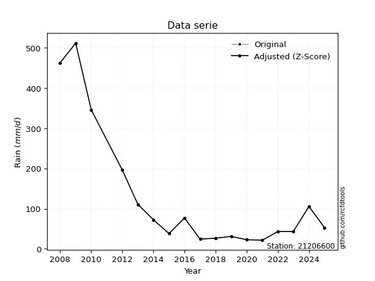</img>

</div>


> The initial value (value_initial) correspond to the initial obtained or null completed value, and value (value) is adjusted only when the initial value is outside the valid range (outlier) definite through the Z-Score value. If Z-Score is active, values out of range or outliers are replaced with the station mean value. A Z-Score (or standard score) measures how many standard deviations a data point is from the mean of a dataset, indicating its relative position; positive scores mean above the mean, negative mean below, and a score of zero is exactly at the mean, allowing for comparison of values from different distributions. It´s calculated using the formula $z=(x–μ)/σ$, where $x$ is the data point, $μ$ is the mean, and $σ$ is the standard deviation, helping identify outliers and understand probability.
>
> <sub>**Note**: In this study, "completing" (filling gaps in) and "extending" (forecasting or lengthening the historical record) rainfall data series are avoided for certain critical analyses because they introduce artificial bias and uncertainty, which can distort the statistics of rare events (extremes), alter day-to-day variability, and compromise the integrity and homogeneity of the original data. Some reasons against Completing/Extending rainfall data are: **Distortion of Extremes and Variability**: The primary issue is that most gap-filling or extension methods rely on averaging or regression with nearby stations, which inherently smooths the data. Rainfall is highly variable in space and time, with a large percentage of zero values and occasional large storms. Infilling methods often underestimate the highest values and overestimate the lowest (zero) values, which severely distorts analyses focused on flood frequency, drought severity, and intensity-duration-frequency (IDF) curves, **Loss of Data Homogeneity**: Infilled or extended data are synthetic estimates, not actual measurements. Combining these estimates with observed data can violate the assumption of data homogeneity, which requires that the data properties do not change over time. Inhomogeneity can lead to incorrect conclusions about long-term trends or changes in climate patterns, **Propagation of Errors**: Errors and biases from the original data (e.g., wind-induced undercatch, instrument errors, site changes) or the data used for imputation can propagate through the analysis, leading to unreliable hydrological models and inaccurate predictions, **Compromised Statistical Integrity**: For statistical analyses, especially those involving the frequency of events, using artificial data can introduce time bias or autocorrelation that doesn´t exist in reality, making it difficult to assess the true probability of events, **Difficulty in Validation**: It is difficult to accurately validate the quality of filled or extended data, especially for past periods where ground-truth measurements are unavailable. The reliability of imputation techniques heavily depends on the density of the surrounding station network and the complexity of the local topography.</sub>


### 4. Active continuous probability distributions from SciPy (44 of 104 available)

A Probability Density Function (PDF) describes the relative likelihood of a continuous random variable falling within a specific range, where the total area under its curve equals 1, and the area over any interval gives the actual probability for that range. Unlike discrete probabilities (like rolling a die), a PDF shows density, not direct probability for a single point (which is zero), with higher points indicating higher likelihood, often visualized as a bell curve for normal distributions.

A log of a probability density function (log-PDF) is simply the logarithm of the PDF´s value, denoted as $log(f(x))$, useful for converting multiplication of probabilities into addition, improving numerical stability with tiny numbers, and connecting to information theory concepts like entropy. Instead of dealing with very small probabilities (e.g., 0.000001), log-PDFs use negative numbers (e.g., $log(0.00001) ≈ -11.51$ that are easier for computers to handle, preventing underflow errors and simplifying complex calculations. In this study, each active probability distribution from SciPy is also evaluated in the $log$ form.

[scipy.stats](https://docs.scipy.org/doc/scipy/reference/stats.html) is a Python´s powerful submodule within the SciPy library for comprehensive statistical analysis, offering over 130 probability distributions (like Normal, Poisson), functions for descriptive stats (mean, variance), hypothesis testing (t-tests, chi-square), random variable generation, and statistical tests, making it essential for data science, modeling, and research. It provides tools to explore, model, and draw conclusions from data efficiently, working seamlessly with NumPy.

<div align="center">

|   id | p_dist             |   n_parameter | fit_method   | label                                                                       | active   | ref                                                                                                        |
|-----:|:-------------------|--------------:|:-------------|:----------------------------------------------------------------------------|:---------|:-----------------------------------------------------------------------------------------------------------|
|    0 | alpha              |             3 | MLE          | Alpha                                                                       | True     | [:mortar_board:](https://docs.scipy.org/doc/scipy/reference/generated/scipy.stats.alpha.html)              |
|    1 | betaprime          |             4 | MLE          | Beta prime                                                                  | True     | [:mortar_board:](https://docs.scipy.org/doc/scipy/reference/generated/scipy.stats.betaprime.html)          |
|    2 | chi2               |             3 | MLE          | Chi²                                                                        | True     | [:mortar_board:](https://docs.scipy.org/doc/scipy/reference/generated/scipy.stats.chi2.html)               |
|    3 | crystalball        |             4 | MLE          | Crystalball                                                                 | True     | [:mortar_board:](https://docs.scipy.org/doc/scipy/reference/generated/scipy.stats.crystalball.html)        |
|    4 | erlang             |             3 | MLE          | Erlang                                                                      | True     | [:mortar_board:](https://docs.scipy.org/doc/scipy/reference/generated/scipy.stats.erlang.html)             |
|    5 | expon              |             2 | MLE          | Exponential                                                                 | True     | [:mortar_board:](https://docs.scipy.org/doc/scipy/reference/generated/scipy.stats.expon.html)              |
|    6 | exponnorm          |             3 | MLE          | Exponentially modified Normal                                               | True     | [:mortar_board:](https://docs.scipy.org/doc/scipy/reference/generated/scipy.stats.exponnorm.html)          |
|    7 | f                  |             4 | MLE          | F                                                                           | True     | [:mortar_board:](https://docs.scipy.org/doc/scipy/reference/generated/scipy.stats.f.html)                  |
|    8 | fatiguelife        |             3 | MLE          | Fatigue-life (Birnbaum-Saunders)                                            | True     | [:mortar_board:](https://docs.scipy.org/doc/scipy/reference/generated/scipy.stats.fatiguelife.html)        |
|    9 | fisk               |             3 | MLE          | Fisk                                                                        | True     | [:mortar_board:](https://docs.scipy.org/doc/scipy/reference/generated/scipy.stats.fisk.html)               |
|   10 | gamma              |             3 | MLE          | Gamma                                                                       | True     | [:mortar_board:](https://docs.scipy.org/doc/scipy/reference/generated/scipy.stats.gamma.html)              |
|   11 | genexpon           |             5 | MLE          | Generalized exponential                                                     | True     | [:mortar_board:](https://docs.scipy.org/doc/scipy/reference/generated/scipy.stats.genexpon.html)           |
|   12 | genlogistic        |             3 | MLE          | Generalized logistic                                                        | True     | [:mortar_board:](https://docs.scipy.org/doc/scipy/reference/generated/scipy.stats.genlogistic.html)        |
|   13 | gibrat             |             2 | MM           | Gibrat                                                                      | True     | [:mortar_board:](https://docs.scipy.org/doc/scipy/reference/generated/scipy.stats.gibrat.html)             |
|   14 | gompertz           |             3 | MLE          | Gompertz (or truncated Gumbel)                                              | True     | [:mortar_board:](https://docs.scipy.org/doc/scipy/reference/generated/scipy.stats.gompertz.html)           |
|   15 | gumbel_l           |             2 | MM           | Gumbel Left Skew                                                            | True     | [:mortar_board:](https://docs.scipy.org/doc/scipy/reference/generated/scipy.stats.gumbel_l.html)           |
|   16 | gumbel_r           |             2 | MM           | Gumbel Right Skew                                                           | True     | [:mortar_board:](https://docs.scipy.org/doc/scipy/reference/generated/scipy.stats.gumbel_r.html)           |
|   17 | halflogistic       |             2 | MM           | Half-logistic                                                               | True     | [:mortar_board:](https://docs.scipy.org/doc/scipy/reference/generated/scipy.stats.halflogistic.html)       |
|   18 | halfnorm           |             2 | MM           | Half Normal                                                                 | True     | [:mortar_board:](https://docs.scipy.org/doc/scipy/reference/generated/scipy.stats.halfnorm.html)           |
|   19 | hypsecant          |             2 | MM           | hyperbolic secant                                                           | True     | [:mortar_board:](https://docs.scipy.org/doc/scipy/reference/generated/scipy.stats.hypsecant.html)          |
|   20 | invgamma           |             3 | MLE          | Inverted gamma                                                              | True     | [:mortar_board:](https://docs.scipy.org/doc/scipy/reference/generated/scipy.stats.invgamma.html)           |
|   21 | invgauss           |             3 | MLE          | Inverse Gaussian                                                            | True     | [:mortar_board:](https://docs.scipy.org/doc/scipy/reference/generated/scipy.stats.invgauss.html)           |
|   22 | invweibull         |             3 | MLE          | Inverted Weibull                                                            | True     | [:mortar_board:](https://docs.scipy.org/doc/scipy/reference/generated/scipy.stats.invweibull.html)         |
|   23 | johnsonsu          |             4 | MLE          | Johnson Su                                                                  | True     | [:mortar_board:](https://docs.scipy.org/doc/scipy/reference/generated/scipy.stats.johnsonsu.html)          |
|   24 | kstwobign          |             2 | MLE          | Limiting distribution of scaled Kolmogorov-Smirnov two-sided test statistic | True     | [:mortar_board:](https://docs.scipy.org/doc/scipy/reference/generated/scipy.stats.kstwobign.html)          |
|   25 | laplace            |             2 | MM           | Laplace                                                                     | True     | [:mortar_board:](https://docs.scipy.org/doc/scipy/reference/generated/scipy.stats.laplace.html)            |
|   26 | laplace_asymmetric |             3 | MLE          | Asymmetric Laplace                                                          | True     | [:mortar_board:](https://docs.scipy.org/doc/scipy/reference/generated/scipy.stats.laplace_asymmetric.html) |
|   27 | loggamma           |             3 | MLE          | Log gamma                                                                   | True     | [:mortar_board:](https://docs.scipy.org/doc/scipy/reference/generated/scipy.stats.loggamma.html)           |
|   28 | logistic           |             2 | MM           | Logistic (or Sech-squared)                                                  | True     | [:mortar_board:](https://docs.scipy.org/doc/scipy/reference/generated/scipy.stats.logistic.html)           |
|   29 | lognorm            |             3 | MLE          | Log Normal                                                                  | True     | [:mortar_board:](https://docs.scipy.org/doc/scipy/reference/generated/scipy.stats.lognorm.html)            |
|   30 | maxwell            |             2 | MM           | Maxwell                                                                     | True     | [:mortar_board:](https://docs.scipy.org/doc/scipy/reference/generated/scipy.stats.maxwell.html)            |
|   31 | mielke             |             4 | MLE          | Mielke Beta-Kappa / Dagum                                                   | True     | [:mortar_board:](https://docs.scipy.org/doc/scipy/reference/generated/scipy.stats.mielke.html)             |
|   32 | moyal              |             2 | MM           | Moyal                                                                       | True     | [:mortar_board:](https://docs.scipy.org/doc/scipy/reference/generated/scipy.stats.moyal.html)              |
|   33 | nakagami           |             3 | MLE          | Nakagami                                                                    | True     | [:mortar_board:](https://docs.scipy.org/doc/scipy/reference/generated/scipy.stats.nakagami.html)           |
|   34 | ncf                |             5 | MLE          | Non-central F distribution                                                  | True     | [:mortar_board:](https://docs.scipy.org/doc/scipy/reference/generated/scipy.stats.ncf.html)                |
|   35 | nct                |             4 | MLE          | Non-central Student’s t                                                     | True     | [:mortar_board:](https://docs.scipy.org/doc/scipy/reference/generated/scipy.stats.nct.html)                |
|   36 | norm               |             2 | MM           | Normal                                                                      | True     | [:mortar_board:](https://docs.scipy.org/doc/scipy/reference/generated/scipy.stats.norm.html)               |
|   37 | pearson3           |             3 | MM           | Pearson type III                                                            | True     | [:mortar_board:](https://docs.scipy.org/doc/scipy/reference/generated/scipy.stats.pearson3.html)           |
|   38 | rayleigh           |             2 | MM           | Rayleigh                                                                    | True     | [:mortar_board:](https://docs.scipy.org/doc/scipy/reference/generated/scipy.stats.rayleigh.html)           |
|   39 | rice               |             3 | MLE          | Rice                                                                        | True     | [:mortar_board:](https://docs.scipy.org/doc/scipy/reference/generated/scipy.stats.rice.html)               |
|   40 | t                  |             3 | MLE          | Student’s t                                                                 | True     | [:mortar_board:](https://docs.scipy.org/doc/scipy/reference/generated/scipy.stats.t.html)                  |
|   41 | truncnorm          |             4 | MLE          | Truncated normal                                                            | True     | [:mortar_board:](https://docs.scipy.org/doc/scipy/reference/generated/scipy.stats.truncnorm.html)          |
|   42 | wald               |             2 | MM           | Wald                                                                        | True     | [:mortar_board:](https://docs.scipy.org/doc/scipy/reference/generated/scipy.stats.wald.html)               |
|   43 | weibull_min        |             3 | MLE          | Weibull minimum                                                             | True     | [:mortar_board:](https://docs.scipy.org/doc/scipy/reference/generated/scipy.stats.weibull_min.html)        |

</div>

> **n_parameter:** # arguments & localization & scale.
>
> **Fit methods:** (MLE) maximum likelihood, (MM) L-moments.
>
>**Inactive** (With the only purpose of prevent loops, zero divisions, infinite values, over high estimated values or horizontal trending for recurrence intervals estimations, the follow distributions were disabled.)**:** foldnorm, gennorm, norminvgauss, powernorm, powerlognorm, skewnorm, genextreme, anglit, arcsine, argus, beta, bradford, burr, burr12, cauchy, cosine, halfcauchy, foldcauchy, skewcauchy, wrapcauchy, dgamma, gengamma, exponweib, exponpow, truncexpon, gausshyper, genhalflogistic, genhyperbolic, geninvgauss, halfgennorm, johnsonsb, kappa4, kappa3, ksone, kstwo, loglaplace, levy, levy_l, levy_stable, ncx2, pareto, genpareto, truncpareto, lomax, powerlaw, rdist, rel_breitwigner, recipinvgauss, semicircular, studentized_range, trapezoid, triang, truncweibull_min, tukeylambda, uniform, loguniform, vonmises, vonmises_line, weibull_max, dweibull, 


## B. Probability (PDF) vs. Empirical (EDF) distributions functions

A continuous probability distribution (CPD) describes probabilities for variables that can take any value within a range (like rain any time), unlike discrete variables with specific outcomes (like temperature). It uses a Probability Density Function (PDF), a curve where the total area under it equals 1, and the probability of the variable falling within an interval (a to b) is found by calculating the area under the curve between those points. A key feature is that the probability of hitting any single exact value is zero, so probabilities are always expressed for ranges, e.g., $P(a ≤ X ≤ b)$.

<div align="center">

Distributions parameters from station values
|    |   station | p_dist                |   n |            loc |          scale | shape                 | shape1                 | shape2                 | shape3   |
|---:|----------:|:----------------------|----:|---------------:|---------------:|:----------------------|:-----------------------|:-----------------------|:---------|
|  0 |  21206600 | alpha                 |  16 |      7.06315   |   28.4557      | 3.868686906675448e-11 |                        |                        |          |
|  1 |  21206600 | betaprime             |  16 |      3.40899   |    0.0980531   | 593.4268944808878     | 1.3357010061514132     |                        |          |
|  2 |  21206600 | chi2                  |  16 |     21.6       |    6.61025     | 0.29881320698730823   |                        |                        |          |
|  3 |  21206600 | crystalball           |  16 |    133.175     |  156.53        | 8387.868544802292     | 13580.612118262612     |                        |          |
|  4 |  21206600 | erlang                |  16 |     21.6       |  139.074       | 0.5740800291739587    |                        |                        |          |
|  5 |  21206600 | expon                 |  16 |     21.6       |  111.575       |                       |                        |                        |          |
|  6 |  21206600 | exponnorm             |  16 |     21.4715    |    0.0434596   | 2545.52563290355      |                        |                        |          |
|  7 |  21206600 | f                     |  16 |     21.6       |   31.283       | 0.9128729211926913    | 1.9824097941870538     |                        |          |
|  8 |  21206600 | fatiguelife           |  16 |     20.6245    |   26.9754      | 2.4389792844552045    |                        |                        |          |
|  9 |  21206600 | fisk                  |  16 |     21.6       |   55.2429      | 0.5399936827919101    |                        |                        |          |
| 10 |  21206600 | gamma                 |  16 |     21.6       |  107.888       | 0.6510600640974746    |                        |                        |          |
| 11 |  21206600 | genexpon              |  16 |     21.6       |  369.96        | 3.315796552465687     | 4.9569647434642854e-11 | 3.1675400178385043     |          |
| 12 |  21206600 | genlogistic           |  16 |   -600.315     |   87.4589      | 2128.1312491248063    |                        |                        |          |
| 13 |  21206600 | gibrat                |  16 |     13.7622    |   72.4276      |                       |                        |                        |          |
| 14 |  21206600 | gompertz              |  16 |     21.3815    | 2757.93        | 23.231602017040178    |                        |                        |          |
| 15 |  21206600 | gumbel_l              |  16 |    203.622     |  122.046       |                       |                        |                        |          |
| 16 |  21206600 | gumbel_r              |  16 |     62.7281    |  122.046       |                       |                        |                        |          |
| 17 |  21206600 | halflogistic          |  16 |    -52.3497    |  133.828       |                       |                        |                        |          |
| 18 |  21206600 | halfnorm              |  16 |    -74.0097    |  259.668       |                       |                        |                        |          |
| 19 |  21206600 | hypsecant             |  16 |    133.175     |   99.6502      |                       |                        |                        |          |
| 20 |  21206600 | invgamma              |  16 |     18.2073    |    9.27298     | 0.6231935873319705    |                        |                        |          |
| 21 |  21206600 | invgauss              |  16 |     18.3156    |   16.7212      | 6.869068787379254     |                        |                        |          |
| 22 |  21206600 | invweibull            |  16 |     20.031     |   14.3031      | 0.6136210463061464    |                        |                        |          |
| 23 |  21206600 | johnsonsu             |  16 |     21.4762    |    0.00527397  | -4.191344933276036    | 0.45559513151000663    |                        |          |
| 24 |  21206600 | kstwobign             |  16 |   -265.219     |  464.504       |                       |                        |                        |          |
| 25 |  21206600 | laplace               |  16 |    133.175     |  110.684       |                       |                        |                        |          |
| 26 |  21206600 | laplace_asymmetric    |  16 |     21.6       |    0.0336382   | 0.0003015138502208678 |                        |                        |          |
| 27 |  21206600 | loggamma              |  16 | -57045.5       | 7461.71        | 2128.58091089153      |                        |                        |          |
| 28 |  21206600 | logistic              |  16 |    133.175     |   86.2996      |                       |                        |                        |          |
| 29 |  21206600 | lognorm               |  16 |     21.6       |    3.66364     | 9.09006365160273      |                        |                        |          |
| 30 |  21206600 | maxwell               |  16 |   -237.736     |  232.434       |                       |                        |                        |          |
| 31 |  21206600 | mielke                |  16 |      0.757371  |    0.271339    | 684.0477918855006     | 1.2395840088672703     |                        |          |
| 32 |  21206600 | moyal                 |  16 |     43.661     |   70.4634      |                       |                        |                        |          |
| 33 |  21206600 | nakagami              |  16 |     21.6       |  244.286       | 0.15814209159445436   |                        |                        |          |
| 34 |  21206600 | ncf                   |  16 |     -0.723236  |   49.7771      | 159.50167459699435    | 2.728694938703244      | 1.4754193068993692e-06 |          |
| 35 |  21206600 | nct                   |  16 |     -0.0967547 |    1.17002     | 1.022086493616841     | 33.424445277098954     |                        |          |
| 36 |  21206600 | norm                  |  16 |    133.175     |  156.53        |                       |                        |                        |          |
| 37 |  21206600 | pearson3              |  16 |    133.175     |  156.53        | 1.4744669594339412    |                        |                        |          |
| 38 |  21206600 | rayleigh              |  16 |   -166.276     |  238.928       |                       |                        |                        |          |
| 39 |  21206600 | rice                  |  16 |    -93.1048    |  194.556       | 0.0001773038643780153 |                        |                        |          |
| 40 |  21206600 | t                     |  16 |     35.6431    |   18.2311      | 0.6344010354972047    |                        |                        |          |
| 41 |  21206600 | truncnorm             |  16 | -73511.5       | 3403.71        | 21.603794845026417    | 230.69274048034265     |                        |          |
| 42 |  21206600 | wald                  |  16 |    -23.3552    |  156.53        |                       |                        |                        |          |
| 43 |  21206600 | weibull_min           |  16 |     21.6       |   57.685       | 0.6323508530604018    |                        |                        |          |
| 44 |  21206600 | logalpha              |  16 |      0.913311  |   10.8458      | 3.504966569414343     |                        |                        |          |
| 45 |  21206600 | logbetaprime          |  16 |     -0.268799  |    0.444958    | 224.64668429721655    | 22.914875553503045     |                        |          |
| 46 |  21206600 | logchi2               |  16 |      3.07269   |    0.955704    | 1.0605385366725413    |                        |                        |          |
| 47 |  21206600 | logcrystalball        |  16 |      4.29724   |    1.05094     | 1643.8460011827142    | 27.51310674863757      |                        |          |
| 48 |  21206600 | logerlang             |  16 |      3.07269   |    1.72944     | 0.5159655443377417    |                        |                        |          |
| 49 |  21206600 | logexpon              |  16 |      3.07269   |    1.22455     |                       |                        |                        |          |
| 50 |  21206600 | logexponnorm          |  16 |      3.07152   |    0.00037832  | 3241.3494479252367    |                        |                        |          |
| 51 |  21206600 | logf                  |  16 |      2.46871   |    1.67103     | 7.169282532862741     | 17.53386050623054      |                        |          |
| 52 |  21206600 | logfatiguelife        |  16 |      2.94089   |    0.840124    | 1.0859234805401843    |                        |                        |          |
| 53 |  21206600 | logfisk               |  16 |      3.03938   |    0.813848    | 1.337566557530791     |                        |                        |          |
| 54 |  21206600 | loggamma              |  16 |      3.07269   |    1.62735     | 0.6782507830621782    |                        |                        |          |
| 55 |  21206600 | loggenexpon           |  16 |      3.07232   |    0.0191057   | 0.01289704237157516   | 3.856984913782954      | 1.25310162284442e-05   |          |
| 56 |  21206600 | loggenlogistic        |  16 |     -2.00442   |    0.799484    | 1441.2748478211615    |                        |                        |          |
| 57 |  21206600 | loggibrat             |  16 |      3.49552   |    0.48627     |                       |                        |                        |          |
| 58 |  21206600 | loggompertz           |  16 |      3.07269   |    4.37011     | 2.747795439120405     |                        |                        |          |
| 59 |  21206600 | loggumbel_l           |  16 |      4.77023   |    0.819418    |                       |                        |                        |          |
| 60 |  21206600 | loggumbel_r           |  16 |      3.82426   |    0.819418    |                       |                        |                        |          |
| 61 |  21206600 | loghalflogistic       |  16 |      3.05163   |    0.89852     |                       |                        |                        |          |
| 62 |  21206600 | loghalfnorm           |  16 |      2.90621   |    1.74341     |                       |                        |                        |          |
| 63 |  21206600 | loghypsecant          |  16 |      4.29724   |    0.669052    |                       |                        |                        |          |
| 64 |  21206600 | loginvgamma           |  16 |      2.41431   |    4.4228      | 3.2481157797280353    |                        |                        |          |
| 65 |  21206600 | loginvgauss           |  16 |      2.79872   |    1.74126     | 0.8605942625221269    |                        |                        |          |
| 66 |  21206600 | loginvweibull         |  16 |      1.74299   |    1.93035     | 2.8957819726692713    |                        |                        |          |
| 67 |  21206600 | logjohnsonsu          |  16 |      2.92937   |    0.00837483  | -5.50461892627796     | 1.0204554218084616     |                        |          |
| 68 |  21206600 | logkstwobign          |  16 |      1.02783   |    3.74871     |                       |                        |                        |          |
| 69 |  21206600 | loglaplace            |  16 |      4.29724   |    0.74313     |                       |                        |                        |          |
| 70 |  21206600 | loglaplace_asymmetric |  16 |      3.07269   |    0.000692999 | 0.000565983641589294  |                        |                        |          |
| 71 |  21206600 | logloggamma           |  16 |   -276.184     |   38.88        | 1358.8266536838992    |                        |                        |          |
| 72 |  21206600 | loglogistic           |  16 |      4.29724   |    0.579416    |                       |                        |                        |          |
| 73 |  21206600 | loglognorm            |  16 |      3.07269   |    0.088269    | 8.578152947401854     |                        |                        |          |
| 74 |  21206600 | logmaxwell            |  16 |      1.80695   |    1.56056     |                       |                        |                        |          |
| 75 |  21206600 | logmielke             |  16 |      1.85068   |    0.410438    | 167.99634889958782    | 2.754496104501774      |                        |          |
| 76 |  21206600 | logmoyal              |  16 |      3.69625   |    0.473091    |                       |                        |                        |          |
| 77 |  21206600 | lognakagami           |  16 |      3.07269   |    2.14635     | 0.3385636348384723    |                        |                        |          |
| 78 |  21206600 | logncf                |  16 |      2.13611   |    1.80958     | 263.3291791845676     | 9.966026435988194      | 0.4372101081573825     |          |
| 79 |  21206600 | lognct                |  16 |      0.0157244 |    0.085722    | 9.958581429526586     | 46.07905980459732      |                        |          |
| 80 |  21206600 | lognorm               |  16 |      4.29724   |    1.05094     |                       |                        |                        |          |
| 81 |  21206600 | logpearson3           |  16 |      4.29724   |    1.05095     | 0.6033964107914385    |                        |                        |          |
| 82 |  21206600 | lograyleigh           |  16 |      2.28673   |    1.60416     |                       |                        |                        |          |
| 83 |  21206600 | logrice               |  16 |      2.54028   |    1.44765     | 0.001213860211379366  |                        |                        |          |
| 84 |  21206600 | logt                  |  16 |      4.29724   |    1.05094     | 19524709856.493874    |                        |                        |          |
| 85 |  21206600 | logtruncnorm          |  16 |     -0.331987  |    2.60414     | 1.3074126290594337    | 5.878046759716321      |                        |          |
| 86 |  21206600 | logwald               |  16 |      3.24627   |    1.05097     |                       |                        |                        |          |
| 87 |  21206600 | logweibull_min        |  16 |      3.07269   |    1.31216     | 0.8421765818106393    |                        |                        |          |

</div>

> **loc** (Location parameter): This shifts the distribution along the x-axis. For many common distributions, like the normal (Gaussian) distribution, loc represents the mean $μ$. For others, like the uniform distribution, it might represent the minimum value, or for the beta distribution, the left end of the support interval.
>
> **scale** (Scale parameter): This determines the width or spread of the distribution. For the normal distribution, scale represents the standard deviation $σ$. For a uniform distribution, it defines the length of the interval (from $loc$ to $loc + scale$).
>
> **shape** (Shape parameters): Refers to parameters that define the specific form of a probability distribution, distinct from its location (loc) and scale (scale). These parameters are required arguments for most distribution functions. For example, a normal (Gaussian) distribution is fully defined by its location (mean) and scale (standard deviation), so it has no specific shape parameters beyond loc and scale. However, other distributions have intrinsic properties that need specification, as Gamma distribution that takes a shape parameter, often named $a$ or $alpha$.


### 0. Cumulative distribution values - CDF (88 evaluated)

Cumulative Distribution Function (CDF), denoted as $F$<sub>$X$</sub>$(x)$, is a function that gives the probability that a random variable $X$ will take a value less than or equal to a specific value, $x$ (i.e., $(P(X≥x)$. It essentially "accumulates" probabilities from a given point up to the far right (positive infinity), providing a complete picture of the distribution´s probabilities for both discrete (like rain) and continuous (like temperature) variables, helping to find probabilities over ranges or above certain values. Each station is evaluated separately ordering the $x$ values ascending, calculating the CDF and PDF values for the activated distributions and their logarithmic forms.

<div align="center">

CDF ordered by x ascending and calculating $log(f(x))$ separately
|   id |   Station |   date |     x |   count |    mean |     std |    zscore |   Value_initial |   station |   m |     alpha |   alpha_pdf |   betaprime |   betaprime_pdf |       chi2 |    chi2_pdf |   crystalball |   crystalball_pdf |      erlang |      erlang_pdf |     expon |   expon_pdf |   exponnorm |   exponnorm_pdf |           f |         f_pdf |   fatiguelife |   fatiguelife_pdf |        fisk |         fisk_pdf |      gamma |      gamma_pdf |    genexpon |   genexpon_pdf |   genlogistic |   genlogistic_pdf |    gibrat |   gibrat_pdf |   gompertz |   gompertz_pdf |   gumbel_l |   gumbel_l_pdf |   gumbel_r |   gumbel_r_pdf |   halflogistic |   halflogistic_pdf |   halfnorm |   halfnorm_pdf |   hypsecant |   hypsecant_pdf |   invgamma |   invgamma_pdf |   invgauss |   invgauss_pdf |   invweibull |   invweibull_pdf |   johnsonsu |   johnsonsu_pdf |   kstwobign |   kstwobign_pdf |   laplace |   laplace_pdf |   laplace_asymmetric |   laplace_asymmetric_pdf |    loggamma |   loggamma_pdf |   logistic |   logistic_pdf |   lognorm |   lognorm_pdf |   maxwell |   maxwell_pdf |   mielke |   mielke_pdf |    moyal |   moyal_pdf |    nakagami |   nakagami_pdf |       ncf |     ncf_pdf |       nct |     nct_pdf |     norm |    norm_pdf |   pearson3 |   pearson3_pdf |   rayleigh |   rayleigh_pdf |     rice |    rice_pdf |        t |       t_pdf |   truncnorm |   truncnorm_pdf |     wald |    wald_pdf |   weibull_min |   weibull_min_pdf |   logalpha |   logalpha_pdf |   logbetaprime |   logbetaprime_pdf |     logchi2 |   logchi2_pdf |   logcrystalball |   logcrystalball_pdf |   logerlang |   logerlang_pdf |   logexpon |   logexpon_pdf |   logexponnorm |   logexponnorm_pdf |      logf |   logf_pdf |   logfatiguelife |   logfatiguelife_pdf |   logfisk |   logfisk_pdf |   loggenexpon |   loggenexpon_pdf |   loggenlogistic |   loggenlogistic_pdf |   loggibrat |   loggibrat_pdf |   loggompertz |   loggompertz_pdf |   loggumbel_l |   loggumbel_l_pdf |   loggumbel_r |   loggumbel_r_pdf |   loghalflogistic |   loghalflogistic_pdf |   loghalfnorm |   loghalfnorm_pdf |   loghypsecant |   loghypsecant_pdf |   loginvgamma |   loginvgamma_pdf |   loginvgauss |   loginvgauss_pdf |   loginvweibull |   loginvweibull_pdf |   logjohnsonsu |   logjohnsonsu_pdf |   logkstwobign |   logkstwobign_pdf |   loglaplace |   loglaplace_pdf |   loglaplace_asymmetric |   loglaplace_asymmetric_pdf |   logloggamma |   logloggamma_pdf |   loglogistic |   loglogistic_pdf |   loglognorm |   loglognorm_pdf |   logmaxwell |   logmaxwell_pdf |   logmielke |   logmielke_pdf |   logmoyal |   logmoyal_pdf |   lognakagami |   lognakagami_pdf |    logncf |   logncf_pdf |    lognct |   lognct_pdf |   logpearson3 |   logpearson3_pdf |   lograyleigh |   lograyleigh_pdf |   logrice |   logrice_pdf |     logt |   logt_pdf |   logtruncnorm |   logtruncnorm_pdf |    logwald |   logwald_pdf |   logweibull_min |   logweibull_min_pdf |
|-----:|----------:|-------:|------:|--------:|--------:|--------:|----------:|----------------:|----------:|----:|----------:|------------:|------------:|----------------:|-----------:|------------:|--------------:|------------------:|------------:|----------------:|----------:|------------:|------------:|----------------:|------------:|--------------:|--------------:|------------------:|------------:|-----------------:|-----------:|---------------:|------------:|---------------:|--------------:|------------------:|----------:|-------------:|-----------:|---------------:|-----------:|---------------:|-----------:|---------------:|---------------:|-------------------:|-----------:|---------------:|------------:|----------------:|-----------:|---------------:|-----------:|---------------:|-------------:|-----------------:|------------:|----------------:|------------:|----------------:|----------:|--------------:|---------------------:|-------------------------:|------------:|---------------:|-----------:|---------------:|----------:|--------------:|----------:|--------------:|---------:|-------------:|---------:|------------:|------------:|---------------:|----------:|------------:|----------:|------------:|---------:|------------:|-----------:|---------------:|-----------:|---------------:|---------:|------------:|---------:|------------:|------------:|----------------:|---------:|------------:|--------------:|------------------:|-----------:|---------------:|---------------:|-------------------:|------------:|--------------:|-----------------:|---------------------:|------------:|----------------:|-----------:|---------------:|---------------:|-------------------:|----------:|-----------:|-----------------:|---------------------:|----------:|--------------:|--------------:|------------------:|-----------------:|---------------------:|------------:|----------------:|--------------:|------------------:|--------------:|------------------:|--------------:|------------------:|------------------:|----------------------:|--------------:|------------------:|---------------:|-------------------:|--------------:|------------------:|--------------:|------------------:|----------------:|--------------------:|---------------:|-------------------:|---------------:|-------------------:|-------------:|-----------------:|------------------------:|----------------------------:|--------------:|------------------:|--------------:|------------------:|-------------:|-----------------:|-------------:|-----------------:|------------:|----------------:|-----------:|---------------:|--------------:|------------------:|----------:|-------------:|----------:|-------------:|--------------:|------------------:|--------------:|------------------:|----------:|--------------:|---------:|-----------:|---------------:|-------------------:|-----------:|--------------:|-----------------:|---------------------:|
|    0 |  21206600 |   2021 |  21.6 |      16 | 133.175 | 161.664 | -0.690167 |            21.6 |  21206600 |   1 | 0.0502905 | 0.0158167   |   0.0741377 |     0.0118996   | 0.00505411 | 2.12546e+11 |      0.237984 |       0.00197689  | 3.34705e-10 | 54084.7         | 0         | 0.00896258  |  0.00116075 |     0.00901476  | 5.29243e-05 | 822.455       |     0.0188508 |       0.0527229   | 1.80541e-09 | 274413           | 2.0634e-11 | 3781.32        | 3.88231e-12 |    0.00896259  |      0.176202 |       0.00349632  | 0.0130869 |  0.00429566  |  0.0018387 |    0.00840874  |   0.201526 |    0.00147239  |   0.246419 |    0.00282815  |       0.269465 |        0.00346486  |   0.287276 |    0.00287133  |    0.200846 |     0.0018844   |  0.0279202 |    0.0249295   |  0.0277732 |    0.0248122   |    0.0206266 |      0.0313095   |  0.00739077 |     0.0751897   |    0.159664 |     0.00304582  |  0.182464 |   0.00164852  |          9.09195e-08 |              0.00896344  | 3.07039e-11 |  46893.6       |   0.215366 |    0.0019581   |  0.121971 |     0.192538  |  0.257738 |   0.00229322  |      nan |          nan | 0.242218 | 0.00334159  | 3.79564e-06 |    3.37911e+08 | 0.0927895 | 0.0110587   | 0.0709964 | 0.0130918   | 0.237984 | 0.00197689  |   0.261155 |    0.00342609  |   0.265936 |    0.00241587  | 0.159533 | 0.0025469   | 0.316937 | 0.00919575  |  2.8422e-14 |     0.00636067  | 0.152005 | 0.00683724  |   5.61403e-11 |    9992.46        |  0.0645631 |      0.293393  |      0.0938072 |          0.245113  | 5.77595e-09 |   6.89683e+06 |         0.121971 |            0.192538  | 1.01865e-08 |     1.18351e+07 |  0         |      0.816626  |    0.000953235 |          0.813893  | 0.0846236 |  0.336189  |        0.0249881 |            0.596091  | 0.013725  |     0.54355   |   0.000250736 |         0.674917  |        0.0809322 |            0.254286  |    0        |       0         |   3.32172e-12 |         0.62877   |      0.118368 |         0.135545  |     0.0818986 |         0.250095  |         0.0117201 |             0.556394  |     0.0760787 |         0.455576  |       0.101232 |          0.148769  |     0.0481337 |         0.351071  |     0.0343269 |         0.439752  |       0.0527132 |           0.337834  |      0.0288188 |          0.467759  |      0.07272   |          0.259332  |    0.0962337 |        0.129498  |             3.71844e-07 |                   0.816716  |      0.123236 |         0.1912    |      0.107799 |         0.165992  |  6.20147e-05 |      6.62792e+10 |     0.116931 |        0.242069  |   0.0524324 |       0.340152  |  0.0532488 |      0.251705  |   1.86202e-11 |      28391.3      | 0.0410289 |    0.251944  | 0.0831597 |    0.263161  |      0.108405 |         0.237001  |      0.113104 |         0.270882  | 0.0653929 |     0.237436  | 0.121971 |  0.192538  |    9.97261e-10 |          0.682185  | 0          |    0          |      9.35609e-14 |          177.43      |
|    1 |  21206600 |   2020 |  22.8 |      16 | 133.175 | 161.664 | -0.682744 |            22.8 |  21206600 |   2 | 0.0705726 | 0.0178763   |   0.0887857 |     0.0124866   | 0.740091   | 0.0851304   |      0.240363 |       0.00198766  | 0.073095    |     0.0347774   | 0.0106975 | 0.0088667   |  0.0119366  |     0.00893143  | 0.156409    |   0.0584658   |     0.0922007 |       0.059283    | 0.11226     |      0.0448454   | 0.0591133  |    0.0318564   | 0.0106975   |    0.00886671  |      0.180419 |       0.00353124  | 0.0187094 |  0.00506204  |  0.0118805 |    0.00832777  |   0.2033   |    0.00148363  |   0.249819 |    0.00283912  |       0.273618 |        0.00345643  |   0.290719 |    0.00286642  |    0.203118 |     0.00190277  |  0.0622228 |    0.0311444   |  0.0617363 |    0.0307107   |    0.0646396 |      0.0392339   |  0.0872031  |     0.0545902   |    0.163335 |     0.00307235  |  0.184453 |   0.00166649  |          0.0106986   |              0.00886755  | 0.108358    |      1.33259   |   0.217725 |    0.0019736   |  0.132694 |     0.204162  |  0.260494 |   0.00230116  |      nan |          nan | 0.246234 | 0.00335174  | 0.149437    |    0.0393869   | 0.10626   | 0.0113773   | 0.0872172 | 0.013903    | 0.240363 | 0.00198766  |   0.265266 |    0.00342454  |   0.268838 |    0.00242169  | 0.162599 | 0.00256416  | 0.328352 | 0.00983602  |  0.00760381 |     0.00631241  | 0.160218 | 0.00685035  |   0.082763    |       0.041756    |  0.0815285 |      0.333861  |      0.107612  |          0.265475  | 0.16845     |   1.62177     |         0.132694 |            0.204162  | 0.186653    |     1.7448      |  0.0431922 |      0.781354  |    0.0440451   |          0.779565  | 0.103575  |  0.364205  |        0.0636742 |            0.802545  | 0.0481164 |     0.701117  |   0.0362702   |         0.6575    |        0.0953812 |            0.280119  |    0        |       0         |   0.0336286   |         0.615189  |      0.125911 |         0.143552  |     0.0960874 |         0.274688  |         0.0417831 |             0.555499  |     0.10067   |         0.45401   |       0.109591 |          0.160584  |     0.0689656 |         0.418012  |     0.0614091 |         0.554926  |       0.0726498 |           0.398645  |      0.0579485 |          0.598707  |      0.0874768 |          0.286346  |    0.103496  |        0.139271  |             0.0431972   |                   0.781436  |      0.133881 |         0.202611  |      0.117108 |         0.178444  |  0.477217    |      0.858763    |     0.130391 |        0.255744  |   0.072525  |       0.402049  |  0.067919  |      0.290864  |   0.0642116   |          0.804044 | 0.0559541 |    0.299868  | 0.0980832 |    0.28874   |      0.121655 |         0.253093  |      0.128125 |         0.284613  | 0.0787853 |     0.2578    | 0.132695 |  0.204162  |    0.0363852   |          0.663773  | 0          |    0          |      0.0658908   |            0.991765  |
|    2 |  21206600 |   2017 |  24.3 |      16 | 133.175 | 161.664 | -0.673466 |            24.3 |  21206600 |   3 | 0.0987668 | 0.019561    |   0.107934  |     0.0130074   | 0.823886   | 0.0381281   |      0.243355 |       0.00200105  | 0.115976    |     0.0243563   | 0.0239085 | 0.0087483   |  0.0252434  |     0.00881115  | 0.224275    |   0.0364731   |     0.168677  |       0.0432294   | 0.163835    |      0.0273983   | 0.0996795  |    0.0236738   | 0.0239085   |    0.00874831  |      0.185748 |       0.00357377  | 0.0269516 |  0.00590616  |  0.0242969 |    0.0082276   |   0.205536 |    0.00149776  |   0.254088 |    0.00285236  |       0.278794 |        0.00344575  |   0.295014 |    0.00286021  |    0.205989 |     0.00192583  |  0.110449  |    0.0323616   |  0.10915   |    0.0317579   |    0.122458  |      0.0369641   |  0.155524   |     0.0385318   |    0.167968 |     0.00310465  |  0.18697  |   0.00168923  |          0.0239109   |              0.00874912  | 0.180892    |      0.997458  |   0.2207   |    0.00199296  |  0.146144 |     0.218023  |  0.263953 |   0.00231091  |      nan |          nan | 0.251271 | 0.00336354  | 0.193128    |    0.0226231   | 0.123549  | 0.0116524   | 0.108636  | 0.0146008   | 0.243355 | 0.00200105  |   0.270401 |    0.00342204  |   0.272476 |    0.00242875  | 0.166462 | 0.00258536  | 0.343738 | 0.0106869   |  0.0170275  |     0.00625259  | 0.170499 | 0.00685453  |   0.134342    |       0.0292485   |  0.104241  |      0.378351  |      0.125275  |          0.288815  | 0.251664    |   1.08811     |         0.146144 |            0.218023  | 0.275507    |     1.15364     |  0.0917037 |      0.741738  |    0.0924473   |          0.740094  | 0.127702  |  0.392224  |        0.117499  |            0.86523   | 0.095152  |     0.762188  |   0.0775139   |         0.637144  |        0.114177  |            0.309673  |    0        |       0         |   0.0723172   |         0.599234  |      0.135371 |         0.15348   |     0.114492  |         0.302816  |         0.07711   |             0.553162  |     0.129525  |         0.451614  |       0.120294 |          0.175548  |     0.0977724 |         0.483591  |     0.0997108 |         0.638758  |       0.100095  |           0.460893  |      0.0990534 |          0.680775  |      0.106691  |          0.31641   |    0.112762  |        0.151739  |             0.0917137   |                   0.741812  |      0.147224 |         0.216228  |      0.128965 |         0.193872  |  0.513413    |      0.394628    |     0.147184 |        0.271268  |   0.100217  |       0.465144  |  0.0878853 |      0.335452  |   0.108766    |          0.624815 | 0.0767764 |    0.352919  | 0.117408  |    0.317587  |      0.138373 |         0.271559  |      0.146746 |         0.299661  | 0.0959418 |     0.280485  | 0.146144 |  0.218023  |    0.0779941   |          0.642357  | 0          |    0          |      0.123061    |            0.823404  |
|    3 |  21206600 |   2018 |  26.6 |      16 | 133.175 | 161.664 | -0.659239 |            26.6 |  21206600 |   4 | 0.145251  | 0.0205938   |   0.138411  |     0.013426    | 0.885334   | 0.01897     |      0.24798  |       0.00202139  | 0.164207    |     0.0184268   | 0.0438236 | 0.00856981  |  0.0452998  |     0.00862985  | 0.292827    |   0.0249096   |     0.248832  |       0.0282244   | 0.214632    |      0.0182048   | 0.147643   |    0.0186909   | 0.0438237   |    0.00856982  |      0.19404  |       0.00363649  | 0.0417983 |  0.00695626  |  0.0430458 |    0.00807623  |   0.209006 |    0.00151959  |   0.260671 |    0.00287163  |       0.286701 |        0.00342904  |   0.301581 |    0.00285052  |    0.21046  |     0.00196143  |  0.181778  |    0.0292012   |  0.179154  |    0.028695    |    0.19949   |      0.0300391   |  0.229173   |     0.0269453   |    0.175164 |     0.00315227  |  0.190896 |   0.0017247   |          0.0438279   |              0.0085706   | 0.260438    |      0.785504  |   0.225318 |    0.0020226   |  0.166755 |     0.237821  |  0.269285 |   0.00232546  |      nan |          nan | 0.259026 | 0.00337978  | 0.234684    |    0.0148445   | 0.150627  | 0.0118537   | 0.142915  | 0.0151057   | 0.24798  | 0.00202139  |   0.278266 |    0.00341704  |   0.278075 |    0.00243915  | 0.172445 | 0.00261709  | 0.369893 | 0.0120669   |  0.031304   |     0.00616197  | 0.18625  | 0.00683786  |   0.191846    |       0.0217704   |  0.141005  |      0.432778  |      0.152826  |          0.320047  | 0.335015    |   0.794142    |         0.166755 |            0.237821  | 0.363296    |     0.830986    |  0.156366  |      0.688934  |    0.156969    |          0.687477  | 0.164634  |  0.42276   |        0.194439  |            0.82293   | 0.164536  |     0.761265  |   0.13384     |         0.608611  |        0.143982  |            0.348799  |    0        |       0         |   0.125489    |         0.576699  |      0.149922 |         0.168505  |     0.14359   |         0.340094  |         0.1269    |             0.547509  |     0.170176  |         0.447209  |       0.137202 |          0.198778  |     0.144701  |         0.548777  |     0.160094  |         0.685201  |       0.144978  |           0.527176  |      0.162656  |          0.713704  |      0.137081  |          0.354735  |    0.127354  |        0.171375  |             0.156382    |                   0.688996  |      0.167659 |         0.235701  |      0.147535 |         0.217061  |  0.539845    |      0.222241    |     0.172665 |        0.291981  |   0.145505  |       0.53171   |  0.12088   |      0.3928    |   0.159883    |          0.518705 | 0.111731  |    0.417761  | 0.147858  |    0.355043  |      0.16407  |         0.296456  |      0.174732 |         0.318835  | 0.122668  |     0.310052  | 0.166756 |  0.237822  |    0.134731    |          0.612512  | 9.6977e-08 |    4.3752e-05 |      0.191182    |            0.694134  |
|    4 |  21206600 |   2019 |  31   |      16 | 133.175 | 161.664 | -0.632022 |            31   |  21206600 |   5 | 0.234526  | 0.019548    |   0.197634  |     0.0133417   | 0.939539   | 0.0079493   |      0.256959 |       0.00205963  | 0.233256    |     0.013644    | 0.080797  | 0.00823843  |  0.082526   |     0.00829335  | 0.380367    |   0.0162374   |     0.342068  |       0.0162008   | 0.277611    |      0.0115204   | 0.219193   |    0.0143964   | 0.0807971   |    0.00823844  |      0.21029  |       0.0037478   | 0.0755753 |  0.00825987  |  0.0779568 |    0.00779402  |   0.215785 |    0.00156187  |   0.273381 |    0.00290501  |       0.301716 |        0.00339603  |   0.314082 |    0.00283146  |    0.219241 |     0.00203023  |  0.292855  |    0.0215426   |  0.288899  |    0.0214347   |    0.308242  |      0.0202934   |  0.323063   |     0.0171752   |    0.189223 |     0.00323695  |  0.198637 |   0.00179464  |          0.0808045   |              0.00823916  | 0.364893    |      0.598809  |   0.234342 |    0.0020791   |  0.205706 |     0.270905  |  0.279576 |   0.00235191  |      nan |          nan | 0.273955 | 0.00340466  | 0.28654     |    0.00963933  | 0.20267   | 0.0117092   | 0.209173  | 0.0148019   | 0.256959 | 0.00205963  |   0.293274 |    0.00340377  |   0.288848 |    0.00245756  | 0.184089 | 0.00267511  | 0.428698 | 0.0145668   |  0.0580415  |     0.00599225  | 0.216156 | 0.00674379  |   0.272036    |       0.0155485   |  0.212551  |      0.495492  |      0.205436  |          0.365554  | 0.436904    |   0.565836    |         0.205706 |            0.270905  | 0.469057    |     0.58251     |  0.2555    |      0.607978  |    0.255902    |          0.606799  | 0.231905  |  0.451718  |        0.309769  |            0.682152  | 0.27523   |     0.676159  |   0.223374    |         0.561437  |        0.201788  |            0.403747  |    0        |       0         |   0.210871    |         0.538945  |      0.177815 |         0.196451  |     0.199871  |         0.392729  |         0.209616  |             0.53202   |     0.237904  |         0.43716   |       0.170964 |          0.243422  |     0.232942  |         0.591611  |     0.264106  |         0.65976   |       0.23057   |           0.579315  |      0.26934   |          0.667729  |      0.1955    |          0.405359  |    0.156485  |        0.210575  |             0.255524    |                   0.608025  |      0.206248 |         0.268325  |      0.183941 |         0.259065  |  0.565248    |      0.126997    |     0.21979  |        0.322739  |   0.231706  |       0.58244   |  0.187036  |      0.465938  |   0.231828    |          0.431381 | 0.18195   |    0.491891  | 0.206322  |    0.40591   |      0.212391 |         0.333711  |      0.225657 |         0.345223  | 0.173503  |     0.352457  | 0.205707 |  0.270906  |    0.22472     |          0.563568  | 0.0455209  |    0.760699   |      0.286449    |            0.561362  |
|    5 |  21206600 |   2015 |  38   |      16 | 133.175 | 161.664 | -0.588722 |            38   |  21206600 |   6 | 0.357678  | 0.0155397   |   0.286974  |     0.012051    | 0.973912   | 0.00291593  |      0.271584 |       0.00211852  | 0.31536     |     0.010236    | 0.136694  | 0.00773745  |  0.138781   |     0.00778485  | 0.471466    |   0.010584    |     0.427868  |       0.00948433  | 0.341684    |      0.00740634  | 0.307177   |    0.0111105   | 0.136694    |    0.00773746  |      0.237076 |       0.00390041  | 0.13683   |  0.00904081  |  0.130998  |    0.00736434  |   0.226957 |    0.00163051  |   0.293876 |    0.00294872  |       0.325297 |        0.00334079  |   0.333792 |    0.00279974  |    0.23384  |     0.00214116  |  0.413313  |    0.0137079   |  0.410046  |    0.0139543   |    0.419224  |      0.0124457   |  0.41757    |     0.010764    |    0.212304 |     0.00335407  |  0.211606 |   0.00191181  |          0.136707    |              0.00773808  | 0.471222    |      0.457615  |   0.249207 |    0.00216806  |  0.265106 |     0.311729  |  0.296176 |   0.00239021  |      nan |          nan | 0.297881 | 0.00342831  | 0.341671    |    0.00658528  | 0.281539  | 0.0107315   | 0.306477  | 0.0128589   | 0.271584 | 0.00211852  |   0.317    |    0.00337358  |   0.306142 |    0.00248288  | 0.203117 | 0.00276009  | 0.536913 | 0.0154413   |  0.0990689  |     0.0057318   | 0.262504 | 0.0064807   |   0.363288    |       0.0110829   |  0.317037  |      0.520627  |      0.284504  |          0.407233  | 0.53489     |   0.412338    |         0.265106 |            0.311729  | 0.569071    |     0.417083    |  0.36954   |      0.51485   |    0.369734    |          0.513971  | 0.324763  |  0.454736  |        0.431468  |            0.521789  | 0.39849   |     0.535953  |   0.331504    |         0.501284  |        0.289136  |            0.448567  |    0.109261 |       1.31718   |   0.315568    |         0.489734  |      0.221988 |         0.23833   |     0.284832  |         0.436539  |         0.314982  |             0.501261  |     0.325158  |         0.419107  |       0.227329 |          0.311622  |     0.351548  |         0.561948  |     0.388751  |         0.560348  |       0.347972  |           0.561444  |      0.393979  |          0.554367  |      0.282405  |          0.442694  |    0.205806  |        0.276945  |             0.369573    |                   0.51488   |      0.265081 |         0.308801  |      0.242598 |         0.31712   |  0.585659    |      0.0804233   |     0.288848 |        0.353582  |   0.349431  |       0.561503  |  0.287347  |      0.509422  |   0.312669    |          0.368274 | 0.286445  |    0.523118  | 0.293483  |    0.44461   |      0.284371 |         0.370724  |      0.298521 |         0.368238  | 0.249693  |     0.392859  | 0.265107 |  0.31173   |    0.333105    |          0.501783  | 0.242385   |    0.98437    |      0.388447    |            0.448351  |
|    6 |  21206600 |   2022 |  43   |      16 | 133.175 | 161.664 | -0.557794 |            43   |  21206600 |   7 | 0.428463  | 0.0128493   |   0.3443    |     0.0108717   | 0.984798   | 0.00159303  |      0.282278 |       0.00215897  | 0.362783    |     0.00881642  | 0.174527  | 0.00739837  |  0.176839   |     0.00744083  | 0.518616    |   0.00842597  |     0.469405  |       0.00732056  | 0.374701    |      0.00591218  | 0.35893    |    0.00966671  | 0.174528    |    0.00739837  |      0.25681  |       0.00399046  | 0.182171  |  0.00904233  |  0.167082  |    0.00707135  |   0.235234 |    0.00168051  |   0.308682 |    0.00297296  |       0.341898 |        0.00329941  |   0.347732 |    0.00277607  |    0.244745 |     0.0022211   |  0.473148  |    0.0104526   |  0.471389  |    0.0107956   |    0.473418  |      0.00945748  |  0.465068   |     0.00841205  |    0.229255 |     0.00342451  |  0.221384 |   0.00200015  |          0.174543    |              0.00739894  | 0.523963    |      0.397978  |   0.260205 |    0.00223058  |  0.305005 |     0.333301  |  0.308189 |   0.00241469  |      nan |          nan | 0.315041 | 0.00343392  | 0.371647    |    0.00548706  | 0.332978  | 0.00983454  | 0.366787  | 0.011274    | 0.282278 | 0.00215897  |   0.333801 |    0.00334595  |   0.318596 |    0.002498    | 0.217057 | 0.00281522  | 0.608898 | 0.0130865   |  0.127278   |     0.0055527   | 0.294325 | 0.00624302  |   0.413844    |       0.00925201  |  0.38088   |      0.509608  |      0.335772  |          0.420762  | 0.581975    |   0.352206    |         0.305005 |            0.333301  | 0.616472    |     0.352843    |  0.430076  |      0.465415  |    0.430171    |          0.464686  | 0.380304  |  0.442483  |        0.491233  |            0.447773  | 0.459959  |     0.460292  |   0.391301    |         0.466403  |        0.345362  |            0.459096  |    0.272766 |       1.25086   |   0.374296    |         0.460557  |      0.253146 |         0.266038  |     0.339596  |         0.44759   |         0.375538  |             0.477992  |     0.37616   |         0.405803  |       0.268556 |          0.355444  |     0.418538  |         0.520237  |     0.454042  |         0.496574  |       0.415167  |           0.523658  |      0.458265  |          0.4867    |      0.337678  |          0.449801  |    0.243052  |        0.327065  |             0.430112    |                   0.465437  |      0.304615 |         0.330348  |      0.283911 |         0.35088   |  0.594626    |      0.0656382   |     0.333377 |        0.366041  |   0.416535  |       0.522186  |  0.350482  |      0.509169  |   0.356484    |          0.341568 | 0.350693  |    0.513559  | 0.349015  |    0.451932  |      0.331151 |         0.385083  |      0.344544 |         0.375565  | 0.299277  |     0.408229  | 0.305006 |  0.333302  |    0.39292     |          0.466232  | 0.356082   |    0.84877    |      0.440623    |            0.397489  |
|    7 |  21206600 |   2023 |  43.4 |      16 | 133.175 | 161.664 | -0.555319 |            43.4 |  21206600 |   8 | 0.433564  | 0.0126546   |   0.34863   |     0.0107767   | 0.985421   | 0.00152139  |      0.283142 |       0.00216214  | 0.366291    |     0.00872203  | 0.177481  | 0.00737189  |  0.17981    |     0.00741397  | 0.521958    |   0.0082878   |     0.472307  |       0.00719016  | 0.377047    |      0.00581812  | 0.362777   |    0.0095689   | 0.177482    |    0.0073719   |      0.258408 |       0.00399697  | 0.185785  |  0.00903009  |  0.169906  |    0.0070484   |   0.235907 |    0.00168454  |   0.309872 |    0.00297465  |       0.343217 |        0.00329603  |   0.348842 |    0.00277414  |    0.245635 |     0.00222751  |  0.477287  |    0.0102452   |  0.475666  |    0.0105927   |    0.477164  |      0.0092704   |  0.468403   |     0.00826436  |    0.230626 |     0.00342968  |  0.222185 |   0.00200739  |          0.177497    |              0.00737246  | 0.527629    |      0.394023  |   0.261098 |    0.00223553  |  0.308098 |     0.33479   |  0.309156 |   0.00241655  |      nan |          nan | 0.316414 | 0.00343398  | 0.373828    |    0.00541777  | 0.336897  | 0.00976123  | 0.371272  | 0.011151    | 0.283142 | 0.00216214  |   0.335139 |    0.00334354  |   0.319595 |    0.0024991   | 0.218184 | 0.00281943  | 0.614084 | 0.0128475   |  0.129496   |     0.00553862  | 0.296818 | 0.00622292  |   0.41752     |       0.0091316   |  0.385592  |      0.508171  |      0.339671  |          0.421415  | 0.585218    |   0.348312    |         0.308098 |            0.33479   | 0.61972     |     0.348697    |  0.434369  |      0.461909  |    0.434458    |          0.46119   | 0.384396  |  0.44125   |        0.495356  |            0.44283   | 0.464196  |     0.455051  |   0.395607    |         0.463844  |        0.349615  |            0.459402  |    0.284267 |       1.2333    |   0.378551    |         0.458395  |      0.255619 |         0.26817   |     0.343742  |         0.447964  |         0.379955  |             0.476135  |     0.379913  |         0.404742  |       0.271863 |          0.35871   |     0.42334   |         0.516772  |     0.458618  |         0.491962  |       0.420001  |           0.520391  |      0.46275   |          0.481882  |      0.341843  |          0.449913  |    0.246099  |        0.331166  |             0.434405    |                   0.46193   |      0.307681 |         0.33184   |      0.287171 |         0.353293  |  0.59523     |      0.0647429   |     0.336769 |        0.366776  |   0.421354  |       0.518824  |  0.355193  |      0.508488  |   0.359638    |          0.339777 | 0.355442  |    0.512208  | 0.3532    |    0.452026  |      0.33472  |         0.385901  |      0.348023 |         0.375917  | 0.303061  |     0.409104  | 0.308099 |  0.33479   |    0.397225    |          0.463631  | 0.36389    |    0.837714   |      0.444288    |            0.394053  |
|    8 |  21206600 |   2014 |  72.5 |      16 | 133.175 | 161.664 | -0.375316 |            72.5 |  21206600 |   9 | 0.663666  | 0.00482393  |   0.577253  |     0.00554731  | 0.999087   | 8.18586e-05 |      0.349147 |       0.0023642   | 0.554864    |     0.00493055  | 0.36631   | 0.0056795   |  0.369513   |     0.00569918  | 0.676593    |   0.00348079  |     0.607541  |       0.00320168  | 0.488949    |      0.00265093  | 0.571062   |    0.00543527  | 0.36631     |    0.0056795   |      0.378971 |       0.00420346  | 0.417028  |  0.00664448  |  0.352486  |    0.00555641  |   0.289307 |    0.00198869  |   0.397304 |    0.00300487  |       0.435332 |        0.00302809  |   0.427396 |    0.00262056  |    0.31716  |     0.00268164  |  0.652222  |    0.00358856  |  0.66128   |    0.00391772  |    0.637354  |      0.00335742  |  0.620033   |     0.00339971  |    0.334143 |     0.00362893  |  0.288999 |   0.00261104  |          0.366338    |              0.0056798   | 0.685977    |      0.240745  |   0.331131 |    0.00256645  |  0.494816 |     0.379572  |  0.38103  |   0.00250945  |      nan |          nan | 0.415106 | 0.00331024  | 0.488444    |    0.00301717  | 0.552132  | 0.00543847  | 0.595181  | 0.00516038  | 0.349147 | 0.0023642   |   0.429258 |    0.00310747  |   0.393085 |    0.00253855  | 0.303902 | 0.00304546  | 0.805718 | 0.00305876  |  0.276655   |     0.00460413  | 0.455588 | 0.00470442  |   0.60304     |       0.00455639  |  0.613042  |      0.365651  |      0.553101  |          0.390762  | 0.722475    |   0.205555    |         0.494816 |            0.379572  | 0.754841    |     0.19848     |  0.627995  |      0.303789  |    0.627834    |          0.303495  | 0.5864    |  0.338666  |        0.668492  |            0.255698  | 0.638248  |     0.248213  |   0.599385    |         0.334655  |        0.575089  |            0.397876  |    0.685388 |       0.450533  |   0.584101    |         0.344998  |      0.424306 |         0.387941  |     0.565019  |         0.393654  |         0.595114  |             0.359391  |     0.570502  |         0.334967  |       0.493503 |          0.475663  |     0.63755   |         0.323635  |     0.654871  |         0.290929  |       0.636753  |           0.327595  |      0.652655  |          0.278326  |      0.562341  |          0.392287  |    0.490895  |        0.660577  |             0.628035    |                   0.30379   |      0.493166 |         0.378086  |      0.494107 |         0.431409  |  0.619923    |      0.0366584   |     0.528065 |        0.365519  |   0.636604  |       0.324295  |  0.590893  |      0.392313  |   0.513145    |          0.264631 | 0.586234  |    0.374926  | 0.573174  |    0.38615   |      0.534981 |         0.378186  |      0.539187 |         0.357582  | 0.515715  |     0.402852  | 0.494816 |  0.379572  |    0.600529    |          0.333373  | 0.662868   |    0.387082   |      0.607256    |            0.255289  |
|    9 |  21206600 |   2016 |  76.7 |      16 | 133.175 | 161.664 | -0.349336 |            76.7 |  21206600 |  10 | 0.682812  | 0.00430697  |   0.599535  |     0.00507222  | 0.999372   | 5.56935e-05 |      0.359127 |       0.00238806  | 0.574919    |     0.00462502  | 0.38972   | 0.00546968  |  0.393001   |     0.00548686  | 0.690545    |   0.00317048  |     0.620491  |       0.00297123  | 0.49965     |      0.00245006  | 0.593143   |    0.00508509  | 0.389721    |    0.00546968  |      0.396606 |       0.0041929   | 0.444157  |  0.00627647  |  0.375425  |    0.00536774  |   0.297754 |    0.00203386  |   0.409905 |    0.00299531  |       0.447963 |        0.00298641  |   0.438352 |    0.00259642  |    0.328551 |     0.00274201  |  0.666495  |    0.00321899  |  0.676902  |    0.00353235  |    0.650742  |      0.00302741  |  0.633676   |     0.00310473  |    0.349392 |     0.00363147  |  0.300176 |   0.00271202  |          0.38975     |              0.00546995  | 0.699206    |      0.22918   |   0.341997 |    0.0026076   |  0.516188 |     0.379291  |  0.391584 |   0.00251602  |      nan |          nan | 0.428937 | 0.00327537  | 0.500768    |    0.00285459  | 0.574067  | 0.00501398  | 0.615821  | 0.00467906  | 0.359127 | 0.00238806  |   0.442223 |    0.00306596  |   0.403746 |    0.00253783  | 0.316735 | 0.00306513  | 0.817607 | 0.00262015  |  0.295737   |     0.00448292  | 0.474924 | 0.00450431  |   0.621457    |       0.00422018  |  0.633133  |      0.347918  |      0.574844  |          0.381293  | 0.733761    |   0.19537     |         0.516188 |            0.379291  | 0.765718    |     0.18794     |  0.644715  |      0.290135  |    0.644539    |          0.289872  | 0.605114  |  0.325934  |        0.682509  |            0.242281  | 0.651804  |     0.233421  |   0.617875    |         0.322056  |        0.597137  |            0.385041  |    0.709471 |       0.405736  |   0.603202    |         0.333421  |      0.446483 |         0.399533  |     0.586854  |         0.381711  |         0.614976  |             0.346016  |     0.589124  |         0.326356  |       0.520281 |          0.474797  |     0.655267  |         0.305736  |     0.670802  |         0.275017  |       0.654681  |           0.309244  |      0.667883  |          0.262662  |      0.584121  |          0.381106  |    0.527893  |        0.635295  |             0.644756    |                   0.290134  |      0.514463 |         0.378075  |      0.518397 |         0.430885  |  0.621939    |      0.0349722   |     0.548521 |        0.360815  |   0.654348  |       0.306029  |  0.612518  |      0.375687  |   0.527863    |          0.258114 | 0.606865  |    0.357805  | 0.594569  |    0.373588  |      0.556105 |         0.371874  |      0.559163 |         0.351729  | 0.538228  |     0.396533  | 0.516189 |  0.379291  |    0.618946    |          0.320762  | 0.683815   |    0.357319   |      0.621323    |            0.244385  |
|   10 |  21206600 |   2024 | 105.4 |      16 | 133.175 | 161.664 | -0.171807 |           105.4 |  21206600 |  11 | 0.772299  | 0.00225161  |   0.710605  |     0.00293177  | 0.999947   | 4.44755e-06 |      0.429581 |       0.00250885  | 0.68441     |     0.00314726  | 0.528136  | 0.00422912  |  0.531705   |     0.00423307  | 0.760201    |   0.00186349  |     0.6899    |       0.00199391  | 0.556017    |      0.00159074  | 0.71213    |    0.0033669   | 0.528136    |    0.00422912  |      0.513689 |       0.00391194  | 0.592996  |  0.00423464  |  0.512578  |    0.00423283  |   0.360571 |    0.00234288  |   0.494137 |    0.00285415  |       0.529446 |        0.00268885  |   0.510385 |    0.00242026  |    0.412406 |     0.00307409  |  0.734853  |    0.001774    |  0.752864  |    0.00199616  |    0.715964  |      0.0017195   |  0.702733   |     0.00187967  |    0.452405 |     0.00351045  |  0.389034 |   0.00351483  |          0.52817     |              0.00422922  | 0.763043    |      0.175418  |   0.420226 |    0.00282314  |  0.634217 |     0.357913  |  0.463979 |   0.0025161   |      nan |          nan | 0.518755 | 0.00296669  | 0.570961    |    0.00212059  | 0.686177  | 0.00302141  | 0.716521  | 0.00262083  | 0.429581 | 0.00250885  |   0.525849 |    0.00275557  |   0.476102 |    0.00249325  | 0.405777 | 0.00311623  | 0.867718 | 0.00117182  |  0.41335    |     0.00373572  | 0.586773 | 0.00335158  |   0.718143    |       0.00269339  |  0.728728  |      0.256507  |      0.686192  |          0.317001  | 0.78804     |   0.148929    |         0.634217 |            0.357913  | 0.817418    |     0.14033     |  0.72594   |      0.223804  |    0.725705    |          0.223683  | 0.69761   |  0.257296  |        0.74929   |            0.181717  | 0.714931  |     0.168442  |   0.709626    |         0.256938  |        0.707173  |            0.306437  |    0.808217 |       0.234826  |   0.69922     |         0.271808  |      0.581783 |         0.444929  |     0.696553  |         0.307391  |         0.713248  |             0.273381  |     0.684946  |         0.276286  |       0.663777 |          0.414165  |     0.738294  |         0.221209  |     0.745939  |         0.202131  |       0.738442  |           0.222446  |      0.739386  |          0.191738  |      0.694476  |          0.31225   |    0.692193  |        0.414204  |             0.725979    |                   0.223797  |      0.632358 |         0.358282  |      0.650721 |         0.392263  |  0.631817    |      0.027724    |     0.657495 |        0.321649  |   0.737202  |       0.220007  |  0.717378  |      0.285879  |   0.604456    |          0.224643 | 0.706066  |    0.269036  | 0.701382  |    0.297897  |      0.667064 |         0.323109  |      0.664563 |         0.309067  | 0.656903  |     0.346663  | 0.634217 |  0.357912  |    0.710298    |          0.255768  | 0.775985   |    0.233433   |      0.690407    |            0.192867  |
|   11 |  21206600 |   2013 | 110.5 |      16 | 133.175 | 161.664 | -0.14026  |           110.5 |  21206600 |  12 | 0.783238  | 0.00204326  |   0.724924  |     0.00268812  | 0.999966   | 2.87582e-06 |      0.442411 |       0.00252206  | 0.699973    |     0.00295855  | 0.549219  | 0.00404016  |  0.552804   |     0.00404236  | 0.769332    |   0.00172027  |     0.69978   |       0.00188273  | 0.563878    |      0.00149376  | 0.72873    |    0.00314592  | 0.549219    |    0.00404016  |      0.533439 |       0.0038323   | 0.613869  |  0.0039548   |  0.533714  |    0.00405679  |   0.372658 |    0.00239669  |   0.5086   |    0.00281747  |       0.543021 |        0.00263446  |   0.522644 |    0.00238718  |    0.428187 |     0.00311332  |  0.743517  |    0.00162718  |  0.762629  |    0.00183664  |    0.72438   |      0.00158422  |  0.711972   |     0.00174619  |    0.470203 |     0.00346825  |  0.407379 |   0.00368058  |          0.549254    |              0.00404024  | 0.771174    |      0.168795  |   0.434688 |    0.00284746  |  0.650994 |     0.352078  |  0.476792 |   0.00250824  |      nan |          nan | 0.533724 | 0.00290314  | 0.581546    |    0.00203189  | 0.700973  | 0.00278531  | 0.729305  | 0.00239737  | 0.442411 | 0.00252206  |   0.539755 |    0.0026975   |   0.488781 |    0.00247858  | 0.421658 | 0.00311087  | 0.873372 | 0.00104887  |  0.432096   |     0.00361659  | 0.603434 | 0.00318367  |   0.731407    |       0.00251149  |  0.740564  |      0.24456   |      0.700926  |          0.306593  | 0.794943    |   0.143301    |         0.650994 |            0.352078  | 0.823912    |     0.13462     |  0.736314  |      0.215333  |    0.736073    |          0.215228  | 0.709544  |  0.247838  |        0.757704  |            0.174469  | 0.722711  |     0.160929  |   0.721558    |         0.24812   |        0.721374  |            0.294655  |    0.818904 |       0.217778  |   0.71186     |         0.263216  |      0.602875 |         0.44757   |     0.710811  |         0.296106  |         0.725926  |             0.263228  |     0.697824  |         0.268766  |       0.682999 |          0.39928   |     0.7485    |         0.210867  |     0.755281  |         0.19336   |       0.7487    |           0.21184   |      0.748245  |          0.1833    |      0.708983  |          0.30175   |    0.711156  |        0.388686  |             0.736353    |                   0.215325  |      0.649158 |         0.352666  |      0.669021 |         0.382164  |  0.633107    |      0.0268902   |     0.672523 |        0.314368  |   0.747349  |       0.209532  |  0.730596  |      0.273651  |   0.614962    |          0.22005  | 0.718501  |    0.257328  | 0.715192  |    0.286655  |      0.682129 |         0.314496  |      0.678993 |         0.301666  | 0.673074  |     0.337696  | 0.650994 |  0.352078  |    0.722176    |          0.246988  | 0.786691   |    0.219879   |      0.699367    |            0.186419  |
|   12 |  21206600 |   2012 | 195.8 |      16 | 133.175 | 161.664 |  0.387378 |           195.8 |  21206600 |  13 | 0.880158  | 0.000630172 |   0.8567    |     0.000870875 | 1          | 2.55948e-09 |      0.655452 |       0.00235263  | 0.863739    |     0.00120303  | 0.790133  | 0.00188095  |  0.793161   |     0.00186969  | 0.858402    |   0.000636429 |     0.811634  |       0.000928941 | 0.650256    |      0.000704978 | 0.894386   |    0.00112833  | 0.790133    |    0.00188095  |      0.789008 |       0.00213778  | 0.821639  |  0.00143319  |  0.78056   |    0.00196914  |   0.608559 |    0.00300821  |   0.71455  |    0.00196779  |       0.72925  |        0.00174924  |   0.701222 |    0.00179094  |    0.688041 |     0.00265292  |  0.826295  |    0.000590184 |  0.85724   |    0.000680334 |    0.806935  |      0.000604295 |  0.806569   |     0.000717029 |    0.72187  |     0.00235771  |  0.716048 |   0.00256544  |          0.790165    |              0.00188085  | 0.84881     |      0.107821  |   0.673854 |    0.00254665  |  0.824423 |     0.245793  |  0.6765   |   0.00209721  |      nan |          nan | 0.734049 | 0.00181566  | 0.713722    |    0.00120872  | 0.840947  | 0.000947842 | 0.846873  | 0.000788197 | 0.655452 | 0.00235263  |   0.72883  |    0.00175962  |   0.68281  |    0.00201181  | 0.667969 | 0.00253421  | 0.921396 | 0.000309784 |  0.670222   |     0.00210256  | 0.789461 | 0.00145297  |   0.866212    |       0.000976895 |  0.846223  |      0.135152  |      0.840916  |          0.186376  | 0.861019    |   0.0922517   |         0.824423 |            0.245793  | 0.88496     |     0.0836161   |  0.834729  |      0.134964  |    0.83447     |          0.134987  | 0.822484  |  0.153196  |        0.837294  |            0.109919  | 0.794597  |     0.0975584 |   0.83634     |         0.158219  |        0.852409  |            0.170251  |    0.90294  |       0.0963785 |   0.835139    |         0.171664  |      0.843746 |         0.35397   |     0.843815  |         0.174878  |         0.845     |             0.159137  |     0.826143  |         0.181533  |       0.855364 |          0.208818  |     0.840519  |         0.120302  |     0.841585  |         0.116107  |       0.840668  |           0.119552  |      0.82995   |          0.110011  |      0.846961  |          0.184853  |    0.866238  |        0.179998  |             0.834762    |                   0.134952  |      0.823452 |         0.247807  |      0.844369 |         0.226798  |  0.646214    |      0.0196639   |     0.824103 |        0.213344  |   0.838415  |       0.118616  |  0.850796  |      0.15584   |   0.726078    |          0.169956 | 0.831677  |    0.147863  | 0.843486  |    0.168371  |      0.830358 |         0.203667  |      0.824039 |         0.204477  | 0.832542  |     0.218686  | 0.824423 |  0.245792  |    0.836465    |          0.157637  | 0.877751   |    0.112853   |      0.787309    |            0.125779  |
|   13 |  21206600 |   2010 | 345.6 |      16 | 133.175 | 161.664 |  1.31399  |           345.6 |  21206600 |  14 | 0.933013  | 0.000197407 |   0.928526  |     0.000259085 | 1          | 1.81125e-14 |      0.912623 |       0.00101484  | 0.961622    |     0.000314559 | 0.94519   | 0.000491242 |  0.946598   |     0.000482719 | 0.915191    |   0.000226192 |     0.904048  |       0.000403745 | 0.72217     |      0.000334397 | 0.977619   |    0.000226669 | 0.94519     |    0.000491241 |      0.958157 |       0.00046827  | 0.936003  |  0.000377508 |  0.944871  |    0.00052231  |   0.959259 |    0.00106838  |   0.9062   |    0.000731334 |       0.902734 |        0.000691455 |   0.893895 |    0.000832697 |    0.924826 |     0.000747384 |  0.880268  |    0.000223961 |  0.919095  |    0.00025247  |    0.863332  |      0.000239123 |  0.874492   |     0.000290172 |    0.937042 |     0.00071286  |  0.926639 |   0.000662803 |          0.945205    |              0.000491152 | 0.898696    |      0.0706359 |   0.921397 |    0.000839222 |  0.929624 |     0.128287  |  0.902044 |   0.0009272   |      nan |          nan | 0.906576 | 0.000659886 | 0.84692     |    0.000648898 | 0.920107  | 0.000288902 | 0.913908  | 0.000253438 | 0.912623 | 0.00101484  |   0.902505 |    0.000692307 |   0.89923  |    0.00090357  | 0.921314 | 0.000911971 | 0.948234 | 0.000105807 |  0.87323    |     0.000809883 | 0.917925 | 0.000476522 |   0.949109    |       0.000295793 |  0.904411  |      0.0758438 |      0.920537  |          0.100469  | 0.904031    |   0.0615308   |         0.929624 |            0.128287  | 0.923323    |     0.0538766   |  0.896084  |      0.0848609 |    0.895853    |          0.0849301 | 0.890984  |  0.0927494 |        0.888186  |            0.0723005 | 0.839635  |     0.0641865 |   0.907505    |         0.096367  |        0.924541  |            0.0907279 |    0.942407 |       0.0490926 |   0.912356    |         0.103932  |      0.975608 |         0.110541  |     0.918614  |         0.0951657 |         0.914539  |             0.0910491 |     0.90817   |         0.110512  |       0.937251 |          0.0931822 |     0.893777  |         0.0720051 |     0.894196  |         0.0729752 |       0.893412  |           0.0710791 |      0.88003   |          0.0699937 |      0.926454  |          0.100835  |    0.93773   |        0.0837939 |             0.896109    |                   0.084849  |      0.92964  |         0.129499  |      0.935337 |         0.104384  |  0.656104    |      0.0154727   |     0.91777  |        0.120335  |   0.890873  |       0.0709178 |  0.917819  |      0.0865473 |   0.810442    |          0.12821  | 0.896302  |    0.085593  | 0.915672  |    0.0923332 |      0.918606 |         0.112295  |      0.914607 |         0.118087  | 0.926175  |     0.116425  | 0.929624 |  0.128286  |    0.907431    |          0.0962104 | 0.926068   |    0.0629478  |      0.847056    |            0.0872312 |
|   14 |  21206600 |   2008 | 462.4 |      16 | 133.175 | 161.664 |  2.03648  |           462.4 |  21206600 |  15 | 0.95017   | 0.000109294 |   0.950528  |     0.000136266 | 1          | 2.0294e-18  |      0.982279 |       0.000279068 | 0.985052    |     0.000119129 | 0.980759  | 0.00017245  |  0.981421   |     0.000167946 | 0.935306    |   0.000131165 |     0.940374  |       0.000236203 | 0.754264    |      0.000227059 | 0.993056   |    6.89557e-05 | 0.980759    |    0.00017245  |      0.98882  |       0.000127113 | 0.965896  |  0.000168603 |  0.982198  |    0.000175957 |   0.99976  |    1.64045e-05 |   0.962881 |    0.000298427 |       0.958178 |        0.000305968 |   0.961148 |    0.000363814 |    0.976619 |     0.000234418 |  0.900718  |    0.000137508 |  0.941779  |    0.000149338 |    0.885365  |      0.000149529 |  0.901143   |     0.00017982  |    0.985218 |     0.000199399 |  0.974463 |   0.000230723 |          0.980766    |              0.000172401 | 0.917232    |      0.057197  |   0.978435 |    0.000244491 |  0.959944 |     0.0820905 |  0.971668 |   0.000333551 |      nan |          nan | 0.959138 | 0.000289699 | 0.908069    |    0.000414914 | 0.944714  | 0.000152803 | 0.935999  | 0.000141094 | 0.982279 | 0.000279068 |   0.958198 |    0.000308564 |   0.968624 |    0.000345534 | 0.983028 | 0.000249073 | 0.957731 | 6.27908e-05 |  0.939924   |     0.000384402 | 0.957067 | 0.00022858  |   0.973166    |       0.000139278 |  0.923632  |      0.0571897 |      0.945276  |          0.0709433 | 0.920268    |   0.0504162   |         0.959944 |            0.0820905 | 0.93742     |     0.0433807   |  0.918073  |      0.0669037 |    0.917864    |          0.0669805 | 0.914775  |  0.0715931 |        0.907216  |            0.0589474 | 0.856629  |     0.0530423 |   0.932088    |         0.0733682 |        0.946948  |            0.0645641 |    0.954688 |       0.0360918 |   0.93867     |         0.0777381 |      0.994997 |         0.0323439 |     0.942232  |         0.068422  |         0.937452  |             0.0674348 |     0.936092  |         0.0822405 |       0.959315 |          0.0606449 |     0.912351  |         0.0563489 |     0.913211  |         0.05828   |       0.911731  |           0.0555325 |      0.898359  |          0.0565084 |      0.951253  |          0.0708811 |    0.957915  |        0.056632  |             0.918096    |                   0.0668926 |      0.960213 |         0.0826342 |      0.959852 |         0.0665086 |  0.660377    |      0.013936    |     0.947288 |        0.0838747 |   0.909179  |       0.0555932 |  0.939537  |      0.0637793 |   0.845012    |          0.109568 | 0.918114  |    0.0652488 | 0.938682  |    0.0670106 |      0.946181 |         0.0786213 |      0.943841 |         0.0840131 | 0.95429   |     0.0784372 | 0.959944 |  0.0820901 |    0.931988    |          0.0733382 | 0.942056   |    0.047698   |      0.870285    |            0.0728258 |
|   15 |  21206600 |   2009 | 511.2 |      16 | 133.175 | 161.664 |  2.33834  |           511.2 |  21206600 |  16 | 0.954988  | 8.91908e-05 |   0.956475  |     0.000108942 | 1          | 4.62911e-20 |      0.992133 |       0.000137985 | 0.989852    |     8.02058e-05 | 0.987575  | 0.000111356 |  0.988048   |     0.000108042 | 0.941128    |   0.000108504 |     0.950767  |       0.000191524 | 0.764621    |      0.0001985   | 0.995717   |    4.22881e-05 | 0.987575    |    0.000111356 |      0.993586 |       7.31059e-05 | 0.973003  |  0.000125294 |  0.989058  |    0.000110089 |   0.999996 |    4.06762e-07 |   0.97496  |    0.000202581 |       0.970771 |        0.000215218 |   0.975784 |    0.000242442 |    0.985668 |     0.000143773 |  0.906888  |    0.000116345 |  0.948422  |    0.000124059 |    0.892095  |      0.000127257 |  0.909212   |     0.000152055 |    0.992514 |     0.000107757 |  0.983568 |   0.000148461 |          0.987581    |              0.00011132  | 0.922768    |      0.0532225 |   0.987634 |    0.000141517 |  0.967517 |     0.0691442 |  0.984418 |   0.000198363 |      nan |          nan | 0.971091 | 0.000205043 | 0.926498    |    0.000342394 | 0.951387  | 0.000122301 | 0.942223  | 0.000115268 | 0.992133 | 0.000137985 |   0.970907 |    0.000217352 |   0.982047 |    0.000213059 | 0.991964 | 0.000128293 | 0.960535 | 5.26166e-05 |  0.956041   |     0.00028146  | 0.966765 | 0.000171935 |   0.979068    |       0.000104532 |  0.929106  |      0.0520211 |      0.951973  |          0.0626966 | 0.925159    |   0.0471194   |         0.967518 |            0.0691442 | 0.941616    |     0.0403021   |  0.924518  |      0.0616406 |    0.924317    |          0.0617185 | 0.921647  |  0.0654947 |        0.912931  |            0.055014  | 0.861787  |     0.0498277 |   0.939104    |         0.0665951 |        0.953056  |            0.057317  |    0.958131 |       0.0326221 |   0.946073    |         0.0699416 |      0.997491 |         0.0183351 |     0.948716  |         0.0609534 |         0.943875  |             0.0607106 |     0.943914  |         0.0738004 |       0.964968 |          0.0522549 |     0.917779  |         0.0519228 |     0.918842  |         0.0540304 |       0.917079  |           0.0511546 |      0.90383   |          0.0526201 |      0.95793   |          0.0623741 |    0.96323   |        0.0494797 |             0.924539    |                   0.0616299 |      0.967831 |         0.069487  |      0.966018 |         0.056655  |  0.661752    |      0.0134731   |     0.955165 |        0.0733111 |   0.914537  |       0.0512723 |  0.94561   |      0.0573941 |   0.855702    |          0.103568 | 0.924368  |    0.059524  | 0.945044  |    0.0599446 |      0.95358  |         0.069041  |      0.951763 |         0.0740433 | 0.961612  |     0.0677111 | 0.967518 |  0.0691439 |    0.939004    |          0.0665958 | 0.946626   |    0.0434699  |      0.877373    |            0.0684977 |


</div>

An Empirical Distribution Function (EDF) is a step-function estimate of a true cumulative distribution function (CDF) based on observed sample data, representing the proportion of data points less than or equal to a given value. It is calculated by ordering your data and jumping up by $1/n$ (where $n$ is sample size) at each unique data point, allowing analysis without assuming an underlying population distribution, and it gets closer to the true CDF as the sample size grows. For the empirical probability calculations, the parameter $m$ correspond to the order number which means the position of the $x$ values in an ascending order list.

The Kolmogorov-Smirnov (K-S) test is a non-parametric statistical test used to determine if a sample data set comes from a specific theoretical distribution (one-sample) or if two different samples come from the same underlying distribution (two-sample), by comparing their cumulative distribution functions (CDFs). It calculates the maximum vertical difference (D statistic) between these functions, with a small p-value indicating a significant difference and rejection of the null hypothesis (that the data/samples match).


### 1. EDF California (1923)

California´s estimates the true probability distribution of water-related data (like rainfall, streamflow) using observed samples, crucial for risk assessment.

<div align="center">


$P=m/n$


</div>


**1.1. Empirical values**

<div align="center">

|                | 0                  | 1                  | 2                  | 3                  | 4                  | 5              | 6                  | 7              | 8                  | 9                  | 10             | 11             | 12                | 13             | 14             | 15             |
|:---------------|:-------------------|:-------------------|:-------------------|:-------------------|:-------------------|:---------------|:-------------------|:---------------|:-------------------|:-------------------|:---------------|:---------------|:------------------|:---------------|:---------------|:---------------|
| date           | 2021               | 2020               | 2017               | 2018               | 2019               | 2015           | 2022               | 2023           | 2014               | 2016               | 2024           | 2013           | 2012              | 2010           | 2008           | 2009           |
| x              | 21.6               | 22.8               | 24.3               | 26.6               | 31.0               | 38.0           | 43.0               | 43.4           | 72.5               | 76.7               | 105.4          | 110.5          | 195.8             | 345.6          | 462.4          | 511.2          |
| m              | 1                  | 2                  | 3                  | 4                  | 5                  | 6              | 7                  | 8              | 9                  | 10                 | 11             | 12             | 13                | 14             | 15             | 16             |
| empirical_dist | edf_california     | edf_california     | edf_california     | edf_california     | edf_california     | edf_california | edf_california     | edf_california | edf_california     | edf_california     | edf_california | edf_california | edf_california    | edf_california | edf_california | edf_california |
| empirical      | 0.0625             | 0.125              | 0.1875             | 0.25               | 0.3125             | 0.375          | 0.4375             | 0.5            | 0.5625             | 0.625              | 0.6875         | 0.75           | 0.8125            | 0.875          | 0.9375         | 1.0            |
| empirical_tr   | 1.0666666666666667 | 1.1428571428571428 | 1.2307692307692308 | 1.3333333333333333 | 1.4545454545454546 | 1.6            | 1.7777777777777777 | 2.0            | 2.2857142857142856 | 2.6666666666666665 | 3.2            | 4.0            | 5.333333333333333 | 8.0            | 16.0           | inf            |

</div>


**1.2. Kolmogorov-Smirnov fit test (sorted by Δ)**


<div align="center">

|                | 0                   | 1                  | 2                   | 3                   | 4                   | 5                   | 6                     | 7                   | 8                   | 9                  | 10                 | 11                  | 12                  | 13               | 14                  | 15                  | 16                  | 17                  | 18                  | 19                  | 20                | 21                  | 22                  | 23                  | 24                  | 25                  | 26                  | 27                  | 28                 | 29                  | 30                  | 31                  | 32                | 33                 | 34                  | 35                  | 36                 | 37                  | 38                  | 39                  | 40                  | 41                 | 42                  | 43                  | 44                 | 45                  | 46                 | 47                  | 48                  | 49                  | 50                  | 51                 | 52                  | 53                  | 54                  | 55                  | 56                  | 57                 | 58                  | 59                  | 60                  | 61                  | 62                  | 63                 | 64                 | 65                 | 66                  | 67                  | 68                  | 69                  | 70                  | 71                 | 72             | 73                 | 74                 | 75                 | 76                  | 77                  | 78                  | 79                 | 80                | 81                 | 82                 | 83                 | 84                 | 85                  | 86                | 87             |
|:---------------|:--------------------|:-------------------|:--------------------|:--------------------|:--------------------|:--------------------|:----------------------|:--------------------|:--------------------|:-------------------|:-------------------|:--------------------|:--------------------|:-----------------|:--------------------|:--------------------|:--------------------|:--------------------|:--------------------|:--------------------|:------------------|:--------------------|:--------------------|:--------------------|:--------------------|:--------------------|:--------------------|:--------------------|:-------------------|:--------------------|:--------------------|:--------------------|:------------------|:-------------------|:--------------------|:--------------------|:-------------------|:--------------------|:--------------------|:--------------------|:--------------------|:-------------------|:--------------------|:--------------------|:-------------------|:--------------------|:-------------------|:--------------------|:--------------------|:--------------------|:--------------------|:-------------------|:--------------------|:--------------------|:--------------------|:--------------------|:--------------------|:-------------------|:--------------------|:--------------------|:--------------------|:--------------------|:--------------------|:-------------------|:-------------------|:-------------------|:--------------------|:--------------------|:--------------------|:--------------------|:--------------------|:-------------------|:---------------|:-------------------|:-------------------|:-------------------|:--------------------|:--------------------|:--------------------|:-------------------|:------------------|:-------------------|:-------------------|:-------------------|:-------------------|:--------------------|:------------------|:---------------|
| station        | 21206600            | 21206600           | 21206600            | 21206600            | 21206600            | 21206600            | 21206600              | 21206600            | 21206600            | 21206600           | 21206600           | 21206600            | 21206600            | 21206600         | 21206600            | 21206600            | 21206600            | 21206600            | 21206600            | 21206600            | 21206600          | 21206600            | 21206600            | 21206600            | 21206600            | 21206600            | 21206600            | 21206600            | 21206600           | 21206600            | 21206600            | 21206600            | 21206600          | 21206600           | 21206600            | 21206600            | 21206600           | 21206600            | 21206600            | 21206600            | 21206600            | 21206600           | 21206600            | 21206600            | 21206600           | 21206600            | 21206600           | 21206600            | 21206600            | 21206600            | 21206600            | 21206600           | 21206600            | 21206600            | 21206600            | 21206600            | 21206600            | 21206600           | 21206600            | 21206600            | 21206600            | 21206600            | 21206600            | 21206600           | 21206600           | 21206600           | 21206600            | 21206600            | 21206600            | 21206600            | 21206600            | 21206600           | 21206600       | 21206600           | 21206600           | 21206600           | 21206600            | 21206600            | 21206600            | 21206600           | 21206600          | 21206600           | 21206600           | 21206600           | 21206600           | 21206600            | 21206600          | 21206600       |
| empirical_dist | edf_california      | edf_california     | edf_california      | edf_california      | edf_california      | edf_california      | edf_california        | edf_california      | edf_california      | edf_california     | edf_california     | edf_california      | edf_california      | edf_california   | edf_california      | edf_california      | edf_california      | edf_california      | edf_california      | edf_california      | edf_california    | edf_california      | edf_california      | edf_california      | edf_california      | edf_california      | edf_california      | edf_california      | edf_california     | edf_california      | edf_california      | edf_california      | edf_california    | edf_california     | edf_california      | edf_california      | edf_california     | edf_california      | edf_california      | edf_california      | edf_california      | edf_california     | edf_california      | edf_california      | edf_california     | edf_california      | edf_california     | edf_california      | edf_california      | edf_california      | edf_california      | edf_california     | edf_california      | edf_california      | edf_california      | edf_california      | edf_california      | edf_california     | edf_california      | edf_california      | edf_california      | edf_california      | edf_california      | edf_california     | edf_california     | edf_california     | edf_california      | edf_california      | edf_california      | edf_california      | edf_california      | edf_california     | edf_california | edf_california     | edf_california     | edf_california     | edf_california      | edf_california      | edf_california      | edf_california     | edf_california    | edf_california     | edf_california     | edf_california     | edf_california     | edf_california      | edf_california    | edf_california |
| p_dist         | fatiguelife         | weibull_min        | johnsonsu           | loginvgauss         | invgamma            | logexponnorm        | loglaplace_asymmetric | logexpon            | logjohnsonsu        | invgauss           | logmielke          | alpha               | loginvweibull       | loginvgamma      | logfatiguelife      | invweibull          | f                   | logalpha            | logtruncnorm        | logf                | loggenexpon       | loghalfnorm         | logweibull_min      | loghalflogistic     | loggamma            | loggamma            | loggompertz         | nct                 | erlang             | gamma               | logfisk             | lognakagami         | logncf            | logmoyal           | lognct              | loggenlogistic      | betaprime          | lograyleigh         | loggumbel_r         | logkstwobign        | logchi2             | logbetaprime       | ncf                 | logmaxwell          | logpearson3        | nakagami            | logt               | lognorm             | lognorm             | logcrystalball      | logloggamma         | logerlang          | logrice             | wald                | halflogistic        | pearson3            | loglogistic         | moyal              | halfnorm            | loghypsecant        | fisk                | gumbel_r            | genlogistic         | loggumbel_l        | loglaplace         | t                  | rayleigh            | logwald             | maxwell             | kstwobign           | norm                | crystalball        | loggibrat      | gibrat             | logistic           | exponnorm          | hypsecant           | laplace_asymmetric  | genexpon            | expon              | rice              | gompertz           | laplace            | loglognorm         | truncnorm          | gumbel_l            | chi2              | mielke         |
| delta          | 0.05286784432797259 | 0.0824796585118045 | 0.09078811734870407 | 0.09237125738550866 | 0.09311150063694718 | 0.09505267686800678 | 0.09578629357876467   | 0.09579625843758506 | 0.09616961221976539 | 0.0987799846529106 | 0.1044946275736384 | 0.10474889420421005 | 0.10502156600959417 | 0.10529923188193 | 0.10599177239064428 | 0.10790509666893688 | 0.11409329591471284 | 0.11440776137326075 | 0.11526894471404261 | 0.11560448603833379 | 0.116159684730882 | 0.12008736716743201 | 0.12262748341310858 | 0.12310009923294252 | 0.12347740958814035 | 0.12347740958814035 | 0.12451121051366051 | 0.12872801403115597 | 0.1337090456699881 | 0.13722300694819062 | 0.13821326966431402 | 0.14429766825920942 | 0.144557874822347 | 0.1448068732666422 | 0.14680005051160994 | 0.15038547081342757 | 0.1513701494589021 | 0.15197724004265034 | 0.15625830110008143 | 0.15815651378598755 | 0.15997476546642386 | 0.1603285054768473 | 0.16310277762651226 | 0.16323057706768146 | 0.1652796144196932 | 0.16845417536806806 | 0.1919013582217559 | 0.19190204418495965 | 0.19190204418495965 | 0.19190207423518446 | 0.19231947253564274 | 0.1940711632535338 | 0.19693930663978448 | 0.20318176088040385 | 0.20697893942220624 | 0.21024512418896124 | 0.21282927979313815 | 0.2162761526296777 | 0.22735609931851752 | 0.22813724694351206 | 0.23537868238307968 | 0.24139957011589164 | 0.24159219989737885 | 0.2443805567560482 | 0.2539007273614228 | 0.2544367077200925 | 0.26121860785492124 | 0.26697911721615525 | 0.27320796473028053 | 0.27979727124236586 | 0.30758936894511785 | 0.3075893762175653 | 0.3125         | 0.3142145193472465 | 0.3153115217284185 | 0.3201904373792168 | 0.32181302685153923 | 0.32250297413626006 | 0.32251835810979396 | 0.3225185275744328 | 0.328341765781104 | 0.3300940197036461 | 0.3426206320173135 | 0.3522165964266927 | 0.3705039117918092 | 0.37734245997048604 | 0.636385936115285 | nan            |
| deltao         | 0.331107277296      | 0.331107277296     | 0.331107277296      | 0.331107277296      | 0.331107277296      | 0.331107277296      | 0.331107277296        | 0.331107277296      | 0.331107277296      | 0.331107277296     | 0.331107277296     | 0.331107277296      | 0.331107277296      | 0.331107277296   | 0.331107277296      | 0.331107277296      | 0.331107277296      | 0.331107277296      | 0.331107277296      | 0.331107277296      | 0.331107277296    | 0.331107277296      | 0.331107277296      | 0.331107277296      | 0.331107277296      | 0.331107277296      | 0.331107277296      | 0.331107277296      | 0.331107277296     | 0.331107277296      | 0.331107277296      | 0.331107277296      | 0.331107277296    | 0.331107277296     | 0.331107277296      | 0.331107277296      | 0.331107277296     | 0.331107277296      | 0.331107277296      | 0.331107277296      | 0.331107277296      | 0.331107277296     | 0.331107277296      | 0.331107277296      | 0.331107277296     | 0.331107277296      | 0.331107277296     | 0.331107277296      | 0.331107277296      | 0.331107277296      | 0.331107277296      | 0.331107277296     | 0.331107277296      | 0.331107277296      | 0.331107277296      | 0.331107277296      | 0.331107277296      | 0.331107277296     | 0.331107277296      | 0.331107277296      | 0.331107277296      | 0.331107277296      | 0.331107277296      | 0.331107277296     | 0.331107277296     | 0.331107277296     | 0.331107277296      | 0.331107277296      | 0.331107277296      | 0.331107277296      | 0.331107277296      | 0.331107277296     | 0.331107277296 | 0.331107277296     | 0.331107277296     | 0.331107277296     | 0.331107277296      | 0.331107277296      | 0.331107277296      | 0.331107277296     | 0.331107277296    | 0.331107277296     | 0.331107277296     | 0.331107277296     | 0.331107277296     | 0.331107277296      | 0.331107277296    | 0.331107277296 |
| eval           | Δo > Δ              | Δo > Δ             | Δo > Δ              | Δo > Δ              | Δo > Δ              | Δo > Δ              | Δo > Δ                | Δo > Δ              | Δo > Δ              | Δo > Δ             | Δo > Δ             | Δo > Δ              | Δo > Δ              | Δo > Δ           | Δo > Δ              | Δo > Δ              | Δo > Δ              | Δo > Δ              | Δo > Δ              | Δo > Δ              | Δo > Δ            | Δo > Δ              | Δo > Δ              | Δo > Δ              | Δo > Δ              | Δo > Δ              | Δo > Δ              | Δo > Δ              | Δo > Δ             | Δo > Δ              | Δo > Δ              | Δo > Δ              | Δo > Δ            | Δo > Δ             | Δo > Δ              | Δo > Δ              | Δo > Δ             | Δo > Δ              | Δo > Δ              | Δo > Δ              | Δo > Δ              | Δo > Δ             | Δo > Δ              | Δo > Δ              | Δo > Δ             | Δo > Δ              | Δo > Δ             | Δo > Δ              | Δo > Δ              | Δo > Δ              | Δo > Δ              | Δo > Δ             | Δo > Δ              | Δo > Δ              | Δo > Δ              | Δo > Δ              | Δo > Δ              | Δo > Δ             | Δo > Δ              | Δo > Δ              | Δo > Δ              | Δo > Δ              | Δo > Δ              | Δo > Δ             | Δo > Δ             | Δo > Δ             | Δo > Δ              | Δo > Δ              | Δo > Δ              | Δo > Δ              | Δo > Δ              | Δo > Δ             | Δo > Δ         | Δo > Δ             | Δo > Δ             | Δo > Δ             | Δo > Δ              | Δo > Δ              | Δo > Δ              | Δo > Δ             | Δo > Δ            | Δo > Δ             | Δo <= Δ            | Δo <= Δ            | Δo <= Δ            | Δo <= Δ             | Δo <= Δ           | Δo <= Δ        |
| fit            | 1                   | 1                  | 1                   | 1                   | 1                   | 1                   | 1                     | 1                   | 1                   | 1                  | 1                  | 1                   | 1                   | 1                | 1                   | 1                   | 1                   | 1                   | 1                   | 1                   | 1                 | 1                   | 1                   | 1                   | 1                   | 1                   | 1                   | 1                   | 1                  | 1                   | 1                   | 1                   | 1                 | 1                  | 1                   | 1                   | 1                  | 1                   | 1                   | 1                   | 1                   | 1                  | 1                   | 1                   | 1                  | 1                   | 1                  | 1                   | 1                   | 1                   | 1                   | 1                  | 1                   | 1                   | 1                   | 1                   | 1                   | 1                  | 1                   | 1                   | 1                   | 1                   | 1                   | 1                  | 1                  | 1                  | 1                   | 1                   | 1                   | 1                   | 1                   | 1                  | 1              | 1                  | 1                  | 1                  | 1                   | 1                   | 1                   | 1                  | 1                 | 1                  | 0                  | 0                  | 0                  | 0                   | 0                 | 0              |
| n              | 16                  | 16                 | 16                  | 16                  | 16                  | 16                  | 16                    | 16                  | 16                  | 16                 | 16                 | 16                  | 16                  | 16               | 16                  | 16                  | 16                  | 16                  | 16                  | 16                  | 16                | 16                  | 16                  | 16                  | 16                  | 16                  | 16                  | 16                  | 16                 | 16                  | 16                  | 16                  | 16                | 16                 | 16                  | 16                  | 16                 | 16                  | 16                  | 16                  | 16                  | 16                 | 16                  | 16                  | 16                 | 16                  | 16                 | 16                  | 16                  | 16                  | 16                  | 16                 | 16                  | 16                  | 16                  | 16                  | 16                  | 16                 | 16                  | 16                  | 16                  | 16                  | 16                  | 16                 | 16                 | 16                 | 16                  | 16                  | 16                  | 16                  | 16                  | 16                 | 16             | 16                 | 16                 | 16                 | 16                  | 16                  | 16                  | 16                 | 16                | 16                 | 16                 | 16                 | 16                 | 16                  | 16                | 16             |
| best_fit       | 1                   | 0                  | 0                   | 0                   | 0                   | 0                   | 0                     | 0                   | 0                   | 0                  | 0                  | 0                   | 0                   | 0                | 0                   | 0                   | 0                   | 0                   | 0                   | 0                   | 0                 | 0                   | 0                   | 0                   | 0                   | 0                   | 0                   | 0                   | 0                  | 0                   | 0                   | 0                   | 0                 | 0                  | 0                   | 0                   | 0                  | 0                   | 0                   | 0                   | 0                   | 0                  | 0                   | 0                   | 0                  | 0                   | 0                  | 0                   | 0                   | 0                   | 0                   | 0                  | 0                   | 0                   | 0                   | 0                   | 0                   | 0                  | 0                   | 0                   | 0                   | 0                   | 0                   | 0                  | 0                  | 0                  | 0                   | 0                   | 0                   | 0                   | 0                   | 0                  | 0              | 0                  | 0                  | 0                  | 0                   | 0                   | 0                   | 0                  | 0                 | 0                  | 0                  | 0                  | 0                  | 0                   | 0                 | 0              |
| best_fit_sort  | 1                   | 2                  | 3                   | 4                   | 5                   | 6                   | 7                     | 8                   | 9                   | 10                 | 11                 | 12                  | 13                  | 14               | 15                  | 16                  | 17                  | 18                  | 19                  | 20                  | 21                | 22                  | 23                  | 24                  | 25                  | 26                  | 27                  | 28                  | 29                 | 30                  | 31                  | 32                  | 33                | 34                 | 35                  | 36                  | 37                 | 38                  | 39                  | 40                  | 41                  | 42                 | 43                  | 44                  | 45                 | 46                  | 47                 | 48                  | 49                  | 50                  | 51                  | 52                 | 53                  | 54                  | 55                  | 56                  | 57                  | 58                 | 59                  | 60                  | 61                  | 62                  | 63                  | 64                 | 65                 | 66                 | 67                  | 68                  | 69                  | 70                  | 71                  | 72                 | 73             | 74                 | 75                 | 76                 | 77                  | 78                  | 79                  | 80                 | 81                | 82                 | 83                 | 84                 | 85                 | 86                  | 87                | 88             |

</div>


**1.3. Best fit**

<div align="center">

|   id |   station | empirical_dist   | p_dist      |     delta |   deltao | eval   |   fit |   n |   best_fit |   best_fit_sort |
|-----:|----------:|:-----------------|:------------|----------:|---------:|:-------|------:|----:|-----------:|----------------:|
|    0 |  21206600 | edf_california   | fatiguelife | 0.0528678 | 0.331107 | Δo > Δ |     1 |  16 |          1 |               1 |

</div>


<div align="center">

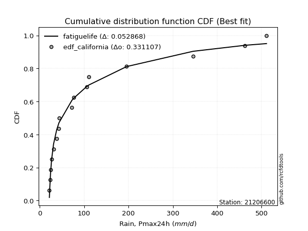</img>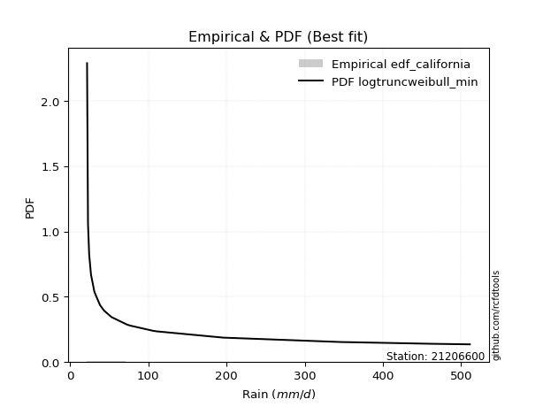</img>

</div>


### 2. EDF Hazen (1930)

Hazen method for plotting positions is a formula used to estimate the empirical cumulative probability distribution of flood events or other hydrological data. This formula often results in biased estimations, particularly when extrapolating to extreme events (high return periods).

<div align="center">


$P=(m-0.5)/n$


</div>


**2.1. Empirical values**

<div align="center">

|                | 0                 | 1                 | 2                  | 3         | 4                 | 5                  | 6                  | 7                  | 8                  | 9                  | 10                | 11                 | 12                | 13        | 14                 | 15        |
|:---------------|:------------------|:------------------|:-------------------|:----------|:------------------|:-------------------|:-------------------|:-------------------|:-------------------|:-------------------|:------------------|:-------------------|:------------------|:----------|:-------------------|:----------|
| date           | 2021              | 2020              | 2017               | 2018      | 2019              | 2015               | 2022               | 2023               | 2014               | 2016               | 2024              | 2013               | 2012              | 2010      | 2008               | 2009      |
| x              | 21.6              | 22.8              | 24.3               | 26.6      | 31.0              | 38.0               | 43.0               | 43.4               | 72.5               | 76.7               | 105.4             | 110.5              | 195.8             | 345.6     | 462.4              | 511.2     |
| m              | 1                 | 2                 | 3                  | 4         | 5                 | 6                  | 7                  | 8                  | 9                  | 10                 | 11                | 12                 | 13                | 14        | 15                 | 16        |
| empirical_dist | edf_hazen         | edf_hazen         | edf_hazen          | edf_hazen | edf_hazen         | edf_hazen          | edf_hazen          | edf_hazen          | edf_hazen          | edf_hazen          | edf_hazen         | edf_hazen          | edf_hazen         | edf_hazen | edf_hazen          | edf_hazen |
| empirical      | 0.03125           | 0.09375           | 0.15625            | 0.21875   | 0.28125           | 0.34375            | 0.40625            | 0.46875            | 0.53125            | 0.59375            | 0.65625           | 0.71875            | 0.78125           | 0.84375   | 0.90625            | 0.96875   |
| empirical_tr   | 1.032258064516129 | 1.103448275862069 | 1.1851851851851851 | 1.28      | 1.391304347826087 | 1.5238095238095237 | 1.6842105263157894 | 1.8823529411764706 | 2.1333333333333333 | 2.4615384615384617 | 2.909090909090909 | 3.5555555555555554 | 4.571428571428571 | 6.4       | 10.666666666666666 | 32.0      |

</div>


**2.2. Kolmogorov-Smirnov fit test (sorted by Δ)**


<div align="center">

|                | 0                   | 1                   | 2                   | 3                   | 4                 | 5                   | 6                   | 7                   | 8                   | 9                   | 10                  | 11                  | 12                    | 13                  | 14                  | 15                  | 16                  | 17                  | 18                  | 19                  | 20                  | 21                | 22                  | 23                  | 24                  | 25                  | 26                  | 27                  | 28                 | 29                  | 30                  | 31                  | 32                  | 33                 | 34                 | 35                  | 36                  | 37                  | 38                  | 39                 | 40                  | 41                  | 42                  | 43                  | 44                  | 45                 | 46                  | 47                  | 48                  | 49                  | 50                  | 51                  | 52                  | 53                  | 54                  | 55                  | 56                  | 57                  | 58                 | 59                 | 60                  | 61                 | 62                  | 63                 | 64                  | 65                 | 66                  | 67                  | 68                 | 69                  | 70                 | 71             | 72                 | 73                 | 74                 | 75                 | 76                  | 77                  | 78                  | 79                 | 80                | 81                 | 82                 | 83                 | 84                  | 85                 | 86                | 87             |
|:---------------|:--------------------|:--------------------|:--------------------|:--------------------|:------------------|:--------------------|:--------------------|:--------------------|:--------------------|:--------------------|:--------------------|:--------------------|:----------------------|:--------------------|:--------------------|:--------------------|:--------------------|:--------------------|:--------------------|:--------------------|:--------------------|:------------------|:--------------------|:--------------------|:--------------------|:--------------------|:--------------------|:--------------------|:-------------------|:--------------------|:--------------------|:--------------------|:--------------------|:-------------------|:-------------------|:--------------------|:--------------------|:--------------------|:--------------------|:-------------------|:--------------------|:--------------------|:--------------------|:--------------------|:--------------------|:-------------------|:--------------------|:--------------------|:--------------------|:--------------------|:--------------------|:--------------------|:--------------------|:--------------------|:--------------------|:--------------------|:--------------------|:--------------------|:-------------------|:-------------------|:--------------------|:-------------------|:--------------------|:-------------------|:--------------------|:-------------------|:--------------------|:--------------------|:-------------------|:--------------------|:-------------------|:---------------|:-------------------|:-------------------|:-------------------|:-------------------|:--------------------|:--------------------|:--------------------|:-------------------|:------------------|:-------------------|:-------------------|:-------------------|:--------------------|:-------------------|:------------------|:---------------|
| station        | 21206600            | 21206600            | 21206600            | 21206600            | 21206600          | 21206600            | 21206600            | 21206600            | 21206600            | 21206600            | 21206600            | 21206600            | 21206600              | 21206600            | 21206600            | 21206600            | 21206600            | 21206600            | 21206600            | 21206600            | 21206600            | 21206600          | 21206600            | 21206600            | 21206600            | 21206600            | 21206600            | 21206600            | 21206600           | 21206600            | 21206600            | 21206600            | 21206600            | 21206600           | 21206600           | 21206600            | 21206600            | 21206600            | 21206600            | 21206600           | 21206600            | 21206600            | 21206600            | 21206600            | 21206600            | 21206600           | 21206600            | 21206600            | 21206600            | 21206600            | 21206600            | 21206600            | 21206600            | 21206600            | 21206600            | 21206600            | 21206600            | 21206600            | 21206600           | 21206600           | 21206600            | 21206600           | 21206600            | 21206600           | 21206600            | 21206600           | 21206600            | 21206600            | 21206600           | 21206600            | 21206600           | 21206600       | 21206600           | 21206600           | 21206600           | 21206600           | 21206600            | 21206600            | 21206600            | 21206600           | 21206600          | 21206600           | 21206600           | 21206600           | 21206600            | 21206600           | 21206600          | 21206600       |
| empirical_dist | edf_hazen           | edf_hazen           | edf_hazen           | edf_hazen           | edf_hazen         | edf_hazen           | edf_hazen           | edf_hazen           | edf_hazen           | edf_hazen           | edf_hazen           | edf_hazen           | edf_hazen             | edf_hazen           | edf_hazen           | edf_hazen           | edf_hazen           | edf_hazen           | edf_hazen           | edf_hazen           | edf_hazen           | edf_hazen         | edf_hazen           | edf_hazen           | edf_hazen           | edf_hazen           | edf_hazen           | edf_hazen           | edf_hazen          | edf_hazen           | edf_hazen           | edf_hazen           | edf_hazen           | edf_hazen          | edf_hazen          | edf_hazen           | edf_hazen           | edf_hazen           | edf_hazen           | edf_hazen          | edf_hazen           | edf_hazen           | edf_hazen           | edf_hazen           | edf_hazen           | edf_hazen          | edf_hazen           | edf_hazen           | edf_hazen           | edf_hazen           | edf_hazen           | edf_hazen           | edf_hazen           | edf_hazen           | edf_hazen           | edf_hazen           | edf_hazen           | edf_hazen           | edf_hazen          | edf_hazen          | edf_hazen           | edf_hazen          | edf_hazen           | edf_hazen          | edf_hazen           | edf_hazen          | edf_hazen           | edf_hazen           | edf_hazen          | edf_hazen           | edf_hazen          | edf_hazen      | edf_hazen          | edf_hazen          | edf_hazen          | edf_hazen          | edf_hazen           | edf_hazen           | edf_hazen           | edf_hazen          | edf_hazen         | edf_hazen          | edf_hazen          | edf_hazen          | edf_hazen           | edf_hazen          | edf_hazen         | edf_hazen      |
| p_dist         | logalpha            | logtruncnorm        | fatiguelife         | logf                | loggenexpon       | johnsonsu           | loghalfnorm         | logweibull_min      | loghalflogistic     | loggompertz         | logexponnorm        | logexpon            | loglaplace_asymmetric | nct                 | logmielke           | weibull_min         | loginvweibull       | invweibull          | loginvgamma         | logfisk             | lognakagami         | logncf            | logmoyal            | lognct              | erlang              | loggenlogistic      | betaprime           | lograyleigh         | invgamma           | logjohnsonsu        | loginvgauss         | loggumbel_r         | logkstwobign        | logbetaprime       | invgauss           | ncf                 | logmaxwell          | alpha               | gamma               | logpearson3        | nakagami            | logfatiguelife      | f                   | loggamma            | loggamma            | logt               | lognorm             | lognorm             | logcrystalball      | logloggamma         | logrice             | wald                | loglogistic         | logchi2             | loghypsecant        | fisk                | genlogistic         | moyal               | loggumbel_l        | gumbel_r           | loglaplace          | logerlang          | pearson3            | rayleigh           | logwald             | halflogistic       | maxwell             | kstwobign           | halfnorm           | norm                | crystalball        | loggibrat      | gibrat             | logistic           | t                  | exponnorm          | hypsecant           | laplace_asymmetric  | genexpon            | expon              | rice              | gompertz           | laplace            | truncnorm          | gumbel_l            | loglognorm         | chi2              | mielke         |
| delta          | 0.08315776137326075 | 0.08401894471404261 | 0.08411784432797259 | 0.08435448603833379 | 0.084909684730882 | 0.08878256292417386 | 0.08883736716743201 | 0.09137748341310858 | 0.09185009923294252 | 0.09326121051366051 | 0.09658443851411658 | 0.09674455611922039 | 0.09678522846632753   | 0.09747801403115597 | 0.10535445206222205 | 0.10535926614315327 | 0.10550303348108359 | 0.10610352967199088 | 0.10629970608416317 | 0.10699786714955295 | 0.11304766825920942 | 0.113307874822347 | 0.11355687326664221 | 0.11555005051160994 | 0.11787191656965401 | 0.11913547081342757 | 0.12012014945890209 | 0.12072724004265034 | 0.1209716771632241 | 0.12140464275049156 | 0.12362125738550866 | 0.12500830110008143 | 0.12690651378598755 | 0.1290785054768473 | 0.1300299846529106 | 0.13185277762651226 | 0.13198057706768146 | 0.13241634997970564 | 0.13386870027795017 | 0.1340296144196932 | 0.13720417536806806 | 0.13724177239064428 | 0.14534329591471284 | 0.15472740958814035 | 0.15472740958814035 | 0.1606513582217559 | 0.16065204418495965 | 0.16065204418495965 | 0.16065207423518446 | 0.16106947253564274 | 0.16568930663978448 | 0.17193176088040385 | 0.18157927979313815 | 0.19122476546642386 | 0.19688724694351206 | 0.20412868238307968 | 0.21034219989737885 | 0.21096837757957376 | 0.2131305567560482 | 0.2151689757919997 | 0.22265072736142277 | 0.2253211632535338 | 0.22990539520461878 | 0.2346859088723322 | 0.23572911721615525 | 0.2382149851963638 | 0.24195796473028053 | 0.24854727124236586 | 0.2560262333270052 | 0.27633936894511785 | 0.2763393762175653 | 0.28125        | 0.2829645193472465 | 0.2840615217284185 | 0.2856867077200925 | 0.2889404373792168 | 0.29056302685153923 | 0.29125297413626006 | 0.29126835810979396 | 0.2912685275744328 | 0.297091765781104 | 0.2988440197036461 | 0.3113706320173135 | 0.3392539117918092 | 0.34609245997048604 | 0.3834665964266927 | 0.667635936115285 | nan            |
| deltao         | 0.331107277296      | 0.331107277296      | 0.331107277296      | 0.331107277296      | 0.331107277296    | 0.331107277296      | 0.331107277296      | 0.331107277296      | 0.331107277296      | 0.331107277296      | 0.331107277296      | 0.331107277296      | 0.331107277296        | 0.331107277296      | 0.331107277296      | 0.331107277296      | 0.331107277296      | 0.331107277296      | 0.331107277296      | 0.331107277296      | 0.331107277296      | 0.331107277296    | 0.331107277296      | 0.331107277296      | 0.331107277296      | 0.331107277296      | 0.331107277296      | 0.331107277296      | 0.331107277296     | 0.331107277296      | 0.331107277296      | 0.331107277296      | 0.331107277296      | 0.331107277296     | 0.331107277296     | 0.331107277296      | 0.331107277296      | 0.331107277296      | 0.331107277296      | 0.331107277296     | 0.331107277296      | 0.331107277296      | 0.331107277296      | 0.331107277296      | 0.331107277296      | 0.331107277296     | 0.331107277296      | 0.331107277296      | 0.331107277296      | 0.331107277296      | 0.331107277296      | 0.331107277296      | 0.331107277296      | 0.331107277296      | 0.331107277296      | 0.331107277296      | 0.331107277296      | 0.331107277296      | 0.331107277296     | 0.331107277296     | 0.331107277296      | 0.331107277296     | 0.331107277296      | 0.331107277296     | 0.331107277296      | 0.331107277296     | 0.331107277296      | 0.331107277296      | 0.331107277296     | 0.331107277296      | 0.331107277296     | 0.331107277296 | 0.331107277296     | 0.331107277296     | 0.331107277296     | 0.331107277296     | 0.331107277296      | 0.331107277296      | 0.331107277296      | 0.331107277296     | 0.331107277296    | 0.331107277296     | 0.331107277296     | 0.331107277296     | 0.331107277296      | 0.331107277296     | 0.331107277296    | 0.331107277296 |
| eval           | Δo > Δ              | Δo > Δ              | Δo > Δ              | Δo > Δ              | Δo > Δ            | Δo > Δ              | Δo > Δ              | Δo > Δ              | Δo > Δ              | Δo > Δ              | Δo > Δ              | Δo > Δ              | Δo > Δ                | Δo > Δ              | Δo > Δ              | Δo > Δ              | Δo > Δ              | Δo > Δ              | Δo > Δ              | Δo > Δ              | Δo > Δ              | Δo > Δ            | Δo > Δ              | Δo > Δ              | Δo > Δ              | Δo > Δ              | Δo > Δ              | Δo > Δ              | Δo > Δ             | Δo > Δ              | Δo > Δ              | Δo > Δ              | Δo > Δ              | Δo > Δ             | Δo > Δ             | Δo > Δ              | Δo > Δ              | Δo > Δ              | Δo > Δ              | Δo > Δ             | Δo > Δ              | Δo > Δ              | Δo > Δ              | Δo > Δ              | Δo > Δ              | Δo > Δ             | Δo > Δ              | Δo > Δ              | Δo > Δ              | Δo > Δ              | Δo > Δ              | Δo > Δ              | Δo > Δ              | Δo > Δ              | Δo > Δ              | Δo > Δ              | Δo > Δ              | Δo > Δ              | Δo > Δ             | Δo > Δ             | Δo > Δ              | Δo > Δ             | Δo > Δ              | Δo > Δ             | Δo > Δ              | Δo > Δ             | Δo > Δ              | Δo > Δ              | Δo > Δ             | Δo > Δ              | Δo > Δ             | Δo > Δ         | Δo > Δ             | Δo > Δ             | Δo > Δ             | Δo > Δ             | Δo > Δ              | Δo > Δ              | Δo > Δ              | Δo > Δ             | Δo > Δ            | Δo > Δ             | Δo > Δ             | Δo <= Δ            | Δo <= Δ             | Δo <= Δ            | Δo <= Δ           | Δo <= Δ        |
| fit            | 1                   | 1                   | 1                   | 1                   | 1                 | 1                   | 1                   | 1                   | 1                   | 1                   | 1                   | 1                   | 1                     | 1                   | 1                   | 1                   | 1                   | 1                   | 1                   | 1                   | 1                   | 1                 | 1                   | 1                   | 1                   | 1                   | 1                   | 1                   | 1                  | 1                   | 1                   | 1                   | 1                   | 1                  | 1                  | 1                   | 1                   | 1                   | 1                   | 1                  | 1                   | 1                   | 1                   | 1                   | 1                   | 1                  | 1                   | 1                   | 1                   | 1                   | 1                   | 1                   | 1                   | 1                   | 1                   | 1                   | 1                   | 1                   | 1                  | 1                  | 1                   | 1                  | 1                   | 1                  | 1                   | 1                  | 1                   | 1                   | 1                  | 1                   | 1                  | 1              | 1                  | 1                  | 1                  | 1                  | 1                   | 1                   | 1                   | 1                  | 1                 | 1                  | 1                  | 0                  | 0                   | 0                  | 0                 | 0              |
| n              | 16                  | 16                  | 16                  | 16                  | 16                | 16                  | 16                  | 16                  | 16                  | 16                  | 16                  | 16                  | 16                    | 16                  | 16                  | 16                  | 16                  | 16                  | 16                  | 16                  | 16                  | 16                | 16                  | 16                  | 16                  | 16                  | 16                  | 16                  | 16                 | 16                  | 16                  | 16                  | 16                  | 16                 | 16                 | 16                  | 16                  | 16                  | 16                  | 16                 | 16                  | 16                  | 16                  | 16                  | 16                  | 16                 | 16                  | 16                  | 16                  | 16                  | 16                  | 16                  | 16                  | 16                  | 16                  | 16                  | 16                  | 16                  | 16                 | 16                 | 16                  | 16                 | 16                  | 16                 | 16                  | 16                 | 16                  | 16                  | 16                 | 16                  | 16                 | 16             | 16                 | 16                 | 16                 | 16                 | 16                  | 16                  | 16                  | 16                 | 16                | 16                 | 16                 | 16                 | 16                  | 16                 | 16                | 16             |
| best_fit       | 1                   | 0                   | 0                   | 0                   | 0                 | 0                   | 0                   | 0                   | 0                   | 0                   | 0                   | 0                   | 0                     | 0                   | 0                   | 0                   | 0                   | 0                   | 0                   | 0                   | 0                   | 0                 | 0                   | 0                   | 0                   | 0                   | 0                   | 0                   | 0                  | 0                   | 0                   | 0                   | 0                   | 0                  | 0                  | 0                   | 0                   | 0                   | 0                   | 0                  | 0                   | 0                   | 0                   | 0                   | 0                   | 0                  | 0                   | 0                   | 0                   | 0                   | 0                   | 0                   | 0                   | 0                   | 0                   | 0                   | 0                   | 0                   | 0                  | 0                  | 0                   | 0                  | 0                   | 0                  | 0                   | 0                  | 0                   | 0                   | 0                  | 0                   | 0                  | 0              | 0                  | 0                  | 0                  | 0                  | 0                   | 0                   | 0                   | 0                  | 0                 | 0                  | 0                  | 0                  | 0                   | 0                  | 0                 | 0              |
| best_fit_sort  | 1                   | 2                   | 3                   | 4                   | 5                 | 6                   | 7                   | 8                   | 9                   | 10                  | 11                  | 12                  | 13                    | 14                  | 15                  | 16                  | 17                  | 18                  | 19                  | 20                  | 21                  | 22                | 23                  | 24                  | 25                  | 26                  | 27                  | 28                  | 29                 | 30                  | 31                  | 32                  | 33                  | 34                 | 35                 | 36                  | 37                  | 38                  | 39                  | 40                 | 41                  | 42                  | 43                  | 44                  | 45                  | 46                 | 47                  | 48                  | 49                  | 50                  | 51                  | 52                  | 53                  | 54                  | 55                  | 56                  | 57                  | 58                  | 59                 | 60                 | 61                  | 62                 | 63                  | 64                 | 65                  | 66                 | 67                  | 68                  | 69                 | 70                  | 71                 | 72             | 73                 | 74                 | 75                 | 76                 | 77                  | 78                  | 79                  | 80                 | 81                | 82                 | 83                 | 84                 | 85                  | 86                 | 87                | 88             |

</div>


**2.3. Best fit**

<div align="center">

|   id |   station | empirical_dist   | p_dist   |     delta |   deltao | eval   |   fit |   n |   best_fit |   best_fit_sort |
|-----:|----------:|:-----------------|:---------|----------:|---------:|:-------|------:|----:|-----------:|----------------:|
|    0 |  21206600 | edf_hazen        | logalpha | 0.0831578 | 0.331107 | Δo > Δ |     1 |  16 |          1 |               1 |

</div>


<div align="center">

</img></img>

</div>


### 3. EDF Weibull (1939)

Weibull plotting position formula is an empirical method used to estimate the non-exceedance probability or plotting position for a set of observed data, is often recommended or widely used in practice, particularly in flood frequency analysis.

<div align="center">


$P=m/(n+1)$


</div>


**3.1. Empirical values**

<div align="center">

|                | 0                    | 1                   | 2                   | 3                   | 4                   | 5                   | 6                  | 7                   | 8                  | 9                  | 10                 | 11                 | 12                 | 13                 | 14                 | 15                 |
|:---------------|:---------------------|:--------------------|:--------------------|:--------------------|:--------------------|:--------------------|:-------------------|:--------------------|:-------------------|:-------------------|:-------------------|:-------------------|:-------------------|:-------------------|:-------------------|:-------------------|
| date           | 2021                 | 2020                | 2017                | 2018                | 2019                | 2015                | 2022               | 2023                | 2014               | 2016               | 2024               | 2013               | 2012               | 2010               | 2008               | 2009               |
| x              | 21.6                 | 22.8                | 24.3                | 26.6                | 31.0                | 38.0                | 43.0               | 43.4                | 72.5               | 76.7               | 105.4              | 110.5              | 195.8              | 345.6              | 462.4              | 511.2              |
| m              | 1                    | 2                   | 3                   | 4                   | 5                   | 6                   | 7                  | 8                   | 9                  | 10                 | 11                 | 12                 | 13                 | 14                 | 15                 | 16                 |
| empirical_dist | edf_weibull          | edf_weibull         | edf_weibull         | edf_weibull         | edf_weibull         | edf_weibull         | edf_weibull        | edf_weibull         | edf_weibull        | edf_weibull        | edf_weibull        | edf_weibull        | edf_weibull        | edf_weibull        | edf_weibull        | edf_weibull        |
| empirical      | 0.058823529411764705 | 0.11764705882352941 | 0.17647058823529413 | 0.23529411764705882 | 0.29411764705882354 | 0.35294117647058826 | 0.4117647058823529 | 0.47058823529411764 | 0.5294117647058824 | 0.5882352941176471 | 0.6470588235294118 | 0.7058823529411765 | 0.7647058823529411 | 0.8235294117647058 | 0.8823529411764706 | 0.9411764705882353 |
| empirical_tr   | 1.0625               | 1.1333333333333333  | 1.2142857142857144  | 1.3076923076923077  | 1.4166666666666667  | 1.5454545454545456  | 1.7                | 1.8888888888888888  | 2.125              | 2.428571428571429  | 2.8333333333333335 | 3.4000000000000004 | 4.249999999999999  | 5.666666666666665  | 8.499999999999998  | 16.999999999999996 |

</div>


**3.2. Kolmogorov-Smirnov fit test (sorted by Δ)**


<div align="center">

|                | 0                   | 1                   | 2                   | 3                  | 4                   | 5                  | 6                   | 7                   | 8                     | 9                   | 10                  | 11                  | 12                  | 13                  | 14                  | 15                  | 16                  | 17                  | 18                  | 19                  | 20                  | 21                  | 22                  | 23                  | 24                  | 25                  | 26                 | 27                  | 28                  | 29                 | 30                  | 31                  | 32                 | 33                  | 34                  | 35                 | 36                 | 37                  | 38                  | 39                  | 40                  | 41                  | 42                  | 43                | 44                | 45                  | 46                 | 47                 | 48                 | 49                  | 50                  | 51                 | 52                  | 53                  | 54                 | 55                 | 56                  | 57                 | 58                  | 59                  | 60                  | 61                  | 62                  | 63                 | 64                 | 65                  | 66                  | 67                  | 68                 | 69                  | 70                  | 71                | 72                 | 73                  | 74                  | 75                 | 76                  | 77                 | 78                 | 79                 | 80                  | 81                  | 82                  | 83                  | 84                  | 85                  | 86                 | 87             |
|:---------------|:--------------------|:--------------------|:--------------------|:-------------------|:--------------------|:-------------------|:--------------------|:--------------------|:----------------------|:--------------------|:--------------------|:--------------------|:--------------------|:--------------------|:--------------------|:--------------------|:--------------------|:--------------------|:--------------------|:--------------------|:--------------------|:--------------------|:--------------------|:--------------------|:--------------------|:--------------------|:-------------------|:--------------------|:--------------------|:-------------------|:--------------------|:--------------------|:-------------------|:--------------------|:--------------------|:-------------------|:-------------------|:--------------------|:--------------------|:--------------------|:--------------------|:--------------------|:--------------------|:------------------|:------------------|:--------------------|:-------------------|:-------------------|:-------------------|:--------------------|:--------------------|:-------------------|:--------------------|:--------------------|:-------------------|:-------------------|:--------------------|:-------------------|:--------------------|:--------------------|:--------------------|:--------------------|:--------------------|:-------------------|:-------------------|:--------------------|:--------------------|:--------------------|:-------------------|:--------------------|:--------------------|:------------------|:-------------------|:--------------------|:--------------------|:-------------------|:--------------------|:-------------------|:-------------------|:-------------------|:--------------------|:--------------------|:--------------------|:--------------------|:--------------------|:--------------------|:-------------------|:---------------|
| station        | 21206600            | 21206600            | 21206600            | 21206600           | 21206600            | 21206600           | 21206600            | 21206600            | 21206600              | 21206600            | 21206600            | 21206600            | 21206600            | 21206600            | 21206600            | 21206600            | 21206600            | 21206600            | 21206600            | 21206600            | 21206600            | 21206600            | 21206600            | 21206600            | 21206600            | 21206600            | 21206600           | 21206600            | 21206600            | 21206600           | 21206600            | 21206600            | 21206600           | 21206600            | 21206600            | 21206600           | 21206600           | 21206600            | 21206600            | 21206600            | 21206600            | 21206600            | 21206600            | 21206600          | 21206600          | 21206600            | 21206600           | 21206600           | 21206600           | 21206600            | 21206600            | 21206600           | 21206600            | 21206600            | 21206600           | 21206600           | 21206600            | 21206600           | 21206600            | 21206600            | 21206600            | 21206600            | 21206600            | 21206600           | 21206600           | 21206600            | 21206600            | 21206600            | 21206600           | 21206600            | 21206600            | 21206600          | 21206600           | 21206600            | 21206600            | 21206600           | 21206600            | 21206600           | 21206600           | 21206600           | 21206600            | 21206600            | 21206600            | 21206600            | 21206600            | 21206600            | 21206600           | 21206600       |
| empirical_dist | edf_weibull         | edf_weibull         | edf_weibull         | edf_weibull        | edf_weibull         | edf_weibull        | edf_weibull         | edf_weibull         | edf_weibull           | edf_weibull         | edf_weibull         | edf_weibull         | edf_weibull         | edf_weibull         | edf_weibull         | edf_weibull         | edf_weibull         | edf_weibull         | edf_weibull         | edf_weibull         | edf_weibull         | edf_weibull         | edf_weibull         | edf_weibull         | edf_weibull         | edf_weibull         | edf_weibull        | edf_weibull         | edf_weibull         | edf_weibull        | edf_weibull         | edf_weibull         | edf_weibull        | edf_weibull         | edf_weibull         | edf_weibull        | edf_weibull        | edf_weibull         | edf_weibull         | edf_weibull         | edf_weibull         | edf_weibull         | edf_weibull         | edf_weibull       | edf_weibull       | edf_weibull         | edf_weibull        | edf_weibull        | edf_weibull        | edf_weibull         | edf_weibull         | edf_weibull        | edf_weibull         | edf_weibull         | edf_weibull        | edf_weibull        | edf_weibull         | edf_weibull        | edf_weibull         | edf_weibull         | edf_weibull         | edf_weibull         | edf_weibull         | edf_weibull        | edf_weibull        | edf_weibull         | edf_weibull         | edf_weibull         | edf_weibull        | edf_weibull         | edf_weibull         | edf_weibull       | edf_weibull        | edf_weibull         | edf_weibull         | edf_weibull        | edf_weibull         | edf_weibull        | edf_weibull        | edf_weibull        | edf_weibull         | edf_weibull         | edf_weibull         | edf_weibull         | edf_weibull         | edf_weibull         | edf_weibull        | edf_weibull    |
| p_dist         | logweibull_min      | fatiguelife         | logf                | johnsonsu          | loghalfnorm         | logalpha           | logexponnorm        | logexpon            | loglaplace_asymmetric | nct                 | logtruncnorm        | loggenexpon         | logmielke           | loginvweibull       | invweibull          | loginvgamma         | loghalflogistic     | logfisk             | loggompertz         | lognakagami         | logmoyal            | lognct              | loggenlogistic      | betaprime           | lograyleigh         | invgamma            | logjohnsonsu       | logncf              | nakagami            | loginvgauss        | weibull_min         | loggumbel_r         | logkstwobign       | logbetaprime        | invgauss            | ncf                | logmaxwell         | alpha               | logpearson3         | erlang              | logfatiguelife      | f                   | gamma               | loggamma          | loggamma          | logt                | lognorm            | lognorm            | logcrystalball     | logloggamma         | logrice             | wald               | fisk                | moyal               | loglogistic        | logchi2            | gumbel_r            | loghypsecant       | pearson3            | halflogistic        | genlogistic         | loggumbel_l         | rayleigh            | loglaplace         | logerlang          | halfnorm            | maxwell             | kstwobign           | logwald            | norm                | crystalball         | logistic          | t                  | hypsecant           | rice                | gibrat             | exponnorm           | laplace_asymmetric | genexpon           | expon              | loggibrat           | laplace             | gompertz            | gumbel_l            | truncnorm           | loglognorm          | chi2               | mielke         |
| delta          | 0.07784470522352904 | 0.08051819783670155 | 0.08619272133245143 | 0.0906207982182915 | 0.09067560246154965 | 0.0942890857198089 | 0.09842267380823422 | 0.09858279141333803 | 0.09862346376044517   | 0.09931624932527361 | 0.10056306236110144 | 0.10145380237794083 | 0.10719268735633969 | 0.10734126877520123 | 0.10794176496610852 | 0.10813794137828081 | 0.10839421688000134 | 0.10883610244367059 | 0.10980532816071933 | 0.11095018001693857 | 0.11539510856075985 | 0.11738828580572758 | 0.12097370610754521 | 0.12195838475301973 | 0.12256547533676798 | 0.12280991245734174 | 0.1232428780446092 | 0.12356307365706515 | 0.12433652830924458 | 0.1254594926796263 | 0.12557985437844743 | 0.12684653639419907 | 0.1287447490801052 | 0.13091674077096493 | 0.13186821994702824 | 0.1336910129206299 | 0.1338188123617991 | 0.13425458527382328 | 0.13586784971381083 | 0.13809250480494817 | 0.13908000768476192 | 0.14718153120883049 | 0.15408928851324433 | 0.156565644882258 | 0.156565644882258 | 0.16248959351587355 | 0.1624902794790773 | 0.1624902794790773 | 0.1624903095293021 | 0.16290770782976038 | 0.16752754193390212 | 0.1737699961745215 | 0.17655515297131497 | 0.18339484816780904 | 0.1834175150872558 | 0.1930630007605415 | 0.19728192305706815 | 0.1987254822376297 | 0.20233186579285406 | 0.21064145578459909 | 0.21218043519149649 | 0.21496879205016584 | 0.21710096079609775 | 0.2244889626555404 | 0.2254291647143415 | 0.22845270391524047 | 0.22909031767145704 | 0.23996200977578025 | 0.2485967642749788 | 0.26347172188629436 | 0.26347172915874184 | 0.271193874669595 | 0.2763058014364431 | 0.27769537979271575 | 0.28422411872228054 | 0.2848027546413641 | 0.29077867267333446 | 0.2930912094303777 | 0.2931065934039116 | 0.2931067628685504 | 0.29411764705882354 | 0.29850298495849004 | 0.30068225499776374 | 0.33322481291166256 | 0.34109214708592683 | 0.35956953760316324 | 0.6500402988837826 | nan            |
| deltao         | 0.331107277296      | 0.331107277296      | 0.331107277296      | 0.331107277296     | 0.331107277296      | 0.331107277296     | 0.331107277296      | 0.331107277296      | 0.331107277296        | 0.331107277296      | 0.331107277296      | 0.331107277296      | 0.331107277296      | 0.331107277296      | 0.331107277296      | 0.331107277296      | 0.331107277296      | 0.331107277296      | 0.331107277296      | 0.331107277296      | 0.331107277296      | 0.331107277296      | 0.331107277296      | 0.331107277296      | 0.331107277296      | 0.331107277296      | 0.331107277296     | 0.331107277296      | 0.331107277296      | 0.331107277296     | 0.331107277296      | 0.331107277296      | 0.331107277296     | 0.331107277296      | 0.331107277296      | 0.331107277296     | 0.331107277296     | 0.331107277296      | 0.331107277296      | 0.331107277296      | 0.331107277296      | 0.331107277296      | 0.331107277296      | 0.331107277296    | 0.331107277296    | 0.331107277296      | 0.331107277296     | 0.331107277296     | 0.331107277296     | 0.331107277296      | 0.331107277296      | 0.331107277296     | 0.331107277296      | 0.331107277296      | 0.331107277296     | 0.331107277296     | 0.331107277296      | 0.331107277296     | 0.331107277296      | 0.331107277296      | 0.331107277296      | 0.331107277296      | 0.331107277296      | 0.331107277296     | 0.331107277296     | 0.331107277296      | 0.331107277296      | 0.331107277296      | 0.331107277296     | 0.331107277296      | 0.331107277296      | 0.331107277296    | 0.331107277296     | 0.331107277296      | 0.331107277296      | 0.331107277296     | 0.331107277296      | 0.331107277296     | 0.331107277296     | 0.331107277296     | 0.331107277296      | 0.331107277296      | 0.331107277296      | 0.331107277296      | 0.331107277296      | 0.331107277296      | 0.331107277296     | 0.331107277296 |
| eval           | Δo > Δ              | Δo > Δ              | Δo > Δ              | Δo > Δ             | Δo > Δ              | Δo > Δ             | Δo > Δ              | Δo > Δ              | Δo > Δ                | Δo > Δ              | Δo > Δ              | Δo > Δ              | Δo > Δ              | Δo > Δ              | Δo > Δ              | Δo > Δ              | Δo > Δ              | Δo > Δ              | Δo > Δ              | Δo > Δ              | Δo > Δ              | Δo > Δ              | Δo > Δ              | Δo > Δ              | Δo > Δ              | Δo > Δ              | Δo > Δ             | Δo > Δ              | Δo > Δ              | Δo > Δ             | Δo > Δ              | Δo > Δ              | Δo > Δ             | Δo > Δ              | Δo > Δ              | Δo > Δ             | Δo > Δ             | Δo > Δ              | Δo > Δ              | Δo > Δ              | Δo > Δ              | Δo > Δ              | Δo > Δ              | Δo > Δ            | Δo > Δ            | Δo > Δ              | Δo > Δ             | Δo > Δ             | Δo > Δ             | Δo > Δ              | Δo > Δ              | Δo > Δ             | Δo > Δ              | Δo > Δ              | Δo > Δ             | Δo > Δ             | Δo > Δ              | Δo > Δ             | Δo > Δ              | Δo > Δ              | Δo > Δ              | Δo > Δ              | Δo > Δ              | Δo > Δ             | Δo > Δ             | Δo > Δ              | Δo > Δ              | Δo > Δ              | Δo > Δ             | Δo > Δ              | Δo > Δ              | Δo > Δ            | Δo > Δ             | Δo > Δ              | Δo > Δ              | Δo > Δ             | Δo > Δ              | Δo > Δ             | Δo > Δ             | Δo > Δ             | Δo > Δ              | Δo > Δ              | Δo > Δ              | Δo <= Δ             | Δo <= Δ             | Δo <= Δ             | Δo <= Δ            | Δo <= Δ        |
| fit            | 1                   | 1                   | 1                   | 1                  | 1                   | 1                  | 1                   | 1                   | 1                     | 1                   | 1                   | 1                   | 1                   | 1                   | 1                   | 1                   | 1                   | 1                   | 1                   | 1                   | 1                   | 1                   | 1                   | 1                   | 1                   | 1                   | 1                  | 1                   | 1                   | 1                  | 1                   | 1                   | 1                  | 1                   | 1                   | 1                  | 1                  | 1                   | 1                   | 1                   | 1                   | 1                   | 1                   | 1                 | 1                 | 1                   | 1                  | 1                  | 1                  | 1                   | 1                   | 1                  | 1                   | 1                   | 1                  | 1                  | 1                   | 1                  | 1                   | 1                   | 1                   | 1                   | 1                   | 1                  | 1                  | 1                   | 1                   | 1                   | 1                  | 1                   | 1                   | 1                 | 1                  | 1                   | 1                   | 1                  | 1                   | 1                  | 1                  | 1                  | 1                   | 1                   | 1                   | 0                   | 0                   | 0                   | 0                  | 0              |
| n              | 16                  | 16                  | 16                  | 16                 | 16                  | 16                 | 16                  | 16                  | 16                    | 16                  | 16                  | 16                  | 16                  | 16                  | 16                  | 16                  | 16                  | 16                  | 16                  | 16                  | 16                  | 16                  | 16                  | 16                  | 16                  | 16                  | 16                 | 16                  | 16                  | 16                 | 16                  | 16                  | 16                 | 16                  | 16                  | 16                 | 16                 | 16                  | 16                  | 16                  | 16                  | 16                  | 16                  | 16                | 16                | 16                  | 16                 | 16                 | 16                 | 16                  | 16                  | 16                 | 16                  | 16                  | 16                 | 16                 | 16                  | 16                 | 16                  | 16                  | 16                  | 16                  | 16                  | 16                 | 16                 | 16                  | 16                  | 16                  | 16                 | 16                  | 16                  | 16                | 16                 | 16                  | 16                  | 16                 | 16                  | 16                 | 16                 | 16                 | 16                  | 16                  | 16                  | 16                  | 16                  | 16                  | 16                 | 16             |
| best_fit       | 1                   | 0                   | 0                   | 0                  | 0                   | 0                  | 0                   | 0                   | 0                     | 0                   | 0                   | 0                   | 0                   | 0                   | 0                   | 0                   | 0                   | 0                   | 0                   | 0                   | 0                   | 0                   | 0                   | 0                   | 0                   | 0                   | 0                  | 0                   | 0                   | 0                  | 0                   | 0                   | 0                  | 0                   | 0                   | 0                  | 0                  | 0                   | 0                   | 0                   | 0                   | 0                   | 0                   | 0                 | 0                 | 0                   | 0                  | 0                  | 0                  | 0                   | 0                   | 0                  | 0                   | 0                   | 0                  | 0                  | 0                   | 0                  | 0                   | 0                   | 0                   | 0                   | 0                   | 0                  | 0                  | 0                   | 0                   | 0                   | 0                  | 0                   | 0                   | 0                 | 0                  | 0                   | 0                   | 0                  | 0                   | 0                  | 0                  | 0                  | 0                   | 0                   | 0                   | 0                   | 0                   | 0                   | 0                  | 0              |
| best_fit_sort  | 1                   | 2                   | 3                   | 4                  | 5                   | 6                  | 7                   | 8                   | 9                     | 10                  | 11                  | 12                  | 13                  | 14                  | 15                  | 16                  | 17                  | 18                  | 19                  | 20                  | 21                  | 22                  | 23                  | 24                  | 25                  | 26                  | 27                 | 28                  | 29                  | 30                 | 31                  | 32                  | 33                 | 34                  | 35                  | 36                 | 37                 | 38                  | 39                  | 40                  | 41                  | 42                  | 43                  | 44                | 45                | 46                  | 47                 | 48                 | 49                 | 50                  | 51                  | 52                 | 53                  | 54                  | 55                 | 56                 | 57                  | 58                 | 59                  | 60                  | 61                  | 62                  | 63                  | 64                 | 65                 | 66                  | 67                  | 68                  | 69                 | 70                  | 71                  | 72                | 73                 | 74                  | 75                  | 76                 | 77                  | 78                 | 79                 | 80                 | 81                  | 82                  | 83                  | 84                  | 85                  | 86                  | 87                 | 88             |

</div>


**3.3. Best fit**

<div align="center">

|   id |   station | empirical_dist   | p_dist         |     delta |   deltao | eval   |   fit |   n |   best_fit |   best_fit_sort |
|-----:|----------:|:-----------------|:---------------|----------:|---------:|:-------|------:|----:|-----------:|----------------:|
|    0 |  21206600 | edf_weibull      | logweibull_min | 0.0778447 | 0.331107 | Δo > Δ |     1 |  16 |          1 |               1 |

</div>


<div align="center">

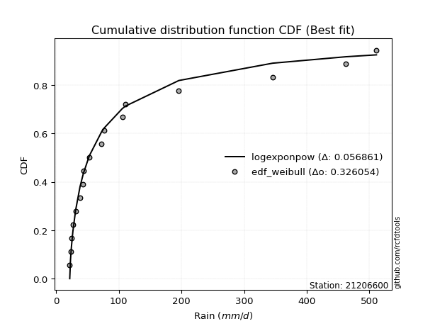</img>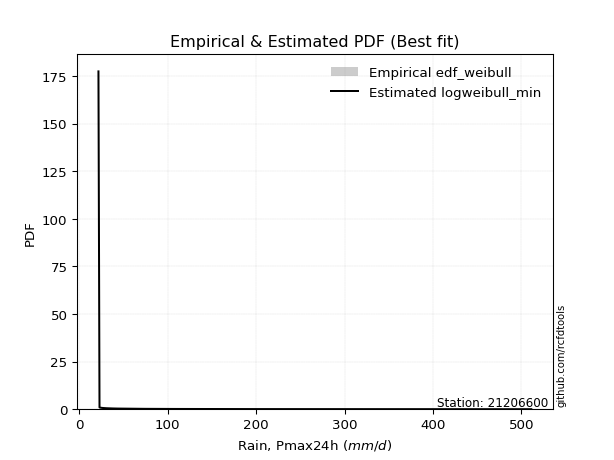</img>

</div>


### 4. EDF Beard (1943)

The Beard formula (or Beard´s plotting position formula) in hydrology is used to estimate the empirical non-exceedance probability _(P)_ of a flood event (or other extreme hydrological data point) within a given dataset.

<div align="center">


$P=(m-0.31)/(n+0.38)$


</div>


**4.1. Empirical values**

<div align="center">

|                | 0                   | 1                   | 2                   | 3                   | 4                   | 5                  | 6                  | 7                   | 8                  | 9                  | 10                 | 11                 | 12                 | 13                 | 14                 | 15                 |
|:---------------|:--------------------|:--------------------|:--------------------|:--------------------|:--------------------|:-------------------|:-------------------|:--------------------|:-------------------|:-------------------|:-------------------|:-------------------|:-------------------|:-------------------|:-------------------|:-------------------|
| date           | 2021                | 2020                | 2017                | 2018                | 2019                | 2015               | 2022               | 2023                | 2014               | 2016               | 2024               | 2013               | 2012               | 2010               | 2008               | 2009               |
| x              | 21.6                | 22.8                | 24.3                | 26.6                | 31.0                | 38.0               | 43.0               | 43.4                | 72.5               | 76.7               | 105.4              | 110.5              | 195.8              | 345.6              | 462.4              | 511.2              |
| m              | 1                   | 2                   | 3                   | 4                   | 5                   | 6                  | 7                  | 8                   | 9                  | 10                 | 11                 | 12                 | 13                 | 14                 | 15                 | 16                 |
| empirical_dist | edf_beard           | edf_beard           | edf_beard           | edf_beard           | edf_beard           | edf_beard          | edf_beard          | edf_beard           | edf_beard          | edf_beard          | edf_beard          | edf_beard          | edf_beard          | edf_beard          | edf_beard          | edf_beard          |
| empirical      | 0.04212454212454212 | 0.10317460317460318 | 0.16422466422466422 | 0.22527472527472528 | 0.28632478632478636 | 0.3473748473748474 | 0.4084249084249085 | 0.46947496947496953 | 0.5305250305250305 | 0.5915750915750916 | 0.6526251526251526 | 0.7136752136752137 | 0.7747252747252747 | 0.8357753357753358 | 0.8968253968253969 | 0.9578754578754579 |
| empirical_tr   | 1.0439770554493308  | 1.1150442477876106  | 1.1964937910883857  | 1.2907801418439715  | 1.4011976047904193  | 1.5322731524789526 | 1.690402476780186  | 1.884925201380898   | 2.130039011703511  | 2.4484304932735426 | 2.878734622144113  | 3.492537313432836  | 4.439024390243903  | 6.08921933085502   | 9.692307692307695  | 23.73913043478263  |

</div>


**4.2. Kolmogorov-Smirnov fit test (sorted by Δ)**


<div align="center">

|                | 0                   | 1                  | 2                   | 3                   | 4                   | 5                   | 6                  | 7                   | 8                   | 9                   | 10                    | 11                 | 12                 | 13                 | 14                  | 15                  | 16                  | 17                  | 18                  | 19                  | 20                  | 21                  | 22                  | 23                  | 24                 | 25                  | 26                  | 27                  | 28                  | 29                  | 30                  | 31                 | 32                  | 33                  | 34                  | 35                  | 36                 | 37                | 38                 | 39                  | 40                  | 41                  | 42                  | 43                  | 44                  | 45                  | 46                  | 47                  | 48                | 49                  | 50                | 51                  | 52                  | 53                  | 54                 | 55                 | 56                  | 57                  | 58                  | 59                  | 60                  | 61                 | 62                  | 63                  | 64                 | 65                  | 66                 | 67                  | 68                  | 69                  | 70                | 71                  | 72                  | 73                | 74                 | 75                  | 76                  | 77                 | 78                 | 79                 | 80                 | 81                  | 82                 | 83                  | 84                  | 85                 | 86                 | 87             |
|:---------------|:--------------------|:-------------------|:--------------------|:--------------------|:--------------------|:--------------------|:-------------------|:--------------------|:--------------------|:--------------------|:----------------------|:-------------------|:-------------------|:-------------------|:--------------------|:--------------------|:--------------------|:--------------------|:--------------------|:--------------------|:--------------------|:--------------------|:--------------------|:--------------------|:-------------------|:--------------------|:--------------------|:--------------------|:--------------------|:--------------------|:--------------------|:-------------------|:--------------------|:--------------------|:--------------------|:--------------------|:-------------------|:------------------|:-------------------|:--------------------|:--------------------|:--------------------|:--------------------|:--------------------|:--------------------|:--------------------|:--------------------|:--------------------|:------------------|:--------------------|:------------------|:--------------------|:--------------------|:--------------------|:-------------------|:-------------------|:--------------------|:--------------------|:--------------------|:--------------------|:--------------------|:-------------------|:--------------------|:--------------------|:-------------------|:--------------------|:-------------------|:--------------------|:--------------------|:--------------------|:------------------|:--------------------|:--------------------|:------------------|:-------------------|:--------------------|:--------------------|:-------------------|:-------------------|:-------------------|:-------------------|:--------------------|:-------------------|:--------------------|:--------------------|:-------------------|:-------------------|:---------------|
| station        | 21206600            | 21206600           | 21206600            | 21206600            | 21206600            | 21206600            | 21206600           | 21206600            | 21206600            | 21206600            | 21206600              | 21206600           | 21206600           | 21206600           | 21206600            | 21206600            | 21206600            | 21206600            | 21206600            | 21206600            | 21206600            | 21206600            | 21206600            | 21206600            | 21206600           | 21206600            | 21206600            | 21206600            | 21206600            | 21206600            | 21206600            | 21206600           | 21206600            | 21206600            | 21206600            | 21206600            | 21206600           | 21206600          | 21206600           | 21206600            | 21206600            | 21206600            | 21206600            | 21206600            | 21206600            | 21206600            | 21206600            | 21206600            | 21206600          | 21206600            | 21206600          | 21206600            | 21206600            | 21206600            | 21206600           | 21206600           | 21206600            | 21206600            | 21206600            | 21206600            | 21206600            | 21206600           | 21206600            | 21206600            | 21206600           | 21206600            | 21206600           | 21206600            | 21206600            | 21206600            | 21206600          | 21206600            | 21206600            | 21206600          | 21206600           | 21206600            | 21206600            | 21206600           | 21206600           | 21206600           | 21206600           | 21206600            | 21206600           | 21206600            | 21206600            | 21206600           | 21206600           | 21206600       |
| empirical_dist | edf_beard           | edf_beard          | edf_beard           | edf_beard           | edf_beard           | edf_beard           | edf_beard          | edf_beard           | edf_beard           | edf_beard           | edf_beard             | edf_beard          | edf_beard          | edf_beard          | edf_beard           | edf_beard           | edf_beard           | edf_beard           | edf_beard           | edf_beard           | edf_beard           | edf_beard           | edf_beard           | edf_beard           | edf_beard          | edf_beard           | edf_beard           | edf_beard           | edf_beard           | edf_beard           | edf_beard           | edf_beard          | edf_beard           | edf_beard           | edf_beard           | edf_beard           | edf_beard          | edf_beard         | edf_beard          | edf_beard           | edf_beard           | edf_beard           | edf_beard           | edf_beard           | edf_beard           | edf_beard           | edf_beard           | edf_beard           | edf_beard         | edf_beard           | edf_beard         | edf_beard           | edf_beard           | edf_beard           | edf_beard          | edf_beard          | edf_beard           | edf_beard           | edf_beard           | edf_beard           | edf_beard           | edf_beard          | edf_beard           | edf_beard           | edf_beard          | edf_beard           | edf_beard          | edf_beard           | edf_beard           | edf_beard           | edf_beard         | edf_beard           | edf_beard           | edf_beard         | edf_beard          | edf_beard           | edf_beard           | edf_beard          | edf_beard          | edf_beard          | edf_beard          | edf_beard           | edf_beard          | edf_beard           | edf_beard           | edf_beard          | edf_beard          | edf_beard      |
| p_dist         | fatiguelife         | logweibull_min     | logalpha            | logf                | johnsonsu           | loghalfnorm         | logtruncnorm       | loggenexpon         | logexponnorm        | logexpon            | loglaplace_asymmetric | nct                | loghalflogistic    | loggompertz        | logmielke           | loginvweibull       | invweibull          | loginvgamma         | logfisk             | lognakagami         | weibull_min         | logncf              | logmoyal            | lognct              | loggenlogistic     | betaprime           | lograyleigh         | invgamma            | logjohnsonsu        | loginvgauss         | loggumbel_r         | erlang             | logkstwobign        | logbetaprime        | invgauss            | nakagami            | ncf                | logmaxwell        | alpha              | logpearson3         | logfatiguelife      | gamma               | f                   | loggamma            | loggamma            | logt                | lognorm             | lognorm             | logcrystalball    | logloggamma         | logrice           | wald                | loglogistic         | logchi2             | fisk               | loghypsecant       | moyal               | gumbel_r            | genlogistic         | loggumbel_l         | pearson3            | loglaplace         | logerlang           | rayleigh            | halflogistic       | maxwell             | logwald            | kstwobign           | halfnorm            | norm                | crystalball       | t                   | logistic            | gibrat            | hypsecant          | loggibrat           | exponnorm           | laplace_asymmetric | genexpon           | expon              | rice               | gompertz            | laplace            | truncnorm           | gumbel_l            | loglognorm         | chi2               | mielke         |
| delta          | 0.08049299695312517 | 0.0805029412885665 | 0.08426969334747536 | 0.08507945551330331 | 0.08950753239914333 | 0.08956233664240154 | 0.0905436699887679 | 0.09143441000560729 | 0.09730940798908605 | 0.09746952559418987 | 0.097510197941297     | 0.0982029835061255 | 0.0983748245076678 | 0.0997859357883858 | 0.10607942153719152 | 0.10622800295605306 | 0.10682849914696035 | 0.10702467555913264 | 0.10772283662452242 | 0.10983691419779046 | 0.11333393036781747 | 0.11403284429731653 | 0.11428184274161174 | 0.11627501998657946 | 0.1198604402883971 | 0.12084511893387162 | 0.12145220951761987 | 0.12169664663819357 | 0.12212961222546104 | 0.12434622686047814 | 0.12573327057505096 | 0.1258465807943182 | 0.12763148326095708 | 0.12980347495181682 | 0.13075495412788007 | 0.13212938904328175 | 0.1325777471014818 | 0.132705546542651 | 0.1331413194546751 | 0.13475458389466272 | 0.13796674186561375 | 0.14184336450261437 | 0.14606826538968232 | 0.15545237906310982 | 0.15545237906310982 | 0.16137632769672544 | 0.16137701365992918 | 0.16137701365992918 | 0.161377043710154 | 0.16179444201061227 | 0.166414276114754 | 0.17265673035537338 | 0.18230424926810768 | 0.19194973494139334 | 0.1932541402585376 | 0.1976122164184816 | 0.20009383545503165 | 0.20507478379110533 | 0.21106716937234837 | 0.21385552623101772 | 0.21903085308007667 | 0.2233756968363923 | 0.22431589889519332 | 0.22489382153013493 | 0.2273404430718217 | 0.23688317840549422 | 0.2408039035409416 | 0.24347248491757956 | 0.24515169120246308 | 0.27126458262033154 | 0.271264589892779 | 0.27519253561729495 | 0.27898673540363217 | 0.283689488822216 | 0.2854882405267529 | 0.28632478632478636 | 0.28966540685418635 | 0.2919779436112296 | 0.2919933275847635 | 0.2919934970494023 | 0.2920169794563177 | 0.29956898917861563 | 0.3062958456925272 | 0.33997888126677867 | 0.34101767364569974 | 0.3740419932520895 | 0.6600596912561161 | nan            |
| deltao         | 0.331107277296      | 0.331107277296     | 0.331107277296      | 0.331107277296      | 0.331107277296      | 0.331107277296      | 0.331107277296     | 0.331107277296      | 0.331107277296      | 0.331107277296      | 0.331107277296        | 0.331107277296     | 0.331107277296     | 0.331107277296     | 0.331107277296      | 0.331107277296      | 0.331107277296      | 0.331107277296      | 0.331107277296      | 0.331107277296      | 0.331107277296      | 0.331107277296      | 0.331107277296      | 0.331107277296      | 0.331107277296     | 0.331107277296      | 0.331107277296      | 0.331107277296      | 0.331107277296      | 0.331107277296      | 0.331107277296      | 0.331107277296     | 0.331107277296      | 0.331107277296      | 0.331107277296      | 0.331107277296      | 0.331107277296     | 0.331107277296    | 0.331107277296     | 0.331107277296      | 0.331107277296      | 0.331107277296      | 0.331107277296      | 0.331107277296      | 0.331107277296      | 0.331107277296      | 0.331107277296      | 0.331107277296      | 0.331107277296    | 0.331107277296      | 0.331107277296    | 0.331107277296      | 0.331107277296      | 0.331107277296      | 0.331107277296     | 0.331107277296     | 0.331107277296      | 0.331107277296      | 0.331107277296      | 0.331107277296      | 0.331107277296      | 0.331107277296     | 0.331107277296      | 0.331107277296      | 0.331107277296     | 0.331107277296      | 0.331107277296     | 0.331107277296      | 0.331107277296      | 0.331107277296      | 0.331107277296    | 0.331107277296      | 0.331107277296      | 0.331107277296    | 0.331107277296     | 0.331107277296      | 0.331107277296      | 0.331107277296     | 0.331107277296     | 0.331107277296     | 0.331107277296     | 0.331107277296      | 0.331107277296     | 0.331107277296      | 0.331107277296      | 0.331107277296     | 0.331107277296     | 0.331107277296 |
| eval           | Δo > Δ              | Δo > Δ             | Δo > Δ              | Δo > Δ              | Δo > Δ              | Δo > Δ              | Δo > Δ             | Δo > Δ              | Δo > Δ              | Δo > Δ              | Δo > Δ                | Δo > Δ             | Δo > Δ             | Δo > Δ             | Δo > Δ              | Δo > Δ              | Δo > Δ              | Δo > Δ              | Δo > Δ              | Δo > Δ              | Δo > Δ              | Δo > Δ              | Δo > Δ              | Δo > Δ              | Δo > Δ             | Δo > Δ              | Δo > Δ              | Δo > Δ              | Δo > Δ              | Δo > Δ              | Δo > Δ              | Δo > Δ             | Δo > Δ              | Δo > Δ              | Δo > Δ              | Δo > Δ              | Δo > Δ             | Δo > Δ            | Δo > Δ             | Δo > Δ              | Δo > Δ              | Δo > Δ              | Δo > Δ              | Δo > Δ              | Δo > Δ              | Δo > Δ              | Δo > Δ              | Δo > Δ              | Δo > Δ            | Δo > Δ              | Δo > Δ            | Δo > Δ              | Δo > Δ              | Δo > Δ              | Δo > Δ             | Δo > Δ             | Δo > Δ              | Δo > Δ              | Δo > Δ              | Δo > Δ              | Δo > Δ              | Δo > Δ             | Δo > Δ              | Δo > Δ              | Δo > Δ             | Δo > Δ              | Δo > Δ             | Δo > Δ              | Δo > Δ              | Δo > Δ              | Δo > Δ            | Δo > Δ              | Δo > Δ              | Δo > Δ            | Δo > Δ             | Δo > Δ              | Δo > Δ              | Δo > Δ             | Δo > Δ             | Δo > Δ             | Δo > Δ             | Δo > Δ              | Δo > Δ             | Δo <= Δ             | Δo <= Δ             | Δo <= Δ            | Δo <= Δ            | Δo <= Δ        |
| fit            | 1                   | 1                  | 1                   | 1                   | 1                   | 1                   | 1                  | 1                   | 1                   | 1                   | 1                     | 1                  | 1                  | 1                  | 1                   | 1                   | 1                   | 1                   | 1                   | 1                   | 1                   | 1                   | 1                   | 1                   | 1                  | 1                   | 1                   | 1                   | 1                   | 1                   | 1                   | 1                  | 1                   | 1                   | 1                   | 1                   | 1                  | 1                 | 1                  | 1                   | 1                   | 1                   | 1                   | 1                   | 1                   | 1                   | 1                   | 1                   | 1                 | 1                   | 1                 | 1                   | 1                   | 1                   | 1                  | 1                  | 1                   | 1                   | 1                   | 1                   | 1                   | 1                  | 1                   | 1                   | 1                  | 1                   | 1                  | 1                   | 1                   | 1                   | 1                 | 1                   | 1                   | 1                 | 1                  | 1                   | 1                   | 1                  | 1                  | 1                  | 1                  | 1                   | 1                  | 0                   | 0                   | 0                  | 0                  | 0              |
| n              | 16                  | 16                 | 16                  | 16                  | 16                  | 16                  | 16                 | 16                  | 16                  | 16                  | 16                    | 16                 | 16                 | 16                 | 16                  | 16                  | 16                  | 16                  | 16                  | 16                  | 16                  | 16                  | 16                  | 16                  | 16                 | 16                  | 16                  | 16                  | 16                  | 16                  | 16                  | 16                 | 16                  | 16                  | 16                  | 16                  | 16                 | 16                | 16                 | 16                  | 16                  | 16                  | 16                  | 16                  | 16                  | 16                  | 16                  | 16                  | 16                | 16                  | 16                | 16                  | 16                  | 16                  | 16                 | 16                 | 16                  | 16                  | 16                  | 16                  | 16                  | 16                 | 16                  | 16                  | 16                 | 16                  | 16                 | 16                  | 16                  | 16                  | 16                | 16                  | 16                  | 16                | 16                 | 16                  | 16                  | 16                 | 16                 | 16                 | 16                 | 16                  | 16                 | 16                  | 16                  | 16                 | 16                 | 16             |
| best_fit       | 1                   | 0                  | 0                   | 0                   | 0                   | 0                   | 0                  | 0                   | 0                   | 0                   | 0                     | 0                  | 0                  | 0                  | 0                   | 0                   | 0                   | 0                   | 0                   | 0                   | 0                   | 0                   | 0                   | 0                   | 0                  | 0                   | 0                   | 0                   | 0                   | 0                   | 0                   | 0                  | 0                   | 0                   | 0                   | 0                   | 0                  | 0                 | 0                  | 0                   | 0                   | 0                   | 0                   | 0                   | 0                   | 0                   | 0                   | 0                   | 0                 | 0                   | 0                 | 0                   | 0                   | 0                   | 0                  | 0                  | 0                   | 0                   | 0                   | 0                   | 0                   | 0                  | 0                   | 0                   | 0                  | 0                   | 0                  | 0                   | 0                   | 0                   | 0                 | 0                   | 0                   | 0                 | 0                  | 0                   | 0                   | 0                  | 0                  | 0                  | 0                  | 0                   | 0                  | 0                   | 0                   | 0                  | 0                  | 0              |
| best_fit_sort  | 1                   | 2                  | 3                   | 4                   | 5                   | 6                   | 7                  | 8                   | 9                   | 10                  | 11                    | 12                 | 13                 | 14                 | 15                  | 16                  | 17                  | 18                  | 19                  | 20                  | 21                  | 22                  | 23                  | 24                  | 25                 | 26                  | 27                  | 28                  | 29                  | 30                  | 31                  | 32                 | 33                  | 34                  | 35                  | 36                  | 37                 | 38                | 39                 | 40                  | 41                  | 42                  | 43                  | 44                  | 45                  | 46                  | 47                  | 48                  | 49                | 50                  | 51                | 52                  | 53                  | 54                  | 55                 | 56                 | 57                  | 58                  | 59                  | 60                  | 61                  | 62                 | 63                  | 64                  | 65                 | 66                  | 67                 | 68                  | 69                  | 70                  | 71                | 72                  | 73                  | 74                | 75                 | 76                  | 77                  | 78                 | 79                 | 80                 | 81                 | 82                  | 83                 | 84                  | 85                  | 86                 | 87                 | 88             |

</div>


**4.3. Best fit**

<div align="center">

|   id |   station | empirical_dist   | p_dist      |    delta |   deltao | eval   |   fit |   n |   best_fit |   best_fit_sort |
|-----:|----------:|:-----------------|:------------|---------:|---------:|:-------|------:|----:|-----------:|----------------:|
|    0 |  21206600 | edf_beard        | fatiguelife | 0.080493 | 0.331107 | Δo > Δ |     1 |  16 |          1 |               1 |

</div>


<div align="center">

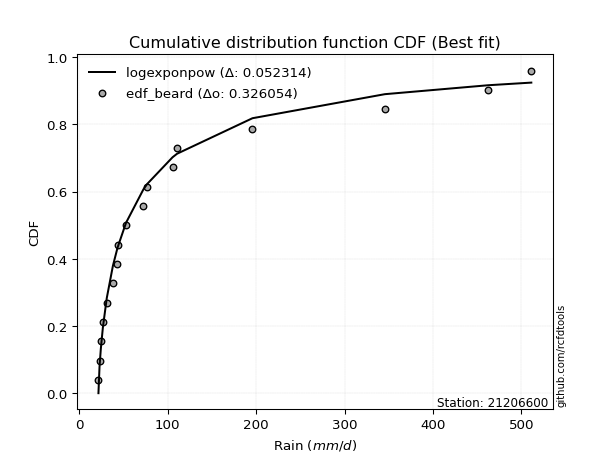</img>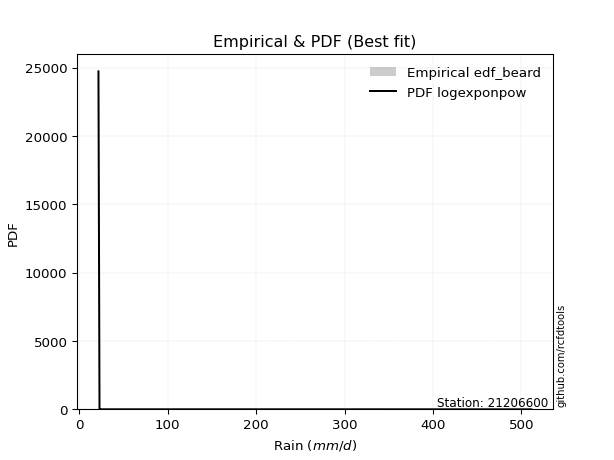</img>

</div>


### 5. EDF Chegodayev (1955)

The Chegodayev formula is an empirical plotting position formula used in hydrological frequency analysis to estimate the exceedance probability or return period of a specific event from a set of observed data. It is primarily used for plotting observed data points on probability paper to fit a theoretical distribution, particularly for analyzing extreme events like maximum flood flows or rainfall intensities. The constant _b_ value in the generalized plotting position formula is 0.3.

<div align="center">


$P=(m-b)/(n+1-2b)$


</div>


**5.1. Empirical values**

<div align="center">

|                | 0                    | 1                   | 2                   | 3                  | 4                   | 5                   | 6                  | 7                   | 8                  | 9                  | 10                 | 11                 | 12                 | 13                 | 14                 | 15                 |
|:---------------|:---------------------|:--------------------|:--------------------|:-------------------|:--------------------|:--------------------|:-------------------|:--------------------|:-------------------|:-------------------|:-------------------|:-------------------|:-------------------|:-------------------|:-------------------|:-------------------|
| date           | 2021                 | 2020                | 2017                | 2018               | 2019                | 2015                | 2022               | 2023                | 2014               | 2016               | 2024               | 2013               | 2012               | 2010               | 2008               | 2009               |
| x              | 21.6                 | 22.8                | 24.3                | 26.6               | 31.0                | 38.0                | 43.0               | 43.4                | 72.5               | 76.7               | 105.4              | 110.5              | 195.8              | 345.6              | 462.4              | 511.2              |
| m              | 1                    | 2                   | 3                   | 4                  | 5                   | 6                   | 7                  | 8                   | 9                  | 10                 | 11                 | 12                 | 13                 | 14                 | 15                 | 16                 |
| empirical_dist | edf_chegodayev       | edf_chegodayev      | edf_chegodayev      | edf_chegodayev     | edf_chegodayev      | edf_chegodayev      | edf_chegodayev     | edf_chegodayev      | edf_chegodayev     | edf_chegodayev     | edf_chegodayev     | edf_chegodayev     | edf_chegodayev     | edf_chegodayev     | edf_chegodayev     | edf_chegodayev     |
| empirical      | 0.042682926829268296 | 0.10365853658536586 | 0.16463414634146345 | 0.225609756097561  | 0.28658536585365857 | 0.34756097560975613 | 0.4085365853658537 | 0.46951219512195125 | 0.5304878048780488 | 0.5914634146341463 | 0.6524390243902439 | 0.7134146341463414 | 0.774390243902439  | 0.8353658536585367 | 0.8963414634146342 | 0.9573170731707318 |
| empirical_tr   | 1.0445859872611465   | 1.1156462585034013  | 1.197080291970803   | 1.2913385826771653 | 1.4017094017094018  | 1.532710280373832   | 1.690721649484536  | 1.8850574712643677  | 2.12987012987013   | 2.4477611940298507 | 2.8771929824561404 | 3.4893617021276593 | 4.4324324324324325 | 6.074074074074077  | 9.647058823529413  | 23.42857142857147  |

</div>


**5.2. Kolmogorov-Smirnov fit test (sorted by Δ)**


<div align="center">

|                | 0                   | 1                   | 2                   | 3                   | 4                   | 5                   | 6                   | 7                   | 8                   | 9                   | 10                    | 11                  | 12                  | 13                  | 14                  | 15                  | 16                  | 17                  | 18                  | 19                  | 20                  | 21                  | 22                  | 23                  | 24                  | 25                  | 26                  | 27                  | 28                  | 29                  | 30                  | 31                  | 32                 | 33                  | 34                 | 35                 | 36                 | 37                 | 38                  | 39                  | 40                  | 41                 | 42                  | 43                  | 44                  | 45                  | 46                 | 47                 | 48                 | 49                | 50                  | 51                 | 52                 | 53                  | 54                  | 55                 | 56                  | 57                  | 58                 | 59                  | 60                  | 61                  | 62                  | 63                  | 64                 | 65                  | 66                  | 67                 | 68                 | 69                 | 70                  | 71                 | 72                 | 73                 | 74                  | 75                  | 76                  | 77                  | 78                 | 79                 | 80                | 81                  | 82                  | 83                 | 84                 | 85                  | 86                 | 87             |
|:---------------|:--------------------|:--------------------|:--------------------|:--------------------|:--------------------|:--------------------|:--------------------|:--------------------|:--------------------|:--------------------|:----------------------|:--------------------|:--------------------|:--------------------|:--------------------|:--------------------|:--------------------|:--------------------|:--------------------|:--------------------|:--------------------|:--------------------|:--------------------|:--------------------|:--------------------|:--------------------|:--------------------|:--------------------|:--------------------|:--------------------|:--------------------|:--------------------|:-------------------|:--------------------|:-------------------|:-------------------|:-------------------|:-------------------|:--------------------|:--------------------|:--------------------|:-------------------|:--------------------|:--------------------|:--------------------|:--------------------|:-------------------|:-------------------|:-------------------|:------------------|:--------------------|:-------------------|:-------------------|:--------------------|:--------------------|:-------------------|:--------------------|:--------------------|:-------------------|:--------------------|:--------------------|:--------------------|:--------------------|:--------------------|:-------------------|:--------------------|:--------------------|:-------------------|:-------------------|:-------------------|:--------------------|:-------------------|:-------------------|:-------------------|:--------------------|:--------------------|:--------------------|:--------------------|:-------------------|:-------------------|:------------------|:--------------------|:--------------------|:-------------------|:-------------------|:--------------------|:-------------------|:---------------|
| station        | 21206600            | 21206600            | 21206600            | 21206600            | 21206600            | 21206600            | 21206600            | 21206600            | 21206600            | 21206600            | 21206600              | 21206600            | 21206600            | 21206600            | 21206600            | 21206600            | 21206600            | 21206600            | 21206600            | 21206600            | 21206600            | 21206600            | 21206600            | 21206600            | 21206600            | 21206600            | 21206600            | 21206600            | 21206600            | 21206600            | 21206600            | 21206600            | 21206600           | 21206600            | 21206600           | 21206600           | 21206600           | 21206600           | 21206600            | 21206600            | 21206600            | 21206600           | 21206600            | 21206600            | 21206600            | 21206600            | 21206600           | 21206600           | 21206600           | 21206600          | 21206600            | 21206600           | 21206600           | 21206600            | 21206600            | 21206600           | 21206600            | 21206600            | 21206600           | 21206600            | 21206600            | 21206600            | 21206600            | 21206600            | 21206600           | 21206600            | 21206600            | 21206600           | 21206600           | 21206600           | 21206600            | 21206600           | 21206600           | 21206600           | 21206600            | 21206600            | 21206600            | 21206600            | 21206600           | 21206600           | 21206600          | 21206600            | 21206600            | 21206600           | 21206600           | 21206600            | 21206600           | 21206600       |
| empirical_dist | edf_chegodayev      | edf_chegodayev      | edf_chegodayev      | edf_chegodayev      | edf_chegodayev      | edf_chegodayev      | edf_chegodayev      | edf_chegodayev      | edf_chegodayev      | edf_chegodayev      | edf_chegodayev        | edf_chegodayev      | edf_chegodayev      | edf_chegodayev      | edf_chegodayev      | edf_chegodayev      | edf_chegodayev      | edf_chegodayev      | edf_chegodayev      | edf_chegodayev      | edf_chegodayev      | edf_chegodayev      | edf_chegodayev      | edf_chegodayev      | edf_chegodayev      | edf_chegodayev      | edf_chegodayev      | edf_chegodayev      | edf_chegodayev      | edf_chegodayev      | edf_chegodayev      | edf_chegodayev      | edf_chegodayev     | edf_chegodayev      | edf_chegodayev     | edf_chegodayev     | edf_chegodayev     | edf_chegodayev     | edf_chegodayev      | edf_chegodayev      | edf_chegodayev      | edf_chegodayev     | edf_chegodayev      | edf_chegodayev      | edf_chegodayev      | edf_chegodayev      | edf_chegodayev     | edf_chegodayev     | edf_chegodayev     | edf_chegodayev    | edf_chegodayev      | edf_chegodayev     | edf_chegodayev     | edf_chegodayev      | edf_chegodayev      | edf_chegodayev     | edf_chegodayev      | edf_chegodayev      | edf_chegodayev     | edf_chegodayev      | edf_chegodayev      | edf_chegodayev      | edf_chegodayev      | edf_chegodayev      | edf_chegodayev     | edf_chegodayev      | edf_chegodayev      | edf_chegodayev     | edf_chegodayev     | edf_chegodayev     | edf_chegodayev      | edf_chegodayev     | edf_chegodayev     | edf_chegodayev     | edf_chegodayev      | edf_chegodayev      | edf_chegodayev      | edf_chegodayev      | edf_chegodayev     | edf_chegodayev     | edf_chegodayev    | edf_chegodayev      | edf_chegodayev      | edf_chegodayev     | edf_chegodayev     | edf_chegodayev      | edf_chegodayev     | edf_chegodayev |
| p_dist         | logweibull_min      | fatiguelife         | logalpha            | logf                | johnsonsu           | loghalfnorm         | logtruncnorm        | loggenexpon         | logexponnorm        | logexpon            | loglaplace_asymmetric | nct                 | loghalflogistic     | loggompertz         | logmielke           | loginvweibull       | invweibull          | loginvgamma         | logfisk             | lognakagami         | weibull_min         | logncf              | logmoyal            | lognct              | loggenlogistic      | betaprime           | lograyleigh         | invgamma            | logjohnsonsu        | loginvgauss         | loggumbel_r         | erlang              | logkstwobign       | logbetaprime        | invgauss           | nakagami           | ncf                | logmaxwell         | alpha               | logpearson3         | logfatiguelife      | gamma              | f                   | loggamma            | loggamma            | logt                | lognorm            | lognorm            | logcrystalball     | logloggamma       | logrice             | wald               | loglogistic        | logchi2             | fisk                | loghypsecant       | moyal               | gumbel_r            | genlogistic        | loggumbel_l         | pearson3            | loglaplace          | logerlang           | rayleigh            | halflogistic       | maxwell             | logwald             | kstwobign          | halfnorm           | norm               | crystalball         | t                  | logistic           | gibrat             | hypsecant           | loggibrat           | exponnorm           | rice                | laplace_asymmetric | genexpon           | expon             | gompertz            | laplace             | truncnorm          | gumbel_l           | loglognorm          | chi2               | mielke         |
| delta          | 0.07994455658384036 | 0.08030686871821646 | 0.08460472417031109 | 0.08511668116028503 | 0.08954475804612505 | 0.08959956228938326 | 0.09087870081160362 | 0.09176944082844302 | 0.09734663363606777 | 0.09750675124117159 | 0.09754742358827873   | 0.09824020915310722 | 0.09870985533050353 | 0.10012096661122152 | 0.10611664718417324 | 0.10626522860303478 | 0.10686572479394207 | 0.10706190120611436 | 0.10776006227150414 | 0.10987413984477218 | 0.11374341248461661 | 0.11407006994429825 | 0.11431906838859346 | 0.11631224563356118 | 0.11989766593537882 | 0.12088234458085334 | 0.12148943516460159 | 0.12173387228517529 | 0.12216683787244276 | 0.12438345250745986 | 0.12577049622203268 | 0.12625606291111735 | 0.1276687089079388 | 0.12984070059879854 | 0.1307921797748618 | 0.1318688095144095 | 0.1326149727484635 | 0.1327427721896327 | 0.13317854510165683 | 0.13479180954164444 | 0.13800396751259547 | 0.1422528466194135 | 0.14610549103666404 | 0.15548960471009154 | 0.15548960471009154 | 0.16141355334370716 | 0.1614142393069109 | 0.1614142393069109 | 0.1614142693571357 | 0.161831667657594 | 0.16645150176173573 | 0.1726939560023551 | 0.1823414749150894 | 0.19198696058837506 | 0.19269575555381147 | 0.1976494420654633 | 0.19953545075030546 | 0.20481420426223307 | 0.2111043950193301 | 0.21389275187799944 | 0.21847246837535048 | 0.22341292248337402 | 0.22435312454217504 | 0.22463324200126267 | 0.2267820583670955 | 0.23662259887662196 | 0.24106448306981382 | 0.2432119053887073 | 0.2445933064977369 | 0.2710040030914593 | 0.27100401036390676 | 0.2752297612642767 | 0.2787261558747599 | 0.2837267144691977 | 0.28522766099788066 | 0.28658536585365857 | 0.28970263250116807 | 0.29175639992744545 | 0.2920151692582113 | 0.2920305532317452 | 0.292030722696384 | 0.29960621482559735 | 0.30603526616365495 | 0.3400161069137604 | 0.3407570941168275 | 0.37355805984132684 | 0.6597246604332803 | nan            |
| deltao         | 0.331107277296      | 0.331107277296      | 0.331107277296      | 0.331107277296      | 0.331107277296      | 0.331107277296      | 0.331107277296      | 0.331107277296      | 0.331107277296      | 0.331107277296      | 0.331107277296        | 0.331107277296      | 0.331107277296      | 0.331107277296      | 0.331107277296      | 0.331107277296      | 0.331107277296      | 0.331107277296      | 0.331107277296      | 0.331107277296      | 0.331107277296      | 0.331107277296      | 0.331107277296      | 0.331107277296      | 0.331107277296      | 0.331107277296      | 0.331107277296      | 0.331107277296      | 0.331107277296      | 0.331107277296      | 0.331107277296      | 0.331107277296      | 0.331107277296     | 0.331107277296      | 0.331107277296     | 0.331107277296     | 0.331107277296     | 0.331107277296     | 0.331107277296      | 0.331107277296      | 0.331107277296      | 0.331107277296     | 0.331107277296      | 0.331107277296      | 0.331107277296      | 0.331107277296      | 0.331107277296     | 0.331107277296     | 0.331107277296     | 0.331107277296    | 0.331107277296      | 0.331107277296     | 0.331107277296     | 0.331107277296      | 0.331107277296      | 0.331107277296     | 0.331107277296      | 0.331107277296      | 0.331107277296     | 0.331107277296      | 0.331107277296      | 0.331107277296      | 0.331107277296      | 0.331107277296      | 0.331107277296     | 0.331107277296      | 0.331107277296      | 0.331107277296     | 0.331107277296     | 0.331107277296     | 0.331107277296      | 0.331107277296     | 0.331107277296     | 0.331107277296     | 0.331107277296      | 0.331107277296      | 0.331107277296      | 0.331107277296      | 0.331107277296     | 0.331107277296     | 0.331107277296    | 0.331107277296      | 0.331107277296      | 0.331107277296     | 0.331107277296     | 0.331107277296      | 0.331107277296     | 0.331107277296 |
| eval           | Δo > Δ              | Δo > Δ              | Δo > Δ              | Δo > Δ              | Δo > Δ              | Δo > Δ              | Δo > Δ              | Δo > Δ              | Δo > Δ              | Δo > Δ              | Δo > Δ                | Δo > Δ              | Δo > Δ              | Δo > Δ              | Δo > Δ              | Δo > Δ              | Δo > Δ              | Δo > Δ              | Δo > Δ              | Δo > Δ              | Δo > Δ              | Δo > Δ              | Δo > Δ              | Δo > Δ              | Δo > Δ              | Δo > Δ              | Δo > Δ              | Δo > Δ              | Δo > Δ              | Δo > Δ              | Δo > Δ              | Δo > Δ              | Δo > Δ             | Δo > Δ              | Δo > Δ             | Δo > Δ             | Δo > Δ             | Δo > Δ             | Δo > Δ              | Δo > Δ              | Δo > Δ              | Δo > Δ             | Δo > Δ              | Δo > Δ              | Δo > Δ              | Δo > Δ              | Δo > Δ             | Δo > Δ             | Δo > Δ             | Δo > Δ            | Δo > Δ              | Δo > Δ             | Δo > Δ             | Δo > Δ              | Δo > Δ              | Δo > Δ             | Δo > Δ              | Δo > Δ              | Δo > Δ             | Δo > Δ              | Δo > Δ              | Δo > Δ              | Δo > Δ              | Δo > Δ              | Δo > Δ             | Δo > Δ              | Δo > Δ              | Δo > Δ             | Δo > Δ             | Δo > Δ             | Δo > Δ              | Δo > Δ             | Δo > Δ             | Δo > Δ             | Δo > Δ              | Δo > Δ              | Δo > Δ              | Δo > Δ              | Δo > Δ             | Δo > Δ             | Δo > Δ            | Δo > Δ              | Δo > Δ              | Δo <= Δ            | Δo <= Δ            | Δo <= Δ             | Δo <= Δ            | Δo <= Δ        |
| fit            | 1                   | 1                   | 1                   | 1                   | 1                   | 1                   | 1                   | 1                   | 1                   | 1                   | 1                     | 1                   | 1                   | 1                   | 1                   | 1                   | 1                   | 1                   | 1                   | 1                   | 1                   | 1                   | 1                   | 1                   | 1                   | 1                   | 1                   | 1                   | 1                   | 1                   | 1                   | 1                   | 1                  | 1                   | 1                  | 1                  | 1                  | 1                  | 1                   | 1                   | 1                   | 1                  | 1                   | 1                   | 1                   | 1                   | 1                  | 1                  | 1                  | 1                 | 1                   | 1                  | 1                  | 1                   | 1                   | 1                  | 1                   | 1                   | 1                  | 1                   | 1                   | 1                   | 1                   | 1                   | 1                  | 1                   | 1                   | 1                  | 1                  | 1                  | 1                   | 1                  | 1                  | 1                  | 1                   | 1                   | 1                   | 1                   | 1                  | 1                  | 1                 | 1                   | 1                   | 0                  | 0                  | 0                   | 0                  | 0              |
| n              | 16                  | 16                  | 16                  | 16                  | 16                  | 16                  | 16                  | 16                  | 16                  | 16                  | 16                    | 16                  | 16                  | 16                  | 16                  | 16                  | 16                  | 16                  | 16                  | 16                  | 16                  | 16                  | 16                  | 16                  | 16                  | 16                  | 16                  | 16                  | 16                  | 16                  | 16                  | 16                  | 16                 | 16                  | 16                 | 16                 | 16                 | 16                 | 16                  | 16                  | 16                  | 16                 | 16                  | 16                  | 16                  | 16                  | 16                 | 16                 | 16                 | 16                | 16                  | 16                 | 16                 | 16                  | 16                  | 16                 | 16                  | 16                  | 16                 | 16                  | 16                  | 16                  | 16                  | 16                  | 16                 | 16                  | 16                  | 16                 | 16                 | 16                 | 16                  | 16                 | 16                 | 16                 | 16                  | 16                  | 16                  | 16                  | 16                 | 16                 | 16                | 16                  | 16                  | 16                 | 16                 | 16                  | 16                 | 16             |
| best_fit       | 1                   | 0                   | 0                   | 0                   | 0                   | 0                   | 0                   | 0                   | 0                   | 0                   | 0                     | 0                   | 0                   | 0                   | 0                   | 0                   | 0                   | 0                   | 0                   | 0                   | 0                   | 0                   | 0                   | 0                   | 0                   | 0                   | 0                   | 0                   | 0                   | 0                   | 0                   | 0                   | 0                  | 0                   | 0                  | 0                  | 0                  | 0                  | 0                   | 0                   | 0                   | 0                  | 0                   | 0                   | 0                   | 0                   | 0                  | 0                  | 0                  | 0                 | 0                   | 0                  | 0                  | 0                   | 0                   | 0                  | 0                   | 0                   | 0                  | 0                   | 0                   | 0                   | 0                   | 0                   | 0                  | 0                   | 0                   | 0                  | 0                  | 0                  | 0                   | 0                  | 0                  | 0                  | 0                   | 0                   | 0                   | 0                   | 0                  | 0                  | 0                 | 0                   | 0                   | 0                  | 0                  | 0                   | 0                  | 0              |
| best_fit_sort  | 1                   | 2                   | 3                   | 4                   | 5                   | 6                   | 7                   | 8                   | 9                   | 10                  | 11                    | 12                  | 13                  | 14                  | 15                  | 16                  | 17                  | 18                  | 19                  | 20                  | 21                  | 22                  | 23                  | 24                  | 25                  | 26                  | 27                  | 28                  | 29                  | 30                  | 31                  | 32                  | 33                 | 34                  | 35                 | 36                 | 37                 | 38                 | 39                  | 40                  | 41                  | 42                 | 43                  | 44                  | 45                  | 46                  | 47                 | 48                 | 49                 | 50                | 51                  | 52                 | 53                 | 54                  | 55                  | 56                 | 57                  | 58                  | 59                 | 60                  | 61                  | 62                  | 63                  | 64                  | 65                 | 66                  | 67                  | 68                 | 69                 | 70                 | 71                  | 72                 | 73                 | 74                 | 75                  | 76                  | 77                  | 78                  | 79                 | 80                 | 81                | 82                  | 83                  | 84                 | 85                 | 86                  | 87                 | 88             |

</div>


**5.3. Best fit**

<div align="center">

|   id |   station | empirical_dist   | p_dist         |     delta |   deltao | eval   |   fit |   n |   best_fit |   best_fit_sort |
|-----:|----------:|:-----------------|:---------------|----------:|---------:|:-------|------:|----:|-----------:|----------------:|
|    0 |  21206600 | edf_chegodayev   | logweibull_min | 0.0799446 | 0.331107 | Δo > Δ |     1 |  16 |          1 |               1 |

</div>


<div align="center">

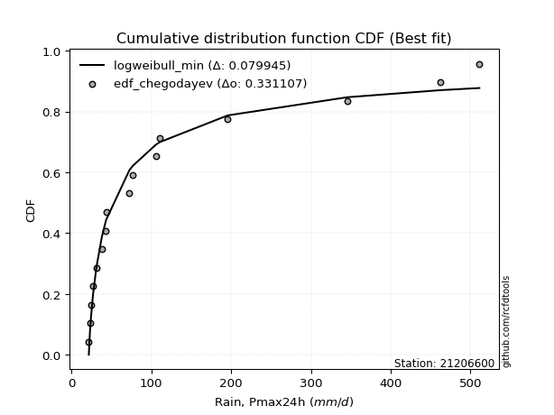</img>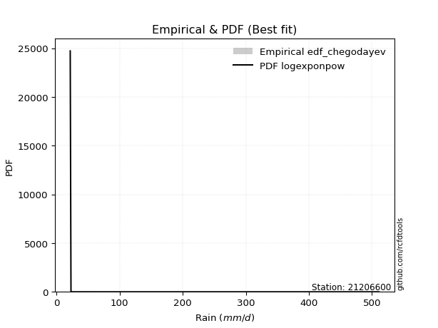</img>

</div>


### 6. EDF Blom (1958)

The Blom formula is a specific "plotting position" formula used in hydrology and statistical analysis to estimate the empirical cumulative probability (or non-exceedance probability) of a data series. It is particularly recommended for data that are approximately normally distributed. The constant _a_ is set to 0.375 (or 3/8).

<div align="center">


$P=(m-a)/(n+1-2a)$


</div>


**6.1. Empirical values**

<div align="center">

|                | 0                    | 1                  | 2                   | 3                  | 4                  | 5                   | 6                  | 7                   | 8                  | 9                  | 10                 | 11                 | 12                 | 13                 | 14                 | 15                 |
|:---------------|:---------------------|:-------------------|:--------------------|:-------------------|:-------------------|:--------------------|:-------------------|:--------------------|:-------------------|:-------------------|:-------------------|:-------------------|:-------------------|:-------------------|:-------------------|:-------------------|
| date           | 2021                 | 2020               | 2017                | 2018               | 2019               | 2015                | 2022               | 2023                | 2014               | 2016               | 2024               | 2013               | 2012               | 2010               | 2008               | 2009               |
| x              | 21.6                 | 22.8               | 24.3                | 26.6               | 31.0               | 38.0                | 43.0               | 43.4                | 72.5               | 76.7               | 105.4              | 110.5              | 195.8              | 345.6              | 462.4              | 511.2              |
| m              | 1                    | 2                  | 3                   | 4                  | 5                  | 6                   | 7                  | 8                   | 9                  | 10                 | 11                 | 12                 | 13                 | 14                 | 15                 | 16                 |
| empirical_dist | edf_blom             | edf_blom           | edf_blom            | edf_blom           | edf_blom           | edf_blom            | edf_blom           | edf_blom            | edf_blom           | edf_blom           | edf_blom           | edf_blom           | edf_blom           | edf_blom           | edf_blom           | edf_blom           |
| empirical      | 0.038461538461538464 | 0.1                | 0.16153846153846155 | 0.2230769230769231 | 0.2846153846153846 | 0.34615384615384615 | 0.4076923076923077 | 0.46923076923076923 | 0.5307692307692308 | 0.5923076923076923 | 0.6538461538461539 | 0.7153846153846154 | 0.7769230769230769 | 0.8384615384615385 | 0.9                | 0.9615384615384616 |
| empirical_tr   | 1.04                 | 1.1111111111111112 | 1.1926605504587156  | 1.2871287128712872 | 1.3978494623655913 | 1.5294117647058822  | 1.6883116883116882 | 1.8840579710144927  | 2.1311475409836067 | 2.452830188679245  | 2.888888888888889  | 3.5135135135135136 | 4.482758620689656  | 6.190476190476192  | 10.000000000000002 | 26.000000000000018 |

</div>


**6.2. Kolmogorov-Smirnov fit test (sorted by Δ)**


<div align="center">

|                | 0                   | 1                   | 2                   | 3                   | 4                  | 5                  | 6                   | 7                   | 8                  | 9                  | 10                  | 11                    | 12                 | 13                 | 14                  | 15                  | 16                  | 17                 | 18                  | 19                  | 20                 | 21                  | 22                  | 23                  | 24                 | 25                  | 26                  | 27                  | 28                 | 29                  | 30                 | 31                  | 32                  | 33                  | 34                  | 35                 | 36                 | 37                  | 38                  | 39                  | 40                 | 41                 | 42                  | 43                  | 44                  | 45                  | 46                  | 47                  | 48                 | 49                  | 50                 | 51                  | 52                  | 53                 | 54                  | 55                 | 56                 | 57                  | 58                  | 59                  | 60                  | 61                | 62                  | 63                  | 64                  | 65                  | 66                  | 67                  | 68                  | 69                  | 70                 | 71                 | 72                 | 73                 | 74                 | 75                 | 76                  | 77                 | 78                 | 79                | 80                 | 81                  | 82                 | 83                 | 84                  | 85                 | 86                 | 87             |
|:---------------|:--------------------|:--------------------|:--------------------|:--------------------|:-------------------|:-------------------|:--------------------|:--------------------|:-------------------|:-------------------|:--------------------|:----------------------|:-------------------|:-------------------|:--------------------|:--------------------|:--------------------|:-------------------|:--------------------|:--------------------|:-------------------|:--------------------|:--------------------|:--------------------|:-------------------|:--------------------|:--------------------|:--------------------|:-------------------|:--------------------|:-------------------|:--------------------|:--------------------|:--------------------|:--------------------|:-------------------|:-------------------|:--------------------|:--------------------|:--------------------|:-------------------|:-------------------|:--------------------|:--------------------|:--------------------|:--------------------|:--------------------|:--------------------|:-------------------|:--------------------|:-------------------|:--------------------|:--------------------|:-------------------|:--------------------|:-------------------|:-------------------|:--------------------|:--------------------|:--------------------|:--------------------|:------------------|:--------------------|:--------------------|:--------------------|:--------------------|:--------------------|:--------------------|:--------------------|:--------------------|:-------------------|:-------------------|:-------------------|:-------------------|:-------------------|:-------------------|:--------------------|:-------------------|:-------------------|:------------------|:-------------------|:--------------------|:-------------------|:-------------------|:--------------------|:-------------------|:-------------------|:---------------|
| station        | 21206600            | 21206600            | 21206600            | 21206600            | 21206600           | 21206600           | 21206600            | 21206600            | 21206600           | 21206600           | 21206600            | 21206600              | 21206600           | 21206600           | 21206600            | 21206600            | 21206600            | 21206600           | 21206600            | 21206600            | 21206600           | 21206600            | 21206600            | 21206600            | 21206600           | 21206600            | 21206600            | 21206600            | 21206600           | 21206600            | 21206600           | 21206600            | 21206600            | 21206600            | 21206600            | 21206600           | 21206600           | 21206600            | 21206600            | 21206600            | 21206600           | 21206600           | 21206600            | 21206600            | 21206600            | 21206600            | 21206600            | 21206600            | 21206600           | 21206600            | 21206600           | 21206600            | 21206600            | 21206600           | 21206600            | 21206600           | 21206600           | 21206600            | 21206600            | 21206600            | 21206600            | 21206600          | 21206600            | 21206600            | 21206600            | 21206600            | 21206600            | 21206600            | 21206600            | 21206600            | 21206600           | 21206600           | 21206600           | 21206600           | 21206600           | 21206600           | 21206600            | 21206600           | 21206600           | 21206600          | 21206600           | 21206600            | 21206600           | 21206600           | 21206600            | 21206600           | 21206600           | 21206600       |
| empirical_dist | edf_blom            | edf_blom            | edf_blom            | edf_blom            | edf_blom           | edf_blom           | edf_blom            | edf_blom            | edf_blom           | edf_blom           | edf_blom            | edf_blom              | edf_blom           | edf_blom           | edf_blom            | edf_blom            | edf_blom            | edf_blom           | edf_blom            | edf_blom            | edf_blom           | edf_blom            | edf_blom            | edf_blom            | edf_blom           | edf_blom            | edf_blom            | edf_blom            | edf_blom           | edf_blom            | edf_blom           | edf_blom            | edf_blom            | edf_blom            | edf_blom            | edf_blom           | edf_blom           | edf_blom            | edf_blom            | edf_blom            | edf_blom           | edf_blom           | edf_blom            | edf_blom            | edf_blom            | edf_blom            | edf_blom            | edf_blom            | edf_blom           | edf_blom            | edf_blom           | edf_blom            | edf_blom            | edf_blom           | edf_blom            | edf_blom           | edf_blom           | edf_blom            | edf_blom            | edf_blom            | edf_blom            | edf_blom          | edf_blom            | edf_blom            | edf_blom            | edf_blom            | edf_blom            | edf_blom            | edf_blom            | edf_blom            | edf_blom           | edf_blom           | edf_blom           | edf_blom           | edf_blom           | edf_blom           | edf_blom            | edf_blom           | edf_blom           | edf_blom          | edf_blom           | edf_blom            | edf_blom           | edf_blom           | edf_blom            | edf_blom           | edf_blom           | edf_blom       |
| p_dist         | fatiguelife         | logalpha            | logweibull_min      | logf                | logtruncnorm       | loggenexpon        | johnsonsu           | loghalfnorm         | loghalflogistic    | logexponnorm       | logexpon            | loglaplace_asymmetric | loggompertz        | nct                | logmielke           | loginvweibull       | invweibull          | loginvgamma        | logfisk             | lognakagami         | weibull_min        | logncf              | logmoyal            | lognct              | loggenlogistic     | betaprime           | lograyleigh         | invgamma            | logjohnsonsu       | erlang              | loginvgauss        | loggumbel_r         | logkstwobign        | logbetaprime        | invgauss            | ncf                | logmaxwell         | alpha               | nakagami            | logpearson3         | logfatiguelife     | gamma              | f                   | loggamma            | loggamma            | logt                | lognorm             | lognorm             | logcrystalball     | logloggamma         | logrice            | wald                | loglogistic         | logchi2            | fisk                | loghypsecant       | moyal              | gumbel_r            | genlogistic         | loggumbel_l         | pearson3            | loglaplace        | logerlang           | rayleigh            | halflogistic        | maxwell             | logwald             | kstwobign           | halfnorm            | norm                | crystalball        | t                  | logistic           | gibrat             | loggibrat          | hypsecant          | exponnorm           | laplace_asymmetric | genexpon           | expon             | rice               | gompertz            | laplace            | truncnorm          | gumbel_l            | loglognorm         | chi2               | mielke         |
| delta          | 0.08171399817412645 | 0.08363853060402998 | 0.08416594495157015 | 0.08483525526910302 | 0.0883458677909657 | 0.0892366078078051 | 0.08926333215494309 | 0.08931813639820124 | 0.0961770223098656 | 0.0970652077448858 | 0.09722532534998962 | 0.09726599769709676   | 0.0975881335905836 | 0.0979587832619252 | 0.10583522129299128 | 0.10598380271185281 | 0.10658429890276011 | 0.1067804753149324 | 0.10747863638032218 | 0.10959271395359016 | 0.1106477276816148 | 0.11378864405311623 | 0.11403764249741144 | 0.11603081974237917 | 0.1196162400441968 | 0.12060091868967132 | 0.12120800927341957 | 0.12145244639399333 | 0.1218854119812608 | 0.12316037810811553 | 0.1241020266162779 | 0.12548907033085066 | 0.12738728301675678 | 0.12955927470761652 | 0.13051075388367983 | 0.1323335468572815 | 0.1324613462984507 | 0.13289711921047487 | 0.13383879075268346 | 0.13451038365046242 | 0.1377225416214135 | 0.1391571618164117 | 0.14582406514548207 | 0.15520817881890958 | 0.15520817881890958 | 0.16113212745252514 | 0.16113281341572888 | 0.16113281341572888 | 0.1611328434659537 | 0.16155024176641197 | 0.1661700758705537 | 0.17241253011117308 | 0.18206004902390738 | 0.1917055346971931 | 0.19691714392154125 | 0.1973680161742813 | 0.2037568391180353 | 0.20795743733046124 | 0.21082296912814807 | 0.21361132598681742 | 0.22269385674308032 | 0.223131496592192 | 0.22407169865099308 | 0.22747437041079374 | 0.23100344673482534 | 0.23859258011489592 | 0.23909450183153985 | 0.24518188662698126 | 0.24881469486546673 | 0.27297398432973324 | 0.2729739916021807 | 0.2784751692585541 | 0.2806961371130339 | 0.2834452885780157 | 0.2846153846153846 | 0.2871976422361546 | 0.28942120660998605 | 0.2917337433670293 | 0.2917491273405632 | 0.291749296805202 | 0.2937263811657194 | 0.29932478893441533 | 0.3080052474019289 | 0.3397346810225784 | 0.34272707535510144 | 0.3772165964266927 | 0.6623474745768235 | nan            |
| deltao         | 0.331107277296      | 0.331107277296      | 0.331107277296      | 0.331107277296      | 0.331107277296     | 0.331107277296     | 0.331107277296      | 0.331107277296      | 0.331107277296     | 0.331107277296     | 0.331107277296      | 0.331107277296        | 0.331107277296     | 0.331107277296     | 0.331107277296      | 0.331107277296      | 0.331107277296      | 0.331107277296     | 0.331107277296      | 0.331107277296      | 0.331107277296     | 0.331107277296      | 0.331107277296      | 0.331107277296      | 0.331107277296     | 0.331107277296      | 0.331107277296      | 0.331107277296      | 0.331107277296     | 0.331107277296      | 0.331107277296     | 0.331107277296      | 0.331107277296      | 0.331107277296      | 0.331107277296      | 0.331107277296     | 0.331107277296     | 0.331107277296      | 0.331107277296      | 0.331107277296      | 0.331107277296     | 0.331107277296     | 0.331107277296      | 0.331107277296      | 0.331107277296      | 0.331107277296      | 0.331107277296      | 0.331107277296      | 0.331107277296     | 0.331107277296      | 0.331107277296     | 0.331107277296      | 0.331107277296      | 0.331107277296     | 0.331107277296      | 0.331107277296     | 0.331107277296     | 0.331107277296      | 0.331107277296      | 0.331107277296      | 0.331107277296      | 0.331107277296    | 0.331107277296      | 0.331107277296      | 0.331107277296      | 0.331107277296      | 0.331107277296      | 0.331107277296      | 0.331107277296      | 0.331107277296      | 0.331107277296     | 0.331107277296     | 0.331107277296     | 0.331107277296     | 0.331107277296     | 0.331107277296     | 0.331107277296      | 0.331107277296     | 0.331107277296     | 0.331107277296    | 0.331107277296     | 0.331107277296      | 0.331107277296     | 0.331107277296     | 0.331107277296      | 0.331107277296     | 0.331107277296     | 0.331107277296 |
| eval           | Δo > Δ              | Δo > Δ              | Δo > Δ              | Δo > Δ              | Δo > Δ             | Δo > Δ             | Δo > Δ              | Δo > Δ              | Δo > Δ             | Δo > Δ             | Δo > Δ              | Δo > Δ                | Δo > Δ             | Δo > Δ             | Δo > Δ              | Δo > Δ              | Δo > Δ              | Δo > Δ             | Δo > Δ              | Δo > Δ              | Δo > Δ             | Δo > Δ              | Δo > Δ              | Δo > Δ              | Δo > Δ             | Δo > Δ              | Δo > Δ              | Δo > Δ              | Δo > Δ             | Δo > Δ              | Δo > Δ             | Δo > Δ              | Δo > Δ              | Δo > Δ              | Δo > Δ              | Δo > Δ             | Δo > Δ             | Δo > Δ              | Δo > Δ              | Δo > Δ              | Δo > Δ             | Δo > Δ             | Δo > Δ              | Δo > Δ              | Δo > Δ              | Δo > Δ              | Δo > Δ              | Δo > Δ              | Δo > Δ             | Δo > Δ              | Δo > Δ             | Δo > Δ              | Δo > Δ              | Δo > Δ             | Δo > Δ              | Δo > Δ             | Δo > Δ             | Δo > Δ              | Δo > Δ              | Δo > Δ              | Δo > Δ              | Δo > Δ            | Δo > Δ              | Δo > Δ              | Δo > Δ              | Δo > Δ              | Δo > Δ              | Δo > Δ              | Δo > Δ              | Δo > Δ              | Δo > Δ             | Δo > Δ             | Δo > Δ             | Δo > Δ             | Δo > Δ             | Δo > Δ             | Δo > Δ              | Δo > Δ             | Δo > Δ             | Δo > Δ            | Δo > Δ             | Δo > Δ              | Δo > Δ             | Δo <= Δ            | Δo <= Δ             | Δo <= Δ            | Δo <= Δ            | Δo <= Δ        |
| fit            | 1                   | 1                   | 1                   | 1                   | 1                  | 1                  | 1                   | 1                   | 1                  | 1                  | 1                   | 1                     | 1                  | 1                  | 1                   | 1                   | 1                   | 1                  | 1                   | 1                   | 1                  | 1                   | 1                   | 1                   | 1                  | 1                   | 1                   | 1                   | 1                  | 1                   | 1                  | 1                   | 1                   | 1                   | 1                   | 1                  | 1                  | 1                   | 1                   | 1                   | 1                  | 1                  | 1                   | 1                   | 1                   | 1                   | 1                   | 1                   | 1                  | 1                   | 1                  | 1                   | 1                   | 1                  | 1                   | 1                  | 1                  | 1                   | 1                   | 1                   | 1                   | 1                 | 1                   | 1                   | 1                   | 1                   | 1                   | 1                   | 1                   | 1                   | 1                  | 1                  | 1                  | 1                  | 1                  | 1                  | 1                   | 1                  | 1                  | 1                 | 1                  | 1                   | 1                  | 0                  | 0                   | 0                  | 0                  | 0              |
| n              | 16                  | 16                  | 16                  | 16                  | 16                 | 16                 | 16                  | 16                  | 16                 | 16                 | 16                  | 16                    | 16                 | 16                 | 16                  | 16                  | 16                  | 16                 | 16                  | 16                  | 16                 | 16                  | 16                  | 16                  | 16                 | 16                  | 16                  | 16                  | 16                 | 16                  | 16                 | 16                  | 16                  | 16                  | 16                  | 16                 | 16                 | 16                  | 16                  | 16                  | 16                 | 16                 | 16                  | 16                  | 16                  | 16                  | 16                  | 16                  | 16                 | 16                  | 16                 | 16                  | 16                  | 16                 | 16                  | 16                 | 16                 | 16                  | 16                  | 16                  | 16                  | 16                | 16                  | 16                  | 16                  | 16                  | 16                  | 16                  | 16                  | 16                  | 16                 | 16                 | 16                 | 16                 | 16                 | 16                 | 16                  | 16                 | 16                 | 16                | 16                 | 16                  | 16                 | 16                 | 16                  | 16                 | 16                 | 16             |
| best_fit       | 1                   | 0                   | 0                   | 0                   | 0                  | 0                  | 0                   | 0                   | 0                  | 0                  | 0                   | 0                     | 0                  | 0                  | 0                   | 0                   | 0                   | 0                  | 0                   | 0                   | 0                  | 0                   | 0                   | 0                   | 0                  | 0                   | 0                   | 0                   | 0                  | 0                   | 0                  | 0                   | 0                   | 0                   | 0                   | 0                  | 0                  | 0                   | 0                   | 0                   | 0                  | 0                  | 0                   | 0                   | 0                   | 0                   | 0                   | 0                   | 0                  | 0                   | 0                  | 0                   | 0                   | 0                  | 0                   | 0                  | 0                  | 0                   | 0                   | 0                   | 0                   | 0                 | 0                   | 0                   | 0                   | 0                   | 0                   | 0                   | 0                   | 0                   | 0                  | 0                  | 0                  | 0                  | 0                  | 0                  | 0                   | 0                  | 0                  | 0                 | 0                  | 0                   | 0                  | 0                  | 0                   | 0                  | 0                  | 0              |
| best_fit_sort  | 1                   | 2                   | 3                   | 4                   | 5                  | 6                  | 7                   | 8                   | 9                  | 10                 | 11                  | 12                    | 13                 | 14                 | 15                  | 16                  | 17                  | 18                 | 19                  | 20                  | 21                 | 22                  | 23                  | 24                  | 25                 | 26                  | 27                  | 28                  | 29                 | 30                  | 31                 | 32                  | 33                  | 34                  | 35                  | 36                 | 37                 | 38                  | 39                  | 40                  | 41                 | 42                 | 43                  | 44                  | 45                  | 46                  | 47                  | 48                  | 49                 | 50                  | 51                 | 52                  | 53                  | 54                 | 55                  | 56                 | 57                 | 58                  | 59                  | 60                  | 61                  | 62                | 63                  | 64                  | 65                  | 66                  | 67                  | 68                  | 69                  | 70                  | 71                 | 72                 | 73                 | 74                 | 75                 | 76                 | 77                  | 78                 | 79                 | 80                | 81                 | 82                  | 83                 | 84                 | 85                  | 86                 | 87                 | 88             |

</div>


**6.3. Best fit**

<div align="center">

|   id |   station | empirical_dist   | p_dist      |    delta |   deltao | eval   |   fit |   n |   best_fit |   best_fit_sort |
|-----:|----------:|:-----------------|:------------|---------:|---------:|:-------|------:|----:|-----------:|----------------:|
|    0 |  21206600 | edf_blom         | fatiguelife | 0.081714 | 0.331107 | Δo > Δ |     1 |  16 |          1 |               1 |

</div>


<div align="center">

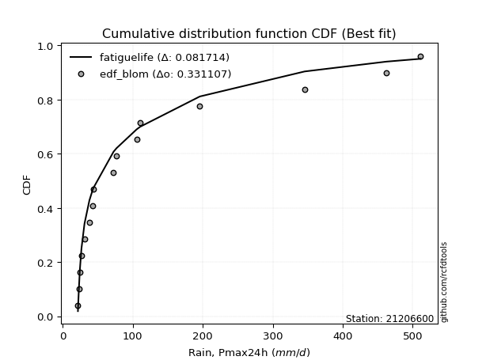</img>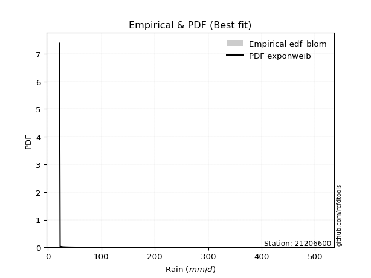</img>

</div>


### 7. EDF Tukey (1962)

In hydrology, the Tukey formula is used as a plotting position formula to estimate the empirical probability or frequency of a flood event (or other hydrological data). The formula parameter is given as _c=0.333_ (or 1/3).

<div align="center">


$P=(m-c)/(n+1-2c)$


</div>


**7.1. Empirical values**

<div align="center">

|                | 0                   | 1                   | 2                   | 3                   | 4                  | 5                  | 6                   | 7                   | 8                  | 9                  | 10                 | 11                 | 12                 | 13                 | 14                 | 15                 |
|:---------------|:--------------------|:--------------------|:--------------------|:--------------------|:-------------------|:-------------------|:--------------------|:--------------------|:-------------------|:-------------------|:-------------------|:-------------------|:-------------------|:-------------------|:-------------------|:-------------------|
| date           | 2021                | 2020                | 2017                | 2018                | 2019               | 2015               | 2022                | 2023                | 2014               | 2016               | 2024               | 2013               | 2012               | 2010               | 2008               | 2009               |
| x              | 21.6                | 22.8                | 24.3                | 26.6                | 31.0               | 38.0               | 43.0                | 43.4                | 72.5               | 76.7               | 105.4              | 110.5              | 195.8              | 345.6              | 462.4              | 511.2              |
| m              | 1                   | 2                   | 3                   | 4                   | 5                  | 6                  | 7                   | 8                   | 9                  | 10                 | 11                 | 12                 | 13                 | 14                 | 15                 | 16                 |
| empirical_dist | edf_tukey           | edf_tukey           | edf_tukey           | edf_tukey           | edf_tukey          | edf_tukey          | edf_tukey           | edf_tukey           | edf_tukey          | edf_tukey          | edf_tukey          | edf_tukey          | edf_tukey          | edf_tukey          | edf_tukey          | edf_tukey          |
| empirical      | 0.04081632653061224 | 0.10204081632653061 | 0.16326530612244897 | 0.22448979591836735 | 0.2857142857142857 | 0.3469387755102041 | 0.40816326530612246 | 0.46938775510204084 | 0.5306122448979592 | 0.5918367346938775 | 0.6530612244897959 | 0.7142857142857143 | 0.7755102040816326 | 0.8367346938775511 | 0.8979591836734694 | 0.9591836734693877 |
| empirical_tr   | 1.0425531914893618  | 1.1136363636363635  | 1.1951219512195121  | 1.2894736842105263  | 1.4                | 1.5312499999999998 | 1.6896551724137931  | 1.8846153846153848  | 2.130434782608696  | 2.4499999999999997 | 2.88235294117647   | 3.5                | 4.454545454545454  | 6.125000000000002  | 9.799999999999999  | 24.49999999999997  |

</div>


**7.2. Kolmogorov-Smirnov fit test (sorted by Δ)**


<div align="center">

|                | 0                   | 1                  | 2                   | 3                   | 4                   | 5                   | 6                   | 7                   | 8                   | 9                   | 10                    | 11                  | 12                 | 13                  | 14                  | 15                  | 16                  | 17                  | 18                  | 19                  | 20                  | 21                  | 22                  | 23                  | 24                 | 25                  | 26                  | 27                  | 28                  | 29                  | 30                  | 31                  | 32                 | 33                  | 34                  | 35                 | 36                 | 37                  | 38                  | 39                  | 40                  | 41                 | 42                  | 43                  | 44                  | 45                  | 46                 | 47                 | 48                 | 49                  | 50                  | 51                 | 52                | 53                  | 54                 | 55                 | 56                  | 57                  | 58                  | 59                  | 60                  | 61                 | 62                  | 63                  | 64                  | 65                  | 66                  | 67                  | 68                  | 69                  | 70                 | 71                 | 72                 | 73                 | 74                 | 75                  | 76                  | 77                 | 78                 | 79                 | 80                 | 81                  | 82                 | 83               | 84                  | 85                  | 86                | 87             |
|:---------------|:--------------------|:-------------------|:--------------------|:--------------------|:--------------------|:--------------------|:--------------------|:--------------------|:--------------------|:--------------------|:----------------------|:--------------------|:-------------------|:--------------------|:--------------------|:--------------------|:--------------------|:--------------------|:--------------------|:--------------------|:--------------------|:--------------------|:--------------------|:--------------------|:-------------------|:--------------------|:--------------------|:--------------------|:--------------------|:--------------------|:--------------------|:--------------------|:-------------------|:--------------------|:--------------------|:-------------------|:-------------------|:--------------------|:--------------------|:--------------------|:--------------------|:-------------------|:--------------------|:--------------------|:--------------------|:--------------------|:-------------------|:-------------------|:-------------------|:--------------------|:--------------------|:-------------------|:------------------|:--------------------|:-------------------|:-------------------|:--------------------|:--------------------|:--------------------|:--------------------|:--------------------|:-------------------|:--------------------|:--------------------|:--------------------|:--------------------|:--------------------|:--------------------|:--------------------|:--------------------|:-------------------|:-------------------|:-------------------|:-------------------|:-------------------|:--------------------|:--------------------|:-------------------|:-------------------|:-------------------|:-------------------|:--------------------|:-------------------|:-----------------|:--------------------|:--------------------|:------------------|:---------------|
| station        | 21206600            | 21206600           | 21206600            | 21206600            | 21206600            | 21206600            | 21206600            | 21206600            | 21206600            | 21206600            | 21206600              | 21206600            | 21206600           | 21206600            | 21206600            | 21206600            | 21206600            | 21206600            | 21206600            | 21206600            | 21206600            | 21206600            | 21206600            | 21206600            | 21206600           | 21206600            | 21206600            | 21206600            | 21206600            | 21206600            | 21206600            | 21206600            | 21206600           | 21206600            | 21206600            | 21206600           | 21206600           | 21206600            | 21206600            | 21206600            | 21206600            | 21206600           | 21206600            | 21206600            | 21206600            | 21206600            | 21206600           | 21206600           | 21206600           | 21206600            | 21206600            | 21206600           | 21206600          | 21206600            | 21206600           | 21206600           | 21206600            | 21206600            | 21206600            | 21206600            | 21206600            | 21206600           | 21206600            | 21206600            | 21206600            | 21206600            | 21206600            | 21206600            | 21206600            | 21206600            | 21206600           | 21206600           | 21206600           | 21206600           | 21206600           | 21206600            | 21206600            | 21206600           | 21206600           | 21206600           | 21206600           | 21206600            | 21206600           | 21206600         | 21206600            | 21206600            | 21206600          | 21206600       |
| empirical_dist | edf_tukey           | edf_tukey          | edf_tukey           | edf_tukey           | edf_tukey           | edf_tukey           | edf_tukey           | edf_tukey           | edf_tukey           | edf_tukey           | edf_tukey             | edf_tukey           | edf_tukey          | edf_tukey           | edf_tukey           | edf_tukey           | edf_tukey           | edf_tukey           | edf_tukey           | edf_tukey           | edf_tukey           | edf_tukey           | edf_tukey           | edf_tukey           | edf_tukey          | edf_tukey           | edf_tukey           | edf_tukey           | edf_tukey           | edf_tukey           | edf_tukey           | edf_tukey           | edf_tukey          | edf_tukey           | edf_tukey           | edf_tukey          | edf_tukey          | edf_tukey           | edf_tukey           | edf_tukey           | edf_tukey           | edf_tukey          | edf_tukey           | edf_tukey           | edf_tukey           | edf_tukey           | edf_tukey          | edf_tukey          | edf_tukey          | edf_tukey           | edf_tukey           | edf_tukey          | edf_tukey         | edf_tukey           | edf_tukey          | edf_tukey          | edf_tukey           | edf_tukey           | edf_tukey           | edf_tukey           | edf_tukey           | edf_tukey          | edf_tukey           | edf_tukey           | edf_tukey           | edf_tukey           | edf_tukey           | edf_tukey           | edf_tukey           | edf_tukey           | edf_tukey          | edf_tukey          | edf_tukey          | edf_tukey          | edf_tukey          | edf_tukey           | edf_tukey           | edf_tukey          | edf_tukey          | edf_tukey          | edf_tukey          | edf_tukey           | edf_tukey          | edf_tukey        | edf_tukey           | edf_tukey           | edf_tukey         | edf_tukey      |
| p_dist         | fatiguelife         | logweibull_min     | logalpha            | logf                | johnsonsu           | loghalfnorm         | logtruncnorm        | loggenexpon         | logexponnorm        | logexpon            | loglaplace_asymmetric | loghalflogistic     | nct                | loggompertz         | logmielke           | loginvweibull       | invweibull          | loginvgamma         | logfisk             | lognakagami         | weibull_min         | logncf              | logmoyal            | lognct              | loggenlogistic     | betaprime           | lograyleigh         | invgamma            | logjohnsonsu        | loginvgauss         | erlang              | loggumbel_r         | logkstwobign       | logbetaprime        | invgauss            | ncf                | logmaxwell         | nakagami            | alpha               | logpearson3         | logfatiguelife      | gamma              | f                   | loggamma            | loggamma            | logt                | lognorm            | lognorm            | logcrystalball     | logloggamma         | logrice             | wald               | loglogistic       | logchi2             | fisk               | loghypsecant       | moyal               | gumbel_r            | genlogistic         | loggumbel_l         | pearson3            | loglaplace         | logerlang           | rayleigh            | halflogistic        | maxwell             | logwald             | kstwobign           | halfnorm            | norm                | crystalball        | t                  | logistic           | gibrat             | loggibrat          | hypsecant           | exponnorm           | laplace_asymmetric | genexpon           | expon              | rice               | gompertz            | laplace            | truncnorm        | gumbel_l            | loglognorm          | chi2              | mielke         |
| delta          | 0.08092906881776851 | 0.0818111568824963 | 0.08379551647530159 | 0.08499224114037462 | 0.08942031802621464 | 0.08947512226947285 | 0.08975874063240996 | 0.09064948064924935 | 0.09722219361615736 | 0.09738231122126118 | 0.09742298356836832   | 0.09758989515130986 | 0.0981157691331968 | 0.09900100643202786 | 0.10599220716426283 | 0.10614078858312437 | 0.10674128477403166 | 0.10693746118620395 | 0.10763562225159373 | 0.10974969982486177 | 0.11237457226560221 | 0.11394562992438784 | 0.11419462836868305 | 0.11618780561365077 | 0.1197732259154684 | 0.12075790456094293 | 0.12136499514469118 | 0.12160943226526488 | 0.12204239785253235 | 0.12425901248754945 | 0.12488722269210295 | 0.12564605620212227 | 0.1275442688880284 | 0.12971626057888813 | 0.13066773975495138 | 0.1324905327285531 | 0.1326183321697223 | 0.13273988965378236 | 0.13305410508174642 | 0.13466736952173403 | 0.13787952749268506 | 0.1408840064003991 | 0.14598105101675363 | 0.15536516469018113 | 0.15536516469018113 | 0.16128911332379675 | 0.1612897992870005 | 0.1612897992870005 | 0.1612898293372253 | 0.16170722763768358 | 0.16632706174182532 | 0.1725695159824447 | 0.182217034895179 | 0.19186252056846465 | 0.1945623558524674 | 0.1975250020455529 | 0.20140205104896153 | 0.20568528440160594 | 0.21097995499941968 | 0.21376831185808903 | 0.22033906867400654 | 0.2232884824634636 | 0.22422868452226463 | 0.22550432214063554 | 0.22864865866575157 | 0.23749367901599483 | 0.24019340293044095 | 0.24408298552808017 | 0.24645990679639296 | 0.27187508323083215 | 0.2718750905032796 | 0.2761203811894803 | 0.2795972360141328 | 0.2836022744492873 | 0.2857142857142857 | 0.28609874113725353 | 0.28957819248125766 | 0.2918907292383009 | 0.2919061132118348 | 0.2919062826764736 | 0.2926274800668183 | 0.29948177480568694 | 0.3069063463030278 | 0.33989166689385 | 0.34162817425620035 | 0.37517578010016206 | 0.660844620612474 | nan            |
| deltao         | 0.331107277296      | 0.331107277296     | 0.331107277296      | 0.331107277296      | 0.331107277296      | 0.331107277296      | 0.331107277296      | 0.331107277296      | 0.331107277296      | 0.331107277296      | 0.331107277296        | 0.331107277296      | 0.331107277296     | 0.331107277296      | 0.331107277296      | 0.331107277296      | 0.331107277296      | 0.331107277296      | 0.331107277296      | 0.331107277296      | 0.331107277296      | 0.331107277296      | 0.331107277296      | 0.331107277296      | 0.331107277296     | 0.331107277296      | 0.331107277296      | 0.331107277296      | 0.331107277296      | 0.331107277296      | 0.331107277296      | 0.331107277296      | 0.331107277296     | 0.331107277296      | 0.331107277296      | 0.331107277296     | 0.331107277296     | 0.331107277296      | 0.331107277296      | 0.331107277296      | 0.331107277296      | 0.331107277296     | 0.331107277296      | 0.331107277296      | 0.331107277296      | 0.331107277296      | 0.331107277296     | 0.331107277296     | 0.331107277296     | 0.331107277296      | 0.331107277296      | 0.331107277296     | 0.331107277296    | 0.331107277296      | 0.331107277296     | 0.331107277296     | 0.331107277296      | 0.331107277296      | 0.331107277296      | 0.331107277296      | 0.331107277296      | 0.331107277296     | 0.331107277296      | 0.331107277296      | 0.331107277296      | 0.331107277296      | 0.331107277296      | 0.331107277296      | 0.331107277296      | 0.331107277296      | 0.331107277296     | 0.331107277296     | 0.331107277296     | 0.331107277296     | 0.331107277296     | 0.331107277296      | 0.331107277296      | 0.331107277296     | 0.331107277296     | 0.331107277296     | 0.331107277296     | 0.331107277296      | 0.331107277296     | 0.331107277296   | 0.331107277296      | 0.331107277296      | 0.331107277296    | 0.331107277296 |
| eval           | Δo > Δ              | Δo > Δ             | Δo > Δ              | Δo > Δ              | Δo > Δ              | Δo > Δ              | Δo > Δ              | Δo > Δ              | Δo > Δ              | Δo > Δ              | Δo > Δ                | Δo > Δ              | Δo > Δ             | Δo > Δ              | Δo > Δ              | Δo > Δ              | Δo > Δ              | Δo > Δ              | Δo > Δ              | Δo > Δ              | Δo > Δ              | Δo > Δ              | Δo > Δ              | Δo > Δ              | Δo > Δ             | Δo > Δ              | Δo > Δ              | Δo > Δ              | Δo > Δ              | Δo > Δ              | Δo > Δ              | Δo > Δ              | Δo > Δ             | Δo > Δ              | Δo > Δ              | Δo > Δ             | Δo > Δ             | Δo > Δ              | Δo > Δ              | Δo > Δ              | Δo > Δ              | Δo > Δ             | Δo > Δ              | Δo > Δ              | Δo > Δ              | Δo > Δ              | Δo > Δ             | Δo > Δ             | Δo > Δ             | Δo > Δ              | Δo > Δ              | Δo > Δ             | Δo > Δ            | Δo > Δ              | Δo > Δ             | Δo > Δ             | Δo > Δ              | Δo > Δ              | Δo > Δ              | Δo > Δ              | Δo > Δ              | Δo > Δ             | Δo > Δ              | Δo > Δ              | Δo > Δ              | Δo > Δ              | Δo > Δ              | Δo > Δ              | Δo > Δ              | Δo > Δ              | Δo > Δ             | Δo > Δ             | Δo > Δ             | Δo > Δ             | Δo > Δ             | Δo > Δ              | Δo > Δ              | Δo > Δ             | Δo > Δ             | Δo > Δ             | Δo > Δ             | Δo > Δ              | Δo > Δ             | Δo <= Δ          | Δo <= Δ             | Δo <= Δ             | Δo <= Δ           | Δo <= Δ        |
| fit            | 1                   | 1                  | 1                   | 1                   | 1                   | 1                   | 1                   | 1                   | 1                   | 1                   | 1                     | 1                   | 1                  | 1                   | 1                   | 1                   | 1                   | 1                   | 1                   | 1                   | 1                   | 1                   | 1                   | 1                   | 1                  | 1                   | 1                   | 1                   | 1                   | 1                   | 1                   | 1                   | 1                  | 1                   | 1                   | 1                  | 1                  | 1                   | 1                   | 1                   | 1                   | 1                  | 1                   | 1                   | 1                   | 1                   | 1                  | 1                  | 1                  | 1                   | 1                   | 1                  | 1                 | 1                   | 1                  | 1                  | 1                   | 1                   | 1                   | 1                   | 1                   | 1                  | 1                   | 1                   | 1                   | 1                   | 1                   | 1                   | 1                   | 1                   | 1                  | 1                  | 1                  | 1                  | 1                  | 1                   | 1                   | 1                  | 1                  | 1                  | 1                  | 1                   | 1                  | 0                | 0                   | 0                   | 0                 | 0              |
| n              | 16                  | 16                 | 16                  | 16                  | 16                  | 16                  | 16                  | 16                  | 16                  | 16                  | 16                    | 16                  | 16                 | 16                  | 16                  | 16                  | 16                  | 16                  | 16                  | 16                  | 16                  | 16                  | 16                  | 16                  | 16                 | 16                  | 16                  | 16                  | 16                  | 16                  | 16                  | 16                  | 16                 | 16                  | 16                  | 16                 | 16                 | 16                  | 16                  | 16                  | 16                  | 16                 | 16                  | 16                  | 16                  | 16                  | 16                 | 16                 | 16                 | 16                  | 16                  | 16                 | 16                | 16                  | 16                 | 16                 | 16                  | 16                  | 16                  | 16                  | 16                  | 16                 | 16                  | 16                  | 16                  | 16                  | 16                  | 16                  | 16                  | 16                  | 16                 | 16                 | 16                 | 16                 | 16                 | 16                  | 16                  | 16                 | 16                 | 16                 | 16                 | 16                  | 16                 | 16               | 16                  | 16                  | 16                | 16             |
| best_fit       | 1                   | 0                  | 0                   | 0                   | 0                   | 0                   | 0                   | 0                   | 0                   | 0                   | 0                     | 0                   | 0                  | 0                   | 0                   | 0                   | 0                   | 0                   | 0                   | 0                   | 0                   | 0                   | 0                   | 0                   | 0                  | 0                   | 0                   | 0                   | 0                   | 0                   | 0                   | 0                   | 0                  | 0                   | 0                   | 0                  | 0                  | 0                   | 0                   | 0                   | 0                   | 0                  | 0                   | 0                   | 0                   | 0                   | 0                  | 0                  | 0                  | 0                   | 0                   | 0                  | 0                 | 0                   | 0                  | 0                  | 0                   | 0                   | 0                   | 0                   | 0                   | 0                  | 0                   | 0                   | 0                   | 0                   | 0                   | 0                   | 0                   | 0                   | 0                  | 0                  | 0                  | 0                  | 0                  | 0                   | 0                   | 0                  | 0                  | 0                  | 0                  | 0                   | 0                  | 0                | 0                   | 0                   | 0                 | 0              |
| best_fit_sort  | 1                   | 2                  | 3                   | 4                   | 5                   | 6                   | 7                   | 8                   | 9                   | 10                  | 11                    | 12                  | 13                 | 14                  | 15                  | 16                  | 17                  | 18                  | 19                  | 20                  | 21                  | 22                  | 23                  | 24                  | 25                 | 26                  | 27                  | 28                  | 29                  | 30                  | 31                  | 32                  | 33                 | 34                  | 35                  | 36                 | 37                 | 38                  | 39                  | 40                  | 41                  | 42                 | 43                  | 44                  | 45                  | 46                  | 47                 | 48                 | 49                 | 50                  | 51                  | 52                 | 53                | 54                  | 55                 | 56                 | 57                  | 58                  | 59                  | 60                  | 61                  | 62                 | 63                  | 64                  | 65                  | 66                  | 67                  | 68                  | 69                  | 70                  | 71                 | 72                 | 73                 | 74                 | 75                 | 76                  | 77                  | 78                 | 79                 | 80                 | 81                 | 82                  | 83                 | 84               | 85                  | 86                  | 87                | 88             |

</div>


**7.3. Best fit**

<div align="center">

|   id |   station | empirical_dist   | p_dist      |     delta |   deltao | eval   |   fit |   n |   best_fit |   best_fit_sort |
|-----:|----------:|:-----------------|:------------|----------:|---------:|:-------|------:|----:|-----------:|----------------:|
|    0 |  21206600 | edf_tukey        | fatiguelife | 0.0809291 | 0.331107 | Δo > Δ |     1 |  16 |          1 |               1 |

</div>


<div align="center">

</img>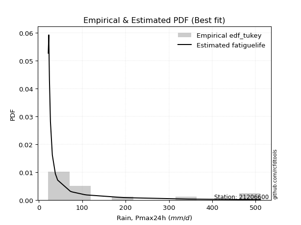</img>

</div>


### 8. EDF Gringorten (1963)

Gringorten plotting position formula is essential for estimating the probability and return periods of extreme events like floods and heavy rainfall. The constant _a=0.44_.

<div align="center">


$P=(m-a)/(n+1-2a)$


</div>


**8.1. Empirical values**

<div align="center">

|                | 0                    | 1                  | 2                  | 3                   | 4                  | 5                   | 6                  | 7                  | 8                  | 9                  | 10                 | 11                 | 12                 | 13                 | 14                 | 15                 |
|:---------------|:---------------------|:-------------------|:-------------------|:--------------------|:-------------------|:--------------------|:-------------------|:-------------------|:-------------------|:-------------------|:-------------------|:-------------------|:-------------------|:-------------------|:-------------------|:-------------------|
| date           | 2021                 | 2020               | 2017               | 2018                | 2019               | 2015                | 2022               | 2023               | 2014               | 2016               | 2024               | 2013               | 2012               | 2010               | 2008               | 2009               |
| x              | 21.6                 | 22.8               | 24.3               | 26.6                | 31.0               | 38.0                | 43.0               | 43.4               | 72.5               | 76.7               | 105.4              | 110.5              | 195.8              | 345.6              | 462.4              | 511.2              |
| m              | 1                    | 2                  | 3                  | 4                   | 5                  | 6                   | 7                  | 8                  | 9                  | 10                 | 11                 | 12                 | 13                 | 14                 | 15                 | 16                 |
| empirical_dist | edf_gringorten       | edf_gringorten     | edf_gringorten     | edf_gringorten      | edf_gringorten     | edf_gringorten      | edf_gringorten     | edf_gringorten     | edf_gringorten     | edf_gringorten     | edf_gringorten     | edf_gringorten     | edf_gringorten     | edf_gringorten     | edf_gringorten     | edf_gringorten     |
| empirical      | 0.034739454094292806 | 0.0967741935483871 | 0.1588089330024814 | 0.22084367245657568 | 0.2828784119106699 | 0.34491315136476425 | 0.4069478908188585 | 0.4689826302729528 | 0.5310173697270472 | 0.5930521091811415 | 0.6550868486352357 | 0.71712158808933   | 0.7791563275434243 | 0.8411910669975186 | 0.9032258064516129 | 0.9652605459057072 |
| empirical_tr   | 1.0359897172236503   | 1.1071428571428572 | 1.1887905604719764 | 1.28343949044586    | 1.3944636678200693 | 1.5265151515151516  | 1.6861924686192467 | 1.8831775700934574 | 2.1322751322751325 | 2.457317073170732  | 2.899280575539568  | 3.5350877192982457 | 4.52808988764045   | 6.296874999999998  | 10.33333333333333  | 28.785714285714292 |

</div>


**8.2. Kolmogorov-Smirnov fit test (sorted by Δ)**


<div align="center">

|                | 0                   | 1                   | 2                   | 3                  | 4                   | 5                   | 6                  | 7                  | 8                  | 9                  | 10                  | 11                  | 12                    | 13                  | 14                  | 15                  | 16                  | 17                  | 18                  | 19                  | 20                  | 21                  | 22                | 23                  | 24                  | 25                  | 26                  | 27                  | 28                  | 29                 | 30                 | 31                  | 32                  | 33                  | 34                  | 35                  | 36                  | 37                  | 38                  | 39                  | 40                  | 41                  | 42                  | 43                 | 44                 | 45                 | 46                  | 47                  | 48                  | 49                  | 50                  | 51                  | 52                  | 53                 | 54                  | 55                  | 56                  | 57                  | 58                 | 59                  | 60                  | 61                  | 62                  | 63                 | 64                | 65                  | 66                  | 67                  | 68                 | 69                  | 70                  | 71                 | 72                 | 73                 | 74                  | 75                  | 76                 | 77                  | 78                  | 79                  | 80                  | 81                 | 82                  | 83                 | 84                  | 85                  | 86                 | 87             |
|:---------------|:--------------------|:--------------------|:--------------------|:-------------------|:--------------------|:--------------------|:-------------------|:-------------------|:-------------------|:-------------------|:--------------------|:--------------------|:----------------------|:--------------------|:--------------------|:--------------------|:--------------------|:--------------------|:--------------------|:--------------------|:--------------------|:--------------------|:------------------|:--------------------|:--------------------|:--------------------|:--------------------|:--------------------|:--------------------|:-------------------|:-------------------|:--------------------|:--------------------|:--------------------|:--------------------|:--------------------|:--------------------|:--------------------|:--------------------|:--------------------|:--------------------|:--------------------|:--------------------|:-------------------|:-------------------|:-------------------|:--------------------|:--------------------|:--------------------|:--------------------|:--------------------|:--------------------|:--------------------|:-------------------|:--------------------|:--------------------|:--------------------|:--------------------|:-------------------|:--------------------|:--------------------|:--------------------|:--------------------|:-------------------|:------------------|:--------------------|:--------------------|:--------------------|:-------------------|:--------------------|:--------------------|:-------------------|:-------------------|:-------------------|:--------------------|:--------------------|:-------------------|:--------------------|:--------------------|:--------------------|:--------------------|:-------------------|:--------------------|:-------------------|:--------------------|:--------------------|:-------------------|:---------------|
| station        | 21206600            | 21206600            | 21206600            | 21206600           | 21206600            | 21206600            | 21206600           | 21206600           | 21206600           | 21206600           | 21206600            | 21206600            | 21206600              | 21206600            | 21206600            | 21206600            | 21206600            | 21206600            | 21206600            | 21206600            | 21206600            | 21206600            | 21206600          | 21206600            | 21206600            | 21206600            | 21206600            | 21206600            | 21206600            | 21206600           | 21206600           | 21206600            | 21206600            | 21206600            | 21206600            | 21206600            | 21206600            | 21206600            | 21206600            | 21206600            | 21206600            | 21206600            | 21206600            | 21206600           | 21206600           | 21206600           | 21206600            | 21206600            | 21206600            | 21206600            | 21206600            | 21206600            | 21206600            | 21206600           | 21206600            | 21206600            | 21206600            | 21206600            | 21206600           | 21206600            | 21206600            | 21206600            | 21206600            | 21206600           | 21206600          | 21206600            | 21206600            | 21206600            | 21206600           | 21206600            | 21206600            | 21206600           | 21206600           | 21206600           | 21206600            | 21206600            | 21206600           | 21206600            | 21206600            | 21206600            | 21206600            | 21206600           | 21206600            | 21206600           | 21206600            | 21206600            | 21206600           | 21206600       |
| empirical_dist | edf_gringorten      | edf_gringorten      | edf_gringorten      | edf_gringorten     | edf_gringorten      | edf_gringorten      | edf_gringorten     | edf_gringorten     | edf_gringorten     | edf_gringorten     | edf_gringorten      | edf_gringorten      | edf_gringorten        | edf_gringorten      | edf_gringorten      | edf_gringorten      | edf_gringorten      | edf_gringorten      | edf_gringorten      | edf_gringorten      | edf_gringorten      | edf_gringorten      | edf_gringorten    | edf_gringorten      | edf_gringorten      | edf_gringorten      | edf_gringorten      | edf_gringorten      | edf_gringorten      | edf_gringorten     | edf_gringorten     | edf_gringorten      | edf_gringorten      | edf_gringorten      | edf_gringorten      | edf_gringorten      | edf_gringorten      | edf_gringorten      | edf_gringorten      | edf_gringorten      | edf_gringorten      | edf_gringorten      | edf_gringorten      | edf_gringorten     | edf_gringorten     | edf_gringorten     | edf_gringorten      | edf_gringorten      | edf_gringorten      | edf_gringorten      | edf_gringorten      | edf_gringorten      | edf_gringorten      | edf_gringorten     | edf_gringorten      | edf_gringorten      | edf_gringorten      | edf_gringorten      | edf_gringorten     | edf_gringorten      | edf_gringorten      | edf_gringorten      | edf_gringorten      | edf_gringorten     | edf_gringorten    | edf_gringorten      | edf_gringorten      | edf_gringorten      | edf_gringorten     | edf_gringorten      | edf_gringorten      | edf_gringorten     | edf_gringorten     | edf_gringorten     | edf_gringorten      | edf_gringorten      | edf_gringorten     | edf_gringorten      | edf_gringorten      | edf_gringorten      | edf_gringorten      | edf_gringorten     | edf_gringorten      | edf_gringorten     | edf_gringorten      | edf_gringorten      | edf_gringorten     | edf_gringorten |
| p_dist         | fatiguelife         | logalpha            | logf                | logtruncnorm       | loggenexpon         | logweibull_min      | johnsonsu          | loghalfnorm        | loghalflogistic    | loggompertz        | logexponnorm        | logexpon            | loglaplace_asymmetric | nct                 | logmielke           | loginvweibull       | invweibull          | loginvgamma         | logfisk             | weibull_min         | lognakagami         | logncf              | logmoyal          | lognct              | loggenlogistic      | betaprime           | erlang              | lograyleigh         | invgamma            | logjohnsonsu       | loginvgauss        | loggumbel_r         | logkstwobign        | logbetaprime        | invgauss            | ncf                 | logmaxwell          | alpha               | logpearson3         | nakagami            | gamma               | logfatiguelife      | f                   | loggamma           | loggamma           | logt               | lognorm             | lognorm             | logcrystalball      | logloggamma         | logrice             | wald                | loglogistic         | logchi2            | loghypsecant        | fisk                | moyal               | genlogistic         | gumbel_r           | loggumbel_l         | loglaplace          | logerlang           | pearson3            | rayleigh           | halflogistic      | logwald             | maxwell             | kstwobign           | halfnorm           | norm                | crystalball         | t                  | logistic           | loggibrat          | gibrat              | hypsecant           | exponnorm          | laplace_asymmetric  | genexpon            | expon               | rice                | gompertz           | laplace             | truncnorm          | gumbel_l            | loglognorm          | chi2               | mielke         |
| delta          | 0.08295469296320834 | 0.08339039164621354 | 0.08458711631128657 | 0.0861126171706183 | 0.08700335718745769 | 0.08788802931881579 | 0.0890151931971267 | 0.0890699974403848 | 0.0939437716895182 | 0.0953548829702362 | 0.09681706878706942 | 0.09697718639217323 | 0.09701785873928037   | 0.09771064430410875 | 0.10558708233517489 | 0.10573566375403642 | 0.10633615994494372 | 0.10653233635711601 | 0.10723049742250579 | 0.10791819914563472 | 0.10955821416491662 | 0.11354050509529978 | 0.113789503539595 | 0.11578268078456272 | 0.11936810108638035 | 0.12035277973185488 | 0.12043084957213546 | 0.12095987031560312 | 0.12120430743617694 | 0.1216372730234444 | 0.1238538876584615 | 0.12524093137303421 | 0.12713914405894033 | 0.12931113574980008 | 0.13026261492586344 | 0.13208540789946505 | 0.13221320734063424 | 0.13264898025265848 | 0.13426224469264597 | 0.13557576345739808 | 0.13642763328043161 | 0.13747440266359712 | 0.14557592618766568 | 0.1549600398610932 | 0.1549600398610932 | 0.1608839884947087 | 0.16088467445791244 | 0.16088467445791244 | 0.16088470450813724 | 0.16130210280859553 | 0.16592193691273727 | 0.17216439115335663 | 0.18181191006609093 | 0.1914573957393767 | 0.19711987721646484 | 0.20063922828878689 | 0.20747892348528096 | 0.21057483017033163 | 0.2116795216977069 | 0.21336318702900098 | 0.22288335763437556 | 0.22415801188876955 | 0.22641594111032598 | 0.2311964547780394 | 0.234725531102071 | 0.23735752912682517 | 0.24032955281961055 | 0.24691885933169588 | 0.2525367792327124 | 0.27471095703444787 | 0.27471096430689534 | 0.2821972536257997 | 0.2824331098177485 | 0.2828784119106699 | 0.28319714962019926 | 0.28893461494086925 | 0.2891730676521696 | 0.29148560440921284 | 0.29150098838274674 | 0.29150115784738556 | 0.29546335387043404 | 0.2990766499765989 | 0.30974222010664354 | 0.3394865420647619 | 0.34446404805981606 | 0.38044240287830555 | 0.6650770031128037 | nan            |
| deltao         | 0.331107277296      | 0.331107277296      | 0.331107277296      | 0.331107277296     | 0.331107277296      | 0.331107277296      | 0.331107277296     | 0.331107277296     | 0.331107277296     | 0.331107277296     | 0.331107277296      | 0.331107277296      | 0.331107277296        | 0.331107277296      | 0.331107277296      | 0.331107277296      | 0.331107277296      | 0.331107277296      | 0.331107277296      | 0.331107277296      | 0.331107277296      | 0.331107277296      | 0.331107277296    | 0.331107277296      | 0.331107277296      | 0.331107277296      | 0.331107277296      | 0.331107277296      | 0.331107277296      | 0.331107277296     | 0.331107277296     | 0.331107277296      | 0.331107277296      | 0.331107277296      | 0.331107277296      | 0.331107277296      | 0.331107277296      | 0.331107277296      | 0.331107277296      | 0.331107277296      | 0.331107277296      | 0.331107277296      | 0.331107277296      | 0.331107277296     | 0.331107277296     | 0.331107277296     | 0.331107277296      | 0.331107277296      | 0.331107277296      | 0.331107277296      | 0.331107277296      | 0.331107277296      | 0.331107277296      | 0.331107277296     | 0.331107277296      | 0.331107277296      | 0.331107277296      | 0.331107277296      | 0.331107277296     | 0.331107277296      | 0.331107277296      | 0.331107277296      | 0.331107277296      | 0.331107277296     | 0.331107277296    | 0.331107277296      | 0.331107277296      | 0.331107277296      | 0.331107277296     | 0.331107277296      | 0.331107277296      | 0.331107277296     | 0.331107277296     | 0.331107277296     | 0.331107277296      | 0.331107277296      | 0.331107277296     | 0.331107277296      | 0.331107277296      | 0.331107277296      | 0.331107277296      | 0.331107277296     | 0.331107277296      | 0.331107277296     | 0.331107277296      | 0.331107277296      | 0.331107277296     | 0.331107277296 |
| eval           | Δo > Δ              | Δo > Δ              | Δo > Δ              | Δo > Δ             | Δo > Δ              | Δo > Δ              | Δo > Δ             | Δo > Δ             | Δo > Δ             | Δo > Δ             | Δo > Δ              | Δo > Δ              | Δo > Δ                | Δo > Δ              | Δo > Δ              | Δo > Δ              | Δo > Δ              | Δo > Δ              | Δo > Δ              | Δo > Δ              | Δo > Δ              | Δo > Δ              | Δo > Δ            | Δo > Δ              | Δo > Δ              | Δo > Δ              | Δo > Δ              | Δo > Δ              | Δo > Δ              | Δo > Δ             | Δo > Δ             | Δo > Δ              | Δo > Δ              | Δo > Δ              | Δo > Δ              | Δo > Δ              | Δo > Δ              | Δo > Δ              | Δo > Δ              | Δo > Δ              | Δo > Δ              | Δo > Δ              | Δo > Δ              | Δo > Δ             | Δo > Δ             | Δo > Δ             | Δo > Δ              | Δo > Δ              | Δo > Δ              | Δo > Δ              | Δo > Δ              | Δo > Δ              | Δo > Δ              | Δo > Δ             | Δo > Δ              | Δo > Δ              | Δo > Δ              | Δo > Δ              | Δo > Δ             | Δo > Δ              | Δo > Δ              | Δo > Δ              | Δo > Δ              | Δo > Δ             | Δo > Δ            | Δo > Δ              | Δo > Δ              | Δo > Δ              | Δo > Δ             | Δo > Δ              | Δo > Δ              | Δo > Δ             | Δo > Δ             | Δo > Δ             | Δo > Δ              | Δo > Δ              | Δo > Δ             | Δo > Δ              | Δo > Δ              | Δo > Δ              | Δo > Δ              | Δo > Δ             | Δo > Δ              | Δo <= Δ            | Δo <= Δ             | Δo <= Δ             | Δo <= Δ            | Δo <= Δ        |
| fit            | 1                   | 1                   | 1                   | 1                  | 1                   | 1                   | 1                  | 1                  | 1                  | 1                  | 1                   | 1                   | 1                     | 1                   | 1                   | 1                   | 1                   | 1                   | 1                   | 1                   | 1                   | 1                   | 1                 | 1                   | 1                   | 1                   | 1                   | 1                   | 1                   | 1                  | 1                  | 1                   | 1                   | 1                   | 1                   | 1                   | 1                   | 1                   | 1                   | 1                   | 1                   | 1                   | 1                   | 1                  | 1                  | 1                  | 1                   | 1                   | 1                   | 1                   | 1                   | 1                   | 1                   | 1                  | 1                   | 1                   | 1                   | 1                   | 1                  | 1                   | 1                   | 1                   | 1                   | 1                  | 1                 | 1                   | 1                   | 1                   | 1                  | 1                   | 1                   | 1                  | 1                  | 1                  | 1                   | 1                   | 1                  | 1                   | 1                   | 1                   | 1                   | 1                  | 1                   | 0                  | 0                   | 0                   | 0                  | 0              |
| n              | 16                  | 16                  | 16                  | 16                 | 16                  | 16                  | 16                 | 16                 | 16                 | 16                 | 16                  | 16                  | 16                    | 16                  | 16                  | 16                  | 16                  | 16                  | 16                  | 16                  | 16                  | 16                  | 16                | 16                  | 16                  | 16                  | 16                  | 16                  | 16                  | 16                 | 16                 | 16                  | 16                  | 16                  | 16                  | 16                  | 16                  | 16                  | 16                  | 16                  | 16                  | 16                  | 16                  | 16                 | 16                 | 16                 | 16                  | 16                  | 16                  | 16                  | 16                  | 16                  | 16                  | 16                 | 16                  | 16                  | 16                  | 16                  | 16                 | 16                  | 16                  | 16                  | 16                  | 16                 | 16                | 16                  | 16                  | 16                  | 16                 | 16                  | 16                  | 16                 | 16                 | 16                 | 16                  | 16                  | 16                 | 16                  | 16                  | 16                  | 16                  | 16                 | 16                  | 16                 | 16                  | 16                  | 16                 | 16             |
| best_fit       | 1                   | 0                   | 0                   | 0                  | 0                   | 0                   | 0                  | 0                  | 0                  | 0                  | 0                   | 0                   | 0                     | 0                   | 0                   | 0                   | 0                   | 0                   | 0                   | 0                   | 0                   | 0                   | 0                 | 0                   | 0                   | 0                   | 0                   | 0                   | 0                   | 0                  | 0                  | 0                   | 0                   | 0                   | 0                   | 0                   | 0                   | 0                   | 0                   | 0                   | 0                   | 0                   | 0                   | 0                  | 0                  | 0                  | 0                   | 0                   | 0                   | 0                   | 0                   | 0                   | 0                   | 0                  | 0                   | 0                   | 0                   | 0                   | 0                  | 0                   | 0                   | 0                   | 0                   | 0                  | 0                 | 0                   | 0                   | 0                   | 0                  | 0                   | 0                   | 0                  | 0                  | 0                  | 0                   | 0                   | 0                  | 0                   | 0                   | 0                   | 0                   | 0                  | 0                   | 0                  | 0                   | 0                   | 0                  | 0              |
| best_fit_sort  | 1                   | 2                   | 3                   | 4                  | 5                   | 6                   | 7                  | 8                  | 9                  | 10                 | 11                  | 12                  | 13                    | 14                  | 15                  | 16                  | 17                  | 18                  | 19                  | 20                  | 21                  | 22                  | 23                | 24                  | 25                  | 26                  | 27                  | 28                  | 29                  | 30                 | 31                 | 32                  | 33                  | 34                  | 35                  | 36                  | 37                  | 38                  | 39                  | 40                  | 41                  | 42                  | 43                  | 44                 | 45                 | 46                 | 47                  | 48                  | 49                  | 50                  | 51                  | 52                  | 53                  | 54                 | 55                  | 56                  | 57                  | 58                  | 59                 | 60                  | 61                  | 62                  | 63                  | 64                 | 65                | 66                  | 67                  | 68                  | 69                 | 70                  | 71                  | 72                 | 73                 | 74                 | 75                  | 76                  | 77                 | 78                  | 79                  | 80                  | 81                  | 82                 | 83                  | 84                 | 85                  | 86                  | 87                 | 88             |

</div>


**8.3. Best fit**

<div align="center">

|   id |   station | empirical_dist   | p_dist      |     delta |   deltao | eval   |   fit |   n |   best_fit |   best_fit_sort |
|-----:|----------:|:-----------------|:------------|----------:|---------:|:-------|------:|----:|-----------:|----------------:|
|    0 |  21206600 | edf_gringorten   | fatiguelife | 0.0829547 | 0.331107 | Δo > Δ |     1 |  16 |          1 |               1 |

</div>


<div align="center">

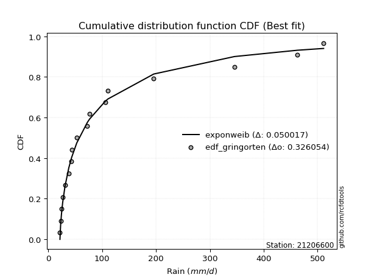</img>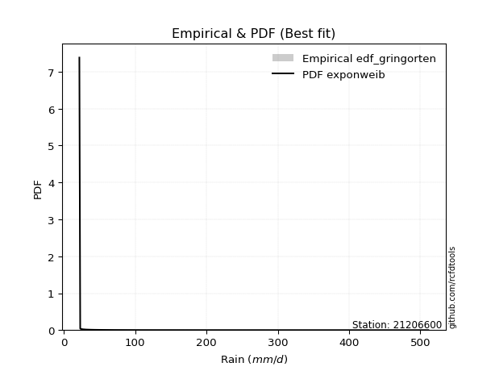</img>

</div>


### 9. EDF Filliben (1975)

The specific values of the constants (0.3175) (often denoted as $alpha$) and (0.365) are derived from a method proposed by James J. Filliben in a 1975 paper. This particular formula is the mean value of the $i$-th order statistic of the normal distribution and is considered a robust and effective plotting position formula for the normal probability plot correlation coefficient test for normality.

<div align="center">


$P=(m-0.3175)/(n+0.365)$


</div>


**9.1. Empirical values**

<div align="center">

|                | 0                    | 1                   | 2                  | 3                  | 4                  | 5                  | 6                   | 7                   | 8                  | 9                  | 10                 | 11                 | 12                 | 13                 | 14                 | 15                 |
|:---------------|:---------------------|:--------------------|:-------------------|:-------------------|:-------------------|:-------------------|:--------------------|:--------------------|:-------------------|:-------------------|:-------------------|:-------------------|:-------------------|:-------------------|:-------------------|:-------------------|
| date           | 2021                 | 2020                | 2017               | 2018               | 2019               | 2015               | 2022                | 2023                | 2014               | 2016               | 2024               | 2013               | 2012               | 2010               | 2008               | 2009               |
| x              | 21.6                 | 22.8                | 24.3               | 26.6               | 31.0               | 38.0               | 43.0                | 43.4                | 72.5               | 76.7               | 105.4              | 110.5              | 195.8              | 345.6              | 462.4              | 511.2              |
| m              | 1                    | 2                   | 3                  | 4                  | 5                  | 6                  | 7                   | 8                   | 9                  | 10                 | 11                 | 12                 | 13                 | 14                 | 15                 | 16                 |
| empirical_dist | edf_filliben         | edf_filliben        | edf_filliben       | edf_filliben       | edf_filliben       | edf_filliben       | edf_filliben        | edf_filliben        | edf_filliben       | edf_filliben       | edf_filliben       | edf_filliben       | edf_filliben       | edf_filliben       | edf_filliben       | edf_filliben       |
| empirical      | 0.041704857928505965 | 0.10281087687137185 | 0.1639168958142377 | 0.2250229147571036 | 0.2861289336999695 | 0.3472349526428354 | 0.40834097158570126 | 0.46944699052856714 | 0.5305530094714329 | 0.5916590284142988 | 0.6527650473571647 | 0.7138710663000306 | 0.7749770852428964 | 0.8360831041857624 | 0.8971891231286282 | 0.9582951420714941 |
| empirical_tr   | 1.0435198469631755   | 1.1145922016005447  | 1.1960533528229491 | 1.2903607332939089 | 1.4008131821099936 | 1.531944769482799  | 1.6901626646010846  | 1.8848257990210198  | 2.1301659616010413 | 2.4489337822671158 | 2.8798944126704793 | 3.4949279231179933 | 4.443991853360489  | 6.100652376514448  | 9.72659732540862   | 23.97802197802203  |

</div>


**9.2. Kolmogorov-Smirnov fit test (sorted by Δ)**


<div align="center">

|                | 0                   | 1                   | 2                   | 3                   | 4                   | 5                   | 6                   | 7                  | 8                   | 9                   | 10                    | 11                  | 12                  | 13                 | 14                  | 15                  | 16                  | 17                  | 18                  | 19                  | 20                 | 21                  | 22                  | 23                  | 24                  | 25                  | 26                  | 27                  | 28                  | 29                  | 30                  | 31                  | 32                 | 33                  | 34                 | 35                  | 36                 | 37                 | 38                  | 39                  | 40                  | 41                 | 42                  | 43                  | 44                  | 45                  | 46                 | 47                 | 48                 | 49                 | 50                  | 51                | 52                 | 53                  | 54                  | 55                 | 56                  | 57                  | 58                | 59                  | 60                 | 61                  | 62                  | 63                  | 64                  | 65                  | 66                  | 67                  | 68                  | 69                  | 70                  | 71                  | 72                 | 73                 | 74                  | 75                 | 76                  | 77                 | 78                 | 79                 | 80                  | 81                  | 82                  | 83                 | 84                  | 85                 | 86                 | 87             |
|:---------------|:--------------------|:--------------------|:--------------------|:--------------------|:--------------------|:--------------------|:--------------------|:-------------------|:--------------------|:--------------------|:----------------------|:--------------------|:--------------------|:-------------------|:--------------------|:--------------------|:--------------------|:--------------------|:--------------------|:--------------------|:-------------------|:--------------------|:--------------------|:--------------------|:--------------------|:--------------------|:--------------------|:--------------------|:--------------------|:--------------------|:--------------------|:--------------------|:-------------------|:--------------------|:-------------------|:--------------------|:-------------------|:-------------------|:--------------------|:--------------------|:--------------------|:-------------------|:--------------------|:--------------------|:--------------------|:--------------------|:-------------------|:-------------------|:-------------------|:-------------------|:--------------------|:------------------|:-------------------|:--------------------|:--------------------|:-------------------|:--------------------|:--------------------|:------------------|:--------------------|:-------------------|:--------------------|:--------------------|:--------------------|:--------------------|:--------------------|:--------------------|:--------------------|:--------------------|:--------------------|:--------------------|:--------------------|:-------------------|:-------------------|:--------------------|:-------------------|:--------------------|:-------------------|:-------------------|:-------------------|:--------------------|:--------------------|:--------------------|:-------------------|:--------------------|:-------------------|:-------------------|:---------------|
| station        | 21206600            | 21206600            | 21206600            | 21206600            | 21206600            | 21206600            | 21206600            | 21206600           | 21206600            | 21206600            | 21206600              | 21206600            | 21206600            | 21206600           | 21206600            | 21206600            | 21206600            | 21206600            | 21206600            | 21206600            | 21206600           | 21206600            | 21206600            | 21206600            | 21206600            | 21206600            | 21206600            | 21206600            | 21206600            | 21206600            | 21206600            | 21206600            | 21206600           | 21206600            | 21206600           | 21206600            | 21206600           | 21206600           | 21206600            | 21206600            | 21206600            | 21206600           | 21206600            | 21206600            | 21206600            | 21206600            | 21206600           | 21206600           | 21206600           | 21206600           | 21206600            | 21206600          | 21206600           | 21206600            | 21206600            | 21206600           | 21206600            | 21206600            | 21206600          | 21206600            | 21206600           | 21206600            | 21206600            | 21206600            | 21206600            | 21206600            | 21206600            | 21206600            | 21206600            | 21206600            | 21206600            | 21206600            | 21206600           | 21206600           | 21206600            | 21206600           | 21206600            | 21206600           | 21206600           | 21206600           | 21206600            | 21206600            | 21206600            | 21206600           | 21206600            | 21206600           | 21206600           | 21206600       |
| empirical_dist | edf_filliben        | edf_filliben        | edf_filliben        | edf_filliben        | edf_filliben        | edf_filliben        | edf_filliben        | edf_filliben       | edf_filliben        | edf_filliben        | edf_filliben          | edf_filliben        | edf_filliben        | edf_filliben       | edf_filliben        | edf_filliben        | edf_filliben        | edf_filliben        | edf_filliben        | edf_filliben        | edf_filliben       | edf_filliben        | edf_filliben        | edf_filliben        | edf_filliben        | edf_filliben        | edf_filliben        | edf_filliben        | edf_filliben        | edf_filliben        | edf_filliben        | edf_filliben        | edf_filliben       | edf_filliben        | edf_filliben       | edf_filliben        | edf_filliben       | edf_filliben       | edf_filliben        | edf_filliben        | edf_filliben        | edf_filliben       | edf_filliben        | edf_filliben        | edf_filliben        | edf_filliben        | edf_filliben       | edf_filliben       | edf_filliben       | edf_filliben       | edf_filliben        | edf_filliben      | edf_filliben       | edf_filliben        | edf_filliben        | edf_filliben       | edf_filliben        | edf_filliben        | edf_filliben      | edf_filliben        | edf_filliben       | edf_filliben        | edf_filliben        | edf_filliben        | edf_filliben        | edf_filliben        | edf_filliben        | edf_filliben        | edf_filliben        | edf_filliben        | edf_filliben        | edf_filliben        | edf_filliben       | edf_filliben       | edf_filliben        | edf_filliben       | edf_filliben        | edf_filliben       | edf_filliben       | edf_filliben       | edf_filliben        | edf_filliben        | edf_filliben        | edf_filliben       | edf_filliben        | edf_filliben       | edf_filliben       | edf_filliben   |
| p_dist         | fatiguelife         | logweibull_min      | logalpha            | logf                | johnsonsu           | loghalfnorm         | logtruncnorm        | loggenexpon        | logexponnorm        | logexpon            | loglaplace_asymmetric | loghalflogistic     | nct                 | loggompertz        | logmielke           | loginvweibull       | invweibull          | loginvgamma         | logfisk             | lognakagami         | weibull_min        | logncf              | logmoyal            | lognct              | loggenlogistic      | betaprime           | lograyleigh         | invgamma            | logjohnsonsu        | loginvgauss         | erlang              | loggumbel_r         | logkstwobign       | logbetaprime        | invgauss           | nakagami            | ncf                | logmaxwell         | alpha               | logpearson3         | logfatiguelife      | gamma              | f                   | loggamma            | loggamma            | logt                | lognorm            | lognorm            | logcrystalball     | logloggamma        | logrice             | wald              | loglogistic        | logchi2             | fisk                | loghypsecant       | moyal               | gumbel_r            | genlogistic       | loggumbel_l         | pearson3           | loglaplace          | logerlang           | rayleigh            | halflogistic        | maxwell             | logwald             | kstwobign           | halfnorm            | norm                | crystalball         | t                   | logistic           | gibrat             | hypsecant           | loggibrat          | exponnorm           | laplace_asymmetric | genexpon           | expon              | rice                | gompertz            | laplace             | truncnorm          | gumbel_l            | loglognorm         | chi2               | mielke         |
| delta          | 0.08063289168513721 | 0.08092262548460272 | 0.08401788282985367 | 0.08505147656690093 | 0.08947955345274095 | 0.08953435769599916 | 0.09029185947114621 | 0.0911825994879856 | 0.09728142904268366 | 0.09744154664778748 | 0.09748221899489462   | 0.09812301399004611 | 0.09817500455972311 | 0.0995341252707641 | 0.10605144259078914 | 0.10620002400965067 | 0.10680052020055797 | 0.10699669661273026 | 0.10769485767812004 | 0.10980893525138807 | 0.1130261619573909 | 0.11400486535091414 | 0.11425386379520935 | 0.11624704104017708 | 0.11983246134199471 | 0.12081713998746924 | 0.12142423057121748 | 0.12166866769179119 | 0.12210163327905865 | 0.12431824791407575 | 0.12553881238389164 | 0.12570529162864857 | 0.1276035043145547 | 0.12977549600541444 | 0.1307269751814777 | 0.13232524166809867 | 0.1325497681550794 | 0.1326775675962486 | 0.13311334050827273 | 0.13472660494826033 | 0.13793876291921137 | 0.1415355960921878 | 0.14604028644327993 | 0.15542440011670744 | 0.15542440011670744 | 0.16134834875032306 | 0.1613490347135268 | 0.1613490347135268 | 0.1613490647637516 | 0.1617664630642099 | 0.16638629716835163 | 0.172628751408971 | 0.1822762703217053 | 0.19192175599499095 | 0.19367382445457382 | 0.1975842374720792 | 0.20051351965106778 | 0.20527063641592225 | 0.211039190425946 | 0.21382754728461534 | 0.2194505372761128 | 0.22334771788998992 | 0.22428791994879094 | 0.22508967415495185 | 0.22776012726785783 | 0.23707903103031114 | 0.24060805091612475 | 0.24366833754239647 | 0.24557137539849921 | 0.27146043524514846 | 0.27146044251759593 | 0.27523184979158655 | 0.2791825880284491 | 0.2836615098758136 | 0.28568409315156984 | 0.2861289336999695 | 0.28963742790778396 | 0.2919499646648272 | 0.2919653486383611 | 0.2919655181029999 | 0.29221283208113463 | 0.29954101023221325 | 0.30649169831734413 | 0.3399509023203763 | 0.34121352627051665 | 0.3744057195553208 | 0.6603115017737378 | nan            |
| deltao         | 0.331107277296      | 0.331107277296      | 0.331107277296      | 0.331107277296      | 0.331107277296      | 0.331107277296      | 0.331107277296      | 0.331107277296     | 0.331107277296      | 0.331107277296      | 0.331107277296        | 0.331107277296      | 0.331107277296      | 0.331107277296     | 0.331107277296      | 0.331107277296      | 0.331107277296      | 0.331107277296      | 0.331107277296      | 0.331107277296      | 0.331107277296     | 0.331107277296      | 0.331107277296      | 0.331107277296      | 0.331107277296      | 0.331107277296      | 0.331107277296      | 0.331107277296      | 0.331107277296      | 0.331107277296      | 0.331107277296      | 0.331107277296      | 0.331107277296     | 0.331107277296      | 0.331107277296     | 0.331107277296      | 0.331107277296     | 0.331107277296     | 0.331107277296      | 0.331107277296      | 0.331107277296      | 0.331107277296     | 0.331107277296      | 0.331107277296      | 0.331107277296      | 0.331107277296      | 0.331107277296     | 0.331107277296     | 0.331107277296     | 0.331107277296     | 0.331107277296      | 0.331107277296    | 0.331107277296     | 0.331107277296      | 0.331107277296      | 0.331107277296     | 0.331107277296      | 0.331107277296      | 0.331107277296    | 0.331107277296      | 0.331107277296     | 0.331107277296      | 0.331107277296      | 0.331107277296      | 0.331107277296      | 0.331107277296      | 0.331107277296      | 0.331107277296      | 0.331107277296      | 0.331107277296      | 0.331107277296      | 0.331107277296      | 0.331107277296     | 0.331107277296     | 0.331107277296      | 0.331107277296     | 0.331107277296      | 0.331107277296     | 0.331107277296     | 0.331107277296     | 0.331107277296      | 0.331107277296      | 0.331107277296      | 0.331107277296     | 0.331107277296      | 0.331107277296     | 0.331107277296     | 0.331107277296 |
| eval           | Δo > Δ              | Δo > Δ              | Δo > Δ              | Δo > Δ              | Δo > Δ              | Δo > Δ              | Δo > Δ              | Δo > Δ             | Δo > Δ              | Δo > Δ              | Δo > Δ                | Δo > Δ              | Δo > Δ              | Δo > Δ             | Δo > Δ              | Δo > Δ              | Δo > Δ              | Δo > Δ              | Δo > Δ              | Δo > Δ              | Δo > Δ             | Δo > Δ              | Δo > Δ              | Δo > Δ              | Δo > Δ              | Δo > Δ              | Δo > Δ              | Δo > Δ              | Δo > Δ              | Δo > Δ              | Δo > Δ              | Δo > Δ              | Δo > Δ             | Δo > Δ              | Δo > Δ             | Δo > Δ              | Δo > Δ             | Δo > Δ             | Δo > Δ              | Δo > Δ              | Δo > Δ              | Δo > Δ             | Δo > Δ              | Δo > Δ              | Δo > Δ              | Δo > Δ              | Δo > Δ             | Δo > Δ             | Δo > Δ             | Δo > Δ             | Δo > Δ              | Δo > Δ            | Δo > Δ             | Δo > Δ              | Δo > Δ              | Δo > Δ             | Δo > Δ              | Δo > Δ              | Δo > Δ            | Δo > Δ              | Δo > Δ             | Δo > Δ              | Δo > Δ              | Δo > Δ              | Δo > Δ              | Δo > Δ              | Δo > Δ              | Δo > Δ              | Δo > Δ              | Δo > Δ              | Δo > Δ              | Δo > Δ              | Δo > Δ             | Δo > Δ             | Δo > Δ              | Δo > Δ             | Δo > Δ              | Δo > Δ             | Δo > Δ             | Δo > Δ             | Δo > Δ              | Δo > Δ              | Δo > Δ              | Δo <= Δ            | Δo <= Δ             | Δo <= Δ            | Δo <= Δ            | Δo <= Δ        |
| fit            | 1                   | 1                   | 1                   | 1                   | 1                   | 1                   | 1                   | 1                  | 1                   | 1                   | 1                     | 1                   | 1                   | 1                  | 1                   | 1                   | 1                   | 1                   | 1                   | 1                   | 1                  | 1                   | 1                   | 1                   | 1                   | 1                   | 1                   | 1                   | 1                   | 1                   | 1                   | 1                   | 1                  | 1                   | 1                  | 1                   | 1                  | 1                  | 1                   | 1                   | 1                   | 1                  | 1                   | 1                   | 1                   | 1                   | 1                  | 1                  | 1                  | 1                  | 1                   | 1                 | 1                  | 1                   | 1                   | 1                  | 1                   | 1                   | 1                 | 1                   | 1                  | 1                   | 1                   | 1                   | 1                   | 1                   | 1                   | 1                   | 1                   | 1                   | 1                   | 1                   | 1                  | 1                  | 1                   | 1                  | 1                   | 1                  | 1                  | 1                  | 1                   | 1                   | 1                   | 0                  | 0                   | 0                  | 0                  | 0              |
| n              | 16                  | 16                  | 16                  | 16                  | 16                  | 16                  | 16                  | 16                 | 16                  | 16                  | 16                    | 16                  | 16                  | 16                 | 16                  | 16                  | 16                  | 16                  | 16                  | 16                  | 16                 | 16                  | 16                  | 16                  | 16                  | 16                  | 16                  | 16                  | 16                  | 16                  | 16                  | 16                  | 16                 | 16                  | 16                 | 16                  | 16                 | 16                 | 16                  | 16                  | 16                  | 16                 | 16                  | 16                  | 16                  | 16                  | 16                 | 16                 | 16                 | 16                 | 16                  | 16                | 16                 | 16                  | 16                  | 16                 | 16                  | 16                  | 16                | 16                  | 16                 | 16                  | 16                  | 16                  | 16                  | 16                  | 16                  | 16                  | 16                  | 16                  | 16                  | 16                  | 16                 | 16                 | 16                  | 16                 | 16                  | 16                 | 16                 | 16                 | 16                  | 16                  | 16                  | 16                 | 16                  | 16                 | 16                 | 16             |
| best_fit       | 1                   | 0                   | 0                   | 0                   | 0                   | 0                   | 0                   | 0                  | 0                   | 0                   | 0                     | 0                   | 0                   | 0                  | 0                   | 0                   | 0                   | 0                   | 0                   | 0                   | 0                  | 0                   | 0                   | 0                   | 0                   | 0                   | 0                   | 0                   | 0                   | 0                   | 0                   | 0                   | 0                  | 0                   | 0                  | 0                   | 0                  | 0                  | 0                   | 0                   | 0                   | 0                  | 0                   | 0                   | 0                   | 0                   | 0                  | 0                  | 0                  | 0                  | 0                   | 0                 | 0                  | 0                   | 0                   | 0                  | 0                   | 0                   | 0                 | 0                   | 0                  | 0                   | 0                   | 0                   | 0                   | 0                   | 0                   | 0                   | 0                   | 0                   | 0                   | 0                   | 0                  | 0                  | 0                   | 0                  | 0                   | 0                  | 0                  | 0                  | 0                   | 0                   | 0                   | 0                  | 0                   | 0                  | 0                  | 0              |
| best_fit_sort  | 1                   | 2                   | 3                   | 4                   | 5                   | 6                   | 7                   | 8                  | 9                   | 10                  | 11                    | 12                  | 13                  | 14                 | 15                  | 16                  | 17                  | 18                  | 19                  | 20                  | 21                 | 22                  | 23                  | 24                  | 25                  | 26                  | 27                  | 28                  | 29                  | 30                  | 31                  | 32                  | 33                 | 34                  | 35                 | 36                  | 37                 | 38                 | 39                  | 40                  | 41                  | 42                 | 43                  | 44                  | 45                  | 46                  | 47                 | 48                 | 49                 | 50                 | 51                  | 52                | 53                 | 54                  | 55                  | 56                 | 57                  | 58                  | 59                | 60                  | 61                 | 62                  | 63                  | 64                  | 65                  | 66                  | 67                  | 68                  | 69                  | 70                  | 71                  | 72                  | 73                 | 74                 | 75                  | 76                 | 77                  | 78                 | 79                 | 80                 | 81                  | 82                  | 83                  | 84                 | 85                  | 86                 | 87                 | 88             |

</div>


**9.3. Best fit**

<div align="center">

|   id |   station | empirical_dist   | p_dist      |     delta |   deltao | eval   |   fit |   n |   best_fit |   best_fit_sort |
|-----:|----------:|:-----------------|:------------|----------:|---------:|:-------|------:|----:|-----------:|----------------:|
|    0 |  21206600 | edf_filliben     | fatiguelife | 0.0806329 | 0.331107 | Δo > Δ |     1 |  16 |          1 |               1 |

</div>


<div align="center">

</img></img>

</div>


### 10. EDF Jenkinson (1977)

The Jenkinson formula in hydrology is an empirical plotting position formula used to estimate the non-exceedance probability _(P)_ or return period _(T)_ of a given ordered observation within a sample. It is a widely used method in the frequency analysis of extreme events such as floods and rainfall, as it provides a distribution-free way to plot data. _a≈0.31_ and _b≈0.38_ are constants derived to approximate the median of the probability distribution for the given rank.

<div align="center">


$P=(m-a)/(n+b)$


</div>


**10.1. Empirical values**

<div align="center">

|                | 0                   | 1                   | 2                   | 3                   | 4                   | 5                  | 6                  | 7                   | 8                  | 9                  | 10                 | 11                 | 12                 | 13                 | 14                 | 15                 |
|:---------------|:--------------------|:--------------------|:--------------------|:--------------------|:--------------------|:-------------------|:-------------------|:--------------------|:-------------------|:-------------------|:-------------------|:-------------------|:-------------------|:-------------------|:-------------------|:-------------------|
| date           | 2021                | 2020                | 2017                | 2018                | 2019                | 2015               | 2022               | 2023                | 2014               | 2016               | 2024               | 2013               | 2012               | 2010               | 2008               | 2009               |
| x              | 21.6                | 22.8                | 24.3                | 26.6                | 31.0                | 38.0               | 43.0               | 43.4                | 72.5               | 76.7               | 105.4              | 110.5              | 195.8              | 345.6              | 462.4              | 511.2              |
| m              | 1                   | 2                   | 3                   | 4                   | 5                   | 6                  | 7                  | 8                   | 9                  | 10                 | 11                 | 12                 | 13                 | 14                 | 15                 | 16                 |
| empirical_dist | edf_jenkinson       | edf_jenkinson       | edf_jenkinson       | edf_jenkinson       | edf_jenkinson       | edf_jenkinson      | edf_jenkinson      | edf_jenkinson       | edf_jenkinson      | edf_jenkinson      | edf_jenkinson      | edf_jenkinson      | edf_jenkinson      | edf_jenkinson      | edf_jenkinson      | edf_jenkinson      |
| empirical      | 0.04212454212454212 | 0.10317460317460318 | 0.16422466422466422 | 0.22527472527472528 | 0.28632478632478636 | 0.3473748473748474 | 0.4084249084249085 | 0.46947496947496953 | 0.5305250305250305 | 0.5915750915750916 | 0.6526251526251526 | 0.7136752136752137 | 0.7747252747252747 | 0.8357753357753358 | 0.8968253968253969 | 0.9578754578754579 |
| empirical_tr   | 1.0439770554493308  | 1.1150442477876106  | 1.1964937910883857  | 1.2907801418439715  | 1.4011976047904193  | 1.5322731524789526 | 1.690402476780186  | 1.884925201380898   | 2.130039011703511  | 2.4484304932735426 | 2.878734622144113  | 3.492537313432836  | 4.439024390243903  | 6.08921933085502   | 9.692307692307695  | 23.73913043478263  |

</div>


**10.2. Kolmogorov-Smirnov fit test (sorted by Δ)**


<div align="center">

|                | 0                   | 1                  | 2                   | 3                   | 4                   | 5                   | 6                  | 7                   | 8                   | 9                   | 10                    | 11                 | 12                 | 13                 | 14                  | 15                  | 16                  | 17                  | 18                  | 19                  | 20                  | 21                  | 22                  | 23                  | 24                 | 25                  | 26                  | 27                  | 28                  | 29                  | 30                  | 31                 | 32                  | 33                  | 34                  | 35                  | 36                 | 37                | 38                 | 39                  | 40                  | 41                  | 42                  | 43                  | 44                  | 45                  | 46                  | 47                  | 48                | 49                  | 50                | 51                  | 52                  | 53                  | 54                 | 55                 | 56                  | 57                  | 58                  | 59                  | 60                  | 61                 | 62                  | 63                  | 64                 | 65                  | 66                 | 67                  | 68                  | 69                  | 70                | 71                  | 72                  | 73                | 74                 | 75                  | 76                  | 77                 | 78                 | 79                 | 80                 | 81                  | 82                 | 83                  | 84                  | 85                 | 86                 | 87             |
|:---------------|:--------------------|:-------------------|:--------------------|:--------------------|:--------------------|:--------------------|:-------------------|:--------------------|:--------------------|:--------------------|:----------------------|:-------------------|:-------------------|:-------------------|:--------------------|:--------------------|:--------------------|:--------------------|:--------------------|:--------------------|:--------------------|:--------------------|:--------------------|:--------------------|:-------------------|:--------------------|:--------------------|:--------------------|:--------------------|:--------------------|:--------------------|:-------------------|:--------------------|:--------------------|:--------------------|:--------------------|:-------------------|:------------------|:-------------------|:--------------------|:--------------------|:--------------------|:--------------------|:--------------------|:--------------------|:--------------------|:--------------------|:--------------------|:------------------|:--------------------|:------------------|:--------------------|:--------------------|:--------------------|:-------------------|:-------------------|:--------------------|:--------------------|:--------------------|:--------------------|:--------------------|:-------------------|:--------------------|:--------------------|:-------------------|:--------------------|:-------------------|:--------------------|:--------------------|:--------------------|:------------------|:--------------------|:--------------------|:------------------|:-------------------|:--------------------|:--------------------|:-------------------|:-------------------|:-------------------|:-------------------|:--------------------|:-------------------|:--------------------|:--------------------|:-------------------|:-------------------|:---------------|
| station        | 21206600            | 21206600           | 21206600            | 21206600            | 21206600            | 21206600            | 21206600           | 21206600            | 21206600            | 21206600            | 21206600              | 21206600           | 21206600           | 21206600           | 21206600            | 21206600            | 21206600            | 21206600            | 21206600            | 21206600            | 21206600            | 21206600            | 21206600            | 21206600            | 21206600           | 21206600            | 21206600            | 21206600            | 21206600            | 21206600            | 21206600            | 21206600           | 21206600            | 21206600            | 21206600            | 21206600            | 21206600           | 21206600          | 21206600           | 21206600            | 21206600            | 21206600            | 21206600            | 21206600            | 21206600            | 21206600            | 21206600            | 21206600            | 21206600          | 21206600            | 21206600          | 21206600            | 21206600            | 21206600            | 21206600           | 21206600           | 21206600            | 21206600            | 21206600            | 21206600            | 21206600            | 21206600           | 21206600            | 21206600            | 21206600           | 21206600            | 21206600           | 21206600            | 21206600            | 21206600            | 21206600          | 21206600            | 21206600            | 21206600          | 21206600           | 21206600            | 21206600            | 21206600           | 21206600           | 21206600           | 21206600           | 21206600            | 21206600           | 21206600            | 21206600            | 21206600           | 21206600           | 21206600       |
| empirical_dist | edf_jenkinson       | edf_jenkinson      | edf_jenkinson       | edf_jenkinson       | edf_jenkinson       | edf_jenkinson       | edf_jenkinson      | edf_jenkinson       | edf_jenkinson       | edf_jenkinson       | edf_jenkinson         | edf_jenkinson      | edf_jenkinson      | edf_jenkinson      | edf_jenkinson       | edf_jenkinson       | edf_jenkinson       | edf_jenkinson       | edf_jenkinson       | edf_jenkinson       | edf_jenkinson       | edf_jenkinson       | edf_jenkinson       | edf_jenkinson       | edf_jenkinson      | edf_jenkinson       | edf_jenkinson       | edf_jenkinson       | edf_jenkinson       | edf_jenkinson       | edf_jenkinson       | edf_jenkinson      | edf_jenkinson       | edf_jenkinson       | edf_jenkinson       | edf_jenkinson       | edf_jenkinson      | edf_jenkinson     | edf_jenkinson      | edf_jenkinson       | edf_jenkinson       | edf_jenkinson       | edf_jenkinson       | edf_jenkinson       | edf_jenkinson       | edf_jenkinson       | edf_jenkinson       | edf_jenkinson       | edf_jenkinson     | edf_jenkinson       | edf_jenkinson     | edf_jenkinson       | edf_jenkinson       | edf_jenkinson       | edf_jenkinson      | edf_jenkinson      | edf_jenkinson       | edf_jenkinson       | edf_jenkinson       | edf_jenkinson       | edf_jenkinson       | edf_jenkinson      | edf_jenkinson       | edf_jenkinson       | edf_jenkinson      | edf_jenkinson       | edf_jenkinson      | edf_jenkinson       | edf_jenkinson       | edf_jenkinson       | edf_jenkinson     | edf_jenkinson       | edf_jenkinson       | edf_jenkinson     | edf_jenkinson      | edf_jenkinson       | edf_jenkinson       | edf_jenkinson      | edf_jenkinson      | edf_jenkinson      | edf_jenkinson      | edf_jenkinson       | edf_jenkinson      | edf_jenkinson       | edf_jenkinson       | edf_jenkinson      | edf_jenkinson      | edf_jenkinson  |
| p_dist         | fatiguelife         | logweibull_min     | logalpha            | logf                | johnsonsu           | loghalfnorm         | logtruncnorm       | loggenexpon         | logexponnorm        | logexpon            | loglaplace_asymmetric | nct                | loghalflogistic    | loggompertz        | logmielke           | loginvweibull       | invweibull          | loginvgamma         | logfisk             | lognakagami         | weibull_min         | logncf              | logmoyal            | lognct              | loggenlogistic     | betaprime           | lograyleigh         | invgamma            | logjohnsonsu        | loginvgauss         | loggumbel_r         | erlang             | logkstwobign        | logbetaprime        | invgauss            | nakagami            | ncf                | logmaxwell        | alpha              | logpearson3         | logfatiguelife      | gamma               | f                   | loggamma            | loggamma            | logt                | lognorm             | lognorm             | logcrystalball    | logloggamma         | logrice           | wald                | loglogistic         | logchi2             | fisk               | loghypsecant       | moyal               | gumbel_r            | genlogistic         | loggumbel_l         | pearson3            | loglaplace         | logerlang           | rayleigh            | halflogistic       | maxwell             | logwald            | kstwobign           | halfnorm            | norm                | crystalball       | t                   | logistic            | gibrat            | hypsecant          | loggibrat           | exponnorm           | laplace_asymmetric | genexpon           | expon              | rice               | gompertz            | laplace            | truncnorm           | gumbel_l            | loglognorm         | chi2               | mielke         |
| delta          | 0.08049299695312517 | 0.0805029412885665 | 0.08426969334747536 | 0.08507945551330331 | 0.08950753239914333 | 0.08956233664240154 | 0.0905436699887679 | 0.09143441000560729 | 0.09730940798908605 | 0.09746952559418987 | 0.097510197941297     | 0.0982029835061255 | 0.0983748245076678 | 0.0997859357883858 | 0.10607942153719152 | 0.10622800295605306 | 0.10682849914696035 | 0.10702467555913264 | 0.10772283662452242 | 0.10983691419779046 | 0.11333393036781747 | 0.11403284429731653 | 0.11428184274161174 | 0.11627501998657946 | 0.1198604402883971 | 0.12084511893387162 | 0.12145220951761987 | 0.12169664663819357 | 0.12212961222546104 | 0.12434622686047814 | 0.12573327057505096 | 0.1258465807943182 | 0.12763148326095708 | 0.12980347495181682 | 0.13075495412788007 | 0.13212938904328175 | 0.1325777471014818 | 0.132705546542651 | 0.1331413194546751 | 0.13475458389466272 | 0.13796674186561375 | 0.14184336450261437 | 0.14606826538968232 | 0.15545237906310982 | 0.15545237906310982 | 0.16137632769672544 | 0.16137701365992918 | 0.16137701365992918 | 0.161377043710154 | 0.16179444201061227 | 0.166414276114754 | 0.17265673035537338 | 0.18230424926810768 | 0.19194973494139334 | 0.1932541402585376 | 0.1976122164184816 | 0.20009383545503165 | 0.20507478379110533 | 0.21106716937234837 | 0.21385552623101772 | 0.21903085308007667 | 0.2233756968363923 | 0.22431589889519332 | 0.22489382153013493 | 0.2273404430718217 | 0.23688317840549422 | 0.2408039035409416 | 0.24347248491757956 | 0.24515169120246308 | 0.27126458262033154 | 0.271264589892779 | 0.27519253561729495 | 0.27898673540363217 | 0.283689488822216 | 0.2854882405267529 | 0.28632478632478636 | 0.28966540685418635 | 0.2919779436112296 | 0.2919933275847635 | 0.2919934970494023 | 0.2920169794563177 | 0.29956898917861563 | 0.3062958456925272 | 0.33997888126677867 | 0.34101767364569974 | 0.3740419932520895 | 0.6600596912561161 | nan            |
| deltao         | 0.331107277296      | 0.331107277296     | 0.331107277296      | 0.331107277296      | 0.331107277296      | 0.331107277296      | 0.331107277296     | 0.331107277296      | 0.331107277296      | 0.331107277296      | 0.331107277296        | 0.331107277296     | 0.331107277296     | 0.331107277296     | 0.331107277296      | 0.331107277296      | 0.331107277296      | 0.331107277296      | 0.331107277296      | 0.331107277296      | 0.331107277296      | 0.331107277296      | 0.331107277296      | 0.331107277296      | 0.331107277296     | 0.331107277296      | 0.331107277296      | 0.331107277296      | 0.331107277296      | 0.331107277296      | 0.331107277296      | 0.331107277296     | 0.331107277296      | 0.331107277296      | 0.331107277296      | 0.331107277296      | 0.331107277296     | 0.331107277296    | 0.331107277296     | 0.331107277296      | 0.331107277296      | 0.331107277296      | 0.331107277296      | 0.331107277296      | 0.331107277296      | 0.331107277296      | 0.331107277296      | 0.331107277296      | 0.331107277296    | 0.331107277296      | 0.331107277296    | 0.331107277296      | 0.331107277296      | 0.331107277296      | 0.331107277296     | 0.331107277296     | 0.331107277296      | 0.331107277296      | 0.331107277296      | 0.331107277296      | 0.331107277296      | 0.331107277296     | 0.331107277296      | 0.331107277296      | 0.331107277296     | 0.331107277296      | 0.331107277296     | 0.331107277296      | 0.331107277296      | 0.331107277296      | 0.331107277296    | 0.331107277296      | 0.331107277296      | 0.331107277296    | 0.331107277296     | 0.331107277296      | 0.331107277296      | 0.331107277296     | 0.331107277296     | 0.331107277296     | 0.331107277296     | 0.331107277296      | 0.331107277296     | 0.331107277296      | 0.331107277296      | 0.331107277296     | 0.331107277296     | 0.331107277296 |
| eval           | Δo > Δ              | Δo > Δ             | Δo > Δ              | Δo > Δ              | Δo > Δ              | Δo > Δ              | Δo > Δ             | Δo > Δ              | Δo > Δ              | Δo > Δ              | Δo > Δ                | Δo > Δ             | Δo > Δ             | Δo > Δ             | Δo > Δ              | Δo > Δ              | Δo > Δ              | Δo > Δ              | Δo > Δ              | Δo > Δ              | Δo > Δ              | Δo > Δ              | Δo > Δ              | Δo > Δ              | Δo > Δ             | Δo > Δ              | Δo > Δ              | Δo > Δ              | Δo > Δ              | Δo > Δ              | Δo > Δ              | Δo > Δ             | Δo > Δ              | Δo > Δ              | Δo > Δ              | Δo > Δ              | Δo > Δ             | Δo > Δ            | Δo > Δ             | Δo > Δ              | Δo > Δ              | Δo > Δ              | Δo > Δ              | Δo > Δ              | Δo > Δ              | Δo > Δ              | Δo > Δ              | Δo > Δ              | Δo > Δ            | Δo > Δ              | Δo > Δ            | Δo > Δ              | Δo > Δ              | Δo > Δ              | Δo > Δ             | Δo > Δ             | Δo > Δ              | Δo > Δ              | Δo > Δ              | Δo > Δ              | Δo > Δ              | Δo > Δ             | Δo > Δ              | Δo > Δ              | Δo > Δ             | Δo > Δ              | Δo > Δ             | Δo > Δ              | Δo > Δ              | Δo > Δ              | Δo > Δ            | Δo > Δ              | Δo > Δ              | Δo > Δ            | Δo > Δ             | Δo > Δ              | Δo > Δ              | Δo > Δ             | Δo > Δ             | Δo > Δ             | Δo > Δ             | Δo > Δ              | Δo > Δ             | Δo <= Δ             | Δo <= Δ             | Δo <= Δ            | Δo <= Δ            | Δo <= Δ        |
| fit            | 1                   | 1                  | 1                   | 1                   | 1                   | 1                   | 1                  | 1                   | 1                   | 1                   | 1                     | 1                  | 1                  | 1                  | 1                   | 1                   | 1                   | 1                   | 1                   | 1                   | 1                   | 1                   | 1                   | 1                   | 1                  | 1                   | 1                   | 1                   | 1                   | 1                   | 1                   | 1                  | 1                   | 1                   | 1                   | 1                   | 1                  | 1                 | 1                  | 1                   | 1                   | 1                   | 1                   | 1                   | 1                   | 1                   | 1                   | 1                   | 1                 | 1                   | 1                 | 1                   | 1                   | 1                   | 1                  | 1                  | 1                   | 1                   | 1                   | 1                   | 1                   | 1                  | 1                   | 1                   | 1                  | 1                   | 1                  | 1                   | 1                   | 1                   | 1                 | 1                   | 1                   | 1                 | 1                  | 1                   | 1                   | 1                  | 1                  | 1                  | 1                  | 1                   | 1                  | 0                   | 0                   | 0                  | 0                  | 0              |
| n              | 16                  | 16                 | 16                  | 16                  | 16                  | 16                  | 16                 | 16                  | 16                  | 16                  | 16                    | 16                 | 16                 | 16                 | 16                  | 16                  | 16                  | 16                  | 16                  | 16                  | 16                  | 16                  | 16                  | 16                  | 16                 | 16                  | 16                  | 16                  | 16                  | 16                  | 16                  | 16                 | 16                  | 16                  | 16                  | 16                  | 16                 | 16                | 16                 | 16                  | 16                  | 16                  | 16                  | 16                  | 16                  | 16                  | 16                  | 16                  | 16                | 16                  | 16                | 16                  | 16                  | 16                  | 16                 | 16                 | 16                  | 16                  | 16                  | 16                  | 16                  | 16                 | 16                  | 16                  | 16                 | 16                  | 16                 | 16                  | 16                  | 16                  | 16                | 16                  | 16                  | 16                | 16                 | 16                  | 16                  | 16                 | 16                 | 16                 | 16                 | 16                  | 16                 | 16                  | 16                  | 16                 | 16                 | 16             |
| best_fit       | 1                   | 0                  | 0                   | 0                   | 0                   | 0                   | 0                  | 0                   | 0                   | 0                   | 0                     | 0                  | 0                  | 0                  | 0                   | 0                   | 0                   | 0                   | 0                   | 0                   | 0                   | 0                   | 0                   | 0                   | 0                  | 0                   | 0                   | 0                   | 0                   | 0                   | 0                   | 0                  | 0                   | 0                   | 0                   | 0                   | 0                  | 0                 | 0                  | 0                   | 0                   | 0                   | 0                   | 0                   | 0                   | 0                   | 0                   | 0                   | 0                 | 0                   | 0                 | 0                   | 0                   | 0                   | 0                  | 0                  | 0                   | 0                   | 0                   | 0                   | 0                   | 0                  | 0                   | 0                   | 0                  | 0                   | 0                  | 0                   | 0                   | 0                   | 0                 | 0                   | 0                   | 0                 | 0                  | 0                   | 0                   | 0                  | 0                  | 0                  | 0                  | 0                   | 0                  | 0                   | 0                   | 0                  | 0                  | 0              |
| best_fit_sort  | 1                   | 2                  | 3                   | 4                   | 5                   | 6                   | 7                  | 8                   | 9                   | 10                  | 11                    | 12                 | 13                 | 14                 | 15                  | 16                  | 17                  | 18                  | 19                  | 20                  | 21                  | 22                  | 23                  | 24                  | 25                 | 26                  | 27                  | 28                  | 29                  | 30                  | 31                  | 32                 | 33                  | 34                  | 35                  | 36                  | 37                 | 38                | 39                 | 40                  | 41                  | 42                  | 43                  | 44                  | 45                  | 46                  | 47                  | 48                  | 49                | 50                  | 51                | 52                  | 53                  | 54                  | 55                 | 56                 | 57                  | 58                  | 59                  | 60                  | 61                  | 62                 | 63                  | 64                  | 65                 | 66                  | 67                 | 68                  | 69                  | 70                  | 71                | 72                  | 73                  | 74                | 75                 | 76                  | 77                  | 78                 | 79                 | 80                 | 81                 | 82                  | 83                 | 84                  | 85                  | 86                 | 87                 | 88             |

</div>


**10.3. Best fit**

<div align="center">

|   id |   station | empirical_dist   | p_dist      |    delta |   deltao | eval   |   fit |   n |   best_fit |   best_fit_sort |
|-----:|----------:|:-----------------|:------------|---------:|---------:|:-------|------:|----:|-----------:|----------------:|
|    0 |  21206600 | edf_jenkinson    | fatiguelife | 0.080493 | 0.331107 | Δo > Δ |     1 |  16 |          1 |               1 |

</div>


<div align="center">

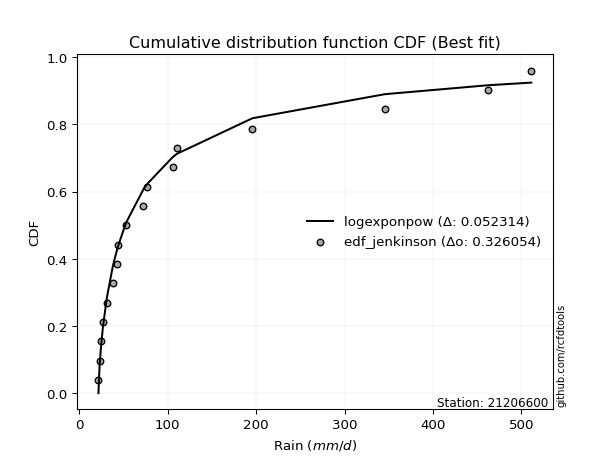</img>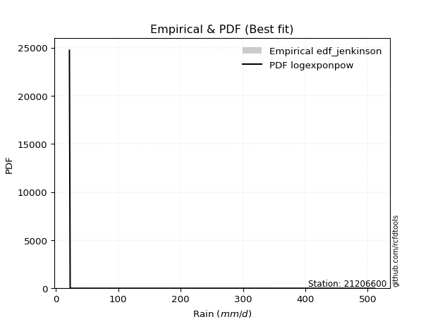</img>

</div>


### 11. EDF Cunnane (1978)

Cunnane´s work in statistical hydrology has focused on the performance and evaluation of different probability distributions (such as GEV, Gumbel, Lognormal) for flood frequency estimation. _b_ is a constant, typically set to 0.4.

<div align="center">


$P=(m-b)/(n+1-2b)$


</div>


**11.1. Empirical values**

<div align="center">

|                | 0                    | 1                   | 2                   | 3                   | 4                  | 5                  | 6                  | 7                  | 8                  | 9                  | 10                 | 11                 | 12                 | 13                 | 14                 | 15                 |
|:---------------|:---------------------|:--------------------|:--------------------|:--------------------|:-------------------|:-------------------|:-------------------|:-------------------|:-------------------|:-------------------|:-------------------|:-------------------|:-------------------|:-------------------|:-------------------|:-------------------|
| date           | 2021                 | 2020                | 2017                | 2018                | 2019               | 2015               | 2022               | 2023               | 2014               | 2016               | 2024               | 2013               | 2012               | 2010               | 2008               | 2009               |
| x              | 21.6                 | 22.8                | 24.3                | 26.6                | 31.0               | 38.0               | 43.0               | 43.4               | 72.5               | 76.7               | 105.4              | 110.5              | 195.8              | 345.6              | 462.4              | 511.2              |
| m              | 1                    | 2                   | 3                   | 4                   | 5                  | 6                  | 7                  | 8                  | 9                  | 10                 | 11                 | 12                 | 13                 | 14                 | 15                 | 16                 |
| empirical_dist | edf_cunnane          | edf_cunnane         | edf_cunnane         | edf_cunnane         | edf_cunnane        | edf_cunnane        | edf_cunnane        | edf_cunnane        | edf_cunnane        | edf_cunnane        | edf_cunnane        | edf_cunnane        | edf_cunnane        | edf_cunnane        | edf_cunnane        | edf_cunnane        |
| empirical      | 0.037037037037037035 | 0.09876543209876544 | 0.16049382716049385 | 0.22222222222222224 | 0.2839506172839506 | 0.345679012345679  | 0.4074074074074074 | 0.4691358024691358 | 0.5308641975308642 | 0.5925925925925926 | 0.654320987654321  | 0.7160493827160493 | 0.7777777777777778 | 0.8395061728395062 | 0.9012345679012346 | 0.962962962962963  |
| empirical_tr   | 1.0384615384615383   | 1.1095890410958904  | 1.1911764705882353  | 1.2857142857142856  | 1.3965517241379308 | 1.5283018867924527 | 1.6875             | 1.8837209302325582 | 2.1315789473684212 | 2.454545454545454  | 2.8928571428571432 | 3.5217391304347823 | 4.5                | 6.2307692307692335 | 10.125             | 27.000000000000043 |

</div>


**11.2. Kolmogorov-Smirnov fit test (sorted by Δ)**


<div align="center">

|                | 0                  | 1                   | 2                   | 3                  | 4                   | 5                   | 6                   | 7                   | 8                   | 9                   | 10                  | 11                  | 12                    | 13                  | 14                  | 15                  | 16                  | 17                  | 18                  | 19                 | 20                  | 21                  | 22                  | 23                  | 24                  | 25                  | 26                  | 27                  | 28                  | 29                  | 30                  | 31                 | 32                  | 33                  | 34                  | 35                  | 36                  | 37                  | 38                  | 39                 | 40                  | 41                  | 42                  | 43                  | 44                  | 45                 | 46                  | 47                  | 48                  | 49                  | 50                  | 51                  | 52                  | 53                  | 54                  | 55                 | 56                  | 57                  | 58                  | 59                  | 60                  | 61                  | 62                  | 63                  | 64                  | 65                  | 66                  | 67                 | 68                  | 69                 | 70                  | 71                 | 72                 | 73                  | 74                 | 75                 | 76                 | 77                  | 78                  | 79                  | 80                  | 81                 | 82                  | 83                  | 84                 | 85                  | 86                 | 87             |
|:---------------|:-------------------|:--------------------|:--------------------|:-------------------|:--------------------|:--------------------|:--------------------|:--------------------|:--------------------|:--------------------|:--------------------|:--------------------|:----------------------|:--------------------|:--------------------|:--------------------|:--------------------|:--------------------|:--------------------|:-------------------|:--------------------|:--------------------|:--------------------|:--------------------|:--------------------|:--------------------|:--------------------|:--------------------|:--------------------|:--------------------|:--------------------|:-------------------|:--------------------|:--------------------|:--------------------|:--------------------|:--------------------|:--------------------|:--------------------|:-------------------|:--------------------|:--------------------|:--------------------|:--------------------|:--------------------|:-------------------|:--------------------|:--------------------|:--------------------|:--------------------|:--------------------|:--------------------|:--------------------|:--------------------|:--------------------|:-------------------|:--------------------|:--------------------|:--------------------|:--------------------|:--------------------|:--------------------|:--------------------|:--------------------|:--------------------|:--------------------|:--------------------|:-------------------|:--------------------|:-------------------|:--------------------|:-------------------|:-------------------|:--------------------|:-------------------|:-------------------|:-------------------|:--------------------|:--------------------|:--------------------|:--------------------|:-------------------|:--------------------|:--------------------|:-------------------|:--------------------|:-------------------|:---------------|
| station        | 21206600           | 21206600            | 21206600            | 21206600           | 21206600            | 21206600            | 21206600            | 21206600            | 21206600            | 21206600            | 21206600            | 21206600            | 21206600              | 21206600            | 21206600            | 21206600            | 21206600            | 21206600            | 21206600            | 21206600           | 21206600            | 21206600            | 21206600            | 21206600            | 21206600            | 21206600            | 21206600            | 21206600            | 21206600            | 21206600            | 21206600            | 21206600           | 21206600            | 21206600            | 21206600            | 21206600            | 21206600            | 21206600            | 21206600            | 21206600           | 21206600            | 21206600            | 21206600            | 21206600            | 21206600            | 21206600           | 21206600            | 21206600            | 21206600            | 21206600            | 21206600            | 21206600            | 21206600            | 21206600            | 21206600            | 21206600           | 21206600            | 21206600            | 21206600            | 21206600            | 21206600            | 21206600            | 21206600            | 21206600            | 21206600            | 21206600            | 21206600            | 21206600           | 21206600            | 21206600           | 21206600            | 21206600           | 21206600           | 21206600            | 21206600           | 21206600           | 21206600           | 21206600            | 21206600            | 21206600            | 21206600            | 21206600           | 21206600            | 21206600            | 21206600           | 21206600            | 21206600           | 21206600       |
| empirical_dist | edf_cunnane        | edf_cunnane         | edf_cunnane         | edf_cunnane        | edf_cunnane         | edf_cunnane         | edf_cunnane         | edf_cunnane         | edf_cunnane         | edf_cunnane         | edf_cunnane         | edf_cunnane         | edf_cunnane           | edf_cunnane         | edf_cunnane         | edf_cunnane         | edf_cunnane         | edf_cunnane         | edf_cunnane         | edf_cunnane        | edf_cunnane         | edf_cunnane         | edf_cunnane         | edf_cunnane         | edf_cunnane         | edf_cunnane         | edf_cunnane         | edf_cunnane         | edf_cunnane         | edf_cunnane         | edf_cunnane         | edf_cunnane        | edf_cunnane         | edf_cunnane         | edf_cunnane         | edf_cunnane         | edf_cunnane         | edf_cunnane         | edf_cunnane         | edf_cunnane        | edf_cunnane         | edf_cunnane         | edf_cunnane         | edf_cunnane         | edf_cunnane         | edf_cunnane        | edf_cunnane         | edf_cunnane         | edf_cunnane         | edf_cunnane         | edf_cunnane         | edf_cunnane         | edf_cunnane         | edf_cunnane         | edf_cunnane         | edf_cunnane        | edf_cunnane         | edf_cunnane         | edf_cunnane         | edf_cunnane         | edf_cunnane         | edf_cunnane         | edf_cunnane         | edf_cunnane         | edf_cunnane         | edf_cunnane         | edf_cunnane         | edf_cunnane        | edf_cunnane         | edf_cunnane        | edf_cunnane         | edf_cunnane        | edf_cunnane        | edf_cunnane         | edf_cunnane        | edf_cunnane        | edf_cunnane        | edf_cunnane         | edf_cunnane         | edf_cunnane         | edf_cunnane         | edf_cunnane        | edf_cunnane         | edf_cunnane         | edf_cunnane        | edf_cunnane         | edf_cunnane        | edf_cunnane    |
| p_dist         | fatiguelife        | logalpha            | logf                | logweibull_min     | logtruncnorm        | loggenexpon         | johnsonsu           | loghalfnorm         | loghalflogistic     | loggompertz         | logexponnorm        | logexpon            | loglaplace_asymmetric | nct                 | logmielke           | loginvweibull       | invweibull          | loginvgamma         | logfisk             | lognakagami        | weibull_min         | logncf              | logmoyal            | lognct              | loggenlogistic      | betaprime           | lograyleigh         | invgamma            | logjohnsonsu        | erlang              | loginvgauss         | loggumbel_r        | logkstwobign        | logbetaprime        | invgauss            | ncf                 | logmaxwell          | alpha               | logpearson3         | nakagami           | logfatiguelife      | gamma               | f                   | loggamma            | loggamma            | logt               | lognorm             | lognorm             | logcrystalball      | logloggamma         | logrice             | wald                | loglogistic         | logchi2             | loghypsecant        | fisk               | moyal               | gumbel_r            | genlogistic         | loggumbel_l         | loglaplace          | logerlang           | pearson3            | rayleigh            | halflogistic        | logwald             | maxwell             | kstwobign          | halfnorm            | norm               | crystalball         | t                  | logistic           | gibrat              | loggibrat          | hypsecant          | exponnorm          | laplace_asymmetric  | genexpon            | expon               | rice                | gompertz           | laplace             | truncnorm           | gumbel_l           | loglognorm          | chi2               | mielke         |
| delta          | 0.0821888319822936 | 0.08354356384239653 | 0.08474028850746956 | 0.0855904463760716 | 0.08749116693626485 | 0.08838190695310424 | 0.08916836539330963 | 0.08922316963656779 | 0.09532232145516475 | 0.09673343273588275 | 0.09697024098325235 | 0.09713035858835617 | 0.09717103093546331   | 0.09786381650029174 | 0.10574025453135782 | 0.10588883595021936 | 0.10648933214112666 | 0.10668550855329895 | 0.10738366961868873 | 0.1094977471919567 | 0.10960309330364704 | 0.11369367729148278 | 0.11394267573577799 | 0.11593585298074571 | 0.11952127328256335 | 0.12050595192803787 | 0.12111304251178612 | 0.12135747963235988 | 0.12179044521962734 | 0.12211574373014777 | 0.12400705985464444 | 0.1253941035692172 | 0.12729231625512333 | 0.12946430794598307 | 0.13041578712204638 | 0.13223858009564804 | 0.13236637953681724 | 0.13280215244884142 | 0.13441541688882896 | 0.1345035580841174 | 0.13762757485978006 | 0.13811252743844393 | 0.14572909838384862 | 0.15511321205727613 | 0.15511321205727613 | 0.1610371606908917 | 0.16103784665409543 | 0.16103784665409543 | 0.16103787670432024 | 0.16145527500477852 | 0.16607510910892026 | 0.17231756334953963 | 0.18196508226227393 | 0.19161056793555964 | 0.19727304941264784 | 0.1983416453460427 | 0.20518134054253673 | 0.20938193875496267 | 0.21072800236651462 | 0.21351635922518397 | 0.22303652983055855 | 0.22397673188935963 | 0.22411835816758174 | 0.22889887183529517 | 0.23242794815932677 | 0.23842973450010585 | 0.23925734744632987 | 0.2458466539584152 | 0.25023919628996816 | 0.2736387516611672 | 0.27363875893361467 | 0.2798996706830555 | 0.2813609044444678 | 0.28335032181638226 | 0.2839506172839506 | 0.2878624095675886 | 0.2893262398483526 | 0.29163877660539583 | 0.29165416057892973 | 0.29165433004356855 | 0.29439114849715337 | 0.2992298221727819 | 0.30867001473336286 | 0.33963971426094497 | 0.3433918426865354 | 0.37845116432792725 | 0.6633921089547912 | nan            |
| deltao         | 0.331107277296     | 0.331107277296      | 0.331107277296      | 0.331107277296     | 0.331107277296      | 0.331107277296      | 0.331107277296      | 0.331107277296      | 0.331107277296      | 0.331107277296      | 0.331107277296      | 0.331107277296      | 0.331107277296        | 0.331107277296      | 0.331107277296      | 0.331107277296      | 0.331107277296      | 0.331107277296      | 0.331107277296      | 0.331107277296     | 0.331107277296      | 0.331107277296      | 0.331107277296      | 0.331107277296      | 0.331107277296      | 0.331107277296      | 0.331107277296      | 0.331107277296      | 0.331107277296      | 0.331107277296      | 0.331107277296      | 0.331107277296     | 0.331107277296      | 0.331107277296      | 0.331107277296      | 0.331107277296      | 0.331107277296      | 0.331107277296      | 0.331107277296      | 0.331107277296     | 0.331107277296      | 0.331107277296      | 0.331107277296      | 0.331107277296      | 0.331107277296      | 0.331107277296     | 0.331107277296      | 0.331107277296      | 0.331107277296      | 0.331107277296      | 0.331107277296      | 0.331107277296      | 0.331107277296      | 0.331107277296      | 0.331107277296      | 0.331107277296     | 0.331107277296      | 0.331107277296      | 0.331107277296      | 0.331107277296      | 0.331107277296      | 0.331107277296      | 0.331107277296      | 0.331107277296      | 0.331107277296      | 0.331107277296      | 0.331107277296      | 0.331107277296     | 0.331107277296      | 0.331107277296     | 0.331107277296      | 0.331107277296     | 0.331107277296     | 0.331107277296      | 0.331107277296     | 0.331107277296     | 0.331107277296     | 0.331107277296      | 0.331107277296      | 0.331107277296      | 0.331107277296      | 0.331107277296     | 0.331107277296      | 0.331107277296      | 0.331107277296     | 0.331107277296      | 0.331107277296     | 0.331107277296 |
| eval           | Δo > Δ             | Δo > Δ              | Δo > Δ              | Δo > Δ             | Δo > Δ              | Δo > Δ              | Δo > Δ              | Δo > Δ              | Δo > Δ              | Δo > Δ              | Δo > Δ              | Δo > Δ              | Δo > Δ                | Δo > Δ              | Δo > Δ              | Δo > Δ              | Δo > Δ              | Δo > Δ              | Δo > Δ              | Δo > Δ             | Δo > Δ              | Δo > Δ              | Δo > Δ              | Δo > Δ              | Δo > Δ              | Δo > Δ              | Δo > Δ              | Δo > Δ              | Δo > Δ              | Δo > Δ              | Δo > Δ              | Δo > Δ             | Δo > Δ              | Δo > Δ              | Δo > Δ              | Δo > Δ              | Δo > Δ              | Δo > Δ              | Δo > Δ              | Δo > Δ             | Δo > Δ              | Δo > Δ              | Δo > Δ              | Δo > Δ              | Δo > Δ              | Δo > Δ             | Δo > Δ              | Δo > Δ              | Δo > Δ              | Δo > Δ              | Δo > Δ              | Δo > Δ              | Δo > Δ              | Δo > Δ              | Δo > Δ              | Δo > Δ             | Δo > Δ              | Δo > Δ              | Δo > Δ              | Δo > Δ              | Δo > Δ              | Δo > Δ              | Δo > Δ              | Δo > Δ              | Δo > Δ              | Δo > Δ              | Δo > Δ              | Δo > Δ             | Δo > Δ              | Δo > Δ             | Δo > Δ              | Δo > Δ             | Δo > Δ             | Δo > Δ              | Δo > Δ             | Δo > Δ             | Δo > Δ             | Δo > Δ              | Δo > Δ              | Δo > Δ              | Δo > Δ              | Δo > Δ             | Δo > Δ              | Δo <= Δ             | Δo <= Δ            | Δo <= Δ             | Δo <= Δ            | Δo <= Δ        |
| fit            | 1                  | 1                   | 1                   | 1                  | 1                   | 1                   | 1                   | 1                   | 1                   | 1                   | 1                   | 1                   | 1                     | 1                   | 1                   | 1                   | 1                   | 1                   | 1                   | 1                  | 1                   | 1                   | 1                   | 1                   | 1                   | 1                   | 1                   | 1                   | 1                   | 1                   | 1                   | 1                  | 1                   | 1                   | 1                   | 1                   | 1                   | 1                   | 1                   | 1                  | 1                   | 1                   | 1                   | 1                   | 1                   | 1                  | 1                   | 1                   | 1                   | 1                   | 1                   | 1                   | 1                   | 1                   | 1                   | 1                  | 1                   | 1                   | 1                   | 1                   | 1                   | 1                   | 1                   | 1                   | 1                   | 1                   | 1                   | 1                  | 1                   | 1                  | 1                   | 1                  | 1                  | 1                   | 1                  | 1                  | 1                  | 1                   | 1                   | 1                   | 1                   | 1                  | 1                   | 0                   | 0                  | 0                   | 0                  | 0              |
| n              | 16                 | 16                  | 16                  | 16                 | 16                  | 16                  | 16                  | 16                  | 16                  | 16                  | 16                  | 16                  | 16                    | 16                  | 16                  | 16                  | 16                  | 16                  | 16                  | 16                 | 16                  | 16                  | 16                  | 16                  | 16                  | 16                  | 16                  | 16                  | 16                  | 16                  | 16                  | 16                 | 16                  | 16                  | 16                  | 16                  | 16                  | 16                  | 16                  | 16                 | 16                  | 16                  | 16                  | 16                  | 16                  | 16                 | 16                  | 16                  | 16                  | 16                  | 16                  | 16                  | 16                  | 16                  | 16                  | 16                 | 16                  | 16                  | 16                  | 16                  | 16                  | 16                  | 16                  | 16                  | 16                  | 16                  | 16                  | 16                 | 16                  | 16                 | 16                  | 16                 | 16                 | 16                  | 16                 | 16                 | 16                 | 16                  | 16                  | 16                  | 16                  | 16                 | 16                  | 16                  | 16                 | 16                  | 16                 | 16             |
| best_fit       | 1                  | 0                   | 0                   | 0                  | 0                   | 0                   | 0                   | 0                   | 0                   | 0                   | 0                   | 0                   | 0                     | 0                   | 0                   | 0                   | 0                   | 0                   | 0                   | 0                  | 0                   | 0                   | 0                   | 0                   | 0                   | 0                   | 0                   | 0                   | 0                   | 0                   | 0                   | 0                  | 0                   | 0                   | 0                   | 0                   | 0                   | 0                   | 0                   | 0                  | 0                   | 0                   | 0                   | 0                   | 0                   | 0                  | 0                   | 0                   | 0                   | 0                   | 0                   | 0                   | 0                   | 0                   | 0                   | 0                  | 0                   | 0                   | 0                   | 0                   | 0                   | 0                   | 0                   | 0                   | 0                   | 0                   | 0                   | 0                  | 0                   | 0                  | 0                   | 0                  | 0                  | 0                   | 0                  | 0                  | 0                  | 0                   | 0                   | 0                   | 0                   | 0                  | 0                   | 0                   | 0                  | 0                   | 0                  | 0              |
| best_fit_sort  | 1                  | 2                   | 3                   | 4                  | 5                   | 6                   | 7                   | 8                   | 9                   | 10                  | 11                  | 12                  | 13                    | 14                  | 15                  | 16                  | 17                  | 18                  | 19                  | 20                 | 21                  | 22                  | 23                  | 24                  | 25                  | 26                  | 27                  | 28                  | 29                  | 30                  | 31                  | 32                 | 33                  | 34                  | 35                  | 36                  | 37                  | 38                  | 39                  | 40                 | 41                  | 42                  | 43                  | 44                  | 45                  | 46                 | 47                  | 48                  | 49                  | 50                  | 51                  | 52                  | 53                  | 54                  | 55                  | 56                 | 57                  | 58                  | 59                  | 60                  | 61                  | 62                  | 63                  | 64                  | 65                  | 66                  | 67                  | 68                 | 69                  | 70                 | 71                  | 72                 | 73                 | 74                  | 75                 | 76                 | 77                 | 78                  | 79                  | 80                  | 81                  | 82                 | 83                  | 84                  | 85                 | 86                  | 87                 | 88             |

</div>


**11.3. Best fit**

<div align="center">

|   id |   station | empirical_dist   | p_dist      |     delta |   deltao | eval   |   fit |   n |   best_fit |   best_fit_sort |
|-----:|----------:|:-----------------|:------------|----------:|---------:|:-------|------:|----:|-----------:|----------------:|
|    0 |  21206600 | edf_cunnane      | fatiguelife | 0.0821888 | 0.331107 | Δo > Δ |     1 |  16 |          1 |               1 |

</div>


<div align="center">

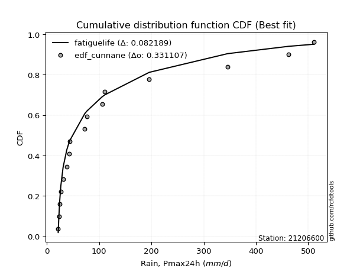</img>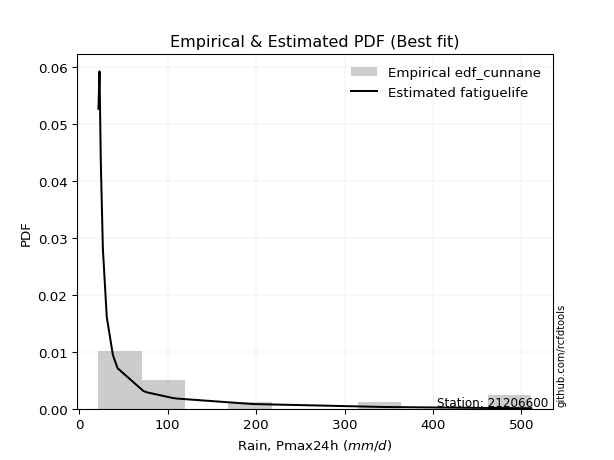</img>

</div>


### 12. EDF Adamowski (1981)

The Adamowski formula in hydrology refers to a specific plotting position formula used for estimating the non-parametric empirical distribution of hydrological events (like flood peaks) to calculate their return periods. This formula provides an alternative to traditional parametric methods (like the Gumbel or Log Pearson Type III distributions). 

<div align="center">


$P=(m-0.25)/(n+0.5)$


</div>


**12.1. Empirical values**

<div align="center">

|                | 0                    | 1                   | 2                   | 3                   | 4                  | 5                  | 6                  | 7                  | 8                  | 9                  | 10                 | 11                 | 12                 | 13                 | 14                 | 15                 |
|:---------------|:---------------------|:--------------------|:--------------------|:--------------------|:-------------------|:-------------------|:-------------------|:-------------------|:-------------------|:-------------------|:-------------------|:-------------------|:-------------------|:-------------------|:-------------------|:-------------------|
| date           | 2021                 | 2020                | 2017                | 2018                | 2019               | 2015               | 2022               | 2023               | 2014               | 2016               | 2024               | 2013               | 2012               | 2010               | 2008               | 2009               |
| x              | 21.6                 | 22.8                | 24.3                | 26.6                | 31.0               | 38.0               | 43.0               | 43.4               | 72.5               | 76.7               | 105.4              | 110.5              | 195.8              | 345.6              | 462.4              | 511.2              |
| m              | 1                    | 2                   | 3                   | 4                   | 5                  | 6                  | 7                  | 8                  | 9                  | 10                 | 11                 | 12                 | 13                 | 14                 | 15                 | 16                 |
| empirical_dist | edf_adamowski        | edf_adamowski       | edf_adamowski       | edf_adamowski       | edf_adamowski      | edf_adamowski      | edf_adamowski      | edf_adamowski      | edf_adamowski      | edf_adamowski      | edf_adamowski      | edf_adamowski      | edf_adamowski      | edf_adamowski      | edf_adamowski      | edf_adamowski      |
| empirical      | 0.045454545454545456 | 0.10606060606060606 | 0.16666666666666666 | 0.22727272727272727 | 0.2878787878787879 | 0.3484848484848485 | 0.4090909090909091 | 0.4696969696969697 | 0.5303030303030303 | 0.5909090909090909 | 0.6515151515151515 | 0.7121212121212122 | 0.7727272727272727 | 0.8333333333333334 | 0.8939393939393939 | 0.9545454545454546 |
| empirical_tr   | 1.0476190476190477   | 1.1186440677966103  | 1.2                 | 1.2941176470588236  | 1.4042553191489362 | 1.5348837209302326 | 1.6923076923076925 | 1.885714285714286  | 2.129032258064516  | 2.4444444444444446 | 2.869565217391304  | 3.4736842105263164 | 4.3999999999999995 | 6.000000000000002  | 9.428571428571427  | 22.00000000000002  |

</div>


**12.2. Kolmogorov-Smirnov fit test (sorted by Δ)**


<div align="center">

|                | 0                   | 1                   | 2                   | 3                   | 4                   | 5                   | 6                   | 7                   | 8                  | 9                   | 10                    | 11                  | 12                  | 13                  | 14                  | 15                  | 16                 | 17                 | 18                  | 19                  | 20                  | 21                  | 22                 | 23                  | 24                  | 25                  | 26                  | 27                  | 28                  | 29                  | 30                  | 31                  | 32                  | 33                  | 34                  | 35                  | 36                | 37                  | 38                  | 39                 | 40                | 41                 | 42                  | 43                  | 44                  | 45                  | 46                  | 47                  | 48                  | 49                  | 50                 | 51                  | 52                  | 53                  | 54                 | 55                 | 56                  | 57                 | 58                  | 59                  | 60                 | 61                 | 62                 | 63                  | 64                  | 65                  | 66                  | 67                  | 68                  | 69               | 70                 | 71                 | 72                  | 73                 | 74                 | 75                 | 76                  | 77                 | 78                 | 79                 | 80                 | 81                 | 82                 | 83                 | 84                 | 85                 | 86                | 87             |
|:---------------|:--------------------|:--------------------|:--------------------|:--------------------|:--------------------|:--------------------|:--------------------|:--------------------|:-------------------|:--------------------|:----------------------|:--------------------|:--------------------|:--------------------|:--------------------|:--------------------|:-------------------|:-------------------|:--------------------|:--------------------|:--------------------|:--------------------|:-------------------|:--------------------|:--------------------|:--------------------|:--------------------|:--------------------|:--------------------|:--------------------|:--------------------|:--------------------|:--------------------|:--------------------|:--------------------|:--------------------|:------------------|:--------------------|:--------------------|:-------------------|:------------------|:-------------------|:--------------------|:--------------------|:--------------------|:--------------------|:--------------------|:--------------------|:--------------------|:--------------------|:-------------------|:--------------------|:--------------------|:--------------------|:-------------------|:-------------------|:--------------------|:-------------------|:--------------------|:--------------------|:-------------------|:-------------------|:-------------------|:--------------------|:--------------------|:--------------------|:--------------------|:--------------------|:--------------------|:-----------------|:-------------------|:-------------------|:--------------------|:-------------------|:-------------------|:-------------------|:--------------------|:-------------------|:-------------------|:-------------------|:-------------------|:-------------------|:-------------------|:-------------------|:-------------------|:-------------------|:------------------|:---------------|
| station        | 21206600            | 21206600            | 21206600            | 21206600            | 21206600            | 21206600            | 21206600            | 21206600            | 21206600           | 21206600            | 21206600              | 21206600            | 21206600            | 21206600            | 21206600            | 21206600            | 21206600           | 21206600           | 21206600            | 21206600            | 21206600            | 21206600            | 21206600           | 21206600            | 21206600            | 21206600            | 21206600            | 21206600            | 21206600            | 21206600            | 21206600            | 21206600            | 21206600            | 21206600            | 21206600            | 21206600            | 21206600          | 21206600            | 21206600            | 21206600           | 21206600          | 21206600           | 21206600            | 21206600            | 21206600            | 21206600            | 21206600            | 21206600            | 21206600            | 21206600            | 21206600           | 21206600            | 21206600            | 21206600            | 21206600           | 21206600           | 21206600            | 21206600           | 21206600            | 21206600            | 21206600           | 21206600           | 21206600           | 21206600            | 21206600            | 21206600            | 21206600            | 21206600            | 21206600            | 21206600         | 21206600           | 21206600           | 21206600            | 21206600           | 21206600           | 21206600           | 21206600            | 21206600           | 21206600           | 21206600           | 21206600           | 21206600           | 21206600           | 21206600           | 21206600           | 21206600           | 21206600          | 21206600       |
| empirical_dist | edf_adamowski       | edf_adamowski       | edf_adamowski       | edf_adamowski       | edf_adamowski       | edf_adamowski       | edf_adamowski       | edf_adamowski       | edf_adamowski      | edf_adamowski       | edf_adamowski         | edf_adamowski       | edf_adamowski       | edf_adamowski       | edf_adamowski       | edf_adamowski       | edf_adamowski      | edf_adamowski      | edf_adamowski       | edf_adamowski       | edf_adamowski       | edf_adamowski       | edf_adamowski      | edf_adamowski       | edf_adamowski       | edf_adamowski       | edf_adamowski       | edf_adamowski       | edf_adamowski       | edf_adamowski       | edf_adamowski       | edf_adamowski       | edf_adamowski       | edf_adamowski       | edf_adamowski       | edf_adamowski       | edf_adamowski     | edf_adamowski       | edf_adamowski       | edf_adamowski      | edf_adamowski     | edf_adamowski      | edf_adamowski       | edf_adamowski       | edf_adamowski       | edf_adamowski       | edf_adamowski       | edf_adamowski       | edf_adamowski       | edf_adamowski       | edf_adamowski      | edf_adamowski       | edf_adamowski       | edf_adamowski       | edf_adamowski      | edf_adamowski      | edf_adamowski       | edf_adamowski      | edf_adamowski       | edf_adamowski       | edf_adamowski      | edf_adamowski      | edf_adamowski      | edf_adamowski       | edf_adamowski       | edf_adamowski       | edf_adamowski       | edf_adamowski       | edf_adamowski       | edf_adamowski    | edf_adamowski      | edf_adamowski      | edf_adamowski       | edf_adamowski      | edf_adamowski      | edf_adamowski      | edf_adamowski       | edf_adamowski      | edf_adamowski      | edf_adamowski      | edf_adamowski      | edf_adamowski      | edf_adamowski      | edf_adamowski      | edf_adamowski      | edf_adamowski      | edf_adamowski     | edf_adamowski  |
| p_dist         | logweibull_min      | fatiguelife         | logf                | logalpha            | johnsonsu           | loghalfnorm         | logtruncnorm        | loggenexpon         | logexponnorm       | logexpon            | loglaplace_asymmetric | nct                 | loghalflogistic     | loggompertz         | logmielke           | loginvweibull       | invweibull         | loginvgamma        | logfisk             | lognakagami         | logmoyal            | logncf              | weibull_min        | lognct              | loggenlogistic      | betaprime           | lograyleigh         | invgamma            | logjohnsonsu        | loginvgauss         | loggumbel_r         | logkstwobign        | erlang              | logbetaprime        | nakagami            | invgauss            | ncf               | logmaxwell          | alpha               | logpearson3        | logfatiguelife    | gamma              | f                   | loggamma            | loggamma            | logt                | lognorm             | lognorm             | logcrystalball      | logloggamma         | logrice            | wald                | loglogistic         | fisk                | logchi2            | moyal              | loghypsecant        | gumbel_r           | genlogistic         | loggumbel_l         | pearson3           | rayleigh           | loglaplace         | halflogistic        | logerlang           | maxwell             | halfnorm            | kstwobign           | logwald             | norm             | crystalball        | t                  | logistic            | gibrat             | hypsecant          | loggibrat          | exponnorm           | rice               | laplace_asymmetric | genexpon           | expon              | gompertz           | laplace            | gumbel_l           | truncnorm          | loglognorm         | chi2              | mielke         |
| delta          | 0.07717293795856317 | 0.07938299584312408 | 0.08530145573530351 | 0.08626769534547735 | 0.08972953262114358 | 0.08978433686440174 | 0.09254167198676988 | 0.09343241200360927 | 0.0975314082110863 | 0.09769152581619012 | 0.09773219816329726   | 0.09842498372812569 | 0.10037282650566978 | 0.10178393778638778 | 0.10630142175919177 | 0.10645000317805331 | 0.1070504993689606 | 0.1072466757811329 | 0.10794483684652267 | 0.11005891441979065 | 0.11450384296361193 | 0.11554168328273359 | 0.1157759328098199 | 0.11649702020857966 | 0.12008244051039729 | 0.12106711915587182 | 0.12167420973962007 | 0.12191864686019382 | 0.12235161244746129 | 0.12456822708247839 | 0.12595527079705116 | 0.12785348348295728 | 0.12828858323632064 | 0.13002547517381702 | 0.13057538748928021 | 0.13097695434988033 | 0.132799747323482 | 0.13292754676465118 | 0.13336331967667536 | 0.1349765841166629 | 0.138188742087614 | 0.1442853669446168 | 0.14629026561168257 | 0.15567437928511008 | 0.15567437928511008 | 0.16159832791872564 | 0.16159901388192938 | 0.16159901388192938 | 0.16159904393215418 | 0.16201644223261247 | 0.1666362763367542 | 0.17287873057737357 | 0.18252624949010787 | 0.18992413692853427 | 0.1921717351633936 | 0.1967638321250283 | 0.19783421664048179 | 0.2035207822371038 | 0.21128916959434857 | 0.21407752645301792 | 0.2157008497500733 | 0.2233398199761334 | 0.2235976970583925 | 0.22401043974181833 | 0.22453789911719357 | 0.23532917685149268 | 0.24182168787245972 | 0.24191848336357802 | 0.24235790509494315 | 0.26971058106633 | 0.2697105883387775 | 0.2754145358392952 | 0.27743273384963063 | 0.2839114890442162 | 0.2839342389727514 | 0.2878787878787879 | 0.28988740707618654 | 0.2904629779023162 | 0.2921999438332298 | 0.2922153278067637 | 0.2922154972714025 | 0.2997909894006158 | 0.3047418441385257 | 0.3394636720916982 | 0.3402008814887789 | 0.3711559903660866 | 0.658061689258114 | nan            |
| deltao         | 0.331107277296      | 0.331107277296      | 0.331107277296      | 0.331107277296      | 0.331107277296      | 0.331107277296      | 0.331107277296      | 0.331107277296      | 0.331107277296     | 0.331107277296      | 0.331107277296        | 0.331107277296      | 0.331107277296      | 0.331107277296      | 0.331107277296      | 0.331107277296      | 0.331107277296     | 0.331107277296     | 0.331107277296      | 0.331107277296      | 0.331107277296      | 0.331107277296      | 0.331107277296     | 0.331107277296      | 0.331107277296      | 0.331107277296      | 0.331107277296      | 0.331107277296      | 0.331107277296      | 0.331107277296      | 0.331107277296      | 0.331107277296      | 0.331107277296      | 0.331107277296      | 0.331107277296      | 0.331107277296      | 0.331107277296    | 0.331107277296      | 0.331107277296      | 0.331107277296     | 0.331107277296    | 0.331107277296     | 0.331107277296      | 0.331107277296      | 0.331107277296      | 0.331107277296      | 0.331107277296      | 0.331107277296      | 0.331107277296      | 0.331107277296      | 0.331107277296     | 0.331107277296      | 0.331107277296      | 0.331107277296      | 0.331107277296     | 0.331107277296     | 0.331107277296      | 0.331107277296     | 0.331107277296      | 0.331107277296      | 0.331107277296     | 0.331107277296     | 0.331107277296     | 0.331107277296      | 0.331107277296      | 0.331107277296      | 0.331107277296      | 0.331107277296      | 0.331107277296      | 0.331107277296   | 0.331107277296     | 0.331107277296     | 0.331107277296      | 0.331107277296     | 0.331107277296     | 0.331107277296     | 0.331107277296      | 0.331107277296     | 0.331107277296     | 0.331107277296     | 0.331107277296     | 0.331107277296     | 0.331107277296     | 0.331107277296     | 0.331107277296     | 0.331107277296     | 0.331107277296    | 0.331107277296 |
| eval           | Δo > Δ              | Δo > Δ              | Δo > Δ              | Δo > Δ              | Δo > Δ              | Δo > Δ              | Δo > Δ              | Δo > Δ              | Δo > Δ             | Δo > Δ              | Δo > Δ                | Δo > Δ              | Δo > Δ              | Δo > Δ              | Δo > Δ              | Δo > Δ              | Δo > Δ             | Δo > Δ             | Δo > Δ              | Δo > Δ              | Δo > Δ              | Δo > Δ              | Δo > Δ             | Δo > Δ              | Δo > Δ              | Δo > Δ              | Δo > Δ              | Δo > Δ              | Δo > Δ              | Δo > Δ              | Δo > Δ              | Δo > Δ              | Δo > Δ              | Δo > Δ              | Δo > Δ              | Δo > Δ              | Δo > Δ            | Δo > Δ              | Δo > Δ              | Δo > Δ             | Δo > Δ            | Δo > Δ             | Δo > Δ              | Δo > Δ              | Δo > Δ              | Δo > Δ              | Δo > Δ              | Δo > Δ              | Δo > Δ              | Δo > Δ              | Δo > Δ             | Δo > Δ              | Δo > Δ              | Δo > Δ              | Δo > Δ             | Δo > Δ             | Δo > Δ              | Δo > Δ             | Δo > Δ              | Δo > Δ              | Δo > Δ             | Δo > Δ             | Δo > Δ             | Δo > Δ              | Δo > Δ              | Δo > Δ              | Δo > Δ              | Δo > Δ              | Δo > Δ              | Δo > Δ           | Δo > Δ             | Δo > Δ             | Δo > Δ              | Δo > Δ             | Δo > Δ             | Δo > Δ             | Δo > Δ              | Δo > Δ             | Δo > Δ             | Δo > Δ             | Δo > Δ             | Δo > Δ             | Δo > Δ             | Δo <= Δ            | Δo <= Δ            | Δo <= Δ            | Δo <= Δ           | Δo <= Δ        |
| fit            | 1                   | 1                   | 1                   | 1                   | 1                   | 1                   | 1                   | 1                   | 1                  | 1                   | 1                     | 1                   | 1                   | 1                   | 1                   | 1                   | 1                  | 1                  | 1                   | 1                   | 1                   | 1                   | 1                  | 1                   | 1                   | 1                   | 1                   | 1                   | 1                   | 1                   | 1                   | 1                   | 1                   | 1                   | 1                   | 1                   | 1                 | 1                   | 1                   | 1                  | 1                 | 1                  | 1                   | 1                   | 1                   | 1                   | 1                   | 1                   | 1                   | 1                   | 1                  | 1                   | 1                   | 1                   | 1                  | 1                  | 1                   | 1                  | 1                   | 1                   | 1                  | 1                  | 1                  | 1                   | 1                   | 1                   | 1                   | 1                   | 1                   | 1                | 1                  | 1                  | 1                   | 1                  | 1                  | 1                  | 1                   | 1                  | 1                  | 1                  | 1                  | 1                  | 1                  | 0                  | 0                  | 0                  | 0                 | 0              |
| n              | 16                  | 16                  | 16                  | 16                  | 16                  | 16                  | 16                  | 16                  | 16                 | 16                  | 16                    | 16                  | 16                  | 16                  | 16                  | 16                  | 16                 | 16                 | 16                  | 16                  | 16                  | 16                  | 16                 | 16                  | 16                  | 16                  | 16                  | 16                  | 16                  | 16                  | 16                  | 16                  | 16                  | 16                  | 16                  | 16                  | 16                | 16                  | 16                  | 16                 | 16                | 16                 | 16                  | 16                  | 16                  | 16                  | 16                  | 16                  | 16                  | 16                  | 16                 | 16                  | 16                  | 16                  | 16                 | 16                 | 16                  | 16                 | 16                  | 16                  | 16                 | 16                 | 16                 | 16                  | 16                  | 16                  | 16                  | 16                  | 16                  | 16               | 16                 | 16                 | 16                  | 16                 | 16                 | 16                 | 16                  | 16                 | 16                 | 16                 | 16                 | 16                 | 16                 | 16                 | 16                 | 16                 | 16                | 16             |
| best_fit       | 1                   | 0                   | 0                   | 0                   | 0                   | 0                   | 0                   | 0                   | 0                  | 0                   | 0                     | 0                   | 0                   | 0                   | 0                   | 0                   | 0                  | 0                  | 0                   | 0                   | 0                   | 0                   | 0                  | 0                   | 0                   | 0                   | 0                   | 0                   | 0                   | 0                   | 0                   | 0                   | 0                   | 0                   | 0                   | 0                   | 0                 | 0                   | 0                   | 0                  | 0                 | 0                  | 0                   | 0                   | 0                   | 0                   | 0                   | 0                   | 0                   | 0                   | 0                  | 0                   | 0                   | 0                   | 0                  | 0                  | 0                   | 0                  | 0                   | 0                   | 0                  | 0                  | 0                  | 0                   | 0                   | 0                   | 0                   | 0                   | 0                   | 0                | 0                  | 0                  | 0                   | 0                  | 0                  | 0                  | 0                   | 0                  | 0                  | 0                  | 0                  | 0                  | 0                  | 0                  | 0                  | 0                  | 0                 | 0              |
| best_fit_sort  | 1                   | 2                   | 3                   | 4                   | 5                   | 6                   | 7                   | 8                   | 9                  | 10                  | 11                    | 12                  | 13                  | 14                  | 15                  | 16                  | 17                 | 18                 | 19                  | 20                  | 21                  | 22                  | 23                 | 24                  | 25                  | 26                  | 27                  | 28                  | 29                  | 30                  | 31                  | 32                  | 33                  | 34                  | 35                  | 36                  | 37                | 38                  | 39                  | 40                 | 41                | 42                 | 43                  | 44                  | 45                  | 46                  | 47                  | 48                  | 49                  | 50                  | 51                 | 52                  | 53                  | 54                  | 55                 | 56                 | 57                  | 58                 | 59                  | 60                  | 61                 | 62                 | 63                 | 64                  | 65                  | 66                  | 67                  | 68                  | 69                  | 70               | 71                 | 72                 | 73                  | 74                 | 75                 | 76                 | 77                  | 78                 | 79                 | 80                 | 81                 | 82                 | 83                 | 84                 | 85                 | 86                 | 87                | 88             |

</div>


**12.3. Best fit**

<div align="center">

|   id |   station | empirical_dist   | p_dist         |     delta |   deltao | eval   |   fit |   n |   best_fit |   best_fit_sort |
|-----:|----------:|:-----------------|:---------------|----------:|---------:|:-------|------:|----:|-----------:|----------------:|
|    0 |  21206600 | edf_adamowski    | logweibull_min | 0.0771729 | 0.331107 | Δo > Δ |     1 |  16 |          1 |               1 |

</div>


<div align="center">

</img>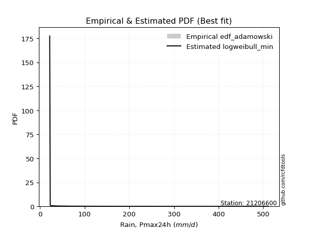</img>

</div>


## C. Best fit & Estimate extreme values for specific return periods - Tr

Best fit in probability distribution analysis means finding the theoretical distribution (like Normal, Poisson, Exponential) that most accurately mirrors your real-world data´s patterns (shape, center, spread) for better predictions, using methods like visual checks (Q-Q plots), goodness-of-fit tests (Kolmogorov-Smirnov, Chi-Squared), and information criteria (AIC) to score and select the simplest, most representative model.


### 1. Best fit (ordered by delta Δ)

<div align="center">

|   id |   station | empirical_dist   | p_dist         |     delta |   deltao | eval   |   fit |   n |   best_fit |   best_fit_sort |
|-----:|----------:|:-----------------|:---------------|----------:|---------:|:-------|------:|----:|-----------:|----------------:|
|    0 |  21206600 | edf_california   | fatiguelife    | 0.0528678 | 0.331107 | Δo > Δ |     1 |  16 |          1 |               1 |
|    1 |  21206600 | edf_adamowski    | logweibull_min | 0.0771729 | 0.331107 | Δo > Δ |     1 |  16 |          1 |               2 |
|    2 |  21206600 | edf_weibull      | logweibull_min | 0.0778447 | 0.331107 | Δo > Δ |     1 |  16 |          1 |               3 |
|    3 |  21206600 | edf_chegodayev   | logweibull_min | 0.0799446 | 0.331107 | Δo > Δ |     1 |  16 |          1 |               4 |
|    4 |  21206600 | edf_jenkinson    | fatiguelife    | 0.080493  | 0.331107 | Δo > Δ |     1 |  16 |          1 |               5 |
|    5 |  21206600 | edf_beard        | fatiguelife    | 0.080493  | 0.331107 | Δo > Δ |     1 |  16 |          1 |               6 |
|    6 |  21206600 | edf_filliben     | fatiguelife    | 0.0806329 | 0.331107 | Δo > Δ |     1 |  16 |          1 |               7 |
|    7 |  21206600 | edf_tukey        | fatiguelife    | 0.0809291 | 0.331107 | Δo > Δ |     1 |  16 |          1 |               8 |
|    8 |  21206600 | edf_blom         | fatiguelife    | 0.081714  | 0.331107 | Δo > Δ |     1 |  16 |          1 |               9 |
|    9 |  21206600 | edf_cunnane      | fatiguelife    | 0.0821888 | 0.331107 | Δo > Δ |     1 |  16 |          1 |              10 |
|   10 |  21206600 | edf_gringorten   | fatiguelife    | 0.0829547 | 0.331107 | Δo > Δ |     1 |  16 |          1 |              11 |
|   11 |  21206600 | edf_hazen        | logalpha       | 0.0831578 | 0.331107 | Δo > Δ |     1 |  16 |          1 |              12 |

</div>

:file_folder:Tables: [bestfit_21206600.csv](table/bestfit_21206600.csv) | [extreme_21206600.csv](table/extreme_21206600.csv)


### 2. Extreme values

In hydrology, a return period (or recurrence interval $Tr$) is the statistical average time between extreme events like floods or droughts of a specific magnitude, indicating how rare an event is, with a 100-year flood, for example, having a 1% chance of occurring in any given year, not that it happens exactly every century. It is a key tool for infrastructure design (like bridges or dams) and risk assessment, calculated from historical data to determine the probability of future events, although it is important to remember it is statistical average, and events can cluster or be missed.

> risk_rate: assuming the return period as the project useful life.

|   id |      tr |   prob_l |     prob_g |      alpha |   betaprime |    chi2 |   crystalball |   erlang |    expon |   exponnorm |          f |   fatiguelife |             fisk |    gamma |   genexpon |   genlogistic |    gibrat |   gompertz |   gumbel_l |   gumbel_r |   halflogistic |   halfnorm |   hypsecant |    invgamma |   invgauss |       invweibull |   johnsonsu |   kstwobign |   laplace |   laplace_asymmetric |    loggamma |   logistic |   lognorm |   maxwell |     mielke |    moyal |   nakagami |       ncf |        nct |    norm |   pearson3 |   rayleigh |    rice |           t |   truncnorm |      wald |   weibull_min |         logalpha |   logbetaprime |     logchi2 |   logcrystalball |   logerlang |    logexpon |   logexponnorm |        logf |   logfatiguelife |          logfisk |   loggenexpon |   loggenlogistic |       loggibrat |   loggompertz |   loggumbel_l |   loggumbel_r |   loghalflogistic |   loghalfnorm |   loghypsecant |      loginvgamma |      loginvgauss |    loginvweibull |     logjohnsonsu |   logkstwobign |   loglaplace |   loglaplace_asymmetric |   logloggamma |   loglogistic |   loglognorm |   logmaxwell |        logmielke |   logmoyal |   lognakagami |           logncf |     lognct |   logpearson3 |   lograyleigh |   logrice |      logt |   logtruncnorm |     logwald |   logweibull_min |   station |   n |   risk_rate |
|-----:|--------:|---------:|-----------:|-----------:|------------:|--------:|--------------:|---------:|---------:|------------:|-----------:|--------------:|-----------------:|---------:|-----------:|--------------:|----------:|-----------:|-----------:|-----------:|---------------:|-----------:|------------:|------------:|-----------:|-----------------:|------------:|------------:|----------:|---------------------:|------------:|-----------:|----------:|----------:|-----------:|---------:|-----------:|----------:|-----------:|--------:|-----------:|-----------:|--------:|------------:|------------:|----------:|--------------:|-----------------:|---------------:|------------:|-----------------:|------------:|------------:|---------------:|------------:|-----------------:|-----------------:|--------------:|-----------------:|----------------:|--------------:|--------------:|--------------:|------------------:|--------------:|---------------:|-----------------:|-----------------:|-----------------:|-----------------:|---------------:|-------------:|------------------------:|--------------:|--------------:|-------------:|-------------:|-----------------:|-----------:|--------------:|-----------------:|-----------:|--------------:|--------------:|----------:|----------:|---------------:|------------:|-----------------:|----------:|----:|------------:|
|    0 |    2    | 0.5      | 0.5        |    49.2516 |     60.3617 | 21.6809 |       133.175 |  62.2689 |  98.9379 |     98.1528 |    40.8886 |       47.5999 |     76.8429      |  60.6767 |    98.9378 |       101.923 |   86.1897 |    102.465 |    158.89  |    107.46  |        94.6751 |    101.133 |     133.175 |     45.7462 |    45.8282 |     46.0226      |     47.5673 |     119.193 |   133.175 |              98.9304 |     40.5644 |    133.175 |    73.497 |   119.788 |    60.1292 |  99.1577 |    76.4315 |   63.7237 |    57.3203 | 133.175 |    96.1925 |    115.039 | 135.968 |     35.6431 |     130.494 |   82.4344 |       53.9106 |     55.0074      |        63.4982 |     35.0793 |           73.497 |     32.7829 |     50.4755 |        50.4765 |     57.2268 |     43.8604      |     47.1451      |       55.2838 |          60.5392 |     53.6129     |       57.7276 |       87.3478 |       61.8425 |           56.7557 |       59.2708 |        73.497  |     50.8135      |     47.3891      |     51.1007      |     47.0484      |        62.1883 |       73.497 |                 50.4707 |       73.8221 |       73.497  |  23.5933     |      67.179  |     50.9904      |    58.4898 |       69.0241 |     58.6696      |    60.5069 |       66.1645 |       65.0712 |   69.7393 |   73.4968 |        55.0819 |     52.2772 |     50.4932      |  21206600 |  16 |    0.75     |
|    1 |    2.33 | 0.570815 | 0.429185   |    57.2627 |     71.3538 | 21.7978 |       161.108 |  75.8185 | 115.978  |    115.048  |    50.0867 |       62.1704 |    115.277       |  72.4546 |   115.978  |       120.474 |  100.339  |    120.014 |    183.192 |    133.343 |       121.287  |    131.28  |     155.53  |     55.1728 |    54.7457 |     56.7534      |     60.0774 |     140.894 |   150.079 |             115.969  |     48.7602 |    157.786 |    88.658 |   148.808 |    71.2144 | 123.659  |   105.332  |   76.0554 |    68.028  | 161.108 |   122.311  |    144.489 | 159.948 |     40.2528 |     154.465 |  100.75   |       65.869  |     64.9355      |        75.8958 |     41.6838 |           88.658 |     38.1597 |     60.8555 |        60.8727 |     69.2869 |     52.4758      |     57.2046      |       66.7248 |          71.7278 |     58.9559     |       69.7917 |      102.828  |       73.5797 |           67.8587 |       72.5679 |        85.3989 |     60.1011      |     56.2729      |     60.3563      |     56.1114      |        74.0919 |       82.33  |                 60.8485 |       89.0987 |       86.7024 |  32.4809     |      81.6306 |     60.2843      |    68.9482 |       91.1673 |     69.6255      |    72.0592 |       79.8158 |       79.2975 |   83.3625 |   88.6578 |        66.4892 |     59.118  |     63.328       |  21206600 |  16 |    0.729209 |
|    2 |    5    | 0.8      | 0.2        |   119.382  |    147.156  | 23.7432 |       264.914 | 153.184  | 201.173  |    199.52   |   131.14   |      183.778  |    741.405       | 137.279  |   201.173  |       201.061 |  181.803  |    206.118 |    261.702 |    245.79  |       241.7    |    258.768 |     245.2   |    158.667  |   134.722  |    184.856       |    186.964  |     233.078 |   234.593 |             201.156  |    132.784  |    252.812 |   177.992 |   263.03  |   148.952  | 237.153  |   281.846  |  160.354  |   150.048  | 264.914 |   241.853  |    262.389 | 255.953 |     70.6955 |     274.198 |  203.283  |      144.033  |    146.139       |       160.465  |    114.528  |          177.992 |     93.6948 |    155.017  |       155.264  |    170.536  |    144.904       |    207.209       |      158.641  |         149.841  |    101.873      |      161.982  |      174.195  |      156.545  |          152.304  |      170.797  |       155.925  |    146.231       |    143.325       |    145.959       |    153.291       |       155.907  |      145.208 |                154.983  |      178.765  |      164.102  |   4.9566e+53 |     175.755  |    147.726       |   147.725  |      319.104  |    161.185       |   155.583  |      170.23   |      175      |  170.298  |  177.992  |       158.413  |    117.678  |    217.351       |  21206600 |  16 |    0.67232  |
|    3 |   10    | 0.9      | 0.1        |   233.51   |    263.634  | 27.454  |       333.777 | 231.303  | 278.511  |    276.201  |   288.71   |      335.813  |   3253.16        | 200.92   |   278.511  |       266.695 |  274.662  |    282.019 |    305.412 |    337.377 |       341.698  |    353.105 |     316.804 |    457.229  |   282.295  |    579.973       |    456.114  |     303.264 |   311.313 |             278.486  |    352.082  |    322.795 |   282.614 |   343.414 |   272.267  | 335.966  |   443.652  |  288.332  |   298.265  | 333.777 |   342.025  |    346.454 | 324.406 |    144.908  |     382.721 |  312.094  |      237.31   |    326.6         |       287.633  |    324.152  |          282.614 |    237.728  |    362.247  |       363.256  |    382.583  |    411.139       |   1402.85        |      320.551  |         273.026  |    190.028      |      308.779  |      233.608  |      289.529  |          298.052  |      321.776  |       252.176  |    378.07        |    375.178       |    380.653       |    476.172       |       274.702  |      243.05  |                362.134  |      283.074  |      262.526  | inf          |     301.505  |    396.072       |   286.8    |      836.417  |    361.186       |   295.747  |      296.962  |      307.724  |  283.411  |  282.614  |       320.739  |    244.333  |    738.912       |  21206600 |  16 |    0.651322 |
|    4 |   15    | 0.933333 | 0.0666667  |   347.231  |    365.316  | 30.2667 |       368.14  | 279.003  | 323.751  |    321.057  |   447.805  |      434.389  |   7345.8         | 239.357  |   323.75   |       303.725 |  338.713  |    325.469 |    325.208 |    389.049 |       398.288  |    402.198 |     357.667 |    864.967  |   411.544  |   1136.37        |    725.192  |     340.524 |   356.192 |             323.722  |    633.223  |    360.925 |   355.954 |   384.657 |   382.817  | 393.313  |   532.007  |  399.102  |   444.251  | 368.14  |   398.584  |    389.768 | 359.677 |    243.496  |     446.129 |  381.968  |      300.383  |    556.278       |       396.726  |    614.721  |          355.954 |    422.145  |    595.165  |       597.239  |    620.772  |    783.567       |   7280.28        |      470.383  |         383.012  |    292.13       |      432.726  |      266.814  |      409.601  |          435.813  |      447.406  |       331.785  |    719.725       |    689.42        |    737.264       |   1035.47        |       371.069  |      328.514 |                594.947  |      355.81   |      339.121  | inf          |     397.7    |    787.185       |   421.497  |     1387.37   |    601.057       |   428.353  |      398.553  |      411.584  |  368.461  |  355.953  |       471.035  |    390.596  |   1564.68        |  21206600 |  16 |    0.644736 |
|    5 |   20    | 0.95     | 0.05       |   460.852  |    458.562  | 32.4799 |       390.644 | 313.494  | 355.849  |    352.882  |   607.562  |      507.229  |  12915           | 267.019  |   355.848  |       329.652 |  388.955  |    355.887 |    337.53  |    425.229 |       437.937  |    434.929 |     386.495 |   1365.08   |   524.222  |   1829.73        |    986.29   |     365.624 |   388.033 |             355.817  |    965.467  |    387.279 |   414.012 |   412.029 |   486.043  | 433.927  |   591.663  |  500.132  |   589.028  | 390.644 |   438.058  |    418.558 | 383.12  |    363.05   |     491.085 |  434.038  |      348.643  |    843.415       |       495.66   |    977.855  |          414.012 |    640.549  |    846.508  |       849.877  |    881.969  |   1252.83        |  32670.2         |      611.005  |         485.448  |    409.329      |      541.676  |      289.826  |      522.223  |          568.735  |      557.367  |       402.637  |   1191.36        |   1081.26        |   1244.91        |   1900.34        |       454.389  |      406.817 |                846.166  |      413.193  |      404.762  | inf          |     477.934  |   1361.27        |   553.63   |     1945.73   |    880.593       |   557.515  |      486.186  |      499.35   |  438.68   |  414.011  |       612.066  |    554.064  |   2699.69        |  21206600 |  16 |    0.641514 |
|    6 |   25    | 0.96     | 0.04       |   574.434  |    546.025  | 34.3004 |       407.21  | 340.554  | 380.746  |    377.568  |   767.749  |      565.053  |  19894.1         | 288.66   |   380.746  |       349.622 |  430.84   |    379.253 |    346.298 |    453.097 |       468.484  |    459.282 |     408.805 |   1947.45   |   623.793  |   2645.55        |   1238.58   |     384.425 |   412.732 |             380.711  |   1342.53   |    407.44  |   462.718 |   432.35  |   584.203  | 465.407  |   636.278  |  594.514  |   732.961  | 407.21  |   468.364  |    439.948 | 400.537 |    501.208  |     525.937 |  475.745  |      387.993  |   1196.14        |       587.718  |   1408.43   |          462.718 |    889.177  |   1112.51   |      1117.36   |   1164.16   |   1813.14        | 132959           |      744.373  |         582.674  |    542.251      |      639.852  |      307.4    |      629.672  |          698.203  |      656.372  |       467.699  |   1814.96        |   1547.92        |   1936.3         |   3148.58        |       528.837  |      480.193 |               1112.02   |      461.212  |      463.432  | inf          |     547.799  |   2164.82        |   683.929  |     2503.15   |   1199.73        |   684.779  |      564.529  |      576.468  |  499.382  |  462.717  |       745.77   |    733.116  |   4149.93        |  21206600 |  16 |    0.639603 |
|    7 |   50    | 0.98     | 0.02       |  1142.16   |    932.56   | 40.4203 |       454.649 | 425.995  | 458.084  |    454.249  |  1572.51   |      750.408  |  74547.2         | 356.721  |   458.084  |       411.142 |  578.485  |    450.595 |    370.1   |    538.945 |       562.605  |    530.067 |     477.976 |   5897.1    |   999.402  |   8281.44        |   2388.6    |     439.633 |   489.452 |             458.042  |   3781.56   |    469.038 |   636.268 |   491.285 |  1029.84   | 563.135  |   766.466  | 1008.45   |  1444.74   | 454.649 |   561.089  |    502.04  | 451.098 |   1424.34   |     634.093 |  611.918  |      520.355  |   4286.75        |       988.897  |   4470.65   |          636.268 |   2513.67   |   2599.73   |      2614.19   |   2850.8    |   5864.9         |      6.39401e+07 |     1338.06   |        1022.49   |   1461.18       |     1034.35   |      360.667  |     1120.56   |         1313.48   |     1055.72   |       744.147  |   8131.12        |   4954.62        |   9607.17        |  18528.2         |       825.698  |      803.749 |               2598.36   |      631.51   |      700.803  | inf          |     813.703  |  11807.9         |  1318.16   |     5208.72   |   3401.63        |  1311.2    |      878.716  |      874.634  |  727.478  |  636.266  |      1340.19   |   1829.12   |  16334           |  21206600 |  16 |    0.63583  |
|    8 |   75    | 0.986667 | 0.0133333  |  1709.81   |   1271.11   | 44.2598 |       480.103 | 476.759  | 503.324  |    499.105  |  2381.15   |      861.964  | 159925           | 397.008  |   503.323  |       446.899 |  678.205  |    491.487 |    382.136 |    588.843 |       617.317  |    568.6   |     518.399 |  11291.7    |  1262.99   |  16104.9         |   3403.94   |     470.008 |   534.33  |             503.277  |   6975.48   |    504.614 |   754.849 |   523.327 |  1431.93   | 620.284  |   837.391  | 1367.98   |  2148.4    | 480.103 |   614.522  |    535.821 | 478.605 |   2667.05   |     697.288 |  695.712  |      604.532  |  10802.6         |      1335.61   |   8894.83   |          754.849 |   4670.2    |   4271.32   |      4298.05   |   4942.14   |  11826.1         |      1.40285e+10 |     1854.5    |        1417.8    |   2854.1        |     1339.17   |      391.023  |     1566.5    |         1896.52   |     1367.43   |       976.171  |  22839.7         |  10090.2         |  29629.7         |  61000.9         |      1055.07   |     1086.37  |               4268.83   |      747.237  |      889.882  | inf          |    1009.01   |  39376           |  1934.67   |     7762.28   |   6672.28        |  1937.18   |     1124.29   |     1097.3    |  892.707  |  754.847  |      1856.26   |   3210.55   |  37214.4         |  21206600 |  16 |    0.634587 |
|    9 |  100    | 0.99     | 0.01       |  2277.44   |   1581.85   | 47.0764 |       497.319 | 513.061  | 535.422  |    530.931  |  3192.26   |      942.214  | 274141           | 425.765  |   535.421  |       472.207 |  755.455  |    520.138 |    390.008 |    624.158 |       656.042  |    594.849 |     547.073 |  17908.7    |  1468.01   |  25796.1         |   4327.49   |     490.819 |   566.172 |             535.372  |  10796      |    529.732 |   847.344 |   545.151 |  1808.24   | 660.829  |   885.661  | 1696.21   |  2846.88   | 497.319 |   652.137  |    558.834 | 497.345 |   4176.88   |     742.092 |  756.806  |      667.136  |  23163.4         |      1651.64   |  14556.3    |          847.344 |   7278.42   |   6075.13   |      6116.18   |   7397.83   |  19555.2         |      1.96234e+12 |     2322.41   |        1786.84   |   4794.16       |     1594.34   |      412.247  |     1985.66   |         2459.64   |     1630.97   |      1183.41   |  51516.3         |  16918.6         |  72796.4         | 153159           |      1248.03   |     1345.32  |               6071.35   |      837.191  |     1053.35   | inf          |    1168.24   | 103574           |  2539.98   |    10185.6    |  11111.5         |  2569.72   |     1333.03   |     1280.65   | 1026.28   |  847.341  |      2323.08   |   4838.66   |  67348.8         |  21206600 |  16 |    0.633968 |
|   10 |  200    | 0.995    | 0.005      |  4547.9    |   2672.71   | 54.12   |       536.37  | 601.339  | 612.76   |    607.612  |  6451.9    |     1138.6    | 998782           | 495.542  |   612.759  |       533.049 |  965.62   |    587.97  |    407.12  |    709.061 |       749.14   |    654.886 |     616.151 |  54438.4    |  2017.1    |  80109.9         |   7466.96   |     538.754 |   642.892 |             612.703  |  31132.8    |    589.985 |  1101.36  |   595.084 |  3168.89   | 758.515  |   995.805  | 2839.16   |  5609.34   | 536.37  |   741.918  |    611.492 | 540.224 |  12384.9    |     849.935 |  908.985  |      827.378  | 241817           |      2752.81   |  48299.8    |         1101.36  |  21453.8    |  14196.5    |     14309.5    |  20520.5    |  66696.1         |      6.50318e+19 |     3914.08   |        3116.23   |  19656.8        |     2363.51   |      462.439  |     3511.32   |         4595.5    |     2440.63   |      1881.73   | 502713           |  61002.5         | 948076           |      1.8572e+06  |      1837.52   |     2251.8   |              14186.4    |     1082.99   |     1578.56   | inf          |    1633.53   |      1.68014e+06 |  4894.05   |    18954.2    |  42864.6         |  5190.38   |     1983.03   |     1823.78   | 1411.98   | 1101.35   |      3906.46   |  13442.1    | 289221           |  21206600 |  16 |    0.633042 |
|   11 |  250    | 0.996    | 0.004      |  5683.12   |   3162.63   | 56.4529 |       548.304 | 629.968  | 637.657  |    632.298  |  8087.85   |     1202.6    |      1.51266e+06 | 518.133  |   637.656  |       552.609 | 1041.03   |    609.457 |    412.155 |    736.356 |       779.07   |    673.355 |     638.388 |  77871.9    |  2208.83   | 115329           |   8823.22   |     553.588 |   667.59  |             637.598  |  43857.9    |    609.329 |  1193.23  |   610.454 |  3795.3    | 789.962  |  1029.6    | 3349      |  6977.99   | 548.304 |   770.598  |    627.702 | 553.423 |  17590.6    |     884.62  |  959.33   |      881.698  | 631946           |      3245.5    |  71294.6    |         1193.23  |  30477.4    |  18657.5    |     18813.1    |  28944.7    |  99389           |      1.53812e+23 |     4604.76   |        3726.33   |  32612.9        |     2663.64   |      478.338  |     4217.53   |         5618.29   |     2762.85   |      2184.73   |      1.16669e+06 |  93124.8         |      2.48861e+06 |      4.53388e+06 |      2071.22   |     2657.94  |              18643.6    |     1171.49   |     1797.49   | inf          |    1811.11   |      4.82972e+06 |  6044.55   |    22941.7    |  68886.9         |  6556.77   |     2245.74   |     2033.47   | 1557.69   | 1193.23   |      4591.69   |  18848.1    | 466025           |  21206600 |  16 |    0.632858 |
|   12 |  500    | 0.998    | 0.002      | 11359.2    |   5328.72   | 63.8653 |       583.694 | 719.44   | 714.995  |    708.979  | 16303.6    |     1403.32   |      5.48048e+06 | 588.636  |   714.994  |       613.318 | 1301.64   |    675.154 |    426.588 |    821.075 |       871.966  |    728.423 |     707.462 | 236798      |  2844.7    | 357419           |  14478.9    |     598.045 |   744.31  |             714.928  | 127738      |    669.321 |  1513.28  |   656.32  |  6643.68   | 887.645  |  1130.09   | 5586.06   | 13748.6    | 583.694 |   859.107  |    676.065 | 592.805 |  52385      |     992.258 | 1119.41   |     1058.57   |      3.33032e+07 |      5423.73   | 241012      |         1513.28  |  91423.6    |  43599.3    |     44015.3    |  88775.8    | 346624           |      1.23141e+38 |     7512.46   |        6490.81   | 187616          |     3786.57   |      527.011  |     7448.77   |        10482.8    |     3998.77   |      3473.8    |      2.37536e+07 | 356305           |      8.38405e+07 |      9.81488e+07 |      2965.11   |     4448.88  |              43562.8    |     1478.34   |     2689.01   | inf          |    2464.24   |      2.34018e+08 | 11646.5    |    40520.6    | 345424           | 13901.3    |     3275.21   |     2813.58   | 2088.07   | 1513.27   |      7466.64   |  55214.4    |      2.09794e+06 |  21206600 |  16 |    0.632489 |
|   13 |  750    | 0.998667 | 0.00133333 | 17035.3    |   7226.34   | 68.3005 |       603.354 | 772.109  | 760.235  |    753.835  | 24557.5    |     1521.91   |      1.16266e+07 | 630.079  |   760.234  |       648.809 | 1473.99   |    712.871 |    434.302 |    870.601 |       926.273  |    759.187 |     747.866 | 453868      |  3241.75   | 692425           |  19068      |     623.019 |   789.188 |             760.164  | 239390      |    704.37  |  1726.8   |   681.973 |  9216.55   | 944.786  |  1186.03   | 7529.6    | 20443.1    | 603.354 |   910.523  |    703.11  | 614.827 |  99229      |    1055.15  | 1215.39   |     1167.58   |      9.2769e+08  |      7339.88   | 493985      |         1726.8   | 174680      |  71632.9    |     72366.7    | 177811      | 724255           |      1.3666e+51  |     9904.84   |        8978.36   | 596773          |     4594.34   |      555.025  |    10387.1    |        15094.8    |     4916.2    |      4556.38   |      1.90768e+08 | 795032           |      1.00345e+09 |      7.44714e+08 |      3627.21   |     6013.25  |              71568.9    |     1681.94   |     3402.44   | inf          |    2927.42   |      3.71639e+09 | 17092.6    |    55663.1    | 986909           | 21998.3    |     4061.18   |     3373.78   | 2459.86   | 1726.8    |      9822.48   | 105178      |      5.13437e+06 |  21206600 |  16 |    0.632366 |
|   14 | 1000    | 0.999    | 0.001      | 22711.4    |   8968.26   | 71.4854 |       616.89  | 809.607  | 792.333  |    785.66   | 32836.4    |     1606.5    |      1.98195e+07 | 659.563  |   792.332  |       673.984 | 1605.88   |    739.322 |    439.494 |    905.732 |       964.795  |    780.433 |     776.534 | 720123      |  3533.35   |      1.10687e+06 |  23048.9    |     640.321 |   821.03  |             792.259  | 374214      |    729.225 |  1891.09  |   699.703 | 11625.5    | 985.328  |  1224.58   | 9304.11   | 27088.6    | 616.89  |   946.862  |    721.799 | 630.046 | 156143      |    1099.74  | 1284.43   |     1247.32   |      1.9334e+10  |      9108.65   | 823617      |         1891.09  | 277056      | 101884      |    102979      | 296528      |      1.22462e+06 |      1.27289e+63 |    12002.7    |       11301.6    |      1.4467e+06 |     5243.6    |      574.712  |    13150.2    |        19550.3    |     5669.96   |      5523.45   |      9.86825e+08 |      1.41512e+06 |      7.29696e+09 |      3.50001e+09 |      4170.75   |     7446.54  |             101789      |     1838.05   |     4020.37   | inf          |    3297.49   |      3.43407e+10 | 22440.1    |    69301.5    |      2.19064e+06 | 30752.3    |     4720.18   |     3824.83   | 2754.79   | 1891.08   |     11882.5    | 167203      |      9.75001e+06 |  21206600 |  16 |    0.632305 |

<div align="center">

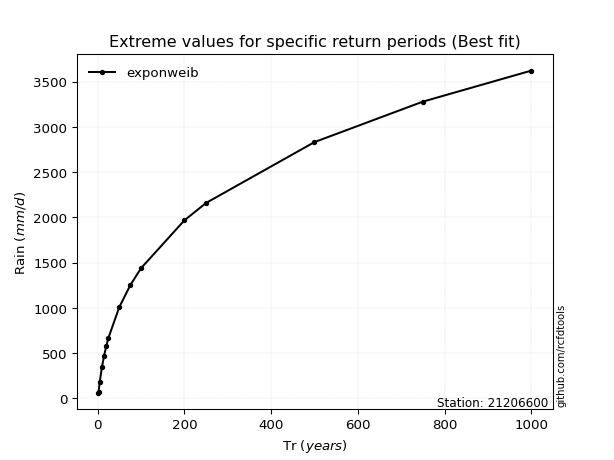</img>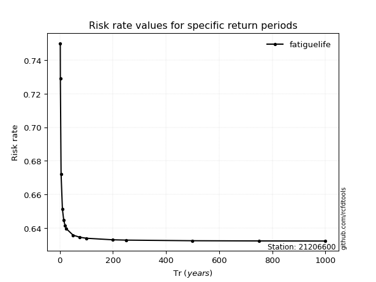</img>

</div>


<sub>**APP DISCLAIMER**: NO WARRANTY - This software is provided by [github.com/rcfdtools](https://github.com/rcfdtools) "as is", without any express or implied warranty, including warranties of merchantability, fitness for a particular purpose, or non-infringement. There is no guarantee that the software will be error-free or operate without interruption. LIMITATION OF LIABILITY - Neither the authors nor copyright holders will be liable for claims or damages arising from the software or its use. You are responsible for determining if the software is appropriate for your use and assume all associated risks, including errors, legal compliance, and data loss. NO PROFESSIONAL ADVICE - The software provides general information and does not offer professional advice. It should not replace consultation with professional advisors.</sub>