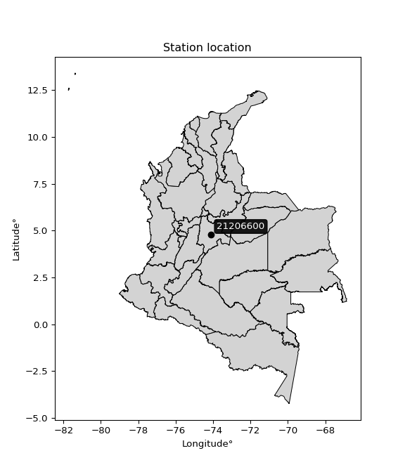

<div align="center">


</div>

# PMP Station (rain, Pmax24h): 21206600

Probable Maximum Precipitation (PMP) is the greatest amount of rainfall for a specific duration that is meteorologically possible for a given location, acting as a "worst-case" scenario for extreme storms, crucial for designing safety-critical infrastructure like bridges, river deviations, dams, spillways, and nuclear plants to prevent catastrophic failure. PMP is calculated by hydrologists using meteorological data to determine the upper limit of extreme rainfall, often leading to the Probable Maximum Flood (PMF) for flood control design, and is increasingly being studied for climate change impacts.

<div align="center">

</img>

</div>


## A. General information


### 1. General running parameters

• app_version: _v20251227_. • runtime: _2025-12-27 09:02:11.367833_. • Python version: _3.14.0_. • SciPy version: _1.16.3_. • Pandas version: _2.3.3_. • NumPy version: _2.3.5_. • Stations dataset (station_dataset_file): _dataset/pmax24h_in/automatic_colombia_2003_2024_filter.csv_. • Stations catalog (station_catalog_file): _dataset/CNE_IDEAM.xls_. • Minimum year to eval til year_max (date_min): _2003_. • Maximum year to eval since year_min (date_max): _2024_. • Creates, save and include plots into reports (create_plot): _False_. • Plot only fit distributions with Δo > Δ (plot_only_fit): _True_. • Eval low extreme values, if False, evaluates high extreme values (low_extreme): _False_. • Eval every SciPy distribution as logarithmic (pdist_logarithmic_on): _True_. • Standard deviation normalized (ddof): _1.0_. • Return periods to eval in years (Tr): _[2, 2.33, 5, 10, 15, 20, 25, 50, 75, 100, 200, 250, 500, 750, 1000]_. • Minimum data sample per station, 0 means any (minimum_sample): _5_. • Z-Score threshold to adjust a value, 0 means disable (zscore): _3.5_. • Avoid zeros, e.g. rain = 0 (avoid_zeros): _True_. • Avoid null values (avoid_nans): _True_. [:file_folder:Dataset file.](../../dataset/pmax24h_in/automatic_colombia_2003_2024_filter.csv)

> Delta Degrees of Freedom (DDOF): is a parameter used in the formulas for calculating variance and standard deviation. When ddof=0, the divisor is $N$ (the total number of observations) and this is used when your data set is the entire population. When ddof=1, the divisor is $N-1$ and this is used when your data set is a sample drawn from a larger population. Using $N-1$ provides an unbiased estimate of the population variance (known as Bessel´s correction).


### 2. Station info and location

|   id |   CODIGO | NOMBRE                      | CATEGORIA               | TECNOLOGIA                              | ESTADO   | FECHA_INSTALACION   |   FECHA_SUSPENSION |   ALTITUD |   LATITUD |   LONGITUD | DEPARTAMENTO   | MUNICIPIO   | AREA_OPERATIVA                            | ENTIDAD                                                     | AREA_HIDROGRAFICA   | ZONA_HIDROGRAFICA   | SUBZONA_HIDROGRAFICA   |   CORRIENTE | Catalogo   |
|-----:|---------:|:----------------------------|:------------------------|:----------------------------------------|:---------|:--------------------|-------------------:|----------:|----------:|-----------:|:---------------|:------------|:------------------------------------------|:------------------------------------------------------------|:--------------------|:--------------------|:-----------------------|------------:|:-----------|
|    0 | 21206600 | NUEVA GENERACION [21206600] | Climatológica Principal | Automática con Telemetría, Convencional | Activa   | 15/11/2001          |                nan |      2590 |   4.78659 |   -74.1022 | Bogotá         | Bogotá, D.C | Area Operativa 11 - Cundinamarca-Amazonas | INSTITUTO DE HIDROLOGIA METEOROLOGIA Y ESTUDIOS AMBIENTALES | Magdalena Cauca     | Alto Magdalena      | Río Bogotá             |         nan | CNE_IDEAM  |

<div align="center">

Map location in: [:earth_americas:Google](http://maps.google.com/maps?q=4.786594,-74.102247) [:earth_americas:OSM](https://www.openstreetmap.org/#map=18/4.786594/-74.102247&layers=P) [:earth_americas:Bing](https://www.bing.com/maps?cp=4.786594~-74.102247&lvl=18) [:earth_americas:Apple](https://maps.apple.com/frame?center=4.786594%2C-74.102247&span=0.003%2C0.006)

</div>


<div align="center">

```geojson
{
  "type": "Feature",
  "geometry": {
    "type": "Point", 
    "coordinates": [-74.102247, 4.786594]
  }, 
  "properties": {
    "Name": "21206600"
  }
}
```

</div>


### 3. Discrete values table and plot

|               |          0 |          1 |           2 |           3 |           4 |           5 |           6 |           7 |           8 |           9 |          10 |
|:--------------|-----------:|-----------:|------------:|------------:|------------:|------------:|------------:|------------:|------------:|------------:|------------:|
| Date          | 2010       | 2012       | 2013        | 2014        | 2015        | 2016        | 2017        | 2018        | 2019        | 2021        | 2022        |
| Value         |  345.6     |  195.8     |  110.5      |   72.5      |   38        |   76.7      |   24.3      |   26.6      |   31        |   21.6      |   43        |
| Value_initial |  345.6     |  195.8     |  110.5      |   72.5      |   38        |   76.7      |   24.3      |   26.6      |   31        |   21.6      |   43        |
| count         |   11       |   11       |   11        |   11        |   11        |   11        |   11        |   11        |   11        |   11        |   11        |
| mean          |   89.6     |   89.6     |   89.6      |   89.6      |   89.6      |   89.6      |   89.6      |   89.6      |   89.6      |   89.6      |   89.6      |
| std           |   99.4159  |   99.4159  |   99.4159   |   99.4159   |   99.4159   |   99.4159   |   99.4159   |   99.4159   |   99.4159   |   99.4159   |   99.4159   |
| zscore        |    2.57504 |    1.06824 |    0.210228 |   -0.172005 |   -0.519032 |   -0.129758 |   -0.656836 |   -0.633701 |   -0.589443 |   -0.683995 |   -0.468738 |

> The initial value (value_initial) correspond to the initial obtained or null completed value, and value (value) is adjusted only when the initial value is outside the valid range definite through the Z-Score value. If Z-Score is active, values out of range or outliers are replaced with the station mean value


### 4. Active continuous probability distributions from SciPy (45 of 104 available)

[scipy.stats](https://docs.scipy.org/doc/scipy/reference/stats.html) is a Python´s powerful submodule within the SciPy library for comprehensive statistical analysis, offering over 130 probability distributions (like Normal, Poisson), functions for descriptive stats (mean, variance), hypothesis testing (t-tests, chi-square), random variable generation, and statistical tests, making it essential for data science, modeling, and research. It provides tools to explore, model, and draw conclusions from data efficiently, working seamlessly with NumPy.

<div align="center">

|   id | p_dist             |   n_parameter | fit_method   | label                                                                       | active   | ref                                                                                                        |
|-----:|:-------------------|--------------:|:-------------|:----------------------------------------------------------------------------|:---------|:-----------------------------------------------------------------------------------------------------------|
|    0 | alpha              |             3 | MLE          | Alpha                                                                       | True     | [:mortar_board:](https://docs.scipy.org/doc/scipy/reference/generated/scipy.stats.alpha.html)              |
|    1 | betaprime          |             4 | MLE          | Beta prime                                                                  | True     | [:mortar_board:](https://docs.scipy.org/doc/scipy/reference/generated/scipy.stats.betaprime.html)          |
|    2 | chi2               |             3 | MLE          | Chi²                                                                        | True     | [:mortar_board:](https://docs.scipy.org/doc/scipy/reference/generated/scipy.stats.chi2.html)               |
|    3 | crystalball        |             4 | MLE          | Crystalball                                                                 | True     | [:mortar_board:](https://docs.scipy.org/doc/scipy/reference/generated/scipy.stats.crystalball.html)        |
|    4 | erlang             |             3 | MLE          | Erlang                                                                      | True     | [:mortar_board:](https://docs.scipy.org/doc/scipy/reference/generated/scipy.stats.erlang.html)             |
|    5 | expon              |             2 | MLE          | Exponential                                                                 | True     | [:mortar_board:](https://docs.scipy.org/doc/scipy/reference/generated/scipy.stats.expon.html)              |
|    6 | exponnorm          |             3 | MLE          | Exponentially modified Normal                                               | True     | [:mortar_board:](https://docs.scipy.org/doc/scipy/reference/generated/scipy.stats.exponnorm.html)          |
|    7 | f                  |             4 | MLE          | F                                                                           | True     | [:mortar_board:](https://docs.scipy.org/doc/scipy/reference/generated/scipy.stats.f.html)                  |
|    8 | fatiguelife        |             3 | MLE          | Fatigue-life (Birnbaum-Saunders)                                            | True     | [:mortar_board:](https://docs.scipy.org/doc/scipy/reference/generated/scipy.stats.fatiguelife.html)        |
|    9 | fisk               |             3 | MLE          | Fisk                                                                        | True     | [:mortar_board:](https://docs.scipy.org/doc/scipy/reference/generated/scipy.stats.fisk.html)               |
|   10 | gamma              |             3 | MLE          | Gamma                                                                       | True     | [:mortar_board:](https://docs.scipy.org/doc/scipy/reference/generated/scipy.stats.gamma.html)              |
|   11 | genexpon           |             5 | MLE          | Generalized exponential                                                     | True     | [:mortar_board:](https://docs.scipy.org/doc/scipy/reference/generated/scipy.stats.genexpon.html)           |
|   12 | genlogistic        |             3 | MLE          | Generalized logistic                                                        | True     | [:mortar_board:](https://docs.scipy.org/doc/scipy/reference/generated/scipy.stats.genlogistic.html)        |
|   13 | gibrat             |             2 | MM           | Gibrat                                                                      | True     | [:mortar_board:](https://docs.scipy.org/doc/scipy/reference/generated/scipy.stats.gibrat.html)             |
|   14 | gompertz           |             3 | MLE          | Gompertz (or truncated Gumbel)                                              | True     | [:mortar_board:](https://docs.scipy.org/doc/scipy/reference/generated/scipy.stats.gompertz.html)           |
|   15 | gumbel_l           |             2 | MM           | Gumbel Left Skew                                                            | True     | [:mortar_board:](https://docs.scipy.org/doc/scipy/reference/generated/scipy.stats.gumbel_l.html)           |
|   16 | gumbel_r           |             2 | MM           | Gumbel Right Skew                                                           | True     | [:mortar_board:](https://docs.scipy.org/doc/scipy/reference/generated/scipy.stats.gumbel_r.html)           |
|   17 | halflogistic       |             2 | MM           | Half-logistic                                                               | True     | [:mortar_board:](https://docs.scipy.org/doc/scipy/reference/generated/scipy.stats.halflogistic.html)       |
|   18 | halfnorm           |             2 | MM           | Half Normal                                                                 | True     | [:mortar_board:](https://docs.scipy.org/doc/scipy/reference/generated/scipy.stats.halfnorm.html)           |
|   19 | hypsecant          |             2 | MM           | hyperbolic secant                                                           | True     | [:mortar_board:](https://docs.scipy.org/doc/scipy/reference/generated/scipy.stats.hypsecant.html)          |
|   20 | invgamma           |             3 | MLE          | Inverted gamma                                                              | True     | [:mortar_board:](https://docs.scipy.org/doc/scipy/reference/generated/scipy.stats.invgamma.html)           |
|   21 | invgauss           |             3 | MLE          | Inverse Gaussian                                                            | True     | [:mortar_board:](https://docs.scipy.org/doc/scipy/reference/generated/scipy.stats.invgauss.html)           |
|   22 | invweibull         |             3 | MLE          | Inverted Weibull                                                            | True     | [:mortar_board:](https://docs.scipy.org/doc/scipy/reference/generated/scipy.stats.invweibull.html)         |
|   23 | johnsonsu          |             4 | MLE          | Johnson Su                                                                  | True     | [:mortar_board:](https://docs.scipy.org/doc/scipy/reference/generated/scipy.stats.johnsonsu.html)          |
|   24 | kstwobign          |             2 | MLE          | Limiting distribution of scaled Kolmogorov-Smirnov two-sided test statistic | True     | [:mortar_board:](https://docs.scipy.org/doc/scipy/reference/generated/scipy.stats.kstwobign.html)          |
|   25 | laplace            |             2 | MM           | Laplace                                                                     | True     | [:mortar_board:](https://docs.scipy.org/doc/scipy/reference/generated/scipy.stats.laplace.html)            |
|   26 | laplace_asymmetric |             3 | MLE          | Asymmetric Laplace                                                          | True     | [:mortar_board:](https://docs.scipy.org/doc/scipy/reference/generated/scipy.stats.laplace_asymmetric.html) |
|   27 | loggamma           |             3 | MLE          | Log gamma                                                                   | True     | [:mortar_board:](https://docs.scipy.org/doc/scipy/reference/generated/scipy.stats.loggamma.html)           |
|   28 | logistic           |             2 | MM           | Logistic (or Sech-squared)                                                  | True     | [:mortar_board:](https://docs.scipy.org/doc/scipy/reference/generated/scipy.stats.logistic.html)           |
|   29 | lognorm            |             3 | MLE          | Log Normal                                                                  | True     | [:mortar_board:](https://docs.scipy.org/doc/scipy/reference/generated/scipy.stats.lognorm.html)            |
|   30 | maxwell            |             2 | MM           | Maxwell                                                                     | True     | [:mortar_board:](https://docs.scipy.org/doc/scipy/reference/generated/scipy.stats.maxwell.html)            |
|   31 | mielke             |             4 | MLE          | Mielke Beta-Kappa / Dagum                                                   | True     | [:mortar_board:](https://docs.scipy.org/doc/scipy/reference/generated/scipy.stats.mielke.html)             |
|   32 | moyal              |             2 | MM           | Moyal                                                                       | True     | [:mortar_board:](https://docs.scipy.org/doc/scipy/reference/generated/scipy.stats.moyal.html)              |
|   33 | nakagami           |             3 | MLE          | Nakagami                                                                    | True     | [:mortar_board:](https://docs.scipy.org/doc/scipy/reference/generated/scipy.stats.nakagami.html)           |
|   34 | ncf                |             5 | MLE          | Non-central F distribution                                                  | True     | [:mortar_board:](https://docs.scipy.org/doc/scipy/reference/generated/scipy.stats.ncf.html)                |
|   35 | nct                |             4 | MLE          | Non-central Student’s t                                                     | True     | [:mortar_board:](https://docs.scipy.org/doc/scipy/reference/generated/scipy.stats.nct.html)                |
|   36 | norm               |             2 | MM           | Normal                                                                      | True     | [:mortar_board:](https://docs.scipy.org/doc/scipy/reference/generated/scipy.stats.norm.html)               |
|   37 | pareto             |             3 | MLE          | Pareto                                                                      | True     | [:mortar_board:](https://docs.scipy.org/doc/scipy/reference/generated/scipy.stats.pareto.html)             |
|   38 | pearson3           |             3 | MM           | Pearson type III                                                            | True     | [:mortar_board:](https://docs.scipy.org/doc/scipy/reference/generated/scipy.stats.pearson3.html)           |
|   39 | rayleigh           |             2 | MM           | Rayleigh                                                                    | True     | [:mortar_board:](https://docs.scipy.org/doc/scipy/reference/generated/scipy.stats.rayleigh.html)           |
|   40 | rice               |             3 | MLE          | Rice                                                                        | True     | [:mortar_board:](https://docs.scipy.org/doc/scipy/reference/generated/scipy.stats.rice.html)               |
|   41 | t                  |             3 | MLE          | Student’s t                                                                 | True     | [:mortar_board:](https://docs.scipy.org/doc/scipy/reference/generated/scipy.stats.t.html)                  |
|   42 | truncnorm          |             4 | MLE          | Truncated normal                                                            | True     | [:mortar_board:](https://docs.scipy.org/doc/scipy/reference/generated/scipy.stats.truncnorm.html)          |
|   43 | wald               |             2 | MM           | Wald                                                                        | True     | [:mortar_board:](https://docs.scipy.org/doc/scipy/reference/generated/scipy.stats.wald.html)               |
|   44 | weibull_min        |             3 | MLE          | Weibull minimum                                                             | True     | [:mortar_board:](https://docs.scipy.org/doc/scipy/reference/generated/scipy.stats.weibull_min.html)        |

</div>

> **n_parameter:** # arguments & localization & scale.
>
> **Fit methods:** (MLE) maximum likelihood, (MM) L-moments.
>
>**Inactive:** foldnorm, gennorm, norminvgauss, powernorm, powerlognorm, skewnorm, genextreme, anglit, arcsine, argus, beta, bradford, burr, burr12, cauchy, cosine, halfcauchy, foldcauchy, skewcauchy, wrapcauchy, dgamma, gengamma, exponweib, exponpow, truncexpon, gausshyper, genhalflogistic, genhyperbolic, geninvgauss, halfgennorm, johnsonsb, kappa4, kappa3, ksone, kstwo, loglaplace, levy, levy_l, levy_stable, ncx2, genpareto, truncpareto, lomax, powerlaw, rdist, rel_breitwigner, recipinvgauss, semicircular, studentized_range, trapezoid, triang, truncweibull_min, tukeylambda, uniform, loguniform, vonmises, vonmises_line, weibull_max, dweibull, 


## B. Probability distributions vs. Empirical distributions

A continuous probability distribution (CPD) describes probabilities for variables that can take any value within a range (like rain any time), unlike discrete variables with specific outcomes (like temperature). It uses a Probability Density Function (PDF), a curve where the total area under it equals 1, and the probability of the variable falling within an interval (a to b) is found by calculating the area under the curve between those points. A key feature is that the probability of hitting any single exact value is zero, so probabilities are always expressed for ranges, e.g., $P(a ≤ X ≤ b)$.

<div align="center">

Distributions parameters from station values
|    |   station | p_dist                |   n |            loc |          scale | shape                  | shape1                 | shape2                | shape3   |
|---:|----------:|:----------------------|----:|---------------:|---------------:|:-----------------------|:-----------------------|:----------------------|:---------|
|  0 |  21206600 | alpha                 |  11 |     11.3641    |   20.7808      | 2.865711373791476e-11  |                        |                       |          |
|  1 |  21206600 | betaprime             |  11 |      2.05775   |    0.134753    | 534.6488428376504      | 1.8035605565890394     |                       |          |
|  2 |  21206600 | chi2                  |  11 |     21.6       |   68.5394      | 0.6317034533162607     |                        |                       |          |
|  3 |  21206600 | crystalball           |  11 |     89.6       |   94.7894      | 7580.075909106285      | 2070.364013464337      |                       |          |
|  4 |  21206600 | erlang                |  11 |     21.6       |   80.7768      | 0.5496844614797246     |                        |                       |          |
|  5 |  21206600 | expon                 |  11 |     21.6       |   68           |                        |                        |                       |          |
|  6 |  21206600 | exponnorm             |  11 |     21.5399    |    0.0181079   | 3744.0508318977063     |                        |                       |          |
|  7 |  21206600 | f                     |  11 |     17.6638    |   14.9733      | 6194.349812772124      | 1.6088870071658907     |                       |          |
|  8 |  21206600 | fatiguelife           |  11 |     20.349     |   22.1359      | 2.018488610764809      |                        |                       |          |
|  9 |  21206600 | fisk                  |  11 |     21.6       |   33.2517      | 0.8709066322596041     |                        |                       |          |
| 10 |  21206600 | gamma                 |  11 |     21.6       |   85.3319      | 0.5205292154509162     |                        |                       |          |
| 11 |  21206600 | genexpon              |  11 |     21.6       |  148.303       | 2.1809364223839998     | 1.1167725247979439e-11 | 3.683883990936102     |          |
| 12 |  21206600 | genlogistic           |  11 |   -338.218     |   51.2345      | 2057.6721776412705     |                        |                       |          |
| 13 |  21206600 | gibrat                |  11 |     17.2877    |   43.8596      |                        |                        |                       |          |
| 14 |  21206600 | gompertz              |  11 |     21.6       |    9.78116e+09 | 150241901.98715132     |                        |                       |          |
| 15 |  21206600 | gumbel_l              |  11 |    132.26      |   73.907       |                        |                        |                       |          |
| 16 |  21206600 | gumbel_r              |  11 |     46.9397    |   73.907       |                        |                        |                       |          |
| 17 |  21206600 | halflogistic          |  11 |    -22.7474    |   81.0415      |                        |                        |                       |          |
| 18 |  21206600 | halfnorm              |  11 |    -35.864     |  157.246       |                        |                        |                       |          |
| 19 |  21206600 | hypsecant             |  11 |     89.6       |   60.3448      |                        |                        |                       |          |
| 20 |  21206600 | invgamma              |  11 |     17.6618    |   12.0448      | 0.8044448958969546     |                        |                       |          |
| 21 |  21206600 | invgauss              |  11 |     18.5652    |   15.6784      | 4.530758235054679      |                        |                       |          |
| 22 |  21206600 | invweibull            |  11 |     18.9395    |   13.9872      | 0.770645889080663      |                        |                       |          |
| 23 |  21206600 | johnsonsu             |  11 |     21.326     |    0.00752019  | -4.44100538947764      | 0.5173824595088978     |                       |          |
| 24 |  21206600 | kstwobign             |  11 |   -148.241     |  278.444       |                        |                        |                       |          |
| 25 |  21206600 | laplace               |  11 |     89.6       |   67.0262      |                        |                        |                       |          |
| 26 |  21206600 | laplace_asymmetric    |  11 |     21.6       |    0.130692    | 0.0019260935706486354  |                        |                       |          |
| 27 |  21206600 | loggamma              |  11 | -29739.6       | 4012.71        | 1692.334708543175      |                        |                       |          |
| 28 |  21206600 | logistic              |  11 |     89.6       |   52.2601      |                        |                        |                       |          |
| 29 |  21206600 | lognorm               |  11 |     21.6       |    1.07548     | 10.636181088244754     |                        |                       |          |
| 30 |  21206600 | maxwell               |  11 |   -135.011     |  140.754       |                        |                        |                       |          |
| 31 |  21206600 | mielke                |  11 |      9.70501   |    0.033747    | 7566.305132383899      | 1.2984334185492172     |                       |          |
| 32 |  21206600 | moyal                 |  11 |     35.3934    |   42.6702      |                        |                        |                       |          |
| 33 |  21206600 | nakagami              |  11 |     21.6       |  174.137       | 0.1225235407355885     |                        |                       |          |
| 34 |  21206600 | ncf                   |  11 |     -0.0239615 |    8.24811e-06 | 2.574496538754335e-06  | 4.353557612851049      | 16.006885848209084    |          |
| 35 |  21206600 | nct                   |  11 |     -0.0725122 |    0.689232    | 1.3213255266404187     | 53.954679063645386     |                       |          |
| 36 |  21206600 | norm                  |  11 |     89.6       |   94.7894      |                        |                        |                       |          |
| 37 |  21206600 | pareto                |  11 |     -7.30251   |   28.9025      | 1.1611106194665173     |                        |                       |          |
| 38 |  21206600 | pearson3              |  11 |     89.6       |   94.7893      | 1.7819483897618182     |                        |                       |          |
| 39 |  21206600 | rayleigh              |  11 |    -91.7376    |  144.686       |                        |                        |                       |          |
| 40 |  21206600 | rice                  |  11 |    -45.5936    |  116.753       | 0.00026309324333754743 |                        |                       |          |
| 41 |  21206600 | t                     |  11 |     33.9979    |   15.1852      | 0.7486952141481666     |                        |                       |          |
| 42 |  21206600 | truncnorm             |  11 | -44444.8       | 2039.38        | 21.803891878479774     | 5396.840329403869      |                       |          |
| 43 |  21206600 | wald                  |  11 |     -5.18935   |   94.7894      |                        |                        |                       |          |
| 44 |  21206600 | weibull_min           |  11 |     21.6       |   36.2244      | 0.5270568498899786     |                        |                       |          |
| 45 |  21206600 | logalpha              |  11 |      1.4398    |    8.05076     | 3.3684716569523765     |                        |                       |          |
| 46 |  21206600 | logbetaprime          |  11 |      2.56969   |    0.0413859   | 85.50487685806135      | 3.252182650169133      |                       |          |
| 47 |  21206600 | logchi2               |  11 |      3.07269   |    0.938952    | 1.1040596745849136     |                        |                       |          |
| 48 |  21206600 | logcrystalball        |  11 |      4.07525   |    0.863808    | 15377.06035367902      | 78.47997258098503      |                       |          |
| 49 |  21206600 | logerlang             |  11 |      3.07269   |    0.911785    | 0.7805738076661088     |                        |                       |          |
| 50 |  21206600 | logexpon              |  11 |      3.07269   |    1.00256     |                        |                        |                       |          |
| 51 |  21206600 | logexponnorm          |  11 |      3.07186   |    0.000267228 | 3742.948400943822      |                        |                       |          |
| 52 |  21206600 | logf                  |  11 |      2.55754   |    1.09632     | 442.06351443427684     | 6.500950490927254      |                       |          |
| 53 |  21206600 | logfatiguelife        |  11 |      2.92503   |    0.775528    | 0.970307322315084      |                        |                       |          |
| 54 |  21206600 | logfisk               |  11 |      3.01581   |    0.722526    | 1.515447583247796      |                        |                       |          |
| 55 |  21206600 | loggamma              |  11 |      3.07269   |    1.0404      | 0.7596202929069893     |                        |                       |          |
| 56 |  21206600 | loggenexpon           |  11 |      3.07146   |    0.0185085   | 0.015259443954984287   | 1.7248890916614337     | 3.881354265569162e-05 |          |
| 57 |  21206600 | loggenlogistic        |  11 |     -0.785431  |    0.646456    | 998.1580336170084      |                        |                       |          |
| 58 |  21206600 | loggibrat             |  11 |      3.41623   |    0.399711    |                        |                        |                       |          |
| 59 |  21206600 | loggompertz           |  11 |      3.07269   |    3.8792      | 3.039315323080049      |                        |                       |          |
| 60 |  21206600 | loggumbel_l           |  11 |      4.46401   |    0.673508    |                        |                        |                       |          |
| 61 |  21206600 | loggumbel_r           |  11 |      3.68649   |    0.673508    |                        |                        |                       |          |
| 62 |  21206600 | loghalflogistic       |  11 |      3.05144   |    0.738525    |                        |                        |                       |          |
| 63 |  21206600 | loghalfnorm           |  11 |      2.93191   |    1.43297     |                        |                        |                       |          |
| 64 |  21206600 | loghypsecant          |  11 |      4.07525   |    0.549917    |                        |                        |                       |          |
| 65 |  21206600 | loginvgamma           |  11 |      2.54961   |    3.5807      | 3.2499777305482906     |                        |                       |          |
| 66 |  21206600 | loginvgauss           |  11 |      2.8316    |    1.59011     | 0.7821162796501275     |                        |                       |          |
| 67 |  21206600 | loginvweibull         |  11 |      2.04478   |    1.52127     | 2.835418599793024      |                        |                       |          |
| 68 |  21206600 | logjohnsonsu          |  11 |      2.92233   |    0.00733767  | -5.988382287888355     | 1.108394232865705      |                       |          |
| 69 |  21206600 | logkstwobign          |  11 |      1.41558   |    3.05277     |                        |                        |                       |          |
| 70 |  21206600 | loglaplace            |  11 |      4.07525   |    0.610804    |                        |                        |                       |          |
| 71 |  21206600 | loglaplace_asymmetric |  11 |      3.07269   |    0.00019424  | 0.000193725253442536   |                        |                       |          |
| 72 |  21206600 | logloggamma           |  11 |   -179.814     |   26.798       | 955.8540934369803      |                        |                       |          |
| 73 |  21206600 | loglogistic           |  11 |      4.07525   |    0.476242    |                        |                        |                       |          |
| 74 |  21206600 | loglognorm            |  11 |      3.07269   |    0.0307722   | 10.121502889673831     |                        |                       |          |
| 75 |  21206600 | logmaxwell            |  11 |      2.02839   |    1.28268     |                        |                        |                       |          |
| 76 |  21206600 | logmielke             |  11 |      1.80982   |    0.444233    | 276.3674462957521      | 3.2143879038943375     |                       |          |
| 77 |  21206600 | logmoyal              |  11 |      3.58127   |    0.38885     |                        |                        |                       |          |
| 78 |  21206600 | lognakagami           |  11 |      3.07269   |    1.81971     | 0.29747153052910763    |                        |                       |          |
| 79 |  21206600 | logncf                |  11 |     -0.920122  |    4.84271     | 271.8445589112256      | 97.62762809381093      | 2.714271881706545     |          |
| 80 |  21206600 | lognct                |  11 |     -0.0780017 |    0.0766795   | 14.025923722176543     | 51.14864785676734      |                       |          |
| 81 |  21206600 | lognorm               |  11 |      4.07525   |    0.863808    |                        |                        |                       |          |
| 82 |  21206600 | logpareto             |  11 |      3.07268   |    1.24872e-05 | 0.10003066461466104    |                        |                       |          |
| 83 |  21206600 | logpearson3           |  11 |      4.07525   |    0.863806    | 0.7022624803138142     |                        |                       |          |
| 84 |  21206600 | lograyleigh           |  11 |      2.42273   |    1.31852     |                        |                        |                       |          |
| 85 |  21206600 | logrice               |  11 |      2.64319   |    1.18257     | 0.0003700056579891074  |                        |                       |          |
| 86 |  21206600 | logt                  |  11 |      4.07525   |    0.863808    | 6005940494.700924      |                        |                       |          |
| 87 |  21206600 | logtruncnorm          |  11 |     -0.280153  |    2.26329     | 1.4814023038642832     | 9.542579176252541      |                       |          |
| 88 |  21206600 | logwald               |  11 |      3.21143   |    0.863816    |                        |                        |                       |          |
| 89 |  21206600 | logweibull_min        |  11 |      3.07269   |    0.962553    | 0.8063994924092328     |                        |                       |          |

</div>

> **loc** (Location parameter): This shifts the distribution along the x-axis. For many common distributions, like the normal (Gaussian) distribution, loc represents the mean $μ$. For others, like the uniform distribution, it might represent the minimum value, or for the beta distribution, the left end of the support interval.
>
> **scale** (Scale parameter): This determines the width or spread of the distribution. For the normal distribution, scale represents the standard deviation $σ$. For a uniform distribution, it defines the length of the interval (from $loc$ to $loc + scale$).
>
> **shape** (Shape parameters): Refers to parameters that define the specific form of a probability distribution, distinct from its location (loc) and scale (scale). These parameters are required arguments for most distribution functions. For example, a normal (Gaussian) distribution is fully defined by its location (mean) and scale (standard deviation), so it has no specific shape parameters beyond loc and scale. However, other distributions have intrinsic properties that need specification, as Gamma distribution that takes a shape parameter, often named $a$ or $alpha$.


### 0. Cumulative distribution values - CDF (90 evaluated)

Cumulative Distribution Function (CDF), denoted as $F$<sub>$X$</sub>$(x)$, is a function that gives the probability that a random variable $X$ will take a value less than or equal to a specific value, $x$ (i.e., $(P(X≥x)$. It essentially "accumulates" probabilities from a given point up to the far right (positive infinity), providing a complete picture of the distribution´s probabilities for both discrete (like rain) and continuous (like temperature) variables, helping to find probabilities over ranges or above certain values.

<div align="center">

CDF ordered by x ascending and calculating $log(f(x))$ separately
|   id |   Station |   date |     x |   count |   mean |     std |    zscore |   Value_initial |   station |   m |     alpha |   alpha_pdf |   betaprime |   betaprime_pdf |       chi2 |    chi2_pdf |   crystalball |   crystalball_pdf |      erlang |       erlang_pdf |     expon |   expon_pdf |   exponnorm |   exponnorm_pdf |        f |       f_pdf |   fatiguelife |   fatiguelife_pdf |       fisk |    fisk_pdf |       gamma |        gamma_pdf |    genexpon |   genexpon_pdf |   genlogistic |   genlogistic_pdf |    gibrat |   gibrat_pdf |    gompertz |   gompertz_pdf |   gumbel_l |   gumbel_l_pdf |   gumbel_r |   gumbel_r_pdf |   halflogistic |   halflogistic_pdf |   halfnorm |   halfnorm_pdf |   hypsecant |   hypsecant_pdf |   invgamma |   invgamma_pdf |   invgauss |   invgauss_pdf |   invweibull |   invweibull_pdf |   johnsonsu |   johnsonsu_pdf |   kstwobign |   kstwobign_pdf |   laplace |   laplace_pdf |   laplace_asymmetric |   laplace_asymmetric_pdf |    loggamma |   loggamma_pdf |   logistic |   logistic_pdf |   lognorm |   lognorm_pdf |   maxwell |   maxwell_pdf |   mielke |   mielke_pdf |    moyal |   moyal_pdf |    nakagami |   nakagami_pdf |      ncf |     ncf_pdf |       nct |     nct_pdf |     norm |    norm_pdf |      pareto |   pareto_pdf |   pearson3 |   pearson3_pdf |   rayleigh |   rayleigh_pdf |     rice |    rice_pdf |        t |       t_pdf |   truncnorm |   truncnorm_pdf |     wald |    wald_pdf |   weibull_min |   weibull_min_pdf |   logalpha |   logalpha_pdf |   logbetaprime |   logbetaprime_pdf |     logchi2 |   logchi2_pdf |   logcrystalball |   logcrystalball_pdf |   logerlang |   logerlang_pdf |   logexpon |   logexpon_pdf |   logexponnorm |   logexponnorm_pdf |      logf |   logf_pdf |   logfatiguelife |   logfatiguelife_pdf |   logfisk |   logfisk_pdf |   loggenexpon |   loggenexpon_pdf |   loggenlogistic |   loggenlogistic_pdf |   loggibrat |   loggibrat_pdf |   loggompertz |   loggompertz_pdf |   loggumbel_l |   loggumbel_l_pdf |   loggumbel_r |   loggumbel_r_pdf |   loghalflogistic |   loghalflogistic_pdf |   loghalfnorm |   loghalfnorm_pdf |   loghypsecant |   loghypsecant_pdf |   loginvgamma |   loginvgamma_pdf |   loginvgauss |   loginvgauss_pdf |   loginvweibull |   loginvweibull_pdf |   logjohnsonsu |   logjohnsonsu_pdf |   logkstwobign |   logkstwobign_pdf |   loglaplace |   loglaplace_pdf |   loglaplace_asymmetric |   loglaplace_asymmetric_pdf |   logloggamma |   logloggamma_pdf |   loglogistic |   loglogistic_pdf |   loglognorm |   loglognorm_pdf |   logmaxwell |   logmaxwell_pdf |   logmielke |   logmielke_pdf |   logmoyal |   logmoyal_pdf |   lognakagami |   lognakagami_pdf |   logncf |   logncf_pdf |    lognct |   lognct_pdf |   logpareto |   logpareto_pdf |   logpearson3 |   logpearson3_pdf |   lograyleigh |   lograyleigh_pdf |   logrice |   logrice_pdf |     logt |   logt_pdf |   logtruncnorm |   logtruncnorm_pdf |    logwald |   logwald_pdf |   logweibull_min |   logweibull_min_pdf |
|-----:|----------:|-------:|------:|--------:|-------:|--------:|----------:|----------------:|----------:|----:|----------:|------------:|------------:|----------------:|-----------:|------------:|--------------:|------------------:|------------:|-----------------:|----------:|------------:|------------:|----------------:|---------:|------------:|--------------:|------------------:|-----------:|------------:|------------:|-----------------:|------------:|---------------:|--------------:|------------------:|----------:|-------------:|------------:|---------------:|-----------:|---------------:|-----------:|---------------:|---------------:|-------------------:|-----------:|---------------:|------------:|----------------:|-----------:|---------------:|-----------:|---------------:|-------------:|-----------------:|------------:|----------------:|------------:|----------------:|----------:|--------------:|---------------------:|-------------------------:|------------:|---------------:|-----------:|---------------:|----------:|--------------:|----------:|--------------:|---------:|-------------:|---------:|------------:|------------:|---------------:|---------:|------------:|----------:|------------:|---------:|------------:|------------:|-------------:|-----------:|---------------:|-----------:|---------------:|---------:|------------:|---------:|------------:|------------:|----------------:|---------:|------------:|--------------:|------------------:|-----------:|---------------:|---------------:|-------------------:|------------:|--------------:|-----------------:|---------------------:|------------:|----------------:|-----------:|---------------:|---------------:|-------------------:|----------:|-----------:|-----------------:|---------------------:|----------:|--------------:|--------------:|------------------:|-----------------:|---------------------:|------------:|----------------:|--------------:|------------------:|--------------:|------------------:|--------------:|------------------:|------------------:|----------------------:|--------------:|------------------:|---------------:|-------------------:|--------------:|------------------:|--------------:|------------------:|----------------:|--------------------:|---------------:|-------------------:|---------------:|-------------------:|-------------:|-----------------:|------------------------:|----------------------------:|--------------:|------------------:|--------------:|------------------:|-------------:|-----------------:|-------------:|-----------------:|------------:|----------------:|-----------:|---------------:|--------------:|------------------:|---------:|-------------:|----------:|-------------:|------------:|----------------:|--------------:|------------------:|--------------:|------------------:|----------:|--------------:|---------:|-----------:|---------------:|-------------------:|-----------:|--------------:|-----------------:|---------------------:|
|    0 |  21206600 |   2021 |  21.6 |      11 |   89.6 | 99.4159 | -0.683995 |            21.6 |  21206600 |   1 | 0.0423379 | 0.0201533   |   0.0934496 |     0.0144882   | 6.4452e-06 | 5.73007e+08 |      0.23657  |       0.00325386  | 1.14851e-09 | 177701           | 0         | 0.0147059   | 0.000885357 |     0.0147302   | 0.030978 | 0.0252814   |     0.0246399 |       0.0508067   | 4.1024e-13 | 1.79581     | 3.35343e-09 | 491331           | 1.01301e-11 |    0.014706    |      0.159945 |       0.00571952  | 0.0101835 |  0.00627932  | 3.66323e-10 |    0.0153603   |   0.200473 |    0.00242037  |   0.244394 |    0.00465917  |       0.26698  |         0.00572991 |   0.285217 |    0.00474637  |    0.199499 |     0.00309376  |  0.0309781 |    0.0252814   |  0.0286134 |    0.0280124   |    0.0275148 |      0.0286369   |   0.0131382 |     0.0637767   |    0.149177 |     0.00494664  |  0.181287 |   0.00270471  |          3.70982e-06 |              0.0147376   | 2.29323e-12 |   3922.6       |   0.213966 |     0.00321822 |  0.122898 |     0.235497  |  0.256096 |   0.00377896  |      nan |          nan | 0.239826 | 0.00550763  | 6.66833e-05 |    4.59945e+09 | 0.144101 | 0.0115597   | 0.0742762 | 0.0150052   | 0.23657  | 0.00325386  | 2.22045e-16 |  0.0401734   |   0.254308 |    0.006771    |   0.264206 |    0.00398359  | 0.152625 | 0.00417706  | 0.298968 | 0.0112972   | 1.14075e-05 |      0.0107137  | 0.147109 | 0.0112703   |   3.65293e-09 |  541925           |  0.0591774 |      0.355841  |      0.0440052 |          0.414128  | 2.66047e-09 |   3.30713e+06 |         0.122898 |            0.235497  | 1.20431e-12 |    2116.82      |   0        |      0.997451  |    0.000831761 |          0.998025  | 0.0440127 |  0.414139  |        0.0279299 |            0.610387  |  0.0208   |     0.542575  |    0.00101691 |         0.823857  |        0.0779967 |            0.307403  | 0           |       0         |   3.51774e-11 |         0.783491  |      0.11902  |        0.165756   |     0.0831045 |         0.306953  |         0.0143911 |             0.676885  |     0.0782655 |         0.554125  |       0.101949 |          0.182236  |     0.0440118 |         0.414145  |     0.0332036 |         0.498456  |       0.0478816 |           0.401388  |      0.0305998 |          0.509255  |      0.0701582 |          0.31219   |    0.0968574 |        0.158573  |             5.80612e-08 |                   0.997351  |      0.123932 |         0.233106  |      0.108599 |         0.203268  |  0.000820052 |       6.2425e+11 |     0.118096 |        0.296008  |   0.0528416 |       0.388798  |  0.0544655 |      0.310486  |   3.99567e-10 |     535297        | 0.103965 |     0.278813 | 0.0865427 |    0.304332  |    0        |    8010.67      |      0.105754 |         0.301317  |      0.114408 |         0.331092  | 0.0638269 |     0.287519  | 0.122897 |  0.235496  |    8.34151e-10 |          0.849592  | 0          |     0         |       4.2963e-13 |          780.143     |
|    1 |  21206600 |   2017 |  24.3 |      11 |   89.6 | 99.4159 | -0.656836 |            24.3 |  21206600 |   2 | 0.108177  | 0.0272663   |   0.134476  |     0.0157471   | 0.321601   | 0.037062    |      0.245444 |       0.00331969  | 0.171694    |      0.034207    | 0.0389279 | 0.0141334   | 0.0398931   |     0.0141616   | 0.116114 | 0.03419     |     0.167689  |       0.0438675   | 0.100949   | 0.0292749   | 0.184798    |      0.0348917   | 0.0389281   |    0.0141335   |      0.175718 |       0.00596127  | 0.0333772 |  0.0105974   | 0.0406247   |    0.0147363   |   0.207102 |    0.00248962  |   0.257065 |    0.00472491  |       0.282381 |         0.00567771 |   0.297992 |    0.00471599  |    0.208004 |     0.0032068   |  0.116114  |    0.03419     |  0.121752  |    0.0362334   |    0.123182  |      0.0370849   |   0.161477  |     0.0425838   |    0.162768 |     0.00511859  |  0.188738 |   0.00281589  |          0.0390138   |              0.0141626   | 0.197669    |      1.19471   |   0.222783 |     0.00331325 |  0.152854 |     0.273324  |  0.266365 |   0.0038271   |      nan |          nan | 0.25478  | 0.00556699  | 0.29547     |    0.0268156   | 0.175774 | 0.0118607   | 0.118034  | 0.0171583   | 0.245444 | 0.00331969  | 0.0985012   |  0.033122    |   0.272461 |    0.00667475  |   0.275009 |    0.0040186   | 0.164052 | 0.00428631  | 0.332349 | 0.0134781   | 0.0285249   |      0.0104089  | 0.177639 | 0.0113121   |   0.224688    |       0.038516    |  0.109353  |      0.491897  |      0.105504  |          0.614687  | 0.238568    |   1.07365     |         0.152854 |            0.273324  | 0.206614    |       1.27252   |   0.110844 |      0.88689   |    0.111827    |          0.887975  | 0.105514  |  0.614722  |        0.123306  |            0.908126  |  0.104171 |     0.809646  |    0.0947173  |         0.767418  |        0.119239  |            0.39184   | 0           |       0         |   0.0894416   |         0.735408  |      0.140098 |        0.192709   |     0.123869  |         0.384114  |         0.0938571 |             0.671061  |     0.143196  |         0.547814  |       0.125729 |          0.222735  |     0.105515  |         0.614744  |     0.110214  |         0.762487  |       0.107063  |           0.59202   |      0.109101  |          0.772395  |      0.112094  |          0.397836  |    0.117457  |        0.192299  |             0.110834    |                   0.886811  |      0.153561 |         0.270183  |      0.134957 |         0.245136  |  0.55275     |       0.331714   |     0.155517 |        0.33871   |   0.108932  |       0.555077  |  0.0983631 |      0.432651  |   0.152298    |          0.768545 | 0.139989 |     0.332517 | 0.126721  |    0.376918  |    0.599676 |       0.339951  |      0.144464 |         0.355109  |      0.155933 |         0.372753  | 0.101554  |     0.351602  | 0.152853 |  0.273323  |    0.0962649   |          0.785491  | 0          |     0         |       0.167878   |            1.04699   |
|    2 |  21206600 |   2018 |  26.6 |      11 |   89.6 | 99.4159 | -0.633701 |            26.6 |  21206600 |   3 | 0.172589  | 0.0281775   |   0.171286  |     0.0161774   | 0.389142   | 0.0239089   |      0.253143 |       0.00337465  | 0.238517    |      0.0251908   | 0.0708912 | 0.0136634   | 0.0719184   |     0.0136892   | 0.192815 | 0.0318816   |     0.251745  |       0.0305004   | 0.161098   | 0.0235399   | 0.252368    |      0.0252759   | 0.0708915   |    0.0136634   |      0.189651 |       0.00615173  | 0.0606122 |  0.012894    | 0.0739265   |    0.0142248   |   0.212896 |    0.00254954  |   0.26799  |    0.0047748   |       0.295387 |         0.00563135 |   0.308808 |    0.00468917  |    0.215492 |     0.00330442  |  0.192815  |    0.0318816   |  0.200967  |    0.0321965   |    0.203845  |      0.0326141   |   0.244467  |     0.0308035   |    0.174698 |     0.00525368  |  0.195327 |   0.00291419  |          0.071042    |              0.0136906   | 0.293847    |      0.955069  |   0.230497 |     0.00339395 |  0.178897 |     0.3026    |  0.275212 |   0.00386572  |      nan |          nan | 0.267631 | 0.00560652  | 0.343626    |    0.0168394   | 0.203173 | 0.0119398   | 0.158553  | 0.0179357   | 0.253143 | 0.00337465  | 0.169118    |  0.0284565   |   0.287714 |    0.00658796  |   0.284284 |    0.00404583  | 0.174013 | 0.0043746   | 0.365657 | 0.0154952   | 0.0521733   |      0.010156   | 0.203566 | 0.0112163   |   0.296818    |       0.0261018   |  0.157674  |      0.57244   |      0.165403  |          0.699958  | 0.321311    |   0.792695    |         0.178897 |            0.3026    | 0.309097    |       1.01694   |   0.187539 |      0.81039   |    0.188608    |          0.811212  | 0.165417  |  0.700004  |        0.205189  |            0.886481  |  0.179546 |     0.842078  |    0.162195   |         0.725019  |        0.157355  |            0.449712  | 0           |       0         |   0.154303    |         0.699133  |      0.158549 |        0.215673   |     0.161039  |         0.436631  |         0.154123  |             0.660943  |     0.192424  |         0.540534  |       0.147465 |          0.258669  |     0.16542   |         0.70003   |     0.182105  |         0.811509  |       0.165079  |           0.682085  |      0.181598  |          0.815428  |      0.150649  |          0.452973  |    0.136201  |        0.222986  |             0.187522    |                   0.810326  |      0.179297 |         0.298963  |      0.158701 |         0.280351  |  0.574915    |       0.185951   |     0.187506 |        0.368214  |   0.163279  |       0.639807  |  0.141184  |      0.511367  |   0.213619    |          0.608547 | 0.171838 |     0.371331 | 0.163113  |    0.426789  |    0.621851 |       0.181657  |      0.17828  |         0.391973  |      0.190884 |         0.399408  | 0.135327  |     0.3943    | 0.178896 |  0.302599  |    0.16515     |          0.738218  | 0.00110734 |     0.105577  |       0.252448   |            0.842352  |
|    3 |  21206600 |   2019 |  31   |      11 |   89.6 | 99.4159 | -0.589443 |            31   |  21206600 |   4 | 0.289917  | 0.0245637   |   0.242286  |     0.015908    | 0.471425   | 0.0150333   |      0.268218 |       0.00347664  | 0.331144    |      0.0179526   | 0.129106  | 0.0128073   | 0.130238    |     0.012829    | 0.315976 | 0.0241491   |     0.355484  |       0.018497    | 0.249684   | 0.0173571   | 0.344542    |      0.0177363   | 0.129107    |    0.0128073   |      0.217447 |       0.00647334  | 0.122476  |  0.0147994   | 0.134447    |    0.0132952   |   0.224371 |    0.00266649  |   0.289183 |    0.00485459  |       0.319961 |         0.00553805 |   0.329323 |    0.00463552  |    0.230447 |     0.00349388  |  0.315976  |    0.0241491   |  0.322546  |    0.0234572   |    0.325956  |      0.0233482   |   0.352667  |     0.0198641   |    0.198332 |     0.0054822   |  0.20858  |   0.00311192  |          0.129369    |              0.012831    | 0.420612    |      0.72211   |   0.245768 |     0.00354699 |  0.228933 |     0.350608  |  0.292373 |   0.00393334  |      nan |          nan | 0.29242  | 0.00565518  | 0.401102    |    0.0104529   | 0.255437 | 0.0117539   | 0.237476  | 0.0176406   | 0.268218 | 0.00347664  | 0.278883    |  0.0218601   |   0.316319 |    0.00641238  |   0.302189 |    0.00409128  | 0.193612 | 0.0045311   | 0.441773 | 0.0188577   | 0.0958248   |      0.00968923 | 0.252118 | 0.0108154   |   0.388076    |       0.0168515   |  0.251954  |      0.646095  |      0.276255  |          0.728365  | 0.423579    |   0.570803    |         0.228933 |            0.350608  | 0.443555    |       0.761841  |   0.302584 |      0.695639  |    0.303749    |          0.696096  | 0.276276  |  0.7284    |        0.330954  |            0.750509  |  0.303919 |     0.766645  |    0.267819   |         0.655506  |        0.232322  |            0.524175  | 0.000922239 |       0.176077  |   0.256712    |         0.639205  |      0.194812 |        0.259043   |     0.233435  |         0.504245  |         0.253357  |             0.633567  |     0.273946  |         0.523655  |       0.192288 |          0.328784  |     0.276282  |         0.728419  |     0.303503  |         0.757549  |       0.274256  |           0.724166  |      0.303166  |          0.756687  |      0.225491  |          0.518849  |    0.174993  |        0.286496  |             0.302559    |                   0.695594  |      0.228727 |         0.346388  |      0.206443 |         0.343993  |  0.596133    |       0.105912   |     0.247198 |        0.409778  |   0.266562  |       0.692167  |  0.226855  |      0.597361  |   0.295977    |          0.482998 | 0.233191 |     0.428024 | 0.233818  |    0.492595  |    0.642133 |       0.0990785 |      0.242338 |         0.442156  |      0.25481  |         0.433467  | 0.200354  |     0.452176  | 0.228932 |  0.350607  |    0.272269    |          0.662179  | 0.120657   |     1.21196   |       0.364764   |            0.643354  |
|    4 |  21206600 |   2015 |  38   |      11 |   89.6 | 99.4159 | -0.519032 |            38   |  21206600 |   5 | 0.435286  | 0.0172383   |   0.347755  |     0.0140686   | 0.555389   | 0.00976132  |      0.293095 |       0.00362913  | 0.436583    |      0.0128128   | 0.214297  | 0.0115545   | 0.21556     |     0.0115705   | 0.45141  | 0.0153915   |     0.455251  |       0.0111982   | 0.350788   | 0.0120937   | 0.448065    |      0.0125124   | 0.214298    |    0.0115545   |      0.26421  |       0.00686165  | 0.226547  |  0.0145361   | 0.222685    |    0.0119398   |   0.243704 |    0.00285832  |   0.323493 |    0.00493982  |       0.358176 |         0.00537817 |   0.361456 |    0.00454409  |    0.255972 |     0.0037992   |  0.451409  |    0.0153915   |  0.453494  |    0.0149024   |    0.454839  |      0.0144878   |   0.461577  |     0.0123215   |    0.237752 |     0.00576416  |  0.231542 |   0.0034545   |          0.214709    |              0.0115733   | 0.546935    |      0.53328   |   0.271432 |     0.00378409 |  0.306194 |     0.406208  |  0.320235 |   0.00402369  |      nan |          nan | 0.332087 | 0.00566554  | 0.459677    |    0.00686179  | 0.335021 | 0.010906    | 0.352755  | 0.0150987   | 0.293095 | 0.00362913  | 0.406574    |  0.0152096   |   0.360177 |    0.00611562  |   0.331031 |    0.00414587  | 0.226106 | 0.00474593  | 0.576866 | 0.0182419   | 0.161173    |      0.00899036 | 0.324693 | 0.00988548  |   0.482415    |       0.0109548   |  0.384273  |      0.636925  |      0.417343  |          0.644189  | 0.522829    |   0.419225    |         0.306194 |            0.406208  | 0.575726    |       0.552453  |   0.43076  |      0.567789  |    0.43198     |          0.567893  | 0.417367  |  0.64419   |        0.465217  |            0.575327  |  0.443352 |     0.601497  |    0.392286   |         0.56823   |        0.344559  |            0.567599  | 0.277264    |       1.51351   |   0.379008    |         0.562811  |      0.254096 |        0.324671   |     0.341192  |         0.54474   |         0.377241  |             0.580677  |     0.377606  |         0.493221  |       0.269826 |          0.43398   |     0.417376  |         0.644192  |     0.443533  |         0.615284  |       0.415677  |           0.649575  |      0.442731  |          0.611806  |      0.335514  |          0.552243  |    0.244221  |        0.399835  |             0.430728    |                   0.567764  |      0.305106 |         0.401902  |      0.285164 |         0.428029  |  0.613139    |       0.0669498  |     0.334683 |        0.445689  |   0.403853  |       0.640588  |  0.352297  |      0.619169  |   0.384649    |          0.396246 | 0.326003 |     0.478307 | 0.339394  |    0.535788  |    0.657779 |       0.0605987 |      0.336842 |         0.480537  |      0.345883 |         0.457097  | 0.297799  |     0.499304  | 0.306194 |  0.406208  |    0.397446    |          0.568993  | 0.359097   |     1.02749   |       0.478297   |            0.484573  |
|    5 |  21206600 |   2022 |  43   |      11 |   89.6 | 99.4159 | -0.468738 |            43   |  21206600 |   6 | 0.511263  | 0.013352    |   0.414117  |     0.0124727   | 0.599054   | 0.00784513  |      0.311495 |       0.00372966  | 0.495008    |      0.0106836   | 0.269996  | 0.0107353   | 0.271331    |     0.0107479   | 0.518339 | 0.0116353   |     0.504547  |       0.00872561  | 0.405206   | 0.00980844  | 0.504987    |      0.0103868   | 0.269998    |    0.0107354   |      0.299006 |       0.00704373  | 0.296662  |  0.0134537   | 0.280149    |    0.0110572   |   0.258346 |    0.00299918  |   0.348278 |    0.00497041  |       0.384765 |         0.00525629 |   0.384004 |    0.00447446  |    0.275512 |     0.00401654  |  0.518339  |    0.0116353   |  0.518614  |    0.0113916   |    0.517706  |      0.0109167   |   0.515646  |     0.00951589  |    0.266947 |     0.00590545  |  0.249475 |   0.00372205  |          0.270495    |              0.0107512   | 0.607616    |      0.45154   |   0.29076  |     0.00394601 |  0.358092 |     0.432306  |  0.340486 |   0.00407506  |      nan |          nan | 0.360337 | 0.00562839  | 0.49061     |    0.00560862  | 0.387594 | 0.0101097   | 0.423002  | 0.0130148   | 0.311495 | 0.00372966  | 0.474498    |  0.0121299   |   0.390208 |    0.00589629  |   0.35183  |    0.00417178  | 0.250163 | 0.00487344  | 0.658064 | 0.0140806   | 0.204944    |      0.00852219 | 0.372297 | 0.00915442  |   0.531277    |       0.00874746  |  0.460506  |      0.593279  |      0.49247   |          0.570469  | 0.570776    |   0.35922     |         0.358092 |            0.432306  | 0.63821     |       0.461912  |   0.496792 |      0.501925  |    0.498015    |          0.501873  | 0.492493  |  0.570452  |        0.530932  |            0.490574  |  0.511803 |     0.507987  |    0.459427   |         0.518494  |        0.414731  |            0.564391  | 0.441449    |       1.14399   |   0.445824    |         0.518517  |      0.296874 |        0.367708   |     0.408606  |         0.542984  |         0.446667  |             0.541951  |     0.437225  |         0.470951  |       0.327363 |          0.495767  |     0.492501  |         0.570447  |     0.514326  |         0.531488  |       0.491547  |           0.576684  |      0.513018  |          0.526819  |      0.40363   |          0.547104  |    0.299003  |        0.489523  |             0.496757    |                   0.501909  |      0.356492 |         0.428383  |      0.340868 |         0.47177   |  0.620601    |       0.0546113  |     0.390494 |        0.455818  |   0.479299  |       0.578161  |  0.427516  |      0.594209  |   0.431346    |          0.360669 | 0.386129 |     0.492369 | 0.405905  |    0.537451  |    0.664487 |       0.0487446 |      0.396795 |         0.487463  |      0.402646 |         0.459905  | 0.360389  |     0.511336  | 0.358091 |  0.432305  |    0.464527    |          0.516892  | 0.472973   |     0.819881  |       0.533842   |            0.416707  |
|    6 |  21206600 |   2014 |  72.5 |      11 |   89.6 | 99.4159 | -0.172005 |            72.5 |  21206600 |   7 | 0.733924  | 0.00418716  |   0.66866   |     0.00569588  | 0.751182   | 0.00349696  |      0.428419 |       0.00414079  | 0.710082    |      0.00501946  | 0.526938  | 0.00695679  | 0.528417    |     0.00695584  | 0.712155 | 0.00373069  |     0.669183  |       0.0037647   | 0.591651   | 0.00413381  | 0.71318     |      0.00485193  | 0.52694     |    0.0069568   |      0.507173 |       0.00671939  | 0.591029  |  0.00703668  | 0.542437    |    0.00702832  |   0.359488 |    0.0038608   |   0.492814 |    0.00471846  |       0.5282   |         0.00444836 |   0.509263 |    0.00400162  |    0.410983 |     0.00506993  |  0.712155  |    0.0037307   |  0.714928  |    0.00395457  |    0.700946  |      0.00358361  |   0.685708  |     0.00358809  |    0.44404  |     0.00588597  |  0.38741  |   0.00577998  |          0.527703    |              0.00696052  | 0.780898    |      0.238614  |   0.41892  |     0.00465797 |  0.595294 |     0.448602  |  0.462814 |   0.00415594  |      nan |          nan | 0.51738  | 0.00490842  | 0.606095    |    0.00289082  | 0.617194 | 0.00574838  | 0.674241  | 0.00533499  | 0.428419 | 0.00414079  | 0.692492    |  0.00447418  |   0.545007 |    0.00461441  |   0.474948 |    0.00411926  | 0.400436 | 0.00519433  | 0.849353 | 0.00273175  | 0.420539    |      0.00621533 | 0.585217 | 0.00556065  |   0.697702    |       0.00374481  |  0.704794  |      0.343867  |      0.714983  |          0.30289   | 0.714642    |   0.211207    |         0.595294 |            0.448602  | 0.810977    |       0.230111  |   0.701148 |      0.29809   |    0.702237    |          0.297697  | 0.714989  |  0.302857  |        0.720857  |            0.265066  |  0.701006 |     0.250542  |    0.681073   |         0.338396  |        0.675447  |            0.409897  | 0.780743    |       0.340714  |   0.671588    |         0.351576  |      0.534665 |        0.528546   |     0.662274  |         0.405202  |         0.682723  |             0.361456  |     0.654459  |         0.356856  |       0.617807 |          0.53964   |     0.714992  |         0.302845  |     0.719937  |         0.283144  |       0.715809  |           0.303102  |      0.715392  |          0.27625   |      0.659421  |          0.412911  |    0.644502  |        0.582016  |             0.701112    |                   0.298096  |      0.592625 |         0.448865  |      0.607654 |         0.500608  |  0.641638    |       0.0304769  |     0.62223  |        0.409921  |   0.70902   |       0.316174  |  0.68524   |      0.383049  |   0.591676    |          0.262469 | 0.634088 |     0.428334 | 0.660345  |    0.411603  |    0.68291  |       0.0261942 |      0.637308 |         0.409985  |      0.630615 |         0.395385  | 0.617903  |     0.448194  | 0.595293 |  0.448603  |    0.684068    |          0.333307  | 0.749192   |     0.326253  |       0.699806   |            0.240564  |
|    7 |  21206600 |   2016 |  76.7 |      11 |   89.6 | 99.4159 | -0.129758 |            76.7 |  21206600 |   8 | 0.750439  | 0.00369258  |   0.691367  |     0.00512954  | 0.765258   | 0.00321237  |      0.445875 |       0.00416993  | 0.730261    |      0.00459801  | 0.555273  | 0.00654011  | 0.556745    |     0.006538    | 0.726929 | 0.00331698  |     0.684367  |       0.0034732   | 0.608222   | 0.00376636  | 0.73269     |      0.0044466   | 0.555275    |    0.00654011  |      0.535006 |       0.00653043  | 0.619248  |  0.00641255  | 0.571024    |    0.00658921  |   0.375957 |    0.00398148  |   0.512461 |    0.0046355   |       0.546627 |         0.00432617 |   0.525914 |    0.00392723  |    0.432467 |     0.00515658  |  0.726929  |    0.00331699  |  0.730659  |    0.00354793  |    0.715165  |      0.00319881  |   0.700046  |     0.00324842  |    0.468571 |     0.00579262  |  0.412463 |   0.00615376  |          0.556051    |              0.00654274  | 0.793907    |      0.223585  |   0.438601 |     0.00471163 |  0.620342 |     0.440666  |  0.480233 |   0.00413785  |      nan |          nan | 0.537697 | 0.0047654   | 0.617866    |    0.00271797  | 0.640362 | 0.00529085  | 0.69543   | 0.00476915  | 0.445875 | 0.00416993  | 0.710271    |  0.00400473  |   0.564027 |    0.00444327  |   0.492181 |    0.00408595  | 0.422234 | 0.0051835   | 0.859923 | 0.00231896  | 0.446065    |      0.00594209 | 0.607774 | 0.00518553  |   0.712748    |       0.00342747  |  0.723496  |      0.320531  |      0.731449  |          0.282167  | 0.726241    |   0.200836    |         0.620342 |            0.440666  | 0.823481    |       0.214181  |   0.717472 |      0.281808  |    0.718538    |          0.281399  | 0.731454  |  0.282134  |        0.735334  |            0.249287  |  0.714625 |     0.233408  |    0.699664   |         0.321966  |        0.69792   |            0.388213  | 0.798875    |       0.304121  |   0.690938    |         0.335699  |      0.564697 |        0.537554   |     0.684531  |         0.385224  |         0.702553  |             0.342859  |     0.674183  |         0.343604  |       0.647597 |          0.517712  |     0.731457  |         0.282123  |     0.73537   |         0.26517   |       0.732273  |           0.281893  |      0.730438  |          0.258317  |      0.682144  |          0.394075  |    0.675813  |        0.530755  |             0.717436    |                   0.281815  |      0.617702 |         0.441438  |      0.63546  |         0.486414  |  0.643315    |       0.0290748  |     0.644991 |        0.398273  |   0.726211  |       0.294613  |  0.706166  |      0.36026   |   0.606231    |          0.25447  | 0.657783 |     0.41303  | 0.682974  |    0.392017  |    0.684349 |       0.0249166 |      0.659978 |         0.395029  |      0.652541 |         0.383171  | 0.642733  |     0.433456  | 0.620341 |  0.440667  |    0.702373    |          0.316899  | 0.766766   |     0.298387  |       0.712995   |            0.227979  |
|    8 |  21206600 |   2013 | 110.5 |      11 |   89.6 | 99.4159 |  0.210228 |           110.5 |  21206600 |   9 | 0.833965  | 0.00165043  |   0.811899  |     0.00243331  | 0.846807   | 0.00180971  |      0.587255 |       0.00410765  | 0.844383    |      0.00243945  | 0.729465  | 0.00397846  | 0.730762    |     0.00397126  | 0.804099 | 0.00157855  |     0.774666  |       0.00207314  | 0.70192    | 0.0020497   | 0.843408    |      0.002379    | 0.729467    |    0.00397845  |      0.723688 |       0.00456761  | 0.774541  |  0.00322124  | 0.744756    |    0.00392064  |   0.525246 |    0.00478537  |   0.654973 |    0.00375011  |       0.676208 |         0.00334855 |   0.648042 |    0.00329024  |    0.608104 |     0.00497356  |  0.804099  |    0.00157855  |  0.81535   |    0.00177883  |    0.790527  |      0.00156399  |   0.779662  |     0.00171943  |    0.646351 |     0.0046408   |  0.633943 |   0.00546141  |          0.730228    |              0.0039758   | 0.860735    |      0.148116  |   0.598669 |     0.00459747 |  0.767017 |     0.354057  |  0.61487  |   0.00376743  |      nan |          nan | 0.678326 | 0.00355809  | 0.693233    |    0.00185721  | 0.772257 | 0.00282121  | 0.805973  | 0.0022159   | 0.587255 | 0.00410765  | 0.804355    |  0.00192836  |   0.692812 |    0.00322627  |   0.623513 |    0.0036371   | 0.590874 | 0.004685    | 0.908127 | 0.000882657 | 0.614579    |      0.00413756 | 0.743274 | 0.00305985  |   0.799129    |       0.00191149  |  0.817007  |      0.200485  |      0.81427   |          0.17992   | 0.789206    |   0.14762     |         0.767017 |            0.354057  | 0.886206    |       0.135752  |   0.80371  |      0.19579   |    0.804617    |          0.19534   | 0.814265  |  0.179898  |        0.810863  |            0.170393  |  0.783641 |     0.152107  |    0.799563   |         0.229132  |        0.815079  |            0.257778  | 0.879142    |       0.155997  |   0.796086    |         0.243348  |      0.760747 |        0.508067   |     0.802191  |         0.262521  |         0.8074    |             0.235676  |     0.78405   |         0.25896   |       0.803901 |          0.334465  |     0.814264  |         0.17989   |     0.814619  |         0.175959  |       0.814626  |           0.178018  |      0.807344  |          0.170163  |      0.804053  |          0.275866  |    0.821683  |        0.291938  |             0.803678    |                   0.195802  |      0.765143 |         0.35713   |      0.789575 |         0.348869  |  0.652599    |       0.022358   |     0.774359 |        0.307037  |   0.812567  |       0.187022  |  0.813623  |      0.235244  |   0.690521    |          0.208831 | 0.788481 |     0.300952 | 0.803092  |    0.268381  |    0.692243 |       0.0188596 |      0.785187 |         0.289855  |      0.776443 |         0.293485  | 0.781269  |     0.322483  | 0.767017 |  0.354058  |    0.800565    |          0.225038  | 0.850558   |     0.174189  |       0.783679   |            0.163612  |
|    9 |  21206600 |   2012 | 195.8 |      11 |   89.6 | 99.4159 |  1.06824  |           195.8 |  21206600 |  10 | 0.910291  | 0.000484344 |   0.920991  |     0.000641162 | 0.938716   | 0.000613041 |      0.868724 |       0.00224686  | 0.956266    |      0.000626788 | 0.922832  | 0.00113483  | 0.92349     |     0.00112852  | 0.880835 | 0.000518235 |     0.88854   |       0.000849696 | 0.808812   | 0.000773094 | 0.953978    |      0.000634141 | 0.922833    |    0.00113482  |      0.940641 |       0.00112347  | 0.91979   |  0.000834456 | 0.931146    |    0.00105762  |   0.905817 |    0.00301066  |   0.875086 |    0.00157989  |       0.873667 |         0.0014604  |   0.859319 |    0.00171413  |    0.891523 |     0.00176303  |  0.880835  |    0.000518236 |  0.903843  |    0.00060646  |    0.868036  |      0.000535286 |   0.868283  |     0.000633026 |    0.905606 |     0.00167494  |  0.89747  |   0.0015297   |          0.923257    |              0.00113101  | 0.92371     |      0.0795119 |   0.884131 |     0.00196026 |  0.917938 |     0.175443  |  0.862778 |   0.00197806  |      nan |          nan | 0.878675 | 0.00141066  | 0.809667    |    0.00102076  | 0.904924 | 0.000810024 | 0.907007  | 0.000618361 | 0.868724 | 0.00224686  | 0.896057    |  0.000594228 |   0.877121 |    0.00134249  |   0.861199 |    0.00190648  | 0.88204  | 0.00208894  | 0.947282 | 0.000242921 | 0.845877    |      0.00165769 | 0.89785  | 0.00101387  |   0.898542    |       0.000702379 |  0.898375  |      0.0973606 |      0.88944   |          0.0937343 | 0.857321    |   0.0951459   |         0.917938 |            0.175443  | 0.942129    |       0.0678619 |   0.889062 |      0.110655  |    0.889721    |          0.110254  | 0.889426  |  0.0937258 |        0.885515  |            0.0981617 |  0.849288 |     0.0857802 |    0.899046   |         0.126649  |        0.919066  |            0.119982  | 0.937982    |       0.0656919 |   0.902283    |         0.135145  |      0.964713 |        0.175214   |     0.910044  |         0.127368  |         0.906374  |             0.120839  |     0.898285  |         0.145911  |       0.92873  |          0.128522  |     0.889422  |         0.0937229 |     0.890166  |         0.0970989 |       0.88868   |           0.0920025 |      0.88033   |          0.0939767 |      0.918485  |          0.135076  |    0.930107  |        0.114428  |             0.889037    |                   0.110669  |      0.917795 |         0.17768   |      0.92578  |         0.144279  |  0.663499    |       0.0163568  |     0.906917 |        0.161453  |   0.890192  |       0.0959285 |  0.910048  |      0.115173  |   0.793003    |          0.151813 | 0.913564 |     0.146271 | 0.912798  |    0.12811   |    0.701354 |       0.0135518 |      0.907666 |         0.147105  |      0.903984 |         0.157646  | 0.916287  |     0.157666  | 0.917938 |  0.175444  |    0.898386    |          0.124909  | 0.920433   |     0.0833199 |       0.857829   |            0.101454  |
|   10 |  21206600 |   2010 | 345.6 |      11 |   89.6 | 99.4159 |  2.57504  |           345.6 |  21206600 |  11 | 0.950424  | 0.000148134 |   0.968868  |     0.000151421 | 0.984955   | 0.000134436 |      0.996541 |       0.000109723 | 0.994521    |      7.41935e-05 | 0.991475  | 0.000125373 | 0.991603    |     0.000123856 | 0.926063 | 0.000177705 |     0.96162   |       0.000259804 | 0.878973   | 0.000285946 | 0.993714    |      8.13892e-05 | 0.991475    |    0.000125371 |      0.996718 |       6.39626e-05 | 0.977941  |  0.000160225 | 0.993104    |    0.000105932 |   1        |    3.95444e-09 |   0.982574 |    0.000233713 |       0.978986 |         0.00025657 |   0.98473  |    0.000267573 |    0.990849 |     0.000151617 |  0.926063  |    0.000177705 |  0.955874  |    0.000195643 |    0.915577  |      0.000190514 |   0.924924  |     0.000226028 |    0.996295 |     9.44082e-05 |  0.98903  |   0.000163674 |          0.991562    |              0.000124359 | 0.957628    |      0.0435825 |   0.992598 |     0.00014059 |  0.979774 |     0.0565884 |  0.991353 |   0.000194268 |      nan |          nan | 0.97895  | 0.000246606 | 0.915322    |    0.000472613 | 0.965344 | 0.000187479 | 0.955815  | 0.000168121 | 0.996541 | 0.000109723 | 0.945273    |  0.00018006  |   0.976734 |    0.000261666 |   0.989624 |    0.000216773 | 0.996351 | 0.000104718 | 0.967688 | 7.75497e-05 | 0.969312    |      0.00033117 | 0.973557 | 0.000220666 |   0.958137    |       0.000216104 |  0.9387    |      0.0504952 |      0.929667  |          0.0525882 | 0.901681    |   0.0634413   |         0.979774 |            0.0565884 | 0.97016     |       0.0346049 |   0.937057 |      0.0627828 |    0.937513    |          0.0624726 | 0.929651  |  0.0525867 |        0.929052  |            0.0587895 |  0.887826 |     0.0533401 |    0.952035   |         0.0654716 |        0.965562  |            0.0523431 | 0.964425    |       0.0322392 |   0.958078    |         0.0671238 |      0.99958  |        0.00485135 |     0.960264  |         0.0578103 |         0.955504  |             0.0589091 |     0.957958  |         0.0704889 |       0.974545 |          0.0462395 |     0.929646  |         0.0525861 |     0.932574  |         0.0563498 |       0.928146  |           0.0516339 |      0.921644  |          0.055495  |      0.970338  |          0.0563944 |    0.97243   |        0.0451375 |             0.937039    |                   0.0627939 |      0.980208 |         0.0565945 |      0.976262 |         0.0486606 |  0.671728    |       0.0128777  |     0.968716 |        0.0657943 |   0.931056  |       0.0529562 |  0.956607  |      0.0557419 |   0.866111    |          0.10731  | 0.968823 |     0.058805 | 0.962611  |    0.0561895 |    0.708127 |       0.0105303 |      0.964722 |         0.0630237 |      0.965575 |         0.0677719 | 0.974419  |     0.0585724 | 0.979774 |  0.0565887 |    0.950894    |          0.0653436 | 0.955079   |     0.0435721 |       0.904342   |            0.0652972 |


</div>

An Empirical Distribution Function (EDF) is a step-function estimate of a true cumulative distribution function (CDF) based on observed sample data, representing the proportion of data points less than or equal to a given value. It is calculated by ordering your data and jumping up by $1/n$ (where $n$ is sample size) at each unique data point, allowing analysis without assuming an underlying population distribution, and it gets closer to the true CDF as the sample size grows.


### 1. Empirical - EDF California (1923)

California´s estimates the true probability distribution of water-related data (like rainfall, streamflow) using observed samples, crucial for risk assessment.

<div align="center">


$P=m/n$


</div>


**1.1. Empirical values**

<div align="center">

|                | 0                   | 1                   | 2                  | 3                   | 4                   | 5                  | 6                  | 7                  | 8                  | 9                  | 10             |
|:---------------|:--------------------|:--------------------|:-------------------|:--------------------|:--------------------|:-------------------|:-------------------|:-------------------|:-------------------|:-------------------|:---------------|
| date           | 2021                | 2017                | 2018               | 2019                | 2015                | 2022               | 2014               | 2016               | 2013               | 2012               | 2010           |
| x              | 21.6                | 24.3                | 26.6               | 31.0                | 38.0                | 43.0               | 72.5               | 76.7               | 110.5              | 195.8              | 345.6          |
| m              | 1                   | 2                   | 3                  | 4                   | 5                   | 6                  | 7                  | 8                  | 9                  | 10                 | 11             |
| empirical_dist | edf_california      | edf_california      | edf_california     | edf_california      | edf_california      | edf_california     | edf_california     | edf_california     | edf_california     | edf_california     | edf_california |
| empirical      | 0.09090909090909091 | 0.18181818181818182 | 0.2727272727272727 | 0.36363636363636365 | 0.45454545454545453 | 0.5454545454545454 | 0.6363636363636364 | 0.7272727272727273 | 0.8181818181818182 | 0.9090909090909091 | 1.0            |
| empirical_tr   | 1.1                 | 1.2222222222222223  | 1.375              | 1.5714285714285714  | 1.8333333333333335  | 2.1999999999999997 | 2.75               | 3.666666666666667  | 5.500000000000002  | 10.999999999999996 | inf            |

</div>


**1.2. Kolmogorov-Smirnov fit test (sorted by Δ)**


<div align="center">

|                | 0                   | 1                   | 2                   | 3                   | 4                   | 5                   | 6                   | 7                   | 8                   | 9                     | 10                  | 11                  | 12                  | 13                  | 14                  | 15                  | 16                  | 17                  | 18                  | 19                  | 20                  | 21                  | 22                  | 23                  | 24                  | 25                  | 26                  | 27                  | 28                  | 29                  | 30                  | 31                  | 32                  | 33                  | 34                  | 35                  | 36                  | 37                  | 38                  | 39                  | 40                  | 41                  | 42                  | 43                  | 44                  | 45                  | 46                  | 47                  | 48                  | 49                  | 50                  | 51                  | 52                  | 53                  | 54                  | 55                  | 56                  | 57                  | 58                  | 59                  | 60                  | 61                  | 62                  | 63                  | 64                  | 65                  | 66                  | 67                  | 68                  | 69                  | 70                  | 71                  | 72                  | 73                  | 74                  | 75                  | 76                  | 77                  | 78                  | 79                  | 80                  | 81                  | 82                  | 83                  | 84                  | 85                  | 86                  | 87                  | 88                  | 89                  |
|:---------------|:--------------------|:--------------------|:--------------------|:--------------------|:--------------------|:--------------------|:--------------------|:--------------------|:--------------------|:----------------------|:--------------------|:--------------------|:--------------------|:--------------------|:--------------------|:--------------------|:--------------------|:--------------------|:--------------------|:--------------------|:--------------------|:--------------------|:--------------------|:--------------------|:--------------------|:--------------------|:--------------------|:--------------------|:--------------------|:--------------------|:--------------------|:--------------------|:--------------------|:--------------------|:--------------------|:--------------------|:--------------------|:--------------------|:--------------------|:--------------------|:--------------------|:--------------------|:--------------------|:--------------------|:--------------------|:--------------------|:--------------------|:--------------------|:--------------------|:--------------------|:--------------------|:--------------------|:--------------------|:--------------------|:--------------------|:--------------------|:--------------------|:--------------------|:--------------------|:--------------------|:--------------------|:--------------------|:--------------------|:--------------------|:--------------------|:--------------------|:--------------------|:--------------------|:--------------------|:--------------------|:--------------------|:--------------------|:--------------------|:--------------------|:--------------------|:--------------------|:--------------------|:--------------------|:--------------------|:--------------------|:--------------------|:--------------------|:--------------------|:--------------------|:--------------------|:--------------------|:--------------------|:--------------------|:--------------------|:--------------------|
| station        | 21206600            | 21206600            | 21206600            | 21206600            | 21206600            | 21206600            | 21206600            | 21206600            | 21206600            | 21206600              | 21206600            | 21206600            | 21206600            | 21206600            | 21206600            | 21206600            | 21206600            | 21206600            | 21206600            | 21206600            | 21206600            | 21206600            | 21206600            | 21206600            | 21206600            | 21206600            | 21206600            | 21206600            | 21206600            | 21206600            | 21206600            | 21206600            | 21206600            | 21206600            | 21206600            | 21206600            | 21206600            | 21206600            | 21206600            | 21206600            | 21206600            | 21206600            | 21206600            | 21206600            | 21206600            | 21206600            | 21206600            | 21206600            | 21206600            | 21206600            | 21206600            | 21206600            | 21206600            | 21206600            | 21206600            | 21206600            | 21206600            | 21206600            | 21206600            | 21206600            | 21206600            | 21206600            | 21206600            | 21206600            | 21206600            | 21206600            | 21206600            | 21206600            | 21206600            | 21206600            | 21206600            | 21206600            | 21206600            | 21206600            | 21206600            | 21206600            | 21206600            | 21206600            | 21206600            | 21206600            | 21206600            | 21206600            | 21206600            | 21206600            | 21206600            | 21206600            | 21206600            | 21206600            | 21206600            | 21206600            |
| empirical_dist | edf_california      | edf_california      | edf_california      | edf_california      | edf_california      | edf_california      | edf_california      | edf_california      | edf_california      | edf_california        | edf_california      | edf_california      | edf_california      | edf_california      | edf_california      | edf_california      | edf_california      | edf_california      | edf_california      | edf_california      | edf_california      | edf_california      | edf_california      | edf_california      | edf_california      | edf_california      | edf_california      | edf_california      | edf_california      | edf_california      | edf_california      | edf_california      | edf_california      | edf_california      | edf_california      | edf_california      | edf_california      | edf_california      | edf_california      | edf_california      | edf_california      | edf_california      | edf_california      | edf_california      | edf_california      | edf_california      | edf_california      | edf_california      | edf_california      | edf_california      | edf_california      | edf_california      | edf_california      | edf_california      | edf_california      | edf_california      | edf_california      | edf_california      | edf_california      | edf_california      | edf_california      | edf_california      | edf_california      | edf_california      | edf_california      | edf_california      | edf_california      | edf_california      | edf_california      | edf_california      | edf_california      | edf_california      | edf_california      | edf_california      | edf_california      | edf_california      | edf_california      | edf_california      | edf_california      | edf_california      | edf_california      | edf_california      | edf_california      | edf_california      | edf_california      | edf_california      | edf_california      | edf_california      | edf_california      | edf_california      |
| p_dist         | fatiguelife         | johnsonsu           | invgauss            | f                   | invgamma            | invweibull          | logfatiguelife      | logexponnorm        | loginvgauss         | loglaplace_asymmetric | weibull_min         | gamma               | erlang              | logexpon            | logjohnsonsu        | logweibull_min      | logchi2             | alpha               | pareto              | loginvgamma         | logf                | logbetaprime        | logtruncnorm        | loginvweibull       | loghalfnorm         | logmielke           | loggenexpon         | logfisk             | logalpha            | loggompertz         | loghalflogistic     | nakagami            | nct                 | loggenlogistic      | betaprime           | lognakagami         | logmoyal            | loggumbel_r         | lognct              | chi2                | fisk                | logkstwobign        | lograyleigh         | loggamma            | loggamma            | logpearson3         | logmaxwell          | ncf                 | logncf              | pearson3            | wald                | logerlang           | halflogistic        | logrice             | lognorm             | lognorm             | logcrystalball      | logt                | logloggamma         | moyal               | halfnorm            | loglogistic         | t                   | gumbel_r            | loghypsecant        | rayleigh            | genlogistic         | loglaplace          | maxwell             | loggumbel_l         | gibrat              | gompertz            | logwald             | exponnorm           | laplace_asymmetric  | genexpon            | expon               | kstwobign           | crystalball         | norm                | logistic            | hypsecant           | rice                | laplace             | truncnorm           | gumbel_l            | loggibrat           | loglognorm          | logpareto           | mielke              |
| delta          | 0.066269210184985   | 0.0777708938173015  | 0.07856471852211866 | 0.07991228567492076 | 0.07991246682001121 | 0.08442318642396074 | 0.08449317286422897 | 0.0900773294136786  | 0.09062275910299511 | 0.09090903284793225   | 0.09090908725615726 | 0.09090908755566045 | 0.09090908976057914 | 0.09090909090909091 | 0.09112902720680649 | 0.09565781065902623 | 0.09831913936101777 | 0.10013874460926647 | 0.10360924114839898 | 0.10730688248916612 | 0.10730998824714244 | 0.10732378691713812 | 0.10757711049371627 | 0.10764854913418082 | 0.10822918252017144 | 0.10944781502896994 | 0.11053249786680305 | 0.1121736239760921  | 0.1150532872764285  | 0.11842394453562666 | 0.11860446155602292 | 0.12494920163760348 | 0.12616063226677499 | 0.13131435162466773 | 0.13133753541873605 | 0.1338890494915692  | 0.13678119674968836 | 0.13684816281409978 | 0.13954944305045913 | 0.1397828237684488  | 0.14024890977383142 | 0.1418249327593082  | 0.14280854184290337 | 0.14453430359620045 | 0.14453430359620045 | 0.1486595535560949  | 0.15496091538568985 | 0.15786039117258666 | 0.15932559778957817 | 0.16339913525584346 | 0.1731579192736029  | 0.1746132210342538  | 0.18064566191917875 | 0.18506543264347936 | 0.18736229697731005 | 0.18736229697731005 | 0.1873623019524926  | 0.18736329730212553 | 0.18896278319985854 | 0.18957592417871016 | 0.20135832724979175 | 0.2045868811442903  | 0.21298888071289268 | 0.2148121134621721  | 0.21809143961883293 | 0.23509213658619887 | 0.2464480775152441  | 0.2464518369949263  | 0.24703955827886875 | 0.24858090281388107 | 0.2487920640782062  | 0.2653054199421982  | 0.2716199369499043  | 0.2741239486879108  | 0.27495994498515974 | 0.275456879796483   | 0.2754580950785095  | 0.2785077923231503  | 0.2813981449752702  | 0.2813981474095986  | 0.2886718310489589  | 0.2948059246965792  | 0.30503916706098877 | 0.3148099214930841  | 0.3405107267161489  | 0.35131561782886167 | 0.36271412425200145 | 0.37093170961189287 | 0.417857767460949   | nan                 |
| deltao         | 0.37613735880099997 | 0.37613735880099997 | 0.37613735880099997 | 0.37613735880099997 | 0.37613735880099997 | 0.37613735880099997 | 0.37613735880099997 | 0.37613735880099997 | 0.37613735880099997 | 0.37613735880099997   | 0.37613735880099997 | 0.37613735880099997 | 0.37613735880099997 | 0.37613735880099997 | 0.37613735880099997 | 0.37613735880099997 | 0.37613735880099997 | 0.37613735880099997 | 0.37613735880099997 | 0.37613735880099997 | 0.37613735880099997 | 0.37613735880099997 | 0.37613735880099997 | 0.37613735880099997 | 0.37613735880099997 | 0.37613735880099997 | 0.37613735880099997 | 0.37613735880099997 | 0.37613735880099997 | 0.37613735880099997 | 0.37613735880099997 | 0.37613735880099997 | 0.37613735880099997 | 0.37613735880099997 | 0.37613735880099997 | 0.37613735880099997 | 0.37613735880099997 | 0.37613735880099997 | 0.37613735880099997 | 0.37613735880099997 | 0.37613735880099997 | 0.37613735880099997 | 0.37613735880099997 | 0.37613735880099997 | 0.37613735880099997 | 0.37613735880099997 | 0.37613735880099997 | 0.37613735880099997 | 0.37613735880099997 | 0.37613735880099997 | 0.37613735880099997 | 0.37613735880099997 | 0.37613735880099997 | 0.37613735880099997 | 0.37613735880099997 | 0.37613735880099997 | 0.37613735880099997 | 0.37613735880099997 | 0.37613735880099997 | 0.37613735880099997 | 0.37613735880099997 | 0.37613735880099997 | 0.37613735880099997 | 0.37613735880099997 | 0.37613735880099997 | 0.37613735880099997 | 0.37613735880099997 | 0.37613735880099997 | 0.37613735880099997 | 0.37613735880099997 | 0.37613735880099997 | 0.37613735880099997 | 0.37613735880099997 | 0.37613735880099997 | 0.37613735880099997 | 0.37613735880099997 | 0.37613735880099997 | 0.37613735880099997 | 0.37613735880099997 | 0.37613735880099997 | 0.37613735880099997 | 0.37613735880099997 | 0.37613735880099997 | 0.37613735880099997 | 0.37613735880099997 | 0.37613735880099997 | 0.37613735880099997 | 0.37613735880099997 | 0.37613735880099997 | 0.37613735880099997 |
| eval           | Δo > Δ              | Δo > Δ              | Δo > Δ              | Δo > Δ              | Δo > Δ              | Δo > Δ              | Δo > Δ              | Δo > Δ              | Δo > Δ              | Δo > Δ                | Δo > Δ              | Δo > Δ              | Δo > Δ              | Δo > Δ              | Δo > Δ              | Δo > Δ              | Δo > Δ              | Δo > Δ              | Δo > Δ              | Δo > Δ              | Δo > Δ              | Δo > Δ              | Δo > Δ              | Δo > Δ              | Δo > Δ              | Δo > Δ              | Δo > Δ              | Δo > Δ              | Δo > Δ              | Δo > Δ              | Δo > Δ              | Δo > Δ              | Δo > Δ              | Δo > Δ              | Δo > Δ              | Δo > Δ              | Δo > Δ              | Δo > Δ              | Δo > Δ              | Δo > Δ              | Δo > Δ              | Δo > Δ              | Δo > Δ              | Δo > Δ              | Δo > Δ              | Δo > Δ              | Δo > Δ              | Δo > Δ              | Δo > Δ              | Δo > Δ              | Δo > Δ              | Δo > Δ              | Δo > Δ              | Δo > Δ              | Δo > Δ              | Δo > Δ              | Δo > Δ              | Δo > Δ              | Δo > Δ              | Δo > Δ              | Δo > Δ              | Δo > Δ              | Δo > Δ              | Δo > Δ              | Δo > Δ              | Δo > Δ              | Δo > Δ              | Δo > Δ              | Δo > Δ              | Δo > Δ              | Δo > Δ              | Δo > Δ              | Δo > Δ              | Δo > Δ              | Δo > Δ              | Δo > Δ              | Δo > Δ              | Δo > Δ              | Δo > Δ              | Δo > Δ              | Δo > Δ              | Δo > Δ              | Δo > Δ              | Δo > Δ              | Δo > Δ              | Δo > Δ              | Δo > Δ              | Δo > Δ              | Δo <= Δ             | Δo <= Δ             |
| fit            | 1                   | 1                   | 1                   | 1                   | 1                   | 1                   | 1                   | 1                   | 1                   | 1                     | 1                   | 1                   | 1                   | 1                   | 1                   | 1                   | 1                   | 1                   | 1                   | 1                   | 1                   | 1                   | 1                   | 1                   | 1                   | 1                   | 1                   | 1                   | 1                   | 1                   | 1                   | 1                   | 1                   | 1                   | 1                   | 1                   | 1                   | 1                   | 1                   | 1                   | 1                   | 1                   | 1                   | 1                   | 1                   | 1                   | 1                   | 1                   | 1                   | 1                   | 1                   | 1                   | 1                   | 1                   | 1                   | 1                   | 1                   | 1                   | 1                   | 1                   | 1                   | 1                   | 1                   | 1                   | 1                   | 1                   | 1                   | 1                   | 1                   | 1                   | 1                   | 1                   | 1                   | 1                   | 1                   | 1                   | 1                   | 1                   | 1                   | 1                   | 1                   | 1                   | 1                   | 1                   | 1                   | 1                   | 1                   | 1                   | 0                   | 0                   |
| n              | 11                  | 11                  | 11                  | 11                  | 11                  | 11                  | 11                  | 11                  | 11                  | 11                    | 11                  | 11                  | 11                  | 11                  | 11                  | 11                  | 11                  | 11                  | 11                  | 11                  | 11                  | 11                  | 11                  | 11                  | 11                  | 11                  | 11                  | 11                  | 11                  | 11                  | 11                  | 11                  | 11                  | 11                  | 11                  | 11                  | 11                  | 11                  | 11                  | 11                  | 11                  | 11                  | 11                  | 11                  | 11                  | 11                  | 11                  | 11                  | 11                  | 11                  | 11                  | 11                  | 11                  | 11                  | 11                  | 11                  | 11                  | 11                  | 11                  | 11                  | 11                  | 11                  | 11                  | 11                  | 11                  | 11                  | 11                  | 11                  | 11                  | 11                  | 11                  | 11                  | 11                  | 11                  | 11                  | 11                  | 11                  | 11                  | 11                  | 11                  | 11                  | 11                  | 11                  | 11                  | 11                  | 11                  | 11                  | 11                  | 11                  | 11                  |
| best_fit       | 1                   | 0                   | 0                   | 0                   | 0                   | 0                   | 0                   | 0                   | 0                   | 0                     | 0                   | 0                   | 0                   | 0                   | 0                   | 0                   | 0                   | 0                   | 0                   | 0                   | 0                   | 0                   | 0                   | 0                   | 0                   | 0                   | 0                   | 0                   | 0                   | 0                   | 0                   | 0                   | 0                   | 0                   | 0                   | 0                   | 0                   | 0                   | 0                   | 0                   | 0                   | 0                   | 0                   | 0                   | 0                   | 0                   | 0                   | 0                   | 0                   | 0                   | 0                   | 0                   | 0                   | 0                   | 0                   | 0                   | 0                   | 0                   | 0                   | 0                   | 0                   | 0                   | 0                   | 0                   | 0                   | 0                   | 0                   | 0                   | 0                   | 0                   | 0                   | 0                   | 0                   | 0                   | 0                   | 0                   | 0                   | 0                   | 0                   | 0                   | 0                   | 0                   | 0                   | 0                   | 0                   | 0                   | 0                   | 0                   | 0                   | 0                   |
| best_fit_sort  | 1                   | 2                   | 3                   | 4                   | 5                   | 6                   | 7                   | 8                   | 9                   | 10                    | 11                  | 12                  | 13                  | 14                  | 15                  | 16                  | 17                  | 18                  | 19                  | 20                  | 21                  | 22                  | 23                  | 24                  | 25                  | 26                  | 27                  | 28                  | 29                  | 30                  | 31                  | 32                  | 33                  | 34                  | 35                  | 36                  | 37                  | 38                  | 39                  | 40                  | 41                  | 42                  | 43                  | 44                  | 45                  | 46                  | 47                  | 48                  | 49                  | 50                  | 51                  | 52                  | 53                  | 54                  | 55                  | 56                  | 57                  | 58                  | 59                  | 60                  | 61                  | 62                  | 63                  | 64                  | 65                  | 66                  | 67                  | 68                  | 69                  | 70                  | 71                  | 72                  | 73                  | 74                  | 75                  | 76                  | 77                  | 78                  | 79                  | 80                  | 81                  | 82                  | 83                  | 84                  | 85                  | 86                  | 87                  | 88                  | 89                  | 90                  |

</div>


**1.3. Best fit**

<div align="center">

|   id |   station | empirical_dist   | p_dist      |     delta |   deltao | eval   |   fit |   n |   best_fit |   best_fit_sort |
|-----:|----------:|:-----------------|:------------|----------:|---------:|:-------|------:|----:|-----------:|----------------:|
|    0 |  21206600 | edf_california   | fatiguelife | 0.0662692 | 0.376137 | Δo > Δ |     1 |  11 |          1 |               1 |

</div>


### 2. Empirical - EDF Hazen (1930)

Hazen method for plotting positions is a formula used to estimate the empirical cumulative probability distribution of flood events or other hydrological data. This formula often results in biased estimations, particularly when extrapolating to extreme events (high return periods).

<div align="center">


$P=(m-0.5)/n$


</div>


**2.1. Empirical values**

<div align="center">

|                | 0                    | 1                   | 2                   | 3                  | 4                  | 5         | 6                  | 7                  | 8                  | 9                  | 10                 |
|:---------------|:---------------------|:--------------------|:--------------------|:-------------------|:-------------------|:----------|:-------------------|:-------------------|:-------------------|:-------------------|:-------------------|
| date           | 2021                 | 2017                | 2018                | 2019               | 2015               | 2022      | 2014               | 2016               | 2013               | 2012               | 2010               |
| x              | 21.6                 | 24.3                | 26.6                | 31.0               | 38.0               | 43.0      | 72.5               | 76.7               | 110.5              | 195.8              | 345.6              |
| m              | 1                    | 2                   | 3                   | 4                  | 5                  | 6         | 7                  | 8                  | 9                  | 10                 | 11                 |
| empirical_dist | edf_hazen            | edf_hazen           | edf_hazen           | edf_hazen          | edf_hazen          | edf_hazen | edf_hazen          | edf_hazen          | edf_hazen          | edf_hazen          | edf_hazen          |
| empirical      | 0.045454545454545456 | 0.13636363636363635 | 0.22727272727272727 | 0.3181818181818182 | 0.4090909090909091 | 0.5       | 0.5909090909090909 | 0.6818181818181818 | 0.7727272727272727 | 0.8636363636363636 | 0.9545454545454546 |
| empirical_tr   | 1.0476190476190477   | 1.1578947368421053  | 1.2941176470588236  | 1.4666666666666666 | 1.6923076923076925 | 2.0       | 2.4444444444444446 | 3.1428571428571423 | 4.3999999999999995 | 7.333333333333334  | 22.00000000000002  |

</div>


**2.2. Kolmogorov-Smirnov fit test (sorted by Δ)**


<div align="center">

|                | 0                   | 1                   | 2                   | 3                   | 4                   | 5                   | 6                   | 7                   | 8                   | 9                   | 10                  | 11                  | 12                  | 13                  | 14                  | 15                  | 16                  | 17                  | 18                  | 19                  | 20                  | 21                  | 22                  | 23                  | 24                    | 25                  | 26                  | 27                  | 28                  | 29                  | 30                  | 31                  | 32                  | 33                  | 34                  | 35                  | 36                  | 37                  | 38                  | 39                  | 40                  | 41                  | 42                  | 43                  | 44                  | 45                  | 46                  | 47                  | 48                  | 49                  | 50                  | 51                  | 52                  | 53                  | 54                  | 55                  | 56                  | 57                  | 58                  | 59                  | 60                  | 61                  | 62                  | 63                  | 64                  | 65                  | 66                  | 67                  | 68                  | 69                  | 70                  | 71                  | 72                  | 73                  | 74                  | 75                  | 76                  | 77                  | 78                  | 79                  | 80                  | 81                  | 82                  | 83                  | 84                  | 85                  | 86                  | 87                  | 88                  | 89                  |
|:---------------|:--------------------|:--------------------|:--------------------|:--------------------|:--------------------|:--------------------|:--------------------|:--------------------|:--------------------|:--------------------|:--------------------|:--------------------|:--------------------|:--------------------|:--------------------|:--------------------|:--------------------|:--------------------|:--------------------|:--------------------|:--------------------|:--------------------|:--------------------|:--------------------|:----------------------|:--------------------|:--------------------|:--------------------|:--------------------|:--------------------|:--------------------|:--------------------|:--------------------|:--------------------|:--------------------|:--------------------|:--------------------|:--------------------|:--------------------|:--------------------|:--------------------|:--------------------|:--------------------|:--------------------|:--------------------|:--------------------|:--------------------|:--------------------|:--------------------|:--------------------|:--------------------|:--------------------|:--------------------|:--------------------|:--------------------|:--------------------|:--------------------|:--------------------|:--------------------|:--------------------|:--------------------|:--------------------|:--------------------|:--------------------|:--------------------|:--------------------|:--------------------|:--------------------|:--------------------|:--------------------|:--------------------|:--------------------|:--------------------|:--------------------|:--------------------|:--------------------|:--------------------|:--------------------|:--------------------|:--------------------|:--------------------|:--------------------|:--------------------|:--------------------|:--------------------|:--------------------|:--------------------|:--------------------|:--------------------|:--------------------|
| station        | 21206600            | 21206600            | 21206600            | 21206600            | 21206600            | 21206600            | 21206600            | 21206600            | 21206600            | 21206600            | 21206600            | 21206600            | 21206600            | 21206600            | 21206600            | 21206600            | 21206600            | 21206600            | 21206600            | 21206600            | 21206600            | 21206600            | 21206600            | 21206600            | 21206600              | 21206600            | 21206600            | 21206600            | 21206600            | 21206600            | 21206600            | 21206600            | 21206600            | 21206600            | 21206600            | 21206600            | 21206600            | 21206600            | 21206600            | 21206600            | 21206600            | 21206600            | 21206600            | 21206600            | 21206600            | 21206600            | 21206600            | 21206600            | 21206600            | 21206600            | 21206600            | 21206600            | 21206600            | 21206600            | 21206600            | 21206600            | 21206600            | 21206600            | 21206600            | 21206600            | 21206600            | 21206600            | 21206600            | 21206600            | 21206600            | 21206600            | 21206600            | 21206600            | 21206600            | 21206600            | 21206600            | 21206600            | 21206600            | 21206600            | 21206600            | 21206600            | 21206600            | 21206600            | 21206600            | 21206600            | 21206600            | 21206600            | 21206600            | 21206600            | 21206600            | 21206600            | 21206600            | 21206600            | 21206600            | 21206600            |
| empirical_dist | edf_hazen           | edf_hazen           | edf_hazen           | edf_hazen           | edf_hazen           | edf_hazen           | edf_hazen           | edf_hazen           | edf_hazen           | edf_hazen           | edf_hazen           | edf_hazen           | edf_hazen           | edf_hazen           | edf_hazen           | edf_hazen           | edf_hazen           | edf_hazen           | edf_hazen           | edf_hazen           | edf_hazen           | edf_hazen           | edf_hazen           | edf_hazen           | edf_hazen             | edf_hazen           | edf_hazen           | edf_hazen           | edf_hazen           | edf_hazen           | edf_hazen           | edf_hazen           | edf_hazen           | edf_hazen           | edf_hazen           | edf_hazen           | edf_hazen           | edf_hazen           | edf_hazen           | edf_hazen           | edf_hazen           | edf_hazen           | edf_hazen           | edf_hazen           | edf_hazen           | edf_hazen           | edf_hazen           | edf_hazen           | edf_hazen           | edf_hazen           | edf_hazen           | edf_hazen           | edf_hazen           | edf_hazen           | edf_hazen           | edf_hazen           | edf_hazen           | edf_hazen           | edf_hazen           | edf_hazen           | edf_hazen           | edf_hazen           | edf_hazen           | edf_hazen           | edf_hazen           | edf_hazen           | edf_hazen           | edf_hazen           | edf_hazen           | edf_hazen           | edf_hazen           | edf_hazen           | edf_hazen           | edf_hazen           | edf_hazen           | edf_hazen           | edf_hazen           | edf_hazen           | edf_hazen           | edf_hazen           | edf_hazen           | edf_hazen           | edf_hazen           | edf_hazen           | edf_hazen           | edf_hazen           | edf_hazen           | edf_hazen           | edf_hazen           | edf_hazen           |
| p_dist         | loghalfnorm         | fatiguelife         | loggompertz         | nct                 | loggenlogistic      | betaprime           | lognakagami         | loggenexpon         | loggumbel_r         | loghalflogistic     | logtruncnorm        | lognct              | logmoyal            | fisk                | johnsonsu           | logkstwobign        | lograyleigh         | pareto              | logpearson3         | weibull_min         | logweibull_min      | logmaxwell          | invweibull          | logfisk             | loglaplace_asymmetric | logexpon            | logexponnorm        | ncf                 | logncf              | logalpha            | logmielke           | erlang              | invgamma            | f                   | gamma               | logchi2             | invgauss            | logbetaprime        | logf                | loginvgamma         | logjohnsonsu        | loginvweibull       | wald                | loginvgauss         | logfatiguelife      | logrice             | lognorm             | lognorm             | logcrystalball      | logt                | alpha               | logloggamma         | nakagami            | loglogistic         | loghypsecant        | chi2                | loggamma            | loggamma            | moyal               | gumbel_r            | genlogistic         | loglaplace          | loggumbel_l         | gibrat              | pearson3            | maxwell             | rayleigh            | gompertz            | logerlang           | halflogistic        | logwald             | exponnorm           | laplace_asymmetric  | genexpon            | expon               | kstwobign           | crystalball         | norm                | halfnorm            | logistic            | hypsecant           | t                   | rice                | laplace             | truncnorm           | gumbel_l            | loggibrat           | loglognorm          | logpareto           | mielke              |
| delta          | 0.0635499956648905  | 0.0782735462872326  | 0.08067850258841569 | 0.08333149389298666 | 0.08585980617012226 | 0.08588298996419064 | 0.0884345040370238  | 0.0901638038023932  | 0.09139361735955437 | 0.09181421284706992 | 0.09315849662044151 | 0.09409489759591372 | 0.09433109371372705 | 0.094794364319286   | 0.09479896601841531 | 0.09637038730476277 | 0.09735399638835796 | 0.10158309428201961 | 0.10320500810154948 | 0.10679287084328759 | 0.10889649051580397 | 0.10950636993114443 | 0.11003692677109012 | 0.11009649840641622 | 0.11020274873330516   | 0.11023897453198883 | 0.11132751593064405 | 0.11240584571804124 | 0.11387105233503275 | 0.11388491592272898 | 0.11811095468916755 | 0.11917304314750699 | 0.12124565331731907 | 0.12124568975403849 | 0.12227102757112651 | 0.12373304046115285 | 0.12401926397666407 | 0.12407370724033429 | 0.12408034990265537 | 0.12408335063052534 | 0.12448294287065076 | 0.12489964477689786 | 0.1277033738190575  | 0.12902763753953872 | 0.12994771831877439 | 0.13961088718893394 | 0.14190775152276464 | 0.14190775152276464 | 0.14190775649794718 | 0.14190875184758012 | 0.14301459878193257 | 0.14350823774531313 | 0.15910608687886507 | 0.15913233568974489 | 0.1726368941642875  | 0.18523736922299427 | 0.18998884905074587 | 0.18998884905074587 | 0.19437122437329318 | 0.19893993515131125 | 0.2009935320606987  | 0.20099729154038087 | 0.20312635735933565 | 0.20333751862366078 | 0.2088536807103889  | 0.21064124779901905 | 0.21875121033112205 | 0.21985087448765278 | 0.22006776648879922 | 0.2215254367410548  | 0.2261653914953588  | 0.22866940323336538 | 0.22950539953061433 | 0.23000233434193756 | 0.23000354962396408 | 0.2330532468686049  | 0.2359435995207247  | 0.2359436019550531  | 0.23976280034550984 | 0.24321728559441336 | 0.24935137924203366 | 0.2584434261674381  | 0.25958462160644324 | 0.2693553760385386  | 0.2950561812616035  | 0.30586107237431615 | 0.317259578797456   | 0.41638625506643834 | 0.46331231291549446 | nan                 |
| deltao         | 0.37613735880099997 | 0.37613735880099997 | 0.37613735880099997 | 0.37613735880099997 | 0.37613735880099997 | 0.37613735880099997 | 0.37613735880099997 | 0.37613735880099997 | 0.37613735880099997 | 0.37613735880099997 | 0.37613735880099997 | 0.37613735880099997 | 0.37613735880099997 | 0.37613735880099997 | 0.37613735880099997 | 0.37613735880099997 | 0.37613735880099997 | 0.37613735880099997 | 0.37613735880099997 | 0.37613735880099997 | 0.37613735880099997 | 0.37613735880099997 | 0.37613735880099997 | 0.37613735880099997 | 0.37613735880099997   | 0.37613735880099997 | 0.37613735880099997 | 0.37613735880099997 | 0.37613735880099997 | 0.37613735880099997 | 0.37613735880099997 | 0.37613735880099997 | 0.37613735880099997 | 0.37613735880099997 | 0.37613735880099997 | 0.37613735880099997 | 0.37613735880099997 | 0.37613735880099997 | 0.37613735880099997 | 0.37613735880099997 | 0.37613735880099997 | 0.37613735880099997 | 0.37613735880099997 | 0.37613735880099997 | 0.37613735880099997 | 0.37613735880099997 | 0.37613735880099997 | 0.37613735880099997 | 0.37613735880099997 | 0.37613735880099997 | 0.37613735880099997 | 0.37613735880099997 | 0.37613735880099997 | 0.37613735880099997 | 0.37613735880099997 | 0.37613735880099997 | 0.37613735880099997 | 0.37613735880099997 | 0.37613735880099997 | 0.37613735880099997 | 0.37613735880099997 | 0.37613735880099997 | 0.37613735880099997 | 0.37613735880099997 | 0.37613735880099997 | 0.37613735880099997 | 0.37613735880099997 | 0.37613735880099997 | 0.37613735880099997 | 0.37613735880099997 | 0.37613735880099997 | 0.37613735880099997 | 0.37613735880099997 | 0.37613735880099997 | 0.37613735880099997 | 0.37613735880099997 | 0.37613735880099997 | 0.37613735880099997 | 0.37613735880099997 | 0.37613735880099997 | 0.37613735880099997 | 0.37613735880099997 | 0.37613735880099997 | 0.37613735880099997 | 0.37613735880099997 | 0.37613735880099997 | 0.37613735880099997 | 0.37613735880099997 | 0.37613735880099997 | 0.37613735880099997 |
| eval           | Δo > Δ              | Δo > Δ              | Δo > Δ              | Δo > Δ              | Δo > Δ              | Δo > Δ              | Δo > Δ              | Δo > Δ              | Δo > Δ              | Δo > Δ              | Δo > Δ              | Δo > Δ              | Δo > Δ              | Δo > Δ              | Δo > Δ              | Δo > Δ              | Δo > Δ              | Δo > Δ              | Δo > Δ              | Δo > Δ              | Δo > Δ              | Δo > Δ              | Δo > Δ              | Δo > Δ              | Δo > Δ                | Δo > Δ              | Δo > Δ              | Δo > Δ              | Δo > Δ              | Δo > Δ              | Δo > Δ              | Δo > Δ              | Δo > Δ              | Δo > Δ              | Δo > Δ              | Δo > Δ              | Δo > Δ              | Δo > Δ              | Δo > Δ              | Δo > Δ              | Δo > Δ              | Δo > Δ              | Δo > Δ              | Δo > Δ              | Δo > Δ              | Δo > Δ              | Δo > Δ              | Δo > Δ              | Δo > Δ              | Δo > Δ              | Δo > Δ              | Δo > Δ              | Δo > Δ              | Δo > Δ              | Δo > Δ              | Δo > Δ              | Δo > Δ              | Δo > Δ              | Δo > Δ              | Δo > Δ              | Δo > Δ              | Δo > Δ              | Δo > Δ              | Δo > Δ              | Δo > Δ              | Δo > Δ              | Δo > Δ              | Δo > Δ              | Δo > Δ              | Δo > Δ              | Δo > Δ              | Δo > Δ              | Δo > Δ              | Δo > Δ              | Δo > Δ              | Δo > Δ              | Δo > Δ              | Δo > Δ              | Δo > Δ              | Δo > Δ              | Δo > Δ              | Δo > Δ              | Δo > Δ              | Δo > Δ              | Δo > Δ              | Δo > Δ              | Δo > Δ              | Δo <= Δ             | Δo <= Δ             | Δo <= Δ             |
| fit            | 1                   | 1                   | 1                   | 1                   | 1                   | 1                   | 1                   | 1                   | 1                   | 1                   | 1                   | 1                   | 1                   | 1                   | 1                   | 1                   | 1                   | 1                   | 1                   | 1                   | 1                   | 1                   | 1                   | 1                   | 1                     | 1                   | 1                   | 1                   | 1                   | 1                   | 1                   | 1                   | 1                   | 1                   | 1                   | 1                   | 1                   | 1                   | 1                   | 1                   | 1                   | 1                   | 1                   | 1                   | 1                   | 1                   | 1                   | 1                   | 1                   | 1                   | 1                   | 1                   | 1                   | 1                   | 1                   | 1                   | 1                   | 1                   | 1                   | 1                   | 1                   | 1                   | 1                   | 1                   | 1                   | 1                   | 1                   | 1                   | 1                   | 1                   | 1                   | 1                   | 1                   | 1                   | 1                   | 1                   | 1                   | 1                   | 1                   | 1                   | 1                   | 1                   | 1                   | 1                   | 1                   | 1                   | 1                   | 0                   | 0                   | 0                   |
| n              | 11                  | 11                  | 11                  | 11                  | 11                  | 11                  | 11                  | 11                  | 11                  | 11                  | 11                  | 11                  | 11                  | 11                  | 11                  | 11                  | 11                  | 11                  | 11                  | 11                  | 11                  | 11                  | 11                  | 11                  | 11                    | 11                  | 11                  | 11                  | 11                  | 11                  | 11                  | 11                  | 11                  | 11                  | 11                  | 11                  | 11                  | 11                  | 11                  | 11                  | 11                  | 11                  | 11                  | 11                  | 11                  | 11                  | 11                  | 11                  | 11                  | 11                  | 11                  | 11                  | 11                  | 11                  | 11                  | 11                  | 11                  | 11                  | 11                  | 11                  | 11                  | 11                  | 11                  | 11                  | 11                  | 11                  | 11                  | 11                  | 11                  | 11                  | 11                  | 11                  | 11                  | 11                  | 11                  | 11                  | 11                  | 11                  | 11                  | 11                  | 11                  | 11                  | 11                  | 11                  | 11                  | 11                  | 11                  | 11                  | 11                  | 11                  |
| best_fit       | 1                   | 0                   | 0                   | 0                   | 0                   | 0                   | 0                   | 0                   | 0                   | 0                   | 0                   | 0                   | 0                   | 0                   | 0                   | 0                   | 0                   | 0                   | 0                   | 0                   | 0                   | 0                   | 0                   | 0                   | 0                     | 0                   | 0                   | 0                   | 0                   | 0                   | 0                   | 0                   | 0                   | 0                   | 0                   | 0                   | 0                   | 0                   | 0                   | 0                   | 0                   | 0                   | 0                   | 0                   | 0                   | 0                   | 0                   | 0                   | 0                   | 0                   | 0                   | 0                   | 0                   | 0                   | 0                   | 0                   | 0                   | 0                   | 0                   | 0                   | 0                   | 0                   | 0                   | 0                   | 0                   | 0                   | 0                   | 0                   | 0                   | 0                   | 0                   | 0                   | 0                   | 0                   | 0                   | 0                   | 0                   | 0                   | 0                   | 0                   | 0                   | 0                   | 0                   | 0                   | 0                   | 0                   | 0                   | 0                   | 0                   | 0                   |
| best_fit_sort  | 1                   | 2                   | 3                   | 4                   | 5                   | 6                   | 7                   | 8                   | 9                   | 10                  | 11                  | 12                  | 13                  | 14                  | 15                  | 16                  | 17                  | 18                  | 19                  | 20                  | 21                  | 22                  | 23                  | 24                  | 25                    | 26                  | 27                  | 28                  | 29                  | 30                  | 31                  | 32                  | 33                  | 34                  | 35                  | 36                  | 37                  | 38                  | 39                  | 40                  | 41                  | 42                  | 43                  | 44                  | 45                  | 46                  | 47                  | 48                  | 49                  | 50                  | 51                  | 52                  | 53                  | 54                  | 55                  | 56                  | 57                  | 58                  | 59                  | 60                  | 61                  | 62                  | 63                  | 64                  | 65                  | 66                  | 67                  | 68                  | 69                  | 70                  | 71                  | 72                  | 73                  | 74                  | 75                  | 76                  | 77                  | 78                  | 79                  | 80                  | 81                  | 82                  | 83                  | 84                  | 85                  | 86                  | 87                  | 88                  | 89                  | 90                  |

</div>


**2.3. Best fit**

<div align="center">

|   id |   station | empirical_dist   | p_dist      |   delta |   deltao | eval   |   fit |   n |   best_fit |   best_fit_sort |
|-----:|----------:|:-----------------|:------------|--------:|---------:|:-------|------:|----:|-----------:|----------------:|
|    0 |  21206600 | edf_hazen        | loghalfnorm | 0.06355 | 0.376137 | Δo > Δ |     1 |  11 |          1 |               1 |

</div>


### 3. Empirical - EDF Weibull (1939)

Weibull plotting position formula is an empirical method used to estimate the non-exceedance probability or plotting position for a set of observed data, is often recommended or widely used in practice, particularly in flood frequency analysis.

<div align="center">


$P=m/(n+1)$


</div>


**3.1. Empirical values**

<div align="center">

|                | 0                   | 1                   | 2                  | 3                  | 4                  | 5           | 6                  | 7                  | 8           | 9                  | 10                 |
|:---------------|:--------------------|:--------------------|:-------------------|:-------------------|:-------------------|:------------|:-------------------|:-------------------|:------------|:-------------------|:-------------------|
| date           | 2021                | 2017                | 2018               | 2019               | 2015               | 2022        | 2014               | 2016               | 2013        | 2012               | 2010               |
| x              | 21.6                | 24.3                | 26.6               | 31.0               | 38.0               | 43.0        | 72.5               | 76.7               | 110.5       | 195.8              | 345.6              |
| m              | 1                   | 2                   | 3                  | 4                  | 5                  | 6           | 7                  | 8                  | 9           | 10                 | 11                 |
| empirical_dist | edf_weibull         | edf_weibull         | edf_weibull        | edf_weibull        | edf_weibull        | edf_weibull | edf_weibull        | edf_weibull        | edf_weibull | edf_weibull        | edf_weibull        |
| empirical      | 0.08333333333333333 | 0.16666666666666666 | 0.25               | 0.3333333333333333 | 0.4166666666666667 | 0.5         | 0.5833333333333334 | 0.6666666666666666 | 0.75        | 0.8333333333333334 | 0.9166666666666666 |
| empirical_tr   | 1.090909090909091   | 1.2                 | 1.3333333333333333 | 1.4999999999999998 | 1.7142857142857144 | 2.0         | 2.4000000000000004 | 2.9999999999999996 | 4.0         | 6.000000000000002  | 11.999999999999995 |

</div>


**3.2. Kolmogorov-Smirnov fit test (sorted by Δ)**


<div align="center">

|                | 0                   | 1                   | 2                   | 3                   | 4                   | 5                   | 6                   | 7                   | 8                   | 9                   | 10                  | 11                  | 12                  | 13                  | 14                  | 15                  | 16                  | 17                  | 18                  | 19                  | 20                  | 21                  | 22                  | 23                  | 24                  | 25                  | 26                    | 27                  | 28                  | 29                  | 30                  | 31                  | 32                  | 33                  | 34                  | 35                  | 36                  | 37                  | 38                  | 39                  | 40                  | 41                  | 42                  | 43                  | 44                  | 45                  | 46                  | 47                  | 48                  | 49                  | 50                  | 51                  | 52                  | 53                  | 54                  | 55                  | 56                  | 57                  | 58                  | 59                  | 60                  | 61                  | 62                  | 63                  | 64                  | 65                  | 66                  | 67                  | 68                  | 69                  | 70                  | 71                  | 72                  | 73                  | 74                  | 75                  | 76                  | 77                  | 78                  | 79                  | 80                  | 81                  | 82                  | 83                  | 84                  | 85                  | 86                  | 87                  | 88                  | 89                  |
|:---------------|:--------------------|:--------------------|:--------------------|:--------------------|:--------------------|:--------------------|:--------------------|:--------------------|:--------------------|:--------------------|:--------------------|:--------------------|:--------------------|:--------------------|:--------------------|:--------------------|:--------------------|:--------------------|:--------------------|:--------------------|:--------------------|:--------------------|:--------------------|:--------------------|:--------------------|:--------------------|:----------------------|:--------------------|:--------------------|:--------------------|:--------------------|:--------------------|:--------------------|:--------------------|:--------------------|:--------------------|:--------------------|:--------------------|:--------------------|:--------------------|:--------------------|:--------------------|:--------------------|:--------------------|:--------------------|:--------------------|:--------------------|:--------------------|:--------------------|:--------------------|:--------------------|:--------------------|:--------------------|:--------------------|:--------------------|:--------------------|:--------------------|:--------------------|:--------------------|:--------------------|:--------------------|:--------------------|:--------------------|:--------------------|:--------------------|:--------------------|:--------------------|:--------------------|:--------------------|:--------------------|:--------------------|:--------------------|:--------------------|:--------------------|:--------------------|:--------------------|:--------------------|:--------------------|:--------------------|:--------------------|:--------------------|:--------------------|:--------------------|:--------------------|:--------------------|:--------------------|:--------------------|:--------------------|:--------------------|:--------------------|
| station        | 21206600            | 21206600            | 21206600            | 21206600            | 21206600            | 21206600            | 21206600            | 21206600            | 21206600            | 21206600            | 21206600            | 21206600            | 21206600            | 21206600            | 21206600            | 21206600            | 21206600            | 21206600            | 21206600            | 21206600            | 21206600            | 21206600            | 21206600            | 21206600            | 21206600            | 21206600            | 21206600              | 21206600            | 21206600            | 21206600            | 21206600            | 21206600            | 21206600            | 21206600            | 21206600            | 21206600            | 21206600            | 21206600            | 21206600            | 21206600            | 21206600            | 21206600            | 21206600            | 21206600            | 21206600            | 21206600            | 21206600            | 21206600            | 21206600            | 21206600            | 21206600            | 21206600            | 21206600            | 21206600            | 21206600            | 21206600            | 21206600            | 21206600            | 21206600            | 21206600            | 21206600            | 21206600            | 21206600            | 21206600            | 21206600            | 21206600            | 21206600            | 21206600            | 21206600            | 21206600            | 21206600            | 21206600            | 21206600            | 21206600            | 21206600            | 21206600            | 21206600            | 21206600            | 21206600            | 21206600            | 21206600            | 21206600            | 21206600            | 21206600            | 21206600            | 21206600            | 21206600            | 21206600            | 21206600            | 21206600            |
| empirical_dist | edf_weibull         | edf_weibull         | edf_weibull         | edf_weibull         | edf_weibull         | edf_weibull         | edf_weibull         | edf_weibull         | edf_weibull         | edf_weibull         | edf_weibull         | edf_weibull         | edf_weibull         | edf_weibull         | edf_weibull         | edf_weibull         | edf_weibull         | edf_weibull         | edf_weibull         | edf_weibull         | edf_weibull         | edf_weibull         | edf_weibull         | edf_weibull         | edf_weibull         | edf_weibull         | edf_weibull           | edf_weibull         | edf_weibull         | edf_weibull         | edf_weibull         | edf_weibull         | edf_weibull         | edf_weibull         | edf_weibull         | edf_weibull         | edf_weibull         | edf_weibull         | edf_weibull         | edf_weibull         | edf_weibull         | edf_weibull         | edf_weibull         | edf_weibull         | edf_weibull         | edf_weibull         | edf_weibull         | edf_weibull         | edf_weibull         | edf_weibull         | edf_weibull         | edf_weibull         | edf_weibull         | edf_weibull         | edf_weibull         | edf_weibull         | edf_weibull         | edf_weibull         | edf_weibull         | edf_weibull         | edf_weibull         | edf_weibull         | edf_weibull         | edf_weibull         | edf_weibull         | edf_weibull         | edf_weibull         | edf_weibull         | edf_weibull         | edf_weibull         | edf_weibull         | edf_weibull         | edf_weibull         | edf_weibull         | edf_weibull         | edf_weibull         | edf_weibull         | edf_weibull         | edf_weibull         | edf_weibull         | edf_weibull         | edf_weibull         | edf_weibull         | edf_weibull         | edf_weibull         | edf_weibull         | edf_weibull         | edf_weibull         | edf_weibull         | edf_weibull         |
| p_dist         | loghalfnorm         | lognakagami         | fatiguelife         | betaprime           | fisk                | loggompertz         | nct                 | lograyleigh         | loggenexpon         | loghalflogistic     | lognct              | loggumbel_r         | logtruncnorm        | loggenlogistic      | johnsonsu           | logpearson3         | logkstwobign        | logmoyal            | pareto              | logmaxwell          | ncf                 | logncf              | weibull_min         | logweibull_min      | invweibull          | logfisk             | loglaplace_asymmetric | logexpon            | logexponnorm        | logalpha            | logmielke           | erlang              | wald                | nakagami            | invgamma            | f                   | gamma               | logchi2             | invgauss            | logbetaprime        | logf                | loginvgamma         | logjohnsonsu        | loginvweibull       | loginvgauss         | logfatiguelife      | logrice             | lognorm             | lognorm             | logcrystalball      | logt                | logloggamma         | alpha               | moyal               | loglogistic         | gumbel_r            | chi2                | pearson3            | loghypsecant        | rayleigh            | halflogistic        | maxwell             | loggamma            | loggamma            | genlogistic         | loglaplace          | halfnorm            | loggumbel_l         | gibrat              | gompertz            | crystalball         | norm                | logerlang           | logistic            | exponnorm           | laplace_asymmetric  | genexpon            | expon               | kstwobign           | hypsecant           | logwald             | rice                | laplace             | t                   | gumbel_l            | truncnorm           | loggibrat           | loglognorm          | logpareto           | mielke              |
| delta          | 0.07112575324064807 | 0.08333333293376609 | 0.08584930386299017 | 0.09104690275079552 | 0.094794364319286   | 0.09569667180835395 | 0.09585760196374465 | 0.09735399638835796 | 0.09773956137815076 | 0.09938997042282749 | 0.09951582748459895 | 0.09989881768095693 | 0.10073425419619908 | 0.1010113213216374  | 0.10237472359417288 | 0.10320500810154948 | 0.10784244184607808 | 0.10881575885346861 | 0.10915885185777718 | 0.10950636993114443 | 0.11240584571804124 | 0.11387105233503275 | 0.11436862841904516 | 0.11647224809156154 | 0.11761268434684768 | 0.11767225598217379 | 0.11777850630906272   | 0.1178147321077464  | 0.11890327350640162 | 0.12146067349848655 | 0.12568671226492512 | 0.12674880072326455 | 0.1277033738190575  | 0.12880305657583477 | 0.12882141089307664 | 0.12882144732979606 | 0.12984678514688408 | 0.13130879803691042 | 0.13159502155242164 | 0.13164946481609185 | 0.13165610747841294 | 0.1316591082062829  | 0.13205870044640833 | 0.13247540235265542 | 0.1366033951152963  | 0.13752347589453195 | 0.13961088718893394 | 0.14190775152276464 | 0.14190775152276464 | 0.14190775649794718 | 0.14190875184758012 | 0.14350823774531313 | 0.15059035635769014 | 0.15649243649450534 | 0.15913233568974489 | 0.16106114727252335 | 0.16784895459581206 | 0.17097489283160106 | 0.1726368941642875  | 0.1808724224523342  | 0.18364664886226695 | 0.1864334976728081  | 0.19756460662650344 | 0.19756460662650344 | 0.2009935320606987  | 0.20099729154038087 | 0.201884012466722   | 0.20312635735933565 | 0.21085752734317426 | 0.21985087448765278 | 0.22079208436920955 | 0.22079208680353796 | 0.2276435240645568  | 0.22806577044289822 | 0.22866940323336538 | 0.22950539953061433 | 0.23000233434193756 | 0.23000354962396408 | 0.2330532468686049  | 0.23419986409051852 | 0.24889266422263154 | 0.249836622092023   | 0.25420386088702346 | 0.26601918374319566 | 0.290709557222801   | 0.2950561812616035  | 0.3324110939489711  | 0.38608322476340806 | 0.4330092826124642  | nan                 |
| deltao         | 0.37613735880099997 | 0.37613735880099997 | 0.37613735880099997 | 0.37613735880099997 | 0.37613735880099997 | 0.37613735880099997 | 0.37613735880099997 | 0.37613735880099997 | 0.37613735880099997 | 0.37613735880099997 | 0.37613735880099997 | 0.37613735880099997 | 0.37613735880099997 | 0.37613735880099997 | 0.37613735880099997 | 0.37613735880099997 | 0.37613735880099997 | 0.37613735880099997 | 0.37613735880099997 | 0.37613735880099997 | 0.37613735880099997 | 0.37613735880099997 | 0.37613735880099997 | 0.37613735880099997 | 0.37613735880099997 | 0.37613735880099997 | 0.37613735880099997   | 0.37613735880099997 | 0.37613735880099997 | 0.37613735880099997 | 0.37613735880099997 | 0.37613735880099997 | 0.37613735880099997 | 0.37613735880099997 | 0.37613735880099997 | 0.37613735880099997 | 0.37613735880099997 | 0.37613735880099997 | 0.37613735880099997 | 0.37613735880099997 | 0.37613735880099997 | 0.37613735880099997 | 0.37613735880099997 | 0.37613735880099997 | 0.37613735880099997 | 0.37613735880099997 | 0.37613735880099997 | 0.37613735880099997 | 0.37613735880099997 | 0.37613735880099997 | 0.37613735880099997 | 0.37613735880099997 | 0.37613735880099997 | 0.37613735880099997 | 0.37613735880099997 | 0.37613735880099997 | 0.37613735880099997 | 0.37613735880099997 | 0.37613735880099997 | 0.37613735880099997 | 0.37613735880099997 | 0.37613735880099997 | 0.37613735880099997 | 0.37613735880099997 | 0.37613735880099997 | 0.37613735880099997 | 0.37613735880099997 | 0.37613735880099997 | 0.37613735880099997 | 0.37613735880099997 | 0.37613735880099997 | 0.37613735880099997 | 0.37613735880099997 | 0.37613735880099997 | 0.37613735880099997 | 0.37613735880099997 | 0.37613735880099997 | 0.37613735880099997 | 0.37613735880099997 | 0.37613735880099997 | 0.37613735880099997 | 0.37613735880099997 | 0.37613735880099997 | 0.37613735880099997 | 0.37613735880099997 | 0.37613735880099997 | 0.37613735880099997 | 0.37613735880099997 | 0.37613735880099997 | 0.37613735880099997 |
| eval           | Δo > Δ              | Δo > Δ              | Δo > Δ              | Δo > Δ              | Δo > Δ              | Δo > Δ              | Δo > Δ              | Δo > Δ              | Δo > Δ              | Δo > Δ              | Δo > Δ              | Δo > Δ              | Δo > Δ              | Δo > Δ              | Δo > Δ              | Δo > Δ              | Δo > Δ              | Δo > Δ              | Δo > Δ              | Δo > Δ              | Δo > Δ              | Δo > Δ              | Δo > Δ              | Δo > Δ              | Δo > Δ              | Δo > Δ              | Δo > Δ                | Δo > Δ              | Δo > Δ              | Δo > Δ              | Δo > Δ              | Δo > Δ              | Δo > Δ              | Δo > Δ              | Δo > Δ              | Δo > Δ              | Δo > Δ              | Δo > Δ              | Δo > Δ              | Δo > Δ              | Δo > Δ              | Δo > Δ              | Δo > Δ              | Δo > Δ              | Δo > Δ              | Δo > Δ              | Δo > Δ              | Δo > Δ              | Δo > Δ              | Δo > Δ              | Δo > Δ              | Δo > Δ              | Δo > Δ              | Δo > Δ              | Δo > Δ              | Δo > Δ              | Δo > Δ              | Δo > Δ              | Δo > Δ              | Δo > Δ              | Δo > Δ              | Δo > Δ              | Δo > Δ              | Δo > Δ              | Δo > Δ              | Δo > Δ              | Δo > Δ              | Δo > Δ              | Δo > Δ              | Δo > Δ              | Δo > Δ              | Δo > Δ              | Δo > Δ              | Δo > Δ              | Δo > Δ              | Δo > Δ              | Δo > Δ              | Δo > Δ              | Δo > Δ              | Δo > Δ              | Δo > Δ              | Δo > Δ              | Δo > Δ              | Δo > Δ              | Δo > Δ              | Δo > Δ              | Δo > Δ              | Δo <= Δ             | Δo <= Δ             | Δo <= Δ             |
| fit            | 1                   | 1                   | 1                   | 1                   | 1                   | 1                   | 1                   | 1                   | 1                   | 1                   | 1                   | 1                   | 1                   | 1                   | 1                   | 1                   | 1                   | 1                   | 1                   | 1                   | 1                   | 1                   | 1                   | 1                   | 1                   | 1                   | 1                     | 1                   | 1                   | 1                   | 1                   | 1                   | 1                   | 1                   | 1                   | 1                   | 1                   | 1                   | 1                   | 1                   | 1                   | 1                   | 1                   | 1                   | 1                   | 1                   | 1                   | 1                   | 1                   | 1                   | 1                   | 1                   | 1                   | 1                   | 1                   | 1                   | 1                   | 1                   | 1                   | 1                   | 1                   | 1                   | 1                   | 1                   | 1                   | 1                   | 1                   | 1                   | 1                   | 1                   | 1                   | 1                   | 1                   | 1                   | 1                   | 1                   | 1                   | 1                   | 1                   | 1                   | 1                   | 1                   | 1                   | 1                   | 1                   | 1                   | 1                   | 0                   | 0                   | 0                   |
| n              | 11                  | 11                  | 11                  | 11                  | 11                  | 11                  | 11                  | 11                  | 11                  | 11                  | 11                  | 11                  | 11                  | 11                  | 11                  | 11                  | 11                  | 11                  | 11                  | 11                  | 11                  | 11                  | 11                  | 11                  | 11                  | 11                  | 11                    | 11                  | 11                  | 11                  | 11                  | 11                  | 11                  | 11                  | 11                  | 11                  | 11                  | 11                  | 11                  | 11                  | 11                  | 11                  | 11                  | 11                  | 11                  | 11                  | 11                  | 11                  | 11                  | 11                  | 11                  | 11                  | 11                  | 11                  | 11                  | 11                  | 11                  | 11                  | 11                  | 11                  | 11                  | 11                  | 11                  | 11                  | 11                  | 11                  | 11                  | 11                  | 11                  | 11                  | 11                  | 11                  | 11                  | 11                  | 11                  | 11                  | 11                  | 11                  | 11                  | 11                  | 11                  | 11                  | 11                  | 11                  | 11                  | 11                  | 11                  | 11                  | 11                  | 11                  |
| best_fit       | 1                   | 0                   | 0                   | 0                   | 0                   | 0                   | 0                   | 0                   | 0                   | 0                   | 0                   | 0                   | 0                   | 0                   | 0                   | 0                   | 0                   | 0                   | 0                   | 0                   | 0                   | 0                   | 0                   | 0                   | 0                   | 0                   | 0                     | 0                   | 0                   | 0                   | 0                   | 0                   | 0                   | 0                   | 0                   | 0                   | 0                   | 0                   | 0                   | 0                   | 0                   | 0                   | 0                   | 0                   | 0                   | 0                   | 0                   | 0                   | 0                   | 0                   | 0                   | 0                   | 0                   | 0                   | 0                   | 0                   | 0                   | 0                   | 0                   | 0                   | 0                   | 0                   | 0                   | 0                   | 0                   | 0                   | 0                   | 0                   | 0                   | 0                   | 0                   | 0                   | 0                   | 0                   | 0                   | 0                   | 0                   | 0                   | 0                   | 0                   | 0                   | 0                   | 0                   | 0                   | 0                   | 0                   | 0                   | 0                   | 0                   | 0                   |
| best_fit_sort  | 1                   | 2                   | 3                   | 4                   | 5                   | 6                   | 7                   | 8                   | 9                   | 10                  | 11                  | 12                  | 13                  | 14                  | 15                  | 16                  | 17                  | 18                  | 19                  | 20                  | 21                  | 22                  | 23                  | 24                  | 25                  | 26                  | 27                    | 28                  | 29                  | 30                  | 31                  | 32                  | 33                  | 34                  | 35                  | 36                  | 37                  | 38                  | 39                  | 40                  | 41                  | 42                  | 43                  | 44                  | 45                  | 46                  | 47                  | 48                  | 49                  | 50                  | 51                  | 52                  | 53                  | 54                  | 55                  | 56                  | 57                  | 58                  | 59                  | 60                  | 61                  | 62                  | 63                  | 64                  | 65                  | 66                  | 67                  | 68                  | 69                  | 70                  | 71                  | 72                  | 73                  | 74                  | 75                  | 76                  | 77                  | 78                  | 79                  | 80                  | 81                  | 82                  | 83                  | 84                  | 85                  | 86                  | 87                  | 88                  | 89                  | 90                  |

</div>


**3.3. Best fit**

<div align="center">

|   id |   station | empirical_dist   | p_dist      |     delta |   deltao | eval   |   fit |   n |   best_fit |   best_fit_sort |
|-----:|----------:|:-----------------|:------------|----------:|---------:|:-------|------:|----:|-----------:|----------------:|
|    0 |  21206600 | edf_weibull      | loghalfnorm | 0.0711258 | 0.376137 | Δo > Δ |     1 |  11 |          1 |               1 |

</div>


### 4. Empirical - EDF Beard (1943)

The Beard formula (or Beard´s plotting position formula) in hydrology is used to estimate the empirical non-exceedance probability _(P)_ of a flood event (or other extreme hydrological data point) within a given dataset.

<div align="center">


$P=(m-0.31)/(n+0.38)$


</div>


**4.1. Empirical values**

<div align="center">

|                | 0                    | 1                 | 2                   | 3                  | 4                  | 5         | 6                  | 7                  | 8                  | 9                  | 10                 |
|:---------------|:---------------------|:------------------|:--------------------|:-------------------|:-------------------|:----------|:-------------------|:-------------------|:-------------------|:-------------------|:-------------------|
| date           | 2021                 | 2017              | 2018                | 2019               | 2015               | 2022      | 2014               | 2016               | 2013               | 2012               | 2010               |
| x              | 21.6                 | 24.3              | 26.6                | 31.0               | 38.0               | 43.0      | 72.5               | 76.7               | 110.5              | 195.8              | 345.6              |
| m              | 1                    | 2                 | 3                   | 4                  | 5                  | 6         | 7                  | 8                  | 9                  | 10                 | 11                 |
| empirical_dist | edf_beard            | edf_beard         | edf_beard           | edf_beard          | edf_beard          | edf_beard | edf_beard          | edf_beard          | edf_beard          | edf_beard          | edf_beard          |
| empirical      | 0.060632688927943754 | 0.148506151142355 | 0.23637961335676624 | 0.3242530755711775 | 0.4121265377855888 | 0.5       | 0.5878734622144113 | 0.6757469244288224 | 0.7636203866432336 | 0.8514938488576449 | 0.9393673110720562 |
| empirical_tr   | 1.0645463049579045   | 1.174406604747162 | 1.3095512082853855  | 1.4798439531859557 | 1.7010463378176381 | 2.0       | 2.4264392324093818 | 3.0840108401084008 | 4.230483271375462  | 6.733727810650883  | 16.49275362318839  |

</div>


**4.2. Kolmogorov-Smirnov fit test (sorted by Δ)**


<div align="center">

|                | 0                   | 1                   | 2                   | 3                   | 4                   | 5                   | 6                   | 7                   | 8                   | 9                   | 10                  | 11                  | 12                  | 13                  | 14                  | 15                  | 16                  | 17                  | 18                  | 19                  | 20                  | 21                  | 22                  | 23                  | 24                  | 25                    | 26                  | 27                  | 28                  | 29                  | 30                  | 31                  | 32                  | 33                  | 34                  | 35                  | 36                  | 37                  | 38                  | 39                  | 40                  | 41                  | 42                  | 43                  | 44                  | 45                  | 46                  | 47                  | 48                  | 49                  | 50                  | 51                  | 52                  | 53                  | 54                  | 55                  | 56                  | 57                  | 58                  | 59                  | 60                  | 61                  | 62                  | 63                  | 64                  | 65                  | 66                  | 67                  | 68                  | 69                  | 70                  | 71                  | 72                  | 73                  | 74                  | 75                  | 76                  | 77                  | 78                  | 79                  | 80                  | 81                  | 82                  | 83                  | 84                  | 85                  | 86                  | 87                  | 88                  | 89                  |
|:---------------|:--------------------|:--------------------|:--------------------|:--------------------|:--------------------|:--------------------|:--------------------|:--------------------|:--------------------|:--------------------|:--------------------|:--------------------|:--------------------|:--------------------|:--------------------|:--------------------|:--------------------|:--------------------|:--------------------|:--------------------|:--------------------|:--------------------|:--------------------|:--------------------|:--------------------|:----------------------|:--------------------|:--------------------|:--------------------|:--------------------|:--------------------|:--------------------|:--------------------|:--------------------|:--------------------|:--------------------|:--------------------|:--------------------|:--------------------|:--------------------|:--------------------|:--------------------|:--------------------|:--------------------|:--------------------|:--------------------|:--------------------|:--------------------|:--------------------|:--------------------|:--------------------|:--------------------|:--------------------|:--------------------|:--------------------|:--------------------|:--------------------|:--------------------|:--------------------|:--------------------|:--------------------|:--------------------|:--------------------|:--------------------|:--------------------|:--------------------|:--------------------|:--------------------|:--------------------|:--------------------|:--------------------|:--------------------|:--------------------|:--------------------|:--------------------|:--------------------|:--------------------|:--------------------|:--------------------|:--------------------|:--------------------|:--------------------|:--------------------|:--------------------|:--------------------|:--------------------|:--------------------|:--------------------|:--------------------|:--------------------|
| station        | 21206600            | 21206600            | 21206600            | 21206600            | 21206600            | 21206600            | 21206600            | 21206600            | 21206600            | 21206600            | 21206600            | 21206600            | 21206600            | 21206600            | 21206600            | 21206600            | 21206600            | 21206600            | 21206600            | 21206600            | 21206600            | 21206600            | 21206600            | 21206600            | 21206600            | 21206600              | 21206600            | 21206600            | 21206600            | 21206600            | 21206600            | 21206600            | 21206600            | 21206600            | 21206600            | 21206600            | 21206600            | 21206600            | 21206600            | 21206600            | 21206600            | 21206600            | 21206600            | 21206600            | 21206600            | 21206600            | 21206600            | 21206600            | 21206600            | 21206600            | 21206600            | 21206600            | 21206600            | 21206600            | 21206600            | 21206600            | 21206600            | 21206600            | 21206600            | 21206600            | 21206600            | 21206600            | 21206600            | 21206600            | 21206600            | 21206600            | 21206600            | 21206600            | 21206600            | 21206600            | 21206600            | 21206600            | 21206600            | 21206600            | 21206600            | 21206600            | 21206600            | 21206600            | 21206600            | 21206600            | 21206600            | 21206600            | 21206600            | 21206600            | 21206600            | 21206600            | 21206600            | 21206600            | 21206600            | 21206600            |
| empirical_dist | edf_beard           | edf_beard           | edf_beard           | edf_beard           | edf_beard           | edf_beard           | edf_beard           | edf_beard           | edf_beard           | edf_beard           | edf_beard           | edf_beard           | edf_beard           | edf_beard           | edf_beard           | edf_beard           | edf_beard           | edf_beard           | edf_beard           | edf_beard           | edf_beard           | edf_beard           | edf_beard           | edf_beard           | edf_beard           | edf_beard             | edf_beard           | edf_beard           | edf_beard           | edf_beard           | edf_beard           | edf_beard           | edf_beard           | edf_beard           | edf_beard           | edf_beard           | edf_beard           | edf_beard           | edf_beard           | edf_beard           | edf_beard           | edf_beard           | edf_beard           | edf_beard           | edf_beard           | edf_beard           | edf_beard           | edf_beard           | edf_beard           | edf_beard           | edf_beard           | edf_beard           | edf_beard           | edf_beard           | edf_beard           | edf_beard           | edf_beard           | edf_beard           | edf_beard           | edf_beard           | edf_beard           | edf_beard           | edf_beard           | edf_beard           | edf_beard           | edf_beard           | edf_beard           | edf_beard           | edf_beard           | edf_beard           | edf_beard           | edf_beard           | edf_beard           | edf_beard           | edf_beard           | edf_beard           | edf_beard           | edf_beard           | edf_beard           | edf_beard           | edf_beard           | edf_beard           | edf_beard           | edf_beard           | edf_beard           | edf_beard           | edf_beard           | edf_beard           | edf_beard           | edf_beard           |
| p_dist         | loghalfnorm         | lognakagami         | fatiguelife         | loggompertz         | betaprime           | nct                 | loggumbel_r         | loggenlogistic      | loggenexpon         | lognct              | fisk                | loghalflogistic     | logtruncnorm        | lograyleigh         | logmoyal            | johnsonsu           | logkstwobign        | logpearson3         | pareto              | logmaxwell          | weibull_min         | logweibull_min      | ncf                 | invweibull          | logfisk             | loglaplace_asymmetric | logexpon            | logncf              | logexponnorm        | logalpha            | logmielke           | erlang              | invgamma            | f                   | gamma               | logchi2             | invgauss            | logbetaprime        | logf                | loginvgamma         | logjohnsonsu        | wald                | loginvweibull       | loginvgauss         | logfatiguelife      | logrice             | lognorm             | lognorm             | logcrystalball      | logt                | logloggamma         | alpha               | nakagami            | loglogistic         | loghypsecant        | chi2                | moyal               | gumbel_r            | loggamma            | loggamma            | pearson3            | maxwell             | genlogistic         | loglaplace          | loggumbel_l         | gibrat              | rayleigh            | halflogistic        | gompertz            | logerlang           | halfnorm            | exponnorm           | laplace_asymmetric  | crystalball         | norm                | genexpon            | expon               | kstwobign           | logwald             | logistic            | hypsecant           | rice                | t                   | laplace             | truncnorm           | gumbel_l            | loggibrat           | loglognorm          | logpareto           | mielke              |
| delta          | 0.06658562435957016 | 0.07325636056362539 | 0.08130917498191226 | 0.08371413128309535 | 0.08588298996419064 | 0.08677734420158884 | 0.09139361735955437 | 0.09193106355948158 | 0.09319943249707285 | 0.09409489759591372 | 0.094794364319286   | 0.09484984154174958 | 0.09619412531512117 | 0.09735399638835796 | 0.09739790868450221 | 0.09783459471309497 | 0.09876218408392226 | 0.10320500810154948 | 0.10461872297669927 | 0.10950636993114443 | 0.10982849953796725 | 0.11193211921048363 | 0.11240584571804124 | 0.11307255546576978 | 0.11313212710109588 | 0.11323837742798482   | 0.11327460322666849 | 0.11387105233503275 | 0.11436314462532371 | 0.11692054461740864 | 0.1211465833838472  | 0.12220867184218664 | 0.12428128201199873 | 0.12428131844871815 | 0.12530665626580617 | 0.12676866915583251 | 0.12705489267134373 | 0.12710933593501395 | 0.12711597859733503 | 0.127118979325205   | 0.12751857156533042 | 0.1277033738190575  | 0.12793527347157752 | 0.13206326623421838 | 0.13298334701345405 | 0.13961088718893394 | 0.14190775152276464 | 0.14190775152276464 | 0.14190775649794718 | 0.14190875184758012 | 0.14350823774531313 | 0.14605022747661223 | 0.14696357210014643 | 0.15913233568974489 | 0.1726368941642875  | 0.17309485444427564 | 0.17919308089989489 | 0.18376179167791296 | 0.19302447774542553 | 0.19302447774542553 | 0.1936755372369906  | 0.1955137554349639  | 0.2009935320606987  | 0.20099729154038087 | 0.20312635735933565 | 0.20333751862366078 | 0.20357306685772375 | 0.2063472932676565  | 0.21985087448765278 | 0.22310339518347888 | 0.22458465687211154 | 0.22866940323336538 | 0.22950539953061433 | 0.22987234213136537 | 0.22987234456569378 | 0.23000233434193756 | 0.23000354962396408 | 0.2330532468686049  | 0.23527227757939778 | 0.23714602820505404 | 0.24328012185267434 | 0.2535133642170839  | 0.26147905486211775 | 0.2632841186491793  | 0.2950561812616035  | 0.2997898149849568  | 0.3233308361868153  | 0.4042437402877197  | 0.4511697981367758  | nan                 |
| deltao         | 0.37613735880099997 | 0.37613735880099997 | 0.37613735880099997 | 0.37613735880099997 | 0.37613735880099997 | 0.37613735880099997 | 0.37613735880099997 | 0.37613735880099997 | 0.37613735880099997 | 0.37613735880099997 | 0.37613735880099997 | 0.37613735880099997 | 0.37613735880099997 | 0.37613735880099997 | 0.37613735880099997 | 0.37613735880099997 | 0.37613735880099997 | 0.37613735880099997 | 0.37613735880099997 | 0.37613735880099997 | 0.37613735880099997 | 0.37613735880099997 | 0.37613735880099997 | 0.37613735880099997 | 0.37613735880099997 | 0.37613735880099997   | 0.37613735880099997 | 0.37613735880099997 | 0.37613735880099997 | 0.37613735880099997 | 0.37613735880099997 | 0.37613735880099997 | 0.37613735880099997 | 0.37613735880099997 | 0.37613735880099997 | 0.37613735880099997 | 0.37613735880099997 | 0.37613735880099997 | 0.37613735880099997 | 0.37613735880099997 | 0.37613735880099997 | 0.37613735880099997 | 0.37613735880099997 | 0.37613735880099997 | 0.37613735880099997 | 0.37613735880099997 | 0.37613735880099997 | 0.37613735880099997 | 0.37613735880099997 | 0.37613735880099997 | 0.37613735880099997 | 0.37613735880099997 | 0.37613735880099997 | 0.37613735880099997 | 0.37613735880099997 | 0.37613735880099997 | 0.37613735880099997 | 0.37613735880099997 | 0.37613735880099997 | 0.37613735880099997 | 0.37613735880099997 | 0.37613735880099997 | 0.37613735880099997 | 0.37613735880099997 | 0.37613735880099997 | 0.37613735880099997 | 0.37613735880099997 | 0.37613735880099997 | 0.37613735880099997 | 0.37613735880099997 | 0.37613735880099997 | 0.37613735880099997 | 0.37613735880099997 | 0.37613735880099997 | 0.37613735880099997 | 0.37613735880099997 | 0.37613735880099997 | 0.37613735880099997 | 0.37613735880099997 | 0.37613735880099997 | 0.37613735880099997 | 0.37613735880099997 | 0.37613735880099997 | 0.37613735880099997 | 0.37613735880099997 | 0.37613735880099997 | 0.37613735880099997 | 0.37613735880099997 | 0.37613735880099997 | 0.37613735880099997 |
| eval           | Δo > Δ              | Δo > Δ              | Δo > Δ              | Δo > Δ              | Δo > Δ              | Δo > Δ              | Δo > Δ              | Δo > Δ              | Δo > Δ              | Δo > Δ              | Δo > Δ              | Δo > Δ              | Δo > Δ              | Δo > Δ              | Δo > Δ              | Δo > Δ              | Δo > Δ              | Δo > Δ              | Δo > Δ              | Δo > Δ              | Δo > Δ              | Δo > Δ              | Δo > Δ              | Δo > Δ              | Δo > Δ              | Δo > Δ                | Δo > Δ              | Δo > Δ              | Δo > Δ              | Δo > Δ              | Δo > Δ              | Δo > Δ              | Δo > Δ              | Δo > Δ              | Δo > Δ              | Δo > Δ              | Δo > Δ              | Δo > Δ              | Δo > Δ              | Δo > Δ              | Δo > Δ              | Δo > Δ              | Δo > Δ              | Δo > Δ              | Δo > Δ              | Δo > Δ              | Δo > Δ              | Δo > Δ              | Δo > Δ              | Δo > Δ              | Δo > Δ              | Δo > Δ              | Δo > Δ              | Δo > Δ              | Δo > Δ              | Δo > Δ              | Δo > Δ              | Δo > Δ              | Δo > Δ              | Δo > Δ              | Δo > Δ              | Δo > Δ              | Δo > Δ              | Δo > Δ              | Δo > Δ              | Δo > Δ              | Δo > Δ              | Δo > Δ              | Δo > Δ              | Δo > Δ              | Δo > Δ              | Δo > Δ              | Δo > Δ              | Δo > Δ              | Δo > Δ              | Δo > Δ              | Δo > Δ              | Δo > Δ              | Δo > Δ              | Δo > Δ              | Δo > Δ              | Δo > Δ              | Δo > Δ              | Δo > Δ              | Δo > Δ              | Δo > Δ              | Δo > Δ              | Δo <= Δ             | Δo <= Δ             | Δo <= Δ             |
| fit            | 1                   | 1                   | 1                   | 1                   | 1                   | 1                   | 1                   | 1                   | 1                   | 1                   | 1                   | 1                   | 1                   | 1                   | 1                   | 1                   | 1                   | 1                   | 1                   | 1                   | 1                   | 1                   | 1                   | 1                   | 1                   | 1                     | 1                   | 1                   | 1                   | 1                   | 1                   | 1                   | 1                   | 1                   | 1                   | 1                   | 1                   | 1                   | 1                   | 1                   | 1                   | 1                   | 1                   | 1                   | 1                   | 1                   | 1                   | 1                   | 1                   | 1                   | 1                   | 1                   | 1                   | 1                   | 1                   | 1                   | 1                   | 1                   | 1                   | 1                   | 1                   | 1                   | 1                   | 1                   | 1                   | 1                   | 1                   | 1                   | 1                   | 1                   | 1                   | 1                   | 1                   | 1                   | 1                   | 1                   | 1                   | 1                   | 1                   | 1                   | 1                   | 1                   | 1                   | 1                   | 1                   | 1                   | 1                   | 0                   | 0                   | 0                   |
| n              | 11                  | 11                  | 11                  | 11                  | 11                  | 11                  | 11                  | 11                  | 11                  | 11                  | 11                  | 11                  | 11                  | 11                  | 11                  | 11                  | 11                  | 11                  | 11                  | 11                  | 11                  | 11                  | 11                  | 11                  | 11                  | 11                    | 11                  | 11                  | 11                  | 11                  | 11                  | 11                  | 11                  | 11                  | 11                  | 11                  | 11                  | 11                  | 11                  | 11                  | 11                  | 11                  | 11                  | 11                  | 11                  | 11                  | 11                  | 11                  | 11                  | 11                  | 11                  | 11                  | 11                  | 11                  | 11                  | 11                  | 11                  | 11                  | 11                  | 11                  | 11                  | 11                  | 11                  | 11                  | 11                  | 11                  | 11                  | 11                  | 11                  | 11                  | 11                  | 11                  | 11                  | 11                  | 11                  | 11                  | 11                  | 11                  | 11                  | 11                  | 11                  | 11                  | 11                  | 11                  | 11                  | 11                  | 11                  | 11                  | 11                  | 11                  |
| best_fit       | 1                   | 0                   | 0                   | 0                   | 0                   | 0                   | 0                   | 0                   | 0                   | 0                   | 0                   | 0                   | 0                   | 0                   | 0                   | 0                   | 0                   | 0                   | 0                   | 0                   | 0                   | 0                   | 0                   | 0                   | 0                   | 0                     | 0                   | 0                   | 0                   | 0                   | 0                   | 0                   | 0                   | 0                   | 0                   | 0                   | 0                   | 0                   | 0                   | 0                   | 0                   | 0                   | 0                   | 0                   | 0                   | 0                   | 0                   | 0                   | 0                   | 0                   | 0                   | 0                   | 0                   | 0                   | 0                   | 0                   | 0                   | 0                   | 0                   | 0                   | 0                   | 0                   | 0                   | 0                   | 0                   | 0                   | 0                   | 0                   | 0                   | 0                   | 0                   | 0                   | 0                   | 0                   | 0                   | 0                   | 0                   | 0                   | 0                   | 0                   | 0                   | 0                   | 0                   | 0                   | 0                   | 0                   | 0                   | 0                   | 0                   | 0                   |
| best_fit_sort  | 1                   | 2                   | 3                   | 4                   | 5                   | 6                   | 7                   | 8                   | 9                   | 10                  | 11                  | 12                  | 13                  | 14                  | 15                  | 16                  | 17                  | 18                  | 19                  | 20                  | 21                  | 22                  | 23                  | 24                  | 25                  | 26                    | 27                  | 28                  | 29                  | 30                  | 31                  | 32                  | 33                  | 34                  | 35                  | 36                  | 37                  | 38                  | 39                  | 40                  | 41                  | 42                  | 43                  | 44                  | 45                  | 46                  | 47                  | 48                  | 49                  | 50                  | 51                  | 52                  | 53                  | 54                  | 55                  | 56                  | 57                  | 58                  | 59                  | 60                  | 61                  | 62                  | 63                  | 64                  | 65                  | 66                  | 67                  | 68                  | 69                  | 70                  | 71                  | 72                  | 73                  | 74                  | 75                  | 76                  | 77                  | 78                  | 79                  | 80                  | 81                  | 82                  | 83                  | 84                  | 85                  | 86                  | 87                  | 88                  | 89                  | 90                  |

</div>


**4.3. Best fit**

<div align="center">

|   id |   station | empirical_dist   | p_dist      |     delta |   deltao | eval   |   fit |   n |   best_fit |   best_fit_sort |
|-----:|----------:|:-----------------|:------------|----------:|---------:|:-------|------:|----:|-----------:|----------------:|
|    0 |  21206600 | edf_beard        | loghalfnorm | 0.0665856 | 0.376137 | Δo > Δ |     1 |  11 |          1 |               1 |

</div>


### 5. Empirical - EDF Chegodayev (1955)

The Chegodayev formula is an empirical plotting position formula used in hydrological frequency analysis to estimate the exceedance probability or return period of a specific event from a set of observed data. It is primarily used for plotting observed data points on probability paper to fit a theoretical distribution, particularly for analyzing extreme events like maximum flood flows or rainfall intensities. The constant _b_ value in the generalized plotting position formula is 0.3.

<div align="center">


$P=(m-b)/(n+1-2b)$


</div>


**5.1. Empirical values**

<div align="center">

|                | 0                   | 1                   | 2                  | 3                   | 4                   | 5              | 6                  | 7                  | 8                  | 9                 | 10                 |
|:---------------|:--------------------|:--------------------|:-------------------|:--------------------|:--------------------|:---------------|:-------------------|:-------------------|:-------------------|:------------------|:-------------------|
| date           | 2021                | 2017                | 2018               | 2019                | 2015                | 2022           | 2014               | 2016               | 2013               | 2012              | 2010               |
| x              | 21.6                | 24.3                | 26.6               | 31.0                | 38.0                | 43.0           | 72.5               | 76.7               | 110.5              | 195.8             | 345.6              |
| m              | 1                   | 2                   | 3                  | 4                   | 5                   | 6              | 7                  | 8                  | 9                  | 10                | 11                 |
| empirical_dist | edf_chegodayev      | edf_chegodayev      | edf_chegodayev     | edf_chegodayev      | edf_chegodayev      | edf_chegodayev | edf_chegodayev     | edf_chegodayev     | edf_chegodayev     | edf_chegodayev    | edf_chegodayev     |
| empirical      | 0.06140350877192982 | 0.14912280701754385 | 0.2368421052631579 | 0.32456140350877194 | 0.41228070175438597 | 0.5            | 0.5877192982456141 | 0.6754385964912281 | 0.763157894736842  | 0.850877192982456 | 0.9385964912280701 |
| empirical_tr   | 1.0654205607476634  | 1.175257731958763   | 1.310344827586207  | 1.4805194805194806  | 1.7014925373134326  | 2.0            | 2.425531914893617  | 3.081081081081081  | 4.2222222222222205 | 6.70588235294117  | 16.285714285714263 |

</div>


**5.2. Kolmogorov-Smirnov fit test (sorted by Δ)**


<div align="center">

|                | 0                   | 1                   | 2                   | 3                   | 4                   | 5                   | 6                   | 7                   | 8                   | 9                   | 10                  | 11                  | 12                  | 13                  | 14                  | 15                  | 16                  | 17                  | 18                  | 19                  | 20                  | 21                  | 22                  | 23                  | 24                  | 25                    | 26                  | 27                  | 28                  | 29                  | 30                  | 31                  | 32                  | 33                  | 34                  | 35                  | 36                  | 37                  | 38                  | 39                  | 40                  | 41                  | 42                  | 43                  | 44                  | 45                  | 46                  | 47                  | 48                  | 49                  | 50                  | 51                  | 52                  | 53                  | 54                  | 55                  | 56                  | 57                  | 58                  | 59                  | 60                  | 61                  | 62                  | 63                  | 64                  | 65                  | 66                  | 67                  | 68                  | 69                  | 70                  | 71                  | 72                  | 73                  | 74                  | 75                  | 76                  | 77                  | 78                  | 79                  | 80                  | 81                  | 82                  | 83                  | 84                  | 85                  | 86                  | 87                  | 88                  | 89                  |
|:---------------|:--------------------|:--------------------|:--------------------|:--------------------|:--------------------|:--------------------|:--------------------|:--------------------|:--------------------|:--------------------|:--------------------|:--------------------|:--------------------|:--------------------|:--------------------|:--------------------|:--------------------|:--------------------|:--------------------|:--------------------|:--------------------|:--------------------|:--------------------|:--------------------|:--------------------|:----------------------|:--------------------|:--------------------|:--------------------|:--------------------|:--------------------|:--------------------|:--------------------|:--------------------|:--------------------|:--------------------|:--------------------|:--------------------|:--------------------|:--------------------|:--------------------|:--------------------|:--------------------|:--------------------|:--------------------|:--------------------|:--------------------|:--------------------|:--------------------|:--------------------|:--------------------|:--------------------|:--------------------|:--------------------|:--------------------|:--------------------|:--------------------|:--------------------|:--------------------|:--------------------|:--------------------|:--------------------|:--------------------|:--------------------|:--------------------|:--------------------|:--------------------|:--------------------|:--------------------|:--------------------|:--------------------|:--------------------|:--------------------|:--------------------|:--------------------|:--------------------|:--------------------|:--------------------|:--------------------|:--------------------|:--------------------|:--------------------|:--------------------|:--------------------|:--------------------|:--------------------|:--------------------|:--------------------|:--------------------|:--------------------|
| station        | 21206600            | 21206600            | 21206600            | 21206600            | 21206600            | 21206600            | 21206600            | 21206600            | 21206600            | 21206600            | 21206600            | 21206600            | 21206600            | 21206600            | 21206600            | 21206600            | 21206600            | 21206600            | 21206600            | 21206600            | 21206600            | 21206600            | 21206600            | 21206600            | 21206600            | 21206600              | 21206600            | 21206600            | 21206600            | 21206600            | 21206600            | 21206600            | 21206600            | 21206600            | 21206600            | 21206600            | 21206600            | 21206600            | 21206600            | 21206600            | 21206600            | 21206600            | 21206600            | 21206600            | 21206600            | 21206600            | 21206600            | 21206600            | 21206600            | 21206600            | 21206600            | 21206600            | 21206600            | 21206600            | 21206600            | 21206600            | 21206600            | 21206600            | 21206600            | 21206600            | 21206600            | 21206600            | 21206600            | 21206600            | 21206600            | 21206600            | 21206600            | 21206600            | 21206600            | 21206600            | 21206600            | 21206600            | 21206600            | 21206600            | 21206600            | 21206600            | 21206600            | 21206600            | 21206600            | 21206600            | 21206600            | 21206600            | 21206600            | 21206600            | 21206600            | 21206600            | 21206600            | 21206600            | 21206600            | 21206600            |
| empirical_dist | edf_chegodayev      | edf_chegodayev      | edf_chegodayev      | edf_chegodayev      | edf_chegodayev      | edf_chegodayev      | edf_chegodayev      | edf_chegodayev      | edf_chegodayev      | edf_chegodayev      | edf_chegodayev      | edf_chegodayev      | edf_chegodayev      | edf_chegodayev      | edf_chegodayev      | edf_chegodayev      | edf_chegodayev      | edf_chegodayev      | edf_chegodayev      | edf_chegodayev      | edf_chegodayev      | edf_chegodayev      | edf_chegodayev      | edf_chegodayev      | edf_chegodayev      | edf_chegodayev        | edf_chegodayev      | edf_chegodayev      | edf_chegodayev      | edf_chegodayev      | edf_chegodayev      | edf_chegodayev      | edf_chegodayev      | edf_chegodayev      | edf_chegodayev      | edf_chegodayev      | edf_chegodayev      | edf_chegodayev      | edf_chegodayev      | edf_chegodayev      | edf_chegodayev      | edf_chegodayev      | edf_chegodayev      | edf_chegodayev      | edf_chegodayev      | edf_chegodayev      | edf_chegodayev      | edf_chegodayev      | edf_chegodayev      | edf_chegodayev      | edf_chegodayev      | edf_chegodayev      | edf_chegodayev      | edf_chegodayev      | edf_chegodayev      | edf_chegodayev      | edf_chegodayev      | edf_chegodayev      | edf_chegodayev      | edf_chegodayev      | edf_chegodayev      | edf_chegodayev      | edf_chegodayev      | edf_chegodayev      | edf_chegodayev      | edf_chegodayev      | edf_chegodayev      | edf_chegodayev      | edf_chegodayev      | edf_chegodayev      | edf_chegodayev      | edf_chegodayev      | edf_chegodayev      | edf_chegodayev      | edf_chegodayev      | edf_chegodayev      | edf_chegodayev      | edf_chegodayev      | edf_chegodayev      | edf_chegodayev      | edf_chegodayev      | edf_chegodayev      | edf_chegodayev      | edf_chegodayev      | edf_chegodayev      | edf_chegodayev      | edf_chegodayev      | edf_chegodayev      | edf_chegodayev      | edf_chegodayev      |
| p_dist         | loghalfnorm         | lognakagami         | fatiguelife         | loggompertz         | betaprime           | nct                 | loggumbel_r         | loggenlogistic      | loggenexpon         | lognct              | fisk                | loghalflogistic     | logtruncnorm        | lograyleigh         | logmoyal            | johnsonsu           | logkstwobign        | logpearson3         | pareto              | logmaxwell          | weibull_min         | logweibull_min      | ncf                 | invweibull          | logfisk             | loglaplace_asymmetric | logexpon            | logncf              | logexponnorm        | logalpha            | logmielke           | erlang              | invgamma            | f                   | gamma               | logchi2             | invgauss            | logbetaprime        | logf                | loginvgamma         | logjohnsonsu        | wald                | loginvweibull       | loginvgauss         | logfatiguelife      | logrice             | lognorm             | lognorm             | logcrystalball      | logt                | logloggamma         | alpha               | nakagami            | loglogistic         | chi2                | loghypsecant        | moyal               | gumbel_r            | pearson3            | loggamma            | loggamma            | maxwell             | genlogistic         | loglaplace          | rayleigh            | loggumbel_l         | gibrat              | halflogistic        | gompertz            | logerlang           | halfnorm            | exponnorm           | laplace_asymmetric  | crystalball         | norm                | genexpon            | expon               | kstwobign           | logwald             | logistic            | hypsecant           | rice                | t                   | laplace             | truncnorm           | gumbel_l            | loggibrat           | loglognorm          | logpareto           | mielke              |
| delta          | 0.06673978832836736 | 0.07263690121851674 | 0.08146333895070945 | 0.08386829525189254 | 0.08588298996419064 | 0.08708567213918328 | 0.09139361735955437 | 0.09223939149707602 | 0.09335359646587005 | 0.09409489759591372 | 0.094794364319286   | 0.09500400551054677 | 0.09634828928391836 | 0.09735399638835796 | 0.09770623662209665 | 0.09798875868189216 | 0.0990705120215167  | 0.10320500810154948 | 0.10477288694549647 | 0.10950636993114443 | 0.10998266350676444 | 0.11208628317928082 | 0.11240584571804124 | 0.11322671943456697 | 0.11328629106989307 | 0.11339254139678201   | 0.11342876719546569 | 0.11387105233503275 | 0.1145173085941209  | 0.11707470858620583 | 0.1213007473526444  | 0.12236283581098384 | 0.12443544598079592 | 0.12443548241751534 | 0.12546082023460337 | 0.1269228331246297  | 0.12720905664014093 | 0.12726349990381114 | 0.12727014256613223 | 0.1272731432940022  | 0.1276727355341276  | 0.1277033738190575  | 0.1280894374403747  | 0.13221743020301557 | 0.13313751098225124 | 0.13961088718893394 | 0.14190775152276464 | 0.14190775152276464 | 0.14190775649794718 | 0.14190875184758012 | 0.14350823774531313 | 0.14620439144540942 | 0.14634691622495757 | 0.15913233568974489 | 0.17247819856908678 | 0.1726368941642875  | 0.17842226105590883 | 0.18299097183392687 | 0.19290471739300455 | 0.19317864171422272 | 0.19317864171422272 | 0.19520542749736952 | 0.2009935320606987  | 0.20099729154038087 | 0.2028022470137377  | 0.20312635735933565 | 0.20333751862366078 | 0.20557647342367044 | 0.21985087448765278 | 0.22325755915227607 | 0.2238138370281255  | 0.22866940323336538 | 0.22950539953061433 | 0.22956401419377098 | 0.2295640166280994  | 0.23000233434193756 | 0.23000354962396408 | 0.2330532468686049  | 0.23573476948578945 | 0.23683770026745965 | 0.24297179391507995 | 0.25320503627948954 | 0.26163321883091495 | 0.2629757907115849  | 0.2950561812616035  | 0.29948148704736244 | 0.32363916412440974 | 0.4036270844125308  | 0.45055314226158694 | nan                 |
| deltao         | 0.37613735880099997 | 0.37613735880099997 | 0.37613735880099997 | 0.37613735880099997 | 0.37613735880099997 | 0.37613735880099997 | 0.37613735880099997 | 0.37613735880099997 | 0.37613735880099997 | 0.37613735880099997 | 0.37613735880099997 | 0.37613735880099997 | 0.37613735880099997 | 0.37613735880099997 | 0.37613735880099997 | 0.37613735880099997 | 0.37613735880099997 | 0.37613735880099997 | 0.37613735880099997 | 0.37613735880099997 | 0.37613735880099997 | 0.37613735880099997 | 0.37613735880099997 | 0.37613735880099997 | 0.37613735880099997 | 0.37613735880099997   | 0.37613735880099997 | 0.37613735880099997 | 0.37613735880099997 | 0.37613735880099997 | 0.37613735880099997 | 0.37613735880099997 | 0.37613735880099997 | 0.37613735880099997 | 0.37613735880099997 | 0.37613735880099997 | 0.37613735880099997 | 0.37613735880099997 | 0.37613735880099997 | 0.37613735880099997 | 0.37613735880099997 | 0.37613735880099997 | 0.37613735880099997 | 0.37613735880099997 | 0.37613735880099997 | 0.37613735880099997 | 0.37613735880099997 | 0.37613735880099997 | 0.37613735880099997 | 0.37613735880099997 | 0.37613735880099997 | 0.37613735880099997 | 0.37613735880099997 | 0.37613735880099997 | 0.37613735880099997 | 0.37613735880099997 | 0.37613735880099997 | 0.37613735880099997 | 0.37613735880099997 | 0.37613735880099997 | 0.37613735880099997 | 0.37613735880099997 | 0.37613735880099997 | 0.37613735880099997 | 0.37613735880099997 | 0.37613735880099997 | 0.37613735880099997 | 0.37613735880099997 | 0.37613735880099997 | 0.37613735880099997 | 0.37613735880099997 | 0.37613735880099997 | 0.37613735880099997 | 0.37613735880099997 | 0.37613735880099997 | 0.37613735880099997 | 0.37613735880099997 | 0.37613735880099997 | 0.37613735880099997 | 0.37613735880099997 | 0.37613735880099997 | 0.37613735880099997 | 0.37613735880099997 | 0.37613735880099997 | 0.37613735880099997 | 0.37613735880099997 | 0.37613735880099997 | 0.37613735880099997 | 0.37613735880099997 | 0.37613735880099997 |
| eval           | Δo > Δ              | Δo > Δ              | Δo > Δ              | Δo > Δ              | Δo > Δ              | Δo > Δ              | Δo > Δ              | Δo > Δ              | Δo > Δ              | Δo > Δ              | Δo > Δ              | Δo > Δ              | Δo > Δ              | Δo > Δ              | Δo > Δ              | Δo > Δ              | Δo > Δ              | Δo > Δ              | Δo > Δ              | Δo > Δ              | Δo > Δ              | Δo > Δ              | Δo > Δ              | Δo > Δ              | Δo > Δ              | Δo > Δ                | Δo > Δ              | Δo > Δ              | Δo > Δ              | Δo > Δ              | Δo > Δ              | Δo > Δ              | Δo > Δ              | Δo > Δ              | Δo > Δ              | Δo > Δ              | Δo > Δ              | Δo > Δ              | Δo > Δ              | Δo > Δ              | Δo > Δ              | Δo > Δ              | Δo > Δ              | Δo > Δ              | Δo > Δ              | Δo > Δ              | Δo > Δ              | Δo > Δ              | Δo > Δ              | Δo > Δ              | Δo > Δ              | Δo > Δ              | Δo > Δ              | Δo > Δ              | Δo > Δ              | Δo > Δ              | Δo > Δ              | Δo > Δ              | Δo > Δ              | Δo > Δ              | Δo > Δ              | Δo > Δ              | Δo > Δ              | Δo > Δ              | Δo > Δ              | Δo > Δ              | Δo > Δ              | Δo > Δ              | Δo > Δ              | Δo > Δ              | Δo > Δ              | Δo > Δ              | Δo > Δ              | Δo > Δ              | Δo > Δ              | Δo > Δ              | Δo > Δ              | Δo > Δ              | Δo > Δ              | Δo > Δ              | Δo > Δ              | Δo > Δ              | Δo > Δ              | Δo > Δ              | Δo > Δ              | Δo > Δ              | Δo > Δ              | Δo <= Δ             | Δo <= Δ             | Δo <= Δ             |
| fit            | 1                   | 1                   | 1                   | 1                   | 1                   | 1                   | 1                   | 1                   | 1                   | 1                   | 1                   | 1                   | 1                   | 1                   | 1                   | 1                   | 1                   | 1                   | 1                   | 1                   | 1                   | 1                   | 1                   | 1                   | 1                   | 1                     | 1                   | 1                   | 1                   | 1                   | 1                   | 1                   | 1                   | 1                   | 1                   | 1                   | 1                   | 1                   | 1                   | 1                   | 1                   | 1                   | 1                   | 1                   | 1                   | 1                   | 1                   | 1                   | 1                   | 1                   | 1                   | 1                   | 1                   | 1                   | 1                   | 1                   | 1                   | 1                   | 1                   | 1                   | 1                   | 1                   | 1                   | 1                   | 1                   | 1                   | 1                   | 1                   | 1                   | 1                   | 1                   | 1                   | 1                   | 1                   | 1                   | 1                   | 1                   | 1                   | 1                   | 1                   | 1                   | 1                   | 1                   | 1                   | 1                   | 1                   | 1                   | 0                   | 0                   | 0                   |
| n              | 11                  | 11                  | 11                  | 11                  | 11                  | 11                  | 11                  | 11                  | 11                  | 11                  | 11                  | 11                  | 11                  | 11                  | 11                  | 11                  | 11                  | 11                  | 11                  | 11                  | 11                  | 11                  | 11                  | 11                  | 11                  | 11                    | 11                  | 11                  | 11                  | 11                  | 11                  | 11                  | 11                  | 11                  | 11                  | 11                  | 11                  | 11                  | 11                  | 11                  | 11                  | 11                  | 11                  | 11                  | 11                  | 11                  | 11                  | 11                  | 11                  | 11                  | 11                  | 11                  | 11                  | 11                  | 11                  | 11                  | 11                  | 11                  | 11                  | 11                  | 11                  | 11                  | 11                  | 11                  | 11                  | 11                  | 11                  | 11                  | 11                  | 11                  | 11                  | 11                  | 11                  | 11                  | 11                  | 11                  | 11                  | 11                  | 11                  | 11                  | 11                  | 11                  | 11                  | 11                  | 11                  | 11                  | 11                  | 11                  | 11                  | 11                  |
| best_fit       | 1                   | 0                   | 0                   | 0                   | 0                   | 0                   | 0                   | 0                   | 0                   | 0                   | 0                   | 0                   | 0                   | 0                   | 0                   | 0                   | 0                   | 0                   | 0                   | 0                   | 0                   | 0                   | 0                   | 0                   | 0                   | 0                     | 0                   | 0                   | 0                   | 0                   | 0                   | 0                   | 0                   | 0                   | 0                   | 0                   | 0                   | 0                   | 0                   | 0                   | 0                   | 0                   | 0                   | 0                   | 0                   | 0                   | 0                   | 0                   | 0                   | 0                   | 0                   | 0                   | 0                   | 0                   | 0                   | 0                   | 0                   | 0                   | 0                   | 0                   | 0                   | 0                   | 0                   | 0                   | 0                   | 0                   | 0                   | 0                   | 0                   | 0                   | 0                   | 0                   | 0                   | 0                   | 0                   | 0                   | 0                   | 0                   | 0                   | 0                   | 0                   | 0                   | 0                   | 0                   | 0                   | 0                   | 0                   | 0                   | 0                   | 0                   |
| best_fit_sort  | 1                   | 2                   | 3                   | 4                   | 5                   | 6                   | 7                   | 8                   | 9                   | 10                  | 11                  | 12                  | 13                  | 14                  | 15                  | 16                  | 17                  | 18                  | 19                  | 20                  | 21                  | 22                  | 23                  | 24                  | 25                  | 26                    | 27                  | 28                  | 29                  | 30                  | 31                  | 32                  | 33                  | 34                  | 35                  | 36                  | 37                  | 38                  | 39                  | 40                  | 41                  | 42                  | 43                  | 44                  | 45                  | 46                  | 47                  | 48                  | 49                  | 50                  | 51                  | 52                  | 53                  | 54                  | 55                  | 56                  | 57                  | 58                  | 59                  | 60                  | 61                  | 62                  | 63                  | 64                  | 65                  | 66                  | 67                  | 68                  | 69                  | 70                  | 71                  | 72                  | 73                  | 74                  | 75                  | 76                  | 77                  | 78                  | 79                  | 80                  | 81                  | 82                  | 83                  | 84                  | 85                  | 86                  | 87                  | 88                  | 89                  | 90                  |

</div>


**5.3. Best fit**

<div align="center">

|   id |   station | empirical_dist   | p_dist      |     delta |   deltao | eval   |   fit |   n |   best_fit |   best_fit_sort |
|-----:|----------:|:-----------------|:------------|----------:|---------:|:-------|------:|----:|-----------:|----------------:|
|    0 |  21206600 | edf_chegodayev   | loghalfnorm | 0.0667398 | 0.376137 | Δo > Δ |     1 |  11 |          1 |               1 |

</div>


### 6. Empirical - EDF Blom (1958)

The Blom formula is a specific "plotting position" formula used in hydrology and statistical analysis to estimate the empirical cumulative probability (or non-exceedance probability) of a data series. It is particularly recommended for data that are approximately normally distributed. The constant _a_ is set to 0.375 (or 3/8).

<div align="center">


$P=(m-a)/(n+1-2a)$


</div>


**6.1. Empirical values**

<div align="center">

|                | 0                   | 1                   | 2                   | 3                   | 4                  | 5        | 6                  | 7                  | 8                  | 9                  | 10                 |
|:---------------|:--------------------|:--------------------|:--------------------|:--------------------|:-------------------|:---------|:-------------------|:-------------------|:-------------------|:-------------------|:-------------------|
| date           | 2021                | 2017                | 2018                | 2019                | 2015               | 2022     | 2014               | 2016               | 2013               | 2012               | 2010               |
| x              | 21.6                | 24.3                | 26.6                | 31.0                | 38.0               | 43.0     | 72.5               | 76.7               | 110.5              | 195.8              | 345.6              |
| m              | 1                   | 2                   | 3                   | 4                   | 5                  | 6        | 7                  | 8                  | 9                  | 10                 | 11                 |
| empirical_dist | edf_blom            | edf_blom            | edf_blom            | edf_blom            | edf_blom           | edf_blom | edf_blom           | edf_blom           | edf_blom           | edf_blom           | edf_blom           |
| empirical      | 0.05555555555555555 | 0.14444444444444443 | 0.23333333333333334 | 0.32222222222222224 | 0.4111111111111111 | 0.5      | 0.5888888888888889 | 0.6777777777777778 | 0.7666666666666667 | 0.8555555555555555 | 0.9444444444444444 |
| empirical_tr   | 1.0588235294117647  | 1.1688311688311688  | 1.3043478260869565  | 1.4754098360655736  | 1.6981132075471697 | 2.0      | 2.4324324324324325 | 3.1034482758620694 | 4.2857142857142865 | 6.923076923076921  | 17.999999999999993 |

</div>


**6.2. Kolmogorov-Smirnov fit test (sorted by Δ)**


<div align="center">

|                | 0                   | 1                   | 2                   | 3                   | 4                   | 5                   | 6                   | 7                   | 8                   | 9                   | 10                  | 11                  | 12                  | 13                  | 14                  | 15                  | 16                  | 17                  | 18                  | 19                  | 20                  | 21                  | 22                  | 23                  | 24                    | 25                  | 26                  | 27                  | 28                  | 29                  | 30                  | 31                  | 32                  | 33                  | 34                  | 35                  | 36                  | 37                  | 38                  | 39                  | 40                  | 41                  | 42                  | 43                  | 44                  | 45                  | 46                  | 47                  | 48                  | 49                  | 50                  | 51                  | 52                  | 53                  | 54                  | 55                  | 56                  | 57                  | 58                  | 59                  | 60                  | 61                  | 62                  | 63                  | 64                  | 65                  | 66                  | 67                  | 68                  | 69                  | 70                  | 71                  | 72                  | 73                  | 74                  | 75                  | 76                  | 77                  | 78                  | 79                  | 80                  | 81                  | 82                  | 83                  | 84                  | 85                  | 86                  | 87                  | 88                  | 89                  |
|:---------------|:--------------------|:--------------------|:--------------------|:--------------------|:--------------------|:--------------------|:--------------------|:--------------------|:--------------------|:--------------------|:--------------------|:--------------------|:--------------------|:--------------------|:--------------------|:--------------------|:--------------------|:--------------------|:--------------------|:--------------------|:--------------------|:--------------------|:--------------------|:--------------------|:----------------------|:--------------------|:--------------------|:--------------------|:--------------------|:--------------------|:--------------------|:--------------------|:--------------------|:--------------------|:--------------------|:--------------------|:--------------------|:--------------------|:--------------------|:--------------------|:--------------------|:--------------------|:--------------------|:--------------------|:--------------------|:--------------------|:--------------------|:--------------------|:--------------------|:--------------------|:--------------------|:--------------------|:--------------------|:--------------------|:--------------------|:--------------------|:--------------------|:--------------------|:--------------------|:--------------------|:--------------------|:--------------------|:--------------------|:--------------------|:--------------------|:--------------------|:--------------------|:--------------------|:--------------------|:--------------------|:--------------------|:--------------------|:--------------------|:--------------------|:--------------------|:--------------------|:--------------------|:--------------------|:--------------------|:--------------------|:--------------------|:--------------------|:--------------------|:--------------------|:--------------------|:--------------------|:--------------------|:--------------------|:--------------------|:--------------------|
| station        | 21206600            | 21206600            | 21206600            | 21206600            | 21206600            | 21206600            | 21206600            | 21206600            | 21206600            | 21206600            | 21206600            | 21206600            | 21206600            | 21206600            | 21206600            | 21206600            | 21206600            | 21206600            | 21206600            | 21206600            | 21206600            | 21206600            | 21206600            | 21206600            | 21206600              | 21206600            | 21206600            | 21206600            | 21206600            | 21206600            | 21206600            | 21206600            | 21206600            | 21206600            | 21206600            | 21206600            | 21206600            | 21206600            | 21206600            | 21206600            | 21206600            | 21206600            | 21206600            | 21206600            | 21206600            | 21206600            | 21206600            | 21206600            | 21206600            | 21206600            | 21206600            | 21206600            | 21206600            | 21206600            | 21206600            | 21206600            | 21206600            | 21206600            | 21206600            | 21206600            | 21206600            | 21206600            | 21206600            | 21206600            | 21206600            | 21206600            | 21206600            | 21206600            | 21206600            | 21206600            | 21206600            | 21206600            | 21206600            | 21206600            | 21206600            | 21206600            | 21206600            | 21206600            | 21206600            | 21206600            | 21206600            | 21206600            | 21206600            | 21206600            | 21206600            | 21206600            | 21206600            | 21206600            | 21206600            | 21206600            |
| empirical_dist | edf_blom            | edf_blom            | edf_blom            | edf_blom            | edf_blom            | edf_blom            | edf_blom            | edf_blom            | edf_blom            | edf_blom            | edf_blom            | edf_blom            | edf_blom            | edf_blom            | edf_blom            | edf_blom            | edf_blom            | edf_blom            | edf_blom            | edf_blom            | edf_blom            | edf_blom            | edf_blom            | edf_blom            | edf_blom              | edf_blom            | edf_blom            | edf_blom            | edf_blom            | edf_blom            | edf_blom            | edf_blom            | edf_blom            | edf_blom            | edf_blom            | edf_blom            | edf_blom            | edf_blom            | edf_blom            | edf_blom            | edf_blom            | edf_blom            | edf_blom            | edf_blom            | edf_blom            | edf_blom            | edf_blom            | edf_blom            | edf_blom            | edf_blom            | edf_blom            | edf_blom            | edf_blom            | edf_blom            | edf_blom            | edf_blom            | edf_blom            | edf_blom            | edf_blom            | edf_blom            | edf_blom            | edf_blom            | edf_blom            | edf_blom            | edf_blom            | edf_blom            | edf_blom            | edf_blom            | edf_blom            | edf_blom            | edf_blom            | edf_blom            | edf_blom            | edf_blom            | edf_blom            | edf_blom            | edf_blom            | edf_blom            | edf_blom            | edf_blom            | edf_blom            | edf_blom            | edf_blom            | edf_blom            | edf_blom            | edf_blom            | edf_blom            | edf_blom            | edf_blom            | edf_blom            |
| p_dist         | loghalfnorm         | lognakagami         | fatiguelife         | loggompertz         | nct                 | betaprime           | loggenlogistic      | loggumbel_r         | loggenexpon         | loghalflogistic     | lognct              | fisk                | logtruncnorm        | logmoyal            | logkstwobign        | johnsonsu           | lograyleigh         | logpearson3         | pareto              | weibull_min         | logmaxwell          | logweibull_min      | invweibull          | logfisk             | loglaplace_asymmetric | logexpon            | ncf                 | logexponnorm        | logncf              | logalpha            | logmielke           | erlang              | invgamma            | f                   | gamma               | logchi2             | invgauss            | logbetaprime        | logf                | loginvgamma         | logjohnsonsu        | loginvweibull       | wald                | loginvgauss         | logfatiguelife      | logrice             | lognorm             | lognorm             | logcrystalball      | logt                | logloggamma         | alpha               | nakagami            | loglogistic         | loghypsecant        | chi2                | moyal               | gumbel_r            | loggamma            | loggamma            | pearson3            | maxwell             | genlogistic         | loglaplace          | loggumbel_l         | gibrat              | rayleigh            | halflogistic        | gompertz            | logerlang           | exponnorm           | laplace_asymmetric  | halfnorm            | genexpon            | expon               | crystalball         | norm                | logwald             | kstwobign           | logistic            | hypsecant           | rice                | t                   | laplace             | truncnorm           | gumbel_l            | loggibrat           | loglognorm          | logpareto           | mielke              |
| delta          | 0.06557019768509253 | 0.07833349393601363 | 0.08029374830743463 | 0.08269870460861772 | 0.0853516959131887  | 0.08588298996419064 | 0.08990021021052633 | 0.09139361735955437 | 0.09218400582259523 | 0.09383441486727195 | 0.09409489759591372 | 0.094794364319286   | 0.09517869864064354 | 0.09635129573392909 | 0.09673133073496701 | 0.09681916803861734 | 0.09735399638835796 | 0.10320500810154948 | 0.10360329630222165 | 0.10881307286348962 | 0.10950636993114443 | 0.110916692536006   | 0.11205712879129215 | 0.11211670042661825 | 0.11222295075350719   | 0.11225917655219086 | 0.11240584571804124 | 0.11334771795084608 | 0.11387105233503275 | 0.11590511794293101 | 0.12013115670936958 | 0.12119324516770902 | 0.1232658553375211  | 0.12326589177424052 | 0.12429122959132854 | 0.1257532424813549  | 0.1260394659968661  | 0.12609390926053632 | 0.1261005519228574  | 0.12610355265072737 | 0.1265031448908528  | 0.1269198467970999  | 0.1277033738190575  | 0.13104783955974075 | 0.13196792033897642 | 0.13961088718893394 | 0.14190775152276464 | 0.14190775152276464 | 0.14190775649794718 | 0.14190875184758012 | 0.14350823774531313 | 0.1450348008021346  | 0.151025278798057   | 0.15913233568974489 | 0.1726368941642875  | 0.1771565611421862  | 0.1842702142722831  | 0.18883892505030114 | 0.1920090510709479  | 0.1920090510709479  | 0.19875267060937882 | 0.20054023769800897 | 0.2009935320606987  | 0.20099729154038087 | 0.20312635735933565 | 0.20333751862366078 | 0.20865020023011197 | 0.2114244266400447  | 0.21985087448765278 | 0.22208796850900125 | 0.22866940323336538 | 0.22950539953061433 | 0.22966179024449976 | 0.23000233434193756 | 0.23000354962396408 | 0.23190319548032073 | 0.23190319791464914 | 0.23222599755596487 | 0.2330532468686049  | 0.2391768815540094  | 0.2453109752016297  | 0.2555442175660393  | 0.26046362818764013 | 0.26531497199813464 | 0.2950561812616035  | 0.3018206683339122  | 0.32129998283786004 | 0.40830544698563026 | 0.4552315048346864  | nan                 |
| deltao         | 0.37613735880099997 | 0.37613735880099997 | 0.37613735880099997 | 0.37613735880099997 | 0.37613735880099997 | 0.37613735880099997 | 0.37613735880099997 | 0.37613735880099997 | 0.37613735880099997 | 0.37613735880099997 | 0.37613735880099997 | 0.37613735880099997 | 0.37613735880099997 | 0.37613735880099997 | 0.37613735880099997 | 0.37613735880099997 | 0.37613735880099997 | 0.37613735880099997 | 0.37613735880099997 | 0.37613735880099997 | 0.37613735880099997 | 0.37613735880099997 | 0.37613735880099997 | 0.37613735880099997 | 0.37613735880099997   | 0.37613735880099997 | 0.37613735880099997 | 0.37613735880099997 | 0.37613735880099997 | 0.37613735880099997 | 0.37613735880099997 | 0.37613735880099997 | 0.37613735880099997 | 0.37613735880099997 | 0.37613735880099997 | 0.37613735880099997 | 0.37613735880099997 | 0.37613735880099997 | 0.37613735880099997 | 0.37613735880099997 | 0.37613735880099997 | 0.37613735880099997 | 0.37613735880099997 | 0.37613735880099997 | 0.37613735880099997 | 0.37613735880099997 | 0.37613735880099997 | 0.37613735880099997 | 0.37613735880099997 | 0.37613735880099997 | 0.37613735880099997 | 0.37613735880099997 | 0.37613735880099997 | 0.37613735880099997 | 0.37613735880099997 | 0.37613735880099997 | 0.37613735880099997 | 0.37613735880099997 | 0.37613735880099997 | 0.37613735880099997 | 0.37613735880099997 | 0.37613735880099997 | 0.37613735880099997 | 0.37613735880099997 | 0.37613735880099997 | 0.37613735880099997 | 0.37613735880099997 | 0.37613735880099997 | 0.37613735880099997 | 0.37613735880099997 | 0.37613735880099997 | 0.37613735880099997 | 0.37613735880099997 | 0.37613735880099997 | 0.37613735880099997 | 0.37613735880099997 | 0.37613735880099997 | 0.37613735880099997 | 0.37613735880099997 | 0.37613735880099997 | 0.37613735880099997 | 0.37613735880099997 | 0.37613735880099997 | 0.37613735880099997 | 0.37613735880099997 | 0.37613735880099997 | 0.37613735880099997 | 0.37613735880099997 | 0.37613735880099997 | 0.37613735880099997 |
| eval           | Δo > Δ              | Δo > Δ              | Δo > Δ              | Δo > Δ              | Δo > Δ              | Δo > Δ              | Δo > Δ              | Δo > Δ              | Δo > Δ              | Δo > Δ              | Δo > Δ              | Δo > Δ              | Δo > Δ              | Δo > Δ              | Δo > Δ              | Δo > Δ              | Δo > Δ              | Δo > Δ              | Δo > Δ              | Δo > Δ              | Δo > Δ              | Δo > Δ              | Δo > Δ              | Δo > Δ              | Δo > Δ                | Δo > Δ              | Δo > Δ              | Δo > Δ              | Δo > Δ              | Δo > Δ              | Δo > Δ              | Δo > Δ              | Δo > Δ              | Δo > Δ              | Δo > Δ              | Δo > Δ              | Δo > Δ              | Δo > Δ              | Δo > Δ              | Δo > Δ              | Δo > Δ              | Δo > Δ              | Δo > Δ              | Δo > Δ              | Δo > Δ              | Δo > Δ              | Δo > Δ              | Δo > Δ              | Δo > Δ              | Δo > Δ              | Δo > Δ              | Δo > Δ              | Δo > Δ              | Δo > Δ              | Δo > Δ              | Δo > Δ              | Δo > Δ              | Δo > Δ              | Δo > Δ              | Δo > Δ              | Δo > Δ              | Δo > Δ              | Δo > Δ              | Δo > Δ              | Δo > Δ              | Δo > Δ              | Δo > Δ              | Δo > Δ              | Δo > Δ              | Δo > Δ              | Δo > Δ              | Δo > Δ              | Δo > Δ              | Δo > Δ              | Δo > Δ              | Δo > Δ              | Δo > Δ              | Δo > Δ              | Δo > Δ              | Δo > Δ              | Δo > Δ              | Δo > Δ              | Δo > Δ              | Δo > Δ              | Δo > Δ              | Δo > Δ              | Δo > Δ              | Δo <= Δ             | Δo <= Δ             | Δo <= Δ             |
| fit            | 1                   | 1                   | 1                   | 1                   | 1                   | 1                   | 1                   | 1                   | 1                   | 1                   | 1                   | 1                   | 1                   | 1                   | 1                   | 1                   | 1                   | 1                   | 1                   | 1                   | 1                   | 1                   | 1                   | 1                   | 1                     | 1                   | 1                   | 1                   | 1                   | 1                   | 1                   | 1                   | 1                   | 1                   | 1                   | 1                   | 1                   | 1                   | 1                   | 1                   | 1                   | 1                   | 1                   | 1                   | 1                   | 1                   | 1                   | 1                   | 1                   | 1                   | 1                   | 1                   | 1                   | 1                   | 1                   | 1                   | 1                   | 1                   | 1                   | 1                   | 1                   | 1                   | 1                   | 1                   | 1                   | 1                   | 1                   | 1                   | 1                   | 1                   | 1                   | 1                   | 1                   | 1                   | 1                   | 1                   | 1                   | 1                   | 1                   | 1                   | 1                   | 1                   | 1                   | 1                   | 1                   | 1                   | 1                   | 0                   | 0                   | 0                   |
| n              | 11                  | 11                  | 11                  | 11                  | 11                  | 11                  | 11                  | 11                  | 11                  | 11                  | 11                  | 11                  | 11                  | 11                  | 11                  | 11                  | 11                  | 11                  | 11                  | 11                  | 11                  | 11                  | 11                  | 11                  | 11                    | 11                  | 11                  | 11                  | 11                  | 11                  | 11                  | 11                  | 11                  | 11                  | 11                  | 11                  | 11                  | 11                  | 11                  | 11                  | 11                  | 11                  | 11                  | 11                  | 11                  | 11                  | 11                  | 11                  | 11                  | 11                  | 11                  | 11                  | 11                  | 11                  | 11                  | 11                  | 11                  | 11                  | 11                  | 11                  | 11                  | 11                  | 11                  | 11                  | 11                  | 11                  | 11                  | 11                  | 11                  | 11                  | 11                  | 11                  | 11                  | 11                  | 11                  | 11                  | 11                  | 11                  | 11                  | 11                  | 11                  | 11                  | 11                  | 11                  | 11                  | 11                  | 11                  | 11                  | 11                  | 11                  |
| best_fit       | 1                   | 0                   | 0                   | 0                   | 0                   | 0                   | 0                   | 0                   | 0                   | 0                   | 0                   | 0                   | 0                   | 0                   | 0                   | 0                   | 0                   | 0                   | 0                   | 0                   | 0                   | 0                   | 0                   | 0                   | 0                     | 0                   | 0                   | 0                   | 0                   | 0                   | 0                   | 0                   | 0                   | 0                   | 0                   | 0                   | 0                   | 0                   | 0                   | 0                   | 0                   | 0                   | 0                   | 0                   | 0                   | 0                   | 0                   | 0                   | 0                   | 0                   | 0                   | 0                   | 0                   | 0                   | 0                   | 0                   | 0                   | 0                   | 0                   | 0                   | 0                   | 0                   | 0                   | 0                   | 0                   | 0                   | 0                   | 0                   | 0                   | 0                   | 0                   | 0                   | 0                   | 0                   | 0                   | 0                   | 0                   | 0                   | 0                   | 0                   | 0                   | 0                   | 0                   | 0                   | 0                   | 0                   | 0                   | 0                   | 0                   | 0                   |
| best_fit_sort  | 1                   | 2                   | 3                   | 4                   | 5                   | 6                   | 7                   | 8                   | 9                   | 10                  | 11                  | 12                  | 13                  | 14                  | 15                  | 16                  | 17                  | 18                  | 19                  | 20                  | 21                  | 22                  | 23                  | 24                  | 25                    | 26                  | 27                  | 28                  | 29                  | 30                  | 31                  | 32                  | 33                  | 34                  | 35                  | 36                  | 37                  | 38                  | 39                  | 40                  | 41                  | 42                  | 43                  | 44                  | 45                  | 46                  | 47                  | 48                  | 49                  | 50                  | 51                  | 52                  | 53                  | 54                  | 55                  | 56                  | 57                  | 58                  | 59                  | 60                  | 61                  | 62                  | 63                  | 64                  | 65                  | 66                  | 67                  | 68                  | 69                  | 70                  | 71                  | 72                  | 73                  | 74                  | 75                  | 76                  | 77                  | 78                  | 79                  | 80                  | 81                  | 82                  | 83                  | 84                  | 85                  | 86                  | 87                  | 88                  | 89                  | 90                  |

</div>


**6.3. Best fit**

<div align="center">

|   id |   station | empirical_dist   | p_dist      |     delta |   deltao | eval   |   fit |   n |   best_fit |   best_fit_sort |
|-----:|----------:|:-----------------|:------------|----------:|---------:|:-------|------:|----:|-----------:|----------------:|
|    0 |  21206600 | edf_blom         | loghalfnorm | 0.0655702 | 0.376137 | Δo > Δ |     1 |  11 |          1 |               1 |

</div>


### 7. Empirical - EDF Tukey (1962)

In hydrology, the Tukey formula is used as a plotting position formula to estimate the empirical probability or frequency of a flood event (or other hydrological data). The formula parameter is given as _c=0.333_ (or 1/3).

<div align="center">


$P=(m-c)/(n+1-2c)$


</div>


**7.1. Empirical values**

<div align="center">

|                | 0                    | 1                   | 2                   | 3                  | 4                  | 5         | 6                  | 7                  | 8                  | 9                  | 10                 |
|:---------------|:---------------------|:--------------------|:--------------------|:-------------------|:-------------------|:----------|:-------------------|:-------------------|:-------------------|:-------------------|:-------------------|
| date           | 2021                 | 2017                | 2018                | 2019               | 2015               | 2022      | 2014               | 2016               | 2013               | 2012               | 2010               |
| x              | 21.6                 | 24.3                | 26.6                | 31.0               | 38.0               | 43.0      | 72.5               | 76.7               | 110.5              | 195.8              | 345.6              |
| m              | 1                    | 2                   | 3                   | 4                  | 5                  | 6         | 7                  | 8                  | 9                  | 10                 | 11                 |
| empirical_dist | edf_tukey            | edf_tukey           | edf_tukey           | edf_tukey          | edf_tukey          | edf_tukey | edf_tukey          | edf_tukey          | edf_tukey          | edf_tukey          | edf_tukey          |
| empirical      | 0.058823529411764705 | 0.14705882352941177 | 0.23529411764705882 | 0.3235294117647059 | 0.4117647058823529 | 0.5       | 0.5882352941176471 | 0.6764705882352942 | 0.7647058823529411 | 0.8529411764705882 | 0.9411764705882353 |
| empirical_tr   | 1.0625               | 1.1724137931034484  | 1.3076923076923077  | 1.4782608695652173 | 1.7                | 2.0       | 2.428571428571429  | 3.0909090909090913 | 4.249999999999999  | 6.799999999999999  | 16.999999999999996 |

</div>


**7.2. Kolmogorov-Smirnov fit test (sorted by Δ)**


<div align="center">

|                | 0                   | 1                   | 2                   | 3                   | 4                   | 5                   | 6                   | 7                   | 8                   | 9                   | 10                  | 11                  | 12                  | 13                  | 14                  | 15                  | 16                  | 17                  | 18                  | 19                  | 20                  | 21                  | 22                  | 23                  | 24                  | 25                    | 26                  | 27                  | 28                  | 29                  | 30                  | 31                  | 32                  | 33                  | 34                  | 35                  | 36                  | 37                  | 38                  | 39                  | 40                  | 41                  | 42                  | 43                  | 44                  | 45                  | 46                  | 47                  | 48                  | 49                  | 50                  | 51                  | 52                  | 53                  | 54                  | 55                  | 56                  | 57                  | 58                  | 59                  | 60                  | 61                  | 62                  | 63                  | 64                  | 65                  | 66                  | 67                  | 68                  | 69                  | 70                  | 71                  | 72                  | 73                  | 74                  | 75                  | 76                  | 77                  | 78                  | 79                  | 80                  | 81                  | 82                  | 83                  | 84                  | 85                  | 86                  | 87                  | 88                  | 89                  |
|:---------------|:--------------------|:--------------------|:--------------------|:--------------------|:--------------------|:--------------------|:--------------------|:--------------------|:--------------------|:--------------------|:--------------------|:--------------------|:--------------------|:--------------------|:--------------------|:--------------------|:--------------------|:--------------------|:--------------------|:--------------------|:--------------------|:--------------------|:--------------------|:--------------------|:--------------------|:----------------------|:--------------------|:--------------------|:--------------------|:--------------------|:--------------------|:--------------------|:--------------------|:--------------------|:--------------------|:--------------------|:--------------------|:--------------------|:--------------------|:--------------------|:--------------------|:--------------------|:--------------------|:--------------------|:--------------------|:--------------------|:--------------------|:--------------------|:--------------------|:--------------------|:--------------------|:--------------------|:--------------------|:--------------------|:--------------------|:--------------------|:--------------------|:--------------------|:--------------------|:--------------------|:--------------------|:--------------------|:--------------------|:--------------------|:--------------------|:--------------------|:--------------------|:--------------------|:--------------------|:--------------------|:--------------------|:--------------------|:--------------------|:--------------------|:--------------------|:--------------------|:--------------------|:--------------------|:--------------------|:--------------------|:--------------------|:--------------------|:--------------------|:--------------------|:--------------------|:--------------------|:--------------------|:--------------------|:--------------------|:--------------------|
| station        | 21206600            | 21206600            | 21206600            | 21206600            | 21206600            | 21206600            | 21206600            | 21206600            | 21206600            | 21206600            | 21206600            | 21206600            | 21206600            | 21206600            | 21206600            | 21206600            | 21206600            | 21206600            | 21206600            | 21206600            | 21206600            | 21206600            | 21206600            | 21206600            | 21206600            | 21206600              | 21206600            | 21206600            | 21206600            | 21206600            | 21206600            | 21206600            | 21206600            | 21206600            | 21206600            | 21206600            | 21206600            | 21206600            | 21206600            | 21206600            | 21206600            | 21206600            | 21206600            | 21206600            | 21206600            | 21206600            | 21206600            | 21206600            | 21206600            | 21206600            | 21206600            | 21206600            | 21206600            | 21206600            | 21206600            | 21206600            | 21206600            | 21206600            | 21206600            | 21206600            | 21206600            | 21206600            | 21206600            | 21206600            | 21206600            | 21206600            | 21206600            | 21206600            | 21206600            | 21206600            | 21206600            | 21206600            | 21206600            | 21206600            | 21206600            | 21206600            | 21206600            | 21206600            | 21206600            | 21206600            | 21206600            | 21206600            | 21206600            | 21206600            | 21206600            | 21206600            | 21206600            | 21206600            | 21206600            | 21206600            |
| empirical_dist | edf_tukey           | edf_tukey           | edf_tukey           | edf_tukey           | edf_tukey           | edf_tukey           | edf_tukey           | edf_tukey           | edf_tukey           | edf_tukey           | edf_tukey           | edf_tukey           | edf_tukey           | edf_tukey           | edf_tukey           | edf_tukey           | edf_tukey           | edf_tukey           | edf_tukey           | edf_tukey           | edf_tukey           | edf_tukey           | edf_tukey           | edf_tukey           | edf_tukey           | edf_tukey             | edf_tukey           | edf_tukey           | edf_tukey           | edf_tukey           | edf_tukey           | edf_tukey           | edf_tukey           | edf_tukey           | edf_tukey           | edf_tukey           | edf_tukey           | edf_tukey           | edf_tukey           | edf_tukey           | edf_tukey           | edf_tukey           | edf_tukey           | edf_tukey           | edf_tukey           | edf_tukey           | edf_tukey           | edf_tukey           | edf_tukey           | edf_tukey           | edf_tukey           | edf_tukey           | edf_tukey           | edf_tukey           | edf_tukey           | edf_tukey           | edf_tukey           | edf_tukey           | edf_tukey           | edf_tukey           | edf_tukey           | edf_tukey           | edf_tukey           | edf_tukey           | edf_tukey           | edf_tukey           | edf_tukey           | edf_tukey           | edf_tukey           | edf_tukey           | edf_tukey           | edf_tukey           | edf_tukey           | edf_tukey           | edf_tukey           | edf_tukey           | edf_tukey           | edf_tukey           | edf_tukey           | edf_tukey           | edf_tukey           | edf_tukey           | edf_tukey           | edf_tukey           | edf_tukey           | edf_tukey           | edf_tukey           | edf_tukey           | edf_tukey           | edf_tukey           |
| p_dist         | loghalfnorm         | lognakagami         | fatiguelife         | loggompertz         | betaprime           | nct                 | loggenlogistic      | loggumbel_r         | loggenexpon         | lognct              | loghalflogistic     | fisk                | logtruncnorm        | logmoyal            | lograyleigh         | johnsonsu           | logkstwobign        | logpearson3         | pareto              | weibull_min         | logmaxwell          | logweibull_min      | ncf                 | invweibull          | logfisk             | loglaplace_asymmetric | logexpon            | logncf              | logexponnorm        | logalpha            | logmielke           | erlang              | invgamma            | f                   | gamma               | logchi2             | invgauss            | logbetaprime        | logf                | loginvgamma         | logjohnsonsu        | loginvweibull       | wald                | loginvgauss         | logfatiguelife      | logrice             | lognorm             | lognorm             | logcrystalball      | logt                | logloggamma         | alpha               | nakagami            | loglogistic         | loghypsecant        | chi2                | moyal               | gumbel_r            | loggamma            | loggamma            | pearson3            | maxwell             | genlogistic         | loglaplace          | loggumbel_l         | gibrat              | rayleigh            | halflogistic        | gompertz            | logerlang           | halfnorm            | exponnorm           | laplace_asymmetric  | genexpon            | expon               | crystalball         | norm                | kstwobign           | logwald             | logistic            | hypsecant           | rice                | t                   | laplace             | truncnorm           | gumbel_l            | loggibrat           | loglognorm          | logpareto           | mielke              |
| delta          | 0.06622379245633436 | 0.07506552007980449 | 0.08094734307867646 | 0.08335229937985955 | 0.08588298996419064 | 0.08605368039511724 | 0.09120739975300998 | 0.09139361735955437 | 0.09283760059383706 | 0.09409489759591372 | 0.09448800963851378 | 0.094794364319286   | 0.09583229341188537 | 0.09700489050517092 | 0.09735399638835796 | 0.09747276280985917 | 0.09803852027745066 | 0.10320500810154948 | 0.10425689107346348 | 0.10946666763473145 | 0.10950636993114443 | 0.11157028730724783 | 0.11240584571804124 | 0.11271072356253398 | 0.11277029519786008 | 0.11287654552474902   | 0.11291277132343269 | 0.11387105233503275 | 0.11400131272208791 | 0.11655871271417284 | 0.12078475148061141 | 0.12184683993895085 | 0.12391945010876293 | 0.12391948654548235 | 0.12494482436257037 | 0.12640683725259672 | 0.12669306076810793 | 0.12674750403177815 | 0.12675414669409923 | 0.1267571474219692  | 0.12715673966209462 | 0.12757344156834172 | 0.1277033738190575  | 0.13170143433098258 | 0.13262151511021825 | 0.13961088718893394 | 0.14190775152276464 | 0.14190775152276464 | 0.14190775649794718 | 0.14190875184758012 | 0.14350823774531313 | 0.14568839557337643 | 0.14841089971308966 | 0.15913233568974489 | 0.1726368941642875  | 0.17454218205721886 | 0.18100224041607393 | 0.185570951194092   | 0.19266264584218973 | 0.19266264584218973 | 0.19548469675316965 | 0.1972722638417998  | 0.2009935320606987  | 0.20099729154038087 | 0.20312635735933565 | 0.20333751862366078 | 0.2053822263739028  | 0.20815645278383554 | 0.21985087448765278 | 0.22274156328024308 | 0.2263938163882906  | 0.22866940323336538 | 0.22950539953061433 | 0.23000233434193756 | 0.23000354962396408 | 0.23059600593783708 | 0.23059600837216548 | 0.2330532468686049  | 0.23418678186969036 | 0.23786969201152575 | 0.24400378565914604 | 0.25423702802355563 | 0.26111722295888196 | 0.264007782455651   | 0.2950561812616035  | 0.30051347879142853 | 0.3226071723803437  | 0.4056910679006629  | 0.452617125749719   | nan                 |
| deltao         | 0.37613735880099997 | 0.37613735880099997 | 0.37613735880099997 | 0.37613735880099997 | 0.37613735880099997 | 0.37613735880099997 | 0.37613735880099997 | 0.37613735880099997 | 0.37613735880099997 | 0.37613735880099997 | 0.37613735880099997 | 0.37613735880099997 | 0.37613735880099997 | 0.37613735880099997 | 0.37613735880099997 | 0.37613735880099997 | 0.37613735880099997 | 0.37613735880099997 | 0.37613735880099997 | 0.37613735880099997 | 0.37613735880099997 | 0.37613735880099997 | 0.37613735880099997 | 0.37613735880099997 | 0.37613735880099997 | 0.37613735880099997   | 0.37613735880099997 | 0.37613735880099997 | 0.37613735880099997 | 0.37613735880099997 | 0.37613735880099997 | 0.37613735880099997 | 0.37613735880099997 | 0.37613735880099997 | 0.37613735880099997 | 0.37613735880099997 | 0.37613735880099997 | 0.37613735880099997 | 0.37613735880099997 | 0.37613735880099997 | 0.37613735880099997 | 0.37613735880099997 | 0.37613735880099997 | 0.37613735880099997 | 0.37613735880099997 | 0.37613735880099997 | 0.37613735880099997 | 0.37613735880099997 | 0.37613735880099997 | 0.37613735880099997 | 0.37613735880099997 | 0.37613735880099997 | 0.37613735880099997 | 0.37613735880099997 | 0.37613735880099997 | 0.37613735880099997 | 0.37613735880099997 | 0.37613735880099997 | 0.37613735880099997 | 0.37613735880099997 | 0.37613735880099997 | 0.37613735880099997 | 0.37613735880099997 | 0.37613735880099997 | 0.37613735880099997 | 0.37613735880099997 | 0.37613735880099997 | 0.37613735880099997 | 0.37613735880099997 | 0.37613735880099997 | 0.37613735880099997 | 0.37613735880099997 | 0.37613735880099997 | 0.37613735880099997 | 0.37613735880099997 | 0.37613735880099997 | 0.37613735880099997 | 0.37613735880099997 | 0.37613735880099997 | 0.37613735880099997 | 0.37613735880099997 | 0.37613735880099997 | 0.37613735880099997 | 0.37613735880099997 | 0.37613735880099997 | 0.37613735880099997 | 0.37613735880099997 | 0.37613735880099997 | 0.37613735880099997 | 0.37613735880099997 |
| eval           | Δo > Δ              | Δo > Δ              | Δo > Δ              | Δo > Δ              | Δo > Δ              | Δo > Δ              | Δo > Δ              | Δo > Δ              | Δo > Δ              | Δo > Δ              | Δo > Δ              | Δo > Δ              | Δo > Δ              | Δo > Δ              | Δo > Δ              | Δo > Δ              | Δo > Δ              | Δo > Δ              | Δo > Δ              | Δo > Δ              | Δo > Δ              | Δo > Δ              | Δo > Δ              | Δo > Δ              | Δo > Δ              | Δo > Δ                | Δo > Δ              | Δo > Δ              | Δo > Δ              | Δo > Δ              | Δo > Δ              | Δo > Δ              | Δo > Δ              | Δo > Δ              | Δo > Δ              | Δo > Δ              | Δo > Δ              | Δo > Δ              | Δo > Δ              | Δo > Δ              | Δo > Δ              | Δo > Δ              | Δo > Δ              | Δo > Δ              | Δo > Δ              | Δo > Δ              | Δo > Δ              | Δo > Δ              | Δo > Δ              | Δo > Δ              | Δo > Δ              | Δo > Δ              | Δo > Δ              | Δo > Δ              | Δo > Δ              | Δo > Δ              | Δo > Δ              | Δo > Δ              | Δo > Δ              | Δo > Δ              | Δo > Δ              | Δo > Δ              | Δo > Δ              | Δo > Δ              | Δo > Δ              | Δo > Δ              | Δo > Δ              | Δo > Δ              | Δo > Δ              | Δo > Δ              | Δo > Δ              | Δo > Δ              | Δo > Δ              | Δo > Δ              | Δo > Δ              | Δo > Δ              | Δo > Δ              | Δo > Δ              | Δo > Δ              | Δo > Δ              | Δo > Δ              | Δo > Δ              | Δo > Δ              | Δo > Δ              | Δo > Δ              | Δo > Δ              | Δo > Δ              | Δo <= Δ             | Δo <= Δ             | Δo <= Δ             |
| fit            | 1                   | 1                   | 1                   | 1                   | 1                   | 1                   | 1                   | 1                   | 1                   | 1                   | 1                   | 1                   | 1                   | 1                   | 1                   | 1                   | 1                   | 1                   | 1                   | 1                   | 1                   | 1                   | 1                   | 1                   | 1                   | 1                     | 1                   | 1                   | 1                   | 1                   | 1                   | 1                   | 1                   | 1                   | 1                   | 1                   | 1                   | 1                   | 1                   | 1                   | 1                   | 1                   | 1                   | 1                   | 1                   | 1                   | 1                   | 1                   | 1                   | 1                   | 1                   | 1                   | 1                   | 1                   | 1                   | 1                   | 1                   | 1                   | 1                   | 1                   | 1                   | 1                   | 1                   | 1                   | 1                   | 1                   | 1                   | 1                   | 1                   | 1                   | 1                   | 1                   | 1                   | 1                   | 1                   | 1                   | 1                   | 1                   | 1                   | 1                   | 1                   | 1                   | 1                   | 1                   | 1                   | 1                   | 1                   | 0                   | 0                   | 0                   |
| n              | 11                  | 11                  | 11                  | 11                  | 11                  | 11                  | 11                  | 11                  | 11                  | 11                  | 11                  | 11                  | 11                  | 11                  | 11                  | 11                  | 11                  | 11                  | 11                  | 11                  | 11                  | 11                  | 11                  | 11                  | 11                  | 11                    | 11                  | 11                  | 11                  | 11                  | 11                  | 11                  | 11                  | 11                  | 11                  | 11                  | 11                  | 11                  | 11                  | 11                  | 11                  | 11                  | 11                  | 11                  | 11                  | 11                  | 11                  | 11                  | 11                  | 11                  | 11                  | 11                  | 11                  | 11                  | 11                  | 11                  | 11                  | 11                  | 11                  | 11                  | 11                  | 11                  | 11                  | 11                  | 11                  | 11                  | 11                  | 11                  | 11                  | 11                  | 11                  | 11                  | 11                  | 11                  | 11                  | 11                  | 11                  | 11                  | 11                  | 11                  | 11                  | 11                  | 11                  | 11                  | 11                  | 11                  | 11                  | 11                  | 11                  | 11                  |
| best_fit       | 1                   | 0                   | 0                   | 0                   | 0                   | 0                   | 0                   | 0                   | 0                   | 0                   | 0                   | 0                   | 0                   | 0                   | 0                   | 0                   | 0                   | 0                   | 0                   | 0                   | 0                   | 0                   | 0                   | 0                   | 0                   | 0                     | 0                   | 0                   | 0                   | 0                   | 0                   | 0                   | 0                   | 0                   | 0                   | 0                   | 0                   | 0                   | 0                   | 0                   | 0                   | 0                   | 0                   | 0                   | 0                   | 0                   | 0                   | 0                   | 0                   | 0                   | 0                   | 0                   | 0                   | 0                   | 0                   | 0                   | 0                   | 0                   | 0                   | 0                   | 0                   | 0                   | 0                   | 0                   | 0                   | 0                   | 0                   | 0                   | 0                   | 0                   | 0                   | 0                   | 0                   | 0                   | 0                   | 0                   | 0                   | 0                   | 0                   | 0                   | 0                   | 0                   | 0                   | 0                   | 0                   | 0                   | 0                   | 0                   | 0                   | 0                   |
| best_fit_sort  | 1                   | 2                   | 3                   | 4                   | 5                   | 6                   | 7                   | 8                   | 9                   | 10                  | 11                  | 12                  | 13                  | 14                  | 15                  | 16                  | 17                  | 18                  | 19                  | 20                  | 21                  | 22                  | 23                  | 24                  | 25                  | 26                    | 27                  | 28                  | 29                  | 30                  | 31                  | 32                  | 33                  | 34                  | 35                  | 36                  | 37                  | 38                  | 39                  | 40                  | 41                  | 42                  | 43                  | 44                  | 45                  | 46                  | 47                  | 48                  | 49                  | 50                  | 51                  | 52                  | 53                  | 54                  | 55                  | 56                  | 57                  | 58                  | 59                  | 60                  | 61                  | 62                  | 63                  | 64                  | 65                  | 66                  | 67                  | 68                  | 69                  | 70                  | 71                  | 72                  | 73                  | 74                  | 75                  | 76                  | 77                  | 78                  | 79                  | 80                  | 81                  | 82                  | 83                  | 84                  | 85                  | 86                  | 87                  | 88                  | 89                  | 90                  |

</div>


**7.3. Best fit**

<div align="center">

|   id |   station | empirical_dist   | p_dist      |     delta |   deltao | eval   |   fit |   n |   best_fit |   best_fit_sort |
|-----:|----------:|:-----------------|:------------|----------:|---------:|:-------|------:|----:|-----------:|----------------:|
|    0 |  21206600 | edf_tukey        | loghalfnorm | 0.0662238 | 0.376137 | Δo > Δ |     1 |  11 |          1 |               1 |

</div>


### 8. Empirical - EDF Gringorten (1963)

Gringorten plotting position formula is essential for estimating the probability and return periods of extreme events like floods and heavy rainfall. The constant _a=0.44_.

<div align="center">


$P=(m-a)/(n+1-2a)$


</div>


**8.1. Empirical values**

<div align="center">

|                | 0                   | 1                   | 2                  | 3                   | 4                   | 5              | 6                  | 7                  | 8                  | 9                  | 10                 |
|:---------------|:--------------------|:--------------------|:-------------------|:--------------------|:--------------------|:---------------|:-------------------|:-------------------|:-------------------|:-------------------|:-------------------|
| date           | 2021                | 2017                | 2018               | 2019                | 2015                | 2022           | 2014               | 2016               | 2013               | 2012               | 2010               |
| x              | 21.6                | 24.3                | 26.6               | 31.0                | 38.0                | 43.0           | 72.5               | 76.7               | 110.5              | 195.8              | 345.6              |
| m              | 1                   | 2                   | 3                  | 4                   | 5                   | 6              | 7                  | 8                  | 9                  | 10                 | 11                 |
| empirical_dist | edf_gringorten      | edf_gringorten      | edf_gringorten     | edf_gringorten      | edf_gringorten      | edf_gringorten | edf_gringorten     | edf_gringorten     | edf_gringorten     | edf_gringorten     | edf_gringorten     |
| empirical      | 0.05035971223021583 | 0.14028776978417268 | 0.2302158273381295 | 0.32014388489208634 | 0.41007194244604317 | 0.5            | 0.5899280575539568 | 0.6798561151079137 | 0.7697841726618706 | 0.8597122302158274 | 0.9496402877697843 |
| empirical_tr   | 1.053030303030303   | 1.1631799163179917  | 1.2990654205607477 | 1.470899470899471   | 1.6951219512195121  | 2.0            | 2.43859649122807   | 3.1235955056179776 | 4.343750000000002  | 7.128205128205133  | 19.857142857142893 |

</div>


**8.2. Kolmogorov-Smirnov fit test (sorted by Δ)**


<div align="center">

|                | 0                   | 1                   | 2                   | 3                   | 4                   | 5                   | 6                   | 7                   | 8                   | 9                   | 10                  | 11                  | 12                  | 13                  | 14                  | 15                  | 16                  | 17                  | 18                  | 19                  | 20                  | 21                  | 22                  | 23                  | 24                    | 25                  | 26                  | 27                  | 28                  | 29                  | 30                  | 31                  | 32                  | 33                  | 34                  | 35                  | 36                  | 37                  | 38                  | 39                  | 40                  | 41                  | 42                  | 43                  | 44                  | 45                  | 46                  | 47                  | 48                  | 49                  | 50                  | 51                  | 52                  | 53                  | 54                  | 55                  | 56                  | 57                  | 58                  | 59                  | 60                  | 61                  | 62                  | 63                  | 64                  | 65                  | 66                  | 67                  | 68                  | 69                  | 70                  | 71                  | 72                  | 73                  | 74                  | 75                  | 76                  | 77                  | 78                  | 79                  | 80                  | 81                  | 82                  | 83                  | 84                  | 85                  | 86                  | 87                  | 88                  | 89                  |
|:---------------|:--------------------|:--------------------|:--------------------|:--------------------|:--------------------|:--------------------|:--------------------|:--------------------|:--------------------|:--------------------|:--------------------|:--------------------|:--------------------|:--------------------|:--------------------|:--------------------|:--------------------|:--------------------|:--------------------|:--------------------|:--------------------|:--------------------|:--------------------|:--------------------|:----------------------|:--------------------|:--------------------|:--------------------|:--------------------|:--------------------|:--------------------|:--------------------|:--------------------|:--------------------|:--------------------|:--------------------|:--------------------|:--------------------|:--------------------|:--------------------|:--------------------|:--------------------|:--------------------|:--------------------|:--------------------|:--------------------|:--------------------|:--------------------|:--------------------|:--------------------|:--------------------|:--------------------|:--------------------|:--------------------|:--------------------|:--------------------|:--------------------|:--------------------|:--------------------|:--------------------|:--------------------|:--------------------|:--------------------|:--------------------|:--------------------|:--------------------|:--------------------|:--------------------|:--------------------|:--------------------|:--------------------|:--------------------|:--------------------|:--------------------|:--------------------|:--------------------|:--------------------|:--------------------|:--------------------|:--------------------|:--------------------|:--------------------|:--------------------|:--------------------|:--------------------|:--------------------|:--------------------|:--------------------|:--------------------|:--------------------|
| station        | 21206600            | 21206600            | 21206600            | 21206600            | 21206600            | 21206600            | 21206600            | 21206600            | 21206600            | 21206600            | 21206600            | 21206600            | 21206600            | 21206600            | 21206600            | 21206600            | 21206600            | 21206600            | 21206600            | 21206600            | 21206600            | 21206600            | 21206600            | 21206600            | 21206600              | 21206600            | 21206600            | 21206600            | 21206600            | 21206600            | 21206600            | 21206600            | 21206600            | 21206600            | 21206600            | 21206600            | 21206600            | 21206600            | 21206600            | 21206600            | 21206600            | 21206600            | 21206600            | 21206600            | 21206600            | 21206600            | 21206600            | 21206600            | 21206600            | 21206600            | 21206600            | 21206600            | 21206600            | 21206600            | 21206600            | 21206600            | 21206600            | 21206600            | 21206600            | 21206600            | 21206600            | 21206600            | 21206600            | 21206600            | 21206600            | 21206600            | 21206600            | 21206600            | 21206600            | 21206600            | 21206600            | 21206600            | 21206600            | 21206600            | 21206600            | 21206600            | 21206600            | 21206600            | 21206600            | 21206600            | 21206600            | 21206600            | 21206600            | 21206600            | 21206600            | 21206600            | 21206600            | 21206600            | 21206600            | 21206600            |
| empirical_dist | edf_gringorten      | edf_gringorten      | edf_gringorten      | edf_gringorten      | edf_gringorten      | edf_gringorten      | edf_gringorten      | edf_gringorten      | edf_gringorten      | edf_gringorten      | edf_gringorten      | edf_gringorten      | edf_gringorten      | edf_gringorten      | edf_gringorten      | edf_gringorten      | edf_gringorten      | edf_gringorten      | edf_gringorten      | edf_gringorten      | edf_gringorten      | edf_gringorten      | edf_gringorten      | edf_gringorten      | edf_gringorten        | edf_gringorten      | edf_gringorten      | edf_gringorten      | edf_gringorten      | edf_gringorten      | edf_gringorten      | edf_gringorten      | edf_gringorten      | edf_gringorten      | edf_gringorten      | edf_gringorten      | edf_gringorten      | edf_gringorten      | edf_gringorten      | edf_gringorten      | edf_gringorten      | edf_gringorten      | edf_gringorten      | edf_gringorten      | edf_gringorten      | edf_gringorten      | edf_gringorten      | edf_gringorten      | edf_gringorten      | edf_gringorten      | edf_gringorten      | edf_gringorten      | edf_gringorten      | edf_gringorten      | edf_gringorten      | edf_gringorten      | edf_gringorten      | edf_gringorten      | edf_gringorten      | edf_gringorten      | edf_gringorten      | edf_gringorten      | edf_gringorten      | edf_gringorten      | edf_gringorten      | edf_gringorten      | edf_gringorten      | edf_gringorten      | edf_gringorten      | edf_gringorten      | edf_gringorten      | edf_gringorten      | edf_gringorten      | edf_gringorten      | edf_gringorten      | edf_gringorten      | edf_gringorten      | edf_gringorten      | edf_gringorten      | edf_gringorten      | edf_gringorten      | edf_gringorten      | edf_gringorten      | edf_gringorten      | edf_gringorten      | edf_gringorten      | edf_gringorten      | edf_gringorten      | edf_gringorten      | edf_gringorten      |
| p_dist         | loghalfnorm         | fatiguelife         | loggompertz         | lognakagami         | nct                 | betaprime           | loggenlogistic      | loggenexpon         | loggumbel_r         | loghalflogistic     | lognct              | logtruncnorm        | fisk                | logmoyal            | johnsonsu           | logkstwobign        | lograyleigh         | pareto              | logpearson3         | weibull_min         | logmaxwell          | logweibull_min      | invweibull          | logfisk             | loglaplace_asymmetric | logexpon            | logexponnorm        | ncf                 | logncf              | logalpha            | logmielke           | erlang              | invgamma            | f                   | gamma               | logchi2             | invgauss            | logbetaprime        | logf                | loginvgamma         | logjohnsonsu        | loginvweibull       | wald                | loginvgauss         | logfatiguelife      | logrice             | lognorm             | lognorm             | logcrystalball      | logt                | logloggamma         | alpha               | nakagami            | loglogistic         | loghypsecant        | chi2                | moyal               | loggamma            | loggamma            | gumbel_r            | genlogistic         | loglaplace          | loggumbel_l         | gibrat              | pearson3            | maxwell             | rayleigh            | halflogistic        | gompertz            | logerlang           | exponnorm           | logwald             | laplace_asymmetric  | genexpon            | expon               | kstwobign           | crystalball         | norm                | halfnorm            | logistic            | hypsecant           | rice                | t                   | laplace             | truncnorm           | gumbel_l            | loggibrat           | loglognorm          | logpareto           | mielke              |
| delta          | 0.06453102902002461 | 0.07925457964236671 | 0.0816595359435498  | 0.08352933726135348 | 0.08431252724812077 | 0.08588298996419064 | 0.08782187288039042 | 0.0911448371575273  | 0.09139361735955437 | 0.09279524620220403 | 0.09409489759591372 | 0.09413952997557562 | 0.094794364319286   | 0.09531212706886116 | 0.09577999937354942 | 0.09637038730476277 | 0.09735399638835796 | 0.10256412763715372 | 0.10320500810154948 | 0.1077739041984217  | 0.10950636993114443 | 0.10987752387093808 | 0.11101796012622422 | 0.11107753176155033 | 0.11118378208843926   | 0.11122000788712294 | 0.11230854928577816 | 0.11240584571804124 | 0.11387105233503275 | 0.11486594927786309 | 0.11909198804430166 | 0.1201540765026411  | 0.12222668667245318 | 0.1222267231091726  | 0.12325206092626062 | 0.12471407381628696 | 0.12500029733179818 | 0.1250547405954684  | 0.12506138325778948 | 0.12506438398565944 | 0.12546397622578487 | 0.12588067813203196 | 0.1277033738190575  | 0.13000867089467283 | 0.1309287516739085  | 0.13961088718893394 | 0.14190775152276464 | 0.14190775152276464 | 0.14190775649794718 | 0.14190875184758012 | 0.14350823774531313 | 0.14399563213706668 | 0.15518195345832875 | 0.15913233568974489 | 0.1726368941642875  | 0.18131323580245795 | 0.1894660575976228  | 0.19096988240587998 | 0.19096988240587998 | 0.19403476837564088 | 0.2009935320606987  | 0.20099729154038087 | 0.20312635735933565 | 0.20333751862366078 | 0.20394851393471852 | 0.20573608102334867 | 0.21384604355545167 | 0.21662026996538442 | 0.21985087448765278 | 0.22104879984393333 | 0.22866940323336538 | 0.22910849156076105 | 0.22950539953061433 | 0.23000233434193756 | 0.23000354962396408 | 0.2330532468686049  | 0.23398153281045658 | 0.233981535244785   | 0.23485763356983946 | 0.24125521888414525 | 0.24738931253176555 | 0.25762255489617514 | 0.2594244595225722  | 0.2673933093282705  | 0.2950561812616035  | 0.30389900566404804 | 0.31922164550772414 | 0.412462121645902   | 0.45938817949495814 | nan                 |
| deltao         | 0.37613735880099997 | 0.37613735880099997 | 0.37613735880099997 | 0.37613735880099997 | 0.37613735880099997 | 0.37613735880099997 | 0.37613735880099997 | 0.37613735880099997 | 0.37613735880099997 | 0.37613735880099997 | 0.37613735880099997 | 0.37613735880099997 | 0.37613735880099997 | 0.37613735880099997 | 0.37613735880099997 | 0.37613735880099997 | 0.37613735880099997 | 0.37613735880099997 | 0.37613735880099997 | 0.37613735880099997 | 0.37613735880099997 | 0.37613735880099997 | 0.37613735880099997 | 0.37613735880099997 | 0.37613735880099997   | 0.37613735880099997 | 0.37613735880099997 | 0.37613735880099997 | 0.37613735880099997 | 0.37613735880099997 | 0.37613735880099997 | 0.37613735880099997 | 0.37613735880099997 | 0.37613735880099997 | 0.37613735880099997 | 0.37613735880099997 | 0.37613735880099997 | 0.37613735880099997 | 0.37613735880099997 | 0.37613735880099997 | 0.37613735880099997 | 0.37613735880099997 | 0.37613735880099997 | 0.37613735880099997 | 0.37613735880099997 | 0.37613735880099997 | 0.37613735880099997 | 0.37613735880099997 | 0.37613735880099997 | 0.37613735880099997 | 0.37613735880099997 | 0.37613735880099997 | 0.37613735880099997 | 0.37613735880099997 | 0.37613735880099997 | 0.37613735880099997 | 0.37613735880099997 | 0.37613735880099997 | 0.37613735880099997 | 0.37613735880099997 | 0.37613735880099997 | 0.37613735880099997 | 0.37613735880099997 | 0.37613735880099997 | 0.37613735880099997 | 0.37613735880099997 | 0.37613735880099997 | 0.37613735880099997 | 0.37613735880099997 | 0.37613735880099997 | 0.37613735880099997 | 0.37613735880099997 | 0.37613735880099997 | 0.37613735880099997 | 0.37613735880099997 | 0.37613735880099997 | 0.37613735880099997 | 0.37613735880099997 | 0.37613735880099997 | 0.37613735880099997 | 0.37613735880099997 | 0.37613735880099997 | 0.37613735880099997 | 0.37613735880099997 | 0.37613735880099997 | 0.37613735880099997 | 0.37613735880099997 | 0.37613735880099997 | 0.37613735880099997 | 0.37613735880099997 |
| eval           | Δo > Δ              | Δo > Δ              | Δo > Δ              | Δo > Δ              | Δo > Δ              | Δo > Δ              | Δo > Δ              | Δo > Δ              | Δo > Δ              | Δo > Δ              | Δo > Δ              | Δo > Δ              | Δo > Δ              | Δo > Δ              | Δo > Δ              | Δo > Δ              | Δo > Δ              | Δo > Δ              | Δo > Δ              | Δo > Δ              | Δo > Δ              | Δo > Δ              | Δo > Δ              | Δo > Δ              | Δo > Δ                | Δo > Δ              | Δo > Δ              | Δo > Δ              | Δo > Δ              | Δo > Δ              | Δo > Δ              | Δo > Δ              | Δo > Δ              | Δo > Δ              | Δo > Δ              | Δo > Δ              | Δo > Δ              | Δo > Δ              | Δo > Δ              | Δo > Δ              | Δo > Δ              | Δo > Δ              | Δo > Δ              | Δo > Δ              | Δo > Δ              | Δo > Δ              | Δo > Δ              | Δo > Δ              | Δo > Δ              | Δo > Δ              | Δo > Δ              | Δo > Δ              | Δo > Δ              | Δo > Δ              | Δo > Δ              | Δo > Δ              | Δo > Δ              | Δo > Δ              | Δo > Δ              | Δo > Δ              | Δo > Δ              | Δo > Δ              | Δo > Δ              | Δo > Δ              | Δo > Δ              | Δo > Δ              | Δo > Δ              | Δo > Δ              | Δo > Δ              | Δo > Δ              | Δo > Δ              | Δo > Δ              | Δo > Δ              | Δo > Δ              | Δo > Δ              | Δo > Δ              | Δo > Δ              | Δo > Δ              | Δo > Δ              | Δo > Δ              | Δo > Δ              | Δo > Δ              | Δo > Δ              | Δo > Δ              | Δo > Δ              | Δo > Δ              | Δo > Δ              | Δo <= Δ             | Δo <= Δ             | Δo <= Δ             |
| fit            | 1                   | 1                   | 1                   | 1                   | 1                   | 1                   | 1                   | 1                   | 1                   | 1                   | 1                   | 1                   | 1                   | 1                   | 1                   | 1                   | 1                   | 1                   | 1                   | 1                   | 1                   | 1                   | 1                   | 1                   | 1                     | 1                   | 1                   | 1                   | 1                   | 1                   | 1                   | 1                   | 1                   | 1                   | 1                   | 1                   | 1                   | 1                   | 1                   | 1                   | 1                   | 1                   | 1                   | 1                   | 1                   | 1                   | 1                   | 1                   | 1                   | 1                   | 1                   | 1                   | 1                   | 1                   | 1                   | 1                   | 1                   | 1                   | 1                   | 1                   | 1                   | 1                   | 1                   | 1                   | 1                   | 1                   | 1                   | 1                   | 1                   | 1                   | 1                   | 1                   | 1                   | 1                   | 1                   | 1                   | 1                   | 1                   | 1                   | 1                   | 1                   | 1                   | 1                   | 1                   | 1                   | 1                   | 1                   | 0                   | 0                   | 0                   |
| n              | 11                  | 11                  | 11                  | 11                  | 11                  | 11                  | 11                  | 11                  | 11                  | 11                  | 11                  | 11                  | 11                  | 11                  | 11                  | 11                  | 11                  | 11                  | 11                  | 11                  | 11                  | 11                  | 11                  | 11                  | 11                    | 11                  | 11                  | 11                  | 11                  | 11                  | 11                  | 11                  | 11                  | 11                  | 11                  | 11                  | 11                  | 11                  | 11                  | 11                  | 11                  | 11                  | 11                  | 11                  | 11                  | 11                  | 11                  | 11                  | 11                  | 11                  | 11                  | 11                  | 11                  | 11                  | 11                  | 11                  | 11                  | 11                  | 11                  | 11                  | 11                  | 11                  | 11                  | 11                  | 11                  | 11                  | 11                  | 11                  | 11                  | 11                  | 11                  | 11                  | 11                  | 11                  | 11                  | 11                  | 11                  | 11                  | 11                  | 11                  | 11                  | 11                  | 11                  | 11                  | 11                  | 11                  | 11                  | 11                  | 11                  | 11                  |
| best_fit       | 1                   | 0                   | 0                   | 0                   | 0                   | 0                   | 0                   | 0                   | 0                   | 0                   | 0                   | 0                   | 0                   | 0                   | 0                   | 0                   | 0                   | 0                   | 0                   | 0                   | 0                   | 0                   | 0                   | 0                   | 0                     | 0                   | 0                   | 0                   | 0                   | 0                   | 0                   | 0                   | 0                   | 0                   | 0                   | 0                   | 0                   | 0                   | 0                   | 0                   | 0                   | 0                   | 0                   | 0                   | 0                   | 0                   | 0                   | 0                   | 0                   | 0                   | 0                   | 0                   | 0                   | 0                   | 0                   | 0                   | 0                   | 0                   | 0                   | 0                   | 0                   | 0                   | 0                   | 0                   | 0                   | 0                   | 0                   | 0                   | 0                   | 0                   | 0                   | 0                   | 0                   | 0                   | 0                   | 0                   | 0                   | 0                   | 0                   | 0                   | 0                   | 0                   | 0                   | 0                   | 0                   | 0                   | 0                   | 0                   | 0                   | 0                   |
| best_fit_sort  | 1                   | 2                   | 3                   | 4                   | 5                   | 6                   | 7                   | 8                   | 9                   | 10                  | 11                  | 12                  | 13                  | 14                  | 15                  | 16                  | 17                  | 18                  | 19                  | 20                  | 21                  | 22                  | 23                  | 24                  | 25                    | 26                  | 27                  | 28                  | 29                  | 30                  | 31                  | 32                  | 33                  | 34                  | 35                  | 36                  | 37                  | 38                  | 39                  | 40                  | 41                  | 42                  | 43                  | 44                  | 45                  | 46                  | 47                  | 48                  | 49                  | 50                  | 51                  | 52                  | 53                  | 54                  | 55                  | 56                  | 57                  | 58                  | 59                  | 60                  | 61                  | 62                  | 63                  | 64                  | 65                  | 66                  | 67                  | 68                  | 69                  | 70                  | 71                  | 72                  | 73                  | 74                  | 75                  | 76                  | 77                  | 78                  | 79                  | 80                  | 81                  | 82                  | 83                  | 84                  | 85                  | 86                  | 87                  | 88                  | 89                  | 90                  |

</div>


**8.3. Best fit**

<div align="center">

|   id |   station | empirical_dist   | p_dist      |    delta |   deltao | eval   |   fit |   n |   best_fit |   best_fit_sort |
|-----:|----------:|:-----------------|:------------|---------:|---------:|:-------|------:|----:|-----------:|----------------:|
|    0 |  21206600 | edf_gringorten   | loghalfnorm | 0.064531 | 0.376137 | Δo > Δ |     1 |  11 |          1 |               1 |

</div>


### 9. Empirical - EDF Filliben (1975)

The specific values of the constants (0.3175) (often denoted as $alpha$) and (0.365) are derived from a method proposed by James J. Filliben in a 1975 paper. This particular formula is the mean value of the $i$-th order statistic of the normal distribution and is considered a robust and effective plotting position formula for the normal probability plot correlation coefficient test for normality.

<div align="center">


$P=(m-0.3175)/(n+0.365)$


</div>


**9.1. Empirical values**

<div align="center">

|                | 0                    | 1                   | 2                   | 3                  | 4                   | 5            | 6                  | 7                  | 8                  | 9                  | 10                 |
|:---------------|:---------------------|:--------------------|:--------------------|:-------------------|:--------------------|:-------------|:-------------------|:-------------------|:-------------------|:-------------------|:-------------------|
| date           | 2021                 | 2017                | 2018                | 2019               | 2015                | 2022         | 2014               | 2016               | 2013               | 2012               | 2010               |
| x              | 21.6                 | 24.3                | 26.6                | 31.0               | 38.0                | 43.0         | 72.5               | 76.7               | 110.5              | 195.8              | 345.6              |
| m              | 1                    | 2                   | 3                   | 4                  | 5                   | 6            | 7                  | 8                  | 9                  | 10                 | 11                 |
| empirical_dist | edf_filliben         | edf_filliben        | edf_filliben        | edf_filliben       | edf_filliben        | edf_filliben | edf_filliben       | edf_filliben       | edf_filliben       | edf_filliben       | edf_filliben       |
| empirical      | 0.060052793664760226 | 0.14804223493180818 | 0.23603167619885615 | 0.3240211174659041 | 0.41201055873295206 | 0.5          | 0.587989441267048  | 0.6759788825340959 | 0.7639683238011438 | 0.8519577650681918 | 0.9399472063352396 |
| empirical_tr   | 1.063889538965598    | 1.173767105602892   | 1.3089547941261157  | 1.4793361535958347 | 1.7007108118219232  | 2.0          | 2.4271222637479983 | 3.08621860149355   | 4.236719478098787  | 6.754829123328378  | 16.652014652014618 |

</div>


**9.2. Kolmogorov-Smirnov fit test (sorted by Δ)**


<div align="center">

|                | 0                   | 1                   | 2                   | 3                   | 4                   | 5                   | 6                   | 7                   | 8                   | 9                   | 10                  | 11                  | 12                  | 13                  | 14                  | 15                  | 16                  | 17                  | 18                  | 19                  | 20                  | 21                  | 22                  | 23                  | 24                  | 25                    | 26                  | 27                  | 28                  | 29                  | 30                  | 31                  | 32                  | 33                  | 34                  | 35                  | 36                  | 37                  | 38                  | 39                  | 40                  | 41                  | 42                  | 43                  | 44                  | 45                  | 46                  | 47                  | 48                  | 49                  | 50                  | 51                  | 52                  | 53                  | 54                  | 55                  | 56                  | 57                  | 58                  | 59                  | 60                  | 61                  | 62                  | 63                  | 64                  | 65                  | 66                  | 67                  | 68                  | 69                  | 70                  | 71                  | 72                  | 73                  | 74                  | 75                  | 76                  | 77                  | 78                  | 79                  | 80                  | 81                  | 82                  | 83                  | 84                  | 85                  | 86                  | 87                  | 88                  | 89                  |
|:---------------|:--------------------|:--------------------|:--------------------|:--------------------|:--------------------|:--------------------|:--------------------|:--------------------|:--------------------|:--------------------|:--------------------|:--------------------|:--------------------|:--------------------|:--------------------|:--------------------|:--------------------|:--------------------|:--------------------|:--------------------|:--------------------|:--------------------|:--------------------|:--------------------|:--------------------|:----------------------|:--------------------|:--------------------|:--------------------|:--------------------|:--------------------|:--------------------|:--------------------|:--------------------|:--------------------|:--------------------|:--------------------|:--------------------|:--------------------|:--------------------|:--------------------|:--------------------|:--------------------|:--------------------|:--------------------|:--------------------|:--------------------|:--------------------|:--------------------|:--------------------|:--------------------|:--------------------|:--------------------|:--------------------|:--------------------|:--------------------|:--------------------|:--------------------|:--------------------|:--------------------|:--------------------|:--------------------|:--------------------|:--------------------|:--------------------|:--------------------|:--------------------|:--------------------|:--------------------|:--------------------|:--------------------|:--------------------|:--------------------|:--------------------|:--------------------|:--------------------|:--------------------|:--------------------|:--------------------|:--------------------|:--------------------|:--------------------|:--------------------|:--------------------|:--------------------|:--------------------|:--------------------|:--------------------|:--------------------|:--------------------|
| station        | 21206600            | 21206600            | 21206600            | 21206600            | 21206600            | 21206600            | 21206600            | 21206600            | 21206600            | 21206600            | 21206600            | 21206600            | 21206600            | 21206600            | 21206600            | 21206600            | 21206600            | 21206600            | 21206600            | 21206600            | 21206600            | 21206600            | 21206600            | 21206600            | 21206600            | 21206600              | 21206600            | 21206600            | 21206600            | 21206600            | 21206600            | 21206600            | 21206600            | 21206600            | 21206600            | 21206600            | 21206600            | 21206600            | 21206600            | 21206600            | 21206600            | 21206600            | 21206600            | 21206600            | 21206600            | 21206600            | 21206600            | 21206600            | 21206600            | 21206600            | 21206600            | 21206600            | 21206600            | 21206600            | 21206600            | 21206600            | 21206600            | 21206600            | 21206600            | 21206600            | 21206600            | 21206600            | 21206600            | 21206600            | 21206600            | 21206600            | 21206600            | 21206600            | 21206600            | 21206600            | 21206600            | 21206600            | 21206600            | 21206600            | 21206600            | 21206600            | 21206600            | 21206600            | 21206600            | 21206600            | 21206600            | 21206600            | 21206600            | 21206600            | 21206600            | 21206600            | 21206600            | 21206600            | 21206600            | 21206600            |
| empirical_dist | edf_filliben        | edf_filliben        | edf_filliben        | edf_filliben        | edf_filliben        | edf_filliben        | edf_filliben        | edf_filliben        | edf_filliben        | edf_filliben        | edf_filliben        | edf_filliben        | edf_filliben        | edf_filliben        | edf_filliben        | edf_filliben        | edf_filliben        | edf_filliben        | edf_filliben        | edf_filliben        | edf_filliben        | edf_filliben        | edf_filliben        | edf_filliben        | edf_filliben        | edf_filliben          | edf_filliben        | edf_filliben        | edf_filliben        | edf_filliben        | edf_filliben        | edf_filliben        | edf_filliben        | edf_filliben        | edf_filliben        | edf_filliben        | edf_filliben        | edf_filliben        | edf_filliben        | edf_filliben        | edf_filliben        | edf_filliben        | edf_filliben        | edf_filliben        | edf_filliben        | edf_filliben        | edf_filliben        | edf_filliben        | edf_filliben        | edf_filliben        | edf_filliben        | edf_filliben        | edf_filliben        | edf_filliben        | edf_filliben        | edf_filliben        | edf_filliben        | edf_filliben        | edf_filliben        | edf_filliben        | edf_filliben        | edf_filliben        | edf_filliben        | edf_filliben        | edf_filliben        | edf_filliben        | edf_filliben        | edf_filliben        | edf_filliben        | edf_filliben        | edf_filliben        | edf_filliben        | edf_filliben        | edf_filliben        | edf_filliben        | edf_filliben        | edf_filliben        | edf_filliben        | edf_filliben        | edf_filliben        | edf_filliben        | edf_filliben        | edf_filliben        | edf_filliben        | edf_filliben        | edf_filliben        | edf_filliben        | edf_filliben        | edf_filliben        | edf_filliben        |
| p_dist         | loghalfnorm         | lognakagami         | fatiguelife         | loggompertz         | betaprime           | nct                 | loggumbel_r         | loggenlogistic      | loggenexpon         | lognct              | loghalflogistic     | fisk                | logtruncnorm        | logmoyal            | lograyleigh         | johnsonsu           | logkstwobign        | logpearson3         | pareto              | logmaxwell          | weibull_min         | logweibull_min      | ncf                 | invweibull          | logfisk             | loglaplace_asymmetric | logexpon            | logncf              | logexponnorm        | logalpha            | logmielke           | erlang              | invgamma            | f                   | gamma               | logchi2             | invgauss            | logbetaprime        | logf                | loginvgamma         | logjohnsonsu        | wald                | loginvweibull       | loginvgauss         | logfatiguelife      | logrice             | lognorm             | lognorm             | logcrystalball      | logt                | logloggamma         | alpha               | nakagami            | loglogistic         | loghypsecant        | chi2                | moyal               | gumbel_r            | loggamma            | loggamma            | pearson3            | maxwell             | genlogistic         | loglaplace          | loggumbel_l         | gibrat              | rayleigh            | halflogistic        | gompertz            | logerlang           | halfnorm            | exponnorm           | laplace_asymmetric  | genexpon            | expon               | crystalball         | norm                | kstwobign           | logwald             | logistic            | hypsecant           | rice                | t                   | laplace             | truncnorm           | gumbel_l            | loggibrat           | loglognorm          | logpareto           | mielke              |
| delta          | 0.06646964530693344 | 0.07383625582680886 | 0.08119319592927554 | 0.08359815223045863 | 0.08588298996419064 | 0.08654538609631546 | 0.09139361735955437 | 0.0916991054542082  | 0.09308345344443614 | 0.09409489759591372 | 0.09473386248911286 | 0.094794364319286   | 0.09607814626248445 | 0.09725074335577    | 0.09735399638835796 | 0.09771861566045825 | 0.09853022597864888 | 0.10320500810154948 | 0.10450274392406256 | 0.10950636993114443 | 0.10971252048533053 | 0.11181614015784691 | 0.11240584571804124 | 0.11295657641313306 | 0.11301614804845916 | 0.1131223983753481    | 0.11315862417403177 | 0.11387105233503275 | 0.11424716557268699 | 0.11680456556477192 | 0.12103060433121049 | 0.12209269278954993 | 0.12416530295936201 | 0.12416533939608143 | 0.12519067721316945 | 0.1266526901031958  | 0.12693891361870702 | 0.12699335688237723 | 0.12699999954469832 | 0.12700300027256828 | 0.1274025925126937  | 0.1277033738190575  | 0.1278192944189408  | 0.13194728718158166 | 0.13286736796081733 | 0.13961088718893394 | 0.14190775152276464 | 0.14190775152276464 | 0.14190775649794718 | 0.14190875184758012 | 0.14350823774531313 | 0.1459342484239755  | 0.14742748831069324 | 0.15913233568974489 | 0.1726368941642875  | 0.17355877065482245 | 0.1797729761630784  | 0.18434168694109648 | 0.1929084986927888  | 0.1929084986927888  | 0.19425543250017413 | 0.19604299958880428 | 0.2009935320606987  | 0.20099729154038087 | 0.20312635735933565 | 0.20333751862366078 | 0.20415296212090728 | 0.20692718853084002 | 0.21985087448765278 | 0.22298741613084216 | 0.22516455213529507 | 0.22866940323336538 | 0.22950539953061433 | 0.23000233434193756 | 0.23000354962396408 | 0.2301043002366388  | 0.2301043026709672  | 0.2330532468686049  | 0.2349243404214877  | 0.23737798631032747 | 0.24351207995794777 | 0.25374532232235736 | 0.26136307580948104 | 0.2635160767544527  | 0.2950561812616035  | 0.30002177309023026 | 0.3230988780815419  | 0.4047076564982665  | 0.45163371434732263 | nan                 |
| deltao         | 0.37613735880099997 | 0.37613735880099997 | 0.37613735880099997 | 0.37613735880099997 | 0.37613735880099997 | 0.37613735880099997 | 0.37613735880099997 | 0.37613735880099997 | 0.37613735880099997 | 0.37613735880099997 | 0.37613735880099997 | 0.37613735880099997 | 0.37613735880099997 | 0.37613735880099997 | 0.37613735880099997 | 0.37613735880099997 | 0.37613735880099997 | 0.37613735880099997 | 0.37613735880099997 | 0.37613735880099997 | 0.37613735880099997 | 0.37613735880099997 | 0.37613735880099997 | 0.37613735880099997 | 0.37613735880099997 | 0.37613735880099997   | 0.37613735880099997 | 0.37613735880099997 | 0.37613735880099997 | 0.37613735880099997 | 0.37613735880099997 | 0.37613735880099997 | 0.37613735880099997 | 0.37613735880099997 | 0.37613735880099997 | 0.37613735880099997 | 0.37613735880099997 | 0.37613735880099997 | 0.37613735880099997 | 0.37613735880099997 | 0.37613735880099997 | 0.37613735880099997 | 0.37613735880099997 | 0.37613735880099997 | 0.37613735880099997 | 0.37613735880099997 | 0.37613735880099997 | 0.37613735880099997 | 0.37613735880099997 | 0.37613735880099997 | 0.37613735880099997 | 0.37613735880099997 | 0.37613735880099997 | 0.37613735880099997 | 0.37613735880099997 | 0.37613735880099997 | 0.37613735880099997 | 0.37613735880099997 | 0.37613735880099997 | 0.37613735880099997 | 0.37613735880099997 | 0.37613735880099997 | 0.37613735880099997 | 0.37613735880099997 | 0.37613735880099997 | 0.37613735880099997 | 0.37613735880099997 | 0.37613735880099997 | 0.37613735880099997 | 0.37613735880099997 | 0.37613735880099997 | 0.37613735880099997 | 0.37613735880099997 | 0.37613735880099997 | 0.37613735880099997 | 0.37613735880099997 | 0.37613735880099997 | 0.37613735880099997 | 0.37613735880099997 | 0.37613735880099997 | 0.37613735880099997 | 0.37613735880099997 | 0.37613735880099997 | 0.37613735880099997 | 0.37613735880099997 | 0.37613735880099997 | 0.37613735880099997 | 0.37613735880099997 | 0.37613735880099997 | 0.37613735880099997 |
| eval           | Δo > Δ              | Δo > Δ              | Δo > Δ              | Δo > Δ              | Δo > Δ              | Δo > Δ              | Δo > Δ              | Δo > Δ              | Δo > Δ              | Δo > Δ              | Δo > Δ              | Δo > Δ              | Δo > Δ              | Δo > Δ              | Δo > Δ              | Δo > Δ              | Δo > Δ              | Δo > Δ              | Δo > Δ              | Δo > Δ              | Δo > Δ              | Δo > Δ              | Δo > Δ              | Δo > Δ              | Δo > Δ              | Δo > Δ                | Δo > Δ              | Δo > Δ              | Δo > Δ              | Δo > Δ              | Δo > Δ              | Δo > Δ              | Δo > Δ              | Δo > Δ              | Δo > Δ              | Δo > Δ              | Δo > Δ              | Δo > Δ              | Δo > Δ              | Δo > Δ              | Δo > Δ              | Δo > Δ              | Δo > Δ              | Δo > Δ              | Δo > Δ              | Δo > Δ              | Δo > Δ              | Δo > Δ              | Δo > Δ              | Δo > Δ              | Δo > Δ              | Δo > Δ              | Δo > Δ              | Δo > Δ              | Δo > Δ              | Δo > Δ              | Δo > Δ              | Δo > Δ              | Δo > Δ              | Δo > Δ              | Δo > Δ              | Δo > Δ              | Δo > Δ              | Δo > Δ              | Δo > Δ              | Δo > Δ              | Δo > Δ              | Δo > Δ              | Δo > Δ              | Δo > Δ              | Δo > Δ              | Δo > Δ              | Δo > Δ              | Δo > Δ              | Δo > Δ              | Δo > Δ              | Δo > Δ              | Δo > Δ              | Δo > Δ              | Δo > Δ              | Δo > Δ              | Δo > Δ              | Δo > Δ              | Δo > Δ              | Δo > Δ              | Δo > Δ              | Δo > Δ              | Δo <= Δ             | Δo <= Δ             | Δo <= Δ             |
| fit            | 1                   | 1                   | 1                   | 1                   | 1                   | 1                   | 1                   | 1                   | 1                   | 1                   | 1                   | 1                   | 1                   | 1                   | 1                   | 1                   | 1                   | 1                   | 1                   | 1                   | 1                   | 1                   | 1                   | 1                   | 1                   | 1                     | 1                   | 1                   | 1                   | 1                   | 1                   | 1                   | 1                   | 1                   | 1                   | 1                   | 1                   | 1                   | 1                   | 1                   | 1                   | 1                   | 1                   | 1                   | 1                   | 1                   | 1                   | 1                   | 1                   | 1                   | 1                   | 1                   | 1                   | 1                   | 1                   | 1                   | 1                   | 1                   | 1                   | 1                   | 1                   | 1                   | 1                   | 1                   | 1                   | 1                   | 1                   | 1                   | 1                   | 1                   | 1                   | 1                   | 1                   | 1                   | 1                   | 1                   | 1                   | 1                   | 1                   | 1                   | 1                   | 1                   | 1                   | 1                   | 1                   | 1                   | 1                   | 0                   | 0                   | 0                   |
| n              | 11                  | 11                  | 11                  | 11                  | 11                  | 11                  | 11                  | 11                  | 11                  | 11                  | 11                  | 11                  | 11                  | 11                  | 11                  | 11                  | 11                  | 11                  | 11                  | 11                  | 11                  | 11                  | 11                  | 11                  | 11                  | 11                    | 11                  | 11                  | 11                  | 11                  | 11                  | 11                  | 11                  | 11                  | 11                  | 11                  | 11                  | 11                  | 11                  | 11                  | 11                  | 11                  | 11                  | 11                  | 11                  | 11                  | 11                  | 11                  | 11                  | 11                  | 11                  | 11                  | 11                  | 11                  | 11                  | 11                  | 11                  | 11                  | 11                  | 11                  | 11                  | 11                  | 11                  | 11                  | 11                  | 11                  | 11                  | 11                  | 11                  | 11                  | 11                  | 11                  | 11                  | 11                  | 11                  | 11                  | 11                  | 11                  | 11                  | 11                  | 11                  | 11                  | 11                  | 11                  | 11                  | 11                  | 11                  | 11                  | 11                  | 11                  |
| best_fit       | 1                   | 0                   | 0                   | 0                   | 0                   | 0                   | 0                   | 0                   | 0                   | 0                   | 0                   | 0                   | 0                   | 0                   | 0                   | 0                   | 0                   | 0                   | 0                   | 0                   | 0                   | 0                   | 0                   | 0                   | 0                   | 0                     | 0                   | 0                   | 0                   | 0                   | 0                   | 0                   | 0                   | 0                   | 0                   | 0                   | 0                   | 0                   | 0                   | 0                   | 0                   | 0                   | 0                   | 0                   | 0                   | 0                   | 0                   | 0                   | 0                   | 0                   | 0                   | 0                   | 0                   | 0                   | 0                   | 0                   | 0                   | 0                   | 0                   | 0                   | 0                   | 0                   | 0                   | 0                   | 0                   | 0                   | 0                   | 0                   | 0                   | 0                   | 0                   | 0                   | 0                   | 0                   | 0                   | 0                   | 0                   | 0                   | 0                   | 0                   | 0                   | 0                   | 0                   | 0                   | 0                   | 0                   | 0                   | 0                   | 0                   | 0                   |
| best_fit_sort  | 1                   | 2                   | 3                   | 4                   | 5                   | 6                   | 7                   | 8                   | 9                   | 10                  | 11                  | 12                  | 13                  | 14                  | 15                  | 16                  | 17                  | 18                  | 19                  | 20                  | 21                  | 22                  | 23                  | 24                  | 25                  | 26                    | 27                  | 28                  | 29                  | 30                  | 31                  | 32                  | 33                  | 34                  | 35                  | 36                  | 37                  | 38                  | 39                  | 40                  | 41                  | 42                  | 43                  | 44                  | 45                  | 46                  | 47                  | 48                  | 49                  | 50                  | 51                  | 52                  | 53                  | 54                  | 55                  | 56                  | 57                  | 58                  | 59                  | 60                  | 61                  | 62                  | 63                  | 64                  | 65                  | 66                  | 67                  | 68                  | 69                  | 70                  | 71                  | 72                  | 73                  | 74                  | 75                  | 76                  | 77                  | 78                  | 79                  | 80                  | 81                  | 82                  | 83                  | 84                  | 85                  | 86                  | 87                  | 88                  | 89                  | 90                  |

</div>


**9.3. Best fit**

<div align="center">

|   id |   station | empirical_dist   | p_dist      |     delta |   deltao | eval   |   fit |   n |   best_fit |   best_fit_sort |
|-----:|----------:|:-----------------|:------------|----------:|---------:|:-------|------:|----:|-----------:|----------------:|
|    0 |  21206600 | edf_filliben     | loghalfnorm | 0.0664696 | 0.376137 | Δo > Δ |     1 |  11 |          1 |               1 |

</div>


### 10. Empirical - EDF Jenkinson (1977)

The Jenkinson formula in hydrology is an empirical plotting position formula used to estimate the non-exceedance probability _(P)_ or return period _(T)_ of a given ordered observation within a sample. It is a widely used method in the frequency analysis of extreme events such as floods and rainfall, as it provides a distribution-free way to plot data. _a≈0.31_ and _b≈0.38_ are constants derived to approximate the median of the probability distribution for the given rank.

<div align="center">


$P=(m-a)/(n+b)$


</div>


**10.1. Empirical values**

<div align="center">

|                | 0                    | 1                 | 2                   | 3                  | 4                  | 5             | 6                  | 7                  | 8                  | 9                  | 10                 |
|:---------------|:---------------------|:------------------|:--------------------|:-------------------|:-------------------|:--------------|:-------------------|:-------------------|:-------------------|:-------------------|:-------------------|
| date           | 2021                 | 2017              | 2018                | 2019               | 2015               | 2022          | 2014               | 2016               | 2013               | 2012               | 2010               |
| x              | 21.6                 | 24.3              | 26.6                | 31.0               | 38.0               | 43.0          | 72.5               | 76.7               | 110.5              | 195.8              | 345.6              |
| m              | 1                    | 2                 | 3                   | 4                  | 5                  | 6             | 7                  | 8                  | 9                  | 10                 | 11                 |
| empirical_dist | edf_jenkinson        | edf_jenkinson     | edf_jenkinson       | edf_jenkinson      | edf_jenkinson      | edf_jenkinson | edf_jenkinson      | edf_jenkinson      | edf_jenkinson      | edf_jenkinson      | edf_jenkinson      |
| empirical      | 0.060632688927943754 | 0.148506151142355 | 0.23637961335676624 | 0.3242530755711775 | 0.4121265377855888 | 0.5           | 0.5878734622144113 | 0.6757469244288224 | 0.7636203866432336 | 0.8514938488576449 | 0.9393673110720562 |
| empirical_tr   | 1.0645463049579045   | 1.174406604747162 | 1.3095512082853855  | 1.4798439531859557 | 1.7010463378176381 | 2.0           | 2.4264392324093818 | 3.0840108401084008 | 4.230483271375462  | 6.733727810650883  | 16.49275362318839  |

</div>


**10.2. Kolmogorov-Smirnov fit test (sorted by Δ)**


<div align="center">

|                | 0                   | 1                   | 2                   | 3                   | 4                   | 5                   | 6                   | 7                   | 8                   | 9                   | 10                  | 11                  | 12                  | 13                  | 14                  | 15                  | 16                  | 17                  | 18                  | 19                  | 20                  | 21                  | 22                  | 23                  | 24                  | 25                    | 26                  | 27                  | 28                  | 29                  | 30                  | 31                  | 32                  | 33                  | 34                  | 35                  | 36                  | 37                  | 38                  | 39                  | 40                  | 41                  | 42                  | 43                  | 44                  | 45                  | 46                  | 47                  | 48                  | 49                  | 50                  | 51                  | 52                  | 53                  | 54                  | 55                  | 56                  | 57                  | 58                  | 59                  | 60                  | 61                  | 62                  | 63                  | 64                  | 65                  | 66                  | 67                  | 68                  | 69                  | 70                  | 71                  | 72                  | 73                  | 74                  | 75                  | 76                  | 77                  | 78                  | 79                  | 80                  | 81                  | 82                  | 83                  | 84                  | 85                  | 86                  | 87                  | 88                  | 89                  |
|:---------------|:--------------------|:--------------------|:--------------------|:--------------------|:--------------------|:--------------------|:--------------------|:--------------------|:--------------------|:--------------------|:--------------------|:--------------------|:--------------------|:--------------------|:--------------------|:--------------------|:--------------------|:--------------------|:--------------------|:--------------------|:--------------------|:--------------------|:--------------------|:--------------------|:--------------------|:----------------------|:--------------------|:--------------------|:--------------------|:--------------------|:--------------------|:--------------------|:--------------------|:--------------------|:--------------------|:--------------------|:--------------------|:--------------------|:--------------------|:--------------------|:--------------------|:--------------------|:--------------------|:--------------------|:--------------------|:--------------------|:--------------------|:--------------------|:--------------------|:--------------------|:--------------------|:--------------------|:--------------------|:--------------------|:--------------------|:--------------------|:--------------------|:--------------------|:--------------------|:--------------------|:--------------------|:--------------------|:--------------------|:--------------------|:--------------------|:--------------------|:--------------------|:--------------------|:--------------------|:--------------------|:--------------------|:--------------------|:--------------------|:--------------------|:--------------------|:--------------------|:--------------------|:--------------------|:--------------------|:--------------------|:--------------------|:--------------------|:--------------------|:--------------------|:--------------------|:--------------------|:--------------------|:--------------------|:--------------------|:--------------------|
| station        | 21206600            | 21206600            | 21206600            | 21206600            | 21206600            | 21206600            | 21206600            | 21206600            | 21206600            | 21206600            | 21206600            | 21206600            | 21206600            | 21206600            | 21206600            | 21206600            | 21206600            | 21206600            | 21206600            | 21206600            | 21206600            | 21206600            | 21206600            | 21206600            | 21206600            | 21206600              | 21206600            | 21206600            | 21206600            | 21206600            | 21206600            | 21206600            | 21206600            | 21206600            | 21206600            | 21206600            | 21206600            | 21206600            | 21206600            | 21206600            | 21206600            | 21206600            | 21206600            | 21206600            | 21206600            | 21206600            | 21206600            | 21206600            | 21206600            | 21206600            | 21206600            | 21206600            | 21206600            | 21206600            | 21206600            | 21206600            | 21206600            | 21206600            | 21206600            | 21206600            | 21206600            | 21206600            | 21206600            | 21206600            | 21206600            | 21206600            | 21206600            | 21206600            | 21206600            | 21206600            | 21206600            | 21206600            | 21206600            | 21206600            | 21206600            | 21206600            | 21206600            | 21206600            | 21206600            | 21206600            | 21206600            | 21206600            | 21206600            | 21206600            | 21206600            | 21206600            | 21206600            | 21206600            | 21206600            | 21206600            |
| empirical_dist | edf_jenkinson       | edf_jenkinson       | edf_jenkinson       | edf_jenkinson       | edf_jenkinson       | edf_jenkinson       | edf_jenkinson       | edf_jenkinson       | edf_jenkinson       | edf_jenkinson       | edf_jenkinson       | edf_jenkinson       | edf_jenkinson       | edf_jenkinson       | edf_jenkinson       | edf_jenkinson       | edf_jenkinson       | edf_jenkinson       | edf_jenkinson       | edf_jenkinson       | edf_jenkinson       | edf_jenkinson       | edf_jenkinson       | edf_jenkinson       | edf_jenkinson       | edf_jenkinson         | edf_jenkinson       | edf_jenkinson       | edf_jenkinson       | edf_jenkinson       | edf_jenkinson       | edf_jenkinson       | edf_jenkinson       | edf_jenkinson       | edf_jenkinson       | edf_jenkinson       | edf_jenkinson       | edf_jenkinson       | edf_jenkinson       | edf_jenkinson       | edf_jenkinson       | edf_jenkinson       | edf_jenkinson       | edf_jenkinson       | edf_jenkinson       | edf_jenkinson       | edf_jenkinson       | edf_jenkinson       | edf_jenkinson       | edf_jenkinson       | edf_jenkinson       | edf_jenkinson       | edf_jenkinson       | edf_jenkinson       | edf_jenkinson       | edf_jenkinson       | edf_jenkinson       | edf_jenkinson       | edf_jenkinson       | edf_jenkinson       | edf_jenkinson       | edf_jenkinson       | edf_jenkinson       | edf_jenkinson       | edf_jenkinson       | edf_jenkinson       | edf_jenkinson       | edf_jenkinson       | edf_jenkinson       | edf_jenkinson       | edf_jenkinson       | edf_jenkinson       | edf_jenkinson       | edf_jenkinson       | edf_jenkinson       | edf_jenkinson       | edf_jenkinson       | edf_jenkinson       | edf_jenkinson       | edf_jenkinson       | edf_jenkinson       | edf_jenkinson       | edf_jenkinson       | edf_jenkinson       | edf_jenkinson       | edf_jenkinson       | edf_jenkinson       | edf_jenkinson       | edf_jenkinson       | edf_jenkinson       |
| p_dist         | loghalfnorm         | lognakagami         | fatiguelife         | loggompertz         | betaprime           | nct                 | loggumbel_r         | loggenlogistic      | loggenexpon         | lognct              | fisk                | loghalflogistic     | logtruncnorm        | lograyleigh         | logmoyal            | johnsonsu           | logkstwobign        | logpearson3         | pareto              | logmaxwell          | weibull_min         | logweibull_min      | ncf                 | invweibull          | logfisk             | loglaplace_asymmetric | logexpon            | logncf              | logexponnorm        | logalpha            | logmielke           | erlang              | invgamma            | f                   | gamma               | logchi2             | invgauss            | logbetaprime        | logf                | loginvgamma         | logjohnsonsu        | wald                | loginvweibull       | loginvgauss         | logfatiguelife      | logrice             | lognorm             | lognorm             | logcrystalball      | logt                | logloggamma         | alpha               | nakagami            | loglogistic         | loghypsecant        | chi2                | moyal               | gumbel_r            | loggamma            | loggamma            | pearson3            | maxwell             | genlogistic         | loglaplace          | loggumbel_l         | gibrat              | rayleigh            | halflogistic        | gompertz            | logerlang           | halfnorm            | exponnorm           | laplace_asymmetric  | crystalball         | norm                | genexpon            | expon               | kstwobign           | logwald             | logistic            | hypsecant           | rice                | t                   | laplace             | truncnorm           | gumbel_l            | loggibrat           | loglognorm          | logpareto           | mielke              |
| delta          | 0.06658562435957016 | 0.07325636056362539 | 0.08130917498191226 | 0.08371413128309535 | 0.08588298996419064 | 0.08677734420158884 | 0.09139361735955437 | 0.09193106355948158 | 0.09319943249707285 | 0.09409489759591372 | 0.094794364319286   | 0.09484984154174958 | 0.09619412531512117 | 0.09735399638835796 | 0.09739790868450221 | 0.09783459471309497 | 0.09876218408392226 | 0.10320500810154948 | 0.10461872297669927 | 0.10950636993114443 | 0.10982849953796725 | 0.11193211921048363 | 0.11240584571804124 | 0.11307255546576978 | 0.11313212710109588 | 0.11323837742798482   | 0.11327460322666849 | 0.11387105233503275 | 0.11436314462532371 | 0.11692054461740864 | 0.1211465833838472  | 0.12220867184218664 | 0.12428128201199873 | 0.12428131844871815 | 0.12530665626580617 | 0.12676866915583251 | 0.12705489267134373 | 0.12710933593501395 | 0.12711597859733503 | 0.127118979325205   | 0.12751857156533042 | 0.1277033738190575  | 0.12793527347157752 | 0.13206326623421838 | 0.13298334701345405 | 0.13961088718893394 | 0.14190775152276464 | 0.14190775152276464 | 0.14190775649794718 | 0.14190875184758012 | 0.14350823774531313 | 0.14605022747661223 | 0.14696357210014643 | 0.15913233568974489 | 0.1726368941642875  | 0.17309485444427564 | 0.17919308089989489 | 0.18376179167791296 | 0.19302447774542553 | 0.19302447774542553 | 0.1936755372369906  | 0.1955137554349639  | 0.2009935320606987  | 0.20099729154038087 | 0.20312635735933565 | 0.20333751862366078 | 0.20357306685772375 | 0.2063472932676565  | 0.21985087448765278 | 0.22310339518347888 | 0.22458465687211154 | 0.22866940323336538 | 0.22950539953061433 | 0.22987234213136537 | 0.22987234456569378 | 0.23000233434193756 | 0.23000354962396408 | 0.2330532468686049  | 0.23527227757939778 | 0.23714602820505404 | 0.24328012185267434 | 0.2535133642170839  | 0.26147905486211775 | 0.2632841186491793  | 0.2950561812616035  | 0.2997898149849568  | 0.3233308361868153  | 0.4042437402877197  | 0.4511697981367758  | nan                 |
| deltao         | 0.37613735880099997 | 0.37613735880099997 | 0.37613735880099997 | 0.37613735880099997 | 0.37613735880099997 | 0.37613735880099997 | 0.37613735880099997 | 0.37613735880099997 | 0.37613735880099997 | 0.37613735880099997 | 0.37613735880099997 | 0.37613735880099997 | 0.37613735880099997 | 0.37613735880099997 | 0.37613735880099997 | 0.37613735880099997 | 0.37613735880099997 | 0.37613735880099997 | 0.37613735880099997 | 0.37613735880099997 | 0.37613735880099997 | 0.37613735880099997 | 0.37613735880099997 | 0.37613735880099997 | 0.37613735880099997 | 0.37613735880099997   | 0.37613735880099997 | 0.37613735880099997 | 0.37613735880099997 | 0.37613735880099997 | 0.37613735880099997 | 0.37613735880099997 | 0.37613735880099997 | 0.37613735880099997 | 0.37613735880099997 | 0.37613735880099997 | 0.37613735880099997 | 0.37613735880099997 | 0.37613735880099997 | 0.37613735880099997 | 0.37613735880099997 | 0.37613735880099997 | 0.37613735880099997 | 0.37613735880099997 | 0.37613735880099997 | 0.37613735880099997 | 0.37613735880099997 | 0.37613735880099997 | 0.37613735880099997 | 0.37613735880099997 | 0.37613735880099997 | 0.37613735880099997 | 0.37613735880099997 | 0.37613735880099997 | 0.37613735880099997 | 0.37613735880099997 | 0.37613735880099997 | 0.37613735880099997 | 0.37613735880099997 | 0.37613735880099997 | 0.37613735880099997 | 0.37613735880099997 | 0.37613735880099997 | 0.37613735880099997 | 0.37613735880099997 | 0.37613735880099997 | 0.37613735880099997 | 0.37613735880099997 | 0.37613735880099997 | 0.37613735880099997 | 0.37613735880099997 | 0.37613735880099997 | 0.37613735880099997 | 0.37613735880099997 | 0.37613735880099997 | 0.37613735880099997 | 0.37613735880099997 | 0.37613735880099997 | 0.37613735880099997 | 0.37613735880099997 | 0.37613735880099997 | 0.37613735880099997 | 0.37613735880099997 | 0.37613735880099997 | 0.37613735880099997 | 0.37613735880099997 | 0.37613735880099997 | 0.37613735880099997 | 0.37613735880099997 | 0.37613735880099997 |
| eval           | Δo > Δ              | Δo > Δ              | Δo > Δ              | Δo > Δ              | Δo > Δ              | Δo > Δ              | Δo > Δ              | Δo > Δ              | Δo > Δ              | Δo > Δ              | Δo > Δ              | Δo > Δ              | Δo > Δ              | Δo > Δ              | Δo > Δ              | Δo > Δ              | Δo > Δ              | Δo > Δ              | Δo > Δ              | Δo > Δ              | Δo > Δ              | Δo > Δ              | Δo > Δ              | Δo > Δ              | Δo > Δ              | Δo > Δ                | Δo > Δ              | Δo > Δ              | Δo > Δ              | Δo > Δ              | Δo > Δ              | Δo > Δ              | Δo > Δ              | Δo > Δ              | Δo > Δ              | Δo > Δ              | Δo > Δ              | Δo > Δ              | Δo > Δ              | Δo > Δ              | Δo > Δ              | Δo > Δ              | Δo > Δ              | Δo > Δ              | Δo > Δ              | Δo > Δ              | Δo > Δ              | Δo > Δ              | Δo > Δ              | Δo > Δ              | Δo > Δ              | Δo > Δ              | Δo > Δ              | Δo > Δ              | Δo > Δ              | Δo > Δ              | Δo > Δ              | Δo > Δ              | Δo > Δ              | Δo > Δ              | Δo > Δ              | Δo > Δ              | Δo > Δ              | Δo > Δ              | Δo > Δ              | Δo > Δ              | Δo > Δ              | Δo > Δ              | Δo > Δ              | Δo > Δ              | Δo > Δ              | Δo > Δ              | Δo > Δ              | Δo > Δ              | Δo > Δ              | Δo > Δ              | Δo > Δ              | Δo > Δ              | Δo > Δ              | Δo > Δ              | Δo > Δ              | Δo > Δ              | Δo > Δ              | Δo > Δ              | Δo > Δ              | Δo > Δ              | Δo > Δ              | Δo <= Δ             | Δo <= Δ             | Δo <= Δ             |
| fit            | 1                   | 1                   | 1                   | 1                   | 1                   | 1                   | 1                   | 1                   | 1                   | 1                   | 1                   | 1                   | 1                   | 1                   | 1                   | 1                   | 1                   | 1                   | 1                   | 1                   | 1                   | 1                   | 1                   | 1                   | 1                   | 1                     | 1                   | 1                   | 1                   | 1                   | 1                   | 1                   | 1                   | 1                   | 1                   | 1                   | 1                   | 1                   | 1                   | 1                   | 1                   | 1                   | 1                   | 1                   | 1                   | 1                   | 1                   | 1                   | 1                   | 1                   | 1                   | 1                   | 1                   | 1                   | 1                   | 1                   | 1                   | 1                   | 1                   | 1                   | 1                   | 1                   | 1                   | 1                   | 1                   | 1                   | 1                   | 1                   | 1                   | 1                   | 1                   | 1                   | 1                   | 1                   | 1                   | 1                   | 1                   | 1                   | 1                   | 1                   | 1                   | 1                   | 1                   | 1                   | 1                   | 1                   | 1                   | 0                   | 0                   | 0                   |
| n              | 11                  | 11                  | 11                  | 11                  | 11                  | 11                  | 11                  | 11                  | 11                  | 11                  | 11                  | 11                  | 11                  | 11                  | 11                  | 11                  | 11                  | 11                  | 11                  | 11                  | 11                  | 11                  | 11                  | 11                  | 11                  | 11                    | 11                  | 11                  | 11                  | 11                  | 11                  | 11                  | 11                  | 11                  | 11                  | 11                  | 11                  | 11                  | 11                  | 11                  | 11                  | 11                  | 11                  | 11                  | 11                  | 11                  | 11                  | 11                  | 11                  | 11                  | 11                  | 11                  | 11                  | 11                  | 11                  | 11                  | 11                  | 11                  | 11                  | 11                  | 11                  | 11                  | 11                  | 11                  | 11                  | 11                  | 11                  | 11                  | 11                  | 11                  | 11                  | 11                  | 11                  | 11                  | 11                  | 11                  | 11                  | 11                  | 11                  | 11                  | 11                  | 11                  | 11                  | 11                  | 11                  | 11                  | 11                  | 11                  | 11                  | 11                  |
| best_fit       | 1                   | 0                   | 0                   | 0                   | 0                   | 0                   | 0                   | 0                   | 0                   | 0                   | 0                   | 0                   | 0                   | 0                   | 0                   | 0                   | 0                   | 0                   | 0                   | 0                   | 0                   | 0                   | 0                   | 0                   | 0                   | 0                     | 0                   | 0                   | 0                   | 0                   | 0                   | 0                   | 0                   | 0                   | 0                   | 0                   | 0                   | 0                   | 0                   | 0                   | 0                   | 0                   | 0                   | 0                   | 0                   | 0                   | 0                   | 0                   | 0                   | 0                   | 0                   | 0                   | 0                   | 0                   | 0                   | 0                   | 0                   | 0                   | 0                   | 0                   | 0                   | 0                   | 0                   | 0                   | 0                   | 0                   | 0                   | 0                   | 0                   | 0                   | 0                   | 0                   | 0                   | 0                   | 0                   | 0                   | 0                   | 0                   | 0                   | 0                   | 0                   | 0                   | 0                   | 0                   | 0                   | 0                   | 0                   | 0                   | 0                   | 0                   |
| best_fit_sort  | 1                   | 2                   | 3                   | 4                   | 5                   | 6                   | 7                   | 8                   | 9                   | 10                  | 11                  | 12                  | 13                  | 14                  | 15                  | 16                  | 17                  | 18                  | 19                  | 20                  | 21                  | 22                  | 23                  | 24                  | 25                  | 26                    | 27                  | 28                  | 29                  | 30                  | 31                  | 32                  | 33                  | 34                  | 35                  | 36                  | 37                  | 38                  | 39                  | 40                  | 41                  | 42                  | 43                  | 44                  | 45                  | 46                  | 47                  | 48                  | 49                  | 50                  | 51                  | 52                  | 53                  | 54                  | 55                  | 56                  | 57                  | 58                  | 59                  | 60                  | 61                  | 62                  | 63                  | 64                  | 65                  | 66                  | 67                  | 68                  | 69                  | 70                  | 71                  | 72                  | 73                  | 74                  | 75                  | 76                  | 77                  | 78                  | 79                  | 80                  | 81                  | 82                  | 83                  | 84                  | 85                  | 86                  | 87                  | 88                  | 89                  | 90                  |

</div>


**10.3. Best fit**

<div align="center">

|   id |   station | empirical_dist   | p_dist      |     delta |   deltao | eval   |   fit |   n |   best_fit |   best_fit_sort |
|-----:|----------:|:-----------------|:------------|----------:|---------:|:-------|------:|----:|-----------:|----------------:|
|    0 |  21206600 | edf_jenkinson    | loghalfnorm | 0.0665856 | 0.376137 | Δo > Δ |     1 |  11 |          1 |               1 |

</div>


### 11. Empirical - EDF Cunnane (1978)

Cunnane´s work in statistical hydrology has focused on the performance and evaluation of different probability distributions (such as GEV, Gumbel, Lognormal) for flood frequency estimation. _b_ is a constant, typically set to 0.4.

<div align="center">


$P=(m-b)/(n+1-2b)$


</div>


**11.1. Empirical values**

<div align="center">

|                | 0                    | 1                   | 2                   | 3                   | 4                  | 5           | 6                  | 7                  | 8                  | 9                  | 10                 |
|:---------------|:---------------------|:--------------------|:--------------------|:--------------------|:-------------------|:------------|:-------------------|:-------------------|:-------------------|:-------------------|:-------------------|
| date           | 2021                 | 2017                | 2018                | 2019                | 2015               | 2022        | 2014               | 2016               | 2013               | 2012               | 2010               |
| x              | 21.6                 | 24.3                | 26.6                | 31.0                | 38.0               | 43.0        | 72.5               | 76.7               | 110.5              | 195.8              | 345.6              |
| m              | 1                    | 2                   | 3                   | 4                   | 5                  | 6           | 7                  | 8                  | 9                  | 10                 | 11                 |
| empirical_dist | edf_cunnane          | edf_cunnane         | edf_cunnane         | edf_cunnane         | edf_cunnane        | edf_cunnane | edf_cunnane        | edf_cunnane        | edf_cunnane        | edf_cunnane        | edf_cunnane        |
| empirical      | 0.053571428571428575 | 0.14285714285714288 | 0.23214285714285718 | 0.32142857142857145 | 0.4107142857142857 | 0.5         | 0.5892857142857143 | 0.6785714285714286 | 0.7678571428571429 | 0.8571428571428572 | 0.9464285714285715 |
| empirical_tr   | 1.0566037735849056   | 1.1666666666666667  | 1.302325581395349   | 1.4736842105263157  | 1.696969696969697  | 2.0         | 2.4347826086956523 | 3.1111111111111116 | 4.307692307692308  | 7.0000000000000036 | 18.666666666666693 |

</div>


**11.2. Kolmogorov-Smirnov fit test (sorted by Δ)**


<div align="center">

|                | 0                   | 1                   | 2                   | 3                   | 4                   | 5                   | 6                   | 7                   | 8                   | 9                   | 10                  | 11                  | 12                  | 13                  | 14                  | 15                  | 16                  | 17                  | 18                  | 19                  | 20                  | 21                  | 22                  | 23                  | 24                    | 25                  | 26                  | 27                  | 28                  | 29                  | 30                  | 31                  | 32                  | 33                  | 34                  | 35                  | 36                  | 37                  | 38                  | 39                  | 40                  | 41                  | 42                  | 43                  | 44                  | 45                  | 46                  | 47                  | 48                  | 49                  | 50                  | 51                  | 52                  | 53                  | 54                  | 55                  | 56                  | 57                  | 58                  | 59                  | 60                  | 61                  | 62                  | 63                  | 64                  | 65                  | 66                  | 67                  | 68                  | 69                  | 70                  | 71                  | 72                  | 73                  | 74                  | 75                  | 76                  | 77                  | 78                  | 79                  | 80                  | 81                  | 82                  | 83                  | 84                  | 85                  | 86                  | 87                  | 88                  | 89                  |
|:---------------|:--------------------|:--------------------|:--------------------|:--------------------|:--------------------|:--------------------|:--------------------|:--------------------|:--------------------|:--------------------|:--------------------|:--------------------|:--------------------|:--------------------|:--------------------|:--------------------|:--------------------|:--------------------|:--------------------|:--------------------|:--------------------|:--------------------|:--------------------|:--------------------|:----------------------|:--------------------|:--------------------|:--------------------|:--------------------|:--------------------|:--------------------|:--------------------|:--------------------|:--------------------|:--------------------|:--------------------|:--------------------|:--------------------|:--------------------|:--------------------|:--------------------|:--------------------|:--------------------|:--------------------|:--------------------|:--------------------|:--------------------|:--------------------|:--------------------|:--------------------|:--------------------|:--------------------|:--------------------|:--------------------|:--------------------|:--------------------|:--------------------|:--------------------|:--------------------|:--------------------|:--------------------|:--------------------|:--------------------|:--------------------|:--------------------|:--------------------|:--------------------|:--------------------|:--------------------|:--------------------|:--------------------|:--------------------|:--------------------|:--------------------|:--------------------|:--------------------|:--------------------|:--------------------|:--------------------|:--------------------|:--------------------|:--------------------|:--------------------|:--------------------|:--------------------|:--------------------|:--------------------|:--------------------|:--------------------|:--------------------|
| station        | 21206600            | 21206600            | 21206600            | 21206600            | 21206600            | 21206600            | 21206600            | 21206600            | 21206600            | 21206600            | 21206600            | 21206600            | 21206600            | 21206600            | 21206600            | 21206600            | 21206600            | 21206600            | 21206600            | 21206600            | 21206600            | 21206600            | 21206600            | 21206600            | 21206600              | 21206600            | 21206600            | 21206600            | 21206600            | 21206600            | 21206600            | 21206600            | 21206600            | 21206600            | 21206600            | 21206600            | 21206600            | 21206600            | 21206600            | 21206600            | 21206600            | 21206600            | 21206600            | 21206600            | 21206600            | 21206600            | 21206600            | 21206600            | 21206600            | 21206600            | 21206600            | 21206600            | 21206600            | 21206600            | 21206600            | 21206600            | 21206600            | 21206600            | 21206600            | 21206600            | 21206600            | 21206600            | 21206600            | 21206600            | 21206600            | 21206600            | 21206600            | 21206600            | 21206600            | 21206600            | 21206600            | 21206600            | 21206600            | 21206600            | 21206600            | 21206600            | 21206600            | 21206600            | 21206600            | 21206600            | 21206600            | 21206600            | 21206600            | 21206600            | 21206600            | 21206600            | 21206600            | 21206600            | 21206600            | 21206600            |
| empirical_dist | edf_cunnane         | edf_cunnane         | edf_cunnane         | edf_cunnane         | edf_cunnane         | edf_cunnane         | edf_cunnane         | edf_cunnane         | edf_cunnane         | edf_cunnane         | edf_cunnane         | edf_cunnane         | edf_cunnane         | edf_cunnane         | edf_cunnane         | edf_cunnane         | edf_cunnane         | edf_cunnane         | edf_cunnane         | edf_cunnane         | edf_cunnane         | edf_cunnane         | edf_cunnane         | edf_cunnane         | edf_cunnane           | edf_cunnane         | edf_cunnane         | edf_cunnane         | edf_cunnane         | edf_cunnane         | edf_cunnane         | edf_cunnane         | edf_cunnane         | edf_cunnane         | edf_cunnane         | edf_cunnane         | edf_cunnane         | edf_cunnane         | edf_cunnane         | edf_cunnane         | edf_cunnane         | edf_cunnane         | edf_cunnane         | edf_cunnane         | edf_cunnane         | edf_cunnane         | edf_cunnane         | edf_cunnane         | edf_cunnane         | edf_cunnane         | edf_cunnane         | edf_cunnane         | edf_cunnane         | edf_cunnane         | edf_cunnane         | edf_cunnane         | edf_cunnane         | edf_cunnane         | edf_cunnane         | edf_cunnane         | edf_cunnane         | edf_cunnane         | edf_cunnane         | edf_cunnane         | edf_cunnane         | edf_cunnane         | edf_cunnane         | edf_cunnane         | edf_cunnane         | edf_cunnane         | edf_cunnane         | edf_cunnane         | edf_cunnane         | edf_cunnane         | edf_cunnane         | edf_cunnane         | edf_cunnane         | edf_cunnane         | edf_cunnane         | edf_cunnane         | edf_cunnane         | edf_cunnane         | edf_cunnane         | edf_cunnane         | edf_cunnane         | edf_cunnane         | edf_cunnane         | edf_cunnane         | edf_cunnane         | edf_cunnane         |
| p_dist         | loghalfnorm         | fatiguelife         | lognakagami         | loggompertz         | nct                 | betaprime           | loggenlogistic      | loggumbel_r         | loggenexpon         | loghalflogistic     | lognct              | logtruncnorm        | fisk                | logmoyal            | logkstwobign        | johnsonsu           | lograyleigh         | logpearson3         | pareto              | weibull_min         | logmaxwell          | logweibull_min      | invweibull          | logfisk             | loglaplace_asymmetric | logexpon            | ncf                 | logexponnorm        | logncf              | logalpha            | logmielke           | erlang              | invgamma            | f                   | gamma               | logchi2             | invgauss            | logbetaprime        | logf                | loginvgamma         | logjohnsonsu        | loginvweibull       | wald                | loginvgauss         | logfatiguelife      | logrice             | lognorm             | lognorm             | logcrystalball      | logt                | logloggamma         | alpha               | nakagami            | loglogistic         | loghypsecant        | chi2                | moyal               | gumbel_r            | loggamma            | loggamma            | pearson3            | genlogistic         | loglaplace          | maxwell             | loggumbel_l         | gibrat              | rayleigh            | halflogistic        | gompertz            | logerlang           | exponnorm           | laplace_asymmetric  | genexpon            | expon               | logwald             | halfnorm            | crystalball         | norm                | kstwobign           | logistic            | hypsecant           | rice                | t                   | laplace             | truncnorm           | gumbel_l            | loggibrat           | loglognorm          | logpareto           | mielke              |
| delta          | 0.06517337228826714 | 0.07989692291060924 | 0.08031762092014072 | 0.08230187921179233 | 0.0849548705163633  | 0.08588298996419064 | 0.08910655941687554 | 0.09139361735955437 | 0.09178718042576983 | 0.09343758947044656 | 0.09409489759591372 | 0.09478187324381815 | 0.094794364319286   | 0.09595447033710369 | 0.09637038730476277 | 0.09642234264179195 | 0.09735399638835796 | 0.10320500810154948 | 0.10320647090539625 | 0.10841624746666423 | 0.10950636993114443 | 0.1105198671391806  | 0.11166030339446675 | 0.11171987502979286 | 0.1118261253566818    | 0.11186235115536547 | 0.11240584571804124 | 0.11295089255402069 | 0.11387105233503275 | 0.11550829254610562 | 0.11973433131254418 | 0.12079641977088362 | 0.1228690299406957  | 0.12286906637741513 | 0.12389440419450315 | 0.1253564170845295  | 0.1256426406000407  | 0.12569708386371092 | 0.125703726526032   | 0.12570672725390197 | 0.1261063194940274  | 0.1265230214002745  | 0.1277033738190575  | 0.13065101416291536 | 0.13157109494215102 | 0.13961088718893394 | 0.14190775152276464 | 0.14190775152276464 | 0.14190775649794718 | 0.14190875184758012 | 0.14350823774531313 | 0.1446379754053092  | 0.15261258038535855 | 0.15913233568974489 | 0.1726368941642875  | 0.17874386272948775 | 0.18625434125641008 | 0.19082305203442812 | 0.1916122256741225  | 0.1916122256741225  | 0.2007367975935058  | 0.2009935320606987  | 0.20099729154038087 | 0.20252436468213594 | 0.20312635735933565 | 0.20333751862366078 | 0.21063432721423894 | 0.2134085536241717  | 0.21985087448765278 | 0.22169114311217586 | 0.22866940323336538 | 0.22950539953061433 | 0.23000233434193756 | 0.23000354962396408 | 0.23103552136548872 | 0.23164591722862674 | 0.23269684627397152 | 0.23269684870829993 | 0.2330532468686049  | 0.2399705323476602  | 0.2461046259952805  | 0.2563378683596901  | 0.26006680279081473 | 0.26610862279178543 | 0.2950561812616035  | 0.302614319127563   | 0.32050633204420925 | 0.4098927485729318  | 0.4568188064219879  | nan                 |
| deltao         | 0.37613735880099997 | 0.37613735880099997 | 0.37613735880099997 | 0.37613735880099997 | 0.37613735880099997 | 0.37613735880099997 | 0.37613735880099997 | 0.37613735880099997 | 0.37613735880099997 | 0.37613735880099997 | 0.37613735880099997 | 0.37613735880099997 | 0.37613735880099997 | 0.37613735880099997 | 0.37613735880099997 | 0.37613735880099997 | 0.37613735880099997 | 0.37613735880099997 | 0.37613735880099997 | 0.37613735880099997 | 0.37613735880099997 | 0.37613735880099997 | 0.37613735880099997 | 0.37613735880099997 | 0.37613735880099997   | 0.37613735880099997 | 0.37613735880099997 | 0.37613735880099997 | 0.37613735880099997 | 0.37613735880099997 | 0.37613735880099997 | 0.37613735880099997 | 0.37613735880099997 | 0.37613735880099997 | 0.37613735880099997 | 0.37613735880099997 | 0.37613735880099997 | 0.37613735880099997 | 0.37613735880099997 | 0.37613735880099997 | 0.37613735880099997 | 0.37613735880099997 | 0.37613735880099997 | 0.37613735880099997 | 0.37613735880099997 | 0.37613735880099997 | 0.37613735880099997 | 0.37613735880099997 | 0.37613735880099997 | 0.37613735880099997 | 0.37613735880099997 | 0.37613735880099997 | 0.37613735880099997 | 0.37613735880099997 | 0.37613735880099997 | 0.37613735880099997 | 0.37613735880099997 | 0.37613735880099997 | 0.37613735880099997 | 0.37613735880099997 | 0.37613735880099997 | 0.37613735880099997 | 0.37613735880099997 | 0.37613735880099997 | 0.37613735880099997 | 0.37613735880099997 | 0.37613735880099997 | 0.37613735880099997 | 0.37613735880099997 | 0.37613735880099997 | 0.37613735880099997 | 0.37613735880099997 | 0.37613735880099997 | 0.37613735880099997 | 0.37613735880099997 | 0.37613735880099997 | 0.37613735880099997 | 0.37613735880099997 | 0.37613735880099997 | 0.37613735880099997 | 0.37613735880099997 | 0.37613735880099997 | 0.37613735880099997 | 0.37613735880099997 | 0.37613735880099997 | 0.37613735880099997 | 0.37613735880099997 | 0.37613735880099997 | 0.37613735880099997 | 0.37613735880099997 |
| eval           | Δo > Δ              | Δo > Δ              | Δo > Δ              | Δo > Δ              | Δo > Δ              | Δo > Δ              | Δo > Δ              | Δo > Δ              | Δo > Δ              | Δo > Δ              | Δo > Δ              | Δo > Δ              | Δo > Δ              | Δo > Δ              | Δo > Δ              | Δo > Δ              | Δo > Δ              | Δo > Δ              | Δo > Δ              | Δo > Δ              | Δo > Δ              | Δo > Δ              | Δo > Δ              | Δo > Δ              | Δo > Δ                | Δo > Δ              | Δo > Δ              | Δo > Δ              | Δo > Δ              | Δo > Δ              | Δo > Δ              | Δo > Δ              | Δo > Δ              | Δo > Δ              | Δo > Δ              | Δo > Δ              | Δo > Δ              | Δo > Δ              | Δo > Δ              | Δo > Δ              | Δo > Δ              | Δo > Δ              | Δo > Δ              | Δo > Δ              | Δo > Δ              | Δo > Δ              | Δo > Δ              | Δo > Δ              | Δo > Δ              | Δo > Δ              | Δo > Δ              | Δo > Δ              | Δo > Δ              | Δo > Δ              | Δo > Δ              | Δo > Δ              | Δo > Δ              | Δo > Δ              | Δo > Δ              | Δo > Δ              | Δo > Δ              | Δo > Δ              | Δo > Δ              | Δo > Δ              | Δo > Δ              | Δo > Δ              | Δo > Δ              | Δo > Δ              | Δo > Δ              | Δo > Δ              | Δo > Δ              | Δo > Δ              | Δo > Δ              | Δo > Δ              | Δo > Δ              | Δo > Δ              | Δo > Δ              | Δo > Δ              | Δo > Δ              | Δo > Δ              | Δo > Δ              | Δo > Δ              | Δo > Δ              | Δo > Δ              | Δo > Δ              | Δo > Δ              | Δo > Δ              | Δo <= Δ             | Δo <= Δ             | Δo <= Δ             |
| fit            | 1                   | 1                   | 1                   | 1                   | 1                   | 1                   | 1                   | 1                   | 1                   | 1                   | 1                   | 1                   | 1                   | 1                   | 1                   | 1                   | 1                   | 1                   | 1                   | 1                   | 1                   | 1                   | 1                   | 1                   | 1                     | 1                   | 1                   | 1                   | 1                   | 1                   | 1                   | 1                   | 1                   | 1                   | 1                   | 1                   | 1                   | 1                   | 1                   | 1                   | 1                   | 1                   | 1                   | 1                   | 1                   | 1                   | 1                   | 1                   | 1                   | 1                   | 1                   | 1                   | 1                   | 1                   | 1                   | 1                   | 1                   | 1                   | 1                   | 1                   | 1                   | 1                   | 1                   | 1                   | 1                   | 1                   | 1                   | 1                   | 1                   | 1                   | 1                   | 1                   | 1                   | 1                   | 1                   | 1                   | 1                   | 1                   | 1                   | 1                   | 1                   | 1                   | 1                   | 1                   | 1                   | 1                   | 1                   | 0                   | 0                   | 0                   |
| n              | 11                  | 11                  | 11                  | 11                  | 11                  | 11                  | 11                  | 11                  | 11                  | 11                  | 11                  | 11                  | 11                  | 11                  | 11                  | 11                  | 11                  | 11                  | 11                  | 11                  | 11                  | 11                  | 11                  | 11                  | 11                    | 11                  | 11                  | 11                  | 11                  | 11                  | 11                  | 11                  | 11                  | 11                  | 11                  | 11                  | 11                  | 11                  | 11                  | 11                  | 11                  | 11                  | 11                  | 11                  | 11                  | 11                  | 11                  | 11                  | 11                  | 11                  | 11                  | 11                  | 11                  | 11                  | 11                  | 11                  | 11                  | 11                  | 11                  | 11                  | 11                  | 11                  | 11                  | 11                  | 11                  | 11                  | 11                  | 11                  | 11                  | 11                  | 11                  | 11                  | 11                  | 11                  | 11                  | 11                  | 11                  | 11                  | 11                  | 11                  | 11                  | 11                  | 11                  | 11                  | 11                  | 11                  | 11                  | 11                  | 11                  | 11                  |
| best_fit       | 1                   | 0                   | 0                   | 0                   | 0                   | 0                   | 0                   | 0                   | 0                   | 0                   | 0                   | 0                   | 0                   | 0                   | 0                   | 0                   | 0                   | 0                   | 0                   | 0                   | 0                   | 0                   | 0                   | 0                   | 0                     | 0                   | 0                   | 0                   | 0                   | 0                   | 0                   | 0                   | 0                   | 0                   | 0                   | 0                   | 0                   | 0                   | 0                   | 0                   | 0                   | 0                   | 0                   | 0                   | 0                   | 0                   | 0                   | 0                   | 0                   | 0                   | 0                   | 0                   | 0                   | 0                   | 0                   | 0                   | 0                   | 0                   | 0                   | 0                   | 0                   | 0                   | 0                   | 0                   | 0                   | 0                   | 0                   | 0                   | 0                   | 0                   | 0                   | 0                   | 0                   | 0                   | 0                   | 0                   | 0                   | 0                   | 0                   | 0                   | 0                   | 0                   | 0                   | 0                   | 0                   | 0                   | 0                   | 0                   | 0                   | 0                   |
| best_fit_sort  | 1                   | 2                   | 3                   | 4                   | 5                   | 6                   | 7                   | 8                   | 9                   | 10                  | 11                  | 12                  | 13                  | 14                  | 15                  | 16                  | 17                  | 18                  | 19                  | 20                  | 21                  | 22                  | 23                  | 24                  | 25                    | 26                  | 27                  | 28                  | 29                  | 30                  | 31                  | 32                  | 33                  | 34                  | 35                  | 36                  | 37                  | 38                  | 39                  | 40                  | 41                  | 42                  | 43                  | 44                  | 45                  | 46                  | 47                  | 48                  | 49                  | 50                  | 51                  | 52                  | 53                  | 54                  | 55                  | 56                  | 57                  | 58                  | 59                  | 60                  | 61                  | 62                  | 63                  | 64                  | 65                  | 66                  | 67                  | 68                  | 69                  | 70                  | 71                  | 72                  | 73                  | 74                  | 75                  | 76                  | 77                  | 78                  | 79                  | 80                  | 81                  | 82                  | 83                  | 84                  | 85                  | 86                  | 87                  | 88                  | 89                  | 90                  |

</div>


**11.3. Best fit**

<div align="center">

|   id |   station | empirical_dist   | p_dist      |     delta |   deltao | eval   |   fit |   n |   best_fit |   best_fit_sort |
|-----:|----------:|:-----------------|:------------|----------:|---------:|:-------|------:|----:|-----------:|----------------:|
|    0 |  21206600 | edf_cunnane      | loghalfnorm | 0.0651734 | 0.376137 | Δo > Δ |     1 |  11 |          1 |               1 |

</div>


### 12. Empirical - EDF Adamowski (1981)

The Adamowski formula in hydrology refers to a specific plotting position formula used for estimating the non-parametric empirical distribution of hydrological events (like flood peaks) to calculate their return periods. This formula provides an alternative to traditional parametric methods (like the Gumbel or Log Pearson Type III distributions). 

<div align="center">


$P=(m-0.25)/(n+0.5)$


</div>


**12.1. Empirical values**

<div align="center">

|                | 0                   | 1                   | 2                  | 3                   | 4                   | 5             | 6                  | 7                  | 8                  | 9                  | 10                 |
|:---------------|:--------------------|:--------------------|:-------------------|:--------------------|:--------------------|:--------------|:-------------------|:-------------------|:-------------------|:-------------------|:-------------------|
| date           | 2021                | 2017                | 2018               | 2019                | 2015                | 2022          | 2014               | 2016               | 2013               | 2012               | 2010               |
| x              | 21.6                | 24.3                | 26.6               | 31.0                | 38.0                | 43.0          | 72.5               | 76.7               | 110.5              | 195.8              | 345.6              |
| m              | 1                   | 2                   | 3                  | 4                   | 5                   | 6             | 7                  | 8                  | 9                  | 10                 | 11                 |
| empirical_dist | edf_adamowski       | edf_adamowski       | edf_adamowski      | edf_adamowski       | edf_adamowski       | edf_adamowski | edf_adamowski      | edf_adamowski      | edf_adamowski      | edf_adamowski      | edf_adamowski      |
| empirical      | 0.06521739130434782 | 0.15217391304347827 | 0.2391304347826087 | 0.32608695652173914 | 0.41304347826086957 | 0.5           | 0.5869565217391305 | 0.6739130434782609 | 0.7608695652173914 | 0.8478260869565217 | 0.9347826086956522 |
| empirical_tr   | 1.069767441860465   | 1.1794871794871795  | 1.3142857142857143 | 1.4838709677419355  | 1.703703703703704   | 2.0           | 2.421052631578948  | 3.0666666666666664 | 4.1818181818181825 | 6.571428571428571  | 15.333333333333343 |

</div>


**12.2. Kolmogorov-Smirnov fit test (sorted by Δ)**


<div align="center">

|                | 0                   | 1                   | 2                   | 3                   | 4                   | 5                   | 6                   | 7                   | 8                   | 9                   | 10                  | 11                  | 12                  | 13                  | 14                  | 15                  | 16                  | 17                  | 18                  | 19                  | 20                  | 21                  | 22                  | 23                  | 24                  | 25                  | 26                    | 27                  | 28                  | 29                  | 30                  | 31                  | 32                  | 33                  | 34                  | 35                  | 36                  | 37                  | 38                  | 39                  | 40                  | 41                  | 42                  | 43                  | 44                  | 45                  | 46                  | 47                  | 48                  | 49                  | 50                  | 51                  | 52                  | 53                  | 54                  | 55                  | 56                  | 57                  | 58                  | 59                  | 60                  | 61                  | 62                  | 63                  | 64                  | 65                  | 66                  | 67                  | 68                  | 69                  | 70                  | 71                  | 72                  | 73                  | 74                  | 75                  | 76                  | 77                  | 78                  | 79                  | 80                  | 81                  | 82                  | 83                  | 84                  | 85                  | 86                  | 87                  | 88                  | 89                  |
|:---------------|:--------------------|:--------------------|:--------------------|:--------------------|:--------------------|:--------------------|:--------------------|:--------------------|:--------------------|:--------------------|:--------------------|:--------------------|:--------------------|:--------------------|:--------------------|:--------------------|:--------------------|:--------------------|:--------------------|:--------------------|:--------------------|:--------------------|:--------------------|:--------------------|:--------------------|:--------------------|:----------------------|:--------------------|:--------------------|:--------------------|:--------------------|:--------------------|:--------------------|:--------------------|:--------------------|:--------------------|:--------------------|:--------------------|:--------------------|:--------------------|:--------------------|:--------------------|:--------------------|:--------------------|:--------------------|:--------------------|:--------------------|:--------------------|:--------------------|:--------------------|:--------------------|:--------------------|:--------------------|:--------------------|:--------------------|:--------------------|:--------------------|:--------------------|:--------------------|:--------------------|:--------------------|:--------------------|:--------------------|:--------------------|:--------------------|:--------------------|:--------------------|:--------------------|:--------------------|:--------------------|:--------------------|:--------------------|:--------------------|:--------------------|:--------------------|:--------------------|:--------------------|:--------------------|:--------------------|:--------------------|:--------------------|:--------------------|:--------------------|:--------------------|:--------------------|:--------------------|:--------------------|:--------------------|:--------------------|:--------------------|
| station        | 21206600            | 21206600            | 21206600            | 21206600            | 21206600            | 21206600            | 21206600            | 21206600            | 21206600            | 21206600            | 21206600            | 21206600            | 21206600            | 21206600            | 21206600            | 21206600            | 21206600            | 21206600            | 21206600            | 21206600            | 21206600            | 21206600            | 21206600            | 21206600            | 21206600            | 21206600            | 21206600              | 21206600            | 21206600            | 21206600            | 21206600            | 21206600            | 21206600            | 21206600            | 21206600            | 21206600            | 21206600            | 21206600            | 21206600            | 21206600            | 21206600            | 21206600            | 21206600            | 21206600            | 21206600            | 21206600            | 21206600            | 21206600            | 21206600            | 21206600            | 21206600            | 21206600            | 21206600            | 21206600            | 21206600            | 21206600            | 21206600            | 21206600            | 21206600            | 21206600            | 21206600            | 21206600            | 21206600            | 21206600            | 21206600            | 21206600            | 21206600            | 21206600            | 21206600            | 21206600            | 21206600            | 21206600            | 21206600            | 21206600            | 21206600            | 21206600            | 21206600            | 21206600            | 21206600            | 21206600            | 21206600            | 21206600            | 21206600            | 21206600            | 21206600            | 21206600            | 21206600            | 21206600            | 21206600            | 21206600            |
| empirical_dist | edf_adamowski       | edf_adamowski       | edf_adamowski       | edf_adamowski       | edf_adamowski       | edf_adamowski       | edf_adamowski       | edf_adamowski       | edf_adamowski       | edf_adamowski       | edf_adamowski       | edf_adamowski       | edf_adamowski       | edf_adamowski       | edf_adamowski       | edf_adamowski       | edf_adamowski       | edf_adamowski       | edf_adamowski       | edf_adamowski       | edf_adamowski       | edf_adamowski       | edf_adamowski       | edf_adamowski       | edf_adamowski       | edf_adamowski       | edf_adamowski         | edf_adamowski       | edf_adamowski       | edf_adamowski       | edf_adamowski       | edf_adamowski       | edf_adamowski       | edf_adamowski       | edf_adamowski       | edf_adamowski       | edf_adamowski       | edf_adamowski       | edf_adamowski       | edf_adamowski       | edf_adamowski       | edf_adamowski       | edf_adamowski       | edf_adamowski       | edf_adamowski       | edf_adamowski       | edf_adamowski       | edf_adamowski       | edf_adamowski       | edf_adamowski       | edf_adamowski       | edf_adamowski       | edf_adamowski       | edf_adamowski       | edf_adamowski       | edf_adamowski       | edf_adamowski       | edf_adamowski       | edf_adamowski       | edf_adamowski       | edf_adamowski       | edf_adamowski       | edf_adamowski       | edf_adamowski       | edf_adamowski       | edf_adamowski       | edf_adamowski       | edf_adamowski       | edf_adamowski       | edf_adamowski       | edf_adamowski       | edf_adamowski       | edf_adamowski       | edf_adamowski       | edf_adamowski       | edf_adamowski       | edf_adamowski       | edf_adamowski       | edf_adamowski       | edf_adamowski       | edf_adamowski       | edf_adamowski       | edf_adamowski       | edf_adamowski       | edf_adamowski       | edf_adamowski       | edf_adamowski       | edf_adamowski       | edf_adamowski       | edf_adamowski       |
| p_dist         | loghalfnorm         | lognakagami         | fatiguelife         | loggompertz         | betaprime           | nct                 | loggumbel_r         | loggenlogistic      | lognct              | loggenexpon         | fisk                | loghalflogistic     | logtruncnorm        | lograyleigh         | johnsonsu           | logmoyal            | logkstwobign        | logpearson3         | pareto              | logmaxwell          | weibull_min         | ncf                 | logweibull_min      | logncf              | invweibull          | logfisk             | loglaplace_asymmetric | logexpon            | logexponnorm        | logalpha            | logmielke           | erlang              | invgamma            | f                   | gamma               | logchi2             | wald                | invgauss            | logbetaprime        | logf                | loginvgamma         | logjohnsonsu        | loginvweibull       | loginvgauss         | logfatiguelife      | logrice             | lognorm             | lognorm             | logcrystalball      | logt                | nakagami            | logloggamma         | alpha               | loglogistic         | chi2                | loghypsecant        | moyal               | gumbel_r            | pearson3            | maxwell             | loggamma            | loggamma            | rayleigh            | genlogistic         | loglaplace          | halflogistic        | loggumbel_l         | gibrat              | gompertz            | halfnorm            | logerlang           | crystalball         | norm                | exponnorm           | laplace_asymmetric  | genexpon            | expon               | kstwobign           | logistic            | logwald             | hypsecant           | rice                | laplace             | t                   | truncnorm           | gumbel_l            | loggibrat           | loglognorm          | logpareto           | mielke              |
| delta          | 0.06750256483485095 | 0.07034857169906605 | 0.08222611545719305 | 0.08482710659096265 | 0.08588298996419064 | 0.08861122515215047 | 0.09265244086936275 | 0.09376494451004322 | 0.09409489759591372 | 0.09411637297235365 | 0.094794364319286   | 0.09576678201703037 | 0.09711106579040196 | 0.09735399638835796 | 0.09875153518837576 | 0.09923178963506385 | 0.1005960650344839  | 0.10320500810154948 | 0.10553566345198007 | 0.10950636993114443 | 0.11074544001324804 | 0.11240584571804124 | 0.11284905968576442 | 0.11387105233503275 | 0.11398949594105057 | 0.11404906757637667 | 0.11415531790326561   | 0.11419154370194928 | 0.1152800851006045  | 0.11783748509268943 | 0.122063523859128   | 0.12312561231746744 | 0.12519822248727952 | 0.12519825892399894 | 0.12622359674108696 | 0.1276856096311133  | 0.1277033738190575  | 0.12797183314662453 | 0.12802627641029474 | 0.12803291907261583 | 0.1280359198004858  | 0.1284355120406112  | 0.1288522139468583  | 0.13298020670949917 | 0.13390028748873484 | 0.13961088718893394 | 0.14190775152276464 | 0.14190775152276464 | 0.14190775649794718 | 0.14190875184758012 | 0.14329581019902315 | 0.14350823774531313 | 0.14696716795189302 | 0.15913233568974489 | 0.16942709254315236 | 0.1726368941642875  | 0.17460837852349081 | 0.17917708930150889 | 0.18909083486058653 | 0.19367987448440233 | 0.19394141822070632 | 0.19394141822070632 | 0.19898836448131968 | 0.2009935320606987  | 0.20099729154038087 | 0.20176259089125242 | 0.20312635735933565 | 0.20361115053158008 | 0.21985087448765278 | 0.21999995449570747 | 0.22402033565875967 | 0.2280384611808038  | 0.2280384636151322  | 0.22866940323336538 | 0.22950539953061433 | 0.23000233434193756 | 0.23000354962396408 | 0.2330532468686049  | 0.23531214725449245 | 0.23802309900524024 | 0.24144624090211275 | 0.25167948326652234 | 0.2614502376986177  | 0.26239599533739855 | 0.2950561812616035  | 0.29795593403439524 | 0.32516471713737694 | 0.4005759783865964  | 0.44750203623565254 | nan                 |
| deltao         | 0.37613735880099997 | 0.37613735880099997 | 0.37613735880099997 | 0.37613735880099997 | 0.37613735880099997 | 0.37613735880099997 | 0.37613735880099997 | 0.37613735880099997 | 0.37613735880099997 | 0.37613735880099997 | 0.37613735880099997 | 0.37613735880099997 | 0.37613735880099997 | 0.37613735880099997 | 0.37613735880099997 | 0.37613735880099997 | 0.37613735880099997 | 0.37613735880099997 | 0.37613735880099997 | 0.37613735880099997 | 0.37613735880099997 | 0.37613735880099997 | 0.37613735880099997 | 0.37613735880099997 | 0.37613735880099997 | 0.37613735880099997 | 0.37613735880099997   | 0.37613735880099997 | 0.37613735880099997 | 0.37613735880099997 | 0.37613735880099997 | 0.37613735880099997 | 0.37613735880099997 | 0.37613735880099997 | 0.37613735880099997 | 0.37613735880099997 | 0.37613735880099997 | 0.37613735880099997 | 0.37613735880099997 | 0.37613735880099997 | 0.37613735880099997 | 0.37613735880099997 | 0.37613735880099997 | 0.37613735880099997 | 0.37613735880099997 | 0.37613735880099997 | 0.37613735880099997 | 0.37613735880099997 | 0.37613735880099997 | 0.37613735880099997 | 0.37613735880099997 | 0.37613735880099997 | 0.37613735880099997 | 0.37613735880099997 | 0.37613735880099997 | 0.37613735880099997 | 0.37613735880099997 | 0.37613735880099997 | 0.37613735880099997 | 0.37613735880099997 | 0.37613735880099997 | 0.37613735880099997 | 0.37613735880099997 | 0.37613735880099997 | 0.37613735880099997 | 0.37613735880099997 | 0.37613735880099997 | 0.37613735880099997 | 0.37613735880099997 | 0.37613735880099997 | 0.37613735880099997 | 0.37613735880099997 | 0.37613735880099997 | 0.37613735880099997 | 0.37613735880099997 | 0.37613735880099997 | 0.37613735880099997 | 0.37613735880099997 | 0.37613735880099997 | 0.37613735880099997 | 0.37613735880099997 | 0.37613735880099997 | 0.37613735880099997 | 0.37613735880099997 | 0.37613735880099997 | 0.37613735880099997 | 0.37613735880099997 | 0.37613735880099997 | 0.37613735880099997 | 0.37613735880099997 |
| eval           | Δo > Δ              | Δo > Δ              | Δo > Δ              | Δo > Δ              | Δo > Δ              | Δo > Δ              | Δo > Δ              | Δo > Δ              | Δo > Δ              | Δo > Δ              | Δo > Δ              | Δo > Δ              | Δo > Δ              | Δo > Δ              | Δo > Δ              | Δo > Δ              | Δo > Δ              | Δo > Δ              | Δo > Δ              | Δo > Δ              | Δo > Δ              | Δo > Δ              | Δo > Δ              | Δo > Δ              | Δo > Δ              | Δo > Δ              | Δo > Δ                | Δo > Δ              | Δo > Δ              | Δo > Δ              | Δo > Δ              | Δo > Δ              | Δo > Δ              | Δo > Δ              | Δo > Δ              | Δo > Δ              | Δo > Δ              | Δo > Δ              | Δo > Δ              | Δo > Δ              | Δo > Δ              | Δo > Δ              | Δo > Δ              | Δo > Δ              | Δo > Δ              | Δo > Δ              | Δo > Δ              | Δo > Δ              | Δo > Δ              | Δo > Δ              | Δo > Δ              | Δo > Δ              | Δo > Δ              | Δo > Δ              | Δo > Δ              | Δo > Δ              | Δo > Δ              | Δo > Δ              | Δo > Δ              | Δo > Δ              | Δo > Δ              | Δo > Δ              | Δo > Δ              | Δo > Δ              | Δo > Δ              | Δo > Δ              | Δo > Δ              | Δo > Δ              | Δo > Δ              | Δo > Δ              | Δo > Δ              | Δo > Δ              | Δo > Δ              | Δo > Δ              | Δo > Δ              | Δo > Δ              | Δo > Δ              | Δo > Δ              | Δo > Δ              | Δo > Δ              | Δo > Δ              | Δo > Δ              | Δo > Δ              | Δo > Δ              | Δo > Δ              | Δo > Δ              | Δo > Δ              | Δo <= Δ             | Δo <= Δ             | Δo <= Δ             |
| fit            | 1                   | 1                   | 1                   | 1                   | 1                   | 1                   | 1                   | 1                   | 1                   | 1                   | 1                   | 1                   | 1                   | 1                   | 1                   | 1                   | 1                   | 1                   | 1                   | 1                   | 1                   | 1                   | 1                   | 1                   | 1                   | 1                   | 1                     | 1                   | 1                   | 1                   | 1                   | 1                   | 1                   | 1                   | 1                   | 1                   | 1                   | 1                   | 1                   | 1                   | 1                   | 1                   | 1                   | 1                   | 1                   | 1                   | 1                   | 1                   | 1                   | 1                   | 1                   | 1                   | 1                   | 1                   | 1                   | 1                   | 1                   | 1                   | 1                   | 1                   | 1                   | 1                   | 1                   | 1                   | 1                   | 1                   | 1                   | 1                   | 1                   | 1                   | 1                   | 1                   | 1                   | 1                   | 1                   | 1                   | 1                   | 1                   | 1                   | 1                   | 1                   | 1                   | 1                   | 1                   | 1                   | 1                   | 1                   | 0                   | 0                   | 0                   |
| n              | 11                  | 11                  | 11                  | 11                  | 11                  | 11                  | 11                  | 11                  | 11                  | 11                  | 11                  | 11                  | 11                  | 11                  | 11                  | 11                  | 11                  | 11                  | 11                  | 11                  | 11                  | 11                  | 11                  | 11                  | 11                  | 11                  | 11                    | 11                  | 11                  | 11                  | 11                  | 11                  | 11                  | 11                  | 11                  | 11                  | 11                  | 11                  | 11                  | 11                  | 11                  | 11                  | 11                  | 11                  | 11                  | 11                  | 11                  | 11                  | 11                  | 11                  | 11                  | 11                  | 11                  | 11                  | 11                  | 11                  | 11                  | 11                  | 11                  | 11                  | 11                  | 11                  | 11                  | 11                  | 11                  | 11                  | 11                  | 11                  | 11                  | 11                  | 11                  | 11                  | 11                  | 11                  | 11                  | 11                  | 11                  | 11                  | 11                  | 11                  | 11                  | 11                  | 11                  | 11                  | 11                  | 11                  | 11                  | 11                  | 11                  | 11                  |
| best_fit       | 1                   | 0                   | 0                   | 0                   | 0                   | 0                   | 0                   | 0                   | 0                   | 0                   | 0                   | 0                   | 0                   | 0                   | 0                   | 0                   | 0                   | 0                   | 0                   | 0                   | 0                   | 0                   | 0                   | 0                   | 0                   | 0                   | 0                     | 0                   | 0                   | 0                   | 0                   | 0                   | 0                   | 0                   | 0                   | 0                   | 0                   | 0                   | 0                   | 0                   | 0                   | 0                   | 0                   | 0                   | 0                   | 0                   | 0                   | 0                   | 0                   | 0                   | 0                   | 0                   | 0                   | 0                   | 0                   | 0                   | 0                   | 0                   | 0                   | 0                   | 0                   | 0                   | 0                   | 0                   | 0                   | 0                   | 0                   | 0                   | 0                   | 0                   | 0                   | 0                   | 0                   | 0                   | 0                   | 0                   | 0                   | 0                   | 0                   | 0                   | 0                   | 0                   | 0                   | 0                   | 0                   | 0                   | 0                   | 0                   | 0                   | 0                   |
| best_fit_sort  | 1                   | 2                   | 3                   | 4                   | 5                   | 6                   | 7                   | 8                   | 9                   | 10                  | 11                  | 12                  | 13                  | 14                  | 15                  | 16                  | 17                  | 18                  | 19                  | 20                  | 21                  | 22                  | 23                  | 24                  | 25                  | 26                  | 27                    | 28                  | 29                  | 30                  | 31                  | 32                  | 33                  | 34                  | 35                  | 36                  | 37                  | 38                  | 39                  | 40                  | 41                  | 42                  | 43                  | 44                  | 45                  | 46                  | 47                  | 48                  | 49                  | 50                  | 51                  | 52                  | 53                  | 54                  | 55                  | 56                  | 57                  | 58                  | 59                  | 60                  | 61                  | 62                  | 63                  | 64                  | 65                  | 66                  | 67                  | 68                  | 69                  | 70                  | 71                  | 72                  | 73                  | 74                  | 75                  | 76                  | 77                  | 78                  | 79                  | 80                  | 81                  | 82                  | 83                  | 84                  | 85                  | 86                  | 87                  | 88                  | 89                  | 90                  |

</div>


**12.3. Best fit**

<div align="center">

|   id |   station | empirical_dist   | p_dist      |     delta |   deltao | eval   |   fit |   n |   best_fit |   best_fit_sort |
|-----:|----------:|:-----------------|:------------|----------:|---------:|:-------|------:|----:|-----------:|----------------:|
|    0 |  21206600 | edf_adamowski    | loghalfnorm | 0.0675026 | 0.376137 | Δo > Δ |     1 |  11 |          1 |               1 |

</div>


## C. Best fit & Estimate extreme values for specific return periods - Tr


### 1. Best fit (ordered by delta Δ)

<div align="center">

|   id |   station | empirical_dist   | p_dist      |     delta |   deltao | eval   |   fit |   n |   best_fit |   best_fit_sort |
|-----:|----------:|:-----------------|:------------|----------:|---------:|:-------|------:|----:|-----------:|----------------:|
|    0 |  21206600 | edf_hazen        | loghalfnorm | 0.06355   | 0.376137 | Δo > Δ |     1 |  11 |          1 |               1 |
|    1 |  21206600 | edf_gringorten   | loghalfnorm | 0.064531  | 0.376137 | Δo > Δ |     1 |  11 |          1 |               2 |
|    2 |  21206600 | edf_cunnane      | loghalfnorm | 0.0651734 | 0.376137 | Δo > Δ |     1 |  11 |          1 |               3 |
|    3 |  21206600 | edf_blom         | loghalfnorm | 0.0655702 | 0.376137 | Δo > Δ |     1 |  11 |          1 |               4 |
|    4 |  21206600 | edf_tukey        | loghalfnorm | 0.0662238 | 0.376137 | Δo > Δ |     1 |  11 |          1 |               5 |
|    5 |  21206600 | edf_california   | fatiguelife | 0.0662692 | 0.376137 | Δo > Δ |     1 |  11 |          1 |               6 |
|    6 |  21206600 | edf_filliben     | loghalfnorm | 0.0664696 | 0.376137 | Δo > Δ |     1 |  11 |          1 |               7 |
|    7 |  21206600 | edf_jenkinson    | loghalfnorm | 0.0665856 | 0.376137 | Δo > Δ |     1 |  11 |          1 |               8 |
|    8 |  21206600 | edf_beard        | loghalfnorm | 0.0665856 | 0.376137 | Δo > Δ |     1 |  11 |          1 |               9 |
|    9 |  21206600 | edf_chegodayev   | loghalfnorm | 0.0667398 | 0.376137 | Δo > Δ |     1 |  11 |          1 |              10 |
|   10 |  21206600 | edf_adamowski    | loghalfnorm | 0.0675026 | 0.376137 | Δo > Δ |     1 |  11 |          1 |              11 |
|   11 |  21206600 | edf_weibull      | loghalfnorm | 0.0711258 | 0.376137 | Δo > Δ |     1 |  11 |          1 |              12 |

</div>

:file_folder:Tables: [bestfit_21206600.csv](table/bestfit_21206600.csv) | [extreme_21206600.csv](table/extreme_21206600.csv)


### 2. Extreme values

In hydrology, a return period (or recurrence interval $Tr$) is the statistical average time between extreme events like floods or droughts of a specific magnitude, indicating how rare an event is, with a 100-year flood, for example, having a 1% chance of occurring in any given year, not that it happens exactly every century. It is a key tool for infrastructure design (like bridges or dams) and risk assessment, calculated from historical data to determine the probability of future events, although it is important to remember it is statistical average, and events can cluster or be missed.

> risk_rate: assuming the return period as the project useful life.

|   id |      tr |   prob_l |     prob_g |      alpha |   betaprime |     chi2 |   crystalball |   erlang |   expon |   exponnorm |          f |   fatiguelife |       fisk |    gamma |   genexpon |   genlogistic |   gibrat |   gompertz |   gumbel_l |   gumbel_r |   halflogistic |   halfnorm |   hypsecant |   invgamma |   invgauss |   invweibull |   johnsonsu |   kstwobign |   laplace |   laplace_asymmetric |   loggamma |   logistic |   lognorm |   maxwell |    mielke |    moyal |   nakagami |       ncf |       nct |    norm |     pareto |   pearson3 |   rayleigh |     rice |          t |   truncnorm |     wald |   weibull_min |         logalpha |     logbetaprime |     logchi2 |   logcrystalball |   logerlang |   logexpon |   logexponnorm |             logf |   logfatiguelife |          logfisk |   loggenexpon |   loggenlogistic |   loggibrat |   loggompertz |   loggumbel_l |   loggumbel_r |   loghalflogistic |   loghalfnorm |   loghypsecant |      loginvgamma |   loginvgauss |    loginvweibull |     logjohnsonsu |   logkstwobign |   loglaplace |   loglaplace_asymmetric |   logloggamma |   loglogistic |    loglognorm |   logmaxwell |        logmielke |   logmoyal |   lognakagami |    logncf |    lognct |     logpareto |   logpearson3 |   lograyleigh |   logrice |     logt |   logtruncnorm |    logwald |   logweibull_min |   station |   n |   risk_rate |
|-----:|--------:|---------:|-----------:|-----------:|------------:|---------:|--------------:|---------:|--------:|------------:|-----------:|--------------:|-----------:|---------:|-----------:|--------------:|---------:|-----------:|-----------:|-----------:|---------------:|-----------:|------------:|-----------:|-----------:|-------------:|------------:|------------:|----------:|---------------------:|-----------:|-----------:|----------:|----------:|----------:|---------:|-----------:|----------:|----------:|--------:|-----------:|-----------:|-----------:|---------:|-----------:|------------:|---------:|--------------:|-----------------:|-----------------:|------------:|-----------------:|------------:|-----------:|---------------:|-----------------:|-----------------:|-----------------:|--------------:|-----------------:|------------:|--------------:|--------------:|--------------:|------------------:|--------------:|---------------:|-----------------:|--------------:|-----------------:|-----------------:|---------------:|-------------:|------------------------:|--------------:|--------------:|--------------:|-------------:|-----------------:|-----------:|--------------:|----------:|----------:|--------------:|--------------:|--------------:|----------:|---------:|---------------:|-----------:|-----------------:|----------:|----:|------------:|
|    0 |    2    | 0.5      | 0.5        |    42.1737 |     50.5953 |  33.0515 |        89.6   |  43.4709 |  68.734 |     68.5331 |    41.4863 |       42.4848 |    54.8517 |  42.5238 |    68.7338 |       71.4359 |  61.1473 |    66.7258 |    105.172 |    74.0276 |        66.2858 |    70.1967 |      89.6   |    41.4864 |    41.43   |      41.4444 |     41.4174 |     82.1926 |   89.6    |              68.6323 |    34.9745 |     89.6   |   58.8651 |   81.493  |   45.2526 |  69.0003 |    44.7246 |   55.3826 |   49.5469 |  89.6   |    45.2019 |    63.1435 |    78.6177 |  91.8721 |    33.9979 |     86.2486 |  58.8732 |       39.6715 |     46.0396      |     43.5755      |     36.0549 |          58.8651 |     33.5508 |    43.2766 |        43.1707 |     43.5737      |          40.4698 |     42.0278      |       46.6131 |          50.1816 |     45.4197 |       47.9241 |       67.8404 |       51.0772 |           47.5979 |       49.3248 |        58.8651 |     43.5731      |       41.8744 |     43.64        |     41.9659      |        51.5202 |      58.8651 |                 43.2796 |       59.1884 |       58.8651 |  22.275       |      54.673  |     44.5955      |    48.79   |       52.716  |   54.1878 |   51.3967 |  21.8771      |       53.2457 |       53.259  |   56.5748 |  58.8652 |        46.144  |    44.4885 |          39.7928 |  21206600 |  11 |    0.75     |
|    1 |    2.33 | 0.570815 | 0.429185   |    48.0241 |     58.2946 |  39.6431 |       106.515 |  51.0218 |  79.119 |     78.8871 |    48.1156 |       52.0225 |    67.7343 |  50.0839 |    79.1187 |       82.3032 |  69.7159 |    76.6683 |    119.889 |    89.7014 |        82.401  |    88.4526 |     103.137 |    48.1157 |    48.1683 |      48.5736 |     49.6924 |     95.2015 |   99.8363 |              78.995  |    39.7976 |    104.503 |   68.6757 |   99.0668 |   51.5601 |  83.8376 |    61.3782 |   65.0171 |   57.0657 | 106.515 |    52.5826 |    78.2385 |    96.4514 | 106.263  |    37.6703 |    100.48   |  69.9647 |       47.9676 |     52.6203      |     49.9123      |     43.0047 |          68.6757 |     37.6659 |    50.4369 |        50.2956 |     49.9103      |          46.8508 |     48.8099      |       54.3886 |          57.5578 |     49.1086 |       55.9906 |       77.5768 |       58.9196 |           55.1273 |       58.2528 |        66.5939 |     49.9096      |       48.1826 |     49.9201      |     48.383       |        59.4181 |      64.6205 |                 50.4412 |       69.0807 |       67.4282 |  26.0498      |      64.1689 |     51.0965      |    55.8537 |       67.0749 |   62.9051 |   59.2883 |  22.9064      |       62.089  |       62.6576 |   65.4525 |  68.6759 |        53.8365 |    49.2203 |          47.2199 |  21206600 |  11 |    0.729209 |
|    2 |    5    | 0.8      | 0.2        |    93.3889 |    105.834  |  88.7989 |       169.377 |  94.7371 | 131.042 |    130.655  |   107.963  |      123.765  |   184.949  |  94.6622 |   131.041  |      129.512  | 119.048  |   126.379  |    167.431 |   157.796  |       155.319  |   165.655  |     157.438 |   107.963  |   102.46   |     116.892  |    123.531  |    150.46   |  151.015  |             130.806  |    78.8532 |    162.048 |  121.784  |  168.236  |   94.8046 | 152.565  |   186.58   |  121.269  |  107.874  | 169.377 |   108.287  |   150.864  |   167.848  | 163.875  |    59.2806 |    171.568  | 132.055  |      110.957  |    101.955       |    102.439       |    119.149  |         121.784  |     69.2196 |   108.445  |       107.949  |    102.441       |         103.879  |    123.889       |      110.711  |         104.43   |     76.9852 |      112.305  |      119.644  |      109.586  |          107.14   |      117.722  |       109.23   |    102.441       |      102.053  |    102.181       |    105.938       |       108.901  |     103.02   |                108.463  |      122.368  |      113.916  |   1.74138e+68 |     120.524  |    103.59        |   104.485  |      205.165  |  114.902  |  109.243  |   1.08118e+54 |      116.452  |      120.099  |  117.316  | 121.784  |       110.223  |    86.6725 |         122.653  |  21206600 |  11 |    0.67232  |
|    3 |   10    | 0.9      | 0.1        |   176.735  |    168.554  | 148.473  |       211.077 | 139.339  | 178.176 |    177.648  |   240.846  |      210.162  |   436.079  | 140.765  |   178.175  |      167.962  | 175.28   |   171.505  |    193.901 |   213.258  |       215.874  |   222.782  |     200.799 |   240.846  |   189.653  |     278.307  |    260.522  |    192.533  |  197.475  |             177.838  |   151.174  |    204.427 |  178.085  |  216.913  |  161.386  | 212.403  |   315.53   |  189.939  |  185.166  | 211.077 |   202.678  |   214.606  |   218.755  | 204.953  |   102.149  |    236.001  | 197.947  |      197.896  |    199.129       |    220.772       |    336.645  |         178.085  |    123.168  |   217.275  |       215.931  |    220.811       |         229.458  |    443.927       |      197.287  |         169.638  |    128.52   |      192.551  |      152.282  |      181.659  |          186.043  |      198.131  |       162.162  |    220.823       |      217.852  |    223.42        |    247.367       |       172.727  |     157.323  |                217.325  |      178.41   |      167.613  | inf           |     187.812  |    218.23        |   180.25   |      492.446  |  179.476  |  178.311  | inf           |      186.183  |      190.991  |  177.852  | 178.086  |       198.365  |   158.003  |         323.888  |  21206600 |  11 |    0.651322 |
|    4 |   15    | 0.933333 | 0.0666667  |   259.784  |    217.734  | 187.429  |       231.887 | 166.681  | 205.747 |    205.137  |   391.559  |      265.842  |   709.984  | 169.174  |   205.746  |      189.654  | 214.067  |   197.901  |    205.888 |   244.549  |       250.143  |   252.511  |     225.545 |   391.558  |   259.719  |     468.214  |    386.948  |    214.868  |  224.651  |             205.351  |   222.894  |    227.517 |  215.271  |  241.889  |  219.862  | 247.131  |   387.848  |  240.939  |  252.628  | 231.887 |   290.438  |   251.355  |   244.984  | 226.119  |   152.036  |    273.649  | 240.261  |      261.424  |    312.553       |    371.455       |    636.197  |         215.271  |    173.575  |   326.25   |       323.925  |    371.579       |         372.61   |   1259.17        |      270.371  |         223.047  |    183.014  |      255.741  |      169.86   |      241.6    |          254.237  |      259.783  |       203.182  |    371.616       |      350.317  |    384.079       |    436.102       |       220.652  |     201.534  |                326.339  |      215.201  |      206.868  | inf           |     235.815  |    361.124       |   247.353  |      781.388  |  227.678  |  234.807  | inf           |      239.105  |      242.561  |  220.376  | 215.272  |       273.653  |   232.343  |         592.085  |  21206600 |  11 |    0.644736 |
|    5 |   20    | 0.95     | 0.05       |   342.76   |    259.874  | 216.386  |       245.515 | 186.485  | 225.31  |    224.641  |   555.202  |      306.919  |   999.096  | 189.796  |   225.309  |      204.842  | 244.492  |   216.63   |    213.35  |   266.458  |       274.153  |   272.332  |     243.002 |   555.201  |   318.064  |     678.981  |    504.064  |    229.914  |  243.934  |             224.871  |   294.301  |    243.477 |  243.736  |  258.465  |  273.762  | 271.725  |   437.014  |  283.178  |  314.575  | 245.515 |   374.15   |   277.255  |   262.418  | 240.187  |   207.703  |    300.342  | 271.792  |      312.058  |    446.422       |    558.175       |   1008.72   |         243.736  |    221.837  |   435.32   |       431.928  |    558.445       |         529.455  |   3160.66        |      335.217  |         270.163  |    241.492  |      309.09   |      181.812  |      294.99   |          316.419  |      311.211  |       238.218  |    558.525       |      497.001  |    590.719       |    675.132       |       260.225  |     240.249  |                435.451  |      243.257  |      239.251  | inf           |     274.266  |    535.648       |   309.495  |     1064.21   |  267.637  |  284.739  | inf           |      283.33   |      284.328  |  254.125  | 243.736  |       340.942  |   309.688  |         920.801  |  21206600 |  11 |    0.641514 |
|    6 |   25    | 0.96     | 0.04       |   425.706  |    297.472  | 239.473  |       255.546 | 202.039  | 240.484 |    239.769  |   729.192  |      339.503  |  1299.84   | 206.013  |   240.482  |      216.541  | 269.856  |   231.158  |    218.66  |   283.334  |       292.652  |   287.079  |     256.512 |   729.189  |   368.138  |     906.609  |    613.635  |    241.184  |  258.89   |             240.012  |   365.52   |    255.685 |  267.068  |  270.77   |  324.532  | 290.789  |   473.889  |  319.937  |  372.76   | 255.546 |   454.976  |   297.262  |   275.371  | 250.64   |   268.207  |    321.036  | 297.048  |      354.476  |    603.859       |    784.312       |   1448.66   |         267.068  |    268.58   |   544.46   |       539.937  |    784.798       |         697.798  |   7324.8         |      394.29   |         313.136  |    304.293  |      355.838  |      190.826  |      344.03   |          374.519  |      355.976  |       269.429  |    784.945       |      656.314  |    849.811       |    967.628       |       294.449  |     275.331  |                544.636  |      266.19   |      267.407  | inf           |     306.813  |    744.655       |   368.214  |     1339.65   |  302.406  |  330.416  | inf           |      321.996  |      319.951  |  282.506  | 267.069  |       402.561  |   389.835  |        1306.24   |  21206600 |  11 |    0.639603 |
|    7 |   50    | 0.98     | 0.02       |   840.309  |    448.66   | 313.991  |       284.274 | 251.218  | 287.618 |    286.762  |  1711.06   |      443.867  |  2922.58   | 257.381  |   287.616  |      252.58   | 359.265  |   276.283  |    233.073 |   335.32   |       349.648  |   329.944  |     298.4   |  1711.05   |   548.983  |    2230.26   |   1085.33   |    274.278  |  305.349  |             287.045  |   720.342  |    292.987 |  346.989  |  306.459  |  550.887  | 349.969  |   581.741  |  461.074  |  630.737  | 284.274 |   832.474  |   359.037  |   312.972  | 280.981  |   625.619  |    385.255  | 379.51   |      503.526  |   1859.75        |   2633.95        |   4549.27   |         346.989  |    488.442  |  1090.85   |      1080.04   |   2637.13        |        1672.47   | 252275           |      638.619  |         493.422  |    687.327  |      534.835  |      217.611  |      552.513  |          629.576  |      526.098  |       394.659  |   2638.09        |     1610.8    |   3192.02        |   3353.48        |       423.24   |     420.461  |               1091.28   |      344.339  |      375.665  | inf           |     424.736  |   2411.68        |   631.419  |     2617.44   |  435.623  |  524.028  | inf           |      471.109  |      450.708  |  384.146  | 346.989  |       659.848  |   826.498  |        4012.84   |  21206600 |  11 |    0.63583  |
|    8 |   75    | 0.986667 | 0.0133333  |  1254.85   |    567.998  | 359.16   |       299.688 | 280.476  | 315.189 |    314.252  |  2825.26   |      506.641  |  4678.74   | 287.993  |   315.188  |      273.527  | 419.652  |   302.68   |    240.362 |   365.537  |       382.78   |   353.278  |     322.878 |  2825.25   |   671.039  |    3777.79   |   1478.26   |    292.487  |  332.526  |             314.557  |  1074.42   |    314.531 |  399.319  |  325.862  |  751.173  | 384.576  |   640.55   |  566.863  |  857.566  | 299.688 |  1183.45   |   394.96   |   333.428  | 297.488  |  1050.92   |    422.779  | 430.253  |      602.689  |   4285.27        |   6065.52        |   8986      |         399.319  |    694.655  |  1637.97   |      1620.21   |   6075.76        |        2815.64   |      4.79924e+06 |      835.293  |         642.694  |   1191.71   |      666.39   |      232.556  |      727.663  |          851.479  |      650.752  |       493.289  |   6078.85        |     2782.72   |   8125.09        |   7621.54        |       516.755  |     538.621  |               1638.68   |      395.206  |      457.157  | inf           |     506.888  |   5426.36        |   865.533  |     3769.16   |  535.074  |  687.193  | inf           |      582.924  |      543.069  |  454.055  | 399.319  |       869.041  |  1312.41   |        7918.11   |  21206600 |  11 |    0.634587 |
|    9 |  100    | 0.99     | 0.01       |  1669.38   |    670.468  | 391.778  |       310.113 | 301.412  | 334.752 |    333.755  |  4035.17   |      551.788  |  6526.78   | 309.917  |   334.75   |      288.352  | 466.431  |   321.409  |    245.129 |   386.923  |       406.23   |   369.174  |     340.242 |  4035.15   |   764.177  |    5490.68   |   1823.36   |    304.962  |  351.808  |             334.077  |  1428.36   |    329.741 |  439.117  |  339.079  |  936.275  | 409.129  |   680.569  |  654.755  | 1066.32   | 310.113 |  1518.24   |   420.37   |   347.365  | 308.733  |  1527.39   |    449.384  | 467.25   |      678.343  |   8639.28        |  11698.6         |  14625.1    |         439.117  |    892.616  |  2185.57   |      2160.41   |  11723.2         |        4088.98   |      6.58455e+07 |     1005.14   |         774.898  |   1825.23   |      773.308  |      242.882  |      884.239  |         1054.34   |      752.188  |       577.86   |  11730.6         |     4136.71   |  17159.2         |  14276.4         |       592.497  |     642.091  |               2186.58   |      433.747  |      525.126  | inf           |     571.766  |  10286.6         |  1082.57   |     4831.59   |  617.418  |  834.006  | inf           |      675.606  |      616.611  |  508.836  | 439.118  |      1050.81   |  1838.62   |       12946.8    |  21206600 |  11 |    0.633968 |
|   10 |  200    | 0.995    | 0.005      |  3327.47   |    996.071  | 471.97   |       333.761 | 352.363  | 381.886 |    380.749  |  9536.48   |      662.247  | 14523.4    | 363.321  |   381.884  |      323.994  | 593.7    |   366.535  |    255.492 |   438.337  |       462.607  |   405.53   |     382.074 |  9536.4    |  1008.39   |   13513.7    |   2939.96   |    333.696  |  398.267  |             381.11   |  2845.32   |    366.229 |  544.719  |  369.316  | 1593      | 468.284  |   771.827  |  920.808  | 1802.16   | 333.761 |  2764      |   481.371  |   379.253  | 334.465  |  3803.25   |    513.421  | 559.404  |      878.496  |  79539.5         |  73608.4         |  47845.3    |         544.719  |   1637.19   |  4378.88   |      4321.49   |  73860.2         |       10149      |      4.2411e+11  |     1544.4    |        1214.94   |   5821.53   |     1082.87   |      266.936  |     1412.71   |         1762.4    |     1047.64   |       846.017  |  73936.1         |    11038.2    | 146229           |  76381.8         |       811.899  |     980.543  |               4381.22   |      535.464  |      732.266  | inf           |     753.161  |  61924.4         |  1855.98   |     8521.95   |  865.175  | 1338.19   | inf           |      954.222  |      824.543  |  660.341  | 544.72   |      1632.94   |  4258.08   |       43617      |  21206600 |  11 |    0.633042 |
|   11 |  250    | 0.996    | 0.004      |  4156.51   |   1130.44   | 498.2    |       340.988 | 368.896  | 397.059 |    395.877  | 12581.6    |      698.234  | 18780.1    | 380.663  |   397.057  |      335.453  | 639.365  |   381.062  |    258.541 |   454.866  |       480.732  |   416.715  |     395.54  | 12581.5    |  1092.36   |   18057.4    |   3403.35   |    342.589  |  413.224  |             396.251  |  3554.92   |    377.943 |  581.8    |  378.624  | 1890.6    | 487.328  |   799.807  | 1026.09   | 2133.78   | 340.988 |  3351.22   |   500.951  |   389.068  | 342.386  |  5112.02   |    534.017  | 589.891  |      948.261  | 202507           | 145238           |  70284.6    |         581.8    |   1991.5    |  5476.73   |      5402.14   | 145813           |       13635.5    |      1.87154e+13 |     1765.41   |        1403.92   |   8826.19   |     1199.7    |      274.457  |     1642.36   |         2078.91   |     1160.05   |       956.475  | 145986           |    15248.7    | 328129           | 138139           |       895.042  |    1123.72   |               5479.77   |      571.008  |      814.759  | inf           |     819.832  | 120367           |  2207.7    |    10145.8    |  962.645  | 1561.82   | inf           |     1063.55   |      901.699  |  715.502  | 581.801  |      1873.24   |  5621.78   |       65034      |  21206600 |  11 |    0.632858 |
|   12 |  500    | 0.998    | 0.002      |  8301.68   |   1671.48   | 580.733  |       362.419 | 420.591  | 444.193 |    442.87   | 29766.3    |      811.103  | 41694.2    | 434.921  |   444.191  |      371.017  | 797.18   |   426.188  |    267.281 |   506.169  |       536.987  |   450.062  |     437.368 | 29766      |  1367.56   |   44419      |   5256.84   |    369.237  |  459.683  |             443.283  |  7113.85   |    414.271 |  707.28   |  406.399  | 3219.97   | 546.481  |   882.926  | 1431.16   | 3605.76   | 362.419 |  6093.8    |   561.62   |   418.356  | 366.019  | 12850.5    |    597.934  | 686.831  |     1181.36   |      1.0909e+07  |      1.65336e+06 | 233920      |         707.28   |   3665.91   | 10972.9    |     10805.9    |      1.66341e+06 |       34357.7    |      1.71694e+20 |     2641.38   |        2199.01   |  37187      |     1622.7    |      297.211  |     2621.25   |         3471.17   |     1572.01   |      1400.29   |      1.66643e+06 |    42433.2    |      6.30635e+06 |      1.03816e+06 |      1198.76   |    1716.05   |              10979.7    |      690.687  |     1134.51   | inf           |    1055.96   |      1.30522e+06 |  3784.89   |    17056.6    | 1335.14   | 2546.03   | inf           |     1479.16   |     1177.53   |  909.014  | 707.281  |      2832.68   | 13599.9    |      230464      |  21206600 |  11 |    0.632489 |
|   13 |  750    | 0.998667 | 0.00133333 | 12446.8    |   2098.89   | 629.653  |       374.324 | 451.038  | 471.765 |    470.359  | 49267.4    |      877.778  | 66453.4    | 466.896  |   471.763  |      391.808  | 901.55   |   452.585  |    271.952 |   536.16   |       569.873  |   468.692  |     461.836 | 49266.9    |  1537.48   |   75193.4    |   6695.33   |    384.208  |  486.859  |             470.796  | 10687.9    |    435.496 |  788.332  |  421.933  | 4397.75   | 581.084  |   929.153  | 1735.23   | 4900.85   | 374.324 |  8643.69   |   597.015  |   434.733  | 379.234  | 22061.5    |    635.281  | 744.954  |     1329.12   |      3.5217e+08  |      8.8806e+06  | 474911      |         788.332  |   5243.68   | 16476.4    |     16210.4    |      8.94888e+06 |       59242.2    |      1.12508e+26 |     3316.55   |        2858.62   |  96266.4    |     1916.39   |      310.136  |     3445.12   |         4684.15   |     1862.88   |      1750.06   |      8.96943e+06 |    78190.2    |      5.12144e+07 |      3.85339e+06 |      1412.58   |    2198.3    |              16487.3    |      767.544  |     1376.6    | inf           |    1216.55   |      6.80535e+06 |  5187.99   |    22791.4    | 1612.54   | 3411.72   | inf           |     1786.13   |     1367.06   | 1039.21   | 788.333  |      3578.03   | 23097.7    |      490933      |  21206600 |  11 |    0.632366 |
|   14 | 1000    | 0.999    | 0.001      | 16592      |   2466      | 664.612  |       382.521 | 472.72   | 491.327 |    489.863  | 70443.6    |      925.335  | 92491.6    | 489.676  |   491.325  |      406.556  | 981.418  |   471.314  |    275.096 |   557.434  |       593.201  |   481.557  |     479.196 | 70442.8    |  1661.58   |  109235      |   7909.44   |    394.58   |  506.142  |             490.316  | 14273.8    |    450.548 |  849.472  |  432.67   | 5486.79   | 605.635  |   960.99   | 1988.01   | 6092.98   | 382.521 | 11076      |   622.092  |   446.051  | 388.367  | 32381.5    |    661.761  | 786.763  |     1439.02   |      9.07071e+09 |      3.34414e+07 | 786367      |         849.472  |   6762.44   | 21984.6    |     21615.2    |      3.37437e+07 |       87341.9    |      1.69791e+31 |     3884.95   |        3443.27   | 199337      |     2147.47   |      319.15   |     4182.16   |         5793.68   |     2094.62   |      2050.03   |      3.38347e+07 |   121254      |      2.74322e+08 |      1.04051e+07 |      1582.69   |    2620.6    |              21999.9    |      825.308  |     1578.98   | inf           |    1341.6    |      2.50806e+07 |  6488.8    |    27837.7    | 1841.95   | 4213.29   | inf           |     2038.28   |     1515.58   | 1139.93   | 849.473  |      4208.56   | 33809.5    |      845288      |  21206600 |  11 |    0.632305 |

<sub>**APP DISCLAIMER**: NO WARRANTY - This software is provided by [github.com/rcfdtools](https://github.com/rcfdtools) "as is", without any express or implied warranty, including warranties of merchantability, fitness for a particular purpose, or non-infringement. There is no guarantee that the software will be error-free or operate without interruption. LIMITATION OF LIABILITY - Neither the authors nor copyright holders will be liable for claims or damages arising from the software or its use. You are responsible for determining if the software is appropriate for your use and assume all associated risks, including errors, legal compliance, and data loss. NO PROFESSIONAL ADVICE - The software provides general information and does not offer professional advice. It should not replace consultation with professional advisors.</sub>