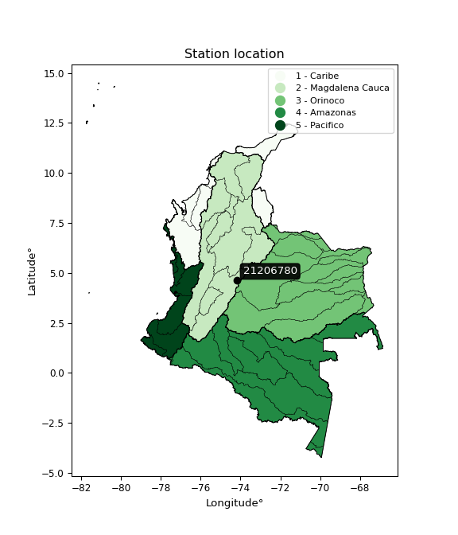

<div align="center">


</div>

# PMP Station (rain, Pmax24h): 21206780

Probable Maximum Precipitation (PMP) is the greatest amount of rainfall for a specific duration that is meteorologically possible for a given location, acting as a "worst-case" scenario for extreme storms, crucial for designing safety-critical infrastructure like bridges, river deviations, dams, spillways, and nuclear plants to prevent catastrophic failure. PMP is calculated by hydrologists using meteorological data to determine the upper limit of extreme rainfall, often leading to the Probable Maximum Flood (PMF) for flood control design, and is increasingly being studied for climate change impacts.

<div align="center">

</img>

</div>


## A. General information


### 1. General running parameters

• app_version: _v20251227_. • runtime: _2025-12-27 09:02:11.367833_. • Python version: _3.14.0_. • SciPy version: _1.16.3_. • Pandas version: _2.3.3_. • NumPy version: _2.3.5_. • Stations dataset (station_dataset_file): _dataset/pmax24h_in/automatic_colombia_2003_2024_filter.csv_. • Stations catalog (station_catalog_file): _dataset/CNE_IDEAM.xls_. • Minimum year to eval til year_max (date_min): _2003_. • Maximum year to eval since year_min (date_max): _2024_. • Creates, save and include plots into reports (create_plot): _False_. • Plot only fit distributions with Δo > Δ (plot_only_fit): _True_. • Eval low extreme values, if False, evaluates high extreme values (low_extreme): _False_. • Eval every SciPy distribution as logarithmic (pdist_logarithmic_on): _True_. • Standard deviation normalized (ddof): _1.0_. • Return periods to eval in years (Tr): _[2, 2.33, 5, 10, 15, 20, 25, 50, 75, 100, 200, 250, 500, 750, 1000]_. • Minimum data sample per station, 0 means any (minimum_sample): _5_. • Z-Score threshold to adjust a value, 0 means disable (zscore): _3.5_. • Avoid zeros, e.g. rain = 0 (avoid_zeros): _True_. • Avoid null values (avoid_nans): _True_. [:file_folder:Dataset file.](../../dataset/pmax24h_in/automatic_colombia_2003_2024_filter.csv)

> Delta Degrees of Freedom (DDOF): is a parameter used in the formulas for calculating variance and standard deviation. When ddof=0, the divisor is $N$ (the total number of observations) and this is used when your data set is the entire population. When ddof=1, the divisor is $N-1$ and this is used when your data set is a sample drawn from a larger population. Using $N-1$ provides an unbiased estimate of the population variance (known as Bessel´s correction).


### 2. Station info and location

|   id |   CODIGO | NOMBRE                           | CATEGORIA          | TECNOLOGIA                | ESTADO   | FECHA_INSTALACION   |   FECHA_SUSPENSION |   ALTITUD |   LATITUD |   LONGITUD | DEPARTAMENTO   | MUNICIPIO   | AREA_OPERATIVA                            | ENTIDAD                                                          | AREA_HIDROGRAFICA   | ZONA_HIDROGRAFICA   | SUBZONA_HIDROGRAFICA   |   CORRIENTE | Catalogo   |
|-----:|---------:|:---------------------------------|:-------------------|:--------------------------|:---------|:--------------------|-------------------:|----------:|----------:|-----------:|:---------------|:------------|:------------------------------------------|:-----------------------------------------------------------------|:--------------------|:--------------------|:-----------------------|------------:|:-----------|
|    0 | 21206780 | LA INDEPENDENCI - AUT [21206780] | HidroMeteorologica | Automática con Telemetría | Activa   | 01/03/2003          |                nan |      2548 |   4.61927 |   -74.1946 | Bogotá         | Bogotá, D.C | Area Operativa 11 - Cundinamarca-Amazonas | FONDO DE PREVENCION Y ATENCION DE DESASTRES DE BOGOTA DC - FOPAE | Magdalena Cauca     | Alto Magdalena      | Río Bogotá             |         nan | CNE_OE     |

<div align="center">

Map location in: [:earth_americas:Google](http://maps.google.com/maps?q=4.619272,-74.194594) [:earth_americas:OSM](https://www.openstreetmap.org/#map=18/4.619272/-74.194594&layers=P) [:earth_americas:Bing](https://www.bing.com/maps?cp=4.619272~-74.194594&lvl=18) [:earth_americas:Apple](https://maps.apple.com/frame?center=4.619272%2C-74.194594&span=0.003%2C0.006)

</div>


<div align="center">

```geojson
{
  "type": "Feature",
  "geometry": {
    "type": "Point", 
    "coordinates": [-74.194594, 4.619272]
  }, 
  "properties": {
    "Name": "21206780"
  }
}
```

</div>


### 3. Discrete values table and plot

|               |           0 |           1 |          2 |           3 |           4 |           5 |
|:--------------|------------:|------------:|-----------:|------------:|------------:|------------:|
| Date          | 2012        | 2013        | 2014       | 2015        | 2016        | 2024        |
| Value         |   23.4      |   45.2      |  446.4     |   14.5      |    9.4      |   38.2      |
| Value_initial |   23.4      |   45.2      |  446.4     |   14.5      |    9.4      |   38.2      |
| count         |    6        |    6        |    6       |    6        |    6        |    6        |
| mean          |   96.1833   |   96.1833   |   96.1833  |   96.1833   |   96.1833   |   96.1833   |
| std           |  172.113    |  172.113    |  172.113   |  172.113    |  172.113    |  172.113    |
| zscore        |   -0.422882 |   -0.296221 |    2.03481 |   -0.474592 |   -0.504224 |   -0.336892 |

> The initial value (value_initial) correspond to the initial obtained or null completed value, and value (value) is adjusted only when the initial value is outside the valid range definite through the Z-Score value. If Z-Score is active, values out of range or outliers are replaced with the station mean value


### 4. Active continuous probability distributions from SciPy (45 of 104 available)

[scipy.stats](https://docs.scipy.org/doc/scipy/reference/stats.html) is a Python´s powerful submodule within the SciPy library for comprehensive statistical analysis, offering over 130 probability distributions (like Normal, Poisson), functions for descriptive stats (mean, variance), hypothesis testing (t-tests, chi-square), random variable generation, and statistical tests, making it essential for data science, modeling, and research. It provides tools to explore, model, and draw conclusions from data efficiently, working seamlessly with NumPy.

<div align="center">

|   id | p_dist             |   n_parameter | fit_method   | label                                                                       | active   | ref                                                                                                        |
|-----:|:-------------------|--------------:|:-------------|:----------------------------------------------------------------------------|:---------|:-----------------------------------------------------------------------------------------------------------|
|    0 | alpha              |             3 | MLE          | Alpha                                                                       | True     | [:mortar_board:](https://docs.scipy.org/doc/scipy/reference/generated/scipy.stats.alpha.html)              |
|    1 | betaprime          |             4 | MLE          | Beta prime                                                                  | True     | [:mortar_board:](https://docs.scipy.org/doc/scipy/reference/generated/scipy.stats.betaprime.html)          |
|    2 | chi2               |             3 | MLE          | Chi²                                                                        | True     | [:mortar_board:](https://docs.scipy.org/doc/scipy/reference/generated/scipy.stats.chi2.html)               |
|    3 | crystalball        |             4 | MLE          | Crystalball                                                                 | True     | [:mortar_board:](https://docs.scipy.org/doc/scipy/reference/generated/scipy.stats.crystalball.html)        |
|    4 | erlang             |             3 | MLE          | Erlang                                                                      | True     | [:mortar_board:](https://docs.scipy.org/doc/scipy/reference/generated/scipy.stats.erlang.html)             |
|    5 | expon              |             2 | MLE          | Exponential                                                                 | True     | [:mortar_board:](https://docs.scipy.org/doc/scipy/reference/generated/scipy.stats.expon.html)              |
|    6 | exponnorm          |             3 | MLE          | Exponentially modified Normal                                               | True     | [:mortar_board:](https://docs.scipy.org/doc/scipy/reference/generated/scipy.stats.exponnorm.html)          |
|    7 | f                  |             4 | MLE          | F                                                                           | True     | [:mortar_board:](https://docs.scipy.org/doc/scipy/reference/generated/scipy.stats.f.html)                  |
|    8 | fatiguelife        |             3 | MLE          | Fatigue-life (Birnbaum-Saunders)                                            | True     | [:mortar_board:](https://docs.scipy.org/doc/scipy/reference/generated/scipy.stats.fatiguelife.html)        |
|    9 | fisk               |             3 | MLE          | Fisk                                                                        | True     | [:mortar_board:](https://docs.scipy.org/doc/scipy/reference/generated/scipy.stats.fisk.html)               |
|   10 | gamma              |             3 | MLE          | Gamma                                                                       | True     | [:mortar_board:](https://docs.scipy.org/doc/scipy/reference/generated/scipy.stats.gamma.html)              |
|   11 | genexpon           |             5 | MLE          | Generalized exponential                                                     | True     | [:mortar_board:](https://docs.scipy.org/doc/scipy/reference/generated/scipy.stats.genexpon.html)           |
|   12 | genlogistic        |             3 | MLE          | Generalized logistic                                                        | True     | [:mortar_board:](https://docs.scipy.org/doc/scipy/reference/generated/scipy.stats.genlogistic.html)        |
|   13 | gibrat             |             2 | MM           | Gibrat                                                                      | True     | [:mortar_board:](https://docs.scipy.org/doc/scipy/reference/generated/scipy.stats.gibrat.html)             |
|   14 | gompertz           |             3 | MLE          | Gompertz (or truncated Gumbel)                                              | True     | [:mortar_board:](https://docs.scipy.org/doc/scipy/reference/generated/scipy.stats.gompertz.html)           |
|   15 | gumbel_l           |             2 | MM           | Gumbel Left Skew                                                            | True     | [:mortar_board:](https://docs.scipy.org/doc/scipy/reference/generated/scipy.stats.gumbel_l.html)           |
|   16 | gumbel_r           |             2 | MM           | Gumbel Right Skew                                                           | True     | [:mortar_board:](https://docs.scipy.org/doc/scipy/reference/generated/scipy.stats.gumbel_r.html)           |
|   17 | halflogistic       |             2 | MM           | Half-logistic                                                               | True     | [:mortar_board:](https://docs.scipy.org/doc/scipy/reference/generated/scipy.stats.halflogistic.html)       |
|   18 | halfnorm           |             2 | MM           | Half Normal                                                                 | True     | [:mortar_board:](https://docs.scipy.org/doc/scipy/reference/generated/scipy.stats.halfnorm.html)           |
|   19 | hypsecant          |             2 | MM           | hyperbolic secant                                                           | True     | [:mortar_board:](https://docs.scipy.org/doc/scipy/reference/generated/scipy.stats.hypsecant.html)          |
|   20 | invgamma           |             3 | MLE          | Inverted gamma                                                              | True     | [:mortar_board:](https://docs.scipy.org/doc/scipy/reference/generated/scipy.stats.invgamma.html)           |
|   21 | invgauss           |             3 | MLE          | Inverse Gaussian                                                            | True     | [:mortar_board:](https://docs.scipy.org/doc/scipy/reference/generated/scipy.stats.invgauss.html)           |
|   22 | invweibull         |             3 | MLE          | Inverted Weibull                                                            | True     | [:mortar_board:](https://docs.scipy.org/doc/scipy/reference/generated/scipy.stats.invweibull.html)         |
|   23 | johnsonsu          |             4 | MLE          | Johnson Su                                                                  | True     | [:mortar_board:](https://docs.scipy.org/doc/scipy/reference/generated/scipy.stats.johnsonsu.html)          |
|   24 | kstwobign          |             2 | MLE          | Limiting distribution of scaled Kolmogorov-Smirnov two-sided test statistic | True     | [:mortar_board:](https://docs.scipy.org/doc/scipy/reference/generated/scipy.stats.kstwobign.html)          |
|   25 | laplace            |             2 | MM           | Laplace                                                                     | True     | [:mortar_board:](https://docs.scipy.org/doc/scipy/reference/generated/scipy.stats.laplace.html)            |
|   26 | laplace_asymmetric |             3 | MLE          | Asymmetric Laplace                                                          | True     | [:mortar_board:](https://docs.scipy.org/doc/scipy/reference/generated/scipy.stats.laplace_asymmetric.html) |
|   27 | loggamma           |             3 | MLE          | Log gamma                                                                   | True     | [:mortar_board:](https://docs.scipy.org/doc/scipy/reference/generated/scipy.stats.loggamma.html)           |
|   28 | logistic           |             2 | MM           | Logistic (or Sech-squared)                                                  | True     | [:mortar_board:](https://docs.scipy.org/doc/scipy/reference/generated/scipy.stats.logistic.html)           |
|   29 | lognorm            |             3 | MLE          | Log Normal                                                                  | True     | [:mortar_board:](https://docs.scipy.org/doc/scipy/reference/generated/scipy.stats.lognorm.html)            |
|   30 | maxwell            |             2 | MM           | Maxwell                                                                     | True     | [:mortar_board:](https://docs.scipy.org/doc/scipy/reference/generated/scipy.stats.maxwell.html)            |
|   31 | mielke             |             4 | MLE          | Mielke Beta-Kappa / Dagum                                                   | True     | [:mortar_board:](https://docs.scipy.org/doc/scipy/reference/generated/scipy.stats.mielke.html)             |
|   32 | moyal              |             2 | MM           | Moyal                                                                       | True     | [:mortar_board:](https://docs.scipy.org/doc/scipy/reference/generated/scipy.stats.moyal.html)              |
|   33 | nakagami           |             3 | MLE          | Nakagami                                                                    | True     | [:mortar_board:](https://docs.scipy.org/doc/scipy/reference/generated/scipy.stats.nakagami.html)           |
|   34 | ncf                |             5 | MLE          | Non-central F distribution                                                  | True     | [:mortar_board:](https://docs.scipy.org/doc/scipy/reference/generated/scipy.stats.ncf.html)                |
|   35 | nct                |             4 | MLE          | Non-central Student’s t                                                     | True     | [:mortar_board:](https://docs.scipy.org/doc/scipy/reference/generated/scipy.stats.nct.html)                |
|   36 | norm               |             2 | MM           | Normal                                                                      | True     | [:mortar_board:](https://docs.scipy.org/doc/scipy/reference/generated/scipy.stats.norm.html)               |
|   37 | pareto             |             3 | MLE          | Pareto                                                                      | True     | [:mortar_board:](https://docs.scipy.org/doc/scipy/reference/generated/scipy.stats.pareto.html)             |
|   38 | pearson3           |             3 | MM           | Pearson type III                                                            | True     | [:mortar_board:](https://docs.scipy.org/doc/scipy/reference/generated/scipy.stats.pearson3.html)           |
|   39 | rayleigh           |             2 | MM           | Rayleigh                                                                    | True     | [:mortar_board:](https://docs.scipy.org/doc/scipy/reference/generated/scipy.stats.rayleigh.html)           |
|   40 | rice               |             3 | MLE          | Rice                                                                        | True     | [:mortar_board:](https://docs.scipy.org/doc/scipy/reference/generated/scipy.stats.rice.html)               |
|   41 | t                  |             3 | MLE          | Student’s t                                                                 | True     | [:mortar_board:](https://docs.scipy.org/doc/scipy/reference/generated/scipy.stats.t.html)                  |
|   42 | truncnorm          |             4 | MLE          | Truncated normal                                                            | True     | [:mortar_board:](https://docs.scipy.org/doc/scipy/reference/generated/scipy.stats.truncnorm.html)          |
|   43 | wald               |             2 | MM           | Wald                                                                        | True     | [:mortar_board:](https://docs.scipy.org/doc/scipy/reference/generated/scipy.stats.wald.html)               |
|   44 | weibull_min        |             3 | MLE          | Weibull minimum                                                             | True     | [:mortar_board:](https://docs.scipy.org/doc/scipy/reference/generated/scipy.stats.weibull_min.html)        |

</div>

> **n_parameter:** # arguments & localization & scale.
>
> **Fit methods:** (MLE) maximum likelihood, (MM) L-moments.
>
>**Inactive:** foldnorm, gennorm, norminvgauss, powernorm, powerlognorm, skewnorm, genextreme, anglit, arcsine, argus, beta, bradford, burr, burr12, cauchy, cosine, halfcauchy, foldcauchy, skewcauchy, wrapcauchy, dgamma, gengamma, exponweib, exponpow, truncexpon, gausshyper, genhalflogistic, genhyperbolic, geninvgauss, halfgennorm, johnsonsb, kappa4, kappa3, ksone, kstwo, loglaplace, levy, levy_l, levy_stable, ncx2, genpareto, truncpareto, lomax, powerlaw, rdist, rel_breitwigner, recipinvgauss, semicircular, studentized_range, trapezoid, triang, truncweibull_min, tukeylambda, uniform, loguniform, vonmises, vonmises_line, weibull_max, dweibull, 


## B. Probability distributions vs. Empirical distributions

A continuous probability distribution (CPD) describes probabilities for variables that can take any value within a range (like rain any time), unlike discrete variables with specific outcomes (like temperature). It uses a Probability Density Function (PDF), a curve where the total area under it equals 1, and the probability of the variable falling within an interval (a to b) is found by calculating the area under the curve between those points. A key feature is that the probability of hitting any single exact value is zero, so probabilities are always expressed for ranges, e.g., $P(a ≤ X ≤ b)$.

<div align="center">

Distributions parameters from station values
|    |   station | p_dist                |   n |              loc |          scale | shape                  | shape1               | shape2                 | shape3   |
|---:|----------:|:----------------------|----:|-----------------:|---------------:|:-----------------------|:---------------------|:-----------------------|:---------|
|  0 |  21206780 | alpha                 |   6 |     -0.0467603   |   17.8047      | 2.8819223513137347e-09 |                      |                        |          |
|  1 |  21206780 | betaprime             |   6 |      9.30736     |   12.353       | 0.4641280267279715     | 0.6876450255977256   |                        |          |
|  2 |  21206780 | chi2                  |   6 |      9.4         |  145.484       | 0.684468900414102      |                      |                        |          |
|  3 |  21206780 | crystalball           |   6 |     95.8259      |  157.235       | 9658.474956592434      | 202.79707672765423   |                        |          |
|  4 |  21206780 | erlang                |   6 |      9.4         |   48.2493      | 0.8225988658114094     |                      |                        |          |
|  5 |  21206780 | expon                 |   6 |      9.4         |   86.7833      |                        |                      |                        |          |
|  6 |  21206780 | exponnorm             |   6 |      9.32231     |    0.0240196   | 3605.430736355016      |                      |                        |          |
|  7 |  21206780 | f                     |   6 |      9.4         |   13.1786      | 0.6581684402781525     | 1.1372614222806139   |                        |          |
|  8 |  21206780 | fatiguelife           |   6 |      9.4         |    8.93541e-05 | 817.245289216359       |                      |                        |          |
|  9 |  21206780 | fisk                  |   6 |      9.4         |   32.6135      | 0.47048078025445217    |                      |                        |          |
| 10 |  21206780 | gamma                 |   6 |      9.4         |  168.267       | 0.2705801378871723     |                      |                        |          |
| 11 |  21206780 | genexpon              |   6 |      9.4         |  149.94        | 1.727751748517396      | 9.17289777657158e-13 | 2.166052797496833      |          |
| 12 |  21206780 | genlogistic           |   6 |   -548.657       |   72.468       | 3284.5576291111756     |                      |                        |          |
| 13 |  21206780 | gibrat                |   6 |    -23.6769      |   72.6989      |                        |                      |                        |          |
| 14 |  21206780 | gompertz              |   6 |      9.4         |    3.04453e+10 | 249663599.66891164     |                      |                        |          |
| 15 |  21206780 | gumbel_l              |   6 |    166.894       |  122.503       |                        |                      |                        |          |
| 16 |  21206780 | gumbel_r              |   6 |     25.4724      |  122.503       |                        |                      |                        |          |
| 17 |  21206780 | halflogistic          |   6 |    -90.0365      |  134.329       |                        |                      |                        |          |
| 18 |  21206780 | halfnorm              |   6 |   -111.778       |  260.64        |                        |                      |                        |          |
| 19 |  21206780 | hypsecant             |   6 |     96.1833      |  100.024       |                        |                      |                        |          |
| 20 |  21206780 | invgamma              |   6 |      6.65703     |    6.64547     | 0.6775255796278012     |                      |                        |          |
| 21 |  21206780 | invgauss              |   6 |      7.21961     |    9.21326     | 9.656057106544903      |                      |                        |          |
| 22 |  21206780 | invweibull            |   6 |      9.4         |    4.55863     | 0.04419966702599323    |                      |                        |          |
| 23 |  21206780 | johnsonsu             |   6 |      9.4         |    2.74311e-09 | -1.9372940757119865    | 0.1064999936055015   |                        |          |
| 24 |  21206780 | kstwobign             |   6 |   -270.224       |  431.983       |                        |                      |                        |          |
| 25 |  21206780 | laplace               |   6 |     96.1833      |  111.098       |                        |                      |                        |          |
| 26 |  21206780 | laplace_asymmetric    |   6 |      9.4         |    0.000196228 | 2.261131439606794e-06  |                      |                        |          |
| 27 |  21206780 | loggamma              |   6 | -52012.1         | 6914.5         | 1875.0955923689662     |                      |                        |          |
| 28 |  21206780 | logistic              |   6 |     96.1833      |   86.623       |                        |                      |                        |          |
| 29 |  21206780 | lognorm               |   6 |      9.4         |    0.0620627   | 14.011238225331882     |                      |                        |          |
| 30 |  21206780 | maxwell               |   6 |   -276.117       |  233.305       |                        |                      |                        |          |
| 31 |  21206780 | mielke                |   6 |      0.367018    |    0.572187    | 52.30867998527188      | 1.072657579950898    |                        |          |
| 32 |  21206780 | moyal                 |   6 |      6.3339      |   70.7274      |                        |                      |                        |          |
| 33 |  21206780 | nakagami              |   6 |      9.4         |  213.491       | 0.17297296835932907    |                      |                        |          |
| 34 |  21206780 | ncf                   |   6 |     -0.0446056   |    2.23153e-07 | 1.194092338971753e-07  | 2.2811264069116524   | 13.879670912141249     |          |
| 35 |  21206780 | nct                   |   6 |      4.41391     |    0.594567    | 0.6709934382899521     | 17.687808554019878   |                        |          |
| 36 |  21206780 | norm                  |   6 |     96.1833      |  157.117       |                        |                      |                        |          |
| 37 |  21206780 | pareto                |   6 |     -8.58993e+09 |    8.58993e+09 | 98981387.36584657      |                      |                        |          |
| 38 |  21206780 | pearson3              |   6 |     96.1833      |  157.117       | 1.7636852814280637     |                      |                        |          |
| 39 |  21206780 | rayleigh              |   6 |   -204.39        |  239.823       |                        |                      |                        |          |
| 40 |  21206780 | rice                  |   6 |   -119.758       |  188.834       | 0.0016637391895296286  |                      |                        |          |
| 41 |  21206780 | t                     |   6 |     22.6845      |   12.8605      | 0.7798015193871282     |                      |                        |          |
| 42 |  21206780 | truncnorm             |   6 | -13285.4         | 1271.85        | 10.45307065138007      | 344.8021374036663    |                        |          |
| 43 |  21206780 | wald                  |   6 |    -60.9334      |  157.117       |                        |                      |                        |          |
| 44 |  21206780 | weibull_min           |   6 |      9.4         |   97.1845      | 0.14805893665248998    |                      |                        |          |
| 45 |  21206780 | logalpha              |   6 |      0.00871275  |   11.1566      | 3.4268571464437967     |                      |                        |          |
| 46 |  21206780 | logbetaprime          |   6 |      0.756649    |    0.0794561   | 216.51464629897055     | 7.064232651604513    |                        |          |
| 47 |  21206780 | logchi2               |   6 |      2.24071     |    0.997689    | 1.0772457759652765     |                      |                        |          |
| 48 |  21206780 | logcrystalball        |   6 |      3.60379     |    1.23877     | 7.768235053097161      | 18.305688073921303   |                        |          |
| 49 |  21206780 | logerlang             |   6 |      2.24071     |    0.998135    | 0.9855269311282804     |                      |                        |          |
| 50 |  21206780 | logexpon              |   6 |      2.24071     |    1.36308     |                        |                      |                        |          |
| 51 |  21206780 | logexponnorm          |   6 |      2.2389      |    0.000602992 | 2250.684669940748      |                      |                        |          |
| 52 |  21206780 | logf                  |   6 |      1.34465     |    1.75198     | 146.68241124698375     | 8.445921062797595    |                        |          |
| 53 |  21206780 | logfatiguelife        |   6 |      1.9058      |    1.25429     | 0.8352264510506078     |                      |                        |          |
| 54 |  21206780 | logfisk               |   6 |      1.96329     |    1.25984     | 2.057356485553475      |                      |                        |          |
| 55 |  21206780 | loggamma              |   6 |      2.24071     |    2.71825     | 0.15238531709844935    |                      |                        |          |
| 56 |  21206780 | loggenexpon           |   6 |      2.23958     |    0.0890968   | 0.058199650719311075   | 3.6716989414730117   | 0.00013823311935624795 |          |
| 57 |  21206780 | loggenlogistic        |   6 |     -3.09845     |    0.865385    | 1230.899915793043      |                      |                        |          |
| 58 |  21206780 | loggibrat             |   6 |      2.65875     |    0.573194    |                        |                      |                        |          |
| 59 |  21206780 | loggompertz           |   6 |      2.24071     |    9.73872     | 6.250019047252433      |                      |                        |          |
| 60 |  21206780 | loggumbel_l           |   6 |      4.1613      |    0.965865    |                        |                      |                        |          |
| 61 |  21206780 | loggumbel_r           |   6 |      3.04628     |    0.965865    |                        |                      |                        |          |
| 62 |  21206780 | loghalflogistic       |   6 |      2.13556     |    1.0591      |                        |                      |                        |          |
| 63 |  21206780 | loghalfnorm           |   6 |      1.96414     |    2.05499     |                        |                      |                        |          |
| 64 |  21206780 | loghypsecant          |   6 |      3.60379     |    0.788625    |                        |                      |                        |          |
| 65 |  21206780 | loginvgamma           |   6 |      1.29642     |    7.53998     | 4.216751691408098      |                      |                        |          |
| 66 |  21206780 | loginvgauss           |   6 |      1.76243     |    3.15981     | 0.5827438891581216     |                      |                        |          |
| 67 |  21206780 | loginvweibull         |   6 |     -0.0462101   |    2.9959      | 3.9378801515381427     |                      |                        |          |
| 68 |  21206780 | logjohnsonsu          |   6 |      1.8667      |    0.00352743  | -8.770542597398354     | 1.3228944458727407   |                        |          |
| 69 |  21206780 | logkstwobign          |   6 |     -0.0686272   |    4.24176     |                        |                      |                        |          |
| 70 |  21206780 | loglaplace            |   6 |      3.60379     |    0.875943    |                        |                      |                        |          |
| 71 |  21206780 | loglaplace_asymmetric |   6 |      3.15274     |    0.824865    | 0.7632984010304842     |                      |                        |          |
| 72 |  21206780 | logloggamma           |   6 |   -425.615       |   56.4292      | 2011.958872634406      |                      |                        |          |
| 73 |  21206780 | loglogistic           |   6 |      3.60379     |    0.68297     |                        |                      |                        |          |
| 74 |  21206780 | loglognorm            |   6 |      2.24071     |    0.00338045  | 13.280743427761038     |                      |                        |          |
| 75 |  21206780 | logmaxwell            |   6 |      0.668426    |    1.83947     |                        |                      |                        |          |
| 76 |  21206780 | logmielke             |   6 |      0.116358    |    0.85843     | 334.04275028407153     | 3.7570618717932938   |                        |          |
| 77 |  21206780 | logmoyal              |   6 |      2.89538     |    0.557642    |                        |                      |                        |          |
| 78 |  21206780 | lognakagami           |   6 |      2.24071     |    2.33324     | 0.256036286229516      |                      |                        |          |
| 79 |  21206780 | logncf                |   6 |      0.157231    |    0.0214583   | 0.8619284550349544     | 25.44986480516596    | 126.38812663999761     |          |
| 80 |  21206780 | lognct                |   6 |      0.0120988   |    0.0832627   | 6.05439294123622       | 37.242050354405876   |                        |          |
| 81 |  21206780 | lognorm               |   6 |      3.60379     |    1.23877     |                        |                      |                        |          |
| 82 |  21206780 | logpareto             |   6 |      2.23711     |    0.00359908  | 0.2043221241956037     |                      |                        |          |
| 83 |  21206780 | logpearson3           |   6 |      3.60379     |    1.23877     | 1.0659540332726198     |                      |                        |          |
| 84 |  21206780 | lograyleigh           |   6 |      1.23395     |    1.89086     |                        |                      |                        |          |
| 85 |  21206780 | logrice               |   6 |      1.61002     |    1.65977     | 0.0010547500435914145  |                      |                        |          |
| 86 |  21206780 | logt                  |   6 |      3.27911     |    0.753576    | 2.3278194792064397     |                      |                        |          |
| 87 |  21206780 | logtruncnorm          |   6 |     -0.263209    |    2.45017     | 1.1988369831279124     | 2.5975528838704687   |                        |          |
| 88 |  21206780 | logwald               |   6 |      2.36499     |    1.2388      |                        |                      |                        |          |
| 89 |  21206780 | logweibull_min        |   6 |      2.24071     |    1.15778     | 0.1670975123728723     |                      |                        |          |

</div>

> **loc** (Location parameter): This shifts the distribution along the x-axis. For many common distributions, like the normal (Gaussian) distribution, loc represents the mean $μ$. For others, like the uniform distribution, it might represent the minimum value, or for the beta distribution, the left end of the support interval.
>
> **scale** (Scale parameter): This determines the width or spread of the distribution. For the normal distribution, scale represents the standard deviation $σ$. For a uniform distribution, it defines the length of the interval (from $loc$ to $loc + scale$).
>
> **shape** (Shape parameters): Refers to parameters that define the specific form of a probability distribution, distinct from its location (loc) and scale (scale). These parameters are required arguments for most distribution functions. For example, a normal (Gaussian) distribution is fully defined by its location (mean) and scale (standard deviation), so it has no specific shape parameters beyond loc and scale. However, other distributions have intrinsic properties that need specification, as Gamma distribution that takes a shape parameter, often named $a$ or $alpha$.


### 0. Cumulative distribution values - CDF (90 evaluated)

Cumulative Distribution Function (CDF), denoted as $F$<sub>$X$</sub>$(x)$, is a function that gives the probability that a random variable $X$ will take a value less than or equal to a specific value, $x$ (i.e., $(P(X≥x)$. It essentially "accumulates" probabilities from a given point up to the far right (positive infinity), providing a complete picture of the distribution´s probabilities for both discrete (like rain) and continuous (like temperature) variables, helping to find probabilities over ranges or above certain values.

<div align="center">

CDF ordered by x ascending and calculating $log(f(x))$ separately
|   id |   Station |   date |     x |   count |    mean |     std |    zscore |   Value_initial |   station |   m |     alpha |   alpha_pdf |   betaprime |   betaprime_pdf |        chi2 |    chi2_pdf |   crystalball |   crystalball_pdf |      erlang |   erlang_pdf |     expon |   expon_pdf |   exponnorm |   exponnorm_pdf |           f |            f_pdf |   fatiguelife |   fatiguelife_pdf |        fisk |    fisk_pdf |       gamma |   gamma_pdf |    genexpon |   genexpon_pdf |   genlogistic |   genlogistic_pdf |   gibrat |   gibrat_pdf |    gompertz |   gompertz_pdf |   gumbel_l |   gumbel_l_pdf |   gumbel_r |   gumbel_r_pdf |   halflogistic |   halflogistic_pdf |   halfnorm |   halfnorm_pdf |   hypsecant |   hypsecant_pdf |   invgamma |   invgamma_pdf |   invgauss |   invgauss_pdf |   invweibull |   invweibull_pdf |   johnsonsu |   johnsonsu_pdf |   kstwobign |   kstwobign_pdf |   laplace |   laplace_pdf |   laplace_asymmetric |   laplace_asymmetric_pdf |   loggamma |   loggamma_pdf |   logistic |   logistic_pdf |   lognorm |   lognorm_pdf |   maxwell |   maxwell_pdf |    mielke |   mielke_pdf |    moyal |   moyal_pdf |    nakagami |   nakagami_pdf |      ncf |     ncf_pdf |       nct |     nct_pdf |     norm |   norm_pdf |    pareto |   pareto_pdf |   pearson3 |   pearson3_pdf |   rayleigh |   rayleigh_pdf |     rice |    rice_pdf |        t |       t_pdf |   truncnorm |   truncnorm_pdf |     wald |    wald_pdf |   weibull_min |   weibull_min_pdf |   logalpha |   logalpha_pdf |   logbetaprime |   logbetaprime_pdf |    logchi2 |   logchi2_pdf |   logcrystalball |   logcrystalball_pdf |   logerlang |   logerlang_pdf |   logexpon |   logexpon_pdf |   logexponnorm |   logexponnorm_pdf |      logf |   logf_pdf |   logfatiguelife |   logfatiguelife_pdf |   logfisk |   logfisk_pdf |   loggenexpon |   loggenexpon_pdf |   loggenlogistic |   loggenlogistic_pdf |   loggibrat |   loggibrat_pdf |   loggompertz |   loggompertz_pdf |   loggumbel_l |   loggumbel_l_pdf |   loggumbel_r |   loggumbel_r_pdf |   loghalflogistic |   loghalflogistic_pdf |   loghalfnorm |   loghalfnorm_pdf |   loghypsecant |   loghypsecant_pdf |   loginvgamma |   loginvgamma_pdf |   loginvgauss |   loginvgauss_pdf |   loginvweibull |   loginvweibull_pdf |   logjohnsonsu |   logjohnsonsu_pdf |   logkstwobign |   logkstwobign_pdf |   loglaplace |   loglaplace_pdf |   loglaplace_asymmetric |   loglaplace_asymmetric_pdf |   logloggamma |   logloggamma_pdf |   loglogistic |   loglogistic_pdf |   loglognorm |   loglognorm_pdf |   logmaxwell |   logmaxwell_pdf |   logmielke |   logmielke_pdf |   logmoyal |   logmoyal_pdf |   lognakagami |   lognakagami_pdf |    logncf |   logncf_pdf |    lognct |   lognct_pdf |   logpareto |   logpareto_pdf |   logpearson3 |   logpearson3_pdf |   lograyleigh |   lograyleigh_pdf |   logrice |   logrice_pdf |     logt |   logt_pdf |   logtruncnorm |   logtruncnorm_pdf |   logwald |   logwald_pdf |   logweibull_min |   logweibull_min_pdf |
|-----:|----------:|-------:|------:|--------:|--------:|--------:|----------:|----------------:|----------:|----:|----------:|------------:|------------:|----------------:|------------:|------------:|--------------:|------------------:|------------:|-------------:|----------:|------------:|------------:|----------------:|------------:|-----------------:|--------------:|------------------:|------------:|------------:|------------:|------------:|------------:|---------------:|--------------:|------------------:|---------:|-------------:|------------:|---------------:|-----------:|---------------:|-----------:|---------------:|---------------:|-------------------:|-----------:|---------------:|------------:|----------------:|-----------:|---------------:|-----------:|---------------:|-------------:|-----------------:|------------:|----------------:|------------:|----------------:|----------:|--------------:|---------------------:|-------------------------:|-----------:|---------------:|-----------:|---------------:|----------:|--------------:|----------:|--------------:|----------:|-------------:|---------:|------------:|------------:|---------------:|---------:|------------:|----------:|------------:|---------:|-----------:|----------:|-------------:|-----------:|---------------:|-----------:|---------------:|---------:|------------:|---------:|------------:|------------:|----------------:|---------:|------------:|--------------:|------------------:|-----------:|---------------:|---------------:|-------------------:|-----------:|--------------:|-----------------:|---------------------:|------------:|----------------:|-----------:|---------------:|---------------:|-------------------:|----------:|-----------:|-----------------:|---------------------:|----------:|--------------:|--------------:|------------------:|-----------------:|---------------------:|------------:|----------------:|--------------:|------------------:|--------------:|------------------:|--------------:|------------------:|------------------:|----------------------:|--------------:|------------------:|---------------:|-------------------:|--------------:|------------------:|--------------:|------------------:|----------------:|--------------------:|---------------:|-------------------:|---------------:|-------------------:|-------------:|-----------------:|------------------------:|----------------------------:|--------------:|------------------:|--------------:|------------------:|-------------:|-----------------:|-------------:|-----------------:|------------:|----------------:|-----------:|---------------:|--------------:|------------------:|----------:|-------------:|----------:|-------------:|------------:|----------------:|--------------:|------------------:|--------------:|------------------:|----------:|--------------:|---------:|-----------:|---------------:|-------------------:|----------:|--------------:|-----------------:|---------------------:|
|    0 |  21206780 |   2016 |   9.4 |       6 | 96.1833 | 172.113 | -0.504224 |             9.4 |  21206780 |   1 | 0.0594643 | 0.0269492   |   0.0822265 |     0.409538    | 1.43985e-06 | 2.77403e+08 |      0.291276 |       0.0021815   | 3.23174e-14 | 14.9656      | 0         | 0.0115229   |  0.00089671 |     0.0115298   | 0.000112005 | 726480           |     0.0450764 |       1.72623e+09 | 2.22927e-08 | 5.90439e+06 | 2.82558e-05 | 4.30401e+09 | 6.09093e-13 |    0.011523    |      0.226298 |       0.00463903  | 0.215497 |  0.00884551  | 8.40006e-11 |    0.00820041  |   0.241548 |     0.00171174 |   0.319756 |    0.00297612  |       0.354099 |        0.00325549  |   0.358013 |    0.00274765  |    0.253109 |     0.00227213  |  0.0453078 |    0.0441022   |  0.0441232 |     0.0503712  |   0.00824387 |      9.84251e+11 |   0.0266639 |     2.39214e+06 |    0.203823 |     0.00356351  |  0.228942 |   0.00206071  |          8.61855e-12 |              0.011523    | 0.00421488 |     1.4463e+12 |   0.268578 |    0.0022678   |  0.13559  |     0.175794  |  0.317193 |   0.00242224  | 0.0850487 |  0.0242719   | 0.327799 | 0.00341959  | 9.83939e-07 |    1.91622e+08 | 0.137424 | 0.0212214   | 0.0501865 | 0.0388634   | 0.290354 | 0.00217991 | 0         |  0.011523    |   0.355033 |    0.00368261  |   0.327896 |    0.00249829  | 0.20857  | 0.00286665  | 0.262559 | 0.0109081   | 0.000148721 |     0.00829147  | 0.31717  | 0.00602956  |    0.00331939 |       2.7621e+11  |  0.0580369 |      0.259917  |      0.0647563 |          0.25978   | 4.1756e-09 |   5.06447e+06 |         0.13559  |            0.175794  | 7.46613e-16 |       1.65689   |   0        |       0.733632 |     0.00133246 |          0.734867  | 0.0525622 |  0.290079  |        0.0447191 |            0.41335   | 0.0425652 |     0.30223   |   0.000735728 |         0.652809  |        0.0763658 |            0.226748  | 0           |       0         |    1.1403e-12 |         0.64177   |      0.127947 |        0.123608   |     0.0999987 |         0.238394  |          0.0496   |             0.470936  |      0.107058 |         0.384766  |       0.111875 |          0.138958  |     0.0525609 |         0.290082  |     0.0471637 |         0.350818  |       0.0552358 |           0.275456  |      0.0460943 |          0.341794  |      0.0716988 |          0.227405  |     0.105475 |        0.120414  |               0.0864805 |                   0.137354  |      0.136519 |         0.172487  |      0.119643 |         0.154222  |    0.0127624 |      5.58604e+12 |     0.134015 |        0.219927  |   0.0546739 |       0.276486  |  0.0720843 |      0.25529   |   6.94605e-09 |       8.00939e+06 | 0.0911562 |    0.245501  | 0.0718428 |    0.264658  |    0        |      56.7706    |      0.104578 |         0.26778   |      0.132156 |         0.244371  | 0.0696508 |     0.212994  | 0.142854 |  0.17674   |    0           |          0         |  0        |     0         |       0.00265108 |          9.96197e+11 |
|    1 |  21206780 |   2015 |  14.5 |       6 | 96.1833 | 172.113 | -0.474592 |            14.5 |  21206780 |   2 | 0.220965  | 0.0317422   |   0.469123  |     0.0318777   | 0.279677    | 0.0185239   |      0.302499 |       0.00221957  | 0.160212    |  0.0243733   | 0.0570736 | 0.0108653   |  0.0580358  |     0.0108771   | 0.446808    |      0.025168    |     0.614981  |       0.0109556   | 0.294637    | 0.0191722   | 0.427521    | 0.0221467   | 0.0570737   |    0.0108653   |      0.250338 |       0.00478322  | 0.259757 |  0.00849227  | 0.0409596   |    0.00786453  |   0.25041  |     0.00176365 |   0.334974 |    0.00299063  |       0.370589 |        0.00321101  |   0.371962 |    0.00272224  |    0.264903 |     0.00235311  |  0.276049  |    0.0365819   |  0.288362  |     0.0361596  |   0.369704   |      0.00318823  |   0.65895   |     0.00766052  |    0.22223  |     0.00365255  |  0.239696 |   0.00215752  |          0.0570736   |              0.0108653   | 0.79449    |     0.243065   |   0.2803   |    0.00232885  |  0.22649  |     0.243011  |  0.3296   |   0.00244272  | 0.214508  |  0.024671    | 0.345218 | 0.00341022  | 0.219083    |    0.0148597   | 0.242926 | 0.0196087   | 0.268178  | 0.0368086   | 0.30157  | 0.00221818 | 0.0570736 |  0.0108653   |   0.373617 |    0.00360507  |   0.340666 |    0.00250929  | 0.223339 | 0.00292424  | 0.330861 | 0.016192    | 0.0415611   |     0.00795104  | 0.347236 | 0.00576009  |    0.476055   |       0.00983174  |  0.224056  |      0.469906  |      0.221796  |          0.435561  | 0.459479   |   0.49477     |         0.22649  |            0.243011  | 0.359271    |       0.651266  |   0.272386 |       0.533801 |     0.274366   |          0.534677  | 0.235969  |  0.49838   |        0.276704  |            0.537264  | 0.235527  |     0.521111  |   0.251663    |         0.509613  |        0.210257  |            0.378643  | 0.000148864 |       0.0373487 |    0.247573   |         0.504862  |      0.193009 |        0.179169   |     0.229919  |         0.349932  |          0.248925 |             0.442844  |      0.270283 |         0.365771  |       0.190002 |          0.226874  |     0.235998  |         0.498478  |     0.256847  |         0.523749  |       0.23173   |           0.490479  |      0.252742  |          0.523641  |      0.202761  |          0.362335  |     0.173002 |        0.197504  |               0.172145  |                   0.273411  |      0.225441 |         0.237309  |      0.204049 |         0.237804  |    0.642621  |      0.0648269   |     0.24434  |        0.284598  |   0.232561  |       0.494197  |  0.22269   |      0.414777  |   0.328585    |       0.385474    | 0.227198  |    0.368244  | 0.22875   |    0.432389  |    0.624918 |       0.175357  |      0.242577 |         0.354883  |      0.251785 |         0.301391  | 0.18578   |     0.314514  | 0.247929 |  0.317502  |    5.43725e-06 |          0.717575  |  0.112234 |     0.835849  |       0.571983   |          0.140024    |
|    2 |  21206780 |   2012 |  23.4 |       6 | 96.1833 | 172.113 | -0.422882 |            23.4 |  21206780 |   3 | 0.447632  | 0.0193684   |   0.637449  |     0.0116386   | 0.392098    | 0.00924658  |      0.322535 |       0.00228186  | 0.339375    |  0.0169435   | 0.148981  | 0.00980624  |  0.150033   |     0.00981476  | 0.584038    |      0.00996719  |     0.685928  |       0.00613719  | 0.401824    | 0.00807753  | 0.555682    | 0.0100565   | 0.148982    |    0.00980625  |      0.293783 |       0.00496484  | 0.331947 |  0.00771078  | 0.108461    |    0.00731099  |   0.266515 |     0.00185581 |   0.361656 |    0.00300258  |       0.39881  |        0.00313018  |   0.395986 |    0.00267602  |    0.28647  |     0.00249276  |  0.492927  |    0.0160834   |  0.497603  |     0.0153771  |   0.386117   |      0.00116004  |   0.697473  |     0.00265496  |    0.25531  |     0.00377421  |  0.259688 |   0.00233747  |          0.148982    |              0.00980625  | 0.871284   |     0.108496   |   0.301486 |    0.00243114  |  0.357886 |     0.301391  |  0.351478 |   0.00247242  | 0.399516  |  0.0169111   | 0.375431 | 0.00337546  | 0.310659    |    0.00767165  | 0.393695 | 0.0143265   | 0.490994  | 0.0166387   | 0.321595 | 0.00228081 | 0.148981  |  0.00980624  |   0.40509  |    0.00346715  |   0.363063 |    0.00252261  | 0.249767 | 0.00301199  | 0.51679  | 0.0234117   | 0.109798    |     0.00738982  | 0.39639  | 0.00528697  |    0.52792    |       0.00374744  |  0.451726  |      0.447084  |      0.435589  |          0.429982  | 0.635138   |   0.27617     |         0.357886 |            0.301391  | 0.605486    |       0.398884  |   0.487827 |       0.375747 |     0.490004   |          0.375786  | 0.465187  |  0.431428  |        0.49719   |            0.383049  | 0.470461  |     0.43091   |   0.463738    |         0.381583  |        0.407699  |            0.422546  | 0.440884    |       0.798724  |    0.458599   |         0.381567  |      0.296698 |        0.256289   |     0.408348  |         0.378656  |          0.446408 |             0.378017  |      0.437001 |         0.328463  |       0.327127 |          0.345549  |     0.465243  |         0.431433  |     0.48202   |         0.404074  |       0.461896  |           0.439188  |      0.479998  |          0.409859  |      0.388701  |          0.395549  |     0.298769 |        0.341083  |               0.368138  |                   0.584701  |      0.353777 |         0.294723  |      0.340643 |         0.328866  |    0.6633    |      0.0301373   |     0.390276 |        0.317831  |   0.463614  |       0.439068  |  0.427232  |      0.414443  |   0.478001    |       0.260138    | 0.413749  |    0.392244  | 0.441149  |    0.427804  |    0.677524 |       0.0719607 |      0.417182 |         0.361584  |      0.402427 |         0.3207    | 0.350767  |     0.363572  | 0.440143 |  0.467388  |    0.304358    |          0.557038  |  0.472579 |     0.57222   |       0.617458   |          0.0673484   |
|    3 |  21206780 |   2024 |  38.2 |       6 | 96.1833 | 172.113 | -0.336892 |            38.2 |  21206780 |   4 | 0.641557  | 0.00871421  |   0.746541  |     0.00474788  | 0.495567    | 0.0054681   |      0.356998 |       0.00237244  | 0.541189    |  0.0109702   | 0.282413  | 0.00826872  |  0.283558   |     0.00827293  | 0.682372    |      0.00453446  |     0.756372  |       0.00377994  | 0.485378    | 0.00408054  | 0.663445    | 0.00544183  | 0.282413    |    0.00826873  |      0.368366 |       0.00507566  | 0.435976 |  0.00636415  | 0.210355    |    0.00647541  |   0.295136 |     0.0020124  |   0.406034 |    0.00298739  |       0.444096 |        0.0029881   |   0.434993 |    0.00259417  |    0.32502  |     0.0027135   |  0.64584   |    0.00669607  |  0.645414  |     0.00659256 |   0.39782    |      0.000562767 |   0.723732  |     0.00123668  |    0.312133 |     0.00388653  |  0.296693 |   0.00267054  |          0.282413    |              0.00826872  | 0.911749   |     0.0629205  |   0.338637 |    0.00258548  |  0.512572 |     0.321887  |  0.388335 |   0.00250479  | 0.58223   |  0.00887948  | 0.424698 | 0.00327419  | 0.398568    |    0.00477477  | 0.556818 | 0.00837156  | 0.648162  | 0.00681799  | 0.356047 | 0.00237199 | 0.282413  |  0.00826872  |   0.454688 |    0.0032352   |   0.400468 |    0.00252874  | 0.295214 | 0.00312205  | 0.75981  | 0.00920377  | 0.212768    |     0.00654217  | 0.469066 | 0.00454798  |    0.566216   |       0.00186256  |  0.639613  |      0.316311  |      0.622103  |          0.325347  | 0.743659   |   0.177146    |         0.512572 |            0.321887  | 0.759488    |       0.242604  |   0.642509 |       0.262267 |     0.644588   |          0.261882  | 0.643265  |  0.29691   |        0.652311  |            0.258068  | 0.643724  |     0.280934  |   0.624514    |         0.278926  |        0.600888  |            0.353596  | 0.705568    |       0.350305  |    0.620099   |         0.281564  |      0.442683 |        0.337334   |     0.583206  |         0.325587  |          0.611667 |             0.295468  |      0.586006 |         0.278117  |       0.515753 |          0.403132  |     0.643306  |         0.296857  |     0.646958  |         0.274915  |       0.643635  |           0.30273   |      0.646902  |          0.276758  |      0.571817  |          0.342481  |     0.521798 |        0.545928  |               0.598523  |                   0.371512  |      0.505537 |         0.317094  |      0.514289 |         0.36575   |    0.675039  |      0.0193272   |     0.545077 |        0.306829  |   0.644715  |       0.300757  |  0.608923  |      0.321112  |   0.589467    |       0.199941    | 0.592784  |    0.329234  | 0.626822  |    0.323798  |    0.704569 |       0.0429409 |      0.583092 |         0.309184  |      0.555805 |         0.299276  | 0.527641  |     0.348557  | 0.664514 |  0.406846  |    0.54113     |          0.413127  |  0.680383 |     0.307246  |       0.643889   |          0.0438191   |
|    4 |  21206780 |   2013 |  45.2 |       6 | 96.1833 | 172.113 | -0.296221 |            45.2 |  21206780 |   5 | 0.693948  | 0.00642209  |   0.77517   |     0.00352856  | 0.530724    | 0.00462632  |      0.373735 |       0.00240907  | 0.611292    |  0.00912946  | 0.338021  | 0.00762795  |  0.339189   |     0.00763053  | 0.710212    |      0.00349549  |     0.780687  |       0.00319719  | 0.510963    | 0.0032839   | 0.697866    | 0.00445405  | 0.338021    |    0.00762795  |      0.40384  |       0.00505224  | 0.478465 |  0.00578366  | 0.254406    |    0.00611417  |   0.309485 |     0.00208737 |   0.426876 |    0.00296631  |       0.464769 |        0.00291817  |   0.45301  |    0.00255347  |    0.344354 |     0.00280942  |  0.686199  |    0.00497074  |  0.685451  |     0.00497139 |   0.401345   |      0.000452369 |   0.731428  |     0.000981012 |    0.339412 |     0.00390379  |  0.315988 |   0.00284422  |          0.338021    |              0.00762795  | 0.921534   |     0.0537266  |   0.356964 |    0.00264988  |  0.566452 |     0.317569  |  0.405899 |   0.00251277  | 0.636827  |  0.00684387  | 0.447401 | 0.00321109  | 0.429617    |    0.00413433  | 0.609183 | 0.00667755  | 0.689127  | 0.00502891  | 0.372782 | 0.00240892 | 0.338021  |  0.00762795  |   0.476952 |    0.003126    |   0.418158 |    0.00252494  | 0.317202 | 0.00315869  | 0.810566 | 0.00568003  | 0.257268    |     0.00617555  | 0.499778 | 0.00423053  |    0.577916   |       0.00150569  |  0.689117  |      0.272733  |      0.673567  |          0.286625  | 0.771506   |   0.154525    |         0.566452 |            0.317569  | 0.797023    |       0.204632  |   0.684023 |       0.231811 |     0.68603    |          0.231346  | 0.689761  |  0.256519  |        0.692938  |            0.225612  | 0.687401  |     0.23925   |   0.668931    |         0.249485  |        0.657467  |            0.31855   | 0.757514    |       0.27129   |    0.665003   |         0.25261   |      0.501363 |        0.359253   |     0.635714  |         0.29816   |          0.658984 |             0.267084  |      0.631222 |         0.259253  |       0.582727 |          0.390071  |     0.689793  |         0.256461  |     0.69017   |         0.23949   |       0.690976  |           0.260754  |      0.690302  |          0.239925  |      0.627177  |          0.315155  |     0.605373 |        0.450517  |               0.65641   |                   0.317945  |      0.55871  |         0.313997  |      0.575307 |         0.357745  |    0.678104  |      0.017189    |     0.595695 |        0.294197  |   0.691717  |       0.258716  |  0.659962  |      0.285719  |   0.621808    |       0.184787    | 0.645667  |    0.29906   | 0.678019  |    0.284989  |    0.711315 |       0.0374747 |      0.633101 |         0.284983  |      0.604979 |         0.284735  | 0.584933  |     0.331632  | 0.72789  |  0.345278  |    0.606923    |          0.369414  |  0.72727  |     0.252292  |       0.65085    |          0.0390927   |
|    5 |  21206780 |   2014 | 446.4 |       6 | 96.1833 | 172.113 |  2.03481  |           446.4 |  21206780 |   6 | 0.968188  | 7.12182e-05 |   0.954185  |     7.07215e-05 | 0.950162    | 0.000224742 |      0.987114 |       0.000211288 | 0.999932    |  1.43369e-06 | 0.993497  | 7.49309e-05 |  0.993572   |     7.42296e-05 | 0.918827    |      0.000102605 |     0.996595  |       3.17438e-05 | 0.772239    | 0.000189362 | 0.990888    | 6.61721e-05 | 0.993497    |    7.49306e-05 |      0.996432 |       4.91457e-05 | 0.969019 |  0.000148656 | 0.972224    |    0.000227775 |   0.999944 |     4.466e-06  |   0.968321 |    0.000254457 |       0.963795 |        0.000264643 |   0.967771 |    0.000309029 |    0.980807 |     0.000191765 |  0.935826  |    9.79869e-05 |  0.955517  |     0.00011183 |   0.441597   |      3.6507e-05  |   0.811543  |     6.58023e-05 |    0.991859 |     0.000125051 |  0.978623 |   0.000192411 |          0.993497    |              7.49307e-05 | 0.979437   |     0.0107941  |   0.982758 |    0.000195617 |  0.978103 |     0.0422019 |  0.977614 |   0.000271192 | 0.962186  |  8.91621e-05 | 0.964461 | 0.000251073 | 0.930711    |    0.000391807 | 0.958613 | 0.000101499 | 0.936818  | 9.59056e-05 | 0.987094 | 0.00021173 | 0.993497  |  7.49309e-05 |   0.961703 |    0.000259581 |   0.974825 |    0.000284863 | 0.98883  | 0.000177346 | 0.979656 | 3.74242e-05 | 0.974842    |     0.000215366 | 0.961314 | 0.000202747 |    0.713293   |       0.000121355 |  0.945006  |      0.0335814 |      0.955601  |          0.0361843 | 0.945073   |   0.0323835   |         0.978103 |            0.0422019 | 0.979736    |       0.0203646 |   0.941116 |       0.043199 |     0.941919   |          0.0427966 | 0.941867  |  0.0365424 |        0.937614  |            0.0416301 | 0.920314  |     0.0364622 |   0.950126    |         0.0448556 |        0.970697  |            0.0333601 | 0.963491    |       0.0232362 |    0.952188   |         0.0456113 |      0.99942  |        0.00447737 |     0.95858   |         0.0419837 |          0.953791 |             0.0426224 |      0.955904 |         0.0511745 |       0.97319  |          0.0339556 |     0.941833  |         0.0365402 |     0.941124  |         0.0401588 |       0.942723  |           0.0356189 |      0.936537  |          0.0388814 |      0.970937  |          0.0398642 |     0.97111  |        0.0329811 |               0.958725  |                   0.0381944 |      0.976281 |         0.0451038 |      0.974833 |         0.0359226 |    0.70199   |      0.00676109  |     0.966789 |        0.0482783 |   0.941485  |       0.0356248 |  0.954986  |      0.0403184 |   0.888672    |       0.0663792   | 0.959805  |    0.0394078 | 0.95631   |    0.0352635 |    0.759714 |       0.0127056 |      0.957718 |         0.0450426 |      0.963593 |         0.0495619 | 0.974293  |     0.0419103 | 0.974637 |  0.0186051 |    0.999999    |          0.0504437 |  0.953814 |     0.0313432 |       0.705628   |          0.0155818   |


</div>

An Empirical Distribution Function (EDF) is a step-function estimate of a true cumulative distribution function (CDF) based on observed sample data, representing the proportion of data points less than or equal to a given value. It is calculated by ordering your data and jumping up by $1/n$ (where $n$ is sample size) at each unique data point, allowing analysis without assuming an underlying population distribution, and it gets closer to the true CDF as the sample size grows.


### 1. Empirical - EDF California (1923)

California´s estimates the true probability distribution of water-related data (like rainfall, streamflow) using observed samples, crucial for risk assessment.

<div align="center">


$P=m/n$


</div>


**1.1. Empirical values**

<div align="center">

|                | 0                   | 1                  | 2              | 3                  | 4                  | 5              |
|:---------------|:--------------------|:-------------------|:---------------|:-------------------|:-------------------|:---------------|
| date           | 2016                | 2015               | 2012           | 2024               | 2013               | 2014           |
| x              | 9.4                 | 14.5               | 23.4           | 38.2               | 45.2               | 446.4          |
| m              | 1                   | 2                  | 3              | 4                  | 5                  | 6              |
| empirical_dist | edf_california      | edf_california     | edf_california | edf_california     | edf_california     | edf_california |
| empirical      | 0.16666666666666666 | 0.3333333333333333 | 0.5            | 0.6666666666666666 | 0.8333333333333334 | 1.0            |
| empirical_tr   | 1.2                 | 1.4999999999999998 | 2.0            | 2.9999999999999996 | 6.000000000000002  | inf            |

</div>


**1.2. Kolmogorov-Smirnov fit test (sorted by Δ)**


<div align="center">

|                | 0                   | 1                   | 2                   | 3                  | 4                  | 5                   | 6                   | 7                   | 8                  | 9                   | 10                  | 11                 | 12                  | 13                 | 14                  | 15                  | 16                  | 17                  | 18                 | 19                  | 20                  | 21                  | 22                  | 23                 | 24                  | 25                 | 26                  | 27                  | 28                  | 29                    | 30                  | 31                  | 32                  | 33                 | 34                 | 35                  | 36                  | 37                  | 38                  | 39                  | 40                  | 41                  | 42                  | 43                  | 44                  | 45                 | 46                 | 47                 | 48                 | 49                  | 50                 | 51                 | 52                 | 53                  | 54                 | 55                 | 56                 | 57                  | 58                 | 59                  | 60                 | 61                 | 62                | 63                  | 64                  | 65                 | 66                  | 67                  | 68                 | 69                 | 70                 | 71                 | 72                  | 73                | 74                  | 75                  | 76                  | 77                  | 78                  | 79                 | 80                 | 81                 | 82                  | 83                 | 84                 | 85                 | 86                 | 87                 | 88                 | 89                |
|:---------------|:--------------------|:--------------------|:--------------------|:-------------------|:-------------------|:--------------------|:--------------------|:--------------------|:-------------------|:--------------------|:--------------------|:-------------------|:--------------------|:-------------------|:--------------------|:--------------------|:--------------------|:--------------------|:-------------------|:--------------------|:--------------------|:--------------------|:--------------------|:-------------------|:--------------------|:-------------------|:--------------------|:--------------------|:--------------------|:----------------------|:--------------------|:--------------------|:--------------------|:-------------------|:-------------------|:--------------------|:--------------------|:--------------------|:--------------------|:--------------------|:--------------------|:--------------------|:--------------------|:--------------------|:--------------------|:-------------------|:-------------------|:-------------------|:-------------------|:--------------------|:-------------------|:-------------------|:-------------------|:--------------------|:-------------------|:-------------------|:-------------------|:--------------------|:-------------------|:--------------------|:-------------------|:-------------------|:------------------|:--------------------|:--------------------|:-------------------|:--------------------|:--------------------|:-------------------|:-------------------|:-------------------|:-------------------|:--------------------|:------------------|:--------------------|:--------------------|:--------------------|:--------------------|:--------------------|:-------------------|:-------------------|:-------------------|:--------------------|:-------------------|:-------------------|:-------------------|:-------------------|:-------------------|:-------------------|:------------------|
| station        | 21206780            | 21206780            | 21206780            | 21206780           | 21206780           | 21206780            | 21206780            | 21206780            | 21206780           | 21206780            | 21206780            | 21206780           | 21206780            | 21206780           | 21206780            | 21206780            | 21206780            | 21206780            | 21206780           | 21206780            | 21206780            | 21206780            | 21206780            | 21206780           | 21206780            | 21206780           | 21206780            | 21206780            | 21206780            | 21206780              | 21206780            | 21206780            | 21206780            | 21206780           | 21206780           | 21206780            | 21206780            | 21206780            | 21206780            | 21206780            | 21206780            | 21206780            | 21206780            | 21206780            | 21206780            | 21206780           | 21206780           | 21206780           | 21206780           | 21206780            | 21206780           | 21206780           | 21206780           | 21206780            | 21206780           | 21206780           | 21206780           | 21206780            | 21206780           | 21206780            | 21206780           | 21206780           | 21206780          | 21206780            | 21206780            | 21206780           | 21206780            | 21206780            | 21206780           | 21206780           | 21206780           | 21206780           | 21206780            | 21206780          | 21206780            | 21206780            | 21206780            | 21206780            | 21206780            | 21206780           | 21206780           | 21206780           | 21206780            | 21206780           | 21206780           | 21206780           | 21206780           | 21206780           | 21206780           | 21206780          |
| empirical_dist | edf_california      | edf_california      | edf_california      | edf_california     | edf_california     | edf_california      | edf_california      | edf_california      | edf_california     | edf_california      | edf_california      | edf_california     | edf_california      | edf_california     | edf_california      | edf_california      | edf_california      | edf_california      | edf_california     | edf_california      | edf_california      | edf_california      | edf_california      | edf_california     | edf_california      | edf_california     | edf_california      | edf_california      | edf_california      | edf_california        | edf_california      | edf_california      | edf_california      | edf_california     | edf_california     | edf_california      | edf_california      | edf_california      | edf_california      | edf_california      | edf_california      | edf_california      | edf_california      | edf_california      | edf_california      | edf_california     | edf_california     | edf_california     | edf_california     | edf_california      | edf_california     | edf_california     | edf_california     | edf_california      | edf_california     | edf_california     | edf_california     | edf_california      | edf_california     | edf_california      | edf_california     | edf_california     | edf_california    | edf_california      | edf_california      | edf_california     | edf_california      | edf_california      | edf_california     | edf_california     | edf_california     | edf_california     | edf_california      | edf_california    | edf_california      | edf_california      | edf_california      | edf_california      | edf_california      | edf_california     | edf_california     | edf_california     | edf_california      | edf_california     | edf_california     | edf_california     | edf_california     | edf_california     | edf_california     | edf_california    |
| p_dist         | t                   | logt                | betaprime           | alpha              | logfatiguelife     | logmielke           | loginvweibull       | logjohnsonsu        | loginvgauss        | loginvgamma         | logf                | nct                | logalpha            | logfisk            | invgamma            | invgauss            | lognct              | logbetaprime        | logexponnorm       | loggenexpon         | f                   | gamma               | logchi2             | logerlang          | logexpon            | loggompertz        | logmoyal            | loghalflogistic     | loggenlogistic      | loglaplace_asymmetric | logncf              | mielke              | loggumbel_r         | logpearson3        | loghalfnorm        | logkstwobign        | lognakagami         | logwald             | erlang              | ncf                 | loglaplace          | lograyleigh         | logmaxwell          | logrice             | loghypsecant        | loglogistic        | logcrystalball     | lognorm            | lognorm            | logloggamma         | fatiguelife        | weibull_min        | logpareto          | logweibull_min      | chi2               | loglognorm         | fisk               | johnsonsu           | loggumbel_l        | loggibrat           | logtruncnorm       | wald               | gibrat            | pearson3            | halflogistic        | halfnorm           | moyal               | nakagami            | gumbel_r           | rayleigh           | maxwell            | genlogistic        | crystalball         | norm              | loggamma            | loggamma            | logistic            | hypsecant           | kstwobign           | exponnorm          | genexpon           | laplace_asymmetric | pareto              | expon              | rice               | laplace            | gumbel_l           | invweibull         | truncnorm          | gompertz          |
| delta          | 0.09589244225626689 | 0.10544370863369978 | 0.13744907277569074 | 0.1393852182955725 | 0.1403953975294424 | 0.14161662760646232 | 0.14235700404944562 | 0.14303096764691225 | 0.1431636162985923 | 0.14354057352177663 | 0.14357197105716912 | 0.1442065988379716 | 0.14421626662343046 | 0.1459325559925656 | 0.14713462287168266 | 0.14788281056039443 | 0.15531415792806202 | 0.15976636493892193 | 0.1653342061729314 | 0.16593093872031417 | 0.16655466212273792 | 0.16663841086498804 | 0.16666666249106435 | 0.1666666666666659 | 0.16666666666666666 | 0.1683301441317332 | 0.17337115170981388 | 0.17434908492596712 | 0.17586622008382868 | 0.17692312270094168   | 0.18766645130869386 | 0.19650658761073825 | 0.19761931115975917 | 0.2002318783445085 | 0.2021116304082594 | 0.20615661819891773 | 0.21152495688533535 | 0.22109958978517122 | 0.22204160723458632 | 0.22415018320475533 | 0.22796037291035953 | 0.22835409484925384 | 0.23763792283919905 | 0.24840007198235914 | 0.25060626443440714 | 0.2580263473423472 | 0.2668811217238687 | 0.2668811263714499 | 0.2668811263714499 | 0.27462324126547477 | 0.2816480892288625 | 0.2867065222425913 | 0.2915850740826516 | 0.29437205967256985 | 0.3026094576400238 | 0.3092872170951479 | 0.3223703537545707 | 0.32561685947865454 | 0.3319703177573393 | 0.33318446954497194 | 0.3333278960786262 | 0.3335557058981462 | 0.354867852752922 | 0.35638143391530236 | 0.36856441071509727 | 0.3803233391455647 | 0.38593197914104294 | 0.40371617079245176 | 0.4064569263148253 | 0.4151754869949732 | 0.4274340005282828 | 0.4294937817181804 | 0.45959810648139376 | 0.460551050544561 | 0.46115659701636075 | 0.46115659701636075 | 0.47636934142769954 | 0.48897900279689743 | 0.49392182657496114 | 0.4941439255655339 | 0.4953119214456931 | 0.4953119961605682 | 0.49531221480319765 | 0.4953122274641315 | 0.5161311834201787 | 0.5173450231773125 | 0.5238483922979287 | 0.5584028094141642 | 0.5760652441211815 | 0.578926841195077 |
| deltao         | 0.530385761606      | 0.530385761606      | 0.530385761606      | 0.530385761606     | 0.530385761606     | 0.530385761606      | 0.530385761606      | 0.530385761606      | 0.530385761606     | 0.530385761606      | 0.530385761606      | 0.530385761606     | 0.530385761606      | 0.530385761606     | 0.530385761606      | 0.530385761606      | 0.530385761606      | 0.530385761606      | 0.530385761606     | 0.530385761606      | 0.530385761606      | 0.530385761606      | 0.530385761606      | 0.530385761606     | 0.530385761606      | 0.530385761606     | 0.530385761606      | 0.530385761606      | 0.530385761606      | 0.530385761606        | 0.530385761606      | 0.530385761606      | 0.530385761606      | 0.530385761606     | 0.530385761606     | 0.530385761606      | 0.530385761606      | 0.530385761606      | 0.530385761606      | 0.530385761606      | 0.530385761606      | 0.530385761606      | 0.530385761606      | 0.530385761606      | 0.530385761606      | 0.530385761606     | 0.530385761606     | 0.530385761606     | 0.530385761606     | 0.530385761606      | 0.530385761606     | 0.530385761606     | 0.530385761606     | 0.530385761606      | 0.530385761606     | 0.530385761606     | 0.530385761606     | 0.530385761606      | 0.530385761606     | 0.530385761606      | 0.530385761606     | 0.530385761606     | 0.530385761606    | 0.530385761606      | 0.530385761606      | 0.530385761606     | 0.530385761606      | 0.530385761606      | 0.530385761606     | 0.530385761606     | 0.530385761606     | 0.530385761606     | 0.530385761606      | 0.530385761606    | 0.530385761606      | 0.530385761606      | 0.530385761606      | 0.530385761606      | 0.530385761606      | 0.530385761606     | 0.530385761606     | 0.530385761606     | 0.530385761606      | 0.530385761606     | 0.530385761606     | 0.530385761606     | 0.530385761606     | 0.530385761606     | 0.530385761606     | 0.530385761606    |
| eval           | Δo > Δ              | Δo > Δ              | Δo > Δ              | Δo > Δ             | Δo > Δ             | Δo > Δ              | Δo > Δ              | Δo > Δ              | Δo > Δ             | Δo > Δ              | Δo > Δ              | Δo > Δ             | Δo > Δ              | Δo > Δ             | Δo > Δ              | Δo > Δ              | Δo > Δ              | Δo > Δ              | Δo > Δ             | Δo > Δ              | Δo > Δ              | Δo > Δ              | Δo > Δ              | Δo > Δ             | Δo > Δ              | Δo > Δ             | Δo > Δ              | Δo > Δ              | Δo > Δ              | Δo > Δ                | Δo > Δ              | Δo > Δ              | Δo > Δ              | Δo > Δ             | Δo > Δ             | Δo > Δ              | Δo > Δ              | Δo > Δ              | Δo > Δ              | Δo > Δ              | Δo > Δ              | Δo > Δ              | Δo > Δ              | Δo > Δ              | Δo > Δ              | Δo > Δ             | Δo > Δ             | Δo > Δ             | Δo > Δ             | Δo > Δ              | Δo > Δ             | Δo > Δ             | Δo > Δ             | Δo > Δ              | Δo > Δ             | Δo > Δ             | Δo > Δ             | Δo > Δ              | Δo > Δ             | Δo > Δ              | Δo > Δ             | Δo > Δ             | Δo > Δ            | Δo > Δ              | Δo > Δ              | Δo > Δ             | Δo > Δ              | Δo > Δ              | Δo > Δ             | Δo > Δ             | Δo > Δ             | Δo > Δ             | Δo > Δ              | Δo > Δ            | Δo > Δ              | Δo > Δ              | Δo > Δ              | Δo > Δ              | Δo > Δ              | Δo > Δ             | Δo > Δ             | Δo > Δ             | Δo > Δ              | Δo > Δ             | Δo > Δ             | Δo > Δ             | Δo > Δ             | Δo <= Δ            | Δo <= Δ            | Δo <= Δ           |
| fit            | 1                   | 1                   | 1                   | 1                  | 1                  | 1                   | 1                   | 1                   | 1                  | 1                   | 1                   | 1                  | 1                   | 1                  | 1                   | 1                   | 1                   | 1                   | 1                  | 1                   | 1                   | 1                   | 1                   | 1                  | 1                   | 1                  | 1                   | 1                   | 1                   | 1                     | 1                   | 1                   | 1                   | 1                  | 1                  | 1                   | 1                   | 1                   | 1                   | 1                   | 1                   | 1                   | 1                   | 1                   | 1                   | 1                  | 1                  | 1                  | 1                  | 1                   | 1                  | 1                  | 1                  | 1                   | 1                  | 1                  | 1                  | 1                   | 1                  | 1                   | 1                  | 1                  | 1                 | 1                   | 1                   | 1                  | 1                   | 1                   | 1                  | 1                  | 1                  | 1                  | 1                   | 1                 | 1                   | 1                   | 1                   | 1                   | 1                   | 1                  | 1                  | 1                  | 1                   | 1                  | 1                  | 1                  | 1                  | 0                  | 0                  | 0                 |
| n              | 6                   | 6                   | 6                   | 6                  | 6                  | 6                   | 6                   | 6                   | 6                  | 6                   | 6                   | 6                  | 6                   | 6                  | 6                   | 6                   | 6                   | 6                   | 6                  | 6                   | 6                   | 6                   | 6                   | 6                  | 6                   | 6                  | 6                   | 6                   | 6                   | 6                     | 6                   | 6                   | 6                   | 6                  | 6                  | 6                   | 6                   | 6                   | 6                   | 6                   | 6                   | 6                   | 6                   | 6                   | 6                   | 6                  | 6                  | 6                  | 6                  | 6                   | 6                  | 6                  | 6                  | 6                   | 6                  | 6                  | 6                  | 6                   | 6                  | 6                   | 6                  | 6                  | 6                 | 6                   | 6                   | 6                  | 6                   | 6                   | 6                  | 6                  | 6                  | 6                  | 6                   | 6                 | 6                   | 6                   | 6                   | 6                   | 6                   | 6                  | 6                  | 6                  | 6                   | 6                  | 6                  | 6                  | 6                  | 6                  | 6                  | 6                 |
| best_fit       | 1                   | 0                   | 0                   | 0                  | 0                  | 0                   | 0                   | 0                   | 0                  | 0                   | 0                   | 0                  | 0                   | 0                  | 0                   | 0                   | 0                   | 0                   | 0                  | 0                   | 0                   | 0                   | 0                   | 0                  | 0                   | 0                  | 0                   | 0                   | 0                   | 0                     | 0                   | 0                   | 0                   | 0                  | 0                  | 0                   | 0                   | 0                   | 0                   | 0                   | 0                   | 0                   | 0                   | 0                   | 0                   | 0                  | 0                  | 0                  | 0                  | 0                   | 0                  | 0                  | 0                  | 0                   | 0                  | 0                  | 0                  | 0                   | 0                  | 0                   | 0                  | 0                  | 0                 | 0                   | 0                   | 0                  | 0                   | 0                   | 0                  | 0                  | 0                  | 0                  | 0                   | 0                 | 0                   | 0                   | 0                   | 0                   | 0                   | 0                  | 0                  | 0                  | 0                   | 0                  | 0                  | 0                  | 0                  | 0                  | 0                  | 0                 |
| best_fit_sort  | 1                   | 2                   | 3                   | 4                  | 5                  | 6                   | 7                   | 8                   | 9                  | 10                  | 11                  | 12                 | 13                  | 14                 | 15                  | 16                  | 17                  | 18                  | 19                 | 20                  | 21                  | 22                  | 23                  | 24                 | 25                  | 26                 | 27                  | 28                  | 29                  | 30                    | 31                  | 32                  | 33                  | 34                 | 35                 | 36                  | 37                  | 38                  | 39                  | 40                  | 41                  | 42                  | 43                  | 44                  | 45                  | 46                 | 47                 | 48                 | 49                 | 50                  | 51                 | 52                 | 53                 | 54                  | 55                 | 56                 | 57                 | 58                  | 59                 | 60                  | 61                 | 62                 | 63                | 64                  | 65                  | 66                 | 67                  | 68                  | 69                 | 70                 | 71                 | 72                 | 73                  | 74                | 75                  | 76                  | 77                  | 78                  | 79                  | 80                 | 81                 | 82                 | 83                  | 84                 | 85                 | 86                 | 87                 | 88                 | 89                 | 90                |

</div>


**1.3. Best fit**

<div align="center">

|   id |   station | empirical_dist   | p_dist   |     delta |   deltao | eval   |   fit |   n |   best_fit |   best_fit_sort |
|-----:|----------:|:-----------------|:---------|----------:|---------:|:-------|------:|----:|-----------:|----------------:|
|    0 |  21206780 | edf_california   | t        | 0.0958924 | 0.530386 | Δo > Δ |     1 |   6 |          1 |               1 |

</div>


### 2. Empirical - EDF Hazen (1930)

Hazen method for plotting positions is a formula used to estimate the empirical cumulative probability distribution of flood events or other hydrological data. This formula often results in biased estimations, particularly when extrapolating to extreme events (high return periods).

<div align="center">


$P=(m-0.5)/n$


</div>


**2.1. Empirical values**

<div align="center">

|                | 0                   | 1                  | 2                  | 3                  | 4         | 5                  |
|:---------------|:--------------------|:-------------------|:-------------------|:-------------------|:----------|:-------------------|
| date           | 2016                | 2015               | 2012               | 2024               | 2013      | 2014               |
| x              | 9.4                 | 14.5               | 23.4               | 38.2               | 45.2      | 446.4              |
| m              | 1                   | 2                  | 3                  | 4                  | 5         | 6                  |
| empirical_dist | edf_hazen           | edf_hazen          | edf_hazen          | edf_hazen          | edf_hazen | edf_hazen          |
| empirical      | 0.08333333333333333 | 0.25               | 0.4166666666666667 | 0.5833333333333334 | 0.75      | 0.9166666666666666 |
| empirical_tr   | 1.090909090909091   | 1.3333333333333333 | 1.7142857142857144 | 2.4000000000000004 | 4.0       | 11.999999999999995 |

</div>


**2.2. Kolmogorov-Smirnov fit test (sorted by Δ)**


<div align="center">

|                | 0                   | 1                    | 2                   | 3                   | 4                    | 5                    | 6                   | 7                   | 8                   | 9                   | 10                  | 11                  | 12                  | 13                  | 14                  | 15                  | 16                  | 17                  | 18                  | 19                  | 20                 | 21                  | 22                  | 23                    | 24                  | 25                  | 26                 | 27                  | 28                  | 29                  | 30                  | 31                 | 32                  | 33                  | 34                  | 35                  | 36                  | 37                  | 38                  | 39                  | 40                  | 41                  | 42                  | 43                  | 44                  | 45                 | 46                 | 47                  | 48                 | 49                 | 50                  | 51                  | 52                 | 53                  | 54                  | 55                  | 56                  | 57                 | 58                | 59                 | 60                  | 61                  | 62                 | 63                  | 64                 | 65                 | 66                 | 67                  | 68                 | 69                 | 70                 | 71                  | 72                 | 73                 | 74                  | 75                  | 76                  | 77                 | 78                 | 79                  | 80                 | 81                  | 82                 | 83                 | 84                 | 85                  | 86                 | 87                  | 88                 | 89                 |
|:---------------|:--------------------|:---------------------|:--------------------|:--------------------|:---------------------|:---------------------|:--------------------|:--------------------|:--------------------|:--------------------|:--------------------|:--------------------|:--------------------|:--------------------|:--------------------|:--------------------|:--------------------|:--------------------|:--------------------|:--------------------|:-------------------|:--------------------|:--------------------|:----------------------|:--------------------|:--------------------|:-------------------|:--------------------|:--------------------|:--------------------|:--------------------|:-------------------|:--------------------|:--------------------|:--------------------|:--------------------|:--------------------|:--------------------|:--------------------|:--------------------|:--------------------|:--------------------|:--------------------|:--------------------|:--------------------|:-------------------|:-------------------|:--------------------|:-------------------|:-------------------|:--------------------|:--------------------|:-------------------|:--------------------|:--------------------|:--------------------|:--------------------|:-------------------|:------------------|:-------------------|:--------------------|:--------------------|:-------------------|:--------------------|:-------------------|:-------------------|:-------------------|:--------------------|:-------------------|:-------------------|:-------------------|:--------------------|:-------------------|:-------------------|:--------------------|:--------------------|:--------------------|:-------------------|:-------------------|:--------------------|:-------------------|:--------------------|:-------------------|:-------------------|:-------------------|:--------------------|:-------------------|:--------------------|:-------------------|:-------------------|
| station        | 21206780            | 21206780             | 21206780            | 21206780            | 21206780             | 21206780             | 21206780            | 21206780            | 21206780            | 21206780            | 21206780            | 21206780            | 21206780            | 21206780            | 21206780            | 21206780            | 21206780            | 21206780            | 21206780            | 21206780            | 21206780           | 21206780            | 21206780            | 21206780              | 21206780            | 21206780            | 21206780           | 21206780            | 21206780            | 21206780            | 21206780            | 21206780           | 21206780            | 21206780            | 21206780            | 21206780            | 21206780            | 21206780            | 21206780            | 21206780            | 21206780            | 21206780            | 21206780            | 21206780            | 21206780            | 21206780           | 21206780           | 21206780            | 21206780           | 21206780           | 21206780            | 21206780            | 21206780           | 21206780            | 21206780            | 21206780            | 21206780            | 21206780           | 21206780          | 21206780           | 21206780            | 21206780            | 21206780           | 21206780            | 21206780           | 21206780           | 21206780           | 21206780            | 21206780           | 21206780           | 21206780           | 21206780            | 21206780           | 21206780           | 21206780            | 21206780            | 21206780            | 21206780           | 21206780           | 21206780            | 21206780           | 21206780            | 21206780           | 21206780           | 21206780           | 21206780            | 21206780           | 21206780            | 21206780           | 21206780           |
| empirical_dist | edf_hazen           | edf_hazen            | edf_hazen           | edf_hazen           | edf_hazen            | edf_hazen            | edf_hazen           | edf_hazen           | edf_hazen           | edf_hazen           | edf_hazen           | edf_hazen           | edf_hazen           | edf_hazen           | edf_hazen           | edf_hazen           | edf_hazen           | edf_hazen           | edf_hazen           | edf_hazen           | edf_hazen          | edf_hazen           | edf_hazen           | edf_hazen             | edf_hazen           | edf_hazen           | edf_hazen          | edf_hazen           | edf_hazen           | edf_hazen           | edf_hazen           | edf_hazen          | edf_hazen           | edf_hazen           | edf_hazen           | edf_hazen           | edf_hazen           | edf_hazen           | edf_hazen           | edf_hazen           | edf_hazen           | edf_hazen           | edf_hazen           | edf_hazen           | edf_hazen           | edf_hazen          | edf_hazen          | edf_hazen           | edf_hazen          | edf_hazen          | edf_hazen           | edf_hazen           | edf_hazen          | edf_hazen           | edf_hazen           | edf_hazen           | edf_hazen           | edf_hazen          | edf_hazen         | edf_hazen          | edf_hazen           | edf_hazen           | edf_hazen          | edf_hazen           | edf_hazen          | edf_hazen          | edf_hazen          | edf_hazen           | edf_hazen          | edf_hazen          | edf_hazen          | edf_hazen           | edf_hazen          | edf_hazen          | edf_hazen           | edf_hazen           | edf_hazen           | edf_hazen          | edf_hazen          | edf_hazen           | edf_hazen          | edf_hazen           | edf_hazen          | edf_hazen          | edf_hazen          | edf_hazen           | edf_hazen          | edf_hazen           | edf_hazen          | edf_hazen          |
| p_dist         | alpha               | loginvgamma          | logf                | loginvweibull       | logalpha             | logmielke            | logfisk             | logjohnsonsu        | loginvgauss         | lognct              | nct                 | invgamma            | logbetaprime        | logfatiguelife      | invgauss            | logt                | logexponnorm        | loggenexpon         | logexpon            | loggompertz         | logmoyal           | loghalflogistic     | loggenlogistic      | loglaplace_asymmetric | logncf              | mielke              | loggumbel_r        | logpearson3         | loghalfnorm         | logkstwobign        | lognakagami         | logwald            | erlang              | ncf                 | loglaplace          | lograyleigh         | logmaxwell          | logrice             | loghypsecant        | loglogistic         | gamma               | t                   | logcrystalball      | lognorm             | lognorm             | logerlang          | logloggamma        | f                   | logchi2            | chi2               | betaprime           | weibull_min         | fisk               | loggumbel_l         | loggibrat           | logtruncnorm        | wald                | gibrat             | pearson3          | halflogistic       | halfnorm            | moyal               | nakagami           | logweibull_min      | gumbel_r           | rayleigh           | maxwell            | genlogistic         | fatiguelife        | logpareto          | crystalball        | norm                | loglognorm         | logistic           | hypsecant           | johnsonsu           | kstwobign           | exponnorm          | genexpon           | laplace_asymmetric  | pareto             | expon               | rice               | laplace            | gumbel_l           | invweibull          | truncnorm          | gompertz            | loggamma           | loggamma           |
| delta          | 0.05822395855527407 | 0.060207240188443256 | 0.06023863772383575 | 0.06030149551031028 | 0.060882933290097085 | 0.061382146905923474 | 0.06259922265923223 | 0.06356865155283553 | 0.06535298739291506 | 0.07198082459472865 | 0.07432724439793575 | 0.07625999155415614 | 0.07643303160558856 | 0.08052315107619346 | 0.08093675355180735 | 0.08118076900324522 | 0.08200087283959807 | 0.08259760538698083 | 0.08333333333333333 | 0.08499681079839982 | 0.0900378183764805 | 0.09101575159263375 | 0.09253288675049531 | 0.09358978936760831   | 0.10433311797536049 | 0.11317325427740488 | 0.1142859778264258 | 0.11689854501117514 | 0.11877829707492604 | 0.12282328486558436 | 0.12819162355200198 | 0.1377662564518379 | 0.13870827390125295 | 0.14081684987142196 | 0.14462703957702616 | 0.14502076151592047 | 0.15430458950586567 | 0.16506673864902577 | 0.16727293110107377 | 0.17469301400901383 | 0.17752125765596266 | 0.17922577558960023 | 0.18354778839053532 | 0.18354779303811652 | 0.18354779303811652 | 0.1888198102907172 | 0.1912899079321414 | 0.19680784340351964 | 0.2184711340105085 | 0.2192761243066904 | 0.22078240610902405 | 0.22605530644567962 | 0.2390370204212373 | 0.24863698442400595 | 0.24985113621163862 | 0.24999456274529286 | 0.25022237256481283 | 0.2715345194195886 | 0.273048100581969 | 0.2852310773817639 | 0.29699000581223134 | 0.30259864580770957 | 0.3203828374591184 | 0.32198336630067625 | 0.3231235929814919 | 0.3318421536616398 | 0.3441006671949494 | 0.34616044838484705 | 0.3649814225621958 | 0.3749184074159849 | 0.3762647731480604 | 0.37721771721122765 | 0.3926205504284812 | 0.3930360080943662 | 0.40564566946356406 | 0.40895019281198786 | 0.41058849324162777 | 0.4108105922322005 | 0.4119785881123597 | 0.41197866282723483 | 0.4119788814698643 | 0.41197889413079813 | 0.4327978500868454 | 0.4340116898439791 | 0.4405150589645953 | 0.47506947608083083 | 0.4927319107878481 | 0.49559350786174367 | 0.5444899303496941 | 0.5444899303496941 |
| deltao         | 0.530385761606      | 0.530385761606       | 0.530385761606      | 0.530385761606      | 0.530385761606       | 0.530385761606       | 0.530385761606      | 0.530385761606      | 0.530385761606      | 0.530385761606      | 0.530385761606      | 0.530385761606      | 0.530385761606      | 0.530385761606      | 0.530385761606      | 0.530385761606      | 0.530385761606      | 0.530385761606      | 0.530385761606      | 0.530385761606      | 0.530385761606     | 0.530385761606      | 0.530385761606      | 0.530385761606        | 0.530385761606      | 0.530385761606      | 0.530385761606     | 0.530385761606      | 0.530385761606      | 0.530385761606      | 0.530385761606      | 0.530385761606     | 0.530385761606      | 0.530385761606      | 0.530385761606      | 0.530385761606      | 0.530385761606      | 0.530385761606      | 0.530385761606      | 0.530385761606      | 0.530385761606      | 0.530385761606      | 0.530385761606      | 0.530385761606      | 0.530385761606      | 0.530385761606     | 0.530385761606     | 0.530385761606      | 0.530385761606     | 0.530385761606     | 0.530385761606      | 0.530385761606      | 0.530385761606     | 0.530385761606      | 0.530385761606      | 0.530385761606      | 0.530385761606      | 0.530385761606     | 0.530385761606    | 0.530385761606     | 0.530385761606      | 0.530385761606      | 0.530385761606     | 0.530385761606      | 0.530385761606     | 0.530385761606     | 0.530385761606     | 0.530385761606      | 0.530385761606     | 0.530385761606     | 0.530385761606     | 0.530385761606      | 0.530385761606     | 0.530385761606     | 0.530385761606      | 0.530385761606      | 0.530385761606      | 0.530385761606     | 0.530385761606     | 0.530385761606      | 0.530385761606     | 0.530385761606      | 0.530385761606     | 0.530385761606     | 0.530385761606     | 0.530385761606      | 0.530385761606     | 0.530385761606      | 0.530385761606     | 0.530385761606     |
| eval           | Δo > Δ              | Δo > Δ               | Δo > Δ              | Δo > Δ              | Δo > Δ               | Δo > Δ               | Δo > Δ              | Δo > Δ              | Δo > Δ              | Δo > Δ              | Δo > Δ              | Δo > Δ              | Δo > Δ              | Δo > Δ              | Δo > Δ              | Δo > Δ              | Δo > Δ              | Δo > Δ              | Δo > Δ              | Δo > Δ              | Δo > Δ             | Δo > Δ              | Δo > Δ              | Δo > Δ                | Δo > Δ              | Δo > Δ              | Δo > Δ             | Δo > Δ              | Δo > Δ              | Δo > Δ              | Δo > Δ              | Δo > Δ             | Δo > Δ              | Δo > Δ              | Δo > Δ              | Δo > Δ              | Δo > Δ              | Δo > Δ              | Δo > Δ              | Δo > Δ              | Δo > Δ              | Δo > Δ              | Δo > Δ              | Δo > Δ              | Δo > Δ              | Δo > Δ             | Δo > Δ             | Δo > Δ              | Δo > Δ             | Δo > Δ             | Δo > Δ              | Δo > Δ              | Δo > Δ             | Δo > Δ              | Δo > Δ              | Δo > Δ              | Δo > Δ              | Δo > Δ             | Δo > Δ            | Δo > Δ             | Δo > Δ              | Δo > Δ              | Δo > Δ             | Δo > Δ              | Δo > Δ             | Δo > Δ             | Δo > Δ             | Δo > Δ              | Δo > Δ             | Δo > Δ             | Δo > Δ             | Δo > Δ              | Δo > Δ             | Δo > Δ             | Δo > Δ              | Δo > Δ              | Δo > Δ              | Δo > Δ             | Δo > Δ             | Δo > Δ              | Δo > Δ             | Δo > Δ              | Δo > Δ             | Δo > Δ             | Δo > Δ             | Δo > Δ              | Δo > Δ             | Δo > Δ              | Δo <= Δ            | Δo <= Δ            |
| fit            | 1                   | 1                    | 1                   | 1                   | 1                    | 1                    | 1                   | 1                   | 1                   | 1                   | 1                   | 1                   | 1                   | 1                   | 1                   | 1                   | 1                   | 1                   | 1                   | 1                   | 1                  | 1                   | 1                   | 1                     | 1                   | 1                   | 1                  | 1                   | 1                   | 1                   | 1                   | 1                  | 1                   | 1                   | 1                   | 1                   | 1                   | 1                   | 1                   | 1                   | 1                   | 1                   | 1                   | 1                   | 1                   | 1                  | 1                  | 1                   | 1                  | 1                  | 1                   | 1                   | 1                  | 1                   | 1                   | 1                   | 1                   | 1                  | 1                 | 1                  | 1                   | 1                   | 1                  | 1                   | 1                  | 1                  | 1                  | 1                   | 1                  | 1                  | 1                  | 1                   | 1                  | 1                  | 1                   | 1                   | 1                   | 1                  | 1                  | 1                   | 1                  | 1                   | 1                  | 1                  | 1                  | 1                   | 1                  | 1                   | 0                  | 0                  |
| n              | 6                   | 6                    | 6                   | 6                   | 6                    | 6                    | 6                   | 6                   | 6                   | 6                   | 6                   | 6                   | 6                   | 6                   | 6                   | 6                   | 6                   | 6                   | 6                   | 6                   | 6                  | 6                   | 6                   | 6                     | 6                   | 6                   | 6                  | 6                   | 6                   | 6                   | 6                   | 6                  | 6                   | 6                   | 6                   | 6                   | 6                   | 6                   | 6                   | 6                   | 6                   | 6                   | 6                   | 6                   | 6                   | 6                  | 6                  | 6                   | 6                  | 6                  | 6                   | 6                   | 6                  | 6                   | 6                   | 6                   | 6                   | 6                  | 6                 | 6                  | 6                   | 6                   | 6                  | 6                   | 6                  | 6                  | 6                  | 6                   | 6                  | 6                  | 6                  | 6                   | 6                  | 6                  | 6                   | 6                   | 6                   | 6                  | 6                  | 6                   | 6                  | 6                   | 6                  | 6                  | 6                  | 6                   | 6                  | 6                   | 6                  | 6                  |
| best_fit       | 1                   | 0                    | 0                   | 0                   | 0                    | 0                    | 0                   | 0                   | 0                   | 0                   | 0                   | 0                   | 0                   | 0                   | 0                   | 0                   | 0                   | 0                   | 0                   | 0                   | 0                  | 0                   | 0                   | 0                     | 0                   | 0                   | 0                  | 0                   | 0                   | 0                   | 0                   | 0                  | 0                   | 0                   | 0                   | 0                   | 0                   | 0                   | 0                   | 0                   | 0                   | 0                   | 0                   | 0                   | 0                   | 0                  | 0                  | 0                   | 0                  | 0                  | 0                   | 0                   | 0                  | 0                   | 0                   | 0                   | 0                   | 0                  | 0                 | 0                  | 0                   | 0                   | 0                  | 0                   | 0                  | 0                  | 0                  | 0                   | 0                  | 0                  | 0                  | 0                   | 0                  | 0                  | 0                   | 0                   | 0                   | 0                  | 0                  | 0                   | 0                  | 0                   | 0                  | 0                  | 0                  | 0                   | 0                  | 0                   | 0                  | 0                  |
| best_fit_sort  | 1                   | 2                    | 3                   | 4                   | 5                    | 6                    | 7                   | 8                   | 9                   | 10                  | 11                  | 12                  | 13                  | 14                  | 15                  | 16                  | 17                  | 18                  | 19                  | 20                  | 21                 | 22                  | 23                  | 24                    | 25                  | 26                  | 27                 | 28                  | 29                  | 30                  | 31                  | 32                 | 33                  | 34                  | 35                  | 36                  | 37                  | 38                  | 39                  | 40                  | 41                  | 42                  | 43                  | 44                  | 45                  | 46                 | 47                 | 48                  | 49                 | 50                 | 51                  | 52                  | 53                 | 54                  | 55                  | 56                  | 57                  | 58                 | 59                | 60                 | 61                  | 62                  | 63                 | 64                  | 65                 | 66                 | 67                 | 68                  | 69                 | 70                 | 71                 | 72                  | 73                 | 74                 | 75                  | 76                  | 77                  | 78                 | 79                 | 80                  | 81                 | 82                  | 83                 | 84                 | 85                 | 86                  | 87                 | 88                  | 89                 | 90                 |

</div>


**2.3. Best fit**

<div align="center">

|   id |   station | empirical_dist   | p_dist   |    delta |   deltao | eval   |   fit |   n |   best_fit |   best_fit_sort |
|-----:|----------:|:-----------------|:---------|---------:|---------:|:-------|------:|----:|-----------:|----------------:|
|    0 |  21206780 | edf_hazen        | alpha    | 0.058224 | 0.530386 | Δo > Δ |     1 |   6 |          1 |               1 |

</div>


### 3. Empirical - EDF Weibull (1939)

Weibull plotting position formula is an empirical method used to estimate the non-exceedance probability or plotting position for a set of observed data, is often recommended or widely used in practice, particularly in flood frequency analysis.

<div align="center">


$P=m/(n+1)$


</div>


**3.1. Empirical values**

<div align="center">

|                | 0                   | 1                  | 2                   | 3                  | 4                  | 5                  |
|:---------------|:--------------------|:-------------------|:--------------------|:-------------------|:-------------------|:-------------------|
| date           | 2016                | 2015               | 2012                | 2024               | 2013               | 2014               |
| x              | 9.4                 | 14.5               | 23.4                | 38.2               | 45.2               | 446.4              |
| m              | 1                   | 2                  | 3                   | 4                  | 5                  | 6                  |
| empirical_dist | edf_weibull         | edf_weibull        | edf_weibull         | edf_weibull        | edf_weibull        | edf_weibull        |
| empirical      | 0.14285714285714285 | 0.2857142857142857 | 0.42857142857142855 | 0.5714285714285714 | 0.7142857142857143 | 0.8571428571428571 |
| empirical_tr   | 1.1666666666666665  | 1.4                | 1.75                | 2.333333333333333  | 3.5                | 6.999999999999997  |

</div>


**3.2. Kolmogorov-Smirnov fit test (sorted by Δ)**


<div align="center">

|                | 0                   | 1                   | 2                   | 3                   | 4                   | 5                   | 6                   | 7                   | 8                   | 9                   | 10                  | 11                  | 12                  | 13                  | 14                  | 15                  | 16                  | 17                  | 18                  | 19                  | 20                 | 21                  | 22                  | 23                  | 24                  | 25                    | 26                | 27                | 28                  | 29                  | 30                 | 31                  | 32                  | 33                 | 34                  | 35                  | 36                  | 37                  | 38                  | 39                  | 40                  | 41                  | 42                  | 43                 | 44                  | 45                 | 46                 | 47                  | 48                  | 49                  | 50                 | 51                  | 52                 | 53                  | 54                  | 55                  | 56                 | 57                 | 58                  | 59                  | 60                 | 61                 | 62                  | 63                  | 64                 | 65                  | 66                 | 67                  | 68                 | 69                 | 70                 | 71                  | 72                 | 73                 | 74                  | 75                  | 76                 | 77                 | 78                | 79                  | 80                 | 81                  | 82                 | 83                 | 84                 | 85                 | 86                 | 87                  | 88                 | 89                 |
|:---------------|:--------------------|:--------------------|:--------------------|:--------------------|:--------------------|:--------------------|:--------------------|:--------------------|:--------------------|:--------------------|:--------------------|:--------------------|:--------------------|:--------------------|:--------------------|:--------------------|:--------------------|:--------------------|:--------------------|:--------------------|:-------------------|:--------------------|:--------------------|:--------------------|:--------------------|:----------------------|:------------------|:------------------|:--------------------|:--------------------|:-------------------|:--------------------|:--------------------|:-------------------|:--------------------|:--------------------|:--------------------|:--------------------|:--------------------|:--------------------|:--------------------|:--------------------|:--------------------|:-------------------|:--------------------|:-------------------|:-------------------|:--------------------|:--------------------|:--------------------|:-------------------|:--------------------|:-------------------|:--------------------|:--------------------|:--------------------|:-------------------|:-------------------|:--------------------|:--------------------|:-------------------|:-------------------|:--------------------|:--------------------|:-------------------|:--------------------|:-------------------|:--------------------|:-------------------|:-------------------|:-------------------|:--------------------|:-------------------|:-------------------|:--------------------|:--------------------|:-------------------|:-------------------|:------------------|:--------------------|:-------------------|:--------------------|:-------------------|:-------------------|:-------------------|:-------------------|:-------------------|:--------------------|:-------------------|:-------------------|
| station        | 21206780            | 21206780            | 21206780            | 21206780            | 21206780            | 21206780            | 21206780            | 21206780            | 21206780            | 21206780            | 21206780            | 21206780            | 21206780            | 21206780            | 21206780            | 21206780            | 21206780            | 21206780            | 21206780            | 21206780            | 21206780           | 21206780            | 21206780            | 21206780            | 21206780            | 21206780              | 21206780          | 21206780          | 21206780            | 21206780            | 21206780           | 21206780            | 21206780            | 21206780           | 21206780            | 21206780            | 21206780            | 21206780            | 21206780            | 21206780            | 21206780            | 21206780            | 21206780            | 21206780           | 21206780            | 21206780           | 21206780           | 21206780            | 21206780            | 21206780            | 21206780           | 21206780            | 21206780           | 21206780            | 21206780            | 21206780            | 21206780           | 21206780           | 21206780            | 21206780            | 21206780           | 21206780           | 21206780            | 21206780            | 21206780           | 21206780            | 21206780           | 21206780            | 21206780           | 21206780           | 21206780           | 21206780            | 21206780           | 21206780           | 21206780            | 21206780            | 21206780           | 21206780           | 21206780          | 21206780            | 21206780           | 21206780            | 21206780           | 21206780           | 21206780           | 21206780           | 21206780           | 21206780            | 21206780           | 21206780           |
| empirical_dist | edf_weibull         | edf_weibull         | edf_weibull         | edf_weibull         | edf_weibull         | edf_weibull         | edf_weibull         | edf_weibull         | edf_weibull         | edf_weibull         | edf_weibull         | edf_weibull         | edf_weibull         | edf_weibull         | edf_weibull         | edf_weibull         | edf_weibull         | edf_weibull         | edf_weibull         | edf_weibull         | edf_weibull        | edf_weibull         | edf_weibull         | edf_weibull         | edf_weibull         | edf_weibull           | edf_weibull       | edf_weibull       | edf_weibull         | edf_weibull         | edf_weibull        | edf_weibull         | edf_weibull         | edf_weibull        | edf_weibull         | edf_weibull         | edf_weibull         | edf_weibull         | edf_weibull         | edf_weibull         | edf_weibull         | edf_weibull         | edf_weibull         | edf_weibull        | edf_weibull         | edf_weibull        | edf_weibull        | edf_weibull         | edf_weibull         | edf_weibull         | edf_weibull        | edf_weibull         | edf_weibull        | edf_weibull         | edf_weibull         | edf_weibull         | edf_weibull        | edf_weibull        | edf_weibull         | edf_weibull         | edf_weibull        | edf_weibull        | edf_weibull         | edf_weibull         | edf_weibull        | edf_weibull         | edf_weibull        | edf_weibull         | edf_weibull        | edf_weibull        | edf_weibull        | edf_weibull         | edf_weibull        | edf_weibull        | edf_weibull         | edf_weibull         | edf_weibull        | edf_weibull        | edf_weibull       | edf_weibull         | edf_weibull        | edf_weibull         | edf_weibull        | edf_weibull        | edf_weibull        | edf_weibull        | edf_weibull        | edf_weibull         | edf_weibull        | edf_weibull        |
| p_dist         | loginvweibull       | logalpha            | logmielke           | logf                | loginvgamma         | nct                 | loginvgauss         | loghalflogistic     | logjohnsonsu        | invgamma            | logmoyal            | logfatiguelife      | logbetaprime        | invgauss            | loghalfnorm         | lognct              | logfisk             | logpearson3         | loggumbel_r         | logncf              | mielke             | ncf                 | lograyleigh         | alpha               | loggenlogistic      | loglaplace_asymmetric | logkstwobign      | logt              | logmaxwell          | logrice             | loglaplace         | loghypsecant        | loglogistic         | logexponnorm       | loggenexpon         | gamma               | lognakagami         | loggompertz         | erlang              | logexpon            | logcrystalball      | lognorm             | lognorm             | logloggamma        | f                   | logwald            | chi2               | logerlang           | t                   | weibull_min         | fisk               | logchi2             | betaprime          | loggumbel_l         | wald                | gibrat              | pearson3           | halflogistic       | halfnorm            | moyal               | nakagami           | loggibrat          | logtruncnorm        | logweibull_min      | gumbel_r           | rayleigh            | maxwell            | genlogistic         | fatiguelife        | logpareto          | crystalball        | norm                | loglognorm         | logistic           | hypsecant           | johnsonsu           | kstwobign          | exponnorm          | genexpon          | laplace_asymmetric  | pareto             | expon               | rice               | laplace            | gumbel_l           | invweibull         | truncnorm          | gompertz            | loggamma           | loggamma           |
| delta          | 0.08762138884563267 | 0.08786301009485542 | 0.08818327012199294 | 0.09029490384928315 | 0.09029622852012968 | 0.09267060890558029 | 0.09569339580380995 | 0.09664797034710493 | 0.09676283215234385 | 0.09754937737280968 | 0.09784283575129304 | 0.09813805352401246 | 0.09845849937734164 | 0.09873397002781859 | 0.09876162088383822 | 0.09916682506740448 | 0.10029198760680619 | 0.10057482958935893 | 0.10143667515452237 | 0.10266168173555201 | 0.1050429045427006 | 0.10510256415713626 | 0.10930647580163477 | 0.11104516643987128 | 0.11355387409508355 | 0.1135696848460459    | 0.113793841254757 | 0.117494007592721 | 0.11859030379157998 | 0.12935245293474007 | 0.1298020099408833 | 0.13155864538678808 | 0.13897872829472813 | 0.1415246823634076 | 0.14212141491079036 | 0.14282888705546423 | 0.14285713591108953 | 0.14285714285600254 | 0.14285714285711054 | 0.14285714285714285 | 0.14783350267624962 | 0.14783350732383083 | 0.14783350732383083 | 0.1555756222178557 | 0.16109355768923395 | 0.1734805421661236 | 0.1835618385924047 | 0.18805915542513896 | 0.18838183867972125 | 0.19034102073139392 | 0.2033227347069516 | 0.20656637210574663 | 0.2088776442042622 | 0.21292269870972025 | 0.21450808685052714 | 0.23582023370530292 | 0.2373338148676833 | 0.2495167916674782 | 0.26127572009794564 | 0.26688436009342387 | 0.2846685517448327 | 0.2855654219259243 | 0.28570884845957856 | 0.28626908058639056 | 0.2874093072672062 | 0.29612786794735413 | 0.3083863814806637 | 0.31044616267056135 | 0.3292671368479101 | 0.3392041217016992 | 0.3405504874337747 | 0.34150343149694196 | 0.3569062647141955 | 0.3573217223800805 | 0.36993138374927836 | 0.37323590709770216 | 0.3748742075273421 | 0.3750963065179148 | 0.376264302398074 | 0.37626437711294913 | 0.3762645957555786 | 0.37626460841651244 | 0.3970835643725597 | 0.3982974041296934 | 0.4048007732503096 | 0.4155456665570213 | 0.4570176250735624 | 0.45987922214745797 | 0.5087756446354084 | 0.5087756446354084 |
| deltao         | 0.530385761606      | 0.530385761606      | 0.530385761606      | 0.530385761606      | 0.530385761606      | 0.530385761606      | 0.530385761606      | 0.530385761606      | 0.530385761606      | 0.530385761606      | 0.530385761606      | 0.530385761606      | 0.530385761606      | 0.530385761606      | 0.530385761606      | 0.530385761606      | 0.530385761606      | 0.530385761606      | 0.530385761606      | 0.530385761606      | 0.530385761606     | 0.530385761606      | 0.530385761606      | 0.530385761606      | 0.530385761606      | 0.530385761606        | 0.530385761606    | 0.530385761606    | 0.530385761606      | 0.530385761606      | 0.530385761606     | 0.530385761606      | 0.530385761606      | 0.530385761606     | 0.530385761606      | 0.530385761606      | 0.530385761606      | 0.530385761606      | 0.530385761606      | 0.530385761606      | 0.530385761606      | 0.530385761606      | 0.530385761606      | 0.530385761606     | 0.530385761606      | 0.530385761606     | 0.530385761606     | 0.530385761606      | 0.530385761606      | 0.530385761606      | 0.530385761606     | 0.530385761606      | 0.530385761606     | 0.530385761606      | 0.530385761606      | 0.530385761606      | 0.530385761606     | 0.530385761606     | 0.530385761606      | 0.530385761606      | 0.530385761606     | 0.530385761606     | 0.530385761606      | 0.530385761606      | 0.530385761606     | 0.530385761606      | 0.530385761606     | 0.530385761606      | 0.530385761606     | 0.530385761606     | 0.530385761606     | 0.530385761606      | 0.530385761606     | 0.530385761606     | 0.530385761606      | 0.530385761606      | 0.530385761606     | 0.530385761606     | 0.530385761606    | 0.530385761606      | 0.530385761606     | 0.530385761606      | 0.530385761606     | 0.530385761606     | 0.530385761606     | 0.530385761606     | 0.530385761606     | 0.530385761606      | 0.530385761606     | 0.530385761606     |
| eval           | Δo > Δ              | Δo > Δ              | Δo > Δ              | Δo > Δ              | Δo > Δ              | Δo > Δ              | Δo > Δ              | Δo > Δ              | Δo > Δ              | Δo > Δ              | Δo > Δ              | Δo > Δ              | Δo > Δ              | Δo > Δ              | Δo > Δ              | Δo > Δ              | Δo > Δ              | Δo > Δ              | Δo > Δ              | Δo > Δ              | Δo > Δ             | Δo > Δ              | Δo > Δ              | Δo > Δ              | Δo > Δ              | Δo > Δ                | Δo > Δ            | Δo > Δ            | Δo > Δ              | Δo > Δ              | Δo > Δ             | Δo > Δ              | Δo > Δ              | Δo > Δ             | Δo > Δ              | Δo > Δ              | Δo > Δ              | Δo > Δ              | Δo > Δ              | Δo > Δ              | Δo > Δ              | Δo > Δ              | Δo > Δ              | Δo > Δ             | Δo > Δ              | Δo > Δ             | Δo > Δ             | Δo > Δ              | Δo > Δ              | Δo > Δ              | Δo > Δ             | Δo > Δ              | Δo > Δ             | Δo > Δ              | Δo > Δ              | Δo > Δ              | Δo > Δ             | Δo > Δ             | Δo > Δ              | Δo > Δ              | Δo > Δ             | Δo > Δ             | Δo > Δ              | Δo > Δ              | Δo > Δ             | Δo > Δ              | Δo > Δ             | Δo > Δ              | Δo > Δ             | Δo > Δ             | Δo > Δ             | Δo > Δ              | Δo > Δ             | Δo > Δ             | Δo > Δ              | Δo > Δ              | Δo > Δ             | Δo > Δ             | Δo > Δ            | Δo > Δ              | Δo > Δ             | Δo > Δ              | Δo > Δ             | Δo > Δ             | Δo > Δ             | Δo > Δ             | Δo > Δ             | Δo > Δ              | Δo > Δ             | Δo > Δ             |
| fit            | 1                   | 1                   | 1                   | 1                   | 1                   | 1                   | 1                   | 1                   | 1                   | 1                   | 1                   | 1                   | 1                   | 1                   | 1                   | 1                   | 1                   | 1                   | 1                   | 1                   | 1                  | 1                   | 1                   | 1                   | 1                   | 1                     | 1                 | 1                 | 1                   | 1                   | 1                  | 1                   | 1                   | 1                  | 1                   | 1                   | 1                   | 1                   | 1                   | 1                   | 1                   | 1                   | 1                   | 1                  | 1                   | 1                  | 1                  | 1                   | 1                   | 1                   | 1                  | 1                   | 1                  | 1                   | 1                   | 1                   | 1                  | 1                  | 1                   | 1                   | 1                  | 1                  | 1                   | 1                   | 1                  | 1                   | 1                  | 1                   | 1                  | 1                  | 1                  | 1                   | 1                  | 1                  | 1                   | 1                   | 1                  | 1                  | 1                 | 1                   | 1                  | 1                   | 1                  | 1                  | 1                  | 1                  | 1                  | 1                   | 1                  | 1                  |
| n              | 6                   | 6                   | 6                   | 6                   | 6                   | 6                   | 6                   | 6                   | 6                   | 6                   | 6                   | 6                   | 6                   | 6                   | 6                   | 6                   | 6                   | 6                   | 6                   | 6                   | 6                  | 6                   | 6                   | 6                   | 6                   | 6                     | 6                 | 6                 | 6                   | 6                   | 6                  | 6                   | 6                   | 6                  | 6                   | 6                   | 6                   | 6                   | 6                   | 6                   | 6                   | 6                   | 6                   | 6                  | 6                   | 6                  | 6                  | 6                   | 6                   | 6                   | 6                  | 6                   | 6                  | 6                   | 6                   | 6                   | 6                  | 6                  | 6                   | 6                   | 6                  | 6                  | 6                   | 6                   | 6                  | 6                   | 6                  | 6                   | 6                  | 6                  | 6                  | 6                   | 6                  | 6                  | 6                   | 6                   | 6                  | 6                  | 6                 | 6                   | 6                  | 6                   | 6                  | 6                  | 6                  | 6                  | 6                  | 6                   | 6                  | 6                  |
| best_fit       | 1                   | 0                   | 0                   | 0                   | 0                   | 0                   | 0                   | 0                   | 0                   | 0                   | 0                   | 0                   | 0                   | 0                   | 0                   | 0                   | 0                   | 0                   | 0                   | 0                   | 0                  | 0                   | 0                   | 0                   | 0                   | 0                     | 0                 | 0                 | 0                   | 0                   | 0                  | 0                   | 0                   | 0                  | 0                   | 0                   | 0                   | 0                   | 0                   | 0                   | 0                   | 0                   | 0                   | 0                  | 0                   | 0                  | 0                  | 0                   | 0                   | 0                   | 0                  | 0                   | 0                  | 0                   | 0                   | 0                   | 0                  | 0                  | 0                   | 0                   | 0                  | 0                  | 0                   | 0                   | 0                  | 0                   | 0                  | 0                   | 0                  | 0                  | 0                  | 0                   | 0                  | 0                  | 0                   | 0                   | 0                  | 0                  | 0                 | 0                   | 0                  | 0                   | 0                  | 0                  | 0                  | 0                  | 0                  | 0                   | 0                  | 0                  |
| best_fit_sort  | 1                   | 2                   | 3                   | 4                   | 5                   | 6                   | 7                   | 8                   | 9                   | 10                  | 11                  | 12                  | 13                  | 14                  | 15                  | 16                  | 17                  | 18                  | 19                  | 20                  | 21                 | 22                  | 23                  | 24                  | 25                  | 26                    | 27                | 28                | 29                  | 30                  | 31                 | 32                  | 33                  | 34                 | 35                  | 36                  | 37                  | 38                  | 39                  | 40                  | 41                  | 42                  | 43                  | 44                 | 45                  | 46                 | 47                 | 48                  | 49                  | 50                  | 51                 | 52                  | 53                 | 54                  | 55                  | 56                  | 57                 | 58                 | 59                  | 60                  | 61                 | 62                 | 63                  | 64                  | 65                 | 66                  | 67                 | 68                  | 69                 | 70                 | 71                 | 72                  | 73                 | 74                 | 75                  | 76                  | 77                 | 78                 | 79                | 80                  | 81                 | 82                  | 83                 | 84                 | 85                 | 86                 | 87                 | 88                  | 89                 | 90                 |

</div>


**3.3. Best fit**

<div align="center">

|   id |   station | empirical_dist   | p_dist        |     delta |   deltao | eval   |   fit |   n |   best_fit |   best_fit_sort |
|-----:|----------:|:-----------------|:--------------|----------:|---------:|:-------|------:|----:|-----------:|----------------:|
|    0 |  21206780 | edf_weibull      | loginvweibull | 0.0876214 | 0.530386 | Δo > Δ |     1 |   6 |          1 |               1 |

</div>


### 4. Empirical - EDF Beard (1943)

The Beard formula (or Beard´s plotting position formula) in hydrology is used to estimate the empirical non-exceedance probability _(P)_ of a flood event (or other extreme hydrological data point) within a given dataset.

<div align="center">


$P=(m-0.31)/(n+0.38)$


</div>


**4.1. Empirical values**

<div align="center">

|                | 0                   | 1                   | 2                  | 3                  | 4                  | 5                  |
|:---------------|:--------------------|:--------------------|:-------------------|:-------------------|:-------------------|:-------------------|
| date           | 2016                | 2015                | 2012               | 2024               | 2013               | 2014               |
| x              | 9.4                 | 14.5                | 23.4               | 38.2               | 45.2               | 446.4              |
| m              | 1                   | 2                   | 3                  | 4                  | 5                  | 6                  |
| empirical_dist | edf_beard           | edf_beard           | edf_beard          | edf_beard          | edf_beard          | edf_beard          |
| empirical      | 0.10815047021943573 | 0.26489028213166144 | 0.4216300940438871 | 0.5783699059561128 | 0.7351097178683387 | 0.8918495297805643 |
| empirical_tr   | 1.1212653778558874  | 1.3603411513859276  | 1.7289972899728996 | 2.3717472118959106 | 3.7751479289940844 | 9.246376811594207  |

</div>


**4.2. Kolmogorov-Smirnov fit test (sorted by Δ)**


<div align="center">

|                | 0                    | 1                   | 2                   | 3                   | 4                   | 5                   | 6                   | 7                   | 8                   | 9                   | 10                 | 11                 | 12                  | 13                  | 14                  | 15                  | 16                  | 17                  | 18                  | 19                  | 20                    | 21                  | 22                  | 23                  | 24                  | 25                  | 26                  | 27                  | 28                  | 29                  | 30                  | 31                  | 32                  | 33                  | 34                  | 35                  | 36                  | 37                  | 38                  | 39                 | 40                  | 41                | 42                 | 43                 | 44                  | 45                  | 46                 | 47                  | 48                 | 49                  | 50                  | 51                 | 52                | 53                  | 54                 | 55                 | 56                  | 57                  | 58                 | 59                 | 60               | 61                  | 62                  | 63                 | 64                 | 65                 | 66                 | 67                 | 68                  | 69                 | 70                  | 71                  | 72                  | 73                  | 74                  | 75                 | 76                  | 77                 | 78                 | 79                 | 80                  | 81                 | 82                 | 83                  | 84                | 85                 | 86                 | 87                  | 88                 | 89                 |
|:---------------|:---------------------|:--------------------|:--------------------|:--------------------|:--------------------|:--------------------|:--------------------|:--------------------|:--------------------|:--------------------|:-------------------|:-------------------|:--------------------|:--------------------|:--------------------|:--------------------|:--------------------|:--------------------|:--------------------|:--------------------|:----------------------|:--------------------|:--------------------|:--------------------|:--------------------|:--------------------|:--------------------|:--------------------|:--------------------|:--------------------|:--------------------|:--------------------|:--------------------|:--------------------|:--------------------|:--------------------|:--------------------|:--------------------|:--------------------|:-------------------|:--------------------|:------------------|:-------------------|:-------------------|:--------------------|:--------------------|:-------------------|:--------------------|:-------------------|:--------------------|:--------------------|:-------------------|:------------------|:--------------------|:-------------------|:-------------------|:--------------------|:--------------------|:-------------------|:-------------------|:-----------------|:--------------------|:--------------------|:-------------------|:-------------------|:-------------------|:-------------------|:-------------------|:--------------------|:-------------------|:--------------------|:--------------------|:--------------------|:--------------------|:--------------------|:-------------------|:--------------------|:-------------------|:-------------------|:-------------------|:--------------------|:-------------------|:-------------------|:--------------------|:------------------|:-------------------|:-------------------|:--------------------|:-------------------|:-------------------|
| station        | 21206780             | 21206780            | 21206780            | 21206780            | 21206780            | 21206780            | 21206780            | 21206780            | 21206780            | 21206780            | 21206780           | 21206780           | 21206780            | 21206780            | 21206780            | 21206780            | 21206780            | 21206780            | 21206780            | 21206780            | 21206780              | 21206780            | 21206780            | 21206780            | 21206780            | 21206780            | 21206780            | 21206780            | 21206780            | 21206780            | 21206780            | 21206780            | 21206780            | 21206780            | 21206780            | 21206780            | 21206780            | 21206780            | 21206780            | 21206780           | 21206780            | 21206780          | 21206780           | 21206780           | 21206780            | 21206780            | 21206780           | 21206780            | 21206780           | 21206780            | 21206780            | 21206780           | 21206780          | 21206780            | 21206780           | 21206780           | 21206780            | 21206780            | 21206780           | 21206780           | 21206780         | 21206780            | 21206780            | 21206780           | 21206780           | 21206780           | 21206780           | 21206780           | 21206780            | 21206780           | 21206780            | 21206780            | 21206780            | 21206780            | 21206780            | 21206780           | 21206780            | 21206780           | 21206780           | 21206780           | 21206780            | 21206780           | 21206780           | 21206780            | 21206780          | 21206780           | 21206780           | 21206780            | 21206780           | 21206780           |
| empirical_dist | edf_beard            | edf_beard           | edf_beard           | edf_beard           | edf_beard           | edf_beard           | edf_beard           | edf_beard           | edf_beard           | edf_beard           | edf_beard          | edf_beard          | edf_beard           | edf_beard           | edf_beard           | edf_beard           | edf_beard           | edf_beard           | edf_beard           | edf_beard           | edf_beard             | edf_beard           | edf_beard           | edf_beard           | edf_beard           | edf_beard           | edf_beard           | edf_beard           | edf_beard           | edf_beard           | edf_beard           | edf_beard           | edf_beard           | edf_beard           | edf_beard           | edf_beard           | edf_beard           | edf_beard           | edf_beard           | edf_beard          | edf_beard           | edf_beard         | edf_beard          | edf_beard          | edf_beard           | edf_beard           | edf_beard          | edf_beard           | edf_beard          | edf_beard           | edf_beard           | edf_beard          | edf_beard         | edf_beard           | edf_beard          | edf_beard          | edf_beard           | edf_beard           | edf_beard          | edf_beard          | edf_beard        | edf_beard           | edf_beard           | edf_beard          | edf_beard          | edf_beard          | edf_beard          | edf_beard          | edf_beard           | edf_beard          | edf_beard           | edf_beard           | edf_beard           | edf_beard           | edf_beard           | edf_beard          | edf_beard           | edf_beard          | edf_beard          | edf_beard          | edf_beard           | edf_beard          | edf_beard          | edf_beard           | edf_beard         | edf_beard          | edf_beard          | edf_beard           | edf_beard          | edf_beard          |
| p_dist         | logalpha             | logbetaprime        | lognct              | logf                | loginvgamma         | loginvweibull       | logfisk             | logmielke           | logjohnsonsu        | loginvgauss         | nct                | invgamma           | logmoyal            | logfatiguelife      | invgauss            | loghalflogistic     | alpha               | loggenlogistic      | logt                | logncf              | loglaplace_asymmetric | mielke              | loggumbel_r         | logpearson3         | loghalfnorm         | logexponnorm        | loggenexpon         | logkstwobign        | loggompertz         | logexpon            | lognakagami         | erlang              | ncf                 | loglaplace          | lograyleigh         | logmaxwell          | logrice             | loghypsecant        | logwald             | loglogistic        | gamma               | logcrystalball    | lognorm            | lognorm            | logloggamma         | t                   | f                  | logerlang           | chi2               | weibull_min         | logchi2             | betaprime          | fisk              | loggumbel_l         | wald               | gibrat             | pearson3            | loggibrat           | logtruncnorm       | halflogistic       | halfnorm         | moyal               | nakagami            | logweibull_min     | gumbel_r           | rayleigh           | maxwell            | genlogistic        | fatiguelife         | logpareto          | crystalball         | norm                | loglognorm          | logistic            | hypsecant           | johnsonsu          | kstwobign           | exponnorm          | genexpon           | laplace_asymmetric | pareto              | expon              | rice               | laplace             | gumbel_l          | invweibull         | truncnorm          | gompertz            | loggamma           | loggamma           |
| delta          | 0.061243278900550036 | 0.06375182673963442 | 0.06446015242969727 | 0.06489535715494688 | 0.06493617922446682 | 0.06526492288753083 | 0.06558531496909908 | 0.06634557428314403 | 0.06853207893005608 | 0.06858807092751251 | 0.0697925464509187 | 0.0712965641769357 | 0.07514753624481918 | 0.07555972369897301 | 0.07597332617458691 | 0.07612546946097243 | 0.07633849380216406 | 0.07884720145737634 | 0.08614419638046578 | 0.08944283584369916 | 0.09274568126342164   | 0.09828297214574355 | 0.09939569569476447 | 0.10200826287951381 | 0.10388801494326472 | 0.10681800972570048 | 0.10741474227308323 | 0.10793300273392303 | 0.10815047021829544 | 0.10815047021943573 | 0.11330134142034065 | 0.12381799176959163 | 0.12592656773976063 | 0.12973675744536484 | 0.13013047938425915 | 0.13941430737420435 | 0.15017645651736444 | 0.15238264896941245 | 0.15265653858349934 | 0.1598027318773525 | 0.16263097552430122 | 0.168657506258874 | 0.1686575109064552 | 0.1686575109064552 | 0.17639962580048008 | 0.18144050415217983 | 0.1819175612718582 | 0.18385638291349676 | 0.2043858421750291 | 0.21116502431401818 | 0.21350770663328805 | 0.2158189787318036 | 0.224146738289576 | 0.23374670229234462 | 0.2353320904331515 | 0.2566442372879273 | 0.25815781845030766 | 0.26474141834330006 | 0.2648848448769543 | 0.2703407952501026 | 0.28209972368057 | 0.28770836367604824 | 0.30549255532745706 | 0.3070930841690148 | 0.3082333108498306 | 0.3169518715299785 | 0.3292103850632881 | 0.3312701662531857 | 0.35009114043053435 | 0.3600281252843235 | 0.36137449101639907 | 0.36232743507956633 | 0.37773026829681977 | 0.37814572596270485 | 0.39075538733190274 | 0.3940599106803264 | 0.39569821110996645 | 0.3959203101005392 | 0.3970883059806984 | 0.3970883806955735 | 0.39708859933820295 | 0.3970886119991368 | 0.4179075679551841 | 0.41912140771231776 | 0.425624776832934 | 0.4502523391947285 | 0.4778416286561868 | 0.48070322573008234 | 0.5295996482180326 | 0.5295996482180326 |
| deltao         | 0.530385761606       | 0.530385761606      | 0.530385761606      | 0.530385761606      | 0.530385761606      | 0.530385761606      | 0.530385761606      | 0.530385761606      | 0.530385761606      | 0.530385761606      | 0.530385761606     | 0.530385761606     | 0.530385761606      | 0.530385761606      | 0.530385761606      | 0.530385761606      | 0.530385761606      | 0.530385761606      | 0.530385761606      | 0.530385761606      | 0.530385761606        | 0.530385761606      | 0.530385761606      | 0.530385761606      | 0.530385761606      | 0.530385761606      | 0.530385761606      | 0.530385761606      | 0.530385761606      | 0.530385761606      | 0.530385761606      | 0.530385761606      | 0.530385761606      | 0.530385761606      | 0.530385761606      | 0.530385761606      | 0.530385761606      | 0.530385761606      | 0.530385761606      | 0.530385761606     | 0.530385761606      | 0.530385761606    | 0.530385761606     | 0.530385761606     | 0.530385761606      | 0.530385761606      | 0.530385761606     | 0.530385761606      | 0.530385761606     | 0.530385761606      | 0.530385761606      | 0.530385761606     | 0.530385761606    | 0.530385761606      | 0.530385761606     | 0.530385761606     | 0.530385761606      | 0.530385761606      | 0.530385761606     | 0.530385761606     | 0.530385761606   | 0.530385761606      | 0.530385761606      | 0.530385761606     | 0.530385761606     | 0.530385761606     | 0.530385761606     | 0.530385761606     | 0.530385761606      | 0.530385761606     | 0.530385761606      | 0.530385761606      | 0.530385761606      | 0.530385761606      | 0.530385761606      | 0.530385761606     | 0.530385761606      | 0.530385761606     | 0.530385761606     | 0.530385761606     | 0.530385761606      | 0.530385761606     | 0.530385761606     | 0.530385761606      | 0.530385761606    | 0.530385761606     | 0.530385761606     | 0.530385761606      | 0.530385761606     | 0.530385761606     |
| eval           | Δo > Δ               | Δo > Δ              | Δo > Δ              | Δo > Δ              | Δo > Δ              | Δo > Δ              | Δo > Δ              | Δo > Δ              | Δo > Δ              | Δo > Δ              | Δo > Δ             | Δo > Δ             | Δo > Δ              | Δo > Δ              | Δo > Δ              | Δo > Δ              | Δo > Δ              | Δo > Δ              | Δo > Δ              | Δo > Δ              | Δo > Δ                | Δo > Δ              | Δo > Δ              | Δo > Δ              | Δo > Δ              | Δo > Δ              | Δo > Δ              | Δo > Δ              | Δo > Δ              | Δo > Δ              | Δo > Δ              | Δo > Δ              | Δo > Δ              | Δo > Δ              | Δo > Δ              | Δo > Δ              | Δo > Δ              | Δo > Δ              | Δo > Δ              | Δo > Δ             | Δo > Δ              | Δo > Δ            | Δo > Δ             | Δo > Δ             | Δo > Δ              | Δo > Δ              | Δo > Δ             | Δo > Δ              | Δo > Δ             | Δo > Δ              | Δo > Δ              | Δo > Δ             | Δo > Δ            | Δo > Δ              | Δo > Δ             | Δo > Δ             | Δo > Δ              | Δo > Δ              | Δo > Δ             | Δo > Δ             | Δo > Δ           | Δo > Δ              | Δo > Δ              | Δo > Δ             | Δo > Δ             | Δo > Δ             | Δo > Δ             | Δo > Δ             | Δo > Δ              | Δo > Δ             | Δo > Δ              | Δo > Δ              | Δo > Δ              | Δo > Δ              | Δo > Δ              | Δo > Δ             | Δo > Δ              | Δo > Δ             | Δo > Δ             | Δo > Δ             | Δo > Δ              | Δo > Δ             | Δo > Δ             | Δo > Δ              | Δo > Δ            | Δo > Δ             | Δo > Δ             | Δo > Δ              | Δo > Δ             | Δo > Δ             |
| fit            | 1                    | 1                   | 1                   | 1                   | 1                   | 1                   | 1                   | 1                   | 1                   | 1                   | 1                  | 1                  | 1                   | 1                   | 1                   | 1                   | 1                   | 1                   | 1                   | 1                   | 1                     | 1                   | 1                   | 1                   | 1                   | 1                   | 1                   | 1                   | 1                   | 1                   | 1                   | 1                   | 1                   | 1                   | 1                   | 1                   | 1                   | 1                   | 1                   | 1                  | 1                   | 1                 | 1                  | 1                  | 1                   | 1                   | 1                  | 1                   | 1                  | 1                   | 1                   | 1                  | 1                 | 1                   | 1                  | 1                  | 1                   | 1                   | 1                  | 1                  | 1                | 1                   | 1                   | 1                  | 1                  | 1                  | 1                  | 1                  | 1                   | 1                  | 1                   | 1                   | 1                   | 1                   | 1                   | 1                  | 1                   | 1                  | 1                  | 1                  | 1                   | 1                  | 1                  | 1                   | 1                 | 1                  | 1                  | 1                   | 1                  | 1                  |
| n              | 6                    | 6                   | 6                   | 6                   | 6                   | 6                   | 6                   | 6                   | 6                   | 6                   | 6                  | 6                  | 6                   | 6                   | 6                   | 6                   | 6                   | 6                   | 6                   | 6                   | 6                     | 6                   | 6                   | 6                   | 6                   | 6                   | 6                   | 6                   | 6                   | 6                   | 6                   | 6                   | 6                   | 6                   | 6                   | 6                   | 6                   | 6                   | 6                   | 6                  | 6                   | 6                 | 6                  | 6                  | 6                   | 6                   | 6                  | 6                   | 6                  | 6                   | 6                   | 6                  | 6                 | 6                   | 6                  | 6                  | 6                   | 6                   | 6                  | 6                  | 6                | 6                   | 6                   | 6                  | 6                  | 6                  | 6                  | 6                  | 6                   | 6                  | 6                   | 6                   | 6                   | 6                   | 6                   | 6                  | 6                   | 6                  | 6                  | 6                  | 6                   | 6                  | 6                  | 6                   | 6                 | 6                  | 6                  | 6                   | 6                  | 6                  |
| best_fit       | 1                    | 0                   | 0                   | 0                   | 0                   | 0                   | 0                   | 0                   | 0                   | 0                   | 0                  | 0                  | 0                   | 0                   | 0                   | 0                   | 0                   | 0                   | 0                   | 0                   | 0                     | 0                   | 0                   | 0                   | 0                   | 0                   | 0                   | 0                   | 0                   | 0                   | 0                   | 0                   | 0                   | 0                   | 0                   | 0                   | 0                   | 0                   | 0                   | 0                  | 0                   | 0                 | 0                  | 0                  | 0                   | 0                   | 0                  | 0                   | 0                  | 0                   | 0                   | 0                  | 0                 | 0                   | 0                  | 0                  | 0                   | 0                   | 0                  | 0                  | 0                | 0                   | 0                   | 0                  | 0                  | 0                  | 0                  | 0                  | 0                   | 0                  | 0                   | 0                   | 0                   | 0                   | 0                   | 0                  | 0                   | 0                  | 0                  | 0                  | 0                   | 0                  | 0                  | 0                   | 0                 | 0                  | 0                  | 0                   | 0                  | 0                  |
| best_fit_sort  | 1                    | 2                   | 3                   | 4                   | 5                   | 6                   | 7                   | 8                   | 9                   | 10                  | 11                 | 12                 | 13                  | 14                  | 15                  | 16                  | 17                  | 18                  | 19                  | 20                  | 21                    | 22                  | 23                  | 24                  | 25                  | 26                  | 27                  | 28                  | 29                  | 30                  | 31                  | 32                  | 33                  | 34                  | 35                  | 36                  | 37                  | 38                  | 39                  | 40                 | 41                  | 42                | 43                 | 44                 | 45                  | 46                  | 47                 | 48                  | 49                 | 50                  | 51                  | 52                 | 53                | 54                  | 55                 | 56                 | 57                  | 58                  | 59                 | 60                 | 61               | 62                  | 63                  | 64                 | 65                 | 66                 | 67                 | 68                 | 69                  | 70                 | 71                  | 72                  | 73                  | 74                  | 75                  | 76                 | 77                  | 78                 | 79                 | 80                 | 81                  | 82                 | 83                 | 84                  | 85                | 86                 | 87                 | 88                  | 89                 | 90                 |

</div>


**4.3. Best fit**

<div align="center">

|   id |   station | empirical_dist   | p_dist   |     delta |   deltao | eval   |   fit |   n |   best_fit |   best_fit_sort |
|-----:|----------:|:-----------------|:---------|----------:|---------:|:-------|------:|----:|-----------:|----------------:|
|    0 |  21206780 | edf_beard        | logalpha | 0.0612433 | 0.530386 | Δo > Δ |     1 |   6 |          1 |               1 |

</div>


### 5. Empirical - EDF Chegodayev (1955)

The Chegodayev formula is an empirical plotting position formula used in hydrological frequency analysis to estimate the exceedance probability or return period of a specific event from a set of observed data. It is primarily used for plotting observed data points on probability paper to fit a theoretical distribution, particularly for analyzing extreme events like maximum flood flows or rainfall intensities. The constant _b_ value in the generalized plotting position formula is 0.3.

<div align="center">


$P=(m-b)/(n+1-2b)$


</div>


**5.1. Empirical values**

<div align="center">

|                | 0                   | 1                  | 2                  | 3                  | 4                 | 5                 |
|:---------------|:--------------------|:-------------------|:-------------------|:-------------------|:------------------|:------------------|
| date           | 2016                | 2015               | 2012               | 2024               | 2013              | 2014              |
| x              | 9.4                 | 14.5               | 23.4               | 38.2               | 45.2              | 446.4             |
| m              | 1                   | 2                  | 3                  | 4                  | 5                 | 6                 |
| empirical_dist | edf_chegodayev      | edf_chegodayev     | edf_chegodayev     | edf_chegodayev     | edf_chegodayev    | edf_chegodayev    |
| empirical      | 0.10937499999999999 | 0.265625           | 0.421875           | 0.578125           | 0.734375          | 0.890625          |
| empirical_tr   | 1.1228070175438596  | 1.3617021276595744 | 1.7297297297297298 | 2.3703703703703702 | 3.764705882352941 | 9.142857142857142 |

</div>


**5.2. Kolmogorov-Smirnov fit test (sorted by Δ)**


<div align="center">

|                | 0                   | 1                   | 2                   | 3                   | 4                   | 5                   | 6                   | 7                   | 8                  | 9                   | 10                  | 11                  | 12                 | 13                  | 14                  | 15                  | 16                  | 17                  | 18                 | 19                  | 20                    | 21                  | 22                 | 23                  | 24                  | 25                  | 26                  | 27                  | 28                  | 29                  | 30                  | 31                  | 32                  | 33                  | 34                  | 35                  | 36                  | 37                  | 38                 | 39                  | 40                  | 41                  | 42                  | 43                  | 44                 | 45                  | 46                  | 47                 | 48                 | 49                  | 50                  | 51                  | 52                 | 53                  | 54                  | 55                 | 56                | 57                 | 58                  | 59                 | 60                  | 61                  | 62                 | 63                  | 64                 | 65                 | 66                 | 67                  | 68                 | 69                 | 70                 | 71                  | 72                 | 73                 | 74                  | 75                  | 76                  | 77                 | 78                 | 79                  | 80                 | 81                  | 82                 | 83                 | 84                 | 85                 | 86                 | 87                  | 88                 | 89                 |
|:---------------|:--------------------|:--------------------|:--------------------|:--------------------|:--------------------|:--------------------|:--------------------|:--------------------|:-------------------|:--------------------|:--------------------|:--------------------|:-------------------|:--------------------|:--------------------|:--------------------|:--------------------|:--------------------|:-------------------|:--------------------|:----------------------|:--------------------|:-------------------|:--------------------|:--------------------|:--------------------|:--------------------|:--------------------|:--------------------|:--------------------|:--------------------|:--------------------|:--------------------|:--------------------|:--------------------|:--------------------|:--------------------|:--------------------|:-------------------|:--------------------|:--------------------|:--------------------|:--------------------|:--------------------|:-------------------|:--------------------|:--------------------|:-------------------|:-------------------|:--------------------|:--------------------|:--------------------|:-------------------|:--------------------|:--------------------|:-------------------|:------------------|:-------------------|:--------------------|:-------------------|:--------------------|:--------------------|:-------------------|:--------------------|:-------------------|:-------------------|:-------------------|:--------------------|:-------------------|:-------------------|:-------------------|:--------------------|:-------------------|:-------------------|:--------------------|:--------------------|:--------------------|:-------------------|:-------------------|:--------------------|:-------------------|:--------------------|:-------------------|:-------------------|:-------------------|:-------------------|:-------------------|:--------------------|:-------------------|:-------------------|
| station        | 21206780            | 21206780            | 21206780            | 21206780            | 21206780            | 21206780            | 21206780            | 21206780            | 21206780           | 21206780            | 21206780            | 21206780            | 21206780           | 21206780            | 21206780            | 21206780            | 21206780            | 21206780            | 21206780           | 21206780            | 21206780              | 21206780            | 21206780           | 21206780            | 21206780            | 21206780            | 21206780            | 21206780            | 21206780            | 21206780            | 21206780            | 21206780            | 21206780            | 21206780            | 21206780            | 21206780            | 21206780            | 21206780            | 21206780           | 21206780            | 21206780            | 21206780            | 21206780            | 21206780            | 21206780           | 21206780            | 21206780            | 21206780           | 21206780           | 21206780            | 21206780            | 21206780            | 21206780           | 21206780            | 21206780            | 21206780           | 21206780          | 21206780           | 21206780            | 21206780           | 21206780            | 21206780            | 21206780           | 21206780            | 21206780           | 21206780           | 21206780           | 21206780            | 21206780           | 21206780           | 21206780           | 21206780            | 21206780           | 21206780           | 21206780            | 21206780            | 21206780            | 21206780           | 21206780           | 21206780            | 21206780           | 21206780            | 21206780           | 21206780           | 21206780           | 21206780           | 21206780           | 21206780            | 21206780           | 21206780           |
| empirical_dist | edf_chegodayev      | edf_chegodayev      | edf_chegodayev      | edf_chegodayev      | edf_chegodayev      | edf_chegodayev      | edf_chegodayev      | edf_chegodayev      | edf_chegodayev     | edf_chegodayev      | edf_chegodayev      | edf_chegodayev      | edf_chegodayev     | edf_chegodayev      | edf_chegodayev      | edf_chegodayev      | edf_chegodayev      | edf_chegodayev      | edf_chegodayev     | edf_chegodayev      | edf_chegodayev        | edf_chegodayev      | edf_chegodayev     | edf_chegodayev      | edf_chegodayev      | edf_chegodayev      | edf_chegodayev      | edf_chegodayev      | edf_chegodayev      | edf_chegodayev      | edf_chegodayev      | edf_chegodayev      | edf_chegodayev      | edf_chegodayev      | edf_chegodayev      | edf_chegodayev      | edf_chegodayev      | edf_chegodayev      | edf_chegodayev     | edf_chegodayev      | edf_chegodayev      | edf_chegodayev      | edf_chegodayev      | edf_chegodayev      | edf_chegodayev     | edf_chegodayev      | edf_chegodayev      | edf_chegodayev     | edf_chegodayev     | edf_chegodayev      | edf_chegodayev      | edf_chegodayev      | edf_chegodayev     | edf_chegodayev      | edf_chegodayev      | edf_chegodayev     | edf_chegodayev    | edf_chegodayev     | edf_chegodayev      | edf_chegodayev     | edf_chegodayev      | edf_chegodayev      | edf_chegodayev     | edf_chegodayev      | edf_chegodayev     | edf_chegodayev     | edf_chegodayev     | edf_chegodayev      | edf_chegodayev     | edf_chegodayev     | edf_chegodayev     | edf_chegodayev      | edf_chegodayev     | edf_chegodayev     | edf_chegodayev      | edf_chegodayev      | edf_chegodayev      | edf_chegodayev     | edf_chegodayev     | edf_chegodayev      | edf_chegodayev     | edf_chegodayev      | edf_chegodayev     | edf_chegodayev     | edf_chegodayev     | edf_chegodayev     | edf_chegodayev     | edf_chegodayev      | edf_chegodayev     | edf_chegodayev     |
| p_dist         | logalpha            | logbetaprime        | logf                | loginvgamma         | loginvweibull       | lognct              | logmielke           | logfisk             | logjohnsonsu       | loginvgauss         | nct                 | invgamma            | logmoyal           | logfatiguelife      | loghalflogistic     | invgauss            | alpha               | loggenlogistic      | logt               | logncf              | loglaplace_asymmetric | mielke              | loggumbel_r        | logpearson3         | loghalfnorm         | logkstwobign        | logexponnorm        | loggenexpon         | loggompertz         | logexpon            | lognakagami         | erlang              | ncf                 | loglaplace          | lograyleigh         | logmaxwell          | logrice             | loghypsecant        | logwald            | loglogistic         | gamma               | logcrystalball      | lognorm             | lognorm             | logloggamma        | f                   | t                   | logerlang          | chi2               | weibull_min         | logchi2             | betaprime           | fisk               | loggumbel_l         | wald                | gibrat             | pearson3          | loggibrat          | logtruncnorm        | halflogistic       | halfnorm            | moyal               | nakagami           | logweibull_min      | gumbel_r           | rayleigh           | maxwell            | genlogistic         | fatiguelife        | logpareto          | crystalball        | norm                | loglognorm         | logistic           | hypsecant           | johnsonsu           | kstwobign           | exponnorm          | genexpon           | laplace_asymmetric  | pareto             | expon               | rice               | laplace            | gumbel_l           | invweibull         | truncnorm          | gompertz            | loggamma           | loggamma           |
| delta          | 0.06148818485666285 | 0.06497635652019873 | 0.06514026311105969 | 0.06518108518057963 | 0.06550982884364365 | 0.06568468221026158 | 0.06659048023925684 | 0.06680984474966334 | 0.0687769848861689 | 0.06883297688362533 | 0.07003745240703152 | 0.07105165822082282 | 0.0744128183764805 | 0.07531481774286014 | 0.07539075159263375 | 0.07572842021847404 | 0.07756302358272837 | 0.08007173123794065 | 0.0863891023365786 | 0.08870811797536049 | 0.0934803991317602    | 0.09754825427740488 | 0.0986609778264258 | 0.10127354501117514 | 0.10315329707492604 | 0.10719828486558436 | 0.10804253950626473 | 0.10863927205364748 | 0.10937499999885969 | 0.10937499999999999 | 0.11256662355200198 | 0.12308327390125295 | 0.12519184987142196 | 0.12900203957702616 | 0.12939576151592047 | 0.13867958950586567 | 0.14944173864902577 | 0.15164793110107377 | 0.1533912564518379 | 0.15906801400901383 | 0.16189625765596266 | 0.16792278839053532 | 0.16792279303811652 | 0.16792279303811652 | 0.1756649079321414 | 0.18118284340351964 | 0.18168541010829264 | 0.1836114769573839 | 0.2036511243066904 | 0.21043030644567962 | 0.21326280067717518 | 0.21557407277569074 | 0.2234120204212373 | 0.23301198442400595 | 0.23459737256481283 | 0.2559095194195886 | 0.257423100581969 | 0.2654761362116386 | 0.26561956274529286 | 0.2696060773817639 | 0.28136500581223134 | 0.28697364580770957 | 0.3047578374591184 | 0.30635836630067625 | 0.3074985929814919 | 0.3162171536616398 | 0.3284756671949494 | 0.33053544838484705 | 0.3493564225621958 | 0.3592934074159849 | 0.3606397731480604 | 0.36159271721122765 | 0.3769955504284812 | 0.3774110080943662 | 0.39002066946356406 | 0.39332519281198786 | 0.39496349324162777 | 0.3951855922322005 | 0.3963535881123597 | 0.39635366282723483 | 0.3963538814698643 | 0.39635389413079813 | 0.4171728500868454 | 0.4183866898439791 | 0.4248900589645953 | 0.4490278094141642 | 0.4771069107878481 | 0.47996850786174367 | 0.5288649303496941 | 0.5288649303496941 |
| deltao         | 0.530385761606      | 0.530385761606      | 0.530385761606      | 0.530385761606      | 0.530385761606      | 0.530385761606      | 0.530385761606      | 0.530385761606      | 0.530385761606     | 0.530385761606      | 0.530385761606      | 0.530385761606      | 0.530385761606     | 0.530385761606      | 0.530385761606      | 0.530385761606      | 0.530385761606      | 0.530385761606      | 0.530385761606     | 0.530385761606      | 0.530385761606        | 0.530385761606      | 0.530385761606     | 0.530385761606      | 0.530385761606      | 0.530385761606      | 0.530385761606      | 0.530385761606      | 0.530385761606      | 0.530385761606      | 0.530385761606      | 0.530385761606      | 0.530385761606      | 0.530385761606      | 0.530385761606      | 0.530385761606      | 0.530385761606      | 0.530385761606      | 0.530385761606     | 0.530385761606      | 0.530385761606      | 0.530385761606      | 0.530385761606      | 0.530385761606      | 0.530385761606     | 0.530385761606      | 0.530385761606      | 0.530385761606     | 0.530385761606     | 0.530385761606      | 0.530385761606      | 0.530385761606      | 0.530385761606     | 0.530385761606      | 0.530385761606      | 0.530385761606     | 0.530385761606    | 0.530385761606     | 0.530385761606      | 0.530385761606     | 0.530385761606      | 0.530385761606      | 0.530385761606     | 0.530385761606      | 0.530385761606     | 0.530385761606     | 0.530385761606     | 0.530385761606      | 0.530385761606     | 0.530385761606     | 0.530385761606     | 0.530385761606      | 0.530385761606     | 0.530385761606     | 0.530385761606      | 0.530385761606      | 0.530385761606      | 0.530385761606     | 0.530385761606     | 0.530385761606      | 0.530385761606     | 0.530385761606      | 0.530385761606     | 0.530385761606     | 0.530385761606     | 0.530385761606     | 0.530385761606     | 0.530385761606      | 0.530385761606     | 0.530385761606     |
| eval           | Δo > Δ              | Δo > Δ              | Δo > Δ              | Δo > Δ              | Δo > Δ              | Δo > Δ              | Δo > Δ              | Δo > Δ              | Δo > Δ             | Δo > Δ              | Δo > Δ              | Δo > Δ              | Δo > Δ             | Δo > Δ              | Δo > Δ              | Δo > Δ              | Δo > Δ              | Δo > Δ              | Δo > Δ             | Δo > Δ              | Δo > Δ                | Δo > Δ              | Δo > Δ             | Δo > Δ              | Δo > Δ              | Δo > Δ              | Δo > Δ              | Δo > Δ              | Δo > Δ              | Δo > Δ              | Δo > Δ              | Δo > Δ              | Δo > Δ              | Δo > Δ              | Δo > Δ              | Δo > Δ              | Δo > Δ              | Δo > Δ              | Δo > Δ             | Δo > Δ              | Δo > Δ              | Δo > Δ              | Δo > Δ              | Δo > Δ              | Δo > Δ             | Δo > Δ              | Δo > Δ              | Δo > Δ             | Δo > Δ             | Δo > Δ              | Δo > Δ              | Δo > Δ              | Δo > Δ             | Δo > Δ              | Δo > Δ              | Δo > Δ             | Δo > Δ            | Δo > Δ             | Δo > Δ              | Δo > Δ             | Δo > Δ              | Δo > Δ              | Δo > Δ             | Δo > Δ              | Δo > Δ             | Δo > Δ             | Δo > Δ             | Δo > Δ              | Δo > Δ             | Δo > Δ             | Δo > Δ             | Δo > Δ              | Δo > Δ             | Δo > Δ             | Δo > Δ              | Δo > Δ              | Δo > Δ              | Δo > Δ             | Δo > Δ             | Δo > Δ              | Δo > Δ             | Δo > Δ              | Δo > Δ             | Δo > Δ             | Δo > Δ             | Δo > Δ             | Δo > Δ             | Δo > Δ              | Δo > Δ             | Δo > Δ             |
| fit            | 1                   | 1                   | 1                   | 1                   | 1                   | 1                   | 1                   | 1                   | 1                  | 1                   | 1                   | 1                   | 1                  | 1                   | 1                   | 1                   | 1                   | 1                   | 1                  | 1                   | 1                     | 1                   | 1                  | 1                   | 1                   | 1                   | 1                   | 1                   | 1                   | 1                   | 1                   | 1                   | 1                   | 1                   | 1                   | 1                   | 1                   | 1                   | 1                  | 1                   | 1                   | 1                   | 1                   | 1                   | 1                  | 1                   | 1                   | 1                  | 1                  | 1                   | 1                   | 1                   | 1                  | 1                   | 1                   | 1                  | 1                 | 1                  | 1                   | 1                  | 1                   | 1                   | 1                  | 1                   | 1                  | 1                  | 1                  | 1                   | 1                  | 1                  | 1                  | 1                   | 1                  | 1                  | 1                   | 1                   | 1                   | 1                  | 1                  | 1                   | 1                  | 1                   | 1                  | 1                  | 1                  | 1                  | 1                  | 1                   | 1                  | 1                  |
| n              | 6                   | 6                   | 6                   | 6                   | 6                   | 6                   | 6                   | 6                   | 6                  | 6                   | 6                   | 6                   | 6                  | 6                   | 6                   | 6                   | 6                   | 6                   | 6                  | 6                   | 6                     | 6                   | 6                  | 6                   | 6                   | 6                   | 6                   | 6                   | 6                   | 6                   | 6                   | 6                   | 6                   | 6                   | 6                   | 6                   | 6                   | 6                   | 6                  | 6                   | 6                   | 6                   | 6                   | 6                   | 6                  | 6                   | 6                   | 6                  | 6                  | 6                   | 6                   | 6                   | 6                  | 6                   | 6                   | 6                  | 6                 | 6                  | 6                   | 6                  | 6                   | 6                   | 6                  | 6                   | 6                  | 6                  | 6                  | 6                   | 6                  | 6                  | 6                  | 6                   | 6                  | 6                  | 6                   | 6                   | 6                   | 6                  | 6                  | 6                   | 6                  | 6                   | 6                  | 6                  | 6                  | 6                  | 6                  | 6                   | 6                  | 6                  |
| best_fit       | 1                   | 0                   | 0                   | 0                   | 0                   | 0                   | 0                   | 0                   | 0                  | 0                   | 0                   | 0                   | 0                  | 0                   | 0                   | 0                   | 0                   | 0                   | 0                  | 0                   | 0                     | 0                   | 0                  | 0                   | 0                   | 0                   | 0                   | 0                   | 0                   | 0                   | 0                   | 0                   | 0                   | 0                   | 0                   | 0                   | 0                   | 0                   | 0                  | 0                   | 0                   | 0                   | 0                   | 0                   | 0                  | 0                   | 0                   | 0                  | 0                  | 0                   | 0                   | 0                   | 0                  | 0                   | 0                   | 0                  | 0                 | 0                  | 0                   | 0                  | 0                   | 0                   | 0                  | 0                   | 0                  | 0                  | 0                  | 0                   | 0                  | 0                  | 0                  | 0                   | 0                  | 0                  | 0                   | 0                   | 0                   | 0                  | 0                  | 0                   | 0                  | 0                   | 0                  | 0                  | 0                  | 0                  | 0                  | 0                   | 0                  | 0                  |
| best_fit_sort  | 1                   | 2                   | 3                   | 4                   | 5                   | 6                   | 7                   | 8                   | 9                  | 10                  | 11                  | 12                  | 13                 | 14                  | 15                  | 16                  | 17                  | 18                  | 19                 | 20                  | 21                    | 22                  | 23                 | 24                  | 25                  | 26                  | 27                  | 28                  | 29                  | 30                  | 31                  | 32                  | 33                  | 34                  | 35                  | 36                  | 37                  | 38                  | 39                 | 40                  | 41                  | 42                  | 43                  | 44                  | 45                 | 46                  | 47                  | 48                 | 49                 | 50                  | 51                  | 52                  | 53                 | 54                  | 55                  | 56                 | 57                | 58                 | 59                  | 60                 | 61                  | 62                  | 63                 | 64                  | 65                 | 66                 | 67                 | 68                  | 69                 | 70                 | 71                 | 72                  | 73                 | 74                 | 75                  | 76                  | 77                  | 78                 | 79                 | 80                  | 81                 | 82                  | 83                 | 84                 | 85                 | 86                 | 87                 | 88                  | 89                 | 90                 |

</div>


**5.3. Best fit**

<div align="center">

|   id |   station | empirical_dist   | p_dist   |     delta |   deltao | eval   |   fit |   n |   best_fit |   best_fit_sort |
|-----:|----------:|:-----------------|:---------|----------:|---------:|:-------|------:|----:|-----------:|----------------:|
|    0 |  21206780 | edf_chegodayev   | logalpha | 0.0614882 | 0.530386 | Δo > Δ |     1 |   6 |          1 |               1 |

</div>


### 6. Empirical - EDF Blom (1958)

The Blom formula is a specific "plotting position" formula used in hydrology and statistical analysis to estimate the empirical cumulative probability (or non-exceedance probability) of a data series. It is particularly recommended for data that are approximately normally distributed. The constant _a_ is set to 0.375 (or 3/8).

<div align="center">


$P=(m-a)/(n+1-2a)$


</div>


**6.1. Empirical values**

<div align="center">

|                | 0                  | 1                  | 2                  | 3                 | 4                 | 5                  |
|:---------------|:-------------------|:-------------------|:-------------------|:------------------|:------------------|:-------------------|
| date           | 2016               | 2015               | 2012               | 2024              | 2013              | 2014               |
| x              | 9.4                | 14.5               | 23.4               | 38.2              | 45.2              | 446.4              |
| m              | 1                  | 2                  | 3                  | 4                 | 5                 | 6                  |
| empirical_dist | edf_blom           | edf_blom           | edf_blom           | edf_blom          | edf_blom          | edf_blom           |
| empirical      | 0.1                | 0.26               | 0.42               | 0.58              | 0.74              | 0.9                |
| empirical_tr   | 1.1111111111111112 | 1.3513513513513513 | 1.7241379310344827 | 2.380952380952381 | 3.846153846153846 | 10.000000000000002 |

</div>


**6.2. Kolmogorov-Smirnov fit test (sorted by Δ)**


<div align="center">

|                | 0                   | 1                    | 2                   | 3                   | 4                   | 5                   | 6                   | 7                   | 8                   | 9                   | 10                  | 11                  | 12                  | 13                  | 14                  | 15                 | 16                  | 17                 | 18                  | 19                    | 20                  | 21                  | 22                 | 23                  | 24             | 25                  | 26                  | 27                  | 28                  | 29                  | 30                  | 31                  | 32                  | 33                  | 34                  | 35                  | 36                 | 37                  | 38                  | 39                  | 40                  | 41                 | 42                  | 43                  | 44                  | 45                 | 46                 | 47                  | 48                 | 49                 | 50                 | 51                  | 52                 | 53                  | 54                  | 55                  | 56                  | 57                 | 58                | 59                 | 60                  | 61                  | 62                 | 63                  | 64                 | 65                 | 66                 | 67                  | 68                 | 69                 | 70                 | 71                  | 72                 | 73                  | 74                  | 75                  | 76                  | 77                 | 78                 | 79                 | 80                  | 81                 | 82                 | 83                 | 84                 | 85                 | 86                 | 87                  | 88                | 89                |
|:---------------|:--------------------|:---------------------|:--------------------|:--------------------|:--------------------|:--------------------|:--------------------|:--------------------|:--------------------|:--------------------|:--------------------|:--------------------|:--------------------|:--------------------|:--------------------|:-------------------|:--------------------|:-------------------|:--------------------|:----------------------|:--------------------|:--------------------|:-------------------|:--------------------|:---------------|:--------------------|:--------------------|:--------------------|:--------------------|:--------------------|:--------------------|:--------------------|:--------------------|:--------------------|:--------------------|:--------------------|:-------------------|:--------------------|:--------------------|:--------------------|:--------------------|:-------------------|:--------------------|:--------------------|:--------------------|:-------------------|:-------------------|:--------------------|:-------------------|:-------------------|:-------------------|:--------------------|:-------------------|:--------------------|:--------------------|:--------------------|:--------------------|:-------------------|:------------------|:-------------------|:--------------------|:--------------------|:-------------------|:--------------------|:-------------------|:-------------------|:-------------------|:--------------------|:-------------------|:-------------------|:-------------------|:--------------------|:-------------------|:--------------------|:--------------------|:--------------------|:--------------------|:-------------------|:-------------------|:-------------------|:--------------------|:-------------------|:-------------------|:-------------------|:-------------------|:-------------------|:-------------------|:--------------------|:------------------|:------------------|
| station        | 21206780            | 21206780             | 21206780            | 21206780            | 21206780            | 21206780            | 21206780            | 21206780            | 21206780            | 21206780            | 21206780            | 21206780            | 21206780            | 21206780            | 21206780            | 21206780           | 21206780            | 21206780           | 21206780            | 21206780              | 21206780            | 21206780            | 21206780           | 21206780            | 21206780       | 21206780            | 21206780            | 21206780            | 21206780            | 21206780            | 21206780            | 21206780            | 21206780            | 21206780            | 21206780            | 21206780            | 21206780           | 21206780            | 21206780            | 21206780            | 21206780            | 21206780           | 21206780            | 21206780            | 21206780            | 21206780           | 21206780           | 21206780            | 21206780           | 21206780           | 21206780           | 21206780            | 21206780           | 21206780            | 21206780            | 21206780            | 21206780            | 21206780           | 21206780          | 21206780           | 21206780            | 21206780            | 21206780           | 21206780            | 21206780           | 21206780           | 21206780           | 21206780            | 21206780           | 21206780           | 21206780           | 21206780            | 21206780           | 21206780            | 21206780            | 21206780            | 21206780            | 21206780           | 21206780           | 21206780           | 21206780            | 21206780           | 21206780           | 21206780           | 21206780           | 21206780           | 21206780           | 21206780            | 21206780          | 21206780          |
| empirical_dist | edf_blom            | edf_blom             | edf_blom            | edf_blom            | edf_blom            | edf_blom            | edf_blom            | edf_blom            | edf_blom            | edf_blom            | edf_blom            | edf_blom            | edf_blom            | edf_blom            | edf_blom            | edf_blom           | edf_blom            | edf_blom           | edf_blom            | edf_blom              | edf_blom            | edf_blom            | edf_blom           | edf_blom            | edf_blom       | edf_blom            | edf_blom            | edf_blom            | edf_blom            | edf_blom            | edf_blom            | edf_blom            | edf_blom            | edf_blom            | edf_blom            | edf_blom            | edf_blom           | edf_blom            | edf_blom            | edf_blom            | edf_blom            | edf_blom           | edf_blom            | edf_blom            | edf_blom            | edf_blom           | edf_blom           | edf_blom            | edf_blom           | edf_blom           | edf_blom           | edf_blom            | edf_blom           | edf_blom            | edf_blom            | edf_blom            | edf_blom            | edf_blom           | edf_blom          | edf_blom           | edf_blom            | edf_blom            | edf_blom           | edf_blom            | edf_blom           | edf_blom           | edf_blom           | edf_blom            | edf_blom           | edf_blom           | edf_blom           | edf_blom            | edf_blom           | edf_blom            | edf_blom            | edf_blom            | edf_blom            | edf_blom           | edf_blom           | edf_blom           | edf_blom            | edf_blom           | edf_blom           | edf_blom           | edf_blom           | edf_blom           | edf_blom           | edf_blom            | edf_blom          | edf_blom          |
| p_dist         | logalpha            | lognct               | logf                | loginvgamma         | loginvweibull       | logfisk             | logmielke           | logbetaprime        | logjohnsonsu        | loginvgauss         | alpha               | nct                 | invgamma            | logfatiguelife      | invgauss            | logmoyal           | loghalflogistic     | loggenlogistic     | logt                | loglaplace_asymmetric | logncf              | logexponnorm        | loggenexpon        | loggompertz         | logexpon       | mielke              | loggumbel_r         | logpearson3         | loghalfnorm         | logkstwobign        | lognakagami         | erlang              | ncf                 | loglaplace          | lograyleigh         | logmaxwell          | logwald            | logrice             | loghypsecant        | loglogistic         | gamma               | logcrystalball     | lognorm             | lognorm             | t                   | logloggamma        | logerlang          | f                   | chi2               | logchi2            | weibull_min        | betaprime           | fisk               | loggumbel_l         | wald                | loggibrat           | logtruncnorm        | gibrat             | pearson3          | halflogistic       | halfnorm            | moyal               | nakagami           | logweibull_min      | gumbel_r           | rayleigh           | maxwell            | genlogistic         | fatiguelife        | logpareto          | crystalball        | norm                | loglognorm         | logistic            | hypsecant           | johnsonsu           | kstwobign           | exponnorm          | genexpon           | laplace_asymmetric | pareto              | expon              | rice               | laplace            | gumbel_l           | invweibull         | truncnorm          | gompertz            | loggamma          | loggamma          |
| delta          | 0.05961318485666289 | 0.061980824594728645 | 0.06326526311105973 | 0.06330608518057967 | 0.06363482884364369 | 0.06372449465903862 | 0.06471548023925688 | 0.06643303160558856 | 0.06690198488616894 | 0.06695797688362537 | 0.06818802358272835 | 0.07099391106460246 | 0.07292665822082284 | 0.07718981774286016 | 0.07760342021847405 | 0.0800378183764805 | 0.08101575159263374 | 0.0825328867504953 | 0.08451410233657863 | 0.08785539913176021   | 0.09433311797536048 | 0.09866753950626475 | 0.0992642720536475 | 0.09999999999885971 | 0.1            | 0.10317325427740487 | 0.10428597782642579 | 0.10689854501117513 | 0.10877829707492603 | 0.11282328486558435 | 0.11819162355200197 | 0.12870827390125295 | 0.13081684987142195 | 0.13462703957702615 | 0.13502076151592046 | 0.14430458950586567 | 0.1477662564518379 | 0.15506673864902576 | 0.15727293110107377 | 0.16469301400901382 | 0.16752125765596265 | 0.1735477883905353 | 0.17354779303811652 | 0.17354779303811652 | 0.17981041010829268 | 0.1812899079321414 | 0.1854864769573839 | 0.18680784340351964 | 0.2092761243066904 | 0.2151378006771752 | 0.2160553064456796 | 0.21744907277569075 | 0.2290370204212373 | 0.23863698442400594 | 0.24022237256481282 | 0.25985113621163863 | 0.25999456274529287 | 0.2615345194195886 | 0.263048100581969 | 0.2752310773817639 | 0.28699000581223133 | 0.29259864580770956 | 0.3103828374591184 | 0.31198336630067625 | 0.3131235929814919 | 0.3218421536616398 | 0.3341006671949494 | 0.33616044838484704 | 0.3549814225621958 | 0.3649184074159849 | 0.3662647731480604 | 0.36721771721122765 | 0.3826205504284812 | 0.38303600809436616 | 0.39564566946356405 | 0.39895019281198785 | 0.40058849324162776 | 0.4008105922322005 | 0.4019785881123597 | 0.4019786628272348 | 0.40197888146986427 | 0.4019788941307981 | 0.4227978500868454 | 0.4240116898439791 | 0.4305150589645953 | 0.4584028094141642 | 0.4827319107878481 | 0.48559350786174366 | 0.534489930349694 | 0.534489930349694 |
| deltao         | 0.530385761606      | 0.530385761606       | 0.530385761606      | 0.530385761606      | 0.530385761606      | 0.530385761606      | 0.530385761606      | 0.530385761606      | 0.530385761606      | 0.530385761606      | 0.530385761606      | 0.530385761606      | 0.530385761606      | 0.530385761606      | 0.530385761606      | 0.530385761606     | 0.530385761606      | 0.530385761606     | 0.530385761606      | 0.530385761606        | 0.530385761606      | 0.530385761606      | 0.530385761606     | 0.530385761606      | 0.530385761606 | 0.530385761606      | 0.530385761606      | 0.530385761606      | 0.530385761606      | 0.530385761606      | 0.530385761606      | 0.530385761606      | 0.530385761606      | 0.530385761606      | 0.530385761606      | 0.530385761606      | 0.530385761606     | 0.530385761606      | 0.530385761606      | 0.530385761606      | 0.530385761606      | 0.530385761606     | 0.530385761606      | 0.530385761606      | 0.530385761606      | 0.530385761606     | 0.530385761606     | 0.530385761606      | 0.530385761606     | 0.530385761606     | 0.530385761606     | 0.530385761606      | 0.530385761606     | 0.530385761606      | 0.530385761606      | 0.530385761606      | 0.530385761606      | 0.530385761606     | 0.530385761606    | 0.530385761606     | 0.530385761606      | 0.530385761606      | 0.530385761606     | 0.530385761606      | 0.530385761606     | 0.530385761606     | 0.530385761606     | 0.530385761606      | 0.530385761606     | 0.530385761606     | 0.530385761606     | 0.530385761606      | 0.530385761606     | 0.530385761606      | 0.530385761606      | 0.530385761606      | 0.530385761606      | 0.530385761606     | 0.530385761606     | 0.530385761606     | 0.530385761606      | 0.530385761606     | 0.530385761606     | 0.530385761606     | 0.530385761606     | 0.530385761606     | 0.530385761606     | 0.530385761606      | 0.530385761606    | 0.530385761606    |
| eval           | Δo > Δ              | Δo > Δ               | Δo > Δ              | Δo > Δ              | Δo > Δ              | Δo > Δ              | Δo > Δ              | Δo > Δ              | Δo > Δ              | Δo > Δ              | Δo > Δ              | Δo > Δ              | Δo > Δ              | Δo > Δ              | Δo > Δ              | Δo > Δ             | Δo > Δ              | Δo > Δ             | Δo > Δ              | Δo > Δ                | Δo > Δ              | Δo > Δ              | Δo > Δ             | Δo > Δ              | Δo > Δ         | Δo > Δ              | Δo > Δ              | Δo > Δ              | Δo > Δ              | Δo > Δ              | Δo > Δ              | Δo > Δ              | Δo > Δ              | Δo > Δ              | Δo > Δ              | Δo > Δ              | Δo > Δ             | Δo > Δ              | Δo > Δ              | Δo > Δ              | Δo > Δ              | Δo > Δ             | Δo > Δ              | Δo > Δ              | Δo > Δ              | Δo > Δ             | Δo > Δ             | Δo > Δ              | Δo > Δ             | Δo > Δ             | Δo > Δ             | Δo > Δ              | Δo > Δ             | Δo > Δ              | Δo > Δ              | Δo > Δ              | Δo > Δ              | Δo > Δ             | Δo > Δ            | Δo > Δ             | Δo > Δ              | Δo > Δ              | Δo > Δ             | Δo > Δ              | Δo > Δ             | Δo > Δ             | Δo > Δ             | Δo > Δ              | Δo > Δ             | Δo > Δ             | Δo > Δ             | Δo > Δ              | Δo > Δ             | Δo > Δ              | Δo > Δ              | Δo > Δ              | Δo > Δ              | Δo > Δ             | Δo > Δ             | Δo > Δ             | Δo > Δ              | Δo > Δ             | Δo > Δ             | Δo > Δ             | Δo > Δ             | Δo > Δ             | Δo > Δ             | Δo > Δ              | Δo <= Δ           | Δo <= Δ           |
| fit            | 1                   | 1                    | 1                   | 1                   | 1                   | 1                   | 1                   | 1                   | 1                   | 1                   | 1                   | 1                   | 1                   | 1                   | 1                   | 1                  | 1                   | 1                  | 1                   | 1                     | 1                   | 1                   | 1                  | 1                   | 1              | 1                   | 1                   | 1                   | 1                   | 1                   | 1                   | 1                   | 1                   | 1                   | 1                   | 1                   | 1                  | 1                   | 1                   | 1                   | 1                   | 1                  | 1                   | 1                   | 1                   | 1                  | 1                  | 1                   | 1                  | 1                  | 1                  | 1                   | 1                  | 1                   | 1                   | 1                   | 1                   | 1                  | 1                 | 1                  | 1                   | 1                   | 1                  | 1                   | 1                  | 1                  | 1                  | 1                   | 1                  | 1                  | 1                  | 1                   | 1                  | 1                   | 1                   | 1                   | 1                   | 1                  | 1                  | 1                  | 1                   | 1                  | 1                  | 1                  | 1                  | 1                  | 1                  | 1                   | 0                 | 0                 |
| n              | 6                   | 6                    | 6                   | 6                   | 6                   | 6                   | 6                   | 6                   | 6                   | 6                   | 6                   | 6                   | 6                   | 6                   | 6                   | 6                  | 6                   | 6                  | 6                   | 6                     | 6                   | 6                   | 6                  | 6                   | 6              | 6                   | 6                   | 6                   | 6                   | 6                   | 6                   | 6                   | 6                   | 6                   | 6                   | 6                   | 6                  | 6                   | 6                   | 6                   | 6                   | 6                  | 6                   | 6                   | 6                   | 6                  | 6                  | 6                   | 6                  | 6                  | 6                  | 6                   | 6                  | 6                   | 6                   | 6                   | 6                   | 6                  | 6                 | 6                  | 6                   | 6                   | 6                  | 6                   | 6                  | 6                  | 6                  | 6                   | 6                  | 6                  | 6                  | 6                   | 6                  | 6                   | 6                   | 6                   | 6                   | 6                  | 6                  | 6                  | 6                   | 6                  | 6                  | 6                  | 6                  | 6                  | 6                  | 6                   | 6                 | 6                 |
| best_fit       | 1                   | 0                    | 0                   | 0                   | 0                   | 0                   | 0                   | 0                   | 0                   | 0                   | 0                   | 0                   | 0                   | 0                   | 0                   | 0                  | 0                   | 0                  | 0                   | 0                     | 0                   | 0                   | 0                  | 0                   | 0              | 0                   | 0                   | 0                   | 0                   | 0                   | 0                   | 0                   | 0                   | 0                   | 0                   | 0                   | 0                  | 0                   | 0                   | 0                   | 0                   | 0                  | 0                   | 0                   | 0                   | 0                  | 0                  | 0                   | 0                  | 0                  | 0                  | 0                   | 0                  | 0                   | 0                   | 0                   | 0                   | 0                  | 0                 | 0                  | 0                   | 0                   | 0                  | 0                   | 0                  | 0                  | 0                  | 0                   | 0                  | 0                  | 0                  | 0                   | 0                  | 0                   | 0                   | 0                   | 0                   | 0                  | 0                  | 0                  | 0                   | 0                  | 0                  | 0                  | 0                  | 0                  | 0                  | 0                   | 0                 | 0                 |
| best_fit_sort  | 1                   | 2                    | 3                   | 4                   | 5                   | 6                   | 7                   | 8                   | 9                   | 10                  | 11                  | 12                  | 13                  | 14                  | 15                  | 16                 | 17                  | 18                 | 19                  | 20                    | 21                  | 22                  | 23                 | 24                  | 25             | 26                  | 27                  | 28                  | 29                  | 30                  | 31                  | 32                  | 33                  | 34                  | 35                  | 36                  | 37                 | 38                  | 39                  | 40                  | 41                  | 42                 | 43                  | 44                  | 45                  | 46                 | 47                 | 48                  | 49                 | 50                 | 51                 | 52                  | 53                 | 54                  | 55                  | 56                  | 57                  | 58                 | 59                | 60                 | 61                  | 62                  | 63                 | 64                  | 65                 | 66                 | 67                 | 68                  | 69                 | 70                 | 71                 | 72                  | 73                 | 74                  | 75                  | 76                  | 77                  | 78                 | 79                 | 80                 | 81                  | 82                 | 83                 | 84                 | 85                 | 86                 | 87                 | 88                  | 89                | 90                |

</div>


**6.3. Best fit**

<div align="center">

|   id |   station | empirical_dist   | p_dist   |     delta |   deltao | eval   |   fit |   n |   best_fit |   best_fit_sort |
|-----:|----------:|:-----------------|:---------|----------:|---------:|:-------|------:|----:|-----------:|----------------:|
|    0 |  21206780 | edf_blom         | logalpha | 0.0596132 | 0.530386 | Δo > Δ |     1 |   6 |          1 |               1 |

</div>


### 7. Empirical - EDF Tukey (1962)

In hydrology, the Tukey formula is used as a plotting position formula to estimate the empirical probability or frequency of a flood event (or other hydrological data). The formula parameter is given as _c=0.333_ (or 1/3).

<div align="center">


$P=(m-c)/(n+1-2c)$


</div>


**7.1. Empirical values**

<div align="center">

|                | 0                   | 1                  | 2                   | 3                  | 4                  | 5                  |
|:---------------|:--------------------|:-------------------|:--------------------|:-------------------|:-------------------|:-------------------|
| date           | 2016                | 2015               | 2012                | 2024               | 2013               | 2014               |
| x              | 9.4                 | 14.5               | 23.4                | 38.2               | 45.2               | 446.4              |
| m              | 1                   | 2                  | 3                   | 4                  | 5                  | 6                  |
| empirical_dist | edf_tukey           | edf_tukey          | edf_tukey           | edf_tukey          | edf_tukey          | edf_tukey          |
| empirical      | 0.10526315789473684 | 0.2631578947368421 | 0.42105263157894735 | 0.5789473684210527 | 0.7368421052631579 | 0.8947368421052632 |
| empirical_tr   | 1.1176470588235294  | 1.357142857142857  | 1.7272727272727273  | 2.375              | 3.7999999999999994 | 9.5                |

</div>


**7.2. Kolmogorov-Smirnov fit test (sorted by Δ)**


<div align="center">

|                | 0                  | 1                    | 2                   | 3                   | 4                   | 5                   | 6                   | 7                   | 8                   | 9                   | 10                 | 11                  | 12                  | 13                 | 14                  | 15                  | 16                  | 17                  | 18                  | 19                    | 20                  | 21                  | 22                  | 23                  | 24                  | 25                  | 26                  | 27                  | 28                 | 29                  | 30                  | 31                 | 32                 | 33                  | 34                  | 35                  | 36               | 37                  | 38                  | 39                  | 40                  | 41                  | 42                  | 43                  | 44                  | 45               | 46                  | 47                  | 48                  | 49                  | 50                  | 51                 | 52                  | 53                 | 54                 | 55                  | 56                  | 57                 | 58                  | 59                  | 60                 | 61                 | 62                  | 63                  | 64                  | 65                 | 66                  | 67                 | 68                 | 69                  | 70                  | 71                 | 72                 | 73                | 74                 | 75                  | 76                 | 77                  | 78                  | 79                 | 80                  | 81                | 82                  | 83                  | 84                  | 85                  | 86                  | 87                 | 88                 | 89                 |
|:---------------|:-------------------|:---------------------|:--------------------|:--------------------|:--------------------|:--------------------|:--------------------|:--------------------|:--------------------|:--------------------|:-------------------|:--------------------|:--------------------|:-------------------|:--------------------|:--------------------|:--------------------|:--------------------|:--------------------|:----------------------|:--------------------|:--------------------|:--------------------|:--------------------|:--------------------|:--------------------|:--------------------|:--------------------|:-------------------|:--------------------|:--------------------|:-------------------|:-------------------|:--------------------|:--------------------|:--------------------|:-----------------|:--------------------|:--------------------|:--------------------|:--------------------|:--------------------|:--------------------|:--------------------|:--------------------|:-----------------|:--------------------|:--------------------|:--------------------|:--------------------|:--------------------|:-------------------|:--------------------|:-------------------|:-------------------|:--------------------|:--------------------|:-------------------|:--------------------|:--------------------|:-------------------|:-------------------|:--------------------|:--------------------|:--------------------|:-------------------|:--------------------|:-------------------|:-------------------|:--------------------|:--------------------|:-------------------|:-------------------|:------------------|:-------------------|:--------------------|:-------------------|:--------------------|:--------------------|:-------------------|:--------------------|:------------------|:--------------------|:--------------------|:--------------------|:--------------------|:--------------------|:-------------------|:-------------------|:-------------------|
| station        | 21206780           | 21206780             | 21206780            | 21206780            | 21206780            | 21206780            | 21206780            | 21206780            | 21206780            | 21206780            | 21206780           | 21206780            | 21206780            | 21206780           | 21206780            | 21206780            | 21206780            | 21206780            | 21206780            | 21206780              | 21206780            | 21206780            | 21206780            | 21206780            | 21206780            | 21206780            | 21206780            | 21206780            | 21206780           | 21206780            | 21206780            | 21206780           | 21206780           | 21206780            | 21206780            | 21206780            | 21206780         | 21206780            | 21206780            | 21206780            | 21206780            | 21206780            | 21206780            | 21206780            | 21206780            | 21206780         | 21206780            | 21206780            | 21206780            | 21206780            | 21206780            | 21206780           | 21206780            | 21206780           | 21206780           | 21206780            | 21206780            | 21206780           | 21206780            | 21206780            | 21206780           | 21206780           | 21206780            | 21206780            | 21206780            | 21206780           | 21206780            | 21206780           | 21206780           | 21206780            | 21206780            | 21206780           | 21206780           | 21206780          | 21206780           | 21206780            | 21206780           | 21206780            | 21206780            | 21206780           | 21206780            | 21206780          | 21206780            | 21206780            | 21206780            | 21206780            | 21206780            | 21206780           | 21206780           | 21206780           |
| empirical_dist | edf_tukey          | edf_tukey            | edf_tukey           | edf_tukey           | edf_tukey           | edf_tukey           | edf_tukey           | edf_tukey           | edf_tukey           | edf_tukey           | edf_tukey          | edf_tukey           | edf_tukey           | edf_tukey          | edf_tukey           | edf_tukey           | edf_tukey           | edf_tukey           | edf_tukey           | edf_tukey             | edf_tukey           | edf_tukey           | edf_tukey           | edf_tukey           | edf_tukey           | edf_tukey           | edf_tukey           | edf_tukey           | edf_tukey          | edf_tukey           | edf_tukey           | edf_tukey          | edf_tukey          | edf_tukey           | edf_tukey           | edf_tukey           | edf_tukey        | edf_tukey           | edf_tukey           | edf_tukey           | edf_tukey           | edf_tukey           | edf_tukey           | edf_tukey           | edf_tukey           | edf_tukey        | edf_tukey           | edf_tukey           | edf_tukey           | edf_tukey           | edf_tukey           | edf_tukey          | edf_tukey           | edf_tukey          | edf_tukey          | edf_tukey           | edf_tukey           | edf_tukey          | edf_tukey           | edf_tukey           | edf_tukey          | edf_tukey          | edf_tukey           | edf_tukey           | edf_tukey           | edf_tukey          | edf_tukey           | edf_tukey          | edf_tukey          | edf_tukey           | edf_tukey           | edf_tukey          | edf_tukey          | edf_tukey         | edf_tukey          | edf_tukey           | edf_tukey          | edf_tukey           | edf_tukey           | edf_tukey          | edf_tukey           | edf_tukey         | edf_tukey           | edf_tukey           | edf_tukey           | edf_tukey           | edf_tukey           | edf_tukey          | edf_tukey          | edf_tukey          |
| p_dist         | logalpha           | lognct               | logbetaprime        | logf                | loginvgamma         | loginvweibull       | logfisk             | logmielke           | logjohnsonsu        | loginvgauss         | nct                | invgamma            | alpha               | logfatiguelife     | invgauss            | logmoyal            | loghalflogistic     | loggenlogistic      | logt                | loglaplace_asymmetric | logncf              | mielke              | loggumbel_r         | logpearson3         | logexponnorm        | loggenexpon         | loggompertz         | logexpon            | loghalfnorm        | logkstwobign        | lognakagami         | erlang             | ncf                | loglaplace          | lograyleigh         | logmaxwell          | logwald          | logrice             | loghypsecant        | loglogistic         | gamma               | logcrystalball      | lognorm             | lognorm             | logloggamma         | t                | f                   | logerlang           | chi2                | weibull_min         | logchi2             | betaprime          | fisk                | loggumbel_l        | wald               | gibrat              | pearson3            | loggibrat          | logtruncnorm        | halflogistic        | halfnorm           | moyal              | nakagami            | logweibull_min      | gumbel_r            | rayleigh           | maxwell             | genlogistic        | fatiguelife        | logpareto           | crystalball         | norm               | loglognorm         | logistic          | hypsecant          | johnsonsu           | kstwobign          | exponnorm           | genexpon            | laplace_asymmetric | pareto              | expon             | rice                | laplace             | gumbel_l            | invweibull          | truncnorm           | gompertz           | loggamma           | loggamma           |
| delta          | 0.0606658164356102 | 0.061572840104998416 | 0.06327513686874642 | 0.06431789469000704 | 0.06435871675952698 | 0.06468746042259099 | 0.06477712623798593 | 0.06576811181820419 | 0.06795461646511625 | 0.06801060846257267 | 0.0699412794856551 | 0.07187402664187548 | 0.07345118147746521 | 0.0761371861639128 | 0.07655078863952669 | 0.07687992363963836 | 0.07785785685579161 | 0.07937499201365317 | 0.08556673391552594 | 0.0910132938686023    | 0.09117522323851834 | 0.10001535954056273 | 0.10112808308958365 | 0.10374065027433299 | 0.10393069740100158 | 0.10452742994838433 | 0.10526315789359654 | 0.10526315789473684 | 0.1056204023380839 | 0.10966539012874221 | 0.11503372881515983 | 0.1255503791644108 | 0.1276589551345798 | 0.13146914484018402 | 0.13186286677907832 | 0.14114669476902353 | 0.15092415118868 | 0.15190884391218362 | 0.15411503636423163 | 0.16153511927217168 | 0.16436336291912057 | 0.17038989365369317 | 0.17038989830127438 | 0.17038989830127438 | 0.17813201319529925 | 0.18086304168724 | 0.18364994866667755 | 0.18443384537843655 | 0.20611822956984827 | 0.21289741170883753 | 0.21408516909822783 | 0.2163964411967434 | 0.22587912568439517 | 0.2354790896871638 | 0.2370644778279707 | 0.25837662468274647 | 0.25989020584512684 | 0.2630090309484807 | 0.26315245748213495 | 0.27207318264492175 | 0.2838321110753892 | 0.2894407510708674 | 0.30722494272227624 | 0.30882547156383416 | 0.30996569824464976 | 0.3186842589247977 | 0.33094277245810727 | 0.3330025536480049 | 0.3518235278253537 | 0.36176051267914283 | 0.36310687841121825 | 0.3640598224743855 | 0.3794626556916391 | 0.379878113357524 | 0.3924877747267219 | 0.39579229807514577 | 0.3974305985047856 | 0.39765269749535836 | 0.39882069337551757 | 0.3988207680903927 | 0.39882098673302213 | 0.398820999393956 | 0.41963995535000326 | 0.42085379510713694 | 0.42735716422775316 | 0.45313965151942737 | 0.47957401605100597 | 0.4824356131249015 | 0.5313320356128519 | 0.5313320356128519 |
| deltao         | 0.530385761606     | 0.530385761606       | 0.530385761606      | 0.530385761606      | 0.530385761606      | 0.530385761606      | 0.530385761606      | 0.530385761606      | 0.530385761606      | 0.530385761606      | 0.530385761606     | 0.530385761606      | 0.530385761606      | 0.530385761606     | 0.530385761606      | 0.530385761606      | 0.530385761606      | 0.530385761606      | 0.530385761606      | 0.530385761606        | 0.530385761606      | 0.530385761606      | 0.530385761606      | 0.530385761606      | 0.530385761606      | 0.530385761606      | 0.530385761606      | 0.530385761606      | 0.530385761606     | 0.530385761606      | 0.530385761606      | 0.530385761606     | 0.530385761606     | 0.530385761606      | 0.530385761606      | 0.530385761606      | 0.530385761606   | 0.530385761606      | 0.530385761606      | 0.530385761606      | 0.530385761606      | 0.530385761606      | 0.530385761606      | 0.530385761606      | 0.530385761606      | 0.530385761606   | 0.530385761606      | 0.530385761606      | 0.530385761606      | 0.530385761606      | 0.530385761606      | 0.530385761606     | 0.530385761606      | 0.530385761606     | 0.530385761606     | 0.530385761606      | 0.530385761606      | 0.530385761606     | 0.530385761606      | 0.530385761606      | 0.530385761606     | 0.530385761606     | 0.530385761606      | 0.530385761606      | 0.530385761606      | 0.530385761606     | 0.530385761606      | 0.530385761606     | 0.530385761606     | 0.530385761606      | 0.530385761606      | 0.530385761606     | 0.530385761606     | 0.530385761606    | 0.530385761606     | 0.530385761606      | 0.530385761606     | 0.530385761606      | 0.530385761606      | 0.530385761606     | 0.530385761606      | 0.530385761606    | 0.530385761606      | 0.530385761606      | 0.530385761606      | 0.530385761606      | 0.530385761606      | 0.530385761606     | 0.530385761606     | 0.530385761606     |
| eval           | Δo > Δ             | Δo > Δ               | Δo > Δ              | Δo > Δ              | Δo > Δ              | Δo > Δ              | Δo > Δ              | Δo > Δ              | Δo > Δ              | Δo > Δ              | Δo > Δ             | Δo > Δ              | Δo > Δ              | Δo > Δ             | Δo > Δ              | Δo > Δ              | Δo > Δ              | Δo > Δ              | Δo > Δ              | Δo > Δ                | Δo > Δ              | Δo > Δ              | Δo > Δ              | Δo > Δ              | Δo > Δ              | Δo > Δ              | Δo > Δ              | Δo > Δ              | Δo > Δ             | Δo > Δ              | Δo > Δ              | Δo > Δ             | Δo > Δ             | Δo > Δ              | Δo > Δ              | Δo > Δ              | Δo > Δ           | Δo > Δ              | Δo > Δ              | Δo > Δ              | Δo > Δ              | Δo > Δ              | Δo > Δ              | Δo > Δ              | Δo > Δ              | Δo > Δ           | Δo > Δ              | Δo > Δ              | Δo > Δ              | Δo > Δ              | Δo > Δ              | Δo > Δ             | Δo > Δ              | Δo > Δ             | Δo > Δ             | Δo > Δ              | Δo > Δ              | Δo > Δ             | Δo > Δ              | Δo > Δ              | Δo > Δ             | Δo > Δ             | Δo > Δ              | Δo > Δ              | Δo > Δ              | Δo > Δ             | Δo > Δ              | Δo > Δ             | Δo > Δ             | Δo > Δ              | Δo > Δ              | Δo > Δ             | Δo > Δ             | Δo > Δ            | Δo > Δ             | Δo > Δ              | Δo > Δ             | Δo > Δ              | Δo > Δ              | Δo > Δ             | Δo > Δ              | Δo > Δ            | Δo > Δ              | Δo > Δ              | Δo > Δ              | Δo > Δ              | Δo > Δ              | Δo > Δ             | Δo <= Δ            | Δo <= Δ            |
| fit            | 1                  | 1                    | 1                   | 1                   | 1                   | 1                   | 1                   | 1                   | 1                   | 1                   | 1                  | 1                   | 1                   | 1                  | 1                   | 1                   | 1                   | 1                   | 1                   | 1                     | 1                   | 1                   | 1                   | 1                   | 1                   | 1                   | 1                   | 1                   | 1                  | 1                   | 1                   | 1                  | 1                  | 1                   | 1                   | 1                   | 1                | 1                   | 1                   | 1                   | 1                   | 1                   | 1                   | 1                   | 1                   | 1                | 1                   | 1                   | 1                   | 1                   | 1                   | 1                  | 1                   | 1                  | 1                  | 1                   | 1                   | 1                  | 1                   | 1                   | 1                  | 1                  | 1                   | 1                   | 1                   | 1                  | 1                   | 1                  | 1                  | 1                   | 1                   | 1                  | 1                  | 1                 | 1                  | 1                   | 1                  | 1                   | 1                   | 1                  | 1                   | 1                 | 1                   | 1                   | 1                   | 1                   | 1                   | 1                  | 0                  | 0                  |
| n              | 6                  | 6                    | 6                   | 6                   | 6                   | 6                   | 6                   | 6                   | 6                   | 6                   | 6                  | 6                   | 6                   | 6                  | 6                   | 6                   | 6                   | 6                   | 6                   | 6                     | 6                   | 6                   | 6                   | 6                   | 6                   | 6                   | 6                   | 6                   | 6                  | 6                   | 6                   | 6                  | 6                  | 6                   | 6                   | 6                   | 6                | 6                   | 6                   | 6                   | 6                   | 6                   | 6                   | 6                   | 6                   | 6                | 6                   | 6                   | 6                   | 6                   | 6                   | 6                  | 6                   | 6                  | 6                  | 6                   | 6                   | 6                  | 6                   | 6                   | 6                  | 6                  | 6                   | 6                   | 6                   | 6                  | 6                   | 6                  | 6                  | 6                   | 6                   | 6                  | 6                  | 6                 | 6                  | 6                   | 6                  | 6                   | 6                   | 6                  | 6                   | 6                 | 6                   | 6                   | 6                   | 6                   | 6                   | 6                  | 6                  | 6                  |
| best_fit       | 1                  | 0                    | 0                   | 0                   | 0                   | 0                   | 0                   | 0                   | 0                   | 0                   | 0                  | 0                   | 0                   | 0                  | 0                   | 0                   | 0                   | 0                   | 0                   | 0                     | 0                   | 0                   | 0                   | 0                   | 0                   | 0                   | 0                   | 0                   | 0                  | 0                   | 0                   | 0                  | 0                  | 0                   | 0                   | 0                   | 0                | 0                   | 0                   | 0                   | 0                   | 0                   | 0                   | 0                   | 0                   | 0                | 0                   | 0                   | 0                   | 0                   | 0                   | 0                  | 0                   | 0                  | 0                  | 0                   | 0                   | 0                  | 0                   | 0                   | 0                  | 0                  | 0                   | 0                   | 0                   | 0                  | 0                   | 0                  | 0                  | 0                   | 0                   | 0                  | 0                  | 0                 | 0                  | 0                   | 0                  | 0                   | 0                   | 0                  | 0                   | 0                 | 0                   | 0                   | 0                   | 0                   | 0                   | 0                  | 0                  | 0                  |
| best_fit_sort  | 1                  | 2                    | 3                   | 4                   | 5                   | 6                   | 7                   | 8                   | 9                   | 10                  | 11                 | 12                  | 13                  | 14                 | 15                  | 16                  | 17                  | 18                  | 19                  | 20                    | 21                  | 22                  | 23                  | 24                  | 25                  | 26                  | 27                  | 28                  | 29                 | 30                  | 31                  | 32                 | 33                 | 34                  | 35                  | 36                  | 37               | 38                  | 39                  | 40                  | 41                  | 42                  | 43                  | 44                  | 45                  | 46               | 47                  | 48                  | 49                  | 50                  | 51                  | 52                 | 53                  | 54                 | 55                 | 56                  | 57                  | 58                 | 59                  | 60                  | 61                 | 62                 | 63                  | 64                  | 65                  | 66                 | 67                  | 68                 | 69                 | 70                  | 71                  | 72                 | 73                 | 74                | 75                 | 76                  | 77                 | 78                  | 79                  | 80                 | 81                  | 82                | 83                  | 84                  | 85                  | 86                  | 87                  | 88                 | 89                 | 90                 |

</div>


**7.3. Best fit**

<div align="center">

|   id |   station | empirical_dist   | p_dist   |     delta |   deltao | eval   |   fit |   n |   best_fit |   best_fit_sort |
|-----:|----------:|:-----------------|:---------|----------:|---------:|:-------|------:|----:|-----------:|----------------:|
|    0 |  21206780 | edf_tukey        | logalpha | 0.0606658 | 0.530386 | Δo > Δ |     1 |   6 |          1 |               1 |

</div>


### 8. Empirical - EDF Gringorten (1963)

Gringorten plotting position formula is essential for estimating the probability and return periods of extreme events like floods and heavy rainfall. The constant _a=0.44_.

<div align="center">


$P=(m-a)/(n+1-2a)$


</div>


**8.1. Empirical values**

<div align="center">

|                | 0                   | 1                  | 2                   | 3                  | 4                  | 5                  |
|:---------------|:--------------------|:-------------------|:--------------------|:-------------------|:-------------------|:-------------------|
| date           | 2016                | 2015               | 2012                | 2024               | 2013               | 2014               |
| x              | 9.4                 | 14.5               | 23.4                | 38.2               | 45.2               | 446.4              |
| m              | 1                   | 2                  | 3                   | 4                  | 5                  | 6                  |
| empirical_dist | edf_gringorten      | edf_gringorten     | edf_gringorten      | edf_gringorten     | edf_gringorten     | edf_gringorten     |
| empirical      | 0.09150326797385622 | 0.2549019607843137 | 0.41830065359477125 | 0.5816993464052288 | 0.7450980392156862 | 0.9084967320261437 |
| empirical_tr   | 1.1007194244604317  | 1.3421052631578947 | 1.7191011235955058  | 2.3906250000000004 | 3.9230769230769216 | 10.928571428571415 |

</div>


**8.2. Kolmogorov-Smirnov fit test (sorted by Δ)**


<div align="center">

|                | 0                   | 1                   | 2                   | 3                   | 4                    | 5                   | 6                   | 7                  | 8                   | 9                   | 10                  | 11                  | 12                  | 13                  | 14                  | 15                  | 16                  | 17                  | 18                 | 19                    | 20                  | 21                  | 22                  | 23                  | 24                  | 25                  | 26                  | 27                  | 28                  | 29                  | 30                  | 31                  | 32                  | 33                  | 34                  | 35                 | 36                  | 37                  | 38                  | 39              | 40                  | 41                  | 42                 | 43                 | 44                 | 45                  | 46                  | 47                  | 48                 | 49                  | 50                  | 51                 | 52                 | 53                  | 54                  | 55                  | 56                  | 57                 | 58                  | 59                 | 60                 | 61                  | 62                  | 63                  | 64                 | 65                | 66                 | 67                  | 68                 | 69                 | 70                 | 71                  | 72                 | 73                  | 74                  | 75                  | 76                  | 77                 | 78                 | 79                 | 80                  | 81                 | 82                 | 83                  | 84                 | 85                 | 86                 | 87                  | 88                 | 89                 |
|:---------------|:--------------------|:--------------------|:--------------------|:--------------------|:---------------------|:--------------------|:--------------------|:-------------------|:--------------------|:--------------------|:--------------------|:--------------------|:--------------------|:--------------------|:--------------------|:--------------------|:--------------------|:--------------------|:-------------------|:----------------------|:--------------------|:--------------------|:--------------------|:--------------------|:--------------------|:--------------------|:--------------------|:--------------------|:--------------------|:--------------------|:--------------------|:--------------------|:--------------------|:--------------------|:--------------------|:-------------------|:--------------------|:--------------------|:--------------------|:----------------|:--------------------|:--------------------|:-------------------|:-------------------|:-------------------|:--------------------|:--------------------|:--------------------|:-------------------|:--------------------|:--------------------|:-------------------|:-------------------|:--------------------|:--------------------|:--------------------|:--------------------|:-------------------|:--------------------|:-------------------|:-------------------|:--------------------|:--------------------|:--------------------|:-------------------|:------------------|:-------------------|:--------------------|:-------------------|:-------------------|:-------------------|:--------------------|:-------------------|:--------------------|:--------------------|:--------------------|:--------------------|:-------------------|:-------------------|:-------------------|:--------------------|:-------------------|:-------------------|:--------------------|:-------------------|:-------------------|:-------------------|:--------------------|:-------------------|:-------------------|
| station        | 21206780            | 21206780            | 21206780            | 21206780            | 21206780             | 21206780            | 21206780            | 21206780           | 21206780            | 21206780            | 21206780            | 21206780            | 21206780            | 21206780            | 21206780            | 21206780            | 21206780            | 21206780            | 21206780           | 21206780              | 21206780            | 21206780            | 21206780            | 21206780            | 21206780            | 21206780            | 21206780            | 21206780            | 21206780            | 21206780            | 21206780            | 21206780            | 21206780            | 21206780            | 21206780            | 21206780           | 21206780            | 21206780            | 21206780            | 21206780        | 21206780            | 21206780            | 21206780           | 21206780           | 21206780           | 21206780            | 21206780            | 21206780            | 21206780           | 21206780            | 21206780            | 21206780           | 21206780           | 21206780            | 21206780            | 21206780            | 21206780            | 21206780           | 21206780            | 21206780           | 21206780           | 21206780            | 21206780            | 21206780            | 21206780           | 21206780          | 21206780           | 21206780            | 21206780           | 21206780           | 21206780           | 21206780            | 21206780           | 21206780            | 21206780            | 21206780            | 21206780            | 21206780           | 21206780           | 21206780           | 21206780            | 21206780           | 21206780           | 21206780            | 21206780           | 21206780           | 21206780           | 21206780            | 21206780           | 21206780           |
| empirical_dist | edf_gringorten      | edf_gringorten      | edf_gringorten      | edf_gringorten      | edf_gringorten       | edf_gringorten      | edf_gringorten      | edf_gringorten     | edf_gringorten      | edf_gringorten      | edf_gringorten      | edf_gringorten      | edf_gringorten      | edf_gringorten      | edf_gringorten      | edf_gringorten      | edf_gringorten      | edf_gringorten      | edf_gringorten     | edf_gringorten        | edf_gringorten      | edf_gringorten      | edf_gringorten      | edf_gringorten      | edf_gringorten      | edf_gringorten      | edf_gringorten      | edf_gringorten      | edf_gringorten      | edf_gringorten      | edf_gringorten      | edf_gringorten      | edf_gringorten      | edf_gringorten      | edf_gringorten      | edf_gringorten     | edf_gringorten      | edf_gringorten      | edf_gringorten      | edf_gringorten  | edf_gringorten      | edf_gringorten      | edf_gringorten     | edf_gringorten     | edf_gringorten     | edf_gringorten      | edf_gringorten      | edf_gringorten      | edf_gringorten     | edf_gringorten      | edf_gringorten      | edf_gringorten     | edf_gringorten     | edf_gringorten      | edf_gringorten      | edf_gringorten      | edf_gringorten      | edf_gringorten     | edf_gringorten      | edf_gringorten     | edf_gringorten     | edf_gringorten      | edf_gringorten      | edf_gringorten      | edf_gringorten     | edf_gringorten    | edf_gringorten     | edf_gringorten      | edf_gringorten     | edf_gringorten     | edf_gringorten     | edf_gringorten      | edf_gringorten     | edf_gringorten      | edf_gringorten      | edf_gringorten      | edf_gringorten      | edf_gringorten     | edf_gringorten     | edf_gringorten     | edf_gringorten      | edf_gringorten     | edf_gringorten     | edf_gringorten      | edf_gringorten     | edf_gringorten     | edf_gringorten     | edf_gringorten      | edf_gringorten     | edf_gringorten     |
| p_dist         | logalpha            | alpha               | logf                | loginvgamma         | loginvweibull        | logfisk             | logmielke           | logjohnsonsu       | loginvgauss         | lognct              | logbetaprime        | nct                 | invgamma            | logfatiguelife      | invgauss            | logt                | logmoyal            | loghalflogistic     | loggenlogistic     | loglaplace_asymmetric | logexponnorm        | loggenexpon         | loggompertz         | logexpon            | logncf              | mielke              | loggumbel_r         | logpearson3         | loghalfnorm         | logkstwobign        | lognakagami         | erlang              | ncf                 | loglaplace          | lograyleigh         | logwald            | logmaxwell          | logrice             | loghypsecant        | loglogistic     | gamma               | t                   | logcrystalball     | lognorm            | lognorm            | logloggamma         | logerlang           | f                   | chi2               | logchi2             | betaprime           | weibull_min        | fisk               | loggumbel_l         | wald                | loggibrat           | logtruncnorm        | gibrat             | pearson3            | halflogistic       | halfnorm           | moyal               | nakagami            | logweibull_min      | gumbel_r           | rayleigh          | maxwell            | genlogistic         | fatiguelife        | logpareto          | crystalball        | norm                | loglognorm         | logistic            | hypsecant           | johnsonsu           | kstwobign           | exponnorm          | genexpon           | laplace_asymmetric | pareto              | expon              | rice               | laplace             | gumbel_l           | invweibull         | truncnorm          | gompertz            | loggamma           | loggamma           |
| delta          | 0.05791383845143405 | 0.05985794548337864 | 0.06156591670583089 | 0.06160673877535083 | 0.061935482438414846 | 0.06202514825380978 | 0.06301613383402804 | 0.0652026384809401 | 0.06525863047839653 | 0.06707886381041483 | 0.07153107082127474 | 0.07269325746983119 | 0.07462600462605157 | 0.07888916414808889 | 0.07930276662370278 | 0.08281475593134979 | 0.08513585759216669 | 0.08611379080831993 | 0.0876309259661815 | 0.08868782858329449   | 0.09017080748012096 | 0.09076754002750372 | 0.09150326797271592 | 0.09150326797385622 | 0.09943115719104667 | 0.10827129349309106 | 0.10938401704211198 | 0.11199658422686132 | 0.11387633629061222 | 0.11792132408127054 | 0.12328966276768816 | 0.13380631311693914 | 0.13591488908710814 | 0.13972507879271234 | 0.14011880073160665 | 0.1426682172361516 | 0.14940262872155186 | 0.16016477786471195 | 0.16237097031675995 | 0.1697910532247 | 0.17261929687164895 | 0.17811106370306384 | 0.1786458276062215 | 0.1786458322538027 | 0.1786458322538027 | 0.18638794714782758 | 0.18718582336261264 | 0.19190588261920594 | 0.2143741635223766 | 0.21683714708240392 | 0.21914841918091948 | 0.2211533456613659 | 0.2341350596369235 | 0.24373502363969213 | 0.24532041178049901 | 0.25475309699595233 | 0.25489652352960657 | 0.2666325586352748 | 0.26814613979765517 | 0.2803291165974501 | 0.2920880450279175 | 0.29769668502339575 | 0.31548087667480457 | 0.31708140551636255 | 0.3182216321971781 | 0.326940192877326 | 0.3391987064106356 | 0.34125848760053323 | 0.3600794617778821 | 0.3700164466316712 | 0.3713628123637466 | 0.37231575642691384 | 0.3877185896441675 | 0.38813404731005235 | 0.40074370867925024 | 0.40404823202767415 | 0.40568653245731395 | 0.4059086314478867 | 0.4070766273280459 | 0.407076702042921  | 0.40707692068555046 | 0.4070769333464843 | 0.4278958893025316 | 0.42910972905966527 | 0.4356130981802815 | 0.4668995414403079 | 0.4878299500035343 | 0.49069154707742985 | 0.5395879695653804 | 0.5395879695653804 |
| deltao         | 0.530385761606      | 0.530385761606      | 0.530385761606      | 0.530385761606      | 0.530385761606       | 0.530385761606      | 0.530385761606      | 0.530385761606     | 0.530385761606      | 0.530385761606      | 0.530385761606      | 0.530385761606      | 0.530385761606      | 0.530385761606      | 0.530385761606      | 0.530385761606      | 0.530385761606      | 0.530385761606      | 0.530385761606     | 0.530385761606        | 0.530385761606      | 0.530385761606      | 0.530385761606      | 0.530385761606      | 0.530385761606      | 0.530385761606      | 0.530385761606      | 0.530385761606      | 0.530385761606      | 0.530385761606      | 0.530385761606      | 0.530385761606      | 0.530385761606      | 0.530385761606      | 0.530385761606      | 0.530385761606     | 0.530385761606      | 0.530385761606      | 0.530385761606      | 0.530385761606  | 0.530385761606      | 0.530385761606      | 0.530385761606     | 0.530385761606     | 0.530385761606     | 0.530385761606      | 0.530385761606      | 0.530385761606      | 0.530385761606     | 0.530385761606      | 0.530385761606      | 0.530385761606     | 0.530385761606     | 0.530385761606      | 0.530385761606      | 0.530385761606      | 0.530385761606      | 0.530385761606     | 0.530385761606      | 0.530385761606     | 0.530385761606     | 0.530385761606      | 0.530385761606      | 0.530385761606      | 0.530385761606     | 0.530385761606    | 0.530385761606     | 0.530385761606      | 0.530385761606     | 0.530385761606     | 0.530385761606     | 0.530385761606      | 0.530385761606     | 0.530385761606      | 0.530385761606      | 0.530385761606      | 0.530385761606      | 0.530385761606     | 0.530385761606     | 0.530385761606     | 0.530385761606      | 0.530385761606     | 0.530385761606     | 0.530385761606      | 0.530385761606     | 0.530385761606     | 0.530385761606     | 0.530385761606      | 0.530385761606     | 0.530385761606     |
| eval           | Δo > Δ              | Δo > Δ              | Δo > Δ              | Δo > Δ              | Δo > Δ               | Δo > Δ              | Δo > Δ              | Δo > Δ             | Δo > Δ              | Δo > Δ              | Δo > Δ              | Δo > Δ              | Δo > Δ              | Δo > Δ              | Δo > Δ              | Δo > Δ              | Δo > Δ              | Δo > Δ              | Δo > Δ             | Δo > Δ                | Δo > Δ              | Δo > Δ              | Δo > Δ              | Δo > Δ              | Δo > Δ              | Δo > Δ              | Δo > Δ              | Δo > Δ              | Δo > Δ              | Δo > Δ              | Δo > Δ              | Δo > Δ              | Δo > Δ              | Δo > Δ              | Δo > Δ              | Δo > Δ             | Δo > Δ              | Δo > Δ              | Δo > Δ              | Δo > Δ          | Δo > Δ              | Δo > Δ              | Δo > Δ             | Δo > Δ             | Δo > Δ             | Δo > Δ              | Δo > Δ              | Δo > Δ              | Δo > Δ             | Δo > Δ              | Δo > Δ              | Δo > Δ             | Δo > Δ             | Δo > Δ              | Δo > Δ              | Δo > Δ              | Δo > Δ              | Δo > Δ             | Δo > Δ              | Δo > Δ             | Δo > Δ             | Δo > Δ              | Δo > Δ              | Δo > Δ              | Δo > Δ             | Δo > Δ            | Δo > Δ             | Δo > Δ              | Δo > Δ             | Δo > Δ             | Δo > Δ             | Δo > Δ              | Δo > Δ             | Δo > Δ              | Δo > Δ              | Δo > Δ              | Δo > Δ              | Δo > Δ             | Δo > Δ             | Δo > Δ             | Δo > Δ              | Δo > Δ             | Δo > Δ             | Δo > Δ              | Δo > Δ             | Δo > Δ             | Δo > Δ             | Δo > Δ              | Δo <= Δ            | Δo <= Δ            |
| fit            | 1                   | 1                   | 1                   | 1                   | 1                    | 1                   | 1                   | 1                  | 1                   | 1                   | 1                   | 1                   | 1                   | 1                   | 1                   | 1                   | 1                   | 1                   | 1                  | 1                     | 1                   | 1                   | 1                   | 1                   | 1                   | 1                   | 1                   | 1                   | 1                   | 1                   | 1                   | 1                   | 1                   | 1                   | 1                   | 1                  | 1                   | 1                   | 1                   | 1               | 1                   | 1                   | 1                  | 1                  | 1                  | 1                   | 1                   | 1                   | 1                  | 1                   | 1                   | 1                  | 1                  | 1                   | 1                   | 1                   | 1                   | 1                  | 1                   | 1                  | 1                  | 1                   | 1                   | 1                   | 1                  | 1                 | 1                  | 1                   | 1                  | 1                  | 1                  | 1                   | 1                  | 1                   | 1                   | 1                   | 1                   | 1                  | 1                  | 1                  | 1                   | 1                  | 1                  | 1                   | 1                  | 1                  | 1                  | 1                   | 0                  | 0                  |
| n              | 6                   | 6                   | 6                   | 6                   | 6                    | 6                   | 6                   | 6                  | 6                   | 6                   | 6                   | 6                   | 6                   | 6                   | 6                   | 6                   | 6                   | 6                   | 6                  | 6                     | 6                   | 6                   | 6                   | 6                   | 6                   | 6                   | 6                   | 6                   | 6                   | 6                   | 6                   | 6                   | 6                   | 6                   | 6                   | 6                  | 6                   | 6                   | 6                   | 6               | 6                   | 6                   | 6                  | 6                  | 6                  | 6                   | 6                   | 6                   | 6                  | 6                   | 6                   | 6                  | 6                  | 6                   | 6                   | 6                   | 6                   | 6                  | 6                   | 6                  | 6                  | 6                   | 6                   | 6                   | 6                  | 6                 | 6                  | 6                   | 6                  | 6                  | 6                  | 6                   | 6                  | 6                   | 6                   | 6                   | 6                   | 6                  | 6                  | 6                  | 6                   | 6                  | 6                  | 6                   | 6                  | 6                  | 6                  | 6                   | 6                  | 6                  |
| best_fit       | 1                   | 0                   | 0                   | 0                   | 0                    | 0                   | 0                   | 0                  | 0                   | 0                   | 0                   | 0                   | 0                   | 0                   | 0                   | 0                   | 0                   | 0                   | 0                  | 0                     | 0                   | 0                   | 0                   | 0                   | 0                   | 0                   | 0                   | 0                   | 0                   | 0                   | 0                   | 0                   | 0                   | 0                   | 0                   | 0                  | 0                   | 0                   | 0                   | 0               | 0                   | 0                   | 0                  | 0                  | 0                  | 0                   | 0                   | 0                   | 0                  | 0                   | 0                   | 0                  | 0                  | 0                   | 0                   | 0                   | 0                   | 0                  | 0                   | 0                  | 0                  | 0                   | 0                   | 0                   | 0                  | 0                 | 0                  | 0                   | 0                  | 0                  | 0                  | 0                   | 0                  | 0                   | 0                   | 0                   | 0                   | 0                  | 0                  | 0                  | 0                   | 0                  | 0                  | 0                   | 0                  | 0                  | 0                  | 0                   | 0                  | 0                  |
| best_fit_sort  | 1                   | 2                   | 3                   | 4                   | 5                    | 6                   | 7                   | 8                  | 9                   | 10                  | 11                  | 12                  | 13                  | 14                  | 15                  | 16                  | 17                  | 18                  | 19                 | 20                    | 21                  | 22                  | 23                  | 24                  | 25                  | 26                  | 27                  | 28                  | 29                  | 30                  | 31                  | 32                  | 33                  | 34                  | 35                  | 36                 | 37                  | 38                  | 39                  | 40              | 41                  | 42                  | 43                 | 44                 | 45                 | 46                  | 47                  | 48                  | 49                 | 50                  | 51                  | 52                 | 53                 | 54                  | 55                  | 56                  | 57                  | 58                 | 59                  | 60                 | 61                 | 62                  | 63                  | 64                  | 65                 | 66                | 67                 | 68                  | 69                 | 70                 | 71                 | 72                  | 73                 | 74                  | 75                  | 76                  | 77                  | 78                 | 79                 | 80                 | 81                  | 82                 | 83                 | 84                  | 85                 | 86                 | 87                 | 88                  | 89                 | 90                 |

</div>


**8.3. Best fit**

<div align="center">

|   id |   station | empirical_dist   | p_dist   |     delta |   deltao | eval   |   fit |   n |   best_fit |   best_fit_sort |
|-----:|----------:|:-----------------|:---------|----------:|---------:|:-------|------:|----:|-----------:|----------------:|
|    0 |  21206780 | edf_gringorten   | logalpha | 0.0579138 | 0.530386 | Δo > Δ |     1 |   6 |          1 |               1 |

</div>


### 9. Empirical - EDF Filliben (1975)

The specific values of the constants (0.3175) (often denoted as $alpha$) and (0.365) are derived from a method proposed by James J. Filliben in a 1975 paper. This particular formula is the mean value of the $i$-th order statistic of the normal distribution and is considered a robust and effective plotting position formula for the normal probability plot correlation coefficient test for normality.

<div align="center">


$P=(m-0.3175)/(n+0.365)$


</div>


**9.1. Empirical values**

<div align="center">

|                | 0                   | 1                   | 2                  | 3                  | 4                  | 5                  |
|:---------------|:--------------------|:--------------------|:-------------------|:-------------------|:-------------------|:-------------------|
| date           | 2016                | 2015                | 2012               | 2024               | 2013               | 2014               |
| x              | 9.4                 | 14.5                | 23.4               | 38.2               | 45.2               | 446.4              |
| m              | 1                   | 2                   | 3                  | 4                  | 5                  | 6                  |
| empirical_dist | edf_filliben        | edf_filliben        | edf_filliben       | edf_filliben       | edf_filliben       | edf_filliben       |
| empirical      | 0.10722702278083267 | 0.26433621366849963 | 0.4214454045561665 | 0.5785545954438335 | 0.7356637863315004 | 0.8927729772191673 |
| empirical_tr   | 1.1201055873295205  | 1.3593166043780034  | 1.7284453496266123 | 2.3727865796831313 | 3.783060921248143  | 9.326007326007321  |

</div>


**9.2. Kolmogorov-Smirnov fit test (sorted by Δ)**


<div align="center">

|                | 0                   | 1                   | 2                   | 3                   | 4                   | 5                   | 6                   | 7                   | 8                   | 9                   | 10                  | 11                 | 12                  | 13                  | 14                  | 15                  | 16                  | 17                  | 18                  | 19                  | 20                    | 21                 | 22                  | 23                  | 24                  | 25                  | 26                  | 27                  | 28                  | 29                  | 30                 | 31                  | 32                  | 33                 | 34                 | 35                 | 36                 | 37                  | 38                 | 39                  | 40                  | 41                  | 42                  | 43                  | 44                  | 45                  | 46               | 47                  | 48                  | 49                  | 50                  | 51                  | 52                  | 53                  | 54                  | 55                  | 56                 | 57                  | 58                 | 59                 | 60                  | 61               | 62                 | 63                 | 64                 | 65                  | 66                  | 67                 | 68                  | 69                 | 70                 | 71                 | 72                 | 73                 | 74                 | 75                 | 76                 | 77                  | 78                  | 79                  | 80                 | 81                  | 82                  | 83                 | 84                  | 85                  | 86                  | 87                 | 88                 | 89                 |
|:---------------|:--------------------|:--------------------|:--------------------|:--------------------|:--------------------|:--------------------|:--------------------|:--------------------|:--------------------|:--------------------|:--------------------|:-------------------|:--------------------|:--------------------|:--------------------|:--------------------|:--------------------|:--------------------|:--------------------|:--------------------|:----------------------|:-------------------|:--------------------|:--------------------|:--------------------|:--------------------|:--------------------|:--------------------|:--------------------|:--------------------|:-------------------|:--------------------|:--------------------|:-------------------|:-------------------|:-------------------|:-------------------|:--------------------|:-------------------|:--------------------|:--------------------|:--------------------|:--------------------|:--------------------|:--------------------|:--------------------|:-----------------|:--------------------|:--------------------|:--------------------|:--------------------|:--------------------|:--------------------|:--------------------|:--------------------|:--------------------|:-------------------|:--------------------|:-------------------|:-------------------|:--------------------|:-----------------|:-------------------|:-------------------|:-------------------|:--------------------|:--------------------|:-------------------|:--------------------|:-------------------|:-------------------|:-------------------|:-------------------|:-------------------|:-------------------|:-------------------|:-------------------|:--------------------|:--------------------|:--------------------|:-------------------|:--------------------|:--------------------|:-------------------|:--------------------|:--------------------|:--------------------|:-------------------|:-------------------|:-------------------|
| station        | 21206780            | 21206780            | 21206780            | 21206780            | 21206780            | 21206780            | 21206780            | 21206780            | 21206780            | 21206780            | 21206780            | 21206780           | 21206780            | 21206780            | 21206780            | 21206780            | 21206780            | 21206780            | 21206780            | 21206780            | 21206780              | 21206780           | 21206780            | 21206780            | 21206780            | 21206780            | 21206780            | 21206780            | 21206780            | 21206780            | 21206780           | 21206780            | 21206780            | 21206780           | 21206780           | 21206780           | 21206780           | 21206780            | 21206780           | 21206780            | 21206780            | 21206780            | 21206780            | 21206780            | 21206780            | 21206780            | 21206780         | 21206780            | 21206780            | 21206780            | 21206780            | 21206780            | 21206780            | 21206780            | 21206780            | 21206780            | 21206780           | 21206780            | 21206780           | 21206780           | 21206780            | 21206780         | 21206780           | 21206780           | 21206780           | 21206780            | 21206780            | 21206780           | 21206780            | 21206780           | 21206780           | 21206780           | 21206780           | 21206780           | 21206780           | 21206780           | 21206780           | 21206780            | 21206780            | 21206780            | 21206780           | 21206780            | 21206780            | 21206780           | 21206780            | 21206780            | 21206780            | 21206780           | 21206780           | 21206780           |
| empirical_dist | edf_filliben        | edf_filliben        | edf_filliben        | edf_filliben        | edf_filliben        | edf_filliben        | edf_filliben        | edf_filliben        | edf_filliben        | edf_filliben        | edf_filliben        | edf_filliben       | edf_filliben        | edf_filliben        | edf_filliben        | edf_filliben        | edf_filliben        | edf_filliben        | edf_filliben        | edf_filliben        | edf_filliben          | edf_filliben       | edf_filliben        | edf_filliben        | edf_filliben        | edf_filliben        | edf_filliben        | edf_filliben        | edf_filliben        | edf_filliben        | edf_filliben       | edf_filliben        | edf_filliben        | edf_filliben       | edf_filliben       | edf_filliben       | edf_filliben       | edf_filliben        | edf_filliben       | edf_filliben        | edf_filliben        | edf_filliben        | edf_filliben        | edf_filliben        | edf_filliben        | edf_filliben        | edf_filliben     | edf_filliben        | edf_filliben        | edf_filliben        | edf_filliben        | edf_filliben        | edf_filliben        | edf_filliben        | edf_filliben        | edf_filliben        | edf_filliben       | edf_filliben        | edf_filliben       | edf_filliben       | edf_filliben        | edf_filliben     | edf_filliben       | edf_filliben       | edf_filliben       | edf_filliben        | edf_filliben        | edf_filliben       | edf_filliben        | edf_filliben       | edf_filliben       | edf_filliben       | edf_filliben       | edf_filliben       | edf_filliben       | edf_filliben       | edf_filliben       | edf_filliben        | edf_filliben        | edf_filliben        | edf_filliben       | edf_filliben        | edf_filliben        | edf_filliben       | edf_filliben        | edf_filliben        | edf_filliben        | edf_filliben       | edf_filliben       | edf_filliben       |
| p_dist         | logalpha            | logbetaprime        | lognct              | logf                | loginvgamma         | loginvweibull       | logfisk             | logmielke           | logjohnsonsu        | loginvgauss         | nct                 | invgamma           | alpha               | logmoyal            | logfatiguelife      | invgauss            | loghalflogistic     | loggenlogistic      | logt                | logncf              | loglaplace_asymmetric | mielke             | loggumbel_r         | logpearson3         | loghalfnorm         | logexponnorm        | loggenexpon         | loggompertz         | logexpon            | logkstwobign        | lognakagami        | erlang              | ncf                 | loglaplace         | lograyleigh        | logmaxwell         | logrice            | logwald             | loghypsecant       | loglogistic         | gamma               | logcrystalball      | lognorm             | lognorm             | logloggamma         | t                   | f                | logerlang           | chi2                | weibull_min         | logchi2             | betaprime           | fisk                | loggumbel_l         | wald                | gibrat              | pearson3           | loggibrat           | logtruncnorm       | halflogistic       | halfnorm            | moyal            | nakagami           | logweibull_min     | gumbel_r           | rayleigh            | maxwell             | genlogistic        | fatiguelife         | logpareto          | crystalball        | norm               | loglognorm         | logistic           | hypsecant          | johnsonsu          | kstwobign          | exponnorm           | genexpon            | laplace_asymmetric  | pareto             | expon               | rice                | laplace            | gumbel_l            | invweibull          | truncnorm           | gompertz           | loggamma           | loggamma           |
| delta          | 0.06105858941282938 | 0.06282837930103147 | 0.06353670499109432 | 0.06471066766722622 | 0.06475148973674616 | 0.06508023339981017 | 0.06516989921520511 | 0.06616088479542337 | 0.06834738944233543 | 0.06840338143979185 | 0.06960785696319804 | 0.0714812536646563 | 0.07541504636356111 | 0.07570160470798093 | 0.07574441318669362 | 0.07615801566230751 | 0.07667953792413418 | 0.07819667308199574 | 0.08595950689274512 | 0.08999690430686091 | 0.09219161280025984   | 0.0988370406089053 | 0.09994976415792622 | 0.10256233134267556 | 0.10444208340642647 | 0.10589456228709741 | 0.10649129483448017 | 0.10722702277969237 | 0.10722702278083267 | 0.10848707119708478 | 0.1138554098835024 | 0.12437206023275338 | 0.12648063620292238 | 0.1302908259085266 | 0.1306845478474209 | 0.1399683758373661 | 0.1507305249805262 | 0.15210247012033754 | 0.1529367174325742 | 0.16035680034051425 | 0.16318504398746303 | 0.16921157472203574 | 0.16921157936961695 | 0.16921157936961695 | 0.17695369426364183 | 0.18125581466445917 | 0.18247162973502 | 0.18404107240121736 | 0.20493991063819084 | 0.21171909277717998 | 0.21369239612100865 | 0.21600366821952421 | 0.22470080675273774 | 0.23430077075550637 | 0.23588615889631326 | 0.25719830575108904 | 0.2587118869134694 | 0.26418734988013826 | 0.2643307764137925 | 0.2708948637132643 | 0.28265379214373176 | 0.28826243213921 | 0.3060466237906188 | 0.3076471526321766 | 0.3087873793129923 | 0.31750593999314025 | 0.32976445352644984 | 0.3318242347163475 | 0.35064520889369616 | 0.3605821937474853 | 0.3619285594795608 | 0.3628815035427281 | 0.3782843367599816 | 0.3786997944258666 | 0.3913094557950645 | 0.3946139791434882 | 0.3962522795731282 | 0.39647437856370094 | 0.39764237444386014 | 0.39764244915873526 | 0.3976426678013647 | 0.39764268046229856 | 0.41846163641834583 | 0.4196754761754795 | 0.42617884529609573 | 0.45117578663333147 | 0.47839569711934854 | 0.4812572941932441 | 0.5301537166811945 | 0.5301537166811945 |
| deltao         | 0.530385761606      | 0.530385761606      | 0.530385761606      | 0.530385761606      | 0.530385761606      | 0.530385761606      | 0.530385761606      | 0.530385761606      | 0.530385761606      | 0.530385761606      | 0.530385761606      | 0.530385761606     | 0.530385761606      | 0.530385761606      | 0.530385761606      | 0.530385761606      | 0.530385761606      | 0.530385761606      | 0.530385761606      | 0.530385761606      | 0.530385761606        | 0.530385761606     | 0.530385761606      | 0.530385761606      | 0.530385761606      | 0.530385761606      | 0.530385761606      | 0.530385761606      | 0.530385761606      | 0.530385761606      | 0.530385761606     | 0.530385761606      | 0.530385761606      | 0.530385761606     | 0.530385761606     | 0.530385761606     | 0.530385761606     | 0.530385761606      | 0.530385761606     | 0.530385761606      | 0.530385761606      | 0.530385761606      | 0.530385761606      | 0.530385761606      | 0.530385761606      | 0.530385761606      | 0.530385761606   | 0.530385761606      | 0.530385761606      | 0.530385761606      | 0.530385761606      | 0.530385761606      | 0.530385761606      | 0.530385761606      | 0.530385761606      | 0.530385761606      | 0.530385761606     | 0.530385761606      | 0.530385761606     | 0.530385761606     | 0.530385761606      | 0.530385761606   | 0.530385761606     | 0.530385761606     | 0.530385761606     | 0.530385761606      | 0.530385761606      | 0.530385761606     | 0.530385761606      | 0.530385761606     | 0.530385761606     | 0.530385761606     | 0.530385761606     | 0.530385761606     | 0.530385761606     | 0.530385761606     | 0.530385761606     | 0.530385761606      | 0.530385761606      | 0.530385761606      | 0.530385761606     | 0.530385761606      | 0.530385761606      | 0.530385761606     | 0.530385761606      | 0.530385761606      | 0.530385761606      | 0.530385761606     | 0.530385761606     | 0.530385761606     |
| eval           | Δo > Δ              | Δo > Δ              | Δo > Δ              | Δo > Δ              | Δo > Δ              | Δo > Δ              | Δo > Δ              | Δo > Δ              | Δo > Δ              | Δo > Δ              | Δo > Δ              | Δo > Δ             | Δo > Δ              | Δo > Δ              | Δo > Δ              | Δo > Δ              | Δo > Δ              | Δo > Δ              | Δo > Δ              | Δo > Δ              | Δo > Δ                | Δo > Δ             | Δo > Δ              | Δo > Δ              | Δo > Δ              | Δo > Δ              | Δo > Δ              | Δo > Δ              | Δo > Δ              | Δo > Δ              | Δo > Δ             | Δo > Δ              | Δo > Δ              | Δo > Δ             | Δo > Δ             | Δo > Δ             | Δo > Δ             | Δo > Δ              | Δo > Δ             | Δo > Δ              | Δo > Δ              | Δo > Δ              | Δo > Δ              | Δo > Δ              | Δo > Δ              | Δo > Δ              | Δo > Δ           | Δo > Δ              | Δo > Δ              | Δo > Δ              | Δo > Δ              | Δo > Δ              | Δo > Δ              | Δo > Δ              | Δo > Δ              | Δo > Δ              | Δo > Δ             | Δo > Δ              | Δo > Δ             | Δo > Δ             | Δo > Δ              | Δo > Δ           | Δo > Δ             | Δo > Δ             | Δo > Δ             | Δo > Δ              | Δo > Δ              | Δo > Δ             | Δo > Δ              | Δo > Δ             | Δo > Δ             | Δo > Δ             | Δo > Δ             | Δo > Δ             | Δo > Δ             | Δo > Δ             | Δo > Δ             | Δo > Δ              | Δo > Δ              | Δo > Δ              | Δo > Δ             | Δo > Δ              | Δo > Δ              | Δo > Δ             | Δo > Δ              | Δo > Δ              | Δo > Δ              | Δo > Δ             | Δo > Δ             | Δo > Δ             |
| fit            | 1                   | 1                   | 1                   | 1                   | 1                   | 1                   | 1                   | 1                   | 1                   | 1                   | 1                   | 1                  | 1                   | 1                   | 1                   | 1                   | 1                   | 1                   | 1                   | 1                   | 1                     | 1                  | 1                   | 1                   | 1                   | 1                   | 1                   | 1                   | 1                   | 1                   | 1                  | 1                   | 1                   | 1                  | 1                  | 1                  | 1                  | 1                   | 1                  | 1                   | 1                   | 1                   | 1                   | 1                   | 1                   | 1                   | 1                | 1                   | 1                   | 1                   | 1                   | 1                   | 1                   | 1                   | 1                   | 1                   | 1                  | 1                   | 1                  | 1                  | 1                   | 1                | 1                  | 1                  | 1                  | 1                   | 1                   | 1                  | 1                   | 1                  | 1                  | 1                  | 1                  | 1                  | 1                  | 1                  | 1                  | 1                   | 1                   | 1                   | 1                  | 1                   | 1                   | 1                  | 1                   | 1                   | 1                   | 1                  | 1                  | 1                  |
| n              | 6                   | 6                   | 6                   | 6                   | 6                   | 6                   | 6                   | 6                   | 6                   | 6                   | 6                   | 6                  | 6                   | 6                   | 6                   | 6                   | 6                   | 6                   | 6                   | 6                   | 6                     | 6                  | 6                   | 6                   | 6                   | 6                   | 6                   | 6                   | 6                   | 6                   | 6                  | 6                   | 6                   | 6                  | 6                  | 6                  | 6                  | 6                   | 6                  | 6                   | 6                   | 6                   | 6                   | 6                   | 6                   | 6                   | 6                | 6                   | 6                   | 6                   | 6                   | 6                   | 6                   | 6                   | 6                   | 6                   | 6                  | 6                   | 6                  | 6                  | 6                   | 6                | 6                  | 6                  | 6                  | 6                   | 6                   | 6                  | 6                   | 6                  | 6                  | 6                  | 6                  | 6                  | 6                  | 6                  | 6                  | 6                   | 6                   | 6                   | 6                  | 6                   | 6                   | 6                  | 6                   | 6                   | 6                   | 6                  | 6                  | 6                  |
| best_fit       | 1                   | 0                   | 0                   | 0                   | 0                   | 0                   | 0                   | 0                   | 0                   | 0                   | 0                   | 0                  | 0                   | 0                   | 0                   | 0                   | 0                   | 0                   | 0                   | 0                   | 0                     | 0                  | 0                   | 0                   | 0                   | 0                   | 0                   | 0                   | 0                   | 0                   | 0                  | 0                   | 0                   | 0                  | 0                  | 0                  | 0                  | 0                   | 0                  | 0                   | 0                   | 0                   | 0                   | 0                   | 0                   | 0                   | 0                | 0                   | 0                   | 0                   | 0                   | 0                   | 0                   | 0                   | 0                   | 0                   | 0                  | 0                   | 0                  | 0                  | 0                   | 0                | 0                  | 0                  | 0                  | 0                   | 0                   | 0                  | 0                   | 0                  | 0                  | 0                  | 0                  | 0                  | 0                  | 0                  | 0                  | 0                   | 0                   | 0                   | 0                  | 0                   | 0                   | 0                  | 0                   | 0                   | 0                   | 0                  | 0                  | 0                  |
| best_fit_sort  | 1                   | 2                   | 3                   | 4                   | 5                   | 6                   | 7                   | 8                   | 9                   | 10                  | 11                  | 12                 | 13                  | 14                  | 15                  | 16                  | 17                  | 18                  | 19                  | 20                  | 21                    | 22                 | 23                  | 24                  | 25                  | 26                  | 27                  | 28                  | 29                  | 30                  | 31                 | 32                  | 33                  | 34                 | 35                 | 36                 | 37                 | 38                  | 39                 | 40                  | 41                  | 42                  | 43                  | 44                  | 45                  | 46                  | 47               | 48                  | 49                  | 50                  | 51                  | 52                  | 53                  | 54                  | 55                  | 56                  | 57                 | 58                  | 59                 | 60                 | 61                  | 62               | 63                 | 64                 | 65                 | 66                  | 67                  | 68                 | 69                  | 70                 | 71                 | 72                 | 73                 | 74                 | 75                 | 76                 | 77                 | 78                  | 79                  | 80                  | 81                 | 82                  | 83                  | 84                 | 85                  | 86                  | 87                  | 88                 | 89                 | 90                 |

</div>


**9.3. Best fit**

<div align="center">

|   id |   station | empirical_dist   | p_dist   |     delta |   deltao | eval   |   fit |   n |   best_fit |   best_fit_sort |
|-----:|----------:|:-----------------|:---------|----------:|---------:|:-------|------:|----:|-----------:|----------------:|
|    0 |  21206780 | edf_filliben     | logalpha | 0.0610586 | 0.530386 | Δo > Δ |     1 |   6 |          1 |               1 |

</div>


### 10. Empirical - EDF Jenkinson (1977)

The Jenkinson formula in hydrology is an empirical plotting position formula used to estimate the non-exceedance probability _(P)_ or return period _(T)_ of a given ordered observation within a sample. It is a widely used method in the frequency analysis of extreme events such as floods and rainfall, as it provides a distribution-free way to plot data. _a≈0.31_ and _b≈0.38_ are constants derived to approximate the median of the probability distribution for the given rank.

<div align="center">


$P=(m-a)/(n+b)$


</div>


**10.1. Empirical values**

<div align="center">

|                | 0                   | 1                   | 2                  | 3                  | 4                  | 5                  |
|:---------------|:--------------------|:--------------------|:-------------------|:-------------------|:-------------------|:-------------------|
| date           | 2016                | 2015                | 2012               | 2024               | 2013               | 2014               |
| x              | 9.4                 | 14.5                | 23.4               | 38.2               | 45.2               | 446.4              |
| m              | 1                   | 2                   | 3                  | 4                  | 5                  | 6                  |
| empirical_dist | edf_jenkinson       | edf_jenkinson       | edf_jenkinson      | edf_jenkinson      | edf_jenkinson      | edf_jenkinson      |
| empirical      | 0.10815047021943573 | 0.26489028213166144 | 0.4216300940438871 | 0.5783699059561128 | 0.7351097178683387 | 0.8918495297805643 |
| empirical_tr   | 1.1212653778558874  | 1.3603411513859276  | 1.7289972899728996 | 2.3717472118959106 | 3.7751479289940844 | 9.246376811594207  |

</div>


**10.2. Kolmogorov-Smirnov fit test (sorted by Δ)**


<div align="center">

|                | 0                    | 1                   | 2                   | 3                   | 4                   | 5                   | 6                   | 7                   | 8                   | 9                   | 10                 | 11                 | 12                  | 13                  | 14                  | 15                  | 16                  | 17                  | 18                  | 19                  | 20                    | 21                  | 22                  | 23                  | 24                  | 25                  | 26                  | 27                  | 28                  | 29                  | 30                  | 31                  | 32                  | 33                  | 34                  | 35                  | 36                  | 37                  | 38                  | 39                 | 40                  | 41                | 42                 | 43                 | 44                  | 45                  | 46                 | 47                  | 48                 | 49                  | 50                  | 51                 | 52                | 53                  | 54                 | 55                 | 56                  | 57                  | 58                 | 59                 | 60               | 61                  | 62                  | 63                 | 64                 | 65                 | 66                 | 67                 | 68                  | 69                 | 70                  | 71                  | 72                  | 73                  | 74                  | 75                 | 76                  | 77                 | 78                 | 79                 | 80                  | 81                 | 82                 | 83                  | 84                | 85                 | 86                 | 87                  | 88                 | 89                 |
|:---------------|:---------------------|:--------------------|:--------------------|:--------------------|:--------------------|:--------------------|:--------------------|:--------------------|:--------------------|:--------------------|:-------------------|:-------------------|:--------------------|:--------------------|:--------------------|:--------------------|:--------------------|:--------------------|:--------------------|:--------------------|:----------------------|:--------------------|:--------------------|:--------------------|:--------------------|:--------------------|:--------------------|:--------------------|:--------------------|:--------------------|:--------------------|:--------------------|:--------------------|:--------------------|:--------------------|:--------------------|:--------------------|:--------------------|:--------------------|:-------------------|:--------------------|:------------------|:-------------------|:-------------------|:--------------------|:--------------------|:-------------------|:--------------------|:-------------------|:--------------------|:--------------------|:-------------------|:------------------|:--------------------|:-------------------|:-------------------|:--------------------|:--------------------|:-------------------|:-------------------|:-----------------|:--------------------|:--------------------|:-------------------|:-------------------|:-------------------|:-------------------|:-------------------|:--------------------|:-------------------|:--------------------|:--------------------|:--------------------|:--------------------|:--------------------|:-------------------|:--------------------|:-------------------|:-------------------|:-------------------|:--------------------|:-------------------|:-------------------|:--------------------|:------------------|:-------------------|:-------------------|:--------------------|:-------------------|:-------------------|
| station        | 21206780             | 21206780            | 21206780            | 21206780            | 21206780            | 21206780            | 21206780            | 21206780            | 21206780            | 21206780            | 21206780           | 21206780           | 21206780            | 21206780            | 21206780            | 21206780            | 21206780            | 21206780            | 21206780            | 21206780            | 21206780              | 21206780            | 21206780            | 21206780            | 21206780            | 21206780            | 21206780            | 21206780            | 21206780            | 21206780            | 21206780            | 21206780            | 21206780            | 21206780            | 21206780            | 21206780            | 21206780            | 21206780            | 21206780            | 21206780           | 21206780            | 21206780          | 21206780           | 21206780           | 21206780            | 21206780            | 21206780           | 21206780            | 21206780           | 21206780            | 21206780            | 21206780           | 21206780          | 21206780            | 21206780           | 21206780           | 21206780            | 21206780            | 21206780           | 21206780           | 21206780         | 21206780            | 21206780            | 21206780           | 21206780           | 21206780           | 21206780           | 21206780           | 21206780            | 21206780           | 21206780            | 21206780            | 21206780            | 21206780            | 21206780            | 21206780           | 21206780            | 21206780           | 21206780           | 21206780           | 21206780            | 21206780           | 21206780           | 21206780            | 21206780          | 21206780           | 21206780           | 21206780            | 21206780           | 21206780           |
| empirical_dist | edf_jenkinson        | edf_jenkinson       | edf_jenkinson       | edf_jenkinson       | edf_jenkinson       | edf_jenkinson       | edf_jenkinson       | edf_jenkinson       | edf_jenkinson       | edf_jenkinson       | edf_jenkinson      | edf_jenkinson      | edf_jenkinson       | edf_jenkinson       | edf_jenkinson       | edf_jenkinson       | edf_jenkinson       | edf_jenkinson       | edf_jenkinson       | edf_jenkinson       | edf_jenkinson         | edf_jenkinson       | edf_jenkinson       | edf_jenkinson       | edf_jenkinson       | edf_jenkinson       | edf_jenkinson       | edf_jenkinson       | edf_jenkinson       | edf_jenkinson       | edf_jenkinson       | edf_jenkinson       | edf_jenkinson       | edf_jenkinson       | edf_jenkinson       | edf_jenkinson       | edf_jenkinson       | edf_jenkinson       | edf_jenkinson       | edf_jenkinson      | edf_jenkinson       | edf_jenkinson     | edf_jenkinson      | edf_jenkinson      | edf_jenkinson       | edf_jenkinson       | edf_jenkinson      | edf_jenkinson       | edf_jenkinson      | edf_jenkinson       | edf_jenkinson       | edf_jenkinson      | edf_jenkinson     | edf_jenkinson       | edf_jenkinson      | edf_jenkinson      | edf_jenkinson       | edf_jenkinson       | edf_jenkinson      | edf_jenkinson      | edf_jenkinson    | edf_jenkinson       | edf_jenkinson       | edf_jenkinson      | edf_jenkinson      | edf_jenkinson      | edf_jenkinson      | edf_jenkinson      | edf_jenkinson       | edf_jenkinson      | edf_jenkinson       | edf_jenkinson       | edf_jenkinson       | edf_jenkinson       | edf_jenkinson       | edf_jenkinson      | edf_jenkinson       | edf_jenkinson      | edf_jenkinson      | edf_jenkinson      | edf_jenkinson       | edf_jenkinson      | edf_jenkinson      | edf_jenkinson       | edf_jenkinson     | edf_jenkinson      | edf_jenkinson      | edf_jenkinson       | edf_jenkinson      | edf_jenkinson      |
| p_dist         | logalpha             | logbetaprime        | lognct              | logf                | loginvgamma         | loginvweibull       | logfisk             | logmielke           | logjohnsonsu        | loginvgauss         | nct                | invgamma           | logmoyal            | logfatiguelife      | invgauss            | loghalflogistic     | alpha               | loggenlogistic      | logt                | logncf              | loglaplace_asymmetric | mielke              | loggumbel_r         | logpearson3         | loghalfnorm         | logexponnorm        | loggenexpon         | logkstwobign        | loggompertz         | logexpon            | lognakagami         | erlang              | ncf                 | loglaplace          | lograyleigh         | logmaxwell          | logrice             | loghypsecant        | logwald             | loglogistic        | gamma               | logcrystalball    | lognorm            | lognorm            | logloggamma         | t                   | f                  | logerlang           | chi2               | weibull_min         | logchi2             | betaprime          | fisk              | loggumbel_l         | wald               | gibrat             | pearson3            | loggibrat           | logtruncnorm       | halflogistic       | halfnorm         | moyal               | nakagami            | logweibull_min     | gumbel_r           | rayleigh           | maxwell            | genlogistic        | fatiguelife         | logpareto          | crystalball         | norm                | loglognorm          | logistic            | hypsecant           | johnsonsu          | kstwobign           | exponnorm          | genexpon           | laplace_asymmetric | pareto              | expon              | rice               | laplace             | gumbel_l          | invweibull         | truncnorm          | gompertz            | loggamma           | loggamma           |
| delta          | 0.061243278900550036 | 0.06375182673963442 | 0.06446015242969727 | 0.06489535715494688 | 0.06493617922446682 | 0.06526492288753083 | 0.06558531496909908 | 0.06634557428314403 | 0.06853207893005608 | 0.06858807092751251 | 0.0697925464509187 | 0.0712965641769357 | 0.07514753624481918 | 0.07555972369897301 | 0.07597332617458691 | 0.07612546946097243 | 0.07633849380216406 | 0.07884720145737634 | 0.08614419638046578 | 0.08944283584369916 | 0.09274568126342164   | 0.09828297214574355 | 0.09939569569476447 | 0.10200826287951381 | 0.10388801494326472 | 0.10681800972570048 | 0.10741474227308323 | 0.10793300273392303 | 0.10815047021829544 | 0.10815047021943573 | 0.11330134142034065 | 0.12381799176959163 | 0.12592656773976063 | 0.12973675744536484 | 0.13013047938425915 | 0.13941430737420435 | 0.15017645651736444 | 0.15238264896941245 | 0.15265653858349934 | 0.1598027318773525 | 0.16263097552430122 | 0.168657506258874 | 0.1686575109064552 | 0.1686575109064552 | 0.17639962580048008 | 0.18144050415217983 | 0.1819175612718582 | 0.18385638291349676 | 0.2043858421750291 | 0.21116502431401818 | 0.21350770663328805 | 0.2158189787318036 | 0.224146738289576 | 0.23374670229234462 | 0.2353320904331515 | 0.2566442372879273 | 0.25815781845030766 | 0.26474141834330006 | 0.2648848448769543 | 0.2703407952501026 | 0.28209972368057 | 0.28770836367604824 | 0.30549255532745706 | 0.3070930841690148 | 0.3082333108498306 | 0.3169518715299785 | 0.3292103850632881 | 0.3312701662531857 | 0.35009114043053435 | 0.3600281252843235 | 0.36137449101639907 | 0.36232743507956633 | 0.37773026829681977 | 0.37814572596270485 | 0.39075538733190274 | 0.3940599106803264 | 0.39569821110996645 | 0.3959203101005392 | 0.3970883059806984 | 0.3970883806955735 | 0.39708859933820295 | 0.3970886119991368 | 0.4179075679551841 | 0.41912140771231776 | 0.425624776832934 | 0.4502523391947285 | 0.4778416286561868 | 0.48070322573008234 | 0.5295996482180326 | 0.5295996482180326 |
| deltao         | 0.530385761606       | 0.530385761606      | 0.530385761606      | 0.530385761606      | 0.530385761606      | 0.530385761606      | 0.530385761606      | 0.530385761606      | 0.530385761606      | 0.530385761606      | 0.530385761606     | 0.530385761606     | 0.530385761606      | 0.530385761606      | 0.530385761606      | 0.530385761606      | 0.530385761606      | 0.530385761606      | 0.530385761606      | 0.530385761606      | 0.530385761606        | 0.530385761606      | 0.530385761606      | 0.530385761606      | 0.530385761606      | 0.530385761606      | 0.530385761606      | 0.530385761606      | 0.530385761606      | 0.530385761606      | 0.530385761606      | 0.530385761606      | 0.530385761606      | 0.530385761606      | 0.530385761606      | 0.530385761606      | 0.530385761606      | 0.530385761606      | 0.530385761606      | 0.530385761606     | 0.530385761606      | 0.530385761606    | 0.530385761606     | 0.530385761606     | 0.530385761606      | 0.530385761606      | 0.530385761606     | 0.530385761606      | 0.530385761606     | 0.530385761606      | 0.530385761606      | 0.530385761606     | 0.530385761606    | 0.530385761606      | 0.530385761606     | 0.530385761606     | 0.530385761606      | 0.530385761606      | 0.530385761606     | 0.530385761606     | 0.530385761606   | 0.530385761606      | 0.530385761606      | 0.530385761606     | 0.530385761606     | 0.530385761606     | 0.530385761606     | 0.530385761606     | 0.530385761606      | 0.530385761606     | 0.530385761606      | 0.530385761606      | 0.530385761606      | 0.530385761606      | 0.530385761606      | 0.530385761606     | 0.530385761606      | 0.530385761606     | 0.530385761606     | 0.530385761606     | 0.530385761606      | 0.530385761606     | 0.530385761606     | 0.530385761606      | 0.530385761606    | 0.530385761606     | 0.530385761606     | 0.530385761606      | 0.530385761606     | 0.530385761606     |
| eval           | Δo > Δ               | Δo > Δ              | Δo > Δ              | Δo > Δ              | Δo > Δ              | Δo > Δ              | Δo > Δ              | Δo > Δ              | Δo > Δ              | Δo > Δ              | Δo > Δ             | Δo > Δ             | Δo > Δ              | Δo > Δ              | Δo > Δ              | Δo > Δ              | Δo > Δ              | Δo > Δ              | Δo > Δ              | Δo > Δ              | Δo > Δ                | Δo > Δ              | Δo > Δ              | Δo > Δ              | Δo > Δ              | Δo > Δ              | Δo > Δ              | Δo > Δ              | Δo > Δ              | Δo > Δ              | Δo > Δ              | Δo > Δ              | Δo > Δ              | Δo > Δ              | Δo > Δ              | Δo > Δ              | Δo > Δ              | Δo > Δ              | Δo > Δ              | Δo > Δ             | Δo > Δ              | Δo > Δ            | Δo > Δ             | Δo > Δ             | Δo > Δ              | Δo > Δ              | Δo > Δ             | Δo > Δ              | Δo > Δ             | Δo > Δ              | Δo > Δ              | Δo > Δ             | Δo > Δ            | Δo > Δ              | Δo > Δ             | Δo > Δ             | Δo > Δ              | Δo > Δ              | Δo > Δ             | Δo > Δ             | Δo > Δ           | Δo > Δ              | Δo > Δ              | Δo > Δ             | Δo > Δ             | Δo > Δ             | Δo > Δ             | Δo > Δ             | Δo > Δ              | Δo > Δ             | Δo > Δ              | Δo > Δ              | Δo > Δ              | Δo > Δ              | Δo > Δ              | Δo > Δ             | Δo > Δ              | Δo > Δ             | Δo > Δ             | Δo > Δ             | Δo > Δ              | Δo > Δ             | Δo > Δ             | Δo > Δ              | Δo > Δ            | Δo > Δ             | Δo > Δ             | Δo > Δ              | Δo > Δ             | Δo > Δ             |
| fit            | 1                    | 1                   | 1                   | 1                   | 1                   | 1                   | 1                   | 1                   | 1                   | 1                   | 1                  | 1                  | 1                   | 1                   | 1                   | 1                   | 1                   | 1                   | 1                   | 1                   | 1                     | 1                   | 1                   | 1                   | 1                   | 1                   | 1                   | 1                   | 1                   | 1                   | 1                   | 1                   | 1                   | 1                   | 1                   | 1                   | 1                   | 1                   | 1                   | 1                  | 1                   | 1                 | 1                  | 1                  | 1                   | 1                   | 1                  | 1                   | 1                  | 1                   | 1                   | 1                  | 1                 | 1                   | 1                  | 1                  | 1                   | 1                   | 1                  | 1                  | 1                | 1                   | 1                   | 1                  | 1                  | 1                  | 1                  | 1                  | 1                   | 1                  | 1                   | 1                   | 1                   | 1                   | 1                   | 1                  | 1                   | 1                  | 1                  | 1                  | 1                   | 1                  | 1                  | 1                   | 1                 | 1                  | 1                  | 1                   | 1                  | 1                  |
| n              | 6                    | 6                   | 6                   | 6                   | 6                   | 6                   | 6                   | 6                   | 6                   | 6                   | 6                  | 6                  | 6                   | 6                   | 6                   | 6                   | 6                   | 6                   | 6                   | 6                   | 6                     | 6                   | 6                   | 6                   | 6                   | 6                   | 6                   | 6                   | 6                   | 6                   | 6                   | 6                   | 6                   | 6                   | 6                   | 6                   | 6                   | 6                   | 6                   | 6                  | 6                   | 6                 | 6                  | 6                  | 6                   | 6                   | 6                  | 6                   | 6                  | 6                   | 6                   | 6                  | 6                 | 6                   | 6                  | 6                  | 6                   | 6                   | 6                  | 6                  | 6                | 6                   | 6                   | 6                  | 6                  | 6                  | 6                  | 6                  | 6                   | 6                  | 6                   | 6                   | 6                   | 6                   | 6                   | 6                  | 6                   | 6                  | 6                  | 6                  | 6                   | 6                  | 6                  | 6                   | 6                 | 6                  | 6                  | 6                   | 6                  | 6                  |
| best_fit       | 1                    | 0                   | 0                   | 0                   | 0                   | 0                   | 0                   | 0                   | 0                   | 0                   | 0                  | 0                  | 0                   | 0                   | 0                   | 0                   | 0                   | 0                   | 0                   | 0                   | 0                     | 0                   | 0                   | 0                   | 0                   | 0                   | 0                   | 0                   | 0                   | 0                   | 0                   | 0                   | 0                   | 0                   | 0                   | 0                   | 0                   | 0                   | 0                   | 0                  | 0                   | 0                 | 0                  | 0                  | 0                   | 0                   | 0                  | 0                   | 0                  | 0                   | 0                   | 0                  | 0                 | 0                   | 0                  | 0                  | 0                   | 0                   | 0                  | 0                  | 0                | 0                   | 0                   | 0                  | 0                  | 0                  | 0                  | 0                  | 0                   | 0                  | 0                   | 0                   | 0                   | 0                   | 0                   | 0                  | 0                   | 0                  | 0                  | 0                  | 0                   | 0                  | 0                  | 0                   | 0                 | 0                  | 0                  | 0                   | 0                  | 0                  |
| best_fit_sort  | 1                    | 2                   | 3                   | 4                   | 5                   | 6                   | 7                   | 8                   | 9                   | 10                  | 11                 | 12                 | 13                  | 14                  | 15                  | 16                  | 17                  | 18                  | 19                  | 20                  | 21                    | 22                  | 23                  | 24                  | 25                  | 26                  | 27                  | 28                  | 29                  | 30                  | 31                  | 32                  | 33                  | 34                  | 35                  | 36                  | 37                  | 38                  | 39                  | 40                 | 41                  | 42                | 43                 | 44                 | 45                  | 46                  | 47                 | 48                  | 49                 | 50                  | 51                  | 52                 | 53                | 54                  | 55                 | 56                 | 57                  | 58                  | 59                 | 60                 | 61               | 62                  | 63                  | 64                 | 65                 | 66                 | 67                 | 68                 | 69                  | 70                 | 71                  | 72                  | 73                  | 74                  | 75                  | 76                 | 77                  | 78                 | 79                 | 80                 | 81                  | 82                 | 83                 | 84                  | 85                | 86                 | 87                 | 88                  | 89                 | 90                 |

</div>


**10.3. Best fit**

<div align="center">

|   id |   station | empirical_dist   | p_dist   |     delta |   deltao | eval   |   fit |   n |   best_fit |   best_fit_sort |
|-----:|----------:|:-----------------|:---------|----------:|---------:|:-------|------:|----:|-----------:|----------------:|
|    0 |  21206780 | edf_jenkinson    | logalpha | 0.0612433 | 0.530386 | Δo > Δ |     1 |   6 |          1 |               1 |

</div>


### 11. Empirical - EDF Cunnane (1978)

Cunnane´s work in statistical hydrology has focused on the performance and evaluation of different probability distributions (such as GEV, Gumbel, Lognormal) for flood frequency estimation. _b_ is a constant, typically set to 0.4.

<div align="center">


$P=(m-b)/(n+1-2b)$


</div>


**11.1. Empirical values**

<div align="center">

|                | 0                  | 1                   | 2                   | 3                  | 4                  | 5                  |
|:---------------|:-------------------|:--------------------|:--------------------|:-------------------|:-------------------|:-------------------|
| date           | 2016               | 2015                | 2012                | 2024               | 2013               | 2014               |
| x              | 9.4                | 14.5                | 23.4                | 38.2               | 45.2               | 446.4              |
| m              | 1                  | 2                   | 3                   | 4                  | 5                  | 6                  |
| empirical_dist | edf_cunnane        | edf_cunnane         | edf_cunnane         | edf_cunnane        | edf_cunnane        | edf_cunnane        |
| empirical      | 0.0967741935483871 | 0.25806451612903225 | 0.41935483870967744 | 0.5806451612903226 | 0.7419354838709676 | 0.9032258064516128 |
| empirical_tr   | 1.1071428571428572 | 1.3478260869565217  | 1.7222222222222225  | 2.384615384615385  | 3.8749999999999982 | 10.333333333333318 |

</div>


**11.2. Kolmogorov-Smirnov fit test (sorted by Δ)**


<div align="center">

|                | 0                   | 1                   | 2                   | 3                   | 4                   | 5                   | 6                   | 7                   | 8                   | 9                   | 10                 | 11                | 12                  | 13                 | 14                 | 15                  | 16                  | 17                  | 18                  | 19                    | 20                  | 21                  | 22                  | 23                 | 24                 | 25                  | 26                  | 27                  | 28                  | 29                | 30                  | 31                 | 32                 | 33                 | 34                 | 35                  | 36                 | 37                 | 38                 | 39                  | 40                 | 41                  | 42                  | 43                  | 44                  | 45                  | 46                  | 47                 | 48                  | 49                  | 50                  | 51                 | 52                  | 53                  | 54                  | 55                 | 56                 | 57                  | 58                 | 59                  | 60                | 61                 | 62                | 63                | 64                  | 65                  | 66                  | 67                 | 68                  | 69                  | 70                  | 71                 | 72                  | 73                 | 74                 | 75                 | 76                 | 77                  | 78                  | 79                  | 80                 | 81                 | 82                  | 83                 | 84                  | 85                  | 86                  | 87                 | 88                 | 89                 |
|:---------------|:--------------------|:--------------------|:--------------------|:--------------------|:--------------------|:--------------------|:--------------------|:--------------------|:--------------------|:--------------------|:-------------------|:------------------|:--------------------|:-------------------|:-------------------|:--------------------|:--------------------|:--------------------|:--------------------|:----------------------|:--------------------|:--------------------|:--------------------|:-------------------|:-------------------|:--------------------|:--------------------|:--------------------|:--------------------|:------------------|:--------------------|:-------------------|:-------------------|:-------------------|:-------------------|:--------------------|:-------------------|:-------------------|:-------------------|:--------------------|:-------------------|:--------------------|:--------------------|:--------------------|:--------------------|:--------------------|:--------------------|:-------------------|:--------------------|:--------------------|:--------------------|:-------------------|:--------------------|:--------------------|:--------------------|:-------------------|:-------------------|:--------------------|:-------------------|:--------------------|:------------------|:-------------------|:------------------|:------------------|:--------------------|:--------------------|:--------------------|:-------------------|:--------------------|:--------------------|:--------------------|:-------------------|:--------------------|:-------------------|:-------------------|:-------------------|:-------------------|:--------------------|:--------------------|:--------------------|:-------------------|:-------------------|:--------------------|:-------------------|:--------------------|:--------------------|:--------------------|:-------------------|:-------------------|:-------------------|
| station        | 21206780            | 21206780            | 21206780            | 21206780            | 21206780            | 21206780            | 21206780            | 21206780            | 21206780            | 21206780            | 21206780           | 21206780          | 21206780            | 21206780           | 21206780           | 21206780            | 21206780            | 21206780            | 21206780            | 21206780              | 21206780            | 21206780            | 21206780            | 21206780           | 21206780           | 21206780            | 21206780            | 21206780            | 21206780            | 21206780          | 21206780            | 21206780           | 21206780           | 21206780           | 21206780           | 21206780            | 21206780           | 21206780           | 21206780           | 21206780            | 21206780           | 21206780            | 21206780            | 21206780            | 21206780            | 21206780            | 21206780            | 21206780           | 21206780            | 21206780            | 21206780            | 21206780           | 21206780            | 21206780            | 21206780            | 21206780           | 21206780           | 21206780            | 21206780           | 21206780            | 21206780          | 21206780           | 21206780          | 21206780          | 21206780            | 21206780            | 21206780            | 21206780           | 21206780            | 21206780            | 21206780            | 21206780           | 21206780            | 21206780           | 21206780           | 21206780           | 21206780           | 21206780            | 21206780            | 21206780            | 21206780           | 21206780           | 21206780            | 21206780           | 21206780            | 21206780            | 21206780            | 21206780           | 21206780           | 21206780           |
| empirical_dist | edf_cunnane         | edf_cunnane         | edf_cunnane         | edf_cunnane         | edf_cunnane         | edf_cunnane         | edf_cunnane         | edf_cunnane         | edf_cunnane         | edf_cunnane         | edf_cunnane        | edf_cunnane       | edf_cunnane         | edf_cunnane        | edf_cunnane        | edf_cunnane         | edf_cunnane         | edf_cunnane         | edf_cunnane         | edf_cunnane           | edf_cunnane         | edf_cunnane         | edf_cunnane         | edf_cunnane        | edf_cunnane        | edf_cunnane         | edf_cunnane         | edf_cunnane         | edf_cunnane         | edf_cunnane       | edf_cunnane         | edf_cunnane        | edf_cunnane        | edf_cunnane        | edf_cunnane        | edf_cunnane         | edf_cunnane        | edf_cunnane        | edf_cunnane        | edf_cunnane         | edf_cunnane        | edf_cunnane         | edf_cunnane         | edf_cunnane         | edf_cunnane         | edf_cunnane         | edf_cunnane         | edf_cunnane        | edf_cunnane         | edf_cunnane         | edf_cunnane         | edf_cunnane        | edf_cunnane         | edf_cunnane         | edf_cunnane         | edf_cunnane        | edf_cunnane        | edf_cunnane         | edf_cunnane        | edf_cunnane         | edf_cunnane       | edf_cunnane        | edf_cunnane       | edf_cunnane       | edf_cunnane         | edf_cunnane         | edf_cunnane         | edf_cunnane        | edf_cunnane         | edf_cunnane         | edf_cunnane         | edf_cunnane        | edf_cunnane         | edf_cunnane        | edf_cunnane        | edf_cunnane        | edf_cunnane        | edf_cunnane         | edf_cunnane         | edf_cunnane         | edf_cunnane        | edf_cunnane        | edf_cunnane         | edf_cunnane        | edf_cunnane         | edf_cunnane         | edf_cunnane         | edf_cunnane        | edf_cunnane        | edf_cunnane        |
| p_dist         | logalpha            | logf                | loginvgamma         | loginvweibull       | logfisk             | lognct              | logmielke           | alpha               | logjohnsonsu        | loginvgauss         | logbetaprime       | nct               | invgamma            | logfatiguelife     | invgauss           | logmoyal            | loghalflogistic     | logt                | loggenlogistic      | loglaplace_asymmetric | logexponnorm        | loggenexpon         | logncf              | loggompertz        | logexpon           | mielke              | loggumbel_r         | logpearson3         | loghalfnorm         | logkstwobign      | lognakagami         | erlang             | ncf                | loglaplace         | lograyleigh        | logwald             | logmaxwell         | logrice            | loghypsecant       | loglogistic         | gamma              | logcrystalball      | lognorm             | lognorm             | t                   | logloggamma         | logerlang           | f                  | chi2                | logchi2             | weibull_min         | betaprime          | fisk                | loggumbel_l         | wald                | loggibrat          | logtruncnorm       | gibrat              | pearson3           | halflogistic        | halfnorm          | moyal              | nakagami          | logweibull_min    | gumbel_r            | rayleigh            | maxwell             | genlogistic        | fatiguelife         | logpareto           | crystalball         | norm               | loglognorm          | logistic           | hypsecant          | johnsonsu          | kstwobign          | exponnorm           | genexpon            | laplace_asymmetric  | pareto             | expon              | rice                | laplace            | gumbel_l            | invweibull          | truncnorm           | gompertz           | loggamma           | loggamma           |
| delta          | 0.05896802356634023 | 0.06262010182073707 | 0.06266092389025701 | 0.06298966755332103 | 0.06307933336871596 | 0.06391630846569629 | 0.06407031894893422 | 0.06496221713111561 | 0.06625682359584628 | 0.06631281559330271 | 0.0683685154765562 | 0.071639072354925 | 0.07357181951114539 | 0.0778349790331827 | 0.0782485815087966 | 0.08197330224744814 | 0.08295123546360139 | 0.08386894104625597 | 0.08446837062146295 | 0.08591991526079246   | 0.09544173305465184 | 0.09603846560203459 | 0.09626860184632813 | 0.0967741935472468 | 0.0967741935483871 | 0.10510873814837252 | 0.10622146169739344 | 0.10883402888214277 | 0.11071378094589368 | 0.114758768736552 | 0.12012710742296961 | 0.1306437577722206 | 0.1327523337423896 | 0.1365625234479938 | 0.1369562453868881 | 0.14583077258087015 | 0.1462400733768333 | 0.1570022225199934 | 0.1592084149720414 | 0.16662849787998146 | 0.1694567415269304 | 0.17548327226150295 | 0.17548327690908416 | 0.17548327690908416 | 0.17916524881797002 | 0.18322539180310904 | 0.18613163824770645 | 0.1887433272744874 | 0.21121160817765805 | 0.21578296196749774 | 0.21799079031664736 | 0.2180942340660133 | 0.23097250429220495 | 0.24057246829497358 | 0.24215785643578047 | 0.2579156523406709 | 0.2580590788743251 | 0.26347000329055625 | 0.2649835844529366 | 0.27716656125273154 | 0.288925489683199 | 0.2945341296786772 | 0.312318321330086 | 0.313918850171644 | 0.31505907685245954 | 0.32377763753260747 | 0.33603615106591705 | 0.3380959322558147 | 0.35691690643316354 | 0.36685389128695267 | 0.36820025701902803 | 0.3691532010821953 | 0.38455603429944896 | 0.3849714919653338 | 0.3975811533345317 | 0.4008856766829556 | 0.4025239771125954 | 0.40274607610316815 | 0.40391407198332735 | 0.40391414669820247 | 0.4039143653408319 | 0.4039143780017658 | 0.42473333395781304 | 0.4259471737149467 | 0.43245054283556295 | 0.46162861586577697 | 0.48466739465881575 | 0.4875289917327113 | 0.5364254142206618 | 0.5364254142206618 |
| deltao         | 0.530385761606      | 0.530385761606      | 0.530385761606      | 0.530385761606      | 0.530385761606      | 0.530385761606      | 0.530385761606      | 0.530385761606      | 0.530385761606      | 0.530385761606      | 0.530385761606     | 0.530385761606    | 0.530385761606      | 0.530385761606     | 0.530385761606     | 0.530385761606      | 0.530385761606      | 0.530385761606      | 0.530385761606      | 0.530385761606        | 0.530385761606      | 0.530385761606      | 0.530385761606      | 0.530385761606     | 0.530385761606     | 0.530385761606      | 0.530385761606      | 0.530385761606      | 0.530385761606      | 0.530385761606    | 0.530385761606      | 0.530385761606     | 0.530385761606     | 0.530385761606     | 0.530385761606     | 0.530385761606      | 0.530385761606     | 0.530385761606     | 0.530385761606     | 0.530385761606      | 0.530385761606     | 0.530385761606      | 0.530385761606      | 0.530385761606      | 0.530385761606      | 0.530385761606      | 0.530385761606      | 0.530385761606     | 0.530385761606      | 0.530385761606      | 0.530385761606      | 0.530385761606     | 0.530385761606      | 0.530385761606      | 0.530385761606      | 0.530385761606     | 0.530385761606     | 0.530385761606      | 0.530385761606     | 0.530385761606      | 0.530385761606    | 0.530385761606     | 0.530385761606    | 0.530385761606    | 0.530385761606      | 0.530385761606      | 0.530385761606      | 0.530385761606     | 0.530385761606      | 0.530385761606      | 0.530385761606      | 0.530385761606     | 0.530385761606      | 0.530385761606     | 0.530385761606     | 0.530385761606     | 0.530385761606     | 0.530385761606      | 0.530385761606      | 0.530385761606      | 0.530385761606     | 0.530385761606     | 0.530385761606      | 0.530385761606     | 0.530385761606      | 0.530385761606      | 0.530385761606      | 0.530385761606     | 0.530385761606     | 0.530385761606     |
| eval           | Δo > Δ              | Δo > Δ              | Δo > Δ              | Δo > Δ              | Δo > Δ              | Δo > Δ              | Δo > Δ              | Δo > Δ              | Δo > Δ              | Δo > Δ              | Δo > Δ             | Δo > Δ            | Δo > Δ              | Δo > Δ             | Δo > Δ             | Δo > Δ              | Δo > Δ              | Δo > Δ              | Δo > Δ              | Δo > Δ                | Δo > Δ              | Δo > Δ              | Δo > Δ              | Δo > Δ             | Δo > Δ             | Δo > Δ              | Δo > Δ              | Δo > Δ              | Δo > Δ              | Δo > Δ            | Δo > Δ              | Δo > Δ             | Δo > Δ             | Δo > Δ             | Δo > Δ             | Δo > Δ              | Δo > Δ             | Δo > Δ             | Δo > Δ             | Δo > Δ              | Δo > Δ             | Δo > Δ              | Δo > Δ              | Δo > Δ              | Δo > Δ              | Δo > Δ              | Δo > Δ              | Δo > Δ             | Δo > Δ              | Δo > Δ              | Δo > Δ              | Δo > Δ             | Δo > Δ              | Δo > Δ              | Δo > Δ              | Δo > Δ             | Δo > Δ             | Δo > Δ              | Δo > Δ             | Δo > Δ              | Δo > Δ            | Δo > Δ             | Δo > Δ            | Δo > Δ            | Δo > Δ              | Δo > Δ              | Δo > Δ              | Δo > Δ             | Δo > Δ              | Δo > Δ              | Δo > Δ              | Δo > Δ             | Δo > Δ              | Δo > Δ             | Δo > Δ             | Δo > Δ             | Δo > Δ             | Δo > Δ              | Δo > Δ              | Δo > Δ              | Δo > Δ             | Δo > Δ             | Δo > Δ              | Δo > Δ             | Δo > Δ              | Δo > Δ              | Δo > Δ              | Δo > Δ             | Δo <= Δ            | Δo <= Δ            |
| fit            | 1                   | 1                   | 1                   | 1                   | 1                   | 1                   | 1                   | 1                   | 1                   | 1                   | 1                  | 1                 | 1                   | 1                  | 1                  | 1                   | 1                   | 1                   | 1                   | 1                     | 1                   | 1                   | 1                   | 1                  | 1                  | 1                   | 1                   | 1                   | 1                   | 1                 | 1                   | 1                  | 1                  | 1                  | 1                  | 1                   | 1                  | 1                  | 1                  | 1                   | 1                  | 1                   | 1                   | 1                   | 1                   | 1                   | 1                   | 1                  | 1                   | 1                   | 1                   | 1                  | 1                   | 1                   | 1                   | 1                  | 1                  | 1                   | 1                  | 1                   | 1                 | 1                  | 1                 | 1                 | 1                   | 1                   | 1                   | 1                  | 1                   | 1                   | 1                   | 1                  | 1                   | 1                  | 1                  | 1                  | 1                  | 1                   | 1                   | 1                   | 1                  | 1                  | 1                   | 1                  | 1                   | 1                   | 1                   | 1                  | 0                  | 0                  |
| n              | 6                   | 6                   | 6                   | 6                   | 6                   | 6                   | 6                   | 6                   | 6                   | 6                   | 6                  | 6                 | 6                   | 6                  | 6                  | 6                   | 6                   | 6                   | 6                   | 6                     | 6                   | 6                   | 6                   | 6                  | 6                  | 6                   | 6                   | 6                   | 6                   | 6                 | 6                   | 6                  | 6                  | 6                  | 6                  | 6                   | 6                  | 6                  | 6                  | 6                   | 6                  | 6                   | 6                   | 6                   | 6                   | 6                   | 6                   | 6                  | 6                   | 6                   | 6                   | 6                  | 6                   | 6                   | 6                   | 6                  | 6                  | 6                   | 6                  | 6                   | 6                 | 6                  | 6                 | 6                 | 6                   | 6                   | 6                   | 6                  | 6                   | 6                   | 6                   | 6                  | 6                   | 6                  | 6                  | 6                  | 6                  | 6                   | 6                   | 6                   | 6                  | 6                  | 6                   | 6                  | 6                   | 6                   | 6                   | 6                  | 6                  | 6                  |
| best_fit       | 1                   | 0                   | 0                   | 0                   | 0                   | 0                   | 0                   | 0                   | 0                   | 0                   | 0                  | 0                 | 0                   | 0                  | 0                  | 0                   | 0                   | 0                   | 0                   | 0                     | 0                   | 0                   | 0                   | 0                  | 0                  | 0                   | 0                   | 0                   | 0                   | 0                 | 0                   | 0                  | 0                  | 0                  | 0                  | 0                   | 0                  | 0                  | 0                  | 0                   | 0                  | 0                   | 0                   | 0                   | 0                   | 0                   | 0                   | 0                  | 0                   | 0                   | 0                   | 0                  | 0                   | 0                   | 0                   | 0                  | 0                  | 0                   | 0                  | 0                   | 0                 | 0                  | 0                 | 0                 | 0                   | 0                   | 0                   | 0                  | 0                   | 0                   | 0                   | 0                  | 0                   | 0                  | 0                  | 0                  | 0                  | 0                   | 0                   | 0                   | 0                  | 0                  | 0                   | 0                  | 0                   | 0                   | 0                   | 0                  | 0                  | 0                  |
| best_fit_sort  | 1                   | 2                   | 3                   | 4                   | 5                   | 6                   | 7                   | 8                   | 9                   | 10                  | 11                 | 12                | 13                  | 14                 | 15                 | 16                  | 17                  | 18                  | 19                  | 20                    | 21                  | 22                  | 23                  | 24                 | 25                 | 26                  | 27                  | 28                  | 29                  | 30                | 31                  | 32                 | 33                 | 34                 | 35                 | 36                  | 37                 | 38                 | 39                 | 40                  | 41                 | 42                  | 43                  | 44                  | 45                  | 46                  | 47                  | 48                 | 49                  | 50                  | 51                  | 52                 | 53                  | 54                  | 55                  | 56                 | 57                 | 58                  | 59                 | 60                  | 61                | 62                 | 63                | 64                | 65                  | 66                  | 67                  | 68                 | 69                  | 70                  | 71                  | 72                 | 73                  | 74                 | 75                 | 76                 | 77                 | 78                  | 79                  | 80                  | 81                 | 82                 | 83                  | 84                 | 85                  | 86                  | 87                  | 88                 | 89                 | 90                 |

</div>


**11.3. Best fit**

<div align="center">

|   id |   station | empirical_dist   | p_dist   |    delta |   deltao | eval   |   fit |   n |   best_fit |   best_fit_sort |
|-----:|----------:|:-----------------|:---------|---------:|---------:|:-------|------:|----:|-----------:|----------------:|
|    0 |  21206780 | edf_cunnane      | logalpha | 0.058968 | 0.530386 | Δo > Δ |     1 |   6 |          1 |               1 |

</div>


### 12. Empirical - EDF Adamowski (1981)

The Adamowski formula in hydrology refers to a specific plotting position formula used for estimating the non-parametric empirical distribution of hydrological events (like flood peaks) to calculate their return periods. This formula provides an alternative to traditional parametric methods (like the Gumbel or Log Pearson Type III distributions). 

<div align="center">


$P=(m-0.25)/(n+0.5)$


</div>


**12.1. Empirical values**

<div align="center">

|                | 0                   | 1                  | 2                  | 3                  | 4                  | 5                  |
|:---------------|:--------------------|:-------------------|:-------------------|:-------------------|:-------------------|:-------------------|
| date           | 2016                | 2015               | 2012               | 2024               | 2013               | 2014               |
| x              | 9.4                 | 14.5               | 23.4               | 38.2               | 45.2               | 446.4              |
| m              | 1                   | 2                  | 3                  | 4                  | 5                  | 6                  |
| empirical_dist | edf_adamowski       | edf_adamowski      | edf_adamowski      | edf_adamowski      | edf_adamowski      | edf_adamowski      |
| empirical      | 0.11538461538461539 | 0.2692307692307692 | 0.4230769230769231 | 0.5769230769230769 | 0.7307692307692307 | 0.8846153846153846 |
| empirical_tr   | 1.1304347826086958  | 1.3684210526315788 | 1.7333333333333334 | 2.3636363636363633 | 3.7142857142857135 | 8.666666666666664  |

</div>


**12.2. Kolmogorov-Smirnov fit test (sorted by Δ)**


<div align="center">

|                | 0                   | 1                   | 2                   | 3                   | 4                   | 5                   | 6                   | 7                   | 8                   | 9                   | 10                  | 11                | 12                  | 13                  | 14                  | 15                  | 16                  | 17                  | 18                  | 19                  | 20                 | 21                  | 22                    | 23                  | 24                  | 25                  | 26                  | 27                  | 28                  | 29                 | 30                  | 31                  | 32                  | 33                 | 34                 | 35                 | 36                 | 37                 | 38                  | 39                  | 40                  | 41                  | 42                  | 43                  | 44                  | 45                  | 46                  | 47                  | 48                  | 49                 | 50                 | 51                  | 52                  | 53                  | 54                  | 55                  | 56                 | 57                 | 58                  | 59                 | 60                  | 61                 | 62                 | 63                  | 64                  | 65                  | 66                  | 67                 | 68                  | 69                 | 70                 | 71                 | 72                | 73                 | 74                 | 75                  | 76                 | 77                  | 78                  | 79                  | 80                | 81                  | 82                  | 83                 | 84                  | 85                 | 86                  | 87                 | 88                 | 89                 |
|:---------------|:--------------------|:--------------------|:--------------------|:--------------------|:--------------------|:--------------------|:--------------------|:--------------------|:--------------------|:--------------------|:--------------------|:------------------|:--------------------|:--------------------|:--------------------|:--------------------|:--------------------|:--------------------|:--------------------|:--------------------|:-------------------|:--------------------|:----------------------|:--------------------|:--------------------|:--------------------|:--------------------|:--------------------|:--------------------|:-------------------|:--------------------|:--------------------|:--------------------|:-------------------|:-------------------|:-------------------|:-------------------|:-------------------|:--------------------|:--------------------|:--------------------|:--------------------|:--------------------|:--------------------|:--------------------|:--------------------|:--------------------|:--------------------|:--------------------|:-------------------|:-------------------|:--------------------|:--------------------|:--------------------|:--------------------|:--------------------|:-------------------|:-------------------|:--------------------|:-------------------|:--------------------|:-------------------|:-------------------|:--------------------|:--------------------|:--------------------|:--------------------|:-------------------|:--------------------|:-------------------|:-------------------|:-------------------|:------------------|:-------------------|:-------------------|:--------------------|:-------------------|:--------------------|:--------------------|:--------------------|:------------------|:--------------------|:--------------------|:-------------------|:--------------------|:-------------------|:--------------------|:-------------------|:-------------------|:-------------------|
| station        | 21206780            | 21206780            | 21206780            | 21206780            | 21206780            | 21206780            | 21206780            | 21206780            | 21206780            | 21206780            | 21206780            | 21206780          | 21206780            | 21206780            | 21206780            | 21206780            | 21206780            | 21206780            | 21206780            | 21206780            | 21206780           | 21206780            | 21206780              | 21206780            | 21206780            | 21206780            | 21206780            | 21206780            | 21206780            | 21206780           | 21206780            | 21206780            | 21206780            | 21206780           | 21206780           | 21206780           | 21206780           | 21206780           | 21206780            | 21206780            | 21206780            | 21206780            | 21206780            | 21206780            | 21206780            | 21206780            | 21206780            | 21206780            | 21206780            | 21206780           | 21206780           | 21206780            | 21206780            | 21206780            | 21206780            | 21206780            | 21206780           | 21206780           | 21206780            | 21206780           | 21206780            | 21206780           | 21206780           | 21206780            | 21206780            | 21206780            | 21206780            | 21206780           | 21206780            | 21206780           | 21206780           | 21206780           | 21206780          | 21206780           | 21206780           | 21206780            | 21206780           | 21206780            | 21206780            | 21206780            | 21206780          | 21206780            | 21206780            | 21206780           | 21206780            | 21206780           | 21206780            | 21206780           | 21206780           | 21206780           |
| empirical_dist | edf_adamowski       | edf_adamowski       | edf_adamowski       | edf_adamowski       | edf_adamowski       | edf_adamowski       | edf_adamowski       | edf_adamowski       | edf_adamowski       | edf_adamowski       | edf_adamowski       | edf_adamowski     | edf_adamowski       | edf_adamowski       | edf_adamowski       | edf_adamowski       | edf_adamowski       | edf_adamowski       | edf_adamowski       | edf_adamowski       | edf_adamowski      | edf_adamowski       | edf_adamowski         | edf_adamowski       | edf_adamowski       | edf_adamowski       | edf_adamowski       | edf_adamowski       | edf_adamowski       | edf_adamowski      | edf_adamowski       | edf_adamowski       | edf_adamowski       | edf_adamowski      | edf_adamowski      | edf_adamowski      | edf_adamowski      | edf_adamowski      | edf_adamowski       | edf_adamowski       | edf_adamowski       | edf_adamowski       | edf_adamowski       | edf_adamowski       | edf_adamowski       | edf_adamowski       | edf_adamowski       | edf_adamowski       | edf_adamowski       | edf_adamowski      | edf_adamowski      | edf_adamowski       | edf_adamowski       | edf_adamowski       | edf_adamowski       | edf_adamowski       | edf_adamowski      | edf_adamowski      | edf_adamowski       | edf_adamowski      | edf_adamowski       | edf_adamowski      | edf_adamowski      | edf_adamowski       | edf_adamowski       | edf_adamowski       | edf_adamowski       | edf_adamowski      | edf_adamowski       | edf_adamowski      | edf_adamowski      | edf_adamowski      | edf_adamowski     | edf_adamowski      | edf_adamowski      | edf_adamowski       | edf_adamowski      | edf_adamowski       | edf_adamowski       | edf_adamowski       | edf_adamowski     | edf_adamowski       | edf_adamowski       | edf_adamowski      | edf_adamowski       | edf_adamowski      | edf_adamowski       | edf_adamowski      | edf_adamowski      | edf_adamowski      |
| p_dist         | logalpha            | logf                | loginvgamma         | loginvweibull       | logmielke           | logjohnsonsu        | loginvgauss         | invgamma            | logmoyal            | logbetaprime        | nct                 | lognct            | loghalflogistic     | logfisk             | invgauss            | logfatiguelife      | alpha               | logncf              | loggenlogistic      | logt                | mielke             | loggumbel_r         | loglaplace_asymmetric | logpearson3         | loghalfnorm         | logkstwobign        | logexponnorm        | loggenexpon         | lognakagami         | loggompertz        | logexpon            | erlang              | ncf                 | loglaplace         | lograyleigh        | logmaxwell         | logrice            | loghypsecant       | loglogistic         | logwald             | gamma               | logcrystalball      | lognorm             | lognorm             | logloggamma         | f                   | logerlang           | t                   | chi2                | weibull_min        | logchi2            | betaprime           | fisk                | loggumbel_l         | wald                | gibrat              | pearson3           | halflogistic       | loggibrat           | logtruncnorm       | halfnorm            | moyal              | nakagami           | logweibull_min      | gumbel_r            | rayleigh            | maxwell             | genlogistic        | fatiguelife         | logpareto          | crystalball        | norm               | loglognorm        | logistic           | hypsecant          | johnsonsu           | kstwobign          | exponnorm           | genexpon            | laplace_asymmetric  | pareto            | expon               | rice                | laplace            | gumbel_l            | invweibull         | truncnorm           | gompertz           | loggamma           | loggamma           |
| delta          | 0.06269010793358598 | 0.06634218618798282 | 0.06638300825750276 | 0.06671175192056678 | 0.06779240331617997 | 0.06997890796309203 | 0.07003489996054846 | 0.07007684990028222 | 0.07080704914571123 | 0.07098597190481415 | 0.07123937548395465 | 0.071694297594877 | 0.07178498236186448 | 0.07281946013427873 | 0.07452649714155096 | 0.07538829870006125 | 0.08357263896734379 | 0.08510234874459122 | 0.08608134662255607 | 0.09002148012019351 | 0.0939424850466356 | 0.09505520859565653 | 0.09708616836252942   | 0.09766777578040586 | 0.09954752784415677 | 0.10359251563481509 | 0.11405215489088014 | 0.11464888743826289 | 0.11538460843856209 | 0.1153846153834751 | 0.11538461538461539 | 0.11947750467048368 | 0.12158608064065268 | 0.1253962703462569 | 0.1257899922851512 | 0.1350738202750964 | 0.1458359694182565 | 0.1480421618703045 | 0.15546224477824455 | 0.15699702568260712 | 0.15829048842519344 | 0.16431701915976604 | 0.16431702380734725 | 0.16431702380734725 | 0.17205913870137213 | 0.17757707417275043 | 0.18256464993063348 | 0.18288733318521577 | 0.20004535507592114 | 0.2068245372149104 | 0.2120608776002521 | 0.21437214969876767 | 0.21980625119046804 | 0.22940621519323667 | 0.23099160333404356 | 0.25230375018881934 | 0.2538173313511997 | 0.2660003081509946 | 0.26908190544240784 | 0.2692253319760621 | 0.27775923658146207 | 0.2833678765769403 | 0.3011520682283491 | 0.30275259706990704 | 0.30389282375072263 | 0.31261138443087055 | 0.32486989796418014 | 0.3269296791540778 | 0.34575065333142657 | 0.3556876381852157 | 0.3570340039172911 | 0.3579869479804584 | 0.373389781197712 | 0.3738052388635969 | 0.3864149002327948 | 0.38971942358121864 | 0.3913577240108585 | 0.39157982300143124 | 0.39274781888159044 | 0.39274789359646556 | 0.392748112239095 | 0.39274812490002886 | 0.41356708085607613 | 0.4147809206132098 | 0.42128428973382603 | 0.4430181940295488 | 0.47350114155707884 | 0.4763627386309744 | 0.5252591611189248 | 0.5252591611189248 |
| deltao         | 0.530385761606      | 0.530385761606      | 0.530385761606      | 0.530385761606      | 0.530385761606      | 0.530385761606      | 0.530385761606      | 0.530385761606      | 0.530385761606      | 0.530385761606      | 0.530385761606      | 0.530385761606    | 0.530385761606      | 0.530385761606      | 0.530385761606      | 0.530385761606      | 0.530385761606      | 0.530385761606      | 0.530385761606      | 0.530385761606      | 0.530385761606     | 0.530385761606      | 0.530385761606        | 0.530385761606      | 0.530385761606      | 0.530385761606      | 0.530385761606      | 0.530385761606      | 0.530385761606      | 0.530385761606     | 0.530385761606      | 0.530385761606      | 0.530385761606      | 0.530385761606     | 0.530385761606     | 0.530385761606     | 0.530385761606     | 0.530385761606     | 0.530385761606      | 0.530385761606      | 0.530385761606      | 0.530385761606      | 0.530385761606      | 0.530385761606      | 0.530385761606      | 0.530385761606      | 0.530385761606      | 0.530385761606      | 0.530385761606      | 0.530385761606     | 0.530385761606     | 0.530385761606      | 0.530385761606      | 0.530385761606      | 0.530385761606      | 0.530385761606      | 0.530385761606     | 0.530385761606     | 0.530385761606      | 0.530385761606     | 0.530385761606      | 0.530385761606     | 0.530385761606     | 0.530385761606      | 0.530385761606      | 0.530385761606      | 0.530385761606      | 0.530385761606     | 0.530385761606      | 0.530385761606     | 0.530385761606     | 0.530385761606     | 0.530385761606    | 0.530385761606     | 0.530385761606     | 0.530385761606      | 0.530385761606     | 0.530385761606      | 0.530385761606      | 0.530385761606      | 0.530385761606    | 0.530385761606      | 0.530385761606      | 0.530385761606     | 0.530385761606      | 0.530385761606     | 0.530385761606      | 0.530385761606     | 0.530385761606     | 0.530385761606     |
| eval           | Δo > Δ              | Δo > Δ              | Δo > Δ              | Δo > Δ              | Δo > Δ              | Δo > Δ              | Δo > Δ              | Δo > Δ              | Δo > Δ              | Δo > Δ              | Δo > Δ              | Δo > Δ            | Δo > Δ              | Δo > Δ              | Δo > Δ              | Δo > Δ              | Δo > Δ              | Δo > Δ              | Δo > Δ              | Δo > Δ              | Δo > Δ             | Δo > Δ              | Δo > Δ                | Δo > Δ              | Δo > Δ              | Δo > Δ              | Δo > Δ              | Δo > Δ              | Δo > Δ              | Δo > Δ             | Δo > Δ              | Δo > Δ              | Δo > Δ              | Δo > Δ             | Δo > Δ             | Δo > Δ             | Δo > Δ             | Δo > Δ             | Δo > Δ              | Δo > Δ              | Δo > Δ              | Δo > Δ              | Δo > Δ              | Δo > Δ              | Δo > Δ              | Δo > Δ              | Δo > Δ              | Δo > Δ              | Δo > Δ              | Δo > Δ             | Δo > Δ             | Δo > Δ              | Δo > Δ              | Δo > Δ              | Δo > Δ              | Δo > Δ              | Δo > Δ             | Δo > Δ             | Δo > Δ              | Δo > Δ             | Δo > Δ              | Δo > Δ             | Δo > Δ             | Δo > Δ              | Δo > Δ              | Δo > Δ              | Δo > Δ              | Δo > Δ             | Δo > Δ              | Δo > Δ             | Δo > Δ             | Δo > Δ             | Δo > Δ            | Δo > Δ             | Δo > Δ             | Δo > Δ              | Δo > Δ             | Δo > Δ              | Δo > Δ              | Δo > Δ              | Δo > Δ            | Δo > Δ              | Δo > Δ              | Δo > Δ             | Δo > Δ              | Δo > Δ             | Δo > Δ              | Δo > Δ             | Δo > Δ             | Δo > Δ             |
| fit            | 1                   | 1                   | 1                   | 1                   | 1                   | 1                   | 1                   | 1                   | 1                   | 1                   | 1                   | 1                 | 1                   | 1                   | 1                   | 1                   | 1                   | 1                   | 1                   | 1                   | 1                  | 1                   | 1                     | 1                   | 1                   | 1                   | 1                   | 1                   | 1                   | 1                  | 1                   | 1                   | 1                   | 1                  | 1                  | 1                  | 1                  | 1                  | 1                   | 1                   | 1                   | 1                   | 1                   | 1                   | 1                   | 1                   | 1                   | 1                   | 1                   | 1                  | 1                  | 1                   | 1                   | 1                   | 1                   | 1                   | 1                  | 1                  | 1                   | 1                  | 1                   | 1                  | 1                  | 1                   | 1                   | 1                   | 1                   | 1                  | 1                   | 1                  | 1                  | 1                  | 1                 | 1                  | 1                  | 1                   | 1                  | 1                   | 1                   | 1                   | 1                 | 1                   | 1                   | 1                  | 1                   | 1                  | 1                   | 1                  | 1                  | 1                  |
| n              | 6                   | 6                   | 6                   | 6                   | 6                   | 6                   | 6                   | 6                   | 6                   | 6                   | 6                   | 6                 | 6                   | 6                   | 6                   | 6                   | 6                   | 6                   | 6                   | 6                   | 6                  | 6                   | 6                     | 6                   | 6                   | 6                   | 6                   | 6                   | 6                   | 6                  | 6                   | 6                   | 6                   | 6                  | 6                  | 6                  | 6                  | 6                  | 6                   | 6                   | 6                   | 6                   | 6                   | 6                   | 6                   | 6                   | 6                   | 6                   | 6                   | 6                  | 6                  | 6                   | 6                   | 6                   | 6                   | 6                   | 6                  | 6                  | 6                   | 6                  | 6                   | 6                  | 6                  | 6                   | 6                   | 6                   | 6                   | 6                  | 6                   | 6                  | 6                  | 6                  | 6                 | 6                  | 6                  | 6                   | 6                  | 6                   | 6                   | 6                   | 6                 | 6                   | 6                   | 6                  | 6                   | 6                  | 6                   | 6                  | 6                  | 6                  |
| best_fit       | 1                   | 0                   | 0                   | 0                   | 0                   | 0                   | 0                   | 0                   | 0                   | 0                   | 0                   | 0                 | 0                   | 0                   | 0                   | 0                   | 0                   | 0                   | 0                   | 0                   | 0                  | 0                   | 0                     | 0                   | 0                   | 0                   | 0                   | 0                   | 0                   | 0                  | 0                   | 0                   | 0                   | 0                  | 0                  | 0                  | 0                  | 0                  | 0                   | 0                   | 0                   | 0                   | 0                   | 0                   | 0                   | 0                   | 0                   | 0                   | 0                   | 0                  | 0                  | 0                   | 0                   | 0                   | 0                   | 0                   | 0                  | 0                  | 0                   | 0                  | 0                   | 0                  | 0                  | 0                   | 0                   | 0                   | 0                   | 0                  | 0                   | 0                  | 0                  | 0                  | 0                 | 0                  | 0                  | 0                   | 0                  | 0                   | 0                   | 0                   | 0                 | 0                   | 0                   | 0                  | 0                   | 0                  | 0                   | 0                  | 0                  | 0                  |
| best_fit_sort  | 1                   | 2                   | 3                   | 4                   | 5                   | 6                   | 7                   | 8                   | 9                   | 10                  | 11                  | 12                | 13                  | 14                  | 15                  | 16                  | 17                  | 18                  | 19                  | 20                  | 21                 | 22                  | 23                    | 24                  | 25                  | 26                  | 27                  | 28                  | 29                  | 30                 | 31                  | 32                  | 33                  | 34                 | 35                 | 36                 | 37                 | 38                 | 39                  | 40                  | 41                  | 42                  | 43                  | 44                  | 45                  | 46                  | 47                  | 48                  | 49                  | 50                 | 51                 | 52                  | 53                  | 54                  | 55                  | 56                  | 57                 | 58                 | 59                  | 60                 | 61                  | 62                 | 63                 | 64                  | 65                  | 66                  | 67                  | 68                 | 69                  | 70                 | 71                 | 72                 | 73                | 74                 | 75                 | 76                  | 77                 | 78                  | 79                  | 80                  | 81                | 82                  | 83                  | 84                 | 85                  | 86                 | 87                  | 88                 | 89                 | 90                 |

</div>


**12.3. Best fit**

<div align="center">

|   id |   station | empirical_dist   | p_dist   |     delta |   deltao | eval   |   fit |   n |   best_fit |   best_fit_sort |
|-----:|----------:|:-----------------|:---------|----------:|---------:|:-------|------:|----:|-----------:|----------------:|
|    0 |  21206780 | edf_adamowski    | logalpha | 0.0626901 | 0.530386 | Δo > Δ |     1 |   6 |          1 |               1 |

</div>


## C. Best fit & Estimate extreme values for specific return periods - Tr


### 1. Best fit (ordered by delta Δ)

<div align="center">

|   id |   station | empirical_dist   | p_dist        |     delta |   deltao | eval   |   fit |   n |   best_fit |   best_fit_sort |
|-----:|----------:|:-----------------|:--------------|----------:|---------:|:-------|------:|----:|-----------:|----------------:|
|    0 |  21206780 | edf_gringorten   | logalpha      | 0.0579138 | 0.530386 | Δo > Δ |     1 |   6 |          1 |               1 |
|    1 |  21206780 | edf_hazen        | alpha         | 0.058224  | 0.530386 | Δo > Δ |     1 |   6 |          1 |               2 |
|    2 |  21206780 | edf_cunnane      | logalpha      | 0.058968  | 0.530386 | Δo > Δ |     1 |   6 |          1 |               3 |
|    3 |  21206780 | edf_blom         | logalpha      | 0.0596132 | 0.530386 | Δo > Δ |     1 |   6 |          1 |               4 |
|    4 |  21206780 | edf_tukey        | logalpha      | 0.0606658 | 0.530386 | Δo > Δ |     1 |   6 |          1 |               5 |
|    5 |  21206780 | edf_filliben     | logalpha      | 0.0610586 | 0.530386 | Δo > Δ |     1 |   6 |          1 |               6 |
|    6 |  21206780 | edf_beard        | logalpha      | 0.0612433 | 0.530386 | Δo > Δ |     1 |   6 |          1 |               7 |
|    7 |  21206780 | edf_jenkinson    | logalpha      | 0.0612433 | 0.530386 | Δo > Δ |     1 |   6 |          1 |               8 |
|    8 |  21206780 | edf_chegodayev   | logalpha      | 0.0614882 | 0.530386 | Δo > Δ |     1 |   6 |          1 |               9 |
|    9 |  21206780 | edf_adamowski    | logalpha      | 0.0626901 | 0.530386 | Δo > Δ |     1 |   6 |          1 |              10 |
|   10 |  21206780 | edf_weibull      | loginvweibull | 0.0876214 | 0.530386 | Δo > Δ |     1 |   6 |          1 |              11 |
|   11 |  21206780 | edf_california   | t             | 0.0958924 | 0.530386 | Δo > Δ |     1 |   6 |          1 |              12 |

</div>

:file_folder:Tables: [bestfit_21206780.csv](table/bestfit_21206780.csv) | [extreme_21206780.csv](table/extreme_21206780.csv)


### 2. Extreme values

In hydrology, a return period (or recurrence interval $Tr$) is the statistical average time between extreme events like floods or droughts of a specific magnitude, indicating how rare an event is, with a 100-year flood, for example, having a 1% chance of occurring in any given year, not that it happens exactly every century. It is a key tool for infrastructure design (like bridges or dams) and risk assessment, calculated from historical data to determine the probability of future events, although it is important to remember it is statistical average, and events can cluster or be missed.

> risk_rate: assuming the return period as the project useful life.

|   id |      tr |   prob_l |     prob_g |      alpha |   betaprime |      chi2 |   crystalball |   erlang |    expon |   exponnorm |                f |   fatiguelife |             fisk |    gamma |   genexpon |   genlogistic |    gibrat |   gompertz |   gumbel_l |   gumbel_r |   halflogistic |   halfnorm |   hypsecant |    invgamma |   invgauss |      invweibull |        johnsonsu |   kstwobign |   laplace |   laplace_asymmetric |     loggamma |   logistic |   lognorm |   maxwell |     mielke |    moyal |   nakagami |        ncf |         nct |     norm |   pareto |   pearson3 |   rayleigh |    rice |          t |   truncnorm |      wald |      weibull_min |         logalpha |   logbetaprime |     logchi2 |   logcrystalball |   logerlang |    logexpon |   logexponnorm |             logf |   logfatiguelife |          logfisk |   loggenexpon |   loggenlogistic |        loggibrat |   loggompertz |   loggumbel_l |   loggumbel_r |   loghalflogistic |   loghalfnorm |   loghypsecant |      loginvgamma |   loginvgauss |    loginvweibull |     logjohnsonsu |   logkstwobign |   loglaplace |   loglaplace_asymmetric |   logloggamma |   loglogistic |    loglognorm |   logmaxwell |        logmielke |   logmoyal |   lognakagami |     logncf |      lognct |         logpareto |   logpearson3 |   lograyleigh |   logrice |             logt |   logtruncnorm |     logwald |   logweibull_min |   station |   n |   risk_rate |
|-----:|--------:|---------:|-----------:|-----------:|------------:|----------:|--------------:|---------:|---------:|------------:|-----------------:|--------------:|-----------------:|---------:|-----------:|--------------:|----------:|-----------:|-----------:|-----------:|---------------:|-----------:|------------:|------------:|-----------:|----------------:|-----------------:|------------:|----------:|---------------------:|-------------:|-----------:|----------:|----------:|-----------:|---------:|-----------:|-----------:|------------:|---------:|---------:|-----------:|-----------:|--------:|-----------:|------------:|----------:|-----------------:|-----------------:|---------------:|------------:|-----------------:|------------:|------------:|---------------:|-----------------:|-----------------:|-----------------:|--------------:|-----------------:|-----------------:|--------------:|--------------:|--------------:|------------------:|--------------:|---------------:|-----------------:|--------------:|-----------------:|-----------------:|---------------:|-------------:|------------------------:|--------------:|--------------:|--------------:|-------------:|-----------------:|-----------:|--------------:|-----------:|------------:|------------------:|--------------:|--------------:|----------:|-----------------:|---------------:|------------:|-----------------:|----------:|----:|------------:|
|    0 |    2    | 0.5      | 0.5        |    26.3506 |     15.5532 |   39.0194 |       95.8259 |  34.6247 |  69.5536 |     69.3494 |     17.0265      |       9.40009 |     42.0135      |  18.6743 |    69.5536 |       64.668  |   49.022  |    93.9259 |    121.995 |    70.3715 |        57.5392 |    64.0217 |     96.1833 |     23.8473 |    23.5568 | 18210.4         |      9.50896     |     87.2738 |   96.1833 |              69.5536 |      9.5732  |    96.1833 |   36.7372 |   82.7457 |    30.346  |  62.0386 |    65.0691 |    32.1019 |     23.9528 |  96.1833 |  69.5536 |    52.7127 |    77.9798 | 102.577 |    22.6845 |     92.7108 |   45.2526 |     17.5756      |     26.1535      |        27.316  |     15.8241 |          36.7372 |     18.5151 |     24.18   |        24.0372 |     25.4216      |          23.5728 |     25.1066      |       25.8084 |          29.2575 |     25.329       |       26.1792 |       45.0287 |       29.9725 |           27.0884 |       28.5089 |        36.7372 |     25.4182      |       24.4829 |     25.5827      |     24.5923      |        31.2412 |      36.7372 |                 30.1347 |       37.5388 |       36.7372 |   9.43183     |      33.0441 |     25.4793      |    28.0666 |       25.5223 |    29.3188 |     26.9601 |     10.4243       |       29.6009 |       31.8255 |   35.3129 |     26.5521      |        34.6863 |     24.5873 |    10.6957       |  21206780 |   6 |    0.75     |
|    1 |    2.33 | 0.570815 | 0.429185   |    31.3631 |     18.7792 |   54.7356 |      123.885  |  41.0029 |  82.8073 |     82.5752 |     22.1346      |      11.3006  |     69.1919      |  24.9724 |    82.8072 |       80.0382 |   63.2247 |   112.549  |    146.388 |    96.3515 |        84.2507 |    94.2815 |    118.622  |     29.3347 |    29.1869 |     2.20747e+06 |      9.98206     |    107.456  |  113.15   |              82.8072 |      9.82187 |   120.886  |   45.8259 |  111.875  |    36.946  |  86.6319 |    91.5186 |    39.9206 |     29.2845 | 124.221  |  82.8073 |    77.8126 |   107.54   | 125.852 |    25.7631 |    111.002  |   63.6371 |     40.7758      |     31.272       |        32.8924 |     18.9994 |          45.8259 |     21.53   |     29.7758 |        29.5731 |     30.5914      |          28.8322 |     30.2788      |       31.8642 |          35.1529 |     28.3303      |       32.3578 |       54.5777 |       36.786  |           33.4385 |       36.1905 |        43.8469 |     30.587       |       29.7542 |     30.6875      |     29.8247      |        38.0885 |      41.9956 |                 35.5421 |       46.9808 |       44.6368 |   9.74613     |      41.5754 |     30.563       |    34.0723 |       34.8689 |    35.7742 |     32.4436 |     11.7413       |       36.7256 |       40.1784 |   43.3293 |     30.8464      |        41.1176 |     28.4225 |    14.3807       |  21206780 |   6 |    0.729209 |
|    2 |    5    | 0.8      | 0.2        |    70.2312 |     53.3367 |  166.452  |      228.158  |  74.1604 | 149.072  |    148.701  |     88.9378      |      51.6722  |    630.365       |  77.2704 |   149.072  |      146.81   |  144.994  |   205.663  |    225.192 |   209.22   |       205.115  |   222.247  |    208.628  |     85.5162 |    83.9384 |     2.49377e+15 |    304.048       |    193.186  |  197.982  |             149.072  |     14.8415  |   216.268  |  104.206  |  226.525  |    86.9973 | 200.551  |   244.181  |    97.7936 |     83.6023 | 228.416  | 149.072  |   198.2    |   225.882  | 219.033 |    43.4425 |    202.089  |  166.554  |   2427.58        |     75.3963      |        78.304  |     55.161  |         104.206  |     45.8674 |     84.3103 |        83.3576 |     77.7502      |          81.8228 |     84.331       |       86.6605 |          78.0345 |     53.9813      |       87.5467 |      101.59   |       89.5697 |           86.717  |       99.2579 |        89.1522 |     77.7494      |       80.3436 |     76.5998      |     80.663       |        88.3861 |      81.9745 |                 81.1156 |      107.871  |       94.688  |   8.5648e+105 |     102.663  |     76.7083      |    83.6518 |      158.259  |    85.6751 |     76.8111 | 123472            |       92.9765 |      102.144  |   98.283  |     57.4732      |        86.9353 |     63.9845 |     4.44566e+09  |  21206780 |   6 |    0.67232  |
|    3 |   10    | 0.9      | 0.1        |   141.641  |    144.129  |  297.931  |      297.33   | 105.261  | 209.226  |    208.728  |    308.276       |     107.415   |   3489.77        | 145.174  |   209.226  |      201.194  |  238.201  |   290.189  |    269.066 |   301.15   |       305.488  |   316.938  |    280.5    |    233.228  |   197.11   |     5.89333e+22 |  18344.7         |    258.458  |  274.989  |             209.226  |     32.1888  |   286.514  |  179.709  |  307.21   |   174.945  | 299.734  |   379.719  |   195.809  |    227.33   | 297.537  | 209.226  |   303.568  |   310.262  | 285.473 |    76.9287 |    284.254  |  275.773  |  27175.4         |    182.252       |       170.837  |    164.54   |         179.709  |     91.2758 |    216.875  |       213.544  |    197.182       |         221.715  |    278.33        |      201.406  |         149.396  |    112.565       |      199.392  |      143.576  |      184.903  |          191.335  |      209.412  |       157.121  |    197.259       |      208.257  |    192.312       |    218.304       |       167.778  |     150.44   |                171.559  |      186.809  |      164.75   | inf           |     193.951  |    195.331       |   182.85   |      533.509  |   176.445  |    167.007  |      3.10453e+123 |      193.407  |      198.675  |  176.237  |    101.088       |       149.317  |    151.379  |     8.93486e+74  |  21206780 |   6 |    0.651322 |
|    4 |   15    | 0.933333 | 0.0666667  |   212.797  |    259.117  |  382.84   |      331.849  | 123.704  | 244.414  |    243.842  |    632.533       |     143.872   |   8911.16        | 190.532  |   244.413  |      231.876  |  302.491  |   339.633  |    288.936 |   353.016  |       362.29   |   366.215  |    321.517  |    422.13   |   304.098  |     8.51981e+26 | 144063           |    293.109  |  320.036  |             244.413  |     57.6975  |   324.786  |  235.872  |  348.608  |   259.522  | 357.296  |   453.204  |   287.488  |    412.414  | 332.029  | 244.414  |   364.241  |   353.738  | 319.706 |   114.74   |    332.092  |  345.909  |  81253           |    328.787       |       273.689  |    321.956  |         235.872  |    136.566  |    376.908  |       370.227  |    360.096       |         404.194  |    669.764       |      322.071  |         215.51   |    186.872       |      313.049  |      167.926  |      278.317  |          299.429  |      308.84   |       217.111  |    360.376       |      372.329  |    351.186       |    412.052       |       235.778  |     214.59   |                265.894  |      245.539  |      222.78   | inf           |     268.81   |    361.522       |   287.87   |     1016.3    |   266.77   |    267.607  |    inf            |      289.018  |      279.906  |  238.108  |    146.754       |       192.832  |    263.165  |     1.79292e+196 |  21206780 |   6 |    0.644736 |
|    5 |   20    | 0.95     | 0.05       |   283.89   |    393.229  |  445.682  |      354.454  | 136.87   | 269.38   |    268.755  |   1051.39        |     170.863   |  17045.5         | 224.558  |   269.379  |      253.359  |  352.922  |   374.715  |    301.304 |   389.332  |       402.087  |   399.068  |    350.452  |    644.017  |   401.468  |     6.96953e+29 | 555646           |    316.452  |  351.997  |             269.379  |     91.2396  |   351.239  |  281.853  |  376.083  |   342.076  | 398.063  |   502.728  |   375.354  |    630.856  | 354.617  | 269.38   |   406.978  |   382.636  | 342.459 |   156.149  |    365.934  |  398.174  | 160678           |    522.994       |       386.17   |    523.746  |         281.853  |    181.783  |    557.875  |       547.051  |    569.515       |         622.858  |   1385.73        |      445.146  |         278.537  |    278.118       |      425.895  |      185.126  |      370.586  |          409.794  |      400.156  |       272.748  |    570.16        |      567.973  |    557.355       |    663.87        |       296.515  |     276.089  |                362.848  |      293.606  |      274.446  | inf           |     333.828  |    580.87        |   396.995  |     1565.2    |   357.417  |    378.169  |    inf            |      381.038  |      351.529  |  290.824  |    196.786       |       225.041  |    397.37   |   inf            |  21206780 |   6 |    0.641514 |
|    6 |   25    | 0.96     | 0.04       |   354.957  |    543.618  |  495.659  |      371.095  | 147.12   | 288.745  |    288.08   |   1558.37        |     192.309   |  28000.3         | 251.825  |   288.744  |      269.906  |  394.964  |   401.926  |    310.105 |   417.304  |       432.749  |   423.512  |    372.846  |    894.179  |   489.961  |     1.22125e+32 |      1.50095e+06 |    333.936  |  376.788  |             288.745  |    132.96    |   371.476  |  321.336  |  396.48   |   423.18   | 429.661  |   539.738  |   460.505  |    878.021  | 371.245  | 288.745  |   439.98   |   404.106  | 359.365 |   200.545  |    392.127  |  440.037  | 261024           |    773.767       |       507.706  |    767.655  |         321.336  |    226.947  |    756.193  |       740.54   |    828.826       |         873.865  |   2611.75        |      569.308  |         339.391  |    387.426       |      537.239  |      198.429  |      462.03   |          521.862  |      485.21   |       325.418  |    830.037       |      792.41   |    815.215       |    976.354       |       352.053  |     335.689  |                461.798  |      334.864  |      321.921  | inf           |     392.071  |    859.324       |   509.31   |     2159.74   |   448.625  |    498.251  |    inf            |      470.222  |      416.37   |  337.414  |    252.095       |       249.901  |    552.769  |   inf            |  21206780 |   6 |    0.639603 |
|    7 |   50    | 0.98     | 0.02       |   710.185  |   1488.01   |  656.439  |      418.747  | 179.134  | 348.898  |    348.107  |   5281.66        |     261.118   | 127619           | 340.442  |   348.898  |      320.881  |  543.162  |   486.452  |    333.996 |   503.473  |       527.222  |   494.563  |    442.276  |   2482.54   |   838.428  |     9.96032e+38 |      2.58356e+07 |    385.279  |  453.795  |             348.898  |    470.666   |   433.304  |  467.74   |  455.635  |   815.121  | 527.754  |   647.669  |   861.146  |   2458.88   | 418.862  | 348.898  |   541.825  |   466.431  | 408.438 |   455.781  |    473.176  |  576.72   | 974361           |   3286.57        |      1239.1    |   2573.59   |         467.74   |    452.27   |   1945.19   |      1897.1    |   3007.66        |        2539.96   |  30227.3         |     1191.72   |         623.83   |   1246.38        |     1068.98   |      239.558  |      911.438  |         1099.13   |      849.603  |       562.574  |   3016.12        |     2292.78   |   3051.84        |   3552.88        |       582.85   |     616.058  |                976.703  |      487.691  |      524.154  | inf           |     625.061  |   3372.78        |  1103.74   |     5513.97   |   914.908  |   1232.01   |    inf            |      887.057  |      680.593  |  519.386  |    626.549       |       320.318  |   1623.97   |   inf            |  21206780 |   6 |    0.63583  |
|    8 |   75    | 0.986667 | 0.0133333  |  1065.36   |   2682.67   |  753.608  |      444.315  | 197.959  | 384.086  |    383.22   |  10779.5         |     302.558   | 306503           | 394.483  |   384.086  |      350.509  |  643.256  |   535.897  |    346.077 |   553.558  |       582.14   |   533.24   |    482.851  |   4514.26   |  1092.56   |     1.03629e+43 |      1.18943e+08 |    413.527  |  498.841  |             384.086  |   1039.33    |   469.014  |  572.123  |  487.797  |  1193.22   | 585.117  |   706.457  |  1236.66   |   4495.91   | 444.411  | 384.086  |   601.019  |   500.337  | 435.136 |   751.239  |    520.37   |  660.828  |      1.89667e+06 |   9502.93        |      2159.46   |   5288.01   |         572.123  |    677.089  |   3380.55   |      3289.06   |   7048.34        |        4784.05   | 192868           |     1806.31   |         888.637  |   2744.03        |     1564.75   |      263.499  |     1352.77   |         1694.7    |     1152.53   |       774.662  |   7075.67        |     4345.73   |   7378.79        |   8108.66        |       769.168  |     878.754  |               1513.76   |      596.49   |      694.6    | inf           |     805.469  |   8468.42        |  1734.96   |     9185.37   |  1398.26   |   2175.31   |    inf            |     1272.27   |      889.18   |  656.755  |   1207.9         |       353.498  |   3152      |   inf            |  21206780 |   6 |    0.634587 |
|    9 |  100    | 0.99     | 0.01       |  1420.53   |   4075.77   |  823.676  |      461.609  | 211.352  | 409.052  |    408.134  |  17880.3         |     332.375   | 568981           | 433.617  |   409.052  |      371.479  |  720.795  |   570.978  |    353.979 |   589.006  |       621.009  |   559.588  |    511.632  |   6900.83   |  1294.01   |     7.22286e+45 |      3.34075e+08 |    432.882  |  530.802  |             409.052  |   1857.86    |   494.226  |  655.632  |  509.703  |  1562.64   | 625.814  |   746.471  |  1596.74   |   6900.31   | 461.692  | 409.052  |   642.878  |   523.438  | 453.325 |  1076.34   |    553.759  |  722.151  |      2.93227e+06 |  23024.1         |      3256.64   |   8854.55   |         655.632  |    901.593  |   5003.68   |      4859.94   |  13549.2         |        7522.57   | 909635           |     2410.31   |        1141.5    |   5057.04        |     2032.57   |      280.438  |     1788.98   |         2302.43   |     1418.64   |       971.995  |  13614           |     6890.55   |  14603.2         |  15050.4         |       930.161  |    1130.59   |               2065.73   |      683.435  |      847.353  | inf           |     957.326  |  17308           |  2391.34   |    13001.8    |  1897.31   |   3320.66   |    inf            |     1636.87   |     1066.81   |  770.61   |   2061.69        |       372.836  |   5111.76   |   inf            |  21206780 |   6 |    0.633968 |
|   10 |  200    | 0.995    | 0.005      |  2841.16   |  11166.6    |  995.674  |      500.836  | 243.722  | 469.206  |    468.161  |  60510.6         |     405.362   |      2.50944e+06 | 530.135  |   469.205  |      421.892  |  931.748  |   655.504  |    371.155 |   674.228  |       714.456  |   619.849  |    580.969  |  19191.1    |  1845.05   |     4.94439e+52 |      3.47697e+09 |    477.46   |  607.81   |             469.205  |   7934.48    |   554.705  |  893.057  |  559.823  |  2988.76   | 723.866  |   837.795  |  2947.41   |  19378.6    | 500.889  | 469.206  |   743.336  |   576.293  | 494.943 |  2585.67   |    633.882  |  874.9    |      7.55916e+06 | 366029           |      9329.49   |  31057.5    |         893.057  |   1797.74   |  12871.2    |     12450.1    |  79044.2         |       22610.3    |      1.05204e+08 |     4731.14   |        2084.16   |  26683.4         |     3714      |      321.107  |     3502.8    |         4810.2    |     2281.47   |      1679.13   |  79640.2         |    21398      |  93972.1         |  75216.6         |      1440.99   |    2074.87   |               4369.01   |      930.174  |     1365.06   | inf           |    1421.27   | 123061           |  5180.65   |    28756.9    |  4027.09   |   9909.88   |    inf            |     2970.3    |     1618.35   | 1110.97   |  10000.6         |       406.244  |  17045.9    |   inf            |  21206780 |   6 |    0.633042 |
|   11 |  250    | 0.996    | 0.004      |  3551.47   |  15446.9    | 1051.86   |      512.823  | 254.17   | 488.571  |    487.485  |  89591.5         |     429.149   |      4.04096e+06 | 561.778  |   488.57   |      438.099  | 1007.44   |   682.715  |    376.209 |   701.625  |       744.498  |   638.388  |    603.29   |  26675.9    |  2040.42   |     7.79104e+54 |      7.11378e+09 |    491.256  |  632.601  |             488.57   |  12831.5     |   574.122  |  981.512  |  575.251  |  3681.57   | 755.431  |   865.824  |  3588.3    |  27022.3    | 512.868  | 488.571  |   775.572  |   592.563  | 507.754 |  3434.79   |    659.58   |  925.434  |      9.98803e+06 |      1.15667e+06 |     13360.3    |  46673.2    |         981.512  |   2245.09   |  17446.7    |     16853.6    | 148499           |       32308      |      7.03511e+08 |     5844.55   |        2529.21   |  48464.2         |     4474.93   |      334.16   |     4347.38   |         6095.81   |     2640.55   |      2002.23   | 149781           |    31010      | 183984           | 131070           |      1650.03   |    2522.78   |               5560.45   |     1021.94   |     1590.88   | inf           |    1605.11   | 250742           |  6644.58   |    36699.6    |  5161      |  14436.9    |    inf            |     3587.82   |     1839.85   | 1243.38   |  18461.8         |       413.673  |  25389.8    |   inf            |  21206780 |   6 |    0.632858 |
|   12 |  500    | 0.998    | 0.002      |  7103.01   |  42324.7    | 1228.5    |      548.373  | 286.692  | 548.724  |    547.513  | 303161           |     503.767   |      1.77081e+07 | 661.533  |   548.724  |      488.403  | 1269.02   |   767.241  |    390.696 |   786.661  |       837.742  |   693.662  |    672.622  |  74199.1    |  2695.91   |     5.15383e+61 |      5.94397e+10 |    532.6    |  709.608  |             548.724  |  59068.2     |   634.338  | 1298.77   |  621.288  |  7031.8    | 853.48   |   949.184  |  6604.39   |  75912      | 548.391  | 548.724  |   875.435  |   641.108  | 545.978 |  8322.29   |    739.108  | 1086.11   |      2.22007e+07 |      1.46077e+08 |     43683      | 166845      |        1298.77   |   4477.7    |  44878.9    |     43175.2    |      1.31522e+06 |       98587.3    |      1.1507e+12  |    11085.8    |        4611.77   | 381186           |     7812.25   |      374.594  |     8499.68   |        12714.9    |     4082.83   |      3458.73   |      1.33204e+06 |    99893.5    |      1.92096e+06 | 832164           |      2476.28   |    4629.82   |              11760.4    |     1350.39   |     2557.57   | inf           |    2307.51   |      3.05243e+06 | 14394.7    |    75861.5    | 11381.9    |  50518      |    inf            |     6401.49   |     2697.79   | 1739.86   | 187210           |       429.4    |  90129.7    |   inf            |  21206780 |   6 |    0.632489 |
|   13 |  750    | 0.998667 | 0.00133333 | 10654.5    |  76325.4    | 1333.1    |      568.121  | 305.758  | 583.912  |    582.626  | 618518           |     547.855   |      4.19823e+07 | 720.771  |   583.911  |      517.81   | 1442.02   |   816.686  |    398.439 |   836.372  |       892.253  |   724.541  |    713.178  | 134988      |  3109.67   |     5.00501e+65 |      1.93307e+11 |    555.826  |  754.655  |             583.912  | 147232       |   669.518  | 1517.4    |  647.038  | 10265      | 910.835  |   995.61   |  9431.57   | 138910      | 568.124  | 583.912  |   933.684  |   668.254  | 567.352 | 13982.3    |    785.425  | 1182.46   |      3.4022e+07  |      9.26434e+09 |     92030.1    | 353369      |        1517.4    |   6706.07   |  77995.3    |     74854.2    |      5.60445e+06 |      190159      |      3.21394e+14 |    15950.1    |        6552.1    |      1.4911e+06  |    10670.1    |      398.174  |    12578.3    |        19541.9    |     5208.3    |      4761.97   |      5.69329e+06 |   200240      |      9.28439e+06 |      2.68588e+06 |      3110.61   |    6604.04   |              18227      |     1576.2    |     3375.13   | inf           |    2826.91   |      1.65393e+07 | 22625.4    |   113736      | 18357.7    | 112044      |    inf            |     8939.04   |     3341.65   | 2099.45   |      1.03095e+06 |       434.919  | 192646      |   inf            |  21206780 |   6 |    0.632366 |
|   14 | 1000    | 0.999    | 0.001      | 14206.1    | 115973      | 1407.82   |      581.718  | 319.303  | 608.878  |    607.54   |      1.02582e+06 |     579.304   |      7.74337e+07 | 763.143  |   608.877  |      538.67   | 1574.4    |   851.767  |    403.65  |   871.635  |       930.92   |   745.867  |    741.953  | 206394      |  3415.19   |     3.37081e+68 |      4.35387e+11 |    571.916  |  786.616  |             608.878  | 283654       |   694.467  | 1688.98   |  664.834  | 13424.6    | 951.529  |  1027.61   | 12142.7    | 213269      | 581.711  | 608.878  |   974.946  |   687.013  | 582.123 | 20210.6    |    818.196  | 1251.76   |      4.53456e+07 |      4.31617e+11 |    160124      | 603059      |        1688.97   |   8931.77   | 115444      |    110605      |      1.70961e+07 |      303583      |      3.62099e+16 |    20555.8    |        8405.5    |      4.23468e+06 |    13233.3    |      414.875  |    16609.9    |        26507.4    |     6161.95   |      5974.71   |      1.74099e+07 |   329465      |      3.14541e+07 |      6.43594e+06 |      3643.03   |    8496.68   |              24873.2    |     1753.1    |     4108.83   | inf           |    3252.76   |      6.15582e+07 | 31184.4    |   150393      | 25961.7    | 203401      |    inf            |    11307.2    |     3874.31   | 2390.5    |      4.18872e+06 |       437.733  | 332706      |   inf            |  21206780 |   6 |    0.632305 |

<sub>**APP DISCLAIMER**: NO WARRANTY - This software is provided by [github.com/rcfdtools](https://github.com/rcfdtools) "as is", without any express or implied warranty, including warranties of merchantability, fitness for a particular purpose, or non-infringement. There is no guarantee that the software will be error-free or operate without interruption. LIMITATION OF LIABILITY - Neither the authors nor copyright holders will be liable for claims or damages arising from the software or its use. You are responsible for determining if the software is appropriate for your use and assume all associated risks, including errors, legal compliance, and data loss. NO PROFESSIONAL ADVICE - The software provides general information and does not offer professional advice. It should not replace consultation with professional advisors.</sub>