<div align="center">


</div>

# PMax24h Station (Rain): 21206780

Maximum Precipitation in 24 hours (PMax24h) is the greatest amount of rainfall for a specific duration that is meteorologically possible for a given location, acting as a "worst-case" scenario for extreme storms, crucial for designing safety-critical infrastructure like bridges, river deviations, dams, spillways, and nuclear plants to prevent catastrophic failure. The PMax24h is related with the Probable Maximum Precipitation (PMP) and it is calculated by hydrologists using meteorological data to determine the upper limit of extreme rainfall, often leading to the Probable Maximum Flood (PMF) for flood control design, and is increasingly being studied for climate change impacts. Probable Maximum Precipitation (PMP) is the theoretical upper limit of rainfall, a deterministic estimate for extreme events, while probability distributions (like GEV, Gumbel) describe the likelihood and frequency of various precipitation amounts, including rare ones, showing how often events occur, with PMP representing the extreme end of these distributions, used for critical infrastructure design to ensure safety against the worst conceivable weather, unlike standard statistical forecasts which cover typical probabilities.

The most common probability distributions in hydrology, used for analyzing floods, rainfall, and streamflow, include the Normal, Log-Normal, Gumbel, Gamma (including Log-Pearson Type III), and Generalized Extreme Value (GEV) distributions, often chosen based on the data´s skewness and whether modeling extremes or general conditions, with Gumbel and GEV popular for extreme events like floods, while the Normal distribution serves as a baseline, though often requiring transformations for skewed hydrological data. These distributions help in designing water infrastructure, managing water resources, and forecasting hydrologic events.

> Hydrological data often isn´t perfectly normal (it´s skewed), so different distributions are needed for different applications, such as: **Flood Frequency Analysis**: Using Gumbel, GEV, or Log-Pearson Type III for predicting extreme flood magnitudes and their return periods, **Rainfall Analysis**: Normal for annual totals, but Log-Normal, Weibull, or GEV for intensity or extreme daily rainfall, **Streamflow Modeling**: Gamma and Log-Normal for maximum flows, GEV for minimum flows, and Kappa for daily flows.

<div align="center">

</img>

</div>


## A. General information


### 1. General running parameters

• app_version: _v20260312_. • runtime: _2026-03-12 07:15:23.203550_. • Python version: _3.14.0_. • SciPy version: _1.16.3_. • Pandas version: _2.3.3_. • NumPy version: _2.3.5_. • Stations dataset (station_dataset_file): _dataset/pmax24h_in/automatic_colombia_2003_2025.csv_. • Stations catalog (station_catalog_file): _dataset/CNE.xls_. • Minimum year to eval til year_max (date_min): _1900_. • Maximum year to eval since year_min (date_max): _2025_. • Creates, save and include plots into reports (create_plot): _True_. • Plot only fit distributions with Δo > Δ (plot_only_fit): _True_. • Plot only simple graphs avoiding multiple CDFs and multiple Extreme values plots (plot_only_simple): _True_. • Eval low extreme values, if False, evaluates high extreme values (low_extreme): _False_. • Eval every SciPy distribution as logarithmic (pdist_logarithmic_on): _True_. • Standard deviation normalized (ddof): _1.0_. • Return periods to eval in years (Tr): _[2, 2.33, 5, 10, 15, 20, 25, 50, 75, 100, 200, 250, 500, 750, 1000]_. • Minimum data sample per station, 0 means any (minimum_sample): _5_. • Z-Score maximum threshold to adjust a value, 0 means disable (zscore_max): _3.5_. • Z-Score minimum threshold to adjust a value, 0 means disable (zscore_min): _-2.5_. • Avoid zeros, e.g. rain = 0 (avoid_zeros): _True_. • Avoid null values (avoid_nans): _True_. 

:file_folder:Table: [dataset.csv](../../dataset/pmax24h_in/automatic_colombia_2003_2025.csv)

> Delta Degrees of Freedom (DDOF): is a parameter used in the formulas for calculating variance and standard deviation. When ddof=0, the divisor is $N$ (the total number of observations) and this is used when your data set is the entire population. When ddof=1, the divisor is $N-1$ and this is used when your data set is a sample drawn from a larger population. Using $N-1$ provides an unbiased estimate of the population variance (known as Bessel´s correction).


### 2. Station info and location

|   id |   CODIGO | NOMBRE                           | CATEGORIA          | TECNOLOGIA                | ESTADO   | FECHA_INSTALACION   |   FECHA_SUSPENSION |   ALTITUD |   LATITUD |   LONGITUD | DEPARTAMENTO   | MUNICIPIO   | AREA_OPERATIVA                            | ENTIDAD                                                          | AREA_HIDROGRAFICA   | ZONA_HIDROGRAFICA   | SUBZONA_HIDROGRAFICA   |   CORRIENTE | Catalogo   |   Version |
|-----:|---------:|:---------------------------------|:-------------------|:--------------------------|:---------|:--------------------|-------------------:|----------:|----------:|-----------:|:---------------|:------------|:------------------------------------------|:-----------------------------------------------------------------|:--------------------|:--------------------|:-----------------------|------------:|:-----------|----------:|
|    0 | 21206780 | LA INDEPENDENCI - AUT [21206780] | HidroMeteorologica | Automática con Telemetría | Activa   | 01/03/2003          |                nan |      2548 |   4.61927 |   -74.1946 | Bogotá         | Bogotá, D.C | Area Operativa 11 - Cundinamarca-Amazonas | FONDO DE PREVENCION Y ATENCION DE DESASTRES DE BOGOTA DC - FOPAE | Magdalena Cauca     | Alto Magdalena      | Río Bogotá             |         nan | CNE_OE     |  20251226 |

<div align="center">

Dynamic map: [:earth_americas:Google](http://maps.google.com/maps?q=4.619272,-74.194594) [:earth_americas:OSM](https://www.openstreetmap.org/#map=18/4.619272/-74.194594&layers=P) [:earth_americas:Bing](https://www.bing.com/maps?cp=4.619272~-74.194594&lvl=18) [:earth_americas:Apple](https://maps.apple.com/frame?center=4.619272%2C-74.194594&span=0.003%2C0.006)

</div>


<div align="center">

```geojson
{
  "type": "Feature",
  "geometry": {
    "type": "Point", 
    "coordinates": [-74.194594, 4.619272]
  }, 
  "properties": {
    "Name": "21206780"
  }
}
```

</div>


### 3. Discrete values table and plot

<div align="center">

|               |           0 |           1 |          2 |           3 |           4 |           5 |           6 |           7 |
|:--------------|------------:|------------:|-----------:|------------:|------------:|------------:|------------:|------------:|
| Date          | 2012        | 2013        | 2014       | 2015        | 2016        | 2023        | 2024        | 2025        |
| Value         |   23.4      |   45.2      |  446.4     |   14.5      |    9.4      |    0.2      |   38.2      |   29.3      |
| Value_initial |   23.4      |   45.2      |  446.4     |   14.5      |    9.4      |    0.2      |   38.2      |   29.3      |
| count         |    8        |    8        |    8       |    8        |    8        |    8        |    8        |    8        |
| mean          |   75.825    |   75.825    |   75.825   |   75.825    |   75.825    |   75.825    |   75.825    |   75.825    |
| std           |  150.468    |  150.468    |  150.468   |  150.468    |  150.468    |  150.468    |  150.468    |  150.468    |
| zscore        |   -0.348413 |   -0.203532 |    2.46281 |   -0.407562 |   -0.441456 |   -0.502598 |   -0.250053 |   -0.309202 |


</div>


<div align="center">

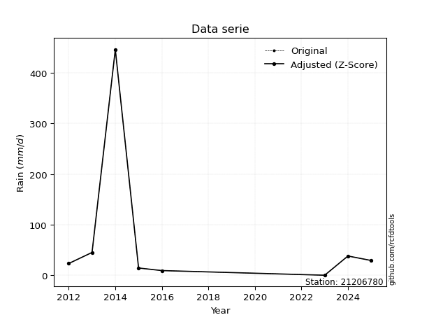</img>

</div>


> The initial value (value_initial) correspond to the initial obtained or null completed value, and value (value) is adjusted only when the initial value is outside the valid range (outlier) definite through the Z-Score value. If Z-Score is active, values out of range or outliers are replaced with the station mean value. A Z-Score (or standard score) measures how many standard deviations a data point is from the mean of a dataset, indicating its relative position; positive scores mean above the mean, negative mean below, and a score of zero is exactly at the mean, allowing for comparison of values from different distributions. It´s calculated using the formula $z=(x–μ)/σ$, where $x$ is the data point, $μ$ is the mean, and $σ$ is the standard deviation, helping identify outliers and understand probability.
>
> <sub>**Note**: In this study, "completing" (filling gaps in) and "extending" (forecasting or lengthening the historical record) rainfall data series are avoided for certain critical analyses because they introduce artificial bias and uncertainty, which can distort the statistics of rare events (extremes), alter day-to-day variability, and compromise the integrity and homogeneity of the original data. Some reasons against Completing/Extending rainfall data are: **Distortion of Extremes and Variability**: The primary issue is that most gap-filling or extension methods rely on averaging or regression with nearby stations, which inherently smooths the data. Rainfall is highly variable in space and time, with a large percentage of zero values and occasional large storms. Infilling methods often underestimate the highest values and overestimate the lowest (zero) values, which severely distorts analyses focused on flood frequency, drought severity, and intensity-duration-frequency (IDF) curves, **Loss of Data Homogeneity**: Infilled or extended data are synthetic estimates, not actual measurements. Combining these estimates with observed data can violate the assumption of data homogeneity, which requires that the data properties do not change over time. Inhomogeneity can lead to incorrect conclusions about long-term trends or changes in climate patterns, **Propagation of Errors**: Errors and biases from the original data (e.g., wind-induced undercatch, instrument errors, site changes) or the data used for imputation can propagate through the analysis, leading to unreliable hydrological models and inaccurate predictions, **Compromised Statistical Integrity**: For statistical analyses, especially those involving the frequency of events, using artificial data can introduce time bias or autocorrelation that doesn´t exist in reality, making it difficult to assess the true probability of events, **Difficulty in Validation**: It is difficult to accurately validate the quality of filled or extended data, especially for past periods where ground-truth measurements are unavailable. The reliability of imputation techniques heavily depends on the density of the surrounding station network and the complexity of the local topography.</sub>


### 4. Active continuous probability distributions from SciPy (80 of 104 available)

A Probability Density Function (PDF) describes the relative likelihood of a continuous random variable falling within a specific range, where the total area under its curve equals 1, and the area over any interval gives the actual probability for that range. Unlike discrete probabilities (like rolling a die), a PDF shows density, not direct probability for a single point (which is zero), with higher points indicating higher likelihood, often visualized as a bell curve for normal distributions.

A log of a probability density function (log-PDF) is simply the logarithm of the PDF´s value, denoted as $log(f(x))$, useful for converting multiplication of probabilities into addition, improving numerical stability with tiny numbers, and connecting to information theory concepts like entropy. Instead of dealing with very small probabilities (e.g., 0.000001), log-PDFs use negative numbers (e.g., $log(0.00001) ≈ -11.51$ that are easier for computers to handle, preventing underflow errors and simplifying complex calculations. In this study, each active probability distribution from SciPy is also evaluated in the $log$ form.

[scipy.stats](https://docs.scipy.org/doc/scipy/reference/stats.html) is a Python´s powerful submodule within the SciPy library for comprehensive statistical analysis, offering over 130 probability distributions (like Normal, Poisson, etc.), functions for descriptive stats (mean, variance), hypothesis testing (t-tests, chi-square), random variable generation, and statistical tests, making it essential for data science, modeling, and research. It provides tools to explore, model, and draw conclusions from data efficiently, working seamlessly with [NumPy](https://numpy.org/).

<div align="center">

|   id | p_dist           |   n_parameter | fit_method   | label                                                                       | active   | ref                                                                                                      |
|-----:|:-----------------|--------------:|:-------------|:----------------------------------------------------------------------------|:---------|:---------------------------------------------------------------------------------------------------------|
|    0 | alpha            |             3 | MLE          | Alpha                                                                       | True     | [:mortar_board:](https://docs.scipy.org/doc/scipy/reference/generated/scipy.stats.alpha.html)            |
|    1 | anglit           |             2 | MM           | Anglit                                                                      | True     | [:mortar_board:](https://docs.scipy.org/doc/scipy/reference/generated/scipy.stats.anglit.html)           |
|    2 | arcsine          |             2 | MM           | Arcsine                                                                     | True     | [:mortar_board:](https://docs.scipy.org/doc/scipy/reference/generated/scipy.stats.arcsine.html)          |
|    3 | argus            |             3 | MLE          | Argus                                                                       | True     | [:mortar_board:](https://docs.scipy.org/doc/scipy/reference/generated/scipy.stats.argus.html)            |
|    4 | beta             |             4 | MLE          | Beta                                                                        | True     | [:mortar_board:](https://docs.scipy.org/doc/scipy/reference/generated/scipy.stats.beta.html)             |
|    5 | betaprime        |             4 | MLE          | Beta prime                                                                  | True     | [:mortar_board:](https://docs.scipy.org/doc/scipy/reference/generated/scipy.stats.betaprime.html)        |
|    6 | bradford         |             3 | MLE          | Bradford                                                                    | True     | [:mortar_board:](https://docs.scipy.org/doc/scipy/reference/generated/scipy.stats.bradford.html)         |
|    7 | burr             |             4 | MLE          | Burr (Type III)                                                             | True     | [:mortar_board:](https://docs.scipy.org/doc/scipy/reference/generated/scipy.stats.burr.html)             |
|    8 | burr12           |             4 | MLE          | Burr (Type III) 12                                                          | True     | [:mortar_board:](https://docs.scipy.org/doc/scipy/reference/generated/scipy.stats.burr12.html)           |
|    9 | cosine           |             2 | MLE          | Cosine                                                                      | True     | [:mortar_board:](https://docs.scipy.org/doc/scipy/reference/generated/scipy.stats.cosine.html)           |
|   10 | crystalball      |             4 | MLE          | Crystalball                                                                 | True     | [:mortar_board:](https://docs.scipy.org/doc/scipy/reference/generated/scipy.stats.crystalball.html)      |
|   11 | dgamma           |             3 | MLE          | Double gamma                                                                | True     | [:mortar_board:](https://docs.scipy.org/doc/scipy/reference/generated/scipy.stats.dgamma.html)           |
|   12 | dweibull         |             3 | MLE          | Double Weibull                                                              | True     | [:mortar_board:](https://docs.scipy.org/doc/scipy/reference/generated/scipy.stats.dweibull.html)         |
|   13 | erlang           |             3 | MLE          | Erlang                                                                      | True     | [:mortar_board:](https://docs.scipy.org/doc/scipy/reference/generated/scipy.stats.erlang.html)           |
|   14 | exponnorm        |             3 | MLE          | Exponentially modified Normal                                               | True     | [:mortar_board:](https://docs.scipy.org/doc/scipy/reference/generated/scipy.stats.exponnorm.html)        |
|   15 | exponpow         |             3 | MLE          | Exponential power                                                           | True     | [:mortar_board:](https://docs.scipy.org/doc/scipy/reference/generated/scipy.stats.exponpow.html)         |
|   16 | exponweib        |             4 | MLE          | Exponentiated Weibull                                                       | True     | [:mortar_board:](https://docs.scipy.org/doc/scipy/reference/generated/scipy.stats.exponweib.html)        |
|   17 | f                |             4 | MLE          | F                                                                           | True     | [:mortar_board:](https://docs.scipy.org/doc/scipy/reference/generated/scipy.stats.f.html)                |
|   18 | fatiguelife      |             3 | MLE          | Fatigue-life (Birnbaum-Saunders)                                            | True     | [:mortar_board:](https://docs.scipy.org/doc/scipy/reference/generated/scipy.stats.fatiguelife.html)      |
|   19 | foldnorm         |             3 | MM           | Fold Normal                                                                 | True     | [:mortar_board:](https://docs.scipy.org/doc/scipy/reference/generated/scipy.stats.foldnorm.html)         |
|   20 | gamma            |             3 | MLE          | Gamma                                                                       | True     | [:mortar_board:](https://docs.scipy.org/doc/scipy/reference/generated/scipy.stats.gamma.html)            |
|   21 | gausshyper       |             6 | MLE          | Gauss hypergeometric                                                        | True     | [:mortar_board:](https://docs.scipy.org/doc/scipy/reference/generated/scipy.stats.gausshyper.html)       |
|   22 | genexpon         |             5 | MLE          | Generalized exponential                                                     | True     | [:mortar_board:](https://docs.scipy.org/doc/scipy/reference/generated/scipy.stats.genexpon.html)         |
|   23 | genextreme       |             3 | MLE          | Generalized exponential                                                     | True     | [:mortar_board:](https://docs.scipy.org/doc/scipy/reference/generated/scipy.stats.genextreme.html)       |
|   24 | gengamma         |             4 | MLE          | Generalized gamma                                                           | True     | [:mortar_board:](https://docs.scipy.org/doc/scipy/reference/generated/scipy.stats.gengamma.html)         |
|   25 | genhalflogistic  |             3 | MLE          | Generalized half-logistic                                                   | True     | [:mortar_board:](https://docs.scipy.org/doc/scipy/reference/generated/scipy.stats.genhalflogistic.html)  |
|   26 | genlogistic      |             3 | MLE          | Generalized logistic                                                        | True     | [:mortar_board:](https://docs.scipy.org/doc/scipy/reference/generated/scipy.stats.genlogistic.html)      |
|   27 | gennorm          |             3 | MLE          | Generalized Normal                                                          | True     | [:mortar_board:](https://docs.scipy.org/doc/scipy/reference/generated/scipy.stats.gennorm.html)          |
|   28 | genpareto        |             3 | MLE          | Generalized Pareto                                                          | True     | [:mortar_board:](https://docs.scipy.org/doc/scipy/reference/generated/scipy.stats.genpareto.html)        |
|   29 | gompertz         |             3 | MLE          | Gompertz (or truncated Gumbel)                                              | True     | [:mortar_board:](https://docs.scipy.org/doc/scipy/reference/generated/scipy.stats.gompertz.html)         |
|   30 | gumbel_l         |             2 | MM           | Gumbel Left Skew                                                            | True     | [:mortar_board:](https://docs.scipy.org/doc/scipy/reference/generated/scipy.stats.gumbel_l.html)         |
|   31 | gumbel_r         |             2 | MM           | Gumbel Right Skew                                                           | True     | [:mortar_board:](https://docs.scipy.org/doc/scipy/reference/generated/scipy.stats.gumbel_r.html)         |
|   32 | halfgennorm      |             3 | MLE          | Upper half of a generalized normal                                          | True     | [:mortar_board:](https://docs.scipy.org/doc/scipy/reference/generated/scipy.stats.halfgennorm.html)      |
|   33 | halflogistic     |             2 | MM           | Half-logistic                                                               | True     | [:mortar_board:](https://docs.scipy.org/doc/scipy/reference/generated/scipy.stats.halflogistic.html)     |
|   34 | halfnorm         |             2 | MM           | Half Normal                                                                 | True     | [:mortar_board:](https://docs.scipy.org/doc/scipy/reference/generated/scipy.stats.halfnorm.html)         |
|   35 | hypsecant        |             2 | MM           | hyperbolic secant                                                           | True     | [:mortar_board:](https://docs.scipy.org/doc/scipy/reference/generated/scipy.stats.hypsecant.html)        |
|   36 | invgamma         |             3 | MLE          | Inverted gamma                                                              | True     | [:mortar_board:](https://docs.scipy.org/doc/scipy/reference/generated/scipy.stats.invgamma.html)         |
|   37 | invgauss         |             3 | MLE          | Inverse Gaussian                                                            | True     | [:mortar_board:](https://docs.scipy.org/doc/scipy/reference/generated/scipy.stats.invgauss.html)         |
|   38 | invweibull       |             3 | MLE          | Inverted Weibull                                                            | True     | [:mortar_board:](https://docs.scipy.org/doc/scipy/reference/generated/scipy.stats.invweibull.html)       |
|   39 | johnsonsb        |             4 | MLE          | Johnson SB                                                                  | True     | [:mortar_board:](https://docs.scipy.org/doc/scipy/reference/generated/scipy.stats.johnsonsb.html)        |
|   40 | johnsonsu        |             4 | MLE          | Johnson Su                                                                  | True     | [:mortar_board:](https://docs.scipy.org/doc/scipy/reference/generated/scipy.stats.johnsonsu.html)        |
|   41 | kappa3           |             3 | MLE          | Kappa 3                                                                     | True     | [:mortar_board:](https://docs.scipy.org/doc/scipy/reference/generated/scipy.stats.kappa3.html)           |
|   42 | kappa4           |             4 | MLE          | Kappa 4                                                                     | True     | [:mortar_board:](https://docs.scipy.org/doc/scipy/reference/generated/scipy.stats.kappa4.html)           |
|   43 | ksone            |             3 | MLE          | Kolmogorov-Smirnov one-sided test statistic distribution                    | True     | [:mortar_board:](https://docs.scipy.org/doc/scipy/reference/generated/scipy.stats.ksone.html)            |
|   44 | kstwobign        |             2 | MLE          | Limiting distribution of scaled Kolmogorov-Smirnov two-sided test statistic | True     | [:mortar_board:](https://docs.scipy.org/doc/scipy/reference/generated/scipy.stats.kstwobign.html)        |
|   45 | laplace          |             2 | MM           | Laplace                                                                     | True     | [:mortar_board:](https://docs.scipy.org/doc/scipy/reference/generated/scipy.stats.laplace.html)          |
|   46 | levy_l           |             2 | MLE          | Left-skewed Levy                                                            | True     | [:mortar_board:](https://docs.scipy.org/doc/scipy/reference/generated/scipy.stats.levy_l.html)           |
|   47 | loggamma         |             3 | MLE          | Log gamma                                                                   | True     | [:mortar_board:](https://docs.scipy.org/doc/scipy/reference/generated/scipy.stats.loggamma.html)         |
|   48 | logistic         |             2 | MM           | Logistic (or Sech-squared)                                                  | True     | [:mortar_board:](https://docs.scipy.org/doc/scipy/reference/generated/scipy.stats.logistic.html)         |
|   49 | loglaplace       |             3 | MLE          | Log-Laplace                                                                 | True     | [:mortar_board:](https://docs.scipy.org/doc/scipy/reference/generated/scipy.stats.loglaplace.html)       |
|   50 | lomax            |             3 | MLE          | Lomax (Pareto of the second kind)                                           | True     | [:mortar_board:](https://docs.scipy.org/doc/scipy/reference/generated/scipy.stats.lomax.html)            |
|   51 | maxwell          |             2 | MM           | Maxwell                                                                     | True     | [:mortar_board:](https://docs.scipy.org/doc/scipy/reference/generated/scipy.stats.maxwell.html)          |
|   52 | mielke           |             4 | MLE          | Mielke Beta-Kappa / Dagum                                                   | True     | [:mortar_board:](https://docs.scipy.org/doc/scipy/reference/generated/scipy.stats.mielke.html)           |
|   53 | moyal            |             2 | MM           | Moyal                                                                       | True     | [:mortar_board:](https://docs.scipy.org/doc/scipy/reference/generated/scipy.stats.moyal.html)            |
|   54 | nakagami         |             3 | MLE          | Nakagami                                                                    | True     | [:mortar_board:](https://docs.scipy.org/doc/scipy/reference/generated/scipy.stats.nakagami.html)         |
|   55 | ncf              |             5 | MLE          | Non-central F distribution                                                  | True     | [:mortar_board:](https://docs.scipy.org/doc/scipy/reference/generated/scipy.stats.ncf.html)              |
|   56 | nct              |             4 | MLE          | Non-central Student’s t                                                     | True     | [:mortar_board:](https://docs.scipy.org/doc/scipy/reference/generated/scipy.stats.nct.html)              |
|   57 | norm             |             2 | MM           | Normal                                                                      | True     | [:mortar_board:](https://docs.scipy.org/doc/scipy/reference/generated/scipy.stats.norm.html)             |
|   58 | pearson3         |             3 | MM           | Pearson type III                                                            | True     | [:mortar_board:](https://docs.scipy.org/doc/scipy/reference/generated/scipy.stats.pearson3.html)         |
|   59 | powerlaw         |             3 | MLE          | Power-function                                                              | True     | [:mortar_board:](https://docs.scipy.org/doc/scipy/reference/generated/scipy.stats.powerlaw.html)         |
|   60 | rayleigh         |             2 | MM           | Rayleigh                                                                    | True     | [:mortar_board:](https://docs.scipy.org/doc/scipy/reference/generated/scipy.stats.rayleigh.html)         |
|   61 | rdist            |             3 | MLE          | R-distributed (symmetric beta)                                              | True     | [:mortar_board:](https://docs.scipy.org/doc/scipy/reference/generated/scipy.stats.rdist.html)            |
|   62 | rice             |             3 | MLE          | Rice                                                                        | True     | [:mortar_board:](https://docs.scipy.org/doc/scipy/reference/generated/scipy.stats.rice.html)             |
|   63 | semicircular     |             2 | MM           | Semicircular                                                                | True     | [:mortar_board:](https://docs.scipy.org/doc/scipy/reference/generated/scipy.stats.semicircular.html)     |
|   64 | skewnorm         |             3 | MLE          | Skew normal                                                                 | True     | [:mortar_board:](https://docs.scipy.org/doc/scipy/reference/generated/scipy.stats.skewnorm.html)         |
|   65 | t                |             3 | MLE          | Student’s t                                                                 | True     | [:mortar_board:](https://docs.scipy.org/doc/scipy/reference/generated/scipy.stats.t.html)                |
|   66 | trapezoid        |             4 | MLE          | Trapezoid                                                                   | True     | [:mortar_board:](https://docs.scipy.org/doc/scipy/reference/generated/scipy.stats.trapezoid.html)        |
|   67 | triang           |             3 | MLE          | Triangular                                                                  | True     | [:mortar_board:](https://docs.scipy.org/doc/scipy/reference/generated/scipy.stats.triang.html)           |
|   68 | truncexpon       |             3 | MLE          | Truncated exponential                                                       | True     | [:mortar_board:](https://docs.scipy.org/doc/scipy/reference/generated/scipy.stats.truncexpon.html)       |
|   69 | truncnorm        |             4 | MLE          | Truncated normal                                                            | True     | [:mortar_board:](https://docs.scipy.org/doc/scipy/reference/generated/scipy.stats.truncnorm.html)        |
|   70 | truncpareto      |             4 | MLE          | Upper truncated Pareto                                                      | True     | [:mortar_board:](https://docs.scipy.org/doc/scipy/reference/generated/scipy.stats.truncpareto.html)      |
|   71 | truncweibull_min |             5 | MLE          | Doubly truncated Weibull minimum                                            | True     | [:mortar_board:](https://docs.scipy.org/doc/scipy/reference/generated/scipy.stats.truncweibull_min.html) |
|   72 | tukeylambda      |             3 | MLE          | Tukey-Lamdba                                                                | True     | [:mortar_board:](https://docs.scipy.org/doc/scipy/reference/generated/scipy.stats.tukeylambda.html)      |
|   73 | uniform          |             2 | MLE          | Uniform                                                                     | True     | [:mortar_board:](https://docs.scipy.org/doc/scipy/reference/generated/scipy.stats.uniform.html)          |
|   74 | vonmises         |             3 | MLE          | Von Mises                                                                   | True     | [:mortar_board:](https://docs.scipy.org/doc/scipy/reference/generated/scipy.stats.vonmises.html)         |
|   75 | vonmises_line    |             3 | MLE          | Von Mises line                                                              | True     | [:mortar_board:](https://docs.scipy.org/doc/scipy/reference/generated/scipy.stats.vonmises_line.html)    |
|   76 | wald             |             2 | MM           | Wald                                                                        | True     | [:mortar_board:](https://docs.scipy.org/doc/scipy/reference/generated/scipy.stats.wald.html)             |
|   77 | weibull_max      |             3 | MLE          | Weibull maximum                                                             | True     | [:mortar_board:](https://docs.scipy.org/doc/scipy/reference/generated/scipy.stats.weibull_max.html)      |
|   78 | weibull_min      |             3 | MLE          | Weibull minimum                                                             | True     | [:mortar_board:](https://docs.scipy.org/doc/scipy/reference/generated/scipy.stats.weibull_min.html)      |
|   79 | wrapcauchy       |             3 | MLE          | Wrapped  Cauchy                                                             | True     | [:mortar_board:](https://docs.scipy.org/doc/scipy/reference/generated/scipy.stats.wrapcauchy.html)       |

</div>

> **n_parameter:** # arguments & localization & scale.
>
> **Fit methods:** (MLE) maximum likelihood, (MM) L-moments.
>
>**Inactive** (With the only purpose of prevent loops, zero divisions, infinite values, over high estimated values or horizontal trending for recurrence intervals estimations, the follow distributions were disabled.)**:** lognorm, norminvgauss, powernorm, powerlognorm, cauchy, halfcauchy, foldcauchy, skewcauchy, chi2, expon, fisk, genhyperbolic, geninvgauss, gibrat, kstwo, laplace_asymmetric, levy, levy_stable, ncx2, pareto, rel_breitwigner, recipinvgauss, studentized_range, loguniform, 


## B. Probability (PDF) vs. Empirical (EDF) distributions functions

A continuous probability distribution (CPD) describes probabilities for variables that can take any value within a range (like rain any time), unlike discrete variables with specific outcomes (like temperature). It uses a Probability Density Function (PDF), a curve where the total area under it equals 1, and the probability of the variable falling within an interval (a to b) is found by calculating the area under the curve between those points. A key feature is that the probability of hitting any single exact value is zero, so probabilities are always expressed for ranges, e.g., $P(a ≤ X ≤ b)$.

<div align="center">

Distributions parameters from station values
|     |   station | p_dist              |   n |              loc |           scale | shape                  | shape1                 | shape2                 | shape3             |
|----:|----------:|:--------------------|----:|-----------------:|----------------:|:-----------------------|:-----------------------|:-----------------------|:-------------------|
|   0 |  21206780 | alpha               |   8 |    -18.6879      |    59.7273      | 1.2908140416874172     |                        |                        |                    |
|   1 |  21206780 | anglit              |   8 |     75.825       |   411.75        |                        |                        |                        |                    |
|   2 |  21206780 | arcsine             |   8 |   -123.226       |   398.101       |                        |                        |                        |                    |
|   3 |  21206780 | argus               |   8 |   -277.932       |   748.652       | 1.1903800609813338e-07 |                        |                        |                    |
|   4 |  21206780 | beta                |   8 |    -43.4865      |   489.887       | 0.008749316100509448   | 0.05068925340361844    |                        |                    |
|   5 |  21206780 | betaprime           |   8 |      0.2         |    30.5813      | 0.8339316452785857     | 1.23181737360632       |                        |                    |
|   6 |  21206780 | bradford            |   8 |      0.199998    |   446.2         | 2.532206833533033      |                        |                        |                    |
|   7 |  21206780 | burr                |   8 |      0.2         |    43.3966      | 1.8830643766537751     | 0.35398075955744895    |                        |                    |
|   8 |  21206780 | burr12              |   8 |      0.2         |    17.7902      | 0.8939487022493064     | 1.057709437759156      |                        |                    |
|   9 |  21206780 | cosine              |   8 |    118.633       |   136.658       |                        |                        |                        |                    |
|  10 |  21206780 | crystalball         |   8 |     75.825       |   140.75        | 6288.033148346447      | 5444.465528730552      |                        |                    |
|  11 |  21206780 | dgamma              |   8 |      9.4         |    81.8183      | 0.6906247011440987     |                        |                        |                    |
|  12 |  21206780 | dweibull            |   8 |     23.4         |    44.2312      | 0.7178673695579746     |                        |                        |                    |
|  13 |  21206780 | erlang              |   8 |      0.2         |    99.3193      | 0.37756810536069324    |                        |                        |                    |
|  14 |  21206780 | exponnorm           |   8 |      0.10992     |     0.0277321   | 2723.07103597034       |                        |                        |                    |
|  15 |  21206780 | exponpow            |   8 |      0.2         |   157.671       | 0.3972009387866977     |                        |                        |                    |
|  16 |  21206780 | exponweib           |   8 |      0.2         |    70.153       | 1.261493862688948      | 0.45966849311248204    |                        |                    |
|  17 |  21206780 | f                   |   8 |      0.2         |    26.9737      | 1.31429633794302       | 2.6610102529083655     |                        |                    |
|  18 |  21206780 | fatiguelife         |   8 |     -2.31151     |    32.115       | 1.7574490393049982     |                        |                        |                    |
|  19 |  21206780 | foldnorm            |   8 |   -126.028       |   254.639       | 0.002153811870852268   |                        |                        |                    |
|  20 |  21206780 | gamma               |   8 |      0.2         |   165.475       | 0.5163344219106671     |                        |                        |                    |
|  21 |  21206780 | gausshyper          |   8 |      0.2         |   561.207       | 0.42907756379615014    | 1.0760236087015596     | 1.9594238825730894     | 1.374171373518693  |
|  22 |  21206780 | genexpon            |   8 |      0.2         |   164.99        | 2.1816840999029057     | 1.8882579634849157     | 1.2324991280133392e-12 |                    |
|  23 |  21206780 | genextreme          |   8 |     15.2844      |    19.6056      | -0.8354883023513607    |                        |                        |                    |
|  24 |  21206780 | gengamma            |   8 |      0.2         |     3.00806     | 1.9921471062153602     | 0.392673927194254      |                        |                    |
|  25 |  21206780 | genhalflogistic     |   8 |    -45.0982      |   514.006       | 1.0457942193465506     |                        |                        |                    |
|  26 |  21206780 | genlogistic         |   8 |   -413.501       |    56.762       | 2406.400280042143      |                        |                        |                    |
|  27 |  21206780 | gennorm             |   8 |     23.4         |     0.258059    | 0.2937240180698102     |                        |                        |                    |
|  28 |  21206780 | genpareto           |   8 |      0.2         |    24.8136      | 0.7673747981757215     |                        |                        |                    |
|  29 |  21206780 | gompertz            |   8 |     -0.801183    |  7082.08        | 89.4517509437121       |                        |                        |                    |
|  30 |  21206780 | gumbel_l            |   8 |    139.17        |   109.742       |                        |                        |                        |                    |
|  31 |  21206780 | gumbel_r            |   8 |     12.48        |   109.742       |                        |                        |                        |                    |
|  32 |  21206780 | halfgennorm         |   8 |      0.2         |     1.49138     | 0.3571502640606643     |                        |                        |                    |
|  33 |  21206780 | halflogistic        |   8 |    -90.9965      |   120.336       |                        |                        |                        |                    |
|  34 |  21206780 | halfnorm            |   8 |   -110.473       |   233.49        |                        |                        |                        |                    |
|  35 |  21206780 | hypsecant           |   8 |     75.825       |    89.6042      |                        |                        |                        |                    |
|  36 |  21206780 | invgamma            |   8 |     -6.95886     |    27.6979      | 1.216828727133856      |                        |                        |                    |
|  37 |  21206780 | invgauss            |   8 |     -3.84775     |    20.5188      | 3.8829155231829997     |                        |                        |                    |
|  38 |  21206780 | invweibull          |   8 |     -8.18148     |    23.4658      | 1.1968992118691073     |                        |                        |                    |
|  39 |  21206780 | johnsonsb           |   8 |      0.2         |   642.378       | 1.642314570835046      | 0.16619657603873836    |                        |                    |
|  40 |  21206780 | johnsonsu           |   8 |      8.16722     |     6.82487     | -0.9911737787868404    | 0.6174960933323399     |                        |                    |
|  41 |  21206780 | kappa3              |   8 |      0.2         |    25.1252      | 1.2726154903059965     |                        |                        |                    |
|  42 |  21206780 | kappa4              |   8 |    -41.3158      |   503.559       | 1.08997252971626       | 1.0288442118469106     |                        |                    |
|  43 |  21206780 | ksone               |   8 |    -44.42        |   535.44        | 1.0                    |                        |                        |                    |
|  44 |  21206780 | kstwobign           |   8 |   -236.717       |   372.496       |                        |                        |                        |                    |
|  45 |  21206780 | laplace             |   8 |     75.825       |    99.5253      |                        |                        |                        |                    |
|  46 |  21206780 | levy_l              |   8 |    492.455       |   218.367       |                        |                        |                        |                    |
|  47 |  21206780 | loggamma            |   8 | -46934.2         |  6251.8         | 1843.4083937669975     |                        |                        |                    |
|  48 |  21206780 | logistic            |   8 |     75.825       |    77.5995      |                        |                        |                        |                    |
|  49 |  21206780 | loglaplace          |   8 |     -0.0564278   |    23.4564      | 0.7824679544110296     |                        |                        |                    |
|  50 |  21206780 | lomax               |   8 |      0.2         |    32.2707      | 1.3008372820738456     |                        |                        |                    |
|  51 |  21206780 | maxwell             |   8 |   -257.693       |   209.002       |                        |                        |                        |                    |
|  52 |  21206780 | mielke              |   8 |      0.2         |    35.1559      | 0.6076198096989587     | 0.9455738746435811     |                        |                    |
|  53 |  21206780 | moyal               |   8 |     -4.66488     |    63.3598      |                        |                        |                        |                    |
|  54 |  21206780 | nakagami            |   8 |      0.2         |   234.903       | 0.1543959849278964     |                        |                        |                    |
|  55 |  21206780 | ncf                 |   8 |      0.2         |    11.5553      | 1.4961333084505029     | 2.24452174007705       | 1.7071137468573645     |                    |
|  56 |  21206780 | nct                 |   8 |     -9.9505      |     6.19547     | 1.146418243953712      | 3.945837053898865      |                        |                    |
|  57 |  21206780 | norm                |   8 |     75.825       |   140.75        |                        |                        |                        |                    |
|  58 |  21206780 | pearson3            |   8 |     75.825       |   140.75        | 2.223838489224634      |                        |                        |                    |
|  59 |  21206780 | powerlaw            |   8 |      0.2         |   446.2         | 0.12905335666242726    |                        |                        |                    |
|  60 |  21206780 | rayleigh            |   8 |   -193.438       |   214.841       |                        |                        |                        |                    |
|  61 |  21206780 | rdist               |   8 |    -48.1554      |    93.3554      | 1.3504941345333        |                        |                        |                    |
|  62 |  21206780 | rice                |   8 |   -111.306       |   165.573       | 9.095659185417548e-06  |                        |                        |                    |
|  63 |  21206780 | semicircular        |   8 |     75.825       |   281.5         |                        |                        |                        |                    |
|  64 |  21206780 | skewnorm            |   8 |      0.199944    |   159.769       | 14955989.965630278     |                        |                        |                    |
|  65 |  21206780 | t                   |   8 |     22.9671      |    13.1748      | 0.9292957475126347     |                        |                        |                    |
|  66 |  21206780 | trapezoid           |   8 |    -46.641       |   535.44        | 1.0                    | 1.0                    |                        |                    |
|  67 |  21206780 | triang              |   8 |   -348.775       |   795.175       | 0.9999990822123409     |                        |                        |                    |
|  68 |  21206780 | truncexpon          |   8 |      0.199974    |   339.567       | 1.3140274326199877     |                        |                        |                    |
|  69 |  21206780 | truncnorm           |   8 |   -279.808       |   216.527       | 1.2931746367832413     | 909.6744348817128      |                        |                    |
|  70 |  21206780 | truncpareto         |   8 |    -16.196       |    16.396       | 0.655558354235197      | 28.213942630058437     |                        |                    |
|  71 |  21206780 | truncweibull_min    |   8 |     -1.51592     |   289.437       | 0.06271005667147656    | 0.005928483313070646   | 1.547543882928827      |                    |
|  72 |  21206780 | tukeylambda         |   8 |    -52.3051      |   124.304       | 1.2748505428160959     |                        |                        |                    |
|  73 |  21206780 | uniform             |   8 |      0.2         |   446.2         |                        |                        |                        |                    |
|  74 |  21206780 | vonmises            |   8 |      0.738338    |     1           | 0.38764570878475835    |                        |                        |                    |
|  75 |  21206780 | vonmises_line       |   8 |     20.2554      |     7.94011     | 1.3472801260778643e-05 |                        |                        |                    |
|  76 |  21206780 | wald                |   8 |    -64.925       |   140.75        |                        |                        |                        |                    |
|  77 |  21206780 | weibull_max         |   8 |    446.4         |     1.69773     | 0.1613800220445018     |                        |                        |                    |
|  78 |  21206780 | weibull_min         |   8 |      0.2         |   144.343       | 0.5167176903163493     |                        |                        |                    |
|  79 |  21206780 | wrapcauchy          |   8 |      0.191485    |    71.0163      | 0.8060475980942099     |                        |                        |                    |
|  80 |  21206780 | logalpha            |   8 |     -2.40224     |     1.65177     | 8.570807401698486e-09  |                        |                        |                    |
|  81 |  21206780 | loganglit           |   8 |      2.92386     |     5.91786     |                        |                        |                        |                    |
|  82 |  21206780 | logarcsine          |   8 |      0.0630144   |     5.72169     |                        |                        |                        |                    |
|  83 |  21206780 | logargus            |   8 |     -2.97682     |     9.36301     | 1.1179129469642222     |                        |                        |                    |
|  84 |  21206780 | logbeta             |   8 |     -1.1979e+06  |     1.1979e+06  | 1618164.020417996      | 7.4502294033101215     |                        |                    |
|  85 |  21206780 | logbetaprime        |   8 |   -345.404       |   663.398       | 44734.30295347083      | 85195.89123534386      |                        |                    |
|  86 |  21206780 | logbradford         |   8 |     -1.60944     |     8.2107      | 0.04006072751660572    |                        |                        |                    |
|  87 |  21206780 | logburr             |   8 |  -5203.6         |  5177.96        | 2218.096612346996      | 124761.90979728696     |                        |                    |
|  88 |  21206780 | logburr12           |   8 |     -4.40835e+07 |     4.40835e+07 | 36179658.9507824       | 2.0249323282961122     |                        |                    |
|  89 |  21206780 | logcosine           |   8 |      2.63878     |     1.85952     |                        |                        |                        |                    |
|  90 |  21206780 | logcrystalball      |   8 |      3.40817     |     1.34113     | 0.8971874886505713     | 13.312360170719138     |                        |                    |
|  91 |  21206780 | logdgamma           |   8 |      3.37759     |     1.38877     | 0.7706278957512906     |                        |                        |                    |
|  92 |  21206780 | logdweibull         |   8 |      3.37759     |     1.24494     | 0.8888555403163239     |                        |                        |                    |
|  93 |  21206780 | logerlang           |   8 |    -35.1219      |     0.113556    | 334.8128978936377      |                        |                        |                    |
|  94 |  21206780 | logexponnorm        |   8 |      2.92245     |     2.02292     | 0.0007007785835875546  |                        |                        |                    |
|  95 |  21206780 | logexponpow         |   8 |     -1.60944     |     1.99697     | 0.3038196321360732     |                        |                        |                    |
|  96 |  21206780 | logexponweib        |   8 |  -5827.04        |  5829.9         | 1.7980923440646668     | 2582.98589415619       |                        |                    |
|  97 |  21206780 | logf                |   8 |     -1.60944     |     1.16278     | 1.0792485581069058     | 1.0886156293975837     |                        |                    |
|  98 |  21206780 | logfatiguelife      |   8 |   -599.475       |   602.381       | 0.0033539564527507266  |                        |                        |                    |
|  99 |  21206780 | logfoldnorm         |   8 |    -10.591       |     1.76522     | 7.691816485925309      |                        |                        |                    |
| 100 |  21206780 | loggamma            |   8 |    -30.569       |     0.129718    | 258.0929020284205      |                        |                        |                    |
| 101 |  21206780 | loggausshyper       |   8 |     -1.74528     |     7.8465      | 1.2327159304048525     | 0.8763755914941422     | 1.153757902199315      | 1.0174143573478407 |
| 102 |  21206780 | loggenexpon         |   8 |     -1.60944     |     1.31912     | 0.08133618529399847    | 4.87082687320542       | 0.021254595834662472   |                    |
| 103 |  21206780 | loggenextreme       |   8 |      2.45564     |     2.21488     | 0.5205638537339429     |                        |                        |                    |
| 104 |  21206780 | loggengamma         |   8 |    -50.4398      |     1.68922     | 255.89748139740482     | 1.6057617680772243     |                        |                    |
| 105 |  21206780 | loggenhalflogistic  |   8 |     -2.43317     |     9.05549     | 1.0610587177860602     |                        |                        |                    |
| 106 |  21206780 | loggenlogistic      |   8 |      3.91775     |     0.715913    | 0.4914514896429929     |                        |                        |                    |
| 107 |  21206780 | loggennorm          |   8 |      3.37758     |     6.46974e-08 | 0.13035787252682293    |                        |                        |                    |
| 108 |  21206780 | loggenpareto        |   8 |     -1.71605     |    13.8785      | -1.775367020174294     |                        |                        |                    |
| 109 |  21206780 | loggompertz         |   8 |     -1.60944     |     1.91624     | 0.06469134444525707    |                        |                        |                    |
| 110 |  21206780 | loggumbel_l         |   8 |      3.83429     |     1.57727     |                        |                        |                        |                    |
| 111 |  21206780 | loggumbel_r         |   8 |      2.01344     |     1.57727     |                        |                        |                        |                    |
| 112 |  21206780 | loghalfgennorm      |   8 |     -1.60944     |     2.19023     | 0.6510461504908014     |                        |                        |                    |
| 113 |  21206780 | loghalflogistic     |   8 |      0.526187    |     1.72955     |                        |                        |                        |                    |
| 114 |  21206780 | loghalfnorm         |   8 |      0.246258    |     3.35586     |                        |                        |                        |                    |
| 115 |  21206780 | loghypsecant        |   8 |      2.92386     |     1.28783     |                        |                        |                        |                    |
| 116 |  21206780 | loginvgamma         |   8 |    -43.0934      | 21934.3         | 477.70006811350106     |                        |                        |                    |
| 117 |  21206780 | loginvgauss         |   8 |    -16.8442      |  1539.92        | 0.012839193144429065   |                        |                        |                    |
| 118 |  21206780 | loginvweibull       |   8 |     -3.82747e+08 |     3.82747e+08 | 162051128.39306        |                        |                        |                    |
| 119 |  21206780 | logjohnsonsb        |   8 |   -267.348       |   278.204       | -13.943712982776518    | 3.9168245707980027     |                        |                    |
| 120 |  21206780 | logjohnsonsu        |   8 |      3.44912     |     0.406059    | 0.25898494632683233    | 0.6017683835639188     |                        |                    |
| 121 |  21206780 | logkappa3           |   8 |     -1.60944     |     1.88575     | 0.8400042369352299     |                        |                        |                    |
| 122 |  21206780 | logkappa4           |   8 |     -2.30515     |     8.87706     | 1.0852261662782525     | 1.0508278038179046     |                        |                    |
| 123 |  21206780 | logksone            |   8 |     -2.3805      |     9.25278     | 1.0                    |                        |                        |                    |
| 124 |  21206780 | logkstwobign        |   8 |     -6.72065     |    11.0607      |                        |                        |                        |                    |
| 125 |  21206780 | loglaplace          |   8 |      2.92386     |     1.43042     |                        |                        |                        |                    |
| 126 |  21206780 | loglevy_l           |   8 |      6.44887     |     1.64351     |                        |                        |                        |                    |
| 127 |  21206780 | logloggamma         |   8 |      2.07152     |     2.40724     | 1.8969397433778719     |                        |                        |                    |
| 128 |  21206780 | loglogistic         |   8 |      2.92386     |     1.1153      |                        |                        |                        |                    |
| 129 |  21206780 | logloglaplace       |   8 |     -1.60944     |     2.484       | 0.18773553954682148    |                        |                        |                    |
| 130 |  21206780 | loglomax            |   8 |     -1.60944     |     6.11696e+09 | 991125664.1947374      |                        |                        |                    |
| 131 |  21206780 | logmaxwell          |   8 |     -1.86962     |     3.00387     |                        |                        |                        |                    |
| 132 |  21206780 | logmielke           |   8 |     -3.65113e+07 |     3.65113e+07 | 24842680.199289635     | 50855890.980173275     |                        |                    |
| 133 |  21206780 | logmoyal            |   8 |      1.76702     |     0.910636    |                        |                        |                        |                    |
| 134 |  21206780 | lognakagami         |   8 |  -1325.62        |  1328.55        | 107210.83209262023     |                        |                        |                    |
| 135 |  21206780 | logncf              |   8 |     -1.60944     |     1.06535     | 1.067203464994678      | 1.138323788794649      | 1.0772891077073439     |                    |
| 136 |  21206780 | lognct              |   8 |   -112.256       |     1.97711     | 33101.17202321658      | 58.25486305638657      |                        |                    |
| 137 |  21206780 | lognorm             |   8 |      2.92386     |     2.02292     |                        |                        |                        |                    |
| 138 |  21206780 | logpearson3         |   8 |      2.92384     |     2.02295     | -0.9096663772396296    |                        |                        |                    |
| 139 |  21206780 | logpowerlaw         |   8 |     -1.60944     |     7.71065     | 0.19501458723777254    |                        |                        |                    |
| 140 |  21206780 | lograyleigh         |   8 |     -0.946137    |     3.08781     |                        |                        |                        |                    |
| 141 |  21206780 | logrdist            |   8 |     -1.39405     |     4.77164     | 1.0175704595267865     |                        |                        |                    |
| 142 |  21206780 | logrice             |   8 |   -373.769       |     2.02281     | 186.2198681678408      |                        |                        |                    |
| 143 |  21206780 | logsemicircular     |   8 |      2.92386     |     4.04588     |                        |                        |                        |                    |
| 144 |  21206780 | logskewnorm         |   8 |      4.97039     |     2.87758     | -2.269207329293841     |                        |                        |                    |
| 145 |  21206780 | logt                |   8 |      3.27985     |     0.632206    | 1.140318190128468      |                        |                        |                    |
| 146 |  21206780 | logtrapezoid        |   8 |     -2.49953     |     9.25278     | 1.0                    | 1.0                    |                        |                    |
| 147 |  21206780 | logtriang           |   8 |     -2.62681     |     8.7281      | 0.9999915995168445     |                        |                        |                    |
| 148 |  21206780 | logtruncexpon       |   8 |     -1.60945     |     9.27567     | 0.8312838579503712     |                        |                        |                    |
| 149 |  21206780 | logtruncnorm        |   8 |      2.19247     |     6.30643     | -0.6040538581771829    | 0.6198033353357943     |                        |                    |
| 150 |  21206780 | logtruncpareto      |   8 |     -1.61118     |     0.00173946  | 0.000793881070267973   | 4433.846883424478      |                        |                    |
| 151 |  21206780 | logtruncweibull_min |   8 |     -1.88878     |    10.506       | 1.406863394357908      | 1.5083165757043783e-08 | 0.7605167173083482     |                    |
| 152 |  21206780 | logtukeylambda      |   8 |      1.10099     |     5.63362     | 2.0784785470245444     |                        |                        |                    |
| 153 |  21206780 | loguniform          |   8 |     -1.60944     |     7.71065     |                        |                        |                        |                    |
| 154 |  21206780 | logvonmises         |   8 |     -2.84334     |     1           | 1.324017091816018      |                        |                        |                    |
| 155 |  21206780 | logvonmises_line    |   8 |      2.97695     |     1.45989     | 1.069205839986641      |                        |                        |                    |
| 156 |  21206780 | logwald             |   8 |      0.90095     |     2.02291     |                        |                        |                        |                    |
| 157 |  21206780 | logweibull_max      |   8 |      6.10122     |     2.18408     | 0.2224728461209498     |                        |                        |                    |
| 158 |  21206780 | logweibull_min      |   8 |    -18.3327      |    22.1115      | 12.948875590268        |                        |                        |                    |
| 159 |  21206780 | logwrapcauchy       |   8 |     -1.78532     |     1.25518     | 2.12116213943331e-05   |                        |                        |                    |

</div>

> **loc** (Location parameter): This shifts the distribution along the x-axis. For many common distributions, like the normal (Gaussian) distribution, loc represents the mean $μ$. For others, like the uniform distribution, it might represent the minimum value, or for the beta distribution, the left end of the support interval.
>
> **scale** (Scale parameter): This determines the width or spread of the distribution. For the normal distribution, scale represents the standard deviation $σ$. For a uniform distribution, it defines the length of the interval (from $loc$ to $loc + scale$).
>
> **shape** (Shape parameters): Refers to parameters that define the specific form of a probability distribution, distinct from its location (loc) and scale (scale). These parameters are required arguments for most distribution functions. For example, a normal (Gaussian) distribution is fully defined by its location (mean) and scale (standard deviation), so it has no specific shape parameters beyond loc and scale. However, other distributions have intrinsic properties that need specification, as Gamma distribution that takes a shape parameter, often named $a$ or $alpha$.


### 0. Cumulative distribution values - CDF (160 evaluated)

Cumulative Distribution Function (CDF), denoted as $F$<sub>$X$</sub>$(x)$, is a function that gives the probability that a random variable $X$ will take a value less than or equal to a specific value, $x$ (i.e., $(P(X≥x)$. It essentially "accumulates" probabilities from a given point up to the far right (positive infinity), providing a complete picture of the distribution´s probabilities for both discrete (like rain) and continuous (like temperature) variables, helping to find probabilities over ranges or above certain values. Each station is evaluated separately ordering the $x$ values ascending, calculating the CDF and PDF values for the activated distributions and their logarithmic forms.

<div align="center">

CDF ordered by x ascending and calculating $log(f(x))$ separately
|   id |   Station |   date |     x |   count |   mean |     std |    zscore |   Value_initial |   station |   m |    alpha |   alpha_pdf |   anglit |   anglit_pdf |   arcsine |   arcsine_pdf |    argus |   argus_pdf |     beta |    beta_pdf |   betaprime |   betaprime_pdf |    bradford |   bradford_pdf |        burr |       burr_pdf |      burr12 |   burr12_pdf |   cosine |   cosine_pdf |   crystalball |   crystalball_pdf |   dgamma |    dgamma_pdf |   dweibull |   dweibull_pdf |      erlang |   erlang_pdf |   exponnorm |   exponnorm_pdf |    exponpow |   exponpow_pdf |   exponweib |    exponweib_pdf |           f |           f_pdf |   fatiguelife |   fatiguelife_pdf |   foldnorm |   foldnorm_pdf |       gamma |   gamma_pdf |   gausshyper |   gausshyper_pdf |    genexpon |   genexpon_pdf |   genextreme |   genextreme_pdf |    gengamma |   gengamma_pdf |   genhalflogistic |   genhalflogistic_pdf |   genlogistic |   genlogistic_pdf |   gennorm |   gennorm_pdf |   genpareto |   genpareto_pdf |   gompertz |   gompertz_pdf |   gumbel_l |   gumbel_l_pdf |   gumbel_r |   gumbel_r_pdf |   halfgennorm |   halfgennorm_pdf |   halflogistic |   halflogistic_pdf |   halfnorm |   halfnorm_pdf |   hypsecant |   hypsecant_pdf |   invgamma |   invgamma_pdf |   invgauss |   invgauss_pdf |   invweibull |   invweibull_pdf |   johnsonsb |   johnsonsb_pdf |   johnsonsu |   johnsonsu_pdf |      kappa3 |   kappa3_pdf |      kappa4 |   kappa4_pdf |     ksone |   ksone_pdf |   kstwobign |   kstwobign_pdf |   laplace |   laplace_pdf |   levy_l |   levy_l_pdf |   loggamma |   loggamma_pdf |   logistic |   logistic_pdf |   loglaplace |   loglaplace_pdf |       lomax |   lomax_pdf |   maxwell |   maxwell_pdf |      mielke |       mielke_pdf |    moyal |   moyal_pdf |    nakagami |   nakagami_pdf |         ncf |       ncf_pdf |       nct |     nct_pdf |     norm |    norm_pdf |   pearson3 |   pearson3_pdf |   powerlaw |   powerlaw_pdf |   rayleigh |   rayleigh_pdf |    rdist |    rdist_pdf |     rice |    rice_pdf |   semicircular |   semicircular_pdf |   skewnorm |   skewnorm_pdf |        t |      t_pdf |   trapezoid |   trapezoid_pdf |   triang |   triang_pdf |   truncexpon |   truncexpon_pdf |   truncnorm |   truncnorm_pdf |   truncpareto |   truncpareto_pdf |   truncweibull_min |   truncweibull_min_pdf |   tukeylambda |   tukeylambda_pdf |   uniform |   uniform_pdf |   vonmises |   vonmises_pdf |   vonmises_line |   vonmises_line_pdf |     wald |    wald_pdf |   weibull_max |   weibull_max_pdf |   weibull_min |   weibull_min_pdf |   wrapcauchy |   wrapcauchy_pdf |   logalpha |   logalpha_pdf |   loganglit |   loganglit_pdf |   logarcsine |   logarcsine_pdf |   logargus |   logargus_pdf |   logbeta |   logbeta_pdf |   logbetaprime |   logbetaprime_pdf |   logbradford |   logbradford_pdf |   logburr |   logburr_pdf |   logburr12 |   logburr12_pdf |   logcosine |   logcosine_pdf |   logcrystalball |   logcrystalball_pdf |   logdgamma |   logdgamma_pdf |   logdweibull |   logdweibull_pdf |   logerlang |   logerlang_pdf |   logexponnorm |   logexponnorm_pdf |   logexponpow |   logexponpow_pdf |   logexponweib |   logexponweib_pdf |        logf |    logf_pdf |   logfatiguelife |   logfatiguelife_pdf |   logfoldnorm |   logfoldnorm_pdf |   loggausshyper |   loggausshyper_pdf |   loggenexpon |   loggenexpon_pdf |   loggenextreme |   loggenextreme_pdf |   loggengamma |   loggengamma_pdf |   loggenhalflogistic |   loggenhalflogistic_pdf |   loggenlogistic |   loggenlogistic_pdf |   loggennorm |   loggennorm_pdf |   loggenpareto |   loggenpareto_pdf |   loggompertz |   loggompertz_pdf |   loggumbel_l |   loggumbel_l_pdf |   loggumbel_r |   loggumbel_r_pdf |   loghalfgennorm |   loghalfgennorm_pdf |   loghalflogistic |   loghalflogistic_pdf |   loghalfnorm |   loghalfnorm_pdf |   loghypsecant |   loghypsecant_pdf |   loginvgamma |   loginvgamma_pdf |   loginvgauss |   loginvgauss_pdf |   loginvweibull |   loginvweibull_pdf |   logjohnsonsb |   logjohnsonsb_pdf |   logjohnsonsu |   logjohnsonsu_pdf |   logkappa3 |   logkappa3_pdf |   logkappa4 |   logkappa4_pdf |   logksone |   logksone_pdf |   logkstwobign |   logkstwobign_pdf |   loglevy_l |   loglevy_l_pdf |   logloggamma |   logloggamma_pdf |   loglogistic |   loglogistic_pdf |   logloglaplace |   logloglaplace_pdf |    loglomax |   loglomax_pdf |   logmaxwell |   logmaxwell_pdf |   logmielke |   logmielke_pdf |    logmoyal |   logmoyal_pdf |   lognakagami |   lognakagami_pdf |      logncf |   logncf_pdf |    lognct |   lognct_pdf |   lognorm |   lognorm_pdf |   logpearson3 |   logpearson3_pdf |   logpowerlaw |   logpowerlaw_pdf |   lograyleigh |   lograyleigh_pdf |   logrdist |   logrdist_pdf |   logrice |   logrice_pdf |   logsemicircular |   logsemicircular_pdf |   logskewnorm |   logskewnorm_pdf |      logt |   logt_pdf |   logtrapezoid |   logtrapezoid_pdf |   logtriang |   logtriang_pdf |   logtruncexpon |   logtruncexpon_pdf |   logtruncnorm |   logtruncnorm_pdf |   logtruncpareto |   logtruncpareto_pdf |   logtruncweibull_min |   logtruncweibull_min_pdf |   logtukeylambda |   logtukeylambda_pdf |   loguniform |   loguniform_pdf |   logvonmises |   logvonmises_pdf |   logvonmises_line |   logvonmises_line_pdf |   logwald |   logwald_pdf |   logweibull_max |   logweibull_max_pdf |   logweibull_min |   logweibull_min_pdf |   logwrapcauchy |   logwrapcauchy_pdf |
|-----:|----------:|-------:|------:|--------:|-------:|--------:|----------:|----------------:|----------:|----:|---------:|------------:|---------:|-------------:|----------:|--------------:|---------:|------------:|---------:|------------:|------------:|----------------:|------------:|---------------:|------------:|---------------:|------------:|-------------:|---------:|-------------:|--------------:|------------------:|---------:|--------------:|-----------:|---------------:|------------:|-------------:|------------:|----------------:|------------:|---------------:|------------:|-----------------:|------------:|----------------:|--------------:|------------------:|-----------:|---------------:|------------:|------------:|-------------:|-----------------:|------------:|---------------:|-------------:|-----------------:|------------:|---------------:|------------------:|----------------------:|--------------:|------------------:|----------:|--------------:|------------:|----------------:|-----------:|---------------:|-----------:|---------------:|-----------:|---------------:|--------------:|------------------:|---------------:|-------------------:|-----------:|---------------:|------------:|----------------:|-----------:|---------------:|-----------:|---------------:|-------------:|-----------------:|------------:|----------------:|------------:|----------------:|------------:|-------------:|------------:|-------------:|----------:|------------:|------------:|----------------:|----------:|--------------:|---------:|-------------:|-----------:|---------------:|-----------:|---------------:|-------------:|-----------------:|------------:|------------:|----------:|--------------:|------------:|-----------------:|---------:|------------:|------------:|---------------:|------------:|--------------:|----------:|------------:|---------:|------------:|-----------:|---------------:|-----------:|---------------:|-----------:|---------------:|---------:|-------------:|---------:|------------:|---------------:|-------------------:|-----------:|---------------:|---------:|-----------:|------------:|----------------:|---------:|-------------:|-------------:|-----------------:|------------:|----------------:|--------------:|------------------:|-------------------:|-----------------------:|--------------:|------------------:|----------:|--------------:|-----------:|---------------:|----------------:|--------------------:|---------:|------------:|--------------:|------------------:|--------------:|------------------:|-------------:|-----------------:|-----------:|---------------:|------------:|----------------:|-------------:|-----------------:|-----------:|---------------:|----------:|--------------:|---------------:|-------------------:|--------------:|------------------:|----------:|--------------:|------------:|----------------:|------------:|----------------:|-----------------:|---------------------:|------------:|----------------:|--------------:|------------------:|------------:|----------------:|---------------:|-------------------:|--------------:|------------------:|---------------:|-------------------:|------------:|------------:|-----------------:|---------------------:|--------------:|------------------:|----------------:|--------------------:|--------------:|------------------:|----------------:|--------------------:|--------------:|------------------:|---------------------:|-------------------------:|-----------------:|---------------------:|-------------:|-----------------:|---------------:|-------------------:|--------------:|------------------:|--------------:|------------------:|--------------:|------------------:|-----------------:|---------------------:|------------------:|----------------------:|--------------:|------------------:|---------------:|-------------------:|--------------:|------------------:|--------------:|------------------:|----------------:|--------------------:|---------------:|-------------------:|---------------:|-------------------:|------------:|----------------:|------------:|----------------:|-----------:|---------------:|---------------:|-------------------:|------------:|----------------:|--------------:|------------------:|--------------:|------------------:|----------------:|--------------------:|------------:|---------------:|-------------:|-----------------:|------------:|----------------:|------------:|---------------:|--------------:|------------------:|------------:|-------------:|----------:|-------------:|----------:|--------------:|--------------:|------------------:|--------------:|------------------:|--------------:|------------------:|-----------:|---------------:|----------:|--------------:|------------------:|----------------------:|--------------:|------------------:|----------:|-----------:|---------------:|-------------------:|------------:|----------------:|----------------:|--------------------:|---------------:|-------------------:|-----------------:|---------------------:|----------------------:|--------------------------:|-----------------:|---------------------:|-------------:|-----------------:|--------------:|------------------:|-------------------:|-----------------------:|----------:|--------------:|-----------------:|---------------------:|-----------------:|---------------------:|----------------:|--------------------:|
|    0 |  21206780 |   2023 |   0.2 |       8 | 75.825 | 150.468 | -0.502598 |             0.2 |  21206780 |   1 | 0.03399  | 0.0128596   | 0.320435 |   0.00226664 |  0.375949 |    0.00172877 | 0.199712 | 0.00138216  | 0.836181 | 0.000182853 | 1.08161e-15 |    32.4977      | 7.35376e-09 |     0.00449714 | 1.10355e-11 | 4649.56        | 1.27636e-16 |  4.11089     | 0.24077  |  0.0019186   |      0.29553  |       0.00245343  | 0.383517 |   0.00817687  |   0.266495 |    0.00518884  | 1.11162e-07 |  1.51218e+09 |  0.00119212 |     0.0132186   | 3.55414e-08 |    5.08621e+08 |  2.1323e-11 | 445479           | 1.17513e-12 | 27822.8         |     0.0303555 |       0.0300094   |   0.379903 |    0.00277112  | 2.27912e-10 | 4.23982e+06 |  8.36984e-09 |      1.32385e+08 | 3.98481e-13 |    0.0132231   |    0.0324236 |      0.0158762   | 2.37843e-14 |  670.338       |         0.0461956 |            0.00106922 |      0.193181 |       0.00559362  |  0.179554 |   0.00447389  | 1.95574e-12 |     0.0403004   |  0.0125669 |    0.0124738   |   0.245624 |    0.00193755  |   0.326802 |    0.00333049  |   1.08513e-11 |        0.142821   |       0.361772 |         0.00361122 |   0.364496 |    0.00305412  |    0.258526 |     0.0025783   |  0.0321029 |    0.0165569   |  0.0313488 |    0.0226159   |    0.0324235 |      0.0158763   | 4.00843e-09 |     1.42388e+08 |   0.0541882 |     0.00647127  | 2.77113e-11 |   0.0329322  | 2.30352e-15 |   0.0413058  | 0.0833333 |  0.00186762 |    0.186696 |     0.00401849  |  0.233867 |   0.00234982  | 0.494613 |  0.000432405 |  0.0121016 |      0.0166383 |   0.273974 |    0.00256331  |    0.0210186 |        0.014694  | 7.00723e-11 | 0.0403102   |  0.322932 |   0.00271485  | 1.00109e-11 | 219156           | 0.335881 | 0.00381351  | 1.15034e-06 |    1.2798e+10  | 2.28086e-14 | 614.736       | 0.0371088 | 0.0137898   | 0.29553  | 0.00245343  |   0.375319 |    0.00495282  | 0.00332184 |    1.54453e+13 |   0.333809 |    0.00279483  | 0.708503 |   0.00462115 | 0.202898 | 0.00324217  |       0.331052 |         0.00217839 |  0         |    0.00499398  | 0.173869 | 0.00594627 |  0.00765298 |     0.000326764 | 0.192603 |   0.00110382 |  1.05959e-07 |       0.00402717 | 3.10944e-06 |     0.00814974  |      0        |       0.0450246   |        6.23055e-14 |            0.101432    |      0.757961 |        0.00501615 | 0         |    0.00224115 |   0.380572 |       0.213893 |       0.0979994 |           0.0200442 | 0.33128  | 0.00659217  |     0.085653  |       7.61285e-05 |   2.13348e-10 |       3.97183e+06 |  0.000177706 |       0.0208687  |  0.0372089 |      0.239312  | 0.000374821 |      0.00654178 |     0        |         0        |  0.0246117 |      0.0360435 | 0.0266127 |     0.020564  |      0.0124022 |          0.0159887 |   2.47591e-10 |          0.124216 | 0.0132889 |     0.0244828 |   0.0167183 |       0.013549  |   0.0160946 |       0.0295546 |        0.0326444 |            0.0169491 |  0.00815081 |      0.00617544 |     0.0161406 |        0.00987682 |   0.0124463 |       0.0168831 |      0.0125141 |          0.0160115 |   1.42194e-05 |       1.94562e+10 |       0.025044 |          0.0186235 | 2.16613e-09 | 5.26425e+06 |         0.012422 |            0.01605   |    0.00461067 |        0.00762032 |      0.00941198 |           0.0847267 |   4.50898e-09 |         0.0616593 |       0.0266136 |           0.0222834 |      0.013516 |         0.0173729 |            0.0477936 |                0.0609742 |        0.0224952 |            0.0154354 |    0.0695895 |       0.00895228 |     0.00770508 |          0.0724872 |   1.74305e-09 |         0.0337595 |     0.0312052 |         0.0194724 |   4.80332e-05 |       0.000302817 |      1.14349e-11 |            0.33477   |          0        |             0         |      0        |         0         |      0.0188363 |          0.0146178 |     0.0115418 |         0.0164605 |     0.0120918 |         0.0183993 |       0.0135688 |           0.0247028 |      0.0249949 |          0.0192221 |      0.0467752 |          0.0115947 | 2.67441e-11 |       0.652613  |  1.9878e-15 |        2.02535  |  0.0833333 |       0.108076 |      0.0167992 |          0.0346904 |    0.34845  |       0.0201903 |     0.0262167 |         0.0191437 |     0.0168791 |         0.0148787 |     0.000485352 |         4.10358e+11 | 5.47479e-11 |      0.162029  |  0.000172439 |        0.0019853 |   0.0231346 |       0.015734  | 1.71747e-10 |    3.93426e-09 |     0.0126725 |         0.0161587 | 1.65522e-09 |  3.97771e+06 | 0.0125724 |    0.016102  | 0.0125142 |     0.0160116 |     0.0292631 |         0.0207863 |   0.000594746 |       5.22346e+11 |      0        |         0         |   0.485453 |    0.0675854   | 0.0125093 |     0.0160072 |          0        |             0         |     0.0222202 |         0.0203033 | 0.0317067 | 0.00730039 |     0.00925387 |          0.0207931 |    0.013587 |        0.02671  |     1.38943e-06 |           0.190978  |    0.000863116 |           0.114819 |      3.43051e-06 |           68.6902    |             0.0122774 |                 0.0616453 |      4.06607e-06 |             0.177506 |     0        |         0.129691 |      0.875845 |         0.165612  |        7.01284e-10 |              0.028636  |  0        |     0         |         0.266079 |           0.0101642  |        0.0265154 |            0.0202564 |        0.022303 |            0.126804 |
|    1 |  21206780 |   2016 |   9.4 |       8 | 75.825 | 150.468 | -0.441456 |             9.4 |  21206780 |   2 | 0.22369  | 0.0236262   | 0.341461 |   0.00230334 |  0.3917   |    0.00169638 | 0.212604 | 0.00142018  | 0.837723 | 0.00015432  | 0.345343    |     0.0232437   | 0.0403298   |     0.004274   | 0.349049    |    0.0239967   | 0.372919    |  0.0229919   | 0.25869  |  0.0019766   |      0.318486 |       0.0025357   | 0.5      | 665.31        |   0.322702 |    0.00724555  | 0.446935    |  0.0171433   |  0.115754   |     0.0117093   | 0.317471    |    0.0131736   |  0.242247   |      0.012464    | 0.339333    |     0.0200953   |     0.274709  |       0.0183081   |   0.405164 |    0.00272015  | 0.248891    | 0.0134639   |  0.27825     |      0.0125755   | 0.114544    |    0.0117085   |    0.24347   |      0.0234162   | 0.461599    |    0.0217685   |         0.0561304 |            0.00109062 |      0.247042 |       0.00608352  |  0.232627 |   0.00750153  | 0.278399    |     0.0226395   |  0.120974  |    0.0111187   |   0.263991 |    0.00205569  |   0.357556 |    0.00335088  |   0.347713    |        0.0210432  |       0.394526 |         0.00350829 |   0.392326 |    0.00299528  |    0.28308  |     0.00275895  |  0.247174  |    0.0233517   |  0.27246   |    0.0218772   |    0.243471  |      0.0234162   | 0.826146    |     0.00470465  |   0.189367  |     0.0241118   | 0.25935     |   0.0231296  | 0.0275839   |   0.00275156 | 0.100515  |  0.00186762 |    0.22478  |     0.00424869  |  0.256516 |   0.00257739  | 0.498639 |  0.000442942 |  0.381076  |      0.185327  |   0.298176 |    0.00269676  |    0.310139  |        0.216816  | 0.278401    | 0.0226349   |  0.348104 |   0.00275539  | 0.377588    |      0.0194601   | 0.370816 | 0.0037755   | 0.29579     |    0.00992597  | 0.283819    |   0.0208121   | 0.232917  | 0.0233584   | 0.318486 | 0.0025357   |   0.418864 |    0.00452421  | 0.605968   |    0.00850023  |   0.359619 |    0.00281419  | 0.752116 |   0.00487681 | 0.233359 | 0.00337555  |       0.351184 |         0.00219766 |  0.0459196 |    0.00498571  | 0.250377 | 0.0114248  |  0.0109544  |     0.000390944 | 0.202892 |   0.00113292 |  0.0365527   |       0.00391953 | 0.0729365   |     0.00770707  |      0.285151 |       0.0215382   |        0.326678    |            0.0163781   |      0.804431 |        0.00508996 | 0.0206186 |    0.00224115 |   1.91759  |       0.115875 |       0.282407  |           0.0200445 | 0.38912  | 0.00598198  |     0.0863624 |       7.8112e-05  |   0.214242    |       0.0106405   |  0.173088    |       0.0153473  |  0.722021  |      0.0573877 | 0.385584    |      0.164496   |     0.423248 |         0.114579 |  0.361405  |      0.138301  | 0.328483  |     0.165036  |      0.367462  |          0.185552  |   0.473813    |          0.121925 | 0.432892  |     0.15443   |   0.305236  |       0.190054  |   0.432119  |       0.169225  |        0.289161  |            0.179167  |  0.165636   |      0.138665   |     0.198769  |        0.143356   |   0.382124  |       0.185689  |      0.367791  |          0.186279  |   0.90834     |       0.0299292   |       0.321279 |          0.171018  | 0.690579    | 0.0363531   |         0.370737 |            0.18721   |    0.336286   |        0.206694   |      0.484868   |           0.127838  |   0.487979    |         0.145294  |       0.333107  |           0.157378  |      0.376853 |         0.183872  |            0.357335  |                0.106478  |        0.302304  |            0.18933   |    0.15286   |       0.0581048  |     0.327937   |          0.0980568 |   0.341469    |         0.165793  |     0.305175  |         0.160393  |   0.420712    |       0.230941    |      0.578127    |            0.0790178 |          0.458693 |             0.228267  |      0.447701 |         0.199267  |      0.338551  |          0.21605   |     0.384088  |         0.184935  |     0.399023  |         0.178856  |       0.430676  |           0.153606  |      0.323914  |          0.168623  |      0.20307   |          0.133367  | 0.636677    |       0.0521939 |  0.508161   |        0.123883 |  0.49944   |       0.108076 |      0.472358  |          0.145422  |    0.467991 |       0.0487361 |     0.321554  |         0.168993  |     0.351482  |         0.204378  |     0.53949     |         0.0224548   | 0.464115    |      0.0868289 |  0.400685    |        0.195016  |   0.303872  |       0.188708  | 0.440715    |    0.25092     |     0.368034  |         0.185817  | 0.588365    |  0.0446961   | 0.368508  |    0.186115  | 0.367793  |     0.18628   |     0.318363  |         0.159554  |   0.873335    |       0.0442355   |      0.412916 |         0.196228  |   0.778333 |    0.103422    | 0.36778   |     0.186289  |          0.39302  |             0.155091  |     0.341738  |         0.174041  | 0.162396  | 0.140601   |     0.262455   |          0.110735  |    0.311013 |        0.127791 |     0.601784    |           0.1261    |    0.500972    |           0.137696 |      0.917571    |            0.0308313 |             0.477584  |                 0.141816  |      0.713061    |             0.185959 |     0.499328 |         0.129691 |      1.13004  |         0.17292   |        0.328785    |              0.212718  |  0.4909   |     0.335711  |         0.32139  |           0.0210232  |        0.325055  |            0.167003  |        0.510493 |            0.126793 |
|    2 |  21206780 |   2015 |  14.5 |       8 | 75.825 | 150.468 | -0.407562 |            14.5 |  21206780 |   3 | 0.338754 | 0.0210802   | 0.353255 |   0.00232171 |  0.400311 |    0.0016809  | 0.219899 | 0.0014409   | 0.838479 | 0.000142439 | 0.446149    |     0.0168375   | 0.0618328   |     0.00415958 | 0.45784     |    0.0189932   | 0.470029    |  0.0158164   | 0.268849 |  0.00200718  |      0.331527 |       0.00257774  | 0.579074 |   0.0103185   |   0.364414 |    0.00929761  | 0.520801    |  0.0123756   |  0.1735     |     0.0109446   | 0.375157    |    0.00983534  |  0.297091   |      0.00937917  | 0.42713     |     0.0148269   |     0.35392   |       0.013252    |   0.418963 |    0.00269079  | 0.309342    | 0.0105472   |  0.333771    |      0.00953957  | 0.172289    |    0.0109449   |    0.352914  |      0.0193967   | 0.552637    |    0.0147482   |         0.0617234 |            0.00110276 |      0.278572 |       0.00627078  |  0.279232 |   0.0112205   | 0.379484    |     0.0173391   |  0.175909  |    0.0104314   |   0.274644 |    0.0021223   |   0.37465  |    0.00335165  |   0.43856     |        0.0151776  |       0.412268 |         0.00344882 |   0.407516 |    0.00296117  |    0.297401 |     0.00285681  |  0.355653  |    0.0191345   |  0.369552  |    0.0165097   |    0.352915  |      0.0193967   | 0.844635    |     0.00283687  |   0.315974  |     0.0235916   | 0.364897    |   0.0184436  | 0.0413483   |   0.00265402 | 0.11004   |  0.00186762 |    0.246704 |     0.00434535  |  0.270003 |   0.00271291  | 0.500914 |  0.000448966 |  0.463036  |      0.191494  |   0.31211  |    0.00276673  |    0.419908  |        0.293555  | 0.379459    | 0.0173333   |  0.362202 |   0.00277293  | 0.460639    |      0.0137145   | 0.389986 | 0.00374064  | 0.338932    |    0.00731522  | 0.37705     |   0.0160621   | 0.344414  | 0.0200758   | 0.331527 | 0.00257774  |   0.441389 |    0.00431155  | 0.64146    |    0.00578899  |   0.373988 |    0.00282022  | 0.777464 |   0.00507135 | 0.250738 | 0.00343841  |       0.362417 |         0.00220721 |  0.071319  |    0.00497402  | 0.321413 | 0.0167011  |  0.013039   |     0.000426521 | 0.208711 |   0.00114905 |  0.0563929   |       0.0038611  | 0.111627    |     0.00746631  |      0.379583 |       0.015943    |        0.395364    |            0.0112101   |      0.83052  |        0.00514314 | 0.0320484 |    0.00224115 |   2.74851  |       0.176765 |       0.384634  |           0.0200446 | 0.41878  | 0.00565129  |     0.0867637 |       7.92513e-05 |   0.261268    |       0.0080833   |  0.240373    |       0.0111782  |  0.744891  |      0.0485054 | 0.457854    |      0.168379   |     0.472181 |         0.111691 |  0.423639  |      0.148746  | 0.404605  |     0.185617  |      0.450178  |          0.194746  |   0.526605    |          0.121673 | 0.498533  |     0.147846  |   0.394558  |       0.220845  |   0.506055  |       0.171163  |        0.377198  |            0.225299  |  0.240089   |      0.21151    |     0.273843  |        0.208325   |   0.464265  |       0.191967  |      0.450877  |          0.195714  |   0.920242    |       0.025171    |       0.400674 |          0.194627  | 0.705275    | 0.031641    |         0.454141 |            0.196231  |    0.429724   |        0.222486   |      0.540185   |           0.127426  |   0.549603    |         0.138685  |       0.405076  |           0.17422   |      0.458463 |         0.191369  |            0.405277  |                0.114917  |        0.393223  |            0.22953   |    0.185529  |       0.099087   |     0.371541   |          0.103292  |   0.417365    |         0.183916  |     0.380752  |         0.188157  |   0.518004    |       0.216025    |      0.610647    |            0.0712243 |          0.551795 |             0.20107   |      0.530614 |         0.183011  |      0.438662  |          0.242592  |     0.465637  |         0.190003  |     0.477133  |         0.180381  |       0.496008  |           0.147248  |      0.401948  |          0.190791  |      0.279385  |          0.231285  | 0.657808    |       0.0455473 |  0.561774   |        0.123531 |  0.546284  |       0.108076 |      0.533748  |          0.137491  |    0.490648 |       0.0560949 |     0.400022  |         0.192436  |     0.444258  |         0.22137   |     0.548621    |         0.0197825   | 0.500459    |      0.0809402 |  0.485191    |        0.193589  |   0.394411  |       0.228405  | 0.543386    |    0.221341    |     0.450898  |         0.195165  | 0.606558    |  0.0394332   | 0.451486  |    0.195382  | 0.450879  |     0.195714  |     0.392502  |         0.182195  |   0.891694    |       0.0405953   |      0.497075 |         0.190961  |   0.827771 |    0.127731    | 0.450871  |     0.195726  |          0.460733 |             0.15705   |     0.421788  |         0.194593  | 0.248668  | 0.274201   |     0.312647   |          0.120861  |    0.368869 |        0.139171 |     0.655184    |           0.120343  |    0.560592    |           0.137299 |      0.930234    |            0.0277105 |             0.539084  |                 0.141828  |      0.793382    |             0.184581 |     0.555541 |         0.129691 |      1.22702  |         0.277683  |        0.426977    |              0.237498  |  0.61393  |     0.238225  |         0.331071 |           0.0237577  |        0.402479  |            0.189672  |        0.56545  |            0.126793 |
|    3 |  21206780 |   2012 |  23.4 |       8 | 75.825 | 150.468 | -0.348413 |            23.4 |  21206780 |   4 | 0.497948 | 0.014797    | 0.374049 |   0.00235034 |  0.415164 |    0.00165767 | 0.232882 | 0.00147648  | 0.839671 | 0.000126108 | 0.565533    |     0.0106926   | 0.0980144   |     0.00397393 | 0.599094    |    0.0131645   | 0.579412    |  0.00958311  | 0.286941 |  0.00205772  |      0.354772 |       0.00264445  | 0.652092 |   0.00677169  |   0.5      |  282.006       | 0.610873    |  0.00837231  |  0.265386   |     0.00972785  | 0.44865     |    0.0070346   |  0.367156   |      0.00669259  | 0.534535    |     0.00986615  |     0.44955   |       0.00881227  |   0.442676 |    0.00263778  | 0.390146    | 0.00790929  |  0.405677    |      0.00693866  | 0.264185    |    0.00972978  |    0.496179  |      0.0131786   | 0.654935    |    0.00902313  |         0.0716341 |            0.00112447 |      0.335328 |       0.00645346  |  0.5      |   0.189929    | 0.505798    |     0.0115964   |  0.263762  |    0.00933105  |   0.294055 |    0.00224     |   0.404427 |    0.00333619  |   0.547512    |        0.00994293 |       0.442488 |         0.00334149 |   0.433597 |    0.00289926  |    0.323563 |     0.00302051  |  0.496571  |    0.0129456   |  0.488363  |    0.0107942   |    0.496181  |      0.0131786   | 0.863567    |     0.00162535  |   0.484645  |     0.0147475   | 0.501221    |   0.0126343  | 0.0644728   |   0.00255152 | 0.126662  |  0.00186762 |    0.285949 |     0.00446315  |  0.29526  |   0.00296669  | 0.504957 |  0.000459808 |  0.554417  |      0.188722  |   0.337248 |    0.00288032  |    0.57393   |        0.297863  | 0.505722    | 0.0115913   |  0.386988 |   0.00279516  | 0.557654    |      0.00871947  | 0.422936 | 0.00365993  | 0.393507    |    0.00523074  | 0.494892    |   0.0109006   | 0.493913  | 0.0137843   | 0.354772 | 0.00264445  |   0.478233 |    0.00397486  | 0.682795   |    0.00379814  |   0.399108 |    0.00282292  | 0.824615 |   0.00556652 | 0.281762 | 0.00352922  |       0.382128 |         0.00222196 |  0.115455  |    0.00494161  | 0.510303 | 0.0237858  |  0.0171113  |     0.000488608 | 0.219062 |   0.0011772  |  0.0903103   |       0.00376122 | 0.176237    |     0.00705466  |      0.494336 |       0.0104596   |        0.474881    |            0.0072367   |      0.876815 |        0.00526868 | 0.0519946 |    0.00224115 |   4.07181  |       0.113175 |       0.563032  |           0.0200447 | 0.466613 | 0.00510508  |     0.0874781 |       8.13114e-05 |   0.322159    |       0.00587039  |  0.316231    |       0.0063854  |  0.766199  |      0.0408626 | 0.538637    |      0.168475   |     0.525493 |         0.111622 |  0.497391  |      0.159237  | 0.497793  |     0.202485  |      0.543838  |          0.194853  |   0.58477     |          0.121395 | 0.566831  |     0.137082  |   0.505924  |       0.241432  |   0.587421  |       0.16793   |        0.493673  |            0.256997  |  0.375871   |      0.387801   |     0.401881  |        0.347048   |   0.55589   |       0.189252  |      0.545038  |          0.195952  |   0.931253    |       0.0210025   |       0.498711 |          0.213364  | 0.719392    | 0.0275103   |         0.548421 |            0.195925  |    0.537463   |        0.225004   |      0.601095   |           0.127156  |   0.613774    |         0.12915   |       0.492078  |           0.188413  |      0.550149 |         0.190097  |            0.462768  |                0.125594  |        0.511571  |            0.261391  |    0.266213  |       0.310397   |     0.422593   |          0.110305  |   0.509243    |         0.198864  |     0.477505  |         0.215038  |   0.615314    |       0.189448    |      0.642908    |            0.0637746 |          0.640673 |             0.170431  |      0.613559 |         0.1634    |      0.556275  |          0.243314  |     0.556049  |         0.186225  |     0.56229   |         0.174196  |       0.564081  |           0.136742  |      0.497888  |          0.208615  |      0.441011  |          0.472315  | 0.678141    |       0.0396418 |  0.620845   |        0.123365 |  0.598008  |       0.108076 |      0.597049  |          0.126783  |    0.519891 |       0.0666064 |     0.49707   |         0.211533  |     0.551124  |         0.221812  |     0.557507    |         0.017444    | 0.537732    |      0.0749008 |  0.575752    |        0.183521  |   0.512118  |       0.259901  | 0.640307    |    0.183536    |     0.544791  |         0.195393  | 0.624261    |  0.034714    | 0.545453  |    0.195481  | 0.54504   |     0.195952  |     0.48493   |         0.203009  |   0.910303    |       0.0372776   |      0.58565  |         0.178127  |   0.904424 |    0.217953    | 0.545038  |     0.195965  |          0.535995 |             0.157098  |     0.518983  |         0.209895  | 0.435241  | 0.496977   |     0.373164   |          0.132041  |    0.438481 |        0.151736 |     0.711318    |           0.114291  |    0.626049    |           0.136113 |      0.942806    |            0.0249246 |             0.606791  |                 0.140976  |      0.881235    |             0.182429 |     0.61761  |         0.129691 |      1.38669  |         0.380625  |        0.542606    |              0.24113   |  0.709659 |     0.166959  |         0.343337 |           0.0276946  |        0.498114  |            0.208523  |        0.626132 |            0.126794 |
|    4 |  21206780 |   2025 |  29.3 |       8 | 75.825 | 150.468 | -0.309202 |            29.3 |  21206780 |   5 | 0.574987 | 0.011464    | 0.387966 |   0.00236691 |  0.424905 |    0.0016447  | 0.241662 | 0.00149962  | 0.840389 | 0.000117529 | 0.621137    |     0.00830526  | 0.12112     |     0.00385973 | 0.668282    |    0.0104052   | 0.62886     |  0.00733493  | 0.299175 |  0.00208915  |      0.370492 |       0.00268371  | 0.688523 |   0.00565106  |   0.604904 |    0.0113201   | 0.655515    |  0.00685166  |  0.320595   |     0.00899676  | 0.486823    |    0.00596851  |  0.403394   |      0.00565237  | 0.58659     |     0.0078944   |     0.496413  |       0.00718089  |   0.458133 |    0.00260145  | 0.433491    | 0.00684002  |  0.443473    |      0.00593165  | 0.319409    |    0.00899955  |    0.565006  |      0.0103008   | 0.701728    |    0.00697904  |         0.0783119 |            0.00113923 |      0.373514 |       0.006479    |  0.681367 |   0.0154798   | 0.566725    |     0.00919042  |  0.316828  |    0.00866571  |   0.307503 |    0.0023187   |   0.424052 |    0.00331498  |   0.59991     |        0.00794255 |       0.461987 |         0.00326821 |   0.450577 |    0.00285665  |    0.341687 |     0.00312201  |  0.564208  |    0.0101301   |  0.54493   |    0.00852057  |    0.565007  |      0.0103007   | 0.871966    |     0.00125221  |   0.559726  |     0.0109683   | 0.567659    |   0.0100177  | 0.0793844   |   0.00250519 | 0.137681  |  0.00186762 |    0.312425 |     0.00450756  |  0.313293 |   0.00314787  | 0.507692 |  0.000467234 |  0.596368  |      0.184095  |   0.354446 |    0.00294865  |    0.635906  |        0.254536  | 0.566621    | 0.00918607  |  0.403508 |   0.00280406  | 0.603257    |      0.00685957  | 0.444341 | 0.0035946   | 0.421977    |    0.00446859  | 0.552391    |   0.00870877  | 0.565732  | 0.0107128   | 0.370492 | 0.00268371  |   0.50108  |    0.00377218  | 0.703056   |    0.00311793  |   0.415754 |    0.0028194   | 0.858905 |   0.00609729 | 0.302728 | 0.00357626  |       0.395263 |         0.00223043 |  0.144526  |    0.00491183  | 0.640251 | 0.0192211  |  0.0201155  |     0.000529767 | 0.226063 |   0.00119586 |  0.11231     |       0.00369643 | 0.217071    |     0.00678803  |      0.549319 |       0.0083109   |        0.513237    |            0.00586185  |      0.908237 |        0.00538992 | 0.0652174 |    0.00224115 |   5.03006  |       0.105732 |       0.681295  |           0.0200445 | 0.495732 | 0.00476918  |     0.087962  |       8.273e-05   |   0.354119    |       0.00501342  |  0.348206    |       0.00458672 |  0.775045  |      0.0378726 | 0.57637     |      0.166997   |     0.550698 |         0.112691 |  0.533697  |      0.163628  | 0.543899  |     0.207219  |      0.587285  |          0.191216  |   0.612051    |          0.121265 | 0.596999  |     0.131185  |   0.560569  |       0.243723  |   0.624818  |       0.164511  |        0.552115  |            0.261633  |  0.5        |   1075.74       |     0.5       |       18.6028     |   0.59796   |       0.184618  |      0.588733  |          0.192312  |   0.935786    |       0.0193498   |       0.547271 |          0.218055  | 0.72539     | 0.0258682   |         0.59208  |            0.192027  |    0.587618   |        0.220529   |      0.629683   |           0.127139  |   0.642247    |         0.124054  |       0.534975  |           0.192885  |      0.59248  |         0.186079  |            0.49163   |                0.131197  |        0.571082  |            0.266643  |    0.500415  |      65.9213     |     0.447824   |          0.114194  |   0.554466    |         0.203016  |     0.526972  |         0.224508  |   0.656323    |       0.175226    |      0.65689     |            0.0606304 |          0.677413 |             0.156431  |      0.649228 |         0.153842  |      0.609895  |          0.232582  |     0.597401  |         0.181274  |     0.600877  |         0.168791  |       0.594185  |           0.130959  |      0.545376  |          0.213322  |      0.561005  |          0.575436  | 0.686784    |       0.0372741 |  0.648583   |        0.123372 |  0.622309  |       0.108076 |      0.624946  |          0.121317  |    0.535538 |       0.0727138 |     0.545261  |         0.21662   |     0.600325  |         0.215131  |     0.561323    |         0.0165139   | 0.554271    |      0.0722211 |  0.616227    |        0.176262  |   0.571292  |       0.26515   | 0.679606    |    0.166141    |     0.588362  |         0.191779  | 0.631849    |  0.0328088   | 0.589037  |    0.191802  | 0.588735  |     0.192312  |     0.531415  |         0.210112  |   0.91853     |       0.0359186   |      0.624824 |         0.170135  |   1        |    2.34859e+06 | 0.588736  |     0.192324  |          0.571245 |             0.156357  |     0.566587  |         0.213022  | 0.550048  | 0.504529   |     0.403444   |          0.137293  |    0.473263 |        0.157639 |     0.736707    |           0.111554  |    0.656565    |           0.13529  |      0.948282    |            0.0238004 |             0.638417  |                 0.140304  |      0.922112    |             0.181126 |     0.646771 |         0.129691 |      1.47501  |         0.400792  |        0.59607     |              0.233473  |  0.744375 |     0.14262   |         0.349818 |           0.0300125  |        0.545644  |            0.213782  |        0.654642 |            0.126795 |
|    5 |  21206780 |   2024 |  38.2 |       8 | 75.825 | 150.468 | -0.250053 |            38.2 |  21206780 |   6 | 0.660131 | 0.00793267  | 0.40913  |   0.00238821 |  0.439468 |    0.0016285  | 0.255162 | 0.00153385  | 0.841386 | 0.000106998 | 0.683781    |     0.00596216  | 0.154748    |     0.00369937 | 0.746486    |    0.00736151  | 0.683893    |  0.00521795  | 0.317968 |  0.00213329  |      0.394612 |       0.00273492  | 0.733443 |   0.00452087  |   0.682998 |    0.00700685  | 0.709124    |  0.00530573  |  0.396128   |     0.00799654  | 0.534751    |    0.00487803  |  0.448619   |      0.00458517  | 0.647286    |     0.00589345  |     0.552688  |       0.00559192  |   0.481036 |    0.00254502  | 0.488966    | 0.00569701  |  0.491315    |      0.00489009  | 0.394971    |    0.00800038  |    0.642484  |      0.00733507  | 0.754437    |    0.00503034  |         0.0885522 |            0.00116207 |      0.430887 |       0.00638991  |  0.773216 |   0.007113    | 0.636757    |     0.00672998  |  0.389802  |    0.0077498   |   0.328669 |    0.00243772  |   0.453359 |    0.00326801  |   0.66105     |        0.00594943 |       0.490573 |         0.00315507 |   0.475707 |    0.00279018  |    0.370104 |     0.00326069  |  0.640522  |    0.00723885  |  0.609979  |    0.00627682  |    0.642485  |      0.00733504  | 0.881499    |     0.000921692 |   0.640433  |     0.00749777  | 0.643716    |   0.00726932 | 0.101432    |   0.00245203 | 0.154303  |  0.00186762 |    0.352674 |     0.00452819  |  0.3426   |   0.00344234  | 0.511902 |  0.000478816 |  0.644208  |      0.17621   |   0.381105 |    0.0030395   |    0.697531  |        0.211454  | 0.63662     | 0.00672682  |  0.428493 |   0.00280883  | 0.655595    |      0.00504879  | 0.475842 | 0.00348174  | 0.458118    |    0.00370971  | 0.619094    |   0.006445    | 0.645843  | 0.00753317  | 0.394612 | 0.00273492  |   0.533386 |    0.00349255  | 0.727689   |    0.00247133  |   0.440796 |    0.00280638  | 0.919446 |   0.00782856 | 0.334803 | 0.0036277   |       0.415164 |         0.00224124 |  0.187998  |    0.00485471  | 0.767506 | 0.0100777  |  0.0251067  |     0.000591853 | 0.236831 |   0.00122402 |  0.144781    |       0.00360081 | 0.275729    |     0.00639577  |      0.613069 |       0.00618283  |        0.559114    |            0.00455725  |      0.95745  |        0.00571351 | 0.0851636 |    0.00224115 |   6.44654  |       0.223503 |       0.85969   |           0.0200442 | 0.536072 | 0.00430437  |     0.0887081 |       8.49546e-05 |   0.394541    |       0.00413103  |  0.381171    |       0.00298435 |  0.784667  |      0.0347435 | 0.6203      |      0.164016   |     0.580863 |         0.114954 |  0.577723  |      0.168215  | 0.599247  |     0.209461  |      0.637126  |          0.184107  |   0.644196    |          0.121112 | 0.630824  |     0.123801  |   0.624802  |       0.239286  |   0.667758  |       0.159002  |        0.621218  |            0.257725  |  0.639274   |      0.362675   |     0.61177   |        0.329159   |   0.645934  |       0.176693  |      0.638858  |          0.18514   |   0.940683    |       0.0176061   |       0.605383 |          0.219294  | 0.732016    | 0.0241301   |         0.642092 |            0.184574  |    0.644937   |        0.210917   |      0.663416   |           0.127242  |   0.674313    |         0.117667  |       0.5866    |           0.195945  |      0.640926 |         0.178773  |            0.527367  |                0.138372  |        0.641458  |            0.261931  |    0.745383  |       0.265795   |     0.47879    |          0.11942   |   0.608634    |         0.204809  |     0.587573  |         0.231593  |   0.700529    |       0.158078    |      0.672509    |            0.0571778 |          0.716784 |             0.140563  |      0.688525 |         0.142458  |      0.669135  |          0.213088  |     0.644458  |         0.173164  |     0.644615  |         0.160715  |       0.627968  |           0.123703  |      0.602285  |          0.215039  |      0.704077  |          0.462168  | 0.696331    |       0.0347559 |  0.681317   |        0.123456 |  0.650976  |       0.108076 |      0.656247  |          0.114669  |    0.555915 |       0.0811845 |     0.603073  |         0.218494  |     0.655803  |         0.20239   |     0.565571    |         0.0155281   | 0.573021    |      0.069183  |  0.661664    |        0.166077  |   0.64129   |       0.260611  | 0.721072    |    0.146753    |     0.638353  |         0.184664  | 0.640277    |  0.0307732   | 0.639023  |    0.184612  | 0.63886   |     0.18514   |     0.587929  |         0.215391  |   0.92786     |       0.034451    |      0.668568 |         0.159518  |   1        |    0           | 0.638864  |     0.185151  |          0.612533 |             0.154846  |     0.623128  |         0.212496  | 0.670809  | 0.393101   |     0.440683   |          0.14349   |    0.516    |        0.164603 |     0.765878    |           0.108409  |    0.692298    |           0.134106 |      0.954433    |            0.0225979 |             0.675505  |                 0.139312  |      0.969914    |             0.179218 |     0.681171 |         0.129691 |      1.58083  |         0.391045  |        0.656066    |              0.217842  |  0.778996 |     0.119285  |         0.358198 |           0.0332799  |        0.602756  |            0.216097  |        0.688275 |            0.126796 |
|    6 |  21206780 |   2013 |  45.2 |       8 | 75.825 | 150.468 | -0.203532 |            45.2 |  21206780 |   7 | 0.70879  | 0.00607734  | 0.425896 |   0.00240184 |  0.450831 |    0.00161841 | 0.265991 | 0.00156018  | 0.842111 | 0.000100256 | 0.72101     |     0.0047426   | 0.18023     |     0.0035823  | 0.791777    |    0.00566391  | 0.716455    |  0.00414827  | 0.333014 |  0.00216512  |      0.413876 |       0.0027681   | 0.762753 |   0.00388001  |   0.726075 |    0.00542798  | 0.743133    |  0.00445073  |  0.449588   |     0.00728862  | 0.566669    |    0.00426834  |  0.47854    |      0.00399037  | 0.684563    |     0.00481168  |     0.58873   |       0.00474876  |   0.498692 |    0.00249936  | 0.526427    | 0.00503222  |  0.5234      |      0.00430238  | 0.44846     |    0.00729309  |    0.688042  |      0.00576826  | 0.785939    |    0.00402624  |         0.096751  |            0.00118053 |      0.475093 |       0.0062283   |  0.813967 |   0.00478826  | 0.679002    |     0.00540897  |  0.441734  |    0.00709726  |   0.34606  |    0.00253097  |   0.476071 |    0.00321967  |   0.698767    |        0.00488146 |       0.512342 |         0.00306436 |   0.495051 |    0.00273619  |    0.393266 |     0.00335455  |  0.68555   |    0.00571055  |  0.649576  |    0.00510076  |    0.688043  |      0.00576823  | 0.887349    |     0.000759617 |   0.68664   |     0.00581223  | 0.689116    |   0.0057794  | 0.118478    |   0.00241916 | 0.167376  |  0.00186762 |    0.384321 |     0.00450915  |  0.367564 |   0.00369317  | 0.515286 |  0.000488261 |  0.673348  |      0.170014  |   0.402597 |    0.00309941  |    0.731098  |        0.187988  | 0.678846    | 0.00540657  |  0.448147 |   0.00280542  | 0.687442    |      0.0041019   | 0.499874 | 0.0033834   | 0.482567    |    0.00329518  | 0.659699    |   0.00521906  | 0.692409  | 0.00586637  | 0.413876 | 0.0027681   |   0.557122 |    0.00329177  | 0.743741   |    0.00213294  |   0.460386 |    0.0027899   | 1        | 322.635      | 0.36029  | 0.00365205  |       0.430878 |         0.0022481  |  0.221793  |    0.00479977  | 0.822898 | 0.00615649 |  0.0294206  |     0.000640686 | 0.245477 |   0.00124616 |  0.169728    |       0.00352734 | 0.319446    |     0.00609601  |      0.652209 |       0.00505999  |        0.588513    |            0.00387882  |      1        |        0.00804336 | 0.100852  |    0.00224115 |   7.60674  |       0.216288 |       0.999999  |           0.0200441 | 0.565027 | 0.00397343  |     0.0893091 |       8.67799e-05 |   0.421651    |       0.00363644  |  0.399266    |       0.00223852 |  0.79036   |      0.0329529 | 0.647688    |      0.16144    |     0.600373 |         0.117035 |  0.606242  |      0.170718  | 0.634457  |     0.208771  |      0.667619  |          0.178166  |   0.664567    |          0.121015 | 0.65125   |     0.118966  |   0.66453   |       0.232423  |   0.69416   |       0.154725  |        0.663999  |            0.250152  |  0.693439   |      0.287054   |     0.661991  |        0.271352   |   0.675152  |       0.170454  |      0.669519  |          0.179127  |   0.943559    |       0.0166014   |       0.642154 |          0.217412  | 0.735991    | 0.0231252   |         0.672644 |            0.178401  |    0.679753   |        0.202653   |      0.684838   |           0.127395  |   0.693759    |         0.113455  |       0.619633  |           0.1965    |      0.670522 |         0.17285   |            0.551058  |                0.143282  |        0.684808  |            0.252525  |    0.780279  |       0.164252   |     0.499194   |          0.123175  |   0.643045    |         0.203945  |     0.626712  |         0.233213  |   0.726218    |       0.147293    |      0.681955    |            0.0551198 |          0.739621 |             0.130947  |      0.711888 |         0.135239  |      0.703759  |          0.198233  |     0.67308   |         0.166918  |     0.671167  |         0.154795  |       0.648383  |           0.118942  |      0.638385  |          0.213728  |      0.770926  |          0.335148  | 0.702055    |       0.0332944 |  0.702098   |        0.123556 |  0.669161  |       0.108076 |      0.675181  |          0.110388  |    0.57009  |       0.0874266 |     0.639748  |         0.217084  |     0.689014  |         0.192122  |     0.568135    |         0.0149573   | 0.584505    |      0.0673223 |  0.689011    |        0.158892  |   0.684434  |       0.251403  | 0.744788    |    0.135249    |     0.668938  |         0.178698  | 0.645354    |  0.0295872   | 0.669595  |    0.178601  | 0.669521  |     0.179126  |     0.624302  |         0.216652  |   0.933584    |       0.0335875   |      0.694804 |         0.152276  |   1        |    0           | 0.669526  |     0.179136  |          0.63848  |             0.15352   |     0.658666  |         0.209566  | 0.72968   | 0.307987   |     0.465157   |          0.14742   |    0.544068 |        0.16902  |     0.783955    |           0.106461  |    0.714791    |           0.133238 |      0.958175    |            0.0218961 |             0.698885  |                 0.138579  |      0.999938    |             0.177513 |     0.702993 |         0.129691 |      1.64479  |         0.367163  |        0.69167     |              0.205048  |  0.798002 |     0.106903  |         0.363999 |           0.0357355  |        0.63906   |            0.215084  |        0.70961  |            0.126797 |
|    7 |  21206780 |   2014 | 446.4 |       8 | 75.825 | 150.468 |  2.46281  |           446.4 |  21206780 |   8 | 0.97321  | 6.21715e-05 | 1        |   0          |  1        |    0          | 0.983841 | 0.000980181 | 0.977119 | 2.13252e+10 | 0.972218    |     7.21368e-05 | 1           |     0.00127318 | 0.995639    |    1.82497e-05 | 0.955148    |  8.99961e-05 | 0.989411 |  0.000307053 |      0.995767 |       8.85539e-05 | 0.998966 |   1.32764e-05 |   0.99682  |    2.72967e-05 | 0.998331    |  1.87915e-05 |  0.997287   |     3.59213e-05 | 0.970816    |    0.00017806  |  0.880128   |      0.000285175 | 0.967282    |     8.84395e-05 |     0.975847  |       0.000144195 |   0.975423 |    0.000250418 | 0.978705    | 0.000146862 |  0.973334    |      0.00029917  | 0.997261    |    3.62182e-05 |    0.971612  |      7.36745e-05 | 0.993529    |    3.56006e-05 |         1         |            0.01944    |      0.999366 |       1.11638e-05 |  0.993781 |   2.87922e-05 | 0.970145    |     8.13013e-05 |  0.997064  |    3.95043e-05 |   1        |    1.08841e-08 |   0.981005 |    0.000171436 |   0.986191    |        6.7262e-05 |       0.97727  |         0.00018674 |   0.982921 |    0.000198834 |    0.98982  |     0.000113589 |  0.971016  |    7.56681e-05 |  0.969882  |    0.000115537 |    0.971612  |      7.36747e-05 | 0.962371    |     9.99988e-05 |   0.977626  |     7.50068e-05 | 0.975026    |   6.9211e-05 | 0.995868    |   0.00232742 | 0.916667  |  0.00186762 |    0.997602 |     4.72219e-05 |  0.987924 |   0.000121331 | 0.970556 |  0.00176195  |  0.933928  |      0.0579982 |   0.991636 |    0.000106876 |    0.945764  |        0.0379159 | 0.970032    | 8.14752e-05 |  0.99002  |   0.000148706 | 0.945863    |      0.000106867 | 0.977302 | 0.000179071 | 0.917298    |    0.000388812 | 0.958522    |   9.83384e-05 | 0.971385  | 7.17929e-05 | 0.995767 | 8.85539e-05 |   0.972355 |    0.000185149 | 1          |    0.000289228 |   0.988143 |    0.000164367 | 1        |   0          | 0.996562 | 6.99405e-05 |       1        |         0          |  0.994774  |    0.000101107 | 0.987496 | 2.7427e-05 |  0.8479     |     0.00343947  | 0.999999 |   0.00251517 |  1           |       0.00108224 | 0.995933    |     6.78719e-05 |      1        |       0.000178699 |        1           |            0.000406948 |      1        |        0          | 1         |    0.00224115 |  71.4008   |       0.217595 |       1         |           0         | 0.972095 | 0.000157668 |     0.993333  |       1.88642e+10 |   0.83332     |       0.000345834 |  0.999996    |       0.0208687  |  0.845982  |      0.0178857 | 0.939514    |      0.0805648  |     1        |         0        |  0.979402  |      0.105151  | 0.972898  |     0.0558901 |      0.939849  |          0.0582105 |   0.940209    |          0.119712 | 0.850678  |     0.0585734 |   0.970352  |       0.0406022 |   0.948801  |       0.0610157 |        0.980364  |            0.0348513 |  0.953683   |      0.0362016  |     0.9327    |        0.0440464  |   0.93555   |       0.0574445 |      0.94187   |          0.0574418 |   0.970265    |       0.00797537  |       0.973091 |          0.0496949 | 0.777415    | 0.0142325   |         0.942591 |            0.0566528 |    0.961165   |        0.0476581  |      1          |           9.25786   |   0.886169    |         0.0561251 |       0.97638   |           0.0735937 |      0.936331 |         0.058469  |            1         |                1.82905   |        0.977514  |            0.0303452 |    0.900293  |       0.0201026  |     1          |     669273         |   0.971349    |         0.054084  |     0.98514   |         0.0396544 |   0.927842    |       0.044057    |      0.782415    |            0.0346153 |          0.923411 |             0.0425871 |      0.918962 |         0.0518977 |      0.94613   |          0.0416305 |     0.929867  |         0.058387  |     0.915233  |         0.0599834 |       0.848479  |           0.0590264 |      0.973006  |          0.0522267 |      0.964765  |          0.0174262 | 0.761376    |       0.0202106 |  0.993672   |        0.14579  |  0.916667  |       0.108076 |      0.863957  |          0.0569784 |    0.970315 |       0.234707  |     0.973716  |         0.0499681 |     0.945261  |         0.0463935 |     0.595782    |         0.00984172  | 0.713309    |      0.0464523 |  0.929403    |        0.0553262 |   0.977217  |       0.0306407 | 0.926243    |    0.040382    |     0.941237  |         0.0577205 | 0.699197    |  0.0187737   | 0.941391  |    0.0575359 | 0.941871  |     0.0574414 |     0.982924  |         0.0501988 |   1           |       0.0252916   |      0.926058 |         0.0546529 |   1        |    0           | 0.941881  |     0.0574372 |          0.942263 |             0.0974116 |     0.970286  |         0.0478088 | 0.941493  | 0.0227679  |     0.864027   |          0.200919  |    0.99999  |        0.229145 |     0.999996    |           0.0831694 |    1           |           0.113636 |      0.999998    |            0.0153899 |             1         |                 0.12292   |      1           |             0        |     1        |         0.129691 |      1.98562  |         0.0330403 |        0.949805    |              0.0468782 |  0.932221 |     0.0296119 |         0.999623 |           9.4316e+10 |        0.973866  |            0.0504757 |        0.999999 |            0.126804 |


</div>

An Empirical Distribution Function (EDF) is a step-function estimate of a true cumulative distribution function (CDF) based on observed sample data, representing the proportion of data points less than or equal to a given value. It is calculated by ordering your data and jumping up by $1/n$ (where $n$ is sample size) at each unique data point, allowing analysis without assuming an underlying population distribution, and it gets closer to the true CDF as the sample size grows. For the empirical probability calculations, the parameter $m$ correspond to the order number which means the position of the $x$ values in an ascending order list.

The Kolmogorov-Smirnov (K-S) test is a non-parametric statistical test used to determine if a sample data set comes from a specific theoretical distribution (one-sample) or if two different samples come from the same underlying distribution (two-sample), by comparing their cumulative distribution functions (CDFs). It calculates the maximum vertical difference (D statistic) between these functions, with a small p-value indicating a significant difference and rejection of the null hypothesis (that the data/samples match).


### 1. EDF California (1923)

California´s estimates the true probability distribution of water-related data (like rainfall, streamflow) using observed samples, crucial for risk assessment.

<div align="center">


$P=m/n$


</div>


**1.1. Empirical values**

<div align="center">

|                | 0                  | 1                  | 2              | 3              | 4                  | 5              | 6              | 7              |
|:---------------|:-------------------|:-------------------|:---------------|:---------------|:-------------------|:---------------|:---------------|:---------------|
| date           | 2023               | 2016               | 2015           | 2012           | 2025               | 2024           | 2013           | 2014           |
| x              | 0.2                | 9.4                | 14.5           | 23.4           | 29.3               | 38.2           | 45.2           | 446.4          |
| m              | 1                  | 2                  | 3              | 4              | 5                  | 6              | 7              | 8              |
| empirical_dist | edf_california     | edf_california     | edf_california | edf_california | edf_california     | edf_california | edf_california | edf_california |
| empirical      | 0.125              | 0.25               | 0.375          | 0.5            | 0.625              | 0.75           | 0.875          | 1.0            |
| empirical_tr   | 1.1428571428571428 | 1.3333333333333333 | 1.6            | 2.0            | 2.6666666666666665 | 4.0            | 8.0            | inf            |

</div>


**1.2. Kolmogorov-Smirnov fit test (sorted by Δ)**


<div align="center">

|                | 0                   | 1                   | 2                   | 3                  | 4                  | 5                  | 6                  | 7                   | 8                   | 9                  | 10                  | 11                 | 12                  | 13                 | 14                  | 15                  | 16                  | 17                 | 18                  | 19                  | 20                  | 21                  | 22                  | 23                  | 24                 | 25                  | 26                  | 27                  | 28                  | 29                  | 30                  | 31                  | 32                  | 33                  | 34                  | 35                  | 36                  | 37                  | 38                  | 39                  | 40                  | 41                 | 42                  | 43                  | 44                 | 45                 | 46                 | 47                 | 48                  | 49                  | 50                  | 51                  | 52                  | 53                  | 54                  | 55                  | 56                  | 57                  | 58                 | 59                 | 60                  | 61                  | 62                  | 63                  | 64                  | 65                  | 66                 | 67                  | 68                  | 69                  | 70                  | 71                  | 72                 | 73                  | 74                  | 75                  | 76                  | 77                  | 78                  | 79                  | 80                  | 81                 | 82                  | 83                 | 84                  | 85                 | 86                 | 87                 | 88                 | 89                 | 90                  | 91                 | 92                 | 93                 | 94                 | 95                 | 96                 | 97                 | 98                 | 99                 | 100                 | 101                 | 102                 | 103                 | 104                 | 105                | 106                | 107                | 108                 | 109                | 110                | 111                | 112                | 113                | 114                | 115                | 116                 | 117                | 118                | 119                 | 120                | 121                 | 122                 | 123                 | 124                | 125                 | 126                 | 127                 | 128                | 129                | 130                | 131                | 132                 | 133                | 134                | 135                | 136                | 137                | 138                | 139                | 140                | 141                | 142                | 143                | 144                | 145                | 146                | 147                | 148                | 149                | 150                | 151                | 152                | 153                | 154                | 155                | 156                | 157                | 158                | 159                |
|:---------------|:--------------------|:--------------------|:--------------------|:-------------------|:-------------------|:-------------------|:-------------------|:--------------------|:--------------------|:-------------------|:--------------------|:-------------------|:--------------------|:-------------------|:--------------------|:--------------------|:--------------------|:-------------------|:--------------------|:--------------------|:--------------------|:--------------------|:--------------------|:--------------------|:-------------------|:--------------------|:--------------------|:--------------------|:--------------------|:--------------------|:--------------------|:--------------------|:--------------------|:--------------------|:--------------------|:--------------------|:--------------------|:--------------------|:--------------------|:--------------------|:--------------------|:-------------------|:--------------------|:--------------------|:-------------------|:-------------------|:-------------------|:-------------------|:--------------------|:--------------------|:--------------------|:--------------------|:--------------------|:--------------------|:--------------------|:--------------------|:--------------------|:--------------------|:-------------------|:-------------------|:--------------------|:--------------------|:--------------------|:--------------------|:--------------------|:--------------------|:-------------------|:--------------------|:--------------------|:--------------------|:--------------------|:--------------------|:-------------------|:--------------------|:--------------------|:--------------------|:--------------------|:--------------------|:--------------------|:--------------------|:--------------------|:-------------------|:--------------------|:-------------------|:--------------------|:-------------------|:-------------------|:-------------------|:-------------------|:-------------------|:--------------------|:-------------------|:-------------------|:-------------------|:-------------------|:-------------------|:-------------------|:-------------------|:-------------------|:-------------------|:--------------------|:--------------------|:--------------------|:--------------------|:--------------------|:-------------------|:-------------------|:-------------------|:--------------------|:-------------------|:-------------------|:-------------------|:-------------------|:-------------------|:-------------------|:-------------------|:--------------------|:-------------------|:-------------------|:--------------------|:-------------------|:--------------------|:--------------------|:--------------------|:-------------------|:--------------------|:--------------------|:--------------------|:-------------------|:-------------------|:-------------------|:-------------------|:--------------------|:-------------------|:-------------------|:-------------------|:-------------------|:-------------------|:-------------------|:-------------------|:-------------------|:-------------------|:-------------------|:-------------------|:-------------------|:-------------------|:-------------------|:-------------------|:-------------------|:-------------------|:-------------------|:-------------------|:-------------------|:-------------------|:-------------------|:-------------------|:-------------------|:-------------------|:-------------------|:-------------------|
| station        | 21206780            | 21206780            | 21206780            | 21206780           | 21206780           | 21206780           | 21206780           | 21206780            | 21206780            | 21206780           | 21206780            | 21206780           | 21206780            | 21206780           | 21206780            | 21206780            | 21206780            | 21206780           | 21206780            | 21206780            | 21206780            | 21206780            | 21206780            | 21206780            | 21206780           | 21206780            | 21206780            | 21206780            | 21206780            | 21206780            | 21206780            | 21206780            | 21206780            | 21206780            | 21206780            | 21206780            | 21206780            | 21206780            | 21206780            | 21206780            | 21206780            | 21206780           | 21206780            | 21206780            | 21206780           | 21206780           | 21206780           | 21206780           | 21206780            | 21206780            | 21206780            | 21206780            | 21206780            | 21206780            | 21206780            | 21206780            | 21206780            | 21206780            | 21206780           | 21206780           | 21206780            | 21206780            | 21206780            | 21206780            | 21206780            | 21206780            | 21206780           | 21206780            | 21206780            | 21206780            | 21206780            | 21206780            | 21206780           | 21206780            | 21206780            | 21206780            | 21206780            | 21206780            | 21206780            | 21206780            | 21206780            | 21206780           | 21206780            | 21206780           | 21206780            | 21206780           | 21206780           | 21206780           | 21206780           | 21206780           | 21206780            | 21206780           | 21206780           | 21206780           | 21206780           | 21206780           | 21206780           | 21206780           | 21206780           | 21206780           | 21206780            | 21206780            | 21206780            | 21206780            | 21206780            | 21206780           | 21206780           | 21206780           | 21206780            | 21206780           | 21206780           | 21206780           | 21206780           | 21206780           | 21206780           | 21206780           | 21206780            | 21206780           | 21206780           | 21206780            | 21206780           | 21206780            | 21206780            | 21206780            | 21206780           | 21206780            | 21206780            | 21206780            | 21206780           | 21206780           | 21206780           | 21206780           | 21206780            | 21206780           | 21206780           | 21206780           | 21206780           | 21206780           | 21206780           | 21206780           | 21206780           | 21206780           | 21206780           | 21206780           | 21206780           | 21206780           | 21206780           | 21206780           | 21206780           | 21206780           | 21206780           | 21206780           | 21206780           | 21206780           | 21206780           | 21206780           | 21206780           | 21206780           | 21206780           | 21206780           |
| empirical_dist | edf_california      | edf_california      | edf_california      | edf_california     | edf_california     | edf_california     | edf_california     | edf_california      | edf_california      | edf_california     | edf_california      | edf_california     | edf_california      | edf_california     | edf_california      | edf_california      | edf_california      | edf_california     | edf_california      | edf_california      | edf_california      | edf_california      | edf_california      | edf_california      | edf_california     | edf_california      | edf_california      | edf_california      | edf_california      | edf_california      | edf_california      | edf_california      | edf_california      | edf_california      | edf_california      | edf_california      | edf_california      | edf_california      | edf_california      | edf_california      | edf_california      | edf_california     | edf_california      | edf_california      | edf_california     | edf_california     | edf_california     | edf_california     | edf_california      | edf_california      | edf_california      | edf_california      | edf_california      | edf_california      | edf_california      | edf_california      | edf_california      | edf_california      | edf_california     | edf_california     | edf_california      | edf_california      | edf_california      | edf_california      | edf_california      | edf_california      | edf_california     | edf_california      | edf_california      | edf_california      | edf_california      | edf_california      | edf_california     | edf_california      | edf_california      | edf_california      | edf_california      | edf_california      | edf_california      | edf_california      | edf_california      | edf_california     | edf_california      | edf_california     | edf_california      | edf_california     | edf_california     | edf_california     | edf_california     | edf_california     | edf_california      | edf_california     | edf_california     | edf_california     | edf_california     | edf_california     | edf_california     | edf_california     | edf_california     | edf_california     | edf_california      | edf_california      | edf_california      | edf_california      | edf_california      | edf_california     | edf_california     | edf_california     | edf_california      | edf_california     | edf_california     | edf_california     | edf_california     | edf_california     | edf_california     | edf_california     | edf_california      | edf_california     | edf_california     | edf_california      | edf_california     | edf_california      | edf_california      | edf_california      | edf_california     | edf_california      | edf_california      | edf_california      | edf_california     | edf_california     | edf_california     | edf_california     | edf_california      | edf_california     | edf_california     | edf_california     | edf_california     | edf_california     | edf_california     | edf_california     | edf_california     | edf_california     | edf_california     | edf_california     | edf_california     | edf_california     | edf_california     | edf_california     | edf_california     | edf_california     | edf_california     | edf_california     | edf_california     | edf_california     | edf_california     | edf_california     | edf_california     | edf_california     | edf_california     | edf_california     |
| p_dist         | t                   | gennorm             | logjohnsonsu        | vonmises_line      | burr               | loglaplace         | loglaplace         | logt                | dweibull            | betaprime          | burr12              | alpha              | loggumbel_r         | loghypsecant       | halfgennorm         | lograyleigh         | logdgamma           | logcosine          | nct                 | logvonmises_line    | kappa3              | loglogistic         | logmaxwell          | invweibull          | genextreme         | mielke              | johnsonsu           | invgamma            | loggenlogistic      | f                   | logmielke           | logmoyal            | logfoldnorm         | genpareto           | lomax               | erlang              | loghalfnorm         | logerlang           | loggamma            | loggamma            | loginvgamma         | logfatiguelife     | loginvgauss         | loggengamma         | lognct             | logrice            | lognorm            | logexponnorm       | lognakagami         | logbetaprime        | loghalflogistic     | logburr12           | logcrystalball      | gengamma            | logdweibull         | ncf                 | logskewnorm         | logkstwobign        | truncpareto        | logburr            | logbradford         | invgauss            | loginvweibull       | loganglit           | logtruncweibull_min | loggompertz         | logexponweib       | loggennorm          | loggausshyper       | logloggamma         | logweibull_min      | logsemicircular     | logjohnsonsb       | loggenexpon         | logbeta             | logwald             | loggumbel_l         | loguniform          | logksone            | logpearson3         | logtruncnorm        | loggenextreme      | logkappa4           | dgamma             | logwrapcauchy       | logargus           | logarcsine         | fatiguelife        | truncweibull_min   | loglomax           | loglevy_l           | exponpow           | wald               | pearson3           | loggenhalflogistic | loghalfgennorm     | logtriang          | logncf             | gamma              | gausshyper         | logtruncexpon       | powerlaw            | halflogistic        | levy_l              | moyal               | loggenpareto       | foldnorm           | halfnorm           | logkappa3           | nakagami           | exponweib          | gumbel_r           | genlogistic        | logloglaplace      | logtrapezoid       | rayleigh           | arcsine             | exponnorm          | genexpon           | maxwell             | gompertz           | logf                | semicircular        | anglit              | weibull_min        | norm                | crystalball         | logtukeylambda      | logalpha           | logistic           | wrapcauchy         | hypsecant          | kstwobign           | laplace            | logweibull_max     | rice               | logrdist           | gumbel_l           | cosine             | truncnorm          | johnsonsb          | rdist              | argus              | logpowerlaw        | triang             | tukeylambda        | skewnorm           | logexponpow        | logtruncpareto     | bradford           | truncexpon         | ksone              | beta               | kappa4             | uniform            | genhalflogistic    | weibull_max        | trapezoid          | logvonmises        | vonmises           |
| delta          | 0.05358663112034251 | 0.09576825244226106 | 0.10407394405047699 | 0.1249994358970472 | 0.1249999999889645 | 0.1439021211392275 | 0.1439021211392275 | 0.14531988885783353 | 0.14892472009552205 | 0.1539899210394241 | 0.15854535880055776 | 0.1662099377343288 | 0.17071150352646153 | 0.1712408652482177 | 0.17623271141907404 | 0.18019576043120167 | 0.18156144448198608 | 0.1821194877952207 | 0.18259083597517378 | 0.18333029338361073 | 0.18588395882107245 | 0.18598568021675077 | 0.18598949372246631 | 0.18695733166422213 | 0.1869579138323424 | 0.18755803063806686 | 0.18836047190942085 | 0.18945008992543744 | 0.19019197720501912 | 0.19043678839572908 | 0.19056602758441077 | 0.19071541599632824 | 0.19524741521694977 | 0.19599817108956863 | 0.19615433830484497 | 0.19693485402000527 | 0.19770112176446886 | 0.19984820881384713 | 0.20165199900926234 | 0.20165199900926234 | 0.20191955949724028 | 0.2023561615964744 | 0.20383324740697661 | 0.20447823392800146 | 0.2054046956736455 | 0.2054736181155392 | 0.2054791374501017 | 0.2054808971291865 | 0.20606218951078292 | 0.20738120306972985 | 0.20869332789559814 | 0.21047022533247794 | 0.21100064278958253 | 0.21159864908551929 | 0.21300880138142642 | 0.21530122930479978 | 0.21633445797453765 | 0.22235845665427612 | 0.2227913452829905 | 0.2237503841529872 | 0.22381289484607736 | 0.22542363551482858 | 0.22661696604679904 | 0.22731153471510146 | 0.22758376084771215 | 0.23195453236301555 | 0.2328460109077487 | 0.23378658525733975 | 0.23486846146942064 | 0.23525166105370077 | 0.23593960504558953 | 0.23651991374021009 | 0.2366152505138105 | 0.23797893398736747 | 0.24054291144313167 | 0.24089973943417903 | 0.24828761980760117 | 0.24932832409612332 | 0.24944027008010278 | 0.25069787439693303 | 0.25097218433086754 | 0.2553673986324123 | 0.25816115633077963 | 0.2585167396624232 | 0.26049336950439717 | 0.2687575104606251 | 0.2746269109628672 | 0.2862704789445476 | 0.2864871122816912 | 0.2904951728849843 | 0.30490999833073995 | 0.3083310927078382 | 0.3099734398143018 | 0.317877730814745  | 0.323941657277083  | 0.3281266899736289 | 0.3309321812835164 | 0.3383646981475452 | 0.3485729397841738 | 0.3515999416984025 | 0.35178429146893897 | 0.35596755301613403 | 0.36265846179116035 | 0.36961307086750717 | 0.37512554779832596 | 0.3758058039173607 | 0.3763082425152398 | 0.3799494263267344 | 0.38667689561946617 | 0.392432901653491  | 0.3964601904583664 | 0.398928809928204  | 0.3999072004454483 | 0.4042178716803124 | 0.409842563606032  | 0.4146139349954726 | 0.42416901096385007 | 0.4254119491196491 | 0.4265399697955713 | 0.42685324325999424 | 0.4332663341849702 | 0.44057872325830416 | 0.44412242944748015 | 0.44910363886890436 | 0.4533488693241776 | 0.46112351928959394 | 0.46112353027955766 | 0.46306135566789663 | 0.4720209943868532 | 0.4724026467548662 | 0.4757337905730015 | 0.4817339409551331 | 0.49067874602348804 | 0.5074360462461416 | 0.5110006705367622 | 0.5147096519371497 | 0.5283334347335334 | 0.5289398994246364 | 0.5419862565897628 | 0.5555539095257621 | 0.5761463770069579 | 0.583502556252754  | 0.6090090925452313 | 0.6233350889674464 | 0.6295229200339754 | 0.6329610778445627 | 0.6532066722789212 | 0.6583404415361713 | 0.667570986730833  | 0.6947702177277472 | 0.705271754121171  | 0.7076236366352906 | 0.7111808950330777 | 0.7565220789979806 | 0.7741483639623488 | 0.7782489775629288 | 0.7856908575921124 | 0.8455793960526415 | 0.9856209027414033 | 70.40082265812326  |
| deltao         | 0.4472608134160001  | 0.4472608134160001  | 0.4472608134160001  | 0.4472608134160001 | 0.4472608134160001 | 0.4472608134160001 | 0.4472608134160001 | 0.4472608134160001  | 0.4472608134160001  | 0.4472608134160001 | 0.4472608134160001  | 0.4472608134160001 | 0.4472608134160001  | 0.4472608134160001 | 0.4472608134160001  | 0.4472608134160001  | 0.4472608134160001  | 0.4472608134160001 | 0.4472608134160001  | 0.4472608134160001  | 0.4472608134160001  | 0.4472608134160001  | 0.4472608134160001  | 0.4472608134160001  | 0.4472608134160001 | 0.4472608134160001  | 0.4472608134160001  | 0.4472608134160001  | 0.4472608134160001  | 0.4472608134160001  | 0.4472608134160001  | 0.4472608134160001  | 0.4472608134160001  | 0.4472608134160001  | 0.4472608134160001  | 0.4472608134160001  | 0.4472608134160001  | 0.4472608134160001  | 0.4472608134160001  | 0.4472608134160001  | 0.4472608134160001  | 0.4472608134160001 | 0.4472608134160001  | 0.4472608134160001  | 0.4472608134160001 | 0.4472608134160001 | 0.4472608134160001 | 0.4472608134160001 | 0.4472608134160001  | 0.4472608134160001  | 0.4472608134160001  | 0.4472608134160001  | 0.4472608134160001  | 0.4472608134160001  | 0.4472608134160001  | 0.4472608134160001  | 0.4472608134160001  | 0.4472608134160001  | 0.4472608134160001 | 0.4472608134160001 | 0.4472608134160001  | 0.4472608134160001  | 0.4472608134160001  | 0.4472608134160001  | 0.4472608134160001  | 0.4472608134160001  | 0.4472608134160001 | 0.4472608134160001  | 0.4472608134160001  | 0.4472608134160001  | 0.4472608134160001  | 0.4472608134160001  | 0.4472608134160001 | 0.4472608134160001  | 0.4472608134160001  | 0.4472608134160001  | 0.4472608134160001  | 0.4472608134160001  | 0.4472608134160001  | 0.4472608134160001  | 0.4472608134160001  | 0.4472608134160001 | 0.4472608134160001  | 0.4472608134160001 | 0.4472608134160001  | 0.4472608134160001 | 0.4472608134160001 | 0.4472608134160001 | 0.4472608134160001 | 0.4472608134160001 | 0.4472608134160001  | 0.4472608134160001 | 0.4472608134160001 | 0.4472608134160001 | 0.4472608134160001 | 0.4472608134160001 | 0.4472608134160001 | 0.4472608134160001 | 0.4472608134160001 | 0.4472608134160001 | 0.4472608134160001  | 0.4472608134160001  | 0.4472608134160001  | 0.4472608134160001  | 0.4472608134160001  | 0.4472608134160001 | 0.4472608134160001 | 0.4472608134160001 | 0.4472608134160001  | 0.4472608134160001 | 0.4472608134160001 | 0.4472608134160001 | 0.4472608134160001 | 0.4472608134160001 | 0.4472608134160001 | 0.4472608134160001 | 0.4472608134160001  | 0.4472608134160001 | 0.4472608134160001 | 0.4472608134160001  | 0.4472608134160001 | 0.4472608134160001  | 0.4472608134160001  | 0.4472608134160001  | 0.4472608134160001 | 0.4472608134160001  | 0.4472608134160001  | 0.4472608134160001  | 0.4472608134160001 | 0.4472608134160001 | 0.4472608134160001 | 0.4472608134160001 | 0.4472608134160001  | 0.4472608134160001 | 0.4472608134160001 | 0.4472608134160001 | 0.4472608134160001 | 0.4472608134160001 | 0.4472608134160001 | 0.4472608134160001 | 0.4472608134160001 | 0.4472608134160001 | 0.4472608134160001 | 0.4472608134160001 | 0.4472608134160001 | 0.4472608134160001 | 0.4472608134160001 | 0.4472608134160001 | 0.4472608134160001 | 0.4472608134160001 | 0.4472608134160001 | 0.4472608134160001 | 0.4472608134160001 | 0.4472608134160001 | 0.4472608134160001 | 0.4472608134160001 | 0.4472608134160001 | 0.4472608134160001 | 0.4472608134160001 | 0.4472608134160001 |
| eval           | Δo > Δ              | Δo > Δ              | Δo > Δ              | Δo > Δ             | Δo > Δ             | Δo > Δ             | Δo > Δ             | Δo > Δ              | Δo > Δ              | Δo > Δ             | Δo > Δ              | Δo > Δ             | Δo > Δ              | Δo > Δ             | Δo > Δ              | Δo > Δ              | Δo > Δ              | Δo > Δ             | Δo > Δ              | Δo > Δ              | Δo > Δ              | Δo > Δ              | Δo > Δ              | Δo > Δ              | Δo > Δ             | Δo > Δ              | Δo > Δ              | Δo > Δ              | Δo > Δ              | Δo > Δ              | Δo > Δ              | Δo > Δ              | Δo > Δ              | Δo > Δ              | Δo > Δ              | Δo > Δ              | Δo > Δ              | Δo > Δ              | Δo > Δ              | Δo > Δ              | Δo > Δ              | Δo > Δ             | Δo > Δ              | Δo > Δ              | Δo > Δ             | Δo > Δ             | Δo > Δ             | Δo > Δ             | Δo > Δ              | Δo > Δ              | Δo > Δ              | Δo > Δ              | Δo > Δ              | Δo > Δ              | Δo > Δ              | Δo > Δ              | Δo > Δ              | Δo > Δ              | Δo > Δ             | Δo > Δ             | Δo > Δ              | Δo > Δ              | Δo > Δ              | Δo > Δ              | Δo > Δ              | Δo > Δ              | Δo > Δ             | Δo > Δ              | Δo > Δ              | Δo > Δ              | Δo > Δ              | Δo > Δ              | Δo > Δ             | Δo > Δ              | Δo > Δ              | Δo > Δ              | Δo > Δ              | Δo > Δ              | Δo > Δ              | Δo > Δ              | Δo > Δ              | Δo > Δ             | Δo > Δ              | Δo > Δ             | Δo > Δ              | Δo > Δ             | Δo > Δ             | Δo > Δ             | Δo > Δ             | Δo > Δ             | Δo > Δ              | Δo > Δ             | Δo > Δ             | Δo > Δ             | Δo > Δ             | Δo > Δ             | Δo > Δ             | Δo > Δ             | Δo > Δ             | Δo > Δ             | Δo > Δ              | Δo > Δ              | Δo > Δ              | Δo > Δ              | Δo > Δ              | Δo > Δ             | Δo > Δ             | Δo > Δ             | Δo > Δ              | Δo > Δ             | Δo > Δ             | Δo > Δ             | Δo > Δ             | Δo > Δ             | Δo > Δ             | Δo > Δ             | Δo > Δ              | Δo > Δ             | Δo > Δ             | Δo > Δ              | Δo > Δ             | Δo > Δ              | Δo > Δ              | Δo <= Δ             | Δo <= Δ            | Δo <= Δ             | Δo <= Δ             | Δo <= Δ             | Δo <= Δ            | Δo <= Δ            | Δo <= Δ            | Δo <= Δ            | Δo <= Δ             | Δo <= Δ            | Δo <= Δ            | Δo <= Δ            | Δo <= Δ            | Δo <= Δ            | Δo <= Δ            | Δo <= Δ            | Δo <= Δ            | Δo <= Δ            | Δo <= Δ            | Δo <= Δ            | Δo <= Δ            | Δo <= Δ            | Δo <= Δ            | Δo <= Δ            | Δo <= Δ            | Δo <= Δ            | Δo <= Δ            | Δo <= Δ            | Δo <= Δ            | Δo <= Δ            | Δo <= Δ            | Δo <= Δ            | Δo <= Δ            | Δo <= Δ            | Δo <= Δ            | Δo <= Δ            |
| fit            | 1                   | 1                   | 1                   | 1                  | 1                  | 1                  | 1                  | 1                   | 1                   | 1                  | 1                   | 1                  | 1                   | 1                  | 1                   | 1                   | 1                   | 1                  | 1                   | 1                   | 1                   | 1                   | 1                   | 1                   | 1                  | 1                   | 1                   | 1                   | 1                   | 1                   | 1                   | 1                   | 1                   | 1                   | 1                   | 1                   | 1                   | 1                   | 1                   | 1                   | 1                   | 1                  | 1                   | 1                   | 1                  | 1                  | 1                  | 1                  | 1                   | 1                   | 1                   | 1                   | 1                   | 1                   | 1                   | 1                   | 1                   | 1                   | 1                  | 1                  | 1                   | 1                   | 1                   | 1                   | 1                   | 1                   | 1                  | 1                   | 1                   | 1                   | 1                   | 1                   | 1                  | 1                   | 1                   | 1                   | 1                   | 1                   | 1                   | 1                   | 1                   | 1                  | 1                   | 1                  | 1                   | 1                  | 1                  | 1                  | 1                  | 1                  | 1                   | 1                  | 1                  | 1                  | 1                  | 1                  | 1                  | 1                  | 1                  | 1                  | 1                   | 1                   | 1                   | 1                   | 1                   | 1                  | 1                  | 1                  | 1                   | 1                  | 1                  | 1                  | 1                  | 1                  | 1                  | 1                  | 1                   | 1                  | 1                  | 1                   | 1                  | 1                   | 1                   | 0                   | 0                  | 0                   | 0                   | 0                   | 0                  | 0                  | 0                  | 0                  | 0                   | 0                  | 0                  | 0                  | 0                  | 0                  | 0                  | 0                  | 0                  | 0                  | 0                  | 0                  | 0                  | 0                  | 0                  | 0                  | 0                  | 0                  | 0                  | 0                  | 0                  | 0                  | 0                  | 0                  | 0                  | 0                  | 0                  | 0                  |
| n              | 8                   | 8                   | 8                   | 8                  | 8                  | 8                  | 8                  | 8                   | 8                   | 8                  | 8                   | 8                  | 8                   | 8                  | 8                   | 8                   | 8                   | 8                  | 8                   | 8                   | 8                   | 8                   | 8                   | 8                   | 8                  | 8                   | 8                   | 8                   | 8                   | 8                   | 8                   | 8                   | 8                   | 8                   | 8                   | 8                   | 8                   | 8                   | 8                   | 8                   | 8                   | 8                  | 8                   | 8                   | 8                  | 8                  | 8                  | 8                  | 8                   | 8                   | 8                   | 8                   | 8                   | 8                   | 8                   | 8                   | 8                   | 8                   | 8                  | 8                  | 8                   | 8                   | 8                   | 8                   | 8                   | 8                   | 8                  | 8                   | 8                   | 8                   | 8                   | 8                   | 8                  | 8                   | 8                   | 8                   | 8                   | 8                   | 8                   | 8                   | 8                   | 8                  | 8                   | 8                  | 8                   | 8                  | 8                  | 8                  | 8                  | 8                  | 8                   | 8                  | 8                  | 8                  | 8                  | 8                  | 8                  | 8                  | 8                  | 8                  | 8                   | 8                   | 8                   | 8                   | 8                   | 8                  | 8                  | 8                  | 8                   | 8                  | 8                  | 8                  | 8                  | 8                  | 8                  | 8                  | 8                   | 8                  | 8                  | 8                   | 8                  | 8                   | 8                   | 8                   | 8                  | 8                   | 8                   | 8                   | 8                  | 8                  | 8                  | 8                  | 8                   | 8                  | 8                  | 8                  | 8                  | 8                  | 8                  | 8                  | 8                  | 8                  | 8                  | 8                  | 8                  | 8                  | 8                  | 8                  | 8                  | 8                  | 8                  | 8                  | 8                  | 8                  | 8                  | 8                  | 8                  | 8                  | 8                  | 8                  |
| best_fit       | 1                   | 0                   | 0                   | 0                  | 0                  | 0                  | 0                  | 0                   | 0                   | 0                  | 0                   | 0                  | 0                   | 0                  | 0                   | 0                   | 0                   | 0                  | 0                   | 0                   | 0                   | 0                   | 0                   | 0                   | 0                  | 0                   | 0                   | 0                   | 0                   | 0                   | 0                   | 0                   | 0                   | 0                   | 0                   | 0                   | 0                   | 0                   | 0                   | 0                   | 0                   | 0                  | 0                   | 0                   | 0                  | 0                  | 0                  | 0                  | 0                   | 0                   | 0                   | 0                   | 0                   | 0                   | 0                   | 0                   | 0                   | 0                   | 0                  | 0                  | 0                   | 0                   | 0                   | 0                   | 0                   | 0                   | 0                  | 0                   | 0                   | 0                   | 0                   | 0                   | 0                  | 0                   | 0                   | 0                   | 0                   | 0                   | 0                   | 0                   | 0                   | 0                  | 0                   | 0                  | 0                   | 0                  | 0                  | 0                  | 0                  | 0                  | 0                   | 0                  | 0                  | 0                  | 0                  | 0                  | 0                  | 0                  | 0                  | 0                  | 0                   | 0                   | 0                   | 0                   | 0                   | 0                  | 0                  | 0                  | 0                   | 0                  | 0                  | 0                  | 0                  | 0                  | 0                  | 0                  | 0                   | 0                  | 0                  | 0                   | 0                  | 0                   | 0                   | 0                   | 0                  | 0                   | 0                   | 0                   | 0                  | 0                  | 0                  | 0                  | 0                   | 0                  | 0                  | 0                  | 0                  | 0                  | 0                  | 0                  | 0                  | 0                  | 0                  | 0                  | 0                  | 0                  | 0                  | 0                  | 0                  | 0                  | 0                  | 0                  | 0                  | 0                  | 0                  | 0                  | 0                  | 0                  | 0                  | 0                  |
| best_fit_sort  | 1                   | 2                   | 3                   | 4                  | 5                  | 6                  | 7                  | 8                   | 9                   | 10                 | 11                  | 12                 | 13                  | 14                 | 15                  | 16                  | 17                  | 18                 | 19                  | 20                  | 21                  | 22                  | 23                  | 24                  | 25                 | 26                  | 27                  | 28                  | 29                  | 30                  | 31                  | 32                  | 33                  | 34                  | 35                  | 36                  | 37                  | 38                  | 39                  | 40                  | 41                  | 42                 | 43                  | 44                  | 45                 | 46                 | 47                 | 48                 | 49                  | 50                  | 51                  | 52                  | 53                  | 54                  | 55                  | 56                  | 57                  | 58                  | 59                 | 60                 | 61                  | 62                  | 63                  | 64                  | 65                  | 66                  | 67                 | 68                  | 69                  | 70                  | 71                  | 72                  | 73                 | 74                  | 75                  | 76                  | 77                  | 78                  | 79                  | 80                  | 81                  | 82                 | 83                  | 84                 | 85                  | 86                 | 87                 | 88                 | 89                 | 90                 | 91                  | 92                 | 93                 | 94                 | 95                 | 96                 | 97                 | 98                 | 99                 | 100                | 101                 | 102                 | 103                 | 104                 | 105                 | 106                | 107                | 108                | 109                 | 110                | 111                | 112                | 113                | 114                | 115                | 116                | 117                 | 118                | 119                | 120                 | 121                | 122                 | 123                 | 124                 | 125                | 126                 | 127                 | 128                 | 129                | 130                | 131                | 132                | 133                 | 134                | 135                | 136                | 137                | 138                | 139                | 140                | 141                | 142                | 143                | 144                | 145                | 146                | 147                | 148                | 149                | 150                | 151                | 152                | 153                | 154                | 155                | 156                | 157                | 158                | 159                | 160                |

</div>


**1.3. Best fit**

<div align="center">

|   id |   station | empirical_dist   | p_dist   |     delta |   deltao | eval   |   fit |   n |   best_fit |   best_fit_sort |
|-----:|----------:|:-----------------|:---------|----------:|---------:|:-------|------:|----:|-----------:|----------------:|
|    0 |  21206780 | edf_california   | t        | 0.0535866 | 0.447261 | Δo > Δ |     1 |   8 |          1 |               1 |

</div>


<div align="center">

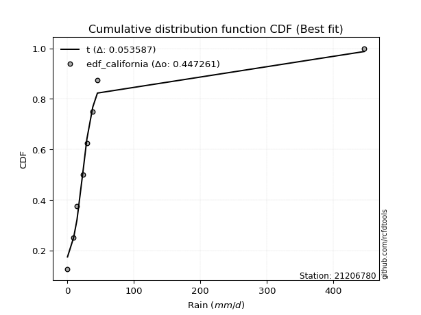</img>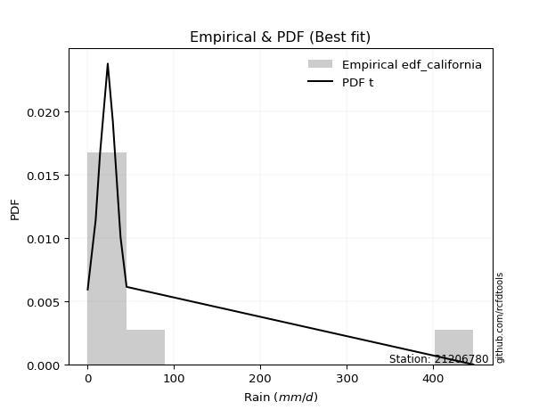</img>

</div>


### 2. EDF Hazen (1930)

Hazen method for plotting positions is a formula used to estimate the empirical cumulative probability distribution of flood events or other hydrological data. This formula often results in biased estimations, particularly when extrapolating to extreme events (high return periods).

<div align="center">


$P=(m-0.5)/n$


</div>


**2.1. Empirical values**

<div align="center">

|                | 0                  | 1                  | 2                  | 3                  | 4                  | 5         | 6                 | 7         |
|:---------------|:-------------------|:-------------------|:-------------------|:-------------------|:-------------------|:----------|:------------------|:----------|
| date           | 2023               | 2016               | 2015               | 2012               | 2025               | 2024      | 2013              | 2014      |
| x              | 0.2                | 9.4                | 14.5               | 23.4               | 29.3               | 38.2      | 45.2              | 446.4     |
| m              | 1                  | 2                  | 3                  | 4                  | 5                  | 6         | 7                 | 8         |
| empirical_dist | edf_hazen          | edf_hazen          | edf_hazen          | edf_hazen          | edf_hazen          | edf_hazen | edf_hazen         | edf_hazen |
| empirical      | 0.0625             | 0.1875             | 0.3125             | 0.4375             | 0.5625             | 0.6875    | 0.8125            | 0.9375    |
| empirical_tr   | 1.0666666666666667 | 1.2307692307692308 | 1.4545454545454546 | 1.7777777777777777 | 2.2857142857142856 | 3.2       | 5.333333333333333 | 16.0      |

</div>


**2.2. Kolmogorov-Smirnov fit test (sorted by Δ)**


<div align="center">

|                | 0                    | 1                   | 2                  | 3                   | 4                   | 5                   | 6                   | 7                   | 8                   | 9                   | 10                  | 11                  | 12                  | 13                  | 14                  | 15                  | 16                  | 17                  | 18                  | 19                  | 20                  | 21                  | 22                  | 23                 | 24                  | 25                  | 26                  | 27                 | 28                  | 29                 | 30                  | 31                  | 32                 | 33                  | 34                 | 35                  | 36                  | 37                  | 38                 | 39                  | 40                  | 41                 | 42                 | 43                  | 44                  | 45                  | 46                  | 47                  | 48                  | 49                 | 50                  | 51                  | 52                 | 53                 | 54                 | 55                 | 56                 | 57                 | 58                  | 59                  | 60                  | 61                  | 62                 | 63                 | 64                 | 65                  | 66                  | 67                  | 68                  | 69                  | 70                 | 71                 | 72                 | 73                  | 74                  | 75                  | 76                 | 77                 | 78                 | 79                  | 80                 | 81                 | 82                 | 83                 | 84                 | 85                  | 86                 | 87                  | 88                  | 89                  | 90                  | 91                 | 92                 | 93                 | 94                  | 95                  | 96                 | 97                  | 98                 | 99                 | 100                 | 101                | 102                 | 103                | 104                | 105                | 106                | 107                | 108                 | 109                | 110                 | 111                | 112                | 113                 | 114                | 115                 | 116                 | 117                | 118                | 119                 | 120                 | 121                | 122                | 123                | 124                 | 125                 | 126                | 127                 | 128                 | 129                | 130                | 131                 | 132                 | 133                | 134                 | 135                | 136                | 137                | 138                | 139                | 140                | 141                | 142                | 143                | 144                | 145                | 146                | 147                | 148                | 149                | 150                | 151                | 152                | 153                | 154                | 155                | 156                | 157                | 158                | 159                |
|:---------------|:---------------------|:--------------------|:-------------------|:--------------------|:--------------------|:--------------------|:--------------------|:--------------------|:--------------------|:--------------------|:--------------------|:--------------------|:--------------------|:--------------------|:--------------------|:--------------------|:--------------------|:--------------------|:--------------------|:--------------------|:--------------------|:--------------------|:--------------------|:-------------------|:--------------------|:--------------------|:--------------------|:-------------------|:--------------------|:-------------------|:--------------------|:--------------------|:-------------------|:--------------------|:-------------------|:--------------------|:--------------------|:--------------------|:-------------------|:--------------------|:--------------------|:-------------------|:-------------------|:--------------------|:--------------------|:--------------------|:--------------------|:--------------------|:--------------------|:-------------------|:--------------------|:--------------------|:-------------------|:-------------------|:-------------------|:-------------------|:-------------------|:-------------------|:--------------------|:--------------------|:--------------------|:--------------------|:-------------------|:-------------------|:-------------------|:--------------------|:--------------------|:--------------------|:--------------------|:--------------------|:-------------------|:-------------------|:-------------------|:--------------------|:--------------------|:--------------------|:-------------------|:-------------------|:-------------------|:--------------------|:-------------------|:-------------------|:-------------------|:-------------------|:-------------------|:--------------------|:-------------------|:--------------------|:--------------------|:--------------------|:--------------------|:-------------------|:-------------------|:-------------------|:--------------------|:--------------------|:-------------------|:--------------------|:-------------------|:-------------------|:--------------------|:-------------------|:--------------------|:-------------------|:-------------------|:-------------------|:-------------------|:-------------------|:--------------------|:-------------------|:--------------------|:-------------------|:-------------------|:--------------------|:-------------------|:--------------------|:--------------------|:-------------------|:-------------------|:--------------------|:--------------------|:-------------------|:-------------------|:-------------------|:--------------------|:--------------------|:-------------------|:--------------------|:--------------------|:-------------------|:-------------------|:--------------------|:--------------------|:-------------------|:--------------------|:-------------------|:-------------------|:-------------------|:-------------------|:-------------------|:-------------------|:-------------------|:-------------------|:-------------------|:-------------------|:-------------------|:-------------------|:-------------------|:-------------------|:-------------------|:-------------------|:-------------------|:-------------------|:-------------------|:-------------------|:-------------------|:-------------------|:-------------------|:-------------------|:-------------------|
| station        | 21206780             | 21206780            | 21206780           | 21206780            | 21206780            | 21206780            | 21206780            | 21206780            | 21206780            | 21206780            | 21206780            | 21206780            | 21206780            | 21206780            | 21206780            | 21206780            | 21206780            | 21206780            | 21206780            | 21206780            | 21206780            | 21206780            | 21206780            | 21206780           | 21206780            | 21206780            | 21206780            | 21206780           | 21206780            | 21206780           | 21206780            | 21206780            | 21206780           | 21206780            | 21206780           | 21206780            | 21206780            | 21206780            | 21206780           | 21206780            | 21206780            | 21206780           | 21206780           | 21206780            | 21206780            | 21206780            | 21206780            | 21206780            | 21206780            | 21206780           | 21206780            | 21206780            | 21206780           | 21206780           | 21206780           | 21206780           | 21206780           | 21206780           | 21206780            | 21206780            | 21206780            | 21206780            | 21206780           | 21206780           | 21206780           | 21206780            | 21206780            | 21206780            | 21206780            | 21206780            | 21206780           | 21206780           | 21206780           | 21206780            | 21206780            | 21206780            | 21206780           | 21206780           | 21206780           | 21206780            | 21206780           | 21206780           | 21206780           | 21206780           | 21206780           | 21206780            | 21206780           | 21206780            | 21206780            | 21206780            | 21206780            | 21206780           | 21206780           | 21206780           | 21206780            | 21206780            | 21206780           | 21206780            | 21206780           | 21206780           | 21206780            | 21206780           | 21206780            | 21206780           | 21206780           | 21206780           | 21206780           | 21206780           | 21206780            | 21206780           | 21206780            | 21206780           | 21206780           | 21206780            | 21206780           | 21206780            | 21206780            | 21206780           | 21206780           | 21206780            | 21206780            | 21206780           | 21206780           | 21206780           | 21206780            | 21206780            | 21206780           | 21206780            | 21206780            | 21206780           | 21206780           | 21206780            | 21206780            | 21206780           | 21206780            | 21206780           | 21206780           | 21206780           | 21206780           | 21206780           | 21206780           | 21206780           | 21206780           | 21206780           | 21206780           | 21206780           | 21206780           | 21206780           | 21206780           | 21206780           | 21206780           | 21206780           | 21206780           | 21206780           | 21206780           | 21206780           | 21206780           | 21206780           | 21206780           | 21206780           |
| empirical_dist | edf_hazen            | edf_hazen           | edf_hazen          | edf_hazen           | edf_hazen           | edf_hazen           | edf_hazen           | edf_hazen           | edf_hazen           | edf_hazen           | edf_hazen           | edf_hazen           | edf_hazen           | edf_hazen           | edf_hazen           | edf_hazen           | edf_hazen           | edf_hazen           | edf_hazen           | edf_hazen           | edf_hazen           | edf_hazen           | edf_hazen           | edf_hazen          | edf_hazen           | edf_hazen           | edf_hazen           | edf_hazen          | edf_hazen           | edf_hazen          | edf_hazen           | edf_hazen           | edf_hazen          | edf_hazen           | edf_hazen          | edf_hazen           | edf_hazen           | edf_hazen           | edf_hazen          | edf_hazen           | edf_hazen           | edf_hazen          | edf_hazen          | edf_hazen           | edf_hazen           | edf_hazen           | edf_hazen           | edf_hazen           | edf_hazen           | edf_hazen          | edf_hazen           | edf_hazen           | edf_hazen          | edf_hazen          | edf_hazen          | edf_hazen          | edf_hazen          | edf_hazen          | edf_hazen           | edf_hazen           | edf_hazen           | edf_hazen           | edf_hazen          | edf_hazen          | edf_hazen          | edf_hazen           | edf_hazen           | edf_hazen           | edf_hazen           | edf_hazen           | edf_hazen          | edf_hazen          | edf_hazen          | edf_hazen           | edf_hazen           | edf_hazen           | edf_hazen          | edf_hazen          | edf_hazen          | edf_hazen           | edf_hazen          | edf_hazen          | edf_hazen          | edf_hazen          | edf_hazen          | edf_hazen           | edf_hazen          | edf_hazen           | edf_hazen           | edf_hazen           | edf_hazen           | edf_hazen          | edf_hazen          | edf_hazen          | edf_hazen           | edf_hazen           | edf_hazen          | edf_hazen           | edf_hazen          | edf_hazen          | edf_hazen           | edf_hazen          | edf_hazen           | edf_hazen          | edf_hazen          | edf_hazen          | edf_hazen          | edf_hazen          | edf_hazen           | edf_hazen          | edf_hazen           | edf_hazen          | edf_hazen          | edf_hazen           | edf_hazen          | edf_hazen           | edf_hazen           | edf_hazen          | edf_hazen          | edf_hazen           | edf_hazen           | edf_hazen          | edf_hazen          | edf_hazen          | edf_hazen           | edf_hazen           | edf_hazen          | edf_hazen           | edf_hazen           | edf_hazen          | edf_hazen          | edf_hazen           | edf_hazen           | edf_hazen          | edf_hazen           | edf_hazen          | edf_hazen          | edf_hazen          | edf_hazen          | edf_hazen          | edf_hazen          | edf_hazen          | edf_hazen          | edf_hazen          | edf_hazen          | edf_hazen          | edf_hazen          | edf_hazen          | edf_hazen          | edf_hazen          | edf_hazen          | edf_hazen          | edf_hazen          | edf_hazen          | edf_hazen          | edf_hazen          | edf_hazen          | edf_hazen          | edf_hazen          | edf_hazen          |
| p_dist         | logjohnsonsu         | logt                | alpha              | t                   | gennorm             | logdgamma           | nct                 | kappa3              | invweibull          | genextreme          | johnsonsu           | invgamma            | loggenlogistic      | logmielke           | genpareto           | lomax               | loglaplace          | loglaplace          | logvonmises_line    | logburr12           | logcrystalball      | logfoldnorm         | logdweibull         | loghypsecant       | f                   | ncf                 | logskewnorm         | betaprime          | halfgennorm         | truncpareto        | burr                | invgauss            | loglogistic        | loggompertz         | logexponweib       | loggennorm          | logloggamma         | logweibull_min      | logjohnsonsb       | logbeta             | logbetaprime        | logrice            | logexponnorm       | lognorm             | lognakagami         | lognct              | logfatiguelife      | burr12              | loggumbel_l         | vonmises_line      | logpearson3         | loggengamma         | mielke             | loggenextreme      | loggamma           | loggamma           | logerlang          | loginvgamma        | loganglit           | dweibull            | logsemicircular     | logargus            | loginvgauss        | logmaxwell         | fatiguelife        | truncweibull_min    | lograyleigh         | loggumbel_r         | logarcsine          | loginvweibull       | logcosine          | logburr            | exponpow           | logmoyal            | erlang              | loghalfnorm         | loggenhalflogistic | logtriang          | wald               | loghalflogistic     | gengamma           | loglomax           | logkstwobign       | loglevy_l          | gamma              | logbradford         | gausshyper         | logtruncweibull_min | loggausshyper       | halflogistic        | loggenexpon         | logwald            | loguniform         | logksone           | moyal               | pearson3            | loggenpareto       | logtruncnorm        | foldnorm           | halfnorm           | logkappa4           | dgamma             | logwrapcauchy       | nakagami           | exponweib          | gumbel_r           | genlogistic        | logtrapezoid       | logloglaplace       | rayleigh           | arcsine             | exponnorm          | genexpon           | maxwell             | gompertz           | semicircular        | anglit              | loghalfgennorm     | weibull_min        | norm                | crystalball         | logncf             | logistic           | wrapcauchy         | logtruncexpon       | powerlaw            | hypsecant          | kstwobign           | levy_l              | laplace            | logweibull_max     | logkappa3           | rice                | gumbel_l           | cosine              | truncnorm          | logf               | logtukeylambda     | logalpha           | argus              | triang             | skewnorm           | logrdist           | bradford           | johnsonsb          | truncexpon         | ksone              | rdist              | logpowerlaw        | kappa4             | tukeylambda        | uniform            | genhalflogistic    | logexponpow        | weibull_max        | logtruncpareto     | beta               | trapezoid          | logvonmises        | vonmises           |
| delta          | 0.041573944050476985 | 0.08281988885783353 | 0.1037099377343288 | 0.11136941671331341 | 0.11886740827195075 | 0.11906144448198608 | 0.12009083597517378 | 0.12338395882107245 | 0.12445733166422213 | 0.12445791383234239 | 0.12586047190942085 | 0.12695008992543744 | 0.12769197720501912 | 0.12806602758441077 | 0.13349817108956863 | 0.13365433830484497 | 0.13643010645126563 | 0.13643010645126563 | 0.14128545848278506 | 0.14797022533247794 | 0.14850064278958253 | 0.14878600681246473 | 0.15050880138142642 | 0.1510512576439158 | 0.15183309335425849 | 0.15280122930479978 | 0.15423798199578093 | 0.1578425173886473 | 0.16021257341381534 | 0.1602913452829905 | 0.16159399045263467 | 0.16292363551482858 | 0.1639824866026725 | 0.16945453236301555 | 0.1703460109077487 | 0.17128658525733975 | 0.17275166105370077 | 0.17343960504558953 | 0.1741152505138105 | 0.17804291144313167 | 0.17996228128453517 | 0.1802801788646995 | 0.1802910210938936 | 0.18029275118457688 | 0.18053383643032272 | 0.18100839207107922 | 0.18323694357482123 | 0.18541949599584262 | 0.18578761980760117 | 0.1874994358970472 | 0.18819787439693303 | 0.18935250199158382 | 0.1900878916499567 | 0.1928673986324123 | 0.1935764466916221 | 0.1935764466916221 | 0.1946235308293321 | 0.196587539251375  | 0.19808389150594324 | 0.20399517772686354 | 0.20551983992964162 | 0.20625751046062513 | 0.211522895563584  | 0.2131852679226376 | 0.2237704789445476 | 0.22398711228169121 | 0.22541644573756237 | 0.23321150352646153 | 0.23574829898314958 | 0.24317564478996717 | 0.2446194877952207 | 0.2453923648494986 | 0.2458310927078382 | 0.25321541599632824 | 0.25943485402000527 | 0.26020112176446886 | 0.261441657277083  | 0.2684321812835164 | 0.2687802278775459 | 0.27119332789559814 | 0.2740986490855193 | 0.2766150904828487 | 0.2848584566542761 | 0.2859502094950668 | 0.2860729397841738 | 0.28631289484607736 | 0.2890999416984025 | 0.29008376084771215 | 0.29736846146942064 | 0.30015846179116035 | 0.30047893398736747 | 0.303399739434179  | 0.3118283240961233 | 0.3119402700801028 | 0.31262554779832596 | 0.31281885108134444 | 0.3133058039173607 | 0.31347218433086754 | 0.3174025356945913 | 0.3174494263267344 | 0.32066115633077963 | 0.3210167396624232 | 0.32299336950439717 | 0.329932901653491  | 0.3339601904583664 | 0.336428809928204  | 0.3374072004454483 | 0.347342563606032  | 0.35198992065456136 | 0.3521139349954726 | 0.36166901096385007 | 0.3629119491196491 | 0.3640399697955713 | 0.36435324325999424 | 0.3707663341849702 | 0.38162242944748015 | 0.38660363886890436 | 0.3906266899736289 | 0.3908488693241776 | 0.39862351928959394 | 0.39862353027955766 | 0.4008646981475452 | 0.4099026467548662 | 0.4132337905730015 | 0.41428429146893897 | 0.41846755301613403 | 0.4192339409551331 | 0.42817874602348804 | 0.43211307086750717 | 0.4449360462461415 | 0.4485006705367622 | 0.44917689561946617 | 0.45220965193714974 | 0.4664398994246364 | 0.47948625658976285 | 0.4930539095257621 | 0.5030787232583042 | 0.5255613556678966 | 0.5345209943868532 | 0.5465090925452313 | 0.5670229200339754 | 0.5907066722789212 | 0.5908334347335334 | 0.6322702177277472 | 0.6386463770069579 | 0.642771754121171  | 0.6451236366352906 | 0.646002556252754  | 0.6858350889674464 | 0.6940220789979806 | 0.6954610778445627 | 0.7116483639623488 | 0.7157489775629288 | 0.7208404415361713 | 0.7231908575921124 | 0.730070986730833  | 0.7736808950330777 | 0.7830793960526415 | 1.0481209027414033 | 70.46332265812326  |
| deltao         | 0.4472608134160001   | 0.4472608134160001  | 0.4472608134160001 | 0.4472608134160001  | 0.4472608134160001  | 0.4472608134160001  | 0.4472608134160001  | 0.4472608134160001  | 0.4472608134160001  | 0.4472608134160001  | 0.4472608134160001  | 0.4472608134160001  | 0.4472608134160001  | 0.4472608134160001  | 0.4472608134160001  | 0.4472608134160001  | 0.4472608134160001  | 0.4472608134160001  | 0.4472608134160001  | 0.4472608134160001  | 0.4472608134160001  | 0.4472608134160001  | 0.4472608134160001  | 0.4472608134160001 | 0.4472608134160001  | 0.4472608134160001  | 0.4472608134160001  | 0.4472608134160001 | 0.4472608134160001  | 0.4472608134160001 | 0.4472608134160001  | 0.4472608134160001  | 0.4472608134160001 | 0.4472608134160001  | 0.4472608134160001 | 0.4472608134160001  | 0.4472608134160001  | 0.4472608134160001  | 0.4472608134160001 | 0.4472608134160001  | 0.4472608134160001  | 0.4472608134160001 | 0.4472608134160001 | 0.4472608134160001  | 0.4472608134160001  | 0.4472608134160001  | 0.4472608134160001  | 0.4472608134160001  | 0.4472608134160001  | 0.4472608134160001 | 0.4472608134160001  | 0.4472608134160001  | 0.4472608134160001 | 0.4472608134160001 | 0.4472608134160001 | 0.4472608134160001 | 0.4472608134160001 | 0.4472608134160001 | 0.4472608134160001  | 0.4472608134160001  | 0.4472608134160001  | 0.4472608134160001  | 0.4472608134160001 | 0.4472608134160001 | 0.4472608134160001 | 0.4472608134160001  | 0.4472608134160001  | 0.4472608134160001  | 0.4472608134160001  | 0.4472608134160001  | 0.4472608134160001 | 0.4472608134160001 | 0.4472608134160001 | 0.4472608134160001  | 0.4472608134160001  | 0.4472608134160001  | 0.4472608134160001 | 0.4472608134160001 | 0.4472608134160001 | 0.4472608134160001  | 0.4472608134160001 | 0.4472608134160001 | 0.4472608134160001 | 0.4472608134160001 | 0.4472608134160001 | 0.4472608134160001  | 0.4472608134160001 | 0.4472608134160001  | 0.4472608134160001  | 0.4472608134160001  | 0.4472608134160001  | 0.4472608134160001 | 0.4472608134160001 | 0.4472608134160001 | 0.4472608134160001  | 0.4472608134160001  | 0.4472608134160001 | 0.4472608134160001  | 0.4472608134160001 | 0.4472608134160001 | 0.4472608134160001  | 0.4472608134160001 | 0.4472608134160001  | 0.4472608134160001 | 0.4472608134160001 | 0.4472608134160001 | 0.4472608134160001 | 0.4472608134160001 | 0.4472608134160001  | 0.4472608134160001 | 0.4472608134160001  | 0.4472608134160001 | 0.4472608134160001 | 0.4472608134160001  | 0.4472608134160001 | 0.4472608134160001  | 0.4472608134160001  | 0.4472608134160001 | 0.4472608134160001 | 0.4472608134160001  | 0.4472608134160001  | 0.4472608134160001 | 0.4472608134160001 | 0.4472608134160001 | 0.4472608134160001  | 0.4472608134160001  | 0.4472608134160001 | 0.4472608134160001  | 0.4472608134160001  | 0.4472608134160001 | 0.4472608134160001 | 0.4472608134160001  | 0.4472608134160001  | 0.4472608134160001 | 0.4472608134160001  | 0.4472608134160001 | 0.4472608134160001 | 0.4472608134160001 | 0.4472608134160001 | 0.4472608134160001 | 0.4472608134160001 | 0.4472608134160001 | 0.4472608134160001 | 0.4472608134160001 | 0.4472608134160001 | 0.4472608134160001 | 0.4472608134160001 | 0.4472608134160001 | 0.4472608134160001 | 0.4472608134160001 | 0.4472608134160001 | 0.4472608134160001 | 0.4472608134160001 | 0.4472608134160001 | 0.4472608134160001 | 0.4472608134160001 | 0.4472608134160001 | 0.4472608134160001 | 0.4472608134160001 | 0.4472608134160001 |
| eval           | Δo > Δ               | Δo > Δ              | Δo > Δ             | Δo > Δ              | Δo > Δ              | Δo > Δ              | Δo > Δ              | Δo > Δ              | Δo > Δ              | Δo > Δ              | Δo > Δ              | Δo > Δ              | Δo > Δ              | Δo > Δ              | Δo > Δ              | Δo > Δ              | Δo > Δ              | Δo > Δ              | Δo > Δ              | Δo > Δ              | Δo > Δ              | Δo > Δ              | Δo > Δ              | Δo > Δ             | Δo > Δ              | Δo > Δ              | Δo > Δ              | Δo > Δ             | Δo > Δ              | Δo > Δ             | Δo > Δ              | Δo > Δ              | Δo > Δ             | Δo > Δ              | Δo > Δ             | Δo > Δ              | Δo > Δ              | Δo > Δ              | Δo > Δ             | Δo > Δ              | Δo > Δ              | Δo > Δ             | Δo > Δ             | Δo > Δ              | Δo > Δ              | Δo > Δ              | Δo > Δ              | Δo > Δ              | Δo > Δ              | Δo > Δ             | Δo > Δ              | Δo > Δ              | Δo > Δ             | Δo > Δ             | Δo > Δ             | Δo > Δ             | Δo > Δ             | Δo > Δ             | Δo > Δ              | Δo > Δ              | Δo > Δ              | Δo > Δ              | Δo > Δ             | Δo > Δ             | Δo > Δ             | Δo > Δ              | Δo > Δ              | Δo > Δ              | Δo > Δ              | Δo > Δ              | Δo > Δ             | Δo > Δ             | Δo > Δ             | Δo > Δ              | Δo > Δ              | Δo > Δ              | Δo > Δ             | Δo > Δ             | Δo > Δ             | Δo > Δ              | Δo > Δ             | Δo > Δ             | Δo > Δ             | Δo > Δ             | Δo > Δ             | Δo > Δ              | Δo > Δ             | Δo > Δ              | Δo > Δ              | Δo > Δ              | Δo > Δ              | Δo > Δ             | Δo > Δ             | Δo > Δ             | Δo > Δ              | Δo > Δ              | Δo > Δ             | Δo > Δ              | Δo > Δ             | Δo > Δ             | Δo > Δ              | Δo > Δ             | Δo > Δ              | Δo > Δ             | Δo > Δ             | Δo > Δ             | Δo > Δ             | Δo > Δ             | Δo > Δ              | Δo > Δ             | Δo > Δ              | Δo > Δ             | Δo > Δ             | Δo > Δ              | Δo > Δ             | Δo > Δ              | Δo > Δ              | Δo > Δ             | Δo > Δ             | Δo > Δ              | Δo > Δ              | Δo > Δ             | Δo > Δ             | Δo > Δ             | Δo > Δ              | Δo > Δ              | Δo > Δ             | Δo > Δ              | Δo > Δ              | Δo > Δ             | Δo <= Δ            | Δo <= Δ             | Δo <= Δ             | Δo <= Δ            | Δo <= Δ             | Δo <= Δ            | Δo <= Δ            | Δo <= Δ            | Δo <= Δ            | Δo <= Δ            | Δo <= Δ            | Δo <= Δ            | Δo <= Δ            | Δo <= Δ            | Δo <= Δ            | Δo <= Δ            | Δo <= Δ            | Δo <= Δ            | Δo <= Δ            | Δo <= Δ            | Δo <= Δ            | Δo <= Δ            | Δo <= Δ            | Δo <= Δ            | Δo <= Δ            | Δo <= Δ            | Δo <= Δ            | Δo <= Δ            | Δo <= Δ            | Δo <= Δ            |
| fit            | 1                    | 1                   | 1                  | 1                   | 1                   | 1                   | 1                   | 1                   | 1                   | 1                   | 1                   | 1                   | 1                   | 1                   | 1                   | 1                   | 1                   | 1                   | 1                   | 1                   | 1                   | 1                   | 1                   | 1                  | 1                   | 1                   | 1                   | 1                  | 1                   | 1                  | 1                   | 1                   | 1                  | 1                   | 1                  | 1                   | 1                   | 1                   | 1                  | 1                   | 1                   | 1                  | 1                  | 1                   | 1                   | 1                   | 1                   | 1                   | 1                   | 1                  | 1                   | 1                   | 1                  | 1                  | 1                  | 1                  | 1                  | 1                  | 1                   | 1                   | 1                   | 1                   | 1                  | 1                  | 1                  | 1                   | 1                   | 1                   | 1                   | 1                   | 1                  | 1                  | 1                  | 1                   | 1                   | 1                   | 1                  | 1                  | 1                  | 1                   | 1                  | 1                  | 1                  | 1                  | 1                  | 1                   | 1                  | 1                   | 1                   | 1                   | 1                   | 1                  | 1                  | 1                  | 1                   | 1                   | 1                  | 1                   | 1                  | 1                  | 1                   | 1                  | 1                   | 1                  | 1                  | 1                  | 1                  | 1                  | 1                   | 1                  | 1                   | 1                  | 1                  | 1                   | 1                  | 1                   | 1                   | 1                  | 1                  | 1                   | 1                   | 1                  | 1                  | 1                  | 1                   | 1                   | 1                  | 1                   | 1                   | 1                  | 0                  | 0                   | 0                   | 0                  | 0                   | 0                  | 0                  | 0                  | 0                  | 0                  | 0                  | 0                  | 0                  | 0                  | 0                  | 0                  | 0                  | 0                  | 0                  | 0                  | 0                  | 0                  | 0                  | 0                  | 0                  | 0                  | 0                  | 0                  | 0                  | 0                  |
| n              | 8                    | 8                   | 8                  | 8                   | 8                   | 8                   | 8                   | 8                   | 8                   | 8                   | 8                   | 8                   | 8                   | 8                   | 8                   | 8                   | 8                   | 8                   | 8                   | 8                   | 8                   | 8                   | 8                   | 8                  | 8                   | 8                   | 8                   | 8                  | 8                   | 8                  | 8                   | 8                   | 8                  | 8                   | 8                  | 8                   | 8                   | 8                   | 8                  | 8                   | 8                   | 8                  | 8                  | 8                   | 8                   | 8                   | 8                   | 8                   | 8                   | 8                  | 8                   | 8                   | 8                  | 8                  | 8                  | 8                  | 8                  | 8                  | 8                   | 8                   | 8                   | 8                   | 8                  | 8                  | 8                  | 8                   | 8                   | 8                   | 8                   | 8                   | 8                  | 8                  | 8                  | 8                   | 8                   | 8                   | 8                  | 8                  | 8                  | 8                   | 8                  | 8                  | 8                  | 8                  | 8                  | 8                   | 8                  | 8                   | 8                   | 8                   | 8                   | 8                  | 8                  | 8                  | 8                   | 8                   | 8                  | 8                   | 8                  | 8                  | 8                   | 8                  | 8                   | 8                  | 8                  | 8                  | 8                  | 8                  | 8                   | 8                  | 8                   | 8                  | 8                  | 8                   | 8                  | 8                   | 8                   | 8                  | 8                  | 8                   | 8                   | 8                  | 8                  | 8                  | 8                   | 8                   | 8                  | 8                   | 8                   | 8                  | 8                  | 8                   | 8                   | 8                  | 8                   | 8                  | 8                  | 8                  | 8                  | 8                  | 8                  | 8                  | 8                  | 8                  | 8                  | 8                  | 8                  | 8                  | 8                  | 8                  | 8                  | 8                  | 8                  | 8                  | 8                  | 8                  | 8                  | 8                  | 8                  | 8                  |
| best_fit       | 1                    | 0                   | 0                  | 0                   | 0                   | 0                   | 0                   | 0                   | 0                   | 0                   | 0                   | 0                   | 0                   | 0                   | 0                   | 0                   | 0                   | 0                   | 0                   | 0                   | 0                   | 0                   | 0                   | 0                  | 0                   | 0                   | 0                   | 0                  | 0                   | 0                  | 0                   | 0                   | 0                  | 0                   | 0                  | 0                   | 0                   | 0                   | 0                  | 0                   | 0                   | 0                  | 0                  | 0                   | 0                   | 0                   | 0                   | 0                   | 0                   | 0                  | 0                   | 0                   | 0                  | 0                  | 0                  | 0                  | 0                  | 0                  | 0                   | 0                   | 0                   | 0                   | 0                  | 0                  | 0                  | 0                   | 0                   | 0                   | 0                   | 0                   | 0                  | 0                  | 0                  | 0                   | 0                   | 0                   | 0                  | 0                  | 0                  | 0                   | 0                  | 0                  | 0                  | 0                  | 0                  | 0                   | 0                  | 0                   | 0                   | 0                   | 0                   | 0                  | 0                  | 0                  | 0                   | 0                   | 0                  | 0                   | 0                  | 0                  | 0                   | 0                  | 0                   | 0                  | 0                  | 0                  | 0                  | 0                  | 0                   | 0                  | 0                   | 0                  | 0                  | 0                   | 0                  | 0                   | 0                   | 0                  | 0                  | 0                   | 0                   | 0                  | 0                  | 0                  | 0                   | 0                   | 0                  | 0                   | 0                   | 0                  | 0                  | 0                   | 0                   | 0                  | 0                   | 0                  | 0                  | 0                  | 0                  | 0                  | 0                  | 0                  | 0                  | 0                  | 0                  | 0                  | 0                  | 0                  | 0                  | 0                  | 0                  | 0                  | 0                  | 0                  | 0                  | 0                  | 0                  | 0                  | 0                  | 0                  |
| best_fit_sort  | 1                    | 2                   | 3                  | 4                   | 5                   | 6                   | 7                   | 8                   | 9                   | 10                  | 11                  | 12                  | 13                  | 14                  | 15                  | 16                  | 17                  | 18                  | 19                  | 20                  | 21                  | 22                  | 23                  | 24                 | 25                  | 26                  | 27                  | 28                 | 29                  | 30                 | 31                  | 32                  | 33                 | 34                  | 35                 | 36                  | 37                  | 38                  | 39                 | 40                  | 41                  | 42                 | 43                 | 44                  | 45                  | 46                  | 47                  | 48                  | 49                  | 50                 | 51                  | 52                  | 53                 | 54                 | 55                 | 56                 | 57                 | 58                 | 59                  | 60                  | 61                  | 62                  | 63                 | 64                 | 65                 | 66                  | 67                  | 68                  | 69                  | 70                  | 71                 | 72                 | 73                 | 74                  | 75                  | 76                  | 77                 | 78                 | 79                 | 80                  | 81                 | 82                 | 83                 | 84                 | 85                 | 86                  | 87                 | 88                  | 89                  | 90                  | 91                  | 92                 | 93                 | 94                 | 95                  | 96                  | 97                 | 98                  | 99                 | 100                | 101                 | 102                | 103                 | 104                | 105                | 106                | 107                | 108                | 109                 | 110                | 111                 | 112                | 113                | 114                 | 115                | 116                 | 117                 | 118                | 119                | 120                 | 121                 | 122                | 123                | 124                | 125                 | 126                 | 127                | 128                 | 129                 | 130                | 131                | 132                 | 133                 | 134                | 135                 | 136                | 137                | 138                | 139                | 140                | 141                | 142                | 143                | 144                | 145                | 146                | 147                | 148                | 149                | 150                | 151                | 152                | 153                | 154                | 155                | 156                | 157                | 158                | 159                | 160                |

</div>


**2.3. Best fit**

<div align="center">

|   id |   station | empirical_dist   | p_dist       |     delta |   deltao | eval   |   fit |   n |   best_fit |   best_fit_sort |
|-----:|----------:|:-----------------|:-------------|----------:|---------:|:-------|------:|----:|-----------:|----------------:|
|    0 |  21206780 | edf_hazen        | logjohnsonsu | 0.0415739 | 0.447261 | Δo > Δ |     1 |   8 |          1 |               1 |

</div>


<div align="center">

</img>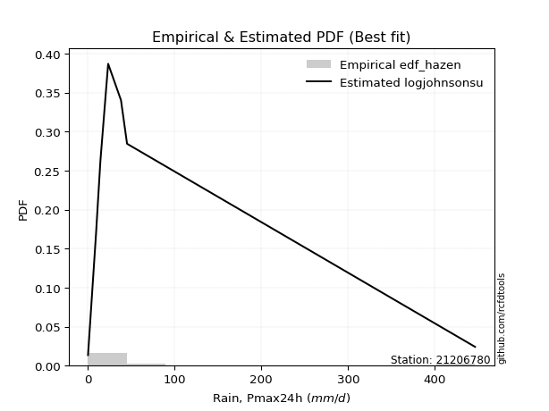</img>

</div>


### 3. EDF Weibull (1939)

Weibull plotting position formula is an empirical method used to estimate the non-exceedance probability or plotting position for a set of observed data, is often recommended or widely used in practice, particularly in flood frequency analysis.

<div align="center">


$P=m/(n+1)$


</div>


**3.1. Empirical values**

<div align="center">

|                | 0                  | 1                  | 2                  | 3                  | 4                  | 5                  | 6                  | 7                  |
|:---------------|:-------------------|:-------------------|:-------------------|:-------------------|:-------------------|:-------------------|:-------------------|:-------------------|
| date           | 2023               | 2016               | 2015               | 2012               | 2025               | 2024               | 2013               | 2014               |
| x              | 0.2                | 9.4                | 14.5               | 23.4               | 29.3               | 38.2               | 45.2               | 446.4              |
| m              | 1                  | 2                  | 3                  | 4                  | 5                  | 6                  | 7                  | 8                  |
| empirical_dist | edf_weibull        | edf_weibull        | edf_weibull        | edf_weibull        | edf_weibull        | edf_weibull        | edf_weibull        | edf_weibull        |
| empirical      | 0.1111111111111111 | 0.2222222222222222 | 0.3333333333333333 | 0.4444444444444444 | 0.5555555555555556 | 0.6666666666666666 | 0.7777777777777778 | 0.8888888888888888 |
| empirical_tr   | 1.125              | 1.2857142857142856 | 1.4999999999999998 | 1.7999999999999998 | 2.25               | 2.9999999999999996 | 4.5                | 8.999999999999996  |

</div>


**3.2. Kolmogorov-Smirnov fit test (sorted by Δ)**


<div align="center">

|                | 0                   | 1                   | 2                   | 3                   | 4                   | 5                   | 6                   | 7                   | 8                   | 9                   | 10                  | 11                  | 12                  | 13                 | 14                  | 15                  | 16                  | 17                  | 18                  | 19                 | 20                 | 21                  | 22                  | 23                  | 24                  | 25                  | 26                  | 27                  | 28                  | 29                 | 30                 | 31                 | 32                  | 33                 | 34                  | 35                  | 36                  | 37                  | 38                  | 39                  | 40                 | 41                  | 42                  | 43                 | 44                  | 45                 | 46                  | 47                  | 48                 | 49                  | 50                 | 51                  | 52                 | 53                 | 54                 | 55                  | 56                 | 57                  | 58                 | 59                  | 60                 | 61                  | 62                  | 63                 | 64                 | 65                  | 66                  | 67                  | 68                  | 69                  | 70                 | 71                 | 72                  | 73                 | 74                  | 75                  | 76                  | 77                 | 78                  | 79                  | 80                  | 81                 | 82                  | 83                 | 84                 | 85                  | 86                  | 87                  | 88                  | 89                  | 90                  | 91                  | 92                 | 93                  | 94                  | 95                  | 96                  | 97                  | 98                 | 99                 | 100                | 101                | 102                 | 103                | 104                | 105                | 106                | 107                | 108                 | 109                | 110                 | 111                 | 112                | 113                 | 114                 | 115                 | 116                 | 117                | 118                | 119                 | 120                 | 121                | 122                | 123                | 124                 | 125                 | 126                | 127                | 128                 | 129                | 130                 | 131                 | 132                | 133                 | 134                 | 135                | 136                 | 137                | 138                | 139                | 140                | 141                | 142                | 143                | 144                | 145                | 146                | 147                | 148                | 149                | 150                | 151                | 152                | 153                | 154                | 155                | 156                | 157                | 158                | 159                |
|:---------------|:--------------------|:--------------------|:--------------------|:--------------------|:--------------------|:--------------------|:--------------------|:--------------------|:--------------------|:--------------------|:--------------------|:--------------------|:--------------------|:-------------------|:--------------------|:--------------------|:--------------------|:--------------------|:--------------------|:-------------------|:-------------------|:--------------------|:--------------------|:--------------------|:--------------------|:--------------------|:--------------------|:--------------------|:--------------------|:-------------------|:-------------------|:-------------------|:--------------------|:-------------------|:--------------------|:--------------------|:--------------------|:--------------------|:--------------------|:--------------------|:-------------------|:--------------------|:--------------------|:-------------------|:--------------------|:-------------------|:--------------------|:--------------------|:-------------------|:--------------------|:-------------------|:--------------------|:-------------------|:-------------------|:-------------------|:--------------------|:-------------------|:--------------------|:-------------------|:--------------------|:-------------------|:--------------------|:--------------------|:-------------------|:-------------------|:--------------------|:--------------------|:--------------------|:--------------------|:--------------------|:-------------------|:-------------------|:--------------------|:-------------------|:--------------------|:--------------------|:--------------------|:-------------------|:--------------------|:--------------------|:--------------------|:-------------------|:--------------------|:-------------------|:-------------------|:--------------------|:--------------------|:--------------------|:--------------------|:--------------------|:--------------------|:--------------------|:-------------------|:--------------------|:--------------------|:--------------------|:--------------------|:--------------------|:-------------------|:-------------------|:-------------------|:-------------------|:--------------------|:-------------------|:-------------------|:-------------------|:-------------------|:-------------------|:--------------------|:-------------------|:--------------------|:--------------------|:-------------------|:--------------------|:--------------------|:--------------------|:--------------------|:-------------------|:-------------------|:--------------------|:--------------------|:-------------------|:-------------------|:-------------------|:--------------------|:--------------------|:-------------------|:-------------------|:--------------------|:-------------------|:--------------------|:--------------------|:-------------------|:--------------------|:--------------------|:-------------------|:--------------------|:-------------------|:-------------------|:-------------------|:-------------------|:-------------------|:-------------------|:-------------------|:-------------------|:-------------------|:-------------------|:-------------------|:-------------------|:-------------------|:-------------------|:-------------------|:-------------------|:-------------------|:-------------------|:-------------------|:-------------------|:-------------------|:-------------------|:-------------------|
| station        | 21206780            | 21206780            | 21206780            | 21206780            | 21206780            | 21206780            | 21206780            | 21206780            | 21206780            | 21206780            | 21206780            | 21206780            | 21206780            | 21206780           | 21206780            | 21206780            | 21206780            | 21206780            | 21206780            | 21206780           | 21206780           | 21206780            | 21206780            | 21206780            | 21206780            | 21206780            | 21206780            | 21206780            | 21206780            | 21206780           | 21206780           | 21206780           | 21206780            | 21206780           | 21206780            | 21206780            | 21206780            | 21206780            | 21206780            | 21206780            | 21206780           | 21206780            | 21206780            | 21206780           | 21206780            | 21206780           | 21206780            | 21206780            | 21206780           | 21206780            | 21206780           | 21206780            | 21206780           | 21206780           | 21206780           | 21206780            | 21206780           | 21206780            | 21206780           | 21206780            | 21206780           | 21206780            | 21206780            | 21206780           | 21206780           | 21206780            | 21206780            | 21206780            | 21206780            | 21206780            | 21206780           | 21206780           | 21206780            | 21206780           | 21206780            | 21206780            | 21206780            | 21206780           | 21206780            | 21206780            | 21206780            | 21206780           | 21206780            | 21206780           | 21206780           | 21206780            | 21206780            | 21206780            | 21206780            | 21206780            | 21206780            | 21206780            | 21206780           | 21206780            | 21206780            | 21206780            | 21206780            | 21206780            | 21206780           | 21206780           | 21206780           | 21206780           | 21206780            | 21206780           | 21206780           | 21206780           | 21206780           | 21206780           | 21206780            | 21206780           | 21206780            | 21206780            | 21206780           | 21206780            | 21206780            | 21206780            | 21206780            | 21206780           | 21206780           | 21206780            | 21206780            | 21206780           | 21206780           | 21206780           | 21206780            | 21206780            | 21206780           | 21206780           | 21206780            | 21206780           | 21206780            | 21206780            | 21206780           | 21206780            | 21206780            | 21206780           | 21206780            | 21206780           | 21206780           | 21206780           | 21206780           | 21206780           | 21206780           | 21206780           | 21206780           | 21206780           | 21206780           | 21206780           | 21206780           | 21206780           | 21206780           | 21206780           | 21206780           | 21206780           | 21206780           | 21206780           | 21206780           | 21206780           | 21206780           | 21206780           |
| empirical_dist | edf_weibull         | edf_weibull         | edf_weibull         | edf_weibull         | edf_weibull         | edf_weibull         | edf_weibull         | edf_weibull         | edf_weibull         | edf_weibull         | edf_weibull         | edf_weibull         | edf_weibull         | edf_weibull        | edf_weibull         | edf_weibull         | edf_weibull         | edf_weibull         | edf_weibull         | edf_weibull        | edf_weibull        | edf_weibull         | edf_weibull         | edf_weibull         | edf_weibull         | edf_weibull         | edf_weibull         | edf_weibull         | edf_weibull         | edf_weibull        | edf_weibull        | edf_weibull        | edf_weibull         | edf_weibull        | edf_weibull         | edf_weibull         | edf_weibull         | edf_weibull         | edf_weibull         | edf_weibull         | edf_weibull        | edf_weibull         | edf_weibull         | edf_weibull        | edf_weibull         | edf_weibull        | edf_weibull         | edf_weibull         | edf_weibull        | edf_weibull         | edf_weibull        | edf_weibull         | edf_weibull        | edf_weibull        | edf_weibull        | edf_weibull         | edf_weibull        | edf_weibull         | edf_weibull        | edf_weibull         | edf_weibull        | edf_weibull         | edf_weibull         | edf_weibull        | edf_weibull        | edf_weibull         | edf_weibull         | edf_weibull         | edf_weibull         | edf_weibull         | edf_weibull        | edf_weibull        | edf_weibull         | edf_weibull        | edf_weibull         | edf_weibull         | edf_weibull         | edf_weibull        | edf_weibull         | edf_weibull         | edf_weibull         | edf_weibull        | edf_weibull         | edf_weibull        | edf_weibull        | edf_weibull         | edf_weibull         | edf_weibull         | edf_weibull         | edf_weibull         | edf_weibull         | edf_weibull         | edf_weibull        | edf_weibull         | edf_weibull         | edf_weibull         | edf_weibull         | edf_weibull         | edf_weibull        | edf_weibull        | edf_weibull        | edf_weibull        | edf_weibull         | edf_weibull        | edf_weibull        | edf_weibull        | edf_weibull        | edf_weibull        | edf_weibull         | edf_weibull        | edf_weibull         | edf_weibull         | edf_weibull        | edf_weibull         | edf_weibull         | edf_weibull         | edf_weibull         | edf_weibull        | edf_weibull        | edf_weibull         | edf_weibull         | edf_weibull        | edf_weibull        | edf_weibull        | edf_weibull         | edf_weibull         | edf_weibull        | edf_weibull        | edf_weibull         | edf_weibull        | edf_weibull         | edf_weibull         | edf_weibull        | edf_weibull         | edf_weibull         | edf_weibull        | edf_weibull         | edf_weibull        | edf_weibull        | edf_weibull        | edf_weibull        | edf_weibull        | edf_weibull        | edf_weibull        | edf_weibull        | edf_weibull        | edf_weibull        | edf_weibull        | edf_weibull        | edf_weibull        | edf_weibull        | edf_weibull        | edf_weibull        | edf_weibull        | edf_weibull        | edf_weibull        | edf_weibull        | edf_weibull        | edf_weibull        | edf_weibull        |
| p_dist         | logjohnsonsu        | alpha               | logt                | nct                 | invweibull          | genextreme          | johnsonsu           | invgamma            | loggenlogistic      | logmielke           | t                   | logdgamma           | logvonmises_line    | lomax              | kappa3              | genpareto           | logburr12           | logcrystalball      | logfoldnorm         | logdweibull        | loghypsecant       | f                   | ncf                 | logskewnorm         | betaprime           | halfgennorm         | truncpareto         | gennorm             | invgauss            | loglogistic        | loglaplace         | loglaplace         | loggompertz         | logexponweib       | logloggamma         | logweibull_min      | logjohnsonsb        | logbeta             | logbetaprime        | logrice             | logexponnorm       | lognorm             | lognakagami         | lognct             | logfatiguelife      | burr12             | loggumbel_l         | logpearson3         | loggengamma        | burr                | mielke             | dweibull            | loggenextreme      | loggamma           | loggamma           | logerlang           | loginvgamma        | loganglit           | logsemicircular    | logargus            | loginvgauss        | loggennorm          | logmaxwell          | fatiguelife        | truncweibull_min   | lograyleigh         | loggumbel_r         | logarcsine          | loginvweibull       | logcosine           | logburr            | exponpow           | logmoyal            | wald               | vonmises_line       | erlang              | loghalfnorm         | loggenhalflogistic | logtriang           | loghalflogistic     | gengamma            | loglomax           | loglevy_l           | logkstwobign       | gamma              | logbradford         | gausshyper          | logtruncweibull_min | loggausshyper       | pearson3            | halflogistic        | loggenexpon         | loguniform         | logksone            | dgamma              | moyal               | loggenpareto        | logtruncnorm        | foldnorm           | logwald            | halfnorm           | logkappa4          | logwrapcauchy       | nakagami           | exponweib          | gumbel_r           | genlogistic        | logtrapezoid       | logloglaplace       | rayleigh           | arcsine             | exponnorm           | genexpon           | maxwell             | gompertz            | semicircular        | anglit              | loghalfgennorm     | weibull_min        | norm                | crystalball         | logncf             | logistic           | wrapcauchy         | logtruncexpon       | levy_l              | powerlaw           | hypsecant          | kstwobign           | laplace            | logweibull_max      | logkappa3           | rice               | gumbel_l            | cosine              | truncnorm          | logf                | logtukeylambda     | logalpha           | argus              | triang             | skewnorm           | logrdist           | rdist              | bradford           | johnsonsb          | truncexpon         | ksone              | tukeylambda        | logpowerlaw        | kappa4             | uniform            | genhalflogistic    | logexponpow        | weibull_max        | logtruncpareto     | beta               | trapezoid          | logvonmises        | vonmises           |
| delta          | 0.07587616117730145 | 0.08432149916048304 | 0.08466499184484522 | 0.08536861375295157 | 0.08973510944199992 | 0.08973569161012018 | 0.09113824968719864 | 0.09222786770321523 | 0.09296975498279691 | 0.09334380536218856 | 0.10083896905394807 | 0.10296029867811911 | 0.11111111040982705 | 0.1111111110410388 | 0.11111111108339983 | 0.11111111110915536 | 0.11324800311025573 | 0.11377842056736032 | 0.11406378459024252 | 0.1157865791592042 | 0.1163290354216936 | 0.11711087113203628 | 0.11807900708257757 | 0.11951575977355872 | 0.12312029516642509 | 0.12549035119159313 | 0.12556912306076828 | 0.12581185271639517 | 0.12820141329260637 | 0.1292602643804503 | 0.1294856620068212 | 0.1294856620068212 | 0.13473231014079334 | 0.1356237886855265 | 0.13802943883147856 | 0.13871738282336732 | 0.13939302829158828 | 0.14332068922090946 | 0.14524005906231297 | 0.14555795664247728 | 0.1455687988716714 | 0.14557052896235467 | 0.14581161420810052 | 0.146286169848857  | 0.14851472135259902 | 0.1506972737736204 | 0.15106539758537896 | 0.15347565217471082 | 0.1546302797693616 | 0.15464954600819025 | 0.1553656694277345 | 0.15538406661575244 | 0.1581451764101901 | 0.1588542244693999 | 0.1588542244693999 | 0.15990130860710988 | 0.1618653170291528 | 0.16336166928372103 | 0.1707976177074194 | 0.17153528823840292 | 0.1768006733413618 | 0.17823102970178417 | 0.17846304570041538 | 0.1890482567223254 | 0.189264890059469  | 0.19069422351534016 | 0.19848928130423932 | 0.20102607676092737 | 0.20845342256774496 | 0.20989726557299848 | 0.2106701426272764 | 0.211108870485616  | 0.21849319377410603 | 0.2201691167664348 | 0.22222165811926942 | 0.22471263179778306 | 0.22547889954224665 | 0.2267194350548608 | 0.23370995906129421 | 0.23647110567337593 | 0.23937642686329708 | 0.2418928682606265 | 0.24576861471157685 | 0.2501362344320539 | 0.2513507175619516 | 0.25159067262385515 | 0.25437771947618026 | 0.25536153862548994 | 0.26264623924719843 | 0.26420773997023334 | 0.26543623956893814 | 0.26575671176514526 | 0.2771061018739011 | 0.27721804785788057 | 0.27777777777606655 | 0.27790332557610375 | 0.27858358169513847 | 0.27874996210864533 | 0.2790860202930176 | 0.2805966576129921 | 0.2827272041045122 | 0.2859389341085574 | 0.28827114728217496 | 0.2952106794312688 | 0.2992379682361442 | 0.3017065877059818 | 0.3026849782232261 | 0.3126203413838098 | 0.31726769843233915 | 0.3173917127732504 | 0.32694678874162786 | 0.32818972689742687 | 0.3293177475733491 | 0.32963102103777203 | 0.33604411196274797 | 0.34690020722525794 | 0.35188141664668215 | 0.3559044677514067 | 0.3561266471019554 | 0.36390129706737173 | 0.36390130805733545 | 0.366142475925323  | 0.375180424532644  | 0.3785115683507793 | 0.37956206924671676 | 0.38350195975639606 | 0.3837453307939118 | 0.3845117187329109 | 0.39345652380126583 | 0.4102138240239193 | 0.41377844831453997 | 0.41445467339724396 | 0.4174874297149275 | 0.43171767720241416 | 0.44476403436754064 | 0.4583316873035399 | 0.46835650103608195 | 0.4908391334456744 | 0.499798772164631  | 0.5117868703230091 | 0.532300697811753  | 0.555984450056699  | 0.5561112125113112 | 0.5973914451416429 | 0.597547995505525  | 0.6039241547847357 | 0.6080495318989487 | 0.6104014144130684 | 0.6468499667334515 | 0.6511128667452242 | 0.6592998567757584 | 0.6769261417401266 | 0.6810267553407066 | 0.6861182193139491 | 0.6884686353698902 | 0.6953487645086108 | 0.7250697839219666 | 0.7483571738304193 | 1.0967320138525145 | 70.51193376923437  |
| deltao         | 0.4472608134160001  | 0.4472608134160001  | 0.4472608134160001  | 0.4472608134160001  | 0.4472608134160001  | 0.4472608134160001  | 0.4472608134160001  | 0.4472608134160001  | 0.4472608134160001  | 0.4472608134160001  | 0.4472608134160001  | 0.4472608134160001  | 0.4472608134160001  | 0.4472608134160001 | 0.4472608134160001  | 0.4472608134160001  | 0.4472608134160001  | 0.4472608134160001  | 0.4472608134160001  | 0.4472608134160001 | 0.4472608134160001 | 0.4472608134160001  | 0.4472608134160001  | 0.4472608134160001  | 0.4472608134160001  | 0.4472608134160001  | 0.4472608134160001  | 0.4472608134160001  | 0.4472608134160001  | 0.4472608134160001 | 0.4472608134160001 | 0.4472608134160001 | 0.4472608134160001  | 0.4472608134160001 | 0.4472608134160001  | 0.4472608134160001  | 0.4472608134160001  | 0.4472608134160001  | 0.4472608134160001  | 0.4472608134160001  | 0.4472608134160001 | 0.4472608134160001  | 0.4472608134160001  | 0.4472608134160001 | 0.4472608134160001  | 0.4472608134160001 | 0.4472608134160001  | 0.4472608134160001  | 0.4472608134160001 | 0.4472608134160001  | 0.4472608134160001 | 0.4472608134160001  | 0.4472608134160001 | 0.4472608134160001 | 0.4472608134160001 | 0.4472608134160001  | 0.4472608134160001 | 0.4472608134160001  | 0.4472608134160001 | 0.4472608134160001  | 0.4472608134160001 | 0.4472608134160001  | 0.4472608134160001  | 0.4472608134160001 | 0.4472608134160001 | 0.4472608134160001  | 0.4472608134160001  | 0.4472608134160001  | 0.4472608134160001  | 0.4472608134160001  | 0.4472608134160001 | 0.4472608134160001 | 0.4472608134160001  | 0.4472608134160001 | 0.4472608134160001  | 0.4472608134160001  | 0.4472608134160001  | 0.4472608134160001 | 0.4472608134160001  | 0.4472608134160001  | 0.4472608134160001  | 0.4472608134160001 | 0.4472608134160001  | 0.4472608134160001 | 0.4472608134160001 | 0.4472608134160001  | 0.4472608134160001  | 0.4472608134160001  | 0.4472608134160001  | 0.4472608134160001  | 0.4472608134160001  | 0.4472608134160001  | 0.4472608134160001 | 0.4472608134160001  | 0.4472608134160001  | 0.4472608134160001  | 0.4472608134160001  | 0.4472608134160001  | 0.4472608134160001 | 0.4472608134160001 | 0.4472608134160001 | 0.4472608134160001 | 0.4472608134160001  | 0.4472608134160001 | 0.4472608134160001 | 0.4472608134160001 | 0.4472608134160001 | 0.4472608134160001 | 0.4472608134160001  | 0.4472608134160001 | 0.4472608134160001  | 0.4472608134160001  | 0.4472608134160001 | 0.4472608134160001  | 0.4472608134160001  | 0.4472608134160001  | 0.4472608134160001  | 0.4472608134160001 | 0.4472608134160001 | 0.4472608134160001  | 0.4472608134160001  | 0.4472608134160001 | 0.4472608134160001 | 0.4472608134160001 | 0.4472608134160001  | 0.4472608134160001  | 0.4472608134160001 | 0.4472608134160001 | 0.4472608134160001  | 0.4472608134160001 | 0.4472608134160001  | 0.4472608134160001  | 0.4472608134160001 | 0.4472608134160001  | 0.4472608134160001  | 0.4472608134160001 | 0.4472608134160001  | 0.4472608134160001 | 0.4472608134160001 | 0.4472608134160001 | 0.4472608134160001 | 0.4472608134160001 | 0.4472608134160001 | 0.4472608134160001 | 0.4472608134160001 | 0.4472608134160001 | 0.4472608134160001 | 0.4472608134160001 | 0.4472608134160001 | 0.4472608134160001 | 0.4472608134160001 | 0.4472608134160001 | 0.4472608134160001 | 0.4472608134160001 | 0.4472608134160001 | 0.4472608134160001 | 0.4472608134160001 | 0.4472608134160001 | 0.4472608134160001 | 0.4472608134160001 |
| eval           | Δo > Δ              | Δo > Δ              | Δo > Δ              | Δo > Δ              | Δo > Δ              | Δo > Δ              | Δo > Δ              | Δo > Δ              | Δo > Δ              | Δo > Δ              | Δo > Δ              | Δo > Δ              | Δo > Δ              | Δo > Δ             | Δo > Δ              | Δo > Δ              | Δo > Δ              | Δo > Δ              | Δo > Δ              | Δo > Δ             | Δo > Δ             | Δo > Δ              | Δo > Δ              | Δo > Δ              | Δo > Δ              | Δo > Δ              | Δo > Δ              | Δo > Δ              | Δo > Δ              | Δo > Δ             | Δo > Δ             | Δo > Δ             | Δo > Δ              | Δo > Δ             | Δo > Δ              | Δo > Δ              | Δo > Δ              | Δo > Δ              | Δo > Δ              | Δo > Δ              | Δo > Δ             | Δo > Δ              | Δo > Δ              | Δo > Δ             | Δo > Δ              | Δo > Δ             | Δo > Δ              | Δo > Δ              | Δo > Δ             | Δo > Δ              | Δo > Δ             | Δo > Δ              | Δo > Δ             | Δo > Δ             | Δo > Δ             | Δo > Δ              | Δo > Δ             | Δo > Δ              | Δo > Δ             | Δo > Δ              | Δo > Δ             | Δo > Δ              | Δo > Δ              | Δo > Δ             | Δo > Δ             | Δo > Δ              | Δo > Δ              | Δo > Δ              | Δo > Δ              | Δo > Δ              | Δo > Δ             | Δo > Δ             | Δo > Δ              | Δo > Δ             | Δo > Δ              | Δo > Δ              | Δo > Δ              | Δo > Δ             | Δo > Δ              | Δo > Δ              | Δo > Δ              | Δo > Δ             | Δo > Δ              | Δo > Δ             | Δo > Δ             | Δo > Δ              | Δo > Δ              | Δo > Δ              | Δo > Δ              | Δo > Δ              | Δo > Δ              | Δo > Δ              | Δo > Δ             | Δo > Δ              | Δo > Δ              | Δo > Δ              | Δo > Δ              | Δo > Δ              | Δo > Δ             | Δo > Δ             | Δo > Δ             | Δo > Δ             | Δo > Δ              | Δo > Δ             | Δo > Δ             | Δo > Δ             | Δo > Δ             | Δo > Δ             | Δo > Δ              | Δo > Δ             | Δo > Δ              | Δo > Δ              | Δo > Δ             | Δo > Δ              | Δo > Δ              | Δo > Δ              | Δo > Δ              | Δo > Δ             | Δo > Δ             | Δo > Δ              | Δo > Δ              | Δo > Δ             | Δo > Δ             | Δo > Δ             | Δo > Δ              | Δo > Δ              | Δo > Δ             | Δo > Δ             | Δo > Δ              | Δo > Δ             | Δo > Δ              | Δo > Δ              | Δo > Δ             | Δo > Δ              | Δo > Δ              | Δo <= Δ            | Δo <= Δ             | Δo <= Δ            | Δo <= Δ            | Δo <= Δ            | Δo <= Δ            | Δo <= Δ            | Δo <= Δ            | Δo <= Δ            | Δo <= Δ            | Δo <= Δ            | Δo <= Δ            | Δo <= Δ            | Δo <= Δ            | Δo <= Δ            | Δo <= Δ            | Δo <= Δ            | Δo <= Δ            | Δo <= Δ            | Δo <= Δ            | Δo <= Δ            | Δo <= Δ            | Δo <= Δ            | Δo <= Δ            | Δo <= Δ            |
| fit            | 1                   | 1                   | 1                   | 1                   | 1                   | 1                   | 1                   | 1                   | 1                   | 1                   | 1                   | 1                   | 1                   | 1                  | 1                   | 1                   | 1                   | 1                   | 1                   | 1                  | 1                  | 1                   | 1                   | 1                   | 1                   | 1                   | 1                   | 1                   | 1                   | 1                  | 1                  | 1                  | 1                   | 1                  | 1                   | 1                   | 1                   | 1                   | 1                   | 1                   | 1                  | 1                   | 1                   | 1                  | 1                   | 1                  | 1                   | 1                   | 1                  | 1                   | 1                  | 1                   | 1                  | 1                  | 1                  | 1                   | 1                  | 1                   | 1                  | 1                   | 1                  | 1                   | 1                   | 1                  | 1                  | 1                   | 1                   | 1                   | 1                   | 1                   | 1                  | 1                  | 1                   | 1                  | 1                   | 1                   | 1                   | 1                  | 1                   | 1                   | 1                   | 1                  | 1                   | 1                  | 1                  | 1                   | 1                   | 1                   | 1                   | 1                   | 1                   | 1                   | 1                  | 1                   | 1                   | 1                   | 1                   | 1                   | 1                  | 1                  | 1                  | 1                  | 1                   | 1                  | 1                  | 1                  | 1                  | 1                  | 1                   | 1                  | 1                   | 1                   | 1                  | 1                   | 1                   | 1                   | 1                   | 1                  | 1                  | 1                   | 1                   | 1                  | 1                  | 1                  | 1                   | 1                   | 1                  | 1                  | 1                   | 1                  | 1                   | 1                   | 1                  | 1                   | 1                   | 0                  | 0                   | 0                  | 0                  | 0                  | 0                  | 0                  | 0                  | 0                  | 0                  | 0                  | 0                  | 0                  | 0                  | 0                  | 0                  | 0                  | 0                  | 0                  | 0                  | 0                  | 0                  | 0                  | 0                  | 0                  |
| n              | 8                   | 8                   | 8                   | 8                   | 8                   | 8                   | 8                   | 8                   | 8                   | 8                   | 8                   | 8                   | 8                   | 8                  | 8                   | 8                   | 8                   | 8                   | 8                   | 8                  | 8                  | 8                   | 8                   | 8                   | 8                   | 8                   | 8                   | 8                   | 8                   | 8                  | 8                  | 8                  | 8                   | 8                  | 8                   | 8                   | 8                   | 8                   | 8                   | 8                   | 8                  | 8                   | 8                   | 8                  | 8                   | 8                  | 8                   | 8                   | 8                  | 8                   | 8                  | 8                   | 8                  | 8                  | 8                  | 8                   | 8                  | 8                   | 8                  | 8                   | 8                  | 8                   | 8                   | 8                  | 8                  | 8                   | 8                   | 8                   | 8                   | 8                   | 8                  | 8                  | 8                   | 8                  | 8                   | 8                   | 8                   | 8                  | 8                   | 8                   | 8                   | 8                  | 8                   | 8                  | 8                  | 8                   | 8                   | 8                   | 8                   | 8                   | 8                   | 8                   | 8                  | 8                   | 8                   | 8                   | 8                   | 8                   | 8                  | 8                  | 8                  | 8                  | 8                   | 8                  | 8                  | 8                  | 8                  | 8                  | 8                   | 8                  | 8                   | 8                   | 8                  | 8                   | 8                   | 8                   | 8                   | 8                  | 8                  | 8                   | 8                   | 8                  | 8                  | 8                  | 8                   | 8                   | 8                  | 8                  | 8                   | 8                  | 8                   | 8                   | 8                  | 8                   | 8                   | 8                  | 8                   | 8                  | 8                  | 8                  | 8                  | 8                  | 8                  | 8                  | 8                  | 8                  | 8                  | 8                  | 8                  | 8                  | 8                  | 8                  | 8                  | 8                  | 8                  | 8                  | 8                  | 8                  | 8                  | 8                  |
| best_fit       | 1                   | 0                   | 0                   | 0                   | 0                   | 0                   | 0                   | 0                   | 0                   | 0                   | 0                   | 0                   | 0                   | 0                  | 0                   | 0                   | 0                   | 0                   | 0                   | 0                  | 0                  | 0                   | 0                   | 0                   | 0                   | 0                   | 0                   | 0                   | 0                   | 0                  | 0                  | 0                  | 0                   | 0                  | 0                   | 0                   | 0                   | 0                   | 0                   | 0                   | 0                  | 0                   | 0                   | 0                  | 0                   | 0                  | 0                   | 0                   | 0                  | 0                   | 0                  | 0                   | 0                  | 0                  | 0                  | 0                   | 0                  | 0                   | 0                  | 0                   | 0                  | 0                   | 0                   | 0                  | 0                  | 0                   | 0                   | 0                   | 0                   | 0                   | 0                  | 0                  | 0                   | 0                  | 0                   | 0                   | 0                   | 0                  | 0                   | 0                   | 0                   | 0                  | 0                   | 0                  | 0                  | 0                   | 0                   | 0                   | 0                   | 0                   | 0                   | 0                   | 0                  | 0                   | 0                   | 0                   | 0                   | 0                   | 0                  | 0                  | 0                  | 0                  | 0                   | 0                  | 0                  | 0                  | 0                  | 0                  | 0                   | 0                  | 0                   | 0                   | 0                  | 0                   | 0                   | 0                   | 0                   | 0                  | 0                  | 0                   | 0                   | 0                  | 0                  | 0                  | 0                   | 0                   | 0                  | 0                  | 0                   | 0                  | 0                   | 0                   | 0                  | 0                   | 0                   | 0                  | 0                   | 0                  | 0                  | 0                  | 0                  | 0                  | 0                  | 0                  | 0                  | 0                  | 0                  | 0                  | 0                  | 0                  | 0                  | 0                  | 0                  | 0                  | 0                  | 0                  | 0                  | 0                  | 0                  | 0                  |
| best_fit_sort  | 1                   | 2                   | 3                   | 4                   | 5                   | 6                   | 7                   | 8                   | 9                   | 10                  | 11                  | 12                  | 13                  | 14                 | 15                  | 16                  | 17                  | 18                  | 19                  | 20                 | 21                 | 22                  | 23                  | 24                  | 25                  | 26                  | 27                  | 28                  | 29                  | 30                 | 31                 | 32                 | 33                  | 34                 | 35                  | 36                  | 37                  | 38                  | 39                  | 40                  | 41                 | 42                  | 43                  | 44                 | 45                  | 46                 | 47                  | 48                  | 49                 | 50                  | 51                 | 52                  | 53                 | 54                 | 55                 | 56                  | 57                 | 58                  | 59                 | 60                  | 61                 | 62                  | 63                  | 64                 | 65                 | 66                  | 67                  | 68                  | 69                  | 70                  | 71                 | 72                 | 73                  | 74                 | 75                  | 76                  | 77                  | 78                 | 79                  | 80                  | 81                  | 82                 | 83                  | 84                 | 85                 | 86                  | 87                  | 88                  | 89                  | 90                  | 91                  | 92                  | 93                 | 94                  | 95                  | 96                  | 97                  | 98                  | 99                 | 100                | 101                | 102                | 103                 | 104                | 105                | 106                | 107                | 108                | 109                 | 110                | 111                 | 112                 | 113                | 114                 | 115                 | 116                 | 117                 | 118                | 119                | 120                 | 121                 | 122                | 123                | 124                | 125                 | 126                 | 127                | 128                | 129                 | 130                | 131                 | 132                 | 133                | 134                 | 135                 | 136                | 137                 | 138                | 139                | 140                | 141                | 142                | 143                | 144                | 145                | 146                | 147                | 148                | 149                | 150                | 151                | 152                | 153                | 154                | 155                | 156                | 157                | 158                | 159                | 160                |

</div>


**3.3. Best fit**

<div align="center">

|   id |   station | empirical_dist   | p_dist       |     delta |   deltao | eval   |   fit |   n |   best_fit |   best_fit_sort |
|-----:|----------:|:-----------------|:-------------|----------:|---------:|:-------|------:|----:|-----------:|----------------:|
|    0 |  21206780 | edf_weibull      | logjohnsonsu | 0.0758762 | 0.447261 | Δo > Δ |     1 |   8 |          1 |               1 |

</div>


<div align="center">

</img>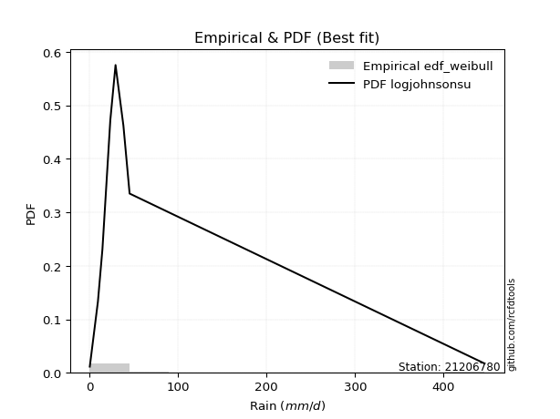</img>

</div>


### 4. EDF Beard (1943)

The Beard formula (or Beard´s plotting position formula) in hydrology is used to estimate the empirical non-exceedance probability _(P)_ of a flood event (or other extreme hydrological data point) within a given dataset.

<div align="center">


$P=(m-0.31)/(n+0.38)$


</div>


**4.1. Empirical values**

<div align="center">

|                | 0                   | 1                   | 2                  | 3                   | 4                  | 5                  | 6                  | 7                  |
|:---------------|:--------------------|:--------------------|:-------------------|:--------------------|:-------------------|:-------------------|:-------------------|:-------------------|
| date           | 2023                | 2016                | 2015               | 2012                | 2025               | 2024               | 2013               | 2014               |
| x              | 0.2                 | 9.4                 | 14.5               | 23.4                | 29.3               | 38.2               | 45.2               | 446.4              |
| m              | 1                   | 2                   | 3                  | 4                   | 5                  | 6                  | 7                  | 8                  |
| empirical_dist | edf_beard           | edf_beard           | edf_beard          | edf_beard           | edf_beard          | edf_beard          | edf_beard          | edf_beard          |
| empirical      | 0.08233890214797135 | 0.20167064439140808 | 0.3210023866348448 | 0.44033412887828155 | 0.5596658711217184 | 0.6789976133651551 | 0.7983293556085919 | 0.9176610978520287 |
| empirical_tr   | 1.0897269180754225  | 1.2526158445440956  | 1.4727592267135323 | 1.7867803837953091  | 2.2710027100271004 | 3.115241635687732  | 4.958579881656804  | 12.144927536231886 |

</div>


**4.2. Kolmogorov-Smirnov fit test (sorted by Δ)**


<div align="center">

|                | 0                   | 1                   | 2                   | 3                   | 4                   | 5                   | 6                   | 7                   | 8                   | 9                   | 10                 | 11                  | 12                  | 13                  | 14                  | 15                  | 16                  | 17                  | 18                  | 19                 | 20                 | 21                  | 22                  | 23                  | 24                 | 25                  | 26                  | 27                  | 28                  | 29                  | 30                  | 31                  | 32                  | 33                  | 34                  | 35                  | 36                 | 37                  | 38                  | 39                 | 40                 | 41                  | 42                 | 43                  | 44                  | 45                  | 46                  | 47                  | 48                 | 49                 | 50                  | 51                  | 52                  | 53                  | 54                  | 55                 | 56                  | 57                  | 58                 | 59                  | 60                 | 61                  | 62                 | 63                  | 64                  | 65                  | 66                  | 67                  | 68                 | 69                 | 70                 | 71                  | 72                  | 73                  | 74                  | 75                  | 76                  | 77                  | 78                 | 79                  | 80                 | 81                  | 82                 | 83                  | 84                  | 85                 | 86                  | 87                  | 88                  | 89                 | 90                 | 91                  | 92                 | 93                  | 94                 | 95                 | 96                  | 97                  | 98                  | 99                 | 100                 | 101                 | 102                | 103                 | 104                 | 105                 | 106                 | 107                 | 108                | 109                | 110                 | 111                 | 112                 | 113                | 114                 | 115                | 116                | 117                 | 118                | 119                | 120                | 121                 | 122                 | 123                | 124                | 125                 | 126                | 127                | 128                | 129                | 130                 | 131                | 132                | 133                 | 134                | 135                | 136                | 137                | 138                | 139                | 140                | 141                | 142                | 143                | 144                | 145                | 146                | 147                | 148                | 149                | 150                | 151                | 152                | 153                | 154                | 155                | 156                | 157                | 158                | 159                |
|:---------------|:--------------------|:--------------------|:--------------------|:--------------------|:--------------------|:--------------------|:--------------------|:--------------------|:--------------------|:--------------------|:-------------------|:--------------------|:--------------------|:--------------------|:--------------------|:--------------------|:--------------------|:--------------------|:--------------------|:-------------------|:-------------------|:--------------------|:--------------------|:--------------------|:-------------------|:--------------------|:--------------------|:--------------------|:--------------------|:--------------------|:--------------------|:--------------------|:--------------------|:--------------------|:--------------------|:--------------------|:-------------------|:--------------------|:--------------------|:-------------------|:-------------------|:--------------------|:-------------------|:--------------------|:--------------------|:--------------------|:--------------------|:--------------------|:-------------------|:-------------------|:--------------------|:--------------------|:--------------------|:--------------------|:--------------------|:-------------------|:--------------------|:--------------------|:-------------------|:--------------------|:-------------------|:--------------------|:-------------------|:--------------------|:--------------------|:--------------------|:--------------------|:--------------------|:-------------------|:-------------------|:-------------------|:--------------------|:--------------------|:--------------------|:--------------------|:--------------------|:--------------------|:--------------------|:-------------------|:--------------------|:-------------------|:--------------------|:-------------------|:--------------------|:--------------------|:-------------------|:--------------------|:--------------------|:--------------------|:-------------------|:-------------------|:--------------------|:-------------------|:--------------------|:-------------------|:-------------------|:--------------------|:--------------------|:--------------------|:-------------------|:--------------------|:--------------------|:-------------------|:--------------------|:--------------------|:--------------------|:--------------------|:--------------------|:-------------------|:-------------------|:--------------------|:--------------------|:--------------------|:-------------------|:--------------------|:-------------------|:-------------------|:--------------------|:-------------------|:-------------------|:-------------------|:--------------------|:--------------------|:-------------------|:-------------------|:--------------------|:-------------------|:-------------------|:-------------------|:-------------------|:--------------------|:-------------------|:-------------------|:--------------------|:-------------------|:-------------------|:-------------------|:-------------------|:-------------------|:-------------------|:-------------------|:-------------------|:-------------------|:-------------------|:-------------------|:-------------------|:-------------------|:-------------------|:-------------------|:-------------------|:-------------------|:-------------------|:-------------------|:-------------------|:-------------------|:-------------------|:-------------------|:-------------------|:-------------------|:-------------------|
| station        | 21206780            | 21206780            | 21206780            | 21206780            | 21206780            | 21206780            | 21206780            | 21206780            | 21206780            | 21206780            | 21206780           | 21206780            | 21206780            | 21206780            | 21206780            | 21206780            | 21206780            | 21206780            | 21206780            | 21206780           | 21206780           | 21206780            | 21206780            | 21206780            | 21206780           | 21206780            | 21206780            | 21206780            | 21206780            | 21206780            | 21206780            | 21206780            | 21206780            | 21206780            | 21206780            | 21206780            | 21206780           | 21206780            | 21206780            | 21206780           | 21206780           | 21206780            | 21206780           | 21206780            | 21206780            | 21206780            | 21206780            | 21206780            | 21206780           | 21206780           | 21206780            | 21206780            | 21206780            | 21206780            | 21206780            | 21206780           | 21206780            | 21206780            | 21206780           | 21206780            | 21206780           | 21206780            | 21206780           | 21206780            | 21206780            | 21206780            | 21206780            | 21206780            | 21206780           | 21206780           | 21206780           | 21206780            | 21206780            | 21206780            | 21206780            | 21206780            | 21206780            | 21206780            | 21206780           | 21206780            | 21206780           | 21206780            | 21206780           | 21206780            | 21206780            | 21206780           | 21206780            | 21206780            | 21206780            | 21206780           | 21206780           | 21206780            | 21206780           | 21206780            | 21206780           | 21206780           | 21206780            | 21206780            | 21206780            | 21206780           | 21206780            | 21206780            | 21206780           | 21206780            | 21206780            | 21206780            | 21206780            | 21206780            | 21206780           | 21206780           | 21206780            | 21206780            | 21206780            | 21206780           | 21206780            | 21206780           | 21206780           | 21206780            | 21206780           | 21206780           | 21206780           | 21206780            | 21206780            | 21206780           | 21206780           | 21206780            | 21206780           | 21206780           | 21206780           | 21206780           | 21206780            | 21206780           | 21206780           | 21206780            | 21206780           | 21206780           | 21206780           | 21206780           | 21206780           | 21206780           | 21206780           | 21206780           | 21206780           | 21206780           | 21206780           | 21206780           | 21206780           | 21206780           | 21206780           | 21206780           | 21206780           | 21206780           | 21206780           | 21206780           | 21206780           | 21206780           | 21206780           | 21206780           | 21206780           | 21206780           |
| empirical_dist | edf_beard           | edf_beard           | edf_beard           | edf_beard           | edf_beard           | edf_beard           | edf_beard           | edf_beard           | edf_beard           | edf_beard           | edf_beard          | edf_beard           | edf_beard           | edf_beard           | edf_beard           | edf_beard           | edf_beard           | edf_beard           | edf_beard           | edf_beard          | edf_beard          | edf_beard           | edf_beard           | edf_beard           | edf_beard          | edf_beard           | edf_beard           | edf_beard           | edf_beard           | edf_beard           | edf_beard           | edf_beard           | edf_beard           | edf_beard           | edf_beard           | edf_beard           | edf_beard          | edf_beard           | edf_beard           | edf_beard          | edf_beard          | edf_beard           | edf_beard          | edf_beard           | edf_beard           | edf_beard           | edf_beard           | edf_beard           | edf_beard          | edf_beard          | edf_beard           | edf_beard           | edf_beard           | edf_beard           | edf_beard           | edf_beard          | edf_beard           | edf_beard           | edf_beard          | edf_beard           | edf_beard          | edf_beard           | edf_beard          | edf_beard           | edf_beard           | edf_beard           | edf_beard           | edf_beard           | edf_beard          | edf_beard          | edf_beard          | edf_beard           | edf_beard           | edf_beard           | edf_beard           | edf_beard           | edf_beard           | edf_beard           | edf_beard          | edf_beard           | edf_beard          | edf_beard           | edf_beard          | edf_beard           | edf_beard           | edf_beard          | edf_beard           | edf_beard           | edf_beard           | edf_beard          | edf_beard          | edf_beard           | edf_beard          | edf_beard           | edf_beard          | edf_beard          | edf_beard           | edf_beard           | edf_beard           | edf_beard          | edf_beard           | edf_beard           | edf_beard          | edf_beard           | edf_beard           | edf_beard           | edf_beard           | edf_beard           | edf_beard          | edf_beard          | edf_beard           | edf_beard           | edf_beard           | edf_beard          | edf_beard           | edf_beard          | edf_beard          | edf_beard           | edf_beard          | edf_beard          | edf_beard          | edf_beard           | edf_beard           | edf_beard          | edf_beard          | edf_beard           | edf_beard          | edf_beard          | edf_beard          | edf_beard          | edf_beard           | edf_beard          | edf_beard          | edf_beard           | edf_beard          | edf_beard          | edf_beard          | edf_beard          | edf_beard          | edf_beard          | edf_beard          | edf_beard          | edf_beard          | edf_beard          | edf_beard          | edf_beard          | edf_beard          | edf_beard          | edf_beard          | edf_beard          | edf_beard          | edf_beard          | edf_beard          | edf_beard          | edf_beard          | edf_beard          | edf_beard          | edf_beard          | edf_beard          | edf_beard          |
| p_dist         | logjohnsonsu        | logt                | alpha               | t                   | logdgamma           | nct                 | kappa3              | invweibull          | genextreme          | johnsonsu           | invgamma           | loggenlogistic      | logmielke           | genpareto           | lomax               | gennorm             | logvonmises_line    | loglaplace          | loglaplace          | logburr12          | logcrystalball     | logfoldnorm         | logdweibull         | loghypsecant        | f                  | ncf                 | logskewnorm         | betaprime           | halfgennorm         | truncpareto         | invgauss            | loglogistic         | loggompertz         | logexponweib        | logloggamma         | burr                | logweibull_min     | logjohnsonsb        | logbeta             | logbetaprime       | logrice            | logexponnorm        | lognorm            | lognakagami         | lognct              | logfatiguelife      | burr12              | loggumbel_l         | logpearson3        | loggennorm         | loggengamma         | mielke              | loggenextreme       | loggamma            | loggamma            | logerlang          | loginvgamma         | loganglit           | dweibull           | logsemicircular     | logargus           | loginvgauss         | logmaxwell         | vonmises_line       | fatiguelife         | truncweibull_min    | lograyleigh         | loggumbel_r         | logarcsine         | loginvweibull      | logcosine          | logburr             | exponpow            | logmoyal            | erlang              | loghalfnorm         | loggenhalflogistic  | wald                | logtriang          | loghalflogistic     | gengamma           | loglomax            | loglevy_l          | logkstwobign        | gamma               | logbradford        | gausshyper          | logtruncweibull_min | loggausshyper       | halflogistic       | loggenexpon        | logwald             | pearson3           | loguniform          | logksone           | moyal              | loggenpareto        | logtruncnorm        | foldnorm            | dgamma             | halfnorm            | logkappa4           | logwrapcauchy      | nakagami            | exponweib           | gumbel_r            | genlogistic         | logtrapezoid        | logloglaplace      | rayleigh           | arcsine             | exponnorm           | genexpon            | maxwell            | gompertz            | semicircular       | anglit             | loghalfgennorm      | weibull_min        | norm               | crystalball        | logncf              | logistic            | wrapcauchy         | logtruncexpon      | powerlaw            | hypsecant          | levy_l             | kstwobign          | laplace            | logweibull_max      | logkappa3          | rice               | gumbel_l            | cosine             | truncnorm          | logf               | logtukeylambda     | logalpha           | argus              | triang             | skewnorm           | logrdist           | bradford           | johnsonsb          | rdist              | truncexpon         | ksone              | logpowerlaw        | tukeylambda        | kappa4             | uniform            | genhalflogistic    | logexponpow        | weibull_max        | logtruncpareto     | beta               | trapezoid          | logvonmises        | vonmises           |
| delta          | 0.04710395221416164 | 0.07233404514635672 | 0.08953929334292066 | 0.09153051456534206 | 0.10489080009057794 | 0.10592019158376564 | 0.10921331442966431 | 0.11028668727281399 | 0.11028726944093425 | 0.11168982751801271 | 0.1127794455340293 | 0.11352133281361099 | 0.11389538319300263 | 0.11932752669816049 | 0.11948369391343683 | 0.12170153715023235 | 0.12711481409137698 | 0.13359597757298408 | 0.13359597757298408 | 0.1337995809410698 | 0.1343299983981744 | 0.13461536242105665 | 0.13633815699001828 | 0.13688061325250772 | 0.1376624489628504 | 0.13863058491339164 | 0.14006733760437284 | 0.14367187299723921 | 0.14604192902240726 | 0.14612070089158236 | 0.14875299112342044 | 0.14981184221126442 | 0.15528388797160741 | 0.15617536651634056 | 0.15858101666229263 | 0.15875986157435312 | 0.1592689606541814 | 0.15994460612240236 | 0.16387226705172353 | 0.1657916368931271 | 0.1661095344732914 | 0.16612037670248553 | 0.1661221067931688 | 0.16636319203891464 | 0.16683774767967113 | 0.16906629918341315 | 0.17124885160443454 | 0.17161697541619303 | 0.1740272300055249 | 0.1741207141356213 | 0.17518185760017574 | 0.17591724725854863 | 0.17869675424100417 | 0.17940580230021402 | 0.17940580230021402 | 0.180452886437924  | 0.18241689485996693 | 0.18391324711453516 | 0.1841562755788922 | 0.19134919553823354 | 0.192086866069217  | 0.19735225117217592 | 0.1990146235312295 | 0.20167008028845534 | 0.20959983455313946 | 0.20981646789028308 | 0.21124580134615428 | 0.21904085913505345 | 0.2215776545917415 | 0.2290050003985591 | 0.2304488434038126 | 0.23122172045809053 | 0.23166044831643007 | 0.23904477160492016 | 0.24526420962859719 | 0.24603047737306077 | 0.24727101288567488 | 0.24894132572957456 | 0.2542615368921083 | 0.25702268350419005 | 0.2599280046941112 | 0.26244444609144063 | 0.266320192542391  | 0.27068781226286803 | 0.27190229539276567 | 0.2721422504546693 | 0.27492929730699434 | 0.27591311645630406 | 0.28319781707801256 | 0.2859878173997522 | 0.2863082895959594 | 0.29292760431148057 | 0.2929799489333731 | 0.29765767970471524 | 0.2977696256886947 | 0.2984549034069178 | 0.29913515952595254 | 0.29930153993945946 | 0.29963759812383167 | 0.3011778375144519 | 0.30327878193532626 | 0.30649051193937155 | 0.3088227251129891 | 0.31576225726208285 | 0.31978954606695825 | 0.32225816553679587 | 0.32323655605404017 | 0.33317191921462386 | 0.3378192762631533 | 0.3379432906040645 | 0.34749836657244193 | 0.34874130472824094 | 0.34986932540416316 | 0.3501825988685861 | 0.35659568979356204 | 0.367451785056072  | 0.3724329944774962 | 0.37645604558222084 | 0.3766782249327695 | 0.3844528748981858 | 0.3844528858881495 | 0.38669405375613713 | 0.39573200236345807 | 0.3990631461815934 | 0.4001136470775309 | 0.40429690862472595 | 0.405063296563725  | 0.4122741687195358 | 0.4140081016320799 | 0.4307654018547334 | 0.43433002614535404 | 0.4350062512280581 | 0.4380390075457416 | 0.45226925503322823 | 0.4653156121983547 | 0.478883265134354  | 0.4889080788668961 | 0.5113907112764886 | 0.5203503499954452 | 0.5323384481538231 | 0.5528522756425671 | 0.5765360278875131 | 0.5766627903421253 | 0.618099573336339  | 0.6244757326155499 | 0.6261636541047827 | 0.6286011097297628 | 0.6309529922438825 | 0.6716644445760382 | 0.6756221756965913 | 0.6798514346065725 | 0.6974777195709406 | 0.7015783331715206 | 0.7066697971447633 | 0.7090202132007043 | 0.715900342339425  | 0.7538419928851063 | 0.7689087516612334 | 1.0679598048893748 | 70.48316156027123  |
| deltao         | 0.4472608134160001  | 0.4472608134160001  | 0.4472608134160001  | 0.4472608134160001  | 0.4472608134160001  | 0.4472608134160001  | 0.4472608134160001  | 0.4472608134160001  | 0.4472608134160001  | 0.4472608134160001  | 0.4472608134160001 | 0.4472608134160001  | 0.4472608134160001  | 0.4472608134160001  | 0.4472608134160001  | 0.4472608134160001  | 0.4472608134160001  | 0.4472608134160001  | 0.4472608134160001  | 0.4472608134160001 | 0.4472608134160001 | 0.4472608134160001  | 0.4472608134160001  | 0.4472608134160001  | 0.4472608134160001 | 0.4472608134160001  | 0.4472608134160001  | 0.4472608134160001  | 0.4472608134160001  | 0.4472608134160001  | 0.4472608134160001  | 0.4472608134160001  | 0.4472608134160001  | 0.4472608134160001  | 0.4472608134160001  | 0.4472608134160001  | 0.4472608134160001 | 0.4472608134160001  | 0.4472608134160001  | 0.4472608134160001 | 0.4472608134160001 | 0.4472608134160001  | 0.4472608134160001 | 0.4472608134160001  | 0.4472608134160001  | 0.4472608134160001  | 0.4472608134160001  | 0.4472608134160001  | 0.4472608134160001 | 0.4472608134160001 | 0.4472608134160001  | 0.4472608134160001  | 0.4472608134160001  | 0.4472608134160001  | 0.4472608134160001  | 0.4472608134160001 | 0.4472608134160001  | 0.4472608134160001  | 0.4472608134160001 | 0.4472608134160001  | 0.4472608134160001 | 0.4472608134160001  | 0.4472608134160001 | 0.4472608134160001  | 0.4472608134160001  | 0.4472608134160001  | 0.4472608134160001  | 0.4472608134160001  | 0.4472608134160001 | 0.4472608134160001 | 0.4472608134160001 | 0.4472608134160001  | 0.4472608134160001  | 0.4472608134160001  | 0.4472608134160001  | 0.4472608134160001  | 0.4472608134160001  | 0.4472608134160001  | 0.4472608134160001 | 0.4472608134160001  | 0.4472608134160001 | 0.4472608134160001  | 0.4472608134160001 | 0.4472608134160001  | 0.4472608134160001  | 0.4472608134160001 | 0.4472608134160001  | 0.4472608134160001  | 0.4472608134160001  | 0.4472608134160001 | 0.4472608134160001 | 0.4472608134160001  | 0.4472608134160001 | 0.4472608134160001  | 0.4472608134160001 | 0.4472608134160001 | 0.4472608134160001  | 0.4472608134160001  | 0.4472608134160001  | 0.4472608134160001 | 0.4472608134160001  | 0.4472608134160001  | 0.4472608134160001 | 0.4472608134160001  | 0.4472608134160001  | 0.4472608134160001  | 0.4472608134160001  | 0.4472608134160001  | 0.4472608134160001 | 0.4472608134160001 | 0.4472608134160001  | 0.4472608134160001  | 0.4472608134160001  | 0.4472608134160001 | 0.4472608134160001  | 0.4472608134160001 | 0.4472608134160001 | 0.4472608134160001  | 0.4472608134160001 | 0.4472608134160001 | 0.4472608134160001 | 0.4472608134160001  | 0.4472608134160001  | 0.4472608134160001 | 0.4472608134160001 | 0.4472608134160001  | 0.4472608134160001 | 0.4472608134160001 | 0.4472608134160001 | 0.4472608134160001 | 0.4472608134160001  | 0.4472608134160001 | 0.4472608134160001 | 0.4472608134160001  | 0.4472608134160001 | 0.4472608134160001 | 0.4472608134160001 | 0.4472608134160001 | 0.4472608134160001 | 0.4472608134160001 | 0.4472608134160001 | 0.4472608134160001 | 0.4472608134160001 | 0.4472608134160001 | 0.4472608134160001 | 0.4472608134160001 | 0.4472608134160001 | 0.4472608134160001 | 0.4472608134160001 | 0.4472608134160001 | 0.4472608134160001 | 0.4472608134160001 | 0.4472608134160001 | 0.4472608134160001 | 0.4472608134160001 | 0.4472608134160001 | 0.4472608134160001 | 0.4472608134160001 | 0.4472608134160001 | 0.4472608134160001 |
| eval           | Δo > Δ              | Δo > Δ              | Δo > Δ              | Δo > Δ              | Δo > Δ              | Δo > Δ              | Δo > Δ              | Δo > Δ              | Δo > Δ              | Δo > Δ              | Δo > Δ             | Δo > Δ              | Δo > Δ              | Δo > Δ              | Δo > Δ              | Δo > Δ              | Δo > Δ              | Δo > Δ              | Δo > Δ              | Δo > Δ             | Δo > Δ             | Δo > Δ              | Δo > Δ              | Δo > Δ              | Δo > Δ             | Δo > Δ              | Δo > Δ              | Δo > Δ              | Δo > Δ              | Δo > Δ              | Δo > Δ              | Δo > Δ              | Δo > Δ              | Δo > Δ              | Δo > Δ              | Δo > Δ              | Δo > Δ             | Δo > Δ              | Δo > Δ              | Δo > Δ             | Δo > Δ             | Δo > Δ              | Δo > Δ             | Δo > Δ              | Δo > Δ              | Δo > Δ              | Δo > Δ              | Δo > Δ              | Δo > Δ             | Δo > Δ             | Δo > Δ              | Δo > Δ              | Δo > Δ              | Δo > Δ              | Δo > Δ              | Δo > Δ             | Δo > Δ              | Δo > Δ              | Δo > Δ             | Δo > Δ              | Δo > Δ             | Δo > Δ              | Δo > Δ             | Δo > Δ              | Δo > Δ              | Δo > Δ              | Δo > Δ              | Δo > Δ              | Δo > Δ             | Δo > Δ             | Δo > Δ             | Δo > Δ              | Δo > Δ              | Δo > Δ              | Δo > Δ              | Δo > Δ              | Δo > Δ              | Δo > Δ              | Δo > Δ             | Δo > Δ              | Δo > Δ             | Δo > Δ              | Δo > Δ             | Δo > Δ              | Δo > Δ              | Δo > Δ             | Δo > Δ              | Δo > Δ              | Δo > Δ              | Δo > Δ             | Δo > Δ             | Δo > Δ              | Δo > Δ             | Δo > Δ              | Δo > Δ             | Δo > Δ             | Δo > Δ              | Δo > Δ              | Δo > Δ              | Δo > Δ             | Δo > Δ              | Δo > Δ              | Δo > Δ             | Δo > Δ              | Δo > Δ              | Δo > Δ              | Δo > Δ              | Δo > Δ              | Δo > Δ             | Δo > Δ             | Δo > Δ              | Δo > Δ              | Δo > Δ              | Δo > Δ             | Δo > Δ              | Δo > Δ             | Δo > Δ             | Δo > Δ              | Δo > Δ             | Δo > Δ             | Δo > Δ             | Δo > Δ              | Δo > Δ              | Δo > Δ             | Δo > Δ             | Δo > Δ              | Δo > Δ             | Δo > Δ             | Δo > Δ             | Δo > Δ             | Δo > Δ              | Δo > Δ             | Δo > Δ             | Δo <= Δ             | Δo <= Δ            | Δo <= Δ            | Δo <= Δ            | Δo <= Δ            | Δo <= Δ            | Δo <= Δ            | Δo <= Δ            | Δo <= Δ            | Δo <= Δ            | Δo <= Δ            | Δo <= Δ            | Δo <= Δ            | Δo <= Δ            | Δo <= Δ            | Δo <= Δ            | Δo <= Δ            | Δo <= Δ            | Δo <= Δ            | Δo <= Δ            | Δo <= Δ            | Δo <= Δ            | Δo <= Δ            | Δo <= Δ            | Δo <= Δ            | Δo <= Δ            | Δo <= Δ            |
| fit            | 1                   | 1                   | 1                   | 1                   | 1                   | 1                   | 1                   | 1                   | 1                   | 1                   | 1                  | 1                   | 1                   | 1                   | 1                   | 1                   | 1                   | 1                   | 1                   | 1                  | 1                  | 1                   | 1                   | 1                   | 1                  | 1                   | 1                   | 1                   | 1                   | 1                   | 1                   | 1                   | 1                   | 1                   | 1                   | 1                   | 1                  | 1                   | 1                   | 1                  | 1                  | 1                   | 1                  | 1                   | 1                   | 1                   | 1                   | 1                   | 1                  | 1                  | 1                   | 1                   | 1                   | 1                   | 1                   | 1                  | 1                   | 1                   | 1                  | 1                   | 1                  | 1                   | 1                  | 1                   | 1                   | 1                   | 1                   | 1                   | 1                  | 1                  | 1                  | 1                   | 1                   | 1                   | 1                   | 1                   | 1                   | 1                   | 1                  | 1                   | 1                  | 1                   | 1                  | 1                   | 1                   | 1                  | 1                   | 1                   | 1                   | 1                  | 1                  | 1                   | 1                  | 1                   | 1                  | 1                  | 1                   | 1                   | 1                   | 1                  | 1                   | 1                   | 1                  | 1                   | 1                   | 1                   | 1                   | 1                   | 1                  | 1                  | 1                   | 1                   | 1                   | 1                  | 1                   | 1                  | 1                  | 1                   | 1                  | 1                  | 1                  | 1                   | 1                   | 1                  | 1                  | 1                   | 1                  | 1                  | 1                  | 1                  | 1                   | 1                  | 1                  | 0                   | 0                  | 0                  | 0                  | 0                  | 0                  | 0                  | 0                  | 0                  | 0                  | 0                  | 0                  | 0                  | 0                  | 0                  | 0                  | 0                  | 0                  | 0                  | 0                  | 0                  | 0                  | 0                  | 0                  | 0                  | 0                  | 0                  |
| n              | 8                   | 8                   | 8                   | 8                   | 8                   | 8                   | 8                   | 8                   | 8                   | 8                   | 8                  | 8                   | 8                   | 8                   | 8                   | 8                   | 8                   | 8                   | 8                   | 8                  | 8                  | 8                   | 8                   | 8                   | 8                  | 8                   | 8                   | 8                   | 8                   | 8                   | 8                   | 8                   | 8                   | 8                   | 8                   | 8                   | 8                  | 8                   | 8                   | 8                  | 8                  | 8                   | 8                  | 8                   | 8                   | 8                   | 8                   | 8                   | 8                  | 8                  | 8                   | 8                   | 8                   | 8                   | 8                   | 8                  | 8                   | 8                   | 8                  | 8                   | 8                  | 8                   | 8                  | 8                   | 8                   | 8                   | 8                   | 8                   | 8                  | 8                  | 8                  | 8                   | 8                   | 8                   | 8                   | 8                   | 8                   | 8                   | 8                  | 8                   | 8                  | 8                   | 8                  | 8                   | 8                   | 8                  | 8                   | 8                   | 8                   | 8                  | 8                  | 8                   | 8                  | 8                   | 8                  | 8                  | 8                   | 8                   | 8                   | 8                  | 8                   | 8                   | 8                  | 8                   | 8                   | 8                   | 8                   | 8                   | 8                  | 8                  | 8                   | 8                   | 8                   | 8                  | 8                   | 8                  | 8                  | 8                   | 8                  | 8                  | 8                  | 8                   | 8                   | 8                  | 8                  | 8                   | 8                  | 8                  | 8                  | 8                  | 8                   | 8                  | 8                  | 8                   | 8                  | 8                  | 8                  | 8                  | 8                  | 8                  | 8                  | 8                  | 8                  | 8                  | 8                  | 8                  | 8                  | 8                  | 8                  | 8                  | 8                  | 8                  | 8                  | 8                  | 8                  | 8                  | 8                  | 8                  | 8                  | 8                  |
| best_fit       | 1                   | 0                   | 0                   | 0                   | 0                   | 0                   | 0                   | 0                   | 0                   | 0                   | 0                  | 0                   | 0                   | 0                   | 0                   | 0                   | 0                   | 0                   | 0                   | 0                  | 0                  | 0                   | 0                   | 0                   | 0                  | 0                   | 0                   | 0                   | 0                   | 0                   | 0                   | 0                   | 0                   | 0                   | 0                   | 0                   | 0                  | 0                   | 0                   | 0                  | 0                  | 0                   | 0                  | 0                   | 0                   | 0                   | 0                   | 0                   | 0                  | 0                  | 0                   | 0                   | 0                   | 0                   | 0                   | 0                  | 0                   | 0                   | 0                  | 0                   | 0                  | 0                   | 0                  | 0                   | 0                   | 0                   | 0                   | 0                   | 0                  | 0                  | 0                  | 0                   | 0                   | 0                   | 0                   | 0                   | 0                   | 0                   | 0                  | 0                   | 0                  | 0                   | 0                  | 0                   | 0                   | 0                  | 0                   | 0                   | 0                   | 0                  | 0                  | 0                   | 0                  | 0                   | 0                  | 0                  | 0                   | 0                   | 0                   | 0                  | 0                   | 0                   | 0                  | 0                   | 0                   | 0                   | 0                   | 0                   | 0                  | 0                  | 0                   | 0                   | 0                   | 0                  | 0                   | 0                  | 0                  | 0                   | 0                  | 0                  | 0                  | 0                   | 0                   | 0                  | 0                  | 0                   | 0                  | 0                  | 0                  | 0                  | 0                   | 0                  | 0                  | 0                   | 0                  | 0                  | 0                  | 0                  | 0                  | 0                  | 0                  | 0                  | 0                  | 0                  | 0                  | 0                  | 0                  | 0                  | 0                  | 0                  | 0                  | 0                  | 0                  | 0                  | 0                  | 0                  | 0                  | 0                  | 0                  | 0                  |
| best_fit_sort  | 1                   | 2                   | 3                   | 4                   | 5                   | 6                   | 7                   | 8                   | 9                   | 10                  | 11                 | 12                  | 13                  | 14                  | 15                  | 16                  | 17                  | 18                  | 19                  | 20                 | 21                 | 22                  | 23                  | 24                  | 25                 | 26                  | 27                  | 28                  | 29                  | 30                  | 31                  | 32                  | 33                  | 34                  | 35                  | 36                  | 37                 | 38                  | 39                  | 40                 | 41                 | 42                  | 43                 | 44                  | 45                  | 46                  | 47                  | 48                  | 49                 | 50                 | 51                  | 52                  | 53                  | 54                  | 55                  | 56                 | 57                  | 58                  | 59                 | 60                  | 61                 | 62                  | 63                 | 64                  | 65                  | 66                  | 67                  | 68                  | 69                 | 70                 | 71                 | 72                  | 73                  | 74                  | 75                  | 76                  | 77                  | 78                  | 79                 | 80                  | 81                 | 82                  | 83                 | 84                  | 85                  | 86                 | 87                  | 88                  | 89                  | 90                 | 91                 | 92                  | 93                 | 94                  | 95                 | 96                 | 97                  | 98                  | 99                  | 100                | 101                 | 102                 | 103                | 104                 | 105                 | 106                 | 107                 | 108                 | 109                | 110                | 111                 | 112                 | 113                 | 114                | 115                 | 116                | 117                | 118                 | 119                | 120                | 121                | 122                 | 123                 | 124                | 125                | 126                 | 127                | 128                | 129                | 130                | 131                 | 132                | 133                | 134                 | 135                | 136                | 137                | 138                | 139                | 140                | 141                | 142                | 143                | 144                | 145                | 146                | 147                | 148                | 149                | 150                | 151                | 152                | 153                | 154                | 155                | 156                | 157                | 158                | 159                | 160                |

</div>


**4.3. Best fit**

<div align="center">

|   id |   station | empirical_dist   | p_dist       |    delta |   deltao | eval   |   fit |   n |   best_fit |   best_fit_sort |
|-----:|----------:|:-----------------|:-------------|---------:|---------:|:-------|------:|----:|-----------:|----------------:|
|    0 |  21206780 | edf_beard        | logjohnsonsu | 0.047104 | 0.447261 | Δo > Δ |     1 |   8 |          1 |               1 |

</div>


<div align="center">

</img></img>

</div>


### 5. EDF Chegodayev (1955)

The Chegodayev formula is an empirical plotting position formula used in hydrological frequency analysis to estimate the exceedance probability or return period of a specific event from a set of observed data. It is primarily used for plotting observed data points on probability paper to fit a theoretical distribution, particularly for analyzing extreme events like maximum flood flows or rainfall intensities. The constant _b_ value in the generalized plotting position formula is 0.3.

<div align="center">


$P=(m-b)/(n+1-2b)$


</div>


**5.1. Empirical values**

<div align="center">

|                | 0                   | 1                   | 2                   | 3                   | 4                  | 5                  | 6                  | 7                  |
|:---------------|:--------------------|:--------------------|:--------------------|:--------------------|:-------------------|:-------------------|:-------------------|:-------------------|
| date           | 2023                | 2016                | 2015                | 2012                | 2025               | 2024               | 2013               | 2014               |
| x              | 0.2                 | 9.4                 | 14.5                | 23.4                | 29.3               | 38.2               | 45.2               | 446.4              |
| m              | 1                   | 2                   | 3                   | 4                   | 5                  | 6                  | 7                  | 8                  |
| empirical_dist | edf_chegodayev      | edf_chegodayev      | edf_chegodayev      | edf_chegodayev      | edf_chegodayev     | edf_chegodayev     | edf_chegodayev     | edf_chegodayev     |
| empirical      | 0.08333333333333333 | 0.20238095238095236 | 0.32142857142857145 | 0.44047619047619047 | 0.5595238095238095 | 0.6785714285714286 | 0.7976190476190476 | 0.9166666666666666 |
| empirical_tr   | 1.090909090909091   | 1.253731343283582   | 1.4736842105263157  | 1.7872340425531914  | 2.27027027027027   | 3.1111111111111116 | 4.941176470588234  | 11.999999999999995 |

</div>


**5.2. Kolmogorov-Smirnov fit test (sorted by Δ)**


<div align="center">

|                | 0                   | 1                   | 2                   | 3                   | 4                   | 5                   | 6                   | 7                   | 8                   | 9                  | 10                 | 11                  | 12                  | 13                  | 14                  | 15                  | 16                 | 17                 | 18                  | 19                  | 20                 | 21                  | 22                  | 23                  | 24                  | 25                  | 26                  | 27                  | 28                  | 29                  | 30                  | 31                  | 32                  | 33                  | 34                  | 35                 | 36                 | 37                  | 38                  | 39                  | 40                  | 41                  | 42                  | 43                  | 44                  | 45                  | 46                  | 47                  | 48                 | 49                  | 50                  | 51                  | 52                  | 53                  | 54                  | 55                  | 56                  | 57                  | 58                 | 59                  | 60                 | 61                  | 62                  | 63                  | 64                  | 65                  | 66                 | 67                  | 68                  | 69                  | 70                  | 71                  | 72                  | 73                  | 74                 | 75                 | 76                  | 77                 | 78                 | 79                 | 80                  | 81                 | 82                  | 83                 | 84                  | 85                  | 86                  | 87                  | 88                 | 89                 | 90                  | 91                 | 92                  | 93                  | 94                 | 95                 | 96                  | 97                 | 98                  | 99                 | 100                 | 101                | 102                 | 103                 | 104                 | 105                 | 106                 | 107                 | 108                 | 109                 | 110                 | 111                 | 112                 | 113                | 114                 | 115                | 116                | 117                | 118                | 119                | 120                | 121                | 122                 | 123                | 124                 | 125                | 126                 | 127                 | 128                | 129                | 130                 | 131                 | 132                | 133                 | 134                | 135                | 136                 | 137                | 138                | 139                | 140                | 141                | 142                | 143                | 144                | 145                | 146                | 147                | 148                | 149                | 150                | 151                | 152                | 153                | 154                | 155                | 156                | 157                | 158                | 159                |
|:---------------|:--------------------|:--------------------|:--------------------|:--------------------|:--------------------|:--------------------|:--------------------|:--------------------|:--------------------|:-------------------|:-------------------|:--------------------|:--------------------|:--------------------|:--------------------|:--------------------|:-------------------|:-------------------|:--------------------|:--------------------|:-------------------|:--------------------|:--------------------|:--------------------|:--------------------|:--------------------|:--------------------|:--------------------|:--------------------|:--------------------|:--------------------|:--------------------|:--------------------|:--------------------|:--------------------|:-------------------|:-------------------|:--------------------|:--------------------|:--------------------|:--------------------|:--------------------|:--------------------|:--------------------|:--------------------|:--------------------|:--------------------|:--------------------|:-------------------|:--------------------|:--------------------|:--------------------|:--------------------|:--------------------|:--------------------|:--------------------|:--------------------|:--------------------|:-------------------|:--------------------|:-------------------|:--------------------|:--------------------|:--------------------|:--------------------|:--------------------|:-------------------|:--------------------|:--------------------|:--------------------|:--------------------|:--------------------|:--------------------|:--------------------|:-------------------|:-------------------|:--------------------|:-------------------|:-------------------|:-------------------|:--------------------|:-------------------|:--------------------|:-------------------|:--------------------|:--------------------|:--------------------|:--------------------|:-------------------|:-------------------|:--------------------|:-------------------|:--------------------|:--------------------|:-------------------|:-------------------|:--------------------|:-------------------|:--------------------|:-------------------|:--------------------|:-------------------|:--------------------|:--------------------|:--------------------|:--------------------|:--------------------|:--------------------|:--------------------|:--------------------|:--------------------|:--------------------|:--------------------|:-------------------|:--------------------|:-------------------|:-------------------|:-------------------|:-------------------|:-------------------|:-------------------|:-------------------|:--------------------|:-------------------|:--------------------|:-------------------|:--------------------|:--------------------|:-------------------|:-------------------|:--------------------|:--------------------|:-------------------|:--------------------|:-------------------|:-------------------|:--------------------|:-------------------|:-------------------|:-------------------|:-------------------|:-------------------|:-------------------|:-------------------|:-------------------|:-------------------|:-------------------|:-------------------|:-------------------|:-------------------|:-------------------|:-------------------|:-------------------|:-------------------|:-------------------|:-------------------|:-------------------|:-------------------|:-------------------|:-------------------|
| station        | 21206780            | 21206780            | 21206780            | 21206780            | 21206780            | 21206780            | 21206780            | 21206780            | 21206780            | 21206780           | 21206780           | 21206780            | 21206780            | 21206780            | 21206780            | 21206780            | 21206780           | 21206780           | 21206780            | 21206780            | 21206780           | 21206780            | 21206780            | 21206780            | 21206780            | 21206780            | 21206780            | 21206780            | 21206780            | 21206780            | 21206780            | 21206780            | 21206780            | 21206780            | 21206780            | 21206780           | 21206780           | 21206780            | 21206780            | 21206780            | 21206780            | 21206780            | 21206780            | 21206780            | 21206780            | 21206780            | 21206780            | 21206780            | 21206780           | 21206780            | 21206780            | 21206780            | 21206780            | 21206780            | 21206780            | 21206780            | 21206780            | 21206780            | 21206780           | 21206780            | 21206780           | 21206780            | 21206780            | 21206780            | 21206780            | 21206780            | 21206780           | 21206780            | 21206780            | 21206780            | 21206780            | 21206780            | 21206780            | 21206780            | 21206780           | 21206780           | 21206780            | 21206780           | 21206780           | 21206780           | 21206780            | 21206780           | 21206780            | 21206780           | 21206780            | 21206780            | 21206780            | 21206780            | 21206780           | 21206780           | 21206780            | 21206780           | 21206780            | 21206780            | 21206780           | 21206780           | 21206780            | 21206780           | 21206780            | 21206780           | 21206780            | 21206780           | 21206780            | 21206780            | 21206780            | 21206780            | 21206780            | 21206780            | 21206780            | 21206780            | 21206780            | 21206780            | 21206780            | 21206780           | 21206780            | 21206780           | 21206780           | 21206780           | 21206780           | 21206780           | 21206780           | 21206780           | 21206780            | 21206780           | 21206780            | 21206780           | 21206780            | 21206780            | 21206780           | 21206780           | 21206780            | 21206780            | 21206780           | 21206780            | 21206780           | 21206780           | 21206780            | 21206780           | 21206780           | 21206780           | 21206780           | 21206780           | 21206780           | 21206780           | 21206780           | 21206780           | 21206780           | 21206780           | 21206780           | 21206780           | 21206780           | 21206780           | 21206780           | 21206780           | 21206780           | 21206780           | 21206780           | 21206780           | 21206780           | 21206780           |
| empirical_dist | edf_chegodayev      | edf_chegodayev      | edf_chegodayev      | edf_chegodayev      | edf_chegodayev      | edf_chegodayev      | edf_chegodayev      | edf_chegodayev      | edf_chegodayev      | edf_chegodayev     | edf_chegodayev     | edf_chegodayev      | edf_chegodayev      | edf_chegodayev      | edf_chegodayev      | edf_chegodayev      | edf_chegodayev     | edf_chegodayev     | edf_chegodayev      | edf_chegodayev      | edf_chegodayev     | edf_chegodayev      | edf_chegodayev      | edf_chegodayev      | edf_chegodayev      | edf_chegodayev      | edf_chegodayev      | edf_chegodayev      | edf_chegodayev      | edf_chegodayev      | edf_chegodayev      | edf_chegodayev      | edf_chegodayev      | edf_chegodayev      | edf_chegodayev      | edf_chegodayev     | edf_chegodayev     | edf_chegodayev      | edf_chegodayev      | edf_chegodayev      | edf_chegodayev      | edf_chegodayev      | edf_chegodayev      | edf_chegodayev      | edf_chegodayev      | edf_chegodayev      | edf_chegodayev      | edf_chegodayev      | edf_chegodayev     | edf_chegodayev      | edf_chegodayev      | edf_chegodayev      | edf_chegodayev      | edf_chegodayev      | edf_chegodayev      | edf_chegodayev      | edf_chegodayev      | edf_chegodayev      | edf_chegodayev     | edf_chegodayev      | edf_chegodayev     | edf_chegodayev      | edf_chegodayev      | edf_chegodayev      | edf_chegodayev      | edf_chegodayev      | edf_chegodayev     | edf_chegodayev      | edf_chegodayev      | edf_chegodayev      | edf_chegodayev      | edf_chegodayev      | edf_chegodayev      | edf_chegodayev      | edf_chegodayev     | edf_chegodayev     | edf_chegodayev      | edf_chegodayev     | edf_chegodayev     | edf_chegodayev     | edf_chegodayev      | edf_chegodayev     | edf_chegodayev      | edf_chegodayev     | edf_chegodayev      | edf_chegodayev      | edf_chegodayev      | edf_chegodayev      | edf_chegodayev     | edf_chegodayev     | edf_chegodayev      | edf_chegodayev     | edf_chegodayev      | edf_chegodayev      | edf_chegodayev     | edf_chegodayev     | edf_chegodayev      | edf_chegodayev     | edf_chegodayev      | edf_chegodayev     | edf_chegodayev      | edf_chegodayev     | edf_chegodayev      | edf_chegodayev      | edf_chegodayev      | edf_chegodayev      | edf_chegodayev      | edf_chegodayev      | edf_chegodayev      | edf_chegodayev      | edf_chegodayev      | edf_chegodayev      | edf_chegodayev      | edf_chegodayev     | edf_chegodayev      | edf_chegodayev     | edf_chegodayev     | edf_chegodayev     | edf_chegodayev     | edf_chegodayev     | edf_chegodayev     | edf_chegodayev     | edf_chegodayev      | edf_chegodayev     | edf_chegodayev      | edf_chegodayev     | edf_chegodayev      | edf_chegodayev      | edf_chegodayev     | edf_chegodayev     | edf_chegodayev      | edf_chegodayev      | edf_chegodayev     | edf_chegodayev      | edf_chegodayev     | edf_chegodayev     | edf_chegodayev      | edf_chegodayev     | edf_chegodayev     | edf_chegodayev     | edf_chegodayev     | edf_chegodayev     | edf_chegodayev     | edf_chegodayev     | edf_chegodayev     | edf_chegodayev     | edf_chegodayev     | edf_chegodayev     | edf_chegodayev     | edf_chegodayev     | edf_chegodayev     | edf_chegodayev     | edf_chegodayev     | edf_chegodayev     | edf_chegodayev     | edf_chegodayev     | edf_chegodayev     | edf_chegodayev     | edf_chegodayev     | edf_chegodayev     |
| p_dist         | logjohnsonsu        | logt                | alpha               | t                   | logdgamma           | nct                 | kappa3              | invweibull          | genextreme          | johnsonsu          | invgamma           | loggenlogistic      | logmielke           | genpareto           | lomax               | gennorm             | logvonmises_line   | logburr12          | loglaplace          | loglaplace          | logcrystalball     | logfoldnorm         | logdweibull         | loghypsecant        | f                   | ncf                 | logskewnorm         | betaprime           | halfgennorm         | truncpareto         | invgauss            | loglogistic         | loggompertz         | logexponweib        | logloggamma         | logweibull_min     | burr               | logjohnsonsb        | logbeta             | logbetaprime        | logrice             | logexponnorm        | lognorm             | lognakagami         | lognct              | logfatiguelife      | burr12              | loggumbel_l         | logpearson3        | loggennorm          | loggengamma         | mielke              | loggenextreme       | loggamma            | loggamma            | logerlang           | loginvgamma         | dweibull            | loganglit          | logsemicircular     | logargus           | loginvgauss         | logmaxwell          | vonmises_line       | fatiguelife         | truncweibull_min    | lograyleigh        | loggumbel_r         | logarcsine          | loginvweibull       | logcosine           | logburr             | exponpow            | logmoyal            | erlang             | loghalfnorm        | loggenhalflogistic  | wald               | logtriang          | loghalflogistic    | gengamma            | loglomax           | loglevy_l           | logkstwobign       | gamma               | logbradford         | gausshyper          | logtruncweibull_min | loggausshyper      | halflogistic       | loggenexpon         | pearson3           | logwald             | loguniform          | logksone           | moyal              | loggenpareto        | logtruncnorm       | foldnorm            | dgamma             | halfnorm            | logkappa4          | logwrapcauchy       | nakagami            | exponweib           | gumbel_r            | genlogistic         | logtrapezoid        | logloglaplace       | rayleigh            | arcsine             | exponnorm           | genexpon            | maxwell            | gompertz            | semicircular       | anglit             | loghalfgennorm     | weibull_min        | norm               | crystalball        | logncf             | logistic            | wrapcauchy         | logtruncexpon       | powerlaw           | hypsecant           | levy_l              | kstwobign          | laplace            | logweibull_max      | logkappa3           | rice               | gumbel_l            | cosine             | truncnorm          | logf                | logtukeylambda     | logalpha           | argus              | triang             | skewnorm           | logrdist           | bradford           | johnsonsb          | rdist              | truncexpon         | ksone              | logpowerlaw        | tukeylambda        | kappa4             | uniform            | genhalflogistic    | logexponpow        | weibull_max        | logtruncpareto     | beta               | trapezoid          | logvonmises        | vonmises           |
| delta          | 0.04809838339952366 | 0.07276022994008335 | 0.08882898535337636 | 0.09053608337998008 | 0.10418049210103364 | 0.10520988359422134 | 0.10850300644012001 | 0.10957637928326969 | 0.10957696145138995 | 0.1109795195284684 | 0.112069137544485  | 0.11281102482406669 | 0.11318507520345833 | 0.11861721870861619 | 0.11877338592389253 | 0.12184359874814121 | 0.1264045061018327 | 0.1330892729515255 | 0.13345391597507517 | 0.13345391597507517 | 0.1336196904086301 | 0.13390505443151238 | 0.13562784900047398 | 0.13617030526296345 | 0.13695214097330613 | 0.13792027692384734 | 0.13935702961482857 | 0.14296156500769494 | 0.14533162103286298 | 0.14541039290203805 | 0.14804268313387614 | 0.14910153422172015 | 0.15457357998206311 | 0.15546505852679626 | 0.15787070867274833 | 0.1585586526646371 | 0.1586177999764442 | 0.15923429813285805 | 0.16316195906217923 | 0.16508132890358282 | 0.16539922648374714 | 0.16541006871294126 | 0.16541179880362453 | 0.16565288404937037 | 0.16612743969012686 | 0.16835599119386888 | 0.17053854361489026 | 0.17090666742664873 | 0.1733169220159806 | 0.17426277573353022 | 0.17447154961063147 | 0.17520693926900435 | 0.17798644625145987 | 0.17869549431066975 | 0.17869549431066975 | 0.17974257844837974 | 0.18170658687042265 | 0.18316184439353023 | 0.1832029391249909 | 0.19063888754868927 | 0.1913765580796727 | 0.19664194318263165 | 0.19830431554168523 | 0.20238038827799965 | 0.20888952656359516 | 0.20910615990073878 | 0.21053549335661   | 0.21833055114550917 | 0.22086734660219723 | 0.22829469240901482 | 0.22973853541426834 | 0.23051141246854626 | 0.23095014032688577 | 0.23833446361537589 | 0.2445539016390529 | 0.2453201693835165 | 0.24656070489613058 | 0.2479468945442126 | 0.253551228902564  | 0.2563123755146458 | 0.25921769670456696 | 0.2617341381018964 | 0.26560988455284673 | 0.2699775042733238 | 0.27119198740322137 | 0.27143194246512503 | 0.27421898931745003 | 0.2752028084667598  | 0.2824875090884683 | 0.2852775094102079 | 0.28559798160641514 | 0.2919855177480111 | 0.29250141951775394 | 0.29694737171517094 | 0.2970593176991504 | 0.2977445954173735 | 0.29842485153640824 | 0.2985912319499152 | 0.29892729013428737 | 0.3001834063290899 | 0.30256847394578196 | 0.3057802039498273 | 0.30811241712344484 | 0.31505194927253855 | 0.31907923807741395 | 0.32154785754725157 | 0.32252624806449587 | 0.33246161122507956 | 0.33710896827360903 | 0.33723298261452017 | 0.34678805858289763 | 0.34803099673869664 | 0.34915901741461886 | 0.3494722908790418 | 0.35588538180401774 | 0.3667414770665277 | 0.3717226864879519 | 0.3757457375926766 | 0.3759679169432252 | 0.3837425669086415 | 0.3837425778986052 | 0.3859837457665929 | 0.39502169437391377 | 0.3983528381920491 | 0.39940333908798664 | 0.4035866006351817 | 0.40435298857418067 | 0.41127973753417385 | 0.4132977936425356 | 0.4300550938651891 | 0.43361971815580974 | 0.43429594323851384 | 0.4373286995561973 | 0.45155894704368393 | 0.4646053042088104 | 0.4781729571448097 | 0.48819777087735183 | 0.5106804032869443 | 0.5196400420059009 | 0.5316281401642788 | 0.5521419676530228 | 0.5758257198979688 | 0.5759524823525811 | 0.6173892653467947 | 0.6237654246260056 | 0.6251692229194207 | 0.6278908017402185 | 0.6302426842543382 | 0.670954136586494  | 0.6746277445112293 | 0.6791411266170282 | 0.6967674115813963 | 0.7008680251819763 | 0.705959489155219  | 0.70830990521116   | 0.7151900343498807 | 0.7528475616997443 | 0.7681984436716891 | 1.0689542360747368 | 70.48415599145659  |
| deltao         | 0.4472608134160001  | 0.4472608134160001  | 0.4472608134160001  | 0.4472608134160001  | 0.4472608134160001  | 0.4472608134160001  | 0.4472608134160001  | 0.4472608134160001  | 0.4472608134160001  | 0.4472608134160001 | 0.4472608134160001 | 0.4472608134160001  | 0.4472608134160001  | 0.4472608134160001  | 0.4472608134160001  | 0.4472608134160001  | 0.4472608134160001 | 0.4472608134160001 | 0.4472608134160001  | 0.4472608134160001  | 0.4472608134160001 | 0.4472608134160001  | 0.4472608134160001  | 0.4472608134160001  | 0.4472608134160001  | 0.4472608134160001  | 0.4472608134160001  | 0.4472608134160001  | 0.4472608134160001  | 0.4472608134160001  | 0.4472608134160001  | 0.4472608134160001  | 0.4472608134160001  | 0.4472608134160001  | 0.4472608134160001  | 0.4472608134160001 | 0.4472608134160001 | 0.4472608134160001  | 0.4472608134160001  | 0.4472608134160001  | 0.4472608134160001  | 0.4472608134160001  | 0.4472608134160001  | 0.4472608134160001  | 0.4472608134160001  | 0.4472608134160001  | 0.4472608134160001  | 0.4472608134160001  | 0.4472608134160001 | 0.4472608134160001  | 0.4472608134160001  | 0.4472608134160001  | 0.4472608134160001  | 0.4472608134160001  | 0.4472608134160001  | 0.4472608134160001  | 0.4472608134160001  | 0.4472608134160001  | 0.4472608134160001 | 0.4472608134160001  | 0.4472608134160001 | 0.4472608134160001  | 0.4472608134160001  | 0.4472608134160001  | 0.4472608134160001  | 0.4472608134160001  | 0.4472608134160001 | 0.4472608134160001  | 0.4472608134160001  | 0.4472608134160001  | 0.4472608134160001  | 0.4472608134160001  | 0.4472608134160001  | 0.4472608134160001  | 0.4472608134160001 | 0.4472608134160001 | 0.4472608134160001  | 0.4472608134160001 | 0.4472608134160001 | 0.4472608134160001 | 0.4472608134160001  | 0.4472608134160001 | 0.4472608134160001  | 0.4472608134160001 | 0.4472608134160001  | 0.4472608134160001  | 0.4472608134160001  | 0.4472608134160001  | 0.4472608134160001 | 0.4472608134160001 | 0.4472608134160001  | 0.4472608134160001 | 0.4472608134160001  | 0.4472608134160001  | 0.4472608134160001 | 0.4472608134160001 | 0.4472608134160001  | 0.4472608134160001 | 0.4472608134160001  | 0.4472608134160001 | 0.4472608134160001  | 0.4472608134160001 | 0.4472608134160001  | 0.4472608134160001  | 0.4472608134160001  | 0.4472608134160001  | 0.4472608134160001  | 0.4472608134160001  | 0.4472608134160001  | 0.4472608134160001  | 0.4472608134160001  | 0.4472608134160001  | 0.4472608134160001  | 0.4472608134160001 | 0.4472608134160001  | 0.4472608134160001 | 0.4472608134160001 | 0.4472608134160001 | 0.4472608134160001 | 0.4472608134160001 | 0.4472608134160001 | 0.4472608134160001 | 0.4472608134160001  | 0.4472608134160001 | 0.4472608134160001  | 0.4472608134160001 | 0.4472608134160001  | 0.4472608134160001  | 0.4472608134160001 | 0.4472608134160001 | 0.4472608134160001  | 0.4472608134160001  | 0.4472608134160001 | 0.4472608134160001  | 0.4472608134160001 | 0.4472608134160001 | 0.4472608134160001  | 0.4472608134160001 | 0.4472608134160001 | 0.4472608134160001 | 0.4472608134160001 | 0.4472608134160001 | 0.4472608134160001 | 0.4472608134160001 | 0.4472608134160001 | 0.4472608134160001 | 0.4472608134160001 | 0.4472608134160001 | 0.4472608134160001 | 0.4472608134160001 | 0.4472608134160001 | 0.4472608134160001 | 0.4472608134160001 | 0.4472608134160001 | 0.4472608134160001 | 0.4472608134160001 | 0.4472608134160001 | 0.4472608134160001 | 0.4472608134160001 | 0.4472608134160001 |
| eval           | Δo > Δ              | Δo > Δ              | Δo > Δ              | Δo > Δ              | Δo > Δ              | Δo > Δ              | Δo > Δ              | Δo > Δ              | Δo > Δ              | Δo > Δ             | Δo > Δ             | Δo > Δ              | Δo > Δ              | Δo > Δ              | Δo > Δ              | Δo > Δ              | Δo > Δ             | Δo > Δ             | Δo > Δ              | Δo > Δ              | Δo > Δ             | Δo > Δ              | Δo > Δ              | Δo > Δ              | Δo > Δ              | Δo > Δ              | Δo > Δ              | Δo > Δ              | Δo > Δ              | Δo > Δ              | Δo > Δ              | Δo > Δ              | Δo > Δ              | Δo > Δ              | Δo > Δ              | Δo > Δ             | Δo > Δ             | Δo > Δ              | Δo > Δ              | Δo > Δ              | Δo > Δ              | Δo > Δ              | Δo > Δ              | Δo > Δ              | Δo > Δ              | Δo > Δ              | Δo > Δ              | Δo > Δ              | Δo > Δ             | Δo > Δ              | Δo > Δ              | Δo > Δ              | Δo > Δ              | Δo > Δ              | Δo > Δ              | Δo > Δ              | Δo > Δ              | Δo > Δ              | Δo > Δ             | Δo > Δ              | Δo > Δ             | Δo > Δ              | Δo > Δ              | Δo > Δ              | Δo > Δ              | Δo > Δ              | Δo > Δ             | Δo > Δ              | Δo > Δ              | Δo > Δ              | Δo > Δ              | Δo > Δ              | Δo > Δ              | Δo > Δ              | Δo > Δ             | Δo > Δ             | Δo > Δ              | Δo > Δ             | Δo > Δ             | Δo > Δ             | Δo > Δ              | Δo > Δ             | Δo > Δ              | Δo > Δ             | Δo > Δ              | Δo > Δ              | Δo > Δ              | Δo > Δ              | Δo > Δ             | Δo > Δ             | Δo > Δ              | Δo > Δ             | Δo > Δ              | Δo > Δ              | Δo > Δ             | Δo > Δ             | Δo > Δ              | Δo > Δ             | Δo > Δ              | Δo > Δ             | Δo > Δ              | Δo > Δ             | Δo > Δ              | Δo > Δ              | Δo > Δ              | Δo > Δ              | Δo > Δ              | Δo > Δ              | Δo > Δ              | Δo > Δ              | Δo > Δ              | Δo > Δ              | Δo > Δ              | Δo > Δ             | Δo > Δ              | Δo > Δ             | Δo > Δ             | Δo > Δ             | Δo > Δ             | Δo > Δ             | Δo > Δ             | Δo > Δ             | Δo > Δ              | Δo > Δ             | Δo > Δ              | Δo > Δ             | Δo > Δ              | Δo > Δ              | Δo > Δ             | Δo > Δ             | Δo > Δ              | Δo > Δ              | Δo > Δ             | Δo <= Δ             | Δo <= Δ            | Δo <= Δ            | Δo <= Δ             | Δo <= Δ            | Δo <= Δ            | Δo <= Δ            | Δo <= Δ            | Δo <= Δ            | Δo <= Δ            | Δo <= Δ            | Δo <= Δ            | Δo <= Δ            | Δo <= Δ            | Δo <= Δ            | Δo <= Δ            | Δo <= Δ            | Δo <= Δ            | Δo <= Δ            | Δo <= Δ            | Δo <= Δ            | Δo <= Δ            | Δo <= Δ            | Δo <= Δ            | Δo <= Δ            | Δo <= Δ            | Δo <= Δ            |
| fit            | 1                   | 1                   | 1                   | 1                   | 1                   | 1                   | 1                   | 1                   | 1                   | 1                  | 1                  | 1                   | 1                   | 1                   | 1                   | 1                   | 1                  | 1                  | 1                   | 1                   | 1                  | 1                   | 1                   | 1                   | 1                   | 1                   | 1                   | 1                   | 1                   | 1                   | 1                   | 1                   | 1                   | 1                   | 1                   | 1                  | 1                  | 1                   | 1                   | 1                   | 1                   | 1                   | 1                   | 1                   | 1                   | 1                   | 1                   | 1                   | 1                  | 1                   | 1                   | 1                   | 1                   | 1                   | 1                   | 1                   | 1                   | 1                   | 1                  | 1                   | 1                  | 1                   | 1                   | 1                   | 1                   | 1                   | 1                  | 1                   | 1                   | 1                   | 1                   | 1                   | 1                   | 1                   | 1                  | 1                  | 1                   | 1                  | 1                  | 1                  | 1                   | 1                  | 1                   | 1                  | 1                   | 1                   | 1                   | 1                   | 1                  | 1                  | 1                   | 1                  | 1                   | 1                   | 1                  | 1                  | 1                   | 1                  | 1                   | 1                  | 1                   | 1                  | 1                   | 1                   | 1                   | 1                   | 1                   | 1                   | 1                   | 1                   | 1                   | 1                   | 1                   | 1                  | 1                   | 1                  | 1                  | 1                  | 1                  | 1                  | 1                  | 1                  | 1                   | 1                  | 1                   | 1                  | 1                   | 1                   | 1                  | 1                  | 1                   | 1                   | 1                  | 0                   | 0                  | 0                  | 0                   | 0                  | 0                  | 0                  | 0                  | 0                  | 0                  | 0                  | 0                  | 0                  | 0                  | 0                  | 0                  | 0                  | 0                  | 0                  | 0                  | 0                  | 0                  | 0                  | 0                  | 0                  | 0                  | 0                  |
| n              | 8                   | 8                   | 8                   | 8                   | 8                   | 8                   | 8                   | 8                   | 8                   | 8                  | 8                  | 8                   | 8                   | 8                   | 8                   | 8                   | 8                  | 8                  | 8                   | 8                   | 8                  | 8                   | 8                   | 8                   | 8                   | 8                   | 8                   | 8                   | 8                   | 8                   | 8                   | 8                   | 8                   | 8                   | 8                   | 8                  | 8                  | 8                   | 8                   | 8                   | 8                   | 8                   | 8                   | 8                   | 8                   | 8                   | 8                   | 8                   | 8                  | 8                   | 8                   | 8                   | 8                   | 8                   | 8                   | 8                   | 8                   | 8                   | 8                  | 8                   | 8                  | 8                   | 8                   | 8                   | 8                   | 8                   | 8                  | 8                   | 8                   | 8                   | 8                   | 8                   | 8                   | 8                   | 8                  | 8                  | 8                   | 8                  | 8                  | 8                  | 8                   | 8                  | 8                   | 8                  | 8                   | 8                   | 8                   | 8                   | 8                  | 8                  | 8                   | 8                  | 8                   | 8                   | 8                  | 8                  | 8                   | 8                  | 8                   | 8                  | 8                   | 8                  | 8                   | 8                   | 8                   | 8                   | 8                   | 8                   | 8                   | 8                   | 8                   | 8                   | 8                   | 8                  | 8                   | 8                  | 8                  | 8                  | 8                  | 8                  | 8                  | 8                  | 8                   | 8                  | 8                   | 8                  | 8                   | 8                   | 8                  | 8                  | 8                   | 8                   | 8                  | 8                   | 8                  | 8                  | 8                   | 8                  | 8                  | 8                  | 8                  | 8                  | 8                  | 8                  | 8                  | 8                  | 8                  | 8                  | 8                  | 8                  | 8                  | 8                  | 8                  | 8                  | 8                  | 8                  | 8                  | 8                  | 8                  | 8                  |
| best_fit       | 1                   | 0                   | 0                   | 0                   | 0                   | 0                   | 0                   | 0                   | 0                   | 0                  | 0                  | 0                   | 0                   | 0                   | 0                   | 0                   | 0                  | 0                  | 0                   | 0                   | 0                  | 0                   | 0                   | 0                   | 0                   | 0                   | 0                   | 0                   | 0                   | 0                   | 0                   | 0                   | 0                   | 0                   | 0                   | 0                  | 0                  | 0                   | 0                   | 0                   | 0                   | 0                   | 0                   | 0                   | 0                   | 0                   | 0                   | 0                   | 0                  | 0                   | 0                   | 0                   | 0                   | 0                   | 0                   | 0                   | 0                   | 0                   | 0                  | 0                   | 0                  | 0                   | 0                   | 0                   | 0                   | 0                   | 0                  | 0                   | 0                   | 0                   | 0                   | 0                   | 0                   | 0                   | 0                  | 0                  | 0                   | 0                  | 0                  | 0                  | 0                   | 0                  | 0                   | 0                  | 0                   | 0                   | 0                   | 0                   | 0                  | 0                  | 0                   | 0                  | 0                   | 0                   | 0                  | 0                  | 0                   | 0                  | 0                   | 0                  | 0                   | 0                  | 0                   | 0                   | 0                   | 0                   | 0                   | 0                   | 0                   | 0                   | 0                   | 0                   | 0                   | 0                  | 0                   | 0                  | 0                  | 0                  | 0                  | 0                  | 0                  | 0                  | 0                   | 0                  | 0                   | 0                  | 0                   | 0                   | 0                  | 0                  | 0                   | 0                   | 0                  | 0                   | 0                  | 0                  | 0                   | 0                  | 0                  | 0                  | 0                  | 0                  | 0                  | 0                  | 0                  | 0                  | 0                  | 0                  | 0                  | 0                  | 0                  | 0                  | 0                  | 0                  | 0                  | 0                  | 0                  | 0                  | 0                  | 0                  |
| best_fit_sort  | 1                   | 2                   | 3                   | 4                   | 5                   | 6                   | 7                   | 8                   | 9                   | 10                 | 11                 | 12                  | 13                  | 14                  | 15                  | 16                  | 17                 | 18                 | 19                  | 20                  | 21                 | 22                  | 23                  | 24                  | 25                  | 26                  | 27                  | 28                  | 29                  | 30                  | 31                  | 32                  | 33                  | 34                  | 35                  | 36                 | 37                 | 38                  | 39                  | 40                  | 41                  | 42                  | 43                  | 44                  | 45                  | 46                  | 47                  | 48                  | 49                 | 50                  | 51                  | 52                  | 53                  | 54                  | 55                  | 56                  | 57                  | 58                  | 59                 | 60                  | 61                 | 62                  | 63                  | 64                  | 65                  | 66                  | 67                 | 68                  | 69                  | 70                  | 71                  | 72                  | 73                  | 74                  | 75                 | 76                 | 77                  | 78                 | 79                 | 80                 | 81                  | 82                 | 83                  | 84                 | 85                  | 86                  | 87                  | 88                  | 89                 | 90                 | 91                  | 92                 | 93                  | 94                  | 95                 | 96                 | 97                  | 98                 | 99                  | 100                | 101                 | 102                | 103                 | 104                 | 105                 | 106                 | 107                 | 108                 | 109                 | 110                 | 111                 | 112                 | 113                 | 114                | 115                 | 116                | 117                | 118                | 119                | 120                | 121                | 122                | 123                 | 124                | 125                 | 126                | 127                 | 128                 | 129                | 130                | 131                 | 132                 | 133                | 134                 | 135                | 136                | 137                 | 138                | 139                | 140                | 141                | 142                | 143                | 144                | 145                | 146                | 147                | 148                | 149                | 150                | 151                | 152                | 153                | 154                | 155                | 156                | 157                | 158                | 159                | 160                |

</div>


**5.3. Best fit**

<div align="center">

|   id |   station | empirical_dist   | p_dist       |     delta |   deltao | eval   |   fit |   n |   best_fit |   best_fit_sort |
|-----:|----------:|:-----------------|:-------------|----------:|---------:|:-------|------:|----:|-----------:|----------------:|
|    0 |  21206780 | edf_chegodayev   | logjohnsonsu | 0.0480984 | 0.447261 | Δo > Δ |     1 |   8 |          1 |               1 |

</div>


<div align="center">

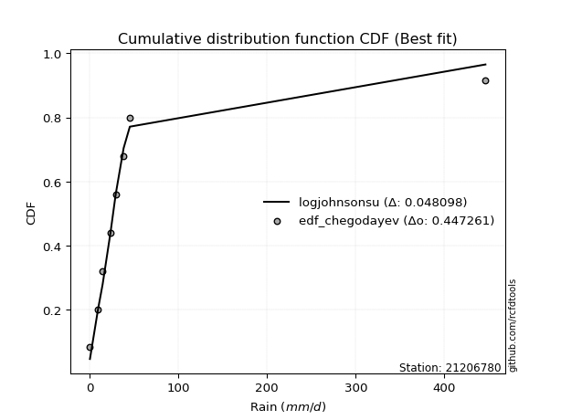</img></img>

</div>


### 6. EDF Blom (1958)

The Blom formula is a specific "plotting position" formula used in hydrology and statistical analysis to estimate the empirical cumulative probability (or non-exceedance probability) of a data series. It is particularly recommended for data that are approximately normally distributed. The constant _a_ is set to 0.375 (or 3/8).

<div align="center">


$P=(m-a)/(n+1-2a)$


</div>


**6.1. Empirical values**

<div align="center">

|                | 0                   | 1                   | 2                  | 3                  | 4                  | 5                  | 6                 | 7                  |
|:---------------|:--------------------|:--------------------|:-------------------|:-------------------|:-------------------|:-------------------|:------------------|:-------------------|
| date           | 2023                | 2016                | 2015               | 2012               | 2025               | 2024               | 2013              | 2014               |
| x              | 0.2                 | 9.4                 | 14.5               | 23.4               | 29.3               | 38.2               | 45.2              | 446.4              |
| m              | 1                   | 2                   | 3                  | 4                  | 5                  | 6                  | 7                 | 8                  |
| empirical_dist | edf_blom            | edf_blom            | edf_blom           | edf_blom           | edf_blom           | edf_blom           | edf_blom          | edf_blom           |
| empirical      | 0.07575757575757576 | 0.19696969696969696 | 0.3181818181818182 | 0.4393939393939394 | 0.5606060606060606 | 0.6818181818181818 | 0.803030303030303 | 0.9242424242424242 |
| empirical_tr   | 1.0819672131147542  | 1.2452830188679247  | 1.4666666666666666 | 1.783783783783784  | 2.275862068965517  | 3.1428571428571423 | 5.076923076923076 | 13.199999999999992 |

</div>


**6.2. Kolmogorov-Smirnov fit test (sorted by Δ)**


<div align="center">

|                | 0                   | 1                   | 2                   | 3                   | 4                   | 5                   | 6                   | 7                   | 8                   | 9                   | 10                  | 11                  | 12                  | 13                 | 14                  | 15                  | 16                 | 17                  | 18                  | 19                  | 20                 | 21                  | 22                 | 23                  | 24                  | 25                  | 26                  | 27                  | 28                  | 29                  | 30                  | 31                  | 32                  | 33                  | 34                  | 35                  | 36                 | 37                  | 38                  | 39                 | 40                  | 41                  | 42                  | 43                  | 44                  | 45                  | 46                  | 47                  | 48                  | 49                 | 50                  | 51                  | 52                 | 53                  | 54                  | 55                  | 56                  | 57                  | 58                 | 59                  | 60                 | 61                  | 62                  | 63                  | 64                  | 65                 | 66                 | 67                  | 68                  | 69                 | 70                  | 71                  | 72                 | 73                  | 74                 | 75                 | 76                 | 77                  | 78                 | 79                 | 80                 | 81                  | 82                  | 83                  | 84                 | 85                 | 86                  | 87                  | 88                 | 89                  | 90                 | 91                 | 92                 | 93                  | 94                 | 95                  | 96                  | 97                 | 98                 | 99                 | 100                | 101                 | 102                | 103                 | 104                | 105                | 106                | 107                | 108                | 109                | 110                 | 111                 | 112                | 113                | 114                 | 115                 | 116                 | 117                 | 118                | 119                | 120                 | 121                 | 122                | 123                | 124                | 125                 | 126                | 127                | 128                | 129                | 130                 | 131                | 132                | 133                 | 134                 | 135                | 136                | 137                | 138                | 139                | 140                | 141                | 142                | 143                | 144                | 145                | 146                | 147                | 148                | 149                | 150                | 151                | 152                | 153                | 154                | 155                | 156                | 157                | 158                | 159                |
|:---------------|:--------------------|:--------------------|:--------------------|:--------------------|:--------------------|:--------------------|:--------------------|:--------------------|:--------------------|:--------------------|:--------------------|:--------------------|:--------------------|:-------------------|:--------------------|:--------------------|:-------------------|:--------------------|:--------------------|:--------------------|:-------------------|:--------------------|:-------------------|:--------------------|:--------------------|:--------------------|:--------------------|:--------------------|:--------------------|:--------------------|:--------------------|:--------------------|:--------------------|:--------------------|:--------------------|:--------------------|:-------------------|:--------------------|:--------------------|:-------------------|:--------------------|:--------------------|:--------------------|:--------------------|:--------------------|:--------------------|:--------------------|:--------------------|:--------------------|:-------------------|:--------------------|:--------------------|:-------------------|:--------------------|:--------------------|:--------------------|:--------------------|:--------------------|:-------------------|:--------------------|:-------------------|:--------------------|:--------------------|:--------------------|:--------------------|:-------------------|:-------------------|:--------------------|:--------------------|:-------------------|:--------------------|:--------------------|:-------------------|:--------------------|:-------------------|:-------------------|:-------------------|:--------------------|:-------------------|:-------------------|:-------------------|:--------------------|:--------------------|:--------------------|:-------------------|:-------------------|:--------------------|:--------------------|:-------------------|:--------------------|:-------------------|:-------------------|:-------------------|:--------------------|:-------------------|:--------------------|:--------------------|:-------------------|:-------------------|:-------------------|:-------------------|:--------------------|:-------------------|:--------------------|:-------------------|:-------------------|:-------------------|:-------------------|:-------------------|:-------------------|:--------------------|:--------------------|:-------------------|:-------------------|:--------------------|:--------------------|:--------------------|:--------------------|:-------------------|:-------------------|:--------------------|:--------------------|:-------------------|:-------------------|:-------------------|:--------------------|:-------------------|:-------------------|:-------------------|:-------------------|:--------------------|:-------------------|:-------------------|:--------------------|:--------------------|:-------------------|:-------------------|:-------------------|:-------------------|:-------------------|:-------------------|:-------------------|:-------------------|:-------------------|:-------------------|:-------------------|:-------------------|:-------------------|:-------------------|:-------------------|:-------------------|:-------------------|:-------------------|:-------------------|:-------------------|:-------------------|:-------------------|:-------------------|:-------------------|:-------------------|
| station        | 21206780            | 21206780            | 21206780            | 21206780            | 21206780            | 21206780            | 21206780            | 21206780            | 21206780            | 21206780            | 21206780            | 21206780            | 21206780            | 21206780           | 21206780            | 21206780            | 21206780           | 21206780            | 21206780            | 21206780            | 21206780           | 21206780            | 21206780           | 21206780            | 21206780            | 21206780            | 21206780            | 21206780            | 21206780            | 21206780            | 21206780            | 21206780            | 21206780            | 21206780            | 21206780            | 21206780            | 21206780           | 21206780            | 21206780            | 21206780           | 21206780            | 21206780            | 21206780            | 21206780            | 21206780            | 21206780            | 21206780            | 21206780            | 21206780            | 21206780           | 21206780            | 21206780            | 21206780           | 21206780            | 21206780            | 21206780            | 21206780            | 21206780            | 21206780           | 21206780            | 21206780           | 21206780            | 21206780            | 21206780            | 21206780            | 21206780           | 21206780           | 21206780            | 21206780            | 21206780           | 21206780            | 21206780            | 21206780           | 21206780            | 21206780           | 21206780           | 21206780           | 21206780            | 21206780           | 21206780           | 21206780           | 21206780            | 21206780            | 21206780            | 21206780           | 21206780           | 21206780            | 21206780            | 21206780           | 21206780            | 21206780           | 21206780           | 21206780           | 21206780            | 21206780           | 21206780            | 21206780            | 21206780           | 21206780           | 21206780           | 21206780           | 21206780            | 21206780           | 21206780            | 21206780           | 21206780           | 21206780           | 21206780           | 21206780           | 21206780           | 21206780            | 21206780            | 21206780           | 21206780           | 21206780            | 21206780            | 21206780            | 21206780            | 21206780           | 21206780           | 21206780            | 21206780            | 21206780           | 21206780           | 21206780           | 21206780            | 21206780           | 21206780           | 21206780           | 21206780           | 21206780            | 21206780           | 21206780           | 21206780            | 21206780            | 21206780           | 21206780           | 21206780           | 21206780           | 21206780           | 21206780           | 21206780           | 21206780           | 21206780           | 21206780           | 21206780           | 21206780           | 21206780           | 21206780           | 21206780           | 21206780           | 21206780           | 21206780           | 21206780           | 21206780           | 21206780           | 21206780           | 21206780           | 21206780           | 21206780           |
| empirical_dist | edf_blom            | edf_blom            | edf_blom            | edf_blom            | edf_blom            | edf_blom            | edf_blom            | edf_blom            | edf_blom            | edf_blom            | edf_blom            | edf_blom            | edf_blom            | edf_blom           | edf_blom            | edf_blom            | edf_blom           | edf_blom            | edf_blom            | edf_blom            | edf_blom           | edf_blom            | edf_blom           | edf_blom            | edf_blom            | edf_blom            | edf_blom            | edf_blom            | edf_blom            | edf_blom            | edf_blom            | edf_blom            | edf_blom            | edf_blom            | edf_blom            | edf_blom            | edf_blom           | edf_blom            | edf_blom            | edf_blom           | edf_blom            | edf_blom            | edf_blom            | edf_blom            | edf_blom            | edf_blom            | edf_blom            | edf_blom            | edf_blom            | edf_blom           | edf_blom            | edf_blom            | edf_blom           | edf_blom            | edf_blom            | edf_blom            | edf_blom            | edf_blom            | edf_blom           | edf_blom            | edf_blom           | edf_blom            | edf_blom            | edf_blom            | edf_blom            | edf_blom           | edf_blom           | edf_blom            | edf_blom            | edf_blom           | edf_blom            | edf_blom            | edf_blom           | edf_blom            | edf_blom           | edf_blom           | edf_blom           | edf_blom            | edf_blom           | edf_blom           | edf_blom           | edf_blom            | edf_blom            | edf_blom            | edf_blom           | edf_blom           | edf_blom            | edf_blom            | edf_blom           | edf_blom            | edf_blom           | edf_blom           | edf_blom           | edf_blom            | edf_blom           | edf_blom            | edf_blom            | edf_blom           | edf_blom           | edf_blom           | edf_blom           | edf_blom            | edf_blom           | edf_blom            | edf_blom           | edf_blom           | edf_blom           | edf_blom           | edf_blom           | edf_blom           | edf_blom            | edf_blom            | edf_blom           | edf_blom           | edf_blom            | edf_blom            | edf_blom            | edf_blom            | edf_blom           | edf_blom           | edf_blom            | edf_blom            | edf_blom           | edf_blom           | edf_blom           | edf_blom            | edf_blom           | edf_blom           | edf_blom           | edf_blom           | edf_blom            | edf_blom           | edf_blom           | edf_blom            | edf_blom            | edf_blom           | edf_blom           | edf_blom           | edf_blom           | edf_blom           | edf_blom           | edf_blom           | edf_blom           | edf_blom           | edf_blom           | edf_blom           | edf_blom           | edf_blom           | edf_blom           | edf_blom           | edf_blom           | edf_blom           | edf_blom           | edf_blom           | edf_blom           | edf_blom           | edf_blom           | edf_blom           | edf_blom           | edf_blom           |
| p_dist         | logjohnsonsu        | logt                | alpha               | t                   | logdgamma           | nct                 | kappa3              | invweibull          | genextreme          | johnsonsu           | invgamma            | loggenlogistic      | logmielke           | gennorm            | genpareto           | lomax               | logvonmises_line   | loglaplace          | loglaplace          | logburr12           | logcrystalball     | logfoldnorm         | logdweibull        | loghypsecant        | f                   | ncf                 | logskewnorm         | betaprime           | halfgennorm         | truncpareto         | invgauss            | loglogistic         | burr                | loggompertz         | logexponweib        | logloggamma         | logweibull_min     | logjohnsonsb        | logbeta             | logbetaprime       | logrice             | logexponnorm        | lognorm             | lognakagami         | lognct              | loggennorm          | logfatiguelife      | burr12              | loggumbel_l         | logpearson3        | loggengamma         | mielke              | loggenextreme      | loggamma            | loggamma            | logerlang           | loginvgamma         | loganglit           | dweibull           | logsemicircular     | logargus           | vonmises_line       | loginvgauss         | logmaxwell          | fatiguelife         | truncweibull_min   | lograyleigh        | loggumbel_r         | logarcsine          | loginvweibull      | logcosine           | logburr             | exponpow           | logmoyal            | erlang             | loghalfnorm        | loggenhalflogistic | wald                | logtriang          | loghalflogistic    | gengamma           | loglomax            | loglevy_l           | logkstwobign        | gamma              | logbradford        | gausshyper          | logtruncweibull_min | loggausshyper      | halflogistic        | loggenexpon        | logwald            | pearson3           | loguniform          | logksone           | moyal               | loggenpareto        | logtruncnorm       | foldnorm           | dgamma             | halfnorm           | logkappa4           | logwrapcauchy      | nakagami            | exponweib          | gumbel_r           | genlogistic        | logtrapezoid       | logloglaplace      | rayleigh           | arcsine             | exponnorm           | genexpon           | maxwell            | gompertz            | semicircular        | anglit              | loghalfgennorm      | weibull_min        | norm               | crystalball         | logncf              | logistic           | wrapcauchy         | logtruncexpon      | powerlaw            | hypsecant          | kstwobign          | levy_l             | laplace            | logweibull_max      | logkappa3          | rice               | gumbel_l            | cosine              | truncnorm          | logf               | logtukeylambda     | logalpha           | argus              | triang             | skewnorm           | logrdist           | bradford           | johnsonsb          | rdist              | truncexpon         | ksone              | logpowerlaw        | tukeylambda        | kappa4             | uniform            | genhalflogistic    | logexponpow        | weibull_max        | logtruncpareto     | beta               | trapezoid          | logvonmises        | vonmises           |
| delta          | 0.04052262582376609 | 0.07335019188813652 | 0.09424024076463178 | 0.09811184095573765 | 0.10959174751228906 | 0.11062113900547677 | 0.11391426185137543 | 0.11498763469452511 | 0.11498821686264538 | 0.11639077493972383 | 0.11748039295574042 | 0.11822228023532211 | 0.11859633061471375 | 0.1207613476658902 | 0.12402847411987161 | 0.12418464133514795 | 0.1318157615130881 | 0.13453616705732624 | 0.13453616705732624 | 0.13850052836278093 | 0.1390309458198855 | 0.13931630984276777 | 0.1410391044117294 | 0.14158156067421884 | 0.14236339638456152 | 0.14333153233510276 | 0.14476828502608396 | 0.14837282041895034 | 0.15074287644411838 | 0.15082164831329348 | 0.15345393854513156 | 0.15451278963297554 | 0.15970005105869528 | 0.15998483539331854 | 0.16087631393805168 | 0.16328196408400375 | 0.1639699080758925 | 0.16464555354411348 | 0.16857321447343465 | 0.1704925843148382 | 0.17081048189500253 | 0.17082132412419665 | 0.17082305421487992 | 0.17106413946062576 | 0.17153869510138225 | 0.17318052465127914 | 0.17376724660512427 | 0.17594979902614566 | 0.17631792283790415 | 0.178728177427236  | 0.17988280502188686 | 0.18061819468025975 | 0.1833977016627153 | 0.18410674972192514 | 0.18410674972192514 | 0.18515383385963513 | 0.18711784228167805 | 0.18861419453624628 | 0.1907376019692878 | 0.19605014295994466 | 0.1967878134909281 | 0.19696913286674422 | 0.20205319859388704 | 0.20371557095294063 | 0.21430078197485058 | 0.2145174153119942 | 0.2159467487678654 | 0.22374180655676457 | 0.22627860201345262 | 0.2337059478202702 | 0.23514979082552373 | 0.23592266787980165 | 0.2363613957381412 | 0.24374571902663128 | 0.2499651570503083 | 0.2507314247947719 | 0.251971960307386  | 0.25552265211997016 | 0.2589624843138194 | 0.2617236309259012 | 0.2646289521158223 | 0.26714539351315175 | 0.27269263373749103 | 0.27538875968457915 | 0.2766032428144768 | 0.2768431978763804 | 0.27963024472870546 | 0.2806140638780152  | 0.2878987644997237 | 0.29068876482146333 | 0.2910092370176705 | 0.2957481727645072 | 0.2995612753237687 | 0.30235862712642636 | 0.3024705731104058 | 0.30315585082862895 | 0.30383610694766366 | 0.3040024873611706 | 0.3043385455455428 | 0.3077591639048475 | 0.3079797293570374 | 0.31119145936108267 | 0.3135236725347002 | 0.32046320468379397 | 0.3244904934886694 | 0.326959112958507  | 0.3279375034757513 | 0.337872866636335  | 0.3425202236848644 | 0.3426442380257756 | 0.35219931399415305 | 0.35344225214995206 | 0.3545702728258743 | 0.3548835462902972 | 0.36129663721527316 | 0.37215273247778313 | 0.37713394189920735 | 0.38115699300393197 | 0.3813791723544806 | 0.3891538223198969 | 0.38915383330986064 | 0.39139500117784826 | 0.4004329497851692 | 0.4037640936033045 | 0.404814594499242  | 0.40899785604643707 | 0.4097642439854361 | 0.418709049053791  | 0.4188554951099314 | 0.4354663492764445 | 0.43903097356706516 | 0.4397071986497692 | 0.4427399549674527 | 0.45697020245493936 | 0.47001655962006583 | 0.4835842125560651 | 0.4936090262886072 | 0.5160916586981996 | 0.5250512974171562 | 0.5370393955755343 | 0.5575532230642783 | 0.5812369753092241 | 0.5813637377638365 | 0.6228005207580501 | 0.6291766800372609 | 0.6327449804951782 | 0.633302057151474  | 0.6356539396655936 | 0.6763653919977495 | 0.6822035020869869 | 0.6845523820282836 | 0.7021786669926517 | 0.7062792805932318 | 0.7113707445664743 | 0.7137211606224154 | 0.720601289761136  | 0.7604233192755019 | 0.7736096990829445 | 1.061378478498979  | 70.47658023388084  |
| deltao         | 0.4472608134160001  | 0.4472608134160001  | 0.4472608134160001  | 0.4472608134160001  | 0.4472608134160001  | 0.4472608134160001  | 0.4472608134160001  | 0.4472608134160001  | 0.4472608134160001  | 0.4472608134160001  | 0.4472608134160001  | 0.4472608134160001  | 0.4472608134160001  | 0.4472608134160001 | 0.4472608134160001  | 0.4472608134160001  | 0.4472608134160001 | 0.4472608134160001  | 0.4472608134160001  | 0.4472608134160001  | 0.4472608134160001 | 0.4472608134160001  | 0.4472608134160001 | 0.4472608134160001  | 0.4472608134160001  | 0.4472608134160001  | 0.4472608134160001  | 0.4472608134160001  | 0.4472608134160001  | 0.4472608134160001  | 0.4472608134160001  | 0.4472608134160001  | 0.4472608134160001  | 0.4472608134160001  | 0.4472608134160001  | 0.4472608134160001  | 0.4472608134160001 | 0.4472608134160001  | 0.4472608134160001  | 0.4472608134160001 | 0.4472608134160001  | 0.4472608134160001  | 0.4472608134160001  | 0.4472608134160001  | 0.4472608134160001  | 0.4472608134160001  | 0.4472608134160001  | 0.4472608134160001  | 0.4472608134160001  | 0.4472608134160001 | 0.4472608134160001  | 0.4472608134160001  | 0.4472608134160001 | 0.4472608134160001  | 0.4472608134160001  | 0.4472608134160001  | 0.4472608134160001  | 0.4472608134160001  | 0.4472608134160001 | 0.4472608134160001  | 0.4472608134160001 | 0.4472608134160001  | 0.4472608134160001  | 0.4472608134160001  | 0.4472608134160001  | 0.4472608134160001 | 0.4472608134160001 | 0.4472608134160001  | 0.4472608134160001  | 0.4472608134160001 | 0.4472608134160001  | 0.4472608134160001  | 0.4472608134160001 | 0.4472608134160001  | 0.4472608134160001 | 0.4472608134160001 | 0.4472608134160001 | 0.4472608134160001  | 0.4472608134160001 | 0.4472608134160001 | 0.4472608134160001 | 0.4472608134160001  | 0.4472608134160001  | 0.4472608134160001  | 0.4472608134160001 | 0.4472608134160001 | 0.4472608134160001  | 0.4472608134160001  | 0.4472608134160001 | 0.4472608134160001  | 0.4472608134160001 | 0.4472608134160001 | 0.4472608134160001 | 0.4472608134160001  | 0.4472608134160001 | 0.4472608134160001  | 0.4472608134160001  | 0.4472608134160001 | 0.4472608134160001 | 0.4472608134160001 | 0.4472608134160001 | 0.4472608134160001  | 0.4472608134160001 | 0.4472608134160001  | 0.4472608134160001 | 0.4472608134160001 | 0.4472608134160001 | 0.4472608134160001 | 0.4472608134160001 | 0.4472608134160001 | 0.4472608134160001  | 0.4472608134160001  | 0.4472608134160001 | 0.4472608134160001 | 0.4472608134160001  | 0.4472608134160001  | 0.4472608134160001  | 0.4472608134160001  | 0.4472608134160001 | 0.4472608134160001 | 0.4472608134160001  | 0.4472608134160001  | 0.4472608134160001 | 0.4472608134160001 | 0.4472608134160001 | 0.4472608134160001  | 0.4472608134160001 | 0.4472608134160001 | 0.4472608134160001 | 0.4472608134160001 | 0.4472608134160001  | 0.4472608134160001 | 0.4472608134160001 | 0.4472608134160001  | 0.4472608134160001  | 0.4472608134160001 | 0.4472608134160001 | 0.4472608134160001 | 0.4472608134160001 | 0.4472608134160001 | 0.4472608134160001 | 0.4472608134160001 | 0.4472608134160001 | 0.4472608134160001 | 0.4472608134160001 | 0.4472608134160001 | 0.4472608134160001 | 0.4472608134160001 | 0.4472608134160001 | 0.4472608134160001 | 0.4472608134160001 | 0.4472608134160001 | 0.4472608134160001 | 0.4472608134160001 | 0.4472608134160001 | 0.4472608134160001 | 0.4472608134160001 | 0.4472608134160001 | 0.4472608134160001 | 0.4472608134160001 |
| eval           | Δo > Δ              | Δo > Δ              | Δo > Δ              | Δo > Δ              | Δo > Δ              | Δo > Δ              | Δo > Δ              | Δo > Δ              | Δo > Δ              | Δo > Δ              | Δo > Δ              | Δo > Δ              | Δo > Δ              | Δo > Δ             | Δo > Δ              | Δo > Δ              | Δo > Δ             | Δo > Δ              | Δo > Δ              | Δo > Δ              | Δo > Δ             | Δo > Δ              | Δo > Δ             | Δo > Δ              | Δo > Δ              | Δo > Δ              | Δo > Δ              | Δo > Δ              | Δo > Δ              | Δo > Δ              | Δo > Δ              | Δo > Δ              | Δo > Δ              | Δo > Δ              | Δo > Δ              | Δo > Δ              | Δo > Δ             | Δo > Δ              | Δo > Δ              | Δo > Δ             | Δo > Δ              | Δo > Δ              | Δo > Δ              | Δo > Δ              | Δo > Δ              | Δo > Δ              | Δo > Δ              | Δo > Δ              | Δo > Δ              | Δo > Δ             | Δo > Δ              | Δo > Δ              | Δo > Δ             | Δo > Δ              | Δo > Δ              | Δo > Δ              | Δo > Δ              | Δo > Δ              | Δo > Δ             | Δo > Δ              | Δo > Δ             | Δo > Δ              | Δo > Δ              | Δo > Δ              | Δo > Δ              | Δo > Δ             | Δo > Δ             | Δo > Δ              | Δo > Δ              | Δo > Δ             | Δo > Δ              | Δo > Δ              | Δo > Δ             | Δo > Δ              | Δo > Δ             | Δo > Δ             | Δo > Δ             | Δo > Δ              | Δo > Δ             | Δo > Δ             | Δo > Δ             | Δo > Δ              | Δo > Δ              | Δo > Δ              | Δo > Δ             | Δo > Δ             | Δo > Δ              | Δo > Δ              | Δo > Δ             | Δo > Δ              | Δo > Δ             | Δo > Δ             | Δo > Δ             | Δo > Δ              | Δo > Δ             | Δo > Δ              | Δo > Δ              | Δo > Δ             | Δo > Δ             | Δo > Δ             | Δo > Δ             | Δo > Δ              | Δo > Δ             | Δo > Δ              | Δo > Δ             | Δo > Δ             | Δo > Δ             | Δo > Δ             | Δo > Δ             | Δo > Δ             | Δo > Δ              | Δo > Δ              | Δo > Δ             | Δo > Δ             | Δo > Δ              | Δo > Δ              | Δo > Δ              | Δo > Δ              | Δo > Δ             | Δo > Δ             | Δo > Δ              | Δo > Δ              | Δo > Δ             | Δo > Δ             | Δo > Δ             | Δo > Δ              | Δo > Δ             | Δo > Δ             | Δo > Δ             | Δo > Δ             | Δo > Δ              | Δo > Δ             | Δo > Δ             | Δo <= Δ             | Δo <= Δ             | Δo <= Δ            | Δo <= Δ            | Δo <= Δ            | Δo <= Δ            | Δo <= Δ            | Δo <= Δ            | Δo <= Δ            | Δo <= Δ            | Δo <= Δ            | Δo <= Δ            | Δo <= Δ            | Δo <= Δ            | Δo <= Δ            | Δo <= Δ            | Δo <= Δ            | Δo <= Δ            | Δo <= Δ            | Δo <= Δ            | Δo <= Δ            | Δo <= Δ            | Δo <= Δ            | Δo <= Δ            | Δo <= Δ            | Δo <= Δ            | Δo <= Δ            |
| fit            | 1                   | 1                   | 1                   | 1                   | 1                   | 1                   | 1                   | 1                   | 1                   | 1                   | 1                   | 1                   | 1                   | 1                  | 1                   | 1                   | 1                  | 1                   | 1                   | 1                   | 1                  | 1                   | 1                  | 1                   | 1                   | 1                   | 1                   | 1                   | 1                   | 1                   | 1                   | 1                   | 1                   | 1                   | 1                   | 1                   | 1                  | 1                   | 1                   | 1                  | 1                   | 1                   | 1                   | 1                   | 1                   | 1                   | 1                   | 1                   | 1                   | 1                  | 1                   | 1                   | 1                  | 1                   | 1                   | 1                   | 1                   | 1                   | 1                  | 1                   | 1                  | 1                   | 1                   | 1                   | 1                   | 1                  | 1                  | 1                   | 1                   | 1                  | 1                   | 1                   | 1                  | 1                   | 1                  | 1                  | 1                  | 1                   | 1                  | 1                  | 1                  | 1                   | 1                   | 1                   | 1                  | 1                  | 1                   | 1                   | 1                  | 1                   | 1                  | 1                  | 1                  | 1                   | 1                  | 1                   | 1                   | 1                  | 1                  | 1                  | 1                  | 1                   | 1                  | 1                   | 1                  | 1                  | 1                  | 1                  | 1                  | 1                  | 1                   | 1                   | 1                  | 1                  | 1                   | 1                   | 1                   | 1                   | 1                  | 1                  | 1                   | 1                   | 1                  | 1                  | 1                  | 1                   | 1                  | 1                  | 1                  | 1                  | 1                   | 1                  | 1                  | 0                   | 0                   | 0                  | 0                  | 0                  | 0                  | 0                  | 0                  | 0                  | 0                  | 0                  | 0                  | 0                  | 0                  | 0                  | 0                  | 0                  | 0                  | 0                  | 0                  | 0                  | 0                  | 0                  | 0                  | 0                  | 0                  | 0                  |
| n              | 8                   | 8                   | 8                   | 8                   | 8                   | 8                   | 8                   | 8                   | 8                   | 8                   | 8                   | 8                   | 8                   | 8                  | 8                   | 8                   | 8                  | 8                   | 8                   | 8                   | 8                  | 8                   | 8                  | 8                   | 8                   | 8                   | 8                   | 8                   | 8                   | 8                   | 8                   | 8                   | 8                   | 8                   | 8                   | 8                   | 8                  | 8                   | 8                   | 8                  | 8                   | 8                   | 8                   | 8                   | 8                   | 8                   | 8                   | 8                   | 8                   | 8                  | 8                   | 8                   | 8                  | 8                   | 8                   | 8                   | 8                   | 8                   | 8                  | 8                   | 8                  | 8                   | 8                   | 8                   | 8                   | 8                  | 8                  | 8                   | 8                   | 8                  | 8                   | 8                   | 8                  | 8                   | 8                  | 8                  | 8                  | 8                   | 8                  | 8                  | 8                  | 8                   | 8                   | 8                   | 8                  | 8                  | 8                   | 8                   | 8                  | 8                   | 8                  | 8                  | 8                  | 8                   | 8                  | 8                   | 8                   | 8                  | 8                  | 8                  | 8                  | 8                   | 8                  | 8                   | 8                  | 8                  | 8                  | 8                  | 8                  | 8                  | 8                   | 8                   | 8                  | 8                  | 8                   | 8                   | 8                   | 8                   | 8                  | 8                  | 8                   | 8                   | 8                  | 8                  | 8                  | 8                   | 8                  | 8                  | 8                  | 8                  | 8                   | 8                  | 8                  | 8                   | 8                   | 8                  | 8                  | 8                  | 8                  | 8                  | 8                  | 8                  | 8                  | 8                  | 8                  | 8                  | 8                  | 8                  | 8                  | 8                  | 8                  | 8                  | 8                  | 8                  | 8                  | 8                  | 8                  | 8                  | 8                  | 8                  |
| best_fit       | 1                   | 0                   | 0                   | 0                   | 0                   | 0                   | 0                   | 0                   | 0                   | 0                   | 0                   | 0                   | 0                   | 0                  | 0                   | 0                   | 0                  | 0                   | 0                   | 0                   | 0                  | 0                   | 0                  | 0                   | 0                   | 0                   | 0                   | 0                   | 0                   | 0                   | 0                   | 0                   | 0                   | 0                   | 0                   | 0                   | 0                  | 0                   | 0                   | 0                  | 0                   | 0                   | 0                   | 0                   | 0                   | 0                   | 0                   | 0                   | 0                   | 0                  | 0                   | 0                   | 0                  | 0                   | 0                   | 0                   | 0                   | 0                   | 0                  | 0                   | 0                  | 0                   | 0                   | 0                   | 0                   | 0                  | 0                  | 0                   | 0                   | 0                  | 0                   | 0                   | 0                  | 0                   | 0                  | 0                  | 0                  | 0                   | 0                  | 0                  | 0                  | 0                   | 0                   | 0                   | 0                  | 0                  | 0                   | 0                   | 0                  | 0                   | 0                  | 0                  | 0                  | 0                   | 0                  | 0                   | 0                   | 0                  | 0                  | 0                  | 0                  | 0                   | 0                  | 0                   | 0                  | 0                  | 0                  | 0                  | 0                  | 0                  | 0                   | 0                   | 0                  | 0                  | 0                   | 0                   | 0                   | 0                   | 0                  | 0                  | 0                   | 0                   | 0                  | 0                  | 0                  | 0                   | 0                  | 0                  | 0                  | 0                  | 0                   | 0                  | 0                  | 0                   | 0                   | 0                  | 0                  | 0                  | 0                  | 0                  | 0                  | 0                  | 0                  | 0                  | 0                  | 0                  | 0                  | 0                  | 0                  | 0                  | 0                  | 0                  | 0                  | 0                  | 0                  | 0                  | 0                  | 0                  | 0                  | 0                  |
| best_fit_sort  | 1                   | 2                   | 3                   | 4                   | 5                   | 6                   | 7                   | 8                   | 9                   | 10                  | 11                  | 12                  | 13                  | 14                 | 15                  | 16                  | 17                 | 18                  | 19                  | 20                  | 21                 | 22                  | 23                 | 24                  | 25                  | 26                  | 27                  | 28                  | 29                  | 30                  | 31                  | 32                  | 33                  | 34                  | 35                  | 36                  | 37                 | 38                  | 39                  | 40                 | 41                  | 42                  | 43                  | 44                  | 45                  | 46                  | 47                  | 48                  | 49                  | 50                 | 51                  | 52                  | 53                 | 54                  | 55                  | 56                  | 57                  | 58                  | 59                 | 60                  | 61                 | 62                  | 63                  | 64                  | 65                  | 66                 | 67                 | 68                  | 69                  | 70                 | 71                  | 72                  | 73                 | 74                  | 75                 | 76                 | 77                 | 78                  | 79                 | 80                 | 81                 | 82                  | 83                  | 84                  | 85                 | 86                 | 87                  | 88                  | 89                 | 90                  | 91                 | 92                 | 93                 | 94                  | 95                 | 96                  | 97                  | 98                 | 99                 | 100                | 101                | 102                 | 103                | 104                 | 105                | 106                | 107                | 108                | 109                | 110                | 111                 | 112                 | 113                | 114                | 115                 | 116                 | 117                 | 118                 | 119                | 120                | 121                 | 122                 | 123                | 124                | 125                | 126                 | 127                | 128                | 129                | 130                | 131                 | 132                | 133                | 134                 | 135                 | 136                | 137                | 138                | 139                | 140                | 141                | 142                | 143                | 144                | 145                | 146                | 147                | 148                | 149                | 150                | 151                | 152                | 153                | 154                | 155                | 156                | 157                | 158                | 159                | 160                |

</div>


**6.3. Best fit**

<div align="center">

|   id |   station | empirical_dist   | p_dist       |     delta |   deltao | eval   |   fit |   n |   best_fit |   best_fit_sort |
|-----:|----------:|:-----------------|:-------------|----------:|---------:|:-------|------:|----:|-----------:|----------------:|
|    0 |  21206780 | edf_blom         | logjohnsonsu | 0.0405226 | 0.447261 | Δo > Δ |     1 |   8 |          1 |               1 |

</div>


<div align="center">

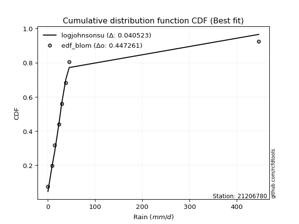</img></img>

</div>


### 7. EDF Tukey (1962)

In hydrology, the Tukey formula is used as a plotting position formula to estimate the empirical probability or frequency of a flood event (or other hydrological data). The formula parameter is given as _c=0.333_ (or 1/3).

<div align="center">


$P=(m-c)/(n+1-2c)$


</div>


**7.1. Empirical values**

<div align="center">

|                | 0                  | 1         | 2                  | 3                  | 4                 | 5                  | 6                 | 7                  |
|:---------------|:-------------------|:----------|:-------------------|:-------------------|:------------------|:-------------------|:------------------|:-------------------|
| date           | 2023               | 2016      | 2015               | 2012               | 2025              | 2024               | 2013              | 2014               |
| x              | 0.2                | 9.4       | 14.5               | 23.4               | 29.3              | 38.2               | 45.2              | 446.4              |
| m              | 1                  | 2         | 3                  | 4                  | 5                 | 6                  | 7                 | 8                  |
| empirical_dist | edf_tukey          | edf_tukey | edf_tukey          | edf_tukey          | edf_tukey         | edf_tukey          | edf_tukey         | edf_tukey          |
| empirical      | 0.08               | 0.2       | 0.32               | 0.44               | 0.56              | 0.68               | 0.8               | 0.92               |
| empirical_tr   | 1.0869565217391304 | 1.25      | 1.4705882352941178 | 1.7857142857142856 | 2.272727272727273 | 3.1250000000000004 | 5.000000000000001 | 12.500000000000007 |

</div>


**7.2. Kolmogorov-Smirnov fit test (sorted by Δ)**


<div align="center">

|                | 0                   | 1                   | 2                   | 3                  | 4                   | 5                   | 6                   | 7                   | 8                   | 9                   | 10                  | 11                  | 12                  | 13                  | 14                  | 15                 | 16                  | 17                  | 18                  | 19                 | 20                  | 21                  | 22                  | 23                 | 24                  | 25                  | 26                  | 27                  | 28                  | 29                  | 30                  | 31                 | 32                 | 33                  | 34                  | 35                 | 36                  | 37                  | 38                 | 39                  | 40                  | 41                 | 42                  | 43                  | 44                 | 45                  | 46                 | 47                 | 48                  | 49                  | 50                 | 51                 | 52                  | 53                 | 54                 | 55                  | 56                 | 57                  | 58                  | 59                 | 60                  | 61                 | 62                  | 63                  | 64                  | 65                  | 66                  | 67                  | 68                  | 69                  | 70                  | 71                 | 72                  | 73                  | 74                  | 75                  | 76                  | 77                 | 78                  | 79                 | 80                 | 81                 | 82                  | 83                 | 84                  | 85                  | 86                 | 87                  | 88                  | 89                 | 90                  | 91                 | 92                 | 93                 | 94                  | 95                 | 96                 | 97                  | 98                  | 99                 | 100                 | 101                | 102                 | 103                 | 104                 | 105                 | 106                 | 107                 | 108                 | 109                 | 110                | 111                | 112                 | 113                | 114                | 115                | 116                | 117                | 118                 | 119                | 120                | 121                | 122                 | 123                 | 124                 | 125                | 126                 | 127                 | 128                | 129                 | 130                | 131                 | 132                | 133                | 134                | 135                 | 136                 | 137                | 138                | 139                | 140                | 141                | 142                | 143                | 144                | 145                | 146                | 147                | 148                | 149                | 150                | 151                | 152                | 153                | 154                | 155                | 156                | 157                | 158                | 159                |
|:---------------|:--------------------|:--------------------|:--------------------|:-------------------|:--------------------|:--------------------|:--------------------|:--------------------|:--------------------|:--------------------|:--------------------|:--------------------|:--------------------|:--------------------|:--------------------|:-------------------|:--------------------|:--------------------|:--------------------|:-------------------|:--------------------|:--------------------|:--------------------|:-------------------|:--------------------|:--------------------|:--------------------|:--------------------|:--------------------|:--------------------|:--------------------|:-------------------|:-------------------|:--------------------|:--------------------|:-------------------|:--------------------|:--------------------|:-------------------|:--------------------|:--------------------|:-------------------|:--------------------|:--------------------|:-------------------|:--------------------|:-------------------|:-------------------|:--------------------|:--------------------|:-------------------|:-------------------|:--------------------|:-------------------|:-------------------|:--------------------|:-------------------|:--------------------|:--------------------|:-------------------|:--------------------|:-------------------|:--------------------|:--------------------|:--------------------|:--------------------|:--------------------|:--------------------|:--------------------|:--------------------|:--------------------|:-------------------|:--------------------|:--------------------|:--------------------|:--------------------|:--------------------|:-------------------|:--------------------|:-------------------|:-------------------|:-------------------|:--------------------|:-------------------|:--------------------|:--------------------|:-------------------|:--------------------|:--------------------|:-------------------|:--------------------|:-------------------|:-------------------|:-------------------|:--------------------|:-------------------|:-------------------|:--------------------|:--------------------|:-------------------|:--------------------|:-------------------|:--------------------|:--------------------|:--------------------|:--------------------|:--------------------|:--------------------|:--------------------|:--------------------|:-------------------|:-------------------|:--------------------|:-------------------|:-------------------|:-------------------|:-------------------|:-------------------|:--------------------|:-------------------|:-------------------|:-------------------|:--------------------|:--------------------|:--------------------|:-------------------|:--------------------|:--------------------|:-------------------|:--------------------|:-------------------|:--------------------|:-------------------|:-------------------|:-------------------|:--------------------|:--------------------|:-------------------|:-------------------|:-------------------|:-------------------|:-------------------|:-------------------|:-------------------|:-------------------|:-------------------|:-------------------|:-------------------|:-------------------|:-------------------|:-------------------|:-------------------|:-------------------|:-------------------|:-------------------|:-------------------|:-------------------|:-------------------|:-------------------|:-------------------|
| station        | 21206780            | 21206780            | 21206780            | 21206780           | 21206780            | 21206780            | 21206780            | 21206780            | 21206780            | 21206780            | 21206780            | 21206780            | 21206780            | 21206780            | 21206780            | 21206780           | 21206780            | 21206780            | 21206780            | 21206780           | 21206780            | 21206780            | 21206780            | 21206780           | 21206780            | 21206780            | 21206780            | 21206780            | 21206780            | 21206780            | 21206780            | 21206780           | 21206780           | 21206780            | 21206780            | 21206780           | 21206780            | 21206780            | 21206780           | 21206780            | 21206780            | 21206780           | 21206780            | 21206780            | 21206780           | 21206780            | 21206780           | 21206780           | 21206780            | 21206780            | 21206780           | 21206780           | 21206780            | 21206780           | 21206780           | 21206780            | 21206780           | 21206780            | 21206780            | 21206780           | 21206780            | 21206780           | 21206780            | 21206780            | 21206780            | 21206780            | 21206780            | 21206780            | 21206780            | 21206780            | 21206780            | 21206780           | 21206780            | 21206780            | 21206780            | 21206780            | 21206780            | 21206780           | 21206780            | 21206780           | 21206780           | 21206780           | 21206780            | 21206780           | 21206780            | 21206780            | 21206780           | 21206780            | 21206780            | 21206780           | 21206780            | 21206780           | 21206780           | 21206780           | 21206780            | 21206780           | 21206780           | 21206780            | 21206780            | 21206780           | 21206780            | 21206780           | 21206780            | 21206780            | 21206780            | 21206780            | 21206780            | 21206780            | 21206780            | 21206780            | 21206780           | 21206780           | 21206780            | 21206780           | 21206780           | 21206780           | 21206780           | 21206780           | 21206780            | 21206780           | 21206780           | 21206780           | 21206780            | 21206780            | 21206780            | 21206780           | 21206780            | 21206780            | 21206780           | 21206780            | 21206780           | 21206780            | 21206780           | 21206780           | 21206780           | 21206780            | 21206780            | 21206780           | 21206780           | 21206780           | 21206780           | 21206780           | 21206780           | 21206780           | 21206780           | 21206780           | 21206780           | 21206780           | 21206780           | 21206780           | 21206780           | 21206780           | 21206780           | 21206780           | 21206780           | 21206780           | 21206780           | 21206780           | 21206780           | 21206780           |
| empirical_dist | edf_tukey           | edf_tukey           | edf_tukey           | edf_tukey          | edf_tukey           | edf_tukey           | edf_tukey           | edf_tukey           | edf_tukey           | edf_tukey           | edf_tukey           | edf_tukey           | edf_tukey           | edf_tukey           | edf_tukey           | edf_tukey          | edf_tukey           | edf_tukey           | edf_tukey           | edf_tukey          | edf_tukey           | edf_tukey           | edf_tukey           | edf_tukey          | edf_tukey           | edf_tukey           | edf_tukey           | edf_tukey           | edf_tukey           | edf_tukey           | edf_tukey           | edf_tukey          | edf_tukey          | edf_tukey           | edf_tukey           | edf_tukey          | edf_tukey           | edf_tukey           | edf_tukey          | edf_tukey           | edf_tukey           | edf_tukey          | edf_tukey           | edf_tukey           | edf_tukey          | edf_tukey           | edf_tukey          | edf_tukey          | edf_tukey           | edf_tukey           | edf_tukey          | edf_tukey          | edf_tukey           | edf_tukey          | edf_tukey          | edf_tukey           | edf_tukey          | edf_tukey           | edf_tukey           | edf_tukey          | edf_tukey           | edf_tukey          | edf_tukey           | edf_tukey           | edf_tukey           | edf_tukey           | edf_tukey           | edf_tukey           | edf_tukey           | edf_tukey           | edf_tukey           | edf_tukey          | edf_tukey           | edf_tukey           | edf_tukey           | edf_tukey           | edf_tukey           | edf_tukey          | edf_tukey           | edf_tukey          | edf_tukey          | edf_tukey          | edf_tukey           | edf_tukey          | edf_tukey           | edf_tukey           | edf_tukey          | edf_tukey           | edf_tukey           | edf_tukey          | edf_tukey           | edf_tukey          | edf_tukey          | edf_tukey          | edf_tukey           | edf_tukey          | edf_tukey          | edf_tukey           | edf_tukey           | edf_tukey          | edf_tukey           | edf_tukey          | edf_tukey           | edf_tukey           | edf_tukey           | edf_tukey           | edf_tukey           | edf_tukey           | edf_tukey           | edf_tukey           | edf_tukey          | edf_tukey          | edf_tukey           | edf_tukey          | edf_tukey          | edf_tukey          | edf_tukey          | edf_tukey          | edf_tukey           | edf_tukey          | edf_tukey          | edf_tukey          | edf_tukey           | edf_tukey           | edf_tukey           | edf_tukey          | edf_tukey           | edf_tukey           | edf_tukey          | edf_tukey           | edf_tukey          | edf_tukey           | edf_tukey          | edf_tukey          | edf_tukey          | edf_tukey           | edf_tukey           | edf_tukey          | edf_tukey          | edf_tukey          | edf_tukey          | edf_tukey          | edf_tukey          | edf_tukey          | edf_tukey          | edf_tukey          | edf_tukey          | edf_tukey          | edf_tukey          | edf_tukey          | edf_tukey          | edf_tukey          | edf_tukey          | edf_tukey          | edf_tukey          | edf_tukey          | edf_tukey          | edf_tukey          | edf_tukey          | edf_tukey          |
| p_dist         | logjohnsonsu        | logt                | alpha               | t                  | logdgamma           | nct                 | kappa3              | invweibull          | genextreme          | johnsonsu           | invgamma            | loggenlogistic      | logmielke           | genpareto           | lomax               | gennorm            | logvonmises_line    | loglaplace          | loglaplace          | logburr12          | logcrystalball      | logfoldnorm         | logdweibull         | loghypsecant       | f                   | ncf                 | logskewnorm         | betaprime           | halfgennorm         | truncpareto         | invgauss            | loglogistic        | loggompertz        | logexponweib        | burr                | logloggamma        | logweibull_min      | logjohnsonsb        | logbeta            | logbetaprime        | logrice             | logexponnorm       | lognorm             | lognakagami         | lognct             | logfatiguelife      | burr12             | loggumbel_l        | loggennorm          | logpearson3         | loggengamma        | mielke             | loggenextreme       | loggamma           | loggamma           | logerlang           | loginvgamma        | loganglit           | dweibull            | logsemicircular    | logargus            | loginvgauss        | vonmises_line       | logmaxwell          | fatiguelife         | truncweibull_min    | lograyleigh         | loggumbel_r         | logarcsine          | loginvweibull       | logcosine           | logburr            | exponpow            | logmoyal            | erlang              | loghalfnorm         | loggenhalflogistic  | wald               | logtriang           | loghalflogistic    | gengamma           | loglomax           | loglevy_l           | logkstwobign       | gamma               | logbradford         | gausshyper         | logtruncweibull_min | loggausshyper       | halflogistic       | loggenexpon         | logwald            | pearson3           | loguniform         | logksone            | moyal              | loggenpareto       | logtruncnorm        | foldnorm            | dgamma             | halfnorm            | logkappa4          | logwrapcauchy       | nakagami            | exponweib           | gumbel_r            | genlogistic         | logtrapezoid        | logloglaplace       | rayleigh            | arcsine            | exponnorm          | genexpon            | maxwell            | gompertz           | semicircular       | anglit             | loghalfgennorm     | weibull_min         | norm               | crystalball        | logncf             | logistic            | wrapcauchy          | logtruncexpon       | powerlaw           | hypsecant           | levy_l              | kstwobign          | laplace             | logweibull_max     | logkappa3           | rice               | gumbel_l           | cosine             | truncnorm           | logf                | logtukeylambda     | logalpha           | argus              | triang             | skewnorm           | logrdist           | bradford           | johnsonsb          | rdist              | truncexpon         | ksone              | logpowerlaw        | tukeylambda        | kappa4             | uniform            | genhalflogistic    | logexponpow        | weibull_max        | logtruncpareto     | beta               | trapezoid          | logvonmises        | vonmises           |
| delta          | 0.04476505006619025 | 0.07133165851151191 | 0.09120993773432884 | 0.0938694167133134 | 0.10656144448198612 | 0.10759083597517383 | 0.11088395882107249 | 0.11195733166422217 | 0.11195791383234244 | 0.11336047190942089 | 0.11445008992543748 | 0.11519197720501917 | 0.11556602758441081 | 0.12099817108956867 | 0.12115433830484501 | 0.1213674082719507 | 0.12878545848278505 | 0.13393010645126563 | 0.13393010645126563 | 0.135470225332478  | 0.13600064278958257 | 0.13628600681246472 | 0.13800880138142646 | 0.1385512576439158 | 0.13933309335425847 | 0.14030122930479982 | 0.14173798199578092 | 0.14534251738864729 | 0.14771257341381533 | 0.14779134528299054 | 0.15042363551482862 | 0.1514824866026725 | 0.1569545323630156 | 0.15784601090774875 | 0.15909399045263467 | 0.1602516610537008 | 0.16093960504558957 | 0.16161525051381054 | 0.1655429114431317 | 0.16746228128453516 | 0.16778017886469948 | 0.1677910210938936 | 0.16779275118457687 | 0.16803383643032271 | 0.1685083920710792 | 0.17073694357482122 | 0.1729194959958426 | 0.1732876198076012 | 0.17378658525733975 | 0.17569787439693307 | 0.1768525019915838 | 0.1775878916499567 | 0.18036739863241236 | 0.1810764466916221 | 0.1810764466916221 | 0.18212353082933208 | 0.184087539251375  | 0.18558389150594323 | 0.18649517772686353 | 0.1930198399296416 | 0.19375751046062517 | 0.199022895563584  | 0.19999943589704716 | 0.20068526792263758 | 0.21127047894454765 | 0.21148711228169126 | 0.21291644573756235 | 0.22071150352646152 | 0.22324829898314957 | 0.23067564478996716 | 0.23211948779522068 | 0.2328923648494986 | 0.23333109270783825 | 0.24071541599632823 | 0.24693485402000526 | 0.24770112176446885 | 0.24894165727708306 | 0.2512802278775459 | 0.25593218128351647 | 0.2586933278955981 | 0.2615986490855193 | 0.2641150904828487 | 0.26845020949506676 | 0.2723584566542761 | 0.27357293978417385 | 0.27381289484607735 | 0.2765999416984025 | 0.27758376084771214 | 0.28486846146942063 | 0.2876584617911604 | 0.28797893398736746 | 0.2939299909463254 | 0.2953188510813444 | 0.2993283240961233 | 0.29944027008010277 | 0.300125547798326  | 0.3008058039173607 | 0.30097218433086753 | 0.30130824251523985 | 0.3035167396624232 | 0.30494942632673444 | 0.3081611563307796 | 0.31049336950439715 | 0.31743290165349103 | 0.32146019045836643 | 0.32392880992820405 | 0.32490720044544835 | 0.33484256360603204 | 0.33948992065456135 | 0.33961393499547265 | 0.3491690109638501 | 0.3504119491196491 | 0.35153996979557134 | 0.3518532432599943 | 0.3582663341849702 | 0.3691224294474802 | 0.3741036388689044 | 0.3781266899736289 | 0.37834886932417766 | 0.386123519289594  | 0.3861235302795577 | 0.3883646981475452 | 0.39740264675486625 | 0.40073379057300157 | 0.40178429146893896 | 0.405967553016134  | 0.40673394095513316 | 0.41461307086750715 | 0.4156787460234881 | 0.43243604624614157 | 0.4360006705367622 | 0.43667689561946615 | 0.4397096519371498 | 0.4539398994246364 | 0.4669862565897629 | 0.48055390952576216 | 0.49057872325830415 | 0.5130613556678967 | 0.5220209943868532 | 0.5340090925452313 | 0.5545229200339754 | 0.5782066722789212 | 0.5783334347335334 | 0.6197702177277472 | 0.626146377006958  | 0.6285025562527541 | 0.6302717541211711 | 0.6326236366352906 | 0.6733350889674463 | 0.6779610778445627 | 0.6815220789979807 | 0.6991483639623488 | 0.7032489775629288 | 0.7083404415361714 | 0.7106908575921125 | 0.7175709867308331 | 0.7561808950330777 | 0.7705793960526416 | 1.0656209027414034 | 70.48082265812326  |
| deltao         | 0.4472608134160001  | 0.4472608134160001  | 0.4472608134160001  | 0.4472608134160001 | 0.4472608134160001  | 0.4472608134160001  | 0.4472608134160001  | 0.4472608134160001  | 0.4472608134160001  | 0.4472608134160001  | 0.4472608134160001  | 0.4472608134160001  | 0.4472608134160001  | 0.4472608134160001  | 0.4472608134160001  | 0.4472608134160001 | 0.4472608134160001  | 0.4472608134160001  | 0.4472608134160001  | 0.4472608134160001 | 0.4472608134160001  | 0.4472608134160001  | 0.4472608134160001  | 0.4472608134160001 | 0.4472608134160001  | 0.4472608134160001  | 0.4472608134160001  | 0.4472608134160001  | 0.4472608134160001  | 0.4472608134160001  | 0.4472608134160001  | 0.4472608134160001 | 0.4472608134160001 | 0.4472608134160001  | 0.4472608134160001  | 0.4472608134160001 | 0.4472608134160001  | 0.4472608134160001  | 0.4472608134160001 | 0.4472608134160001  | 0.4472608134160001  | 0.4472608134160001 | 0.4472608134160001  | 0.4472608134160001  | 0.4472608134160001 | 0.4472608134160001  | 0.4472608134160001 | 0.4472608134160001 | 0.4472608134160001  | 0.4472608134160001  | 0.4472608134160001 | 0.4472608134160001 | 0.4472608134160001  | 0.4472608134160001 | 0.4472608134160001 | 0.4472608134160001  | 0.4472608134160001 | 0.4472608134160001  | 0.4472608134160001  | 0.4472608134160001 | 0.4472608134160001  | 0.4472608134160001 | 0.4472608134160001  | 0.4472608134160001  | 0.4472608134160001  | 0.4472608134160001  | 0.4472608134160001  | 0.4472608134160001  | 0.4472608134160001  | 0.4472608134160001  | 0.4472608134160001  | 0.4472608134160001 | 0.4472608134160001  | 0.4472608134160001  | 0.4472608134160001  | 0.4472608134160001  | 0.4472608134160001  | 0.4472608134160001 | 0.4472608134160001  | 0.4472608134160001 | 0.4472608134160001 | 0.4472608134160001 | 0.4472608134160001  | 0.4472608134160001 | 0.4472608134160001  | 0.4472608134160001  | 0.4472608134160001 | 0.4472608134160001  | 0.4472608134160001  | 0.4472608134160001 | 0.4472608134160001  | 0.4472608134160001 | 0.4472608134160001 | 0.4472608134160001 | 0.4472608134160001  | 0.4472608134160001 | 0.4472608134160001 | 0.4472608134160001  | 0.4472608134160001  | 0.4472608134160001 | 0.4472608134160001  | 0.4472608134160001 | 0.4472608134160001  | 0.4472608134160001  | 0.4472608134160001  | 0.4472608134160001  | 0.4472608134160001  | 0.4472608134160001  | 0.4472608134160001  | 0.4472608134160001  | 0.4472608134160001 | 0.4472608134160001 | 0.4472608134160001  | 0.4472608134160001 | 0.4472608134160001 | 0.4472608134160001 | 0.4472608134160001 | 0.4472608134160001 | 0.4472608134160001  | 0.4472608134160001 | 0.4472608134160001 | 0.4472608134160001 | 0.4472608134160001  | 0.4472608134160001  | 0.4472608134160001  | 0.4472608134160001 | 0.4472608134160001  | 0.4472608134160001  | 0.4472608134160001 | 0.4472608134160001  | 0.4472608134160001 | 0.4472608134160001  | 0.4472608134160001 | 0.4472608134160001 | 0.4472608134160001 | 0.4472608134160001  | 0.4472608134160001  | 0.4472608134160001 | 0.4472608134160001 | 0.4472608134160001 | 0.4472608134160001 | 0.4472608134160001 | 0.4472608134160001 | 0.4472608134160001 | 0.4472608134160001 | 0.4472608134160001 | 0.4472608134160001 | 0.4472608134160001 | 0.4472608134160001 | 0.4472608134160001 | 0.4472608134160001 | 0.4472608134160001 | 0.4472608134160001 | 0.4472608134160001 | 0.4472608134160001 | 0.4472608134160001 | 0.4472608134160001 | 0.4472608134160001 | 0.4472608134160001 | 0.4472608134160001 |
| eval           | Δo > Δ              | Δo > Δ              | Δo > Δ              | Δo > Δ             | Δo > Δ              | Δo > Δ              | Δo > Δ              | Δo > Δ              | Δo > Δ              | Δo > Δ              | Δo > Δ              | Δo > Δ              | Δo > Δ              | Δo > Δ              | Δo > Δ              | Δo > Δ             | Δo > Δ              | Δo > Δ              | Δo > Δ              | Δo > Δ             | Δo > Δ              | Δo > Δ              | Δo > Δ              | Δo > Δ             | Δo > Δ              | Δo > Δ              | Δo > Δ              | Δo > Δ              | Δo > Δ              | Δo > Δ              | Δo > Δ              | Δo > Δ             | Δo > Δ             | Δo > Δ              | Δo > Δ              | Δo > Δ             | Δo > Δ              | Δo > Δ              | Δo > Δ             | Δo > Δ              | Δo > Δ              | Δo > Δ             | Δo > Δ              | Δo > Δ              | Δo > Δ             | Δo > Δ              | Δo > Δ             | Δo > Δ             | Δo > Δ              | Δo > Δ              | Δo > Δ             | Δo > Δ             | Δo > Δ              | Δo > Δ             | Δo > Δ             | Δo > Δ              | Δo > Δ             | Δo > Δ              | Δo > Δ              | Δo > Δ             | Δo > Δ              | Δo > Δ             | Δo > Δ              | Δo > Δ              | Δo > Δ              | Δo > Δ              | Δo > Δ              | Δo > Δ              | Δo > Δ              | Δo > Δ              | Δo > Δ              | Δo > Δ             | Δo > Δ              | Δo > Δ              | Δo > Δ              | Δo > Δ              | Δo > Δ              | Δo > Δ             | Δo > Δ              | Δo > Δ             | Δo > Δ             | Δo > Δ             | Δo > Δ              | Δo > Δ             | Δo > Δ              | Δo > Δ              | Δo > Δ             | Δo > Δ              | Δo > Δ              | Δo > Δ             | Δo > Δ              | Δo > Δ             | Δo > Δ             | Δo > Δ             | Δo > Δ              | Δo > Δ             | Δo > Δ             | Δo > Δ              | Δo > Δ              | Δo > Δ             | Δo > Δ              | Δo > Δ             | Δo > Δ              | Δo > Δ              | Δo > Δ              | Δo > Δ              | Δo > Δ              | Δo > Δ              | Δo > Δ              | Δo > Δ              | Δo > Δ             | Δo > Δ             | Δo > Δ              | Δo > Δ             | Δo > Δ             | Δo > Δ             | Δo > Δ             | Δo > Δ             | Δo > Δ              | Δo > Δ             | Δo > Δ             | Δo > Δ             | Δo > Δ              | Δo > Δ              | Δo > Δ              | Δo > Δ             | Δo > Δ              | Δo > Δ              | Δo > Δ             | Δo > Δ              | Δo > Δ             | Δo > Δ              | Δo > Δ             | Δo <= Δ            | Δo <= Δ            | Δo <= Δ             | Δo <= Δ             | Δo <= Δ            | Δo <= Δ            | Δo <= Δ            | Δo <= Δ            | Δo <= Δ            | Δo <= Δ            | Δo <= Δ            | Δo <= Δ            | Δo <= Δ            | Δo <= Δ            | Δo <= Δ            | Δo <= Δ            | Δo <= Δ            | Δo <= Δ            | Δo <= Δ            | Δo <= Δ            | Δo <= Δ            | Δo <= Δ            | Δo <= Δ            | Δo <= Δ            | Δo <= Δ            | Δo <= Δ            | Δo <= Δ            |
| fit            | 1                   | 1                   | 1                   | 1                  | 1                   | 1                   | 1                   | 1                   | 1                   | 1                   | 1                   | 1                   | 1                   | 1                   | 1                   | 1                  | 1                   | 1                   | 1                   | 1                  | 1                   | 1                   | 1                   | 1                  | 1                   | 1                   | 1                   | 1                   | 1                   | 1                   | 1                   | 1                  | 1                  | 1                   | 1                   | 1                  | 1                   | 1                   | 1                  | 1                   | 1                   | 1                  | 1                   | 1                   | 1                  | 1                   | 1                  | 1                  | 1                   | 1                   | 1                  | 1                  | 1                   | 1                  | 1                  | 1                   | 1                  | 1                   | 1                   | 1                  | 1                   | 1                  | 1                   | 1                   | 1                   | 1                   | 1                   | 1                   | 1                   | 1                   | 1                   | 1                  | 1                   | 1                   | 1                   | 1                   | 1                   | 1                  | 1                   | 1                  | 1                  | 1                  | 1                   | 1                  | 1                   | 1                   | 1                  | 1                   | 1                   | 1                  | 1                   | 1                  | 1                  | 1                  | 1                   | 1                  | 1                  | 1                   | 1                   | 1                  | 1                   | 1                  | 1                   | 1                   | 1                   | 1                   | 1                   | 1                   | 1                   | 1                   | 1                  | 1                  | 1                   | 1                  | 1                  | 1                  | 1                  | 1                  | 1                   | 1                  | 1                  | 1                  | 1                   | 1                   | 1                   | 1                  | 1                   | 1                   | 1                  | 1                   | 1                  | 1                   | 1                  | 0                  | 0                  | 0                   | 0                   | 0                  | 0                  | 0                  | 0                  | 0                  | 0                  | 0                  | 0                  | 0                  | 0                  | 0                  | 0                  | 0                  | 0                  | 0                  | 0                  | 0                  | 0                  | 0                  | 0                  | 0                  | 0                  | 0                  |
| n              | 8                   | 8                   | 8                   | 8                  | 8                   | 8                   | 8                   | 8                   | 8                   | 8                   | 8                   | 8                   | 8                   | 8                   | 8                   | 8                  | 8                   | 8                   | 8                   | 8                  | 8                   | 8                   | 8                   | 8                  | 8                   | 8                   | 8                   | 8                   | 8                   | 8                   | 8                   | 8                  | 8                  | 8                   | 8                   | 8                  | 8                   | 8                   | 8                  | 8                   | 8                   | 8                  | 8                   | 8                   | 8                  | 8                   | 8                  | 8                  | 8                   | 8                   | 8                  | 8                  | 8                   | 8                  | 8                  | 8                   | 8                  | 8                   | 8                   | 8                  | 8                   | 8                  | 8                   | 8                   | 8                   | 8                   | 8                   | 8                   | 8                   | 8                   | 8                   | 8                  | 8                   | 8                   | 8                   | 8                   | 8                   | 8                  | 8                   | 8                  | 8                  | 8                  | 8                   | 8                  | 8                   | 8                   | 8                  | 8                   | 8                   | 8                  | 8                   | 8                  | 8                  | 8                  | 8                   | 8                  | 8                  | 8                   | 8                   | 8                  | 8                   | 8                  | 8                   | 8                   | 8                   | 8                   | 8                   | 8                   | 8                   | 8                   | 8                  | 8                  | 8                   | 8                  | 8                  | 8                  | 8                  | 8                  | 8                   | 8                  | 8                  | 8                  | 8                   | 8                   | 8                   | 8                  | 8                   | 8                   | 8                  | 8                   | 8                  | 8                   | 8                  | 8                  | 8                  | 8                   | 8                   | 8                  | 8                  | 8                  | 8                  | 8                  | 8                  | 8                  | 8                  | 8                  | 8                  | 8                  | 8                  | 8                  | 8                  | 8                  | 8                  | 8                  | 8                  | 8                  | 8                  | 8                  | 8                  | 8                  |
| best_fit       | 1                   | 0                   | 0                   | 0                  | 0                   | 0                   | 0                   | 0                   | 0                   | 0                   | 0                   | 0                   | 0                   | 0                   | 0                   | 0                  | 0                   | 0                   | 0                   | 0                  | 0                   | 0                   | 0                   | 0                  | 0                   | 0                   | 0                   | 0                   | 0                   | 0                   | 0                   | 0                  | 0                  | 0                   | 0                   | 0                  | 0                   | 0                   | 0                  | 0                   | 0                   | 0                  | 0                   | 0                   | 0                  | 0                   | 0                  | 0                  | 0                   | 0                   | 0                  | 0                  | 0                   | 0                  | 0                  | 0                   | 0                  | 0                   | 0                   | 0                  | 0                   | 0                  | 0                   | 0                   | 0                   | 0                   | 0                   | 0                   | 0                   | 0                   | 0                   | 0                  | 0                   | 0                   | 0                   | 0                   | 0                   | 0                  | 0                   | 0                  | 0                  | 0                  | 0                   | 0                  | 0                   | 0                   | 0                  | 0                   | 0                   | 0                  | 0                   | 0                  | 0                  | 0                  | 0                   | 0                  | 0                  | 0                   | 0                   | 0                  | 0                   | 0                  | 0                   | 0                   | 0                   | 0                   | 0                   | 0                   | 0                   | 0                   | 0                  | 0                  | 0                   | 0                  | 0                  | 0                  | 0                  | 0                  | 0                   | 0                  | 0                  | 0                  | 0                   | 0                   | 0                   | 0                  | 0                   | 0                   | 0                  | 0                   | 0                  | 0                   | 0                  | 0                  | 0                  | 0                   | 0                   | 0                  | 0                  | 0                  | 0                  | 0                  | 0                  | 0                  | 0                  | 0                  | 0                  | 0                  | 0                  | 0                  | 0                  | 0                  | 0                  | 0                  | 0                  | 0                  | 0                  | 0                  | 0                  | 0                  |
| best_fit_sort  | 1                   | 2                   | 3                   | 4                  | 5                   | 6                   | 7                   | 8                   | 9                   | 10                  | 11                  | 12                  | 13                  | 14                  | 15                  | 16                 | 17                  | 18                  | 19                  | 20                 | 21                  | 22                  | 23                  | 24                 | 25                  | 26                  | 27                  | 28                  | 29                  | 30                  | 31                  | 32                 | 33                 | 34                  | 35                  | 36                 | 37                  | 38                  | 39                 | 40                  | 41                  | 42                 | 43                  | 44                  | 45                 | 46                  | 47                 | 48                 | 49                  | 50                  | 51                 | 52                 | 53                  | 54                 | 55                 | 56                  | 57                 | 58                  | 59                  | 60                 | 61                  | 62                 | 63                  | 64                  | 65                  | 66                  | 67                  | 68                  | 69                  | 70                  | 71                  | 72                 | 73                  | 74                  | 75                  | 76                  | 77                  | 78                 | 79                  | 80                 | 81                 | 82                 | 83                  | 84                 | 85                  | 86                  | 87                 | 88                  | 89                  | 90                 | 91                  | 92                 | 93                 | 94                 | 95                  | 96                 | 97                 | 98                  | 99                  | 100                | 101                 | 102                | 103                 | 104                 | 105                 | 106                 | 107                 | 108                 | 109                 | 110                 | 111                | 112                | 113                 | 114                | 115                | 116                | 117                | 118                | 119                 | 120                | 121                | 122                | 123                 | 124                 | 125                 | 126                | 127                 | 128                 | 129                | 130                 | 131                | 132                 | 133                | 134                | 135                | 136                 | 137                 | 138                | 139                | 140                | 141                | 142                | 143                | 144                | 145                | 146                | 147                | 148                | 149                | 150                | 151                | 152                | 153                | 154                | 155                | 156                | 157                | 158                | 159                | 160                |

</div>


**7.3. Best fit**

<div align="center">

|   id |   station | empirical_dist   | p_dist       |     delta |   deltao | eval   |   fit |   n |   best_fit |   best_fit_sort |
|-----:|----------:|:-----------------|:-------------|----------:|---------:|:-------|------:|----:|-----------:|----------------:|
|    0 |  21206780 | edf_tukey        | logjohnsonsu | 0.0447651 | 0.447261 | Δo > Δ |     1 |   8 |          1 |               1 |

</div>


<div align="center">

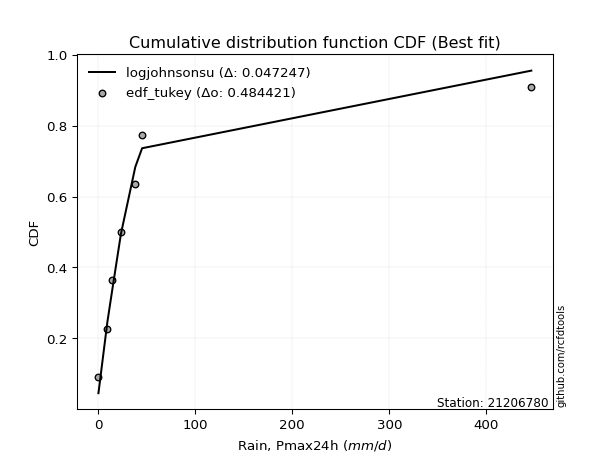</img></img>

</div>


### 8. EDF Gringorten (1963)

Gringorten plotting position formula is essential for estimating the probability and return periods of extreme events like floods and heavy rainfall. The constant _a=0.44_.

<div align="center">


$P=(m-a)/(n+1-2a)$


</div>


**8.1. Empirical values**

<div align="center">

|                | 0                   | 1                   | 2                  | 3                  | 4                  | 5                  | 6                  | 7                  |
|:---------------|:--------------------|:--------------------|:-------------------|:-------------------|:-------------------|:-------------------|:-------------------|:-------------------|
| date           | 2023                | 2016                | 2015               | 2012               | 2025               | 2024               | 2013               | 2014               |
| x              | 0.2                 | 9.4                 | 14.5               | 23.4               | 29.3               | 38.2               | 45.2               | 446.4              |
| m              | 1                   | 2                   | 3                  | 4                  | 5                  | 6                  | 7                  | 8                  |
| empirical_dist | edf_gringorten      | edf_gringorten      | edf_gringorten     | edf_gringorten     | edf_gringorten     | edf_gringorten     | edf_gringorten     | edf_gringorten     |
| empirical      | 0.06896551724137932 | 0.19211822660098524 | 0.3152709359605912 | 0.4384236453201971 | 0.5615763546798029 | 0.6847290640394089 | 0.8078817733990148 | 0.9310344827586208 |
| empirical_tr   | 1.0740740740740742  | 1.2378048780487805  | 1.460431654676259  | 1.780701754385965  | 2.2808988764044944 | 3.1718750000000004 | 5.205128205128205  | 14.500000000000018 |

</div>


**8.2. Kolmogorov-Smirnov fit test (sorted by Δ)**


<div align="center">

|                | 0                    | 1                   | 2                   | 3                   | 4                   | 5                   | 6                   | 7                   | 8                   | 9                   | 10                  | 11                  | 12                  | 13                  | 14                  | 15                  | 16                 | 17                 | 18                  | 19                  | 20                  | 21                 | 22                 | 23                  | 24                  | 25                  | 26                 | 27                  | 28                 | 29                  | 30                  | 31                  | 32                  | 33                  | 34                 | 35                  | 36                  | 37                  | 38                  | 39                  | 40                  | 41                  | 42                  | 43                  | 44                 | 45                  | 46                 | 47                  | 48                  | 49                  | 50                  | 51                  | 52                 | 53                  | 54                  | 55                  | 56                  | 57                  | 58                 | 59                 | 60                 | 61                  | 62                  | 63                  | 64                 | 65                 | 66                  | 67                 | 68                  | 69                  | 70                  | 71                  | 72                 | 73                 | 74                 | 75                  | 76                 | 77                  | 78                 | 79                 | 80                 | 81                 | 82                  | 83                 | 84                 | 85                  | 86                  | 87                  | 88                  | 89                  | 90                  | 91                  | 92                 | 93                  | 94                 | 95                  | 96                  | 97                  | 98                 | 99                 | 100                | 101                | 102                 | 103                | 104                | 105                | 106                | 107                | 108                 | 109                | 110                 | 111                 | 112                | 113                 | 114                 | 115                 | 116                 | 117                | 118                | 119                 | 120                 | 121                | 122                | 123                | 124                 | 125                | 126                | 127                 | 128                 | 129                | 130                 | 131                 | 132                 | 133                 | 134                 | 135                | 136                 | 137                | 138                | 139                | 140                | 141                | 142                | 143                | 144                | 145                | 146                | 147                | 148                | 149                | 150                | 151                | 152                | 153                | 154                | 155                | 156                | 157                | 158                | 159                |
|:---------------|:---------------------|:--------------------|:--------------------|:--------------------|:--------------------|:--------------------|:--------------------|:--------------------|:--------------------|:--------------------|:--------------------|:--------------------|:--------------------|:--------------------|:--------------------|:--------------------|:-------------------|:-------------------|:--------------------|:--------------------|:--------------------|:-------------------|:-------------------|:--------------------|:--------------------|:--------------------|:-------------------|:--------------------|:-------------------|:--------------------|:--------------------|:--------------------|:--------------------|:--------------------|:-------------------|:--------------------|:--------------------|:--------------------|:--------------------|:--------------------|:--------------------|:--------------------|:--------------------|:--------------------|:-------------------|:--------------------|:-------------------|:--------------------|:--------------------|:--------------------|:--------------------|:--------------------|:-------------------|:--------------------|:--------------------|:--------------------|:--------------------|:--------------------|:-------------------|:-------------------|:-------------------|:--------------------|:--------------------|:--------------------|:-------------------|:-------------------|:--------------------|:-------------------|:--------------------|:--------------------|:--------------------|:--------------------|:-------------------|:-------------------|:-------------------|:--------------------|:-------------------|:--------------------|:-------------------|:-------------------|:-------------------|:-------------------|:--------------------|:-------------------|:-------------------|:--------------------|:--------------------|:--------------------|:--------------------|:--------------------|:--------------------|:--------------------|:-------------------|:--------------------|:-------------------|:--------------------|:--------------------|:--------------------|:-------------------|:-------------------|:-------------------|:-------------------|:--------------------|:-------------------|:-------------------|:-------------------|:-------------------|:-------------------|:--------------------|:-------------------|:--------------------|:--------------------|:-------------------|:--------------------|:--------------------|:--------------------|:--------------------|:-------------------|:-------------------|:--------------------|:--------------------|:-------------------|:-------------------|:-------------------|:--------------------|:-------------------|:-------------------|:--------------------|:--------------------|:-------------------|:--------------------|:--------------------|:--------------------|:--------------------|:--------------------|:-------------------|:--------------------|:-------------------|:-------------------|:-------------------|:-------------------|:-------------------|:-------------------|:-------------------|:-------------------|:-------------------|:-------------------|:-------------------|:-------------------|:-------------------|:-------------------|:-------------------|:-------------------|:-------------------|:-------------------|:-------------------|:-------------------|:-------------------|:-------------------|:-------------------|
| station        | 21206780             | 21206780            | 21206780            | 21206780            | 21206780            | 21206780            | 21206780            | 21206780            | 21206780            | 21206780            | 21206780            | 21206780            | 21206780            | 21206780            | 21206780            | 21206780            | 21206780           | 21206780           | 21206780            | 21206780            | 21206780            | 21206780           | 21206780           | 21206780            | 21206780            | 21206780            | 21206780           | 21206780            | 21206780           | 21206780            | 21206780            | 21206780            | 21206780            | 21206780            | 21206780           | 21206780            | 21206780            | 21206780            | 21206780            | 21206780            | 21206780            | 21206780            | 21206780            | 21206780            | 21206780           | 21206780            | 21206780           | 21206780            | 21206780            | 21206780            | 21206780            | 21206780            | 21206780           | 21206780            | 21206780            | 21206780            | 21206780            | 21206780            | 21206780           | 21206780           | 21206780           | 21206780            | 21206780            | 21206780            | 21206780           | 21206780           | 21206780            | 21206780           | 21206780            | 21206780            | 21206780            | 21206780            | 21206780           | 21206780           | 21206780           | 21206780            | 21206780           | 21206780            | 21206780           | 21206780           | 21206780           | 21206780           | 21206780            | 21206780           | 21206780           | 21206780            | 21206780            | 21206780            | 21206780            | 21206780            | 21206780            | 21206780            | 21206780           | 21206780            | 21206780           | 21206780            | 21206780            | 21206780            | 21206780           | 21206780           | 21206780           | 21206780           | 21206780            | 21206780           | 21206780           | 21206780           | 21206780           | 21206780           | 21206780            | 21206780           | 21206780            | 21206780            | 21206780           | 21206780            | 21206780            | 21206780            | 21206780            | 21206780           | 21206780           | 21206780            | 21206780            | 21206780           | 21206780           | 21206780           | 21206780            | 21206780           | 21206780           | 21206780            | 21206780            | 21206780           | 21206780            | 21206780            | 21206780            | 21206780            | 21206780            | 21206780           | 21206780            | 21206780           | 21206780           | 21206780           | 21206780           | 21206780           | 21206780           | 21206780           | 21206780           | 21206780           | 21206780           | 21206780           | 21206780           | 21206780           | 21206780           | 21206780           | 21206780           | 21206780           | 21206780           | 21206780           | 21206780           | 21206780           | 21206780           | 21206780           |
| empirical_dist | edf_gringorten       | edf_gringorten      | edf_gringorten      | edf_gringorten      | edf_gringorten      | edf_gringorten      | edf_gringorten      | edf_gringorten      | edf_gringorten      | edf_gringorten      | edf_gringorten      | edf_gringorten      | edf_gringorten      | edf_gringorten      | edf_gringorten      | edf_gringorten      | edf_gringorten     | edf_gringorten     | edf_gringorten      | edf_gringorten      | edf_gringorten      | edf_gringorten     | edf_gringorten     | edf_gringorten      | edf_gringorten      | edf_gringorten      | edf_gringorten     | edf_gringorten      | edf_gringorten     | edf_gringorten      | edf_gringorten      | edf_gringorten      | edf_gringorten      | edf_gringorten      | edf_gringorten     | edf_gringorten      | edf_gringorten      | edf_gringorten      | edf_gringorten      | edf_gringorten      | edf_gringorten      | edf_gringorten      | edf_gringorten      | edf_gringorten      | edf_gringorten     | edf_gringorten      | edf_gringorten     | edf_gringorten      | edf_gringorten      | edf_gringorten      | edf_gringorten      | edf_gringorten      | edf_gringorten     | edf_gringorten      | edf_gringorten      | edf_gringorten      | edf_gringorten      | edf_gringorten      | edf_gringorten     | edf_gringorten     | edf_gringorten     | edf_gringorten      | edf_gringorten      | edf_gringorten      | edf_gringorten     | edf_gringorten     | edf_gringorten      | edf_gringorten     | edf_gringorten      | edf_gringorten      | edf_gringorten      | edf_gringorten      | edf_gringorten     | edf_gringorten     | edf_gringorten     | edf_gringorten      | edf_gringorten     | edf_gringorten      | edf_gringorten     | edf_gringorten     | edf_gringorten     | edf_gringorten     | edf_gringorten      | edf_gringorten     | edf_gringorten     | edf_gringorten      | edf_gringorten      | edf_gringorten      | edf_gringorten      | edf_gringorten      | edf_gringorten      | edf_gringorten      | edf_gringorten     | edf_gringorten      | edf_gringorten     | edf_gringorten      | edf_gringorten      | edf_gringorten      | edf_gringorten     | edf_gringorten     | edf_gringorten     | edf_gringorten     | edf_gringorten      | edf_gringorten     | edf_gringorten     | edf_gringorten     | edf_gringorten     | edf_gringorten     | edf_gringorten      | edf_gringorten     | edf_gringorten      | edf_gringorten      | edf_gringorten     | edf_gringorten      | edf_gringorten      | edf_gringorten      | edf_gringorten      | edf_gringorten     | edf_gringorten     | edf_gringorten      | edf_gringorten      | edf_gringorten     | edf_gringorten     | edf_gringorten     | edf_gringorten      | edf_gringorten     | edf_gringorten     | edf_gringorten      | edf_gringorten      | edf_gringorten     | edf_gringorten      | edf_gringorten      | edf_gringorten      | edf_gringorten      | edf_gringorten      | edf_gringorten     | edf_gringorten      | edf_gringorten     | edf_gringorten     | edf_gringorten     | edf_gringorten     | edf_gringorten     | edf_gringorten     | edf_gringorten     | edf_gringorten     | edf_gringorten     | edf_gringorten     | edf_gringorten     | edf_gringorten     | edf_gringorten     | edf_gringorten     | edf_gringorten     | edf_gringorten     | edf_gringorten     | edf_gringorten     | edf_gringorten     | edf_gringorten     | edf_gringorten     | edf_gringorten     | edf_gringorten     |
| p_dist         | logjohnsonsu         | logt                | alpha               | t                   | logdgamma           | nct                 | kappa3              | gennorm             | invweibull          | genextreme          | johnsonsu           | invgamma            | loggenlogistic      | logmielke           | genpareto           | lomax               | loglaplace         | loglaplace         | logvonmises_line    | logburr12           | logcrystalball      | logfoldnorm        | logdweibull        | loghypsecant        | f                   | ncf                 | logskewnorm        | betaprime           | halfgennorm        | truncpareto         | invgauss            | loglogistic         | burr                | loggompertz         | logexponweib       | logloggamma         | logweibull_min      | logjohnsonsb        | loggennorm          | logbeta             | logbetaprime        | logrice             | logexponnorm        | lognorm             | lognakagami        | lognct              | logfatiguelife     | burr12              | loggumbel_l         | logpearson3         | loggengamma         | mielke              | loggenextreme      | loggamma            | loggamma            | logerlang           | loginvgamma         | vonmises_line       | loganglit          | dweibull           | logsemicircular    | logargus            | loginvgauss         | logmaxwell          | fatiguelife        | truncweibull_min   | lograyleigh         | loggumbel_r        | logarcsine          | loginvweibull       | logcosine           | logburr             | exponpow           | logmoyal           | erlang             | loghalfnorm         | loggenhalflogistic | wald                | logtriang          | loghalflogistic    | gengamma           | loglomax           | loglevy_l           | logkstwobign       | gamma              | logbradford         | gausshyper          | logtruncweibull_min | loggausshyper       | halflogistic        | loggenexpon         | logwald             | pearson3           | loguniform          | logksone           | moyal               | loggenpareto        | logtruncnorm        | foldnorm           | halfnorm           | dgamma             | logkappa4          | logwrapcauchy       | nakagami           | exponweib          | gumbel_r           | genlogistic        | logtrapezoid       | logloglaplace       | rayleigh           | arcsine             | exponnorm           | genexpon           | maxwell             | gompertz            | semicircular        | anglit              | loghalfgennorm     | weibull_min        | norm                | crystalball         | logncf             | logistic           | wrapcauchy         | logtruncexpon       | powerlaw           | hypsecant          | kstwobign           | levy_l              | laplace            | logweibull_max      | logkappa3           | rice                | gumbel_l            | cosine              | truncnorm          | logf                | logtukeylambda     | logalpha           | argus              | triang             | skewnorm           | logrdist           | bradford           | johnsonsb          | truncexpon         | rdist              | ksone              | logpowerlaw        | tukeylambda        | kappa4             | uniform            | genhalflogistic    | logexponpow        | weibull_max        | logtruncpareto     | beta               | trapezoid          | logvonmises        | vonmises           |
| delta          | 0.036955717449491776 | 0.07820166225684833 | 0.09909171113334359 | 0.10490389947193408 | 0.11444321788100087 | 0.11547260937418857 | 0.11876573222008724 | 0.11979105359214781 | 0.11983910506323692 | 0.11983968723135718 | 0.12124224530843564 | 0.12233186332445223 | 0.12307375060403392 | 0.12344780098342556 | 0.12887994448858342 | 0.12903611170385976 | 0.1355064611310685 | 0.1355064611310685 | 0.13666723188179983 | 0.14335199873149274 | 0.14388241618859732 | 0.1441677802114795 | 0.1458905747804412 | 0.14643303104293057 | 0.14721486675327325 | 0.14818300270381457 | 0.1496197553947957 | 0.15322429078766206 | 0.1555943468128301 | 0.15567311868200528 | 0.15830540891384337 | 0.15936426000168727 | 0.16067034513243755 | 0.16483630576203034 | 0.1657277843067635 | 0.16813343445271556 | 0.16882137844460432 | 0.16949702391282528 | 0.17221023057753687 | 0.17342468484214646 | 0.17534405468354994 | 0.17566195226371425 | 0.17567279449290837 | 0.17567452458359165 | 0.1759156098293375 | 0.17639016547009398 | 0.178618716973836  | 0.18080126939485738 | 0.18116939320661596 | 0.18357964779594782 | 0.18473427539059858 | 0.18546966504897147 | 0.1882491720314271 | 0.18895822009063687 | 0.18895822009063687 | 0.19000530422834686 | 0.19196931265038977 | 0.19211766249803242 | 0.193465664904958  | 0.1975296604854842 | 0.2009016133286564 | 0.20163928385963992 | 0.20690466896259876 | 0.20856704132165235 | 0.2191522523435624 | 0.219368885680706  | 0.22079821913657713 | 0.2285932769254763 | 0.23113007238216435 | 0.23855741818898193 | 0.24000126119423545 | 0.24077413824851338 | 0.241212866106853  | 0.248597189395343  | 0.25481662741902   | 0.25558289516348365 | 0.2568234306760978 | 0.26231471063616657 | 0.2638139546825312 | 0.2665751012946129 | 0.2694804224845341 | 0.2719968638818635 | 0.27948469225368744 | 0.2802402300532909 | 0.2814547131831886 | 0.28169466824509215 | 0.28448171509741726 | 0.28546553424672694 | 0.29275023486843543 | 0.29554023519017514 | 0.29586070738638226 | 0.29878151283319376 | 0.3063533338399651 | 0.30721009749513806 | 0.3073220434791175 | 0.30800732119734076 | 0.30868757731637547 | 0.30885395772988233 | 0.310937018453212  | 0.3128311997257492 | 0.3145512224210439 | 0.3160429297297944 | 0.31837514290341196 | 0.3253146750525058 | 0.3293419638573812 | 0.3318105833272188 | 0.3327889738444631 | 0.3427243370050468 | 0.34737169405357615 | 0.3474957083944874 | 0.35705078436286486 | 0.35829372251866387 | 0.3594217431945861 | 0.35973501665900903 | 0.36614810758398497 | 0.37700420284649494 | 0.38198541226791916 | 0.3860084633726437 | 0.3862306427231924 | 0.39400529268860873 | 0.39400530367857245 | 0.39624647154656   | 0.405284420153881  | 0.4086155639720163 | 0.40966606486795376 | 0.4138493264151488 | 0.4146157143541479 | 0.42356051942250283 | 0.42564755362612783 | 0.4403178196451563 | 0.44388244393577697 | 0.44455866901848096 | 0.44759142533616453 | 0.46182167282365116 | 0.47486802998877764 | 0.4884356829247769 | 0.49846049665731895 | 0.5209431290669114 | 0.529902767785868  | 0.5418908659442461 | 0.56240469343299   | 0.586088445677936  | 0.5862152081325482 | 0.627651991126762  | 0.6340281504059727 | 0.6381535275201857 | 0.6395370390113747 | 0.6405054100343054 | 0.6812168623664612 | 0.6889955606031833 | 0.6894038523969954 | 0.7070301373613636 | 0.7111307509619436 | 0.7162222149351861 | 0.7185726309911272 | 0.7254527601298478 | 0.7672153777916983 | 0.7784611694516563 | 1.0545864199827826 | 70.46978817536464  |
| deltao         | 0.4472608134160001   | 0.4472608134160001  | 0.4472608134160001  | 0.4472608134160001  | 0.4472608134160001  | 0.4472608134160001  | 0.4472608134160001  | 0.4472608134160001  | 0.4472608134160001  | 0.4472608134160001  | 0.4472608134160001  | 0.4472608134160001  | 0.4472608134160001  | 0.4472608134160001  | 0.4472608134160001  | 0.4472608134160001  | 0.4472608134160001 | 0.4472608134160001 | 0.4472608134160001  | 0.4472608134160001  | 0.4472608134160001  | 0.4472608134160001 | 0.4472608134160001 | 0.4472608134160001  | 0.4472608134160001  | 0.4472608134160001  | 0.4472608134160001 | 0.4472608134160001  | 0.4472608134160001 | 0.4472608134160001  | 0.4472608134160001  | 0.4472608134160001  | 0.4472608134160001  | 0.4472608134160001  | 0.4472608134160001 | 0.4472608134160001  | 0.4472608134160001  | 0.4472608134160001  | 0.4472608134160001  | 0.4472608134160001  | 0.4472608134160001  | 0.4472608134160001  | 0.4472608134160001  | 0.4472608134160001  | 0.4472608134160001 | 0.4472608134160001  | 0.4472608134160001 | 0.4472608134160001  | 0.4472608134160001  | 0.4472608134160001  | 0.4472608134160001  | 0.4472608134160001  | 0.4472608134160001 | 0.4472608134160001  | 0.4472608134160001  | 0.4472608134160001  | 0.4472608134160001  | 0.4472608134160001  | 0.4472608134160001 | 0.4472608134160001 | 0.4472608134160001 | 0.4472608134160001  | 0.4472608134160001  | 0.4472608134160001  | 0.4472608134160001 | 0.4472608134160001 | 0.4472608134160001  | 0.4472608134160001 | 0.4472608134160001  | 0.4472608134160001  | 0.4472608134160001  | 0.4472608134160001  | 0.4472608134160001 | 0.4472608134160001 | 0.4472608134160001 | 0.4472608134160001  | 0.4472608134160001 | 0.4472608134160001  | 0.4472608134160001 | 0.4472608134160001 | 0.4472608134160001 | 0.4472608134160001 | 0.4472608134160001  | 0.4472608134160001 | 0.4472608134160001 | 0.4472608134160001  | 0.4472608134160001  | 0.4472608134160001  | 0.4472608134160001  | 0.4472608134160001  | 0.4472608134160001  | 0.4472608134160001  | 0.4472608134160001 | 0.4472608134160001  | 0.4472608134160001 | 0.4472608134160001  | 0.4472608134160001  | 0.4472608134160001  | 0.4472608134160001 | 0.4472608134160001 | 0.4472608134160001 | 0.4472608134160001 | 0.4472608134160001  | 0.4472608134160001 | 0.4472608134160001 | 0.4472608134160001 | 0.4472608134160001 | 0.4472608134160001 | 0.4472608134160001  | 0.4472608134160001 | 0.4472608134160001  | 0.4472608134160001  | 0.4472608134160001 | 0.4472608134160001  | 0.4472608134160001  | 0.4472608134160001  | 0.4472608134160001  | 0.4472608134160001 | 0.4472608134160001 | 0.4472608134160001  | 0.4472608134160001  | 0.4472608134160001 | 0.4472608134160001 | 0.4472608134160001 | 0.4472608134160001  | 0.4472608134160001 | 0.4472608134160001 | 0.4472608134160001  | 0.4472608134160001  | 0.4472608134160001 | 0.4472608134160001  | 0.4472608134160001  | 0.4472608134160001  | 0.4472608134160001  | 0.4472608134160001  | 0.4472608134160001 | 0.4472608134160001  | 0.4472608134160001 | 0.4472608134160001 | 0.4472608134160001 | 0.4472608134160001 | 0.4472608134160001 | 0.4472608134160001 | 0.4472608134160001 | 0.4472608134160001 | 0.4472608134160001 | 0.4472608134160001 | 0.4472608134160001 | 0.4472608134160001 | 0.4472608134160001 | 0.4472608134160001 | 0.4472608134160001 | 0.4472608134160001 | 0.4472608134160001 | 0.4472608134160001 | 0.4472608134160001 | 0.4472608134160001 | 0.4472608134160001 | 0.4472608134160001 | 0.4472608134160001 |
| eval           | Δo > Δ               | Δo > Δ              | Δo > Δ              | Δo > Δ              | Δo > Δ              | Δo > Δ              | Δo > Δ              | Δo > Δ              | Δo > Δ              | Δo > Δ              | Δo > Δ              | Δo > Δ              | Δo > Δ              | Δo > Δ              | Δo > Δ              | Δo > Δ              | Δo > Δ             | Δo > Δ             | Δo > Δ              | Δo > Δ              | Δo > Δ              | Δo > Δ             | Δo > Δ             | Δo > Δ              | Δo > Δ              | Δo > Δ              | Δo > Δ             | Δo > Δ              | Δo > Δ             | Δo > Δ              | Δo > Δ              | Δo > Δ              | Δo > Δ              | Δo > Δ              | Δo > Δ             | Δo > Δ              | Δo > Δ              | Δo > Δ              | Δo > Δ              | Δo > Δ              | Δo > Δ              | Δo > Δ              | Δo > Δ              | Δo > Δ              | Δo > Δ             | Δo > Δ              | Δo > Δ             | Δo > Δ              | Δo > Δ              | Δo > Δ              | Δo > Δ              | Δo > Δ              | Δo > Δ             | Δo > Δ              | Δo > Δ              | Δo > Δ              | Δo > Δ              | Δo > Δ              | Δo > Δ             | Δo > Δ             | Δo > Δ             | Δo > Δ              | Δo > Δ              | Δo > Δ              | Δo > Δ             | Δo > Δ             | Δo > Δ              | Δo > Δ             | Δo > Δ              | Δo > Δ              | Δo > Δ              | Δo > Δ              | Δo > Δ             | Δo > Δ             | Δo > Δ             | Δo > Δ              | Δo > Δ             | Δo > Δ              | Δo > Δ             | Δo > Δ             | Δo > Δ             | Δo > Δ             | Δo > Δ              | Δo > Δ             | Δo > Δ             | Δo > Δ              | Δo > Δ              | Δo > Δ              | Δo > Δ              | Δo > Δ              | Δo > Δ              | Δo > Δ              | Δo > Δ             | Δo > Δ              | Δo > Δ             | Δo > Δ              | Δo > Δ              | Δo > Δ              | Δo > Δ             | Δo > Δ             | Δo > Δ             | Δo > Δ             | Δo > Δ              | Δo > Δ             | Δo > Δ             | Δo > Δ             | Δo > Δ             | Δo > Δ             | Δo > Δ              | Δo > Δ             | Δo > Δ              | Δo > Δ              | Δo > Δ             | Δo > Δ              | Δo > Δ              | Δo > Δ              | Δo > Δ              | Δo > Δ             | Δo > Δ             | Δo > Δ              | Δo > Δ              | Δo > Δ             | Δo > Δ             | Δo > Δ             | Δo > Δ              | Δo > Δ             | Δo > Δ             | Δo > Δ              | Δo > Δ              | Δo > Δ             | Δo > Δ              | Δo > Δ              | Δo <= Δ             | Δo <= Δ             | Δo <= Δ             | Δo <= Δ            | Δo <= Δ             | Δo <= Δ            | Δo <= Δ            | Δo <= Δ            | Δo <= Δ            | Δo <= Δ            | Δo <= Δ            | Δo <= Δ            | Δo <= Δ            | Δo <= Δ            | Δo <= Δ            | Δo <= Δ            | Δo <= Δ            | Δo <= Δ            | Δo <= Δ            | Δo <= Δ            | Δo <= Δ            | Δo <= Δ            | Δo <= Δ            | Δo <= Δ            | Δo <= Δ            | Δo <= Δ            | Δo <= Δ            | Δo <= Δ            |
| fit            | 1                    | 1                   | 1                   | 1                   | 1                   | 1                   | 1                   | 1                   | 1                   | 1                   | 1                   | 1                   | 1                   | 1                   | 1                   | 1                   | 1                  | 1                  | 1                   | 1                   | 1                   | 1                  | 1                  | 1                   | 1                   | 1                   | 1                  | 1                   | 1                  | 1                   | 1                   | 1                   | 1                   | 1                   | 1                  | 1                   | 1                   | 1                   | 1                   | 1                   | 1                   | 1                   | 1                   | 1                   | 1                  | 1                   | 1                  | 1                   | 1                   | 1                   | 1                   | 1                   | 1                  | 1                   | 1                   | 1                   | 1                   | 1                   | 1                  | 1                  | 1                  | 1                   | 1                   | 1                   | 1                  | 1                  | 1                   | 1                  | 1                   | 1                   | 1                   | 1                   | 1                  | 1                  | 1                  | 1                   | 1                  | 1                   | 1                  | 1                  | 1                  | 1                  | 1                   | 1                  | 1                  | 1                   | 1                   | 1                   | 1                   | 1                   | 1                   | 1                   | 1                  | 1                   | 1                  | 1                   | 1                   | 1                   | 1                  | 1                  | 1                  | 1                  | 1                   | 1                  | 1                  | 1                  | 1                  | 1                  | 1                   | 1                  | 1                   | 1                   | 1                  | 1                   | 1                   | 1                   | 1                   | 1                  | 1                  | 1                   | 1                   | 1                  | 1                  | 1                  | 1                   | 1                  | 1                  | 1                   | 1                   | 1                  | 1                   | 1                   | 0                   | 0                   | 0                   | 0                  | 0                   | 0                  | 0                  | 0                  | 0                  | 0                  | 0                  | 0                  | 0                  | 0                  | 0                  | 0                  | 0                  | 0                  | 0                  | 0                  | 0                  | 0                  | 0                  | 0                  | 0                  | 0                  | 0                  | 0                  |
| n              | 8                    | 8                   | 8                   | 8                   | 8                   | 8                   | 8                   | 8                   | 8                   | 8                   | 8                   | 8                   | 8                   | 8                   | 8                   | 8                   | 8                  | 8                  | 8                   | 8                   | 8                   | 8                  | 8                  | 8                   | 8                   | 8                   | 8                  | 8                   | 8                  | 8                   | 8                   | 8                   | 8                   | 8                   | 8                  | 8                   | 8                   | 8                   | 8                   | 8                   | 8                   | 8                   | 8                   | 8                   | 8                  | 8                   | 8                  | 8                   | 8                   | 8                   | 8                   | 8                   | 8                  | 8                   | 8                   | 8                   | 8                   | 8                   | 8                  | 8                  | 8                  | 8                   | 8                   | 8                   | 8                  | 8                  | 8                   | 8                  | 8                   | 8                   | 8                   | 8                   | 8                  | 8                  | 8                  | 8                   | 8                  | 8                   | 8                  | 8                  | 8                  | 8                  | 8                   | 8                  | 8                  | 8                   | 8                   | 8                   | 8                   | 8                   | 8                   | 8                   | 8                  | 8                   | 8                  | 8                   | 8                   | 8                   | 8                  | 8                  | 8                  | 8                  | 8                   | 8                  | 8                  | 8                  | 8                  | 8                  | 8                   | 8                  | 8                   | 8                   | 8                  | 8                   | 8                   | 8                   | 8                   | 8                  | 8                  | 8                   | 8                   | 8                  | 8                  | 8                  | 8                   | 8                  | 8                  | 8                   | 8                   | 8                  | 8                   | 8                   | 8                   | 8                   | 8                   | 8                  | 8                   | 8                  | 8                  | 8                  | 8                  | 8                  | 8                  | 8                  | 8                  | 8                  | 8                  | 8                  | 8                  | 8                  | 8                  | 8                  | 8                  | 8                  | 8                  | 8                  | 8                  | 8                  | 8                  | 8                  |
| best_fit       | 1                    | 0                   | 0                   | 0                   | 0                   | 0                   | 0                   | 0                   | 0                   | 0                   | 0                   | 0                   | 0                   | 0                   | 0                   | 0                   | 0                  | 0                  | 0                   | 0                   | 0                   | 0                  | 0                  | 0                   | 0                   | 0                   | 0                  | 0                   | 0                  | 0                   | 0                   | 0                   | 0                   | 0                   | 0                  | 0                   | 0                   | 0                   | 0                   | 0                   | 0                   | 0                   | 0                   | 0                   | 0                  | 0                   | 0                  | 0                   | 0                   | 0                   | 0                   | 0                   | 0                  | 0                   | 0                   | 0                   | 0                   | 0                   | 0                  | 0                  | 0                  | 0                   | 0                   | 0                   | 0                  | 0                  | 0                   | 0                  | 0                   | 0                   | 0                   | 0                   | 0                  | 0                  | 0                  | 0                   | 0                  | 0                   | 0                  | 0                  | 0                  | 0                  | 0                   | 0                  | 0                  | 0                   | 0                   | 0                   | 0                   | 0                   | 0                   | 0                   | 0                  | 0                   | 0                  | 0                   | 0                   | 0                   | 0                  | 0                  | 0                  | 0                  | 0                   | 0                  | 0                  | 0                  | 0                  | 0                  | 0                   | 0                  | 0                   | 0                   | 0                  | 0                   | 0                   | 0                   | 0                   | 0                  | 0                  | 0                   | 0                   | 0                  | 0                  | 0                  | 0                   | 0                  | 0                  | 0                   | 0                   | 0                  | 0                   | 0                   | 0                   | 0                   | 0                   | 0                  | 0                   | 0                  | 0                  | 0                  | 0                  | 0                  | 0                  | 0                  | 0                  | 0                  | 0                  | 0                  | 0                  | 0                  | 0                  | 0                  | 0                  | 0                  | 0                  | 0                  | 0                  | 0                  | 0                  | 0                  |
| best_fit_sort  | 1                    | 2                   | 3                   | 4                   | 5                   | 6                   | 7                   | 8                   | 9                   | 10                  | 11                  | 12                  | 13                  | 14                  | 15                  | 16                  | 17                 | 18                 | 19                  | 20                  | 21                  | 22                 | 23                 | 24                  | 25                  | 26                  | 27                 | 28                  | 29                 | 30                  | 31                  | 32                  | 33                  | 34                  | 35                 | 36                  | 37                  | 38                  | 39                  | 40                  | 41                  | 42                  | 43                  | 44                  | 45                 | 46                  | 47                 | 48                  | 49                  | 50                  | 51                  | 52                  | 53                 | 54                  | 55                  | 56                  | 57                  | 58                  | 59                 | 60                 | 61                 | 62                  | 63                  | 64                  | 65                 | 66                 | 67                  | 68                 | 69                  | 70                  | 71                  | 72                  | 73                 | 74                 | 75                 | 76                  | 77                 | 78                  | 79                 | 80                 | 81                 | 82                 | 83                  | 84                 | 85                 | 86                  | 87                  | 88                  | 89                  | 90                  | 91                  | 92                  | 93                 | 94                  | 95                 | 96                  | 97                  | 98                  | 99                 | 100                | 101                | 102                | 103                 | 104                | 105                | 106                | 107                | 108                | 109                 | 110                | 111                 | 112                 | 113                | 114                 | 115                 | 116                 | 117                 | 118                | 119                | 120                 | 121                 | 122                | 123                | 124                | 125                 | 126                | 127                | 128                 | 129                 | 130                | 131                 | 132                 | 133                 | 134                 | 135                 | 136                | 137                 | 138                | 139                | 140                | 141                | 142                | 143                | 144                | 145                | 146                | 147                | 148                | 149                | 150                | 151                | 152                | 153                | 154                | 155                | 156                | 157                | 158                | 159                | 160                |

</div>


**8.3. Best fit**

<div align="center">

|   id |   station | empirical_dist   | p_dist       |     delta |   deltao | eval   |   fit |   n |   best_fit |   best_fit_sort |
|-----:|----------:|:-----------------|:-------------|----------:|---------:|:-------|------:|----:|-----------:|----------------:|
|    0 |  21206780 | edf_gringorten   | logjohnsonsu | 0.0369557 | 0.447261 | Δo > Δ |     1 |   8 |          1 |               1 |

</div>


<div align="center">

</img>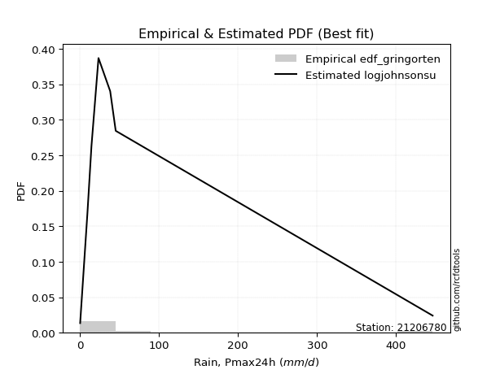</img>

</div>


### 9. EDF Filliben (1975)

The specific values of the constants (0.3175) (often denoted as $alpha$) and (0.365) are derived from a method proposed by James J. Filliben in a 1975 paper. This particular formula is the mean value of the $i$-th order statistic of the normal distribution and is considered a robust and effective plotting position formula for the normal probability plot correlation coefficient test for normality.

<div align="center">


$P=(m-0.3175)/(n+0.365)$


</div>


**9.1. Empirical values**

<div align="center">

|                | 0                  | 1                   | 2                  | 3                   | 4                  | 5                  | 6                  | 7                  |
|:---------------|:-------------------|:--------------------|:-------------------|:--------------------|:-------------------|:-------------------|:-------------------|:-------------------|
| date           | 2023               | 2016                | 2015               | 2012                | 2025               | 2024               | 2013               | 2014               |
| x              | 0.2                | 9.4                 | 14.5               | 23.4                | 29.3               | 38.2               | 45.2               | 446.4              |
| m              | 1                  | 2                   | 3                  | 4                   | 5                  | 6                  | 7                  | 8                  |
| empirical_dist | edf_filliben       | edf_filliben        | edf_filliben       | edf_filliben        | edf_filliben       | edf_filliben       | edf_filliben       | edf_filliben       |
| empirical      | 0.0815899581589958 | 0.20113568439928273 | 0.3206814106395696 | 0.44022713687985654 | 0.5597728631201434 | 0.6793185893604303 | 0.7988643156007172 | 0.9184100418410042 |
| empirical_tr   | 1.0888382687927107 | 1.2517770295548074  | 1.4720633523977125 | 1.7864388681260008  | 2.271554650373387  | 3.118359739049394  | 4.971768202080237  | 12.256410256410254 |

</div>


**9.2. Kolmogorov-Smirnov fit test (sorted by Δ)**


<div align="center">

|                | 0                   | 1                   | 2                   | 3                  | 4                   | 5                   | 6                  | 7                   | 8                   | 9                   | 10                  | 11                  | 12                  | 13                  | 14                  | 15                  | 16                  | 17                 | 18                 | 19                 | 20                  | 21                 | 22                  | 23                  | 24                  | 25                  | 26                 | 27                  | 28                 | 29                  | 30                  | 31                  | 32                 | 33                  | 34                  | 35                 | 36                  | 37                  | 38                 | 39                  | 40                  | 41                  | 42                  | 43                 | 44                 | 45                 | 46                 | 47                 | 48                 | 49                  | 50                 | 51                  | 52                  | 53                  | 54                  | 55                  | 56                  | 57                  | 58                  | 59                 | 60                  | 61                  | 62                  | 63                  | 64                  | 65                  | 66                  | 67                 | 68                  | 69                  | 70                  | 71                  | 72                  | 73                  | 74                  | 75                  | 76                  | 77                 | 78                  | 79                 | 80                  | 81                  | 82                  | 83                  | 84                  | 85                 | 86                 | 87                  | 88                 | 89                 | 90                 | 91                  | 92                 | 93                 | 94                 | 95                 | 96                 | 97                 | 98                  | 99                  | 100                 | 101                | 102                | 103                 | 104                 | 105                 | 106                 | 107                 | 108                | 109                 | 110                | 111                | 112                 | 113                | 114                | 115                | 116                | 117                 | 118                 | 119                | 120                | 121                 | 122                 | 123                 | 124                | 125                | 126                 | 127                 | 128                | 129                 | 130                | 131                | 132                | 133                | 134                | 135                 | 136                | 137                | 138                | 139                | 140                | 141                | 142                | 143                | 144                | 145                | 146                | 147                | 148                | 149                | 150                | 151                | 152                | 153                | 154                | 155                | 156                | 157                | 158                | 159                |
|:---------------|:--------------------|:--------------------|:--------------------|:-------------------|:--------------------|:--------------------|:-------------------|:--------------------|:--------------------|:--------------------|:--------------------|:--------------------|:--------------------|:--------------------|:--------------------|:--------------------|:--------------------|:-------------------|:-------------------|:-------------------|:--------------------|:-------------------|:--------------------|:--------------------|:--------------------|:--------------------|:-------------------|:--------------------|:-------------------|:--------------------|:--------------------|:--------------------|:-------------------|:--------------------|:--------------------|:-------------------|:--------------------|:--------------------|:-------------------|:--------------------|:--------------------|:--------------------|:--------------------|:-------------------|:-------------------|:-------------------|:-------------------|:-------------------|:-------------------|:--------------------|:-------------------|:--------------------|:--------------------|:--------------------|:--------------------|:--------------------|:--------------------|:--------------------|:--------------------|:-------------------|:--------------------|:--------------------|:--------------------|:--------------------|:--------------------|:--------------------|:--------------------|:-------------------|:--------------------|:--------------------|:--------------------|:--------------------|:--------------------|:--------------------|:--------------------|:--------------------|:--------------------|:-------------------|:--------------------|:-------------------|:--------------------|:--------------------|:--------------------|:--------------------|:--------------------|:-------------------|:-------------------|:--------------------|:-------------------|:-------------------|:-------------------|:--------------------|:-------------------|:-------------------|:-------------------|:-------------------|:-------------------|:-------------------|:--------------------|:--------------------|:--------------------|:-------------------|:-------------------|:--------------------|:--------------------|:--------------------|:--------------------|:--------------------|:-------------------|:--------------------|:-------------------|:-------------------|:--------------------|:-------------------|:-------------------|:-------------------|:-------------------|:--------------------|:--------------------|:-------------------|:-------------------|:--------------------|:--------------------|:--------------------|:-------------------|:-------------------|:--------------------|:--------------------|:-------------------|:--------------------|:-------------------|:-------------------|:-------------------|:-------------------|:-------------------|:--------------------|:-------------------|:-------------------|:-------------------|:-------------------|:-------------------|:-------------------|:-------------------|:-------------------|:-------------------|:-------------------|:-------------------|:-------------------|:-------------------|:-------------------|:-------------------|:-------------------|:-------------------|:-------------------|:-------------------|:-------------------|:-------------------|:-------------------|:-------------------|:-------------------|
| station        | 21206780            | 21206780            | 21206780            | 21206780           | 21206780            | 21206780            | 21206780           | 21206780            | 21206780            | 21206780            | 21206780            | 21206780            | 21206780            | 21206780            | 21206780            | 21206780            | 21206780            | 21206780           | 21206780           | 21206780           | 21206780            | 21206780           | 21206780            | 21206780            | 21206780            | 21206780            | 21206780           | 21206780            | 21206780           | 21206780            | 21206780            | 21206780            | 21206780           | 21206780            | 21206780            | 21206780           | 21206780            | 21206780            | 21206780           | 21206780            | 21206780            | 21206780            | 21206780            | 21206780           | 21206780           | 21206780           | 21206780           | 21206780           | 21206780           | 21206780            | 21206780           | 21206780            | 21206780            | 21206780            | 21206780            | 21206780            | 21206780            | 21206780            | 21206780            | 21206780           | 21206780            | 21206780            | 21206780            | 21206780            | 21206780            | 21206780            | 21206780            | 21206780           | 21206780            | 21206780            | 21206780            | 21206780            | 21206780            | 21206780            | 21206780            | 21206780            | 21206780            | 21206780           | 21206780            | 21206780           | 21206780            | 21206780            | 21206780            | 21206780            | 21206780            | 21206780           | 21206780           | 21206780            | 21206780           | 21206780           | 21206780           | 21206780            | 21206780           | 21206780           | 21206780           | 21206780           | 21206780           | 21206780           | 21206780            | 21206780            | 21206780            | 21206780           | 21206780           | 21206780            | 21206780            | 21206780            | 21206780            | 21206780            | 21206780           | 21206780            | 21206780           | 21206780           | 21206780            | 21206780           | 21206780           | 21206780           | 21206780           | 21206780            | 21206780            | 21206780           | 21206780           | 21206780            | 21206780            | 21206780            | 21206780           | 21206780           | 21206780            | 21206780            | 21206780           | 21206780            | 21206780           | 21206780           | 21206780           | 21206780           | 21206780           | 21206780            | 21206780           | 21206780           | 21206780           | 21206780           | 21206780           | 21206780           | 21206780           | 21206780           | 21206780           | 21206780           | 21206780           | 21206780           | 21206780           | 21206780           | 21206780           | 21206780           | 21206780           | 21206780           | 21206780           | 21206780           | 21206780           | 21206780           | 21206780           | 21206780           |
| empirical_dist | edf_filliben        | edf_filliben        | edf_filliben        | edf_filliben       | edf_filliben        | edf_filliben        | edf_filliben       | edf_filliben        | edf_filliben        | edf_filliben        | edf_filliben        | edf_filliben        | edf_filliben        | edf_filliben        | edf_filliben        | edf_filliben        | edf_filliben        | edf_filliben       | edf_filliben       | edf_filliben       | edf_filliben        | edf_filliben       | edf_filliben        | edf_filliben        | edf_filliben        | edf_filliben        | edf_filliben       | edf_filliben        | edf_filliben       | edf_filliben        | edf_filliben        | edf_filliben        | edf_filliben       | edf_filliben        | edf_filliben        | edf_filliben       | edf_filliben        | edf_filliben        | edf_filliben       | edf_filliben        | edf_filliben        | edf_filliben        | edf_filliben        | edf_filliben       | edf_filliben       | edf_filliben       | edf_filliben       | edf_filliben       | edf_filliben       | edf_filliben        | edf_filliben       | edf_filliben        | edf_filliben        | edf_filliben        | edf_filliben        | edf_filliben        | edf_filliben        | edf_filliben        | edf_filliben        | edf_filliben       | edf_filliben        | edf_filliben        | edf_filliben        | edf_filliben        | edf_filliben        | edf_filliben        | edf_filliben        | edf_filliben       | edf_filliben        | edf_filliben        | edf_filliben        | edf_filliben        | edf_filliben        | edf_filliben        | edf_filliben        | edf_filliben        | edf_filliben        | edf_filliben       | edf_filliben        | edf_filliben       | edf_filliben        | edf_filliben        | edf_filliben        | edf_filliben        | edf_filliben        | edf_filliben       | edf_filliben       | edf_filliben        | edf_filliben       | edf_filliben       | edf_filliben       | edf_filliben        | edf_filliben       | edf_filliben       | edf_filliben       | edf_filliben       | edf_filliben       | edf_filliben       | edf_filliben        | edf_filliben        | edf_filliben        | edf_filliben       | edf_filliben       | edf_filliben        | edf_filliben        | edf_filliben        | edf_filliben        | edf_filliben        | edf_filliben       | edf_filliben        | edf_filliben       | edf_filliben       | edf_filliben        | edf_filliben       | edf_filliben       | edf_filliben       | edf_filliben       | edf_filliben        | edf_filliben        | edf_filliben       | edf_filliben       | edf_filliben        | edf_filliben        | edf_filliben        | edf_filliben       | edf_filliben       | edf_filliben        | edf_filliben        | edf_filliben       | edf_filliben        | edf_filliben       | edf_filliben       | edf_filliben       | edf_filliben       | edf_filliben       | edf_filliben        | edf_filliben       | edf_filliben       | edf_filliben       | edf_filliben       | edf_filliben       | edf_filliben       | edf_filliben       | edf_filliben       | edf_filliben       | edf_filliben       | edf_filliben       | edf_filliben       | edf_filliben       | edf_filliben       | edf_filliben       | edf_filliben       | edf_filliben       | edf_filliben       | edf_filliben       | edf_filliben       | edf_filliben       | edf_filliben       | edf_filliben       | edf_filliben       |
| p_dist         | logjohnsonsu        | logt                | alpha               | t                  | logdgamma           | nct                 | kappa3             | invweibull          | genextreme          | johnsonsu           | invgamma            | loggenlogistic      | logmielke           | genpareto           | lomax               | gennorm             | logvonmises_line    | loglaplace         | loglaplace         | logburr12          | logcrystalball      | logfoldnorm        | logdweibull         | loghypsecant        | f                   | ncf                 | logskewnorm        | betaprime           | halfgennorm        | truncpareto         | invgauss            | loglogistic         | loggompertz        | logexponweib        | burr                | logloggamma        | logweibull_min      | logjohnsonsb        | logbeta            | logbetaprime        | logrice             | logexponnorm        | lognorm             | lognakagami        | lognct             | logfatiguelife     | burr12             | loggumbel_l        | loggennorm         | logpearson3         | loggengamma        | mielke              | loggenextreme       | loggamma            | loggamma            | logerlang           | loginvgamma         | loganglit           | dweibull            | logsemicircular    | logargus            | loginvgauss         | logmaxwell          | vonmises_line       | fatiguelife         | truncweibull_min    | lograyleigh         | loggumbel_r        | logarcsine          | loginvweibull       | logcosine           | logburr             | exponpow            | logmoyal            | erlang              | loghalfnorm         | loggenhalflogistic  | wald               | logtriang           | loghalflogistic    | gengamma            | loglomax            | loglevy_l           | logkstwobign        | gamma               | logbradford        | gausshyper         | logtruncweibull_min | loggausshyper      | halflogistic       | loggenexpon        | logwald             | pearson3           | loguniform         | logksone           | moyal              | loggenpareto       | logtruncnorm       | foldnorm            | dgamma              | halfnorm            | logkappa4          | logwrapcauchy      | nakagami            | exponweib           | gumbel_r            | genlogistic         | logtrapezoid        | logloglaplace      | rayleigh            | arcsine            | exponnorm          | genexpon            | maxwell            | gompertz           | semicircular       | anglit             | loghalfgennorm      | weibull_min         | norm               | crystalball        | logncf              | logistic            | wrapcauchy          | logtruncexpon      | powerlaw           | hypsecant           | levy_l              | kstwobign          | laplace             | logweibull_max     | logkappa3          | rice               | gumbel_l           | cosine             | truncnorm           | logf               | logtukeylambda     | logalpha           | argus              | triang             | skewnorm           | logrdist           | bradford           | johnsonsb          | rdist              | truncexpon         | ksone              | logpowerlaw        | tukeylambda        | kappa4             | uniform            | genhalflogistic    | logexponpow        | weibull_max        | logtruncpareto     | beta               | trapezoid          | logvonmises        | vonmises           |
| delta          | 0.04635500822518612 | 0.07201306915108152 | 0.09007425333504604 | 0.0922794585543176 | 0.10542576008270332 | 0.10645515157589103 | 0.1097482744217897 | 0.11082164726493937 | 0.11082222943305964 | 0.11222478751013809 | 0.11331440552615468 | 0.11405629280573637 | 0.11443034318512801 | 0.11986248669028587 | 0.12001865390556221 | 0.12159454515180734 | 0.12764977408350234 | 0.1337029695714091 | 0.1337029695714091 | 0.1343345409331952 | 0.13486495839029977 | 0.135150322413182  | 0.13687311698214366 | 0.13741557324463308 | 0.13819740895497576 | 0.13916554490551702 | 0.1406022975964982 | 0.14420683298936457 | 0.1465768890145326 | 0.14665566088370774 | 0.14928795111554582 | 0.15034680220338978 | 0.1558188479637328 | 0.15671032650846595 | 0.15886685357277813 | 0.159115976654418  | 0.15980392064630677 | 0.16047956611452774 | 0.1644072270438489 | 0.16632659688525245 | 0.16664449446541676 | 0.16665533669461088 | 0.16665706678529416 | 0.16689815203104   | 0.1673727076717965 | 0.1696012591755385 | 0.1717838115965599 | 0.1721519354083184 | 0.1740137221371963 | 0.17456218999765027 | 0.1757168175923011 | 0.17645220725067398 | 0.17923171423312956 | 0.17994076229233938 | 0.17994076229233938 | 0.18098784643004937 | 0.18295185485209228 | 0.18444820710666052 | 0.18490521956786773 | 0.1918841555303589 | 0.19262182606134237 | 0.19788721116430127 | 0.19954958352335486 | 0.20113512029632996 | 0.21013479454526485 | 0.21035142788240846 | 0.21178076133827964 | 0.2195758191271788 | 0.22211261458386686 | 0.22953996039068444 | 0.23098380339593796 | 0.23175668045021589 | 0.23219540830855545 | 0.23957973159704551 | 0.24579916962072254 | 0.24656543736518613 | 0.24780597287780026 | 0.2496902697185501 | 0.25479649688423367 | 0.2575576434963154 | 0.26046296468623653 | 0.26297940608356596 | 0.26686025133607094 | 0.27122277225499336 | 0.27243725538489105 | 0.2726772104467946 | 0.2754642572991197 | 0.2764480764484294  | 0.2837327770701379 | 0.2865227773918776 | 0.2868432495880847 | 0.29324858030675577 | 0.2937288929223486 | 0.2981926396968406 | 0.2983045856808201 | 0.2989898633990432 | 0.2996701195180779 | 0.2998364999315848 | 0.30017255811595706 | 0.30192678150342744 | 0.30381374192745164 | 0.3070254719314969 | 0.3093576851051144 | 0.31629721725420823 | 0.32032450605908364 | 0.32279312552892125 | 0.32377151604616555 | 0.33370687920674924 | 0.3383542362552786 | 0.33847825059618986 | 0.3480333265645673 | 0.3492762647203663 | 0.35040428539628854 | 0.3507175588607115 | 0.3571306497856874 | 0.3679867450481974 | 0.3729679544696216 | 0.37699100557434617 | 0.37721318492489486 | 0.3849878348903112 | 0.3849878458802749 | 0.38722901374826246 | 0.39626696235558345 | 0.39959810617371877 | 0.4006486070696562 | 0.4048318686168513 | 0.40559825655585036 | 0.41302311270851133 | 0.4145430616242053 | 0.43130036184685877 | 0.4348649861374794 | 0.4355412112201834 | 0.438573967537867  | 0.4528042150253536 | 0.4658505721904801 | 0.47941822512647936 | 0.4894430388590214 | 0.5119256712686139 | 0.5208853099875704 | 0.5328734081459485 | 0.5533872356346925 | 0.5770709878796385 | 0.5771977503342507 | 0.6186345333284644 | 0.6250106926076752 | 0.6269125980937582 | 0.6291360697218882 | 0.6314879522360078 | 0.6721994045681636 | 0.6763711196855668 | 0.6803863945986979 | 0.698012679563066  | 0.702113293163646  | 0.7072047571368886 | 0.7095551731928297 | 0.7164353023315503 | 0.7545909368740819 | 0.7694437116533588 | 1.0672108609003992 | 70.48241261628226  |
| deltao         | 0.4472608134160001  | 0.4472608134160001  | 0.4472608134160001  | 0.4472608134160001 | 0.4472608134160001  | 0.4472608134160001  | 0.4472608134160001 | 0.4472608134160001  | 0.4472608134160001  | 0.4472608134160001  | 0.4472608134160001  | 0.4472608134160001  | 0.4472608134160001  | 0.4472608134160001  | 0.4472608134160001  | 0.4472608134160001  | 0.4472608134160001  | 0.4472608134160001 | 0.4472608134160001 | 0.4472608134160001 | 0.4472608134160001  | 0.4472608134160001 | 0.4472608134160001  | 0.4472608134160001  | 0.4472608134160001  | 0.4472608134160001  | 0.4472608134160001 | 0.4472608134160001  | 0.4472608134160001 | 0.4472608134160001  | 0.4472608134160001  | 0.4472608134160001  | 0.4472608134160001 | 0.4472608134160001  | 0.4472608134160001  | 0.4472608134160001 | 0.4472608134160001  | 0.4472608134160001  | 0.4472608134160001 | 0.4472608134160001  | 0.4472608134160001  | 0.4472608134160001  | 0.4472608134160001  | 0.4472608134160001 | 0.4472608134160001 | 0.4472608134160001 | 0.4472608134160001 | 0.4472608134160001 | 0.4472608134160001 | 0.4472608134160001  | 0.4472608134160001 | 0.4472608134160001  | 0.4472608134160001  | 0.4472608134160001  | 0.4472608134160001  | 0.4472608134160001  | 0.4472608134160001  | 0.4472608134160001  | 0.4472608134160001  | 0.4472608134160001 | 0.4472608134160001  | 0.4472608134160001  | 0.4472608134160001  | 0.4472608134160001  | 0.4472608134160001  | 0.4472608134160001  | 0.4472608134160001  | 0.4472608134160001 | 0.4472608134160001  | 0.4472608134160001  | 0.4472608134160001  | 0.4472608134160001  | 0.4472608134160001  | 0.4472608134160001  | 0.4472608134160001  | 0.4472608134160001  | 0.4472608134160001  | 0.4472608134160001 | 0.4472608134160001  | 0.4472608134160001 | 0.4472608134160001  | 0.4472608134160001  | 0.4472608134160001  | 0.4472608134160001  | 0.4472608134160001  | 0.4472608134160001 | 0.4472608134160001 | 0.4472608134160001  | 0.4472608134160001 | 0.4472608134160001 | 0.4472608134160001 | 0.4472608134160001  | 0.4472608134160001 | 0.4472608134160001 | 0.4472608134160001 | 0.4472608134160001 | 0.4472608134160001 | 0.4472608134160001 | 0.4472608134160001  | 0.4472608134160001  | 0.4472608134160001  | 0.4472608134160001 | 0.4472608134160001 | 0.4472608134160001  | 0.4472608134160001  | 0.4472608134160001  | 0.4472608134160001  | 0.4472608134160001  | 0.4472608134160001 | 0.4472608134160001  | 0.4472608134160001 | 0.4472608134160001 | 0.4472608134160001  | 0.4472608134160001 | 0.4472608134160001 | 0.4472608134160001 | 0.4472608134160001 | 0.4472608134160001  | 0.4472608134160001  | 0.4472608134160001 | 0.4472608134160001 | 0.4472608134160001  | 0.4472608134160001  | 0.4472608134160001  | 0.4472608134160001 | 0.4472608134160001 | 0.4472608134160001  | 0.4472608134160001  | 0.4472608134160001 | 0.4472608134160001  | 0.4472608134160001 | 0.4472608134160001 | 0.4472608134160001 | 0.4472608134160001 | 0.4472608134160001 | 0.4472608134160001  | 0.4472608134160001 | 0.4472608134160001 | 0.4472608134160001 | 0.4472608134160001 | 0.4472608134160001 | 0.4472608134160001 | 0.4472608134160001 | 0.4472608134160001 | 0.4472608134160001 | 0.4472608134160001 | 0.4472608134160001 | 0.4472608134160001 | 0.4472608134160001 | 0.4472608134160001 | 0.4472608134160001 | 0.4472608134160001 | 0.4472608134160001 | 0.4472608134160001 | 0.4472608134160001 | 0.4472608134160001 | 0.4472608134160001 | 0.4472608134160001 | 0.4472608134160001 | 0.4472608134160001 |
| eval           | Δo > Δ              | Δo > Δ              | Δo > Δ              | Δo > Δ             | Δo > Δ              | Δo > Δ              | Δo > Δ             | Δo > Δ              | Δo > Δ              | Δo > Δ              | Δo > Δ              | Δo > Δ              | Δo > Δ              | Δo > Δ              | Δo > Δ              | Δo > Δ              | Δo > Δ              | Δo > Δ             | Δo > Δ             | Δo > Δ             | Δo > Δ              | Δo > Δ             | Δo > Δ              | Δo > Δ              | Δo > Δ              | Δo > Δ              | Δo > Δ             | Δo > Δ              | Δo > Δ             | Δo > Δ              | Δo > Δ              | Δo > Δ              | Δo > Δ             | Δo > Δ              | Δo > Δ              | Δo > Δ             | Δo > Δ              | Δo > Δ              | Δo > Δ             | Δo > Δ              | Δo > Δ              | Δo > Δ              | Δo > Δ              | Δo > Δ             | Δo > Δ             | Δo > Δ             | Δo > Δ             | Δo > Δ             | Δo > Δ             | Δo > Δ              | Δo > Δ             | Δo > Δ              | Δo > Δ              | Δo > Δ              | Δo > Δ              | Δo > Δ              | Δo > Δ              | Δo > Δ              | Δo > Δ              | Δo > Δ             | Δo > Δ              | Δo > Δ              | Δo > Δ              | Δo > Δ              | Δo > Δ              | Δo > Δ              | Δo > Δ              | Δo > Δ             | Δo > Δ              | Δo > Δ              | Δo > Δ              | Δo > Δ              | Δo > Δ              | Δo > Δ              | Δo > Δ              | Δo > Δ              | Δo > Δ              | Δo > Δ             | Δo > Δ              | Δo > Δ             | Δo > Δ              | Δo > Δ              | Δo > Δ              | Δo > Δ              | Δo > Δ              | Δo > Δ             | Δo > Δ             | Δo > Δ              | Δo > Δ             | Δo > Δ             | Δo > Δ             | Δo > Δ              | Δo > Δ             | Δo > Δ             | Δo > Δ             | Δo > Δ             | Δo > Δ             | Δo > Δ             | Δo > Δ              | Δo > Δ              | Δo > Δ              | Δo > Δ             | Δo > Δ             | Δo > Δ              | Δo > Δ              | Δo > Δ              | Δo > Δ              | Δo > Δ              | Δo > Δ             | Δo > Δ              | Δo > Δ             | Δo > Δ             | Δo > Δ              | Δo > Δ             | Δo > Δ             | Δo > Δ             | Δo > Δ             | Δo > Δ              | Δo > Δ              | Δo > Δ             | Δo > Δ             | Δo > Δ              | Δo > Δ              | Δo > Δ              | Δo > Δ             | Δo > Δ             | Δo > Δ              | Δo > Δ              | Δo > Δ             | Δo > Δ              | Δo > Δ             | Δo > Δ             | Δo > Δ             | Δo <= Δ            | Δo <= Δ            | Δo <= Δ             | Δo <= Δ            | Δo <= Δ            | Δo <= Δ            | Δo <= Δ            | Δo <= Δ            | Δo <= Δ            | Δo <= Δ            | Δo <= Δ            | Δo <= Δ            | Δo <= Δ            | Δo <= Δ            | Δo <= Δ            | Δo <= Δ            | Δo <= Δ            | Δo <= Δ            | Δo <= Δ            | Δo <= Δ            | Δo <= Δ            | Δo <= Δ            | Δo <= Δ            | Δo <= Δ            | Δo <= Δ            | Δo <= Δ            | Δo <= Δ            |
| fit            | 1                   | 1                   | 1                   | 1                  | 1                   | 1                   | 1                  | 1                   | 1                   | 1                   | 1                   | 1                   | 1                   | 1                   | 1                   | 1                   | 1                   | 1                  | 1                  | 1                  | 1                   | 1                  | 1                   | 1                   | 1                   | 1                   | 1                  | 1                   | 1                  | 1                   | 1                   | 1                   | 1                  | 1                   | 1                   | 1                  | 1                   | 1                   | 1                  | 1                   | 1                   | 1                   | 1                   | 1                  | 1                  | 1                  | 1                  | 1                  | 1                  | 1                   | 1                  | 1                   | 1                   | 1                   | 1                   | 1                   | 1                   | 1                   | 1                   | 1                  | 1                   | 1                   | 1                   | 1                   | 1                   | 1                   | 1                   | 1                  | 1                   | 1                   | 1                   | 1                   | 1                   | 1                   | 1                   | 1                   | 1                   | 1                  | 1                   | 1                  | 1                   | 1                   | 1                   | 1                   | 1                   | 1                  | 1                  | 1                   | 1                  | 1                  | 1                  | 1                   | 1                  | 1                  | 1                  | 1                  | 1                  | 1                  | 1                   | 1                   | 1                   | 1                  | 1                  | 1                   | 1                   | 1                   | 1                   | 1                   | 1                  | 1                   | 1                  | 1                  | 1                   | 1                  | 1                  | 1                  | 1                  | 1                   | 1                   | 1                  | 1                  | 1                   | 1                   | 1                   | 1                  | 1                  | 1                   | 1                   | 1                  | 1                   | 1                  | 1                  | 1                  | 0                  | 0                  | 0                   | 0                  | 0                  | 0                  | 0                  | 0                  | 0                  | 0                  | 0                  | 0                  | 0                  | 0                  | 0                  | 0                  | 0                  | 0                  | 0                  | 0                  | 0                  | 0                  | 0                  | 0                  | 0                  | 0                  | 0                  |
| n              | 8                   | 8                   | 8                   | 8                  | 8                   | 8                   | 8                  | 8                   | 8                   | 8                   | 8                   | 8                   | 8                   | 8                   | 8                   | 8                   | 8                   | 8                  | 8                  | 8                  | 8                   | 8                  | 8                   | 8                   | 8                   | 8                   | 8                  | 8                   | 8                  | 8                   | 8                   | 8                   | 8                  | 8                   | 8                   | 8                  | 8                   | 8                   | 8                  | 8                   | 8                   | 8                   | 8                   | 8                  | 8                  | 8                  | 8                  | 8                  | 8                  | 8                   | 8                  | 8                   | 8                   | 8                   | 8                   | 8                   | 8                   | 8                   | 8                   | 8                  | 8                   | 8                   | 8                   | 8                   | 8                   | 8                   | 8                   | 8                  | 8                   | 8                   | 8                   | 8                   | 8                   | 8                   | 8                   | 8                   | 8                   | 8                  | 8                   | 8                  | 8                   | 8                   | 8                   | 8                   | 8                   | 8                  | 8                  | 8                   | 8                  | 8                  | 8                  | 8                   | 8                  | 8                  | 8                  | 8                  | 8                  | 8                  | 8                   | 8                   | 8                   | 8                  | 8                  | 8                   | 8                   | 8                   | 8                   | 8                   | 8                  | 8                   | 8                  | 8                  | 8                   | 8                  | 8                  | 8                  | 8                  | 8                   | 8                   | 8                  | 8                  | 8                   | 8                   | 8                   | 8                  | 8                  | 8                   | 8                   | 8                  | 8                   | 8                  | 8                  | 8                  | 8                  | 8                  | 8                   | 8                  | 8                  | 8                  | 8                  | 8                  | 8                  | 8                  | 8                  | 8                  | 8                  | 8                  | 8                  | 8                  | 8                  | 8                  | 8                  | 8                  | 8                  | 8                  | 8                  | 8                  | 8                  | 8                  | 8                  |
| best_fit       | 1                   | 0                   | 0                   | 0                  | 0                   | 0                   | 0                  | 0                   | 0                   | 0                   | 0                   | 0                   | 0                   | 0                   | 0                   | 0                   | 0                   | 0                  | 0                  | 0                  | 0                   | 0                  | 0                   | 0                   | 0                   | 0                   | 0                  | 0                   | 0                  | 0                   | 0                   | 0                   | 0                  | 0                   | 0                   | 0                  | 0                   | 0                   | 0                  | 0                   | 0                   | 0                   | 0                   | 0                  | 0                  | 0                  | 0                  | 0                  | 0                  | 0                   | 0                  | 0                   | 0                   | 0                   | 0                   | 0                   | 0                   | 0                   | 0                   | 0                  | 0                   | 0                   | 0                   | 0                   | 0                   | 0                   | 0                   | 0                  | 0                   | 0                   | 0                   | 0                   | 0                   | 0                   | 0                   | 0                   | 0                   | 0                  | 0                   | 0                  | 0                   | 0                   | 0                   | 0                   | 0                   | 0                  | 0                  | 0                   | 0                  | 0                  | 0                  | 0                   | 0                  | 0                  | 0                  | 0                  | 0                  | 0                  | 0                   | 0                   | 0                   | 0                  | 0                  | 0                   | 0                   | 0                   | 0                   | 0                   | 0                  | 0                   | 0                  | 0                  | 0                   | 0                  | 0                  | 0                  | 0                  | 0                   | 0                   | 0                  | 0                  | 0                   | 0                   | 0                   | 0                  | 0                  | 0                   | 0                   | 0                  | 0                   | 0                  | 0                  | 0                  | 0                  | 0                  | 0                   | 0                  | 0                  | 0                  | 0                  | 0                  | 0                  | 0                  | 0                  | 0                  | 0                  | 0                  | 0                  | 0                  | 0                  | 0                  | 0                  | 0                  | 0                  | 0                  | 0                  | 0                  | 0                  | 0                  | 0                  |
| best_fit_sort  | 1                   | 2                   | 3                   | 4                  | 5                   | 6                   | 7                  | 8                   | 9                   | 10                  | 11                  | 12                  | 13                  | 14                  | 15                  | 16                  | 17                  | 18                 | 19                 | 20                 | 21                  | 22                 | 23                  | 24                  | 25                  | 26                  | 27                 | 28                  | 29                 | 30                  | 31                  | 32                  | 33                 | 34                  | 35                  | 36                 | 37                  | 38                  | 39                 | 40                  | 41                  | 42                  | 43                  | 44                 | 45                 | 46                 | 47                 | 48                 | 49                 | 50                  | 51                 | 52                  | 53                  | 54                  | 55                  | 56                  | 57                  | 58                  | 59                  | 60                 | 61                  | 62                  | 63                  | 64                  | 65                  | 66                  | 67                  | 68                 | 69                  | 70                  | 71                  | 72                  | 73                  | 74                  | 75                  | 76                  | 77                  | 78                 | 79                  | 80                 | 81                  | 82                  | 83                  | 84                  | 85                  | 86                 | 87                 | 88                  | 89                 | 90                 | 91                 | 92                  | 93                 | 94                 | 95                 | 96                 | 97                 | 98                 | 99                  | 100                 | 101                 | 102                | 103                | 104                 | 105                 | 106                 | 107                 | 108                 | 109                | 110                 | 111                | 112                | 113                 | 114                | 115                | 116                | 117                | 118                 | 119                 | 120                | 121                | 122                 | 123                 | 124                 | 125                | 126                | 127                 | 128                 | 129                | 130                 | 131                | 132                | 133                | 134                | 135                | 136                 | 137                | 138                | 139                | 140                | 141                | 142                | 143                | 144                | 145                | 146                | 147                | 148                | 149                | 150                | 151                | 152                | 153                | 154                | 155                | 156                | 157                | 158                | 159                | 160                |

</div>


**9.3. Best fit**

<div align="center">

|   id |   station | empirical_dist   | p_dist       |    delta |   deltao | eval   |   fit |   n |   best_fit |   best_fit_sort |
|-----:|----------:|:-----------------|:-------------|---------:|---------:|:-------|------:|----:|-----------:|----------------:|
|    0 |  21206780 | edf_filliben     | logjohnsonsu | 0.046355 | 0.447261 | Δo > Δ |     1 |   8 |          1 |               1 |

</div>


<div align="center">

</img></img>

</div>


### 10. EDF Jenkinson (1977)

The Jenkinson formula in hydrology is an empirical plotting position formula used to estimate the non-exceedance probability _(P)_ or return period _(T)_ of a given ordered observation within a sample. It is a widely used method in the frequency analysis of extreme events such as floods and rainfall, as it provides a distribution-free way to plot data. _a≈0.31_ and _b≈0.38_ are constants derived to approximate the median of the probability distribution for the given rank.

<div align="center">


$P=(m-a)/(n+b)$


</div>


**10.1. Empirical values**

<div align="center">

|                | 0                   | 1                   | 2                  | 3                   | 4                  | 5                  | 6                  | 7                  |
|:---------------|:--------------------|:--------------------|:-------------------|:--------------------|:-------------------|:-------------------|:-------------------|:-------------------|
| date           | 2023                | 2016                | 2015               | 2012                | 2025               | 2024               | 2013               | 2014               |
| x              | 0.2                 | 9.4                 | 14.5               | 23.4                | 29.3               | 38.2               | 45.2               | 446.4              |
| m              | 1                   | 2                   | 3                  | 4                   | 5                  | 6                  | 7                  | 8                  |
| empirical_dist | edf_jenkinson       | edf_jenkinson       | edf_jenkinson      | edf_jenkinson       | edf_jenkinson      | edf_jenkinson      | edf_jenkinson      | edf_jenkinson      |
| empirical      | 0.08233890214797135 | 0.20167064439140808 | 0.3210023866348448 | 0.44033412887828155 | 0.5596658711217184 | 0.6789976133651551 | 0.7983293556085919 | 0.9176610978520287 |
| empirical_tr   | 1.0897269180754225  | 1.2526158445440956  | 1.4727592267135323 | 1.7867803837953091  | 2.2710027100271004 | 3.115241635687732  | 4.958579881656804  | 12.144927536231886 |

</div>


**10.2. Kolmogorov-Smirnov fit test (sorted by Δ)**


<div align="center">

|                | 0                   | 1                   | 2                   | 3                   | 4                   | 5                   | 6                   | 7                   | 8                   | 9                   | 10                 | 11                  | 12                  | 13                  | 14                  | 15                  | 16                  | 17                  | 18                  | 19                 | 20                 | 21                  | 22                  | 23                  | 24                 | 25                  | 26                  | 27                  | 28                  | 29                  | 30                  | 31                  | 32                  | 33                  | 34                  | 35                  | 36                 | 37                  | 38                  | 39                 | 40                 | 41                  | 42                 | 43                  | 44                  | 45                  | 46                  | 47                  | 48                 | 49                 | 50                  | 51                  | 52                  | 53                  | 54                  | 55                 | 56                  | 57                  | 58                 | 59                  | 60                 | 61                  | 62                 | 63                  | 64                  | 65                  | 66                  | 67                  | 68                 | 69                 | 70                 | 71                  | 72                  | 73                  | 74                  | 75                  | 76                  | 77                  | 78                 | 79                  | 80                 | 81                  | 82                 | 83                  | 84                  | 85                 | 86                  | 87                  | 88                  | 89                 | 90                 | 91                  | 92                 | 93                  | 94                 | 95                 | 96                  | 97                  | 98                  | 99                 | 100                 | 101                 | 102                | 103                 | 104                 | 105                 | 106                 | 107                 | 108                | 109                | 110                 | 111                 | 112                 | 113                | 114                 | 115                | 116                | 117                 | 118                | 119                | 120                | 121                 | 122                 | 123                | 124                | 125                 | 126                | 127                | 128                | 129                | 130                 | 131                | 132                | 133                 | 134                | 135                | 136                | 137                | 138                | 139                | 140                | 141                | 142                | 143                | 144                | 145                | 146                | 147                | 148                | 149                | 150                | 151                | 152                | 153                | 154                | 155                | 156                | 157                | 158                | 159                |
|:---------------|:--------------------|:--------------------|:--------------------|:--------------------|:--------------------|:--------------------|:--------------------|:--------------------|:--------------------|:--------------------|:-------------------|:--------------------|:--------------------|:--------------------|:--------------------|:--------------------|:--------------------|:--------------------|:--------------------|:-------------------|:-------------------|:--------------------|:--------------------|:--------------------|:-------------------|:--------------------|:--------------------|:--------------------|:--------------------|:--------------------|:--------------------|:--------------------|:--------------------|:--------------------|:--------------------|:--------------------|:-------------------|:--------------------|:--------------------|:-------------------|:-------------------|:--------------------|:-------------------|:--------------------|:--------------------|:--------------------|:--------------------|:--------------------|:-------------------|:-------------------|:--------------------|:--------------------|:--------------------|:--------------------|:--------------------|:-------------------|:--------------------|:--------------------|:-------------------|:--------------------|:-------------------|:--------------------|:-------------------|:--------------------|:--------------------|:--------------------|:--------------------|:--------------------|:-------------------|:-------------------|:-------------------|:--------------------|:--------------------|:--------------------|:--------------------|:--------------------|:--------------------|:--------------------|:-------------------|:--------------------|:-------------------|:--------------------|:-------------------|:--------------------|:--------------------|:-------------------|:--------------------|:--------------------|:--------------------|:-------------------|:-------------------|:--------------------|:-------------------|:--------------------|:-------------------|:-------------------|:--------------------|:--------------------|:--------------------|:-------------------|:--------------------|:--------------------|:-------------------|:--------------------|:--------------------|:--------------------|:--------------------|:--------------------|:-------------------|:-------------------|:--------------------|:--------------------|:--------------------|:-------------------|:--------------------|:-------------------|:-------------------|:--------------------|:-------------------|:-------------------|:-------------------|:--------------------|:--------------------|:-------------------|:-------------------|:--------------------|:-------------------|:-------------------|:-------------------|:-------------------|:--------------------|:-------------------|:-------------------|:--------------------|:-------------------|:-------------------|:-------------------|:-------------------|:-------------------|:-------------------|:-------------------|:-------------------|:-------------------|:-------------------|:-------------------|:-------------------|:-------------------|:-------------------|:-------------------|:-------------------|:-------------------|:-------------------|:-------------------|:-------------------|:-------------------|:-------------------|:-------------------|:-------------------|:-------------------|:-------------------|
| station        | 21206780            | 21206780            | 21206780            | 21206780            | 21206780            | 21206780            | 21206780            | 21206780            | 21206780            | 21206780            | 21206780           | 21206780            | 21206780            | 21206780            | 21206780            | 21206780            | 21206780            | 21206780            | 21206780            | 21206780           | 21206780           | 21206780            | 21206780            | 21206780            | 21206780           | 21206780            | 21206780            | 21206780            | 21206780            | 21206780            | 21206780            | 21206780            | 21206780            | 21206780            | 21206780            | 21206780            | 21206780           | 21206780            | 21206780            | 21206780           | 21206780           | 21206780            | 21206780           | 21206780            | 21206780            | 21206780            | 21206780            | 21206780            | 21206780           | 21206780           | 21206780            | 21206780            | 21206780            | 21206780            | 21206780            | 21206780           | 21206780            | 21206780            | 21206780           | 21206780            | 21206780           | 21206780            | 21206780           | 21206780            | 21206780            | 21206780            | 21206780            | 21206780            | 21206780           | 21206780           | 21206780           | 21206780            | 21206780            | 21206780            | 21206780            | 21206780            | 21206780            | 21206780            | 21206780           | 21206780            | 21206780           | 21206780            | 21206780           | 21206780            | 21206780            | 21206780           | 21206780            | 21206780            | 21206780            | 21206780           | 21206780           | 21206780            | 21206780           | 21206780            | 21206780           | 21206780           | 21206780            | 21206780            | 21206780            | 21206780           | 21206780            | 21206780            | 21206780           | 21206780            | 21206780            | 21206780            | 21206780            | 21206780            | 21206780           | 21206780           | 21206780            | 21206780            | 21206780            | 21206780           | 21206780            | 21206780           | 21206780           | 21206780            | 21206780           | 21206780           | 21206780           | 21206780            | 21206780            | 21206780           | 21206780           | 21206780            | 21206780           | 21206780           | 21206780           | 21206780           | 21206780            | 21206780           | 21206780           | 21206780            | 21206780           | 21206780           | 21206780           | 21206780           | 21206780           | 21206780           | 21206780           | 21206780           | 21206780           | 21206780           | 21206780           | 21206780           | 21206780           | 21206780           | 21206780           | 21206780           | 21206780           | 21206780           | 21206780           | 21206780           | 21206780           | 21206780           | 21206780           | 21206780           | 21206780           | 21206780           |
| empirical_dist | edf_jenkinson       | edf_jenkinson       | edf_jenkinson       | edf_jenkinson       | edf_jenkinson       | edf_jenkinson       | edf_jenkinson       | edf_jenkinson       | edf_jenkinson       | edf_jenkinson       | edf_jenkinson      | edf_jenkinson       | edf_jenkinson       | edf_jenkinson       | edf_jenkinson       | edf_jenkinson       | edf_jenkinson       | edf_jenkinson       | edf_jenkinson       | edf_jenkinson      | edf_jenkinson      | edf_jenkinson       | edf_jenkinson       | edf_jenkinson       | edf_jenkinson      | edf_jenkinson       | edf_jenkinson       | edf_jenkinson       | edf_jenkinson       | edf_jenkinson       | edf_jenkinson       | edf_jenkinson       | edf_jenkinson       | edf_jenkinson       | edf_jenkinson       | edf_jenkinson       | edf_jenkinson      | edf_jenkinson       | edf_jenkinson       | edf_jenkinson      | edf_jenkinson      | edf_jenkinson       | edf_jenkinson      | edf_jenkinson       | edf_jenkinson       | edf_jenkinson       | edf_jenkinson       | edf_jenkinson       | edf_jenkinson      | edf_jenkinson      | edf_jenkinson       | edf_jenkinson       | edf_jenkinson       | edf_jenkinson       | edf_jenkinson       | edf_jenkinson      | edf_jenkinson       | edf_jenkinson       | edf_jenkinson      | edf_jenkinson       | edf_jenkinson      | edf_jenkinson       | edf_jenkinson      | edf_jenkinson       | edf_jenkinson       | edf_jenkinson       | edf_jenkinson       | edf_jenkinson       | edf_jenkinson      | edf_jenkinson      | edf_jenkinson      | edf_jenkinson       | edf_jenkinson       | edf_jenkinson       | edf_jenkinson       | edf_jenkinson       | edf_jenkinson       | edf_jenkinson       | edf_jenkinson      | edf_jenkinson       | edf_jenkinson      | edf_jenkinson       | edf_jenkinson      | edf_jenkinson       | edf_jenkinson       | edf_jenkinson      | edf_jenkinson       | edf_jenkinson       | edf_jenkinson       | edf_jenkinson      | edf_jenkinson      | edf_jenkinson       | edf_jenkinson      | edf_jenkinson       | edf_jenkinson      | edf_jenkinson      | edf_jenkinson       | edf_jenkinson       | edf_jenkinson       | edf_jenkinson      | edf_jenkinson       | edf_jenkinson       | edf_jenkinson      | edf_jenkinson       | edf_jenkinson       | edf_jenkinson       | edf_jenkinson       | edf_jenkinson       | edf_jenkinson      | edf_jenkinson      | edf_jenkinson       | edf_jenkinson       | edf_jenkinson       | edf_jenkinson      | edf_jenkinson       | edf_jenkinson      | edf_jenkinson      | edf_jenkinson       | edf_jenkinson      | edf_jenkinson      | edf_jenkinson      | edf_jenkinson       | edf_jenkinson       | edf_jenkinson      | edf_jenkinson      | edf_jenkinson       | edf_jenkinson      | edf_jenkinson      | edf_jenkinson      | edf_jenkinson      | edf_jenkinson       | edf_jenkinson      | edf_jenkinson      | edf_jenkinson       | edf_jenkinson      | edf_jenkinson      | edf_jenkinson      | edf_jenkinson      | edf_jenkinson      | edf_jenkinson      | edf_jenkinson      | edf_jenkinson      | edf_jenkinson      | edf_jenkinson      | edf_jenkinson      | edf_jenkinson      | edf_jenkinson      | edf_jenkinson      | edf_jenkinson      | edf_jenkinson      | edf_jenkinson      | edf_jenkinson      | edf_jenkinson      | edf_jenkinson      | edf_jenkinson      | edf_jenkinson      | edf_jenkinson      | edf_jenkinson      | edf_jenkinson      | edf_jenkinson      |
| p_dist         | logjohnsonsu        | logt                | alpha               | t                   | logdgamma           | nct                 | kappa3              | invweibull          | genextreme          | johnsonsu           | invgamma           | loggenlogistic      | logmielke           | genpareto           | lomax               | gennorm             | logvonmises_line    | loglaplace          | loglaplace          | logburr12          | logcrystalball     | logfoldnorm         | logdweibull         | loghypsecant        | f                  | ncf                 | logskewnorm         | betaprime           | halfgennorm         | truncpareto         | invgauss            | loglogistic         | loggompertz         | logexponweib        | logloggamma         | burr                | logweibull_min     | logjohnsonsb        | logbeta             | logbetaprime       | logrice            | logexponnorm        | lognorm            | lognakagami         | lognct              | logfatiguelife      | burr12              | loggumbel_l         | logpearson3        | loggennorm         | loggengamma         | mielke              | loggenextreme       | loggamma            | loggamma            | logerlang          | loginvgamma         | loganglit           | dweibull           | logsemicircular     | logargus           | loginvgauss         | logmaxwell         | vonmises_line       | fatiguelife         | truncweibull_min    | lograyleigh         | loggumbel_r         | logarcsine         | loginvweibull      | logcosine          | logburr             | exponpow            | logmoyal            | erlang              | loghalfnorm         | loggenhalflogistic  | wald                | logtriang          | loghalflogistic     | gengamma           | loglomax            | loglevy_l          | logkstwobign        | gamma               | logbradford        | gausshyper          | logtruncweibull_min | loggausshyper       | halflogistic       | loggenexpon        | logwald             | pearson3           | loguniform          | logksone           | moyal              | loggenpareto        | logtruncnorm        | foldnorm            | dgamma             | halfnorm            | logkappa4           | logwrapcauchy      | nakagami            | exponweib           | gumbel_r            | genlogistic         | logtrapezoid        | logloglaplace      | rayleigh           | arcsine             | exponnorm           | genexpon            | maxwell            | gompertz            | semicircular       | anglit             | loghalfgennorm      | weibull_min        | norm               | crystalball        | logncf              | logistic            | wrapcauchy         | logtruncexpon      | powerlaw            | hypsecant          | levy_l             | kstwobign          | laplace            | logweibull_max      | logkappa3          | rice               | gumbel_l            | cosine             | truncnorm          | logf               | logtukeylambda     | logalpha           | argus              | triang             | skewnorm           | logrdist           | bradford           | johnsonsb          | rdist              | truncexpon         | ksone              | logpowerlaw        | tukeylambda        | kappa4             | uniform            | genhalflogistic    | logexponpow        | weibull_max        | logtruncpareto     | beta               | trapezoid          | logvonmises        | vonmises           |
| delta          | 0.04710395221416164 | 0.07233404514635672 | 0.08953929334292066 | 0.09153051456534206 | 0.10489080009057794 | 0.10592019158376564 | 0.10921331442966431 | 0.11028668727281399 | 0.11028726944093425 | 0.11168982751801271 | 0.1127794455340293 | 0.11352133281361099 | 0.11389538319300263 | 0.11932752669816049 | 0.11948369391343683 | 0.12170153715023235 | 0.12711481409137698 | 0.13359597757298408 | 0.13359597757298408 | 0.1337995809410698 | 0.1343299983981744 | 0.13461536242105665 | 0.13633815699001828 | 0.13688061325250772 | 0.1376624489628504 | 0.13863058491339164 | 0.14006733760437284 | 0.14367187299723921 | 0.14604192902240726 | 0.14612070089158236 | 0.14875299112342044 | 0.14981184221126442 | 0.15528388797160741 | 0.15617536651634056 | 0.15858101666229263 | 0.15875986157435312 | 0.1592689606541814 | 0.15994460612240236 | 0.16387226705172353 | 0.1657916368931271 | 0.1661095344732914 | 0.16612037670248553 | 0.1661221067931688 | 0.16636319203891464 | 0.16683774767967113 | 0.16906629918341315 | 0.17124885160443454 | 0.17161697541619303 | 0.1740272300055249 | 0.1741207141356213 | 0.17518185760017574 | 0.17591724725854863 | 0.17869675424100417 | 0.17940580230021402 | 0.17940580230021402 | 0.180452886437924  | 0.18241689485996693 | 0.18391324711453516 | 0.1841562755788922 | 0.19134919553823354 | 0.192086866069217  | 0.19735225117217592 | 0.1990146235312295 | 0.20167008028845534 | 0.20959983455313946 | 0.20981646789028308 | 0.21124580134615428 | 0.21904085913505345 | 0.2215776545917415 | 0.2290050003985591 | 0.2304488434038126 | 0.23122172045809053 | 0.23166044831643007 | 0.23904477160492016 | 0.24526420962859719 | 0.24603047737306077 | 0.24727101288567488 | 0.24894132572957456 | 0.2542615368921083 | 0.25702268350419005 | 0.2599280046941112 | 0.26244444609144063 | 0.266320192542391  | 0.27068781226286803 | 0.27190229539276567 | 0.2721422504546693 | 0.27492929730699434 | 0.27591311645630406 | 0.28319781707801256 | 0.2859878173997522 | 0.2863082895959594 | 0.29292760431148057 | 0.2929799489333731 | 0.29765767970471524 | 0.2977696256886947 | 0.2984549034069178 | 0.29913515952595254 | 0.29930153993945946 | 0.29963759812383167 | 0.3011778375144519 | 0.30327878193532626 | 0.30649051193937155 | 0.3088227251129891 | 0.31576225726208285 | 0.31978954606695825 | 0.32225816553679587 | 0.32323655605404017 | 0.33317191921462386 | 0.3378192762631533 | 0.3379432906040645 | 0.34749836657244193 | 0.34874130472824094 | 0.34986932540416316 | 0.3501825988685861 | 0.35659568979356204 | 0.367451785056072  | 0.3724329944774962 | 0.37645604558222084 | 0.3766782249327695 | 0.3844528748981858 | 0.3844528858881495 | 0.38669405375613713 | 0.39573200236345807 | 0.3990631461815934 | 0.4001136470775309 | 0.40429690862472595 | 0.405063296563725  | 0.4122741687195358 | 0.4140081016320799 | 0.4307654018547334 | 0.43433002614535404 | 0.4350062512280581 | 0.4380390075457416 | 0.45226925503322823 | 0.4653156121983547 | 0.478883265134354  | 0.4889080788668961 | 0.5113907112764886 | 0.5203503499954452 | 0.5323384481538231 | 0.5528522756425671 | 0.5765360278875131 | 0.5766627903421253 | 0.618099573336339  | 0.6244757326155499 | 0.6261636541047827 | 0.6286011097297628 | 0.6309529922438825 | 0.6716644445760382 | 0.6756221756965913 | 0.6798514346065725 | 0.6974777195709406 | 0.7015783331715206 | 0.7066697971447633 | 0.7090202132007043 | 0.715900342339425  | 0.7538419928851063 | 0.7689087516612334 | 1.0679598048893748 | 70.48316156027123  |
| deltao         | 0.4472608134160001  | 0.4472608134160001  | 0.4472608134160001  | 0.4472608134160001  | 0.4472608134160001  | 0.4472608134160001  | 0.4472608134160001  | 0.4472608134160001  | 0.4472608134160001  | 0.4472608134160001  | 0.4472608134160001 | 0.4472608134160001  | 0.4472608134160001  | 0.4472608134160001  | 0.4472608134160001  | 0.4472608134160001  | 0.4472608134160001  | 0.4472608134160001  | 0.4472608134160001  | 0.4472608134160001 | 0.4472608134160001 | 0.4472608134160001  | 0.4472608134160001  | 0.4472608134160001  | 0.4472608134160001 | 0.4472608134160001  | 0.4472608134160001  | 0.4472608134160001  | 0.4472608134160001  | 0.4472608134160001  | 0.4472608134160001  | 0.4472608134160001  | 0.4472608134160001  | 0.4472608134160001  | 0.4472608134160001  | 0.4472608134160001  | 0.4472608134160001 | 0.4472608134160001  | 0.4472608134160001  | 0.4472608134160001 | 0.4472608134160001 | 0.4472608134160001  | 0.4472608134160001 | 0.4472608134160001  | 0.4472608134160001  | 0.4472608134160001  | 0.4472608134160001  | 0.4472608134160001  | 0.4472608134160001 | 0.4472608134160001 | 0.4472608134160001  | 0.4472608134160001  | 0.4472608134160001  | 0.4472608134160001  | 0.4472608134160001  | 0.4472608134160001 | 0.4472608134160001  | 0.4472608134160001  | 0.4472608134160001 | 0.4472608134160001  | 0.4472608134160001 | 0.4472608134160001  | 0.4472608134160001 | 0.4472608134160001  | 0.4472608134160001  | 0.4472608134160001  | 0.4472608134160001  | 0.4472608134160001  | 0.4472608134160001 | 0.4472608134160001 | 0.4472608134160001 | 0.4472608134160001  | 0.4472608134160001  | 0.4472608134160001  | 0.4472608134160001  | 0.4472608134160001  | 0.4472608134160001  | 0.4472608134160001  | 0.4472608134160001 | 0.4472608134160001  | 0.4472608134160001 | 0.4472608134160001  | 0.4472608134160001 | 0.4472608134160001  | 0.4472608134160001  | 0.4472608134160001 | 0.4472608134160001  | 0.4472608134160001  | 0.4472608134160001  | 0.4472608134160001 | 0.4472608134160001 | 0.4472608134160001  | 0.4472608134160001 | 0.4472608134160001  | 0.4472608134160001 | 0.4472608134160001 | 0.4472608134160001  | 0.4472608134160001  | 0.4472608134160001  | 0.4472608134160001 | 0.4472608134160001  | 0.4472608134160001  | 0.4472608134160001 | 0.4472608134160001  | 0.4472608134160001  | 0.4472608134160001  | 0.4472608134160001  | 0.4472608134160001  | 0.4472608134160001 | 0.4472608134160001 | 0.4472608134160001  | 0.4472608134160001  | 0.4472608134160001  | 0.4472608134160001 | 0.4472608134160001  | 0.4472608134160001 | 0.4472608134160001 | 0.4472608134160001  | 0.4472608134160001 | 0.4472608134160001 | 0.4472608134160001 | 0.4472608134160001  | 0.4472608134160001  | 0.4472608134160001 | 0.4472608134160001 | 0.4472608134160001  | 0.4472608134160001 | 0.4472608134160001 | 0.4472608134160001 | 0.4472608134160001 | 0.4472608134160001  | 0.4472608134160001 | 0.4472608134160001 | 0.4472608134160001  | 0.4472608134160001 | 0.4472608134160001 | 0.4472608134160001 | 0.4472608134160001 | 0.4472608134160001 | 0.4472608134160001 | 0.4472608134160001 | 0.4472608134160001 | 0.4472608134160001 | 0.4472608134160001 | 0.4472608134160001 | 0.4472608134160001 | 0.4472608134160001 | 0.4472608134160001 | 0.4472608134160001 | 0.4472608134160001 | 0.4472608134160001 | 0.4472608134160001 | 0.4472608134160001 | 0.4472608134160001 | 0.4472608134160001 | 0.4472608134160001 | 0.4472608134160001 | 0.4472608134160001 | 0.4472608134160001 | 0.4472608134160001 |
| eval           | Δo > Δ              | Δo > Δ              | Δo > Δ              | Δo > Δ              | Δo > Δ              | Δo > Δ              | Δo > Δ              | Δo > Δ              | Δo > Δ              | Δo > Δ              | Δo > Δ             | Δo > Δ              | Δo > Δ              | Δo > Δ              | Δo > Δ              | Δo > Δ              | Δo > Δ              | Δo > Δ              | Δo > Δ              | Δo > Δ             | Δo > Δ             | Δo > Δ              | Δo > Δ              | Δo > Δ              | Δo > Δ             | Δo > Δ              | Δo > Δ              | Δo > Δ              | Δo > Δ              | Δo > Δ              | Δo > Δ              | Δo > Δ              | Δo > Δ              | Δo > Δ              | Δo > Δ              | Δo > Δ              | Δo > Δ             | Δo > Δ              | Δo > Δ              | Δo > Δ             | Δo > Δ             | Δo > Δ              | Δo > Δ             | Δo > Δ              | Δo > Δ              | Δo > Δ              | Δo > Δ              | Δo > Δ              | Δo > Δ             | Δo > Δ             | Δo > Δ              | Δo > Δ              | Δo > Δ              | Δo > Δ              | Δo > Δ              | Δo > Δ             | Δo > Δ              | Δo > Δ              | Δo > Δ             | Δo > Δ              | Δo > Δ             | Δo > Δ              | Δo > Δ             | Δo > Δ              | Δo > Δ              | Δo > Δ              | Δo > Δ              | Δo > Δ              | Δo > Δ             | Δo > Δ             | Δo > Δ             | Δo > Δ              | Δo > Δ              | Δo > Δ              | Δo > Δ              | Δo > Δ              | Δo > Δ              | Δo > Δ              | Δo > Δ             | Δo > Δ              | Δo > Δ             | Δo > Δ              | Δo > Δ             | Δo > Δ              | Δo > Δ              | Δo > Δ             | Δo > Δ              | Δo > Δ              | Δo > Δ              | Δo > Δ             | Δo > Δ             | Δo > Δ              | Δo > Δ             | Δo > Δ              | Δo > Δ             | Δo > Δ             | Δo > Δ              | Δo > Δ              | Δo > Δ              | Δo > Δ             | Δo > Δ              | Δo > Δ              | Δo > Δ             | Δo > Δ              | Δo > Δ              | Δo > Δ              | Δo > Δ              | Δo > Δ              | Δo > Δ             | Δo > Δ             | Δo > Δ              | Δo > Δ              | Δo > Δ              | Δo > Δ             | Δo > Δ              | Δo > Δ             | Δo > Δ             | Δo > Δ              | Δo > Δ             | Δo > Δ             | Δo > Δ             | Δo > Δ              | Δo > Δ              | Δo > Δ             | Δo > Δ             | Δo > Δ              | Δo > Δ             | Δo > Δ             | Δo > Δ             | Δo > Δ             | Δo > Δ              | Δo > Δ             | Δo > Δ             | Δo <= Δ             | Δo <= Δ            | Δo <= Δ            | Δo <= Δ            | Δo <= Δ            | Δo <= Δ            | Δo <= Δ            | Δo <= Δ            | Δo <= Δ            | Δo <= Δ            | Δo <= Δ            | Δo <= Δ            | Δo <= Δ            | Δo <= Δ            | Δo <= Δ            | Δo <= Δ            | Δo <= Δ            | Δo <= Δ            | Δo <= Δ            | Δo <= Δ            | Δo <= Δ            | Δo <= Δ            | Δo <= Δ            | Δo <= Δ            | Δo <= Δ            | Δo <= Δ            | Δo <= Δ            |
| fit            | 1                   | 1                   | 1                   | 1                   | 1                   | 1                   | 1                   | 1                   | 1                   | 1                   | 1                  | 1                   | 1                   | 1                   | 1                   | 1                   | 1                   | 1                   | 1                   | 1                  | 1                  | 1                   | 1                   | 1                   | 1                  | 1                   | 1                   | 1                   | 1                   | 1                   | 1                   | 1                   | 1                   | 1                   | 1                   | 1                   | 1                  | 1                   | 1                   | 1                  | 1                  | 1                   | 1                  | 1                   | 1                   | 1                   | 1                   | 1                   | 1                  | 1                  | 1                   | 1                   | 1                   | 1                   | 1                   | 1                  | 1                   | 1                   | 1                  | 1                   | 1                  | 1                   | 1                  | 1                   | 1                   | 1                   | 1                   | 1                   | 1                  | 1                  | 1                  | 1                   | 1                   | 1                   | 1                   | 1                   | 1                   | 1                   | 1                  | 1                   | 1                  | 1                   | 1                  | 1                   | 1                   | 1                  | 1                   | 1                   | 1                   | 1                  | 1                  | 1                   | 1                  | 1                   | 1                  | 1                  | 1                   | 1                   | 1                   | 1                  | 1                   | 1                   | 1                  | 1                   | 1                   | 1                   | 1                   | 1                   | 1                  | 1                  | 1                   | 1                   | 1                   | 1                  | 1                   | 1                  | 1                  | 1                   | 1                  | 1                  | 1                  | 1                   | 1                   | 1                  | 1                  | 1                   | 1                  | 1                  | 1                  | 1                  | 1                   | 1                  | 1                  | 0                   | 0                  | 0                  | 0                  | 0                  | 0                  | 0                  | 0                  | 0                  | 0                  | 0                  | 0                  | 0                  | 0                  | 0                  | 0                  | 0                  | 0                  | 0                  | 0                  | 0                  | 0                  | 0                  | 0                  | 0                  | 0                  | 0                  |
| n              | 8                   | 8                   | 8                   | 8                   | 8                   | 8                   | 8                   | 8                   | 8                   | 8                   | 8                  | 8                   | 8                   | 8                   | 8                   | 8                   | 8                   | 8                   | 8                   | 8                  | 8                  | 8                   | 8                   | 8                   | 8                  | 8                   | 8                   | 8                   | 8                   | 8                   | 8                   | 8                   | 8                   | 8                   | 8                   | 8                   | 8                  | 8                   | 8                   | 8                  | 8                  | 8                   | 8                  | 8                   | 8                   | 8                   | 8                   | 8                   | 8                  | 8                  | 8                   | 8                   | 8                   | 8                   | 8                   | 8                  | 8                   | 8                   | 8                  | 8                   | 8                  | 8                   | 8                  | 8                   | 8                   | 8                   | 8                   | 8                   | 8                  | 8                  | 8                  | 8                   | 8                   | 8                   | 8                   | 8                   | 8                   | 8                   | 8                  | 8                   | 8                  | 8                   | 8                  | 8                   | 8                   | 8                  | 8                   | 8                   | 8                   | 8                  | 8                  | 8                   | 8                  | 8                   | 8                  | 8                  | 8                   | 8                   | 8                   | 8                  | 8                   | 8                   | 8                  | 8                   | 8                   | 8                   | 8                   | 8                   | 8                  | 8                  | 8                   | 8                   | 8                   | 8                  | 8                   | 8                  | 8                  | 8                   | 8                  | 8                  | 8                  | 8                   | 8                   | 8                  | 8                  | 8                   | 8                  | 8                  | 8                  | 8                  | 8                   | 8                  | 8                  | 8                   | 8                  | 8                  | 8                  | 8                  | 8                  | 8                  | 8                  | 8                  | 8                  | 8                  | 8                  | 8                  | 8                  | 8                  | 8                  | 8                  | 8                  | 8                  | 8                  | 8                  | 8                  | 8                  | 8                  | 8                  | 8                  | 8                  |
| best_fit       | 1                   | 0                   | 0                   | 0                   | 0                   | 0                   | 0                   | 0                   | 0                   | 0                   | 0                  | 0                   | 0                   | 0                   | 0                   | 0                   | 0                   | 0                   | 0                   | 0                  | 0                  | 0                   | 0                   | 0                   | 0                  | 0                   | 0                   | 0                   | 0                   | 0                   | 0                   | 0                   | 0                   | 0                   | 0                   | 0                   | 0                  | 0                   | 0                   | 0                  | 0                  | 0                   | 0                  | 0                   | 0                   | 0                   | 0                   | 0                   | 0                  | 0                  | 0                   | 0                   | 0                   | 0                   | 0                   | 0                  | 0                   | 0                   | 0                  | 0                   | 0                  | 0                   | 0                  | 0                   | 0                   | 0                   | 0                   | 0                   | 0                  | 0                  | 0                  | 0                   | 0                   | 0                   | 0                   | 0                   | 0                   | 0                   | 0                  | 0                   | 0                  | 0                   | 0                  | 0                   | 0                   | 0                  | 0                   | 0                   | 0                   | 0                  | 0                  | 0                   | 0                  | 0                   | 0                  | 0                  | 0                   | 0                   | 0                   | 0                  | 0                   | 0                   | 0                  | 0                   | 0                   | 0                   | 0                   | 0                   | 0                  | 0                  | 0                   | 0                   | 0                   | 0                  | 0                   | 0                  | 0                  | 0                   | 0                  | 0                  | 0                  | 0                   | 0                   | 0                  | 0                  | 0                   | 0                  | 0                  | 0                  | 0                  | 0                   | 0                  | 0                  | 0                   | 0                  | 0                  | 0                  | 0                  | 0                  | 0                  | 0                  | 0                  | 0                  | 0                  | 0                  | 0                  | 0                  | 0                  | 0                  | 0                  | 0                  | 0                  | 0                  | 0                  | 0                  | 0                  | 0                  | 0                  | 0                  | 0                  |
| best_fit_sort  | 1                   | 2                   | 3                   | 4                   | 5                   | 6                   | 7                   | 8                   | 9                   | 10                  | 11                 | 12                  | 13                  | 14                  | 15                  | 16                  | 17                  | 18                  | 19                  | 20                 | 21                 | 22                  | 23                  | 24                  | 25                 | 26                  | 27                  | 28                  | 29                  | 30                  | 31                  | 32                  | 33                  | 34                  | 35                  | 36                  | 37                 | 38                  | 39                  | 40                 | 41                 | 42                  | 43                 | 44                  | 45                  | 46                  | 47                  | 48                  | 49                 | 50                 | 51                  | 52                  | 53                  | 54                  | 55                  | 56                 | 57                  | 58                  | 59                 | 60                  | 61                 | 62                  | 63                 | 64                  | 65                  | 66                  | 67                  | 68                  | 69                 | 70                 | 71                 | 72                  | 73                  | 74                  | 75                  | 76                  | 77                  | 78                  | 79                 | 80                  | 81                 | 82                  | 83                 | 84                  | 85                  | 86                 | 87                  | 88                  | 89                  | 90                 | 91                 | 92                  | 93                 | 94                  | 95                 | 96                 | 97                  | 98                  | 99                  | 100                | 101                 | 102                 | 103                | 104                 | 105                 | 106                 | 107                 | 108                 | 109                | 110                | 111                 | 112                 | 113                 | 114                | 115                 | 116                | 117                | 118                 | 119                | 120                | 121                | 122                 | 123                 | 124                | 125                | 126                 | 127                | 128                | 129                | 130                | 131                 | 132                | 133                | 134                 | 135                | 136                | 137                | 138                | 139                | 140                | 141                | 142                | 143                | 144                | 145                | 146                | 147                | 148                | 149                | 150                | 151                | 152                | 153                | 154                | 155                | 156                | 157                | 158                | 159                | 160                |

</div>


**10.3. Best fit**

<div align="center">

|   id |   station | empirical_dist   | p_dist       |    delta |   deltao | eval   |   fit |   n |   best_fit |   best_fit_sort |
|-----:|----------:|:-----------------|:-------------|---------:|---------:|:-------|------:|----:|-----------:|----------------:|
|    0 |  21206780 | edf_jenkinson    | logjohnsonsu | 0.047104 | 0.447261 | Δo > Δ |     1 |   8 |          1 |               1 |

</div>


<div align="center">

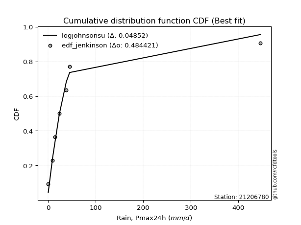</img>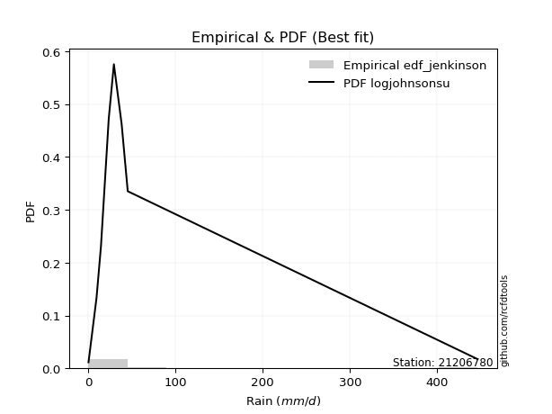</img>

</div>


### 11. EDF Cunnane (1978)

Cunnane´s work in statistical hydrology has focused on the performance and evaluation of different probability distributions (such as GEV, Gumbel, Lognormal) for flood frequency estimation. _b_ is a constant, typically set to 0.4.

<div align="center">


$P=(m-b)/(n+1-2b)$


</div>


**11.1. Empirical values**

<div align="center">

|                | 0                   | 1                   | 2                  | 3                  | 4                  | 5                  | 6                  | 7                  |
|:---------------|:--------------------|:--------------------|:-------------------|:-------------------|:-------------------|:-------------------|:-------------------|:-------------------|
| date           | 2023                | 2016                | 2015               | 2012               | 2025               | 2024               | 2013               | 2014               |
| x              | 0.2                 | 9.4                 | 14.5               | 23.4               | 29.3               | 38.2               | 45.2               | 446.4              |
| m              | 1                   | 2                   | 3                  | 4                  | 5                  | 6                  | 7                  | 8                  |
| empirical_dist | edf_cunnane         | edf_cunnane         | edf_cunnane        | edf_cunnane        | edf_cunnane        | edf_cunnane        | edf_cunnane        | edf_cunnane        |
| empirical      | 0.07317073170731708 | 0.19512195121951223 | 0.3170731707317074 | 0.4390243902439025 | 0.5609756097560976 | 0.6829268292682927 | 0.8048780487804879 | 0.926829268292683  |
| empirical_tr   | 1.0789473684210527  | 1.2424242424242424  | 1.4642857142857144 | 1.782608695652174  | 2.277777777777778  | 3.153846153846154  | 5.125000000000001  | 13.666666666666675 |

</div>


**11.2. Kolmogorov-Smirnov fit test (sorted by Δ)**


<div align="center">

|                | 0                    | 1                   | 2                   | 3                   | 4                   | 5                   | 6                  | 7                   | 8                   | 9                  | 10                  | 11                  | 12                  | 13                  | 14                  | 15                  | 16                  | 17                  | 18                  | 19                 | 20                  | 21                 | 22                  | 23                  | 24                  | 25                  | 26                 | 27                  | 28                 | 29                  | 30                  | 31                  | 32                  | 33                 | 34                  | 35                  | 36                  | 37                  | 38                  | 39                  | 40                  | 41                  | 42                  | 43                  | 44                 | 45                 | 46                 | 47                 | 48                  | 49                  | 50                 | 51                  | 52                  | 53                  | 54                  | 55                  | 56                  | 57                  | 58                  | 59                  | 60                 | 61                  | 62                  | 63                  | 64                  | 65                  | 66                  | 67                 | 68                  | 69                  | 70                  | 71                  | 72                  | 73                 | 74                  | 75                 | 76                  | 77                 | 78                 | 79                 | 80                  | 81                  | 82                 | 83                  | 84                  | 85                 | 86                 | 87                  | 88                 | 89                 | 90                 | 91                 | 92                  | 93                 | 94                 | 95                 | 96                  | 97                 | 98                  | 99                  | 100                 | 101                 | 102                | 103                 | 104                 | 105                 | 106                 | 107                 | 108                | 109                 | 110                | 111                 | 112                 | 113                | 114                 | 115                | 116                | 117                 | 118                 | 119                | 120                | 121                 | 122                 | 123                | 124                | 125                | 126                 | 127                | 128                | 129                | 130                 | 131                | 132                | 133                | 134                | 135                 | 136                | 137                | 138                | 139                | 140                | 141                | 142                | 143                | 144                | 145                | 146                | 147                | 148                | 149                | 150                | 151                | 152                | 153                | 154                | 155                | 156                | 157                | 158                | 159                |
|:---------------|:---------------------|:--------------------|:--------------------|:--------------------|:--------------------|:--------------------|:-------------------|:--------------------|:--------------------|:-------------------|:--------------------|:--------------------|:--------------------|:--------------------|:--------------------|:--------------------|:--------------------|:--------------------|:--------------------|:-------------------|:--------------------|:-------------------|:--------------------|:--------------------|:--------------------|:--------------------|:-------------------|:--------------------|:-------------------|:--------------------|:--------------------|:--------------------|:--------------------|:-------------------|:--------------------|:--------------------|:--------------------|:--------------------|:--------------------|:--------------------|:--------------------|:--------------------|:--------------------|:--------------------|:-------------------|:-------------------|:-------------------|:-------------------|:--------------------|:--------------------|:-------------------|:--------------------|:--------------------|:--------------------|:--------------------|:--------------------|:--------------------|:--------------------|:--------------------|:--------------------|:-------------------|:--------------------|:--------------------|:--------------------|:--------------------|:--------------------|:--------------------|:-------------------|:--------------------|:--------------------|:--------------------|:--------------------|:--------------------|:-------------------|:--------------------|:-------------------|:--------------------|:-------------------|:-------------------|:-------------------|:--------------------|:--------------------|:-------------------|:--------------------|:--------------------|:-------------------|:-------------------|:--------------------|:-------------------|:-------------------|:-------------------|:-------------------|:--------------------|:-------------------|:-------------------|:-------------------|:--------------------|:-------------------|:--------------------|:--------------------|:--------------------|:--------------------|:-------------------|:--------------------|:--------------------|:--------------------|:--------------------|:--------------------|:-------------------|:--------------------|:-------------------|:--------------------|:--------------------|:-------------------|:--------------------|:-------------------|:-------------------|:--------------------|:--------------------|:-------------------|:-------------------|:--------------------|:--------------------|:-------------------|:-------------------|:-------------------|:--------------------|:-------------------|:-------------------|:-------------------|:--------------------|:-------------------|:-------------------|:-------------------|:-------------------|:--------------------|:-------------------|:-------------------|:-------------------|:-------------------|:-------------------|:-------------------|:-------------------|:-------------------|:-------------------|:-------------------|:-------------------|:-------------------|:-------------------|:-------------------|:-------------------|:-------------------|:-------------------|:-------------------|:-------------------|:-------------------|:-------------------|:-------------------|:-------------------|:-------------------|
| station        | 21206780             | 21206780            | 21206780            | 21206780            | 21206780            | 21206780            | 21206780           | 21206780            | 21206780            | 21206780           | 21206780            | 21206780            | 21206780            | 21206780            | 21206780            | 21206780            | 21206780            | 21206780            | 21206780            | 21206780           | 21206780            | 21206780           | 21206780            | 21206780            | 21206780            | 21206780            | 21206780           | 21206780            | 21206780           | 21206780            | 21206780            | 21206780            | 21206780            | 21206780           | 21206780            | 21206780            | 21206780            | 21206780            | 21206780            | 21206780            | 21206780            | 21206780            | 21206780            | 21206780            | 21206780           | 21206780           | 21206780           | 21206780           | 21206780            | 21206780            | 21206780           | 21206780            | 21206780            | 21206780            | 21206780            | 21206780            | 21206780            | 21206780            | 21206780            | 21206780            | 21206780           | 21206780            | 21206780            | 21206780            | 21206780            | 21206780            | 21206780            | 21206780           | 21206780            | 21206780            | 21206780            | 21206780            | 21206780            | 21206780           | 21206780            | 21206780           | 21206780            | 21206780           | 21206780           | 21206780           | 21206780            | 21206780            | 21206780           | 21206780            | 21206780            | 21206780           | 21206780           | 21206780            | 21206780           | 21206780           | 21206780           | 21206780           | 21206780            | 21206780           | 21206780           | 21206780           | 21206780            | 21206780           | 21206780            | 21206780            | 21206780            | 21206780            | 21206780           | 21206780            | 21206780            | 21206780            | 21206780            | 21206780            | 21206780           | 21206780            | 21206780           | 21206780            | 21206780            | 21206780           | 21206780            | 21206780           | 21206780           | 21206780            | 21206780            | 21206780           | 21206780           | 21206780            | 21206780            | 21206780           | 21206780           | 21206780           | 21206780            | 21206780           | 21206780           | 21206780           | 21206780            | 21206780           | 21206780           | 21206780           | 21206780           | 21206780            | 21206780           | 21206780           | 21206780           | 21206780           | 21206780           | 21206780           | 21206780           | 21206780           | 21206780           | 21206780           | 21206780           | 21206780           | 21206780           | 21206780           | 21206780           | 21206780           | 21206780           | 21206780           | 21206780           | 21206780           | 21206780           | 21206780           | 21206780           | 21206780           |
| empirical_dist | edf_cunnane          | edf_cunnane         | edf_cunnane         | edf_cunnane         | edf_cunnane         | edf_cunnane         | edf_cunnane        | edf_cunnane         | edf_cunnane         | edf_cunnane        | edf_cunnane         | edf_cunnane         | edf_cunnane         | edf_cunnane         | edf_cunnane         | edf_cunnane         | edf_cunnane         | edf_cunnane         | edf_cunnane         | edf_cunnane        | edf_cunnane         | edf_cunnane        | edf_cunnane         | edf_cunnane         | edf_cunnane         | edf_cunnane         | edf_cunnane        | edf_cunnane         | edf_cunnane        | edf_cunnane         | edf_cunnane         | edf_cunnane         | edf_cunnane         | edf_cunnane        | edf_cunnane         | edf_cunnane         | edf_cunnane         | edf_cunnane         | edf_cunnane         | edf_cunnane         | edf_cunnane         | edf_cunnane         | edf_cunnane         | edf_cunnane         | edf_cunnane        | edf_cunnane        | edf_cunnane        | edf_cunnane        | edf_cunnane         | edf_cunnane         | edf_cunnane        | edf_cunnane         | edf_cunnane         | edf_cunnane         | edf_cunnane         | edf_cunnane         | edf_cunnane         | edf_cunnane         | edf_cunnane         | edf_cunnane         | edf_cunnane        | edf_cunnane         | edf_cunnane         | edf_cunnane         | edf_cunnane         | edf_cunnane         | edf_cunnane         | edf_cunnane        | edf_cunnane         | edf_cunnane         | edf_cunnane         | edf_cunnane         | edf_cunnane         | edf_cunnane        | edf_cunnane         | edf_cunnane        | edf_cunnane         | edf_cunnane        | edf_cunnane        | edf_cunnane        | edf_cunnane         | edf_cunnane         | edf_cunnane        | edf_cunnane         | edf_cunnane         | edf_cunnane        | edf_cunnane        | edf_cunnane         | edf_cunnane        | edf_cunnane        | edf_cunnane        | edf_cunnane        | edf_cunnane         | edf_cunnane        | edf_cunnane        | edf_cunnane        | edf_cunnane         | edf_cunnane        | edf_cunnane         | edf_cunnane         | edf_cunnane         | edf_cunnane         | edf_cunnane        | edf_cunnane         | edf_cunnane         | edf_cunnane         | edf_cunnane         | edf_cunnane         | edf_cunnane        | edf_cunnane         | edf_cunnane        | edf_cunnane         | edf_cunnane         | edf_cunnane        | edf_cunnane         | edf_cunnane        | edf_cunnane        | edf_cunnane         | edf_cunnane         | edf_cunnane        | edf_cunnane        | edf_cunnane         | edf_cunnane         | edf_cunnane        | edf_cunnane        | edf_cunnane        | edf_cunnane         | edf_cunnane        | edf_cunnane        | edf_cunnane        | edf_cunnane         | edf_cunnane        | edf_cunnane        | edf_cunnane        | edf_cunnane        | edf_cunnane         | edf_cunnane        | edf_cunnane        | edf_cunnane        | edf_cunnane        | edf_cunnane        | edf_cunnane        | edf_cunnane        | edf_cunnane        | edf_cunnane        | edf_cunnane        | edf_cunnane        | edf_cunnane        | edf_cunnane        | edf_cunnane        | edf_cunnane        | edf_cunnane        | edf_cunnane        | edf_cunnane        | edf_cunnane        | edf_cunnane        | edf_cunnane        | edf_cunnane        | edf_cunnane        | edf_cunnane        |
| p_dist         | logjohnsonsu         | logt                | alpha               | t                   | logdgamma           | nct                 | kappa3             | invweibull          | genextreme          | johnsonsu          | invgamma            | loggenlogistic      | gennorm             | logmielke           | genpareto           | lomax               | logvonmises_line    | loglaplace          | loglaplace          | logburr12          | logcrystalball      | logfoldnorm        | logdweibull         | loghypsecant        | f                   | ncf                 | logskewnorm        | betaprime           | halfgennorm        | truncpareto         | invgauss            | loglogistic         | burr                | loggompertz        | logexponweib        | logloggamma         | logweibull_min      | logjohnsonsb        | logbeta             | logbetaprime        | logrice             | logexponnorm        | lognorm             | loggennorm          | lognakagami        | lognct             | logfatiguelife     | burr12             | loggumbel_l         | logpearson3         | loggengamma        | mielke              | loggenextreme       | loggamma            | loggamma            | logerlang           | loginvgamma         | loganglit           | dweibull            | vonmises_line       | logsemicircular    | logargus            | loginvgauss         | logmaxwell          | fatiguelife         | truncweibull_min    | lograyleigh         | loggumbel_r        | logarcsine          | loginvweibull       | logcosine           | logburr             | exponpow            | logmoyal           | erlang              | loghalfnorm        | loggenhalflogistic  | wald               | logtriang          | loghalflogistic    | gengamma            | loglomax            | loglevy_l          | logkstwobign        | gamma               | logbradford        | gausshyper         | logtruncweibull_min | loggausshyper      | halflogistic       | loggenexpon        | logwald            | pearson3            | loguniform         | logksone           | moyal              | loggenpareto        | logtruncnorm       | foldnorm            | halfnorm            | dgamma              | logkappa4           | logwrapcauchy      | nakagami            | exponweib           | gumbel_r            | genlogistic         | logtrapezoid        | logloglaplace      | rayleigh            | arcsine            | exponnorm           | genexpon            | maxwell            | gompertz            | semicircular       | anglit             | loghalfgennorm      | weibull_min         | norm               | crystalball        | logncf              | logistic            | wrapcauchy         | logtruncexpon      | powerlaw           | hypsecant           | kstwobign          | levy_l             | laplace            | logweibull_max      | logkappa3          | rice               | gumbel_l           | cosine             | truncnorm           | logf               | logtukeylambda     | logalpha           | argus              | triang             | skewnorm           | logrdist           | bradford           | johnsonsb          | truncexpon         | rdist              | ksone              | logpowerlaw        | tukeylambda        | kappa4             | uniform            | genhalflogistic    | logexponpow        | weibull_max        | logtruncpareto     | beta               | trapezoid          | logvonmises        | vonmises           |
| delta          | 0.037935781773507316 | 0.07519793763832139 | 0.09608798651481665 | 0.10069868500599632 | 0.11143949326247393 | 0.11246888475566164 | 0.1157620076015603 | 0.11683538044470998 | 0.11683596261283025 | 0.1182385206899087 | 0.11932813870592529 | 0.12007002598550698 | 0.12039179851585313 | 0.12044407636489862 | 0.12587621987005648 | 0.12603238708533282 | 0.13366350726327283 | 0.13490571620736314 | 0.13490571620736314 | 0.1403482741129658 | 0.14087869157007038 | 0.1411640555929525 | 0.14288685016191427 | 0.14342930642440357 | 0.14421114213474626 | 0.14517927808528763 | 0.1466160307762687 | 0.15022056616913507 | 0.1525906221943031 | 0.15266939406347835 | 0.15530168429531643 | 0.15636053538316028 | 0.16006960020873218 | 0.1618325811435034 | 0.16272405968823656 | 0.16512970983418862 | 0.16581765382607738 | 0.16649329929429835 | 0.17042096022361952 | 0.17234033006502295 | 0.17265822764518726 | 0.17266906987438138 | 0.17267079996506465 | 0.17281097550124225 | 0.1729118852108105 | 0.173386440851567  | 0.175614992355309  | 0.1777975447763304 | 0.17816566858808902 | 0.18057592317742088 | 0.1817305507720716 | 0.18246594043044448 | 0.18524544741290017 | 0.18595449547210988 | 0.18595449547210988 | 0.18700157960981986 | 0.18896558803186278 | 0.19046194028643101 | 0.19332444601954646 | 0.19512138711655935 | 0.1978978887101294 | 0.19863555924111298 | 0.20390094434407177 | 0.20556331670312536 | 0.21614852772503546 | 0.21636516106217907 | 0.21779449451805014 | 0.2255895523069493 | 0.22812634776363735 | 0.23555369357045494 | 0.23699753657570846 | 0.23777041362998638 | 0.23820914148832606 | 0.245593464776816  | 0.25181290280049307 | 0.2525791705449566 | 0.25381970605757087 | 0.2581094961702288 | 0.2608102300640043 | 0.2635713766760859 | 0.26647669786600703 | 0.26899313926333646 | 0.2752794777877497 | 0.27723650543476386 | 0.27845098856466166 | 0.2786909436265651 | 0.2814779904788903 | 0.2824618096281999  | 0.2897465102499084 | 0.2925365105716482 | 0.2928569827678552 | 0.296856820214618  | 0.30214811937402736 | 0.3042063728766111 | 0.3043183188605906 | 0.3050035965788138 | 0.30568385269784853 | 0.3058502331113553 | 0.30673180398727423 | 0.30982747510722225 | 0.31034600795510614 | 0.31303920511126737 | 0.3153714182848849 | 0.32231095043397884 | 0.32633823923885424 | 0.32880685870869186 | 0.32978524922593616 | 0.33972061238651985 | 0.3443679694350491 | 0.34449198377596046 | 0.3540470597443379 | 0.35528999790013693 | 0.35641801857605915 | 0.3567312920404821 | 0.36314438296545803 | 0.374000478227968  | 0.3789816876493922 | 0.38300473875411667 | 0.38322691810466547 | 0.3910015680700818 | 0.3910015790600455 | 0.39324274692803296 | 0.40228069553535406 | 0.4056118393534894 | 0.4066623402494267 | 0.4108456017966218 | 0.41161198973562096 | 0.4205567948039759 | 0.4214423391601901 | 0.4373140950266294 | 0.44087871931725003 | 0.4415549443999539 | 0.4445877007176376 | 0.4588179482051242 | 0.4718643053702507 | 0.48543195830624997 | 0.4954567720387919 | 0.5179394044483844 | 0.5268990431673409 | 0.5388871413257191 | 0.5594009688144632 | 0.583084721059409  | 0.5832114835140212 | 0.624648266508235  | 0.6310244257874457 | 0.6351498029016589 | 0.6353318245454369 | 0.6375016854157785 | 0.6782131377479341 | 0.6847903461372455 | 0.6864001277784685 | 0.7040264127428366 | 0.7081270263434166 | 0.7132184903166591 | 0.7155689063726003 | 0.7224490355113208 | 0.7630101633257607 | 0.7754574448331294 | 1.0587916344487205 | 70.47399338983058  |
| deltao         | 0.4472608134160001   | 0.4472608134160001  | 0.4472608134160001  | 0.4472608134160001  | 0.4472608134160001  | 0.4472608134160001  | 0.4472608134160001 | 0.4472608134160001  | 0.4472608134160001  | 0.4472608134160001 | 0.4472608134160001  | 0.4472608134160001  | 0.4472608134160001  | 0.4472608134160001  | 0.4472608134160001  | 0.4472608134160001  | 0.4472608134160001  | 0.4472608134160001  | 0.4472608134160001  | 0.4472608134160001 | 0.4472608134160001  | 0.4472608134160001 | 0.4472608134160001  | 0.4472608134160001  | 0.4472608134160001  | 0.4472608134160001  | 0.4472608134160001 | 0.4472608134160001  | 0.4472608134160001 | 0.4472608134160001  | 0.4472608134160001  | 0.4472608134160001  | 0.4472608134160001  | 0.4472608134160001 | 0.4472608134160001  | 0.4472608134160001  | 0.4472608134160001  | 0.4472608134160001  | 0.4472608134160001  | 0.4472608134160001  | 0.4472608134160001  | 0.4472608134160001  | 0.4472608134160001  | 0.4472608134160001  | 0.4472608134160001 | 0.4472608134160001 | 0.4472608134160001 | 0.4472608134160001 | 0.4472608134160001  | 0.4472608134160001  | 0.4472608134160001 | 0.4472608134160001  | 0.4472608134160001  | 0.4472608134160001  | 0.4472608134160001  | 0.4472608134160001  | 0.4472608134160001  | 0.4472608134160001  | 0.4472608134160001  | 0.4472608134160001  | 0.4472608134160001 | 0.4472608134160001  | 0.4472608134160001  | 0.4472608134160001  | 0.4472608134160001  | 0.4472608134160001  | 0.4472608134160001  | 0.4472608134160001 | 0.4472608134160001  | 0.4472608134160001  | 0.4472608134160001  | 0.4472608134160001  | 0.4472608134160001  | 0.4472608134160001 | 0.4472608134160001  | 0.4472608134160001 | 0.4472608134160001  | 0.4472608134160001 | 0.4472608134160001 | 0.4472608134160001 | 0.4472608134160001  | 0.4472608134160001  | 0.4472608134160001 | 0.4472608134160001  | 0.4472608134160001  | 0.4472608134160001 | 0.4472608134160001 | 0.4472608134160001  | 0.4472608134160001 | 0.4472608134160001 | 0.4472608134160001 | 0.4472608134160001 | 0.4472608134160001  | 0.4472608134160001 | 0.4472608134160001 | 0.4472608134160001 | 0.4472608134160001  | 0.4472608134160001 | 0.4472608134160001  | 0.4472608134160001  | 0.4472608134160001  | 0.4472608134160001  | 0.4472608134160001 | 0.4472608134160001  | 0.4472608134160001  | 0.4472608134160001  | 0.4472608134160001  | 0.4472608134160001  | 0.4472608134160001 | 0.4472608134160001  | 0.4472608134160001 | 0.4472608134160001  | 0.4472608134160001  | 0.4472608134160001 | 0.4472608134160001  | 0.4472608134160001 | 0.4472608134160001 | 0.4472608134160001  | 0.4472608134160001  | 0.4472608134160001 | 0.4472608134160001 | 0.4472608134160001  | 0.4472608134160001  | 0.4472608134160001 | 0.4472608134160001 | 0.4472608134160001 | 0.4472608134160001  | 0.4472608134160001 | 0.4472608134160001 | 0.4472608134160001 | 0.4472608134160001  | 0.4472608134160001 | 0.4472608134160001 | 0.4472608134160001 | 0.4472608134160001 | 0.4472608134160001  | 0.4472608134160001 | 0.4472608134160001 | 0.4472608134160001 | 0.4472608134160001 | 0.4472608134160001 | 0.4472608134160001 | 0.4472608134160001 | 0.4472608134160001 | 0.4472608134160001 | 0.4472608134160001 | 0.4472608134160001 | 0.4472608134160001 | 0.4472608134160001 | 0.4472608134160001 | 0.4472608134160001 | 0.4472608134160001 | 0.4472608134160001 | 0.4472608134160001 | 0.4472608134160001 | 0.4472608134160001 | 0.4472608134160001 | 0.4472608134160001 | 0.4472608134160001 | 0.4472608134160001 |
| eval           | Δo > Δ               | Δo > Δ              | Δo > Δ              | Δo > Δ              | Δo > Δ              | Δo > Δ              | Δo > Δ             | Δo > Δ              | Δo > Δ              | Δo > Δ             | Δo > Δ              | Δo > Δ              | Δo > Δ              | Δo > Δ              | Δo > Δ              | Δo > Δ              | Δo > Δ              | Δo > Δ              | Δo > Δ              | Δo > Δ             | Δo > Δ              | Δo > Δ             | Δo > Δ              | Δo > Δ              | Δo > Δ              | Δo > Δ              | Δo > Δ             | Δo > Δ              | Δo > Δ             | Δo > Δ              | Δo > Δ              | Δo > Δ              | Δo > Δ              | Δo > Δ             | Δo > Δ              | Δo > Δ              | Δo > Δ              | Δo > Δ              | Δo > Δ              | Δo > Δ              | Δo > Δ              | Δo > Δ              | Δo > Δ              | Δo > Δ              | Δo > Δ             | Δo > Δ             | Δo > Δ             | Δo > Δ             | Δo > Δ              | Δo > Δ              | Δo > Δ             | Δo > Δ              | Δo > Δ              | Δo > Δ              | Δo > Δ              | Δo > Δ              | Δo > Δ              | Δo > Δ              | Δo > Δ              | Δo > Δ              | Δo > Δ             | Δo > Δ              | Δo > Δ              | Δo > Δ              | Δo > Δ              | Δo > Δ              | Δo > Δ              | Δo > Δ             | Δo > Δ              | Δo > Δ              | Δo > Δ              | Δo > Δ              | Δo > Δ              | Δo > Δ             | Δo > Δ              | Δo > Δ             | Δo > Δ              | Δo > Δ             | Δo > Δ             | Δo > Δ             | Δo > Δ              | Δo > Δ              | Δo > Δ             | Δo > Δ              | Δo > Δ              | Δo > Δ             | Δo > Δ             | Δo > Δ              | Δo > Δ             | Δo > Δ             | Δo > Δ             | Δo > Δ             | Δo > Δ              | Δo > Δ             | Δo > Δ             | Δo > Δ             | Δo > Δ              | Δo > Δ             | Δo > Δ              | Δo > Δ              | Δo > Δ              | Δo > Δ              | Δo > Δ             | Δo > Δ              | Δo > Δ              | Δo > Δ              | Δo > Δ              | Δo > Δ              | Δo > Δ             | Δo > Δ              | Δo > Δ             | Δo > Δ              | Δo > Δ              | Δo > Δ             | Δo > Δ              | Δo > Δ             | Δo > Δ             | Δo > Δ              | Δo > Δ              | Δo > Δ             | Δo > Δ             | Δo > Δ              | Δo > Δ              | Δo > Δ             | Δo > Δ             | Δo > Δ             | Δo > Δ              | Δo > Δ             | Δo > Δ             | Δo > Δ             | Δo > Δ              | Δo > Δ             | Δo > Δ             | Δo <= Δ            | Δo <= Δ            | Δo <= Δ             | Δo <= Δ            | Δo <= Δ            | Δo <= Δ            | Δo <= Δ            | Δo <= Δ            | Δo <= Δ            | Δo <= Δ            | Δo <= Δ            | Δo <= Δ            | Δo <= Δ            | Δo <= Δ            | Δo <= Δ            | Δo <= Δ            | Δo <= Δ            | Δo <= Δ            | Δo <= Δ            | Δo <= Δ            | Δo <= Δ            | Δo <= Δ            | Δo <= Δ            | Δo <= Δ            | Δo <= Δ            | Δo <= Δ            | Δo <= Δ            |
| fit            | 1                    | 1                   | 1                   | 1                   | 1                   | 1                   | 1                  | 1                   | 1                   | 1                  | 1                   | 1                   | 1                   | 1                   | 1                   | 1                   | 1                   | 1                   | 1                   | 1                  | 1                   | 1                  | 1                   | 1                   | 1                   | 1                   | 1                  | 1                   | 1                  | 1                   | 1                   | 1                   | 1                   | 1                  | 1                   | 1                   | 1                   | 1                   | 1                   | 1                   | 1                   | 1                   | 1                   | 1                   | 1                  | 1                  | 1                  | 1                  | 1                   | 1                   | 1                  | 1                   | 1                   | 1                   | 1                   | 1                   | 1                   | 1                   | 1                   | 1                   | 1                  | 1                   | 1                   | 1                   | 1                   | 1                   | 1                   | 1                  | 1                   | 1                   | 1                   | 1                   | 1                   | 1                  | 1                   | 1                  | 1                   | 1                  | 1                  | 1                  | 1                   | 1                   | 1                  | 1                   | 1                   | 1                  | 1                  | 1                   | 1                  | 1                  | 1                  | 1                  | 1                   | 1                  | 1                  | 1                  | 1                   | 1                  | 1                   | 1                   | 1                   | 1                   | 1                  | 1                   | 1                   | 1                   | 1                   | 1                   | 1                  | 1                   | 1                  | 1                   | 1                   | 1                  | 1                   | 1                  | 1                  | 1                   | 1                   | 1                  | 1                  | 1                   | 1                   | 1                  | 1                  | 1                  | 1                   | 1                  | 1                  | 1                  | 1                   | 1                  | 1                  | 0                  | 0                  | 0                   | 0                  | 0                  | 0                  | 0                  | 0                  | 0                  | 0                  | 0                  | 0                  | 0                  | 0                  | 0                  | 0                  | 0                  | 0                  | 0                  | 0                  | 0                  | 0                  | 0                  | 0                  | 0                  | 0                  | 0                  |
| n              | 8                    | 8                   | 8                   | 8                   | 8                   | 8                   | 8                  | 8                   | 8                   | 8                  | 8                   | 8                   | 8                   | 8                   | 8                   | 8                   | 8                   | 8                   | 8                   | 8                  | 8                   | 8                  | 8                   | 8                   | 8                   | 8                   | 8                  | 8                   | 8                  | 8                   | 8                   | 8                   | 8                   | 8                  | 8                   | 8                   | 8                   | 8                   | 8                   | 8                   | 8                   | 8                   | 8                   | 8                   | 8                  | 8                  | 8                  | 8                  | 8                   | 8                   | 8                  | 8                   | 8                   | 8                   | 8                   | 8                   | 8                   | 8                   | 8                   | 8                   | 8                  | 8                   | 8                   | 8                   | 8                   | 8                   | 8                   | 8                  | 8                   | 8                   | 8                   | 8                   | 8                   | 8                  | 8                   | 8                  | 8                   | 8                  | 8                  | 8                  | 8                   | 8                   | 8                  | 8                   | 8                   | 8                  | 8                  | 8                   | 8                  | 8                  | 8                  | 8                  | 8                   | 8                  | 8                  | 8                  | 8                   | 8                  | 8                   | 8                   | 8                   | 8                   | 8                  | 8                   | 8                   | 8                   | 8                   | 8                   | 8                  | 8                   | 8                  | 8                   | 8                   | 8                  | 8                   | 8                  | 8                  | 8                   | 8                   | 8                  | 8                  | 8                   | 8                   | 8                  | 8                  | 8                  | 8                   | 8                  | 8                  | 8                  | 8                   | 8                  | 8                  | 8                  | 8                  | 8                   | 8                  | 8                  | 8                  | 8                  | 8                  | 8                  | 8                  | 8                  | 8                  | 8                  | 8                  | 8                  | 8                  | 8                  | 8                  | 8                  | 8                  | 8                  | 8                  | 8                  | 8                  | 8                  | 8                  | 8                  |
| best_fit       | 1                    | 0                   | 0                   | 0                   | 0                   | 0                   | 0                  | 0                   | 0                   | 0                  | 0                   | 0                   | 0                   | 0                   | 0                   | 0                   | 0                   | 0                   | 0                   | 0                  | 0                   | 0                  | 0                   | 0                   | 0                   | 0                   | 0                  | 0                   | 0                  | 0                   | 0                   | 0                   | 0                   | 0                  | 0                   | 0                   | 0                   | 0                   | 0                   | 0                   | 0                   | 0                   | 0                   | 0                   | 0                  | 0                  | 0                  | 0                  | 0                   | 0                   | 0                  | 0                   | 0                   | 0                   | 0                   | 0                   | 0                   | 0                   | 0                   | 0                   | 0                  | 0                   | 0                   | 0                   | 0                   | 0                   | 0                   | 0                  | 0                   | 0                   | 0                   | 0                   | 0                   | 0                  | 0                   | 0                  | 0                   | 0                  | 0                  | 0                  | 0                   | 0                   | 0                  | 0                   | 0                   | 0                  | 0                  | 0                   | 0                  | 0                  | 0                  | 0                  | 0                   | 0                  | 0                  | 0                  | 0                   | 0                  | 0                   | 0                   | 0                   | 0                   | 0                  | 0                   | 0                   | 0                   | 0                   | 0                   | 0                  | 0                   | 0                  | 0                   | 0                   | 0                  | 0                   | 0                  | 0                  | 0                   | 0                   | 0                  | 0                  | 0                   | 0                   | 0                  | 0                  | 0                  | 0                   | 0                  | 0                  | 0                  | 0                   | 0                  | 0                  | 0                  | 0                  | 0                   | 0                  | 0                  | 0                  | 0                  | 0                  | 0                  | 0                  | 0                  | 0                  | 0                  | 0                  | 0                  | 0                  | 0                  | 0                  | 0                  | 0                  | 0                  | 0                  | 0                  | 0                  | 0                  | 0                  | 0                  |
| best_fit_sort  | 1                    | 2                   | 3                   | 4                   | 5                   | 6                   | 7                  | 8                   | 9                   | 10                 | 11                  | 12                  | 13                  | 14                  | 15                  | 16                  | 17                  | 18                  | 19                  | 20                 | 21                  | 22                 | 23                  | 24                  | 25                  | 26                  | 27                 | 28                  | 29                 | 30                  | 31                  | 32                  | 33                  | 34                 | 35                  | 36                  | 37                  | 38                  | 39                  | 40                  | 41                  | 42                  | 43                  | 44                  | 45                 | 46                 | 47                 | 48                 | 49                  | 50                  | 51                 | 52                  | 53                  | 54                  | 55                  | 56                  | 57                  | 58                  | 59                  | 60                  | 61                 | 62                  | 63                  | 64                  | 65                  | 66                  | 67                  | 68                 | 69                  | 70                  | 71                  | 72                  | 73                  | 74                 | 75                  | 76                 | 77                  | 78                 | 79                 | 80                 | 81                  | 82                  | 83                 | 84                  | 85                  | 86                 | 87                 | 88                  | 89                 | 90                 | 91                 | 92                 | 93                  | 94                 | 95                 | 96                 | 97                  | 98                 | 99                  | 100                 | 101                 | 102                 | 103                | 104                 | 105                 | 106                 | 107                 | 108                 | 109                | 110                 | 111                | 112                 | 113                 | 114                | 115                 | 116                | 117                | 118                 | 119                 | 120                | 121                | 122                 | 123                 | 124                | 125                | 126                | 127                 | 128                | 129                | 130                | 131                 | 132                | 133                | 134                | 135                | 136                 | 137                | 138                | 139                | 140                | 141                | 142                | 143                | 144                | 145                | 146                | 147                | 148                | 149                | 150                | 151                | 152                | 153                | 154                | 155                | 156                | 157                | 158                | 159                | 160                |

</div>


**11.3. Best fit**

<div align="center">

|   id |   station | empirical_dist   | p_dist       |     delta |   deltao | eval   |   fit |   n |   best_fit |   best_fit_sort |
|-----:|----------:|:-----------------|:-------------|----------:|---------:|:-------|------:|----:|-----------:|----------------:|
|    0 |  21206780 | edf_cunnane      | logjohnsonsu | 0.0379358 | 0.447261 | Δo > Δ |     1 |   8 |          1 |               1 |

</div>


<div align="center">

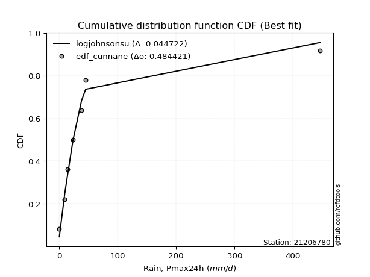</img></img>

</div>


### 12. EDF Adamowski (1981)

The Adamowski formula in hydrology refers to a specific plotting position formula used for estimating the non-parametric empirical distribution of hydrological events (like flood peaks) to calculate their return periods. This formula provides an alternative to traditional parametric methods (like the Gumbel or Log Pearson Type III distributions). 

<div align="center">


$P=(m-0.25)/(n+0.5)$


</div>


**12.1. Empirical values**

<div align="center">

|                | 0                   | 1                   | 2                  | 3                  | 4                  | 5                  | 6                  | 7                  |
|:---------------|:--------------------|:--------------------|:-------------------|:-------------------|:-------------------|:-------------------|:-------------------|:-------------------|
| date           | 2023                | 2016                | 2015               | 2012               | 2025               | 2024               | 2013               | 2014               |
| x              | 0.2                 | 9.4                 | 14.5               | 23.4               | 29.3               | 38.2               | 45.2               | 446.4              |
| m              | 1                   | 2                   | 3                  | 4                  | 5                  | 6                  | 7                  | 8                  |
| empirical_dist | edf_adamowski       | edf_adamowski       | edf_adamowski      | edf_adamowski      | edf_adamowski      | edf_adamowski      | edf_adamowski      | edf_adamowski      |
| empirical      | 0.08823529411764706 | 0.20588235294117646 | 0.3235294117647059 | 0.4411764705882353 | 0.5588235294117647 | 0.6764705882352942 | 0.7941176470588235 | 0.9117647058823529 |
| empirical_tr   | 1.096774193548387   | 1.259259259259259   | 1.4782608695652173 | 1.7894736842105263 | 2.2666666666666666 | 3.0909090909090913 | 4.857142857142856  | 11.33333333333333  |

</div>


**12.2. Kolmogorov-Smirnov fit test (sorted by Δ)**


<div align="center">

|                | 0                   | 1                  | 2                   | 3                   | 4                   | 5                   | 6                   | 7                   | 8                   | 9                   | 10                  | 11                  | 12                  | 13                  | 14                  | 15                  | 16                 | 17                  | 18                 | 19                  | 20                 | 21                  | 22                  | 23                  | 24                  | 25                  | 26                  | 27                  | 28                  | 29                  | 30                  | 31                  | 32                  | 33                  | 34                  | 35                 | 36                  | 37                 | 38                  | 39                  | 40                  | 41                  | 42                  | 43                  | 44                  | 45                  | 46                  | 47                  | 48                 | 49                  | 50                  | 51                 | 52                  | 53                  | 54                  | 55                  | 56                  | 57                  | 58                  | 59                  | 60                 | 61                  | 62                  | 63                  | 64                 | 65                  | 66                 | 67                  | 68                  | 69                 | 70                  | 71                  | 72                 | 73                  | 74                 | 75                 | 76                  | 77                 | 78                 | 79                 | 80                 | 81                  | 82                 | 83                  | 84                 | 85                 | 86                  | 87                  | 88                 | 89                  | 90                 | 91                  | 92                 | 93                  | 94                 | 95                  | 96                  | 97                 | 98                  | 99                 | 100                | 101                 | 102                | 103                 | 104                | 105                | 106                | 107                | 108                | 109                | 110                 | 111                 | 112                | 113                | 114                 | 115                 | 116                 | 117                 | 118                | 119                | 120                 | 121                 | 122                | 123                | 124                | 125                 | 126                | 127                | 128                | 129                | 130                 | 131                | 132                | 133                 | 134                 | 135                | 136                | 137                | 138                | 139                | 140                | 141                | 142                | 143                | 144                | 145                | 146                | 147                | 148                | 149                | 150                | 151                | 152                | 153                | 154                | 155                | 156                | 157                | 158                | 159                |
|:---------------|:--------------------|:-------------------|:--------------------|:--------------------|:--------------------|:--------------------|:--------------------|:--------------------|:--------------------|:--------------------|:--------------------|:--------------------|:--------------------|:--------------------|:--------------------|:--------------------|:-------------------|:--------------------|:-------------------|:--------------------|:-------------------|:--------------------|:--------------------|:--------------------|:--------------------|:--------------------|:--------------------|:--------------------|:--------------------|:--------------------|:--------------------|:--------------------|:--------------------|:--------------------|:--------------------|:-------------------|:--------------------|:-------------------|:--------------------|:--------------------|:--------------------|:--------------------|:--------------------|:--------------------|:--------------------|:--------------------|:--------------------|:--------------------|:-------------------|:--------------------|:--------------------|:-------------------|:--------------------|:--------------------|:--------------------|:--------------------|:--------------------|:--------------------|:--------------------|:--------------------|:-------------------|:--------------------|:--------------------|:--------------------|:-------------------|:--------------------|:-------------------|:--------------------|:--------------------|:-------------------|:--------------------|:--------------------|:-------------------|:--------------------|:-------------------|:-------------------|:--------------------|:-------------------|:-------------------|:-------------------|:-------------------|:--------------------|:-------------------|:--------------------|:-------------------|:-------------------|:--------------------|:--------------------|:-------------------|:--------------------|:-------------------|:--------------------|:-------------------|:--------------------|:-------------------|:--------------------|:--------------------|:-------------------|:--------------------|:-------------------|:-------------------|:--------------------|:-------------------|:--------------------|:-------------------|:-------------------|:-------------------|:-------------------|:-------------------|:-------------------|:--------------------|:--------------------|:-------------------|:-------------------|:--------------------|:--------------------|:--------------------|:--------------------|:-------------------|:-------------------|:--------------------|:--------------------|:-------------------|:-------------------|:-------------------|:--------------------|:-------------------|:-------------------|:-------------------|:-------------------|:--------------------|:-------------------|:-------------------|:--------------------|:--------------------|:-------------------|:-------------------|:-------------------|:-------------------|:-------------------|:-------------------|:-------------------|:-------------------|:-------------------|:-------------------|:-------------------|:-------------------|:-------------------|:-------------------|:-------------------|:-------------------|:-------------------|:-------------------|:-------------------|:-------------------|:-------------------|:-------------------|:-------------------|:-------------------|:-------------------|
| station        | 21206780            | 21206780           | 21206780            | 21206780            | 21206780            | 21206780            | 21206780            | 21206780            | 21206780            | 21206780            | 21206780            | 21206780            | 21206780            | 21206780            | 21206780            | 21206780            | 21206780           | 21206780            | 21206780           | 21206780            | 21206780           | 21206780            | 21206780            | 21206780            | 21206780            | 21206780            | 21206780            | 21206780            | 21206780            | 21206780            | 21206780            | 21206780            | 21206780            | 21206780            | 21206780            | 21206780           | 21206780            | 21206780           | 21206780            | 21206780            | 21206780            | 21206780            | 21206780            | 21206780            | 21206780            | 21206780            | 21206780            | 21206780            | 21206780           | 21206780            | 21206780            | 21206780           | 21206780            | 21206780            | 21206780            | 21206780            | 21206780            | 21206780            | 21206780            | 21206780            | 21206780           | 21206780            | 21206780            | 21206780            | 21206780           | 21206780            | 21206780           | 21206780            | 21206780            | 21206780           | 21206780            | 21206780            | 21206780           | 21206780            | 21206780           | 21206780           | 21206780            | 21206780           | 21206780           | 21206780           | 21206780           | 21206780            | 21206780           | 21206780            | 21206780           | 21206780           | 21206780            | 21206780            | 21206780           | 21206780            | 21206780           | 21206780            | 21206780           | 21206780            | 21206780           | 21206780            | 21206780            | 21206780           | 21206780            | 21206780           | 21206780           | 21206780            | 21206780           | 21206780            | 21206780           | 21206780           | 21206780           | 21206780           | 21206780           | 21206780           | 21206780            | 21206780            | 21206780           | 21206780           | 21206780            | 21206780            | 21206780            | 21206780            | 21206780           | 21206780           | 21206780            | 21206780            | 21206780           | 21206780           | 21206780           | 21206780            | 21206780           | 21206780           | 21206780           | 21206780           | 21206780            | 21206780           | 21206780           | 21206780            | 21206780            | 21206780           | 21206780           | 21206780           | 21206780           | 21206780           | 21206780           | 21206780           | 21206780           | 21206780           | 21206780           | 21206780           | 21206780           | 21206780           | 21206780           | 21206780           | 21206780           | 21206780           | 21206780           | 21206780           | 21206780           | 21206780           | 21206780           | 21206780           | 21206780           | 21206780           |
| empirical_dist | edf_adamowski       | edf_adamowski      | edf_adamowski       | edf_adamowski       | edf_adamowski       | edf_adamowski       | edf_adamowski       | edf_adamowski       | edf_adamowski       | edf_adamowski       | edf_adamowski       | edf_adamowski       | edf_adamowski       | edf_adamowski       | edf_adamowski       | edf_adamowski       | edf_adamowski      | edf_adamowski       | edf_adamowski      | edf_adamowski       | edf_adamowski      | edf_adamowski       | edf_adamowski       | edf_adamowski       | edf_adamowski       | edf_adamowski       | edf_adamowski       | edf_adamowski       | edf_adamowski       | edf_adamowski       | edf_adamowski       | edf_adamowski       | edf_adamowski       | edf_adamowski       | edf_adamowski       | edf_adamowski      | edf_adamowski       | edf_adamowski      | edf_adamowski       | edf_adamowski       | edf_adamowski       | edf_adamowski       | edf_adamowski       | edf_adamowski       | edf_adamowski       | edf_adamowski       | edf_adamowski       | edf_adamowski       | edf_adamowski      | edf_adamowski       | edf_adamowski       | edf_adamowski      | edf_adamowski       | edf_adamowski       | edf_adamowski       | edf_adamowski       | edf_adamowski       | edf_adamowski       | edf_adamowski       | edf_adamowski       | edf_adamowski      | edf_adamowski       | edf_adamowski       | edf_adamowski       | edf_adamowski      | edf_adamowski       | edf_adamowski      | edf_adamowski       | edf_adamowski       | edf_adamowski      | edf_adamowski       | edf_adamowski       | edf_adamowski      | edf_adamowski       | edf_adamowski      | edf_adamowski      | edf_adamowski       | edf_adamowski      | edf_adamowski      | edf_adamowski      | edf_adamowski      | edf_adamowski       | edf_adamowski      | edf_adamowski       | edf_adamowski      | edf_adamowski      | edf_adamowski       | edf_adamowski       | edf_adamowski      | edf_adamowski       | edf_adamowski      | edf_adamowski       | edf_adamowski      | edf_adamowski       | edf_adamowski      | edf_adamowski       | edf_adamowski       | edf_adamowski      | edf_adamowski       | edf_adamowski      | edf_adamowski      | edf_adamowski       | edf_adamowski      | edf_adamowski       | edf_adamowski      | edf_adamowski      | edf_adamowski      | edf_adamowski      | edf_adamowski      | edf_adamowski      | edf_adamowski       | edf_adamowski       | edf_adamowski      | edf_adamowski      | edf_adamowski       | edf_adamowski       | edf_adamowski       | edf_adamowski       | edf_adamowski      | edf_adamowski      | edf_adamowski       | edf_adamowski       | edf_adamowski      | edf_adamowski      | edf_adamowski      | edf_adamowski       | edf_adamowski      | edf_adamowski      | edf_adamowski      | edf_adamowski      | edf_adamowski       | edf_adamowski      | edf_adamowski      | edf_adamowski       | edf_adamowski       | edf_adamowski      | edf_adamowski      | edf_adamowski      | edf_adamowski      | edf_adamowski      | edf_adamowski      | edf_adamowski      | edf_adamowski      | edf_adamowski      | edf_adamowski      | edf_adamowski      | edf_adamowski      | edf_adamowski      | edf_adamowski      | edf_adamowski      | edf_adamowski      | edf_adamowski      | edf_adamowski      | edf_adamowski      | edf_adamowski      | edf_adamowski      | edf_adamowski      | edf_adamowski      | edf_adamowski      | edf_adamowski      |
| p_dist         | logjohnsonsu        | logt               | alpha               | t                   | logdgamma           | nct                 | kappa3              | invweibull          | genextreme          | johnsonsu           | invgamma            | loggenlogistic      | logmielke           | genpareto           | lomax               | gennorm             | logvonmises_line   | logburr12           | logcrystalball     | logfoldnorm         | logdweibull        | loghypsecant        | loglaplace          | loglaplace          | f                   | ncf                 | logskewnorm         | betaprime           | halfgennorm         | truncpareto         | invgauss            | loglogistic         | loggompertz         | logexponweib        | logloggamma         | logweibull_min     | logjohnsonsb        | burr               | logbeta             | logbetaprime        | logrice             | logexponnorm        | lognorm             | lognakagami         | lognct              | logfatiguelife      | burr12              | loggumbel_l         | logpearson3        | loggengamma         | mielke              | loggenextreme      | loggennorm          | loggamma            | loggamma            | logerlang           | loginvgamma         | dweibull            | loganglit           | logsemicircular     | logargus           | loginvgauss         | logmaxwell          | fatiguelife         | truncweibull_min   | vonmises_line       | lograyleigh        | loggumbel_r         | logarcsine          | loginvweibull      | logcosine           | logburr             | exponpow           | logmoyal            | erlang             | loghalfnorm        | wald                | loggenhalflogistic | logtriang          | loghalflogistic    | gengamma           | loglomax            | loglevy_l          | logkstwobign        | gamma              | logbradford        | gausshyper          | logtruncweibull_min | loggausshyper      | halflogistic        | loggenexpon        | pearson3            | logwald            | loguniform          | logksone           | moyal               | loggenpareto        | logtruncnorm       | dgamma              | foldnorm           | halfnorm           | logkappa4           | logwrapcauchy      | nakagami            | exponweib          | gumbel_r           | genlogistic        | logtrapezoid       | logloglaplace      | rayleigh           | arcsine             | exponnorm           | genexpon           | maxwell            | gompertz            | semicircular        | anglit              | loghalfgennorm      | weibull_min        | norm               | crystalball         | logncf              | logistic           | wrapcauchy         | logtruncexpon      | powerlaw            | hypsecant          | levy_l             | kstwobign          | laplace            | logweibull_max      | logkappa3          | rice               | gumbel_l            | cosine              | truncnorm          | logf               | logtukeylambda     | logalpha           | argus              | triang             | skewnorm           | logrdist           | bradford           | johnsonsb          | rdist              | truncexpon         | ksone              | logpowerlaw        | tukeylambda        | kappa4             | uniform            | genhalflogistic    | logexponpow        | weibull_max        | logtruncpareto     | beta               | trapezoid          | logvonmises        | vonmises           |
| delta          | 0.05300034418383737 | 0.0748610702762178 | 0.08532758479315228 | 0.09103504748532054 | 0.10067909154080956 | 0.10170848303399727 | 0.10500160587989593 | 0.10607497872304561 | 0.10607556089116588 | 0.10747811896824433 | 0.10856773698426092 | 0.10930962426384261 | 0.10968367464323425 | 0.11511581814839211 | 0.11527198536366845 | 0.12254387886018603 | 0.1229031055416086 | 0.12958787239130143 | 0.130118289848406  | 0.13040365387128827 | 0.1321264484402499 | 0.13266890470273934 | 0.13275363586303035 | 0.13275363586303035 | 0.13345074041308203 | 0.13441887636362326 | 0.13585562905460447 | 0.13946016444747084 | 0.14183022047263888 | 0.14190899234181398 | 0.14454128257365206 | 0.14560013366149605 | 0.15107217942183904 | 0.15196365796657219 | 0.15436930811252425 | 0.155057252104413  | 0.15573289757263398 | 0.1579175198643994 | 0.15966055850195515 | 0.16157992834335871 | 0.16189782592352303 | 0.16190866815271715 | 0.16191039824340042 | 0.16215148348914626 | 0.16262603912990276 | 0.16485459063364477 | 0.16703714305466616 | 0.16740526686642465 | 0.1698155214557565 | 0.17097014905040736 | 0.17170553870878025 | 0.1744850456912358 | 0.17496305584557503 | 0.17519409375044565 | 0.17519409375044565 | 0.17624117788815563 | 0.17820518631019855 | 0.17825988360921646 | 0.17970153856476678 | 0.18713748698846516 | 0.1878751575194486 | 0.19314054262240754 | 0.19480291498146113 | 0.20538812600337109 | 0.2056047593405147 | 0.20588178883822372 | 0.2070340927963859 | 0.21482915058528507 | 0.21736594604197312 | 0.2247932918487907 | 0.22623713485404423 | 0.22701001190832215 | 0.2274487397666617 | 0.23483306305515178 | 0.2410525010788288 | 0.2418187688232924 | 0.24304493375989883 | 0.2430593043359065 | 0.2500498283423399 | 0.2528109749544217 | 0.2557162961443428 | 0.25823273754167225 | 0.2621084839926226 | 0.26647610371309965 | 0.2676905868429973 | 0.2679305419049009 | 0.27071758875722596 | 0.2717014079065357  | 0.2789861085282442 | 0.28177610884998383 | 0.282096581046191  | 0.28708355696369736 | 0.2904005791816195 | 0.29344597115494686 | 0.2935579171389263 | 0.29424319485714945 | 0.29492345097618416 | 0.2950898313896911 | 0.29528144554477614 | 0.2954258895740633 | 0.2990670733855579 | 0.30227880338960317 | 0.3046110165632207 | 0.31155054871231447 | 0.3155778375171899 | 0.3180464569870275 | 0.3190248475042718 | 0.3289602106648555 | 0.3336075677133849 | 0.3337315820542961 | 0.34328665802267355 | 0.34452959617847256 | 0.3456576168543948 | 0.3459708903188177 | 0.35238398124379366 | 0.36324007650630363 | 0.36822128592772785 | 0.37224433703245247 | 0.3724665163830011 | 0.3802411663484174 | 0.38024117733838114 | 0.38248234520636876 | 0.3915202938136897 | 0.394851437631825  | 0.3959019385277625 | 0.40008520007495757 | 0.4008515880139566 | 0.4063777767498601 | 0.4097963930823115 | 0.426553693304965  | 0.43011831759558566 | 0.4307945426782897 | 0.4338272989959732 | 0.44805754648345986 | 0.46110390364858633 | 0.4746715565845856 | 0.4846963703171277 | 0.5071790027267202 | 0.5161386414456768 | 0.5281267396040548 | 0.5486405670927987 | 0.5723243193377447 | 0.5724510817923569 | 0.6138878647865706 | 0.6202640240657815 | 0.620267262135107  | 0.6243894011799944 | 0.6267412836941141 | 0.6674527360262699 | 0.6697257837269156 | 0.6756397260568041 | 0.6932660110211722 | 0.6973666246217523 | 0.7024580885949949 | 0.7048085046509359 | 0.7116886337896566 | 0.7479456009154306 | 0.764697043111465  | 1.0738561968590505 | 70.48905795224091  |
| deltao         | 0.4472608134160001  | 0.4472608134160001 | 0.4472608134160001  | 0.4472608134160001  | 0.4472608134160001  | 0.4472608134160001  | 0.4472608134160001  | 0.4472608134160001  | 0.4472608134160001  | 0.4472608134160001  | 0.4472608134160001  | 0.4472608134160001  | 0.4472608134160001  | 0.4472608134160001  | 0.4472608134160001  | 0.4472608134160001  | 0.4472608134160001 | 0.4472608134160001  | 0.4472608134160001 | 0.4472608134160001  | 0.4472608134160001 | 0.4472608134160001  | 0.4472608134160001  | 0.4472608134160001  | 0.4472608134160001  | 0.4472608134160001  | 0.4472608134160001  | 0.4472608134160001  | 0.4472608134160001  | 0.4472608134160001  | 0.4472608134160001  | 0.4472608134160001  | 0.4472608134160001  | 0.4472608134160001  | 0.4472608134160001  | 0.4472608134160001 | 0.4472608134160001  | 0.4472608134160001 | 0.4472608134160001  | 0.4472608134160001  | 0.4472608134160001  | 0.4472608134160001  | 0.4472608134160001  | 0.4472608134160001  | 0.4472608134160001  | 0.4472608134160001  | 0.4472608134160001  | 0.4472608134160001  | 0.4472608134160001 | 0.4472608134160001  | 0.4472608134160001  | 0.4472608134160001 | 0.4472608134160001  | 0.4472608134160001  | 0.4472608134160001  | 0.4472608134160001  | 0.4472608134160001  | 0.4472608134160001  | 0.4472608134160001  | 0.4472608134160001  | 0.4472608134160001 | 0.4472608134160001  | 0.4472608134160001  | 0.4472608134160001  | 0.4472608134160001 | 0.4472608134160001  | 0.4472608134160001 | 0.4472608134160001  | 0.4472608134160001  | 0.4472608134160001 | 0.4472608134160001  | 0.4472608134160001  | 0.4472608134160001 | 0.4472608134160001  | 0.4472608134160001 | 0.4472608134160001 | 0.4472608134160001  | 0.4472608134160001 | 0.4472608134160001 | 0.4472608134160001 | 0.4472608134160001 | 0.4472608134160001  | 0.4472608134160001 | 0.4472608134160001  | 0.4472608134160001 | 0.4472608134160001 | 0.4472608134160001  | 0.4472608134160001  | 0.4472608134160001 | 0.4472608134160001  | 0.4472608134160001 | 0.4472608134160001  | 0.4472608134160001 | 0.4472608134160001  | 0.4472608134160001 | 0.4472608134160001  | 0.4472608134160001  | 0.4472608134160001 | 0.4472608134160001  | 0.4472608134160001 | 0.4472608134160001 | 0.4472608134160001  | 0.4472608134160001 | 0.4472608134160001  | 0.4472608134160001 | 0.4472608134160001 | 0.4472608134160001 | 0.4472608134160001 | 0.4472608134160001 | 0.4472608134160001 | 0.4472608134160001  | 0.4472608134160001  | 0.4472608134160001 | 0.4472608134160001 | 0.4472608134160001  | 0.4472608134160001  | 0.4472608134160001  | 0.4472608134160001  | 0.4472608134160001 | 0.4472608134160001 | 0.4472608134160001  | 0.4472608134160001  | 0.4472608134160001 | 0.4472608134160001 | 0.4472608134160001 | 0.4472608134160001  | 0.4472608134160001 | 0.4472608134160001 | 0.4472608134160001 | 0.4472608134160001 | 0.4472608134160001  | 0.4472608134160001 | 0.4472608134160001 | 0.4472608134160001  | 0.4472608134160001  | 0.4472608134160001 | 0.4472608134160001 | 0.4472608134160001 | 0.4472608134160001 | 0.4472608134160001 | 0.4472608134160001 | 0.4472608134160001 | 0.4472608134160001 | 0.4472608134160001 | 0.4472608134160001 | 0.4472608134160001 | 0.4472608134160001 | 0.4472608134160001 | 0.4472608134160001 | 0.4472608134160001 | 0.4472608134160001 | 0.4472608134160001 | 0.4472608134160001 | 0.4472608134160001 | 0.4472608134160001 | 0.4472608134160001 | 0.4472608134160001 | 0.4472608134160001 | 0.4472608134160001 | 0.4472608134160001 |
| eval           | Δo > Δ              | Δo > Δ             | Δo > Δ              | Δo > Δ              | Δo > Δ              | Δo > Δ              | Δo > Δ              | Δo > Δ              | Δo > Δ              | Δo > Δ              | Δo > Δ              | Δo > Δ              | Δo > Δ              | Δo > Δ              | Δo > Δ              | Δo > Δ              | Δo > Δ             | Δo > Δ              | Δo > Δ             | Δo > Δ              | Δo > Δ             | Δo > Δ              | Δo > Δ              | Δo > Δ              | Δo > Δ              | Δo > Δ              | Δo > Δ              | Δo > Δ              | Δo > Δ              | Δo > Δ              | Δo > Δ              | Δo > Δ              | Δo > Δ              | Δo > Δ              | Δo > Δ              | Δo > Δ             | Δo > Δ              | Δo > Δ             | Δo > Δ              | Δo > Δ              | Δo > Δ              | Δo > Δ              | Δo > Δ              | Δo > Δ              | Δo > Δ              | Δo > Δ              | Δo > Δ              | Δo > Δ              | Δo > Δ             | Δo > Δ              | Δo > Δ              | Δo > Δ             | Δo > Δ              | Δo > Δ              | Δo > Δ              | Δo > Δ              | Δo > Δ              | Δo > Δ              | Δo > Δ              | Δo > Δ              | Δo > Δ             | Δo > Δ              | Δo > Δ              | Δo > Δ              | Δo > Δ             | Δo > Δ              | Δo > Δ             | Δo > Δ              | Δo > Δ              | Δo > Δ             | Δo > Δ              | Δo > Δ              | Δo > Δ             | Δo > Δ              | Δo > Δ             | Δo > Δ             | Δo > Δ              | Δo > Δ             | Δo > Δ             | Δo > Δ             | Δo > Δ             | Δo > Δ              | Δo > Δ             | Δo > Δ              | Δo > Δ             | Δo > Δ             | Δo > Δ              | Δo > Δ              | Δo > Δ             | Δo > Δ              | Δo > Δ             | Δo > Δ              | Δo > Δ             | Δo > Δ              | Δo > Δ             | Δo > Δ              | Δo > Δ              | Δo > Δ             | Δo > Δ              | Δo > Δ             | Δo > Δ             | Δo > Δ              | Δo > Δ             | Δo > Δ              | Δo > Δ             | Δo > Δ             | Δo > Δ             | Δo > Δ             | Δo > Δ             | Δo > Δ             | Δo > Δ              | Δo > Δ              | Δo > Δ             | Δo > Δ             | Δo > Δ              | Δo > Δ              | Δo > Δ              | Δo > Δ              | Δo > Δ             | Δo > Δ             | Δo > Δ              | Δo > Δ              | Δo > Δ             | Δo > Δ             | Δo > Δ             | Δo > Δ              | Δo > Δ             | Δo > Δ             | Δo > Δ             | Δo > Δ             | Δo > Δ              | Δo > Δ             | Δo > Δ             | Δo <= Δ             | Δo <= Δ             | Δo <= Δ            | Δo <= Δ            | Δo <= Δ            | Δo <= Δ            | Δo <= Δ            | Δo <= Δ            | Δo <= Δ            | Δo <= Δ            | Δo <= Δ            | Δo <= Δ            | Δo <= Δ            | Δo <= Δ            | Δo <= Δ            | Δo <= Δ            | Δo <= Δ            | Δo <= Δ            | Δo <= Δ            | Δo <= Δ            | Δo <= Δ            | Δo <= Δ            | Δo <= Δ            | Δo <= Δ            | Δo <= Δ            | Δo <= Δ            | Δo <= Δ            |
| fit            | 1                   | 1                  | 1                   | 1                   | 1                   | 1                   | 1                   | 1                   | 1                   | 1                   | 1                   | 1                   | 1                   | 1                   | 1                   | 1                   | 1                  | 1                   | 1                  | 1                   | 1                  | 1                   | 1                   | 1                   | 1                   | 1                   | 1                   | 1                   | 1                   | 1                   | 1                   | 1                   | 1                   | 1                   | 1                   | 1                  | 1                   | 1                  | 1                   | 1                   | 1                   | 1                   | 1                   | 1                   | 1                   | 1                   | 1                   | 1                   | 1                  | 1                   | 1                   | 1                  | 1                   | 1                   | 1                   | 1                   | 1                   | 1                   | 1                   | 1                   | 1                  | 1                   | 1                   | 1                   | 1                  | 1                   | 1                  | 1                   | 1                   | 1                  | 1                   | 1                   | 1                  | 1                   | 1                  | 1                  | 1                   | 1                  | 1                  | 1                  | 1                  | 1                   | 1                  | 1                   | 1                  | 1                  | 1                   | 1                   | 1                  | 1                   | 1                  | 1                   | 1                  | 1                   | 1                  | 1                   | 1                   | 1                  | 1                   | 1                  | 1                  | 1                   | 1                  | 1                   | 1                  | 1                  | 1                  | 1                  | 1                  | 1                  | 1                   | 1                   | 1                  | 1                  | 1                   | 1                   | 1                   | 1                   | 1                  | 1                  | 1                   | 1                   | 1                  | 1                  | 1                  | 1                   | 1                  | 1                  | 1                  | 1                  | 1                   | 1                  | 1                  | 0                   | 0                   | 0                  | 0                  | 0                  | 0                  | 0                  | 0                  | 0                  | 0                  | 0                  | 0                  | 0                  | 0                  | 0                  | 0                  | 0                  | 0                  | 0                  | 0                  | 0                  | 0                  | 0                  | 0                  | 0                  | 0                  | 0                  |
| n              | 8                   | 8                  | 8                   | 8                   | 8                   | 8                   | 8                   | 8                   | 8                   | 8                   | 8                   | 8                   | 8                   | 8                   | 8                   | 8                   | 8                  | 8                   | 8                  | 8                   | 8                  | 8                   | 8                   | 8                   | 8                   | 8                   | 8                   | 8                   | 8                   | 8                   | 8                   | 8                   | 8                   | 8                   | 8                   | 8                  | 8                   | 8                  | 8                   | 8                   | 8                   | 8                   | 8                   | 8                   | 8                   | 8                   | 8                   | 8                   | 8                  | 8                   | 8                   | 8                  | 8                   | 8                   | 8                   | 8                   | 8                   | 8                   | 8                   | 8                   | 8                  | 8                   | 8                   | 8                   | 8                  | 8                   | 8                  | 8                   | 8                   | 8                  | 8                   | 8                   | 8                  | 8                   | 8                  | 8                  | 8                   | 8                  | 8                  | 8                  | 8                  | 8                   | 8                  | 8                   | 8                  | 8                  | 8                   | 8                   | 8                  | 8                   | 8                  | 8                   | 8                  | 8                   | 8                  | 8                   | 8                   | 8                  | 8                   | 8                  | 8                  | 8                   | 8                  | 8                   | 8                  | 8                  | 8                  | 8                  | 8                  | 8                  | 8                   | 8                   | 8                  | 8                  | 8                   | 8                   | 8                   | 8                   | 8                  | 8                  | 8                   | 8                   | 8                  | 8                  | 8                  | 8                   | 8                  | 8                  | 8                  | 8                  | 8                   | 8                  | 8                  | 8                   | 8                   | 8                  | 8                  | 8                  | 8                  | 8                  | 8                  | 8                  | 8                  | 8                  | 8                  | 8                  | 8                  | 8                  | 8                  | 8                  | 8                  | 8                  | 8                  | 8                  | 8                  | 8                  | 8                  | 8                  | 8                  | 8                  |
| best_fit       | 1                   | 0                  | 0                   | 0                   | 0                   | 0                   | 0                   | 0                   | 0                   | 0                   | 0                   | 0                   | 0                   | 0                   | 0                   | 0                   | 0                  | 0                   | 0                  | 0                   | 0                  | 0                   | 0                   | 0                   | 0                   | 0                   | 0                   | 0                   | 0                   | 0                   | 0                   | 0                   | 0                   | 0                   | 0                   | 0                  | 0                   | 0                  | 0                   | 0                   | 0                   | 0                   | 0                   | 0                   | 0                   | 0                   | 0                   | 0                   | 0                  | 0                   | 0                   | 0                  | 0                   | 0                   | 0                   | 0                   | 0                   | 0                   | 0                   | 0                   | 0                  | 0                   | 0                   | 0                   | 0                  | 0                   | 0                  | 0                   | 0                   | 0                  | 0                   | 0                   | 0                  | 0                   | 0                  | 0                  | 0                   | 0                  | 0                  | 0                  | 0                  | 0                   | 0                  | 0                   | 0                  | 0                  | 0                   | 0                   | 0                  | 0                   | 0                  | 0                   | 0                  | 0                   | 0                  | 0                   | 0                   | 0                  | 0                   | 0                  | 0                  | 0                   | 0                  | 0                   | 0                  | 0                  | 0                  | 0                  | 0                  | 0                  | 0                   | 0                   | 0                  | 0                  | 0                   | 0                   | 0                   | 0                   | 0                  | 0                  | 0                   | 0                   | 0                  | 0                  | 0                  | 0                   | 0                  | 0                  | 0                  | 0                  | 0                   | 0                  | 0                  | 0                   | 0                   | 0                  | 0                  | 0                  | 0                  | 0                  | 0                  | 0                  | 0                  | 0                  | 0                  | 0                  | 0                  | 0                  | 0                  | 0                  | 0                  | 0                  | 0                  | 0                  | 0                  | 0                  | 0                  | 0                  | 0                  | 0                  |
| best_fit_sort  | 1                   | 2                  | 3                   | 4                   | 5                   | 6                   | 7                   | 8                   | 9                   | 10                  | 11                  | 12                  | 13                  | 14                  | 15                  | 16                  | 17                 | 18                  | 19                 | 20                  | 21                 | 22                  | 23                  | 24                  | 25                  | 26                  | 27                  | 28                  | 29                  | 30                  | 31                  | 32                  | 33                  | 34                  | 35                  | 36                 | 37                  | 38                 | 39                  | 40                  | 41                  | 42                  | 43                  | 44                  | 45                  | 46                  | 47                  | 48                  | 49                 | 50                  | 51                  | 52                 | 53                  | 54                  | 55                  | 56                  | 57                  | 58                  | 59                  | 60                  | 61                 | 62                  | 63                  | 64                  | 65                 | 66                  | 67                 | 68                  | 69                  | 70                 | 71                  | 72                  | 73                 | 74                  | 75                 | 76                 | 77                  | 78                 | 79                 | 80                 | 81                 | 82                  | 83                 | 84                  | 85                 | 86                 | 87                  | 88                  | 89                 | 90                  | 91                 | 92                  | 93                 | 94                  | 95                 | 96                  | 97                  | 98                 | 99                  | 100                | 101                | 102                 | 103                | 104                 | 105                | 106                | 107                | 108                | 109                | 110                | 111                 | 112                 | 113                | 114                | 115                 | 116                 | 117                 | 118                 | 119                | 120                | 121                 | 122                 | 123                | 124                | 125                | 126                 | 127                | 128                | 129                | 130                | 131                 | 132                | 133                | 134                 | 135                 | 136                | 137                | 138                | 139                | 140                | 141                | 142                | 143                | 144                | 145                | 146                | 147                | 148                | 149                | 150                | 151                | 152                | 153                | 154                | 155                | 156                | 157                | 158                | 159                | 160                |

</div>


**12.3. Best fit**

<div align="center">

|   id |   station | empirical_dist   | p_dist       |     delta |   deltao | eval   |   fit |   n |   best_fit |   best_fit_sort |
|-----:|----------:|:-----------------|:-------------|----------:|---------:|:-------|------:|----:|-----------:|----------------:|
|    0 |  21206780 | edf_adamowski    | logjohnsonsu | 0.0530003 | 0.447261 | Δo > Δ |     1 |   8 |          1 |               1 |

</div>


<div align="center">

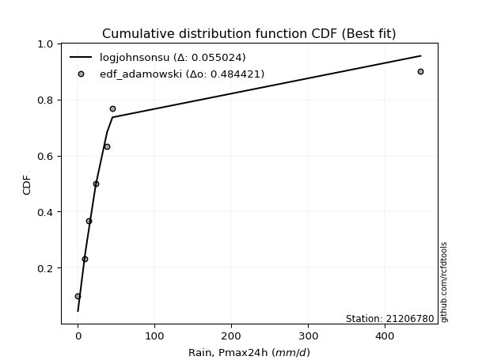</img>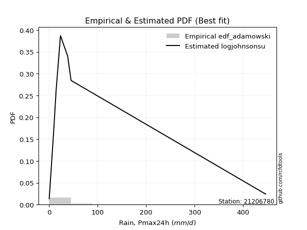</img>

</div>


## C. Best fit & Estimate extreme values for specific return periods - Tr

Best fit in probability distribution analysis means finding the theoretical distribution (like Normal, Poisson, Exponential, etc.) that most accurately mirrors your real-world data´s patterns (shape, center, spread) for better predictions, using methods like visual checks (Q-Q plots), goodness-of-fit tests (Kolmogorov-Smirnov, Chi-Squared), and information criteria (AIC) to score and select the simplest, most representative model.


### 1. Best fit (ordered by delta Δ)

:file_folder:Table: [bestfit_21206780.csv](table/bestfit_21206780.csv)

<div align="center">

|   id |   station | empirical_dist   | p_dist       |     delta |   deltao | eval   |   fit |   n |   best_fit |   best_fit_sort |
|-----:|----------:|:-----------------|:-------------|----------:|---------:|:-------|------:|----:|-----------:|----------------:|
|    0 |  21206780 | edf_gringorten   | logjohnsonsu | 0.0369557 | 0.447261 | Δo > Δ |     1 |   8 |          1 |               1 |
|    1 |  21206780 | edf_cunnane      | logjohnsonsu | 0.0379358 | 0.447261 | Δo > Δ |     1 |   8 |          1 |               2 |
|    2 |  21206780 | edf_blom         | logjohnsonsu | 0.0405226 | 0.447261 | Δo > Δ |     1 |   8 |          1 |               3 |
|    3 |  21206780 | edf_hazen        | logjohnsonsu | 0.0415739 | 0.447261 | Δo > Δ |     1 |   8 |          1 |               4 |
|    4 |  21206780 | edf_tukey        | logjohnsonsu | 0.0447651 | 0.447261 | Δo > Δ |     1 |   8 |          1 |               5 |
|    5 |  21206780 | edf_filliben     | logjohnsonsu | 0.046355  | 0.447261 | Δo > Δ |     1 |   8 |          1 |               6 |
|    6 |  21206780 | edf_beard        | logjohnsonsu | 0.047104  | 0.447261 | Δo > Δ |     1 |   8 |          1 |               7 |
|    7 |  21206780 | edf_jenkinson    | logjohnsonsu | 0.047104  | 0.447261 | Δo > Δ |     1 |   8 |          1 |               8 |
|    8 |  21206780 | edf_chegodayev   | logjohnsonsu | 0.0480984 | 0.447261 | Δo > Δ |     1 |   8 |          1 |               9 |
|    9 |  21206780 | edf_adamowski    | logjohnsonsu | 0.0530003 | 0.447261 | Δo > Δ |     1 |   8 |          1 |              10 |
|   10 |  21206780 | edf_california   | t            | 0.0535866 | 0.447261 | Δo > Δ |     1 |   8 |          1 |              11 |
|   11 |  21206780 | edf_weibull      | logjohnsonsu | 0.0758762 | 0.447261 | Δo > Δ |     1 |   8 |          1 |              12 |

</div>


### 2. Extreme values and % difference analysis

In hydrology, a return period (or recurrence interval $Tr$) is the statistical average time between extreme events like floods or droughts of a specific magnitude, indicating how rare an event is, with a 100-year flood, for example, having a 1% chance of occurring in any given year, not that it happens exactly every century. It is a key tool for infrastructure design (like bridges or dams) and risk assessment, calculated from historical data to determine the probability of future events, although it is important to remember it is statistical average, and events can cluster or be missed.

The extreme value porcentage difference is evaluated as $pdiff = 1 - (ETrBf / ETr) * 100$, where _ETrBf_ correspond to the bestfit extreme value for a specific recurrence interval and _ETr_ correspond to the extreme value for one of the most used PDFsused in hydrology.

> risk_rate: assuming the return period as the project useful life.

:file_folder:Table: [extreme_21206780.csv](table/extreme_21206780.csv), all PDFs.  
:file_folder:Table: [extremepdiff_21206780.csv](table/extremepdiff_21206780.csv), % difference between bestfit and most used PDFs in Hydrology.

<div align="center">

Extreme values table for only best fit PDFs
|   id |      tr |   prob_l |     prob_g |      alpha |   anglit |   arcsine |   argus |     beta |   betaprime |   bradford |     burr |     burr12 |   cosine |   crystalball |   dgamma |   dweibull |   erlang |   exponnorm |   exponpow |   exponweib |         f |   fatiguelife |   foldnorm |    gamma |   gausshyper |   genexpon |   genextreme |   gengamma |   genhalflogistic |   genlogistic |   gennorm |   genpareto |   gompertz |   gumbel_l |   gumbel_r |   halfgennorm |   halflogistic |   halfnorm |   hypsecant |   invgamma |   invgauss |   invweibull |   johnsonsb |   johnsonsu |    kappa3 |   kappa4 |   ksone |   kstwobign |   laplace |   levy_l |   loggamma |   logistic |   loglaplace |     lomax |   maxwell |     mielke |    moyal |   nakagami |        ncf |       nct |    norm |   pearson3 |   powerlaw |   rayleigh |    rdist |     rice |   semicircular |   skewnorm |         t |   trapezoid |   triang |   truncexpon |   truncnorm |   truncpareto |   truncweibull_min |   tukeylambda |   uniform |   vonmises |   vonmises_line |      wald |   weibull_max |   weibull_min |   wrapcauchy |         logalpha |   loganglit |   logarcsine |   logargus |   logbeta |   logbetaprime |   logbradford |          logburr |   logburr12 |   logcosine |   logcrystalball |   logdgamma |   logdweibull |   logerlang |   logexponnorm |      logexponpow |   logexponweib |           logf |   logfatiguelife |   logfoldnorm |   loggausshyper |   loggenexpon |   loggenextreme |   loggengamma |   loggenhalflogistic |   loggenlogistic |       loggennorm |   loggenpareto |   loggompertz |   loggumbel_l |   loggumbel_r |   loghalfgennorm |   loghalflogistic |   loghalfnorm |   loghypsecant |   loginvgamma |   loginvgauss |    loginvweibull |   logjohnsonsb |     logjohnsonsu |       logkappa3 |   logkappa4 |   logksone |     logkstwobign |   loglevy_l |   logloggamma |   loglogistic |   logloglaplace |         loglomax |   logmaxwell |   logmielke |         logmoyal |   lognakagami |         logncf |    lognct |   lognorm |   logpearson3 |   logpowerlaw |   lograyleigh |   logrdist |   logrice |   logsemicircular |   logskewnorm |             logt |   logtrapezoid |   logtriang |   logtruncexpon |   logtruncnorm |   logtruncpareto |   logtruncweibull_min |   logtukeylambda |   loguniform |   logvonmises |   logvonmises_line |          logwald |   logweibull_max |   logweibull_min |   logwrapcauchy |   station |   n |   risk_rate |
|-----:|--------:|---------:|-----------:|-----------:|---------:|----------:|--------:|---------:|------------:|-----------:|---------:|-----------:|---------:|--------------:|---------:|-----------:|---------:|------------:|-----------:|------------:|----------:|--------------:|-----------:|---------:|-------------:|-----------:|-------------:|-----------:|------------------:|--------------:|----------:|------------:|-----------:|-----------:|-----------:|--------------:|---------------:|-----------:|------------:|-----------:|-----------:|-------------:|------------:|------------:|----------:|---------:|--------:|------------:|----------:|---------:|-----------:|-----------:|-------------:|----------:|----------:|-----------:|---------:|-----------:|-----------:|----------:|--------:|-----------:|-----------:|-----------:|---------:|---------:|---------------:|-----------:|----------:|------------:|---------:|-------------:|------------:|--------------:|-------------------:|--------------:|----------:|-----------:|----------------:|----------:|--------------:|--------------:|-------------:|-----------------:|------------:|-------------:|-----------:|----------:|---------------:|--------------:|-----------------:|------------:|------------:|-----------------:|------------:|--------------:|------------:|---------------:|-----------------:|---------------:|---------------:|-----------------:|--------------:|----------------:|--------------:|----------------:|--------------:|---------------------:|-----------------:|-----------------:|---------------:|--------------:|--------------:|--------------:|-----------------:|------------------:|--------------:|---------------:|--------------:|--------------:|-----------------:|---------------:|-----------------:|----------------:|------------:|-----------:|-----------------:|------------:|--------------:|--------------:|----------------:|-----------------:|-------------:|------------:|-----------------:|--------------:|---------------:|----------:|----------:|--------------:|--------------:|--------------:|-----------:|----------:|------------------:|--------------:|-----------------:|---------------:|------------:|----------------:|---------------:|-----------------:|----------------------:|-----------------:|-------------:|--------------:|-------------------:|-----------------:|-----------------:|-----------------:|----------------:|----------:|----:|------------:|
|    0 |    2    | 0.5      | 0.5        |    23.5391 |   75.825 |    75.825 | 177.48  | -43.4865 |     18.022  |    155.162 |  16.8314 |    16.5197 |  118.633 |        75.825 |   9.4    |    23.4    |  12.8928 |      52.454 |    31.5707 |     50.8571 |   20.1314 |       29.8035 |    45.7238 |  40.1725 |      40.0072 |    52.6113 |      23.6917 |    11.3129 |           290.606 |       49.238  |   23.4    |     22.9052 |    53.8652 |     98.948 |    52.702  |       19.0528 |        41.2064 |    47.0136 |     75.825  |    23.6664 |    24.5035 |      23.6916 |    0.232823 |     24.471  |   23.3035 |  214.929 | 223.3   |     71.5511 |   75.825  |  12.4594 |    17.5841 |    75.825  |      18.613  |   22.9113 |   63.7872 |    17.6361 |  45.2371 |    50.7127 |    23.873  |   23.8459 |  75.825 |    29.0141 |    2.27457 |    59.5177 | -48.1554 |  83.6408 |         75.825 |    107.963 |   22.9671 |     331.972 |  213.499 |      154.746 |     78.4905 |       23.9477 |            27.122  |     -52.3051  |   223.3   |   0.738338 |         20.2554 |   30.1997 |       446.225 |       71.2145 |      223.296 |     1.04779      |     18.613  |      18.613  |    23.7862 |   23.6563 |        18.7038 |       11.6534 |     14.6446      |     22.8322 |     13.996  |          23.9823 |     29.3    |       29.3    |     17.4634 |        18.6132 |      0.254731    |        23.5418 |    0.634905    |          18.2993 |       19.8207 |         10.5818 |       10.2139 |         24.4023 |       18.0045 |              31.2178 |          22.3832 |    29.2999       |        45.4965 |       22.3344 |       25.9506 |       13.3501 |      3.88708     |           11.3169 |       12.3019 |        18.613  |       17.375  |       16.4643 |     14.8992      |        23.638  |     26.2829      |    1.52057      |     8.80087 |    9.44881 |     11.3917      |     17.0519 |       23.7261 |       18.613  |    2.39783      |     14.418       |      15.6559 |     22.3301 |     11.992       |       18.6244 |   2.06845      |   18.5645 |   18.613  |       25.1913 |      0.249347 |       14.724  |   0.248069 |   18.6135 |           18.6129 |       21.3672 |     26.5717      |        57.0072 |     34.6351 |         4.33511 |        9.33387 |         0.223989 |               11.009  |          3.00715 |      9.44881 |     0.0582306 |            19.6279 |      9.66119     |          293.152 |          23.6125 |         8.65338 |  21206780 |   8 |    0.75     |
|    1 |    2.33 | 0.570815 | 0.429185   |    28.9389 |  105.082 |   119.744 | 213.575 | -43.4865 |     23.8997 |    186.119 |  21.3399 |    22.5222 |  149.162 |       100.942 |  13.7231 |    26.6277 |  19.0113 |      63.987 |    46.18   |     74.2088 |   27.3704 |       41.5777 |    75.2869 |  54.7142 |      57.3342 |    64.1666 |      29.8705 |    15.7844 |           319.857 |       61.2774 |   24.6021 |     29.7488 |    65.8533 |    120.8   |    75.9756 |       25.8615 |        65.1354 |    74.1213 |     95.9261 |    29.9609 |    32.5211 |      29.8704 |    0.296039 |     30.3357 |   29.617  |  247.876 | 261.217 |     88.9541 |   91.0246 | 143.083  |    25.5331 |    97.9548 |      23.1575 |   29.7605 |   89.8819 |    24.961  |  67.2686 |    78.0996 |    31.5    |   29.7793 | 100.942 |    49.4338 |    5.99002 |    85.9985 | -31.2558 | 104.049  |        107.203 |    126.511 |   25.9946 |     357.896 |  251.999 |      183.662 |     94.2175 |       32.0138 |            40.8518 |     -37.7634  |   254.898 |   1.05376  |         23.7883 |   46.6691 |       446.353 |      104.601  |      383.448 |     1.66813      |     28.3422 |      34.9907 |    36.6602 |   33.3461 |        26.8924 |       20.8596 |     24.092       |     30.5585 |     21.2041 |          31.4706 |     32.4929 |       34.0524 |     25.3274 |        26.7053 |      0.297991    |        32.6309 |    1.16892     |          26.2458 |       27.1596 |         18.4431 |       16.923  |         35.239  |       26.0994 |              51.7806 |          29.2707 |    29.6275       |        78.2537 |       31.7512 |       35.526  |       18.6534 |      8.57813     |           15.9621 |       18.1625 |        24.8477 |       25.3391 |       24.5774 |     24.5867      |        32.9976 |     29.8031      |    3.30902      |    15.6013  |   18.1947  |     19.0991      |     45.5759 |       32.9546 |       25.5828 |   54.2658       |     37.0043      |      22.7803 |     29.2474 |     16.4592      |       26.7496 |   6.489        |   26.6571 |   26.7051 |       35.2749 |      0.308979 |       21.5435 |   0.702235 |   26.7051 |           29.2197 |       29.8872 |     30.5446      |        89.2254 |     52.8496 |         7.37662 |       15.6214  |         0.245934 |               18.1394 |          4.38822 |     16.3123  |     0.0695378 |            26.3236 |     12.2414      |          379.598 |          32.9457 |        15.1267  |  21206780 |   8 |    0.729209 |
|    2 |    5    | 0.8      | 0.2        |    66.1366 |  208.306 |   236.86  | 329.357 | -43.1827 |     67.7221 |    307.569 |  46.6918 |    74.2844 |  259.179 |       194.283 |  55.8671 |    62.5598 |  60.2779 |     121.649 |   142.149  |    258.131  |   81.1739 |      124.014  |   200.306  | 140.701  |     168.137  |   121.899  |      73.9838 |    48.8861 |           397.017 |      113.579  |   42.4812 |     79.0514 |   125.489  |    191.395 |   177.087  |       73.8956 |       173.409  |   188.756  |    176.556  |    75.1635 |    94.5393 |      73.9838 |    5.35195  |     74.381  |   73.0418 |  355.601 | 383.932 |    162.878  |  167.019  | 359.496  |   104.619  |   183.401  |      69.0303 |   79.1361 |  192.589  |    89.2717 | 169.32   |   248.144  |    89.3743 |   72.1964 | 194.283 |   155.981  |   79.3771  |   192.013  |  18.8567 | 185.752  |        214.284 |    204.952 |   41.8797 |     432.271 |  362.452 |      298.851 |    166.711  |       92.3861 |           148.023  |       8.52884 |   357.16  |   2.24193  |         35.2221 |  138.865  |       446.4   |      362.753  |      435.341 |    61.4089       |    124.953  |     188.355  |   136.99   |  104.606  |       103.985  |      138.826  |    209.583       |     86.163  |     94.7469 |          82.3415 |     73.0841 |       90.5507 |    103.002  |       102.146  |      1.14029     |        98.4308 | 2837.61        |         100.448  |       87.5643 |        110.826  |      131.35   |        116.931  |      104.813  |             194.806  |          74.7633 |    51.9336       |       284.957  |      101.992  |       97.9918 |       79.7778 |    761.639       |           75.6714 |       94.3459 |        79.1714 |      106.836  |      117.1    |    216.662       |       101.196  |     49.7314      | 4588.31         |    99.5427  |  151.673   |    171.52        |    232.334  |       99.4011 |       87.356  |    2.56773e+141 |   4119.89        |      99.6882 |     75.0433 |     71.3516      |      102.748  |   6.37159e+06  |  102.369  |  102.145  |      104.745  |      2.33064  |       98.8665 |  11.4942   |  102.137  |          136.166  |       93.4367 |     59.9716      |       322.6    |    177.649  |        52.6177  |       86.5086  |         0.835816 |               94.7254 |         15.0295  |     95.496   |     0.138682  |            83.0172 |     46.0578      |          445.251 |         100.143  |        92.2004  |  21206780 |   8 |    0.67232  |
|    3 |   10    | 0.9      | 0.1        |   127.866  |  266.732 |   265.133 | 385.189 | 446.165  |    139.779  |    372.61  |  76.3682 |   177.747  |  325.647 |       256.203 | 102.322  |   109.228  | 107.18   |     173.993 |   246.954  |    526.016  |  166.978  |      220.192  |   292.817  | 229.814  |     280.322  |   174.325  |     145.627  |    95.1008 |           423.795 |      156.176  |   76.607  |    157.124  |   179.192  |    230.699 |   259.441  |      138.583  |       263.326  |   273.584  |    240.941  |   148.606  |   189.278  |     145.627  |   65.9876   |    143.446  |  139.817  |  402.545 | 437.476 |    219.162  |  236.005  | 411.744  |   272.366  |   246.329  |     186.055  |  157.401  |  264.869  |   218.116  | 258.172  |   405.471  |   189.085  |  142.493  | 256.203 |   256.224  |  197.427   |   267.603  |  35.5848 | 244.007  |        269.229 |    262.997 |   67.0012 |     461.322 |  405.595 |      364.673 |    225.57   |      173.639  |           257.308  |      27.7665  |   401.78  |   2.96818  |         40.211  |  236.707  |       446.4   |      725.286  |      441.446 | 46276.2          |    289.358  |     282.784  |   249.036  |  200.084  |       255.695  |      319.132  |   1221.35        |    169.732  |    234.078  |         152.514  |    169.005  |      245.693  |    266.114  |       248.727  |      7.22141     |       188.781  |    1.10686e+15 |         245.091  |      190.366  |        234.605  |      578.464  |        219.598  |      265.992  |             306.724  |         140.068  |   439.953        |       391.541  |      198.1    |      172.393  |      260.57   |  85219.7         |          275.544  |      319.309  |       199.735  |      286.813  |      352.072  |   1275.09        |       193.753  |     92.0712      |    4.14071e+10  |   220.201   |  382.605   |    912.286       |    344.263  |      189.44   |      215.814  |  inf            | 297004           |     281.713  |    140.924  |    255.863       |      250.953  |   1.34498e+26  |  250.144  |  248.724  |      188.797  |     17.8628   |      293.007  |  22.9197   |  248.69   |          299.938  |      185.356  |    146.884       |       532.953  |    285.249  |       144.125   |      191.468   |         5.53442  |              202.067  |         25.9392  |    206.469   |     0.235008  |           200.367  |    187.939       |          446.361 |         190.551  |       202.877   |  21206780 |   8 |    0.651322 |
|    4 |   15    | 0.933333 | 0.0666667  |   187.17   |  291.681 |   270.526 | 406.414 | 446.4    |    205.122  |    396.18  |  98.319  |   285.262  |  355.924 |       287.103 | 130.955  |   140.771  | 137.098  |     204.613 |   311.671  |    729.257  |  242.559  |      281.792  |   340.959  | 284.768  |     340.826  |   205.008  |     210.899  |   129.652  |           431.874 |      180.209  |  105.645  |    226.201  |   210.419  |    248.498 |   305.904  |      186.278  |       314.211  |   317.727  |    277.686  |   215.305  |   263.204  |     210.9    |  192.58     |    201.263  |  198.566  |  418.043 | 455.324 |    249.041  |  276.359  | 427.527  |   441.861  |   280.615  |     332.296  |  226.698  |  301.955  |   351.79   | 309.738  |   491.559  |   283.163  |  207.8    | 287.103 |   315.742  |  261.628   |   306.551  |  39.9012 | 274.023  |        290.656 |    293.203 |   92.1532 |     470.643 |  419.437 |      389.792 |    257.621  |      225.93   |           309.222  |      33.9022  |   416.653 |   3.25511  |         41.874  |  299.537  |       446.4   |      992.661  |      443.159 |     3.40577e+07  |    414.157  |     305.573  |   310.568  |  268.102  |       400.916  |      421.488  |   3302.42        |    239.457  |    353.414  |         206.733  |    280.884  |      452.899  |    429.728  |       387.787  |     25.8849      |       255.899  |    7.14507e+32 |         382.696  |      280.472  |        297.045  |     1249.12   |        285.038  |      424.484  |             351.292  |         194.903  |  6042.71         |       418.794  |      268.198  |      222.651  |      508.091  |      1.72235e+06 |          572.549  |      602.219  |       338.694  |      474.282  |      622.21   |   3466           |       261.247  |    151.84        |    2.40597e+18  |   285.223   |  520.832   |   2215.4         |    387.687  |      255.592  |      353.256  |  inf            |      3.62702e+06 |     480.056  |    196.311  |    536.877       |      391.882  |   4.37357e+54  |  390.779  |  387.783  |      244.19   |     44.8647   |      512.844  |  26.2163   |  387.719  |          408.109  |      256.944  |    324.885       |       626.1    |    332.057  |       206.944   |      252.161   |        16.2398   |              262.021  |         31.1747  |    266.979   |     0.317026  |           325.198  |    463.649       |          446.394 |         256.511  |       263.875   |  21206780 |   8 |    0.644736 |
|    5 |   20    | 0.95     | 0.05       |   245.67   |  306.357 |   272.425 | 418.065 | 446.4    |    266.428  |    408.342 | 116.626  |   395.265  |  374.544 |       307.338 | 151.689  |   164.751  | 159.13   |     226.337 |   358.335  |    894.915  |  312.083  |      327.154  |   373.056  | 324.672  |     379.07   |   226.729  |     272.47   |   157.663  |           435.744 |      197.036  |  130.745  |    290.016  |   232.492  |    259.578 |   338.436  |      224.727  |       349.863  |   347.159  |    303.607  |   278.035  |   323.84   |     272.472  |  323.842    |    251.914  |  252.853  |  425.732 | 464.248 |    269.17   |  304.99   | 435.61   |   607.993  |   304.312  |     501.465  |  290.746  |  326.567  |   488.419  | 346.258  |   549.715  |   373.794  |  270.217  | 307.338 |   358.254  |  300.058   |   332.438  |  41.7327 | 293.974  |        302.54  |    313.342 |  117.736  |     475.241 |  426.266 |      403.084 |    279.459  |      261.742  |           338.963  |      36.888   |   424.09  |   3.40633  |         42.7055 |  346.357  |       446.4   |     1206.82   |      443.985 |     2.49202e+10  |    511.416  |     314.028  |   350.065  |  321.256  |       538.383  |      484.454  |   6627.54        |    301.153  |    455.321  |         252.078  |    404.815  |      705.749  |    589.34   |       518.68   |     68.5378      |       310.162  |    2.95042e+56 |         512.469  |      361.497  |        332.644  |     2088.05   |        331.586  |      577.05   |             374.745  |         244.175  | 96502.3          |       429.624  |      324.047  |      261.085  |      810.97   |      1.60946e+07 |          955.759  |      919.312  |       491.593  |      661.777  |      910.14   |   6980.83        |       315.023  |    235.085       |    5.00552e+26  |   323.964   |  607.676   |   4027.33        |    412.004  |      308.706  |      496.6    |  inf            |      2.14111e+07 |     683.787  |    246.116  |    907.457       |      524.719  |   2.79292e+91  |  523.418  |  518.675  |      285.392  |     75.0331   |      743.997  |  27.5033   |  518.579  |          484.126  |      316.793  |    687.49        |       677.88   |    357.902  |       249.326   |      290.072   |        31.5099   |              298.839  |         34.192   |    303.591   |     0.390989  |           448.263  |    908.731       |          446.398 |         309.231  |       300.94    |  21206780 |   8 |    0.641514 |
|    6 |   25    | 0.96     | 0.04       |   303.798  |  316.304 |   273.306 | 425.578 | 446.4    |    324.891  |    415.762 | 132.695  |   507.082  |  387.601 |       322.234 | 167.961  |   184.19   | 176.601  |     243.188 |   394.766  |   1035.89   |  377.404  |      363.107  |   396.937  | 356.058  |     405.58   |   243.634  |     331.46   |   181.439  |           438.007 |      209.997  |  152.952  |    350.184  |   249.566  |    267.462 |   363.495  |      257.26   |       377.331  |   369.056  |    323.668  |   337.982  |   375.39   |     331.461  |  422.548    |    297.499  |  304.109  |  430.317 | 469.602 |    284.246  |  327.199  | 440.683  |   769.919  |   322.441  |     690.022  |  351.155  |  344.84   |   627.211  | 374.564  |   593.219  |   461.953  |  330.604  | 322.234 |   391.363  |  325.403   |   351.672  |  42.7059 | 308.797  |        310.25  |    328.326 |  143.727  |     477.981 |  430.335 |      411.316 |    295.932  |      287.667  |           358.157  |      38.6453  |   428.552 |   3.49913  |         43.2044 |  383.859  |       446.4   |     1386.8    |      444.473 |     1.81922e+13  |    590.005  |     318.03   |   377.95   |  365.061  |       668.971  |      526.686  |  11334.4         |    357.389  |    543.852  |         291.589  |    538.722  |     1000.44   |    744.366  |       642.507  |    150.73        |       356.142  |    4.1824e+85  |         635.416  |      435.751  |        355.254  |     3061.91   |        367.045  |      723.751  |             389.118  |         289.775  |     1.60309e+06  |       435.041  |      370.832  |      292.412  |     1162.56   |      9.63098e+07 |         1418.41   |     1259.35   |       655.881  |      847.313  |     1208.77   |  11970.9         |       360.059  |    348.545       |    2.80366e+35  |   349.375   |  666.586   |   6301.47        |    428.039  |      353.491  |      644.41   |  inf            |      8.48674e+07 |     889.149  |    292.233  |   1363.05        |      650.509  |   9.42844e+135 |  649.079  |  642.501  |      318.141  |    104.053    |      980.905  |  28.1274   |  642.374  |          540.859  |      368.844  |   1414.94        |       710.743  |    374.247  |       279.324   |      315.763   |        49.1598   |              323.541  |         36.1467  |    327.926   |     0.458267  |           563.465  |   1557.82        |          446.399 |         353.536  |       325.634   |  21206780 |   8 |    0.639603 |
|    7 |   50    | 0.98     | 0.02       |   592.516  |  340.787 |   274.483 | 442.613 | 446.4    |    591.47   |    430.888 | 195.742  |  1083.7    |  421.793 |       364.89  | 219.318  |   248.807  | 232.589  |     295.533 |   508.302  |   1544.84   |  666.766  |      478.149  |   466.352  | 455.505  |     469.806  |   296.038  |     603.111  |   267.057  |           442.377 |      249.924  |  238.427  |    618.637  |   302.34   |    288.865 |   440.688  |      373.965  |       461.963  |   432.705  |    385.866  |   612.545  |   558.984  |     603.116  |  592.738    |    480.864  |  533.896  |  439.39  | 480.311 |    328.519  |  396.185  | 452.105  |  1522.26   |   377.828  |    1859.79   |  620.86   |  397.833  |  1342.26   | 462.439  |   720.184  |   879.709  |  613.95   | 364.89  |   494.82   |  381.742   |   407.504  |  44.305  | 351.825  |        327.864 |    371.878 |  278.283  |     483.418 |  438.408 |      428.405 |    344.789  |      353.354  |           399.858  |      42.0554  |   437.476 |   3.6882   |         44.2022 |  506.304  |       446.4   |     2022.6    |      445.441 |     3.7329e+27   |    838.834  |     323.454  |   448.957  |  513.822  |      1246.75   |      622.577  |  59218.6         |    591.834  |    866.038  |         441.797  |   1321.67   |     3027.96   |   1459.83   |      1186.13   |   2021.07        |       521.29   |  inf           |        1176.73   |      744.002  |        402.363  |     9349.47   |        469.79   |     1387.66   |             418.258  |         486.8    |     1.37707e+12  |       443.052  |      535.263  |      397.727  |     3525.72   |      3.35023e+10 |         4787.12   |     3143.71   |      1603.45   |     1735.24   |     2773.72   |  63044.8         |       518.11   |   1712.95        |    4.78906e+83  |   405.115   |  802.093   |  23462.1         |    466.465  |      512.993  |     1428.52   |  inf            |      6.11811e+09 |    1904.38   |    491.696  |   4819.68        |     1203.74   | inf            | 1202.25   | 1186.12   |      422.399  |    209.015    |     2188.4    |  28.9948   | 1185.84   |          696.664  |      565.513  |  41356.9         |       780.754  |    408.927  |       352.079   |      374.914   |       135.019    |              379.709  |         40.4145  |    382.605   |     0.709619  |           983.323  |   9053.14        |          446.4   |         510.418  |       381.267   |  21206780 |   8 |    0.63583  |
|    8 |   75    | 0.986667 | 0.0133333  |   880.274  |  351.562 |   274.701 | 449.368 | 446.4    |    832.956  |    436.015 | 244.407  |  1678.91   |  438.121 |       387.778 | 249.802  |   289.315  | 266.308  |     326.152 |   574.477  |   1893.43   |  920.727  |      547.295  |   504.138  | 514.783  |     495.831  |   326.721  |     852.016  |   325.658  |           443.777 |      273.131  |  300.96   |    856.16   |   333.03   |    299.687 |   485.555  |      453.63   |       511.16   |   467.353  |    422.213  |   862.525  |   681.35   |     852.024  |  622.89     |    623.289  |  738.605  |  442.368 | 483.881 |    352.877  |  436.539  | 456.799  |  2201.92   |   409.818  |    3321.61   |  859.661  |  426.644  |  2079.82   | 513.827  |   789.359  |  1274.24   |  878.824  | 387.778 |   555.684  |  402.322   |   437.879  |  44.7088 | 375.235  |        334.9   |    395.587 |  418.126  |     485.217 |  441.081 |      434.298 |    371.935  |      380.643  |           414.807  |      43.1488  |   440.451 |   3.75194  |         44.5348 |  581.651  |       446.4   |     2447.88   |      445.761 |     7.62441e+41  |    979.337  |     324.47   |   480.389  |  608.467  |      1741.92   |      658.294  | 154855           |    783.757  |   1081.51   |         551.732  |   2246.09   |     5871.87   |   2101.53   |      1648.15   |  10016           |       634.014  |  inf           |        1638.26   |      991.374  |        418.118  |    17214      |        522.844  |     1970.47   |             427.955  |         655.578  |     4.14754e+17  |       444.767  |      644.714  |      464.664  |     6719.03   |      1.25002e+12 |         9708.62   |     5172.66   |      2703.54   |     2563.64   |     4379.87   | 165587           |       622.986  |   5953.13        |    1.12356e+137 |   425.024   |  853.129   |  48360           |    483.238  |      620.901  |     2262.38   |  inf            |      7.47145e+10 |    2881.31   |    662.749  |  10087.3         |     1674.8    | inf            | 1673.76   | 1648.13   |      483.929  |    267.291    |     3386.29   |  29.162    | 1647.71   |          770.8    |      708.128  | 968786           |       805.42   |    421.103  |       380.817   |      397.242   |       196.737    |              400.673  |         41.952   |    402.787   |     0.860695  |          1219.04   |  26736.4         |          446.4   |         615.882  |       401.848   |  21206780 |   8 |    0.634587 |
|    9 |  100    | 0.99     | 0.01       |  1167.77   |  357.969 |   274.777 | 453.14  | 446.4    |   1059.46   |    438.595 | 285.696  |  2286.28   |  448.356 |       403.258 | 271.586  |   319.169  | 290.582  |     347.877 |   621.162  |   2164      | 1154.1    |      597.01   |   529.88   | 557.242  |     510.067  |   348.464  |    1087.27   |   371.171  |           444.462 |      289.556  |  351.395  |   1075.59   |   354.725  |    306.766 |   517.311  |      515.451  |       545.98   |   490.957  |    447.997  |  1097.78   |   774.154  |    1087.28   |  632.267    |    743.221  |  928.692  |  443.842 | 485.666 |    369.566  |  465.17   | 459.543  |  2830.16   |   432.404  |    5012.61   | 1080.38   |  446.269  |  2832.21   | 550.285  |   836.436  |  1654.41   | 1132.41   | 403.258 |   598.994  |  412.97    |   458.572  |  44.8792 | 391.183  |        338.84  |    411.738 |  561.59   |     486.115 |  442.415 |      437.283 |    390.626  |      395.565  |           422.49   |      43.6837  |   441.938 |   3.78389  |         44.7011 |  636.586  |       446.4   |     2773.33   |      445.921 |     1.55549e+56  |   1073.8    |     324.827  |   498.807  |  678.446  |      2184.44   |      676.917  | 305802           |    952.152  |   1243.11   |         641.055  |   3278.22   |     9447.89   |   2691.94   |      2058.84   |  32084.3         |       721.414  |  inf           |        2049.39   |     1203.8    |        425.838  |    26123      |        556.89   |     2499.23   |             432.756  |         808.471  |     4.85067e+22  |       445.419  |      728.252  |      514.429  |    10605.3    |      1.77214e+13 |        16014.2    |     7261.81   |      3916.24   |     3345.68   |     5992.32   | 327977           |       702.795  |  17083.9         |    1.07069e+194 |   435.161   |  879.851   |  79379.3         |    493.321  |      704.142  |     3129.99   |  inf            |      4.41056e+11 |    3820.19   |    817.811  |  17034.8         |     2094.01   | inf            | 2093.68   | 2058.82   |      527.344  |    303.051    |     4559.25   |  29.2215   | 2058.26   |          815.711  |      823.205  |      1.98862e+07 |       818.011  |    427.31   |       396.153   |      408.949   |       239.41     |              411.615  |         42.7437  |    413.273   |     0.956683  |          1363.22   |  58884.3         |          446.4   |         696.93   |       412.552   |  21206780 |   8 |    0.633968 |
|   10 |  200    | 0.995    | 0.005      |  2317.03   |  370.073 |   274.851 | 459.694 | 446.4    |   1881      |    442.485 | 414.857  |  4791.94   |  469.165 |       438.373 | 324.499  |   394.627  | 350.056  |     400.221 |   732.399  |   2896.52   | 1974.69   |      718.611  |   588.753  | 660.683  |     533.456  |   400.898  |    1950.72   |   494.652  |           445.464 |      329.043  |  495.169  |   1853.4    |   406.724  |    322.153 |   593.655  |      683.13   |       629.693  |   544.941  |    510.111  |  1955.46   |  1015.84   |    1950.75   |  640.251    |   1109.17   | 1608.17   |  446.026 | 488.343 |    408.006  |  534.156  | 464.741  |  5021.39   |   486.583  |   13510.3    | 1863.29   |  491.167  |  5935.08   | 638.122  |   943.853  |  3091.09   | 2081.35   | 438.373 |   703.706  |  429.401   |   505.922  |  45.085  | 427.674  |        345.709 |    448.677 | 1158.71   |     487.459 |  444.41  |      441.811 |    433.926  |      419.758  |           434.281  |      44.4653  |   444.169 |   3.83189  |         44.9506 |  773.424  |       446.4   |     3637.8    |      446.161 |     2.68695e+113 |   1277.85   |     325.171  |   532.378  |  854.794  |      3652.16   |      705.849  |      1.57052e+06 |   1503.66   |   1649.99   |         900.427  |   8194.72   |    30244.4    |   4736.92   |      3410.39   | 572292           |       957.939  |  inf           |        3406.69   |     1869.88   |        436.951  |    68094.6    |        626.57   |     4292.25   |             439.825  |        1335.23   |     1.28377e+40  |       446.113  |      949.416  |      641.754  |    31772.4    |      1.38636e+16 |        53338      |    15776.5    |      9562.69   |     6162.41   |    12367.5    |      1.69599e+06 |       912.903  | 436413           |  inf            |   450.462   |  921.513   | 248550           |    513.004  |      927.946  |     6819      |  inf            |      3.17958e+13 |    7283.42   |   1352.6    |  60202           |     3475.88   | inf            | 3479.34   | 3410.35   |      629.853  |    367.069    |     9004.18   |  29.2799   | 3409.32   |          900.354  |     1153.67   |      1.65434e+12 |       837.226  |    436.772  |       420.457   |      427.225   |       324.791    |              428.631  |         43.9612  |    429.517   |     1.13162   |          1618.38   | 420839           |          446.4   |         913.736  |       429.144   |  21206780 |   8 |    0.633042 |
|   11 |  250    | 0.996    | 0.004      |  2891.53   |  373.154 |   274.86  | 461.228 | 446.4    |   2260.13   |    443.266 | 467.501  |  6076.04   |  474.869 |       449.104 | 341.642  |   419.921  | 369.457  |     417.072 |   767.776  |   3156.94   | 2343.71   |      758.221  |   606.865  | 694.278  |     538.516  |   417.766  |    2353.18   |   538.663  |           445.659 |      341.738  |  548.561  |   2205.56   |   423.383  |    326.68  |   618.198  |      742.912  |       656.605  |   561.548  |    530.106  |  2352.96   |  1098.52   |    2353.21   |  641.105    |   1253.86   | 1918.06   |  446.456 | 488.878 |    419.902  |  556.364  | 466.094  |  5989.7    |   503.977  |   18590.3    | 2217.97   |  504.988  |  7524.91   | 666.399  |   976.81   |  3776.97   | 2530.75   | 449.104 |   737.509  |  432.755   |   520.497  |  45.1174 | 438.907  |        347.32  |    460.041 | 1466.98   |     487.727 |  444.808 |      442.724 |    447.389  |      424.88   |           436.678  |      44.6175  |   444.615 |   3.8415   |         45.0005 |  818.693  |       446.4   |     3940.12   |      446.209 |     1.11617e+142 |   1335.7    |     325.212  |   540.53   |  913.422  |      4273.86   |      711.783  |      2.65791e+06 |   1736.99   |   1783.16   |         998.792  |  11020.4    |    44200.7    |   5635.34   |      3979.1    |      1.47385e+06 |      1042.04   |  inf           |        3979.39   |     2139.25   |        439.056  |    91547.5    |        645.452  |     5065.92   |             441.206  |        1568.23   |     4.42254e+47  |       446.207  |     1026.55   |      684.9    |    45211.3    |      1.28185e+17 |        78527.9    |    20029.7    |     12746.4    |     7441.35   |    15491.5    |      2.87627e+06 |       985.738  |      1.58427e+06 |  inf            |   453.509   |  930.079   | 353852           |    518.254  |     1007.11   |     8755.69   |  inf            |      1.2603e+14  |    8883.9    |   1589.36   |  90388.4         |     4058.15   | inf            | 4063.75   | 3979.05   |      661.955  |    381.595    |    11102.5    |  29.287    | 3977.82   |          921.45   |     1277.71   |      3.57106e+14 |       841.118  |    438.687  |       425.513   |      430.986   |       345.759    |              432.123  |         44.2091  |    432.842   |     1.17144   |          1675.53   | 806643           |          446.4   |         990.088  |       432.542   |  21206780 |   8 |    0.632858 |
|   12 |  500    | 0.998    | 0.002      |  5763.75   |  380.792 |   274.872 | 464.755 | 446.4    |   3988.68   |    444.831 | 676.819  | 12683.8    |  490.05  |       480.926 | 395.168  |   501.392  | 430.378  |     469.416 |   876.17   |   4043.58   | 3977.64   |      882.434  |   660.867  | 799.394  |     549.193  |   470.17   |    4209.11   |   689.026  |           446.041 |      381.139  |  738.221  |   3776.81   |   474.883  |    339.659 |   694.376  |      947.341  |       740.136  |   611.065  |    592.216  |  4174.1    |  1368.46   |    4209.18   |  642.199    |   1804.66   | 3312.57   |  447.308 | 489.949 |    455.552  |  625.35   | 469.588  | 10135.4    |   557.92   |   50105.7    | 3801.49   |  546.23   | 15704.7    | 754.235  |  1074.79   |  7027.45   | 4641      | 480.926 |   842.753  |  439.532   |   563.985  |  45.1704 | 472.422  |        351.031 |    493.924 | 3067.44   |     488.263 |  445.605 |      444.557 |    487.885  |      435.428  |           441.512  |      44.9161  |   445.508 |   3.86071  |         45.1002 |  962.636  |       446.4   |     4953.38   |      446.304 |     1.37924e+285 |   1490.69   |     325.267  |   559.711  | 1099.49   |      6814.55   |      723.801  |      1.3611e+07  |   2701.26   |   2192.3    |        1357.84   |  27752.9    |   145621      |   9457.05   |      6286.61   |      2.90392e+07 |      1328.63   |  inf           |        6310.2    |     3188.52   |        443.054  |   222030      |        694.28   |     8291.5    |             443.906  |        2581.47   |     6.71552e+78  |       446.344  |     1284.47   |      825.344  |   135126      |      1.62624e+20 |       260869      |    40808.7    |     31122.2    |    13087.8    |    30531.7    |      1.48203e+07 |      1227.42   |      2.21461e+08 |  inf            |   459.535   |  947.451   |      1.0199e+06  |    532.063  |     1275.57   |    19010.8    |  inf            |      9.0855e+15  |   16070.6    |   2619.97   | 319428           |     6424.09   | inf            | 6440.91   | 6286.54   |      758.054  |    412.594    |    20742.9    |  29.2967   | 6284.41   |          971.924  |     1725.28   |      3.44659e+25 |       848.948  |    442.538  |       435.829   |      438.619   |       392.468    |              439.2    |         44.7093  |    439.569   |     1.2561    |          1796.38   |      6.38484e+06 |          446.4   |        1247.97   |       439.418   |  21206780 |   8 |    0.632489 |
|   13 |  750    | 0.998667 | 0.00133333 |  8635.85   |  384.174 |   274.874 | 466.172 | 446.4    |   5554.41   |    445.354 | 839.954  | 19494.7    |  497.406 |       498.604 | 426.645  |   550.984  | 466.413  |     500.035 |   938.479  |   4617.44   | 5411.3    |      955.801  |   691.035  | 861.347  |     552.98   |   500.816  |    5911.21   |   786.791  |           446.165 |      404.173  |  866.871  |   5167.01   |   504.836  |    346.595 |   738.909  |     1080.46   |       788.969  |   638.727  |    628.548  |  5832.44   |  1534.53   |    5911.31   |  642.4      |   2209.88   | 4558.13   |  447.587 | 490.306 |    475.58   |  665.704  | 471.245  | 13602.1    |   589.436  |   89489.6    | 5203.57   |  569.297  | 24135      | 805.615  |  1129.34   | 10097.3    | 6614.42   | 498.604 |   904.466  |  441.811   |   588.303  |  45.1838 | 491.164  |        352.524 |    512.852 | 4732.77   |     488.442 |  445.87  |      445.17  |    510.724  |      439.037  |           443.136  |      45.0132  |   445.805 |   3.86712  |         45.1335 | 1048.94   |       446.4   |     5597.85   |      446.336 |   inf            |   1564.94   |     325.277  |   567.595  | 1210.16   |      8832.78   |      727.853  |      3.53736e+07 |   3484.86   |   2423.11   |        1610.09   |  47732.5    |   295106      |  12630.1    |      8105.12   |      1.69887e+08 |      1514.36   |  inf           |        8153.36   |     3979.92   |        444.291  |   365080      |        716.787  |    10910.5    |             444.777  |        3453.41   |     5.38499e+103 |       446.373  |     1448.1    |      911.863  |   256277      |      1.24847e+22 |       526299      |    60732.5    |     52462.3    |    17972.7    |    44815.7    |      3.86464e+07 |      1379.21   |      8.60977e+09 |  inf            |   461.503   |  953.313   |      1.84852e+06 |    538.742  |     1448.71   |    29903.2    |  inf            |      1.10952e+17 |   22387.9    |   3507.82   | 668472           |     8291.57   | inf            | 8319.48   | 8105.02   |      811.395  |    423.537    |    29421.4    |  29.2985   | 8102.15   |          993.011  |     2035.5    |      6.8301e+35  |       851.573  |    443.829  |       439.329   |      441.196   |       409.595    |              441.586  |         44.8774  |    441.834   |     1.28582   |          1838.65   |      2.20724e+07 |          446.4   |        1413.55   |       441.734   |  21206780 |   8 |    0.632366 |
|   14 | 1000    | 0.999    | 0.001      | 11507.9    |  386.19  |   274.875 | 466.968 | 446.4    |   7022.99   |    445.615 | 978.897  | 26440.7    |  502.047 |       510.775 | 449.041  |   586.993  | 492.135  |     521.76  |   982.184  |   5049.64   | 6728.64   |     1008.13   |   711.87   | 905.485  |     554.939  |   522.589  |    7520.56   |   860.654  |           446.226 |      420.512  |  966.551  |   6451.33   |   526.011  |    351.263 |   770.498  |     1181.15   |       823.607  |   657.831  |    654.325  |  7393.17   |  1655.58   |    7520.7    |  642.472    |   2540.84   | 5715.93   |  447.725 | 490.485 |    489.455  |  694.336  | 472.287  | 16669.9    |   611.786  |  135048      | 6499.46   |  585.24   | 32732      | 842.07   |  1166.92   | 13055.6    | 8503.92   | 510.775 |   948.31   |  442.954   |   605.108  |  45.1894 | 504.115  |        353.363 |    525.924 | 6441.67   |     488.531 |  446.003 |      445.477 |    526.579  |      440.86   |           443.949  |      45.0611  |   445.954 |   3.87032  |         45.1501 | 1111.02   |       446.4   |     6078.17   |      446.352 |   inf            |   1610.93   |     325.281  |   572.066  | 1289.09   |     10561      |      729.887  |      6.96548e+07 |   4169.92   |   2581.05   |        1810.37   |  70184.9    |   488914      |  15425.3    |      9654.51   |      5.99466e+08 |      1654.39   |  inf           |        9727.24   |     4636.26   |        444.88   |   515206      |        730.444  |    13184.5    |             445.203  |        4244.74   |     1.08184e+125 |       446.384  |     1569.87   |      975.143  |   403540      |      2.91246e+23 |       865856      |    79922.3    |     75988.6    |    22392      |    58538.8    |      7.62732e+07 |      1491.37   |      1.73417e+11 |  inf            |   462.473   |  956.258   |      2.79093e+06 |    542.982  |     1578.89   |    41230.9    |  inf            |      6.54976e+17 |   28153.1    |   4314.13   |      1.12884e+06 |     9884.27   | inf            | 9922.88   | 9654.4    |      847.845  |    429.129    |    37459.2    |  29.2991   | 9650.86   |         1005.06   |     2279.65   |      5.11837e+45 |       852.888  |    444.475  |       441.091   |      442.491   |       418.475    |              442.784  |         44.9617  |    442.971   |     1.30096   |          1860.17   |      5.38706e+07 |          446.4   |        1537.71   |       442.897   |  21206780 |   8 |    0.632305 |


</div>


<div align="center">

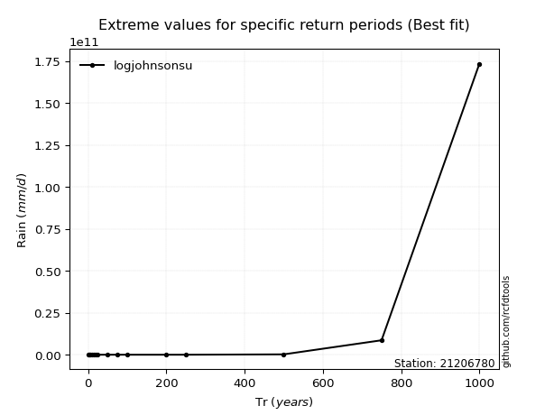</img>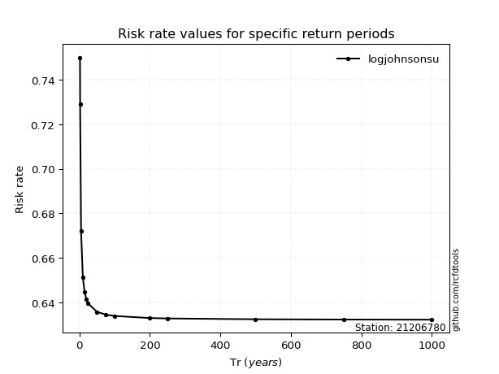</img>

</div>


<sub>**APP DISCLAIMER**: NO WARRANTY - This software is provided by [github.com/rcfdtools](https://github.com/rcfdtools) "as is", without any express or implied warranty, including warranties of merchantability, fitness for a particular purpose, or non-infringement. There is no guarantee that the software will be error-free or operate without interruption. LIMITATION OF LIABILITY - Neither the authors nor copyright holders will be liable for claims or damages arising from the software or its use. You are responsible for determining if the software is appropriate for your use and assume all associated risks, including errors, legal compliance, and data loss. NO PROFESSIONAL ADVICE - The software provides general information and does not offer professional advice. It should not replace consultation with professional advisors.</sub>