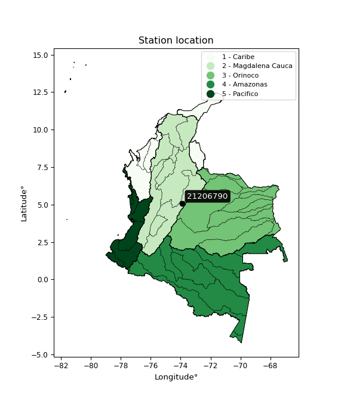

<div align="center">


</div>

# PMP Station (rain, Pmax24h): 21206790

Probable Maximum Precipitation (PMP) is the greatest amount of rainfall for a specific duration that is meteorologically possible for a given location, acting as a "worst-case" scenario for extreme storms, crucial for designing safety-critical infrastructure like bridges, river deviations, dams, spillways, and nuclear plants to prevent catastrophic failure. PMP is calculated by hydrologists using meteorological data to determine the upper limit of extreme rainfall, often leading to the Probable Maximum Flood (PMF) for flood control design, and is increasingly being studied for climate change impacts.

<div align="center">

</img>

</div>


## A. General information


### 1. General running parameters

• app_version: _v20251227_. • runtime: _2025-12-27 09:02:11.367833_. • Python version: _3.14.0_. • SciPy version: _1.16.3_. • Pandas version: _2.3.3_. • NumPy version: _2.3.5_. • Stations dataset (station_dataset_file): _dataset/pmax24h_in/automatic_colombia_2003_2024_filter.csv_. • Stations catalog (station_catalog_file): _dataset/CNE_IDEAM.xls_. • Minimum year to eval til year_max (date_min): _2003_. • Maximum year to eval since year_min (date_max): _2024_. • Creates, save and include plots into reports (create_plot): _False_. • Plot only fit distributions with Δo > Δ (plot_only_fit): _True_. • Eval low extreme values, if False, evaluates high extreme values (low_extreme): _False_. • Eval every SciPy distribution as logarithmic (pdist_logarithmic_on): _True_. • Standard deviation normalized (ddof): _1.0_. • Return periods to eval in years (Tr): _[2, 2.33, 5, 10, 15, 20, 25, 50, 75, 100, 200, 250, 500, 750, 1000]_. • Minimum data sample per station, 0 means any (minimum_sample): _5_. • Z-Score threshold to adjust a value, 0 means disable (zscore): _3.5_. • Avoid zeros, e.g. rain = 0 (avoid_zeros): _True_. • Avoid null values (avoid_nans): _True_. [:file_folder:Dataset file.](../../dataset/pmax24h_in/automatic_colombia_2003_2024_filter.csv)

> Delta Degrees of Freedom (DDOF): is a parameter used in the formulas for calculating variance and standard deviation. When ddof=0, the divisor is $N$ (the total number of observations) and this is used when your data set is the entire population. When ddof=1, the divisor is $N-1$ and this is used when your data set is a sample drawn from a larger population. Using $N-1$ provides an unbiased estimate of the population variance (known as Bessel´s correction).


### 2. Station info and location

|   id |   CODIGO | NOMBRE                              | CATEGORIA               | TECNOLOGIA                | ESTADO     | FECHA_INSTALACION   |   FECHA_SUSPENSION |   ALTITUD |   LATITUD |   LONGITUD | DEPARTAMENTO   | MUNICIPIO   | AREA_OPERATIVA                            | ENTIDAD                                                     | AREA_HIDROGRAFICA   | ZONA_HIDROGRAFICA   | SUBZONA_HIDROGRAFICA   |   CORRIENTE | Catalogo   |
|-----:|---------:|:------------------------------------|:------------------------|:--------------------------|:-----------|:--------------------|-------------------:|----------:|----------:|-----------:|:---------------|:------------|:------------------------------------------|:------------------------------------------------------------|:--------------------|:--------------------|:-----------------------|------------:|:-----------|
|    0 | 21206790 | HACIENDA SANTA ANA - AUT [21206790] | Climatológica Principal | Automática con Telemetría | Suspendida | 10/06/2004          |                nan |      2572 |    5.0905 |   -73.8812 | Cundinamarca   | Nemocón     | Area Operativa 11 - Cundinamarca-Amazonas | INSTITUTO DE HIDROLOGIA METEOROLOGIA Y ESTUDIOS AMBIENTALES | Magdalena Cauca     | Alto Magdalena      | Río Bogotá             |         nan | CNE_IDEAM  |

<div align="center">

Map location in: [:earth_americas:Google](http://maps.google.com/maps?q=5.0905,-73.88125) [:earth_americas:OSM](https://www.openstreetmap.org/#map=18/5.0905/-73.88125&layers=P) [:earth_americas:Bing](https://www.bing.com/maps?cp=5.0905~-73.88125&lvl=18) [:earth_americas:Apple](https://maps.apple.com/frame?center=5.0905%2C-73.88125&span=0.003%2C0.006)

</div>


<div align="center">

```geojson
{
  "type": "Feature",
  "geometry": {
    "type": "Point", 
    "coordinates": [-73.88125, 5.0905]
  }, 
  "properties": {
    "Name": "21206790"
  }
}
```

</div>


### 3. Discrete values table and plot

|               |          0 |          1 |           2 |          3 |           4 |           5 |          6 |           7 |           8 |          9 |          10 |         11 |          12 |          13 |          14 |          15 |          16 |
|:--------------|-----------:|-----------:|------------:|-----------:|------------:|------------:|-----------:|------------:|------------:|-----------:|------------:|-----------:|------------:|------------:|------------:|------------:|------------:|
| Date          | 2005       | 2006       | 2007        | 2008       | 2009        | 2010        | 2012       | 2013        | 2014        | 2015       | 2016        | 2017       | 2018        | 2019        | 2020        | 2021        | 2022        |
| Value         |   23       |   23.8     |   39.8      |   22.6     |   29.5      |   42        |   51.7     |   42.4      |   38.5      |   43.1     |   25.5      |   27.9     |   26.3      |   38.5      |   32.3      |   38.2      |   28.7      |
| Value_initial |   23       |   23.8     |   39.8      |   22.6     |   29.5      |   42        |   51.7     |   42.4      |   38.5      |   43.1     |   25.5      |   27.9     |   26.3      |   38.5      |   32.3      |   38.2      |   28.7      |
| count         |   17       |   17       |   17        |   17       |   17        |   17        |   17       |   17        |   17        |   17       |   17        |   17       |   17        |   17        |   17        |   17        |   17        |
| mean          |   33.7529  |   33.7529  |   33.7529   |   33.7529  |   33.7529   |   33.7529   |   33.7529  |   33.7529   |   33.7529   |   33.7529  |   33.7529   |   33.7529  |   33.7529   |   33.7529   |   33.7529   |   33.7529   |   33.7529   |
| std           |    8.64719 |    8.64719 |    8.64719  |    8.64719 |    8.64719  |    8.64719  |    8.64719 |    8.64719  |    8.64719  |    8.64719 |    8.64719  |    8.64719 |    8.64719  |    8.64719  |    8.64719  |    8.64719  |    8.64719  |
| zscore        |   -1.24352 |   -1.151   |    0.699309 |   -1.28978 |   -0.491829 |    0.953727 |    2.07548 |    0.999985 |    0.548971 |    1.08094 |   -0.954407 |   -0.67686 |   -0.861892 |    0.548971 |   -0.168025 |    0.514278 |   -0.584345 |

> The initial value (value_initial) correspond to the initial obtained or null completed value, and value (value) is adjusted only when the initial value is outside the valid range definite through the Z-Score value. If Z-Score is active, values out of range or outliers are replaced with the station mean value


### 4. Active continuous probability distributions from SciPy (45 of 104 available)

[scipy.stats](https://docs.scipy.org/doc/scipy/reference/stats.html) is a Python´s powerful submodule within the SciPy library for comprehensive statistical analysis, offering over 130 probability distributions (like Normal, Poisson), functions for descriptive stats (mean, variance), hypothesis testing (t-tests, chi-square), random variable generation, and statistical tests, making it essential for data science, modeling, and research. It provides tools to explore, model, and draw conclusions from data efficiently, working seamlessly with NumPy.

<div align="center">

|   id | p_dist             |   n_parameter | fit_method   | label                                                                       | active   | ref                                                                                                        |
|-----:|:-------------------|--------------:|:-------------|:----------------------------------------------------------------------------|:---------|:-----------------------------------------------------------------------------------------------------------|
|    0 | alpha              |             3 | MLE          | Alpha                                                                       | True     | [:mortar_board:](https://docs.scipy.org/doc/scipy/reference/generated/scipy.stats.alpha.html)              |
|    1 | betaprime          |             4 | MLE          | Beta prime                                                                  | True     | [:mortar_board:](https://docs.scipy.org/doc/scipy/reference/generated/scipy.stats.betaprime.html)          |
|    2 | chi2               |             3 | MLE          | Chi²                                                                        | True     | [:mortar_board:](https://docs.scipy.org/doc/scipy/reference/generated/scipy.stats.chi2.html)               |
|    3 | crystalball        |             4 | MLE          | Crystalball                                                                 | True     | [:mortar_board:](https://docs.scipy.org/doc/scipy/reference/generated/scipy.stats.crystalball.html)        |
|    4 | erlang             |             3 | MLE          | Erlang                                                                      | True     | [:mortar_board:](https://docs.scipy.org/doc/scipy/reference/generated/scipy.stats.erlang.html)             |
|    5 | expon              |             2 | MLE          | Exponential                                                                 | True     | [:mortar_board:](https://docs.scipy.org/doc/scipy/reference/generated/scipy.stats.expon.html)              |
|    6 | exponnorm          |             3 | MLE          | Exponentially modified Normal                                               | True     | [:mortar_board:](https://docs.scipy.org/doc/scipy/reference/generated/scipy.stats.exponnorm.html)          |
|    7 | f                  |             4 | MLE          | F                                                                           | True     | [:mortar_board:](https://docs.scipy.org/doc/scipy/reference/generated/scipy.stats.f.html)                  |
|    8 | fatiguelife        |             3 | MLE          | Fatigue-life (Birnbaum-Saunders)                                            | True     | [:mortar_board:](https://docs.scipy.org/doc/scipy/reference/generated/scipy.stats.fatiguelife.html)        |
|    9 | fisk               |             3 | MLE          | Fisk                                                                        | True     | [:mortar_board:](https://docs.scipy.org/doc/scipy/reference/generated/scipy.stats.fisk.html)               |
|   10 | gamma              |             3 | MLE          | Gamma                                                                       | True     | [:mortar_board:](https://docs.scipy.org/doc/scipy/reference/generated/scipy.stats.gamma.html)              |
|   11 | genexpon           |             5 | MLE          | Generalized exponential                                                     | True     | [:mortar_board:](https://docs.scipy.org/doc/scipy/reference/generated/scipy.stats.genexpon.html)           |
|   12 | genlogistic        |             3 | MLE          | Generalized logistic                                                        | True     | [:mortar_board:](https://docs.scipy.org/doc/scipy/reference/generated/scipy.stats.genlogistic.html)        |
|   13 | gibrat             |             2 | MM           | Gibrat                                                                      | True     | [:mortar_board:](https://docs.scipy.org/doc/scipy/reference/generated/scipy.stats.gibrat.html)             |
|   14 | gompertz           |             3 | MLE          | Gompertz (or truncated Gumbel)                                              | True     | [:mortar_board:](https://docs.scipy.org/doc/scipy/reference/generated/scipy.stats.gompertz.html)           |
|   15 | gumbel_l           |             2 | MM           | Gumbel Left Skew                                                            | True     | [:mortar_board:](https://docs.scipy.org/doc/scipy/reference/generated/scipy.stats.gumbel_l.html)           |
|   16 | gumbel_r           |             2 | MM           | Gumbel Right Skew                                                           | True     | [:mortar_board:](https://docs.scipy.org/doc/scipy/reference/generated/scipy.stats.gumbel_r.html)           |
|   17 | halflogistic       |             2 | MM           | Half-logistic                                                               | True     | [:mortar_board:](https://docs.scipy.org/doc/scipy/reference/generated/scipy.stats.halflogistic.html)       |
|   18 | halfnorm           |             2 | MM           | Half Normal                                                                 | True     | [:mortar_board:](https://docs.scipy.org/doc/scipy/reference/generated/scipy.stats.halfnorm.html)           |
|   19 | hypsecant          |             2 | MM           | hyperbolic secant                                                           | True     | [:mortar_board:](https://docs.scipy.org/doc/scipy/reference/generated/scipy.stats.hypsecant.html)          |
|   20 | invgamma           |             3 | MLE          | Inverted gamma                                                              | True     | [:mortar_board:](https://docs.scipy.org/doc/scipy/reference/generated/scipy.stats.invgamma.html)           |
|   21 | invgauss           |             3 | MLE          | Inverse Gaussian                                                            | True     | [:mortar_board:](https://docs.scipy.org/doc/scipy/reference/generated/scipy.stats.invgauss.html)           |
|   22 | invweibull         |             3 | MLE          | Inverted Weibull                                                            | True     | [:mortar_board:](https://docs.scipy.org/doc/scipy/reference/generated/scipy.stats.invweibull.html)         |
|   23 | johnsonsu          |             4 | MLE          | Johnson Su                                                                  | True     | [:mortar_board:](https://docs.scipy.org/doc/scipy/reference/generated/scipy.stats.johnsonsu.html)          |
|   24 | kstwobign          |             2 | MLE          | Limiting distribution of scaled Kolmogorov-Smirnov two-sided test statistic | True     | [:mortar_board:](https://docs.scipy.org/doc/scipy/reference/generated/scipy.stats.kstwobign.html)          |
|   25 | laplace            |             2 | MM           | Laplace                                                                     | True     | [:mortar_board:](https://docs.scipy.org/doc/scipy/reference/generated/scipy.stats.laplace.html)            |
|   26 | laplace_asymmetric |             3 | MLE          | Asymmetric Laplace                                                          | True     | [:mortar_board:](https://docs.scipy.org/doc/scipy/reference/generated/scipy.stats.laplace_asymmetric.html) |
|   27 | loggamma           |             3 | MLE          | Log gamma                                                                   | True     | [:mortar_board:](https://docs.scipy.org/doc/scipy/reference/generated/scipy.stats.loggamma.html)           |
|   28 | logistic           |             2 | MM           | Logistic (or Sech-squared)                                                  | True     | [:mortar_board:](https://docs.scipy.org/doc/scipy/reference/generated/scipy.stats.logistic.html)           |
|   29 | lognorm            |             3 | MLE          | Log Normal                                                                  | True     | [:mortar_board:](https://docs.scipy.org/doc/scipy/reference/generated/scipy.stats.lognorm.html)            |
|   30 | maxwell            |             2 | MM           | Maxwell                                                                     | True     | [:mortar_board:](https://docs.scipy.org/doc/scipy/reference/generated/scipy.stats.maxwell.html)            |
|   31 | mielke             |             4 | MLE          | Mielke Beta-Kappa / Dagum                                                   | True     | [:mortar_board:](https://docs.scipy.org/doc/scipy/reference/generated/scipy.stats.mielke.html)             |
|   32 | moyal              |             2 | MM           | Moyal                                                                       | True     | [:mortar_board:](https://docs.scipy.org/doc/scipy/reference/generated/scipy.stats.moyal.html)              |
|   33 | nakagami           |             3 | MLE          | Nakagami                                                                    | True     | [:mortar_board:](https://docs.scipy.org/doc/scipy/reference/generated/scipy.stats.nakagami.html)           |
|   34 | ncf                |             5 | MLE          | Non-central F distribution                                                  | True     | [:mortar_board:](https://docs.scipy.org/doc/scipy/reference/generated/scipy.stats.ncf.html)                |
|   35 | nct                |             4 | MLE          | Non-central Student’s t                                                     | True     | [:mortar_board:](https://docs.scipy.org/doc/scipy/reference/generated/scipy.stats.nct.html)                |
|   36 | norm               |             2 | MM           | Normal                                                                      | True     | [:mortar_board:](https://docs.scipy.org/doc/scipy/reference/generated/scipy.stats.norm.html)               |
|   37 | pareto             |             3 | MLE          | Pareto                                                                      | True     | [:mortar_board:](https://docs.scipy.org/doc/scipy/reference/generated/scipy.stats.pareto.html)             |
|   38 | pearson3           |             3 | MM           | Pearson type III                                                            | True     | [:mortar_board:](https://docs.scipy.org/doc/scipy/reference/generated/scipy.stats.pearson3.html)           |
|   39 | rayleigh           |             2 | MM           | Rayleigh                                                                    | True     | [:mortar_board:](https://docs.scipy.org/doc/scipy/reference/generated/scipy.stats.rayleigh.html)           |
|   40 | rice               |             3 | MLE          | Rice                                                                        | True     | [:mortar_board:](https://docs.scipy.org/doc/scipy/reference/generated/scipy.stats.rice.html)               |
|   41 | t                  |             3 | MLE          | Student’s t                                                                 | True     | [:mortar_board:](https://docs.scipy.org/doc/scipy/reference/generated/scipy.stats.t.html)                  |
|   42 | truncnorm          |             4 | MLE          | Truncated normal                                                            | True     | [:mortar_board:](https://docs.scipy.org/doc/scipy/reference/generated/scipy.stats.truncnorm.html)          |
|   43 | wald               |             2 | MM           | Wald                                                                        | True     | [:mortar_board:](https://docs.scipy.org/doc/scipy/reference/generated/scipy.stats.wald.html)               |
|   44 | weibull_min        |             3 | MLE          | Weibull minimum                                                             | True     | [:mortar_board:](https://docs.scipy.org/doc/scipy/reference/generated/scipy.stats.weibull_min.html)        |

</div>

> **n_parameter:** # arguments & localization & scale.
>
> **Fit methods:** (MLE) maximum likelihood, (MM) L-moments.
>
>**Inactive:** foldnorm, gennorm, norminvgauss, powernorm, powerlognorm, skewnorm, genextreme, anglit, arcsine, argus, beta, bradford, burr, burr12, cauchy, cosine, halfcauchy, foldcauchy, skewcauchy, wrapcauchy, dgamma, gengamma, exponweib, exponpow, truncexpon, gausshyper, genhalflogistic, genhyperbolic, geninvgauss, halfgennorm, johnsonsb, kappa4, kappa3, ksone, kstwo, loglaplace, levy, levy_l, levy_stable, ncx2, genpareto, truncpareto, lomax, powerlaw, rdist, rel_breitwigner, recipinvgauss, semicircular, studentized_range, trapezoid, triang, truncweibull_min, tukeylambda, uniform, loguniform, vonmises, vonmises_line, weibull_max, dweibull, 


## B. Probability distributions vs. Empirical distributions

A continuous probability distribution (CPD) describes probabilities for variables that can take any value within a range (like rain any time), unlike discrete variables with specific outcomes (like temperature). It uses a Probability Density Function (PDF), a curve where the total area under it equals 1, and the probability of the variable falling within an interval (a to b) is found by calculating the area under the curve between those points. A key feature is that the probability of hitting any single exact value is zero, so probabilities are always expressed for ranges, e.g., $P(a ≤ X ≤ b)$.

<div align="center">

Distributions parameters from station values
|    |   station | p_dist                |   n |             loc |         scale | shape                  | shape1                | shape2             | shape3   |
|---:|----------:|:----------------------|----:|----------------:|--------------:|:-----------------------|:----------------------|:-------------------|:---------|
|  0 |  21206790 | alpha                 |  17 |   -26.0886      | 427.898       | 7.289635545874333      |                       |                    |          |
|  1 |  21206790 | betaprime             |  17 |    -1.27994     |   2.52297     | 251.20829951884951     | 19.080933466222724    |                    |          |
|  2 |  21206790 | chi2                  |  17 |    22.6         |   9.28339     | 1.378306648923235      |                       |                    |          |
|  3 |  21206790 | crystalball           |  17 |    33.7529      |   8.38901     | 1246.7217601592351     | 4804.760455246639     |                    |          |
|  4 |  21206790 | erlang                |  17 |    22.6         |  12.5103      | 0.7711118950207074     |                       |                    |          |
|  5 |  21206790 | expon                 |  17 |    22.6         |  11.1529      |                        |                       |                    |          |
|  6 |  21206790 | exponnorm             |  17 |    30.0236      |   7.54328     | 0.49438838955750364    |                       |                    |          |
|  7 |  21206790 | f                     |  17 |    -1.22532     |  33.1339      | 589.5712065452256      | 37.44950848942594     |                    |          |
|  8 |  21206790 | fatiguelife           |  17 |    18.7306      |  12.2225      | 0.6730152669924281     |                       |                    |          |
|  9 |  21206790 | fisk                  |  17 |    19.3391      |  12.2116      | 2.3798534746234097     |                       |                    |          |
| 10 |  21206790 | gamma                 |  17 |    22.6         |  14.2346      | 0.7625981806774589     |                       |                    |          |
| 11 |  21206790 | genexpon              |  17 |    22.6         |   2.19346     | 0.19667030931944746    | 4.489303163575398e-08 | 1.2171746529403418 |          |
| 12 |  21206790 | genlogistic           |  17 |   -14.0124      |   6.95429     | 537.1977014333388      |                       |                    |          |
| 13 |  21206790 | gibrat                |  17 |    27.3532      |   3.88163     |                        |                       |                    |          |
| 14 |  21206790 | gompertz              |  17 |    22.6         |  19.1403      | 1.0229285225135794     |                       |                    |          |
| 15 |  21206790 | gumbel_l              |  17 |    37.5284      |   6.54088     |                        |                       |                    |          |
| 16 |  21206790 | gumbel_r              |  17 |    29.9774      |   6.54088     |                        |                       |                    |          |
| 17 |  21206790 | halflogistic          |  17 |    23.8101      |   7.17227     |                        |                       |                    |          |
| 18 |  21206790 | halfnorm              |  17 |    22.6492      |  13.9165      |                        |                       |                    |          |
| 19 |  21206790 | hypsecant             |  17 |    33.7529      |   5.34061     |                        |                       |                    |          |
| 20 |  21206790 | invgamma              |  17 |     3.51185     | 365.152       | 13.049457284262841     |                       |                    |          |
| 21 |  21206790 | invgauss              |  17 |    16.4878      |  53.9111      | 0.3202522416973411     |                       |                    |          |
| 22 |  21206790 | invweibull            |  17 |    -3.00945e+08 |   3.00945e+08 | 43258072.32486083      |                       |                    |          |
| 23 |  21206790 | johnsonsu             |  17 |    16.0016      |   0.594721    | -7.692866693595002     | 1.940069959026097     |                    |          |
| 24 |  21206790 | kstwobign             |  17 |     5.73773     |  32.0156      |                        |                       |                    |          |
| 25 |  21206790 | laplace               |  17 |    33.7529      |   5.93192     |                        |                       |                    |          |
| 26 |  21206790 | laplace_asymmetric    |  17 |    22.6         |   0.00139551  | 0.00012513760177683425 |                       |                    |          |
| 27 |  21206790 | loggamma              |  17 | -2253.93        | 315.85        | 1398.43113985956       |                       |                    |          |
| 28 |  21206790 | logistic              |  17 |    33.7529      |   4.6251      |                        |                       |                    |          |
| 29 |  21206790 | lognorm               |  17 |    15.9193      |  15.7675      | 0.5125217379864231     |                       |                    |          |
| 30 |  21206790 | maxwell               |  17 |    13.8745      |  12.457       |                        |                       |                    |          |
| 31 |  21206790 | mielke                |  17 |   -49.8004      |  42.3197      | 20011.297692582702     | 11.874835567998275    |                    |          |
| 32 |  21206790 | moyal                 |  17 |    28.9556      |   3.77638     |                        |                       |                    |          |
| 33 |  21206790 | nakagami              |  17 |    22.6         |  15.2959      | 0.4110268404983496     |                       |                    |          |
| 34 |  21206790 | ncf                   |  17 |     3.62298     |  15.3558      | 3496.8091457325418     | 26.04675199323436     | 2850.0263527793045 |          |
| 35 |  21206790 | nct                   |  17 |    -0.354359    |   0.690872    | 8.865883154960873      | 45.17826287777076     |                    |          |
| 36 |  21206790 | norm                  |  17 |    33.7529      |   8.38901     |                        |                       |                    |          |
| 37 |  21206790 | pareto                |  17 |    22.6         |   3.21307e-07 | 0.06250010579218448    |                       |                    |          |
| 38 |  21206790 | pearson3              |  17 |    33.7529      |   8.38903     | 0.33128226656674026    |                       |                    |          |
| 39 |  21206790 | rayleigh              |  17 |    17.7043      |  12.805       |                        |                       |                    |          |
| 40 |  21206790 | rice                  |  17 |    18.8108      |  11.3026      | 0.5464298620785746     |                       |                    |          |
| 41 |  21206790 | t                     |  17 |    33.7526      |   8.38883     | 28135662.99955511      |                       |                    |          |
| 42 |  21206790 | truncnorm             |  17 |     0.776969    |   4.44533     | 4.909199943086937      | 11.455394542101157    |                    |          |
| 43 |  21206790 | wald                  |  17 |    25.364       |   8.38898     |                        |                       |                    |          |
| 44 |  21206790 | weibull_min           |  17 |    22.6         |  11.1072      | 0.9324120113624796     |                       |                    |          |
| 45 |  21206790 | logalpha              |  17 |    -2.07069     | 123.381       | 22.239716879799104     |                       |                    |          |
| 46 |  21206790 | logbetaprime          |  17 |    -3.49692     |  28.0166      | 593.5014823485099      | 2381.146662444265     |                    |          |
| 47 |  21206790 | logchi2               |  17 |     3.11795     |   0.983223    | 1.034170529434207      |                       |                    |          |
| 48 |  21206790 | logcrystalball        |  17 |     3.48813     |   0.249211    | 113.5732623569101      | 161.2555259740596     |                    |          |
| 49 |  21206790 | logerlang             |  17 |    -9.89676     |   0.00463611  | 2887.084597086663      |                       |                    |          |
| 50 |  21206790 | logexpon              |  17 |     3.11795     |   0.370178    |                        |                       |                    |          |
| 51 |  21206790 | logexponnorm          |  17 |     3.48142     |   0.249121    | 0.02693972349466051    |                       |                    |          |
| 52 |  21206790 | logf                  |  17 |    -2.30934     |   5.79146     | 2463.2981254101924     | 1928.5070619546286    |                    |          |
| 53 |  21206790 | logfatiguelife        |  17 |     0.67409     |   2.80295     | 0.08893331332012619    |                       |                    |          |
| 54 |  21206790 | logfisk               |  17 |  -154.599       | 158.087       | 1031.0679749540927     |                       |                    |          |
| 55 |  21206790 | loggamma              |  17 |   -10.0453      |   0.00458689  | 2950.4737012804417     |                       |                    |          |
| 56 |  21206790 | loggenexpon           |  17 |     3.11795     |   0.577392    | 1.1561888816393442     | 1.0985463489529366    | 1.0698614831952604 |          |
| 57 |  21206790 | loggenlogistic        |  17 |     2.11538     |   0.220443    | 289.6101708284623      |                       |                    |          |
| 58 |  21206790 | loggibrat             |  17 |     3.29799     |   0.115325    |                        |                       |                    |          |
| 59 |  21206790 | loggompertz           |  17 |     3.11795     |   0.649062    | 1.1514674955151585     |                       |                    |          |
| 60 |  21206790 | loggumbel_l           |  17 |     3.60029     |   0.19431     |                        |                       |                    |          |
| 61 |  21206790 | loggumbel_r           |  17 |     3.37597     |   0.19431     |                        |                       |                    |          |
| 62 |  21206790 | loghalflogistic       |  17 |     3.19278     |   0.213052    |                        |                       |                    |          |
| 63 |  21206790 | loghalfnorm           |  17 |     3.15825     |   0.413437    |                        |                       |                    |          |
| 64 |  21206790 | loghypsecant          |  17 |     3.48813     |   0.158653    |                        |                       |                    |          |
| 65 |  21206790 | loginvgamma           |  17 |     0.379186    | 479.168       | 155.2034597946194      |                       |                    |          |
| 66 |  21206790 | loginvgauss           |  17 |     2.17381     |  34.6513      | 0.03791541662311401    |                       |                    |          |
| 67 |  21206790 | loginvweibull         |  17 |    -2.0405e+07  |   2.04051e+07 | 92481459.08458507      |                       |                    |          |
| 68 |  21206790 | logjohnsonsu          |  17 |    -2.42679     |   6.31223     | -29.034392901616613    | 34.734549084288915    |                    |          |
| 69 |  21206790 | logkstwobign          |  17 |     2.60485     |   1.00774     |                        |                       |                    |          |
| 70 |  21206790 | loglaplace            |  17 |     3.48813     |   0.176219    |                        |                       |                    |          |
| 71 |  21206790 | loglaplace_asymmetric |  17 |     3.32863     |   0.197974    | 0.675091034009105      |                       |                    |          |
| 72 |  21206790 | logloggamma           |  17 |   -41.3476      |   6.78973     | 738.1460324130294      |                       |                    |          |
| 73 |  21206790 | loglogistic           |  17 |     3.48813     |   0.137398    |                        |                       |                    |          |
| 74 |  21206790 | loglognorm            |  17 |    -1.06272     |   4.54402     | 0.05481869205177156    |                       |                    |          |
| 75 |  21206790 | logmaxwell            |  17 |     2.8976      |   0.370058    |                        |                       |                    |          |
| 76 |  21206790 | logmielke             |  17 |    -4.96699e+06 |   4.96699e+06 | 916253261.6583438      | 22819208.72726632     |                    |          |
| 77 |  21206790 | logmoyal              |  17 |     3.34561     |   0.112185    |                        |                       |                    |          |
| 78 |  21206790 | lognakagami           |  17 |     3.11795     |   0.427328    | 0.3627138194168087     |                       |                    |          |
| 79 |  21206790 | logncf                |  17 |    -3.45889     |   6.88271     | 6610.987896519097      | 2031.143475769687     | 55.20098545089462  |          |
| 80 |  21206790 | lognct                |  17 |    -0.271233    |   0.0566914   | 120.13478859336357     | 65.89773555842194     |                    |          |
| 81 |  21206790 | lognorm               |  17 |     3.48813     |   0.249212    |                        |                       |                    |          |
| 82 |  21206790 | logpareto             |  17 |    -1.67772e+07 |   1.67772e+07 | 45322012.24466592      |                       |                    |          |
| 83 |  21206790 | logpearson3           |  17 |     3.48813     |   0.249212    | 0.03417952352531593    |                       |                    |          |
| 84 |  21206790 | lograyleigh           |  17 |     3.01137     |   0.380397    |                        |                       |                    |          |
| 85 |  21206790 | logrice               |  17 |     3.00916     |   0.306248    | 1.0527459975301132     |                       |                    |          |
| 86 |  21206790 | logt                  |  17 |     3.48813     |   0.249212    | 16867922779.469246     |                       |                    |          |
| 87 |  21206790 | logtruncnorm          |  17 |    -0.110706    |   1.28698     | 2.5087094917173127     | 3.151695469262908     |                    |          |
| 88 |  21206790 | logwald               |  17 |     3.23889     |   0.249234    |                        |                       |                    |          |
| 89 |  21206790 | logweibull_min        |  17 |     3.07788     |   0.454375    | 1.5801120123474737     |                       |                    |          |

</div>

> **loc** (Location parameter): This shifts the distribution along the x-axis. For many common distributions, like the normal (Gaussian) distribution, loc represents the mean $μ$. For others, like the uniform distribution, it might represent the minimum value, or for the beta distribution, the left end of the support interval.
>
> **scale** (Scale parameter): This determines the width or spread of the distribution. For the normal distribution, scale represents the standard deviation $σ$. For a uniform distribution, it defines the length of the interval (from $loc$ to $loc + scale$).
>
> **shape** (Shape parameters): Refers to parameters that define the specific form of a probability distribution, distinct from its location (loc) and scale (scale). These parameters are required arguments for most distribution functions. For example, a normal (Gaussian) distribution is fully defined by its location (mean) and scale (standard deviation), so it has no specific shape parameters beyond loc and scale. However, other distributions have intrinsic properties that need specification, as Gamma distribution that takes a shape parameter, often named $a$ or $alpha$.


### 0. Cumulative distribution values - CDF (90 evaluated)

Cumulative Distribution Function (CDF), denoted as $F$<sub>$X$</sub>$(x)$, is a function that gives the probability that a random variable $X$ will take a value less than or equal to a specific value, $x$ (i.e., $(P(X≥x)$. It essentially "accumulates" probabilities from a given point up to the far right (positive infinity), providing a complete picture of the distribution´s probabilities for both discrete (like rain) and continuous (like temperature) variables, helping to find probabilities over ranges or above certain values.

<div align="center">

CDF ordered by x ascending and calculating $log(f(x))$ separately
|   id |   Station |   date |    x |   count |    mean |     std |    zscore |   Value_initial |   station |   m |     alpha |   alpha_pdf |   betaprime |   betaprime_pdf |        chi2 |      chi2_pdf |   crystalball |   crystalball_pdf |      erlang |   erlang_pdf |     expon |   expon_pdf |   exponnorm |   exponnorm_pdf |         f |      f_pdf |   fatiguelife |   fatiguelife_pdf |      fisk |   fisk_pdf |       gamma |    gamma_pdf |    genexpon |   genexpon_pdf |   genlogistic |   genlogistic_pdf |    gibrat |   gibrat_pdf |   gompertz |   gompertz_pdf |   gumbel_l |   gumbel_l_pdf |   gumbel_r |   gumbel_r_pdf |   halflogistic |   halflogistic_pdf |   halfnorm |   halfnorm_pdf |   hypsecant |   hypsecant_pdf |   invgamma |   invgamma_pdf |   invgauss |   invgauss_pdf |   invweibull |   invweibull_pdf |   johnsonsu |   johnsonsu_pdf |   kstwobign |   kstwobign_pdf |   laplace |   laplace_pdf |   laplace_asymmetric |   laplace_asymmetric_pdf |   loggamma |   loggamma_pdf |   logistic |   logistic_pdf |   lognorm |   lognorm_pdf |   maxwell |   maxwell_pdf |   mielke |   mielke_pdf |     moyal |   moyal_pdf |    nakagami |   nakagami_pdf |       ncf |    ncf_pdf |       nct |    nct_pdf |      norm |   norm_pdf |   pareto |       pareto_pdf |   pearson3 |   pearson3_pdf |   rayleigh |   rayleigh_pdf |      rice |   rice_pdf |         t |      t_pdf |   truncnorm |   truncnorm_pdf |        wald |    wald_pdf |   weibull_min |   weibull_min_pdf |   logalpha |   logalpha_pdf |   logbetaprime |   logbetaprime_pdf |     logchi2 |   logchi2_pdf |   logcrystalball |   logcrystalball_pdf |   logerlang |   logerlang_pdf |   logexpon |   logexpon_pdf |   logexponnorm |   logexponnorm_pdf |      logf |   logf_pdf |   logfatiguelife |   logfatiguelife_pdf |   logfisk |   logfisk_pdf |   loggenexpon |   loggenexpon_pdf |   loggenlogistic |   loggenlogistic_pdf |   loggibrat |   loggibrat_pdf |   loggompertz |   loggompertz_pdf |   loggumbel_l |   loggumbel_l_pdf |   loggumbel_r |   loggumbel_r_pdf |   loghalflogistic |   loghalflogistic_pdf |   loghalfnorm |   loghalfnorm_pdf |   loghypsecant |   loghypsecant_pdf |   loginvgamma |   loginvgamma_pdf |   loginvgauss |   loginvgauss_pdf |   loginvweibull |   loginvweibull_pdf |   logjohnsonsu |   logjohnsonsu_pdf |   logkstwobign |   logkstwobign_pdf |   loglaplace |   loglaplace_pdf |   loglaplace_asymmetric |   loglaplace_asymmetric_pdf |   logloggamma |   logloggamma_pdf |   loglogistic |   loglogistic_pdf |   loglognorm |   loglognorm_pdf |   logmaxwell |   logmaxwell_pdf |   logmielke |   logmielke_pdf |   logmoyal |   logmoyal_pdf |   lognakagami |   lognakagami_pdf |    logncf |   logncf_pdf |    lognct |   lognct_pdf |   logpareto |   logpareto_pdf |   logpearson3 |   logpearson3_pdf |   lograyleigh |   lograyleigh_pdf |   logrice |   logrice_pdf |      logt |   logt_pdf |   logtruncnorm |   logtruncnorm_pdf |   logwald |   logwald_pdf |   logweibull_min |   logweibull_min_pdf |
|-----:|----------:|-------:|-----:|--------:|--------:|--------:|----------:|----------------:|----------:|----:|----------:|------------:|------------:|----------------:|------------:|--------------:|--------------:|------------------:|------------:|-------------:|----------:|------------:|------------:|----------------:|----------:|-----------:|--------------:|------------------:|----------:|-----------:|------------:|-------------:|------------:|---------------:|--------------:|------------------:|----------:|-------------:|-----------:|---------------:|-----------:|---------------:|-----------:|---------------:|---------------:|-------------------:|-----------:|---------------:|------------:|----------------:|-----------:|---------------:|-----------:|---------------:|-------------:|-----------------:|------------:|----------------:|------------:|----------------:|----------:|--------------:|---------------------:|-------------------------:|-----------:|---------------:|-----------:|---------------:|----------:|--------------:|----------:|--------------:|---------:|-------------:|----------:|------------:|------------:|---------------:|----------:|-----------:|----------:|-----------:|----------:|-----------:|---------:|-----------------:|-----------:|---------------:|-----------:|---------------:|----------:|-----------:|----------:|-----------:|------------:|----------------:|------------:|------------:|--------------:|------------------:|-----------:|---------------:|---------------:|-------------------:|------------:|--------------:|-----------------:|---------------------:|------------:|----------------:|-----------:|---------------:|---------------:|-------------------:|----------:|-----------:|-----------------:|---------------------:|----------:|--------------:|--------------:|------------------:|-----------------:|---------------------:|------------:|----------------:|--------------:|------------------:|--------------:|------------------:|--------------:|------------------:|------------------:|----------------------:|--------------:|------------------:|---------------:|-------------------:|--------------:|------------------:|--------------:|------------------:|----------------:|--------------------:|---------------:|-------------------:|---------------:|-------------------:|-------------:|-----------------:|------------------------:|----------------------------:|--------------:|------------------:|--------------:|------------------:|-------------:|-----------------:|-------------:|-----------------:|------------:|----------------:|-----------:|---------------:|--------------:|------------------:|----------:|-------------:|----------:|-------------:|------------:|----------------:|--------------:|------------------:|--------------:|------------------:|----------:|--------------:|----------:|-----------:|---------------:|-------------------:|----------:|--------------:|-----------------:|---------------------:|
|    0 |  21206790 |   2008 | 22.6 |      17 | 33.7529 | 8.64719 | -1.28978  |            22.6 |  21206790 |   1 | 0.0669598 |  0.0234197  |   0.0639367 |      0.0242148  | 1.62307e-11 | 3148.42       |     0.0918463 |        0.0196514  | 1.11189e-12 | 241.334      | 0         |  0.0896624  |   0.0877979 |      0.0200376  | 0.0641937 | 0.0243265  |     0.0355546 |        0.0351661  | 0.0413963 | 0.0289606  | 2.45421e-11 | 119.728      | 1.71843e-08 |     0.0896621  |     0.0626243 |        0.0248854  | 0         |   0          | 8.4259e-11 |     0.0534436  |  0.0970123 |    0.0140878   |  0.0455405 |     0.021508   |       0        |         0          |  0         |     0          |   0.0784735 |      0.0145454  |  0.0587855 |     0.0252501  |  0.0424428 |     0.0307767  |    0.0620487 |        0.0247931 |   0.0469254 |      0.0287071  |   0.0557279 |      0.0260911  | 0.0762832 |    0.0128598  |          1.63263e-08 |               0.0896714  |  0.0676622 |       0.534773 |  0.082308  |     0.0163312  | 0.0687196 |      0.531163 | 0.0790552 |    0.0245892  |      nan |          nan | 0.0203506 |  0.0166225  | 1.10028e-13 |     25.4592    | 0.0588227 | 0.0252773  | 0.0569554 | 0.0256102  | 0.0918463 | 0.0196514  | 0        | 194518           |  0.0829399 |     0.0215161  |  0.0704808 |     0.0277535  | 0.0472637 | 0.0243547  | 0.0918478 | 0.019652   | 6.86287e-06 |     1.14697     | 0           | 0           |   3.56643e-15 |        0.936012   |  0.0618586 |       0.559107 |       0.121971 |           0.659424 | 9.15587e-09 |   1.06608e+07 |        0.0687188 |             0.531161 |   0.0676404 |        0.534849 |  0         |       2.7014   |      0.0687188 |           0.531169 | 0.065042  |   0.544815 |        0.0614451 |             0.559704 | 0.0817324 |      0.490651 |   4.10793e-11 |          2.00243  |        0.0473343 |             0.65158  |   0         |        0        |   1.14294e-08 |          1.77405  |     0.080155  |         0.395519  |     0.0229824 |          0.446263 |          0        |              0        |     0         |          0        |      0.0615467 |           0.38552  |     0.060633  |          0.568719 |     0.0530127 |          0.598733 |       0.0470074 |            0.651392 |      0.0669231 |           0.536174 |      0.0422223 |           0.700883 |    0.0611874 |         0.347223 |               0.0647213 |                    0.484258 |     0.0702639 |          0.529026 |     0.0633159 |          0.431645 |    0.0642183 |         0.548079 |    0.0505382 |         0.64027  |   0.0478395 |        0.643453 | 0.00580718 |       0.21844  |   1.05098e-11 |      17167.9      | 0.0652459 |     0.543982 | 0.06015   |     0.562984 | 1.00635e-08 |        2.7014   |     0.0677911 |          0.53471  |     0.0384895 |          0.708191 | 0.0357446 |      0.647796 | 0.0687196 |   0.531164 |    1.38047e-06 |           2.5397   | 0         |      0        |        0.0213317 |             0.832059 |
|    1 |  21206790 |   2005 | 23   |      17 | 33.7529 | 8.64719 | -1.24352  |            23   |  21206790 |   2 | 0.0767597 |  0.0255844  |   0.0740902 |      0.0265551  | 0.0776545   |    0.132091   |     0.0999582 |        0.0209137  | 0.0750435   |   0.142073   | 0.0352295 |  0.0865037  |   0.0960846 |      0.0214018  | 0.0743929 | 0.0266719  |     0.0509325 |        0.0415808  | 0.0538129 | 0.0330994  | 0.0703075   |   0.131916   | 0.0352294   |     0.0865034  |     0.0730863 |        0.0274273  | 0         |   0          | 0.0213707  |     0.053406   |  0.102805  |    0.0148801   |  0.0546995 |     0.0243012  |       0        |         0          |  0.0201099 |     0.0573156  |   0.0845078 |      0.0156384  |  0.0694237 |     0.0279413  |  0.0556855 |     0.0353883  |    0.072475  |        0.0273412 |   0.0591818 |      0.0325521  |   0.0667367 |      0.0289462  | 0.0816045 |    0.0137568  |          0.0352329   |               0.086512   |  0.077552  |       0.593158 |  0.0890809 |     0.0175446  | 0.0785348 |      0.588256 | 0.0892302 |    0.0262836  |      nan |          nan | 0.0277957 |  0.0206607  | 0.0391341   |      0.0804099 | 0.0694725 | 0.0279714  | 0.0677728 | 0.0284769  | 0.0999582 | 0.0209137  | 0.584039 |      0.064994    |  0.0918545 |     0.0230614  |  0.0819642 |     0.0296501  | 0.0574655 | 0.0266408  | 0.09996   | 0.0209144  | 0.370427    |     0.73443     | 0           | 0           |   0.0440827   |        0.100459   |  0.0722517 |       0.62624  |       0.133915 |           0.702169 | 0.0979527   |   2.87003     |        0.078534  |             0.588254 |   0.0775319 |        0.593267 |  0.0462887 |       2.57636  |      0.0785341 |           0.588263 | 0.0751392 |   0.606771 |        0.0718512 |             0.627117 | 0.0907634 |      0.539446 |   0.0350394   |          1.99099  |        0.0597085 |             0.759647 |   0         |        0        |   0.0310565   |          1.76605  |     0.0873884 |         0.429488  |     0.0318319 |          0.564736 |          0        |              0        |     0         |          0        |      0.0686905 |           0.429607 |     0.0712205 |          0.638795 |     0.0642476 |          0.682579 |       0.0593829 |            0.759984 |      0.0768442 |           0.595328 |      0.0556338 |           0.82809  |    0.0675928 |         0.383572 |               0.0738001 |                    0.552187 |     0.0800295 |          0.584725 |     0.0713245 |          0.482085 |    0.0743831 |         0.611217 |    0.0625106 |         0.724698 |   0.0600519 |        0.749397 | 0.0107415  |       0.350415 |   0.0767222   |          3.17091  | 0.0753259 |     0.605646 | 0.0706316 |     0.63246  | 0.0462887   |        2.57636  |     0.077679  |          0.59299  |     0.0518432 |          0.813315 | 0.0479647 |      0.744743 | 0.0785349 |   0.588256 |    0.043804    |           2.45408  | 0         |      0        |        0.0375485 |             1.01013  |
|    2 |  21206790 |   2006 | 23.8 |      17 | 33.7529 | 8.64719 | -1.151    |            23.8 |  21206790 |   3 | 0.0989724 |  0.0299455  |   0.0972055 |      0.0312189  | 0.16271     |    0.0899187  |     0.117727  |        0.0235256  | 0.170331    |   0.103641   | 0.102009  |  0.0805161  |   0.114328  |      0.024225   | 0.097604  | 0.0313401  |     0.0884681 |        0.0516167  | 0.0834343 | 0.0407973  | 0.158641    |   0.0960773  | 0.102008    |     0.0805159  |     0.0970581 |        0.0324824  | 0         |   0          | 0.0640427  |     0.0532574  |  0.115378  |    0.0165804   |  0.0764314 |     0.0300468  |       0        |         0          |  0.065904  |     0.0571382  |   0.0979641 |      0.018055   |  0.0939094 |     0.0332392  |  0.0873574 |     0.0435145  |    0.0963835 |        0.0324109 |   0.0881285 |      0.0396571  |   0.0921153 |      0.0344349  | 0.0933866 |    0.015743   |          0.102018    |               0.0805233  |  0.0998891 |       0.71508  |  0.10415   |     0.0201731  | 0.10066   |      0.707604 | 0.111593  |    0.0296039  |      nan |          nan | 0.0478125 |  0.0294996  | 0.0964918   |      0.0659828 | 0.0939842 | 0.033274   | 0.0928238 | 0.0341114  | 0.117727  | 0.0235256  | 0.611641 |      0.020227    |  0.11156   |     0.026213   |  0.107125  |     0.0331939  | 0.0805297 | 0.0309612  | 0.117729  | 0.0235265  | 0.756254    |     0.293897    | 0           | 0           |   0.118008    |        0.0860569  |  0.0960149 |       0.76534  |       0.159355 |           0.785936 | 0.170336    |   1.67314     |        0.100659  |             0.707603 |   0.0998739 |        0.715258 |  0.130432  |       2.34905  |      0.10066   |           0.707614 | 0.0980628 |   0.735755 |        0.0956528 |             0.766685 | 0.11097   |      0.644744 |   0.102523    |          1.95322  |        0.0893625 |             0.974935 |   0         |        0        |   0.0911168   |          1.74619  |     0.103304  |         0.503188  |     0.0555172 |          0.82602  |          0        |              0        |     0.0220629 |          1.92914  |      0.0850331 |           0.529616 |     0.0955114 |          0.783609 |     0.0904823 |          0.853056 |       0.0890652 |            0.976227 |      0.0992821 |           0.718813 |      0.0881199 |           1.06926  |    0.0820664 |         0.465706 |               0.095315  |                    0.713166 |     0.101985  |          0.701194 |     0.0896701 |          0.59411  |    0.0974985 |         0.742514 |    0.0901127 |         0.889511 |   0.0893016 |        0.961871 | 0.0284935  |       0.70736  |   0.16791     |          2.34524  | 0.0982012 |     0.734056 | 0.0946876 |     0.776245 | 0.130432    |        2.34905  |     0.100007  |          0.714695 |     0.0829596 |          1.00331  | 0.0765286 |      0.923702 | 0.10066   |   0.707605 |    0.124953    |           2.29421  | 0         |      0        |        0.0767962 |             1.26961  |
|    3 |  21206790 |   2016 | 25.5 |      17 | 33.7529 | 8.64719 | -0.954407 |            25.5 |  21206790 |   4 | 0.157499  |  0.0387178  |   0.158245  |      0.040321   | 0.288189    |    0.0623683  |     0.162612  |        0.0293116  | 0.317654    |   0.0739269  | 0.228965  |  0.0691329  |   0.160784  |      0.0304542  | 0.158839  | 0.0404241  |     0.186526  |        0.0614781  | 0.164078  | 0.0529809  | 0.295716    |   0.0691478  | 0.228964    |     0.0691328  |     0.160819  |        0.0421889  | 0         |   0          | 0.154091   |     0.0526042  |  0.146988  |    0.0207332   |  0.137677  |     0.0417363  |       0.117267 |         0.0687543  |  0.162311  |     0.0561434  |   0.133752  |      0.0243138  |  0.159195  |     0.0431526  |  0.172017  |     0.0546629  |    0.160053  |        0.042153  |   0.16585   |      0.0507716  |   0.159376  |      0.0441601  | 0.124379  |    0.0209677  |          0.228985    |               0.069138   |  0.158334  |       0.981993 |  0.143763  |     0.0266146  | 0.158425  |      0.970018 | 0.16757   |    0.0360911  |      nan |          nan | 0.114071  |  0.0479006  | 0.198596    |      0.0557084 | 0.159333  | 0.0431905  | 0.160068  | 0.0445199  | 0.162612  | 0.0293116  | 0.632479 |      0.00792072  |  0.161843  |     0.0329045  |  0.169162  |     0.0395016  | 0.140136  | 0.0388509  | 0.162616  | 0.0293127  | 0.970764    |     0.0376931   | 1.09492e-14 | 2.52041e-12 |   0.24866     |        0.0690648  |  0.158982  |       1.0605   |       0.219294 |           0.949368 | 0.260897    |   1.07293     |        0.158424  |             0.970019 |   0.158336  |        0.982317 |  0.278293  |       1.94962  |      0.158425  |           0.970033 | 0.158377  |   1.01465  |        0.158733  |             1.0623   | 0.163819  |      0.894832 |   0.233277    |          1.82771  |        0.170669  |             1.36465  |   0         |        0        |   0.209739    |          1.68856  |     0.144029  |         0.68509   |     0.13173   |          1.37418  |          0.10731  |              2.31982  |     0.15424   |          1.89371  |      0.130292  |           0.798496 |     0.160081  |          1.08783  |     0.161209  |          1.19157  |       0.170506  |            1.36704  |      0.158088  |           0.988584 |      0.176235  |           1.45616  |    0.121395  |         0.688883 |               0.159717  |                    1.19504  |     0.159109  |          0.958026 |     0.139971  |          0.876137 |    0.15842   |         1.02518  |    0.162407  |         1.19776  |   0.169693  |        1.35273  | 0.10727    |       1.56561  |   0.308554    |          1.81499  | 0.158363  |     1.012    | 0.158702  |     1.07937  | 0.278293    |        1.94962  |     0.15841   |          0.981181 |     0.163505  |          1.31402  | 0.151387  |      1.23359  | 0.158425  |   0.970019 |    0.272831    |           1.99832  | 0         |      0        |        0.176113  |             1.56834  |
|    4 |  21206790 |   2018 | 26.3 |      17 | 33.7529 | 8.64719 | -0.861892 |            26.3 |  21206790 |   5 | 0.189937  |  0.0422992  |   0.191967  |      0.0438887  | 0.335162    |    0.0553812  |     0.187158  |        0.0320485  | 0.373329    |   0.0655863  | 0.282334  |  0.0643477  |   0.186319  |      0.0333743  | 0.192636  | 0.0439717  |     0.236131  |        0.0622269  | 0.207897  | 0.0563005  | 0.347935    |   0.0616953  | 0.282333    |     0.0643476  |     0.196089  |        0.0458683  | 0         |   0          | 0.195993   |     0.0521325  |  0.164451  |    0.022951    |  0.172981  |     0.0464017  |       0.171857 |         0.067654   |  0.206937  |     0.0553946  |   0.154581  |      0.0278202  |  0.195223  |     0.0467893  |  0.216837  |     0.0571186  |    0.1953    |        0.0458487 |   0.207796  |      0.0538668  |   0.196101  |      0.0475097  | 0.142337  |    0.023995   |          0.282358    |               0.064352   |  0.190543  |       1.10297  |  0.166393  |     0.0299899  | 0.190243  |      1.08975  | 0.197527  |    0.0387507  |      nan |          nan | 0.155217  |  0.0546826  | 0.24198     |      0.0528524 | 0.195391  | 0.0468254  | 0.19723   | 0.0482365  | 0.187158  | 0.0320485  | 0.638033 |      0.00611432  |  0.189373  |     0.0358945  |  0.20173   |     0.041848   | 0.172459  | 0.0418812  | 0.187163  | 0.0320497  | 0.98974     |     0.0136317   | 0.0071454   | 0.0371327   |   0.301492    |        0.0631598  |  0.193731  |       1.18809  |       0.249668 |           1.01634  | 0.291977    |   0.946171    |        0.190242  |             1.08975  |   0.190556  |        1.10336  |  0.336074  |       1.79353  |      0.190244  |           1.08977  | 0.191647  |   1.1387   |        0.193537  |             1.18987  | 0.193362  |      1.01869  |   0.288646    |          1.75592  |        0.214925  |             1.49501  |   0         |        0        |   0.261395    |          1.65511  |     0.166662  |         0.781901  |     0.17745   |          1.57904  |          0.178294 |              2.27224  |     0.212261  |          1.86118  |      0.157267  |           0.951424 |     0.195708  |          1.21737  |     0.200114  |          1.32444  |       0.214837  |            1.49743  |      0.190515  |           1.11043  |      0.223038  |           1.56725  |    0.144653  |         0.820872 |               0.201247  |                    1.50577  |     0.190526  |          1.07584  |     0.169285  |          1.02351  |    0.192031  |         1.15011  |    0.201252  |         1.31446  |   0.213625  |        1.48612  | 0.160488   |       1.8641   |   0.362409    |          1.67668  | 0.191548  |     1.13583  | 0.194068  |     1.20898  | 0.336074    |        1.79353  |     0.190592  |          1.10201  |     0.20575   |          1.41722  | 0.191267  |      1.34537  | 0.190243  |   1.08975  |    0.332666    |           1.87677  | 0.0112755 |      1.63069  |        0.225641  |             1.63225  |
|    5 |  21206790 |   2017 | 27.9 |      17 | 33.7529 | 8.64719 | -0.67686  |            27.9 |  21206790 |   6 | 0.262365  |  0.04784    |   0.266734  |      0.0491182  | 0.415287    |    0.0454383  |     0.242685  |        0.0372819  | 0.467742    |   0.0531552  | 0.378246  |  0.055748   |   0.244199  |      0.0388692  | 0.267494  | 0.049147   |     0.334137  |        0.0595855  | 0.300427  | 0.0584252  | 0.437273    |   0.0506273  | 0.378245    |     0.0557479  |     0.273966  |        0.0509456  | 0.0249993 |   0.106888   | 0.278449   |     0.0508651  |  0.205035  |    0.0278877   |  0.253133  |     0.0531678  |       0.277637 |         0.0643393  |  0.294055  |     0.0533947  |   0.205345  |      0.0358378  |  0.274386  |     0.0516017  |  0.309495  |     0.057917   |    0.273169  |        0.0509535 |   0.296559  |      0.0563251  |   0.275876  |      0.0516486  | 0.186405  |    0.0314241  |          0.378276    |               0.0557509  |  0.262184  |       1.31786  |  0.220033  |     0.0371059  | 0.261079  |      1.30434  | 0.26318   |    0.043079   |      nan |          nan | 0.250145  |  0.0627127  | 0.322786    |      0.0483399 | 0.274605  | 0.0516292  | 0.278645  | 0.0529088  | 0.242685  | 0.0372819  | 0.646072 |      0.00417368  |  0.251194  |     0.0412019  |  0.271663  |     0.045289   | 0.243437  | 0.0465179  | 0.242692  | 0.0372833  | 0.998851    |     0.00161783  | 0.1682      | 0.127902    |   0.394461    |        0.0534396  |  0.270429  |       1.40048  |       0.313068 |           1.12612  | 0.342674    |   0.783314    |        0.261078  |             1.30435  |   0.262222  |        1.31831  |  0.433978  |       1.52905  |      0.261081  |           1.30436  | 0.265436  |   1.35346  |        0.270332  |             1.40196  | 0.260636  |      1.25812  |   0.38789     |          1.6021   |        0.308243  |             1.64226  |   0.0925008 |        5.40909  |   0.356955    |          1.57824  |     0.218915  |         0.993177  |     0.279182  |          1.83319  |          0.308439 |              2.12358  |     0.319729  |          1.77278  |      0.223317  |           1.29492  |     0.274133  |          1.42862  |     0.284513  |          1.51903  |       0.308287  |            1.64417  |      0.262617  |           1.32575  |      0.31928   |           1.66887  |    0.202245  |         1.14769  |               0.313067  |                    2.34243  |     0.260475  |          1.2887   |     0.238509  |          1.32187  |    0.266497  |         1.36453  |    0.284273  |         1.48438  |   0.306639  |        1.64099  | 0.280746   |       2.14392  |   0.455013    |          1.46814  | 0.265165  |     1.35066  | 0.272028  |     1.42146  | 0.433978    |        1.52905  |     0.26217   |          1.31675  |     0.293751  |          1.54843  | 0.2758    |      1.50502  | 0.261079  |   1.30434  |    0.43705     |           1.66192  | 0.229598  |      4.19535  |        0.323549  |             1.66625  |
|    6 |  21206790 |   2022 | 28.7 |      17 | 33.7529 | 8.64719 | -0.584345 |            28.7 |  21206790 |   7 | 0.301412  |  0.0496679  |   0.306704  |      0.0506884  | 0.450087    |    0.0416611  |     0.273478  |        0.039666   | 0.508271    |   0.0482836  | 0.421283  |  0.0518892  |   0.276289  |      0.0413124  | 0.307475  | 0.0506869  |     0.380838  |        0.0570814  | 0.346907  | 0.0575995  | 0.475999    |   0.0462895  | 0.421282    |     0.0518891  |     0.315307  |        0.0522755  | 0.144904  |   0.169161   | 0.31883    |     0.0500681  |  0.228416  |    0.030589    |  0.296509  |     0.0551087  |       0.328272 |         0.0622005  |  0.336288  |     0.0521628  |   0.235757  |      0.0402175  |  0.316182  |     0.0527536  |  0.35544   |     0.0568132  |    0.314522  |        0.052294  |   0.341554  |      0.0560165  |   0.317589  |      0.0525107  | 0.213319  |    0.0359611  |          0.421314    |               0.0518916  |  0.300716  |       1.40611  |  0.251147  |     0.0406634  | 0.299241  |      1.39357  | 0.298311  |    0.0446837  |      nan |          nan | 0.300941  |  0.0639998  | 0.360671    |      0.0463963 | 0.316421  | 0.0527752  | 0.321415  | 0.0538707  | 0.273478  | 0.039666   | 0.649168 |      0.00359459  |  0.285055  |     0.0433915  |  0.308359  |     0.0463817  | 0.281319  | 0.0481064  | 0.273486  | 0.0396674  | 0.999633    |     0.000530916 | 0.268266    | 0.120174    |   0.435545    |        0.0493428  |  0.311185  |       1.48005  |       0.345512 |           1.16784  | 0.363993    |   0.726581    |        0.299241  |             1.39357  |   0.300767  |        1.40657  |  0.475596  |       1.41663  |      0.299244  |           1.39358  | 0.304935  |   1.43858  |        0.311128  |             1.48135  | 0.297734  |      1.36484  |   0.432079    |          1.52376  |        0.355059  |             1.66481  |   0.250865  |        5.40429  |   0.400979    |          1.53564  |     0.248561  |         1.10512   |     0.33183   |          1.88386  |          0.367185 |              2.03043  |     0.369109  |          1.7195   |      0.262437  |           1.47302  |     0.315649  |          1.50536  |     0.328354  |          1.5786   |       0.355152  |            1.66632  |      0.301368  |           1.41355  |      0.366566  |           1.67202  |    0.237438  |         1.3474   |               0.376197  |                    2.12717  |     0.298197  |          1.37822  |     0.277857  |          1.46038  |    0.306295  |         1.44849  |    0.327033  |         1.53749  |   0.353471  |        1.6671   | 0.34163    |       2.15162  |   0.495297    |          1.38289  | 0.304589  |     1.43606  | 0.313354  |     1.49922  | 0.475596    |        1.41663  |     0.300671  |          1.40501  |     0.338028  |          1.58069  | 0.31909   |      1.55462  | 0.299242  |   1.39357  |    0.482677    |           1.56679  | 0.3412    |      3.66618  |        0.370466  |             1.64983  |
|    7 |  21206790 |   2009 | 29.5 |      17 | 33.7529 | 8.64719 | -0.491829 |            29.5 |  21206790 |   8 | 0.341657  |  0.0508324  |   0.347648  |      0.0515591  | 0.482083    |    0.0384045  |     0.306089  |        0.0418205  | 0.54516     |   0.0440329  | 0.46134   |  0.0482976  |   0.310222  |      0.0434685  | 0.348407  | 0.051528   |     0.425363  |        0.0541843  | 0.392337  | 0.055839   | 0.511482    |   0.0424981  | 0.461339    |     0.0482975  |     0.357399  |        0.0528273  | 0.276828  |   0.155936   | 0.358529   |     0.0491625  |  0.254012  |    0.0334219   |  0.341051  |     0.0560898  |       0.377088 |         0.0598001  |  0.377478  |     0.0507911  |   0.269714  |      0.0446725  |  0.358582  |     0.0531231  |  0.400217  |     0.055034   |    0.356631  |        0.0528543 |   0.385977  |      0.0549269  |   0.359704  |      0.0526649  | 0.244118  |    0.0411532  |          0.461373    |               0.0482994  |  0.340407  |       1.47886  |  0.285053  |     0.0440634  | 0.338609  |      1.46796  | 0.334567  |    0.045889   |      nan |          nan | 0.352137  |  0.0637581  | 0.397051    |      0.0445682 | 0.358836  | 0.0531384  | 0.364615  | 0.0539986  | 0.306089  | 0.0418205  | 0.65186  |      0.00315345  |  0.320519  |     0.0452015  |  0.345765  |     0.0470653  | 0.320278  | 0.0492105  | 0.306099  | 0.041822   | 0.999887    |     0.000168676 | 0.35882     | 0.10585     |   0.473515    |        0.0456418  |  0.352743  |       1.54008  |       0.378087 |           1.2005   | 0.383309    |   0.679784    |        0.338608  |             1.46797  |   0.340471  |        1.47932  |  0.513132  |       1.31523  |      0.338611  |           1.46798  | 0.345456  |   1.50646  |        0.352719  |             1.54122  | 0.336559  |      1.45727  |   0.472908    |          1.44621  |        0.400818  |             1.6597   |   0.386387  |        4.42877  |   0.44259     |          1.4908   |     0.2805    |         1.21897   |     0.383817  |          1.89151  |          0.421642 |              1.92962  |     0.415602  |          1.66175  |      0.305288  |           1.64252  |     0.357851  |          1.56141  |     0.372292  |          1.61399  |       0.400946  |            1.66079  |      0.341253  |           1.48545  |      0.412307  |           1.65197  |    0.277528  |         1.5749   |               0.432022  |                    1.93681  |     0.337155  |          1.45364  |     0.319729  |          1.58301  |    0.347066  |         1.51468  |    0.3698    |         1.5706   |   0.399334  |        1.66499  | 0.40019    |       2.10005  |   0.532244    |          1.30561  | 0.345046  |     1.50436  | 0.355403  |     1.55647  | 0.513132    |        1.31523  |     0.340333  |          1.47784  |     0.381707  |          1.59386  | 0.362298  |      1.58573  | 0.338609  |   1.46796  |    0.524533    |           1.47882  | 0.434041  |      3.09376  |        0.415418  |             1.61786  |
|    8 |  21206790 |   2020 | 32.3 |      17 | 33.7529 | 8.64719 | -0.168025 |            32.3 |  21206790 |   9 | 0.48452   |  0.0500342  |   0.491087  |      0.0497588  | 0.576639    |    0.0297102  |     0.431249  |        0.0468474  | 0.651352    |   0.0325625  | 0.580934  |  0.0375745  |   0.439502  |      0.0480213  | 0.491636  | 0.0496486  |     0.561746  |        0.043219   | 0.535373  | 0.0456746  | 0.615151    |   0.0321977  | 0.580932    |     0.0375745  |     0.502529  |        0.0496916  | 0.595796  |   0.0783106  | 0.490882   |     0.0451656  |  0.362131  |    0.0438473   |  0.496032  |     0.0531695  |       0.53123  |         0.0500396  |  0.511992  |     0.0450798  |   0.414451  |      0.0574622  |  0.503767  |     0.049483   |  0.542343  |     0.0460274  |    0.501863  |        0.0497341 |   0.530124  |      0.0473209  |   0.503284  |      0.0489706  | 0.391377  |    0.0659782  |          0.58097     |               0.037575   |  0.481511  |       1.6005   |  0.422104  |     0.0527409  | 0.479102  |      1.59862  | 0.465651  |    0.0469311  |      nan |          nan | 0.520724  |  0.0552027  | 0.513438    |      0.0386581 | 0.504034  | 0.0494778  | 0.510915  | 0.0494125  | 0.431249  | 0.0468474  | 0.659193 |      0.00219593  |  0.452441  |     0.0481067  |  0.477759  |     0.0464878  | 0.459698  | 0.0494881  | 0.431262  | 0.0468487  | 0.999999    |     2.36256e-06 | 0.588992    | 0.0621183   |   0.585772    |        0.0350928  |  0.496765  |       1.60038  |       0.489763 |           1.24627  | 0.439321    |   0.563524    |        0.479102  |             1.59863  |   0.481612  |        1.60082  |  0.618909  |       1.02948  |      0.479105  |           1.59862  | 0.488003  |   1.60309  |        0.496836  |             1.60148  | 0.478254  |      1.62759  |   0.592431    |          1.19147  |        0.545391  |             1.49834  |   0.665979  |        2.05499  |   0.570325    |          1.32147  |     0.408421  |         1.59825   |     0.54854   |          1.69521  |          0.58002  |              1.55731  |     0.5565    |          1.43886  |      0.473825  |           1.99955  |     0.503019  |          1.60357  |     0.518759  |          1.58014  |       0.545562  |            1.49827  |      0.482746  |           1.60204  |      0.555018  |           1.47257  |    0.464282  |         2.63468  |               0.583088  |                    1.42167  |     0.476662  |          1.59218  |     0.476253  |          1.81543  |    0.490011  |         1.60325  |    0.512863  |         1.55386  |   0.544681  |        1.50887  | 0.57439    |       1.70575  |   0.640004    |          1.07674  | 0.487489  |     1.60301  | 0.500331  |     1.60327  | 0.618909    |        1.02948  |     0.481365  |          1.60001  |     0.524294  |          1.5244   | 0.506763  |      1.57171  | 0.479102  |   1.59862  |    0.646483    |           1.21825  | 0.646351  |      1.73273  |        0.55449   |             1.43299  |
|    9 |  21206790 |   2021 | 38.2 |      17 | 33.7529 | 8.64719 |  0.514278 |            38.2 |  21206790 |  10 | 0.736877  |  0.0337884  |   0.739023  |      0.0329309  | 0.715973    |    0.0186533  |     0.701981  |        0.0413217  | 0.796482    |   0.0182251  | 0.753091  |  0.0221385  |   0.710625  |      0.0402693  | 0.738835  | 0.0328235  |     0.757419  |        0.0245128  | 0.737795  | 0.0244098  | 0.762132    |   0.0190033  | 0.75309     |     0.0221385  |     0.744766  |        0.0315505  | 0.847934  |   0.0216923  | 0.724212   |     0.0332993  |  0.669823  |    0.0559371   |  0.752408  |     0.0327238  |       0.76292  |         0.0291368  |  0.736193  |     0.030709   |   0.738853  |      0.0435945  |  0.74384   |     0.0311785  |  0.754125  |     0.0266638  |    0.744352  |        0.0315889 |   0.750059  |      0.0277592  |   0.744655  |      0.032144   | 0.763742  |    0.0398283  |          0.753125    |               0.0221376  |  0.733902  |       1.30744  |  0.723423  |     0.0432601  | 0.73263   |      1.32026  | 0.717655  |    0.0362897  |      nan |          nan | 0.768714  |  0.0297502  | 0.707495    |      0.0273296 | 0.744011  | 0.0311577  | 0.747047  | 0.0302346  | 0.701981  | 0.0413217  | 0.669165 |      0.00132546  |  0.715727  |     0.0381931  |  0.722232  |     0.0347206  | 0.720973  | 0.0369798  | 0.701997  | 0.0413216  | 1           |     8.00543e-11 | 0.816669    | 0.0229212   |   0.746557    |        0.0207928  |  0.740589  |       1.22452  |       0.689217 |           1.08287  | 0.521631    |   0.429627    |        0.732632  |             1.32026  |   0.734016  |        1.30729  |  0.757784  |       0.654322 |      0.732632  |           1.32024  | 0.737087  |   1.27299  |        0.740943  |             1.22676  | 0.73237   |      1.27712  |   0.756133    |          0.776874 |        0.75323   |             0.967819 |   0.863317  |        0.634973 |   0.761532    |          0.949735 |     0.712001  |         1.845     |     0.776279  |          1.01172  |          0.784212 |              0.903562 |     0.758837  |          0.970995 |      0.770404  |           1.32489  |     0.744917  |          1.20336  |     0.749522  |          1.11878  |       0.753315  |            0.967157 |      0.734548  |           1.30033  |      0.760803  |           0.972896 |    0.792178  |         1.17934  |               0.764718  |                    0.802312 |     0.730706  |          1.33107  |     0.755097  |          1.34591  |    0.73801   |         1.2624   |    0.744469  |         1.15099  |   0.754096  |        0.974363 | 0.79033    |       0.912671 |   0.789795    |          0.722006 | 0.736844  |     1.27567  | 0.742761  |     1.20894  | 0.757784    |        0.654322 |     0.733784  |          1.30813  |     0.747873  |          1.10026  | 0.742625  |      1.18122  | 0.73263   |   1.32025  |    0.817423    |           0.840059 | 0.833141  |      0.688822 |        0.756067  |             0.962554 |
|   10 |  21206790 |   2019 | 38.5 |      17 | 33.7529 | 8.64719 |  0.548971 |            38.5 |  21206790 |  11 | 0.746867  |  0.0328101  |   0.748758  |      0.0319721  | 0.721507    |    0.0182459  |     0.714258  |        0.0405199  | 0.801872    |   0.0177158  | 0.759644  |  0.0215509  |   0.722573  |      0.039379   | 0.748539  | 0.0318689  |     0.764664  |        0.0237861  | 0.744995  | 0.0235958  | 0.767761    |   0.0185231  | 0.759643    |     0.021551   |     0.754088  |        0.0305973  | 0.854263  |   0.0205172  | 0.734099   |     0.0326127  |  0.686556  |    0.0555945   |  0.762064  |     0.031658   |       0.771522 |         0.0282166  |  0.745295  |     0.0299712  |   0.751681  |      0.0419217  |  0.753051  |     0.0302351  |  0.762003  |     0.0258553  |    0.753686  |        0.0306351 |   0.758258  |      0.0269034  |   0.754164  |      0.0312543  | 0.775393  |    0.0378641  |          0.759678    |               0.02155    |  0.744027  |       1.28114  |  0.736211  |     0.0419892  | 0.742857  |      1.29414  | 0.72842   |    0.0354715  |      nan |          nan | 0.777479  |  0.0286862  | 0.715613    |      0.0267887 | 0.753216  | 0.0302144  | 0.755976  | 0.0292935  | 0.714258  | 0.0405199  | 0.669559 |      0.00129891  |  0.727053  |     0.0373099  |  0.732529  |     0.0339229  | 0.731934  | 0.0360904  | 0.714274  | 0.0405196  | 1           |     4.5254e-11  | 0.823393    | 0.0219111   |   0.752714    |        0.0202615  |  0.750063  |       1.19761  |       0.697634 |           1.06889  | 0.524973    |   0.424875    |        0.742858  |             1.29414  |   0.74414   |        1.28096  |  0.762849  |       0.640639 |      0.742859  |           1.29412  | 0.746941  |   1.2463   |        0.750435  |             1.19987  | 0.742242  |      1.24653  |   0.762144    |          0.760185 |        0.760706  |             0.943379 |   0.868168  |        0.605667 |   0.768891    |          0.931589 |     0.726359  |         1.82503   |     0.784075  |          0.981559 |          0.791179 |              0.877802 |     0.766349  |          0.949528 |      0.780577  |           1.27607  |     0.754224  |          1.17613  |     0.75817   |          1.09223  |       0.760785  |            0.942724 |      0.744617  |           1.27389  |      0.768323  |           0.949862 |    0.801202  |         1.12813  |               0.770911  |                    0.781193 |     0.741018  |          1.30536  |     0.765472  |          1.30661  |    0.747781  |         1.23564  |    0.753375  |         1.12605  |   0.761621  |        0.949582 | 0.797355   |       0.8835   |   0.795386    |          0.707359 | 0.746719  |     1.24901  | 0.752112  |     1.18182  | 0.762849    |        0.640639 |     0.743915  |          1.28185  |     0.756387  |          1.07627  | 0.751768  |      1.15625  | 0.742857  |   1.29414  |    0.823937    |           0.825282 | 0.838427  |      0.662738 |        0.763511  |             0.940655 |
|   11 |  21206790 |   2014 | 38.5 |      17 | 33.7529 | 8.64719 |  0.548971 |            38.5 |  21206790 |  12 | 0.746867  |  0.0328101  |   0.748758  |      0.0319721  | 0.721507    |    0.0182459  |     0.714258  |        0.0405199  | 0.801872    |   0.0177158  | 0.759644  |  0.0215509  |   0.722573  |      0.039379   | 0.748539  | 0.0318689  |     0.764664  |        0.0237861  | 0.744995  | 0.0235958  | 0.767761    |   0.0185231  | 0.759643    |     0.021551   |     0.754088  |        0.0305973  | 0.854263  |   0.0205172  | 0.734099   |     0.0326127  |  0.686556  |    0.0555945   |  0.762064  |     0.031658   |       0.771522 |         0.0282166  |  0.745295  |     0.0299712  |   0.751681  |      0.0419217  |  0.753051  |     0.0302351  |  0.762003  |     0.0258553  |    0.753686  |        0.0306351 |   0.758258  |      0.0269034  |   0.754164  |      0.0312543  | 0.775393  |    0.0378641  |          0.759678    |               0.02155    |  0.744027  |       1.28114  |  0.736211  |     0.0419892  | 0.742857  |      1.29414  | 0.72842   |    0.0354715  |      nan |          nan | 0.777479  |  0.0286862  | 0.715613    |      0.0267887 | 0.753216  | 0.0302144  | 0.755976  | 0.0292935  | 0.714258  | 0.0405199  | 0.669559 |      0.00129891  |  0.727053  |     0.0373099  |  0.732529  |     0.0339229  | 0.731934  | 0.0360904  | 0.714274  | 0.0405196  | 1           |     4.5254e-11  | 0.823393    | 0.0219111   |   0.752714    |        0.0202615  |  0.750063  |       1.19761  |       0.697634 |           1.06889  | 0.524973    |   0.424875    |        0.742858  |             1.29414  |   0.74414   |        1.28096  |  0.762849  |       0.640639 |      0.742859  |           1.29412  | 0.746941  |   1.2463   |        0.750435  |             1.19987  | 0.742242  |      1.24653  |   0.762144    |          0.760185 |        0.760706  |             0.943379 |   0.868168  |        0.605667 |   0.768891    |          0.931589 |     0.726359  |         1.82503   |     0.784075  |          0.981559 |          0.791179 |              0.877802 |     0.766349  |          0.949528 |      0.780577  |           1.27607  |     0.754224  |          1.17613  |     0.75817   |          1.09223  |       0.760785  |            0.942724 |      0.744617  |           1.27389  |      0.768323  |           0.949862 |    0.801202  |         1.12813  |               0.770911  |                    0.781193 |     0.741018  |          1.30536  |     0.765472  |          1.30661  |    0.747781  |         1.23564  |    0.753375  |         1.12605  |   0.761621  |        0.949582 | 0.797355   |       0.8835   |   0.795386    |          0.707359 | 0.746719  |     1.24901  | 0.752112  |     1.18182  | 0.762849    |        0.640639 |     0.743915  |          1.28185  |     0.756387  |          1.07627  | 0.751768  |      1.15625  | 0.742857  |   1.29414  |    0.823937    |           0.825282 | 0.838427  |      0.662738 |        0.763511  |             0.940655 |
|   12 |  21206790 |   2007 | 39.8 |      17 | 33.7529 | 8.64719 |  0.699309 |            39.8 |  21206790 |  13 | 0.786802  |  0.0286588  |   0.787672  |      0.0279309  | 0.744138    |    0.0166015  |     0.764493  |        0.036675   | 0.823552    |   0.0156826  | 0.786089  |  0.0191798  |   0.771116  |      0.0352352  | 0.787331  | 0.0278471  |     0.793648  |        0.0208656  | 0.773524  | 0.0203761  | 0.790561    |   0.0165939  | 0.786088    |     0.0191798  |     0.791257  |        0.0266337  | 0.878032  |   0.0162567  | 0.774541   |     0.029596   |  0.757128  |    0.0525491   |  0.800317  |     0.0272545  |       0.805719 |         0.0244565  |  0.782204  |     0.0268288  |   0.801511  |      0.0348038  |  0.78978   |     0.0263201  |  0.793447  |     0.0225825  |    0.790901  |        0.0266684 |   0.790931  |      0.0234258  |   0.79234   |      0.0275103  | 0.819596  |    0.0304124  |          0.786122    |               0.0191788  |  0.784633  |       1.16272  |  0.787085  |     0.0362332  | 0.7839    |      1.17593  | 0.77217   |    0.0318129  |      nan |          nan | 0.811944  |  0.0244327  | 0.748937    |      0.0244933 | 0.789918  | 0.0263004  | 0.791503  | 0.0254211  | 0.764493  | 0.036675   | 0.671178 |      0.00119485  |  0.772983  |     0.0333149  |  0.774351  |     0.0304078  | 0.776305  | 0.0321582  | 0.764509  | 0.0366744  | 1           |     3.62508e-12 | 0.849314    | 0.0181145   |   0.777636    |        0.018123   |  0.787894  |       1.08009  |       0.732091 |           1.0052   | 0.53876     |   0.405736    |        0.783901  |             1.17593  |   0.784739  |        1.16247  |  0.783198  |       0.58567  |      0.783901  |           1.17592  | 0.786381  |   1.12779  |        0.788342  |             1.08237  | 0.781427  |      1.1126   |   0.786247    |          0.692196 |        0.790353  |             0.843187 |   0.886431  |        0.498549 |   0.798549    |          0.854665 |     0.785076  |         1.70058   |     0.814618  |          0.859586 |          0.818585 |              0.774269 |     0.796389  |          0.860121 |      0.819606  |           1.07714  |     0.79133   |          1.05809  |     0.792571  |          0.979746 |       0.790412  |            0.842577 |      0.784977  |           1.15529  |      0.798275  |           0.8547   |    0.835347  |         0.934363 |               0.795439  |                    0.697554 |     0.782455  |          1.18826  |     0.806061  |          1.13777  |    0.786867  |         1.11725  |    0.78899   |         1.01855  |   0.791451  |        0.847958 | 0.824745   |       0.768414 |   0.817867    |          0.647078 | 0.786249  |     1.13047  | 0.789413  |     1.06407  | 0.783198    |        0.58567  |     0.784545  |          1.1635   |     0.79043   |          0.973967 | 0.788374  |      1.0478   | 0.7839    |   1.17593  |    0.850333    |           0.765078 | 0.858752  |      0.564534 |        0.793229  |             0.84978  |
|   13 |  21206790 |   2010 | 42   |      17 | 33.7529 | 8.64719 |  0.953727 |            42   |  21206790 |  14 | 0.842602  |  0.022217   |   0.842121  |      0.0217211  | 0.777944    |    0.0142049  |     0.837216  |        0.0293318  | 0.854762    |   0.0127962  | 0.824383  |  0.0157462  |   0.840411  |      0.027729   | 0.841633  | 0.0216711  |     0.834796  |        0.0166926  | 0.813264  | 0.015949   | 0.82391     |   0.0138171  | 0.824382    |     0.0157463  |     0.843119  |        0.0206855  | 0.907905  |   0.011278   | 0.833982   |     0.0244476  |  0.862077  |    0.0417732   |  0.85289   |     0.0207489  |       0.853275 |         0.0189565  |  0.835622  |     0.0218053  |   0.866105  |      0.0243383  |  0.841052  |     0.0204621  |  0.837754  |     0.0178619  |    0.842834  |        0.0207148 |   0.836738  |      0.0183922  |   0.846348  |      0.0217139  | 0.875498  |    0.0209885  |          0.824414    |               0.0157451  |  0.841718  |       0.957942 |  0.85608   |     0.0266387  | 0.841665  |      0.969659 | 0.83522   |    0.025524   |      nan |          nan | 0.858882  |  0.0184883  | 0.798723    |      0.0208119 | 0.841149  | 0.0204452  | 0.840952  | 0.0197171  | 0.837216  | 0.0293318  | 0.673642 |      0.00105141  |  0.838622  |     0.0263721  |  0.834701  |     0.0244931  | 0.839716  | 0.0255316  | 0.83723   | 0.0293308  | 1           |     4.16255e-14 | 0.883599    | 0.0133464   |   0.813999    |        0.0150366  |  0.840797  |       0.886922 |       0.783146 |           0.890867 | 0.559824    |   0.377845    |        0.841666  |             0.969658 |   0.841808  |        0.957627 |  0.812525  |       0.506444 |      0.841665  |           0.969644 | 0.841684  |   0.927439 |        0.841362  |             0.888929 | 0.835403  |      0.895413 |   0.820736    |          0.591852 |        0.831654  |             0.695224 |   0.909599  |        0.370558 |   0.841214    |          0.731879 |     0.868397  |         1.37351   |     0.856034  |          0.684816 |          0.856159 |              0.626587 |     0.838925  |          0.722821 |      0.869782  |           0.798071 |     0.84308   |          0.866477 |     0.840501  |          0.803901 |       0.831682  |            0.694722 |      0.841678  |           0.951287 |      0.840338  |           0.711324 |    0.878669  |         0.688523 |               0.829727  |                    0.58063  |     0.840889  |          0.981792 |     0.860109  |          0.875715 |    0.841637  |         0.918402 |    0.839094  |         0.844741 |   0.832949  |        0.697868 | 0.861684   |       0.610254 |   0.850195    |          0.556031 | 0.841688  |     0.929758 | 0.841486  |     0.872447 | 0.812525    |        0.506444 |     0.841673  |          0.95872  |     0.838419  |          0.811022 | 0.839953  |      0.869838 | 0.841665  |   0.969658 |    0.889049    |           0.675764 | 0.885612  |      0.440126 |        0.835178  |             0.711646 |
|   14 |  21206790 |   2013 | 42.4 |      17 | 33.7529 | 8.64719 |  0.999985 |            42.4 |  21206790 |  15 | 0.851274  |  0.0211486  |   0.850603  |      0.0206956  | 0.783547    |    0.0138143  |     0.848673  |        0.0279568  | 0.859788    |   0.0123358  | 0.83057   |  0.0151915  |   0.851231  |      0.0263697  | 0.850096  | 0.0206514  |     0.841339  |        0.0160271  | 0.819505  | 0.0152647  | 0.829347    |   0.0133693  | 0.830569    |     0.0151915  |     0.851198  |        0.0197167  | 0.912277  |   0.0105885  | 0.843576   |     0.0235213  |  0.878275  |    0.0391922   |  0.860979  |     0.0197032  |       0.860679 |         0.0180718  |  0.844171  |     0.0209423  |   0.875514  |      0.0227198  |  0.849045  |     0.0195095  |  0.844747  |     0.0171068  |    0.850925  |        0.0197451 |   0.843933  |      0.0175872  |   0.854839  |      0.0207447  | 0.883616  |    0.0196199  |          0.8306      |               0.0151903  |  0.850625  |       0.921489 |  0.866411  |     0.0250249  | 0.850681  |      0.932749 | 0.845206  |    0.0244064  |      nan |          nan | 0.86609   |  0.0175625  | 0.80692     |      0.0201731 | 0.849136  | 0.0194932  | 0.848654  | 0.0187987  | 0.848673  | 0.0279568  | 0.674058 |      0.00102886  |  0.848924  |     0.0251383  |  0.844289  |     0.0234522  | 0.849695  | 0.0243681  | 0.848687  | 0.0279557  | 1           |     1.79975e-14 | 0.888797    | 0.0126504   |   0.819913    |        0.0145384  |  0.849045  |       0.853518 |       0.791491 |           0.869773 | 0.563384    |   0.373282    |        0.850682  |             0.932747 |   0.850713  |        0.921167 |  0.817265  |       0.493641 |      0.850681  |           0.932734 | 0.850307  |   0.892231 |        0.849629  |             0.855443 | 0.843716  |      0.858602 |   0.826268    |          0.575414 |        0.838129  |             0.671168 |   0.913025  |        0.35245  |   0.848051    |          0.71067  |     0.881084  |         1.30314   |     0.862393  |          0.657056 |          0.861987 |              0.60309  |     0.845667  |          0.699781 |      0.877142  |           0.755297 |     0.851136  |          0.833588 |     0.84798   |          0.774343 |       0.838153  |            0.670687 |      0.850523  |           0.915084 |      0.846967  |           0.687618 |    0.885023  |         0.652466 |               0.835143  |                    0.562162 |     0.850019  |          0.944624 |     0.868206  |          0.832798 |    0.850177  |         0.883585 |    0.846959  |         0.814843 |   0.839448  |        0.673473 | 0.867351   |       0.58573  |   0.855393    |          0.54085  | 0.850333  |     0.894452 | 0.849599  |     0.839505 | 0.817265    |        0.493641 |     0.850587  |          0.922251 |     0.845974  |          0.783189 | 0.848052  |      0.83893  | 0.850681  |   0.932748 |    0.895385    |           0.661026 | 0.889696  |      0.421773 |        0.841814  |             0.688668 |
|   15 |  21206790 |   2015 | 43.1 |      17 | 33.7529 | 8.64719 |  1.08094  |            43.1 |  21206790 |  16 | 0.865447  |  0.0193633  |   0.864485  |      0.0189833  | 0.792986    |    0.0131602  |     0.867404  |        0.0255636  | 0.868153    |   0.0115721  | 0.840877  |  0.0142673  |   0.868868  |      0.0240338  | 0.86395   | 0.0189489  |     0.852168  |        0.0149249  | 0.829793  | 0.014146   | 0.838441    |   0.0126232  | 0.840876    |     0.0142674  |     0.86443   |        0.0181064  | 0.9193    |   0.00950339 | 0.859478   |     0.0219172  |  0.904045  |    0.0343848   |  0.874158  |     0.0179745  |       0.87281  |         0.0166058  |  0.858313  |     0.0194747  |   0.890486  |      0.0201038  |  0.862141  |     0.0179266  |  0.856279  |     0.0158561  |    0.864176  |        0.0181331 |   0.855772  |      0.0162553  |   0.868785  |      0.0191155  | 0.896571  |    0.017436   |          0.840907    |               0.0142661  |  0.865201  |       0.858931 |  0.882978  |     0.0223406  | 0.865434  |      0.869298 | 0.861616  |    0.0224901  |      nan |          nan | 0.877846  |  0.0160465  | 0.820656    |      0.0190793 | 0.862221  | 0.0179115  | 0.861275  | 0.0172777  | 0.867404  | 0.0255636  | 0.674765 |      0.000991571 |  0.865778  |     0.023027   |  0.860079  |     0.0216713  | 0.866053  | 0.0223817  | 0.867417  | 0.0255624  | 1           |     4.06904e-15 | 0.897254    | 0.0115338   |   0.829797    |        0.0137083  |  0.862555  |       0.796738 |       0.805432 |           0.832932 | 0.569433    |   0.365622    |        0.865435  |             0.869296 |   0.865283  |        0.8586   |  0.825172  |       0.472281 |      0.865434  |           0.869284 | 0.864424  |   0.832068 |        0.863169  |             0.798499 | 0.857265  |      0.796675 |   0.835463    |          0.547874 |        0.848788  |             0.631072 |   0.918557  |        0.323686 |   0.85939     |          0.674437 |     0.901388  |         1.17565   |     0.872773  |          0.611224 |          0.871541 |              0.564221 |     0.856806  |          0.660877 |      0.888934  |           0.685936 |     0.864328  |          0.777825 |     0.86025   |          0.724553 |       0.848805  |            0.630628 |      0.864998  |           0.85302  |      0.857899  |           0.647826 |    0.895225  |         0.594569 |               0.844096  |                    0.531633 |     0.864962  |          0.880594 |     0.881255  |          0.761621 |    0.864157  |         0.824159 |    0.859884  |         0.764037 |   0.85014   |        0.632824 | 0.87661    |       0.545538 |   0.864039    |          0.515236 | 0.864484  |     0.834102 | 0.862886  |     0.783623 | 0.825172    |        0.472281 |     0.865176  |          0.859656 |     0.85841   |          0.735976 | 0.861356  |      0.786226 | 0.865434  |   0.869297 |    0.906005    |           0.636238 | 0.896356  |      0.392174 |        0.852772  |             0.650011 |
|   16 |  21206790 |   2012 | 51.7 |      17 | 33.7529 | 8.64719 |  2.07548  |            51.7 |  21206790 |  17 | 0.963181  |  0.00569566 |   0.96159   |      0.00579594 | 0.8789      |    0.00742694 |     0.983797  |        0.00482338 | 0.937467    |   0.00537084 | 0.926405  |  0.00659871 |   0.97941   |      0.00497707 | 0.9611    | 0.00582313 |     0.937688  |        0.00622424 | 0.910465  | 0.00599496 | 0.916763    |   0.00634845 | 0.926404    |     0.00659875 |     0.958578  |        0.00583102 | 0.966832  |   0.0030365  | 0.974158   |     0.00631677 |  0.999838  |    0.000216022 |  0.964529  |     0.00532559 |       0.959873 |         0.00548253 |  0.963158  |     0.00648854 |   0.977907  |      0.00413356 |  0.955856  |     0.00587401 |  0.944449  |     0.00613012 |    0.95848   |        0.0058424 |   0.944774  |      0.00606437 |   0.967576  |      0.00581562 | 0.975733  |    0.00409086 |          0.926424    |               0.00659765 |  0.965722  |       0.298197 |  0.979774  |     0.00428462 | 0.966755  |      0.297218 | 0.973499  |    0.00587638 |      nan |          nan | 0.960742  |  0.00519363 | 0.935258    |      0.0084731 | 0.955859  | 0.00587005 | 0.952386  | 0.00584068 | 0.983797  | 0.00482338 | 0.681809 |      0.000683402 |  0.976288  |     0.00545373 |  0.970525  |     0.00611118 | 0.975582  | 0.00559182 | 0.9838    | 0.00482264 | 1           |     6.27315e-24 | 0.958337    | 0.0041244   |   0.91412     |        0.00675498 |  0.95831   |       0.303785 |       0.920154 |           0.440244 | 0.629214    |   0.295652    |        0.966756  |             0.297214 |   0.96575   |        0.297978 |  0.893054  |       0.288904 |      0.966754  |           0.297217 | 0.962863  |   0.300503 |        0.959016  |             0.303004 | 0.951507  |      0.300076 |   0.911632    |          0.308796 |        0.930684  |             0.303243 |   0.957765  |        0.139093 |   0.948645    |          0.326017 |     0.997284  |         0.0825929 |     0.948045  |          0.260311 |          0.943216 |              0.258958 |     0.943097  |          0.314979 |      0.964393  |           0.223968 |     0.957942  |          0.298938 |     0.949966  |          0.303713 |       0.930653  |            0.30314  |      0.965062  |           0.298801 |      0.941947  |           0.306525 |    0.962686  |         0.21175  |               0.916166  |                    0.285875 |     0.967406  |          0.298174 |     0.965394  |          0.243151 |    0.961986  |         0.301135 |    0.954358  |         0.313802 |   0.931962  |        0.301429 | 0.94498    |       0.244832 |   0.935185    |          0.282625 | 0.963082  |     0.300349 | 0.957346  |     0.302262 | 0.893054    |        0.288904 |     0.965769  |          0.298257 |     0.950948  |          0.316641 | 0.957664  |      0.312605 | 0.966755  |   0.297217 |    1           |           0.411588 | 0.946143  |      0.185175 |        0.937883  |             0.314365 |


</div>

An Empirical Distribution Function (EDF) is a step-function estimate of a true cumulative distribution function (CDF) based on observed sample data, representing the proportion of data points less than or equal to a given value. It is calculated by ordering your data and jumping up by $1/n$ (where $n$ is sample size) at each unique data point, allowing analysis without assuming an underlying population distribution, and it gets closer to the true CDF as the sample size grows.


### 1. Empirical - EDF California (1923)

California´s estimates the true probability distribution of water-related data (like rainfall, streamflow) using observed samples, crucial for risk assessment.

<div align="center">


$P=m/n$


</div>


**1.1. Empirical values**

<div align="center">

|                | 0                    | 1                   | 2                   | 3                   | 4                   | 5                   | 6                  | 7                   | 8                  | 9                  | 10                 | 11                 | 12                 | 13                 | 14                 | 15                 | 16             |
|:---------------|:---------------------|:--------------------|:--------------------|:--------------------|:--------------------|:--------------------|:-------------------|:--------------------|:-------------------|:-------------------|:-------------------|:-------------------|:-------------------|:-------------------|:-------------------|:-------------------|:---------------|
| date           | 2008                 | 2005                | 2006                | 2016                | 2018                | 2017                | 2022               | 2009                | 2020               | 2021               | 2019               | 2014               | 2007               | 2010               | 2013               | 2015               | 2012           |
| x              | 22.6                 | 23.0                | 23.8                | 25.5                | 26.3                | 27.9                | 28.7               | 29.5                | 32.3               | 38.2               | 38.5               | 38.5               | 39.8               | 42.0               | 42.4               | 43.1               | 51.7           |
| m              | 1                    | 2                   | 3                   | 4                   | 5                   | 6                   | 7                  | 8                   | 9                  | 10                 | 11                 | 12                 | 13                 | 14                 | 15                 | 16                 | 17             |
| empirical_dist | edf_california       | edf_california      | edf_california      | edf_california      | edf_california      | edf_california      | edf_california     | edf_california      | edf_california     | edf_california     | edf_california     | edf_california     | edf_california     | edf_california     | edf_california     | edf_california     | edf_california |
| empirical      | 0.058823529411764705 | 0.11764705882352941 | 0.17647058823529413 | 0.23529411764705882 | 0.29411764705882354 | 0.35294117647058826 | 0.4117647058823529 | 0.47058823529411764 | 0.5294117647058824 | 0.5882352941176471 | 0.6470588235294118 | 0.7058823529411765 | 0.7647058823529411 | 0.8235294117647058 | 0.8823529411764706 | 0.9411764705882353 | 1.0            |
| empirical_tr   | 1.0625               | 1.1333333333333333  | 1.2142857142857144  | 1.3076923076923077  | 1.4166666666666667  | 1.5454545454545456  | 1.7                | 1.8888888888888888  | 2.125              | 2.428571428571429  | 2.8333333333333335 | 3.4000000000000004 | 4.249999999999999  | 5.666666666666665  | 8.499999999999998  | 16.999999999999996 | inf            |

</div>


**1.2. Kolmogorov-Smirnov fit test (sorted by Δ)**


<div align="center">

|                | 0                   | 1                   | 2                  | 3                   | 4                   | 5                  | 6                   | 7                   | 8                   | 9                   | 10                  | 11                 | 12                  | 13                  | 14                  | 15                 | 16                  | 17                 | 18                  | 19                  | 20                  | 21                  | 22                 | 23                 | 24                 | 25                  | 26                 | 27                  | 28                  | 29                 | 30                  | 31                  | 32                  | 33                  | 34                 | 35                 | 36                 | 37                  | 38                  | 39                  | 40                 | 41                  | 42                 | 43                  | 44                  | 45                  | 46                  | 47                  | 48                 | 49                 | 50                  | 51                 | 52                 | 53                  | 54                 | 55                  | 56                  | 57                  | 58                  | 59                  | 60                  | 61                  | 62                  | 63                 | 64                  | 65                  | 66                  | 67                    | 68                  | 69                  | 70                  | 71                  | 72                  | 73                  | 74                 | 75                  | 76                 | 77                  | 78                 | 79                  | 80                  | 81                  | 82                  | 83                 | 84                  | 85                  | 86                  | 87                  | 88                 | 89                 |
|:---------------|:--------------------|:--------------------|:-------------------|:--------------------|:--------------------|:-------------------|:--------------------|:--------------------|:--------------------|:--------------------|:--------------------|:-------------------|:--------------------|:--------------------|:--------------------|:-------------------|:--------------------|:-------------------|:--------------------|:--------------------|:--------------------|:--------------------|:-------------------|:-------------------|:-------------------|:--------------------|:-------------------|:--------------------|:--------------------|:-------------------|:--------------------|:--------------------|:--------------------|:--------------------|:-------------------|:-------------------|:-------------------|:--------------------|:--------------------|:--------------------|:-------------------|:--------------------|:-------------------|:--------------------|:--------------------|:--------------------|:--------------------|:--------------------|:-------------------|:-------------------|:--------------------|:-------------------|:-------------------|:--------------------|:-------------------|:--------------------|:--------------------|:--------------------|:--------------------|:--------------------|:--------------------|:--------------------|:--------------------|:-------------------|:--------------------|:--------------------|:--------------------|:----------------------|:--------------------|:--------------------|:--------------------|:--------------------|:--------------------|:--------------------|:-------------------|:--------------------|:-------------------|:--------------------|:-------------------|:--------------------|:--------------------|:--------------------|:--------------------|:-------------------|:--------------------|:--------------------|:--------------------|:--------------------|:-------------------|:-------------------|
| station        | 21206790            | 21206790            | 21206790           | 21206790            | 21206790            | 21206790           | 21206790            | 21206790            | 21206790            | 21206790            | 21206790            | 21206790           | 21206790            | 21206790            | 21206790            | 21206790           | 21206790            | 21206790           | 21206790            | 21206790            | 21206790            | 21206790            | 21206790           | 21206790           | 21206790           | 21206790            | 21206790           | 21206790            | 21206790            | 21206790           | 21206790            | 21206790            | 21206790            | 21206790            | 21206790           | 21206790           | 21206790           | 21206790            | 21206790            | 21206790            | 21206790           | 21206790            | 21206790           | 21206790            | 21206790            | 21206790            | 21206790            | 21206790            | 21206790           | 21206790           | 21206790            | 21206790           | 21206790           | 21206790            | 21206790           | 21206790            | 21206790            | 21206790            | 21206790            | 21206790            | 21206790            | 21206790            | 21206790            | 21206790           | 21206790            | 21206790            | 21206790            | 21206790              | 21206790            | 21206790            | 21206790            | 21206790            | 21206790            | 21206790            | 21206790           | 21206790            | 21206790           | 21206790            | 21206790           | 21206790            | 21206790            | 21206790            | 21206790            | 21206790           | 21206790            | 21206790            | 21206790            | 21206790            | 21206790           | 21206790           |
| empirical_dist | edf_california      | edf_california      | edf_california     | edf_california      | edf_california      | edf_california     | edf_california      | edf_california      | edf_california      | edf_california      | edf_california      | edf_california     | edf_california      | edf_california      | edf_california      | edf_california     | edf_california      | edf_california     | edf_california      | edf_california      | edf_california      | edf_california      | edf_california     | edf_california     | edf_california     | edf_california      | edf_california     | edf_california      | edf_california      | edf_california     | edf_california      | edf_california      | edf_california      | edf_california      | edf_california     | edf_california     | edf_california     | edf_california      | edf_california      | edf_california      | edf_california     | edf_california      | edf_california     | edf_california      | edf_california      | edf_california      | edf_california      | edf_california      | edf_california     | edf_california     | edf_california      | edf_california     | edf_california     | edf_california      | edf_california     | edf_california      | edf_california      | edf_california      | edf_california      | edf_california      | edf_california      | edf_california      | edf_california      | edf_california     | edf_california      | edf_california      | edf_california      | edf_california        | edf_california      | edf_california      | edf_california      | edf_california      | edf_california      | edf_california      | edf_california     | edf_california      | edf_california     | edf_california      | edf_california     | edf_california      | edf_california      | edf_california      | edf_california      | edf_california     | edf_california      | edf_california      | edf_california      | edf_california      | edf_california     | edf_california     |
| p_dist         | nakagami            | rayleigh            | logbetaprime       | gompertz            | maxwell             | logloggamma        | logfisk             | lognorm             | lognorm             | logt                | logcrystalball      | logexponnorm       | logpearson3         | loggamma            | loggamma            | logerlang          | logjohnsonsu        | halfnorm           | chi2                | logncf              | alpha               | logf                | fisk               | loglognorm         | pearson3           | rice                | f                  | betaprime           | logalpha            | logfatiguelife     | logrice             | lognct              | invgamma            | ncf                 | invweibull         | logmaxwell         | kstwobign          | genlogistic         | loginvgamma         | weibull_min         | nct                | lograyleigh         | exponnorm          | loginvgauss         | johnsonsu           | gumbel_r            | t                   | crystalball         | norm               | genexpon           | expon               | laplace_asymmetric | loggenlogistic     | loginvweibull       | logmielke          | invgauss            | loglogistic         | logweibull_min      | loggenexpon         | fatiguelife         | logexpon            | logpareto           | loghalfnorm         | logkstwobign       | loggompertz         | gamma               | halflogistic        | loglaplace_asymmetric | moyal               | loghypsecant        | logistic            | loggumbel_r         | loggumbel_l         | loghalflogistic     | hypsecant          | lognakagami         | logmoyal           | loglaplace          | erlang             | gumbel_l            | laplace             | logtruncnorm        | logwald             | wald               | loggibrat           | gibrat              | logchi2             | pareto              | truncnorm          | mielke             |
| delta          | 0.12052028161552508 | 0.13399671274159297 | 0.1357443947905873 | 0.13597692730396937 | 0.13602108787079298 | 0.142470582514178  | 0.14413510739341484 | 0.14439486818686587 | 0.14439486818686587 | 0.14439520526736926 | 0.14439625862501082 | 0.1443971102000452 | 0.14554853984543903 | 0.14566669601966376 | 0.14566669601966376 | 0.1457810067972356 | 0.14631235489888106 | 0.1479576916960481 | 0.14819028887083796 | 0.14860832808029556 | 0.14864171332331277 | 0.14885159923397084 | 0.1495593683784857 | 0.1497742289708166 | 0.150069118158212  | 0.15031068226263355 | 0.1505996138599791 | 0.15078752253147198 | 0.15235328910499624 | 0.1527080370133237 | 0.15439018938839388 | 0.15452554065423618 | 0.15560444534449525 | 0.15577556993888608 | 0.1561169501408204 | 0.1562334959929046 | 0.1564195160730345 | 0.15653098484134464 | 0.15668127216185102 | 0.15832138545527197 | 0.1588118199450862 | 0.15963809169302867 | 0.1603661787385855 | 0.16128700147469588 | 0.16182349522924333 | 0.16417227050975958 | 0.16448969285431408 | 0.16449888850727407 | 0.1644988991627645 | 0.1648543060357427 | 0.16485539623967782 | 0.1648899163752542 | 0.164995019616492  | 0.16507977315571198 | 0.1658602230952877 | 0.16589002319924495 | 0.16686158461449918 | 0.16783126272017646 | 0.16789730463186658 | 0.16918404505687878 | 0.16954915478618282 | 0.16954915786099733 | 0.17060206619458218 | 0.1725676653133842 | 0.17329683551873742 | 0.17389664046215947 | 0.17647058823529413 | 0.17648251328811615   | 0.18047882347089506 | 0.18216882852834093 | 0.18553550621345283 | 0.18804399755460877 | 0.19008834693728605 | 0.19597681277880252 | 0.2008743507956316 | 0.20155979957729875 | 0.2020947757845416 | 0.20394259377442403 | 0.2082462798641026 | 0.21657587206052786 | 0.22647067833971385 | 0.22918817965120175 | 0.28284215255502837 | 0.2869722439522377 | 0.29411764705882354 | 0.32794190003719814 | 0.37174365878693694 | 0.46639145287866046 | 0.7354701574713967 | nan                |
| deltao         | 0.3260541228310003  | 0.3260541228310003  | 0.3260541228310003 | 0.3260541228310003  | 0.3260541228310003  | 0.3260541228310003 | 0.3260541228310003  | 0.3260541228310003  | 0.3260541228310003  | 0.3260541228310003  | 0.3260541228310003  | 0.3260541228310003 | 0.3260541228310003  | 0.3260541228310003  | 0.3260541228310003  | 0.3260541228310003 | 0.3260541228310003  | 0.3260541228310003 | 0.3260541228310003  | 0.3260541228310003  | 0.3260541228310003  | 0.3260541228310003  | 0.3260541228310003 | 0.3260541228310003 | 0.3260541228310003 | 0.3260541228310003  | 0.3260541228310003 | 0.3260541228310003  | 0.3260541228310003  | 0.3260541228310003 | 0.3260541228310003  | 0.3260541228310003  | 0.3260541228310003  | 0.3260541228310003  | 0.3260541228310003 | 0.3260541228310003 | 0.3260541228310003 | 0.3260541228310003  | 0.3260541228310003  | 0.3260541228310003  | 0.3260541228310003 | 0.3260541228310003  | 0.3260541228310003 | 0.3260541228310003  | 0.3260541228310003  | 0.3260541228310003  | 0.3260541228310003  | 0.3260541228310003  | 0.3260541228310003 | 0.3260541228310003 | 0.3260541228310003  | 0.3260541228310003 | 0.3260541228310003 | 0.3260541228310003  | 0.3260541228310003 | 0.3260541228310003  | 0.3260541228310003  | 0.3260541228310003  | 0.3260541228310003  | 0.3260541228310003  | 0.3260541228310003  | 0.3260541228310003  | 0.3260541228310003  | 0.3260541228310003 | 0.3260541228310003  | 0.3260541228310003  | 0.3260541228310003  | 0.3260541228310003    | 0.3260541228310003  | 0.3260541228310003  | 0.3260541228310003  | 0.3260541228310003  | 0.3260541228310003  | 0.3260541228310003  | 0.3260541228310003 | 0.3260541228310003  | 0.3260541228310003 | 0.3260541228310003  | 0.3260541228310003 | 0.3260541228310003  | 0.3260541228310003  | 0.3260541228310003  | 0.3260541228310003  | 0.3260541228310003 | 0.3260541228310003  | 0.3260541228310003  | 0.3260541228310003  | 0.3260541228310003  | 0.3260541228310003 | 0.3260541228310003 |
| eval           | Δo > Δ              | Δo > Δ              | Δo > Δ             | Δo > Δ              | Δo > Δ              | Δo > Δ             | Δo > Δ              | Δo > Δ              | Δo > Δ              | Δo > Δ              | Δo > Δ              | Δo > Δ             | Δo > Δ              | Δo > Δ              | Δo > Δ              | Δo > Δ             | Δo > Δ              | Δo > Δ             | Δo > Δ              | Δo > Δ              | Δo > Δ              | Δo > Δ              | Δo > Δ             | Δo > Δ             | Δo > Δ             | Δo > Δ              | Δo > Δ             | Δo > Δ              | Δo > Δ              | Δo > Δ             | Δo > Δ              | Δo > Δ              | Δo > Δ              | Δo > Δ              | Δo > Δ             | Δo > Δ             | Δo > Δ             | Δo > Δ              | Δo > Δ              | Δo > Δ              | Δo > Δ             | Δo > Δ              | Δo > Δ             | Δo > Δ              | Δo > Δ              | Δo > Δ              | Δo > Δ              | Δo > Δ              | Δo > Δ             | Δo > Δ             | Δo > Δ              | Δo > Δ             | Δo > Δ             | Δo > Δ              | Δo > Δ             | Δo > Δ              | Δo > Δ              | Δo > Δ              | Δo > Δ              | Δo > Δ              | Δo > Δ              | Δo > Δ              | Δo > Δ              | Δo > Δ             | Δo > Δ              | Δo > Δ              | Δo > Δ              | Δo > Δ                | Δo > Δ              | Δo > Δ              | Δo > Δ              | Δo > Δ              | Δo > Δ              | Δo > Δ              | Δo > Δ             | Δo > Δ              | Δo > Δ             | Δo > Δ              | Δo > Δ             | Δo > Δ              | Δo > Δ              | Δo > Δ              | Δo > Δ              | Δo > Δ             | Δo > Δ              | Δo <= Δ             | Δo <= Δ             | Δo <= Δ             | Δo <= Δ            | Δo <= Δ            |
| fit            | 1                   | 1                   | 1                  | 1                   | 1                   | 1                  | 1                   | 1                   | 1                   | 1                   | 1                   | 1                  | 1                   | 1                   | 1                   | 1                  | 1                   | 1                  | 1                   | 1                   | 1                   | 1                   | 1                  | 1                  | 1                  | 1                   | 1                  | 1                   | 1                   | 1                  | 1                   | 1                   | 1                   | 1                   | 1                  | 1                  | 1                  | 1                   | 1                   | 1                   | 1                  | 1                   | 1                  | 1                   | 1                   | 1                   | 1                   | 1                   | 1                  | 1                  | 1                   | 1                  | 1                  | 1                   | 1                  | 1                   | 1                   | 1                   | 1                   | 1                   | 1                   | 1                   | 1                   | 1                  | 1                   | 1                   | 1                   | 1                     | 1                   | 1                   | 1                   | 1                   | 1                   | 1                   | 1                  | 1                   | 1                  | 1                   | 1                  | 1                   | 1                   | 1                   | 1                   | 1                  | 1                   | 0                   | 0                   | 0                   | 0                  | 0                  |
| n              | 17                  | 17                  | 17                 | 17                  | 17                  | 17                 | 17                  | 17                  | 17                  | 17                  | 17                  | 17                 | 17                  | 17                  | 17                  | 17                 | 17                  | 17                 | 17                  | 17                  | 17                  | 17                  | 17                 | 17                 | 17                 | 17                  | 17                 | 17                  | 17                  | 17                 | 17                  | 17                  | 17                  | 17                  | 17                 | 17                 | 17                 | 17                  | 17                  | 17                  | 17                 | 17                  | 17                 | 17                  | 17                  | 17                  | 17                  | 17                  | 17                 | 17                 | 17                  | 17                 | 17                 | 17                  | 17                 | 17                  | 17                  | 17                  | 17                  | 17                  | 17                  | 17                  | 17                  | 17                 | 17                  | 17                  | 17                  | 17                    | 17                  | 17                  | 17                  | 17                  | 17                  | 17                  | 17                 | 17                  | 17                 | 17                  | 17                 | 17                  | 17                  | 17                  | 17                  | 17                 | 17                  | 17                  | 17                  | 17                  | 17                 | 17                 |
| best_fit       | 1                   | 0                   | 0                  | 0                   | 0                   | 0                  | 0                   | 0                   | 0                   | 0                   | 0                   | 0                  | 0                   | 0                   | 0                   | 0                  | 0                   | 0                  | 0                   | 0                   | 0                   | 0                   | 0                  | 0                  | 0                  | 0                   | 0                  | 0                   | 0                   | 0                  | 0                   | 0                   | 0                   | 0                   | 0                  | 0                  | 0                  | 0                   | 0                   | 0                   | 0                  | 0                   | 0                  | 0                   | 0                   | 0                   | 0                   | 0                   | 0                  | 0                  | 0                   | 0                  | 0                  | 0                   | 0                  | 0                   | 0                   | 0                   | 0                   | 0                   | 0                   | 0                   | 0                   | 0                  | 0                   | 0                   | 0                   | 0                     | 0                   | 0                   | 0                   | 0                   | 0                   | 0                   | 0                  | 0                   | 0                  | 0                   | 0                  | 0                   | 0                   | 0                   | 0                   | 0                  | 0                   | 0                   | 0                   | 0                   | 0                  | 0                  |
| best_fit_sort  | 1                   | 2                   | 3                  | 4                   | 5                   | 6                  | 7                   | 8                   | 9                   | 10                  | 11                  | 12                 | 13                  | 14                  | 15                  | 16                 | 17                  | 18                 | 19                  | 20                  | 21                  | 22                  | 23                 | 24                 | 25                 | 26                  | 27                 | 28                  | 29                  | 30                 | 31                  | 32                  | 33                  | 34                  | 35                 | 36                 | 37                 | 38                  | 39                  | 40                  | 41                 | 42                  | 43                 | 44                  | 45                  | 46                  | 47                  | 48                  | 49                 | 50                 | 51                  | 52                 | 53                 | 54                  | 55                 | 56                  | 57                  | 58                  | 59                  | 60                  | 61                  | 62                  | 63                  | 64                 | 65                  | 66                  | 67                  | 68                    | 69                  | 70                  | 71                  | 72                  | 73                  | 74                  | 75                 | 76                  | 77                 | 78                  | 79                 | 80                  | 81                  | 82                  | 83                  | 84                 | 85                  | 86                  | 87                  | 88                  | 89                 | 90                 |

</div>


**1.3. Best fit**

<div align="center">

|   id |   station | empirical_dist   | p_dist   |   delta |   deltao | eval   |   fit |   n |   best_fit |   best_fit_sort |
|-----:|----------:|:-----------------|:---------|--------:|---------:|:-------|------:|----:|-----------:|----------------:|
|    0 |  21206790 | edf_california   | nakagami | 0.12052 | 0.326054 | Δo > Δ |     1 |  17 |          1 |               1 |

</div>


### 2. Empirical - EDF Hazen (1930)

Hazen method for plotting positions is a formula used to estimate the empirical cumulative probability distribution of flood events or other hydrological data. This formula often results in biased estimations, particularly when extrapolating to extreme events (high return periods).

<div align="center">


$P=(m-0.5)/n$


</div>


**2.1. Empirical values**

<div align="center">

|                | 0                    | 1                   | 2                   | 3                   | 4                  | 5                  | 6                   | 7                  | 8         | 9                  | 10                 | 11                 | 12                 | 13                 | 14                 | 15                 | 16                 |
|:---------------|:---------------------|:--------------------|:--------------------|:--------------------|:-------------------|:-------------------|:--------------------|:-------------------|:----------|:-------------------|:-------------------|:-------------------|:-------------------|:-------------------|:-------------------|:-------------------|:-------------------|
| date           | 2008                 | 2005                | 2006                | 2016                | 2018               | 2017               | 2022                | 2009               | 2020      | 2021               | 2019               | 2014               | 2007               | 2010               | 2013               | 2015               | 2012               |
| x              | 22.6                 | 23.0                | 23.8                | 25.5                | 26.3               | 27.9               | 28.7                | 29.5               | 32.3      | 38.2               | 38.5               | 38.5               | 39.8               | 42.0               | 42.4               | 43.1               | 51.7               |
| m              | 1                    | 2                   | 3                   | 4                   | 5                  | 6                  | 7                   | 8                  | 9         | 10                 | 11                 | 12                 | 13                 | 14                 | 15                 | 16                 | 17                 |
| empirical_dist | edf_hazen            | edf_hazen           | edf_hazen           | edf_hazen           | edf_hazen          | edf_hazen          | edf_hazen           | edf_hazen          | edf_hazen | edf_hazen          | edf_hazen          | edf_hazen          | edf_hazen          | edf_hazen          | edf_hazen          | edf_hazen          | edf_hazen          |
| empirical      | 0.029411764705882353 | 0.08823529411764706 | 0.14705882352941177 | 0.20588235294117646 | 0.2647058823529412 | 0.3235294117647059 | 0.38235294117647056 | 0.4411764705882353 | 0.5       | 0.5588235294117647 | 0.6176470588235294 | 0.6764705882352942 | 0.7352941176470589 | 0.7941176470588235 | 0.8529411764705882 | 0.9117647058823529 | 0.9705882352941176 |
| empirical_tr   | 1.0303030303030303   | 1.096774193548387   | 1.1724137931034484  | 1.259259259259259   | 1.3599999999999999 | 1.4782608695652173 | 1.619047619047619   | 1.7894736842105263 | 2.0       | 2.2666666666666666 | 2.6153846153846154 | 3.0909090909090913 | 3.7777777777777786 | 4.857142857142856  | 6.799999999999999  | 11.33333333333333  | 33.99999999999999  |

</div>


**2.2. Kolmogorov-Smirnov fit test (sorted by Δ)**


<div align="center">

|                | 0                   | 1                   | 2                   | 3                   | 4                   | 5                   | 6                   | 7                  | 8                   | 9                  | 10                  | 11                  | 12                  | 13                  | 14                  | 15                 | 16                  | 17                  | 18                  | 19                  | 20                  | 21                 | 22                  | 23                  | 24                  | 25                  | 26                  | 27                  | 28                  | 29                 | 30                  | 31                  | 32                  | 33                 | 34                  | 35                 | 36                  | 37                  | 38                  | 39                 | 40                  | 41                  | 42                  | 43                  | 44                 | 45                  | 46                 | 47                  | 48                  | 49                  | 50                  | 51                 | 52                  | 53                  | 54                  | 55                  | 56                  | 57                  | 58                  | 59                 | 60                  | 61                  | 62                  | 63                  | 64                  | 65                 | 66                  | 67                  | 68                  | 69                  | 70                  | 71                  | 72                    | 73                  | 74                 | 75                  | 76                  | 77                 | 78                  | 79                 | 80                  | 81                 | 82                 | 83                 | 84                 | 85                 | 86                 | 87                 | 88                 | 89                 |
|:---------------|:--------------------|:--------------------|:--------------------|:--------------------|:--------------------|:--------------------|:--------------------|:-------------------|:--------------------|:-------------------|:--------------------|:--------------------|:--------------------|:--------------------|:--------------------|:-------------------|:--------------------|:--------------------|:--------------------|:--------------------|:--------------------|:-------------------|:--------------------|:--------------------|:--------------------|:--------------------|:--------------------|:--------------------|:--------------------|:-------------------|:--------------------|:--------------------|:--------------------|:-------------------|:--------------------|:-------------------|:--------------------|:--------------------|:--------------------|:-------------------|:--------------------|:--------------------|:--------------------|:--------------------|:-------------------|:--------------------|:-------------------|:--------------------|:--------------------|:--------------------|:--------------------|:-------------------|:--------------------|:--------------------|:--------------------|:--------------------|:--------------------|:--------------------|:--------------------|:-------------------|:--------------------|:--------------------|:--------------------|:--------------------|:--------------------|:-------------------|:--------------------|:--------------------|:--------------------|:--------------------|:--------------------|:--------------------|:----------------------|:--------------------|:-------------------|:--------------------|:--------------------|:-------------------|:--------------------|:-------------------|:--------------------|:-------------------|:-------------------|:-------------------|:-------------------|:-------------------|:-------------------|:-------------------|:-------------------|:-------------------|
| station        | 21206790            | 21206790            | 21206790            | 21206790            | 21206790            | 21206790            | 21206790            | 21206790           | 21206790            | 21206790           | 21206790            | 21206790            | 21206790            | 21206790            | 21206790            | 21206790           | 21206790            | 21206790            | 21206790            | 21206790            | 21206790            | 21206790           | 21206790            | 21206790            | 21206790            | 21206790            | 21206790            | 21206790            | 21206790            | 21206790           | 21206790            | 21206790            | 21206790            | 21206790           | 21206790            | 21206790           | 21206790            | 21206790            | 21206790            | 21206790           | 21206790            | 21206790            | 21206790            | 21206790            | 21206790           | 21206790            | 21206790           | 21206790            | 21206790            | 21206790            | 21206790            | 21206790           | 21206790            | 21206790            | 21206790            | 21206790            | 21206790            | 21206790            | 21206790            | 21206790           | 21206790            | 21206790            | 21206790            | 21206790            | 21206790            | 21206790           | 21206790            | 21206790            | 21206790            | 21206790            | 21206790            | 21206790            | 21206790              | 21206790            | 21206790           | 21206790            | 21206790            | 21206790           | 21206790            | 21206790           | 21206790            | 21206790           | 21206790           | 21206790           | 21206790           | 21206790           | 21206790           | 21206790           | 21206790           | 21206790           |
| empirical_dist | edf_hazen           | edf_hazen           | edf_hazen           | edf_hazen           | edf_hazen           | edf_hazen           | edf_hazen           | edf_hazen          | edf_hazen           | edf_hazen          | edf_hazen           | edf_hazen           | edf_hazen           | edf_hazen           | edf_hazen           | edf_hazen          | edf_hazen           | edf_hazen           | edf_hazen           | edf_hazen           | edf_hazen           | edf_hazen          | edf_hazen           | edf_hazen           | edf_hazen           | edf_hazen           | edf_hazen           | edf_hazen           | edf_hazen           | edf_hazen          | edf_hazen           | edf_hazen           | edf_hazen           | edf_hazen          | edf_hazen           | edf_hazen          | edf_hazen           | edf_hazen           | edf_hazen           | edf_hazen          | edf_hazen           | edf_hazen           | edf_hazen           | edf_hazen           | edf_hazen          | edf_hazen           | edf_hazen          | edf_hazen           | edf_hazen           | edf_hazen           | edf_hazen           | edf_hazen          | edf_hazen           | edf_hazen           | edf_hazen           | edf_hazen           | edf_hazen           | edf_hazen           | edf_hazen           | edf_hazen          | edf_hazen           | edf_hazen           | edf_hazen           | edf_hazen           | edf_hazen           | edf_hazen          | edf_hazen           | edf_hazen           | edf_hazen           | edf_hazen           | edf_hazen           | edf_hazen           | edf_hazen             | edf_hazen           | edf_hazen          | edf_hazen           | edf_hazen           | edf_hazen          | edf_hazen           | edf_hazen          | edf_hazen           | edf_hazen          | edf_hazen          | edf_hazen          | edf_hazen          | edf_hazen          | edf_hazen          | edf_hazen          | edf_hazen          | edf_hazen          |
| p_dist         | logbetaprime        | norm                | crystalball         | t                   | nakagami            | exponnorm           | pearson3            | chi2               | maxwell             | loggumbel_l        | rice                | rayleigh            | logistic            | gompertz            | logloggamma         | logfisk            | lognorm             | lognorm             | logt                | logcrystalball      | logexponnorm        | logpearson3        | loggamma            | loggamma            | logerlang           | logjohnsonsu        | halfnorm            | logncf              | alpha               | logf               | fisk                | loglognorm          | f                   | hypsecant          | betaprime           | logalpha           | logfatiguelife      | logrice             | lognct              | invgamma           | ncf                 | invweibull          | logmaxwell          | kstwobign           | genlogistic        | loginvgamma         | gumbel_l           | weibull_min         | nct                 | lograyleigh         | loginvgauss         | johnsonsu          | gumbel_r            | genexpon            | expon               | laplace_asymmetric  | loggenlogistic      | loginvweibull       | logmielke           | invgauss           | loglogistic         | logweibull_min      | loggenexpon         | fatiguelife         | logexpon            | logpareto          | loghalfnorm         | logkstwobign        | loggompertz         | gamma               | halflogistic        | laplace             | loglaplace_asymmetric | moyal               | loghypsecant       | loggumbel_r         | loghalflogistic     | lognakagami        | logmoyal            | loglaplace         | erlang              | wald               | logtruncnorm       | logwald            | gibrat             | loggibrat          | logchi2            | pareto             | truncnorm          | mielke             |
| delta          | 0.13039351584126013 | 0.14315708837302188 | 0.14315709563132717 | 0.14317381923408412 | 0.14867173208209927 | 0.15180150736997655 | 0.15690389478326494 | 0.1571492898578234 | 0.15883172174150673 | 0.1606765822314037 | 0.16214949311702387 | 0.16340847744747533 | 0.16459951561757558 | 0.16538869200985173 | 0.17188234722006035 | 0.1735468720992972 | 0.17380663289274823 | 0.17380663289274823 | 0.17380696997325162 | 0.17380802333089318 | 0.17380887490592756 | 0.1749603045513214 | 0.17507846072554611 | 0.17507846072554611 | 0.17519277150311796 | 0.17572411960476342 | 0.17736945640193047 | 0.17802009278617792 | 0.17805347802919513 | 0.1782633639398532 | 0.17897113308436807 | 0.17918599367669896 | 0.18001137856586147 | 0.1800297764677279 | 0.18019928723735434 | 0.1817650538108786 | 0.18211980171920605 | 0.18380195409427624 | 0.18393730536011854 | 0.1850162100503776 | 0.18518733464476844 | 0.18552871484670275 | 0.18564526069878695 | 0.18583128077891686 | 0.185942749547227  | 0.18609303686773337 | 0.1871641073546455 | 0.18773315016115433 | 0.18822358465096856 | 0.18904985639891103 | 0.19069876618057824 | 0.1912352599351257 | 0.19358403521564194 | 0.19426607074162505 | 0.19426716094556018 | 0.19430168108113655 | 0.19440678432237435 | 0.19449153786159434 | 0.19527198780117005 | 0.1953017879051273 | 0.19627334932038154 | 0.19724302742605881 | 0.19730906933774894 | 0.19859580976276114 | 0.19896091949206518 | 0.1989609225668797 | 0.20001383090046454 | 0.20197943001926655 | 0.20270860022461978 | 0.20330840516804183 | 0.20409616523820084 | 0.20491817793252187 | 0.2058942779939985    | 0.20989058817677742 | 0.2115805932342233 | 0.21745576226049113 | 0.22538857748468488 | 0.2309715642831811 | 0.23150654049042396 | 0.2333543584803064 | 0.23765804456998496 | 0.25784568007305   | 0.2585999443570841 | 0.2743177493921499 | 0.2985301353313158 | 0.304493457638942  | 0.3423318940810546 | 0.4958032175845428 | 0.7648819221772791 | nan                |
| deltao         | 0.3260541228310003  | 0.3260541228310003  | 0.3260541228310003  | 0.3260541228310003  | 0.3260541228310003  | 0.3260541228310003  | 0.3260541228310003  | 0.3260541228310003 | 0.3260541228310003  | 0.3260541228310003 | 0.3260541228310003  | 0.3260541228310003  | 0.3260541228310003  | 0.3260541228310003  | 0.3260541228310003  | 0.3260541228310003 | 0.3260541228310003  | 0.3260541228310003  | 0.3260541228310003  | 0.3260541228310003  | 0.3260541228310003  | 0.3260541228310003 | 0.3260541228310003  | 0.3260541228310003  | 0.3260541228310003  | 0.3260541228310003  | 0.3260541228310003  | 0.3260541228310003  | 0.3260541228310003  | 0.3260541228310003 | 0.3260541228310003  | 0.3260541228310003  | 0.3260541228310003  | 0.3260541228310003 | 0.3260541228310003  | 0.3260541228310003 | 0.3260541228310003  | 0.3260541228310003  | 0.3260541228310003  | 0.3260541228310003 | 0.3260541228310003  | 0.3260541228310003  | 0.3260541228310003  | 0.3260541228310003  | 0.3260541228310003 | 0.3260541228310003  | 0.3260541228310003 | 0.3260541228310003  | 0.3260541228310003  | 0.3260541228310003  | 0.3260541228310003  | 0.3260541228310003 | 0.3260541228310003  | 0.3260541228310003  | 0.3260541228310003  | 0.3260541228310003  | 0.3260541228310003  | 0.3260541228310003  | 0.3260541228310003  | 0.3260541228310003 | 0.3260541228310003  | 0.3260541228310003  | 0.3260541228310003  | 0.3260541228310003  | 0.3260541228310003  | 0.3260541228310003 | 0.3260541228310003  | 0.3260541228310003  | 0.3260541228310003  | 0.3260541228310003  | 0.3260541228310003  | 0.3260541228310003  | 0.3260541228310003    | 0.3260541228310003  | 0.3260541228310003 | 0.3260541228310003  | 0.3260541228310003  | 0.3260541228310003 | 0.3260541228310003  | 0.3260541228310003 | 0.3260541228310003  | 0.3260541228310003 | 0.3260541228310003 | 0.3260541228310003 | 0.3260541228310003 | 0.3260541228310003 | 0.3260541228310003 | 0.3260541228310003 | 0.3260541228310003 | 0.3260541228310003 |
| eval           | Δo > Δ              | Δo > Δ              | Δo > Δ              | Δo > Δ              | Δo > Δ              | Δo > Δ              | Δo > Δ              | Δo > Δ             | Δo > Δ              | Δo > Δ             | Δo > Δ              | Δo > Δ              | Δo > Δ              | Δo > Δ              | Δo > Δ              | Δo > Δ             | Δo > Δ              | Δo > Δ              | Δo > Δ              | Δo > Δ              | Δo > Δ              | Δo > Δ             | Δo > Δ              | Δo > Δ              | Δo > Δ              | Δo > Δ              | Δo > Δ              | Δo > Δ              | Δo > Δ              | Δo > Δ             | Δo > Δ              | Δo > Δ              | Δo > Δ              | Δo > Δ             | Δo > Δ              | Δo > Δ             | Δo > Δ              | Δo > Δ              | Δo > Δ              | Δo > Δ             | Δo > Δ              | Δo > Δ              | Δo > Δ              | Δo > Δ              | Δo > Δ             | Δo > Δ              | Δo > Δ             | Δo > Δ              | Δo > Δ              | Δo > Δ              | Δo > Δ              | Δo > Δ             | Δo > Δ              | Δo > Δ              | Δo > Δ              | Δo > Δ              | Δo > Δ              | Δo > Δ              | Δo > Δ              | Δo > Δ             | Δo > Δ              | Δo > Δ              | Δo > Δ              | Δo > Δ              | Δo > Δ              | Δo > Δ             | Δo > Δ              | Δo > Δ              | Δo > Δ              | Δo > Δ              | Δo > Δ              | Δo > Δ              | Δo > Δ                | Δo > Δ              | Δo > Δ             | Δo > Δ              | Δo > Δ              | Δo > Δ             | Δo > Δ              | Δo > Δ             | Δo > Δ              | Δo > Δ             | Δo > Δ             | Δo > Δ             | Δo > Δ             | Δo > Δ             | Δo <= Δ            | Δo <= Δ            | Δo <= Δ            | Δo <= Δ            |
| fit            | 1                   | 1                   | 1                   | 1                   | 1                   | 1                   | 1                   | 1                  | 1                   | 1                  | 1                   | 1                   | 1                   | 1                   | 1                   | 1                  | 1                   | 1                   | 1                   | 1                   | 1                   | 1                  | 1                   | 1                   | 1                   | 1                   | 1                   | 1                   | 1                   | 1                  | 1                   | 1                   | 1                   | 1                  | 1                   | 1                  | 1                   | 1                   | 1                   | 1                  | 1                   | 1                   | 1                   | 1                   | 1                  | 1                   | 1                  | 1                   | 1                   | 1                   | 1                   | 1                  | 1                   | 1                   | 1                   | 1                   | 1                   | 1                   | 1                   | 1                  | 1                   | 1                   | 1                   | 1                   | 1                   | 1                  | 1                   | 1                   | 1                   | 1                   | 1                   | 1                   | 1                     | 1                   | 1                  | 1                   | 1                   | 1                  | 1                   | 1                  | 1                   | 1                  | 1                  | 1                  | 1                  | 1                  | 0                  | 0                  | 0                  | 0                  |
| n              | 17                  | 17                  | 17                  | 17                  | 17                  | 17                  | 17                  | 17                 | 17                  | 17                 | 17                  | 17                  | 17                  | 17                  | 17                  | 17                 | 17                  | 17                  | 17                  | 17                  | 17                  | 17                 | 17                  | 17                  | 17                  | 17                  | 17                  | 17                  | 17                  | 17                 | 17                  | 17                  | 17                  | 17                 | 17                  | 17                 | 17                  | 17                  | 17                  | 17                 | 17                  | 17                  | 17                  | 17                  | 17                 | 17                  | 17                 | 17                  | 17                  | 17                  | 17                  | 17                 | 17                  | 17                  | 17                  | 17                  | 17                  | 17                  | 17                  | 17                 | 17                  | 17                  | 17                  | 17                  | 17                  | 17                 | 17                  | 17                  | 17                  | 17                  | 17                  | 17                  | 17                    | 17                  | 17                 | 17                  | 17                  | 17                 | 17                  | 17                 | 17                  | 17                 | 17                 | 17                 | 17                 | 17                 | 17                 | 17                 | 17                 | 17                 |
| best_fit       | 1                   | 0                   | 0                   | 0                   | 0                   | 0                   | 0                   | 0                  | 0                   | 0                  | 0                   | 0                   | 0                   | 0                   | 0                   | 0                  | 0                   | 0                   | 0                   | 0                   | 0                   | 0                  | 0                   | 0                   | 0                   | 0                   | 0                   | 0                   | 0                   | 0                  | 0                   | 0                   | 0                   | 0                  | 0                   | 0                  | 0                   | 0                   | 0                   | 0                  | 0                   | 0                   | 0                   | 0                   | 0                  | 0                   | 0                  | 0                   | 0                   | 0                   | 0                   | 0                  | 0                   | 0                   | 0                   | 0                   | 0                   | 0                   | 0                   | 0                  | 0                   | 0                   | 0                   | 0                   | 0                   | 0                  | 0                   | 0                   | 0                   | 0                   | 0                   | 0                   | 0                     | 0                   | 0                  | 0                   | 0                   | 0                  | 0                   | 0                  | 0                   | 0                  | 0                  | 0                  | 0                  | 0                  | 0                  | 0                  | 0                  | 0                  |
| best_fit_sort  | 1                   | 2                   | 3                   | 4                   | 5                   | 6                   | 7                   | 8                  | 9                   | 10                 | 11                  | 12                  | 13                  | 14                  | 15                  | 16                 | 17                  | 18                  | 19                  | 20                  | 21                  | 22                 | 23                  | 24                  | 25                  | 26                  | 27                  | 28                  | 29                  | 30                 | 31                  | 32                  | 33                  | 34                 | 35                  | 36                 | 37                  | 38                  | 39                  | 40                 | 41                  | 42                  | 43                  | 44                  | 45                 | 46                  | 47                 | 48                  | 49                  | 50                  | 51                  | 52                 | 53                  | 54                  | 55                  | 56                  | 57                  | 58                  | 59                  | 60                 | 61                  | 62                  | 63                  | 64                  | 65                  | 66                 | 67                  | 68                  | 69                  | 70                  | 71                  | 72                  | 73                    | 74                  | 75                 | 76                  | 77                  | 78                 | 79                  | 80                 | 81                  | 82                 | 83                 | 84                 | 85                 | 86                 | 87                 | 88                 | 89                 | 90                 |

</div>


**2.3. Best fit**

<div align="center">

|   id |   station | empirical_dist   | p_dist       |    delta |   deltao | eval   |   fit |   n |   best_fit |   best_fit_sort |
|-----:|----------:|:-----------------|:-------------|---------:|---------:|:-------|------:|----:|-----------:|----------------:|
|    0 |  21206790 | edf_hazen        | logbetaprime | 0.130394 | 0.326054 | Δo > Δ |     1 |  17 |          1 |               1 |

</div>


### 3. Empirical - EDF Weibull (1939)

Weibull plotting position formula is an empirical method used to estimate the non-exceedance probability or plotting position for a set of observed data, is often recommended or widely used in practice, particularly in flood frequency analysis.

<div align="center">


$P=m/(n+1)$


</div>


**3.1. Empirical values**

<div align="center">

|                | 0                   | 1                  | 2                   | 3                  | 4                  | 5                  | 6                  | 7                  | 8           | 9                  | 10                 | 11                 | 12                 | 13                 | 14                 | 15                 | 16                 |
|:---------------|:--------------------|:-------------------|:--------------------|:-------------------|:-------------------|:-------------------|:-------------------|:-------------------|:------------|:-------------------|:-------------------|:-------------------|:-------------------|:-------------------|:-------------------|:-------------------|:-------------------|
| date           | 2008                | 2005               | 2006                | 2016               | 2018               | 2017               | 2022               | 2009               | 2020        | 2021               | 2019               | 2014               | 2007               | 2010               | 2013               | 2015               | 2012               |
| x              | 22.6                | 23.0               | 23.8                | 25.5               | 26.3               | 27.9               | 28.7               | 29.5               | 32.3        | 38.2               | 38.5               | 38.5               | 39.8               | 42.0               | 42.4               | 43.1               | 51.7               |
| m              | 1                   | 2                  | 3                   | 4                  | 5                  | 6                  | 7                  | 8                  | 9           | 10                 | 11                 | 12                 | 13                 | 14                 | 15                 | 16                 | 17                 |
| empirical_dist | edf_weibull         | edf_weibull        | edf_weibull         | edf_weibull        | edf_weibull        | edf_weibull        | edf_weibull        | edf_weibull        | edf_weibull | edf_weibull        | edf_weibull        | edf_weibull        | edf_weibull        | edf_weibull        | edf_weibull        | edf_weibull        | edf_weibull        |
| empirical      | 0.05555555555555555 | 0.1111111111111111 | 0.16666666666666666 | 0.2222222222222222 | 0.2777777777777778 | 0.3333333333333333 | 0.3888888888888889 | 0.4444444444444444 | 0.5         | 0.5555555555555556 | 0.6111111111111112 | 0.6666666666666666 | 0.7222222222222222 | 0.7777777777777778 | 0.8333333333333334 | 0.8888888888888888 | 0.9444444444444444 |
| empirical_tr   | 1.0588235294117647  | 1.125              | 1.2                 | 1.2857142857142856 | 1.3846153846153846 | 1.4999999999999998 | 1.6363636363636362 | 1.7999999999999998 | 2.0         | 2.25               | 2.5714285714285716 | 2.9999999999999996 | 3.5999999999999996 | 4.5                | 6.000000000000002  | 8.999999999999996  | 17.999999999999993 |

</div>


**3.2. Kolmogorov-Smirnov fit test (sorted by Δ)**


<div align="center">

|                | 0                   | 1                   | 2                  | 3                   | 4                  | 5                  | 6                   | 7                   | 8                   | 9                   | 10                 | 11                  | 12                  | 13                  | 14                 | 15                  | 16                  | 17                  | 18                  | 19                  | 20                 | 21                  | 22                  | 23                  | 24                 | 25                  | 26                 | 27                  | 28                  | 29                  | 30                 | 31                 | 32                 | 33                  | 34                  | 35                  | 36                 | 37                  | 38                  | 39                  | 40                  | 41                  | 42                 | 43                 | 44                  | 45                 | 46                  | 47                  | 48                 | 49                  | 50                  | 51                  | 52                  | 53                 | 54                  | 55                  | 56                 | 57                  | 58                 | 59                  | 60                  | 61                  | 62                  | 63                  | 64                  | 65                  | 66                  | 67                 | 68                  | 69                  | 70                  | 71                 | 72                    | 73                  | 74                  | 75                  | 76                  | 77                  | 78                 | 79                  | 80                 | 81                  | 82                  | 83                  | 84                 | 85                 | 86                 | 87                 | 88                 | 89                 |
|:---------------|:--------------------|:--------------------|:-------------------|:--------------------|:-------------------|:-------------------|:--------------------|:--------------------|:--------------------|:--------------------|:-------------------|:--------------------|:--------------------|:--------------------|:-------------------|:--------------------|:--------------------|:--------------------|:--------------------|:--------------------|:-------------------|:--------------------|:--------------------|:--------------------|:-------------------|:--------------------|:-------------------|:--------------------|:--------------------|:--------------------|:-------------------|:-------------------|:-------------------|:--------------------|:--------------------|:--------------------|:-------------------|:--------------------|:--------------------|:--------------------|:--------------------|:--------------------|:-------------------|:-------------------|:--------------------|:-------------------|:--------------------|:--------------------|:-------------------|:--------------------|:--------------------|:--------------------|:--------------------|:-------------------|:--------------------|:--------------------|:-------------------|:--------------------|:-------------------|:--------------------|:--------------------|:--------------------|:--------------------|:--------------------|:--------------------|:--------------------|:--------------------|:-------------------|:--------------------|:--------------------|:--------------------|:-------------------|:----------------------|:--------------------|:--------------------|:--------------------|:--------------------|:--------------------|:-------------------|:--------------------|:-------------------|:--------------------|:--------------------|:--------------------|:-------------------|:-------------------|:-------------------|:-------------------|:-------------------|:-------------------|
| station        | 21206790            | 21206790            | 21206790           | 21206790            | 21206790           | 21206790           | 21206790            | 21206790            | 21206790            | 21206790            | 21206790           | 21206790            | 21206790            | 21206790            | 21206790           | 21206790            | 21206790            | 21206790            | 21206790            | 21206790            | 21206790           | 21206790            | 21206790            | 21206790            | 21206790           | 21206790            | 21206790           | 21206790            | 21206790            | 21206790            | 21206790           | 21206790           | 21206790           | 21206790            | 21206790            | 21206790            | 21206790           | 21206790            | 21206790            | 21206790            | 21206790            | 21206790            | 21206790           | 21206790           | 21206790            | 21206790           | 21206790            | 21206790            | 21206790           | 21206790            | 21206790            | 21206790            | 21206790            | 21206790           | 21206790            | 21206790            | 21206790           | 21206790            | 21206790           | 21206790            | 21206790            | 21206790            | 21206790            | 21206790            | 21206790            | 21206790            | 21206790            | 21206790           | 21206790            | 21206790            | 21206790            | 21206790           | 21206790              | 21206790            | 21206790            | 21206790            | 21206790            | 21206790            | 21206790           | 21206790            | 21206790           | 21206790            | 21206790            | 21206790            | 21206790           | 21206790           | 21206790           | 21206790           | 21206790           | 21206790           |
| empirical_dist | edf_weibull         | edf_weibull         | edf_weibull        | edf_weibull         | edf_weibull        | edf_weibull        | edf_weibull         | edf_weibull         | edf_weibull         | edf_weibull         | edf_weibull        | edf_weibull         | edf_weibull         | edf_weibull         | edf_weibull        | edf_weibull         | edf_weibull         | edf_weibull         | edf_weibull         | edf_weibull         | edf_weibull        | edf_weibull         | edf_weibull         | edf_weibull         | edf_weibull        | edf_weibull         | edf_weibull        | edf_weibull         | edf_weibull         | edf_weibull         | edf_weibull        | edf_weibull        | edf_weibull        | edf_weibull         | edf_weibull         | edf_weibull         | edf_weibull        | edf_weibull         | edf_weibull         | edf_weibull         | edf_weibull         | edf_weibull         | edf_weibull        | edf_weibull        | edf_weibull         | edf_weibull        | edf_weibull         | edf_weibull         | edf_weibull        | edf_weibull         | edf_weibull         | edf_weibull         | edf_weibull         | edf_weibull        | edf_weibull         | edf_weibull         | edf_weibull        | edf_weibull         | edf_weibull        | edf_weibull         | edf_weibull         | edf_weibull         | edf_weibull         | edf_weibull         | edf_weibull         | edf_weibull         | edf_weibull         | edf_weibull        | edf_weibull         | edf_weibull         | edf_weibull         | edf_weibull        | edf_weibull           | edf_weibull         | edf_weibull         | edf_weibull         | edf_weibull         | edf_weibull         | edf_weibull        | edf_weibull         | edf_weibull        | edf_weibull         | edf_weibull         | edf_weibull         | edf_weibull        | edf_weibull        | edf_weibull        | edf_weibull        | edf_weibull        | edf_weibull        |
| p_dist         | logbetaprime        | norm                | crystalball        | t                   | nakagami           | exponnorm          | pearson3            | chi2                | maxwell             | loggumbel_l         | rice               | rayleigh            | logistic            | gompertz            | logloggamma        | logfisk             | lognorm             | lognorm             | logt                | logcrystalball      | logexponnorm       | logpearson3         | loggamma            | loggamma            | logerlang          | logjohnsonsu        | halfnorm           | logncf              | alpha               | logf                | fisk               | loglognorm         | f                  | hypsecant           | betaprime           | logalpha            | logfatiguelife     | logrice             | lognct              | invgamma            | ncf                 | invweibull          | logmaxwell         | kstwobign          | genlogistic         | loginvgamma        | gumbel_l            | weibull_min         | nct                | lograyleigh         | loginvgauss         | johnsonsu           | gumbel_r            | genexpon           | expon               | laplace_asymmetric  | loggenlogistic     | loginvweibull       | logmielke          | invgauss            | loglogistic         | logweibull_min      | loggenexpon         | fatiguelife         | logexpon            | logpareto           | loghalfnorm         | logkstwobign       | loggompertz         | gamma               | halflogistic        | laplace            | loglaplace_asymmetric | moyal               | loghypsecant        | loggumbel_r         | loghalflogistic     | lognakagami         | logmoyal           | loglaplace          | erlang             | logtruncnorm        | wald                | logwald             | loggibrat          | gibrat             | logchi2            | pareto             | truncnorm          | mielke             |
| delta          | 0.13366148969746927 | 0.14642506222923102 | 0.1464250694875363 | 0.14644179309029326 | 0.1519397059383084 | 0.1550694812261857 | 0.16017186863947408 | 0.16041726371403253 | 0.16209969559771586 | 0.16394455608761282 | 0.165417466973233  | 0.16667645130368447 | 0.16786748947378471 | 0.16865666586606087 | 0.1751503210762695 | 0.17681484595550634 | 0.17707460674895736 | 0.17707460674895736 | 0.17707494382946076 | 0.17707599718710232 | 0.1770768487621367 | 0.17822827840753053 | 0.17834643458175525 | 0.17834643458175525 | 0.1784607453593271 | 0.17899209346097256 | 0.1806374302581396 | 0.18128806664238706 | 0.18132145188540427 | 0.18153133779606234 | 0.1822391069405772 | 0.1824539675329081 | 0.1832793524220706 | 0.18329775032393703 | 0.18346726109356348 | 0.18503302766708773 | 0.1853877755754152 | 0.18706992795048538 | 0.18720527921632768 | 0.18828418390658674 | 0.18845530850097758 | 0.18879668870291189 | 0.1889132345549961 | 0.189099254635126  | 0.18921072340343614 | 0.1893610107239425 | 0.19043208121085464 | 0.19100112401736347 | 0.1914915585071777 | 0.19231783025512017 | 0.19396674003678738 | 0.19450323379133483 | 0.19685200907185108 | 0.1975340445978342 | 0.19753513480176932 | 0.19756965493734568 | 0.1976747581785835 | 0.19775951171780348 | 0.1985399616573792 | 0.19856976176133645 | 0.19954132317659068 | 0.20051100128226795 | 0.20057704319395808 | 0.20186378361897028 | 0.20222889334827432 | 0.20222889642308883 | 0.20328180475667368 | 0.2052474038754757 | 0.20597657408082892 | 0.20657637902425097 | 0.20736413909440998 | 0.208186151788731  | 0.20916225185020765   | 0.21315856203298655 | 0.21484856709043243 | 0.22072373611670026 | 0.22865655134089402 | 0.23423953813939025 | 0.2347745143466331 | 0.23662233233651553 | 0.2409260184261941 | 0.26186791821329325 | 0.27063237467119194 | 0.27758572324835906 | 0.3077614314951511 | 0.3083340568999432 | 0.3194560770875905 | 0.4729274005910788 | 0.7485420528962333 | nan                |
| deltao         | 0.3260541228310003  | 0.3260541228310003  | 0.3260541228310003 | 0.3260541228310003  | 0.3260541228310003 | 0.3260541228310003 | 0.3260541228310003  | 0.3260541228310003  | 0.3260541228310003  | 0.3260541228310003  | 0.3260541228310003 | 0.3260541228310003  | 0.3260541228310003  | 0.3260541228310003  | 0.3260541228310003 | 0.3260541228310003  | 0.3260541228310003  | 0.3260541228310003  | 0.3260541228310003  | 0.3260541228310003  | 0.3260541228310003 | 0.3260541228310003  | 0.3260541228310003  | 0.3260541228310003  | 0.3260541228310003 | 0.3260541228310003  | 0.3260541228310003 | 0.3260541228310003  | 0.3260541228310003  | 0.3260541228310003  | 0.3260541228310003 | 0.3260541228310003 | 0.3260541228310003 | 0.3260541228310003  | 0.3260541228310003  | 0.3260541228310003  | 0.3260541228310003 | 0.3260541228310003  | 0.3260541228310003  | 0.3260541228310003  | 0.3260541228310003  | 0.3260541228310003  | 0.3260541228310003 | 0.3260541228310003 | 0.3260541228310003  | 0.3260541228310003 | 0.3260541228310003  | 0.3260541228310003  | 0.3260541228310003 | 0.3260541228310003  | 0.3260541228310003  | 0.3260541228310003  | 0.3260541228310003  | 0.3260541228310003 | 0.3260541228310003  | 0.3260541228310003  | 0.3260541228310003 | 0.3260541228310003  | 0.3260541228310003 | 0.3260541228310003  | 0.3260541228310003  | 0.3260541228310003  | 0.3260541228310003  | 0.3260541228310003  | 0.3260541228310003  | 0.3260541228310003  | 0.3260541228310003  | 0.3260541228310003 | 0.3260541228310003  | 0.3260541228310003  | 0.3260541228310003  | 0.3260541228310003 | 0.3260541228310003    | 0.3260541228310003  | 0.3260541228310003  | 0.3260541228310003  | 0.3260541228310003  | 0.3260541228310003  | 0.3260541228310003 | 0.3260541228310003  | 0.3260541228310003 | 0.3260541228310003  | 0.3260541228310003  | 0.3260541228310003  | 0.3260541228310003 | 0.3260541228310003 | 0.3260541228310003 | 0.3260541228310003 | 0.3260541228310003 | 0.3260541228310003 |
| eval           | Δo > Δ              | Δo > Δ              | Δo > Δ             | Δo > Δ              | Δo > Δ             | Δo > Δ             | Δo > Δ              | Δo > Δ              | Δo > Δ              | Δo > Δ              | Δo > Δ             | Δo > Δ              | Δo > Δ              | Δo > Δ              | Δo > Δ             | Δo > Δ              | Δo > Δ              | Δo > Δ              | Δo > Δ              | Δo > Δ              | Δo > Δ             | Δo > Δ              | Δo > Δ              | Δo > Δ              | Δo > Δ             | Δo > Δ              | Δo > Δ             | Δo > Δ              | Δo > Δ              | Δo > Δ              | Δo > Δ             | Δo > Δ             | Δo > Δ             | Δo > Δ              | Δo > Δ              | Δo > Δ              | Δo > Δ             | Δo > Δ              | Δo > Δ              | Δo > Δ              | Δo > Δ              | Δo > Δ              | Δo > Δ             | Δo > Δ             | Δo > Δ              | Δo > Δ             | Δo > Δ              | Δo > Δ              | Δo > Δ             | Δo > Δ              | Δo > Δ              | Δo > Δ              | Δo > Δ              | Δo > Δ             | Δo > Δ              | Δo > Δ              | Δo > Δ             | Δo > Δ              | Δo > Δ             | Δo > Δ              | Δo > Δ              | Δo > Δ              | Δo > Δ              | Δo > Δ              | Δo > Δ              | Δo > Δ              | Δo > Δ              | Δo > Δ             | Δo > Δ              | Δo > Δ              | Δo > Δ              | Δo > Δ             | Δo > Δ                | Δo > Δ              | Δo > Δ              | Δo > Δ              | Δo > Δ              | Δo > Δ              | Δo > Δ             | Δo > Δ              | Δo > Δ             | Δo > Δ              | Δo > Δ              | Δo > Δ              | Δo > Δ             | Δo > Δ             | Δo > Δ             | Δo <= Δ            | Δo <= Δ            | Δo <= Δ            |
| fit            | 1                   | 1                   | 1                  | 1                   | 1                  | 1                  | 1                   | 1                   | 1                   | 1                   | 1                  | 1                   | 1                   | 1                   | 1                  | 1                   | 1                   | 1                   | 1                   | 1                   | 1                  | 1                   | 1                   | 1                   | 1                  | 1                   | 1                  | 1                   | 1                   | 1                   | 1                  | 1                  | 1                  | 1                   | 1                   | 1                   | 1                  | 1                   | 1                   | 1                   | 1                   | 1                   | 1                  | 1                  | 1                   | 1                  | 1                   | 1                   | 1                  | 1                   | 1                   | 1                   | 1                   | 1                  | 1                   | 1                   | 1                  | 1                   | 1                  | 1                   | 1                   | 1                   | 1                   | 1                   | 1                   | 1                   | 1                   | 1                  | 1                   | 1                   | 1                   | 1                  | 1                     | 1                   | 1                   | 1                   | 1                   | 1                   | 1                  | 1                   | 1                  | 1                   | 1                   | 1                   | 1                  | 1                  | 1                  | 0                  | 0                  | 0                  |
| n              | 17                  | 17                  | 17                 | 17                  | 17                 | 17                 | 17                  | 17                  | 17                  | 17                  | 17                 | 17                  | 17                  | 17                  | 17                 | 17                  | 17                  | 17                  | 17                  | 17                  | 17                 | 17                  | 17                  | 17                  | 17                 | 17                  | 17                 | 17                  | 17                  | 17                  | 17                 | 17                 | 17                 | 17                  | 17                  | 17                  | 17                 | 17                  | 17                  | 17                  | 17                  | 17                  | 17                 | 17                 | 17                  | 17                 | 17                  | 17                  | 17                 | 17                  | 17                  | 17                  | 17                  | 17                 | 17                  | 17                  | 17                 | 17                  | 17                 | 17                  | 17                  | 17                  | 17                  | 17                  | 17                  | 17                  | 17                  | 17                 | 17                  | 17                  | 17                  | 17                 | 17                    | 17                  | 17                  | 17                  | 17                  | 17                  | 17                 | 17                  | 17                 | 17                  | 17                  | 17                  | 17                 | 17                 | 17                 | 17                 | 17                 | 17                 |
| best_fit       | 1                   | 0                   | 0                  | 0                   | 0                  | 0                  | 0                   | 0                   | 0                   | 0                   | 0                  | 0                   | 0                   | 0                   | 0                  | 0                   | 0                   | 0                   | 0                   | 0                   | 0                  | 0                   | 0                   | 0                   | 0                  | 0                   | 0                  | 0                   | 0                   | 0                   | 0                  | 0                  | 0                  | 0                   | 0                   | 0                   | 0                  | 0                   | 0                   | 0                   | 0                   | 0                   | 0                  | 0                  | 0                   | 0                  | 0                   | 0                   | 0                  | 0                   | 0                   | 0                   | 0                   | 0                  | 0                   | 0                   | 0                  | 0                   | 0                  | 0                   | 0                   | 0                   | 0                   | 0                   | 0                   | 0                   | 0                   | 0                  | 0                   | 0                   | 0                   | 0                  | 0                     | 0                   | 0                   | 0                   | 0                   | 0                   | 0                  | 0                   | 0                  | 0                   | 0                   | 0                   | 0                  | 0                  | 0                  | 0                  | 0                  | 0                  |
| best_fit_sort  | 1                   | 2                   | 3                  | 4                   | 5                  | 6                  | 7                   | 8                   | 9                   | 10                  | 11                 | 12                  | 13                  | 14                  | 15                 | 16                  | 17                  | 18                  | 19                  | 20                  | 21                 | 22                  | 23                  | 24                  | 25                 | 26                  | 27                 | 28                  | 29                  | 30                  | 31                 | 32                 | 33                 | 34                  | 35                  | 36                  | 37                 | 38                  | 39                  | 40                  | 41                  | 42                  | 43                 | 44                 | 45                  | 46                 | 47                  | 48                  | 49                 | 50                  | 51                  | 52                  | 53                  | 54                 | 55                  | 56                  | 57                 | 58                  | 59                 | 60                  | 61                  | 62                  | 63                  | 64                  | 65                  | 66                  | 67                  | 68                 | 69                  | 70                  | 71                  | 72                 | 73                    | 74                  | 75                  | 76                  | 77                  | 78                  | 79                 | 80                  | 81                 | 82                  | 83                  | 84                  | 85                 | 86                 | 87                 | 88                 | 89                 | 90                 |

</div>


**3.3. Best fit**

<div align="center">

|   id |   station | empirical_dist   | p_dist       |    delta |   deltao | eval   |   fit |   n |   best_fit |   best_fit_sort |
|-----:|----------:|:-----------------|:-------------|---------:|---------:|:-------|------:|----:|-----------:|----------------:|
|    0 |  21206790 | edf_weibull      | logbetaprime | 0.133661 | 0.326054 | Δo > Δ |     1 |  17 |          1 |               1 |

</div>


### 4. Empirical - EDF Beard (1943)

The Beard formula (or Beard´s plotting position formula) in hydrology is used to estimate the empirical non-exceedance probability _(P)_ of a flood event (or other extreme hydrological data point) within a given dataset.

<div align="center">


$P=(m-0.31)/(n+0.38)$


</div>


**4.1. Empirical values**

<div align="center">

|                | 0                   | 1                   | 2                   | 3                   | 4                  | 5                   | 6                   | 7                   | 8         | 9                  | 10                 | 11                 | 12                 | 13                 | 14                 | 15                 | 16                 |
|:---------------|:--------------------|:--------------------|:--------------------|:--------------------|:-------------------|:--------------------|:--------------------|:--------------------|:----------|:-------------------|:-------------------|:-------------------|:-------------------|:-------------------|:-------------------|:-------------------|:-------------------|
| date           | 2008                | 2005                | 2006                | 2016                | 2018               | 2017                | 2022                | 2009                | 2020      | 2021               | 2019               | 2014               | 2007               | 2010               | 2013               | 2015               | 2012               |
| x              | 22.6                | 23.0                | 23.8                | 25.5                | 26.3               | 27.9                | 28.7                | 29.5                | 32.3      | 38.2               | 38.5               | 38.5               | 39.8               | 42.0               | 42.4               | 43.1               | 51.7               |
| m              | 1                   | 2                   | 3                   | 4                   | 5                  | 6                   | 7                   | 8                   | 9         | 10                 | 11                 | 12                 | 13                 | 14                 | 15                 | 16                 | 17                 |
| empirical_dist | edf_beard           | edf_beard           | edf_beard           | edf_beard           | edf_beard          | edf_beard           | edf_beard           | edf_beard           | edf_beard | edf_beard          | edf_beard          | edf_beard          | edf_beard          | edf_beard          | edf_beard          | edf_beard          | edf_beard          |
| empirical      | 0.03970080552359033 | 0.09723820483314155 | 0.15477560414269276 | 0.21231300345224396 | 0.2698504027617952 | 0.32738780207134643 | 0.38492520138089764 | 0.44246260069044885 | 0.5       | 0.5575373993095513 | 0.6150747986191024 | 0.6726121979286537 | 0.7301495972382048 | 0.7876869965477561 | 0.8452243958573072 | 0.9027617951668585 | 0.9602991944764098 |
| empirical_tr   | 1.0413421210305571  | 1.1077119184193753  | 1.1831177671885638  | 1.2695398100803508  | 1.3695823483057525 | 1.4867408041060737  | 1.6258185219831622  | 1.7936016511867907  | 2.0       | 2.2600780234070226 | 2.5979073243647233 | 3.0544815465729354 | 3.7057569296375266 | 4.710027100271004  | 6.460966542750929  | 10.284023668639058 | 25.188405797101513 |

</div>


**4.2. Kolmogorov-Smirnov fit test (sorted by Δ)**


<div align="center">

|                | 0                  | 1                   | 2                   | 3                   | 4                   | 5                  | 6                  | 7                   | 8                   | 9                   | 10                  | 11                 | 12                  | 13                 | 14                 | 15                  | 16                  | 17                  | 18                  | 19                  | 20                 | 21                  | 22                  | 23                  | 24                  | 25                  | 26                  | 27                  | 28                 | 29                  | 30                  | 31                  | 32                  | 33                  | 34                 | 35                  | 36                 | 37                 | 38                 | 39                  | 40                 | 41                 | 42                 | 43                  | 44                  | 45                  | 46                  | 47                  | 48                 | 49                 | 50                 | 51                  | 52                 | 53                 | 54                  | 55                 | 56                 | 57                 | 58                 | 59                  | 60                 | 61                  | 62                 | 63                 | 64                  | 65                  | 66                 | 67                 | 68                  | 69                  | 70                 | 71                  | 72                    | 73                  | 74                  | 75                  | 76                  | 77                  | 78                  | 79                  | 80                  | 81                  | 82                 | 83                 | 84                 | 85                  | 86                  | 87                  | 88                 | 89                 |
|:---------------|:-------------------|:--------------------|:--------------------|:--------------------|:--------------------|:-------------------|:-------------------|:--------------------|:--------------------|:--------------------|:--------------------|:-------------------|:--------------------|:-------------------|:-------------------|:--------------------|:--------------------|:--------------------|:--------------------|:--------------------|:-------------------|:--------------------|:--------------------|:--------------------|:--------------------|:--------------------|:--------------------|:--------------------|:-------------------|:--------------------|:--------------------|:--------------------|:--------------------|:--------------------|:-------------------|:--------------------|:-------------------|:-------------------|:-------------------|:--------------------|:-------------------|:-------------------|:-------------------|:--------------------|:--------------------|:--------------------|:--------------------|:--------------------|:-------------------|:-------------------|:-------------------|:--------------------|:-------------------|:-------------------|:--------------------|:-------------------|:-------------------|:-------------------|:-------------------|:--------------------|:-------------------|:--------------------|:-------------------|:-------------------|:--------------------|:--------------------|:-------------------|:-------------------|:--------------------|:--------------------|:-------------------|:--------------------|:----------------------|:--------------------|:--------------------|:--------------------|:--------------------|:--------------------|:--------------------|:--------------------|:--------------------|:--------------------|:-------------------|:-------------------|:-------------------|:--------------------|:--------------------|:--------------------|:-------------------|:-------------------|
| station        | 21206790           | 21206790            | 21206790            | 21206790            | 21206790            | 21206790           | 21206790           | 21206790            | 21206790            | 21206790            | 21206790            | 21206790           | 21206790            | 21206790           | 21206790           | 21206790            | 21206790            | 21206790            | 21206790            | 21206790            | 21206790           | 21206790            | 21206790            | 21206790            | 21206790            | 21206790            | 21206790            | 21206790            | 21206790           | 21206790            | 21206790            | 21206790            | 21206790            | 21206790            | 21206790           | 21206790            | 21206790           | 21206790           | 21206790           | 21206790            | 21206790           | 21206790           | 21206790           | 21206790            | 21206790            | 21206790            | 21206790            | 21206790            | 21206790           | 21206790           | 21206790           | 21206790            | 21206790           | 21206790           | 21206790            | 21206790           | 21206790           | 21206790           | 21206790           | 21206790            | 21206790           | 21206790            | 21206790           | 21206790           | 21206790            | 21206790            | 21206790           | 21206790           | 21206790            | 21206790            | 21206790           | 21206790            | 21206790              | 21206790            | 21206790            | 21206790            | 21206790            | 21206790            | 21206790            | 21206790            | 21206790            | 21206790            | 21206790           | 21206790           | 21206790           | 21206790            | 21206790            | 21206790            | 21206790           | 21206790           |
| empirical_dist | edf_beard          | edf_beard           | edf_beard           | edf_beard           | edf_beard           | edf_beard          | edf_beard          | edf_beard           | edf_beard           | edf_beard           | edf_beard           | edf_beard          | edf_beard           | edf_beard          | edf_beard          | edf_beard           | edf_beard           | edf_beard           | edf_beard           | edf_beard           | edf_beard          | edf_beard           | edf_beard           | edf_beard           | edf_beard           | edf_beard           | edf_beard           | edf_beard           | edf_beard          | edf_beard           | edf_beard           | edf_beard           | edf_beard           | edf_beard           | edf_beard          | edf_beard           | edf_beard          | edf_beard          | edf_beard          | edf_beard           | edf_beard          | edf_beard          | edf_beard          | edf_beard           | edf_beard           | edf_beard           | edf_beard           | edf_beard           | edf_beard          | edf_beard          | edf_beard          | edf_beard           | edf_beard          | edf_beard          | edf_beard           | edf_beard          | edf_beard          | edf_beard          | edf_beard          | edf_beard           | edf_beard          | edf_beard           | edf_beard          | edf_beard          | edf_beard           | edf_beard           | edf_beard          | edf_beard          | edf_beard           | edf_beard           | edf_beard          | edf_beard           | edf_beard             | edf_beard           | edf_beard           | edf_beard           | edf_beard           | edf_beard           | edf_beard           | edf_beard           | edf_beard           | edf_beard           | edf_beard          | edf_beard          | edf_beard          | edf_beard           | edf_beard           | edf_beard           | edf_beard          | edf_beard          |
| p_dist         | logbetaprime       | norm                | crystalball         | t                   | nakagami            | exponnorm          | pearson3           | chi2                | maxwell             | loggumbel_l         | rice                | rayleigh           | logistic            | gompertz           | logloggamma        | logfisk             | lognorm             | lognorm             | logt                | logcrystalball      | logexponnorm       | logpearson3         | loggamma            | loggamma            | logerlang           | logjohnsonsu        | halfnorm            | logncf              | alpha              | logf                | fisk                | loglognorm          | f                   | hypsecant           | betaprime          | logalpha            | logfatiguelife     | logrice            | lognct             | invgamma            | ncf                | invweibull         | logmaxwell         | kstwobign           | genlogistic         | loginvgamma         | gumbel_l            | weibull_min         | nct                | lograyleigh        | loginvgauss        | johnsonsu           | gumbel_r           | genexpon           | expon               | laplace_asymmetric | loggenlogistic     | loginvweibull      | logmielke          | invgauss            | loglogistic        | logweibull_min      | loggenexpon        | fatiguelife        | logexpon            | logpareto           | loghalfnorm        | logkstwobign       | loggompertz         | gamma               | halflogistic       | laplace             | loglaplace_asymmetric | moyal               | loghypsecant        | loggumbel_r         | loghalflogistic     | lognakagami         | logmoyal            | loglaplace          | erlang              | logtruncnorm        | wald               | logwald            | gibrat             | loggibrat           | logchi2             | pareto              | truncnorm          | mielke             |
| delta          | 0.1316796459434736 | 0.14444321847523534 | 0.14444322573354063 | 0.14445994933629758 | 0.14995786218431273 | 0.15308763747219   | 0.1581900248854784 | 0.15843541996003685 | 0.16011785184372018 | 0.16196271233361725 | 0.16343562321923732 | 0.1646946075496888 | 0.16588564571978903 | 0.1666748221120652 | 0.1731684773222738 | 0.17483300220151066 | 0.17509276299496168 | 0.17509276299496168 | 0.17509310007546508 | 0.17509415343310664 | 0.175095005008141  | 0.17624643465353484 | 0.17636459082775957 | 0.17636459082775957 | 0.17647890160533142 | 0.17701024970697687 | 0.17865558650414393 | 0.17930622288839138 | 0.1793396081314086 | 0.17954949404206666 | 0.18025726318658153 | 0.18047212377891242 | 0.18129750866807492 | 0.18131590656994134 | 0.1814854173395678 | 0.18305118391309205 | 0.1834059318214195 | 0.1850880841964897 | 0.185223435462332  | 0.18630234015259106 | 0.1864734647469819 | 0.1868148449489162 | 0.1869313908010004 | 0.18711741088113032 | 0.18722887964944046 | 0.18737916696994683 | 0.18845023745685907 | 0.18901928026336778 | 0.189509714753182  | 0.1903359865011245 | 0.1919848962827917 | 0.19252139003733915 | 0.1948701653178554 | 0.1955522008438385 | 0.19555329104777364 | 0.19558781118335   | 0.1956929144245878 | 0.1957776679638078 | 0.1965581179033835 | 0.19658791800734077 | 0.197559479422595  | 0.19852915752827227 | 0.1985951994399624 | 0.1998819398649746 | 0.20024704959427864 | 0.20024705266909315 | 0.201299961002678  | 0.20326556012148   | 0.20399473032683324 | 0.20459453527025528 | 0.2053822953404143 | 0.20620430803473533 | 0.20718040809621197   | 0.21117671827899087 | 0.21286672333643675 | 0.21874189236270458 | 0.22667470758689834 | 0.23225769438539456 | 0.23279267059263742 | 0.23464048858251985 | 0.23894417467219842 | 0.25988607445929757 | 0.2627049996552094 | 0.2756038794943634 | 0.3023885256379563 | 0.30577958774115543 | 0.33332898336556016 | 0.48680030686904835 | 0.7584512716662115 | nan                |
| deltao         | 0.3260541228310003 | 0.3260541228310003  | 0.3260541228310003  | 0.3260541228310003  | 0.3260541228310003  | 0.3260541228310003 | 0.3260541228310003 | 0.3260541228310003  | 0.3260541228310003  | 0.3260541228310003  | 0.3260541228310003  | 0.3260541228310003 | 0.3260541228310003  | 0.3260541228310003 | 0.3260541228310003 | 0.3260541228310003  | 0.3260541228310003  | 0.3260541228310003  | 0.3260541228310003  | 0.3260541228310003  | 0.3260541228310003 | 0.3260541228310003  | 0.3260541228310003  | 0.3260541228310003  | 0.3260541228310003  | 0.3260541228310003  | 0.3260541228310003  | 0.3260541228310003  | 0.3260541228310003 | 0.3260541228310003  | 0.3260541228310003  | 0.3260541228310003  | 0.3260541228310003  | 0.3260541228310003  | 0.3260541228310003 | 0.3260541228310003  | 0.3260541228310003 | 0.3260541228310003 | 0.3260541228310003 | 0.3260541228310003  | 0.3260541228310003 | 0.3260541228310003 | 0.3260541228310003 | 0.3260541228310003  | 0.3260541228310003  | 0.3260541228310003  | 0.3260541228310003  | 0.3260541228310003  | 0.3260541228310003 | 0.3260541228310003 | 0.3260541228310003 | 0.3260541228310003  | 0.3260541228310003 | 0.3260541228310003 | 0.3260541228310003  | 0.3260541228310003 | 0.3260541228310003 | 0.3260541228310003 | 0.3260541228310003 | 0.3260541228310003  | 0.3260541228310003 | 0.3260541228310003  | 0.3260541228310003 | 0.3260541228310003 | 0.3260541228310003  | 0.3260541228310003  | 0.3260541228310003 | 0.3260541228310003 | 0.3260541228310003  | 0.3260541228310003  | 0.3260541228310003 | 0.3260541228310003  | 0.3260541228310003    | 0.3260541228310003  | 0.3260541228310003  | 0.3260541228310003  | 0.3260541228310003  | 0.3260541228310003  | 0.3260541228310003  | 0.3260541228310003  | 0.3260541228310003  | 0.3260541228310003  | 0.3260541228310003 | 0.3260541228310003 | 0.3260541228310003 | 0.3260541228310003  | 0.3260541228310003  | 0.3260541228310003  | 0.3260541228310003 | 0.3260541228310003 |
| eval           | Δo > Δ             | Δo > Δ              | Δo > Δ              | Δo > Δ              | Δo > Δ              | Δo > Δ             | Δo > Δ             | Δo > Δ              | Δo > Δ              | Δo > Δ              | Δo > Δ              | Δo > Δ             | Δo > Δ              | Δo > Δ             | Δo > Δ             | Δo > Δ              | Δo > Δ              | Δo > Δ              | Δo > Δ              | Δo > Δ              | Δo > Δ             | Δo > Δ              | Δo > Δ              | Δo > Δ              | Δo > Δ              | Δo > Δ              | Δo > Δ              | Δo > Δ              | Δo > Δ             | Δo > Δ              | Δo > Δ              | Δo > Δ              | Δo > Δ              | Δo > Δ              | Δo > Δ             | Δo > Δ              | Δo > Δ             | Δo > Δ             | Δo > Δ             | Δo > Δ              | Δo > Δ             | Δo > Δ             | Δo > Δ             | Δo > Δ              | Δo > Δ              | Δo > Δ              | Δo > Δ              | Δo > Δ              | Δo > Δ             | Δo > Δ             | Δo > Δ             | Δo > Δ              | Δo > Δ             | Δo > Δ             | Δo > Δ              | Δo > Δ             | Δo > Δ             | Δo > Δ             | Δo > Δ             | Δo > Δ              | Δo > Δ             | Δo > Δ              | Δo > Δ             | Δo > Δ             | Δo > Δ              | Δo > Δ              | Δo > Δ             | Δo > Δ             | Δo > Δ              | Δo > Δ              | Δo > Δ             | Δo > Δ              | Δo > Δ                | Δo > Δ              | Δo > Δ              | Δo > Δ              | Δo > Δ              | Δo > Δ              | Δo > Δ              | Δo > Δ              | Δo > Δ              | Δo > Δ              | Δo > Δ             | Δo > Δ             | Δo > Δ             | Δo > Δ              | Δo <= Δ             | Δo <= Δ             | Δo <= Δ            | Δo <= Δ            |
| fit            | 1                  | 1                   | 1                   | 1                   | 1                   | 1                  | 1                  | 1                   | 1                   | 1                   | 1                   | 1                  | 1                   | 1                  | 1                  | 1                   | 1                   | 1                   | 1                   | 1                   | 1                  | 1                   | 1                   | 1                   | 1                   | 1                   | 1                   | 1                   | 1                  | 1                   | 1                   | 1                   | 1                   | 1                   | 1                  | 1                   | 1                  | 1                  | 1                  | 1                   | 1                  | 1                  | 1                  | 1                   | 1                   | 1                   | 1                   | 1                   | 1                  | 1                  | 1                  | 1                   | 1                  | 1                  | 1                   | 1                  | 1                  | 1                  | 1                  | 1                   | 1                  | 1                   | 1                  | 1                  | 1                   | 1                   | 1                  | 1                  | 1                   | 1                   | 1                  | 1                   | 1                     | 1                   | 1                   | 1                   | 1                   | 1                   | 1                   | 1                   | 1                   | 1                   | 1                  | 1                  | 1                  | 1                   | 0                   | 0                   | 0                  | 0                  |
| n              | 17                 | 17                  | 17                  | 17                  | 17                  | 17                 | 17                 | 17                  | 17                  | 17                  | 17                  | 17                 | 17                  | 17                 | 17                 | 17                  | 17                  | 17                  | 17                  | 17                  | 17                 | 17                  | 17                  | 17                  | 17                  | 17                  | 17                  | 17                  | 17                 | 17                  | 17                  | 17                  | 17                  | 17                  | 17                 | 17                  | 17                 | 17                 | 17                 | 17                  | 17                 | 17                 | 17                 | 17                  | 17                  | 17                  | 17                  | 17                  | 17                 | 17                 | 17                 | 17                  | 17                 | 17                 | 17                  | 17                 | 17                 | 17                 | 17                 | 17                  | 17                 | 17                  | 17                 | 17                 | 17                  | 17                  | 17                 | 17                 | 17                  | 17                  | 17                 | 17                  | 17                    | 17                  | 17                  | 17                  | 17                  | 17                  | 17                  | 17                  | 17                  | 17                  | 17                 | 17                 | 17                 | 17                  | 17                  | 17                  | 17                 | 17                 |
| best_fit       | 1                  | 0                   | 0                   | 0                   | 0                   | 0                  | 0                  | 0                   | 0                   | 0                   | 0                   | 0                  | 0                   | 0                  | 0                  | 0                   | 0                   | 0                   | 0                   | 0                   | 0                  | 0                   | 0                   | 0                   | 0                   | 0                   | 0                   | 0                   | 0                  | 0                   | 0                   | 0                   | 0                   | 0                   | 0                  | 0                   | 0                  | 0                  | 0                  | 0                   | 0                  | 0                  | 0                  | 0                   | 0                   | 0                   | 0                   | 0                   | 0                  | 0                  | 0                  | 0                   | 0                  | 0                  | 0                   | 0                  | 0                  | 0                  | 0                  | 0                   | 0                  | 0                   | 0                  | 0                  | 0                   | 0                   | 0                  | 0                  | 0                   | 0                   | 0                  | 0                   | 0                     | 0                   | 0                   | 0                   | 0                   | 0                   | 0                   | 0                   | 0                   | 0                   | 0                  | 0                  | 0                  | 0                   | 0                   | 0                   | 0                  | 0                  |
| best_fit_sort  | 1                  | 2                   | 3                   | 4                   | 5                   | 6                  | 7                  | 8                   | 9                   | 10                  | 11                  | 12                 | 13                  | 14                 | 15                 | 16                  | 17                  | 18                  | 19                  | 20                  | 21                 | 22                  | 23                  | 24                  | 25                  | 26                  | 27                  | 28                  | 29                 | 30                  | 31                  | 32                  | 33                  | 34                  | 35                 | 36                  | 37                 | 38                 | 39                 | 40                  | 41                 | 42                 | 43                 | 44                  | 45                  | 46                  | 47                  | 48                  | 49                 | 50                 | 51                 | 52                  | 53                 | 54                 | 55                  | 56                 | 57                 | 58                 | 59                 | 60                  | 61                 | 62                  | 63                 | 64                 | 65                  | 66                  | 67                 | 68                 | 69                  | 70                  | 71                 | 72                  | 73                    | 74                  | 75                  | 76                  | 77                  | 78                  | 79                  | 80                  | 81                  | 82                  | 83                 | 84                 | 85                 | 86                  | 87                  | 88                  | 89                 | 90                 |

</div>


**4.3. Best fit**

<div align="center">

|   id |   station | empirical_dist   | p_dist       |   delta |   deltao | eval   |   fit |   n |   best_fit |   best_fit_sort |
|-----:|----------:|:-----------------|:-------------|--------:|---------:|:-------|------:|----:|-----------:|----------------:|
|    0 |  21206790 | edf_beard        | logbetaprime | 0.13168 | 0.326054 | Δo > Δ |     1 |  17 |          1 |               1 |

</div>


### 5. Empirical - EDF Chegodayev (1955)

The Chegodayev formula is an empirical plotting position formula used in hydrological frequency analysis to estimate the exceedance probability or return period of a specific event from a set of observed data. It is primarily used for plotting observed data points on probability paper to fit a theoretical distribution, particularly for analyzing extreme events like maximum flood flows or rainfall intensities. The constant _b_ value in the generalized plotting position formula is 0.3.

<div align="center">


$P=(m-b)/(n+1-2b)$


</div>


**5.1. Empirical values**

<div align="center">

|                | 0                    | 1                   | 2                   | 3                   | 4                  | 5                   | 6                   | 7                 | 8              | 9                  | 10                 | 11                 | 12                 | 13                 | 14                 | 15                 | 16                 |
|:---------------|:---------------------|:--------------------|:--------------------|:--------------------|:-------------------|:--------------------|:--------------------|:------------------|:---------------|:-------------------|:-------------------|:-------------------|:-------------------|:-------------------|:-------------------|:-------------------|:-------------------|
| date           | 2008                 | 2005                | 2006                | 2016                | 2018               | 2017                | 2022                | 2009              | 2020           | 2021               | 2019               | 2014               | 2007               | 2010               | 2013               | 2015               | 2012               |
| x              | 22.6                 | 23.0                | 23.8                | 25.5                | 26.3               | 27.9                | 28.7                | 29.5              | 32.3           | 38.2               | 38.5               | 38.5               | 39.8               | 42.0               | 42.4               | 43.1               | 51.7               |
| m              | 1                    | 2                   | 3                   | 4                   | 5                  | 6                   | 7                   | 8                 | 9              | 10                 | 11                 | 12                 | 13                 | 14                 | 15                 | 16                 | 17                 |
| empirical_dist | edf_chegodayev       | edf_chegodayev      | edf_chegodayev      | edf_chegodayev      | edf_chegodayev     | edf_chegodayev      | edf_chegodayev      | edf_chegodayev    | edf_chegodayev | edf_chegodayev     | edf_chegodayev     | edf_chegodayev     | edf_chegodayev     | edf_chegodayev     | edf_chegodayev     | edf_chegodayev     | edf_chegodayev     |
| empirical      | 0.040229885057471264 | 0.09770114942528736 | 0.15517241379310348 | 0.21264367816091956 | 0.2701149425287357 | 0.32758620689655177 | 0.38505747126436785 | 0.442528735632184 | 0.5            | 0.5574712643678161 | 0.6149425287356322 | 0.6724137931034483 | 0.7298850574712644 | 0.7873563218390804 | 0.8448275862068966 | 0.9022988505747127 | 0.9597701149425287 |
| empirical_tr   | 1.0419161676646707   | 1.10828025477707    | 1.183673469387755   | 1.27007299270073    | 1.3700787401574803 | 1.4871794871794874  | 1.6261682242990656  | 1.793814432989691 | 2.0            | 2.25974025974026   | 2.5970149253731343 | 3.0526315789473686 | 3.7021276595744688 | 4.702702702702703  | 6.4444444444444455 | 10.235294117647065 | 24.857142857142854 |

</div>


**5.2. Kolmogorov-Smirnov fit test (sorted by Δ)**


<div align="center">

|                | 0                   | 1                   | 2                   | 3                  | 4                   | 5                   | 6                   | 7                   | 8                  | 9                   | 10                  | 11                  | 12                  | 13                  | 14                  | 15                 | 16                 | 17                 | 18                 | 19                  | 20                  | 21                  | 22                 | 23                 | 24                  | 25                 | 26                  | 27                 | 28                  | 29                 | 30                  | 31                  | 32                  | 33                  | 34                  | 35                  | 36                  | 37                  | 38                  | 39                 | 40                  | 41                  | 42                  | 43                  | 44                 | 45                  | 46                 | 47                 | 48                  | 49                  | 50                  | 51                  | 52                  | 53                  | 54                  | 55                  | 56                  | 57                  | 58                  | 59                 | 60                  | 61                 | 62                  | 63                  | 64                  | 65                  | 66                  | 67                  | 68                  | 69                  | 70                  | 71                  | 72                    | 73                 | 74                  | 75                 | 76                  | 77                 | 78                  | 79                  | 80                  | 81                 | 82                  | 83                 | 84                  | 85                  | 86                  | 87                  | 88                 | 89                 |
|:---------------|:--------------------|:--------------------|:--------------------|:-------------------|:--------------------|:--------------------|:--------------------|:--------------------|:-------------------|:--------------------|:--------------------|:--------------------|:--------------------|:--------------------|:--------------------|:-------------------|:-------------------|:-------------------|:-------------------|:--------------------|:--------------------|:--------------------|:-------------------|:-------------------|:--------------------|:-------------------|:--------------------|:-------------------|:--------------------|:-------------------|:--------------------|:--------------------|:--------------------|:--------------------|:--------------------|:--------------------|:--------------------|:--------------------|:--------------------|:-------------------|:--------------------|:--------------------|:--------------------|:--------------------|:-------------------|:--------------------|:-------------------|:-------------------|:--------------------|:--------------------|:--------------------|:--------------------|:--------------------|:--------------------|:--------------------|:--------------------|:--------------------|:--------------------|:--------------------|:-------------------|:--------------------|:-------------------|:--------------------|:--------------------|:--------------------|:--------------------|:--------------------|:--------------------|:--------------------|:--------------------|:--------------------|:--------------------|:----------------------|:-------------------|:--------------------|:-------------------|:--------------------|:-------------------|:--------------------|:--------------------|:--------------------|:-------------------|:--------------------|:-------------------|:--------------------|:--------------------|:--------------------|:--------------------|:-------------------|:-------------------|
| station        | 21206790            | 21206790            | 21206790            | 21206790           | 21206790            | 21206790            | 21206790            | 21206790            | 21206790           | 21206790            | 21206790            | 21206790            | 21206790            | 21206790            | 21206790            | 21206790           | 21206790           | 21206790           | 21206790           | 21206790            | 21206790            | 21206790            | 21206790           | 21206790           | 21206790            | 21206790           | 21206790            | 21206790           | 21206790            | 21206790           | 21206790            | 21206790            | 21206790            | 21206790            | 21206790            | 21206790            | 21206790            | 21206790            | 21206790            | 21206790           | 21206790            | 21206790            | 21206790            | 21206790            | 21206790           | 21206790            | 21206790           | 21206790           | 21206790            | 21206790            | 21206790            | 21206790            | 21206790            | 21206790            | 21206790            | 21206790            | 21206790            | 21206790            | 21206790            | 21206790           | 21206790            | 21206790           | 21206790            | 21206790            | 21206790            | 21206790            | 21206790            | 21206790            | 21206790            | 21206790            | 21206790            | 21206790            | 21206790              | 21206790           | 21206790            | 21206790           | 21206790            | 21206790           | 21206790            | 21206790            | 21206790            | 21206790           | 21206790            | 21206790           | 21206790            | 21206790            | 21206790            | 21206790            | 21206790           | 21206790           |
| empirical_dist | edf_chegodayev      | edf_chegodayev      | edf_chegodayev      | edf_chegodayev     | edf_chegodayev      | edf_chegodayev      | edf_chegodayev      | edf_chegodayev      | edf_chegodayev     | edf_chegodayev      | edf_chegodayev      | edf_chegodayev      | edf_chegodayev      | edf_chegodayev      | edf_chegodayev      | edf_chegodayev     | edf_chegodayev     | edf_chegodayev     | edf_chegodayev     | edf_chegodayev      | edf_chegodayev      | edf_chegodayev      | edf_chegodayev     | edf_chegodayev     | edf_chegodayev      | edf_chegodayev     | edf_chegodayev      | edf_chegodayev     | edf_chegodayev      | edf_chegodayev     | edf_chegodayev      | edf_chegodayev      | edf_chegodayev      | edf_chegodayev      | edf_chegodayev      | edf_chegodayev      | edf_chegodayev      | edf_chegodayev      | edf_chegodayev      | edf_chegodayev     | edf_chegodayev      | edf_chegodayev      | edf_chegodayev      | edf_chegodayev      | edf_chegodayev     | edf_chegodayev      | edf_chegodayev     | edf_chegodayev     | edf_chegodayev      | edf_chegodayev      | edf_chegodayev      | edf_chegodayev      | edf_chegodayev      | edf_chegodayev      | edf_chegodayev      | edf_chegodayev      | edf_chegodayev      | edf_chegodayev      | edf_chegodayev      | edf_chegodayev     | edf_chegodayev      | edf_chegodayev     | edf_chegodayev      | edf_chegodayev      | edf_chegodayev      | edf_chegodayev      | edf_chegodayev      | edf_chegodayev      | edf_chegodayev      | edf_chegodayev      | edf_chegodayev      | edf_chegodayev      | edf_chegodayev        | edf_chegodayev     | edf_chegodayev      | edf_chegodayev     | edf_chegodayev      | edf_chegodayev     | edf_chegodayev      | edf_chegodayev      | edf_chegodayev      | edf_chegodayev     | edf_chegodayev      | edf_chegodayev     | edf_chegodayev      | edf_chegodayev      | edf_chegodayev      | edf_chegodayev      | edf_chegodayev     | edf_chegodayev     |
| p_dist         | logbetaprime        | norm                | crystalball         | t                  | nakagami            | exponnorm           | pearson3            | chi2                | maxwell            | loggumbel_l         | rice                | rayleigh            | logistic            | gompertz            | logloggamma         | logfisk            | lognorm            | lognorm            | logt               | logcrystalball      | logexponnorm        | logpearson3         | loggamma           | loggamma           | logerlang           | logjohnsonsu       | halfnorm            | logncf             | alpha               | logf               | fisk                | loglognorm          | f                   | hypsecant           | betaprime           | logalpha            | logfatiguelife      | logrice             | lognct              | invgamma           | ncf                 | invweibull          | logmaxwell          | kstwobign           | genlogistic        | loginvgamma         | gumbel_l           | weibull_min        | nct                 | lograyleigh         | loginvgauss         | johnsonsu           | gumbel_r            | genexpon            | expon               | laplace_asymmetric  | loggenlogistic      | loginvweibull       | logmielke           | invgauss           | loglogistic         | logweibull_min     | loggenexpon         | fatiguelife         | logexpon            | logpareto           | loghalfnorm         | logkstwobign        | loggompertz         | gamma               | halflogistic        | laplace             | loglaplace_asymmetric | moyal              | loghypsecant        | loggumbel_r        | loghalflogistic     | lognakagami        | logmoyal            | loglaplace          | erlang              | logtruncnorm       | wald                | logwald            | gibrat              | loggibrat           | logchi2             | pareto              | truncnorm          | mielke             |
| delta          | 0.13174578088520872 | 0.14450935341697047 | 0.14450936067527576 | 0.1445260842780327 | 0.15002399712604786 | 0.15315377241392514 | 0.15825615982721353 | 0.15850155490177198 | 0.1601839867854553 | 0.16202884727535238 | 0.16350175816097245 | 0.16476074249142392 | 0.16595178066152416 | 0.16674095705380032 | 0.17323461226400894 | 0.1748991371432458 | 0.1751588979366968 | 0.1751588979366968 | 0.1751592350172002 | 0.17516028837484177 | 0.17516113994987614 | 0.17631256959526997 | 0.1764307257694947 | 0.1764307257694947 | 0.17654503654706655 | 0.177076384648712  | 0.17872172144587906 | 0.1793723578301265 | 0.17940574307314372 | 0.1796156289838018 | 0.18032339812831666 | 0.18053825872064755 | 0.18136364360981005 | 0.18138204151167647 | 0.18155155228130293 | 0.18311731885482718 | 0.18347206676315464 | 0.18515421913822483 | 0.18528957040406713 | 0.1863684750943262 | 0.18653959968871703 | 0.18688097989065133 | 0.18699752574273554 | 0.18718354582286545 | 0.1872950145911756 | 0.18744530191168196 | 0.1885163723985942 | 0.1890854152051029 | 0.18957584969491714 | 0.19040212144285962 | 0.19205103122452682 | 0.19258752497907428 | 0.19493630025959052 | 0.19561833578557364 | 0.19561942598950877 | 0.19565394612508513 | 0.19575904936632293 | 0.19584380290554293 | 0.19662425284511864 | 0.1966540529490759 | 0.19762561436433013 | 0.1985952924700074 | 0.19866133438169753 | 0.19994807480670973 | 0.20031318453601377 | 0.20031318761082828 | 0.20136609594441313 | 0.20333169506321513 | 0.20406086526856837 | 0.20466067021199041 | 0.20544843028214943 | 0.20627044297647046 | 0.2072465430379471    | 0.211242853220726  | 0.21293285827817188 | 0.2188080273044397 | 0.22674084252863347 | 0.2323238293271297 | 0.23285880553437255 | 0.23470662352425498 | 0.23901030961393355 | 0.2599522094010327 | 0.26296953942214985 | 0.2756700144360985 | 0.30258693046316165 | 0.30584572268289056 | 0.33286603877341436 | 0.48633736227690255 | 0.758120596957536  | nan                |
| deltao         | 0.3260541228310003  | 0.3260541228310003  | 0.3260541228310003  | 0.3260541228310003 | 0.3260541228310003  | 0.3260541228310003  | 0.3260541228310003  | 0.3260541228310003  | 0.3260541228310003 | 0.3260541228310003  | 0.3260541228310003  | 0.3260541228310003  | 0.3260541228310003  | 0.3260541228310003  | 0.3260541228310003  | 0.3260541228310003 | 0.3260541228310003 | 0.3260541228310003 | 0.3260541228310003 | 0.3260541228310003  | 0.3260541228310003  | 0.3260541228310003  | 0.3260541228310003 | 0.3260541228310003 | 0.3260541228310003  | 0.3260541228310003 | 0.3260541228310003  | 0.3260541228310003 | 0.3260541228310003  | 0.3260541228310003 | 0.3260541228310003  | 0.3260541228310003  | 0.3260541228310003  | 0.3260541228310003  | 0.3260541228310003  | 0.3260541228310003  | 0.3260541228310003  | 0.3260541228310003  | 0.3260541228310003  | 0.3260541228310003 | 0.3260541228310003  | 0.3260541228310003  | 0.3260541228310003  | 0.3260541228310003  | 0.3260541228310003 | 0.3260541228310003  | 0.3260541228310003 | 0.3260541228310003 | 0.3260541228310003  | 0.3260541228310003  | 0.3260541228310003  | 0.3260541228310003  | 0.3260541228310003  | 0.3260541228310003  | 0.3260541228310003  | 0.3260541228310003  | 0.3260541228310003  | 0.3260541228310003  | 0.3260541228310003  | 0.3260541228310003 | 0.3260541228310003  | 0.3260541228310003 | 0.3260541228310003  | 0.3260541228310003  | 0.3260541228310003  | 0.3260541228310003  | 0.3260541228310003  | 0.3260541228310003  | 0.3260541228310003  | 0.3260541228310003  | 0.3260541228310003  | 0.3260541228310003  | 0.3260541228310003    | 0.3260541228310003 | 0.3260541228310003  | 0.3260541228310003 | 0.3260541228310003  | 0.3260541228310003 | 0.3260541228310003  | 0.3260541228310003  | 0.3260541228310003  | 0.3260541228310003 | 0.3260541228310003  | 0.3260541228310003 | 0.3260541228310003  | 0.3260541228310003  | 0.3260541228310003  | 0.3260541228310003  | 0.3260541228310003 | 0.3260541228310003 |
| eval           | Δo > Δ              | Δo > Δ              | Δo > Δ              | Δo > Δ             | Δo > Δ              | Δo > Δ              | Δo > Δ              | Δo > Δ              | Δo > Δ             | Δo > Δ              | Δo > Δ              | Δo > Δ              | Δo > Δ              | Δo > Δ              | Δo > Δ              | Δo > Δ             | Δo > Δ             | Δo > Δ             | Δo > Δ             | Δo > Δ              | Δo > Δ              | Δo > Δ              | Δo > Δ             | Δo > Δ             | Δo > Δ              | Δo > Δ             | Δo > Δ              | Δo > Δ             | Δo > Δ              | Δo > Δ             | Δo > Δ              | Δo > Δ              | Δo > Δ              | Δo > Δ              | Δo > Δ              | Δo > Δ              | Δo > Δ              | Δo > Δ              | Δo > Δ              | Δo > Δ             | Δo > Δ              | Δo > Δ              | Δo > Δ              | Δo > Δ              | Δo > Δ             | Δo > Δ              | Δo > Δ             | Δo > Δ             | Δo > Δ              | Δo > Δ              | Δo > Δ              | Δo > Δ              | Δo > Δ              | Δo > Δ              | Δo > Δ              | Δo > Δ              | Δo > Δ              | Δo > Δ              | Δo > Δ              | Δo > Δ             | Δo > Δ              | Δo > Δ             | Δo > Δ              | Δo > Δ              | Δo > Δ              | Δo > Δ              | Δo > Δ              | Δo > Δ              | Δo > Δ              | Δo > Δ              | Δo > Δ              | Δo > Δ              | Δo > Δ                | Δo > Δ             | Δo > Δ              | Δo > Δ             | Δo > Δ              | Δo > Δ             | Δo > Δ              | Δo > Δ              | Δo > Δ              | Δo > Δ             | Δo > Δ              | Δo > Δ             | Δo > Δ              | Δo > Δ              | Δo <= Δ             | Δo <= Δ             | Δo <= Δ            | Δo <= Δ            |
| fit            | 1                   | 1                   | 1                   | 1                  | 1                   | 1                   | 1                   | 1                   | 1                  | 1                   | 1                   | 1                   | 1                   | 1                   | 1                   | 1                  | 1                  | 1                  | 1                  | 1                   | 1                   | 1                   | 1                  | 1                  | 1                   | 1                  | 1                   | 1                  | 1                   | 1                  | 1                   | 1                   | 1                   | 1                   | 1                   | 1                   | 1                   | 1                   | 1                   | 1                  | 1                   | 1                   | 1                   | 1                   | 1                  | 1                   | 1                  | 1                  | 1                   | 1                   | 1                   | 1                   | 1                   | 1                   | 1                   | 1                   | 1                   | 1                   | 1                   | 1                  | 1                   | 1                  | 1                   | 1                   | 1                   | 1                   | 1                   | 1                   | 1                   | 1                   | 1                   | 1                   | 1                     | 1                  | 1                   | 1                  | 1                   | 1                  | 1                   | 1                   | 1                   | 1                  | 1                   | 1                  | 1                   | 1                   | 0                   | 0                   | 0                  | 0                  |
| n              | 17                  | 17                  | 17                  | 17                 | 17                  | 17                  | 17                  | 17                  | 17                 | 17                  | 17                  | 17                  | 17                  | 17                  | 17                  | 17                 | 17                 | 17                 | 17                 | 17                  | 17                  | 17                  | 17                 | 17                 | 17                  | 17                 | 17                  | 17                 | 17                  | 17                 | 17                  | 17                  | 17                  | 17                  | 17                  | 17                  | 17                  | 17                  | 17                  | 17                 | 17                  | 17                  | 17                  | 17                  | 17                 | 17                  | 17                 | 17                 | 17                  | 17                  | 17                  | 17                  | 17                  | 17                  | 17                  | 17                  | 17                  | 17                  | 17                  | 17                 | 17                  | 17                 | 17                  | 17                  | 17                  | 17                  | 17                  | 17                  | 17                  | 17                  | 17                  | 17                  | 17                    | 17                 | 17                  | 17                 | 17                  | 17                 | 17                  | 17                  | 17                  | 17                 | 17                  | 17                 | 17                  | 17                  | 17                  | 17                  | 17                 | 17                 |
| best_fit       | 1                   | 0                   | 0                   | 0                  | 0                   | 0                   | 0                   | 0                   | 0                  | 0                   | 0                   | 0                   | 0                   | 0                   | 0                   | 0                  | 0                  | 0                  | 0                  | 0                   | 0                   | 0                   | 0                  | 0                  | 0                   | 0                  | 0                   | 0                  | 0                   | 0                  | 0                   | 0                   | 0                   | 0                   | 0                   | 0                   | 0                   | 0                   | 0                   | 0                  | 0                   | 0                   | 0                   | 0                   | 0                  | 0                   | 0                  | 0                  | 0                   | 0                   | 0                   | 0                   | 0                   | 0                   | 0                   | 0                   | 0                   | 0                   | 0                   | 0                  | 0                   | 0                  | 0                   | 0                   | 0                   | 0                   | 0                   | 0                   | 0                   | 0                   | 0                   | 0                   | 0                     | 0                  | 0                   | 0                  | 0                   | 0                  | 0                   | 0                   | 0                   | 0                  | 0                   | 0                  | 0                   | 0                   | 0                   | 0                   | 0                  | 0                  |
| best_fit_sort  | 1                   | 2                   | 3                   | 4                  | 5                   | 6                   | 7                   | 8                   | 9                  | 10                  | 11                  | 12                  | 13                  | 14                  | 15                  | 16                 | 17                 | 18                 | 19                 | 20                  | 21                  | 22                  | 23                 | 24                 | 25                  | 26                 | 27                  | 28                 | 29                  | 30                 | 31                  | 32                  | 33                  | 34                  | 35                  | 36                  | 37                  | 38                  | 39                  | 40                 | 41                  | 42                  | 43                  | 44                  | 45                 | 46                  | 47                 | 48                 | 49                  | 50                  | 51                  | 52                  | 53                  | 54                  | 55                  | 56                  | 57                  | 58                  | 59                  | 60                 | 61                  | 62                 | 63                  | 64                  | 65                  | 66                  | 67                  | 68                  | 69                  | 70                  | 71                  | 72                  | 73                    | 74                 | 75                  | 76                 | 77                  | 78                 | 79                  | 80                  | 81                  | 82                 | 83                  | 84                 | 85                  | 86                  | 87                  | 88                  | 89                 | 90                 |

</div>


**5.3. Best fit**

<div align="center">

|   id |   station | empirical_dist   | p_dist       |    delta |   deltao | eval   |   fit |   n |   best_fit |   best_fit_sort |
|-----:|----------:|:-----------------|:-------------|---------:|---------:|:-------|------:|----:|-----------:|----------------:|
|    0 |  21206790 | edf_chegodayev   | logbetaprime | 0.131746 | 0.326054 | Δo > Δ |     1 |  17 |          1 |               1 |

</div>


### 6. Empirical - EDF Blom (1958)

The Blom formula is a specific "plotting position" formula used in hydrology and statistical analysis to estimate the empirical cumulative probability (or non-exceedance probability) of a data series. It is particularly recommended for data that are approximately normally distributed. The constant _a_ is set to 0.375 (or 3/8).

<div align="center">


$P=(m-a)/(n+1-2a)$


</div>


**6.1. Empirical values**

<div align="center">

|                | 0                    | 1                   | 2                   | 3                   | 4                   | 5                   | 6                   | 7                  | 8        | 9                  | 10                 | 11                 | 12                 | 13                 | 14                 | 15                 | 16                 |
|:---------------|:---------------------|:--------------------|:--------------------|:--------------------|:--------------------|:--------------------|:--------------------|:-------------------|:---------|:-------------------|:-------------------|:-------------------|:-------------------|:-------------------|:-------------------|:-------------------|:-------------------|
| date           | 2008                 | 2005                | 2006                | 2016                | 2018                | 2017                | 2022                | 2009               | 2020     | 2021               | 2019               | 2014               | 2007               | 2010               | 2013               | 2015               | 2012               |
| x              | 22.6                 | 23.0                | 23.8                | 25.5                | 26.3                | 27.9                | 28.7                | 29.5               | 32.3     | 38.2               | 38.5               | 38.5               | 39.8               | 42.0               | 42.4               | 43.1               | 51.7               |
| m              | 1                    | 2                   | 3                   | 4                   | 5                   | 6                   | 7                   | 8                  | 9        | 10                 | 11                 | 12                 | 13                 | 14                 | 15                 | 16                 | 17                 |
| empirical_dist | edf_blom             | edf_blom            | edf_blom            | edf_blom            | edf_blom            | edf_blom            | edf_blom            | edf_blom           | edf_blom | edf_blom           | edf_blom           | edf_blom           | edf_blom           | edf_blom           | edf_blom           | edf_blom           | edf_blom           |
| empirical      | 0.036231884057971016 | 0.09420289855072464 | 0.15217391304347827 | 0.21014492753623187 | 0.26811594202898553 | 0.32608695652173914 | 0.38405797101449274 | 0.4420289855072464 | 0.5      | 0.5579710144927537 | 0.6159420289855072 | 0.6739130434782609 | 0.7318840579710145 | 0.7898550724637681 | 0.8478260869565217 | 0.9057971014492754 | 0.9637681159420289 |
| empirical_tr   | 1.037593984962406    | 1.1039999999999999  | 1.1794871794871795  | 1.2660550458715598  | 1.3663366336633664  | 1.4838709677419355  | 1.6235294117647057  | 1.7922077922077921 | 2.0      | 2.2622950819672134 | 2.6037735849056602 | 3.0666666666666664 | 3.7297297297297303 | 4.758620689655172  | 6.571428571428571  | 10.615384615384619 | 27.599999999999962 |

</div>


**6.2. Kolmogorov-Smirnov fit test (sorted by Δ)**


<div align="center">

|                | 0                  | 1                   | 2                   | 3                   | 4                   | 5                  | 6                  | 7                   | 8                  | 9                  | 10                  | 11                 | 12                  | 13                 | 14                 | 15                  | 16                  | 17                  | 18                  | 19                  | 20                  | 21                  | 22                  | 23                  | 24                  | 25                  | 26                  | 27                  | 28                 | 29                  | 30                  | 31                  | 32                  | 33                  | 34                 | 35                  | 36                  | 37                 | 38                 | 39                  | 40                 | 41                 | 42                 | 43                  | 44                  | 45                  | 46                  | 47                 | 48                  | 49                 | 50                 | 51                  | 52                 | 53                 | 54                  | 55                 | 56                 | 57                 | 58                  | 59                  | 60                 | 61                  | 62                 | 63                 | 64                  | 65                  | 66                 | 67                 | 68                  | 69                 | 70                 | 71                  | 72                    | 73                  | 74                  | 75                  | 76                  | 77                  | 78                  | 79                  | 80                  | 81                  | 82                 | 83                 | 84                 | 85                  | 86                  | 87                 | 88                 | 89                 |
|:---------------|:-------------------|:--------------------|:--------------------|:--------------------|:--------------------|:-------------------|:-------------------|:--------------------|:-------------------|:-------------------|:--------------------|:-------------------|:--------------------|:-------------------|:-------------------|:--------------------|:--------------------|:--------------------|:--------------------|:--------------------|:--------------------|:--------------------|:--------------------|:--------------------|:--------------------|:--------------------|:--------------------|:--------------------|:-------------------|:--------------------|:--------------------|:--------------------|:--------------------|:--------------------|:-------------------|:--------------------|:--------------------|:-------------------|:-------------------|:--------------------|:-------------------|:-------------------|:-------------------|:--------------------|:--------------------|:--------------------|:--------------------|:-------------------|:--------------------|:-------------------|:-------------------|:--------------------|:-------------------|:-------------------|:--------------------|:-------------------|:-------------------|:-------------------|:--------------------|:--------------------|:-------------------|:--------------------|:-------------------|:-------------------|:--------------------|:--------------------|:-------------------|:-------------------|:--------------------|:-------------------|:-------------------|:--------------------|:----------------------|:--------------------|:--------------------|:--------------------|:--------------------|:--------------------|:--------------------|:--------------------|:--------------------|:--------------------|:-------------------|:-------------------|:-------------------|:--------------------|:--------------------|:-------------------|:-------------------|:-------------------|
| station        | 21206790           | 21206790            | 21206790            | 21206790            | 21206790            | 21206790           | 21206790           | 21206790            | 21206790           | 21206790           | 21206790            | 21206790           | 21206790            | 21206790           | 21206790           | 21206790            | 21206790            | 21206790            | 21206790            | 21206790            | 21206790            | 21206790            | 21206790            | 21206790            | 21206790            | 21206790            | 21206790            | 21206790            | 21206790           | 21206790            | 21206790            | 21206790            | 21206790            | 21206790            | 21206790           | 21206790            | 21206790            | 21206790           | 21206790           | 21206790            | 21206790           | 21206790           | 21206790           | 21206790            | 21206790            | 21206790            | 21206790            | 21206790           | 21206790            | 21206790           | 21206790           | 21206790            | 21206790           | 21206790           | 21206790            | 21206790           | 21206790           | 21206790           | 21206790            | 21206790            | 21206790           | 21206790            | 21206790           | 21206790           | 21206790            | 21206790            | 21206790           | 21206790           | 21206790            | 21206790           | 21206790           | 21206790            | 21206790              | 21206790            | 21206790            | 21206790            | 21206790            | 21206790            | 21206790            | 21206790            | 21206790            | 21206790            | 21206790           | 21206790           | 21206790           | 21206790            | 21206790            | 21206790           | 21206790           | 21206790           |
| empirical_dist | edf_blom           | edf_blom            | edf_blom            | edf_blom            | edf_blom            | edf_blom           | edf_blom           | edf_blom            | edf_blom           | edf_blom           | edf_blom            | edf_blom           | edf_blom            | edf_blom           | edf_blom           | edf_blom            | edf_blom            | edf_blom            | edf_blom            | edf_blom            | edf_blom            | edf_blom            | edf_blom            | edf_blom            | edf_blom            | edf_blom            | edf_blom            | edf_blom            | edf_blom           | edf_blom            | edf_blom            | edf_blom            | edf_blom            | edf_blom            | edf_blom           | edf_blom            | edf_blom            | edf_blom           | edf_blom           | edf_blom            | edf_blom           | edf_blom           | edf_blom           | edf_blom            | edf_blom            | edf_blom            | edf_blom            | edf_blom           | edf_blom            | edf_blom           | edf_blom           | edf_blom            | edf_blom           | edf_blom           | edf_blom            | edf_blom           | edf_blom           | edf_blom           | edf_blom            | edf_blom            | edf_blom           | edf_blom            | edf_blom           | edf_blom           | edf_blom            | edf_blom            | edf_blom           | edf_blom           | edf_blom            | edf_blom           | edf_blom           | edf_blom            | edf_blom              | edf_blom            | edf_blom            | edf_blom            | edf_blom            | edf_blom            | edf_blom            | edf_blom            | edf_blom            | edf_blom            | edf_blom           | edf_blom           | edf_blom           | edf_blom            | edf_blom            | edf_blom           | edf_blom           | edf_blom           |
| p_dist         | logbetaprime       | norm                | crystalball         | t                   | nakagami            | exponnorm          | pearson3           | chi2                | maxwell            | loggumbel_l        | rice                | rayleigh           | logistic            | gompertz           | logloggamma        | logfisk             | lognorm             | lognorm             | logt                | logcrystalball      | logexponnorm        | logpearson3         | loggamma            | loggamma            | logerlang           | logjohnsonsu        | halfnorm            | logncf              | alpha              | logf                | fisk                | loglognorm          | f                   | hypsecant           | betaprime          | logalpha            | logfatiguelife      | logrice            | lognct             | invgamma            | ncf                | invweibull         | logmaxwell         | kstwobign           | genlogistic         | loginvgamma         | gumbel_l            | weibull_min        | nct                 | lograyleigh        | loginvgauss        | johnsonsu           | gumbel_r           | genexpon           | expon               | laplace_asymmetric | loggenlogistic     | loginvweibull      | logmielke           | invgauss            | loglogistic        | logweibull_min      | loggenexpon        | fatiguelife        | logexpon            | logpareto           | loghalfnorm        | logkstwobign       | loggompertz         | gamma              | halflogistic       | laplace             | loglaplace_asymmetric | moyal               | loghypsecant        | loggumbel_r         | loghalflogistic     | lognakagami         | logmoyal            | loglaplace          | erlang              | logtruncnorm        | wald               | logwald            | gibrat             | loggibrat           | logchi2             | pareto             | truncnorm          | mielke             |
| delta          | 0.1312460307602712 | 0.14400960329203294 | 0.14400961055033823 | 0.14402633415309518 | 0.14952424700111033 | 0.1526540222889876 | 0.157756409702276  | 0.15800180477683445 | 0.1596842366605178 | 0.1615290971504148 | 0.16300200803603493 | 0.1642609923664864 | 0.16545203053658664 | 0.1662412069288628 | 0.1727348621390714 | 0.17439938701830826 | 0.17465914781175929 | 0.17465914781175929 | 0.17465948489226268 | 0.17466053824990424 | 0.17466138982493862 | 0.17581281947033245 | 0.17593097564455717 | 0.17593097564455717 | 0.17604528642212902 | 0.17657663452377448 | 0.17822197132094153 | 0.17887260770518898 | 0.1789059929482062 | 0.17911587885886426 | 0.17982364800337913 | 0.18003850859571002 | 0.18086389348487253 | 0.18088229138673895 | 0.1810518021563654 | 0.18261756872988966 | 0.18297231663821711 | 0.1846544690132873 | 0.1847898202791296 | 0.18586872496938867 | 0.1860398495637795 | 0.1863812297657138 | 0.186497775617798  | 0.18668379569792792 | 0.18679526446623806 | 0.18694555178674443 | 0.18801662227365662 | 0.1885856650801654 | 0.18907609956997962 | 0.1899023713179221 | 0.1915512810995893 | 0.19208777485413675 | 0.194436550134653  | 0.1951185856606361 | 0.19511967586457124 | 0.1951541960001476 | 0.1952592992413854 | 0.1953440527806054 | 0.19612450272018112 | 0.19615430282413837 | 0.1971258642393926 | 0.19809554234506987 | 0.19816158425676   | 0.1994483246817722 | 0.19981343441107624 | 0.19981343748589075 | 0.2008663458194756 | 0.2028319449382776 | 0.20356111514363084 | 0.2041609200870529 | 0.2049486801572119 | 0.20577069285153293 | 0.20674679291300957   | 0.21074310309578848 | 0.21243310815323435 | 0.21830827717950219 | 0.22624109240369594 | 0.23182407920219217 | 0.23235905540943502 | 0.23420687339931745 | 0.23851055948899602 | 0.25945245927609517 | 0.2609705389223997 | 0.275170264311161  | 0.301087680088349  | 0.30534597255795304 | 0.33636428964797704 | 0.4898356131514653 | 0.7606193475822236 | nan                |
| deltao         | 0.3260541228310003 | 0.3260541228310003  | 0.3260541228310003  | 0.3260541228310003  | 0.3260541228310003  | 0.3260541228310003 | 0.3260541228310003 | 0.3260541228310003  | 0.3260541228310003 | 0.3260541228310003 | 0.3260541228310003  | 0.3260541228310003 | 0.3260541228310003  | 0.3260541228310003 | 0.3260541228310003 | 0.3260541228310003  | 0.3260541228310003  | 0.3260541228310003  | 0.3260541228310003  | 0.3260541228310003  | 0.3260541228310003  | 0.3260541228310003  | 0.3260541228310003  | 0.3260541228310003  | 0.3260541228310003  | 0.3260541228310003  | 0.3260541228310003  | 0.3260541228310003  | 0.3260541228310003 | 0.3260541228310003  | 0.3260541228310003  | 0.3260541228310003  | 0.3260541228310003  | 0.3260541228310003  | 0.3260541228310003 | 0.3260541228310003  | 0.3260541228310003  | 0.3260541228310003 | 0.3260541228310003 | 0.3260541228310003  | 0.3260541228310003 | 0.3260541228310003 | 0.3260541228310003 | 0.3260541228310003  | 0.3260541228310003  | 0.3260541228310003  | 0.3260541228310003  | 0.3260541228310003 | 0.3260541228310003  | 0.3260541228310003 | 0.3260541228310003 | 0.3260541228310003  | 0.3260541228310003 | 0.3260541228310003 | 0.3260541228310003  | 0.3260541228310003 | 0.3260541228310003 | 0.3260541228310003 | 0.3260541228310003  | 0.3260541228310003  | 0.3260541228310003 | 0.3260541228310003  | 0.3260541228310003 | 0.3260541228310003 | 0.3260541228310003  | 0.3260541228310003  | 0.3260541228310003 | 0.3260541228310003 | 0.3260541228310003  | 0.3260541228310003 | 0.3260541228310003 | 0.3260541228310003  | 0.3260541228310003    | 0.3260541228310003  | 0.3260541228310003  | 0.3260541228310003  | 0.3260541228310003  | 0.3260541228310003  | 0.3260541228310003  | 0.3260541228310003  | 0.3260541228310003  | 0.3260541228310003  | 0.3260541228310003 | 0.3260541228310003 | 0.3260541228310003 | 0.3260541228310003  | 0.3260541228310003  | 0.3260541228310003 | 0.3260541228310003 | 0.3260541228310003 |
| eval           | Δo > Δ             | Δo > Δ              | Δo > Δ              | Δo > Δ              | Δo > Δ              | Δo > Δ             | Δo > Δ             | Δo > Δ              | Δo > Δ             | Δo > Δ             | Δo > Δ              | Δo > Δ             | Δo > Δ              | Δo > Δ             | Δo > Δ             | Δo > Δ              | Δo > Δ              | Δo > Δ              | Δo > Δ              | Δo > Δ              | Δo > Δ              | Δo > Δ              | Δo > Δ              | Δo > Δ              | Δo > Δ              | Δo > Δ              | Δo > Δ              | Δo > Δ              | Δo > Δ             | Δo > Δ              | Δo > Δ              | Δo > Δ              | Δo > Δ              | Δo > Δ              | Δo > Δ             | Δo > Δ              | Δo > Δ              | Δo > Δ             | Δo > Δ             | Δo > Δ              | Δo > Δ             | Δo > Δ             | Δo > Δ             | Δo > Δ              | Δo > Δ              | Δo > Δ              | Δo > Δ              | Δo > Δ             | Δo > Δ              | Δo > Δ             | Δo > Δ             | Δo > Δ              | Δo > Δ             | Δo > Δ             | Δo > Δ              | Δo > Δ             | Δo > Δ             | Δo > Δ             | Δo > Δ              | Δo > Δ              | Δo > Δ             | Δo > Δ              | Δo > Δ             | Δo > Δ             | Δo > Δ              | Δo > Δ              | Δo > Δ             | Δo > Δ             | Δo > Δ              | Δo > Δ             | Δo > Δ             | Δo > Δ              | Δo > Δ                | Δo > Δ              | Δo > Δ              | Δo > Δ              | Δo > Δ              | Δo > Δ              | Δo > Δ              | Δo > Δ              | Δo > Δ              | Δo > Δ              | Δo > Δ             | Δo > Δ             | Δo > Δ             | Δo > Δ              | Δo <= Δ             | Δo <= Δ            | Δo <= Δ            | Δo <= Δ            |
| fit            | 1                  | 1                   | 1                   | 1                   | 1                   | 1                  | 1                  | 1                   | 1                  | 1                  | 1                   | 1                  | 1                   | 1                  | 1                  | 1                   | 1                   | 1                   | 1                   | 1                   | 1                   | 1                   | 1                   | 1                   | 1                   | 1                   | 1                   | 1                   | 1                  | 1                   | 1                   | 1                   | 1                   | 1                   | 1                  | 1                   | 1                   | 1                  | 1                  | 1                   | 1                  | 1                  | 1                  | 1                   | 1                   | 1                   | 1                   | 1                  | 1                   | 1                  | 1                  | 1                   | 1                  | 1                  | 1                   | 1                  | 1                  | 1                  | 1                   | 1                   | 1                  | 1                   | 1                  | 1                  | 1                   | 1                   | 1                  | 1                  | 1                   | 1                  | 1                  | 1                   | 1                     | 1                   | 1                   | 1                   | 1                   | 1                   | 1                   | 1                   | 1                   | 1                   | 1                  | 1                  | 1                  | 1                   | 0                   | 0                  | 0                  | 0                  |
| n              | 17                 | 17                  | 17                  | 17                  | 17                  | 17                 | 17                 | 17                  | 17                 | 17                 | 17                  | 17                 | 17                  | 17                 | 17                 | 17                  | 17                  | 17                  | 17                  | 17                  | 17                  | 17                  | 17                  | 17                  | 17                  | 17                  | 17                  | 17                  | 17                 | 17                  | 17                  | 17                  | 17                  | 17                  | 17                 | 17                  | 17                  | 17                 | 17                 | 17                  | 17                 | 17                 | 17                 | 17                  | 17                  | 17                  | 17                  | 17                 | 17                  | 17                 | 17                 | 17                  | 17                 | 17                 | 17                  | 17                 | 17                 | 17                 | 17                  | 17                  | 17                 | 17                  | 17                 | 17                 | 17                  | 17                  | 17                 | 17                 | 17                  | 17                 | 17                 | 17                  | 17                    | 17                  | 17                  | 17                  | 17                  | 17                  | 17                  | 17                  | 17                  | 17                  | 17                 | 17                 | 17                 | 17                  | 17                  | 17                 | 17                 | 17                 |
| best_fit       | 1                  | 0                   | 0                   | 0                   | 0                   | 0                  | 0                  | 0                   | 0                  | 0                  | 0                   | 0                  | 0                   | 0                  | 0                  | 0                   | 0                   | 0                   | 0                   | 0                   | 0                   | 0                   | 0                   | 0                   | 0                   | 0                   | 0                   | 0                   | 0                  | 0                   | 0                   | 0                   | 0                   | 0                   | 0                  | 0                   | 0                   | 0                  | 0                  | 0                   | 0                  | 0                  | 0                  | 0                   | 0                   | 0                   | 0                   | 0                  | 0                   | 0                  | 0                  | 0                   | 0                  | 0                  | 0                   | 0                  | 0                  | 0                  | 0                   | 0                   | 0                  | 0                   | 0                  | 0                  | 0                   | 0                   | 0                  | 0                  | 0                   | 0                  | 0                  | 0                   | 0                     | 0                   | 0                   | 0                   | 0                   | 0                   | 0                   | 0                   | 0                   | 0                   | 0                  | 0                  | 0                  | 0                   | 0                   | 0                  | 0                  | 0                  |
| best_fit_sort  | 1                  | 2                   | 3                   | 4                   | 5                   | 6                  | 7                  | 8                   | 9                  | 10                 | 11                  | 12                 | 13                  | 14                 | 15                 | 16                  | 17                  | 18                  | 19                  | 20                  | 21                  | 22                  | 23                  | 24                  | 25                  | 26                  | 27                  | 28                  | 29                 | 30                  | 31                  | 32                  | 33                  | 34                  | 35                 | 36                  | 37                  | 38                 | 39                 | 40                  | 41                 | 42                 | 43                 | 44                  | 45                  | 46                  | 47                  | 48                 | 49                  | 50                 | 51                 | 52                  | 53                 | 54                 | 55                  | 56                 | 57                 | 58                 | 59                  | 60                  | 61                 | 62                  | 63                 | 64                 | 65                  | 66                  | 67                 | 68                 | 69                  | 70                 | 71                 | 72                  | 73                    | 74                  | 75                  | 76                  | 77                  | 78                  | 79                  | 80                  | 81                  | 82                  | 83                 | 84                 | 85                 | 86                  | 87                  | 88                 | 89                 | 90                 |

</div>


**6.3. Best fit**

<div align="center">

|   id |   station | empirical_dist   | p_dist       |    delta |   deltao | eval   |   fit |   n |   best_fit |   best_fit_sort |
|-----:|----------:|:-----------------|:-------------|---------:|---------:|:-------|------:|----:|-----------:|----------------:|
|    0 |  21206790 | edf_blom         | logbetaprime | 0.131246 | 0.326054 | Δo > Δ |     1 |  17 |          1 |               1 |

</div>


### 7. Empirical - EDF Tukey (1962)

In hydrology, the Tukey formula is used as a plotting position formula to estimate the empirical probability or frequency of a flood event (or other hydrological data). The formula parameter is given as _c=0.333_ (or 1/3).

<div align="center">


$P=(m-c)/(n+1-2c)$


</div>


**7.1. Empirical values**

<div align="center">

|                | 0                    | 1                   | 2                   | 3                   | 4                  | 5                  | 6                   | 7                  | 8         | 9                  | 10                 | 11                 | 12                 | 13                 | 14                 | 15                 | 16                 |
|:---------------|:---------------------|:--------------------|:--------------------|:--------------------|:-------------------|:-------------------|:--------------------|:-------------------|:----------|:-------------------|:-------------------|:-------------------|:-------------------|:-------------------|:-------------------|:-------------------|:-------------------|
| date           | 2008                 | 2005                | 2006                | 2016                | 2018               | 2017               | 2022                | 2009               | 2020      | 2021               | 2019               | 2014               | 2007               | 2010               | 2013               | 2015               | 2012               |
| x              | 22.6                 | 23.0                | 23.8                | 25.5                | 26.3               | 27.9               | 28.7                | 29.5               | 32.3      | 38.2               | 38.5               | 38.5               | 39.8               | 42.0               | 42.4               | 43.1               | 51.7               |
| m              | 1                    | 2                   | 3                   | 4                   | 5                  | 6                  | 7                   | 8                  | 9         | 10                 | 11                 | 12                 | 13                 | 14                 | 15                 | 16                 | 17                 |
| empirical_dist | edf_tukey            | edf_tukey           | edf_tukey           | edf_tukey           | edf_tukey          | edf_tukey          | edf_tukey           | edf_tukey          | edf_tukey | edf_tukey          | edf_tukey          | edf_tukey          | edf_tukey          | edf_tukey          | edf_tukey          | edf_tukey          | edf_tukey          |
| empirical      | 0.038461538461538464 | 0.09615384615384616 | 0.15384615384615385 | 0.21153846153846154 | 0.2692307692307692 | 0.3269230769230769 | 0.38461538461538464 | 0.4423076923076923 | 0.5       | 0.5576923076923077 | 0.6153846153846154 | 0.6730769230769231 | 0.7307692307692307 | 0.7884615384615384 | 0.8461538461538461 | 0.9038461538461539 | 0.9615384615384616 |
| empirical_tr   | 1.04                 | 1.1063829787234043  | 1.1818181818181819  | 1.2682926829268293  | 1.3684210526315788 | 1.4857142857142855 | 1.625               | 1.793103448275862  | 2.0       | 2.2608695652173916 | 2.6                | 3.0588235294117654 | 3.7142857142857135 | 4.727272727272727  | 6.5                | 10.4               | 26.000000000000018 |

</div>


**7.2. Kolmogorov-Smirnov fit test (sorted by Δ)**


<div align="center">

|                | 0                   | 1                  | 2                   | 3                   | 4                   | 5                   | 6                   | 7                  | 8                   | 9                  | 10                  | 11                  | 12                  | 13                  | 14                  | 15                 | 16                  | 17                  | 18                  | 19                 | 20                  | 21                 | 22                  | 23                  | 24                  | 25                  | 26                  | 27                  | 28                  | 29                 | 30                  | 31                  | 32                  | 33                 | 34                  | 35                 | 36                  | 37                  | 38                  | 39                  | 40                  | 41                  | 42                  | 43                  | 44                 | 45                  | 46                 | 47                  | 48                  | 49                  | 50                  | 51                 | 52                  | 53                  | 54                 | 55                  | 56                  | 57                  | 58                  | 59                  | 60                  | 61                  | 62                  | 63                  | 64                 | 65                 | 66                  | 67                  | 68                 | 69                  | 70                  | 71                  | 72                    | 73                  | 74                 | 75                  | 76                 | 77                  | 78                  | 79                 | 80                  | 81                 | 82                  | 83                  | 84                 | 85                 | 86                 | 87                  | 88                 | 89                 |
|:---------------|:--------------------|:-------------------|:--------------------|:--------------------|:--------------------|:--------------------|:--------------------|:-------------------|:--------------------|:-------------------|:--------------------|:--------------------|:--------------------|:--------------------|:--------------------|:-------------------|:--------------------|:--------------------|:--------------------|:-------------------|:--------------------|:-------------------|:--------------------|:--------------------|:--------------------|:--------------------|:--------------------|:--------------------|:--------------------|:-------------------|:--------------------|:--------------------|:--------------------|:-------------------|:--------------------|:-------------------|:--------------------|:--------------------|:--------------------|:--------------------|:--------------------|:--------------------|:--------------------|:--------------------|:-------------------|:--------------------|:-------------------|:--------------------|:--------------------|:--------------------|:--------------------|:-------------------|:--------------------|:--------------------|:-------------------|:--------------------|:--------------------|:--------------------|:--------------------|:--------------------|:--------------------|:--------------------|:--------------------|:--------------------|:-------------------|:-------------------|:--------------------|:--------------------|:-------------------|:--------------------|:--------------------|:--------------------|:----------------------|:--------------------|:-------------------|:--------------------|:-------------------|:--------------------|:--------------------|:-------------------|:--------------------|:-------------------|:--------------------|:--------------------|:-------------------|:-------------------|:-------------------|:--------------------|:-------------------|:-------------------|
| station        | 21206790            | 21206790           | 21206790            | 21206790            | 21206790            | 21206790            | 21206790            | 21206790           | 21206790            | 21206790           | 21206790            | 21206790            | 21206790            | 21206790            | 21206790            | 21206790           | 21206790            | 21206790            | 21206790            | 21206790           | 21206790            | 21206790           | 21206790            | 21206790            | 21206790            | 21206790            | 21206790            | 21206790            | 21206790            | 21206790           | 21206790            | 21206790            | 21206790            | 21206790           | 21206790            | 21206790           | 21206790            | 21206790            | 21206790            | 21206790            | 21206790            | 21206790            | 21206790            | 21206790            | 21206790           | 21206790            | 21206790           | 21206790            | 21206790            | 21206790            | 21206790            | 21206790           | 21206790            | 21206790            | 21206790           | 21206790            | 21206790            | 21206790            | 21206790            | 21206790            | 21206790            | 21206790            | 21206790            | 21206790            | 21206790           | 21206790           | 21206790            | 21206790            | 21206790           | 21206790            | 21206790            | 21206790            | 21206790              | 21206790            | 21206790           | 21206790            | 21206790           | 21206790            | 21206790            | 21206790           | 21206790            | 21206790           | 21206790            | 21206790            | 21206790           | 21206790           | 21206790           | 21206790            | 21206790           | 21206790           |
| empirical_dist | edf_tukey           | edf_tukey          | edf_tukey           | edf_tukey           | edf_tukey           | edf_tukey           | edf_tukey           | edf_tukey          | edf_tukey           | edf_tukey          | edf_tukey           | edf_tukey           | edf_tukey           | edf_tukey           | edf_tukey           | edf_tukey          | edf_tukey           | edf_tukey           | edf_tukey           | edf_tukey          | edf_tukey           | edf_tukey          | edf_tukey           | edf_tukey           | edf_tukey           | edf_tukey           | edf_tukey           | edf_tukey           | edf_tukey           | edf_tukey          | edf_tukey           | edf_tukey           | edf_tukey           | edf_tukey          | edf_tukey           | edf_tukey          | edf_tukey           | edf_tukey           | edf_tukey           | edf_tukey           | edf_tukey           | edf_tukey           | edf_tukey           | edf_tukey           | edf_tukey          | edf_tukey           | edf_tukey          | edf_tukey           | edf_tukey           | edf_tukey           | edf_tukey           | edf_tukey          | edf_tukey           | edf_tukey           | edf_tukey          | edf_tukey           | edf_tukey           | edf_tukey           | edf_tukey           | edf_tukey           | edf_tukey           | edf_tukey           | edf_tukey           | edf_tukey           | edf_tukey          | edf_tukey          | edf_tukey           | edf_tukey           | edf_tukey          | edf_tukey           | edf_tukey           | edf_tukey           | edf_tukey             | edf_tukey           | edf_tukey          | edf_tukey           | edf_tukey          | edf_tukey           | edf_tukey           | edf_tukey          | edf_tukey           | edf_tukey          | edf_tukey           | edf_tukey           | edf_tukey          | edf_tukey          | edf_tukey          | edf_tukey           | edf_tukey          | edf_tukey          |
| p_dist         | logbetaprime        | norm               | crystalball         | t                   | nakagami            | exponnorm           | pearson3            | chi2               | maxwell             | loggumbel_l        | rice                | rayleigh            | logistic            | gompertz            | logloggamma         | logfisk            | lognorm             | lognorm             | logt                | logcrystalball     | logexponnorm        | logpearson3        | loggamma            | loggamma            | logerlang           | logjohnsonsu        | halfnorm            | logncf              | alpha               | logf               | fisk                | loglognorm          | f                   | hypsecant          | betaprime           | logalpha           | logfatiguelife      | logrice             | lognct              | invgamma            | ncf                 | invweibull          | logmaxwell          | kstwobign           | genlogistic        | loginvgamma         | gumbel_l           | weibull_min         | nct                 | lograyleigh         | loginvgauss         | johnsonsu          | gumbel_r            | genexpon            | expon              | laplace_asymmetric  | loggenlogistic      | loginvweibull       | logmielke           | invgauss            | loglogistic         | logweibull_min      | loggenexpon         | fatiguelife         | logexpon           | logpareto          | loghalfnorm         | logkstwobign        | loggompertz        | gamma               | halflogistic        | laplace             | loglaplace_asymmetric | moyal               | loghypsecant       | loggumbel_r         | loghalflogistic    | lognakagami         | logmoyal            | loglaplace         | erlang              | logtruncnorm       | wald                | logwald             | gibrat             | loggibrat          | logchi2            | pareto              | truncnorm          | mielke             |
| delta          | 0.13152473756071714 | 0.1442883100924789 | 0.14428831735078418 | 0.14430504095354113 | 0.14980295380155628 | 0.15293272908943356 | 0.15803511650272195 | 0.1582805115772804 | 0.15996294346096374 | 0.1618078039508607 | 0.16328071483648088 | 0.16453969916693234 | 0.16573073733703259 | 0.16651991372930874 | 0.17301356893951736 | 0.1746780938187542 | 0.17493785461220523 | 0.17493785461220523 | 0.17493819169270863 | 0.1749392450503502 | 0.17494009662538457 | 0.1760915262707784 | 0.17620968244500312 | 0.17620968244500312 | 0.17632399322257497 | 0.17685534132422043 | 0.17850067812138748 | 0.17915131450563493 | 0.17918469974865214 | 0.1793945856593102 | 0.18010235480382508 | 0.18031721539615597 | 0.18114260028531848 | 0.1811609981871849 | 0.18133050895681135 | 0.1828962755303356 | 0.18325102343866306 | 0.18493317581373325 | 0.18506852707957555 | 0.18614743176983461 | 0.18631855636422545 | 0.18665993656615976 | 0.18677648241824396 | 0.18696250249837387 | 0.187073971266684  | 0.18722425858719038 | 0.1882953290741025 | 0.18886437188061134 | 0.18935480637042557 | 0.19018107811836804 | 0.19182998790003525 | 0.1923664816545827 | 0.19471525693509895 | 0.19539729246108206 | 0.1953983826650172 | 0.19543290280059356 | 0.19553800604183136 | 0.19562275958105135 | 0.19640320952062706 | 0.19643300962458432 | 0.19740457103983855 | 0.19837424914551582 | 0.19844029105720595 | 0.19972703148221815 | 0.2000921412115222 | 0.2000921442863367 | 0.20114505261992155 | 0.20311065173872356 | 0.2038398219440768 | 0.20443962688749884 | 0.20522738695765785 | 0.20604939965197888 | 0.20702549971345552   | 0.21102180989623442 | 0.2127118149536803 | 0.21858698397994814 | 0.2265197992041419 | 0.23210278600263812 | 0.23263776220988097 | 0.2344855801997634 | 0.23878926628944197 | 0.2597311660765411 | 0.26208536612418337 | 0.27544897111160693 | 0.3019238004896868 | 0.305624679358399  | 0.3344133420448555 | 0.48788466554834375 | 0.759225813579994  | nan                |
| deltao         | 0.3260541228310003  | 0.3260541228310003 | 0.3260541228310003  | 0.3260541228310003  | 0.3260541228310003  | 0.3260541228310003  | 0.3260541228310003  | 0.3260541228310003 | 0.3260541228310003  | 0.3260541228310003 | 0.3260541228310003  | 0.3260541228310003  | 0.3260541228310003  | 0.3260541228310003  | 0.3260541228310003  | 0.3260541228310003 | 0.3260541228310003  | 0.3260541228310003  | 0.3260541228310003  | 0.3260541228310003 | 0.3260541228310003  | 0.3260541228310003 | 0.3260541228310003  | 0.3260541228310003  | 0.3260541228310003  | 0.3260541228310003  | 0.3260541228310003  | 0.3260541228310003  | 0.3260541228310003  | 0.3260541228310003 | 0.3260541228310003  | 0.3260541228310003  | 0.3260541228310003  | 0.3260541228310003 | 0.3260541228310003  | 0.3260541228310003 | 0.3260541228310003  | 0.3260541228310003  | 0.3260541228310003  | 0.3260541228310003  | 0.3260541228310003  | 0.3260541228310003  | 0.3260541228310003  | 0.3260541228310003  | 0.3260541228310003 | 0.3260541228310003  | 0.3260541228310003 | 0.3260541228310003  | 0.3260541228310003  | 0.3260541228310003  | 0.3260541228310003  | 0.3260541228310003 | 0.3260541228310003  | 0.3260541228310003  | 0.3260541228310003 | 0.3260541228310003  | 0.3260541228310003  | 0.3260541228310003  | 0.3260541228310003  | 0.3260541228310003  | 0.3260541228310003  | 0.3260541228310003  | 0.3260541228310003  | 0.3260541228310003  | 0.3260541228310003 | 0.3260541228310003 | 0.3260541228310003  | 0.3260541228310003  | 0.3260541228310003 | 0.3260541228310003  | 0.3260541228310003  | 0.3260541228310003  | 0.3260541228310003    | 0.3260541228310003  | 0.3260541228310003 | 0.3260541228310003  | 0.3260541228310003 | 0.3260541228310003  | 0.3260541228310003  | 0.3260541228310003 | 0.3260541228310003  | 0.3260541228310003 | 0.3260541228310003  | 0.3260541228310003  | 0.3260541228310003 | 0.3260541228310003 | 0.3260541228310003 | 0.3260541228310003  | 0.3260541228310003 | 0.3260541228310003 |
| eval           | Δo > Δ              | Δo > Δ             | Δo > Δ              | Δo > Δ              | Δo > Δ              | Δo > Δ              | Δo > Δ              | Δo > Δ             | Δo > Δ              | Δo > Δ             | Δo > Δ              | Δo > Δ              | Δo > Δ              | Δo > Δ              | Δo > Δ              | Δo > Δ             | Δo > Δ              | Δo > Δ              | Δo > Δ              | Δo > Δ             | Δo > Δ              | Δo > Δ             | Δo > Δ              | Δo > Δ              | Δo > Δ              | Δo > Δ              | Δo > Δ              | Δo > Δ              | Δo > Δ              | Δo > Δ             | Δo > Δ              | Δo > Δ              | Δo > Δ              | Δo > Δ             | Δo > Δ              | Δo > Δ             | Δo > Δ              | Δo > Δ              | Δo > Δ              | Δo > Δ              | Δo > Δ              | Δo > Δ              | Δo > Δ              | Δo > Δ              | Δo > Δ             | Δo > Δ              | Δo > Δ             | Δo > Δ              | Δo > Δ              | Δo > Δ              | Δo > Δ              | Δo > Δ             | Δo > Δ              | Δo > Δ              | Δo > Δ             | Δo > Δ              | Δo > Δ              | Δo > Δ              | Δo > Δ              | Δo > Δ              | Δo > Δ              | Δo > Δ              | Δo > Δ              | Δo > Δ              | Δo > Δ             | Δo > Δ             | Δo > Δ              | Δo > Δ              | Δo > Δ             | Δo > Δ              | Δo > Δ              | Δo > Δ              | Δo > Δ                | Δo > Δ              | Δo > Δ             | Δo > Δ              | Δo > Δ             | Δo > Δ              | Δo > Δ              | Δo > Δ             | Δo > Δ              | Δo > Δ             | Δo > Δ              | Δo > Δ              | Δo > Δ             | Δo > Δ             | Δo <= Δ            | Δo <= Δ             | Δo <= Δ            | Δo <= Δ            |
| fit            | 1                   | 1                  | 1                   | 1                   | 1                   | 1                   | 1                   | 1                  | 1                   | 1                  | 1                   | 1                   | 1                   | 1                   | 1                   | 1                  | 1                   | 1                   | 1                   | 1                  | 1                   | 1                  | 1                   | 1                   | 1                   | 1                   | 1                   | 1                   | 1                   | 1                  | 1                   | 1                   | 1                   | 1                  | 1                   | 1                  | 1                   | 1                   | 1                   | 1                   | 1                   | 1                   | 1                   | 1                   | 1                  | 1                   | 1                  | 1                   | 1                   | 1                   | 1                   | 1                  | 1                   | 1                   | 1                  | 1                   | 1                   | 1                   | 1                   | 1                   | 1                   | 1                   | 1                   | 1                   | 1                  | 1                  | 1                   | 1                   | 1                  | 1                   | 1                   | 1                   | 1                     | 1                   | 1                  | 1                   | 1                  | 1                   | 1                   | 1                  | 1                   | 1                  | 1                   | 1                   | 1                  | 1                  | 0                  | 0                   | 0                  | 0                  |
| n              | 17                  | 17                 | 17                  | 17                  | 17                  | 17                  | 17                  | 17                 | 17                  | 17                 | 17                  | 17                  | 17                  | 17                  | 17                  | 17                 | 17                  | 17                  | 17                  | 17                 | 17                  | 17                 | 17                  | 17                  | 17                  | 17                  | 17                  | 17                  | 17                  | 17                 | 17                  | 17                  | 17                  | 17                 | 17                  | 17                 | 17                  | 17                  | 17                  | 17                  | 17                  | 17                  | 17                  | 17                  | 17                 | 17                  | 17                 | 17                  | 17                  | 17                  | 17                  | 17                 | 17                  | 17                  | 17                 | 17                  | 17                  | 17                  | 17                  | 17                  | 17                  | 17                  | 17                  | 17                  | 17                 | 17                 | 17                  | 17                  | 17                 | 17                  | 17                  | 17                  | 17                    | 17                  | 17                 | 17                  | 17                 | 17                  | 17                  | 17                 | 17                  | 17                 | 17                  | 17                  | 17                 | 17                 | 17                 | 17                  | 17                 | 17                 |
| best_fit       | 1                   | 0                  | 0                   | 0                   | 0                   | 0                   | 0                   | 0                  | 0                   | 0                  | 0                   | 0                   | 0                   | 0                   | 0                   | 0                  | 0                   | 0                   | 0                   | 0                  | 0                   | 0                  | 0                   | 0                   | 0                   | 0                   | 0                   | 0                   | 0                   | 0                  | 0                   | 0                   | 0                   | 0                  | 0                   | 0                  | 0                   | 0                   | 0                   | 0                   | 0                   | 0                   | 0                   | 0                   | 0                  | 0                   | 0                  | 0                   | 0                   | 0                   | 0                   | 0                  | 0                   | 0                   | 0                  | 0                   | 0                   | 0                   | 0                   | 0                   | 0                   | 0                   | 0                   | 0                   | 0                  | 0                  | 0                   | 0                   | 0                  | 0                   | 0                   | 0                   | 0                     | 0                   | 0                  | 0                   | 0                  | 0                   | 0                   | 0                  | 0                   | 0                  | 0                   | 0                   | 0                  | 0                  | 0                  | 0                   | 0                  | 0                  |
| best_fit_sort  | 1                   | 2                  | 3                   | 4                   | 5                   | 6                   | 7                   | 8                  | 9                   | 10                 | 11                  | 12                  | 13                  | 14                  | 15                  | 16                 | 17                  | 18                  | 19                  | 20                 | 21                  | 22                 | 23                  | 24                  | 25                  | 26                  | 27                  | 28                  | 29                  | 30                 | 31                  | 32                  | 33                  | 34                 | 35                  | 36                 | 37                  | 38                  | 39                  | 40                  | 41                  | 42                  | 43                  | 44                  | 45                 | 46                  | 47                 | 48                  | 49                  | 50                  | 51                  | 52                 | 53                  | 54                  | 55                 | 56                  | 57                  | 58                  | 59                  | 60                  | 61                  | 62                  | 63                  | 64                  | 65                 | 66                 | 67                  | 68                  | 69                 | 70                  | 71                  | 72                  | 73                    | 74                  | 75                 | 76                  | 77                 | 78                  | 79                  | 80                 | 81                  | 82                 | 83                  | 84                  | 85                 | 86                 | 87                 | 88                  | 89                 | 90                 |

</div>


**7.3. Best fit**

<div align="center">

|   id |   station | empirical_dist   | p_dist       |    delta |   deltao | eval   |   fit |   n |   best_fit |   best_fit_sort |
|-----:|----------:|:-----------------|:-------------|---------:|---------:|:-------|------:|----:|-----------:|----------------:|
|    0 |  21206790 | edf_tukey        | logbetaprime | 0.131525 | 0.326054 | Δo > Δ |     1 |  17 |          1 |               1 |

</div>


### 8. Empirical - EDF Gringorten (1963)

Gringorten plotting position formula is essential for estimating the probability and return periods of extreme events like floods and heavy rainfall. The constant _a=0.44_.

<div align="center">


$P=(m-a)/(n+1-2a)$


</div>


**8.1. Empirical values**

<div align="center">

|                | 0                   | 1                  | 2                   | 3                   | 4                   | 5                   | 6                  | 7                   | 8              | 9                  | 10                 | 11                 | 12                 | 13                 | 14                 | 15                 | 16                 |
|:---------------|:--------------------|:-------------------|:--------------------|:--------------------|:--------------------|:--------------------|:-------------------|:--------------------|:---------------|:-------------------|:-------------------|:-------------------|:-------------------|:-------------------|:-------------------|:-------------------|:-------------------|
| date           | 2008                | 2005               | 2006                | 2016                | 2018                | 2017                | 2022               | 2009                | 2020           | 2021               | 2019               | 2014               | 2007               | 2010               | 2013               | 2015               | 2012               |
| x              | 22.6                | 23.0               | 23.8                | 25.5                | 26.3                | 27.9                | 28.7               | 29.5                | 32.3           | 38.2               | 38.5               | 38.5               | 39.8               | 42.0               | 42.4               | 43.1               | 51.7               |
| m              | 1                   | 2                  | 3                   | 4                   | 5                   | 6                   | 7                  | 8                   | 9              | 10                 | 11                 | 12                 | 13                 | 14                 | 15                 | 16                 | 17                 |
| empirical_dist | edf_gringorten      | edf_gringorten     | edf_gringorten      | edf_gringorten      | edf_gringorten      | edf_gringorten      | edf_gringorten     | edf_gringorten      | edf_gringorten | edf_gringorten     | edf_gringorten     | edf_gringorten     | edf_gringorten     | edf_gringorten     | edf_gringorten     | edf_gringorten     | edf_gringorten     |
| empirical      | 0.03271028037383178 | 0.0911214953271028 | 0.14953271028037382 | 0.20794392523364486 | 0.26635514018691586 | 0.32476635514018687 | 0.3831775700934579 | 0.44158878504672894 | 0.5            | 0.5584112149532711 | 0.616822429906542  | 0.6752336448598131 | 0.7336448598130841 | 0.7920560747663551 | 0.8504672897196262 | 0.9088785046728972 | 0.967289719626168  |
| empirical_tr   | 1.0338164251207729  | 1.1002570694087404 | 1.1758241758241759  | 1.262536873156342   | 1.3630573248407643  | 1.480968858131488   | 1.621212121212121  | 1.7907949790794977  | 2.0            | 2.2645502645502646 | 2.6097560975609753 | 3.079136690647482  | 3.7543859649122813 | 4.808988764044942  | 6.687499999999999  | 10.974358974358976 | 30.571428571428413 |

</div>


**8.2. Kolmogorov-Smirnov fit test (sorted by Δ)**


<div align="center">

|                | 0                  | 1                   | 2                   | 3                   | 4                   | 5                  | 6                  | 7                   | 8                   | 9                   | 10                  | 11                 | 12                  | 13                 | 14                 | 15                  | 16                  | 17                  | 18                  | 19                  | 20                  | 21                  | 22                  | 23                  | 24                  | 25                  | 26                  | 27                  | 28                 | 29                  | 30                  | 31                  | 32                  | 33                  | 34                 | 35                  | 36                 | 37                 | 38                 | 39                  | 40                 | 41                 | 42                 | 43                  | 44                  | 45                  | 46                  | 47                  | 48                 | 49                 | 50                 | 51                  | 52                 | 53                 | 54                  | 55                 | 56                 | 57                 | 58                 | 59                  | 60                 | 61                  | 62                 | 63                 | 64                  | 65                  | 66                 | 67                 | 68                  | 69                  | 70                 | 71                  | 72                    | 73                  | 74                  | 75                  | 76                  | 77                  | 78                  | 79                  | 80                  | 81                  | 82                 | 83                 | 84                  | 85                  | 86                  | 87                 | 88                 | 89                 |
|:---------------|:-------------------|:--------------------|:--------------------|:--------------------|:--------------------|:-------------------|:-------------------|:--------------------|:--------------------|:--------------------|:--------------------|:-------------------|:--------------------|:-------------------|:-------------------|:--------------------|:--------------------|:--------------------|:--------------------|:--------------------|:--------------------|:--------------------|:--------------------|:--------------------|:--------------------|:--------------------|:--------------------|:--------------------|:-------------------|:--------------------|:--------------------|:--------------------|:--------------------|:--------------------|:-------------------|:--------------------|:-------------------|:-------------------|:-------------------|:--------------------|:-------------------|:-------------------|:-------------------|:--------------------|:--------------------|:--------------------|:--------------------|:--------------------|:-------------------|:-------------------|:-------------------|:--------------------|:-------------------|:-------------------|:--------------------|:-------------------|:-------------------|:-------------------|:-------------------|:--------------------|:-------------------|:--------------------|:-------------------|:-------------------|:--------------------|:--------------------|:-------------------|:-------------------|:--------------------|:--------------------|:-------------------|:--------------------|:----------------------|:--------------------|:--------------------|:--------------------|:--------------------|:--------------------|:--------------------|:--------------------|:--------------------|:--------------------|:-------------------|:-------------------|:--------------------|:--------------------|:--------------------|:-------------------|:-------------------|:-------------------|
| station        | 21206790           | 21206790            | 21206790            | 21206790            | 21206790            | 21206790           | 21206790           | 21206790            | 21206790            | 21206790            | 21206790            | 21206790           | 21206790            | 21206790           | 21206790           | 21206790            | 21206790            | 21206790            | 21206790            | 21206790            | 21206790            | 21206790            | 21206790            | 21206790            | 21206790            | 21206790            | 21206790            | 21206790            | 21206790           | 21206790            | 21206790            | 21206790            | 21206790            | 21206790            | 21206790           | 21206790            | 21206790           | 21206790           | 21206790           | 21206790            | 21206790           | 21206790           | 21206790           | 21206790            | 21206790            | 21206790            | 21206790            | 21206790            | 21206790           | 21206790           | 21206790           | 21206790            | 21206790           | 21206790           | 21206790            | 21206790           | 21206790           | 21206790           | 21206790           | 21206790            | 21206790           | 21206790            | 21206790           | 21206790           | 21206790            | 21206790            | 21206790           | 21206790           | 21206790            | 21206790            | 21206790           | 21206790            | 21206790              | 21206790            | 21206790            | 21206790            | 21206790            | 21206790            | 21206790            | 21206790            | 21206790            | 21206790            | 21206790           | 21206790           | 21206790            | 21206790            | 21206790            | 21206790           | 21206790           | 21206790           |
| empirical_dist | edf_gringorten     | edf_gringorten      | edf_gringorten      | edf_gringorten      | edf_gringorten      | edf_gringorten     | edf_gringorten     | edf_gringorten      | edf_gringorten      | edf_gringorten      | edf_gringorten      | edf_gringorten     | edf_gringorten      | edf_gringorten     | edf_gringorten     | edf_gringorten      | edf_gringorten      | edf_gringorten      | edf_gringorten      | edf_gringorten      | edf_gringorten      | edf_gringorten      | edf_gringorten      | edf_gringorten      | edf_gringorten      | edf_gringorten      | edf_gringorten      | edf_gringorten      | edf_gringorten     | edf_gringorten      | edf_gringorten      | edf_gringorten      | edf_gringorten      | edf_gringorten      | edf_gringorten     | edf_gringorten      | edf_gringorten     | edf_gringorten     | edf_gringorten     | edf_gringorten      | edf_gringorten     | edf_gringorten     | edf_gringorten     | edf_gringorten      | edf_gringorten      | edf_gringorten      | edf_gringorten      | edf_gringorten      | edf_gringorten     | edf_gringorten     | edf_gringorten     | edf_gringorten      | edf_gringorten     | edf_gringorten     | edf_gringorten      | edf_gringorten     | edf_gringorten     | edf_gringorten     | edf_gringorten     | edf_gringorten      | edf_gringorten     | edf_gringorten      | edf_gringorten     | edf_gringorten     | edf_gringorten      | edf_gringorten      | edf_gringorten     | edf_gringorten     | edf_gringorten      | edf_gringorten      | edf_gringorten     | edf_gringorten      | edf_gringorten        | edf_gringorten      | edf_gringorten      | edf_gringorten      | edf_gringorten      | edf_gringorten      | edf_gringorten      | edf_gringorten      | edf_gringorten      | edf_gringorten      | edf_gringorten     | edf_gringorten     | edf_gringorten      | edf_gringorten      | edf_gringorten      | edf_gringorten     | edf_gringorten     | edf_gringorten     |
| p_dist         | logbetaprime       | norm                | crystalball         | t                   | nakagami            | exponnorm          | pearson3           | chi2                | maxwell             | loggumbel_l         | rice                | rayleigh           | logistic            | gompertz           | logloggamma        | logfisk             | lognorm             | lognorm             | logt                | logcrystalball      | logexponnorm        | logpearson3         | loggamma            | loggamma            | logerlang           | logjohnsonsu        | halfnorm            | logncf              | alpha              | logf                | fisk                | loglognorm          | f                   | hypsecant           | betaprime          | logalpha            | logfatiguelife     | logrice            | lognct             | invgamma            | ncf                | invweibull         | logmaxwell         | kstwobign           | genlogistic         | loginvgamma         | gumbel_l            | weibull_min         | nct                | lograyleigh        | loginvgauss        | johnsonsu           | gumbel_r           | genexpon           | expon               | laplace_asymmetric | loggenlogistic     | loginvweibull      | logmielke          | invgauss            | loglogistic        | logweibull_min      | loggenexpon        | fatiguelife        | logexpon            | logpareto           | loghalfnorm        | logkstwobign       | loggompertz         | gamma               | halflogistic       | laplace             | loglaplace_asymmetric | moyal               | loghypsecant        | loggumbel_r         | loghalflogistic     | lognakagami         | logmoyal            | loglaplace          | erlang              | logtruncnorm        | wald               | logwald            | gibrat              | loggibrat           | logchi2             | pareto             | truncnorm          | mielke             |
| delta          | 0.1308058302997538 | 0.14356940283151554 | 0.14356941008982083 | 0.14358613369257778 | 0.14908404654059293 | 0.1522138218284702 | 0.1573162092417586 | 0.15756160431631705 | 0.15924403620000038 | 0.16108889668989734 | 0.16256180757551753 | 0.163820791905969  | 0.16501183007606923 | 0.1658010064683454 | 0.172294661678554  | 0.17395918655779086 | 0.17421894735124188 | 0.17421894735124188 | 0.17421928443174528 | 0.17422033778938684 | 0.17422118936442121 | 0.17537261900981505 | 0.17549077518403977 | 0.17549077518403977 | 0.17560508596161162 | 0.17613643406325707 | 0.17778177086042413 | 0.17843240724467158 | 0.1784657924876888 | 0.17867567839834686 | 0.17938344754286173 | 0.17959830813519262 | 0.18042369302435513 | 0.18044209092622154 | 0.180611601695848  | 0.18217736826937225 | 0.1825321161776997 | 0.1842142685527699 | 0.1843496198186122 | 0.18542852450887126 | 0.1855996491032621 | 0.1859410293051964 | 0.1860575751572806 | 0.18624359523741052 | 0.18635506400572066 | 0.18650535132622703 | 0.18757642181313916 | 0.18814546461964798 | 0.1886358991094622 | 0.1894621708574047 | 0.1911110806390719 | 0.19164757439361935 | 0.1939963496741356 | 0.1946783852001187 | 0.19467947540405384 | 0.1947139955396302 | 0.194819098780868  | 0.194903852320088  | 0.1956843022596637 | 0.19571410236362097 | 0.1966856637788752 | 0.19765534188455247 | 0.1977213837962426 | 0.1990081242212548 | 0.19937323395055884 | 0.19937323702537335 | 0.2004261453589582 | 0.2023917444777602 | 0.20312091468311344 | 0.20372071962653548 | 0.2045084796966945 | 0.20533049239101553 | 0.20630659245249217   | 0.21030290263527107 | 0.21199290769271695 | 0.21786807671898478 | 0.22580089194317854 | 0.23138387874167476 | 0.23191885494891762 | 0.23376667293880005 | 0.23807035902847862 | 0.25901225881557777 | 0.25920973708033   | 0.2747300638506436 | 0.29976707870679675 | 0.30490577209743563 | 0.33944569287159887 | 0.4929170163750871 | 0.7628203498848107 | nan                |
| deltao         | 0.3260541228310003 | 0.3260541228310003  | 0.3260541228310003  | 0.3260541228310003  | 0.3260541228310003  | 0.3260541228310003 | 0.3260541228310003 | 0.3260541228310003  | 0.3260541228310003  | 0.3260541228310003  | 0.3260541228310003  | 0.3260541228310003 | 0.3260541228310003  | 0.3260541228310003 | 0.3260541228310003 | 0.3260541228310003  | 0.3260541228310003  | 0.3260541228310003  | 0.3260541228310003  | 0.3260541228310003  | 0.3260541228310003  | 0.3260541228310003  | 0.3260541228310003  | 0.3260541228310003  | 0.3260541228310003  | 0.3260541228310003  | 0.3260541228310003  | 0.3260541228310003  | 0.3260541228310003 | 0.3260541228310003  | 0.3260541228310003  | 0.3260541228310003  | 0.3260541228310003  | 0.3260541228310003  | 0.3260541228310003 | 0.3260541228310003  | 0.3260541228310003 | 0.3260541228310003 | 0.3260541228310003 | 0.3260541228310003  | 0.3260541228310003 | 0.3260541228310003 | 0.3260541228310003 | 0.3260541228310003  | 0.3260541228310003  | 0.3260541228310003  | 0.3260541228310003  | 0.3260541228310003  | 0.3260541228310003 | 0.3260541228310003 | 0.3260541228310003 | 0.3260541228310003  | 0.3260541228310003 | 0.3260541228310003 | 0.3260541228310003  | 0.3260541228310003 | 0.3260541228310003 | 0.3260541228310003 | 0.3260541228310003 | 0.3260541228310003  | 0.3260541228310003 | 0.3260541228310003  | 0.3260541228310003 | 0.3260541228310003 | 0.3260541228310003  | 0.3260541228310003  | 0.3260541228310003 | 0.3260541228310003 | 0.3260541228310003  | 0.3260541228310003  | 0.3260541228310003 | 0.3260541228310003  | 0.3260541228310003    | 0.3260541228310003  | 0.3260541228310003  | 0.3260541228310003  | 0.3260541228310003  | 0.3260541228310003  | 0.3260541228310003  | 0.3260541228310003  | 0.3260541228310003  | 0.3260541228310003  | 0.3260541228310003 | 0.3260541228310003 | 0.3260541228310003  | 0.3260541228310003  | 0.3260541228310003  | 0.3260541228310003 | 0.3260541228310003 | 0.3260541228310003 |
| eval           | Δo > Δ             | Δo > Δ              | Δo > Δ              | Δo > Δ              | Δo > Δ              | Δo > Δ             | Δo > Δ             | Δo > Δ              | Δo > Δ              | Δo > Δ              | Δo > Δ              | Δo > Δ             | Δo > Δ              | Δo > Δ             | Δo > Δ             | Δo > Δ              | Δo > Δ              | Δo > Δ              | Δo > Δ              | Δo > Δ              | Δo > Δ              | Δo > Δ              | Δo > Δ              | Δo > Δ              | Δo > Δ              | Δo > Δ              | Δo > Δ              | Δo > Δ              | Δo > Δ             | Δo > Δ              | Δo > Δ              | Δo > Δ              | Δo > Δ              | Δo > Δ              | Δo > Δ             | Δo > Δ              | Δo > Δ             | Δo > Δ             | Δo > Δ             | Δo > Δ              | Δo > Δ             | Δo > Δ             | Δo > Δ             | Δo > Δ              | Δo > Δ              | Δo > Δ              | Δo > Δ              | Δo > Δ              | Δo > Δ             | Δo > Δ             | Δo > Δ             | Δo > Δ              | Δo > Δ             | Δo > Δ             | Δo > Δ              | Δo > Δ             | Δo > Δ             | Δo > Δ             | Δo > Δ             | Δo > Δ              | Δo > Δ             | Δo > Δ              | Δo > Δ             | Δo > Δ             | Δo > Δ              | Δo > Δ              | Δo > Δ             | Δo > Δ             | Δo > Δ              | Δo > Δ              | Δo > Δ             | Δo > Δ              | Δo > Δ                | Δo > Δ              | Δo > Δ              | Δo > Δ              | Δo > Δ              | Δo > Δ              | Δo > Δ              | Δo > Δ              | Δo > Δ              | Δo > Δ              | Δo > Δ             | Δo > Δ             | Δo > Δ              | Δo > Δ              | Δo <= Δ             | Δo <= Δ            | Δo <= Δ            | Δo <= Δ            |
| fit            | 1                  | 1                   | 1                   | 1                   | 1                   | 1                  | 1                  | 1                   | 1                   | 1                   | 1                   | 1                  | 1                   | 1                  | 1                  | 1                   | 1                   | 1                   | 1                   | 1                   | 1                   | 1                   | 1                   | 1                   | 1                   | 1                   | 1                   | 1                   | 1                  | 1                   | 1                   | 1                   | 1                   | 1                   | 1                  | 1                   | 1                  | 1                  | 1                  | 1                   | 1                  | 1                  | 1                  | 1                   | 1                   | 1                   | 1                   | 1                   | 1                  | 1                  | 1                  | 1                   | 1                  | 1                  | 1                   | 1                  | 1                  | 1                  | 1                  | 1                   | 1                  | 1                   | 1                  | 1                  | 1                   | 1                   | 1                  | 1                  | 1                   | 1                   | 1                  | 1                   | 1                     | 1                   | 1                   | 1                   | 1                   | 1                   | 1                   | 1                   | 1                   | 1                   | 1                  | 1                  | 1                   | 1                   | 0                   | 0                  | 0                  | 0                  |
| n              | 17                 | 17                  | 17                  | 17                  | 17                  | 17                 | 17                 | 17                  | 17                  | 17                  | 17                  | 17                 | 17                  | 17                 | 17                 | 17                  | 17                  | 17                  | 17                  | 17                  | 17                  | 17                  | 17                  | 17                  | 17                  | 17                  | 17                  | 17                  | 17                 | 17                  | 17                  | 17                  | 17                  | 17                  | 17                 | 17                  | 17                 | 17                 | 17                 | 17                  | 17                 | 17                 | 17                 | 17                  | 17                  | 17                  | 17                  | 17                  | 17                 | 17                 | 17                 | 17                  | 17                 | 17                 | 17                  | 17                 | 17                 | 17                 | 17                 | 17                  | 17                 | 17                  | 17                 | 17                 | 17                  | 17                  | 17                 | 17                 | 17                  | 17                  | 17                 | 17                  | 17                    | 17                  | 17                  | 17                  | 17                  | 17                  | 17                  | 17                  | 17                  | 17                  | 17                 | 17                 | 17                  | 17                  | 17                  | 17                 | 17                 | 17                 |
| best_fit       | 1                  | 0                   | 0                   | 0                   | 0                   | 0                  | 0                  | 0                   | 0                   | 0                   | 0                   | 0                  | 0                   | 0                  | 0                  | 0                   | 0                   | 0                   | 0                   | 0                   | 0                   | 0                   | 0                   | 0                   | 0                   | 0                   | 0                   | 0                   | 0                  | 0                   | 0                   | 0                   | 0                   | 0                   | 0                  | 0                   | 0                  | 0                  | 0                  | 0                   | 0                  | 0                  | 0                  | 0                   | 0                   | 0                   | 0                   | 0                   | 0                  | 0                  | 0                  | 0                   | 0                  | 0                  | 0                   | 0                  | 0                  | 0                  | 0                  | 0                   | 0                  | 0                   | 0                  | 0                  | 0                   | 0                   | 0                  | 0                  | 0                   | 0                   | 0                  | 0                   | 0                     | 0                   | 0                   | 0                   | 0                   | 0                   | 0                   | 0                   | 0                   | 0                   | 0                  | 0                  | 0                   | 0                   | 0                   | 0                  | 0                  | 0                  |
| best_fit_sort  | 1                  | 2                   | 3                   | 4                   | 5                   | 6                  | 7                  | 8                   | 9                   | 10                  | 11                  | 12                 | 13                  | 14                 | 15                 | 16                  | 17                  | 18                  | 19                  | 20                  | 21                  | 22                  | 23                  | 24                  | 25                  | 26                  | 27                  | 28                  | 29                 | 30                  | 31                  | 32                  | 33                  | 34                  | 35                 | 36                  | 37                 | 38                 | 39                 | 40                  | 41                 | 42                 | 43                 | 44                  | 45                  | 46                  | 47                  | 48                  | 49                 | 50                 | 51                 | 52                  | 53                 | 54                 | 55                  | 56                 | 57                 | 58                 | 59                 | 60                  | 61                 | 62                  | 63                 | 64                 | 65                  | 66                  | 67                 | 68                 | 69                  | 70                  | 71                 | 72                  | 73                    | 74                  | 75                  | 76                  | 77                  | 78                  | 79                  | 80                  | 81                  | 82                  | 83                 | 84                 | 85                  | 86                  | 87                  | 88                 | 89                 | 90                 |

</div>


**8.3. Best fit**

<div align="center">

|   id |   station | empirical_dist   | p_dist       |    delta |   deltao | eval   |   fit |   n |   best_fit |   best_fit_sort |
|-----:|----------:|:-----------------|:-------------|---------:|---------:|:-------|------:|----:|-----------:|----------------:|
|    0 |  21206790 | edf_gringorten   | logbetaprime | 0.130806 | 0.326054 | Δo > Δ |     1 |  17 |          1 |               1 |

</div>


### 9. Empirical - EDF Filliben (1975)

The specific values of the constants (0.3175) (often denoted as $alpha$) and (0.365) are derived from a method proposed by James J. Filliben in a 1975 paper. This particular formula is the mean value of the $i$-th order statistic of the normal distribution and is considered a robust and effective plotting position formula for the normal probability plot correlation coefficient test for normality.

<div align="center">


$P=(m-0.3175)/(n+0.365)$


</div>


**9.1. Empirical values**

<div align="center">

|                | 0                   | 1                   | 2                  | 3                   | 4                  | 5                 | 6                  | 7                  | 8            | 9                  | 10                 | 11                 | 12                 | 13                 | 14                 | 15                 | 16                 |
|:---------------|:--------------------|:--------------------|:-------------------|:--------------------|:-------------------|:------------------|:-------------------|:-------------------|:-------------|:-------------------|:-------------------|:-------------------|:-------------------|:-------------------|:-------------------|:-------------------|:-------------------|
| date           | 2008                | 2005                | 2006               | 2016                | 2018               | 2017              | 2022               | 2009               | 2020         | 2021               | 2019               | 2014               | 2007               | 2010               | 2013               | 2015               | 2012               |
| x              | 22.6                | 23.0                | 23.8               | 25.5                | 26.3               | 27.9              | 28.7               | 29.5               | 32.3         | 38.2               | 38.5               | 38.5               | 39.8               | 42.0               | 42.4               | 43.1               | 51.7               |
| m              | 1                   | 2                   | 3                  | 4                   | 5                  | 6                 | 7                  | 8                  | 9            | 10                 | 11                 | 12                 | 13                 | 14                 | 15                 | 16                 | 17                 |
| empirical_dist | edf_filliben        | edf_filliben        | edf_filliben       | edf_filliben        | edf_filliben       | edf_filliben      | edf_filliben       | edf_filliben       | edf_filliben | edf_filliben       | edf_filliben       | edf_filliben       | edf_filliben       | edf_filliben       | edf_filliben       | edf_filliben       | edf_filliben       |
| empirical      | 0.03930319608407717 | 0.09689029657356754 | 0.1544773970630579 | 0.21206449755254825 | 0.2696515980420386 | 0.327238698531529 | 0.3848257990210193 | 0.4424128995105097 | 0.5          | 0.5575871004894903 | 0.6151742009789807 | 0.6727613014684711 | 0.7303484019579615 | 0.7879355024474518 | 0.8455226029369421 | 0.9031097034264325 | 0.9606968039159229 |
| empirical_tr   | 1.0409111344222988  | 1.1072851904989638  | 1.1827004937851184 | 1.2691394116572265  | 1.369209540705697  | 1.486411298951423 | 1.6255558155862393 | 1.793441776400723  | 2.0          | 2.2603319232020826 | 2.598578376356154  | 3.055873295204576  | 3.708489054991992  | 4.7155465037338775 | 6.473438956197578  | 10.320950965824666 | 25.44322344322351  |

</div>


**9.2. Kolmogorov-Smirnov fit test (sorted by Δ)**


<div align="center">

|                | 0                  | 1                   | 2                   | 3                  | 4                   | 5                   | 6                   | 7                   | 8                  | 9                   | 10                  | 11                 | 12                  | 13                  | 14                  | 15                  | 16                 | 17                 | 18                 | 19                  | 20                  | 21                  | 22                 | 23                 | 24                  | 25                 | 26                  | 27                 | 28                 | 29                  | 30                  | 31                  | 32                  | 33                  | 34                  | 35                  | 36                  | 37                  | 38                  | 39                  | 40                  | 41                  | 42                  | 43                  | 44                  | 45                  | 46                  | 47                 | 48                  | 49                 | 50                  | 51                  | 52                  | 53                  | 54                  | 55                  | 56                  | 57                  | 58                  | 59                 | 60                  | 61                 | 62                  | 63                  | 64                  | 65                  | 66                  | 67                  | 68                  | 69                 | 70                  | 71                  | 72                    | 73                 | 74                  | 75                 | 76                  | 77                 | 78                  | 79                  | 80                  | 81                 | 82                  | 83                 | 84                  | 85                  | 86                  | 87                 | 88                 | 89                 |
|:---------------|:-------------------|:--------------------|:--------------------|:-------------------|:--------------------|:--------------------|:--------------------|:--------------------|:-------------------|:--------------------|:--------------------|:-------------------|:--------------------|:--------------------|:--------------------|:--------------------|:-------------------|:-------------------|:-------------------|:--------------------|:--------------------|:--------------------|:-------------------|:-------------------|:--------------------|:-------------------|:--------------------|:-------------------|:-------------------|:--------------------|:--------------------|:--------------------|:--------------------|:--------------------|:--------------------|:--------------------|:--------------------|:--------------------|:--------------------|:--------------------|:--------------------|:--------------------|:--------------------|:--------------------|:--------------------|:--------------------|:--------------------|:-------------------|:--------------------|:-------------------|:--------------------|:--------------------|:--------------------|:--------------------|:--------------------|:--------------------|:--------------------|:--------------------|:--------------------|:-------------------|:--------------------|:-------------------|:--------------------|:--------------------|:--------------------|:--------------------|:--------------------|:--------------------|:--------------------|:-------------------|:--------------------|:--------------------|:----------------------|:-------------------|:--------------------|:-------------------|:--------------------|:-------------------|:--------------------|:--------------------|:--------------------|:-------------------|:--------------------|:-------------------|:--------------------|:--------------------|:--------------------|:-------------------|:-------------------|:-------------------|
| station        | 21206790           | 21206790            | 21206790            | 21206790           | 21206790            | 21206790            | 21206790            | 21206790            | 21206790           | 21206790            | 21206790            | 21206790           | 21206790            | 21206790            | 21206790            | 21206790            | 21206790           | 21206790           | 21206790           | 21206790            | 21206790            | 21206790            | 21206790           | 21206790           | 21206790            | 21206790           | 21206790            | 21206790           | 21206790           | 21206790            | 21206790            | 21206790            | 21206790            | 21206790            | 21206790            | 21206790            | 21206790            | 21206790            | 21206790            | 21206790            | 21206790            | 21206790            | 21206790            | 21206790            | 21206790            | 21206790            | 21206790            | 21206790           | 21206790            | 21206790           | 21206790            | 21206790            | 21206790            | 21206790            | 21206790            | 21206790            | 21206790            | 21206790            | 21206790            | 21206790           | 21206790            | 21206790           | 21206790            | 21206790            | 21206790            | 21206790            | 21206790            | 21206790            | 21206790            | 21206790           | 21206790            | 21206790            | 21206790              | 21206790           | 21206790            | 21206790           | 21206790            | 21206790           | 21206790            | 21206790            | 21206790            | 21206790           | 21206790            | 21206790           | 21206790            | 21206790            | 21206790            | 21206790           | 21206790           | 21206790           |
| empirical_dist | edf_filliben       | edf_filliben        | edf_filliben        | edf_filliben       | edf_filliben        | edf_filliben        | edf_filliben        | edf_filliben        | edf_filliben       | edf_filliben        | edf_filliben        | edf_filliben       | edf_filliben        | edf_filliben        | edf_filliben        | edf_filliben        | edf_filliben       | edf_filliben       | edf_filliben       | edf_filliben        | edf_filliben        | edf_filliben        | edf_filliben       | edf_filliben       | edf_filliben        | edf_filliben       | edf_filliben        | edf_filliben       | edf_filliben       | edf_filliben        | edf_filliben        | edf_filliben        | edf_filliben        | edf_filliben        | edf_filliben        | edf_filliben        | edf_filliben        | edf_filliben        | edf_filliben        | edf_filliben        | edf_filliben        | edf_filliben        | edf_filliben        | edf_filliben        | edf_filliben        | edf_filliben        | edf_filliben        | edf_filliben       | edf_filliben        | edf_filliben       | edf_filliben        | edf_filliben        | edf_filliben        | edf_filliben        | edf_filliben        | edf_filliben        | edf_filliben        | edf_filliben        | edf_filliben        | edf_filliben       | edf_filliben        | edf_filliben       | edf_filliben        | edf_filliben        | edf_filliben        | edf_filliben        | edf_filliben        | edf_filliben        | edf_filliben        | edf_filliben       | edf_filliben        | edf_filliben        | edf_filliben          | edf_filliben       | edf_filliben        | edf_filliben       | edf_filliben        | edf_filliben       | edf_filliben        | edf_filliben        | edf_filliben        | edf_filliben       | edf_filliben        | edf_filliben       | edf_filliben        | edf_filliben        | edf_filliben        | edf_filliben       | edf_filliben       | edf_filliben       |
| p_dist         | logbetaprime       | norm                | crystalball         | t                  | nakagami            | exponnorm           | pearson3            | chi2                | maxwell            | loggumbel_l         | rice                | rayleigh           | logistic            | gompertz            | logloggamma         | logfisk             | lognorm            | lognorm            | logt               | logcrystalball      | logexponnorm        | logpearson3         | loggamma           | loggamma           | logerlang           | logjohnsonsu       | halfnorm            | logncf             | alpha              | logf                | fisk                | loglognorm          | f                   | hypsecant           | betaprime           | logalpha            | logfatiguelife      | logrice             | lognct              | invgamma            | ncf                 | invweibull          | logmaxwell          | kstwobign           | genlogistic         | loginvgamma         | gumbel_l            | weibull_min        | nct                 | lograyleigh        | loginvgauss         | johnsonsu           | gumbel_r            | genexpon            | expon               | laplace_asymmetric  | loggenlogistic      | loginvweibull       | logmielke           | invgauss           | loglogistic         | logweibull_min     | loggenexpon         | fatiguelife         | logexpon            | logpareto           | loghalfnorm         | logkstwobign        | loggompertz         | gamma              | halflogistic        | laplace             | loglaplace_asymmetric | moyal              | loghypsecant        | loggumbel_r        | loghalflogistic     | lognakagami        | logmoyal            | loglaplace          | erlang              | logtruncnorm       | wald                | logwald            | gibrat              | loggibrat           | logchi2             | pareto             | truncnorm          | mielke             |
| delta          | 0.1316299447635345 | 0.14439351729529626 | 0.14439352455360155 | 0.1444102481563585 | 0.14990816100437365 | 0.15303793629225093 | 0.15814032370553932 | 0.15838571878009777 | 0.1600681506637811 | 0.16191301115367812 | 0.16338592203929825 | 0.1646449063697497 | 0.16583594453984996 | 0.16662512093212611 | 0.17311877614233473 | 0.17478330102157158 | 0.1750430618150226 | 0.1750430618150226 | 0.175043398895526  | 0.17504445225316756 | 0.17504530382820194 | 0.17619673347359577 | 0.1763148896478205 | 0.1763148896478205 | 0.17642920042539234 | 0.1769605485270378 | 0.17860588532420485 | 0.1792565217084523 | 0.1792899069514695 | 0.17949979286212758 | 0.18020756200664245 | 0.18042242259897334 | 0.18124780748813585 | 0.18126620539000227 | 0.18143571615962872 | 0.18300148273315298 | 0.18335623064148043 | 0.18503838301655062 | 0.18517373428239292 | 0.18625263897265198 | 0.18642376356704282 | 0.18676514376897713 | 0.18688168962106133 | 0.18706770970119124 | 0.18717917846950138 | 0.18732946579000775 | 0.18840053627691994 | 0.1889695790834287 | 0.18946001357324294 | 0.1902862853211854 | 0.19193519510285262 | 0.19247168885740007 | 0.19482046413791632 | 0.19550249966389943 | 0.19550358986783456 | 0.19553811000341093 | 0.19564321324464873 | 0.19572796678386872 | 0.19650841672344443 | 0.1965382168274017 | 0.19750977824265592 | 0.1984794563483332 | 0.19854549826002332 | 0.19983223868503552 | 0.20019734841433956 | 0.20019735148915407 | 0.20125025982273892 | 0.20321585894154093 | 0.20394502914689416 | 0.2045448340903162 | 0.20533259416047522 | 0.20615460685479625 | 0.2071307069162729    | 0.2111270170990518 | 0.21281702215649767 | 0.2186921911827655 | 0.22662500640695926 | 0.2322079932054555 | 0.23274296941269834 | 0.23459078740258077 | 0.23889447349225934 | 0.2598363732793585 | 0.26250619493545274 | 0.2755541783144243 | 0.30223942209813887 | 0.30572988656121636 | 0.33367689162513414 | 0.4871482151286224 | 0.7586997775659072 | nan                |
| deltao         | 0.3260541228310003 | 0.3260541228310003  | 0.3260541228310003  | 0.3260541228310003 | 0.3260541228310003  | 0.3260541228310003  | 0.3260541228310003  | 0.3260541228310003  | 0.3260541228310003 | 0.3260541228310003  | 0.3260541228310003  | 0.3260541228310003 | 0.3260541228310003  | 0.3260541228310003  | 0.3260541228310003  | 0.3260541228310003  | 0.3260541228310003 | 0.3260541228310003 | 0.3260541228310003 | 0.3260541228310003  | 0.3260541228310003  | 0.3260541228310003  | 0.3260541228310003 | 0.3260541228310003 | 0.3260541228310003  | 0.3260541228310003 | 0.3260541228310003  | 0.3260541228310003 | 0.3260541228310003 | 0.3260541228310003  | 0.3260541228310003  | 0.3260541228310003  | 0.3260541228310003  | 0.3260541228310003  | 0.3260541228310003  | 0.3260541228310003  | 0.3260541228310003  | 0.3260541228310003  | 0.3260541228310003  | 0.3260541228310003  | 0.3260541228310003  | 0.3260541228310003  | 0.3260541228310003  | 0.3260541228310003  | 0.3260541228310003  | 0.3260541228310003  | 0.3260541228310003  | 0.3260541228310003 | 0.3260541228310003  | 0.3260541228310003 | 0.3260541228310003  | 0.3260541228310003  | 0.3260541228310003  | 0.3260541228310003  | 0.3260541228310003  | 0.3260541228310003  | 0.3260541228310003  | 0.3260541228310003  | 0.3260541228310003  | 0.3260541228310003 | 0.3260541228310003  | 0.3260541228310003 | 0.3260541228310003  | 0.3260541228310003  | 0.3260541228310003  | 0.3260541228310003  | 0.3260541228310003  | 0.3260541228310003  | 0.3260541228310003  | 0.3260541228310003 | 0.3260541228310003  | 0.3260541228310003  | 0.3260541228310003    | 0.3260541228310003 | 0.3260541228310003  | 0.3260541228310003 | 0.3260541228310003  | 0.3260541228310003 | 0.3260541228310003  | 0.3260541228310003  | 0.3260541228310003  | 0.3260541228310003 | 0.3260541228310003  | 0.3260541228310003 | 0.3260541228310003  | 0.3260541228310003  | 0.3260541228310003  | 0.3260541228310003 | 0.3260541228310003 | 0.3260541228310003 |
| eval           | Δo > Δ             | Δo > Δ              | Δo > Δ              | Δo > Δ             | Δo > Δ              | Δo > Δ              | Δo > Δ              | Δo > Δ              | Δo > Δ             | Δo > Δ              | Δo > Δ              | Δo > Δ             | Δo > Δ              | Δo > Δ              | Δo > Δ              | Δo > Δ              | Δo > Δ             | Δo > Δ             | Δo > Δ             | Δo > Δ              | Δo > Δ              | Δo > Δ              | Δo > Δ             | Δo > Δ             | Δo > Δ              | Δo > Δ             | Δo > Δ              | Δo > Δ             | Δo > Δ             | Δo > Δ              | Δo > Δ              | Δo > Δ              | Δo > Δ              | Δo > Δ              | Δo > Δ              | Δo > Δ              | Δo > Δ              | Δo > Δ              | Δo > Δ              | Δo > Δ              | Δo > Δ              | Δo > Δ              | Δo > Δ              | Δo > Δ              | Δo > Δ              | Δo > Δ              | Δo > Δ              | Δo > Δ             | Δo > Δ              | Δo > Δ             | Δo > Δ              | Δo > Δ              | Δo > Δ              | Δo > Δ              | Δo > Δ              | Δo > Δ              | Δo > Δ              | Δo > Δ              | Δo > Δ              | Δo > Δ             | Δo > Δ              | Δo > Δ             | Δo > Δ              | Δo > Δ              | Δo > Δ              | Δo > Δ              | Δo > Δ              | Δo > Δ              | Δo > Δ              | Δo > Δ             | Δo > Δ              | Δo > Δ              | Δo > Δ                | Δo > Δ             | Δo > Δ              | Δo > Δ             | Δo > Δ              | Δo > Δ             | Δo > Δ              | Δo > Δ              | Δo > Δ              | Δo > Δ             | Δo > Δ              | Δo > Δ             | Δo > Δ              | Δo > Δ              | Δo <= Δ             | Δo <= Δ            | Δo <= Δ            | Δo <= Δ            |
| fit            | 1                  | 1                   | 1                   | 1                  | 1                   | 1                   | 1                   | 1                   | 1                  | 1                   | 1                   | 1                  | 1                   | 1                   | 1                   | 1                   | 1                  | 1                  | 1                  | 1                   | 1                   | 1                   | 1                  | 1                  | 1                   | 1                  | 1                   | 1                  | 1                  | 1                   | 1                   | 1                   | 1                   | 1                   | 1                   | 1                   | 1                   | 1                   | 1                   | 1                   | 1                   | 1                   | 1                   | 1                   | 1                   | 1                   | 1                   | 1                  | 1                   | 1                  | 1                   | 1                   | 1                   | 1                   | 1                   | 1                   | 1                   | 1                   | 1                   | 1                  | 1                   | 1                  | 1                   | 1                   | 1                   | 1                   | 1                   | 1                   | 1                   | 1                  | 1                   | 1                   | 1                     | 1                  | 1                   | 1                  | 1                   | 1                  | 1                   | 1                   | 1                   | 1                  | 1                   | 1                  | 1                   | 1                   | 0                   | 0                  | 0                  | 0                  |
| n              | 17                 | 17                  | 17                  | 17                 | 17                  | 17                  | 17                  | 17                  | 17                 | 17                  | 17                  | 17                 | 17                  | 17                  | 17                  | 17                  | 17                 | 17                 | 17                 | 17                  | 17                  | 17                  | 17                 | 17                 | 17                  | 17                 | 17                  | 17                 | 17                 | 17                  | 17                  | 17                  | 17                  | 17                  | 17                  | 17                  | 17                  | 17                  | 17                  | 17                  | 17                  | 17                  | 17                  | 17                  | 17                  | 17                  | 17                  | 17                 | 17                  | 17                 | 17                  | 17                  | 17                  | 17                  | 17                  | 17                  | 17                  | 17                  | 17                  | 17                 | 17                  | 17                 | 17                  | 17                  | 17                  | 17                  | 17                  | 17                  | 17                  | 17                 | 17                  | 17                  | 17                    | 17                 | 17                  | 17                 | 17                  | 17                 | 17                  | 17                  | 17                  | 17                 | 17                  | 17                 | 17                  | 17                  | 17                  | 17                 | 17                 | 17                 |
| best_fit       | 1                  | 0                   | 0                   | 0                  | 0                   | 0                   | 0                   | 0                   | 0                  | 0                   | 0                   | 0                  | 0                   | 0                   | 0                   | 0                   | 0                  | 0                  | 0                  | 0                   | 0                   | 0                   | 0                  | 0                  | 0                   | 0                  | 0                   | 0                  | 0                  | 0                   | 0                   | 0                   | 0                   | 0                   | 0                   | 0                   | 0                   | 0                   | 0                   | 0                   | 0                   | 0                   | 0                   | 0                   | 0                   | 0                   | 0                   | 0                  | 0                   | 0                  | 0                   | 0                   | 0                   | 0                   | 0                   | 0                   | 0                   | 0                   | 0                   | 0                  | 0                   | 0                  | 0                   | 0                   | 0                   | 0                   | 0                   | 0                   | 0                   | 0                  | 0                   | 0                   | 0                     | 0                  | 0                   | 0                  | 0                   | 0                  | 0                   | 0                   | 0                   | 0                  | 0                   | 0                  | 0                   | 0                   | 0                   | 0                  | 0                  | 0                  |
| best_fit_sort  | 1                  | 2                   | 3                   | 4                  | 5                   | 6                   | 7                   | 8                   | 9                  | 10                  | 11                  | 12                 | 13                  | 14                  | 15                  | 16                  | 17                 | 18                 | 19                 | 20                  | 21                  | 22                  | 23                 | 24                 | 25                  | 26                 | 27                  | 28                 | 29                 | 30                  | 31                  | 32                  | 33                  | 34                  | 35                  | 36                  | 37                  | 38                  | 39                  | 40                  | 41                  | 42                  | 43                  | 44                  | 45                  | 46                  | 47                  | 48                 | 49                  | 50                 | 51                  | 52                  | 53                  | 54                  | 55                  | 56                  | 57                  | 58                  | 59                  | 60                 | 61                  | 62                 | 63                  | 64                  | 65                  | 66                  | 67                  | 68                  | 69                  | 70                 | 71                  | 72                  | 73                    | 74                 | 75                  | 76                 | 77                  | 78                 | 79                  | 80                  | 81                  | 82                 | 83                  | 84                 | 85                  | 86                  | 87                  | 88                 | 89                 | 90                 |

</div>


**9.3. Best fit**

<div align="center">

|   id |   station | empirical_dist   | p_dist       |   delta |   deltao | eval   |   fit |   n |   best_fit |   best_fit_sort |
|-----:|----------:|:-----------------|:-------------|--------:|---------:|:-------|------:|----:|-----------:|----------------:|
|    0 |  21206790 | edf_filliben     | logbetaprime | 0.13163 | 0.326054 | Δo > Δ |     1 |  17 |          1 |               1 |

</div>


### 10. Empirical - EDF Jenkinson (1977)

The Jenkinson formula in hydrology is an empirical plotting position formula used to estimate the non-exceedance probability _(P)_ or return period _(T)_ of a given ordered observation within a sample. It is a widely used method in the frequency analysis of extreme events such as floods and rainfall, as it provides a distribution-free way to plot data. _a≈0.31_ and _b≈0.38_ are constants derived to approximate the median of the probability distribution for the given rank.

<div align="center">


$P=(m-a)/(n+b)$


</div>


**10.1. Empirical values**

<div align="center">

|                | 0                   | 1                   | 2                   | 3                   | 4                  | 5                   | 6                   | 7                   | 8             | 9                  | 10                 | 11                 | 12                 | 13                 | 14                 | 15                 | 16                 |
|:---------------|:--------------------|:--------------------|:--------------------|:--------------------|:-------------------|:--------------------|:--------------------|:--------------------|:--------------|:-------------------|:-------------------|:-------------------|:-------------------|:-------------------|:-------------------|:-------------------|:-------------------|
| date           | 2008                | 2005                | 2006                | 2016                | 2018               | 2017                | 2022                | 2009                | 2020          | 2021               | 2019               | 2014               | 2007               | 2010               | 2013               | 2015               | 2012               |
| x              | 22.6                | 23.0                | 23.8                | 25.5                | 26.3               | 27.9                | 28.7                | 29.5                | 32.3          | 38.2               | 38.5               | 38.5               | 39.8               | 42.0               | 42.4               | 43.1               | 51.7               |
| m              | 1                   | 2                   | 3                   | 4                   | 5                  | 6                   | 7                   | 8                   | 9             | 10                 | 11                 | 12                 | 13                 | 14                 | 15                 | 16                 | 17                 |
| empirical_dist | edf_jenkinson       | edf_jenkinson       | edf_jenkinson       | edf_jenkinson       | edf_jenkinson      | edf_jenkinson       | edf_jenkinson       | edf_jenkinson       | edf_jenkinson | edf_jenkinson      | edf_jenkinson      | edf_jenkinson      | edf_jenkinson      | edf_jenkinson      | edf_jenkinson      | edf_jenkinson      | edf_jenkinson      |
| empirical      | 0.03970080552359033 | 0.09723820483314155 | 0.15477560414269276 | 0.21231300345224396 | 0.2698504027617952 | 0.32738780207134643 | 0.38492520138089764 | 0.44246260069044885 | 0.5           | 0.5575373993095513 | 0.6150747986191024 | 0.6726121979286537 | 0.7301495972382048 | 0.7876869965477561 | 0.8452243958573072 | 0.9027617951668585 | 0.9602991944764098 |
| empirical_tr   | 1.0413421210305571  | 1.1077119184193753  | 1.1831177671885638  | 1.2695398100803508  | 1.3695823483057525 | 1.4867408041060737  | 1.6258185219831622  | 1.7936016511867907  | 2.0           | 2.2600780234070226 | 2.5979073243647233 | 3.0544815465729354 | 3.7057569296375266 | 4.710027100271004  | 6.460966542750929  | 10.284023668639058 | 25.188405797101513 |

</div>


**10.2. Kolmogorov-Smirnov fit test (sorted by Δ)**


<div align="center">

|                | 0                  | 1                   | 2                   | 3                   | 4                   | 5                  | 6                  | 7                   | 8                   | 9                   | 10                  | 11                 | 12                  | 13                 | 14                 | 15                  | 16                  | 17                  | 18                  | 19                  | 20                 | 21                  | 22                  | 23                  | 24                  | 25                  | 26                  | 27                  | 28                 | 29                  | 30                  | 31                  | 32                  | 33                  | 34                 | 35                  | 36                 | 37                 | 38                 | 39                  | 40                 | 41                 | 42                 | 43                  | 44                  | 45                  | 46                  | 47                  | 48                 | 49                 | 50                 | 51                  | 52                 | 53                 | 54                  | 55                 | 56                 | 57                 | 58                 | 59                  | 60                 | 61                  | 62                 | 63                 | 64                  | 65                  | 66                 | 67                 | 68                  | 69                  | 70                 | 71                  | 72                    | 73                  | 74                  | 75                  | 76                  | 77                  | 78                  | 79                  | 80                  | 81                  | 82                 | 83                 | 84                 | 85                  | 86                  | 87                  | 88                 | 89                 |
|:---------------|:-------------------|:--------------------|:--------------------|:--------------------|:--------------------|:-------------------|:-------------------|:--------------------|:--------------------|:--------------------|:--------------------|:-------------------|:--------------------|:-------------------|:-------------------|:--------------------|:--------------------|:--------------------|:--------------------|:--------------------|:-------------------|:--------------------|:--------------------|:--------------------|:--------------------|:--------------------|:--------------------|:--------------------|:-------------------|:--------------------|:--------------------|:--------------------|:--------------------|:--------------------|:-------------------|:--------------------|:-------------------|:-------------------|:-------------------|:--------------------|:-------------------|:-------------------|:-------------------|:--------------------|:--------------------|:--------------------|:--------------------|:--------------------|:-------------------|:-------------------|:-------------------|:--------------------|:-------------------|:-------------------|:--------------------|:-------------------|:-------------------|:-------------------|:-------------------|:--------------------|:-------------------|:--------------------|:-------------------|:-------------------|:--------------------|:--------------------|:-------------------|:-------------------|:--------------------|:--------------------|:-------------------|:--------------------|:----------------------|:--------------------|:--------------------|:--------------------|:--------------------|:--------------------|:--------------------|:--------------------|:--------------------|:--------------------|:-------------------|:-------------------|:-------------------|:--------------------|:--------------------|:--------------------|:-------------------|:-------------------|
| station        | 21206790           | 21206790            | 21206790            | 21206790            | 21206790            | 21206790           | 21206790           | 21206790            | 21206790            | 21206790            | 21206790            | 21206790           | 21206790            | 21206790           | 21206790           | 21206790            | 21206790            | 21206790            | 21206790            | 21206790            | 21206790           | 21206790            | 21206790            | 21206790            | 21206790            | 21206790            | 21206790            | 21206790            | 21206790           | 21206790            | 21206790            | 21206790            | 21206790            | 21206790            | 21206790           | 21206790            | 21206790           | 21206790           | 21206790           | 21206790            | 21206790           | 21206790           | 21206790           | 21206790            | 21206790            | 21206790            | 21206790            | 21206790            | 21206790           | 21206790           | 21206790           | 21206790            | 21206790           | 21206790           | 21206790            | 21206790           | 21206790           | 21206790           | 21206790           | 21206790            | 21206790           | 21206790            | 21206790           | 21206790           | 21206790            | 21206790            | 21206790           | 21206790           | 21206790            | 21206790            | 21206790           | 21206790            | 21206790              | 21206790            | 21206790            | 21206790            | 21206790            | 21206790            | 21206790            | 21206790            | 21206790            | 21206790            | 21206790           | 21206790           | 21206790           | 21206790            | 21206790            | 21206790            | 21206790           | 21206790           |
| empirical_dist | edf_jenkinson      | edf_jenkinson       | edf_jenkinson       | edf_jenkinson       | edf_jenkinson       | edf_jenkinson      | edf_jenkinson      | edf_jenkinson       | edf_jenkinson       | edf_jenkinson       | edf_jenkinson       | edf_jenkinson      | edf_jenkinson       | edf_jenkinson      | edf_jenkinson      | edf_jenkinson       | edf_jenkinson       | edf_jenkinson       | edf_jenkinson       | edf_jenkinson       | edf_jenkinson      | edf_jenkinson       | edf_jenkinson       | edf_jenkinson       | edf_jenkinson       | edf_jenkinson       | edf_jenkinson       | edf_jenkinson       | edf_jenkinson      | edf_jenkinson       | edf_jenkinson       | edf_jenkinson       | edf_jenkinson       | edf_jenkinson       | edf_jenkinson      | edf_jenkinson       | edf_jenkinson      | edf_jenkinson      | edf_jenkinson      | edf_jenkinson       | edf_jenkinson      | edf_jenkinson      | edf_jenkinson      | edf_jenkinson       | edf_jenkinson       | edf_jenkinson       | edf_jenkinson       | edf_jenkinson       | edf_jenkinson      | edf_jenkinson      | edf_jenkinson      | edf_jenkinson       | edf_jenkinson      | edf_jenkinson      | edf_jenkinson       | edf_jenkinson      | edf_jenkinson      | edf_jenkinson      | edf_jenkinson      | edf_jenkinson       | edf_jenkinson      | edf_jenkinson       | edf_jenkinson      | edf_jenkinson      | edf_jenkinson       | edf_jenkinson       | edf_jenkinson      | edf_jenkinson      | edf_jenkinson       | edf_jenkinson       | edf_jenkinson      | edf_jenkinson       | edf_jenkinson         | edf_jenkinson       | edf_jenkinson       | edf_jenkinson       | edf_jenkinson       | edf_jenkinson       | edf_jenkinson       | edf_jenkinson       | edf_jenkinson       | edf_jenkinson       | edf_jenkinson      | edf_jenkinson      | edf_jenkinson      | edf_jenkinson       | edf_jenkinson       | edf_jenkinson       | edf_jenkinson      | edf_jenkinson      |
| p_dist         | logbetaprime       | norm                | crystalball         | t                   | nakagami            | exponnorm          | pearson3           | chi2                | maxwell             | loggumbel_l         | rice                | rayleigh           | logistic            | gompertz           | logloggamma        | logfisk             | lognorm             | lognorm             | logt                | logcrystalball      | logexponnorm       | logpearson3         | loggamma            | loggamma            | logerlang           | logjohnsonsu        | halfnorm            | logncf              | alpha              | logf                | fisk                | loglognorm          | f                   | hypsecant           | betaprime          | logalpha            | logfatiguelife     | logrice            | lognct             | invgamma            | ncf                | invweibull         | logmaxwell         | kstwobign           | genlogistic         | loginvgamma         | gumbel_l            | weibull_min         | nct                | lograyleigh        | loginvgauss        | johnsonsu           | gumbel_r           | genexpon           | expon               | laplace_asymmetric | loggenlogistic     | loginvweibull      | logmielke          | invgauss            | loglogistic        | logweibull_min      | loggenexpon        | fatiguelife        | logexpon            | logpareto           | loghalfnorm        | logkstwobign       | loggompertz         | gamma               | halflogistic       | laplace             | loglaplace_asymmetric | moyal               | loghypsecant        | loggumbel_r         | loghalflogistic     | lognakagami         | logmoyal            | loglaplace          | erlang              | logtruncnorm        | wald               | logwald            | gibrat             | loggibrat           | logchi2             | pareto              | truncnorm          | mielke             |
| delta          | 0.1316796459434736 | 0.14444321847523534 | 0.14444322573354063 | 0.14445994933629758 | 0.14995786218431273 | 0.15308763747219   | 0.1581900248854784 | 0.15843541996003685 | 0.16011785184372018 | 0.16196271233361725 | 0.16343562321923732 | 0.1646946075496888 | 0.16588564571978903 | 0.1666748221120652 | 0.1731684773222738 | 0.17483300220151066 | 0.17509276299496168 | 0.17509276299496168 | 0.17509310007546508 | 0.17509415343310664 | 0.175095005008141  | 0.17624643465353484 | 0.17636459082775957 | 0.17636459082775957 | 0.17647890160533142 | 0.17701024970697687 | 0.17865558650414393 | 0.17930622288839138 | 0.1793396081314086 | 0.17954949404206666 | 0.18025726318658153 | 0.18047212377891242 | 0.18129750866807492 | 0.18131590656994134 | 0.1814854173395678 | 0.18305118391309205 | 0.1834059318214195 | 0.1850880841964897 | 0.185223435462332  | 0.18630234015259106 | 0.1864734647469819 | 0.1868148449489162 | 0.1869313908010004 | 0.18711741088113032 | 0.18722887964944046 | 0.18737916696994683 | 0.18845023745685907 | 0.18901928026336778 | 0.189509714753182  | 0.1903359865011245 | 0.1919848962827917 | 0.19252139003733915 | 0.1948701653178554 | 0.1955522008438385 | 0.19555329104777364 | 0.19558781118335   | 0.1956929144245878 | 0.1957776679638078 | 0.1965581179033835 | 0.19658791800734077 | 0.197559479422595  | 0.19852915752827227 | 0.1985951994399624 | 0.1998819398649746 | 0.20024704959427864 | 0.20024705266909315 | 0.201299961002678  | 0.20326556012148   | 0.20399473032683324 | 0.20459453527025528 | 0.2053822953404143 | 0.20620430803473533 | 0.20718040809621197   | 0.21117671827899087 | 0.21286672333643675 | 0.21874189236270458 | 0.22667470758689834 | 0.23225769438539456 | 0.23279267059263742 | 0.23464048858251985 | 0.23894417467219842 | 0.25988607445929757 | 0.2627049996552094 | 0.2756038794943634 | 0.3023885256379563 | 0.30577958774115543 | 0.33332898336556016 | 0.48680030686904835 | 0.7584512716662115 | nan                |
| deltao         | 0.3260541228310003 | 0.3260541228310003  | 0.3260541228310003  | 0.3260541228310003  | 0.3260541228310003  | 0.3260541228310003 | 0.3260541228310003 | 0.3260541228310003  | 0.3260541228310003  | 0.3260541228310003  | 0.3260541228310003  | 0.3260541228310003 | 0.3260541228310003  | 0.3260541228310003 | 0.3260541228310003 | 0.3260541228310003  | 0.3260541228310003  | 0.3260541228310003  | 0.3260541228310003  | 0.3260541228310003  | 0.3260541228310003 | 0.3260541228310003  | 0.3260541228310003  | 0.3260541228310003  | 0.3260541228310003  | 0.3260541228310003  | 0.3260541228310003  | 0.3260541228310003  | 0.3260541228310003 | 0.3260541228310003  | 0.3260541228310003  | 0.3260541228310003  | 0.3260541228310003  | 0.3260541228310003  | 0.3260541228310003 | 0.3260541228310003  | 0.3260541228310003 | 0.3260541228310003 | 0.3260541228310003 | 0.3260541228310003  | 0.3260541228310003 | 0.3260541228310003 | 0.3260541228310003 | 0.3260541228310003  | 0.3260541228310003  | 0.3260541228310003  | 0.3260541228310003  | 0.3260541228310003  | 0.3260541228310003 | 0.3260541228310003 | 0.3260541228310003 | 0.3260541228310003  | 0.3260541228310003 | 0.3260541228310003 | 0.3260541228310003  | 0.3260541228310003 | 0.3260541228310003 | 0.3260541228310003 | 0.3260541228310003 | 0.3260541228310003  | 0.3260541228310003 | 0.3260541228310003  | 0.3260541228310003 | 0.3260541228310003 | 0.3260541228310003  | 0.3260541228310003  | 0.3260541228310003 | 0.3260541228310003 | 0.3260541228310003  | 0.3260541228310003  | 0.3260541228310003 | 0.3260541228310003  | 0.3260541228310003    | 0.3260541228310003  | 0.3260541228310003  | 0.3260541228310003  | 0.3260541228310003  | 0.3260541228310003  | 0.3260541228310003  | 0.3260541228310003  | 0.3260541228310003  | 0.3260541228310003  | 0.3260541228310003 | 0.3260541228310003 | 0.3260541228310003 | 0.3260541228310003  | 0.3260541228310003  | 0.3260541228310003  | 0.3260541228310003 | 0.3260541228310003 |
| eval           | Δo > Δ             | Δo > Δ              | Δo > Δ              | Δo > Δ              | Δo > Δ              | Δo > Δ             | Δo > Δ             | Δo > Δ              | Δo > Δ              | Δo > Δ              | Δo > Δ              | Δo > Δ             | Δo > Δ              | Δo > Δ             | Δo > Δ             | Δo > Δ              | Δo > Δ              | Δo > Δ              | Δo > Δ              | Δo > Δ              | Δo > Δ             | Δo > Δ              | Δo > Δ              | Δo > Δ              | Δo > Δ              | Δo > Δ              | Δo > Δ              | Δo > Δ              | Δo > Δ             | Δo > Δ              | Δo > Δ              | Δo > Δ              | Δo > Δ              | Δo > Δ              | Δo > Δ             | Δo > Δ              | Δo > Δ             | Δo > Δ             | Δo > Δ             | Δo > Δ              | Δo > Δ             | Δo > Δ             | Δo > Δ             | Δo > Δ              | Δo > Δ              | Δo > Δ              | Δo > Δ              | Δo > Δ              | Δo > Δ             | Δo > Δ             | Δo > Δ             | Δo > Δ              | Δo > Δ             | Δo > Δ             | Δo > Δ              | Δo > Δ             | Δo > Δ             | Δo > Δ             | Δo > Δ             | Δo > Δ              | Δo > Δ             | Δo > Δ              | Δo > Δ             | Δo > Δ             | Δo > Δ              | Δo > Δ              | Δo > Δ             | Δo > Δ             | Δo > Δ              | Δo > Δ              | Δo > Δ             | Δo > Δ              | Δo > Δ                | Δo > Δ              | Δo > Δ              | Δo > Δ              | Δo > Δ              | Δo > Δ              | Δo > Δ              | Δo > Δ              | Δo > Δ              | Δo > Δ              | Δo > Δ             | Δo > Δ             | Δo > Δ             | Δo > Δ              | Δo <= Δ             | Δo <= Δ             | Δo <= Δ            | Δo <= Δ            |
| fit            | 1                  | 1                   | 1                   | 1                   | 1                   | 1                  | 1                  | 1                   | 1                   | 1                   | 1                   | 1                  | 1                   | 1                  | 1                  | 1                   | 1                   | 1                   | 1                   | 1                   | 1                  | 1                   | 1                   | 1                   | 1                   | 1                   | 1                   | 1                   | 1                  | 1                   | 1                   | 1                   | 1                   | 1                   | 1                  | 1                   | 1                  | 1                  | 1                  | 1                   | 1                  | 1                  | 1                  | 1                   | 1                   | 1                   | 1                   | 1                   | 1                  | 1                  | 1                  | 1                   | 1                  | 1                  | 1                   | 1                  | 1                  | 1                  | 1                  | 1                   | 1                  | 1                   | 1                  | 1                  | 1                   | 1                   | 1                  | 1                  | 1                   | 1                   | 1                  | 1                   | 1                     | 1                   | 1                   | 1                   | 1                   | 1                   | 1                   | 1                   | 1                   | 1                   | 1                  | 1                  | 1                  | 1                   | 0                   | 0                   | 0                  | 0                  |
| n              | 17                 | 17                  | 17                  | 17                  | 17                  | 17                 | 17                 | 17                  | 17                  | 17                  | 17                  | 17                 | 17                  | 17                 | 17                 | 17                  | 17                  | 17                  | 17                  | 17                  | 17                 | 17                  | 17                  | 17                  | 17                  | 17                  | 17                  | 17                  | 17                 | 17                  | 17                  | 17                  | 17                  | 17                  | 17                 | 17                  | 17                 | 17                 | 17                 | 17                  | 17                 | 17                 | 17                 | 17                  | 17                  | 17                  | 17                  | 17                  | 17                 | 17                 | 17                 | 17                  | 17                 | 17                 | 17                  | 17                 | 17                 | 17                 | 17                 | 17                  | 17                 | 17                  | 17                 | 17                 | 17                  | 17                  | 17                 | 17                 | 17                  | 17                  | 17                 | 17                  | 17                    | 17                  | 17                  | 17                  | 17                  | 17                  | 17                  | 17                  | 17                  | 17                  | 17                 | 17                 | 17                 | 17                  | 17                  | 17                  | 17                 | 17                 |
| best_fit       | 1                  | 0                   | 0                   | 0                   | 0                   | 0                  | 0                  | 0                   | 0                   | 0                   | 0                   | 0                  | 0                   | 0                  | 0                  | 0                   | 0                   | 0                   | 0                   | 0                   | 0                  | 0                   | 0                   | 0                   | 0                   | 0                   | 0                   | 0                   | 0                  | 0                   | 0                   | 0                   | 0                   | 0                   | 0                  | 0                   | 0                  | 0                  | 0                  | 0                   | 0                  | 0                  | 0                  | 0                   | 0                   | 0                   | 0                   | 0                   | 0                  | 0                  | 0                  | 0                   | 0                  | 0                  | 0                   | 0                  | 0                  | 0                  | 0                  | 0                   | 0                  | 0                   | 0                  | 0                  | 0                   | 0                   | 0                  | 0                  | 0                   | 0                   | 0                  | 0                   | 0                     | 0                   | 0                   | 0                   | 0                   | 0                   | 0                   | 0                   | 0                   | 0                   | 0                  | 0                  | 0                  | 0                   | 0                   | 0                   | 0                  | 0                  |
| best_fit_sort  | 1                  | 2                   | 3                   | 4                   | 5                   | 6                  | 7                  | 8                   | 9                   | 10                  | 11                  | 12                 | 13                  | 14                 | 15                 | 16                  | 17                  | 18                  | 19                  | 20                  | 21                 | 22                  | 23                  | 24                  | 25                  | 26                  | 27                  | 28                  | 29                 | 30                  | 31                  | 32                  | 33                  | 34                  | 35                 | 36                  | 37                 | 38                 | 39                 | 40                  | 41                 | 42                 | 43                 | 44                  | 45                  | 46                  | 47                  | 48                  | 49                 | 50                 | 51                 | 52                  | 53                 | 54                 | 55                  | 56                 | 57                 | 58                 | 59                 | 60                  | 61                 | 62                  | 63                 | 64                 | 65                  | 66                  | 67                 | 68                 | 69                  | 70                  | 71                 | 72                  | 73                    | 74                  | 75                  | 76                  | 77                  | 78                  | 79                  | 80                  | 81                  | 82                  | 83                 | 84                 | 85                 | 86                  | 87                  | 88                  | 89                 | 90                 |

</div>


**10.3. Best fit**

<div align="center">

|   id |   station | empirical_dist   | p_dist       |   delta |   deltao | eval   |   fit |   n |   best_fit |   best_fit_sort |
|-----:|----------:|:-----------------|:-------------|--------:|---------:|:-------|------:|----:|-----------:|----------------:|
|    0 |  21206790 | edf_jenkinson    | logbetaprime | 0.13168 | 0.326054 | Δo > Δ |     1 |  17 |          1 |               1 |

</div>


### 11. Empirical - EDF Cunnane (1978)

Cunnane´s work in statistical hydrology has focused on the performance and evaluation of different probability distributions (such as GEV, Gumbel, Lognormal) for flood frequency estimation. _b_ is a constant, typically set to 0.4.

<div align="center">


$P=(m-b)/(n+1-2b)$


</div>


**11.1. Empirical values**

<div align="center">

|                | 0                   | 1                  | 2                   | 3                   | 4                   | 5                  | 6                   | 7                  | 8           | 9                  | 10                 | 11                 | 12                 | 13                 | 14                 | 15                 | 16                 |
|:---------------|:--------------------|:-------------------|:--------------------|:--------------------|:--------------------|:-------------------|:--------------------|:-------------------|:------------|:-------------------|:-------------------|:-------------------|:-------------------|:-------------------|:-------------------|:-------------------|:-------------------|
| date           | 2008                | 2005               | 2006                | 2016                | 2018                | 2017               | 2022                | 2009               | 2020        | 2021               | 2019               | 2014               | 2007               | 2010               | 2013               | 2015               | 2012               |
| x              | 22.6                | 23.0               | 23.8                | 25.5                | 26.3                | 27.9               | 28.7                | 29.5               | 32.3        | 38.2               | 38.5               | 38.5               | 39.8               | 42.0               | 42.4               | 43.1               | 51.7               |
| m              | 1                   | 2                  | 3                   | 4                   | 5                   | 6                  | 7                   | 8                  | 9           | 10                 | 11                 | 12                 | 13                 | 14                 | 15                 | 16                 | 17                 |
| empirical_dist | edf_cunnane         | edf_cunnane        | edf_cunnane         | edf_cunnane         | edf_cunnane         | edf_cunnane        | edf_cunnane         | edf_cunnane        | edf_cunnane | edf_cunnane        | edf_cunnane        | edf_cunnane        | edf_cunnane        | edf_cunnane        | edf_cunnane        | edf_cunnane        | edf_cunnane        |
| empirical      | 0.03488372093023256 | 0.0930232558139535 | 0.15116279069767444 | 0.20930232558139536 | 0.26744186046511625 | 0.3255813953488372 | 0.38372093023255816 | 0.4418604651162791 | 0.5         | 0.5581395348837209 | 0.6162790697674418 | 0.6744186046511628 | 0.7325581395348837 | 0.7906976744186046 | 0.8488372093023256 | 0.9069767441860466 | 0.9651162790697676 |
| empirical_tr   | 1.036144578313253   | 1.1025641025641026 | 1.178082191780822   | 1.2647058823529413  | 1.3650793650793651  | 1.482758620689655  | 1.6226415094339623  | 1.7916666666666667 | 2.0         | 2.263157894736842  | 2.606060606060606  | 3.071428571428571  | 3.7391304347826084 | 4.777777777777777  | 6.6153846153846185 | 10.750000000000007 | 28.6666666666668   |

</div>


**11.2. Kolmogorov-Smirnov fit test (sorted by Δ)**


<div align="center">

|                | 0                   | 1                   | 2                   | 3                   | 4                   | 5                   | 6                   | 7                  | 8                   | 9                   | 10                  | 11                  | 12                  | 13                  | 14                  | 15                 | 16                  | 17                  | 18                  | 19                  | 20                  | 21                  | 22                 | 23                 | 24                  | 25                  | 26                  | 27                  | 28                  | 29                 | 30                  | 31                  | 32                  | 33                  | 34                  | 35                 | 36                  | 37                  | 38                  | 39                 | 40                  | 41                  | 42                  | 43                  | 44                 | 45                  | 46                 | 47                  | 48                  | 49                  | 50                  | 51                 | 52                  | 53                  | 54                  | 55                  | 56                  | 57                  | 58                  | 59                 | 60                  | 61                 | 62                  | 63                  | 64                  | 65                 | 66                  | 67                  | 68                  | 69                  | 70                  | 71                  | 72                    | 73                 | 74                 | 75                  | 76                  | 77                 | 78                  | 79                 | 80                  | 81                 | 82                 | 83                 | 84                  | 85                 | 86                 | 87                 | 88                 | 89                 |
|:---------------|:--------------------|:--------------------|:--------------------|:--------------------|:--------------------|:--------------------|:--------------------|:-------------------|:--------------------|:--------------------|:--------------------|:--------------------|:--------------------|:--------------------|:--------------------|:-------------------|:--------------------|:--------------------|:--------------------|:--------------------|:--------------------|:--------------------|:-------------------|:-------------------|:--------------------|:--------------------|:--------------------|:--------------------|:--------------------|:-------------------|:--------------------|:--------------------|:--------------------|:--------------------|:--------------------|:-------------------|:--------------------|:--------------------|:--------------------|:-------------------|:--------------------|:--------------------|:--------------------|:--------------------|:-------------------|:--------------------|:-------------------|:--------------------|:--------------------|:--------------------|:--------------------|:-------------------|:--------------------|:--------------------|:--------------------|:--------------------|:--------------------|:--------------------|:--------------------|:-------------------|:--------------------|:-------------------|:--------------------|:--------------------|:--------------------|:-------------------|:--------------------|:--------------------|:--------------------|:--------------------|:--------------------|:--------------------|:----------------------|:-------------------|:-------------------|:--------------------|:--------------------|:-------------------|:--------------------|:-------------------|:--------------------|:-------------------|:-------------------|:-------------------|:--------------------|:-------------------|:-------------------|:-------------------|:-------------------|:-------------------|
| station        | 21206790            | 21206790            | 21206790            | 21206790            | 21206790            | 21206790            | 21206790            | 21206790           | 21206790            | 21206790            | 21206790            | 21206790            | 21206790            | 21206790            | 21206790            | 21206790           | 21206790            | 21206790            | 21206790            | 21206790            | 21206790            | 21206790            | 21206790           | 21206790           | 21206790            | 21206790            | 21206790            | 21206790            | 21206790            | 21206790           | 21206790            | 21206790            | 21206790            | 21206790            | 21206790            | 21206790           | 21206790            | 21206790            | 21206790            | 21206790           | 21206790            | 21206790            | 21206790            | 21206790            | 21206790           | 21206790            | 21206790           | 21206790            | 21206790            | 21206790            | 21206790            | 21206790           | 21206790            | 21206790            | 21206790            | 21206790            | 21206790            | 21206790            | 21206790            | 21206790           | 21206790            | 21206790           | 21206790            | 21206790            | 21206790            | 21206790           | 21206790            | 21206790            | 21206790            | 21206790            | 21206790            | 21206790            | 21206790              | 21206790           | 21206790           | 21206790            | 21206790            | 21206790           | 21206790            | 21206790           | 21206790            | 21206790           | 21206790           | 21206790           | 21206790            | 21206790           | 21206790           | 21206790           | 21206790           | 21206790           |
| empirical_dist | edf_cunnane         | edf_cunnane         | edf_cunnane         | edf_cunnane         | edf_cunnane         | edf_cunnane         | edf_cunnane         | edf_cunnane        | edf_cunnane         | edf_cunnane         | edf_cunnane         | edf_cunnane         | edf_cunnane         | edf_cunnane         | edf_cunnane         | edf_cunnane        | edf_cunnane         | edf_cunnane         | edf_cunnane         | edf_cunnane         | edf_cunnane         | edf_cunnane         | edf_cunnane        | edf_cunnane        | edf_cunnane         | edf_cunnane         | edf_cunnane         | edf_cunnane         | edf_cunnane         | edf_cunnane        | edf_cunnane         | edf_cunnane         | edf_cunnane         | edf_cunnane         | edf_cunnane         | edf_cunnane        | edf_cunnane         | edf_cunnane         | edf_cunnane         | edf_cunnane        | edf_cunnane         | edf_cunnane         | edf_cunnane         | edf_cunnane         | edf_cunnane        | edf_cunnane         | edf_cunnane        | edf_cunnane         | edf_cunnane         | edf_cunnane         | edf_cunnane         | edf_cunnane        | edf_cunnane         | edf_cunnane         | edf_cunnane         | edf_cunnane         | edf_cunnane         | edf_cunnane         | edf_cunnane         | edf_cunnane        | edf_cunnane         | edf_cunnane        | edf_cunnane         | edf_cunnane         | edf_cunnane         | edf_cunnane        | edf_cunnane         | edf_cunnane         | edf_cunnane         | edf_cunnane         | edf_cunnane         | edf_cunnane         | edf_cunnane           | edf_cunnane        | edf_cunnane        | edf_cunnane         | edf_cunnane         | edf_cunnane        | edf_cunnane         | edf_cunnane        | edf_cunnane         | edf_cunnane        | edf_cunnane        | edf_cunnane        | edf_cunnane         | edf_cunnane        | edf_cunnane        | edf_cunnane        | edf_cunnane        | edf_cunnane        |
| p_dist         | logbetaprime        | norm                | crystalball         | t                   | nakagami            | exponnorm           | pearson3            | chi2               | maxwell             | loggumbel_l         | rice                | rayleigh            | logistic            | gompertz            | logloggamma         | logfisk            | lognorm             | lognorm             | logt                | logcrystalball      | logexponnorm        | logpearson3         | loggamma           | loggamma           | logerlang           | logjohnsonsu        | halfnorm            | logncf              | alpha               | logf               | fisk                | loglognorm          | f                   | hypsecant           | betaprime           | logalpha           | logfatiguelife      | logrice             | lognct              | invgamma           | ncf                 | invweibull          | logmaxwell          | kstwobign           | genlogistic        | loginvgamma         | gumbel_l           | weibull_min         | nct                 | lograyleigh         | loginvgauss         | johnsonsu          | gumbel_r            | genexpon            | expon               | laplace_asymmetric  | loggenlogistic      | loginvweibull       | logmielke           | invgauss           | loglogistic         | logweibull_min     | loggenexpon         | fatiguelife         | logexpon            | logpareto          | loghalfnorm         | logkstwobign        | loggompertz         | gamma               | halflogistic        | laplace             | loglaplace_asymmetric | moyal              | loghypsecant       | loggumbel_r         | loghalflogistic     | lognakagami        | logmoyal            | loglaplace         | erlang              | logtruncnorm       | wald               | logwald            | gibrat              | loggibrat          | logchi2            | pareto             | truncnorm          | mielke             |
| delta          | 0.13107751036930393 | 0.14384108290106568 | 0.14384109015937097 | 0.14385781376212792 | 0.14935572661014307 | 0.15248550189802035 | 0.15758788931130874 | 0.1578332843858672 | 0.15951571626955052 | 0.16136057675944748 | 0.16283348764506766 | 0.16409247197551913 | 0.16528351014561937 | 0.16607268653789553 | 0.17256634174810415 | 0.174230866627341  | 0.17449062742079202 | 0.17449062742079202 | 0.17449096450129542 | 0.17449201785893698 | 0.17449286943397135 | 0.17564429907936518 | 0.1757624552535899 | 0.1757624552535899 | 0.17587676603116176 | 0.17640811413280721 | 0.17805345092997427 | 0.17870408731422172 | 0.17873747255723893 | 0.178947358467897  | 0.17965512761241187 | 0.17986998820474276 | 0.18069537309390526 | 0.18071377099577168 | 0.18088328176539814 | 0.1824490483389224 | 0.18280379624724985 | 0.18448594862232004 | 0.18462129988816234 | 0.1857002045784214 | 0.18587132917281224 | 0.18621270937474654 | 0.18632925522683075 | 0.18651527530696066 | 0.1866267440752708 | 0.18677703139577717 | 0.1878481018826893 | 0.18841714468919812 | 0.18890757917901235 | 0.18973385092695483 | 0.19138276070862204 | 0.1919192544631695 | 0.19426802974368573 | 0.19495006526966885 | 0.19495115547360398 | 0.19498567560918034 | 0.19509077885041815 | 0.19517553238963814 | 0.19595598232921385 | 0.1959857824331711 | 0.19695734384842534 | 0.1979270219541026 | 0.19799306386579274 | 0.19927980429080494 | 0.19964491402010898 | 0.1996449170949235 | 0.20069782542850834 | 0.20266342454731034 | 0.20339259475266358 | 0.20399239969608562 | 0.20478015976624464 | 0.20560217246056567 | 0.2065782725220423    | 0.2105745827048212 | 0.2122645877622671 | 0.21813975678853492 | 0.22607257201272868 | 0.2316555588112249 | 0.23219053501846776 | 0.2340383530083502 | 0.23834203909802876 | 0.2592839388851279 | 0.2602964573585304 | 0.2750017439201937 | 0.30058211891544706 | 0.3051774521669858 | 0.3375439323847482 | 0.4910152558882364 | 0.7614619495370601 | nan                |
| deltao         | 0.3260541228310003  | 0.3260541228310003  | 0.3260541228310003  | 0.3260541228310003  | 0.3260541228310003  | 0.3260541228310003  | 0.3260541228310003  | 0.3260541228310003 | 0.3260541228310003  | 0.3260541228310003  | 0.3260541228310003  | 0.3260541228310003  | 0.3260541228310003  | 0.3260541228310003  | 0.3260541228310003  | 0.3260541228310003 | 0.3260541228310003  | 0.3260541228310003  | 0.3260541228310003  | 0.3260541228310003  | 0.3260541228310003  | 0.3260541228310003  | 0.3260541228310003 | 0.3260541228310003 | 0.3260541228310003  | 0.3260541228310003  | 0.3260541228310003  | 0.3260541228310003  | 0.3260541228310003  | 0.3260541228310003 | 0.3260541228310003  | 0.3260541228310003  | 0.3260541228310003  | 0.3260541228310003  | 0.3260541228310003  | 0.3260541228310003 | 0.3260541228310003  | 0.3260541228310003  | 0.3260541228310003  | 0.3260541228310003 | 0.3260541228310003  | 0.3260541228310003  | 0.3260541228310003  | 0.3260541228310003  | 0.3260541228310003 | 0.3260541228310003  | 0.3260541228310003 | 0.3260541228310003  | 0.3260541228310003  | 0.3260541228310003  | 0.3260541228310003  | 0.3260541228310003 | 0.3260541228310003  | 0.3260541228310003  | 0.3260541228310003  | 0.3260541228310003  | 0.3260541228310003  | 0.3260541228310003  | 0.3260541228310003  | 0.3260541228310003 | 0.3260541228310003  | 0.3260541228310003 | 0.3260541228310003  | 0.3260541228310003  | 0.3260541228310003  | 0.3260541228310003 | 0.3260541228310003  | 0.3260541228310003  | 0.3260541228310003  | 0.3260541228310003  | 0.3260541228310003  | 0.3260541228310003  | 0.3260541228310003    | 0.3260541228310003 | 0.3260541228310003 | 0.3260541228310003  | 0.3260541228310003  | 0.3260541228310003 | 0.3260541228310003  | 0.3260541228310003 | 0.3260541228310003  | 0.3260541228310003 | 0.3260541228310003 | 0.3260541228310003 | 0.3260541228310003  | 0.3260541228310003 | 0.3260541228310003 | 0.3260541228310003 | 0.3260541228310003 | 0.3260541228310003 |
| eval           | Δo > Δ              | Δo > Δ              | Δo > Δ              | Δo > Δ              | Δo > Δ              | Δo > Δ              | Δo > Δ              | Δo > Δ             | Δo > Δ              | Δo > Δ              | Δo > Δ              | Δo > Δ              | Δo > Δ              | Δo > Δ              | Δo > Δ              | Δo > Δ             | Δo > Δ              | Δo > Δ              | Δo > Δ              | Δo > Δ              | Δo > Δ              | Δo > Δ              | Δo > Δ             | Δo > Δ             | Δo > Δ              | Δo > Δ              | Δo > Δ              | Δo > Δ              | Δo > Δ              | Δo > Δ             | Δo > Δ              | Δo > Δ              | Δo > Δ              | Δo > Δ              | Δo > Δ              | Δo > Δ             | Δo > Δ              | Δo > Δ              | Δo > Δ              | Δo > Δ             | Δo > Δ              | Δo > Δ              | Δo > Δ              | Δo > Δ              | Δo > Δ             | Δo > Δ              | Δo > Δ             | Δo > Δ              | Δo > Δ              | Δo > Δ              | Δo > Δ              | Δo > Δ             | Δo > Δ              | Δo > Δ              | Δo > Δ              | Δo > Δ              | Δo > Δ              | Δo > Δ              | Δo > Δ              | Δo > Δ             | Δo > Δ              | Δo > Δ             | Δo > Δ              | Δo > Δ              | Δo > Δ              | Δo > Δ             | Δo > Δ              | Δo > Δ              | Δo > Δ              | Δo > Δ              | Δo > Δ              | Δo > Δ              | Δo > Δ                | Δo > Δ             | Δo > Δ             | Δo > Δ              | Δo > Δ              | Δo > Δ             | Δo > Δ              | Δo > Δ             | Δo > Δ              | Δo > Δ             | Δo > Δ             | Δo > Δ             | Δo > Δ              | Δo > Δ             | Δo <= Δ            | Δo <= Δ            | Δo <= Δ            | Δo <= Δ            |
| fit            | 1                   | 1                   | 1                   | 1                   | 1                   | 1                   | 1                   | 1                  | 1                   | 1                   | 1                   | 1                   | 1                   | 1                   | 1                   | 1                  | 1                   | 1                   | 1                   | 1                   | 1                   | 1                   | 1                  | 1                  | 1                   | 1                   | 1                   | 1                   | 1                   | 1                  | 1                   | 1                   | 1                   | 1                   | 1                   | 1                  | 1                   | 1                   | 1                   | 1                  | 1                   | 1                   | 1                   | 1                   | 1                  | 1                   | 1                  | 1                   | 1                   | 1                   | 1                   | 1                  | 1                   | 1                   | 1                   | 1                   | 1                   | 1                   | 1                   | 1                  | 1                   | 1                  | 1                   | 1                   | 1                   | 1                  | 1                   | 1                   | 1                   | 1                   | 1                   | 1                   | 1                     | 1                  | 1                  | 1                   | 1                   | 1                  | 1                   | 1                  | 1                   | 1                  | 1                  | 1                  | 1                   | 1                  | 0                  | 0                  | 0                  | 0                  |
| n              | 17                  | 17                  | 17                  | 17                  | 17                  | 17                  | 17                  | 17                 | 17                  | 17                  | 17                  | 17                  | 17                  | 17                  | 17                  | 17                 | 17                  | 17                  | 17                  | 17                  | 17                  | 17                  | 17                 | 17                 | 17                  | 17                  | 17                  | 17                  | 17                  | 17                 | 17                  | 17                  | 17                  | 17                  | 17                  | 17                 | 17                  | 17                  | 17                  | 17                 | 17                  | 17                  | 17                  | 17                  | 17                 | 17                  | 17                 | 17                  | 17                  | 17                  | 17                  | 17                 | 17                  | 17                  | 17                  | 17                  | 17                  | 17                  | 17                  | 17                 | 17                  | 17                 | 17                  | 17                  | 17                  | 17                 | 17                  | 17                  | 17                  | 17                  | 17                  | 17                  | 17                    | 17                 | 17                 | 17                  | 17                  | 17                 | 17                  | 17                 | 17                  | 17                 | 17                 | 17                 | 17                  | 17                 | 17                 | 17                 | 17                 | 17                 |
| best_fit       | 1                   | 0                   | 0                   | 0                   | 0                   | 0                   | 0                   | 0                  | 0                   | 0                   | 0                   | 0                   | 0                   | 0                   | 0                   | 0                  | 0                   | 0                   | 0                   | 0                   | 0                   | 0                   | 0                  | 0                  | 0                   | 0                   | 0                   | 0                   | 0                   | 0                  | 0                   | 0                   | 0                   | 0                   | 0                   | 0                  | 0                   | 0                   | 0                   | 0                  | 0                   | 0                   | 0                   | 0                   | 0                  | 0                   | 0                  | 0                   | 0                   | 0                   | 0                   | 0                  | 0                   | 0                   | 0                   | 0                   | 0                   | 0                   | 0                   | 0                  | 0                   | 0                  | 0                   | 0                   | 0                   | 0                  | 0                   | 0                   | 0                   | 0                   | 0                   | 0                   | 0                     | 0                  | 0                  | 0                   | 0                   | 0                  | 0                   | 0                  | 0                   | 0                  | 0                  | 0                  | 0                   | 0                  | 0                  | 0                  | 0                  | 0                  |
| best_fit_sort  | 1                   | 2                   | 3                   | 4                   | 5                   | 6                   | 7                   | 8                  | 9                   | 10                  | 11                  | 12                  | 13                  | 14                  | 15                  | 16                 | 17                  | 18                  | 19                  | 20                  | 21                  | 22                  | 23                 | 24                 | 25                  | 26                  | 27                  | 28                  | 29                  | 30                 | 31                  | 32                  | 33                  | 34                  | 35                  | 36                 | 37                  | 38                  | 39                  | 40                 | 41                  | 42                  | 43                  | 44                  | 45                 | 46                  | 47                 | 48                  | 49                  | 50                  | 51                  | 52                 | 53                  | 54                  | 55                  | 56                  | 57                  | 58                  | 59                  | 60                 | 61                  | 62                 | 63                  | 64                  | 65                  | 66                 | 67                  | 68                  | 69                  | 70                  | 71                  | 72                  | 73                    | 74                 | 75                 | 76                  | 77                  | 78                 | 79                  | 80                 | 81                  | 82                 | 83                 | 84                 | 85                  | 86                 | 87                 | 88                 | 89                 | 90                 |

</div>


**11.3. Best fit**

<div align="center">

|   id |   station | empirical_dist   | p_dist       |    delta |   deltao | eval   |   fit |   n |   best_fit |   best_fit_sort |
|-----:|----------:|:-----------------|:-------------|---------:|---------:|:-------|------:|----:|-----------:|----------------:|
|    0 |  21206790 | edf_cunnane      | logbetaprime | 0.131078 | 0.326054 | Δo > Δ |     1 |  17 |          1 |               1 |

</div>


### 12. Empirical - EDF Adamowski (1981)

The Adamowski formula in hydrology refers to a specific plotting position formula used for estimating the non-parametric empirical distribution of hydrological events (like flood peaks) to calculate their return periods. This formula provides an alternative to traditional parametric methods (like the Gumbel or Log Pearson Type III distributions). 

<div align="center">


$P=(m-0.25)/(n+0.5)$


</div>


**12.1. Empirical values**

<div align="center">

|                | 0                   | 1                  | 2                   | 3                   | 4                  | 5                   | 6                   | 7                   | 8             | 9                  | 10                 | 11                 | 12                 | 13                 | 14                 | 15                 | 16                 |
|:---------------|:--------------------|:-------------------|:--------------------|:--------------------|:-------------------|:--------------------|:--------------------|:--------------------|:--------------|:-------------------|:-------------------|:-------------------|:-------------------|:-------------------|:-------------------|:-------------------|:-------------------|
| date           | 2008                | 2005               | 2006                | 2016                | 2018               | 2017                | 2022                | 2009                | 2020          | 2021               | 2019               | 2014               | 2007               | 2010               | 2013               | 2015               | 2012               |
| x              | 22.6                | 23.0               | 23.8                | 25.5                | 26.3               | 27.9                | 28.7                | 29.5                | 32.3          | 38.2               | 38.5               | 38.5               | 39.8               | 42.0               | 42.4               | 43.1               | 51.7               |
| m              | 1                   | 2                  | 3                   | 4                   | 5                  | 6                   | 7                   | 8                   | 9             | 10                 | 11                 | 12                 | 13                 | 14                 | 15                 | 16                 | 17                 |
| empirical_dist | edf_adamowski       | edf_adamowski      | edf_adamowski       | edf_adamowski       | edf_adamowski      | edf_adamowski       | edf_adamowski       | edf_adamowski       | edf_adamowski | edf_adamowski      | edf_adamowski      | edf_adamowski      | edf_adamowski      | edf_adamowski      | edf_adamowski      | edf_adamowski      | edf_adamowski      |
| empirical      | 0.04285714285714286 | 0.1                | 0.15714285714285714 | 0.21428571428571427 | 0.2714285714285714 | 0.32857142857142857 | 0.38571428571428573 | 0.44285714285714284 | 0.5           | 0.5571428571428572 | 0.6142857142857143 | 0.6714285714285714 | 0.7285714285714285 | 0.7857142857142857 | 0.8428571428571429 | 0.9                | 0.9571428571428572 |
| empirical_tr   | 1.044776119402985   | 1.1111111111111112 | 1.1864406779661016  | 1.2727272727272727  | 1.372549019607843  | 1.4893617021276595  | 1.627906976744186   | 1.7948717948717947  | 2.0           | 2.2580645161290325 | 2.592592592592593  | 3.0434782608695645 | 3.684210526315789  | 4.666666666666666  | 6.363636363636364  | 10.000000000000002 | 23.333333333333357 |

</div>


**12.2. Kolmogorov-Smirnov fit test (sorted by Δ)**


<div align="center">

|                | 0                  | 1                   | 2                   | 3                   | 4                   | 5                  | 6                  | 7                   | 8                   | 9                   | 10                  | 11                 | 12                  | 13                 | 14                 | 15                  | 16                  | 17                  | 18                  | 19                  | 20                  | 21                  | 22                  | 23                  | 24                  | 25                  | 26                  | 27                  | 28                 | 29                  | 30                  | 31                  | 32                  | 33                  | 34                 | 35                  | 36                 | 37                 | 38                 | 39                  | 40                 | 41                 | 42                 | 43                  | 44                  | 45                  | 46                  | 47                  | 48                 | 49                 | 50                 | 51                  | 52                 | 53                 | 54                  | 55                 | 56                 | 57                 | 58                 | 59                  | 60                 | 61                  | 62                 | 63                 | 64                  | 65                  | 66                 | 67                 | 68                  | 69                  | 70                 | 71                  | 72                    | 73                  | 74                  | 75                  | 76                  | 77                  | 78                  | 79                  | 80                  | 81                  | 82                  | 83                 | 84                  | 85                  | 86                 | 87                 | 88                 | 89                 |
|:---------------|:-------------------|:--------------------|:--------------------|:--------------------|:--------------------|:-------------------|:-------------------|:--------------------|:--------------------|:--------------------|:--------------------|:-------------------|:--------------------|:-------------------|:-------------------|:--------------------|:--------------------|:--------------------|:--------------------|:--------------------|:--------------------|:--------------------|:--------------------|:--------------------|:--------------------|:--------------------|:--------------------|:--------------------|:-------------------|:--------------------|:--------------------|:--------------------|:--------------------|:--------------------|:-------------------|:--------------------|:-------------------|:-------------------|:-------------------|:--------------------|:-------------------|:-------------------|:-------------------|:--------------------|:--------------------|:--------------------|:--------------------|:--------------------|:-------------------|:-------------------|:-------------------|:--------------------|:-------------------|:-------------------|:--------------------|:-------------------|:-------------------|:-------------------|:-------------------|:--------------------|:-------------------|:--------------------|:-------------------|:-------------------|:--------------------|:--------------------|:-------------------|:-------------------|:--------------------|:--------------------|:-------------------|:--------------------|:----------------------|:--------------------|:--------------------|:--------------------|:--------------------|:--------------------|:--------------------|:--------------------|:--------------------|:--------------------|:--------------------|:-------------------|:--------------------|:--------------------|:-------------------|:-------------------|:-------------------|:-------------------|
| station        | 21206790           | 21206790            | 21206790            | 21206790            | 21206790            | 21206790           | 21206790           | 21206790            | 21206790            | 21206790            | 21206790            | 21206790           | 21206790            | 21206790           | 21206790           | 21206790            | 21206790            | 21206790            | 21206790            | 21206790            | 21206790            | 21206790            | 21206790            | 21206790            | 21206790            | 21206790            | 21206790            | 21206790            | 21206790           | 21206790            | 21206790            | 21206790            | 21206790            | 21206790            | 21206790           | 21206790            | 21206790           | 21206790           | 21206790           | 21206790            | 21206790           | 21206790           | 21206790           | 21206790            | 21206790            | 21206790            | 21206790            | 21206790            | 21206790           | 21206790           | 21206790           | 21206790            | 21206790           | 21206790           | 21206790            | 21206790           | 21206790           | 21206790           | 21206790           | 21206790            | 21206790           | 21206790            | 21206790           | 21206790           | 21206790            | 21206790            | 21206790           | 21206790           | 21206790            | 21206790            | 21206790           | 21206790            | 21206790              | 21206790            | 21206790            | 21206790            | 21206790            | 21206790            | 21206790            | 21206790            | 21206790            | 21206790            | 21206790            | 21206790           | 21206790            | 21206790            | 21206790           | 21206790           | 21206790           | 21206790           |
| empirical_dist | edf_adamowski      | edf_adamowski       | edf_adamowski       | edf_adamowski       | edf_adamowski       | edf_adamowski      | edf_adamowski      | edf_adamowski       | edf_adamowski       | edf_adamowski       | edf_adamowski       | edf_adamowski      | edf_adamowski       | edf_adamowski      | edf_adamowski      | edf_adamowski       | edf_adamowski       | edf_adamowski       | edf_adamowski       | edf_adamowski       | edf_adamowski       | edf_adamowski       | edf_adamowski       | edf_adamowski       | edf_adamowski       | edf_adamowski       | edf_adamowski       | edf_adamowski       | edf_adamowski      | edf_adamowski       | edf_adamowski       | edf_adamowski       | edf_adamowski       | edf_adamowski       | edf_adamowski      | edf_adamowski       | edf_adamowski      | edf_adamowski      | edf_adamowski      | edf_adamowski       | edf_adamowski      | edf_adamowski      | edf_adamowski      | edf_adamowski       | edf_adamowski       | edf_adamowski       | edf_adamowski       | edf_adamowski       | edf_adamowski      | edf_adamowski      | edf_adamowski      | edf_adamowski       | edf_adamowski      | edf_adamowski      | edf_adamowski       | edf_adamowski      | edf_adamowski      | edf_adamowski      | edf_adamowski      | edf_adamowski       | edf_adamowski      | edf_adamowski       | edf_adamowski      | edf_adamowski      | edf_adamowski       | edf_adamowski       | edf_adamowski      | edf_adamowski      | edf_adamowski       | edf_adamowski       | edf_adamowski      | edf_adamowski       | edf_adamowski         | edf_adamowski       | edf_adamowski       | edf_adamowski       | edf_adamowski       | edf_adamowski       | edf_adamowski       | edf_adamowski       | edf_adamowski       | edf_adamowski       | edf_adamowski       | edf_adamowski      | edf_adamowski       | edf_adamowski       | edf_adamowski      | edf_adamowski      | edf_adamowski      | edf_adamowski      |
| p_dist         | logbetaprime       | norm                | crystalball         | t                   | nakagami            | exponnorm          | pearson3           | chi2                | maxwell             | loggumbel_l         | rice                | rayleigh           | logistic            | gompertz           | logloggamma        | logfisk             | lognorm             | lognorm             | logt                | logcrystalball      | logexponnorm        | logpearson3         | loggamma            | loggamma            | logerlang           | logjohnsonsu        | halfnorm            | logncf              | alpha              | logf                | fisk                | loglognorm          | f                   | hypsecant           | betaprime          | logalpha            | logfatiguelife     | logrice            | lognct             | invgamma            | ncf                | invweibull         | logmaxwell         | kstwobign           | genlogistic         | loginvgamma         | gumbel_l            | weibull_min         | nct                | lograyleigh        | loginvgauss        | johnsonsu           | gumbel_r           | genexpon           | expon               | laplace_asymmetric | loggenlogistic     | loginvweibull      | logmielke          | invgauss            | loglogistic        | logweibull_min      | loggenexpon        | fatiguelife        | logexpon            | logpareto           | loghalfnorm        | logkstwobign       | loggompertz         | gamma               | halflogistic       | laplace             | loglaplace_asymmetric | moyal               | loghypsecant        | loggumbel_r         | loghalflogistic     | lognakagami         | logmoyal            | loglaplace          | erlang              | logtruncnorm        | wald                | logwald            | gibrat              | loggibrat           | logchi2            | pareto             | truncnorm          | mielke             |
| delta          | 0.1320741881101677 | 0.14483776064192944 | 0.14483776790023473 | 0.14485449150299168 | 0.15035240435100683 | 0.1534821796388841 | 0.1585845670521725 | 0.15882996212673095 | 0.16051239401041428 | 0.16235725450031124 | 0.16383016538593143 | 0.1650891497163829 | 0.16628018788648313 | 0.1670693642787593 | 0.1735630194889679 | 0.17522754436820476 | 0.17548730516165578 | 0.17548730516165578 | 0.17548764224215918 | 0.17548869559980074 | 0.17548954717483511 | 0.17664097682022895 | 0.17675913299445367 | 0.17675913299445367 | 0.17687344377202552 | 0.17740479187367098 | 0.17905012867083803 | 0.17970076505508548 | 0.1797341502981027 | 0.17994403620876076 | 0.18065180535327563 | 0.18086666594560652 | 0.18169205083476903 | 0.18171044873663544 | 0.1818799595062619 | 0.18344572607978615 | 0.1838004739881136 | 0.1854826263631838 | 0.1856179776290261 | 0.18669688231928516 | 0.186868006913676  | 0.1872093871156103 | 0.1873259329676945 | 0.18751195304782442 | 0.18762342181613456 | 0.18777370913664093 | 0.18884477962355306 | 0.18941382243006188 | 0.1899042569198761 | 0.1907305286678186 | 0.1923794384494858 | 0.19291593220403325 | 0.1952647074845495 | 0.1959467430105326 | 0.19594783321446774 | 0.1959823533500441 | 0.1960874565912819 | 0.1961722101305019 | 0.1969526600700776 | 0.19698246017403487 | 0.1979540215892891 | 0.19892369969496637 | 0.1989897416066565 | 0.2002764820316687 | 0.20064159176097274 | 0.20064159483578725 | 0.2016945031693721 | 0.2036601022881741 | 0.20438927249352734 | 0.20498907743694939 | 0.2057768375071084 | 0.20659885020142943 | 0.20757495026290607   | 0.21157126044568497 | 0.21326126550313085 | 0.21913643452939868 | 0.22706924975359244 | 0.23265223655208866 | 0.23318721275933152 | 0.23503503074921395 | 0.23933871683889252 | 0.26028061662599167 | 0.26428316832198556 | 0.2759984216610575 | 0.30357215213803845 | 0.30617412990784953 | 0.3305671881987017 | 0.4840385117021899 | 0.7564785608327412 | nan                |
| deltao         | 0.3260541228310003 | 0.3260541228310003  | 0.3260541228310003  | 0.3260541228310003  | 0.3260541228310003  | 0.3260541228310003 | 0.3260541228310003 | 0.3260541228310003  | 0.3260541228310003  | 0.3260541228310003  | 0.3260541228310003  | 0.3260541228310003 | 0.3260541228310003  | 0.3260541228310003 | 0.3260541228310003 | 0.3260541228310003  | 0.3260541228310003  | 0.3260541228310003  | 0.3260541228310003  | 0.3260541228310003  | 0.3260541228310003  | 0.3260541228310003  | 0.3260541228310003  | 0.3260541228310003  | 0.3260541228310003  | 0.3260541228310003  | 0.3260541228310003  | 0.3260541228310003  | 0.3260541228310003 | 0.3260541228310003  | 0.3260541228310003  | 0.3260541228310003  | 0.3260541228310003  | 0.3260541228310003  | 0.3260541228310003 | 0.3260541228310003  | 0.3260541228310003 | 0.3260541228310003 | 0.3260541228310003 | 0.3260541228310003  | 0.3260541228310003 | 0.3260541228310003 | 0.3260541228310003 | 0.3260541228310003  | 0.3260541228310003  | 0.3260541228310003  | 0.3260541228310003  | 0.3260541228310003  | 0.3260541228310003 | 0.3260541228310003 | 0.3260541228310003 | 0.3260541228310003  | 0.3260541228310003 | 0.3260541228310003 | 0.3260541228310003  | 0.3260541228310003 | 0.3260541228310003 | 0.3260541228310003 | 0.3260541228310003 | 0.3260541228310003  | 0.3260541228310003 | 0.3260541228310003  | 0.3260541228310003 | 0.3260541228310003 | 0.3260541228310003  | 0.3260541228310003  | 0.3260541228310003 | 0.3260541228310003 | 0.3260541228310003  | 0.3260541228310003  | 0.3260541228310003 | 0.3260541228310003  | 0.3260541228310003    | 0.3260541228310003  | 0.3260541228310003  | 0.3260541228310003  | 0.3260541228310003  | 0.3260541228310003  | 0.3260541228310003  | 0.3260541228310003  | 0.3260541228310003  | 0.3260541228310003  | 0.3260541228310003  | 0.3260541228310003 | 0.3260541228310003  | 0.3260541228310003  | 0.3260541228310003 | 0.3260541228310003 | 0.3260541228310003 | 0.3260541228310003 |
| eval           | Δo > Δ             | Δo > Δ              | Δo > Δ              | Δo > Δ              | Δo > Δ              | Δo > Δ             | Δo > Δ             | Δo > Δ              | Δo > Δ              | Δo > Δ              | Δo > Δ              | Δo > Δ             | Δo > Δ              | Δo > Δ             | Δo > Δ             | Δo > Δ              | Δo > Δ              | Δo > Δ              | Δo > Δ              | Δo > Δ              | Δo > Δ              | Δo > Δ              | Δo > Δ              | Δo > Δ              | Δo > Δ              | Δo > Δ              | Δo > Δ              | Δo > Δ              | Δo > Δ             | Δo > Δ              | Δo > Δ              | Δo > Δ              | Δo > Δ              | Δo > Δ              | Δo > Δ             | Δo > Δ              | Δo > Δ             | Δo > Δ             | Δo > Δ             | Δo > Δ              | Δo > Δ             | Δo > Δ             | Δo > Δ             | Δo > Δ              | Δo > Δ              | Δo > Δ              | Δo > Δ              | Δo > Δ              | Δo > Δ             | Δo > Δ             | Δo > Δ             | Δo > Δ              | Δo > Δ             | Δo > Δ             | Δo > Δ              | Δo > Δ             | Δo > Δ             | Δo > Δ             | Δo > Δ             | Δo > Δ              | Δo > Δ             | Δo > Δ              | Δo > Δ             | Δo > Δ             | Δo > Δ              | Δo > Δ              | Δo > Δ             | Δo > Δ             | Δo > Δ              | Δo > Δ              | Δo > Δ             | Δo > Δ              | Δo > Δ                | Δo > Δ              | Δo > Δ              | Δo > Δ              | Δo > Δ              | Δo > Δ              | Δo > Δ              | Δo > Δ              | Δo > Δ              | Δo > Δ              | Δo > Δ              | Δo > Δ             | Δo > Δ              | Δo > Δ              | Δo <= Δ            | Δo <= Δ            | Δo <= Δ            | Δo <= Δ            |
| fit            | 1                  | 1                   | 1                   | 1                   | 1                   | 1                  | 1                  | 1                   | 1                   | 1                   | 1                   | 1                  | 1                   | 1                  | 1                  | 1                   | 1                   | 1                   | 1                   | 1                   | 1                   | 1                   | 1                   | 1                   | 1                   | 1                   | 1                   | 1                   | 1                  | 1                   | 1                   | 1                   | 1                   | 1                   | 1                  | 1                   | 1                  | 1                  | 1                  | 1                   | 1                  | 1                  | 1                  | 1                   | 1                   | 1                   | 1                   | 1                   | 1                  | 1                  | 1                  | 1                   | 1                  | 1                  | 1                   | 1                  | 1                  | 1                  | 1                  | 1                   | 1                  | 1                   | 1                  | 1                  | 1                   | 1                   | 1                  | 1                  | 1                   | 1                   | 1                  | 1                   | 1                     | 1                   | 1                   | 1                   | 1                   | 1                   | 1                   | 1                   | 1                   | 1                   | 1                   | 1                  | 1                   | 1                   | 0                  | 0                  | 0                  | 0                  |
| n              | 17                 | 17                  | 17                  | 17                  | 17                  | 17                 | 17                 | 17                  | 17                  | 17                  | 17                  | 17                 | 17                  | 17                 | 17                 | 17                  | 17                  | 17                  | 17                  | 17                  | 17                  | 17                  | 17                  | 17                  | 17                  | 17                  | 17                  | 17                  | 17                 | 17                  | 17                  | 17                  | 17                  | 17                  | 17                 | 17                  | 17                 | 17                 | 17                 | 17                  | 17                 | 17                 | 17                 | 17                  | 17                  | 17                  | 17                  | 17                  | 17                 | 17                 | 17                 | 17                  | 17                 | 17                 | 17                  | 17                 | 17                 | 17                 | 17                 | 17                  | 17                 | 17                  | 17                 | 17                 | 17                  | 17                  | 17                 | 17                 | 17                  | 17                  | 17                 | 17                  | 17                    | 17                  | 17                  | 17                  | 17                  | 17                  | 17                  | 17                  | 17                  | 17                  | 17                  | 17                 | 17                  | 17                  | 17                 | 17                 | 17                 | 17                 |
| best_fit       | 1                  | 0                   | 0                   | 0                   | 0                   | 0                  | 0                  | 0                   | 0                   | 0                   | 0                   | 0                  | 0                   | 0                  | 0                  | 0                   | 0                   | 0                   | 0                   | 0                   | 0                   | 0                   | 0                   | 0                   | 0                   | 0                   | 0                   | 0                   | 0                  | 0                   | 0                   | 0                   | 0                   | 0                   | 0                  | 0                   | 0                  | 0                  | 0                  | 0                   | 0                  | 0                  | 0                  | 0                   | 0                   | 0                   | 0                   | 0                   | 0                  | 0                  | 0                  | 0                   | 0                  | 0                  | 0                   | 0                  | 0                  | 0                  | 0                  | 0                   | 0                  | 0                   | 0                  | 0                  | 0                   | 0                   | 0                  | 0                  | 0                   | 0                   | 0                  | 0                   | 0                     | 0                   | 0                   | 0                   | 0                   | 0                   | 0                   | 0                   | 0                   | 0                   | 0                   | 0                  | 0                   | 0                   | 0                  | 0                  | 0                  | 0                  |
| best_fit_sort  | 1                  | 2                   | 3                   | 4                   | 5                   | 6                  | 7                  | 8                   | 9                   | 10                  | 11                  | 12                 | 13                  | 14                 | 15                 | 16                  | 17                  | 18                  | 19                  | 20                  | 21                  | 22                  | 23                  | 24                  | 25                  | 26                  | 27                  | 28                  | 29                 | 30                  | 31                  | 32                  | 33                  | 34                  | 35                 | 36                  | 37                 | 38                 | 39                 | 40                  | 41                 | 42                 | 43                 | 44                  | 45                  | 46                  | 47                  | 48                  | 49                 | 50                 | 51                 | 52                  | 53                 | 54                 | 55                  | 56                 | 57                 | 58                 | 59                 | 60                  | 61                 | 62                  | 63                 | 64                 | 65                  | 66                  | 67                 | 68                 | 69                  | 70                  | 71                 | 72                  | 73                    | 74                  | 75                  | 76                  | 77                  | 78                  | 79                  | 80                  | 81                  | 82                  | 83                  | 84                 | 85                  | 86                  | 87                 | 88                 | 89                 | 90                 |

</div>


**12.3. Best fit**

<div align="center">

|   id |   station | empirical_dist   | p_dist       |    delta |   deltao | eval   |   fit |   n |   best_fit |   best_fit_sort |
|-----:|----------:|:-----------------|:-------------|---------:|---------:|:-------|------:|----:|-----------:|----------------:|
|    0 |  21206790 | edf_adamowski    | logbetaprime | 0.132074 | 0.326054 | Δo > Δ |     1 |  17 |          1 |               1 |

</div>


## C. Best fit & Estimate extreme values for specific return periods - Tr


### 1. Best fit (ordered by delta Δ)

<div align="center">

|   id |   station | empirical_dist   | p_dist       |    delta |   deltao | eval   |   fit |   n |   best_fit |   best_fit_sort |
|-----:|----------:|:-----------------|:-------------|---------:|---------:|:-------|------:|----:|-----------:|----------------:|
|    0 |  21206790 | edf_california   | nakagami     | 0.12052  | 0.326054 | Δo > Δ |     1 |  17 |          1 |               1 |
|    1 |  21206790 | edf_hazen        | logbetaprime | 0.130394 | 0.326054 | Δo > Δ |     1 |  17 |          1 |               2 |
|    2 |  21206790 | edf_gringorten   | logbetaprime | 0.130806 | 0.326054 | Δo > Δ |     1 |  17 |          1 |               3 |
|    3 |  21206790 | edf_cunnane      | logbetaprime | 0.131078 | 0.326054 | Δo > Δ |     1 |  17 |          1 |               4 |
|    4 |  21206790 | edf_blom         | logbetaprime | 0.131246 | 0.326054 | Δo > Δ |     1 |  17 |          1 |               5 |
|    5 |  21206790 | edf_tukey        | logbetaprime | 0.131525 | 0.326054 | Δo > Δ |     1 |  17 |          1 |               6 |
|    6 |  21206790 | edf_filliben     | logbetaprime | 0.13163  | 0.326054 | Δo > Δ |     1 |  17 |          1 |               7 |
|    7 |  21206790 | edf_jenkinson    | logbetaprime | 0.13168  | 0.326054 | Δo > Δ |     1 |  17 |          1 |               8 |
|    8 |  21206790 | edf_beard        | logbetaprime | 0.13168  | 0.326054 | Δo > Δ |     1 |  17 |          1 |               9 |
|    9 |  21206790 | edf_chegodayev   | logbetaprime | 0.131746 | 0.326054 | Δo > Δ |     1 |  17 |          1 |              10 |
|   10 |  21206790 | edf_adamowski    | logbetaprime | 0.132074 | 0.326054 | Δo > Δ |     1 |  17 |          1 |              11 |
|   11 |  21206790 | edf_weibull      | logbetaprime | 0.133661 | 0.326054 | Δo > Δ |     1 |  17 |          1 |              12 |

</div>

:file_folder:Tables: [bestfit_21206790.csv](table/bestfit_21206790.csv) | [extreme_21206790.csv](table/extreme_21206790.csv)


### 2. Extreme values

In hydrology, a return period (or recurrence interval $Tr$) is the statistical average time between extreme events like floods or droughts of a specific magnitude, indicating how rare an event is, with a 100-year flood, for example, having a 1% chance of occurring in any given year, not that it happens exactly every century. It is a key tool for infrastructure design (like bridges or dams) and risk assessment, calculated from historical data to determine the probability of future events, although it is important to remember it is statistical average, and events can cluster or be missed.

> risk_rate: assuming the return period as the project useful life.

|   id |      tr |   prob_l |     prob_g |   alpha |   betaprime |     chi2 |   crystalball |   erlang |   expon |   exponnorm |       f |   fatiguelife |     fisk |    gamma |   genexpon |   genlogistic |   gibrat |   gompertz |   gumbel_l |   gumbel_r |   halflogistic |   halfnorm |   hypsecant |   invgamma |   invgauss |   invweibull |   johnsonsu |   kstwobign |   laplace |   laplace_asymmetric |   loggamma |   logistic |   lognorm |   maxwell |   mielke |   moyal |   nakagami |     ncf |     nct |    norm |          pareto |   pearson3 |   rayleigh |    rice |       t |   truncnorm |    wald |   weibull_min |   logalpha |   logbetaprime |          logchi2 |   logcrystalball |   logerlang |   logexpon |   logexponnorm |    logf |   logfatiguelife |   logfisk |   loggenexpon |   loggenlogistic |   loggibrat |   loggompertz |   loggumbel_l |   loggumbel_r |   loghalflogistic |   loghalfnorm |   loghypsecant |   loginvgamma |   loginvgauss |   loginvweibull |   logjohnsonsu |   logkstwobign |   loglaplace |   loglaplace_asymmetric |   logloggamma |   loglogistic |   loglognorm |   logmaxwell |   logmielke |   logmoyal |   lognakagami |   logncf |   lognct |   logpareto |   logpearson3 |   lograyleigh |   logrice |    logt |   logtruncnorm |   logwald |   logweibull_min |   station |   n |   risk_rate |
|-----:|--------:|---------:|-----------:|--------:|------------:|---------:|--------------:|---------:|--------:|------------:|--------:|--------------:|---------:|---------:|-----------:|--------------:|---------:|-----------:|-----------:|-----------:|---------------:|-----------:|------------:|-----------:|-----------:|-------------:|------------:|------------:|----------:|---------------------:|-----------:|-----------:|----------:|----------:|---------:|--------:|-----------:|--------:|--------:|--------:|----------------:|-----------:|-----------:|--------:|--------:|------------:|--------:|--------------:|-----------:|---------------:|-----------------:|-----------------:|------------:|-----------:|---------------:|--------:|-----------------:|----------:|--------------:|-----------------:|------------:|--------------:|--------------:|--------------:|------------------:|--------------:|---------------:|--------------:|--------------:|----------------:|---------------:|---------------:|-------------:|------------------------:|--------------:|--------------:|-------------:|-------------:|------------:|-----------:|--------------:|---------:|---------:|------------:|--------------:|--------------:|----------:|--------:|---------------:|----------:|-----------------:|----------:|----:|------------:|
|    0 |    2    | 0.5      | 0.5        | 32.6109 |     32.4797 |  29.9775 |       33.7529 |  28.5304 | 30.3306 |     33.5538 | 32.469  |       30.9531 |  31.5507 |  29.2336 |    30.3307 |       32.2492 |  31.2349 |    32.5026 |    35.1311 |    32.3748 |        31.6896 |    32.0357 |     33.7529 |    32.224  |    31.4104 |      32.2626 |     31.6768 |     32.233  |   33.7529 |              30.3299 |    32.6751 |    33.7529 |   32.7246 |   33.0355 |  31.7941 | 31.9298 |    31.9555 | 32.2186 | 32.0804 | 33.7529 |    22.6211      |    33.2905 |    32.781  | 33.121  | 33.7526 |     23.1967 | 31.0336 |       30.0971 |    32.3654 |        32.5665 |     36.3884      |          32.7246 |     32.673  |    29.2108 |        32.7246 | 32.5427 |          32.3639 |   32.7339 |       30.0686 |          31.3592 |     30.3657 |       30.6861 |       34.0922 |       31.4119 |           30.7792 |       31.097  |        32.7246 |       32.2393 |       31.9208 |         31.3558 |        32.6497 |        31.1502 |      32.7246 |                 30.6237 |       32.7762 |       32.7246 |      32.502  |      32.0345 |     31.3792 |    30.9994 |       28.7981 |  32.5532 |  32.2933 |     29.2108 |       32.6782 |       31.7933 |   32.1615 | 32.7246 |        29.0229 |   30.1847 |          31.1305 |  21206790 |  17 |    0.75     |
|    1 |    2.33 | 0.570815 | 0.429185   | 34.0839 |     33.9603 |  32.1056 |       35.25   |  30.1025 | 32.0339 |     35.0335 | 33.9528 |       32.5118 |  33.1053 |  31.0066 |    32.0339 |       33.7249 |  31.9932 |    34.1344 |    36.4336 |    33.7619 |        33.1158 |    33.6514 |     34.951  |    33.7066 |    32.9342 |      33.738  |     33.1881 |     33.7288 |   34.6589 |              32.033  |    34.1622 |    35.0719 |   34.2128 |   34.5908 |  33.2647 | 33.243  |    33.8463 | 33.701  | 33.5579 | 35.25   |    22.8424      |    34.7943 |    34.3593 | 34.6125 | 35.2496 |     23.3262 | 32.0152 |       31.8819 |    33.8509 |        34.4886 |     43.2637      |          34.2128 |     34.1598 |    30.9098 |        34.2127 | 34.0279 |          33.848  |   34.1972 |       31.7309 |          32.8617 |     31.0576 |       32.312  |       35.4372 |       32.7334 |           32.1112 |       32.626  |        33.9103 |       33.716  |       33.4026 |         32.8579 |        34.1358 |        32.6519 |      33.6173 |                 32.0264 |       34.2696 |       34.0323 |      33.9867 |      33.5493 |     32.8735 |    32.2326 |       30.4135 |  34.0384 |  33.7738 |     30.9098 |       34.1657 |       33.3194 |   33.6682 | 34.2128 |        30.4709 |   31.0779 |          32.6739 |  21206790 |  17 |    0.729209 |
|    2 |    5    | 0.8      | 0.2        | 40.2726 |     40.2524 |  43.643  |       40.8133 |  38.3948 | 40.55   |     40.6546 | 40.2666 |       40.1092 |  41.2043 |  40.3829 |    40.55   |       40.1344 |  36.3591 |    40.6917 |    40.6411 |    39.7884 |        39.5692 |    40.4839 |     39.7567 |    40.1969 |    40.0947 |      40.1478 |     40.1955 |     40.0825 |   39.1883 |              40.5482 |    40.3413 |    40.1647 |   40.3612 |   40.7123 |  39.967  | 39.3255 |    42.0615 | 40.1917 | 40.1407 | 40.8133 | 49048.1         |    40.6448 |    40.678  | 40.5645 | 40.8128 |     23.9635 | 37.5103 |       41.1038 |    40.2573 |        42.8223 |    120.317       |          40.3612 |     40.3376 |    41.0064 |        40.3612 | 40.2935 |          40.239  |   40.4921 |       40.6226 |          40.2674 |     35.3592 |       39.8678 |       40.1553 |       39.1509 |           38.8963 |       39.9685 |        39.1141 |       40.1322 |       40.107  |         40.2648 |        40.3324 |        39.8807 |      38.4591 |                 40.0641 |       40.4065 |       39.591  |      40.2801 |      40.2403 |     40.2107 |    38.6162 |       38.7542 |  40.2972 |  40.2049 |     41.0064 |       40.3441 |       40.1993 |   40.2522 | 40.3612 |        37.4335 |   36.5893 |          40.1225 |  21206790 |  17 |    0.67232  |
|    3 |   10    | 0.9      | 0.1        | 45.1317 |     45.2376 |  54.8366 |       44.5039 |  46.2654 | 48.2806 |     44.532  | 45.2779 |       46.9798 |  50.0816 |  49.3008 |    48.2807 |       45.3538 |  41.3357 |    45.1656 |    42.9837 |    44.6968 |        44.9284 |    45.5398 |     43.5942 |    45.5485 |    46.3819 |      45.3685 |     46.3552 |     44.92   |   43.3    |              48.278  |    45.0787 |    43.9153 |   45.038  |   45.0204 |  45.8232 | 44.6212 |    48.2447 | 45.5448 | 45.7215 | 44.5039 |     3.21287e+09 |    44.7574 |    45.1833 | 44.7884 | 44.5033 |     24.5281 | 43.3418 |       49.7692 |    45.4369 |        49.5782 |    347.144       |          45.0379 |     45.0743 |    53.0013 |        45.038  | 45.2011 |          45.387  |   45.863  |       49.8955 |          47.5135 |     40.9936 |       46.1064 |       43.0494 |       45.2969 |           45.6086 |       46.4462 |        43.8372 |       45.3719 |       45.8815 |         47.5153 |        45.107  |        46.4399 |      43.4557 |                 49.0946 |       45.0393 |       44.2574 |      45.2414 |      45.7343 |     47.3608 |    45.1952 |       46.6229 |  45.1914 |  45.4571 |     53.0013 |       45.0784 |       45.9563 |   45.5435 | 45.038  |        42.6995 |   43.5108 |          46.9065 |  21206790 |  17 |    0.651322 |
|    4 |   15    | 0.933333 | 0.0666667  | 47.8328 |     48.0129 |  61.5655 |       46.3456 |  50.9552 | 52.8027 |     46.5296 | 48.0709 |       51.024  |  56.3533 |  54.6192 |    52.8028 |       48.2984 |  44.7684 |    47.3676 |    44.0447 |    47.4661 |        47.9612 |    48.1708 |     45.7843 |    48.6044 |    50.0483 |      48.314  |     49.9925 |     47.4881 |   45.7052 |              52.7997 |    47.6575 |    45.9588 |   47.5707 |   47.2308 |  49.2941 | 47.6947 |    51.4756 | 48.6021 | 48.9737 | 46.3456 |     2.11032e+12 |    46.8799 |    47.5047 | 46.9579 | 46.345  |     24.8526 | 47.0866 |       54.9314 |    48.3586 |        53.3855 |    667.197       |          47.5706 |     47.6529 |    61.5845 |        47.5707 | 47.9105 |          48.2809 |   49.0853 |       56.005  |          52.1623 |     45.395  |       49.5505 |       44.4277 |       49.1809 |           49.9082 |       50.2223 |        46.7841 |       48.3464 |       49.2713 |         52.1679 |        47.7149 |        50.3498 |      46.6743 |                 55.2934 |       47.5359 |       47.0273 |      47.9919 |      48.8382 |     51.938  |    49.5159 |       51.3663 |  47.8905 |  48.4394 |     61.5845 |       47.6547 |       49.2373 |   48.4868 | 47.5707 |        45.0963 |   48.6312 |          50.9795 |  21206790 |  17 |    0.644736 |
|    5 |   20    | 0.95     | 0.05       | 49.7155 |     49.9459 |  66.3982 |       47.5516 |  54.3103 | 56.0112 |     47.8662 | 50.0174 |       53.9071 |  61.4212 |  58.4255 |    56.0113 |       50.3601 |  47.461  |    48.7893 |    44.705  |    49.4051 |        50.0861 |    49.925  |     47.3292 |    50.7644 |    52.6545 |      50.3763 |     52.6074 |     49.2181 |   47.4117 |              56.0079 |    49.4297 |    47.3713 |   49.306  |   48.6977 |  51.7991 | 49.8713 |    53.6321 | 50.7632 | 51.3017 | 47.5516 |     2.10555e+14 |    48.2954 |    49.0476 | 48.3974 | 47.551  |     25.0804 | 49.8772 |       58.6287 |    50.4093 |        56.0538 |   1072.21        |          49.3059 |     49.425  |    68.5048 |        49.3061 | 49.7878 |          50.3073 |   51.4448 |       60.6965 |          55.6852 |     49.1759 |       51.9175 |       45.3079 |       52.097  |           53.16   |       52.909  |        48.9813 |       50.4419 |       51.7059 |         55.6941 |        49.5106 |        53.1676 |      49.1014 |                 60.1606 |       49.2415 |       49.0425 |      49.9024 |      51.0136 |     55.4025 |    52.8235 |       54.8009 |  49.7596 |  50.5408 |     68.5048 |       49.4248 |       51.5466 |   50.5308 | 49.3059 |        46.4788 |   52.835  |          53.9329 |  21206790 |  17 |    0.641514 |
|    6 |   25    | 0.96     | 0.04       | 51.1639 |     51.4311 |  70.1745 |       48.4395 |  56.9259 | 58.4999 |     48.8663 | 51.5137 |       56.1512 |  65.7616 |  61.3935 |    58.5    |       51.9481 |  49.7058 |    49.8236 |    45.1749 |    50.8987 |        51.7233 |    51.2301 |     48.5249 |    52.4413 |    54.6809 |      51.9649 |     54.66   |     50.514  |   48.7354 |              58.4963 |    50.7784 |    48.4518 |   50.6237 |   49.7868 |  53.7717 | 51.5585 |    55.2374 | 52.4411 | 53.126  | 48.4395 |     7.48037e+15 |    49.3504 |    50.194  | 49.4655 | 48.4388 |     25.2557 | 52.1124 |       61.5145 |    51.9935 |        58.1124 |   1557.11        |          50.6236 |     50.7735 |    74.4038 |        50.6238 | 51.2248 |          51.87   |   53.3266 |       64.5592 |          58.5602 |     52.5674 |       53.7139 |       45.9448 |       54.4605 |           55.8091 |       55.0008 |        50.7524 |       52.065  |       53.6173 |         58.5719 |        50.8791 |        55.381  |      51.0707 |                 64.2291 |       50.534  |       50.6422 |      51.3674 |      52.691  |     58.2273 |    55.5384 |       57.5069 |  51.1897 |  52.1687 |     74.4038 |       50.7716 |       53.3323 |   52.097  | 50.6237 |        47.3807 |   56.4627 |          56.2646 |  21206790 |  17 |    0.639603 |
|    7 |   50    | 0.98     | 0.02       | 55.6354 |     55.9998 |  82.0299 |       50.9819 |  65.1101 | 66.2306 |     51.8202 | 56.1201 |       63.1644 |  81.998  |  70.6833 |    66.2307 |       56.8399 |  57.6186 |    52.7206 |    46.4506 |    55.4996 |        56.7675 |    55.0237 |     52.232  |    57.6917 |    61.0098 |      56.8584 |     61.1969 |     54.3191 |   52.8471 |              66.2262 |    54.8578 |    51.753  |   54.5952 |   52.9453 |  60.0921 | 56.796  |    59.905  | 57.6952 | 58.9339 | 50.9819 |     4.90224e+20 |    52.433  |    53.5217 | 52.5599 | 50.9812 |     25.7928 | 59.4104 |       70.5676 |    56.9133 |        64.485  |   5078.3         |          54.5951 |     54.8529 |    96.1679 |        54.5955 | 55.6157 |          56.7058 |   59.5162 |       77.9583 |          68.383  |     66.4991 |       59.0995 |       47.7193 |       62.4367 |           64.8305 |       61.5623 |        56.661  |       57.1275 |       59.7186 |         68.4055 |        55.0287 |        62.4278 |      57.7057 |                 78.7065 |       54.4162 |       55.8604 |      55.857  |      57.8744 |     67.8649 |    64.8883 |       66.1607 |  55.556  |  57.2485 |     96.1679 |       54.8446 |       58.8739 |   56.8845 | 54.5952 |        49.3796 |   70.1335 |          63.7614 |  21206790 |  17 |    0.63583  |
|    8 |   75    | 0.986667 | 0.0133333  | 58.2549 |     58.6602 |  89.036  |       52.346  |  69.9313 | 70.7527 |     53.4693 | 58.8048 |       67.2946 |  93.8487 |  76.1575 |    70.7528 |       59.6832 |  62.9629 |    54.2319 |    47.0956 |    58.1738 |        59.6997 |    57.0888 |     54.3984 |    60.8118 |    64.7395 |      59.7027 |     65.1487 |     56.4127 |   55.2523 |              70.7479 |    57.1869 |    53.6597 |   56.8532 |   54.6625 |  63.9416 | 59.8588 |    62.4461 | 60.8178 | 62.4545 | 52.346  |     3.21996e+23 |    54.1247 |    55.3321 | 54.2394 | 52.3453 |     26.102  | 63.9012 |       75.9191 |    59.8096 |        68.22   |  10273.8         |          56.853  |     57.1819 |   111.742  |        56.8535 | 58.1521 |          59.5404 |   63.4154 |       86.9071 |          74.8326 |     77.9425 |       62.1295 |       48.6425 |       67.5992 |           70.7306 |       65.4575 |        60.4274 |       60.123  |       63.4248 |         74.8631 |        57.4046 |        66.6802 |      61.9797 |                 88.6442 |       56.6144 |       59.1157 |      58.4593 |      60.9034 |     74.1826 |    71.0692 |       71.4075 |  58.076  |  60.2557 |    111.742  |       57.1692 |       62.127  |   59.6483 | 56.8531 |        50.113  |   80.1438 |          68.3421 |  21206790 |  17 |    0.634587 |
|    9 |  100    | 0.99     | 0.01       | 60.124  |     60.5493 |  94.0328 |       53.2687 |  73.3643 | 73.9612 |     54.6142 | 60.7122 |       70.2363 | 103.542  |  80.056  |    73.9614 |       61.6955 |  67.103  |    55.2362 |    47.5175 |    60.0665 |        61.7751 |    58.4956 |     55.9352 |    63.0547 |    67.3987 |      61.7159 |     68.0157 |     57.8472 |   56.9588 |              73.9561 |    58.8207 |    55.0058 |   58.433  |   55.8322 |  66.7473 | 62.0318 |    64.177  | 63.0628 | 65.0172 | 53.2687 |     3.21267e+25 |    55.2839 |    56.5655 | 55.3821 | 53.268  |     26.3193 | 67.1754 |       79.7384 |    61.8802 |        70.8814 |  17018.3         |          58.4329 |     58.8158 |   124.298  |        58.4334 | 59.9441 |          61.561  |   66.3223 |       93.8198 |          79.7617 |     88.1442 |       64.2316 |       49.2561 |       71.509  |           75.2282 |       68.2512 |        63.25   |       62.271  |       66.1247 |         79.7986 |        59.0742 |        69.7599 |      65.2028 |                 96.4471 |       58.1488 |       61.5277 |      60.3017 |      63.0568 |     79.006  |    75.8081 |       75.2173 |  59.8555 |  62.4128 |    124.298  |       58.7997 |       64.4455 |   61.5991 | 58.433  |        50.4941 |   88.3317 |          71.6867 |  21206790 |  17 |    0.633968 |
|   10 |  200    | 0.995    | 0.005      | 64.6868 |     65.1238 | 106.146  |       55.3616 |  81.6708 | 81.6918 |     57.3117 | 65.3343 |       77.3594 | 132.25   |  89.4908 |    81.692  |       66.5334 |  78.3664 |    57.4592 |    48.4346 |    64.6167 |        66.7645 |    61.7132 |     59.6373 |    68.5783 |    73.8502 |      66.5556 |     75.1539 |     61.151  |   61.0705 |              81.6859 |    62.7105 |    58.235  |   62.1814 |   58.5083 |  73.779  | 67.2671 |    68.1346 | 68.5918 | 71.4416 | 55.3616 |     2.10542e+30 |    57.9587 |    59.3877 | 57.9922 | 55.3608 |     26.8356 | 75.3312 |       89.0101 |    66.9408 |        77.3536 |  58195           |          62.1811 |     62.7058 |   160.657  |        62.1819 | 64.2527 |          66.4785 |   73.8539 |      112.65   |          92.9814 |    123.176  |       69.1508 |       50.6164 |       81.8589 |           87.2465 |       75.0972 |        70.6031 |       67.5427 |       72.896  |         93.037  |        63.0589 |        77.405  |      73.6739 |                118.186  |       61.777  |       67.7223 |      64.7441 |      68.2743 |     91.9239 |    88.5645 |       84.7077 |  64.1309 |  67.7099 |    160.657  |       62.6806 |       70.0814 |   66.2803 | 62.1813 |        51.0848 |  112.551  |          80.0888 |  21206790 |  17 |    0.633042 |
|   11 |  250    | 0.996    | 0.004      | 66.1792 |     66.6071 | 110.064  |       56.0012 |  84.354  | 84.1805 |     58.1668 | 66.834  |       79.6623 | 143.402  |  92.5389 |    84.1807 |       68.0887 |  82.4078 |    58.1233 |    48.7045 |    66.0796 |        68.3685 |    62.703  |     60.8291 |    70.3969 |    75.9403 |      68.1115 |     77.5248 |     62.1735 |   62.3941 |              84.1744 |    63.9522 |    59.2717 |   63.3741 |   59.332  |  76.1285 | 68.9525 |    69.3518 | 70.4123 | 73.5919 | 56.0012 |     7.4799e+31  |    58.7886 |    60.2564 | 58.7944 | 56.0004 |     26.9998 | 78.0294 |       92.0143 |    68.5958 |        79.4595 |  86756.5         |          63.3739 |     63.9476 |   174.491  |        63.3747 | 65.6405 |          68.08   |   76.45   |      119.439  |          97.6804 |    138.891  |       70.6943 |       51.0238 |       85.4946 |           91.5042 |       77.3384 |        73.1475 |       69.2731 |       75.1623 |         97.743  |        64.3338 |        79.9367 |      76.6286 |                126.179  |       62.928  |       69.8404 |      66.1788 |      69.9656 |     96.5097 |    93.1116 |       87.8598 |  65.5071 |  69.4497 |    174.491  |       63.9192 |       71.9135 |   67.7848 | 63.3741 |        51.2058 |  121.945  |          82.9022 |  21206790 |  17 |    0.632858 |
|   12 |  500    | 0.998    | 0.002      | 70.908  |     71.2605 | 122.286  |       57.8979 |  92.7125 | 91.9112 |     60.7963 | 71.542  |       86.8429 | 185.488  | 102.035  |    91.9114 |       72.916  |  96.3746 |    60.0502 |    49.478  |    70.6199 |        73.3472 |    65.6543 |     64.531  |    76.1877 |    82.4722 |      72.9406 |     85.1295 |     65.2376 |   66.5058 |              91.9042 |    67.7881 |    62.4869 |   67.0474 |   61.7901 |  83.7091 | 74.1877 |    72.9796 | 76.21   | 80.5541 | 57.8979 |     4.90194e+36 |    61.2847 |    62.8484 | 61.1845 | 57.897  |     27.5037 | 86.6086 |      101.401  |    73.8315 |        86.0853 | 302623           |          67.0472 |     67.784  |   225.532  |        67.0482 | 69.9655 |          73.1252 |   85.1001 |      143.127  |         113.832  |    210.325  |       75.3776 |       52.2099 |       97.84   |          106.089  |       84.4254 |        81.6507 |       74.7676 |       82.496  |        113.92   |        68.2807 |        88.0304 |      86.5841 |                154.62   |       66.4622 |       76.84   |      70.6613 |      75.2659 |    112.252  |   108.779  |       97.9652 |  69.7931 |  74.9769 |    225.532  |       67.7448 |       77.6696 |   72.4612 | 67.0474 |        51.4509 |  157.347  |          91.9995 |  21206790 |  17 |    0.632489 |
|   13 |  750    | 0.998667 | 0.00133333 | 73.7504 |     74.0208 | 129.466  |       58.9515 |  97.6163 | 96.4333 |     62.3221 | 74.3369 |       91.0606 | 216.406  | 107.607  |    96.4335 |       75.7381 | 105.611  |    61.0935 |    49.8914 |    73.2742 |        76.2577 |    67.3031 |     66.6964 |    79.683  |    86.3199 |      75.7638 |     89.7529 |     66.9589 |   68.911  |              96.4259 |    70.0224 |    64.3653 |   69.1792 |   63.165  |  88.3504 | 77.25   |    75.0054 | 79.7098 | 84.8405 | 58.9515 |     3.21976e+39 |    62.6938 |    64.2978 | 62.5189 | 58.9506 |     27.7943 | 91.7526 |      106.928  |    76.9683 |        90.0275 | 631965           |          69.1789 |     70.0185 |   262.055  |        69.1801 | 72.5108 |          76.132  |   90.603  |      159.029  |         124.484  |    276.741  |       78.0452 |       52.855  |      105.867  |          115.669  |       88.6637 |        87.0758 |       78.0733 |       87.0061 |        124.591  |        70.5855 |        92.9316 |      92.997  |                174.143  |       68.5062 |       81.2497 |      73.307  |      78.4036 |    122.618  |   119.139  |      104.104  |  72.3135 |  78.3048 |    262.055  |       69.9724 |       81.0869 |   75.2037 | 69.1792 |        51.5335 |  183.328  |          97.5836 |  21206790 |  17 |    0.632366 |
|   14 | 1000    | 0.999    | 0.001      | 75.8063 |     75.999  | 134.572  |       59.6769 | 101.101  | 99.6418 |     63.4012 | 76.3407 |       94.0602 | 241.758  | 111.567  |    99.642  |       77.7399 | 112.68   |    61.8007 |    50.1696 |    75.157  |        78.3222 |    68.4417 |     68.2328 |    82.215  |    89.0612 |      77.7663 |     93.1146 |     68.1514 |   70.6175 |              99.6341 |    71.6053 |    65.6974 |   70.6862 |   64.1152 |  91.7401 | 79.4228 |    76.4041 | 82.2452 | 87.9846 | 59.6769 |     3.21247e+41 |    63.6735 |    65.2994 | 63.4402 | 59.6761 |     27.9987 | 95.4527 |      110.864  |    79.2302 |        92.857  |      1.06787e+06 |          70.6859 |     71.6018 |   291.503  |        70.6872 | 74.3257 |          78.2927 |   94.7211 |      171.344  |         132.639  |    341.412  |       79.9084 |       53.2937 |      111.957  |          122.984  |       91.7142 |        91.1421 |       80.4632 |       90.3112 |        132.76   |        72.2211 |        96.4862 |      97.833  |                189.472  |       69.9481 |       84.5295 |      75.1971 |      80.6483 |    130.547  |   127.083  |      108.564  |  74.1099 |  80.712  |    291.503  |       71.5504 |       83.5359 |   77.1546 | 70.6862 |        51.5749 |  204.631  |         101.668  |  21206790 |  17 |    0.632305 |

<sub>**APP DISCLAIMER**: NO WARRANTY - This software is provided by [github.com/rcfdtools](https://github.com/rcfdtools) "as is", without any express or implied warranty, including warranties of merchantability, fitness for a particular purpose, or non-infringement. There is no guarantee that the software will be error-free or operate without interruption. LIMITATION OF LIABILITY - Neither the authors nor copyright holders will be liable for claims or damages arising from the software or its use. You are responsible for determining if the software is appropriate for your use and assume all associated risks, including errors, legal compliance, and data loss. NO PROFESSIONAL ADVICE - The software provides general information and does not offer professional advice. It should not replace consultation with professional advisors.</sub>