<div align="center">


</div>

# PMax24h Station (Rain): 21206790

Maximum Precipitation in 24 hours (PMax24h) is the greatest amount of rainfall for a specific duration that is meteorologically possible for a given location, acting as a "worst-case" scenario for extreme storms, crucial for designing safety-critical infrastructure like bridges, river deviations, dams, spillways, and nuclear plants to prevent catastrophic failure. The PMax24h is related with the Probable Maximum Precipitation (PMP) and it is calculated by hydrologists using meteorological data to determine the upper limit of extreme rainfall, often leading to the Probable Maximum Flood (PMF) for flood control design, and is increasingly being studied for climate change impacts. Probable Maximum Precipitation (PMP) is the theoretical upper limit of rainfall, a deterministic estimate for extreme events, while probability distributions (like GEV, Gumbel) describe the likelihood and frequency of various precipitation amounts, including rare ones, showing how often events occur, with PMP representing the extreme end of these distributions, used for critical infrastructure design to ensure safety against the worst conceivable weather, unlike standard statistical forecasts which cover typical probabilities.

The most common probability distributions in hydrology, used for analyzing floods, rainfall, and streamflow, include the Normal, Log-Normal, Gumbel, Gamma (including Log-Pearson Type III), and Generalized Extreme Value (GEV) distributions, often chosen based on the data´s skewness and whether modeling extremes or general conditions, with Gumbel and GEV popular for extreme events like floods, while the Normal distribution serves as a baseline, though often requiring transformations for skewed hydrological data. These distributions help in designing water infrastructure, managing water resources, and forecasting hydrologic events.

> Hydrological data often isn´t perfectly normal (it´s skewed), so different distributions are needed for different applications, such as: **Flood Frequency Analysis**: Using Gumbel, GEV, or Log-Pearson Type III for predicting extreme flood magnitudes and their return periods, **Rainfall Analysis**: Normal for annual totals, but Log-Normal, Weibull, or GEV for intensity or extreme daily rainfall, **Streamflow Modeling**: Gamma and Log-Normal for maximum flows, GEV for minimum flows, and Kappa for daily flows.

<div align="center">

</img>

</div>


## A. General information


### 1. General running parameters

• app_version: _v20260312_. • runtime: _2026-03-12 07:15:23.203550_. • Python version: _3.14.0_. • SciPy version: _1.16.3_. • Pandas version: _2.3.3_. • NumPy version: _2.3.5_. • Stations dataset (station_dataset_file): _dataset/pmax24h_in/automatic_colombia_2003_2025.csv_. • Stations catalog (station_catalog_file): _dataset/CNE.xls_. • Minimum year to eval til year_max (date_min): _1900_. • Maximum year to eval since year_min (date_max): _2025_. • Creates, save and include plots into reports (create_plot): _True_. • Plot only fit distributions with Δo > Δ (plot_only_fit): _True_. • Plot only simple graphs avoiding multiple CDFs and multiple Extreme values plots (plot_only_simple): _True_. • Eval low extreme values, if False, evaluates high extreme values (low_extreme): _False_. • Eval every SciPy distribution as logarithmic (pdist_logarithmic_on): _True_. • Standard deviation normalized (ddof): _1.0_. • Return periods to eval in years (Tr): _[2, 2.33, 5, 10, 15, 20, 25, 50, 75, 100, 200, 250, 500, 750, 1000]_. • Minimum data sample per station, 0 means any (minimum_sample): _5_. • Z-Score maximum threshold to adjust a value, 0 means disable (zscore_max): _3.5_. • Z-Score minimum threshold to adjust a value, 0 means disable (zscore_min): _-2.5_. • Avoid zeros, e.g. rain = 0 (avoid_zeros): _True_. • Avoid null values (avoid_nans): _True_. 

:file_folder:Table: [dataset.csv](../../dataset/pmax24h_in/automatic_colombia_2003_2025.csv)

> Delta Degrees of Freedom (DDOF): is a parameter used in the formulas for calculating variance and standard deviation. When ddof=0, the divisor is $N$ (the total number of observations) and this is used when your data set is the entire population. When ddof=1, the divisor is $N-1$ and this is used when your data set is a sample drawn from a larger population. Using $N-1$ provides an unbiased estimate of the population variance (known as Bessel´s correction).


### 2. Station info and location

|   id |   CODIGO | NOMBRE                              | CATEGORIA               | TECNOLOGIA                | ESTADO     | FECHA_INSTALACION   |   FECHA_SUSPENSION |   ALTITUD |   LATITUD |   LONGITUD | DEPARTAMENTO   | MUNICIPIO   | AREA_OPERATIVA                            | ENTIDAD                                                     | AREA_HIDROGRAFICA   | ZONA_HIDROGRAFICA   | SUBZONA_HIDROGRAFICA   |   CORRIENTE | Catalogo   |   Version |
|-----:|---------:|:------------------------------------|:------------------------|:--------------------------|:-----------|:--------------------|-------------------:|----------:|----------:|-----------:|:---------------|:------------|:------------------------------------------|:------------------------------------------------------------|:--------------------|:--------------------|:-----------------------|------------:|:-----------|----------:|
|    0 | 21206790 | HACIENDA SANTA ANA - AUT [21206790] | Climatológica Principal | Automática con Telemetría | Suspendida | 10/06/2004          |                nan |      2572 |    5.0905 |   -73.8812 | Cundinamarca   | Nemocón     | Area Operativa 11 - Cundinamarca-Amazonas | INSTITUTO DE HIDROLOGIA METEOROLOGIA Y ESTUDIOS AMBIENTALES | Magdalena Cauca     | Alto Magdalena      | Río Bogotá             |         nan | CNE_IDEAM  |  20251226 |

<div align="center">

Dynamic map: [:earth_americas:Google](http://maps.google.com/maps?q=5.0905,-73.88125) [:earth_americas:OSM](https://www.openstreetmap.org/#map=18/5.0905/-73.88125&layers=P) [:earth_americas:Bing](https://www.bing.com/maps?cp=5.0905~-73.88125&lvl=18) [:earth_americas:Apple](https://maps.apple.com/frame?center=5.0905%2C-73.88125&span=0.003%2C0.006)

</div>


<div align="center">

```geojson
{
  "type": "Feature",
  "geometry": {
    "type": "Point", 
    "coordinates": [-73.88125, 5.0905]
  }, 
  "properties": {
    "Name": "21206790"
  }
}
```

</div>


### 3. Discrete values table and plot

<div align="center">

|               |           0 |           1 |           2 |           3 |           4 |           5 |           6 |          7 |           8 |           9 |         10 |          11 |          12 |          13 |          14 |           15 |          16 |          17 |         18 |
|:--------------|------------:|------------:|------------:|------------:|------------:|------------:|------------:|-----------:|------------:|------------:|-----------:|------------:|------------:|------------:|------------:|-------------:|------------:|------------:|-----------:|
| Date          | 2005        | 2006        | 2007        | 2008        | 2009        | 2010        | 2011        | 2012       | 2013        | 2014        | 2015       | 2016        | 2017        | 2018        | 2019        | 2020         | 2021        | 2022        | 2024       |
| Value         |   23        |   23.8      |   39.8      |   22.6      |   29.5      |   42        |   28.2      |   51.7     |   42.4      |   38.5      |   43.1     |   25.5      |   27.9      |   26.3      |   38.5      |   32.3       |   38.2      |   28.7      |   31.6895  |
| Value_initial |   23        |   23.8      |   39.8      |   22.6      |   29.5      |   42        |   28.2      |   51.7     |   42.4      |   38.5      |   43.1     |   25.5      |   27.9      |   26.3      |   38.5      |   32.3       |   38.2      |   28.7      |    0.1     |
| count         |   19        |   19        |   19        |   19        |   19        |   19        |   19        |   19       |   19        |   19        |   19       |   19        |   19        |   19        |   19        |   19         |   19        |   19        |   19       |
| mean          |   31.6895   |   31.6895   |   31.6895   |   31.6895   |   31.6895   |   31.6895   |   31.6895   |   31.6895  |   31.6895   |   31.6895   |   31.6895  |   31.6895   |   31.6895   |   31.6895   |   31.6895   |   31.6895    |   31.6895   |   31.6895   |   31.6895  |
| std           |   11.2518   |   11.2518   |   11.2518   |   11.2518   |   11.2518   |   11.2518   |   11.2518   |   11.2518  |   11.2518   |   11.2518   |   11.2518  |   11.2518   |   11.2518   |   11.2518   |   11.2518   |   11.2518    |   11.2518   |   11.2518   |   11.2518  |
| zscore        |   -0.772277 |   -0.701177 |    0.720823 |   -0.807827 |   -0.194589 |    0.916348 |   -0.310127 |    1.77844 |    0.951898 |    0.605285 |    1.01411 |   -0.550089 |   -0.336789 |   -0.478989 |    0.605285 |    0.0542605 |    0.578623 |   -0.265689 |   -2.80751 |


</div>


<div align="center">

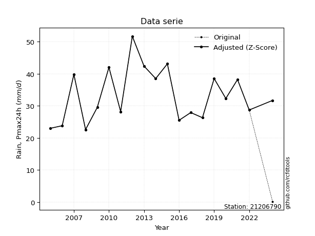</img>

</div>


> The initial value (value_initial) correspond to the initial obtained or null completed value, and value (value) is adjusted only when the initial value is outside the valid range (outlier) definite through the Z-Score value. If Z-Score is active, values out of range or outliers are replaced with the station mean value. A Z-Score (or standard score) measures how many standard deviations a data point is from the mean of a dataset, indicating its relative position; positive scores mean above the mean, negative mean below, and a score of zero is exactly at the mean, allowing for comparison of values from different distributions. It´s calculated using the formula $z=(x–μ)/σ$, where $x$ is the data point, $μ$ is the mean, and $σ$ is the standard deviation, helping identify outliers and understand probability.
>
> <sub>**Note**: In this study, "completing" (filling gaps in) and "extending" (forecasting or lengthening the historical record) rainfall data series are avoided for certain critical analyses because they introduce artificial bias and uncertainty, which can distort the statistics of rare events (extremes), alter day-to-day variability, and compromise the integrity and homogeneity of the original data. Some reasons against Completing/Extending rainfall data are: **Distortion of Extremes and Variability**: The primary issue is that most gap-filling or extension methods rely on averaging or regression with nearby stations, which inherently smooths the data. Rainfall is highly variable in space and time, with a large percentage of zero values and occasional large storms. Infilling methods often underestimate the highest values and overestimate the lowest (zero) values, which severely distorts analyses focused on flood frequency, drought severity, and intensity-duration-frequency (IDF) curves, **Loss of Data Homogeneity**: Infilled or extended data are synthetic estimates, not actual measurements. Combining these estimates with observed data can violate the assumption of data homogeneity, which requires that the data properties do not change over time. Inhomogeneity can lead to incorrect conclusions about long-term trends or changes in climate patterns, **Propagation of Errors**: Errors and biases from the original data (e.g., wind-induced undercatch, instrument errors, site changes) or the data used for imputation can propagate through the analysis, leading to unreliable hydrological models and inaccurate predictions, **Compromised Statistical Integrity**: For statistical analyses, especially those involving the frequency of events, using artificial data can introduce time bias or autocorrelation that doesn´t exist in reality, making it difficult to assess the true probability of events, **Difficulty in Validation**: It is difficult to accurately validate the quality of filled or extended data, especially for past periods where ground-truth measurements are unavailable. The reliability of imputation techniques heavily depends on the density of the surrounding station network and the complexity of the local topography.</sub>


### 4. Active continuous probability distributions from SciPy (80 of 104 available)

A Probability Density Function (PDF) describes the relative likelihood of a continuous random variable falling within a specific range, where the total area under its curve equals 1, and the area over any interval gives the actual probability for that range. Unlike discrete probabilities (like rolling a die), a PDF shows density, not direct probability for a single point (which is zero), with higher points indicating higher likelihood, often visualized as a bell curve for normal distributions.

A log of a probability density function (log-PDF) is simply the logarithm of the PDF´s value, denoted as $log(f(x))$, useful for converting multiplication of probabilities into addition, improving numerical stability with tiny numbers, and connecting to information theory concepts like entropy. Instead of dealing with very small probabilities (e.g., 0.000001), log-PDFs use negative numbers (e.g., $log(0.00001) ≈ -11.51$ that are easier for computers to handle, preventing underflow errors and simplifying complex calculations. In this study, each active probability distribution from SciPy is also evaluated in the $log$ form.

[scipy.stats](https://docs.scipy.org/doc/scipy/reference/stats.html) is a Python´s powerful submodule within the SciPy library for comprehensive statistical analysis, offering over 130 probability distributions (like Normal, Poisson, etc.), functions for descriptive stats (mean, variance), hypothesis testing (t-tests, chi-square), random variable generation, and statistical tests, making it essential for data science, modeling, and research. It provides tools to explore, model, and draw conclusions from data efficiently, working seamlessly with [NumPy](https://numpy.org/).

<div align="center">

|   id | p_dist           |   n_parameter | fit_method   | label                                                                       | active   | ref                                                                                                      |
|-----:|:-----------------|--------------:|:-------------|:----------------------------------------------------------------------------|:---------|:---------------------------------------------------------------------------------------------------------|
|    0 | alpha            |             3 | MLE          | Alpha                                                                       | True     | [:mortar_board:](https://docs.scipy.org/doc/scipy/reference/generated/scipy.stats.alpha.html)            |
|    1 | anglit           |             2 | MM           | Anglit                                                                      | True     | [:mortar_board:](https://docs.scipy.org/doc/scipy/reference/generated/scipy.stats.anglit.html)           |
|    2 | arcsine          |             2 | MM           | Arcsine                                                                     | True     | [:mortar_board:](https://docs.scipy.org/doc/scipy/reference/generated/scipy.stats.arcsine.html)          |
|    3 | argus            |             3 | MLE          | Argus                                                                       | True     | [:mortar_board:](https://docs.scipy.org/doc/scipy/reference/generated/scipy.stats.argus.html)            |
|    4 | beta             |             4 | MLE          | Beta                                                                        | True     | [:mortar_board:](https://docs.scipy.org/doc/scipy/reference/generated/scipy.stats.beta.html)             |
|    5 | betaprime        |             4 | MLE          | Beta prime                                                                  | True     | [:mortar_board:](https://docs.scipy.org/doc/scipy/reference/generated/scipy.stats.betaprime.html)        |
|    6 | bradford         |             3 | MLE          | Bradford                                                                    | True     | [:mortar_board:](https://docs.scipy.org/doc/scipy/reference/generated/scipy.stats.bradford.html)         |
|    7 | burr             |             4 | MLE          | Burr (Type III)                                                             | True     | [:mortar_board:](https://docs.scipy.org/doc/scipy/reference/generated/scipy.stats.burr.html)             |
|    8 | burr12           |             4 | MLE          | Burr (Type III) 12                                                          | True     | [:mortar_board:](https://docs.scipy.org/doc/scipy/reference/generated/scipy.stats.burr12.html)           |
|    9 | cosine           |             2 | MLE          | Cosine                                                                      | True     | [:mortar_board:](https://docs.scipy.org/doc/scipy/reference/generated/scipy.stats.cosine.html)           |
|   10 | crystalball      |             4 | MLE          | Crystalball                                                                 | True     | [:mortar_board:](https://docs.scipy.org/doc/scipy/reference/generated/scipy.stats.crystalball.html)      |
|   11 | dgamma           |             3 | MLE          | Double gamma                                                                | True     | [:mortar_board:](https://docs.scipy.org/doc/scipy/reference/generated/scipy.stats.dgamma.html)           |
|   12 | dweibull         |             3 | MLE          | Double Weibull                                                              | True     | [:mortar_board:](https://docs.scipy.org/doc/scipy/reference/generated/scipy.stats.dweibull.html)         |
|   13 | erlang           |             3 | MLE          | Erlang                                                                      | True     | [:mortar_board:](https://docs.scipy.org/doc/scipy/reference/generated/scipy.stats.erlang.html)           |
|   14 | exponnorm        |             3 | MLE          | Exponentially modified Normal                                               | True     | [:mortar_board:](https://docs.scipy.org/doc/scipy/reference/generated/scipy.stats.exponnorm.html)        |
|   15 | exponpow         |             3 | MLE          | Exponential power                                                           | True     | [:mortar_board:](https://docs.scipy.org/doc/scipy/reference/generated/scipy.stats.exponpow.html)         |
|   16 | exponweib        |             4 | MLE          | Exponentiated Weibull                                                       | True     | [:mortar_board:](https://docs.scipy.org/doc/scipy/reference/generated/scipy.stats.exponweib.html)        |
|   17 | f                |             4 | MLE          | F                                                                           | True     | [:mortar_board:](https://docs.scipy.org/doc/scipy/reference/generated/scipy.stats.f.html)                |
|   18 | fatiguelife      |             3 | MLE          | Fatigue-life (Birnbaum-Saunders)                                            | True     | [:mortar_board:](https://docs.scipy.org/doc/scipy/reference/generated/scipy.stats.fatiguelife.html)      |
|   19 | foldnorm         |             3 | MM           | Fold Normal                                                                 | True     | [:mortar_board:](https://docs.scipy.org/doc/scipy/reference/generated/scipy.stats.foldnorm.html)         |
|   20 | gamma            |             3 | MLE          | Gamma                                                                       | True     | [:mortar_board:](https://docs.scipy.org/doc/scipy/reference/generated/scipy.stats.gamma.html)            |
|   21 | gausshyper       |             6 | MLE          | Gauss hypergeometric                                                        | True     | [:mortar_board:](https://docs.scipy.org/doc/scipy/reference/generated/scipy.stats.gausshyper.html)       |
|   22 | genexpon         |             5 | MLE          | Generalized exponential                                                     | True     | [:mortar_board:](https://docs.scipy.org/doc/scipy/reference/generated/scipy.stats.genexpon.html)         |
|   23 | genextreme       |             3 | MLE          | Generalized exponential                                                     | True     | [:mortar_board:](https://docs.scipy.org/doc/scipy/reference/generated/scipy.stats.genextreme.html)       |
|   24 | gengamma         |             4 | MLE          | Generalized gamma                                                           | True     | [:mortar_board:](https://docs.scipy.org/doc/scipy/reference/generated/scipy.stats.gengamma.html)         |
|   25 | genhalflogistic  |             3 | MLE          | Generalized half-logistic                                                   | True     | [:mortar_board:](https://docs.scipy.org/doc/scipy/reference/generated/scipy.stats.genhalflogistic.html)  |
|   26 | genlogistic      |             3 | MLE          | Generalized logistic                                                        | True     | [:mortar_board:](https://docs.scipy.org/doc/scipy/reference/generated/scipy.stats.genlogistic.html)      |
|   27 | gennorm          |             3 | MLE          | Generalized Normal                                                          | True     | [:mortar_board:](https://docs.scipy.org/doc/scipy/reference/generated/scipy.stats.gennorm.html)          |
|   28 | genpareto        |             3 | MLE          | Generalized Pareto                                                          | True     | [:mortar_board:](https://docs.scipy.org/doc/scipy/reference/generated/scipy.stats.genpareto.html)        |
|   29 | gompertz         |             3 | MLE          | Gompertz (or truncated Gumbel)                                              | True     | [:mortar_board:](https://docs.scipy.org/doc/scipy/reference/generated/scipy.stats.gompertz.html)         |
|   30 | gumbel_l         |             2 | MM           | Gumbel Left Skew                                                            | True     | [:mortar_board:](https://docs.scipy.org/doc/scipy/reference/generated/scipy.stats.gumbel_l.html)         |
|   31 | gumbel_r         |             2 | MM           | Gumbel Right Skew                                                           | True     | [:mortar_board:](https://docs.scipy.org/doc/scipy/reference/generated/scipy.stats.gumbel_r.html)         |
|   32 | halfgennorm      |             3 | MLE          | Upper half of a generalized normal                                          | True     | [:mortar_board:](https://docs.scipy.org/doc/scipy/reference/generated/scipy.stats.halfgennorm.html)      |
|   33 | halflogistic     |             2 | MM           | Half-logistic                                                               | True     | [:mortar_board:](https://docs.scipy.org/doc/scipy/reference/generated/scipy.stats.halflogistic.html)     |
|   34 | halfnorm         |             2 | MM           | Half Normal                                                                 | True     | [:mortar_board:](https://docs.scipy.org/doc/scipy/reference/generated/scipy.stats.halfnorm.html)         |
|   35 | hypsecant        |             2 | MM           | hyperbolic secant                                                           | True     | [:mortar_board:](https://docs.scipy.org/doc/scipy/reference/generated/scipy.stats.hypsecant.html)        |
|   36 | invgamma         |             3 | MLE          | Inverted gamma                                                              | True     | [:mortar_board:](https://docs.scipy.org/doc/scipy/reference/generated/scipy.stats.invgamma.html)         |
|   37 | invgauss         |             3 | MLE          | Inverse Gaussian                                                            | True     | [:mortar_board:](https://docs.scipy.org/doc/scipy/reference/generated/scipy.stats.invgauss.html)         |
|   38 | invweibull       |             3 | MLE          | Inverted Weibull                                                            | True     | [:mortar_board:](https://docs.scipy.org/doc/scipy/reference/generated/scipy.stats.invweibull.html)       |
|   39 | johnsonsb        |             4 | MLE          | Johnson SB                                                                  | True     | [:mortar_board:](https://docs.scipy.org/doc/scipy/reference/generated/scipy.stats.johnsonsb.html)        |
|   40 | johnsonsu        |             4 | MLE          | Johnson Su                                                                  | True     | [:mortar_board:](https://docs.scipy.org/doc/scipy/reference/generated/scipy.stats.johnsonsu.html)        |
|   41 | kappa3           |             3 | MLE          | Kappa 3                                                                     | True     | [:mortar_board:](https://docs.scipy.org/doc/scipy/reference/generated/scipy.stats.kappa3.html)           |
|   42 | kappa4           |             4 | MLE          | Kappa 4                                                                     | True     | [:mortar_board:](https://docs.scipy.org/doc/scipy/reference/generated/scipy.stats.kappa4.html)           |
|   43 | ksone            |             3 | MLE          | Kolmogorov-Smirnov one-sided test statistic distribution                    | True     | [:mortar_board:](https://docs.scipy.org/doc/scipy/reference/generated/scipy.stats.ksone.html)            |
|   44 | kstwobign        |             2 | MLE          | Limiting distribution of scaled Kolmogorov-Smirnov two-sided test statistic | True     | [:mortar_board:](https://docs.scipy.org/doc/scipy/reference/generated/scipy.stats.kstwobign.html)        |
|   45 | laplace          |             2 | MM           | Laplace                                                                     | True     | [:mortar_board:](https://docs.scipy.org/doc/scipy/reference/generated/scipy.stats.laplace.html)          |
|   46 | levy_l           |             2 | MLE          | Left-skewed Levy                                                            | True     | [:mortar_board:](https://docs.scipy.org/doc/scipy/reference/generated/scipy.stats.levy_l.html)           |
|   47 | loggamma         |             3 | MLE          | Log gamma                                                                   | True     | [:mortar_board:](https://docs.scipy.org/doc/scipy/reference/generated/scipy.stats.loggamma.html)         |
|   48 | logistic         |             2 | MM           | Logistic (or Sech-squared)                                                  | True     | [:mortar_board:](https://docs.scipy.org/doc/scipy/reference/generated/scipy.stats.logistic.html)         |
|   49 | loglaplace       |             3 | MLE          | Log-Laplace                                                                 | True     | [:mortar_board:](https://docs.scipy.org/doc/scipy/reference/generated/scipy.stats.loglaplace.html)       |
|   50 | lomax            |             3 | MLE          | Lomax (Pareto of the second kind)                                           | True     | [:mortar_board:](https://docs.scipy.org/doc/scipy/reference/generated/scipy.stats.lomax.html)            |
|   51 | maxwell          |             2 | MM           | Maxwell                                                                     | True     | [:mortar_board:](https://docs.scipy.org/doc/scipy/reference/generated/scipy.stats.maxwell.html)          |
|   52 | mielke           |             4 | MLE          | Mielke Beta-Kappa / Dagum                                                   | True     | [:mortar_board:](https://docs.scipy.org/doc/scipy/reference/generated/scipy.stats.mielke.html)           |
|   53 | moyal            |             2 | MM           | Moyal                                                                       | True     | [:mortar_board:](https://docs.scipy.org/doc/scipy/reference/generated/scipy.stats.moyal.html)            |
|   54 | nakagami         |             3 | MLE          | Nakagami                                                                    | True     | [:mortar_board:](https://docs.scipy.org/doc/scipy/reference/generated/scipy.stats.nakagami.html)         |
|   55 | ncf              |             5 | MLE          | Non-central F distribution                                                  | True     | [:mortar_board:](https://docs.scipy.org/doc/scipy/reference/generated/scipy.stats.ncf.html)              |
|   56 | nct              |             4 | MLE          | Non-central Student’s t                                                     | True     | [:mortar_board:](https://docs.scipy.org/doc/scipy/reference/generated/scipy.stats.nct.html)              |
|   57 | norm             |             2 | MM           | Normal                                                                      | True     | [:mortar_board:](https://docs.scipy.org/doc/scipy/reference/generated/scipy.stats.norm.html)             |
|   58 | pearson3         |             3 | MM           | Pearson type III                                                            | True     | [:mortar_board:](https://docs.scipy.org/doc/scipy/reference/generated/scipy.stats.pearson3.html)         |
|   59 | powerlaw         |             3 | MLE          | Power-function                                                              | True     | [:mortar_board:](https://docs.scipy.org/doc/scipy/reference/generated/scipy.stats.powerlaw.html)         |
|   60 | rayleigh         |             2 | MM           | Rayleigh                                                                    | True     | [:mortar_board:](https://docs.scipy.org/doc/scipy/reference/generated/scipy.stats.rayleigh.html)         |
|   61 | rdist            |             3 | MLE          | R-distributed (symmetric beta)                                              | True     | [:mortar_board:](https://docs.scipy.org/doc/scipy/reference/generated/scipy.stats.rdist.html)            |
|   62 | rice             |             3 | MLE          | Rice                                                                        | True     | [:mortar_board:](https://docs.scipy.org/doc/scipy/reference/generated/scipy.stats.rice.html)             |
|   63 | semicircular     |             2 | MM           | Semicircular                                                                | True     | [:mortar_board:](https://docs.scipy.org/doc/scipy/reference/generated/scipy.stats.semicircular.html)     |
|   64 | skewnorm         |             3 | MLE          | Skew normal                                                                 | True     | [:mortar_board:](https://docs.scipy.org/doc/scipy/reference/generated/scipy.stats.skewnorm.html)         |
|   65 | t                |             3 | MLE          | Student’s t                                                                 | True     | [:mortar_board:](https://docs.scipy.org/doc/scipy/reference/generated/scipy.stats.t.html)                |
|   66 | trapezoid        |             4 | MLE          | Trapezoid                                                                   | True     | [:mortar_board:](https://docs.scipy.org/doc/scipy/reference/generated/scipy.stats.trapezoid.html)        |
|   67 | triang           |             3 | MLE          | Triangular                                                                  | True     | [:mortar_board:](https://docs.scipy.org/doc/scipy/reference/generated/scipy.stats.triang.html)           |
|   68 | truncexpon       |             3 | MLE          | Truncated exponential                                                       | True     | [:mortar_board:](https://docs.scipy.org/doc/scipy/reference/generated/scipy.stats.truncexpon.html)       |
|   69 | truncnorm        |             4 | MLE          | Truncated normal                                                            | True     | [:mortar_board:](https://docs.scipy.org/doc/scipy/reference/generated/scipy.stats.truncnorm.html)        |
|   70 | truncpareto      |             4 | MLE          | Upper truncated Pareto                                                      | True     | [:mortar_board:](https://docs.scipy.org/doc/scipy/reference/generated/scipy.stats.truncpareto.html)      |
|   71 | truncweibull_min |             5 | MLE          | Doubly truncated Weibull minimum                                            | True     | [:mortar_board:](https://docs.scipy.org/doc/scipy/reference/generated/scipy.stats.truncweibull_min.html) |
|   72 | tukeylambda      |             3 | MLE          | Tukey-Lamdba                                                                | True     | [:mortar_board:](https://docs.scipy.org/doc/scipy/reference/generated/scipy.stats.tukeylambda.html)      |
|   73 | uniform          |             2 | MLE          | Uniform                                                                     | True     | [:mortar_board:](https://docs.scipy.org/doc/scipy/reference/generated/scipy.stats.uniform.html)          |
|   74 | vonmises         |             3 | MLE          | Von Mises                                                                   | True     | [:mortar_board:](https://docs.scipy.org/doc/scipy/reference/generated/scipy.stats.vonmises.html)         |
|   75 | vonmises_line    |             3 | MLE          | Von Mises line                                                              | True     | [:mortar_board:](https://docs.scipy.org/doc/scipy/reference/generated/scipy.stats.vonmises_line.html)    |
|   76 | wald             |             2 | MM           | Wald                                                                        | True     | [:mortar_board:](https://docs.scipy.org/doc/scipy/reference/generated/scipy.stats.wald.html)             |
|   77 | weibull_max      |             3 | MLE          | Weibull maximum                                                             | True     | [:mortar_board:](https://docs.scipy.org/doc/scipy/reference/generated/scipy.stats.weibull_max.html)      |
|   78 | weibull_min      |             3 | MLE          | Weibull minimum                                                             | True     | [:mortar_board:](https://docs.scipy.org/doc/scipy/reference/generated/scipy.stats.weibull_min.html)      |
|   79 | wrapcauchy       |             3 | MLE          | Wrapped  Cauchy                                                             | True     | [:mortar_board:](https://docs.scipy.org/doc/scipy/reference/generated/scipy.stats.wrapcauchy.html)       |

</div>

> **n_parameter:** # arguments & localization & scale.
>
> **Fit methods:** (MLE) maximum likelihood, (MM) L-moments.
>
>**Inactive** (With the only purpose of prevent loops, zero divisions, infinite values, over high estimated values or horizontal trending for recurrence intervals estimations, the follow distributions were disabled.)**:** lognorm, norminvgauss, powernorm, powerlognorm, cauchy, halfcauchy, foldcauchy, skewcauchy, chi2, expon, fisk, genhyperbolic, geninvgauss, gibrat, kstwo, laplace_asymmetric, levy, levy_stable, ncx2, pareto, rel_breitwigner, recipinvgauss, studentized_range, loguniform, 


## B. Probability (PDF) vs. Empirical (EDF) distributions functions

A continuous probability distribution (CPD) describes probabilities for variables that can take any value within a range (like rain any time), unlike discrete variables with specific outcomes (like temperature). It uses a Probability Density Function (PDF), a curve where the total area under it equals 1, and the probability of the variable falling within an interval (a to b) is found by calculating the area under the curve between those points. A key feature is that the probability of hitting any single exact value is zero, so probabilities are always expressed for ranges, e.g., $P(a ≤ X ≤ b)$.

<div align="center">

Distributions parameters from station values
|     |   station | p_dist              |   n |               loc |            scale | shape                  | shape1                | shape2                 | shape3             |
|----:|----------:|:--------------------|----:|------------------:|-----------------:|:-----------------------|:----------------------|:-----------------------|:-------------------|
|   0 |  21206790 | alpha               |  19 |     -11.5089      |    252.295       | 5.80075337307381       |                       |                        |                    |
|   1 |  21206790 | anglit              |  19 |      33.3521      |     23.5224      |                        |                       |                        |                    |
|   2 |  21206790 | arcsine             |  19 |      21.9807      |     22.7427      |                        |                       |                        |                    |
|   3 |  21206790 | argus               |  19 |      13.5396      |     38.8005      | 2.639686706835267e-05  |                       |                        |                    |
|   4 |  21206790 | beta                |  19 |      22.6         |     35.4116      | 0.8693015932020889     | 2.0576277855406313    |                        |                    |
|   5 |  21206790 | betaprime           |  19 |      -0.772159    |     19.2666      | 50.9019190041862       | 29.738693197714554    |                        |                    |
|   6 |  21206790 | bradford            |  19 |      22.6         |     29.1001      | 0.9419305905937718     |                       |                        |                    |
|   7 |  21206790 | burr                |  19 |     -23.1257      |     16.4307      | 8.388100146046842      | 16226.671837854312    |                        |                    |
|   8 |  21206790 | burr12              |  19 |     -13.7522      |     36.2714      | 1202.430922617928      | 0.0033654179380087678 |                        |                    |
|   9 |  21206790 | cosine              |  19 |      34.2032      |      6.9723      |                        |                       |                        |                    |
|  10 |  21206790 | crystalball         |  19 |      33.3521      |      8.04076     | 1888.7295512773912     | 1775.0344349730005    |                        |                    |
|  11 |  21206790 | dgamma              |  19 |      30.9505      |      3.70326     | 1.872307414025895      |                       |                        |                    |
|  12 |  21206790 | dweibull            |  19 |      34.5066      |      8.24527     | 2.146531762251948      |                       |                        |                    |
|  13 |  21206790 | erlang              |  19 |      22.6         |     13.09        | 0.5931415755714347     |                       |                        |                    |
|  14 |  21206790 | exponnorm           |  19 |      22.583       |      0.00675882  | 1582.3449044169247     |                       |                        |                    |
|  15 |  21206790 | exponpow            |  19 |      22.6         |     17.0246      | 0.737366711452431      |                       |                        |                    |
|  16 |  21206790 | exponweib           |  19 |      22.6         |      1.15534     | 1.576346472352176      | 0.3973866397035849    |                        |                    |
|  17 |  21206790 | f                   |  19 |      17.32        |     14.8489      | 11.342684202677427     | 16.13618186346879     |                        |                    |
|  18 |  21206790 | fatiguelife         |  19 |      18.1478      |     12.8607      | 0.6017164661949773     |                       |                        |                    |
|  19 |  21206790 | foldnorm            |  19 |      20.0985      |      9.08316     | 1.3830134085527783     |                       |                        |                    |
|  20 |  21206790 | gamma               |  19 |      22.6         |     14.3454      | 0.8372903703310299     |                       |                        |                    |
|  21 |  21206790 | gausshyper          |  19 |      22.6         |     29.5456      | 0.7878330222520766     | 1.1310857489328265    | 0.9832975958638233     | 1.0694351923987502 |
|  22 |  21206790 | genexpon            |  19 |      22.6         |      2.56909     | 0.23891192358315927    | 2.893311536737814e-07 | 1.4139546925845041     |                    |
|  23 |  21206790 | genextreme          |  19 |      29.5484      |      6.51593     | 0.0036463178419246086  |                       |                        |                    |
|  24 |  21206790 | gengamma            |  19 |      22.6         |      1.33518     | 1.1277297383947955     | 0.3623623927665769    |                        |                    |
|  25 |  21206790 | genhalflogistic     |  19 |      22.6         |     10.5762      | 0.25876575622844616    |                       |                        |                    |
|  26 |  21206790 | genlogistic         |  19 |     -15.3444      |      6.49772     | 997.4311200303455      |                       |                        |                    |
|  27 |  21206790 | gennorm             |  19 |      34.4326      |     13.5092      | 3.7083884564268166     |                       |                        |                    |
|  28 |  21206790 | genpareto           |  19 |      -0.15485     |     64.4545      | -1.242979334008559     |                       |                        |                    |
|  29 |  21206790 | gompertz            |  19 |      22.6         |     19.3568      | 1.100879043923538      |                       |                        |                    |
|  30 |  21206790 | gumbel_l            |  19 |      36.9708      |      6.26935     |                        |                       |                        |                    |
|  31 |  21206790 | gumbel_r            |  19 |      29.7333      |      6.26935     |                        |                       |                        |                    |
|  32 |  21206790 | halfgennorm         |  19 |      22.6         |      1.30742     | 0.44893056189965985    |                       |                        |                    |
|  33 |  21206790 | halflogistic        |  19 |      23.8219      |      6.87457     |                        |                       |                        |                    |
|  34 |  21206790 | halfnorm            |  19 |      22.7093      |     13.3388      |                        |                       |                        |                    |
|  35 |  21206790 | hypsecant           |  19 |      33.3521      |      5.11891     |                        |                       |                        |                    |
|  36 |  21206790 | invgamma            |  19 |       8.5366      |    218.266       | 9.764987775351885      |                       |                        |                    |
|  37 |  21206790 | invgauss            |  19 |      16.7296      |     55.3624      | 0.3002480133000063     |                       |                        |                    |
|  38 |  21206790 | invweibull          |  19 |      -3.13559e+07 |      3.13559e+07 | 4820572.532521376      |                       |                        |                    |
|  39 |  21206790 | johnsonsb           |  19 |      22.5234      |     29.6455      | 0.43423790760047404    | 0.47998904470265297   |                        |                    |
|  40 |  21206790 | johnsonsu           |  19 |      16.7534      |      0.733205    | -7.110588044884782     | 1.9295144298384357    |                        |                    |
|  41 |  21206790 | kappa3              |  19 |      22.6         |     16.9915      | 7.861026250567091      |                       |                        |                    |
|  42 |  21206790 | kappa4              |  19 |      17.2792      |     32.9813      | 1.1912822185009118     | 0.9445723789714797    |                        |                    |
|  43 |  21206790 | ksone               |  19 |      19.69        |     34.92        | 1.0                    |                       |                        |                    |
|  44 |  21206790 | kstwobign           |  19 |       6.93046     |     30.246       |                        |                       |                        |                    |
|  45 |  21206790 | laplace             |  19 |      33.3521      |      5.68568     |                        |                       |                        |                    |
|  46 |  21206790 | levy_l              |  19 |      53.5078      |     12.4798      |                        |                       |                        |                    |
|  47 |  21206790 | loggamma            |  19 |   -2561.85        |    345.795       | 1817.7133637520492     |                       |                        |                    |
|  48 |  21206790 | logistic            |  19 |      33.3521      |      4.4331      |                        |                       |                        |                    |
|  49 |  21206790 | loglaplace          |  19 |      -0.107119    |     31.7966      | 4.812471399917804      |                       |                        |                    |
|  50 |  21206790 | lomax               |  19 |      22.6         |   1725.25        | 160.92826207912043     |                       |                        |                    |
|  51 |  21206790 | maxwell             |  19 |      14.2989      |     11.9398      |                        |                       |                        |                    |
|  52 |  21206790 | mielke              |  19 |     -37.6922      |     33.9978      | 13699.943705347614     | 10.583504441375851    |                        |                    |
|  53 |  21206790 | moyal               |  19 |      28.7539      |      3.61961     |                        |                       |                        |                    |
|  54 |  21206790 | nakagami            |  19 |      22.6         |     12.0903      | 0.3945433080458731     |                       |                        |                    |
|  55 |  21206790 | ncf                 |  19 |      -1.61708     |     34.8019      | 42.74751757640129      | 429.6601932038393     | 1.0091010142841369e-05 |                    |
|  56 |  21206790 | nct                 |  19 |      -0.103759    |      0.887061    | 9.703608010323308      | 34.76242001271592     |                        |                    |
|  57 |  21206790 | norm                |  19 |      33.3521      |      8.04076     |                        |                       |                        |                    |
|  58 |  21206790 | pearson3            |  19 |      33.3521      |      8.04075     | 0.46817664716233676    |                       |                        |                    |
|  59 |  21206790 | powerlaw            |  19 |      22.6         |     29.1         | 0.31353366830987794    |                       |                        |                    |
|  60 |  21206790 | rayleigh            |  19 |      17.9696      |     12.2734      |                        |                       |                        |                    |
|  61 |  21206790 | rdist               |  19 |      21.8469      |     17.9531      | 1.0148322744080702     |                       |                        |                    |
|  62 |  21206790 | rice                |  19 |      19.2255      |     11.4937      | 0.0015612838981280356  |                       |                        |                    |
|  63 |  21206790 | semicircular        |  19 |      33.3521      |     16.0815      |                        |                       |                        |                    |
|  64 |  21206790 | skewnorm            |  19 |      22.6         |     13.4259      | 49667314.47073127      |                       |                        |                    |
|  65 |  21206790 | t                   |  19 |      33.3561      |      8.04302     | 136262.90503501653     |                       |                        |                    |
|  66 |  21206790 | trapezoid           |  19 |      19.69        |     34.92        | 1.0                    | 1.0                   |                        |                    |
|  67 |  21206790 | triang              |  19 |      13.2767      |     39.9572      | 0.9616134996302936     |                       |                        |                    |
|  68 |  21206790 | truncexpon          |  19 |      22.6         |     26.7595      | 1.0874644727800424     |                       |                        |                    |
|  69 |  21206790 | truncnorm           |  19 |      26.2014      |     11.7785      | -0.3057579357060731    | 163.9943007163506     |                        |                    |
|  70 |  21206790 | truncpareto         |  19 |      15.8017      |      6.79833     | 9.869519976479499e-08  | 5.280460957877351     |                        |                    |
|  71 |  21206790 | truncweibull_min    |  19 |      22.5897      |     28.5381      | 0.9486090798075546     | 0.0003616768669521226 | 1.0200523795219518     |                    |
|  72 |  21206790 | tukeylambda         |  19 |      32.8515      |     11.3518      | 1.107337827795353      |                       |                        |                    |
|  73 |  21206790 | uniform             |  19 |      22.6         |     29.1         |                        |                       |                        |                    |
|  74 |  21206790 | vonmises            |  19 |       0.131202    |      1           | 0.07989173922962954    |                       |                        |                    |
|  75 |  21206790 | vonmises_line       |  19 |      37.1932      |      4.64516     | 3.457029927948408e-05  |                       |                        |                    |
|  76 |  21206790 | wald                |  19 |      25.3113      |      8.04075     |                        |                       |                        |                    |
|  77 |  21206790 | weibull_max         |  19 |      51.7         |      1.41205     | 0.2937574982907333     |                       |                        |                    |
|  78 |  21206790 | weibull_min         |  19 |      22.504       |     11.2277      | 1.1183938679811996     |                       |                        |                    |
|  79 |  21206790 | wrapcauchy          |  19 |      22.6         |      4.63144     | 0.041193990685223975   |                       |                        |                    |
|  80 |  21206790 | logalpha            |  19 |      -0.67895     |     72.6474      | 17.530774908749923     |                       |                        |                    |
|  81 |  21206790 | loganglit           |  19 |       3.4786      |      0.696578    |                        |                       |                        |                    |
|  82 |  21206790 | logarcsine          |  19 |       3.14185     |      0.673499    |                        |                       |                        |                    |
|  83 |  21206790 | logargus            |  19 |       2.91759     |      1.04682     | 7.99804611863425e-05   |                       |                        |                    |
|  84 |  21206790 | logbeta             |  19 |       3.11792     |      0.827538    | 0.5640515401550059     | 0.7188607039565811    |                        |                    |
|  85 |  21206790 | logbetaprime        |  19 |      -3.43403     |     12.5987      | 472.0497713937474      | 860.7006069942424     |                        |                    |
|  86 |  21206790 | logbradford         |  19 |       3.11795     |      0.827509    | 1.0915447967753282     |                       |                        |                    |
|  87 |  21206790 | logburr             |  19 |      -0.0527568   |      2.59603     | 16.65681908767239      | 93.66482387949628     |                        |                    |
|  88 |  21206790 | logburr12           |  19 |      -0.0417214   |      3.82996     | 18.656537278078453     | 3.3949018241403675    |                        |                    |
|  89 |  21206790 | logcosine           |  19 |       3.48694     |      0.197726    |                        |                       |                        |                    |
|  90 |  21206790 | logcrystalball      |  19 |       3.4786      |      0.238113    | 180.1874522931981      | 1.1151903006882127    |                        |                    |
|  91 |  21206790 | logdgamma           |  19 |       3.53288     |      0.0574453   | 3.8011559975629488     |                       |                        |                    |
|  92 |  21206790 | logdweibull         |  19 |       3.43481     |      0.233718    | 1.7126426682191047     |                       |                        |                    |
|  93 |  21206790 | logerlang           |  19 |       1.89316     |      0.0358344   | 44.27277251769169      |                       |                        |                    |
|  94 |  21206790 | logexponnorm        |  19 |       3.44711     |      0.236023    | 0.13342617157980174    |                       |                        |                    |
|  95 |  21206790 | logexponpow         |  19 |       3.11795     |      0.583158    | 0.8133799413540648     |                       |                        |                    |
|  96 |  21206790 | logexponweib        |  19 |       3.11795     |      0.464813    | 0.6426037341827595     | 1.4265713629554269    |                        |                    |
|  97 |  21206790 | logf                |  19 |       1.57602     |      1.88196     | 416.47228654450527     | 183.7645757143382     |                        |                    |
|  98 |  21206790 | logfatiguelife      |  19 |       2.38395     |      1.06821     | 0.22247689259561354    |                       |                        |                    |
|  99 |  21206790 | logfoldnorm         |  19 |       3.04413     |      0.255245    | 1.6622216782991726     |                       |                        |                    |
| 100 |  21206790 | loggamma            |  19 |       1.69218     |      0.0317326   | 56.25929054576483      |                       |                        |                    |
| 101 |  21206790 | loggausshyper       |  19 |       3.11795     |      0.828288    | 0.9625924063033381     | 0.9143817715348163    | 1.0283674685908242     | 1.1650677726767422 |
| 102 |  21206790 | loggenexpon         |  19 |       3.11795     |      0.468867    | 0.7389045001338945     | 1.283895399098501     | 1.1620683331135369     |                    |
| 103 |  21206790 | loggenextreme       |  19 |       3.39283     |      0.229923    | 0.26816207469104836    |                       |                        |                    |
| 104 |  21206790 | loggengamma         |  19 |       3.11795     |      0.552589    | 0.5405740747981498     | 1.6381100185525312    |                        |                    |
| 105 |  21206790 | loggenhalflogistic  |  19 |       3.04227     |      0.962421    | 1.0655850229841093     |                       |                        |                    |
| 106 |  21206790 | loggenlogistic      |  19 |       2.17016     |      0.207792    | 309.77028774151995     |                       |                        |                    |
| 107 |  21206790 | loggennorm          |  19 |       3.5317      |      0.413755    | 5096224.660289589      |                       |                        |                    |
| 108 |  21206790 | loggenpareto        |  19 |      -0.00112339  |      8.79457     | -2.228401611540276     |                       |                        |                    |
| 109 |  21206790 | loggompertz         |  19 |       3.11795     |      0.603159    | 1.0907452180978146     |                       |                        |                    |
| 110 |  21206790 | loggumbel_l         |  19 |       3.58577     |      0.185656    |                        |                       |                        |                    |
| 111 |  21206790 | loggumbel_r         |  19 |       3.37144     |      0.185656    |                        |                       |                        |                    |
| 112 |  21206790 | loghalfgennorm      |  19 |       3.11795     |      0.767775    | 7.522973009612244      |                       |                        |                    |
| 113 |  21206790 | loghalflogistic     |  19 |       3.19633     |      0.203614    |                        |                       |                        |                    |
| 114 |  21206790 | loghalfnorm         |  19 |       3.16348     |      0.394953    |                        |                       |                        |                    |
| 115 |  21206790 | loghypsecant        |  19 |       3.4786      |      0.151588    |                        |                       |                        |                    |
| 116 |  21206790 | loginvgamma         |  19 |      -1.94364     |   2810.59        | 519.4135014208891      |                       |                        |                    |
| 117 |  21206790 | loginvgauss         |  19 |       2.40663     |     20.3896      | 0.05252780081341868    |                       |                        |                    |
| 118 |  21206790 | loginvweibull       |  19 | -834813           | 834816           | 4014644.540114036      |                       |                        |                    |
| 119 |  21206790 | logjohnsonsb        |  19 |       3.11394     |      0.841907    | 0.2365238613989688     | 0.49376742790611666   |                        |                    |
| 120 |  21206790 | logjohnsonsu        |  19 |       2.09222     |      0.33418     | -12.588915174412662    | 5.949299236638508     |                        |                    |
| 121 |  21206790 | logkappa3           |  19 |       3.11444     |      0.826731    | 573.5396981173456      |                       |                        |                    |
| 122 |  21206790 | logkappa4           |  19 |       3.10485     |      0.902813    | 1.0140700020269737     | 1.074001152942909     |                        |                    |
| 123 |  21206790 | logksone            |  19 |       3.0352      |      0.993009    | 1.0                    |                       |                        |                    |
| 124 |  21206790 | logkstwobign        |  19 |       2.64016     |      0.957971    |                        |                       |                        |                    |
| 125 |  21206790 | loglaplace          |  19 |       3.4786      |      0.168372    |                        |                       |                        |                    |
| 126 |  21206790 | loglevy_l           |  19 |       3.98865     |      0.295928    |                        |                       |                        |                    |
| 127 |  21206790 | logloggamma         |  19 |     -59.6389      |      8.76121     | 1345.708439960128      |                       |                        |                    |
| 128 |  21206790 | loglogistic         |  19 |       3.4786      |      0.131279    |                        |                       |                        |                    |
| 129 |  21206790 | logloglaplace       |  19 |      -0.0809555   |      3.53694     | 17.075879272105823     |                       |                        |                    |
| 130 |  21206790 | loglomax            |  19 |       3.11795     |     16.8022      | 46.98737743481006      |                       |                        |                    |
| 131 |  21206790 | logmaxwell          |  19 |       2.91437     |      0.353578    |                        |                       |                        |                    |
| 132 |  21206790 | logmielke           |  19 |    -701.607       |    704.137       | 195104.90339850693     | 3420.385075103317     |                        |                    |
| 133 |  21206790 | logmoyal            |  19 |       3.34244     |      0.107189    |                        |                       |                        |                    |
| 134 |  21206790 | lognakagami         |  19 |       3.11795     |      0.481972    | 0.4555623932845266     |                       |                        |                    |
| 135 |  21206790 | logncf              |  19 |      -3.4867      |      6.96024     | 1189.4096940994632     | 798.2691180663842     | 0.04106457717136003    |                    |
| 136 |  21206790 | lognct              |  19 |      -0.317678    |      0.0401363   | 132.1207574652018      | 94.04766993709353     |                        |                    |
| 137 |  21206790 | lognorm             |  19 |       3.4786      |      0.238114    |                        |                       |                        |                    |
| 138 |  21206790 | logpearson3         |  19 |       3.4786      |      0.238114    | 0.14206279679125663    |                       |                        |                    |
| 139 |  21206790 | logpowerlaw         |  19 |       3.11795     |      0.827508    | 0.34713157548787804    |                       |                        |                    |
| 140 |  21206790 | lograyleigh         |  19 |       3.02308     |      0.363457    |                        |                       |                        |                    |
| 141 |  21206790 | logrdist            |  19 |       3.63764     |      0.519688    | 1.0558110853188132     |                       |                        |                    |
| 142 |  21206790 | logrice             |  19 |       3.02373     |      0.298346    | 0.9806032146488913     |                       |                        |                    |
| 143 |  21206790 | logsemicircular     |  19 |       3.4786      |      0.476227    |                        |                       |                        |                    |
| 144 |  21206790 | logskewnorm         |  19 |       3.11795     |      0.432161    | 2856118.379127424      |                       |                        |                    |
| 145 |  21206790 | logt                |  19 |       3.4786      |      0.238115    | 4333320340.481992      |                       |                        |                    |
| 146 |  21206790 | logtrapezoid        |  19 |       3.0352      |      0.993009    | 1.0                    | 1.0                   |                        |                    |
| 147 |  21206790 | logtriang           |  19 |       2.91892     |      1.08627     | 0.673627222213405      |                       |                        |                    |
| 148 |  21206790 | logtruncexpon       |  19 |       3.11795     |      1.00978     | 0.8194964540001373     |                       |                        |                    |
| 149 |  21206790 | logtruncnorm        |  19 |      -0.11097     |      1.29239     | 2.498413915372528      | 3.138709504287615     |                        |                    |
| 150 |  21206790 | logtruncpareto      |  19 |      -3.3234e+07  |      3.3234e+07  | 30239285.965523884     | 1.0000000248994674    |                        |                    |
| 151 |  21206790 | logtruncweibull_min |  19 |       3.11794     |      0.745883    | 0.8401549714290272     | 6.772762722306521e-06 | 1.109441334716109      |                    |
| 152 |  21206790 | logtukeylambda      |  19 |       3.5317      |      0.492278    | 1.1897839102836567     |                       |                        |                    |
| 153 |  21206790 | loguniform          |  19 |       3.11795     |      0.827508    |                        |                       |                        |                    |
| 154 |  21206790 | logvonmises         |  19 |      -2.8049      |      1           | 18.055291578434975     |                       |                        |                    |
| 155 |  21206790 | logvonmises_line    |  19 |       3.53184     |      0.131747    | 2.5336829734518007e-05 |                       |                        |                    |
| 156 |  21206790 | logwald             |  19 |       3.24053     |      0.238076    |                        |                       |                        |                    |
| 157 |  21206790 | logweibull_max      |  19 |       4.2503      |      0.857469    | 3.7296158699957314     |                       |                        |                    |
| 158 |  21206790 | logweibull_min      |  19 |       3.07168     |      0.454262    | 1.6960002355667982     |                       |                        |                    |
| 159 |  21206790 | logwrapcauchy       |  19 |       3.11795     |      0.131702    | 0.5                    |                       |                        |                    |

</div>

> **loc** (Location parameter): This shifts the distribution along the x-axis. For many common distributions, like the normal (Gaussian) distribution, loc represents the mean $μ$. For others, like the uniform distribution, it might represent the minimum value, or for the beta distribution, the left end of the support interval.
>
> **scale** (Scale parameter): This determines the width or spread of the distribution. For the normal distribution, scale represents the standard deviation $σ$. For a uniform distribution, it defines the length of the interval (from $loc$ to $loc + scale$).
>
> **shape** (Shape parameters): Refers to parameters that define the specific form of a probability distribution, distinct from its location (loc) and scale (scale). These parameters are required arguments for most distribution functions. For example, a normal (Gaussian) distribution is fully defined by its location (mean) and scale (standard deviation), so it has no specific shape parameters beyond loc and scale. However, other distributions have intrinsic properties that need specification, as Gamma distribution that takes a shape parameter, often named $a$ or $alpha$.


### 0. Cumulative distribution values - CDF (160 evaluated)

Cumulative Distribution Function (CDF), denoted as $F$<sub>$X$</sub>$(x)$, is a function that gives the probability that a random variable $X$ will take a value less than or equal to a specific value, $x$ (i.e., $(P(X≥x)$. It essentially "accumulates" probabilities from a given point up to the far right (positive infinity), providing a complete picture of the distribution´s probabilities for both discrete (like rain) and continuous (like temperature) variables, helping to find probabilities over ranges or above certain values. Each station is evaluated separately ordering the $x$ values ascending, calculating the CDF and PDF values for the activated distributions and their logarithmic forms.

<div align="center">

CDF ordered by x ascending and calculating $log(f(x))$ separately
|   id |   Station |   date |       x |   count |    mean |     std |     zscore |   Value_initial |   station |   m |     alpha |   alpha_pdf |   anglit |   anglit_pdf |   arcsine |   arcsine_pdf |     argus |   argus_pdf |        beta |   beta_pdf |   betaprime |   betaprime_pdf |    bradford |   bradford_pdf |      burr |   burr_pdf |     burr12 |   burr12_pdf |    cosine |   cosine_pdf |   crystalball |   crystalball_pdf |   dgamma |   dgamma_pdf |   dweibull |   dweibull_pdf |      erlang |      erlang_pdf |   exponnorm |   exponnorm_pdf |    exponpow |   exponpow_pdf |   exponweib |   exponweib_pdf |         f |      f_pdf |   fatiguelife |   fatiguelife_pdf |   foldnorm |   foldnorm_pdf |       gamma |   gamma_pdf |   gausshyper |   gausshyper_pdf |   genexpon |   genexpon_pdf |   genextreme |   genextreme_pdf |    gengamma |   gengamma_pdf |   genhalflogistic |   genhalflogistic_pdf |   genlogistic |   genlogistic_pdf |   gennorm |   gennorm_pdf |   genpareto |   genpareto_pdf |    gompertz |   gompertz_pdf |   gumbel_l |   gumbel_l_pdf |   gumbel_r |   gumbel_r_pdf |   halfgennorm |   halfgennorm_pdf |   halflogistic |   halflogistic_pdf |   halfnorm |   halfnorm_pdf |   hypsecant |   hypsecant_pdf |   invgamma |   invgamma_pdf |   invgauss |   invgauss_pdf |   invweibull |   invweibull_pdf |   johnsonsb |   johnsonsb_pdf |   johnsonsu |   johnsonsu_pdf |      kappa3 |   kappa3_pdf |      kappa4 |   kappa4_pdf |     ksone |   ksone_pdf |   kstwobign |   kstwobign_pdf |   laplace |   laplace_pdf |   levy_l |   levy_l_pdf |   loggamma |   loggamma_pdf |   logistic |   logistic_pdf |   loglaplace |   loglaplace_pdf |       lomax |   lomax_pdf |   maxwell |   maxwell_pdf |   mielke |   mielke_pdf |     moyal |   moyal_pdf |    nakagami |   nakagami_pdf |       ncf |    ncf_pdf |       nct |    nct_pdf |      norm |   norm_pdf |   pearson3 |   pearson3_pdf |    powerlaw |   powerlaw_pdf |   rayleigh |   rayleigh_pdf |    rdist |      rdist_pdf |      rice |   rice_pdf |   semicircular |   semicircular_pdf |   skewnorm |   skewnorm_pdf |         t |      t_pdf |   trapezoid |   trapezoid_pdf |    triang |   triang_pdf |   truncexpon |   truncexpon_pdf |   truncnorm |   truncnorm_pdf |   truncpareto |   truncpareto_pdf |   truncweibull_min |   truncweibull_min_pdf |   tukeylambda |   tukeylambda_pdf |   uniform |   uniform_pdf |   vonmises |   vonmises_pdf |   vonmises_line |   vonmises_line_pdf |        wald |    wald_pdf |   weibull_max |   weibull_max_pdf |   weibull_min |   weibull_min_pdf |   wrapcauchy |   wrapcauchy_pdf |   logalpha |   logalpha_pdf |   loganglit |   loganglit_pdf |   logarcsine |   logarcsine_pdf |   logargus |   logargus_pdf |    logbeta |   logbeta_pdf |   logbetaprime |   logbetaprime_pdf |   logbradford |   logbradford_pdf |   logburr |   logburr_pdf |   logburr12 |   logburr12_pdf |   logcosine |   logcosine_pdf |   logcrystalball |   logcrystalball_pdf |   logdgamma |   logdgamma_pdf |   logdweibull |   logdweibull_pdf |   logerlang |   logerlang_pdf |   logexponnorm |   logexponnorm_pdf |   logexponpow |   logexponpow_pdf |   logexponweib |   logexponweib_pdf |      logf |   logf_pdf |   logfatiguelife |   logfatiguelife_pdf |   logfoldnorm |   logfoldnorm_pdf |   loggausshyper |   loggausshyper_pdf |   loggenexpon |   loggenexpon_pdf |   loggenextreme |   loggenextreme_pdf |   loggengamma |   loggengamma_pdf |   loggenhalflogistic |   loggenhalflogistic_pdf |   loggenlogistic |   loggenlogistic_pdf |   loggennorm |   loggennorm_pdf |   loggenpareto |   loggenpareto_pdf |   loggompertz |   loggompertz_pdf |   loggumbel_l |   loggumbel_l_pdf |   loggumbel_r |   loggumbel_r_pdf |   loghalfgennorm |   loghalfgennorm_pdf |   loghalflogistic |   loghalflogistic_pdf |   loghalfnorm |   loghalfnorm_pdf |   loghypsecant |   loghypsecant_pdf |   loginvgamma |   loginvgamma_pdf |   loginvgauss |   loginvgauss_pdf |   loginvweibull |   loginvweibull_pdf |   logjohnsonsb |   logjohnsonsb_pdf |   logjohnsonsu |   logjohnsonsu_pdf |   logkappa3 |   logkappa3_pdf |   logkappa4 |   logkappa4_pdf |   logksone |   logksone_pdf |   logkstwobign |   logkstwobign_pdf |   loglevy_l |   loglevy_l_pdf |   logloggamma |   logloggamma_pdf |   loglogistic |   loglogistic_pdf |   logloglaplace |   logloglaplace_pdf |    loglomax |   loglomax_pdf |   logmaxwell |   logmaxwell_pdf |   logmielke |   logmielke_pdf |   logmoyal |   logmoyal_pdf |   lognakagami |   lognakagami_pdf |   logncf |   logncf_pdf |    lognct |   lognct_pdf |   lognorm |   lognorm_pdf |   logpearson3 |   logpearson3_pdf |   logpowerlaw |   logpowerlaw_pdf |   lograyleigh |   lograyleigh_pdf |    logrdist |   logrdist_pdf |   logrice |   logrice_pdf |   logsemicircular |   logsemicircular_pdf |   logskewnorm |   logskewnorm_pdf |      logt |   logt_pdf |   logtrapezoid |   logtrapezoid_pdf |   logtriang |   logtriang_pdf |   logtruncexpon |   logtruncexpon_pdf |   logtruncnorm |   logtruncnorm_pdf |   logtruncpareto |   logtruncpareto_pdf |   logtruncweibull_min |   logtruncweibull_min_pdf |   logtukeylambda |   logtukeylambda_pdf |   loguniform |   loguniform_pdf |   logvonmises |   logvonmises_pdf |   logvonmises_line |   logvonmises_line_pdf |   logwald |   logwald_pdf |   logweibull_max |   logweibull_max_pdf |   logweibull_min |   logweibull_min_pdf |   logwrapcauchy |   logwrapcauchy_pdf |
|-----:|----------:|-------:|--------:|--------:|--------:|--------:|-----------:|----------------:|----------:|----:|----------:|------------:|---------:|-------------:|----------:|--------------:|----------:|------------:|------------:|-----------:|------------:|----------------:|------------:|---------------:|----------:|-----------:|-----------:|-------------:|----------:|-------------:|--------------:|------------------:|---------:|-------------:|-----------:|---------------:|------------:|----------------:|------------:|----------------:|------------:|---------------:|------------:|----------------:|----------:|-----------:|--------------:|------------------:|-----------:|---------------:|------------:|------------:|-------------:|-----------------:|-----------:|---------------:|-------------:|-----------------:|------------:|---------------:|------------------:|----------------------:|--------------:|------------------:|----------:|--------------:|------------:|----------------:|------------:|---------------:|-----------:|---------------:|-----------:|---------------:|--------------:|------------------:|---------------:|-------------------:|-----------:|---------------:|------------:|----------------:|-----------:|---------------:|-----------:|---------------:|-------------:|-----------------:|------------:|----------------:|------------:|----------------:|------------:|-------------:|------------:|-------------:|----------:|------------:|------------:|----------------:|----------:|--------------:|---------:|-------------:|-----------:|---------------:|-----------:|---------------:|-------------:|-----------------:|------------:|------------:|----------:|--------------:|---------:|-------------:|----------:|------------:|------------:|---------------:|----------:|-----------:|----------:|-----------:|----------:|-----------:|-----------:|---------------:|------------:|---------------:|-----------:|---------------:|---------:|---------------:|----------:|-----------:|---------------:|-------------------:|-----------:|---------------:|----------:|-----------:|------------:|----------------:|----------:|-------------:|-------------:|-----------------:|------------:|----------------:|--------------:|------------------:|-------------------:|-----------------------:|--------------:|------------------:|----------:|--------------:|-----------:|---------------:|----------------:|--------------------:|------------:|------------:|--------------:|------------------:|--------------:|------------------:|-------------:|-----------------:|-----------:|---------------:|------------:|----------------:|-------------:|-----------------:|-----------:|---------------:|-----------:|--------------:|---------------:|-------------------:|--------------:|------------------:|----------:|--------------:|------------:|----------------:|------------:|----------------:|-----------------:|---------------------:|------------:|----------------:|--------------:|------------------:|------------:|----------------:|---------------:|-------------------:|--------------:|------------------:|---------------:|-------------------:|----------:|-----------:|-----------------:|---------------------:|--------------:|------------------:|----------------:|--------------------:|--------------:|------------------:|----------------:|--------------------:|--------------:|------------------:|---------------------:|-------------------------:|-----------------:|---------------------:|-------------:|-----------------:|---------------:|-------------------:|--------------:|------------------:|--------------:|------------------:|--------------:|------------------:|-----------------:|---------------------:|------------------:|----------------------:|--------------:|------------------:|---------------:|-------------------:|--------------:|------------------:|--------------:|------------------:|----------------:|--------------------:|---------------:|-------------------:|---------------:|-------------------:|------------:|----------------:|------------:|----------------:|-----------:|---------------:|---------------:|-------------------:|------------:|----------------:|--------------:|------------------:|--------------:|------------------:|----------------:|--------------------:|------------:|---------------:|-------------:|-----------------:|------------:|----------------:|-----------:|---------------:|--------------:|------------------:|---------:|-------------:|----------:|-------------:|----------:|--------------:|--------------:|------------------:|--------------:|------------------:|--------------:|------------------:|------------:|---------------:|----------:|--------------:|------------------:|----------------------:|--------------:|------------------:|----------:|-----------:|---------------:|-------------------:|------------:|----------------:|----------------:|--------------------:|---------------:|-------------------:|-----------------:|---------------------:|----------------------:|--------------------------:|-----------------:|---------------------:|-------------:|-----------------:|--------------:|------------------:|-------------------:|-----------------------:|----------:|--------------:|-----------------:|---------------------:|-----------------:|---------------------:|----------------:|--------------------:|
|    0 |  21206790 |   2008 | 22.6    |      19 | 31.6895 | 11.2518 | -0.807827  |            22.6 |  21206790 |   1 | 0.055243  |  0.0242078  | 0.103963 |  0.0259508   |  0.105532 |     0.085998  | 0.0806673 |   0.0175558 | 2.37197e-14 | 5.8039     |   0.0634775 |      0.0235406  | 1.01783e-06 |      0.0487713 | 0.0482456 | 0.0268269  | 0.00918112 |   0.10318    | 0.0766752 |   0.0206981  |     0.0905792 |        0.0202924  | 0.153422 |    0.0302152 |  0.055367  |     0.0219658  | 6.54933e-10 | 109344          |  0.00159113 |      0.0928032  | 2.73974e-12 |   568.633      | 8.11543e-10 | 143092          | 0.0415041 | 0.0269032  |     0.032391  |        0.0309586  |  0.0853973 |     0.0348866  | 9.10237e-14 | 21.4521     |  4.35756e-13 |       96.6803    | 8.9891e-08 |     0.0929947  |    0.0550891 |        0.0244131 | 1.04304e-06 |    1.19974e+08 |       5.23957e-11 |            0.047276   |     0.0551223 |        0.0245507  | 0.0683979 |    0.0222419  |    0.371726 |       0.0173697 | 1.52639e-11 |     0.056873   |  0.0961033 |    0.0145677   |  0.0441609 |      0.0219765 |   5.82188e-11 |        0.306935   |       0        |         0          |  0         |     0          |   0.0775364 |      0.0149977  |  0.0473239 |     0.0256722  |  0.036175  |      0.0290189 |    0.0547819 |       0.0244609  |  0.00767075 |       0.132626  |   0.0392409 |      0.027782   | 1.84621e-11 |    0.0452746 | 4.04774e-14 |   10.9476    | 0.0833333 |   0.0286369 |   0.0488025 |      0.0255173  | 0.0754542 |     0.0132709 | 0.474853 |   0.00670243 |  0.0570152 |       0.559105 |  0.0812557 |      0.0168399 |    0.0587092 |         0.348688 | 1.10029e-09 |  0.0932781  | 0.0774704 |    0.0253664  |      nan |          nan | 0.0192934 |  0.0166958  | 4.32954e-13 |    96.1625     | 0.0725309 | 0.0227125  | 0.052089  | 0.0250345  | 0.0905792 | 0.0202924  |  0.0764833 |     0.0230087  | 1.02479e-05 |    9.04395e+08 |  0.0686923 |     0.0286271  | 0.513493 |      0.0179272 | 0.0421822 | 0.024466   |       0.108635 |          0.0294379 |  0         |     0.0594286  | 0.0905594 | 0.0202832  |  0.00694444 |      0.00477281 | 0.0566179 |    0.0121454 |  9.13734e-07 |        0.0563708 | 1.34174e-12 |      0.0521258  |     0         |         0.0883977 |        1.24175e-06 |              0.0781805 |   7.10543e-15 |         0.0855015 | 0         |     0.0343643 |    4.07028 |       0.148018 |       1.778e-07 |           0.0342614 | 0           | 0           |     0.0878383 |       0.0021567   |    0.00485394 |         0.0564094 |  1.12507e-08 |        0.0373168 |  0.0545159 |       0.556666 |   0.0699402 |        0.732284 |     0        |         0        |  0.0544447 |       0.538377 | 0.00248779 |     46.943    |       0.178759 |           0.692392 |    6.9245e-09 |          1.7876   | 0.0372122 |      0.632204 |   0.0883436 |        0.491159 |   0.0507274 |        0.570616 |        0.0649327 |             0.532067 |   0.0295053 |        0.343567 |      0.092809 |          0.844799 |   0.0548678 |        0.554032 |      0.0648013 |           0.532309 |   5.04737e-13 |        924.461    |    1.70232e-14 |          35.1404   | 0.0520301 |   0.563977 |        0.0448922 |             0.589562 |     0.0593695 |          0.841795 |     2.81371e-15 |            6.09904  |    2.3055e-10 |          1.57594  |       0.0595632 |            0.553332 |   4.83749e-14 |         96.4603   |            0.0410385 |                 0.56608  |        0.039952  |             0.615915 |  1.17801e-06 |          1.20844 |       0.503928 |        0.269017    |   3.00486e-08 |          1.80839  |     0.0773222 |         0.399947  |     0.0198969 |          0.419808 |      7.86954e-12 |             1.38724  |          0        |              0        |      0        |          0        |      0.0588002 |           0.385693 |     0.0601695 |          0.549694 |     0.0448648 |          0.596276 |       0.0395528 |            0.614402 |      0.0081674 |           2.76241  |      0.0503791 |           0.572202 |   0.0041958 |         1.19626 | 0.000720973 |         1.22767 |  0.0833333 |        1.00704 |      0.0352638 |           0.65827  |    0.440099 |        0.225372 |     0.0657762 |          0.528436 |     0.0602429 |          0.431247 |        0.089952 |            0.480167 | 1.29157e-13 |       2.7965   |    0.0459998 |         0.633795 |   0.040766  |        0.615697 | 0.00437851 |       0.182956 |   1.57738e-14 |         32.3627   | 0.207147 |     0.670979 | 0.0555923 |     0.554957 | 0.0649329 |      0.532067 |     0.0607225 |          0.544919 |    5.0026e-06 |       3.91039e+09 |     0.033493  |          0.694117 | 2.45949e-09 |    1.12517e+07 | 0.0304363 |      0.637671 |         0.0690858 |              0.872995 |    1.3141e-06 |          1.84626  | 0.064934  |   0.532072 |     0.00694444 |           0.16784  |   0.0498365 |        0.500792 |     1.90164e-07 |            1.77049  |    1.04418e-06 |           2.52671  |      1.26923e-08 |             1.71995  |           2.72113e-10 |                 11.3682   |      4.28742e-09 |              1.98025 |    0         |          1.20845 |       1.06529 |          0.527897 |        1.18374e-07 |                1.20801 | 0         |      0        |        0.0595511 |             0.553306 |        0.0205612 |             0.745861 |       0         |            3.62534  |
|    1 |  21206790 |   2005 | 23      |      19 | 31.6895 | 11.2518 | -0.772277  |            23   |  21206790 |   2 | 0.0654867 |  0.0270184  | 0.114571 |  0.0270808   |  0.1358   |     0.0676463 | 0.0878353 |   0.0182831 | 0.0386974   | 0.0835591  |   0.0733558 |      0.0258566  | 0.0193843   |      0.0481479 | 0.0597317 | 0.0306064  | 0.0518887  |   0.104394   | 0.0852156 |   0.0220047  |     0.0989687 |        0.0216613  | 0.165913 |    0.0322507 |  0.0646912 |     0.024679   | 0.139895    |      0.203495   |  0.0382422  |      0.0899277  | 0.062882    |     0.115761   | 0.315576    |      0.349693   | 0.0530438 | 0.0307777  |     0.0460088 |        0.0370527  |  0.0994249 |     0.0352592  | 0.0523403   |  0.107906   |  0.0508922   |        0.0993481 | 0.0365146  |     0.0895991  |    0.0654261 |        0.0272801 | 0.415834    |    0.30838     |       0.0190013   |            0.0477261  |     0.0655197 |        0.0274441  | 0.0776339 |    0.0239323  |    0.378683 |       0.0174168 | 0.0227237   |     0.0567412  |  0.1021    |    0.0154244   |  0.0535535 |      0.0250034 |   0.0825834   |        0.170556   |       0        |         0          |  0.0173877 |     0.0598028  |   0.0837684 |      0.0161763  |  0.0582894 |     0.0291579  |  0.0488096 |      0.0341173 |    0.065143  |       0.0273524  |  0.0617225  |       0.124646  |   0.051255  |      0.0322713  | 0.0181098   |    0.0452746 | 0.028288    |    0.0593408 | 0.0947881 |   0.0286369 |   0.0596539 |      0.0287369  | 0.0809538 |     0.0142382 | 0.477557 |   0.00681661 |  0.0674599 |       0.632248 |  0.0882513 |      0.0181505 |    0.0651567 |         0.386981 | 0.0366196   |  0.0898414  | 0.0879868 |    0.027213   |      nan |          nan | 0.0268264 |  0.0210372  | 0.0529955   |     0.104513   | 0.0819995 | 0.024636   | 0.0627211 | 0.0281316  | 0.0989687 | 0.0216613  |  0.0860564 |     0.024861   | 0.260767    |    0.204398    |  0.0805614 |     0.0307038  | 0.520668 |      0.0179482 | 0.0524928 | 0.0270716  |       0.120584 |          0.0302943 |  0.023768  |     0.0594022  | 0.098945  | 0.0216512  |  0.00898478 |      0.00542887 | 0.0615803 |    0.0126665 |  0.0223815   |        0.0555344 | 0.0209549   |      0.0526395  |     0.0343579 |         0.0834855 |        0.0269047   |              0.063593  |   0.0220442   |         0.0530156 | 0.0137457 |     0.0343643 |    4.13003 |       0.150993 |       0.0137047 |           0.0342614 | 0           | 0           |     0.0887095 |       0.00219948  |    0.0300731  |         0.0667794 |  0.0149251   |        0.0373044 |  0.0649423 |       0.63264  |   0.0833277 |        0.793528 |     0        |         0        |  0.0642865 |       0.583481 | 0.090947   |      2.93029  |       0.19115  |           0.72011  |    0.0310048  |          1.74716  | 0.0494547 |      0.764514 |   0.0973385 |        0.534697 |   0.0613429 |        0.639777 |        0.074799  |             0.593272 |   0.0361274 |        0.413136 |      0.108535 |          0.948646 |   0.0652337 |        0.628342 |      0.0746732 |           0.593669 |   0.0578196   |          2.67755  |    0.0494398   |           2.57129  | 0.0626236 |   0.644411 |        0.0560749 |             0.686031 |     0.0743845 |          0.870779 |     0.0340701   |            1.84736  |    0.0282709  |          1.64461  |       0.0698679 |            0.621981 |   0.052991    |          2.66854  |            0.0510723 |                 0.577806 |        0.0517877 |             0.734352 |  0.5         |          1.20844 |       0.508676 |        0.272213    |   0.0316802   |          1.80278  |     0.084652  |         0.436093  |     0.0283261 |          0.543764 |      0.0243382   |             1.38724  |          0        |              0        |      0        |          0        |      0.0659663 |           0.43206  |     0.070408  |          0.618117 |     0.0561809 |          0.694516 |       0.0513665 |            0.733352 |      0.0593332 |           2.77628  |      0.0611517 |           0.656615 |   0.0251834 |         1.19626 | 0.0215251   |         1.17211 |  0.101001  |        1.00704 |      0.0480332 |           0.79795  |    0.444106 |        0.231549 |     0.0755673 |          0.588307 |     0.0682685 |          0.484525 |        0.098758 |            0.524298 | 0.0478542   |       2.6599   |    0.0579241 |         0.72579  |   0.0525844 |        0.73261  | 0.00864942 |       0.311184 |   0.038558    |          2.00159  | 0.219099 |     0.691353 | 0.0659738 |     0.629213 | 0.0747993 |      0.593273 |     0.070864  |          0.611825 |    0.262439   |       5.19261     |     0.0467057 |          0.811235 | 0.0756449   |    2.28816     | 0.0426004 |      0.748374 |         0.0848846 |              0.927043 |    0.0323839  |          1.84474  | 0.0748005 |   0.593277 |     0.0102012  |           0.203424 |   0.0590098 |        0.544936 |     0.0307939   |            1.73999  |    0.0435858   |           2.44223  |      0.0299357   |             1.69271  |           0.0630795   |                  2.95883  |      0.0251778   |              1.36116 |    0.0212014 |          1.20845 |       1.07508 |          0.588739 |        0.0211937   |                1.20801 | 0         |      0        |        0.0698554 |             0.621963 |        0.0352037 |             0.918949 |       0.0628679 |            3.50126  |
|    2 |  21206790 |   2006 | 23.8    |      19 | 31.6895 | 11.2518 | -0.701177  |            23.8 |  21206790 |   3 | 0.0893728 |  0.0326922  | 0.13711  |  0.0292456   |  0.182547 |     0.0515925 | 0.103038  |   0.0197184 | 0.0994417   | 0.0706346  |   0.0959143 |      0.0305416  | 0.0574185   |      0.0469477 | 0.0872103 | 0.0380256  | 0.131011   |   0.0936437  | 0.103867  |   0.0246218  |     0.117425  |        0.0245     | 0.193397 |    0.0364907 |  0.0867208 |     0.0304596  | 0.262463    |      0.122431   |  0.107559   |      0.0834463  | 0.140972    |     0.0860152  | 0.492005    |      0.148155   | 0.0806214 | 0.0380255  |     0.0799917 |        0.0474541  |  0.127971  |     0.036133   | 0.128058    |  0.0853483  |  0.119272    |        0.0762653 | 0.105592   |     0.0831752  |    0.0895646 |        0.0330587 | 0.5623      |    0.117416    |       0.0575172   |            0.0485449  |     0.0898093 |        0.0332709  | 0.0980913 |    0.0271737  |    0.392655 |       0.0175133 | 0.0679861   |     0.0563965  |  0.115166  |    0.0172687   |  0.0760462 |      0.0312515 |   0.194289    |        0.117264   |       0        |         0          |  0.06517   |     0.0596174  |   0.0977325 |      0.0187939  |  0.0843817 |     0.0360223  |  0.0798982 |      0.0433387 |    0.0893584 |       0.0331779  |  0.145888   |       0.0899183 |   0.0805033 |      0.0406818  | 0.0543295   |    0.0452746 | 0.0710915   |    0.0496696 | 0.117698  |   0.0286369 |   0.0851723 |      0.0349975  | 0.0931846 |     0.0163894 | 0.483105 |   0.00705484 |  0.0916545 |       0.78493  |  0.103891  |      0.0210006 |    0.0798274 |         0.474114 | 0.105862    |  0.0833455  | 0.111213  |    0.0308315  |      nan |          nan | 0.0474347 |  0.0306247  | 0.125981    |     0.0826109  | 0.10327   | 0.0285492  | 0.087707  | 0.0343088  | 0.117425  | 0.0245     |  0.107445  |     0.0286151  | 0.367999    |    0.09615     |  0.106699  |     0.0345751  | 0.535052 |      0.018017  | 0.076145  | 0.0319904  |       0.145454 |          0.031847  |  0.0712196 |     0.0591917  | 0.117393  | 0.0244881  |  0.0138527  |      0.00674098 | 0.0721303 |    0.0137086 |  0.0661515   |        0.0538987 | 0.0634248   |      0.0534968  |     0.0976889 |         0.0751352 |        0.0753681   |              0.0582594 |   0.0633698   |         0.0507237 | 0.0412371 |     0.0343643 |    4.25435 |       0.160261 |       0.0411138 |           0.0342614 | 0           | 0           |     0.0905046 |       0.00228925  |    0.085513   |         0.0705449 |  0.0447355   |        0.0372055 |  0.0892548 |       0.791557 |   0.112422  |        0.906963 |     0.13032  |         2.37456  |  0.085719  |       0.66984  | 0.167994   |      1.85202  |       0.216673 |           0.772375 |    0.0894635  |          1.6734   | 0.0801569 |      1.03172  |   0.117179  |        0.627613 |   0.085569  |        0.777791 |        0.0972537 |             0.722166 |   0.0530116 |        0.582286 |      0.144549 |          1.1588   |   0.0893368 |        0.783514 |      0.097147  |           0.722889 |   0.138954    |          2.16974  |    0.131781    |           2.2845   | 0.087489  |   0.812066 |        0.0828882 |             0.883832 |     0.105318  |          0.941595 |     0.0944272   |            1.69863  |    0.086287   |          1.74106  |       0.0935476 |            0.764909 |   0.137242    |          2.31773  |            0.0712337 |                 0.601781 |        0.081006  |             0.9758   |  0.5         |          1.20844 |       0.518094 |        0.278763    |   0.093068    |          1.78697  |     0.100878  |         0.514983  |     0.0515858 |          0.823708 |      0.0717699   |             1.38724  |          0        |              0        |      0.012537 |          2.01995  |      0.0824893 |           0.538098 |     0.0939598 |          0.761502 |     0.0833394 |          0.89544  |       0.0805687 |            0.975865 |      0.142271  |           2.13446  |      0.0865669 |           0.831935 |   0.0660852 |         1.19626 | 0.0613153   |         1.15841 |  0.135433  |        1.00704 |      0.0799821 |           1.0687   |    0.45224  |        0.244424 |     0.0978054 |          0.714441 |     0.0868159 |          0.603896 |        0.118301 |            0.621445 | 0.134508    |       2.41292  |    0.0858334 |         0.90657  |   0.0816987 |        0.971623 | 0.0251862  |       0.68013  |   0.103133    |          1.80975  | 0.243391 |     0.729146 | 0.0901086 |     0.784564 | 0.097254  |      0.722166 |     0.0941486 |          0.752163 |    0.381997   |       2.56309     |     0.0781315 |          1.0231   | 0.134617    |    1.39554     | 0.0717193 |      0.952017 |         0.118177  |              1.01739  |    0.0952914  |          1.83308  | 0.0972553 |   0.72217  |     0.0183422  |           0.272773 |   0.0791127 |        0.630967 |     0.0892906   |            1.68206  |    0.124365    |           2.2844   |      0.0869208   |             1.64086  |           0.151731    |                  2.33624  |      0.0700318   |              1.27754 |    0.0625199 |          1.20845 |       1.09737 |          0.717302 |        0.0624971   |                1.20801 | 0         |      0        |        0.0935348 |             0.76491  |        0.0715084 |             1.19213  |       0.171302  |            2.77874  |
|    3 |  21206790 |   2016 | 25.5    |      19 | 31.6895 | 11.2518 | -0.550089  |            25.5 |  21206790 |   4 | 0.154718  |  0.0438407  | 0.190439 |  0.0333849   |  0.257384 |     0.0386998 | 0.13909   |   0.0226732 | 0.20901     | 0.0596377  |   0.156058  |      0.0400171  | 0.135188    |      0.044586  | 0.163668  | 0.051097   | 0.273556   |   0.0748924  | 0.150386  |   0.0300623  |     0.1644    |        0.030799   | 0.263238 |    0.0455725 |  0.149289  |     0.0430064  | 0.422821    |      0.0750886  |  0.238718   |      0.0711826  | 0.267627    |     0.066218   | 0.65345     |      0.0630488  | 0.155993  | 0.0496715  |     0.173233  |        0.0601713  |  0.191266  |     0.0384037  | 0.254364    |  0.0656713  |  0.232315    |        0.0592968 | 0.23638    |     0.0710127  |    0.155666  |        0.0443361 | 0.687715    |    0.0484939   |       0.141257    |            0.0498713  |     0.156332  |        0.0446074  | 0.149511  |    0.033052   |    0.422609 |       0.0177298 | 0.162997    |     0.0552966  |  0.148254  |    0.0218008   |  0.140226  |      0.0439397 |   0.350553    |        0.0734583  |       0.121449 |         0.0716591  |  0.165722  |     0.0585221  |   0.135238  |      0.0256316  |  0.156749  |     0.0484453  |  0.166097  |      0.05651   |    0.155727  |       0.044522   |  0.268211   |       0.0590707 |   0.161942  |      0.05391    | 0.131296    |    0.0452746 | 0.148887    |    0.0429643 | 0.16638   |   0.0286369 |   0.154711  |      0.0462057  | 0.12566   |     0.0221012 | 0.495559 |   0.00760917 |  0.157041  |       1.11134  |  0.145389  |      0.0280279 |    0.120257  |         0.714235 | 0.236834    |  0.0710672  | 0.169771  |    0.0378757  |      nan |          nan | 0.117     |  0.0505727  | 0.251416    |     0.0673041  | 0.158817  | 0.036705   | 0.156372  | 0.0459893  | 0.1644    | 0.030799   |  0.162789  |     0.0363982  | 0.485286    |    0.0524667   |  0.17157   |     0.0414134  | 0.565887 |      0.0182887 | 0.138435  | 0.0409205  |       0.201995 |          0.0345474 |  0.171012  |     0.0580583  | 0.164344  | 0.0307834  |  0.0276824  |      0.00952923 | 0.0973173 |    0.0159232 |  0.15493     |        0.0505811 | 0.155399    |      0.0545235  |     0.213506  |         0.0619649 |        0.168834    |              0.0521973 |   0.147902    |         0.0490079 | 0.0996564 |     0.0343643 |    4.5406  |       0.171736 |       0.0993584 |           0.0342616 | 1.78871e-10 | 2.06459e-08 |     0.0945718 |       0.00250073  |    0.204038   |         0.067806  |  0.107604    |        0.036693  |  0.155546  |       1.13053  |   0.182167  |        1.10822  |     0.247574 |         1.34708  |  0.137751  |       0.836657 | 0.273371   |      1.31414  |       0.273332 |           0.867303 |    0.200261   |          1.54203  | 0.168559  |      1.50443  |   0.167795  |        0.846236 |   0.148854  |        1.05447  |        0.15682   |             1.00847  |   0.108964  |        1.07262  |      0.238417 |          1.54185  |   0.154794  |        1.11457  |      0.156786  |           1.00983  |   0.273973    |          1.79363  |    0.277425    |           1.95637  | 0.155706  |   1.16433  |        0.15763   |             1.27496  |     0.176386  |          1.12516  |     0.20493     |            1.51745  |    0.209536   |          1.80548  |       0.156842  |            1.07112  |   0.284468    |          1.97677  |            0.114553  |                 0.655181 |        0.164437  |             1.42442  |  0.5         |          1.20844 |       0.537821 |        0.293449    |   0.214714    |          1.73479  |     0.142897  |         0.711866  |     0.12946   |          1.42557  |      0.16748     |             1.38724  |          0.103614 |              2.42926  |      0.151004 |          1.98391  |      0.128974  |           0.827728 |     0.157165  |          1.07289  |     0.15902   |          1.28966  |       0.164067  |            1.42611  |      0.265289  |           1.52292  |      0.156583  |           1.19511  |   0.148619  |         1.19626 | 0.140958    |         1.15229 |  0.204912  |        1.00704 |      0.170128  |           1.51248  |    0.470102 |        0.274319 |     0.15665   |          0.995431 |     0.138524  |          0.909019 |        0.169333 |            0.871032 | 0.28567     |       1.98337  |    0.160426  |         1.24655  |   0.164775  |        1.41927  | 0.104688   |       1.61915  |   0.221591    |          1.63974  | 0.296076 |     0.795724 | 0.155683  |     1.11716  | 0.156821  |      1.00846  |     0.156516  |          1.05831  |    0.512638   |       1.47399     |     0.16133   |          1.36878  | 0.213004    |    0.967945    | 0.149949  |      1.30007  |         0.193406  |              1.15475  |    0.220033   |          1.77561  | 0.156822  |   1.00847  |     0.0419888  |           0.412709 |   0.128633  |        0.804564 |     0.201465    |            1.57097  |    0.271693    |           1.99205  |      0.196648    |             1.54102  |           0.293114    |                  1.82725  |      0.155702    |              1.21567 |    0.145894  |          1.20845 |       1.15663 |          1.00487  |        0.145841    |                1.20802 | 0         |      0        |        0.156831  |             1.07117  |        0.167399  |             1.5491   |       0.310871  |            1.41275  |
|    4 |  21206790 |   2018 | 26.3    |      19 | 31.6895 | 11.2518 | -0.478989  |            26.3 |  21206790 |   5 | 0.19156   |  0.0481344  | 0.217842 |  0.0350967   |  0.287067 |     0.0356829 | 0.157767  |   0.0240136 | 0.255332    | 0.0562664  |   0.189657  |      0.0438959  | 0.170441    |      0.043555  | 0.206306  | 0.0552608  | 0.330511   |   0.0676421  | 0.175416  |   0.0324934  |     0.190232  |        0.033774   | 0.301217 |    0.0492479 |  0.185798  |     0.0481094  | 0.478215    |      0.0639712  |  0.293586   |      0.0660522  | 0.31842     |     0.0609742  | 0.697482    |      0.048154   | 0.197172  | 0.0530506  |     0.222364  |        0.0623168  |  0.222455  |     0.0395711  | 0.304432    |  0.0596954  |  0.27783     |        0.0546765 | 0.291128   |     0.0659214  |    0.192907  |        0.0486288 | 0.721621    |    0.037156    |       0.181324    |            0.0502727  |     0.193791  |        0.0489009  | 0.176845  |    0.0352145  |    0.436836 |       0.0178376 | 0.206964    |     0.0546026  |  0.166654  |    0.0242329   |  0.177434  |      0.0489383 |   0.40462     |        0.0622683  |       0.17831  |         0.0704194  |  0.212219  |     0.0576885  |   0.157258  |      0.0294864  |  0.19727   |     0.0526592  |  0.212653  |      0.0595707 |    0.193121  |       0.0488232  |  0.312294   |       0.0515485 |   0.206627  |      0.0575266  | 0.167516    |    0.0452746 | 0.182541    |    0.0412481 | 0.18929   |   0.0286369 |   0.193283  |      0.0500572  | 0.144645  |     0.0254403 | 0.50176  |   0.00789534 |  0.193571  |       1.25232  |  0.169275  |      0.0317206 |    0.144474  |         0.858063 | 0.291609    |  0.0659359  | 0.201239  |    0.0407387  |      nan |          nan | 0.160469  |  0.0577726  | 0.303491    |     0.0630284  | 0.189609  | 0.0402241  | 0.194927  | 0.0502365  | 0.190232  | 0.033774   |  0.193267  |     0.0397484  | 0.523806    |    0.0443867   |  0.205736  |     0.0439236  | 0.580592 |      0.0184808 | 0.172564  | 0.0443102  |       0.230054 |          0.0355777 |  0.217134  |     0.0572142  | 0.190163  | 0.0337568  |  0.0358306  |      0.0108413  | 0.110473  |    0.0169653 |  0.194796    |        0.0490913 | 0.199072    |      0.0546183  |     0.261139  |         0.0572431 |        0.209712    |              0.0500409 |   0.186929    |         0.0485809 | 0.127148  |     0.0343643 |    4.67594 |       0.165504 |       0.126768  |           0.0342617 | 0.011223    | 0.0504127   |     0.0966161 |       0.00261135  |    0.25722    |         0.0650736 |  0.136818    |        0.0363319 |  0.192736  |       1.27559  |   0.217605  |        1.1847   |     0.28683  |         1.20565  |  0.164696  |       0.907493 | 0.31218    |      1.20496  |       0.300696 |           0.903655 |    0.247077   |          1.48967  | 0.217406  |      1.64983  |   0.195609  |        0.955543 |   0.183239  |        1.1705   |        0.190004  |             1.13966  |   0.146267  |        1.34598  |      0.287839 |          1.64744  |   0.191447  |        1.25692  |      0.190016  |           1.14124  |   0.327648    |          1.6845   |    0.335926    |           1.83258  | 0.193981  |   1.3116   |        0.199385  |             1.42452  |     0.212531  |          1.21516  |     0.250816    |            1.45474  |    0.265108   |          1.78851  |       0.192013  |            1.20489  |   0.34363     |          1.8551   |            0.135195  |                 0.681546 |        0.210877  |             1.57563  |  0.5         |          1.20844 |       0.546997 |        0.300768    |   0.267818    |          1.70248  |     0.166491  |         0.81759   |     0.177104  |          1.65128  |      0.210332    |             1.38723  |          0.177928 |              2.37788  |      0.211772 |          1.94862  |      0.157059  |           0.994558 |     0.19245   |          1.21061  |     0.201224  |          1.43873  |       0.210564  |            1.57761  |      0.309899  |           1.37296  |      0.195836  |           1.34373  |   0.185572  |         1.19626 | 0.176549    |         1.15219 |  0.23602   |        1.00704 |      0.218949  |           1.64044  |    0.47881  |        0.289718 |     0.189402  |          1.12486  |     0.169061  |          1.07008  |        0.198349 |            1.01088  | 0.344332    |       1.81718  |    0.200964  |         1.37492  |   0.211073  |        1.5717   | 0.160079   |       1.94913  |   0.27132     |          1.58058  | 0.321048 |     0.820471 | 0.192431  |     1.26052  | 0.190004  |      1.13966  |     0.191327  |          1.19469  |    0.554827   |       1.27028     |     0.205439  |          1.48259  | 0.241519    |    0.883391    | 0.192062  |      1.42284  |         0.229814  |              1.20113  |    0.274292   |          1.73606  | 0.190006  |   1.13966  |     0.0557053  |           0.475363 |   0.154687  |        0.882289 |     0.249258    |            1.52364  |    0.331355    |           1.87186  |      0.243588    |             1.49831  |           0.347259    |                  1.68323  |      0.193011    |              1.20061 |    0.183224  |          1.20845 |       1.18972 |          1.1375   |        0.183158    |                1.20802 | 0.0108268 |      1.66836  |        0.192004  |             1.20496  |        0.216754  |             1.63999  |       0.348953  |            1.0756   |
|    5 |  21206790 |   2017 | 27.9    |      19 | 31.6895 | 11.2518 | -0.336789  |            27.9 |  21206790 |   6 | 0.27384   |  0.0540922  | 0.276431 |  0.038026    |  0.340833 |     0.0318977 | 0.198266  |   0.0265843 | 0.34083     | 0.0508242  |   0.265032  |      0.0498906  | 0.238565    |      0.0416296 | 0.298716  | 0.0593305  | 0.428649   |   0.0555092  | 0.23105   |   0.0369438  |     0.248868  |        0.0394255  | 0.383657 |    0.0525149 |  0.26857   |     0.0542324  | 0.567589    |      0.0489103  |  0.391744   |      0.0568741  | 0.409318    |     0.0530583  | 0.759532    |      0.0313499  | 0.285054  | 0.056019   |     0.322292  |        0.0617093  |  0.287615  |     0.0418429  | 0.392114    |  0.0503625  |  0.359521    |        0.0478385 | 0.389131   |     0.0568077  |    0.275905  |        0.054475  | 0.769813    |    0.0245665   |       0.262104    |            0.0505883  |     0.277194  |        0.0546994  | 0.235888  |    0.0383274  |    0.465556 |       0.018066  | 0.293005    |     0.0528731  |  0.209674  |    0.0296635   |  0.261932  |      0.0559711 |   0.491148    |        0.0470949  |       0.288205 |         0.0666906  |  0.302831  |     0.0554551  |   0.211322  |      0.0383162  |  0.285994  |     0.0574395  |  0.309771  |      0.0609026 |    0.276416  |       0.0546427  |  0.386227   |       0.0417236 |   0.301546  |      0.0601964  | 0.239955    |    0.0452739 | 0.246451    |    0.0388008 | 0.235109  |   0.0286369 |   0.277642  |      0.054726   | 0.191654  |     0.0337083 | 0.514885 |   0.00852372 |  0.274692  |       1.48441  |  0.226207  |      0.0394841 |    0.205173  |         1.21857  | 0.389585    |  0.056764   | 0.270306  |    0.0453228  |      nan |          nan | 0.26051   |  0.0658498  | 0.398664    |     0.0562003  | 0.258925  | 0.0461298  | 0.280193  | 0.055639   | 0.248868  | 0.0394255  |  0.261587  |     0.0453786  | 0.58628     |    0.0346827   |  0.279145  |     0.0475206  | 0.610556 |      0.0190087 | 0.247831  | 0.0493894  |       0.288377 |          0.0372426 |  0.306979  |     0.0549739  | 0.24877   | 0.039406   |  0.0552762  |      0.0134656  | 0.139285  |    0.0190496 |  0.27104     |        0.0462421 | 0.286144    |      0.0540552  |     0.346386  |         0.0496727 |        0.286726    |              0.0463363 |   0.26417     |         0.0480203 | 0.182131  |     0.0343643 |    4.92559 |       0.148174 |       0.181587  |           0.0342621 | 0.189248    | 0.132997    |     0.100987  |       0.00285783  |    0.35639    |         0.058783  |  0.194268    |        0.0354537 |  0.275345  |       1.51023  |   0.291286  |        1.30454  |     0.353073 |         1.05573  |  0.222108  |       1.0349   | 0.379038   |      1.07119  |       0.355813 |           0.959753 |    0.332315   |          1.39886  | 0.319751  |      1.78507  |   0.258486  |        1.17503  |   0.258325  |        1.36534  |        0.264394  |             1.37398  |   0.241205  |        1.8474   |      0.385944 |          1.61179  |   0.272873  |        1.48969  |      0.264505  |           1.37572  |   0.421808    |          1.50948  |    0.437569    |           1.61269  | 0.278654  |   1.54236  |        0.290212  |             1.63235  |     0.289228  |          1.37842  |     0.333622    |            1.35288  |    0.368405   |          1.69884  |       0.270088  |            1.43056  |   0.44674     |          1.63958  |            0.177046  |                 0.73686  |        0.309703  |             1.74372  |  0.5         |          1.20844 |       0.565208 |        0.316316    |   0.366183    |          1.62536  |     0.221444  |         1.0497    |     0.283834  |          1.92533  |      0.292258    |             1.38716  |          0.3139   |              2.21366  |      0.324158 |          1.85109  |      0.226617  |           1.37183  |     0.27111   |          1.44464  |     0.292792  |          1.64266  |       0.309508  |            1.74559  |      0.384816  |           1.17991  |      0.282316  |           1.56987  |   0.25622   |         1.19626 | 0.244641    |         1.15417 |  0.295493  |        1.00704 |      0.320035  |           1.75584  |    0.496886 |        0.32345  |     0.262862  |          1.35779  |     0.241874  |          1.3968   |        0.267306 |            1.33872  | 0.44317     |       1.53789  |    0.28804   |         1.55936  |   0.309772  |        1.74346  | 0.286182   |       2.24766  |   0.361451    |          1.47196  | 0.370668 |     0.857618 | 0.274126  |     1.49508  | 0.264394  |      1.37398  |     0.269035  |          1.42895  |    0.621942   |       1.02477     |     0.297679  |          1.62446  | 0.290397    |    0.781308    | 0.281529  |      1.59218  |         0.302875  |              1.26878  |    0.374094   |          1.63941  | 0.264396  |   1.37397  |     0.0873162  |           0.595147 |   0.211181  |        1.03089  |     0.336661    |            1.43709  |    0.435516    |           1.65923  |      0.32974     |             1.41992  |           0.440033    |                  1.46911  |      0.263292    |              1.18109 |    0.254592  |          1.20845 |       1.26409 |          1.37554  |        0.254501    |                1.20804 | 0.239999  |      4.35457  |        0.270083  |             1.43065  |        0.316449  |             1.71655  |       0.400307  |            0.708713 |
|    6 |  21206790 |   2011 | 28.2    |      19 | 31.6895 | 11.2518 | -0.310127  |            28.2 |  21206790 |   7 | 0.290175  |  0.0547859  | 0.28791  |  0.0384985   |  0.350327 |     0.0314001 | 0.206311  |   0.0270485 | 0.355942    | 0.0499282  |   0.280125  |      0.0507126  | 0.251003    |      0.0412873 | 0.316545  | 0.0595053  | 0.445003   |   0.0535347  | 0.242247  |   0.0377023  |     0.260844  |        0.0404075  | 0.399351 |    0.0520292 |  0.284894  |     0.0545436  | 0.581934    |      0.0467432  |  0.408569   |      0.0553008  | 0.425046    |     0.0518041  | 0.768616    |      0.0292493  | 0.301873  | 0.0560872  |     0.340714  |        0.0610873  |  0.300227  |     0.0422344  | 0.406999    |  0.0488804  |  0.373713    |        0.0467866 | 0.405938   |     0.0552447  |    0.29235   |        0.055136  | 0.776944    |    0.0230028   |       0.277278    |            0.0505702  |     0.293705  |        0.0553456  | 0.24745   |    0.0387441  |    0.470983 |       0.0181108 | 0.308812    |     0.0524984  |  0.218737  |    0.0307606   |  0.278852  |      0.0568024 |   0.504948    |        0.0449366  |       0.308084 |         0.0658284  |  0.319393  |     0.0549579  |   0.223084  |      0.0400993  |  0.303285  |     0.0578124  |  0.328     |      0.0605991 |    0.29291   |       0.0552933  |  0.398537   |       0.0403649 |   0.319598  |      0.0601263  | 0.253537    |    0.0452735 | 0.258036    |    0.0384334 | 0.2437    |   0.0286369 |   0.294129  |      0.0551698  | 0.202038  |     0.0355346 | 0.517461 |   0.00865071 |  0.290755  |       1.51885  |  0.238271  |      0.0409415 |    0.218629  |         1.29849  | 0.406377    |  0.0551928  | 0.284005  |    0.0459938  |      nan |          nan | 0.28036   |  0.0664391  | 0.415352    |     0.0550633  | 0.2729    | 0.047028   | 0.29697   | 0.0561816  | 0.260844  | 0.0404075  |  0.275331  |     0.0462382  | 0.596489    |    0.0333963   |  0.293473  |     0.0479832  | 0.616277 |      0.0191319 | 0.262754  | 0.0500838  |       0.299589 |          0.0375005 |  0.323397  |     0.0544775  | 0.260739  | 0.0403877  |  0.0593896  |      0.0139576  | 0.145058  |    0.0194405 |  0.284835    |        0.0457266 | 0.302329    |      0.0538395  |     0.361106  |         0.0484708 |        0.300532    |              0.0457067 |   0.278564    |         0.0479445 | 0.19244   |     0.0343643 |    4.96983 |       0.146947 |       0.191865  |           0.0342621 | 0.228772    | 0.130123    |     0.101852  |       0.00290824  |    0.373841   |         0.0575566 |  0.204878    |        0.0352741 |  0.291682  |       1.54428  |   0.305335  |        1.32232  |     0.364268 |         1.03821  |  0.233294  |       1.05671  | 0.390399   |      1.05348  |       0.366121 |           0.967824 |    0.347195   |          1.38358  | 0.338876  |      1.79034  |   0.271268  |        1.21498  |   0.273091  |        1.39576  |        0.279294  |             1.41198  |   0.261332  |        1.91422  |      0.402921 |          1.56007  |   0.288991  |        1.52398  |      0.279424  |           1.41371  |   0.437797    |          1.48058  |    0.454614    |           1.57475  | 0.295326  |   1.57462  |        0.307808  |             1.65727  |     0.304113  |          1.40478  |     0.348003    |            1.33645  |    0.386456   |          1.67636  |       0.285575  |            1.46516  |   0.464075    |          1.60217  |            0.184984  |                 0.747637 |        0.328427  |             1.7567   |  0.5         |          1.20844 |       0.568608 |        0.319381    |   0.383482    |          1.60928  |     0.232915  |         1.09556   |     0.304566  |          1.95032  |      0.307093    |             1.38712  |          0.337377 |              2.17612  |      0.343842 |          1.82958  |      0.241683  |           1.44551  |     0.286756  |          1.48061  |     0.310492  |          1.66656  |       0.328251  |            1.75848  |      0.397294  |           1.15374  |      0.299272  |           1.60038  |   0.269015  |         1.19626 | 0.256988    |         1.15476 |  0.306264  |        1.00704 |      0.338842  |           1.7603   |    0.500382 |        0.330253 |     0.277589  |          1.39589  |     0.257125  |          1.45501  |        0.281991 |            1.40785  | 0.459373    |       1.49221  |    0.304847  |         1.58306  |   0.328496  |        1.75713  | 0.310282   |       2.25694  |   0.377089    |          1.45228  | 0.379869 |     0.862819 | 0.290303  |     1.52959  | 0.279294  |      1.41198  |     0.284515  |          1.46538  |    0.632726   |       0.992171    |     0.315136  |          1.63953  | 0.298681    |    0.76795     | 0.298673  |      1.61323  |         0.316497  |              1.27835  |    0.391521   |          1.61926  | 0.279295  |   1.41197  |     0.0937975  |           0.61684  |   0.222351  |        1.0578   |     0.35195     |            1.42195  |    0.453068    |           1.62303  |      0.344853    |             1.40617  |           0.455569    |                  1.43628  |      0.27591     |              1.17846 |    0.267517  |          1.20845 |       1.27901 |          1.41427  |        0.267422    |                1.20804 | 0.285524  |      4.15028  |        0.285571  |             1.46526  |        0.334821  |             1.7185   |       0.407657  |            0.666503 |
|    7 |  21206790 |   2022 | 28.7    |      19 | 31.6895 | 11.2518 | -0.265689  |            28.7 |  21206790 |   8 | 0.317798  |  0.0556436  | 0.307345 |  0.0392301   |  0.365841 |     0.0306769 | 0.220026  |   0.027809  | 0.380546    | 0.0484978  |   0.305779  |      0.0518568  | 0.271506    |      0.0407293 | 0.346299  | 0.0594356  | 0.470984   |   0.0504275  | 0.261402  |   0.0389047  |     0.281442  |        0.0419688  | 0.424927 |    0.0499894 |  0.312158  |     0.0543632  | 0.604467    |      0.0434528  |  0.435583   |      0.0527749  | 0.450447    |     0.0498239  | 0.782459    |      0.0262093  | 0.329888  | 0.0559134  |     0.370949  |        0.0598059  |  0.3215    |     0.0428475  | 0.43085     |  0.0465537  |  0.396692    |        0.0451505 | 0.432928   |     0.0527348  |    0.320133  |        0.0559344 | 0.787864    |    0.0207412   |       0.302544    |            0.0504832  |     0.321586  |        0.0561164  | 0.266975  |    0.0393351  |    0.480057 |       0.0181871 | 0.334898    |     0.051839   |  0.234584  |    0.0326386   |  0.307531  |      0.0578424 |   0.526586    |        0.0416811  |       0.340619 |         0.0642934  |  0.346655  |     0.0540784  |   0.243886  |      0.0431175  |  0.33228   |     0.058099   |  0.358114  |      0.059799  |    0.320767  |       0.0560718  |  0.418201   |       0.0383351 |   0.349567  |      0.0596844  | 0.276174    |    0.0452725 | 0.277108    |    0.0378659 | 0.258018  |   0.0286369 |   0.321844  |      0.0556321  | 0.22061   |     0.0388011 | 0.52184  |   0.00886937 |  0.317904  |       1.56926  |  0.259341  |      0.0433293 |    0.242684  |         1.44136  | 0.433338    |  0.0526709  | 0.307254  |    0.0469718  |      nan |          nan | 0.31371   |  0.0668462  | 0.442423    |     0.0532318  | 0.296756  | 0.048359   | 0.325224  | 0.0567695  | 0.281442  | 0.0419688  |  0.298778  |     0.0475155  | 0.6127      |    0.0314921   |  0.317628  |     0.0486077  | 0.625898 |      0.0193565 | 0.288049  | 0.05106    |       0.31844  |          0.0378945 |  0.350419  |     0.0536007  | 0.281328  | 0.0419486  |  0.0665735  |      0.0147777  | 0.154941  |    0.0200918 |  0.307486    |        0.0448801 | 0.329144    |      0.053405   |     0.384865  |         0.0465918 |        0.323131    |              0.0446935 |   0.302508    |         0.0478336 | 0.209622  |     0.0343643 |    5.04325 |       0.147206 |       0.208996  |           0.0342623 | 0.291901    | 0.12191     |     0.103327  |       0.00299553  |    0.402108   |         0.0555086 |  0.222439    |        0.0349695 |  0.319268  |       1.59347  |   0.328813  |        1.34883  |     0.382293 |         1.01377  |  0.252174  |       1.09164  | 0.40868    |      1.02744  |       0.383237 |           0.979602 |    0.371296   |          1.35919  | 0.370338  |      1.78763  |   0.293193  |        1.27982  |   0.298035  |        1.44195  |        0.30463   |             1.47027  |   0.295717  |        1.99096  |      0.429337 |          1.43802  |   0.316227  |        1.57396  |      0.30479   |           1.47194  |   0.46341     |          1.43434  |    0.481751    |           1.51358  | 0.323415  |   1.62025  |        0.337232  |             1.68928  |     0.329161  |          1.4449   |     0.371262    |            1.31058  |    0.415571   |          1.63622  |       0.311789  |            1.51683  |   0.4917      |          1.5416   |            0.198283  |                 0.765898 |        0.359412  |             1.76703  |  0.5         |          1.20844 |       0.574266 |        0.324603    |   0.411523    |          1.5815   |     0.252847  |         1.17305   |     0.339092  |          1.97527  |      0.331472    |             1.38703  |          0.375051 |              2.11021  |      0.37567  |          1.79191  |      0.268156  |           1.56704  |     0.313259  |          1.53424  |     0.340064  |          1.69675  |       0.359266  |            1.76865  |      0.417224  |           1.11504  |      0.327785  |           1.64262  |   0.290039  |         1.19626 | 0.277293    |         1.15586 |  0.323963  |        1.00704 |      0.369777  |           1.75814  |    0.506288 |        0.341955 |     0.302645  |          1.45458  |     0.283516  |          1.54735  |        0.307783 |            1.52876  | 0.484959    |       1.42012  |    0.332965  |         1.61516  |   0.359498  |        1.76853  | 0.349908   |       2.24762  |   0.402327    |          1.41974  | 0.395101 |     0.870305 | 0.31764   |     1.57984  | 0.30463   |      1.47026  |     0.31076   |          1.52006  |    0.64973    |       0.943898    |     0.344121  |          1.6574   | 0.312001    |    0.74838     | 0.327284  |      1.6413   |         0.339091  |              1.29241  |    0.419678   |          1.58456  | 0.304631  |   1.47026  |     0.104952   |           0.652487 |   0.24133   |        1.10202  |     0.376724    |            1.39741  |    0.481081    |           1.56502  |      0.36937     |             1.38386  |           0.480359    |                  1.38535  |      0.296587    |              1.1746  |    0.288755  |          1.20845 |       1.3044  |          1.47374  |        0.288653    |                1.20804 | 0.355031  |      3.75335  |        0.311787  |             1.51693  |        0.365003  |             1.71478  |       0.418837  |            0.607828 |
|    8 |  21206790 |   2009 | 29.5    |      19 | 31.6895 | 11.2518 | -0.194589  |            29.5 |  21206790 |   9 | 0.362622  |  0.0562653  | 0.33915  |  0.0402527   |  0.389995 |     0.0297513 | 0.242748  |   0.0289893 | 0.418473    | 0.0463465  |   0.347808  |      0.0530953  | 0.303742    |      0.0398672 | 0.393534  | 0.0584958  | 0.509479   |   0.0458933  | 0.293241  |   0.0406541  |     0.315945  |        0.044236   | 0.462273 |    0.0422959 |  0.354924  |     0.0521499  | 0.637348    |      0.0388778  |  0.476263   |      0.0489713  | 0.489116    |     0.0468896  | 0.801787    |      0.0222769  | 0.374297  | 0.0549872  |     0.417813  |        0.057271   |  0.356131  |     0.0437015  | 0.466709    |  0.0431546  |  0.431848    |        0.0427878 | 0.473584   |     0.0489539  |    0.365149  |        0.0564554 | 0.803237    |    0.0178153   |       0.342827    |            0.0501934  |     0.366728  |        0.0565879  | 0.298743  |    0.0400411  |    0.494657 |       0.0183134 | 0.375918    |     0.0506942  |  0.261933  |    0.0357559   |  0.354192  |      0.0586379 |   0.558087    |        0.0372063  |       0.390999 |         0.0616126  |  0.389315  |     0.0525466  |   0.28032   |      0.0479528  |  0.378687  |     0.0577654  |  0.405237  |      0.0578972 |    0.365879  |       0.0565559  |  0.447733   |       0.0355857 |   0.396798  |      0.0582614  | 0.31239     |    0.0452692 | 0.307069    |    0.0370541 | 0.280928  |   0.0286369 |   0.366432  |      0.0557093  | 0.253941  |     0.0446633 | 0.529082 |   0.00923861 |  0.361949  |       1.63128  |  0.295476  |      0.0469581 |    0.28573   |         1.69702  | 0.473937    |  0.0488746  | 0.345339  |    0.0481641  |      nan |          nan | 0.367023  |  0.0661894  | 0.483879    |     0.0504304  | 0.336151  | 0.0500339  | 0.370768  | 0.0569375  | 0.315945  | 0.044236   |  0.337473  |     0.0491339  | 0.636836    |    0.0289376   |  0.356795  |     0.0492336  | 0.641544 |      0.0197715 | 0.329374  | 0.0521573  |       0.348979 |          0.0384346 |  0.3927    |     0.0520765  | 0.315814  | 0.0442157  |  0.0789204  |      0.0160898  | 0.171432  |    0.0211339 |  0.342858    |        0.0435582 | 0.371529    |      0.0525197  |     0.421028  |         0.0438708 |        0.358264    |              0.0431557 |   0.340715    |         0.0476912 | 0.237113  |     0.0343643 |    5.163   |       0.153186 |       0.236406  |           0.0342625 | 0.38308     | 0.10587     |     0.105782  |       0.00314435  |    0.445209   |         0.0522529 |  0.250217    |        0.034477  |  0.363937  |       1.65224  |   0.366391  |        1.38339  |     0.40974  |         0.98456  |  0.282912  |       1.14384  | 0.436439   |      0.993075 |       0.410381 |           0.994203 |    0.408158   |          1.32272  | 0.419144  |      1.75806  |   0.329735  |        1.37748  |   0.338562  |        1.504    |        0.346175  |             1.54929  |   0.350902  |        1.9965   |      0.465124 |          1.14244  |   0.360388  |        1.63495  |      0.346379  |           1.55079  |   0.501879    |          1.36454  |    0.522079    |           1.42072  | 0.36873   |   1.67218  |        0.38412   |             1.71717  |     0.369647  |          1.49817  |     0.406766    |            1.2727   |    0.459618   |          1.56681  |       0.354448  |            1.58335  |   0.532805    |          1.44902  |            0.219749  |                 0.795924 |        0.407933  |             1.75775  |  0.5         |          1.20844 |       0.583309 |        0.333277    |   0.45437     |          1.53474  |     0.286812  |         1.29844   |     0.393519  |          1.9768   |      0.369602    |             1.38676  |          0.43155  |              1.9983   |      0.424066 |          1.72766  |      0.313795  |           1.75068  |     0.356429  |          1.60291  |     0.387117  |          1.72159  |       0.407827  |            1.75907  |      0.44715   |           1.06364  |      0.373632  |           1.68829  |   0.322928  |         1.19626 | 0.309099    |         1.15791 |  0.351649  |        1.00704 |      0.417833  |           1.73378  |    0.515956 |        0.361682 |     0.343774  |          1.53484  |     0.327908  |          1.67875  |        0.352627 |            1.73761  | 0.522531    |       1.3144   |    0.377872  |         1.64814  |   0.408081  |        1.76067  | 0.410932   |       2.18249  |   0.440655    |          1.36827  | 0.41916  |     0.879324 | 0.361965  |     1.64094  | 0.346175  |      1.54928  |     0.353569  |          1.59103  |    0.674763   |       0.879115    |     0.389889  |          1.66873  | 0.332211    |    0.722702    | 0.372835  |      1.66904  |         0.374881  |              1.31038  |    0.462456   |          1.5267   | 0.346176  |   1.54928  |     0.123657   |           0.70825  |   0.272579  |        1.1712   |     0.414625    |            1.35988  |    0.5229      |           1.47785  |      0.406945    |             1.34967  |           0.517424    |                  1.31222  |      0.328809    |              1.16959 |    0.321979  |          1.20845 |       1.34606 |          1.55446  |        0.321866    |                1.20805 | 0.449572  |      3.13386  |        0.354449  |             1.58346  |        0.411893  |             1.6932   |       0.434526  |            0.537248 |
|    9 |  21206790 |   2024 | 31.6895 |      19 | 31.6895 | 11.2518 | -2.80751   |             0.1 |  21206790 |  10 | 0.48419   |  0.0538944  | 0.429554 |  0.0420885   |  0.453292 |     0.0282964 | 0.30955   |   0.0319668 | 0.514046    | 0.0410841  |   0.46479   |      0.0529416  | 0.388596    |      0.0376841 | 0.51555   | 0.0522666  | 0.598327   |   0.0357699  | 0.386474  |   0.0441859  |     0.418094  |        0.0485656  | 0.512054 |    0.0284599 |  0.452539  |     0.0343906  | 0.711422    |      0.0294011  |  0.573221   |      0.0399053  | 0.583884    |     0.0398855  | 0.842037    |      0.0151792  | 0.489409  | 0.0496261  |     0.534167  |        0.0487971  |  0.453509  |     0.0449509  | 0.552362    |  0.0354216  |  0.519465    |        0.037487  | 0.57056    |     0.0399357  |    0.486854  |        0.0538455 | 0.835882    |    0.0125114   |       0.451053    |            0.0484277  |     0.488567  |        0.053838   | 0.387575  |    0.0408965  |    0.535157 |       0.0186889 | 0.483032    |     0.0470224  |  0.349927  |    0.0446565   |  0.480962  |      0.0561538 |   0.628959    |        0.0281785  |       0.51699  |         0.0532922  |  0.499205  |     0.0476873  |   0.398385  |      0.0590415  |  0.500856  |     0.0530687  |  0.52418   |      0.0503602 |    0.487684  |       0.0538387  |  0.519291   |       0.0302058 |   0.51746   |      0.051426   | 0.411474    |    0.0452272 | 0.386136    |    0.0352548 | 0.343628  |   0.0286369 |   0.485784  |      0.0526264  | 0.373228  |     0.0656435 | 0.550529 |   0.010389   |  0.481669  |       1.68708  |  0.407323  |      0.0544564 |    0.437145  |         2.5963   | 0.57071     |  0.0398335  | 0.452415  |    0.0490803  |      nan |          nan | 0.505007  |  0.0588348  | 0.586366    |     0.0432923  | 0.448251  | 0.0516383  | 0.492522  | 0.0534505  | 0.418094  | 0.0485656  |  0.447588  |     0.0507671  | 0.694312    |    0.0239497   |  0.464629  |     0.0487611  | 0.686433 |      0.0213605 | 0.444547  | 0.0524057  |       0.4343   |          0.0393749 |  0.5016    |     0.0472572  | 0.41792   | 0.0485474  |  0.11808    |      0.0196808  | 0.220826  |    0.0239861 |  0.434431    |        0.0401362 | 0.482944    |      0.0490016  |     0.510137  |         0.037825  |        0.448505    |              0.0393685 |   0.444856    |         0.0474756 | 0.312353  |     0.0343643 |    5.52449 |       0.171978 |       0.311424  |           0.034263  | 0.571021    | 0.0683617   |     0.113168  |       0.00361982  |    0.550173   |         0.0437549 |  0.324276    |        0.0332048 |  0.484687  |       1.69384  |   0.46755   |        1.43256  |     0.478603 |         0.947382 |  0.369252  |       1.26405  | 0.505092   |      0.930238 |       0.482306 |           1.00949  |    0.499695   |          1.23633  | 0.539211  |      1.57583  |   0.436332  |        1.58596  |   0.450269  |        1.60001  |        0.462159  |             1.66789  |   0.469797  |        1.09903  |      0.508119 |          0.651166 |   0.480238  |        1.6869   |      0.462445  |           1.66858  |   0.593356    |          1.19297  |    0.61558     |           1.19518  | 0.490158  |   1.69256  |        0.506404  |             1.67249  |     0.480066  |          1.56844  |     0.494706    |            1.18674  |    0.564622   |          1.36251  |       0.471532  |            1.66434  |   0.628256    |          1.22056  |            0.279783  |                 0.883594 |        0.529627  |             1.61833  |  0.5         |          1.20844 |       0.608069 |        0.359325    |   0.559407    |          1.39549  |     0.391681  |         1.62865   |     0.530356  |          1.81171  |      0.468821    |             1.38435  |          0.563269 |              1.67652  |      0.541068 |          1.53564  |      0.452677  |           2.07667  |     0.474908  |          1.68162  |     0.509432  |          1.66918  |       0.529587  |            1.61889  |      0.519616  |           0.96881  |      0.495555  |           1.69023  |   0.408574  |         1.19626 | 0.392235    |         1.16494 |  0.423748  |        1.00704 |      0.537138  |           1.58156  |    0.543947 |        0.422851 |     0.458929  |          1.65982  |     0.45703   |          1.89028  |        0.499998 |            2.41392  | 0.60778     |       1.07521  |    0.496309  |         1.63811  |   0.530069  |        1.62318  | 0.555995   |       1.84267  |   0.533718    |          1.23063  | 0.482529 |     0.887115 | 0.482202  |     1.69122  | 0.462159  |      1.66789  |     0.471493  |          1.67848  |    0.732878   |       0.7526      |     0.508029  |          1.61223  | 0.382141    |    0.676226    | 0.492473  |      1.65241  |         0.469773  |              1.33529  |    0.565901   |          1.35968  | 0.46216   |   1.66788  |     0.179562   |           0.853462 |   0.362879  |        1.35134  |     0.508613    |            1.2668   |    0.621113    |           1.27027  |      0.500493    |             1.26455  |           0.605375    |                  1.15081  |      0.41221     |              1.16127 |    0.408497  |          1.20845 |       1.46253 |          1.67559  |        0.408356    |                1.20806 | 0.627328  |      1.93674  |        0.471541  |             1.66443  |        0.529067  |             1.56505  |       0.468731  |            0.433813 |
|   10 |  21206790 |   2020 | 32.3    |      19 | 31.6895 | 11.2518 |  0.0542605 |            32.3 |  21206790 |  11 | 0.516652  |  0.0523982  | 0.455333 |  0.0423426   |  0.470508 |     0.0281129 | 0.3293    |   0.032724  | 0.538715    | 0.0397378  |   0.496865  |      0.0520818  | 0.411429    |      0.0371173 | 0.546762  | 0.0499567  | 0.619445   |   0.03344    | 0.413649  |   0.0448083  |     0.44795   |        0.0491921  | 0.533526 |    0.0408122 |  0.471335  |     0.0270698  | 0.72873     |      0.0273288  |  0.596902   |      0.0376911  | 0.607695    |     0.0381272  | 0.850876    |      0.0138069  | 0.51912   | 0.0476827  |     0.5632    |        0.0463122  |  0.480962  |     0.0449547  | 0.573422    |  0.0335885  |  0.541965    |        0.0362346 | 0.594263   |     0.0377315  |    0.519272  |        0.0523054 | 0.843198    |    0.0114781   |       0.480397    |            0.0476819  |     0.52097   |        0.0522636  | 0.412566  |    0.0409637  |    0.546601 |       0.0188025 | 0.51139     |     0.045867   |  0.377941  |    0.0471028   |  0.514764  |      0.0545235 |   0.645565    |        0.0262545  |       0.548776 |         0.0508283  |  0.527865  |     0.0461918  |   0.435034  |      0.0608925  |  0.532662  |     0.0510907  |  0.554199  |      0.0479707 |    0.52009   |       0.0522723  |  0.537386   |       0.0290954 |   0.548151  |      0.0490977  | 0.439077    |    0.0451956 | 0.407529    |    0.0348312 | 0.361111  |   0.0286369 |   0.51747   |      0.0511388  | 0.415536  |     0.0730846 | 0.556981 |   0.010752   |  0.513772  |       1.67579  |  0.440946  |      0.0556072 |    0.489606  |         2.90788  | 0.59435     |  0.0376267  | 0.482291  |    0.0487489  |      nan |          nan | 0.540063  |  0.055974   | 0.612217    |     0.0414008  | 0.479699  | 0.0513272  | 0.52464   | 0.0517218  | 0.44795   | 0.0491921  |  0.478518  |     0.0505063  | 0.708609    |    0.0229044   |  0.494212  |     0.0481166  | 0.699653 |      0.0219637 | 0.476377  | 0.0518225  |       0.458381 |          0.0395023 |  0.530002  |     0.0457772  | 0.447765  | 0.0491752  |  0.130401   |      0.0206822  | 0.235713  |    0.0247815 |  0.458657    |        0.0392308 | 0.51249     |      0.0477681  |     0.532797  |         0.0364253 |        0.472244    |              0.0384033 |   0.473834    |         0.0474541 | 0.333333  |     0.0343643 |    5.62864 |       0.16844  |       0.332342  |           0.0342631 | 0.610342    | 0.0606303   |     0.115424  |       0.00377368  |    0.576206   |         0.0415379 |  0.344453    |        0.0328948 |  0.516877  |       1.67805  |   0.494922  |        1.43552  |     0.496657 |         0.945295 |  0.393641  |       1.29176  | 0.522728   |      0.918445 |       0.501559 |           1.00796  |    0.523085   |          1.21517  | 0.56867   |      1.51101  |   0.466974  |        1.62401  |   0.480893  |        1.6084   |        0.494074  |             1.67525  |   0.486875  |        0.689139 |      0.524    |          0.996001 |   0.512328  |        1.67455  |      0.49437   |           1.67565  |   0.615702    |          1.14912  |    0.637849    |           1.13908  | 0.52227   |   1.67127  |        0.537986  |             1.63608  |     0.510006  |          1.56815  |     0.517158    |            1.16651  |    0.590077   |          1.30528  |       0.503289  |            1.66236  |   0.650996    |          1.16293  |            0.296891  |                 0.909598 |        0.559974  |             1.56121  |  0.5         |          1.20844 |       0.615001 |        0.367289    |   0.585648    |          1.35456  |     0.423548  |         1.7104    |     0.564249  |          1.73922  |      0.495225    |             1.38287  |          0.594417 |              1.58797  |      0.569843 |          1.47993  |      0.492573  |           2.09927  |     0.506969  |          1.67679  |     0.540935  |          1.63104  |       0.559943  |            1.56159  |      0.537929  |           0.950872 |      0.527578  |           1.66432  |   0.431402  |         1.19626 | 0.414487    |         1.16723 |  0.442965  |        1.00704 |      0.566799  |           1.5264   |    0.552197 |        0.442049 |     0.490711  |          1.66942  |     0.493265  |          1.904    |        0.543891 |            2.19022  | 0.627759    |       1.01931  |    0.527351  |         1.61392  |   0.560509  |        1.56613  | 0.590126   |       1.73407  |   0.556844    |          1.19319  | 0.499444 |     0.885372 | 0.514366  |     1.67798  | 0.494074  |      1.67524  |     0.503519  |          1.67631  |    0.746983   |       0.726095    |     0.538489  |          1.57908  | 0.39496     |    0.667557    | 0.523784  |      1.62799  |         0.495272  |              1.33676  |    0.591396   |          1.31224  | 0.494075  |   1.67524  |     0.196218   |           0.892166 |   0.389124  |        1.39935  |     0.53256     |            1.24308  |    0.644865    |           1.21941  |      0.524416    |             1.24279  |           0.626975    |                  1.11339  |      0.434358    |              1.16003 |    0.431558  |          1.20845 |       1.49459 |          1.68297  |        0.431409    |                1.20806 | 0.662104  |      1.71358  |        0.503299  |             1.66244  |        0.558487  |             1.51761  |       0.476868  |            0.419804 |
|   11 |  21206790 |   2021 | 38.2    |      19 | 31.6895 | 11.2518 |  0.578623  |            38.2 |  21206790 |  12 | 0.765864  |  0.0313127  | 0.700311 |  0.0389519   |  0.640193 |     0.0309455 | 0.539823  |   0.0379393 | 0.738373    | 0.0283466  |   0.756627  |      0.034157   | 0.615898    |      0.0324072 | 0.772258  | 0.0272982  | 0.766354   |   0.0181993  | 0.677552  |   0.0420046  |     0.726719  |        0.0413693  | 0.810187 |    0.0359572 |  0.581688  |     0.0433663  | 0.846702    |      0.0143522  |  0.767821   |      0.0217096  | 0.788564    |     0.0239302  | 0.907056    |      0.00654146 | 0.741346  | 0.028112   |     0.771633  |        0.0256865  |  0.728651  |     0.0366152  | 0.729711    |  0.0206062  |  0.726608    |        0.0270763 | 0.765598   |     0.0217981  |    0.767809  |        0.0312854 | 0.891614    |    0.00589442  |       0.730097    |            0.0357032  |     0.768707  |        0.0311152  | 0.654202  |    0.040649   |    0.661316 |       0.0201835 | 0.744292    |     0.032558   |  0.703763  |    0.0574861   |  0.771735  |      0.031896  |   0.761378    |        0.014632   |       0.780147 |         0.0284651  |  0.754492  |     0.0304762  |   0.764442  |      0.0419306  |  0.76891   |     0.0291704  |  0.771392  |      0.0267382 |    0.768028  |       0.0311633  |  0.687792   |       0.0229951 |   0.77073   |      0.0272541  | 0.700649    |    0.0421728 | 0.603039    |    0.0316556 | 0.530069  |   0.0286369 |   0.764525  |      0.0320366  | 0.786859  |     0.0374873 | 0.633429 |   0.0156536  |  0.763834  |       1.22004  |  0.749054  |      0.0424019 |    0.811481  |         1.11966  | 0.765101    |  0.0217146  | 0.739312  |    0.0361103  |      nan |          nan | 0.786228  |  0.0288127  | 0.806412    |     0.0250328  | 0.747098  | 0.0366523  | 0.767404  | 0.030272   | 0.726719  | 0.0413693  |  0.743424  |     0.0366503  | 0.822441    |    0.0165297   |  0.742944  |     0.0345224  | 0.866925 |      0.0428379 | 0.744019  | 0.0367666  |       0.688967 |          0.0377454 |  0.754736  |     0.0302572  | 0.726494  | 0.0413743  |  0.280973   |      0.030359   | 0.404597  |    0.0324673 |  0.666379    |        0.0314683 | 0.751371    |      0.0325099  |     0.716526  |         0.0268304 |        0.674475    |              0.0305438 |   0.754921    |         0.0481328 | 0.536082  |     0.0343643 |    6.56351 |       0.171191 |       0.534497  |           0.0342637 | 0.830048    | 0.0218274   |     0.143561  |       0.0060634   |    0.766491   |         0.024201  |  0.533245    |        0.0317065 |  0.764608  |       1.19635  |   0.727128  |        1.27893  |     0.662162 |         1.08273  |  0.625006  |       1.43176  | 0.671997   |      0.879019 |       0.663929 |           0.901847 |    0.713001   |          1.05627  | 0.770463  |      0.904278 |   0.739224  |        1.46556  |   0.738367  |        1.37236  |        0.754815  |             1.32077  |   0.576854  |        1.68298  |      0.77961  |          1.48638  |   0.761758  |        1.21609  |      0.754978  |           1.31911  |   0.777785    |          0.791529 |    0.791936    |           0.719946 | 0.766271  |   1.16783  |        0.770066  |             1.08766  |     0.752786  |          1.238    |     0.700294    |            1.02763  |    0.767873   |          0.828377 |       0.758429  |            1.28751  |   0.807502    |          0.723824 |            0.472335  |                 1.20461  |        0.772003  |             0.960988 |  0.5         |          1.20844 |       0.684138 |        0.468385    |   0.779831    |          0.950568 |     0.743303  |         1.8802    |     0.793092  |          0.990276 |      0.723329    |             1.31011  |          0.799218 |              0.887094 |      0.775139 |          0.967208 |      0.792245  |           1.27527  |     0.760687  |          1.25284  |     0.77147   |          1.07716  |       0.771971  |            0.960807 |      0.689887  |           0.886025 |      0.768316  |           1.14352  |   0.632096  |         1.19626 | 0.612516    |         1.19666 |  0.611914  |        1.00704 |      0.776709  |           0.971763 |    0.64507  |        0.6957   |     0.752128  |          1.33259  |     0.777474  |          1.31786  |        0.792415 |            0.951906 | 0.764344    |       0.639048 |    0.76377   |         1.14705  |   0.773142  |        0.962586 | 0.805461   |       0.889258 |   0.729186    |          0.862612 | 0.642902 |     0.807174 | 0.763525  |     1.20975  | 0.754814  |      1.32077  |     0.75877   |          1.26802  |    0.853826   |       0.564676    |     0.766321  |          1.09631  | 0.503305    |    0.635908    | 0.763039  |      1.16659  |         0.715111  |              1.25479  |    0.775467   |          0.883014 | 0.754814  |   1.32076  |     0.374439   |           1.23244  |   0.659302  |        1.82149  |     0.724707    |            1.0528   |    0.816213    |           0.843453 |      0.717782    |             1.06685  |           0.790388    |                  0.852215 |      0.628968    |              1.16462 |    0.634297  |          1.20845 |       1.75599 |          1.31884  |        0.634084    |                1.20806 | 0.844511  |      0.662654 |        0.758443  |             1.28749  |        0.771121  |             1.00217  |       0.547275  |            0.473376 |
|   12 |  21206790 |   2019 | 38.5    |      19 | 31.6895 | 11.2518 |  0.605285  |            38.5 |  21206790 |  13 | 0.775098  |  0.0302484  | 0.71193  |  0.0385048   |  0.649543 |     0.0313936 | 0.551227  |   0.038081  | 0.746798    | 0.0278234  |   0.766714  |      0.0330923  | 0.625589    |      0.0321995 | 0.780304  | 0.0263475  | 0.771735   |   0.0176781  | 0.690072  |   0.0414543  |     0.738988  |        0.0404209  | 0.820733 |    0.034353  |  0.595087  |     0.0459093  | 0.850943    |      0.0139187  |  0.774243   |      0.0211091  | 0.795651    |     0.0233199  | 0.908987    |      0.00633496 | 0.74965   | 0.02725    |     0.779215  |        0.0248686  |  0.739522  |     0.0358529  | 0.73582     |  0.0201173  |  0.734675    |        0.0267081 | 0.772047   |     0.0211984  |    0.777036  |        0.0302349 | 0.893357    |    0.00573084  |       0.740692    |            0.0349264  |     0.777884  |        0.0300663  | 0.66638   |    0.0405319  |    0.667384 |       0.0202724 | 0.753948    |     0.0318178  |  0.720912  |    0.0568129   |  0.781136  |      0.030776  |   0.765711    |        0.0142545  |       0.788542 |         0.0275073  |  0.763516  |     0.029683   |   0.77675   |      0.0401242  |  0.777512  |     0.0281769  |  0.779282  |      0.0258675 |    0.777219  |       0.0301148  |  0.694667   |       0.0228348 |   0.778769  |      0.0263407  | 0.713233    |    0.0417091 | 0.612516    |    0.0315212 | 0.53866   |   0.0286369 |   0.773989  |      0.0310618  | 0.797814  |     0.0355606 | 0.638176 |   0.0159944  |  0.773259  |       1.18949  |  0.761559  |      0.0409616 |    0.820039  |         1.06883  | 0.771525    |  0.0211171  | 0.750008  |    0.0351953  |      nan |          nan | 0.794708  |  0.0277241  | 0.813812    |     0.0243046  | 0.757938  | 0.0356091  | 0.776331  | 0.0292453  | 0.738988  | 0.0404209  |  0.754268  |     0.035643   | 0.827368    |    0.016315    |  0.753168  |     0.0336409  | 0.880404 |      0.0472482 | 0.754898  | 0.0357606  |       0.700255 |          0.0375039 |  0.763696  |     0.0294744  | 0.738765  | 0.0404271  |  0.290154   |      0.0308511  | 0.414396  |    0.0328581 |  0.675767    |        0.0311175 | 0.760998    |      0.0316669  |     0.724522  |         0.0264758 |        0.683587    |              0.0302018 |   0.769375    |         0.0482281 | 0.546392  |     0.0343643 |    6.61459 |       0.169173 |       0.544776  |           0.0342637 | 0.836447    | 0.0208445   |     0.145406  |       0.00623959  |    0.773648   |         0.0235119 |  0.542763    |        0.0317466 |  0.773847  |       1.16566  |   0.737075  |        1.26396  |     0.670697 |         1.0996   |  0.63621   |       1.43264  | 0.678876   |      0.879823 |       0.670951 |           0.893437 |    0.721239   |          1.04987  | 0.777438  |      0.87911  |   0.750575  |        1.4363   |   0.749013  |        1.34934  |        0.765029  |             1.29048  |   0.590413  |        1.78054  |      0.791083 |          1.44655  |   0.771153  |        1.18575  |      0.765179  |           1.28879  |   0.783917    |          0.776143 |    0.797504    |           0.70361  | 0.775287  |   1.13744  |        0.778461  |             1.05871  |     0.762368  |          1.21173  |     0.708313    |            1.02271  |    0.774276   |          0.808757 |       0.76839   |            1.25908  |   0.813096    |          0.706489 |            0.481826  |                 1.22216  |        0.779416  |             0.934399 |  0.5         |          1.20844 |       0.687828 |        0.475197    |   0.787189    |          0.930791 |     0.757895  |         1.84964   |     0.800714  |          0.958542 |      0.733544    |             1.30132  |          0.806052 |              0.860156 |      0.782614 |          0.944049 |      0.802018  |           1.22346  |     0.770368  |          1.22226  |     0.779784  |          1.04833  |       0.779382  |            0.934218 |      0.69682   |           0.886599 |      0.777143  |           1.11339  |   0.641454  |         1.19626 | 0.621884    |         1.19856 |  0.619792  |        1.00704 |      0.784213  |           0.946823 |    0.650579 |        0.712897 |     0.762436  |          1.30269  |     0.787613  |          1.27422  |        0.799722 |            0.916473 | 0.76929     |       0.625355 |    0.772634  |         1.11933  |   0.780567  |        0.935797 | 0.8123     |       0.859225 |   0.735875    |          0.847614 | 0.649193 |     0.801135 | 0.772869  |     1.1791   | 0.765028  |      1.29048  |     0.76857   |          1.23756  |    0.858222   |       0.559248    |     0.774794  |          1.0699   | 0.50828     |    0.636067    | 0.772057  |      1.13885  |         0.724895  |              1.2465   |    0.782298   |          0.863671 | 0.765028  |   1.29048  |     0.384142   |           1.24831  |   0.673628  |        1.84117  |     0.732911    |            1.04467  |    0.822754    |           0.828738 |      0.726098    |             1.05928  |           0.797016    |                  0.842324 |      0.638082    |              1.16555 |    0.64375   |          1.20845 |       1.76618 |          1.28797  |        0.643534    |                1.20806 | 0.849594  |      0.63688  |        0.768404  |             1.25906  |        0.778864  |             0.977475 |       0.551022  |            0.484907 |
|   13 |  21206790 |   2014 | 38.5    |      19 | 31.6895 | 11.2518 |  0.605285  |            38.5 |  21206790 |  14 | 0.775098  |  0.0302484  | 0.71193  |  0.0385048   |  0.649543 |     0.0313936 | 0.551227  |   0.038081  | 0.746798    | 0.0278234  |   0.766714  |      0.0330923  | 0.625589    |      0.0321995 | 0.780304  | 0.0263475  | 0.771735   |   0.0176781  | 0.690072  |   0.0414543  |     0.738988  |        0.0404209  | 0.820733 |    0.034353  |  0.595087  |     0.0459093  | 0.850943    |      0.0139187  |  0.774243   |      0.0211091  | 0.795651    |     0.0233199  | 0.908987    |      0.00633496 | 0.74965   | 0.02725    |     0.779215  |        0.0248686  |  0.739522  |     0.0358529  | 0.73582     |  0.0201173  |  0.734675    |        0.0267081 | 0.772047   |     0.0211984  |    0.777036  |        0.0302349 | 0.893357    |    0.00573084  |       0.740692    |            0.0349264  |     0.777884  |        0.0300663  | 0.66638   |    0.0405319  |    0.667384 |       0.0202724 | 0.753948    |     0.0318178  |  0.720912  |    0.0568129   |  0.781136  |      0.030776  |   0.765711    |        0.0142545  |       0.788542 |         0.0275073  |  0.763516  |     0.029683   |   0.77675   |      0.0401242  |  0.777512  |     0.0281769  |  0.779282  |      0.0258675 |    0.777219  |       0.0301148  |  0.694667   |       0.0228348 |   0.778769  |      0.0263407  | 0.713233    |    0.0417091 | 0.612516    |    0.0315212 | 0.53866   |   0.0286369 |   0.773989  |      0.0310618  | 0.797814  |     0.0355606 | 0.638176 |   0.0159944  |  0.773259  |       1.18949  |  0.761559  |      0.0409616 |    0.820039  |         1.06883  | 0.771525    |  0.0211171  | 0.750008  |    0.0351953  |      nan |          nan | 0.794708  |  0.0277241  | 0.813812    |     0.0243046  | 0.757938  | 0.0356091  | 0.776331  | 0.0292453  | 0.738988  | 0.0404209  |  0.754268  |     0.035643   | 0.827368    |    0.016315    |  0.753168  |     0.0336409  | 0.880404 |      0.0472482 | 0.754898  | 0.0357606  |       0.700255 |          0.0375039 |  0.763696  |     0.0294744  | 0.738765  | 0.0404271  |  0.290154   |      0.0308511  | 0.414396  |    0.0328581 |  0.675767    |        0.0311175 | 0.760998    |      0.0316669  |     0.724522  |         0.0264758 |        0.683587    |              0.0302018 |   0.769375    |         0.0482281 | 0.546392  |     0.0343643 |    6.61459 |       0.169173 |       0.544776  |           0.0342637 | 0.836447    | 0.0208445   |     0.145406  |       0.00623959  |    0.773648   |         0.0235119 |  0.542763    |        0.0317466 |  0.773847  |       1.16566  |   0.737075  |        1.26396  |     0.670697 |         1.0996   |  0.63621   |       1.43264  | 0.678876   |      0.879823 |       0.670951 |           0.893437 |    0.721239   |          1.04987  | 0.777438  |      0.87911  |   0.750575  |        1.4363   |   0.749013  |        1.34934  |        0.765029  |             1.29048  |   0.590413  |        1.78054  |      0.791083 |          1.44655  |   0.771153  |        1.18575  |      0.765179  |           1.28879  |   0.783917    |          0.776143 |    0.797504    |           0.70361  | 0.775287  |   1.13744  |        0.778461  |             1.05871  |     0.762368  |          1.21173  |     0.708313    |            1.02271  |    0.774276   |          0.808757 |       0.76839   |            1.25908  |   0.813096    |          0.706489 |            0.481826  |                 1.22216  |        0.779416  |             0.934399 |  0.5         |          1.20844 |       0.687828 |        0.475197    |   0.787189    |          0.930791 |     0.757895  |         1.84964   |     0.800714  |          0.958542 |      0.733544    |             1.30132  |          0.806052 |              0.860156 |      0.782614 |          0.944049 |      0.802018  |           1.22346  |     0.770368  |          1.22226  |     0.779784  |          1.04833  |       0.779382  |            0.934218 |      0.69682   |           0.886599 |      0.777143  |           1.11339  |   0.641454  |         1.19626 | 0.621884    |         1.19856 |  0.619792  |        1.00704 |      0.784213  |           0.946823 |    0.650579 |        0.712897 |     0.762436  |          1.30269  |     0.787613  |          1.27422  |        0.799722 |            0.916473 | 0.76929     |       0.625355 |    0.772634  |         1.11933  |   0.780567  |        0.935797 | 0.8123     |       0.859225 |   0.735875    |          0.847614 | 0.649193 |     0.801135 | 0.772869  |     1.1791   | 0.765028  |      1.29048  |     0.76857   |          1.23756  |    0.858222   |       0.559248    |     0.774794  |          1.0699   | 0.50828     |    0.636067    | 0.772057  |      1.13885  |         0.724895  |              1.2465   |    0.782298   |          0.863671 | 0.765028  |   1.29048  |     0.384142   |           1.24831  |   0.673628  |        1.84117  |     0.732911    |            1.04467  |    0.822754    |           0.828738 |      0.726098    |             1.05928  |           0.797016    |                  0.842324 |      0.638082    |              1.16555 |    0.64375   |          1.20845 |       1.76618 |          1.28797  |        0.643534    |                1.20806 | 0.849594  |      0.63688  |        0.768404  |             1.25906  |        0.778864  |             0.977475 |       0.551022  |            0.484907 |
|   14 |  21206790 |   2007 | 39.8    |      19 | 31.6895 | 11.2518 |  0.720823  |            39.8 |  21206790 |  15 | 0.811535  |  0.0258768  | 0.760591 |  0.0362822   |  0.691909 |     0.0339838 | 0.601051  |   0.0385231 | 0.781517    | 0.0256023  |   0.806786  |      0.0285938  | 0.666877    |      0.0313291 | 0.812025  | 0.0225389  | 0.793343   |   0.0156161  | 0.742228  |   0.0386857  |     0.788696  |        0.035973   | 0.861041 |    0.0277779 |  0.660198  |     0.0532217  | 0.867896    |      0.0122062  |  0.800083   |      0.018693   | 0.824301    |     0.0207872  | 0.916689    |      0.00553939 | 0.782757  | 0.0237472  |     0.809364  |        0.0215834  |  0.783875  |     0.0323293  | 0.760663    |  0.0181409  |  0.768393    |        0.0251845 | 0.798005   |     0.0187845  |    0.813493  |        0.0259194 | 0.900383    |    0.00509623  |       0.783864    |            0.0314719  |     0.814128  |        0.0257626  | 0.718591  |    0.0396914  |    0.694003 |       0.0206874 | 0.793219    |     0.0285971  |  0.792017  |    0.0520939   |  0.818118  |      0.0261967 |   0.78325     |        0.0127667  |       0.821728 |         0.0236206  |  0.799905  |     0.0263231  |   0.82398   |      0.0326603  |  0.811474  |     0.024148   |  0.810585  |      0.0223628 |    0.813527  |       0.0258113  |  0.723958   |       0.0222602 |   0.810574  |      0.0226656  | 0.76585     |    0.0390577 | 0.653123    |    0.0309548 | 0.575888  |   0.0286369 |   0.811696  |      0.0269951  | 0.839139  |     0.0282924 | 0.659995 |   0.0176144  |  0.810579  |       1.05775  |  0.810689  |      0.0346196 |    0.852252  |         0.877508 | 0.797383    |  0.0187132  | 0.793144  |    0.0311539  |      nan |          nan | 0.827872  |  0.0234047  | 0.843421    |     0.0212838  | 0.801275  | 0.0310667  | 0.811578  | 0.0250532  | 0.788696  | 0.035973   |  0.79774   |     0.0312331  | 0.848008    |    0.0154581   |  0.794403  |     0.0297953  | 1        | 464796         | 0.798537  | 0.0313762  |       0.74824  |          0.0362657 |  0.799842  |     0.0261582  | 0.788484  | 0.0359838  |  0.331647   |      0.0329833  | 0.458212  |    0.0345516 |  0.715253    |        0.0296419 | 0.799805    |      0.0280486  |     0.757991  |         0.0250416 |        0.721911    |              0.0287727 |   0.8324      |         0.0487762 | 0.591065  |     0.0343643 |    6.8251  |       0.154046 |       0.589319  |           0.0342636 | 0.861056    | 0.0171602   |     0.154065  |       0.00711338  |    0.802365   |         0.0207198 |  0.5842      |        0.0320325 |  0.810379  |       1.03444  |   0.777909  |        1.19341  |     0.708646 |         1.19235  |  0.683762  |       1.42922  | 0.708186   |      0.886215 |       0.699996 |           0.855143 |    0.755663   |          1.02354  | 0.804924  |      0.777747 |   0.796018  |        1.29666  |   0.792088  |        1.24256  |        0.805667  |             1.15548  |   0.654072  |        2.00296  |      0.836049 |          1.25709  |   0.808366  |        1.05514  |      0.805759  |           1.15374  |   0.808624    |          0.712276 |    0.819756    |           0.637319 | 0.810916  |   1.00845  |        0.811603  |             0.937947 |     0.800687  |          1.09478  |     0.741947    |            1.0033   |    0.799793   |          0.728901 |       0.808136  |            1.1335   |   0.835375    |          0.636074 |            0.523711  |                 1.30177  |        0.808629  |             0.826335 |  0.5         |          1.20844 |       0.70413  |        0.507558    |   0.816708    |          0.84706  |     0.81662   |         1.6754    |     0.830399  |          0.831261 |      0.776024    |             1.25426  |          0.832799 |              0.752515 |      0.81236  |          0.848039 |      0.839148  |           1.01653  |     0.808757  |          1.08906  |     0.812592  |          0.928311 |       0.80859   |            0.826168 |      0.726347  |           0.892683 |      0.812     |           0.986221 |   0.681181  |         1.19626 | 0.66183     |         1.20741 |  0.653234  |        1.00704 |      0.813939  |           0.844377 |    0.675559 |        0.793752 |     0.803499  |          1.1687   |     0.826864  |          1.0905   |        0.827841 |            0.780849 | 0.789131    |       0.57048  |    0.807841  |         1.00097  |   0.809813  |        0.826935 | 0.838835   |       0.74147  |   0.762977    |          0.784857 | 0.675349 |     0.773617 | 0.809844  |     1.0475   | 0.805666  |      1.15548  |     0.807469  |          1.10425  |    0.876429   |       0.537598    |     0.808464  |          0.958091 | 0.529433    |    0.638267    | 0.807904  |      1.01986  |         0.765645  |              1.20625  |    0.809637   |          0.783301 | 0.805666  |   1.15548  |     0.426715   |           1.31567  |   0.731907  |        1.6687   |     0.767039    |            1.01088  |    0.849268    |           0.768764 |      0.76075     |             1.02775  |           0.824313    |                  0.802087 |      0.676865    |              1.17039 |    0.683881  |          1.20845 |       1.8067  |          1.15078  |        0.683652    |                1.20805 | 0.869083  |      0.540118 |        0.808149  |             1.13346  |        0.80961   |             0.87488  |       0.568106  |            0.548102 |
|   15 |  21206790 |   2010 | 42      |      19 | 31.6895 | 11.2518 |  0.916348  |            42   |  21206790 |  16 | 0.861202  |  0.019498   | 0.835402 |  0.0315289   |  0.775047 |     0.0431091 | 0.686009  |   0.0385473 | 0.833841    | 0.0219944  |   0.8619    |      0.0216865  | 0.734272    |      0.0299587 | 0.855492  | 0.0171976  | 0.824412   |   0.0127448  | 0.821109  |   0.0328078  |     0.858927  |        0.0278249  | 0.91158  |    0.0186127 |  0.77856   |     0.051663   | 0.892023    |      0.00982478 |  0.837253   |      0.0152174  | 0.865672    |     0.0169074  | 0.927657    |      0.00448355 | 0.82923   | 0.0186776  |     0.851515  |        0.0169114  |  0.847999  |     0.0259211  | 0.797306    |  0.0152599  |  0.82116     |        0.022825  | 0.835377   |     0.0153091  |    0.863335  |        0.0196073 | 0.91061     |    0.00424088  |       0.846535    |            0.0255015  |     0.863658  |        0.0194814  | 0.802878  |    0.0364945  |    0.740405 |       0.0215308 | 0.850178    |     0.0232138  |  0.892514  |    0.0382393   |  0.868197  |      0.0195727 |   0.808972    |        0.0107005  |       0.867312 |         0.0180208  |  0.851883  |     0.021021   |   0.883771  |      0.0222047  |  0.858012  |     0.0183775  |  0.854086  |      0.0173715 |    0.863161  |       0.0195273  |  0.77222    |       0.0216976 |   0.854482  |      0.0174539  | 0.844584    |    0.031996  | 0.720205    |    0.030035  | 0.638889  |   0.0286369 |   0.864115  |      0.020817   | 0.890754  |     0.0192143 | 0.702298 |   0.0209911  |  0.861768  |       0.8467   |  0.87553   |      0.0245827 |    0.892665  |         0.63749  | 0.834618    |  0.015255   | 0.854174  |    0.0243841  |      nan |          nan | 0.872527  |  0.0174581  | 0.885076    |     0.016697   | 0.861404  | 0.0237128  | 0.859781  | 0.0189864  | 0.858927  | 0.0278249  |  0.858404  |     0.0240134  | 0.880622    |    0.0142322   |  0.852912  |     0.0234642  | 1        |      0         | 0.859577  | 0.0242081  |       0.825044 |          0.0333759 |  0.851532  |     0.0209223  | 0.858746  | 0.0278411  |  0.408179   |      0.0365916  | 0.537378  |    0.0374175 |  0.777856    |        0.0273024 | 0.855008    |      0.0222169  |     0.810702  |         0.0229387 |        0.782709    |              0.026534  |   0.941563    |         0.050896  | 0.666667  |     0.0343643 |    7.15286 |       0.152478 |       0.664699  |           0.0342632 | 0.893429    | 0.0125576   |     0.171809  |       0.0091646   |    0.843336   |         0.0166589 |  0.65554     |        0.0328947 |  0.860405  |       0.827302 |   0.838553  |        1.05643  |     0.779401 |         1.47955  |  0.759919  |       1.39536  | 0.756397   |      0.908781 |       0.744173 |           0.785715 |    0.809642   |          0.983571 | 0.842766  |      0.632962 |   0.8589    |        1.03648  |   0.853737  |        1.0449   |        0.861701  |             0.927007 |   0.759767  |        1.8438   |      0.894796 |          0.927291 |   0.859476  |        0.846415 |      0.861704  |           0.925462 |   0.844275    |          0.614117 |    0.851375    |           0.540122 | 0.859694  |   0.807285 |        0.857056  |             0.754799 |     0.854263  |          0.896088 |     0.795197    |            0.977361 |    0.835788   |          0.61166  |       0.863452  |            0.922297 |   0.866759    |          0.532788 |            0.597651  |                 1.4516   |        0.848766  |             0.669596 |  0.5         |          1.20844 |       0.733176 |        0.57625     |   0.858682    |          0.714015 |     0.896314  |         1.26574   |     0.870148  |          0.651908 |      0.840592    |             1.13628  |          0.869083 |              0.600876 |      0.854003 |          0.702158 |      0.885978  |           0.736199 |     0.861488  |          0.872129 |     0.857571  |          0.746907 |       0.848719  |            0.669477 |      0.774929  |           0.91633  |      0.859702  |           0.789786 |   0.745543  |         1.19626 | 0.727246    |         1.2251  |  0.707416  |        1.00704 |      0.855188  |           0.691947 |    0.722462 |        0.957226 |     0.860246  |          0.939907 |     0.877975  |          0.816084 |        0.864887 |            0.604191 | 0.817655    |       0.491791 |    0.856605  |         0.813348 |   0.849952  |        0.669119 | 0.874267   |       0.581625 |   0.802548    |          0.686996 | 0.71565  |     0.723457 | 0.860522  |     0.838246 | 0.8617    |      0.927009 |     0.860971  |          0.885303 |    0.904499   |       0.506649    |     0.855253  |          0.783001 | 0.563985    |    0.647313    | 0.857616  |      0.829317 |         0.828385  |              1.12169  |    0.848429   |          0.660329 | 0.8617    |   0.927007 |     0.500437   |           1.42479  |   0.814171  |        1.38929  |     0.820003    |            0.958425 |    0.888191    |           0.679718 |      0.814714    |             0.978649 |           0.865832    |                  0.742354 |      0.74012     |              1.18184 |    0.748899  |          1.20845 |       1.86241 |          0.920029 |        0.748648    |                1.20804 | 0.894697  |      0.418234 |        0.863463  |             0.922243 |        0.852424  |             0.719089 |       0.601758  |            0.721078 |
|   16 |  21206790 |   2013 | 42.4    |      19 | 31.6895 | 11.2518 |  0.951898  |            42.4 |  21206790 |  17 | 0.868796  |  0.0184824  | 0.847817 |  0.0305409   |  0.792885 |     0.0462133 | 0.701408  |   0.0384394 | 0.842511    | 0.0213566  |   0.870347  |      0.0205514  | 0.746208    |      0.0297223 | 0.862203  | 0.0163643  | 0.829419   |   0.0122932  | 0.833995  |   0.0316143  |     0.86976   |        0.0263427  | 0.918746 |    0.0172334 |  0.798867  |     0.0498083  | 0.895878    |      0.0094503  |  0.843228   |      0.0146588  | 0.872305    |     0.0162558  | 0.929417    |      0.00432248 | 0.836538  | 0.0178672  |     0.858131  |        0.0161708  |  0.858133  |     0.024746   | 0.803315    |  0.0147911  |  0.830209    |        0.0224194 | 0.841388   |     0.0147501  |    0.870975  |        0.0185991 | 0.91228     |    0.00410877  |       0.85652     |            0.0244262  |     0.871248  |        0.0184794  | 0.817302  |    0.0356099  |    0.749053 |       0.0217088 | 0.859273    |     0.0222599  |  0.907203  |    0.0351886   |  0.875815  |      0.018524  |   0.813186    |        0.010375   |       0.874341 |         0.0171304  |  0.86011   |     0.0201198  |   0.892335  |      0.0206341  |  0.86518   |     0.017466   |  0.860875  |      0.0165812 |    0.87077   |       0.0185245  |  0.780889   |       0.0216483 |   0.861298  |      0.0166329  | 0.857067    |    0.0304103 | 0.732186    |    0.0298701 | 0.650344  |   0.0286369 |   0.872237  |      0.0197991  | 0.898175  |     0.017909  | 0.710836 |   0.0217071  |  0.869623  |       0.810878 |  0.885034  |      0.022952  |    0.89854   |         0.602593 | 0.840608    |  0.0146991  | 0.86369   |    0.0232038  |      nan |          nan | 0.879325  |  0.0165419  | 0.891601    |     0.0159363  | 0.870639  | 0.0224652  | 0.867182  | 0.0180234  | 0.86976   | 0.0263427  |  0.867761  |     0.0227786  | 0.886275    |    0.0140342   |  0.862078  |     0.0223683  | 1        |      0         | 0.869014  | 0.022978   |       0.838266 |          0.032727  |  0.859722  |     0.0200318  | 0.869585  | 0.0263595  |  0.422947   |      0.0372476  | 0.55245   |    0.0379386 |  0.788696    |        0.0268973 | 0.863694    |      0.0212153  |     0.819808  |         0.0225938 |        0.793246    |              0.0261494 |   0.962094    |         0.0518293 | 0.680412  |     0.0343643 |    7.21475 |       0.157106 |       0.678404  |           0.0342631 | 0.898317    | 0.0118884   |     0.17557   |       0.00964794  |    0.849868   |         0.0160028 |  0.668737    |        0.0330949 |  0.868081  |       0.79246  |   0.84844   |        1.02959  |     0.793823 |         1.5666   |  0.773098  |       1.38517  | 0.765039   |      0.914716 |       0.751559 |           0.772739 |    0.818933   |          0.976851 | 0.848656  |      0.609933 |   0.868499  |        0.988908 |   0.863466  |        1.0078   |        0.870298  |             0.887012 |   0.776922  |        1.77458  |      0.903318 |          0.871096 |   0.867331  |        0.811025 |      0.870286  |           0.885529 |   0.850018    |          0.597548 |    0.856419    |           0.52426  | 0.867186  |   0.773671 |        0.864067  |             0.724643 |     0.862591  |          0.861056 |     0.804443    |            0.973571 |    0.841495   |          0.592572 |       0.872018  |            0.885186 |   0.871729    |          0.515948 |            0.61155   |                 1.48121  |        0.854994  |             0.644446 |  0.5         |          1.20844 |       0.738708 |        0.591274    |   0.865341    |          0.691145 |     0.90792   |         1.18293   |     0.876193  |          0.623763 |      0.851236    |             1.10918  |          0.874665 |              0.576976 |      0.860543 |          0.677886 |      0.892756  |           0.694164 |     0.869578  |          0.834972 |     0.864509  |          0.717098 |       0.854945  |            0.644337 |      0.783644  |           0.922505 |      0.867033  |           0.757138 |   0.756882  |         1.19626 | 0.738876    |         1.22877 |  0.716961  |        1.00704 |      0.861628  |           0.666982 |    0.731694 |        0.990934 |     0.868964  |          0.89964  |     0.885502  |          0.772311 |        0.870487 |            0.577713 | 0.822256    |       0.47912  |    0.864164  |         0.781545 |   0.856174  |        0.643811 | 0.879663   |       0.557058 |   0.808981    |          0.670326 | 0.722463 |     0.714025 | 0.8683    |     0.802895 | 0.870297  |      0.887014 |     0.869184  |          0.847613 |    0.909278   |       0.501653    |     0.862534  |          0.753475 | 0.570132    |    0.64966     | 0.865322  |      0.796796 |         0.838934  |              1.10399  |    0.85459    |          0.63973  | 0.870297  |   0.887013 |     0.514033   |           1.44402  |   0.827106  |        1.34007  |     0.829045    |            0.949471 |    0.894564    |           0.665016 |      0.82395     |             0.970245 |           0.872821    |                  0.732465 |      0.751335    |              1.18442 |    0.760353  |          1.20845 |       1.87094 |          0.879827 |        0.760099    |                1.20803 | 0.898576  |      0.400327 |        0.872029  |             0.885131 |        0.859117  |             0.69326  |       0.608796  |            0.764845 |
|   17 |  21206790 |   2015 | 43.1    |      19 | 31.6895 | 11.2518 |  1.01411   |            43.1 |  21206790 |  18 | 0.881141  |  0.0168102  | 0.868567 |  0.0287278   |  0.82782  |     0.0543621 | 0.728223  |   0.0381559 | 0.857074    | 0.020253   |   0.884064  |      0.0186627  | 0.766871    |      0.0293175 | 0.873173  | 0.014999   | 0.83776    |   0.0115481  | 0.855375  |   0.0294585  |     0.887304  |        0.0237942  | 0.930021 |    0.0150231 |  0.832368  |     0.0457596  | 0.902274    |      0.00883247 |  0.85316    |      0.01373    | 0.883295    |     0.015155   | 0.93235     |      0.00405945 | 0.84857   | 0.0165265  |     0.869017  |        0.0149482  |  0.874741  |     0.0227109  | 0.813392    |  0.0140072  |  0.845658    |        0.0217231 | 0.851385   |     0.0138205  |    0.883404  |        0.0169361 | 0.915079    |    0.00389198  |       0.872966    |            0.0225677  |     0.883598  |        0.0168276  | 0.841619  |    0.0338146  |    0.764364 |       0.0220434 | 0.874278    |     0.0206187  |  0.929924  |    0.029712    |  0.88817   |      0.0168007 |   0.820258    |        0.00983701 |       0.885811 |         0.0156619  |  0.873656  |     0.0185943  |   0.905882  |      0.0181196  |  0.876874  |     0.0159672  |  0.87202   |      0.0152779 |    0.883151  |       0.016871   |  0.796023   |       0.0216014 |   0.872462  |      0.0152826  | 0.877343    |    0.027498  | 0.752995    |    0.0295814 | 0.670389  |   0.0286369 |   0.885495  |      0.0180987  | 0.90997   |     0.0158344 | 0.726494 |   0.0230461  |  0.882404  |       0.750452 |  0.90015   |      0.0202747 |    0.907943  |         0.546749 | 0.85057     |  0.0137748  | 0.879226  |    0.0211963  |      nan |          nan | 0.890374  |  0.0150477  | 0.902306    |     0.0146601  | 0.885624  | 0.0203676  | 0.879236  | 0.0164382  | 0.887304  | 0.0237942  |  0.882971  |     0.0206959  | 0.895982    |    0.0137034   |  0.87708   |     0.0205065  | 1        |      0         | 0.884365  | 0.0208978  |       0.860748 |          0.0314854 |  0.873213  |     0.0185241  | 0.887141  | 0.0238118  |  0.449422   |      0.0383957  | 0.579326  |    0.0388505 |  0.80728     |        0.0262028 | 0.877945    |      0.0195158  |     0.835419  |         0.0220144 |        0.811319    |              0.0254917 |   0.999812    |         0.063001  | 0.704467  |     0.0343643 |    7.3278  |       0.165759 |       0.702388  |           0.0342629 | 0.906257    | 0.0108165   |     0.18265   |       0.0106073   |    0.860683   |         0.0149109 |  0.692034    |        0.0334706 |  0.880575  |       0.733867 |   0.864908  |        0.981432 |     0.821047 |         1.77328  |  0.795614  |       1.36415  | 0.780112   |      0.926712 |       0.764026 |           0.749918 |    0.834835   |          0.965455 | 0.858329  |      0.571852 |   0.884021  |        0.907004 |   0.879437  |        0.942672 |        0.884263  |             0.818879 |   0.8049    |        1.64018  |      0.916808 |          0.777349 |   0.88012   |        0.75134  |      0.884228  |           0.81752  |   0.859572    |          0.569458 |    0.864785    |           0.497721 | 0.87939   |   0.717253 |        0.875517  |             0.67424  |     0.876199  |          0.80113  |     0.820335    |            0.967649 |    0.850935   |          0.560693 |       0.885992  |            0.821712 |   0.879946    |          0.487794 |            0.63624   |                 1.53507  |        0.865202  |             0.602745 |  0.5         |          1.20844 |       0.74862  |        0.620042    |   0.876339    |          0.652168 |     0.926098  |         1.03695   |     0.886024  |          0.577513 |      0.868983    |             1.05751  |          0.883787 |              0.537586 |      0.871307 |          0.637051 |      0.90356   |           0.62651  |     0.882734  |          0.772116 |     0.875841  |          0.667305 |       0.865152  |            0.602654 |      0.798847  |           0.934793 |      0.87898   |           0.70243  |   0.77647   |         1.19626 | 0.759052    |         1.23562 |  0.733451  |        1.00704 |      0.872206  |           0.625241 |    0.748421 |        1.053    |     0.883131  |          0.830914 |     0.897553  |          0.700427 |        0.879591 |            0.534816 | 0.829927    |       0.458012 |    0.876519  |         0.727831 |   0.86637   |        0.60186  | 0.888452   |       0.516932 |   0.819724    |          0.641971 | 0.734019 |     0.697379 | 0.880957  |     0.74336  | 0.884262  |      0.818881 |     0.882538  |          0.783747 |    0.917424   |       0.493309    |     0.874462  |          0.703658 | 0.580807    |    0.654292    | 0.877916  |      0.741729 |         0.856746  |              1.07116  |    0.864779   |          0.60496  | 0.884261  |   0.818881 |     0.537951   |           1.47723  |   0.848353  |        1.25503  |     0.844467    |            0.934198 |    0.90525     |           0.640281 |      0.83972     |             0.955897 |           0.884678    |                  0.715796 |      0.770769    |              1.18939 |    0.780141  |          1.20845 |       1.88479 |          0.81148  |        0.77988     |                1.20803 | 0.904891  |      0.371495 |        0.886001  |             0.821655 |        0.870112  |             0.649902 |       0.622022  |            0.853627 |
|   18 |  21206790 |   2012 | 51.7    |      19 | 31.6895 | 11.2518 |  1.77844   |            51.7 |  21206790 |  19 | 0.964798  |  0.00490251 | 0.999971 |  0.000457425 |  1        |     0         | 0.994081  |   0.0137551 | 0.976305    | 0.00779295 |   0.973695  |      0.00476646 | 0.999999    |      0.0251149 | 0.952464  | 0.00520017 | 0.908252   |   0.00567243 | 0.993433  |   0.00441068 |     0.988751  |        0.00367238 | 0.989971 |    0.0023495 |  0.996057  |     0.00238394 | 0.954354    |      0.00397061 |  0.934293   |      0.00614387 | 0.967095    |     0.00546475 | 0.957447    |      0.00207772 | 0.939606  | 0.00627564 |     0.951079  |        0.00560851 |  0.981963  |     0.00488227 | 0.901567    |  0.00726507 |  0.995468    |        0.0115624 | 0.933206   |     0.00621145 |    0.967844  |        0.0049157 | 0.940253    |    0.00219811  |       0.983841    |            0.00526198 |     0.967593  |        0.00490561 | 0.994797  |    0.00341744 |    1        |      20.3973    | 0.978709    |     0.00544502 |  0.999972  |    4.69958e-05 |  0.970366  |      0.0046561 |   0.883681    |        0.00547508 |       0.965928 |         0.00487177 |  0.970251  |     0.00563736 |   0.982335  |      0.00344911 |  0.959214  |     0.00513867 |  0.954333  |      0.0054717 |    0.96742   |       0.00492633 |  0.992176   |       0.0223603 |   0.953812  |      0.00534308 | 0.986309    |    0.0034811 | 0.988924    |    0.0236721 | 0.916667  |   0.0286369 |   0.974996  |      0.00489453 | 0.980163  |     0.003489  | 0.991396 |   0.0183768  |  0.968585  |       0.254553 |  0.984309  |      0.003484  |    0.968755  |         0.185571 | 0.932238    |  0.00621586 | 0.97977   |    0.00485277 |      nan |          nan | 0.966486  |  0.00462683 | 0.977232    |     0.00430557 | 0.979918  | 0.00449984 | 0.962539  | 0.00503534 | 0.988751  | 0.00367238 |  0.979509  |     0.00463727 | 1           |    0.0107744   |  0.977096  |     0.00512871 | 1        |      0         | 0.981527  | 0.00454105 |       1        |          0         |  0.969799  |     0.00567382 | 0.988717  | 0.00368106 |  0.840278   |      0.052501   | 0.961613  |    0.0500536 |  1           |        0.0190009 | 0.975488    |      0.00524429 |     1         |         0.0167405 |        1           |              0.0187717 |   1           |         0         | 1         |     0.0343643 |    8.71975 |       0.162292 |       0.997041  |           0.0342614 | 0.962958    | 0.00377496  |     0.999937  |       2.60705e+09 |    0.945625   |         0.0060651 |  0.999992    |        0.0373168 |  0.965714  |       0.258089 |   0.98679   |        0.327808 |     1        |         0        |  0.993203  |       0.533021 | 1          |  16613        |       0.876421 |           0.486063 |    0.999999   |          0.854678 | 0.932058  |      0.273105 |   0.97895   |        0.227148 |   0.985725  |        0.25734  |        0.975039  |             0.245127 |   0.969673  |        0.35231  |      0.988965 |          0.14114  |   0.96702   |        0.260255 |      0.974907  |           0.245315 |   0.937862    |          0.306768 |    0.932801    |           0.269005 | 0.963491  |   0.260768 |        0.956993  |             0.267815 |     0.969188  |          0.27254  |     0.998854    |            1.3439   |    0.926268   |          0.292129 |       0.979093  |            0.253112 |   0.944964    |          0.248137 |            1         |                19.9363   |        0.941451  |             0.273326 |  0.999999    |          1.20844 |       1        |        7.09119e+07 |   0.959648    |          0.28773  |     0.999032  |         0.0361751 |     0.955597  |          0.233777 |      0.989043    |             0.239374 |          0.950754 |              0.235904 |      0.952288 |          0.284547 |      0.970755  |           0.192654 |     0.970471  |          0.252694 |     0.956627  |          0.266628 |       0.9414    |            0.273385 |      0.991812  |           1.07648  |      0.961955  |           0.261361 |   0.994054  |         1.15707 | 1           |        13.9223  |  0.916667  |        1.00704 |      0.951201  |           0.277624 |    0.991146 |        0.786227 |     0.975202  |          0.247385 |     0.972245  |          0.205552 |        0.945329 |            0.231859 | 0.89554     |       0.278412 |    0.963331  |         0.273201 |   0.942314  |        0.271284 | 0.952131   |       0.223024 |   0.910591    |          0.371254 | 0.842922 |     0.497465 | 0.966832  |     0.257514 | 0.975039  |      0.245129 |     0.971269  |          0.252813 |    1          |       0.41949     |     0.960053  |          0.278925 | 0.708674    |    0.779761    | 0.965701  |      0.270788 |         0.998347  |              0.263929 |    0.944484   |          0.295203 | 0.975039  |   0.245131 |     0.840278   |           1.84624  |   0.990737  |        0.310186 |     0.999998    |            0.780173 |    0.999999    |           0.415701 |      0.999998    |             0.810061 |           1           |                  0.560186 |      1           |              2.02719 |    1         |          1.20845 |       1.97457 |          0.243146 |        0.99966     |                1.20801 | 0.951619  |      0.171811 |        0.979094  |             0.253085 |        0.951813  |             0.283648 |       1         |            3.62534  |


</div>

An Empirical Distribution Function (EDF) is a step-function estimate of a true cumulative distribution function (CDF) based on observed sample data, representing the proportion of data points less than or equal to a given value. It is calculated by ordering your data and jumping up by $1/n$ (where $n$ is sample size) at each unique data point, allowing analysis without assuming an underlying population distribution, and it gets closer to the true CDF as the sample size grows. For the empirical probability calculations, the parameter $m$ correspond to the order number which means the position of the $x$ values in an ascending order list.

The Kolmogorov-Smirnov (K-S) test is a non-parametric statistical test used to determine if a sample data set comes from a specific theoretical distribution (one-sample) or if two different samples come from the same underlying distribution (two-sample), by comparing their cumulative distribution functions (CDFs). It calculates the maximum vertical difference (D statistic) between these functions, with a small p-value indicating a significant difference and rejection of the null hypothesis (that the data/samples match).


### 1. EDF California (1923)

California´s estimates the true probability distribution of water-related data (like rainfall, streamflow) using observed samples, crucial for risk assessment.

<div align="center">


$P=m/n$


</div>


**1.1. Empirical values**

<div align="center">

|                | 0                   | 1                   | 2                   | 3                   | 4                  | 5                  | 6                  | 7                   | 8                   | 9                  | 10                 | 11                | 12                 | 13                 | 14                 | 15                 | 16                 | 17                 | 18             |
|:---------------|:--------------------|:--------------------|:--------------------|:--------------------|:-------------------|:-------------------|:-------------------|:--------------------|:--------------------|:-------------------|:-------------------|:------------------|:-------------------|:-------------------|:-------------------|:-------------------|:-------------------|:-------------------|:---------------|
| date           | 2008                | 2005                | 2006                | 2016                | 2018               | 2017               | 2011               | 2022                | 2009                | 2024               | 2020               | 2021              | 2019               | 2014               | 2007               | 2010               | 2013               | 2015               | 2012           |
| x              | 22.6                | 23.0                | 23.8                | 25.5                | 26.3               | 27.9               | 28.2               | 28.7                | 29.5                | 31.689473684210526 | 32.3               | 38.2              | 38.5               | 38.5               | 39.8               | 42.0               | 42.4               | 43.1               | 51.7           |
| m              | 1                   | 2                   | 3                   | 4                   | 5                  | 6                  | 7                  | 8                   | 9                   | 10                 | 11                 | 12                | 13                 | 14                 | 15                 | 16                 | 17                 | 18                 | 19             |
| empirical_dist | edf_california      | edf_california      | edf_california      | edf_california      | edf_california     | edf_california     | edf_california     | edf_california      | edf_california      | edf_california     | edf_california     | edf_california    | edf_california     | edf_california     | edf_california     | edf_california     | edf_california     | edf_california     | edf_california |
| empirical      | 0.05263157894736842 | 0.10526315789473684 | 0.15789473684210525 | 0.21052631578947367 | 0.2631578947368421 | 0.3157894736842105 | 0.3684210526315789 | 0.42105263157894735 | 0.47368421052631576 | 0.5263157894736842 | 0.5789473684210527 | 0.631578947368421 | 0.6842105263157895 | 0.7368421052631579 | 0.7894736842105263 | 0.8421052631578947 | 0.8947368421052632 | 0.9473684210526315 | 1.0            |
| empirical_tr   | 1.0555555555555556  | 1.1176470588235294  | 1.1875              | 1.2666666666666666  | 1.357142857142857  | 1.4615384615384615 | 1.5833333333333335 | 1.7272727272727273  | 1.8999999999999997  | 2.111111111111111  | 2.375              | 2.714285714285714 | 3.166666666666667  | 3.7999999999999994 | 4.75               | 6.333333333333331  | 9.5                | 18.999999999999982 | inf            |

</div>


**1.2. Kolmogorov-Smirnov fit test (sorted by Δ)**


<div align="center">

|                | 0                   | 1                   | 2                   | 3                   | 4                   | 5                   | 6                   | 7                   | 8                   | 9                   | 10                  | 11                  | 12                  | 13                  | 14                  | 15                  | 16                  | 17                  | 18                  | 19                  | 20                  | 21                  | 22                  | 23                  | 24                  | 25                  | 26                  | 27                  | 28                  | 29                  | 30                  | 31                  | 32                  | 33                  | 34                  | 35                  | 36                  | 37                  | 38                  | 39                  | 40                  | 41                  | 42                  | 43                  | 44                  | 45                  | 46                  | 47                  | 48                  | 49                  | 50                  | 51                  | 52                  | 53                  | 54                  | 55                  | 56                  | 57                  | 58                  | 59                  | 60                  | 61                  | 62                  | 63                  | 64                  | 65                  | 66                  | 67                  | 68                  | 69                  | 70                  | 71                  | 72                  | 73                  | 74                  | 75                  | 76                  | 77                  | 78                  | 79                  | 80                  | 81                  | 82                  | 83                  | 84                  | 85                  | 86                  | 87                  | 88                  | 89                  | 90                  | 91                  | 92                  | 93                  | 94                  | 95                  | 96                  | 97                  | 98                  | 99                  | 100                 | 101                 | 102                 | 103                 | 104                 | 105                 | 106                 | 107                 | 108                 | 109                 | 110                 | 111                 | 112                 | 113                 | 114                 | 115                 | 116                 | 117                 | 118                 | 119                 | 120                 | 121                 | 122                 | 123                 | 124                 | 125                 | 126                 | 127                 | 128                 | 129                 | 130                 | 131                 | 132                 | 133                 | 134                 | 135                 | 136                 | 137                 | 138                 | 139                 | 140                 | 141                 | 142                 | 143                 | 144                 | 145                 | 146                 | 147                 | 148                 | 149                 | 150                 | 151                 | 152                 | 153                 | 154                 | 155                 | 156                 | 157                 | 158                 | 159                 |
|:---------------|:--------------------|:--------------------|:--------------------|:--------------------|:--------------------|:--------------------|:--------------------|:--------------------|:--------------------|:--------------------|:--------------------|:--------------------|:--------------------|:--------------------|:--------------------|:--------------------|:--------------------|:--------------------|:--------------------|:--------------------|:--------------------|:--------------------|:--------------------|:--------------------|:--------------------|:--------------------|:--------------------|:--------------------|:--------------------|:--------------------|:--------------------|:--------------------|:--------------------|:--------------------|:--------------------|:--------------------|:--------------------|:--------------------|:--------------------|:--------------------|:--------------------|:--------------------|:--------------------|:--------------------|:--------------------|:--------------------|:--------------------|:--------------------|:--------------------|:--------------------|:--------------------|:--------------------|:--------------------|:--------------------|:--------------------|:--------------------|:--------------------|:--------------------|:--------------------|:--------------------|:--------------------|:--------------------|:--------------------|:--------------------|:--------------------|:--------------------|:--------------------|:--------------------|:--------------------|:--------------------|:--------------------|:--------------------|:--------------------|:--------------------|:--------------------|:--------------------|:--------------------|:--------------------|:--------------------|:--------------------|:--------------------|:--------------------|:--------------------|:--------------------|:--------------------|:--------------------|:--------------------|:--------------------|:--------------------|:--------------------|:--------------------|:--------------------|:--------------------|:--------------------|:--------------------|:--------------------|:--------------------|:--------------------|:--------------------|:--------------------|:--------------------|:--------------------|:--------------------|:--------------------|:--------------------|:--------------------|:--------------------|:--------------------|:--------------------|:--------------------|:--------------------|:--------------------|:--------------------|:--------------------|:--------------------|:--------------------|:--------------------|:--------------------|:--------------------|:--------------------|:--------------------|:--------------------|:--------------------|:--------------------|:--------------------|:--------------------|:--------------------|:--------------------|:--------------------|:--------------------|:--------------------|:--------------------|:--------------------|:--------------------|:--------------------|:--------------------|:--------------------|:--------------------|:--------------------|:--------------------|:--------------------|:--------------------|:--------------------|:--------------------|:--------------------|:--------------------|:--------------------|:--------------------|:--------------------|:--------------------|:--------------------|:--------------------|:--------------------|:--------------------|:--------------------|:--------------------|:--------------------|:--------------------|:--------------------|:--------------------|
| station        | 21206790            | 21206790            | 21206790            | 21206790            | 21206790            | 21206790            | 21206790            | 21206790            | 21206790            | 21206790            | 21206790            | 21206790            | 21206790            | 21206790            | 21206790            | 21206790            | 21206790            | 21206790            | 21206790            | 21206790            | 21206790            | 21206790            | 21206790            | 21206790            | 21206790            | 21206790            | 21206790            | 21206790            | 21206790            | 21206790            | 21206790            | 21206790            | 21206790            | 21206790            | 21206790            | 21206790            | 21206790            | 21206790            | 21206790            | 21206790            | 21206790            | 21206790            | 21206790            | 21206790            | 21206790            | 21206790            | 21206790            | 21206790            | 21206790            | 21206790            | 21206790            | 21206790            | 21206790            | 21206790            | 21206790            | 21206790            | 21206790            | 21206790            | 21206790            | 21206790            | 21206790            | 21206790            | 21206790            | 21206790            | 21206790            | 21206790            | 21206790            | 21206790            | 21206790            | 21206790            | 21206790            | 21206790            | 21206790            | 21206790            | 21206790            | 21206790            | 21206790            | 21206790            | 21206790            | 21206790            | 21206790            | 21206790            | 21206790            | 21206790            | 21206790            | 21206790            | 21206790            | 21206790            | 21206790            | 21206790            | 21206790            | 21206790            | 21206790            | 21206790            | 21206790            | 21206790            | 21206790            | 21206790            | 21206790            | 21206790            | 21206790            | 21206790            | 21206790            | 21206790            | 21206790            | 21206790            | 21206790            | 21206790            | 21206790            | 21206790            | 21206790            | 21206790            | 21206790            | 21206790            | 21206790            | 21206790            | 21206790            | 21206790            | 21206790            | 21206790            | 21206790            | 21206790            | 21206790            | 21206790            | 21206790            | 21206790            | 21206790            | 21206790            | 21206790            | 21206790            | 21206790            | 21206790            | 21206790            | 21206790            | 21206790            | 21206790            | 21206790            | 21206790            | 21206790            | 21206790            | 21206790            | 21206790            | 21206790            | 21206790            | 21206790            | 21206790            | 21206790            | 21206790            | 21206790            | 21206790            | 21206790            | 21206790            | 21206790            | 21206790            | 21206790            | 21206790            | 21206790            | 21206790            | 21206790            | 21206790            |
| empirical_dist | edf_california      | edf_california      | edf_california      | edf_california      | edf_california      | edf_california      | edf_california      | edf_california      | edf_california      | edf_california      | edf_california      | edf_california      | edf_california      | edf_california      | edf_california      | edf_california      | edf_california      | edf_california      | edf_california      | edf_california      | edf_california      | edf_california      | edf_california      | edf_california      | edf_california      | edf_california      | edf_california      | edf_california      | edf_california      | edf_california      | edf_california      | edf_california      | edf_california      | edf_california      | edf_california      | edf_california      | edf_california      | edf_california      | edf_california      | edf_california      | edf_california      | edf_california      | edf_california      | edf_california      | edf_california      | edf_california      | edf_california      | edf_california      | edf_california      | edf_california      | edf_california      | edf_california      | edf_california      | edf_california      | edf_california      | edf_california      | edf_california      | edf_california      | edf_california      | edf_california      | edf_california      | edf_california      | edf_california      | edf_california      | edf_california      | edf_california      | edf_california      | edf_california      | edf_california      | edf_california      | edf_california      | edf_california      | edf_california      | edf_california      | edf_california      | edf_california      | edf_california      | edf_california      | edf_california      | edf_california      | edf_california      | edf_california      | edf_california      | edf_california      | edf_california      | edf_california      | edf_california      | edf_california      | edf_california      | edf_california      | edf_california      | edf_california      | edf_california      | edf_california      | edf_california      | edf_california      | edf_california      | edf_california      | edf_california      | edf_california      | edf_california      | edf_california      | edf_california      | edf_california      | edf_california      | edf_california      | edf_california      | edf_california      | edf_california      | edf_california      | edf_california      | edf_california      | edf_california      | edf_california      | edf_california      | edf_california      | edf_california      | edf_california      | edf_california      | edf_california      | edf_california      | edf_california      | edf_california      | edf_california      | edf_california      | edf_california      | edf_california      | edf_california      | edf_california      | edf_california      | edf_california      | edf_california      | edf_california      | edf_california      | edf_california      | edf_california      | edf_california      | edf_california      | edf_california      | edf_california      | edf_california      | edf_california      | edf_california      | edf_california      | edf_california      | edf_california      | edf_california      | edf_california      | edf_california      | edf_california      | edf_california      | edf_california      | edf_california      | edf_california      | edf_california      | edf_california      | edf_california      | edf_california      | edf_california      | edf_california      |
| p_dist         | logsemicircular     | gausshyper          | logtruncexpon       | loghalfgennorm      | beta                | loganglit           | logtruncpareto      | f                   | truncpareto         | logbradford         | gompertz            | rayleigh            | foldnorm            | arcsine             | truncnorm           | logfoldnorm         | halfnorm            | skewnorm            | semicircular        | betaprime           | logarcsine          | loggenextreme       | logweibull_max      | loggausshyper       | logpearson3         | logexponnorm        | logt                | logcrystalball      | lognorm             | lognakagami         | maxwell             | loginvgamma         | logloggamma         | logerlang           | genhalflogistic     | logrice             | lognct              | logmaxwell          | loggamma            | loggamma            | loglomax            | kstwobign           | tukeylambda         | logalpha            | lomax               | gamma               | genexpon            | alpha               | anglit              | logf                | lograyleigh         | burr12              | weibull_min         | logcosine           | nct                 | truncweibull_min    | pearson3            | genextreme          | exponnorm           | loggenexpon         | invweibull          | logjohnsonsu        | genlogistic         | invgamma            | ncf                 | logfatiguelife      | logburr             | johnsonsu           | logweibull_min      | invgauss            | loginvgauss         | fatiguelife         | truncexpon          | gumbel_r            | loginvweibull       | loggenlogistic      | burr                | logmielke           | dweibull            | logskewnorm         | logburr12           | rice                | logkstwobign        | loghalfnorm         | loglogistic         | logexponpow         | logdgamma           | logdweibull         | loggompertz         | logjohnsonsb        | johnsonsb           | moyal               | exponpow            | norm                | crystalball         | t                   | halflogistic        | logtruncweibull_min | logexponweib        | loghypsecant        | logloglaplace       | kappa3              | loggumbel_r         | loguniform          | logbeta             | logvonmises_line    | loghalflogistic     | logkappa3           | logmoyal            | nakagami            | gennorm             | halfgennorm         | loggengamma         | logtukeylambda      | logistic            | dgamma              | cosine              | bradford            | logbetaprime        | logtruncnorm        | loggumbel_l         | loglaplace          | loglaplace          | logkappa4           | logargus            | hypsecant           | kappa4              | logtriang           | gumbel_l            | logncf              | logksone            | laplace             | uniform             | vonmises_line       | argus               | erlang              | wald                | logwald             | wrapcauchy          | powerlaw            | ksone               | logpowerlaw         | loggenhalflogistic  | genpareto           | logwrapcauchy       | logrdist            | triang              | loglevy_l           | logtrapezoid        | levy_l              | exponweib           | loggennorm          | loggenpareto        | rdist               | gengamma            | trapezoid           | weibull_max         | logvonmises         | vonmises            | mielke              |
| delta          | 0.09880296806657901 | 0.1017107669965096  | 0.10290141501963612 | 0.10408221261426714 | 0.10679401833226043 | 0.10729358059013111 | 0.10764859984428565 | 0.10976746045168673 | 0.1119495488603971  | 0.11253316492360388 | 0.11271261117475606 | 0.11688952666906693 | 0.11755325686903034 | 0.11954810580312347 | 0.11979233226671004 | 0.12120686014482862 | 0.12291354286051792 | 0.12315734541772572 | 0.12470551755204151 | 0.12587575922229283 | 0.12632188595104032 | 0.1268497768241349  | 0.12686440984295844 | 0.12703296350677984 | 0.1271906482354388  | 0.12730535261404202 | 0.12750801600703926 | 0.12750929110778408 | 0.12750941574457214 | 0.12764417461731048 | 0.12834476111241472 | 0.1291078855450044  | 0.1299097835281131  | 0.13017949855936262 | 0.1308568148854391  | 0.1314602585736565  | 0.1319463507087424  | 0.13219056081961345 | 0.13225547029643137 | 0.13225547029643137 | 0.1327653888089383  | 0.1329455987206043  | 0.13296909328973855 | 0.13302923339727424 | 0.13352183018242658 | 0.13397646964569598 | 0.13401936359082822 | 0.13428531929454557 | 0.13453392877950165 | 0.13469159722876567 | 0.13474224789516642 | 0.1347747221410469  | 0.13491239844592584 | 0.13512262745984222 | 0.13582507872139526 | 0.13604926944417606 | 0.13621085573821712 | 0.13622965138470444 | 0.13624195237178816 | 0.13629423812473473 | 0.13644904541324498 | 0.1367367309180063  | 0.13712825266234252 | 0.1373315269696651  | 0.13753326557488876 | 0.13848717268421395 | 0.13888422676271728 | 0.13915154884704406 | 0.13954231602501155 | 0.13981300016837128 | 0.13989146128424612 | 0.14005370183037535 | 0.14008863672255334 | 0.14015640264958673 | 0.14039155995251518 | 0.140423846461604   | 0.14067856805814727 | 0.14156318652787536 | 0.14175555510281046 | 0.14388756808000092 | 0.14394921834458757 | 0.14431033911145474 | 0.14513036553639203 | 0.14535771227949468 | 0.14589555024830214 | 0.1462060852388135  | 0.14642937439936066 | 0.14803101353489623 | 0.14825176912795612 | 0.14852114920822734 | 0.15134516332203451 | 0.15464925505172067 | 0.15698474391868644 | 0.15773940585343732 | 0.15773942710811445 | 0.15787037125185038 | 0.15789473684210525 | 0.1588090718432129  | 0.1603571730475304  | 0.16066634459092966 | 0.16083595154257568 | 0.16129375740443147 | 0.16151334497781422 | 0.16722709533142743 | 0.16725649274475562 | 0.167488650566874   | 0.1676393235338861  | 0.1708981839637661  | 0.17388249295886615 | 0.17483317024398048 | 0.1749408742851687  | 0.17535814254511195 | 0.17592326099478706 | 0.17659932067655293 | 0.1782082302709544  | 0.17860784715139444 | 0.18044342664796487 | 0.1804975354132513  | 0.1833420271145152  | 0.18463444841894128 | 0.18687247404791008 | 0.187953919807833   | 0.187953919807833   | 0.18831677070891895 | 0.19077258370179956 | 0.19336449450961074 | 0.19437384872365437 | 0.20110495291193886 | 0.2117508896890924  | 0.21334951669749203 | 0.21391731628496158 | 0.21974310952483772 | 0.2456140350877195  | 0.24660517128484039 | 0.24964755875079314 | 0.25179999038253564 | 0.2519348526860668  | 0.2523310943465884  | 0.255334838531065   | 0.27475950442103114 | 0.27697895942605655 | 0.3061525173846864  | 0.31112847216314476 | 0.3190942785476296  | 0.3253462821006897  | 0.36656180696169915 | 0.36804257870058943 | 0.3874669498625853  | 0.409417897967716   | 0.42222173420996695 | 0.4437428916451551  | 0.4473684210526315  | 0.45129655187718215 | 0.46086180366125057 | 0.4771888306558443  | 0.4979463907926625  | 0.7647185533676079  | 1.1244078356174219  | 7.719746223667929   | nan                 |
| deltao         | 0.31564497164100014 | 0.31564497164100014 | 0.31564497164100014 | 0.31564497164100014 | 0.31564497164100014 | 0.31564497164100014 | 0.31564497164100014 | 0.31564497164100014 | 0.31564497164100014 | 0.31564497164100014 | 0.31564497164100014 | 0.31564497164100014 | 0.31564497164100014 | 0.31564497164100014 | 0.31564497164100014 | 0.31564497164100014 | 0.31564497164100014 | 0.31564497164100014 | 0.31564497164100014 | 0.31564497164100014 | 0.31564497164100014 | 0.31564497164100014 | 0.31564497164100014 | 0.31564497164100014 | 0.31564497164100014 | 0.31564497164100014 | 0.31564497164100014 | 0.31564497164100014 | 0.31564497164100014 | 0.31564497164100014 | 0.31564497164100014 | 0.31564497164100014 | 0.31564497164100014 | 0.31564497164100014 | 0.31564497164100014 | 0.31564497164100014 | 0.31564497164100014 | 0.31564497164100014 | 0.31564497164100014 | 0.31564497164100014 | 0.31564497164100014 | 0.31564497164100014 | 0.31564497164100014 | 0.31564497164100014 | 0.31564497164100014 | 0.31564497164100014 | 0.31564497164100014 | 0.31564497164100014 | 0.31564497164100014 | 0.31564497164100014 | 0.31564497164100014 | 0.31564497164100014 | 0.31564497164100014 | 0.31564497164100014 | 0.31564497164100014 | 0.31564497164100014 | 0.31564497164100014 | 0.31564497164100014 | 0.31564497164100014 | 0.31564497164100014 | 0.31564497164100014 | 0.31564497164100014 | 0.31564497164100014 | 0.31564497164100014 | 0.31564497164100014 | 0.31564497164100014 | 0.31564497164100014 | 0.31564497164100014 | 0.31564497164100014 | 0.31564497164100014 | 0.31564497164100014 | 0.31564497164100014 | 0.31564497164100014 | 0.31564497164100014 | 0.31564497164100014 | 0.31564497164100014 | 0.31564497164100014 | 0.31564497164100014 | 0.31564497164100014 | 0.31564497164100014 | 0.31564497164100014 | 0.31564497164100014 | 0.31564497164100014 | 0.31564497164100014 | 0.31564497164100014 | 0.31564497164100014 | 0.31564497164100014 | 0.31564497164100014 | 0.31564497164100014 | 0.31564497164100014 | 0.31564497164100014 | 0.31564497164100014 | 0.31564497164100014 | 0.31564497164100014 | 0.31564497164100014 | 0.31564497164100014 | 0.31564497164100014 | 0.31564497164100014 | 0.31564497164100014 | 0.31564497164100014 | 0.31564497164100014 | 0.31564497164100014 | 0.31564497164100014 | 0.31564497164100014 | 0.31564497164100014 | 0.31564497164100014 | 0.31564497164100014 | 0.31564497164100014 | 0.31564497164100014 | 0.31564497164100014 | 0.31564497164100014 | 0.31564497164100014 | 0.31564497164100014 | 0.31564497164100014 | 0.31564497164100014 | 0.31564497164100014 | 0.31564497164100014 | 0.31564497164100014 | 0.31564497164100014 | 0.31564497164100014 | 0.31564497164100014 | 0.31564497164100014 | 0.31564497164100014 | 0.31564497164100014 | 0.31564497164100014 | 0.31564497164100014 | 0.31564497164100014 | 0.31564497164100014 | 0.31564497164100014 | 0.31564497164100014 | 0.31564497164100014 | 0.31564497164100014 | 0.31564497164100014 | 0.31564497164100014 | 0.31564497164100014 | 0.31564497164100014 | 0.31564497164100014 | 0.31564497164100014 | 0.31564497164100014 | 0.31564497164100014 | 0.31564497164100014 | 0.31564497164100014 | 0.31564497164100014 | 0.31564497164100014 | 0.31564497164100014 | 0.31564497164100014 | 0.31564497164100014 | 0.31564497164100014 | 0.31564497164100014 | 0.31564497164100014 | 0.31564497164100014 | 0.31564497164100014 | 0.31564497164100014 | 0.31564497164100014 | 0.31564497164100014 | 0.31564497164100014 | 0.31564497164100014 | 0.31564497164100014 | 0.31564497164100014 | 0.31564497164100014 |
| eval           | Δo > Δ              | Δo > Δ              | Δo > Δ              | Δo > Δ              | Δo > Δ              | Δo > Δ              | Δo > Δ              | Δo > Δ              | Δo > Δ              | Δo > Δ              | Δo > Δ              | Δo > Δ              | Δo > Δ              | Δo > Δ              | Δo > Δ              | Δo > Δ              | Δo > Δ              | Δo > Δ              | Δo > Δ              | Δo > Δ              | Δo > Δ              | Δo > Δ              | Δo > Δ              | Δo > Δ              | Δo > Δ              | Δo > Δ              | Δo > Δ              | Δo > Δ              | Δo > Δ              | Δo > Δ              | Δo > Δ              | Δo > Δ              | Δo > Δ              | Δo > Δ              | Δo > Δ              | Δo > Δ              | Δo > Δ              | Δo > Δ              | Δo > Δ              | Δo > Δ              | Δo > Δ              | Δo > Δ              | Δo > Δ              | Δo > Δ              | Δo > Δ              | Δo > Δ              | Δo > Δ              | Δo > Δ              | Δo > Δ              | Δo > Δ              | Δo > Δ              | Δo > Δ              | Δo > Δ              | Δo > Δ              | Δo > Δ              | Δo > Δ              | Δo > Δ              | Δo > Δ              | Δo > Δ              | Δo > Δ              | Δo > Δ              | Δo > Δ              | Δo > Δ              | Δo > Δ              | Δo > Δ              | Δo > Δ              | Δo > Δ              | Δo > Δ              | Δo > Δ              | Δo > Δ              | Δo > Δ              | Δo > Δ              | Δo > Δ              | Δo > Δ              | Δo > Δ              | Δo > Δ              | Δo > Δ              | Δo > Δ              | Δo > Δ              | Δo > Δ              | Δo > Δ              | Δo > Δ              | Δo > Δ              | Δo > Δ              | Δo > Δ              | Δo > Δ              | Δo > Δ              | Δo > Δ              | Δo > Δ              | Δo > Δ              | Δo > Δ              | Δo > Δ              | Δo > Δ              | Δo > Δ              | Δo > Δ              | Δo > Δ              | Δo > Δ              | Δo > Δ              | Δo > Δ              | Δo > Δ              | Δo > Δ              | Δo > Δ              | Δo > Δ              | Δo > Δ              | Δo > Δ              | Δo > Δ              | Δo > Δ              | Δo > Δ              | Δo > Δ              | Δo > Δ              | Δo > Δ              | Δo > Δ              | Δo > Δ              | Δo > Δ              | Δo > Δ              | Δo > Δ              | Δo > Δ              | Δo > Δ              | Δo > Δ              | Δo > Δ              | Δo > Δ              | Δo > Δ              | Δo > Δ              | Δo > Δ              | Δo > Δ              | Δo > Δ              | Δo > Δ              | Δo > Δ              | Δo > Δ              | Δo > Δ              | Δo > Δ              | Δo > Δ              | Δo > Δ              | Δo > Δ              | Δo > Δ              | Δo > Δ              | Δo > Δ              | Δo > Δ              | Δo > Δ              | Δo > Δ              | Δo > Δ              | Δo > Δ              | Δo > Δ              | Δo <= Δ             | Δo <= Δ             | Δo <= Δ             | Δo <= Δ             | Δo <= Δ             | Δo <= Δ             | Δo <= Δ             | Δo <= Δ             | Δo <= Δ             | Δo <= Δ             | Δo <= Δ             | Δo <= Δ             | Δo <= Δ             | Δo <= Δ             | Δo <= Δ             | Δo <= Δ             | Δo <= Δ             |
| fit            | 1                   | 1                   | 1                   | 1                   | 1                   | 1                   | 1                   | 1                   | 1                   | 1                   | 1                   | 1                   | 1                   | 1                   | 1                   | 1                   | 1                   | 1                   | 1                   | 1                   | 1                   | 1                   | 1                   | 1                   | 1                   | 1                   | 1                   | 1                   | 1                   | 1                   | 1                   | 1                   | 1                   | 1                   | 1                   | 1                   | 1                   | 1                   | 1                   | 1                   | 1                   | 1                   | 1                   | 1                   | 1                   | 1                   | 1                   | 1                   | 1                   | 1                   | 1                   | 1                   | 1                   | 1                   | 1                   | 1                   | 1                   | 1                   | 1                   | 1                   | 1                   | 1                   | 1                   | 1                   | 1                   | 1                   | 1                   | 1                   | 1                   | 1                   | 1                   | 1                   | 1                   | 1                   | 1                   | 1                   | 1                   | 1                   | 1                   | 1                   | 1                   | 1                   | 1                   | 1                   | 1                   | 1                   | 1                   | 1                   | 1                   | 1                   | 1                   | 1                   | 1                   | 1                   | 1                   | 1                   | 1                   | 1                   | 1                   | 1                   | 1                   | 1                   | 1                   | 1                   | 1                   | 1                   | 1                   | 1                   | 1                   | 1                   | 1                   | 1                   | 1                   | 1                   | 1                   | 1                   | 1                   | 1                   | 1                   | 1                   | 1                   | 1                   | 1                   | 1                   | 1                   | 1                   | 1                   | 1                   | 1                   | 1                   | 1                   | 1                   | 1                   | 1                   | 1                   | 1                   | 1                   | 1                   | 1                   | 1                   | 1                   | 1                   | 1                   | 0                   | 0                   | 0                   | 0                   | 0                   | 0                   | 0                   | 0                   | 0                   | 0                   | 0                   | 0                   | 0                   | 0                   | 0                   | 0                   | 0                   |
| n              | 19                  | 19                  | 19                  | 19                  | 19                  | 19                  | 19                  | 19                  | 19                  | 19                  | 19                  | 19                  | 19                  | 19                  | 19                  | 19                  | 19                  | 19                  | 19                  | 19                  | 19                  | 19                  | 19                  | 19                  | 19                  | 19                  | 19                  | 19                  | 19                  | 19                  | 19                  | 19                  | 19                  | 19                  | 19                  | 19                  | 19                  | 19                  | 19                  | 19                  | 19                  | 19                  | 19                  | 19                  | 19                  | 19                  | 19                  | 19                  | 19                  | 19                  | 19                  | 19                  | 19                  | 19                  | 19                  | 19                  | 19                  | 19                  | 19                  | 19                  | 19                  | 19                  | 19                  | 19                  | 19                  | 19                  | 19                  | 19                  | 19                  | 19                  | 19                  | 19                  | 19                  | 19                  | 19                  | 19                  | 19                  | 19                  | 19                  | 19                  | 19                  | 19                  | 19                  | 19                  | 19                  | 19                  | 19                  | 19                  | 19                  | 19                  | 19                  | 19                  | 19                  | 19                  | 19                  | 19                  | 19                  | 19                  | 19                  | 19                  | 19                  | 19                  | 19                  | 19                  | 19                  | 19                  | 19                  | 19                  | 19                  | 19                  | 19                  | 19                  | 19                  | 19                  | 19                  | 19                  | 19                  | 19                  | 19                  | 19                  | 19                  | 19                  | 19                  | 19                  | 19                  | 19                  | 19                  | 19                  | 19                  | 19                  | 19                  | 19                  | 19                  | 19                  | 19                  | 19                  | 19                  | 19                  | 19                  | 19                  | 19                  | 19                  | 19                  | 19                  | 19                  | 19                  | 19                  | 19                  | 19                  | 19                  | 19                  | 19                  | 19                  | 19                  | 19                  | 19                  | 19                  | 19                  | 19                  | 19                  |
| best_fit       | 1                   | 0                   | 0                   | 0                   | 0                   | 0                   | 0                   | 0                   | 0                   | 0                   | 0                   | 0                   | 0                   | 0                   | 0                   | 0                   | 0                   | 0                   | 0                   | 0                   | 0                   | 0                   | 0                   | 0                   | 0                   | 0                   | 0                   | 0                   | 0                   | 0                   | 0                   | 0                   | 0                   | 0                   | 0                   | 0                   | 0                   | 0                   | 0                   | 0                   | 0                   | 0                   | 0                   | 0                   | 0                   | 0                   | 0                   | 0                   | 0                   | 0                   | 0                   | 0                   | 0                   | 0                   | 0                   | 0                   | 0                   | 0                   | 0                   | 0                   | 0                   | 0                   | 0                   | 0                   | 0                   | 0                   | 0                   | 0                   | 0                   | 0                   | 0                   | 0                   | 0                   | 0                   | 0                   | 0                   | 0                   | 0                   | 0                   | 0                   | 0                   | 0                   | 0                   | 0                   | 0                   | 0                   | 0                   | 0                   | 0                   | 0                   | 0                   | 0                   | 0                   | 0                   | 0                   | 0                   | 0                   | 0                   | 0                   | 0                   | 0                   | 0                   | 0                   | 0                   | 0                   | 0                   | 0                   | 0                   | 0                   | 0                   | 0                   | 0                   | 0                   | 0                   | 0                   | 0                   | 0                   | 0                   | 0                   | 0                   | 0                   | 0                   | 0                   | 0                   | 0                   | 0                   | 0                   | 0                   | 0                   | 0                   | 0                   | 0                   | 0                   | 0                   | 0                   | 0                   | 0                   | 0                   | 0                   | 0                   | 0                   | 0                   | 0                   | 0                   | 0                   | 0                   | 0                   | 0                   | 0                   | 0                   | 0                   | 0                   | 0                   | 0                   | 0                   | 0                   | 0                   | 0                   | 0                   | 0                   |
| best_fit_sort  | 1                   | 2                   | 3                   | 4                   | 5                   | 6                   | 7                   | 8                   | 9                   | 10                  | 11                  | 12                  | 13                  | 14                  | 15                  | 16                  | 17                  | 18                  | 19                  | 20                  | 21                  | 22                  | 23                  | 24                  | 25                  | 26                  | 27                  | 28                  | 29                  | 30                  | 31                  | 32                  | 33                  | 34                  | 35                  | 36                  | 37                  | 38                  | 39                  | 40                  | 41                  | 42                  | 43                  | 44                  | 45                  | 46                  | 47                  | 48                  | 49                  | 50                  | 51                  | 52                  | 53                  | 54                  | 55                  | 56                  | 57                  | 58                  | 59                  | 60                  | 61                  | 62                  | 63                  | 64                  | 65                  | 66                  | 67                  | 68                  | 69                  | 70                  | 71                  | 72                  | 73                  | 74                  | 75                  | 76                  | 77                  | 78                  | 79                  | 80                  | 81                  | 82                  | 83                  | 84                  | 85                  | 86                  | 87                  | 88                  | 89                  | 90                  | 91                  | 92                  | 93                  | 94                  | 95                  | 96                  | 97                  | 98                  | 99                  | 100                 | 101                 | 102                 | 103                 | 104                 | 105                 | 106                 | 107                 | 108                 | 109                 | 110                 | 111                 | 112                 | 113                 | 114                 | 115                 | 116                 | 117                 | 118                 | 119                 | 120                 | 121                 | 122                 | 123                 | 124                 | 125                 | 126                 | 127                 | 128                 | 129                 | 130                 | 131                 | 132                 | 133                 | 134                 | 135                 | 136                 | 137                 | 138                 | 139                 | 140                 | 141                 | 142                 | 143                 | 144                 | 145                 | 146                 | 147                 | 148                 | 149                 | 150                 | 151                 | 152                 | 153                 | 154                 | 155                 | 156                 | 157                 | 158                 | 159                 | 160                 |

</div>


**1.3. Best fit**

<div align="center">

|   id |   station | empirical_dist   | p_dist          |    delta |   deltao | eval   |   fit |   n |   best_fit |   best_fit_sort |
|-----:|----------:|:-----------------|:----------------|---------:|---------:|:-------|------:|----:|-----------:|----------------:|
|    0 |  21206790 | edf_california   | logsemicircular | 0.098803 | 0.315645 | Δo > Δ |     1 |  19 |          1 |               1 |

</div>


<div align="center">

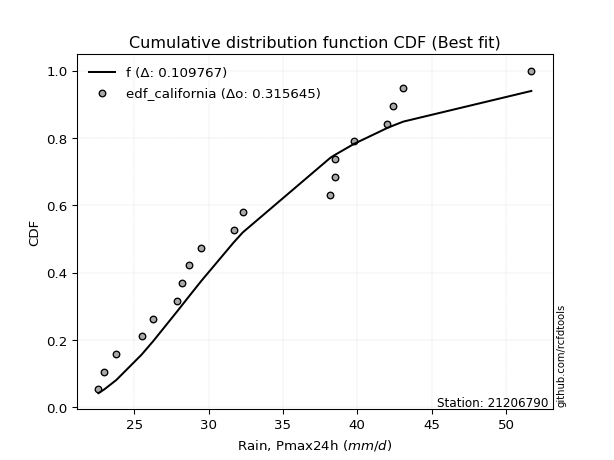</img>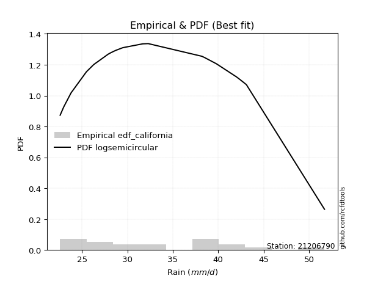</img>

</div>


### 2. EDF Hazen (1930)

Hazen method for plotting positions is a formula used to estimate the empirical cumulative probability distribution of flood events or other hydrological data. This formula often results in biased estimations, particularly when extrapolating to extreme events (high return periods).

<div align="center">


$P=(m-0.5)/n$


</div>


**2.1. Empirical values**

<div align="center">

|                | 0                   | 1                   | 2                   | 3                   | 4                   | 5                  | 6                   | 7                   | 8                  | 9                  | 10                 | 11                 | 12                 | 13                 | 14                 | 15                 | 16                | 17                 | 18                 |
|:---------------|:--------------------|:--------------------|:--------------------|:--------------------|:--------------------|:-------------------|:--------------------|:--------------------|:-------------------|:-------------------|:-------------------|:-------------------|:-------------------|:-------------------|:-------------------|:-------------------|:------------------|:-------------------|:-------------------|
| date           | 2008                | 2005                | 2006                | 2016                | 2018                | 2017               | 2011                | 2022                | 2009               | 2024               | 2020               | 2021               | 2019               | 2014               | 2007               | 2010               | 2013              | 2015               | 2012               |
| x              | 22.6                | 23.0                | 23.8                | 25.5                | 26.3                | 27.9               | 28.2                | 28.7                | 29.5               | 31.689473684210526 | 32.3               | 38.2               | 38.5               | 38.5               | 39.8               | 42.0               | 42.4              | 43.1               | 51.7               |
| m              | 1                   | 2                   | 3                   | 4                   | 5                   | 6                  | 7                   | 8                   | 9                  | 10                 | 11                 | 12                 | 13                 | 14                 | 15                 | 16                 | 17                | 18                 | 19                 |
| empirical_dist | edf_hazen           | edf_hazen           | edf_hazen           | edf_hazen           | edf_hazen           | edf_hazen          | edf_hazen           | edf_hazen           | edf_hazen          | edf_hazen          | edf_hazen          | edf_hazen          | edf_hazen          | edf_hazen          | edf_hazen          | edf_hazen          | edf_hazen         | edf_hazen          | edf_hazen          |
| empirical      | 0.02631578947368421 | 0.07894736842105263 | 0.13157894736842105 | 0.18421052631578946 | 0.23684210526315788 | 0.2894736842105263 | 0.34210526315789475 | 0.39473684210526316 | 0.4473684210526316 | 0.5                | 0.5526315789473685 | 0.6052631578947368 | 0.6578947368421053 | 0.7105263157894737 | 0.7631578947368421 | 0.8157894736842105 | 0.868421052631579 | 0.9210526315789473 | 0.9736842105263158 |
| empirical_tr   | 1.027027027027027   | 1.0857142857142856  | 1.1515151515151514  | 1.2258064516129032  | 1.3103448275862069  | 1.4074074074074074 | 1.5199999999999998  | 1.6521739130434783  | 1.8095238095238098 | 2.0                | 2.235294117647059  | 2.533333333333333  | 2.9230769230769234 | 3.4545454545454546 | 4.222222222222223  | 5.428571428571428  | 7.600000000000002 | 12.666666666666663 | 38.00000000000004  |

</div>


**2.2. Kolmogorov-Smirnov fit test (sorted by Δ)**


<div align="center">

|                | 0                   | 1                   | 2                   | 3                   | 4                   | 5                   | 6                   | 7                   | 8                   | 9                   | 10                  | 11                  | 12                  | 13                  | 14                  | 15                  | 16                  | 17                  | 18                  | 19                  | 20                  | 21                  | 22                  | 23                  | 24                  | 25                  | 26                  | 27                  | 28                  | 29                  | 30                  | 31                  | 32                  | 33                  | 34                  | 35                  | 36                  | 37                  | 38                  | 39                  | 40                  | 41                  | 42                  | 43                  | 44                  | 45                  | 46                  | 47                  | 48                  | 49                  | 50                  | 51                  | 52                  | 53                  | 54                  | 55                  | 56                  | 57                  | 58                  | 59                  | 60                  | 61                  | 62                  | 63                  | 64                  | 65                  | 66                  | 67                  | 68                  | 69                  | 70                  | 71                  | 72                  | 73                  | 74                  | 75                  | 76                  | 77                  | 78                  | 79                  | 80                  | 81                  | 82                  | 83                  | 84                  | 85                  | 86                  | 87                  | 88                  | 89                  | 90                  | 91                  | 92                  | 93                  | 94                  | 95                  | 96                  | 97                  | 98                  | 99                  | 100                 | 101                 | 102                 | 103                 | 104                 | 105                 | 106                 | 107                 | 108                 | 109                 | 110                 | 111                 | 112                 | 113                 | 114                 | 115                 | 116                 | 117                 | 118                 | 119                 | 120                 | 121                 | 122                 | 123                 | 124                 | 125                 | 126                 | 127                 | 128                 | 129                 | 130                 | 131                 | 132                 | 133                 | 134                 | 135                 | 136                 | 137                 | 138                 | 139                 | 140                 | 141                 | 142                 | 143                 | 144                 | 145                 | 146                 | 147                 | 148                 | 149                 | 150                 | 151                 | 152                 | 153                 | 154                 | 155                 | 156                 | 157                 | 158                 | 159                 |
|:---------------|:--------------------|:--------------------|:--------------------|:--------------------|:--------------------|:--------------------|:--------------------|:--------------------|:--------------------|:--------------------|:--------------------|:--------------------|:--------------------|:--------------------|:--------------------|:--------------------|:--------------------|:--------------------|:--------------------|:--------------------|:--------------------|:--------------------|:--------------------|:--------------------|:--------------------|:--------------------|:--------------------|:--------------------|:--------------------|:--------------------|:--------------------|:--------------------|:--------------------|:--------------------|:--------------------|:--------------------|:--------------------|:--------------------|:--------------------|:--------------------|:--------------------|:--------------------|:--------------------|:--------------------|:--------------------|:--------------------|:--------------------|:--------------------|:--------------------|:--------------------|:--------------------|:--------------------|:--------------------|:--------------------|:--------------------|:--------------------|:--------------------|:--------------------|:--------------------|:--------------------|:--------------------|:--------------------|:--------------------|:--------------------|:--------------------|:--------------------|:--------------------|:--------------------|:--------------------|:--------------------|:--------------------|:--------------------|:--------------------|:--------------------|:--------------------|:--------------------|:--------------------|:--------------------|:--------------------|:--------------------|:--------------------|:--------------------|:--------------------|:--------------------|:--------------------|:--------------------|:--------------------|:--------------------|:--------------------|:--------------------|:--------------------|:--------------------|:--------------------|:--------------------|:--------------------|:--------------------|:--------------------|:--------------------|:--------------------|:--------------------|:--------------------|:--------------------|:--------------------|:--------------------|:--------------------|:--------------------|:--------------------|:--------------------|:--------------------|:--------------------|:--------------------|:--------------------|:--------------------|:--------------------|:--------------------|:--------------------|:--------------------|:--------------------|:--------------------|:--------------------|:--------------------|:--------------------|:--------------------|:--------------------|:--------------------|:--------------------|:--------------------|:--------------------|:--------------------|:--------------------|:--------------------|:--------------------|:--------------------|:--------------------|:--------------------|:--------------------|:--------------------|:--------------------|:--------------------|:--------------------|:--------------------|:--------------------|:--------------------|:--------------------|:--------------------|:--------------------|:--------------------|:--------------------|:--------------------|:--------------------|:--------------------|:--------------------|:--------------------|:--------------------|:--------------------|:--------------------|:--------------------|:--------------------|:--------------------|:--------------------|
| station        | 21206790            | 21206790            | 21206790            | 21206790            | 21206790            | 21206790            | 21206790            | 21206790            | 21206790            | 21206790            | 21206790            | 21206790            | 21206790            | 21206790            | 21206790            | 21206790            | 21206790            | 21206790            | 21206790            | 21206790            | 21206790            | 21206790            | 21206790            | 21206790            | 21206790            | 21206790            | 21206790            | 21206790            | 21206790            | 21206790            | 21206790            | 21206790            | 21206790            | 21206790            | 21206790            | 21206790            | 21206790            | 21206790            | 21206790            | 21206790            | 21206790            | 21206790            | 21206790            | 21206790            | 21206790            | 21206790            | 21206790            | 21206790            | 21206790            | 21206790            | 21206790            | 21206790            | 21206790            | 21206790            | 21206790            | 21206790            | 21206790            | 21206790            | 21206790            | 21206790            | 21206790            | 21206790            | 21206790            | 21206790            | 21206790            | 21206790            | 21206790            | 21206790            | 21206790            | 21206790            | 21206790            | 21206790            | 21206790            | 21206790            | 21206790            | 21206790            | 21206790            | 21206790            | 21206790            | 21206790            | 21206790            | 21206790            | 21206790            | 21206790            | 21206790            | 21206790            | 21206790            | 21206790            | 21206790            | 21206790            | 21206790            | 21206790            | 21206790            | 21206790            | 21206790            | 21206790            | 21206790            | 21206790            | 21206790            | 21206790            | 21206790            | 21206790            | 21206790            | 21206790            | 21206790            | 21206790            | 21206790            | 21206790            | 21206790            | 21206790            | 21206790            | 21206790            | 21206790            | 21206790            | 21206790            | 21206790            | 21206790            | 21206790            | 21206790            | 21206790            | 21206790            | 21206790            | 21206790            | 21206790            | 21206790            | 21206790            | 21206790            | 21206790            | 21206790            | 21206790            | 21206790            | 21206790            | 21206790            | 21206790            | 21206790            | 21206790            | 21206790            | 21206790            | 21206790            | 21206790            | 21206790            | 21206790            | 21206790            | 21206790            | 21206790            | 21206790            | 21206790            | 21206790            | 21206790            | 21206790            | 21206790            | 21206790            | 21206790            | 21206790            | 21206790            | 21206790            | 21206790            | 21206790            | 21206790            | 21206790            |
| empirical_dist | edf_hazen           | edf_hazen           | edf_hazen           | edf_hazen           | edf_hazen           | edf_hazen           | edf_hazen           | edf_hazen           | edf_hazen           | edf_hazen           | edf_hazen           | edf_hazen           | edf_hazen           | edf_hazen           | edf_hazen           | edf_hazen           | edf_hazen           | edf_hazen           | edf_hazen           | edf_hazen           | edf_hazen           | edf_hazen           | edf_hazen           | edf_hazen           | edf_hazen           | edf_hazen           | edf_hazen           | edf_hazen           | edf_hazen           | edf_hazen           | edf_hazen           | edf_hazen           | edf_hazen           | edf_hazen           | edf_hazen           | edf_hazen           | edf_hazen           | edf_hazen           | edf_hazen           | edf_hazen           | edf_hazen           | edf_hazen           | edf_hazen           | edf_hazen           | edf_hazen           | edf_hazen           | edf_hazen           | edf_hazen           | edf_hazen           | edf_hazen           | edf_hazen           | edf_hazen           | edf_hazen           | edf_hazen           | edf_hazen           | edf_hazen           | edf_hazen           | edf_hazen           | edf_hazen           | edf_hazen           | edf_hazen           | edf_hazen           | edf_hazen           | edf_hazen           | edf_hazen           | edf_hazen           | edf_hazen           | edf_hazen           | edf_hazen           | edf_hazen           | edf_hazen           | edf_hazen           | edf_hazen           | edf_hazen           | edf_hazen           | edf_hazen           | edf_hazen           | edf_hazen           | edf_hazen           | edf_hazen           | edf_hazen           | edf_hazen           | edf_hazen           | edf_hazen           | edf_hazen           | edf_hazen           | edf_hazen           | edf_hazen           | edf_hazen           | edf_hazen           | edf_hazen           | edf_hazen           | edf_hazen           | edf_hazen           | edf_hazen           | edf_hazen           | edf_hazen           | edf_hazen           | edf_hazen           | edf_hazen           | edf_hazen           | edf_hazen           | edf_hazen           | edf_hazen           | edf_hazen           | edf_hazen           | edf_hazen           | edf_hazen           | edf_hazen           | edf_hazen           | edf_hazen           | edf_hazen           | edf_hazen           | edf_hazen           | edf_hazen           | edf_hazen           | edf_hazen           | edf_hazen           | edf_hazen           | edf_hazen           | edf_hazen           | edf_hazen           | edf_hazen           | edf_hazen           | edf_hazen           | edf_hazen           | edf_hazen           | edf_hazen           | edf_hazen           | edf_hazen           | edf_hazen           | edf_hazen           | edf_hazen           | edf_hazen           | edf_hazen           | edf_hazen           | edf_hazen           | edf_hazen           | edf_hazen           | edf_hazen           | edf_hazen           | edf_hazen           | edf_hazen           | edf_hazen           | edf_hazen           | edf_hazen           | edf_hazen           | edf_hazen           | edf_hazen           | edf_hazen           | edf_hazen           | edf_hazen           | edf_hazen           | edf_hazen           | edf_hazen           | edf_hazen           | edf_hazen           | edf_hazen           | edf_hazen           | edf_hazen           |
| p_dist         | arcsine             | semicircular        | logarcsine          | loggausshyper       | logbradford         | anglit              | truncweibull_min    | logsemicircular     | truncpareto         | logtruncpareto      | truncexpon          | dweibull            | loghalfgennorm      | logtruncexpon       | logdgamma           | gausshyper          | loganglit           | logjohnsonsb        | foldnorm            | lognakagami         | gamma               | genhalflogistic     | johnsonsb           | norm                | crystalball         | t                   | logcosine           | beta                | logburr12           | maxwell             | kappa3              | f                   | rayleigh            | pearson3            | rice                | gompertz            | loguniform          | logbeta             | logvonmises_line    | ncf                 | logkappa3           | truncnorm           | logloggamma         | logfoldnorm         | gennorm             | halfnorm            | skewnorm            | logt                | lognorm             | logcrystalball      | tukeylambda         | logexponnorm        | logtukeylambda      | betaprime           | logistic            | loggenextreme       | logweibull_max      | logpearson3         | cosine              | bradford            | loginvgamma         | logerlang           | logbetaprime        | logrice             | lognct              | logmaxwell          | loggamma            | loggamma            | loglomax            | kstwobign           | logalpha            | lomax               | genexpon            | loggumbel_l         | alpha               | logf                | lograyleigh         | burr12              | weibull_min         | logkappa4           | nct                 | genextreme          | exponnorm           | loggenexpon         | invweibull          | logjohnsonsu        | genlogistic         | invgamma            | logargus            | logfatiguelife      | logburr             | johnsonsu           | logweibull_min      | invgauss            | loginvgauss         | fatiguelife         | gumbel_r            | loginvweibull       | loggenlogistic      | burr                | hypsecant           | logmielke           | kappa4              | loghalfnorm         | logskewnorm         | logkstwobign        | loglogistic         | logexponpow         | logdweibull         | loggompertz         | logtriang           | halflogistic        | moyal               | exponpow            | logtruncweibull_min | gumbel_l            | logexponweib        | loghypsecant        | logncf              | logloglaplace       | logksone            | loggumbel_r         | laplace             | loghalflogistic     | logmoyal            | nakagami            | halfgennorm         | loggengamma         | dgamma              | loglaplace          | loglaplace          | logtruncnorm        | uniform             | vonmises_line       | argus               | wald                | wrapcauchy          | logwald             | ksone               | erlang              | loggenhalflogistic  | logwrapcauchy       | powerlaw            | logpowerlaw         | logrdist            | triang              | genpareto           | logtrapezoid        | loglevy_l           | loggennorm          | levy_l              | exponweib           | trapezoid           | loggenpareto        | rdist               | gengamma            | weibull_max         | logvonmises         | vonmises            | mielke              |
| delta          | 0.09323231632943929 | 0.09838972807835733 | 0.10000609647735614 | 0.10071717403309566 | 0.10773762920093655 | 0.10821813930581747 | 0.10973347997049188 | 0.10984796773207639 | 0.11126298704219306 | 0.11251932419036037 | 0.11377284724886916 | 0.11543976562912628 | 0.11806601283847484 | 0.11944353337064784 | 0.12011358492567648 | 0.1213446470023104  | 0.12186504358034367 | 0.12220535973454316 | 0.12338821934035915 | 0.12392250767715507 | 0.12444817819164777 | 0.12483427383363821 | 0.12502937384835033 | 0.13142361637975314 | 0.13142363763443027 | 0.1315545817781662  | 0.13310368714130938 | 0.1331098078059446  | 0.13396093770051343 | 0.13404876418730394 | 0.1349779679307473  | 0.1360832499253709  | 0.13768040479964916 | 0.13816077378363156 | 0.13875577259122107 | 0.13902840064844024 | 0.14091130585774325 | 0.14094070327107144 | 0.14117286109318983 | 0.14183512876361093 | 0.14458239449008192 | 0.14610812174039423 | 0.14686468710628242 | 0.1475226496185128  | 0.1486250848114845  | 0.1492293323342021  | 0.1494731348914099  | 0.14955051087845117 | 0.1495509072012452  | 0.14955170269117768 | 0.1496576247944249  | 0.14971470803119302 | 0.15028353120286875 | 0.15136383469937653 | 0.1518924407972702  | 0.15316556629781908 | 0.15318019931664262 | 0.15350643770912298 | 0.15412763717428068 | 0.15418174593956713 | 0.1554236750186886  | 0.1564952880330468  | 0.157026237640831   | 0.1577760480473407  | 0.15826214018242657 | 0.15850635029329763 | 0.15857125977011555 | 0.15857125977011555 | 0.15908117828262247 | 0.15926138819428848 | 0.15934502287095842 | 0.15983761965611076 | 0.1603351530645124  | 0.1605566845742259  | 0.16060110876822975 | 0.16100738670244985 | 0.1610580373688506  | 0.1610905116147311  | 0.16122818791961002 | 0.16200098123523476 | 0.16214086819507945 | 0.16254544085838862 | 0.16255774184547234 | 0.16261002759841892 | 0.16276483488692917 | 0.1630525203916905  | 0.1634440421360267  | 0.1636473164433493  | 0.16445679422811538 | 0.16480296215789814 | 0.16520001623640146 | 0.16546733832072824 | 0.16585810549869573 | 0.16612878964205546 | 0.1662072507579303  | 0.16636949130405954 | 0.1664721921232709  | 0.16670734942619936 | 0.16673963593528818 | 0.16699435753183145 | 0.16704870503592656 | 0.16787897600155954 | 0.1680580592499702  | 0.1698758112395623  | 0.1702033575536851  | 0.1714461550100762  | 0.17221133972198632 | 0.1725218747124977  | 0.1743468030085804  | 0.1745675586016403  | 0.17478916343825468 | 0.17488355974341663 | 0.18096504452540485 | 0.18330053339237062 | 0.1851248613168971  | 0.1854351002154082  | 0.18667296252121457 | 0.18698213406461384 | 0.18703372722380784 | 0.18715174101625986 | 0.1876015268112774  | 0.1878291344514984  | 0.19342732005115354 | 0.1939551130075703  | 0.20019828243255033 | 0.20114895971766467 | 0.20167393201879613 | 0.20223905046847124 | 0.20492363662507862 | 0.2062175624430943  | 0.2062175624430943  | 0.21095023789262546 | 0.21929824561403533 | 0.2202893818111562  | 0.22333176927710896 | 0.2256190632123826  | 0.2290190490573808  | 0.2392482205037305  | 0.25066316995237237 | 0.2781157798562198  | 0.2848126826894606  | 0.29903049262700554 | 0.3010752938947153  | 0.3324683068583706  | 0.340246017488015   | 0.34172678922690525 | 0.3454100680213138  | 0.3831021084940318  | 0.4137827393362695  | 0.42105263157894735 | 0.4485375236836512  | 0.4700586811188393  | 0.4716306013189783  | 0.4776123413508664  | 0.4871775931349348  | 0.5035046201295285  | 0.7384027638939237  | 1.1507236250911062  | 7.746062013141613   | nan                 |
| deltao         | 0.31564497164100014 | 0.31564497164100014 | 0.31564497164100014 | 0.31564497164100014 | 0.31564497164100014 | 0.31564497164100014 | 0.31564497164100014 | 0.31564497164100014 | 0.31564497164100014 | 0.31564497164100014 | 0.31564497164100014 | 0.31564497164100014 | 0.31564497164100014 | 0.31564497164100014 | 0.31564497164100014 | 0.31564497164100014 | 0.31564497164100014 | 0.31564497164100014 | 0.31564497164100014 | 0.31564497164100014 | 0.31564497164100014 | 0.31564497164100014 | 0.31564497164100014 | 0.31564497164100014 | 0.31564497164100014 | 0.31564497164100014 | 0.31564497164100014 | 0.31564497164100014 | 0.31564497164100014 | 0.31564497164100014 | 0.31564497164100014 | 0.31564497164100014 | 0.31564497164100014 | 0.31564497164100014 | 0.31564497164100014 | 0.31564497164100014 | 0.31564497164100014 | 0.31564497164100014 | 0.31564497164100014 | 0.31564497164100014 | 0.31564497164100014 | 0.31564497164100014 | 0.31564497164100014 | 0.31564497164100014 | 0.31564497164100014 | 0.31564497164100014 | 0.31564497164100014 | 0.31564497164100014 | 0.31564497164100014 | 0.31564497164100014 | 0.31564497164100014 | 0.31564497164100014 | 0.31564497164100014 | 0.31564497164100014 | 0.31564497164100014 | 0.31564497164100014 | 0.31564497164100014 | 0.31564497164100014 | 0.31564497164100014 | 0.31564497164100014 | 0.31564497164100014 | 0.31564497164100014 | 0.31564497164100014 | 0.31564497164100014 | 0.31564497164100014 | 0.31564497164100014 | 0.31564497164100014 | 0.31564497164100014 | 0.31564497164100014 | 0.31564497164100014 | 0.31564497164100014 | 0.31564497164100014 | 0.31564497164100014 | 0.31564497164100014 | 0.31564497164100014 | 0.31564497164100014 | 0.31564497164100014 | 0.31564497164100014 | 0.31564497164100014 | 0.31564497164100014 | 0.31564497164100014 | 0.31564497164100014 | 0.31564497164100014 | 0.31564497164100014 | 0.31564497164100014 | 0.31564497164100014 | 0.31564497164100014 | 0.31564497164100014 | 0.31564497164100014 | 0.31564497164100014 | 0.31564497164100014 | 0.31564497164100014 | 0.31564497164100014 | 0.31564497164100014 | 0.31564497164100014 | 0.31564497164100014 | 0.31564497164100014 | 0.31564497164100014 | 0.31564497164100014 | 0.31564497164100014 | 0.31564497164100014 | 0.31564497164100014 | 0.31564497164100014 | 0.31564497164100014 | 0.31564497164100014 | 0.31564497164100014 | 0.31564497164100014 | 0.31564497164100014 | 0.31564497164100014 | 0.31564497164100014 | 0.31564497164100014 | 0.31564497164100014 | 0.31564497164100014 | 0.31564497164100014 | 0.31564497164100014 | 0.31564497164100014 | 0.31564497164100014 | 0.31564497164100014 | 0.31564497164100014 | 0.31564497164100014 | 0.31564497164100014 | 0.31564497164100014 | 0.31564497164100014 | 0.31564497164100014 | 0.31564497164100014 | 0.31564497164100014 | 0.31564497164100014 | 0.31564497164100014 | 0.31564497164100014 | 0.31564497164100014 | 0.31564497164100014 | 0.31564497164100014 | 0.31564497164100014 | 0.31564497164100014 | 0.31564497164100014 | 0.31564497164100014 | 0.31564497164100014 | 0.31564497164100014 | 0.31564497164100014 | 0.31564497164100014 | 0.31564497164100014 | 0.31564497164100014 | 0.31564497164100014 | 0.31564497164100014 | 0.31564497164100014 | 0.31564497164100014 | 0.31564497164100014 | 0.31564497164100014 | 0.31564497164100014 | 0.31564497164100014 | 0.31564497164100014 | 0.31564497164100014 | 0.31564497164100014 | 0.31564497164100014 | 0.31564497164100014 | 0.31564497164100014 | 0.31564497164100014 | 0.31564497164100014 | 0.31564497164100014 | 0.31564497164100014 |
| eval           | Δo > Δ              | Δo > Δ              | Δo > Δ              | Δo > Δ              | Δo > Δ              | Δo > Δ              | Δo > Δ              | Δo > Δ              | Δo > Δ              | Δo > Δ              | Δo > Δ              | Δo > Δ              | Δo > Δ              | Δo > Δ              | Δo > Δ              | Δo > Δ              | Δo > Δ              | Δo > Δ              | Δo > Δ              | Δo > Δ              | Δo > Δ              | Δo > Δ              | Δo > Δ              | Δo > Δ              | Δo > Δ              | Δo > Δ              | Δo > Δ              | Δo > Δ              | Δo > Δ              | Δo > Δ              | Δo > Δ              | Δo > Δ              | Δo > Δ              | Δo > Δ              | Δo > Δ              | Δo > Δ              | Δo > Δ              | Δo > Δ              | Δo > Δ              | Δo > Δ              | Δo > Δ              | Δo > Δ              | Δo > Δ              | Δo > Δ              | Δo > Δ              | Δo > Δ              | Δo > Δ              | Δo > Δ              | Δo > Δ              | Δo > Δ              | Δo > Δ              | Δo > Δ              | Δo > Δ              | Δo > Δ              | Δo > Δ              | Δo > Δ              | Δo > Δ              | Δo > Δ              | Δo > Δ              | Δo > Δ              | Δo > Δ              | Δo > Δ              | Δo > Δ              | Δo > Δ              | Δo > Δ              | Δo > Δ              | Δo > Δ              | Δo > Δ              | Δo > Δ              | Δo > Δ              | Δo > Δ              | Δo > Δ              | Δo > Δ              | Δo > Δ              | Δo > Δ              | Δo > Δ              | Δo > Δ              | Δo > Δ              | Δo > Δ              | Δo > Δ              | Δo > Δ              | Δo > Δ              | Δo > Δ              | Δo > Δ              | Δo > Δ              | Δo > Δ              | Δo > Δ              | Δo > Δ              | Δo > Δ              | Δo > Δ              | Δo > Δ              | Δo > Δ              | Δo > Δ              | Δo > Δ              | Δo > Δ              | Δo > Δ              | Δo > Δ              | Δo > Δ              | Δo > Δ              | Δo > Δ              | Δo > Δ              | Δo > Δ              | Δo > Δ              | Δo > Δ              | Δo > Δ              | Δo > Δ              | Δo > Δ              | Δo > Δ              | Δo > Δ              | Δo > Δ              | Δo > Δ              | Δo > Δ              | Δo > Δ              | Δo > Δ              | Δo > Δ              | Δo > Δ              | Δo > Δ              | Δo > Δ              | Δo > Δ              | Δo > Δ              | Δo > Δ              | Δo > Δ              | Δo > Δ              | Δo > Δ              | Δo > Δ              | Δo > Δ              | Δo > Δ              | Δo > Δ              | Δo > Δ              | Δo > Δ              | Δo > Δ              | Δo > Δ              | Δo > Δ              | Δo > Δ              | Δo > Δ              | Δo > Δ              | Δo > Δ              | Δo > Δ              | Δo > Δ              | Δo > Δ              | Δo > Δ              | Δo > Δ              | Δo > Δ              | Δo <= Δ             | Δo <= Δ             | Δo <= Δ             | Δo <= Δ             | Δo <= Δ             | Δo <= Δ             | Δo <= Δ             | Δo <= Δ             | Δo <= Δ             | Δo <= Δ             | Δo <= Δ             | Δo <= Δ             | Δo <= Δ             | Δo <= Δ             | Δo <= Δ             | Δo <= Δ             | Δo <= Δ             |
| fit            | 1                   | 1                   | 1                   | 1                   | 1                   | 1                   | 1                   | 1                   | 1                   | 1                   | 1                   | 1                   | 1                   | 1                   | 1                   | 1                   | 1                   | 1                   | 1                   | 1                   | 1                   | 1                   | 1                   | 1                   | 1                   | 1                   | 1                   | 1                   | 1                   | 1                   | 1                   | 1                   | 1                   | 1                   | 1                   | 1                   | 1                   | 1                   | 1                   | 1                   | 1                   | 1                   | 1                   | 1                   | 1                   | 1                   | 1                   | 1                   | 1                   | 1                   | 1                   | 1                   | 1                   | 1                   | 1                   | 1                   | 1                   | 1                   | 1                   | 1                   | 1                   | 1                   | 1                   | 1                   | 1                   | 1                   | 1                   | 1                   | 1                   | 1                   | 1                   | 1                   | 1                   | 1                   | 1                   | 1                   | 1                   | 1                   | 1                   | 1                   | 1                   | 1                   | 1                   | 1                   | 1                   | 1                   | 1                   | 1                   | 1                   | 1                   | 1                   | 1                   | 1                   | 1                   | 1                   | 1                   | 1                   | 1                   | 1                   | 1                   | 1                   | 1                   | 1                   | 1                   | 1                   | 1                   | 1                   | 1                   | 1                   | 1                   | 1                   | 1                   | 1                   | 1                   | 1                   | 1                   | 1                   | 1                   | 1                   | 1                   | 1                   | 1                   | 1                   | 1                   | 1                   | 1                   | 1                   | 1                   | 1                   | 1                   | 1                   | 1                   | 1                   | 1                   | 1                   | 1                   | 1                   | 1                   | 1                   | 1                   | 1                   | 1                   | 1                   | 0                   | 0                   | 0                   | 0                   | 0                   | 0                   | 0                   | 0                   | 0                   | 0                   | 0                   | 0                   | 0                   | 0                   | 0                   | 0                   | 0                   |
| n              | 19                  | 19                  | 19                  | 19                  | 19                  | 19                  | 19                  | 19                  | 19                  | 19                  | 19                  | 19                  | 19                  | 19                  | 19                  | 19                  | 19                  | 19                  | 19                  | 19                  | 19                  | 19                  | 19                  | 19                  | 19                  | 19                  | 19                  | 19                  | 19                  | 19                  | 19                  | 19                  | 19                  | 19                  | 19                  | 19                  | 19                  | 19                  | 19                  | 19                  | 19                  | 19                  | 19                  | 19                  | 19                  | 19                  | 19                  | 19                  | 19                  | 19                  | 19                  | 19                  | 19                  | 19                  | 19                  | 19                  | 19                  | 19                  | 19                  | 19                  | 19                  | 19                  | 19                  | 19                  | 19                  | 19                  | 19                  | 19                  | 19                  | 19                  | 19                  | 19                  | 19                  | 19                  | 19                  | 19                  | 19                  | 19                  | 19                  | 19                  | 19                  | 19                  | 19                  | 19                  | 19                  | 19                  | 19                  | 19                  | 19                  | 19                  | 19                  | 19                  | 19                  | 19                  | 19                  | 19                  | 19                  | 19                  | 19                  | 19                  | 19                  | 19                  | 19                  | 19                  | 19                  | 19                  | 19                  | 19                  | 19                  | 19                  | 19                  | 19                  | 19                  | 19                  | 19                  | 19                  | 19                  | 19                  | 19                  | 19                  | 19                  | 19                  | 19                  | 19                  | 19                  | 19                  | 19                  | 19                  | 19                  | 19                  | 19                  | 19                  | 19                  | 19                  | 19                  | 19                  | 19                  | 19                  | 19                  | 19                  | 19                  | 19                  | 19                  | 19                  | 19                  | 19                  | 19                  | 19                  | 19                  | 19                  | 19                  | 19                  | 19                  | 19                  | 19                  | 19                  | 19                  | 19                  | 19                  | 19                  |
| best_fit       | 1                   | 0                   | 0                   | 0                   | 0                   | 0                   | 0                   | 0                   | 0                   | 0                   | 0                   | 0                   | 0                   | 0                   | 0                   | 0                   | 0                   | 0                   | 0                   | 0                   | 0                   | 0                   | 0                   | 0                   | 0                   | 0                   | 0                   | 0                   | 0                   | 0                   | 0                   | 0                   | 0                   | 0                   | 0                   | 0                   | 0                   | 0                   | 0                   | 0                   | 0                   | 0                   | 0                   | 0                   | 0                   | 0                   | 0                   | 0                   | 0                   | 0                   | 0                   | 0                   | 0                   | 0                   | 0                   | 0                   | 0                   | 0                   | 0                   | 0                   | 0                   | 0                   | 0                   | 0                   | 0                   | 0                   | 0                   | 0                   | 0                   | 0                   | 0                   | 0                   | 0                   | 0                   | 0                   | 0                   | 0                   | 0                   | 0                   | 0                   | 0                   | 0                   | 0                   | 0                   | 0                   | 0                   | 0                   | 0                   | 0                   | 0                   | 0                   | 0                   | 0                   | 0                   | 0                   | 0                   | 0                   | 0                   | 0                   | 0                   | 0                   | 0                   | 0                   | 0                   | 0                   | 0                   | 0                   | 0                   | 0                   | 0                   | 0                   | 0                   | 0                   | 0                   | 0                   | 0                   | 0                   | 0                   | 0                   | 0                   | 0                   | 0                   | 0                   | 0                   | 0                   | 0                   | 0                   | 0                   | 0                   | 0                   | 0                   | 0                   | 0                   | 0                   | 0                   | 0                   | 0                   | 0                   | 0                   | 0                   | 0                   | 0                   | 0                   | 0                   | 0                   | 0                   | 0                   | 0                   | 0                   | 0                   | 0                   | 0                   | 0                   | 0                   | 0                   | 0                   | 0                   | 0                   | 0                   | 0                   |
| best_fit_sort  | 1                   | 2                   | 3                   | 4                   | 5                   | 6                   | 7                   | 8                   | 9                   | 10                  | 11                  | 12                  | 13                  | 14                  | 15                  | 16                  | 17                  | 18                  | 19                  | 20                  | 21                  | 22                  | 23                  | 24                  | 25                  | 26                  | 27                  | 28                  | 29                  | 30                  | 31                  | 32                  | 33                  | 34                  | 35                  | 36                  | 37                  | 38                  | 39                  | 40                  | 41                  | 42                  | 43                  | 44                  | 45                  | 46                  | 47                  | 48                  | 49                  | 50                  | 51                  | 52                  | 53                  | 54                  | 55                  | 56                  | 57                  | 58                  | 59                  | 60                  | 61                  | 62                  | 63                  | 64                  | 65                  | 66                  | 67                  | 68                  | 69                  | 70                  | 71                  | 72                  | 73                  | 74                  | 75                  | 76                  | 77                  | 78                  | 79                  | 80                  | 81                  | 82                  | 83                  | 84                  | 85                  | 86                  | 87                  | 88                  | 89                  | 90                  | 91                  | 92                  | 93                  | 94                  | 95                  | 96                  | 97                  | 98                  | 99                  | 100                 | 101                 | 102                 | 103                 | 104                 | 105                 | 106                 | 107                 | 108                 | 109                 | 110                 | 111                 | 112                 | 113                 | 114                 | 115                 | 116                 | 117                 | 118                 | 119                 | 120                 | 121                 | 122                 | 123                 | 124                 | 125                 | 126                 | 127                 | 128                 | 129                 | 130                 | 131                 | 132                 | 133                 | 134                 | 135                 | 136                 | 137                 | 138                 | 139                 | 140                 | 141                 | 142                 | 143                 | 144                 | 145                 | 146                 | 147                 | 148                 | 149                 | 150                 | 151                 | 152                 | 153                 | 154                 | 155                 | 156                 | 157                 | 158                 | 159                 | 160                 |

</div>


**2.3. Best fit**

<div align="center">

|   id |   station | empirical_dist   | p_dist   |     delta |   deltao | eval   |   fit |   n |   best_fit |   best_fit_sort |
|-----:|----------:|:-----------------|:---------|----------:|---------:|:-------|------:|----:|-----------:|----------------:|
|    0 |  21206790 | edf_hazen        | arcsine  | 0.0932323 | 0.315645 | Δo > Δ |     1 |  19 |          1 |               1 |

</div>


<div align="center">

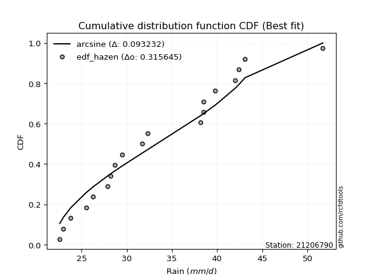</img></img>

</div>


### 3. EDF Weibull (1939)

Weibull plotting position formula is an empirical method used to estimate the non-exceedance probability or plotting position for a set of observed data, is often recommended or widely used in practice, particularly in flood frequency analysis.

<div align="center">


$P=m/(n+1)$


</div>


**3.1. Empirical values**

<div align="center">

|                | 0                  | 1                  | 2                  | 3           | 4                  | 5                  | 6                  | 7                  | 8                  | 9                  | 10                 | 11          | 12                | 13                | 14          | 15                | 16                | 17                 | 18                 |
|:---------------|:-------------------|:-------------------|:-------------------|:------------|:-------------------|:-------------------|:-------------------|:-------------------|:-------------------|:-------------------|:-------------------|:------------|:------------------|:------------------|:------------|:------------------|:------------------|:-------------------|:-------------------|
| date           | 2008               | 2005               | 2006               | 2016        | 2018               | 2017               | 2011               | 2022               | 2009               | 2024               | 2020               | 2021        | 2019              | 2014              | 2007        | 2010              | 2013              | 2015               | 2012               |
| x              | 22.6               | 23.0               | 23.8               | 25.5        | 26.3               | 27.9               | 28.2               | 28.7               | 29.5               | 31.689473684210526 | 32.3               | 38.2        | 38.5              | 38.5              | 39.8        | 42.0              | 42.4              | 43.1               | 51.7               |
| m              | 1                  | 2                  | 3                  | 4           | 5                  | 6                  | 7                  | 8                  | 9                  | 10                 | 11                 | 12          | 13                | 14                | 15          | 16                | 17                | 18                 | 19                 |
| empirical_dist | edf_weibull        | edf_weibull        | edf_weibull        | edf_weibull | edf_weibull        | edf_weibull        | edf_weibull        | edf_weibull        | edf_weibull        | edf_weibull        | edf_weibull        | edf_weibull | edf_weibull       | edf_weibull       | edf_weibull | edf_weibull       | edf_weibull       | edf_weibull        | edf_weibull        |
| empirical      | 0.05               | 0.1                | 0.15               | 0.2         | 0.25               | 0.3                | 0.35               | 0.4                | 0.45               | 0.5                | 0.55               | 0.6         | 0.65              | 0.7               | 0.75        | 0.8               | 0.85              | 0.9                | 0.95               |
| empirical_tr   | 1.0526315789473684 | 1.1111111111111112 | 1.1764705882352942 | 1.25        | 1.3333333333333333 | 1.4285714285714286 | 1.5384615384615383 | 1.6666666666666667 | 1.8181818181818181 | 2.0                | 2.2222222222222223 | 2.5         | 2.857142857142857 | 3.333333333333333 | 4.0         | 5.000000000000001 | 6.666666666666666 | 10.000000000000002 | 19.999999999999982 |

</div>


**3.2. Kolmogorov-Smirnov fit test (sorted by Δ)**


<div align="center">

|                | 0                   | 1                   | 2                   | 3                   | 4                   | 5                   | 6                   | 7                   | 8                   | 9                   | 10                  | 11                  | 12                  | 13                  | 14                  | 15                  | 16                  | 17                  | 18                  | 19                  | 20                  | 21                  | 22                  | 23                  | 24                  | 25                  | 26                  | 27                  | 28                  | 29                  | 30                  | 31                  | 32                  | 33                  | 34                  | 35                  | 36                  | 37                  | 38                  | 39                  | 40                  | 41                  | 42                  | 43                  | 44                  | 45                  | 46                  | 47                  | 48                  | 49                  | 50                  | 51                  | 52                  | 53                  | 54                  | 55                  | 56                  | 57                  | 58                  | 59                  | 60                  | 61                  | 62                  | 63                  | 64                  | 65                  | 66                  | 67                  | 68                  | 69                  | 70                  | 71                  | 72                  | 73                  | 74                  | 75                  | 76                  | 77                  | 78                  | 79                  | 80                  | 81                  | 82                  | 83                  | 84                  | 85                  | 86                  | 87                  | 88                  | 89                  | 90                  | 91                  | 92                  | 93                  | 94                  | 95                  | 96                  | 97                  | 98                  | 99                  | 100                 | 101                 | 102                 | 103                 | 104                 | 105                 | 106                 | 107                 | 108                 | 109                 | 110                 | 111                 | 112                 | 113                 | 114                 | 115                 | 116                 | 117                 | 118                 | 119                 | 120                 | 121                 | 122                 | 123                 | 124                 | 125                 | 126                 | 127                 | 128                 | 129                 | 130                 | 131                 | 132                 | 133                 | 134                 | 135                 | 136                 | 137                 | 138                 | 139                 | 140                 | 141                 | 142                 | 143                 | 144                 | 145                 | 146                 | 147                 | 148                 | 149                 | 150                 | 151                 | 152                 | 153                 | 154                 | 155                 | 156                 | 157                 | 158                 | 159                 |
|:---------------|:--------------------|:--------------------|:--------------------|:--------------------|:--------------------|:--------------------|:--------------------|:--------------------|:--------------------|:--------------------|:--------------------|:--------------------|:--------------------|:--------------------|:--------------------|:--------------------|:--------------------|:--------------------|:--------------------|:--------------------|:--------------------|:--------------------|:--------------------|:--------------------|:--------------------|:--------------------|:--------------------|:--------------------|:--------------------|:--------------------|:--------------------|:--------------------|:--------------------|:--------------------|:--------------------|:--------------------|:--------------------|:--------------------|:--------------------|:--------------------|:--------------------|:--------------------|:--------------------|:--------------------|:--------------------|:--------------------|:--------------------|:--------------------|:--------------------|:--------------------|:--------------------|:--------------------|:--------------------|:--------------------|:--------------------|:--------------------|:--------------------|:--------------------|:--------------------|:--------------------|:--------------------|:--------------------|:--------------------|:--------------------|:--------------------|:--------------------|:--------------------|:--------------------|:--------------------|:--------------------|:--------------------|:--------------------|:--------------------|:--------------------|:--------------------|:--------------------|:--------------------|:--------------------|:--------------------|:--------------------|:--------------------|:--------------------|:--------------------|:--------------------|:--------------------|:--------------------|:--------------------|:--------------------|:--------------------|:--------------------|:--------------------|:--------------------|:--------------------|:--------------------|:--------------------|:--------------------|:--------------------|:--------------------|:--------------------|:--------------------|:--------------------|:--------------------|:--------------------|:--------------------|:--------------------|:--------------------|:--------------------|:--------------------|:--------------------|:--------------------|:--------------------|:--------------------|:--------------------|:--------------------|:--------------------|:--------------------|:--------------------|:--------------------|:--------------------|:--------------------|:--------------------|:--------------------|:--------------------|:--------------------|:--------------------|:--------------------|:--------------------|:--------------------|:--------------------|:--------------------|:--------------------|:--------------------|:--------------------|:--------------------|:--------------------|:--------------------|:--------------------|:--------------------|:--------------------|:--------------------|:--------------------|:--------------------|:--------------------|:--------------------|:--------------------|:--------------------|:--------------------|:--------------------|:--------------------|:--------------------|:--------------------|:--------------------|:--------------------|:--------------------|:--------------------|:--------------------|:--------------------|:--------------------|:--------------------|:--------------------|
| station        | 21206790            | 21206790            | 21206790            | 21206790            | 21206790            | 21206790            | 21206790            | 21206790            | 21206790            | 21206790            | 21206790            | 21206790            | 21206790            | 21206790            | 21206790            | 21206790            | 21206790            | 21206790            | 21206790            | 21206790            | 21206790            | 21206790            | 21206790            | 21206790            | 21206790            | 21206790            | 21206790            | 21206790            | 21206790            | 21206790            | 21206790            | 21206790            | 21206790            | 21206790            | 21206790            | 21206790            | 21206790            | 21206790            | 21206790            | 21206790            | 21206790            | 21206790            | 21206790            | 21206790            | 21206790            | 21206790            | 21206790            | 21206790            | 21206790            | 21206790            | 21206790            | 21206790            | 21206790            | 21206790            | 21206790            | 21206790            | 21206790            | 21206790            | 21206790            | 21206790            | 21206790            | 21206790            | 21206790            | 21206790            | 21206790            | 21206790            | 21206790            | 21206790            | 21206790            | 21206790            | 21206790            | 21206790            | 21206790            | 21206790            | 21206790            | 21206790            | 21206790            | 21206790            | 21206790            | 21206790            | 21206790            | 21206790            | 21206790            | 21206790            | 21206790            | 21206790            | 21206790            | 21206790            | 21206790            | 21206790            | 21206790            | 21206790            | 21206790            | 21206790            | 21206790            | 21206790            | 21206790            | 21206790            | 21206790            | 21206790            | 21206790            | 21206790            | 21206790            | 21206790            | 21206790            | 21206790            | 21206790            | 21206790            | 21206790            | 21206790            | 21206790            | 21206790            | 21206790            | 21206790            | 21206790            | 21206790            | 21206790            | 21206790            | 21206790            | 21206790            | 21206790            | 21206790            | 21206790            | 21206790            | 21206790            | 21206790            | 21206790            | 21206790            | 21206790            | 21206790            | 21206790            | 21206790            | 21206790            | 21206790            | 21206790            | 21206790            | 21206790            | 21206790            | 21206790            | 21206790            | 21206790            | 21206790            | 21206790            | 21206790            | 21206790            | 21206790            | 21206790            | 21206790            | 21206790            | 21206790            | 21206790            | 21206790            | 21206790            | 21206790            | 21206790            | 21206790            | 21206790            | 21206790            | 21206790            | 21206790            |
| empirical_dist | edf_weibull         | edf_weibull         | edf_weibull         | edf_weibull         | edf_weibull         | edf_weibull         | edf_weibull         | edf_weibull         | edf_weibull         | edf_weibull         | edf_weibull         | edf_weibull         | edf_weibull         | edf_weibull         | edf_weibull         | edf_weibull         | edf_weibull         | edf_weibull         | edf_weibull         | edf_weibull         | edf_weibull         | edf_weibull         | edf_weibull         | edf_weibull         | edf_weibull         | edf_weibull         | edf_weibull         | edf_weibull         | edf_weibull         | edf_weibull         | edf_weibull         | edf_weibull         | edf_weibull         | edf_weibull         | edf_weibull         | edf_weibull         | edf_weibull         | edf_weibull         | edf_weibull         | edf_weibull         | edf_weibull         | edf_weibull         | edf_weibull         | edf_weibull         | edf_weibull         | edf_weibull         | edf_weibull         | edf_weibull         | edf_weibull         | edf_weibull         | edf_weibull         | edf_weibull         | edf_weibull         | edf_weibull         | edf_weibull         | edf_weibull         | edf_weibull         | edf_weibull         | edf_weibull         | edf_weibull         | edf_weibull         | edf_weibull         | edf_weibull         | edf_weibull         | edf_weibull         | edf_weibull         | edf_weibull         | edf_weibull         | edf_weibull         | edf_weibull         | edf_weibull         | edf_weibull         | edf_weibull         | edf_weibull         | edf_weibull         | edf_weibull         | edf_weibull         | edf_weibull         | edf_weibull         | edf_weibull         | edf_weibull         | edf_weibull         | edf_weibull         | edf_weibull         | edf_weibull         | edf_weibull         | edf_weibull         | edf_weibull         | edf_weibull         | edf_weibull         | edf_weibull         | edf_weibull         | edf_weibull         | edf_weibull         | edf_weibull         | edf_weibull         | edf_weibull         | edf_weibull         | edf_weibull         | edf_weibull         | edf_weibull         | edf_weibull         | edf_weibull         | edf_weibull         | edf_weibull         | edf_weibull         | edf_weibull         | edf_weibull         | edf_weibull         | edf_weibull         | edf_weibull         | edf_weibull         | edf_weibull         | edf_weibull         | edf_weibull         | edf_weibull         | edf_weibull         | edf_weibull         | edf_weibull         | edf_weibull         | edf_weibull         | edf_weibull         | edf_weibull         | edf_weibull         | edf_weibull         | edf_weibull         | edf_weibull         | edf_weibull         | edf_weibull         | edf_weibull         | edf_weibull         | edf_weibull         | edf_weibull         | edf_weibull         | edf_weibull         | edf_weibull         | edf_weibull         | edf_weibull         | edf_weibull         | edf_weibull         | edf_weibull         | edf_weibull         | edf_weibull         | edf_weibull         | edf_weibull         | edf_weibull         | edf_weibull         | edf_weibull         | edf_weibull         | edf_weibull         | edf_weibull         | edf_weibull         | edf_weibull         | edf_weibull         | edf_weibull         | edf_weibull         | edf_weibull         | edf_weibull         | edf_weibull         | edf_weibull         |
| p_dist         | arcsine             | truncweibull_min    | logarcsine          | loggausshyper       | semicircular        | logjohnsonsb        | johnsonsb           | dweibull            | truncexpon          | logdgamma           | anglit              | logbradford         | logsemicircular     | truncpareto         | logtruncpareto      | logbeta             | loghalfgennorm      | logtruncexpon       | gausshyper          | logkappa3           | loganglit           | loguniform          | logvonmises_line    | foldnorm            | lognakagami         | logtukeylambda      | gamma               | genhalflogistic     | norm                | crystalball         | t                   | logbetaprime        | kappa3              | logcosine           | beta                | logburr12           | maxwell             | logkappa4           | f                   | rayleigh            | pearson3            | rice                | gompertz            | bradford            | kappa4              | ncf                 | gennorm             | truncnorm           | logloggamma         | logfoldnorm         | halfnorm            | logistic            | skewnorm            | logt                | lognorm             | logcrystalball      | tukeylambda         | logexponnorm        | betaprime           | cosine              | loggenextreme       | logweibull_max      | logpearson3         | loginvgamma         | logerlang           | logrice             | loggumbel_l         | lognct              | logmaxwell          | loggamma            | loggamma            | loglomax            | kstwobign           | logalpha            | lomax               | genexpon            | alpha               | logncf              | logf                | lograyleigh         | burr12              | weibull_min         | logksone            | logargus            | nct                 | genextreme          | exponnorm           | loggenexpon         | invweibull          | logjohnsonsu        | genlogistic         | invgamma            | hypsecant           | logfatiguelife      | logburr             | johnsonsu           | logweibull_min      | invgauss            | loginvgauss         | fatiguelife         | gumbel_r            | loginvweibull       | loggenlogistic      | burr                | logmielke           | loghalfnorm         | logskewnorm         | logkstwobign        | logtriang           | loglogistic         | logexponpow         | logdweibull         | loggompertz         | halflogistic        | moyal               | gumbel_l            | exponpow            | logtruncweibull_min | halfgennorm         | logexponweib        | loghypsecant        | logloglaplace       | loggumbel_r         | laplace             | loghalflogistic     | logmoyal            | nakagami            | loggengamma         | wrapcauchy          | dgamma              | loglaplace          | loglaplace          | logtruncnorm        | uniform             | vonmises_line       | argus               | ksone               | wald                | logwald             | loggenhalflogistic  | erlang              | logwrapcauchy       | powerlaw            | logrdist            | triang              | genpareto           | logpowerlaw         | logtrapezoid        | loglevy_l           | loggennorm          | levy_l              | trapezoid           | loggenpareto        | exponweib           | rdist               | gengamma            | weibull_max         | logvonmises         | vonmises            | mielke              |
| delta          | 0.0794922885864876  | 0.09173610746187444 | 0.1                 | 0.10029376530802836 | 0.10102130702572576 | 0.10115272815559584 | 0.10397674226940301 | 0.10491344983965256 | 0.10714162438364361 | 0.10958726913620276 | 0.1108497182531859  | 0.1130007870956734  | 0.11511112562681325 | 0.11652614493692992 | 0.11778248208509723 | 0.11988807169212412 | 0.1233291707332117  | 0.1247066912653847  | 0.12660780489704726 | 0.12707177409939963 | 0.12712820147508053 | 0.12802075963144066 | 0.12813390228819282 | 0.128651377235096   | 0.12918566557189193 | 0.12923089962392142 | 0.12971133608638463 | 0.13009743172837507 | 0.13405519532712157 | 0.1340552165817987  | 0.13418616072553463 | 0.1359736060618837  | 0.13760954687811572 | 0.13836684503604624 | 0.13837296570068147 | 0.13922409559525029 | 0.1393119220820408  | 0.14094834965628744 | 0.14134640782010777 | 0.14294356269438602 | 0.14342393167836842 | 0.14401893048595793 | 0.1442915585431771  | 0.14625771190604547 | 0.14700542767102287 | 0.1470982866583478  | 0.15125666375885294 | 0.15137127963513108 | 0.15212784500101928 | 0.15278580751324966 | 0.15449249022893896 | 0.15452401974463864 | 0.15473629278614676 | 0.15481366877318803 | 0.15481406509598206 | 0.15481486058591454 | 0.15492078268916176 | 0.15497786592592988 | 0.1566269925941134  | 0.15675921612164911 | 0.15842872419255594 | 0.15844335721137948 | 0.15876959560385984 | 0.16068683291342545 | 0.16175844592778366 | 0.16303920594207755 | 0.16318826352159432 | 0.16352529807716343 | 0.16376950818803448 | 0.1638344176648524  | 0.1638344176648524  | 0.16434433617735933 | 0.16452454608902534 | 0.16460818076569528 | 0.16510077755084762 | 0.16559831095924926 | 0.1658642666629666  | 0.16598109564486052 | 0.1662705445971867  | 0.16632119526358746 | 0.16635366950946795 | 0.16649134581434688 | 0.16654889523233007 | 0.1670883731754838  | 0.1674040260898163  | 0.16780859875312548 | 0.1678208997402092  | 0.16787318549315577 | 0.16802799278166602 | 0.16831567828642735 | 0.16870720003076356 | 0.16891047433808615 | 0.169680283983295   | 0.170066120052635   | 0.17046317413113832 | 0.1707304962154651  | 0.1711212633934326  | 0.17139194753679232 | 0.17147040865266716 | 0.1716326491987964  | 0.17173535001800777 | 0.17197050732093622 | 0.17200279383002504 | 0.1722575154265683  | 0.1731421338962964  | 0.17513896913429916 | 0.17546651544842196 | 0.17670931290481307 | 0.1774207423856231  | 0.17747449761672318 | 0.17778503260723455 | 0.17960996090331727 | 0.17983071649637716 | 0.1801467176381535  | 0.1862282024201417  | 0.18806667916277664 | 0.18856369128710748 | 0.19038801921163395 | 0.19114761622932247 | 0.19193612041595143 | 0.1922452919593507  | 0.19241489891099672 | 0.19309229234623526 | 0.19605889899852197 | 0.19921827090230715 | 0.2054614403272872  | 0.20641211761240152 | 0.2075022083632081  | 0.20796641747843347 | 0.21018679451981548 | 0.21148072033783116 | 0.21148072033783116 | 0.21621339578736232 | 0.2166666666666669  | 0.21765780286378777 | 0.22070019032974053 | 0.22961053837342504 | 0.2387769579492247  | 0.24451137839846737 | 0.26376005111051326 | 0.26758946406674616 | 0.2779778610480582  | 0.28628007051542864 | 0.31919338590906765 | 0.3206741576479579  | 0.32172585749499805 | 0.3219419910688969  | 0.3620494769150845  | 0.3900985288099537  | 0.4                 | 0.4248533131573354  | 0.450577969740031   | 0.4539281308245506  | 0.45953236532936564 | 0.463493382608619   | 0.48771514644531794 | 0.7173501323149764  | 1.1559867829858428  | 7.769746223667929   | nan                 |
| deltao         | 0.31564497164100014 | 0.31564497164100014 | 0.31564497164100014 | 0.31564497164100014 | 0.31564497164100014 | 0.31564497164100014 | 0.31564497164100014 | 0.31564497164100014 | 0.31564497164100014 | 0.31564497164100014 | 0.31564497164100014 | 0.31564497164100014 | 0.31564497164100014 | 0.31564497164100014 | 0.31564497164100014 | 0.31564497164100014 | 0.31564497164100014 | 0.31564497164100014 | 0.31564497164100014 | 0.31564497164100014 | 0.31564497164100014 | 0.31564497164100014 | 0.31564497164100014 | 0.31564497164100014 | 0.31564497164100014 | 0.31564497164100014 | 0.31564497164100014 | 0.31564497164100014 | 0.31564497164100014 | 0.31564497164100014 | 0.31564497164100014 | 0.31564497164100014 | 0.31564497164100014 | 0.31564497164100014 | 0.31564497164100014 | 0.31564497164100014 | 0.31564497164100014 | 0.31564497164100014 | 0.31564497164100014 | 0.31564497164100014 | 0.31564497164100014 | 0.31564497164100014 | 0.31564497164100014 | 0.31564497164100014 | 0.31564497164100014 | 0.31564497164100014 | 0.31564497164100014 | 0.31564497164100014 | 0.31564497164100014 | 0.31564497164100014 | 0.31564497164100014 | 0.31564497164100014 | 0.31564497164100014 | 0.31564497164100014 | 0.31564497164100014 | 0.31564497164100014 | 0.31564497164100014 | 0.31564497164100014 | 0.31564497164100014 | 0.31564497164100014 | 0.31564497164100014 | 0.31564497164100014 | 0.31564497164100014 | 0.31564497164100014 | 0.31564497164100014 | 0.31564497164100014 | 0.31564497164100014 | 0.31564497164100014 | 0.31564497164100014 | 0.31564497164100014 | 0.31564497164100014 | 0.31564497164100014 | 0.31564497164100014 | 0.31564497164100014 | 0.31564497164100014 | 0.31564497164100014 | 0.31564497164100014 | 0.31564497164100014 | 0.31564497164100014 | 0.31564497164100014 | 0.31564497164100014 | 0.31564497164100014 | 0.31564497164100014 | 0.31564497164100014 | 0.31564497164100014 | 0.31564497164100014 | 0.31564497164100014 | 0.31564497164100014 | 0.31564497164100014 | 0.31564497164100014 | 0.31564497164100014 | 0.31564497164100014 | 0.31564497164100014 | 0.31564497164100014 | 0.31564497164100014 | 0.31564497164100014 | 0.31564497164100014 | 0.31564497164100014 | 0.31564497164100014 | 0.31564497164100014 | 0.31564497164100014 | 0.31564497164100014 | 0.31564497164100014 | 0.31564497164100014 | 0.31564497164100014 | 0.31564497164100014 | 0.31564497164100014 | 0.31564497164100014 | 0.31564497164100014 | 0.31564497164100014 | 0.31564497164100014 | 0.31564497164100014 | 0.31564497164100014 | 0.31564497164100014 | 0.31564497164100014 | 0.31564497164100014 | 0.31564497164100014 | 0.31564497164100014 | 0.31564497164100014 | 0.31564497164100014 | 0.31564497164100014 | 0.31564497164100014 | 0.31564497164100014 | 0.31564497164100014 | 0.31564497164100014 | 0.31564497164100014 | 0.31564497164100014 | 0.31564497164100014 | 0.31564497164100014 | 0.31564497164100014 | 0.31564497164100014 | 0.31564497164100014 | 0.31564497164100014 | 0.31564497164100014 | 0.31564497164100014 | 0.31564497164100014 | 0.31564497164100014 | 0.31564497164100014 | 0.31564497164100014 | 0.31564497164100014 | 0.31564497164100014 | 0.31564497164100014 | 0.31564497164100014 | 0.31564497164100014 | 0.31564497164100014 | 0.31564497164100014 | 0.31564497164100014 | 0.31564497164100014 | 0.31564497164100014 | 0.31564497164100014 | 0.31564497164100014 | 0.31564497164100014 | 0.31564497164100014 | 0.31564497164100014 | 0.31564497164100014 | 0.31564497164100014 | 0.31564497164100014 | 0.31564497164100014 | 0.31564497164100014 | 0.31564497164100014 |
| eval           | Δo > Δ              | Δo > Δ              | Δo > Δ              | Δo > Δ              | Δo > Δ              | Δo > Δ              | Δo > Δ              | Δo > Δ              | Δo > Δ              | Δo > Δ              | Δo > Δ              | Δo > Δ              | Δo > Δ              | Δo > Δ              | Δo > Δ              | Δo > Δ              | Δo > Δ              | Δo > Δ              | Δo > Δ              | Δo > Δ              | Δo > Δ              | Δo > Δ              | Δo > Δ              | Δo > Δ              | Δo > Δ              | Δo > Δ              | Δo > Δ              | Δo > Δ              | Δo > Δ              | Δo > Δ              | Δo > Δ              | Δo > Δ              | Δo > Δ              | Δo > Δ              | Δo > Δ              | Δo > Δ              | Δo > Δ              | Δo > Δ              | Δo > Δ              | Δo > Δ              | Δo > Δ              | Δo > Δ              | Δo > Δ              | Δo > Δ              | Δo > Δ              | Δo > Δ              | Δo > Δ              | Δo > Δ              | Δo > Δ              | Δo > Δ              | Δo > Δ              | Δo > Δ              | Δo > Δ              | Δo > Δ              | Δo > Δ              | Δo > Δ              | Δo > Δ              | Δo > Δ              | Δo > Δ              | Δo > Δ              | Δo > Δ              | Δo > Δ              | Δo > Δ              | Δo > Δ              | Δo > Δ              | Δo > Δ              | Δo > Δ              | Δo > Δ              | Δo > Δ              | Δo > Δ              | Δo > Δ              | Δo > Δ              | Δo > Δ              | Δo > Δ              | Δo > Δ              | Δo > Δ              | Δo > Δ              | Δo > Δ              | Δo > Δ              | Δo > Δ              | Δo > Δ              | Δo > Δ              | Δo > Δ              | Δo > Δ              | Δo > Δ              | Δo > Δ              | Δo > Δ              | Δo > Δ              | Δo > Δ              | Δo > Δ              | Δo > Δ              | Δo > Δ              | Δo > Δ              | Δo > Δ              | Δo > Δ              | Δo > Δ              | Δo > Δ              | Δo > Δ              | Δo > Δ              | Δo > Δ              | Δo > Δ              | Δo > Δ              | Δo > Δ              | Δo > Δ              | Δo > Δ              | Δo > Δ              | Δo > Δ              | Δo > Δ              | Δo > Δ              | Δo > Δ              | Δo > Δ              | Δo > Δ              | Δo > Δ              | Δo > Δ              | Δo > Δ              | Δo > Δ              | Δo > Δ              | Δo > Δ              | Δo > Δ              | Δo > Δ              | Δo > Δ              | Δo > Δ              | Δo > Δ              | Δo > Δ              | Δo > Δ              | Δo > Δ              | Δo > Δ              | Δo > Δ              | Δo > Δ              | Δo > Δ              | Δo > Δ              | Δo > Δ              | Δo > Δ              | Δo > Δ              | Δo > Δ              | Δo > Δ              | Δo > Δ              | Δo > Δ              | Δo > Δ              | Δo > Δ              | Δo > Δ              | Δo > Δ              | Δo > Δ              | Δo <= Δ             | Δo <= Δ             | Δo <= Δ             | Δo <= Δ             | Δo <= Δ             | Δo <= Δ             | Δo <= Δ             | Δo <= Δ             | Δo <= Δ             | Δo <= Δ             | Δo <= Δ             | Δo <= Δ             | Δo <= Δ             | Δo <= Δ             | Δo <= Δ             | Δo <= Δ             | Δo <= Δ             |
| fit            | 1                   | 1                   | 1                   | 1                   | 1                   | 1                   | 1                   | 1                   | 1                   | 1                   | 1                   | 1                   | 1                   | 1                   | 1                   | 1                   | 1                   | 1                   | 1                   | 1                   | 1                   | 1                   | 1                   | 1                   | 1                   | 1                   | 1                   | 1                   | 1                   | 1                   | 1                   | 1                   | 1                   | 1                   | 1                   | 1                   | 1                   | 1                   | 1                   | 1                   | 1                   | 1                   | 1                   | 1                   | 1                   | 1                   | 1                   | 1                   | 1                   | 1                   | 1                   | 1                   | 1                   | 1                   | 1                   | 1                   | 1                   | 1                   | 1                   | 1                   | 1                   | 1                   | 1                   | 1                   | 1                   | 1                   | 1                   | 1                   | 1                   | 1                   | 1                   | 1                   | 1                   | 1                   | 1                   | 1                   | 1                   | 1                   | 1                   | 1                   | 1                   | 1                   | 1                   | 1                   | 1                   | 1                   | 1                   | 1                   | 1                   | 1                   | 1                   | 1                   | 1                   | 1                   | 1                   | 1                   | 1                   | 1                   | 1                   | 1                   | 1                   | 1                   | 1                   | 1                   | 1                   | 1                   | 1                   | 1                   | 1                   | 1                   | 1                   | 1                   | 1                   | 1                   | 1                   | 1                   | 1                   | 1                   | 1                   | 1                   | 1                   | 1                   | 1                   | 1                   | 1                   | 1                   | 1                   | 1                   | 1                   | 1                   | 1                   | 1                   | 1                   | 1                   | 1                   | 1                   | 1                   | 1                   | 1                   | 1                   | 1                   | 1                   | 1                   | 0                   | 0                   | 0                   | 0                   | 0                   | 0                   | 0                   | 0                   | 0                   | 0                   | 0                   | 0                   | 0                   | 0                   | 0                   | 0                   | 0                   |
| n              | 19                  | 19                  | 19                  | 19                  | 19                  | 19                  | 19                  | 19                  | 19                  | 19                  | 19                  | 19                  | 19                  | 19                  | 19                  | 19                  | 19                  | 19                  | 19                  | 19                  | 19                  | 19                  | 19                  | 19                  | 19                  | 19                  | 19                  | 19                  | 19                  | 19                  | 19                  | 19                  | 19                  | 19                  | 19                  | 19                  | 19                  | 19                  | 19                  | 19                  | 19                  | 19                  | 19                  | 19                  | 19                  | 19                  | 19                  | 19                  | 19                  | 19                  | 19                  | 19                  | 19                  | 19                  | 19                  | 19                  | 19                  | 19                  | 19                  | 19                  | 19                  | 19                  | 19                  | 19                  | 19                  | 19                  | 19                  | 19                  | 19                  | 19                  | 19                  | 19                  | 19                  | 19                  | 19                  | 19                  | 19                  | 19                  | 19                  | 19                  | 19                  | 19                  | 19                  | 19                  | 19                  | 19                  | 19                  | 19                  | 19                  | 19                  | 19                  | 19                  | 19                  | 19                  | 19                  | 19                  | 19                  | 19                  | 19                  | 19                  | 19                  | 19                  | 19                  | 19                  | 19                  | 19                  | 19                  | 19                  | 19                  | 19                  | 19                  | 19                  | 19                  | 19                  | 19                  | 19                  | 19                  | 19                  | 19                  | 19                  | 19                  | 19                  | 19                  | 19                  | 19                  | 19                  | 19                  | 19                  | 19                  | 19                  | 19                  | 19                  | 19                  | 19                  | 19                  | 19                  | 19                  | 19                  | 19                  | 19                  | 19                  | 19                  | 19                  | 19                  | 19                  | 19                  | 19                  | 19                  | 19                  | 19                  | 19                  | 19                  | 19                  | 19                  | 19                  | 19                  | 19                  | 19                  | 19                  | 19                  |
| best_fit       | 1                   | 0                   | 0                   | 0                   | 0                   | 0                   | 0                   | 0                   | 0                   | 0                   | 0                   | 0                   | 0                   | 0                   | 0                   | 0                   | 0                   | 0                   | 0                   | 0                   | 0                   | 0                   | 0                   | 0                   | 0                   | 0                   | 0                   | 0                   | 0                   | 0                   | 0                   | 0                   | 0                   | 0                   | 0                   | 0                   | 0                   | 0                   | 0                   | 0                   | 0                   | 0                   | 0                   | 0                   | 0                   | 0                   | 0                   | 0                   | 0                   | 0                   | 0                   | 0                   | 0                   | 0                   | 0                   | 0                   | 0                   | 0                   | 0                   | 0                   | 0                   | 0                   | 0                   | 0                   | 0                   | 0                   | 0                   | 0                   | 0                   | 0                   | 0                   | 0                   | 0                   | 0                   | 0                   | 0                   | 0                   | 0                   | 0                   | 0                   | 0                   | 0                   | 0                   | 0                   | 0                   | 0                   | 0                   | 0                   | 0                   | 0                   | 0                   | 0                   | 0                   | 0                   | 0                   | 0                   | 0                   | 0                   | 0                   | 0                   | 0                   | 0                   | 0                   | 0                   | 0                   | 0                   | 0                   | 0                   | 0                   | 0                   | 0                   | 0                   | 0                   | 0                   | 0                   | 0                   | 0                   | 0                   | 0                   | 0                   | 0                   | 0                   | 0                   | 0                   | 0                   | 0                   | 0                   | 0                   | 0                   | 0                   | 0                   | 0                   | 0                   | 0                   | 0                   | 0                   | 0                   | 0                   | 0                   | 0                   | 0                   | 0                   | 0                   | 0                   | 0                   | 0                   | 0                   | 0                   | 0                   | 0                   | 0                   | 0                   | 0                   | 0                   | 0                   | 0                   | 0                   | 0                   | 0                   | 0                   |
| best_fit_sort  | 1                   | 2                   | 3                   | 4                   | 5                   | 6                   | 7                   | 8                   | 9                   | 10                  | 11                  | 12                  | 13                  | 14                  | 15                  | 16                  | 17                  | 18                  | 19                  | 20                  | 21                  | 22                  | 23                  | 24                  | 25                  | 26                  | 27                  | 28                  | 29                  | 30                  | 31                  | 32                  | 33                  | 34                  | 35                  | 36                  | 37                  | 38                  | 39                  | 40                  | 41                  | 42                  | 43                  | 44                  | 45                  | 46                  | 47                  | 48                  | 49                  | 50                  | 51                  | 52                  | 53                  | 54                  | 55                  | 56                  | 57                  | 58                  | 59                  | 60                  | 61                  | 62                  | 63                  | 64                  | 65                  | 66                  | 67                  | 68                  | 69                  | 70                  | 71                  | 72                  | 73                  | 74                  | 75                  | 76                  | 77                  | 78                  | 79                  | 80                  | 81                  | 82                  | 83                  | 84                  | 85                  | 86                  | 87                  | 88                  | 89                  | 90                  | 91                  | 92                  | 93                  | 94                  | 95                  | 96                  | 97                  | 98                  | 99                  | 100                 | 101                 | 102                 | 103                 | 104                 | 105                 | 106                 | 107                 | 108                 | 109                 | 110                 | 111                 | 112                 | 113                 | 114                 | 115                 | 116                 | 117                 | 118                 | 119                 | 120                 | 121                 | 122                 | 123                 | 124                 | 125                 | 126                 | 127                 | 128                 | 129                 | 130                 | 131                 | 132                 | 133                 | 134                 | 135                 | 136                 | 137                 | 138                 | 139                 | 140                 | 141                 | 142                 | 143                 | 144                 | 145                 | 146                 | 147                 | 148                 | 149                 | 150                 | 151                 | 152                 | 153                 | 154                 | 155                 | 156                 | 157                 | 158                 | 159                 | 160                 |

</div>


**3.3. Best fit**

<div align="center">

|   id |   station | empirical_dist   | p_dist   |     delta |   deltao | eval   |   fit |   n |   best_fit |   best_fit_sort |
|-----:|----------:|:-----------------|:---------|----------:|---------:|:-------|------:|----:|-----------:|----------------:|
|    0 |  21206790 | edf_weibull      | arcsine  | 0.0794923 | 0.315645 | Δo > Δ |     1 |  19 |          1 |               1 |

</div>


<div align="center">

</img>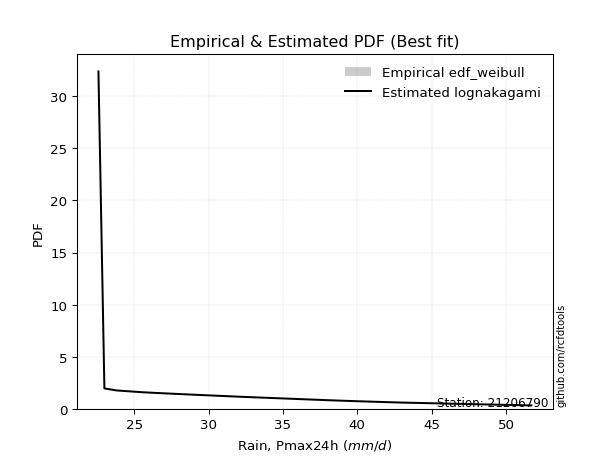</img>

</div>


### 4. EDF Beard (1943)

The Beard formula (or Beard´s plotting position formula) in hydrology is used to estimate the empirical non-exceedance probability _(P)_ of a flood event (or other extreme hydrological data point) within a given dataset.

<div align="center">


$P=(m-0.31)/(n+0.38)$


</div>


**4.1. Empirical values**

<div align="center">

|                | 0                   | 1                   | 2                  | 3                   | 4                   | 5                   | 6                  | 7                  | 8                  | 9                  | 10                 | 11                 | 12                 | 13                 | 14                 | 15                 | 16                 | 17                 | 18                 |
|:---------------|:--------------------|:--------------------|:-------------------|:--------------------|:--------------------|:--------------------|:-------------------|:-------------------|:-------------------|:-------------------|:-------------------|:-------------------|:-------------------|:-------------------|:-------------------|:-------------------|:-------------------|:-------------------|:-------------------|
| date           | 2008                | 2005                | 2006               | 2016                | 2018                | 2017                | 2011               | 2022               | 2009               | 2024               | 2020               | 2021               | 2019               | 2014               | 2007               | 2010               | 2013               | 2015               | 2012               |
| x              | 22.6                | 23.0                | 23.8               | 25.5                | 26.3                | 27.9                | 28.2               | 28.7               | 29.5               | 31.689473684210526 | 32.3               | 38.2               | 38.5               | 38.5               | 39.8               | 42.0               | 42.4               | 43.1               | 51.7               |
| m              | 1                   | 2                   | 3                  | 4                   | 5                   | 6                   | 7                  | 8                  | 9                  | 10                 | 11                 | 12                 | 13                 | 14                 | 15                 | 16                 | 17                 | 18                 | 19                 |
| empirical_dist | edf_beard           | edf_beard           | edf_beard          | edf_beard           | edf_beard           | edf_beard           | edf_beard          | edf_beard          | edf_beard          | edf_beard          | edf_beard          | edf_beard          | edf_beard          | edf_beard          | edf_beard          | edf_beard          | edf_beard          | edf_beard          | edf_beard          |
| empirical      | 0.03560371517027864 | 0.08720330237358101 | 0.1388028895768834 | 0.19040247678018576 | 0.24200206398348817 | 0.29360165118679055 | 0.3452012383900929 | 0.3968008255933953 | 0.4484004127966976 | 0.5                | 0.5515995872033024 | 0.6031991744066048 | 0.6547987616099071 | 0.7063983488132095 | 0.7579979360165119 | 0.8095975232198143 | 0.8611971104231168 | 0.9127966976264191 | 0.9643962848297215 |
| empirical_tr   | 1.0369181380417336  | 1.0955342001130581  | 1.1611743559017376 | 1.2351816443594645  | 1.3192648059904697  | 1.4156318480642804  | 1.5271867612293144 | 1.6578272027373824 | 1.812909260991581  | 2.0                | 2.230149597238205  | 2.5201560468140443 | 2.896860986547085  | 3.40597539543058   | 4.132196162046909  | 5.252032520325204  | 7.204460966542758  | 11.467455621301793 | 28.086956521739243 |

</div>


**4.2. Kolmogorov-Smirnov fit test (sorted by Δ)**


<div align="center">

|                | 0                   | 1                   | 2                   | 3                   | 4                   | 5                   | 6                   | 7                   | 8                   | 9                   | 10                  | 11                  | 12                  | 13                  | 14                  | 15                  | 16                  | 17                  | 18                  | 19                  | 20                  | 21                  | 22                  | 23                  | 24                  | 25                  | 26                  | 27                  | 28                  | 29                  | 30                  | 31                  | 32                  | 33                  | 34                  | 35                  | 36                  | 37                  | 38                  | 39                  | 40                  | 41                  | 42                  | 43                  | 44                  | 45                  | 46                  | 47                  | 48                  | 49                  | 50                  | 51                  | 52                  | 53                  | 54                  | 55                  | 56                  | 57                  | 58                  | 59                  | 60                  | 61                  | 62                  | 63                  | 64                  | 65                  | 66                  | 67                  | 68                  | 69                  | 70                  | 71                  | 72                  | 73                  | 74                  | 75                  | 76                  | 77                  | 78                  | 79                  | 80                  | 81                  | 82                  | 83                  | 84                  | 85                  | 86                  | 87                  | 88                  | 89                  | 90                  | 91                  | 92                  | 93                  | 94                  | 95                  | 96                  | 97                  | 98                  | 99                  | 100                 | 101                 | 102                 | 103                 | 104                 | 105                 | 106                 | 107                 | 108                 | 109                 | 110                 | 111                 | 112                 | 113                 | 114                 | 115                 | 116                 | 117                 | 118                 | 119                 | 120                 | 121                 | 122                 | 123                 | 124                 | 125                 | 126                 | 127                 | 128                 | 129                 | 130                 | 131                 | 132                 | 133                 | 134                 | 135                 | 136                 | 137                 | 138                 | 139                 | 140                 | 141                 | 142                 | 143                 | 144                 | 145                 | 146                 | 147                 | 148                 | 149                 | 150                 | 151                 | 152                 | 153                 | 154                 | 155                 | 156                 | 157                 | 158                 | 159                 |
|:---------------|:--------------------|:--------------------|:--------------------|:--------------------|:--------------------|:--------------------|:--------------------|:--------------------|:--------------------|:--------------------|:--------------------|:--------------------|:--------------------|:--------------------|:--------------------|:--------------------|:--------------------|:--------------------|:--------------------|:--------------------|:--------------------|:--------------------|:--------------------|:--------------------|:--------------------|:--------------------|:--------------------|:--------------------|:--------------------|:--------------------|:--------------------|:--------------------|:--------------------|:--------------------|:--------------------|:--------------------|:--------------------|:--------------------|:--------------------|:--------------------|:--------------------|:--------------------|:--------------------|:--------------------|:--------------------|:--------------------|:--------------------|:--------------------|:--------------------|:--------------------|:--------------------|:--------------------|:--------------------|:--------------------|:--------------------|:--------------------|:--------------------|:--------------------|:--------------------|:--------------------|:--------------------|:--------------------|:--------------------|:--------------------|:--------------------|:--------------------|:--------------------|:--------------------|:--------------------|:--------------------|:--------------------|:--------------------|:--------------------|:--------------------|:--------------------|:--------------------|:--------------------|:--------------------|:--------------------|:--------------------|:--------------------|:--------------------|:--------------------|:--------------------|:--------------------|:--------------------|:--------------------|:--------------------|:--------------------|:--------------------|:--------------------|:--------------------|:--------------------|:--------------------|:--------------------|:--------------------|:--------------------|:--------------------|:--------------------|:--------------------|:--------------------|:--------------------|:--------------------|:--------------------|:--------------------|:--------------------|:--------------------|:--------------------|:--------------------|:--------------------|:--------------------|:--------------------|:--------------------|:--------------------|:--------------------|:--------------------|:--------------------|:--------------------|:--------------------|:--------------------|:--------------------|:--------------------|:--------------------|:--------------------|:--------------------|:--------------------|:--------------------|:--------------------|:--------------------|:--------------------|:--------------------|:--------------------|:--------------------|:--------------------|:--------------------|:--------------------|:--------------------|:--------------------|:--------------------|:--------------------|:--------------------|:--------------------|:--------------------|:--------------------|:--------------------|:--------------------|:--------------------|:--------------------|:--------------------|:--------------------|:--------------------|:--------------------|:--------------------|:--------------------|:--------------------|:--------------------|:--------------------|:--------------------|:--------------------|:--------------------|
| station        | 21206790            | 21206790            | 21206790            | 21206790            | 21206790            | 21206790            | 21206790            | 21206790            | 21206790            | 21206790            | 21206790            | 21206790            | 21206790            | 21206790            | 21206790            | 21206790            | 21206790            | 21206790            | 21206790            | 21206790            | 21206790            | 21206790            | 21206790            | 21206790            | 21206790            | 21206790            | 21206790            | 21206790            | 21206790            | 21206790            | 21206790            | 21206790            | 21206790            | 21206790            | 21206790            | 21206790            | 21206790            | 21206790            | 21206790            | 21206790            | 21206790            | 21206790            | 21206790            | 21206790            | 21206790            | 21206790            | 21206790            | 21206790            | 21206790            | 21206790            | 21206790            | 21206790            | 21206790            | 21206790            | 21206790            | 21206790            | 21206790            | 21206790            | 21206790            | 21206790            | 21206790            | 21206790            | 21206790            | 21206790            | 21206790            | 21206790            | 21206790            | 21206790            | 21206790            | 21206790            | 21206790            | 21206790            | 21206790            | 21206790            | 21206790            | 21206790            | 21206790            | 21206790            | 21206790            | 21206790            | 21206790            | 21206790            | 21206790            | 21206790            | 21206790            | 21206790            | 21206790            | 21206790            | 21206790            | 21206790            | 21206790            | 21206790            | 21206790            | 21206790            | 21206790            | 21206790            | 21206790            | 21206790            | 21206790            | 21206790            | 21206790            | 21206790            | 21206790            | 21206790            | 21206790            | 21206790            | 21206790            | 21206790            | 21206790            | 21206790            | 21206790            | 21206790            | 21206790            | 21206790            | 21206790            | 21206790            | 21206790            | 21206790            | 21206790            | 21206790            | 21206790            | 21206790            | 21206790            | 21206790            | 21206790            | 21206790            | 21206790            | 21206790            | 21206790            | 21206790            | 21206790            | 21206790            | 21206790            | 21206790            | 21206790            | 21206790            | 21206790            | 21206790            | 21206790            | 21206790            | 21206790            | 21206790            | 21206790            | 21206790            | 21206790            | 21206790            | 21206790            | 21206790            | 21206790            | 21206790            | 21206790            | 21206790            | 21206790            | 21206790            | 21206790            | 21206790            | 21206790            | 21206790            | 21206790            | 21206790            |
| empirical_dist | edf_beard           | edf_beard           | edf_beard           | edf_beard           | edf_beard           | edf_beard           | edf_beard           | edf_beard           | edf_beard           | edf_beard           | edf_beard           | edf_beard           | edf_beard           | edf_beard           | edf_beard           | edf_beard           | edf_beard           | edf_beard           | edf_beard           | edf_beard           | edf_beard           | edf_beard           | edf_beard           | edf_beard           | edf_beard           | edf_beard           | edf_beard           | edf_beard           | edf_beard           | edf_beard           | edf_beard           | edf_beard           | edf_beard           | edf_beard           | edf_beard           | edf_beard           | edf_beard           | edf_beard           | edf_beard           | edf_beard           | edf_beard           | edf_beard           | edf_beard           | edf_beard           | edf_beard           | edf_beard           | edf_beard           | edf_beard           | edf_beard           | edf_beard           | edf_beard           | edf_beard           | edf_beard           | edf_beard           | edf_beard           | edf_beard           | edf_beard           | edf_beard           | edf_beard           | edf_beard           | edf_beard           | edf_beard           | edf_beard           | edf_beard           | edf_beard           | edf_beard           | edf_beard           | edf_beard           | edf_beard           | edf_beard           | edf_beard           | edf_beard           | edf_beard           | edf_beard           | edf_beard           | edf_beard           | edf_beard           | edf_beard           | edf_beard           | edf_beard           | edf_beard           | edf_beard           | edf_beard           | edf_beard           | edf_beard           | edf_beard           | edf_beard           | edf_beard           | edf_beard           | edf_beard           | edf_beard           | edf_beard           | edf_beard           | edf_beard           | edf_beard           | edf_beard           | edf_beard           | edf_beard           | edf_beard           | edf_beard           | edf_beard           | edf_beard           | edf_beard           | edf_beard           | edf_beard           | edf_beard           | edf_beard           | edf_beard           | edf_beard           | edf_beard           | edf_beard           | edf_beard           | edf_beard           | edf_beard           | edf_beard           | edf_beard           | edf_beard           | edf_beard           | edf_beard           | edf_beard           | edf_beard           | edf_beard           | edf_beard           | edf_beard           | edf_beard           | edf_beard           | edf_beard           | edf_beard           | edf_beard           | edf_beard           | edf_beard           | edf_beard           | edf_beard           | edf_beard           | edf_beard           | edf_beard           | edf_beard           | edf_beard           | edf_beard           | edf_beard           | edf_beard           | edf_beard           | edf_beard           | edf_beard           | edf_beard           | edf_beard           | edf_beard           | edf_beard           | edf_beard           | edf_beard           | edf_beard           | edf_beard           | edf_beard           | edf_beard           | edf_beard           | edf_beard           | edf_beard           | edf_beard           | edf_beard           | edf_beard           |
| p_dist         | arcsine             | logarcsine          | loggausshyper       | semicircular        | truncweibull_min    | truncexpon          | anglit              | logbradford         | dweibull            | logsemicircular     | truncpareto         | logjohnsonsb        | logtruncpareto      | logdgamma           | johnsonsb           | loghalfgennorm      | logtruncexpon       | gausshyper          | loganglit           | foldnorm            | lognakagami         | gamma               | genhalflogistic     | norm                | crystalball         | t                   | loguniform          | logbeta             | logvonmises_line    | logcosine           | beta                | kappa3              | logburr12           | maxwell             | logkappa3           | f                   | rayleigh            | pearson3            | rice                | gompertz            | logtukeylambda      | ncf                 | bradford            | truncnorm           | logbetaprime        | logloggamma         | logfoldnorm         | gennorm             | halfnorm            | skewnorm            | logt                | lognorm             | logcrystalball      | tukeylambda         | logexponnorm        | logistic            | betaprime           | logkappa4           | cosine              | loggenextreme       | logweibull_max      | logpearson3         | loginvgamma         | logerlang           | kappa4              | logrice             | lognct              | logmaxwell          | loggamma            | loggamma            | loglomax            | kstwobign           | logalpha            | loggumbel_l         | lomax               | genexpon            | alpha               | logf                | lograyleigh         | burr12              | weibull_min         | nct                 | genextreme          | exponnorm           | loggenexpon         | invweibull          | logjohnsonsu        | logargus            | genlogistic         | invgamma            | logfatiguelife      | logburr             | johnsonsu           | logweibull_min      | hypsecant           | invgauss            | loginvgauss         | fatiguelife         | gumbel_r            | loginvweibull       | loggenlogistic      | burr                | logmielke           | loghalfnorm         | logskewnorm         | logkstwobign        | loglogistic         | logexponpow         | logtriang           | logdweibull         | loggompertz         | halflogistic        | logncf              | logksone            | moyal               | exponpow            | gumbel_l            | logtruncweibull_min | logexponweib        | loghypsecant        | logloglaplace       | loggumbel_r         | laplace             | loghalflogistic     | halfgennorm         | logmoyal            | nakagami            | loggengamma         | dgamma              | loglaplace          | loglaplace          | logtruncnorm        | uniform             | vonmises_line       | wrapcauchy          | argus               | wald                | logwald             | ksone               | erlang              | loggenhalflogistic  | logwrapcauchy       | powerlaw            | logpowerlaw         | logrdist            | triang              | genpareto           | logtrapezoid        | loglevy_l           | loggennorm          | levy_l              | trapezoid           | exponweib           | loggenpareto        | rdist               | gengamma            | weibull_max         | logvonmises         | vonmises            | mielke              |
| delta          | 0.08497638237691107 | 0.09175016252482793 | 0.09709459090142358 | 0.09942171982242337 | 0.10147754601796366 | 0.10554203718034122 | 0.10925013104988351 | 0.10980161268906863 | 0.11131179865286212 | 0.11191195122020847 | 0.11332697053032514 | 0.11394942578201495 | 0.11458330767849245 | 0.11598561794941231 | 0.11677343989582212 | 0.12012999632660692 | 0.12150751685877992 | 0.12340863049044248 | 0.12392902706847575 | 0.12545220282849123 | 0.12598649116528715 | 0.12651216167977986 | 0.1268982573217703  | 0.13245560812381918 | 0.1324556293784963  | 0.13258657352223224 | 0.13265537190521504 | 0.13268476931854323 | 0.1329169271406616  | 0.13516767062944146 | 0.1351737912940767  | 0.13600995967481333 | 0.1360249211886455  | 0.13611274767543602 | 0.1363264605375537  | 0.138147233413503   | 0.13974438828778124 | 0.14022475727176364 | 0.14081975607935315 | 0.14109238413657232 | 0.14202759725034053 | 0.143899112251743   | 0.1459258119870389  | 0.1481721052285263  | 0.1487703036883028  | 0.1489286705944145  | 0.14958663310664488 | 0.14965707655555055 | 0.15129331582233418 | 0.15153711837954198 | 0.15161449436658325 | 0.15161489068937728 | 0.15161568617930976 | 0.15172160828255699 | 0.1517786915193251  | 0.15292443254133625 | 0.1534278181875086  | 0.15374504728270655 | 0.15515962891834673 | 0.15522954978595116 | 0.1552441828047747  | 0.15557042119725506 | 0.15748765850682067 | 0.15855927152117888 | 0.15980212529744198 | 0.15984003153547277 | 0.16032612367055865 | 0.1605703337814297  | 0.16063524325824763 | 0.16063524325824763 | 0.16114516177075455 | 0.16132537168242056 | 0.1614090063590905  | 0.16158867631829194 | 0.16190160314424284 | 0.16239913655264449 | 0.16266509225636183 | 0.16307137019058193 | 0.16312202085698269 | 0.16315449510286317 | 0.1632921714077421  | 0.16420485168321153 | 0.1646094243465207  | 0.16462172533360442 | 0.164674011086551   | 0.16482881837506125 | 0.16511650387982257 | 0.16548878597218142 | 0.16550802562415878 | 0.16571129993148137 | 0.16686694564603022 | 0.16726399972453354 | 0.16753132180886032 | 0.1679220889868278  | 0.1680806967799926  | 0.16819277313018755 | 0.16827123424606238 | 0.16843347479219162 | 0.168536175611403   | 0.16877133291433144 | 0.16880361942342026 | 0.16905834101996353 | 0.16994295948969163 | 0.17193979472769438 | 0.17226734104181718 | 0.1735101384982083  | 0.1742753232101184  | 0.17458585820062977 | 0.17582115518232072 | 0.1764107864967125  | 0.1766315420897724  | 0.1769475432315487  | 0.17877779327127963 | 0.17934559285874918 | 0.18302902801353693 | 0.1853645168805027  | 0.18646709195947425 | 0.18718884480502918 | 0.18873694600934665 | 0.18904611755274592 | 0.18921572450439195 | 0.18989311793963048 | 0.19445931179521958 | 0.19601909649570237 | 0.1975459650425319  | 0.20226226592068242 | 0.20321294320579675 | 0.20430303395660332 | 0.2069876201132107  | 0.2082815459312264  | 0.2082815459312264  | 0.21301422138075754 | 0.21826625386996923 | 0.2192573900670901  | 0.22076311510485258 | 0.22229977753304286 | 0.23077902193271288 | 0.2413122039918626  | 0.24240723599984415 | 0.2739878128799556  | 0.27655674873693237 | 0.2907745586744773  | 0.2948833434303191  | 0.32834033988210637 | 0.33199008353548676 | 0.33347085527437703 | 0.3361221423247194  | 0.3748461745415036  | 0.40449481363967504 | 0.41279669762641913 | 0.4392495979870567  | 0.4633746673664501  | 0.4659307141425751  | 0.4683244156542719  | 0.4778896674383403  | 0.4973126696651322  | 0.7301468299413955  | 1.1527876085792381  | 7.755349938838208   | nan                 |
| deltao         | 0.31564497164100014 | 0.31564497164100014 | 0.31564497164100014 | 0.31564497164100014 | 0.31564497164100014 | 0.31564497164100014 | 0.31564497164100014 | 0.31564497164100014 | 0.31564497164100014 | 0.31564497164100014 | 0.31564497164100014 | 0.31564497164100014 | 0.31564497164100014 | 0.31564497164100014 | 0.31564497164100014 | 0.31564497164100014 | 0.31564497164100014 | 0.31564497164100014 | 0.31564497164100014 | 0.31564497164100014 | 0.31564497164100014 | 0.31564497164100014 | 0.31564497164100014 | 0.31564497164100014 | 0.31564497164100014 | 0.31564497164100014 | 0.31564497164100014 | 0.31564497164100014 | 0.31564497164100014 | 0.31564497164100014 | 0.31564497164100014 | 0.31564497164100014 | 0.31564497164100014 | 0.31564497164100014 | 0.31564497164100014 | 0.31564497164100014 | 0.31564497164100014 | 0.31564497164100014 | 0.31564497164100014 | 0.31564497164100014 | 0.31564497164100014 | 0.31564497164100014 | 0.31564497164100014 | 0.31564497164100014 | 0.31564497164100014 | 0.31564497164100014 | 0.31564497164100014 | 0.31564497164100014 | 0.31564497164100014 | 0.31564497164100014 | 0.31564497164100014 | 0.31564497164100014 | 0.31564497164100014 | 0.31564497164100014 | 0.31564497164100014 | 0.31564497164100014 | 0.31564497164100014 | 0.31564497164100014 | 0.31564497164100014 | 0.31564497164100014 | 0.31564497164100014 | 0.31564497164100014 | 0.31564497164100014 | 0.31564497164100014 | 0.31564497164100014 | 0.31564497164100014 | 0.31564497164100014 | 0.31564497164100014 | 0.31564497164100014 | 0.31564497164100014 | 0.31564497164100014 | 0.31564497164100014 | 0.31564497164100014 | 0.31564497164100014 | 0.31564497164100014 | 0.31564497164100014 | 0.31564497164100014 | 0.31564497164100014 | 0.31564497164100014 | 0.31564497164100014 | 0.31564497164100014 | 0.31564497164100014 | 0.31564497164100014 | 0.31564497164100014 | 0.31564497164100014 | 0.31564497164100014 | 0.31564497164100014 | 0.31564497164100014 | 0.31564497164100014 | 0.31564497164100014 | 0.31564497164100014 | 0.31564497164100014 | 0.31564497164100014 | 0.31564497164100014 | 0.31564497164100014 | 0.31564497164100014 | 0.31564497164100014 | 0.31564497164100014 | 0.31564497164100014 | 0.31564497164100014 | 0.31564497164100014 | 0.31564497164100014 | 0.31564497164100014 | 0.31564497164100014 | 0.31564497164100014 | 0.31564497164100014 | 0.31564497164100014 | 0.31564497164100014 | 0.31564497164100014 | 0.31564497164100014 | 0.31564497164100014 | 0.31564497164100014 | 0.31564497164100014 | 0.31564497164100014 | 0.31564497164100014 | 0.31564497164100014 | 0.31564497164100014 | 0.31564497164100014 | 0.31564497164100014 | 0.31564497164100014 | 0.31564497164100014 | 0.31564497164100014 | 0.31564497164100014 | 0.31564497164100014 | 0.31564497164100014 | 0.31564497164100014 | 0.31564497164100014 | 0.31564497164100014 | 0.31564497164100014 | 0.31564497164100014 | 0.31564497164100014 | 0.31564497164100014 | 0.31564497164100014 | 0.31564497164100014 | 0.31564497164100014 | 0.31564497164100014 | 0.31564497164100014 | 0.31564497164100014 | 0.31564497164100014 | 0.31564497164100014 | 0.31564497164100014 | 0.31564497164100014 | 0.31564497164100014 | 0.31564497164100014 | 0.31564497164100014 | 0.31564497164100014 | 0.31564497164100014 | 0.31564497164100014 | 0.31564497164100014 | 0.31564497164100014 | 0.31564497164100014 | 0.31564497164100014 | 0.31564497164100014 | 0.31564497164100014 | 0.31564497164100014 | 0.31564497164100014 | 0.31564497164100014 | 0.31564497164100014 | 0.31564497164100014 | 0.31564497164100014 |
| eval           | Δo > Δ              | Δo > Δ              | Δo > Δ              | Δo > Δ              | Δo > Δ              | Δo > Δ              | Δo > Δ              | Δo > Δ              | Δo > Δ              | Δo > Δ              | Δo > Δ              | Δo > Δ              | Δo > Δ              | Δo > Δ              | Δo > Δ              | Δo > Δ              | Δo > Δ              | Δo > Δ              | Δo > Δ              | Δo > Δ              | Δo > Δ              | Δo > Δ              | Δo > Δ              | Δo > Δ              | Δo > Δ              | Δo > Δ              | Δo > Δ              | Δo > Δ              | Δo > Δ              | Δo > Δ              | Δo > Δ              | Δo > Δ              | Δo > Δ              | Δo > Δ              | Δo > Δ              | Δo > Δ              | Δo > Δ              | Δo > Δ              | Δo > Δ              | Δo > Δ              | Δo > Δ              | Δo > Δ              | Δo > Δ              | Δo > Δ              | Δo > Δ              | Δo > Δ              | Δo > Δ              | Δo > Δ              | Δo > Δ              | Δo > Δ              | Δo > Δ              | Δo > Δ              | Δo > Δ              | Δo > Δ              | Δo > Δ              | Δo > Δ              | Δo > Δ              | Δo > Δ              | Δo > Δ              | Δo > Δ              | Δo > Δ              | Δo > Δ              | Δo > Δ              | Δo > Δ              | Δo > Δ              | Δo > Δ              | Δo > Δ              | Δo > Δ              | Δo > Δ              | Δo > Δ              | Δo > Δ              | Δo > Δ              | Δo > Δ              | Δo > Δ              | Δo > Δ              | Δo > Δ              | Δo > Δ              | Δo > Δ              | Δo > Δ              | Δo > Δ              | Δo > Δ              | Δo > Δ              | Δo > Δ              | Δo > Δ              | Δo > Δ              | Δo > Δ              | Δo > Δ              | Δo > Δ              | Δo > Δ              | Δo > Δ              | Δo > Δ              | Δo > Δ              | Δo > Δ              | Δo > Δ              | Δo > Δ              | Δo > Δ              | Δo > Δ              | Δo > Δ              | Δo > Δ              | Δo > Δ              | Δo > Δ              | Δo > Δ              | Δo > Δ              | Δo > Δ              | Δo > Δ              | Δo > Δ              | Δo > Δ              | Δo > Δ              | Δo > Δ              | Δo > Δ              | Δo > Δ              | Δo > Δ              | Δo > Δ              | Δo > Δ              | Δo > Δ              | Δo > Δ              | Δo > Δ              | Δo > Δ              | Δo > Δ              | Δo > Δ              | Δo > Δ              | Δo > Δ              | Δo > Δ              | Δo > Δ              | Δo > Δ              | Δo > Δ              | Δo > Δ              | Δo > Δ              | Δo > Δ              | Δo > Δ              | Δo > Δ              | Δo > Δ              | Δo > Δ              | Δo > Δ              | Δo > Δ              | Δo > Δ              | Δo > Δ              | Δo > Δ              | Δo > Δ              | Δo > Δ              | Δo > Δ              | Δo > Δ              | Δo > Δ              | Δo <= Δ             | Δo <= Δ             | Δo <= Δ             | Δo <= Δ             | Δo <= Δ             | Δo <= Δ             | Δo <= Δ             | Δo <= Δ             | Δo <= Δ             | Δo <= Δ             | Δo <= Δ             | Δo <= Δ             | Δo <= Δ             | Δo <= Δ             | Δo <= Δ             | Δo <= Δ             | Δo <= Δ             |
| fit            | 1                   | 1                   | 1                   | 1                   | 1                   | 1                   | 1                   | 1                   | 1                   | 1                   | 1                   | 1                   | 1                   | 1                   | 1                   | 1                   | 1                   | 1                   | 1                   | 1                   | 1                   | 1                   | 1                   | 1                   | 1                   | 1                   | 1                   | 1                   | 1                   | 1                   | 1                   | 1                   | 1                   | 1                   | 1                   | 1                   | 1                   | 1                   | 1                   | 1                   | 1                   | 1                   | 1                   | 1                   | 1                   | 1                   | 1                   | 1                   | 1                   | 1                   | 1                   | 1                   | 1                   | 1                   | 1                   | 1                   | 1                   | 1                   | 1                   | 1                   | 1                   | 1                   | 1                   | 1                   | 1                   | 1                   | 1                   | 1                   | 1                   | 1                   | 1                   | 1                   | 1                   | 1                   | 1                   | 1                   | 1                   | 1                   | 1                   | 1                   | 1                   | 1                   | 1                   | 1                   | 1                   | 1                   | 1                   | 1                   | 1                   | 1                   | 1                   | 1                   | 1                   | 1                   | 1                   | 1                   | 1                   | 1                   | 1                   | 1                   | 1                   | 1                   | 1                   | 1                   | 1                   | 1                   | 1                   | 1                   | 1                   | 1                   | 1                   | 1                   | 1                   | 1                   | 1                   | 1                   | 1                   | 1                   | 1                   | 1                   | 1                   | 1                   | 1                   | 1                   | 1                   | 1                   | 1                   | 1                   | 1                   | 1                   | 1                   | 1                   | 1                   | 1                   | 1                   | 1                   | 1                   | 1                   | 1                   | 1                   | 1                   | 1                   | 1                   | 0                   | 0                   | 0                   | 0                   | 0                   | 0                   | 0                   | 0                   | 0                   | 0                   | 0                   | 0                   | 0                   | 0                   | 0                   | 0                   | 0                   |
| n              | 19                  | 19                  | 19                  | 19                  | 19                  | 19                  | 19                  | 19                  | 19                  | 19                  | 19                  | 19                  | 19                  | 19                  | 19                  | 19                  | 19                  | 19                  | 19                  | 19                  | 19                  | 19                  | 19                  | 19                  | 19                  | 19                  | 19                  | 19                  | 19                  | 19                  | 19                  | 19                  | 19                  | 19                  | 19                  | 19                  | 19                  | 19                  | 19                  | 19                  | 19                  | 19                  | 19                  | 19                  | 19                  | 19                  | 19                  | 19                  | 19                  | 19                  | 19                  | 19                  | 19                  | 19                  | 19                  | 19                  | 19                  | 19                  | 19                  | 19                  | 19                  | 19                  | 19                  | 19                  | 19                  | 19                  | 19                  | 19                  | 19                  | 19                  | 19                  | 19                  | 19                  | 19                  | 19                  | 19                  | 19                  | 19                  | 19                  | 19                  | 19                  | 19                  | 19                  | 19                  | 19                  | 19                  | 19                  | 19                  | 19                  | 19                  | 19                  | 19                  | 19                  | 19                  | 19                  | 19                  | 19                  | 19                  | 19                  | 19                  | 19                  | 19                  | 19                  | 19                  | 19                  | 19                  | 19                  | 19                  | 19                  | 19                  | 19                  | 19                  | 19                  | 19                  | 19                  | 19                  | 19                  | 19                  | 19                  | 19                  | 19                  | 19                  | 19                  | 19                  | 19                  | 19                  | 19                  | 19                  | 19                  | 19                  | 19                  | 19                  | 19                  | 19                  | 19                  | 19                  | 19                  | 19                  | 19                  | 19                  | 19                  | 19                  | 19                  | 19                  | 19                  | 19                  | 19                  | 19                  | 19                  | 19                  | 19                  | 19                  | 19                  | 19                  | 19                  | 19                  | 19                  | 19                  | 19                  | 19                  |
| best_fit       | 1                   | 0                   | 0                   | 0                   | 0                   | 0                   | 0                   | 0                   | 0                   | 0                   | 0                   | 0                   | 0                   | 0                   | 0                   | 0                   | 0                   | 0                   | 0                   | 0                   | 0                   | 0                   | 0                   | 0                   | 0                   | 0                   | 0                   | 0                   | 0                   | 0                   | 0                   | 0                   | 0                   | 0                   | 0                   | 0                   | 0                   | 0                   | 0                   | 0                   | 0                   | 0                   | 0                   | 0                   | 0                   | 0                   | 0                   | 0                   | 0                   | 0                   | 0                   | 0                   | 0                   | 0                   | 0                   | 0                   | 0                   | 0                   | 0                   | 0                   | 0                   | 0                   | 0                   | 0                   | 0                   | 0                   | 0                   | 0                   | 0                   | 0                   | 0                   | 0                   | 0                   | 0                   | 0                   | 0                   | 0                   | 0                   | 0                   | 0                   | 0                   | 0                   | 0                   | 0                   | 0                   | 0                   | 0                   | 0                   | 0                   | 0                   | 0                   | 0                   | 0                   | 0                   | 0                   | 0                   | 0                   | 0                   | 0                   | 0                   | 0                   | 0                   | 0                   | 0                   | 0                   | 0                   | 0                   | 0                   | 0                   | 0                   | 0                   | 0                   | 0                   | 0                   | 0                   | 0                   | 0                   | 0                   | 0                   | 0                   | 0                   | 0                   | 0                   | 0                   | 0                   | 0                   | 0                   | 0                   | 0                   | 0                   | 0                   | 0                   | 0                   | 0                   | 0                   | 0                   | 0                   | 0                   | 0                   | 0                   | 0                   | 0                   | 0                   | 0                   | 0                   | 0                   | 0                   | 0                   | 0                   | 0                   | 0                   | 0                   | 0                   | 0                   | 0                   | 0                   | 0                   | 0                   | 0                   | 0                   |
| best_fit_sort  | 1                   | 2                   | 3                   | 4                   | 5                   | 6                   | 7                   | 8                   | 9                   | 10                  | 11                  | 12                  | 13                  | 14                  | 15                  | 16                  | 17                  | 18                  | 19                  | 20                  | 21                  | 22                  | 23                  | 24                  | 25                  | 26                  | 27                  | 28                  | 29                  | 30                  | 31                  | 32                  | 33                  | 34                  | 35                  | 36                  | 37                  | 38                  | 39                  | 40                  | 41                  | 42                  | 43                  | 44                  | 45                  | 46                  | 47                  | 48                  | 49                  | 50                  | 51                  | 52                  | 53                  | 54                  | 55                  | 56                  | 57                  | 58                  | 59                  | 60                  | 61                  | 62                  | 63                  | 64                  | 65                  | 66                  | 67                  | 68                  | 69                  | 70                  | 71                  | 72                  | 73                  | 74                  | 75                  | 76                  | 77                  | 78                  | 79                  | 80                  | 81                  | 82                  | 83                  | 84                  | 85                  | 86                  | 87                  | 88                  | 89                  | 90                  | 91                  | 92                  | 93                  | 94                  | 95                  | 96                  | 97                  | 98                  | 99                  | 100                 | 101                 | 102                 | 103                 | 104                 | 105                 | 106                 | 107                 | 108                 | 109                 | 110                 | 111                 | 112                 | 113                 | 114                 | 115                 | 116                 | 117                 | 118                 | 119                 | 120                 | 121                 | 122                 | 123                 | 124                 | 125                 | 126                 | 127                 | 128                 | 129                 | 130                 | 131                 | 132                 | 133                 | 134                 | 135                 | 136                 | 137                 | 138                 | 139                 | 140                 | 141                 | 142                 | 143                 | 144                 | 145                 | 146                 | 147                 | 148                 | 149                 | 150                 | 151                 | 152                 | 153                 | 154                 | 155                 | 156                 | 157                 | 158                 | 159                 | 160                 |

</div>


**4.3. Best fit**

<div align="center">

|   id |   station | empirical_dist   | p_dist   |     delta |   deltao | eval   |   fit |   n |   best_fit |   best_fit_sort |
|-----:|----------:|:-----------------|:---------|----------:|---------:|:-------|------:|----:|-----------:|----------------:|
|    0 |  21206790 | edf_beard        | arcsine  | 0.0849764 | 0.315645 | Δo > Δ |     1 |  19 |          1 |               1 |

</div>


<div align="center">

</img>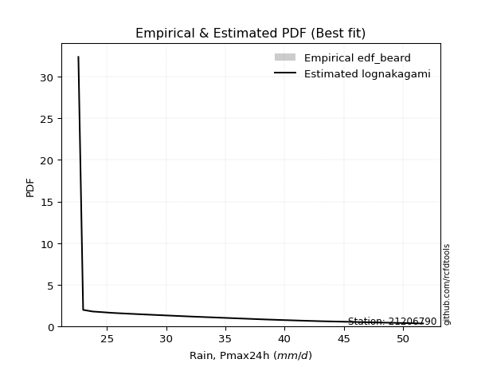</img>

</div>


### 5. EDF Chegodayev (1955)

The Chegodayev formula is an empirical plotting position formula used in hydrological frequency analysis to estimate the exceedance probability or return period of a specific event from a set of observed data. It is primarily used for plotting observed data points on probability paper to fit a theoretical distribution, particularly for analyzing extreme events like maximum flood flows or rainfall intensities. The constant _b_ value in the generalized plotting position formula is 0.3.

<div align="center">


$P=(m-b)/(n+1-2b)$


</div>


**5.1. Empirical values**

<div align="center">

|                | 0                   | 1                   | 2                  | 3                  | 4                   | 5                   | 6                  | 7                  | 8                  | 9                  | 10                 | 11                 | 12                 | 13                 | 14                 | 15                 | 16                 | 17                 | 18                 |
|:---------------|:--------------------|:--------------------|:-------------------|:-------------------|:--------------------|:--------------------|:-------------------|:-------------------|:-------------------|:-------------------|:-------------------|:-------------------|:-------------------|:-------------------|:-------------------|:-------------------|:-------------------|:-------------------|:-------------------|
| date           | 2008                | 2005                | 2006               | 2016               | 2018                | 2017                | 2011               | 2022               | 2009               | 2024               | 2020               | 2021               | 2019               | 2014               | 2007               | 2010               | 2013               | 2015               | 2012               |
| x              | 22.6                | 23.0                | 23.8               | 25.5               | 26.3                | 27.9                | 28.2               | 28.7               | 29.5               | 31.689473684210526 | 32.3               | 38.2               | 38.5               | 38.5               | 39.8               | 42.0               | 42.4               | 43.1               | 51.7               |
| m              | 1                   | 2                   | 3                  | 4                  | 5                   | 6                   | 7                  | 8                  | 9                  | 10                 | 11                 | 12                 | 13                 | 14                 | 15                 | 16                 | 17                 | 18                 | 19                 |
| empirical_dist | edf_chegodayev      | edf_chegodayev      | edf_chegodayev     | edf_chegodayev     | edf_chegodayev      | edf_chegodayev      | edf_chegodayev     | edf_chegodayev     | edf_chegodayev     | edf_chegodayev     | edf_chegodayev     | edf_chegodayev     | edf_chegodayev     | edf_chegodayev     | edf_chegodayev     | edf_chegodayev     | edf_chegodayev     | edf_chegodayev     | edf_chegodayev     |
| empirical      | 0.03608247422680413 | 0.08762886597938145 | 0.1391752577319588 | 0.1907216494845361 | 0.24226804123711343 | 0.29381443298969073 | 0.3453608247422681 | 0.3969072164948454 | 0.4484536082474227 | 0.5                | 0.5515463917525774 | 0.6030927835051546 | 0.654639175257732  | 0.7061855670103093 | 0.7577319587628866 | 0.8092783505154639 | 0.8608247422680413 | 0.9123711340206185 | 0.9639175257731959 |
| empirical_tr   | 1.0374331550802138  | 1.096045197740113   | 1.1616766467065869 | 1.2356687898089171 | 1.3197278911564627  | 1.416058394160584   | 1.5275590551181104 | 1.6581196581196582 | 1.8130841121495327 | 2.0                | 2.2298850574712645 | 2.519480519480519  | 2.8955223880597014 | 3.403508771929825  | 4.127659574468085  | 5.243243243243244  | 7.185185185185188  | 11.41176470588235  | 27.714285714285726 |

</div>


**5.2. Kolmogorov-Smirnov fit test (sorted by Δ)**


<div align="center">

|                | 0                   | 1                   | 2                   | 3                   | 4                   | 5                   | 6                   | 7                   | 8                   | 9                   | 10                  | 11                  | 12                  | 13                  | 14                  | 15                  | 16                  | 17                  | 18                  | 19                  | 20                  | 21                  | 22                  | 23                  | 24                  | 25                  | 26                  | 27                  | 28                  | 29                  | 30                  | 31                  | 32                  | 33                  | 34                  | 35                  | 36                  | 37                  | 38                  | 39                  | 40                  | 41                  | 42                  | 43                  | 44                  | 45                  | 46                  | 47                  | 48                  | 49                  | 50                  | 51                  | 52                  | 53                  | 54                  | 55                  | 56                  | 57                  | 58                  | 59                  | 60                  | 61                  | 62                  | 63                  | 64                  | 65                  | 66                  | 67                  | 68                  | 69                  | 70                  | 71                  | 72                  | 73                  | 74                  | 75                  | 76                  | 77                  | 78                  | 79                  | 80                  | 81                  | 82                  | 83                  | 84                  | 85                  | 86                  | 87                  | 88                  | 89                  | 90                  | 91                  | 92                  | 93                  | 94                  | 95                  | 96                  | 97                  | 98                  | 99                  | 100                 | 101                 | 102                 | 103                 | 104                 | 105                 | 106                 | 107                 | 108                 | 109                 | 110                 | 111                 | 112                 | 113                 | 114                 | 115                 | 116                 | 117                 | 118                 | 119                 | 120                 | 121                 | 122                 | 123                 | 124                 | 125                 | 126                 | 127                 | 128                 | 129                 | 130                 | 131                 | 132                 | 133                 | 134                 | 135                 | 136                 | 137                 | 138                 | 139                 | 140                 | 141                 | 142                 | 143                 | 144                 | 145                 | 146                 | 147                 | 148                 | 149                 | 150                 | 151                 | 152                 | 153                 | 154                 | 155                 | 156                 | 157                 | 158                 | 159                 |
|:---------------|:--------------------|:--------------------|:--------------------|:--------------------|:--------------------|:--------------------|:--------------------|:--------------------|:--------------------|:--------------------|:--------------------|:--------------------|:--------------------|:--------------------|:--------------------|:--------------------|:--------------------|:--------------------|:--------------------|:--------------------|:--------------------|:--------------------|:--------------------|:--------------------|:--------------------|:--------------------|:--------------------|:--------------------|:--------------------|:--------------------|:--------------------|:--------------------|:--------------------|:--------------------|:--------------------|:--------------------|:--------------------|:--------------------|:--------------------|:--------------------|:--------------------|:--------------------|:--------------------|:--------------------|:--------------------|:--------------------|:--------------------|:--------------------|:--------------------|:--------------------|:--------------------|:--------------------|:--------------------|:--------------------|:--------------------|:--------------------|:--------------------|:--------------------|:--------------------|:--------------------|:--------------------|:--------------------|:--------------------|:--------------------|:--------------------|:--------------------|:--------------------|:--------------------|:--------------------|:--------------------|:--------------------|:--------------------|:--------------------|:--------------------|:--------------------|:--------------------|:--------------------|:--------------------|:--------------------|:--------------------|:--------------------|:--------------------|:--------------------|:--------------------|:--------------------|:--------------------|:--------------------|:--------------------|:--------------------|:--------------------|:--------------------|:--------------------|:--------------------|:--------------------|:--------------------|:--------------------|:--------------------|:--------------------|:--------------------|:--------------------|:--------------------|:--------------------|:--------------------|:--------------------|:--------------------|:--------------------|:--------------------|:--------------------|:--------------------|:--------------------|:--------------------|:--------------------|:--------------------|:--------------------|:--------------------|:--------------------|:--------------------|:--------------------|:--------------------|:--------------------|:--------------------|:--------------------|:--------------------|:--------------------|:--------------------|:--------------------|:--------------------|:--------------------|:--------------------|:--------------------|:--------------------|:--------------------|:--------------------|:--------------------|:--------------------|:--------------------|:--------------------|:--------------------|:--------------------|:--------------------|:--------------------|:--------------------|:--------------------|:--------------------|:--------------------|:--------------------|:--------------------|:--------------------|:--------------------|:--------------------|:--------------------|:--------------------|:--------------------|:--------------------|:--------------------|:--------------------|:--------------------|:--------------------|:--------------------|:--------------------|
| station        | 21206790            | 21206790            | 21206790            | 21206790            | 21206790            | 21206790            | 21206790            | 21206790            | 21206790            | 21206790            | 21206790            | 21206790            | 21206790            | 21206790            | 21206790            | 21206790            | 21206790            | 21206790            | 21206790            | 21206790            | 21206790            | 21206790            | 21206790            | 21206790            | 21206790            | 21206790            | 21206790            | 21206790            | 21206790            | 21206790            | 21206790            | 21206790            | 21206790            | 21206790            | 21206790            | 21206790            | 21206790            | 21206790            | 21206790            | 21206790            | 21206790            | 21206790            | 21206790            | 21206790            | 21206790            | 21206790            | 21206790            | 21206790            | 21206790            | 21206790            | 21206790            | 21206790            | 21206790            | 21206790            | 21206790            | 21206790            | 21206790            | 21206790            | 21206790            | 21206790            | 21206790            | 21206790            | 21206790            | 21206790            | 21206790            | 21206790            | 21206790            | 21206790            | 21206790            | 21206790            | 21206790            | 21206790            | 21206790            | 21206790            | 21206790            | 21206790            | 21206790            | 21206790            | 21206790            | 21206790            | 21206790            | 21206790            | 21206790            | 21206790            | 21206790            | 21206790            | 21206790            | 21206790            | 21206790            | 21206790            | 21206790            | 21206790            | 21206790            | 21206790            | 21206790            | 21206790            | 21206790            | 21206790            | 21206790            | 21206790            | 21206790            | 21206790            | 21206790            | 21206790            | 21206790            | 21206790            | 21206790            | 21206790            | 21206790            | 21206790            | 21206790            | 21206790            | 21206790            | 21206790            | 21206790            | 21206790            | 21206790            | 21206790            | 21206790            | 21206790            | 21206790            | 21206790            | 21206790            | 21206790            | 21206790            | 21206790            | 21206790            | 21206790            | 21206790            | 21206790            | 21206790            | 21206790            | 21206790            | 21206790            | 21206790            | 21206790            | 21206790            | 21206790            | 21206790            | 21206790            | 21206790            | 21206790            | 21206790            | 21206790            | 21206790            | 21206790            | 21206790            | 21206790            | 21206790            | 21206790            | 21206790            | 21206790            | 21206790            | 21206790            | 21206790            | 21206790            | 21206790            | 21206790            | 21206790            | 21206790            |
| empirical_dist | edf_chegodayev      | edf_chegodayev      | edf_chegodayev      | edf_chegodayev      | edf_chegodayev      | edf_chegodayev      | edf_chegodayev      | edf_chegodayev      | edf_chegodayev      | edf_chegodayev      | edf_chegodayev      | edf_chegodayev      | edf_chegodayev      | edf_chegodayev      | edf_chegodayev      | edf_chegodayev      | edf_chegodayev      | edf_chegodayev      | edf_chegodayev      | edf_chegodayev      | edf_chegodayev      | edf_chegodayev      | edf_chegodayev      | edf_chegodayev      | edf_chegodayev      | edf_chegodayev      | edf_chegodayev      | edf_chegodayev      | edf_chegodayev      | edf_chegodayev      | edf_chegodayev      | edf_chegodayev      | edf_chegodayev      | edf_chegodayev      | edf_chegodayev      | edf_chegodayev      | edf_chegodayev      | edf_chegodayev      | edf_chegodayev      | edf_chegodayev      | edf_chegodayev      | edf_chegodayev      | edf_chegodayev      | edf_chegodayev      | edf_chegodayev      | edf_chegodayev      | edf_chegodayev      | edf_chegodayev      | edf_chegodayev      | edf_chegodayev      | edf_chegodayev      | edf_chegodayev      | edf_chegodayev      | edf_chegodayev      | edf_chegodayev      | edf_chegodayev      | edf_chegodayev      | edf_chegodayev      | edf_chegodayev      | edf_chegodayev      | edf_chegodayev      | edf_chegodayev      | edf_chegodayev      | edf_chegodayev      | edf_chegodayev      | edf_chegodayev      | edf_chegodayev      | edf_chegodayev      | edf_chegodayev      | edf_chegodayev      | edf_chegodayev      | edf_chegodayev      | edf_chegodayev      | edf_chegodayev      | edf_chegodayev      | edf_chegodayev      | edf_chegodayev      | edf_chegodayev      | edf_chegodayev      | edf_chegodayev      | edf_chegodayev      | edf_chegodayev      | edf_chegodayev      | edf_chegodayev      | edf_chegodayev      | edf_chegodayev      | edf_chegodayev      | edf_chegodayev      | edf_chegodayev      | edf_chegodayev      | edf_chegodayev      | edf_chegodayev      | edf_chegodayev      | edf_chegodayev      | edf_chegodayev      | edf_chegodayev      | edf_chegodayev      | edf_chegodayev      | edf_chegodayev      | edf_chegodayev      | edf_chegodayev      | edf_chegodayev      | edf_chegodayev      | edf_chegodayev      | edf_chegodayev      | edf_chegodayev      | edf_chegodayev      | edf_chegodayev      | edf_chegodayev      | edf_chegodayev      | edf_chegodayev      | edf_chegodayev      | edf_chegodayev      | edf_chegodayev      | edf_chegodayev      | edf_chegodayev      | edf_chegodayev      | edf_chegodayev      | edf_chegodayev      | edf_chegodayev      | edf_chegodayev      | edf_chegodayev      | edf_chegodayev      | edf_chegodayev      | edf_chegodayev      | edf_chegodayev      | edf_chegodayev      | edf_chegodayev      | edf_chegodayev      | edf_chegodayev      | edf_chegodayev      | edf_chegodayev      | edf_chegodayev      | edf_chegodayev      | edf_chegodayev      | edf_chegodayev      | edf_chegodayev      | edf_chegodayev      | edf_chegodayev      | edf_chegodayev      | edf_chegodayev      | edf_chegodayev      | edf_chegodayev      | edf_chegodayev      | edf_chegodayev      | edf_chegodayev      | edf_chegodayev      | edf_chegodayev      | edf_chegodayev      | edf_chegodayev      | edf_chegodayev      | edf_chegodayev      | edf_chegodayev      | edf_chegodayev      | edf_chegodayev      | edf_chegodayev      | edf_chegodayev      | edf_chegodayev      | edf_chegodayev      | edf_chegodayev      |
| p_dist         | arcsine             | logarcsine          | loggausshyper       | semicircular        | truncweibull_min    | truncexpon          | anglit              | logbradford         | dweibull            | logsemicircular     | truncpareto         | logjohnsonsb        | logtruncpareto      | logdgamma           | johnsonsb           | loghalfgennorm      | logtruncexpon       | gausshyper          | loganglit           | foldnorm            | lognakagami         | gamma               | genhalflogistic     | loguniform          | logbeta             | logvonmises_line    | norm                | crystalball         | t                   | logcosine           | beta                | logkappa3           | kappa3              | logburr12           | maxwell             | f                   | rayleigh            | pearson3            | rice                | gompertz            | logtukeylambda      | ncf                 | bradford            | truncnorm           | logbetaprime        | logloggamma         | logfoldnorm         | gennorm             | halfnorm            | skewnorm            | logt                | lognorm             | logcrystalball      | tukeylambda         | logexponnorm        | logistic            | logkappa4           | betaprime           | cosine              | loggenextreme       | logweibull_max      | logpearson3         | loginvgamma         | logerlang           | kappa4              | logrice             | lognct              | logmaxwell          | loggamma            | loggamma            | loglomax            | kstwobign           | logalpha            | loggumbel_l         | lomax               | genexpon            | alpha               | logf                | lograyleigh         | burr12              | weibull_min         | nct                 | genextreme          | exponnorm           | loggenexpon         | invweibull          | logjohnsonsu        | logargus            | genlogistic         | invgamma            | logfatiguelife      | logburr             | johnsonsu           | logweibull_min      | hypsecant           | invgauss            | loginvgauss         | fatiguelife         | gumbel_r            | loginvweibull       | loggenlogistic      | burr                | logmielke           | loghalfnorm         | logskewnorm         | logkstwobign        | loglogistic         | logexponpow         | logtriang           | logdweibull         | loggompertz         | halflogistic        | logncf              | logksone            | moyal               | exponpow            | gumbel_l            | logtruncweibull_min | logexponweib        | loghypsecant        | logloglaplace       | loggumbel_r         | laplace             | loghalflogistic     | halfgennorm         | logmoyal            | nakagami            | loggengamma         | dgamma              | loglaplace          | loglaplace          | logtruncnorm        | uniform             | vonmises_line       | wrapcauchy          | argus               | wald                | logwald             | ksone               | erlang              | loggenhalflogistic  | logwrapcauchy       | powerlaw            | logpowerlaw         | logrdist            | triang              | genpareto           | logtrapezoid        | loglevy_l           | loggennorm          | levy_l              | trapezoid           | exponweib           | loggenpareto        | rdist               | gengamma            | weibull_max         | logvonmises         | vonmises            | mielke              |
| delta          | 0.08455081877111048 | 0.09132459891902733 | 0.09720098180287373 | 0.09947491527314845 | 0.10105198241216307 | 0.1055952326310663  | 0.10930332650060859 | 0.10990800359051878 | 0.11109901684996193 | 0.11201834212165862 | 0.11343336143177529 | 0.11352386217621435 | 0.1146896985799426  | 0.11577283614651213 | 0.11634787629002152 | 0.12023638722805707 | 0.12161390776023007 | 0.12351502139189263 | 0.1240354179699259  | 0.12555859372994138 | 0.1260928820667373  | 0.12661855258123    | 0.12700464822322044 | 0.13222980829941444 | 0.13225920571274263 | 0.13249136353486102 | 0.13250880357454425 | 0.13250882482922138 | 0.13263976897295732 | 0.1352740615308916  | 0.13528018219552684 | 0.1359008969317531  | 0.1360631551255384  | 0.13613131209009566 | 0.13621913857688617 | 0.13825362431495314 | 0.1398507791892314  | 0.1403311481732138  | 0.1409261469808033  | 0.14119877503802247 | 0.14160203364453994 | 0.14400550315319316 | 0.14550024838123832 | 0.14827849612997646 | 0.1483447400825022  | 0.14903506149586465 | 0.14969302400809503 | 0.14971027200627562 | 0.15139970672378433 | 0.15164350928099213 | 0.1517208852680334  | 0.15172128159082743 | 0.1517220770807599  | 0.15182799918400713 | 0.15188508242077525 | 0.15297762799206133 | 0.15331948367690595 | 0.15353420908895876 | 0.1552128243690718  | 0.1553359406874013  | 0.15535057370622485 | 0.1556768120987052  | 0.15759404940827082 | 0.15866566242262903 | 0.15937656169164138 | 0.15994642243692292 | 0.1604325145720088  | 0.16067672468287986 | 0.16074163415969778 | 0.16074163415969778 | 0.1612515526722047  | 0.1614317625838707  | 0.16151539726054065 | 0.161641871769017   | 0.162007994045693   | 0.16250552745409463 | 0.16277148315781198 | 0.16317776109203208 | 0.16322841175843283 | 0.16326088600431332 | 0.16339856230919225 | 0.16431124258466168 | 0.16471581524797085 | 0.16472811623505457 | 0.16478040198800115 | 0.1649352092765114  | 0.16522289478127272 | 0.1655419814229065  | 0.16561441652560893 | 0.16581769083293152 | 0.16697333654748037 | 0.1673703906259837  | 0.16763771271031047 | 0.16802847988827796 | 0.16813389223071767 | 0.1682991640316377  | 0.16837762514751253 | 0.16853986569364177 | 0.16864256651285314 | 0.1688777238157816  | 0.1689100103248704  | 0.16916473192141368 | 0.17004935039114177 | 0.17204618562914453 | 0.17237373194326733 | 0.17361652939965844 | 0.17438171411156855 | 0.17469224910207992 | 0.1758743506330458  | 0.17651717739816264 | 0.17673793299122253 | 0.17705393413299886 | 0.17835222966547903 | 0.1789200292529486  | 0.18313541891498708 | 0.18547090778195285 | 0.18652028741019933 | 0.18729523570647932 | 0.1888433369107968  | 0.18915250845419607 | 0.1893221154058421  | 0.18999950884108063 | 0.19451250724594465 | 0.19612548739715252 | 0.19733318323963173 | 0.20236865682213256 | 0.2033193341072469  | 0.20440942485805347 | 0.20709401101466085 | 0.20838793683267653 | 0.20838793683267653 | 0.2131206122822077  | 0.2182130584192442  | 0.2192041946163651  | 0.220337551499052   | 0.22224658208231785 | 0.23104499918633814 | 0.24141859489331274 | 0.24198167239404356 | 0.2737750310770554  | 0.2761311851311318  | 0.29034899506867673 | 0.29456417072596874 | 0.3281275580792062  | 0.33156451992968616 | 0.33304529166857644 | 0.33564338326819393 | 0.374420610935703   | 0.4040160545831496  | 0.41237113402061853 | 0.43877083893053126 | 0.4629491037606495  | 0.4657179323396749  | 0.46784565659774646 | 0.4774109083818149  | 0.4969934969607819  | 0.7297212663355949  | 1.1528939994806882  | 7.755828697894733   | nan                 |
| deltao         | 0.31564497164100014 | 0.31564497164100014 | 0.31564497164100014 | 0.31564497164100014 | 0.31564497164100014 | 0.31564497164100014 | 0.31564497164100014 | 0.31564497164100014 | 0.31564497164100014 | 0.31564497164100014 | 0.31564497164100014 | 0.31564497164100014 | 0.31564497164100014 | 0.31564497164100014 | 0.31564497164100014 | 0.31564497164100014 | 0.31564497164100014 | 0.31564497164100014 | 0.31564497164100014 | 0.31564497164100014 | 0.31564497164100014 | 0.31564497164100014 | 0.31564497164100014 | 0.31564497164100014 | 0.31564497164100014 | 0.31564497164100014 | 0.31564497164100014 | 0.31564497164100014 | 0.31564497164100014 | 0.31564497164100014 | 0.31564497164100014 | 0.31564497164100014 | 0.31564497164100014 | 0.31564497164100014 | 0.31564497164100014 | 0.31564497164100014 | 0.31564497164100014 | 0.31564497164100014 | 0.31564497164100014 | 0.31564497164100014 | 0.31564497164100014 | 0.31564497164100014 | 0.31564497164100014 | 0.31564497164100014 | 0.31564497164100014 | 0.31564497164100014 | 0.31564497164100014 | 0.31564497164100014 | 0.31564497164100014 | 0.31564497164100014 | 0.31564497164100014 | 0.31564497164100014 | 0.31564497164100014 | 0.31564497164100014 | 0.31564497164100014 | 0.31564497164100014 | 0.31564497164100014 | 0.31564497164100014 | 0.31564497164100014 | 0.31564497164100014 | 0.31564497164100014 | 0.31564497164100014 | 0.31564497164100014 | 0.31564497164100014 | 0.31564497164100014 | 0.31564497164100014 | 0.31564497164100014 | 0.31564497164100014 | 0.31564497164100014 | 0.31564497164100014 | 0.31564497164100014 | 0.31564497164100014 | 0.31564497164100014 | 0.31564497164100014 | 0.31564497164100014 | 0.31564497164100014 | 0.31564497164100014 | 0.31564497164100014 | 0.31564497164100014 | 0.31564497164100014 | 0.31564497164100014 | 0.31564497164100014 | 0.31564497164100014 | 0.31564497164100014 | 0.31564497164100014 | 0.31564497164100014 | 0.31564497164100014 | 0.31564497164100014 | 0.31564497164100014 | 0.31564497164100014 | 0.31564497164100014 | 0.31564497164100014 | 0.31564497164100014 | 0.31564497164100014 | 0.31564497164100014 | 0.31564497164100014 | 0.31564497164100014 | 0.31564497164100014 | 0.31564497164100014 | 0.31564497164100014 | 0.31564497164100014 | 0.31564497164100014 | 0.31564497164100014 | 0.31564497164100014 | 0.31564497164100014 | 0.31564497164100014 | 0.31564497164100014 | 0.31564497164100014 | 0.31564497164100014 | 0.31564497164100014 | 0.31564497164100014 | 0.31564497164100014 | 0.31564497164100014 | 0.31564497164100014 | 0.31564497164100014 | 0.31564497164100014 | 0.31564497164100014 | 0.31564497164100014 | 0.31564497164100014 | 0.31564497164100014 | 0.31564497164100014 | 0.31564497164100014 | 0.31564497164100014 | 0.31564497164100014 | 0.31564497164100014 | 0.31564497164100014 | 0.31564497164100014 | 0.31564497164100014 | 0.31564497164100014 | 0.31564497164100014 | 0.31564497164100014 | 0.31564497164100014 | 0.31564497164100014 | 0.31564497164100014 | 0.31564497164100014 | 0.31564497164100014 | 0.31564497164100014 | 0.31564497164100014 | 0.31564497164100014 | 0.31564497164100014 | 0.31564497164100014 | 0.31564497164100014 | 0.31564497164100014 | 0.31564497164100014 | 0.31564497164100014 | 0.31564497164100014 | 0.31564497164100014 | 0.31564497164100014 | 0.31564497164100014 | 0.31564497164100014 | 0.31564497164100014 | 0.31564497164100014 | 0.31564497164100014 | 0.31564497164100014 | 0.31564497164100014 | 0.31564497164100014 | 0.31564497164100014 | 0.31564497164100014 | 0.31564497164100014 | 0.31564497164100014 |
| eval           | Δo > Δ              | Δo > Δ              | Δo > Δ              | Δo > Δ              | Δo > Δ              | Δo > Δ              | Δo > Δ              | Δo > Δ              | Δo > Δ              | Δo > Δ              | Δo > Δ              | Δo > Δ              | Δo > Δ              | Δo > Δ              | Δo > Δ              | Δo > Δ              | Δo > Δ              | Δo > Δ              | Δo > Δ              | Δo > Δ              | Δo > Δ              | Δo > Δ              | Δo > Δ              | Δo > Δ              | Δo > Δ              | Δo > Δ              | Δo > Δ              | Δo > Δ              | Δo > Δ              | Δo > Δ              | Δo > Δ              | Δo > Δ              | Δo > Δ              | Δo > Δ              | Δo > Δ              | Δo > Δ              | Δo > Δ              | Δo > Δ              | Δo > Δ              | Δo > Δ              | Δo > Δ              | Δo > Δ              | Δo > Δ              | Δo > Δ              | Δo > Δ              | Δo > Δ              | Δo > Δ              | Δo > Δ              | Δo > Δ              | Δo > Δ              | Δo > Δ              | Δo > Δ              | Δo > Δ              | Δo > Δ              | Δo > Δ              | Δo > Δ              | Δo > Δ              | Δo > Δ              | Δo > Δ              | Δo > Δ              | Δo > Δ              | Δo > Δ              | Δo > Δ              | Δo > Δ              | Δo > Δ              | Δo > Δ              | Δo > Δ              | Δo > Δ              | Δo > Δ              | Δo > Δ              | Δo > Δ              | Δo > Δ              | Δo > Δ              | Δo > Δ              | Δo > Δ              | Δo > Δ              | Δo > Δ              | Δo > Δ              | Δo > Δ              | Δo > Δ              | Δo > Δ              | Δo > Δ              | Δo > Δ              | Δo > Δ              | Δo > Δ              | Δo > Δ              | Δo > Δ              | Δo > Δ              | Δo > Δ              | Δo > Δ              | Δo > Δ              | Δo > Δ              | Δo > Δ              | Δo > Δ              | Δo > Δ              | Δo > Δ              | Δo > Δ              | Δo > Δ              | Δo > Δ              | Δo > Δ              | Δo > Δ              | Δo > Δ              | Δo > Δ              | Δo > Δ              | Δo > Δ              | Δo > Δ              | Δo > Δ              | Δo > Δ              | Δo > Δ              | Δo > Δ              | Δo > Δ              | Δo > Δ              | Δo > Δ              | Δo > Δ              | Δo > Δ              | Δo > Δ              | Δo > Δ              | Δo > Δ              | Δo > Δ              | Δo > Δ              | Δo > Δ              | Δo > Δ              | Δo > Δ              | Δo > Δ              | Δo > Δ              | Δo > Δ              | Δo > Δ              | Δo > Δ              | Δo > Δ              | Δo > Δ              | Δo > Δ              | Δo > Δ              | Δo > Δ              | Δo > Δ              | Δo > Δ              | Δo > Δ              | Δo > Δ              | Δo > Δ              | Δo > Δ              | Δo > Δ              | Δo > Δ              | Δo > Δ              | Δo > Δ              | Δo <= Δ             | Δo <= Δ             | Δo <= Δ             | Δo <= Δ             | Δo <= Δ             | Δo <= Δ             | Δo <= Δ             | Δo <= Δ             | Δo <= Δ             | Δo <= Δ             | Δo <= Δ             | Δo <= Δ             | Δo <= Δ             | Δo <= Δ             | Δo <= Δ             | Δo <= Δ             | Δo <= Δ             |
| fit            | 1                   | 1                   | 1                   | 1                   | 1                   | 1                   | 1                   | 1                   | 1                   | 1                   | 1                   | 1                   | 1                   | 1                   | 1                   | 1                   | 1                   | 1                   | 1                   | 1                   | 1                   | 1                   | 1                   | 1                   | 1                   | 1                   | 1                   | 1                   | 1                   | 1                   | 1                   | 1                   | 1                   | 1                   | 1                   | 1                   | 1                   | 1                   | 1                   | 1                   | 1                   | 1                   | 1                   | 1                   | 1                   | 1                   | 1                   | 1                   | 1                   | 1                   | 1                   | 1                   | 1                   | 1                   | 1                   | 1                   | 1                   | 1                   | 1                   | 1                   | 1                   | 1                   | 1                   | 1                   | 1                   | 1                   | 1                   | 1                   | 1                   | 1                   | 1                   | 1                   | 1                   | 1                   | 1                   | 1                   | 1                   | 1                   | 1                   | 1                   | 1                   | 1                   | 1                   | 1                   | 1                   | 1                   | 1                   | 1                   | 1                   | 1                   | 1                   | 1                   | 1                   | 1                   | 1                   | 1                   | 1                   | 1                   | 1                   | 1                   | 1                   | 1                   | 1                   | 1                   | 1                   | 1                   | 1                   | 1                   | 1                   | 1                   | 1                   | 1                   | 1                   | 1                   | 1                   | 1                   | 1                   | 1                   | 1                   | 1                   | 1                   | 1                   | 1                   | 1                   | 1                   | 1                   | 1                   | 1                   | 1                   | 1                   | 1                   | 1                   | 1                   | 1                   | 1                   | 1                   | 1                   | 1                   | 1                   | 1                   | 1                   | 1                   | 1                   | 0                   | 0                   | 0                   | 0                   | 0                   | 0                   | 0                   | 0                   | 0                   | 0                   | 0                   | 0                   | 0                   | 0                   | 0                   | 0                   | 0                   |
| n              | 19                  | 19                  | 19                  | 19                  | 19                  | 19                  | 19                  | 19                  | 19                  | 19                  | 19                  | 19                  | 19                  | 19                  | 19                  | 19                  | 19                  | 19                  | 19                  | 19                  | 19                  | 19                  | 19                  | 19                  | 19                  | 19                  | 19                  | 19                  | 19                  | 19                  | 19                  | 19                  | 19                  | 19                  | 19                  | 19                  | 19                  | 19                  | 19                  | 19                  | 19                  | 19                  | 19                  | 19                  | 19                  | 19                  | 19                  | 19                  | 19                  | 19                  | 19                  | 19                  | 19                  | 19                  | 19                  | 19                  | 19                  | 19                  | 19                  | 19                  | 19                  | 19                  | 19                  | 19                  | 19                  | 19                  | 19                  | 19                  | 19                  | 19                  | 19                  | 19                  | 19                  | 19                  | 19                  | 19                  | 19                  | 19                  | 19                  | 19                  | 19                  | 19                  | 19                  | 19                  | 19                  | 19                  | 19                  | 19                  | 19                  | 19                  | 19                  | 19                  | 19                  | 19                  | 19                  | 19                  | 19                  | 19                  | 19                  | 19                  | 19                  | 19                  | 19                  | 19                  | 19                  | 19                  | 19                  | 19                  | 19                  | 19                  | 19                  | 19                  | 19                  | 19                  | 19                  | 19                  | 19                  | 19                  | 19                  | 19                  | 19                  | 19                  | 19                  | 19                  | 19                  | 19                  | 19                  | 19                  | 19                  | 19                  | 19                  | 19                  | 19                  | 19                  | 19                  | 19                  | 19                  | 19                  | 19                  | 19                  | 19                  | 19                  | 19                  | 19                  | 19                  | 19                  | 19                  | 19                  | 19                  | 19                  | 19                  | 19                  | 19                  | 19                  | 19                  | 19                  | 19                  | 19                  | 19                  | 19                  |
| best_fit       | 1                   | 0                   | 0                   | 0                   | 0                   | 0                   | 0                   | 0                   | 0                   | 0                   | 0                   | 0                   | 0                   | 0                   | 0                   | 0                   | 0                   | 0                   | 0                   | 0                   | 0                   | 0                   | 0                   | 0                   | 0                   | 0                   | 0                   | 0                   | 0                   | 0                   | 0                   | 0                   | 0                   | 0                   | 0                   | 0                   | 0                   | 0                   | 0                   | 0                   | 0                   | 0                   | 0                   | 0                   | 0                   | 0                   | 0                   | 0                   | 0                   | 0                   | 0                   | 0                   | 0                   | 0                   | 0                   | 0                   | 0                   | 0                   | 0                   | 0                   | 0                   | 0                   | 0                   | 0                   | 0                   | 0                   | 0                   | 0                   | 0                   | 0                   | 0                   | 0                   | 0                   | 0                   | 0                   | 0                   | 0                   | 0                   | 0                   | 0                   | 0                   | 0                   | 0                   | 0                   | 0                   | 0                   | 0                   | 0                   | 0                   | 0                   | 0                   | 0                   | 0                   | 0                   | 0                   | 0                   | 0                   | 0                   | 0                   | 0                   | 0                   | 0                   | 0                   | 0                   | 0                   | 0                   | 0                   | 0                   | 0                   | 0                   | 0                   | 0                   | 0                   | 0                   | 0                   | 0                   | 0                   | 0                   | 0                   | 0                   | 0                   | 0                   | 0                   | 0                   | 0                   | 0                   | 0                   | 0                   | 0                   | 0                   | 0                   | 0                   | 0                   | 0                   | 0                   | 0                   | 0                   | 0                   | 0                   | 0                   | 0                   | 0                   | 0                   | 0                   | 0                   | 0                   | 0                   | 0                   | 0                   | 0                   | 0                   | 0                   | 0                   | 0                   | 0                   | 0                   | 0                   | 0                   | 0                   | 0                   |
| best_fit_sort  | 1                   | 2                   | 3                   | 4                   | 5                   | 6                   | 7                   | 8                   | 9                   | 10                  | 11                  | 12                  | 13                  | 14                  | 15                  | 16                  | 17                  | 18                  | 19                  | 20                  | 21                  | 22                  | 23                  | 24                  | 25                  | 26                  | 27                  | 28                  | 29                  | 30                  | 31                  | 32                  | 33                  | 34                  | 35                  | 36                  | 37                  | 38                  | 39                  | 40                  | 41                  | 42                  | 43                  | 44                  | 45                  | 46                  | 47                  | 48                  | 49                  | 50                  | 51                  | 52                  | 53                  | 54                  | 55                  | 56                  | 57                  | 58                  | 59                  | 60                  | 61                  | 62                  | 63                  | 64                  | 65                  | 66                  | 67                  | 68                  | 69                  | 70                  | 71                  | 72                  | 73                  | 74                  | 75                  | 76                  | 77                  | 78                  | 79                  | 80                  | 81                  | 82                  | 83                  | 84                  | 85                  | 86                  | 87                  | 88                  | 89                  | 90                  | 91                  | 92                  | 93                  | 94                  | 95                  | 96                  | 97                  | 98                  | 99                  | 100                 | 101                 | 102                 | 103                 | 104                 | 105                 | 106                 | 107                 | 108                 | 109                 | 110                 | 111                 | 112                 | 113                 | 114                 | 115                 | 116                 | 117                 | 118                 | 119                 | 120                 | 121                 | 122                 | 123                 | 124                 | 125                 | 126                 | 127                 | 128                 | 129                 | 130                 | 131                 | 132                 | 133                 | 134                 | 135                 | 136                 | 137                 | 138                 | 139                 | 140                 | 141                 | 142                 | 143                 | 144                 | 145                 | 146                 | 147                 | 148                 | 149                 | 150                 | 151                 | 152                 | 153                 | 154                 | 155                 | 156                 | 157                 | 158                 | 159                 | 160                 |

</div>


**5.3. Best fit**

<div align="center">

|   id |   station | empirical_dist   | p_dist   |     delta |   deltao | eval   |   fit |   n |   best_fit |   best_fit_sort |
|-----:|----------:|:-----------------|:---------|----------:|---------:|:-------|------:|----:|-----------:|----------------:|
|    0 |  21206790 | edf_chegodayev   | arcsine  | 0.0845508 | 0.315645 | Δo > Δ |     1 |  19 |          1 |               1 |

</div>


<div align="center">

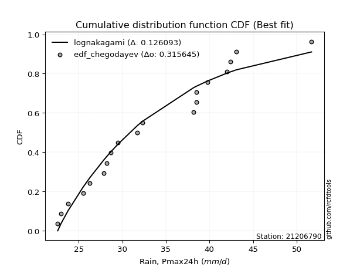</img>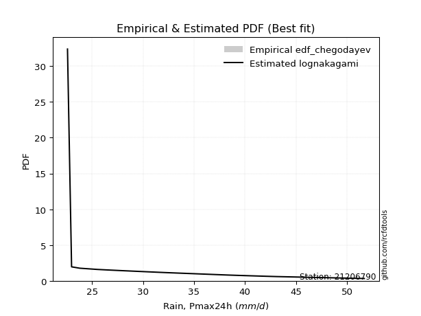</img>

</div>


### 6. EDF Blom (1958)

The Blom formula is a specific "plotting position" formula used in hydrology and statistical analysis to estimate the empirical cumulative probability (or non-exceedance probability) of a data series. It is particularly recommended for data that are approximately normally distributed. The constant _a_ is set to 0.375 (or 3/8).

<div align="center">


$P=(m-a)/(n+1-2a)$


</div>


**6.1. Empirical values**

<div align="center">

|                | 0                    | 1                   | 2                   | 3                   | 4                   | 5                  | 6                   | 7                  | 8                   | 9                  | 10                 | 11                 | 12                 | 13                 | 14                 | 15                 | 16                 | 17                 | 18                 |
|:---------------|:---------------------|:--------------------|:--------------------|:--------------------|:--------------------|:-------------------|:--------------------|:-------------------|:--------------------|:-------------------|:-------------------|:-------------------|:-------------------|:-------------------|:-------------------|:-------------------|:-------------------|:-------------------|:-------------------|
| date           | 2008                 | 2005                | 2006                | 2016                | 2018                | 2017               | 2011                | 2022               | 2009                | 2024               | 2020               | 2021               | 2019               | 2014               | 2007               | 2010               | 2013               | 2015               | 2012               |
| x              | 22.6                 | 23.0                | 23.8                | 25.5                | 26.3                | 27.9               | 28.2                | 28.7               | 29.5                | 31.689473684210526 | 32.3               | 38.2               | 38.5               | 38.5               | 39.8               | 42.0               | 42.4               | 43.1               | 51.7               |
| m              | 1                    | 2                   | 3                   | 4                   | 5                   | 6                  | 7                   | 8                  | 9                   | 10                 | 11                 | 12                 | 13                 | 14                 | 15                 | 16                 | 17                 | 18                 | 19                 |
| empirical_dist | edf_blom             | edf_blom            | edf_blom            | edf_blom            | edf_blom            | edf_blom           | edf_blom            | edf_blom           | edf_blom            | edf_blom           | edf_blom           | edf_blom           | edf_blom           | edf_blom           | edf_blom           | edf_blom           | edf_blom           | edf_blom           | edf_blom           |
| empirical      | 0.032467532467532464 | 0.08441558441558442 | 0.13636363636363635 | 0.18831168831168832 | 0.24025974025974026 | 0.2922077922077922 | 0.34415584415584416 | 0.3961038961038961 | 0.44805194805194803 | 0.5                | 0.551948051948052  | 0.6038961038961039 | 0.6558441558441559 | 0.7077922077922078 | 0.7597402597402597 | 0.8116883116883117 | 0.8636363636363636 | 0.9155844155844156 | 0.9675324675324676 |
| empirical_tr   | 1.0335570469798658   | 1.0921985815602837  | 1.1578947368421053  | 1.232               | 1.3162393162393162  | 1.4128440366972477 | 1.5247524752475246  | 1.6559139784946235 | 1.811764705882353   | 2.0                | 2.2318840579710146 | 2.5245901639344264 | 2.905660377358491  | 3.4222222222222216 | 4.162162162162161  | 5.310344827586206  | 7.333333333333334  | 11.84615384615385  | 30.800000000000043 |

</div>


**6.2. Kolmogorov-Smirnov fit test (sorted by Δ)**


<div align="center">

|                | 0                   | 1                   | 2                   | 3                   | 4                   | 5                   | 6                   | 7                   | 8                   | 9                   | 10                  | 11                  | 12                  | 13                  | 14                  | 15                  | 16                  | 17                  | 18                  | 19                  | 20                  | 21                  | 22                  | 23                  | 24                  | 25                  | 26                  | 27                  | 28                  | 29                  | 30                  | 31                  | 32                  | 33                  | 34                  | 35                  | 36                  | 37                  | 38                  | 39                  | 40                  | 41                  | 42                  | 43                  | 44                  | 45                  | 46                  | 47                  | 48                  | 49                  | 50                  | 51                  | 52                  | 53                  | 54                  | 55                  | 56                  | 57                  | 58                  | 59                  | 60                  | 61                  | 62                  | 63                  | 64                  | 65                  | 66                  | 67                  | 68                  | 69                  | 70                  | 71                  | 72                  | 73                  | 74                  | 75                  | 76                  | 77                  | 78                  | 79                  | 80                  | 81                  | 82                  | 83                  | 84                  | 85                  | 86                  | 87                  | 88                  | 89                  | 90                  | 91                  | 92                  | 93                  | 94                  | 95                  | 96                  | 97                  | 98                  | 99                  | 100                 | 101                 | 102                 | 103                 | 104                 | 105                 | 106                 | 107                 | 108                 | 109                 | 110                 | 111                 | 112                 | 113                 | 114                 | 115                 | 116                 | 117                 | 118                 | 119                 | 120                 | 121                 | 122                 | 123                 | 124                 | 125                 | 126                 | 127                 | 128                 | 129                 | 130                 | 131                 | 132                 | 133                 | 134                 | 135                 | 136                 | 137                 | 138                 | 139                 | 140                 | 141                 | 142                 | 143                 | 144                 | 145                 | 146                 | 147                 | 148                 | 149                 | 150                 | 151                 | 152                 | 153                 | 154                 | 155                 | 156                 | 157                 | 158                 | 159                 |
|:---------------|:--------------------|:--------------------|:--------------------|:--------------------|:--------------------|:--------------------|:--------------------|:--------------------|:--------------------|:--------------------|:--------------------|:--------------------|:--------------------|:--------------------|:--------------------|:--------------------|:--------------------|:--------------------|:--------------------|:--------------------|:--------------------|:--------------------|:--------------------|:--------------------|:--------------------|:--------------------|:--------------------|:--------------------|:--------------------|:--------------------|:--------------------|:--------------------|:--------------------|:--------------------|:--------------------|:--------------------|:--------------------|:--------------------|:--------------------|:--------------------|:--------------------|:--------------------|:--------------------|:--------------------|:--------------------|:--------------------|:--------------------|:--------------------|:--------------------|:--------------------|:--------------------|:--------------------|:--------------------|:--------------------|:--------------------|:--------------------|:--------------------|:--------------------|:--------------------|:--------------------|:--------------------|:--------------------|:--------------------|:--------------------|:--------------------|:--------------------|:--------------------|:--------------------|:--------------------|:--------------------|:--------------------|:--------------------|:--------------------|:--------------------|:--------------------|:--------------------|:--------------------|:--------------------|:--------------------|:--------------------|:--------------------|:--------------------|:--------------------|:--------------------|:--------------------|:--------------------|:--------------------|:--------------------|:--------------------|:--------------------|:--------------------|:--------------------|:--------------------|:--------------------|:--------------------|:--------------------|:--------------------|:--------------------|:--------------------|:--------------------|:--------------------|:--------------------|:--------------------|:--------------------|:--------------------|:--------------------|:--------------------|:--------------------|:--------------------|:--------------------|:--------------------|:--------------------|:--------------------|:--------------------|:--------------------|:--------------------|:--------------------|:--------------------|:--------------------|:--------------------|:--------------------|:--------------------|:--------------------|:--------------------|:--------------------|:--------------------|:--------------------|:--------------------|:--------------------|:--------------------|:--------------------|:--------------------|:--------------------|:--------------------|:--------------------|:--------------------|:--------------------|:--------------------|:--------------------|:--------------------|:--------------------|:--------------------|:--------------------|:--------------------|:--------------------|:--------------------|:--------------------|:--------------------|:--------------------|:--------------------|:--------------------|:--------------------|:--------------------|:--------------------|:--------------------|:--------------------|:--------------------|:--------------------|:--------------------|:--------------------|
| station        | 21206790            | 21206790            | 21206790            | 21206790            | 21206790            | 21206790            | 21206790            | 21206790            | 21206790            | 21206790            | 21206790            | 21206790            | 21206790            | 21206790            | 21206790            | 21206790            | 21206790            | 21206790            | 21206790            | 21206790            | 21206790            | 21206790            | 21206790            | 21206790            | 21206790            | 21206790            | 21206790            | 21206790            | 21206790            | 21206790            | 21206790            | 21206790            | 21206790            | 21206790            | 21206790            | 21206790            | 21206790            | 21206790            | 21206790            | 21206790            | 21206790            | 21206790            | 21206790            | 21206790            | 21206790            | 21206790            | 21206790            | 21206790            | 21206790            | 21206790            | 21206790            | 21206790            | 21206790            | 21206790            | 21206790            | 21206790            | 21206790            | 21206790            | 21206790            | 21206790            | 21206790            | 21206790            | 21206790            | 21206790            | 21206790            | 21206790            | 21206790            | 21206790            | 21206790            | 21206790            | 21206790            | 21206790            | 21206790            | 21206790            | 21206790            | 21206790            | 21206790            | 21206790            | 21206790            | 21206790            | 21206790            | 21206790            | 21206790            | 21206790            | 21206790            | 21206790            | 21206790            | 21206790            | 21206790            | 21206790            | 21206790            | 21206790            | 21206790            | 21206790            | 21206790            | 21206790            | 21206790            | 21206790            | 21206790            | 21206790            | 21206790            | 21206790            | 21206790            | 21206790            | 21206790            | 21206790            | 21206790            | 21206790            | 21206790            | 21206790            | 21206790            | 21206790            | 21206790            | 21206790            | 21206790            | 21206790            | 21206790            | 21206790            | 21206790            | 21206790            | 21206790            | 21206790            | 21206790            | 21206790            | 21206790            | 21206790            | 21206790            | 21206790            | 21206790            | 21206790            | 21206790            | 21206790            | 21206790            | 21206790            | 21206790            | 21206790            | 21206790            | 21206790            | 21206790            | 21206790            | 21206790            | 21206790            | 21206790            | 21206790            | 21206790            | 21206790            | 21206790            | 21206790            | 21206790            | 21206790            | 21206790            | 21206790            | 21206790            | 21206790            | 21206790            | 21206790            | 21206790            | 21206790            | 21206790            | 21206790            |
| empirical_dist | edf_blom            | edf_blom            | edf_blom            | edf_blom            | edf_blom            | edf_blom            | edf_blom            | edf_blom            | edf_blom            | edf_blom            | edf_blom            | edf_blom            | edf_blom            | edf_blom            | edf_blom            | edf_blom            | edf_blom            | edf_blom            | edf_blom            | edf_blom            | edf_blom            | edf_blom            | edf_blom            | edf_blom            | edf_blom            | edf_blom            | edf_blom            | edf_blom            | edf_blom            | edf_blom            | edf_blom            | edf_blom            | edf_blom            | edf_blom            | edf_blom            | edf_blom            | edf_blom            | edf_blom            | edf_blom            | edf_blom            | edf_blom            | edf_blom            | edf_blom            | edf_blom            | edf_blom            | edf_blom            | edf_blom            | edf_blom            | edf_blom            | edf_blom            | edf_blom            | edf_blom            | edf_blom            | edf_blom            | edf_blom            | edf_blom            | edf_blom            | edf_blom            | edf_blom            | edf_blom            | edf_blom            | edf_blom            | edf_blom            | edf_blom            | edf_blom            | edf_blom            | edf_blom            | edf_blom            | edf_blom            | edf_blom            | edf_blom            | edf_blom            | edf_blom            | edf_blom            | edf_blom            | edf_blom            | edf_blom            | edf_blom            | edf_blom            | edf_blom            | edf_blom            | edf_blom            | edf_blom            | edf_blom            | edf_blom            | edf_blom            | edf_blom            | edf_blom            | edf_blom            | edf_blom            | edf_blom            | edf_blom            | edf_blom            | edf_blom            | edf_blom            | edf_blom            | edf_blom            | edf_blom            | edf_blom            | edf_blom            | edf_blom            | edf_blom            | edf_blom            | edf_blom            | edf_blom            | edf_blom            | edf_blom            | edf_blom            | edf_blom            | edf_blom            | edf_blom            | edf_blom            | edf_blom            | edf_blom            | edf_blom            | edf_blom            | edf_blom            | edf_blom            | edf_blom            | edf_blom            | edf_blom            | edf_blom            | edf_blom            | edf_blom            | edf_blom            | edf_blom            | edf_blom            | edf_blom            | edf_blom            | edf_blom            | edf_blom            | edf_blom            | edf_blom            | edf_blom            | edf_blom            | edf_blom            | edf_blom            | edf_blom            | edf_blom            | edf_blom            | edf_blom            | edf_blom            | edf_blom            | edf_blom            | edf_blom            | edf_blom            | edf_blom            | edf_blom            | edf_blom            | edf_blom            | edf_blom            | edf_blom            | edf_blom            | edf_blom            | edf_blom            | edf_blom            | edf_blom            | edf_blom            | edf_blom            | edf_blom            |
| p_dist         | arcsine             | logarcsine          | loggausshyper       | semicircular        | truncweibull_min    | truncexpon          | anglit              | logbradford         | logsemicircular     | truncpareto         | dweibull            | logtruncpareto      | logjohnsonsb        | logdgamma           | loghalfgennorm      | johnsonsb           | logtruncexpon       | gausshyper          | loganglit           | foldnorm            | lognakagami         | gamma               | genhalflogistic     | norm                | crystalball         | t                   | logcosine           | beta                | logburr12           | maxwell             | loguniform          | logbeta             | kappa3              | logvonmises_line    | f                   | rayleigh            | logkappa3           | pearson3            | rice                | gompertz            | ncf                 | logtukeylambda      | truncnorm           | logloggamma         | bradford            | logfoldnorm         | gennorm             | halfnorm            | skewnorm            | logt                | lognorm             | logcrystalball      | tukeylambda         | logexponnorm        | logbetaprime        | logistic            | betaprime           | loggenextreme       | logweibull_max      | cosine              | logpearson3         | logkappa4           | loginvgamma         | logerlang           | logrice             | lognct              | logmaxwell          | loggamma            | loggamma            | loglomax            | kstwobign           | logalpha            | lomax               | loggumbel_l         | genexpon            | alpha               | logf                | lograyleigh         | burr12              | kappa4              | weibull_min         | nct                 | genextreme          | exponnorm           | loggenexpon         | invweibull          | logjohnsonsu        | genlogistic         | invgamma            | logargus            | logfatiguelife      | logburr             | johnsonsu           | logweibull_min      | invgauss            | loginvgauss         | hypsecant           | fatiguelife         | gumbel_r            | loginvweibull       | loggenlogistic      | burr                | logmielke           | loghalfnorm         | logskewnorm         | logkstwobign        | loglogistic         | logexponpow         | logtriang           | logdweibull         | loggompertz         | halflogistic        | logncf              | logksone            | moyal               | exponpow            | gumbel_l            | logtruncweibull_min | logexponweib        | loghypsecant        | logloglaplace       | loggumbel_r         | laplace             | loghalflogistic     | halfgennorm         | logmoyal            | nakagami            | loggengamma         | dgamma              | loglaplace          | loglaplace          | logtruncnorm        | uniform             | vonmises_line       | argus               | wrapcauchy          | wald                | logwald             | ksone               | erlang              | loggenhalflogistic  | logwrapcauchy       | powerlaw            | logpowerlaw         | logrdist            | triang              | genpareto           | logtrapezoid        | loglevy_l           | loggennorm          | levy_l              | trapezoid           | exponweib           | loggenpareto        | rdist               | gengamma            | weibull_max         | logvonmises         | vonmises            | mielke              |
| delta          | 0.08776410033490756 | 0.09453788048282441 | 0.0963976614119244  | 0.09907325507767378 | 0.10426526397596014 | 0.10830463125433742 | 0.10890166630513393 | 0.10910468319956945 | 0.1112150217307093  | 0.11263004104082597 | 0.11270565763186036 | 0.11388637818899328 | 0.11673714374001143 | 0.11737947692841055 | 0.11943306683710775 | 0.1195611578538186  | 0.12081058736928074 | 0.12271170100094331 | 0.12323209757897657 | 0.12475527333899206 | 0.12528956167578797 | 0.12581523219028068 | 0.12620132783227112 | 0.1321071433790696  | 0.13210716463374672 | 0.13223810877748265 | 0.13447074113994228 | 0.13447686180457752 | 0.13532799169914633 | 0.13541581818593684 | 0.13544308986321152 | 0.1354724872765397  | 0.13566149493006374 | 0.1357046450986581  | 0.1374503039240038  | 0.13904745879828206 | 0.1391141784955502  | 0.13952782778226447 | 0.14012282658985398 | 0.14039545464707315 | 0.14320218276224383 | 0.14481531520833701 | 0.14747517573902713 | 0.14823174110491533 | 0.1487135299450354  | 0.1488897036171457  | 0.14930861181080096 | 0.150596386332835   | 0.1508401888900428  | 0.15091756487708408 | 0.1509179611998781  | 0.15091875668981058 | 0.1510246787930578  | 0.15108176202982593 | 0.15155802164629928 | 0.15257596779658666 | 0.15273088869800944 | 0.15453262029645198 | 0.15454725331527552 | 0.15481116417359714 | 0.15487349170775588 | 0.15653276524070303 | 0.1567907290173215  | 0.1578623420316797  | 0.1591431020459736  | 0.15962919418105947 | 0.15987340429193053 | 0.15993831376874845 | 0.15993831376874845 | 0.16044823228125538 | 0.16062844219292138 | 0.16071207686959132 | 0.16120467365474367 | 0.16124021157354235 | 0.1617022070631453  | 0.16196816276686266 | 0.16237444070108276 | 0.1624250913674835  | 0.162457565613364   | 0.16258984325543846 | 0.16259524191824293 | 0.16350792219371235 | 0.16391249485702153 | 0.16392479584410524 | 0.16397708159705182 | 0.16413188888556207 | 0.1644195743903234  | 0.1648110961346596  | 0.1650143704419822  | 0.16514032122743183 | 0.16617001615653104 | 0.16656707023503436 | 0.16683439231936115 | 0.16722515949732863 | 0.16749584364068837 | 0.1675743047565632  | 0.167732232035243   | 0.16773654530269244 | 0.16783924612190382 | 0.16807440342483226 | 0.16810668993392108 | 0.16836141153046436 | 0.16924603000019245 | 0.1712428652381952  | 0.171570411552318   | 0.1728132090087091  | 0.17357839372061923 | 0.1738889287111306  | 0.17547269043757113 | 0.17571385700721331 | 0.1759346126002732  | 0.17625061374204953 | 0.1815655112292761  | 0.18213331081674566 | 0.18233209852403776 | 0.18466758739100353 | 0.18611862721472466 | 0.18649191531553    | 0.18804001651984747 | 0.18834918806324674 | 0.18851879501489277 | 0.1891961884501313  | 0.19411084705047    | 0.1953221670062032  | 0.19893982402153026 | 0.20156533643118324 | 0.20251601371629757 | 0.20360610446710414 | 0.20629069062371153 | 0.2075846164417272  | 0.2075846164417272  | 0.21231729189125836 | 0.21861471861471882 | 0.2196058548118397  | 0.22264824227779245 | 0.22355083306284906 | 0.22903669820896497 | 0.24061527450236342 | 0.24519495395784063 | 0.27538167185895396 | 0.27934446669492885 | 0.2935622766324738  | 0.2969741318988165  | 0.3297341988611047  | 0.33477780149348324 | 0.3362585732323735  | 0.33925832502746556 | 0.3776338924995001  | 0.4076309963424212  | 0.4155844155844156  | 0.4423857806898029  | 0.4661623853244466  | 0.46732457312157344 | 0.4714605983570181  | 0.4810258501410865  | 0.49940345813362963 | 0.7329345478993919  | 1.152090679089739   | 7.752213756135462   | nan                 |
| deltao         | 0.31564497164100014 | 0.31564497164100014 | 0.31564497164100014 | 0.31564497164100014 | 0.31564497164100014 | 0.31564497164100014 | 0.31564497164100014 | 0.31564497164100014 | 0.31564497164100014 | 0.31564497164100014 | 0.31564497164100014 | 0.31564497164100014 | 0.31564497164100014 | 0.31564497164100014 | 0.31564497164100014 | 0.31564497164100014 | 0.31564497164100014 | 0.31564497164100014 | 0.31564497164100014 | 0.31564497164100014 | 0.31564497164100014 | 0.31564497164100014 | 0.31564497164100014 | 0.31564497164100014 | 0.31564497164100014 | 0.31564497164100014 | 0.31564497164100014 | 0.31564497164100014 | 0.31564497164100014 | 0.31564497164100014 | 0.31564497164100014 | 0.31564497164100014 | 0.31564497164100014 | 0.31564497164100014 | 0.31564497164100014 | 0.31564497164100014 | 0.31564497164100014 | 0.31564497164100014 | 0.31564497164100014 | 0.31564497164100014 | 0.31564497164100014 | 0.31564497164100014 | 0.31564497164100014 | 0.31564497164100014 | 0.31564497164100014 | 0.31564497164100014 | 0.31564497164100014 | 0.31564497164100014 | 0.31564497164100014 | 0.31564497164100014 | 0.31564497164100014 | 0.31564497164100014 | 0.31564497164100014 | 0.31564497164100014 | 0.31564497164100014 | 0.31564497164100014 | 0.31564497164100014 | 0.31564497164100014 | 0.31564497164100014 | 0.31564497164100014 | 0.31564497164100014 | 0.31564497164100014 | 0.31564497164100014 | 0.31564497164100014 | 0.31564497164100014 | 0.31564497164100014 | 0.31564497164100014 | 0.31564497164100014 | 0.31564497164100014 | 0.31564497164100014 | 0.31564497164100014 | 0.31564497164100014 | 0.31564497164100014 | 0.31564497164100014 | 0.31564497164100014 | 0.31564497164100014 | 0.31564497164100014 | 0.31564497164100014 | 0.31564497164100014 | 0.31564497164100014 | 0.31564497164100014 | 0.31564497164100014 | 0.31564497164100014 | 0.31564497164100014 | 0.31564497164100014 | 0.31564497164100014 | 0.31564497164100014 | 0.31564497164100014 | 0.31564497164100014 | 0.31564497164100014 | 0.31564497164100014 | 0.31564497164100014 | 0.31564497164100014 | 0.31564497164100014 | 0.31564497164100014 | 0.31564497164100014 | 0.31564497164100014 | 0.31564497164100014 | 0.31564497164100014 | 0.31564497164100014 | 0.31564497164100014 | 0.31564497164100014 | 0.31564497164100014 | 0.31564497164100014 | 0.31564497164100014 | 0.31564497164100014 | 0.31564497164100014 | 0.31564497164100014 | 0.31564497164100014 | 0.31564497164100014 | 0.31564497164100014 | 0.31564497164100014 | 0.31564497164100014 | 0.31564497164100014 | 0.31564497164100014 | 0.31564497164100014 | 0.31564497164100014 | 0.31564497164100014 | 0.31564497164100014 | 0.31564497164100014 | 0.31564497164100014 | 0.31564497164100014 | 0.31564497164100014 | 0.31564497164100014 | 0.31564497164100014 | 0.31564497164100014 | 0.31564497164100014 | 0.31564497164100014 | 0.31564497164100014 | 0.31564497164100014 | 0.31564497164100014 | 0.31564497164100014 | 0.31564497164100014 | 0.31564497164100014 | 0.31564497164100014 | 0.31564497164100014 | 0.31564497164100014 | 0.31564497164100014 | 0.31564497164100014 | 0.31564497164100014 | 0.31564497164100014 | 0.31564497164100014 | 0.31564497164100014 | 0.31564497164100014 | 0.31564497164100014 | 0.31564497164100014 | 0.31564497164100014 | 0.31564497164100014 | 0.31564497164100014 | 0.31564497164100014 | 0.31564497164100014 | 0.31564497164100014 | 0.31564497164100014 | 0.31564497164100014 | 0.31564497164100014 | 0.31564497164100014 | 0.31564497164100014 | 0.31564497164100014 | 0.31564497164100014 | 0.31564497164100014 |
| eval           | Δo > Δ              | Δo > Δ              | Δo > Δ              | Δo > Δ              | Δo > Δ              | Δo > Δ              | Δo > Δ              | Δo > Δ              | Δo > Δ              | Δo > Δ              | Δo > Δ              | Δo > Δ              | Δo > Δ              | Δo > Δ              | Δo > Δ              | Δo > Δ              | Δo > Δ              | Δo > Δ              | Δo > Δ              | Δo > Δ              | Δo > Δ              | Δo > Δ              | Δo > Δ              | Δo > Δ              | Δo > Δ              | Δo > Δ              | Δo > Δ              | Δo > Δ              | Δo > Δ              | Δo > Δ              | Δo > Δ              | Δo > Δ              | Δo > Δ              | Δo > Δ              | Δo > Δ              | Δo > Δ              | Δo > Δ              | Δo > Δ              | Δo > Δ              | Δo > Δ              | Δo > Δ              | Δo > Δ              | Δo > Δ              | Δo > Δ              | Δo > Δ              | Δo > Δ              | Δo > Δ              | Δo > Δ              | Δo > Δ              | Δo > Δ              | Δo > Δ              | Δo > Δ              | Δo > Δ              | Δo > Δ              | Δo > Δ              | Δo > Δ              | Δo > Δ              | Δo > Δ              | Δo > Δ              | Δo > Δ              | Δo > Δ              | Δo > Δ              | Δo > Δ              | Δo > Δ              | Δo > Δ              | Δo > Δ              | Δo > Δ              | Δo > Δ              | Δo > Δ              | Δo > Δ              | Δo > Δ              | Δo > Δ              | Δo > Δ              | Δo > Δ              | Δo > Δ              | Δo > Δ              | Δo > Δ              | Δo > Δ              | Δo > Δ              | Δo > Δ              | Δo > Δ              | Δo > Δ              | Δo > Δ              | Δo > Δ              | Δo > Δ              | Δo > Δ              | Δo > Δ              | Δo > Δ              | Δo > Δ              | Δo > Δ              | Δo > Δ              | Δo > Δ              | Δo > Δ              | Δo > Δ              | Δo > Δ              | Δo > Δ              | Δo > Δ              | Δo > Δ              | Δo > Δ              | Δo > Δ              | Δo > Δ              | Δo > Δ              | Δo > Δ              | Δo > Δ              | Δo > Δ              | Δo > Δ              | Δo > Δ              | Δo > Δ              | Δo > Δ              | Δo > Δ              | Δo > Δ              | Δo > Δ              | Δo > Δ              | Δo > Δ              | Δo > Δ              | Δo > Δ              | Δo > Δ              | Δo > Δ              | Δo > Δ              | Δo > Δ              | Δo > Δ              | Δo > Δ              | Δo > Δ              | Δo > Δ              | Δo > Δ              | Δo > Δ              | Δo > Δ              | Δo > Δ              | Δo > Δ              | Δo > Δ              | Δo > Δ              | Δo > Δ              | Δo > Δ              | Δo > Δ              | Δo > Δ              | Δo > Δ              | Δo > Δ              | Δo > Δ              | Δo > Δ              | Δo > Δ              | Δo > Δ              | Δo > Δ              | Δo > Δ              | Δo <= Δ             | Δo <= Δ             | Δo <= Δ             | Δo <= Δ             | Δo <= Δ             | Δo <= Δ             | Δo <= Δ             | Δo <= Δ             | Δo <= Δ             | Δo <= Δ             | Δo <= Δ             | Δo <= Δ             | Δo <= Δ             | Δo <= Δ             | Δo <= Δ             | Δo <= Δ             | Δo <= Δ             |
| fit            | 1                   | 1                   | 1                   | 1                   | 1                   | 1                   | 1                   | 1                   | 1                   | 1                   | 1                   | 1                   | 1                   | 1                   | 1                   | 1                   | 1                   | 1                   | 1                   | 1                   | 1                   | 1                   | 1                   | 1                   | 1                   | 1                   | 1                   | 1                   | 1                   | 1                   | 1                   | 1                   | 1                   | 1                   | 1                   | 1                   | 1                   | 1                   | 1                   | 1                   | 1                   | 1                   | 1                   | 1                   | 1                   | 1                   | 1                   | 1                   | 1                   | 1                   | 1                   | 1                   | 1                   | 1                   | 1                   | 1                   | 1                   | 1                   | 1                   | 1                   | 1                   | 1                   | 1                   | 1                   | 1                   | 1                   | 1                   | 1                   | 1                   | 1                   | 1                   | 1                   | 1                   | 1                   | 1                   | 1                   | 1                   | 1                   | 1                   | 1                   | 1                   | 1                   | 1                   | 1                   | 1                   | 1                   | 1                   | 1                   | 1                   | 1                   | 1                   | 1                   | 1                   | 1                   | 1                   | 1                   | 1                   | 1                   | 1                   | 1                   | 1                   | 1                   | 1                   | 1                   | 1                   | 1                   | 1                   | 1                   | 1                   | 1                   | 1                   | 1                   | 1                   | 1                   | 1                   | 1                   | 1                   | 1                   | 1                   | 1                   | 1                   | 1                   | 1                   | 1                   | 1                   | 1                   | 1                   | 1                   | 1                   | 1                   | 1                   | 1                   | 1                   | 1                   | 1                   | 1                   | 1                   | 1                   | 1                   | 1                   | 1                   | 1                   | 1                   | 0                   | 0                   | 0                   | 0                   | 0                   | 0                   | 0                   | 0                   | 0                   | 0                   | 0                   | 0                   | 0                   | 0                   | 0                   | 0                   | 0                   |
| n              | 19                  | 19                  | 19                  | 19                  | 19                  | 19                  | 19                  | 19                  | 19                  | 19                  | 19                  | 19                  | 19                  | 19                  | 19                  | 19                  | 19                  | 19                  | 19                  | 19                  | 19                  | 19                  | 19                  | 19                  | 19                  | 19                  | 19                  | 19                  | 19                  | 19                  | 19                  | 19                  | 19                  | 19                  | 19                  | 19                  | 19                  | 19                  | 19                  | 19                  | 19                  | 19                  | 19                  | 19                  | 19                  | 19                  | 19                  | 19                  | 19                  | 19                  | 19                  | 19                  | 19                  | 19                  | 19                  | 19                  | 19                  | 19                  | 19                  | 19                  | 19                  | 19                  | 19                  | 19                  | 19                  | 19                  | 19                  | 19                  | 19                  | 19                  | 19                  | 19                  | 19                  | 19                  | 19                  | 19                  | 19                  | 19                  | 19                  | 19                  | 19                  | 19                  | 19                  | 19                  | 19                  | 19                  | 19                  | 19                  | 19                  | 19                  | 19                  | 19                  | 19                  | 19                  | 19                  | 19                  | 19                  | 19                  | 19                  | 19                  | 19                  | 19                  | 19                  | 19                  | 19                  | 19                  | 19                  | 19                  | 19                  | 19                  | 19                  | 19                  | 19                  | 19                  | 19                  | 19                  | 19                  | 19                  | 19                  | 19                  | 19                  | 19                  | 19                  | 19                  | 19                  | 19                  | 19                  | 19                  | 19                  | 19                  | 19                  | 19                  | 19                  | 19                  | 19                  | 19                  | 19                  | 19                  | 19                  | 19                  | 19                  | 19                  | 19                  | 19                  | 19                  | 19                  | 19                  | 19                  | 19                  | 19                  | 19                  | 19                  | 19                  | 19                  | 19                  | 19                  | 19                  | 19                  | 19                  | 19                  |
| best_fit       | 1                   | 0                   | 0                   | 0                   | 0                   | 0                   | 0                   | 0                   | 0                   | 0                   | 0                   | 0                   | 0                   | 0                   | 0                   | 0                   | 0                   | 0                   | 0                   | 0                   | 0                   | 0                   | 0                   | 0                   | 0                   | 0                   | 0                   | 0                   | 0                   | 0                   | 0                   | 0                   | 0                   | 0                   | 0                   | 0                   | 0                   | 0                   | 0                   | 0                   | 0                   | 0                   | 0                   | 0                   | 0                   | 0                   | 0                   | 0                   | 0                   | 0                   | 0                   | 0                   | 0                   | 0                   | 0                   | 0                   | 0                   | 0                   | 0                   | 0                   | 0                   | 0                   | 0                   | 0                   | 0                   | 0                   | 0                   | 0                   | 0                   | 0                   | 0                   | 0                   | 0                   | 0                   | 0                   | 0                   | 0                   | 0                   | 0                   | 0                   | 0                   | 0                   | 0                   | 0                   | 0                   | 0                   | 0                   | 0                   | 0                   | 0                   | 0                   | 0                   | 0                   | 0                   | 0                   | 0                   | 0                   | 0                   | 0                   | 0                   | 0                   | 0                   | 0                   | 0                   | 0                   | 0                   | 0                   | 0                   | 0                   | 0                   | 0                   | 0                   | 0                   | 0                   | 0                   | 0                   | 0                   | 0                   | 0                   | 0                   | 0                   | 0                   | 0                   | 0                   | 0                   | 0                   | 0                   | 0                   | 0                   | 0                   | 0                   | 0                   | 0                   | 0                   | 0                   | 0                   | 0                   | 0                   | 0                   | 0                   | 0                   | 0                   | 0                   | 0                   | 0                   | 0                   | 0                   | 0                   | 0                   | 0                   | 0                   | 0                   | 0                   | 0                   | 0                   | 0                   | 0                   | 0                   | 0                   | 0                   |
| best_fit_sort  | 1                   | 2                   | 3                   | 4                   | 5                   | 6                   | 7                   | 8                   | 9                   | 10                  | 11                  | 12                  | 13                  | 14                  | 15                  | 16                  | 17                  | 18                  | 19                  | 20                  | 21                  | 22                  | 23                  | 24                  | 25                  | 26                  | 27                  | 28                  | 29                  | 30                  | 31                  | 32                  | 33                  | 34                  | 35                  | 36                  | 37                  | 38                  | 39                  | 40                  | 41                  | 42                  | 43                  | 44                  | 45                  | 46                  | 47                  | 48                  | 49                  | 50                  | 51                  | 52                  | 53                  | 54                  | 55                  | 56                  | 57                  | 58                  | 59                  | 60                  | 61                  | 62                  | 63                  | 64                  | 65                  | 66                  | 67                  | 68                  | 69                  | 70                  | 71                  | 72                  | 73                  | 74                  | 75                  | 76                  | 77                  | 78                  | 79                  | 80                  | 81                  | 82                  | 83                  | 84                  | 85                  | 86                  | 87                  | 88                  | 89                  | 90                  | 91                  | 92                  | 93                  | 94                  | 95                  | 96                  | 97                  | 98                  | 99                  | 100                 | 101                 | 102                 | 103                 | 104                 | 105                 | 106                 | 107                 | 108                 | 109                 | 110                 | 111                 | 112                 | 113                 | 114                 | 115                 | 116                 | 117                 | 118                 | 119                 | 120                 | 121                 | 122                 | 123                 | 124                 | 125                 | 126                 | 127                 | 128                 | 129                 | 130                 | 131                 | 132                 | 133                 | 134                 | 135                 | 136                 | 137                 | 138                 | 139                 | 140                 | 141                 | 142                 | 143                 | 144                 | 145                 | 146                 | 147                 | 148                 | 149                 | 150                 | 151                 | 152                 | 153                 | 154                 | 155                 | 156                 | 157                 | 158                 | 159                 | 160                 |

</div>


**6.3. Best fit**

<div align="center">

|   id |   station | empirical_dist   | p_dist   |     delta |   deltao | eval   |   fit |   n |   best_fit |   best_fit_sort |
|-----:|----------:|:-----------------|:---------|----------:|---------:|:-------|------:|----:|-----------:|----------------:|
|    0 |  21206790 | edf_blom         | arcsine  | 0.0877641 | 0.315645 | Δo > Δ |     1 |  19 |          1 |               1 |

</div>


<div align="center">

</img>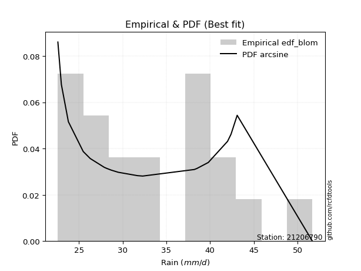</img>

</div>


### 7. EDF Tukey (1962)

In hydrology, the Tukey formula is used as a plotting position formula to estimate the empirical probability or frequency of a flood event (or other hydrological data). The formula parameter is given as _c=0.333_ (or 1/3).

<div align="center">


$P=(m-c)/(n+1-2c)$


</div>


**7.1. Empirical values**

<div align="center">

|                | 0                    | 1                   | 2                   | 3                  | 4                  | 5                   | 6                  | 7                   | 8                  | 9                  | 10                 | 11                 | 12                 | 13                 | 14                 | 15                 | 16                 | 17                 | 18                 |
|:---------------|:---------------------|:--------------------|:--------------------|:-------------------|:-------------------|:--------------------|:-------------------|:--------------------|:-------------------|:-------------------|:-------------------|:-------------------|:-------------------|:-------------------|:-------------------|:-------------------|:-------------------|:-------------------|:-------------------|
| date           | 2008                 | 2005                | 2006                | 2016               | 2018               | 2017                | 2011               | 2022                | 2009               | 2024               | 2020               | 2021               | 2019               | 2014               | 2007               | 2010               | 2013               | 2015               | 2012               |
| x              | 22.6                 | 23.0                | 23.8                | 25.5               | 26.3               | 27.9                | 28.2               | 28.7                | 29.5               | 31.689473684210526 | 32.3               | 38.2               | 38.5               | 38.5               | 39.8               | 42.0               | 42.4               | 43.1               | 51.7               |
| m              | 1                    | 2                   | 3                   | 4                  | 5                  | 6                   | 7                  | 8                   | 9                  | 10                 | 11                 | 12                 | 13                 | 14                 | 15                 | 16                 | 17                 | 18                 | 19                 |
| empirical_dist | edf_tukey            | edf_tukey           | edf_tukey           | edf_tukey          | edf_tukey          | edf_tukey           | edf_tukey          | edf_tukey           | edf_tukey          | edf_tukey          | edf_tukey          | edf_tukey          | edf_tukey          | edf_tukey          | edf_tukey          | edf_tukey          | edf_tukey          | edf_tukey          | edf_tukey          |
| empirical      | 0.034482758620689655 | 0.08620689655172414 | 0.13793103448275862 | 0.1896551724137931 | 0.2413793103448276 | 0.29310344827586204 | 0.3448275862068966 | 0.39655172413793105 | 0.4482758620689655 | 0.5                | 0.5517241379310345 | 0.603448275862069  | 0.6551724137931034 | 0.7068965517241379 | 0.7586206896551724 | 0.8103448275862069 | 0.8620689655172413 | 0.9137931034482759 | 0.9655172413793104 |
| empirical_tr   | 1.0357142857142856   | 1.0943396226415094  | 1.1600000000000001  | 1.2340425531914894 | 1.3181818181818183 | 1.4146341463414636  | 1.5263157894736843 | 1.6571428571428573  | 1.8125             | 2.0                | 2.230769230769231  | 2.5217391304347827 | 2.9                | 3.4117647058823524 | 4.142857142857142  | 5.272727272727272  | 7.249999999999997  | 11.600000000000007 | 29.000000000000036 |

</div>


**7.2. Kolmogorov-Smirnov fit test (sorted by Δ)**


<div align="center">

|                | 0                   | 1                   | 2                   | 3                   | 4                   | 5                   | 6                   | 7                   | 8                   | 9                   | 10                  | 11                  | 12                  | 13                  | 14                  | 15                  | 16                  | 17                  | 18                  | 19                  | 20                  | 21                  | 22                  | 23                  | 24                  | 25                  | 26                  | 27                  | 28                  | 29                  | 30                  | 31                  | 32                  | 33                  | 34                  | 35                  | 36                  | 37                  | 38                  | 39                  | 40                  | 41                  | 42                  | 43                  | 44                  | 45                  | 46                  | 47                  | 48                  | 49                  | 50                  | 51                  | 52                  | 53                  | 54                  | 55                  | 56                  | 57                  | 58                  | 59                  | 60                  | 61                  | 62                  | 63                  | 64                  | 65                  | 66                  | 67                  | 68                  | 69                  | 70                  | 71                  | 72                  | 73                  | 74                  | 75                  | 76                  | 77                  | 78                  | 79                  | 80                  | 81                  | 82                  | 83                  | 84                  | 85                  | 86                  | 87                  | 88                  | 89                  | 90                  | 91                  | 92                  | 93                  | 94                  | 95                  | 96                  | 97                  | 98                  | 99                  | 100                 | 101                 | 102                 | 103                 | 104                 | 105                 | 106                 | 107                 | 108                 | 109                 | 110                 | 111                 | 112                 | 113                 | 114                 | 115                 | 116                 | 117                 | 118                 | 119                 | 120                 | 121                 | 122                 | 123                 | 124                 | 125                 | 126                 | 127                 | 128                 | 129                 | 130                 | 131                 | 132                 | 133                 | 134                 | 135                 | 136                 | 137                 | 138                 | 139                 | 140                 | 141                 | 142                 | 143                 | 144                 | 145                 | 146                 | 147                 | 148                 | 149                 | 150                 | 151                 | 152                 | 153                 | 154                 | 155                 | 156                 | 157                 | 158                 | 159                 |
|:---------------|:--------------------|:--------------------|:--------------------|:--------------------|:--------------------|:--------------------|:--------------------|:--------------------|:--------------------|:--------------------|:--------------------|:--------------------|:--------------------|:--------------------|:--------------------|:--------------------|:--------------------|:--------------------|:--------------------|:--------------------|:--------------------|:--------------------|:--------------------|:--------------------|:--------------------|:--------------------|:--------------------|:--------------------|:--------------------|:--------------------|:--------------------|:--------------------|:--------------------|:--------------------|:--------------------|:--------------------|:--------------------|:--------------------|:--------------------|:--------------------|:--------------------|:--------------------|:--------------------|:--------------------|:--------------------|:--------------------|:--------------------|:--------------------|:--------------------|:--------------------|:--------------------|:--------------------|:--------------------|:--------------------|:--------------------|:--------------------|:--------------------|:--------------------|:--------------------|:--------------------|:--------------------|:--------------------|:--------------------|:--------------------|:--------------------|:--------------------|:--------------------|:--------------------|:--------------------|:--------------------|:--------------------|:--------------------|:--------------------|:--------------------|:--------------------|:--------------------|:--------------------|:--------------------|:--------------------|:--------------------|:--------------------|:--------------------|:--------------------|:--------------------|:--------------------|:--------------------|:--------------------|:--------------------|:--------------------|:--------------------|:--------------------|:--------------------|:--------------------|:--------------------|:--------------------|:--------------------|:--------------------|:--------------------|:--------------------|:--------------------|:--------------------|:--------------------|:--------------------|:--------------------|:--------------------|:--------------------|:--------------------|:--------------------|:--------------------|:--------------------|:--------------------|:--------------------|:--------------------|:--------------------|:--------------------|:--------------------|:--------------------|:--------------------|:--------------------|:--------------------|:--------------------|:--------------------|:--------------------|:--------------------|:--------------------|:--------------------|:--------------------|:--------------------|:--------------------|:--------------------|:--------------------|:--------------------|:--------------------|:--------------------|:--------------------|:--------------------|:--------------------|:--------------------|:--------------------|:--------------------|:--------------------|:--------------------|:--------------------|:--------------------|:--------------------|:--------------------|:--------------------|:--------------------|:--------------------|:--------------------|:--------------------|:--------------------|:--------------------|:--------------------|:--------------------|:--------------------|:--------------------|:--------------------|:--------------------|:--------------------|
| station        | 21206790            | 21206790            | 21206790            | 21206790            | 21206790            | 21206790            | 21206790            | 21206790            | 21206790            | 21206790            | 21206790            | 21206790            | 21206790            | 21206790            | 21206790            | 21206790            | 21206790            | 21206790            | 21206790            | 21206790            | 21206790            | 21206790            | 21206790            | 21206790            | 21206790            | 21206790            | 21206790            | 21206790            | 21206790            | 21206790            | 21206790            | 21206790            | 21206790            | 21206790            | 21206790            | 21206790            | 21206790            | 21206790            | 21206790            | 21206790            | 21206790            | 21206790            | 21206790            | 21206790            | 21206790            | 21206790            | 21206790            | 21206790            | 21206790            | 21206790            | 21206790            | 21206790            | 21206790            | 21206790            | 21206790            | 21206790            | 21206790            | 21206790            | 21206790            | 21206790            | 21206790            | 21206790            | 21206790            | 21206790            | 21206790            | 21206790            | 21206790            | 21206790            | 21206790            | 21206790            | 21206790            | 21206790            | 21206790            | 21206790            | 21206790            | 21206790            | 21206790            | 21206790            | 21206790            | 21206790            | 21206790            | 21206790            | 21206790            | 21206790            | 21206790            | 21206790            | 21206790            | 21206790            | 21206790            | 21206790            | 21206790            | 21206790            | 21206790            | 21206790            | 21206790            | 21206790            | 21206790            | 21206790            | 21206790            | 21206790            | 21206790            | 21206790            | 21206790            | 21206790            | 21206790            | 21206790            | 21206790            | 21206790            | 21206790            | 21206790            | 21206790            | 21206790            | 21206790            | 21206790            | 21206790            | 21206790            | 21206790            | 21206790            | 21206790            | 21206790            | 21206790            | 21206790            | 21206790            | 21206790            | 21206790            | 21206790            | 21206790            | 21206790            | 21206790            | 21206790            | 21206790            | 21206790            | 21206790            | 21206790            | 21206790            | 21206790            | 21206790            | 21206790            | 21206790            | 21206790            | 21206790            | 21206790            | 21206790            | 21206790            | 21206790            | 21206790            | 21206790            | 21206790            | 21206790            | 21206790            | 21206790            | 21206790            | 21206790            | 21206790            | 21206790            | 21206790            | 21206790            | 21206790            | 21206790            | 21206790            |
| empirical_dist | edf_tukey           | edf_tukey           | edf_tukey           | edf_tukey           | edf_tukey           | edf_tukey           | edf_tukey           | edf_tukey           | edf_tukey           | edf_tukey           | edf_tukey           | edf_tukey           | edf_tukey           | edf_tukey           | edf_tukey           | edf_tukey           | edf_tukey           | edf_tukey           | edf_tukey           | edf_tukey           | edf_tukey           | edf_tukey           | edf_tukey           | edf_tukey           | edf_tukey           | edf_tukey           | edf_tukey           | edf_tukey           | edf_tukey           | edf_tukey           | edf_tukey           | edf_tukey           | edf_tukey           | edf_tukey           | edf_tukey           | edf_tukey           | edf_tukey           | edf_tukey           | edf_tukey           | edf_tukey           | edf_tukey           | edf_tukey           | edf_tukey           | edf_tukey           | edf_tukey           | edf_tukey           | edf_tukey           | edf_tukey           | edf_tukey           | edf_tukey           | edf_tukey           | edf_tukey           | edf_tukey           | edf_tukey           | edf_tukey           | edf_tukey           | edf_tukey           | edf_tukey           | edf_tukey           | edf_tukey           | edf_tukey           | edf_tukey           | edf_tukey           | edf_tukey           | edf_tukey           | edf_tukey           | edf_tukey           | edf_tukey           | edf_tukey           | edf_tukey           | edf_tukey           | edf_tukey           | edf_tukey           | edf_tukey           | edf_tukey           | edf_tukey           | edf_tukey           | edf_tukey           | edf_tukey           | edf_tukey           | edf_tukey           | edf_tukey           | edf_tukey           | edf_tukey           | edf_tukey           | edf_tukey           | edf_tukey           | edf_tukey           | edf_tukey           | edf_tukey           | edf_tukey           | edf_tukey           | edf_tukey           | edf_tukey           | edf_tukey           | edf_tukey           | edf_tukey           | edf_tukey           | edf_tukey           | edf_tukey           | edf_tukey           | edf_tukey           | edf_tukey           | edf_tukey           | edf_tukey           | edf_tukey           | edf_tukey           | edf_tukey           | edf_tukey           | edf_tukey           | edf_tukey           | edf_tukey           | edf_tukey           | edf_tukey           | edf_tukey           | edf_tukey           | edf_tukey           | edf_tukey           | edf_tukey           | edf_tukey           | edf_tukey           | edf_tukey           | edf_tukey           | edf_tukey           | edf_tukey           | edf_tukey           | edf_tukey           | edf_tukey           | edf_tukey           | edf_tukey           | edf_tukey           | edf_tukey           | edf_tukey           | edf_tukey           | edf_tukey           | edf_tukey           | edf_tukey           | edf_tukey           | edf_tukey           | edf_tukey           | edf_tukey           | edf_tukey           | edf_tukey           | edf_tukey           | edf_tukey           | edf_tukey           | edf_tukey           | edf_tukey           | edf_tukey           | edf_tukey           | edf_tukey           | edf_tukey           | edf_tukey           | edf_tukey           | edf_tukey           | edf_tukey           | edf_tukey           | edf_tukey           | edf_tukey           | edf_tukey           |
| p_dist         | arcsine             | logarcsine          | loggausshyper       | semicircular        | truncweibull_min    | truncexpon          | anglit              | logbradford         | logsemicircular     | dweibull            | truncpareto         | logtruncpareto      | logjohnsonsb        | logdgamma           | johnsonsb           | loghalfgennorm      | logtruncexpon       | gausshyper          | loganglit           | foldnorm            | lognakagami         | gamma               | genhalflogistic     | norm                | crystalball         | t                   | loguniform          | logbeta             | logvonmises_line    | logcosine           | beta                | logburr12           | maxwell             | kappa3              | logkappa3           | f                   | rayleigh            | pearson3            | rice                | gompertz            | logtukeylambda      | ncf                 | bradford            | truncnorm           | logloggamma         | logfoldnorm         | gennorm             | logbetaprime        | halfnorm            | skewnorm            | logt                | lognorm             | logcrystalball      | tukeylambda         | logexponnorm        | logistic            | betaprime           | logkappa4           | loggenextreme       | logweibull_max      | cosine              | logpearson3         | loginvgamma         | logerlang           | logrice             | lognct              | logmaxwell          | loggamma            | loggamma            | kappa4              | loglomax            | kstwobign           | logalpha            | loggumbel_l         | lomax               | genexpon            | alpha               | logf                | lograyleigh         | burr12              | weibull_min         | nct                 | genextreme          | exponnorm           | loggenexpon         | invweibull          | logjohnsonsu        | genlogistic         | logargus            | invgamma            | logfatiguelife      | logburr             | johnsonsu           | logweibull_min      | invgauss            | hypsecant           | loginvgauss         | fatiguelife         | gumbel_r            | loginvweibull       | loggenlogistic      | burr                | logmielke           | loghalfnorm         | logskewnorm         | logkstwobign        | loglogistic         | logexponpow         | logtriang           | logdweibull         | loggompertz         | halflogistic        | logncf              | logksone            | moyal               | exponpow            | gumbel_l            | logtruncweibull_min | logexponweib        | loghypsecant        | logloglaplace       | loggumbel_r         | laplace             | loghalflogistic     | halfgennorm         | logmoyal            | nakagami            | loggengamma         | dgamma              | loglaplace          | loglaplace          | logtruncnorm        | uniform             | vonmises_line       | wrapcauchy          | argus               | wald                | logwald             | ksone               | erlang              | loggenhalflogistic  | logwrapcauchy       | powerlaw            | logpowerlaw         | logrdist            | triang              | genpareto           | logtrapezoid        | loglevy_l           | loggennorm          | levy_l              | trapezoid           | exponweib           | loggenpareto        | rdist               | gengamma            | weibull_max         | logvonmises         | vonmises            | mielke              |
| delta          | 0.08597278819876786 | 0.09274656834668471 | 0.09684548944595939 | 0.09929716909469127 | 0.10247395183982044 | 0.10651331911819772 | 0.10912558032215142 | 0.10955251123360443 | 0.11166284976474428 | 0.1118100015637905  | 0.11307786907486095 | 0.11433420622302826 | 0.11494583160387173 | 0.1164838208603407  | 0.1177698457176789  | 0.11988089487114273 | 0.12125841540331572 | 0.12315952903497829 | 0.12367992561301155 | 0.12520310137302704 | 0.12573738970982296 | 0.12626306022431566 | 0.1266491558663061  | 0.13233105739608708 | 0.1323310786507642  | 0.13246202279450014 | 0.13365177772707182 | 0.1336811751404     | 0.1339133329625184  | 0.13491856917397727 | 0.1349246898386125  | 0.1357758197331813  | 0.13586364621997182 | 0.13588540894708123 | 0.1373228663594105  | 0.1378981319580388  | 0.13949528683231704 | 0.13997565581629945 | 0.14057065462388896 | 0.14084328268110813 | 0.14302400307219731 | 0.14365001079627882 | 0.1469222178088957  | 0.1479230037730621  | 0.1486795691389503  | 0.1493375316511807  | 0.14953252582781845 | 0.14976670951015958 | 0.15104421436687    | 0.15128801692407778 | 0.15136539291111906 | 0.15136578923391308 | 0.15136658472384557 | 0.1514725068270928  | 0.1515295900638609  | 0.15279988181360415 | 0.15317871673204442 | 0.15474145310456333 | 0.15498044833048696 | 0.1549950813493105  | 0.15503507819061463 | 0.15532131974179086 | 0.15723855705135648 | 0.15831017006571468 | 0.15959093008000858 | 0.16007702221509446 | 0.1603212323259655  | 0.16038614180278343 | 0.16038614180278343 | 0.16079853111929876 | 0.16089606031529036 | 0.16107627022695636 | 0.1611599049036263  | 0.16146412559055984 | 0.16165250168877865 | 0.1621500350971803  | 0.16241599080089764 | 0.16282226873511774 | 0.1628729194015185  | 0.16290539364739898 | 0.1630430699522779  | 0.16395575022774733 | 0.1643603228910565  | 0.16437262387814022 | 0.1644249096310868  | 0.16457971691959705 | 0.16486740242435838 | 0.1652589241686946  | 0.16536423524444932 | 0.16546219847601717 | 0.16661784419056602 | 0.16701489826906935 | 0.16728222035339613 | 0.16767298753136362 | 0.16794367167472335 | 0.1679561460522605  | 0.1680221327905982  | 0.16818437333672742 | 0.1682870741559388  | 0.16852223145886724 | 0.16855451796795606 | 0.16880923956449934 | 0.16969385803422743 | 0.1716906932722302  | 0.17201823958635298 | 0.1732610370427441  | 0.1740262217546542  | 0.17433675674516558 | 0.17569660445458862 | 0.1761616850412483  | 0.1763824406343082  | 0.1766984417760845  | 0.1797741990931364  | 0.18034199868060596 | 0.18277992655807274 | 0.1851154154250385  | 0.18634254123174215 | 0.18693974334956498 | 0.18848784455388246 | 0.18879701609728172 | 0.18896662304892775 | 0.1896440164841663  | 0.19433476106748748 | 0.19576999504023818 | 0.19804416795346041 | 0.20201316446521822 | 0.20296384175033255 | 0.20405393250113912 | 0.2067385186577465  | 0.2080324444757622  | 0.2080324444757622  | 0.21276511992529334 | 0.21839080459770133 | 0.2193819407948222  | 0.22175952092670936 | 0.22242432826077496 | 0.2301562682940523  | 0.2410631025363984  | 0.24340364182170093 | 0.2744860157908841  | 0.27755315455878915 | 0.2917709644963341  | 0.2956306477967117  | 0.32883854279303487 | 0.33298648935734354 | 0.3344672610962338  | 0.33724309887430837 | 0.3758425803633604  | 0.40561577018926404 | 0.4137931034482759  | 0.4403705545366457  | 0.4643710731883069  | 0.4664289170535036  | 0.4694453722038609  | 0.4790106239879293  | 0.49805997403152485 | 0.7311432357632522  | 1.152538507123774   | 7.754228982288619   | nan                 |
| deltao         | 0.31564497164100014 | 0.31564497164100014 | 0.31564497164100014 | 0.31564497164100014 | 0.31564497164100014 | 0.31564497164100014 | 0.31564497164100014 | 0.31564497164100014 | 0.31564497164100014 | 0.31564497164100014 | 0.31564497164100014 | 0.31564497164100014 | 0.31564497164100014 | 0.31564497164100014 | 0.31564497164100014 | 0.31564497164100014 | 0.31564497164100014 | 0.31564497164100014 | 0.31564497164100014 | 0.31564497164100014 | 0.31564497164100014 | 0.31564497164100014 | 0.31564497164100014 | 0.31564497164100014 | 0.31564497164100014 | 0.31564497164100014 | 0.31564497164100014 | 0.31564497164100014 | 0.31564497164100014 | 0.31564497164100014 | 0.31564497164100014 | 0.31564497164100014 | 0.31564497164100014 | 0.31564497164100014 | 0.31564497164100014 | 0.31564497164100014 | 0.31564497164100014 | 0.31564497164100014 | 0.31564497164100014 | 0.31564497164100014 | 0.31564497164100014 | 0.31564497164100014 | 0.31564497164100014 | 0.31564497164100014 | 0.31564497164100014 | 0.31564497164100014 | 0.31564497164100014 | 0.31564497164100014 | 0.31564497164100014 | 0.31564497164100014 | 0.31564497164100014 | 0.31564497164100014 | 0.31564497164100014 | 0.31564497164100014 | 0.31564497164100014 | 0.31564497164100014 | 0.31564497164100014 | 0.31564497164100014 | 0.31564497164100014 | 0.31564497164100014 | 0.31564497164100014 | 0.31564497164100014 | 0.31564497164100014 | 0.31564497164100014 | 0.31564497164100014 | 0.31564497164100014 | 0.31564497164100014 | 0.31564497164100014 | 0.31564497164100014 | 0.31564497164100014 | 0.31564497164100014 | 0.31564497164100014 | 0.31564497164100014 | 0.31564497164100014 | 0.31564497164100014 | 0.31564497164100014 | 0.31564497164100014 | 0.31564497164100014 | 0.31564497164100014 | 0.31564497164100014 | 0.31564497164100014 | 0.31564497164100014 | 0.31564497164100014 | 0.31564497164100014 | 0.31564497164100014 | 0.31564497164100014 | 0.31564497164100014 | 0.31564497164100014 | 0.31564497164100014 | 0.31564497164100014 | 0.31564497164100014 | 0.31564497164100014 | 0.31564497164100014 | 0.31564497164100014 | 0.31564497164100014 | 0.31564497164100014 | 0.31564497164100014 | 0.31564497164100014 | 0.31564497164100014 | 0.31564497164100014 | 0.31564497164100014 | 0.31564497164100014 | 0.31564497164100014 | 0.31564497164100014 | 0.31564497164100014 | 0.31564497164100014 | 0.31564497164100014 | 0.31564497164100014 | 0.31564497164100014 | 0.31564497164100014 | 0.31564497164100014 | 0.31564497164100014 | 0.31564497164100014 | 0.31564497164100014 | 0.31564497164100014 | 0.31564497164100014 | 0.31564497164100014 | 0.31564497164100014 | 0.31564497164100014 | 0.31564497164100014 | 0.31564497164100014 | 0.31564497164100014 | 0.31564497164100014 | 0.31564497164100014 | 0.31564497164100014 | 0.31564497164100014 | 0.31564497164100014 | 0.31564497164100014 | 0.31564497164100014 | 0.31564497164100014 | 0.31564497164100014 | 0.31564497164100014 | 0.31564497164100014 | 0.31564497164100014 | 0.31564497164100014 | 0.31564497164100014 | 0.31564497164100014 | 0.31564497164100014 | 0.31564497164100014 | 0.31564497164100014 | 0.31564497164100014 | 0.31564497164100014 | 0.31564497164100014 | 0.31564497164100014 | 0.31564497164100014 | 0.31564497164100014 | 0.31564497164100014 | 0.31564497164100014 | 0.31564497164100014 | 0.31564497164100014 | 0.31564497164100014 | 0.31564497164100014 | 0.31564497164100014 | 0.31564497164100014 | 0.31564497164100014 | 0.31564497164100014 | 0.31564497164100014 | 0.31564497164100014 | 0.31564497164100014 | 0.31564497164100014 |
| eval           | Δo > Δ              | Δo > Δ              | Δo > Δ              | Δo > Δ              | Δo > Δ              | Δo > Δ              | Δo > Δ              | Δo > Δ              | Δo > Δ              | Δo > Δ              | Δo > Δ              | Δo > Δ              | Δo > Δ              | Δo > Δ              | Δo > Δ              | Δo > Δ              | Δo > Δ              | Δo > Δ              | Δo > Δ              | Δo > Δ              | Δo > Δ              | Δo > Δ              | Δo > Δ              | Δo > Δ              | Δo > Δ              | Δo > Δ              | Δo > Δ              | Δo > Δ              | Δo > Δ              | Δo > Δ              | Δo > Δ              | Δo > Δ              | Δo > Δ              | Δo > Δ              | Δo > Δ              | Δo > Δ              | Δo > Δ              | Δo > Δ              | Δo > Δ              | Δo > Δ              | Δo > Δ              | Δo > Δ              | Δo > Δ              | Δo > Δ              | Δo > Δ              | Δo > Δ              | Δo > Δ              | Δo > Δ              | Δo > Δ              | Δo > Δ              | Δo > Δ              | Δo > Δ              | Δo > Δ              | Δo > Δ              | Δo > Δ              | Δo > Δ              | Δo > Δ              | Δo > Δ              | Δo > Δ              | Δo > Δ              | Δo > Δ              | Δo > Δ              | Δo > Δ              | Δo > Δ              | Δo > Δ              | Δo > Δ              | Δo > Δ              | Δo > Δ              | Δo > Δ              | Δo > Δ              | Δo > Δ              | Δo > Δ              | Δo > Δ              | Δo > Δ              | Δo > Δ              | Δo > Δ              | Δo > Δ              | Δo > Δ              | Δo > Δ              | Δo > Δ              | Δo > Δ              | Δo > Δ              | Δo > Δ              | Δo > Δ              | Δo > Δ              | Δo > Δ              | Δo > Δ              | Δo > Δ              | Δo > Δ              | Δo > Δ              | Δo > Δ              | Δo > Δ              | Δo > Δ              | Δo > Δ              | Δo > Δ              | Δo > Δ              | Δo > Δ              | Δo > Δ              | Δo > Δ              | Δo > Δ              | Δo > Δ              | Δo > Δ              | Δo > Δ              | Δo > Δ              | Δo > Δ              | Δo > Δ              | Δo > Δ              | Δo > Δ              | Δo > Δ              | Δo > Δ              | Δo > Δ              | Δo > Δ              | Δo > Δ              | Δo > Δ              | Δo > Δ              | Δo > Δ              | Δo > Δ              | Δo > Δ              | Δo > Δ              | Δo > Δ              | Δo > Δ              | Δo > Δ              | Δo > Δ              | Δo > Δ              | Δo > Δ              | Δo > Δ              | Δo > Δ              | Δo > Δ              | Δo > Δ              | Δo > Δ              | Δo > Δ              | Δo > Δ              | Δo > Δ              | Δo > Δ              | Δo > Δ              | Δo > Δ              | Δo > Δ              | Δo > Δ              | Δo > Δ              | Δo > Δ              | Δo > Δ              | Δo > Δ              | Δo > Δ              | Δo <= Δ             | Δo <= Δ             | Δo <= Δ             | Δo <= Δ             | Δo <= Δ             | Δo <= Δ             | Δo <= Δ             | Δo <= Δ             | Δo <= Δ             | Δo <= Δ             | Δo <= Δ             | Δo <= Δ             | Δo <= Δ             | Δo <= Δ             | Δo <= Δ             | Δo <= Δ             | Δo <= Δ             |
| fit            | 1                   | 1                   | 1                   | 1                   | 1                   | 1                   | 1                   | 1                   | 1                   | 1                   | 1                   | 1                   | 1                   | 1                   | 1                   | 1                   | 1                   | 1                   | 1                   | 1                   | 1                   | 1                   | 1                   | 1                   | 1                   | 1                   | 1                   | 1                   | 1                   | 1                   | 1                   | 1                   | 1                   | 1                   | 1                   | 1                   | 1                   | 1                   | 1                   | 1                   | 1                   | 1                   | 1                   | 1                   | 1                   | 1                   | 1                   | 1                   | 1                   | 1                   | 1                   | 1                   | 1                   | 1                   | 1                   | 1                   | 1                   | 1                   | 1                   | 1                   | 1                   | 1                   | 1                   | 1                   | 1                   | 1                   | 1                   | 1                   | 1                   | 1                   | 1                   | 1                   | 1                   | 1                   | 1                   | 1                   | 1                   | 1                   | 1                   | 1                   | 1                   | 1                   | 1                   | 1                   | 1                   | 1                   | 1                   | 1                   | 1                   | 1                   | 1                   | 1                   | 1                   | 1                   | 1                   | 1                   | 1                   | 1                   | 1                   | 1                   | 1                   | 1                   | 1                   | 1                   | 1                   | 1                   | 1                   | 1                   | 1                   | 1                   | 1                   | 1                   | 1                   | 1                   | 1                   | 1                   | 1                   | 1                   | 1                   | 1                   | 1                   | 1                   | 1                   | 1                   | 1                   | 1                   | 1                   | 1                   | 1                   | 1                   | 1                   | 1                   | 1                   | 1                   | 1                   | 1                   | 1                   | 1                   | 1                   | 1                   | 1                   | 1                   | 1                   | 0                   | 0                   | 0                   | 0                   | 0                   | 0                   | 0                   | 0                   | 0                   | 0                   | 0                   | 0                   | 0                   | 0                   | 0                   | 0                   | 0                   |
| n              | 19                  | 19                  | 19                  | 19                  | 19                  | 19                  | 19                  | 19                  | 19                  | 19                  | 19                  | 19                  | 19                  | 19                  | 19                  | 19                  | 19                  | 19                  | 19                  | 19                  | 19                  | 19                  | 19                  | 19                  | 19                  | 19                  | 19                  | 19                  | 19                  | 19                  | 19                  | 19                  | 19                  | 19                  | 19                  | 19                  | 19                  | 19                  | 19                  | 19                  | 19                  | 19                  | 19                  | 19                  | 19                  | 19                  | 19                  | 19                  | 19                  | 19                  | 19                  | 19                  | 19                  | 19                  | 19                  | 19                  | 19                  | 19                  | 19                  | 19                  | 19                  | 19                  | 19                  | 19                  | 19                  | 19                  | 19                  | 19                  | 19                  | 19                  | 19                  | 19                  | 19                  | 19                  | 19                  | 19                  | 19                  | 19                  | 19                  | 19                  | 19                  | 19                  | 19                  | 19                  | 19                  | 19                  | 19                  | 19                  | 19                  | 19                  | 19                  | 19                  | 19                  | 19                  | 19                  | 19                  | 19                  | 19                  | 19                  | 19                  | 19                  | 19                  | 19                  | 19                  | 19                  | 19                  | 19                  | 19                  | 19                  | 19                  | 19                  | 19                  | 19                  | 19                  | 19                  | 19                  | 19                  | 19                  | 19                  | 19                  | 19                  | 19                  | 19                  | 19                  | 19                  | 19                  | 19                  | 19                  | 19                  | 19                  | 19                  | 19                  | 19                  | 19                  | 19                  | 19                  | 19                  | 19                  | 19                  | 19                  | 19                  | 19                  | 19                  | 19                  | 19                  | 19                  | 19                  | 19                  | 19                  | 19                  | 19                  | 19                  | 19                  | 19                  | 19                  | 19                  | 19                  | 19                  | 19                  | 19                  |
| best_fit       | 1                   | 0                   | 0                   | 0                   | 0                   | 0                   | 0                   | 0                   | 0                   | 0                   | 0                   | 0                   | 0                   | 0                   | 0                   | 0                   | 0                   | 0                   | 0                   | 0                   | 0                   | 0                   | 0                   | 0                   | 0                   | 0                   | 0                   | 0                   | 0                   | 0                   | 0                   | 0                   | 0                   | 0                   | 0                   | 0                   | 0                   | 0                   | 0                   | 0                   | 0                   | 0                   | 0                   | 0                   | 0                   | 0                   | 0                   | 0                   | 0                   | 0                   | 0                   | 0                   | 0                   | 0                   | 0                   | 0                   | 0                   | 0                   | 0                   | 0                   | 0                   | 0                   | 0                   | 0                   | 0                   | 0                   | 0                   | 0                   | 0                   | 0                   | 0                   | 0                   | 0                   | 0                   | 0                   | 0                   | 0                   | 0                   | 0                   | 0                   | 0                   | 0                   | 0                   | 0                   | 0                   | 0                   | 0                   | 0                   | 0                   | 0                   | 0                   | 0                   | 0                   | 0                   | 0                   | 0                   | 0                   | 0                   | 0                   | 0                   | 0                   | 0                   | 0                   | 0                   | 0                   | 0                   | 0                   | 0                   | 0                   | 0                   | 0                   | 0                   | 0                   | 0                   | 0                   | 0                   | 0                   | 0                   | 0                   | 0                   | 0                   | 0                   | 0                   | 0                   | 0                   | 0                   | 0                   | 0                   | 0                   | 0                   | 0                   | 0                   | 0                   | 0                   | 0                   | 0                   | 0                   | 0                   | 0                   | 0                   | 0                   | 0                   | 0                   | 0                   | 0                   | 0                   | 0                   | 0                   | 0                   | 0                   | 0                   | 0                   | 0                   | 0                   | 0                   | 0                   | 0                   | 0                   | 0                   | 0                   |
| best_fit_sort  | 1                   | 2                   | 3                   | 4                   | 5                   | 6                   | 7                   | 8                   | 9                   | 10                  | 11                  | 12                  | 13                  | 14                  | 15                  | 16                  | 17                  | 18                  | 19                  | 20                  | 21                  | 22                  | 23                  | 24                  | 25                  | 26                  | 27                  | 28                  | 29                  | 30                  | 31                  | 32                  | 33                  | 34                  | 35                  | 36                  | 37                  | 38                  | 39                  | 40                  | 41                  | 42                  | 43                  | 44                  | 45                  | 46                  | 47                  | 48                  | 49                  | 50                  | 51                  | 52                  | 53                  | 54                  | 55                  | 56                  | 57                  | 58                  | 59                  | 60                  | 61                  | 62                  | 63                  | 64                  | 65                  | 66                  | 67                  | 68                  | 69                  | 70                  | 71                  | 72                  | 73                  | 74                  | 75                  | 76                  | 77                  | 78                  | 79                  | 80                  | 81                  | 82                  | 83                  | 84                  | 85                  | 86                  | 87                  | 88                  | 89                  | 90                  | 91                  | 92                  | 93                  | 94                  | 95                  | 96                  | 97                  | 98                  | 99                  | 100                 | 101                 | 102                 | 103                 | 104                 | 105                 | 106                 | 107                 | 108                 | 109                 | 110                 | 111                 | 112                 | 113                 | 114                 | 115                 | 116                 | 117                 | 118                 | 119                 | 120                 | 121                 | 122                 | 123                 | 124                 | 125                 | 126                 | 127                 | 128                 | 129                 | 130                 | 131                 | 132                 | 133                 | 134                 | 135                 | 136                 | 137                 | 138                 | 139                 | 140                 | 141                 | 142                 | 143                 | 144                 | 145                 | 146                 | 147                 | 148                 | 149                 | 150                 | 151                 | 152                 | 153                 | 154                 | 155                 | 156                 | 157                 | 158                 | 159                 | 160                 |

</div>


**7.3. Best fit**

<div align="center">

|   id |   station | empirical_dist   | p_dist   |     delta |   deltao | eval   |   fit |   n |   best_fit |   best_fit_sort |
|-----:|----------:|:-----------------|:---------|----------:|---------:|:-------|------:|----:|-----------:|----------------:|
|    0 |  21206790 | edf_tukey        | arcsine  | 0.0859728 | 0.315645 | Δo > Δ |     1 |  19 |          1 |               1 |

</div>


<div align="center">

</img></img>

</div>


### 8. EDF Gringorten (1963)

Gringorten plotting position formula is essential for estimating the probability and return periods of extreme events like floods and heavy rainfall. The constant _a=0.44_.

<div align="center">


$P=(m-a)/(n+1-2a)$


</div>


**8.1. Empirical values**

<div align="center">

|                | 0                    | 1                   | 2                   | 3                   | 4                   | 5                   | 6                  | 7                  | 8                  | 9                  | 10                 | 11                | 12                 | 13                 | 14                 | 15                 | 16                 | 17                 | 18                 |
|:---------------|:---------------------|:--------------------|:--------------------|:--------------------|:--------------------|:--------------------|:-------------------|:-------------------|:-------------------|:-------------------|:-------------------|:------------------|:-------------------|:-------------------|:-------------------|:-------------------|:-------------------|:-------------------|:-------------------|
| date           | 2008                 | 2005                | 2006                | 2016                | 2018                | 2017                | 2011               | 2022               | 2009               | 2024               | 2020               | 2021              | 2019               | 2014               | 2007               | 2010               | 2013               | 2015               | 2012               |
| x              | 22.6                 | 23.0                | 23.8                | 25.5                | 26.3                | 27.9                | 28.2               | 28.7               | 29.5               | 31.689473684210526 | 32.3               | 38.2              | 38.5               | 38.5               | 39.8               | 42.0               | 42.4               | 43.1               | 51.7               |
| m              | 1                    | 2                   | 3                   | 4                   | 5                   | 6                   | 7                  | 8                  | 9                  | 10                 | 11                 | 12                | 13                 | 14                 | 15                 | 16                 | 17                 | 18                 | 19                 |
| empirical_dist | edf_gringorten       | edf_gringorten      | edf_gringorten      | edf_gringorten      | edf_gringorten      | edf_gringorten      | edf_gringorten     | edf_gringorten     | edf_gringorten     | edf_gringorten     | edf_gringorten     | edf_gringorten    | edf_gringorten     | edf_gringorten     | edf_gringorten     | edf_gringorten     | edf_gringorten     | edf_gringorten     | edf_gringorten     |
| empirical      | 0.029288702928870293 | 0.08158995815899582 | 0.13389121338912133 | 0.18619246861924685 | 0.23849372384937234 | 0.29079497907949786 | 0.3430962343096234 | 0.3953974895397489 | 0.4476987447698745 | 0.5                | 0.5523012552301255 | 0.604602510460251 | 0.6569037656903766 | 0.7092050209205021 | 0.7615062761506276 | 0.8138075313807531 | 0.8661087866108785 | 0.918410041841004  | 0.9707112970711296 |
| empirical_tr   | 1.0301724137931034   | 1.0888382687927107  | 1.1545893719806763  | 1.2287917737789202  | 1.313186813186813   | 1.4100294985250739  | 1.522292993630573  | 1.6539792387543253 | 1.8106060606060606 | 2.0                | 2.2336448598130842 | 2.529100529100529 | 2.9146341463414633 | 3.4388489208633093 | 4.192982456140351  | 5.370786516853932  | 7.468749999999993  | 12.256410256410238 | 34.14285714285699  |

</div>


**8.2. Kolmogorov-Smirnov fit test (sorted by Δ)**


<div align="center">

|                | 0                   | 1                   | 2                   | 3                   | 4                   | 5                   | 6                   | 7                   | 8                   | 9                   | 10                  | 11                  | 12                  | 13                  | 14                  | 15                  | 16                  | 17                  | 18                  | 19                  | 20                  | 21                  | 22                  | 23                  | 24                  | 25                  | 26                  | 27                  | 28                  | 29                  | 30                  | 31                  | 32                  | 33                  | 34                  | 35                  | 36                  | 37                  | 38                  | 39                  | 40                  | 41                  | 42                  | 43                  | 44                  | 45                  | 46                  | 47                  | 48                  | 49                  | 50                  | 51                  | 52                  | 53                  | 54                  | 55                  | 56                  | 57                  | 58                  | 59                  | 60                  | 61                  | 62                  | 63                  | 64                  | 65                  | 66                  | 67                  | 68                  | 69                  | 70                  | 71                  | 72                  | 73                  | 74                  | 75                  | 76                  | 77                  | 78                  | 79                  | 80                  | 81                  | 82                  | 83                  | 84                  | 85                  | 86                  | 87                  | 88                  | 89                  | 90                  | 91                  | 92                  | 93                  | 94                  | 95                  | 96                  | 97                  | 98                  | 99                  | 100                 | 101                 | 102                 | 103                 | 104                 | 105                 | 106                 | 107                 | 108                 | 109                 | 110                 | 111                 | 112                 | 113                 | 114                 | 115                 | 116                 | 117                 | 118                 | 119                 | 120                 | 121                 | 122                 | 123                 | 124                 | 125                 | 126                 | 127                 | 128                 | 129                 | 130                 | 131                 | 132                 | 133                 | 134                 | 135                 | 136                 | 137                 | 138                 | 139                 | 140                 | 141                 | 142                 | 143                 | 144                 | 145                 | 146                 | 147                 | 148                 | 149                 | 150                 | 151                 | 152                 | 153                 | 154                 | 155                 | 156                 | 157                 | 158                 | 159                 |
|:---------------|:--------------------|:--------------------|:--------------------|:--------------------|:--------------------|:--------------------|:--------------------|:--------------------|:--------------------|:--------------------|:--------------------|:--------------------|:--------------------|:--------------------|:--------------------|:--------------------|:--------------------|:--------------------|:--------------------|:--------------------|:--------------------|:--------------------|:--------------------|:--------------------|:--------------------|:--------------------|:--------------------|:--------------------|:--------------------|:--------------------|:--------------------|:--------------------|:--------------------|:--------------------|:--------------------|:--------------------|:--------------------|:--------------------|:--------------------|:--------------------|:--------------------|:--------------------|:--------------------|:--------------------|:--------------------|:--------------------|:--------------------|:--------------------|:--------------------|:--------------------|:--------------------|:--------------------|:--------------------|:--------------------|:--------------------|:--------------------|:--------------------|:--------------------|:--------------------|:--------------------|:--------------------|:--------------------|:--------------------|:--------------------|:--------------------|:--------------------|:--------------------|:--------------------|:--------------------|:--------------------|:--------------------|:--------------------|:--------------------|:--------------------|:--------------------|:--------------------|:--------------------|:--------------------|:--------------------|:--------------------|:--------------------|:--------------------|:--------------------|:--------------------|:--------------------|:--------------------|:--------------------|:--------------------|:--------------------|:--------------------|:--------------------|:--------------------|:--------------------|:--------------------|:--------------------|:--------------------|:--------------------|:--------------------|:--------------------|:--------------------|:--------------------|:--------------------|:--------------------|:--------------------|:--------------------|:--------------------|:--------------------|:--------------------|:--------------------|:--------------------|:--------------------|:--------------------|:--------------------|:--------------------|:--------------------|:--------------------|:--------------------|:--------------------|:--------------------|:--------------------|:--------------------|:--------------------|:--------------------|:--------------------|:--------------------|:--------------------|:--------------------|:--------------------|:--------------------|:--------------------|:--------------------|:--------------------|:--------------------|:--------------------|:--------------------|:--------------------|:--------------------|:--------------------|:--------------------|:--------------------|:--------------------|:--------------------|:--------------------|:--------------------|:--------------------|:--------------------|:--------------------|:--------------------|:--------------------|:--------------------|:--------------------|:--------------------|:--------------------|:--------------------|:--------------------|:--------------------|:--------------------|:--------------------|:--------------------|:--------------------|
| station        | 21206790            | 21206790            | 21206790            | 21206790            | 21206790            | 21206790            | 21206790            | 21206790            | 21206790            | 21206790            | 21206790            | 21206790            | 21206790            | 21206790            | 21206790            | 21206790            | 21206790            | 21206790            | 21206790            | 21206790            | 21206790            | 21206790            | 21206790            | 21206790            | 21206790            | 21206790            | 21206790            | 21206790            | 21206790            | 21206790            | 21206790            | 21206790            | 21206790            | 21206790            | 21206790            | 21206790            | 21206790            | 21206790            | 21206790            | 21206790            | 21206790            | 21206790            | 21206790            | 21206790            | 21206790            | 21206790            | 21206790            | 21206790            | 21206790            | 21206790            | 21206790            | 21206790            | 21206790            | 21206790            | 21206790            | 21206790            | 21206790            | 21206790            | 21206790            | 21206790            | 21206790            | 21206790            | 21206790            | 21206790            | 21206790            | 21206790            | 21206790            | 21206790            | 21206790            | 21206790            | 21206790            | 21206790            | 21206790            | 21206790            | 21206790            | 21206790            | 21206790            | 21206790            | 21206790            | 21206790            | 21206790            | 21206790            | 21206790            | 21206790            | 21206790            | 21206790            | 21206790            | 21206790            | 21206790            | 21206790            | 21206790            | 21206790            | 21206790            | 21206790            | 21206790            | 21206790            | 21206790            | 21206790            | 21206790            | 21206790            | 21206790            | 21206790            | 21206790            | 21206790            | 21206790            | 21206790            | 21206790            | 21206790            | 21206790            | 21206790            | 21206790            | 21206790            | 21206790            | 21206790            | 21206790            | 21206790            | 21206790            | 21206790            | 21206790            | 21206790            | 21206790            | 21206790            | 21206790            | 21206790            | 21206790            | 21206790            | 21206790            | 21206790            | 21206790            | 21206790            | 21206790            | 21206790            | 21206790            | 21206790            | 21206790            | 21206790            | 21206790            | 21206790            | 21206790            | 21206790            | 21206790            | 21206790            | 21206790            | 21206790            | 21206790            | 21206790            | 21206790            | 21206790            | 21206790            | 21206790            | 21206790            | 21206790            | 21206790            | 21206790            | 21206790            | 21206790            | 21206790            | 21206790            | 21206790            | 21206790            |
| empirical_dist | edf_gringorten      | edf_gringorten      | edf_gringorten      | edf_gringorten      | edf_gringorten      | edf_gringorten      | edf_gringorten      | edf_gringorten      | edf_gringorten      | edf_gringorten      | edf_gringorten      | edf_gringorten      | edf_gringorten      | edf_gringorten      | edf_gringorten      | edf_gringorten      | edf_gringorten      | edf_gringorten      | edf_gringorten      | edf_gringorten      | edf_gringorten      | edf_gringorten      | edf_gringorten      | edf_gringorten      | edf_gringorten      | edf_gringorten      | edf_gringorten      | edf_gringorten      | edf_gringorten      | edf_gringorten      | edf_gringorten      | edf_gringorten      | edf_gringorten      | edf_gringorten      | edf_gringorten      | edf_gringorten      | edf_gringorten      | edf_gringorten      | edf_gringorten      | edf_gringorten      | edf_gringorten      | edf_gringorten      | edf_gringorten      | edf_gringorten      | edf_gringorten      | edf_gringorten      | edf_gringorten      | edf_gringorten      | edf_gringorten      | edf_gringorten      | edf_gringorten      | edf_gringorten      | edf_gringorten      | edf_gringorten      | edf_gringorten      | edf_gringorten      | edf_gringorten      | edf_gringorten      | edf_gringorten      | edf_gringorten      | edf_gringorten      | edf_gringorten      | edf_gringorten      | edf_gringorten      | edf_gringorten      | edf_gringorten      | edf_gringorten      | edf_gringorten      | edf_gringorten      | edf_gringorten      | edf_gringorten      | edf_gringorten      | edf_gringorten      | edf_gringorten      | edf_gringorten      | edf_gringorten      | edf_gringorten      | edf_gringorten      | edf_gringorten      | edf_gringorten      | edf_gringorten      | edf_gringorten      | edf_gringorten      | edf_gringorten      | edf_gringorten      | edf_gringorten      | edf_gringorten      | edf_gringorten      | edf_gringorten      | edf_gringorten      | edf_gringorten      | edf_gringorten      | edf_gringorten      | edf_gringorten      | edf_gringorten      | edf_gringorten      | edf_gringorten      | edf_gringorten      | edf_gringorten      | edf_gringorten      | edf_gringorten      | edf_gringorten      | edf_gringorten      | edf_gringorten      | edf_gringorten      | edf_gringorten      | edf_gringorten      | edf_gringorten      | edf_gringorten      | edf_gringorten      | edf_gringorten      | edf_gringorten      | edf_gringorten      | edf_gringorten      | edf_gringorten      | edf_gringorten      | edf_gringorten      | edf_gringorten      | edf_gringorten      | edf_gringorten      | edf_gringorten      | edf_gringorten      | edf_gringorten      | edf_gringorten      | edf_gringorten      | edf_gringorten      | edf_gringorten      | edf_gringorten      | edf_gringorten      | edf_gringorten      | edf_gringorten      | edf_gringorten      | edf_gringorten      | edf_gringorten      | edf_gringorten      | edf_gringorten      | edf_gringorten      | edf_gringorten      | edf_gringorten      | edf_gringorten      | edf_gringorten      | edf_gringorten      | edf_gringorten      | edf_gringorten      | edf_gringorten      | edf_gringorten      | edf_gringorten      | edf_gringorten      | edf_gringorten      | edf_gringorten      | edf_gringorten      | edf_gringorten      | edf_gringorten      | edf_gringorten      | edf_gringorten      | edf_gringorten      | edf_gringorten      | edf_gringorten      | edf_gringorten      | edf_gringorten      |
| p_dist         | arcsine             | logarcsine          | loggausshyper       | semicircular        | truncweibull_min    | logbradford         | anglit              | logsemicircular     | truncexpon          | truncpareto         | logtruncpareto      | dweibull            | loghalfgennorm      | logdgamma           | logjohnsonsb        | logtruncexpon       | gausshyper          | johnsonsb           | loganglit           | foldnorm            | lognakagami         | gamma               | genhalflogistic     | norm                | crystalball         | t                   | logcosine           | beta                | logburr12           | maxwell             | kappa3              | f                   | loguniform          | logbeta             | rayleigh            | logvonmises_line    | pearson3            | rice                | gompertz            | logkappa3           | ncf                 | truncnorm           | logloggamma         | logtukeylambda      | logfoldnorm         | gennorm             | halfnorm            | skewnorm            | logt                | lognorm             | logcrystalball      | tukeylambda         | logexponnorm        | bradford            | betaprime           | logistic            | loggenextreme       | logweibull_max      | logpearson3         | logbetaprime        | cosine              | loginvgamma         | logerlang           | logrice             | lognct              | logmaxwell          | loggamma            | loggamma            | logkappa4           | loglomax            | kstwobign           | logalpha            | lomax               | loggumbel_l         | genexpon            | alpha               | logf                | lograyleigh         | burr12              | weibull_min         | nct                 | genextreme          | exponnorm           | loggenexpon         | invweibull          | logjohnsonsu        | genlogistic         | invgamma            | logargus            | kappa4              | logfatiguelife      | logburr             | johnsonsu           | logweibull_min      | invgauss            | loginvgauss         | fatiguelife         | gumbel_r            | loginvweibull       | hypsecant           | loggenlogistic      | burr                | logmielke           | loghalfnorm         | logskewnorm         | logkstwobign        | loglogistic         | logexponpow         | logdweibull         | logtriang           | loggompertz         | halflogistic        | moyal               | exponpow            | logncf              | logksone            | gumbel_l            | logtruncweibull_min | logexponweib        | loghypsecant        | logloglaplace       | loggumbel_r         | laplace             | loghalflogistic     | halfgennorm         | logmoyal            | nakagami            | loggengamma         | dgamma              | loglaplace          | loglaplace          | logtruncnorm        | uniform             | vonmises_line       | argus               | wrapcauchy          | wald                | logwald             | ksone               | erlang              | loggenhalflogistic  | logwrapcauchy       | powerlaw            | logpowerlaw         | logrdist            | triang              | genpareto           | logtrapezoid        | loglevy_l           | loggennorm          | levy_l              | exponweib           | trapezoid           | loggenpareto        | rdist               | gengamma            | weibull_max         | logvonmises         | vonmises            | mielke              |
| delta          | 0.090589726591496   | 0.09736350673941285 | 0.09807458429515237 | 0.09872005179560023 | 0.10709089023254859 | 0.10839827663542234 | 0.10854846302306037 | 0.11050861516656219 | 0.11113025751092587 | 0.11192363447667886 | 0.11317997162484617 | 0.11411847076015469 | 0.11872666027296064 | 0.11879229005670489 | 0.11956276999659987 | 0.12010418080513363 | 0.1220052944367962  | 0.12238678411040704 | 0.12252569101482946 | 0.12404886677484495 | 0.12458315511164086 | 0.12510882562613357 | 0.125494921268124   | 0.13175394009699604 | 0.13175396135167317 | 0.1318849054954091  | 0.13376433457579517 | 0.1337704552404304  | 0.13462158513499922 | 0.13470941162178973 | 0.1353082916479902  | 0.1367438973598567  | 0.13826871611979996 | 0.13829811353312815 | 0.13834105223413495 | 0.13853027135524654 | 0.13882142121811736 | 0.13941642002570687 | 0.13968904808292604 | 0.14193980475213863 | 0.14249577619809672 | 0.14676876917488002 | 0.14752533454076822 | 0.14764094146492546 | 0.1481832970529986  | 0.1489554085287274  | 0.1498899797686879  | 0.1501337823258957  | 0.15021115831293697 | 0.150211554635731   | 0.15021235012566347 | 0.1503182722289107  | 0.15037535546567882 | 0.15153915620162384 | 0.15202448213386233 | 0.1522227645145131  | 0.15382621373230487 | 0.1538408467511284  | 0.15416708514360877 | 0.15438364790288772 | 0.15445796089152358 | 0.15608432245317438 | 0.1571559354675326  | 0.15843669548182648 | 0.15892278761691236 | 0.15916699772778342 | 0.15923190720460134 | 0.15923190720460134 | 0.15935839149729147 | 0.15974182571710827 | 0.15992203562877427 | 0.16000567030544421 | 0.16049826709059656 | 0.1608870082914688  | 0.1609958004989982  | 0.16126175620271554 | 0.16166803413693565 | 0.1617186848033364  | 0.16175115904921689 | 0.16188883535409582 | 0.16280151562956524 | 0.16320608829287442 | 0.16321838927995813 | 0.1632706750329047  | 0.16342548232141496 | 0.1637131678261763  | 0.1641046895705125  | 0.16430796387783508 | 0.16478711794535827 | 0.1654154695120269  | 0.16546360959238393 | 0.16586066367088725 | 0.16612798575521404 | 0.16651875293318152 | 0.16678943707654126 | 0.1668678981924161  | 0.16703013873854533 | 0.1671328395577567  | 0.16736799686068515 | 0.16737902875316946 | 0.16740028336977397 | 0.16765500496631724 | 0.16853962343604534 | 0.1705364586740481  | 0.1708640049881709  | 0.172106802444562   | 0.17287198715647212 | 0.1731825221469835  | 0.1750074504430662  | 0.17511948715549758 | 0.1752282060361261  | 0.17554420717790242 | 0.18162569195989064 | 0.18396118082685642 | 0.18439113748586455 | 0.1849589370733341  | 0.1857654239326511  | 0.1857855087513829  | 0.18733360995570036 | 0.18764278149909963 | 0.18781238845074566 | 0.1884897818859842  | 0.19375764376839644 | 0.19461576044205608 | 0.2003526371498246  | 0.20085892986703613 | 0.20180960715215046 | 0.20289969790295703 | 0.20558428405956441 | 0.2068782098775801  | 0.2068782098775801  | 0.21161088532711125 | 0.21896792189679237 | 0.21995905809391325 | 0.223001445559866   | 0.2263764593194375  | 0.22727068179859705 | 0.2399088679382163  | 0.24802058021442908 | 0.2767944849872483  | 0.2821700929515173  | 0.29638790288906225 | 0.29909335159125794 | 0.33114701198939905 | 0.3376034277500717  | 0.33908419948896196 | 0.3424371545661277  | 0.3804595187560885  | 0.4108098258810834  | 0.41841004184100417 | 0.44556461022846505 | 0.46873738624986777 | 0.46898801158103504 | 0.47463942789568025 | 0.4842046796797487  | 0.5015226778260711  | 0.7357601741559804  | 1.1513842725255918  | 7.749034926596799   | nan                 |
| deltao         | 0.31564497164100014 | 0.31564497164100014 | 0.31564497164100014 | 0.31564497164100014 | 0.31564497164100014 | 0.31564497164100014 | 0.31564497164100014 | 0.31564497164100014 | 0.31564497164100014 | 0.31564497164100014 | 0.31564497164100014 | 0.31564497164100014 | 0.31564497164100014 | 0.31564497164100014 | 0.31564497164100014 | 0.31564497164100014 | 0.31564497164100014 | 0.31564497164100014 | 0.31564497164100014 | 0.31564497164100014 | 0.31564497164100014 | 0.31564497164100014 | 0.31564497164100014 | 0.31564497164100014 | 0.31564497164100014 | 0.31564497164100014 | 0.31564497164100014 | 0.31564497164100014 | 0.31564497164100014 | 0.31564497164100014 | 0.31564497164100014 | 0.31564497164100014 | 0.31564497164100014 | 0.31564497164100014 | 0.31564497164100014 | 0.31564497164100014 | 0.31564497164100014 | 0.31564497164100014 | 0.31564497164100014 | 0.31564497164100014 | 0.31564497164100014 | 0.31564497164100014 | 0.31564497164100014 | 0.31564497164100014 | 0.31564497164100014 | 0.31564497164100014 | 0.31564497164100014 | 0.31564497164100014 | 0.31564497164100014 | 0.31564497164100014 | 0.31564497164100014 | 0.31564497164100014 | 0.31564497164100014 | 0.31564497164100014 | 0.31564497164100014 | 0.31564497164100014 | 0.31564497164100014 | 0.31564497164100014 | 0.31564497164100014 | 0.31564497164100014 | 0.31564497164100014 | 0.31564497164100014 | 0.31564497164100014 | 0.31564497164100014 | 0.31564497164100014 | 0.31564497164100014 | 0.31564497164100014 | 0.31564497164100014 | 0.31564497164100014 | 0.31564497164100014 | 0.31564497164100014 | 0.31564497164100014 | 0.31564497164100014 | 0.31564497164100014 | 0.31564497164100014 | 0.31564497164100014 | 0.31564497164100014 | 0.31564497164100014 | 0.31564497164100014 | 0.31564497164100014 | 0.31564497164100014 | 0.31564497164100014 | 0.31564497164100014 | 0.31564497164100014 | 0.31564497164100014 | 0.31564497164100014 | 0.31564497164100014 | 0.31564497164100014 | 0.31564497164100014 | 0.31564497164100014 | 0.31564497164100014 | 0.31564497164100014 | 0.31564497164100014 | 0.31564497164100014 | 0.31564497164100014 | 0.31564497164100014 | 0.31564497164100014 | 0.31564497164100014 | 0.31564497164100014 | 0.31564497164100014 | 0.31564497164100014 | 0.31564497164100014 | 0.31564497164100014 | 0.31564497164100014 | 0.31564497164100014 | 0.31564497164100014 | 0.31564497164100014 | 0.31564497164100014 | 0.31564497164100014 | 0.31564497164100014 | 0.31564497164100014 | 0.31564497164100014 | 0.31564497164100014 | 0.31564497164100014 | 0.31564497164100014 | 0.31564497164100014 | 0.31564497164100014 | 0.31564497164100014 | 0.31564497164100014 | 0.31564497164100014 | 0.31564497164100014 | 0.31564497164100014 | 0.31564497164100014 | 0.31564497164100014 | 0.31564497164100014 | 0.31564497164100014 | 0.31564497164100014 | 0.31564497164100014 | 0.31564497164100014 | 0.31564497164100014 | 0.31564497164100014 | 0.31564497164100014 | 0.31564497164100014 | 0.31564497164100014 | 0.31564497164100014 | 0.31564497164100014 | 0.31564497164100014 | 0.31564497164100014 | 0.31564497164100014 | 0.31564497164100014 | 0.31564497164100014 | 0.31564497164100014 | 0.31564497164100014 | 0.31564497164100014 | 0.31564497164100014 | 0.31564497164100014 | 0.31564497164100014 | 0.31564497164100014 | 0.31564497164100014 | 0.31564497164100014 | 0.31564497164100014 | 0.31564497164100014 | 0.31564497164100014 | 0.31564497164100014 | 0.31564497164100014 | 0.31564497164100014 | 0.31564497164100014 | 0.31564497164100014 | 0.31564497164100014 | 0.31564497164100014 |
| eval           | Δo > Δ              | Δo > Δ              | Δo > Δ              | Δo > Δ              | Δo > Δ              | Δo > Δ              | Δo > Δ              | Δo > Δ              | Δo > Δ              | Δo > Δ              | Δo > Δ              | Δo > Δ              | Δo > Δ              | Δo > Δ              | Δo > Δ              | Δo > Δ              | Δo > Δ              | Δo > Δ              | Δo > Δ              | Δo > Δ              | Δo > Δ              | Δo > Δ              | Δo > Δ              | Δo > Δ              | Δo > Δ              | Δo > Δ              | Δo > Δ              | Δo > Δ              | Δo > Δ              | Δo > Δ              | Δo > Δ              | Δo > Δ              | Δo > Δ              | Δo > Δ              | Δo > Δ              | Δo > Δ              | Δo > Δ              | Δo > Δ              | Δo > Δ              | Δo > Δ              | Δo > Δ              | Δo > Δ              | Δo > Δ              | Δo > Δ              | Δo > Δ              | Δo > Δ              | Δo > Δ              | Δo > Δ              | Δo > Δ              | Δo > Δ              | Δo > Δ              | Δo > Δ              | Δo > Δ              | Δo > Δ              | Δo > Δ              | Δo > Δ              | Δo > Δ              | Δo > Δ              | Δo > Δ              | Δo > Δ              | Δo > Δ              | Δo > Δ              | Δo > Δ              | Δo > Δ              | Δo > Δ              | Δo > Δ              | Δo > Δ              | Δo > Δ              | Δo > Δ              | Δo > Δ              | Δo > Δ              | Δo > Δ              | Δo > Δ              | Δo > Δ              | Δo > Δ              | Δo > Δ              | Δo > Δ              | Δo > Δ              | Δo > Δ              | Δo > Δ              | Δo > Δ              | Δo > Δ              | Δo > Δ              | Δo > Δ              | Δo > Δ              | Δo > Δ              | Δo > Δ              | Δo > Δ              | Δo > Δ              | Δo > Δ              | Δo > Δ              | Δo > Δ              | Δo > Δ              | Δo > Δ              | Δo > Δ              | Δo > Δ              | Δo > Δ              | Δo > Δ              | Δo > Δ              | Δo > Δ              | Δo > Δ              | Δo > Δ              | Δo > Δ              | Δo > Δ              | Δo > Δ              | Δo > Δ              | Δo > Δ              | Δo > Δ              | Δo > Δ              | Δo > Δ              | Δo > Δ              | Δo > Δ              | Δo > Δ              | Δo > Δ              | Δo > Δ              | Δo > Δ              | Δo > Δ              | Δo > Δ              | Δo > Δ              | Δo > Δ              | Δo > Δ              | Δo > Δ              | Δo > Δ              | Δo > Δ              | Δo > Δ              | Δo > Δ              | Δo > Δ              | Δo > Δ              | Δo > Δ              | Δo > Δ              | Δo > Δ              | Δo > Δ              | Δo > Δ              | Δo > Δ              | Δo > Δ              | Δo > Δ              | Δo > Δ              | Δo > Δ              | Δo > Δ              | Δo > Δ              | Δo > Δ              | Δo > Δ              | Δo > Δ              | Δo <= Δ             | Δo <= Δ             | Δo <= Δ             | Δo <= Δ             | Δo <= Δ             | Δo <= Δ             | Δo <= Δ             | Δo <= Δ             | Δo <= Δ             | Δo <= Δ             | Δo <= Δ             | Δo <= Δ             | Δo <= Δ             | Δo <= Δ             | Δo <= Δ             | Δo <= Δ             | Δo <= Δ             |
| fit            | 1                   | 1                   | 1                   | 1                   | 1                   | 1                   | 1                   | 1                   | 1                   | 1                   | 1                   | 1                   | 1                   | 1                   | 1                   | 1                   | 1                   | 1                   | 1                   | 1                   | 1                   | 1                   | 1                   | 1                   | 1                   | 1                   | 1                   | 1                   | 1                   | 1                   | 1                   | 1                   | 1                   | 1                   | 1                   | 1                   | 1                   | 1                   | 1                   | 1                   | 1                   | 1                   | 1                   | 1                   | 1                   | 1                   | 1                   | 1                   | 1                   | 1                   | 1                   | 1                   | 1                   | 1                   | 1                   | 1                   | 1                   | 1                   | 1                   | 1                   | 1                   | 1                   | 1                   | 1                   | 1                   | 1                   | 1                   | 1                   | 1                   | 1                   | 1                   | 1                   | 1                   | 1                   | 1                   | 1                   | 1                   | 1                   | 1                   | 1                   | 1                   | 1                   | 1                   | 1                   | 1                   | 1                   | 1                   | 1                   | 1                   | 1                   | 1                   | 1                   | 1                   | 1                   | 1                   | 1                   | 1                   | 1                   | 1                   | 1                   | 1                   | 1                   | 1                   | 1                   | 1                   | 1                   | 1                   | 1                   | 1                   | 1                   | 1                   | 1                   | 1                   | 1                   | 1                   | 1                   | 1                   | 1                   | 1                   | 1                   | 1                   | 1                   | 1                   | 1                   | 1                   | 1                   | 1                   | 1                   | 1                   | 1                   | 1                   | 1                   | 1                   | 1                   | 1                   | 1                   | 1                   | 1                   | 1                   | 1                   | 1                   | 1                   | 1                   | 0                   | 0                   | 0                   | 0                   | 0                   | 0                   | 0                   | 0                   | 0                   | 0                   | 0                   | 0                   | 0                   | 0                   | 0                   | 0                   | 0                   |
| n              | 19                  | 19                  | 19                  | 19                  | 19                  | 19                  | 19                  | 19                  | 19                  | 19                  | 19                  | 19                  | 19                  | 19                  | 19                  | 19                  | 19                  | 19                  | 19                  | 19                  | 19                  | 19                  | 19                  | 19                  | 19                  | 19                  | 19                  | 19                  | 19                  | 19                  | 19                  | 19                  | 19                  | 19                  | 19                  | 19                  | 19                  | 19                  | 19                  | 19                  | 19                  | 19                  | 19                  | 19                  | 19                  | 19                  | 19                  | 19                  | 19                  | 19                  | 19                  | 19                  | 19                  | 19                  | 19                  | 19                  | 19                  | 19                  | 19                  | 19                  | 19                  | 19                  | 19                  | 19                  | 19                  | 19                  | 19                  | 19                  | 19                  | 19                  | 19                  | 19                  | 19                  | 19                  | 19                  | 19                  | 19                  | 19                  | 19                  | 19                  | 19                  | 19                  | 19                  | 19                  | 19                  | 19                  | 19                  | 19                  | 19                  | 19                  | 19                  | 19                  | 19                  | 19                  | 19                  | 19                  | 19                  | 19                  | 19                  | 19                  | 19                  | 19                  | 19                  | 19                  | 19                  | 19                  | 19                  | 19                  | 19                  | 19                  | 19                  | 19                  | 19                  | 19                  | 19                  | 19                  | 19                  | 19                  | 19                  | 19                  | 19                  | 19                  | 19                  | 19                  | 19                  | 19                  | 19                  | 19                  | 19                  | 19                  | 19                  | 19                  | 19                  | 19                  | 19                  | 19                  | 19                  | 19                  | 19                  | 19                  | 19                  | 19                  | 19                  | 19                  | 19                  | 19                  | 19                  | 19                  | 19                  | 19                  | 19                  | 19                  | 19                  | 19                  | 19                  | 19                  | 19                  | 19                  | 19                  | 19                  |
| best_fit       | 1                   | 0                   | 0                   | 0                   | 0                   | 0                   | 0                   | 0                   | 0                   | 0                   | 0                   | 0                   | 0                   | 0                   | 0                   | 0                   | 0                   | 0                   | 0                   | 0                   | 0                   | 0                   | 0                   | 0                   | 0                   | 0                   | 0                   | 0                   | 0                   | 0                   | 0                   | 0                   | 0                   | 0                   | 0                   | 0                   | 0                   | 0                   | 0                   | 0                   | 0                   | 0                   | 0                   | 0                   | 0                   | 0                   | 0                   | 0                   | 0                   | 0                   | 0                   | 0                   | 0                   | 0                   | 0                   | 0                   | 0                   | 0                   | 0                   | 0                   | 0                   | 0                   | 0                   | 0                   | 0                   | 0                   | 0                   | 0                   | 0                   | 0                   | 0                   | 0                   | 0                   | 0                   | 0                   | 0                   | 0                   | 0                   | 0                   | 0                   | 0                   | 0                   | 0                   | 0                   | 0                   | 0                   | 0                   | 0                   | 0                   | 0                   | 0                   | 0                   | 0                   | 0                   | 0                   | 0                   | 0                   | 0                   | 0                   | 0                   | 0                   | 0                   | 0                   | 0                   | 0                   | 0                   | 0                   | 0                   | 0                   | 0                   | 0                   | 0                   | 0                   | 0                   | 0                   | 0                   | 0                   | 0                   | 0                   | 0                   | 0                   | 0                   | 0                   | 0                   | 0                   | 0                   | 0                   | 0                   | 0                   | 0                   | 0                   | 0                   | 0                   | 0                   | 0                   | 0                   | 0                   | 0                   | 0                   | 0                   | 0                   | 0                   | 0                   | 0                   | 0                   | 0                   | 0                   | 0                   | 0                   | 0                   | 0                   | 0                   | 0                   | 0                   | 0                   | 0                   | 0                   | 0                   | 0                   | 0                   |
| best_fit_sort  | 1                   | 2                   | 3                   | 4                   | 5                   | 6                   | 7                   | 8                   | 9                   | 10                  | 11                  | 12                  | 13                  | 14                  | 15                  | 16                  | 17                  | 18                  | 19                  | 20                  | 21                  | 22                  | 23                  | 24                  | 25                  | 26                  | 27                  | 28                  | 29                  | 30                  | 31                  | 32                  | 33                  | 34                  | 35                  | 36                  | 37                  | 38                  | 39                  | 40                  | 41                  | 42                  | 43                  | 44                  | 45                  | 46                  | 47                  | 48                  | 49                  | 50                  | 51                  | 52                  | 53                  | 54                  | 55                  | 56                  | 57                  | 58                  | 59                  | 60                  | 61                  | 62                  | 63                  | 64                  | 65                  | 66                  | 67                  | 68                  | 69                  | 70                  | 71                  | 72                  | 73                  | 74                  | 75                  | 76                  | 77                  | 78                  | 79                  | 80                  | 81                  | 82                  | 83                  | 84                  | 85                  | 86                  | 87                  | 88                  | 89                  | 90                  | 91                  | 92                  | 93                  | 94                  | 95                  | 96                  | 97                  | 98                  | 99                  | 100                 | 101                 | 102                 | 103                 | 104                 | 105                 | 106                 | 107                 | 108                 | 109                 | 110                 | 111                 | 112                 | 113                 | 114                 | 115                 | 116                 | 117                 | 118                 | 119                 | 120                 | 121                 | 122                 | 123                 | 124                 | 125                 | 126                 | 127                 | 128                 | 129                 | 130                 | 131                 | 132                 | 133                 | 134                 | 135                 | 136                 | 137                 | 138                 | 139                 | 140                 | 141                 | 142                 | 143                 | 144                 | 145                 | 146                 | 147                 | 148                 | 149                 | 150                 | 151                 | 152                 | 153                 | 154                 | 155                 | 156                 | 157                 | 158                 | 159                 | 160                 |

</div>


**8.3. Best fit**

<div align="center">

|   id |   station | empirical_dist   | p_dist   |     delta |   deltao | eval   |   fit |   n |   best_fit |   best_fit_sort |
|-----:|----------:|:-----------------|:---------|----------:|---------:|:-------|------:|----:|-----------:|----------------:|
|    0 |  21206790 | edf_gringorten   | arcsine  | 0.0905897 | 0.315645 | Δo > Δ |     1 |  19 |          1 |               1 |

</div>


<div align="center">

</img>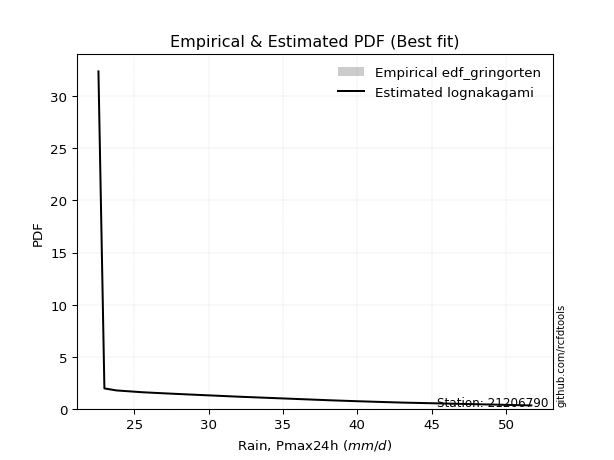</img>

</div>


### 9. EDF Filliben (1975)

The specific values of the constants (0.3175) (often denoted as $alpha$) and (0.365) are derived from a method proposed by James J. Filliben in a 1975 paper. This particular formula is the mean value of the $i$-th order statistic of the normal distribution and is considered a robust and effective plotting position formula for the normal probability plot correlation coefficient test for normality.

<div align="center">


$P=(m-0.3175)/(n+0.365)$


</div>


**9.1. Empirical values**

<div align="center">

|                | 0                   | 1                   | 2                  | 3                   | 4                   | 5                  | 6                  | 7                  | 8                  | 9                  | 10                 | 11                 | 12                 | 13                 | 14                 | 15                 | 16                | 17                 | 18                 |
|:---------------|:--------------------|:--------------------|:-------------------|:--------------------|:--------------------|:-------------------|:-------------------|:-------------------|:-------------------|:-------------------|:-------------------|:-------------------|:-------------------|:-------------------|:-------------------|:-------------------|:------------------|:-------------------|:-------------------|
| date           | 2008                | 2005                | 2006               | 2016                | 2018                | 2017               | 2011               | 2022               | 2009               | 2024               | 2020               | 2021               | 2019               | 2014               | 2007               | 2010               | 2013              | 2015               | 2012               |
| x              | 22.6                | 23.0                | 23.8               | 25.5                | 26.3                | 27.9               | 28.2               | 28.7               | 29.5               | 31.689473684210526 | 32.3               | 38.2               | 38.5               | 38.5               | 39.8               | 42.0               | 42.4              | 43.1               | 51.7               |
| m              | 1                   | 2                   | 3                  | 4                   | 5                   | 6                  | 7                  | 8                  | 9                  | 10                 | 11                 | 12                 | 13                 | 14                 | 15                 | 16                 | 17                | 18                 | 19                 |
| empirical_dist | edf_filliben        | edf_filliben        | edf_filliben       | edf_filliben        | edf_filliben        | edf_filliben       | edf_filliben       | edf_filliben       | edf_filliben       | edf_filliben       | edf_filliben       | edf_filliben       | edf_filliben       | edf_filliben       | edf_filliben       | edf_filliben       | edf_filliben      | edf_filliben       | edf_filliben       |
| empirical      | 0.03524399690162665 | 0.08688355280144593 | 0.1385231087012652 | 0.19016266460108444 | 0.24180222050090372 | 0.293441776400723  | 0.3450813323005423 | 0.3967208882003615 | 0.4483604441001807 | 0.5                | 0.5516395558998193 | 0.6032791117996386 | 0.6549186676994578 | 0.7065582235992771 | 0.7581977794990963 | 0.8098373353989156 | 0.861476891298735 | 0.9131164471985542 | 0.9647560030983735 |
| empirical_tr   | 1.0365315134484143  | 1.0951505726000283  | 1.1607972426195114 | 1.2348158775705405  | 1.3189170781542654  | 1.4153115293257812 | 1.5269071555292728 | 1.6576075326342818 | 1.8127779077931194 | 2.0                | 2.2303484019579614 | 2.5206638464041657 | 2.8978675645342316 | 3.407831060272768  | 4.135611318739989  | 5.258655804480651  | 7.219012115563846 | 11.509658246656779 | 28.373626373626497 |

</div>


**9.2. Kolmogorov-Smirnov fit test (sorted by Δ)**


<div align="center">

|                | 0                   | 1                   | 2                   | 3                   | 4                   | 5                   | 6                   | 7                   | 8                   | 9                   | 10                  | 11                  | 12                  | 13                  | 14                  | 15                  | 16                  | 17                  | 18                  | 19                  | 20                  | 21                  | 22                  | 23                  | 24                  | 25                  | 26                  | 27                  | 28                  | 29                  | 30                  | 31                  | 32                  | 33                  | 34                  | 35                  | 36                  | 37                  | 38                  | 39                  | 40                  | 41                  | 42                  | 43                  | 44                  | 45                  | 46                  | 47                  | 48                  | 49                  | 50                  | 51                  | 52                  | 53                  | 54                  | 55                  | 56                  | 57                  | 58                  | 59                  | 60                  | 61                  | 62                  | 63                  | 64                  | 65                  | 66                  | 67                  | 68                  | 69                  | 70                  | 71                  | 72                  | 73                  | 74                  | 75                  | 76                  | 77                  | 78                  | 79                  | 80                  | 81                  | 82                  | 83                  | 84                  | 85                  | 86                  | 87                  | 88                  | 89                  | 90                  | 91                  | 92                  | 93                  | 94                  | 95                  | 96                  | 97                  | 98                  | 99                  | 100                 | 101                 | 102                 | 103                 | 104                 | 105                 | 106                 | 107                 | 108                 | 109                 | 110                 | 111                 | 112                 | 113                 | 114                 | 115                 | 116                 | 117                 | 118                 | 119                 | 120                 | 121                 | 122                 | 123                 | 124                 | 125                 | 126                 | 127                 | 128                 | 129                 | 130                 | 131                 | 132                 | 133                 | 134                 | 135                 | 136                 | 137                 | 138                 | 139                 | 140                 | 141                 | 142                 | 143                 | 144                 | 145                 | 146                 | 147                 | 148                 | 149                 | 150                 | 151                 | 152                 | 153                 | 154                 | 155                 | 156                 | 157                 | 158                 | 159                 |
|:---------------|:--------------------|:--------------------|:--------------------|:--------------------|:--------------------|:--------------------|:--------------------|:--------------------|:--------------------|:--------------------|:--------------------|:--------------------|:--------------------|:--------------------|:--------------------|:--------------------|:--------------------|:--------------------|:--------------------|:--------------------|:--------------------|:--------------------|:--------------------|:--------------------|:--------------------|:--------------------|:--------------------|:--------------------|:--------------------|:--------------------|:--------------------|:--------------------|:--------------------|:--------------------|:--------------------|:--------------------|:--------------------|:--------------------|:--------------------|:--------------------|:--------------------|:--------------------|:--------------------|:--------------------|:--------------------|:--------------------|:--------------------|:--------------------|:--------------------|:--------------------|:--------------------|:--------------------|:--------------------|:--------------------|:--------------------|:--------------------|:--------------------|:--------------------|:--------------------|:--------------------|:--------------------|:--------------------|:--------------------|:--------------------|:--------------------|:--------------------|:--------------------|:--------------------|:--------------------|:--------------------|:--------------------|:--------------------|:--------------------|:--------------------|:--------------------|:--------------------|:--------------------|:--------------------|:--------------------|:--------------------|:--------------------|:--------------------|:--------------------|:--------------------|:--------------------|:--------------------|:--------------------|:--------------------|:--------------------|:--------------------|:--------------------|:--------------------|:--------------------|:--------------------|:--------------------|:--------------------|:--------------------|:--------------------|:--------------------|:--------------------|:--------------------|:--------------------|:--------------------|:--------------------|:--------------------|:--------------------|:--------------------|:--------------------|:--------------------|:--------------------|:--------------------|:--------------------|:--------------------|:--------------------|:--------------------|:--------------------|:--------------------|:--------------------|:--------------------|:--------------------|:--------------------|:--------------------|:--------------------|:--------------------|:--------------------|:--------------------|:--------------------|:--------------------|:--------------------|:--------------------|:--------------------|:--------------------|:--------------------|:--------------------|:--------------------|:--------------------|:--------------------|:--------------------|:--------------------|:--------------------|:--------------------|:--------------------|:--------------------|:--------------------|:--------------------|:--------------------|:--------------------|:--------------------|:--------------------|:--------------------|:--------------------|:--------------------|:--------------------|:--------------------|:--------------------|:--------------------|:--------------------|:--------------------|:--------------------|:--------------------|
| station        | 21206790            | 21206790            | 21206790            | 21206790            | 21206790            | 21206790            | 21206790            | 21206790            | 21206790            | 21206790            | 21206790            | 21206790            | 21206790            | 21206790            | 21206790            | 21206790            | 21206790            | 21206790            | 21206790            | 21206790            | 21206790            | 21206790            | 21206790            | 21206790            | 21206790            | 21206790            | 21206790            | 21206790            | 21206790            | 21206790            | 21206790            | 21206790            | 21206790            | 21206790            | 21206790            | 21206790            | 21206790            | 21206790            | 21206790            | 21206790            | 21206790            | 21206790            | 21206790            | 21206790            | 21206790            | 21206790            | 21206790            | 21206790            | 21206790            | 21206790            | 21206790            | 21206790            | 21206790            | 21206790            | 21206790            | 21206790            | 21206790            | 21206790            | 21206790            | 21206790            | 21206790            | 21206790            | 21206790            | 21206790            | 21206790            | 21206790            | 21206790            | 21206790            | 21206790            | 21206790            | 21206790            | 21206790            | 21206790            | 21206790            | 21206790            | 21206790            | 21206790            | 21206790            | 21206790            | 21206790            | 21206790            | 21206790            | 21206790            | 21206790            | 21206790            | 21206790            | 21206790            | 21206790            | 21206790            | 21206790            | 21206790            | 21206790            | 21206790            | 21206790            | 21206790            | 21206790            | 21206790            | 21206790            | 21206790            | 21206790            | 21206790            | 21206790            | 21206790            | 21206790            | 21206790            | 21206790            | 21206790            | 21206790            | 21206790            | 21206790            | 21206790            | 21206790            | 21206790            | 21206790            | 21206790            | 21206790            | 21206790            | 21206790            | 21206790            | 21206790            | 21206790            | 21206790            | 21206790            | 21206790            | 21206790            | 21206790            | 21206790            | 21206790            | 21206790            | 21206790            | 21206790            | 21206790            | 21206790            | 21206790            | 21206790            | 21206790            | 21206790            | 21206790            | 21206790            | 21206790            | 21206790            | 21206790            | 21206790            | 21206790            | 21206790            | 21206790            | 21206790            | 21206790            | 21206790            | 21206790            | 21206790            | 21206790            | 21206790            | 21206790            | 21206790            | 21206790            | 21206790            | 21206790            | 21206790            | 21206790            |
| empirical_dist | edf_filliben        | edf_filliben        | edf_filliben        | edf_filliben        | edf_filliben        | edf_filliben        | edf_filliben        | edf_filliben        | edf_filliben        | edf_filliben        | edf_filliben        | edf_filliben        | edf_filliben        | edf_filliben        | edf_filliben        | edf_filliben        | edf_filliben        | edf_filliben        | edf_filliben        | edf_filliben        | edf_filliben        | edf_filliben        | edf_filliben        | edf_filliben        | edf_filliben        | edf_filliben        | edf_filliben        | edf_filliben        | edf_filliben        | edf_filliben        | edf_filliben        | edf_filliben        | edf_filliben        | edf_filliben        | edf_filliben        | edf_filliben        | edf_filliben        | edf_filliben        | edf_filliben        | edf_filliben        | edf_filliben        | edf_filliben        | edf_filliben        | edf_filliben        | edf_filliben        | edf_filliben        | edf_filliben        | edf_filliben        | edf_filliben        | edf_filliben        | edf_filliben        | edf_filliben        | edf_filliben        | edf_filliben        | edf_filliben        | edf_filliben        | edf_filliben        | edf_filliben        | edf_filliben        | edf_filliben        | edf_filliben        | edf_filliben        | edf_filliben        | edf_filliben        | edf_filliben        | edf_filliben        | edf_filliben        | edf_filliben        | edf_filliben        | edf_filliben        | edf_filliben        | edf_filliben        | edf_filliben        | edf_filliben        | edf_filliben        | edf_filliben        | edf_filliben        | edf_filliben        | edf_filliben        | edf_filliben        | edf_filliben        | edf_filliben        | edf_filliben        | edf_filliben        | edf_filliben        | edf_filliben        | edf_filliben        | edf_filliben        | edf_filliben        | edf_filliben        | edf_filliben        | edf_filliben        | edf_filliben        | edf_filliben        | edf_filliben        | edf_filliben        | edf_filliben        | edf_filliben        | edf_filliben        | edf_filliben        | edf_filliben        | edf_filliben        | edf_filliben        | edf_filliben        | edf_filliben        | edf_filliben        | edf_filliben        | edf_filliben        | edf_filliben        | edf_filliben        | edf_filliben        | edf_filliben        | edf_filliben        | edf_filliben        | edf_filliben        | edf_filliben        | edf_filliben        | edf_filliben        | edf_filliben        | edf_filliben        | edf_filliben        | edf_filliben        | edf_filliben        | edf_filliben        | edf_filliben        | edf_filliben        | edf_filliben        | edf_filliben        | edf_filliben        | edf_filliben        | edf_filliben        | edf_filliben        | edf_filliben        | edf_filliben        | edf_filliben        | edf_filliben        | edf_filliben        | edf_filliben        | edf_filliben        | edf_filliben        | edf_filliben        | edf_filliben        | edf_filliben        | edf_filliben        | edf_filliben        | edf_filliben        | edf_filliben        | edf_filliben        | edf_filliben        | edf_filliben        | edf_filliben        | edf_filliben        | edf_filliben        | edf_filliben        | edf_filliben        | edf_filliben        | edf_filliben        | edf_filliben        | edf_filliben        | edf_filliben        |
| p_dist         | arcsine             | logarcsine          | loggausshyper       | semicircular        | truncweibull_min    | truncexpon          | anglit              | logbradford         | dweibull            | logsemicircular     | truncpareto         | logjohnsonsb        | logtruncpareto      | logdgamma           | johnsonsb           | loghalfgennorm      | logtruncexpon       | gausshyper          | loganglit           | foldnorm            | lognakagami         | gamma               | genhalflogistic     | norm                | crystalball         | t                   | loguniform          | logbeta             | logvonmises_line    | logcosine           | beta                | logburr12           | kappa3              | maxwell             | logkappa3           | f                   | rayleigh            | pearson3            | rice                | gompertz            | logtukeylambda      | ncf                 | bradford            | truncnorm           | logloggamma         | logbetaprime        | logfoldnorm         | gennorm             | halfnorm            | skewnorm            | logt                | lognorm             | logcrystalball      | tukeylambda         | logexponnorm        | logistic            | betaprime           | logkappa4           | cosine              | loggenextreme       | logweibull_max      | logpearson3         | loginvgamma         | logerlang           | logrice             | kappa4              | lognct              | logmaxwell          | loggamma            | loggamma            | loglomax            | kstwobign           | logalpha            | loggumbel_l         | lomax               | genexpon            | alpha               | logf                | lograyleigh         | burr12              | weibull_min         | nct                 | genextreme          | exponnorm           | loggenexpon         | invweibull          | logjohnsonsu        | genlogistic         | logargus            | invgamma            | logfatiguelife      | logburr             | johnsonsu           | logweibull_min      | hypsecant           | invgauss            | loginvgauss         | fatiguelife         | gumbel_r            | loginvweibull       | loggenlogistic      | burr                | logmielke           | loghalfnorm         | logskewnorm         | logkstwobign        | loglogistic         | logexponpow         | logtriang           | logdweibull         | loggompertz         | halflogistic        | logncf              | logksone            | moyal               | exponpow            | gumbel_l            | logtruncweibull_min | logexponweib        | loghypsecant        | logloglaplace       | loggumbel_r         | laplace             | loghalflogistic     | halfgennorm         | logmoyal            | nakagami            | loggengamma         | dgamma              | loglaplace          | loglaplace          | logtruncnorm        | uniform             | vonmises_line       | wrapcauchy          | argus               | wald                | logwald             | ksone               | erlang              | loggenhalflogistic  | logwrapcauchy       | powerlaw            | logpowerlaw         | logrdist            | triang              | genpareto           | logtrapezoid        | loglevy_l           | loggennorm          | levy_l              | trapezoid           | exponweib           | loggenpareto        | rdist               | gengamma            | weibull_max         | logvonmises         | vonmises            | mielke              |
| delta          | 0.08529613194904617 | 0.09206991209696302 | 0.09701465350838978 | 0.09938175112590647 | 0.10179729559009876 | 0.10583666286847604 | 0.10921016235336661 | 0.10972167529603483 | 0.11147167343892972 | 0.11183201382717467 | 0.11324703313729134 | 0.11426917535415004 | 0.11450337028545865 | 0.11614549273547992 | 0.11709318946795721 | 0.12005005893357312 | 0.12142757946574612 | 0.12332869309740868 | 0.12384908967544195 | 0.12537226543545743 | 0.12590655377225335 | 0.12643222428674605 | 0.1268183199287365  | 0.13241563942730228 | 0.1324156606819794  | 0.13254660482571534 | 0.13297512147735013 | 0.13300451889067832 | 0.1332366767127967  | 0.13508773323640766 | 0.1350938539010429  | 0.1359449837956117  | 0.13596999097829643 | 0.13603281028240222 | 0.1366462101096888  | 0.1380672960204692  | 0.13966445089474744 | 0.14014481987872984 | 0.14073981868631935 | 0.14101244674353852 | 0.14234734682247563 | 0.1438191748587092  | 0.146245561559174   | 0.1480921678354925  | 0.1488487332013807  | 0.1490900532604379  | 0.14950669571361108 | 0.14961710785903365 | 0.15121337842930038 | 0.15145718098650818 | 0.15153455697354945 | 0.15153495329634348 | 0.15153574878627596 | 0.15164167088952318 | 0.1516987541262913  | 0.15288446384481935 | 0.1533478807944748  | 0.15406479685484165 | 0.15511966022182982 | 0.15514961239291736 | 0.1551642454117409  | 0.15549048380422126 | 0.15740772111378687 | 0.15847933412814508 | 0.15976009414243897 | 0.16012187486957707 | 0.16024618627752485 | 0.1604903963883959  | 0.16055530586521383 | 0.16055530586521383 | 0.16106522437772075 | 0.16124543428938676 | 0.1613290689660567  | 0.16154870762177503 | 0.16182166575120904 | 0.16231919915961068 | 0.16258515486332803 | 0.16299143279754813 | 0.16304208346394888 | 0.16307455770982937 | 0.1632122340147083  | 0.16412491429017773 | 0.1645294869534869  | 0.16454178794057062 | 0.1645940736935172  | 0.16474888098202745 | 0.16503656648678877 | 0.16542808823112498 | 0.16544881727566452 | 0.16563136253844757 | 0.16678700825299642 | 0.16718406233149974 | 0.16745138441582652 | 0.167842151593794   | 0.1680407280834757  | 0.16811283573715374 | 0.16819129685302858 | 0.16835353739915782 | 0.1684562382183692  | 0.16869139552129764 | 0.16872368203038646 | 0.16897840362692973 | 0.16986302209665782 | 0.17185985733466058 | 0.17218740364878338 | 0.1734302011051745  | 0.1741953858170846  | 0.17450592080759597 | 0.17578118648580382 | 0.1763308491036787  | 0.17655160469673858 | 0.1768676058385149  | 0.17909754284341473 | 0.17966534243088428 | 0.18294909062050313 | 0.1852845794874689  | 0.18642712326295735 | 0.18710890741199537 | 0.18865700861631285 | 0.18896618015971212 | 0.18913578711135814 | 0.18981318054659668 | 0.19441934309870268 | 0.19593915910266857 | 0.19770583982859946 | 0.2021823285276486  | 0.20313300581276295 | 0.20422309656356952 | 0.2069076827201769  | 0.20820160853819258 | 0.20820160853819258 | 0.21293428398772374 | 0.21830622256648613 | 0.219297358763607   | 0.22108286467698768 | 0.22233974622955976 | 0.23057917845012843 | 0.2412322665988288  | 0.24272698557197925 | 0.27414768766602315 | 0.27687649830906746 | 0.2910943082466124  | 0.2951231556094204  | 0.3285002146681739  | 0.33230983310762185 | 0.33379060484651213 | 0.3364818605933714  | 0.3751659241136387  | 0.40485453190832704 | 0.4131164471985542  | 0.4396093162557087  | 0.4636944169385852  | 0.46609058892864264 | 0.4686841339229239  | 0.4782493857069923  | 0.4975524818442335  | 0.7304665795135306  | 1.1527076711862043  | 7.754990220569556   | nan                 |
| deltao         | 0.31564497164100014 | 0.31564497164100014 | 0.31564497164100014 | 0.31564497164100014 | 0.31564497164100014 | 0.31564497164100014 | 0.31564497164100014 | 0.31564497164100014 | 0.31564497164100014 | 0.31564497164100014 | 0.31564497164100014 | 0.31564497164100014 | 0.31564497164100014 | 0.31564497164100014 | 0.31564497164100014 | 0.31564497164100014 | 0.31564497164100014 | 0.31564497164100014 | 0.31564497164100014 | 0.31564497164100014 | 0.31564497164100014 | 0.31564497164100014 | 0.31564497164100014 | 0.31564497164100014 | 0.31564497164100014 | 0.31564497164100014 | 0.31564497164100014 | 0.31564497164100014 | 0.31564497164100014 | 0.31564497164100014 | 0.31564497164100014 | 0.31564497164100014 | 0.31564497164100014 | 0.31564497164100014 | 0.31564497164100014 | 0.31564497164100014 | 0.31564497164100014 | 0.31564497164100014 | 0.31564497164100014 | 0.31564497164100014 | 0.31564497164100014 | 0.31564497164100014 | 0.31564497164100014 | 0.31564497164100014 | 0.31564497164100014 | 0.31564497164100014 | 0.31564497164100014 | 0.31564497164100014 | 0.31564497164100014 | 0.31564497164100014 | 0.31564497164100014 | 0.31564497164100014 | 0.31564497164100014 | 0.31564497164100014 | 0.31564497164100014 | 0.31564497164100014 | 0.31564497164100014 | 0.31564497164100014 | 0.31564497164100014 | 0.31564497164100014 | 0.31564497164100014 | 0.31564497164100014 | 0.31564497164100014 | 0.31564497164100014 | 0.31564497164100014 | 0.31564497164100014 | 0.31564497164100014 | 0.31564497164100014 | 0.31564497164100014 | 0.31564497164100014 | 0.31564497164100014 | 0.31564497164100014 | 0.31564497164100014 | 0.31564497164100014 | 0.31564497164100014 | 0.31564497164100014 | 0.31564497164100014 | 0.31564497164100014 | 0.31564497164100014 | 0.31564497164100014 | 0.31564497164100014 | 0.31564497164100014 | 0.31564497164100014 | 0.31564497164100014 | 0.31564497164100014 | 0.31564497164100014 | 0.31564497164100014 | 0.31564497164100014 | 0.31564497164100014 | 0.31564497164100014 | 0.31564497164100014 | 0.31564497164100014 | 0.31564497164100014 | 0.31564497164100014 | 0.31564497164100014 | 0.31564497164100014 | 0.31564497164100014 | 0.31564497164100014 | 0.31564497164100014 | 0.31564497164100014 | 0.31564497164100014 | 0.31564497164100014 | 0.31564497164100014 | 0.31564497164100014 | 0.31564497164100014 | 0.31564497164100014 | 0.31564497164100014 | 0.31564497164100014 | 0.31564497164100014 | 0.31564497164100014 | 0.31564497164100014 | 0.31564497164100014 | 0.31564497164100014 | 0.31564497164100014 | 0.31564497164100014 | 0.31564497164100014 | 0.31564497164100014 | 0.31564497164100014 | 0.31564497164100014 | 0.31564497164100014 | 0.31564497164100014 | 0.31564497164100014 | 0.31564497164100014 | 0.31564497164100014 | 0.31564497164100014 | 0.31564497164100014 | 0.31564497164100014 | 0.31564497164100014 | 0.31564497164100014 | 0.31564497164100014 | 0.31564497164100014 | 0.31564497164100014 | 0.31564497164100014 | 0.31564497164100014 | 0.31564497164100014 | 0.31564497164100014 | 0.31564497164100014 | 0.31564497164100014 | 0.31564497164100014 | 0.31564497164100014 | 0.31564497164100014 | 0.31564497164100014 | 0.31564497164100014 | 0.31564497164100014 | 0.31564497164100014 | 0.31564497164100014 | 0.31564497164100014 | 0.31564497164100014 | 0.31564497164100014 | 0.31564497164100014 | 0.31564497164100014 | 0.31564497164100014 | 0.31564497164100014 | 0.31564497164100014 | 0.31564497164100014 | 0.31564497164100014 | 0.31564497164100014 | 0.31564497164100014 | 0.31564497164100014 | 0.31564497164100014 |
| eval           | Δo > Δ              | Δo > Δ              | Δo > Δ              | Δo > Δ              | Δo > Δ              | Δo > Δ              | Δo > Δ              | Δo > Δ              | Δo > Δ              | Δo > Δ              | Δo > Δ              | Δo > Δ              | Δo > Δ              | Δo > Δ              | Δo > Δ              | Δo > Δ              | Δo > Δ              | Δo > Δ              | Δo > Δ              | Δo > Δ              | Δo > Δ              | Δo > Δ              | Δo > Δ              | Δo > Δ              | Δo > Δ              | Δo > Δ              | Δo > Δ              | Δo > Δ              | Δo > Δ              | Δo > Δ              | Δo > Δ              | Δo > Δ              | Δo > Δ              | Δo > Δ              | Δo > Δ              | Δo > Δ              | Δo > Δ              | Δo > Δ              | Δo > Δ              | Δo > Δ              | Δo > Δ              | Δo > Δ              | Δo > Δ              | Δo > Δ              | Δo > Δ              | Δo > Δ              | Δo > Δ              | Δo > Δ              | Δo > Δ              | Δo > Δ              | Δo > Δ              | Δo > Δ              | Δo > Δ              | Δo > Δ              | Δo > Δ              | Δo > Δ              | Δo > Δ              | Δo > Δ              | Δo > Δ              | Δo > Δ              | Δo > Δ              | Δo > Δ              | Δo > Δ              | Δo > Δ              | Δo > Δ              | Δo > Δ              | Δo > Δ              | Δo > Δ              | Δo > Δ              | Δo > Δ              | Δo > Δ              | Δo > Δ              | Δo > Δ              | Δo > Δ              | Δo > Δ              | Δo > Δ              | Δo > Δ              | Δo > Δ              | Δo > Δ              | Δo > Δ              | Δo > Δ              | Δo > Δ              | Δo > Δ              | Δo > Δ              | Δo > Δ              | Δo > Δ              | Δo > Δ              | Δo > Δ              | Δo > Δ              | Δo > Δ              | Δo > Δ              | Δo > Δ              | Δo > Δ              | Δo > Δ              | Δo > Δ              | Δo > Δ              | Δo > Δ              | Δo > Δ              | Δo > Δ              | Δo > Δ              | Δo > Δ              | Δo > Δ              | Δo > Δ              | Δo > Δ              | Δo > Δ              | Δo > Δ              | Δo > Δ              | Δo > Δ              | Δo > Δ              | Δo > Δ              | Δo > Δ              | Δo > Δ              | Δo > Δ              | Δo > Δ              | Δo > Δ              | Δo > Δ              | Δo > Δ              | Δo > Δ              | Δo > Δ              | Δo > Δ              | Δo > Δ              | Δo > Δ              | Δo > Δ              | Δo > Δ              | Δo > Δ              | Δo > Δ              | Δo > Δ              | Δo > Δ              | Δo > Δ              | Δo > Δ              | Δo > Δ              | Δo > Δ              | Δo > Δ              | Δo > Δ              | Δo > Δ              | Δo > Δ              | Δo > Δ              | Δo > Δ              | Δo > Δ              | Δo > Δ              | Δo > Δ              | Δo > Δ              | Δo > Δ              | Δo <= Δ             | Δo <= Δ             | Δo <= Δ             | Δo <= Δ             | Δo <= Δ             | Δo <= Δ             | Δo <= Δ             | Δo <= Δ             | Δo <= Δ             | Δo <= Δ             | Δo <= Δ             | Δo <= Δ             | Δo <= Δ             | Δo <= Δ             | Δo <= Δ             | Δo <= Δ             | Δo <= Δ             |
| fit            | 1                   | 1                   | 1                   | 1                   | 1                   | 1                   | 1                   | 1                   | 1                   | 1                   | 1                   | 1                   | 1                   | 1                   | 1                   | 1                   | 1                   | 1                   | 1                   | 1                   | 1                   | 1                   | 1                   | 1                   | 1                   | 1                   | 1                   | 1                   | 1                   | 1                   | 1                   | 1                   | 1                   | 1                   | 1                   | 1                   | 1                   | 1                   | 1                   | 1                   | 1                   | 1                   | 1                   | 1                   | 1                   | 1                   | 1                   | 1                   | 1                   | 1                   | 1                   | 1                   | 1                   | 1                   | 1                   | 1                   | 1                   | 1                   | 1                   | 1                   | 1                   | 1                   | 1                   | 1                   | 1                   | 1                   | 1                   | 1                   | 1                   | 1                   | 1                   | 1                   | 1                   | 1                   | 1                   | 1                   | 1                   | 1                   | 1                   | 1                   | 1                   | 1                   | 1                   | 1                   | 1                   | 1                   | 1                   | 1                   | 1                   | 1                   | 1                   | 1                   | 1                   | 1                   | 1                   | 1                   | 1                   | 1                   | 1                   | 1                   | 1                   | 1                   | 1                   | 1                   | 1                   | 1                   | 1                   | 1                   | 1                   | 1                   | 1                   | 1                   | 1                   | 1                   | 1                   | 1                   | 1                   | 1                   | 1                   | 1                   | 1                   | 1                   | 1                   | 1                   | 1                   | 1                   | 1                   | 1                   | 1                   | 1                   | 1                   | 1                   | 1                   | 1                   | 1                   | 1                   | 1                   | 1                   | 1                   | 1                   | 1                   | 1                   | 1                   | 0                   | 0                   | 0                   | 0                   | 0                   | 0                   | 0                   | 0                   | 0                   | 0                   | 0                   | 0                   | 0                   | 0                   | 0                   | 0                   | 0                   |
| n              | 19                  | 19                  | 19                  | 19                  | 19                  | 19                  | 19                  | 19                  | 19                  | 19                  | 19                  | 19                  | 19                  | 19                  | 19                  | 19                  | 19                  | 19                  | 19                  | 19                  | 19                  | 19                  | 19                  | 19                  | 19                  | 19                  | 19                  | 19                  | 19                  | 19                  | 19                  | 19                  | 19                  | 19                  | 19                  | 19                  | 19                  | 19                  | 19                  | 19                  | 19                  | 19                  | 19                  | 19                  | 19                  | 19                  | 19                  | 19                  | 19                  | 19                  | 19                  | 19                  | 19                  | 19                  | 19                  | 19                  | 19                  | 19                  | 19                  | 19                  | 19                  | 19                  | 19                  | 19                  | 19                  | 19                  | 19                  | 19                  | 19                  | 19                  | 19                  | 19                  | 19                  | 19                  | 19                  | 19                  | 19                  | 19                  | 19                  | 19                  | 19                  | 19                  | 19                  | 19                  | 19                  | 19                  | 19                  | 19                  | 19                  | 19                  | 19                  | 19                  | 19                  | 19                  | 19                  | 19                  | 19                  | 19                  | 19                  | 19                  | 19                  | 19                  | 19                  | 19                  | 19                  | 19                  | 19                  | 19                  | 19                  | 19                  | 19                  | 19                  | 19                  | 19                  | 19                  | 19                  | 19                  | 19                  | 19                  | 19                  | 19                  | 19                  | 19                  | 19                  | 19                  | 19                  | 19                  | 19                  | 19                  | 19                  | 19                  | 19                  | 19                  | 19                  | 19                  | 19                  | 19                  | 19                  | 19                  | 19                  | 19                  | 19                  | 19                  | 19                  | 19                  | 19                  | 19                  | 19                  | 19                  | 19                  | 19                  | 19                  | 19                  | 19                  | 19                  | 19                  | 19                  | 19                  | 19                  | 19                  |
| best_fit       | 1                   | 0                   | 0                   | 0                   | 0                   | 0                   | 0                   | 0                   | 0                   | 0                   | 0                   | 0                   | 0                   | 0                   | 0                   | 0                   | 0                   | 0                   | 0                   | 0                   | 0                   | 0                   | 0                   | 0                   | 0                   | 0                   | 0                   | 0                   | 0                   | 0                   | 0                   | 0                   | 0                   | 0                   | 0                   | 0                   | 0                   | 0                   | 0                   | 0                   | 0                   | 0                   | 0                   | 0                   | 0                   | 0                   | 0                   | 0                   | 0                   | 0                   | 0                   | 0                   | 0                   | 0                   | 0                   | 0                   | 0                   | 0                   | 0                   | 0                   | 0                   | 0                   | 0                   | 0                   | 0                   | 0                   | 0                   | 0                   | 0                   | 0                   | 0                   | 0                   | 0                   | 0                   | 0                   | 0                   | 0                   | 0                   | 0                   | 0                   | 0                   | 0                   | 0                   | 0                   | 0                   | 0                   | 0                   | 0                   | 0                   | 0                   | 0                   | 0                   | 0                   | 0                   | 0                   | 0                   | 0                   | 0                   | 0                   | 0                   | 0                   | 0                   | 0                   | 0                   | 0                   | 0                   | 0                   | 0                   | 0                   | 0                   | 0                   | 0                   | 0                   | 0                   | 0                   | 0                   | 0                   | 0                   | 0                   | 0                   | 0                   | 0                   | 0                   | 0                   | 0                   | 0                   | 0                   | 0                   | 0                   | 0                   | 0                   | 0                   | 0                   | 0                   | 0                   | 0                   | 0                   | 0                   | 0                   | 0                   | 0                   | 0                   | 0                   | 0                   | 0                   | 0                   | 0                   | 0                   | 0                   | 0                   | 0                   | 0                   | 0                   | 0                   | 0                   | 0                   | 0                   | 0                   | 0                   | 0                   |
| best_fit_sort  | 1                   | 2                   | 3                   | 4                   | 5                   | 6                   | 7                   | 8                   | 9                   | 10                  | 11                  | 12                  | 13                  | 14                  | 15                  | 16                  | 17                  | 18                  | 19                  | 20                  | 21                  | 22                  | 23                  | 24                  | 25                  | 26                  | 27                  | 28                  | 29                  | 30                  | 31                  | 32                  | 33                  | 34                  | 35                  | 36                  | 37                  | 38                  | 39                  | 40                  | 41                  | 42                  | 43                  | 44                  | 45                  | 46                  | 47                  | 48                  | 49                  | 50                  | 51                  | 52                  | 53                  | 54                  | 55                  | 56                  | 57                  | 58                  | 59                  | 60                  | 61                  | 62                  | 63                  | 64                  | 65                  | 66                  | 67                  | 68                  | 69                  | 70                  | 71                  | 72                  | 73                  | 74                  | 75                  | 76                  | 77                  | 78                  | 79                  | 80                  | 81                  | 82                  | 83                  | 84                  | 85                  | 86                  | 87                  | 88                  | 89                  | 90                  | 91                  | 92                  | 93                  | 94                  | 95                  | 96                  | 97                  | 98                  | 99                  | 100                 | 101                 | 102                 | 103                 | 104                 | 105                 | 106                 | 107                 | 108                 | 109                 | 110                 | 111                 | 112                 | 113                 | 114                 | 115                 | 116                 | 117                 | 118                 | 119                 | 120                 | 121                 | 122                 | 123                 | 124                 | 125                 | 126                 | 127                 | 128                 | 129                 | 130                 | 131                 | 132                 | 133                 | 134                 | 135                 | 136                 | 137                 | 138                 | 139                 | 140                 | 141                 | 142                 | 143                 | 144                 | 145                 | 146                 | 147                 | 148                 | 149                 | 150                 | 151                 | 152                 | 153                 | 154                 | 155                 | 156                 | 157                 | 158                 | 159                 | 160                 |

</div>


**9.3. Best fit**

<div align="center">

|   id |   station | empirical_dist   | p_dist   |     delta |   deltao | eval   |   fit |   n |   best_fit |   best_fit_sort |
|-----:|----------:|:-----------------|:---------|----------:|---------:|:-------|------:|----:|-----------:|----------------:|
|    0 |  21206790 | edf_filliben     | arcsine  | 0.0852961 | 0.315645 | Δo > Δ |     1 |  19 |          1 |               1 |

</div>


<div align="center">

</img>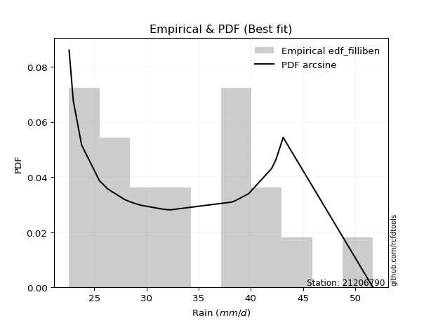</img>

</div>


### 10. EDF Jenkinson (1977)

The Jenkinson formula in hydrology is an empirical plotting position formula used to estimate the non-exceedance probability _(P)_ or return period _(T)_ of a given ordered observation within a sample. It is a widely used method in the frequency analysis of extreme events such as floods and rainfall, as it provides a distribution-free way to plot data. _a≈0.31_ and _b≈0.38_ are constants derived to approximate the median of the probability distribution for the given rank.

<div align="center">


$P=(m-a)/(n+b)$


</div>


**10.1. Empirical values**

<div align="center">

|                | 0                   | 1                   | 2                  | 3                   | 4                   | 5                   | 6                  | 7                  | 8                  | 9                  | 10                 | 11                 | 12                 | 13                 | 14                 | 15                 | 16                 | 17                 | 18                 |
|:---------------|:--------------------|:--------------------|:-------------------|:--------------------|:--------------------|:--------------------|:-------------------|:-------------------|:-------------------|:-------------------|:-------------------|:-------------------|:-------------------|:-------------------|:-------------------|:-------------------|:-------------------|:-------------------|:-------------------|
| date           | 2008                | 2005                | 2006               | 2016                | 2018                | 2017                | 2011               | 2022               | 2009               | 2024               | 2020               | 2021               | 2019               | 2014               | 2007               | 2010               | 2013               | 2015               | 2012               |
| x              | 22.6                | 23.0                | 23.8               | 25.5                | 26.3                | 27.9                | 28.2               | 28.7               | 29.5               | 31.689473684210526 | 32.3               | 38.2               | 38.5               | 38.5               | 39.8               | 42.0               | 42.4               | 43.1               | 51.7               |
| m              | 1                   | 2                   | 3                  | 4                   | 5                   | 6                   | 7                  | 8                  | 9                  | 10                 | 11                 | 12                 | 13                 | 14                 | 15                 | 16                 | 17                 | 18                 | 19                 |
| empirical_dist | edf_jenkinson       | edf_jenkinson       | edf_jenkinson      | edf_jenkinson       | edf_jenkinson       | edf_jenkinson       | edf_jenkinson      | edf_jenkinson      | edf_jenkinson      | edf_jenkinson      | edf_jenkinson      | edf_jenkinson      | edf_jenkinson      | edf_jenkinson      | edf_jenkinson      | edf_jenkinson      | edf_jenkinson      | edf_jenkinson      | edf_jenkinson      |
| empirical      | 0.03560371517027864 | 0.08720330237358101 | 0.1388028895768834 | 0.19040247678018576 | 0.24200206398348817 | 0.29360165118679055 | 0.3452012383900929 | 0.3968008255933953 | 0.4484004127966976 | 0.5                | 0.5515995872033024 | 0.6031991744066048 | 0.6547987616099071 | 0.7063983488132095 | 0.7579979360165119 | 0.8095975232198143 | 0.8611971104231168 | 0.9127966976264191 | 0.9643962848297215 |
| empirical_tr   | 1.0369181380417336  | 1.0955342001130581  | 1.1611743559017376 | 1.2351816443594645  | 1.3192648059904697  | 1.4156318480642804  | 1.5271867612293144 | 1.6578272027373824 | 1.812909260991581  | 2.0                | 2.230149597238205  | 2.5201560468140443 | 2.896860986547085  | 3.40597539543058   | 4.132196162046909  | 5.252032520325204  | 7.204460966542758  | 11.467455621301793 | 28.086956521739243 |

</div>


**10.2. Kolmogorov-Smirnov fit test (sorted by Δ)**


<div align="center">

|                | 0                   | 1                   | 2                   | 3                   | 4                   | 5                   | 6                   | 7                   | 8                   | 9                   | 10                  | 11                  | 12                  | 13                  | 14                  | 15                  | 16                  | 17                  | 18                  | 19                  | 20                  | 21                  | 22                  | 23                  | 24                  | 25                  | 26                  | 27                  | 28                  | 29                  | 30                  | 31                  | 32                  | 33                  | 34                  | 35                  | 36                  | 37                  | 38                  | 39                  | 40                  | 41                  | 42                  | 43                  | 44                  | 45                  | 46                  | 47                  | 48                  | 49                  | 50                  | 51                  | 52                  | 53                  | 54                  | 55                  | 56                  | 57                  | 58                  | 59                  | 60                  | 61                  | 62                  | 63                  | 64                  | 65                  | 66                  | 67                  | 68                  | 69                  | 70                  | 71                  | 72                  | 73                  | 74                  | 75                  | 76                  | 77                  | 78                  | 79                  | 80                  | 81                  | 82                  | 83                  | 84                  | 85                  | 86                  | 87                  | 88                  | 89                  | 90                  | 91                  | 92                  | 93                  | 94                  | 95                  | 96                  | 97                  | 98                  | 99                  | 100                 | 101                 | 102                 | 103                 | 104                 | 105                 | 106                 | 107                 | 108                 | 109                 | 110                 | 111                 | 112                 | 113                 | 114                 | 115                 | 116                 | 117                 | 118                 | 119                 | 120                 | 121                 | 122                 | 123                 | 124                 | 125                 | 126                 | 127                 | 128                 | 129                 | 130                 | 131                 | 132                 | 133                 | 134                 | 135                 | 136                 | 137                 | 138                 | 139                 | 140                 | 141                 | 142                 | 143                 | 144                 | 145                 | 146                 | 147                 | 148                 | 149                 | 150                 | 151                 | 152                 | 153                 | 154                 | 155                 | 156                 | 157                 | 158                 | 159                 |
|:---------------|:--------------------|:--------------------|:--------------------|:--------------------|:--------------------|:--------------------|:--------------------|:--------------------|:--------------------|:--------------------|:--------------------|:--------------------|:--------------------|:--------------------|:--------------------|:--------------------|:--------------------|:--------------------|:--------------------|:--------------------|:--------------------|:--------------------|:--------------------|:--------------------|:--------------------|:--------------------|:--------------------|:--------------------|:--------------------|:--------------------|:--------------------|:--------------------|:--------------------|:--------------------|:--------------------|:--------------------|:--------------------|:--------------------|:--------------------|:--------------------|:--------------------|:--------------------|:--------------------|:--------------------|:--------------------|:--------------------|:--------------------|:--------------------|:--------------------|:--------------------|:--------------------|:--------------------|:--------------------|:--------------------|:--------------------|:--------------------|:--------------------|:--------------------|:--------------------|:--------------------|:--------------------|:--------------------|:--------------------|:--------------------|:--------------------|:--------------------|:--------------------|:--------------------|:--------------------|:--------------------|:--------------------|:--------------------|:--------------------|:--------------------|:--------------------|:--------------------|:--------------------|:--------------------|:--------------------|:--------------------|:--------------------|:--------------------|:--------------------|:--------------------|:--------------------|:--------------------|:--------------------|:--------------------|:--------------------|:--------------------|:--------------------|:--------------------|:--------------------|:--------------------|:--------------------|:--------------------|:--------------------|:--------------------|:--------------------|:--------------------|:--------------------|:--------------------|:--------------------|:--------------------|:--------------------|:--------------------|:--------------------|:--------------------|:--------------------|:--------------------|:--------------------|:--------------------|:--------------------|:--------------------|:--------------------|:--------------------|:--------------------|:--------------------|:--------------------|:--------------------|:--------------------|:--------------------|:--------------------|:--------------------|:--------------------|:--------------------|:--------------------|:--------------------|:--------------------|:--------------------|:--------------------|:--------------------|:--------------------|:--------------------|:--------------------|:--------------------|:--------------------|:--------------------|:--------------------|:--------------------|:--------------------|:--------------------|:--------------------|:--------------------|:--------------------|:--------------------|:--------------------|:--------------------|:--------------------|:--------------------|:--------------------|:--------------------|:--------------------|:--------------------|:--------------------|:--------------------|:--------------------|:--------------------|:--------------------|:--------------------|
| station        | 21206790            | 21206790            | 21206790            | 21206790            | 21206790            | 21206790            | 21206790            | 21206790            | 21206790            | 21206790            | 21206790            | 21206790            | 21206790            | 21206790            | 21206790            | 21206790            | 21206790            | 21206790            | 21206790            | 21206790            | 21206790            | 21206790            | 21206790            | 21206790            | 21206790            | 21206790            | 21206790            | 21206790            | 21206790            | 21206790            | 21206790            | 21206790            | 21206790            | 21206790            | 21206790            | 21206790            | 21206790            | 21206790            | 21206790            | 21206790            | 21206790            | 21206790            | 21206790            | 21206790            | 21206790            | 21206790            | 21206790            | 21206790            | 21206790            | 21206790            | 21206790            | 21206790            | 21206790            | 21206790            | 21206790            | 21206790            | 21206790            | 21206790            | 21206790            | 21206790            | 21206790            | 21206790            | 21206790            | 21206790            | 21206790            | 21206790            | 21206790            | 21206790            | 21206790            | 21206790            | 21206790            | 21206790            | 21206790            | 21206790            | 21206790            | 21206790            | 21206790            | 21206790            | 21206790            | 21206790            | 21206790            | 21206790            | 21206790            | 21206790            | 21206790            | 21206790            | 21206790            | 21206790            | 21206790            | 21206790            | 21206790            | 21206790            | 21206790            | 21206790            | 21206790            | 21206790            | 21206790            | 21206790            | 21206790            | 21206790            | 21206790            | 21206790            | 21206790            | 21206790            | 21206790            | 21206790            | 21206790            | 21206790            | 21206790            | 21206790            | 21206790            | 21206790            | 21206790            | 21206790            | 21206790            | 21206790            | 21206790            | 21206790            | 21206790            | 21206790            | 21206790            | 21206790            | 21206790            | 21206790            | 21206790            | 21206790            | 21206790            | 21206790            | 21206790            | 21206790            | 21206790            | 21206790            | 21206790            | 21206790            | 21206790            | 21206790            | 21206790            | 21206790            | 21206790            | 21206790            | 21206790            | 21206790            | 21206790            | 21206790            | 21206790            | 21206790            | 21206790            | 21206790            | 21206790            | 21206790            | 21206790            | 21206790            | 21206790            | 21206790            | 21206790            | 21206790            | 21206790            | 21206790            | 21206790            | 21206790            |
| empirical_dist | edf_jenkinson       | edf_jenkinson       | edf_jenkinson       | edf_jenkinson       | edf_jenkinson       | edf_jenkinson       | edf_jenkinson       | edf_jenkinson       | edf_jenkinson       | edf_jenkinson       | edf_jenkinson       | edf_jenkinson       | edf_jenkinson       | edf_jenkinson       | edf_jenkinson       | edf_jenkinson       | edf_jenkinson       | edf_jenkinson       | edf_jenkinson       | edf_jenkinson       | edf_jenkinson       | edf_jenkinson       | edf_jenkinson       | edf_jenkinson       | edf_jenkinson       | edf_jenkinson       | edf_jenkinson       | edf_jenkinson       | edf_jenkinson       | edf_jenkinson       | edf_jenkinson       | edf_jenkinson       | edf_jenkinson       | edf_jenkinson       | edf_jenkinson       | edf_jenkinson       | edf_jenkinson       | edf_jenkinson       | edf_jenkinson       | edf_jenkinson       | edf_jenkinson       | edf_jenkinson       | edf_jenkinson       | edf_jenkinson       | edf_jenkinson       | edf_jenkinson       | edf_jenkinson       | edf_jenkinson       | edf_jenkinson       | edf_jenkinson       | edf_jenkinson       | edf_jenkinson       | edf_jenkinson       | edf_jenkinson       | edf_jenkinson       | edf_jenkinson       | edf_jenkinson       | edf_jenkinson       | edf_jenkinson       | edf_jenkinson       | edf_jenkinson       | edf_jenkinson       | edf_jenkinson       | edf_jenkinson       | edf_jenkinson       | edf_jenkinson       | edf_jenkinson       | edf_jenkinson       | edf_jenkinson       | edf_jenkinson       | edf_jenkinson       | edf_jenkinson       | edf_jenkinson       | edf_jenkinson       | edf_jenkinson       | edf_jenkinson       | edf_jenkinson       | edf_jenkinson       | edf_jenkinson       | edf_jenkinson       | edf_jenkinson       | edf_jenkinson       | edf_jenkinson       | edf_jenkinson       | edf_jenkinson       | edf_jenkinson       | edf_jenkinson       | edf_jenkinson       | edf_jenkinson       | edf_jenkinson       | edf_jenkinson       | edf_jenkinson       | edf_jenkinson       | edf_jenkinson       | edf_jenkinson       | edf_jenkinson       | edf_jenkinson       | edf_jenkinson       | edf_jenkinson       | edf_jenkinson       | edf_jenkinson       | edf_jenkinson       | edf_jenkinson       | edf_jenkinson       | edf_jenkinson       | edf_jenkinson       | edf_jenkinson       | edf_jenkinson       | edf_jenkinson       | edf_jenkinson       | edf_jenkinson       | edf_jenkinson       | edf_jenkinson       | edf_jenkinson       | edf_jenkinson       | edf_jenkinson       | edf_jenkinson       | edf_jenkinson       | edf_jenkinson       | edf_jenkinson       | edf_jenkinson       | edf_jenkinson       | edf_jenkinson       | edf_jenkinson       | edf_jenkinson       | edf_jenkinson       | edf_jenkinson       | edf_jenkinson       | edf_jenkinson       | edf_jenkinson       | edf_jenkinson       | edf_jenkinson       | edf_jenkinson       | edf_jenkinson       | edf_jenkinson       | edf_jenkinson       | edf_jenkinson       | edf_jenkinson       | edf_jenkinson       | edf_jenkinson       | edf_jenkinson       | edf_jenkinson       | edf_jenkinson       | edf_jenkinson       | edf_jenkinson       | edf_jenkinson       | edf_jenkinson       | edf_jenkinson       | edf_jenkinson       | edf_jenkinson       | edf_jenkinson       | edf_jenkinson       | edf_jenkinson       | edf_jenkinson       | edf_jenkinson       | edf_jenkinson       | edf_jenkinson       | edf_jenkinson       | edf_jenkinson       | edf_jenkinson       |
| p_dist         | arcsine             | logarcsine          | loggausshyper       | semicircular        | truncweibull_min    | truncexpon          | anglit              | logbradford         | dweibull            | logsemicircular     | truncpareto         | logjohnsonsb        | logtruncpareto      | logdgamma           | johnsonsb           | loghalfgennorm      | logtruncexpon       | gausshyper          | loganglit           | foldnorm            | lognakagami         | gamma               | genhalflogistic     | norm                | crystalball         | t                   | loguniform          | logbeta             | logvonmises_line    | logcosine           | beta                | kappa3              | logburr12           | maxwell             | logkappa3           | f                   | rayleigh            | pearson3            | rice                | gompertz            | logtukeylambda      | ncf                 | bradford            | truncnorm           | logbetaprime        | logloggamma         | logfoldnorm         | gennorm             | halfnorm            | skewnorm            | logt                | lognorm             | logcrystalball      | tukeylambda         | logexponnorm        | logistic            | betaprime           | logkappa4           | cosine              | loggenextreme       | logweibull_max      | logpearson3         | loginvgamma         | logerlang           | kappa4              | logrice             | lognct              | logmaxwell          | loggamma            | loggamma            | loglomax            | kstwobign           | logalpha            | loggumbel_l         | lomax               | genexpon            | alpha               | logf                | lograyleigh         | burr12              | weibull_min         | nct                 | genextreme          | exponnorm           | loggenexpon         | invweibull          | logjohnsonsu        | logargus            | genlogistic         | invgamma            | logfatiguelife      | logburr             | johnsonsu           | logweibull_min      | hypsecant           | invgauss            | loginvgauss         | fatiguelife         | gumbel_r            | loginvweibull       | loggenlogistic      | burr                | logmielke           | loghalfnorm         | logskewnorm         | logkstwobign        | loglogistic         | logexponpow         | logtriang           | logdweibull         | loggompertz         | halflogistic        | logncf              | logksone            | moyal               | exponpow            | gumbel_l            | logtruncweibull_min | logexponweib        | loghypsecant        | logloglaplace       | loggumbel_r         | laplace             | loghalflogistic     | halfgennorm         | logmoyal            | nakagami            | loggengamma         | dgamma              | loglaplace          | loglaplace          | logtruncnorm        | uniform             | vonmises_line       | wrapcauchy          | argus               | wald                | logwald             | ksone               | erlang              | loggenhalflogistic  | logwrapcauchy       | powerlaw            | logpowerlaw         | logrdist            | triang              | genpareto           | logtrapezoid        | loglevy_l           | loggennorm          | levy_l              | trapezoid           | exponweib           | loggenpareto        | rdist               | gengamma            | weibull_max         | logvonmises         | vonmises            | mielke              |
| delta          | 0.08497638237691107 | 0.09175016252482793 | 0.09709459090142358 | 0.09942171982242337 | 0.10147754601796366 | 0.10554203718034122 | 0.10925013104988351 | 0.10980161268906863 | 0.11131179865286212 | 0.11191195122020847 | 0.11332697053032514 | 0.11394942578201495 | 0.11458330767849245 | 0.11598561794941231 | 0.11677343989582212 | 0.12012999632660692 | 0.12150751685877992 | 0.12340863049044248 | 0.12392902706847575 | 0.12545220282849123 | 0.12598649116528715 | 0.12651216167977986 | 0.1268982573217703  | 0.13245560812381918 | 0.1324556293784963  | 0.13258657352223224 | 0.13265537190521504 | 0.13268476931854323 | 0.1329169271406616  | 0.13516767062944146 | 0.1351737912940767  | 0.13600995967481333 | 0.1360249211886455  | 0.13611274767543602 | 0.1363264605375537  | 0.138147233413503   | 0.13974438828778124 | 0.14022475727176364 | 0.14081975607935315 | 0.14109238413657232 | 0.14202759725034053 | 0.143899112251743   | 0.1459258119870389  | 0.1481721052285263  | 0.1487703036883028  | 0.1489286705944145  | 0.14958663310664488 | 0.14965707655555055 | 0.15129331582233418 | 0.15153711837954198 | 0.15161449436658325 | 0.15161489068937728 | 0.15161568617930976 | 0.15172160828255699 | 0.1517786915193251  | 0.15292443254133625 | 0.1534278181875086  | 0.15374504728270655 | 0.15515962891834673 | 0.15522954978595116 | 0.1552441828047747  | 0.15557042119725506 | 0.15748765850682067 | 0.15855927152117888 | 0.15980212529744198 | 0.15984003153547277 | 0.16032612367055865 | 0.1605703337814297  | 0.16063524325824763 | 0.16063524325824763 | 0.16114516177075455 | 0.16132537168242056 | 0.1614090063590905  | 0.16158867631829194 | 0.16190160314424284 | 0.16239913655264449 | 0.16266509225636183 | 0.16307137019058193 | 0.16312202085698269 | 0.16315449510286317 | 0.1632921714077421  | 0.16420485168321153 | 0.1646094243465207  | 0.16462172533360442 | 0.164674011086551   | 0.16482881837506125 | 0.16511650387982257 | 0.16548878597218142 | 0.16550802562415878 | 0.16571129993148137 | 0.16686694564603022 | 0.16726399972453354 | 0.16753132180886032 | 0.1679220889868278  | 0.1680806967799926  | 0.16819277313018755 | 0.16827123424606238 | 0.16843347479219162 | 0.168536175611403   | 0.16877133291433144 | 0.16880361942342026 | 0.16905834101996353 | 0.16994295948969163 | 0.17193979472769438 | 0.17226734104181718 | 0.1735101384982083  | 0.1742753232101184  | 0.17458585820062977 | 0.17582115518232072 | 0.1764107864967125  | 0.1766315420897724  | 0.1769475432315487  | 0.17877779327127963 | 0.17934559285874918 | 0.18302902801353693 | 0.1853645168805027  | 0.18646709195947425 | 0.18718884480502918 | 0.18873694600934665 | 0.18904611755274592 | 0.18921572450439195 | 0.18989311793963048 | 0.19445931179521958 | 0.19601909649570237 | 0.1975459650425319  | 0.20226226592068242 | 0.20321294320579675 | 0.20430303395660332 | 0.2069876201132107  | 0.2082815459312264  | 0.2082815459312264  | 0.21301422138075754 | 0.21826625386996923 | 0.2192573900670901  | 0.22076311510485258 | 0.22229977753304286 | 0.23077902193271288 | 0.2413122039918626  | 0.24240723599984415 | 0.2739878128799556  | 0.27655674873693237 | 0.2907745586744773  | 0.2948833434303191  | 0.32834033988210637 | 0.33199008353548676 | 0.33347085527437703 | 0.3361221423247194  | 0.3748461745415036  | 0.40449481363967504 | 0.41279669762641913 | 0.4392495979870567  | 0.4633746673664501  | 0.4659307141425751  | 0.4683244156542719  | 0.4778896674383403  | 0.4973126696651322  | 0.7301468299413955  | 1.1527876085792381  | 7.755349938838208   | nan                 |
| deltao         | 0.31564497164100014 | 0.31564497164100014 | 0.31564497164100014 | 0.31564497164100014 | 0.31564497164100014 | 0.31564497164100014 | 0.31564497164100014 | 0.31564497164100014 | 0.31564497164100014 | 0.31564497164100014 | 0.31564497164100014 | 0.31564497164100014 | 0.31564497164100014 | 0.31564497164100014 | 0.31564497164100014 | 0.31564497164100014 | 0.31564497164100014 | 0.31564497164100014 | 0.31564497164100014 | 0.31564497164100014 | 0.31564497164100014 | 0.31564497164100014 | 0.31564497164100014 | 0.31564497164100014 | 0.31564497164100014 | 0.31564497164100014 | 0.31564497164100014 | 0.31564497164100014 | 0.31564497164100014 | 0.31564497164100014 | 0.31564497164100014 | 0.31564497164100014 | 0.31564497164100014 | 0.31564497164100014 | 0.31564497164100014 | 0.31564497164100014 | 0.31564497164100014 | 0.31564497164100014 | 0.31564497164100014 | 0.31564497164100014 | 0.31564497164100014 | 0.31564497164100014 | 0.31564497164100014 | 0.31564497164100014 | 0.31564497164100014 | 0.31564497164100014 | 0.31564497164100014 | 0.31564497164100014 | 0.31564497164100014 | 0.31564497164100014 | 0.31564497164100014 | 0.31564497164100014 | 0.31564497164100014 | 0.31564497164100014 | 0.31564497164100014 | 0.31564497164100014 | 0.31564497164100014 | 0.31564497164100014 | 0.31564497164100014 | 0.31564497164100014 | 0.31564497164100014 | 0.31564497164100014 | 0.31564497164100014 | 0.31564497164100014 | 0.31564497164100014 | 0.31564497164100014 | 0.31564497164100014 | 0.31564497164100014 | 0.31564497164100014 | 0.31564497164100014 | 0.31564497164100014 | 0.31564497164100014 | 0.31564497164100014 | 0.31564497164100014 | 0.31564497164100014 | 0.31564497164100014 | 0.31564497164100014 | 0.31564497164100014 | 0.31564497164100014 | 0.31564497164100014 | 0.31564497164100014 | 0.31564497164100014 | 0.31564497164100014 | 0.31564497164100014 | 0.31564497164100014 | 0.31564497164100014 | 0.31564497164100014 | 0.31564497164100014 | 0.31564497164100014 | 0.31564497164100014 | 0.31564497164100014 | 0.31564497164100014 | 0.31564497164100014 | 0.31564497164100014 | 0.31564497164100014 | 0.31564497164100014 | 0.31564497164100014 | 0.31564497164100014 | 0.31564497164100014 | 0.31564497164100014 | 0.31564497164100014 | 0.31564497164100014 | 0.31564497164100014 | 0.31564497164100014 | 0.31564497164100014 | 0.31564497164100014 | 0.31564497164100014 | 0.31564497164100014 | 0.31564497164100014 | 0.31564497164100014 | 0.31564497164100014 | 0.31564497164100014 | 0.31564497164100014 | 0.31564497164100014 | 0.31564497164100014 | 0.31564497164100014 | 0.31564497164100014 | 0.31564497164100014 | 0.31564497164100014 | 0.31564497164100014 | 0.31564497164100014 | 0.31564497164100014 | 0.31564497164100014 | 0.31564497164100014 | 0.31564497164100014 | 0.31564497164100014 | 0.31564497164100014 | 0.31564497164100014 | 0.31564497164100014 | 0.31564497164100014 | 0.31564497164100014 | 0.31564497164100014 | 0.31564497164100014 | 0.31564497164100014 | 0.31564497164100014 | 0.31564497164100014 | 0.31564497164100014 | 0.31564497164100014 | 0.31564497164100014 | 0.31564497164100014 | 0.31564497164100014 | 0.31564497164100014 | 0.31564497164100014 | 0.31564497164100014 | 0.31564497164100014 | 0.31564497164100014 | 0.31564497164100014 | 0.31564497164100014 | 0.31564497164100014 | 0.31564497164100014 | 0.31564497164100014 | 0.31564497164100014 | 0.31564497164100014 | 0.31564497164100014 | 0.31564497164100014 | 0.31564497164100014 | 0.31564497164100014 | 0.31564497164100014 | 0.31564497164100014 | 0.31564497164100014 |
| eval           | Δo > Δ              | Δo > Δ              | Δo > Δ              | Δo > Δ              | Δo > Δ              | Δo > Δ              | Δo > Δ              | Δo > Δ              | Δo > Δ              | Δo > Δ              | Δo > Δ              | Δo > Δ              | Δo > Δ              | Δo > Δ              | Δo > Δ              | Δo > Δ              | Δo > Δ              | Δo > Δ              | Δo > Δ              | Δo > Δ              | Δo > Δ              | Δo > Δ              | Δo > Δ              | Δo > Δ              | Δo > Δ              | Δo > Δ              | Δo > Δ              | Δo > Δ              | Δo > Δ              | Δo > Δ              | Δo > Δ              | Δo > Δ              | Δo > Δ              | Δo > Δ              | Δo > Δ              | Δo > Δ              | Δo > Δ              | Δo > Δ              | Δo > Δ              | Δo > Δ              | Δo > Δ              | Δo > Δ              | Δo > Δ              | Δo > Δ              | Δo > Δ              | Δo > Δ              | Δo > Δ              | Δo > Δ              | Δo > Δ              | Δo > Δ              | Δo > Δ              | Δo > Δ              | Δo > Δ              | Δo > Δ              | Δo > Δ              | Δo > Δ              | Δo > Δ              | Δo > Δ              | Δo > Δ              | Δo > Δ              | Δo > Δ              | Δo > Δ              | Δo > Δ              | Δo > Δ              | Δo > Δ              | Δo > Δ              | Δo > Δ              | Δo > Δ              | Δo > Δ              | Δo > Δ              | Δo > Δ              | Δo > Δ              | Δo > Δ              | Δo > Δ              | Δo > Δ              | Δo > Δ              | Δo > Δ              | Δo > Δ              | Δo > Δ              | Δo > Δ              | Δo > Δ              | Δo > Δ              | Δo > Δ              | Δo > Δ              | Δo > Δ              | Δo > Δ              | Δo > Δ              | Δo > Δ              | Δo > Δ              | Δo > Δ              | Δo > Δ              | Δo > Δ              | Δo > Δ              | Δo > Δ              | Δo > Δ              | Δo > Δ              | Δo > Δ              | Δo > Δ              | Δo > Δ              | Δo > Δ              | Δo > Δ              | Δo > Δ              | Δo > Δ              | Δo > Δ              | Δo > Δ              | Δo > Δ              | Δo > Δ              | Δo > Δ              | Δo > Δ              | Δo > Δ              | Δo > Δ              | Δo > Δ              | Δo > Δ              | Δo > Δ              | Δo > Δ              | Δo > Δ              | Δo > Δ              | Δo > Δ              | Δo > Δ              | Δo > Δ              | Δo > Δ              | Δo > Δ              | Δo > Δ              | Δo > Δ              | Δo > Δ              | Δo > Δ              | Δo > Δ              | Δo > Δ              | Δo > Δ              | Δo > Δ              | Δo > Δ              | Δo > Δ              | Δo > Δ              | Δo > Δ              | Δo > Δ              | Δo > Δ              | Δo > Δ              | Δo > Δ              | Δo > Δ              | Δo > Δ              | Δo > Δ              | Δo > Δ              | Δo > Δ              | Δo <= Δ             | Δo <= Δ             | Δo <= Δ             | Δo <= Δ             | Δo <= Δ             | Δo <= Δ             | Δo <= Δ             | Δo <= Δ             | Δo <= Δ             | Δo <= Δ             | Δo <= Δ             | Δo <= Δ             | Δo <= Δ             | Δo <= Δ             | Δo <= Δ             | Δo <= Δ             | Δo <= Δ             |
| fit            | 1                   | 1                   | 1                   | 1                   | 1                   | 1                   | 1                   | 1                   | 1                   | 1                   | 1                   | 1                   | 1                   | 1                   | 1                   | 1                   | 1                   | 1                   | 1                   | 1                   | 1                   | 1                   | 1                   | 1                   | 1                   | 1                   | 1                   | 1                   | 1                   | 1                   | 1                   | 1                   | 1                   | 1                   | 1                   | 1                   | 1                   | 1                   | 1                   | 1                   | 1                   | 1                   | 1                   | 1                   | 1                   | 1                   | 1                   | 1                   | 1                   | 1                   | 1                   | 1                   | 1                   | 1                   | 1                   | 1                   | 1                   | 1                   | 1                   | 1                   | 1                   | 1                   | 1                   | 1                   | 1                   | 1                   | 1                   | 1                   | 1                   | 1                   | 1                   | 1                   | 1                   | 1                   | 1                   | 1                   | 1                   | 1                   | 1                   | 1                   | 1                   | 1                   | 1                   | 1                   | 1                   | 1                   | 1                   | 1                   | 1                   | 1                   | 1                   | 1                   | 1                   | 1                   | 1                   | 1                   | 1                   | 1                   | 1                   | 1                   | 1                   | 1                   | 1                   | 1                   | 1                   | 1                   | 1                   | 1                   | 1                   | 1                   | 1                   | 1                   | 1                   | 1                   | 1                   | 1                   | 1                   | 1                   | 1                   | 1                   | 1                   | 1                   | 1                   | 1                   | 1                   | 1                   | 1                   | 1                   | 1                   | 1                   | 1                   | 1                   | 1                   | 1                   | 1                   | 1                   | 1                   | 1                   | 1                   | 1                   | 1                   | 1                   | 1                   | 0                   | 0                   | 0                   | 0                   | 0                   | 0                   | 0                   | 0                   | 0                   | 0                   | 0                   | 0                   | 0                   | 0                   | 0                   | 0                   | 0                   |
| n              | 19                  | 19                  | 19                  | 19                  | 19                  | 19                  | 19                  | 19                  | 19                  | 19                  | 19                  | 19                  | 19                  | 19                  | 19                  | 19                  | 19                  | 19                  | 19                  | 19                  | 19                  | 19                  | 19                  | 19                  | 19                  | 19                  | 19                  | 19                  | 19                  | 19                  | 19                  | 19                  | 19                  | 19                  | 19                  | 19                  | 19                  | 19                  | 19                  | 19                  | 19                  | 19                  | 19                  | 19                  | 19                  | 19                  | 19                  | 19                  | 19                  | 19                  | 19                  | 19                  | 19                  | 19                  | 19                  | 19                  | 19                  | 19                  | 19                  | 19                  | 19                  | 19                  | 19                  | 19                  | 19                  | 19                  | 19                  | 19                  | 19                  | 19                  | 19                  | 19                  | 19                  | 19                  | 19                  | 19                  | 19                  | 19                  | 19                  | 19                  | 19                  | 19                  | 19                  | 19                  | 19                  | 19                  | 19                  | 19                  | 19                  | 19                  | 19                  | 19                  | 19                  | 19                  | 19                  | 19                  | 19                  | 19                  | 19                  | 19                  | 19                  | 19                  | 19                  | 19                  | 19                  | 19                  | 19                  | 19                  | 19                  | 19                  | 19                  | 19                  | 19                  | 19                  | 19                  | 19                  | 19                  | 19                  | 19                  | 19                  | 19                  | 19                  | 19                  | 19                  | 19                  | 19                  | 19                  | 19                  | 19                  | 19                  | 19                  | 19                  | 19                  | 19                  | 19                  | 19                  | 19                  | 19                  | 19                  | 19                  | 19                  | 19                  | 19                  | 19                  | 19                  | 19                  | 19                  | 19                  | 19                  | 19                  | 19                  | 19                  | 19                  | 19                  | 19                  | 19                  | 19                  | 19                  | 19                  | 19                  |
| best_fit       | 1                   | 0                   | 0                   | 0                   | 0                   | 0                   | 0                   | 0                   | 0                   | 0                   | 0                   | 0                   | 0                   | 0                   | 0                   | 0                   | 0                   | 0                   | 0                   | 0                   | 0                   | 0                   | 0                   | 0                   | 0                   | 0                   | 0                   | 0                   | 0                   | 0                   | 0                   | 0                   | 0                   | 0                   | 0                   | 0                   | 0                   | 0                   | 0                   | 0                   | 0                   | 0                   | 0                   | 0                   | 0                   | 0                   | 0                   | 0                   | 0                   | 0                   | 0                   | 0                   | 0                   | 0                   | 0                   | 0                   | 0                   | 0                   | 0                   | 0                   | 0                   | 0                   | 0                   | 0                   | 0                   | 0                   | 0                   | 0                   | 0                   | 0                   | 0                   | 0                   | 0                   | 0                   | 0                   | 0                   | 0                   | 0                   | 0                   | 0                   | 0                   | 0                   | 0                   | 0                   | 0                   | 0                   | 0                   | 0                   | 0                   | 0                   | 0                   | 0                   | 0                   | 0                   | 0                   | 0                   | 0                   | 0                   | 0                   | 0                   | 0                   | 0                   | 0                   | 0                   | 0                   | 0                   | 0                   | 0                   | 0                   | 0                   | 0                   | 0                   | 0                   | 0                   | 0                   | 0                   | 0                   | 0                   | 0                   | 0                   | 0                   | 0                   | 0                   | 0                   | 0                   | 0                   | 0                   | 0                   | 0                   | 0                   | 0                   | 0                   | 0                   | 0                   | 0                   | 0                   | 0                   | 0                   | 0                   | 0                   | 0                   | 0                   | 0                   | 0                   | 0                   | 0                   | 0                   | 0                   | 0                   | 0                   | 0                   | 0                   | 0                   | 0                   | 0                   | 0                   | 0                   | 0                   | 0                   | 0                   |
| best_fit_sort  | 1                   | 2                   | 3                   | 4                   | 5                   | 6                   | 7                   | 8                   | 9                   | 10                  | 11                  | 12                  | 13                  | 14                  | 15                  | 16                  | 17                  | 18                  | 19                  | 20                  | 21                  | 22                  | 23                  | 24                  | 25                  | 26                  | 27                  | 28                  | 29                  | 30                  | 31                  | 32                  | 33                  | 34                  | 35                  | 36                  | 37                  | 38                  | 39                  | 40                  | 41                  | 42                  | 43                  | 44                  | 45                  | 46                  | 47                  | 48                  | 49                  | 50                  | 51                  | 52                  | 53                  | 54                  | 55                  | 56                  | 57                  | 58                  | 59                  | 60                  | 61                  | 62                  | 63                  | 64                  | 65                  | 66                  | 67                  | 68                  | 69                  | 70                  | 71                  | 72                  | 73                  | 74                  | 75                  | 76                  | 77                  | 78                  | 79                  | 80                  | 81                  | 82                  | 83                  | 84                  | 85                  | 86                  | 87                  | 88                  | 89                  | 90                  | 91                  | 92                  | 93                  | 94                  | 95                  | 96                  | 97                  | 98                  | 99                  | 100                 | 101                 | 102                 | 103                 | 104                 | 105                 | 106                 | 107                 | 108                 | 109                 | 110                 | 111                 | 112                 | 113                 | 114                 | 115                 | 116                 | 117                 | 118                 | 119                 | 120                 | 121                 | 122                 | 123                 | 124                 | 125                 | 126                 | 127                 | 128                 | 129                 | 130                 | 131                 | 132                 | 133                 | 134                 | 135                 | 136                 | 137                 | 138                 | 139                 | 140                 | 141                 | 142                 | 143                 | 144                 | 145                 | 146                 | 147                 | 148                 | 149                 | 150                 | 151                 | 152                 | 153                 | 154                 | 155                 | 156                 | 157                 | 158                 | 159                 | 160                 |

</div>


**10.3. Best fit**

<div align="center">

|   id |   station | empirical_dist   | p_dist   |     delta |   deltao | eval   |   fit |   n |   best_fit |   best_fit_sort |
|-----:|----------:|:-----------------|:---------|----------:|---------:|:-------|------:|----:|-----------:|----------------:|
|    0 |  21206790 | edf_jenkinson    | arcsine  | 0.0849764 | 0.315645 | Δo > Δ |     1 |  19 |          1 |               1 |

</div>


<div align="center">

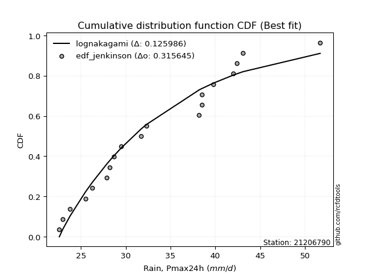</img>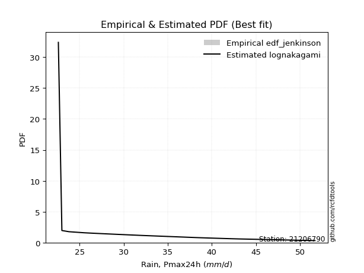</img>

</div>


### 11. EDF Cunnane (1978)

Cunnane´s work in statistical hydrology has focused on the performance and evaluation of different probability distributions (such as GEV, Gumbel, Lognormal) for flood frequency estimation. _b_ is a constant, typically set to 0.4.

<div align="center">


$P=(m-b)/(n+1-2b)$


</div>


**11.1. Empirical values**

<div align="center">

|                | 0                 | 1                   | 2                   | 3                  | 4                   | 5                  | 6                  | 7                  | 8                  | 9                  | 10                 | 11                 | 12                | 13                 | 14                 | 15                | 16                 | 17                 | 18                 |
|:---------------|:------------------|:--------------------|:--------------------|:-------------------|:--------------------|:-------------------|:-------------------|:-------------------|:-------------------|:-------------------|:-------------------|:-------------------|:------------------|:-------------------|:-------------------|:------------------|:-------------------|:-------------------|:-------------------|
| date           | 2008              | 2005                | 2006                | 2016               | 2018                | 2017               | 2011               | 2022               | 2009               | 2024               | 2020               | 2021               | 2019              | 2014               | 2007               | 2010              | 2013               | 2015               | 2012               |
| x              | 22.6              | 23.0                | 23.8                | 25.5               | 26.3                | 27.9               | 28.2               | 28.7               | 29.5               | 31.689473684210526 | 32.3               | 38.2               | 38.5              | 38.5               | 39.8               | 42.0              | 42.4               | 43.1               | 51.7               |
| m              | 1                 | 2                   | 3                   | 4                  | 5                   | 6                  | 7                  | 8                  | 9                  | 10                 | 11                 | 12                 | 13                | 14                 | 15                 | 16                | 17                 | 18                 | 19                 |
| empirical_dist | edf_cunnane       | edf_cunnane         | edf_cunnane         | edf_cunnane        | edf_cunnane         | edf_cunnane        | edf_cunnane        | edf_cunnane        | edf_cunnane        | edf_cunnane        | edf_cunnane        | edf_cunnane        | edf_cunnane       | edf_cunnane        | edf_cunnane        | edf_cunnane       | edf_cunnane        | edf_cunnane        | edf_cunnane        |
| empirical      | 0.03125           | 0.08333333333333334 | 0.13541666666666669 | 0.1875             | 0.23958333333333331 | 0.2916666666666667 | 0.34375            | 0.3958333333333333 | 0.4479166666666667 | 0.5                | 0.5520833333333334 | 0.6041666666666666 | 0.65625           | 0.7083333333333334 | 0.7604166666666666 | 0.8125            | 0.8645833333333335 | 0.9166666666666667 | 0.9687500000000001 |
| empirical_tr   | 1.032258064516129 | 1.090909090909091   | 1.1566265060240966  | 1.2307692307692308 | 1.3150684931506849  | 1.411764705882353  | 1.5238095238095237 | 1.6551724137931032 | 1.8113207547169814 | 2.0                | 2.2325581395348837 | 2.526315789473684  | 2.909090909090909 | 3.428571428571429  | 4.17391304347826   | 5.333333333333333 | 7.384615384615393  | 12.00000000000001  | 32.000000000000114 |

</div>


**11.2. Kolmogorov-Smirnov fit test (sorted by Δ)**


<div align="center">

|                | 0                   | 1                   | 2                   | 3                   | 4                   | 5                   | 6                   | 7                   | 8                   | 9                   | 10                  | 11                  | 12                  | 13                  | 14                  | 15                  | 16                  | 17                  | 18                  | 19                  | 20                  | 21                  | 22                  | 23                  | 24                  | 25                  | 26                  | 27                  | 28                  | 29                  | 30                  | 31                  | 32                  | 33                  | 34                  | 35                  | 36                  | 37                  | 38                  | 39                  | 40                  | 41                  | 42                  | 43                  | 44                  | 45                  | 46                  | 47                  | 48                  | 49                  | 50                  | 51                  | 52                  | 53                  | 54                  | 55                  | 56                  | 57                  | 58                  | 59                  | 60                  | 61                  | 62                  | 63                  | 64                  | 65                  | 66                  | 67                  | 68                  | 69                  | 70                  | 71                  | 72                  | 73                  | 74                  | 75                  | 76                  | 77                  | 78                  | 79                  | 80                  | 81                  | 82                  | 83                  | 84                  | 85                  | 86                  | 87                  | 88                  | 89                  | 90                  | 91                  | 92                  | 93                  | 94                  | 95                  | 96                  | 97                  | 98                  | 99                  | 100                 | 101                 | 102                 | 103                 | 104                 | 105                 | 106                 | 107                 | 108                 | 109                 | 110                 | 111                 | 112                 | 113                 | 114                 | 115                 | 116                 | 117                 | 118                 | 119                 | 120                 | 121                 | 122                 | 123                 | 124                 | 125                 | 126                 | 127                 | 128                 | 129                 | 130                 | 131                 | 132                 | 133                 | 134                 | 135                 | 136                 | 137                 | 138                 | 139                 | 140                 | 141                 | 142                 | 143                 | 144                 | 145                 | 146                 | 147                 | 148                 | 149                 | 150                 | 151                 | 152                 | 153                 | 154                 | 155                 | 156                 | 157                 | 158                 | 159                 |
|:---------------|:--------------------|:--------------------|:--------------------|:--------------------|:--------------------|:--------------------|:--------------------|:--------------------|:--------------------|:--------------------|:--------------------|:--------------------|:--------------------|:--------------------|:--------------------|:--------------------|:--------------------|:--------------------|:--------------------|:--------------------|:--------------------|:--------------------|:--------------------|:--------------------|:--------------------|:--------------------|:--------------------|:--------------------|:--------------------|:--------------------|:--------------------|:--------------------|:--------------------|:--------------------|:--------------------|:--------------------|:--------------------|:--------------------|:--------------------|:--------------------|:--------------------|:--------------------|:--------------------|:--------------------|:--------------------|:--------------------|:--------------------|:--------------------|:--------------------|:--------------------|:--------------------|:--------------------|:--------------------|:--------------------|:--------------------|:--------------------|:--------------------|:--------------------|:--------------------|:--------------------|:--------------------|:--------------------|:--------------------|:--------------------|:--------------------|:--------------------|:--------------------|:--------------------|:--------------------|:--------------------|:--------------------|:--------------------|:--------------------|:--------------------|:--------------------|:--------------------|:--------------------|:--------------------|:--------------------|:--------------------|:--------------------|:--------------------|:--------------------|:--------------------|:--------------------|:--------------------|:--------------------|:--------------------|:--------------------|:--------------------|:--------------------|:--------------------|:--------------------|:--------------------|:--------------------|:--------------------|:--------------------|:--------------------|:--------------------|:--------------------|:--------------------|:--------------------|:--------------------|:--------------------|:--------------------|:--------------------|:--------------------|:--------------------|:--------------------|:--------------------|:--------------------|:--------------------|:--------------------|:--------------------|:--------------------|:--------------------|:--------------------|:--------------------|:--------------------|:--------------------|:--------------------|:--------------------|:--------------------|:--------------------|:--------------------|:--------------------|:--------------------|:--------------------|:--------------------|:--------------------|:--------------------|:--------------------|:--------------------|:--------------------|:--------------------|:--------------------|:--------------------|:--------------------|:--------------------|:--------------------|:--------------------|:--------------------|:--------------------|:--------------------|:--------------------|:--------------------|:--------------------|:--------------------|:--------------------|:--------------------|:--------------------|:--------------------|:--------------------|:--------------------|:--------------------|:--------------------|:--------------------|:--------------------|:--------------------|:--------------------|
| station        | 21206790            | 21206790            | 21206790            | 21206790            | 21206790            | 21206790            | 21206790            | 21206790            | 21206790            | 21206790            | 21206790            | 21206790            | 21206790            | 21206790            | 21206790            | 21206790            | 21206790            | 21206790            | 21206790            | 21206790            | 21206790            | 21206790            | 21206790            | 21206790            | 21206790            | 21206790            | 21206790            | 21206790            | 21206790            | 21206790            | 21206790            | 21206790            | 21206790            | 21206790            | 21206790            | 21206790            | 21206790            | 21206790            | 21206790            | 21206790            | 21206790            | 21206790            | 21206790            | 21206790            | 21206790            | 21206790            | 21206790            | 21206790            | 21206790            | 21206790            | 21206790            | 21206790            | 21206790            | 21206790            | 21206790            | 21206790            | 21206790            | 21206790            | 21206790            | 21206790            | 21206790            | 21206790            | 21206790            | 21206790            | 21206790            | 21206790            | 21206790            | 21206790            | 21206790            | 21206790            | 21206790            | 21206790            | 21206790            | 21206790            | 21206790            | 21206790            | 21206790            | 21206790            | 21206790            | 21206790            | 21206790            | 21206790            | 21206790            | 21206790            | 21206790            | 21206790            | 21206790            | 21206790            | 21206790            | 21206790            | 21206790            | 21206790            | 21206790            | 21206790            | 21206790            | 21206790            | 21206790            | 21206790            | 21206790            | 21206790            | 21206790            | 21206790            | 21206790            | 21206790            | 21206790            | 21206790            | 21206790            | 21206790            | 21206790            | 21206790            | 21206790            | 21206790            | 21206790            | 21206790            | 21206790            | 21206790            | 21206790            | 21206790            | 21206790            | 21206790            | 21206790            | 21206790            | 21206790            | 21206790            | 21206790            | 21206790            | 21206790            | 21206790            | 21206790            | 21206790            | 21206790            | 21206790            | 21206790            | 21206790            | 21206790            | 21206790            | 21206790            | 21206790            | 21206790            | 21206790            | 21206790            | 21206790            | 21206790            | 21206790            | 21206790            | 21206790            | 21206790            | 21206790            | 21206790            | 21206790            | 21206790            | 21206790            | 21206790            | 21206790            | 21206790            | 21206790            | 21206790            | 21206790            | 21206790            | 21206790            |
| empirical_dist | edf_cunnane         | edf_cunnane         | edf_cunnane         | edf_cunnane         | edf_cunnane         | edf_cunnane         | edf_cunnane         | edf_cunnane         | edf_cunnane         | edf_cunnane         | edf_cunnane         | edf_cunnane         | edf_cunnane         | edf_cunnane         | edf_cunnane         | edf_cunnane         | edf_cunnane         | edf_cunnane         | edf_cunnane         | edf_cunnane         | edf_cunnane         | edf_cunnane         | edf_cunnane         | edf_cunnane         | edf_cunnane         | edf_cunnane         | edf_cunnane         | edf_cunnane         | edf_cunnane         | edf_cunnane         | edf_cunnane         | edf_cunnane         | edf_cunnane         | edf_cunnane         | edf_cunnane         | edf_cunnane         | edf_cunnane         | edf_cunnane         | edf_cunnane         | edf_cunnane         | edf_cunnane         | edf_cunnane         | edf_cunnane         | edf_cunnane         | edf_cunnane         | edf_cunnane         | edf_cunnane         | edf_cunnane         | edf_cunnane         | edf_cunnane         | edf_cunnane         | edf_cunnane         | edf_cunnane         | edf_cunnane         | edf_cunnane         | edf_cunnane         | edf_cunnane         | edf_cunnane         | edf_cunnane         | edf_cunnane         | edf_cunnane         | edf_cunnane         | edf_cunnane         | edf_cunnane         | edf_cunnane         | edf_cunnane         | edf_cunnane         | edf_cunnane         | edf_cunnane         | edf_cunnane         | edf_cunnane         | edf_cunnane         | edf_cunnane         | edf_cunnane         | edf_cunnane         | edf_cunnane         | edf_cunnane         | edf_cunnane         | edf_cunnane         | edf_cunnane         | edf_cunnane         | edf_cunnane         | edf_cunnane         | edf_cunnane         | edf_cunnane         | edf_cunnane         | edf_cunnane         | edf_cunnane         | edf_cunnane         | edf_cunnane         | edf_cunnane         | edf_cunnane         | edf_cunnane         | edf_cunnane         | edf_cunnane         | edf_cunnane         | edf_cunnane         | edf_cunnane         | edf_cunnane         | edf_cunnane         | edf_cunnane         | edf_cunnane         | edf_cunnane         | edf_cunnane         | edf_cunnane         | edf_cunnane         | edf_cunnane         | edf_cunnane         | edf_cunnane         | edf_cunnane         | edf_cunnane         | edf_cunnane         | edf_cunnane         | edf_cunnane         | edf_cunnane         | edf_cunnane         | edf_cunnane         | edf_cunnane         | edf_cunnane         | edf_cunnane         | edf_cunnane         | edf_cunnane         | edf_cunnane         | edf_cunnane         | edf_cunnane         | edf_cunnane         | edf_cunnane         | edf_cunnane         | edf_cunnane         | edf_cunnane         | edf_cunnane         | edf_cunnane         | edf_cunnane         | edf_cunnane         | edf_cunnane         | edf_cunnane         | edf_cunnane         | edf_cunnane         | edf_cunnane         | edf_cunnane         | edf_cunnane         | edf_cunnane         | edf_cunnane         | edf_cunnane         | edf_cunnane         | edf_cunnane         | edf_cunnane         | edf_cunnane         | edf_cunnane         | edf_cunnane         | edf_cunnane         | edf_cunnane         | edf_cunnane         | edf_cunnane         | edf_cunnane         | edf_cunnane         | edf_cunnane         | edf_cunnane         | edf_cunnane         | edf_cunnane         |
| p_dist         | arcsine             | logarcsine          | loggausshyper       | semicircular        | truncweibull_min    | anglit              | logbradford         | truncexpon          | logsemicircular     | truncpareto         | dweibull            | logtruncpareto      | logjohnsonsb        | logdgamma           | loghalfgennorm      | logtruncexpon       | johnsonsb           | gausshyper          | loganglit           | foldnorm            | lognakagami         | gamma               | genhalflogistic     | norm                | crystalball         | t                   | logcosine           | beta                | logburr12           | maxwell             | kappa3              | loguniform          | logbeta             | logvonmises_line    | f                   | rayleigh            | pearson3            | rice                | gompertz            | logkappa3           | ncf                 | logtukeylambda      | truncnorm           | logloggamma         | logfoldnorm         | gennorm             | bradford            | halfnorm            | skewnorm            | logt                | lognorm             | logcrystalball      | tukeylambda         | logexponnorm        | logistic            | betaprime           | logbetaprime        | loggenextreme       | logweibull_max      | logpearson3         | cosine              | loginvgamma         | logerlang           | logkappa4           | logrice             | lognct              | logmaxwell          | loggamma            | loggamma            | loglomax            | kstwobign           | logalpha            | lomax               | loggumbel_l         | genexpon            | alpha               | logf                | lograyleigh         | burr12              | weibull_min         | nct                 | genextreme          | exponnorm           | kappa4              | loggenexpon         | invweibull          | logjohnsonsu        | genlogistic         | invgamma            | logargus            | logfatiguelife      | logburr             | johnsonsu           | logweibull_min      | invgauss            | loginvgauss         | fatiguelife         | gumbel_r            | hypsecant           | loginvweibull       | loggenlogistic      | burr                | logmielke           | loghalfnorm         | logskewnorm         | logkstwobign        | loglogistic         | logexponpow         | logtriang           | logdweibull         | loggompertz         | halflogistic        | moyal               | logncf              | logksone            | exponpow            | gumbel_l            | logtruncweibull_min | logexponweib        | loghypsecant        | logloglaplace       | loggumbel_r         | laplace             | loghalflogistic     | halfgennorm         | logmoyal            | nakagami            | loggengamma         | dgamma              | loglaplace          | loglaplace          | logtruncnorm        | uniform             | vonmises_line       | argus               | wrapcauchy          | wald                | logwald             | ksone               | erlang              | loggenhalflogistic  | logwrapcauchy       | powerlaw            | logpowerlaw         | logrdist            | triang              | genpareto           | logtrapezoid        | loglevy_l           | loggennorm          | levy_l              | trapezoid           | exponweib           | loggenpareto        | rdist               | gengamma            | weibull_max         | logvonmises         | vonmises            | mielke              |
| delta          | 0.08884635141715869 | 0.09562013156507554 | 0.09633120912081505 | 0.09893797369239243 | 0.10534751505821127 | 0.10876638491985258 | 0.10883412042900675 | 0.10938688233658855 | 0.1109444589601466  | 0.11235947827026327 | 0.11324678317298598 | 0.11361581541843058 | 0.11781939482226256 | 0.11792060246953617 | 0.11916250406654505 | 0.12054002459871804 | 0.12064340893606973 | 0.12244113823038061 | 0.12296153480841387 | 0.12448471056842936 | 0.12501899890522528 | 0.12554466941971798 | 0.12593076506170842 | 0.13197186199378824 | 0.13197188324846537 | 0.1321028273922013  | 0.13420017836937959 | 0.13420629903401482 | 0.13505742892858363 | 0.13514525541537414 | 0.1355262135447824  | 0.13652534094546265 | 0.13655473835879084 | 0.13678689618090922 | 0.13717974115344111 | 0.13877689602771937 | 0.13925726501170177 | 0.13985226381929128 | 0.14012489187651045 | 0.14019642957780132 | 0.14293161999168114 | 0.14589756629058814 | 0.14720461296846443 | 0.14796117833435263 | 0.148619140846583   | 0.1491733304255196  | 0.14979578102728652 | 0.1503258235622723  | 0.1505696261194801  | 0.15064700210652138 | 0.1506473984293154  | 0.15064819391924789 | 0.1507541160224951  | 0.15081119925926323 | 0.15244068641130532 | 0.15246032592744674 | 0.1526402727285504  | 0.15426205752588928 | 0.15427669054471282 | 0.15460292893719318 | 0.1546758827883158  | 0.1565201662467588  | 0.157591779261117   | 0.15761501632295416 | 0.1588725392754109  | 0.15935863141049678 | 0.15960284152136783 | 0.15966775099818575 | 0.15966775099818575 | 0.16017766951069268 | 0.16035787942235868 | 0.16044151409902863 | 0.16093411088418097 | 0.161104930188261   | 0.1614316442925826  | 0.16169759999629996 | 0.16210387793052006 | 0.1621545285969208  | 0.1621870028428013  | 0.16232467914768023 | 0.16323735942314965 | 0.16364193208645883 | 0.16365423307354254 | 0.1636720943376896  | 0.16370651882648912 | 0.16386132611499937 | 0.1641490116197607  | 0.1645405333640969  | 0.1647438076714195  | 0.16500503984215048 | 0.16589945338596834 | 0.16629650746447167 | 0.16656382954879845 | 0.16695459672676594 | 0.16722528087012567 | 0.1673037419860005  | 0.16746598253212974 | 0.16756868335134112 | 0.16759695064996166 | 0.16780384065426956 | 0.16783612716335838 | 0.16809084875990166 | 0.16897546722962975 | 0.1709723024676325  | 0.1712998487817553  | 0.1725426462381464  | 0.17330783095005653 | 0.1736183659405679  | 0.17533740905228978 | 0.17544329423665062 | 0.1756640498297105  | 0.17598005097148683 | 0.18206153575347506 | 0.18264776231152724 | 0.1832155618989968  | 0.18439702462044083 | 0.18598334582944331 | 0.1862213525449673  | 0.18776945374928478 | 0.18807862529268404 | 0.18824823224433007 | 0.1889256256795686  | 0.19397556566518864 | 0.1950516042356405  | 0.19948094956265577 | 0.20129477366062054 | 0.20224545094573487 | 0.20333554169654144 | 0.20602012785314883 | 0.2073140536711645  | 0.2073140536711645  | 0.21204672912069567 | 0.21875000000000022 | 0.2197411361971211  | 0.22278352366307386 | 0.2246330841451002  | 0.22836029128255803 | 0.24034471173180072 | 0.24627720504009176 | 0.27592279740007947 | 0.28042671777718    | 0.29464452771472494 | 0.2977858202105048  | 0.33027532440223023 | 0.33586005257573437 | 0.33734082431462464 | 0.34047585749499804 | 0.3787161435817512  | 0.4088485288099537  | 0.41666666666666674 | 0.44360331315733537 | 0.4672446364066977  | 0.46786569866269895 | 0.47267813082455057 | 0.482243382608619   | 0.500215146445318   | 0.7340167989816431  | 1.1518201163191764  | 7.750996223667929   | nan                 |
| deltao         | 0.31564497164100014 | 0.31564497164100014 | 0.31564497164100014 | 0.31564497164100014 | 0.31564497164100014 | 0.31564497164100014 | 0.31564497164100014 | 0.31564497164100014 | 0.31564497164100014 | 0.31564497164100014 | 0.31564497164100014 | 0.31564497164100014 | 0.31564497164100014 | 0.31564497164100014 | 0.31564497164100014 | 0.31564497164100014 | 0.31564497164100014 | 0.31564497164100014 | 0.31564497164100014 | 0.31564497164100014 | 0.31564497164100014 | 0.31564497164100014 | 0.31564497164100014 | 0.31564497164100014 | 0.31564497164100014 | 0.31564497164100014 | 0.31564497164100014 | 0.31564497164100014 | 0.31564497164100014 | 0.31564497164100014 | 0.31564497164100014 | 0.31564497164100014 | 0.31564497164100014 | 0.31564497164100014 | 0.31564497164100014 | 0.31564497164100014 | 0.31564497164100014 | 0.31564497164100014 | 0.31564497164100014 | 0.31564497164100014 | 0.31564497164100014 | 0.31564497164100014 | 0.31564497164100014 | 0.31564497164100014 | 0.31564497164100014 | 0.31564497164100014 | 0.31564497164100014 | 0.31564497164100014 | 0.31564497164100014 | 0.31564497164100014 | 0.31564497164100014 | 0.31564497164100014 | 0.31564497164100014 | 0.31564497164100014 | 0.31564497164100014 | 0.31564497164100014 | 0.31564497164100014 | 0.31564497164100014 | 0.31564497164100014 | 0.31564497164100014 | 0.31564497164100014 | 0.31564497164100014 | 0.31564497164100014 | 0.31564497164100014 | 0.31564497164100014 | 0.31564497164100014 | 0.31564497164100014 | 0.31564497164100014 | 0.31564497164100014 | 0.31564497164100014 | 0.31564497164100014 | 0.31564497164100014 | 0.31564497164100014 | 0.31564497164100014 | 0.31564497164100014 | 0.31564497164100014 | 0.31564497164100014 | 0.31564497164100014 | 0.31564497164100014 | 0.31564497164100014 | 0.31564497164100014 | 0.31564497164100014 | 0.31564497164100014 | 0.31564497164100014 | 0.31564497164100014 | 0.31564497164100014 | 0.31564497164100014 | 0.31564497164100014 | 0.31564497164100014 | 0.31564497164100014 | 0.31564497164100014 | 0.31564497164100014 | 0.31564497164100014 | 0.31564497164100014 | 0.31564497164100014 | 0.31564497164100014 | 0.31564497164100014 | 0.31564497164100014 | 0.31564497164100014 | 0.31564497164100014 | 0.31564497164100014 | 0.31564497164100014 | 0.31564497164100014 | 0.31564497164100014 | 0.31564497164100014 | 0.31564497164100014 | 0.31564497164100014 | 0.31564497164100014 | 0.31564497164100014 | 0.31564497164100014 | 0.31564497164100014 | 0.31564497164100014 | 0.31564497164100014 | 0.31564497164100014 | 0.31564497164100014 | 0.31564497164100014 | 0.31564497164100014 | 0.31564497164100014 | 0.31564497164100014 | 0.31564497164100014 | 0.31564497164100014 | 0.31564497164100014 | 0.31564497164100014 | 0.31564497164100014 | 0.31564497164100014 | 0.31564497164100014 | 0.31564497164100014 | 0.31564497164100014 | 0.31564497164100014 | 0.31564497164100014 | 0.31564497164100014 | 0.31564497164100014 | 0.31564497164100014 | 0.31564497164100014 | 0.31564497164100014 | 0.31564497164100014 | 0.31564497164100014 | 0.31564497164100014 | 0.31564497164100014 | 0.31564497164100014 | 0.31564497164100014 | 0.31564497164100014 | 0.31564497164100014 | 0.31564497164100014 | 0.31564497164100014 | 0.31564497164100014 | 0.31564497164100014 | 0.31564497164100014 | 0.31564497164100014 | 0.31564497164100014 | 0.31564497164100014 | 0.31564497164100014 | 0.31564497164100014 | 0.31564497164100014 | 0.31564497164100014 | 0.31564497164100014 | 0.31564497164100014 | 0.31564497164100014 | 0.31564497164100014 | 0.31564497164100014 |
| eval           | Δo > Δ              | Δo > Δ              | Δo > Δ              | Δo > Δ              | Δo > Δ              | Δo > Δ              | Δo > Δ              | Δo > Δ              | Δo > Δ              | Δo > Δ              | Δo > Δ              | Δo > Δ              | Δo > Δ              | Δo > Δ              | Δo > Δ              | Δo > Δ              | Δo > Δ              | Δo > Δ              | Δo > Δ              | Δo > Δ              | Δo > Δ              | Δo > Δ              | Δo > Δ              | Δo > Δ              | Δo > Δ              | Δo > Δ              | Δo > Δ              | Δo > Δ              | Δo > Δ              | Δo > Δ              | Δo > Δ              | Δo > Δ              | Δo > Δ              | Δo > Δ              | Δo > Δ              | Δo > Δ              | Δo > Δ              | Δo > Δ              | Δo > Δ              | Δo > Δ              | Δo > Δ              | Δo > Δ              | Δo > Δ              | Δo > Δ              | Δo > Δ              | Δo > Δ              | Δo > Δ              | Δo > Δ              | Δo > Δ              | Δo > Δ              | Δo > Δ              | Δo > Δ              | Δo > Δ              | Δo > Δ              | Δo > Δ              | Δo > Δ              | Δo > Δ              | Δo > Δ              | Δo > Δ              | Δo > Δ              | Δo > Δ              | Δo > Δ              | Δo > Δ              | Δo > Δ              | Δo > Δ              | Δo > Δ              | Δo > Δ              | Δo > Δ              | Δo > Δ              | Δo > Δ              | Δo > Δ              | Δo > Δ              | Δo > Δ              | Δo > Δ              | Δo > Δ              | Δo > Δ              | Δo > Δ              | Δo > Δ              | Δo > Δ              | Δo > Δ              | Δo > Δ              | Δo > Δ              | Δo > Δ              | Δo > Δ              | Δo > Δ              | Δo > Δ              | Δo > Δ              | Δo > Δ              | Δo > Δ              | Δo > Δ              | Δo > Δ              | Δo > Δ              | Δo > Δ              | Δo > Δ              | Δo > Δ              | Δo > Δ              | Δo > Δ              | Δo > Δ              | Δo > Δ              | Δo > Δ              | Δo > Δ              | Δo > Δ              | Δo > Δ              | Δo > Δ              | Δo > Δ              | Δo > Δ              | Δo > Δ              | Δo > Δ              | Δo > Δ              | Δo > Δ              | Δo > Δ              | Δo > Δ              | Δo > Δ              | Δo > Δ              | Δo > Δ              | Δo > Δ              | Δo > Δ              | Δo > Δ              | Δo > Δ              | Δo > Δ              | Δo > Δ              | Δo > Δ              | Δo > Δ              | Δo > Δ              | Δo > Δ              | Δo > Δ              | Δo > Δ              | Δo > Δ              | Δo > Δ              | Δo > Δ              | Δo > Δ              | Δo > Δ              | Δo > Δ              | Δo > Δ              | Δo > Δ              | Δo > Δ              | Δo > Δ              | Δo > Δ              | Δo > Δ              | Δo > Δ              | Δo > Δ              | Δo > Δ              | Δo > Δ              | Δo <= Δ             | Δo <= Δ             | Δo <= Δ             | Δo <= Δ             | Δo <= Δ             | Δo <= Δ             | Δo <= Δ             | Δo <= Δ             | Δo <= Δ             | Δo <= Δ             | Δo <= Δ             | Δo <= Δ             | Δo <= Δ             | Δo <= Δ             | Δo <= Δ             | Δo <= Δ             | Δo <= Δ             |
| fit            | 1                   | 1                   | 1                   | 1                   | 1                   | 1                   | 1                   | 1                   | 1                   | 1                   | 1                   | 1                   | 1                   | 1                   | 1                   | 1                   | 1                   | 1                   | 1                   | 1                   | 1                   | 1                   | 1                   | 1                   | 1                   | 1                   | 1                   | 1                   | 1                   | 1                   | 1                   | 1                   | 1                   | 1                   | 1                   | 1                   | 1                   | 1                   | 1                   | 1                   | 1                   | 1                   | 1                   | 1                   | 1                   | 1                   | 1                   | 1                   | 1                   | 1                   | 1                   | 1                   | 1                   | 1                   | 1                   | 1                   | 1                   | 1                   | 1                   | 1                   | 1                   | 1                   | 1                   | 1                   | 1                   | 1                   | 1                   | 1                   | 1                   | 1                   | 1                   | 1                   | 1                   | 1                   | 1                   | 1                   | 1                   | 1                   | 1                   | 1                   | 1                   | 1                   | 1                   | 1                   | 1                   | 1                   | 1                   | 1                   | 1                   | 1                   | 1                   | 1                   | 1                   | 1                   | 1                   | 1                   | 1                   | 1                   | 1                   | 1                   | 1                   | 1                   | 1                   | 1                   | 1                   | 1                   | 1                   | 1                   | 1                   | 1                   | 1                   | 1                   | 1                   | 1                   | 1                   | 1                   | 1                   | 1                   | 1                   | 1                   | 1                   | 1                   | 1                   | 1                   | 1                   | 1                   | 1                   | 1                   | 1                   | 1                   | 1                   | 1                   | 1                   | 1                   | 1                   | 1                   | 1                   | 1                   | 1                   | 1                   | 1                   | 1                   | 1                   | 0                   | 0                   | 0                   | 0                   | 0                   | 0                   | 0                   | 0                   | 0                   | 0                   | 0                   | 0                   | 0                   | 0                   | 0                   | 0                   | 0                   |
| n              | 19                  | 19                  | 19                  | 19                  | 19                  | 19                  | 19                  | 19                  | 19                  | 19                  | 19                  | 19                  | 19                  | 19                  | 19                  | 19                  | 19                  | 19                  | 19                  | 19                  | 19                  | 19                  | 19                  | 19                  | 19                  | 19                  | 19                  | 19                  | 19                  | 19                  | 19                  | 19                  | 19                  | 19                  | 19                  | 19                  | 19                  | 19                  | 19                  | 19                  | 19                  | 19                  | 19                  | 19                  | 19                  | 19                  | 19                  | 19                  | 19                  | 19                  | 19                  | 19                  | 19                  | 19                  | 19                  | 19                  | 19                  | 19                  | 19                  | 19                  | 19                  | 19                  | 19                  | 19                  | 19                  | 19                  | 19                  | 19                  | 19                  | 19                  | 19                  | 19                  | 19                  | 19                  | 19                  | 19                  | 19                  | 19                  | 19                  | 19                  | 19                  | 19                  | 19                  | 19                  | 19                  | 19                  | 19                  | 19                  | 19                  | 19                  | 19                  | 19                  | 19                  | 19                  | 19                  | 19                  | 19                  | 19                  | 19                  | 19                  | 19                  | 19                  | 19                  | 19                  | 19                  | 19                  | 19                  | 19                  | 19                  | 19                  | 19                  | 19                  | 19                  | 19                  | 19                  | 19                  | 19                  | 19                  | 19                  | 19                  | 19                  | 19                  | 19                  | 19                  | 19                  | 19                  | 19                  | 19                  | 19                  | 19                  | 19                  | 19                  | 19                  | 19                  | 19                  | 19                  | 19                  | 19                  | 19                  | 19                  | 19                  | 19                  | 19                  | 19                  | 19                  | 19                  | 19                  | 19                  | 19                  | 19                  | 19                  | 19                  | 19                  | 19                  | 19                  | 19                  | 19                  | 19                  | 19                  | 19                  |
| best_fit       | 1                   | 0                   | 0                   | 0                   | 0                   | 0                   | 0                   | 0                   | 0                   | 0                   | 0                   | 0                   | 0                   | 0                   | 0                   | 0                   | 0                   | 0                   | 0                   | 0                   | 0                   | 0                   | 0                   | 0                   | 0                   | 0                   | 0                   | 0                   | 0                   | 0                   | 0                   | 0                   | 0                   | 0                   | 0                   | 0                   | 0                   | 0                   | 0                   | 0                   | 0                   | 0                   | 0                   | 0                   | 0                   | 0                   | 0                   | 0                   | 0                   | 0                   | 0                   | 0                   | 0                   | 0                   | 0                   | 0                   | 0                   | 0                   | 0                   | 0                   | 0                   | 0                   | 0                   | 0                   | 0                   | 0                   | 0                   | 0                   | 0                   | 0                   | 0                   | 0                   | 0                   | 0                   | 0                   | 0                   | 0                   | 0                   | 0                   | 0                   | 0                   | 0                   | 0                   | 0                   | 0                   | 0                   | 0                   | 0                   | 0                   | 0                   | 0                   | 0                   | 0                   | 0                   | 0                   | 0                   | 0                   | 0                   | 0                   | 0                   | 0                   | 0                   | 0                   | 0                   | 0                   | 0                   | 0                   | 0                   | 0                   | 0                   | 0                   | 0                   | 0                   | 0                   | 0                   | 0                   | 0                   | 0                   | 0                   | 0                   | 0                   | 0                   | 0                   | 0                   | 0                   | 0                   | 0                   | 0                   | 0                   | 0                   | 0                   | 0                   | 0                   | 0                   | 0                   | 0                   | 0                   | 0                   | 0                   | 0                   | 0                   | 0                   | 0                   | 0                   | 0                   | 0                   | 0                   | 0                   | 0                   | 0                   | 0                   | 0                   | 0                   | 0                   | 0                   | 0                   | 0                   | 0                   | 0                   | 0                   |
| best_fit_sort  | 1                   | 2                   | 3                   | 4                   | 5                   | 6                   | 7                   | 8                   | 9                   | 10                  | 11                  | 12                  | 13                  | 14                  | 15                  | 16                  | 17                  | 18                  | 19                  | 20                  | 21                  | 22                  | 23                  | 24                  | 25                  | 26                  | 27                  | 28                  | 29                  | 30                  | 31                  | 32                  | 33                  | 34                  | 35                  | 36                  | 37                  | 38                  | 39                  | 40                  | 41                  | 42                  | 43                  | 44                  | 45                  | 46                  | 47                  | 48                  | 49                  | 50                  | 51                  | 52                  | 53                  | 54                  | 55                  | 56                  | 57                  | 58                  | 59                  | 60                  | 61                  | 62                  | 63                  | 64                  | 65                  | 66                  | 67                  | 68                  | 69                  | 70                  | 71                  | 72                  | 73                  | 74                  | 75                  | 76                  | 77                  | 78                  | 79                  | 80                  | 81                  | 82                  | 83                  | 84                  | 85                  | 86                  | 87                  | 88                  | 89                  | 90                  | 91                  | 92                  | 93                  | 94                  | 95                  | 96                  | 97                  | 98                  | 99                  | 100                 | 101                 | 102                 | 103                 | 104                 | 105                 | 106                 | 107                 | 108                 | 109                 | 110                 | 111                 | 112                 | 113                 | 114                 | 115                 | 116                 | 117                 | 118                 | 119                 | 120                 | 121                 | 122                 | 123                 | 124                 | 125                 | 126                 | 127                 | 128                 | 129                 | 130                 | 131                 | 132                 | 133                 | 134                 | 135                 | 136                 | 137                 | 138                 | 139                 | 140                 | 141                 | 142                 | 143                 | 144                 | 145                 | 146                 | 147                 | 148                 | 149                 | 150                 | 151                 | 152                 | 153                 | 154                 | 155                 | 156                 | 157                 | 158                 | 159                 | 160                 |

</div>


**11.3. Best fit**

<div align="center">

|   id |   station | empirical_dist   | p_dist   |     delta |   deltao | eval   |   fit |   n |   best_fit |   best_fit_sort |
|-----:|----------:|:-----------------|:---------|----------:|---------:|:-------|------:|----:|-----------:|----------------:|
|    0 |  21206790 | edf_cunnane      | arcsine  | 0.0888464 | 0.315645 | Δo > Δ |     1 |  19 |          1 |               1 |

</div>


<div align="center">

</img></img>

</div>


### 12. EDF Adamowski (1981)

The Adamowski formula in hydrology refers to a specific plotting position formula used for estimating the non-parametric empirical distribution of hydrological events (like flood peaks) to calculate their return periods. This formula provides an alternative to traditional parametric methods (like the Gumbel or Log Pearson Type III distributions). 

<div align="center">


$P=(m-0.25)/(n+0.5)$


</div>


**12.1. Empirical values**

<div align="center">

|                | 0                    | 1                   | 2                   | 3                   | 4                   | 5                  | 6                   | 7                  | 8                   | 9                  | 10                 | 11                 | 12                 | 13                 | 14                 | 15                 | 16                 | 17                 | 18                 |
|:---------------|:---------------------|:--------------------|:--------------------|:--------------------|:--------------------|:-------------------|:--------------------|:-------------------|:--------------------|:-------------------|:-------------------|:-------------------|:-------------------|:-------------------|:-------------------|:-------------------|:-------------------|:-------------------|:-------------------|
| date           | 2008                 | 2005                | 2006                | 2016                | 2018                | 2017               | 2011                | 2022               | 2009                | 2024               | 2020               | 2021               | 2019               | 2014               | 2007               | 2010               | 2013               | 2015               | 2012               |
| x              | 22.6                 | 23.0                | 23.8                | 25.5                | 26.3                | 27.9               | 28.2                | 28.7               | 29.5                | 31.689473684210526 | 32.3               | 38.2               | 38.5               | 38.5               | 39.8               | 42.0               | 42.4               | 43.1               | 51.7               |
| m              | 1                    | 2                   | 3                   | 4                   | 5                   | 6                  | 7                   | 8                  | 9                   | 10                 | 11                 | 12                 | 13                 | 14                 | 15                 | 16                 | 17                 | 18                 | 19                 |
| empirical_dist | edf_adamowski        | edf_adamowski       | edf_adamowski       | edf_adamowski       | edf_adamowski       | edf_adamowski      | edf_adamowski       | edf_adamowski      | edf_adamowski       | edf_adamowski      | edf_adamowski      | edf_adamowski      | edf_adamowski      | edf_adamowski      | edf_adamowski      | edf_adamowski      | edf_adamowski      | edf_adamowski      | edf_adamowski      |
| empirical      | 0.038461538461538464 | 0.08974358974358974 | 0.14102564102564102 | 0.19230769230769232 | 0.24358974358974358 | 0.2948717948717949 | 0.34615384615384615 | 0.3974358974358974 | 0.44871794871794873 | 0.5                | 0.5512820512820513 | 0.6025641025641025 | 0.6538461538461539 | 0.7051282051282052 | 0.7564102564102564 | 0.8076923076923077 | 0.8589743589743589 | 0.9102564102564102 | 0.9615384615384616 |
| empirical_tr   | 1.04                 | 1.0985915492957747  | 1.164179104477612   | 1.2380952380952381  | 1.3220338983050848  | 1.4181818181818182 | 1.5294117647058822  | 1.6595744680851061 | 1.813953488372093   | 2.0                | 2.2285714285714286 | 2.5161290322580645 | 2.888888888888889  | 3.3913043478260874 | 4.105263157894736  | 5.2                | 7.090909090909088  | 11.14285714285714  | 26.000000000000018 |

</div>


**12.2. Kolmogorov-Smirnov fit test (sorted by Δ)**


<div align="center">

|                | 0                   | 1                   | 2                   | 3                   | 4                   | 5                   | 6                   | 7                   | 8                   | 9                   | 10                  | 11                  | 12                  | 13                  | 14                  | 15                  | 16                  | 17                  | 18                  | 19                  | 20                  | 21                  | 22                  | 23                  | 24                  | 25                  | 26                  | 27                  | 28                  | 29                  | 30                  | 31                  | 32                  | 33                  | 34                  | 35                  | 36                  | 37                  | 38                  | 39                  | 40                  | 41                  | 42                  | 43                  | 44                  | 45                  | 46                  | 47                  | 48                  | 49                  | 50                  | 51                  | 52                  | 53                  | 54                  | 55                  | 56                  | 57                  | 58                  | 59                  | 60                  | 61                  | 62                  | 63                  | 64                  | 65                  | 66                  | 67                  | 68                  | 69                  | 70                  | 71                  | 72                  | 73                  | 74                  | 75                  | 76                  | 77                  | 78                  | 79                  | 80                  | 81                  | 82                  | 83                  | 84                  | 85                  | 86                  | 87                  | 88                  | 89                  | 90                  | 91                  | 92                  | 93                  | 94                  | 95                  | 96                  | 97                  | 98                  | 99                  | 100                 | 101                 | 102                 | 103                 | 104                 | 105                 | 106                 | 107                 | 108                 | 109                 | 110                 | 111                 | 112                 | 113                 | 114                 | 115                 | 116                 | 117                 | 118                 | 119                 | 120                 | 121                 | 122                 | 123                 | 124                 | 125                 | 126                 | 127                 | 128                 | 129                 | 130                 | 131                 | 132                 | 133                 | 134                 | 135                 | 136                 | 137                 | 138                 | 139                 | 140                 | 141                 | 142                 | 143                 | 144                 | 145                 | 146                 | 147                 | 148                 | 149                 | 150                 | 151                 | 152                 | 153                 | 154                 | 155                 | 156                 | 157                 | 158                 | 159                 |
|:---------------|:--------------------|:--------------------|:--------------------|:--------------------|:--------------------|:--------------------|:--------------------|:--------------------|:--------------------|:--------------------|:--------------------|:--------------------|:--------------------|:--------------------|:--------------------|:--------------------|:--------------------|:--------------------|:--------------------|:--------------------|:--------------------|:--------------------|:--------------------|:--------------------|:--------------------|:--------------------|:--------------------|:--------------------|:--------------------|:--------------------|:--------------------|:--------------------|:--------------------|:--------------------|:--------------------|:--------------------|:--------------------|:--------------------|:--------------------|:--------------------|:--------------------|:--------------------|:--------------------|:--------------------|:--------------------|:--------------------|:--------------------|:--------------------|:--------------------|:--------------------|:--------------------|:--------------------|:--------------------|:--------------------|:--------------------|:--------------------|:--------------------|:--------------------|:--------------------|:--------------------|:--------------------|:--------------------|:--------------------|:--------------------|:--------------------|:--------------------|:--------------------|:--------------------|:--------------------|:--------------------|:--------------------|:--------------------|:--------------------|:--------------------|:--------------------|:--------------------|:--------------------|:--------------------|:--------------------|:--------------------|:--------------------|:--------------------|:--------------------|:--------------------|:--------------------|:--------------------|:--------------------|:--------------------|:--------------------|:--------------------|:--------------------|:--------------------|:--------------------|:--------------------|:--------------------|:--------------------|:--------------------|:--------------------|:--------------------|:--------------------|:--------------------|:--------------------|:--------------------|:--------------------|:--------------------|:--------------------|:--------------------|:--------------------|:--------------------|:--------------------|:--------------------|:--------------------|:--------------------|:--------------------|:--------------------|:--------------------|:--------------------|:--------------------|:--------------------|:--------------------|:--------------------|:--------------------|:--------------------|:--------------------|:--------------------|:--------------------|:--------------------|:--------------------|:--------------------|:--------------------|:--------------------|:--------------------|:--------------------|:--------------------|:--------------------|:--------------------|:--------------------|:--------------------|:--------------------|:--------------------|:--------------------|:--------------------|:--------------------|:--------------------|:--------------------|:--------------------|:--------------------|:--------------------|:--------------------|:--------------------|:--------------------|:--------------------|:--------------------|:--------------------|:--------------------|:--------------------|:--------------------|:--------------------|:--------------------|:--------------------|
| station        | 21206790            | 21206790            | 21206790            | 21206790            | 21206790            | 21206790            | 21206790            | 21206790            | 21206790            | 21206790            | 21206790            | 21206790            | 21206790            | 21206790            | 21206790            | 21206790            | 21206790            | 21206790            | 21206790            | 21206790            | 21206790            | 21206790            | 21206790            | 21206790            | 21206790            | 21206790            | 21206790            | 21206790            | 21206790            | 21206790            | 21206790            | 21206790            | 21206790            | 21206790            | 21206790            | 21206790            | 21206790            | 21206790            | 21206790            | 21206790            | 21206790            | 21206790            | 21206790            | 21206790            | 21206790            | 21206790            | 21206790            | 21206790            | 21206790            | 21206790            | 21206790            | 21206790            | 21206790            | 21206790            | 21206790            | 21206790            | 21206790            | 21206790            | 21206790            | 21206790            | 21206790            | 21206790            | 21206790            | 21206790            | 21206790            | 21206790            | 21206790            | 21206790            | 21206790            | 21206790            | 21206790            | 21206790            | 21206790            | 21206790            | 21206790            | 21206790            | 21206790            | 21206790            | 21206790            | 21206790            | 21206790            | 21206790            | 21206790            | 21206790            | 21206790            | 21206790            | 21206790            | 21206790            | 21206790            | 21206790            | 21206790            | 21206790            | 21206790            | 21206790            | 21206790            | 21206790            | 21206790            | 21206790            | 21206790            | 21206790            | 21206790            | 21206790            | 21206790            | 21206790            | 21206790            | 21206790            | 21206790            | 21206790            | 21206790            | 21206790            | 21206790            | 21206790            | 21206790            | 21206790            | 21206790            | 21206790            | 21206790            | 21206790            | 21206790            | 21206790            | 21206790            | 21206790            | 21206790            | 21206790            | 21206790            | 21206790            | 21206790            | 21206790            | 21206790            | 21206790            | 21206790            | 21206790            | 21206790            | 21206790            | 21206790            | 21206790            | 21206790            | 21206790            | 21206790            | 21206790            | 21206790            | 21206790            | 21206790            | 21206790            | 21206790            | 21206790            | 21206790            | 21206790            | 21206790            | 21206790            | 21206790            | 21206790            | 21206790            | 21206790            | 21206790            | 21206790            | 21206790            | 21206790            | 21206790            | 21206790            |
| empirical_dist | edf_adamowski       | edf_adamowski       | edf_adamowski       | edf_adamowski       | edf_adamowski       | edf_adamowski       | edf_adamowski       | edf_adamowski       | edf_adamowski       | edf_adamowski       | edf_adamowski       | edf_adamowski       | edf_adamowski       | edf_adamowski       | edf_adamowski       | edf_adamowski       | edf_adamowski       | edf_adamowski       | edf_adamowski       | edf_adamowski       | edf_adamowski       | edf_adamowski       | edf_adamowski       | edf_adamowski       | edf_adamowski       | edf_adamowski       | edf_adamowski       | edf_adamowski       | edf_adamowski       | edf_adamowski       | edf_adamowski       | edf_adamowski       | edf_adamowski       | edf_adamowski       | edf_adamowski       | edf_adamowski       | edf_adamowski       | edf_adamowski       | edf_adamowski       | edf_adamowski       | edf_adamowski       | edf_adamowski       | edf_adamowski       | edf_adamowski       | edf_adamowski       | edf_adamowski       | edf_adamowski       | edf_adamowski       | edf_adamowski       | edf_adamowski       | edf_adamowski       | edf_adamowski       | edf_adamowski       | edf_adamowski       | edf_adamowski       | edf_adamowski       | edf_adamowski       | edf_adamowski       | edf_adamowski       | edf_adamowski       | edf_adamowski       | edf_adamowski       | edf_adamowski       | edf_adamowski       | edf_adamowski       | edf_adamowski       | edf_adamowski       | edf_adamowski       | edf_adamowski       | edf_adamowski       | edf_adamowski       | edf_adamowski       | edf_adamowski       | edf_adamowski       | edf_adamowski       | edf_adamowski       | edf_adamowski       | edf_adamowski       | edf_adamowski       | edf_adamowski       | edf_adamowski       | edf_adamowski       | edf_adamowski       | edf_adamowski       | edf_adamowski       | edf_adamowski       | edf_adamowski       | edf_adamowski       | edf_adamowski       | edf_adamowski       | edf_adamowski       | edf_adamowski       | edf_adamowski       | edf_adamowski       | edf_adamowski       | edf_adamowski       | edf_adamowski       | edf_adamowski       | edf_adamowski       | edf_adamowski       | edf_adamowski       | edf_adamowski       | edf_adamowski       | edf_adamowski       | edf_adamowski       | edf_adamowski       | edf_adamowski       | edf_adamowski       | edf_adamowski       | edf_adamowski       | edf_adamowski       | edf_adamowski       | edf_adamowski       | edf_adamowski       | edf_adamowski       | edf_adamowski       | edf_adamowski       | edf_adamowski       | edf_adamowski       | edf_adamowski       | edf_adamowski       | edf_adamowski       | edf_adamowski       | edf_adamowski       | edf_adamowski       | edf_adamowski       | edf_adamowski       | edf_adamowski       | edf_adamowski       | edf_adamowski       | edf_adamowski       | edf_adamowski       | edf_adamowski       | edf_adamowski       | edf_adamowski       | edf_adamowski       | edf_adamowski       | edf_adamowski       | edf_adamowski       | edf_adamowski       | edf_adamowski       | edf_adamowski       | edf_adamowski       | edf_adamowski       | edf_adamowski       | edf_adamowski       | edf_adamowski       | edf_adamowski       | edf_adamowski       | edf_adamowski       | edf_adamowski       | edf_adamowski       | edf_adamowski       | edf_adamowski       | edf_adamowski       | edf_adamowski       | edf_adamowski       | edf_adamowski       | edf_adamowski       | edf_adamowski       |
| p_dist         | arcsine             | logarcsine          | loggausshyper       | truncweibull_min    | semicircular        | truncexpon          | anglit              | dweibull            | logbradford         | logjohnsonsb        | logsemicircular     | truncpareto         | johnsonsb           | logdgamma           | logtruncpareto      | loghalfgennorm      | logtruncexpon       | gausshyper          | loganglit           | foldnorm            | lognakagami         | gamma               | genhalflogistic     | loguniform          | logbeta             | logvonmises_line    | norm                | crystalball         | t                   | logkappa3           | logcosine           | beta                | kappa3              | logburr12           | maxwell             | f                   | logtukeylambda      | rayleigh            | pearson3            | rice                | gompertz            | ncf                 | bradford            | logbetaprime        | truncnorm           | logloggamma         | gennorm             | logfoldnorm         | logkappa4           | halfnorm            | skewnorm            | logt                | lognorm             | logcrystalball      | tukeylambda         | logexponnorm        | logistic            | betaprime           | cosine              | loggenextreme       | logweibull_max      | logpearson3         | kappa4              | loginvgamma         | logerlang           | logrice             | lognct              | logmaxwell          | loggamma            | loggamma            | loglomax            | loggumbel_l         | kstwobign           | logalpha            | lomax               | genexpon            | alpha               | logf                | lograyleigh         | burr12              | weibull_min         | nct                 | genextreme          | exponnorm           | loggenexpon         | invweibull          | logjohnsonsu        | logargus            | genlogistic         | invgamma            | logfatiguelife      | logburr             | johnsonsu           | hypsecant           | logweibull_min      | invgauss            | loginvgauss         | fatiguelife         | gumbel_r            | loginvweibull       | loggenlogistic      | burr                | logmielke           | loghalfnorm         | logskewnorm         | logkstwobign        | loglogistic         | logexponpow         | logtriang           | logncf              | logksone            | logdweibull         | loggompertz         | halflogistic        | moyal               | exponpow            | gumbel_l            | logtruncweibull_min | logexponweib        | loghypsecant        | logloglaplace       | loggumbel_r         | laplace             | halfgennorm         | loghalflogistic     | logmoyal            | nakagami            | loggengamma         | dgamma              | loglaplace          | loglaplace          | logtruncnorm        | uniform             | wrapcauchy          | vonmises_line       | argus               | wald                | ksone               | logwald             | erlang              | loggenhalflogistic  | logwrapcauchy       | powerlaw            | logpowerlaw         | logrdist            | triang              | genpareto           | logtrapezoid        | loglevy_l           | loggennorm          | levy_l              | trapezoid           | exponweib           | loggenpareto        | rdist               | gengamma            | weibull_max         | logvonmises         | vonmises            | mielke              |
| delta          | 0.08243609500690219 | 0.08974358974358974 | 0.0977296627439258  | 0.09893725864795477 | 0.09973925574367448 | 0.10585957310159233 | 0.10956766697113463 | 0.11004165496785778 | 0.11043668453157085 | 0.11140913841200606 | 0.1125470230627107  | 0.11396204237282737 | 0.11423315252581323 | 0.11471547426440798 | 0.11521837952099467 | 0.12076506816910915 | 0.12214258870128214 | 0.1240437023329447  | 0.12456409891097797 | 0.12608727467099345 | 0.12662156300778937 | 0.12714723352228208 | 0.1275333291642725  | 0.13011508453520615 | 0.13014448194853434 | 0.13037663977065272 | 0.1327731440450703  | 0.13277316529974742 | 0.13290410944348335 | 0.13378617316754482 | 0.13580274247194368 | 0.13580886313657892 | 0.13632749559606444 | 0.13665999303114773 | 0.13674781951793824 | 0.1387823052560052  | 0.13948730988033164 | 0.14037946013028346 | 0.14085982911426587 | 0.14145482792185538 | 0.14172745597907455 | 0.14453418409424523 | 0.1449756606239942  | 0.1462300163182939  | 0.14880717707102853 | 0.14956374243691672 | 0.14997461247680166 | 0.1502217049491471  | 0.15120475991269766 | 0.1519283876648364  | 0.1521721902220442  | 0.15224956620908547 | 0.1522499625318795  | 0.15225075802181198 | 0.1523566801250592  | 0.15241376336182733 | 0.15324196846258736 | 0.15406289003001084 | 0.15547716483959784 | 0.15586462162845338 | 0.15587925464727692 | 0.15620549303975728 | 0.1572618379274331  | 0.1581227303493229  | 0.1591943433636811  | 0.160475103377975   | 0.16096119551306087 | 0.16120540562393193 | 0.16127031510074985 | 0.16127031510074985 | 0.16178023361325677 | 0.16190621223954305 | 0.16196044352492278 | 0.16204407820159272 | 0.16253667498674507 | 0.1630342083951467  | 0.16330016409886405 | 0.16370644203308415 | 0.1637570926994849  | 0.1637895669453654  | 0.16392724325024433 | 0.16483992352571375 | 0.16524449618902293 | 0.16525679717610664 | 0.16530908292905322 | 0.16546389021756347 | 0.1657515757223248  | 0.16580632189343253 | 0.166143097466661   | 0.1663463717739836  | 0.16750201748853244 | 0.16789907156703576 | 0.16816639365136254 | 0.1683982327012437  | 0.16855716082933003 | 0.16882784497268977 | 0.1689063060885646  | 0.16906854663469384 | 0.16917124745390522 | 0.16940640475683366 | 0.16943869126592248 | 0.16969341286246575 | 0.17057803133219385 | 0.1725748665701966  | 0.1729024128843194  | 0.1741452103407105  | 0.17491039505262063 | 0.175220930043132   | 0.17613869110357183 | 0.17623750590127074 | 0.1768053054887403  | 0.1770458583392147  | 0.1772666139322746  | 0.17758261507405093 | 0.18366409985603915 | 0.18599958872300493 | 0.18678462788072536 | 0.1878239166475314  | 0.18937201785184887 | 0.18968118939524814 | 0.18985079634689417 | 0.1905281897821327  | 0.1947768477164707  | 0.19627582135752758 | 0.1966541683382046  | 0.20289733776318464 | 0.20384801504829897 | 0.20493810579910554 | 0.20762269195571292 | 0.2089166177737286  | 0.2089166177737286  | 0.21364929322325976 | 0.21794871794871817 | 0.2182228277348437  | 0.21893985414583905 | 0.2219822416117918  | 0.2323667015389683  | 0.23986694862983526 | 0.24194727583436482 | 0.2727176691949513  | 0.2740164613669235  | 0.28823427130446844 | 0.2929781279028125  | 0.32707019619710204 | 0.32944979616547787 | 0.33093056790436814 | 0.33326431903345954 | 0.3723058871714947  | 0.40163699034841527 | 0.41025641025641024 | 0.43639177469579693 | 0.4608343799964412  | 0.46466057045757075 | 0.46546659236301213 | 0.47503184414708055 | 0.49540745413762566 | 0.7276065425713866  | 1.1534226804217402  | 7.758207762129468   | nan                 |
| deltao         | 0.31564497164100014 | 0.31564497164100014 | 0.31564497164100014 | 0.31564497164100014 | 0.31564497164100014 | 0.31564497164100014 | 0.31564497164100014 | 0.31564497164100014 | 0.31564497164100014 | 0.31564497164100014 | 0.31564497164100014 | 0.31564497164100014 | 0.31564497164100014 | 0.31564497164100014 | 0.31564497164100014 | 0.31564497164100014 | 0.31564497164100014 | 0.31564497164100014 | 0.31564497164100014 | 0.31564497164100014 | 0.31564497164100014 | 0.31564497164100014 | 0.31564497164100014 | 0.31564497164100014 | 0.31564497164100014 | 0.31564497164100014 | 0.31564497164100014 | 0.31564497164100014 | 0.31564497164100014 | 0.31564497164100014 | 0.31564497164100014 | 0.31564497164100014 | 0.31564497164100014 | 0.31564497164100014 | 0.31564497164100014 | 0.31564497164100014 | 0.31564497164100014 | 0.31564497164100014 | 0.31564497164100014 | 0.31564497164100014 | 0.31564497164100014 | 0.31564497164100014 | 0.31564497164100014 | 0.31564497164100014 | 0.31564497164100014 | 0.31564497164100014 | 0.31564497164100014 | 0.31564497164100014 | 0.31564497164100014 | 0.31564497164100014 | 0.31564497164100014 | 0.31564497164100014 | 0.31564497164100014 | 0.31564497164100014 | 0.31564497164100014 | 0.31564497164100014 | 0.31564497164100014 | 0.31564497164100014 | 0.31564497164100014 | 0.31564497164100014 | 0.31564497164100014 | 0.31564497164100014 | 0.31564497164100014 | 0.31564497164100014 | 0.31564497164100014 | 0.31564497164100014 | 0.31564497164100014 | 0.31564497164100014 | 0.31564497164100014 | 0.31564497164100014 | 0.31564497164100014 | 0.31564497164100014 | 0.31564497164100014 | 0.31564497164100014 | 0.31564497164100014 | 0.31564497164100014 | 0.31564497164100014 | 0.31564497164100014 | 0.31564497164100014 | 0.31564497164100014 | 0.31564497164100014 | 0.31564497164100014 | 0.31564497164100014 | 0.31564497164100014 | 0.31564497164100014 | 0.31564497164100014 | 0.31564497164100014 | 0.31564497164100014 | 0.31564497164100014 | 0.31564497164100014 | 0.31564497164100014 | 0.31564497164100014 | 0.31564497164100014 | 0.31564497164100014 | 0.31564497164100014 | 0.31564497164100014 | 0.31564497164100014 | 0.31564497164100014 | 0.31564497164100014 | 0.31564497164100014 | 0.31564497164100014 | 0.31564497164100014 | 0.31564497164100014 | 0.31564497164100014 | 0.31564497164100014 | 0.31564497164100014 | 0.31564497164100014 | 0.31564497164100014 | 0.31564497164100014 | 0.31564497164100014 | 0.31564497164100014 | 0.31564497164100014 | 0.31564497164100014 | 0.31564497164100014 | 0.31564497164100014 | 0.31564497164100014 | 0.31564497164100014 | 0.31564497164100014 | 0.31564497164100014 | 0.31564497164100014 | 0.31564497164100014 | 0.31564497164100014 | 0.31564497164100014 | 0.31564497164100014 | 0.31564497164100014 | 0.31564497164100014 | 0.31564497164100014 | 0.31564497164100014 | 0.31564497164100014 | 0.31564497164100014 | 0.31564497164100014 | 0.31564497164100014 | 0.31564497164100014 | 0.31564497164100014 | 0.31564497164100014 | 0.31564497164100014 | 0.31564497164100014 | 0.31564497164100014 | 0.31564497164100014 | 0.31564497164100014 | 0.31564497164100014 | 0.31564497164100014 | 0.31564497164100014 | 0.31564497164100014 | 0.31564497164100014 | 0.31564497164100014 | 0.31564497164100014 | 0.31564497164100014 | 0.31564497164100014 | 0.31564497164100014 | 0.31564497164100014 | 0.31564497164100014 | 0.31564497164100014 | 0.31564497164100014 | 0.31564497164100014 | 0.31564497164100014 | 0.31564497164100014 | 0.31564497164100014 | 0.31564497164100014 | 0.31564497164100014 |
| eval           | Δo > Δ              | Δo > Δ              | Δo > Δ              | Δo > Δ              | Δo > Δ              | Δo > Δ              | Δo > Δ              | Δo > Δ              | Δo > Δ              | Δo > Δ              | Δo > Δ              | Δo > Δ              | Δo > Δ              | Δo > Δ              | Δo > Δ              | Δo > Δ              | Δo > Δ              | Δo > Δ              | Δo > Δ              | Δo > Δ              | Δo > Δ              | Δo > Δ              | Δo > Δ              | Δo > Δ              | Δo > Δ              | Δo > Δ              | Δo > Δ              | Δo > Δ              | Δo > Δ              | Δo > Δ              | Δo > Δ              | Δo > Δ              | Δo > Δ              | Δo > Δ              | Δo > Δ              | Δo > Δ              | Δo > Δ              | Δo > Δ              | Δo > Δ              | Δo > Δ              | Δo > Δ              | Δo > Δ              | Δo > Δ              | Δo > Δ              | Δo > Δ              | Δo > Δ              | Δo > Δ              | Δo > Δ              | Δo > Δ              | Δo > Δ              | Δo > Δ              | Δo > Δ              | Δo > Δ              | Δo > Δ              | Δo > Δ              | Δo > Δ              | Δo > Δ              | Δo > Δ              | Δo > Δ              | Δo > Δ              | Δo > Δ              | Δo > Δ              | Δo > Δ              | Δo > Δ              | Δo > Δ              | Δo > Δ              | Δo > Δ              | Δo > Δ              | Δo > Δ              | Δo > Δ              | Δo > Δ              | Δo > Δ              | Δo > Δ              | Δo > Δ              | Δo > Δ              | Δo > Δ              | Δo > Δ              | Δo > Δ              | Δo > Δ              | Δo > Δ              | Δo > Δ              | Δo > Δ              | Δo > Δ              | Δo > Δ              | Δo > Δ              | Δo > Δ              | Δo > Δ              | Δo > Δ              | Δo > Δ              | Δo > Δ              | Δo > Δ              | Δo > Δ              | Δo > Δ              | Δo > Δ              | Δo > Δ              | Δo > Δ              | Δo > Δ              | Δo > Δ              | Δo > Δ              | Δo > Δ              | Δo > Δ              | Δo > Δ              | Δo > Δ              | Δo > Δ              | Δo > Δ              | Δo > Δ              | Δo > Δ              | Δo > Δ              | Δo > Δ              | Δo > Δ              | Δo > Δ              | Δo > Δ              | Δo > Δ              | Δo > Δ              | Δo > Δ              | Δo > Δ              | Δo > Δ              | Δo > Δ              | Δo > Δ              | Δo > Δ              | Δo > Δ              | Δo > Δ              | Δo > Δ              | Δo > Δ              | Δo > Δ              | Δo > Δ              | Δo > Δ              | Δo > Δ              | Δo > Δ              | Δo > Δ              | Δo > Δ              | Δo > Δ              | Δo > Δ              | Δo > Δ              | Δo > Δ              | Δo > Δ              | Δo > Δ              | Δo > Δ              | Δo > Δ              | Δo > Δ              | Δo > Δ              | Δo > Δ              | Δo > Δ              | Δo <= Δ             | Δo <= Δ             | Δo <= Δ             | Δo <= Δ             | Δo <= Δ             | Δo <= Δ             | Δo <= Δ             | Δo <= Δ             | Δo <= Δ             | Δo <= Δ             | Δo <= Δ             | Δo <= Δ             | Δo <= Δ             | Δo <= Δ             | Δo <= Δ             | Δo <= Δ             | Δo <= Δ             |
| fit            | 1                   | 1                   | 1                   | 1                   | 1                   | 1                   | 1                   | 1                   | 1                   | 1                   | 1                   | 1                   | 1                   | 1                   | 1                   | 1                   | 1                   | 1                   | 1                   | 1                   | 1                   | 1                   | 1                   | 1                   | 1                   | 1                   | 1                   | 1                   | 1                   | 1                   | 1                   | 1                   | 1                   | 1                   | 1                   | 1                   | 1                   | 1                   | 1                   | 1                   | 1                   | 1                   | 1                   | 1                   | 1                   | 1                   | 1                   | 1                   | 1                   | 1                   | 1                   | 1                   | 1                   | 1                   | 1                   | 1                   | 1                   | 1                   | 1                   | 1                   | 1                   | 1                   | 1                   | 1                   | 1                   | 1                   | 1                   | 1                   | 1                   | 1                   | 1                   | 1                   | 1                   | 1                   | 1                   | 1                   | 1                   | 1                   | 1                   | 1                   | 1                   | 1                   | 1                   | 1                   | 1                   | 1                   | 1                   | 1                   | 1                   | 1                   | 1                   | 1                   | 1                   | 1                   | 1                   | 1                   | 1                   | 1                   | 1                   | 1                   | 1                   | 1                   | 1                   | 1                   | 1                   | 1                   | 1                   | 1                   | 1                   | 1                   | 1                   | 1                   | 1                   | 1                   | 1                   | 1                   | 1                   | 1                   | 1                   | 1                   | 1                   | 1                   | 1                   | 1                   | 1                   | 1                   | 1                   | 1                   | 1                   | 1                   | 1                   | 1                   | 1                   | 1                   | 1                   | 1                   | 1                   | 1                   | 1                   | 1                   | 1                   | 1                   | 1                   | 0                   | 0                   | 0                   | 0                   | 0                   | 0                   | 0                   | 0                   | 0                   | 0                   | 0                   | 0                   | 0                   | 0                   | 0                   | 0                   | 0                   |
| n              | 19                  | 19                  | 19                  | 19                  | 19                  | 19                  | 19                  | 19                  | 19                  | 19                  | 19                  | 19                  | 19                  | 19                  | 19                  | 19                  | 19                  | 19                  | 19                  | 19                  | 19                  | 19                  | 19                  | 19                  | 19                  | 19                  | 19                  | 19                  | 19                  | 19                  | 19                  | 19                  | 19                  | 19                  | 19                  | 19                  | 19                  | 19                  | 19                  | 19                  | 19                  | 19                  | 19                  | 19                  | 19                  | 19                  | 19                  | 19                  | 19                  | 19                  | 19                  | 19                  | 19                  | 19                  | 19                  | 19                  | 19                  | 19                  | 19                  | 19                  | 19                  | 19                  | 19                  | 19                  | 19                  | 19                  | 19                  | 19                  | 19                  | 19                  | 19                  | 19                  | 19                  | 19                  | 19                  | 19                  | 19                  | 19                  | 19                  | 19                  | 19                  | 19                  | 19                  | 19                  | 19                  | 19                  | 19                  | 19                  | 19                  | 19                  | 19                  | 19                  | 19                  | 19                  | 19                  | 19                  | 19                  | 19                  | 19                  | 19                  | 19                  | 19                  | 19                  | 19                  | 19                  | 19                  | 19                  | 19                  | 19                  | 19                  | 19                  | 19                  | 19                  | 19                  | 19                  | 19                  | 19                  | 19                  | 19                  | 19                  | 19                  | 19                  | 19                  | 19                  | 19                  | 19                  | 19                  | 19                  | 19                  | 19                  | 19                  | 19                  | 19                  | 19                  | 19                  | 19                  | 19                  | 19                  | 19                  | 19                  | 19                  | 19                  | 19                  | 19                  | 19                  | 19                  | 19                  | 19                  | 19                  | 19                  | 19                  | 19                  | 19                  | 19                  | 19                  | 19                  | 19                  | 19                  | 19                  | 19                  |
| best_fit       | 1                   | 0                   | 0                   | 0                   | 0                   | 0                   | 0                   | 0                   | 0                   | 0                   | 0                   | 0                   | 0                   | 0                   | 0                   | 0                   | 0                   | 0                   | 0                   | 0                   | 0                   | 0                   | 0                   | 0                   | 0                   | 0                   | 0                   | 0                   | 0                   | 0                   | 0                   | 0                   | 0                   | 0                   | 0                   | 0                   | 0                   | 0                   | 0                   | 0                   | 0                   | 0                   | 0                   | 0                   | 0                   | 0                   | 0                   | 0                   | 0                   | 0                   | 0                   | 0                   | 0                   | 0                   | 0                   | 0                   | 0                   | 0                   | 0                   | 0                   | 0                   | 0                   | 0                   | 0                   | 0                   | 0                   | 0                   | 0                   | 0                   | 0                   | 0                   | 0                   | 0                   | 0                   | 0                   | 0                   | 0                   | 0                   | 0                   | 0                   | 0                   | 0                   | 0                   | 0                   | 0                   | 0                   | 0                   | 0                   | 0                   | 0                   | 0                   | 0                   | 0                   | 0                   | 0                   | 0                   | 0                   | 0                   | 0                   | 0                   | 0                   | 0                   | 0                   | 0                   | 0                   | 0                   | 0                   | 0                   | 0                   | 0                   | 0                   | 0                   | 0                   | 0                   | 0                   | 0                   | 0                   | 0                   | 0                   | 0                   | 0                   | 0                   | 0                   | 0                   | 0                   | 0                   | 0                   | 0                   | 0                   | 0                   | 0                   | 0                   | 0                   | 0                   | 0                   | 0                   | 0                   | 0                   | 0                   | 0                   | 0                   | 0                   | 0                   | 0                   | 0                   | 0                   | 0                   | 0                   | 0                   | 0                   | 0                   | 0                   | 0                   | 0                   | 0                   | 0                   | 0                   | 0                   | 0                   | 0                   |
| best_fit_sort  | 1                   | 2                   | 3                   | 4                   | 5                   | 6                   | 7                   | 8                   | 9                   | 10                  | 11                  | 12                  | 13                  | 14                  | 15                  | 16                  | 17                  | 18                  | 19                  | 20                  | 21                  | 22                  | 23                  | 24                  | 25                  | 26                  | 27                  | 28                  | 29                  | 30                  | 31                  | 32                  | 33                  | 34                  | 35                  | 36                  | 37                  | 38                  | 39                  | 40                  | 41                  | 42                  | 43                  | 44                  | 45                  | 46                  | 47                  | 48                  | 49                  | 50                  | 51                  | 52                  | 53                  | 54                  | 55                  | 56                  | 57                  | 58                  | 59                  | 60                  | 61                  | 62                  | 63                  | 64                  | 65                  | 66                  | 67                  | 68                  | 69                  | 70                  | 71                  | 72                  | 73                  | 74                  | 75                  | 76                  | 77                  | 78                  | 79                  | 80                  | 81                  | 82                  | 83                  | 84                  | 85                  | 86                  | 87                  | 88                  | 89                  | 90                  | 91                  | 92                  | 93                  | 94                  | 95                  | 96                  | 97                  | 98                  | 99                  | 100                 | 101                 | 102                 | 103                 | 104                 | 105                 | 106                 | 107                 | 108                 | 109                 | 110                 | 111                 | 112                 | 113                 | 114                 | 115                 | 116                 | 117                 | 118                 | 119                 | 120                 | 121                 | 122                 | 123                 | 124                 | 125                 | 126                 | 127                 | 128                 | 129                 | 130                 | 131                 | 132                 | 133                 | 134                 | 135                 | 136                 | 137                 | 138                 | 139                 | 140                 | 141                 | 142                 | 143                 | 144                 | 145                 | 146                 | 147                 | 148                 | 149                 | 150                 | 151                 | 152                 | 153                 | 154                 | 155                 | 156                 | 157                 | 158                 | 159                 | 160                 |

</div>


**12.3. Best fit**

<div align="center">

|   id |   station | empirical_dist   | p_dist   |     delta |   deltao | eval   |   fit |   n |   best_fit |   best_fit_sort |
|-----:|----------:|:-----------------|:---------|----------:|---------:|:-------|------:|----:|-----------:|----------------:|
|    0 |  21206790 | edf_adamowski    | arcsine  | 0.0824361 | 0.315645 | Δo > Δ |     1 |  19 |          1 |               1 |

</div>


<div align="center">

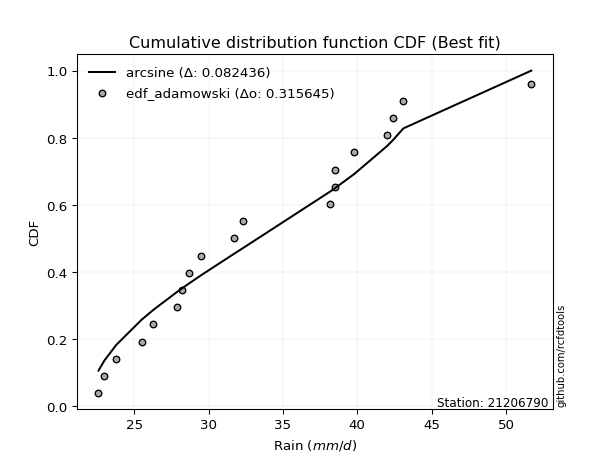</img>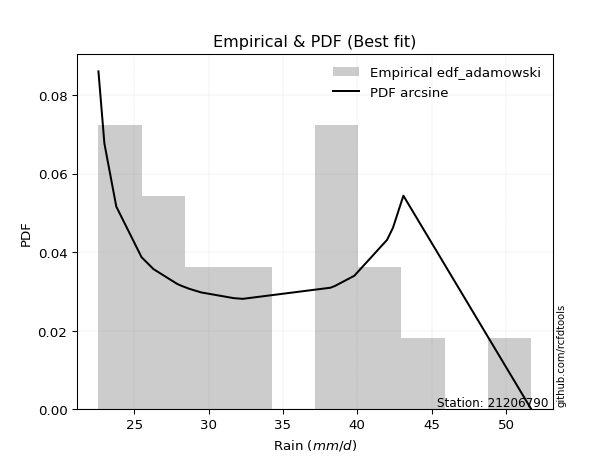</img>

</div>


## C. Best fit & Estimate extreme values for specific return periods - Tr

Best fit in probability distribution analysis means finding the theoretical distribution (like Normal, Poisson, Exponential, etc.) that most accurately mirrors your real-world data´s patterns (shape, center, spread) for better predictions, using methods like visual checks (Q-Q plots), goodness-of-fit tests (Kolmogorov-Smirnov, Chi-Squared), and information criteria (AIC) to score and select the simplest, most representative model.


### 1. Best fit (ordered by delta Δ)

:file_folder:Table: [bestfit_21206790.csv](table/bestfit_21206790.csv)

<div align="center">

|   id |   station | empirical_dist   | p_dist          |     delta |   deltao | eval   |   fit |   n |   best_fit |   best_fit_sort |
|-----:|----------:|:-----------------|:----------------|----------:|---------:|:-------|------:|----:|-----------:|----------------:|
|    0 |  21206790 | edf_weibull      | arcsine         | 0.0794923 | 0.315645 | Δo > Δ |     1 |  19 |          1 |               1 |
|    1 |  21206790 | edf_adamowski    | arcsine         | 0.0824361 | 0.315645 | Δo > Δ |     1 |  19 |          1 |               2 |
|    2 |  21206790 | edf_chegodayev   | arcsine         | 0.0845508 | 0.315645 | Δo > Δ |     1 |  19 |          1 |               3 |
|    3 |  21206790 | edf_jenkinson    | arcsine         | 0.0849764 | 0.315645 | Δo > Δ |     1 |  19 |          1 |               4 |
|    4 |  21206790 | edf_beard        | arcsine         | 0.0849764 | 0.315645 | Δo > Δ |     1 |  19 |          1 |               5 |
|    5 |  21206790 | edf_filliben     | arcsine         | 0.0852961 | 0.315645 | Δo > Δ |     1 |  19 |          1 |               6 |
|    6 |  21206790 | edf_tukey        | arcsine         | 0.0859728 | 0.315645 | Δo > Δ |     1 |  19 |          1 |               7 |
|    7 |  21206790 | edf_blom         | arcsine         | 0.0877641 | 0.315645 | Δo > Δ |     1 |  19 |          1 |               8 |
|    8 |  21206790 | edf_cunnane      | arcsine         | 0.0888464 | 0.315645 | Δo > Δ |     1 |  19 |          1 |               9 |
|    9 |  21206790 | edf_gringorten   | arcsine         | 0.0905897 | 0.315645 | Δo > Δ |     1 |  19 |          1 |              10 |
|   10 |  21206790 | edf_hazen        | arcsine         | 0.0932323 | 0.315645 | Δo > Δ |     1 |  19 |          1 |              11 |
|   11 |  21206790 | edf_california   | logsemicircular | 0.098803  | 0.315645 | Δo > Δ |     1 |  19 |          1 |              12 |

</div>


### 2. Extreme values and % difference analysis

In hydrology, a return period (or recurrence interval $Tr$) is the statistical average time between extreme events like floods or droughts of a specific magnitude, indicating how rare an event is, with a 100-year flood, for example, having a 1% chance of occurring in any given year, not that it happens exactly every century. It is a key tool for infrastructure design (like bridges or dams) and risk assessment, calculated from historical data to determine the probability of future events, although it is important to remember it is statistical average, and events can cluster or be missed.

The extreme value porcentage difference is evaluated as $pdiff = 1 - (ETrBf / ETr) * 100$, where _ETrBf_ correspond to the bestfit extreme value for a specific recurrence interval and _ETr_ correspond to the extreme value for one of the most used PDFsused in hydrology.

> risk_rate: assuming the return period as the project useful life.

:file_folder:Table: [extreme_21206790.csv](table/extreme_21206790.csv), all PDFs.  
:file_folder:Table: [extremepdiff_21206790.csv](table/extremepdiff_21206790.csv), % difference between bestfit and most used PDFs in Hydrology.

<div align="center">

Extreme values table for only best fit PDFs
|   id |      tr |   prob_l |     prob_g |   alpha |   anglit |   arcsine |   argus |    beta |   betaprime |   bradford |    burr |   burr12 |   cosine |   crystalball |   dgamma |   dweibull |   erlang |   exponnorm |   exponpow |   exponweib |        f |   fatiguelife |   foldnorm |    gamma |   gausshyper |   genexpon |   genextreme |   gengamma |   genhalflogistic |   genlogistic |   gennorm |   genpareto |   gompertz |   gumbel_l |   gumbel_r |   halfgennorm |   halflogistic |   halfnorm |   hypsecant |   invgamma |   invgauss |   invweibull |   johnsonsb |   johnsonsu |   kappa3 |   kappa4 |   ksone |   kstwobign |   laplace |   levy_l |   loggamma |   logistic |   loglaplace |   lomax |   maxwell |   mielke |   moyal |   nakagami |     ncf |     nct |    norm |   pearson3 |   powerlaw |   rayleigh |   rdist |    rice |   semicircular |   skewnorm |       t |   trapezoid |   triang |   truncexpon |   truncnorm |   truncpareto |   truncweibull_min |   tukeylambda |   uniform |   vonmises |   vonmises_line |    wald |   weibull_max |   weibull_min |   wrapcauchy |   logalpha |   loganglit |   logarcsine |   logargus |   logbeta |   logbetaprime |   logbradford |   logburr |   logburr12 |   logcosine |   logcrystalball |   logdgamma |   logdweibull |   logerlang |   logexponnorm |   logexponpow |   logexponweib |    logf |   logfatiguelife |   logfoldnorm |   loggausshyper |   loggenexpon |   loggenextreme |   loggengamma |   loggenhalflogistic |   loggenlogistic |   loggennorm |   loggenpareto |   loggompertz |   loggumbel_l |   loggumbel_r |   loghalfgennorm |   loghalflogistic |   loghalfnorm |   loghypsecant |   loginvgamma |   loginvgauss |   loginvweibull |   logjohnsonsb |   logjohnsonsu |   logkappa3 |   logkappa4 |   logksone |   logkstwobign |   loglevy_l |   logloggamma |   loglogistic |   logloglaplace |   loglomax |   logmaxwell |   logmielke |   logmoyal |   lognakagami |   logncf |   lognct |   lognorm |   logpearson3 |   logpowerlaw |   lograyleigh |   logrdist |   logrice |   logsemicircular |   logskewnorm |    logt |   logtrapezoid |   logtriang |   logtruncexpon |   logtruncnorm |   logtruncpareto |   logtruncweibull_min |   logtukeylambda |   loguniform |   logvonmises |   logvonmises_line |   logwald |   logweibull_max |   logweibull_min |   logwrapcauchy |   station |   n |   risk_rate |
|-----:|--------:|---------:|-----------:|--------:|---------:|----------:|--------:|--------:|------------:|-----------:|--------:|---------:|---------:|--------------:|---------:|-----------:|---------:|------------:|-----------:|------------:|---------:|--------------:|-----------:|---------:|-------------:|-----------:|-------------:|-----------:|------------------:|--------------:|----------:|------------:|-----------:|-----------:|-----------:|--------------:|---------------:|-----------:|------------:|-----------:|-----------:|-------------:|------------:|------------:|---------:|---------:|--------:|------------:|----------:|---------:|-----------:|-----------:|-------------:|--------:|----------:|---------:|--------:|-----------:|--------:|--------:|--------:|-----------:|-----------:|-----------:|--------:|--------:|---------------:|-----------:|--------:|------------:|---------:|-------------:|------------:|--------------:|-------------------:|--------------:|----------:|-----------:|----------------:|--------:|--------------:|--------------:|-------------:|-----------:|------------:|-------------:|-----------:|----------:|---------------:|--------------:|----------:|------------:|------------:|-----------------:|------------:|--------------:|------------:|---------------:|--------------:|---------------:|--------:|-----------------:|--------------:|----------------:|--------------:|----------------:|--------------:|---------------------:|-----------------:|-------------:|---------------:|--------------:|--------------:|--------------:|-----------------:|------------------:|--------------:|---------------:|--------------:|--------------:|----------------:|---------------:|---------------:|------------:|------------:|-----------:|---------------:|------------:|--------------:|--------------:|----------------:|-----------:|-------------:|------------:|-----------:|--------------:|---------:|---------:|----------:|--------------:|--------------:|--------------:|-----------:|----------:|------------------:|--------------:|--------:|---------------:|------------:|----------------:|---------------:|-----------------:|----------------------:|-----------------:|-------------:|--------------:|-------------------:|----------:|-----------------:|-----------------:|----------------:|----------:|----:|------------:|
|    0 |    2    | 0.5      | 0.5        | 31.9847 |  33.3521 |   33.3521 | 37.1422 | 31.3507 |     32.3602 |    34.7578 | 31.395  |  29.2959 |  34.2032 |       33.3521 |  30.9505 |    34.5066 |  26.6516 |     29.996  |    29.7342 |     23.855  |  31.9043 |       31.0086 |    32.7239 |  30.3003 |      31.1778 |    30.0536 |      31.9349 |    23.3652 |           32.7135 |       31.9028 |   34.4326 |     29.7914 |    32.053  |    34.673  |    32.0311 |       28.0908 |        31.3744 |    31.7061 |     33.3521 |    31.6734 |    31.2178 |      31.9194 |     31.0639 |     31.354  |  33.6498 |  35.0207 | 37.15   |     31.9612 |   33.3521 |  26.0759 |    32.0361 |    33.3521 |      32.4145 | 30.047  |   32.6644 |  31.5755 | 31.6047 |    29.8232 | 32.6969 | 31.8299 | 33.3521 |    32.7267 |    25.7899 |    32.4205 | 21.8469 | 32.7584 |        33.3521 |    31.6557 | 33.3561 |     44.3822 |  40.983  |      33.3751 |     32.04   |       31.4237 |            33.0335 |       32.8515 |   37.15   |   0.131202 |         37.1932 | 30.7456 |       51.2945 |       30.5943 |      37.1501 |    31.9777 |     32.4145 |      32.4145 |    34.9661 |   31.5168 |        32.2501 |       31.6973 |   30.9289 |     32.9571 |     32.6858 |          32.4144 |     34.2226 |       31.0254 |     32.0635 |        32.4087 |       29.4595 |        29.053  | 31.8746 |          31.5686 |       32.0946 |         31.8314 |       30.2884 |         32.2362 |       28.8559 |              39.0688 |          31.1231 |      34.1822 |        22.2708 |       30.4068 |       33.7076 |       31.1709 |          32.4117 |           30.5702 |       30.8727 |        32.4145 |       32.1661 |       31.5114 |         31.124  |        31.0611 |        31.773  |     34.2063 |     34.7443 |    34.1822 |        30.9678 |     28.1674 |       32.4802 |       32.4145 |         31.6895 |    29.0103 |      31.761  |     31.1164 |    30.7798 |       30.8506 |  32.3203 |  32.0253 |   32.4145 |       32.2323 |       25.2873 |       31.5324 |    38.002  |   31.8344 |           32.4145 |       30.2482 | 32.4144 |        41.9871 |     34.7904 |         31.4755 |        29.0535 |          31.6771 |               29.1158 |          34.1822 |      34.1822 |     0.0605126 |            34.187  |   30.007  |          32.236  |          31.114  |         34.1822 |  21206790 |  19 |    0.75     |
|    1 |    2.33 | 0.570815 | 0.429185   | 33.3652 |  35.0234 |   35.8611 | 39.0129 | 33.1262 |     33.7612 |    36.8295 | 32.791  |  30.9516 |  35.7608 |       34.787  |  33.1154 |    37.9422 |  27.9663 |     31.6294 |    31.3657 |     24.4521 |  33.429  |       32.4656 |    34.3185 |  32.2226 |      33.1139 |    31.6959 |      33.3144 |    23.8746 |           34.2562 |       33.2813 |   36.1597 |     33.5794 |    33.6344 |    35.9214 |    33.3607 |       29.8503 |        32.7414 |    33.2548 |     34.5004 |    33.0669 |    32.6515 |      33.2989 |     33.4874 |     32.7704 |  35.2275 |  37.1894 | 39.6229 |     33.3743 |   34.2204 |  33.5411 |    33.4325 |    34.6163 |      33.2588 | 31.6921 |   34.1551 |  32.9778 | 32.8633 |    31.3348 | 34.1147 | 33.2188 | 34.787  |    34.1663 |    27.4669 |    33.9333 | 25.7691 | 34.1751 |        35.1446 |    33.2144 | 34.7914 |     46.0729 |  42.8801 |      35.3235 |     33.5574 |       33.3774 |            35.0077 |       34.3435 |   39.2107 |   0.543564 |         39.26   | 31.6865 |       51.503  |       32.1709 |      39.3814 |    33.37   |     34.0592 |      34.9146 |    36.7762 |   34.062  |        34.6211 |       33.6175 |   32.346  |     34.3855 |     34.1619 |          33.8215 |     38.0611 |       33.5428 |     33.4637 |        33.8154 |       31.1068 |        30.5744 | 33.2662 |          32.9642 |       33.5858 |         33.8521 |       31.8346 |         33.6513 |       30.3093 |              41.2156 |          32.5267 |      34.1822 |        28.395  |       31.9512 |       34.977  |       32.4227 |          34.1196 |           31.8333 |       32.3212 |        33.5357 |       33.567  |       32.9054 |         32.5273 |        33.4539 |        33.1629 |     36.2924 |     36.8875 |    36.6724 |        32.3853 |     33.6221 |       33.8933 |       33.651  |         32.7126 |    30.6662 |      33.1945 |     32.5147 |    31.9486 |       32.6842 |  35.0442 |  33.4201 |   33.8215 |       33.636  |       26.6423 |       32.9772 |    42.4446 |   33.2614 |           34.1816 |       31.8046 | 33.8215 |        44.0551 |     36.325  |         33.3254 |        30.5074 |          33.5505 |               30.7757 |          36.3357 |      36.2451 |     0.0631272 |            36.2509 |   30.8547 |          33.6511 |          32.5654 |         39.9952 |  21206790 |  19 |    0.729209 |
|    2 |    5    | 0.8      | 0.2        | 39.366  |  40.9204 |   42.5517 | 45.0135 | 40.5398 |     39.5659 |    44.2425 | 39.283  |  40.2351 |  41.3739 |       40.1194 |  37.9225 |    42.4228 |  35.3981 |     39.7956 |    38.688  |     29.4204 |  40.5561 |       39.3761 |    40.3102 |  42.1778 |      41.0916 |    39.9067 |      39.2952 |    29.3212 |           40.3245 |       39.2691 |   41.9213 |     44.6857 |    40.0396 |    39.9543 |    39.137  |       41.1879 |        38.9269 |    39.8036 |     39.1066 |    39.338  |    39.3389 |      39.2919 |     43.2841 |     39.3458 |  40.7023 |  44.7072 | 47.626  |     39.3768 |   38.5618 |  45.9092 |    39.4111 |    39.4977 |      37.8217 | 39.9408 |   40.0226 |  39.4067 | 38.6933 |    37.947  | 39.7591 | 39.3503 | 40.1194 |    39.8726 |    36.8825 |    39.9896 | 36.2936 | 39.8467 |        41.262  |    39.806  | 40.1253 |     50.9234 |  48.3228 |      42.8236 |     39.807  |       41.5376 |            42.6595 |       39.1335 |   45.88   |   1.93893  |         45.9489 | 36.9534 |       51.6914 |       39.6865 |      46.2383 |    39.41   |     40.5578 |      42.5653 |    43.239  |   44.0255 |        45.3276 |       41.5917 |   39.5517 |     39.9231 |     40.0565 |          39.607  |     42.9724 |       38.7408 |     39.4902 |        39.6036 |       39.3284 |        38.6375 | 39.38   |          39.3217 |       39.7751 |         42.2071 |       39.8113 |         39.5187 |       37.8122 |              47.3976 |          39.3944 |      34.1822 |        46.3469 |       39.044  |       39.4139 |       38.4714 |          40.579  |           38.2337 |       39.2375 |        38.4368 |       39.4859 |       39.277  |         39.3962 |        43.1532 |        39.3294 |     43.9561 |     44.543  |    46.0444 |        39.1664 |     45.0811 |       39.6817 |       38.8845 |         38.5117 |    40.5866 |      39.4936 |     39.3407 |    37.9692 |       41.8452 |  47.7616 |  39.4341 |   39.607  |       39.535  |       34.92   |       39.4552 |    57.3815 |   39.4968 |           40.9701 |       39.3221 | 39.607  |        50.5708 |     41.5816 |         41.1413 |        37.4878 |          41.3775 |               38.637  |          44.1685 |      43.8141 |     0.0738972 |            43.8239 |   36.0619 |          39.5183 |          39.3732 |         48.5635 |  21206790 |  19 |    0.67232  |
|    3 |   10    | 0.9      | 0.1        | 44.3185 |  44.2582 |   44.1669 | 47.9072 | 45.4254 |     44.01   |    47.8476 | 45.1237 |  50.3216 |  44.7651 |       43.6567 |  41.4119 |    44.7983 |  42.8457 |     47.2086 |    44.2699 |     37.1804 |  46.9296 |       45.4613 |    44.3025 |  51.4861 |      45.7582 |    47.3604 |      44.1516 |    39.7251 |           44.394  |       44.1455 |   44.9954 |     48.7365 |    44.4477 |    42.1997 |    43.8417 |       54.9892 |        44.0637 |    44.6496 |     42.7848 |    44.7039 |    45.1629 |      44.1731 |     47.8367 |     45.1341 |  43.9849 |  48.2658 | 51.118  |     43.9469 |   42.5028 |  48.8952 |    44.1876 |    43.0926 |      42.5036 | 47.4626 |   44.1518 |  45.0723 | 43.7692 |    42.9442 | 43.8447 | 44.4832 | 43.6567 |    43.9753 |    43.3947 |    44.308  | 38.8831 | 43.8908 |        44.4009 |    44.6837 | 43.6637 |     52.818  |  50.4487 |      46.8954 |     44.3181 |       46.197  |            46.8173 |       41.1733 |   48.79   |   2.5952   |         48.8676 | 42.5429 |       51.6993 |       46.172  |      49.0072 |    44.3392 |     44.7715 |      44.6508 |    46.7499 |   48.5272 |        54.4802 |       46.1856 |   46.9771 |     43.9072 |     44.1001 |          43.981  |     46.3277 |       42.2408 |     44.3386 |        43.9847 |       46.6969 |        46.7076 | 44.4538 |          44.8455 |       44.5013 |         46.8365 |       47.8387 |         43.8733 |       45.056  |              49.7132 |          46.0439 |      34.1822 |        50.5081 |       44.8133 |       42.1237 |       44.2226 |          44.4549 |           44.5166 |       45.2915 |        42.86   |       44.1344 |       44.8392 |         46.0494 |        47.7192 |        44.514  |     47.7886 |     48.1645 |    50.8514 |        45.2665 |     48.3888 |       44.034  |       43.2524 |         44.9506 |    52.5538 |      44.6306 |     45.9349 |    44.1278 |       50.3098 |  59.1239 |  44.2964 |   43.9811 |       44.1305 |       41.6304 |       44.8375 |    62.0329 |   44.5023 |           44.961  |       46.0069 | 43.9811 |        53.3701 |     45.1028 |         45.8231 |        42.7514 |          45.9919 |               44.0469 |          47.9416 |      47.594  |     0.08209   |            47.606  |   42.5524 |          43.8728 |          45.3536 |         50.2515 |  21206790 |  19 |    0.651322 |
|    4 |   15    | 0.933333 | 0.0666667  | 47.169  |  45.6835 |   44.4749 | 49.0072 | 47.6395 |     46.4304 |    49.1034 | 48.657  | inf      |  46.3099 |       45.4219 |  43.3254 |    45.934  |  47.3799 |     51.545  |    47.1666 |     43.3449 |  50.7524 |       49.0005 |    46.2959 |  56.9987 |      47.5774 |    51.7204 |      46.8857 |    48.8163 |           46.3713 |       46.8967 |   46.3437 |     49.9097 |    46.6264 |    43.2166 |    46.496  |       64.5747 |        46.9706 |    47.1714 |     44.884  |    47.8421 |    48.5448 |      46.9271 |     49.2714 |     48.5551 |  45.6298 |  49.5077 | 52.282  |     46.3731 |   44.8082 |  49.7972 |    46.8579 |    45.0513 |      45.5066 | 51.8777 |   46.2704 |  48.4504 | 46.7151 |    45.5578 | 45.99   | 47.4496 | 45.4219 |    46.1193 |    45.9521 |    46.533  | 39.3857 | 45.9744 |        45.6249 |    47.222  | 45.4295 |     53.4259 |  51.1308 |      48.4031 |     46.6411 |       47.9306 |            48.3531 |       41.8378 |   49.76   |   2.81958  |         49.8406 | 46.1323 |       51.6998 |       49.8659 |      49.9098 |    47.139  |     46.7016 |      45.06   |    48.1582 |   49.8548 |        59.8115 |       47.911  |   51.9443 |     46.0323 |     46.0749 |          46.3412 |     48.1789 |       44.1082 |     47.0612 |        46.3506 |       50.9629 |        51.8029 | 47.3662 |          48.1059 |       47.0661 |         48.4946 |       53.0276 |         46.1378 |       49.523  |              50.4249 |          50.2788 |      34.1822 |        51.2138 |       47.9705 |       43.4115 |       47.8389 |          46.2131 |           48.5193 |       48.8029 |        45.6089 |       46.7062 |       48.1326 |         50.2874 |        49.1803 |        47.5148 |     49.1389 |     49.3836 |    52.5628 |        48.8821 |     49.4349 |       46.3741 |       45.8354 |         49.3508 |    61.2381 |      47.5204 |     50.1299 |    48.1503 |       55.3815 |  65.9314 |  47.0394 |   46.3413 |       46.6587 |       44.5362 |       47.8913 |    63.023  |   47.283  |           46.6207 |       49.9237 | 46.3413 |        54.3007 |     46.7566 |         47.6285 |        45.141  |          47.7556 |               46.2894 |          49.2226 |      48.9251 |     0.0865387 |            48.9379 |   47.3237 |          46.1374 |          48.8637 |         50.7457 |  21206790 |  19 |    0.644736 |
|    5 |   20    | 0.95     | 0.05       | 49.1989 |  46.5219 |   44.5834 | 49.6111 | 48.9743 |     48.0951 |    49.7419 | 51.2392 | inf      |  47.2599 |       46.5779 |  44.6474 |    46.667  |  50.6544 |     54.6217 |    49.0853 |     48.5069 |  53.5307 |       51.5097 |    47.6016 |  60.9318 |      48.5599 |    54.814  |      48.7975 |    56.7974 |           47.6333 |       48.8229 |   47.1718 |     50.4479 |    48.0358 |    43.8495 |    48.3545 |       72.0481 |        49.0073 |    48.8528 |     46.3648 |    50.0912 |    50.9437 |      48.8553 |     49.9656 |     51.0158 |  46.7442 |  50.1441 | 52.864  |     48.0075 |   46.4438 |  50.2591 |    48.7216 |    46.4051 |      47.7651 | 55.0169 |   47.6765 |  50.8974 | 48.8013 |    47.3028 | 47.4345 | 49.5626 | 46.5779 |    47.5587 |    47.3083 |    48.0118 | 39.5646 | 47.3593 |        46.3039 |    48.9143 | 46.5858 |     53.7258 |  51.4673 |      49.19   |     48.1827 |       48.8341 |            49.1536 |       42.1652 |   50.245  |   2.93249  |         50.327  | 48.807  |       51.6999 |       52.4508 |      50.3587 |    49.1126 |     47.8757 |      45.205  |    48.9492 |   50.4513 |        63.6193 |       48.8143 |   55.8167 |     47.4854 |     47.3331 |          47.9551 |     49.4712 |       45.384  |     48.9662 |        47.9693 |       53.9721 |        55.5995 | 49.4319 |          50.4549 |       48.8253 |         49.3346 |       56.9704 |         47.6376 |       52.8058 |              50.767  |          53.4736 |      34.1822 |        51.4433 |       50.1298 |       44.2329 |       50.5456 |          47.3037 |           51.5363 |       51.294  |        47.6534 |       48.4907 |       50.5098 |         53.4848 |        49.8943 |        49.6532 |     49.8283 |     49.9887 |    53.4399 |        51.4791 |     49.9794 |       47.971  |       47.7103 |         52.8033 |    68.3115 |      49.5408 |     53.2927 |    51.2189 |       59.0457 |  70.8736 |  48.965  |   47.9552 |       48.407  |       46.1449 |       50.0353 |    63.3893 |   49.2126 |           47.5675 |       52.7187 | 47.9552 |        54.7658 |     47.7711 |         48.5854 |        46.5173 |          48.6867 |               47.5157 |          49.8613 |      49.6045 |     0.0895942 |            49.6178 |   51.2239 |          47.6372 |          51.3758 |         50.9867 |  21206790 |  19 |    0.641514 |
|    6 |   25    | 0.96     | 0.04       | 50.7852 |  47.0901 |   44.6337 | 50.0004 | 49.892  |     49.3628 |    50.1283 | 53.2913 | inf      |  47.9261 |       47.4289 |  45.6568 |    47.2025 |  53.2216 |     57.0082 |    50.5041 |     52.9834 |  55.73   |       53.4563 |    48.5627 |  63.9929 |      49.1795 |    57.2135 |      50.2687 |    63.9304 |           48.5417 |       50.3067 |   47.7567 |     50.7512 |    49.0625 |    44.2999 |    49.7861 |       78.2285 |        50.5765 |    50.1038 |     47.5108 |    51.8546 |    52.8063 |      50.3406 |     50.3752 |     52.948  |  47.5942 |  50.5325 | 53.2132 |     49.2317 |   47.7126 |  50.5491 |    50.1555 |    47.4407 |      49.5938 | 57.4558 |   48.7203 |  52.8296 | 50.4184 |    48.6019 | 48.5181 | 51.2127 | 47.4289 |    48.6363 |    48.1475 |    49.1106 | 39.6482 | 48.3883 |        46.7443 |    50.1735 | 47.437  |     53.9045 |  51.6678 |      49.6735 |     49.3265 |       49.3884 |            49.645  |       42.3596 |   50.536  |   3.0004   |         50.6189 | 50.9494 |       51.7    |       54.4377 |      50.6275 |    50.6422 |     48.6881 |      45.2724 |    49.4661 |   50.7797 |        66.596  |       49.3699 |   59.0468 |     48.5903 |     48.2358 |          49.1789 |     50.4674 |       46.3521 |     50.4344 |        49.1972 |       56.2969 |        58.6533 | 51.0397 |          52.3032 |       50.1621 |         49.8386 |       60.1929 |         48.7441 |       55.4204 |              50.967  |          56.0722 |      34.1822 |        51.5437 |       51.7634 |       44.8268 |       52.7345 |          48.0776 |           53.988  |       53.2296 |        49.2985 |       49.858  |       52.3828 |         56.0856 |        50.3186 |        51.3232 |     50.2466 |     50.3485 |    53.9732 |        53.5144 |     50.3242 |       49.1801 |       49.1962 |         55.6907 |    74.3905 |      51.0962 |     55.8642 |    53.7313 |       61.9292 |  74.782  |  50.4528 |   49.179  |       49.7433 |       47.1648 |       51.6902 |    63.5647 |   50.6901 |           48.192  |       54.8993 | 49.1791 |        55.0447 |     48.4761 |         49.1781 |        47.4144 |          49.2622 |               48.2889 |          50.2423 |      50.0167 |     0.0919194 |            50.0302 |   54.5785 |          48.7438 |          53.341  |         51.1301 |  21206790 |  19 |    0.639603 |
|    7 |   50    | 0.98     | 0.02       | 55.8237 |  48.4888 |   44.701  | 50.8833 | 52.1951 |     53.2037 |    50.909  | 59.9758 | inf      |  49.6705 |       49.8658 |  48.7233 |    48.7209 |  61.3187 |     64.4212 |    54.5765 |     69.6767 |  62.8474 |       59.5107 |    51.3153 |  73.5484 |      50.5127 |    64.6671 |      54.7931 |    91.8147 |           51.0259 |       54.8773 |   49.3309 |     51.2991 |    51.9431 |    45.5226 |    54.1959 |       99.5634 |        55.4114 |    53.7399 |     51.0641 |    57.4704 |    58.6119 |      54.916  |     51.1871 |     59.1049 |  50.2284 |  51.33   | 53.9116 |     52.8265 |   51.6536 |  51.2018 |    54.5749 |    50.6049 |      55.733  | 65.0533 |   51.7477 |  59.0504 | 55.4386 |    52.3797 | 51.7182 | 56.4339 | 49.8658 |    51.8072 |    49.8841 |    52.3002 | 39.7612 | 51.3753 |        47.7505 |    53.8334 | 49.8746 |     54.259  |  52.1267 |      50.6676 |     52.6376 |       50.525  |            50.654  |       42.7414 |   51.118  |   3.1365   |         51.2026 | 57.9445 |       51.7    |       60.5212 |      51.1642 |    55.4196 |     50.747  |      45.3627 |    50.6585 |   51.346  |        76.0195 |       50.513  |   70.5659 |     51.9451 |     50.6821 |          52.859  |     53.5546 |       49.2709 |     54.9736 |        52.8922 |       63.4727 |        68.7854 | 56.0984 |          58.2253 |       54.1965 |         50.8337 |       71.231  |         51.8885 |       63.946  |              51.3522 |          64.8974 |      34.1822 |        51.6666 |       56.6357 |       46.4796 |       60.091  |          50.1703 |           62.3002 |       59.2804 |        54.7685 |       54.0436 |       58.3982 |         64.9194 |        51.1694 |        56.6075 |     51.0937 |     51.0535 |    55.0559 |        59.9678 |     51.1092 |       52.8069 |       54.0289 |         66.0027 |    97.1963 |      55.8886 |     64.5919 |    62.3435 |       71.1364 |  87.4027 |  55.0738 |   52.8591 |       53.8162 |       49.3369 |       56.8105 |    63.8098 |   55.2015 |           49.6496 |       61.7631 | 52.8592 |        55.6025 |     50.2708 |         50.4077 |        49.3999 |          50.4531 |               49.9271 |          50.9932 |      50.8514 |     0.0989578 |            50.8654 |   67.1383 |          51.8883 |          59.5605 |         51.4152 |  21206790 |  19 |    0.63583  |
|    8 |   75    | 0.986667 | 0.0133333  | 58.8784 |  49.1043 |   44.7134 | 51.2334 | 53.2287 |     55.4016 |    51.1715 | 64.1267 | inf      |  50.5036 |       51.1733 |  50.4796 |    49.5287 |  66.1248 |     68.7576 |    56.7565 |     81.5111 |  67.2378 |       63.0601 |    52.7923 |  79.1646 |      50.9981 |    69.0272 |      57.4175 |   112.499  |           52.2753 |       57.5338 |   50.1219 |     51.4578 |    53.4486 |    46.1409 |    56.7591 |      113.544  |        58.2219 |    55.7192 |     53.1405 |    60.8732 |    62.0259 |      57.5753 |     51.4625 |     62.8294 |  51.8043 |  51.6052 | 54.1444 |     54.8044 |   53.9589 |  51.4701 |    57.1532 |    52.4324 |      59.6707 | 69.5127 |   53.3937 |  62.8607 | 58.3742 |    54.4362 | 53.4957 | 59.5768 | 51.1733 |    53.561  |    50.4805 |    54.0355 | 39.7826 | 53.0003 |        48.1525 |    55.8257 | 51.1826 |     54.3764 |  52.3298 |      51.0073 |     54.4329 |       50.9123 |            50.9984 |       42.8657 |   51.312  |   3.18192  |         51.3972 | 62.2489 |       51.7    |       64.0258 |      51.3429 |    58.2518 |     51.6805 |      45.3794 |    51.1393 |   51.4981 |        81.6845 |       50.9037 |   78.5424 |     53.8796 |     51.8937 |          54.9459 |     55.37   |       50.933  |     57.631  |        54.9893 |       67.6421 |        75.196  | 59.1225 |          61.8381 |       56.4933 |         51.1552 |       78.4999 |         53.5366 |       69.2338 |              51.4748 |          70.6519 |      34.1822 |        51.6865 |       59.3614 |       47.3385 |       64.8298 |          51.2249 |           67.7082 |       62.8585 |        58.242  |       56.4668 |       62.078  |         70.68   |        51.4622 |        59.787  |     51.3793 |     51.2808 |    55.4215 |        63.8446 |     51.4354 |       54.8576 |       57.0334 |         73.1357 |   113.863  |      58.6802 |     70.2787 |    68.0059 |       76.7117 |  95.1628 |  57.7952 |   54.946  |       56.1622 |       50.1025 |       59.8061 |    63.8584 |   57.8023 |           50.2441 |       65.8537 | 54.9461 |        55.7884 |     51.0869 |         50.8313 |        50.1275 |          50.8623 |               50.5023 |          51.2375 |      51.1327 |     0.102983  |            51.1469 |   76.2641 |          53.5367 |          63.2934 |         51.5101 |  21206790 |  19 |    0.634587 |
|    9 |  100    | 0.99     | 0.01       | 61.1065 |  49.4704 |   44.7178 | 51.4289 | 53.8493 |     56.946  |    51.3032 | 67.1891 | inf      |  51.0257 |       52.0577 |  51.7124 |    50.0729 |  69.5601 |     71.8343 |    58.2252 |     90.8856 |  70.4658 |       65.5824 |    53.7913 |  83.1591 |      51.2532 |    72.1207 |      59.2726 |   129.295  |           53.083  |       59.4141 |   50.6384 |     51.5306 |    54.45   |    46.5453 |    58.5733 |      124.136  |        60.2111 |    57.0677 |     54.6135 |    63.3485 |    64.4574 |      59.4576 |     51.6044 |     65.5324 |  52.9513 |  51.7456 | 54.2608 |     56.1595 |   55.5946 |  51.6269 |    58.9857 |    53.7227 |      62.6321 | 72.6835 |   54.5148 |  65.6479 | 60.457  |    55.8371 | 54.7224 | 61.8547 | 52.0577 |    54.7681 |    50.782  |    55.2177 | 39.7901 | 54.1074 |        48.3776 |    57.1829 | 52.0672 |     54.435  |  52.451  |      51.1788 |     55.6535 |       51.1076 |            51.1722 |       42.9269 |   51.409  |   3.20463  |         51.4945 | 65.3872 |       51.7    |       66.491  |      51.4322 |    60.2854 |     52.2438 |      45.3853 |    51.4097 |   51.5645 |        85.7832 |       51.1009 |   84.8628 |     55.2493 |     52.6679 |          56.4039 |     56.6674 |       52.0976 |     59.5237 |        56.4551 |       70.5895 |        79.9759 | 61.3049 |          64.4768 |       58.1017 |         51.312  |       84.0663 |         54.6263 |       73.128  |              51.5344 |          75.0304 |      34.1822 |        51.6929 |       61.2464 |       47.9088 |       68.4079 |          51.914  |           71.8172 |       65.4189 |        60.8387 |       58.1813 |       64.7702 |         75.0635 |        51.6144 |        62.0905 |     51.5228 |     51.3919 |    55.6053 |        66.6446 |     51.627  |       56.2877 |       59.2548 |         78.7767 |   127.499  |      60.6611 |     74.6039 |    72.3323 |       80.7578 | 100.855  |  59.7409 |   56.404  |       57.8168 |       50.4934 |       61.937  |    63.876  |   59.6365 |           50.5802 |       68.7944 | 56.4041 |        55.8814 |     51.5797 |         51.0458 |        50.5053 |          51.0693 |               50.7957 |          51.3576 |      51.2739 |     0.105811  |            51.2882 |   83.6904 |          54.6264 |          65.9897 |         51.5575 |  21206790 |  19 |    0.633968 |
|   10 |  200    | 0.995    | 0.005      | 66.7241 |  50.1619 |   44.722  | 51.7686 | 55.0351 |     60.6323 |    51.5013 | 74.9987 | inf      |  52.0874 |       54.0637 |  54.646  |    51.3019 |  77.909  |     79.2473 |    61.5321 |    116.973  |  78.6641 |       71.674  |    56.0573 |  92.8112 |      51.6598 |    79.5743 |      63.7244 |   177.532  |           54.7944 |       63.9343 |   51.7605 |     51.6284 |    56.6692 |    47.4243 |    62.9346 |      151.961  |        64.9934 |    60.1516 |     58.162  |    69.5449 |    70.3486 |      63.9826 |     51.8305 |     72.2661 |  55.8441 |  51.9618 | 54.4354 |     59.2808 |   59.5356 |  51.924  |    63.4278 |    56.8178 |      70.3853 | 80.3467 |   57.0797 |  72.6688 | 65.475  |    59.0399 | 57.5794 | 67.5309 | 54.0637 |    57.5693 |    51.2385 |    57.9226 | 39.7975 | 56.6406 |        48.77   |    60.287  | 54.0739 |     54.5226 |  52.6803 |      51.4381 |     58.4387 |       51.4026 |            51.4349 |       43.0171 |   51.5545 |   3.23871  |         51.6404 | 73.2044 |       51.7    |       72.3661 |      51.5662 |    65.2873 |     53.3246 |      45.3909 |    51.883  |   51.6483 |        95.9588 |       51.3991 |  102.791  |     58.5642 |     54.2777 |          59.8561 |     59.8374 |       54.8671 |     64.1248 |        59.9288 |       77.6583 |        92.3348 | 66.7099 |          71.1185 |       61.9219 |         51.5389 |       99.0444 |         56.9978 |       83.0219 |              51.621  |          86.6995 |      34.1822 |        51.6985 |       65.639  |       49.1723 |       77.839  |          53.4115 |           82.7455 |       71.6739 |        67.5797 |       62.3119 |       71.5626 |         86.7467 |        51.8594 |        67.826  |     51.7428 |     51.5534 |    55.8821 |        73.5696 |     51.9919 |       59.6659 |       64.9426 |         94.7147 |   167.926  |      65.4482 |     86.1243 |    83.9205 |       90.8309 | 115.254  |  64.498  |   59.8562 |       61.7853 |       51.0903 |       67.1024 |    63.8938 |   64.0327 |           51.1714 |       76.0233 | 59.8563 |        56.0208 |     52.5258 |         51.3709 |        51.0908 |          51.3829 |               51.2432 |          51.5339 |      51.4865 |     0.112564  |            51.501  |  105.486  |          56.9982 |          72.6633 |         51.6287 |  21206790 |  19 |    0.633042 |
|   11 |  250    | 0.996    | 0.004      | 68.6184 |  50.3379 |   44.7225 | 51.8481 | 55.3399 |     61.8121 |    51.541  | 77.6501 | inf      |  52.3785 |       54.6767 |  55.581  |    51.6763 |  80.6154 |     81.6338 |    62.5343 |    126.466  |  81.4392 |       73.6394 |    56.7498 |  95.9257 |      51.7464 |    81.9739 |      65.1532 |   195.534  |           55.2824 |       65.3875 |   52.0909 |     51.6458 |    57.3326 |    47.6829 |    64.3367 |      161.614  |        66.5309 |    61.1004 |     59.3042 |    71.6154 |    72.255  |      65.4373 |     51.8797 |     74.5036 |  56.8208 |  52.0063 | 54.4703 |     60.2467 |   60.8043 |  52.0013 |    64.8692 |    57.8115 |      73.0801 | 82.8207 |   57.8693 |  75.0257 | 67.0904 |    60.0248 | 58.4734 | 69.4205 | 54.6767 |    58.4428 |    51.3304 |    58.7553 | 39.7984 | 57.4203 |        48.862  |    61.242  | 54.6871 |     54.5401 |  52.7387 |      51.4903 |     59.2939 |       51.4619 |            51.4877 |       43.0348 |   51.5836 |   3.24553  |         51.6696 | 75.7906 |       51.7    |       74.2397 |      51.593  |    66.9328 |     53.6033 |      45.3916 |    51.9944 |   51.6621 |        99.3318 |       51.459  |  109.512  |     59.6412 |     54.7276 |          60.9526 |     60.8737 |       55.7504 |     65.6217 |        61.0329 |       79.9252 |        96.5811 | 68.499  |          73.3487 |       63.1387 |         51.5824 |      104.386  |         57.6895 |       86.3676 |              51.6378 |          90.8237 |      34.1822 |        51.6991 |       67.0123 |       49.5503 |       81.139  |          53.8525 |           86.6007 |       73.7159 |        69.9048 |       63.645  |       73.8483 |         90.8762 |        51.9133 |        69.7337 |     51.7896 |     51.5846 |    55.9376 |        75.8551 |     52.0874 |       60.7366 |       66.882  |        100.665  |   183.654  |      66.9965 |     90.1939 |    88.0327 |       94.1751 | 120.109  |  66.0541 |   60.9527 |       63.0608 |       51.2112 |       68.7776 |    63.8961 |   65.4441 |           51.3111 |       78.3965 | 60.9529 |        56.0487 |     52.7697 |         51.4364 |        51.2107 |          51.446  |               51.3338 |          51.5684 |      51.5292 |     0.114727  |            51.5436 |  113.881  |          57.69   |          74.8684 |         51.643  |  21206790 |  19 |    0.632858 |
|   12 |  500    | 0.998    | 0.002      | 74.817  |  50.7742 |   44.7232 | 52.0309 | 56.1022 |     65.4668 |    51.6205 | 86.3445 | inf      |  53.153  |       56.4947 |  58.4612 |    52.7835 |  89.0705 |     89.0469 |    65.4794 |    159.521  |  90.519  |       79.7574 |    58.8035 | 105.619  |      51.9289 |    89.4275 |      69.5805 |   259.7    |           56.6288 |       69.8979 |   53.0402 |     51.6771 |    59.2595 |    48.4243 |    68.6886 |      193.767  |        71.3029 |    63.9291 |     62.8524 |    78.3054 |    78.2075 |      69.9525 |     51.9877 |     81.6835 |  60.0177 |  52.0974 | 54.5402 |     63.1415 |   64.7453 |  52.201  |    69.3934 |    60.8932 |      82.1267 | 90.5277 |   60.2254 |  82.6664 | 72.1082 |    62.9602 | 61.1831 | 75.5056 | 56.4947 |    61.082  |    51.5148 |    61.2397 | 39.7996 | 59.7469 |        49.074  |    64.0893 | 56.5056 |     54.5751 |  52.8837 |      51.5949 |     61.8399 |       51.5807 |            51.5937 |       43.0697 |   51.6418 |   3.25916  |         51.728  | 84.0138 |       51.7    |       80.01   |      51.6466 |    72.1704 |     54.3005 |      45.3925 |    52.2515 |   51.6855 |       110.137  |       51.5793 |  134.037  |     63.0356 |     55.9429 |          64.324  |     64.1506 |       58.4772 |     70.3321 |        64.4303 |       86.9434 |       110.665  | 74.2282 |          80.5885 |       66.8895 |         51.6662 |      122.814  |         59.6337 |       97.2867 |              51.6703 |         104.916  |      34.1822 |        51.6998 |       71.1653 |       50.6503 |       92.2993 |          55.1187 |           99.7479 |       80.1562 |        77.6498 |       67.8073 |       81.2845 |        104.988  |        52.0325 |        75.8714 |     51.8971 |     51.6452 |    56.0488 |        83.1386 |     52.3346 |       64.0214 |       73.2727 |        122.266  |   243.201  |      71.8379 |    104.093  |   102.136  |      104.893  | 135.922  |  70.9785 |   64.3241 |       67.0271 |       51.4546 |       74.0284 |    63.8992 |   69.8265 |           51.6342 |       85.921  | 64.3243 |        56.1044 |     53.3798 |         51.5679 |        51.4534 |          51.5728 |               51.5162 |          51.636  |      51.6145 |     0.121432  |            51.629  |  145.275  |          59.6346 |          81.9061 |         51.6715 |  21206790 |  19 |    0.632489 |
|   13 |  750    | 0.998667 | 0.00133333 | 78.6934 |  50.9674 |   44.7233 | 52.1043 | 56.443  |     67.6029 |    51.647  | 91.7707 | inf      |  53.5283 |       57.5046 |  60.1314 |    53.397  |  94.0459 |     93.3832 |    67.0963 |    181.451  |  96.1751 |       83.3451 |    59.9443 | 111.3    |      51.9941 |    93.7876 |      72.1636 |   303.332  |           57.3109 |       72.5347 |   53.5493 |     51.6862 |    60.3037 |    48.8206 |    71.2327 |      214.104  |        74.0926 |    65.5095 |     64.928  |    82.4128 |    81.7103 |      72.592  |     52.0292 |     86.0508 |  62.0131 |  52.1287 | 54.5634 |     64.7676 |   67.0507 |  52.2957 |    72.0782 |    62.6936 |      87.9292 | 95.0514 |   61.5431 |  87.3709 | 75.0435 |    64.5992 | 62.7269 | 79.2285 | 57.5046 |    62.5797 |    51.5764 |    62.6289 | 39.7998 | 61.0479 |        49.1593 |    65.6799 | 57.5159 |     54.5867 |  52.948  |      51.6299 |     63.2599 |       51.6204 |            51.6291 |       43.0811 |   51.6612 |   3.26371  |         51.7475 | 88.9442 |       51.7    |       83.3534 |      51.6645 |    75.3313 |     54.612  |      45.3927 |    52.3551 |   51.6918 |       116.701  |       51.6195 |  151.444  |     65.0648 |     56.5415 |          66.2767 |     66.1123 |       60.0641 |     73.1356 |        66.3999 |       91.0342 |       119.568  | 77.7101 |          85.0575 |       69.0686 |         51.6927 |      135.026  |         60.6382 |      104.059  |              51.6807 |         114.146  |      34.1822 |        51.6999 |       73.5221 |       51.2481 |       99.5217 |          55.7974 |          108.34   |       83.9959 |        82.5722 |       70.2626 |       85.8864 |        114.231  |        52.0789 |        79.6218 |     51.9446 |     51.6645 |    56.0859 |        87.5329 |     52.4522 |       65.9193 |       77.2854 |        137.502  |   287.176  |      74.6967 |    113.191  |   111.411  |      111.402  | 145.715  |  73.9298 |   66.2768 |       69.3554 |       51.5361 |       77.1375 |    63.8999 |   72.3934 |           51.7648 |       90.4347 | 66.277  |        56.123  |     53.6524 |         51.6119 |        51.5352 |          51.6151 |               51.5773 |          51.658  |      51.643  |     0.125358  |            51.6575 |  168.109  |          60.6393 |          86.1613 |         51.681  |  21206790 |  19 |    0.632366 |
|   14 | 1000    | 0.999    | 0.001      | 81.5711 |  51.0826 |   44.7234 | 52.1456 | 56.6473 |     69.1197 |    51.6602 | 95.7819 | inf      |  53.7651 |       58.1999 |  61.3107 |    53.8187 |  97.5875 |     96.4599 |    68.2011 |    198.213  | 100.353  |       85.8943 |    60.7297 | 115.336  |      52.0281 |    96.8811 |      73.9935 |   337.164  |           57.7531 |       74.405  |   53.8929 |     51.6903 |    61.0118 |    49.0873 |    73.0373 |      229.221  |        76.0714 |    66.6008 |     66.4006 |    85.4198 |    84.2047 |      74.4644 |     52.0521 |     89.2273 |  63.4899 |  52.1447 | 54.5751 |     65.8942 |   68.6863 |  52.3552 |    74.0024 |    63.9704 |      92.2931 | 98.2679 |   62.4539 |  90.819  | 77.1261 |    65.7308 | 63.806  | 81.9485 | 58.1999 |    63.624  |    51.6073 |    63.589  | 39.7999 | 61.9469 |        49.2073 |    66.7784 | 58.2114 |     54.5925 |  52.9863 |      51.6474 |     64.2397 |       51.6403 |            51.6468 |       43.0867 |   51.6709 |   3.26598  |         51.7572 | 92.4907 |       51.7    |       85.7124 |      51.6734 |    77.6213 |     54.7985 |      45.3927 |    52.4134 |   51.6945 |       121.473  |       51.6396 |  165.446  |     66.528  |     56.9224 |          67.6555 |     67.526  |       61.1879 |     75.1486 |        67.7915 |       93.9308 |       126.201  | 80.2436 |          88.3401 |       70.61   |         51.7056 |      144.404  |         61.2963 |      109.045  |              51.6858 |         121.182  |      34.1822 |        51.7    |       75.1646 |       51.6544 |      104.985  |          56.2552 |          114.879  |       86.7546 |        86.2527 |       72.0159 |       89.2721 |        121.277  |        52.1046 |        82.3598 |     51.9744 |     51.6739 |    56.1045 |        90.7127 |     52.5263 |       67.2573 |       80.2636 |        149.705  |   323.402  |      76.7387 |    120.124  |   118.498  |      116.131  | 152.92   |  76.0584 |   67.6557 |       71.0129 |       51.577  |       79.362  |    63.9001 |   74.2181 |           51.8383 |       93.6896 | 67.6559 |        56.1323 |     53.8155 |         51.6339 |        51.5762 |          51.6363 |               51.6079 |          51.6688 |      51.6572 |     0.128149  |            51.6718 |  186.722  |          61.2975 |          89.2451 |         51.6857 |  21206790 |  19 |    0.632305 |


</div>


<div align="center">

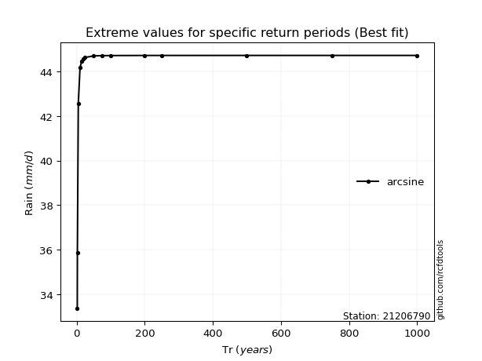</img>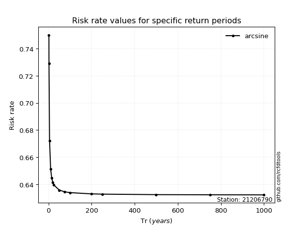</img>

</div>


<sub>**APP DISCLAIMER**: NO WARRANTY - This software is provided by [github.com/rcfdtools](https://github.com/rcfdtools) "as is", without any express or implied warranty, including warranties of merchantability, fitness for a particular purpose, or non-infringement. There is no guarantee that the software will be error-free or operate without interruption. LIMITATION OF LIABILITY - Neither the authors nor copyright holders will be liable for claims or damages arising from the software or its use. You are responsible for determining if the software is appropriate for your use and assume all associated risks, including errors, legal compliance, and data loss. NO PROFESSIONAL ADVICE - The software provides general information and does not offer professional advice. It should not replace consultation with professional advisors.</sub>