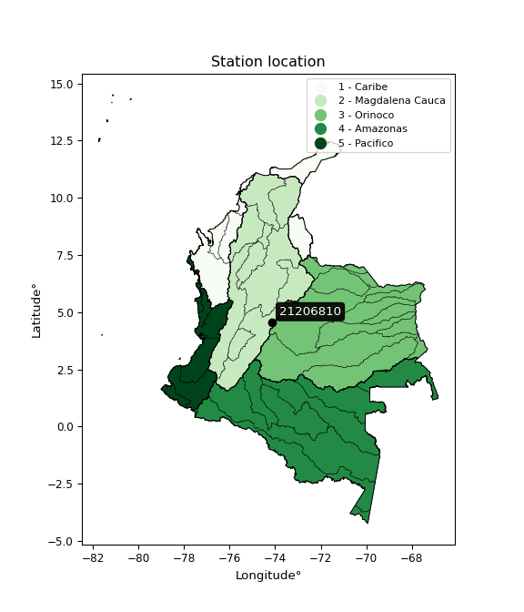

<div align="center">


</div>

# PMP Station (rain, Pmax24h): 21206810

Probable Maximum Precipitation (PMP) is the greatest amount of rainfall for a specific duration that is meteorologically possible for a given location, acting as a "worst-case" scenario for extreme storms, crucial for designing safety-critical infrastructure like bridges, river deviations, dams, spillways, and nuclear plants to prevent catastrophic failure. PMP is calculated by hydrologists using meteorological data to determine the upper limit of extreme rainfall, often leading to the Probable Maximum Flood (PMF) for flood control design, and is increasingly being studied for climate change impacts.

<div align="center">

</img>

</div>


## A. General information


### 1. General running parameters

• app_version: _v20251227_. • runtime: _2025-12-27 09:02:11.367833_. • Python version: _3.14.0_. • SciPy version: _1.16.3_. • Pandas version: _2.3.3_. • NumPy version: _2.3.5_. • Stations dataset (station_dataset_file): _dataset/pmax24h_in/automatic_colombia_2003_2024_filter.csv_. • Stations catalog (station_catalog_file): _dataset/CNE_IDEAM.xls_. • Minimum year to eval til year_max (date_min): _2003_. • Maximum year to eval since year_min (date_max): _2024_. • Creates, save and include plots into reports (create_plot): _False_. • Plot only fit distributions with Δo > Δ (plot_only_fit): _True_. • Eval low extreme values, if False, evaluates high extreme values (low_extreme): _False_. • Eval every SciPy distribution as logarithmic (pdist_logarithmic_on): _True_. • Standard deviation normalized (ddof): _1.0_. • Return periods to eval in years (Tr): _[2, 2.33, 5, 10, 15, 20, 25, 50, 75, 100, 200, 250, 500, 750, 1000]_. • Minimum data sample per station, 0 means any (minimum_sample): _5_. • Z-Score threshold to adjust a value, 0 means disable (zscore): _3.5_. • Avoid zeros, e.g. rain = 0 (avoid_zeros): _True_. • Avoid null values (avoid_nans): _True_. [:file_folder:Dataset file.](../../dataset/pmax24h_in/automatic_colombia_2003_2024_filter.csv)

> Delta Degrees of Freedom (DDOF): is a parameter used in the formulas for calculating variance and standard deviation. When ddof=0, the divisor is $N$ (the total number of observations) and this is used when your data set is the entire population. When ddof=1, the divisor is $N-1$ and this is used when your data set is a sample drawn from a larger population. Using $N-1$ provides an unbiased estimate of the population variance (known as Bessel´s correction).


### 2. Station info and location

|   id |   CODIGO | NOMBRE                        | CATEGORIA          | TECNOLOGIA                | ESTADO   | FECHA_INSTALACION   |   FECHA_SUSPENSION |   ALTITUD |   LATITUD |   LONGITUD | DEPARTAMENTO   | MUNICIPIO   | AREA_OPERATIVA                            | ENTIDAD                 | AREA_HIDROGRAFICA   | ZONA_HIDROGRAFICA   | SUBZONA_HIDROGRAFICA   |   CORRIENTE | Catalogo   |
|-----:|---------:|:------------------------------|:-------------------|:--------------------------|:---------|:--------------------|-------------------:|----------:|----------:|-----------:|:---------------|:------------|:------------------------------------------|:------------------------|:--------------------|:--------------------|:-----------------------|------------:|:-----------|
|    0 | 21206810 | SAN BENITO  - AUT  [21206810] | HidroMeteorologica | Automática con Telemetría | Activa   | 01/12/2003          |                nan |      2564 |   4.56365 |   -74.1385 | Bogotá         | Bogotá, D.C | Area Operativa 11 - Cundinamarca-Amazonas | ESTACIONES PARTICULARES | Magdalena Cauca     | Alto Magdalena      | Río Bogotá             |         nan | CNE_OE     |

<div align="center">

Map location in: [:earth_americas:Google](http://maps.google.com/maps?q=4.56365303,-74.13845) [:earth_americas:OSM](https://www.openstreetmap.org/#map=18/4.56365303/-74.13845&layers=P) [:earth_americas:Bing](https://www.bing.com/maps?cp=4.56365303~-74.13845&lvl=18) [:earth_americas:Apple](https://maps.apple.com/frame?center=4.56365303%2C-74.13845&span=0.003%2C0.006)

</div>


<div align="center">

```geojson
{
  "type": "Feature",
  "geometry": {
    "type": "Point", 
    "coordinates": [-74.13845, 4.56365303]
  }, 
  "properties": {
    "Name": "21206810"
  }
}
```

</div>


### 3. Discrete values table and plot

|               |          0 |           1 |          2 |           3 |         4 |           5 |           6 |           7 |           8 |          9 |
|:--------------|-----------:|------------:|-----------:|------------:|----------:|------------:|------------:|------------:|------------:|-----------:|
| Date          | 2008       | 2009        | 2010       | 2011        | 2012      | 2013        | 2014        | 2015        | 2016        | 2024       |
| Value         |   50.3     |   20.6      |    6.1     |   32.4      |   26.8    |   35.3      |   23.4      |   13.7      |   17.2      |   42.2     |
| Value_initial |   50.3     |   20.6      |    6.1     |   32.4      |   26.8    |   35.3      |   23.4      |   13.7      |   17.2      |   42.2     |
| count         |   10       |   10        |   10       |   10        |   10      |   10        |   10        |   10        |   10        |   10       |
| mean          |   26.8     |   26.8      |   26.8     |   26.8      |   26.8    |   26.8      |   26.8      |   26.8      |   26.8      |   26.8     |
| std           |   13.4795  |   13.4795   |   13.4795  |   13.4795   |   13.4795 |   13.4795   |   13.4795   |   13.4795   |   13.4795   |   13.4795  |
| zscore        |    1.74338 |   -0.459957 |   -1.53566 |    0.415445 |    0      |    0.630586 |   -0.252234 |   -0.971844 |   -0.712191 |    1.14247 |

> The initial value (value_initial) correspond to the initial obtained or null completed value, and value (value) is adjusted only when the initial value is outside the valid range definite through the Z-Score value. If Z-Score is active, values out of range or outliers are replaced with the station mean value


### 4. Active continuous probability distributions from SciPy (45 of 104 available)

[scipy.stats](https://docs.scipy.org/doc/scipy/reference/stats.html) is a Python´s powerful submodule within the SciPy library for comprehensive statistical analysis, offering over 130 probability distributions (like Normal, Poisson), functions for descriptive stats (mean, variance), hypothesis testing (t-tests, chi-square), random variable generation, and statistical tests, making it essential for data science, modeling, and research. It provides tools to explore, model, and draw conclusions from data efficiently, working seamlessly with NumPy.

<div align="center">

|   id | p_dist             |   n_parameter | fit_method   | label                                                                       | active   | ref                                                                                                        |
|-----:|:-------------------|--------------:|:-------------|:----------------------------------------------------------------------------|:---------|:-----------------------------------------------------------------------------------------------------------|
|    0 | alpha              |             3 | MLE          | Alpha                                                                       | True     | [:mortar_board:](https://docs.scipy.org/doc/scipy/reference/generated/scipy.stats.alpha.html)              |
|    1 | betaprime          |             4 | MLE          | Beta prime                                                                  | True     | [:mortar_board:](https://docs.scipy.org/doc/scipy/reference/generated/scipy.stats.betaprime.html)          |
|    2 | chi2               |             3 | MLE          | Chi²                                                                        | True     | [:mortar_board:](https://docs.scipy.org/doc/scipy/reference/generated/scipy.stats.chi2.html)               |
|    3 | crystalball        |             4 | MLE          | Crystalball                                                                 | True     | [:mortar_board:](https://docs.scipy.org/doc/scipy/reference/generated/scipy.stats.crystalball.html)        |
|    4 | erlang             |             3 | MLE          | Erlang                                                                      | True     | [:mortar_board:](https://docs.scipy.org/doc/scipy/reference/generated/scipy.stats.erlang.html)             |
|    5 | expon              |             2 | MLE          | Exponential                                                                 | True     | [:mortar_board:](https://docs.scipy.org/doc/scipy/reference/generated/scipy.stats.expon.html)              |
|    6 | exponnorm          |             3 | MLE          | Exponentially modified Normal                                               | True     | [:mortar_board:](https://docs.scipy.org/doc/scipy/reference/generated/scipy.stats.exponnorm.html)          |
|    7 | f                  |             4 | MLE          | F                                                                           | True     | [:mortar_board:](https://docs.scipy.org/doc/scipy/reference/generated/scipy.stats.f.html)                  |
|    8 | fatiguelife        |             3 | MLE          | Fatigue-life (Birnbaum-Saunders)                                            | True     | [:mortar_board:](https://docs.scipy.org/doc/scipy/reference/generated/scipy.stats.fatiguelife.html)        |
|    9 | fisk               |             3 | MLE          | Fisk                                                                        | True     | [:mortar_board:](https://docs.scipy.org/doc/scipy/reference/generated/scipy.stats.fisk.html)               |
|   10 | gamma              |             3 | MLE          | Gamma                                                                       | True     | [:mortar_board:](https://docs.scipy.org/doc/scipy/reference/generated/scipy.stats.gamma.html)              |
|   11 | genexpon           |             5 | MLE          | Generalized exponential                                                     | True     | [:mortar_board:](https://docs.scipy.org/doc/scipy/reference/generated/scipy.stats.genexpon.html)           |
|   12 | genlogistic        |             3 | MLE          | Generalized logistic                                                        | True     | [:mortar_board:](https://docs.scipy.org/doc/scipy/reference/generated/scipy.stats.genlogistic.html)        |
|   13 | gibrat             |             2 | MM           | Gibrat                                                                      | True     | [:mortar_board:](https://docs.scipy.org/doc/scipy/reference/generated/scipy.stats.gibrat.html)             |
|   14 | gompertz           |             3 | MLE          | Gompertz (or truncated Gumbel)                                              | True     | [:mortar_board:](https://docs.scipy.org/doc/scipy/reference/generated/scipy.stats.gompertz.html)           |
|   15 | gumbel_l           |             2 | MM           | Gumbel Left Skew                                                            | True     | [:mortar_board:](https://docs.scipy.org/doc/scipy/reference/generated/scipy.stats.gumbel_l.html)           |
|   16 | gumbel_r           |             2 | MM           | Gumbel Right Skew                                                           | True     | [:mortar_board:](https://docs.scipy.org/doc/scipy/reference/generated/scipy.stats.gumbel_r.html)           |
|   17 | halflogistic       |             2 | MM           | Half-logistic                                                               | True     | [:mortar_board:](https://docs.scipy.org/doc/scipy/reference/generated/scipy.stats.halflogistic.html)       |
|   18 | halfnorm           |             2 | MM           | Half Normal                                                                 | True     | [:mortar_board:](https://docs.scipy.org/doc/scipy/reference/generated/scipy.stats.halfnorm.html)           |
|   19 | hypsecant          |             2 | MM           | hyperbolic secant                                                           | True     | [:mortar_board:](https://docs.scipy.org/doc/scipy/reference/generated/scipy.stats.hypsecant.html)          |
|   20 | invgamma           |             3 | MLE          | Inverted gamma                                                              | True     | [:mortar_board:](https://docs.scipy.org/doc/scipy/reference/generated/scipy.stats.invgamma.html)           |
|   21 | invgauss           |             3 | MLE          | Inverse Gaussian                                                            | True     | [:mortar_board:](https://docs.scipy.org/doc/scipy/reference/generated/scipy.stats.invgauss.html)           |
|   22 | invweibull         |             3 | MLE          | Inverted Weibull                                                            | True     | [:mortar_board:](https://docs.scipy.org/doc/scipy/reference/generated/scipy.stats.invweibull.html)         |
|   23 | johnsonsu          |             4 | MLE          | Johnson Su                                                                  | True     | [:mortar_board:](https://docs.scipy.org/doc/scipy/reference/generated/scipy.stats.johnsonsu.html)          |
|   24 | kstwobign          |             2 | MLE          | Limiting distribution of scaled Kolmogorov-Smirnov two-sided test statistic | True     | [:mortar_board:](https://docs.scipy.org/doc/scipy/reference/generated/scipy.stats.kstwobign.html)          |
|   25 | laplace            |             2 | MM           | Laplace                                                                     | True     | [:mortar_board:](https://docs.scipy.org/doc/scipy/reference/generated/scipy.stats.laplace.html)            |
|   26 | laplace_asymmetric |             3 | MLE          | Asymmetric Laplace                                                          | True     | [:mortar_board:](https://docs.scipy.org/doc/scipy/reference/generated/scipy.stats.laplace_asymmetric.html) |
|   27 | loggamma           |             3 | MLE          | Log gamma                                                                   | True     | [:mortar_board:](https://docs.scipy.org/doc/scipy/reference/generated/scipy.stats.loggamma.html)           |
|   28 | logistic           |             2 | MM           | Logistic (or Sech-squared)                                                  | True     | [:mortar_board:](https://docs.scipy.org/doc/scipy/reference/generated/scipy.stats.logistic.html)           |
|   29 | lognorm            |             3 | MLE          | Log Normal                                                                  | True     | [:mortar_board:](https://docs.scipy.org/doc/scipy/reference/generated/scipy.stats.lognorm.html)            |
|   30 | maxwell            |             2 | MM           | Maxwell                                                                     | True     | [:mortar_board:](https://docs.scipy.org/doc/scipy/reference/generated/scipy.stats.maxwell.html)            |
|   31 | mielke             |             4 | MLE          | Mielke Beta-Kappa / Dagum                                                   | True     | [:mortar_board:](https://docs.scipy.org/doc/scipy/reference/generated/scipy.stats.mielke.html)             |
|   32 | moyal              |             2 | MM           | Moyal                                                                       | True     | [:mortar_board:](https://docs.scipy.org/doc/scipy/reference/generated/scipy.stats.moyal.html)              |
|   33 | nakagami           |             3 | MLE          | Nakagami                                                                    | True     | [:mortar_board:](https://docs.scipy.org/doc/scipy/reference/generated/scipy.stats.nakagami.html)           |
|   34 | ncf                |             5 | MLE          | Non-central F distribution                                                  | True     | [:mortar_board:](https://docs.scipy.org/doc/scipy/reference/generated/scipy.stats.ncf.html)                |
|   35 | nct                |             4 | MLE          | Non-central Student’s t                                                     | True     | [:mortar_board:](https://docs.scipy.org/doc/scipy/reference/generated/scipy.stats.nct.html)                |
|   36 | norm               |             2 | MM           | Normal                                                                      | True     | [:mortar_board:](https://docs.scipy.org/doc/scipy/reference/generated/scipy.stats.norm.html)               |
|   37 | pareto             |             3 | MLE          | Pareto                                                                      | True     | [:mortar_board:](https://docs.scipy.org/doc/scipy/reference/generated/scipy.stats.pareto.html)             |
|   38 | pearson3           |             3 | MM           | Pearson type III                                                            | True     | [:mortar_board:](https://docs.scipy.org/doc/scipy/reference/generated/scipy.stats.pearson3.html)           |
|   39 | rayleigh           |             2 | MM           | Rayleigh                                                                    | True     | [:mortar_board:](https://docs.scipy.org/doc/scipy/reference/generated/scipy.stats.rayleigh.html)           |
|   40 | rice               |             3 | MLE          | Rice                                                                        | True     | [:mortar_board:](https://docs.scipy.org/doc/scipy/reference/generated/scipy.stats.rice.html)               |
|   41 | t                  |             3 | MLE          | Student’s t                                                                 | True     | [:mortar_board:](https://docs.scipy.org/doc/scipy/reference/generated/scipy.stats.t.html)                  |
|   42 | truncnorm          |             4 | MLE          | Truncated normal                                                            | True     | [:mortar_board:](https://docs.scipy.org/doc/scipy/reference/generated/scipy.stats.truncnorm.html)          |
|   43 | wald               |             2 | MM           | Wald                                                                        | True     | [:mortar_board:](https://docs.scipy.org/doc/scipy/reference/generated/scipy.stats.wald.html)               |
|   44 | weibull_min        |             3 | MLE          | Weibull minimum                                                             | True     | [:mortar_board:](https://docs.scipy.org/doc/scipy/reference/generated/scipy.stats.weibull_min.html)        |

</div>

> **n_parameter:** # arguments & localization & scale.
>
> **Fit methods:** (MLE) maximum likelihood, (MM) L-moments.
>
>**Inactive:** foldnorm, gennorm, norminvgauss, powernorm, powerlognorm, skewnorm, genextreme, anglit, arcsine, argus, beta, bradford, burr, burr12, cauchy, cosine, halfcauchy, foldcauchy, skewcauchy, wrapcauchy, dgamma, gengamma, exponweib, exponpow, truncexpon, gausshyper, genhalflogistic, genhyperbolic, geninvgauss, halfgennorm, johnsonsb, kappa4, kappa3, ksone, kstwo, loglaplace, levy, levy_l, levy_stable, ncx2, genpareto, truncpareto, lomax, powerlaw, rdist, rel_breitwigner, recipinvgauss, semicircular, studentized_range, trapezoid, triang, truncweibull_min, tukeylambda, uniform, loguniform, vonmises, vonmises_line, weibull_max, dweibull, 


## B. Probability distributions vs. Empirical distributions

A continuous probability distribution (CPD) describes probabilities for variables that can take any value within a range (like rain any time), unlike discrete variables with specific outcomes (like temperature). It uses a Probability Density Function (PDF), a curve where the total area under it equals 1, and the probability of the variable falling within an interval (a to b) is found by calculating the area under the curve between those points. A key feature is that the probability of hitting any single exact value is zero, so probabilities are always expressed for ranges, e.g., $P(a ≤ X ≤ b)$.

<div align="center">

Distributions parameters from station values
|    |   station | p_dist                |   n |              loc |           scale | shape                 | shape1             | shape2               | shape3   |
|---:|----------:|:----------------------|----:|-----------------:|----------------:|:----------------------|:-------------------|:---------------------|:---------|
|  0 |  21206810 | alpha                 |  10 |     -0.0387854   |    15.1745      | 7.423402004107702e-09 |                    |                      |          |
|  1 |  21206810 | betaprime             |  10 |    -19.0245      |  9041.73        | 12.604397922869822    | 2486.0213314886305 |                      |          |
|  2 |  21206810 | chi2                  |  10 |    -16.9314      |     1.93519     | 22.597921569522995    |                    |                      |          |
|  3 |  21206810 | crystalball           |  10 |     26.8         |    12.7878      | 1822.311789968741     | 3798.2292443137826 |                      |          |
|  4 |  21206810 | erlang                |  10 |    -16.9314      |     3.87039     | 11.29895658086702     |                    |                      |          |
|  5 |  21206810 | expon                 |  10 |      6.1         |    20.7         |                       |                    |                      |          |
|  6 |  21206810 | exponnorm             |  10 |     22.7247      |    12.1296      | 0.3359794153128417    |                    |                      |          |
|  7 |  21206810 | f                     |  10 |    -17.5893      |    44.3618      | 23.487402044567993    | 3121.28787157593   |                      |          |
|  8 |  21206810 | fatiguelife           |  10 |    -45.7202      |    71.3916      | 0.17781353443109288   |                    |                      |          |
|  9 |  21206810 | fisk                  |  10 |    -36.0831      |    61.7138      | 8.246895486653862     |                    |                      |          |
| 10 |  21206810 | gamma                 |  10 |    -16.9314      |     3.87039     | 11.298956944691405    |                    |                      |          |
| 11 |  21206810 | genexpon              |  10 |      1.62493     |     2.64686     | 6.813652927907072e-11 | 0.964448732133057  | 0.019773015191409248 |          |
| 12 |  21206810 | genlogistic           |  10 |      3.03519     |    10.3268      | 6.203907717222667     |                    |                      |          |
| 13 |  21206810 | gibrat                |  10 |     17.0445      |     5.917       |                       |                    |                      |          |
| 14 |  21206810 | gompertz              |  10 |      6.09999     |     3.87325     | 9.54554047887731e-05  |                    |                      |          |
| 15 |  21206810 | gumbel_l              |  10 |     32.5552      |     9.97061     |                       |                    |                      |          |
| 16 |  21206810 | gumbel_r              |  10 |     21.0448      |     9.97061     |                       |                    |                      |          |
| 17 |  21206810 | halflogistic          |  10 |     11.6435      |    10.9331      |                       |                    |                      |          |
| 18 |  21206810 | halfnorm              |  10 |      9.87393     |    21.2137      |                       |                    |                      |          |
| 19 |  21206810 | hypsecant             |  10 |     26.8         |     8.14097     |                       |                    |                      |          |
| 20 |  21206810 | invgamma              |  10 |    -81.2888      |  7673.94        | 71.99412951469483     |                    |                      |          |
| 21 |  21206810 | invgauss              |  10 |    -37.9387      |  1586.54        | 0.040769816590097985  |                    |                      |          |
| 22 |  21206810 | invweibull            |  10 |     -5.94858e+08 |     5.94858e+08 | 52829813.41231722     |                    |                      |          |
| 23 |  21206810 | johnsonsu             |  10 |    -51.0968      |    14.2384      | -14.760599137444496   | 6.1817905803542725 |                      |          |
| 24 |  21206810 | kstwobign             |  10 |    -19.2973      |    52.816       |                       |                    |                      |          |
| 25 |  21206810 | laplace               |  10 |     26.8         |     9.04234     |                       |                    |                      |          |
| 26 |  21206810 | laplace_asymmetric    |  10 |     23.4         |    10.179       | 0.8468396710912849    |                    |                      |          |
| 27 |  21206810 | loggamma              |  10 |  -3489.25        |   485.013       | 1407.66296580994      |                    |                      |          |
| 28 |  21206810 | logistic              |  10 |     26.8         |     7.05029     |                       |                    |                      |          |
| 29 |  21206810 | lognorm               |  10 |      6.1         |     0.465403    | 11.309021412526999    |                    |                      |          |
| 30 |  21206810 | maxwell               |  10 |     -3.50173     |    18.9888      |                       |                    |                      |          |
| 31 |  21206810 | mielke                |  10 |      0.0143063   |    41.3885      | 1.6165492620566044    | 7.491360902296837  |                      |          |
| 32 |  21206810 | moyal                 |  10 |     19.4871      |     5.75654     |                       |                    |                      |          |
| 33 |  21206810 | nakagami              |  10 |     13.7         |    20.2577      | 0.2727523743898024    |                    |                      |          |
| 34 |  21206810 | ncf                   |  10 |    -11.1051      |    17.7745      | 12.677860910277072    | 332.1312662873404  | 14.139323751378518   |          |
| 35 |  21206810 | nct                   |  10 |    -55.2397      |    10.3101      | 60.70713814136093     | 7.85756619557686   |                      |          |
| 36 |  21206810 | norm                  |  10 |     26.8         |    12.7878      |                       |                    |                      |          |
| 37 |  21206810 | pareto                |  10 |      6.09908     |     0.00091767  | 0.11116994768456806   |                    |                      |          |
| 38 |  21206810 | pearson3              |  10 |     26.8         |    12.7878      | 0.2457980400254861    |                    |                      |          |
| 39 |  21206810 | rayleigh              |  10 |      2.33618     |    19.5193      |                       |                    |                      |          |
| 40 |  21206810 | rice                  |  10 |      1.27254     |    15.8174      | 1.1217193264497194    |                    |                      |          |
| 41 |  21206810 | t                     |  10 |     26.8003      |    12.7876      | 88734327.20886181     |                    |                      |          |
| 42 |  21206810 | truncnorm             |  10 |     26.8         |    12.7878      | -43.641296340677755   | 237.34025763974603 |                      |          |
| 43 |  21206810 | wald                  |  10 |     14.0122      |    12.7878      |                       |                    |                      |          |
| 44 |  21206810 | weibull_min           |  10 |      1.05143     |    29.057       | 2.1171202432218195    |                    |                      |          |
| 45 |  21206810 | logalpha              |  10 |    -15.1757      |   555.34        | 30.353019639952237    |                    |                      |          |
| 46 |  21206810 | logbetaprime          |  10 |    -10.606       |    27.0776      | 757.3468112310675     | 1492.6550246679294 |                      |          |
| 47 |  21206810 | logchi2               |  10 |      1.80829     |     0.992871    | 1.2661200298779156    |                    |                      |          |
| 48 |  21206810 | logcrystalball        |  10 |      3.14395     |     0.585753    | 743.5122959376619     | 1930.1463534762167 |                      |          |
| 49 |  21206810 | logerlang             |  10 |     -4.8317      |     0.0480633   | 165.76685053421767    |                    |                      |          |
| 50 |  21206810 | logexpon              |  10 |      1.80829     |     1.33566     |                       |                    |                      |          |
| 51 |  21206810 | logexponnorm          |  10 |      3.14354     |     0.585753    | 0.00068009314937605   |                    |                      |          |
| 52 |  21206810 | logf                  |  10 |   -965.388       |   968.532       | 18832590.591724947    | 7649965.2790745385 |                      |          |
| 53 |  21206810 | logfatiguelife        |  10 |   -294.734       |   297.878       | 0.0019611772317356235 |                    |                      |          |
| 54 |  21206810 | logfisk               |  10 | -36909.9         | 36913.1         | 113527.88842321542    |                    |                      |          |
| 55 |  21206810 | loggamma              |  10 |     -5.09846     |     0.0444634   | 185.25836234154735    |                    |                      |          |
| 56 |  21206810 | loggenexpon           |  10 |      1.80829     |     1.46475e+06 | 805225.6791852792     | 1067346.8413457717 | 670746.4654404361    |          |
| 57 |  21206810 | loggenlogistic        |  10 |      3.72395     |     0.133008    | 0.21501422356464112   |                    |                      |          |
| 58 |  21206810 | loggibrat             |  10 |      2.69712     |     0.271018    |                       |                    |                      |          |
| 59 |  21206810 | loggompertz           |  10 |      1.80829     |     0.499349    | 0.043830559353238416  |                    |                      |          |
| 60 |  21206810 | loggumbel_l           |  10 |      3.40757     |     0.45671     |                       |                    |                      |          |
| 61 |  21206810 | loggumbel_r           |  10 |      2.88033     |     0.45671     |                       |                    |                      |          |
| 62 |  21206810 | loghalflogistic       |  10 |      2.44972     |     0.500784    |                       |                    |                      |          |
| 63 |  21206810 | loghalfnorm           |  10 |      2.36866     |     0.971689    |                       |                    |                      |          |
| 64 |  21206810 | loghypsecant          |  10 |      3.14395     |     0.372902    |                       |                    |                      |          |
| 65 |  21206810 | loginvgamma           |  10 |    -10.1157      |  6398.08        | 483.53177889798144    |                    |                      |          |
| 66 |  21206810 | loginvgauss           |  10 |     -3.3779      |   684.346       | 0.009517550807870784  |                    |                      |          |
| 67 |  21206810 | loginvweibull         |  10 |     -1.94657e+08 |     1.94657e+08 | 287533711.76072764    |                    |                      |          |
| 68 |  21206810 | logjohnsonsu          |  10 |      4.38589     |     0.0374453   | 8.601307641518897     | 2.1056993440347114 |                      |          |
| 69 |  21206810 | logkstwobign          |  10 |      0.400837    |     3.14555     |                       |                    |                      |          |
| 70 |  21206810 | loglaplace            |  10 |      3.14395     |     0.41419     |                       |                    |                      |          |
| 71 |  21206810 | loglaplace_asymmetric |  10 |      3.2884      |     0.436488    | 1.1790185234753217    |                    |                      |          |
| 72 |  21206810 | logloggamma           |  10 |      3.69056     |     0.285735    | 0.5104078067318396    |                    |                      |          |
| 73 |  21206810 | loglogistic           |  10 |      3.14395     |     0.322943    |                       |                    |                      |          |
| 74 |  21206810 | loglognorm            |  10 |      1.80829     |     0.0374284   | 10.922955476842318    |                    |                      |          |
| 75 |  21206810 | logmaxwell            |  10 |      1.75596     |     0.869793    |                       |                    |                      |          |
| 76 |  21206810 | logmielke             |  10 |      1.30255     |     2.61599     | 2.324433161007753     | 32599.370631160033 |                      |          |
| 77 |  21206810 | logmoyal              |  10 |      2.80898     |     0.263681    |                       |                    |                      |          |
| 78 |  21206810 | lognakagami           |  10 |      2.6174      |     0.75927     | 0.4710544815869767    |                    |                      |          |
| 79 |  21206810 | logncf                |  10 |     -7.4252      |    10.464       | 947.0761187641847     | 1426.639053502865  | 12.883235043367996   |          |
| 80 |  21206810 | lognct                |  10 |     29.4709      |     0.580641    | 53738.111362113385    | -45.34039459947256 |                      |          |
| 81 |  21206810 | lognorm               |  10 |      3.14395     |     0.585753    |                       |                    |                      |          |
| 82 |  21206810 | logpareto             |  10 |      1.80822     |     6.50278e-05 | 0.1111641060932908    |                    |                      |          |
| 83 |  21206810 | logpearson3           |  10 |      3.14395     |     0.585753    | -0.8780939936737873   |                    |                      |          |
| 84 |  21206810 | lograyleigh           |  10 |      2.02339     |     0.894075    |                       |                    |                      |          |
| 85 |  21206810 | logrice               |  10 |    -92.9487      |     0.585756    | 164.0459289893564     |                    |                      |          |
| 86 |  21206810 | logt                  |  10 |      3.19967     |     0.506239    | 7.307218041363115     |                    |                      |          |
| 87 |  21206810 | logtruncnorm          |  10 |     -0.198159    |     1.56159     | 1.8029066254837578    | 2.6358942350835113 |                      |          |
| 88 |  21206810 | logwald               |  10 |      2.55818     |     0.585765    |                       |                    |                      |          |
| 89 |  21206810 | logweibull_min        |  10 |     -1.2444e+07  |     1.2444e+07  | 27733890.839897946    |                    |                      |          |

</div>

> **loc** (Location parameter): This shifts the distribution along the x-axis. For many common distributions, like the normal (Gaussian) distribution, loc represents the mean $μ$. For others, like the uniform distribution, it might represent the minimum value, or for the beta distribution, the left end of the support interval.
>
> **scale** (Scale parameter): This determines the width or spread of the distribution. For the normal distribution, scale represents the standard deviation $σ$. For a uniform distribution, it defines the length of the interval (from $loc$ to $loc + scale$).
>
> **shape** (Shape parameters): Refers to parameters that define the specific form of a probability distribution, distinct from its location (loc) and scale (scale). These parameters are required arguments for most distribution functions. For example, a normal (Gaussian) distribution is fully defined by its location (mean) and scale (standard deviation), so it has no specific shape parameters beyond loc and scale. However, other distributions have intrinsic properties that need specification, as Gamma distribution that takes a shape parameter, often named $a$ or $alpha$.


### 0. Cumulative distribution values - CDF (90 evaluated)

Cumulative Distribution Function (CDF), denoted as $F$<sub>$X$</sub>$(x)$, is a function that gives the probability that a random variable $X$ will take a value less than or equal to a specific value, $x$ (i.e., $(P(X≥x)$. It essentially "accumulates" probabilities from a given point up to the far right (positive infinity), providing a complete picture of the distribution´s probabilities for both discrete (like rain) and continuous (like temperature) variables, helping to find probabilities over ranges or above certain values.

<div align="center">

CDF ordered by x ascending and calculating $log(f(x))$ separately
|   id |   Station |   date |    x |   count |   mean |     std |    zscore |   Value_initial |   station |   m |     alpha |   alpha_pdf |   betaprime |   betaprime_pdf |      chi2 |   chi2_pdf |   crystalball |   crystalball_pdf |    erlang |   erlang_pdf |    expon |   expon_pdf |   exponnorm |   exponnorm_pdf |         f |      f_pdf |   fatiguelife |   fatiguelife_pdf |      fisk |   fisk_pdf |     gamma |   gamma_pdf |   genexpon |   genexpon_pdf |   genlogistic |   genlogistic_pdf |      gibrat |   gibrat_pdf |    gompertz |   gompertz_pdf |   gumbel_l |   gumbel_l_pdf |   gumbel_r |   gumbel_r_pdf |   halflogistic |   halflogistic_pdf |   halfnorm |   halfnorm_pdf |   hypsecant |   hypsecant_pdf |   invgamma |   invgamma_pdf |   invgauss |   invgauss_pdf |   invweibull |   invweibull_pdf |   johnsonsu |   johnsonsu_pdf |   kstwobign |   kstwobign_pdf |   laplace |   laplace_pdf |   laplace_asymmetric |   laplace_asymmetric_pdf |   loggamma |   loggamma_pdf |   logistic |   logistic_pdf |   lognorm |   lognorm_pdf |   maxwell |   maxwell_pdf |    mielke |   mielke_pdf |      moyal |   moyal_pdf |    nakagami |    nakagami_pdf |       ncf |    ncf_pdf |       nct |    nct_pdf |      norm |   norm_pdf |   pareto |    pareto_pdf |   pearson3 |   pearson3_pdf |   rayleigh |   rayleigh_pdf |      rice |   rice_pdf |         t |      t_pdf |   truncnorm |   truncnorm_pdf |     wald |   wald_pdf |   weibull_min |   weibull_min_pdf |   logalpha |   logalpha_pdf |   logbetaprime |   logbetaprime_pdf |     logchi2 |   logchi2_pdf |   logcrystalball |   logcrystalball_pdf |   logerlang |   logerlang_pdf |   logexpon |   logexpon_pdf |   logexponnorm |   logexponnorm_pdf |      logf |   logf_pdf |   logfatiguelife |   logfatiguelife_pdf |   logfisk |   logfisk_pdf |   loggenexpon |   loggenexpon_pdf |   loggenlogistic |   loggenlogistic_pdf |   loggibrat |   loggibrat_pdf |   loggompertz |   loggompertz_pdf |   loggumbel_l |   loggumbel_l_pdf |   loggumbel_r |   loggumbel_r_pdf |   loghalflogistic |   loghalflogistic_pdf |   loghalfnorm |   loghalfnorm_pdf |   loghypsecant |   loghypsecant_pdf |   loginvgamma |   loginvgamma_pdf |   loginvgauss |   loginvgauss_pdf |   loginvweibull |   loginvweibull_pdf |   logjohnsonsu |   logjohnsonsu_pdf |   logkstwobign |   logkstwobign_pdf |   loglaplace |   loglaplace_pdf |   loglaplace_asymmetric |   loglaplace_asymmetric_pdf |   logloggamma |   logloggamma_pdf |   loglogistic |   loglogistic_pdf |   loglognorm |   loglognorm_pdf |   logmaxwell |   logmaxwell_pdf |   logmielke |   logmielke_pdf |    logmoyal |   logmoyal_pdf |   lognakagami |   lognakagami_pdf |    logncf |   logncf_pdf |    lognct |   lognct_pdf |   logpareto |   logpareto_pdf |   logpearson3 |   logpearson3_pdf |   lograyleigh |   lograyleigh_pdf |   logrice |   logrice_pdf |      logt |   logt_pdf |   logtruncnorm |   logtruncnorm_pdf |    logwald |   logwald_pdf |   logweibull_min |   logweibull_min_pdf |
|-----:|----------:|-------:|-----:|--------:|-------:|--------:|----------:|----------------:|----------:|----:|----------:|------------:|------------:|----------------:|----------:|-----------:|--------------:|------------------:|----------:|-------------:|---------:|------------:|------------:|----------------:|----------:|-----------:|--------------:|------------------:|----------:|-----------:|----------:|------------:|-----------:|---------------:|--------------:|------------------:|------------:|-------------:|------------:|---------------:|-----------:|---------------:|-----------:|---------------:|---------------:|-------------------:|-----------:|---------------:|------------:|----------------:|-----------:|---------------:|-----------:|---------------:|-------------:|-----------------:|------------:|----------------:|------------:|----------------:|----------:|--------------:|---------------------:|-------------------------:|-----------:|---------------:|-----------:|---------------:|----------:|--------------:|----------:|--------------:|----------:|-------------:|-----------:|------------:|------------:|----------------:|----------:|-----------:|----------:|-----------:|----------:|-----------:|---------:|--------------:|-----------:|---------------:|-----------:|---------------:|----------:|-----------:|----------:|-----------:|------------:|----------------:|---------:|-----------:|--------------:|------------------:|-----------:|---------------:|---------------:|-------------------:|------------:|--------------:|-----------------:|---------------------:|------------:|----------------:|-----------:|---------------:|---------------:|-------------------:|----------:|-----------:|-----------------:|---------------------:|----------:|--------------:|--------------:|------------------:|-----------------:|---------------------:|------------:|----------------:|--------------:|------------------:|--------------:|------------------:|--------------:|------------------:|------------------:|----------------------:|--------------:|------------------:|---------------:|-------------------:|--------------:|------------------:|--------------:|------------------:|----------------:|--------------------:|---------------:|-------------------:|---------------:|-------------------:|-------------:|-----------------:|------------------------:|----------------------------:|--------------:|------------------:|--------------:|------------------:|-------------:|-----------------:|-------------:|-----------------:|------------:|----------------:|------------:|---------------:|--------------:|------------------:|----------:|-------------:|----------:|-------------:|------------:|----------------:|--------------:|------------------:|--------------:|------------------:|----------:|--------------:|----------:|-----------:|---------------:|-------------------:|-----------:|--------------:|-----------------:|---------------------:|
|    0 |  21206810 |   2010 |  6.1 |      10 |   26.8 | 13.4795 | -1.53566  |             6.1 |  21206810 |   1 | 0.0134393 |  0.0151373  |    0.03289  |      0.00854966 | 0.0326133 | 0.00867332 |     0.0527527 |        0.0084164  | 0.0326134 |   0.00867333 | 0        |  0.0483092  |   0.0510316 |      0.00839695 | 0.0328202 | 0.0086644  |      0.035179 |        0.00852931 | 0.0415734 | 0.00778978 | 0.0326133 |  0.00867332 |  0.0265945 |     0.0116612  |     0.0318197 |        0.00814998 | 0           |   0          | 2.92429e-10 |    2.46449e-05 |  0.0679951 |     0.00658227 |  0.0113709 |     0.00510541 |      0         |         0          |   0        |      0         |   0.0499699 |      0.0061129  |   0.037398 |     0.00846893 |  0.0339574 |     0.00867997 |    0.0268451 |       0.00862502 |   0.0370516 |      0.00849103 |   0.0251156 |      0.00956347 | 0.0506723 |    0.00560389 |            0.0561284 |               0.00651144 |  0.0105961 |      0.0521294 |   0.0504   |     0.00678835 | 0.0112966 |     0.0505982 | 0.0318645 |    0.00945422 | 0.0450931 |   0.0119781  | 0.00138002 |  0.0013299  | 0           |      0          | 0.0319619 | 0.00896623 | 0.0447339 | 0.00857428 | 0.0527527 | 0.0084164  | 0        | 121.144       |  0.0446724 |     0.00855143 |  0.0184191 |     0.00969675 | 0.0246114 | 0.0101072  | 0.0527481 | 0.00841593 |   0.0527528 |      0.0084164  | 0        | 0          |     0.0242932 |        0.0100626  |  0.0095181 |      0.0491443 |      0.0120953 |          0.0561225 | 1.37788e-10 | 196420        |        0.0112966 |            0.0505982 |   0.0121968 |       0.0578467 |   0        |       0.748693 |       0.011297 |          0.0505997 | 0.0113821 |  0.0508809 |        0.0109735 |            0.0496923 | 0.0136662 |     0.0414581 |   1.26601e-10 |          0.549737 |        0.0451951 |            0.0730604 |    0        |        0        |   1.10235e-07 |         0.0877756 |      0.029695 |         0.0640443 |   2.87343e-05 |       0.000657937 |          0        |              0        |      0        |          0        |      0.0177097 |          0.0474672 |    0.00953344 |          0.048817 |     0.0108738 |         0.0571065 |       0.0105184 |           0.0707658 |      0.0384369 |           0.068143 |       0.011807 |          0.0949995 |    0.0198828 |        0.0480041 |               0.0327762 |                   0.0636892 |     0.0390694 |         0.0697259 |     0.0157366 |         0.0479619 |   0.00135418 |      1.83257e+12 |  5.78514e-05 |       0.00331423 |   0.0219295 |        0.100791 | 2.56807e-11 |     2.2128e-09 |   0           |          0        | 0.0101084 |     0.048637 | 0.0113917 |    0.0508319 |    0        |    1709.49      |     0.0272068 |         0.0679723 |      0        |          0        | 0.0112963 |     0.0505972 | 0.0136962 |  0.0399178 |    0           |           0        | 0          |      0        |        0.0277522 |            0.0609849 |
|    1 |  21206810 |   2015 | 13.7 |      10 |   26.8 | 13.4795 | -0.971844 |            13.7 |  21206810 |   2 | 0.269375  |  0.0348542  |    0.150343 |      0.022628   | 0.152041  | 0.0229554  |     0.15282   |        0.0184601  | 0.152041  |   0.0229554  | 0.307294 |  0.0334641  |   0.152042  |      0.0187445  | 0.151944  | 0.0228978  |      0.150642 |        0.0222237  | 0.145333  | 0.0205763  | 0.152041  |  0.0229554  |  0.175196  |     0.0259232  |     0.15115   |        0.0238413  | 0           |   0          | 0.000583522 |    0.000175241 |  0.140074  |     0.0130153  |  0.123821  |     0.0259415  |      0.0937725 |         0.0453305  |   0.143129 |      0.037005  |   0.125702  |      0.0150424  |   0.150128 |     0.0216546  |  0.153045  |     0.0229273  |    0.158495  |       0.0259286  |   0.150321  |      0.0217566  |   0.170099  |      0.0274315  | 0.117433  |    0.012987   |            0.135547  |               0.0157247  |  0.196069  |      0.477441  |   0.134927 |     0.0165556  | 0.184344  |     0.454698  | 0.155474  |    0.0228767  | 0.167125  |   0.0197358  | 0.0983094  |  0.0292172  | 1.35424e-09 | 415876          | 0.155841  | 0.0236672  | 0.152686  | 0.0203471  | 0.15282   | 0.0184601  | 0.633211 |   0.0053646   |  0.151636  |     0.0200905  |  0.155887  |     0.0251766  | 0.155015  | 0.02341    | 0.152812  | 0.0184597  |   0.15282   |      0.0184601  | 0        | 0          |     0.157937  |        0.0242284  |  0.19546   |      0.484315  |      0.197637  |          0.469122  | 0.542799    |      0.328494 |        0.184344  |            0.454698  |   0.203196  |       0.477657  |   0.454348 |       0.408526 |       0.184347 |          0.454703  | 0.184574  |  0.454171  |        0.183546  |            0.455489  | 0.143004  |     0.376927  |   0.418238    |          0.451071 |        0.167152  |            0.270145  |    0        |        0        |   0.162824    |         0.371439  |      0.162437 |         0.325076  |   0.168909    |       0.657719    |          0.165868 |              0.970965 |      0.202039 |          0.794664 |      0.152145  |          0.392644  |    0.193329   |          0.479745 |     0.211264  |         0.49551   |       0.25196   |           0.513042  |      0.164542  |           0.294967 |       0.296543 |          0.531003  |    0.140236  |        0.338578  |               0.157894  |                   0.306812  |     0.164553  |         0.289418  |     0.163764  |         0.424055  |   0.610791   |      0.0433882   |  0.194121    |       0.55099    |   0.202092  |        0.357266 | 0.150422    |     0.773658   |   3.52911e-15 |          7.48679  | 0.179978  |     0.438997 | 0.184434  |    0.454168  |    0.649418 |       0.048163  |     0.172362  |         0.348368  |      0.198042 |          0.595927 | 0.184343  |     0.454698  | 0.143155  |  0.381568  |    0.000252554 |           1.59604  | 0.00432158 |      0.389491 |        0.157026  |            0.320923  |
|    2 |  21206810 |   2016 | 17.2 |      10 |   26.8 | 13.4795 | -0.712191 |            17.2 |  21206810 |   3 | 0.378721  |  0.0276558  |    0.23961  |      0.0280728  | 0.242344  | 0.0283186  |     0.226412  |        0.0235362  | 0.242344  |   0.0283186  | 0.415052 |  0.0282584  |   0.226848  |      0.0239337  | 0.242061  | 0.0282735  |      0.238594 |        0.0277523  | 0.22946   | 0.0273654  | 0.242344  |  0.0283186  |  0.27219   |     0.0291284  |     0.24595   |        0.0298989  | 0.000136791 |   0.00341623 | 0.00157981  |    0.000432161 |  0.192951  |     0.0173518  |  0.229807  |     0.0338931  |      0.248781  |         0.0429022  |   0.270166 |      0.0354345 |   0.189929  |      0.0219701  |   0.236133 |     0.0272478  |  0.243393  |     0.0283739  |    0.259266  |       0.0310823  |   0.236668  |      0.0273359  |   0.273885  |      0.0312711  | 0.172939  |    0.0191254  |            0.203436  |               0.0236005  |  0.320291  |      0.605554  |   0.203973 |     0.02303    | 0.304843  |     0.597861  | 0.244249  |    0.0275658  | 0.241443  |   0.0226796  | 0.222556   |  0.0401743  | 0.297976    |      0.0461458  | 0.248359  | 0.0288351  | 0.233629  | 0.0257482  | 0.226412  | 0.0235362  | 0.648335 |   0.00352175  |  0.231526  |     0.0254179  |  0.251689  |     0.0291934  | 0.244571  | 0.0274975  | 0.226403  | 0.023536   |   0.226412  |      0.0235362  | 0.111949 | 0.0809379  |     0.250485  |        0.0283321  |  0.321357  |      0.612629  |      0.319529  |          0.594105  | 0.61023     |      0.267474 |        0.304843  |            0.597861  |   0.326491  |       0.597247  |   0.539808 |       0.344543 |       0.304847 |          0.597864  | 0.304864  |  0.596564  |        0.304346  |            0.599626  | 0.251464  |     0.578915  |   0.515122    |          0.400087 |        0.2414    |            0.389711  |    0.272133 |        2.24602  |   0.263312    |         0.5155    |      0.253017 |         0.477118  |   0.339378    |       0.803017    |          0.375295 |              0.857808 |      0.375958 |          0.728196 |      0.268384  |          0.637422  |    0.318316   |          0.609561 |     0.337392  |         0.602651  |       0.373428  |           0.543345  |      0.246337  |           0.4307   |       0.418013 |          0.527976  |    0.242893  |        0.586429  |               0.245677  |                   0.477388  |     0.244721  |         0.422344  |     0.28374   |         0.629312  |   0.619461   |      0.0336414   |  0.333199    |       0.656672   |   0.292859  |        0.441357 | 0.350234    |     0.913599   |   0.251075    |          1.01013  | 0.295037  |     0.56545  | 0.304784  |    0.597128  |    0.658943 |       0.0365717 |     0.267248  |         0.488709  |      0.344358 |          0.673808 | 0.304842  |     0.597863  | 0.25257   |  0.581313  |    0.318543    |           1.21437  | 0.355676   |      1.52387  |        0.246953  |            0.476015  |
|    3 |  21206810 |   2009 | 20.6 |      10 |   26.8 | 13.4795 | -0.459957 |            20.6 |  21206810 |   4 | 0.462192  |  0.0216921  |    0.341053 |      0.0311935  | 0.344369  | 0.0312821  |     0.313896  |        0.0277377  | 0.344369  |   0.0312821  | 0.503655 |  0.023978   |   0.315745  |      0.0281526  | 0.343975  | 0.0312639  |      0.339259 |        0.0310662  | 0.331538  | 0.0322438  | 0.344369  |  0.0312821  |  0.373544  |     0.0301679  |     0.353431  |        0.0327722  | 0.305257    |   0.0985549  | 0.0039299   |    0.00103718  |  0.260279  |     0.022367   |  0.351473  |     0.0368591  |      0.388137  |         0.0388431  |   0.386877 |      0.0330986 |   0.278102  |      0.0299777  |   0.335461 |     0.0308049  |  0.345719  |     0.0313957  |    0.368588  |       0.0326716  |   0.336234  |      0.0308542  |   0.38192   |      0.031819   | 0.251878  |    0.0278554  |            0.301805  |               0.0350123  |  0.434927  |      0.656361  |   0.293303 |     0.0293997  | 0.419734  |     0.667244  | 0.343107  |    0.0302493  | 0.322982  |   0.0252283  | 0.363951   |  0.0416671  | 0.429352    |      0.0331092  | 0.351584  | 0.0314589  | 0.328247  | 0.0296088  | 0.313896  | 0.0277377  | 0.658627 |   0.00261711  |  0.325048  |     0.0293145  |  0.354512  |     0.0309422  | 0.342498  | 0.0298211  | 0.313886  | 0.0277377  |   0.313896  |      0.0277377  | 0.378148 | 0.0671606  |     0.350845  |        0.0303771  |  0.437034  |      0.660425  |      0.432138  |          0.645861  | 0.655004    |      0.230285 |        0.419734  |            0.667244  |   0.439132  |       0.643013  |   0.597943 |       0.301017 |       0.419739 |          0.667246  | 0.419477  |  0.665547  |        0.419586  |            0.669243  | 0.369108  |     0.716197  |   0.583547    |          0.358594 |        0.32286   |            0.519205  |    0.575878 |        1.19359  |   0.367214    |         0.635453  |      0.351437 |         0.614888  |   0.482857    |       0.769716    |          0.518782 |              0.729721 |      0.500811 |          0.653507 |      0.400381  |          0.812139  |    0.433648   |          0.659793 |     0.449747  |         0.634338  |       0.470186  |           0.524109  |      0.335782  |           0.564124 |       0.510586 |          0.495036  |    0.37545   |        0.906469  |               0.34881   |                   0.677791  |     0.332692  |         0.556916  |     0.409163  |         0.748581  |   0.625043   |      0.0285243   |  0.454072    |       0.673572   |   0.378714  |        0.510985 | 0.50699     |     0.805541   |   0.422629    |          0.889254 | 0.403027  |     0.62416  | 0.419547  |    0.666591  |    0.664971 |       0.0306008 |     0.365877  |         0.603682  |      0.466273 |          0.668952 | 0.419734  |     0.667247  | 0.370102  |  0.712338  |    0.514279    |           0.963154 | 0.57333    |      0.932106 |        0.345561  |            0.618388  |
|    4 |  21206810 |   2014 | 23.4 |      10 |   26.8 | 13.4795 | -0.252234 |            23.4 |  21206810 |   5 | 0.517366  |  0.0178719  |    0.429763 |      0.0318893  | 0.433127  | 0.0318373  |     0.395166  |        0.0301137  | 0.433127  |   0.0318373  | 0.56645  |  0.0209444  |   0.398092  |      0.0304539  | 0.432717  | 0.0318429  |      0.427854 |        0.0319313  | 0.424677  | 0.033874   | 0.433127  |  0.0318373  |  0.457578  |     0.0296717  |     0.445578  |        0.0327031  | 0.528495    |   0.0626113  | 0.00818075  |    0.0021279   |  0.329164  |     0.0268607  |  0.454021  |     0.0359557  |      0.491212  |         0.0346979  |   0.476273 |      0.0306933 |   0.370765  |      0.0359212  |   0.423674 |     0.0319194  |  0.43481   |     0.0319537  |    0.459169  |       0.0317399  |   0.424534  |      0.0319324  |   0.469488  |      0.0305183  | 0.343298  |    0.0379656  |            0.417635  |               0.0484497  |  0.518969  |      0.657614  |   0.381721 |     0.0334752  | 0.505984  |     0.680999  | 0.429062  |    0.0309154  | 0.396203  |   0.0270126  | 0.476547   |  0.0382919  | 0.513662    |      0.0274981  | 0.440421  | 0.0317214  | 0.413797  | 0.0312412  | 0.395166  | 0.0301137  | 0.665261 |   0.00215092  |  0.409925  |     0.0310673  |  0.441365  |     0.0308842  | 0.427123  | 0.0304276  | 0.395157  | 0.0301139  |   0.395167  |      0.0301137  | 0.536942 | 0.0472665  |     0.436534  |        0.0306203  |  0.521399  |      0.658556  |      0.514982  |          0.649498  | 0.682915    |      0.208219 |        0.505984  |            0.680999  |   0.521355  |       0.642732  |   0.634533 |       0.273623 |       0.505989 |          0.680999  | 0.505968  |  0.679266  |        0.506081  |            0.682798  | 0.464042  |     0.764911  |   0.627397    |          0.329652 |        0.396014  |            0.631563  |    0.698284 |        0.765086 |   0.453062    |         0.708935  |      0.435811 |         0.707063  |   0.576511    |       0.695233    |          0.605583 |              0.632277 |      0.58029  |          0.592956 |      0.5075    |          0.853365  |    0.518055   |          0.659836 |     0.530272  |         0.625107  |       0.535188  |           0.494198  |      0.414107  |           0.665067 |       0.57163  |          0.461947  |    0.510496  |        1.18184   |               0.446827  |                   0.868254  |     0.41033   |         0.662014  |     0.506802  |         0.773988  |   0.628495   |      0.0257444   |  0.538786    |       0.65157    |   0.447052  |        0.561642 | 0.602308    |     0.688298   |   0.529939    |          0.793471 | 0.483575  |     0.635496 | 0.505725  |    0.680529  |    0.668659 |       0.0273952 |     0.447489  |         0.674603  |      0.549666 |          0.636229 | 0.505985  |     0.681003  | 0.464313  |  0.757916  |    0.627126    |           0.811122 | 0.674024   |      0.665934 |        0.430641  |            0.714715  |
|    5 |  21206810 |   2012 | 26.8 |      10 |   26.8 | 13.4795 |  0        |            26.8 |  21206810 |   6 | 0.571805  |  0.0143256  |    0.536636 |      0.0306269  | 0.539577  | 0.0304393  |     0.5       |        0.0311971  | 0.539577  |   0.0304393  | 0.632121 |  0.017772   |   0.503791  |      0.0313518  | 0.539225  | 0.0304666  |      0.535148 |        0.0308184  | 0.538623  | 0.032591   | 0.539577  |  0.0304393  |  0.555568  |     0.027763   |     0.553203  |        0.0302487  | 0.691462    |   0.036089   | 0.0196985   |    0.00505951  |  0.429624  |     0.0321187  |  0.570376  |     0.0321187  |      0.6       |         0.0292689  |   0.575063 |      0.027358  |   0.5       |      0.0390997  |   0.53139  |     0.0310632  |  0.541584  |     0.030506   |    0.562435  |       0.0287454  |   0.532231  |      0.0310419  |   0.568626  |      0.0276204  | 0.5       |    0.0552954  |            0.561116  |               0.0365128  |  0.606511  |      0.627895  |   0.5      |     0.0354595  | 0.597395  |     0.660677  | 0.53305   |    0.0299517  | 0.490884  |   0.02853    | 0.596223   |  0.0319105  | 0.598707    |      0.0227832  | 0.545971  | 0.0300456  | 0.520447  | 0.031111   | 0.5       | 0.0311971  | 0.671872 |   0.00176214  |  0.516344  |     0.0311579  |  0.544062  |     0.0292753  | 0.529669  | 0.0296248  | 0.499992  | 0.0311975  |   0.5       |      0.0311971  | 0.668102 | 0.0311971  |     0.53893   |        0.0293505  |  0.608838  |      0.625513  |      0.601651  |          0.623264  | 0.709742    |      0.187728 |        0.597395  |            0.660677  |   0.606885  |       0.613489  |   0.669831 |       0.247195 |       0.5974   |          0.660675  | 0.596698  |  0.659171  |        0.597705  |            0.661992  | 0.56787   |     0.754718  |   0.670077    |          0.299716 |        0.49063   |            0.764219  |    0.782338 |        0.497694 |   0.553124    |         0.760057  |      0.537144 |         0.780706  |   0.664169    |       0.595105    |          0.684414 |              0.530745 |      0.656129 |          0.524639 |      0.620332  |          0.793331  |    0.605793   |          0.628569 |     0.612931  |         0.589414  |       0.599526  |           0.453077  |      0.51129   |           0.764683 |       0.631616 |          0.421764  |    0.647219  |        0.851738  |               0.581605  |                   1.13015   |     0.507574  |         0.769013  |     0.609998  |         0.736665  |   0.631818   |      0.0233164   |  0.624149    |       0.603133   |   0.526976  |        0.616824 | 0.687031    |     0.56204    |   0.630284    |          0.685134 | 0.568999  |     0.619093 | 0.597089  |    0.66047   |    0.672181 |       0.0246198 |     0.542931  |         0.727364  |      0.632468 |          0.581622 | 0.597396  |     0.66068   | 0.56719   |  0.748468  |    0.727399    |           0.670633 | 0.750717   |      0.477521 |        0.533312  |            0.792657  |
|    6 |  21206810 |   2011 | 32.4 |      10 |   26.8 | 13.4795 |  0.415445 |            32.4 |  21206810 |   7 | 0.639935  |  0.0103136  |    0.693986 |      0.0250424  | 0.695565  | 0.0247746  |     0.669277  |        0.0283447  | 0.695566  |   0.0247746  | 0.719318 |  0.0135595  |   0.67286   |      0.0281225  | 0.69541   | 0.0248123  |      0.693821 |        0.0252853  | 0.702314  | 0.0251766  | 0.695565  |  0.0247746  |  0.697495  |     0.0226389  |     0.703944  |        0.023266   | 0.829868    |   0.0164879  | 0.0812769   |    0.0201299   |  0.626395  |     0.0368919  |  0.726017  |     0.0233143  |      0.739443  |         0.0207271  |   0.711703 |      0.0214032 |   0.703489  |      0.0313786  |   0.692043 |     0.025689   |  0.697583  |     0.0247113  |    0.704706  |       0.0219034  |   0.692693  |      0.0256496  |   0.7066    |      0.0215413  | 0.730842  |    0.0297664  |            0.724567  |               0.0229146  |  0.718266  |      0.543017  |   0.688753 |     0.0304062  | 0.715852  |     0.578768  | 0.688794  |    0.0251448  | 0.651553  |   0.0280558  | 0.744604   |  0.0214095  | 0.709833    |      0.0172171  | 0.699119  | 0.0242147  | 0.684026  | 0.0265647  | 0.669277  | 0.0283447  | 0.68049  |   0.00135052  |  0.681215  |     0.0269523  |  0.694597  |     0.0240984  | 0.684884  | 0.0252853  | 0.669272  | 0.0283452  |   0.669277  |      0.0283447  | 0.797856 | 0.016926   |     0.690978  |        0.0245082  |  0.7198    |      0.537423  |      0.71302   |          0.543479  | 0.742971    |      0.163232 |        0.715852  |            0.578768  |   0.716212  |       0.532297  |   0.713558 |       0.214457 |       0.715856 |          0.578764  | 0.71493   |  0.577958  |        0.716329  |            0.5792    | 0.701985  |     0.643406  |   0.723139    |          0.260037 |        0.651298  |            0.909546  |    0.855073 |        0.291719 |   0.698234    |         0.750524  |      0.688746 |         0.795426  |   0.763309    |       0.451411    |          0.772634 |              0.402406 |      0.746475 |          0.42786  |      0.753328  |          0.597244  |    0.717497   |          0.541951 |     0.717373  |         0.506306  |       0.679392  |           0.38793   |      0.665582  |           0.843821 |       0.706019 |          0.362199  |    0.77688   |        0.53869   |               0.749398  |                   0.676913  |     0.663658  |         0.856901  |     0.737862  |         0.598934  |   0.635973   |      0.0205889   |  0.729815    |       0.506462   |   0.651504  |        0.696071 | 0.778606    |     0.408868   |   0.74574     |          0.532559 | 0.680941  |     0.553545 | 0.715543  |    0.578929  |    0.676547 |       0.0215316 |     0.68313   |         0.734821  |      0.733867 |          0.484333 | 0.715853  |     0.57877   | 0.700676  |  0.643487  |    0.838598    |           0.507518 | 0.824253   |      0.311956 |        0.687533  |            0.810083  |
|    7 |  21206810 |   2013 | 35.3 |      10 |   26.8 | 13.4795 |  0.630586 |            35.3 |  21206810 |   8 | 0.667631  |  0.00884124 |    0.761287 |      0.0213373  | 0.762113  | 0.021091   |     0.746877  |        0.0250135  | 0.762114  |   0.021091   | 0.75601  |  0.011787   |   0.7496    |      0.0246542  | 0.762062  | 0.0211239  |      0.761768 |        0.0215347  | 0.768591  | 0.020548   | 0.762113  |  0.021091   |  0.758701  |     0.0195556  |     0.765732  |        0.0193726  | 0.870052    |   0.0115848  | 0.164176    |    0.0387204   |  0.732039  |     0.0353922  |  0.787119  |     0.0188973  |      0.793893  |         0.0169089  |   0.769305 |      0.0183391 |   0.784528  |      0.024492   |   0.761119 |     0.0218987  |  0.763867  |     0.0209759  |    0.76299   |       0.0183303  |   0.76166   |      0.0218642  |   0.764414  |      0.0183528  | 0.80469   |    0.0215995  |            0.783611  |               0.0180025  |  0.762731  |      0.493591  |   0.769524 |     0.025156   | 0.763286  |     0.526732  | 0.756873  |    0.0217497  | 0.729832  |   0.0256669  | 0.800094   |  0.0169955  | 0.75636     |      0.01492    | 0.764085  | 0.0205706  | 0.755862  | 0.0228915  | 0.746877  | 0.0250135  | 0.684184 |   0.00120233  |  0.754312  |     0.0233587  |  0.759729  |     0.0207878  | 0.753656  | 0.0220738  | 0.746874  | 0.025014   |   0.746878  |      0.0250135  | 0.840487 | 0.0127198  |     0.757382  |        0.0212408  |  0.763755  |      0.487382  |      0.75761   |          0.495997  | 0.756541    |      0.15349  |        0.763286  |            0.526732  |   0.759858  |       0.485245  |   0.731365 |       0.201125 |       0.76329  |          0.526727  | 0.762311  |  0.526316  |        0.763783  |            0.526787  | 0.754066  |     0.570356  |   0.744701    |          0.243119 |        0.72965   |            0.907205  |    0.877501 |        0.234159 |   0.76086     |         0.706161  |      0.755399 |         0.754153  |   0.79942     |       0.391858    |          0.804916 |              0.351559 |      0.781322 |          0.385357 |      0.800364  |          0.500945  |    0.76185    |          0.492107 |     0.758855  |         0.460997  |       0.711357  |           0.357872  |      0.737754  |           0.833732 |       0.735914 |          0.335335  |    0.818594  |        0.437979  |               0.801198  |                   0.536995  |     0.736935  |         0.845629  |     0.785892  |         0.52104   |   0.637693   |      0.0195522   |  0.771123    |       0.456962   |   0.712738  |        0.732627 | 0.811139    |     0.351359   |   0.788547    |          0.466663 | 0.726647  |     0.511829 | 0.762997  |    0.527022  |    0.678342 |       0.0203666 |     0.74499   |         0.70459   |      0.773354 |          0.436777 | 0.763287  |     0.526733  | 0.752887  |  0.573172  |    0.879391    |           0.445318 | 0.848716   |      0.260653 |        0.755405  |            0.767621  |
|    8 |  21206810 |   2024 | 42.2 |      10 |   26.8 | 13.4795 |  1.14247  |            42.2 |  21206810 |   9 | 0.719404  |  0.00636218 |    0.878362 |      0.0128501  | 0.877897  | 0.01273    |     0.885758  |        0.0151075  | 0.877897  |   0.01273    | 0.825174 |  0.00844572 |   0.885733  |      0.0147443  | 0.878003  | 0.0127423  |      0.87966  |        0.0128908  | 0.876675  | 0.0113897  | 0.877897  |  0.01273    |  0.868723  |     0.0125078  |     0.870862  |        0.0115315  | 0.926086    |   0.00556491 | 0.655429    |    0.0947932   |  0.927986  |     0.019002   |  0.887079  |     0.0106604  |      0.884795  |         0.0099303  |   0.872449 |      0.0117786 |   0.904703  |      0.0115318  |   0.880781 |     0.0130296  |  0.878685  |     0.0125868  |    0.863664  |       0.0112425  |   0.881152  |      0.013014   |   0.867166  |      0.0117034  | 0.908941  |    0.0100703  |            0.87812   |               0.0101398  |  0.840967  |      0.382002  |   0.898831 |     0.0128978  | 0.846542  |     0.404125  | 0.877849  |    0.0134423  | 0.873976  |   0.0155507  | 0.889396   |  0.00954502 | 0.843191    |      0.0104537  | 0.877073  | 0.0124575  | 0.88152   | 0.0136748  | 0.885758  | 0.0151075  | 0.691544 |   0.000949865 |  0.88298   |     0.0140181  |  0.875748  |     0.0130003  | 0.877396  | 0.0138362  | 0.885757  | 0.0151077  |   0.885758  |      0.0151075  | 0.905554 | 0.00686036 |     0.87617   |        0.0133083  |  0.840886  |      0.376173  |      0.83655   |          0.387161  | 0.782288    |      0.135394 |        0.846542  |            0.404125  |   0.837072  |       0.378858  |   0.764977 |       0.17596  |       0.846544 |          0.40412   | 0.845565  |  0.404505  |        0.846992  |            0.403606  | 0.84151   |     0.410182  |   0.785116    |          0.210134 |        0.874047  |            0.657486  |    0.911472 |        0.153458 |   0.873115    |         0.535722  |      0.875281 |         0.568471  |   0.859476    |       0.284979    |          0.859304 |              0.261187 |      0.842577 |          0.302258 |      0.873778  |          0.329685  |    0.839802   |          0.380479 |     0.83233   |         0.361849  |       0.769796  |           0.297497  |      0.875212  |           0.671706 |       0.790922 |          0.281468  |    0.882118  |        0.28461   |               0.877262  |                   0.331535  |     0.875204  |         0.666398  |     0.8645    |         0.362726  |   0.641012   |      0.0176913   |  0.843345    |       0.352564   |   0.850436  |        0.8102   | 0.864751    |     0.253993   |   0.860413    |          0.341519 | 0.809297  |     0.412163 | 0.846319  |    0.404563  |    0.681787 |       0.0182887 |     0.860023  |         0.567908  |      0.842506 |          0.338688 | 0.846543  |     0.404125  | 0.841104  |  0.415151  |    0.948746    |           0.335901 | 0.887831   |      0.183016 |        0.877092  |            0.574232  |
|    9 |  21206810 |   2008 | 50.3 |      10 |   26.8 | 13.4795 |  1.74338  |            50.3 |  21206810 |  10 | 0.763073  |  0.0045658  |    0.951687 |      0.00588772 | 0.950804  | 0.00589031 |     0.966946  |        0.00576483 | 0.950804  |   0.00589031 | 0.881787 |  0.00571078 |   0.965212  |      0.00571404 | 0.950935  | 0.00588653 |      0.952827 |        0.00582939 | 0.941216  | 0.00528211 | 0.950804  |  0.00589031 |  0.943121  |     0.00631799 |     0.938483  |        0.00574052 | 0.957861    |   0.00270307 | 0.999821    |    0.000399593 |  0.997337  |     0.00158357 |  0.948213  |     0.00505711 |      0.943375  |         0.00503259 |   0.943306 |      0.0061199 |   0.964537  |      0.00434717 |   0.954201 |     0.00578361 |  0.950693  |     0.00581889 |    0.931099  |       0.00590331 |   0.954486  |      0.00577518 |   0.937944  |      0.00619252 | 0.962822  |    0.00411157 |            0.937875  |               0.00516852 |  0.898563  |      0.275907  |   0.96555  |     0.00471795 | 0.906828  |     0.284442  | 0.95456   |    0.00609286 | 0.955887  |   0.00579754 | 0.945137   |  0.00475774 | 0.911264    |      0.00657181 | 0.948919  | 0.00587487 | 0.95758   | 0.00583513 | 0.966946  | 0.00576483 | 0.698408 |   0.000758535 |  0.960403  |     0.00583927 |  0.951152  |     0.0061494  | 0.956196  | 0.00619746 | 0.966946  | 0.00576485 |   0.966946  |      0.00576483 | 0.946269 | 0.0035995  |     0.952914  |        0.00618534 |  0.89761   |      0.271973  |      0.895154  |          0.28195   | 0.804682    |      0.120046 |        0.906828  |            0.284442  |   0.894509  |       0.277009  |   0.793928 |       0.154285 |       0.90683  |          0.284438  | 0.905971  |  0.28538   |        0.907164  |            0.283706  | 0.901101  |     0.274081  |   0.819392    |          0.180809 |        0.956053  |            0.291512  |    0.933857 |        0.105267 |   0.94781     |         0.313202  |      0.953001 |         0.314655  |   0.902038    |       0.203628    |          0.898809 |              0.191841 |      0.889174 |          0.230323 |      0.920544  |          0.210868  |    0.897191   |          0.275157 |     0.887574  |         0.269075  |       0.817211  |           0.243669  |      0.965681  |           0.3411   |       0.835998 |          0.232802  |    0.922849  |        0.18627   |               0.923616  |                   0.206325  |     0.963624  |         0.329608  |     0.916589  |         0.236739  |   0.643981   |      0.0161718   |  0.896768    |       0.258067   |   0.999526  |        0.887157 | 0.902825    |     0.183352   |   0.911063    |          0.239128 | 0.872742  |     0.311274 | 0.906684  |    0.284871  |    0.684846 |       0.0166054 |     0.942069  |         0.358796  |      0.894098 |          0.251001 | 0.906829  |     0.284441  | 0.901438  |  0.277155  |    0.999996    |           0.251328 | 0.915217   |      0.132191 |        0.954965  |            0.311174  |


</div>

An Empirical Distribution Function (EDF) is a step-function estimate of a true cumulative distribution function (CDF) based on observed sample data, representing the proportion of data points less than or equal to a given value. It is calculated by ordering your data and jumping up by $1/n$ (where $n$ is sample size) at each unique data point, allowing analysis without assuming an underlying population distribution, and it gets closer to the true CDF as the sample size grows.


### 1. Empirical - EDF California (1923)

California´s estimates the true probability distribution of water-related data (like rainfall, streamflow) using observed samples, crucial for risk assessment.

<div align="center">


$P=m/n$


</div>


**1.1. Empirical values**

<div align="center">

|                | 0                  | 1              | 2                  | 3                  | 4              | 5              | 6                 | 7                 | 8                  | 9              |
|:---------------|:-------------------|:---------------|:-------------------|:-------------------|:---------------|:---------------|:------------------|:------------------|:-------------------|:---------------|
| date           | 2010               | 2015           | 2016               | 2009               | 2014           | 2012           | 2011              | 2013              | 2024               | 2008           |
| x              | 6.1                | 13.7           | 17.2               | 20.6               | 23.4           | 26.8           | 32.4              | 35.3              | 42.2               | 50.3           |
| m              | 1                  | 2              | 3                  | 4                  | 5              | 6              | 7                 | 8                 | 9                  | 10             |
| empirical_dist | edf_california     | edf_california | edf_california     | edf_california     | edf_california | edf_california | edf_california    | edf_california    | edf_california     | edf_california |
| empirical      | 0.1                | 0.2            | 0.3                | 0.4                | 0.5            | 0.6            | 0.7               | 0.8               | 0.9                | 1.0            |
| empirical_tr   | 1.1111111111111112 | 1.25           | 1.4285714285714286 | 1.6666666666666667 | 2.0            | 2.5            | 3.333333333333333 | 5.000000000000001 | 10.000000000000002 | inf            |

</div>


**1.2. Kolmogorov-Smirnov fit test (sorted by Δ)**


<div align="center">

|                | 0                   | 1                   | 2                   | 3                   | 4                   | 5                   | 6                   | 7                   | 8                  | 9                   | 10                  | 11                  | 12                  | 13                  | 14                  | 15                  | 16                  | 17                  | 18                  | 19                  | 20                  | 21                    | 22                  | 23                  | 24                  | 25                 | 26                  | 27                 | 28                  | 29                  | 30                  | 31                  | 32                  | 33                  | 34                 | 35                 | 36                  | 37                  | 38                  | 39                 | 40                  | 41                  | 42                  | 43                  | 44                 | 45                 | 46                  | 47                  | 48                  | 49                  | 50                  | 51                  | 52                  | 53                  | 54                  | 55                  | 56                  | 57                  | 58                  | 59                  | 60                  | 61                  | 62                  | 63                  | 64                  | 65                 | 66                 | 67                  | 68                  | 69                 | 70                  | 71                  | 72                  | 73                  | 74                  | 75                 | 76                  | 77                  | 78                 | 79                 | 80                 | 81                 | 82                  | 83                  | 84                  | 85                  | 86                 | 87                  | 88                  | 89                 |
|:---------------|:--------------------|:--------------------|:--------------------|:--------------------|:--------------------|:--------------------|:--------------------|:--------------------|:-------------------|:--------------------|:--------------------|:--------------------|:--------------------|:--------------------|:--------------------|:--------------------|:--------------------|:--------------------|:--------------------|:--------------------|:--------------------|:----------------------|:--------------------|:--------------------|:--------------------|:-------------------|:--------------------|:-------------------|:--------------------|:--------------------|:--------------------|:--------------------|:--------------------|:--------------------|:-------------------|:-------------------|:--------------------|:--------------------|:--------------------|:-------------------|:--------------------|:--------------------|:--------------------|:--------------------|:-------------------|:-------------------|:--------------------|:--------------------|:--------------------|:--------------------|:--------------------|:--------------------|:--------------------|:--------------------|:--------------------|:--------------------|:--------------------|:--------------------|:--------------------|:--------------------|:--------------------|:--------------------|:--------------------|:--------------------|:--------------------|:-------------------|:-------------------|:--------------------|:--------------------|:-------------------|:--------------------|:--------------------|:--------------------|:--------------------|:--------------------|:-------------------|:--------------------|:--------------------|:-------------------|:-------------------|:-------------------|:-------------------|:--------------------|:--------------------|:--------------------|:--------------------|:-------------------|:--------------------|:--------------------|:-------------------|
| station        | 21206810            | 21206810            | 21206810            | 21206810            | 21206810            | 21206810            | 21206810            | 21206810            | 21206810           | 21206810            | 21206810            | 21206810            | 21206810            | 21206810            | 21206810            | 21206810            | 21206810            | 21206810            | 21206810            | 21206810            | 21206810            | 21206810              | 21206810            | 21206810            | 21206810            | 21206810           | 21206810            | 21206810           | 21206810            | 21206810            | 21206810            | 21206810            | 21206810            | 21206810            | 21206810           | 21206810           | 21206810            | 21206810            | 21206810            | 21206810           | 21206810            | 21206810            | 21206810            | 21206810            | 21206810           | 21206810           | 21206810            | 21206810            | 21206810            | 21206810            | 21206810            | 21206810            | 21206810            | 21206810            | 21206810            | 21206810            | 21206810            | 21206810            | 21206810            | 21206810            | 21206810            | 21206810            | 21206810            | 21206810            | 21206810            | 21206810           | 21206810           | 21206810            | 21206810            | 21206810           | 21206810            | 21206810            | 21206810            | 21206810            | 21206810            | 21206810           | 21206810            | 21206810            | 21206810           | 21206810           | 21206810           | 21206810           | 21206810            | 21206810            | 21206810            | 21206810            | 21206810           | 21206810            | 21206810            | 21206810           |
| empirical_dist | edf_california      | edf_california      | edf_california      | edf_california      | edf_california      | edf_california      | edf_california      | edf_california      | edf_california     | edf_california      | edf_california      | edf_california      | edf_california      | edf_california      | edf_california      | edf_california      | edf_california      | edf_california      | edf_california      | edf_california      | edf_california      | edf_california        | edf_california      | edf_california      | edf_california      | edf_california     | edf_california      | edf_california     | edf_california      | edf_california      | edf_california      | edf_california      | edf_california      | edf_california      | edf_california     | edf_california     | edf_california      | edf_california      | edf_california      | edf_california     | edf_california      | edf_california      | edf_california      | edf_california      | edf_california     | edf_california     | edf_california      | edf_california      | edf_california      | edf_california      | edf_california      | edf_california      | edf_california      | edf_california      | edf_california      | edf_california      | edf_california      | edf_california      | edf_california      | edf_california      | edf_california      | edf_california      | edf_california      | edf_california      | edf_california      | edf_california     | edf_california     | edf_california      | edf_california      | edf_california     | edf_california      | edf_california      | edf_california      | edf_california      | edf_california      | edf_california     | edf_california      | edf_california      | edf_california     | edf_california     | edf_california     | edf_california     | edf_california      | edf_california      | edf_california      | edf_california      | edf_california     | edf_california      | edf_california      | edf_california     |
| p_dist         | invgauss            | f                   | erlang              | chi2                | gamma               | ncf                 | genlogistic         | betaprime           | loggumbel_l        | maxwell             | fatiguelife         | logweibull_min      | logpearson3         | invweibull          | genexpon            | kstwobign           | fisk                | rice                | johnsonsu           | weibull_min         | invgamma            | loglaplace_asymmetric | loglaplace          | rayleigh            | loghypsecant        | loglogistic        | nct                 | logmielke          | gumbel_r            | logjohnsonsu        | pearson3            | logloggamma         | logfatiguelife      | logexponnorm        | logrice            | logcrystalball     | lognorm             | lognorm             | lognct              | logf               | laplace_asymmetric  | logt                | logfisk             | loggumbel_r         | loggompertz        | halfnorm           | loggamma            | loggamma            | moyal               | exponnorm           | logalpha            | loginvgamma         | logmaxwell          | truncnorm           | norm                | crystalball         | t                   | logbetaprime        | logerlang           | lograyleigh         | halflogistic        | logmoyal            | mielke              | loggenlogistic      | loghalfnorm         | loginvgauss        | expon              | logistic            | loghalflogistic     | logncf             | hypsecant           | laplace             | logkstwobign        | gumbel_l            | loginvweibull       | logwald            | logtruncnorm        | nakagami            | lognakagami        | wald               | loggibrat          | loggenexpon        | alpha               | logexpon            | gibrat              | logchi2             | loglognorm         | pareto              | logpareto           | gompertz           |
| delta          | 0.06604262938619977 | 0.06728334577075595 | 0.06738662629306069 | 0.06738665705739755 | 0.06738667281270706 | 0.06803813653469223 | 0.06818033357102762 | 0.07023684361493338 | 0.0703050320776609 | 0.07093755683326713 | 0.07214586327715578 | 0.07224776660204178 | 0.07279315501105997 | 0.07315489436934457 | 0.07340546274195536 | 0.07488439423738771 | 0.07532343811822911 | 0.07538864135043025 | 0.07546647947991736 | 0.07570681140069689 | 0.07632640448834216 | 0.07638404196134219   | 0.08011719897207906 | 0.08158089691399781 | 0.08229026407690412 | 0.0842634323883154 | 0.08620265230073038 | 0.0872617928915227 | 0.08862909524106503 | 0.08871042402080476 | 0.09007527364304835 | 0.09242588190964796 | 0.09283645381216132 | 0.09317005105639808 | 0.0931709313832989 | 0.0931720217935017 | 0.09317203967174925 | 0.09317203967174925 | 0.09331612243256182 | 0.0940286263068284 | 0.09819474866076672 | 0.09856227959785624 | 0.09889907090213823 | 0.09997126574022025 | 0.0999998897652559 | 0.1                | 0.10143676037031779 | 0.10143676037031779 | 0.10169063777423401 | 0.10190817378764394 | 0.10238976788550125 | 0.10280921812509414 | 0.10323212886238264 | 0.10483336970179058 | 0.10483352191645273 | 0.10483352266979867 | 0.10484270785545263 | 0.10484577951320351 | 0.10549102447945302 | 0.10590190357403884 | 0.10622746799919376 | 0.10699028091322416 | 0.10911589103928082 | 0.10936984220904988 | 0.11082605770841392 | 0.1124262747654241 | 0.1182131769053214 | 0.11827900277255327 | 0.11878188549983426 | 0.1272582301602081 | 0.12923494185353973 | 0.15670180788636268 | 0.16400161890777398 | 0.17083644904555828 | 0.18278946749946867 | 0.1956784163790048 | 0.19974744624360272 | 0.19999999864576185 | 0.1999999999999965 | 0.2                | 0.2                | 0.2182377528406037 | 0.23692705289254679 | 0.25434759873087415 | 0.29986320890186174 | 0.34279899763400906 | 0.410790528792697  | 0.43321109077447745 | 0.44941815353684883 | 0.6358243067804163 |
| deltao         | 0.3942745923300002  | 0.3942745923300002  | 0.3942745923300002  | 0.3942745923300002  | 0.3942745923300002  | 0.3942745923300002  | 0.3942745923300002  | 0.3942745923300002  | 0.3942745923300002 | 0.3942745923300002  | 0.3942745923300002  | 0.3942745923300002  | 0.3942745923300002  | 0.3942745923300002  | 0.3942745923300002  | 0.3942745923300002  | 0.3942745923300002  | 0.3942745923300002  | 0.3942745923300002  | 0.3942745923300002  | 0.3942745923300002  | 0.3942745923300002    | 0.3942745923300002  | 0.3942745923300002  | 0.3942745923300002  | 0.3942745923300002 | 0.3942745923300002  | 0.3942745923300002 | 0.3942745923300002  | 0.3942745923300002  | 0.3942745923300002  | 0.3942745923300002  | 0.3942745923300002  | 0.3942745923300002  | 0.3942745923300002 | 0.3942745923300002 | 0.3942745923300002  | 0.3942745923300002  | 0.3942745923300002  | 0.3942745923300002 | 0.3942745923300002  | 0.3942745923300002  | 0.3942745923300002  | 0.3942745923300002  | 0.3942745923300002 | 0.3942745923300002 | 0.3942745923300002  | 0.3942745923300002  | 0.3942745923300002  | 0.3942745923300002  | 0.3942745923300002  | 0.3942745923300002  | 0.3942745923300002  | 0.3942745923300002  | 0.3942745923300002  | 0.3942745923300002  | 0.3942745923300002  | 0.3942745923300002  | 0.3942745923300002  | 0.3942745923300002  | 0.3942745923300002  | 0.3942745923300002  | 0.3942745923300002  | 0.3942745923300002  | 0.3942745923300002  | 0.3942745923300002 | 0.3942745923300002 | 0.3942745923300002  | 0.3942745923300002  | 0.3942745923300002 | 0.3942745923300002  | 0.3942745923300002  | 0.3942745923300002  | 0.3942745923300002  | 0.3942745923300002  | 0.3942745923300002 | 0.3942745923300002  | 0.3942745923300002  | 0.3942745923300002 | 0.3942745923300002 | 0.3942745923300002 | 0.3942745923300002 | 0.3942745923300002  | 0.3942745923300002  | 0.3942745923300002  | 0.3942745923300002  | 0.3942745923300002 | 0.3942745923300002  | 0.3942745923300002  | 0.3942745923300002 |
| eval           | Δo > Δ              | Δo > Δ              | Δo > Δ              | Δo > Δ              | Δo > Δ              | Δo > Δ              | Δo > Δ              | Δo > Δ              | Δo > Δ             | Δo > Δ              | Δo > Δ              | Δo > Δ              | Δo > Δ              | Δo > Δ              | Δo > Δ              | Δo > Δ              | Δo > Δ              | Δo > Δ              | Δo > Δ              | Δo > Δ              | Δo > Δ              | Δo > Δ                | Δo > Δ              | Δo > Δ              | Δo > Δ              | Δo > Δ             | Δo > Δ              | Δo > Δ             | Δo > Δ              | Δo > Δ              | Δo > Δ              | Δo > Δ              | Δo > Δ              | Δo > Δ              | Δo > Δ             | Δo > Δ             | Δo > Δ              | Δo > Δ              | Δo > Δ              | Δo > Δ             | Δo > Δ              | Δo > Δ              | Δo > Δ              | Δo > Δ              | Δo > Δ             | Δo > Δ             | Δo > Δ              | Δo > Δ              | Δo > Δ              | Δo > Δ              | Δo > Δ              | Δo > Δ              | Δo > Δ              | Δo > Δ              | Δo > Δ              | Δo > Δ              | Δo > Δ              | Δo > Δ              | Δo > Δ              | Δo > Δ              | Δo > Δ              | Δo > Δ              | Δo > Δ              | Δo > Δ              | Δo > Δ              | Δo > Δ             | Δo > Δ             | Δo > Δ              | Δo > Δ              | Δo > Δ             | Δo > Δ              | Δo > Δ              | Δo > Δ              | Δo > Δ              | Δo > Δ              | Δo > Δ             | Δo > Δ              | Δo > Δ              | Δo > Δ             | Δo > Δ             | Δo > Δ             | Δo > Δ             | Δo > Δ              | Δo > Δ              | Δo > Δ              | Δo > Δ              | Δo <= Δ            | Δo <= Δ             | Δo <= Δ             | Δo <= Δ            |
| fit            | 1                   | 1                   | 1                   | 1                   | 1                   | 1                   | 1                   | 1                   | 1                  | 1                   | 1                   | 1                   | 1                   | 1                   | 1                   | 1                   | 1                   | 1                   | 1                   | 1                   | 1                   | 1                     | 1                   | 1                   | 1                   | 1                  | 1                   | 1                  | 1                   | 1                   | 1                   | 1                   | 1                   | 1                   | 1                  | 1                  | 1                   | 1                   | 1                   | 1                  | 1                   | 1                   | 1                   | 1                   | 1                  | 1                  | 1                   | 1                   | 1                   | 1                   | 1                   | 1                   | 1                   | 1                   | 1                   | 1                   | 1                   | 1                   | 1                   | 1                   | 1                   | 1                   | 1                   | 1                   | 1                   | 1                  | 1                  | 1                   | 1                   | 1                  | 1                   | 1                   | 1                   | 1                   | 1                   | 1                  | 1                   | 1                   | 1                  | 1                  | 1                  | 1                  | 1                   | 1                   | 1                   | 1                   | 0                  | 0                   | 0                   | 0                  |
| n              | 10                  | 10                  | 10                  | 10                  | 10                  | 10                  | 10                  | 10                  | 10                 | 10                  | 10                  | 10                  | 10                  | 10                  | 10                  | 10                  | 10                  | 10                  | 10                  | 10                  | 10                  | 10                    | 10                  | 10                  | 10                  | 10                 | 10                  | 10                 | 10                  | 10                  | 10                  | 10                  | 10                  | 10                  | 10                 | 10                 | 10                  | 10                  | 10                  | 10                 | 10                  | 10                  | 10                  | 10                  | 10                 | 10                 | 10                  | 10                  | 10                  | 10                  | 10                  | 10                  | 10                  | 10                  | 10                  | 10                  | 10                  | 10                  | 10                  | 10                  | 10                  | 10                  | 10                  | 10                  | 10                  | 10                 | 10                 | 10                  | 10                  | 10                 | 10                  | 10                  | 10                  | 10                  | 10                  | 10                 | 10                  | 10                  | 10                 | 10                 | 10                 | 10                 | 10                  | 10                  | 10                  | 10                  | 10                 | 10                  | 10                  | 10                 |
| best_fit       | 1                   | 0                   | 0                   | 0                   | 0                   | 0                   | 0                   | 0                   | 0                  | 0                   | 0                   | 0                   | 0                   | 0                   | 0                   | 0                   | 0                   | 0                   | 0                   | 0                   | 0                   | 0                     | 0                   | 0                   | 0                   | 0                  | 0                   | 0                  | 0                   | 0                   | 0                   | 0                   | 0                   | 0                   | 0                  | 0                  | 0                   | 0                   | 0                   | 0                  | 0                   | 0                   | 0                   | 0                   | 0                  | 0                  | 0                   | 0                   | 0                   | 0                   | 0                   | 0                   | 0                   | 0                   | 0                   | 0                   | 0                   | 0                   | 0                   | 0                   | 0                   | 0                   | 0                   | 0                   | 0                   | 0                  | 0                  | 0                   | 0                   | 0                  | 0                   | 0                   | 0                   | 0                   | 0                   | 0                  | 0                   | 0                   | 0                  | 0                  | 0                  | 0                  | 0                   | 0                   | 0                   | 0                   | 0                  | 0                   | 0                   | 0                  |
| best_fit_sort  | 1                   | 2                   | 3                   | 4                   | 5                   | 6                   | 7                   | 8                   | 9                  | 10                  | 11                  | 12                  | 13                  | 14                  | 15                  | 16                  | 17                  | 18                  | 19                  | 20                  | 21                  | 22                    | 23                  | 24                  | 25                  | 26                 | 27                  | 28                 | 29                  | 30                  | 31                  | 32                  | 33                  | 34                  | 35                 | 36                 | 37                  | 38                  | 39                  | 40                 | 41                  | 42                  | 43                  | 44                  | 45                 | 46                 | 47                  | 48                  | 49                  | 50                  | 51                  | 52                  | 53                  | 54                  | 55                  | 56                  | 57                  | 58                  | 59                  | 60                  | 61                  | 62                  | 63                  | 64                  | 65                  | 66                 | 67                 | 68                  | 69                  | 70                 | 71                  | 72                  | 73                  | 74                  | 75                  | 76                 | 77                  | 78                  | 79                 | 80                 | 81                 | 82                 | 83                  | 84                  | 85                  | 86                  | 87                 | 88                  | 89                  | 90                 |

</div>


**1.3. Best fit**

<div align="center">

|   id |   station | empirical_dist   | p_dist   |     delta |   deltao | eval   |   fit |   n |   best_fit |   best_fit_sort |
|-----:|----------:|:-----------------|:---------|----------:|---------:|:-------|------:|----:|-----------:|----------------:|
|    0 |  21206810 | edf_california   | invgauss | 0.0660426 | 0.394275 | Δo > Δ |     1 |  10 |          1 |               1 |

</div>


### 2. Empirical - EDF Hazen (1930)

Hazen method for plotting positions is a formula used to estimate the empirical cumulative probability distribution of flood events or other hydrological data. This formula often results in biased estimations, particularly when extrapolating to extreme events (high return periods).

<div align="center">


$P=(m-0.5)/n$


</div>


**2.1. Empirical values**

<div align="center">

|                | 0                  | 1                  | 2                  | 3                  | 4                  | 5                  | 6                 | 7         | 8                 | 9                  |
|:---------------|:-------------------|:-------------------|:-------------------|:-------------------|:-------------------|:-------------------|:------------------|:----------|:------------------|:-------------------|
| date           | 2010               | 2015               | 2016               | 2009               | 2014               | 2012               | 2011              | 2013      | 2024              | 2008               |
| x              | 6.1                | 13.7               | 17.2               | 20.6               | 23.4               | 26.8               | 32.4              | 35.3      | 42.2              | 50.3               |
| m              | 1                  | 2                  | 3                  | 4                  | 5                  | 6                  | 7                 | 8         | 9                 | 10                 |
| empirical_dist | edf_hazen          | edf_hazen          | edf_hazen          | edf_hazen          | edf_hazen          | edf_hazen          | edf_hazen         | edf_hazen | edf_hazen         | edf_hazen          |
| empirical      | 0.05               | 0.15               | 0.25               | 0.35               | 0.45               | 0.55               | 0.65              | 0.75      | 0.85              | 0.95               |
| empirical_tr   | 1.0526315789473684 | 1.1764705882352942 | 1.3333333333333333 | 1.5384615384615383 | 1.8181818181818181 | 2.2222222222222223 | 2.857142857142857 | 4.0       | 6.666666666666666 | 19.999999999999982 |

</div>


**2.2. Kolmogorov-Smirnov fit test (sorted by Δ)**


<div align="center">

|                | 0                    | 1                   | 2                   | 3                   | 4                   | 5                   | 6                    | 7                   | 8                   | 9                    | 10                  | 11                  | 12                  | 13                   | 14                  | 15                   | 16                  | 17                  | 18                 | 19                  | 20                  | 21                  | 22                  | 23                  | 24                  | 25                   | 26                  | 27                  | 28                  | 29                  | 30                  | 31                  | 32                   | 33                   | 34                  | 35                  | 36                  | 37                  | 38                  | 39                  | 40                  | 41                  | 42                 | 43                  | 44                  | 45                  | 46                  | 47                  | 48                  | 49                  | 50                  | 51                  | 52                  | 53                 | 54                 | 55                  | 56                  | 57                  | 58                  | 59                 | 60                    | 61                  | 62                  | 63                  | 64                  | 65                  | 66                  | 67                  | 68                  | 69                  | 70                  | 71                  | 72                 | 73                  | 74                 | 75                 | 76                  | 77                 | 78                  | 79                 | 80                  | 81                  | 82                  | 83                 | 84                  | 85                  | 86                 | 87                  | 88                 | 89                 |
|:---------------|:---------------------|:--------------------|:--------------------|:--------------------|:--------------------|:--------------------|:---------------------|:--------------------|:--------------------|:---------------------|:--------------------|:--------------------|:--------------------|:---------------------|:--------------------|:---------------------|:--------------------|:--------------------|:-------------------|:--------------------|:--------------------|:--------------------|:--------------------|:--------------------|:--------------------|:---------------------|:--------------------|:--------------------|:--------------------|:--------------------|:--------------------|:--------------------|:---------------------|:---------------------|:--------------------|:--------------------|:--------------------|:--------------------|:--------------------|:--------------------|:--------------------|:--------------------|:-------------------|:--------------------|:--------------------|:--------------------|:--------------------|:--------------------|:--------------------|:--------------------|:--------------------|:--------------------|:--------------------|:-------------------|:-------------------|:--------------------|:--------------------|:--------------------|:--------------------|:-------------------|:----------------------|:--------------------|:--------------------|:--------------------|:--------------------|:--------------------|:--------------------|:--------------------|:--------------------|:--------------------|:--------------------|:--------------------|:-------------------|:--------------------|:-------------------|:-------------------|:--------------------|:-------------------|:--------------------|:-------------------|:--------------------|:--------------------|:--------------------|:-------------------|:--------------------|:--------------------|:-------------------|:--------------------|:-------------------|:-------------------|
| station        | 21206810             | 21206810            | 21206810            | 21206810            | 21206810            | 21206810            | 21206810             | 21206810            | 21206810            | 21206810             | 21206810            | 21206810            | 21206810            | 21206810             | 21206810            | 21206810             | 21206810            | 21206810            | 21206810           | 21206810            | 21206810            | 21206810            | 21206810            | 21206810            | 21206810            | 21206810             | 21206810            | 21206810            | 21206810            | 21206810            | 21206810            | 21206810            | 21206810             | 21206810             | 21206810            | 21206810            | 21206810            | 21206810            | 21206810            | 21206810            | 21206810            | 21206810            | 21206810           | 21206810            | 21206810            | 21206810            | 21206810            | 21206810            | 21206810            | 21206810            | 21206810            | 21206810            | 21206810            | 21206810           | 21206810           | 21206810            | 21206810            | 21206810            | 21206810            | 21206810           | 21206810              | 21206810            | 21206810            | 21206810            | 21206810            | 21206810            | 21206810            | 21206810            | 21206810            | 21206810            | 21206810            | 21206810            | 21206810           | 21206810            | 21206810           | 21206810           | 21206810            | 21206810           | 21206810            | 21206810           | 21206810            | 21206810            | 21206810            | 21206810           | 21206810            | 21206810            | 21206810           | 21206810            | 21206810           | 21206810           |
| empirical_dist | edf_hazen            | edf_hazen           | edf_hazen           | edf_hazen           | edf_hazen           | edf_hazen           | edf_hazen            | edf_hazen           | edf_hazen           | edf_hazen            | edf_hazen           | edf_hazen           | edf_hazen           | edf_hazen            | edf_hazen           | edf_hazen            | edf_hazen           | edf_hazen           | edf_hazen          | edf_hazen           | edf_hazen           | edf_hazen           | edf_hazen           | edf_hazen           | edf_hazen           | edf_hazen            | edf_hazen           | edf_hazen           | edf_hazen           | edf_hazen           | edf_hazen           | edf_hazen           | edf_hazen            | edf_hazen            | edf_hazen           | edf_hazen           | edf_hazen           | edf_hazen           | edf_hazen           | edf_hazen           | edf_hazen           | edf_hazen           | edf_hazen          | edf_hazen           | edf_hazen           | edf_hazen           | edf_hazen           | edf_hazen           | edf_hazen           | edf_hazen           | edf_hazen           | edf_hazen           | edf_hazen           | edf_hazen          | edf_hazen          | edf_hazen           | edf_hazen           | edf_hazen           | edf_hazen           | edf_hazen          | edf_hazen             | edf_hazen           | edf_hazen           | edf_hazen           | edf_hazen           | edf_hazen           | edf_hazen           | edf_hazen           | edf_hazen           | edf_hazen           | edf_hazen           | edf_hazen           | edf_hazen          | edf_hazen           | edf_hazen          | edf_hazen          | edf_hazen           | edf_hazen          | edf_hazen           | edf_hazen          | edf_hazen           | edf_hazen           | edf_hazen           | edf_hazen          | edf_hazen           | edf_hazen           | edf_hazen          | edf_hazen           | edf_hazen          | edf_hazen          |
| p_dist         | logpearson3          | rice                | nct                 | logweibull_min      | logjohnsonsu        | loggumbel_l         | maxwell              | pearson3            | weibull_min         | invgamma             | logloggamma         | johnsonsu           | fatiguelife         | betaprime            | rayleigh            | f                    | gamma               | chi2                | erlang             | genexpon            | invgauss            | ncf                 | loggompertz         | logt                | exponnorm           | logfisk              | logmielke           | fisk                | genlogistic         | invweibull          | truncnorm           | norm                | crystalball          | t                    | kstwobign           | mielke              | loggenlogistic      | halfnorm            | logistic            | logf                | lognct              | logfatiguelife      | logrice            | logcrystalball      | lognorm             | lognorm             | logexponnorm        | laplace_asymmetric  | gumbel_r            | logncf              | hypsecant           | logbetaprime        | loginvgamma         | loggamma           | loggamma           | logalpha            | loglogistic         | logerlang           | halflogistic        | moyal              | loglaplace_asymmetric | loginvgauss         | loghypsecant        | logmaxwell          | laplace             | lograyleigh         | gumbel_l            | loglaplace          | loginvweibull       | loggumbel_r         | nakagami            | lognakagami         | wald               | loghalfnorm         | logmoyal           | expon              | logkstwobign        | loghalflogistic    | alpha               | logtruncnorm       | logwald             | loggibrat           | gibrat              | loggenexpon        | logexpon            | logchi2             | loglognorm         | pareto              | logpareto          | gompertz           |
| delta          | 0.033129695368878775 | 0.03488391886742148 | 0.03620265230073039 | 0.03753348532158074 | 0.03871042402080482 | 0.03874578153485275 | 0.038794033679802054 | 0.04007527364304836 | 0.04097828917299717 | 0.042043194516488636 | 0.04242588190964802 | 0.04269309678079458 | 0.04382068334763556 | 0.043985722234281766 | 0.04459692135803217 | 0.045410390914985554 | 0.04556536750706208 | 0.04556542387227358 | 0.045565511761262  | 0.04749494393602105 | 0.04758303667880481 | 0.04911899299480227 | 0.04999988976525589 | 0.05067644573006336 | 0.05190817378764395 | 0.051984790220820365 | 0.05209223574605598 | 0.05231350481720076 | 0.05394415172512235 | 0.05470553587745264 | 0.05483336970179059 | 0.05483352191645274 | 0.054833522669798684 | 0.054842707855452644 | 0.05660006584445487 | 0.05911589103928089 | 0.05936984220904995 | 0.06170320888588865 | 0.06827900277255328 | 0.06947682677123651 | 0.06954735228542769 | 0.06958556513671599 | 0.0697339909153164 | 0.06973429158967037 | 0.06973429968993039 | 0.06973429968993039 | 0.06973914162668371 | 0.07456736091042881 | 0.07601701789362958 | 0.07725823016020805 | 0.07923494185353974 | 0.08213836841303102 | 0.08364813718009179 | 0.0849274065430144 | 0.0849274065430144 | 0.08703377225079084 | 0.08786248679442421 | 0.08913184765678189 | 0.08944336792699592 | 0.0946036592515841 | 0.09939810457707055   | 0.09974743923806373 | 0.10332842351464067 | 0.10407181469112908 | 0.10670180788636269 | 0.11627308366672484 | 0.12083644904555829 | 0.12688015675242326 | 0.13278946749946863 | 0.13285659862798593 | 0.14999999864576183 | 0.14999999999999647 | 0.15               | 0.15081129826858442 | 0.1569902809132242 | 0.1650517423116017 | 0.16801342904139982 | 0.1687818854998343 | 0.18692705289254674 | 0.188598084772026  | 0.22402435134198212 | 0.24828435931035114 | 0.24986320890186173 | 0.2682377528406037 | 0.30434759873087414 | 0.39279899763400905 | 0.460790528792697  | 0.48321109077447744 | 0.4994181535368488 | 0.5858243067804163 |
| deltao         | 0.3942745923300002   | 0.3942745923300002  | 0.3942745923300002  | 0.3942745923300002  | 0.3942745923300002  | 0.3942745923300002  | 0.3942745923300002   | 0.3942745923300002  | 0.3942745923300002  | 0.3942745923300002   | 0.3942745923300002  | 0.3942745923300002  | 0.3942745923300002  | 0.3942745923300002   | 0.3942745923300002  | 0.3942745923300002   | 0.3942745923300002  | 0.3942745923300002  | 0.3942745923300002 | 0.3942745923300002  | 0.3942745923300002  | 0.3942745923300002  | 0.3942745923300002  | 0.3942745923300002  | 0.3942745923300002  | 0.3942745923300002   | 0.3942745923300002  | 0.3942745923300002  | 0.3942745923300002  | 0.3942745923300002  | 0.3942745923300002  | 0.3942745923300002  | 0.3942745923300002   | 0.3942745923300002   | 0.3942745923300002  | 0.3942745923300002  | 0.3942745923300002  | 0.3942745923300002  | 0.3942745923300002  | 0.3942745923300002  | 0.3942745923300002  | 0.3942745923300002  | 0.3942745923300002 | 0.3942745923300002  | 0.3942745923300002  | 0.3942745923300002  | 0.3942745923300002  | 0.3942745923300002  | 0.3942745923300002  | 0.3942745923300002  | 0.3942745923300002  | 0.3942745923300002  | 0.3942745923300002  | 0.3942745923300002 | 0.3942745923300002 | 0.3942745923300002  | 0.3942745923300002  | 0.3942745923300002  | 0.3942745923300002  | 0.3942745923300002 | 0.3942745923300002    | 0.3942745923300002  | 0.3942745923300002  | 0.3942745923300002  | 0.3942745923300002  | 0.3942745923300002  | 0.3942745923300002  | 0.3942745923300002  | 0.3942745923300002  | 0.3942745923300002  | 0.3942745923300002  | 0.3942745923300002  | 0.3942745923300002 | 0.3942745923300002  | 0.3942745923300002 | 0.3942745923300002 | 0.3942745923300002  | 0.3942745923300002 | 0.3942745923300002  | 0.3942745923300002 | 0.3942745923300002  | 0.3942745923300002  | 0.3942745923300002  | 0.3942745923300002 | 0.3942745923300002  | 0.3942745923300002  | 0.3942745923300002 | 0.3942745923300002  | 0.3942745923300002 | 0.3942745923300002 |
| eval           | Δo > Δ               | Δo > Δ              | Δo > Δ              | Δo > Δ              | Δo > Δ              | Δo > Δ              | Δo > Δ               | Δo > Δ              | Δo > Δ              | Δo > Δ               | Δo > Δ              | Δo > Δ              | Δo > Δ              | Δo > Δ               | Δo > Δ              | Δo > Δ               | Δo > Δ              | Δo > Δ              | Δo > Δ             | Δo > Δ              | Δo > Δ              | Δo > Δ              | Δo > Δ              | Δo > Δ              | Δo > Δ              | Δo > Δ               | Δo > Δ              | Δo > Δ              | Δo > Δ              | Δo > Δ              | Δo > Δ              | Δo > Δ              | Δo > Δ               | Δo > Δ               | Δo > Δ              | Δo > Δ              | Δo > Δ              | Δo > Δ              | Δo > Δ              | Δo > Δ              | Δo > Δ              | Δo > Δ              | Δo > Δ             | Δo > Δ              | Δo > Δ              | Δo > Δ              | Δo > Δ              | Δo > Δ              | Δo > Δ              | Δo > Δ              | Δo > Δ              | Δo > Δ              | Δo > Δ              | Δo > Δ             | Δo > Δ             | Δo > Δ              | Δo > Δ              | Δo > Δ              | Δo > Δ              | Δo > Δ             | Δo > Δ                | Δo > Δ              | Δo > Δ              | Δo > Δ              | Δo > Δ              | Δo > Δ              | Δo > Δ              | Δo > Δ              | Δo > Δ              | Δo > Δ              | Δo > Δ              | Δo > Δ              | Δo > Δ             | Δo > Δ              | Δo > Δ             | Δo > Δ             | Δo > Δ              | Δo > Δ             | Δo > Δ              | Δo > Δ             | Δo > Δ              | Δo > Δ              | Δo > Δ              | Δo > Δ             | Δo > Δ              | Δo > Δ              | Δo <= Δ            | Δo <= Δ             | Δo <= Δ            | Δo <= Δ            |
| fit            | 1                    | 1                   | 1                   | 1                   | 1                   | 1                   | 1                    | 1                   | 1                   | 1                    | 1                   | 1                   | 1                   | 1                    | 1                   | 1                    | 1                   | 1                   | 1                  | 1                   | 1                   | 1                   | 1                   | 1                   | 1                   | 1                    | 1                   | 1                   | 1                   | 1                   | 1                   | 1                   | 1                    | 1                    | 1                   | 1                   | 1                   | 1                   | 1                   | 1                   | 1                   | 1                   | 1                  | 1                   | 1                   | 1                   | 1                   | 1                   | 1                   | 1                   | 1                   | 1                   | 1                   | 1                  | 1                  | 1                   | 1                   | 1                   | 1                   | 1                  | 1                     | 1                   | 1                   | 1                   | 1                   | 1                   | 1                   | 1                   | 1                   | 1                   | 1                   | 1                   | 1                  | 1                   | 1                  | 1                  | 1                   | 1                  | 1                   | 1                  | 1                   | 1                   | 1                   | 1                  | 1                   | 1                   | 0                  | 0                   | 0                  | 0                  |
| n              | 10                   | 10                  | 10                  | 10                  | 10                  | 10                  | 10                   | 10                  | 10                  | 10                   | 10                  | 10                  | 10                  | 10                   | 10                  | 10                   | 10                  | 10                  | 10                 | 10                  | 10                  | 10                  | 10                  | 10                  | 10                  | 10                   | 10                  | 10                  | 10                  | 10                  | 10                  | 10                  | 10                   | 10                   | 10                  | 10                  | 10                  | 10                  | 10                  | 10                  | 10                  | 10                  | 10                 | 10                  | 10                  | 10                  | 10                  | 10                  | 10                  | 10                  | 10                  | 10                  | 10                  | 10                 | 10                 | 10                  | 10                  | 10                  | 10                  | 10                 | 10                    | 10                  | 10                  | 10                  | 10                  | 10                  | 10                  | 10                  | 10                  | 10                  | 10                  | 10                  | 10                 | 10                  | 10                 | 10                 | 10                  | 10                 | 10                  | 10                 | 10                  | 10                  | 10                  | 10                 | 10                  | 10                  | 10                 | 10                  | 10                 | 10                 |
| best_fit       | 1                    | 0                   | 0                   | 0                   | 0                   | 0                   | 0                    | 0                   | 0                   | 0                    | 0                   | 0                   | 0                   | 0                    | 0                   | 0                    | 0                   | 0                   | 0                  | 0                   | 0                   | 0                   | 0                   | 0                   | 0                   | 0                    | 0                   | 0                   | 0                   | 0                   | 0                   | 0                   | 0                    | 0                    | 0                   | 0                   | 0                   | 0                   | 0                   | 0                   | 0                   | 0                   | 0                  | 0                   | 0                   | 0                   | 0                   | 0                   | 0                   | 0                   | 0                   | 0                   | 0                   | 0                  | 0                  | 0                   | 0                   | 0                   | 0                   | 0                  | 0                     | 0                   | 0                   | 0                   | 0                   | 0                   | 0                   | 0                   | 0                   | 0                   | 0                   | 0                   | 0                  | 0                   | 0                  | 0                  | 0                   | 0                  | 0                   | 0                  | 0                   | 0                   | 0                   | 0                  | 0                   | 0                   | 0                  | 0                   | 0                  | 0                  |
| best_fit_sort  | 1                    | 2                   | 3                   | 4                   | 5                   | 6                   | 7                    | 8                   | 9                   | 10                   | 11                  | 12                  | 13                  | 14                   | 15                  | 16                   | 17                  | 18                  | 19                 | 20                  | 21                  | 22                  | 23                  | 24                  | 25                  | 26                   | 27                  | 28                  | 29                  | 30                  | 31                  | 32                  | 33                   | 34                   | 35                  | 36                  | 37                  | 38                  | 39                  | 40                  | 41                  | 42                  | 43                 | 44                  | 45                  | 46                  | 47                  | 48                  | 49                  | 50                  | 51                  | 52                  | 53                  | 54                 | 55                 | 56                  | 57                  | 58                  | 59                  | 60                 | 61                    | 62                  | 63                  | 64                  | 65                  | 66                  | 67                  | 68                  | 69                  | 70                  | 71                  | 72                  | 73                 | 74                  | 75                 | 76                 | 77                  | 78                 | 79                  | 80                 | 81                  | 82                  | 83                  | 84                 | 85                  | 86                  | 87                 | 88                  | 89                 | 90                 |

</div>


**2.3. Best fit**

<div align="center">

|   id |   station | empirical_dist   | p_dist      |     delta |   deltao | eval   |   fit |   n |   best_fit |   best_fit_sort |
|-----:|----------:|:-----------------|:------------|----------:|---------:|:-------|------:|----:|-----------:|----------------:|
|    0 |  21206810 | edf_hazen        | logpearson3 | 0.0331297 | 0.394275 | Δo > Δ |     1 |  10 |          1 |               1 |

</div>


### 3. Empirical - EDF Weibull (1939)

Weibull plotting position formula is an empirical method used to estimate the non-exceedance probability or plotting position for a set of observed data, is often recommended or widely used in practice, particularly in flood frequency analysis.

<div align="center">


$P=m/(n+1)$


</div>


**3.1. Empirical values**

<div align="center">

|                | 0                   | 1                   | 2                  | 3                   | 4                   | 5                  | 6                  | 7                  | 8                  | 9                  |
|:---------------|:--------------------|:--------------------|:-------------------|:--------------------|:--------------------|:-------------------|:-------------------|:-------------------|:-------------------|:-------------------|
| date           | 2010                | 2015                | 2016               | 2009                | 2014                | 2012               | 2011               | 2013               | 2024               | 2008               |
| x              | 6.1                 | 13.7                | 17.2               | 20.6                | 23.4                | 26.8               | 32.4               | 35.3               | 42.2               | 50.3               |
| m              | 1                   | 2                   | 3                  | 4                   | 5                   | 6                  | 7                  | 8                  | 9                  | 10                 |
| empirical_dist | edf_weibull         | edf_weibull         | edf_weibull        | edf_weibull         | edf_weibull         | edf_weibull        | edf_weibull        | edf_weibull        | edf_weibull        | edf_weibull        |
| empirical      | 0.09090909090909091 | 0.18181818181818182 | 0.2727272727272727 | 0.36363636363636365 | 0.45454545454545453 | 0.5454545454545454 | 0.6363636363636364 | 0.7272727272727273 | 0.8181818181818182 | 0.9090909090909091 |
| empirical_tr   | 1.1                 | 1.2222222222222223  | 1.375              | 1.5714285714285714  | 1.8333333333333335  | 2.1999999999999997 | 2.75               | 3.666666666666667  | 5.500000000000002  | 10.999999999999996 |

</div>


**3.2. Kolmogorov-Smirnov fit test (sorted by Δ)**


<div align="center">

|                | 0                   | 1                   | 2                   | 3                   | 4                    | 5                   | 6                   | 7                   | 8                    | 9                   | 10                   | 11                  | 12                   | 13                  | 14                  | 15                  | 16                  | 17                  | 18                  | 19                  | 20                  | 21                  | 22                  | 23                 | 24                  | 25                  | 26                  | 27                  | 28                  | 29                  | 30                 | 31                  | 32                  | 33                  | 34                  | 35                  | 36                  | 37                  | 38                  | 39                  | 40                  | 41                 | 42                  | 43                  | 44                  | 45                  | 46                  | 47                  | 48                  | 49                  | 50                  | 51                  | 52                  | 53                  | 54                  | 55                 | 56                 | 57                  | 58                  | 59                  | 60                  | 61                  | 62                  | 63                  | 64                 | 65                    | 66                  | 67                 | 68                 | 69                  | 70                  | 71                  | 72                  | 73                  | 74                  | 75                  | 76                  | 77                 | 78                  | 79                  | 80                 | 81                  | 82                  | 83                  | 84                  | 85                  | 86                 | 87                  | 88                 | 89                 |
|:---------------|:--------------------|:--------------------|:--------------------|:--------------------|:---------------------|:--------------------|:--------------------|:--------------------|:---------------------|:--------------------|:---------------------|:--------------------|:---------------------|:--------------------|:--------------------|:--------------------|:--------------------|:--------------------|:--------------------|:--------------------|:--------------------|:--------------------|:--------------------|:-------------------|:--------------------|:--------------------|:--------------------|:--------------------|:--------------------|:--------------------|:-------------------|:--------------------|:--------------------|:--------------------|:--------------------|:--------------------|:--------------------|:--------------------|:--------------------|:--------------------|:--------------------|:-------------------|:--------------------|:--------------------|:--------------------|:--------------------|:--------------------|:--------------------|:--------------------|:--------------------|:--------------------|:--------------------|:--------------------|:--------------------|:--------------------|:-------------------|:-------------------|:--------------------|:--------------------|:--------------------|:--------------------|:--------------------|:--------------------|:--------------------|:-------------------|:----------------------|:--------------------|:-------------------|:-------------------|:--------------------|:--------------------|:--------------------|:--------------------|:--------------------|:--------------------|:--------------------|:--------------------|:-------------------|:--------------------|:--------------------|:-------------------|:--------------------|:--------------------|:--------------------|:--------------------|:--------------------|:-------------------|:--------------------|:-------------------|:-------------------|
| station        | 21206810            | 21206810            | 21206810            | 21206810            | 21206810             | 21206810            | 21206810            | 21206810            | 21206810             | 21206810            | 21206810             | 21206810            | 21206810             | 21206810            | 21206810            | 21206810            | 21206810            | 21206810            | 21206810            | 21206810            | 21206810            | 21206810            | 21206810            | 21206810           | 21206810            | 21206810            | 21206810            | 21206810            | 21206810            | 21206810            | 21206810           | 21206810            | 21206810            | 21206810            | 21206810            | 21206810            | 21206810            | 21206810            | 21206810            | 21206810            | 21206810            | 21206810           | 21206810            | 21206810            | 21206810            | 21206810            | 21206810            | 21206810            | 21206810            | 21206810            | 21206810            | 21206810            | 21206810            | 21206810            | 21206810            | 21206810           | 21206810           | 21206810            | 21206810            | 21206810            | 21206810            | 21206810            | 21206810            | 21206810            | 21206810           | 21206810              | 21206810            | 21206810           | 21206810           | 21206810            | 21206810            | 21206810            | 21206810            | 21206810            | 21206810            | 21206810            | 21206810            | 21206810           | 21206810            | 21206810            | 21206810           | 21206810            | 21206810            | 21206810            | 21206810            | 21206810            | 21206810           | 21206810            | 21206810           | 21206810           |
| empirical_dist | edf_weibull         | edf_weibull         | edf_weibull         | edf_weibull         | edf_weibull          | edf_weibull         | edf_weibull         | edf_weibull         | edf_weibull          | edf_weibull         | edf_weibull          | edf_weibull         | edf_weibull          | edf_weibull         | edf_weibull         | edf_weibull         | edf_weibull         | edf_weibull         | edf_weibull         | edf_weibull         | edf_weibull         | edf_weibull         | edf_weibull         | edf_weibull        | edf_weibull         | edf_weibull         | edf_weibull         | edf_weibull         | edf_weibull         | edf_weibull         | edf_weibull        | edf_weibull         | edf_weibull         | edf_weibull         | edf_weibull         | edf_weibull         | edf_weibull         | edf_weibull         | edf_weibull         | edf_weibull         | edf_weibull         | edf_weibull        | edf_weibull         | edf_weibull         | edf_weibull         | edf_weibull         | edf_weibull         | edf_weibull         | edf_weibull         | edf_weibull         | edf_weibull         | edf_weibull         | edf_weibull         | edf_weibull         | edf_weibull         | edf_weibull        | edf_weibull        | edf_weibull         | edf_weibull         | edf_weibull         | edf_weibull         | edf_weibull         | edf_weibull         | edf_weibull         | edf_weibull        | edf_weibull           | edf_weibull         | edf_weibull        | edf_weibull        | edf_weibull         | edf_weibull         | edf_weibull         | edf_weibull         | edf_weibull         | edf_weibull         | edf_weibull         | edf_weibull         | edf_weibull        | edf_weibull         | edf_weibull         | edf_weibull        | edf_weibull         | edf_weibull         | edf_weibull         | edf_weibull         | edf_weibull         | edf_weibull        | edf_weibull         | edf_weibull        | edf_weibull        |
| p_dist         | logloggamma         | logjohnsonsu        | mielke              | loggenlogistic      | maxwell              | gamma               | chi2                | erlang              | f                    | betaprime           | loggumbel_l          | invgauss            | fatiguelife          | invgamma            | ncf                 | johnsonsu           | logweibull_min      | nct                 | logpearson3         | genexpon            | pearson3            | fisk                | rice                | weibull_min        | exponnorm           | t                   | norm                | crystalball         | truncnorm           | genlogistic         | invweibull         | kstwobign           | rayleigh            | logt                | logfisk             | logbetaprime        | lognct              | logf                | logexponnorm        | lognorm             | lognorm             | logcrystalball     | logrice             | logerlang           | logfatiguelife      | logistic            | logncf              | loginvgamma         | loggamma            | loggamma            | logalpha            | loginvgauss         | hypsecant           | laplace_asymmetric  | gumbel_r            | logmielke          | loggompertz        | halfnorm            | logmaxwell          | loglogistic         | lograyleigh         | halflogistic        | loginvweibull       | moyal               | laplace            | loglaplace_asymmetric | loghypsecant        | gumbel_l           | loggumbel_r        | loghalfnorm         | loglaplace          | expon               | alpha               | logkstwobign        | logmoyal            | loghalflogistic     | nakagami            | lognakagami        | wald                | logtruncnorm        | logwald            | loggenexpon         | loggibrat           | logexpon            | gibrat              | logchi2             | loglognorm         | pareto              | logpareto          | gompertz           |
| delta          | 0.05702180524516054 | 0.05703047460299693 | 0.05834261405662655 | 0.05853124251595809 | 0.059667624790107676 | 0.05971511186138234 | 0.05971514929995958 | 0.05971518756468441 | 0.059821620989042534 | 0.06017978883473207 | 0.061214122986751794 | 0.06121940031516848 | 0.061478297707043716 | 0.06259961707233996 | 0.06275535663116594 | 0.06297006209702727 | 0.06315685751113269 | 0.06333821297795139 | 0.06370224592015088 | 0.06431455365104627 | 0.06479802570286863 | 0.06594986845356443 | 0.06629773225952115 | 0.0666159023097878 | 0.06755073485907437 | 0.06757539371858556 | 0.06757598635294892 | 0.06757599010513515 | 0.06757604649120064 | 0.06758051536148602 | 0.0683418995138163 | 0.07023642948081854 | 0.07248998782308871 | 0.07721292694541572 | 0.07724290977818009 | 0.07881381106130289 | 0.07951737624757246 | 0.07952699974050612 | 0.07961211630164895 | 0.07961250175374354 | 0.07961250175374354 | 0.0796125075409478 | 0.07961283426963404 | 0.07984808927835962 | 0.07996532720402005 | 0.08064968126368299 | 0.08080065336798695 | 0.08137565396523644 | 0.08190226899681996 | 0.08190226899681996 | 0.08343589019416309 | 0.08611107560170006 | 0.08652124217671753 | 0.08820372454679248 | 0.08965338152999325 | 0.0904352308423495 | 0.0909089806743468 | 0.09090909090909091 | 0.09345172613561104 | 0.10149885043078788 | 0.10263672003036117 | 0.10307973156335959 | 0.10654932952388346 | 0.10824002288794776 | 0.1117582636594251 | 0.11303446821343421   | 0.11696478715100433 | 0.1253819035910128 | 0.1269455326724802 | 0.13717493463222075 | 0.14051652038878693 | 0.14232446958432898 | 0.14601796198345585 | 0.14694917130081975 | 0.14776267690674155 | 0.15514552186347064 | 0.18181818046394366 | 0.1818181818181783 | 0.18181818181818182 | 0.20223444840838967 | 0.2194788967965276 | 0.24239440342906216 | 0.24373890476489662 | 0.27252941691269233 | 0.27259048162913446 | 0.36098081581582725 | 0.4289723469745152 | 0.45139290895629564 | 0.467599971718667  | 0.5630970340531436 |
| deltao         | 0.3942745923300002  | 0.3942745923300002  | 0.3942745923300002  | 0.3942745923300002  | 0.3942745923300002   | 0.3942745923300002  | 0.3942745923300002  | 0.3942745923300002  | 0.3942745923300002   | 0.3942745923300002  | 0.3942745923300002   | 0.3942745923300002  | 0.3942745923300002   | 0.3942745923300002  | 0.3942745923300002  | 0.3942745923300002  | 0.3942745923300002  | 0.3942745923300002  | 0.3942745923300002  | 0.3942745923300002  | 0.3942745923300002  | 0.3942745923300002  | 0.3942745923300002  | 0.3942745923300002 | 0.3942745923300002  | 0.3942745923300002  | 0.3942745923300002  | 0.3942745923300002  | 0.3942745923300002  | 0.3942745923300002  | 0.3942745923300002 | 0.3942745923300002  | 0.3942745923300002  | 0.3942745923300002  | 0.3942745923300002  | 0.3942745923300002  | 0.3942745923300002  | 0.3942745923300002  | 0.3942745923300002  | 0.3942745923300002  | 0.3942745923300002  | 0.3942745923300002 | 0.3942745923300002  | 0.3942745923300002  | 0.3942745923300002  | 0.3942745923300002  | 0.3942745923300002  | 0.3942745923300002  | 0.3942745923300002  | 0.3942745923300002  | 0.3942745923300002  | 0.3942745923300002  | 0.3942745923300002  | 0.3942745923300002  | 0.3942745923300002  | 0.3942745923300002 | 0.3942745923300002 | 0.3942745923300002  | 0.3942745923300002  | 0.3942745923300002  | 0.3942745923300002  | 0.3942745923300002  | 0.3942745923300002  | 0.3942745923300002  | 0.3942745923300002 | 0.3942745923300002    | 0.3942745923300002  | 0.3942745923300002 | 0.3942745923300002 | 0.3942745923300002  | 0.3942745923300002  | 0.3942745923300002  | 0.3942745923300002  | 0.3942745923300002  | 0.3942745923300002  | 0.3942745923300002  | 0.3942745923300002  | 0.3942745923300002 | 0.3942745923300002  | 0.3942745923300002  | 0.3942745923300002 | 0.3942745923300002  | 0.3942745923300002  | 0.3942745923300002  | 0.3942745923300002  | 0.3942745923300002  | 0.3942745923300002 | 0.3942745923300002  | 0.3942745923300002 | 0.3942745923300002 |
| eval           | Δo > Δ              | Δo > Δ              | Δo > Δ              | Δo > Δ              | Δo > Δ               | Δo > Δ              | Δo > Δ              | Δo > Δ              | Δo > Δ               | Δo > Δ              | Δo > Δ               | Δo > Δ              | Δo > Δ               | Δo > Δ              | Δo > Δ              | Δo > Δ              | Δo > Δ              | Δo > Δ              | Δo > Δ              | Δo > Δ              | Δo > Δ              | Δo > Δ              | Δo > Δ              | Δo > Δ             | Δo > Δ              | Δo > Δ              | Δo > Δ              | Δo > Δ              | Δo > Δ              | Δo > Δ              | Δo > Δ             | Δo > Δ              | Δo > Δ              | Δo > Δ              | Δo > Δ              | Δo > Δ              | Δo > Δ              | Δo > Δ              | Δo > Δ              | Δo > Δ              | Δo > Δ              | Δo > Δ             | Δo > Δ              | Δo > Δ              | Δo > Δ              | Δo > Δ              | Δo > Δ              | Δo > Δ              | Δo > Δ              | Δo > Δ              | Δo > Δ              | Δo > Δ              | Δo > Δ              | Δo > Δ              | Δo > Δ              | Δo > Δ             | Δo > Δ             | Δo > Δ              | Δo > Δ              | Δo > Δ              | Δo > Δ              | Δo > Δ              | Δo > Δ              | Δo > Δ              | Δo > Δ             | Δo > Δ                | Δo > Δ              | Δo > Δ             | Δo > Δ             | Δo > Δ              | Δo > Δ              | Δo > Δ              | Δo > Δ              | Δo > Δ              | Δo > Δ              | Δo > Δ              | Δo > Δ              | Δo > Δ             | Δo > Δ              | Δo > Δ              | Δo > Δ             | Δo > Δ              | Δo > Δ              | Δo > Δ              | Δo > Δ              | Δo > Δ              | Δo <= Δ            | Δo <= Δ             | Δo <= Δ            | Δo <= Δ            |
| fit            | 1                   | 1                   | 1                   | 1                   | 1                    | 1                   | 1                   | 1                   | 1                    | 1                   | 1                    | 1                   | 1                    | 1                   | 1                   | 1                   | 1                   | 1                   | 1                   | 1                   | 1                   | 1                   | 1                   | 1                  | 1                   | 1                   | 1                   | 1                   | 1                   | 1                   | 1                  | 1                   | 1                   | 1                   | 1                   | 1                   | 1                   | 1                   | 1                   | 1                   | 1                   | 1                  | 1                   | 1                   | 1                   | 1                   | 1                   | 1                   | 1                   | 1                   | 1                   | 1                   | 1                   | 1                   | 1                   | 1                  | 1                  | 1                   | 1                   | 1                   | 1                   | 1                   | 1                   | 1                   | 1                  | 1                     | 1                   | 1                  | 1                  | 1                   | 1                   | 1                   | 1                   | 1                   | 1                   | 1                   | 1                   | 1                  | 1                   | 1                   | 1                  | 1                   | 1                   | 1                   | 1                   | 1                   | 0                  | 0                   | 0                  | 0                  |
| n              | 10                  | 10                  | 10                  | 10                  | 10                   | 10                  | 10                  | 10                  | 10                   | 10                  | 10                   | 10                  | 10                   | 10                  | 10                  | 10                  | 10                  | 10                  | 10                  | 10                  | 10                  | 10                  | 10                  | 10                 | 10                  | 10                  | 10                  | 10                  | 10                  | 10                  | 10                 | 10                  | 10                  | 10                  | 10                  | 10                  | 10                  | 10                  | 10                  | 10                  | 10                  | 10                 | 10                  | 10                  | 10                  | 10                  | 10                  | 10                  | 10                  | 10                  | 10                  | 10                  | 10                  | 10                  | 10                  | 10                 | 10                 | 10                  | 10                  | 10                  | 10                  | 10                  | 10                  | 10                  | 10                 | 10                    | 10                  | 10                 | 10                 | 10                  | 10                  | 10                  | 10                  | 10                  | 10                  | 10                  | 10                  | 10                 | 10                  | 10                  | 10                 | 10                  | 10                  | 10                  | 10                  | 10                  | 10                 | 10                  | 10                 | 10                 |
| best_fit       | 1                   | 0                   | 0                   | 0                   | 0                    | 0                   | 0                   | 0                   | 0                    | 0                   | 0                    | 0                   | 0                    | 0                   | 0                   | 0                   | 0                   | 0                   | 0                   | 0                   | 0                   | 0                   | 0                   | 0                  | 0                   | 0                   | 0                   | 0                   | 0                   | 0                   | 0                  | 0                   | 0                   | 0                   | 0                   | 0                   | 0                   | 0                   | 0                   | 0                   | 0                   | 0                  | 0                   | 0                   | 0                   | 0                   | 0                   | 0                   | 0                   | 0                   | 0                   | 0                   | 0                   | 0                   | 0                   | 0                  | 0                  | 0                   | 0                   | 0                   | 0                   | 0                   | 0                   | 0                   | 0                  | 0                     | 0                   | 0                  | 0                  | 0                   | 0                   | 0                   | 0                   | 0                   | 0                   | 0                   | 0                   | 0                  | 0                   | 0                   | 0                  | 0                   | 0                   | 0                   | 0                   | 0                   | 0                  | 0                   | 0                  | 0                  |
| best_fit_sort  | 1                   | 2                   | 3                   | 4                   | 5                    | 6                   | 7                   | 8                   | 9                    | 10                  | 11                   | 12                  | 13                   | 14                  | 15                  | 16                  | 17                  | 18                  | 19                  | 20                  | 21                  | 22                  | 23                  | 24                 | 25                  | 26                  | 27                  | 28                  | 29                  | 30                  | 31                 | 32                  | 33                  | 34                  | 35                  | 36                  | 37                  | 38                  | 39                  | 40                  | 41                  | 42                 | 43                  | 44                  | 45                  | 46                  | 47                  | 48                  | 49                  | 50                  | 51                  | 52                  | 53                  | 54                  | 55                  | 56                 | 57                 | 58                  | 59                  | 60                  | 61                  | 62                  | 63                  | 64                  | 65                 | 66                    | 67                  | 68                 | 69                 | 70                  | 71                  | 72                  | 73                  | 74                  | 75                  | 76                  | 77                  | 78                 | 79                  | 80                  | 81                 | 82                  | 83                  | 84                  | 85                  | 86                  | 87                 | 88                  | 89                 | 90                 |

</div>


**3.3. Best fit**

<div align="center">

|   id |   station | empirical_dist   | p_dist      |     delta |   deltao | eval   |   fit |   n |   best_fit |   best_fit_sort |
|-----:|----------:|:-----------------|:------------|----------:|---------:|:-------|------:|----:|-----------:|----------------:|
|    0 |  21206810 | edf_weibull      | logloggamma | 0.0570218 | 0.394275 | Δo > Δ |     1 |  10 |          1 |               1 |

</div>


### 4. Empirical - EDF Beard (1943)

The Beard formula (or Beard´s plotting position formula) in hydrology is used to estimate the empirical non-exceedance probability _(P)_ of a flood event (or other extreme hydrological data point) within a given dataset.

<div align="center">


$P=(m-0.31)/(n+0.38)$


</div>


**4.1. Empirical values**

<div align="center">

|                | 0                   | 1                   | 2                  | 3                   | 4                   | 5                  | 6                  | 7                  | 8                  | 9                  |
|:---------------|:--------------------|:--------------------|:-------------------|:--------------------|:--------------------|:-------------------|:-------------------|:-------------------|:-------------------|:-------------------|
| date           | 2010                | 2015                | 2016               | 2009                | 2014                | 2012               | 2011               | 2013               | 2024               | 2008               |
| x              | 6.1                 | 13.7                | 17.2               | 20.6                | 23.4                | 26.8               | 32.4               | 35.3               | 42.2               | 50.3               |
| m              | 1                   | 2                   | 3                  | 4                   | 5                   | 6                  | 7                  | 8                  | 9                  | 10                 |
| empirical_dist | edf_beard           | edf_beard           | edf_beard          | edf_beard           | edf_beard           | edf_beard          | edf_beard          | edf_beard          | edf_beard          | edf_beard          |
| empirical      | 0.06647398843930635 | 0.16281310211946048 | 0.2591522157996146 | 0.35549132947976875 | 0.45183044315992293 | 0.5481695568400771 | 0.6445086705202312 | 0.7408477842003853 | 0.8371868978805393 | 0.9335260115606935 |
| empirical_tr   | 1.0712074303405574  | 1.1944764096662832  | 1.3498049414824447 | 1.5515695067264574  | 1.8242530755711774  | 2.213219616204691  | 2.813008130081301  | 3.8587360594795537 | 6.142011834319521  | 15.043478260869529 |

</div>


**4.2. Kolmogorov-Smirnov fit test (sorted by Δ)**


<div align="center">

|                | 0                   | 1                   | 2                   | 3                    | 4                    | 5                   | 6                   | 7                    | 8                   | 9                  | 10                  | 11                  | 12                  | 13                  | 14                   | 15                  | 16                  | 17                   | 18                   | 19                   | 20                  | 21                   | 22                   | 23                  | 24                   | 25                   | 26                  | 27                  | 28                  | 29                  | 30                  | 31                  | 32                  | 33                  | 34                  | 35                 | 36                  | 37                  | 38                  | 39                 | 40                  | 41                 | 42                  | 43                  | 44                  | 45                  | 46                  | 47                  | 48                  | 49                  | 50                  | 51                  | 52                  | 53                  | 54                 | 55                  | 56                  | 57                  | 58                  | 59                  | 60                  | 61                  | 62                    | 63                  | 64                  | 65                  | 66                  | 67                  | 68                  | 69                  | 70                  | 71                  | 72                  | 73                 | 74                  | 75                  | 76                  | 77                  | 78                  | 79                  | 80                 | 81                  | 82                  | 83                  | 84                 | 85                 | 86                  | 87                 | 88                  | 89                 |
|:---------------|:--------------------|:--------------------|:--------------------|:---------------------|:---------------------|:--------------------|:--------------------|:---------------------|:--------------------|:-------------------|:--------------------|:--------------------|:--------------------|:--------------------|:---------------------|:--------------------|:--------------------|:---------------------|:---------------------|:---------------------|:--------------------|:---------------------|:---------------------|:--------------------|:---------------------|:---------------------|:--------------------|:--------------------|:--------------------|:--------------------|:--------------------|:--------------------|:--------------------|:--------------------|:--------------------|:-------------------|:--------------------|:--------------------|:--------------------|:-------------------|:--------------------|:-------------------|:--------------------|:--------------------|:--------------------|:--------------------|:--------------------|:--------------------|:--------------------|:--------------------|:--------------------|:--------------------|:--------------------|:--------------------|:-------------------|:--------------------|:--------------------|:--------------------|:--------------------|:--------------------|:--------------------|:--------------------|:----------------------|:--------------------|:--------------------|:--------------------|:--------------------|:--------------------|:--------------------|:--------------------|:--------------------|:--------------------|:--------------------|:-------------------|:--------------------|:--------------------|:--------------------|:--------------------|:--------------------|:--------------------|:-------------------|:--------------------|:--------------------|:--------------------|:-------------------|:-------------------|:--------------------|:-------------------|:--------------------|:-------------------|
| station        | 21206810            | 21206810            | 21206810            | 21206810             | 21206810             | 21206810            | 21206810            | 21206810             | 21206810            | 21206810           | 21206810            | 21206810            | 21206810            | 21206810            | 21206810             | 21206810            | 21206810            | 21206810             | 21206810             | 21206810             | 21206810            | 21206810             | 21206810             | 21206810            | 21206810             | 21206810             | 21206810            | 21206810            | 21206810            | 21206810            | 21206810            | 21206810            | 21206810            | 21206810            | 21206810            | 21206810           | 21206810            | 21206810            | 21206810            | 21206810           | 21206810            | 21206810           | 21206810            | 21206810            | 21206810            | 21206810            | 21206810            | 21206810            | 21206810            | 21206810            | 21206810            | 21206810            | 21206810            | 21206810            | 21206810           | 21206810            | 21206810            | 21206810            | 21206810            | 21206810            | 21206810            | 21206810            | 21206810              | 21206810            | 21206810            | 21206810            | 21206810            | 21206810            | 21206810            | 21206810            | 21206810            | 21206810            | 21206810            | 21206810           | 21206810            | 21206810            | 21206810            | 21206810            | 21206810            | 21206810            | 21206810           | 21206810            | 21206810            | 21206810            | 21206810           | 21206810           | 21206810            | 21206810           | 21206810            | 21206810           |
| empirical_dist | edf_beard           | edf_beard           | edf_beard           | edf_beard            | edf_beard            | edf_beard           | edf_beard           | edf_beard            | edf_beard           | edf_beard          | edf_beard           | edf_beard           | edf_beard           | edf_beard           | edf_beard            | edf_beard           | edf_beard           | edf_beard            | edf_beard            | edf_beard            | edf_beard           | edf_beard            | edf_beard            | edf_beard           | edf_beard            | edf_beard            | edf_beard           | edf_beard           | edf_beard           | edf_beard           | edf_beard           | edf_beard           | edf_beard           | edf_beard           | edf_beard           | edf_beard          | edf_beard           | edf_beard           | edf_beard           | edf_beard          | edf_beard           | edf_beard          | edf_beard           | edf_beard           | edf_beard           | edf_beard           | edf_beard           | edf_beard           | edf_beard           | edf_beard           | edf_beard           | edf_beard           | edf_beard           | edf_beard           | edf_beard          | edf_beard           | edf_beard           | edf_beard           | edf_beard           | edf_beard           | edf_beard           | edf_beard           | edf_beard             | edf_beard           | edf_beard           | edf_beard           | edf_beard           | edf_beard           | edf_beard           | edf_beard           | edf_beard           | edf_beard           | edf_beard           | edf_beard          | edf_beard           | edf_beard           | edf_beard           | edf_beard           | edf_beard           | edf_beard           | edf_beard          | edf_beard           | edf_beard           | edf_beard           | edf_beard          | edf_beard          | edf_beard           | edf_beard          | edf_beard           | edf_beard          |
| p_dist         | logjohnsonsu        | logpearson3         | logloggamma         | rice                 | logweibull_min       | loggumbel_l         | maxwell             | nct                  | pearson3            | weibull_min        | invgamma            | johnsonsu           | fatiguelife         | betaprime           | rayleigh             | f                   | gamma               | chi2                 | erlang               | genexpon             | invgauss            | exponnorm            | ncf                  | logt                | truncnorm            | norm                 | crystalball         | t                   | mielke              | logfisk             | loggenlogistic      | fisk                | genlogistic         | invweibull          | logncf              | kstwobign          | logmielke           | loggompertz         | halfnorm            | logistic           | logf                | lognct             | lognorm             | lognorm             | logcrystalball      | logrice             | logexponnorm        | logfatiguelife      | logbetaprime        | loginvgamma         | loggamma            | loggamma            | laplace_asymmetric  | hypsecant           | gumbel_r           | logalpha            | logerlang           | loglogistic         | loginvgauss         | halflogistic        | logmaxwell          | moyal               | loglaplace_asymmetric | laplace             | loghypsecant        | lograyleigh         | loginvweibull       | gumbel_l            | loggumbel_r         | loglaplace          | loghalfnorm         | logmoyal            | expon               | logkstwobign       | nakagami            | lognakagami         | wald                | loghalflogistic     | alpha               | logtruncnorm        | logwald            | loggibrat           | loggenexpon         | gibrat              | logexpon           | logchi2            | loglognorm          | pareto             | logpareto           | gompertz           |
| delta          | 0.03802539490427581 | 0.03926714345036632 | 0.04150034055392199 | 0.041862629789736594 | 0.043024814801349565 | 0.04423711101462158 | 0.04428536315957088 | 0.044333133279230275 | 0.04579294600414752 | 0.046469618652766  | 0.04753452399625746 | 0.04818442626056341 | 0.04931201282740438 | 0.04947705171405059 | 0.050088250837800996 | 0.05090172039475438 | 0.05105669698683091 | 0.051056753352042406 | 0.051056841241030826 | 0.052986273415789875 | 0.05307436615857364 | 0.053738616947566875 | 0.054610322474571094 | 0.05616777520983218 | 0.056663812861713514 | 0.056663965076375666 | 0.05666396582972161 | 0.05667315101537557 | 0.05728544787935791 | 0.05747611970058919 | 0.05753939904912697 | 0.05780483429696959 | 0.05943548120489117 | 0.06019686535722146 | 0.06078424172090158 | 0.0620913953242237 | 0.06600012837256508 | 0.06647387820456224 | 0.06719453836565747 | 0.0701094459324762 | 0.07042101734372119 | 0.0710345829250092 | 0.07134364643190572 | 0.07134364643190572 | 0.07134366142422532 | 0.07134466583733678 | 0.07134776844947699 | 0.07182029304742521 | 0.07664703893326225 | 0.07815680770032302 | 0.07943607706324562 | 0.07943607706324562 | 0.08005869039019764 | 0.08106538501346267 | 0.0815083473733984 | 0.08154244277102207 | 0.08364051817701312 | 0.09335381627419304 | 0.09425610975829496 | 0.09493469740676475 | 0.09858048521136031 | 0.10009498873135292 | 0.10488943405683937   | 0.10853225104628561 | 0.10881975299440949 | 0.11078175418695607 | 0.11631547906016215 | 0.12266689220548121 | 0.12736526914821716 | 0.13237148623219208 | 0.14531996878881565 | 0.15149895143345543 | 0.15589952651198707 | 0.1588612132417852 | 0.16281310076522232 | 0.16281310211945696 | 0.16281310211946048 | 0.16329055602006554 | 0.17045306445324027 | 0.19408941425179482 | 0.2221939081820592 | 0.24645391615042822 | 0.25596946035672025 | 0.25901542470147637 | 0.2915344966114137 | 0.3799858955145486 | 0.44797742667323653 | 0.470397988655017  | 0.48660505141738836 | 0.5766720909808016 |
| deltao         | 0.3942745923300002  | 0.3942745923300002  | 0.3942745923300002  | 0.3942745923300002   | 0.3942745923300002   | 0.3942745923300002  | 0.3942745923300002  | 0.3942745923300002   | 0.3942745923300002  | 0.3942745923300002 | 0.3942745923300002  | 0.3942745923300002  | 0.3942745923300002  | 0.3942745923300002  | 0.3942745923300002   | 0.3942745923300002  | 0.3942745923300002  | 0.3942745923300002   | 0.3942745923300002   | 0.3942745923300002   | 0.3942745923300002  | 0.3942745923300002   | 0.3942745923300002   | 0.3942745923300002  | 0.3942745923300002   | 0.3942745923300002   | 0.3942745923300002  | 0.3942745923300002  | 0.3942745923300002  | 0.3942745923300002  | 0.3942745923300002  | 0.3942745923300002  | 0.3942745923300002  | 0.3942745923300002  | 0.3942745923300002  | 0.3942745923300002 | 0.3942745923300002  | 0.3942745923300002  | 0.3942745923300002  | 0.3942745923300002 | 0.3942745923300002  | 0.3942745923300002 | 0.3942745923300002  | 0.3942745923300002  | 0.3942745923300002  | 0.3942745923300002  | 0.3942745923300002  | 0.3942745923300002  | 0.3942745923300002  | 0.3942745923300002  | 0.3942745923300002  | 0.3942745923300002  | 0.3942745923300002  | 0.3942745923300002  | 0.3942745923300002 | 0.3942745923300002  | 0.3942745923300002  | 0.3942745923300002  | 0.3942745923300002  | 0.3942745923300002  | 0.3942745923300002  | 0.3942745923300002  | 0.3942745923300002    | 0.3942745923300002  | 0.3942745923300002  | 0.3942745923300002  | 0.3942745923300002  | 0.3942745923300002  | 0.3942745923300002  | 0.3942745923300002  | 0.3942745923300002  | 0.3942745923300002  | 0.3942745923300002  | 0.3942745923300002 | 0.3942745923300002  | 0.3942745923300002  | 0.3942745923300002  | 0.3942745923300002  | 0.3942745923300002  | 0.3942745923300002  | 0.3942745923300002 | 0.3942745923300002  | 0.3942745923300002  | 0.3942745923300002  | 0.3942745923300002 | 0.3942745923300002 | 0.3942745923300002  | 0.3942745923300002 | 0.3942745923300002  | 0.3942745923300002 |
| eval           | Δo > Δ              | Δo > Δ              | Δo > Δ              | Δo > Δ               | Δo > Δ               | Δo > Δ              | Δo > Δ              | Δo > Δ               | Δo > Δ              | Δo > Δ             | Δo > Δ              | Δo > Δ              | Δo > Δ              | Δo > Δ              | Δo > Δ               | Δo > Δ              | Δo > Δ              | Δo > Δ               | Δo > Δ               | Δo > Δ               | Δo > Δ              | Δo > Δ               | Δo > Δ               | Δo > Δ              | Δo > Δ               | Δo > Δ               | Δo > Δ              | Δo > Δ              | Δo > Δ              | Δo > Δ              | Δo > Δ              | Δo > Δ              | Δo > Δ              | Δo > Δ              | Δo > Δ              | Δo > Δ             | Δo > Δ              | Δo > Δ              | Δo > Δ              | Δo > Δ             | Δo > Δ              | Δo > Δ             | Δo > Δ              | Δo > Δ              | Δo > Δ              | Δo > Δ              | Δo > Δ              | Δo > Δ              | Δo > Δ              | Δo > Δ              | Δo > Δ              | Δo > Δ              | Δo > Δ              | Δo > Δ              | Δo > Δ             | Δo > Δ              | Δo > Δ              | Δo > Δ              | Δo > Δ              | Δo > Δ              | Δo > Δ              | Δo > Δ              | Δo > Δ                | Δo > Δ              | Δo > Δ              | Δo > Δ              | Δo > Δ              | Δo > Δ              | Δo > Δ              | Δo > Δ              | Δo > Δ              | Δo > Δ              | Δo > Δ              | Δo > Δ             | Δo > Δ              | Δo > Δ              | Δo > Δ              | Δo > Δ              | Δo > Δ              | Δo > Δ              | Δo > Δ             | Δo > Δ              | Δo > Δ              | Δo > Δ              | Δo > Δ             | Δo > Δ             | Δo <= Δ             | Δo <= Δ            | Δo <= Δ             | Δo <= Δ            |
| fit            | 1                   | 1                   | 1                   | 1                    | 1                    | 1                   | 1                   | 1                    | 1                   | 1                  | 1                   | 1                   | 1                   | 1                   | 1                    | 1                   | 1                   | 1                    | 1                    | 1                    | 1                   | 1                    | 1                    | 1                   | 1                    | 1                    | 1                   | 1                   | 1                   | 1                   | 1                   | 1                   | 1                   | 1                   | 1                   | 1                  | 1                   | 1                   | 1                   | 1                  | 1                   | 1                  | 1                   | 1                   | 1                   | 1                   | 1                   | 1                   | 1                   | 1                   | 1                   | 1                   | 1                   | 1                   | 1                  | 1                   | 1                   | 1                   | 1                   | 1                   | 1                   | 1                   | 1                     | 1                   | 1                   | 1                   | 1                   | 1                   | 1                   | 1                   | 1                   | 1                   | 1                   | 1                  | 1                   | 1                   | 1                   | 1                   | 1                   | 1                   | 1                  | 1                   | 1                   | 1                   | 1                  | 1                  | 0                   | 0                  | 0                   | 0                  |
| n              | 10                  | 10                  | 10                  | 10                   | 10                   | 10                  | 10                  | 10                   | 10                  | 10                 | 10                  | 10                  | 10                  | 10                  | 10                   | 10                  | 10                  | 10                   | 10                   | 10                   | 10                  | 10                   | 10                   | 10                  | 10                   | 10                   | 10                  | 10                  | 10                  | 10                  | 10                  | 10                  | 10                  | 10                  | 10                  | 10                 | 10                  | 10                  | 10                  | 10                 | 10                  | 10                 | 10                  | 10                  | 10                  | 10                  | 10                  | 10                  | 10                  | 10                  | 10                  | 10                  | 10                  | 10                  | 10                 | 10                  | 10                  | 10                  | 10                  | 10                  | 10                  | 10                  | 10                    | 10                  | 10                  | 10                  | 10                  | 10                  | 10                  | 10                  | 10                  | 10                  | 10                  | 10                 | 10                  | 10                  | 10                  | 10                  | 10                  | 10                  | 10                 | 10                  | 10                  | 10                  | 10                 | 10                 | 10                  | 10                 | 10                  | 10                 |
| best_fit       | 1                   | 0                   | 0                   | 0                    | 0                    | 0                   | 0                   | 0                    | 0                   | 0                  | 0                   | 0                   | 0                   | 0                   | 0                    | 0                   | 0                   | 0                    | 0                    | 0                    | 0                   | 0                    | 0                    | 0                   | 0                    | 0                    | 0                   | 0                   | 0                   | 0                   | 0                   | 0                   | 0                   | 0                   | 0                   | 0                  | 0                   | 0                   | 0                   | 0                  | 0                   | 0                  | 0                   | 0                   | 0                   | 0                   | 0                   | 0                   | 0                   | 0                   | 0                   | 0                   | 0                   | 0                   | 0                  | 0                   | 0                   | 0                   | 0                   | 0                   | 0                   | 0                   | 0                     | 0                   | 0                   | 0                   | 0                   | 0                   | 0                   | 0                   | 0                   | 0                   | 0                   | 0                  | 0                   | 0                   | 0                   | 0                   | 0                   | 0                   | 0                  | 0                   | 0                   | 0                   | 0                  | 0                  | 0                   | 0                  | 0                   | 0                  |
| best_fit_sort  | 1                   | 2                   | 3                   | 4                    | 5                    | 6                   | 7                   | 8                    | 9                   | 10                 | 11                  | 12                  | 13                  | 14                  | 15                   | 16                  | 17                  | 18                   | 19                   | 20                   | 21                  | 22                   | 23                   | 24                  | 25                   | 26                   | 27                  | 28                  | 29                  | 30                  | 31                  | 32                  | 33                  | 34                  | 35                  | 36                 | 37                  | 38                  | 39                  | 40                 | 41                  | 42                 | 43                  | 44                  | 45                  | 46                  | 47                  | 48                  | 49                  | 50                  | 51                  | 52                  | 53                  | 54                  | 55                 | 56                  | 57                  | 58                  | 59                  | 60                  | 61                  | 62                  | 63                    | 64                  | 65                  | 66                  | 67                  | 68                  | 69                  | 70                  | 71                  | 72                  | 73                  | 74                 | 75                  | 76                  | 77                  | 78                  | 79                  | 80                  | 81                 | 82                  | 83                  | 84                  | 85                 | 86                 | 87                  | 88                 | 89                  | 90                 |

</div>


**4.3. Best fit**

<div align="center">

|   id |   station | empirical_dist   | p_dist       |     delta |   deltao | eval   |   fit |   n |   best_fit |   best_fit_sort |
|-----:|----------:|:-----------------|:-------------|----------:|---------:|:-------|------:|----:|-----------:|----------------:|
|    0 |  21206810 | edf_beard        | logjohnsonsu | 0.0380254 | 0.394275 | Δo > Δ |     1 |  10 |          1 |               1 |

</div>


### 5. Empirical - EDF Chegodayev (1955)

The Chegodayev formula is an empirical plotting position formula used in hydrological frequency analysis to estimate the exceedance probability or return period of a specific event from a set of observed data. It is primarily used for plotting observed data points on probability paper to fit a theoretical distribution, particularly for analyzing extreme events like maximum flood flows or rainfall intensities. The constant _b_ value in the generalized plotting position formula is 0.3.

<div align="center">


$P=(m-b)/(n+1-2b)$


</div>


**5.1. Empirical values**

<div align="center">

|                | 0                  | 1                   | 2                   | 3                  | 4                  | 5                  | 6                  | 7                  | 8                  | 9                  |
|:---------------|:-------------------|:--------------------|:--------------------|:-------------------|:-------------------|:-------------------|:-------------------|:-------------------|:-------------------|:-------------------|
| date           | 2010               | 2015                | 2016                | 2009               | 2014               | 2012               | 2011               | 2013               | 2024               | 2008               |
| x              | 6.1                | 13.7                | 17.2                | 20.6               | 23.4               | 26.8               | 32.4               | 35.3               | 42.2               | 50.3               |
| m              | 1                  | 2                   | 3                   | 4                  | 5                  | 6                  | 7                  | 8                  | 9                  | 10                 |
| empirical_dist | edf_chegodayev     | edf_chegodayev      | edf_chegodayev      | edf_chegodayev     | edf_chegodayev     | edf_chegodayev     | edf_chegodayev     | edf_chegodayev     | edf_chegodayev     | edf_chegodayev     |
| empirical      | 0.0673076923076923 | 0.16346153846153846 | 0.25961538461538464 | 0.3557692307692308 | 0.4519230769230769 | 0.5480769230769231 | 0.6442307692307693 | 0.7403846153846154 | 0.8365384615384615 | 0.9326923076923076 |
| empirical_tr   | 1.0721649484536082 | 1.1954022988505746  | 1.3506493506493507  | 1.5522388059701495 | 1.8245614035087718 | 2.2127659574468086 | 2.810810810810811  | 3.8518518518518525 | 6.117647058823526  | 14.857142857142836 |

</div>


**5.2. Kolmogorov-Smirnov fit test (sorted by Δ)**


<div align="center">

|                | 0                   | 1                   | 2                   | 3                    | 4                   | 5                  | 6                  | 7                   | 8                   | 9                   | 10                   | 11                  | 12                  | 13                   | 14                  | 15                 | 16                  | 17                  | 18                  | 19                 | 20                  | 21                  | 22                  | 23                   | 24                  | 25                  | 26                 | 27                  | 28                  | 29                   | 30                   | 31                  | 32                   | 33                   | 34                  | 35                  | 36                  | 37                 | 38                 | 39                  | 40                  | 41                  | 42                  | 43                  | 44                  | 45                  | 46                  | 47                  | 48                  | 49                  | 50                  | 51                  | 52                  | 53                  | 54                  | 55                  | 56                  | 57                  | 58                  | 59                  | 60                  | 61                  | 62                    | 63                 | 64                  | 65                  | 66                  | 67                  | 68                  | 69                 | 70                 | 71                 | 72                  | 73                  | 74                 | 75                 | 76                  | 77                  | 78                  | 79                  | 80                 | 81                  | 82                 | 83                 | 84                 | 85                  | 86                 | 87                 | 88                 | 89                 |
|:---------------|:--------------------|:--------------------|:--------------------|:---------------------|:--------------------|:-------------------|:-------------------|:--------------------|:--------------------|:--------------------|:---------------------|:--------------------|:--------------------|:---------------------|:--------------------|:-------------------|:--------------------|:--------------------|:--------------------|:-------------------|:--------------------|:--------------------|:--------------------|:---------------------|:--------------------|:--------------------|:-------------------|:--------------------|:--------------------|:---------------------|:---------------------|:--------------------|:---------------------|:---------------------|:--------------------|:--------------------|:--------------------|:-------------------|:-------------------|:--------------------|:--------------------|:--------------------|:--------------------|:--------------------|:--------------------|:--------------------|:--------------------|:--------------------|:--------------------|:--------------------|:--------------------|:--------------------|:--------------------|:--------------------|:--------------------|:--------------------|:--------------------|:--------------------|:--------------------|:--------------------|:--------------------|:--------------------|:----------------------|:-------------------|:--------------------|:--------------------|:--------------------|:--------------------|:--------------------|:-------------------|:-------------------|:-------------------|:--------------------|:--------------------|:-------------------|:-------------------|:--------------------|:--------------------|:--------------------|:--------------------|:-------------------|:--------------------|:-------------------|:-------------------|:-------------------|:--------------------|:-------------------|:-------------------|:-------------------|:-------------------|
| station        | 21206810            | 21206810            | 21206810            | 21206810             | 21206810            | 21206810           | 21206810           | 21206810            | 21206810            | 21206810            | 21206810             | 21206810            | 21206810            | 21206810             | 21206810            | 21206810           | 21206810            | 21206810            | 21206810            | 21206810           | 21206810            | 21206810            | 21206810            | 21206810             | 21206810            | 21206810            | 21206810           | 21206810            | 21206810            | 21206810             | 21206810             | 21206810            | 21206810             | 21206810             | 21206810            | 21206810            | 21206810            | 21206810           | 21206810           | 21206810            | 21206810            | 21206810            | 21206810            | 21206810            | 21206810            | 21206810            | 21206810            | 21206810            | 21206810            | 21206810            | 21206810            | 21206810            | 21206810            | 21206810            | 21206810            | 21206810            | 21206810            | 21206810            | 21206810            | 21206810            | 21206810            | 21206810            | 21206810              | 21206810           | 21206810            | 21206810            | 21206810            | 21206810            | 21206810            | 21206810           | 21206810           | 21206810           | 21206810            | 21206810            | 21206810           | 21206810           | 21206810            | 21206810            | 21206810            | 21206810            | 21206810           | 21206810            | 21206810           | 21206810           | 21206810           | 21206810            | 21206810           | 21206810           | 21206810           | 21206810           |
| empirical_dist | edf_chegodayev      | edf_chegodayev      | edf_chegodayev      | edf_chegodayev       | edf_chegodayev      | edf_chegodayev     | edf_chegodayev     | edf_chegodayev      | edf_chegodayev      | edf_chegodayev      | edf_chegodayev       | edf_chegodayev      | edf_chegodayev      | edf_chegodayev       | edf_chegodayev      | edf_chegodayev     | edf_chegodayev      | edf_chegodayev      | edf_chegodayev      | edf_chegodayev     | edf_chegodayev      | edf_chegodayev      | edf_chegodayev      | edf_chegodayev       | edf_chegodayev      | edf_chegodayev      | edf_chegodayev     | edf_chegodayev      | edf_chegodayev      | edf_chegodayev       | edf_chegodayev       | edf_chegodayev      | edf_chegodayev       | edf_chegodayev       | edf_chegodayev      | edf_chegodayev      | edf_chegodayev      | edf_chegodayev     | edf_chegodayev     | edf_chegodayev      | edf_chegodayev      | edf_chegodayev      | edf_chegodayev      | edf_chegodayev      | edf_chegodayev      | edf_chegodayev      | edf_chegodayev      | edf_chegodayev      | edf_chegodayev      | edf_chegodayev      | edf_chegodayev      | edf_chegodayev      | edf_chegodayev      | edf_chegodayev      | edf_chegodayev      | edf_chegodayev      | edf_chegodayev      | edf_chegodayev      | edf_chegodayev      | edf_chegodayev      | edf_chegodayev      | edf_chegodayev      | edf_chegodayev        | edf_chegodayev     | edf_chegodayev      | edf_chegodayev      | edf_chegodayev      | edf_chegodayev      | edf_chegodayev      | edf_chegodayev     | edf_chegodayev     | edf_chegodayev     | edf_chegodayev      | edf_chegodayev      | edf_chegodayev     | edf_chegodayev     | edf_chegodayev      | edf_chegodayev      | edf_chegodayev      | edf_chegodayev      | edf_chegodayev     | edf_chegodayev      | edf_chegodayev     | edf_chegodayev     | edf_chegodayev     | edf_chegodayev      | edf_chegodayev     | edf_chegodayev     | edf_chegodayev     | edf_chegodayev     |
| p_dist         | logjohnsonsu        | logpearson3         | logloggamma         | rice                 | logweibull_min      | loggumbel_l        | maxwell            | nct                 | pearson3            | weibull_min         | invgamma             | johnsonsu           | fatiguelife         | betaprime            | rayleigh            | f                  | gamma               | chi2                | erlang              | genexpon           | invgauss            | exponnorm           | ncf                 | logt                 | truncnorm           | norm                | crystalball        | t                   | mielke              | loggenlogistic       | logfisk              | fisk                | genlogistic          | logncf               | invweibull          | kstwobign           | logmielke           | loggompertz        | halfnorm           | logistic            | logf                | lognct              | lognorm             | lognorm             | logcrystalball      | logrice             | logexponnorm        | logfatiguelife      | logbetaprime        | loginvgamma         | loggamma            | loggamma            | laplace_asymmetric  | hypsecant           | logalpha            | gumbel_r            | logerlang           | loglogistic         | loginvgauss         | halflogistic        | logmaxwell          | moyal               | loglaplace_asymmetric | laplace            | loghypsecant        | lograyleigh         | loginvweibull       | gumbel_l            | loggumbel_r         | loglaplace         | loghalfnorm        | logmoyal           | expon               | logkstwobign        | loghalflogistic    | nakagami           | lognakagami         | wald                | alpha               | logtruncnorm        | logwald            | loggibrat           | loggenexpon        | gibrat             | logexpon           | logchi2             | loglognorm         | pareto             | logpareto          | gompertz           |
| delta          | 0.03867383124635371 | 0.04010084731875227 | 0.04159297431707598 | 0.042696333658122546 | 0.04330271609081149 | 0.0445150123040835 | 0.0445632644490328 | 0.04498156962130817 | 0.04644138234622541 | 0.04674751994222792 | 0.047812425285719384 | 0.04846232755002533 | 0.04958991411686631 | 0.049754953003512514 | 0.05036615212726292 | 0.0511796216842163 | 0.05133459827629283 | 0.05133465464150433 | 0.05133474253049275 | 0.0532641747052518 | 0.05335226744803556 | 0.05383125071072087 | 0.05488822376403302 | 0.056445676499294106 | 0.05675644662486751 | 0.05675659883952966 | 0.0567565995928756 | 0.05676578477852956 | 0.05719281411620397 | 0.057446765285973034 | 0.057754020990051114 | 0.05808273558643151 | 0.059713382494353096 | 0.059950537852515695 | 0.06047476664668339 | 0.06236929661368562 | 0.06683383224095096 | 0.0673075820729482 | 0.0674724396551194 | 0.07020207969563019 | 0.07069891863318312 | 0.07131248421447112 | 0.07162154772136764 | 0.07162154772136764 | 0.07162156271368725 | 0.07162256712679871 | 0.07162566973893891 | 0.07209819433688713 | 0.07636913764380021 | 0.07787890641086098 | 0.07915817577378359 | 0.07915817577378359 | 0.08033659167965956 | 0.08115801877661666 | 0.08126454148156004 | 0.08178624866286033 | 0.08336261688755109 | 0.09363171756365496 | 0.09397820846883292 | 0.09521259869622667 | 0.09830258392189828 | 0.10037289002081484 | 0.1051673353463013    | 0.1086248848094396 | 0.10909765428387141 | 0.11050385289749404 | 0.11548177519177627 | 0.12275952596863521 | 0.12708736785875513 | 0.132649387521654  | 0.1450420674993536 | 0.1512210501439934 | 0.15543635769621705 | 0.15839804442601518 | 0.1630126547306035 | 0.1634615371073003 | 0.16346153846153494 | 0.16346153846153846 | 0.16961936058485438 | 0.19436731554125675 | 0.2221012744189052 | 0.24636128238727423 | 0.2555062915409502 | 0.2594785935172464 | 0.2908860602693357 | 0.37933745917247064 | 0.4473289903311586 | 0.469749552312939  | 0.4859566150753104 | 0.5762089221650317 |
| deltao         | 0.3942745923300002  | 0.3942745923300002  | 0.3942745923300002  | 0.3942745923300002   | 0.3942745923300002  | 0.3942745923300002 | 0.3942745923300002 | 0.3942745923300002  | 0.3942745923300002  | 0.3942745923300002  | 0.3942745923300002   | 0.3942745923300002  | 0.3942745923300002  | 0.3942745923300002   | 0.3942745923300002  | 0.3942745923300002 | 0.3942745923300002  | 0.3942745923300002  | 0.3942745923300002  | 0.3942745923300002 | 0.3942745923300002  | 0.3942745923300002  | 0.3942745923300002  | 0.3942745923300002   | 0.3942745923300002  | 0.3942745923300002  | 0.3942745923300002 | 0.3942745923300002  | 0.3942745923300002  | 0.3942745923300002   | 0.3942745923300002   | 0.3942745923300002  | 0.3942745923300002   | 0.3942745923300002   | 0.3942745923300002  | 0.3942745923300002  | 0.3942745923300002  | 0.3942745923300002 | 0.3942745923300002 | 0.3942745923300002  | 0.3942745923300002  | 0.3942745923300002  | 0.3942745923300002  | 0.3942745923300002  | 0.3942745923300002  | 0.3942745923300002  | 0.3942745923300002  | 0.3942745923300002  | 0.3942745923300002  | 0.3942745923300002  | 0.3942745923300002  | 0.3942745923300002  | 0.3942745923300002  | 0.3942745923300002  | 0.3942745923300002  | 0.3942745923300002  | 0.3942745923300002  | 0.3942745923300002  | 0.3942745923300002  | 0.3942745923300002  | 0.3942745923300002  | 0.3942745923300002  | 0.3942745923300002    | 0.3942745923300002 | 0.3942745923300002  | 0.3942745923300002  | 0.3942745923300002  | 0.3942745923300002  | 0.3942745923300002  | 0.3942745923300002 | 0.3942745923300002 | 0.3942745923300002 | 0.3942745923300002  | 0.3942745923300002  | 0.3942745923300002 | 0.3942745923300002 | 0.3942745923300002  | 0.3942745923300002  | 0.3942745923300002  | 0.3942745923300002  | 0.3942745923300002 | 0.3942745923300002  | 0.3942745923300002 | 0.3942745923300002 | 0.3942745923300002 | 0.3942745923300002  | 0.3942745923300002 | 0.3942745923300002 | 0.3942745923300002 | 0.3942745923300002 |
| eval           | Δo > Δ              | Δo > Δ              | Δo > Δ              | Δo > Δ               | Δo > Δ              | Δo > Δ             | Δo > Δ             | Δo > Δ              | Δo > Δ              | Δo > Δ              | Δo > Δ               | Δo > Δ              | Δo > Δ              | Δo > Δ               | Δo > Δ              | Δo > Δ             | Δo > Δ              | Δo > Δ              | Δo > Δ              | Δo > Δ             | Δo > Δ              | Δo > Δ              | Δo > Δ              | Δo > Δ               | Δo > Δ              | Δo > Δ              | Δo > Δ             | Δo > Δ              | Δo > Δ              | Δo > Δ               | Δo > Δ               | Δo > Δ              | Δo > Δ               | Δo > Δ               | Δo > Δ              | Δo > Δ              | Δo > Δ              | Δo > Δ             | Δo > Δ             | Δo > Δ              | Δo > Δ              | Δo > Δ              | Δo > Δ              | Δo > Δ              | Δo > Δ              | Δo > Δ              | Δo > Δ              | Δo > Δ              | Δo > Δ              | Δo > Δ              | Δo > Δ              | Δo > Δ              | Δo > Δ              | Δo > Δ              | Δo > Δ              | Δo > Δ              | Δo > Δ              | Δo > Δ              | Δo > Δ              | Δo > Δ              | Δo > Δ              | Δo > Δ              | Δo > Δ                | Δo > Δ             | Δo > Δ              | Δo > Δ              | Δo > Δ              | Δo > Δ              | Δo > Δ              | Δo > Δ             | Δo > Δ             | Δo > Δ             | Δo > Δ              | Δo > Δ              | Δo > Δ             | Δo > Δ             | Δo > Δ              | Δo > Δ              | Δo > Δ              | Δo > Δ              | Δo > Δ             | Δo > Δ              | Δo > Δ             | Δo > Δ             | Δo > Δ             | Δo > Δ              | Δo <= Δ            | Δo <= Δ            | Δo <= Δ            | Δo <= Δ            |
| fit            | 1                   | 1                   | 1                   | 1                    | 1                   | 1                  | 1                  | 1                   | 1                   | 1                   | 1                    | 1                   | 1                   | 1                    | 1                   | 1                  | 1                   | 1                   | 1                   | 1                  | 1                   | 1                   | 1                   | 1                    | 1                   | 1                   | 1                  | 1                   | 1                   | 1                    | 1                    | 1                   | 1                    | 1                    | 1                   | 1                   | 1                   | 1                  | 1                  | 1                   | 1                   | 1                   | 1                   | 1                   | 1                   | 1                   | 1                   | 1                   | 1                   | 1                   | 1                   | 1                   | 1                   | 1                   | 1                   | 1                   | 1                   | 1                   | 1                   | 1                   | 1                   | 1                   | 1                     | 1                  | 1                   | 1                   | 1                   | 1                   | 1                   | 1                  | 1                  | 1                  | 1                   | 1                   | 1                  | 1                  | 1                   | 1                   | 1                   | 1                   | 1                  | 1                   | 1                  | 1                  | 1                  | 1                   | 0                  | 0                  | 0                  | 0                  |
| n              | 10                  | 10                  | 10                  | 10                   | 10                  | 10                 | 10                 | 10                  | 10                  | 10                  | 10                   | 10                  | 10                  | 10                   | 10                  | 10                 | 10                  | 10                  | 10                  | 10                 | 10                  | 10                  | 10                  | 10                   | 10                  | 10                  | 10                 | 10                  | 10                  | 10                   | 10                   | 10                  | 10                   | 10                   | 10                  | 10                  | 10                  | 10                 | 10                 | 10                  | 10                  | 10                  | 10                  | 10                  | 10                  | 10                  | 10                  | 10                  | 10                  | 10                  | 10                  | 10                  | 10                  | 10                  | 10                  | 10                  | 10                  | 10                  | 10                  | 10                  | 10                  | 10                  | 10                    | 10                 | 10                  | 10                  | 10                  | 10                  | 10                  | 10                 | 10                 | 10                 | 10                  | 10                  | 10                 | 10                 | 10                  | 10                  | 10                  | 10                  | 10                 | 10                  | 10                 | 10                 | 10                 | 10                  | 10                 | 10                 | 10                 | 10                 |
| best_fit       | 1                   | 0                   | 0                   | 0                    | 0                   | 0                  | 0                  | 0                   | 0                   | 0                   | 0                    | 0                   | 0                   | 0                    | 0                   | 0                  | 0                   | 0                   | 0                   | 0                  | 0                   | 0                   | 0                   | 0                    | 0                   | 0                   | 0                  | 0                   | 0                   | 0                    | 0                    | 0                   | 0                    | 0                    | 0                   | 0                   | 0                   | 0                  | 0                  | 0                   | 0                   | 0                   | 0                   | 0                   | 0                   | 0                   | 0                   | 0                   | 0                   | 0                   | 0                   | 0                   | 0                   | 0                   | 0                   | 0                   | 0                   | 0                   | 0                   | 0                   | 0                   | 0                   | 0                     | 0                  | 0                   | 0                   | 0                   | 0                   | 0                   | 0                  | 0                  | 0                  | 0                   | 0                   | 0                  | 0                  | 0                   | 0                   | 0                   | 0                   | 0                  | 0                   | 0                  | 0                  | 0                  | 0                   | 0                  | 0                  | 0                  | 0                  |
| best_fit_sort  | 1                   | 2                   | 3                   | 4                    | 5                   | 6                  | 7                  | 8                   | 9                   | 10                  | 11                   | 12                  | 13                  | 14                   | 15                  | 16                 | 17                  | 18                  | 19                  | 20                 | 21                  | 22                  | 23                  | 24                   | 25                  | 26                  | 27                 | 28                  | 29                  | 30                   | 31                   | 32                  | 33                   | 34                   | 35                  | 36                  | 37                  | 38                 | 39                 | 40                  | 41                  | 42                  | 43                  | 44                  | 45                  | 46                  | 47                  | 48                  | 49                  | 50                  | 51                  | 52                  | 53                  | 54                  | 55                  | 56                  | 57                  | 58                  | 59                  | 60                  | 61                  | 62                  | 63                    | 64                 | 65                  | 66                  | 67                  | 68                  | 69                  | 70                 | 71                 | 72                 | 73                  | 74                  | 75                 | 76                 | 77                  | 78                  | 79                  | 80                  | 81                 | 82                  | 83                 | 84                 | 85                 | 86                  | 87                 | 88                 | 89                 | 90                 |

</div>


**5.3. Best fit**

<div align="center">

|   id |   station | empirical_dist   | p_dist       |     delta |   deltao | eval   |   fit |   n |   best_fit |   best_fit_sort |
|-----:|----------:|:-----------------|:-------------|----------:|---------:|:-------|------:|----:|-----------:|----------------:|
|    0 |  21206810 | edf_chegodayev   | logjohnsonsu | 0.0386738 | 0.394275 | Δo > Δ |     1 |  10 |          1 |               1 |

</div>


### 6. Empirical - EDF Blom (1958)

The Blom formula is a specific "plotting position" formula used in hydrology and statistical analysis to estimate the empirical cumulative probability (or non-exceedance probability) of a data series. It is particularly recommended for data that are approximately normally distributed. The constant _a_ is set to 0.375 (or 3/8).

<div align="center">


$P=(m-a)/(n+1-2a)$


</div>


**6.1. Empirical values**

<div align="center">

|                | 0                   | 1                   | 2                   | 3                   | 4                   | 5                  | 6                  | 7                  | 8                  | 9                  |
|:---------------|:--------------------|:--------------------|:--------------------|:--------------------|:--------------------|:-------------------|:-------------------|:-------------------|:-------------------|:-------------------|
| date           | 2010                | 2015                | 2016                | 2009                | 2014                | 2012               | 2011               | 2013               | 2024               | 2008               |
| x              | 6.1                 | 13.7                | 17.2                | 20.6                | 23.4                | 26.8               | 32.4               | 35.3               | 42.2               | 50.3               |
| m              | 1                   | 2                   | 3                   | 4                   | 5                   | 6                  | 7                  | 8                  | 9                  | 10                 |
| empirical_dist | edf_blom            | edf_blom            | edf_blom            | edf_blom            | edf_blom            | edf_blom           | edf_blom           | edf_blom           | edf_blom           | edf_blom           |
| empirical      | 0.06097560975609756 | 0.15853658536585366 | 0.25609756097560976 | 0.35365853658536583 | 0.45121951219512196 | 0.5487804878048781 | 0.6463414634146342 | 0.7439024390243902 | 0.8414634146341463 | 0.9390243902439024 |
| empirical_tr   | 1.064935064935065   | 1.1884057971014492  | 1.3442622950819672  | 1.5471698113207546  | 1.8222222222222222  | 2.2162162162162162 | 2.827586206896552  | 3.9047619047619047 | 6.307692307692307  | 16.399999999999984 |

</div>


**6.2. Kolmogorov-Smirnov fit test (sorted by Δ)**


<div align="center">

|                | 0                   | 1                   | 2                   | 3                   | 4                    | 5                   | 6                    | 7                   | 8                   | 9                   | 10                  | 11                  | 12                   | 13                  | 14                  | 15                  | 16                  | 17                  | 18                  | 19                  | 20                  | 21                   | 22                   | 23                   | 24                  | 25                  | 26                  | 27                   | 28                  | 29                   | 30                   | 31                   | 32                 | 33                   | 34                  | 35                  | 36                  | 37                 | 38                  | 39                  | 40                  | 41                  | 42                  | 43                  | 44                  | 45                  | 46                  | 47                  | 48                  | 49                  | 50                  | 51                  | 52                 | 53                  | 54                  | 55                  | 56                  | 57                  | 58                  | 59                  | 60                  | 61                  | 62                    | 63                  | 64                  | 65                  | 66                  | 67                  | 68                  | 69                 | 70                  | 71                  | 72                 | 73                  | 74                  | 75                  | 76                  | 77                  | 78                  | 79                  | 80                  | 81                 | 82                 | 83                 | 84                  | 85                 | 86                  | 87                  | 88                  | 89                 |
|:---------------|:--------------------|:--------------------|:--------------------|:--------------------|:---------------------|:--------------------|:---------------------|:--------------------|:--------------------|:--------------------|:--------------------|:--------------------|:---------------------|:--------------------|:--------------------|:--------------------|:--------------------|:--------------------|:--------------------|:--------------------|:--------------------|:---------------------|:---------------------|:---------------------|:--------------------|:--------------------|:--------------------|:---------------------|:--------------------|:---------------------|:---------------------|:---------------------|:-------------------|:---------------------|:--------------------|:--------------------|:--------------------|:-------------------|:--------------------|:--------------------|:--------------------|:--------------------|:--------------------|:--------------------|:--------------------|:--------------------|:--------------------|:--------------------|:--------------------|:--------------------|:--------------------|:--------------------|:-------------------|:--------------------|:--------------------|:--------------------|:--------------------|:--------------------|:--------------------|:--------------------|:--------------------|:--------------------|:----------------------|:--------------------|:--------------------|:--------------------|:--------------------|:--------------------|:--------------------|:-------------------|:--------------------|:--------------------|:-------------------|:--------------------|:--------------------|:--------------------|:--------------------|:--------------------|:--------------------|:--------------------|:--------------------|:-------------------|:-------------------|:-------------------|:--------------------|:-------------------|:--------------------|:--------------------|:--------------------|:-------------------|
| station        | 21206810            | 21206810            | 21206810            | 21206810            | 21206810             | 21206810            | 21206810             | 21206810            | 21206810            | 21206810            | 21206810            | 21206810            | 21206810             | 21206810            | 21206810            | 21206810            | 21206810            | 21206810            | 21206810            | 21206810            | 21206810            | 21206810             | 21206810             | 21206810             | 21206810            | 21206810            | 21206810            | 21206810             | 21206810            | 21206810             | 21206810             | 21206810             | 21206810           | 21206810             | 21206810            | 21206810            | 21206810            | 21206810           | 21206810            | 21206810            | 21206810            | 21206810            | 21206810            | 21206810            | 21206810            | 21206810            | 21206810            | 21206810            | 21206810            | 21206810            | 21206810            | 21206810            | 21206810           | 21206810            | 21206810            | 21206810            | 21206810            | 21206810            | 21206810            | 21206810            | 21206810            | 21206810            | 21206810              | 21206810            | 21206810            | 21206810            | 21206810            | 21206810            | 21206810            | 21206810           | 21206810            | 21206810            | 21206810           | 21206810            | 21206810            | 21206810            | 21206810            | 21206810            | 21206810            | 21206810            | 21206810            | 21206810           | 21206810           | 21206810           | 21206810            | 21206810           | 21206810            | 21206810            | 21206810            | 21206810           |
| empirical_dist | edf_blom            | edf_blom            | edf_blom            | edf_blom            | edf_blom             | edf_blom            | edf_blom             | edf_blom            | edf_blom            | edf_blom            | edf_blom            | edf_blom            | edf_blom             | edf_blom            | edf_blom            | edf_blom            | edf_blom            | edf_blom            | edf_blom            | edf_blom            | edf_blom            | edf_blom             | edf_blom             | edf_blom             | edf_blom            | edf_blom            | edf_blom            | edf_blom             | edf_blom            | edf_blom             | edf_blom             | edf_blom             | edf_blom           | edf_blom             | edf_blom            | edf_blom            | edf_blom            | edf_blom           | edf_blom            | edf_blom            | edf_blom            | edf_blom            | edf_blom            | edf_blom            | edf_blom            | edf_blom            | edf_blom            | edf_blom            | edf_blom            | edf_blom            | edf_blom            | edf_blom            | edf_blom           | edf_blom            | edf_blom            | edf_blom            | edf_blom            | edf_blom            | edf_blom            | edf_blom            | edf_blom            | edf_blom            | edf_blom              | edf_blom            | edf_blom            | edf_blom            | edf_blom            | edf_blom            | edf_blom            | edf_blom           | edf_blom            | edf_blom            | edf_blom           | edf_blom            | edf_blom            | edf_blom            | edf_blom            | edf_blom            | edf_blom            | edf_blom            | edf_blom            | edf_blom           | edf_blom           | edf_blom           | edf_blom            | edf_blom           | edf_blom            | edf_blom            | edf_blom            | edf_blom           |
| p_dist         | logpearson3         | logjohnsonsu        | rice                | nct                 | logweibull_min       | logloggamma         | pearson3             | loggumbel_l         | maxwell             | weibull_min         | invgamma            | johnsonsu           | fatiguelife          | betaprime           | rayleigh            | f                   | gamma               | chi2                | erlang              | genexpon            | invgauss            | ncf                  | exponnorm            | logt                 | logfisk             | fisk                | truncnorm           | norm                 | crystalball         | t                    | genlogistic          | mielke               | loggenlogistic     | invweibull           | kstwobign           | logmielke           | loggompertz         | halfnorm           | logncf              | logf                | lognct              | logistic            | lognorm             | lognorm             | logcrystalball      | logrice             | logexponnorm        | logfatiguelife      | laplace_asymmetric  | logbetaprime        | gumbel_r            | loginvgamma         | hypsecant          | loggamma            | loggamma            | logalpha            | logerlang           | loglogistic         | halflogistic        | loginvgauss         | moyal               | logmaxwell          | loglaplace_asymmetric | loghypsecant        | laplace             | lograyleigh         | loginvweibull       | gumbel_l            | loggumbel_r         | loglaplace         | loghalfnorm         | logmoyal            | nakagami           | lognakagami         | wald                | expon               | logkstwobign        | loghalflogistic     | alpha               | logtruncnorm        | logwald             | loggibrat          | gibrat             | loggenexpon        | logexpon            | logchi2            | loglognorm          | pareto              | logpareto           | gompertz           |
| delta          | 0.03678823195424463 | 0.03749091182568287 | 0.03854245545278734 | 0.04005661652562331 | 0.041192021906946596 | 0.04120636971452607 | 0.041516429250540554 | 0.04240431812021861 | 0.04245257026516791 | 0.04463682575836303 | 0.04570173110185449 | 0.04635163336616044 | 0.047479219933001415 | 0.04764425881964762 | 0.04825545794339803 | 0.04906892750035141 | 0.04922390409242794 | 0.04922396045763944 | 0.04922404834662786 | 0.05115348052138691 | 0.05124157326417067 | 0.052777529580168125 | 0.053127685982765904 | 0.054334982315429214 | 0.05564332680618622 | 0.05597204140256662 | 0.05605288189691254 | 0.056053034111574696 | 0.05605303486492064 | 0.056062220050574596 | 0.057602688310488204 | 0.057896378844158936 | 0.058150330013928  | 0.058364072462818495 | 0.06025860242982073 | 0.06050174968935618 | 0.06097549952135345 | 0.0653617454712545 | 0.06628262040411048 | 0.06858822444931822 | 0.06920179003060623 | 0.06949851496767523 | 0.06951085353750275 | 0.06951085353750275 | 0.06951086852982236 | 0.06951187294293382 | 0.06951497555507402 | 0.06998750015302224 | 0.07822589749579467 | 0.07847983182766516 | 0.07967555447899544 | 0.07998960059472593 | 0.0804544540486617 | 0.08126886995764854 | 0.08126886995764854 | 0.08337523566542498 | 0.08547331107141604 | 0.09152102337979007 | 0.09310190451236178 | 0.09608890265269787 | 0.09826219583694995 | 0.10041327810576323 | 0.1030566411624364    | 0.10698696010000652 | 0.10792132008148464 | 0.11261454708135898 | 0.12181385774337106 | 0.12205596124068024 | 0.12919806204262008 | 0.1305386933377891 | 0.14715276168321856 | 0.15333174432785834 | 0.1585365840116155 | 0.15853658536585014 | 0.15853658536585366 | 0.15895418133599193 | 0.16191586806579006 | 0.16512334891446845 | 0.17595144313644917 | 0.19225662135739185 | 0.22280483914686017 | 0.2470648471152292 | 0.2559607698774715 | 0.25970116747475   | 0.29581101336502047 | 0.3842624122681554 | 0.45225394342684333 | 0.47467450540862377 | 0.49088156817099515 | 0.5797267458048065 |
| deltao         | 0.3942745923300002  | 0.3942745923300002  | 0.3942745923300002  | 0.3942745923300002  | 0.3942745923300002   | 0.3942745923300002  | 0.3942745923300002   | 0.3942745923300002  | 0.3942745923300002  | 0.3942745923300002  | 0.3942745923300002  | 0.3942745923300002  | 0.3942745923300002   | 0.3942745923300002  | 0.3942745923300002  | 0.3942745923300002  | 0.3942745923300002  | 0.3942745923300002  | 0.3942745923300002  | 0.3942745923300002  | 0.3942745923300002  | 0.3942745923300002   | 0.3942745923300002   | 0.3942745923300002   | 0.3942745923300002  | 0.3942745923300002  | 0.3942745923300002  | 0.3942745923300002   | 0.3942745923300002  | 0.3942745923300002   | 0.3942745923300002   | 0.3942745923300002   | 0.3942745923300002 | 0.3942745923300002   | 0.3942745923300002  | 0.3942745923300002  | 0.3942745923300002  | 0.3942745923300002 | 0.3942745923300002  | 0.3942745923300002  | 0.3942745923300002  | 0.3942745923300002  | 0.3942745923300002  | 0.3942745923300002  | 0.3942745923300002  | 0.3942745923300002  | 0.3942745923300002  | 0.3942745923300002  | 0.3942745923300002  | 0.3942745923300002  | 0.3942745923300002  | 0.3942745923300002  | 0.3942745923300002 | 0.3942745923300002  | 0.3942745923300002  | 0.3942745923300002  | 0.3942745923300002  | 0.3942745923300002  | 0.3942745923300002  | 0.3942745923300002  | 0.3942745923300002  | 0.3942745923300002  | 0.3942745923300002    | 0.3942745923300002  | 0.3942745923300002  | 0.3942745923300002  | 0.3942745923300002  | 0.3942745923300002  | 0.3942745923300002  | 0.3942745923300002 | 0.3942745923300002  | 0.3942745923300002  | 0.3942745923300002 | 0.3942745923300002  | 0.3942745923300002  | 0.3942745923300002  | 0.3942745923300002  | 0.3942745923300002  | 0.3942745923300002  | 0.3942745923300002  | 0.3942745923300002  | 0.3942745923300002 | 0.3942745923300002 | 0.3942745923300002 | 0.3942745923300002  | 0.3942745923300002 | 0.3942745923300002  | 0.3942745923300002  | 0.3942745923300002  | 0.3942745923300002 |
| eval           | Δo > Δ              | Δo > Δ              | Δo > Δ              | Δo > Δ              | Δo > Δ               | Δo > Δ              | Δo > Δ               | Δo > Δ              | Δo > Δ              | Δo > Δ              | Δo > Δ              | Δo > Δ              | Δo > Δ               | Δo > Δ              | Δo > Δ              | Δo > Δ              | Δo > Δ              | Δo > Δ              | Δo > Δ              | Δo > Δ              | Δo > Δ              | Δo > Δ               | Δo > Δ               | Δo > Δ               | Δo > Δ              | Δo > Δ              | Δo > Δ              | Δo > Δ               | Δo > Δ              | Δo > Δ               | Δo > Δ               | Δo > Δ               | Δo > Δ             | Δo > Δ               | Δo > Δ              | Δo > Δ              | Δo > Δ              | Δo > Δ             | Δo > Δ              | Δo > Δ              | Δo > Δ              | Δo > Δ              | Δo > Δ              | Δo > Δ              | Δo > Δ              | Δo > Δ              | Δo > Δ              | Δo > Δ              | Δo > Δ              | Δo > Δ              | Δo > Δ              | Δo > Δ              | Δo > Δ             | Δo > Δ              | Δo > Δ              | Δo > Δ              | Δo > Δ              | Δo > Δ              | Δo > Δ              | Δo > Δ              | Δo > Δ              | Δo > Δ              | Δo > Δ                | Δo > Δ              | Δo > Δ              | Δo > Δ              | Δo > Δ              | Δo > Δ              | Δo > Δ              | Δo > Δ             | Δo > Δ              | Δo > Δ              | Δo > Δ             | Δo > Δ              | Δo > Δ              | Δo > Δ              | Δo > Δ              | Δo > Δ              | Δo > Δ              | Δo > Δ              | Δo > Δ              | Δo > Δ             | Δo > Δ             | Δo > Δ             | Δo > Δ              | Δo > Δ             | Δo <= Δ             | Δo <= Δ             | Δo <= Δ             | Δo <= Δ            |
| fit            | 1                   | 1                   | 1                   | 1                   | 1                    | 1                   | 1                    | 1                   | 1                   | 1                   | 1                   | 1                   | 1                    | 1                   | 1                   | 1                   | 1                   | 1                   | 1                   | 1                   | 1                   | 1                    | 1                    | 1                    | 1                   | 1                   | 1                   | 1                    | 1                   | 1                    | 1                    | 1                    | 1                  | 1                    | 1                   | 1                   | 1                   | 1                  | 1                   | 1                   | 1                   | 1                   | 1                   | 1                   | 1                   | 1                   | 1                   | 1                   | 1                   | 1                   | 1                   | 1                   | 1                  | 1                   | 1                   | 1                   | 1                   | 1                   | 1                   | 1                   | 1                   | 1                   | 1                     | 1                   | 1                   | 1                   | 1                   | 1                   | 1                   | 1                  | 1                   | 1                   | 1                  | 1                   | 1                   | 1                   | 1                   | 1                   | 1                   | 1                   | 1                   | 1                  | 1                  | 1                  | 1                   | 1                  | 0                   | 0                   | 0                   | 0                  |
| n              | 10                  | 10                  | 10                  | 10                  | 10                   | 10                  | 10                   | 10                  | 10                  | 10                  | 10                  | 10                  | 10                   | 10                  | 10                  | 10                  | 10                  | 10                  | 10                  | 10                  | 10                  | 10                   | 10                   | 10                   | 10                  | 10                  | 10                  | 10                   | 10                  | 10                   | 10                   | 10                   | 10                 | 10                   | 10                  | 10                  | 10                  | 10                 | 10                  | 10                  | 10                  | 10                  | 10                  | 10                  | 10                  | 10                  | 10                  | 10                  | 10                  | 10                  | 10                  | 10                  | 10                 | 10                  | 10                  | 10                  | 10                  | 10                  | 10                  | 10                  | 10                  | 10                  | 10                    | 10                  | 10                  | 10                  | 10                  | 10                  | 10                  | 10                 | 10                  | 10                  | 10                 | 10                  | 10                  | 10                  | 10                  | 10                  | 10                  | 10                  | 10                  | 10                 | 10                 | 10                 | 10                  | 10                 | 10                  | 10                  | 10                  | 10                 |
| best_fit       | 1                   | 0                   | 0                   | 0                   | 0                    | 0                   | 0                    | 0                   | 0                   | 0                   | 0                   | 0                   | 0                    | 0                   | 0                   | 0                   | 0                   | 0                   | 0                   | 0                   | 0                   | 0                    | 0                    | 0                    | 0                   | 0                   | 0                   | 0                    | 0                   | 0                    | 0                    | 0                    | 0                  | 0                    | 0                   | 0                   | 0                   | 0                  | 0                   | 0                   | 0                   | 0                   | 0                   | 0                   | 0                   | 0                   | 0                   | 0                   | 0                   | 0                   | 0                   | 0                   | 0                  | 0                   | 0                   | 0                   | 0                   | 0                   | 0                   | 0                   | 0                   | 0                   | 0                     | 0                   | 0                   | 0                   | 0                   | 0                   | 0                   | 0                  | 0                   | 0                   | 0                  | 0                   | 0                   | 0                   | 0                   | 0                   | 0                   | 0                   | 0                   | 0                  | 0                  | 0                  | 0                   | 0                  | 0                   | 0                   | 0                   | 0                  |
| best_fit_sort  | 1                   | 2                   | 3                   | 4                   | 5                    | 6                   | 7                    | 8                   | 9                   | 10                  | 11                  | 12                  | 13                   | 14                  | 15                  | 16                  | 17                  | 18                  | 19                  | 20                  | 21                  | 22                   | 23                   | 24                   | 25                  | 26                  | 27                  | 28                   | 29                  | 30                   | 31                   | 32                   | 33                 | 34                   | 35                  | 36                  | 37                  | 38                 | 39                  | 40                  | 41                  | 42                  | 43                  | 44                  | 45                  | 46                  | 47                  | 48                  | 49                  | 50                  | 51                  | 52                  | 53                 | 54                  | 55                  | 56                  | 57                  | 58                  | 59                  | 60                  | 61                  | 62                  | 63                    | 64                  | 65                  | 66                  | 67                  | 68                  | 69                  | 70                 | 71                  | 72                  | 73                 | 74                  | 75                  | 76                  | 77                  | 78                  | 79                  | 80                  | 81                  | 82                 | 83                 | 84                 | 85                  | 86                 | 87                  | 88                  | 89                  | 90                 |

</div>


**6.3. Best fit**

<div align="center">

|   id |   station | empirical_dist   | p_dist      |     delta |   deltao | eval   |   fit |   n |   best_fit |   best_fit_sort |
|-----:|----------:|:-----------------|:------------|----------:|---------:|:-------|------:|----:|-----------:|----------------:|
|    0 |  21206810 | edf_blom         | logpearson3 | 0.0367882 | 0.394275 | Δo > Δ |     1 |  10 |          1 |               1 |

</div>


### 7. Empirical - EDF Tukey (1962)

In hydrology, the Tukey formula is used as a plotting position formula to estimate the empirical probability or frequency of a flood event (or other hydrological data). The formula parameter is given as _c=0.333_ (or 1/3).

<div align="center">


$P=(m-c)/(n+1-2c)$


</div>


**7.1. Empirical values**

<div align="center">

|                | 0                   | 1                   | 2                   | 3                  | 4                   | 5                  | 6                  | 7                  | 8                  | 9                  |
|:---------------|:--------------------|:--------------------|:--------------------|:-------------------|:--------------------|:-------------------|:-------------------|:-------------------|:-------------------|:-------------------|
| date           | 2010                | 2015                | 2016                | 2009               | 2014                | 2012               | 2011               | 2013               | 2024               | 2008               |
| x              | 6.1                 | 13.7                | 17.2                | 20.6               | 23.4                | 26.8               | 32.4               | 35.3               | 42.2               | 50.3               |
| m              | 1                   | 2                   | 3                   | 4                  | 5                   | 6                  | 7                  | 8                  | 9                  | 10                 |
| empirical_dist | edf_tukey           | edf_tukey           | edf_tukey           | edf_tukey          | edf_tukey           | edf_tukey          | edf_tukey          | edf_tukey          | edf_tukey          | edf_tukey          |
| empirical      | 0.06451612903225806 | 0.16129032258064516 | 0.25806451612903225 | 0.3548387096774194 | 0.45161290322580644 | 0.5483870967741935 | 0.6451612903225806 | 0.7419354838709677 | 0.8387096774193549 | 0.9354838709677419 |
| empirical_tr   | 1.0689655172413792  | 1.1923076923076923  | 1.3478260869565217  | 1.55               | 1.823529411764706   | 2.214285714285714  | 2.818181818181818  | 3.875              | 6.200000000000001  | 15.499999999999988 |

</div>


**7.2. Kolmogorov-Smirnov fit test (sorted by Δ)**


<div align="center">

|                | 0                    | 1                   | 2                    | 3                   | 4                    | 5                   | 6                   | 7                   | 8                    | 9                   | 10                  | 11                  | 12                  | 13                  | 14                   | 15                  | 16                  | 17                   | 18                   | 19                   | 20                  | 21                  | 22                   | 23                  | 24                  | 25                  | 26                  | 27                  | 28                  | 29                  | 30                  | 31                  | 32                  | 33                  | 34                  | 35                  | 36                  | 37                  | 38                  | 39                  | 40                 | 41                  | 42                  | 43                  | 44                 | 45                  | 46                  | 47                  | 48                  | 49                  | 50                  | 51                 | 52                 | 53                  | 54                  | 55                  | 56                 | 57                 | 58                  | 59                  | 60                  | 61                  | 62                    | 63                  | 64                  | 65                  | 66                  | 67                  | 68                  | 69                  | 70                  | 71                 | 72                  | 73                  | 74                 | 75                  | 76                  | 77                 | 78                  | 79                 | 80                 | 81                  | 82                 | 83                 | 84                  | 85                  | 86                 | 87                  | 88                 | 89                 |
|:---------------|:---------------------|:--------------------|:---------------------|:--------------------|:---------------------|:--------------------|:--------------------|:--------------------|:---------------------|:--------------------|:--------------------|:--------------------|:--------------------|:--------------------|:---------------------|:--------------------|:--------------------|:---------------------|:---------------------|:---------------------|:--------------------|:--------------------|:---------------------|:--------------------|:--------------------|:--------------------|:--------------------|:--------------------|:--------------------|:--------------------|:--------------------|:--------------------|:--------------------|:--------------------|:--------------------|:--------------------|:--------------------|:--------------------|:--------------------|:--------------------|:-------------------|:--------------------|:--------------------|:--------------------|:-------------------|:--------------------|:--------------------|:--------------------|:--------------------|:--------------------|:--------------------|:-------------------|:-------------------|:--------------------|:--------------------|:--------------------|:-------------------|:-------------------|:--------------------|:--------------------|:--------------------|:--------------------|:----------------------|:--------------------|:--------------------|:--------------------|:--------------------|:--------------------|:--------------------|:--------------------|:--------------------|:-------------------|:--------------------|:--------------------|:-------------------|:--------------------|:--------------------|:-------------------|:--------------------|:-------------------|:-------------------|:--------------------|:-------------------|:-------------------|:--------------------|:--------------------|:-------------------|:--------------------|:-------------------|:-------------------|
| station        | 21206810             | 21206810            | 21206810             | 21206810            | 21206810             | 21206810            | 21206810            | 21206810            | 21206810             | 21206810            | 21206810            | 21206810            | 21206810            | 21206810            | 21206810             | 21206810            | 21206810            | 21206810             | 21206810             | 21206810             | 21206810            | 21206810            | 21206810             | 21206810            | 21206810            | 21206810            | 21206810            | 21206810            | 21206810            | 21206810            | 21206810            | 21206810            | 21206810            | 21206810            | 21206810            | 21206810            | 21206810            | 21206810            | 21206810            | 21206810            | 21206810           | 21206810            | 21206810            | 21206810            | 21206810           | 21206810            | 21206810            | 21206810            | 21206810            | 21206810            | 21206810            | 21206810           | 21206810           | 21206810            | 21206810            | 21206810            | 21206810           | 21206810           | 21206810            | 21206810            | 21206810            | 21206810            | 21206810              | 21206810            | 21206810            | 21206810            | 21206810            | 21206810            | 21206810            | 21206810            | 21206810            | 21206810           | 21206810            | 21206810            | 21206810           | 21206810            | 21206810            | 21206810           | 21206810            | 21206810           | 21206810           | 21206810            | 21206810           | 21206810           | 21206810            | 21206810            | 21206810           | 21206810            | 21206810           | 21206810           |
| empirical_dist | edf_tukey            | edf_tukey           | edf_tukey            | edf_tukey           | edf_tukey            | edf_tukey           | edf_tukey           | edf_tukey           | edf_tukey            | edf_tukey           | edf_tukey           | edf_tukey           | edf_tukey           | edf_tukey           | edf_tukey            | edf_tukey           | edf_tukey           | edf_tukey            | edf_tukey            | edf_tukey            | edf_tukey           | edf_tukey           | edf_tukey            | edf_tukey           | edf_tukey           | edf_tukey           | edf_tukey           | edf_tukey           | edf_tukey           | edf_tukey           | edf_tukey           | edf_tukey           | edf_tukey           | edf_tukey           | edf_tukey           | edf_tukey           | edf_tukey           | edf_tukey           | edf_tukey           | edf_tukey           | edf_tukey          | edf_tukey           | edf_tukey           | edf_tukey           | edf_tukey          | edf_tukey           | edf_tukey           | edf_tukey           | edf_tukey           | edf_tukey           | edf_tukey           | edf_tukey          | edf_tukey          | edf_tukey           | edf_tukey           | edf_tukey           | edf_tukey          | edf_tukey          | edf_tukey           | edf_tukey           | edf_tukey           | edf_tukey           | edf_tukey             | edf_tukey           | edf_tukey           | edf_tukey           | edf_tukey           | edf_tukey           | edf_tukey           | edf_tukey           | edf_tukey           | edf_tukey          | edf_tukey           | edf_tukey           | edf_tukey          | edf_tukey           | edf_tukey           | edf_tukey          | edf_tukey           | edf_tukey          | edf_tukey          | edf_tukey           | edf_tukey          | edf_tukey          | edf_tukey           | edf_tukey           | edf_tukey          | edf_tukey           | edf_tukey          | edf_tukey          |
| p_dist         | logjohnsonsu         | logpearson3         | rice                 | logloggamma         | logweibull_min       | nct                 | loggumbel_l         | maxwell             | pearson3             | weibull_min         | invgamma            | johnsonsu           | fatiguelife         | betaprime           | rayleigh             | f                   | gamma               | chi2                 | erlang               | genexpon             | invgauss            | exponnorm           | ncf                  | logt                | truncnorm           | norm                | crystalball         | t                   | logfisk             | fisk                | mielke              | loggenlogistic      | genlogistic         | invweibull          | kstwobign           | logncf              | logmielke           | loggompertz         | halfnorm            | logf                | logistic           | lognct              | lognorm             | lognorm             | logcrystalball     | logrice             | logexponnorm        | logfatiguelife      | logbetaprime        | loginvgamma         | laplace_asymmetric  | loggamma           | loggamma           | hypsecant           | gumbel_r            | logalpha            | logerlang          | loglogistic        | halflogistic        | loginvgauss         | logmaxwell          | moyal               | loglaplace_asymmetric | loghypsecant        | laplace             | lograyleigh         | loginvweibull       | gumbel_l            | loggumbel_r         | loglaplace          | loghalfnorm         | logmoyal           | expon               | logkstwobign        | nakagami           | lognakagami         | wald                | loghalflogistic    | alpha               | logtruncnorm       | logwald            | loggibrat           | loggenexpon        | gibrat             | logexpon            | logchi2             | loglognorm         | pareto              | logpareto          | gompertz           |
| delta          | 0.037505757668687134 | 0.03796840504629817 | 0.039904770382688304 | 0.04128280061980549 | 0.042372194999000135 | 0.04281035374041475 | 0.04358449121227215 | 0.04363274335722145 | 0.044270166465331995 | 0.04581699885041657 | 0.04688190419390803 | 0.04753180645821398 | 0.04865939302505495 | 0.04882443191170116 | 0.049435631035451566 | 0.05024910059240495 | 0.05040407718448148 | 0.050404133549692975 | 0.050404221438681396 | 0.052333653613440445 | 0.05242174635622421 | 0.05352107701345038 | 0.053957702672221663 | 0.05551515540748275 | 0.05644627292759702 | 0.05644642514225917 | 0.05644642589560511 | 0.05645561108125907 | 0.05682349989823976 | 0.05715221449462016 | 0.05750298781347435 | 0.05775693898324341 | 0.05878286140254174 | 0.05954424555487203 | 0.06143877552187427 | 0.06274210112794998 | 0.06404226896551668 | 0.06451601879751395 | 0.06654191856330804 | 0.06976839754137176 | 0.0698919059983597 | 0.07038196312265976 | 0.07069102662955629 | 0.07069102662955629 | 0.0706910416218759 | 0.07069204603498735 | 0.07069514864712756 | 0.07116767324507578 | 0.07729965873561162 | 0.07880942750267239 | 0.07940607058784821 | 0.080088696865595  | 0.080088696865595  | 0.08084784507934617 | 0.08085572757104897 | 0.08219506257337145 | 0.0842931379793625 | 0.0927011964718436 | 0.09428207760441532 | 0.09490872956064433 | 0.09923310501370969 | 0.09944236892900349 | 0.10423681425448994   | 0.10816713319206006 | 0.10831471111216912 | 0.11143437398930545 | 0.11827333846721055 | 0.12244935227136472 | 0.12801788895056654 | 0.13171886642984265 | 0.14597258859116502 | 0.1521515712358048 | 0.15698722618256944 | 0.15994891291236757 | 0.161290321226407  | 0.16129032258064163 | 0.16129032258064516 | 0.1639431758224149 | 0.17241092386028867 | 0.1934367944494454 | 0.2224114481161757 | 0.24667145608454472 | 0.2570571600273026 | 0.257927725030894  | 0.29305727615022903 | 0.38150867505336394 | 0.4495002062120519 | 0.47192076819383233 | 0.4881278309562037 | 0.577759790651384  |
| deltao         | 0.3942745923300002   | 0.3942745923300002  | 0.3942745923300002   | 0.3942745923300002  | 0.3942745923300002   | 0.3942745923300002  | 0.3942745923300002  | 0.3942745923300002  | 0.3942745923300002   | 0.3942745923300002  | 0.3942745923300002  | 0.3942745923300002  | 0.3942745923300002  | 0.3942745923300002  | 0.3942745923300002   | 0.3942745923300002  | 0.3942745923300002  | 0.3942745923300002   | 0.3942745923300002   | 0.3942745923300002   | 0.3942745923300002  | 0.3942745923300002  | 0.3942745923300002   | 0.3942745923300002  | 0.3942745923300002  | 0.3942745923300002  | 0.3942745923300002  | 0.3942745923300002  | 0.3942745923300002  | 0.3942745923300002  | 0.3942745923300002  | 0.3942745923300002  | 0.3942745923300002  | 0.3942745923300002  | 0.3942745923300002  | 0.3942745923300002  | 0.3942745923300002  | 0.3942745923300002  | 0.3942745923300002  | 0.3942745923300002  | 0.3942745923300002 | 0.3942745923300002  | 0.3942745923300002  | 0.3942745923300002  | 0.3942745923300002 | 0.3942745923300002  | 0.3942745923300002  | 0.3942745923300002  | 0.3942745923300002  | 0.3942745923300002  | 0.3942745923300002  | 0.3942745923300002 | 0.3942745923300002 | 0.3942745923300002  | 0.3942745923300002  | 0.3942745923300002  | 0.3942745923300002 | 0.3942745923300002 | 0.3942745923300002  | 0.3942745923300002  | 0.3942745923300002  | 0.3942745923300002  | 0.3942745923300002    | 0.3942745923300002  | 0.3942745923300002  | 0.3942745923300002  | 0.3942745923300002  | 0.3942745923300002  | 0.3942745923300002  | 0.3942745923300002  | 0.3942745923300002  | 0.3942745923300002 | 0.3942745923300002  | 0.3942745923300002  | 0.3942745923300002 | 0.3942745923300002  | 0.3942745923300002  | 0.3942745923300002 | 0.3942745923300002  | 0.3942745923300002 | 0.3942745923300002 | 0.3942745923300002  | 0.3942745923300002 | 0.3942745923300002 | 0.3942745923300002  | 0.3942745923300002  | 0.3942745923300002 | 0.3942745923300002  | 0.3942745923300002 | 0.3942745923300002 |
| eval           | Δo > Δ               | Δo > Δ              | Δo > Δ               | Δo > Δ              | Δo > Δ               | Δo > Δ              | Δo > Δ              | Δo > Δ              | Δo > Δ               | Δo > Δ              | Δo > Δ              | Δo > Δ              | Δo > Δ              | Δo > Δ              | Δo > Δ               | Δo > Δ              | Δo > Δ              | Δo > Δ               | Δo > Δ               | Δo > Δ               | Δo > Δ              | Δo > Δ              | Δo > Δ               | Δo > Δ              | Δo > Δ              | Δo > Δ              | Δo > Δ              | Δo > Δ              | Δo > Δ              | Δo > Δ              | Δo > Δ              | Δo > Δ              | Δo > Δ              | Δo > Δ              | Δo > Δ              | Δo > Δ              | Δo > Δ              | Δo > Δ              | Δo > Δ              | Δo > Δ              | Δo > Δ             | Δo > Δ              | Δo > Δ              | Δo > Δ              | Δo > Δ             | Δo > Δ              | Δo > Δ              | Δo > Δ              | Δo > Δ              | Δo > Δ              | Δo > Δ              | Δo > Δ             | Δo > Δ             | Δo > Δ              | Δo > Δ              | Δo > Δ              | Δo > Δ             | Δo > Δ             | Δo > Δ              | Δo > Δ              | Δo > Δ              | Δo > Δ              | Δo > Δ                | Δo > Δ              | Δo > Δ              | Δo > Δ              | Δo > Δ              | Δo > Δ              | Δo > Δ              | Δo > Δ              | Δo > Δ              | Δo > Δ             | Δo > Δ              | Δo > Δ              | Δo > Δ             | Δo > Δ              | Δo > Δ              | Δo > Δ             | Δo > Δ              | Δo > Δ             | Δo > Δ             | Δo > Δ              | Δo > Δ             | Δo > Δ             | Δo > Δ              | Δo > Δ              | Δo <= Δ            | Δo <= Δ             | Δo <= Δ            | Δo <= Δ            |
| fit            | 1                    | 1                   | 1                    | 1                   | 1                    | 1                   | 1                   | 1                   | 1                    | 1                   | 1                   | 1                   | 1                   | 1                   | 1                    | 1                   | 1                   | 1                    | 1                    | 1                    | 1                   | 1                   | 1                    | 1                   | 1                   | 1                   | 1                   | 1                   | 1                   | 1                   | 1                   | 1                   | 1                   | 1                   | 1                   | 1                   | 1                   | 1                   | 1                   | 1                   | 1                  | 1                   | 1                   | 1                   | 1                  | 1                   | 1                   | 1                   | 1                   | 1                   | 1                   | 1                  | 1                  | 1                   | 1                   | 1                   | 1                  | 1                  | 1                   | 1                   | 1                   | 1                   | 1                     | 1                   | 1                   | 1                   | 1                   | 1                   | 1                   | 1                   | 1                   | 1                  | 1                   | 1                   | 1                  | 1                   | 1                   | 1                  | 1                   | 1                  | 1                  | 1                   | 1                  | 1                  | 1                   | 1                   | 0                  | 0                   | 0                  | 0                  |
| n              | 10                   | 10                  | 10                   | 10                  | 10                   | 10                  | 10                  | 10                  | 10                   | 10                  | 10                  | 10                  | 10                  | 10                  | 10                   | 10                  | 10                  | 10                   | 10                   | 10                   | 10                  | 10                  | 10                   | 10                  | 10                  | 10                  | 10                  | 10                  | 10                  | 10                  | 10                  | 10                  | 10                  | 10                  | 10                  | 10                  | 10                  | 10                  | 10                  | 10                  | 10                 | 10                  | 10                  | 10                  | 10                 | 10                  | 10                  | 10                  | 10                  | 10                  | 10                  | 10                 | 10                 | 10                  | 10                  | 10                  | 10                 | 10                 | 10                  | 10                  | 10                  | 10                  | 10                    | 10                  | 10                  | 10                  | 10                  | 10                  | 10                  | 10                  | 10                  | 10                 | 10                  | 10                  | 10                 | 10                  | 10                  | 10                 | 10                  | 10                 | 10                 | 10                  | 10                 | 10                 | 10                  | 10                  | 10                 | 10                  | 10                 | 10                 |
| best_fit       | 1                    | 0                   | 0                    | 0                   | 0                    | 0                   | 0                   | 0                   | 0                    | 0                   | 0                   | 0                   | 0                   | 0                   | 0                    | 0                   | 0                   | 0                    | 0                    | 0                    | 0                   | 0                   | 0                    | 0                   | 0                   | 0                   | 0                   | 0                   | 0                   | 0                   | 0                   | 0                   | 0                   | 0                   | 0                   | 0                   | 0                   | 0                   | 0                   | 0                   | 0                  | 0                   | 0                   | 0                   | 0                  | 0                   | 0                   | 0                   | 0                   | 0                   | 0                   | 0                  | 0                  | 0                   | 0                   | 0                   | 0                  | 0                  | 0                   | 0                   | 0                   | 0                   | 0                     | 0                   | 0                   | 0                   | 0                   | 0                   | 0                   | 0                   | 0                   | 0                  | 0                   | 0                   | 0                  | 0                   | 0                   | 0                  | 0                   | 0                  | 0                  | 0                   | 0                  | 0                  | 0                   | 0                   | 0                  | 0                   | 0                  | 0                  |
| best_fit_sort  | 1                    | 2                   | 3                    | 4                   | 5                    | 6                   | 7                   | 8                   | 9                    | 10                  | 11                  | 12                  | 13                  | 14                  | 15                   | 16                  | 17                  | 18                   | 19                   | 20                   | 21                  | 22                  | 23                   | 24                  | 25                  | 26                  | 27                  | 28                  | 29                  | 30                  | 31                  | 32                  | 33                  | 34                  | 35                  | 36                  | 37                  | 38                  | 39                  | 40                  | 41                 | 42                  | 43                  | 44                  | 45                 | 46                  | 47                  | 48                  | 49                  | 50                  | 51                  | 52                 | 53                 | 54                  | 55                  | 56                  | 57                 | 58                 | 59                  | 60                  | 61                  | 62                  | 63                    | 64                  | 65                  | 66                  | 67                  | 68                  | 69                  | 70                  | 71                  | 72                 | 73                  | 74                  | 75                 | 76                  | 77                  | 78                 | 79                  | 80                 | 81                 | 82                  | 83                 | 84                 | 85                  | 86                  | 87                 | 88                  | 89                 | 90                 |

</div>


**7.3. Best fit**

<div align="center">

|   id |   station | empirical_dist   | p_dist       |     delta |   deltao | eval   |   fit |   n |   best_fit |   best_fit_sort |
|-----:|----------:|:-----------------|:-------------|----------:|---------:|:-------|------:|----:|-----------:|----------------:|
|    0 |  21206810 | edf_tukey        | logjohnsonsu | 0.0375058 | 0.394275 | Δo > Δ |     1 |  10 |          1 |               1 |

</div>


### 8. Empirical - EDF Gringorten (1963)

Gringorten plotting position formula is essential for estimating the probability and return periods of extreme events like floods and heavy rainfall. The constant _a=0.44_.

<div align="center">


$P=(m-a)/(n+1-2a)$


</div>


**8.1. Empirical values**

<div align="center">

|                | 0                   | 1                   | 2                  | 3                   | 4                  | 5                 | 6                  | 7                  | 8                  | 9                  |
|:---------------|:--------------------|:--------------------|:-------------------|:--------------------|:-------------------|:------------------|:-------------------|:-------------------|:-------------------|:-------------------|
| date           | 2010                | 2015                | 2016               | 2009                | 2014               | 2012              | 2011               | 2013               | 2024               | 2008               |
| x              | 6.1                 | 13.7                | 17.2               | 20.6                | 23.4               | 26.8              | 32.4               | 35.3               | 42.2               | 50.3               |
| m              | 1                   | 2                   | 3                  | 4                   | 5                  | 6                 | 7                  | 8                  | 9                  | 10                 |
| empirical_dist | edf_gringorten      | edf_gringorten      | edf_gringorten     | edf_gringorten      | edf_gringorten     | edf_gringorten    | edf_gringorten     | edf_gringorten     | edf_gringorten     | edf_gringorten     |
| empirical      | 0.05533596837944665 | 0.15415019762845852 | 0.2529644268774704 | 0.35177865612648224 | 0.4505928853754941 | 0.549407114624506 | 0.6482213438735178 | 0.7470355731225297 | 0.8458498023715416 | 0.9446640316205535 |
| empirical_tr   | 1.0585774058577406  | 1.1822429906542056  | 1.3386243386243388 | 1.542682926829268   | 1.8201438848920866 | 2.219298245614035 | 2.842696629213483  | 3.9531250000000004 | 6.487179487179492  | 18.071428571428605 |

</div>


**8.2. Kolmogorov-Smirnov fit test (sorted by Δ)**


<div align="center">

|                | 0                   | 1                    | 2                    | 3                    | 4                   | 5                    | 6                   | 7                   | 8                    | 9                    | 10                  | 11                   | 12                  | 13                  | 14                   | 15                  | 16                   | 17                   | 18                   | 19                  | 20                   | 21                  | 22                  | 23                  | 24                  | 25                   | 26                   | 27                   | 28                  | 29                  | 30                  | 31                  | 32                  | 33                  | 34                   | 35                  | 36                  | 37                  | 38                  | 39                  | 40                  | 41                  | 42                  | 43                  | 44                  | 45                  | 46                  | 47                  | 48                  | 49                  | 50                  | 51                  | 52                  | 53                  | 54                  | 55                  | 56                  | 57                  | 58                  | 59                 | 60                  | 61                    | 62                  | 63                  | 64                  | 65                  | 66                  | 67                  | 68                  | 69                  | 70                  | 71                  | 72                 | 73                  | 74                  | 75                 | 76                  | 77                  | 78                  | 79                 | 80                  | 81                  | 82                  | 83                 | 84                  | 85                 | 86                 | 87                  | 88                  | 89                 |
|:---------------|:--------------------|:---------------------|:---------------------|:---------------------|:--------------------|:---------------------|:--------------------|:--------------------|:---------------------|:---------------------|:--------------------|:---------------------|:--------------------|:--------------------|:---------------------|:--------------------|:---------------------|:---------------------|:---------------------|:--------------------|:---------------------|:--------------------|:--------------------|:--------------------|:--------------------|:---------------------|:---------------------|:---------------------|:--------------------|:--------------------|:--------------------|:--------------------|:--------------------|:--------------------|:---------------------|:--------------------|:--------------------|:--------------------|:--------------------|:--------------------|:--------------------|:--------------------|:--------------------|:--------------------|:--------------------|:--------------------|:--------------------|:--------------------|:--------------------|:--------------------|:--------------------|:--------------------|:--------------------|:--------------------|:--------------------|:--------------------|:--------------------|:--------------------|:--------------------|:-------------------|:--------------------|:----------------------|:--------------------|:--------------------|:--------------------|:--------------------|:--------------------|:--------------------|:--------------------|:--------------------|:--------------------|:--------------------|:-------------------|:--------------------|:--------------------|:-------------------|:--------------------|:--------------------|:--------------------|:-------------------|:--------------------|:--------------------|:--------------------|:-------------------|:--------------------|:-------------------|:-------------------|:--------------------|:--------------------|:-------------------|
| station        | 21206810            | 21206810             | 21206810             | 21206810             | 21206810            | 21206810             | 21206810            | 21206810            | 21206810             | 21206810             | 21206810            | 21206810             | 21206810            | 21206810            | 21206810             | 21206810            | 21206810             | 21206810             | 21206810             | 21206810            | 21206810             | 21206810            | 21206810            | 21206810            | 21206810            | 21206810             | 21206810             | 21206810             | 21206810            | 21206810            | 21206810            | 21206810            | 21206810            | 21206810            | 21206810             | 21206810            | 21206810            | 21206810            | 21206810            | 21206810            | 21206810            | 21206810            | 21206810            | 21206810            | 21206810            | 21206810            | 21206810            | 21206810            | 21206810            | 21206810            | 21206810            | 21206810            | 21206810            | 21206810            | 21206810            | 21206810            | 21206810            | 21206810            | 21206810            | 21206810           | 21206810            | 21206810              | 21206810            | 21206810            | 21206810            | 21206810            | 21206810            | 21206810            | 21206810            | 21206810            | 21206810            | 21206810            | 21206810           | 21206810            | 21206810            | 21206810           | 21206810            | 21206810            | 21206810            | 21206810           | 21206810            | 21206810            | 21206810            | 21206810           | 21206810            | 21206810           | 21206810           | 21206810            | 21206810            | 21206810           |
| empirical_dist | edf_gringorten      | edf_gringorten       | edf_gringorten       | edf_gringorten       | edf_gringorten      | edf_gringorten       | edf_gringorten      | edf_gringorten      | edf_gringorten       | edf_gringorten       | edf_gringorten      | edf_gringorten       | edf_gringorten      | edf_gringorten      | edf_gringorten       | edf_gringorten      | edf_gringorten       | edf_gringorten       | edf_gringorten       | edf_gringorten      | edf_gringorten       | edf_gringorten      | edf_gringorten      | edf_gringorten      | edf_gringorten      | edf_gringorten       | edf_gringorten       | edf_gringorten       | edf_gringorten      | edf_gringorten      | edf_gringorten      | edf_gringorten      | edf_gringorten      | edf_gringorten      | edf_gringorten       | edf_gringorten      | edf_gringorten      | edf_gringorten      | edf_gringorten      | edf_gringorten      | edf_gringorten      | edf_gringorten      | edf_gringorten      | edf_gringorten      | edf_gringorten      | edf_gringorten      | edf_gringorten      | edf_gringorten      | edf_gringorten      | edf_gringorten      | edf_gringorten      | edf_gringorten      | edf_gringorten      | edf_gringorten      | edf_gringorten      | edf_gringorten      | edf_gringorten      | edf_gringorten      | edf_gringorten      | edf_gringorten     | edf_gringorten      | edf_gringorten        | edf_gringorten      | edf_gringorten      | edf_gringorten      | edf_gringorten      | edf_gringorten      | edf_gringorten      | edf_gringorten      | edf_gringorten      | edf_gringorten      | edf_gringorten      | edf_gringorten     | edf_gringorten      | edf_gringorten      | edf_gringorten     | edf_gringorten      | edf_gringorten      | edf_gringorten      | edf_gringorten     | edf_gringorten      | edf_gringorten      | edf_gringorten      | edf_gringorten     | edf_gringorten      | edf_gringorten     | edf_gringorten     | edf_gringorten      | edf_gringorten      | edf_gringorten     |
| p_dist         | logpearson3         | rice                 | nct                  | logjohnsonsu         | logweibull_min      | loggumbel_l          | maxwell             | pearson3            | logloggamma          | weibull_min          | invgamma            | johnsonsu            | fatiguelife         | betaprime           | rayleigh             | f                   | gamma                | chi2                 | erlang               | genexpon            | invgauss             | ncf                 | logt                | exponnorm           | logfisk             | fisk                 | logmielke            | loggompertz          | truncnorm           | norm                | crystalball         | t                   | genlogistic         | invweibull          | kstwobign            | mielke              | loggenlogistic      | halfnorm            | logf                | lognct              | logrice             | logcrystalball      | lognorm             | lognorm             | logexponnorm        | logfatiguelife      | logistic            | logncf              | laplace_asymmetric  | gumbel_r            | hypsecant           | logbetaprime        | loginvgamma         | loggamma            | loggamma            | logalpha            | logerlang           | loglogistic         | halflogistic        | moyal              | loginvgauss         | loglaplace_asymmetric | logmaxwell          | loghypsecant        | laplace             | lograyleigh         | gumbel_l            | loginvweibull       | loglaplace          | loggumbel_r         | loghalfnorm         | nakagami            | lognakagami        | wald                | logmoyal            | expon              | logkstwobign        | loghalflogistic     | alpha               | logtruncnorm       | logwald             | loggibrat           | gibrat              | loggenexpon        | logexpon            | logchi2            | loglognorm         | pareto              | logpareto           | gompertz           |
| delta          | 0.03490835149536098 | 0.036662574993903685 | 0.036795537676224455 | 0.038117538645310756 | 0.03931214144806294 | 0.040524437661334956 | 0.04057268980628426 | 0.04066815901854243 | 0.041832996534153954 | 0.042756945299479376 | 0.04382185064297084 | 0.044471752907276785 | 0.04559933947411776 | 0.04576437836076397 | 0.046375577484514374 | 0.04718904704146776 | 0.047344023633544285 | 0.047344079998755784 | 0.047344167887744204 | 0.04927360006250325 | 0.049361692805287016 | 0.05089764912128447 | 0.05245510185654556 | 0.05250105916313802 | 0.05376344634730257 | 0.054092160943682965 | 0.054862108312705105 | 0.055335858144702536 | 0.05542625507728466 | 0.05542640729194681 | 0.05542640804529275 | 0.05543559323094671 | 0.05572280785160455 | 0.05648419200393484 | 0.058378721970937075 | 0.05852300566378682 | 0.05877695683355588 | 0.06348186501237085 | 0.06769817064475425 | 0.06776869615894543 | 0.06795533478883414 | 0.06795563546318811 | 0.06795564356344813 | 0.06795564356344813 | 0.06796048550020145 | 0.06810761969413859 | 0.06887188814804734 | 0.07192226178076155 | 0.07634601703691102 | 0.07779567402011178 | 0.07982782722903381 | 0.08035971228654876 | 0.08186948105360953 | 0.08314875041653214 | 0.08314875041653214 | 0.08525511612430858 | 0.08735319153029963 | 0.08964114292090641 | 0.09122202405347812 | 0.0963823153780663 | 0.09796878311158147 | 0.10117676070355275   | 0.10229315856464682 | 0.10510707964112287 | 0.10729469326185676 | 0.11449442754024258 | 0.12142933442105236 | 0.12745349912002213 | 0.12865881287890546 | 0.13107794250150367 | 0.14903264214210216 | 0.15415019627422036 | 0.154150197628455  | 0.15415019762845852 | 0.15521162478674194 | 0.1620873154341313 | 0.16504900216392943 | 0.16700322937335205 | 0.18159108451310024 | 0.1903767408985082 | 0.22343146596648805 | 0.24769147393485708 | 0.25282763577933215 | 0.2640875552121452 | 0.30019740110241566 | 0.3886488000055506 | 0.4566403311642385 | 0.47906089314601896 | 0.49526795590839034 | 0.582859879902946  |
| deltao         | 0.3942745923300002  | 0.3942745923300002   | 0.3942745923300002   | 0.3942745923300002   | 0.3942745923300002  | 0.3942745923300002   | 0.3942745923300002  | 0.3942745923300002  | 0.3942745923300002   | 0.3942745923300002   | 0.3942745923300002  | 0.3942745923300002   | 0.3942745923300002  | 0.3942745923300002  | 0.3942745923300002   | 0.3942745923300002  | 0.3942745923300002   | 0.3942745923300002   | 0.3942745923300002   | 0.3942745923300002  | 0.3942745923300002   | 0.3942745923300002  | 0.3942745923300002  | 0.3942745923300002  | 0.3942745923300002  | 0.3942745923300002   | 0.3942745923300002   | 0.3942745923300002   | 0.3942745923300002  | 0.3942745923300002  | 0.3942745923300002  | 0.3942745923300002  | 0.3942745923300002  | 0.3942745923300002  | 0.3942745923300002   | 0.3942745923300002  | 0.3942745923300002  | 0.3942745923300002  | 0.3942745923300002  | 0.3942745923300002  | 0.3942745923300002  | 0.3942745923300002  | 0.3942745923300002  | 0.3942745923300002  | 0.3942745923300002  | 0.3942745923300002  | 0.3942745923300002  | 0.3942745923300002  | 0.3942745923300002  | 0.3942745923300002  | 0.3942745923300002  | 0.3942745923300002  | 0.3942745923300002  | 0.3942745923300002  | 0.3942745923300002  | 0.3942745923300002  | 0.3942745923300002  | 0.3942745923300002  | 0.3942745923300002  | 0.3942745923300002 | 0.3942745923300002  | 0.3942745923300002    | 0.3942745923300002  | 0.3942745923300002  | 0.3942745923300002  | 0.3942745923300002  | 0.3942745923300002  | 0.3942745923300002  | 0.3942745923300002  | 0.3942745923300002  | 0.3942745923300002  | 0.3942745923300002  | 0.3942745923300002 | 0.3942745923300002  | 0.3942745923300002  | 0.3942745923300002 | 0.3942745923300002  | 0.3942745923300002  | 0.3942745923300002  | 0.3942745923300002 | 0.3942745923300002  | 0.3942745923300002  | 0.3942745923300002  | 0.3942745923300002 | 0.3942745923300002  | 0.3942745923300002 | 0.3942745923300002 | 0.3942745923300002  | 0.3942745923300002  | 0.3942745923300002 |
| eval           | Δo > Δ              | Δo > Δ               | Δo > Δ               | Δo > Δ               | Δo > Δ              | Δo > Δ               | Δo > Δ              | Δo > Δ              | Δo > Δ               | Δo > Δ               | Δo > Δ              | Δo > Δ               | Δo > Δ              | Δo > Δ              | Δo > Δ               | Δo > Δ              | Δo > Δ               | Δo > Δ               | Δo > Δ               | Δo > Δ              | Δo > Δ               | Δo > Δ              | Δo > Δ              | Δo > Δ              | Δo > Δ              | Δo > Δ               | Δo > Δ               | Δo > Δ               | Δo > Δ              | Δo > Δ              | Δo > Δ              | Δo > Δ              | Δo > Δ              | Δo > Δ              | Δo > Δ               | Δo > Δ              | Δo > Δ              | Δo > Δ              | Δo > Δ              | Δo > Δ              | Δo > Δ              | Δo > Δ              | Δo > Δ              | Δo > Δ              | Δo > Δ              | Δo > Δ              | Δo > Δ              | Δo > Δ              | Δo > Δ              | Δo > Δ              | Δo > Δ              | Δo > Δ              | Δo > Δ              | Δo > Δ              | Δo > Δ              | Δo > Δ              | Δo > Δ              | Δo > Δ              | Δo > Δ              | Δo > Δ             | Δo > Δ              | Δo > Δ                | Δo > Δ              | Δo > Δ              | Δo > Δ              | Δo > Δ              | Δo > Δ              | Δo > Δ              | Δo > Δ              | Δo > Δ              | Δo > Δ              | Δo > Δ              | Δo > Δ             | Δo > Δ              | Δo > Δ              | Δo > Δ             | Δo > Δ              | Δo > Δ              | Δo > Δ              | Δo > Δ             | Δo > Δ              | Δo > Δ              | Δo > Δ              | Δo > Δ             | Δo > Δ              | Δo > Δ             | Δo <= Δ            | Δo <= Δ             | Δo <= Δ             | Δo <= Δ            |
| fit            | 1                   | 1                    | 1                    | 1                    | 1                   | 1                    | 1                   | 1                   | 1                    | 1                    | 1                   | 1                    | 1                   | 1                   | 1                    | 1                   | 1                    | 1                    | 1                    | 1                   | 1                    | 1                   | 1                   | 1                   | 1                   | 1                    | 1                    | 1                    | 1                   | 1                   | 1                   | 1                   | 1                   | 1                   | 1                    | 1                   | 1                   | 1                   | 1                   | 1                   | 1                   | 1                   | 1                   | 1                   | 1                   | 1                   | 1                   | 1                   | 1                   | 1                   | 1                   | 1                   | 1                   | 1                   | 1                   | 1                   | 1                   | 1                   | 1                   | 1                  | 1                   | 1                     | 1                   | 1                   | 1                   | 1                   | 1                   | 1                   | 1                   | 1                   | 1                   | 1                   | 1                  | 1                   | 1                   | 1                  | 1                   | 1                   | 1                   | 1                  | 1                   | 1                   | 1                   | 1                  | 1                   | 1                  | 0                  | 0                   | 0                   | 0                  |
| n              | 10                  | 10                   | 10                   | 10                   | 10                  | 10                   | 10                  | 10                  | 10                   | 10                   | 10                  | 10                   | 10                  | 10                  | 10                   | 10                  | 10                   | 10                   | 10                   | 10                  | 10                   | 10                  | 10                  | 10                  | 10                  | 10                   | 10                   | 10                   | 10                  | 10                  | 10                  | 10                  | 10                  | 10                  | 10                   | 10                  | 10                  | 10                  | 10                  | 10                  | 10                  | 10                  | 10                  | 10                  | 10                  | 10                  | 10                  | 10                  | 10                  | 10                  | 10                  | 10                  | 10                  | 10                  | 10                  | 10                  | 10                  | 10                  | 10                  | 10                 | 10                  | 10                    | 10                  | 10                  | 10                  | 10                  | 10                  | 10                  | 10                  | 10                  | 10                  | 10                  | 10                 | 10                  | 10                  | 10                 | 10                  | 10                  | 10                  | 10                 | 10                  | 10                  | 10                  | 10                 | 10                  | 10                 | 10                 | 10                  | 10                  | 10                 |
| best_fit       | 1                   | 0                    | 0                    | 0                    | 0                   | 0                    | 0                   | 0                   | 0                    | 0                    | 0                   | 0                    | 0                   | 0                   | 0                    | 0                   | 0                    | 0                    | 0                    | 0                   | 0                    | 0                   | 0                   | 0                   | 0                   | 0                    | 0                    | 0                    | 0                   | 0                   | 0                   | 0                   | 0                   | 0                   | 0                    | 0                   | 0                   | 0                   | 0                   | 0                   | 0                   | 0                   | 0                   | 0                   | 0                   | 0                   | 0                   | 0                   | 0                   | 0                   | 0                   | 0                   | 0                   | 0                   | 0                   | 0                   | 0                   | 0                   | 0                   | 0                  | 0                   | 0                     | 0                   | 0                   | 0                   | 0                   | 0                   | 0                   | 0                   | 0                   | 0                   | 0                   | 0                  | 0                   | 0                   | 0                  | 0                   | 0                   | 0                   | 0                  | 0                   | 0                   | 0                   | 0                  | 0                   | 0                  | 0                  | 0                   | 0                   | 0                  |
| best_fit_sort  | 1                   | 2                    | 3                    | 4                    | 5                   | 6                    | 7                   | 8                   | 9                    | 10                   | 11                  | 12                   | 13                  | 14                  | 15                   | 16                  | 17                   | 18                   | 19                   | 20                  | 21                   | 22                  | 23                  | 24                  | 25                  | 26                   | 27                   | 28                   | 29                  | 30                  | 31                  | 32                  | 33                  | 34                  | 35                   | 36                  | 37                  | 38                  | 39                  | 40                  | 41                  | 42                  | 43                  | 44                  | 45                  | 46                  | 47                  | 48                  | 49                  | 50                  | 51                  | 52                  | 53                  | 54                  | 55                  | 56                  | 57                  | 58                  | 59                  | 60                 | 61                  | 62                    | 63                  | 64                  | 65                  | 66                  | 67                  | 68                  | 69                  | 70                  | 71                  | 72                  | 73                 | 74                  | 75                  | 76                 | 77                  | 78                  | 79                  | 80                 | 81                  | 82                  | 83                  | 84                 | 85                  | 86                 | 87                 | 88                  | 89                  | 90                 |

</div>


**8.3. Best fit**

<div align="center">

|   id |   station | empirical_dist   | p_dist      |     delta |   deltao | eval   |   fit |   n |   best_fit |   best_fit_sort |
|-----:|----------:|:-----------------|:------------|----------:|---------:|:-------|------:|----:|-----------:|----------------:|
|    0 |  21206810 | edf_gringorten   | logpearson3 | 0.0349084 | 0.394275 | Δo > Δ |     1 |  10 |          1 |               1 |

</div>


### 9. Empirical - EDF Filliben (1975)

The specific values of the constants (0.3175) (often denoted as $alpha$) and (0.365) are derived from a method proposed by James J. Filliben in a 1975 paper. This particular formula is the mean value of the $i$-th order statistic of the normal distribution and is considered a robust and effective plotting position formula for the normal probability plot correlation coefficient test for normality.

<div align="center">


$P=(m-0.3175)/(n+0.365)$


</div>


**9.1. Empirical values**

<div align="center">

|                | 0                   | 1                  | 2                   | 3                  | 4                  | 5                  | 6                  | 7                  | 8                  | 9                  |
|:---------------|:--------------------|:-------------------|:--------------------|:-------------------|:-------------------|:-------------------|:-------------------|:-------------------|:-------------------|:-------------------|
| date           | 2010                | 2015               | 2016                | 2009               | 2014               | 2012               | 2011               | 2013               | 2024               | 2008               |
| x              | 6.1                 | 13.7               | 17.2                | 20.6               | 23.4               | 26.8               | 32.4               | 35.3               | 42.2               | 50.3               |
| m              | 1                   | 2                  | 3                   | 4                  | 5                  | 6                  | 7                  | 8                  | 9                  | 10                 |
| empirical_dist | edf_filliben        | edf_filliben       | edf_filliben        | edf_filliben       | edf_filliben       | edf_filliben       | edf_filliben       | edf_filliben       | edf_filliben       | edf_filliben       |
| empirical      | 0.06584659913169319 | 0.1623251326579836 | 0.25880366618427403 | 0.3552821997105644 | 0.4517607332368548 | 0.5482392667631452 | 0.6447178002894356 | 0.741196333815726  | 0.8376748673420163 | 0.9341534008683067 |
| empirical_tr   | 1.0704879938032532  | 1.193780593147135  | 1.3491701919947936  | 1.5510662177328844 | 1.8240211174659038 | 2.2135611318739987 | 2.814663951120163  | 3.8639328984156576 | 6.1604754829123305 | 15.186813186813156 |

</div>


**9.2. Kolmogorov-Smirnov fit test (sorted by Δ)**


<div align="center">

|                | 0                   | 1                    | 2                   | 3                   | 4                   | 5                    | 6                   | 7                   | 8                    | 9                  | 10                   | 11                  | 12                   | 13                   | 14                 | 15                  | 16                  | 17                  | 18                  | 19                  | 20                  | 21                   | 22                 | 23                   | 24                  | 25                   | 26                  | 27                   | 28                  | 29                   | 30                  | 31                  | 32                   | 33                   | 34                  | 35                 | 36                  | 37                  | 38                  | 39                  | 40                 | 41                 | 42                  | 43                  | 44                  | 45                  | 46                  | 47                  | 48                  | 49                  | 50                  | 51                  | 52                  | 53                  | 54                  | 55                  | 56                  | 57                  | 58                 | 59                  | 60                  | 61                  | 62                    | 63                  | 64                 | 65                  | 66                  | 67                  | 68                 | 69                  | 70                 | 71                  | 72                  | 73                 | 74                  | 75                  | 76                 | 77                  | 78                  | 79                  | 80                  | 81                  | 82                  | 83                 | 84                  | 85                 | 86                 | 87                  | 88                  | 89                 |
|:---------------|:--------------------|:---------------------|:--------------------|:--------------------|:--------------------|:---------------------|:--------------------|:--------------------|:---------------------|:-------------------|:---------------------|:--------------------|:---------------------|:---------------------|:-------------------|:--------------------|:--------------------|:--------------------|:--------------------|:--------------------|:--------------------|:---------------------|:-------------------|:---------------------|:--------------------|:---------------------|:--------------------|:---------------------|:--------------------|:---------------------|:--------------------|:--------------------|:---------------------|:---------------------|:--------------------|:-------------------|:--------------------|:--------------------|:--------------------|:--------------------|:-------------------|:-------------------|:--------------------|:--------------------|:--------------------|:--------------------|:--------------------|:--------------------|:--------------------|:--------------------|:--------------------|:--------------------|:--------------------|:--------------------|:--------------------|:--------------------|:--------------------|:--------------------|:-------------------|:--------------------|:--------------------|:--------------------|:----------------------|:--------------------|:-------------------|:--------------------|:--------------------|:--------------------|:-------------------|:--------------------|:-------------------|:--------------------|:--------------------|:-------------------|:--------------------|:--------------------|:-------------------|:--------------------|:--------------------|:--------------------|:--------------------|:--------------------|:--------------------|:-------------------|:--------------------|:-------------------|:-------------------|:--------------------|:--------------------|:-------------------|
| station        | 21206810            | 21206810             | 21206810            | 21206810            | 21206810            | 21206810             | 21206810            | 21206810            | 21206810             | 21206810           | 21206810             | 21206810            | 21206810             | 21206810             | 21206810           | 21206810            | 21206810            | 21206810            | 21206810            | 21206810            | 21206810            | 21206810             | 21206810           | 21206810             | 21206810            | 21206810             | 21206810            | 21206810             | 21206810            | 21206810             | 21206810            | 21206810            | 21206810             | 21206810             | 21206810            | 21206810           | 21206810            | 21206810            | 21206810            | 21206810            | 21206810           | 21206810           | 21206810            | 21206810            | 21206810            | 21206810            | 21206810            | 21206810            | 21206810            | 21206810            | 21206810            | 21206810            | 21206810            | 21206810            | 21206810            | 21206810            | 21206810            | 21206810            | 21206810           | 21206810            | 21206810            | 21206810            | 21206810              | 21206810            | 21206810           | 21206810            | 21206810            | 21206810            | 21206810           | 21206810            | 21206810           | 21206810            | 21206810            | 21206810           | 21206810            | 21206810            | 21206810           | 21206810            | 21206810            | 21206810            | 21206810            | 21206810            | 21206810            | 21206810           | 21206810            | 21206810           | 21206810           | 21206810            | 21206810            | 21206810           |
| empirical_dist | edf_filliben        | edf_filliben         | edf_filliben        | edf_filliben        | edf_filliben        | edf_filliben         | edf_filliben        | edf_filliben        | edf_filliben         | edf_filliben       | edf_filliben         | edf_filliben        | edf_filliben         | edf_filliben         | edf_filliben       | edf_filliben        | edf_filliben        | edf_filliben        | edf_filliben        | edf_filliben        | edf_filliben        | edf_filliben         | edf_filliben       | edf_filliben         | edf_filliben        | edf_filliben         | edf_filliben        | edf_filliben         | edf_filliben        | edf_filliben         | edf_filliben        | edf_filliben        | edf_filliben         | edf_filliben         | edf_filliben        | edf_filliben       | edf_filliben        | edf_filliben        | edf_filliben        | edf_filliben        | edf_filliben       | edf_filliben       | edf_filliben        | edf_filliben        | edf_filliben        | edf_filliben        | edf_filliben        | edf_filliben        | edf_filliben        | edf_filliben        | edf_filliben        | edf_filliben        | edf_filliben        | edf_filliben        | edf_filliben        | edf_filliben        | edf_filliben        | edf_filliben        | edf_filliben       | edf_filliben        | edf_filliben        | edf_filliben        | edf_filliben          | edf_filliben        | edf_filliben       | edf_filliben        | edf_filliben        | edf_filliben        | edf_filliben       | edf_filliben        | edf_filliben       | edf_filliben        | edf_filliben        | edf_filliben       | edf_filliben        | edf_filliben        | edf_filliben       | edf_filliben        | edf_filliben        | edf_filliben        | edf_filliben        | edf_filliben        | edf_filliben        | edf_filliben       | edf_filliben        | edf_filliben       | edf_filliben       | edf_filliben        | edf_filliben        | edf_filliben       |
| p_dist         | logjohnsonsu        | logpearson3          | rice                | logloggamma         | logweibull_min      | nct                  | loggumbel_l         | maxwell             | pearson3             | weibull_min        | invgamma             | johnsonsu           | fatiguelife          | betaprime            | rayleigh           | f                   | gamma               | chi2                | erlang              | genexpon            | invgauss            | exponnorm            | ncf                | logt                 | truncnorm           | norm                 | crystalball         | t                    | logfisk             | mielke               | fisk                | loggenlogistic      | genlogistic          | invweibull           | logncf              | kstwobign          | logmielke           | loggompertz         | halfnorm            | logistic            | logf               | lognct             | lognorm             | lognorm             | logcrystalball      | logrice             | logexponnorm        | logfatiguelife      | logbetaprime        | loginvgamma         | loggamma            | loggamma            | laplace_asymmetric  | hypsecant           | gumbel_r            | logalpha            | logerlang           | loglogistic         | loginvgauss        | halflogistic        | logmaxwell          | moyal               | loglaplace_asymmetric | laplace             | loghypsecant       | lograyleigh         | loginvweibull       | gumbel_l            | loggumbel_r        | loglaplace          | loghalfnorm        | logmoyal            | expon               | logkstwobign       | nakagami            | lognakagami         | wald               | loghalflogistic     | alpha               | logtruncnorm        | logwald             | loggibrat           | loggenexpon         | gibrat             | logexpon            | logchi2            | loglognorm         | pareto              | logpareto           | gompertz           |
| delta          | 0.03765358767973548 | 0.038639754142753155 | 0.04123524048212343 | 0.04143063063085384 | 0.04281568503214517 | 0.043845163817753274 | 0.04402798124541718 | 0.04407623339036648 | 0.045304976542670516 | 0.0462604888835616 | 0.047325394227053064 | 0.04797529649135901 | 0.049102883058199986 | 0.049267921944846194 | 0.0498791210685966 | 0.05069259062554998 | 0.05084756721762651 | 0.05084762358283801 | 0.05084771147182643 | 0.05277714364658548 | 0.05286523638936924 | 0.053668907024498724 | 0.0544011927053667 | 0.055958645440627786 | 0.05659410293864536 | 0.056594255153307516 | 0.05659425590665346 | 0.056603441092307416 | 0.05726698993138479 | 0.057355157802426004 | 0.05759570452776519 | 0.05760910897219507 | 0.059226351435686775 | 0.059987735588017066 | 0.06141163102851477 | 0.0618822655550193 | 0.06537273906495189 | 0.06584648889694908 | 0.06698540859645308 | 0.07003973600940805 | 0.0702118875745168 | 0.0708254531558048 | 0.07113451666270132 | 0.07113451666270132 | 0.07113453165502093 | 0.07113553606813239 | 0.07113863868027259 | 0.07161116327822081 | 0.07685616870246659 | 0.07836593746952736 | 0.07964520683244997 | 0.07964520683244997 | 0.07984956062099324 | 0.08099567509039451 | 0.08129921760419401 | 0.08175157254022641 | 0.08384964794621746 | 0.09314468650498864 | 0.0944652395274993 | 0.09472556763756035 | 0.09878961498056466 | 0.09988585896214852 | 0.10468030428763497   | 0.10846254112321746 | 0.1086106232252051 | 0.11099088395616041 | 0.11694286836777534 | 0.12259718228241306 | 0.1275743989174215 | 0.13216235646298768 | 0.14552909855802   | 0.15170808120265977 | 0.15624807612732766 | 0.1592097628571258 | 0.16232513130374543 | 0.16232513265798007 | 0.1623251326579836 | 0.16349968578926988 | 0.17108045376085346 | 0.19388028448259043 | 0.22226361810512735 | 0.24652362607349637 | 0.25631800997206083 | 0.2586668750861358 | 0.29202246607289056 | 0.3804738649760255 | 0.4484653961347134 | 0.47088595811649386 | 0.48709302087886525 | 0.5770206405961423 |
| deltao         | 0.3942745923300002  | 0.3942745923300002   | 0.3942745923300002  | 0.3942745923300002  | 0.3942745923300002  | 0.3942745923300002   | 0.3942745923300002  | 0.3942745923300002  | 0.3942745923300002   | 0.3942745923300002 | 0.3942745923300002   | 0.3942745923300002  | 0.3942745923300002   | 0.3942745923300002   | 0.3942745923300002 | 0.3942745923300002  | 0.3942745923300002  | 0.3942745923300002  | 0.3942745923300002  | 0.3942745923300002  | 0.3942745923300002  | 0.3942745923300002   | 0.3942745923300002 | 0.3942745923300002   | 0.3942745923300002  | 0.3942745923300002   | 0.3942745923300002  | 0.3942745923300002   | 0.3942745923300002  | 0.3942745923300002   | 0.3942745923300002  | 0.3942745923300002  | 0.3942745923300002   | 0.3942745923300002   | 0.3942745923300002  | 0.3942745923300002 | 0.3942745923300002  | 0.3942745923300002  | 0.3942745923300002  | 0.3942745923300002  | 0.3942745923300002 | 0.3942745923300002 | 0.3942745923300002  | 0.3942745923300002  | 0.3942745923300002  | 0.3942745923300002  | 0.3942745923300002  | 0.3942745923300002  | 0.3942745923300002  | 0.3942745923300002  | 0.3942745923300002  | 0.3942745923300002  | 0.3942745923300002  | 0.3942745923300002  | 0.3942745923300002  | 0.3942745923300002  | 0.3942745923300002  | 0.3942745923300002  | 0.3942745923300002 | 0.3942745923300002  | 0.3942745923300002  | 0.3942745923300002  | 0.3942745923300002    | 0.3942745923300002  | 0.3942745923300002 | 0.3942745923300002  | 0.3942745923300002  | 0.3942745923300002  | 0.3942745923300002 | 0.3942745923300002  | 0.3942745923300002 | 0.3942745923300002  | 0.3942745923300002  | 0.3942745923300002 | 0.3942745923300002  | 0.3942745923300002  | 0.3942745923300002 | 0.3942745923300002  | 0.3942745923300002  | 0.3942745923300002  | 0.3942745923300002  | 0.3942745923300002  | 0.3942745923300002  | 0.3942745923300002 | 0.3942745923300002  | 0.3942745923300002 | 0.3942745923300002 | 0.3942745923300002  | 0.3942745923300002  | 0.3942745923300002 |
| eval           | Δo > Δ              | Δo > Δ               | Δo > Δ              | Δo > Δ              | Δo > Δ              | Δo > Δ               | Δo > Δ              | Δo > Δ              | Δo > Δ               | Δo > Δ             | Δo > Δ               | Δo > Δ              | Δo > Δ               | Δo > Δ               | Δo > Δ             | Δo > Δ              | Δo > Δ              | Δo > Δ              | Δo > Δ              | Δo > Δ              | Δo > Δ              | Δo > Δ               | Δo > Δ             | Δo > Δ               | Δo > Δ              | Δo > Δ               | Δo > Δ              | Δo > Δ               | Δo > Δ              | Δo > Δ               | Δo > Δ              | Δo > Δ              | Δo > Δ               | Δo > Δ               | Δo > Δ              | Δo > Δ             | Δo > Δ              | Δo > Δ              | Δo > Δ              | Δo > Δ              | Δo > Δ             | Δo > Δ             | Δo > Δ              | Δo > Δ              | Δo > Δ              | Δo > Δ              | Δo > Δ              | Δo > Δ              | Δo > Δ              | Δo > Δ              | Δo > Δ              | Δo > Δ              | Δo > Δ              | Δo > Δ              | Δo > Δ              | Δo > Δ              | Δo > Δ              | Δo > Δ              | Δo > Δ             | Δo > Δ              | Δo > Δ              | Δo > Δ              | Δo > Δ                | Δo > Δ              | Δo > Δ             | Δo > Δ              | Δo > Δ              | Δo > Δ              | Δo > Δ             | Δo > Δ              | Δo > Δ             | Δo > Δ              | Δo > Δ              | Δo > Δ             | Δo > Δ              | Δo > Δ              | Δo > Δ             | Δo > Δ              | Δo > Δ              | Δo > Δ              | Δo > Δ              | Δo > Δ              | Δo > Δ              | Δo > Δ             | Δo > Δ              | Δo > Δ             | Δo <= Δ            | Δo <= Δ             | Δo <= Δ             | Δo <= Δ            |
| fit            | 1                   | 1                    | 1                   | 1                   | 1                   | 1                    | 1                   | 1                   | 1                    | 1                  | 1                    | 1                   | 1                    | 1                    | 1                  | 1                   | 1                   | 1                   | 1                   | 1                   | 1                   | 1                    | 1                  | 1                    | 1                   | 1                    | 1                   | 1                    | 1                   | 1                    | 1                   | 1                   | 1                    | 1                    | 1                   | 1                  | 1                   | 1                   | 1                   | 1                   | 1                  | 1                  | 1                   | 1                   | 1                   | 1                   | 1                   | 1                   | 1                   | 1                   | 1                   | 1                   | 1                   | 1                   | 1                   | 1                   | 1                   | 1                   | 1                  | 1                   | 1                   | 1                   | 1                     | 1                   | 1                  | 1                   | 1                   | 1                   | 1                  | 1                   | 1                  | 1                   | 1                   | 1                  | 1                   | 1                   | 1                  | 1                   | 1                   | 1                   | 1                   | 1                   | 1                   | 1                  | 1                   | 1                  | 0                  | 0                   | 0                   | 0                  |
| n              | 10                  | 10                   | 10                  | 10                  | 10                  | 10                   | 10                  | 10                  | 10                   | 10                 | 10                   | 10                  | 10                   | 10                   | 10                 | 10                  | 10                  | 10                  | 10                  | 10                  | 10                  | 10                   | 10                 | 10                   | 10                  | 10                   | 10                  | 10                   | 10                  | 10                   | 10                  | 10                  | 10                   | 10                   | 10                  | 10                 | 10                  | 10                  | 10                  | 10                  | 10                 | 10                 | 10                  | 10                  | 10                  | 10                  | 10                  | 10                  | 10                  | 10                  | 10                  | 10                  | 10                  | 10                  | 10                  | 10                  | 10                  | 10                  | 10                 | 10                  | 10                  | 10                  | 10                    | 10                  | 10                 | 10                  | 10                  | 10                  | 10                 | 10                  | 10                 | 10                  | 10                  | 10                 | 10                  | 10                  | 10                 | 10                  | 10                  | 10                  | 10                  | 10                  | 10                  | 10                 | 10                  | 10                 | 10                 | 10                  | 10                  | 10                 |
| best_fit       | 1                   | 0                    | 0                   | 0                   | 0                   | 0                    | 0                   | 0                   | 0                    | 0                  | 0                    | 0                   | 0                    | 0                    | 0                  | 0                   | 0                   | 0                   | 0                   | 0                   | 0                   | 0                    | 0                  | 0                    | 0                   | 0                    | 0                   | 0                    | 0                   | 0                    | 0                   | 0                   | 0                    | 0                    | 0                   | 0                  | 0                   | 0                   | 0                   | 0                   | 0                  | 0                  | 0                   | 0                   | 0                   | 0                   | 0                   | 0                   | 0                   | 0                   | 0                   | 0                   | 0                   | 0                   | 0                   | 0                   | 0                   | 0                   | 0                  | 0                   | 0                   | 0                   | 0                     | 0                   | 0                  | 0                   | 0                   | 0                   | 0                  | 0                   | 0                  | 0                   | 0                   | 0                  | 0                   | 0                   | 0                  | 0                   | 0                   | 0                   | 0                   | 0                   | 0                   | 0                  | 0                   | 0                  | 0                  | 0                   | 0                   | 0                  |
| best_fit_sort  | 1                   | 2                    | 3                   | 4                   | 5                   | 6                    | 7                   | 8                   | 9                    | 10                 | 11                   | 12                  | 13                   | 14                   | 15                 | 16                  | 17                  | 18                  | 19                  | 20                  | 21                  | 22                   | 23                 | 24                   | 25                  | 26                   | 27                  | 28                   | 29                  | 30                   | 31                  | 32                  | 33                   | 34                   | 35                  | 36                 | 37                  | 38                  | 39                  | 40                  | 41                 | 42                 | 43                  | 44                  | 45                  | 46                  | 47                  | 48                  | 49                  | 50                  | 51                  | 52                  | 53                  | 54                  | 55                  | 56                  | 57                  | 58                  | 59                 | 60                  | 61                  | 62                  | 63                    | 64                  | 65                 | 66                  | 67                  | 68                  | 69                 | 70                  | 71                 | 72                  | 73                  | 74                 | 75                  | 76                  | 77                 | 78                  | 79                  | 80                  | 81                  | 82                  | 83                  | 84                 | 85                  | 86                 | 87                 | 88                  | 89                  | 90                 |

</div>


**9.3. Best fit**

<div align="center">

|   id |   station | empirical_dist   | p_dist       |     delta |   deltao | eval   |   fit |   n |   best_fit |   best_fit_sort |
|-----:|----------:|:-----------------|:-------------|----------:|---------:|:-------|------:|----:|-----------:|----------------:|
|    0 |  21206810 | edf_filliben     | logjohnsonsu | 0.0376536 | 0.394275 | Δo > Δ |     1 |  10 |          1 |               1 |

</div>


### 10. Empirical - EDF Jenkinson (1977)

The Jenkinson formula in hydrology is an empirical plotting position formula used to estimate the non-exceedance probability _(P)_ or return period _(T)_ of a given ordered observation within a sample. It is a widely used method in the frequency analysis of extreme events such as floods and rainfall, as it provides a distribution-free way to plot data. _a≈0.31_ and _b≈0.38_ are constants derived to approximate the median of the probability distribution for the given rank.

<div align="center">


$P=(m-a)/(n+b)$


</div>


**10.1. Empirical values**

<div align="center">

|                | 0                   | 1                   | 2                  | 3                   | 4                   | 5                  | 6                  | 7                  | 8                  | 9                  |
|:---------------|:--------------------|:--------------------|:-------------------|:--------------------|:--------------------|:-------------------|:-------------------|:-------------------|:-------------------|:-------------------|
| date           | 2010                | 2015                | 2016               | 2009                | 2014                | 2012               | 2011               | 2013               | 2024               | 2008               |
| x              | 6.1                 | 13.7                | 17.2               | 20.6                | 23.4                | 26.8               | 32.4               | 35.3               | 42.2               | 50.3               |
| m              | 1                   | 2                   | 3                  | 4                   | 5                   | 6                  | 7                  | 8                  | 9                  | 10                 |
| empirical_dist | edf_jenkinson       | edf_jenkinson       | edf_jenkinson      | edf_jenkinson       | edf_jenkinson       | edf_jenkinson      | edf_jenkinson      | edf_jenkinson      | edf_jenkinson      | edf_jenkinson      |
| empirical      | 0.06647398843930635 | 0.16281310211946048 | 0.2591522157996146 | 0.35549132947976875 | 0.45183044315992293 | 0.5481695568400771 | 0.6445086705202312 | 0.7408477842003853 | 0.8371868978805393 | 0.9335260115606935 |
| empirical_tr   | 1.0712074303405574  | 1.1944764096662832  | 1.3498049414824447 | 1.5515695067264574  | 1.8242530755711774  | 2.213219616204691  | 2.813008130081301  | 3.8587360594795537 | 6.142011834319521  | 15.043478260869529 |

</div>


**10.2. Kolmogorov-Smirnov fit test (sorted by Δ)**


<div align="center">

|                | 0                   | 1                   | 2                   | 3                    | 4                    | 5                   | 6                   | 7                    | 8                   | 9                  | 10                  | 11                  | 12                  | 13                  | 14                   | 15                  | 16                  | 17                   | 18                   | 19                   | 20                  | 21                   | 22                   | 23                  | 24                   | 25                   | 26                  | 27                  | 28                  | 29                  | 30                  | 31                  | 32                  | 33                  | 34                  | 35                 | 36                  | 37                  | 38                  | 39                 | 40                  | 41                 | 42                  | 43                  | 44                  | 45                  | 46                  | 47                  | 48                  | 49                  | 50                  | 51                  | 52                  | 53                  | 54                 | 55                  | 56                  | 57                  | 58                  | 59                  | 60                  | 61                  | 62                    | 63                  | 64                  | 65                  | 66                  | 67                  | 68                  | 69                  | 70                  | 71                  | 72                  | 73                 | 74                  | 75                  | 76                  | 77                  | 78                  | 79                  | 80                 | 81                  | 82                  | 83                  | 84                 | 85                 | 86                  | 87                 | 88                  | 89                 |
|:---------------|:--------------------|:--------------------|:--------------------|:---------------------|:---------------------|:--------------------|:--------------------|:---------------------|:--------------------|:-------------------|:--------------------|:--------------------|:--------------------|:--------------------|:---------------------|:--------------------|:--------------------|:---------------------|:---------------------|:---------------------|:--------------------|:---------------------|:---------------------|:--------------------|:---------------------|:---------------------|:--------------------|:--------------------|:--------------------|:--------------------|:--------------------|:--------------------|:--------------------|:--------------------|:--------------------|:-------------------|:--------------------|:--------------------|:--------------------|:-------------------|:--------------------|:-------------------|:--------------------|:--------------------|:--------------------|:--------------------|:--------------------|:--------------------|:--------------------|:--------------------|:--------------------|:--------------------|:--------------------|:--------------------|:-------------------|:--------------------|:--------------------|:--------------------|:--------------------|:--------------------|:--------------------|:--------------------|:----------------------|:--------------------|:--------------------|:--------------------|:--------------------|:--------------------|:--------------------|:--------------------|:--------------------|:--------------------|:--------------------|:-------------------|:--------------------|:--------------------|:--------------------|:--------------------|:--------------------|:--------------------|:-------------------|:--------------------|:--------------------|:--------------------|:-------------------|:-------------------|:--------------------|:-------------------|:--------------------|:-------------------|
| station        | 21206810            | 21206810            | 21206810            | 21206810             | 21206810             | 21206810            | 21206810            | 21206810             | 21206810            | 21206810           | 21206810            | 21206810            | 21206810            | 21206810            | 21206810             | 21206810            | 21206810            | 21206810             | 21206810             | 21206810             | 21206810            | 21206810             | 21206810             | 21206810            | 21206810             | 21206810             | 21206810            | 21206810            | 21206810            | 21206810            | 21206810            | 21206810            | 21206810            | 21206810            | 21206810            | 21206810           | 21206810            | 21206810            | 21206810            | 21206810           | 21206810            | 21206810           | 21206810            | 21206810            | 21206810            | 21206810            | 21206810            | 21206810            | 21206810            | 21206810            | 21206810            | 21206810            | 21206810            | 21206810            | 21206810           | 21206810            | 21206810            | 21206810            | 21206810            | 21206810            | 21206810            | 21206810            | 21206810              | 21206810            | 21206810            | 21206810            | 21206810            | 21206810            | 21206810            | 21206810            | 21206810            | 21206810            | 21206810            | 21206810           | 21206810            | 21206810            | 21206810            | 21206810            | 21206810            | 21206810            | 21206810           | 21206810            | 21206810            | 21206810            | 21206810           | 21206810           | 21206810            | 21206810           | 21206810            | 21206810           |
| empirical_dist | edf_jenkinson       | edf_jenkinson       | edf_jenkinson       | edf_jenkinson        | edf_jenkinson        | edf_jenkinson       | edf_jenkinson       | edf_jenkinson        | edf_jenkinson       | edf_jenkinson      | edf_jenkinson       | edf_jenkinson       | edf_jenkinson       | edf_jenkinson       | edf_jenkinson        | edf_jenkinson       | edf_jenkinson       | edf_jenkinson        | edf_jenkinson        | edf_jenkinson        | edf_jenkinson       | edf_jenkinson        | edf_jenkinson        | edf_jenkinson       | edf_jenkinson        | edf_jenkinson        | edf_jenkinson       | edf_jenkinson       | edf_jenkinson       | edf_jenkinson       | edf_jenkinson       | edf_jenkinson       | edf_jenkinson       | edf_jenkinson       | edf_jenkinson       | edf_jenkinson      | edf_jenkinson       | edf_jenkinson       | edf_jenkinson       | edf_jenkinson      | edf_jenkinson       | edf_jenkinson      | edf_jenkinson       | edf_jenkinson       | edf_jenkinson       | edf_jenkinson       | edf_jenkinson       | edf_jenkinson       | edf_jenkinson       | edf_jenkinson       | edf_jenkinson       | edf_jenkinson       | edf_jenkinson       | edf_jenkinson       | edf_jenkinson      | edf_jenkinson       | edf_jenkinson       | edf_jenkinson       | edf_jenkinson       | edf_jenkinson       | edf_jenkinson       | edf_jenkinson       | edf_jenkinson         | edf_jenkinson       | edf_jenkinson       | edf_jenkinson       | edf_jenkinson       | edf_jenkinson       | edf_jenkinson       | edf_jenkinson       | edf_jenkinson       | edf_jenkinson       | edf_jenkinson       | edf_jenkinson      | edf_jenkinson       | edf_jenkinson       | edf_jenkinson       | edf_jenkinson       | edf_jenkinson       | edf_jenkinson       | edf_jenkinson      | edf_jenkinson       | edf_jenkinson       | edf_jenkinson       | edf_jenkinson      | edf_jenkinson      | edf_jenkinson       | edf_jenkinson      | edf_jenkinson       | edf_jenkinson      |
| p_dist         | logjohnsonsu        | logpearson3         | logloggamma         | rice                 | logweibull_min       | loggumbel_l         | maxwell             | nct                  | pearson3            | weibull_min        | invgamma            | johnsonsu           | fatiguelife         | betaprime           | rayleigh             | f                   | gamma               | chi2                 | erlang               | genexpon             | invgauss            | exponnorm            | ncf                  | logt                | truncnorm            | norm                 | crystalball         | t                   | mielke              | logfisk             | loggenlogistic      | fisk                | genlogistic         | invweibull          | logncf              | kstwobign          | logmielke           | loggompertz         | halfnorm            | logistic           | logf                | lognct             | lognorm             | lognorm             | logcrystalball      | logrice             | logexponnorm        | logfatiguelife      | logbetaprime        | loginvgamma         | loggamma            | loggamma            | laplace_asymmetric  | hypsecant           | gumbel_r           | logalpha            | logerlang           | loglogistic         | loginvgauss         | halflogistic        | logmaxwell          | moyal               | loglaplace_asymmetric | laplace             | loghypsecant        | lograyleigh         | loginvweibull       | gumbel_l            | loggumbel_r         | loglaplace          | loghalfnorm         | logmoyal            | expon               | logkstwobign       | nakagami            | lognakagami         | wald                | loghalflogistic     | alpha               | logtruncnorm        | logwald            | loggibrat           | loggenexpon         | gibrat              | logexpon           | logchi2            | loglognorm          | pareto             | logpareto           | gompertz           |
| delta          | 0.03802539490427581 | 0.03926714345036632 | 0.04150034055392199 | 0.041862629789736594 | 0.043024814801349565 | 0.04423711101462158 | 0.04428536315957088 | 0.044333133279230275 | 0.04579294600414752 | 0.046469618652766  | 0.04753452399625746 | 0.04818442626056341 | 0.04931201282740438 | 0.04947705171405059 | 0.050088250837800996 | 0.05090172039475438 | 0.05105669698683091 | 0.051056753352042406 | 0.051056841241030826 | 0.052986273415789875 | 0.05307436615857364 | 0.053738616947566875 | 0.054610322474571094 | 0.05616777520983218 | 0.056663812861713514 | 0.056663965076375666 | 0.05666396582972161 | 0.05667315101537557 | 0.05728544787935791 | 0.05747611970058919 | 0.05753939904912697 | 0.05780483429696959 | 0.05943548120489117 | 0.06019686535722146 | 0.06078424172090158 | 0.0620913953242237 | 0.06600012837256508 | 0.06647387820456224 | 0.06719453836565747 | 0.0701094459324762 | 0.07042101734372119 | 0.0710345829250092 | 0.07134364643190572 | 0.07134364643190572 | 0.07134366142422532 | 0.07134466583733678 | 0.07134776844947699 | 0.07182029304742521 | 0.07664703893326225 | 0.07815680770032302 | 0.07943607706324562 | 0.07943607706324562 | 0.08005869039019764 | 0.08106538501346267 | 0.0815083473733984 | 0.08154244277102207 | 0.08364051817701312 | 0.09335381627419304 | 0.09425610975829496 | 0.09493469740676475 | 0.09858048521136031 | 0.10009498873135292 | 0.10488943405683937   | 0.10853225104628561 | 0.10881975299440949 | 0.11078175418695607 | 0.11631547906016215 | 0.12266689220548121 | 0.12736526914821716 | 0.13237148623219208 | 0.14531996878881565 | 0.15149895143345543 | 0.15589952651198707 | 0.1588612132417852 | 0.16281310076522232 | 0.16281310211945696 | 0.16281310211946048 | 0.16329055602006554 | 0.17045306445324027 | 0.19408941425179482 | 0.2221939081820592 | 0.24645391615042822 | 0.25596946035672025 | 0.25901542470147637 | 0.2915344966114137 | 0.3799858955145486 | 0.44797742667323653 | 0.470397988655017  | 0.48660505141738836 | 0.5766720909808016 |
| deltao         | 0.3942745923300002  | 0.3942745923300002  | 0.3942745923300002  | 0.3942745923300002   | 0.3942745923300002   | 0.3942745923300002  | 0.3942745923300002  | 0.3942745923300002   | 0.3942745923300002  | 0.3942745923300002 | 0.3942745923300002  | 0.3942745923300002  | 0.3942745923300002  | 0.3942745923300002  | 0.3942745923300002   | 0.3942745923300002  | 0.3942745923300002  | 0.3942745923300002   | 0.3942745923300002   | 0.3942745923300002   | 0.3942745923300002  | 0.3942745923300002   | 0.3942745923300002   | 0.3942745923300002  | 0.3942745923300002   | 0.3942745923300002   | 0.3942745923300002  | 0.3942745923300002  | 0.3942745923300002  | 0.3942745923300002  | 0.3942745923300002  | 0.3942745923300002  | 0.3942745923300002  | 0.3942745923300002  | 0.3942745923300002  | 0.3942745923300002 | 0.3942745923300002  | 0.3942745923300002  | 0.3942745923300002  | 0.3942745923300002 | 0.3942745923300002  | 0.3942745923300002 | 0.3942745923300002  | 0.3942745923300002  | 0.3942745923300002  | 0.3942745923300002  | 0.3942745923300002  | 0.3942745923300002  | 0.3942745923300002  | 0.3942745923300002  | 0.3942745923300002  | 0.3942745923300002  | 0.3942745923300002  | 0.3942745923300002  | 0.3942745923300002 | 0.3942745923300002  | 0.3942745923300002  | 0.3942745923300002  | 0.3942745923300002  | 0.3942745923300002  | 0.3942745923300002  | 0.3942745923300002  | 0.3942745923300002    | 0.3942745923300002  | 0.3942745923300002  | 0.3942745923300002  | 0.3942745923300002  | 0.3942745923300002  | 0.3942745923300002  | 0.3942745923300002  | 0.3942745923300002  | 0.3942745923300002  | 0.3942745923300002  | 0.3942745923300002 | 0.3942745923300002  | 0.3942745923300002  | 0.3942745923300002  | 0.3942745923300002  | 0.3942745923300002  | 0.3942745923300002  | 0.3942745923300002 | 0.3942745923300002  | 0.3942745923300002  | 0.3942745923300002  | 0.3942745923300002 | 0.3942745923300002 | 0.3942745923300002  | 0.3942745923300002 | 0.3942745923300002  | 0.3942745923300002 |
| eval           | Δo > Δ              | Δo > Δ              | Δo > Δ              | Δo > Δ               | Δo > Δ               | Δo > Δ              | Δo > Δ              | Δo > Δ               | Δo > Δ              | Δo > Δ             | Δo > Δ              | Δo > Δ              | Δo > Δ              | Δo > Δ              | Δo > Δ               | Δo > Δ              | Δo > Δ              | Δo > Δ               | Δo > Δ               | Δo > Δ               | Δo > Δ              | Δo > Δ               | Δo > Δ               | Δo > Δ              | Δo > Δ               | Δo > Δ               | Δo > Δ              | Δo > Δ              | Δo > Δ              | Δo > Δ              | Δo > Δ              | Δo > Δ              | Δo > Δ              | Δo > Δ              | Δo > Δ              | Δo > Δ             | Δo > Δ              | Δo > Δ              | Δo > Δ              | Δo > Δ             | Δo > Δ              | Δo > Δ             | Δo > Δ              | Δo > Δ              | Δo > Δ              | Δo > Δ              | Δo > Δ              | Δo > Δ              | Δo > Δ              | Δo > Δ              | Δo > Δ              | Δo > Δ              | Δo > Δ              | Δo > Δ              | Δo > Δ             | Δo > Δ              | Δo > Δ              | Δo > Δ              | Δo > Δ              | Δo > Δ              | Δo > Δ              | Δo > Δ              | Δo > Δ                | Δo > Δ              | Δo > Δ              | Δo > Δ              | Δo > Δ              | Δo > Δ              | Δo > Δ              | Δo > Δ              | Δo > Δ              | Δo > Δ              | Δo > Δ              | Δo > Δ             | Δo > Δ              | Δo > Δ              | Δo > Δ              | Δo > Δ              | Δo > Δ              | Δo > Δ              | Δo > Δ             | Δo > Δ              | Δo > Δ              | Δo > Δ              | Δo > Δ             | Δo > Δ             | Δo <= Δ             | Δo <= Δ            | Δo <= Δ             | Δo <= Δ            |
| fit            | 1                   | 1                   | 1                   | 1                    | 1                    | 1                   | 1                   | 1                    | 1                   | 1                  | 1                   | 1                   | 1                   | 1                   | 1                    | 1                   | 1                   | 1                    | 1                    | 1                    | 1                   | 1                    | 1                    | 1                   | 1                    | 1                    | 1                   | 1                   | 1                   | 1                   | 1                   | 1                   | 1                   | 1                   | 1                   | 1                  | 1                   | 1                   | 1                   | 1                  | 1                   | 1                  | 1                   | 1                   | 1                   | 1                   | 1                   | 1                   | 1                   | 1                   | 1                   | 1                   | 1                   | 1                   | 1                  | 1                   | 1                   | 1                   | 1                   | 1                   | 1                   | 1                   | 1                     | 1                   | 1                   | 1                   | 1                   | 1                   | 1                   | 1                   | 1                   | 1                   | 1                   | 1                  | 1                   | 1                   | 1                   | 1                   | 1                   | 1                   | 1                  | 1                   | 1                   | 1                   | 1                  | 1                  | 0                   | 0                  | 0                   | 0                  |
| n              | 10                  | 10                  | 10                  | 10                   | 10                   | 10                  | 10                  | 10                   | 10                  | 10                 | 10                  | 10                  | 10                  | 10                  | 10                   | 10                  | 10                  | 10                   | 10                   | 10                   | 10                  | 10                   | 10                   | 10                  | 10                   | 10                   | 10                  | 10                  | 10                  | 10                  | 10                  | 10                  | 10                  | 10                  | 10                  | 10                 | 10                  | 10                  | 10                  | 10                 | 10                  | 10                 | 10                  | 10                  | 10                  | 10                  | 10                  | 10                  | 10                  | 10                  | 10                  | 10                  | 10                  | 10                  | 10                 | 10                  | 10                  | 10                  | 10                  | 10                  | 10                  | 10                  | 10                    | 10                  | 10                  | 10                  | 10                  | 10                  | 10                  | 10                  | 10                  | 10                  | 10                  | 10                 | 10                  | 10                  | 10                  | 10                  | 10                  | 10                  | 10                 | 10                  | 10                  | 10                  | 10                 | 10                 | 10                  | 10                 | 10                  | 10                 |
| best_fit       | 1                   | 0                   | 0                   | 0                    | 0                    | 0                   | 0                   | 0                    | 0                   | 0                  | 0                   | 0                   | 0                   | 0                   | 0                    | 0                   | 0                   | 0                    | 0                    | 0                    | 0                   | 0                    | 0                    | 0                   | 0                    | 0                    | 0                   | 0                   | 0                   | 0                   | 0                   | 0                   | 0                   | 0                   | 0                   | 0                  | 0                   | 0                   | 0                   | 0                  | 0                   | 0                  | 0                   | 0                   | 0                   | 0                   | 0                   | 0                   | 0                   | 0                   | 0                   | 0                   | 0                   | 0                   | 0                  | 0                   | 0                   | 0                   | 0                   | 0                   | 0                   | 0                   | 0                     | 0                   | 0                   | 0                   | 0                   | 0                   | 0                   | 0                   | 0                   | 0                   | 0                   | 0                  | 0                   | 0                   | 0                   | 0                   | 0                   | 0                   | 0                  | 0                   | 0                   | 0                   | 0                  | 0                  | 0                   | 0                  | 0                   | 0                  |
| best_fit_sort  | 1                   | 2                   | 3                   | 4                    | 5                    | 6                   | 7                   | 8                    | 9                   | 10                 | 11                  | 12                  | 13                  | 14                  | 15                   | 16                  | 17                  | 18                   | 19                   | 20                   | 21                  | 22                   | 23                   | 24                  | 25                   | 26                   | 27                  | 28                  | 29                  | 30                  | 31                  | 32                  | 33                  | 34                  | 35                  | 36                 | 37                  | 38                  | 39                  | 40                 | 41                  | 42                 | 43                  | 44                  | 45                  | 46                  | 47                  | 48                  | 49                  | 50                  | 51                  | 52                  | 53                  | 54                  | 55                 | 56                  | 57                  | 58                  | 59                  | 60                  | 61                  | 62                  | 63                    | 64                  | 65                  | 66                  | 67                  | 68                  | 69                  | 70                  | 71                  | 72                  | 73                  | 74                 | 75                  | 76                  | 77                  | 78                  | 79                  | 80                  | 81                 | 82                  | 83                  | 84                  | 85                 | 86                 | 87                  | 88                 | 89                  | 90                 |

</div>


**10.3. Best fit**

<div align="center">

|   id |   station | empirical_dist   | p_dist       |     delta |   deltao | eval   |   fit |   n |   best_fit |   best_fit_sort |
|-----:|----------:|:-----------------|:-------------|----------:|---------:|:-------|------:|----:|-----------:|----------------:|
|    0 |  21206810 | edf_jenkinson    | logjohnsonsu | 0.0380254 | 0.394275 | Δo > Δ |     1 |  10 |          1 |               1 |

</div>


### 11. Empirical - EDF Cunnane (1978)

Cunnane´s work in statistical hydrology has focused on the performance and evaluation of different probability distributions (such as GEV, Gumbel, Lognormal) for flood frequency estimation. _b_ is a constant, typically set to 0.4.

<div align="center">


$P=(m-b)/(n+1-2b)$


</div>


**11.1. Empirical values**

<div align="center">

|                | 0                    | 1                   | 2                   | 3                   | 4                   | 5                  | 6                  | 7                  | 8                  | 9                  |
|:---------------|:---------------------|:--------------------|:--------------------|:--------------------|:--------------------|:-------------------|:-------------------|:-------------------|:-------------------|:-------------------|
| date           | 2010                 | 2015                | 2016                | 2009                | 2014                | 2012               | 2011               | 2013               | 2024               | 2008               |
| x              | 6.1                  | 13.7                | 17.2                | 20.6                | 23.4                | 26.8               | 32.4               | 35.3               | 42.2               | 50.3               |
| m              | 1                    | 2                   | 3                   | 4                   | 5                   | 6                  | 7                  | 8                  | 9                  | 10                 |
| empirical_dist | edf_cunnane          | edf_cunnane         | edf_cunnane         | edf_cunnane         | edf_cunnane         | edf_cunnane        | edf_cunnane        | edf_cunnane        | edf_cunnane        | edf_cunnane        |
| empirical      | 0.058823529411764705 | 0.15686274509803924 | 0.25490196078431376 | 0.35294117647058826 | 0.45098039215686275 | 0.5490196078431373 | 0.6470588235294118 | 0.7450980392156863 | 0.8431372549019608 | 0.9411764705882353 |
| empirical_tr   | 1.0625               | 1.1860465116279069  | 1.3421052631578947  | 1.5454545454545456  | 1.8214285714285712  | 2.217391304347826  | 2.8333333333333335 | 3.9230769230769234 | 6.375              | 16.999999999999996 |

</div>


**11.2. Kolmogorov-Smirnov fit test (sorted by Δ)**


<div align="center">

|                | 0                  | 1                   | 2                   | 3                   | 4                    | 5                  | 6                   | 7                   | 8                   | 9                  | 10                  | 11                   | 12                  | 13                  | 14                   | 15                  | 16                  | 17                   | 18                   | 19                   | 20                  | 21                  | 22                   | 23                  | 24                  | 25                  | 26                  | 27                   | 28                   | 29                   | 30                  | 31                  | 32                   | 33                  | 34                  | 35                   | 36                 | 37                  | 38                  | 39                  | 40                  | 41                  | 42                  | 43                  | 44                  | 45                  | 46                  | 47                  | 48                  | 49                 | 50                  | 51                  | 52                 | 53                  | 54                  | 55                  | 56                  | 57                  | 58                  | 59                  | 60                  | 61                 | 62                    | 63                  | 64                  | 65                  | 66                  | 67                  | 68                  | 69                  | 70                  | 71                  | 72                  | 73                  | 74                  | 75                  | 76                  | 77                  | 78                  | 79                  | 80                  | 81                 | 82                 | 83                 | 84                  | 85                  | 86                 | 87                  | 88                 | 89                 |
|:---------------|:-------------------|:--------------------|:--------------------|:--------------------|:---------------------|:-------------------|:--------------------|:--------------------|:--------------------|:-------------------|:--------------------|:---------------------|:--------------------|:--------------------|:---------------------|:--------------------|:--------------------|:---------------------|:---------------------|:---------------------|:--------------------|:--------------------|:---------------------|:--------------------|:--------------------|:--------------------|:--------------------|:---------------------|:---------------------|:---------------------|:--------------------|:--------------------|:---------------------|:--------------------|:--------------------|:---------------------|:-------------------|:--------------------|:--------------------|:--------------------|:--------------------|:--------------------|:--------------------|:--------------------|:--------------------|:--------------------|:--------------------|:--------------------|:--------------------|:-------------------|:--------------------|:--------------------|:-------------------|:--------------------|:--------------------|:--------------------|:--------------------|:--------------------|:--------------------|:--------------------|:--------------------|:-------------------|:----------------------|:--------------------|:--------------------|:--------------------|:--------------------|:--------------------|:--------------------|:--------------------|:--------------------|:--------------------|:--------------------|:--------------------|:--------------------|:--------------------|:--------------------|:--------------------|:--------------------|:--------------------|:--------------------|:-------------------|:-------------------|:-------------------|:--------------------|:--------------------|:-------------------|:--------------------|:-------------------|:-------------------|
| station        | 21206810           | 21206810            | 21206810            | 21206810            | 21206810             | 21206810           | 21206810            | 21206810            | 21206810            | 21206810           | 21206810            | 21206810             | 21206810            | 21206810            | 21206810             | 21206810            | 21206810            | 21206810             | 21206810             | 21206810             | 21206810            | 21206810            | 21206810             | 21206810            | 21206810            | 21206810            | 21206810            | 21206810             | 21206810             | 21206810             | 21206810            | 21206810            | 21206810             | 21206810            | 21206810            | 21206810             | 21206810           | 21206810            | 21206810            | 21206810            | 21206810            | 21206810            | 21206810            | 21206810            | 21206810            | 21206810            | 21206810            | 21206810            | 21206810            | 21206810           | 21206810            | 21206810            | 21206810           | 21206810            | 21206810            | 21206810            | 21206810            | 21206810            | 21206810            | 21206810            | 21206810            | 21206810           | 21206810              | 21206810            | 21206810            | 21206810            | 21206810            | 21206810            | 21206810            | 21206810            | 21206810            | 21206810            | 21206810            | 21206810            | 21206810            | 21206810            | 21206810            | 21206810            | 21206810            | 21206810            | 21206810            | 21206810           | 21206810           | 21206810           | 21206810            | 21206810            | 21206810           | 21206810            | 21206810           | 21206810           |
| empirical_dist | edf_cunnane        | edf_cunnane         | edf_cunnane         | edf_cunnane         | edf_cunnane          | edf_cunnane        | edf_cunnane         | edf_cunnane         | edf_cunnane         | edf_cunnane        | edf_cunnane         | edf_cunnane          | edf_cunnane         | edf_cunnane         | edf_cunnane          | edf_cunnane         | edf_cunnane         | edf_cunnane          | edf_cunnane          | edf_cunnane          | edf_cunnane         | edf_cunnane         | edf_cunnane          | edf_cunnane         | edf_cunnane         | edf_cunnane         | edf_cunnane         | edf_cunnane          | edf_cunnane          | edf_cunnane          | edf_cunnane         | edf_cunnane         | edf_cunnane          | edf_cunnane         | edf_cunnane         | edf_cunnane          | edf_cunnane        | edf_cunnane         | edf_cunnane         | edf_cunnane         | edf_cunnane         | edf_cunnane         | edf_cunnane         | edf_cunnane         | edf_cunnane         | edf_cunnane         | edf_cunnane         | edf_cunnane         | edf_cunnane         | edf_cunnane        | edf_cunnane         | edf_cunnane         | edf_cunnane        | edf_cunnane         | edf_cunnane         | edf_cunnane         | edf_cunnane         | edf_cunnane         | edf_cunnane         | edf_cunnane         | edf_cunnane         | edf_cunnane        | edf_cunnane           | edf_cunnane         | edf_cunnane         | edf_cunnane         | edf_cunnane         | edf_cunnane         | edf_cunnane         | edf_cunnane         | edf_cunnane         | edf_cunnane         | edf_cunnane         | edf_cunnane         | edf_cunnane         | edf_cunnane         | edf_cunnane         | edf_cunnane         | edf_cunnane         | edf_cunnane         | edf_cunnane         | edf_cunnane        | edf_cunnane        | edf_cunnane        | edf_cunnane         | edf_cunnane         | edf_cunnane        | edf_cunnane         | edf_cunnane        | edf_cunnane        |
| p_dist         | logpearson3        | logjohnsonsu        | rice                | nct                 | logweibull_min       | pearson3           | logloggamma         | loggumbel_l         | maxwell             | weibull_min        | invgamma            | johnsonsu            | fatiguelife         | betaprime           | rayleigh             | f                   | gamma               | chi2                 | erlang               | genexpon             | invgauss            | ncf                 | exponnorm            | logt                | logfisk             | fisk                | truncnorm           | norm                 | crystalball          | t                    | genlogistic         | invweibull          | mielke               | logmielke           | loggenlogistic      | loggompertz          | kstwobign          | halfnorm            | logf                | logncf              | lognct              | lognorm             | lognorm             | logcrystalball      | logrice             | logexponnorm        | logistic            | logfatiguelife      | laplace_asymmetric  | gumbel_r           | logbetaprime        | hypsecant           | loginvgamma        | loggamma            | loggamma            | logalpha            | logerlang           | loglogistic         | halflogistic        | loginvgauss         | moyal               | logmaxwell         | loglaplace_asymmetric | loghypsecant        | laplace             | lograyleigh         | gumbel_l            | loginvweibull       | loglaplace          | loggumbel_r         | loghalfnorm         | logmoyal            | nakagami            | lognakagami         | wald                | expon               | logkstwobign        | loghalflogistic     | alpha               | logtruncnorm        | logwald             | loggibrat          | gibrat             | loggenexpon        | logexpon            | logchi2             | loglognorm         | pareto              | logpareto          | gompertz           |
| delta          | 0.036070871839467  | 0.03773003186394208 | 0.03782509533800971 | 0.03838277625780884 | 0.040474661792168964 | 0.0410556657999111 | 0.04144548975278528 | 0.04168695800544098 | 0.04173521015039028 | 0.0439194656435854 | 0.04498437098707686 | 0.045634273251382806 | 0.04676185981822378 | 0.04692689870486999 | 0.047538097828620396 | 0.04835156738557378 | 0.04850654397765031 | 0.048506600342861805 | 0.048506688231850226 | 0.050436120406609275 | 0.05052421314939304 | 0.05206016946539049 | 0.052888565944506694 | 0.05361762220065158 | 0.05492596669140859 | 0.05525468128778899 | 0.05581376185865333 | 0.055813914073315485 | 0.055813914826661426 | 0.055823100012315385 | 0.05688532819571057 | 0.05764671234804086 | 0.058135498882418146 | 0.05834966934502328 | 0.05838945005218721 | 0.058823419177020594 | 0.0595412423150431 | 0.06464438535647687 | 0.06787086433454059 | 0.06843470074844338 | 0.06848442991582859 | 0.06879349342272512 | 0.06879349342272512 | 0.06879350841504472 | 0.06879451282815618 | 0.06879761544029639 | 0.06925939492941602 | 0.06927014003824461 | 0.07750853738101704 | 0.0789581943642178 | 0.07919719194244274 | 0.08021533401040248 | 0.0807069607095035 | 0.08198623007242611 | 0.08198623007242611 | 0.08409259578020256 | 0.08619067118619361 | 0.09080366326501244 | 0.09238454439758415 | 0.09680626276747545 | 0.09754483572217232 | 0.1011306382205408 | 0.10233928104765877   | 0.10626959998522889 | 0.10768220004322543 | 0.11333190719613656 | 0.12181684120242103 | 0.12396593808770395 | 0.12982133322301148 | 0.12991542215739765 | 0.14787012179799613 | 0.15404910444263592 | 0.15686274374380108 | 0.15686274509803572 | 0.15686274509803924 | 0.16014978152728793 | 0.16311146825708606 | 0.16584070902924603 | 0.17810352348078207 | 0.19153926124261422 | 0.22304395918511938 | 0.2473039671534884 | 0.2547651696861755 | 0.2613750077425645 | 0.29748485363283494 | 0.38593625253596986 | 0.4539277836946578 | 0.47634834567643825 | 0.4925554084388096 | 0.5809223459961026 |
| deltao         | 0.3942745923300002 | 0.3942745923300002  | 0.3942745923300002  | 0.3942745923300002  | 0.3942745923300002   | 0.3942745923300002 | 0.3942745923300002  | 0.3942745923300002  | 0.3942745923300002  | 0.3942745923300002 | 0.3942745923300002  | 0.3942745923300002   | 0.3942745923300002  | 0.3942745923300002  | 0.3942745923300002   | 0.3942745923300002  | 0.3942745923300002  | 0.3942745923300002   | 0.3942745923300002   | 0.3942745923300002   | 0.3942745923300002  | 0.3942745923300002  | 0.3942745923300002   | 0.3942745923300002  | 0.3942745923300002  | 0.3942745923300002  | 0.3942745923300002  | 0.3942745923300002   | 0.3942745923300002   | 0.3942745923300002   | 0.3942745923300002  | 0.3942745923300002  | 0.3942745923300002   | 0.3942745923300002  | 0.3942745923300002  | 0.3942745923300002   | 0.3942745923300002 | 0.3942745923300002  | 0.3942745923300002  | 0.3942745923300002  | 0.3942745923300002  | 0.3942745923300002  | 0.3942745923300002  | 0.3942745923300002  | 0.3942745923300002  | 0.3942745923300002  | 0.3942745923300002  | 0.3942745923300002  | 0.3942745923300002  | 0.3942745923300002 | 0.3942745923300002  | 0.3942745923300002  | 0.3942745923300002 | 0.3942745923300002  | 0.3942745923300002  | 0.3942745923300002  | 0.3942745923300002  | 0.3942745923300002  | 0.3942745923300002  | 0.3942745923300002  | 0.3942745923300002  | 0.3942745923300002 | 0.3942745923300002    | 0.3942745923300002  | 0.3942745923300002  | 0.3942745923300002  | 0.3942745923300002  | 0.3942745923300002  | 0.3942745923300002  | 0.3942745923300002  | 0.3942745923300002  | 0.3942745923300002  | 0.3942745923300002  | 0.3942745923300002  | 0.3942745923300002  | 0.3942745923300002  | 0.3942745923300002  | 0.3942745923300002  | 0.3942745923300002  | 0.3942745923300002  | 0.3942745923300002  | 0.3942745923300002 | 0.3942745923300002 | 0.3942745923300002 | 0.3942745923300002  | 0.3942745923300002  | 0.3942745923300002 | 0.3942745923300002  | 0.3942745923300002 | 0.3942745923300002 |
| eval           | Δo > Δ             | Δo > Δ              | Δo > Δ              | Δo > Δ              | Δo > Δ               | Δo > Δ             | Δo > Δ              | Δo > Δ              | Δo > Δ              | Δo > Δ             | Δo > Δ              | Δo > Δ               | Δo > Δ              | Δo > Δ              | Δo > Δ               | Δo > Δ              | Δo > Δ              | Δo > Δ               | Δo > Δ               | Δo > Δ               | Δo > Δ              | Δo > Δ              | Δo > Δ               | Δo > Δ              | Δo > Δ              | Δo > Δ              | Δo > Δ              | Δo > Δ               | Δo > Δ               | Δo > Δ               | Δo > Δ              | Δo > Δ              | Δo > Δ               | Δo > Δ              | Δo > Δ              | Δo > Δ               | Δo > Δ             | Δo > Δ              | Δo > Δ              | Δo > Δ              | Δo > Δ              | Δo > Δ              | Δo > Δ              | Δo > Δ              | Δo > Δ              | Δo > Δ              | Δo > Δ              | Δo > Δ              | Δo > Δ              | Δo > Δ             | Δo > Δ              | Δo > Δ              | Δo > Δ             | Δo > Δ              | Δo > Δ              | Δo > Δ              | Δo > Δ              | Δo > Δ              | Δo > Δ              | Δo > Δ              | Δo > Δ              | Δo > Δ             | Δo > Δ                | Δo > Δ              | Δo > Δ              | Δo > Δ              | Δo > Δ              | Δo > Δ              | Δo > Δ              | Δo > Δ              | Δo > Δ              | Δo > Δ              | Δo > Δ              | Δo > Δ              | Δo > Δ              | Δo > Δ              | Δo > Δ              | Δo > Δ              | Δo > Δ              | Δo > Δ              | Δo > Δ              | Δo > Δ             | Δo > Δ             | Δo > Δ             | Δo > Δ              | Δo > Δ              | Δo <= Δ            | Δo <= Δ             | Δo <= Δ            | Δo <= Δ            |
| fit            | 1                  | 1                   | 1                   | 1                   | 1                    | 1                  | 1                   | 1                   | 1                   | 1                  | 1                   | 1                    | 1                   | 1                   | 1                    | 1                   | 1                   | 1                    | 1                    | 1                    | 1                   | 1                   | 1                    | 1                   | 1                   | 1                   | 1                   | 1                    | 1                    | 1                    | 1                   | 1                   | 1                    | 1                   | 1                   | 1                    | 1                  | 1                   | 1                   | 1                   | 1                   | 1                   | 1                   | 1                   | 1                   | 1                   | 1                   | 1                   | 1                   | 1                  | 1                   | 1                   | 1                  | 1                   | 1                   | 1                   | 1                   | 1                   | 1                   | 1                   | 1                   | 1                  | 1                     | 1                   | 1                   | 1                   | 1                   | 1                   | 1                   | 1                   | 1                   | 1                   | 1                   | 1                   | 1                   | 1                   | 1                   | 1                   | 1                   | 1                   | 1                   | 1                  | 1                  | 1                  | 1                   | 1                   | 0                  | 0                   | 0                  | 0                  |
| n              | 10                 | 10                  | 10                  | 10                  | 10                   | 10                 | 10                  | 10                  | 10                  | 10                 | 10                  | 10                   | 10                  | 10                  | 10                   | 10                  | 10                  | 10                   | 10                   | 10                   | 10                  | 10                  | 10                   | 10                  | 10                  | 10                  | 10                  | 10                   | 10                   | 10                   | 10                  | 10                  | 10                   | 10                  | 10                  | 10                   | 10                 | 10                  | 10                  | 10                  | 10                  | 10                  | 10                  | 10                  | 10                  | 10                  | 10                  | 10                  | 10                  | 10                 | 10                  | 10                  | 10                 | 10                  | 10                  | 10                  | 10                  | 10                  | 10                  | 10                  | 10                  | 10                 | 10                    | 10                  | 10                  | 10                  | 10                  | 10                  | 10                  | 10                  | 10                  | 10                  | 10                  | 10                  | 10                  | 10                  | 10                  | 10                  | 10                  | 10                  | 10                  | 10                 | 10                 | 10                 | 10                  | 10                  | 10                 | 10                  | 10                 | 10                 |
| best_fit       | 1                  | 0                   | 0                   | 0                   | 0                    | 0                  | 0                   | 0                   | 0                   | 0                  | 0                   | 0                    | 0                   | 0                   | 0                    | 0                   | 0                   | 0                    | 0                    | 0                    | 0                   | 0                   | 0                    | 0                   | 0                   | 0                   | 0                   | 0                    | 0                    | 0                    | 0                   | 0                   | 0                    | 0                   | 0                   | 0                    | 0                  | 0                   | 0                   | 0                   | 0                   | 0                   | 0                   | 0                   | 0                   | 0                   | 0                   | 0                   | 0                   | 0                  | 0                   | 0                   | 0                  | 0                   | 0                   | 0                   | 0                   | 0                   | 0                   | 0                   | 0                   | 0                  | 0                     | 0                   | 0                   | 0                   | 0                   | 0                   | 0                   | 0                   | 0                   | 0                   | 0                   | 0                   | 0                   | 0                   | 0                   | 0                   | 0                   | 0                   | 0                   | 0                  | 0                  | 0                  | 0                   | 0                   | 0                  | 0                   | 0                  | 0                  |
| best_fit_sort  | 1                  | 2                   | 3                   | 4                   | 5                    | 6                  | 7                   | 8                   | 9                   | 10                 | 11                  | 12                   | 13                  | 14                  | 15                   | 16                  | 17                  | 18                   | 19                   | 20                   | 21                  | 22                  | 23                   | 24                  | 25                  | 26                  | 27                  | 28                   | 29                   | 30                   | 31                  | 32                  | 33                   | 34                  | 35                  | 36                   | 37                 | 38                  | 39                  | 40                  | 41                  | 42                  | 43                  | 44                  | 45                  | 46                  | 47                  | 48                  | 49                  | 50                 | 51                  | 52                  | 53                 | 54                  | 55                  | 56                  | 57                  | 58                  | 59                  | 60                  | 61                  | 62                 | 63                    | 64                  | 65                  | 66                  | 67                  | 68                  | 69                  | 70                  | 71                  | 72                  | 73                  | 74                  | 75                  | 76                  | 77                  | 78                  | 79                  | 80                  | 81                  | 82                 | 83                 | 84                 | 85                  | 86                  | 87                 | 88                  | 89                 | 90                 |

</div>


**11.3. Best fit**

<div align="center">

|   id |   station | empirical_dist   | p_dist      |     delta |   deltao | eval   |   fit |   n |   best_fit |   best_fit_sort |
|-----:|----------:|:-----------------|:------------|----------:|---------:|:-------|------:|----:|-----------:|----------------:|
|    0 |  21206810 | edf_cunnane      | logpearson3 | 0.0360709 | 0.394275 | Δo > Δ |     1 |  10 |          1 |               1 |

</div>


### 12. Empirical - EDF Adamowski (1981)

The Adamowski formula in hydrology refers to a specific plotting position formula used for estimating the non-parametric empirical distribution of hydrological events (like flood peaks) to calculate their return periods. This formula provides an alternative to traditional parametric methods (like the Gumbel or Log Pearson Type III distributions). 

<div align="center">


$P=(m-0.25)/(n+0.5)$


</div>


**12.1. Empirical values**

<div align="center">

|                | 0                   | 1                   | 2                  | 3                   | 4                  | 5                  | 6                  | 7                  | 8                  | 9                  |
|:---------------|:--------------------|:--------------------|:-------------------|:--------------------|:-------------------|:-------------------|:-------------------|:-------------------|:-------------------|:-------------------|
| date           | 2010                | 2015                | 2016               | 2009                | 2014               | 2012               | 2011               | 2013               | 2024               | 2008               |
| x              | 6.1                 | 13.7                | 17.2               | 20.6                | 23.4               | 26.8               | 32.4               | 35.3               | 42.2               | 50.3               |
| m              | 1                   | 2                   | 3                  | 4                   | 5                  | 6                  | 7                  | 8                  | 9                  | 10                 |
| empirical_dist | edf_adamowski       | edf_adamowski       | edf_adamowski      | edf_adamowski       | edf_adamowski      | edf_adamowski      | edf_adamowski      | edf_adamowski      | edf_adamowski      | edf_adamowski      |
| empirical      | 0.07142857142857142 | 0.16666666666666666 | 0.2619047619047619 | 0.35714285714285715 | 0.4523809523809524 | 0.5476190476190477 | 0.6428571428571429 | 0.7380952380952381 | 0.8333333333333334 | 0.9285714285714286 |
| empirical_tr   | 1.0769230769230769  | 1.2                 | 1.3548387096774193 | 1.5555555555555558  | 1.826086956521739  | 2.210526315789474  | 2.8000000000000003 | 3.818181818181819  | 6.000000000000002  | 14.000000000000007 |

</div>


**12.2. Kolmogorov-Smirnov fit test (sorted by Δ)**


<div align="center">

|                | 0                   | 1                   | 2                   | 3                   | 4                   | 5                   | 6                    | 7                   | 8                   | 9                   | 10                   | 11                 | 12                   | 13                  | 14                  | 15                 | 16                 | 17                  | 18                  | 19                   | 20                  | 21                  | 22                   | 23                   | 24                  | 25                  | 26                   | 27                  | 28                   | 29                   | 30                  | 31                  | 32                   | 33                  | 34                   | 35                  | 36                  | 37                  | 38                  | 39                  | 40                  | 41                  | 42                  | 43                  | 44                  | 45                  | 46                  | 47                 | 48                  | 49                  | 50                  | 51                  | 52                  | 53                  | 54                  | 55                  | 56                 | 57                  | 58                  | 59                  | 60                  | 61                  | 62                    | 63                  | 64                  | 65                  | 66                  | 67                  | 68                  | 69                  | 70                  | 71                 | 72                  | 73                 | 74                  | 75                 | 76                 | 77                  | 78                  | 79                  | 80                  | 81                  | 82                  | 83                 | 84                  | 85                  | 86                 | 87                  | 88                 | 89                 |
|:---------------|:--------------------|:--------------------|:--------------------|:--------------------|:--------------------|:--------------------|:---------------------|:--------------------|:--------------------|:--------------------|:---------------------|:-------------------|:---------------------|:--------------------|:--------------------|:-------------------|:-------------------|:--------------------|:--------------------|:---------------------|:--------------------|:--------------------|:---------------------|:---------------------|:--------------------|:--------------------|:---------------------|:--------------------|:---------------------|:---------------------|:--------------------|:--------------------|:---------------------|:--------------------|:---------------------|:--------------------|:--------------------|:--------------------|:--------------------|:--------------------|:--------------------|:--------------------|:--------------------|:--------------------|:--------------------|:--------------------|:--------------------|:-------------------|:--------------------|:--------------------|:--------------------|:--------------------|:--------------------|:--------------------|:--------------------|:--------------------|:-------------------|:--------------------|:--------------------|:--------------------|:--------------------|:--------------------|:----------------------|:--------------------|:--------------------|:--------------------|:--------------------|:--------------------|:--------------------|:--------------------|:--------------------|:-------------------|:--------------------|:-------------------|:--------------------|:-------------------|:-------------------|:--------------------|:--------------------|:--------------------|:--------------------|:--------------------|:--------------------|:-------------------|:--------------------|:--------------------|:-------------------|:--------------------|:-------------------|:-------------------|
| station        | 21206810            | 21206810            | 21206810            | 21206810            | 21206810            | 21206810            | 21206810             | 21206810            | 21206810            | 21206810            | 21206810             | 21206810           | 21206810             | 21206810            | 21206810            | 21206810           | 21206810           | 21206810            | 21206810            | 21206810             | 21206810            | 21206810            | 21206810             | 21206810             | 21206810            | 21206810            | 21206810             | 21206810            | 21206810             | 21206810             | 21206810            | 21206810            | 21206810             | 21206810            | 21206810             | 21206810            | 21206810            | 21206810            | 21206810            | 21206810            | 21206810            | 21206810            | 21206810            | 21206810            | 21206810            | 21206810            | 21206810            | 21206810           | 21206810            | 21206810            | 21206810            | 21206810            | 21206810            | 21206810            | 21206810            | 21206810            | 21206810           | 21206810            | 21206810            | 21206810            | 21206810            | 21206810            | 21206810              | 21206810            | 21206810            | 21206810            | 21206810            | 21206810            | 21206810            | 21206810            | 21206810            | 21206810           | 21206810            | 21206810           | 21206810            | 21206810           | 21206810           | 21206810            | 21206810            | 21206810            | 21206810            | 21206810            | 21206810            | 21206810           | 21206810            | 21206810            | 21206810           | 21206810            | 21206810           | 21206810           |
| empirical_dist | edf_adamowski       | edf_adamowski       | edf_adamowski       | edf_adamowski       | edf_adamowski       | edf_adamowski       | edf_adamowski        | edf_adamowski       | edf_adamowski       | edf_adamowski       | edf_adamowski        | edf_adamowski      | edf_adamowski        | edf_adamowski       | edf_adamowski       | edf_adamowski      | edf_adamowski      | edf_adamowski       | edf_adamowski       | edf_adamowski        | edf_adamowski       | edf_adamowski       | edf_adamowski        | edf_adamowski        | edf_adamowski       | edf_adamowski       | edf_adamowski        | edf_adamowski       | edf_adamowski        | edf_adamowski        | edf_adamowski       | edf_adamowski       | edf_adamowski        | edf_adamowski       | edf_adamowski        | edf_adamowski       | edf_adamowski       | edf_adamowski       | edf_adamowski       | edf_adamowski       | edf_adamowski       | edf_adamowski       | edf_adamowski       | edf_adamowski       | edf_adamowski       | edf_adamowski       | edf_adamowski       | edf_adamowski      | edf_adamowski       | edf_adamowski       | edf_adamowski       | edf_adamowski       | edf_adamowski       | edf_adamowski       | edf_adamowski       | edf_adamowski       | edf_adamowski      | edf_adamowski       | edf_adamowski       | edf_adamowski       | edf_adamowski       | edf_adamowski       | edf_adamowski         | edf_adamowski       | edf_adamowski       | edf_adamowski       | edf_adamowski       | edf_adamowski       | edf_adamowski       | edf_adamowski       | edf_adamowski       | edf_adamowski      | edf_adamowski       | edf_adamowski      | edf_adamowski       | edf_adamowski      | edf_adamowski      | edf_adamowski       | edf_adamowski       | edf_adamowski       | edf_adamowski       | edf_adamowski       | edf_adamowski       | edf_adamowski      | edf_adamowski       | edf_adamowski       | edf_adamowski      | edf_adamowski       | edf_adamowski      | edf_adamowski      |
| p_dist         | logjohnsonsu        | logloggamma         | logpearson3         | logweibull_min      | loggumbel_l         | maxwell             | rice                 | weibull_min         | nct                 | invgamma            | pearson3             | johnsonsu          | fatiguelife          | betaprime           | f                   | gamma              | chi2               | erlang              | rayleigh            | exponnorm            | genexpon            | invgauss            | ncf                  | mielke               | loggenlogistic      | truncnorm           | norm                 | crystalball         | t                    | logt                 | logfisk             | fisk                | genlogistic          | logncf              | invweibull           | kstwobign           | logistic            | logmielke           | loggompertz         | halfnorm            | logf                | lognct              | lognorm             | lognorm             | logcrystalball      | logrice             | logexponnorm        | logfatiguelife     | logbetaprime        | loginvgamma         | loggamma            | loggamma            | logalpha            | hypsecant           | laplace_asymmetric  | logerlang           | gumbel_r           | loginvgauss         | loglogistic         | halflogistic        | logmaxwell          | moyal               | loglaplace_asymmetric | laplace             | lograyleigh         | loghypsecant        | loginvweibull       | gumbel_l            | loggumbel_r         | loglaplace          | loghalfnorm         | logmoyal           | expon               | logkstwobign       | loghalflogistic     | alpha              | nakagami           | lognakagami         | wald                | logtruncnorm        | logwald             | loggibrat           | loggenexpon         | gibrat             | logexpon            | logchi2             | loglognorm         | pareto              | logpareto          | gompertz           |
| delta          | 0.04187895945148179 | 0.04205084977495144 | 0.04422172643963139 | 0.04467634246443786 | 0.04588863867770987 | 0.04593689082265917 | 0.046817212779001666 | 0.04812114631585429 | 0.04818669782643625 | 0.04918605165934575 | 0.049646510551353495 | 0.0498359539236517 | 0.050963540490492676 | 0.05112857937713888 | 0.05255324805784267 | 0.0527082246499192 | 0.0527082810151307 | 0.05270836890411912 | 0.05300946834256923 | 0.054289126168596324 | 0.05463780107887817 | 0.05472589382166193 | 0.056261850137659386 | 0.056734938658328515 | 0.05698888982809758 | 0.05721432208274296 | 0.057214474297405116 | 0.05721447505075106 | 0.057223660236405016 | 0.057819302872920475 | 0.05912764736367748 | 0.05945636196005788 | 0.061087008867979464 | 0.06132013388746746 | 0.061848393020309755 | 0.06374292298731199 | 0.07065995515350565 | 0.07095471136182996 | 0.07142846119382731 | 0.07142857142857142 | 0.07207254500680949 | 0.07268611058809749 | 0.07299517409499401 | 0.07299517409499401 | 0.07299518908731362 | 0.07299619350042508 | 0.07299929611256528 | 0.0734718207105135 | 0.07499551127017384 | 0.07650528003723461 | 0.07778454940015722 | 0.07778454940015722 | 0.07989091510793367 | 0.08161589423449211 | 0.08171021805328593 | 0.08198899051392472 | 0.0831598750364867 | 0.09260458209520656 | 0.09500534393728133 | 0.09658622506985304 | 0.09692895754827191 | 0.10174651639444121 | 0.10654096171992766   | 0.10908276026731506 | 0.10913022652386767 | 0.11047128065749778 | 0.11304283601738996 | 0.12321740142651066 | 0.12571374148512876 | 0.13402301389528037 | 0.14366844112572724 | 0.1499271790712437 | 0.15314698040683977 | 0.1561086671366379 | 0.16163902835697713 | 0.1654984814639754 | 0.1666666653124285 | 0.16666666666666313 | 0.16666666666666666 | 0.19574094191488312 | 0.22164339896102975 | 0.24590340692939877 | 0.25321691425157294 | 0.2617679708066237 | 0.28768093206420753 | 0.37613233096734244 | 0.4441238621260304 | 0.46654442410781083 | 0.4827514868701822 | 0.5739195448756544 |
| deltao         | 0.3942745923300002  | 0.3942745923300002  | 0.3942745923300002  | 0.3942745923300002  | 0.3942745923300002  | 0.3942745923300002  | 0.3942745923300002   | 0.3942745923300002  | 0.3942745923300002  | 0.3942745923300002  | 0.3942745923300002   | 0.3942745923300002 | 0.3942745923300002   | 0.3942745923300002  | 0.3942745923300002  | 0.3942745923300002 | 0.3942745923300002 | 0.3942745923300002  | 0.3942745923300002  | 0.3942745923300002   | 0.3942745923300002  | 0.3942745923300002  | 0.3942745923300002   | 0.3942745923300002   | 0.3942745923300002  | 0.3942745923300002  | 0.3942745923300002   | 0.3942745923300002  | 0.3942745923300002   | 0.3942745923300002   | 0.3942745923300002  | 0.3942745923300002  | 0.3942745923300002   | 0.3942745923300002  | 0.3942745923300002   | 0.3942745923300002  | 0.3942745923300002  | 0.3942745923300002  | 0.3942745923300002  | 0.3942745923300002  | 0.3942745923300002  | 0.3942745923300002  | 0.3942745923300002  | 0.3942745923300002  | 0.3942745923300002  | 0.3942745923300002  | 0.3942745923300002  | 0.3942745923300002 | 0.3942745923300002  | 0.3942745923300002  | 0.3942745923300002  | 0.3942745923300002  | 0.3942745923300002  | 0.3942745923300002  | 0.3942745923300002  | 0.3942745923300002  | 0.3942745923300002 | 0.3942745923300002  | 0.3942745923300002  | 0.3942745923300002  | 0.3942745923300002  | 0.3942745923300002  | 0.3942745923300002    | 0.3942745923300002  | 0.3942745923300002  | 0.3942745923300002  | 0.3942745923300002  | 0.3942745923300002  | 0.3942745923300002  | 0.3942745923300002  | 0.3942745923300002  | 0.3942745923300002 | 0.3942745923300002  | 0.3942745923300002 | 0.3942745923300002  | 0.3942745923300002 | 0.3942745923300002 | 0.3942745923300002  | 0.3942745923300002  | 0.3942745923300002  | 0.3942745923300002  | 0.3942745923300002  | 0.3942745923300002  | 0.3942745923300002 | 0.3942745923300002  | 0.3942745923300002  | 0.3942745923300002 | 0.3942745923300002  | 0.3942745923300002 | 0.3942745923300002 |
| eval           | Δo > Δ              | Δo > Δ              | Δo > Δ              | Δo > Δ              | Δo > Δ              | Δo > Δ              | Δo > Δ               | Δo > Δ              | Δo > Δ              | Δo > Δ              | Δo > Δ               | Δo > Δ             | Δo > Δ               | Δo > Δ              | Δo > Δ              | Δo > Δ             | Δo > Δ             | Δo > Δ              | Δo > Δ              | Δo > Δ               | Δo > Δ              | Δo > Δ              | Δo > Δ               | Δo > Δ               | Δo > Δ              | Δo > Δ              | Δo > Δ               | Δo > Δ              | Δo > Δ               | Δo > Δ               | Δo > Δ              | Δo > Δ              | Δo > Δ               | Δo > Δ              | Δo > Δ               | Δo > Δ              | Δo > Δ              | Δo > Δ              | Δo > Δ              | Δo > Δ              | Δo > Δ              | Δo > Δ              | Δo > Δ              | Δo > Δ              | Δo > Δ              | Δo > Δ              | Δo > Δ              | Δo > Δ             | Δo > Δ              | Δo > Δ              | Δo > Δ              | Δo > Δ              | Δo > Δ              | Δo > Δ              | Δo > Δ              | Δo > Δ              | Δo > Δ             | Δo > Δ              | Δo > Δ              | Δo > Δ              | Δo > Δ              | Δo > Δ              | Δo > Δ                | Δo > Δ              | Δo > Δ              | Δo > Δ              | Δo > Δ              | Δo > Δ              | Δo > Δ              | Δo > Δ              | Δo > Δ              | Δo > Δ             | Δo > Δ              | Δo > Δ             | Δo > Δ              | Δo > Δ             | Δo > Δ             | Δo > Δ              | Δo > Δ              | Δo > Δ              | Δo > Δ              | Δo > Δ              | Δo > Δ              | Δo > Δ             | Δo > Δ              | Δo > Δ              | Δo <= Δ            | Δo <= Δ             | Δo <= Δ            | Δo <= Δ            |
| fit            | 1                   | 1                   | 1                   | 1                   | 1                   | 1                   | 1                    | 1                   | 1                   | 1                   | 1                    | 1                  | 1                    | 1                   | 1                   | 1                  | 1                  | 1                   | 1                   | 1                    | 1                   | 1                   | 1                    | 1                    | 1                   | 1                   | 1                    | 1                   | 1                    | 1                    | 1                   | 1                   | 1                    | 1                   | 1                    | 1                   | 1                   | 1                   | 1                   | 1                   | 1                   | 1                   | 1                   | 1                   | 1                   | 1                   | 1                   | 1                  | 1                   | 1                   | 1                   | 1                   | 1                   | 1                   | 1                   | 1                   | 1                  | 1                   | 1                   | 1                   | 1                   | 1                   | 1                     | 1                   | 1                   | 1                   | 1                   | 1                   | 1                   | 1                   | 1                   | 1                  | 1                   | 1                  | 1                   | 1                  | 1                  | 1                   | 1                   | 1                   | 1                   | 1                   | 1                   | 1                  | 1                   | 1                   | 0                  | 0                   | 0                  | 0                  |
| n              | 10                  | 10                  | 10                  | 10                  | 10                  | 10                  | 10                   | 10                  | 10                  | 10                  | 10                   | 10                 | 10                   | 10                  | 10                  | 10                 | 10                 | 10                  | 10                  | 10                   | 10                  | 10                  | 10                   | 10                   | 10                  | 10                  | 10                   | 10                  | 10                   | 10                   | 10                  | 10                  | 10                   | 10                  | 10                   | 10                  | 10                  | 10                  | 10                  | 10                  | 10                  | 10                  | 10                  | 10                  | 10                  | 10                  | 10                  | 10                 | 10                  | 10                  | 10                  | 10                  | 10                  | 10                  | 10                  | 10                  | 10                 | 10                  | 10                  | 10                  | 10                  | 10                  | 10                    | 10                  | 10                  | 10                  | 10                  | 10                  | 10                  | 10                  | 10                  | 10                 | 10                  | 10                 | 10                  | 10                 | 10                 | 10                  | 10                  | 10                  | 10                  | 10                  | 10                  | 10                 | 10                  | 10                  | 10                 | 10                  | 10                 | 10                 |
| best_fit       | 1                   | 0                   | 0                   | 0                   | 0                   | 0                   | 0                    | 0                   | 0                   | 0                   | 0                    | 0                  | 0                    | 0                   | 0                   | 0                  | 0                  | 0                   | 0                   | 0                    | 0                   | 0                   | 0                    | 0                    | 0                   | 0                   | 0                    | 0                   | 0                    | 0                    | 0                   | 0                   | 0                    | 0                   | 0                    | 0                   | 0                   | 0                   | 0                   | 0                   | 0                   | 0                   | 0                   | 0                   | 0                   | 0                   | 0                   | 0                  | 0                   | 0                   | 0                   | 0                   | 0                   | 0                   | 0                   | 0                   | 0                  | 0                   | 0                   | 0                   | 0                   | 0                   | 0                     | 0                   | 0                   | 0                   | 0                   | 0                   | 0                   | 0                   | 0                   | 0                  | 0                   | 0                  | 0                   | 0                  | 0                  | 0                   | 0                   | 0                   | 0                   | 0                   | 0                   | 0                  | 0                   | 0                   | 0                  | 0                   | 0                  | 0                  |
| best_fit_sort  | 1                   | 2                   | 3                   | 4                   | 5                   | 6                   | 7                    | 8                   | 9                   | 10                  | 11                   | 12                 | 13                   | 14                  | 15                  | 16                 | 17                 | 18                  | 19                  | 20                   | 21                  | 22                  | 23                   | 24                   | 25                  | 26                  | 27                   | 28                  | 29                   | 30                   | 31                  | 32                  | 33                   | 34                  | 35                   | 36                  | 37                  | 38                  | 39                  | 40                  | 41                  | 42                  | 43                  | 44                  | 45                  | 46                  | 47                  | 48                 | 49                  | 50                  | 51                  | 52                  | 53                  | 54                  | 55                  | 56                  | 57                 | 58                  | 59                  | 60                  | 61                  | 62                  | 63                    | 64                  | 65                  | 66                  | 67                  | 68                  | 69                  | 70                  | 71                  | 72                 | 73                  | 74                 | 75                  | 76                 | 77                 | 78                  | 79                  | 80                  | 81                  | 82                  | 83                  | 84                 | 85                  | 86                  | 87                 | 88                  | 89                 | 90                 |

</div>


**12.3. Best fit**

<div align="center">

|   id |   station | empirical_dist   | p_dist       |    delta |   deltao | eval   |   fit |   n |   best_fit |   best_fit_sort |
|-----:|----------:|:-----------------|:-------------|---------:|---------:|:-------|------:|----:|-----------:|----------------:|
|    0 |  21206810 | edf_adamowski    | logjohnsonsu | 0.041879 | 0.394275 | Δo > Δ |     1 |  10 |          1 |               1 |

</div>


## C. Best fit & Estimate extreme values for specific return periods - Tr


### 1. Best fit (ordered by delta Δ)

<div align="center">

|   id |   station | empirical_dist   | p_dist       |     delta |   deltao | eval   |   fit |   n |   best_fit |   best_fit_sort |
|-----:|----------:|:-----------------|:-------------|----------:|---------:|:-------|------:|----:|-----------:|----------------:|
|    0 |  21206810 | edf_hazen        | logpearson3  | 0.0331297 | 0.394275 | Δo > Δ |     1 |  10 |          1 |               1 |
|    1 |  21206810 | edf_gringorten   | logpearson3  | 0.0349084 | 0.394275 | Δo > Δ |     1 |  10 |          1 |               2 |
|    2 |  21206810 | edf_cunnane      | logpearson3  | 0.0360709 | 0.394275 | Δo > Δ |     1 |  10 |          1 |               3 |
|    3 |  21206810 | edf_blom         | logpearson3  | 0.0367882 | 0.394275 | Δo > Δ |     1 |  10 |          1 |               4 |
|    4 |  21206810 | edf_tukey        | logjohnsonsu | 0.0375058 | 0.394275 | Δo > Δ |     1 |  10 |          1 |               5 |
|    5 |  21206810 | edf_filliben     | logjohnsonsu | 0.0376536 | 0.394275 | Δo > Δ |     1 |  10 |          1 |               6 |
|    6 |  21206810 | edf_beard        | logjohnsonsu | 0.0380254 | 0.394275 | Δo > Δ |     1 |  10 |          1 |               7 |
|    7 |  21206810 | edf_jenkinson    | logjohnsonsu | 0.0380254 | 0.394275 | Δo > Δ |     1 |  10 |          1 |               8 |
|    8 |  21206810 | edf_chegodayev   | logjohnsonsu | 0.0386738 | 0.394275 | Δo > Δ |     1 |  10 |          1 |               9 |
|    9 |  21206810 | edf_adamowski    | logjohnsonsu | 0.041879  | 0.394275 | Δo > Δ |     1 |  10 |          1 |              10 |
|   10 |  21206810 | edf_weibull      | logloggamma  | 0.0570218 | 0.394275 | Δo > Δ |     1 |  10 |          1 |              11 |
|   11 |  21206810 | edf_california   | invgauss     | 0.0660426 | 0.394275 | Δo > Δ |     1 |  10 |          1 |              12 |

</div>

:file_folder:Tables: [bestfit_21206810.csv](table/bestfit_21206810.csv) | [extreme_21206810.csv](table/extreme_21206810.csv)


### 2. Extreme values

In hydrology, a return period (or recurrence interval $Tr$) is the statistical average time between extreme events like floods or droughts of a specific magnitude, indicating how rare an event is, with a 100-year flood, for example, having a 1% chance of occurring in any given year, not that it happens exactly every century. It is a key tool for infrastructure design (like bridges or dams) and risk assessment, calculated from historical data to determine the probability of future events, although it is important to remember it is statistical average, and events can cluster or be missed.

> risk_rate: assuming the return period as the project useful life.

|   id |      tr |   prob_l |     prob_g |      alpha |   betaprime |    chi2 |   crystalball |   erlang |    expon |   exponnorm |       f |   fatiguelife |     fisk |   gamma |   genexpon |   genlogistic |   gibrat |   gompertz |   gumbel_l |   gumbel_r |   halflogistic |   halfnorm |   hypsecant |   invgamma |   invgauss |   invweibull |   johnsonsu |   kstwobign |   laplace |   laplace_asymmetric |   loggamma |   logistic |   lognorm |   maxwell |   mielke |   moyal |   nakagami |     ncf |     nct |    norm |           pareto |   pearson3 |   rayleigh |    rice |       t |   truncnorm |     wald |   weibull_min |   logalpha |   logbetaprime |     logchi2 |   logcrystalball |   logerlang |   logexpon |   logexponnorm |     logf |   logfatiguelife |   logfisk |   loggenexpon |   loggenlogistic |   loggibrat |   loggompertz |   loggumbel_l |   loggumbel_r |   loghalflogistic |   loghalfnorm |   loghypsecant |   loginvgamma |   loginvgauss |   loginvweibull |   logjohnsonsu |   logkstwobign |   loglaplace |   loglaplace_asymmetric |   logloggamma |   loglogistic |     loglognorm |   logmaxwell |   logmielke |   logmoyal |   lognakagami |   logncf |   lognct |     logpareto |   logpearson3 |   lograyleigh |   logrice |     logt |   logtruncnorm |   logwald |   logweibull_min |   station |   n |   risk_rate |
|-----:|--------:|---------:|-----------:|-----------:|------------:|--------:|--------------:|---------:|---------:|------------:|--------:|--------------:|---------:|--------:|-----------:|--------------:|---------:|-----------:|-----------:|-----------:|---------------:|-----------:|------------:|-----------:|-----------:|-------------:|------------:|------------:|----------:|---------------------:|-----------:|-----------:|----------:|----------:|---------:|--------:|-----------:|--------:|--------:|--------:|-----------------:|-----------:|-----------:|--------:|--------:|------------:|---------:|--------------:|-----------:|---------------:|------------:|-----------------:|------------:|-----------:|---------------:|---------:|-----------------:|----------:|--------------:|-----------------:|------------:|--------------:|--------------:|--------------:|------------------:|--------------:|---------------:|--------------:|--------------:|----------------:|---------------:|---------------:|-------------:|------------------------:|--------------:|--------------:|---------------:|-------------:|------------:|-----------:|--------------:|---------:|---------:|--------------:|--------------:|--------------:|----------:|---------:|---------------:|----------:|-----------------:|----------:|----:|------------:|
|    0 |    2    | 0.5      | 0.5        |    22.459  |     25.6175 | 25.5169 |       26.8    |  25.5169 |  20.4481 |     26.6791 | 25.5291 |       25.6713 |  25.6306 | 25.5169 |    24.8447 |       25.086  |  22.9615 |    40.535  |    28.9008 |    24.6992 |        23.6547 |    24.1823 |     26.8    |    25.7978 |    25.456  |      24.7052 |     25.7706 |     24.4118 |   26.8    |              25.2329 |    22.7359 |    26.8    |   23.1953 |   25.7063 |  27.119  | 24.0209 |    22.9105 | 25.2958 | 26.145  | 26.8    |      6.56738     |    26.2766 |    25.3184 | 25.8056 | 26.8003 |     26.8    |  22.6547 |       25.4895 |    22.6539 |        22.8671 |     12.1192 |          23.1953 |     22.6371 |    15.3958 |        23.1951 |  23.21   |          23.1926 |   24.5223 |       16.5687 |          27.128  |     19.4556 |       24.9672 |       25.5383 |       21.0672 |           20.0832 |       20.5745 |        23.1953 |       22.7697 |       22.2998 |         21.8199 |        26.4047 |        20.1663 |      23.1953 |                 24.7939 |       26.5361 |       23.1953 |   6.33264      |      22.0619 |     3.67867 |    20.4228 |       22.5486 |  24.013  |  23.204  |   6.30548     |       25.2449 |       21.6734 |   23.1953 |  24.5244 |        20.2998 |   19.1837 |          25.6836 |  21206810 |  10 |    0.75     |
|    1 |    2.33 | 0.570815 | 0.429185   |    26.7311 |     27.9311 | 27.8395 |       29.082  |  27.8395 |  23.6095 |     28.9529 | 27.8503 |       27.9729 |  27.802  | 27.8395 |    27.3533 |       27.3882 |  24.1175 |    41.3062 |    30.8862 |    26.8137 |        25.8288 |    26.6452 |     28.6263 |    28.0864 |    27.77   |      27.0932 |     28.0596 |     26.8794 |   28.181  |              27.0686 |    25.3379 |    28.8106 |   25.7511 |   28.0771 |  29.576  | 26.0226 |    25.6137 | 27.6361 | 28.4392 | 29.082  |      7.94895     |    28.5686 |    27.7243 | 28.2065 | 29.0822 |     29.082  |  24.1511 |       27.8995 |    25.2426 |        25.5198 |     14.9738 |          25.7511 |     25.2897 |    18.8796 |        25.7509 |  25.7755 |          25.7414 |   26.9049 |       19.8893 |          29.5856 |     20.5135 |       27.4291 |       27.9696 |       23.2098 |           22.1861 |       23.0315 |        25.2191 |       25.3683 |       24.9853 |         25.1887 |        28.904  |        23.3588 |      24.7099 |                 26.543  |       29.0178 |       25.4329 |   7.93397      |      24.5927 |     3.67867 |    22.3839 |       24.6712 |  26.8788 |  25.7625 |   6.95431     |       27.8407 |       24.1984 |   25.7511 |  26.9302 |        21.8983 |   20.5447 |          28.0839 |  21206810 |  10 |    0.729209 |
|    2 |    5    | 0.8      | 0.2        |    59.8574 |     37.2277 | 37.2074 |       37.5625 |  37.2074 |  39.4154 |     37.477  | 37.207  |       37.1845 |  36.9276 | 37.2074 |    37.5505 |       37.1867 |  30.7727 |    43.7975 |    37.3001 |    36.0001 |        35.666  |    37.0604 |     35.9519 |    37.185  |    37.1259 |      37.4675 |     37.1602 |     37.361  |   35.0854 |              36.2467 |    38.2178 |    36.5738 |   37.9751 |   37.4086 |  38.2441 | 35.2945 |    38.4633 | 37.1509 | 37.3533 | 37.5625 |   1784.74        |    37.3815 |    37.3562 | 37.5341 | 37.5626 |     37.5625 |  32.5275 |       37.4321 |    38.1722 |        38.6382 |     48.4005 |          37.9751 |     38.5207 |    52.3499 |        37.9748 |  38.0542 |          37.9361 |   38.4875 |       45.3974 |          38.2474 |     27.8244 |       37.3754 |       37.5214 |       35.3524 |           34.8152 |       37.1114 |        35.2744 |       38.3048 |       38.8026 |         46.9996 |        38.1027 |        43.6074 |      33.9018 |                 35.2216 |       38.107  |       36.2936 |   3.45978e+160 |      37.7083 |     3.67867 |    34.228  |       36.1952 |  41.2731 |  37.9962 |   3.66703e+55 |       38.2678 |       37.6176 |   37.975  |  38.5537 |        30.1485 |   30.1534 |          37.4809 |  21206810 |  10 |    0.67232  |
|    3 |   10    | 0.9      | 0.1        |   120.718  |     44.0204 | 44.0805 |       43.1882 |  44.0805 |  53.7635 |     43.2158 | 44.0689 |       43.8987 |  44.4717 | 44.0805 |    44.9756 |       45.0346 |  38.3589 |    45.1847 |    40.871  |    43.4823 |        43.8354 |    44.7673 |     41.8016 |    43.782  |    44.0311 |      45.9172 |     43.7512 |     45.3414 |   41.3531 |              44.5783 |    50.564  |    42.2911 |   49.1375 |   43.9755 |  44.0407 | 43.3671 |    48.6693 | 44.2005 | 43.6427 | 43.1882 | 907666           |    43.4878 |    44.2239 | 43.9583 | 43.1883 |     43.1882 |  41.4169 |       44.1378 |    50.748  |        51.1876 |    154.203  |          49.1375 |     51.3276 |   132.127  |        49.1371 |  49.2817 |          49.0796 |   50.0994 |       89.0759 |          44.0315 |     39.385  |       44.5162 |       44.1892 |       49.8039 |           50.6149 |       52.8227 |        46.1135 |       50.8217 |       52.7891 |         78.1139 |        43.8625 |        70.1415 |      45.1758 |                 45.5254 |       43.8844 |       47.1591 | inf            |      50.9418 |     3.67867 |    49.5417 |       48.1295 |  55.3424 |  49.1627 | inf           |       45.5273 |       51.5239 |   49.1373 |  50.0414 |        37.0366 |   45.3083 |          44.015  |  21206810 |  10 |    0.651322 |
|    4 |   15    | 0.933333 | 0.0666667  |   181.362  |     47.6019 | 47.7122 |       45.9956 |  47.7122 |  62.1566 |     46.1131 | 47.6944 |       47.4387 |  48.9052 | 47.7122 |    48.8527 |       49.4371 |  43.5915 |    45.8129 |    42.4882 |    47.7038 |        48.4585 |    48.778  |     45.14   |    47.2566 |    47.6978 |      50.6845 |     47.2178 |     49.5781 |   45.0194 |              49.452  |    58.2724 |    45.4061 |   55.8804 |   47.345  |  47.1632 | 48.0521 |    54.0679 | 47.9474 | 46.9062 | 45.9956 |      3.48262e+07 |    46.6134 |    47.7625 | 47.2105 | 45.9956 |     45.9956 |  47.1253 |       47.5684 |    58.6873 |        59.0097 |    310.993  |          55.8804 |     59.3728 |   227.085  |        55.8801 |  56.0699 |          55.815  |   57.8394 |      129.558  |          47.1449 |     50.0516 |       48.2043 |       47.5868 |       60.4283 |           62.5525 |       63.4753 |        53.7328 |       58.6925 |       61.8536 |        104.042  |        46.575  |        90.2728 |      53.4369 |                 52.8987 |       46.6737 |       54.3918 | inf            |      59.4433 |     3.67867 |    61.4003 |       55.833  |  64.2395 |  55.9062 | inf           |       49.1381 |       60.59   |   55.8802 |  57.6582 |        40.3726 |   58.8488 |          47.3377 |  21206810 |  10 |    0.644736 |
|    5 |   20    | 0.95     | 0.05       |   241.953  |     50.0177 | 50.1644 |       47.8341 |  50.1644 |  68.1117 |     48.0249 | 50.1425 |       49.8274 |  52.1113 | 50.1644 |    51.4493 |       52.5132 |  47.6961 |    46.2039 |    43.4948 |    50.6595 |        51.6976 |    51.452  |     47.4951 |    49.6014 |    50.1816 |      54.0224 |     49.5549 |     52.432  |   47.6208 |              52.9099 |    63.9973 |    47.5591 |   60.7901 |   49.5811 |  49.3481 | 51.3701 |    57.683  | 50.4857 | 49.0915 | 47.8341 |      4.6319e+08  |    48.6889 |    50.1145 | 49.3535 | 47.834  |     47.8341 |  51.3791 |       49.8404 |    64.6259 |        64.8129 |    515.499  |          60.7901 |     65.3692 |   333.475  |        60.7897 |  61.0149 |          60.7211 |   63.8775 |      167.933  |          49.3227 |     60.4041 |       50.658  |       49.8324 |       69.1893 |           72.557  |       71.7459 |        59.8535 |       64.565  |       68.7398 |        127.165  |        48.2844 |       106.998  |      60.199  |                 58.8436 |       48.4655 |       60.0294 | inf            |      65.8548 |    47.5339  |    71.4785 |       61.6444 |  70.8977 |  60.8152 | inf           |       51.4733 |       67.482  |   60.7898 |  63.6085 |        42.3583 |   71.5092 |          49.5314 |  21206810 |  10 |    0.641514 |
|    6 |   25    | 0.96     | 0.04       |   302.522  |     51.8319 | 52.0073 |       49.1874 |  52.0073 |  72.7307 |     49.4405 | 51.9822 |       51.6219 |  54.6453 | 52.0073 |    53.3887 |       54.8799 |  51.1179 |    46.4821 |    44.2112 |    52.9362 |        54.1932 |    53.4415 |     49.3177 |    51.3638 |    52.0524 |      56.5935 |     51.3101 |     54.5698 |   49.6385 |              55.5921 |    68.5956 |    49.2062 |   64.6778 |   51.2413 |  51.0458 | 53.9419 |    60.3777 | 52.3977 | 50.7254 | 49.1874 |      3.44737e+09 |    50.2312 |    51.862  | 50.937  | 49.1874 |     49.1874 |  54.7864 |       51.5245 |    69.4212 |        69.4703 |    765.674  |          64.6778 |     70.1977 |   449.265  |        64.6774 |  64.9321 |          64.607  |   68.9187 |      204.747  |          51.0145 |     70.6535 |       52.4821 |       51.4946 |       76.7943 |           81.3435 |       78.5913 |        65.065  |       69.298  |       74.3621 |        148.423  |        49.5071 |       121.525  |      66.0281 |                 63.9111 |       49.767  |       64.7334 | inf            |      71.0579 |    48.0863  |    80.4148 |       66.3581 |  76.2747 |  64.7019 | inf           |       53.1702 |       73.1055 |   64.6775 |  68.5953 |        43.679  |   83.5881 |          51.1541 |  21206810 |  10 |    0.639603 |
|    7 |   50    | 0.98     | 0.02       |   605.274  |     57.1971 | 57.4631 |       53.0629 |  57.4631 |  87.0789 |     53.5386 | 57.4294 |       56.9338 |  62.8477 | 57.4631 |    59.0687 |       62.161  |  63.1798 |    47.2375 |    46.1557 |    59.9495 |        61.8824 |    59.2243 |     54.9687 |    56.5871 |    57.6132 |      64.5137 |     56.504  |     60.8471 |   55.9062 |              63.9237 |    83.8329 |    54.2385 |   77.2416 |   56.0559 |  56.4367 | 61.9258 |    68.2206 | 58.0799 | 55.5284 | 53.0629 |      1.75924e+12 |    54.7161 |    56.9346 | 55.4952 | 53.0628 |     53.0629 |  65.911  |       56.3948 |    85.4662 |        84.8804 |   2659.87   |          77.2416 |     86.2662 |  1133.9    |        77.2411 |  77.5987 |          77.1716 |   86.9222 |      373.901  |          56.3846 |    122.764  |       57.7814 |       56.2916 |      105.888  |          115.686  |      102.426  |        84.2873 |       85.0798 |       93.5413 |        238.951  |        52.835  |       176.617  |      87.9858 |                 82.6079 |       53.4131 |       81.5147 | inf            |      88.5914 |    49.2003  |   115.921  |       82.2085 |  94.2622 |  77.259  | inf           |       57.8891 |       92.2271 |   77.2412 |  86.663  |        46.6804 |  139.141  |          55.832  |  21206810 |  10 |    0.63583  |
|    8 |   75    | 0.986667 | 0.0133333  |   907.983  |     60.1808 | 60.5007 |       55.1424 |  60.5007 |  95.472  |     55.7689 | 60.4625 |       59.8918 |  67.9187 | 60.5007 |    62.1905 |       66.3887 |  71.3265 |    47.6195 |    47.1389 |    64.026  |        66.3521 |    62.3723 |     58.271  |    59.502  |    60.724  |      69.1173 |     59.3967 |     64.3009 |   59.5725 |              68.7974 |    93.4681 |    57.1449 |   84.9608 |   58.6736 |  59.7283 | 66.5946 |    72.4907 | 61.2578 | 58.185  | 55.1424 |      6.75004e+13 |    57.1645 |    59.6943 | 57.9537 | 55.1423 |     55.1424 |  72.7567 |       59.0337 |    95.7303 |        94.6081 |   5562.23   |          84.9608 |     96.4762 |  1948.83   |        84.9602 |  85.3864 |          84.896  |   99.3906 |      527.823  |          59.6622 |    178.29   |       60.6666 |       58.885  |      127.626  |          141.97   |      118.313  |        98.052  |       95.1341 |      106.081  |        315.148  |        54.512  |       216.953  |     104.075  |                 95.9871 |       55.3213 |       93.1224 | inf            |      99.8769 |    49.5744  |   143.561  |       92.3753 | 105.76   |  84.9718 | inf           |       60.314  |      104.654  |   84.9603 |  99.5109 |        47.8084 |  190.387  |          58.3581 |  21206810 |  10 |    0.634587 |
|    9 |  100    | 0.99     | 0.01       |  1210.68   |     62.2408 | 62.5992 |       56.5489 |  62.5992 | 101.427  |     57.2917 | 62.5582 |       61.9359 |  71.6547 | 62.5992 |    64.3302 |       69.3797 |  77.6374 |    47.8693 |    47.7821 |    66.9111 |        69.5157 |    64.5167 |     60.6136 |    61.5196 |    62.8793 |      72.3755 |     61.3964 |     66.6673 |   62.1739 |              72.2553 |   100.652  |    59.1969 |   90.6145 |   60.4566 |  62.1453 | 69.9069 |    75.3983 | 63.4591 | 60.0147 | 56.5489 |      8.9776e+14  |    58.8372 |    61.5744 | 59.6208 | 56.5487 |     56.5489 |  77.7478 |       60.8276 |   103.44   |       101.853  |   9419.65   |          90.6145 |    104.11   |  2861.87   |        90.6139 |  91.0926 |          90.5558 |  109.256  |      672.311  |          62.0686 |    238.047  |       62.6328 |       60.6456 |      145.658  |          164.108  |      130.524  |       109.158  |      102.666  |      115.625  |        383.347  |        55.6028 |       249.788  |     117.245  |                106.774  |       56.5935 |      102.3    | inf            |     108.376  |    49.762   |   167.082  |      100.012  | 114.39   |  90.6198 | inf           |       61.904  |      114.066  |   90.6139 | 109.918  |        48.4003 |  239.292  |          60.0718 |  21206810 |  10 |    0.633968 |
|   10 |  200    | 0.995    | 0.005      |  2421.45   |     67.0401 | 67.4918 |       59.7392 |  67.4918 | 115.775  |     60.7953 | 67.4452 |       66.7046 |  81.1731 | 67.4918 |    69.2659 |       76.5679 |  94.807  |    48.4124 |    49.1801 |    73.8473 |        77.1214 |    69.4214 |     66.257  |    66.2394 |    67.9247 |      80.2086 |     66.0654 |     72.1176 |   68.4415 |              80.5869 |   119.225  |    64.1193 |  104.873  |   64.5358 |  68.2983 | 77.8874 |    82.0415 | 68.6106 | 64.2679 | 59.7392 |      4.58138e+17 |    62.6816 |    65.8763 | 63.4141 | 59.739  |     59.7392 |  90.1801 |       64.9204 |   123.588  |       120.554  |  33841      |         104.873  |    123.927  |  7223.11   |       104.872  | 105.492  |         104.838  |  137.101  |     1195.59   |          68.1926 |    522.639  |       67.1338 |       64.6561 |      200.132  |          232.501  |      163.403  |       141.358  |      122.274  |      141.037  |        613.939  |        57.9475 |       345.578  |     156.235  |                138.01   |       59.4256 |      128.173  | inf            |     130.642  |    50.044   |   240.817  |      119.934  | 136.911  | 104.86   | inf           |       65.3435 |      138.91   |  104.872  | 140.633  |        49.326  |  422.913  |          63.9724 |  21206810 |  10 |    0.633042 |
|   11 |  250    | 0.996    | 0.004      |  3026.83   |     68.542  | 69.024  |       60.7142 |  69.024  | 120.394  |     61.8814 | 68.9758 |       68.199  |  84.4038 | 69.024  |    70.7965 |       78.8782 | 100.967  |    48.5721 |    49.5914 |    76.0772 |        79.5665 |    70.9303 |     68.0736 |    67.7226 |    69.5105 |      82.7268 |     67.53   |     73.8044 |   70.4593 |              83.2691 |   125.606  |    65.6996 |  109.662  |   65.7915 |  70.3895 | 80.4565 |    84.0829 | 70.2293 | 65.5972 | 60.7142 |      3.40977e+18 |    63.8703 |    67.2006 | 64.5763 | 60.7139 |     60.7142 |  94.293  |       66.1771 |   130.579  |       126.969  |  51206.6    |         109.662  |    130.76   |  9731.12   |       109.662  | 110.331  |         109.638  |  147.467  |     1436.39   |          70.2734 |    693.023  |       68.5197 |       65.8858 |      221.654  |          260.055  |      175.096  |       153.625  |      129.054  |      150.001  |        714.298  |        58.6284 |       382.097  |     171.364  |                149.896  |       60.2767 |      137.795  | inf            |     138.377  |    50.1005  |   270.891  |      126.827  | 144.714  | 109.642  | inf           |       66.3448 |      147.597  |  109.662  | 152.625  |        49.5169 |  510.59   |          65.1676 |  21206810 |  10 |    0.632858 |
|   12 |  500    | 0.998    | 0.002      |  6053.71   |     73.094  | 73.6701 |       63.6054 |  73.6701 | 134.742  |     65.1509 | 73.6183 |       72.7343 |  95.0003 | 73.6702 |    75.3951 |       86.0482 | 122.258  |    49.0302 |    50.7705 |    82.9983 |        87.1557 |    75.4291 |     73.7166 |    72.2379 |    74.3364 |      90.5429 |     71.9801 |     78.8592 |   76.727  |              91.6007 |   146.762  |    70.6007 |  125.191  |   69.5386 |  77.2701 | 88.4368 |    90.1619 | 75.154  | 69.6239 | 63.6054 |      1.74005e+21 |    67.4341 |    71.1517 | 68.0298 | 63.6051 |     63.6054 | 107.371  |       69.9185 |   154      |       148.21   | 186592      |         125.191  |    153.493  | 24560.5    |       125.19   | 126.029  |         125.208  |  184.868  |     2528.44   |          77.1185 |   1837.64   |       72.656  |       69.5422 |      304.34   |          368.158  |      215.164  |       198.938  |      151.682  |      180.529  |       1142.79   |        60.5515 |       516.319  |     228.351  |                193.747  |       62.7626 |      172.477  | inf            |     164.287  |    50.2136  |   390.433  |      149.817  | 170.803  | 125.143  | inf           |       69.1679 |      176.878  |  125.19   | 198.676  |        49.9047 |  929.474  |          68.7189 |  21206810 |  10 |    0.632489 |
|   13 |  750    | 0.998667 | 0.00133333 |  9080.6    |     75.6865 | 76.3178 |       65.2115 |  76.3178 | 143.136  |     67.0025 | 76.2646 |       75.3215 | 101.617  | 76.3178 |    77.9876 |       90.2394 | 136.338  |    49.275  |    51.4007 |    87.0443 |        91.5924 |    77.9424 |     77.0175 |    74.824  |    77.0978 |      95.1121 |     74.5229 |     81.6989 |   80.3933 |              96.4744 |   160.129  |    73.464  |  134.748  |   71.6343 |  81.5873 | 93.1049 |    93.5528 | 77.9714 | 71.9177 | 65.2115 |      6.67642e+22 |    69.4388 |    73.3611 | 69.9525 | 65.2112 |     65.2115 | 115.212  |       72.0054 |   168.98   |       161.607  | 399120      |         134.748  |    167.912  | 42211.9    |       134.748  | 135.697  |         134.798  |  210.967  |     3510.49   |          81.4121 |   3502.23   |       74.9696 |       71.5788 |      366.309  |          451.119  |      241.416  |       231.41   |      166.09   |      200.425  |       1504.1    |        61.5588 |       611.458  |     270.108  |                225.126  |       64.1197 |      196.649  | inf            |     180.84   |    50.2513  |   483.516  |      164.427  | 187.448  | 134.681  | inf           |       70.6379 |      195.716  |  134.747  | 233.586  |        50.0358 | 1331.15   |          70.6956 |  21206810 |  10 |    0.632366 |
|   14 | 1000    | 0.999    | 0.001      | 12107.5    |     77.498  | 78.1685 |       66.3173 |  78.1685 | 149.091  |     68.2937 | 78.1147 |       77.1313 | 106.511  | 78.1686 |    79.7881 |       93.2122 | 147.113  |    49.4397 |    51.8248 |    89.9144 |        94.7395 |    79.6781 |     79.3595 |    76.6379 |    79.033  |      98.3533 |     76.3038 |     83.6662 |   82.9946 |              99.9324 |   170.081  |    75.4946 |  141.75   |   73.0828 |  84.7914 | 96.417  |    95.8924 | 79.9456 | 73.5213 | 66.3173 |      8.87967e+23 |    70.8294 |    74.8879 | 71.2779 | 66.317  |     66.3173 | 120.852  |       73.4455 |   180.221  |       171.571  | 685581      |         141.75   |    178.676  | 61988.4    |       141.749  | 142.781  |         141.825  |  231.679  |     4426.51   |          84.5982 |   5736.95   |       76.5686 |       72.983  |      417.774  |          521.068  |      261.393  |       257.615  |      176.872  |      215.532  |       1827.71   |        62.2276 |       687.466  |     304.289  |                250.426  |       65.0446 |      215.818  | inf            |     193.245  |    50.2702  |   562.729  |      175.34   | 199.918  | 141.666  | inf           |       71.6082 |      209.893  |  141.748  | 263.025  |        50.1017 | 1723.59   |          72.0579 |  21206810 |  10 |    0.632305 |

<sub>**APP DISCLAIMER**: NO WARRANTY - This software is provided by [github.com/rcfdtools](https://github.com/rcfdtools) "as is", without any express or implied warranty, including warranties of merchantability, fitness for a particular purpose, or non-infringement. There is no guarantee that the software will be error-free or operate without interruption. LIMITATION OF LIABILITY - Neither the authors nor copyright holders will be liable for claims or damages arising from the software or its use. You are responsible for determining if the software is appropriate for your use and assume all associated risks, including errors, legal compliance, and data loss. NO PROFESSIONAL ADVICE - The software provides general information and does not offer professional advice. It should not replace consultation with professional advisors.</sub>