<div align="center">


</div>

# Station (rain, Pmax24h): 21206810

Probable Maximum Precipitation (PMP) is the greatest amount of rainfall for a specific duration that is meteorologically possible for a given location, acting as a "worst-case" scenario for extreme storms, crucial for designing safety-critical infrastructure like bridges, river deviations, dams, spillways, and nuclear plants to prevent catastrophic failure. PMP is calculated by hydrologists using meteorological data to determine the upper limit of extreme rainfall, often leading to the Probable Maximum Flood (PMF) for flood control design, and is increasingly being studied for climate change impacts.

<div align="center">

</img>

</div>


## A. General information


### 1. General running parameters

• app_version: _v20251225_. • runtime: _2025-12-26 14:29:50.888910_. • Python version: _3.14.0_. • SciPy version: _1.16.3_. • Pandas version: _2.3.3_. • NumPy version: _2.3.5_. • Stations dataset (station_dataset_file): _dataset/pmax24h_in/automatic_colombia.csv_. • Stations catalog (station_catalog_file): _dataset/CNE_IDEAM.xls_. • Plot only fit distributions with Δo > Δ (plot_only_fit): _True_. • Eval low extreme values, if False, evaluates high extreme values (low_extreme): _False_. • Eval every SciPy distribution as logarithmic (pdist_logarithmic_on): _True_. • Standard deviation normalized (ddof): _1.0_. • Return periods to eval in years (Tr): _[2, 2.33, 5, 10, 15, 20, 25, 50, 75, 100, 200, 250, 500, 750, 1000]_. • Minimum data sample per station, 0 means any (minimum_sample): _5_. • Z-Score threshold to adjust a value, 0 means disable (zscore): _3.5_. • Avoid zeros, e.g. rain = 0 (avoid_zeros): _True_. • Avoid null values (avoid_nans): _True_. [:file_folder:Dataset file.](../../dataset/pmax24h_in/automatic_colombia.csv)


### 2. Station info and location

|   id |   CODIGO | NOMBRE                        | CATEGORIA          | TECNOLOGIA                | ESTADO   | FECHA_INSTALACION   |   FECHA_SUSPENSION |   ALTITUD |   LATITUD |   LONGITUD | DEPARTAMENTO   | MUNICIPIO   | AREA_OPERATIVA                            | ENTIDAD                 | AREA_HIDROGRAFICA   | ZONA_HIDROGRAFICA   | SUBZONA_HIDROGRAFICA   |   CORRIENTE | OBSERVACION                                                                                         |   SUBRED | Catalogo   |
|-----:|---------:|:------------------------------|:-------------------|:--------------------------|:---------|:--------------------|-------------------:|----------:|----------:|-----------:|:---------------|:------------|:------------------------------------------|:------------------------|:--------------------|:--------------------|:-----------------------|------------:|:----------------------------------------------------------------------------------------------------|---------:|:-----------|
|    0 | 21206810 | SAN BENITO  - AUT  [21206810] | HidroMeteorologica | Automática con Telemetría | Activa   | 01/12/2003          |                nan |      2564 |   4.56365 |   -74.1385 | Bogotá         | Bogotá, D.C | Area Operativa 11 - Cundinamarca-Amazonas | ESTACIONES PARTICULARES | Magdalena Cauca     | Alto Magdalena      | Río Bogotá             |         nan | 03/11/2022$Migracion$DATOS ACTUALIZADOS A LA FECHA 03/11/2022, SEGÚN INFORMACIÓN ENVIADA POR IDIGER |      nan | CNE_OE     |

<div align="center">

Map location in: [:earth_americas:Google](http://maps.google.com/maps?q=4.56365303,-74.13845) [:earth_americas:OSM](https://www.openstreetmap.org/#map=18/4.56365303/-74.13845&layers=P) [:earth_americas:Bing](https://www.bing.com/maps?cp=4.56365303~-74.13845&lvl=18) [:earth_americas:Apple](https://maps.apple.com/frame?center=4.56365303%2C-74.13845&span=0.003%2C0.006)

</div>


<div align="center">

```geojson
{
  "type": "Feature",
  "geometry": {
    "type": "Point", 
    "coordinates": [-74.13845, 4.56365303]
  }, 
  "properties": {
    "Name": "21206810"
  }
}
```

</div>


### 3. Discrete values table and plot

|               |          0 |           1 |          2 |           3 |           4 |           5 |            6 |           7 |           8 |          9 |         10 |          11 |
|:--------------|-----------:|------------:|-----------:|------------:|------------:|------------:|-------------:|------------:|------------:|-----------:|-----------:|------------:|
| Date          | 2008       | 2009        | 2010       | 2011        | 2012        | 2013        | 2014         | 2015        | 2016        | 2023       | 2024       | 2025        |
| Value         |   50.3     |   20.6      |    6.1     |   32.4      |   26.8      |   35.3      |   23.4       |   13.7      |   17.2      |    0.2     |   42.2     |   28.7      |
| Value_initial |   50.3     |   20.6      |    6.1     |   32.4      |   26.8      |   35.3      |   23.4       |   13.7      |   17.2      |    0.2     |   42.2     |   28.7      |
| count         |   12       |   12        |   12       |   12        |   12        |   12        |   12         |   12        |   12        |   12       |   12       |   12        |
| mean          |   24.7417  |   24.7417   |   24.7417  |   24.7417   |   24.7417   |   24.7417   |   24.7417    |   24.7417   |   24.7417   |   24.7417  |   24.7417  |   24.7417   |
| std           |   14.4462  |   14.4462   |   14.4462  |   14.4462   |   14.4462   |   14.4462   |   14.4462    |   14.4462   |   14.4462   |   14.4462  |   14.4462  |   14.4462   |
| zscore        |    1.76921 |   -0.286697 |   -1.29042 |    0.530129 |    0.142483 |    0.730874 |   -0.0928735 |   -0.764332 |   -0.522053 |   -1.69884 |    1.20851 |    0.274006 |

<div align="center">

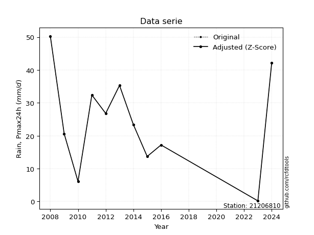</img>

</div>

> If Z-Score is active, values out of range or outliers are replaced with the station mean value.


### 4. Active continuous probability distributions from SciPy (45 of 104 available)

[scipy.stats](https://docs.scipy.org/doc/scipy/reference/stats.html) is a Python´s powerful submodule within the SciPy library for comprehensive statistical analysis, offering over 130 probability distributions (like Normal, Poisson), functions for descriptive stats (mean, variance), hypothesis testing (t-tests, chi-square), random variable generation, and statistical tests, making it essential for data science, modeling, and research. It provides tools to explore, model, and draw conclusions from data efficiently, working seamlessly with NumPy.

<div align="center">

|   id | p_dist             |   n_parameter | fit_method   | label                                                                       | active   | ref                                                                                                        |
|-----:|:-------------------|--------------:|:-------------|:----------------------------------------------------------------------------|:---------|:-----------------------------------------------------------------------------------------------------------|
|    0 | alpha              |             3 | MLE          | Alpha                                                                       | True     | [:mortar_board:](https://docs.scipy.org/doc/scipy/reference/generated/scipy.stats.alpha.html)              |
|    1 | betaprime          |             4 | MLE          | Beta prime                                                                  | True     | [:mortar_board:](https://docs.scipy.org/doc/scipy/reference/generated/scipy.stats.betaprime.html)          |
|    2 | chi2               |             3 | MLE          | Chi²                                                                        | True     | [:mortar_board:](https://docs.scipy.org/doc/scipy/reference/generated/scipy.stats.chi2.html)               |
|    3 | crystalball        |             4 | MLE          | Crystalball                                                                 | True     | [:mortar_board:](https://docs.scipy.org/doc/scipy/reference/generated/scipy.stats.crystalball.html)        |
|    4 | erlang             |             3 | MLE          | Erlang                                                                      | True     | [:mortar_board:](https://docs.scipy.org/doc/scipy/reference/generated/scipy.stats.erlang.html)             |
|    5 | expon              |             2 | MLE          | Exponential                                                                 | True     | [:mortar_board:](https://docs.scipy.org/doc/scipy/reference/generated/scipy.stats.expon.html)              |
|    6 | exponnorm          |             3 | MLE          | Exponentially modified Normal                                               | True     | [:mortar_board:](https://docs.scipy.org/doc/scipy/reference/generated/scipy.stats.exponnorm.html)          |
|    7 | f                  |             4 | MLE          | F                                                                           | True     | [:mortar_board:](https://docs.scipy.org/doc/scipy/reference/generated/scipy.stats.f.html)                  |
|    8 | fatiguelife        |             3 | MLE          | Fatigue-life (Birnbaum-Saunders)                                            | True     | [:mortar_board:](https://docs.scipy.org/doc/scipy/reference/generated/scipy.stats.fatiguelife.html)        |
|    9 | fisk               |             3 | MLE          | Fisk                                                                        | True     | [:mortar_board:](https://docs.scipy.org/doc/scipy/reference/generated/scipy.stats.fisk.html)               |
|   10 | gamma              |             3 | MLE          | Gamma                                                                       | True     | [:mortar_board:](https://docs.scipy.org/doc/scipy/reference/generated/scipy.stats.gamma.html)              |
|   11 | genexpon           |             5 | MLE          | Generalized exponential                                                     | True     | [:mortar_board:](https://docs.scipy.org/doc/scipy/reference/generated/scipy.stats.genexpon.html)           |
|   12 | genlogistic        |             3 | MLE          | Generalized logistic                                                        | True     | [:mortar_board:](https://docs.scipy.org/doc/scipy/reference/generated/scipy.stats.genlogistic.html)        |
|   13 | gibrat             |             2 | MM           | Gibrat                                                                      | True     | [:mortar_board:](https://docs.scipy.org/doc/scipy/reference/generated/scipy.stats.gibrat.html)             |
|   14 | gompertz           |             3 | MLE          | Gompertz (or truncated Gumbel)                                              | True     | [:mortar_board:](https://docs.scipy.org/doc/scipy/reference/generated/scipy.stats.gompertz.html)           |
|   15 | gumbel_l           |             2 | MM           | Gumbel Left Skew                                                            | True     | [:mortar_board:](https://docs.scipy.org/doc/scipy/reference/generated/scipy.stats.gumbel_l.html)           |
|   16 | gumbel_r           |             2 | MM           | Gumbel Right Skew                                                           | True     | [:mortar_board:](https://docs.scipy.org/doc/scipy/reference/generated/scipy.stats.gumbel_r.html)           |
|   17 | halflogistic       |             2 | MM           | Half-logistic                                                               | True     | [:mortar_board:](https://docs.scipy.org/doc/scipy/reference/generated/scipy.stats.halflogistic.html)       |
|   18 | halfnorm           |             2 | MM           | Half Normal                                                                 | True     | [:mortar_board:](https://docs.scipy.org/doc/scipy/reference/generated/scipy.stats.halfnorm.html)           |
|   19 | hypsecant          |             2 | MM           | hyperbolic secant                                                           | True     | [:mortar_board:](https://docs.scipy.org/doc/scipy/reference/generated/scipy.stats.hypsecant.html)          |
|   20 | invgamma           |             3 | MLE          | Inverted gamma                                                              | True     | [:mortar_board:](https://docs.scipy.org/doc/scipy/reference/generated/scipy.stats.invgamma.html)           |
|   21 | invgauss           |             3 | MLE          | Inverse Gaussian                                                            | True     | [:mortar_board:](https://docs.scipy.org/doc/scipy/reference/generated/scipy.stats.invgauss.html)           |
|   22 | invweibull         |             3 | MLE          | Inverted Weibull                                                            | True     | [:mortar_board:](https://docs.scipy.org/doc/scipy/reference/generated/scipy.stats.invweibull.html)         |
|   23 | johnsonsu          |             4 | MLE          | Johnson Su                                                                  | True     | [:mortar_board:](https://docs.scipy.org/doc/scipy/reference/generated/scipy.stats.johnsonsu.html)          |
|   24 | kstwobign          |             2 | MLE          | Limiting distribution of scaled Kolmogorov-Smirnov two-sided test statistic | True     | [:mortar_board:](https://docs.scipy.org/doc/scipy/reference/generated/scipy.stats.kstwobign.html)          |
|   25 | laplace            |             2 | MM           | Laplace                                                                     | True     | [:mortar_board:](https://docs.scipy.org/doc/scipy/reference/generated/scipy.stats.laplace.html)            |
|   26 | laplace_asymmetric |             3 | MLE          | Asymmetric Laplace                                                          | True     | [:mortar_board:](https://docs.scipy.org/doc/scipy/reference/generated/scipy.stats.laplace_asymmetric.html) |
|   27 | loggamma           |             3 | MLE          | Log gamma                                                                   | True     | [:mortar_board:](https://docs.scipy.org/doc/scipy/reference/generated/scipy.stats.loggamma.html)           |
|   28 | logistic           |             2 | MM           | Logistic (or Sech-squared)                                                  | True     | [:mortar_board:](https://docs.scipy.org/doc/scipy/reference/generated/scipy.stats.logistic.html)           |
|   29 | lognorm            |             3 | MLE          | Log Normal                                                                  | True     | [:mortar_board:](https://docs.scipy.org/doc/scipy/reference/generated/scipy.stats.lognorm.html)            |
|   30 | maxwell            |             2 | MM           | Maxwell                                                                     | True     | [:mortar_board:](https://docs.scipy.org/doc/scipy/reference/generated/scipy.stats.maxwell.html)            |
|   31 | mielke             |             4 | MLE          | Mielke Beta-Kappa / Dagum                                                   | True     | [:mortar_board:](https://docs.scipy.org/doc/scipy/reference/generated/scipy.stats.mielke.html)             |
|   32 | moyal              |             2 | MM           | Moyal                                                                       | True     | [:mortar_board:](https://docs.scipy.org/doc/scipy/reference/generated/scipy.stats.moyal.html)              |
|   33 | nakagami           |             3 | MLE          | Nakagami                                                                    | True     | [:mortar_board:](https://docs.scipy.org/doc/scipy/reference/generated/scipy.stats.nakagami.html)           |
|   34 | ncf                |             5 | MLE          | Non-central F distribution                                                  | True     | [:mortar_board:](https://docs.scipy.org/doc/scipy/reference/generated/scipy.stats.ncf.html)                |
|   35 | nct                |             4 | MLE          | Non-central Student’s t                                                     | True     | [:mortar_board:](https://docs.scipy.org/doc/scipy/reference/generated/scipy.stats.nct.html)                |
|   36 | norm               |             2 | MM           | Normal                                                                      | True     | [:mortar_board:](https://docs.scipy.org/doc/scipy/reference/generated/scipy.stats.norm.html)               |
|   37 | pareto             |             3 | MLE          | Pareto                                                                      | True     | [:mortar_board:](https://docs.scipy.org/doc/scipy/reference/generated/scipy.stats.pareto.html)             |
|   38 | pearson3           |             3 | MM           | Pearson type III                                                            | True     | [:mortar_board:](https://docs.scipy.org/doc/scipy/reference/generated/scipy.stats.pearson3.html)           |
|   39 | rayleigh           |             2 | MM           | Rayleigh                                                                    | True     | [:mortar_board:](https://docs.scipy.org/doc/scipy/reference/generated/scipy.stats.rayleigh.html)           |
|   40 | rice               |             3 | MLE          | Rice                                                                        | True     | [:mortar_board:](https://docs.scipy.org/doc/scipy/reference/generated/scipy.stats.rice.html)               |
|   41 | t                  |             3 | MLE          | Student’s t                                                                 | True     | [:mortar_board:](https://docs.scipy.org/doc/scipy/reference/generated/scipy.stats.t.html)                  |
|   42 | truncnorm          |             4 | MLE          | Truncated normal                                                            | True     | [:mortar_board:](https://docs.scipy.org/doc/scipy/reference/generated/scipy.stats.truncnorm.html)          |
|   43 | wald               |             2 | MM           | Wald                                                                        | True     | [:mortar_board:](https://docs.scipy.org/doc/scipy/reference/generated/scipy.stats.wald.html)               |
|   44 | weibull_min        |             3 | MLE          | Weibull minimum                                                             | True     | [:mortar_board:](https://docs.scipy.org/doc/scipy/reference/generated/scipy.stats.weibull_min.html)        |

</div>

> **n_parameter:** # arguments & localization & scale.
>
> **Fit methods:** (MLE) maximum likelihood, (MM) L-moments.
>
>**Inactive:** foldnorm, gennorm, norminvgauss, powernorm, powerlognorm, skewnorm, genextreme, anglit, arcsine, argus, beta, bradford, burr, burr12, cauchy, cosine, halfcauchy, foldcauchy, skewcauchy, wrapcauchy, dgamma, gengamma, exponweib, exponpow, truncexpon, gausshyper, genhalflogistic, genhyperbolic, geninvgauss, halfgennorm, johnsonsb, kappa4, kappa3, ksone, kstwo, loglaplace, levy, levy_l, levy_stable, ncx2, genpareto, truncpareto, lomax, powerlaw, rdist, rel_breitwigner, recipinvgauss, semicircular, studentized_range, trapezoid, triang, truncweibull_min, tukeylambda, uniform, loguniform, vonmises, vonmises_line, weibull_max, dweibull, 


## B. Probability distributions vs. Empirical distributions

A continuous probability distribution (CPD) describes probabilities for variables that can take any value within a range (like rain any time), unlike discrete variables with specific outcomes (like temperature). It uses a Probability Density Function (PDF), a curve where the total area under it equals 1, and the probability of the variable falling within an interval (a to b) is found by calculating the area under the curve between those points. A key feature is that the probability of hitting any single exact value is zero, so probabilities are always expressed for ranges, e.g., $P(a ≤ X ≤ b)$.

<div align="center">

Distributions parameters
|    |   station | p_dist                |   n |               loc |            scale | shape                  | shape1                | shape2              | shape3   |
|---:|----------:|:----------------------|----:|------------------:|-----------------:|:-----------------------|:----------------------|:--------------------|:---------|
|  0 |  21206810 | alpha                 |  12 |    -206.142       |   3796.82        | 16.502515663236252     |                       |                     |          |
|  1 |  21206810 | betaprime             |  12 |    -206.577       |  23912.3         | 280.47324233095657     | 28995.637478557626    |                     |          |
|  2 |  21206810 | chi2                  |  12 |     -82.18        |      0.924924    | 115.59005095036093     |                       |                     |          |
|  3 |  21206810 | crystalball           |  12 |      24.7417      |     13.8312      | 673.482140643855       | 5806.370351856543     |                     |          |
|  4 |  21206810 | erlang                |  12 |   -1381.93        |      0.135995    | 10343.544014236624     |                       |                     |          |
|  5 |  21206810 | expon                 |  12 |       0.2         |     24.5417      |                        |                       |                     |          |
|  6 |  21206810 | exponnorm             |  12 |      24.3264      |     13.8249      | 0.03003792270813642    |                       |                     |          |
|  7 |  21206810 | f                     |  12 |    -749.42        |    774.156       | 6469.610977153137      | 198381.4525003984     |                     |          |
|  8 |  21206810 | fatiguelife           |  12 |    -578.737       |    603.353       | 0.02289281571425835    |                       |                     |          |
|  9 |  21206810 | fisk                  |  12 |   -8953.53        |   8978.28        | 1114.505496333859      |                       |                     |          |
| 10 |  21206810 | gamma                 |  12 |   -1384.09        |      0.13579     | 10375.1144412164       |                       |                     |          |
| 11 |  21206810 | genexpon              |  12 |       0.199996    |      1.73883     | 0.07013883002352878    | 7.704162351639381e-08 | 1.6174452057921556  |          |
| 12 |  21206810 | genlogistic           |  12 |      22.2372      |      8.59602     | 1.217024391797303      |                       |                     |          |
| 13 |  21206810 | gibrat                |  12 |      14.1902      |      6.39978     |                        |                       |                     |          |
| 14 |  21206810 | gompertz              |  12 |       6.09995     |      4.48223     | 0.0004606916215227813  |                       |                     |          |
| 15 |  21206810 | gumbel_l              |  12 |      30.9664      |     10.7841      |                        |                       |                     |          |
| 16 |  21206810 | gumbel_r              |  12 |      18.5169      |     10.7841      |                        |                       |                     |          |
| 17 |  21206810 | halflogistic          |  12 |       8.34851     |     11.8252      |                        |                       |                     |          |
| 18 |  21206810 | halfnorm              |  12 |       6.43465     |     22.9444      |                        |                       |                     |          |
| 19 |  21206810 | hypsecant             |  12 |      24.7417      |      8.80518     |                        |                       |                     |          |
| 20 |  21206810 | invgamma              |  12 |    -137.562       |  21786.3         | 135.14727003417488     |                       |                     |          |
| 21 |  21206810 | invgauss              |  12 |     -57.0551      |   2640.45        | 0.031041592970242976   |                       |                     |          |
| 22 |  21206810 | invweibull            |  12 |      -1.06093e+09 |      1.06093e+09 | 81140329.02590257      |                       |                     |          |
| 23 |  21206810 | johnsonsu             |  12 |    -924.841       |    736.569       | -93.13335172878433     | 86.89481854578776     |                     |          |
| 24 |  21206810 | kstwobign             |  12 |     -28.2851      |     60.7163      |                        |                       |                     |          |
| 25 |  21206810 | laplace               |  12 |      24.7417      |      9.7801      |                        |                       |                     |          |
| 26 |  21206810 | laplace_asymmetric    |  12 |      23.4         |     11.1494      | 0.9411388804726015     |                       |                     |          |
| 27 |  21206810 | loggamma              |  12 |   -2031.27        |    325.744       | 551.5028703158364      |                       |                     |          |
| 28 |  21206810 | logistic              |  12 |      24.7417      |      7.62551     |                        |                       |                     |          |
| 29 |  21206810 | lognorm               |  12 |       0.2         |      0.75077     | 11.421129218731208     |                       |                     |          |
| 30 |  21206810 | maxwell               |  12 |      -8.03236     |     20.5381      |                        |                       |                     |          |
| 31 |  21206810 | mielke                |  12 |       0.199992    |     52.0332      | 0.8913088836936214     | 63.173974527272804    |                     |          |
| 32 |  21206810 | moyal                 |  12 |      16.8321      |      6.22621     |                        |                       |                     |          |
| 33 |  21206810 | nakagami              |  12 |       0.2         |     26.4679      | 0.44498824636120476    |                       |                     |          |
| 34 |  21206810 | ncf                   |  12 |       0.2         |      0.527287    | 0.16275589020846803    | 123.85744480095092    | 6.546508388401401   |          |
| 35 |  21206810 | nct                   |  12 |    -634.124       |     13.765       | 115616.85024659708     | 47.86482171482342     |                     |          |
| 36 |  21206810 | norm                  |  12 |      24.7417      |     13.8312      |                        |                       |                     |          |
| 37 |  21206810 | pareto                |  12 |       0.199856    |      0.000143971 | 0.09091723667968718    |                       |                     |          |
| 38 |  21206810 | pearson3              |  12 |      24.7417      |     13.8312      | 0.019064792611429175   |                       |                     |          |
| 39 |  21206810 | rayleigh              |  12 |      -1.71813     |     21.1119      |                        |                       |                     |          |
| 40 |  21206810 | rice                  |  12 |      -5.84423     |     15.7228      | 1.5994156201972416     |                       |                     |          |
| 41 |  21206810 | t                     |  12 |      24.742       |     13.832       | 6195760.710747982      |                       |                     |          |
| 42 |  21206810 | truncnorm             |  12 |      20.3908      |     17.2599      | -1.1698076136716615    | 12.7482319135654      |                     |          |
| 43 |  21206810 | wald                  |  12 |      10.9105      |     13.8311      |                        |                       |                     |          |
| 44 |  21206810 | weibull_min           |  12 |     -11.3661      |     40.549       | 2.8791512310691267     |                       |                     |          |
| 45 |  21206810 | logalpha              |  12 |     -43.5393      |   1371.89        | 29.713990041181262     |                       |                     |          |
| 46 |  21206810 | logbetaprime          |  12 |      -1.60944     |      2.22032     | 0.2617568974665274     | 0.7950147702168383    |                     |          |
| 47 |  21206810 | logchi2               |  12 |      -1.60944     |      1.24809     | 1.0352319816793587     |                       |                     |          |
| 48 |  21206810 | logcrystalball        |  12 |       2.76558     |      1.42458     | 20.25491051043248      | 495.21827344804956    |                     |          |
| 49 |  21206810 | logerlang             |  12 |      -1.60944     |     68.2454      | 0.287069745489813      |                       |                     |          |
| 50 |  21206810 | logexpon              |  12 |      -1.60944     |      4.37502     |                        |                       |                     |          |
| 51 |  21206810 | logexponnorm          |  12 |       2.76473     |      1.42459     | 0.0006011388752944005  |                       |                     |          |
| 52 |  21206810 | logf                  |  12 |      -1.60944     |      1.1951      | 1.0544377414486        | 1.066725166421677     |                     |          |
| 53 |  21206810 | logfatiguelife        |  12 |    -979.137       |    981.901       | 0.0014436140696719828  |                       |                     |          |
| 54 |  21206810 | logfisk               |  12 |      -1.60944     |      2.89854     | 0.31980141929695594    |                       |                     |          |
| 55 |  21206810 | loggamma              |  12 |     -23.1891      |      0.0882372   | 293.60745111306915     |                       |                     |          |
| 56 |  21206810 | loggenexpon           |  12 |      -1.60944     |      1.56303     | 0.06407082538496658    | 4.654084126576709     | 0.04154893959190911 |          |
| 57 |  21206810 | loggenlogistic        |  12 |       3.91805     |      3.2768e-06  | 2.829101784567387e-06  |                       |                     |          |
| 58 |  21206810 | loggibrat             |  12 |       1.67871     |      0.659205    |                        |                       |                     |          |
| 59 |  21206810 | loggompertz           |  12 |      -1.60944     |      3.28081e+12 | 3221295578713.649      |                       |                     |          |
| 60 |  21206810 | loggumbel_l           |  12 |       3.40672     |      1.11074     |                        |                       |                     |          |
| 61 |  21206810 | loggumbel_r           |  12 |       2.12444     |      1.11074     |                        |                       |                     |          |
| 62 |  21206810 | loghalflogistic       |  12 |       1.07713     |      1.21796     |                        |                       |                     |          |
| 63 |  21206810 | loghalfnorm           |  12 |       0.879937    |      2.36329     |                        |                       |                     |          |
| 64 |  21206810 | loghypsecant          |  12 |       2.76558     |      0.906916    |                        |                       |                     |          |
| 65 |  21206810 | loginvgamma           |  12 |     -41.8101      |  38795.8         | 871.971508901845       |                       |                     |          |
| 66 |  21206810 | loginvgauss           |  12 |     -14.707       |   1864.02        | 0.009360844424870167   |                       |                     |          |
| 67 |  21206810 | loginvweibull         |  12 | -334091           | 334093           | 172895.10632168996     |                       |                     |          |
| 68 |  21206810 | logjohnsonsu          |  12 |       4.04137     |      0.0062996   | 6.006259254372026      | 1.078863502070572     |                     |          |
| 69 |  21206810 | logkstwobign          |  12 |      -5.68274     |      9.73192     |                        |                       |                     |          |
| 70 |  21206810 | loglaplace            |  12 |       2.76558     |      1.00733     |                        |                       |                     |          |
| 71 |  21206810 | loglaplace_asymmetric |  12 |       3.74242     |      0.387576    | 2.869163363939193      |                       |                     |          |
| 72 |  21206810 | logloggamma           |  12 |       3.91806     |      1.66494e-06 | 1.4484705700446128e-06 |                       |                     |          |
| 73 |  21206810 | loglogistic           |  12 |       2.76558     |      0.785412    |                        |                       |                     |          |
| 74 |  21206810 | loglognorm            |  12 |   -1121.86        |   1124.63        | 0.0012687330061277886  |                       |                     |          |
| 75 |  21206810 | logmaxwell            |  12 |      -0.610071    |      2.11538     |                        |                       |                     |          |
| 76 |  21206810 | logmielke             |  12 |      -5.05886e+08 |      5.05886e+08 | 2589204957.420535      | 313789477.787871      |                     |          |
| 77 |  21206810 | logmoyal              |  12 |       1.95091     |      0.641286    |                        |                       |                     |          |
| 78 |  21206810 | lognakagami           |  12 |   -2429.65        |   2432.42        | 724579.0620576607      |                       |                     |          |
| 79 |  21206810 | logncf                |  12 |      -1.60944     |      1.04453     | 1.0518820729563356     | 1.171867349470749     | 1.0741074313749135  |          |
| 80 |  21206810 | lognct                |  12 |     -75.5544      |      1.37074     | 16593.92686142753      | 57.13460288974359     |                     |          |
| 81 |  21206810 | lognorm               |  12 |       2.76558     |      1.42458     |                        |                       |                     |          |
| 82 |  21206810 | logpareto             |  12 |      -1.60947     |      2.91263e-05 | 0.09091585749440359    |                       |                     |          |
| 83 |  21206810 | logpearson3           |  12 |       2.76558     |      1.42458     | -2.3308415182897697    |                       |                     |          |
| 84 |  21206810 | lograyleigh           |  12 |       0.0402664   |      2.17449     |                        |                       |                     |          |
| 85 |  21206810 | logrice               |  12 |    -351.311       |      1.42459     | 248.5453852482591      |                       |                     |          |
| 86 |  21206810 | logt                  |  12 |       3.27771     |      0.372379    | 1.2755138502355408     |                       |                     |          |
| 87 |  21206810 | logtruncnorm          |  12 |       2.46517     |      7.36672     | -0.5531544402259518    | 0.19722051038066746   |                     |          |
| 88 |  21206810 | logwald               |  12 |       1.34103     |      1.42456     |                        |                       |                     |          |
| 89 |  21206810 | logweibull_min        |  12 |      -1.60944     |      1.66624     | 0.49839807712257933    |                       |                     |          |

</div>

> **loc** (Location parameter): This shifts the distribution along the x-axis. For many common distributions, like the normal (Gaussian) distribution, loc represents the mean $μ$. For others, like the uniform distribution, it might represent the minimum value, or for the beta distribution, the left end of the support interval.
>
> **scale** (Scale parameter): This determines the width or spread of the distribution. For the normal distribution, scale represents the standard deviation $σ$. For a uniform distribution, it defines the length of the interval (from $loc$ to $loc + scale$).
>
> **shape** (Shape parameters): Refers to parameters that define the specific form of a probability distribution, distinct from its location (loc) and scale (scale). These parameters are required arguments for most distribution functions. For example, a normal (Gaussian) distribution is fully defined by its location (mean) and scale (standard deviation), so it has no specific shape parameters beyond loc and scale. However, other distributions have intrinsic properties that need specification, as Gamma distribution that takes a shape parameter, often named $a$ or $alpha$.


### 0. Cumulative distribution values - CDF (90 evaluated)

> Ordered by x ascending and calculating $log(f(x))$ separately. 

|   id |   Station |   date |    x |   count |    mean |     std |     zscore |   Value_initial |   station |   m |     alpha |   alpha_pdf |   betaprime |   betaprime_pdf |      chi2 |   chi2_pdf |   crystalball |   crystalball_pdf |    erlang |   erlang_pdf |    expon |   expon_pdf |   exponnorm |   exponnorm_pdf |         f |      f_pdf |   fatiguelife |   fatiguelife_pdf |      fisk |   fisk_pdf |     gamma |   gamma_pdf |    genexpon |   genexpon_pdf |   genlogistic |   genlogistic_pdf |   gibrat |   gibrat_pdf |    gompertz |   gompertz_pdf |   gumbel_l |   gumbel_l_pdf |   gumbel_r |   gumbel_r_pdf |   halflogistic |   halflogistic_pdf |   halfnorm |   halfnorm_pdf |   hypsecant |   hypsecant_pdf |   invgamma |   invgamma_pdf |   invgauss |   invgauss_pdf |   invweibull |   invweibull_pdf |   johnsonsu |   johnsonsu_pdf |   kstwobign |   kstwobign_pdf |   laplace |   laplace_pdf |   laplace_asymmetric |   laplace_asymmetric_pdf |   loggamma |   loggamma_pdf |   logistic |   logistic_pdf |    lognorm |   lognorm_pdf |   maxwell |   maxwell_pdf |      mielke |   mielke_pdf |       moyal |   moyal_pdf |    nakagami |   nakagami_pdf |        ncf |     ncf_pdf |       nct |    nct_pdf |      norm |   norm_pdf |   pareto |    pareto_pdf |   pearson3 |   pearson3_pdf |   rayleigh |   rayleigh_pdf |      rice |   rice_pdf |         t |      t_pdf |   truncnorm |   truncnorm_pdf |      wald |   wald_pdf |   weibull_min |   weibull_min_pdf |   logalpha |   logalpha_pdf |   logbetaprime |   logbetaprime_pdf |     logchi2 |   logchi2_pdf |   logcrystalball |   logcrystalball_pdf |   logerlang |   logerlang_pdf |   logexpon |   logexpon_pdf |   logexponnorm |   logexponnorm_pdf |        logf |    logf_pdf |   logfatiguelife |   logfatiguelife_pdf |     logfisk |   logfisk_pdf |   loggenexpon |   loggenexpon_pdf |   loggenlogistic |   loggenlogistic_pdf |   loggibrat |   loggibrat_pdf |   loggompertz |   loggompertz_pdf |   loggumbel_l |   loggumbel_l_pdf |   loggumbel_r |   loggumbel_r_pdf |   loghalflogistic |   loghalflogistic_pdf |   loghalfnorm |   loghalfnorm_pdf |   loghypsecant |   loghypsecant_pdf |   loginvgamma |   loginvgamma_pdf |   loginvgauss |   loginvgauss_pdf |   loginvweibull |   loginvweibull_pdf |   logjohnsonsu |   logjohnsonsu_pdf |   logkstwobign |   logkstwobign_pdf |   loglaplace |   loglaplace_pdf |   loglaplace_asymmetric |   loglaplace_asymmetric_pdf |   logloggamma |   logloggamma_pdf |   loglogistic |   loglogistic_pdf |   loglognorm |   loglognorm_pdf |   logmaxwell |   logmaxwell_pdf |   logmielke |   logmielke_pdf |   logmoyal |   logmoyal_pdf |   lognakagami |   lognakagami_pdf |      logncf |   logncf_pdf |   lognct |   lognct_pdf |   logpareto |   logpareto_pdf |   logpearson3 |   logpearson3_pdf |   lograyleigh |   lograyleigh_pdf |    logrice |   logrice_pdf |      logt |   logt_pdf |   logtruncnorm |   logtruncnorm_pdf |   logwald |   logwald_pdf |   logweibull_min |   logweibull_min_pdf |
|-----:|----------:|-------:|-----:|--------:|--------:|--------:|-----------:|----------------:|----------:|----:|----------:|------------:|------------:|----------------:|----------:|-----------:|--------------:|------------------:|----------:|-------------:|---------:|------------:|------------:|----------------:|----------:|-----------:|--------------:|------------------:|----------:|-----------:|----------:|------------:|------------:|---------------:|--------------:|------------------:|---------:|-------------:|------------:|---------------:|-----------:|---------------:|-----------:|---------------:|---------------:|-------------------:|-----------:|---------------:|------------:|----------------:|-----------:|---------------:|-----------:|---------------:|-------------:|-----------------:|------------:|----------------:|------------:|----------------:|----------:|--------------:|---------------------:|-------------------------:|-----------:|---------------:|-----------:|---------------:|-----------:|--------------:|----------:|--------------:|------------:|-------------:|------------:|------------:|------------:|---------------:|-----------:|------------:|----------:|-----------:|----------:|-----------:|---------:|--------------:|-----------:|---------------:|-----------:|---------------:|----------:|-----------:|----------:|-----------:|------------:|----------------:|----------:|-----------:|--------------:|------------------:|-----------:|---------------:|---------------:|-------------------:|------------:|--------------:|-----------------:|---------------------:|------------:|----------------:|-----------:|---------------:|---------------:|-------------------:|------------:|------------:|-----------------:|---------------------:|------------:|--------------:|--------------:|------------------:|-----------------:|---------------------:|------------:|----------------:|--------------:|------------------:|--------------:|------------------:|--------------:|------------------:|------------------:|----------------------:|--------------:|------------------:|---------------:|-------------------:|--------------:|------------------:|--------------:|------------------:|----------------:|--------------------:|---------------:|-------------------:|---------------:|-------------------:|-------------:|-----------------:|------------------------:|----------------------------:|--------------:|------------------:|--------------:|------------------:|-------------:|-----------------:|-------------:|-----------------:|------------:|----------------:|-----------:|---------------:|--------------:|------------------:|------------:|-------------:|---------:|-------------:|------------:|----------------:|--------------:|------------------:|--------------:|------------------:|-----------:|--------------:|----------:|-----------:|---------------:|-------------------:|----------:|--------------:|-----------------:|---------------------:|
|    0 |  21206810 |   2023 |  0.2 |      12 | 24.7417 | 14.4462 | -1.69884   |             0.2 |  21206810 |   1 | 0.028842  |  0.00587254 |   0.0347884 |      0.00597552 | 0.0318413 | 0.00605614 |     0.0380005 |        0.00597562 | 0.0374095 |   0.00596932 | 0        |  0.040747   |   0.0379989 |      0.0059756  | 0.0368889 | 0.00596294 |     0.0355677 |        0.00590888 | 0.0451718 | 0.00536872 | 0.0374217 |  0.00597073 | 1.79975e-07 |     0.0403367  |     0.0403431 |        0.0053033  | 0        |   0          | 0           |    0           |  0.0560428 |     0.00504837 | 0.00422896 |     0.0021434  |       0        |         0          |   0        |     0          |   0.0391628 |      0.00443648 |  0.0284367 |     0.00579032 |  0.0245426 |     0.00582052 |    0.0209548 |       0.00619478 |   0.0371853 |      0.005967   |   0.0196567 |      0.00704575 | 0.0406607 |    0.00415749 |            0.0514771 |               0.00490578 | 0.00126643 |     0.00312599 |  0.0384805 |     0.0048521  | 0.00106638 |    0.00250712 | 0.0163258 |    0.00575998 | 8.72025e-07 |    0.0939016 | 0.000143251 | 0.000176622 | 7.85245e-17 |     2.51787    | 0.00271199 | 6.66505e+09 | 0.0379955 | 0.00597839 | 0.0380005 | 0.00597562 | 0        | 631.496       |  0.0374321 |     0.0059701  | 0.00411888 |     0.00428581 | 0.0207621 | 0.00693131 | 0.0380078 | 0.00597619 | 2.50814e-09 |      0.0132662  | 0         | 0          |     0.0266447 |        0.0065435  | 0.00132944 |     0.00341033 |    5.94907e-05 |        7.01305e+10 | 5.54555e-09 |   1.29274e+07 |       0.00106638 |           0.00250712 | 1.06125e-05 |     1.37203e+10 |   0        |      0.228571  |     0.00106642 |         0.00250718 | 3.31415e-09 | 7.86906e+06 |      0.000992514 |           0.00236963 | 7.01715e-06 |   1.01064e+10 |    2.1044e-09 |         0.0409915 |         0        |             0.007305 |   0         |       0         |   7.78101e-13 |        0.981859   |     0.0108726 |        0.00973523 |   2.99791e-13 |       7.78282e-12 |          0        |              0        |      0        |          0        |     0.00511455 |         0.00563926 |    0.00111487 |        0.00282732 |    0.00169356 |        0.00435084 |      0.00233066 |          0.00731117 |      0.0189092 |         0.00881398 |       0.005235 |          0.0168163 |   0.00649756 |       0.00645028 |              0.00724537 |                  0.00651552 |    0.00815734 |        0.00709676 |    0.00379471 |        0.00481315 |   0.00104219 |       0.00246056 |     0        |         0        |  0.00103451 |      0.00299303 | 5.3777e-58 |    1.08477e-55 |    0.00109035 |        0.00255274 | 2.21246e-09 |  5.24048e+06 | 0.001112 |   0.00260818 |    0        |   3121.43       |     0.0188384 |         0.0120659 |      0        |          0        | 0.00106638 |    0.00250712 | 0.0128428 | 0.00333475 |    5.32684e-05 |           0.161313 |  0        |     0         |        1.224e-08 |          2.74738e+07 |
|    1 |  21206810 |   2010 |  6.1 |      12 | 24.7417 | 14.4462 | -1.29042   |             6.1 |  21206810 |   2 | 0.0827843 |  0.0128581  |   0.0868388 |      0.0120568  | 0.0859336 | 0.012682   |     0.0888609 |        0.0116302  | 0.0884157 |   0.0116903  | 0.213693 |  0.0320397  |   0.0888597 |      0.0116304  | 0.0880197 | 0.0117428  |     0.0866579 |        0.0117932  | 0.0897326 | 0.0101604  | 0.0884378 |  0.0116922  | 0.211787    |     0.031794   |     0.0856079 |        0.010512   | 0        |   0          | 5.06957e-09 |    0.000102783 |  0.0948685 |     0.00836593 | 0.0423137  |     0.0124093  |       0        |         0          |   0        |     0          |   0.0762676 |      0.00857903 |  0.0816643 |     0.0126992  |  0.0804369 |     0.013585   |    0.0852947 |       0.0160582  |   0.0882509 |      0.0117146  |   0.0945062 |      0.0183961  | 0.0743309 |    0.00760022 |            0.0903245 |               0.00860796 | 0.27781    |     0.227129   |  0.0798311 |     0.0096332  | 0.250798   |    0.223444   | 0.075324  |    0.0145169  | 0.143659    |    0.0217024 | 0.0179068   | 0.0092007   | 0.205649    |     0.0305491  | 0.164885   | 0.0258945   | 0.0888846 | 0.0116372  | 0.0888609 | 0.0116302  | 0.619253 |   0.00586705  |  0.0884382 |     0.0116893  | 0.0662703  |     0.0163784  | 0.0827689 | 0.0141525  | 0.0888708 | 0.0116305  | 0.0942056   |      0.0186654  | 0         | 0          |     0.0846805 |        0.0133504  | 0.295036   |     0.230196   |    0.831861    |        0.0293804   | 0.897342    |   0.0510963   |       0.250798   |           0.223444   | 0.465469    |     0.0376012   |   0.54214  |      0.104653  |     0.250797   |         0.223442   | 0.667698    | 0.042143    |      0.249908    |           0.224358   | 0.51317     |   0.0233766   |    0.444947   |         0.166286  |         0        |             0.139677 |   0.0518933 |       0.819849  |   0.965116    |        0.0342512  |     0.211127  |        0.168429   |   0.264669    |       0.316742    |          0.291456 |              0.375649 |      0.305549 |          0.312547 |     0.2132     |         0.217896   |    0.27463    |        0.227235   |    0.301273   |        0.218354   |      0.355642   |          0.190273   |      0.141146  |         0.108129   |       0.405935 |          0.171478  |   0.193308   |       0.191901   |              0.156618   |                  0.140841   |    0.159539   |        0.138796   |    0.228141   |        0.224204   |   0.249219   |       0.222531   |     0.272522 |         0.256456 |  0.302157   |      0.208799   | 0.263729   |    0.372322    |    0.250946   |        0.222886   | 0.575536    |  0.0514429   | 0.252859 |   0.22301    |    0.653976 |      0.0092046  |     0.177499  |         0.121231  |      0.281469 |          0.268671 | 0.250798   |    0.223444   | 0.0576186 | 0.0473605  |    0.605342    |           0.18723  |  0.195721 |     0.748953  |        0.76082   |          0.0498958   |
|    2 |  21206810 |   2015 | 13.7 |      12 | 24.7417 | 14.4462 | -0.764332  |            13.7 |  21206810 |   3 | 0.221198  |  0.0233334  |   0.215394  |      0.02178    | 0.220964  | 0.0226937  |     0.212343  |        0.020973   | 0.21267   |   0.0211024  | 0.423099 |  0.023507   |   0.212344  |      0.0209734  | 0.212951  | 0.0212157  |     0.212554  |        0.0214017  | 0.202309  | 0.0200573  | 0.212707  |  0.0211042  | 0.419895    |     0.0233996  |     0.203479  |        0.0210219  | 0        |   0          | 0.00204793  |    0.000559003 |  0.182639  |     0.0152856  | 0.209487   |     0.0303639  |       0.222491 |         0.0401896  |   0.24849  |     0.0330742  |   0.176964  |      0.0190783  |  0.21872   |     0.0231645  |  0.226286  |     0.0242979  |    0.252448  |       0.0265774  |   0.212819  |      0.0211553  |   0.27466   |      0.0272148  | 0.161679  |    0.0165315  |            0.186362  |               0.0177604  | 0.481191   |     0.264227   |  0.190311  |     0.0202075  | 0.458577   |    0.278531   | 0.227675  |    0.0248507  | 0.300428    |    0.0198351 | 0.198447    | 0.0360423   | 0.417613    |     0.0253965  | 0.371      | 0.0270106   | 0.212433  | 0.0209821  | 0.212343  | 0.020973   | 0.646854 |   0.00237827  |  0.212676  |     0.0210994  | 0.234077   |     0.026495   | 0.225082  | 0.0229725  | 0.212351  | 0.0209722  | 0.25951     |      0.0243933  | 0.0652715 | 0.0655941  |     0.22148   |        0.0223879  | 0.496643   |     0.256888   |    0.852323    |        0.0217966   | 0.930935    |   0.0333507   |       0.458577   |           0.278531   | 0.493463    |     0.0319349   |   0.619447 |      0.0869832 |     0.458575   |         0.27853    | 0.697439    | 0.0321267   |      0.458722    |           0.279977   | 0.530125    |   0.0188463   |    0.574538   |         0.152078  |         0        |             0.280871 |   0.638122  |       0.399268  |   0.984238    |        0.015476   |     0.388192  |        0.270634   |   0.526455    |       0.304093    |          0.559643 |              0.281946 |      0.537775 |          0.257665 |     0.44822    |         0.346347   |    0.478382   |        0.264892   |    0.489733   |        0.23821    |      0.506543   |          0.178293   |      0.277671  |         0.254003   |       0.539042 |          0.155353  |   0.431602   |       0.428461   |              0.324217   |                  0.291558   |    0.32253    |        0.280596   |    0.452972   |        0.315488   |   0.456358   |       0.277958   |     0.492786 |         0.274171 |  0.474709   |      0.209769   | 0.552023   |    0.310008    |    0.458117   |        0.277684   | 0.6123      |  0.0401937   | 0.459532 |   0.276361   |    0.660596 |      0.00730026 |     0.311983  |         0.223053  |      0.504561 |          0.270031 | 0.458577   |    0.278531   | 0.141934  | 0.217057   |    0.757269    |           0.187936 |  0.623147 |     0.328219  |        0.796144  |          0.0382274   |
|    3 |  21206810 |   2016 | 17.2 |      12 | 24.7417 | 14.4462 | -0.522053  |            17.2 |  21206810 |   4 | 0.309416  |  0.0268313  |   0.298536  |      0.0255588  | 0.306928  | 0.0262151  |     0.292785  |        0.0248594  | 0.293558  |   0.0249791  | 0.499776 |  0.0203826  |   0.292787  |      0.0248597  | 0.294229  | 0.0250832  |     0.294503  |        0.0252716  | 0.281505  | 0.0251284  | 0.2936    |  0.0249804  | 0.496275    |     0.0203186  |     0.286026  |        0.0260162  | 0.225307 |   0.0997226  | 0.00500851  |    0.00121688  |  0.243459  |     0.0195727  | 0.32307    |     0.0338491  |       0.357717 |         0.0368722  |   0.361067 |     0.0311501  |   0.255647  |      0.0260116  |  0.306443  |     0.0267237  |  0.317222  |     0.0273753  |    0.348795  |       0.0280969  |   0.29389   |      0.0250286  |   0.371389  |      0.027733   | 0.231247  |    0.0236446  |            0.260146  |               0.024792   | 0.541118   |     0.26158    |  0.271109  |     0.0259142  | 0.522204   |    0.279608   | 0.319891  |    0.027569   | 0.368956    |    0.0193443 | 0.331603    | 0.03883     | 0.502554    |     0.0231372  | 0.462972   | 0.0253945   | 0.292903  | 0.0248661  | 0.292785  | 0.0248594  | 0.654179 |   0.00184946  |  0.293553  |     0.0249761  | 0.330677   |     0.0284093  | 0.31095   | 0.0259153  | 0.292789  | 0.024858   | 0.347715    |      0.0258512  | 0.323846  | 0.0678332  |     0.305632  |        0.0255271  | 0.554632   |     0.251994   |    0.857098    |        0.0202145   | 0.938097    |   0.029685    |       0.522204   |           0.279608   | 0.500582    |     0.0306609   |   0.638731 |      0.0825754 |     0.522202   |         0.279607   | 0.704503    | 0.0300065   |      0.52267     |           0.280966   | 0.534299    |   0.0178644   |    0.608484   |         0.146227  |         0        |             0.341834 |   0.71582   |       0.290717  |   0.987393    |        0.0123778  |     0.452847  |        0.297052   |   0.592883    |       0.279034    |          0.620435 |              0.252495 |      0.594285 |          0.238949 |     0.527808   |         0.349642   |    0.538461   |        0.262255   |    0.543506   |        0.233799   |      0.546292   |          0.170926   |      0.343855  |         0.331807   |       0.573665 |          0.148909  |   0.537866   |       0.458771   |              0.397824   |                  0.357749   |    0.393125   |        0.342013   |    0.52523    |        0.317494   |   0.519876   |       0.27923    |     0.554233 |         0.265102 |  0.521653   |      0.202475   | 0.618441   |    0.273699    |    0.521555   |        0.278808   | 0.621162    |  0.0377442   | 0.522635 |   0.277202   |    0.66221  |      0.00689445 |     0.367685  |         0.268357  |      0.564729 |          0.258181 | 0.522204   |    0.279608   | 0.208981  | 0.392437   |    0.800007    |           0.187726 |  0.689419 |     0.257806  |        0.804549  |          0.0357001   |
|    4 |  21206810 |   2009 | 20.6 |      12 | 24.7417 | 14.4462 | -0.286697  |            20.6 |  21206810 |   5 | 0.404162  |  0.0286079  |   0.389969  |      0.0279802  | 0.39987   | 0.0281888  |     0.3823    |        0.0275791  | 0.383418  |   0.0276575  | 0.564491 |  0.0177457  |   0.382303  |      0.0275794  | 0.384387  | 0.0277247  |     0.385233  |        0.0278649  | 0.374097  | 0.0290791  | 0.383463  |  0.0276581  | 0.560831    |     0.0177147  |     0.380988  |        0.0295308  | 0.500624 |   0.0622394  | 0.0111809   |    0.00258214  |  0.317783  |     0.0241916  | 0.438521   |     0.033521   |       0.476175 |         0.0326954  |   0.463013 |     0.0287406  |   0.355511  |      0.0324895  |  0.40097   |     0.0285906  |  0.412865  |     0.0285818  |    0.443925  |       0.0275719  |   0.383894  |      0.0276908  |   0.464198  |      0.0266473  | 0.327382  |    0.0334743  |            0.359698  |               0.0342793  | 0.587797   |     0.255406   |  0.367459  |     0.030481   | 0.572329   |    0.275427   | 0.415794  |    0.0285719  | 0.434059    |    0.0189647 | 0.459963    | 0.0360344   | 0.577453    |     0.020918   | 0.545642   | 0.0231558   | 0.382435  | 0.0275816  | 0.3823    | 0.0275791  | 0.659864 |   0.00151588  |  0.383405  |     0.0276555  | 0.428087   |     0.0286374  | 0.402269  | 0.0275833  | 0.382299  | 0.0275774  | 0.436648    |      0.0262948  | 0.516092  | 0.046142   |     0.396019  |        0.0274291  | 0.599459   |     0.244531   |    0.860641    |        0.0190852   | 0.943214    |   0.0270918   |       0.572329   |           0.275427   | 0.506027    |     0.0297266   |   0.653323 |      0.0792401 |     0.572327   |         0.275426   | 0.709776    | 0.0284855   |      0.573028    |           0.276641   | 0.537456    |   0.0171535   |    0.63441    |         0.14117   |         0        |             0.399439 |   0.762475  |       0.229556  |   0.98944     |        0.0103687  |     0.508039  |        0.314183   |   0.64121     |       0.256543    |          0.663904 |              0.229576 |      0.636008 |          0.223604 |     0.589933   |         0.337065   |    0.585261   |        0.256061   |    0.585146   |        0.227489   |      0.576537   |          0.164312   |      0.410731  |         0.412935   |       0.600037 |          0.143453  |   0.613634   |       0.383555   |              0.467884   |                  0.420752   |    0.459922   |        0.400125   |    0.581922   |        0.309759   |   0.569949   |       0.275224   |     0.601131 |         0.254421 |  0.557526   |      0.195057   | 0.665221   |    0.245133    |    0.571543   |        0.274707   | 0.627808    |  0.0359712   | 0.572319 |   0.272963   |    0.663427 |      0.00660225 |     0.419983  |         0.313019  |      0.610239 |          0.246056 | 0.572329   |    0.275427   | 0.299852  | 0.628967   |    0.833844    |           0.187433 |  0.731898 |     0.214799  |        0.810822  |          0.0338731   |
|    5 |  21206810 |   2014 | 23.4 |      12 | 24.7417 | 14.4462 | -0.0928735 |            23.4 |  21206810 |   6 | 0.484712  |  0.0287267  |   0.469692  |      0.0287716  | 0.479583  | 0.0285551  |     0.461362  |        0.0287084  | 0.46263   |   0.0287353  | 0.611449 |  0.0158323  |   0.461365  |      0.0287085  | 0.463725  | 0.0287573  |     0.464872  |        0.0288289  | 0.458347  | 0.0308226  | 0.462676  |  0.0287353  | 0.607733    |     0.0158228  |     0.465778  |        0.0307458  | 0.642073 |   0.0405404  | 0.0211723   |    0.00477385  |  0.390903  |     0.028002   | 0.529489   |     0.0312193  |       0.562456 |         0.0289063  |   0.540342 |     0.0264571  |   0.451685  |      0.0357346  |  0.481587  |     0.028791   |  0.492693  |     0.0282491  |    0.519155  |       0.0260287  |   0.463172  |      0.0287482  |   0.536587  |      0.0249689  | 0.435905  |    0.0445706  |            0.469705  |               0.044763   | 0.619958   |     0.24904    |  0.456127  |     0.0325323  | 0.6071     |    0.269889   | 0.495526  |    0.0282098  | 0.486783    |    0.0187015 | 0.555114    | 0.0317691   | 0.633456    |     0.0190852  | 0.607569   | 0.0210533   | 0.461497  | 0.0287065  | 0.461362  | 0.0287084  | 0.663818 |   0.00131744  |  0.462612  |     0.0287346  | 0.507258   |     0.0277686  | 0.480201  | 0.0279207  | 0.461356  | 0.0287065  | 0.50988     |      0.0259001  | 0.626412  | 0.0334396  |     0.473816  |        0.0279802  | 0.630192   |     0.23755    |    0.863026    |        0.0183461   | 0.946558    |   0.0254086   |       0.6071     |           0.269889   | 0.509775    |     0.0291029   |   0.663276 |      0.0769651 |     0.607097   |         0.269888   | 0.713343    | 0.0274863   |      0.607945    |           0.27097    | 0.539612    |   0.0166833   |    0.652163   |         0.137411  |         0        |             0.445899 |   0.789508  |       0.195789  |   0.990682    |        0.00914917 |     0.54869   |        0.323264   |   0.672855    |       0.240022    |          0.692155 |              0.213849 |      0.663805 |          0.212612 |     0.631936   |         0.32126    |    0.617504   |        0.249671   |    0.61378    |        0.221692   |      0.597162   |          0.159328   |      0.46769   |         0.482741   |       0.618066 |          0.13946   |   0.65955    |       0.337973   |              0.5247     |                  0.471845   |    0.513851   |        0.447042   |    0.620798   |        0.299725   |   0.604702   |       0.269818   |     0.632988 |         0.245317 |  0.582013   |      0.18913    | 0.695217   |    0.225723    |    0.606227   |        0.269247   | 0.632317    |  0.0347992   | 0.606777 |   0.267458   |    0.664256 |      0.00640973 |     0.462224  |         0.350892  |      0.640986 |          0.236322 | 0.6071     |    0.269889   | 0.391987  | 0.810655   |    0.857715    |           0.187159 |  0.757631 |     0.189674  |        0.815061  |          0.0326665   |
|    6 |  21206810 |   2012 | 26.8 |      12 | 24.7417 | 14.4462 |  0.142483  |            26.8 |  21206810 |   7 | 0.580471  |  0.0273449  |   0.566967  |      0.0281678  | 0.57531   | 0.0274945  |     0.559152  |        0.0285261  | 0.560394  |   0.0284847  | 0.661716 |  0.013784   |   0.559155  |      0.028526   | 0.561463  | 0.0284474  |     0.56269   |        0.0284226  | 0.563416  | 0.0305272  | 0.560439  |  0.028484   | 0.658005    |     0.013795   |     0.569528  |        0.0298611  | 0.751181 |   0.0251374  | 0.0451634   |    0.0099432   |  0.493147  |     0.0319381  | 0.628825   |     0.0270503  |       0.65281  |         0.0242635  |   0.625241 |     0.0234525  |   0.573741  |      0.0351846  |  0.577719  |     0.0274962  |  0.586097  |     0.0264737  |    0.603235  |       0.0233191  |   0.560933  |      0.0284702  |   0.617208  |      0.0223846  | 0.594895  |    0.0414214  |            0.602007  |               0.0335952  | 0.653192   |     0.240621   |  0.567075  |     0.0321947  | 0.643191   |    0.261804   | 0.58892   |    0.0265234  | 0.549887    |    0.0184255 | 0.653349    | 0.0260162   | 0.69459     |     0.0168831  | 0.674644   | 0.0183991   | 0.559271  | 0.0285191  | 0.559152  | 0.0285261  | 0.667972 |   0.00113485  |  0.560377  |     0.0284857  | 0.598418   |     0.0256946  | 0.574027  | 0.0270424  | 0.55914   | 0.0285245  | 0.595893    |      0.0245448  | 0.721405  | 0.0232001  |     0.568285  |        0.0273563  | 0.661838   |     0.228758   |    0.865464    |        0.0176079   | 0.94989     |   0.0237407   |       0.643191   |           0.261804   | 0.51368     |     0.0284692   |   0.673558 |      0.0746151 |     0.643188   |         0.261803   | 0.717003    | 0.0264851   |      0.644172    |           0.262719   | 0.541843    |   0.0162093   |    0.670526   |         0.133269  |         0        |             0.501309 |   0.814008  |       0.166378  |   0.991844    |        0.00800814 |     0.593007  |        0.329393   |   0.704217    |       0.222326    |          0.720063 |              0.19767  |      0.691852 |          0.200861 |     0.674107   |         0.299773   |    0.650821   |        0.241221   |    0.643376   |        0.214446   |      0.618405   |          0.153809   |      0.538893  |         0.568871   |       0.636692 |          0.135118  |   0.702448   |       0.295387   |              0.592782   |                  0.533069   |    0.578223   |        0.503045   |    0.660532   |        0.285493   |   0.640793   |       0.261877   |     0.665545 |         0.234453 |  0.607215   |      0.182329   | 0.724493   |    0.206059    |    0.642237   |        0.26126    | 0.636957    |  0.0336189   | 0.642544 |   0.259471   |    0.665112 |      0.00621629 |     0.512986  |         0.398992  |      0.672295 |          0.225115 | 0.643191   |    0.261804   | 0.509541  | 0.891929   |    0.883083    |           0.186806 |  0.781771 |     0.166794  |        0.81941   |          0.0314521   |
|    7 |  21206810 |   2025 | 28.7 |      12 | 24.7417 | 14.4462 |  0.274006  |            28.7 |  21206810 |   8 | 0.631176  |  0.0259665  |   0.619574  |      0.0271298  | 0.626452  | 0.0262727  |     0.612634  |        0.0276864  | 0.613765  |   0.027611   | 0.686918 |  0.0127572  |   0.612637  |      0.0276862  | 0.614734  | 0.0275444  |     0.615865  |        0.0274702  | 0.620298  | 0.0292241  | 0.613807  |  0.0276099  | 0.683236    |     0.0127772  |     0.624929  |        0.0283502  | 0.793481 |   0.0196676  | 0.0684033   |    0.0148225   |  0.555343  |     0.0334171  | 0.677759   |     0.0244456  |       0.696524 |         0.0217695  |   0.668154 |     0.021716   |   0.638505  |      0.0327817  |  0.628747  |     0.0261537  |  0.635022  |     0.0249777  |    0.645915  |       0.021592   |   0.614262  |      0.0275827  |   0.658249  |      0.0208084  | 0.666423  |    0.0341078  |            0.660982  |               0.028617   | 0.669509   |     0.235789   |  0.626935  |     0.0306717  | 0.660959   |    0.256927   | 0.638013  |    0.0251051  | 0.584763    |    0.0182879 | 0.699823    | 0.022935    | 0.725519    |     0.0156775  | 0.708202   | 0.0169305   | 0.612738  | 0.0276771  | 0.612634  | 0.0276864  | 0.670048 |   0.00105257  |  0.61375   |     0.0276129  | 0.645825   |     0.0241712  | 0.624462  | 0.0259839  | 0.612619  | 0.027685   | 0.641497    |      0.0234194  | 0.76149   | 0.0191543  |     0.619435  |        0.0264203  | 0.67734    |     0.223846   |    0.866658    |        0.0172528   | 0.951489    |   0.0229438   |       0.660959   |           0.256927   | 0.51562     |     0.0281604   |   0.678629 |      0.073456  |     0.660956   |         0.256927   | 0.7188      | 0.0260023   |      0.661999    |           0.257752   | 0.542945    |   0.0159797   |    0.679581   |         0.13113   |         0        |             0.53185  |   0.82496   |       0.153626  |   0.992374    |        0.00748728 |     0.615626  |        0.330874   |   0.719141    |       0.21346     |          0.73333  |              0.189754 |      0.705407 |          0.194933 |     0.694229   |         0.287643   |    0.667179   |        0.236374   |    0.657927   |        0.210411   |      0.628843   |          0.150958   |      0.579469  |         0.616266   |       0.645871 |          0.132898  |   0.722008   |       0.275969   |              0.630442   |                  0.566936   |    0.613727   |        0.533932   |    0.679805   |        0.277141   |   0.658569   |       0.257073   |     0.681404 |         0.228581 |  0.619581   |      0.17874    | 0.738281   |    0.196577    |    0.65997    |        0.256438   | 0.63924     |  0.0330477   | 0.660155 |   0.254668   |    0.665535 |      0.00612282 |     0.541265  |         0.427252  |      0.687513 |          0.219188 | 0.660959   |    0.256927   | 0.569752  | 0.857896   |    0.895871    |           0.186604 |  0.792839 |     0.156537  |        0.821544  |          0.0308646   |
|    8 |  21206810 |   2011 | 32.4 |      12 | 24.7417 | 14.4462 |  0.530129  |            32.4 |  21206810 |   9 | 0.720976  |  0.0224232  |   0.714481  |      0.0239506  | 0.717811  | 0.0229346  |     0.710109  |        0.0247444  | 0.710868  |   0.0246246  | 0.730734 |  0.0109718  |   0.710111  |      0.0247441  | 0.711511  | 0.0245203  |     0.712229  |        0.0243785  | 0.721077  | 0.0249451  | 0.710905  |  0.024623   | 0.727153    |     0.0110058  |     0.722201  |        0.0239923  | 0.852149 |   0.0126812  | 0.149858    |    0.0308807   |  0.680876  |     0.0337993  | 0.758815   |     0.0194203  |       0.768626 |         0.0173027  |   0.742223 |     0.0183304  |   0.747374  |      0.0257721  |  0.71932   |     0.0226461  |  0.721054  |     0.021419   |    0.719383  |       0.018121   |   0.711222  |      0.0245776  |   0.72945   |      0.0176811  | 0.771496  |    0.0233642  |            0.751925  |               0.0209404  | 0.697542   |     0.226388   |  0.731904  |     0.0257321  | 0.691534   |    0.247111   | 0.724786  |    0.0216842  | 0.651973    |    0.0180469 | 0.774533    | 0.0176165   | 0.779296    |     0.0134118  | 0.765729   | 0.0142002   | 0.710173  | 0.0247327  | 0.710109  | 0.0247444  | 0.67369  |   0.000921338 |  0.710863  |     0.0246275  | 0.729053   |     0.0207404  | 0.715384  | 0.0229829  | 0.71009   | 0.0247437  | 0.723217    |      0.0206432  | 0.821139  | 0.0134944  |     0.712305  |        0.023579   | 0.703925   |     0.214481   |    0.868713    |        0.0166512   | 0.954189    |   0.021603    |       0.691534   |           0.247111   | 0.519002    |     0.0276311   |   0.687414 |      0.071448  |     0.691531   |         0.247111   | 0.721903    | 0.0251827   |      0.692664    |           0.247768   | 0.544859    |   0.0155883   |    0.695249   |         0.127277  |         0        |             0.59055  |   0.842359  |       0.133905  |   0.99323     |        0.00664686 |     0.655766  |        0.330503   |   0.744086    |       0.198022    |          0.755512 |              0.176197 |      0.728411 |          0.184483 |     0.727743   |         0.264914   |    0.695281   |        0.226947   |    0.682983   |        0.202729   |      0.646838   |          0.145833   |      0.659425  |         0.702287   |       0.661747 |          0.128935  |   0.753536   |       0.24467    |              0.703078   |                  0.632255   |    0.682011   |        0.593338   |    0.712441   |        0.260843   |   0.689169   |       0.247385   |     0.708467 |         0.217668 |  0.64086    |      0.172186   | 0.761137   |    0.180571    |    0.690491   |        0.246725   | 0.643188    |  0.0320746   | 0.690465 |   0.245019   |    0.666268 |      0.0059638  |     0.596518  |         0.486234  |      0.713438 |          0.208352 | 0.691534   |    0.247111   | 0.665426  | 0.707128   |    0.918475    |           0.186207 |  0.810809 |     0.140213  |        0.825225  |          0.0298643   |
|    9 |  21206810 |   2013 | 35.3 |      12 | 24.7417 | 14.4462 |  0.730874  |            35.3 |  21206810 |  10 | 0.781397  |  0.0192146  |   0.779381  |      0.0207353  | 0.779813  | 0.0197772  |     0.77738   |        0.0215532  | 0.777773  |   0.0214244  | 0.760744 |  0.00974898 |   0.777381  |      0.0215528  | 0.778099  | 0.021313   |     0.778372  |        0.0211537  | 0.787418  | 0.0207544  | 0.777805  |  0.0214225  | 0.757274    |     0.0097908  |     0.785997  |        0.0199768  | 0.883658 |   0.00927098 | 0.266905    |    0.0508562   |  0.775658  |     0.0310918  | 0.809839   |     0.0158391  |       0.814273 |         0.0142475  |   0.791628 |     0.015761   |   0.813598  |      0.0199802  |  0.780389  |     0.0194337  |  0.778747  |     0.0183557  |    0.768092  |       0.0154993  |   0.777982  |      0.0213728  |   0.77725   |      0.0153041  | 0.83013   |    0.017369   |            0.805791  |               0.0163935  | 0.716642   |     0.219166   |  0.79973   |     0.0210034  | 0.712389   |    0.23935    | 0.783342  |    0.0186749  | 0.70406     |    0.0178785 | 0.820472    | 0.0141714   | 0.815737    |     0.0117362  | 0.804017   | 0.0122341   | 0.77741   | 0.0215417  | 0.77738   | 0.0215532  | 0.676238 |   0.000838616 |  0.777776  |     0.0214274  | 0.78503    |     0.0178542  | 0.777845  | 0.020032   | 0.777359  | 0.021553   | 0.779458    |      0.0181082  | 0.855616  | 0.0104418  |     0.776562  |        0.0206591  | 0.72201    |     0.207415   |    0.870123    |        0.0162456   | 0.956002    |   0.0207062   |       0.712389   |           0.23935    | 0.521355    |     0.0272696   |   0.693479 |      0.0700617 |     0.712386   |         0.23935    | 0.724038    | 0.0246287   |      0.71357     |           0.239884   | 0.546184    |   0.0153225   |    0.706041   |         0.12451   |         0        |             0.635916 |   0.853311  |       0.121848  |   0.993777    |        0.00611029 |     0.683995  |        0.327743   |   0.760603    |       0.187383    |          0.770219 |              0.166985 |      0.743911 |          0.177154 |     0.749745   |         0.24838    |    0.714429   |        0.219709   |    0.700115   |        0.196932   |      0.659183   |          0.142167   |      0.722077  |         0.75777    |       0.672679 |          0.126116  |   0.773643   |       0.22471    |              0.759422   |                  0.682923   |    0.734819   |        0.639281   |    0.734274   |        0.248425   |   0.710051   |       0.239712   |     0.726783 |         0.209628 |  0.655418   |      0.167433   | 0.776154   |    0.169876    |    0.711317   |        0.23904    | 0.645909    |  0.0314146   | 0.711147 |   0.2374     |    0.666774 |      0.00585607 |     0.640327  |         0.537474  |      0.730963 |          0.200487 | 0.712389   |    0.23935    | 0.720529  | 0.578941   |    0.934425    |           0.185897 |  0.822381 |     0.129922  |        0.827756  |          0.0291862   |
|   10 |  21206810 |   2024 | 42.2 |      12 | 24.7417 | 14.4462 |  1.20851   |            42.2 |  21206810 |  11 | 0.887596  |  0.0117566  |   0.893983  |      0.0125633  | 0.889441  | 0.0121335  |     0.89657   |        0.013004   | 0.896216  |   0.0129296  | 0.819383 |  0.00735962 |   0.896569  |      0.0130038  | 0.895899  | 0.0128658  |     0.895235  |        0.0127724  | 0.897027  | 0.0114439  | 0.896236  |  0.0129278  | 0.816244    |     0.00741214 |     0.892409  |        0.0112816  | 0.930067 |   0.00479007 | 0.765218    |    0.0759288   |  0.941221  |     0.0154466  | 0.894729   |     0.00922887 |       0.891939 |         0.00864445 |   0.880952 |     0.010319   |   0.91289   |      0.00977    |  0.887851  |     0.0118918  |  0.880933  |     0.011469   |    0.855853  |       0.0101886  |   0.896119  |      0.0128976  |   0.865003  |      0.010315   | 0.916109  |    0.00857775 |            0.891528  |               0.00915633 | 0.754341   |     0.202896   |  0.908001  |     0.0109547  | 0.75355    |    0.221372   | 0.887512  |    0.0116748  | 0.826191    |    0.0175331 | 0.896254    | 0.0082843   | 0.88414     |     0.0082072  | 0.87426    | 0.00830845  | 0.896538  | 0.0129983  | 0.89657   | 0.013004   | 0.681478 |   0.000689501 |  0.896236  |     0.012931   | 0.885105   |     0.0113212  | 0.889936  | 0.0125047  | 0.896552  | 0.0130049  | 0.882599    |      0.0118359  | 0.910486  | 0.00596085 |     0.892369  |        0.0128953  | 0.757662   |     0.19178    |    0.872951    |        0.0154492   | 0.959541    |   0.018964    |       0.75355    |           0.221372   | 0.526159    |     0.0265484   |   0.705736 |      0.0672601 |     0.753547   |         0.221372   | 0.728337    | 0.0235379   |      0.754804    |           0.221651   | 0.548872    |   0.0147961   |    0.72775    |         0.11866   |         0        |             0.741897 |   0.873112  |       0.100798  |   0.994777    |        0.0051278  |     0.741505  |        0.314846   |   0.792144    |       0.166177    |          0.798391 |              0.148843 |      0.774193 |          0.162126 |     0.791024   |         0.214225   |    0.752222   |        0.203414   |    0.734142   |        0.18408    |      0.683879   |          0.134477   |      0.863053  |         0.791088   |       0.694669 |          0.120225  |   0.810408   |       0.188213   |              0.891682   |                  0.80186    |    0.858296   |        0.746703   |    0.776213   |        0.221166   |   0.751293   |       0.221906   |     0.762671 |         0.192291 |  0.684412   |      0.157335   | 0.80461    |    0.14926     |    0.752437   |        0.221225   | 0.6514      |  0.0301095   | 0.751991 |   0.219774   |    0.667801 |      0.00564328 |     0.748729  |         0.691276  |      0.765271 |          0.183784 | 0.75355    |    0.221372   | 0.803017  | 0.360052   |    0.967551    |           0.185172 |  0.843862 |     0.111298  |        0.832846  |          0.0278458   |
|   11 |  21206810 |   2008 | 50.3 |      12 | 24.7417 | 14.4462 |  1.76921   |            50.3 |  21206810 |  12 | 0.955128  |  0.00545997 |   0.963895  |      0.00532308 | 0.958504  | 0.0054764  |     0.96769   |        0.00523078 | 0.967118  |   0.00524381 | 0.870157 |  0.00529073 |   0.967689  |      0.00523081 | 0.966614  | 0.00525507 |     0.965703  |        0.0052783  | 0.959601  | 0.00479867 | 0.967126  |  0.00524278 | 0.86746     |     0.00534623 |     0.955388  |        0.00497838 | 0.958212 |   0.00247263 | 0.999854    |    0.000287754 |  0.997536  |     0.00137206 | 0.948868   |     0.00461809 |       0.944027 |         0.00460092 |   0.944099 |     0.00559227 |   0.965099  |      0.00395578 |  0.955977  |     0.00547864 |  0.948394  |     0.00566194 |    0.919636  |       0.00589239 |   0.966911  |      0.00524635 |   0.929864  |      0.00597961 | 0.963354  |    0.00374701 |            0.945251  |               0.00462147 | 0.788473   |     0.185729   |  0.96616   |     0.00428756 | 0.79073    |    0.201892   | 0.955348  |    0.00555141 | 0.965624    |    0.0157395 | 0.945754    | 0.00434955  | 0.936966    |     0.00501155 | 0.92741    | 0.00503968  | 0.967644  | 0.00523217 | 0.96769   | 0.00523078 | 0.686544 |   0.000568831 |  0.967139  |     0.00524294 | 0.951948   |     0.00560806 | 0.96096   | 0.00556375 | 0.96768   | 0.00523176 | 0.952718    |      0.00585926 | 0.946736  | 0.00329537 |     0.964686  |        0.00551269 | 0.789923   |     0.175591   |    0.8756      |        0.0147244   | 0.962732    |   0.0174027   |       0.790731   |           0.201892   | 0.530761    |     0.0258777   |   0.717312 |      0.0646142 |     0.790728   |         0.201893   | 0.732381    | 0.0225411   |      0.792012    |           0.201932   | 0.551427    |   0.0143112   |    0.748074   |         0.112831  |         0.999959 |             0.863338 |   0.889313  |       0.0843469 |   0.995604    |        0.00431577 |     0.794964  |        0.292502   |   0.819598    |       0.146796    |          0.823063 |              0.132421 |      0.801392 |          0.147765 |     0.825824   |         0.182612   |    0.786443   |        0.186235   |    0.765297   |        0.1707     |      0.706827   |          0.126916   |      0.979744  |         0.42747    |       0.715271 |          0.114441  |   0.840735   |       0.158106   |              0.970475   |                  0.21857    |    0.999949   |        0.86994    |    0.812645   |        0.193851   |   0.78858    |       0.202577   |     0.794905 |         0.174841 |  0.711157   |      0.147296   | 0.829195   |    0.131121    |    0.789605   |        0.201902   | 0.65658     |  0.0289102   | 0.788924 |   0.200689   |    0.668774 |      0.005448   |     0.895835  |         1.07005   |      0.796087 |          0.167229 | 0.79073    |    0.201892   | 0.853611  | 0.228048   |    0.999994    |           0.184356 |  0.862026 |     0.0960567 |        0.837626  |          0.0266151   |

An Empirical Distribution Function (EDF) is a step-function estimate of a true cumulative distribution function (CDF) based on observed sample data, representing the proportion of data points less than or equal to a given value. It is calculated by ordering your data and jumping up by $1/n$ (where $n$ is sample size) at each unique data point, allowing analysis without assuming an underlying population distribution, and it gets closer to the true CDF as the sample size grows.


### 1. Empirical - EDF California (1923)

California´s estimates the true probability distribution of water-related data (like rainfall, streamflow) using observed samples, crucial for risk assessment.

<div align="center">


$P=m/n$


</div>


**1.1. Empirical values**

<div align="center">

|                | 0                   | 1                   | 2                  | 3                  | 4                  | 5              | 6                  | 7                  | 8              | 9                  | 10                 | 11             |
|:---------------|:--------------------|:--------------------|:-------------------|:-------------------|:-------------------|:---------------|:-------------------|:-------------------|:---------------|:-------------------|:-------------------|:---------------|
| date           | 2023                | 2010                | 2015               | 2016               | 2009               | 2014           | 2012               | 2025               | 2011           | 2013               | 2024               | 2008           |
| x              | 0.2                 | 6.1                 | 13.7               | 17.2               | 20.6               | 23.4           | 26.8               | 28.7               | 32.4           | 35.3               | 42.2               | 50.3           |
| m              | 1                   | 2                   | 3                  | 4                  | 5                  | 6              | 7                  | 8                  | 9              | 10                 | 11                 | 12             |
| empirical_dist | edf_california      | edf_california      | edf_california     | edf_california     | edf_california     | edf_california | edf_california     | edf_california     | edf_california | edf_california     | edf_california     | edf_california |
| empirical      | 0.08333333333333333 | 0.16666666666666666 | 0.25               | 0.3333333333333333 | 0.4166666666666667 | 0.5            | 0.5833333333333334 | 0.6666666666666666 | 0.75           | 0.8333333333333334 | 0.9166666666666666 | 1.0            |
| empirical_tr   | 1.090909090909091   | 1.2                 | 1.3333333333333333 | 1.4999999999999998 | 1.7142857142857144 | 2.0            | 2.4000000000000004 | 2.9999999999999996 | 4.0            | 6.000000000000002  | 11.999999999999995 | inf            |

</div>


**1.2. Kolmogorov-Smirnov fit test (sorted by Δ)**


<div align="center">

|                | 0                   | 1                     | 2                   | 3                   | 4                   | 5                   | 6                   | 7                   | 8                   | 9                   | 10                  | 11                  | 12                  | 13                  | 14                  | 15                  | 16                  | 17                  | 18                  | 19                  | 20                  | 21                  | 22                  | 23                  | 24                  | 25                  | 26                  | 27                  | 28                  | 29                  | 30                  | 31                  | 32                  | 33                  | 34                  | 35                  | 36                  | 37                  | 38                  | 39                  | 40                  | 41                  | 42                  | 43                  | 44                  | 45                  | 46                  | 47                  | 48                  | 49                  | 50                  | 51                  | 52                  | 53                  | 54                  | 55                  | 56                  | 57                  | 58                  | 59                  | 60                  | 61                  | 62                  | 63                  | 64                  | 65                  | 66                  | 67                  | 68                  | 69                  | 70                  | 71                  | 72                  | 73                  | 74                  | 75                  | 76                  | 77                  | 78                  | 79                  | 80                  | 81                  | 82                  | 83                  | 84                  | 85                  | 86                  | 87                  | 88                  | 89                  |
|:---------------|:--------------------|:----------------------|:--------------------|:--------------------|:--------------------|:--------------------|:--------------------|:--------------------|:--------------------|:--------------------|:--------------------|:--------------------|:--------------------|:--------------------|:--------------------|:--------------------|:--------------------|:--------------------|:--------------------|:--------------------|:--------------------|:--------------------|:--------------------|:--------------------|:--------------------|:--------------------|:--------------------|:--------------------|:--------------------|:--------------------|:--------------------|:--------------------|:--------------------|:--------------------|:--------------------|:--------------------|:--------------------|:--------------------|:--------------------|:--------------------|:--------------------|:--------------------|:--------------------|:--------------------|:--------------------|:--------------------|:--------------------|:--------------------|:--------------------|:--------------------|:--------------------|:--------------------|:--------------------|:--------------------|:--------------------|:--------------------|:--------------------|:--------------------|:--------------------|:--------------------|:--------------------|:--------------------|:--------------------|:--------------------|:--------------------|:--------------------|:--------------------|:--------------------|:--------------------|:--------------------|:--------------------|:--------------------|:--------------------|:--------------------|:--------------------|:--------------------|:--------------------|:--------------------|:--------------------|:--------------------|:--------------------|:--------------------|:--------------------|:--------------------|:--------------------|:--------------------|:--------------------|:--------------------|:--------------------|:--------------------|
| station        | 21206810            | 21206810              | 21206810            | 21206810            | 21206810            | 21206810            | 21206810            | 21206810            | 21206810            | 21206810            | 21206810            | 21206810            | 21206810            | 21206810            | 21206810            | 21206810            | 21206810            | 21206810            | 21206810            | 21206810            | 21206810            | 21206810            | 21206810            | 21206810            | 21206810            | 21206810            | 21206810            | 21206810            | 21206810            | 21206810            | 21206810            | 21206810            | 21206810            | 21206810            | 21206810            | 21206810            | 21206810            | 21206810            | 21206810            | 21206810            | 21206810            | 21206810            | 21206810            | 21206810            | 21206810            | 21206810            | 21206810            | 21206810            | 21206810            | 21206810            | 21206810            | 21206810            | 21206810            | 21206810            | 21206810            | 21206810            | 21206810            | 21206810            | 21206810            | 21206810            | 21206810            | 21206810            | 21206810            | 21206810            | 21206810            | 21206810            | 21206810            | 21206810            | 21206810            | 21206810            | 21206810            | 21206810            | 21206810            | 21206810            | 21206810            | 21206810            | 21206810            | 21206810            | 21206810            | 21206810            | 21206810            | 21206810            | 21206810            | 21206810            | 21206810            | 21206810            | 21206810            | 21206810            | 21206810            | 21206810            |
| empirical_dist | edf_california      | edf_california        | edf_california      | edf_california      | edf_california      | edf_california      | edf_california      | edf_california      | edf_california      | edf_california      | edf_california      | edf_california      | edf_california      | edf_california      | edf_california      | edf_california      | edf_california      | edf_california      | edf_california      | edf_california      | edf_california      | edf_california      | edf_california      | edf_california      | edf_california      | edf_california      | edf_california      | edf_california      | edf_california      | edf_california      | edf_california      | edf_california      | edf_california      | edf_california      | edf_california      | edf_california      | edf_california      | edf_california      | edf_california      | edf_california      | edf_california      | edf_california      | edf_california      | edf_california      | edf_california      | edf_california      | edf_california      | edf_california      | edf_california      | edf_california      | edf_california      | edf_california      | edf_california      | edf_california      | edf_california      | edf_california      | edf_california      | edf_california      | edf_california      | edf_california      | edf_california      | edf_california      | edf_california      | edf_california      | edf_california      | edf_california      | edf_california      | edf_california      | edf_california      | edf_california      | edf_california      | edf_california      | edf_california      | edf_california      | edf_california      | edf_california      | edf_california      | edf_california      | edf_california      | edf_california      | edf_california      | edf_california      | edf_california      | edf_california      | edf_california      | edf_california      | edf_california      | edf_california      | edf_california      | edf_california      |
| p_dist         | kstwobign           | loglaplace_asymmetric | laplace_asymmetric  | fisk                | nct                 | t                   | crystalball         | norm                | exponnorm           | pearson3            | gamma               | erlang              | johnsonsu           | f                   | betaprime           | fatiguelife         | chi2                | genlogistic         | invweibull          | weibull_min         | truncnorm           | alpha               | rice                | invgamma            | invgauss            | logistic            | hypsecant           | maxwell             | logloggamma         | rayleigh            | laplace             | logjohnsonsu        | gumbel_l            | gumbel_r            | mielke              | ncf                 | logt                | moyal               | halfnorm            | halflogistic        | nakagami            | genexpon            | expon               | wald                | logpearson3         | loghypsecant        | loglogistic         | loglaplace          | loggumbel_l         | logfatiguelife      | logcrystalball      | lognorm             | lognorm             | logrice             | logexponnorm        | lognakagami         | lognct              | loglognorm          | loginvgamma         | loggamma            | loggamma            | loginvgauss         | logmaxwell          | logalpha            | gibrat              | lograyleigh         | loggumbel_r         | loghalfnorm         | logmielke           | logkstwobign        | loginvweibull       | logmoyal            | loghalflogistic     | loggenexpon         | logwald             | logexpon            | loggibrat           | logncf              | logfisk             | pareto              | logerlang           | logpareto           | logf                | logtruncnorm        | logweibull_min      | gompertz            | logbetaprime        | logchi2             | loggompertz         | loggenlogistic      |
| delta          | 0.07216044191548705 | 0.07608795855161404   | 0.07634217306913749 | 0.07693405740378635 | 0.0777820361284448  | 0.07779582251602288 | 0.07780577326130186 | 0.07780577392140495 | 0.07780700207467042 | 0.07822846592679412 | 0.0782288786641635  | 0.07825093852409845 | 0.07841571921690113 | 0.07864692371476534 | 0.07982782476262623 | 0.08000873848424636 | 0.08073307549851695 | 0.08105876689542424 | 0.08137192929639686 | 0.0819862089591143  | 0.08333333082519566 | 0.08388239884674234 | 0.0838978154600173  | 0.08500232960270458 | 0.0862297301762174  | 0.08683556319439767 | 0.0903990398771735  | 0.09134264191072632 | 0.09851441750781431 | 0.10039640716280625 | 0.10208676730988772 | 0.11125655923523337 | 0.11132368133006132 | 0.12435299481362767 | 0.1292728995989305  | 0.1296383459765817  | 0.14638863561608761 | 0.1487598550440957  | 0.16666666666666666 | 0.16666666666666666 | 0.1692206958660672  | 0.16989524329585093 | 0.17309916460444896 | 0.18472850830931262 | 0.19300587912150102 | 0.19822043198388284 | 0.2029720625962116  | 0.2045325917057545  | 0.2050356661233138  | 0.20872177064707603 | 0.2092694891104826  | 0.20926950946255785 | 0.20926950946255785 | 0.20926951962846652 | 0.2092724463438841  | 0.21039495307271505 | 0.21107555816098322 | 0.2114198175834192  | 0.22838156294105977 | 0.23119140980232156 | 0.23119140980232156 | 0.23973335452777778 | 0.24278626941525555 | 0.2466429216737887  | 0.25                | 0.2545607594318666  | 0.27645483970453666 | 0.2877747103009006  | 0.28884310228089505 | 0.2890421016575342  | 0.29317318441423057 | 0.3020230548057662  | 0.30964268360817193 | 0.3245380335932686  | 0.3731467697211981  | 0.3754732506022612  | 0.3881221948691208  | 0.40886909626654855 | 0.4485730143056269  | 0.45258648334232465 | 0.46923894606348593 | 0.4873094156768344  | 0.5010311613650397  | 0.5072692588501179  | 0.5941532659825819  | 0.6001415623507191  | 0.6651938743072254  | 0.7306749412370042  | 0.7984493208194955  | 0.9166666666666666  |
| deltao         | 0.36218414519599995 | 0.36218414519599995   | 0.36218414519599995 | 0.36218414519599995 | 0.36218414519599995 | 0.36218414519599995 | 0.36218414519599995 | 0.36218414519599995 | 0.36218414519599995 | 0.36218414519599995 | 0.36218414519599995 | 0.36218414519599995 | 0.36218414519599995 | 0.36218414519599995 | 0.36218414519599995 | 0.36218414519599995 | 0.36218414519599995 | 0.36218414519599995 | 0.36218414519599995 | 0.36218414519599995 | 0.36218414519599995 | 0.36218414519599995 | 0.36218414519599995 | 0.36218414519599995 | 0.36218414519599995 | 0.36218414519599995 | 0.36218414519599995 | 0.36218414519599995 | 0.36218414519599995 | 0.36218414519599995 | 0.36218414519599995 | 0.36218414519599995 | 0.36218414519599995 | 0.36218414519599995 | 0.36218414519599995 | 0.36218414519599995 | 0.36218414519599995 | 0.36218414519599995 | 0.36218414519599995 | 0.36218414519599995 | 0.36218414519599995 | 0.36218414519599995 | 0.36218414519599995 | 0.36218414519599995 | 0.36218414519599995 | 0.36218414519599995 | 0.36218414519599995 | 0.36218414519599995 | 0.36218414519599995 | 0.36218414519599995 | 0.36218414519599995 | 0.36218414519599995 | 0.36218414519599995 | 0.36218414519599995 | 0.36218414519599995 | 0.36218414519599995 | 0.36218414519599995 | 0.36218414519599995 | 0.36218414519599995 | 0.36218414519599995 | 0.36218414519599995 | 0.36218414519599995 | 0.36218414519599995 | 0.36218414519599995 | 0.36218414519599995 | 0.36218414519599995 | 0.36218414519599995 | 0.36218414519599995 | 0.36218414519599995 | 0.36218414519599995 | 0.36218414519599995 | 0.36218414519599995 | 0.36218414519599995 | 0.36218414519599995 | 0.36218414519599995 | 0.36218414519599995 | 0.36218414519599995 | 0.36218414519599995 | 0.36218414519599995 | 0.36218414519599995 | 0.36218414519599995 | 0.36218414519599995 | 0.36218414519599995 | 0.36218414519599995 | 0.36218414519599995 | 0.36218414519599995 | 0.36218414519599995 | 0.36218414519599995 | 0.36218414519599995 | 0.36218414519599995 |
| eval           | Δo > Δ              | Δo > Δ                | Δo > Δ              | Δo > Δ              | Δo > Δ              | Δo > Δ              | Δo > Δ              | Δo > Δ              | Δo > Δ              | Δo > Δ              | Δo > Δ              | Δo > Δ              | Δo > Δ              | Δo > Δ              | Δo > Δ              | Δo > Δ              | Δo > Δ              | Δo > Δ              | Δo > Δ              | Δo > Δ              | Δo > Δ              | Δo > Δ              | Δo > Δ              | Δo > Δ              | Δo > Δ              | Δo > Δ              | Δo > Δ              | Δo > Δ              | Δo > Δ              | Δo > Δ              | Δo > Δ              | Δo > Δ              | Δo > Δ              | Δo > Δ              | Δo > Δ              | Δo > Δ              | Δo > Δ              | Δo > Δ              | Δo > Δ              | Δo > Δ              | Δo > Δ              | Δo > Δ              | Δo > Δ              | Δo > Δ              | Δo > Δ              | Δo > Δ              | Δo > Δ              | Δo > Δ              | Δo > Δ              | Δo > Δ              | Δo > Δ              | Δo > Δ              | Δo > Δ              | Δo > Δ              | Δo > Δ              | Δo > Δ              | Δo > Δ              | Δo > Δ              | Δo > Δ              | Δo > Δ              | Δo > Δ              | Δo > Δ              | Δo > Δ              | Δo > Δ              | Δo > Δ              | Δo > Δ              | Δo > Δ              | Δo > Δ              | Δo > Δ              | Δo > Δ              | Δo > Δ              | Δo > Δ              | Δo > Δ              | Δo > Δ              | Δo <= Δ             | Δo <= Δ             | Δo <= Δ             | Δo <= Δ             | Δo <= Δ             | Δo <= Δ             | Δo <= Δ             | Δo <= Δ             | Δo <= Δ             | Δo <= Δ             | Δo <= Δ             | Δo <= Δ             | Δo <= Δ             | Δo <= Δ             | Δo <= Δ             | Δo <= Δ             |
| fit            | 1                   | 1                     | 1                   | 1                   | 1                   | 1                   | 1                   | 1                   | 1                   | 1                   | 1                   | 1                   | 1                   | 1                   | 1                   | 1                   | 1                   | 1                   | 1                   | 1                   | 1                   | 1                   | 1                   | 1                   | 1                   | 1                   | 1                   | 1                   | 1                   | 1                   | 1                   | 1                   | 1                   | 1                   | 1                   | 1                   | 1                   | 1                   | 1                   | 1                   | 1                   | 1                   | 1                   | 1                   | 1                   | 1                   | 1                   | 1                   | 1                   | 1                   | 1                   | 1                   | 1                   | 1                   | 1                   | 1                   | 1                   | 1                   | 1                   | 1                   | 1                   | 1                   | 1                   | 1                   | 1                   | 1                   | 1                   | 1                   | 1                   | 1                   | 1                   | 1                   | 1                   | 1                   | 0                   | 0                   | 0                   | 0                   | 0                   | 0                   | 0                   | 0                   | 0                   | 0                   | 0                   | 0                   | 0                   | 0                   | 0                   | 0                   |
| n              | 12                  | 12                    | 12                  | 12                  | 12                  | 12                  | 12                  | 12                  | 12                  | 12                  | 12                  | 12                  | 12                  | 12                  | 12                  | 12                  | 12                  | 12                  | 12                  | 12                  | 12                  | 12                  | 12                  | 12                  | 12                  | 12                  | 12                  | 12                  | 12                  | 12                  | 12                  | 12                  | 12                  | 12                  | 12                  | 12                  | 12                  | 12                  | 12                  | 12                  | 12                  | 12                  | 12                  | 12                  | 12                  | 12                  | 12                  | 12                  | 12                  | 12                  | 12                  | 12                  | 12                  | 12                  | 12                  | 12                  | 12                  | 12                  | 12                  | 12                  | 12                  | 12                  | 12                  | 12                  | 12                  | 12                  | 12                  | 12                  | 12                  | 12                  | 12                  | 12                  | 12                  | 12                  | 12                  | 12                  | 12                  | 12                  | 12                  | 12                  | 12                  | 12                  | 12                  | 12                  | 12                  | 12                  | 12                  | 12                  | 12                  | 12                  |
| best_fit       | 1                   | 0                     | 0                   | 0                   | 0                   | 0                   | 0                   | 0                   | 0                   | 0                   | 0                   | 0                   | 0                   | 0                   | 0                   | 0                   | 0                   | 0                   | 0                   | 0                   | 0                   | 0                   | 0                   | 0                   | 0                   | 0                   | 0                   | 0                   | 0                   | 0                   | 0                   | 0                   | 0                   | 0                   | 0                   | 0                   | 0                   | 0                   | 0                   | 0                   | 0                   | 0                   | 0                   | 0                   | 0                   | 0                   | 0                   | 0                   | 0                   | 0                   | 0                   | 0                   | 0                   | 0                   | 0                   | 0                   | 0                   | 0                   | 0                   | 0                   | 0                   | 0                   | 0                   | 0                   | 0                   | 0                   | 0                   | 0                   | 0                   | 0                   | 0                   | 0                   | 0                   | 0                   | 0                   | 0                   | 0                   | 0                   | 0                   | 0                   | 0                   | 0                   | 0                   | 0                   | 0                   | 0                   | 0                   | 0                   | 0                   | 0                   |
| best_fit_sort  | 1                   | 2                     | 3                   | 4                   | 5                   | 6                   | 7                   | 8                   | 9                   | 10                  | 11                  | 12                  | 13                  | 14                  | 15                  | 16                  | 17                  | 18                  | 19                  | 20                  | 21                  | 22                  | 23                  | 24                  | 25                  | 26                  | 27                  | 28                  | 29                  | 30                  | 31                  | 32                  | 33                  | 34                  | 35                  | 36                  | 37                  | 38                  | 39                  | 40                  | 41                  | 42                  | 43                  | 44                  | 45                  | 46                  | 47                  | 48                  | 49                  | 50                  | 51                  | 52                  | 53                  | 54                  | 55                  | 56                  | 57                  | 58                  | 59                  | 60                  | 61                  | 62                  | 63                  | 64                  | 65                  | 66                  | 67                  | 68                  | 69                  | 70                  | 71                  | 72                  | 73                  | 74                  | 75                  | 76                  | 77                  | 78                  | 79                  | 80                  | 81                  | 82                  | 83                  | 84                  | 85                  | 86                  | 87                  | 88                  | 89                  | 90                  |

</div>


<div align="center">

</img>

</div>


**1.3. Best fit**

<div align="center">

|   id |   station | empirical_dist   | p_dist    |     delta |   deltao | eval   |   fit |   n |   best_fit |   best_fit_sort |
|-----:|----------:|:-----------------|:----------|----------:|---------:|:-------|------:|----:|-----------:|----------------:|
|    0 |  21206810 | edf_california   | kstwobign | 0.0721604 | 0.362184 | Δo > Δ |     1 |  12 |          1 |               1 |

</div>


<div align="center">

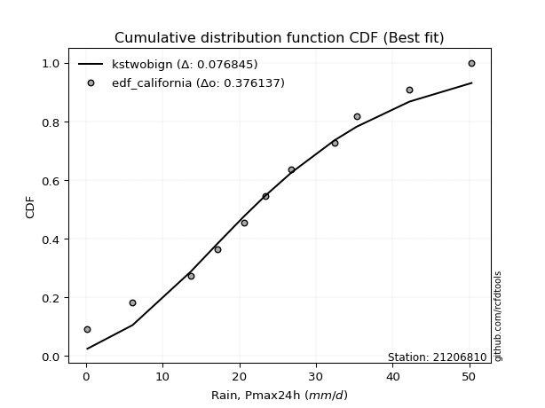</img>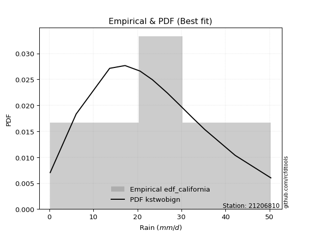</img>

</div>


### 2. Empirical - EDF Hazen (1930)

Hazen method for plotting positions is a formula used to estimate the empirical cumulative probability distribution of flood events or other hydrological data. This formula often results in biased estimations, particularly when extrapolating to extreme events (high return periods).

<div align="center">


$P=(m-0.5)/n$


</div>


**2.1. Empirical values**

<div align="center">

|                | 0                    | 1                  | 2                   | 3                  | 4         | 5                  | 6                  | 7                  | 8                  | 9                  | 10        | 11                 |
|:---------------|:---------------------|:-------------------|:--------------------|:-------------------|:----------|:-------------------|:-------------------|:-------------------|:-------------------|:-------------------|:----------|:-------------------|
| date           | 2023                 | 2010               | 2015                | 2016               | 2009      | 2014               | 2012               | 2025               | 2011               | 2013               | 2024      | 2008               |
| x              | 0.2                  | 6.1                | 13.7                | 17.2               | 20.6      | 23.4               | 26.8               | 28.7               | 32.4               | 35.3               | 42.2      | 50.3               |
| m              | 1                    | 2                  | 3                   | 4                  | 5         | 6                  | 7                  | 8                  | 9                  | 10                 | 11        | 12                 |
| empirical_dist | edf_hazen            | edf_hazen          | edf_hazen           | edf_hazen          | edf_hazen | edf_hazen          | edf_hazen          | edf_hazen          | edf_hazen          | edf_hazen          | edf_hazen | edf_hazen          |
| empirical      | 0.041666666666666664 | 0.125              | 0.20833333333333334 | 0.2916666666666667 | 0.375     | 0.4583333333333333 | 0.5416666666666666 | 0.625              | 0.7083333333333334 | 0.7916666666666666 | 0.875     | 0.9583333333333334 |
| empirical_tr   | 1.0434782608695652   | 1.1428571428571428 | 1.2631578947368423  | 1.411764705882353  | 1.6       | 1.8461538461538458 | 2.1818181818181817 | 2.6666666666666665 | 3.428571428571429  | 4.799999999999999  | 8.0       | 24.00000000000002  |

</div>


**2.2. Kolmogorov-Smirnov fit test (sorted by Δ)**


<div align="center">

|                | 0                    | 1                   | 2                   | 3                    | 4                   | 5                    | 6                   | 7                    | 8                    | 9                   | 10                  | 11                   | 12                   | 13                   | 14                  | 15                  | 16                  | 17                   | 18                   | 19                  | 20                  | 21                   | 22                  | 23                  | 24                   | 25                  | 26                  | 27                  | 28                  | 29                  | 30                  | 31                  | 32                  | 33                  | 34                  | 35                  | 36                    | 37                  | 38                  | 39                  | 40                  | 41                  | 42                  | 43                  | 44                  | 45                  | 46                  | 47                  | 48                  | 49                  | 50                  | 51                  | 52                  | 53                  | 54                  | 55                  | 56                  | 57                  | 58                  | 59                  | 60                  | 61                  | 62                  | 63                  | 64                  | 65                  | 66                  | 67                  | 68                  | 69                  | 70                  | 71                  | 72                  | 73                  | 74                  | 75                  | 76                  | 77                  | 78                  | 79                  | 80                  | 81                  | 82                  | 83                  | 84                  | 85                  | 86                  | 87                  | 88                  | 89                  |
|:---------------|:---------------------|:--------------------|:--------------------|:---------------------|:--------------------|:---------------------|:--------------------|:---------------------|:---------------------|:--------------------|:--------------------|:---------------------|:---------------------|:---------------------|:--------------------|:--------------------|:--------------------|:---------------------|:---------------------|:--------------------|:--------------------|:---------------------|:--------------------|:--------------------|:---------------------|:--------------------|:--------------------|:--------------------|:--------------------|:--------------------|:--------------------|:--------------------|:--------------------|:--------------------|:--------------------|:--------------------|:----------------------|:--------------------|:--------------------|:--------------------|:--------------------|:--------------------|:--------------------|:--------------------|:--------------------|:--------------------|:--------------------|:--------------------|:--------------------|:--------------------|:--------------------|:--------------------|:--------------------|:--------------------|:--------------------|:--------------------|:--------------------|:--------------------|:--------------------|:--------------------|:--------------------|:--------------------|:--------------------|:--------------------|:--------------------|:--------------------|:--------------------|:--------------------|:--------------------|:--------------------|:--------------------|:--------------------|:--------------------|:--------------------|:--------------------|:--------------------|:--------------------|:--------------------|:--------------------|:--------------------|:--------------------|:--------------------|:--------------------|:--------------------|:--------------------|:--------------------|:--------------------|:--------------------|:--------------------|:--------------------|
| station        | 21206810             | 21206810            | 21206810            | 21206810             | 21206810            | 21206810             | 21206810            | 21206810             | 21206810             | 21206810            | 21206810            | 21206810             | 21206810             | 21206810             | 21206810            | 21206810            | 21206810            | 21206810             | 21206810             | 21206810            | 21206810            | 21206810             | 21206810            | 21206810            | 21206810             | 21206810            | 21206810            | 21206810            | 21206810            | 21206810            | 21206810            | 21206810            | 21206810            | 21206810            | 21206810            | 21206810            | 21206810              | 21206810            | 21206810            | 21206810            | 21206810            | 21206810            | 21206810            | 21206810            | 21206810            | 21206810            | 21206810            | 21206810            | 21206810            | 21206810            | 21206810            | 21206810            | 21206810            | 21206810            | 21206810            | 21206810            | 21206810            | 21206810            | 21206810            | 21206810            | 21206810            | 21206810            | 21206810            | 21206810            | 21206810            | 21206810            | 21206810            | 21206810            | 21206810            | 21206810            | 21206810            | 21206810            | 21206810            | 21206810            | 21206810            | 21206810            | 21206810            | 21206810            | 21206810            | 21206810            | 21206810            | 21206810            | 21206810            | 21206810            | 21206810            | 21206810            | 21206810            | 21206810            | 21206810            | 21206810            |
| empirical_dist | edf_hazen            | edf_hazen           | edf_hazen           | edf_hazen            | edf_hazen           | edf_hazen            | edf_hazen           | edf_hazen            | edf_hazen            | edf_hazen           | edf_hazen           | edf_hazen            | edf_hazen            | edf_hazen            | edf_hazen           | edf_hazen           | edf_hazen           | edf_hazen            | edf_hazen            | edf_hazen           | edf_hazen           | edf_hazen            | edf_hazen           | edf_hazen           | edf_hazen            | edf_hazen           | edf_hazen           | edf_hazen           | edf_hazen           | edf_hazen           | edf_hazen           | edf_hazen           | edf_hazen           | edf_hazen           | edf_hazen           | edf_hazen           | edf_hazen             | edf_hazen           | edf_hazen           | edf_hazen           | edf_hazen           | edf_hazen           | edf_hazen           | edf_hazen           | edf_hazen           | edf_hazen           | edf_hazen           | edf_hazen           | edf_hazen           | edf_hazen           | edf_hazen           | edf_hazen           | edf_hazen           | edf_hazen           | edf_hazen           | edf_hazen           | edf_hazen           | edf_hazen           | edf_hazen           | edf_hazen           | edf_hazen           | edf_hazen           | edf_hazen           | edf_hazen           | edf_hazen           | edf_hazen           | edf_hazen           | edf_hazen           | edf_hazen           | edf_hazen           | edf_hazen           | edf_hazen           | edf_hazen           | edf_hazen           | edf_hazen           | edf_hazen           | edf_hazen           | edf_hazen           | edf_hazen           | edf_hazen           | edf_hazen           | edf_hazen           | edf_hazen           | edf_hazen           | edf_hazen           | edf_hazen           | edf_hazen           | edf_hazen           | edf_hazen           | edf_hazen           |
| p_dist         | fisk                 | nct                 | t                   | crystalball          | norm                | exponnorm            | pearson3            | gamma                | erlang               | johnsonsu           | f                   | betaprime            | fatiguelife          | chi2                 | genlogistic         | weibull_min         | alpha               | rice                 | invgamma             | invgauss            | logistic            | hypsecant            | maxwell             | rayleigh            | laplace_asymmetric   | truncnorm           | laplace             | invweibull          | logjohnsonsu        | gumbel_l            | gumbel_r            | kstwobign           | mielke              | logt                | moyal               | logloggamma         | loglaplace_asymmetric | halflogistic        | halfnorm            | logpearson3         | ncf                 | wald                | loggumbel_l         | gibrat              | nakagami            | genexpon            | expon               | loghypsecant        | loglogistic         | loglaplace          | loglognorm          | lognakagami         | logexponnorm        | logcrystalball      | lognorm             | lognorm             | logrice             | logfatiguelife      | lognct              | logmielke           | loginvgamma         | loggamma            | loggamma            | loginvgauss         | logmaxwell          | logalpha            | lograyleigh         | loginvweibull       | loggumbel_r         | loghalfnorm         | logkstwobign        | logmoyal            | loghalflogistic     | loggenexpon         | logfisk             | logwald             | logexpon            | logerlang           | loggibrat           | logncf              | pareto              | logpareto           | logf                | logtruncnorm        | gompertz            | logweibull_min      | logbetaprime        | logchi2             | loggompertz         | loggenlogistic      |
| delta          | 0.035267390737119694 | 0.03611536946177814 | 0.03612915584935622 | 0.036139106594635206 | 0.03613910725473829 | 0.036140335408003765 | 0.03656179926012747 | 0.036562211997496846 | 0.036584271857431794 | 0.03674905255023447 | 0.03698025704809868 | 0.038161158095959574 | 0.038342071817579704 | 0.039066408831850294 | 0.03939210022875758 | 0.04031954229244765 | 0.04221573218007568 | 0.042231148793350645 | 0.043335662936037925 | 0.04456306350955075 | 0.04516889652773101 | 0.048732373210506844 | 0.04967597524405966 | 0.05872974049613959 | 0.060340333369353294 | 0.06164790412464788 | 0.0631622490588265  | 0.06892527159829126 | 0.06958989256856662 | 0.06965701466339469 | 0.08715881327273878 | 0.08919773036645973 | 0.09209483734604942 | 0.10472196894942098 | 0.11168238403096675 | 0.11419646992710206 | 0.11588370268147155   | 0.125               | 0.125               | 0.15133921245483428 | 0.17130501264324832 | 0.17973785972016942 | 0.17985878822335624 | 0.2095142694831973  | 0.21088736253273382 | 0.21156190996251759 | 0.21476583127111562 | 0.2398870986505495  | 0.24463872926287825 | 0.24619925837242113 | 0.24802460250075317 | 0.2497832595099113  | 0.2502416850842345  | 0.25024383001028405 | 0.2502438397168252  | 0.2502438397168252  | 0.2502438525098283  | 0.2503884373137427  | 0.25119831392311665 | 0.26637571995652987 | 0.27004822960772645 | 0.2728580764689882  | 0.2728580764689882  | 0.2814000211944444  | 0.28445293608192224 | 0.2883095883404554  | 0.29622742609853325 | 0.29820961147703706 | 0.3181215063712033  | 0.32944137696756726 | 0.3307087683242008  | 0.3436897214724328  | 0.35130935027483856 | 0.36620470025993523 | 0.4069063476389603  | 0.4148134363878647  | 0.41713991726892785 | 0.4275722793968193  | 0.42978886153578744 | 0.4505357629332152  | 0.4942531500089913  | 0.528976082343501   | 0.5426978280317063  | 0.5489359255167845  | 0.5584748956840525  | 0.6358199326492485  | 0.7068605409738921  | 0.7723416079036708  | 0.8401159874861621  | 0.875               |
| deltao         | 0.36218414519599995  | 0.36218414519599995 | 0.36218414519599995 | 0.36218414519599995  | 0.36218414519599995 | 0.36218414519599995  | 0.36218414519599995 | 0.36218414519599995  | 0.36218414519599995  | 0.36218414519599995 | 0.36218414519599995 | 0.36218414519599995  | 0.36218414519599995  | 0.36218414519599995  | 0.36218414519599995 | 0.36218414519599995 | 0.36218414519599995 | 0.36218414519599995  | 0.36218414519599995  | 0.36218414519599995 | 0.36218414519599995 | 0.36218414519599995  | 0.36218414519599995 | 0.36218414519599995 | 0.36218414519599995  | 0.36218414519599995 | 0.36218414519599995 | 0.36218414519599995 | 0.36218414519599995 | 0.36218414519599995 | 0.36218414519599995 | 0.36218414519599995 | 0.36218414519599995 | 0.36218414519599995 | 0.36218414519599995 | 0.36218414519599995 | 0.36218414519599995   | 0.36218414519599995 | 0.36218414519599995 | 0.36218414519599995 | 0.36218414519599995 | 0.36218414519599995 | 0.36218414519599995 | 0.36218414519599995 | 0.36218414519599995 | 0.36218414519599995 | 0.36218414519599995 | 0.36218414519599995 | 0.36218414519599995 | 0.36218414519599995 | 0.36218414519599995 | 0.36218414519599995 | 0.36218414519599995 | 0.36218414519599995 | 0.36218414519599995 | 0.36218414519599995 | 0.36218414519599995 | 0.36218414519599995 | 0.36218414519599995 | 0.36218414519599995 | 0.36218414519599995 | 0.36218414519599995 | 0.36218414519599995 | 0.36218414519599995 | 0.36218414519599995 | 0.36218414519599995 | 0.36218414519599995 | 0.36218414519599995 | 0.36218414519599995 | 0.36218414519599995 | 0.36218414519599995 | 0.36218414519599995 | 0.36218414519599995 | 0.36218414519599995 | 0.36218414519599995 | 0.36218414519599995 | 0.36218414519599995 | 0.36218414519599995 | 0.36218414519599995 | 0.36218414519599995 | 0.36218414519599995 | 0.36218414519599995 | 0.36218414519599995 | 0.36218414519599995 | 0.36218414519599995 | 0.36218414519599995 | 0.36218414519599995 | 0.36218414519599995 | 0.36218414519599995 | 0.36218414519599995 |
| eval           | Δo > Δ               | Δo > Δ              | Δo > Δ              | Δo > Δ               | Δo > Δ              | Δo > Δ               | Δo > Δ              | Δo > Δ               | Δo > Δ               | Δo > Δ              | Δo > Δ              | Δo > Δ               | Δo > Δ               | Δo > Δ               | Δo > Δ              | Δo > Δ              | Δo > Δ              | Δo > Δ               | Δo > Δ               | Δo > Δ              | Δo > Δ              | Δo > Δ               | Δo > Δ              | Δo > Δ              | Δo > Δ               | Δo > Δ              | Δo > Δ              | Δo > Δ              | Δo > Δ              | Δo > Δ              | Δo > Δ              | Δo > Δ              | Δo > Δ              | Δo > Δ              | Δo > Δ              | Δo > Δ              | Δo > Δ                | Δo > Δ              | Δo > Δ              | Δo > Δ              | Δo > Δ              | Δo > Δ              | Δo > Δ              | Δo > Δ              | Δo > Δ              | Δo > Δ              | Δo > Δ              | Δo > Δ              | Δo > Δ              | Δo > Δ              | Δo > Δ              | Δo > Δ              | Δo > Δ              | Δo > Δ              | Δo > Δ              | Δo > Δ              | Δo > Δ              | Δo > Δ              | Δo > Δ              | Δo > Δ              | Δo > Δ              | Δo > Δ              | Δo > Δ              | Δo > Δ              | Δo > Δ              | Δo > Δ              | Δo > Δ              | Δo > Δ              | Δo > Δ              | Δo > Δ              | Δo > Δ              | Δo > Δ              | Δo > Δ              | Δo <= Δ             | Δo <= Δ             | Δo <= Δ             | Δo <= Δ             | Δo <= Δ             | Δo <= Δ             | Δo <= Δ             | Δo <= Δ             | Δo <= Δ             | Δo <= Δ             | Δo <= Δ             | Δo <= Δ             | Δo <= Δ             | Δo <= Δ             | Δo <= Δ             | Δo <= Δ             | Δo <= Δ             |
| fit            | 1                    | 1                   | 1                   | 1                    | 1                   | 1                    | 1                   | 1                    | 1                    | 1                   | 1                   | 1                    | 1                    | 1                    | 1                   | 1                   | 1                   | 1                    | 1                    | 1                   | 1                   | 1                    | 1                   | 1                   | 1                    | 1                   | 1                   | 1                   | 1                   | 1                   | 1                   | 1                   | 1                   | 1                   | 1                   | 1                   | 1                     | 1                   | 1                   | 1                   | 1                   | 1                   | 1                   | 1                   | 1                   | 1                   | 1                   | 1                   | 1                   | 1                   | 1                   | 1                   | 1                   | 1                   | 1                   | 1                   | 1                   | 1                   | 1                   | 1                   | 1                   | 1                   | 1                   | 1                   | 1                   | 1                   | 1                   | 1                   | 1                   | 1                   | 1                   | 1                   | 1                   | 0                   | 0                   | 0                   | 0                   | 0                   | 0                   | 0                   | 0                   | 0                   | 0                   | 0                   | 0                   | 0                   | 0                   | 0                   | 0                   | 0                   |
| n              | 12                   | 12                  | 12                  | 12                   | 12                  | 12                   | 12                  | 12                   | 12                   | 12                  | 12                  | 12                   | 12                   | 12                   | 12                  | 12                  | 12                  | 12                   | 12                   | 12                  | 12                  | 12                   | 12                  | 12                  | 12                   | 12                  | 12                  | 12                  | 12                  | 12                  | 12                  | 12                  | 12                  | 12                  | 12                  | 12                  | 12                    | 12                  | 12                  | 12                  | 12                  | 12                  | 12                  | 12                  | 12                  | 12                  | 12                  | 12                  | 12                  | 12                  | 12                  | 12                  | 12                  | 12                  | 12                  | 12                  | 12                  | 12                  | 12                  | 12                  | 12                  | 12                  | 12                  | 12                  | 12                  | 12                  | 12                  | 12                  | 12                  | 12                  | 12                  | 12                  | 12                  | 12                  | 12                  | 12                  | 12                  | 12                  | 12                  | 12                  | 12                  | 12                  | 12                  | 12                  | 12                  | 12                  | 12                  | 12                  | 12                  | 12                  |
| best_fit       | 1                    | 0                   | 0                   | 0                    | 0                   | 0                    | 0                   | 0                    | 0                    | 0                   | 0                   | 0                    | 0                    | 0                    | 0                   | 0                   | 0                   | 0                    | 0                    | 0                   | 0                   | 0                    | 0                   | 0                   | 0                    | 0                   | 0                   | 0                   | 0                   | 0                   | 0                   | 0                   | 0                   | 0                   | 0                   | 0                   | 0                     | 0                   | 0                   | 0                   | 0                   | 0                   | 0                   | 0                   | 0                   | 0                   | 0                   | 0                   | 0                   | 0                   | 0                   | 0                   | 0                   | 0                   | 0                   | 0                   | 0                   | 0                   | 0                   | 0                   | 0                   | 0                   | 0                   | 0                   | 0                   | 0                   | 0                   | 0                   | 0                   | 0                   | 0                   | 0                   | 0                   | 0                   | 0                   | 0                   | 0                   | 0                   | 0                   | 0                   | 0                   | 0                   | 0                   | 0                   | 0                   | 0                   | 0                   | 0                   | 0                   | 0                   |
| best_fit_sort  | 1                    | 2                   | 3                   | 4                    | 5                   | 6                    | 7                   | 8                    | 9                    | 10                  | 11                  | 12                   | 13                   | 14                   | 15                  | 16                  | 17                  | 18                   | 19                   | 20                  | 21                  | 22                   | 23                  | 24                  | 25                   | 26                  | 27                  | 28                  | 29                  | 30                  | 31                  | 32                  | 33                  | 34                  | 35                  | 36                  | 37                    | 38                  | 39                  | 40                  | 41                  | 42                  | 43                  | 44                  | 45                  | 46                  | 47                  | 48                  | 49                  | 50                  | 51                  | 52                  | 53                  | 54                  | 55                  | 56                  | 57                  | 58                  | 59                  | 60                  | 61                  | 62                  | 63                  | 64                  | 65                  | 66                  | 67                  | 68                  | 69                  | 70                  | 71                  | 72                  | 73                  | 74                  | 75                  | 76                  | 77                  | 78                  | 79                  | 80                  | 81                  | 82                  | 83                  | 84                  | 85                  | 86                  | 87                  | 88                  | 89                  | 90                  |

</div>


<div align="center">

</img>

</div>


**2.3. Best fit**

<div align="center">

|   id |   station | empirical_dist   | p_dist   |     delta |   deltao | eval   |   fit |   n |   best_fit |   best_fit_sort |
|-----:|----------:|:-----------------|:---------|----------:|---------:|:-------|------:|----:|-----------:|----------------:|
|    0 |  21206810 | edf_hazen        | fisk     | 0.0352674 | 0.362184 | Δo > Δ |     1 |  12 |          1 |               1 |

</div>


<div align="center">

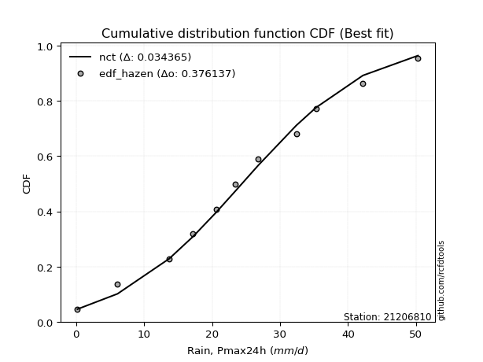</img></img>

</div>


### 3. Empirical - EDF Weibull (1939)

Weibull plotting position formula is an empirical method used to estimate the non-exceedance probability or plotting position for a set of observed data, is often recommended or widely used in practice, particularly in flood frequency analysis.

<div align="center">


$P=m/(n+1)$


</div>


**3.1. Empirical values**

<div align="center">

|                | 0                   | 1                   | 2                   | 3                  | 4                   | 5                   | 6                  | 7                  | 8                  | 9                  | 10                 | 11                 |
|:---------------|:--------------------|:--------------------|:--------------------|:-------------------|:--------------------|:--------------------|:-------------------|:-------------------|:-------------------|:-------------------|:-------------------|:-------------------|
| date           | 2023                | 2010                | 2015                | 2016               | 2009                | 2014                | 2012               | 2025               | 2011               | 2013               | 2024               | 2008               |
| x              | 0.2                 | 6.1                 | 13.7                | 17.2               | 20.6                | 23.4                | 26.8               | 28.7               | 32.4               | 35.3               | 42.2               | 50.3               |
| m              | 1                   | 2                   | 3                   | 4                  | 5                   | 6                   | 7                  | 8                  | 9                  | 10                 | 11                 | 12                 |
| empirical_dist | edf_weibull         | edf_weibull         | edf_weibull         | edf_weibull        | edf_weibull         | edf_weibull         | edf_weibull        | edf_weibull        | edf_weibull        | edf_weibull        | edf_weibull        | edf_weibull        |
| empirical      | 0.07692307692307693 | 0.15384615384615385 | 0.23076923076923078 | 0.3076923076923077 | 0.38461538461538464 | 0.46153846153846156 | 0.5384615384615384 | 0.6153846153846154 | 0.6923076923076923 | 0.7692307692307693 | 0.8461538461538461 | 0.9230769230769231 |
| empirical_tr   | 1.0833333333333333  | 1.1818181818181819  | 1.3                 | 1.4444444444444444 | 1.625               | 1.8571428571428572  | 2.1666666666666665 | 2.6                | 3.25               | 4.333333333333334  | 6.5                | 13.000000000000009 |

</div>


**3.2. Kolmogorov-Smirnov fit test (sorted by Δ)**


<div align="center">

|                | 0                   | 1                   | 2                   | 3                   | 4                   | 5                   | 6                   | 7                   | 8                   | 9                   | 10                  | 11                  | 12                  | 13                  | 14                  | 15                  | 16                  | 17                  | 18                  | 19                  | 20                  | 21                  | 22                  | 23                  | 24                  | 25                  | 26                  | 27                  | 28                  | 29                  | 30                  | 31                  | 32                    | 33                  | 34                  | 35                  | 36                  | 37                  | 38                  | 39                  | 40                  | 41                  | 42                  | 43                  | 44                  | 45                  | 46                  | 47                  | 48                  | 49                  | 50                  | 51                  | 52                  | 53                  | 54                  | 55                  | 56                  | 57                  | 58                  | 59                  | 60                  | 61                  | 62                  | 63                  | 64                  | 65                  | 66                  | 67                  | 68                  | 69                  | 70                  | 71                  | 72                  | 73                  | 74                  | 75                  | 76                  | 77                  | 78                  | 79                  | 80                  | 81                  | 82                  | 83                  | 84                  | 85                  | 86                  | 87                  | 88                  | 89                  |
|:---------------|:--------------------|:--------------------|:--------------------|:--------------------|:--------------------|:--------------------|:--------------------|:--------------------|:--------------------|:--------------------|:--------------------|:--------------------|:--------------------|:--------------------|:--------------------|:--------------------|:--------------------|:--------------------|:--------------------|:--------------------|:--------------------|:--------------------|:--------------------|:--------------------|:--------------------|:--------------------|:--------------------|:--------------------|:--------------------|:--------------------|:--------------------|:--------------------|:----------------------|:--------------------|:--------------------|:--------------------|:--------------------|:--------------------|:--------------------|:--------------------|:--------------------|:--------------------|:--------------------|:--------------------|:--------------------|:--------------------|:--------------------|:--------------------|:--------------------|:--------------------|:--------------------|:--------------------|:--------------------|:--------------------|:--------------------|:--------------------|:--------------------|:--------------------|:--------------------|:--------------------|:--------------------|:--------------------|:--------------------|:--------------------|:--------------------|:--------------------|:--------------------|:--------------------|:--------------------|:--------------------|:--------------------|:--------------------|:--------------------|:--------------------|:--------------------|:--------------------|:--------------------|:--------------------|:--------------------|:--------------------|:--------------------|:--------------------|:--------------------|:--------------------|:--------------------|:--------------------|:--------------------|:--------------------|:--------------------|:--------------------|
| station        | 21206810            | 21206810            | 21206810            | 21206810            | 21206810            | 21206810            | 21206810            | 21206810            | 21206810            | 21206810            | 21206810            | 21206810            | 21206810            | 21206810            | 21206810            | 21206810            | 21206810            | 21206810            | 21206810            | 21206810            | 21206810            | 21206810            | 21206810            | 21206810            | 21206810            | 21206810            | 21206810            | 21206810            | 21206810            | 21206810            | 21206810            | 21206810            | 21206810              | 21206810            | 21206810            | 21206810            | 21206810            | 21206810            | 21206810            | 21206810            | 21206810            | 21206810            | 21206810            | 21206810            | 21206810            | 21206810            | 21206810            | 21206810            | 21206810            | 21206810            | 21206810            | 21206810            | 21206810            | 21206810            | 21206810            | 21206810            | 21206810            | 21206810            | 21206810            | 21206810            | 21206810            | 21206810            | 21206810            | 21206810            | 21206810            | 21206810            | 21206810            | 21206810            | 21206810            | 21206810            | 21206810            | 21206810            | 21206810            | 21206810            | 21206810            | 21206810            | 21206810            | 21206810            | 21206810            | 21206810            | 21206810            | 21206810            | 21206810            | 21206810            | 21206810            | 21206810            | 21206810            | 21206810            | 21206810            | 21206810            |
| empirical_dist | edf_weibull         | edf_weibull         | edf_weibull         | edf_weibull         | edf_weibull         | edf_weibull         | edf_weibull         | edf_weibull         | edf_weibull         | edf_weibull         | edf_weibull         | edf_weibull         | edf_weibull         | edf_weibull         | edf_weibull         | edf_weibull         | edf_weibull         | edf_weibull         | edf_weibull         | edf_weibull         | edf_weibull         | edf_weibull         | edf_weibull         | edf_weibull         | edf_weibull         | edf_weibull         | edf_weibull         | edf_weibull         | edf_weibull         | edf_weibull         | edf_weibull         | edf_weibull         | edf_weibull           | edf_weibull         | edf_weibull         | edf_weibull         | edf_weibull         | edf_weibull         | edf_weibull         | edf_weibull         | edf_weibull         | edf_weibull         | edf_weibull         | edf_weibull         | edf_weibull         | edf_weibull         | edf_weibull         | edf_weibull         | edf_weibull         | edf_weibull         | edf_weibull         | edf_weibull         | edf_weibull         | edf_weibull         | edf_weibull         | edf_weibull         | edf_weibull         | edf_weibull         | edf_weibull         | edf_weibull         | edf_weibull         | edf_weibull         | edf_weibull         | edf_weibull         | edf_weibull         | edf_weibull         | edf_weibull         | edf_weibull         | edf_weibull         | edf_weibull         | edf_weibull         | edf_weibull         | edf_weibull         | edf_weibull         | edf_weibull         | edf_weibull         | edf_weibull         | edf_weibull         | edf_weibull         | edf_weibull         | edf_weibull         | edf_weibull         | edf_weibull         | edf_weibull         | edf_weibull         | edf_weibull         | edf_weibull         | edf_weibull         | edf_weibull         | edf_weibull         |
| p_dist         | logjohnsonsu        | laplace_asymmetric  | fisk                | nct                 | t                   | crystalball         | norm                | exponnorm           | pearson3            | gamma               | erlang              | johnsonsu           | f                   | betaprime           | fatiguelife         | chi2                | genlogistic         | invweibull          | weibull_min         | alpha               | rice                | invgamma            | invgauss            | logistic            | mielke              | truncnorm           | hypsecant           | maxwell             | laplace             | kstwobign           | rayleigh            | logloggamma         | loglaplace_asymmetric | gumbel_l            | logt                | gumbel_r            | logpearson3         | moyal               | halfnorm            | halflogistic        | loggumbel_l         | ncf                 | wald                | genexpon            | expon               | nakagami            | loghypsecant        | loglogistic         | loglognorm          | lognakagami         | logexponnorm        | logcrystalball      | lognorm             | lognorm             | logrice             | logfatiguelife      | lognct              | loglaplace          | gibrat              | logmielke           | loginvgamma         | loggamma            | loggamma            | loginvgauss         | logmaxwell          | logalpha            | lograyleigh         | loginvweibull       | loggumbel_r         | loghalfnorm         | logkstwobign        | logmoyal            | loghalflogistic     | loggenexpon         | logfisk             | logexpon            | logerlang           | logwald             | loggibrat           | logncf              | pareto              | logpareto           | logf                | logtruncnorm        | gompertz            | logweibull_min      | logbetaprime        | logchi2             | loggompertz         | loggenlogistic      |
| delta          | 0.05801389730873597 | 0.06354546157448149 | 0.06411354458327355 | 0.06496152330793199 | 0.06497530969551008 | 0.06498526044078906 | 0.06498526110089214 | 0.06498648925415762 | 0.06540795310628132 | 0.0654083658436507  | 0.06543042570358565 | 0.06559520639638833 | 0.06582641089425253 | 0.06700731194211343 | 0.06718822566373356 | 0.06791256267800415 | 0.06823825407491144 | 0.06855141647588406 | 0.0691656961386015  | 0.07106188602622954 | 0.0710773026395045  | 0.07218181678219178 | 0.0734092173557046  | 0.07401505037388487 | 0.0769222048979842  | 0.07692307441493926 | 0.0775785270566607  | 0.07852212909021351 | 0.07951523798244536 | 0.07958234575107509 | 0.08757589434229344 | 0.09176057249120462 | 0.09344780524557411   | 0.09506724347968654 | 0.09871122886062994 | 0.11153248199311487 | 0.12890331501893693 | 0.1359393422235829  | 0.15384615384615385 | 0.15384615384615385 | 0.1574228907874588  | 0.16102654364144192 | 0.18294298792529762 | 0.18912601252662015 | 0.19232993383521818 | 0.1948617215070928  | 0.22011565863820282 | 0.2222028318269808  | 0.22558870506485573 | 0.22734736207401385 | 0.22780578764833703 | 0.22780793257438664 | 0.22780794228092777 | 0.22780794228092777 | 0.2278079550739308  | 0.22795253987784525 | 0.22876241648721923 | 0.2301736173467801  | 0.23076923076923078 | 0.2439398225206324  | 0.24761233217182899 | 0.2504221790330908  | 0.2504221790330908  | 0.258964123758547   | 0.26201703864602477 | 0.2658736909045579  | 0.27379152866263584 | 0.27577371404113965 | 0.2956856089353059  | 0.30700547953166984 | 0.3082728708883034  | 0.3212538240365354  | 0.32887345283894115 | 0.3437688028240378  | 0.37164993738255003 | 0.3886777143410905  | 0.39231586914040906 | 0.3923775389519673  | 0.4081278992966273  | 0.4216896090870613  | 0.4654069961628374  | 0.5001299284973472  | 0.5138516741855524  | 0.5265000280808871  | 0.5469813092443684  | 0.6069737788030947  | 0.6780143871277382  | 0.7434954540575169  | 0.8112698336400083  | 0.8461538461538461  |
| deltao         | 0.36218414519599995 | 0.36218414519599995 | 0.36218414519599995 | 0.36218414519599995 | 0.36218414519599995 | 0.36218414519599995 | 0.36218414519599995 | 0.36218414519599995 | 0.36218414519599995 | 0.36218414519599995 | 0.36218414519599995 | 0.36218414519599995 | 0.36218414519599995 | 0.36218414519599995 | 0.36218414519599995 | 0.36218414519599995 | 0.36218414519599995 | 0.36218414519599995 | 0.36218414519599995 | 0.36218414519599995 | 0.36218414519599995 | 0.36218414519599995 | 0.36218414519599995 | 0.36218414519599995 | 0.36218414519599995 | 0.36218414519599995 | 0.36218414519599995 | 0.36218414519599995 | 0.36218414519599995 | 0.36218414519599995 | 0.36218414519599995 | 0.36218414519599995 | 0.36218414519599995   | 0.36218414519599995 | 0.36218414519599995 | 0.36218414519599995 | 0.36218414519599995 | 0.36218414519599995 | 0.36218414519599995 | 0.36218414519599995 | 0.36218414519599995 | 0.36218414519599995 | 0.36218414519599995 | 0.36218414519599995 | 0.36218414519599995 | 0.36218414519599995 | 0.36218414519599995 | 0.36218414519599995 | 0.36218414519599995 | 0.36218414519599995 | 0.36218414519599995 | 0.36218414519599995 | 0.36218414519599995 | 0.36218414519599995 | 0.36218414519599995 | 0.36218414519599995 | 0.36218414519599995 | 0.36218414519599995 | 0.36218414519599995 | 0.36218414519599995 | 0.36218414519599995 | 0.36218414519599995 | 0.36218414519599995 | 0.36218414519599995 | 0.36218414519599995 | 0.36218414519599995 | 0.36218414519599995 | 0.36218414519599995 | 0.36218414519599995 | 0.36218414519599995 | 0.36218414519599995 | 0.36218414519599995 | 0.36218414519599995 | 0.36218414519599995 | 0.36218414519599995 | 0.36218414519599995 | 0.36218414519599995 | 0.36218414519599995 | 0.36218414519599995 | 0.36218414519599995 | 0.36218414519599995 | 0.36218414519599995 | 0.36218414519599995 | 0.36218414519599995 | 0.36218414519599995 | 0.36218414519599995 | 0.36218414519599995 | 0.36218414519599995 | 0.36218414519599995 | 0.36218414519599995 |
| eval           | Δo > Δ              | Δo > Δ              | Δo > Δ              | Δo > Δ              | Δo > Δ              | Δo > Δ              | Δo > Δ              | Δo > Δ              | Δo > Δ              | Δo > Δ              | Δo > Δ              | Δo > Δ              | Δo > Δ              | Δo > Δ              | Δo > Δ              | Δo > Δ              | Δo > Δ              | Δo > Δ              | Δo > Δ              | Δo > Δ              | Δo > Δ              | Δo > Δ              | Δo > Δ              | Δo > Δ              | Δo > Δ              | Δo > Δ              | Δo > Δ              | Δo > Δ              | Δo > Δ              | Δo > Δ              | Δo > Δ              | Δo > Δ              | Δo > Δ                | Δo > Δ              | Δo > Δ              | Δo > Δ              | Δo > Δ              | Δo > Δ              | Δo > Δ              | Δo > Δ              | Δo > Δ              | Δo > Δ              | Δo > Δ              | Δo > Δ              | Δo > Δ              | Δo > Δ              | Δo > Δ              | Δo > Δ              | Δo > Δ              | Δo > Δ              | Δo > Δ              | Δo > Δ              | Δo > Δ              | Δo > Δ              | Δo > Δ              | Δo > Δ              | Δo > Δ              | Δo > Δ              | Δo > Δ              | Δo > Δ              | Δo > Δ              | Δo > Δ              | Δo > Δ              | Δo > Δ              | Δo > Δ              | Δo > Δ              | Δo > Δ              | Δo > Δ              | Δo > Δ              | Δo > Δ              | Δo > Δ              | Δo > Δ              | Δo > Δ              | Δo > Δ              | Δo <= Δ             | Δo <= Δ             | Δo <= Δ             | Δo <= Δ             | Δo <= Δ             | Δo <= Δ             | Δo <= Δ             | Δo <= Δ             | Δo <= Δ             | Δo <= Δ             | Δo <= Δ             | Δo <= Δ             | Δo <= Δ             | Δo <= Δ             | Δo <= Δ             | Δo <= Δ             |
| fit            | 1                   | 1                   | 1                   | 1                   | 1                   | 1                   | 1                   | 1                   | 1                   | 1                   | 1                   | 1                   | 1                   | 1                   | 1                   | 1                   | 1                   | 1                   | 1                   | 1                   | 1                   | 1                   | 1                   | 1                   | 1                   | 1                   | 1                   | 1                   | 1                   | 1                   | 1                   | 1                   | 1                     | 1                   | 1                   | 1                   | 1                   | 1                   | 1                   | 1                   | 1                   | 1                   | 1                   | 1                   | 1                   | 1                   | 1                   | 1                   | 1                   | 1                   | 1                   | 1                   | 1                   | 1                   | 1                   | 1                   | 1                   | 1                   | 1                   | 1                   | 1                   | 1                   | 1                   | 1                   | 1                   | 1                   | 1                   | 1                   | 1                   | 1                   | 1                   | 1                   | 1                   | 1                   | 0                   | 0                   | 0                   | 0                   | 0                   | 0                   | 0                   | 0                   | 0                   | 0                   | 0                   | 0                   | 0                   | 0                   | 0                   | 0                   |
| n              | 12                  | 12                  | 12                  | 12                  | 12                  | 12                  | 12                  | 12                  | 12                  | 12                  | 12                  | 12                  | 12                  | 12                  | 12                  | 12                  | 12                  | 12                  | 12                  | 12                  | 12                  | 12                  | 12                  | 12                  | 12                  | 12                  | 12                  | 12                  | 12                  | 12                  | 12                  | 12                  | 12                    | 12                  | 12                  | 12                  | 12                  | 12                  | 12                  | 12                  | 12                  | 12                  | 12                  | 12                  | 12                  | 12                  | 12                  | 12                  | 12                  | 12                  | 12                  | 12                  | 12                  | 12                  | 12                  | 12                  | 12                  | 12                  | 12                  | 12                  | 12                  | 12                  | 12                  | 12                  | 12                  | 12                  | 12                  | 12                  | 12                  | 12                  | 12                  | 12                  | 12                  | 12                  | 12                  | 12                  | 12                  | 12                  | 12                  | 12                  | 12                  | 12                  | 12                  | 12                  | 12                  | 12                  | 12                  | 12                  | 12                  | 12                  |
| best_fit       | 1                   | 0                   | 0                   | 0                   | 0                   | 0                   | 0                   | 0                   | 0                   | 0                   | 0                   | 0                   | 0                   | 0                   | 0                   | 0                   | 0                   | 0                   | 0                   | 0                   | 0                   | 0                   | 0                   | 0                   | 0                   | 0                   | 0                   | 0                   | 0                   | 0                   | 0                   | 0                   | 0                     | 0                   | 0                   | 0                   | 0                   | 0                   | 0                   | 0                   | 0                   | 0                   | 0                   | 0                   | 0                   | 0                   | 0                   | 0                   | 0                   | 0                   | 0                   | 0                   | 0                   | 0                   | 0                   | 0                   | 0                   | 0                   | 0                   | 0                   | 0                   | 0                   | 0                   | 0                   | 0                   | 0                   | 0                   | 0                   | 0                   | 0                   | 0                   | 0                   | 0                   | 0                   | 0                   | 0                   | 0                   | 0                   | 0                   | 0                   | 0                   | 0                   | 0                   | 0                   | 0                   | 0                   | 0                   | 0                   | 0                   | 0                   |
| best_fit_sort  | 1                   | 2                   | 3                   | 4                   | 5                   | 6                   | 7                   | 8                   | 9                   | 10                  | 11                  | 12                  | 13                  | 14                  | 15                  | 16                  | 17                  | 18                  | 19                  | 20                  | 21                  | 22                  | 23                  | 24                  | 25                  | 26                  | 27                  | 28                  | 29                  | 30                  | 31                  | 32                  | 33                    | 34                  | 35                  | 36                  | 37                  | 38                  | 39                  | 40                  | 41                  | 42                  | 43                  | 44                  | 45                  | 46                  | 47                  | 48                  | 49                  | 50                  | 51                  | 52                  | 53                  | 54                  | 55                  | 56                  | 57                  | 58                  | 59                  | 60                  | 61                  | 62                  | 63                  | 64                  | 65                  | 66                  | 67                  | 68                  | 69                  | 70                  | 71                  | 72                  | 73                  | 74                  | 75                  | 76                  | 77                  | 78                  | 79                  | 80                  | 81                  | 82                  | 83                  | 84                  | 85                  | 86                  | 87                  | 88                  | 89                  | 90                  |

</div>


<div align="center">

</img>

</div>


**3.3. Best fit**

<div align="center">

|   id |   station | empirical_dist   | p_dist       |     delta |   deltao | eval   |   fit |   n |   best_fit |   best_fit_sort |
|-----:|----------:|:-----------------|:-------------|----------:|---------:|:-------|------:|----:|-----------:|----------------:|
|    0 |  21206810 | edf_weibull      | logjohnsonsu | 0.0580139 | 0.362184 | Δo > Δ |     1 |  12 |          1 |               1 |

</div>


<div align="center">

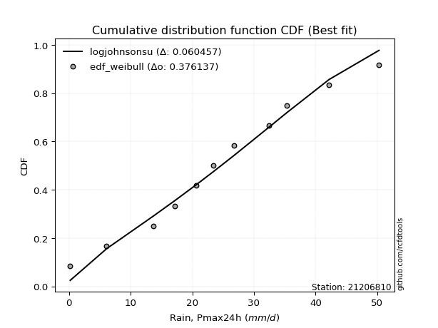</img>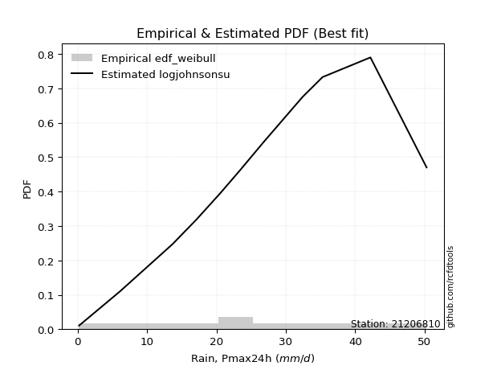</img>

</div>


### 4. Empirical - EDF Beard (1943)

The Beard formula (or Beard´s plotting position formula) in hydrology is used to estimate the empirical non-exceedance probability _(P)_ of a flood event (or other extreme hydrological data point) within a given dataset.

<div align="center">


$P=(m-0.31)/(n+0.38)$


</div>


**4.1. Empirical values**

<div align="center">

|                | 0                    | 1                   | 2                   | 3                  | 4                  | 5                  | 6                  | 7                  | 8                  | 9                  | 10                 | 11                 |
|:---------------|:---------------------|:--------------------|:--------------------|:-------------------|:-------------------|:-------------------|:-------------------|:-------------------|:-------------------|:-------------------|:-------------------|:-------------------|
| date           | 2023                 | 2010                | 2015                | 2016               | 2009               | 2014               | 2012               | 2025               | 2011               | 2013               | 2024               | 2008               |
| x              | 0.2                  | 6.1                 | 13.7                | 17.2               | 20.6               | 23.4               | 26.8               | 28.7               | 32.4               | 35.3               | 42.2               | 50.3               |
| m              | 1                    | 2                   | 3                   | 4                  | 5                  | 6                  | 7                  | 8                  | 9                  | 10                 | 11                 | 12                 |
| empirical_dist | edf_beard            | edf_beard           | edf_beard           | edf_beard          | edf_beard          | edf_beard          | edf_beard          | edf_beard          | edf_beard          | edf_beard          | edf_beard          | edf_beard          |
| empirical      | 0.055735056542810975 | 0.13651050080775443 | 0.21728594507269788 | 0.2980613893376413 | 0.3788368336025848 | 0.4596122778675283 | 0.5403877221324718 | 0.6211631663974152 | 0.7019386106623585 | 0.7827140549273021 | 0.8634894991922455 | 0.9442649434571889 |
| empirical_tr   | 1.0590248075278015   | 1.1580916744621141  | 1.2776057791537667  | 1.424626006904488  | 1.6098829648894668 | 1.850523168908819  | 2.1757469244288226 | 2.6396588486140726 | 3.3550135501355    | 4.6022304832713745 | 7.325443786982245  | 17.942028985507218 |

</div>


**4.2. Kolmogorov-Smirnov fit test (sorted by Δ)**


<div align="center">

|                | 0                   | 1                    | 2                    | 3                   | 4                    | 5                   | 6                   | 7                   | 8                   | 9                   | 10                   | 11                  | 12                  | 13                  | 14                  | 15                   | 16                  | 17                  | 18                  | 19                   | 20                  | 21                  | 22                  | 23                   | 24                   | 25                  | 26                  | 27                  | 28                  | 29                  | 30                  | 31                  | 32                  | 33                  | 34                  | 35                    | 36                  | 37                  | 38                  | 39                  | 40                  | 41                  | 42                  | 43                  | 44                  | 45                  | 46                  | 47                  | 48                  | 49                  | 50                  | 51                  | 52                  | 53                  | 54                  | 55                  | 56                  | 57                  | 58                  | 59                  | 60                  | 61                  | 62                  | 63                  | 64                  | 65                  | 66                  | 67                  | 68                  | 69                  | 70                  | 71                  | 72                  | 73                  | 74                  | 75                  | 76                  | 77                  | 78                  | 79                  | 80                  | 81                  | 82                  | 83                  | 84                  | 85                  | 86                  | 87                  | 88                  | 89                  |
|:---------------|:--------------------|:---------------------|:---------------------|:--------------------|:---------------------|:--------------------|:--------------------|:--------------------|:--------------------|:--------------------|:---------------------|:--------------------|:--------------------|:--------------------|:--------------------|:---------------------|:--------------------|:--------------------|:--------------------|:---------------------|:--------------------|:--------------------|:--------------------|:---------------------|:---------------------|:--------------------|:--------------------|:--------------------|:--------------------|:--------------------|:--------------------|:--------------------|:--------------------|:--------------------|:--------------------|:----------------------|:--------------------|:--------------------|:--------------------|:--------------------|:--------------------|:--------------------|:--------------------|:--------------------|:--------------------|:--------------------|:--------------------|:--------------------|:--------------------|:--------------------|:--------------------|:--------------------|:--------------------|:--------------------|:--------------------|:--------------------|:--------------------|:--------------------|:--------------------|:--------------------|:--------------------|:--------------------|:--------------------|:--------------------|:--------------------|:--------------------|:--------------------|:--------------------|:--------------------|:--------------------|:--------------------|:--------------------|:--------------------|:--------------------|:--------------------|:--------------------|:--------------------|:--------------------|:--------------------|:--------------------|:--------------------|:--------------------|:--------------------|:--------------------|:--------------------|:--------------------|:--------------------|:--------------------|:--------------------|:--------------------|
| station        | 21206810            | 21206810             | 21206810             | 21206810            | 21206810             | 21206810            | 21206810            | 21206810            | 21206810            | 21206810            | 21206810             | 21206810            | 21206810            | 21206810            | 21206810            | 21206810             | 21206810            | 21206810            | 21206810            | 21206810             | 21206810            | 21206810            | 21206810            | 21206810             | 21206810             | 21206810            | 21206810            | 21206810            | 21206810            | 21206810            | 21206810            | 21206810            | 21206810            | 21206810            | 21206810            | 21206810              | 21206810            | 21206810            | 21206810            | 21206810            | 21206810            | 21206810            | 21206810            | 21206810            | 21206810            | 21206810            | 21206810            | 21206810            | 21206810            | 21206810            | 21206810            | 21206810            | 21206810            | 21206810            | 21206810            | 21206810            | 21206810            | 21206810            | 21206810            | 21206810            | 21206810            | 21206810            | 21206810            | 21206810            | 21206810            | 21206810            | 21206810            | 21206810            | 21206810            | 21206810            | 21206810            | 21206810            | 21206810            | 21206810            | 21206810            | 21206810            | 21206810            | 21206810            | 21206810            | 21206810            | 21206810            | 21206810            | 21206810            | 21206810            | 21206810            | 21206810            | 21206810            | 21206810            | 21206810            | 21206810            |
| empirical_dist | edf_beard           | edf_beard            | edf_beard            | edf_beard           | edf_beard            | edf_beard           | edf_beard           | edf_beard           | edf_beard           | edf_beard           | edf_beard            | edf_beard           | edf_beard           | edf_beard           | edf_beard           | edf_beard            | edf_beard           | edf_beard           | edf_beard           | edf_beard            | edf_beard           | edf_beard           | edf_beard           | edf_beard            | edf_beard            | edf_beard           | edf_beard           | edf_beard           | edf_beard           | edf_beard           | edf_beard           | edf_beard           | edf_beard           | edf_beard           | edf_beard           | edf_beard             | edf_beard           | edf_beard           | edf_beard           | edf_beard           | edf_beard           | edf_beard           | edf_beard           | edf_beard           | edf_beard           | edf_beard           | edf_beard           | edf_beard           | edf_beard           | edf_beard           | edf_beard           | edf_beard           | edf_beard           | edf_beard           | edf_beard           | edf_beard           | edf_beard           | edf_beard           | edf_beard           | edf_beard           | edf_beard           | edf_beard           | edf_beard           | edf_beard           | edf_beard           | edf_beard           | edf_beard           | edf_beard           | edf_beard           | edf_beard           | edf_beard           | edf_beard           | edf_beard           | edf_beard           | edf_beard           | edf_beard           | edf_beard           | edf_beard           | edf_beard           | edf_beard           | edf_beard           | edf_beard           | edf_beard           | edf_beard           | edf_beard           | edf_beard           | edf_beard           | edf_beard           | edf_beard           | edf_beard           |
| p_dist         | fisk                | nct                  | t                    | crystalball         | norm                 | exponnorm           | pearson3            | gamma               | erlang              | johnsonsu           | f                    | betaprime           | fatiguelife         | chi2                | genlogistic         | weibull_min          | alpha               | rice                | invgamma            | invgauss             | logistic            | truncnorm           | hypsecant           | logjohnsonsu         | maxwell              | laplace_asymmetric  | invweibull          | laplace             | rayleigh            | gumbel_l            | mielke              | kstwobign           | logt                | gumbel_r            | logloggamma         | loglaplace_asymmetric | moyal               | halflogistic        | halfnorm            | logpearson3         | ncf                 | loggumbel_l         | wald                | genexpon            | nakagami            | expon               | gibrat              | loghypsecant        | loglogistic         | loglognorm          | loglaplace          | lognakagami         | logexponnorm        | logcrystalball      | lognorm             | lognorm             | logrice             | logfatiguelife      | lognct              | logmielke           | loginvgamma         | loggamma            | loggamma            | loginvgauss         | logmaxwell          | logalpha            | lograyleigh         | loginvweibull       | loggumbel_r         | loghalfnorm         | logkstwobign        | logmoyal            | loghalflogistic     | loggenexpon         | logfisk             | logexpon            | logwald             | logerlang           | loggibrat           | logncf              | pareto              | logpareto           | logf                | logtruncnorm        | gompertz            | logweibull_min      | logbetaprime        | logchi2             | loggompertz         | loggenlogistic      |
| delta          | 0.04677789154487412 | 0.047625870269532564 | 0.047639656657110646 | 0.04764960740238963 | 0.047649608062492715 | 0.04765083621575819 | 0.04807230006788189 | 0.04807271280525127 | 0.04809477266518622 | 0.0482595533579889  | 0.048490757855853106 | 0.049671658903714   | 0.04985257262533413 | 0.05057690963960472 | 0.05090260103651201 | 0.051830043100202075 | 0.05372623298783011 | 0.05374164960110507 | 0.05484616374379235 | 0.056073564317305175 | 0.05667939733548544 | 0.05781107052206308 | 0.06024287401826127 | 0.060637280829202056 | 0.061186476051814084 | 0.06161927790354815 | 0.06508843799570646 | 0.06955697172980135 | 0.07024024130389402 | 0.07773159044128719 | 0.08314222560668488 | 0.08536089676387493 | 0.09065357907327654 | 0.09419682895471544 | 0.10524385818773752 | 0.10693109094210701   | 0.11860368918518346 | 0.13651050080775443 | 0.13651050080775443 | 0.1423866007154697  | 0.16680509465424176 | 0.1709061764839917  | 0.18101680425436428 | 0.20260929822315304 | 0.2044926398617592  | 0.20581321953175108 | 0.21728594507269788 | 0.23093448691118496 | 0.2356861175235137  | 0.23907199076138863 | 0.2398045357014465  | 0.24083064777054675 | 0.24128907334486993 | 0.24129121827091954 | 0.24129122797746066 | 0.24129122797746066 | 0.2412912407704637  | 0.24143582557437815 | 0.24224570218375213 | 0.2574231082171653  | 0.2610956178683619  | 0.2639054647296237  | 0.2639054647296237  | 0.2724474094550799  | 0.27550032434255767 | 0.2793569766010908  | 0.28727481435916874 | 0.28925699973767255 | 0.3091688946318388  | 0.32048876522820274 | 0.3217561565848363  | 0.3347371097330683  | 0.34235673853547405 | 0.3572520885205707  | 0.3928379577628158  | 0.40562941646117345 | 0.4058608246485002  | 0.41350388952067485 | 0.4208362497964229  | 0.4390252621254608  | 0.4827426492012369  | 0.5174655815357466  | 0.5311873272239519  | 0.5399833137774199  | 0.5527598602571682  | 0.6243094318414941  | 0.6953500401661377  | 0.7608311070959164  | 0.8286054866784077  | 0.8634894991922455  |
| deltao         | 0.36218414519599995 | 0.36218414519599995  | 0.36218414519599995  | 0.36218414519599995 | 0.36218414519599995  | 0.36218414519599995 | 0.36218414519599995 | 0.36218414519599995 | 0.36218414519599995 | 0.36218414519599995 | 0.36218414519599995  | 0.36218414519599995 | 0.36218414519599995 | 0.36218414519599995 | 0.36218414519599995 | 0.36218414519599995  | 0.36218414519599995 | 0.36218414519599995 | 0.36218414519599995 | 0.36218414519599995  | 0.36218414519599995 | 0.36218414519599995 | 0.36218414519599995 | 0.36218414519599995  | 0.36218414519599995  | 0.36218414519599995 | 0.36218414519599995 | 0.36218414519599995 | 0.36218414519599995 | 0.36218414519599995 | 0.36218414519599995 | 0.36218414519599995 | 0.36218414519599995 | 0.36218414519599995 | 0.36218414519599995 | 0.36218414519599995   | 0.36218414519599995 | 0.36218414519599995 | 0.36218414519599995 | 0.36218414519599995 | 0.36218414519599995 | 0.36218414519599995 | 0.36218414519599995 | 0.36218414519599995 | 0.36218414519599995 | 0.36218414519599995 | 0.36218414519599995 | 0.36218414519599995 | 0.36218414519599995 | 0.36218414519599995 | 0.36218414519599995 | 0.36218414519599995 | 0.36218414519599995 | 0.36218414519599995 | 0.36218414519599995 | 0.36218414519599995 | 0.36218414519599995 | 0.36218414519599995 | 0.36218414519599995 | 0.36218414519599995 | 0.36218414519599995 | 0.36218414519599995 | 0.36218414519599995 | 0.36218414519599995 | 0.36218414519599995 | 0.36218414519599995 | 0.36218414519599995 | 0.36218414519599995 | 0.36218414519599995 | 0.36218414519599995 | 0.36218414519599995 | 0.36218414519599995 | 0.36218414519599995 | 0.36218414519599995 | 0.36218414519599995 | 0.36218414519599995 | 0.36218414519599995 | 0.36218414519599995 | 0.36218414519599995 | 0.36218414519599995 | 0.36218414519599995 | 0.36218414519599995 | 0.36218414519599995 | 0.36218414519599995 | 0.36218414519599995 | 0.36218414519599995 | 0.36218414519599995 | 0.36218414519599995 | 0.36218414519599995 | 0.36218414519599995 |
| eval           | Δo > Δ              | Δo > Δ               | Δo > Δ               | Δo > Δ              | Δo > Δ               | Δo > Δ              | Δo > Δ              | Δo > Δ              | Δo > Δ              | Δo > Δ              | Δo > Δ               | Δo > Δ              | Δo > Δ              | Δo > Δ              | Δo > Δ              | Δo > Δ               | Δo > Δ              | Δo > Δ              | Δo > Δ              | Δo > Δ               | Δo > Δ              | Δo > Δ              | Δo > Δ              | Δo > Δ               | Δo > Δ               | Δo > Δ              | Δo > Δ              | Δo > Δ              | Δo > Δ              | Δo > Δ              | Δo > Δ              | Δo > Δ              | Δo > Δ              | Δo > Δ              | Δo > Δ              | Δo > Δ                | Δo > Δ              | Δo > Δ              | Δo > Δ              | Δo > Δ              | Δo > Δ              | Δo > Δ              | Δo > Δ              | Δo > Δ              | Δo > Δ              | Δo > Δ              | Δo > Δ              | Δo > Δ              | Δo > Δ              | Δo > Δ              | Δo > Δ              | Δo > Δ              | Δo > Δ              | Δo > Δ              | Δo > Δ              | Δo > Δ              | Δo > Δ              | Δo > Δ              | Δo > Δ              | Δo > Δ              | Δo > Δ              | Δo > Δ              | Δo > Δ              | Δo > Δ              | Δo > Δ              | Δo > Δ              | Δo > Δ              | Δo > Δ              | Δo > Δ              | Δo > Δ              | Δo > Δ              | Δo > Δ              | Δo > Δ              | Δo > Δ              | Δo <= Δ             | Δo <= Δ             | Δo <= Δ             | Δo <= Δ             | Δo <= Δ             | Δo <= Δ             | Δo <= Δ             | Δo <= Δ             | Δo <= Δ             | Δo <= Δ             | Δo <= Δ             | Δo <= Δ             | Δo <= Δ             | Δo <= Δ             | Δo <= Δ             | Δo <= Δ             |
| fit            | 1                   | 1                    | 1                    | 1                   | 1                    | 1                   | 1                   | 1                   | 1                   | 1                   | 1                    | 1                   | 1                   | 1                   | 1                   | 1                    | 1                   | 1                   | 1                   | 1                    | 1                   | 1                   | 1                   | 1                    | 1                    | 1                   | 1                   | 1                   | 1                   | 1                   | 1                   | 1                   | 1                   | 1                   | 1                   | 1                     | 1                   | 1                   | 1                   | 1                   | 1                   | 1                   | 1                   | 1                   | 1                   | 1                   | 1                   | 1                   | 1                   | 1                   | 1                   | 1                   | 1                   | 1                   | 1                   | 1                   | 1                   | 1                   | 1                   | 1                   | 1                   | 1                   | 1                   | 1                   | 1                   | 1                   | 1                   | 1                   | 1                   | 1                   | 1                   | 1                   | 1                   | 1                   | 0                   | 0                   | 0                   | 0                   | 0                   | 0                   | 0                   | 0                   | 0                   | 0                   | 0                   | 0                   | 0                   | 0                   | 0                   | 0                   |
| n              | 12                  | 12                   | 12                   | 12                  | 12                   | 12                  | 12                  | 12                  | 12                  | 12                  | 12                   | 12                  | 12                  | 12                  | 12                  | 12                   | 12                  | 12                  | 12                  | 12                   | 12                  | 12                  | 12                  | 12                   | 12                   | 12                  | 12                  | 12                  | 12                  | 12                  | 12                  | 12                  | 12                  | 12                  | 12                  | 12                    | 12                  | 12                  | 12                  | 12                  | 12                  | 12                  | 12                  | 12                  | 12                  | 12                  | 12                  | 12                  | 12                  | 12                  | 12                  | 12                  | 12                  | 12                  | 12                  | 12                  | 12                  | 12                  | 12                  | 12                  | 12                  | 12                  | 12                  | 12                  | 12                  | 12                  | 12                  | 12                  | 12                  | 12                  | 12                  | 12                  | 12                  | 12                  | 12                  | 12                  | 12                  | 12                  | 12                  | 12                  | 12                  | 12                  | 12                  | 12                  | 12                  | 12                  | 12                  | 12                  | 12                  | 12                  |
| best_fit       | 1                   | 0                    | 0                    | 0                   | 0                    | 0                   | 0                   | 0                   | 0                   | 0                   | 0                    | 0                   | 0                   | 0                   | 0                   | 0                    | 0                   | 0                   | 0                   | 0                    | 0                   | 0                   | 0                   | 0                    | 0                    | 0                   | 0                   | 0                   | 0                   | 0                   | 0                   | 0                   | 0                   | 0                   | 0                   | 0                     | 0                   | 0                   | 0                   | 0                   | 0                   | 0                   | 0                   | 0                   | 0                   | 0                   | 0                   | 0                   | 0                   | 0                   | 0                   | 0                   | 0                   | 0                   | 0                   | 0                   | 0                   | 0                   | 0                   | 0                   | 0                   | 0                   | 0                   | 0                   | 0                   | 0                   | 0                   | 0                   | 0                   | 0                   | 0                   | 0                   | 0                   | 0                   | 0                   | 0                   | 0                   | 0                   | 0                   | 0                   | 0                   | 0                   | 0                   | 0                   | 0                   | 0                   | 0                   | 0                   | 0                   | 0                   |
| best_fit_sort  | 1                   | 2                    | 3                    | 4                   | 5                    | 6                   | 7                   | 8                   | 9                   | 10                  | 11                   | 12                  | 13                  | 14                  | 15                  | 16                   | 17                  | 18                  | 19                  | 20                   | 21                  | 22                  | 23                  | 24                   | 25                   | 26                  | 27                  | 28                  | 29                  | 30                  | 31                  | 32                  | 33                  | 34                  | 35                  | 36                    | 37                  | 38                  | 39                  | 40                  | 41                  | 42                  | 43                  | 44                  | 45                  | 46                  | 47                  | 48                  | 49                  | 50                  | 51                  | 52                  | 53                  | 54                  | 55                  | 56                  | 57                  | 58                  | 59                  | 60                  | 61                  | 62                  | 63                  | 64                  | 65                  | 66                  | 67                  | 68                  | 69                  | 70                  | 71                  | 72                  | 73                  | 74                  | 75                  | 76                  | 77                  | 78                  | 79                  | 80                  | 81                  | 82                  | 83                  | 84                  | 85                  | 86                  | 87                  | 88                  | 89                  | 90                  |

</div>


<div align="center">

</img>

</div>


**4.3. Best fit**

<div align="center">

|   id |   station | empirical_dist   | p_dist   |     delta |   deltao | eval   |   fit |   n |   best_fit |   best_fit_sort |
|-----:|----------:|:-----------------|:---------|----------:|---------:|:-------|------:|----:|-----------:|----------------:|
|    0 |  21206810 | edf_beard        | fisk     | 0.0467779 | 0.362184 | Δo > Δ |     1 |  12 |          1 |               1 |

</div>


<div align="center">

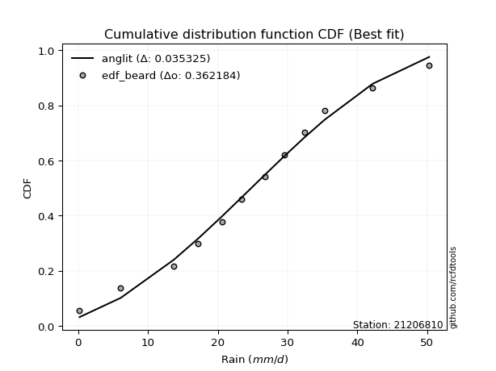</img></img>

</div>


### 5. Empirical - EDF Chegodayev (1955)

The Chegodayev formula is an empirical plotting position formula used in hydrological frequency analysis to estimate the exceedance probability or return period of a specific event from a set of observed data. It is primarily used for plotting observed data points on probability paper to fit a theoretical distribution, particularly for analyzing extreme events like maximum flood flows or rainfall intensities. The constant _b_ value in the generalized plotting position formula is 0.3.

<div align="center">


$P=(m-b)/(n+1-2b)$


</div>


**5.1. Empirical values**

<div align="center">

|                | 0                  | 1                   | 2                   | 3                   | 4                  | 5                  | 6                  | 7                  | 8                  | 9                 | 10                 | 11                 |
|:---------------|:-------------------|:--------------------|:--------------------|:--------------------|:-------------------|:-------------------|:-------------------|:-------------------|:-------------------|:------------------|:-------------------|:-------------------|
| date           | 2023               | 2010                | 2015                | 2016                | 2009               | 2014               | 2012               | 2025               | 2011               | 2013              | 2024               | 2008               |
| x              | 0.2                | 6.1                 | 13.7                | 17.2                | 20.6               | 23.4               | 26.8               | 28.7               | 32.4               | 35.3              | 42.2               | 50.3               |
| m              | 1                  | 2                   | 3                   | 4                   | 5                  | 6                  | 7                  | 8                  | 9                  | 10                | 11                 | 12                 |
| empirical_dist | edf_chegodayev     | edf_chegodayev      | edf_chegodayev      | edf_chegodayev      | edf_chegodayev     | edf_chegodayev     | edf_chegodayev     | edf_chegodayev     | edf_chegodayev     | edf_chegodayev    | edf_chegodayev     | edf_chegodayev     |
| empirical      | 0.0564516129032258 | 0.13709677419354838 | 0.21774193548387097 | 0.29838709677419356 | 0.3790322580645161 | 0.4596774193548387 | 0.5403225806451613 | 0.6209677419354839 | 0.7016129032258064 | 0.782258064516129 | 0.8629032258064515 | 0.9435483870967741 |
| empirical_tr   | 1.0598290598290598 | 1.158878504672897   | 1.2783505154639176  | 1.425287356321839   | 1.6103896103896105 | 1.8507462686567164 | 2.1754385964912277 | 2.6382978723404253 | 3.3513513513513504 | 4.592592592592592 | 7.294117647058818  | 17.714285714285694 |

</div>


**5.2. Kolmogorov-Smirnov fit test (sorted by Δ)**


<div align="center">

|                | 0                   | 1                    | 2                   | 3                   | 4                    | 5                   | 6                    | 7                   | 8                   | 9                   | 10                  | 11                  | 12                  | 13                  | 14                  | 15                   | 16                  | 17                  | 18                  | 19                   | 20                  | 21                  | 22                  | 23                  | 24                  | 25                   | 26                  | 27                  | 28                  | 29                  | 30                  | 31                  | 32                  | 33                  | 34                  | 35                    | 36                  | 37                  | 38                  | 39                  | 40                  | 41                  | 42                  | 43                  | 44                  | 45                  | 46                  | 47                  | 48                  | 49                  | 50                  | 51                  | 52                  | 53                  | 54                  | 55                  | 56                  | 57                  | 58                  | 59                  | 60                  | 61                  | 62                  | 63                  | 64                  | 65                  | 66                  | 67                  | 68                  | 69                  | 70                  | 71                  | 72                  | 73                  | 74                  | 75                  | 76                  | 77                  | 78                  | 79                  | 80                  | 81                  | 82                  | 83                  | 84                  | 85                  | 86                  | 87                  | 88                  | 89                  |
|:---------------|:--------------------|:---------------------|:--------------------|:--------------------|:---------------------|:--------------------|:---------------------|:--------------------|:--------------------|:--------------------|:--------------------|:--------------------|:--------------------|:--------------------|:--------------------|:---------------------|:--------------------|:--------------------|:--------------------|:---------------------|:--------------------|:--------------------|:--------------------|:--------------------|:--------------------|:---------------------|:--------------------|:--------------------|:--------------------|:--------------------|:--------------------|:--------------------|:--------------------|:--------------------|:--------------------|:----------------------|:--------------------|:--------------------|:--------------------|:--------------------|:--------------------|:--------------------|:--------------------|:--------------------|:--------------------|:--------------------|:--------------------|:--------------------|:--------------------|:--------------------|:--------------------|:--------------------|:--------------------|:--------------------|:--------------------|:--------------------|:--------------------|:--------------------|:--------------------|:--------------------|:--------------------|:--------------------|:--------------------|:--------------------|:--------------------|:--------------------|:--------------------|:--------------------|:--------------------|:--------------------|:--------------------|:--------------------|:--------------------|:--------------------|:--------------------|:--------------------|:--------------------|:--------------------|:--------------------|:--------------------|:--------------------|:--------------------|:--------------------|:--------------------|:--------------------|:--------------------|:--------------------|:--------------------|:--------------------|:--------------------|
| station        | 21206810            | 21206810             | 21206810            | 21206810            | 21206810             | 21206810            | 21206810             | 21206810            | 21206810            | 21206810            | 21206810            | 21206810            | 21206810            | 21206810            | 21206810            | 21206810             | 21206810            | 21206810            | 21206810            | 21206810             | 21206810            | 21206810            | 21206810            | 21206810            | 21206810            | 21206810             | 21206810            | 21206810            | 21206810            | 21206810            | 21206810            | 21206810            | 21206810            | 21206810            | 21206810            | 21206810              | 21206810            | 21206810            | 21206810            | 21206810            | 21206810            | 21206810            | 21206810            | 21206810            | 21206810            | 21206810            | 21206810            | 21206810            | 21206810            | 21206810            | 21206810            | 21206810            | 21206810            | 21206810            | 21206810            | 21206810            | 21206810            | 21206810            | 21206810            | 21206810            | 21206810            | 21206810            | 21206810            | 21206810            | 21206810            | 21206810            | 21206810            | 21206810            | 21206810            | 21206810            | 21206810            | 21206810            | 21206810            | 21206810            | 21206810            | 21206810            | 21206810            | 21206810            | 21206810            | 21206810            | 21206810            | 21206810            | 21206810            | 21206810            | 21206810            | 21206810            | 21206810            | 21206810            | 21206810            | 21206810            |
| empirical_dist | edf_chegodayev      | edf_chegodayev       | edf_chegodayev      | edf_chegodayev      | edf_chegodayev       | edf_chegodayev      | edf_chegodayev       | edf_chegodayev      | edf_chegodayev      | edf_chegodayev      | edf_chegodayev      | edf_chegodayev      | edf_chegodayev      | edf_chegodayev      | edf_chegodayev      | edf_chegodayev       | edf_chegodayev      | edf_chegodayev      | edf_chegodayev      | edf_chegodayev       | edf_chegodayev      | edf_chegodayev      | edf_chegodayev      | edf_chegodayev      | edf_chegodayev      | edf_chegodayev       | edf_chegodayev      | edf_chegodayev      | edf_chegodayev      | edf_chegodayev      | edf_chegodayev      | edf_chegodayev      | edf_chegodayev      | edf_chegodayev      | edf_chegodayev      | edf_chegodayev        | edf_chegodayev      | edf_chegodayev      | edf_chegodayev      | edf_chegodayev      | edf_chegodayev      | edf_chegodayev      | edf_chegodayev      | edf_chegodayev      | edf_chegodayev      | edf_chegodayev      | edf_chegodayev      | edf_chegodayev      | edf_chegodayev      | edf_chegodayev      | edf_chegodayev      | edf_chegodayev      | edf_chegodayev      | edf_chegodayev      | edf_chegodayev      | edf_chegodayev      | edf_chegodayev      | edf_chegodayev      | edf_chegodayev      | edf_chegodayev      | edf_chegodayev      | edf_chegodayev      | edf_chegodayev      | edf_chegodayev      | edf_chegodayev      | edf_chegodayev      | edf_chegodayev      | edf_chegodayev      | edf_chegodayev      | edf_chegodayev      | edf_chegodayev      | edf_chegodayev      | edf_chegodayev      | edf_chegodayev      | edf_chegodayev      | edf_chegodayev      | edf_chegodayev      | edf_chegodayev      | edf_chegodayev      | edf_chegodayev      | edf_chegodayev      | edf_chegodayev      | edf_chegodayev      | edf_chegodayev      | edf_chegodayev      | edf_chegodayev      | edf_chegodayev      | edf_chegodayev      | edf_chegodayev      | edf_chegodayev      |
| p_dist         | fisk                | nct                  | t                   | crystalball         | norm                 | exponnorm           | pearson3             | gamma               | erlang              | johnsonsu           | f                   | betaprime           | fatiguelife         | chi2                | genlogistic         | weibull_min          | alpha               | rice                | invgamma            | invgauss             | logistic            | truncnorm           | logjohnsonsu        | hypsecant           | laplace_asymmetric  | maxwell              | invweibull          | laplace             | rayleigh            | gumbel_l            | mielke              | kstwobign           | logt                | gumbel_r            | logloggamma         | loglaplace_asymmetric | moyal               | halflogistic        | halfnorm            | logpearson3         | ncf                 | loggumbel_l         | wald                | genexpon            | nakagami            | expon               | gibrat              | loghypsecant        | loglogistic         | loglognorm          | loglaplace          | lognakagami         | logexponnorm        | logcrystalball      | lognorm             | lognorm             | logrice             | logfatiguelife      | lognct              | logmielke           | loginvgamma         | loggamma            | loggamma            | loginvgauss         | logmaxwell          | logalpha            | lograyleigh         | loginvweibull       | loggumbel_r         | loghalfnorm         | logkstwobign        | logmoyal            | loghalflogistic     | loggenexpon         | logfisk             | logexpon            | logwald             | logerlang           | loggibrat           | logncf              | pareto              | logpareto           | logf                | logtruncnorm        | gompertz            | logweibull_min      | logbetaprime        | logchi2             | loggompertz         | loggenlogistic      |
| delta          | 0.04736416493066807 | 0.048212143655326514 | 0.0482259300429046  | 0.04823588078818358 | 0.048235881448286666 | 0.04823710960155214 | 0.048658573453675844 | 0.04865898619104522 | 0.04868104605098017 | 0.04884582674378285 | 0.04907703124164706 | 0.05025793228950795 | 0.05043884601112808 | 0.05116318302539867 | 0.05148887442230596 | 0.052416316485996026 | 0.05431250637362406 | 0.05432792298689902 | 0.0554324371295863  | 0.056659837703099125 | 0.05726567072127939 | 0.05761564606013175 | 0.060181290418029   | 0.06082914740405522 | 0.06168441939085867 | 0.061772749437608035 | 0.06489301353377513 | 0.06988267916635349 | 0.07082651468968797 | 0.07831786382708117 | 0.0826862351955118  | 0.0851654723019436  | 0.08993702271286175 | 0.09478310234050939 | 0.10478786777656443 | 0.10647510053093392   | 0.11918996257097741 | 0.13709677419354838 | 0.13709677419354838 | 0.14193061030429666 | 0.16660967019231043 | 0.17045018607281862 | 0.1810819457416748  | 0.20215330781197996 | 0.20416693242520695 | 0.205357229120578   | 0.21774193548387097 | 0.23047849650001187 | 0.23523012711234062 | 0.23861600035021555 | 0.23947882826489425 | 0.24037465735937366 | 0.24083308293369685 | 0.24083522785974645 | 0.24083523756628758 | 0.24083523756628758 | 0.24083525035929063 | 0.24097983516320506 | 0.24178971177257905 | 0.25696711780599224 | 0.2606396274571888  | 0.26344947431845056 | 0.26344947431845056 | 0.2719914190439068  | 0.2750443339313846  | 0.27890098618991777 | 0.2868188239479956  | 0.28880100932649944 | 0.30871290422066566 | 0.32003277481702963 | 0.3213001661736632  | 0.3342811193218952  | 0.34190074812430093 | 0.3567960981093976  | 0.39212140140240104 | 0.4050431430753795  | 0.4054048342373271  | 0.41278733316026006 | 0.4203802593852498  | 0.4384389887396668  | 0.4821563758154429  | 0.5168793081499526  | 0.5306010538381579  | 0.5395273233662469  | 0.5525644357952368  | 0.6237231584557001  | 0.6947637667803437  | 0.7602448337101224  | 0.8280192132926137  | 0.8629032258064515  |
| deltao         | 0.36218414519599995 | 0.36218414519599995  | 0.36218414519599995 | 0.36218414519599995 | 0.36218414519599995  | 0.36218414519599995 | 0.36218414519599995  | 0.36218414519599995 | 0.36218414519599995 | 0.36218414519599995 | 0.36218414519599995 | 0.36218414519599995 | 0.36218414519599995 | 0.36218414519599995 | 0.36218414519599995 | 0.36218414519599995  | 0.36218414519599995 | 0.36218414519599995 | 0.36218414519599995 | 0.36218414519599995  | 0.36218414519599995 | 0.36218414519599995 | 0.36218414519599995 | 0.36218414519599995 | 0.36218414519599995 | 0.36218414519599995  | 0.36218414519599995 | 0.36218414519599995 | 0.36218414519599995 | 0.36218414519599995 | 0.36218414519599995 | 0.36218414519599995 | 0.36218414519599995 | 0.36218414519599995 | 0.36218414519599995 | 0.36218414519599995   | 0.36218414519599995 | 0.36218414519599995 | 0.36218414519599995 | 0.36218414519599995 | 0.36218414519599995 | 0.36218414519599995 | 0.36218414519599995 | 0.36218414519599995 | 0.36218414519599995 | 0.36218414519599995 | 0.36218414519599995 | 0.36218414519599995 | 0.36218414519599995 | 0.36218414519599995 | 0.36218414519599995 | 0.36218414519599995 | 0.36218414519599995 | 0.36218414519599995 | 0.36218414519599995 | 0.36218414519599995 | 0.36218414519599995 | 0.36218414519599995 | 0.36218414519599995 | 0.36218414519599995 | 0.36218414519599995 | 0.36218414519599995 | 0.36218414519599995 | 0.36218414519599995 | 0.36218414519599995 | 0.36218414519599995 | 0.36218414519599995 | 0.36218414519599995 | 0.36218414519599995 | 0.36218414519599995 | 0.36218414519599995 | 0.36218414519599995 | 0.36218414519599995 | 0.36218414519599995 | 0.36218414519599995 | 0.36218414519599995 | 0.36218414519599995 | 0.36218414519599995 | 0.36218414519599995 | 0.36218414519599995 | 0.36218414519599995 | 0.36218414519599995 | 0.36218414519599995 | 0.36218414519599995 | 0.36218414519599995 | 0.36218414519599995 | 0.36218414519599995 | 0.36218414519599995 | 0.36218414519599995 | 0.36218414519599995 |
| eval           | Δo > Δ              | Δo > Δ               | Δo > Δ              | Δo > Δ              | Δo > Δ               | Δo > Δ              | Δo > Δ               | Δo > Δ              | Δo > Δ              | Δo > Δ              | Δo > Δ              | Δo > Δ              | Δo > Δ              | Δo > Δ              | Δo > Δ              | Δo > Δ               | Δo > Δ              | Δo > Δ              | Δo > Δ              | Δo > Δ               | Δo > Δ              | Δo > Δ              | Δo > Δ              | Δo > Δ              | Δo > Δ              | Δo > Δ               | Δo > Δ              | Δo > Δ              | Δo > Δ              | Δo > Δ              | Δo > Δ              | Δo > Δ              | Δo > Δ              | Δo > Δ              | Δo > Δ              | Δo > Δ                | Δo > Δ              | Δo > Δ              | Δo > Δ              | Δo > Δ              | Δo > Δ              | Δo > Δ              | Δo > Δ              | Δo > Δ              | Δo > Δ              | Δo > Δ              | Δo > Δ              | Δo > Δ              | Δo > Δ              | Δo > Δ              | Δo > Δ              | Δo > Δ              | Δo > Δ              | Δo > Δ              | Δo > Δ              | Δo > Δ              | Δo > Δ              | Δo > Δ              | Δo > Δ              | Δo > Δ              | Δo > Δ              | Δo > Δ              | Δo > Δ              | Δo > Δ              | Δo > Δ              | Δo > Δ              | Δo > Δ              | Δo > Δ              | Δo > Δ              | Δo > Δ              | Δo > Δ              | Δo > Δ              | Δo > Δ              | Δo > Δ              | Δo <= Δ             | Δo <= Δ             | Δo <= Δ             | Δo <= Δ             | Δo <= Δ             | Δo <= Δ             | Δo <= Δ             | Δo <= Δ             | Δo <= Δ             | Δo <= Δ             | Δo <= Δ             | Δo <= Δ             | Δo <= Δ             | Δo <= Δ             | Δo <= Δ             | Δo <= Δ             |
| fit            | 1                   | 1                    | 1                   | 1                   | 1                    | 1                   | 1                    | 1                   | 1                   | 1                   | 1                   | 1                   | 1                   | 1                   | 1                   | 1                    | 1                   | 1                   | 1                   | 1                    | 1                   | 1                   | 1                   | 1                   | 1                   | 1                    | 1                   | 1                   | 1                   | 1                   | 1                   | 1                   | 1                   | 1                   | 1                   | 1                     | 1                   | 1                   | 1                   | 1                   | 1                   | 1                   | 1                   | 1                   | 1                   | 1                   | 1                   | 1                   | 1                   | 1                   | 1                   | 1                   | 1                   | 1                   | 1                   | 1                   | 1                   | 1                   | 1                   | 1                   | 1                   | 1                   | 1                   | 1                   | 1                   | 1                   | 1                   | 1                   | 1                   | 1                   | 1                   | 1                   | 1                   | 1                   | 0                   | 0                   | 0                   | 0                   | 0                   | 0                   | 0                   | 0                   | 0                   | 0                   | 0                   | 0                   | 0                   | 0                   | 0                   | 0                   |
| n              | 12                  | 12                   | 12                  | 12                  | 12                   | 12                  | 12                   | 12                  | 12                  | 12                  | 12                  | 12                  | 12                  | 12                  | 12                  | 12                   | 12                  | 12                  | 12                  | 12                   | 12                  | 12                  | 12                  | 12                  | 12                  | 12                   | 12                  | 12                  | 12                  | 12                  | 12                  | 12                  | 12                  | 12                  | 12                  | 12                    | 12                  | 12                  | 12                  | 12                  | 12                  | 12                  | 12                  | 12                  | 12                  | 12                  | 12                  | 12                  | 12                  | 12                  | 12                  | 12                  | 12                  | 12                  | 12                  | 12                  | 12                  | 12                  | 12                  | 12                  | 12                  | 12                  | 12                  | 12                  | 12                  | 12                  | 12                  | 12                  | 12                  | 12                  | 12                  | 12                  | 12                  | 12                  | 12                  | 12                  | 12                  | 12                  | 12                  | 12                  | 12                  | 12                  | 12                  | 12                  | 12                  | 12                  | 12                  | 12                  | 12                  | 12                  |
| best_fit       | 1                   | 0                    | 0                   | 0                   | 0                    | 0                   | 0                    | 0                   | 0                   | 0                   | 0                   | 0                   | 0                   | 0                   | 0                   | 0                    | 0                   | 0                   | 0                   | 0                    | 0                   | 0                   | 0                   | 0                   | 0                   | 0                    | 0                   | 0                   | 0                   | 0                   | 0                   | 0                   | 0                   | 0                   | 0                   | 0                     | 0                   | 0                   | 0                   | 0                   | 0                   | 0                   | 0                   | 0                   | 0                   | 0                   | 0                   | 0                   | 0                   | 0                   | 0                   | 0                   | 0                   | 0                   | 0                   | 0                   | 0                   | 0                   | 0                   | 0                   | 0                   | 0                   | 0                   | 0                   | 0                   | 0                   | 0                   | 0                   | 0                   | 0                   | 0                   | 0                   | 0                   | 0                   | 0                   | 0                   | 0                   | 0                   | 0                   | 0                   | 0                   | 0                   | 0                   | 0                   | 0                   | 0                   | 0                   | 0                   | 0                   | 0                   |
| best_fit_sort  | 1                   | 2                    | 3                   | 4                   | 5                    | 6                   | 7                    | 8                   | 9                   | 10                  | 11                  | 12                  | 13                  | 14                  | 15                  | 16                   | 17                  | 18                  | 19                  | 20                   | 21                  | 22                  | 23                  | 24                  | 25                  | 26                   | 27                  | 28                  | 29                  | 30                  | 31                  | 32                  | 33                  | 34                  | 35                  | 36                    | 37                  | 38                  | 39                  | 40                  | 41                  | 42                  | 43                  | 44                  | 45                  | 46                  | 47                  | 48                  | 49                  | 50                  | 51                  | 52                  | 53                  | 54                  | 55                  | 56                  | 57                  | 58                  | 59                  | 60                  | 61                  | 62                  | 63                  | 64                  | 65                  | 66                  | 67                  | 68                  | 69                  | 70                  | 71                  | 72                  | 73                  | 74                  | 75                  | 76                  | 77                  | 78                  | 79                  | 80                  | 81                  | 82                  | 83                  | 84                  | 85                  | 86                  | 87                  | 88                  | 89                  | 90                  |

</div>


<div align="center">

</img>

</div>


**5.3. Best fit**

<div align="center">

|   id |   station | empirical_dist   | p_dist   |     delta |   deltao | eval   |   fit |   n |   best_fit |   best_fit_sort |
|-----:|----------:|:-----------------|:---------|----------:|---------:|:-------|------:|----:|-----------:|----------------:|
|    0 |  21206810 | edf_chegodayev   | fisk     | 0.0473642 | 0.362184 | Δo > Δ |     1 |  12 |          1 |               1 |

</div>


<div align="center">

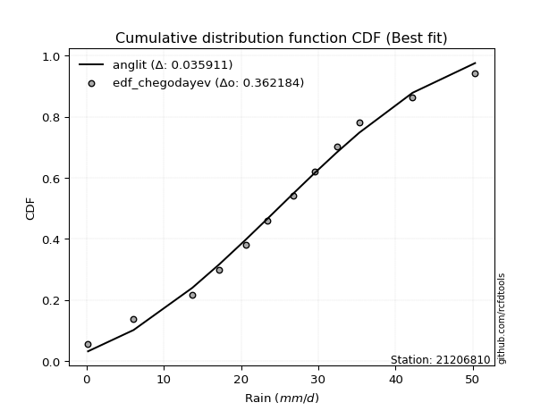</img>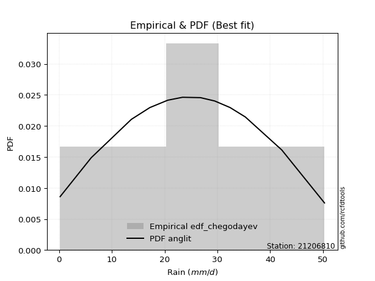</img>

</div>


### 6. Empirical - EDF Blom (1958)

The Blom formula is a specific "plotting position" formula used in hydrology and statistical analysis to estimate the empirical cumulative probability (or non-exceedance probability) of a data series. It is particularly recommended for data that are approximately normally distributed. The constant _a_ is set to 0.375 (or 3/8).

<div align="center">


$P=(m-a)/(n+1-2a)$


</div>


**6.1. Empirical values**

<div align="center">

|                | 0                   | 1                  | 2                   | 3                   | 4                   | 5                   | 6                  | 7                  | 8                  | 9                  | 10                 | 11                 |
|:---------------|:--------------------|:-------------------|:--------------------|:--------------------|:--------------------|:--------------------|:-------------------|:-------------------|:-------------------|:-------------------|:-------------------|:-------------------|
| date           | 2023                | 2010               | 2015                | 2016                | 2009                | 2014                | 2012               | 2025               | 2011               | 2013               | 2024               | 2008               |
| x              | 0.2                 | 6.1                | 13.7                | 17.2                | 20.6                | 23.4                | 26.8               | 28.7               | 32.4               | 35.3               | 42.2               | 50.3               |
| m              | 1                   | 2                  | 3                   | 4                   | 5                   | 6                   | 7                  | 8                  | 9                  | 10                 | 11                 | 12                 |
| empirical_dist | edf_blom            | edf_blom           | edf_blom            | edf_blom            | edf_blom            | edf_blom            | edf_blom           | edf_blom           | edf_blom           | edf_blom           | edf_blom           | edf_blom           |
| empirical      | 0.05102040816326531 | 0.1326530612244898 | 0.21428571428571427 | 0.29591836734693877 | 0.37755102040816324 | 0.45918367346938777 | 0.5408163265306123 | 0.6224489795918368 | 0.7040816326530612 | 0.7857142857142857 | 0.8673469387755102 | 0.9489795918367347 |
| empirical_tr   | 1.053763440860215   | 1.1529411764705884 | 1.2727272727272727  | 1.4202898550724639  | 1.6065573770491803  | 1.8490566037735847  | 2.177777777777778  | 2.6486486486486487 | 3.3793103448275863 | 4.666666666666666  | 7.5384615384615365 | 19.60000000000002  |

</div>


**6.2. Kolmogorov-Smirnov fit test (sorted by Δ)**


<div align="center">

|                | 0                   | 1                   | 2                    | 3                   | 4                    | 5                   | 6                   | 7                   | 8                   | 9                   | 10                   | 11                  | 12                  | 13                  | 14                   | 15                   | 16                  | 17                  | 18                  | 19                  | 20                   | 21                  | 22                  | 23                  | 24                  | 25                  | 26                  | 27                  | 28                  | 29                  | 30                  | 31                  | 32                  | 33                  | 34                  | 35                    | 36                  | 37                  | 38                  | 39                  | 40                  | 41                  | 42                  | 43                  | 44                  | 45                  | 46                  | 47                  | 48                  | 49                  | 50                  | 51                  | 52                  | 53                  | 54                  | 55                  | 56                  | 57                  | 58                  | 59                  | 60                  | 61                  | 62                  | 63                  | 64                  | 65                  | 66                  | 67                  | 68                  | 69                  | 70                  | 71                  | 72                  | 73                  | 74                  | 75                  | 76                  | 77                  | 78                  | 79                  | 80                  | 81                  | 82                  | 83                  | 84                  | 85                  | 86                  | 87                  | 88                  | 89                  |
|:---------------|:--------------------|:--------------------|:---------------------|:--------------------|:---------------------|:--------------------|:--------------------|:--------------------|:--------------------|:--------------------|:---------------------|:--------------------|:--------------------|:--------------------|:---------------------|:---------------------|:--------------------|:--------------------|:--------------------|:--------------------|:---------------------|:--------------------|:--------------------|:--------------------|:--------------------|:--------------------|:--------------------|:--------------------|:--------------------|:--------------------|:--------------------|:--------------------|:--------------------|:--------------------|:--------------------|:----------------------|:--------------------|:--------------------|:--------------------|:--------------------|:--------------------|:--------------------|:--------------------|:--------------------|:--------------------|:--------------------|:--------------------|:--------------------|:--------------------|:--------------------|:--------------------|:--------------------|:--------------------|:--------------------|:--------------------|:--------------------|:--------------------|:--------------------|:--------------------|:--------------------|:--------------------|:--------------------|:--------------------|:--------------------|:--------------------|:--------------------|:--------------------|:--------------------|:--------------------|:--------------------|:--------------------|:--------------------|:--------------------|:--------------------|:--------------------|:--------------------|:--------------------|:--------------------|:--------------------|:--------------------|:--------------------|:--------------------|:--------------------|:--------------------|:--------------------|:--------------------|:--------------------|:--------------------|:--------------------|:--------------------|
| station        | 21206810            | 21206810            | 21206810             | 21206810            | 21206810             | 21206810            | 21206810            | 21206810            | 21206810            | 21206810            | 21206810             | 21206810            | 21206810            | 21206810            | 21206810             | 21206810             | 21206810            | 21206810            | 21206810            | 21206810            | 21206810             | 21206810            | 21206810            | 21206810            | 21206810            | 21206810            | 21206810            | 21206810            | 21206810            | 21206810            | 21206810            | 21206810            | 21206810            | 21206810            | 21206810            | 21206810              | 21206810            | 21206810            | 21206810            | 21206810            | 21206810            | 21206810            | 21206810            | 21206810            | 21206810            | 21206810            | 21206810            | 21206810            | 21206810            | 21206810            | 21206810            | 21206810            | 21206810            | 21206810            | 21206810            | 21206810            | 21206810            | 21206810            | 21206810            | 21206810            | 21206810            | 21206810            | 21206810            | 21206810            | 21206810            | 21206810            | 21206810            | 21206810            | 21206810            | 21206810            | 21206810            | 21206810            | 21206810            | 21206810            | 21206810            | 21206810            | 21206810            | 21206810            | 21206810            | 21206810            | 21206810            | 21206810            | 21206810            | 21206810            | 21206810            | 21206810            | 21206810            | 21206810            | 21206810            | 21206810            |
| empirical_dist | edf_blom            | edf_blom            | edf_blom             | edf_blom            | edf_blom             | edf_blom            | edf_blom            | edf_blom            | edf_blom            | edf_blom            | edf_blom             | edf_blom            | edf_blom            | edf_blom            | edf_blom             | edf_blom             | edf_blom            | edf_blom            | edf_blom            | edf_blom            | edf_blom             | edf_blom            | edf_blom            | edf_blom            | edf_blom            | edf_blom            | edf_blom            | edf_blom            | edf_blom            | edf_blom            | edf_blom            | edf_blom            | edf_blom            | edf_blom            | edf_blom            | edf_blom              | edf_blom            | edf_blom            | edf_blom            | edf_blom            | edf_blom            | edf_blom            | edf_blom            | edf_blom            | edf_blom            | edf_blom            | edf_blom            | edf_blom            | edf_blom            | edf_blom            | edf_blom            | edf_blom            | edf_blom            | edf_blom            | edf_blom            | edf_blom            | edf_blom            | edf_blom            | edf_blom            | edf_blom            | edf_blom            | edf_blom            | edf_blom            | edf_blom            | edf_blom            | edf_blom            | edf_blom            | edf_blom            | edf_blom            | edf_blom            | edf_blom            | edf_blom            | edf_blom            | edf_blom            | edf_blom            | edf_blom            | edf_blom            | edf_blom            | edf_blom            | edf_blom            | edf_blom            | edf_blom            | edf_blom            | edf_blom            | edf_blom            | edf_blom            | edf_blom            | edf_blom            | edf_blom            | edf_blom            |
| p_dist         | fisk                | nct                 | t                    | crystalball         | norm                 | exponnorm           | pearson3            | gamma               | erlang              | johnsonsu           | f                    | betaprime           | fatiguelife         | chi2                | genlogistic          | weibull_min          | alpha               | rice                | invgamma            | invgauss            | logistic             | hypsecant           | maxwell             | truncnorm           | laplace_asymmetric  | logjohnsonsu        | invweibull          | rayleigh            | laplace             | gumbel_l            | mielke              | kstwobign           | gumbel_r            | logt                | logloggamma         | loglaplace_asymmetric | moyal               | halflogistic        | halfnorm            | logpearson3         | ncf                 | loggumbel_l         | wald                | genexpon            | nakagami            | expon               | gibrat              | loghypsecant        | loglogistic         | loglaplace          | loglognorm          | lognakagami         | logexponnorm        | logcrystalball      | lognorm             | lognorm             | logrice             | logfatiguelife      | lognct              | logmielke           | loginvgamma         | loggamma            | loggamma            | loginvgauss         | logmaxwell          | logalpha            | lograyleigh         | loginvweibull       | loggumbel_r         | loghalfnorm         | logkstwobign        | logmoyal            | loghalflogistic     | loggenexpon         | logfisk             | logwald             | logexpon            | logerlang           | loggibrat           | logncf              | pareto              | logpareto           | logf                | logtruncnorm        | gompertz            | logweibull_min      | logbetaprime        | logchi2             | loggompertz         | loggenlogistic      |
| delta          | 0.0429204519616095  | 0.04376843068626794 | 0.043782217073846025 | 0.04379216781912501 | 0.043792168479228094 | 0.04379339663249357 | 0.04421486048461727 | 0.04421527322198665 | 0.0442373330819216  | 0.04440211377472428 | 0.044633318272588485 | 0.04581421932044938 | 0.04599513304206951 | 0.0467194700563401  | 0.047045161453247386 | 0.047972603516937454 | 0.04986879340456549 | 0.04988421001784045 | 0.05098872416052773 | 0.05221612473404055 | 0.052821957752220816 | 0.05638543443499665 | 0.05732903646854946 | 0.05909688371648464 | 0.06119067350540763 | 0.0636375116161857  | 0.06637425119012802 | 0.0663828017206294  | 0.06741394973909864 | 0.07387415085802251 | 0.08614245639366849 | 0.08664670995829649 | 0.09033938937145082 | 0.09536822745282236 | 0.10824408897472113 | 0.10993132172909062   | 0.11474624960191884 | 0.1326530612244898  | 0.1326530612244898  | 0.14538683150245335 | 0.16809090784866332 | 0.1739064072709753  | 0.18058819985622376 | 0.20560952901013665 | 0.20663566185246174 | 0.2088134503187347  | 0.21428571428571427 | 0.23393471769816856 | 0.23868634831049731 | 0.24194755769214904 | 0.24207222154837224 | 0.24383087855753036 | 0.24428930413185354 | 0.24429144905790315 | 0.24429145876444427 | 0.24429145876444427 | 0.24429147155744732 | 0.24443605636136176 | 0.24524593297073574 | 0.26042333900414893 | 0.2640958486553455  | 0.26690569551660726 | 0.26690569551660726 | 0.2754476402420635  | 0.2785005551295413  | 0.28235720738807446 | 0.2902750451461523  | 0.29225723052465613 | 0.31216912541882236 | 0.3234889960151863  | 0.3247563873718199  | 0.3377373405200519  | 0.34535696932245763 | 0.3602523193075543  | 0.39755260614236165 | 0.4088610554354838  | 0.409486856044438   | 0.4182185379002207  | 0.4238364805834065  | 0.44288270170872535 | 0.48660008878450145 | 0.5213230211190112  | 0.5350447668072165  | 0.5429835445644036  | 0.5542231950037804  | 0.6281668714247587  | 0.6992074797494022  | 0.764688546679181   | 0.8324629262616723  | 0.8673469387755102  |
| deltao         | 0.36218414519599995 | 0.36218414519599995 | 0.36218414519599995  | 0.36218414519599995 | 0.36218414519599995  | 0.36218414519599995 | 0.36218414519599995 | 0.36218414519599995 | 0.36218414519599995 | 0.36218414519599995 | 0.36218414519599995  | 0.36218414519599995 | 0.36218414519599995 | 0.36218414519599995 | 0.36218414519599995  | 0.36218414519599995  | 0.36218414519599995 | 0.36218414519599995 | 0.36218414519599995 | 0.36218414519599995 | 0.36218414519599995  | 0.36218414519599995 | 0.36218414519599995 | 0.36218414519599995 | 0.36218414519599995 | 0.36218414519599995 | 0.36218414519599995 | 0.36218414519599995 | 0.36218414519599995 | 0.36218414519599995 | 0.36218414519599995 | 0.36218414519599995 | 0.36218414519599995 | 0.36218414519599995 | 0.36218414519599995 | 0.36218414519599995   | 0.36218414519599995 | 0.36218414519599995 | 0.36218414519599995 | 0.36218414519599995 | 0.36218414519599995 | 0.36218414519599995 | 0.36218414519599995 | 0.36218414519599995 | 0.36218414519599995 | 0.36218414519599995 | 0.36218414519599995 | 0.36218414519599995 | 0.36218414519599995 | 0.36218414519599995 | 0.36218414519599995 | 0.36218414519599995 | 0.36218414519599995 | 0.36218414519599995 | 0.36218414519599995 | 0.36218414519599995 | 0.36218414519599995 | 0.36218414519599995 | 0.36218414519599995 | 0.36218414519599995 | 0.36218414519599995 | 0.36218414519599995 | 0.36218414519599995 | 0.36218414519599995 | 0.36218414519599995 | 0.36218414519599995 | 0.36218414519599995 | 0.36218414519599995 | 0.36218414519599995 | 0.36218414519599995 | 0.36218414519599995 | 0.36218414519599995 | 0.36218414519599995 | 0.36218414519599995 | 0.36218414519599995 | 0.36218414519599995 | 0.36218414519599995 | 0.36218414519599995 | 0.36218414519599995 | 0.36218414519599995 | 0.36218414519599995 | 0.36218414519599995 | 0.36218414519599995 | 0.36218414519599995 | 0.36218414519599995 | 0.36218414519599995 | 0.36218414519599995 | 0.36218414519599995 | 0.36218414519599995 | 0.36218414519599995 |
| eval           | Δo > Δ              | Δo > Δ              | Δo > Δ               | Δo > Δ              | Δo > Δ               | Δo > Δ              | Δo > Δ              | Δo > Δ              | Δo > Δ              | Δo > Δ              | Δo > Δ               | Δo > Δ              | Δo > Δ              | Δo > Δ              | Δo > Δ               | Δo > Δ               | Δo > Δ              | Δo > Δ              | Δo > Δ              | Δo > Δ              | Δo > Δ               | Δo > Δ              | Δo > Δ              | Δo > Δ              | Δo > Δ              | Δo > Δ              | Δo > Δ              | Δo > Δ              | Δo > Δ              | Δo > Δ              | Δo > Δ              | Δo > Δ              | Δo > Δ              | Δo > Δ              | Δo > Δ              | Δo > Δ                | Δo > Δ              | Δo > Δ              | Δo > Δ              | Δo > Δ              | Δo > Δ              | Δo > Δ              | Δo > Δ              | Δo > Δ              | Δo > Δ              | Δo > Δ              | Δo > Δ              | Δo > Δ              | Δo > Δ              | Δo > Δ              | Δo > Δ              | Δo > Δ              | Δo > Δ              | Δo > Δ              | Δo > Δ              | Δo > Δ              | Δo > Δ              | Δo > Δ              | Δo > Δ              | Δo > Δ              | Δo > Δ              | Δo > Δ              | Δo > Δ              | Δo > Δ              | Δo > Δ              | Δo > Δ              | Δo > Δ              | Δo > Δ              | Δo > Δ              | Δo > Δ              | Δo > Δ              | Δo > Δ              | Δo > Δ              | Δo > Δ              | Δo <= Δ             | Δo <= Δ             | Δo <= Δ             | Δo <= Δ             | Δo <= Δ             | Δo <= Δ             | Δo <= Δ             | Δo <= Δ             | Δo <= Δ             | Δo <= Δ             | Δo <= Δ             | Δo <= Δ             | Δo <= Δ             | Δo <= Δ             | Δo <= Δ             | Δo <= Δ             |
| fit            | 1                   | 1                   | 1                    | 1                   | 1                    | 1                   | 1                   | 1                   | 1                   | 1                   | 1                    | 1                   | 1                   | 1                   | 1                    | 1                    | 1                   | 1                   | 1                   | 1                   | 1                    | 1                   | 1                   | 1                   | 1                   | 1                   | 1                   | 1                   | 1                   | 1                   | 1                   | 1                   | 1                   | 1                   | 1                   | 1                     | 1                   | 1                   | 1                   | 1                   | 1                   | 1                   | 1                   | 1                   | 1                   | 1                   | 1                   | 1                   | 1                   | 1                   | 1                   | 1                   | 1                   | 1                   | 1                   | 1                   | 1                   | 1                   | 1                   | 1                   | 1                   | 1                   | 1                   | 1                   | 1                   | 1                   | 1                   | 1                   | 1                   | 1                   | 1                   | 1                   | 1                   | 1                   | 0                   | 0                   | 0                   | 0                   | 0                   | 0                   | 0                   | 0                   | 0                   | 0                   | 0                   | 0                   | 0                   | 0                   | 0                   | 0                   |
| n              | 12                  | 12                  | 12                   | 12                  | 12                   | 12                  | 12                  | 12                  | 12                  | 12                  | 12                   | 12                  | 12                  | 12                  | 12                   | 12                   | 12                  | 12                  | 12                  | 12                  | 12                   | 12                  | 12                  | 12                  | 12                  | 12                  | 12                  | 12                  | 12                  | 12                  | 12                  | 12                  | 12                  | 12                  | 12                  | 12                    | 12                  | 12                  | 12                  | 12                  | 12                  | 12                  | 12                  | 12                  | 12                  | 12                  | 12                  | 12                  | 12                  | 12                  | 12                  | 12                  | 12                  | 12                  | 12                  | 12                  | 12                  | 12                  | 12                  | 12                  | 12                  | 12                  | 12                  | 12                  | 12                  | 12                  | 12                  | 12                  | 12                  | 12                  | 12                  | 12                  | 12                  | 12                  | 12                  | 12                  | 12                  | 12                  | 12                  | 12                  | 12                  | 12                  | 12                  | 12                  | 12                  | 12                  | 12                  | 12                  | 12                  | 12                  |
| best_fit       | 1                   | 0                   | 0                    | 0                   | 0                    | 0                   | 0                   | 0                   | 0                   | 0                   | 0                    | 0                   | 0                   | 0                   | 0                    | 0                    | 0                   | 0                   | 0                   | 0                   | 0                    | 0                   | 0                   | 0                   | 0                   | 0                   | 0                   | 0                   | 0                   | 0                   | 0                   | 0                   | 0                   | 0                   | 0                   | 0                     | 0                   | 0                   | 0                   | 0                   | 0                   | 0                   | 0                   | 0                   | 0                   | 0                   | 0                   | 0                   | 0                   | 0                   | 0                   | 0                   | 0                   | 0                   | 0                   | 0                   | 0                   | 0                   | 0                   | 0                   | 0                   | 0                   | 0                   | 0                   | 0                   | 0                   | 0                   | 0                   | 0                   | 0                   | 0                   | 0                   | 0                   | 0                   | 0                   | 0                   | 0                   | 0                   | 0                   | 0                   | 0                   | 0                   | 0                   | 0                   | 0                   | 0                   | 0                   | 0                   | 0                   | 0                   |
| best_fit_sort  | 1                   | 2                   | 3                    | 4                   | 5                    | 6                   | 7                   | 8                   | 9                   | 10                  | 11                   | 12                  | 13                  | 14                  | 15                   | 16                   | 17                  | 18                  | 19                  | 20                  | 21                   | 22                  | 23                  | 24                  | 25                  | 26                  | 27                  | 28                  | 29                  | 30                  | 31                  | 32                  | 33                  | 34                  | 35                  | 36                    | 37                  | 38                  | 39                  | 40                  | 41                  | 42                  | 43                  | 44                  | 45                  | 46                  | 47                  | 48                  | 49                  | 50                  | 51                  | 52                  | 53                  | 54                  | 55                  | 56                  | 57                  | 58                  | 59                  | 60                  | 61                  | 62                  | 63                  | 64                  | 65                  | 66                  | 67                  | 68                  | 69                  | 70                  | 71                  | 72                  | 73                  | 74                  | 75                  | 76                  | 77                  | 78                  | 79                  | 80                  | 81                  | 82                  | 83                  | 84                  | 85                  | 86                  | 87                  | 88                  | 89                  | 90                  |

</div>


<div align="center">

</img>

</div>


**6.3. Best fit**

<div align="center">

|   id |   station | empirical_dist   | p_dist   |     delta |   deltao | eval   |   fit |   n |   best_fit |   best_fit_sort |
|-----:|----------:|:-----------------|:---------|----------:|---------:|:-------|------:|----:|-----------:|----------------:|
|    0 |  21206810 | edf_blom         | fisk     | 0.0429205 | 0.362184 | Δo > Δ |     1 |  12 |          1 |               1 |

</div>


<div align="center">

</img>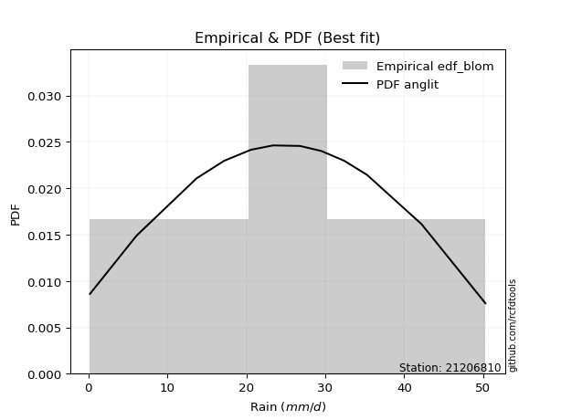</img>

</div>


### 7. Empirical - EDF Tukey (1962)

In hydrology, the Tukey formula is used as a plotting position formula to estimate the empirical probability or frequency of a flood event (or other hydrological data). The formula parameter is given as _c=0.333_ (or 1/3).

<div align="center">


$P=(m-c)/(n+1-2c)$


</div>


**7.1. Empirical values**

<div align="center">

|                | 0                   | 1                   | 2                   | 3                  | 4                  | 5                  | 6                  | 7                  | 8                  | 9                  | 10                 | 11                 |
|:---------------|:--------------------|:--------------------|:--------------------|:-------------------|:-------------------|:-------------------|:-------------------|:-------------------|:-------------------|:-------------------|:-------------------|:-------------------|
| date           | 2023                | 2010                | 2015                | 2016               | 2009               | 2014               | 2012               | 2025               | 2011               | 2013               | 2024               | 2008               |
| x              | 0.2                 | 6.1                 | 13.7                | 17.2               | 20.6               | 23.4               | 26.8               | 28.7               | 32.4               | 35.3               | 42.2               | 50.3               |
| m              | 1                   | 2                   | 3                   | 4                  | 5                  | 6                  | 7                  | 8                  | 9                  | 10                 | 11                 | 12                 |
| empirical_dist | edf_tukey           | edf_tukey           | edf_tukey           | edf_tukey          | edf_tukey          | edf_tukey          | edf_tukey          | edf_tukey          | edf_tukey          | edf_tukey          | edf_tukey          | edf_tukey          |
| empirical      | 0.05405405405405406 | 0.13513513513513514 | 0.21621621621621623 | 0.2972972972972973 | 0.3783783783783784 | 0.4594594594594595 | 0.5405405405405406 | 0.6216216216216216 | 0.7027027027027027 | 0.7837837837837838 | 0.8648648648648649 | 0.9459459459459459 |
| empirical_tr   | 1.0571428571428572  | 1.15625             | 1.2758620689655173  | 1.4230769230769231 | 1.608695652173913  | 1.8499999999999999 | 2.1764705882352944 | 2.642857142857143  | 3.363636363636364  | 4.625              | 7.400000000000003  | 18.5               |

</div>


**7.2. Kolmogorov-Smirnov fit test (sorted by Δ)**


<div align="center">

|                | 0                   | 1                   | 2                   | 3                   | 4                   | 5                   | 6                   | 7                   | 8                    | 9                    | 10                  | 11                  | 12                   | 13                   | 14                   | 15                  | 16                   | 17                  | 18                  | 19                  | 20                   | 21                  | 22                   | 23                  | 24                  | 25                  | 26                  | 27                  | 28                  | 29                  | 30                  | 31                  | 32                  | 33                  | 34                  | 35                    | 36                  | 37                  | 38                  | 39                  | 40                  | 41                  | 42                  | 43                  | 44                  | 45                  | 46                  | 47                  | 48                  | 49                  | 50                  | 51                  | 52                  | 53                  | 54                  | 55                  | 56                  | 57                  | 58                  | 59                  | 60                  | 61                  | 62                  | 63                  | 64                  | 65                  | 66                  | 67                  | 68                  | 69                  | 70                  | 71                  | 72                  | 73                  | 74                  | 75                  | 76                  | 77                  | 78                  | 79                  | 80                  | 81                  | 82                  | 83                  | 84                  | 85                  | 86                  | 87                  | 88                  | 89                  |
|:---------------|:--------------------|:--------------------|:--------------------|:--------------------|:--------------------|:--------------------|:--------------------|:--------------------|:---------------------|:---------------------|:--------------------|:--------------------|:---------------------|:---------------------|:---------------------|:--------------------|:---------------------|:--------------------|:--------------------|:--------------------|:---------------------|:--------------------|:---------------------|:--------------------|:--------------------|:--------------------|:--------------------|:--------------------|:--------------------|:--------------------|:--------------------|:--------------------|:--------------------|:--------------------|:--------------------|:----------------------|:--------------------|:--------------------|:--------------------|:--------------------|:--------------------|:--------------------|:--------------------|:--------------------|:--------------------|:--------------------|:--------------------|:--------------------|:--------------------|:--------------------|:--------------------|:--------------------|:--------------------|:--------------------|:--------------------|:--------------------|:--------------------|:--------------------|:--------------------|:--------------------|:--------------------|:--------------------|:--------------------|:--------------------|:--------------------|:--------------------|:--------------------|:--------------------|:--------------------|:--------------------|:--------------------|:--------------------|:--------------------|:--------------------|:--------------------|:--------------------|:--------------------|:--------------------|:--------------------|:--------------------|:--------------------|:--------------------|:--------------------|:--------------------|:--------------------|:--------------------|:--------------------|:--------------------|:--------------------|:--------------------|
| station        | 21206810            | 21206810            | 21206810            | 21206810            | 21206810            | 21206810            | 21206810            | 21206810            | 21206810             | 21206810             | 21206810            | 21206810            | 21206810             | 21206810             | 21206810             | 21206810            | 21206810             | 21206810            | 21206810            | 21206810            | 21206810             | 21206810            | 21206810             | 21206810            | 21206810            | 21206810            | 21206810            | 21206810            | 21206810            | 21206810            | 21206810            | 21206810            | 21206810            | 21206810            | 21206810            | 21206810              | 21206810            | 21206810            | 21206810            | 21206810            | 21206810            | 21206810            | 21206810            | 21206810            | 21206810            | 21206810            | 21206810            | 21206810            | 21206810            | 21206810            | 21206810            | 21206810            | 21206810            | 21206810            | 21206810            | 21206810            | 21206810            | 21206810            | 21206810            | 21206810            | 21206810            | 21206810            | 21206810            | 21206810            | 21206810            | 21206810            | 21206810            | 21206810            | 21206810            | 21206810            | 21206810            | 21206810            | 21206810            | 21206810            | 21206810            | 21206810            | 21206810            | 21206810            | 21206810            | 21206810            | 21206810            | 21206810            | 21206810            | 21206810            | 21206810            | 21206810            | 21206810            | 21206810            | 21206810            | 21206810            |
| empirical_dist | edf_tukey           | edf_tukey           | edf_tukey           | edf_tukey           | edf_tukey           | edf_tukey           | edf_tukey           | edf_tukey           | edf_tukey            | edf_tukey            | edf_tukey           | edf_tukey           | edf_tukey            | edf_tukey            | edf_tukey            | edf_tukey           | edf_tukey            | edf_tukey           | edf_tukey           | edf_tukey           | edf_tukey            | edf_tukey           | edf_tukey            | edf_tukey           | edf_tukey           | edf_tukey           | edf_tukey           | edf_tukey           | edf_tukey           | edf_tukey           | edf_tukey           | edf_tukey           | edf_tukey           | edf_tukey           | edf_tukey           | edf_tukey             | edf_tukey           | edf_tukey           | edf_tukey           | edf_tukey           | edf_tukey           | edf_tukey           | edf_tukey           | edf_tukey           | edf_tukey           | edf_tukey           | edf_tukey           | edf_tukey           | edf_tukey           | edf_tukey           | edf_tukey           | edf_tukey           | edf_tukey           | edf_tukey           | edf_tukey           | edf_tukey           | edf_tukey           | edf_tukey           | edf_tukey           | edf_tukey           | edf_tukey           | edf_tukey           | edf_tukey           | edf_tukey           | edf_tukey           | edf_tukey           | edf_tukey           | edf_tukey           | edf_tukey           | edf_tukey           | edf_tukey           | edf_tukey           | edf_tukey           | edf_tukey           | edf_tukey           | edf_tukey           | edf_tukey           | edf_tukey           | edf_tukey           | edf_tukey           | edf_tukey           | edf_tukey           | edf_tukey           | edf_tukey           | edf_tukey           | edf_tukey           | edf_tukey           | edf_tukey           | edf_tukey           | edf_tukey           |
| p_dist         | fisk                | nct                 | t                   | crystalball         | norm                | exponnorm           | pearson3            | gamma               | erlang               | johnsonsu            | f                   | betaprime           | fatiguelife          | chi2                 | genlogistic          | weibull_min         | alpha                | rice                | invgamma            | invgauss            | logistic             | truncnorm           | hypsecant            | maxwell             | laplace_asymmetric  | logjohnsonsu        | invweibull          | laplace             | rayleigh            | gumbel_l            | mielke              | kstwobign           | logt                | gumbel_r            | logloggamma         | loglaplace_asymmetric | moyal               | halflogistic        | halfnorm            | logpearson3         | ncf                 | loggumbel_l         | wald                | genexpon            | nakagami            | expon               | gibrat              | loghypsecant        | loglogistic         | loglognorm          | loglaplace          | lognakagami         | logexponnorm        | logcrystalball      | lognorm             | lognorm             | logrice             | logfatiguelife      | lognct              | logmielke           | loginvgamma         | loggamma            | loggamma            | loginvgauss         | logmaxwell          | logalpha            | lograyleigh         | loginvweibull       | loggumbel_r         | loghalfnorm         | logkstwobign        | logmoyal            | loghalflogistic     | loggenexpon         | logfisk             | logwald             | logexpon            | logerlang           | loggibrat           | logncf              | pareto              | logpareto           | logf                | logtruncnorm        | gompertz            | logweibull_min      | logbetaprime        | logchi2             | loggompertz         | loggenlogistic      |
| delta          | 0.04540252587225484 | 0.04625050459691328 | 0.04626429098449136 | 0.04627424172977035 | 0.04627424238987343 | 0.04627547054313891 | 0.04669693439526261 | 0.04669734713263199 | 0.046719406992566936 | 0.046884187685369616 | 0.04711539218323382 | 0.04829629323109472 | 0.048477206952714846 | 0.049201543966985437 | 0.049527235363892724 | 0.05045467742758279 | 0.052350867315210825 | 0.05236628392848579 | 0.05347079807117307 | 0.05469819864468589 | 0.055304031662866154 | 0.05826952574626948 | 0.058867508345641986 | 0.0598111103791948  | 0.06146645949547935 | 0.06170700968568377 | 0.06554689321991286 | 0.06879287968945713 | 0.06886487563127473 | 0.07635622476866777 | 0.08421195446316654 | 0.08581935198808133 | 0.09233458156203356 | 0.09282146328209616 | 0.10631358704421917 | 0.10800081979858867   | 0.11722832351256418 | 0.13513513513513514 | 0.13513513513513514 | 0.14345632957195142 | 0.16726354987844816 | 0.17197590534047336 | 0.18086398584629548 | 0.2036790270796347  | 0.2052567319021032  | 0.20688294838823273 | 0.21621621621621623 | 0.2320042157676666  | 0.23675584637999536 | 0.2401417196178703  | 0.2405686277417905  | 0.2419003766270284  | 0.2423588022013516  | 0.2423609471274012  | 0.24236095683394232 | 0.24236095683394232 | 0.24236096962694537 | 0.2425055544308598  | 0.2433154310402338  | 0.25849283707364695 | 0.26216534672484354 | 0.26497519358610533 | 0.26497519358610533 | 0.27351713831156155 | 0.2765700531990393  | 0.2804267054575725  | 0.2883445432156504  | 0.2903267285941542  | 0.31023862348832043 | 0.3215584940846844  | 0.32282588544131796 | 0.33580683858954996 | 0.3434264673919557  | 0.3583218173770524  | 0.39451896025157285 | 0.40693055350498186 | 0.4070047821337927  | 0.41518489200943187 | 0.4219059786529046  | 0.44040062779808004 | 0.48411801487385614 | 0.5188409472083659  | 0.5325626928965712  | 0.5410530426339016  | 0.5532183154813746  | 0.6256847975141133  | 0.6967254058387569  | 0.7622064727685356  | 0.829980852351027   | 0.8648648648648649  |
| deltao         | 0.36218414519599995 | 0.36218414519599995 | 0.36218414519599995 | 0.36218414519599995 | 0.36218414519599995 | 0.36218414519599995 | 0.36218414519599995 | 0.36218414519599995 | 0.36218414519599995  | 0.36218414519599995  | 0.36218414519599995 | 0.36218414519599995 | 0.36218414519599995  | 0.36218414519599995  | 0.36218414519599995  | 0.36218414519599995 | 0.36218414519599995  | 0.36218414519599995 | 0.36218414519599995 | 0.36218414519599995 | 0.36218414519599995  | 0.36218414519599995 | 0.36218414519599995  | 0.36218414519599995 | 0.36218414519599995 | 0.36218414519599995 | 0.36218414519599995 | 0.36218414519599995 | 0.36218414519599995 | 0.36218414519599995 | 0.36218414519599995 | 0.36218414519599995 | 0.36218414519599995 | 0.36218414519599995 | 0.36218414519599995 | 0.36218414519599995   | 0.36218414519599995 | 0.36218414519599995 | 0.36218414519599995 | 0.36218414519599995 | 0.36218414519599995 | 0.36218414519599995 | 0.36218414519599995 | 0.36218414519599995 | 0.36218414519599995 | 0.36218414519599995 | 0.36218414519599995 | 0.36218414519599995 | 0.36218414519599995 | 0.36218414519599995 | 0.36218414519599995 | 0.36218414519599995 | 0.36218414519599995 | 0.36218414519599995 | 0.36218414519599995 | 0.36218414519599995 | 0.36218414519599995 | 0.36218414519599995 | 0.36218414519599995 | 0.36218414519599995 | 0.36218414519599995 | 0.36218414519599995 | 0.36218414519599995 | 0.36218414519599995 | 0.36218414519599995 | 0.36218414519599995 | 0.36218414519599995 | 0.36218414519599995 | 0.36218414519599995 | 0.36218414519599995 | 0.36218414519599995 | 0.36218414519599995 | 0.36218414519599995 | 0.36218414519599995 | 0.36218414519599995 | 0.36218414519599995 | 0.36218414519599995 | 0.36218414519599995 | 0.36218414519599995 | 0.36218414519599995 | 0.36218414519599995 | 0.36218414519599995 | 0.36218414519599995 | 0.36218414519599995 | 0.36218414519599995 | 0.36218414519599995 | 0.36218414519599995 | 0.36218414519599995 | 0.36218414519599995 | 0.36218414519599995 |
| eval           | Δo > Δ              | Δo > Δ              | Δo > Δ              | Δo > Δ              | Δo > Δ              | Δo > Δ              | Δo > Δ              | Δo > Δ              | Δo > Δ               | Δo > Δ               | Δo > Δ              | Δo > Δ              | Δo > Δ               | Δo > Δ               | Δo > Δ               | Δo > Δ              | Δo > Δ               | Δo > Δ              | Δo > Δ              | Δo > Δ              | Δo > Δ               | Δo > Δ              | Δo > Δ               | Δo > Δ              | Δo > Δ              | Δo > Δ              | Δo > Δ              | Δo > Δ              | Δo > Δ              | Δo > Δ              | Δo > Δ              | Δo > Δ              | Δo > Δ              | Δo > Δ              | Δo > Δ              | Δo > Δ                | Δo > Δ              | Δo > Δ              | Δo > Δ              | Δo > Δ              | Δo > Δ              | Δo > Δ              | Δo > Δ              | Δo > Δ              | Δo > Δ              | Δo > Δ              | Δo > Δ              | Δo > Δ              | Δo > Δ              | Δo > Δ              | Δo > Δ              | Δo > Δ              | Δo > Δ              | Δo > Δ              | Δo > Δ              | Δo > Δ              | Δo > Δ              | Δo > Δ              | Δo > Δ              | Δo > Δ              | Δo > Δ              | Δo > Δ              | Δo > Δ              | Δo > Δ              | Δo > Δ              | Δo > Δ              | Δo > Δ              | Δo > Δ              | Δo > Δ              | Δo > Δ              | Δo > Δ              | Δo > Δ              | Δo > Δ              | Δo > Δ              | Δo <= Δ             | Δo <= Δ             | Δo <= Δ             | Δo <= Δ             | Δo <= Δ             | Δo <= Δ             | Δo <= Δ             | Δo <= Δ             | Δo <= Δ             | Δo <= Δ             | Δo <= Δ             | Δo <= Δ             | Δo <= Δ             | Δo <= Δ             | Δo <= Δ             | Δo <= Δ             |
| fit            | 1                   | 1                   | 1                   | 1                   | 1                   | 1                   | 1                   | 1                   | 1                    | 1                    | 1                   | 1                   | 1                    | 1                    | 1                    | 1                   | 1                    | 1                   | 1                   | 1                   | 1                    | 1                   | 1                    | 1                   | 1                   | 1                   | 1                   | 1                   | 1                   | 1                   | 1                   | 1                   | 1                   | 1                   | 1                   | 1                     | 1                   | 1                   | 1                   | 1                   | 1                   | 1                   | 1                   | 1                   | 1                   | 1                   | 1                   | 1                   | 1                   | 1                   | 1                   | 1                   | 1                   | 1                   | 1                   | 1                   | 1                   | 1                   | 1                   | 1                   | 1                   | 1                   | 1                   | 1                   | 1                   | 1                   | 1                   | 1                   | 1                   | 1                   | 1                   | 1                   | 1                   | 1                   | 0                   | 0                   | 0                   | 0                   | 0                   | 0                   | 0                   | 0                   | 0                   | 0                   | 0                   | 0                   | 0                   | 0                   | 0                   | 0                   |
| n              | 12                  | 12                  | 12                  | 12                  | 12                  | 12                  | 12                  | 12                  | 12                   | 12                   | 12                  | 12                  | 12                   | 12                   | 12                   | 12                  | 12                   | 12                  | 12                  | 12                  | 12                   | 12                  | 12                   | 12                  | 12                  | 12                  | 12                  | 12                  | 12                  | 12                  | 12                  | 12                  | 12                  | 12                  | 12                  | 12                    | 12                  | 12                  | 12                  | 12                  | 12                  | 12                  | 12                  | 12                  | 12                  | 12                  | 12                  | 12                  | 12                  | 12                  | 12                  | 12                  | 12                  | 12                  | 12                  | 12                  | 12                  | 12                  | 12                  | 12                  | 12                  | 12                  | 12                  | 12                  | 12                  | 12                  | 12                  | 12                  | 12                  | 12                  | 12                  | 12                  | 12                  | 12                  | 12                  | 12                  | 12                  | 12                  | 12                  | 12                  | 12                  | 12                  | 12                  | 12                  | 12                  | 12                  | 12                  | 12                  | 12                  | 12                  |
| best_fit       | 1                   | 0                   | 0                   | 0                   | 0                   | 0                   | 0                   | 0                   | 0                    | 0                    | 0                   | 0                   | 0                    | 0                    | 0                    | 0                   | 0                    | 0                   | 0                   | 0                   | 0                    | 0                   | 0                    | 0                   | 0                   | 0                   | 0                   | 0                   | 0                   | 0                   | 0                   | 0                   | 0                   | 0                   | 0                   | 0                     | 0                   | 0                   | 0                   | 0                   | 0                   | 0                   | 0                   | 0                   | 0                   | 0                   | 0                   | 0                   | 0                   | 0                   | 0                   | 0                   | 0                   | 0                   | 0                   | 0                   | 0                   | 0                   | 0                   | 0                   | 0                   | 0                   | 0                   | 0                   | 0                   | 0                   | 0                   | 0                   | 0                   | 0                   | 0                   | 0                   | 0                   | 0                   | 0                   | 0                   | 0                   | 0                   | 0                   | 0                   | 0                   | 0                   | 0                   | 0                   | 0                   | 0                   | 0                   | 0                   | 0                   | 0                   |
| best_fit_sort  | 1                   | 2                   | 3                   | 4                   | 5                   | 6                   | 7                   | 8                   | 9                    | 10                   | 11                  | 12                  | 13                   | 14                   | 15                   | 16                  | 17                   | 18                  | 19                  | 20                  | 21                   | 22                  | 23                   | 24                  | 25                  | 26                  | 27                  | 28                  | 29                  | 30                  | 31                  | 32                  | 33                  | 34                  | 35                  | 36                    | 37                  | 38                  | 39                  | 40                  | 41                  | 42                  | 43                  | 44                  | 45                  | 46                  | 47                  | 48                  | 49                  | 50                  | 51                  | 52                  | 53                  | 54                  | 55                  | 56                  | 57                  | 58                  | 59                  | 60                  | 61                  | 62                  | 63                  | 64                  | 65                  | 66                  | 67                  | 68                  | 69                  | 70                  | 71                  | 72                  | 73                  | 74                  | 75                  | 76                  | 77                  | 78                  | 79                  | 80                  | 81                  | 82                  | 83                  | 84                  | 85                  | 86                  | 87                  | 88                  | 89                  | 90                  |

</div>


<div align="center">

</img>

</div>


**7.3. Best fit**

<div align="center">

|   id |   station | empirical_dist   | p_dist   |     delta |   deltao | eval   |   fit |   n |   best_fit |   best_fit_sort |
|-----:|----------:|:-----------------|:---------|----------:|---------:|:-------|------:|----:|-----------:|----------------:|
|    0 |  21206810 | edf_tukey        | fisk     | 0.0454025 | 0.362184 | Δo > Δ |     1 |  12 |          1 |               1 |

</div>


<div align="center">

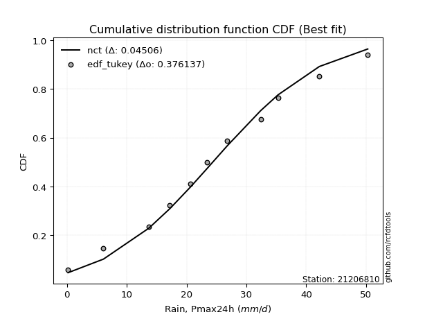</img>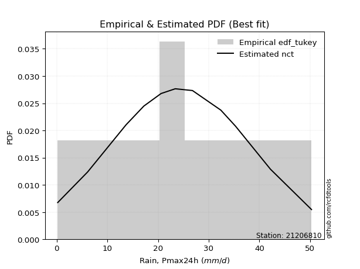</img>

</div>


### 8. Empirical - EDF Gringorten (1963)

Gringorten plotting position formula is essential for estimating the probability and return periods of extreme events like floods and heavy rainfall. The constant _a=0.44_.

<div align="center">


$P=(m-a)/(n+1-2a)$


</div>


**8.1. Empirical values**

<div align="center">

|                | 0                   | 1                   | 2                   | 3                   | 4                   | 5                   | 6                  | 7                  | 8                  | 9                  | 10                 | 11                 |
|:---------------|:--------------------|:--------------------|:--------------------|:--------------------|:--------------------|:--------------------|:-------------------|:-------------------|:-------------------|:-------------------|:-------------------|:-------------------|
| date           | 2023                | 2010                | 2015                | 2016                | 2009                | 2014                | 2012               | 2025               | 2011               | 2013               | 2024               | 2008               |
| x              | 0.2                 | 6.1                 | 13.7                | 17.2                | 20.6                | 23.4                | 26.8               | 28.7               | 32.4               | 35.3               | 42.2               | 50.3               |
| m              | 1                   | 2                   | 3                   | 4                   | 5                   | 6                   | 7                  | 8                  | 9                  | 10                 | 11                 | 12                 |
| empirical_dist | edf_gringorten      | edf_gringorten      | edf_gringorten      | edf_gringorten      | edf_gringorten      | edf_gringorten      | edf_gringorten     | edf_gringorten     | edf_gringorten     | edf_gringorten     | edf_gringorten     | edf_gringorten     |
| empirical      | 0.04620462046204621 | 0.12871287128712872 | 0.21122112211221125 | 0.29372937293729373 | 0.37623762376237624 | 0.45874587458745875 | 0.5412541254125413 | 0.6237623762376238 | 0.7062706270627064 | 0.7887788778877889 | 0.8712871287128714 | 0.9537953795379539 |
| empirical_tr   | 1.0484429065743945  | 1.1477272727272727  | 1.2677824267782427  | 1.4158878504672898  | 1.6031746031746033  | 1.8475609756097562  | 2.179856115107914  | 2.6578947368421053 | 3.4044943820224733 | 4.734375000000003  | 7.769230769230775  | 21.642857142857192 |

</div>


**8.2. Kolmogorov-Smirnov fit test (sorted by Δ)**


<div align="center">

|                | 0                   | 1                    | 2                   | 3                   | 4                    | 5                   | 6                   | 7                   | 8                   | 9                   | 10                   | 11                  | 12                  | 13                  | 14                  | 15                   | 16                  | 17                  | 18                  | 19                   | 20                  | 21                  | 22                   | 23                  | 24                  | 25                   | 26                  | 27                  | 28                  | 29                  | 30                  | 31                  | 32                  | 33                  | 34                  | 35                  | 36                    | 37                  | 38                  | 39                  | 40                  | 41                  | 42                  | 43                  | 44                  | 45                  | 46                  | 47                  | 48                  | 49                  | 50                  | 51                  | 52                  | 53                  | 54                  | 55                  | 56                  | 57                  | 58                  | 59                  | 60                  | 61                  | 62                  | 63                  | 64                  | 65                  | 66                  | 67                  | 68                  | 69                  | 70                  | 71                  | 72                  | 73                  | 74                  | 75                  | 76                  | 77                  | 78                  | 79                  | 80                  | 81                  | 82                  | 83                  | 84                  | 85                  | 86                  | 87                  | 88                  | 89                  |
|:---------------|:--------------------|:---------------------|:--------------------|:--------------------|:---------------------|:--------------------|:--------------------|:--------------------|:--------------------|:--------------------|:---------------------|:--------------------|:--------------------|:--------------------|:--------------------|:---------------------|:--------------------|:--------------------|:--------------------|:---------------------|:--------------------|:--------------------|:---------------------|:--------------------|:--------------------|:---------------------|:--------------------|:--------------------|:--------------------|:--------------------|:--------------------|:--------------------|:--------------------|:--------------------|:--------------------|:--------------------|:----------------------|:--------------------|:--------------------|:--------------------|:--------------------|:--------------------|:--------------------|:--------------------|:--------------------|:--------------------|:--------------------|:--------------------|:--------------------|:--------------------|:--------------------|:--------------------|:--------------------|:--------------------|:--------------------|:--------------------|:--------------------|:--------------------|:--------------------|:--------------------|:--------------------|:--------------------|:--------------------|:--------------------|:--------------------|:--------------------|:--------------------|:--------------------|:--------------------|:--------------------|:--------------------|:--------------------|:--------------------|:--------------------|:--------------------|:--------------------|:--------------------|:--------------------|:--------------------|:--------------------|:--------------------|:--------------------|:--------------------|:--------------------|:--------------------|:--------------------|:--------------------|:--------------------|:--------------------|:--------------------|
| station        | 21206810            | 21206810             | 21206810            | 21206810            | 21206810             | 21206810            | 21206810            | 21206810            | 21206810            | 21206810            | 21206810             | 21206810            | 21206810            | 21206810            | 21206810            | 21206810             | 21206810            | 21206810            | 21206810            | 21206810             | 21206810            | 21206810            | 21206810             | 21206810            | 21206810            | 21206810             | 21206810            | 21206810            | 21206810            | 21206810            | 21206810            | 21206810            | 21206810            | 21206810            | 21206810            | 21206810            | 21206810              | 21206810            | 21206810            | 21206810            | 21206810            | 21206810            | 21206810            | 21206810            | 21206810            | 21206810            | 21206810            | 21206810            | 21206810            | 21206810            | 21206810            | 21206810            | 21206810            | 21206810            | 21206810            | 21206810            | 21206810            | 21206810            | 21206810            | 21206810            | 21206810            | 21206810            | 21206810            | 21206810            | 21206810            | 21206810            | 21206810            | 21206810            | 21206810            | 21206810            | 21206810            | 21206810            | 21206810            | 21206810            | 21206810            | 21206810            | 21206810            | 21206810            | 21206810            | 21206810            | 21206810            | 21206810            | 21206810            | 21206810            | 21206810            | 21206810            | 21206810            | 21206810            | 21206810            | 21206810            |
| empirical_dist | edf_gringorten      | edf_gringorten       | edf_gringorten      | edf_gringorten      | edf_gringorten       | edf_gringorten      | edf_gringorten      | edf_gringorten      | edf_gringorten      | edf_gringorten      | edf_gringorten       | edf_gringorten      | edf_gringorten      | edf_gringorten      | edf_gringorten      | edf_gringorten       | edf_gringorten      | edf_gringorten      | edf_gringorten      | edf_gringorten       | edf_gringorten      | edf_gringorten      | edf_gringorten       | edf_gringorten      | edf_gringorten      | edf_gringorten       | edf_gringorten      | edf_gringorten      | edf_gringorten      | edf_gringorten      | edf_gringorten      | edf_gringorten      | edf_gringorten      | edf_gringorten      | edf_gringorten      | edf_gringorten      | edf_gringorten        | edf_gringorten      | edf_gringorten      | edf_gringorten      | edf_gringorten      | edf_gringorten      | edf_gringorten      | edf_gringorten      | edf_gringorten      | edf_gringorten      | edf_gringorten      | edf_gringorten      | edf_gringorten      | edf_gringorten      | edf_gringorten      | edf_gringorten      | edf_gringorten      | edf_gringorten      | edf_gringorten      | edf_gringorten      | edf_gringorten      | edf_gringorten      | edf_gringorten      | edf_gringorten      | edf_gringorten      | edf_gringorten      | edf_gringorten      | edf_gringorten      | edf_gringorten      | edf_gringorten      | edf_gringorten      | edf_gringorten      | edf_gringorten      | edf_gringorten      | edf_gringorten      | edf_gringorten      | edf_gringorten      | edf_gringorten      | edf_gringorten      | edf_gringorten      | edf_gringorten      | edf_gringorten      | edf_gringorten      | edf_gringorten      | edf_gringorten      | edf_gringorten      | edf_gringorten      | edf_gringorten      | edf_gringorten      | edf_gringorten      | edf_gringorten      | edf_gringorten      | edf_gringorten      | edf_gringorten      |
| p_dist         | fisk                | nct                  | t                   | crystalball         | norm                 | exponnorm           | pearson3            | gamma               | erlang              | johnsonsu           | f                    | betaprime           | fatiguelife         | chi2                | genlogistic         | weibull_min          | alpha               | rice                | invgamma            | invgauss             | logistic            | hypsecant           | maxwell              | truncnorm           | laplace_asymmetric  | rayleigh             | laplace             | logjohnsonsu        | invweibull          | gumbel_l            | gumbel_r            | kstwobign           | mielke              | logt                | logloggamma         | moyal               | loglaplace_asymmetric | halflogistic        | halfnorm            | logpearson3         | ncf                 | loggumbel_l         | wald                | genexpon            | nakagami            | gibrat              | expon               | loghypsecant        | loglogistic         | loglaplace          | loglognorm          | lognakagami         | logexponnorm        | logcrystalball      | lognorm             | lognorm             | logrice             | logfatiguelife      | lognct              | logmielke           | loginvgamma         | loggamma            | loggamma            | loginvgauss         | logmaxwell          | logalpha            | lograyleigh         | loginvweibull       | loggumbel_r         | loghalfnorm         | logkstwobign        | logmoyal            | loghalflogistic     | loggenexpon         | logfisk             | logwald             | logexpon            | logerlang           | loggibrat           | logncf              | pareto              | logpareto           | logf                | logtruncnorm        | gompertz            | logweibull_min      | logbetaprime        | logchi2             | loggompertz         | loggenlogistic      |
| delta          | 0.03898026202424841 | 0.039828240748906854 | 0.03984202713648494 | 0.03985197788176392 | 0.039851978541867006 | 0.03985320669513248 | 0.04027467054725618 | 0.04027508328462556 | 0.04029714314456051 | 0.04046192383736319 | 0.040693128335227396 | 0.04187402938308829 | 0.04205494310470842 | 0.04277928011897901 | 0.0431049715158863  | 0.044032413579576365 | 0.0459286034672044  | 0.04594402008047936 | 0.04704853422316664 | 0.048275934796679465 | 0.04888176781485973 | 0.05244524449763556 | 0.053388846531188375 | 0.06041028036227164 | 0.06075287462347867 | 0.062442611783268306 | 0.0652249553294535  | 0.06670210378968888 | 0.06768764783591502 | 0.06993396092066129 | 0.08757135452686415 | 0.08796010660408349 | 0.08920704856717152 | 0.10018401515404152 | 0.11130868114822415 | 0.11209492528509213 | 0.11299591390259364   | 0.12871287128712872 | 0.12871287128712872 | 0.14845142367595654 | 0.16940430449445032 | 0.17697099944447833 | 0.1801504009742948  | 0.20867412118363968 | 0.20882465626210678 | 0.21122112211221125 | 0.2118780424922377  | 0.2369993098716716  | 0.24175094048400034 | 0.24413655210179408 | 0.24513681372187526 | 0.24689547073103338 | 0.24735389630535656 | 0.24735604123140617 | 0.2473560509379473  | 0.2473560509379473  | 0.24735606373095034 | 0.24750064853486478 | 0.24831052514423876 | 0.2634879311776519  | 0.2671604408288485  | 0.26997028769011033 | 0.26997028769011033 | 0.27851223241556655 | 0.28156514730304427 | 0.2854217995615774  | 0.2933396373196554  | 0.2953218226981592  | 0.31523371759232544 | 0.3265535881886894  | 0.32782097954532297 | 0.34080193269355497 | 0.3484215614959607  | 0.3633169114810574  | 0.4023683938435808  | 0.41192564760898687 | 0.41342704598179913 | 0.42303432560143983 | 0.4269010727569096  | 0.44682289164608646 | 0.49054027872186257 | 0.5252632110563723  | 0.5389849567445776  | 0.5460481367379066  | 0.5564121894134255  | 0.6321070613621198  | 0.7031476696867633  | 0.7686287366165421  | 0.8364031161990334  | 0.8712871287128714  |
| deltao         | 0.36218414519599995 | 0.36218414519599995  | 0.36218414519599995 | 0.36218414519599995 | 0.36218414519599995  | 0.36218414519599995 | 0.36218414519599995 | 0.36218414519599995 | 0.36218414519599995 | 0.36218414519599995 | 0.36218414519599995  | 0.36218414519599995 | 0.36218414519599995 | 0.36218414519599995 | 0.36218414519599995 | 0.36218414519599995  | 0.36218414519599995 | 0.36218414519599995 | 0.36218414519599995 | 0.36218414519599995  | 0.36218414519599995 | 0.36218414519599995 | 0.36218414519599995  | 0.36218414519599995 | 0.36218414519599995 | 0.36218414519599995  | 0.36218414519599995 | 0.36218414519599995 | 0.36218414519599995 | 0.36218414519599995 | 0.36218414519599995 | 0.36218414519599995 | 0.36218414519599995 | 0.36218414519599995 | 0.36218414519599995 | 0.36218414519599995 | 0.36218414519599995   | 0.36218414519599995 | 0.36218414519599995 | 0.36218414519599995 | 0.36218414519599995 | 0.36218414519599995 | 0.36218414519599995 | 0.36218414519599995 | 0.36218414519599995 | 0.36218414519599995 | 0.36218414519599995 | 0.36218414519599995 | 0.36218414519599995 | 0.36218414519599995 | 0.36218414519599995 | 0.36218414519599995 | 0.36218414519599995 | 0.36218414519599995 | 0.36218414519599995 | 0.36218414519599995 | 0.36218414519599995 | 0.36218414519599995 | 0.36218414519599995 | 0.36218414519599995 | 0.36218414519599995 | 0.36218414519599995 | 0.36218414519599995 | 0.36218414519599995 | 0.36218414519599995 | 0.36218414519599995 | 0.36218414519599995 | 0.36218414519599995 | 0.36218414519599995 | 0.36218414519599995 | 0.36218414519599995 | 0.36218414519599995 | 0.36218414519599995 | 0.36218414519599995 | 0.36218414519599995 | 0.36218414519599995 | 0.36218414519599995 | 0.36218414519599995 | 0.36218414519599995 | 0.36218414519599995 | 0.36218414519599995 | 0.36218414519599995 | 0.36218414519599995 | 0.36218414519599995 | 0.36218414519599995 | 0.36218414519599995 | 0.36218414519599995 | 0.36218414519599995 | 0.36218414519599995 | 0.36218414519599995 |
| eval           | Δo > Δ              | Δo > Δ               | Δo > Δ              | Δo > Δ              | Δo > Δ               | Δo > Δ              | Δo > Δ              | Δo > Δ              | Δo > Δ              | Δo > Δ              | Δo > Δ               | Δo > Δ              | Δo > Δ              | Δo > Δ              | Δo > Δ              | Δo > Δ               | Δo > Δ              | Δo > Δ              | Δo > Δ              | Δo > Δ               | Δo > Δ              | Δo > Δ              | Δo > Δ               | Δo > Δ              | Δo > Δ              | Δo > Δ               | Δo > Δ              | Δo > Δ              | Δo > Δ              | Δo > Δ              | Δo > Δ              | Δo > Δ              | Δo > Δ              | Δo > Δ              | Δo > Δ              | Δo > Δ              | Δo > Δ                | Δo > Δ              | Δo > Δ              | Δo > Δ              | Δo > Δ              | Δo > Δ              | Δo > Δ              | Δo > Δ              | Δo > Δ              | Δo > Δ              | Δo > Δ              | Δo > Δ              | Δo > Δ              | Δo > Δ              | Δo > Δ              | Δo > Δ              | Δo > Δ              | Δo > Δ              | Δo > Δ              | Δo > Δ              | Δo > Δ              | Δo > Δ              | Δo > Δ              | Δo > Δ              | Δo > Δ              | Δo > Δ              | Δo > Δ              | Δo > Δ              | Δo > Δ              | Δo > Δ              | Δo > Δ              | Δo > Δ              | Δo > Δ              | Δo > Δ              | Δo > Δ              | Δo > Δ              | Δo > Δ              | Δo <= Δ             | Δo <= Δ             | Δo <= Δ             | Δo <= Δ             | Δo <= Δ             | Δo <= Δ             | Δo <= Δ             | Δo <= Δ             | Δo <= Δ             | Δo <= Δ             | Δo <= Δ             | Δo <= Δ             | Δo <= Δ             | Δo <= Δ             | Δo <= Δ             | Δo <= Δ             | Δo <= Δ             |
| fit            | 1                   | 1                    | 1                   | 1                   | 1                    | 1                   | 1                   | 1                   | 1                   | 1                   | 1                    | 1                   | 1                   | 1                   | 1                   | 1                    | 1                   | 1                   | 1                   | 1                    | 1                   | 1                   | 1                    | 1                   | 1                   | 1                    | 1                   | 1                   | 1                   | 1                   | 1                   | 1                   | 1                   | 1                   | 1                   | 1                   | 1                     | 1                   | 1                   | 1                   | 1                   | 1                   | 1                   | 1                   | 1                   | 1                   | 1                   | 1                   | 1                   | 1                   | 1                   | 1                   | 1                   | 1                   | 1                   | 1                   | 1                   | 1                   | 1                   | 1                   | 1                   | 1                   | 1                   | 1                   | 1                   | 1                   | 1                   | 1                   | 1                   | 1                   | 1                   | 1                   | 1                   | 0                   | 0                   | 0                   | 0                   | 0                   | 0                   | 0                   | 0                   | 0                   | 0                   | 0                   | 0                   | 0                   | 0                   | 0                   | 0                   | 0                   |
| n              | 12                  | 12                   | 12                  | 12                  | 12                   | 12                  | 12                  | 12                  | 12                  | 12                  | 12                   | 12                  | 12                  | 12                  | 12                  | 12                   | 12                  | 12                  | 12                  | 12                   | 12                  | 12                  | 12                   | 12                  | 12                  | 12                   | 12                  | 12                  | 12                  | 12                  | 12                  | 12                  | 12                  | 12                  | 12                  | 12                  | 12                    | 12                  | 12                  | 12                  | 12                  | 12                  | 12                  | 12                  | 12                  | 12                  | 12                  | 12                  | 12                  | 12                  | 12                  | 12                  | 12                  | 12                  | 12                  | 12                  | 12                  | 12                  | 12                  | 12                  | 12                  | 12                  | 12                  | 12                  | 12                  | 12                  | 12                  | 12                  | 12                  | 12                  | 12                  | 12                  | 12                  | 12                  | 12                  | 12                  | 12                  | 12                  | 12                  | 12                  | 12                  | 12                  | 12                  | 12                  | 12                  | 12                  | 12                  | 12                  | 12                  | 12                  |
| best_fit       | 1                   | 0                    | 0                   | 0                   | 0                    | 0                   | 0                   | 0                   | 0                   | 0                   | 0                    | 0                   | 0                   | 0                   | 0                   | 0                    | 0                   | 0                   | 0                   | 0                    | 0                   | 0                   | 0                    | 0                   | 0                   | 0                    | 0                   | 0                   | 0                   | 0                   | 0                   | 0                   | 0                   | 0                   | 0                   | 0                   | 0                     | 0                   | 0                   | 0                   | 0                   | 0                   | 0                   | 0                   | 0                   | 0                   | 0                   | 0                   | 0                   | 0                   | 0                   | 0                   | 0                   | 0                   | 0                   | 0                   | 0                   | 0                   | 0                   | 0                   | 0                   | 0                   | 0                   | 0                   | 0                   | 0                   | 0                   | 0                   | 0                   | 0                   | 0                   | 0                   | 0                   | 0                   | 0                   | 0                   | 0                   | 0                   | 0                   | 0                   | 0                   | 0                   | 0                   | 0                   | 0                   | 0                   | 0                   | 0                   | 0                   | 0                   |
| best_fit_sort  | 1                   | 2                    | 3                   | 4                   | 5                    | 6                   | 7                   | 8                   | 9                   | 10                  | 11                   | 12                  | 13                  | 14                  | 15                  | 16                   | 17                  | 18                  | 19                  | 20                   | 21                  | 22                  | 23                   | 24                  | 25                  | 26                   | 27                  | 28                  | 29                  | 30                  | 31                  | 32                  | 33                  | 34                  | 35                  | 36                  | 37                    | 38                  | 39                  | 40                  | 41                  | 42                  | 43                  | 44                  | 45                  | 46                  | 47                  | 48                  | 49                  | 50                  | 51                  | 52                  | 53                  | 54                  | 55                  | 56                  | 57                  | 58                  | 59                  | 60                  | 61                  | 62                  | 63                  | 64                  | 65                  | 66                  | 67                  | 68                  | 69                  | 70                  | 71                  | 72                  | 73                  | 74                  | 75                  | 76                  | 77                  | 78                  | 79                  | 80                  | 81                  | 82                  | 83                  | 84                  | 85                  | 86                  | 87                  | 88                  | 89                  | 90                  |

</div>


<div align="center">

</img>

</div>


**8.3. Best fit**

<div align="center">

|   id |   station | empirical_dist   | p_dist   |     delta |   deltao | eval   |   fit |   n |   best_fit |   best_fit_sort |
|-----:|----------:|:-----------------|:---------|----------:|---------:|:-------|------:|----:|-----------:|----------------:|
|    0 |  21206810 | edf_gringorten   | fisk     | 0.0389803 | 0.362184 | Δo > Δ |     1 |  12 |          1 |               1 |

</div>


<div align="center">

</img>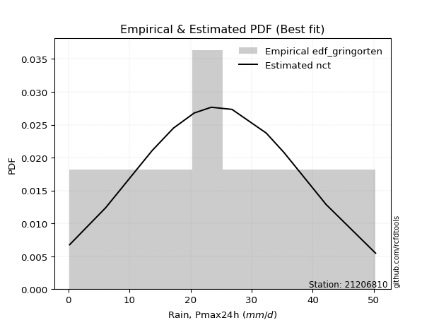</img>

</div>


### 9. Empirical - EDF Filliben (1975)

The specific values of the constants (0.3175) (often denoted as $alpha$) and (0.365) are derived from a method proposed by James J. Filliben in a 1975 paper. This particular formula is the mean value of the $i$-th order statistic of the normal distribution and is considered a robust and effective plotting position formula for the normal probability plot correlation coefficient test for normality.

<div align="center">


$P=(m-0.3175)/(n+0.365)$


</div>


**9.1. Empirical values**

<div align="center">

|                | 0                   | 1                   | 2                   | 3                   | 4                  | 5                  | 6                  | 7                  | 8                  | 9                  | 10                 | 11                 |
|:---------------|:--------------------|:--------------------|:--------------------|:--------------------|:-------------------|:-------------------|:-------------------|:-------------------|:-------------------|:-------------------|:-------------------|:-------------------|
| date           | 2023                | 2010                | 2015                | 2016                | 2009               | 2014               | 2012               | 2025               | 2011               | 2013               | 2024               | 2008               |
| x              | 0.2                 | 6.1                 | 13.7                | 17.2                | 20.6               | 23.4               | 26.8               | 28.7               | 32.4               | 35.3               | 42.2               | 50.3               |
| m              | 1                   | 2                   | 3                   | 4                   | 5                  | 6                  | 7                  | 8                  | 9                  | 10                 | 11                 | 12                 |
| empirical_dist | edf_filliben        | edf_filliben        | edf_filliben        | edf_filliben        | edf_filliben       | edf_filliben       | edf_filliben       | edf_filliben       | edf_filliben       | edf_filliben       | edf_filliben       | edf_filliben       |
| empirical      | 0.05519611807521229 | 0.13606955115244643 | 0.21694298422968056 | 0.29781641730691466 | 0.3786898503841488 | 0.4595632834613829 | 0.540436716538617  | 0.6213101496158512 | 0.7021835826930852 | 0.7830570157703194 | 0.8639304488475535 | 0.9448038819247876 |
| empirical_tr   | 1.0584207147442757  | 1.1575005850690383  | 1.2770462174025305  | 1.4241289951050964  | 1.609502115196876  | 1.8503554059109617 | 2.1759788825340958 | 2.6406833956219966 | 3.357773251866937  | 4.6095060577819185 | 7.349182763744426  | 18.117216117216078 |

</div>


**9.2. Kolmogorov-Smirnov fit test (sorted by Δ)**


<div align="center">

|                | 0                   | 1                    | 2                   | 3                    | 4                   | 5                   | 6                    | 7                    | 8                   | 9                   | 10                  | 11                  | 12                  | 13                  | 14                  | 15                  | 16                  | 17                  | 18                  | 19                   | 20                  | 21                  | 22                  | 23                   | 24                  | 25                  | 26                  | 27                  | 28                  | 29                  | 30                  | 31                  | 32                  | 33                  | 34                  | 35                    | 36                  | 37                  | 38                  | 39                  | 40                  | 41                  | 42                  | 43                  | 44                  | 45                  | 46                  | 47                  | 48                  | 49                  | 50                  | 51                  | 52                  | 53                  | 54                  | 55                  | 56                  | 57                  | 58                  | 59                  | 60                  | 61                  | 62                  | 63                  | 64                  | 65                  | 66                  | 67                  | 68                  | 69                  | 70                  | 71                  | 72                  | 73                  | 74                  | 75                  | 76                  | 77                  | 78                  | 79                  | 80                  | 81                  | 82                  | 83                  | 84                  | 85                  | 86                  | 87                  | 88                  | 89                  |
|:---------------|:--------------------|:---------------------|:--------------------|:---------------------|:--------------------|:--------------------|:---------------------|:---------------------|:--------------------|:--------------------|:--------------------|:--------------------|:--------------------|:--------------------|:--------------------|:--------------------|:--------------------|:--------------------|:--------------------|:---------------------|:--------------------|:--------------------|:--------------------|:---------------------|:--------------------|:--------------------|:--------------------|:--------------------|:--------------------|:--------------------|:--------------------|:--------------------|:--------------------|:--------------------|:--------------------|:----------------------|:--------------------|:--------------------|:--------------------|:--------------------|:--------------------|:--------------------|:--------------------|:--------------------|:--------------------|:--------------------|:--------------------|:--------------------|:--------------------|:--------------------|:--------------------|:--------------------|:--------------------|:--------------------|:--------------------|:--------------------|:--------------------|:--------------------|:--------------------|:--------------------|:--------------------|:--------------------|:--------------------|:--------------------|:--------------------|:--------------------|:--------------------|:--------------------|:--------------------|:--------------------|:--------------------|:--------------------|:--------------------|:--------------------|:--------------------|:--------------------|:--------------------|:--------------------|:--------------------|:--------------------|:--------------------|:--------------------|:--------------------|:--------------------|:--------------------|:--------------------|:--------------------|:--------------------|:--------------------|:--------------------|
| station        | 21206810            | 21206810             | 21206810            | 21206810             | 21206810            | 21206810            | 21206810             | 21206810             | 21206810            | 21206810            | 21206810            | 21206810            | 21206810            | 21206810            | 21206810            | 21206810            | 21206810            | 21206810            | 21206810            | 21206810             | 21206810            | 21206810            | 21206810            | 21206810             | 21206810            | 21206810            | 21206810            | 21206810            | 21206810            | 21206810            | 21206810            | 21206810            | 21206810            | 21206810            | 21206810            | 21206810              | 21206810            | 21206810            | 21206810            | 21206810            | 21206810            | 21206810            | 21206810            | 21206810            | 21206810            | 21206810            | 21206810            | 21206810            | 21206810            | 21206810            | 21206810            | 21206810            | 21206810            | 21206810            | 21206810            | 21206810            | 21206810            | 21206810            | 21206810            | 21206810            | 21206810            | 21206810            | 21206810            | 21206810            | 21206810            | 21206810            | 21206810            | 21206810            | 21206810            | 21206810            | 21206810            | 21206810            | 21206810            | 21206810            | 21206810            | 21206810            | 21206810            | 21206810            | 21206810            | 21206810            | 21206810            | 21206810            | 21206810            | 21206810            | 21206810            | 21206810            | 21206810            | 21206810            | 21206810            | 21206810            |
| empirical_dist | edf_filliben        | edf_filliben         | edf_filliben        | edf_filliben         | edf_filliben        | edf_filliben        | edf_filliben         | edf_filliben         | edf_filliben        | edf_filliben        | edf_filliben        | edf_filliben        | edf_filliben        | edf_filliben        | edf_filliben        | edf_filliben        | edf_filliben        | edf_filliben        | edf_filliben        | edf_filliben         | edf_filliben        | edf_filliben        | edf_filliben        | edf_filliben         | edf_filliben        | edf_filliben        | edf_filliben        | edf_filliben        | edf_filliben        | edf_filliben        | edf_filliben        | edf_filliben        | edf_filliben        | edf_filliben        | edf_filliben        | edf_filliben          | edf_filliben        | edf_filliben        | edf_filliben        | edf_filliben        | edf_filliben        | edf_filliben        | edf_filliben        | edf_filliben        | edf_filliben        | edf_filliben        | edf_filliben        | edf_filliben        | edf_filliben        | edf_filliben        | edf_filliben        | edf_filliben        | edf_filliben        | edf_filliben        | edf_filliben        | edf_filliben        | edf_filliben        | edf_filliben        | edf_filliben        | edf_filliben        | edf_filliben        | edf_filliben        | edf_filliben        | edf_filliben        | edf_filliben        | edf_filliben        | edf_filliben        | edf_filliben        | edf_filliben        | edf_filliben        | edf_filliben        | edf_filliben        | edf_filliben        | edf_filliben        | edf_filliben        | edf_filliben        | edf_filliben        | edf_filliben        | edf_filliben        | edf_filliben        | edf_filliben        | edf_filliben        | edf_filliben        | edf_filliben        | edf_filliben        | edf_filliben        | edf_filliben        | edf_filliben        | edf_filliben        | edf_filliben        |
| p_dist         | fisk                | nct                  | t                   | crystalball          | norm                | exponnorm           | pearson3             | gamma                | erlang              | johnsonsu           | f                   | betaprime           | fatiguelife         | chi2                | genlogistic         | weibull_min         | alpha               | rice                | invgamma            | invgauss             | logistic            | truncnorm           | hypsecant           | maxwell              | logjohnsonsu        | laplace_asymmetric  | invweibull          | laplace             | rayleigh            | gumbel_l            | mielke              | kstwobign           | logt                | gumbel_r            | logloggamma         | loglaplace_asymmetric | moyal               | halflogistic        | halfnorm            | logpearson3         | ncf                 | loggumbel_l         | wald                | genexpon            | nakagami            | expon               | gibrat              | loghypsecant        | loglogistic         | loglognorm          | loglaplace          | lognakagami         | logexponnorm        | logcrystalball      | lognorm             | lognorm             | logrice             | logfatiguelife      | lognct              | logmielke           | loginvgamma         | loggamma            | loggamma            | loginvgauss         | logmaxwell          | logalpha            | lograyleigh         | loginvweibull       | loggumbel_r         | loghalfnorm         | logkstwobign        | logmoyal            | loghalflogistic     | loggenexpon         | logfisk             | logexpon            | logwald             | logerlang           | loggibrat           | logncf              | pareto              | logpareto           | logf                | logtruncnorm        | gompertz            | logweibull_min      | logbetaprime        | logchi2             | loggompertz         | loggenlogistic      |
| delta          | 0.04633694188956612 | 0.047184920614224565 | 0.04719870700180265 | 0.047208657747081634 | 0.04720865840718472 | 0.04720988656045019 | 0.047631350412573895 | 0.047631763149943274 | 0.04765382300987822 | 0.0478186037026809  | 0.04804980820054511 | 0.049230709248406   | 0.04941162297002613 | 0.05013595998429672 | 0.05046165138120401 | 0.05138909344489408 | 0.05328528333252211 | 0.05330069994579707 | 0.05440521408848435 | 0.055632614661997176 | 0.05623844768017744 | 0.05795805374049906 | 0.05980192436295327 | 0.060745526396506086 | 0.06098024167221938 | 0.0615702834974029  | 0.06523542121414244 | 0.06931199969907464 | 0.06979929164858602 | 0.07729064078597914 | 0.08348518644970221 | 0.08550787998231091 | 0.0911925175408752  | 0.09375587929940744 | 0.10558681903075484 | 0.10727405178512434   | 0.11816273952987547 | 0.13606955115244643 | 0.13606955115244643 | 0.14272956155848704 | 0.16695207787267774 | 0.17124913732700903 | 0.18096780984821903 | 0.20295225906617037 | 0.20473761189248585 | 0.2061561803747684  | 0.21694298422968056 | 0.23127744775420228 | 0.23602907836653103 | 0.23941495160440596 | 0.24004950773217315 | 0.24117360861356407 | 0.24163203418788726 | 0.24163417911393686 | 0.241634188820478   | 0.241634188820478   | 0.24163420161348104 | 0.24177878641739547 | 0.24258866302676946 | 0.2577660690601826  | 0.2614385787113792  | 0.264248425572641   | 0.264248425572641   | 0.2727903702980972  | 0.275843285185575   | 0.27969993744410815 | 0.28761777520218607 | 0.2895999605806899  | 0.3095118554748561  | 0.32083172607122007 | 0.32209911742785363 | 0.33508007057608563 | 0.3426996993784914  | 0.35759504936358805 | 0.3933768962304145  | 0.4060703661164814  | 0.40620378549151753 | 0.4140428279882735  | 0.42117921063944025 | 0.4394662117807687  | 0.4831835988565448  | 0.5179065311910546  | 0.5316282768792598  | 0.5403262746204374  | 0.5529068434756041  | 0.6247503814968021  | 0.6957909898214456  | 0.7612720567512243  | 0.8290464363337157  | 0.8639304488475535  |
| deltao         | 0.36218414519599995 | 0.36218414519599995  | 0.36218414519599995 | 0.36218414519599995  | 0.36218414519599995 | 0.36218414519599995 | 0.36218414519599995  | 0.36218414519599995  | 0.36218414519599995 | 0.36218414519599995 | 0.36218414519599995 | 0.36218414519599995 | 0.36218414519599995 | 0.36218414519599995 | 0.36218414519599995 | 0.36218414519599995 | 0.36218414519599995 | 0.36218414519599995 | 0.36218414519599995 | 0.36218414519599995  | 0.36218414519599995 | 0.36218414519599995 | 0.36218414519599995 | 0.36218414519599995  | 0.36218414519599995 | 0.36218414519599995 | 0.36218414519599995 | 0.36218414519599995 | 0.36218414519599995 | 0.36218414519599995 | 0.36218414519599995 | 0.36218414519599995 | 0.36218414519599995 | 0.36218414519599995 | 0.36218414519599995 | 0.36218414519599995   | 0.36218414519599995 | 0.36218414519599995 | 0.36218414519599995 | 0.36218414519599995 | 0.36218414519599995 | 0.36218414519599995 | 0.36218414519599995 | 0.36218414519599995 | 0.36218414519599995 | 0.36218414519599995 | 0.36218414519599995 | 0.36218414519599995 | 0.36218414519599995 | 0.36218414519599995 | 0.36218414519599995 | 0.36218414519599995 | 0.36218414519599995 | 0.36218414519599995 | 0.36218414519599995 | 0.36218414519599995 | 0.36218414519599995 | 0.36218414519599995 | 0.36218414519599995 | 0.36218414519599995 | 0.36218414519599995 | 0.36218414519599995 | 0.36218414519599995 | 0.36218414519599995 | 0.36218414519599995 | 0.36218414519599995 | 0.36218414519599995 | 0.36218414519599995 | 0.36218414519599995 | 0.36218414519599995 | 0.36218414519599995 | 0.36218414519599995 | 0.36218414519599995 | 0.36218414519599995 | 0.36218414519599995 | 0.36218414519599995 | 0.36218414519599995 | 0.36218414519599995 | 0.36218414519599995 | 0.36218414519599995 | 0.36218414519599995 | 0.36218414519599995 | 0.36218414519599995 | 0.36218414519599995 | 0.36218414519599995 | 0.36218414519599995 | 0.36218414519599995 | 0.36218414519599995 | 0.36218414519599995 | 0.36218414519599995 |
| eval           | Δo > Δ              | Δo > Δ               | Δo > Δ              | Δo > Δ               | Δo > Δ              | Δo > Δ              | Δo > Δ               | Δo > Δ               | Δo > Δ              | Δo > Δ              | Δo > Δ              | Δo > Δ              | Δo > Δ              | Δo > Δ              | Δo > Δ              | Δo > Δ              | Δo > Δ              | Δo > Δ              | Δo > Δ              | Δo > Δ               | Δo > Δ              | Δo > Δ              | Δo > Δ              | Δo > Δ               | Δo > Δ              | Δo > Δ              | Δo > Δ              | Δo > Δ              | Δo > Δ              | Δo > Δ              | Δo > Δ              | Δo > Δ              | Δo > Δ              | Δo > Δ              | Δo > Δ              | Δo > Δ                | Δo > Δ              | Δo > Δ              | Δo > Δ              | Δo > Δ              | Δo > Δ              | Δo > Δ              | Δo > Δ              | Δo > Δ              | Δo > Δ              | Δo > Δ              | Δo > Δ              | Δo > Δ              | Δo > Δ              | Δo > Δ              | Δo > Δ              | Δo > Δ              | Δo > Δ              | Δo > Δ              | Δo > Δ              | Δo > Δ              | Δo > Δ              | Δo > Δ              | Δo > Δ              | Δo > Δ              | Δo > Δ              | Δo > Δ              | Δo > Δ              | Δo > Δ              | Δo > Δ              | Δo > Δ              | Δo > Δ              | Δo > Δ              | Δo > Δ              | Δo > Δ              | Δo > Δ              | Δo > Δ              | Δo > Δ              | Δo > Δ              | Δo <= Δ             | Δo <= Δ             | Δo <= Δ             | Δo <= Δ             | Δo <= Δ             | Δo <= Δ             | Δo <= Δ             | Δo <= Δ             | Δo <= Δ             | Δo <= Δ             | Δo <= Δ             | Δo <= Δ             | Δo <= Δ             | Δo <= Δ             | Δo <= Δ             | Δo <= Δ             |
| fit            | 1                   | 1                    | 1                   | 1                    | 1                   | 1                   | 1                    | 1                    | 1                   | 1                   | 1                   | 1                   | 1                   | 1                   | 1                   | 1                   | 1                   | 1                   | 1                   | 1                    | 1                   | 1                   | 1                   | 1                    | 1                   | 1                   | 1                   | 1                   | 1                   | 1                   | 1                   | 1                   | 1                   | 1                   | 1                   | 1                     | 1                   | 1                   | 1                   | 1                   | 1                   | 1                   | 1                   | 1                   | 1                   | 1                   | 1                   | 1                   | 1                   | 1                   | 1                   | 1                   | 1                   | 1                   | 1                   | 1                   | 1                   | 1                   | 1                   | 1                   | 1                   | 1                   | 1                   | 1                   | 1                   | 1                   | 1                   | 1                   | 1                   | 1                   | 1                   | 1                   | 1                   | 1                   | 0                   | 0                   | 0                   | 0                   | 0                   | 0                   | 0                   | 0                   | 0                   | 0                   | 0                   | 0                   | 0                   | 0                   | 0                   | 0                   |
| n              | 12                  | 12                   | 12                  | 12                   | 12                  | 12                  | 12                   | 12                   | 12                  | 12                  | 12                  | 12                  | 12                  | 12                  | 12                  | 12                  | 12                  | 12                  | 12                  | 12                   | 12                  | 12                  | 12                  | 12                   | 12                  | 12                  | 12                  | 12                  | 12                  | 12                  | 12                  | 12                  | 12                  | 12                  | 12                  | 12                    | 12                  | 12                  | 12                  | 12                  | 12                  | 12                  | 12                  | 12                  | 12                  | 12                  | 12                  | 12                  | 12                  | 12                  | 12                  | 12                  | 12                  | 12                  | 12                  | 12                  | 12                  | 12                  | 12                  | 12                  | 12                  | 12                  | 12                  | 12                  | 12                  | 12                  | 12                  | 12                  | 12                  | 12                  | 12                  | 12                  | 12                  | 12                  | 12                  | 12                  | 12                  | 12                  | 12                  | 12                  | 12                  | 12                  | 12                  | 12                  | 12                  | 12                  | 12                  | 12                  | 12                  | 12                  |
| best_fit       | 1                   | 0                    | 0                   | 0                    | 0                   | 0                   | 0                    | 0                    | 0                   | 0                   | 0                   | 0                   | 0                   | 0                   | 0                   | 0                   | 0                   | 0                   | 0                   | 0                    | 0                   | 0                   | 0                   | 0                    | 0                   | 0                   | 0                   | 0                   | 0                   | 0                   | 0                   | 0                   | 0                   | 0                   | 0                   | 0                     | 0                   | 0                   | 0                   | 0                   | 0                   | 0                   | 0                   | 0                   | 0                   | 0                   | 0                   | 0                   | 0                   | 0                   | 0                   | 0                   | 0                   | 0                   | 0                   | 0                   | 0                   | 0                   | 0                   | 0                   | 0                   | 0                   | 0                   | 0                   | 0                   | 0                   | 0                   | 0                   | 0                   | 0                   | 0                   | 0                   | 0                   | 0                   | 0                   | 0                   | 0                   | 0                   | 0                   | 0                   | 0                   | 0                   | 0                   | 0                   | 0                   | 0                   | 0                   | 0                   | 0                   | 0                   |
| best_fit_sort  | 1                   | 2                    | 3                   | 4                    | 5                   | 6                   | 7                    | 8                    | 9                   | 10                  | 11                  | 12                  | 13                  | 14                  | 15                  | 16                  | 17                  | 18                  | 19                  | 20                   | 21                  | 22                  | 23                  | 24                   | 25                  | 26                  | 27                  | 28                  | 29                  | 30                  | 31                  | 32                  | 33                  | 34                  | 35                  | 36                    | 37                  | 38                  | 39                  | 40                  | 41                  | 42                  | 43                  | 44                  | 45                  | 46                  | 47                  | 48                  | 49                  | 50                  | 51                  | 52                  | 53                  | 54                  | 55                  | 56                  | 57                  | 58                  | 59                  | 60                  | 61                  | 62                  | 63                  | 64                  | 65                  | 66                  | 67                  | 68                  | 69                  | 70                  | 71                  | 72                  | 73                  | 74                  | 75                  | 76                  | 77                  | 78                  | 79                  | 80                  | 81                  | 82                  | 83                  | 84                  | 85                  | 86                  | 87                  | 88                  | 89                  | 90                  |

</div>


<div align="center">

</img>

</div>


**9.3. Best fit**

<div align="center">

|   id |   station | empirical_dist   | p_dist   |     delta |   deltao | eval   |   fit |   n |   best_fit |   best_fit_sort |
|-----:|----------:|:-----------------|:---------|----------:|---------:|:-------|------:|----:|-----------:|----------------:|
|    0 |  21206810 | edf_filliben     | fisk     | 0.0463369 | 0.362184 | Δo > Δ |     1 |  12 |          1 |               1 |

</div>


<div align="center">

</img></img>

</div>


### 10. Empirical - EDF Jenkinson (1977)

The Jenkinson formula in hydrology is an empirical plotting position formula used to estimate the non-exceedance probability _(P)_ or return period _(T)_ of a given ordered observation within a sample. It is a widely used method in the frequency analysis of extreme events such as floods and rainfall, as it provides a distribution-free way to plot data. _a≈0.31_ and _b≈0.38_ are constants derived to approximate the median of the probability distribution for the given rank.

<div align="center">


$P=(m-a)/(n+b)$


</div>


**10.1. Empirical values**

<div align="center">

|                | 0                    | 1                   | 2                   | 3                  | 4                  | 5                  | 6                  | 7                  | 8                  | 9                  | 10                 | 11                 |
|:---------------|:---------------------|:--------------------|:--------------------|:-------------------|:-------------------|:-------------------|:-------------------|:-------------------|:-------------------|:-------------------|:-------------------|:-------------------|
| date           | 2023                 | 2010                | 2015                | 2016               | 2009               | 2014               | 2012               | 2025               | 2011               | 2013               | 2024               | 2008               |
| x              | 0.2                  | 6.1                 | 13.7                | 17.2               | 20.6               | 23.4               | 26.8               | 28.7               | 32.4               | 35.3               | 42.2               | 50.3               |
| m              | 1                    | 2                   | 3                   | 4                  | 5                  | 6                  | 7                  | 8                  | 9                  | 10                 | 11                 | 12                 |
| empirical_dist | edf_jenkinson        | edf_jenkinson       | edf_jenkinson       | edf_jenkinson      | edf_jenkinson      | edf_jenkinson      | edf_jenkinson      | edf_jenkinson      | edf_jenkinson      | edf_jenkinson      | edf_jenkinson      | edf_jenkinson      |
| empirical      | 0.055735056542810975 | 0.13651050080775443 | 0.21728594507269788 | 0.2980613893376413 | 0.3788368336025848 | 0.4596122778675283 | 0.5403877221324718 | 0.6211631663974152 | 0.7019386106623585 | 0.7827140549273021 | 0.8634894991922455 | 0.9442649434571889 |
| empirical_tr   | 1.0590248075278015   | 1.1580916744621141  | 1.2776057791537667  | 1.424626006904488  | 1.6098829648894668 | 1.850523168908819  | 2.1757469244288226 | 2.6396588486140726 | 3.3550135501355    | 4.6022304832713745 | 7.325443786982245  | 17.942028985507218 |

</div>


**10.2. Kolmogorov-Smirnov fit test (sorted by Δ)**


<div align="center">

|                | 0                   | 1                    | 2                    | 3                   | 4                    | 5                   | 6                   | 7                   | 8                   | 9                   | 10                   | 11                  | 12                  | 13                  | 14                  | 15                   | 16                  | 17                  | 18                  | 19                   | 20                  | 21                  | 22                  | 23                   | 24                   | 25                  | 26                  | 27                  | 28                  | 29                  | 30                  | 31                  | 32                  | 33                  | 34                  | 35                    | 36                  | 37                  | 38                  | 39                  | 40                  | 41                  | 42                  | 43                  | 44                  | 45                  | 46                  | 47                  | 48                  | 49                  | 50                  | 51                  | 52                  | 53                  | 54                  | 55                  | 56                  | 57                  | 58                  | 59                  | 60                  | 61                  | 62                  | 63                  | 64                  | 65                  | 66                  | 67                  | 68                  | 69                  | 70                  | 71                  | 72                  | 73                  | 74                  | 75                  | 76                  | 77                  | 78                  | 79                  | 80                  | 81                  | 82                  | 83                  | 84                  | 85                  | 86                  | 87                  | 88                  | 89                  |
|:---------------|:--------------------|:---------------------|:---------------------|:--------------------|:---------------------|:--------------------|:--------------------|:--------------------|:--------------------|:--------------------|:---------------------|:--------------------|:--------------------|:--------------------|:--------------------|:---------------------|:--------------------|:--------------------|:--------------------|:---------------------|:--------------------|:--------------------|:--------------------|:---------------------|:---------------------|:--------------------|:--------------------|:--------------------|:--------------------|:--------------------|:--------------------|:--------------------|:--------------------|:--------------------|:--------------------|:----------------------|:--------------------|:--------------------|:--------------------|:--------------------|:--------------------|:--------------------|:--------------------|:--------------------|:--------------------|:--------------------|:--------------------|:--------------------|:--------------------|:--------------------|:--------------------|:--------------------|:--------------------|:--------------------|:--------------------|:--------------------|:--------------------|:--------------------|:--------------------|:--------------------|:--------------------|:--------------------|:--------------------|:--------------------|:--------------------|:--------------------|:--------------------|:--------------------|:--------------------|:--------------------|:--------------------|:--------------------|:--------------------|:--------------------|:--------------------|:--------------------|:--------------------|:--------------------|:--------------------|:--------------------|:--------------------|:--------------------|:--------------------|:--------------------|:--------------------|:--------------------|:--------------------|:--------------------|:--------------------|:--------------------|
| station        | 21206810            | 21206810             | 21206810             | 21206810            | 21206810             | 21206810            | 21206810            | 21206810            | 21206810            | 21206810            | 21206810             | 21206810            | 21206810            | 21206810            | 21206810            | 21206810             | 21206810            | 21206810            | 21206810            | 21206810             | 21206810            | 21206810            | 21206810            | 21206810             | 21206810             | 21206810            | 21206810            | 21206810            | 21206810            | 21206810            | 21206810            | 21206810            | 21206810            | 21206810            | 21206810            | 21206810              | 21206810            | 21206810            | 21206810            | 21206810            | 21206810            | 21206810            | 21206810            | 21206810            | 21206810            | 21206810            | 21206810            | 21206810            | 21206810            | 21206810            | 21206810            | 21206810            | 21206810            | 21206810            | 21206810            | 21206810            | 21206810            | 21206810            | 21206810            | 21206810            | 21206810            | 21206810            | 21206810            | 21206810            | 21206810            | 21206810            | 21206810            | 21206810            | 21206810            | 21206810            | 21206810            | 21206810            | 21206810            | 21206810            | 21206810            | 21206810            | 21206810            | 21206810            | 21206810            | 21206810            | 21206810            | 21206810            | 21206810            | 21206810            | 21206810            | 21206810            | 21206810            | 21206810            | 21206810            | 21206810            |
| empirical_dist | edf_jenkinson       | edf_jenkinson        | edf_jenkinson        | edf_jenkinson       | edf_jenkinson        | edf_jenkinson       | edf_jenkinson       | edf_jenkinson       | edf_jenkinson       | edf_jenkinson       | edf_jenkinson        | edf_jenkinson       | edf_jenkinson       | edf_jenkinson       | edf_jenkinson       | edf_jenkinson        | edf_jenkinson       | edf_jenkinson       | edf_jenkinson       | edf_jenkinson        | edf_jenkinson       | edf_jenkinson       | edf_jenkinson       | edf_jenkinson        | edf_jenkinson        | edf_jenkinson       | edf_jenkinson       | edf_jenkinson       | edf_jenkinson       | edf_jenkinson       | edf_jenkinson       | edf_jenkinson       | edf_jenkinson       | edf_jenkinson       | edf_jenkinson       | edf_jenkinson         | edf_jenkinson       | edf_jenkinson       | edf_jenkinson       | edf_jenkinson       | edf_jenkinson       | edf_jenkinson       | edf_jenkinson       | edf_jenkinson       | edf_jenkinson       | edf_jenkinson       | edf_jenkinson       | edf_jenkinson       | edf_jenkinson       | edf_jenkinson       | edf_jenkinson       | edf_jenkinson       | edf_jenkinson       | edf_jenkinson       | edf_jenkinson       | edf_jenkinson       | edf_jenkinson       | edf_jenkinson       | edf_jenkinson       | edf_jenkinson       | edf_jenkinson       | edf_jenkinson       | edf_jenkinson       | edf_jenkinson       | edf_jenkinson       | edf_jenkinson       | edf_jenkinson       | edf_jenkinson       | edf_jenkinson       | edf_jenkinson       | edf_jenkinson       | edf_jenkinson       | edf_jenkinson       | edf_jenkinson       | edf_jenkinson       | edf_jenkinson       | edf_jenkinson       | edf_jenkinson       | edf_jenkinson       | edf_jenkinson       | edf_jenkinson       | edf_jenkinson       | edf_jenkinson       | edf_jenkinson       | edf_jenkinson       | edf_jenkinson       | edf_jenkinson       | edf_jenkinson       | edf_jenkinson       | edf_jenkinson       |
| p_dist         | fisk                | nct                  | t                    | crystalball         | norm                 | exponnorm           | pearson3            | gamma               | erlang              | johnsonsu           | f                    | betaprime           | fatiguelife         | chi2                | genlogistic         | weibull_min          | alpha               | rice                | invgamma            | invgauss             | logistic            | truncnorm           | hypsecant           | logjohnsonsu         | maxwell              | laplace_asymmetric  | invweibull          | laplace             | rayleigh            | gumbel_l            | mielke              | kstwobign           | logt                | gumbel_r            | logloggamma         | loglaplace_asymmetric | moyal               | halflogistic        | halfnorm            | logpearson3         | ncf                 | loggumbel_l         | wald                | genexpon            | nakagami            | expon               | gibrat              | loghypsecant        | loglogistic         | loglognorm          | loglaplace          | lognakagami         | logexponnorm        | logcrystalball      | lognorm             | lognorm             | logrice             | logfatiguelife      | lognct              | logmielke           | loginvgamma         | loggamma            | loggamma            | loginvgauss         | logmaxwell          | logalpha            | lograyleigh         | loginvweibull       | loggumbel_r         | loghalfnorm         | logkstwobign        | logmoyal            | loghalflogistic     | loggenexpon         | logfisk             | logexpon            | logwald             | logerlang           | loggibrat           | logncf              | pareto              | logpareto           | logf                | logtruncnorm        | gompertz            | logweibull_min      | logbetaprime        | logchi2             | loggompertz         | loggenlogistic      |
| delta          | 0.04677789154487412 | 0.047625870269532564 | 0.047639656657110646 | 0.04764960740238963 | 0.047649608062492715 | 0.04765083621575819 | 0.04807230006788189 | 0.04807271280525127 | 0.04809477266518622 | 0.0482595533579889  | 0.048490757855853106 | 0.049671658903714   | 0.04985257262533413 | 0.05057690963960472 | 0.05090260103651201 | 0.051830043100202075 | 0.05372623298783011 | 0.05374164960110507 | 0.05484616374379235 | 0.056073564317305175 | 0.05667939733548544 | 0.05781107052206308 | 0.06024287401826127 | 0.060637280829202056 | 0.061186476051814084 | 0.06161927790354815 | 0.06508843799570646 | 0.06955697172980135 | 0.07024024130389402 | 0.07773159044128719 | 0.08314222560668488 | 0.08536089676387493 | 0.09065357907327654 | 0.09419682895471544 | 0.10524385818773752 | 0.10693109094210701   | 0.11860368918518346 | 0.13651050080775443 | 0.13651050080775443 | 0.1423866007154697  | 0.16680509465424176 | 0.1709061764839917  | 0.18101680425436428 | 0.20260929822315304 | 0.2044926398617592  | 0.20581321953175108 | 0.21728594507269788 | 0.23093448691118496 | 0.2356861175235137  | 0.23907199076138863 | 0.2398045357014465  | 0.24083064777054675 | 0.24128907334486993 | 0.24129121827091954 | 0.24129122797746066 | 0.24129122797746066 | 0.2412912407704637  | 0.24143582557437815 | 0.24224570218375213 | 0.2574231082171653  | 0.2610956178683619  | 0.2639054647296237  | 0.2639054647296237  | 0.2724474094550799  | 0.27550032434255767 | 0.2793569766010908  | 0.28727481435916874 | 0.28925699973767255 | 0.3091688946318388  | 0.32048876522820274 | 0.3217561565848363  | 0.3347371097330683  | 0.34235673853547405 | 0.3572520885205707  | 0.3928379577628158  | 0.40562941646117345 | 0.4058608246485002  | 0.41350388952067485 | 0.4208362497964229  | 0.4390252621254608  | 0.4827426492012369  | 0.5174655815357466  | 0.5311873272239519  | 0.5399833137774199  | 0.5527598602571682  | 0.6243094318414941  | 0.6953500401661377  | 0.7608311070959164  | 0.8286054866784077  | 0.8634894991922455  |
| deltao         | 0.36218414519599995 | 0.36218414519599995  | 0.36218414519599995  | 0.36218414519599995 | 0.36218414519599995  | 0.36218414519599995 | 0.36218414519599995 | 0.36218414519599995 | 0.36218414519599995 | 0.36218414519599995 | 0.36218414519599995  | 0.36218414519599995 | 0.36218414519599995 | 0.36218414519599995 | 0.36218414519599995 | 0.36218414519599995  | 0.36218414519599995 | 0.36218414519599995 | 0.36218414519599995 | 0.36218414519599995  | 0.36218414519599995 | 0.36218414519599995 | 0.36218414519599995 | 0.36218414519599995  | 0.36218414519599995  | 0.36218414519599995 | 0.36218414519599995 | 0.36218414519599995 | 0.36218414519599995 | 0.36218414519599995 | 0.36218414519599995 | 0.36218414519599995 | 0.36218414519599995 | 0.36218414519599995 | 0.36218414519599995 | 0.36218414519599995   | 0.36218414519599995 | 0.36218414519599995 | 0.36218414519599995 | 0.36218414519599995 | 0.36218414519599995 | 0.36218414519599995 | 0.36218414519599995 | 0.36218414519599995 | 0.36218414519599995 | 0.36218414519599995 | 0.36218414519599995 | 0.36218414519599995 | 0.36218414519599995 | 0.36218414519599995 | 0.36218414519599995 | 0.36218414519599995 | 0.36218414519599995 | 0.36218414519599995 | 0.36218414519599995 | 0.36218414519599995 | 0.36218414519599995 | 0.36218414519599995 | 0.36218414519599995 | 0.36218414519599995 | 0.36218414519599995 | 0.36218414519599995 | 0.36218414519599995 | 0.36218414519599995 | 0.36218414519599995 | 0.36218414519599995 | 0.36218414519599995 | 0.36218414519599995 | 0.36218414519599995 | 0.36218414519599995 | 0.36218414519599995 | 0.36218414519599995 | 0.36218414519599995 | 0.36218414519599995 | 0.36218414519599995 | 0.36218414519599995 | 0.36218414519599995 | 0.36218414519599995 | 0.36218414519599995 | 0.36218414519599995 | 0.36218414519599995 | 0.36218414519599995 | 0.36218414519599995 | 0.36218414519599995 | 0.36218414519599995 | 0.36218414519599995 | 0.36218414519599995 | 0.36218414519599995 | 0.36218414519599995 | 0.36218414519599995 |
| eval           | Δo > Δ              | Δo > Δ               | Δo > Δ               | Δo > Δ              | Δo > Δ               | Δo > Δ              | Δo > Δ              | Δo > Δ              | Δo > Δ              | Δo > Δ              | Δo > Δ               | Δo > Δ              | Δo > Δ              | Δo > Δ              | Δo > Δ              | Δo > Δ               | Δo > Δ              | Δo > Δ              | Δo > Δ              | Δo > Δ               | Δo > Δ              | Δo > Δ              | Δo > Δ              | Δo > Δ               | Δo > Δ               | Δo > Δ              | Δo > Δ              | Δo > Δ              | Δo > Δ              | Δo > Δ              | Δo > Δ              | Δo > Δ              | Δo > Δ              | Δo > Δ              | Δo > Δ              | Δo > Δ                | Δo > Δ              | Δo > Δ              | Δo > Δ              | Δo > Δ              | Δo > Δ              | Δo > Δ              | Δo > Δ              | Δo > Δ              | Δo > Δ              | Δo > Δ              | Δo > Δ              | Δo > Δ              | Δo > Δ              | Δo > Δ              | Δo > Δ              | Δo > Δ              | Δo > Δ              | Δo > Δ              | Δo > Δ              | Δo > Δ              | Δo > Δ              | Δo > Δ              | Δo > Δ              | Δo > Δ              | Δo > Δ              | Δo > Δ              | Δo > Δ              | Δo > Δ              | Δo > Δ              | Δo > Δ              | Δo > Δ              | Δo > Δ              | Δo > Δ              | Δo > Δ              | Δo > Δ              | Δo > Δ              | Δo > Δ              | Δo > Δ              | Δo <= Δ             | Δo <= Δ             | Δo <= Δ             | Δo <= Δ             | Δo <= Δ             | Δo <= Δ             | Δo <= Δ             | Δo <= Δ             | Δo <= Δ             | Δo <= Δ             | Δo <= Δ             | Δo <= Δ             | Δo <= Δ             | Δo <= Δ             | Δo <= Δ             | Δo <= Δ             |
| fit            | 1                   | 1                    | 1                    | 1                   | 1                    | 1                   | 1                   | 1                   | 1                   | 1                   | 1                    | 1                   | 1                   | 1                   | 1                   | 1                    | 1                   | 1                   | 1                   | 1                    | 1                   | 1                   | 1                   | 1                    | 1                    | 1                   | 1                   | 1                   | 1                   | 1                   | 1                   | 1                   | 1                   | 1                   | 1                   | 1                     | 1                   | 1                   | 1                   | 1                   | 1                   | 1                   | 1                   | 1                   | 1                   | 1                   | 1                   | 1                   | 1                   | 1                   | 1                   | 1                   | 1                   | 1                   | 1                   | 1                   | 1                   | 1                   | 1                   | 1                   | 1                   | 1                   | 1                   | 1                   | 1                   | 1                   | 1                   | 1                   | 1                   | 1                   | 1                   | 1                   | 1                   | 1                   | 0                   | 0                   | 0                   | 0                   | 0                   | 0                   | 0                   | 0                   | 0                   | 0                   | 0                   | 0                   | 0                   | 0                   | 0                   | 0                   |
| n              | 12                  | 12                   | 12                   | 12                  | 12                   | 12                  | 12                  | 12                  | 12                  | 12                  | 12                   | 12                  | 12                  | 12                  | 12                  | 12                   | 12                  | 12                  | 12                  | 12                   | 12                  | 12                  | 12                  | 12                   | 12                   | 12                  | 12                  | 12                  | 12                  | 12                  | 12                  | 12                  | 12                  | 12                  | 12                  | 12                    | 12                  | 12                  | 12                  | 12                  | 12                  | 12                  | 12                  | 12                  | 12                  | 12                  | 12                  | 12                  | 12                  | 12                  | 12                  | 12                  | 12                  | 12                  | 12                  | 12                  | 12                  | 12                  | 12                  | 12                  | 12                  | 12                  | 12                  | 12                  | 12                  | 12                  | 12                  | 12                  | 12                  | 12                  | 12                  | 12                  | 12                  | 12                  | 12                  | 12                  | 12                  | 12                  | 12                  | 12                  | 12                  | 12                  | 12                  | 12                  | 12                  | 12                  | 12                  | 12                  | 12                  | 12                  |
| best_fit       | 1                   | 0                    | 0                    | 0                   | 0                    | 0                   | 0                   | 0                   | 0                   | 0                   | 0                    | 0                   | 0                   | 0                   | 0                   | 0                    | 0                   | 0                   | 0                   | 0                    | 0                   | 0                   | 0                   | 0                    | 0                    | 0                   | 0                   | 0                   | 0                   | 0                   | 0                   | 0                   | 0                   | 0                   | 0                   | 0                     | 0                   | 0                   | 0                   | 0                   | 0                   | 0                   | 0                   | 0                   | 0                   | 0                   | 0                   | 0                   | 0                   | 0                   | 0                   | 0                   | 0                   | 0                   | 0                   | 0                   | 0                   | 0                   | 0                   | 0                   | 0                   | 0                   | 0                   | 0                   | 0                   | 0                   | 0                   | 0                   | 0                   | 0                   | 0                   | 0                   | 0                   | 0                   | 0                   | 0                   | 0                   | 0                   | 0                   | 0                   | 0                   | 0                   | 0                   | 0                   | 0                   | 0                   | 0                   | 0                   | 0                   | 0                   |
| best_fit_sort  | 1                   | 2                    | 3                    | 4                   | 5                    | 6                   | 7                   | 8                   | 9                   | 10                  | 11                   | 12                  | 13                  | 14                  | 15                  | 16                   | 17                  | 18                  | 19                  | 20                   | 21                  | 22                  | 23                  | 24                   | 25                   | 26                  | 27                  | 28                  | 29                  | 30                  | 31                  | 32                  | 33                  | 34                  | 35                  | 36                    | 37                  | 38                  | 39                  | 40                  | 41                  | 42                  | 43                  | 44                  | 45                  | 46                  | 47                  | 48                  | 49                  | 50                  | 51                  | 52                  | 53                  | 54                  | 55                  | 56                  | 57                  | 58                  | 59                  | 60                  | 61                  | 62                  | 63                  | 64                  | 65                  | 66                  | 67                  | 68                  | 69                  | 70                  | 71                  | 72                  | 73                  | 74                  | 75                  | 76                  | 77                  | 78                  | 79                  | 80                  | 81                  | 82                  | 83                  | 84                  | 85                  | 86                  | 87                  | 88                  | 89                  | 90                  |

</div>


<div align="center">

</img>

</div>


**10.3. Best fit**

<div align="center">

|   id |   station | empirical_dist   | p_dist   |     delta |   deltao | eval   |   fit |   n |   best_fit |   best_fit_sort |
|-----:|----------:|:-----------------|:---------|----------:|---------:|:-------|------:|----:|-----------:|----------------:|
|    0 |  21206810 | edf_jenkinson    | fisk     | 0.0467779 | 0.362184 | Δo > Δ |     1 |  12 |          1 |               1 |

</div>


<div align="center">

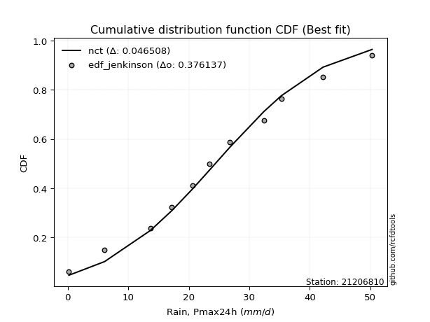</img>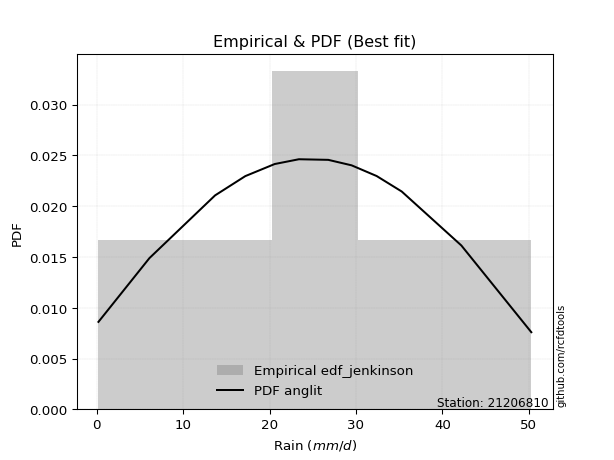</img>

</div>


### 11. Empirical - EDF Cunnane (1978)

Cunnane´s work in statistical hydrology has focused on the performance and evaluation of different probability distributions (such as GEV, Gumbel, Lognormal) for flood frequency estimation. _b_ is a constant, typically set to 0.4.

<div align="center">


$P=(m-b)/(n+1-2b)$


</div>


**11.1. Empirical values**

<div align="center">

|                | 0                   | 1                   | 2                   | 3                  | 4                  | 5                   | 6                  | 7                  | 8                  | 9                  | 10                 | 11                 |
|:---------------|:--------------------|:--------------------|:--------------------|:-------------------|:-------------------|:--------------------|:-------------------|:-------------------|:-------------------|:-------------------|:-------------------|:-------------------|
| date           | 2023                | 2010                | 2015                | 2016               | 2009               | 2014                | 2012               | 2025               | 2011               | 2013               | 2024               | 2008               |
| x              | 0.2                 | 6.1                 | 13.7                | 17.2               | 20.6               | 23.4                | 26.8               | 28.7               | 32.4               | 35.3               | 42.2               | 50.3               |
| m              | 1                   | 2                   | 3                   | 4                  | 5                  | 6                   | 7                  | 8                  | 9                  | 10                 | 11                 | 12                 |
| empirical_dist | edf_cunnane         | edf_cunnane         | edf_cunnane         | edf_cunnane        | edf_cunnane        | edf_cunnane         | edf_cunnane        | edf_cunnane        | edf_cunnane        | edf_cunnane        | edf_cunnane        | edf_cunnane        |
| empirical      | 0.04918032786885246 | 0.13114754098360656 | 0.21311475409836067 | 0.2950819672131148 | 0.3770491803278688 | 0.45901639344262296 | 0.5409836065573771 | 0.6229508196721312 | 0.7049180327868853 | 0.7868852459016393 | 0.8688524590163935 | 0.9508196721311476 |
| empirical_tr   | 1.0517241379310345  | 1.150943396226415   | 1.2708333333333333  | 1.418604651162791  | 1.6052631578947367 | 1.8484848484848486  | 2.178571428571429  | 2.6521739130434785 | 3.388888888888889  | 4.692307692307692  | 7.625000000000004  | 20.333333333333357 |

</div>


**11.2. Kolmogorov-Smirnov fit test (sorted by Δ)**


<div align="center">

|                | 0                   | 1                   | 2                    | 3                   | 4                    | 5                   | 6                   | 7                   | 8                   | 9                   | 10                   | 11                  | 12                  | 13                  | 14                   | 15                   | 16                  | 17                  | 18                  | 19                  | 20                   | 21                  | 22                  | 23                  | 24                  | 25                  | 26                  | 27                  | 28                  | 29                  | 30                  | 31                  | 32                  | 33                  | 34                  | 35                    | 36                  | 37                  | 38                  | 39                  | 40                  | 41                  | 42                  | 43                  | 44                  | 45                  | 46                  | 47                  | 48                  | 49                  | 50                  | 51                  | 52                  | 53                  | 54                  | 55                  | 56                  | 57                  | 58                  | 59                  | 60                  | 61                  | 62                  | 63                  | 64                  | 65                  | 66                  | 67                  | 68                  | 69                  | 70                  | 71                  | 72                  | 73                  | 74                  | 75                  | 76                  | 77                  | 78                  | 79                  | 80                  | 81                  | 82                  | 83                  | 84                  | 85                  | 86                  | 87                  | 88                  | 89                  |
|:---------------|:--------------------|:--------------------|:---------------------|:--------------------|:---------------------|:--------------------|:--------------------|:--------------------|:--------------------|:--------------------|:---------------------|:--------------------|:--------------------|:--------------------|:---------------------|:---------------------|:--------------------|:--------------------|:--------------------|:--------------------|:---------------------|:--------------------|:--------------------|:--------------------|:--------------------|:--------------------|:--------------------|:--------------------|:--------------------|:--------------------|:--------------------|:--------------------|:--------------------|:--------------------|:--------------------|:----------------------|:--------------------|:--------------------|:--------------------|:--------------------|:--------------------|:--------------------|:--------------------|:--------------------|:--------------------|:--------------------|:--------------------|:--------------------|:--------------------|:--------------------|:--------------------|:--------------------|:--------------------|:--------------------|:--------------------|:--------------------|:--------------------|:--------------------|:--------------------|:--------------------|:--------------------|:--------------------|:--------------------|:--------------------|:--------------------|:--------------------|:--------------------|:--------------------|:--------------------|:--------------------|:--------------------|:--------------------|:--------------------|:--------------------|:--------------------|:--------------------|:--------------------|:--------------------|:--------------------|:--------------------|:--------------------|:--------------------|:--------------------|:--------------------|:--------------------|:--------------------|:--------------------|:--------------------|:--------------------|:--------------------|
| station        | 21206810            | 21206810            | 21206810             | 21206810            | 21206810             | 21206810            | 21206810            | 21206810            | 21206810            | 21206810            | 21206810             | 21206810            | 21206810            | 21206810            | 21206810             | 21206810             | 21206810            | 21206810            | 21206810            | 21206810            | 21206810             | 21206810            | 21206810            | 21206810            | 21206810            | 21206810            | 21206810            | 21206810            | 21206810            | 21206810            | 21206810            | 21206810            | 21206810            | 21206810            | 21206810            | 21206810              | 21206810            | 21206810            | 21206810            | 21206810            | 21206810            | 21206810            | 21206810            | 21206810            | 21206810            | 21206810            | 21206810            | 21206810            | 21206810            | 21206810            | 21206810            | 21206810            | 21206810            | 21206810            | 21206810            | 21206810            | 21206810            | 21206810            | 21206810            | 21206810            | 21206810            | 21206810            | 21206810            | 21206810            | 21206810            | 21206810            | 21206810            | 21206810            | 21206810            | 21206810            | 21206810            | 21206810            | 21206810            | 21206810            | 21206810            | 21206810            | 21206810            | 21206810            | 21206810            | 21206810            | 21206810            | 21206810            | 21206810            | 21206810            | 21206810            | 21206810            | 21206810            | 21206810            | 21206810            | 21206810            |
| empirical_dist | edf_cunnane         | edf_cunnane         | edf_cunnane          | edf_cunnane         | edf_cunnane          | edf_cunnane         | edf_cunnane         | edf_cunnane         | edf_cunnane         | edf_cunnane         | edf_cunnane          | edf_cunnane         | edf_cunnane         | edf_cunnane         | edf_cunnane          | edf_cunnane          | edf_cunnane         | edf_cunnane         | edf_cunnane         | edf_cunnane         | edf_cunnane          | edf_cunnane         | edf_cunnane         | edf_cunnane         | edf_cunnane         | edf_cunnane         | edf_cunnane         | edf_cunnane         | edf_cunnane         | edf_cunnane         | edf_cunnane         | edf_cunnane         | edf_cunnane         | edf_cunnane         | edf_cunnane         | edf_cunnane           | edf_cunnane         | edf_cunnane         | edf_cunnane         | edf_cunnane         | edf_cunnane         | edf_cunnane         | edf_cunnane         | edf_cunnane         | edf_cunnane         | edf_cunnane         | edf_cunnane         | edf_cunnane         | edf_cunnane         | edf_cunnane         | edf_cunnane         | edf_cunnane         | edf_cunnane         | edf_cunnane         | edf_cunnane         | edf_cunnane         | edf_cunnane         | edf_cunnane         | edf_cunnane         | edf_cunnane         | edf_cunnane         | edf_cunnane         | edf_cunnane         | edf_cunnane         | edf_cunnane         | edf_cunnane         | edf_cunnane         | edf_cunnane         | edf_cunnane         | edf_cunnane         | edf_cunnane         | edf_cunnane         | edf_cunnane         | edf_cunnane         | edf_cunnane         | edf_cunnane         | edf_cunnane         | edf_cunnane         | edf_cunnane         | edf_cunnane         | edf_cunnane         | edf_cunnane         | edf_cunnane         | edf_cunnane         | edf_cunnane         | edf_cunnane         | edf_cunnane         | edf_cunnane         | edf_cunnane         | edf_cunnane         |
| p_dist         | fisk                | nct                 | t                    | crystalball         | norm                 | exponnorm           | pearson3            | gamma               | erlang              | johnsonsu           | f                    | betaprime           | fatiguelife         | chi2                | genlogistic          | weibull_min          | alpha               | rice                | invgamma            | invgauss            | logistic             | hypsecant           | maxwell             | truncnorm           | laplace_asymmetric  | logjohnsonsu        | rayleigh            | laplace             | invweibull          | gumbel_l            | kstwobign           | mielke              | gumbel_r            | logt                | logloggamma         | loglaplace_asymmetric | moyal               | halflogistic        | halfnorm            | logpearson3         | ncf                 | loggumbel_l         | wald                | genexpon            | nakagami            | expon               | gibrat              | loghypsecant        | loglogistic         | loglaplace          | loglognorm          | lognakagami         | logexponnorm        | logcrystalball      | lognorm             | lognorm             | logrice             | logfatiguelife      | lognct              | logmielke           | loginvgamma         | loggamma            | loggamma            | loginvgauss         | logmaxwell          | logalpha            | lograyleigh         | loginvweibull       | loggumbel_r         | loghalfnorm         | logkstwobign        | logmoyal            | loghalflogistic     | loggenexpon         | logfisk             | logwald             | logexpon            | logerlang           | loggibrat           | logncf              | pareto              | logpareto           | logf                | logtruncnorm        | gompertz            | logweibull_min      | logbetaprime        | logchi2             | loggompertz         | loggenlogistic      |
| delta          | 0.04141493172072626 | 0.0422629104453847  | 0.042276696832962785 | 0.04228664757824177 | 0.042286648238344854 | 0.04228787639161033 | 0.04270934024373403 | 0.04270975298110341 | 0.04273181284103836 | 0.04289659353384104 | 0.043127798031705245 | 0.04430869907956614 | 0.04448961280118627 | 0.04521394981545686 | 0.045539641212364146 | 0.046467083276054214 | 0.04836327316368225 | 0.04837868977695721 | 0.04948320391964449 | 0.05071060449315731 | 0.051316437511337576 | 0.05487991419411341 | 0.05582351622766622 | 0.05959872379677905 | 0.06102339347864283 | 0.06480847180353932 | 0.06487728147974615 | 0.06657754960527462 | 0.06687609127042243 | 0.07236863061713916 | 0.0871485500385909  | 0.0873134165810221  | 0.08883386913056758 | 0.09720830774723521 | 0.10941504916207473 | 0.11110228191644422   | 0.1132407293610356  | 0.13114754098360656 | 0.13114754098360656 | 0.14655779168980698 | 0.16859274792895773 | 0.17507736745832891 | 0.18042091982945896 | 0.20678048919749026 | 0.2074720619862857  | 0.2099844105060883  | 0.21311475409836067 | 0.23510567788552217 | 0.23985730849785092 | 0.242783957825973   | 0.24324318173572584 | 0.24500183874488396 | 0.24546026431920714 | 0.24546240924525675 | 0.24546241895179788 | 0.24546241895179788 | 0.24546243174480092 | 0.24560701654871536 | 0.24641689315808935 | 0.2615942991915025  | 0.2652668088426991  | 0.2680766557039609  | 0.2680766557039609  | 0.2766186004294171  | 0.2796715153168949  | 0.28352816757542804 | 0.29144600533350595 | 0.29342819071200976 | 0.313340085606176   | 0.32465995620253996 | 0.3259273475591735  | 0.3389083007074055  | 0.34652792950981126 | 0.36142327949490793 | 0.3993926864367745  | 0.4100320156228374  | 0.41099237628532126 | 0.4200586181946335  | 0.42500744077076014 | 0.4443882219496086  | 0.4881056090253847  | 0.5228285413598944  | 0.5365502870480997  | 0.5441545047517572  | 0.5550595951376044  | 0.6296723916656419  | 0.7007129999902855  | 0.7661940669200642  | 0.8339684465025555  | 0.8688524590163935  |
| deltao         | 0.36218414519599995 | 0.36218414519599995 | 0.36218414519599995  | 0.36218414519599995 | 0.36218414519599995  | 0.36218414519599995 | 0.36218414519599995 | 0.36218414519599995 | 0.36218414519599995 | 0.36218414519599995 | 0.36218414519599995  | 0.36218414519599995 | 0.36218414519599995 | 0.36218414519599995 | 0.36218414519599995  | 0.36218414519599995  | 0.36218414519599995 | 0.36218414519599995 | 0.36218414519599995 | 0.36218414519599995 | 0.36218414519599995  | 0.36218414519599995 | 0.36218414519599995 | 0.36218414519599995 | 0.36218414519599995 | 0.36218414519599995 | 0.36218414519599995 | 0.36218414519599995 | 0.36218414519599995 | 0.36218414519599995 | 0.36218414519599995 | 0.36218414519599995 | 0.36218414519599995 | 0.36218414519599995 | 0.36218414519599995 | 0.36218414519599995   | 0.36218414519599995 | 0.36218414519599995 | 0.36218414519599995 | 0.36218414519599995 | 0.36218414519599995 | 0.36218414519599995 | 0.36218414519599995 | 0.36218414519599995 | 0.36218414519599995 | 0.36218414519599995 | 0.36218414519599995 | 0.36218414519599995 | 0.36218414519599995 | 0.36218414519599995 | 0.36218414519599995 | 0.36218414519599995 | 0.36218414519599995 | 0.36218414519599995 | 0.36218414519599995 | 0.36218414519599995 | 0.36218414519599995 | 0.36218414519599995 | 0.36218414519599995 | 0.36218414519599995 | 0.36218414519599995 | 0.36218414519599995 | 0.36218414519599995 | 0.36218414519599995 | 0.36218414519599995 | 0.36218414519599995 | 0.36218414519599995 | 0.36218414519599995 | 0.36218414519599995 | 0.36218414519599995 | 0.36218414519599995 | 0.36218414519599995 | 0.36218414519599995 | 0.36218414519599995 | 0.36218414519599995 | 0.36218414519599995 | 0.36218414519599995 | 0.36218414519599995 | 0.36218414519599995 | 0.36218414519599995 | 0.36218414519599995 | 0.36218414519599995 | 0.36218414519599995 | 0.36218414519599995 | 0.36218414519599995 | 0.36218414519599995 | 0.36218414519599995 | 0.36218414519599995 | 0.36218414519599995 | 0.36218414519599995 |
| eval           | Δo > Δ              | Δo > Δ              | Δo > Δ               | Δo > Δ              | Δo > Δ               | Δo > Δ              | Δo > Δ              | Δo > Δ              | Δo > Δ              | Δo > Δ              | Δo > Δ               | Δo > Δ              | Δo > Δ              | Δo > Δ              | Δo > Δ               | Δo > Δ               | Δo > Δ              | Δo > Δ              | Δo > Δ              | Δo > Δ              | Δo > Δ               | Δo > Δ              | Δo > Δ              | Δo > Δ              | Δo > Δ              | Δo > Δ              | Δo > Δ              | Δo > Δ              | Δo > Δ              | Δo > Δ              | Δo > Δ              | Δo > Δ              | Δo > Δ              | Δo > Δ              | Δo > Δ              | Δo > Δ                | Δo > Δ              | Δo > Δ              | Δo > Δ              | Δo > Δ              | Δo > Δ              | Δo > Δ              | Δo > Δ              | Δo > Δ              | Δo > Δ              | Δo > Δ              | Δo > Δ              | Δo > Δ              | Δo > Δ              | Δo > Δ              | Δo > Δ              | Δo > Δ              | Δo > Δ              | Δo > Δ              | Δo > Δ              | Δo > Δ              | Δo > Δ              | Δo > Δ              | Δo > Δ              | Δo > Δ              | Δo > Δ              | Δo > Δ              | Δo > Δ              | Δo > Δ              | Δo > Δ              | Δo > Δ              | Δo > Δ              | Δo > Δ              | Δo > Δ              | Δo > Δ              | Δo > Δ              | Δo > Δ              | Δo > Δ              | Δo > Δ              | Δo <= Δ             | Δo <= Δ             | Δo <= Δ             | Δo <= Δ             | Δo <= Δ             | Δo <= Δ             | Δo <= Δ             | Δo <= Δ             | Δo <= Δ             | Δo <= Δ             | Δo <= Δ             | Δo <= Δ             | Δo <= Δ             | Δo <= Δ             | Δo <= Δ             | Δo <= Δ             |
| fit            | 1                   | 1                   | 1                    | 1                   | 1                    | 1                   | 1                   | 1                   | 1                   | 1                   | 1                    | 1                   | 1                   | 1                   | 1                    | 1                    | 1                   | 1                   | 1                   | 1                   | 1                    | 1                   | 1                   | 1                   | 1                   | 1                   | 1                   | 1                   | 1                   | 1                   | 1                   | 1                   | 1                   | 1                   | 1                   | 1                     | 1                   | 1                   | 1                   | 1                   | 1                   | 1                   | 1                   | 1                   | 1                   | 1                   | 1                   | 1                   | 1                   | 1                   | 1                   | 1                   | 1                   | 1                   | 1                   | 1                   | 1                   | 1                   | 1                   | 1                   | 1                   | 1                   | 1                   | 1                   | 1                   | 1                   | 1                   | 1                   | 1                   | 1                   | 1                   | 1                   | 1                   | 1                   | 0                   | 0                   | 0                   | 0                   | 0                   | 0                   | 0                   | 0                   | 0                   | 0                   | 0                   | 0                   | 0                   | 0                   | 0                   | 0                   |
| n              | 12                  | 12                  | 12                   | 12                  | 12                   | 12                  | 12                  | 12                  | 12                  | 12                  | 12                   | 12                  | 12                  | 12                  | 12                   | 12                   | 12                  | 12                  | 12                  | 12                  | 12                   | 12                  | 12                  | 12                  | 12                  | 12                  | 12                  | 12                  | 12                  | 12                  | 12                  | 12                  | 12                  | 12                  | 12                  | 12                    | 12                  | 12                  | 12                  | 12                  | 12                  | 12                  | 12                  | 12                  | 12                  | 12                  | 12                  | 12                  | 12                  | 12                  | 12                  | 12                  | 12                  | 12                  | 12                  | 12                  | 12                  | 12                  | 12                  | 12                  | 12                  | 12                  | 12                  | 12                  | 12                  | 12                  | 12                  | 12                  | 12                  | 12                  | 12                  | 12                  | 12                  | 12                  | 12                  | 12                  | 12                  | 12                  | 12                  | 12                  | 12                  | 12                  | 12                  | 12                  | 12                  | 12                  | 12                  | 12                  | 12                  | 12                  |
| best_fit       | 1                   | 0                   | 0                    | 0                   | 0                    | 0                   | 0                   | 0                   | 0                   | 0                   | 0                    | 0                   | 0                   | 0                   | 0                    | 0                    | 0                   | 0                   | 0                   | 0                   | 0                    | 0                   | 0                   | 0                   | 0                   | 0                   | 0                   | 0                   | 0                   | 0                   | 0                   | 0                   | 0                   | 0                   | 0                   | 0                     | 0                   | 0                   | 0                   | 0                   | 0                   | 0                   | 0                   | 0                   | 0                   | 0                   | 0                   | 0                   | 0                   | 0                   | 0                   | 0                   | 0                   | 0                   | 0                   | 0                   | 0                   | 0                   | 0                   | 0                   | 0                   | 0                   | 0                   | 0                   | 0                   | 0                   | 0                   | 0                   | 0                   | 0                   | 0                   | 0                   | 0                   | 0                   | 0                   | 0                   | 0                   | 0                   | 0                   | 0                   | 0                   | 0                   | 0                   | 0                   | 0                   | 0                   | 0                   | 0                   | 0                   | 0                   |
| best_fit_sort  | 1                   | 2                   | 3                    | 4                   | 5                    | 6                   | 7                   | 8                   | 9                   | 10                  | 11                   | 12                  | 13                  | 14                  | 15                   | 16                   | 17                  | 18                  | 19                  | 20                  | 21                   | 22                  | 23                  | 24                  | 25                  | 26                  | 27                  | 28                  | 29                  | 30                  | 31                  | 32                  | 33                  | 34                  | 35                  | 36                    | 37                  | 38                  | 39                  | 40                  | 41                  | 42                  | 43                  | 44                  | 45                  | 46                  | 47                  | 48                  | 49                  | 50                  | 51                  | 52                  | 53                  | 54                  | 55                  | 56                  | 57                  | 58                  | 59                  | 60                  | 61                  | 62                  | 63                  | 64                  | 65                  | 66                  | 67                  | 68                  | 69                  | 70                  | 71                  | 72                  | 73                  | 74                  | 75                  | 76                  | 77                  | 78                  | 79                  | 80                  | 81                  | 82                  | 83                  | 84                  | 85                  | 86                  | 87                  | 88                  | 89                  | 90                  |

</div>


<div align="center">

</img>

</div>


**11.3. Best fit**

<div align="center">

|   id |   station | empirical_dist   | p_dist   |     delta |   deltao | eval   |   fit |   n |   best_fit |   best_fit_sort |
|-----:|----------:|:-----------------|:---------|----------:|---------:|:-------|------:|----:|-----------:|----------------:|
|    0 |  21206810 | edf_cunnane      | fisk     | 0.0414149 | 0.362184 | Δo > Δ |     1 |  12 |          1 |               1 |

</div>


<div align="center">

</img></img>

</div>


### 12. Empirical - EDF Adamowski (1981)

The Adamowski formula in hydrology refers to a specific plotting position formula used for estimating the non-parametric empirical distribution of hydrological events (like flood peaks) to calculate their return periods. This formula provides an alternative to traditional parametric methods (like the Gumbel or Log Pearson Type III distributions). 

<div align="center">


$P=(m-0.25)/(n+0.5)$


</div>


**12.1. Empirical values**

<div align="center">

|                | 0                  | 1                  | 2                 | 3                  | 4                  | 5                  | 6                 | 7                  | 8                 | 9                 | 10                | 11                 |
|:---------------|:-------------------|:-------------------|:------------------|:-------------------|:-------------------|:-------------------|:------------------|:-------------------|:------------------|:------------------|:------------------|:-------------------|
| date           | 2023               | 2010               | 2015              | 2016               | 2009               | 2014               | 2012              | 2025               | 2011              | 2013              | 2024              | 2008               |
| x              | 0.2                | 6.1                | 13.7              | 17.2               | 20.6               | 23.4               | 26.8              | 28.7               | 32.4              | 35.3              | 42.2              | 50.3               |
| m              | 1                  | 2                  | 3                 | 4                  | 5                  | 6                  | 7                 | 8                  | 9                 | 10                | 11                | 12                 |
| empirical_dist | edf_adamowski      | edf_adamowski      | edf_adamowski     | edf_adamowski      | edf_adamowski      | edf_adamowski      | edf_adamowski     | edf_adamowski      | edf_adamowski     | edf_adamowski     | edf_adamowski     | edf_adamowski      |
| empirical      | 0.06               | 0.14               | 0.22              | 0.3                | 0.38               | 0.46               | 0.54              | 0.62               | 0.7               | 0.78              | 0.86              | 0.94               |
| empirical_tr   | 1.0638297872340425 | 1.1627906976744187 | 1.282051282051282 | 1.4285714285714286 | 1.6129032258064517 | 1.8518518518518516 | 2.173913043478261 | 2.6315789473684212 | 3.333333333333333 | 4.545454545454546 | 7.142857142857142 | 16.666666666666654 |

</div>


**12.2. Kolmogorov-Smirnov fit test (sorted by Δ)**


<div align="center">

|                | 0                   | 1                   | 2                    | 3                   | 4                   | 5                   | 6                   | 7                   | 8                   | 9                   | 10                   | 11                  | 12                  | 13                  | 14                   | 15                  | 16                   | 17                  | 18                  | 19                  | 20                  | 21                  | 22                   | 23                  | 24                  | 25                  | 26                  | 27                  | 28                  | 29                  | 30                  | 31                  | 32                  | 33                  | 34                  | 35                    | 36                  | 37                  | 38                  | 39                  | 40                  | 41                  | 42                  | 43                  | 44                  | 45                  | 46                  | 47                  | 48                  | 49                  | 50                  | 51                  | 52                  | 53                  | 54                  | 55                  | 56                  | 57                  | 58                  | 59                  | 60                  | 61                  | 62                  | 63                  | 64                  | 65                  | 66                  | 67                  | 68                  | 69                  | 70                  | 71                  | 72                  | 73                  | 74                  | 75                  | 76                  | 77                  | 78                  | 79                  | 80                  | 81                  | 82                  | 83                  | 84                  | 85                  | 86                  | 87                  | 88                  | 89                  |
|:---------------|:--------------------|:--------------------|:---------------------|:--------------------|:--------------------|:--------------------|:--------------------|:--------------------|:--------------------|:--------------------|:---------------------|:--------------------|:--------------------|:--------------------|:---------------------|:--------------------|:---------------------|:--------------------|:--------------------|:--------------------|:--------------------|:--------------------|:---------------------|:--------------------|:--------------------|:--------------------|:--------------------|:--------------------|:--------------------|:--------------------|:--------------------|:--------------------|:--------------------|:--------------------|:--------------------|:----------------------|:--------------------|:--------------------|:--------------------|:--------------------|:--------------------|:--------------------|:--------------------|:--------------------|:--------------------|:--------------------|:--------------------|:--------------------|:--------------------|:--------------------|:--------------------|:--------------------|:--------------------|:--------------------|:--------------------|:--------------------|:--------------------|:--------------------|:--------------------|:--------------------|:--------------------|:--------------------|:--------------------|:--------------------|:--------------------|:--------------------|:--------------------|:--------------------|:--------------------|:--------------------|:--------------------|:--------------------|:--------------------|:--------------------|:--------------------|:--------------------|:--------------------|:--------------------|:--------------------|:--------------------|:--------------------|:--------------------|:--------------------|:--------------------|:--------------------|:--------------------|:--------------------|:--------------------|:--------------------|:--------------------|
| station        | 21206810            | 21206810            | 21206810             | 21206810            | 21206810            | 21206810            | 21206810            | 21206810            | 21206810            | 21206810            | 21206810             | 21206810            | 21206810            | 21206810            | 21206810             | 21206810            | 21206810             | 21206810            | 21206810            | 21206810            | 21206810            | 21206810            | 21206810             | 21206810            | 21206810            | 21206810            | 21206810            | 21206810            | 21206810            | 21206810            | 21206810            | 21206810            | 21206810            | 21206810            | 21206810            | 21206810              | 21206810            | 21206810            | 21206810            | 21206810            | 21206810            | 21206810            | 21206810            | 21206810            | 21206810            | 21206810            | 21206810            | 21206810            | 21206810            | 21206810            | 21206810            | 21206810            | 21206810            | 21206810            | 21206810            | 21206810            | 21206810            | 21206810            | 21206810            | 21206810            | 21206810            | 21206810            | 21206810            | 21206810            | 21206810            | 21206810            | 21206810            | 21206810            | 21206810            | 21206810            | 21206810            | 21206810            | 21206810            | 21206810            | 21206810            | 21206810            | 21206810            | 21206810            | 21206810            | 21206810            | 21206810            | 21206810            | 21206810            | 21206810            | 21206810            | 21206810            | 21206810            | 21206810            | 21206810            | 21206810            |
| empirical_dist | edf_adamowski       | edf_adamowski       | edf_adamowski        | edf_adamowski       | edf_adamowski       | edf_adamowski       | edf_adamowski       | edf_adamowski       | edf_adamowski       | edf_adamowski       | edf_adamowski        | edf_adamowski       | edf_adamowski       | edf_adamowski       | edf_adamowski        | edf_adamowski       | edf_adamowski        | edf_adamowski       | edf_adamowski       | edf_adamowski       | edf_adamowski       | edf_adamowski       | edf_adamowski        | edf_adamowski       | edf_adamowski       | edf_adamowski       | edf_adamowski       | edf_adamowski       | edf_adamowski       | edf_adamowski       | edf_adamowski       | edf_adamowski       | edf_adamowski       | edf_adamowski       | edf_adamowski       | edf_adamowski         | edf_adamowski       | edf_adamowski       | edf_adamowski       | edf_adamowski       | edf_adamowski       | edf_adamowski       | edf_adamowski       | edf_adamowski       | edf_adamowski       | edf_adamowski       | edf_adamowski       | edf_adamowski       | edf_adamowski       | edf_adamowski       | edf_adamowski       | edf_adamowski       | edf_adamowski       | edf_adamowski       | edf_adamowski       | edf_adamowski       | edf_adamowski       | edf_adamowski       | edf_adamowski       | edf_adamowski       | edf_adamowski       | edf_adamowski       | edf_adamowski       | edf_adamowski       | edf_adamowski       | edf_adamowski       | edf_adamowski       | edf_adamowski       | edf_adamowski       | edf_adamowski       | edf_adamowski       | edf_adamowski       | edf_adamowski       | edf_adamowski       | edf_adamowski       | edf_adamowski       | edf_adamowski       | edf_adamowski       | edf_adamowski       | edf_adamowski       | edf_adamowski       | edf_adamowski       | edf_adamowski       | edf_adamowski       | edf_adamowski       | edf_adamowski       | edf_adamowski       | edf_adamowski       | edf_adamowski       | edf_adamowski       |
| p_dist         | fisk                | nct                 | t                    | crystalball         | norm                | exponnorm           | pearson3            | gamma               | erlang              | johnsonsu           | f                    | betaprime           | fatiguelife         | chi2                | genlogistic          | weibull_min         | alpha                | rice                | logjohnsonsu        | invgamma            | invgauss            | truncnorm           | logistic             | laplace_asymmetric  | hypsecant           | invweibull          | maxwell             | laplace             | rayleigh            | mielke              | gumbel_l            | kstwobign           | logt                | gumbel_r            | logloggamma         | loglaplace_asymmetric | moyal               | logpearson3         | halfnorm            | halflogistic        | ncf                 | loggumbel_l         | wald                | genexpon            | nakagami            | expon               | gibrat              | loghypsecant        | loglogistic         | loglognorm          | loglaplace          | lognakagami         | logexponnorm        | logcrystalball      | lognorm             | lognorm             | logrice             | logfatiguelife      | lognct              | logmielke           | loginvgamma         | loggamma            | loggamma            | loginvgauss         | logmaxwell          | logalpha            | lograyleigh         | loginvweibull       | loggumbel_r         | loghalfnorm         | logkstwobign        | logmoyal            | loghalflogistic     | loggenexpon         | logfisk             | logexpon            | logwald             | logerlang           | loggibrat           | logncf              | pareto              | logpareto           | logf                | logtruncnorm        | gompertz            | logweibull_min      | logbetaprime        | logchi2             | loggompertz         | loggenlogistic      |
| delta          | 0.05026739073711971 | 0.05111536946177815 | 0.051129155849356234 | 0.05113910659463522 | 0.0511391072547383  | 0.05114033540800378 | 0.05156179926012748 | 0.05156221199749686 | 0.05158427185743181 | 0.05174905255023449 | 0.051980257048098694 | 0.05316115809595959 | 0.05334207181757972 | 0.05406640883185031 | 0.054392100228757595 | 0.05531954229244766 | 0.057215732180075696 | 0.05723114879335066 | 0.05792322590190002 | 0.05833566293603794 | 0.05956306350955076 | 0.05999999749186233 | 0.060168896527731025 | 0.06200700003601989 | 0.06373237321050686 | 0.06392527159829126 | 0.06467597524405967 | 0.07149558239215992 | 0.0737297404961396  | 0.08042817067938277 | 0.0812210896335327  | 0.08419773036645972 | 0.09101892116832222 | 0.09768632814696103 | 0.1025298032604354  | 0.10421703601480489   | 0.12209318837742905 | 0.13967254578816768 | 0.14                | 0.14                | 0.16564192825682655 | 0.16819212155668958 | 0.18140452638683602 | 0.19989524329585093 | 0.20255402919940052 | 0.20309916460444896 | 0.22                | 0.22822043198388284 | 0.2329720625962116  | 0.2363579358340865  | 0.23786592503908782 | 0.23811659284324463 | 0.2385750184175678  | 0.23857716334361742 | 0.23857717305015855 | 0.23857717305015855 | 0.2385771858431616  | 0.23872177064707603 | 0.23953164725645001 | 0.25470905328986315 | 0.25838156294105974 | 0.2611914098023216  | 0.2611914098023216  | 0.2697333545277778  | 0.2727862694152555  | 0.2766429216737887  | 0.28456075943186665 | 0.28654294481037046 | 0.3064548397045367  | 0.31777471030090065 | 0.3190421016575342  | 0.3320230548057662  | 0.33964268360817196 | 0.35453803359326863 | 0.38857301430562685 | 0.40213991726892784 | 0.4031467697211981  | 0.4092389460634859  | 0.41812219486912083 | 0.43553576293321516 | 0.47925315000899127 | 0.513976082343501   | 0.5276978280317063  | 0.5372692588501179  | 0.551596693859753   | 0.6208199326492485  | 0.691860540973892   | 0.7573416079036708  | 0.8251159874861621  | 0.86                |
| deltao         | 0.36218414519599995 | 0.36218414519599995 | 0.36218414519599995  | 0.36218414519599995 | 0.36218414519599995 | 0.36218414519599995 | 0.36218414519599995 | 0.36218414519599995 | 0.36218414519599995 | 0.36218414519599995 | 0.36218414519599995  | 0.36218414519599995 | 0.36218414519599995 | 0.36218414519599995 | 0.36218414519599995  | 0.36218414519599995 | 0.36218414519599995  | 0.36218414519599995 | 0.36218414519599995 | 0.36218414519599995 | 0.36218414519599995 | 0.36218414519599995 | 0.36218414519599995  | 0.36218414519599995 | 0.36218414519599995 | 0.36218414519599995 | 0.36218414519599995 | 0.36218414519599995 | 0.36218414519599995 | 0.36218414519599995 | 0.36218414519599995 | 0.36218414519599995 | 0.36218414519599995 | 0.36218414519599995 | 0.36218414519599995 | 0.36218414519599995   | 0.36218414519599995 | 0.36218414519599995 | 0.36218414519599995 | 0.36218414519599995 | 0.36218414519599995 | 0.36218414519599995 | 0.36218414519599995 | 0.36218414519599995 | 0.36218414519599995 | 0.36218414519599995 | 0.36218414519599995 | 0.36218414519599995 | 0.36218414519599995 | 0.36218414519599995 | 0.36218414519599995 | 0.36218414519599995 | 0.36218414519599995 | 0.36218414519599995 | 0.36218414519599995 | 0.36218414519599995 | 0.36218414519599995 | 0.36218414519599995 | 0.36218414519599995 | 0.36218414519599995 | 0.36218414519599995 | 0.36218414519599995 | 0.36218414519599995 | 0.36218414519599995 | 0.36218414519599995 | 0.36218414519599995 | 0.36218414519599995 | 0.36218414519599995 | 0.36218414519599995 | 0.36218414519599995 | 0.36218414519599995 | 0.36218414519599995 | 0.36218414519599995 | 0.36218414519599995 | 0.36218414519599995 | 0.36218414519599995 | 0.36218414519599995 | 0.36218414519599995 | 0.36218414519599995 | 0.36218414519599995 | 0.36218414519599995 | 0.36218414519599995 | 0.36218414519599995 | 0.36218414519599995 | 0.36218414519599995 | 0.36218414519599995 | 0.36218414519599995 | 0.36218414519599995 | 0.36218414519599995 | 0.36218414519599995 |
| eval           | Δo > Δ              | Δo > Δ              | Δo > Δ               | Δo > Δ              | Δo > Δ              | Δo > Δ              | Δo > Δ              | Δo > Δ              | Δo > Δ              | Δo > Δ              | Δo > Δ               | Δo > Δ              | Δo > Δ              | Δo > Δ              | Δo > Δ               | Δo > Δ              | Δo > Δ               | Δo > Δ              | Δo > Δ              | Δo > Δ              | Δo > Δ              | Δo > Δ              | Δo > Δ               | Δo > Δ              | Δo > Δ              | Δo > Δ              | Δo > Δ              | Δo > Δ              | Δo > Δ              | Δo > Δ              | Δo > Δ              | Δo > Δ              | Δo > Δ              | Δo > Δ              | Δo > Δ              | Δo > Δ                | Δo > Δ              | Δo > Δ              | Δo > Δ              | Δo > Δ              | Δo > Δ              | Δo > Δ              | Δo > Δ              | Δo > Δ              | Δo > Δ              | Δo > Δ              | Δo > Δ              | Δo > Δ              | Δo > Δ              | Δo > Δ              | Δo > Δ              | Δo > Δ              | Δo > Δ              | Δo > Δ              | Δo > Δ              | Δo > Δ              | Δo > Δ              | Δo > Δ              | Δo > Δ              | Δo > Δ              | Δo > Δ              | Δo > Δ              | Δo > Δ              | Δo > Δ              | Δo > Δ              | Δo > Δ              | Δo > Δ              | Δo > Δ              | Δo > Δ              | Δo > Δ              | Δo > Δ              | Δo > Δ              | Δo > Δ              | Δo > Δ              | Δo <= Δ             | Δo <= Δ             | Δo <= Δ             | Δo <= Δ             | Δo <= Δ             | Δo <= Δ             | Δo <= Δ             | Δo <= Δ             | Δo <= Δ             | Δo <= Δ             | Δo <= Δ             | Δo <= Δ             | Δo <= Δ             | Δo <= Δ             | Δo <= Δ             | Δo <= Δ             |
| fit            | 1                   | 1                   | 1                    | 1                   | 1                   | 1                   | 1                   | 1                   | 1                   | 1                   | 1                    | 1                   | 1                   | 1                   | 1                    | 1                   | 1                    | 1                   | 1                   | 1                   | 1                   | 1                   | 1                    | 1                   | 1                   | 1                   | 1                   | 1                   | 1                   | 1                   | 1                   | 1                   | 1                   | 1                   | 1                   | 1                     | 1                   | 1                   | 1                   | 1                   | 1                   | 1                   | 1                   | 1                   | 1                   | 1                   | 1                   | 1                   | 1                   | 1                   | 1                   | 1                   | 1                   | 1                   | 1                   | 1                   | 1                   | 1                   | 1                   | 1                   | 1                   | 1                   | 1                   | 1                   | 1                   | 1                   | 1                   | 1                   | 1                   | 1                   | 1                   | 1                   | 1                   | 1                   | 0                   | 0                   | 0                   | 0                   | 0                   | 0                   | 0                   | 0                   | 0                   | 0                   | 0                   | 0                   | 0                   | 0                   | 0                   | 0                   |
| n              | 12                  | 12                  | 12                   | 12                  | 12                  | 12                  | 12                  | 12                  | 12                  | 12                  | 12                   | 12                  | 12                  | 12                  | 12                   | 12                  | 12                   | 12                  | 12                  | 12                  | 12                  | 12                  | 12                   | 12                  | 12                  | 12                  | 12                  | 12                  | 12                  | 12                  | 12                  | 12                  | 12                  | 12                  | 12                  | 12                    | 12                  | 12                  | 12                  | 12                  | 12                  | 12                  | 12                  | 12                  | 12                  | 12                  | 12                  | 12                  | 12                  | 12                  | 12                  | 12                  | 12                  | 12                  | 12                  | 12                  | 12                  | 12                  | 12                  | 12                  | 12                  | 12                  | 12                  | 12                  | 12                  | 12                  | 12                  | 12                  | 12                  | 12                  | 12                  | 12                  | 12                  | 12                  | 12                  | 12                  | 12                  | 12                  | 12                  | 12                  | 12                  | 12                  | 12                  | 12                  | 12                  | 12                  | 12                  | 12                  | 12                  | 12                  |
| best_fit       | 1                   | 0                   | 0                    | 0                   | 0                   | 0                   | 0                   | 0                   | 0                   | 0                   | 0                    | 0                   | 0                   | 0                   | 0                    | 0                   | 0                    | 0                   | 0                   | 0                   | 0                   | 0                   | 0                    | 0                   | 0                   | 0                   | 0                   | 0                   | 0                   | 0                   | 0                   | 0                   | 0                   | 0                   | 0                   | 0                     | 0                   | 0                   | 0                   | 0                   | 0                   | 0                   | 0                   | 0                   | 0                   | 0                   | 0                   | 0                   | 0                   | 0                   | 0                   | 0                   | 0                   | 0                   | 0                   | 0                   | 0                   | 0                   | 0                   | 0                   | 0                   | 0                   | 0                   | 0                   | 0                   | 0                   | 0                   | 0                   | 0                   | 0                   | 0                   | 0                   | 0                   | 0                   | 0                   | 0                   | 0                   | 0                   | 0                   | 0                   | 0                   | 0                   | 0                   | 0                   | 0                   | 0                   | 0                   | 0                   | 0                   | 0                   |
| best_fit_sort  | 1                   | 2                   | 3                    | 4                   | 5                   | 6                   | 7                   | 8                   | 9                   | 10                  | 11                   | 12                  | 13                  | 14                  | 15                   | 16                  | 17                   | 18                  | 19                  | 20                  | 21                  | 22                  | 23                   | 24                  | 25                  | 26                  | 27                  | 28                  | 29                  | 30                  | 31                  | 32                  | 33                  | 34                  | 35                  | 36                    | 37                  | 38                  | 39                  | 40                  | 41                  | 42                  | 43                  | 44                  | 45                  | 46                  | 47                  | 48                  | 49                  | 50                  | 51                  | 52                  | 53                  | 54                  | 55                  | 56                  | 57                  | 58                  | 59                  | 60                  | 61                  | 62                  | 63                  | 64                  | 65                  | 66                  | 67                  | 68                  | 69                  | 70                  | 71                  | 72                  | 73                  | 74                  | 75                  | 76                  | 77                  | 78                  | 79                  | 80                  | 81                  | 82                  | 83                  | 84                  | 85                  | 86                  | 87                  | 88                  | 89                  | 90                  |

</div>


<div align="center">

</img>

</div>


**12.3. Best fit**

<div align="center">

|   id |   station | empirical_dist   | p_dist   |     delta |   deltao | eval   |   fit |   n |   best_fit |   best_fit_sort |
|-----:|----------:|:-----------------|:---------|----------:|---------:|:-------|------:|----:|-----------:|----------------:|
|    0 |  21206810 | edf_adamowski    | fisk     | 0.0502674 | 0.362184 | Δo > Δ |     1 |  12 |          1 |               1 |

</div>


<div align="center">

</img></img>

</div>


## C. Best fit & Estimate extreme values for specific return periods - Tr


### 1. Best fit (ordered by delta Δ)

<div align="center">

|   id |   station | empirical_dist   | p_dist       |     delta |   deltao | eval   |   fit |   n |   best_fit |   best_fit_sort |
|-----:|----------:|:-----------------|:-------------|----------:|---------:|:-------|------:|----:|-----------:|----------------:|
|    0 |  21206810 | edf_hazen        | fisk         | 0.0352674 | 0.362184 | Δo > Δ |     1 |  12 |          1 |               1 |
|    1 |  21206810 | edf_gringorten   | fisk         | 0.0389803 | 0.362184 | Δo > Δ |     1 |  12 |          1 |               2 |
|    2 |  21206810 | edf_cunnane      | fisk         | 0.0414149 | 0.362184 | Δo > Δ |     1 |  12 |          1 |               3 |
|    3 |  21206810 | edf_blom         | fisk         | 0.0429205 | 0.362184 | Δo > Δ |     1 |  12 |          1 |               4 |
|    4 |  21206810 | edf_tukey        | fisk         | 0.0454025 | 0.362184 | Δo > Δ |     1 |  12 |          1 |               5 |
|    5 |  21206810 | edf_filliben     | fisk         | 0.0463369 | 0.362184 | Δo > Δ |     1 |  12 |          1 |               6 |
|    6 |  21206810 | edf_beard        | fisk         | 0.0467779 | 0.362184 | Δo > Δ |     1 |  12 |          1 |               7 |
|    7 |  21206810 | edf_jenkinson    | fisk         | 0.0467779 | 0.362184 | Δo > Δ |     1 |  12 |          1 |               8 |
|    8 |  21206810 | edf_chegodayev   | fisk         | 0.0473642 | 0.362184 | Δo > Δ |     1 |  12 |          1 |               9 |
|    9 |  21206810 | edf_adamowski    | fisk         | 0.0502674 | 0.362184 | Δo > Δ |     1 |  12 |          1 |              10 |
|   10 |  21206810 | edf_weibull      | logjohnsonsu | 0.0580139 | 0.362184 | Δo > Δ |     1 |  12 |          1 |              11 |
|   11 |  21206810 | edf_california   | kstwobign    | 0.0721604 | 0.362184 | Δo > Δ |     1 |  12 |          1 |              12 |

</div>

:file_folder:Tables: [bestfit_21206810.csv](table/bestfit_21206810.csv) | [extreme_21206810.csv](table/extreme_21206810.csv)


### 2. Extreme values

In hydrology, a return period (or recurrence interval $Tr$) is the statistical average time between extreme events like floods or droughts of a specific magnitude, indicating how rare an event is, with a 100-year flood, for example, having a 1% chance of occurring in any given year, not that it happens exactly every century. It is a key tool for infrastructure design (like bridges or dams) and risk assessment, calculated from historical data to determine the probability of future events, although it is important to remember it is statistical average, and events can cluster or be missed.

> risk_rate: assuming the return period as the project useful life.

|   id |      tr |   prob_l |     prob_g |   alpha |   betaprime |    chi2 |   crystalball |   erlang |    expon |   exponnorm |       f |   fatiguelife |    fisk |   gamma |   genexpon |   genlogistic |   gibrat |   gompertz |   gumbel_l |   gumbel_r |   halflogistic |   halfnorm |   hypsecant |   invgamma |   invgauss |   invweibull |   johnsonsu |   kstwobign |   laplace |   laplace_asymmetric |   loggamma |   logistic |   lognorm |   maxwell |   mielke |    moyal |   nakagami |      ncf |     nct |    norm |         pareto |   pearson3 |   rayleigh |    rice |       t |   truncnorm |     wald |   weibull_min |   logalpha |      logbetaprime |       logchi2 |   logcrystalball |      logerlang |         logexpon |   logexponnorm |           logf |   logfatiguelife |       logfisk |   loggenexpon |   loggenlogistic |        loggibrat |   loggompertz |   loggumbel_l |   loggumbel_r |   loghalflogistic |   loghalfnorm |   loghypsecant |   loginvgamma |   loginvgauss |    loginvweibull |   logjohnsonsu |   logkstwobign |   loglaplace |   loglaplace_asymmetric |   logloggamma |   loglogistic |   loglognorm |   logmaxwell |   logmielke |   logmoyal |   lognakagami |         logncf |    lognct |   logpareto |   logpearson3 |   lograyleigh |   logrice |             logt |   logtruncnorm |     logwald |   logweibull_min |   station |   n |   risk_rate |
|-----:|--------:|---------:|-----------:|--------:|------------:|--------:|--------------:|---------:|---------:|------------:|--------:|--------------:|--------:|--------:|-----------:|--------------:|---------:|-----------:|-----------:|-----------:|---------------:|-----------:|------------:|-----------:|-----------:|-------------:|------------:|------------:|----------:|---------------------:|-----------:|-----------:|----------:|----------:|---------:|---------:|-----------:|---------:|--------:|--------:|---------------:|-----------:|-----------:|--------:|--------:|------------:|---------:|--------------:|-----------:|------------------:|--------------:|-----------------:|---------------:|-----------------:|---------------:|---------------:|-----------------:|--------------:|--------------:|-----------------:|-----------------:|--------------:|--------------:|--------------:|------------------:|--------------:|---------------:|--------------:|--------------:|-----------------:|---------------:|---------------:|-------------:|------------------------:|--------------:|--------------:|-------------:|-------------:|------------:|-----------:|--------------:|---------------:|----------:|------------:|--------------:|--------------:|----------:|-----------------:|---------------:|------------:|-----------------:|----------:|----:|------------:|
|    0 |    2    | 0.5      | 0.5        | 23.9332 |     24.453  | 24.116  |       24.7417 |  24.6971 |  17.211  |     24.7415 | 24.6586 |       24.6166 | 24.7452 | 24.6955 |    17.384  |       24.5124 |  20.59   |    38.8961 |    27.0139 |    22.4694 |        21.3398 |    21.9104 |     24.7417 |    24.0408 |    23.6591 |      22.6709 |     24.678  |     21.9621 |   24.7417 |              24.0969 |    14.7109 |    24.7417 |   15.8882 |   23.5587 |  24.1079 |  21.7359 |    17.0898 |  18.6844 | 24.7371 | 24.7417 |    0.494508    |    24.6977 |    23.1392 | 24.1099 | 24.742  |     23.0192 |  20.2582 |       24.336  |    13.8803 |      0.253747     |      0.366528 |          15.8882 |  16.8774       |      4.14994     |        15.8884 |    0.653719    |          15.8681 |   3.62951     |       8.52875 |         inf      |     10.3596      |      0.405156 |       20.0778 |       12.5729 |           11.192  |       11.8692 |        15.8882 |       14.8653 |       14.304  |     13.2078      |        24.9549 |        10.7096 |      15.8882 |                 22.1783 |       22.6765 |       15.8882 |      16.0192 |      14.0658 |     15.4709 |    11.658  |       15.9215 |   1.88129      |   15.8529 |    0.21228  |       25.9281 |       13.4709 |   15.8882 |     26.515       |         3.4666 |     10.0122 |      0.444516    |  21206810 |  12 |    0.75     |
|    1 |    2.33 | 0.570815 | 0.429185   | 26.4483 |     26.9368 | 26.6368 |       27.2098 |  27.1667 |  20.959  |     27.2097 | 27.1294 |       27.0864 | 27.0429 | 27.1651 |    21.1701 |       26.8431 |  21.8403 |    39.7881 |    29.1613 |    24.7565 |        23.6912 |    24.5743 |     26.7169 |    26.5496 |    26.227  |      25.4438 |     27.1479 |     24.7987 |   26.2353 |              25.9061 |    19.2817 |    26.9163 |   20.4871 |   26.123  |  27.9384 |  23.9008 |    20.2842 |  21.7064 | 27.2057 | 27.2098 |    1.78048     |    27.1672 |    25.7414 | 26.6813 | 27.2103 |     25.7888 |  21.8766 |       26.8926 |    18.3462 |      0.304176     |      0.456682 |          20.4871 | 284.203        |      8.09503     |        20.4873 |    1.23643     |          20.436  | 235.368       |      13.3694  |         inf      |     11.7835      |      0.47334  |       25.0478 |       15.9125 |           14.259  |       15.6164 |        19.473  |       19.4751 |       19.349  |     19.8978      |        28.2966 |        16.8746 |      18.5305 |                 25.698  |       26.4057 |       19.877  |      20.665  |      18.3175 |     22.0645 |    14.5702 |       20.5455 |   5.57283      |   20.4869 |    0.275367 |       30.6826 |       17.6115 |   20.4871 |     28.7356      |         5.0716 |     11.8283 |      0.658011    |  21206810 |  12 |    0.729209 |
|    2 |    5    | 0.8      | 0.2        | 36.2975 |     36.3243 | 36.3525 |       36.3823 |  36.3696 |  39.6983 |     36.3822 | 36.3592 |       36.354  | 35.9199 | 36.3681 |    40.1    |       36.019  |  29.0385 |    42.6702 |    36.0984 |    34.6924 |        34.331  |    35.8391 |     34.6403 |    36.3409 |    36.4994 |      37.4908 |     36.3619 |     36.8482 |   33.7031 |              34.9519 |    53.5785 |    35.3129 |   52.6958 |   36.2158 |  40.7091 |  33.9292 |    33.9999 |  34.9745 | 36.3814 | 36.3823 | 7018.9         |    36.3693 |    36.1591 | 36.4412 | 36.3833 |     36.4688 |  30.9365 |       36.4708 |    53.3196 |      2.51075      |      1.67441  |          52.6958 |   1.59121e+12  |    228.579       |        52.6966 | 5029.16        |          52.3538 |   2.32728e+95 |      82.6513  |         inf      |     24.7333      |      1.03018  |       51.1775 |       44.2779 |           42.6603 |       49.8297 |        44.0406 |       54.1787 |       62.2899 |    118.036       |        39.0002 |       116.416  |      39.9883 |                 37.4037 |       38.9225 |       47.1999 |      53.2664 |      51.8    |    100.745  |    40.9306 |       52.9985 |   1.9488e+06   |   53.201  |  inf        |       45.2429 |       51.4989 |   52.6958 |     41.8518      |        17.1994 |     30.073  |     15.1779      |  21206810 |  12 |    0.67232  |
|    3 |   10    | 0.9      | 0.1        | 43.3047 |     42.6895 | 43.1041 |       42.467  |  42.4966 |  56.7093 |     42.4671 | 42.5234 |       42.5795 | 42.4632 | 42.4951 |    57.284  |       42.895  |  37.2436 |    44.2751 |    39.9607 |    42.7851 |        43.167  |    44.1749 |     40.9672 |    43.2684 |    43.9824 |      47.3028 |     42.5051 |     46.0224 |   40.4821 |              43.1635 |   107.076  |    41.4966 |   98.6178 |   43.3185 |  46.4325 |  42.6605 |    44.2469 |  45.6261 | 42.4696 | 42.467  |    1.43645e+07 |    42.495  |    43.5872 | 43.0334 | 42.4684 |     43.7577 |  40.5511 |       42.8073 |   111.219  |    422.173        |      6.43056  |          98.6178 |   3.3275e+24   |   4742.93        |        98.6196 |    2.49322e+16 |          97.766  | inf           |     309.06    |         inf      |     57.5881      |      2.08692  |       76.1808 |      101.902  |          105.99   |      117.589  |        84.5024 |      108.664  |      141.035  |    503.251       |        44.261  |       506.562  |      80.3839 |                 42.6579 |       44.5654 |       89.2379 |      99.8702 |     107.658  |    341.71   |   100.603  |       99.3807 |   3.46623e+23  |  100.312  |  inf        |       50.4945 |      110.68   |   98.6178 |     66.3146      |        29.3422 |     80.9559 |   1439.87        |  21206810 |  12 |    0.651322 |
|    4 |   15    | 0.933333 | 0.0666667  | 46.9552 |     45.9071 | 46.566  |       45.5034 |  45.5607 |  66.6601 |     45.5036 | 45.6119 |       45.7096 | 46.0302 | 45.5592 |    67.336  |       46.6644 |  42.9032 |    45.002  |    41.7099 |    47.3509 |        48.1673 |    48.5128 |     44.578  |    46.8626 |    47.9266 |      52.8387 |     45.58   |     50.8927 |   44.4476 |              47.9669 |   151.925  |    44.8658 |  134.827  |   46.9629 |  48.3632 |  47.7277 |    49.5919 |  51.5223 | 45.5083 | 45.5034 |    1.242e+09   |    45.5583 |    47.4145 | 46.3468 | 45.505  |     47.4312 |  46.7252 |       45.9467 |   161.897  | 156520            |     14.7416   |         134.827  |   4.75429e+32  |  27954.3         |       134.83   |    1.88702e+36 |         133.538  | inf           |     613.622   |         inf      |    103.159       |      3.15392  |       91.2194 |      163.087  |          177.394  |      183.828  |       122.57   |      154.598  |      214.777  |   1140.5         |        46.3575 |      1105.76   |     120.935  |                 45.0595 |       46.4678 |      126.258  |     136.684  |     156.698  |    678.643  |   169.541  |      136.007  |   2.25539e+48  |  137.705  |  inf        |       51.9469 |      164.16   |  134.827  |     97.4068      |        35.0933 |    152.905  |  43849.9         |  21206810 |  12 |    0.644736 |
|    5 |   20    | 0.95     | 0.05       | 49.4042 |     48.0293 | 48.8667 |       47.4919 |  47.5697 |  73.7203 |     47.4921 | 47.6389 |       47.7678 | 48.4965 | 47.5682 |    74.468  |       49.2756 |  47.3427 |    45.4545 |    42.7986 |    50.5478 |        51.6707 |    51.4049 |     47.1252 |    49.2678 |    50.5877 |      56.7148 |     47.597  |     54.1736 |   47.2612 |              51.375  |   191.343  |    47.1945 |  165.472  |   49.3815 |  49.3441 |  51.3164 |    53.1577 |  55.6007 | 47.4983 | 47.4919 |    2.93984e+10 |    47.5666 |    49.9584 | 48.5236 | 47.4936 |     49.8466 |  51.3262 |       47.9921 |   207.684  |      1.00741e+08  |     26.924    |         165.472  |   5.92179e+38  |  98414.3         |       165.476  |    9.31901e+62 |         163.799  | inf           |     970.283   |         inf      |    162.969       |      4.22764  |      102.044  |      226.684  |          254.478  |      247.619  |       159.34   |      195.127  |      284.217  |   2022.45        |        47.559  |      1870.88   |     161.587  |                 46.8451 |       47.4229 |      160.481  |     167.874  |     201.025  |   1096.36   |   245.359  |      167.032  |   7.06136e+79  |  169.478  |  inf        |       52.5904 |      213.334  |  165.472  |    138.256       |        38.3878 |    245.598  | 693816           |  21206810 |  12 |    0.641514 |
|    6 |   25    | 0.96     | 0.04       | 51.2376 |     49.5991 | 50.5775 |       48.9557 |  49.0498 |  79.1966 |     48.9559 | 49.1334 |       49.2873 | 50.3836 | 49.0482 |    80      |       51.2757 |  51.0436 |    45.7764 |    43.5734 |    53.0102 |        54.3699 |    53.5568 |     49.0966 |    51.0651 |    52.5867 |      59.7004 |     49.0835 |     56.6311 |   49.4435 |              54.0185 |   226.936  |    48.976  |  192.399  |   51.1771 |  49.9487 |  54.098  |    55.8116 |  58.715  | 48.9634 | 48.9557 |    3.42167e+11 |    49.0462 |    51.8484 | 50.1292 | 48.9575 |     51.6289 |  55.0114 |       49.4919 |   249.884  |      1.00556e+11  |     43.2396   |         192.399  |   4.43758e+43  | 261241           |       192.403  |    1.70812e+96 |         190.381  | inf           |    1365.45    |         inf      |    238.597       |      5.30638  |      110.521  |      292.125  |          336.038  |      309.059  |       195.212  |      231.834  |      350.147  |   3144.16        |        48.3634 |      2774.04   |     202.314  |                 48.2786 |       47.9971 |      192.801  |     195.302  |     241.863  |   1585.88   |   326.759  |      194.308  |   2.99359e+117 |  197.476  |  inf        |       52.9434 |      259.182  |  192.399  |    192.045       |        40.5145 |    358.978  |      7.1671e+06  |  21206810 |  12 |    0.639603 |
|    7 |   50    | 0.98     | 0.02       | 56.6361 |     54.1302 | 55.5572 |       53.1474 |  53.2938 |  96.2076 |     53.1478 | 53.4235 |       53.6586 | 56.1519 | 53.2922 |    97.184  |       57.3953 |  64.0898 |    46.6505 |    45.6765 |    60.5958 |        62.6865 |    59.8114 |     55.2086 |    56.3399 |    58.5031 |      68.8976 |     53.3482 |     63.8474 |   56.2226 |              62.23   |   371.278  |    54.4188 |  296.281  |   56.3846 |  51.2873 |  62.7333 |    63.527  |  68.1738 | 53.159  | 53.1474 |    7.00279e+14 |    53.2886 |    57.3349 | 54.74   | 53.1494 |     56.7493 |  67.0437 |       53.757  |   427.748  |      1.15217e+28  |    193.964    |         296.281  |   2.80132e+59  |      5.42067e+06 |       296.288  |  inf           |         292.889  | inf           |    3702.85    |         inf      |    914.686       |     10.7495   |      137.253  |      638.092  |          791.411  |      588.609  |       366.357  |      381.568  |      643.642  |  12241           |        50.3303 |      8819.61   |     406.689  |                 53.0174 |       49.1483 |      337.735  |     301.275  |     413.532  |   4939.05   |   795.235  |      299.651  | inf            |  306.049  |  inf        |       53.5533 |      456.062  |  296.281  |    830.585       |        45.137  |   1239.61   |      2.97238e+10 |  21206810 |  12 |    0.63583  |
|    8 |   75    | 0.986667 | 0.0133333  | 59.6272 |     56.5833 | 58.2787 |       55.3965 |  55.5745 | 106.158  |     55.397  | 55.7319 |       56.0165 | 59.4851 | 55.5728 |   107.236  |       60.9337 |  72.9011 |    47.0924 |    46.74   |    65.0049 |        67.521  |    63.2162 |     58.7804 |    59.2508 |    61.7972 |      74.2434 |     55.6414 |     67.8178 |   60.1881 |              67.0334 |   484.63   |    57.5624 |  373.518  |   59.2158 |  51.853  |  67.783  |    67.7272 |  73.589  | 55.4105 | 55.3965 |    6.05482e+16 |    55.5683 |    60.3198 | 57.2212 | 55.3987 |     59.5053 |  74.4479 |       56.0263 |   573.548  |      3.72502e+47  |    474.503    |         373.517  |   1.14804e+69  |      3.19488e+07 |       373.527  |  inf           |         369.078  | inf           |    6394.98    |         inf      |   2266.95        |     16.2456   |      153.142  |     1004.86   |         1302.13   |      835.855  |       529.269  |      499.96   |      898.606  |  26973.2         |        51.2035 |     16666      |     611.85   |                 56.0023 |       49.5328 |      466.867  |     380.193  |     553.546  |   9554.08   |  1337.76   |      378.06   | inf            |  387.23   |  inf        |       53.7188 |      620.215  |  373.518  |   3049.04        |        46.7952 |   2657.52   |      8.27235e+12 |  21206810 |  12 |    0.634587 |
|    9 |  100    | 0.99     | 0.01       | 61.6892 |     58.2511 | 60.1391 |       56.9177 |  57.1184 | 113.219  |     56.9183 | 57.2959 |       57.6162 | 61.8392 | 57.1167 |   114.368  |       63.433  |  79.7269 |    47.3815 |    47.4357 |    68.1254 |        70.9427 |    65.5356 |     61.314  |    61.2524 |    64.0735 |      78.0269 |     57.1944 |     70.5382 |   63.0016 |              70.4415 |   580.853  |    59.7818 |  436.875  |   61.1443 |  52.2019 |  71.3656 |    70.5883 |  77.3903 | 56.9334 | 56.9177 |    1.43319e+18 |    57.1115 |    62.3533 | 58.9018 | 56.92   |     61.3721 |  79.8462 |       57.5532 |   700.783  |      7.2951e+68   |    900.564    |         436.875  |   1.0313e+76   |      1.12477e+08 |       436.886  |  inf           |         431.567  | inf           |    9292.94    |         inf      |   4579.2         |     21.7762   |      164.517  |     1385.77   |         1852.3    |     1061.42   |       687.085  |      600.918  |     1129.32   |  47181.9         |        51.7311 |     25774.9    |     817.522  |                 58.2214 |       49.7252 |      586.775  |     444.996  |     675.175  |  15238.2    |  1934.78   |      442.424  | inf            |  454.057  |  inf        |       53.7917 |      764.724  |  436.875  |  10187.6         |        47.6476 |   4633.92   |      6.2966e+14  |  21206810 |  12 |    0.633968 |
|   10 |  200    | 0.995    | 0.005      | 66.4871 |     62.0605 | 64.4184 |       60.3684 |  60.6245 | 130.23   |     60.3691 | 60.8511 |       61.2596 | 67.4886 | 60.6228 |   131.552  |       69.4308 |  98.2974 |    48.0099 |    48.9477 |    75.6275 |        79.1689 |    70.8405 |     67.4179 |    65.8935 |    69.3836 |      87.1229 |     60.7229 |     76.8038 |   69.7807 |              78.6531 |   878.35   |    65.1058 |  623.316  |   65.5563 |  52.9397 |  79.9972 |    77.131  |  86.4396 | 60.3881 | 60.3684 |    2.93317e+21 |    60.616  |    67.0062 | 62.7206 | 60.3709 |     65.614  |  93.2929 |       60.9926 |  1110.64   |      2.73811e+166 |   4289.69     |         623.316  |   1.38614e+93  |      2.33386e+09 |       623.333  |  inf           |         615.424  | inf           |   21954.2     |         inf      |  31011.6         |     44.1137   |      192.242  |     3001.04   |         4321.97   |     1833.1    |      1288.38   |      915.211  |     1912.69   | 180966           |        52.7617 |     70364.2    |    1643.37   |                 63.9362 |       50.0139 |     1015.37   |     635.969  |    1063.59   |  46797.8    |  4706.91   |      632.003  | inf            |  651.688  |  inf        |       53.8848 |     1234.91   |  623.316  | 756792           |        48.9561 |  18510.9    |      6.82489e+19 |  21206810 |  12 |    0.633042 |
|   11 |  250    | 0.996    | 0.004      | 67.9878 |     63.2319 | 65.7426 |       61.4228 |  61.6971 | 135.706  |     61.4236 | 61.9397 |       62.3771 | 69.3031 | 61.6954 |   137.084  |       71.3568 | 104.961  |    48.1948 |    49.3926 |    78.0393 |        81.8136 |    72.4725 |     69.3828 |    67.3404 |    71.0475 |      90.0471 |     61.8028 |     78.7428 |   71.9631 |              81.2966 |   997.428  |    66.8151 |  694.828  |   66.9145 |  53.1581 |  82.7759 |    79.1435 |  89.3261 | 61.4439 | 61.4228 |    3.41391e+22 |    61.6881 |    68.4385 | 63.8894 | 61.4254 |     66.9121 |  97.7414 |       62.0368 |  1280.63   |      5.99804e+220 |   7121.76     |         694.828  |   5.65247e+98  |      6.19524e+09 |       694.848  |  inf           |         685.94   | inf           |   28641.9     |         inf      |  61602.1         |     55.3699   |      201.255  |     3847.3    |         5675.18   |     2168.64   |      1577.38   |     1041.78   |     2252.21   | 278797           |        53.0355 |     96013.3    |    2057.58   |                 65.8928 |       50.0717 |     1210.82   |     709.312  |    1223.28   |  67120.6    |  6266.59   |      704.776  | inf            |  727.82   |  inf        |       53.9004 |     1431.21   |  694.828  |      5.39124e+06 |        49.2222 |  29269.4    |      4.03616e+21 |  21206810 |  12 |    0.632858 |
|   12 |  500    | 0.998    | 0.002      | 72.5369 |     66.7255 | 69.715  |       64.55   |  64.8811 | 152.717  |     64.5509 | 65.1738 |       65.7023 | 74.9327 | 64.8793 |   154.268  |       77.3308 | 127.988  |    48.7249 |    50.6679 |    85.5251 |        90.022  |    77.3383 |     75.4861 |    71.7115 |    76.0972 |      99.1233 |     65.0098 |     84.5537 |   78.7421 |              89.5081 |  1457.22   |    72.116  |  958.865  |   70.9672 |  53.8057 |  91.4073 |    85.1425 |  98.2298 | 64.5752 | 64.55   |    6.98692e+25 |    64.8702 |    72.7119 | 67.3596 | 64.5527 |     70.7659 | 111.886  |       65.1146 |  1962.96   |    inf            |  34788.7      |         958.865  |   2.66882e+116 |      1.28549e+11 |       958.894  |  inf           |         946.294  | inf           |   63552.8     |          50.1859 | 660264           |    112.167    |      229.506  |     8317.75   |        13217.6    |     3579.72   |      2957.66   |     1533.85   |     3680.73   |      1.06621e+06 |        53.7494 |    243689      |    4136.12   |                 72.3606 |       50.1873 |     2090.24   |     980.469  |    1857      | 205569      | 15244.9    |      973.687  | inf            | 1010.17   |  inf        |       53.9272 |     2222.61   |  958.865  |      3.6825e+10  |        49.7589 | 125639      |      3.79454e+27 |  21206810 |  12 |    0.632489 |
|   13 |  750    | 0.998667 | 0.00133333 | 75.1298 |     68.6792 | 71.9513 |       66.2871 |  66.6518 | 162.668  |     66.2882 | 66.9742 |       67.5569 | 78.2233 | 66.65   |   164.32   |       80.8214 | 143.217  |    49.0081 |    51.3495 |    89.9013 |        94.8206 |    80.0567 |     79.0564 |    74.193  |    78.9777 |     104.429  |     66.7942 |     87.8182 |   82.7076 |              94.3115 |  1801.25   |    75.213  | 1146.73   |   73.2339 |  54.1717 |  96.4564 |    88.4931 | 103.404  | 66.3148 | 66.2871 |    6.0411e+27  |    66.6399 |    75.1016 | 69.2899 | 66.29   |     72.9092 | 120.367  |       66.8121 |  2496.37   |    inf            |  88597.4      |        1146.73   |   8.21074e+126 |      7.57656e+11 |      1146.77   |  inf           |        1131.55   | inf           |   99474.7     |          50.2247 |      3.1694e+06  |    169.516    |      246.197  |    13054.4    |        21667.2    |     4736.39   |      4272.18   |     1904.91   |     4856.41   |      2.33563e+06 |        54.0895 |    411222      |    6222.64   |                 76.4344 |       50.2258 |     2875.6    |    1173.69   |    2345.33   | 395468      | 25643.4    |     1165.2    | inf            | 1212.08   |  inf        |       53.9345 |     2842.88   | 1146.73   |      9.73404e+13 |        49.9391 | 300943      |      2.52651e+31 |  21206810 |  12 |    0.632366 |
|   14 | 1000    | 0.999    | 0.001      | 76.9433 |     70.0298 | 73.5033 |       67.4831 |  67.8718 | 169.728  |     67.4843 | 68.2154 |       68.8368 | 80.5577 | 67.87   |   171.452  |       83.2969 | 154.871  |    49.1988 |    51.8083 |    93.0055 |        98.2245 |    81.934  |     81.5895 |    75.9241 |    80.9927 |     108.193  |     68.024  |     90.0798 |   85.5212 |              97.7196 |  2085.41   |    77.4092 | 1297.07   |   74.8006 |  54.4285 | 100.039  |    90.8067 | 107.063  | 67.5126 | 67.4831 |    1.42994e+29 |    67.8592 |    76.753  | 70.6199 | 67.4861 |     74.3858 | 126.468  |       67.9757 |  2949.57   |    inf            | 172445        |        1297.07   |   2.59141e+134 |      2.66736e+12 |      1297.11   |  inf           |        1279.8    | inf           |  135708       |          50.2441 |      1.05271e+07 |    227.226    |      258.109  |    17972.7    |        30765.3    |     5746.77   |      5545.73   |     2212.99   |     5888.22   |      4.0736e+06  |        54.303  |    590890      |    8314.37   |                 79.4632 |       50.2451 |     3605.54   |    1328.46   |    2756.03   | 629023      | 37086.8    |     1318.53   | inf            | 1374.16   |  inf        |       53.9377 |     3369.98   | 1297.07   |      1.47106e+17 |        50.0294 | 564116      |      1.83108e+34 |  21206810 |  12 |    0.632305 |

<div align="center">

</img>

</div>


<div align="center">

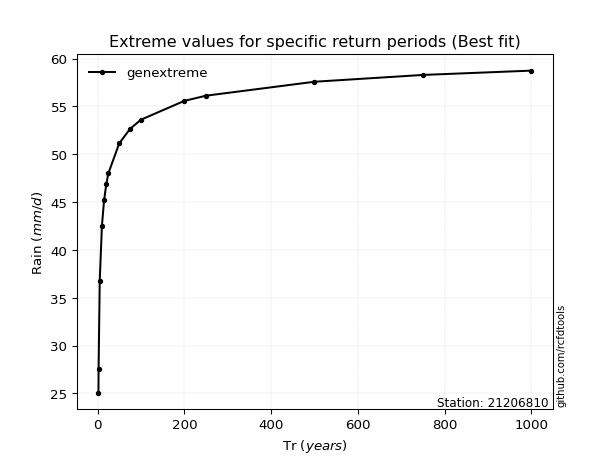</img>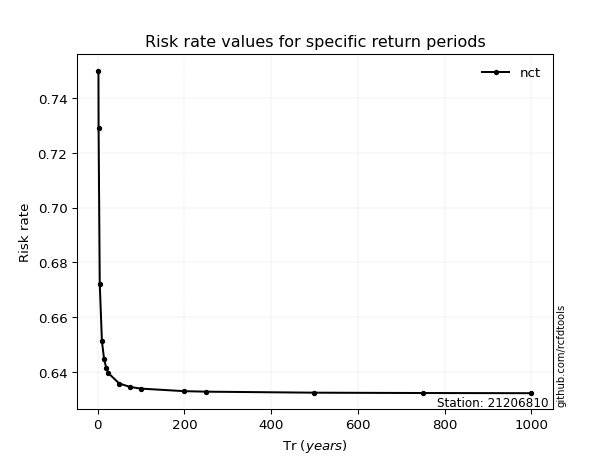</img>

</div>


<sub>**APP DISCLAIMER**: NO WARRANTY - This software is provided by [github.com/rcfdtools](https://github.com/rcfdtools) "as is", without any express or implied warranty, including warranties of merchantability, fitness for a particular purpose, or non-infringement. There is no guarantee that the software will be error-free or operate without interruption. LIMITATION OF LIABILITY - Neither the authors nor copyright holders will be liable for claims or damages arising from the software or its use. You are responsible for determining if the software is appropriate for your use and assume all associated risks, including errors, legal compliance, and data loss. NO PROFESSIONAL ADVICE - The software provides general information and does not offer professional advice. It should not replace consultation with professional advisors.</sub>