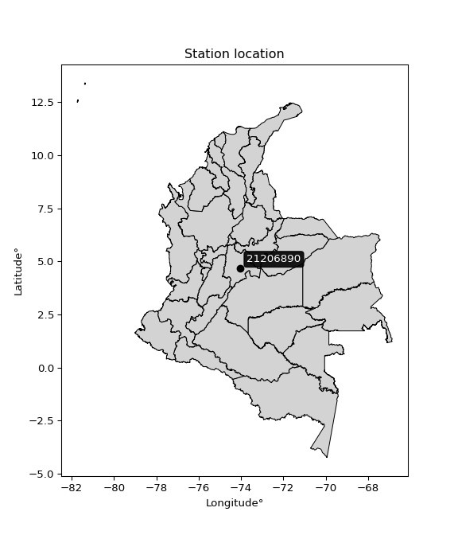

<div align="center">


</div>

# Station (rain, Pmax24h): 21206890

Probable Maximum Precipitation (PMP) is the greatest amount of rainfall for a specific duration that is meteorologically possible for a given location, acting as a "worst-case" scenario for extreme storms, crucial for designing safety-critical infrastructure like bridges, river deviations, dams, spillways, and nuclear plants to prevent catastrophic failure. PMP is calculated by hydrologists using meteorological data to determine the upper limit of extreme rainfall, often leading to the Probable Maximum Flood (PMF) for flood control design, and is increasingly being studied for climate change impacts.

<div align="center">

</img>

</div>


## A. General information


### 1. General running parameters

• app_version: _v20251226_. • runtime: _2025-12-26 15:38:16.554582_. • Python version: _3.14.0_. • SciPy version: _1.16.3_. • Pandas version: _2.3.3_. • NumPy version: _2.3.5_. • Stations dataset (station_dataset_file): _dataset/pmax24h_in/automatic_colombia_2003_2024.csv_. • Stations catalog (station_catalog_file): _dataset/CNE_IDEAM.xls_. • Minimum year to eval til year_max (date_min): _2003_. • Maximum year to eval since year_min (date_max): _2024_. • Creates, save and include plots into reports (create_plot): _False_. • Plot only fit distributions with Δo > Δ (plot_only_fit): _True_. • Eval low extreme values, if False, evaluates high extreme values (low_extreme): _False_. • Eval every SciPy distribution as logarithmic (pdist_logarithmic_on): _True_. • Standard deviation normalized (ddof): _1.0_. • Return periods to eval in years (Tr): _[2, 2.33, 5, 10, 15, 20, 25, 50, 75, 100, 200, 250, 500, 750, 1000]_. • Minimum data sample per station, 0 means any (minimum_sample): _5_. • Z-Score threshold to adjust a value, 0 means disable (zscore): _3.5_. • Avoid zeros, e.g. rain = 0 (avoid_zeros): _True_. • Avoid null values (avoid_nans): _True_. [:file_folder:Dataset file.](../../dataset/pmax24h_in/automatic_colombia_2003_2024.csv)


### 2. Station info and location

|   id |   CODIGO | NOMBRE                     | CATEGORIA               | TECNOLOGIA                | ESTADO   | FECHA_INSTALACION   |   FECHA_SUSPENSION |   ALTITUD |   LATITUD |   LONGITUD | DEPARTAMENTO   | MUNICIPIO   | AREA_OPERATIVA                            | ENTIDAD                                                          | AREA_HIDROGRAFICA   | ZONA_HIDROGRAFICA   | SUBZONA_HIDROGRAFICA   |   CORRIENTE | OBSERVACION                                                                                         |   SUBRED | Catalogo   |
|-----:|---------:|:---------------------------|:------------------------|:--------------------------|:---------|:--------------------|-------------------:|----------:|----------:|-----------:|:---------------|:------------|:------------------------------------------|:-----------------------------------------------------------------|:--------------------|:--------------------|:-----------------------|------------:|:----------------------------------------------------------------------------------------------------|---------:|:-----------|
|    0 | 21206890 | CERRO CAZADORES [21206890] | Climatológica Ordinaria | Automática con Telemetría | Activa   | 01/09/2007          |                nan |      3182 |   4.66577 |   -74.0286 | Bogotá         | Bogotá, D.C | Area Operativa 11 - Cundinamarca-Amazonas | FONDO DE PREVENCION Y ATENCION DE DESASTRES DE BOGOTA DC - FOPAE | Magdalena Cauca     | Alto Magdalena      | Río Bogotá             |         nan | 02/11/2022$Migracion$DATOS ACTUALIZADOS A LA FECHA 02/11/2022, SEGÚN INFORMACIÓN ENVIADA POR IDIGER |      nan | CNE_OE     |

<div align="center">

Map location in: [:earth_americas:Google](http://maps.google.com/maps?q=4.66577,-74.02861) [:earth_americas:OSM](https://www.openstreetmap.org/#map=18/4.66577/-74.02861&layers=P) [:earth_americas:Bing](https://www.bing.com/maps?cp=4.66577~-74.02861&lvl=18) [:earth_americas:Apple](https://maps.apple.com/frame?center=4.66577%2C-74.02861&span=0.003%2C0.006)

</div>


<div align="center">

```geojson
{
  "type": "Feature",
  "geometry": {
    "type": "Point", 
    "coordinates": [-74.02861, 4.66577]
  }, 
  "properties": {
    "Name": "21206890"
  }
}
```

</div>


### 3. Discrete values table and plot

|               |           0 |           1 |             2 |           3 |           4 |          5 |          6 |
|:--------------|------------:|------------:|--------------:|------------:|------------:|-----------:|-----------:|
| Date          | 2012        | 2013        | 2014          | 2015        | 2016        | 2023       | 2024       |
| Value         |   35.3      |   49.1      |   44.7        |   50.3      |   26.6      |    0.3     |  104.4     |
| Value_initial |   35.3      |   49.1      |   44.7        |   50.3      |   26.6      |    0.3     |  104.4     |
| count         |    7        |    7        |    7          |    7        |    7        |    7       |    7       |
| mean          |   44.3857   |   44.3857   |   44.3857     |   44.3857   |   44.3857   |   44.3857  |   44.3857  |
| std           |   31.6266   |   31.6266   |   31.6266     |   31.6266   |   31.6266   |   31.6266  |   31.6266  |
| zscore        |   -0.287281 |    0.149061 |    0.00993739 |    0.187004 |   -0.562366 |   -1.39394 |    1.89759 |
> If Z-Score is active, values out of range or outliers are replaced with the station mean value.


### 4. Active continuous probability distributions from SciPy (45 of 104 available)

[scipy.stats](https://docs.scipy.org/doc/scipy/reference/stats.html) is a Python´s powerful submodule within the SciPy library for comprehensive statistical analysis, offering over 130 probability distributions (like Normal, Poisson), functions for descriptive stats (mean, variance), hypothesis testing (t-tests, chi-square), random variable generation, and statistical tests, making it essential for data science, modeling, and research. It provides tools to explore, model, and draw conclusions from data efficiently, working seamlessly with NumPy.

<div align="center">

|   id | p_dist             |   n_parameter | fit_method   | label                                                                       | active   | ref                                                                                                        |
|-----:|:-------------------|--------------:|:-------------|:----------------------------------------------------------------------------|:---------|:-----------------------------------------------------------------------------------------------------------|
|    0 | alpha              |             3 | MLE          | Alpha                                                                       | True     | [:mortar_board:](https://docs.scipy.org/doc/scipy/reference/generated/scipy.stats.alpha.html)              |
|    1 | betaprime          |             4 | MLE          | Beta prime                                                                  | True     | [:mortar_board:](https://docs.scipy.org/doc/scipy/reference/generated/scipy.stats.betaprime.html)          |
|    2 | chi2               |             3 | MLE          | Chi²                                                                        | True     | [:mortar_board:](https://docs.scipy.org/doc/scipy/reference/generated/scipy.stats.chi2.html)               |
|    3 | crystalball        |             4 | MLE          | Crystalball                                                                 | True     | [:mortar_board:](https://docs.scipy.org/doc/scipy/reference/generated/scipy.stats.crystalball.html)        |
|    4 | erlang             |             3 | MLE          | Erlang                                                                      | True     | [:mortar_board:](https://docs.scipy.org/doc/scipy/reference/generated/scipy.stats.erlang.html)             |
|    5 | expon              |             2 | MLE          | Exponential                                                                 | True     | [:mortar_board:](https://docs.scipy.org/doc/scipy/reference/generated/scipy.stats.expon.html)              |
|    6 | exponnorm          |             3 | MLE          | Exponentially modified Normal                                               | True     | [:mortar_board:](https://docs.scipy.org/doc/scipy/reference/generated/scipy.stats.exponnorm.html)          |
|    7 | f                  |             4 | MLE          | F                                                                           | True     | [:mortar_board:](https://docs.scipy.org/doc/scipy/reference/generated/scipy.stats.f.html)                  |
|    8 | fatiguelife        |             3 | MLE          | Fatigue-life (Birnbaum-Saunders)                                            | True     | [:mortar_board:](https://docs.scipy.org/doc/scipy/reference/generated/scipy.stats.fatiguelife.html)        |
|    9 | fisk               |             3 | MLE          | Fisk                                                                        | True     | [:mortar_board:](https://docs.scipy.org/doc/scipy/reference/generated/scipy.stats.fisk.html)               |
|   10 | gamma              |             3 | MLE          | Gamma                                                                       | True     | [:mortar_board:](https://docs.scipy.org/doc/scipy/reference/generated/scipy.stats.gamma.html)              |
|   11 | genexpon           |             5 | MLE          | Generalized exponential                                                     | True     | [:mortar_board:](https://docs.scipy.org/doc/scipy/reference/generated/scipy.stats.genexpon.html)           |
|   12 | genlogistic        |             3 | MLE          | Generalized logistic                                                        | True     | [:mortar_board:](https://docs.scipy.org/doc/scipy/reference/generated/scipy.stats.genlogistic.html)        |
|   13 | gibrat             |             2 | MM           | Gibrat                                                                      | True     | [:mortar_board:](https://docs.scipy.org/doc/scipy/reference/generated/scipy.stats.gibrat.html)             |
|   14 | gompertz           |             3 | MLE          | Gompertz (or truncated Gumbel)                                              | True     | [:mortar_board:](https://docs.scipy.org/doc/scipy/reference/generated/scipy.stats.gompertz.html)           |
|   15 | gumbel_l           |             2 | MM           | Gumbel Left Skew                                                            | True     | [:mortar_board:](https://docs.scipy.org/doc/scipy/reference/generated/scipy.stats.gumbel_l.html)           |
|   16 | gumbel_r           |             2 | MM           | Gumbel Right Skew                                                           | True     | [:mortar_board:](https://docs.scipy.org/doc/scipy/reference/generated/scipy.stats.gumbel_r.html)           |
|   17 | halflogistic       |             2 | MM           | Half-logistic                                                               | True     | [:mortar_board:](https://docs.scipy.org/doc/scipy/reference/generated/scipy.stats.halflogistic.html)       |
|   18 | halfnorm           |             2 | MM           | Half Normal                                                                 | True     | [:mortar_board:](https://docs.scipy.org/doc/scipy/reference/generated/scipy.stats.halfnorm.html)           |
|   19 | hypsecant          |             2 | MM           | hyperbolic secant                                                           | True     | [:mortar_board:](https://docs.scipy.org/doc/scipy/reference/generated/scipy.stats.hypsecant.html)          |
|   20 | invgamma           |             3 | MLE          | Inverted gamma                                                              | True     | [:mortar_board:](https://docs.scipy.org/doc/scipy/reference/generated/scipy.stats.invgamma.html)           |
|   21 | invgauss           |             3 | MLE          | Inverse Gaussian                                                            | True     | [:mortar_board:](https://docs.scipy.org/doc/scipy/reference/generated/scipy.stats.invgauss.html)           |
|   22 | invweibull         |             3 | MLE          | Inverted Weibull                                                            | True     | [:mortar_board:](https://docs.scipy.org/doc/scipy/reference/generated/scipy.stats.invweibull.html)         |
|   23 | johnsonsu          |             4 | MLE          | Johnson Su                                                                  | True     | [:mortar_board:](https://docs.scipy.org/doc/scipy/reference/generated/scipy.stats.johnsonsu.html)          |
|   24 | kstwobign          |             2 | MLE          | Limiting distribution of scaled Kolmogorov-Smirnov two-sided test statistic | True     | [:mortar_board:](https://docs.scipy.org/doc/scipy/reference/generated/scipy.stats.kstwobign.html)          |
|   25 | laplace            |             2 | MM           | Laplace                                                                     | True     | [:mortar_board:](https://docs.scipy.org/doc/scipy/reference/generated/scipy.stats.laplace.html)            |
|   26 | laplace_asymmetric |             3 | MLE          | Asymmetric Laplace                                                          | True     | [:mortar_board:](https://docs.scipy.org/doc/scipy/reference/generated/scipy.stats.laplace_asymmetric.html) |
|   27 | loggamma           |             3 | MLE          | Log gamma                                                                   | True     | [:mortar_board:](https://docs.scipy.org/doc/scipy/reference/generated/scipy.stats.loggamma.html)           |
|   28 | logistic           |             2 | MM           | Logistic (or Sech-squared)                                                  | True     | [:mortar_board:](https://docs.scipy.org/doc/scipy/reference/generated/scipy.stats.logistic.html)           |
|   29 | lognorm            |             3 | MLE          | Log Normal                                                                  | True     | [:mortar_board:](https://docs.scipy.org/doc/scipy/reference/generated/scipy.stats.lognorm.html)            |
|   30 | maxwell            |             2 | MM           | Maxwell                                                                     | True     | [:mortar_board:](https://docs.scipy.org/doc/scipy/reference/generated/scipy.stats.maxwell.html)            |
|   31 | mielke             |             4 | MLE          | Mielke Beta-Kappa / Dagum                                                   | True     | [:mortar_board:](https://docs.scipy.org/doc/scipy/reference/generated/scipy.stats.mielke.html)             |
|   32 | moyal              |             2 | MM           | Moyal                                                                       | True     | [:mortar_board:](https://docs.scipy.org/doc/scipy/reference/generated/scipy.stats.moyal.html)              |
|   33 | nakagami           |             3 | MLE          | Nakagami                                                                    | True     | [:mortar_board:](https://docs.scipy.org/doc/scipy/reference/generated/scipy.stats.nakagami.html)           |
|   34 | ncf                |             5 | MLE          | Non-central F distribution                                                  | True     | [:mortar_board:](https://docs.scipy.org/doc/scipy/reference/generated/scipy.stats.ncf.html)                |
|   35 | nct                |             4 | MLE          | Non-central Student’s t                                                     | True     | [:mortar_board:](https://docs.scipy.org/doc/scipy/reference/generated/scipy.stats.nct.html)                |
|   36 | norm               |             2 | MM           | Normal                                                                      | True     | [:mortar_board:](https://docs.scipy.org/doc/scipy/reference/generated/scipy.stats.norm.html)               |
|   37 | pareto             |             3 | MLE          | Pareto                                                                      | True     | [:mortar_board:](https://docs.scipy.org/doc/scipy/reference/generated/scipy.stats.pareto.html)             |
|   38 | pearson3           |             3 | MM           | Pearson type III                                                            | True     | [:mortar_board:](https://docs.scipy.org/doc/scipy/reference/generated/scipy.stats.pearson3.html)           |
|   39 | rayleigh           |             2 | MM           | Rayleigh                                                                    | True     | [:mortar_board:](https://docs.scipy.org/doc/scipy/reference/generated/scipy.stats.rayleigh.html)           |
|   40 | rice               |             3 | MLE          | Rice                                                                        | True     | [:mortar_board:](https://docs.scipy.org/doc/scipy/reference/generated/scipy.stats.rice.html)               |
|   41 | t                  |             3 | MLE          | Student’s t                                                                 | True     | [:mortar_board:](https://docs.scipy.org/doc/scipy/reference/generated/scipy.stats.t.html)                  |
|   42 | truncnorm          |             4 | MLE          | Truncated normal                                                            | True     | [:mortar_board:](https://docs.scipy.org/doc/scipy/reference/generated/scipy.stats.truncnorm.html)          |
|   43 | wald               |             2 | MM           | Wald                                                                        | True     | [:mortar_board:](https://docs.scipy.org/doc/scipy/reference/generated/scipy.stats.wald.html)               |
|   44 | weibull_min        |             3 | MLE          | Weibull minimum                                                             | True     | [:mortar_board:](https://docs.scipy.org/doc/scipy/reference/generated/scipy.stats.weibull_min.html)        |

</div>

> **n_parameter:** # arguments & localization & scale.
>
> **Fit methods:** (MLE) maximum likelihood, (MM) L-moments.
>
>**Inactive:** foldnorm, gennorm, norminvgauss, powernorm, powerlognorm, skewnorm, genextreme, anglit, arcsine, argus, beta, bradford, burr, burr12, cauchy, cosine, halfcauchy, foldcauchy, skewcauchy, wrapcauchy, dgamma, gengamma, exponweib, exponpow, truncexpon, gausshyper, genhalflogistic, genhyperbolic, geninvgauss, halfgennorm, johnsonsb, kappa4, kappa3, ksone, kstwo, loglaplace, levy, levy_l, levy_stable, ncx2, genpareto, truncpareto, lomax, powerlaw, rdist, rel_breitwigner, recipinvgauss, semicircular, studentized_range, trapezoid, triang, truncweibull_min, tukeylambda, uniform, loguniform, vonmises, vonmises_line, weibull_max, dweibull, 


## B. Probability distributions vs. Empirical distributions

A continuous probability distribution (CPD) describes probabilities for variables that can take any value within a range (like rain any time), unlike discrete variables with specific outcomes (like temperature). It uses a Probability Density Function (PDF), a curve where the total area under it equals 1, and the probability of the variable falling within an interval (a to b) is found by calculating the area under the curve between those points. A key feature is that the probability of hitting any single exact value is zero, so probabilities are always expressed for ranges, e.g., $P(a ≤ X ≤ b)$.

<div align="center">

Distributions parameters
|    |   station | p_dist                |   n |            loc |            scale | shape                  | shape1                 | shape2                 | shape3   |
|---:|----------:|:----------------------|----:|---------------:|-----------------:|:-----------------------|:-----------------------|:-----------------------|:---------|
|  0 |  21206890 | alpha                 |   7 |     -22.9544   |     30.7888      | 1.1366184918435717e-11 |                        |                        |          |
|  1 |  21206890 | betaprime             |   7 |     -36.041    |   3873.08        | 7.681091691499639      | 370.8929032721615      |                        |          |
|  2 |  21206890 | chi2                  |   7 |     -34.4456   |      5.47012     | 14.411252384872178     |                        |                        |          |
|  3 |  21206890 | crystalball           |   7 |      44.3857   |     29.2805      | 14459.513663523167     | 128.78529315900926     |                        |          |
|  4 |  21206890 | erlang                |   7 |     -34.4457   |     10.9402      | 7.205635732308852      |                        |                        |          |
|  5 |  21206890 | expon                 |   7 |       0.3      |     44.0857      |                        |                        |                        |          |
|  6 |  21206890 | exponnorm             |   7 |      20.6588   |     17.5599      | 1.3511988771738253     |                        |                        |          |
|  7 |  21206890 | f                     |   7 |     -34.5784   |     78.9454      | 14.488737937641861     | 8389.129211593634      |                        |          |
|  8 |  21206890 | fatiguelife           |   7 |       0.299998 |      0.00956244  | 65.55631894467821      |                        |                        |          |
|  9 |  21206890 | fisk                  |   7 |     -73.419    |    114.422       | 7.4990474587851015     |                        |                        |          |
| 10 |  21206890 | gamma                 |   7 |     -34.4457   |     10.9402      | 7.205626873551301      |                        |                        |          |
| 11 |  21206890 | genexpon              |   7 |       0.29993  |      2.32847     | 0.0530106578613243     | 2.1004315535794093e-07 | 2.365718728249363      |          |
| 12 |  21206890 | genlogistic           |   7 |      14.7794   |     20.1361      | 2.9080700103964623     |                        |                        |          |
| 13 |  21206890 | gibrat                |   7 |      22.0484   |     13.5483      |                        |                        |                        |          |
| 14 |  21206890 | gompertz              |   7 |      26.6      |      6.43644     | 3.3639819510976266e-05 |                        |                        |          |
| 15 |  21206890 | gumbel_l              |   7 |      57.5635   |     22.8299      |                        |                        |                        |          |
| 16 |  21206890 | gumbel_r              |   7 |      31.2079   |     22.8299      |                        |                        |                        |          |
| 17 |  21206890 | halflogistic          |   7 |       9.68143  |     25.0338      |                        |                        |                        |          |
| 18 |  21206890 | halfnorm              |   7 |       5.62977  |     48.5734      |                        |                        |                        |          |
| 19 |  21206890 | hypsecant             |   7 |      44.3857   |     18.6406      |                        |                        |                        |          |
| 20 |  21206890 | invgamma              |   7 |    -110.915    |   4510.11        | 30.040988056694268     |                        |                        |          |
| 21 |  21206890 | invgauss              |   7 |     -72.9251   |   1870.96        | 0.06267167900543907    |                        |                        |          |
| 22 |  21206890 | invweibull            |   7 |       0.3      |      2.57614     | 0.042967623768594115   |                        |                        |          |
| 23 |  21206890 | johnsonsu             |   7 |      43.1688   |     10.9483      | 0.026669713117481154   | 0.7419625646199325     |                        |          |
| 24 |  21206890 | kstwobign             |   7 |     -58.2783   |    118.202       |                        |                        |                        |          |
| 25 |  21206890 | laplace               |   7 |      44.3857   |     20.7045      |                        |                        |                        |          |
| 26 |  21206890 | laplace_asymmetric    |   7 |      44.7      |     20.2269      | 1.0078019663393172     |                        |                        |          |
| 27 |  21206890 | loggamma              |   7 |   -6795.59     |    979.774       | 1076.5327613137288     |                        |                        |          |
| 28 |  21206890 | logistic              |   7 |      44.3857   |     16.1432      |                        |                        |                        |          |
| 29 |  21206890 | lognorm               |   7 |       0.3      |      0.128428    | 14.448094035369882     |                        |                        |          |
| 30 |  21206890 | maxwell               |   7 |     -24.9969   |     43.4791      |                        |                        |                        |          |
| 31 |  21206890 | mielke                |   7 |       0.3      |    110.964       | 0.5413980474179607     | 7.414928014460591      |                        |          |
| 32 |  21206890 | moyal                 |   7 |      27.6412   |     13.1809      |                        |                        |                        |          |
| 33 |  21206890 | nakagami              |   7 |       0.3      |     53.0255      | 0.29277062923622055    |                        |                        |          |
| 34 |  21206890 | ncf                   |   7 |       0.3      |      4.06347     | 0.41600011042780616    | 51.9552482233092       | 3.7519046198885366     |          |
| 35 |  21206890 | nct                   |   7 |      -7.18143  |     22.2074      | 8.1788083334972        | 2.1002815903749683     |                        |          |
| 36 |  21206890 | norm                  |   7 |      44.3857   |     29.2805      |                        |                        |                        |          |
| 37 |  21206890 | pareto                |   7 |       0.255152 |      0.0448483   | 0.16788051193016534    |                        |                        |          |
| 38 |  21206890 | pearson3              |   7 |      44.3857   |     29.2805      | 0.7079657604814538     |                        |                        |          |
| 39 |  21206890 | rayleigh              |   7 |     -11.6297   |     44.6938      |                        |                        |                        |          |
| 40 |  21206890 | rice                  |   7 |     -10.839    |     44.1991      | 0.0012777929813727754  |                        |                        |          |
| 41 |  21206890 | t                     |   7 |      45.6322   |     25.5793      | 6.34706254886588       |                        |                        |          |
| 42 |  21206890 | truncnorm             |   7 |      44.4994   |     29.0401      | -3.190733546949587     | 4.8736313518233025     |                        |          |
| 43 |  21206890 | wald                  |   7 |      15.1052   |     29.2805      |                        |                        |                        |          |
| 44 |  21206890 | weibull_min           |   7 |      -8.04844  |     58.7983      | 1.8228016807620173     |                        |                        |          |
| 45 |  21206890 | logalpha              |   7 |     -52.4468   |   1606.5         | 28.926765581746466     |                        |                        |          |
| 46 |  21206890 | logbetaprime          |   7 |      -6.98223  |      1.00914e+07 | 18.403961450358487     | 18259162.539201893     |                        |          |
| 47 |  21206890 | logchi2               |   7 |      -1.20397  |      2.89423     | 1.2698316266388532     |                        |                        |          |
| 48 |  21206890 | logcrystalball        |   7 |       3.1287   |      1.81079     | 501.4467864223734      | 504.2587822627302      |                        |          |
| 49 |  21206890 | logerlang             |   7 |     -29.7088   |      0.112893    | 290.46271314987297     |                        |                        |          |
| 50 |  21206890 | logexpon              |   7 |      -1.20397  |      4.33267     |                        |                        |                        |          |
| 51 |  21206890 | logexponnorm          |   7 |       3.12751  |      1.81079     | 0.0006342272737702443  |                        |                        |          |
| 52 |  21206890 | logf                  |   7 |      -1.20397  |      1.14732     | 1.0982678139773963     | 1.1206497157041975     |                        |          |
| 53 |  21206890 | logfatiguelife        |   7 |   -1129.12     |   1132.26        | 0.0015965216345989151  |                        |                        |          |
| 54 |  21206890 | logfisk               |   7 |      -1.20397  |      1.68464     | 0.8383136784611283     |                        |                        |          |
| 55 |  21206890 | loggamma              |   7 |     -31.5501   |      0.104979    | 330.10725944391015     |                        |                        |          |
| 56 |  21206890 | loggenexpon           |   7 |      -1.38532  |      0.0237892   | 0.0012195759568399572  | 1.2567057332832166     | 2.9441109162314708e-05 |          |
| 57 |  21206890 | loggenlogistic        |   7 |       4.46059  |      0.198195    | 0.14436847285592014    |                        |                        |          |
| 58 |  21206890 | loggibrat             |   7 |       1.74733  |      0.837849    |                        |                        |                        |          |
| 59 |  21206890 | loggompertz           |   7 |      -1.20398  |      0.952158    | 0.005183863417438256   |                        |                        |          |
| 60 |  21206890 | loggumbel_l           |   7 |       3.94365  |      1.41187     |                        |                        |                        |          |
| 61 |  21206890 | loggumbel_r           |   7 |       2.31375  |      1.41187     |                        |                        |                        |          |
| 62 |  21206890 | loghalflogistic       |   7 |       0.982525 |      1.54815     |                        |                        |                        |          |
| 63 |  21206890 | loghalfnorm           |   7 |       0.731941 |      3.00389     |                        |                        |                        |          |
| 64 |  21206890 | loghypsecant          |   7 |       3.1287   |      1.15278     |                        |                        |                        |          |
| 65 |  21206890 | loginvgamma           |   7 |     -46.0496   |  31030.2         | 632.3719824835941      |                        |                        |          |
| 66 |  21206890 | loginvgauss           |   7 |     -18.5129   |   2419.62        | 0.008934362813006184   |                        |                        |          |
| 67 |  21206890 | loginvweibull         |   7 | -271482        | 271484           | 117535.53502330015     |                        |                        |          |
| 68 |  21206890 | logjohnsonsu          |   7 |       3.9062   |      0.021099    | 0.5305754510321548     | 0.3138477581479613     |                        |          |
| 69 |  21206890 | logkstwobign          |   7 |      -6.26276  |     10.7473      |                        |                        |                        |          |
| 70 |  21206890 | loglaplace            |   7 |       3.1287   |      1.28042     |                        |                        |                        |          |
| 71 |  21206890 | loglaplace_asymmetric |   7 |       3.91801  |      0.700854    | 1.7108007858367076     |                        |                        |          |
| 72 |  21206890 | logloggamma           |   7 |       4.64834  |      1.14403e-05 | 7.513859442846869e-06  |                        |                        |          |
| 73 |  21206890 | loglogistic           |   7 |       3.1287   |      0.998339    |                        |                        |                        |          |
| 74 |  21206890 | loglognorm            |   7 |      -1.20397  |      3.82465     | 13.982029541596734     |                        |                        |          |
| 75 |  21206890 | logmaxwell            |   7 |      -1.16212  |      2.68887     |                        |                        |                        |          |
| 76 |  21206890 | logmielke             |   7 |      -1.20397  |      6.14105     | 0.15714475856048737    | 2.2178120992729022     |                        |          |
| 77 |  21206890 | logmoyal              |   7 |       2.09317  |      0.815141    |                        |                        |                        |          |
| 78 |  21206890 | lognakagami           |   7 |   -2120.18     |   2123.3         | 341892.0726109373      |                        |                        |          |
| 79 |  21206890 | logncf                |   7 |      -1.20397  |      1.04554     | 1.0706740952575764     | 1.1498169580928082     | 1.10106748442741       |          |
| 80 |  21206890 | lognct                |   7 |    -118.82     |      1.75655     | 34667.29789621831      | 69.42295897532978      |                        |          |
| 81 |  21206890 | lognorm               |   7 |       3.1287   |      1.81079     |                        |                        |                        |          |
| 82 |  21206890 | logpareto             |   7 |      -1.20879  |      0.00481828  | 0.16778607857691746    |                        |                        |          |
| 83 |  21206890 | logpearson3           |   7 |       3.1287   |      1.81079     | -1.8405044335069112    |                        |                        |          |
| 84 |  21206890 | lograyleigh           |   7 |      -0.335482 |      2.76401     |                        |                        |                        |          |
| 85 |  21206890 | logrice               |   7 |   -1481.82     |      1.81374     | 818.7226800218182      |                        |                        |          |
| 86 |  21206890 | logt                  |   7 |       3.84665  |      0.152223    | 0.6266402064617638     |                        |                        |          |
| 87 |  21206890 | logtruncnorm          |   7 |       1.73093  |      6.41458     | -0.4609967880154427    | 0.45479143386196424    |                        |          |
| 88 |  21206890 | logwald               |   7 |       1.31793  |      1.81077     |                        |                        |                        |          |
| 89 |  21206890 | logweibull_min        |   7 |      -1.20397  |      1.70321     | 0.5774778176020303     |                        |                        |          |

</div>

> **loc** (Location parameter): This shifts the distribution along the x-axis. For many common distributions, like the normal (Gaussian) distribution, loc represents the mean $μ$. For others, like the uniform distribution, it might represent the minimum value, or for the beta distribution, the left end of the support interval.
>
> **scale** (Scale parameter): This determines the width or spread of the distribution. For the normal distribution, scale represents the standard deviation $σ$. For a uniform distribution, it defines the length of the interval (from $loc$ to $loc + scale$).
>
> **shape** (Shape parameters): Refers to parameters that define the specific form of a probability distribution, distinct from its location (loc) and scale (scale). These parameters are required arguments for most distribution functions. For example, a normal (Gaussian) distribution is fully defined by its location (mean) and scale (standard deviation), so it has no specific shape parameters beyond loc and scale. However, other distributions have intrinsic properties that need specification, as Gamma distribution that takes a shape parameter, often named $a$ or $alpha$.


### 0. Cumulative distribution values - CDF (90 evaluated)

> Ordered by x ascending and calculating $log(f(x))$ separately. 

|   id |   Station |   date |     x |   count |    mean |     std |      zscore |   Value_initial |   station |   m |    alpha |   alpha_pdf |   betaprime |   betaprime_pdf |      chi2 |   chi2_pdf |   crystalball |   crystalball_pdf |    erlang |   erlang_pdf |    expon |   expon_pdf |   exponnorm |   exponnorm_pdf |         f |      f_pdf |   fatiguelife |   fatiguelife_pdf |      fisk |   fisk_pdf |     gamma |   gamma_pdf |    genexpon |   genexpon_pdf |   genlogistic |   genlogistic_pdf |   gibrat |   gibrat_pdf |    gompertz |   gompertz_pdf |   gumbel_l |   gumbel_l_pdf |   gumbel_r |   gumbel_r_pdf |   halflogistic |   halflogistic_pdf |   halfnorm |   halfnorm_pdf |   hypsecant |   hypsecant_pdf |   invgamma |   invgamma_pdf |   invgauss |   invgauss_pdf |   invweibull |   invweibull_pdf |   johnsonsu |   johnsonsu_pdf |   kstwobign |   kstwobign_pdf |   laplace |   laplace_pdf |   laplace_asymmetric |   laplace_asymmetric_pdf |   loggamma |   loggamma_pdf |   logistic |   logistic_pdf |    lognorm |   lognorm_pdf |   maxwell |   maxwell_pdf |      mielke |    mielke_pdf |      moyal |   moyal_pdf |    nakagami |    nakagami_pdf |         ncf |     ncf_pdf |       nct |    nct_pdf |      norm |   norm_pdf |   pareto |   pareto_pdf |   pearson3 |   pearson3_pdf |   rayleigh |   rayleigh_pdf |      rice |   rice_pdf |         t |      t_pdf |   truncnorm |   truncnorm_pdf |     wald |   wald_pdf |   weibull_min |   weibull_min_pdf |   logalpha |   logalpha_pdf |   logbetaprime |   logbetaprime_pdf |     logchi2 |    logchi2_pdf |   logcrystalball |   logcrystalball_pdf |   logerlang |   logerlang_pdf |   logexpon |   logexpon_pdf |   logexponnorm |   logexponnorm_pdf |        logf |    logf_pdf |   logfatiguelife |   logfatiguelife_pdf |     logfisk |   logfisk_pdf |   loggenexpon |   loggenexpon_pdf |   loggenlogistic |   loggenlogistic_pdf |   loggibrat |   loggibrat_pdf |   loggompertz |   loggompertz_pdf |   loggumbel_l |   loggumbel_l_pdf |   loggumbel_r |   loggumbel_r_pdf |   loghalflogistic |   loghalflogistic_pdf |   loghalfnorm |   loghalfnorm_pdf |   loghypsecant |   loghypsecant_pdf |   loginvgamma |   loginvgamma_pdf |   loginvgauss |   loginvgauss_pdf |   loginvweibull |   loginvweibull_pdf |   logjohnsonsu |   logjohnsonsu_pdf |   logkstwobign |   logkstwobign_pdf |   loglaplace |   loglaplace_pdf |   loglaplace_asymmetric |   loglaplace_asymmetric_pdf |   logloggamma |   logloggamma_pdf |   loglogistic |   loglogistic_pdf |   loglognorm |   loglognorm_pdf |   logmaxwell |   logmaxwell_pdf |   logmielke |   logmielke_pdf |    logmoyal |   logmoyal_pdf |   lognakagami |   lognakagami_pdf |     logncf |   logncf_pdf |     lognct |   lognct_pdf |   logpareto |   logpareto_pdf |   logpearson3 |   logpearson3_pdf |   lograyleigh |   lograyleigh_pdf |    logrice |   logrice_pdf |      logt |   logt_pdf |   logtruncnorm |   logtruncnorm_pdf |   logwald |   logwald_pdf |   logweibull_min |   logweibull_min_pdf |
|-----:|----------:|-------:|------:|--------:|--------:|--------:|------------:|----------------:|----------:|----:|---------:|------------:|------------:|----------------:|----------:|-----------:|--------------:|------------------:|----------:|-------------:|---------:|------------:|------------:|----------------:|----------:|-----------:|--------------:|------------------:|----------:|-----------:|----------:|------------:|------------:|---------------:|--------------:|------------------:|---------:|-------------:|------------:|---------------:|-----------:|---------------:|-----------:|---------------:|---------------:|-------------------:|-----------:|---------------:|------------:|----------------:|-----------:|---------------:|-----------:|---------------:|-------------:|-----------------:|------------:|----------------:|------------:|----------------:|----------:|--------------:|---------------------:|-------------------------:|-----------:|---------------:|-----------:|---------------:|-----------:|--------------:|----------:|--------------:|------------:|--------------:|-----------:|------------:|------------:|----------------:|------------:|------------:|----------:|-----------:|----------:|-----------:|---------:|-------------:|-----------:|---------------:|-----------:|---------------:|----------:|-----------:|----------:|-----------:|------------:|----------------:|---------:|-----------:|--------------:|------------------:|-----------:|---------------:|---------------:|-------------------:|------------:|---------------:|-----------------:|---------------------:|------------:|----------------:|-----------:|---------------:|---------------:|-------------------:|------------:|------------:|-----------------:|---------------------:|------------:|--------------:|--------------:|------------------:|-----------------:|---------------------:|------------:|----------------:|--------------:|------------------:|--------------:|------------------:|--------------:|------------------:|------------------:|----------------------:|--------------:|------------------:|---------------:|-------------------:|--------------:|------------------:|--------------:|------------------:|----------------:|--------------------:|---------------:|-------------------:|---------------:|-------------------:|-------------:|-----------------:|------------------------:|----------------------------:|--------------:|------------------:|--------------:|------------------:|-------------:|-----------------:|-------------:|-----------------:|------------:|----------------:|------------:|---------------:|--------------:|------------------:|-----------:|-------------:|-----------:|-------------:|------------:|----------------:|--------------:|------------------:|--------------:|------------------:|-----------:|--------------:|----------:|-----------:|---------------:|-------------------:|----------:|--------------:|-----------------:|---------------------:|
|    0 |  21206890 |   2023 |   0.3 |       7 | 44.3857 | 31.6266 | -1.39394    |             0.3 |  21206890 |   1 | 0.185503 |  0.018909   |   0.0357175 |      0.00465283 | 0.0356003 | 0.00467888 |     0.0660808 |        0.00438605 | 0.0356004 |   0.00467888 | 0        |  0.0226831  |   0.0339751 |      0.00375832 | 0.0356107 | 0.00467665 |      0.124881 |   70526           | 0.0356798 | 0.00350002 | 0.0356004 |  0.00467889 | 1.60097e-06 |     0.0227663  |      0.038956 |        0.00378297 | 0        |  0           | 0           |    0           |  0.0781838 |    0.00328711  |  0.0208118 |     0.00352993 |       0        |         0          |   0        |     0          |   0.0596325 |      0.00318039 |  0.0366978 |     0.00438201 |  0.0367454 |     0.00454569 |   0.00550862 |      2.21783e+13 |   0.0652435 |     0.00213245  |   0.0332966 |      0.00514217 | 0.0594611 |    0.0028719  |            0.0570684 |               0.00279956 | 0.00961025 |      0.0147515 |  0.0611736 |     0.00355762 | 0.00836245 |     0.0125855 | 0.0473699 |    0.00524476 | 6.72844e-08 | 5802.19       | 0.00478473 |  0.00159628 | 2.30228e-11 | 242848          | 0.000144451 | 8.11482e+08 | 0.0385693 | 0.00377495 | 0.0660808 | 0.00438605 | 0        |  3.7433      |  0.0371563 |     0.00466518 |  0.0349961 |     0.00576319 | 0.0312577 | 0.00552367 | 0.0620141 | 0.00342458 |   0.0633385 |      0.00431712 | 0        | 0          |     0.0280886 |        0.00604593 | 0.00767479 |      0.0129298 |      0.0163296 |          0.0252363 | 4.20635e-11 | 120277         |       0.00836246 |            0.0125855 |    0.010354 |       0.0156839 |   0        |      0.230804  |      0.0083631 |          0.0125864 | 1.56152e-09 | 3.86177e+06 |       0.00809274 |            0.0122965 | 4.86993e-14 |   183.861     |     0.0103186 |         0.0624695 |        0.0161447 |            0.0117601 |    0        |       0         |   1.22845e-08 |        0.00544434 |     0.0257585 |         0.0180073 |   5.67248e-06 |       4.85336e-05 |          0        |              0        |      0        |          0        |      0.0148433 |          0.0128714 |     0.0104111 |          0.015954 |     0.0103849 |          0.01696  |       0.0156363 |           0.0281491 |      0.0792819 |         0.00906837 |      0.0203291 |          0.0407335 |    0.0169593 |        0.0132451 |               0.0104025 |                  0.00867584 |     0.0214139 |         0.0140644 |     0.0128703 |         0.0127258 |   0.00374988 |       3.6014e+12 |     0        |         0        |   0.0026077 |     1.84551e+12 | 4.13287e-14 |    1.47217e-12 |     0.0085206 |         0.0127685 | 1.5557e-09 |  3.75071e+06 | 0.00845096 |    0.0127184 |    0        |     34.8228     |     0.0326769 |         0.0188464 |      0        |          0        | 0.00845218 |     0.0126833 | 0.0348475 | 0.00432208 |     0.00351933 |           0.158689 |  0        |     0         |      6.71219e-10 |          1.74566e+06 |
|    1 |  21206890 |   2016 |  26.6 |       7 | 44.3857 | 31.6266 | -0.562366   |            26.6 |  21206890 |   2 | 0.534393 |  0.0082479  |   0.297071  |      0.0139696  | 0.297614  | 0.0139626  |     0.271785  |        0.0113295  | 0.297614  |   0.0139626  | 0.4493   |  0.0124916  |   0.280345  |      0.0148397  | 0.297569  | 0.0139632  |      0.788054 |       0.00440854  | 0.267199  | 0.0146806  | 0.297615  |  0.0139626  | 0.450506    |     0.01251    |      0.276468 |        0.0142668  | 0.137687 |  0.0483485   | 1.33768e-10 |    5.22649e-06 |  0.227111  |    0.00872153  |  0.294155  |     0.0157662  |       0.325614 |         0.0178553  |   0.334057 |     0.0149647  |   0.234043  |      0.0114545  |  0.291607  |     0.0140748  |  0.295576  |     0.0140185  |   0.404544   |      0.000598133 |   0.193441  |     0.0102505   |   0.319032  |      0.0142273  | 0.211787  |    0.010229   |            0.207355  |               0.0101721  | 0.544122   |      0.20716   |  0.249413  |     0.0115966  | 0.533495   |     0.219537  | 0.296403  |    0.0127804  | 0.458673    |    0.00944179 | 0.298206   |  0.0183283  | 0.506918    |      0.0106723  | 0.44943     | 0.0114468   | 0.27854   | 0.0143923  | 0.271785  | 0.0113295  | 0.657116 |  0.002185    |  0.29569   |     0.0138387  |  0.306378  |     0.0132748  | 0.301451  | 0.0133873  | 0.241738  | 0.0110298  |   0.268307  |      0.011369   | 0.263118 | 0.0346225  |     0.317069  |        0.0137015  | 0.539446   |      0.205361  |      0.546292  |          0.165881  | 0.719542    |      0.0617846 |       0.533495   |            0.219537  |    0.548746 |       0.204951  |   0.64482  |      0.0819771 |      0.533504  |          0.219536  | 0.717657    | 0.0299481   |       0.532251   |            0.219944  | 0.694415    |     0.0396649 |     0.613106  |         0.137522  |        0.4233    |            0.307539  |    0.727252 |       0.216695  |   0.434831    |        0.341784   |     0.464939  |         0.237001  |   0.604063    |       0.215668    |          0.630533 |              0.194564 |      0.603872 |          0.18531  |      0.541908  |          0.273733  |     0.547753  |          0.201543 |     0.552933  |          0.19217  |       0.550713  |           0.142229  |      0.226422  |         0.150985   |      0.590503  |          0.131734  |    0.556042  |        0.346729  |               0.438123  |                  0.3654     |     0.407341  |         0.267536  |     0.538043  |         0.248966  |   0.504544   |       0.00636151 |     0.564907 |         0.206871 |   0.92494   |     0.0216337   | 0.629373    |    0.210231    |     0.533904  |         0.218922  | 0.616849   |  0.0374646   | 0.534017   |    0.218776  |    0.682467 |      0.0118666  |     0.410658  |         0.222007  |      0.575115 |          0.201126 | 0.533452   |     0.219182  | 0.136218  | 0.146797   |     0.773628   |           0.17113  |  0.699626 |     0.194559  |      0.826073    |          0.0391715   |
|    2 |  21206890 |   2012 |  35.3 |       7 | 44.3857 | 31.6266 | -0.287281   |            35.3 |  21206890 |   3 | 0.597136 |  0.00629533 |   0.421782  |      0.0144378  | 0.422165  | 0.0144104  |     0.378167  |        0.0129844  | 0.422165  |   0.0144104  | 0.547925 |  0.0102544  |   0.41657   |      0.0160673  | 0.422134  | 0.0144127  |      0.821894 |       0.0034374   | 0.405304  | 0.0166256  | 0.422166  |  0.0144104  | 0.549243    |     0.0102621  |      0.408136 |        0.0156319  | 0.491168 |  0.0300977   | 9.63373e-05 |    2.01927e-05 |  0.314167  |    0.0113291   |  0.433483  |     0.0158717  |       0.471252 |         0.0155374  |   0.45869  |     0.0136308  |   0.350652  |      0.0152309  |  0.418286  |     0.0147561  |  0.42109   |     0.0145607  |   0.409037   |      0.000448899 |   0.319565  |     0.0196684   |   0.442265  |      0.0138796  | 0.322396  |    0.0155713  |            0.317736  |               0.0155869  | 0.601901   |      0.200515  |  0.362895  |     0.014322   | 0.594962   |     0.214043  | 0.411505  |    0.0134917  | 0.535417    |    0.00828051 | 0.454539   |  0.0171135  | 0.592011    |      0.00896814 | 0.542682    | 0.00998649  | 0.410944  | 0.0156694  | 0.378167  | 0.0129844  | 0.673155 |  0.00156573  |  0.41956   |     0.0143798  |  0.423787  |     0.0135374  | 0.420073  | 0.0136967  | 0.349763  | 0.0136613  |   0.375261  |      0.0130746  | 0.509105 | 0.0221832  |     0.436557  |        0.0135923  | 0.596648   |      0.198267  |      0.592386  |          0.159593  | 0.736416    |      0.0575372 |       0.594962   |            0.214043  |    0.60586  |       0.198052  |   0.667276 |      0.0767942 |      0.594971  |          0.214041  | 0.725791    | 0.0275971   |       0.593839   |            0.214479  | 0.70519     |     0.0365538 |     0.651037  |         0.130457  |        0.51958   |            0.374411  |    0.780492 |       0.162788  |   0.536942    |        0.376944   |     0.534274  |         0.252069  |   0.661974    |       0.19342     |          0.682453 |              0.172547 |      0.654196 |          0.170317 |      0.617408  |          0.257552  |     0.603889  |          0.194587 |     0.606309  |          0.184565 |       0.589925  |           0.134789  |      0.287125  |         0.311776   |      0.626761  |          0.124474  |    0.644071  |        0.277978  |               0.554741  |                  0.462661   |     0.490539  |         0.322179  |     0.607284  |         0.238887  |   0.506289   |       0.0059836  |     0.621927 |         0.195616 |   0.930759  |     0.0195339   | 0.684957    |    0.182873    |     0.595195  |         0.213421  | 0.627063   |  0.0347821   | 0.595259   |    0.213221  |    0.685707 |      0.0110492  |     0.478091  |         0.255158  |      0.630324 |          0.188685 | 0.594821   |     0.213713  | 0.205337  | 0.410554   |     0.82178    |           0.169151 |  0.74895  |     0.155822  |      0.836677    |          0.0358446   |
|    3 |  21206890 |   2014 |  44.7 |       7 | 44.3857 | 31.6266 |  0.00993739 |            44.7 |  21206890 |   4 | 0.649045 |  0.00483914 |   0.553685  |      0.0134058  | 0.553778  | 0.0133744  |     0.504282  |        0.013624   | 0.553778  |   0.0133744  | 0.634734 |  0.00828536 |   0.563462  |      0.0147955  | 0.553771  | 0.013377   |      0.850644 |       0.00272194  | 0.559332  | 0.0156483  | 0.553778  |  0.0133744  | 0.636083    |     0.00828508 |      0.552536 |        0.0147254  | 0.696364 |  0.0154329   | 0.000526162 |    8.69496e-05 |  0.434046  |    0.0141115   |  0.574771  |     0.0139422  |       0.604002 |         0.0126864  |   0.578808 |     0.0118864  |   0.505367  |      0.0170738  |  0.553449  |     0.0137473  |  0.554193  |     0.0135256  |   0.412772   |      0.000353462 |   0.551758  |     0.02655     |   0.566311  |      0.0123785  | 0.507532  |    0.0237856  |            0.503886  |               0.0247188  | 0.648281   |      0.191966  |  0.504867  |     0.0154849  | 0.644573   |     0.205684  | 0.537156  |    0.013048   | 0.608972    |    0.00741726 | 0.600585   |  0.0138169  | 0.669265    |      0.0075185  | 0.629216    | 0.00843879  | 0.555215  | 0.014666   | 0.504282  | 0.013624   | 0.685937 |  0.0011863   |  0.551326  |     0.0134316  |  0.548074  |     0.0127441  | 0.545918  | 0.0129094  | 0.486024  | 0.0149848  |   0.502403  |      0.0137471  | 0.67235  | 0.0134076  |     0.559761  |        0.0124814  | 0.64247    |      0.18952   |      0.629313  |          0.15305   | 0.749609    |      0.0542715 |       0.644573   |            0.205684  |    0.651646 |       0.189411  |   0.684921 |      0.0727215 |      0.644581  |          0.205682  | 0.732097    | 0.0258593   |       0.643553   |            0.206126  | 0.713542    |     0.0342432 |     0.681095  |         0.124112  |        0.614918  |            0.432485  |    0.814886 |       0.130092  |   0.627684    |        0.388363   |     0.594747  |         0.259261  |   0.705389    |       0.174368    |          0.721104 |              0.155027 |      0.692913 |          0.157665 |      0.675688  |          0.235121  |     0.64887   |          0.186082 |     0.648912  |          0.176037 |       0.620964  |           0.128096  |      0.421796  |         1.13383    |      0.655411  |          0.118203  |    0.704004  |        0.231171  |               0.675467  |                  0.563348   |     0.572816  |         0.376218  |     0.662038  |         0.224116  |   0.507668   |       0.00570095 |     0.666783 |         0.184098 |   0.935182  |     0.0179625   | 0.72558     |    0.161527    |     0.644662  |         0.205091  | 0.635034   |  0.0327768   | 0.644674   |    0.20486   |    0.688243 |      0.0104434  |     0.541842  |         0.285233  |      0.673484 |          0.176746 | 0.644358   |     0.205394  | 0.415412  | 1.68076    |     0.861497   |           0.167268 |  0.78265  |     0.130574  |      0.844842    |          0.0333643   |
|    4 |  21206890 |   2013 |  49.1 |       7 | 44.3857 | 31.6266 |  0.149061   |            49.1 |  21206890 |   5 | 0.669161 |  0.00431881 |   0.610838  |      0.0125428  | 0.610799  | 0.0125147  |     0.563955  |        0.0134494  | 0.610799  |   0.0125147  | 0.669429 |  0.00749836 |   0.62592   |      0.0135469  | 0.610803  | 0.012517   |      0.862032 |       0.00246095  | 0.625444  | 0.0143386  | 0.610799  |  0.0125147  | 0.670771    |     0.00749536 |      0.615115 |        0.0136706  | 0.75537  |  0.0116115   | 0.00107503  |    0.000172154 |  0.498543  |    0.015161    |  0.633365  |     0.0126703  |       0.65688  |         0.0113548  |   0.629181 |     0.0110059  |   0.579657  |      0.0165443  |  0.61201   |     0.0128364  |  0.611827  |     0.0126404  |   0.414255   |      0.00032144  |   0.659531  |     0.021845    |   0.618803  |      0.0114683  | 0.601816  |    0.0192318  |            0.601552  |               0.0198526  | 0.666116   |      0.187899  |  0.572493  |     0.0151609  | 0.663691   |     0.201498  | 0.59338   |    0.012475   | 0.640882    |    0.00709404 | 0.65771    |  0.0121567  | 0.70103     |      0.00692754 | 0.664824    | 0.00775163  | 0.61746   | 0.0135804  | 0.563955  | 0.0134494  | 0.690875 |  0.00106247  |  0.60866   |     0.012598   |  0.602738  |     0.0120777  | 0.601291  | 0.0122332  | 0.551821  | 0.0148378  |   0.562628  |      0.0135759  | 0.725281 | 0.0107704  |     0.613044  |        0.0117183  | 0.660074   |      0.185425  |      0.643548  |          0.150172  | 0.754647    |      0.0530372 |       0.663691   |            0.201498  |    0.669241 |       0.185337  |   0.691676 |      0.0711627 |      0.663699  |          0.201495  | 0.734495    | 0.0252177   |       0.662712   |            0.201938  | 0.716717    |     0.0333879 |     0.692625  |         0.121499  |        0.656481  |            0.452276  |    0.826588 |       0.119396  |   0.664098    |        0.386689   |     0.61915   |         0.260403  |   0.721407    |       0.166855    |          0.735343 |              0.148329 |      0.70748  |          0.152637 |      0.697281  |          0.224766  |     0.666156  |          0.182105 |     0.66526   |          0.172179 |       0.632862  |           0.12535   |      0.639135  |         4.80778    |      0.66639   |          0.115677  |    0.724931  |        0.214827  |               0.730483  |                  0.609232   |     0.60925   |         0.400147  |     0.682749  |         0.216963  |   0.508198   |       0.00559581 |     0.683834 |         0.179094 |   0.936841  |     0.0173789   | 0.740366    |    0.153513    |     0.663725  |         0.200923  | 0.638076   |  0.0320315   | 0.663715   |    0.200685  |    0.689213 |      0.0102194  |     0.569205  |         0.297691  |      0.689842 |          0.171702 | 0.66345    |     0.201226  | 0.585484  | 1.67667    |     0.877164   |           0.166462 |  0.794498 |     0.121951  |      0.847931    |          0.0324443   |
|    5 |  21206890 |   2015 |  50.3 |       7 | 44.3857 | 31.6266 |  0.187004   |            50.3 |  21206890 |   6 | 0.674266 |  0.00419089 |   0.625732  |      0.0122791  | 0.62566   | 0.0122523  |     0.580037  |        0.0133497  | 0.62566   |   0.0122523  | 0.678306 |  0.00729701 |   0.641948  |      0.0131642  | 0.625667  | 0.0122546  |      0.864946 |       0.00239598  | 0.642403  | 0.0139242  | 0.625661  |  0.0122523  | 0.679644    |     0.00729336 |      0.631321 |        0.0133378  | 0.768797 |  0.0107794   | 0.0013021   |    0.00020739  |  0.516879  |    0.0153949   |  0.648352  |     0.012306   |       0.670292 |         0.0109993  |   0.642241 |     0.0107619  |   0.59934   |      0.0162513  |  0.627246  |     0.0125556  |  0.626834  |     0.0123694  |   0.414636   |      0.000313687 |   0.684748  |     0.0201794   |   0.63241   |      0.0112084  | 0.624238  |    0.0181488  |            0.624677  |               0.0187004  | 0.670639   |      0.186797  |  0.59058   |     0.0149781  | 0.668542   |     0.200348  | 0.608238  |    0.0122858  | 0.649346    |    0.00701209 | 0.672033   |  0.0117154  | 0.709251    |      0.006774   | 0.674016    | 0.00756967  | 0.633555  | 0.013241   | 0.580037  | 0.0133497  | 0.692132 |  0.00103278  |  0.623625  |     0.0123409  |  0.617108  |     0.0118708  | 0.615845  | 0.0120226  | 0.569554  | 0.0147108  |   0.578861  |      0.0134759  | 0.737838 | 0.0101651  |     0.62697   |        0.0114914  | 0.664538   |      0.184321  |      0.647165  |          0.149409  | 0.755923    |      0.0527254 |       0.668542   |            0.200348  |    0.673702 |       0.184236  |   0.693389 |      0.0707672 |      0.66855   |          0.200345  | 0.735102    | 0.0250569   |       0.667574   |            0.200787  | 0.71752     |     0.0331734 |     0.69555   |         0.12082   |        0.667455  |            0.456631  |    0.82944  |       0.116824  |   0.673422    |        0.38561    |     0.625439  |         0.26052   |   0.725413    |       0.164937    |          0.738904 |              0.146633 |      0.71115  |          0.151346 |      0.702675  |          0.222016  |     0.67054   |          0.181033 |     0.669405  |          0.171148 |       0.63588   |           0.124638  |      0.757451  |         4.05862    |      0.669175  |          0.115026  |    0.73007   |        0.210814  |               0.745342  |                  0.621625   |     0.618988  |         0.406543  |     0.687964  |         0.215026  |   0.508333   |       0.00556939 |     0.688143 |         0.177774 |   0.937259  |     0.0172324   | 0.744048    |    0.151499    |     0.668562  |         0.199779  | 0.638848   |  0.0318444   | 0.668547   |    0.199539  |    0.689459 |      0.0101632  |     0.576432  |         0.30093   |      0.693972 |          0.170383 | 0.668295   |     0.200081  | 0.62358   | 1.47472    |     0.88118    |           0.16625  |  0.797417 |     0.119848  |      0.848711    |          0.0322134   |
|    6 |  21206890 |   2024 | 104.4 |       7 | 44.3857 | 31.6266 |  1.89759    |           104.4 |  21206890 |   7 | 0.808968 |  0.001471   |   0.963789  |      0.0018598  | 0.963721  | 0.00186721 |     0.9798    |        0.00166763 | 0.963721  |   0.00186721 | 0.905703 |  0.00213894 |   0.961439  |      0.00162516 | 0.963725  | 0.00186659 |      0.944243 |       0.000859687 | 0.964638  | 0.00143856 | 0.963721  |  0.00186721 | 0.906518    |     0.00212825 |      0.966822 |        0.00161066 | 0.964442 |  0.000950545 | 0.997459    |    0.00235873  |  0.999582  |    0.000142468 |  0.96029   |     0.00170437 |       0.955531 |         0.00173687 |   0.95799  |     0.00207816 |   0.974566  |      0.00136299 |  0.964214  |     0.00178112 |  0.964015  |     0.00183021 |   0.426114   |      0.000150034 |   0.965931  |     0.000901509 |   0.95473   |      0.00210829 | 0.97245   |    0.00133062 |            0.974663  |               0.00126241 | 0.792771   |      0.145624  |  0.976284  |     0.00143424 | 0.799309   |     0.154929  | 0.968746  |    0.00193942 | 0.932467    |    0.00298829 | 0.956632   |  0.00164349 | 0.93194     |      0.0020982  | 0.914063    | 0.00219651  | 0.964421  | 0.00159662 | 0.9798    | 0.00166763 | 0.727772 |  0.000438828 |  0.964656  |     0.00185787 |  0.965606  |     0.00199783 | 0.966591  | 0.00197077 | 0.970519  | 0.00162347 |   0.980415  |      0.00163807 | 0.955099 | 0.00128479 |     0.96163   |        0.00202797 | 0.785063   |      0.143971  |      0.747005  |          0.123219  | 0.791228    |      0.0442692 |       0.799309   |            0.154929  |    0.794087 |       0.143524  |   0.740945 |      0.0597911 |      0.799315  |          0.154925  | 0.751802    | 0.0208896   |       0.79864    |            0.155298  | 0.739606    |     0.0275879 |     0.776054  |         0.0994891 |        0.953769  |            0.19421   |    0.89287  |       0.0635986 |   0.910677    |        0.227086   |     0.807401  |         0.224695  |   0.825815    |       0.111943    |          0.828677 |              0.101184 |      0.807678 |          0.113544 |      0.833522  |          0.13792   |     0.789059  |          0.141775 |     0.781624  |          0.134902 |       0.7189    |           0.102718  |      0.968947  |         0.0296015  |      0.745974  |          0.0953908 |    0.847393  |        0.119185  |               0.957162  |                  0.104569   |     0.999933  |         0.656692  |     0.820841  |         0.147305  |   0.512134   |       0.00487326 |     0.802335 |         0.134177 |   0.94838   |     0.0134127   | 0.834746    |    0.0999032   |     0.798999  |         0.154618  | 0.660225   |  0.026931    | 0.798813   |    0.154413  |    0.69632  |      0.00869952 |     0.831377  |         0.391614  |      0.803194 |          0.128384 | 0.798933   |     0.15485   | 0.890031  | 0.0847877  |     1          |           0.158888 |  0.866086 |     0.0729414 |      0.869927    |          0.0261795   |

An Empirical Distribution Function (EDF) is a step-function estimate of a true cumulative distribution function (CDF) based on observed sample data, representing the proportion of data points less than or equal to a given value. It is calculated by ordering your data and jumping up by $1/n$ (where $n$ is sample size) at each unique data point, allowing analysis without assuming an underlying population distribution, and it gets closer to the true CDF as the sample size grows.


### 1. Empirical - EDF California (1923)

California´s estimates the true probability distribution of water-related data (like rainfall, streamflow) using observed samples, crucial for risk assessment.

<div align="center">


$P=m/n$


</div>


**1.1. Empirical values**

<div align="center">

|                | 0                   | 1                  | 2                   | 3                  | 4                  | 5                  | 6              |
|:---------------|:--------------------|:-------------------|:--------------------|:-------------------|:-------------------|:-------------------|:---------------|
| date           | 2023                | 2016               | 2012                | 2014               | 2013               | 2015               | 2024           |
| x              | 0.3                 | 26.6               | 35.3                | 44.7               | 49.1               | 50.3               | 104.4          |
| m              | 1                   | 2                  | 3                   | 4                  | 5                  | 6                  | 7              |
| empirical_dist | edf_california      | edf_california     | edf_california      | edf_california     | edf_california     | edf_california     | edf_california |
| empirical      | 0.14285714285714285 | 0.2857142857142857 | 0.42857142857142855 | 0.5714285714285714 | 0.7142857142857143 | 0.8571428571428571 | 1.0            |
| empirical_tr   | 1.1666666666666665  | 1.4                | 1.75                | 2.333333333333333  | 3.5                | 6.999999999999997  | inf            |

</div>


**1.2. Kolmogorov-Smirnov fit test (sorted by Δ)**


<div align="center">

|                | 0                   | 1                   | 2                   | 3                     | 4                   | 5                   | 6                   | 7                   | 8                   | 9                   | 10                  | 11                  | 12                  | 13                  | 14                  | 15                  | 16                  | 17                  | 18                  | 19                  | 20                  | 21                  | 22                  | 23                  | 24                  | 25                  | 26                  | 27                  | 28                  | 29                  | 30                  | 31                  | 32                  | 33                  | 34                  | 35                  | 36                  | 37                  | 38                  | 39                  | 40                  | 41                  | 42                  | 43                  | 44                  | 45                  | 46                  | 47                  | 48                  | 49                  | 50                  | 51                  | 52                  | 53                  | 54                  | 55                  | 56                  | 57                  | 58                  | 59                  | 60                  | 61                  | 62                  | 63                  | 64                  | 65                  | 66                  | 67                  | 68                  | 69                  | 70                  | 71                  | 72                  | 73                  | 74                  | 75                  | 76                  | 77                  | 78                  | 79                  | 80                  | 81                  | 82                  | 83                  | 84                  | 85                  | 86                  | 87                  | 88                  | 89                  |
|:---------------|:--------------------|:--------------------|:--------------------|:----------------------|:--------------------|:--------------------|:--------------------|:--------------------|:--------------------|:--------------------|:--------------------|:--------------------|:--------------------|:--------------------|:--------------------|:--------------------|:--------------------|:--------------------|:--------------------|:--------------------|:--------------------|:--------------------|:--------------------|:--------------------|:--------------------|:--------------------|:--------------------|:--------------------|:--------------------|:--------------------|:--------------------|:--------------------|:--------------------|:--------------------|:--------------------|:--------------------|:--------------------|:--------------------|:--------------------|:--------------------|:--------------------|:--------------------|:--------------------|:--------------------|:--------------------|:--------------------|:--------------------|:--------------------|:--------------------|:--------------------|:--------------------|:--------------------|:--------------------|:--------------------|:--------------------|:--------------------|:--------------------|:--------------------|:--------------------|:--------------------|:--------------------|:--------------------|:--------------------|:--------------------|:--------------------|:--------------------|:--------------------|:--------------------|:--------------------|:--------------------|:--------------------|:--------------------|:--------------------|:--------------------|:--------------------|:--------------------|:--------------------|:--------------------|:--------------------|:--------------------|:--------------------|:--------------------|:--------------------|:--------------------|:--------------------|:--------------------|:--------------------|:--------------------|:--------------------|:--------------------|
| station        | 21206890            | 21206890            | 21206890            | 21206890              | 21206890            | 21206890            | 21206890            | 21206890            | 21206890            | 21206890            | 21206890            | 21206890            | 21206890            | 21206890            | 21206890            | 21206890            | 21206890            | 21206890            | 21206890            | 21206890            | 21206890            | 21206890            | 21206890            | 21206890            | 21206890            | 21206890            | 21206890            | 21206890            | 21206890            | 21206890            | 21206890            | 21206890            | 21206890            | 21206890            | 21206890            | 21206890            | 21206890            | 21206890            | 21206890            | 21206890            | 21206890            | 21206890            | 21206890            | 21206890            | 21206890            | 21206890            | 21206890            | 21206890            | 21206890            | 21206890            | 21206890            | 21206890            | 21206890            | 21206890            | 21206890            | 21206890            | 21206890            | 21206890            | 21206890            | 21206890            | 21206890            | 21206890            | 21206890            | 21206890            | 21206890            | 21206890            | 21206890            | 21206890            | 21206890            | 21206890            | 21206890            | 21206890            | 21206890            | 21206890            | 21206890            | 21206890            | 21206890            | 21206890            | 21206890            | 21206890            | 21206890            | 21206890            | 21206890            | 21206890            | 21206890            | 21206890            | 21206890            | 21206890            | 21206890            | 21206890            |
| empirical_dist | edf_california      | edf_california      | edf_california      | edf_california        | edf_california      | edf_california      | edf_california      | edf_california      | edf_california      | edf_california      | edf_california      | edf_california      | edf_california      | edf_california      | edf_california      | edf_california      | edf_california      | edf_california      | edf_california      | edf_california      | edf_california      | edf_california      | edf_california      | edf_california      | edf_california      | edf_california      | edf_california      | edf_california      | edf_california      | edf_california      | edf_california      | edf_california      | edf_california      | edf_california      | edf_california      | edf_california      | edf_california      | edf_california      | edf_california      | edf_california      | edf_california      | edf_california      | edf_california      | edf_california      | edf_california      | edf_california      | edf_california      | edf_california      | edf_california      | edf_california      | edf_california      | edf_california      | edf_california      | edf_california      | edf_california      | edf_california      | edf_california      | edf_california      | edf_california      | edf_california      | edf_california      | edf_california      | edf_california      | edf_california      | edf_california      | edf_california      | edf_california      | edf_california      | edf_california      | edf_california      | edf_california      | edf_california      | edf_california      | edf_california      | edf_california      | edf_california      | edf_california      | edf_california      | edf_california      | edf_california      | edf_california      | edf_california      | edf_california      | edf_california      | edf_california      | edf_california      | edf_california      | edf_california      | edf_california      | edf_california      |
| p_dist         | wald                | gibrat              | logjohnsonsu        | loglaplace_asymmetric | johnsonsu           | genexpon            | expon               | ncf                 | loggompertz         | moyal               | halflogistic        | loggenlogistic      | mielke              | gumbel_r            | fisk                | halfnorm            | exponnorm           | nakagami            | nct                 | kstwobign           | genlogistic         | invgamma            | weibull_min         | invgauss            | betaprime           | f                   | gamma               | chi2                | erlang              | loggumbel_l         | laplace_asymmetric  | laplace             | pearson3            | logt                | logloggamma         | rayleigh            | rice                | logfatiguelife      | logrice             | logcrystalball      | lognorm             | lognorm             | logexponnorm        | lognakagami         | lognct              | alpha               | maxwell             | loglogistic         | logalpha            | loghypsecant        | hypsecant           | loggamma            | loggamma            | logbetaprime        | loginvgamma         | logerlang           | logistic            | loginvgauss         | loglaplace          | norm                | crystalball         | truncnorm           | logmaxwell          | logpearson3         | loginvweibull       | t                   | lograyleigh         | logkstwobign        | loghalfnorm         | loggumbel_r         | loggenexpon         | logncf              | gumbel_l            | logmoyal            | loghalflogistic     | logexpon            | pareto              | logpareto           | logfisk             | logwald             | logf                | logchi2             | loggibrat           | loglognorm          | logtruncnorm        | fatiguelife         | logweibull_min      | invweibull          | logmielke           | gompertz            |
| delta          | 0.14285714285714285 | 0.1480275991179294  | 0.14963235422761328 | 0.15240845589937396   | 0.1723946444852178  | 0.17749885836259616 | 0.17883693784005605 | 0.183126678629717   | 0.18372067206993037 | 0.18511020191329564 | 0.18685083872299035 | 0.18968799476245424 | 0.2077972135197088  | 0.20879122600607702 | 0.21473940271379688 | 0.2149014560010576  | 0.21519491812508884 | 0.22120383661914278 | 0.2235880557785933  | 0.22473308093682476 | 0.2258214086206204  | 0.22989649380217647 | 0.2301725536858107  | 0.2303086245623891  | 0.2314105400114338  | 0.23147579087161796 | 0.23148233427268827 | 0.23148250406075632 | 0.23148256616133078 | 0.2317037914271386  | 0.23246613457103715 | 0.2329046590710716  | 0.23351822796568766 | 0.23356261756158148 | 0.2381543636716692  | 0.24003442765448468 | 0.24129781723916144 | 0.2465371348921369  | 0.24773730070525646 | 0.24778089480679344 | 0.24778092280684916 | 0.24778092280684916 | 0.24779009591376344 | 0.24818963421835794 | 0.2483031260531724  | 0.2486789005511808  | 0.24890460319849117 | 0.25232855355696115 | 0.2537321619820987  | 0.2561935793552155  | 0.25780240354435247 | 0.258407723934715   | 0.258407723934715   | 0.2605778562722969  | 0.26203886450768277 | 0.26303207830719944 | 0.26656281087089895 | 0.2672189216933508  | 0.2703273303583472  | 0.27710632660368606 | 0.2771063322914187  | 0.27828184209549156 | 0.2791926804612299  | 0.2807111624659151  | 0.28109983277366635 | 0.28758932411785354 | 0.2894010495769467  | 0.30478894757890806 | 0.3181581121557826  | 0.31834833243599947 | 0.3273917230151129  | 0.3397748775736842  | 0.34026377752753556 | 0.3436587369907016  | 0.3448190158171349  | 0.3591060095570272  | 0.37140168171436605 | 0.3967529362628456  | 0.4087011130090782  | 0.41391196427481725 | 0.4319422145671795  | 0.43382810508927183 | 0.4415372426063129  | 0.4878655405928437  | 0.4879139661283588  | 0.5023401329129747  | 0.5403586388068649  | 0.5738857412463343  | 0.63922604878927    | 0.8558407556679072  |
| deltao         | 0.48442053926100004 | 0.48442053926100004 | 0.48442053926100004 | 0.48442053926100004   | 0.48442053926100004 | 0.48442053926100004 | 0.48442053926100004 | 0.48442053926100004 | 0.48442053926100004 | 0.48442053926100004 | 0.48442053926100004 | 0.48442053926100004 | 0.48442053926100004 | 0.48442053926100004 | 0.48442053926100004 | 0.48442053926100004 | 0.48442053926100004 | 0.48442053926100004 | 0.48442053926100004 | 0.48442053926100004 | 0.48442053926100004 | 0.48442053926100004 | 0.48442053926100004 | 0.48442053926100004 | 0.48442053926100004 | 0.48442053926100004 | 0.48442053926100004 | 0.48442053926100004 | 0.48442053926100004 | 0.48442053926100004 | 0.48442053926100004 | 0.48442053926100004 | 0.48442053926100004 | 0.48442053926100004 | 0.48442053926100004 | 0.48442053926100004 | 0.48442053926100004 | 0.48442053926100004 | 0.48442053926100004 | 0.48442053926100004 | 0.48442053926100004 | 0.48442053926100004 | 0.48442053926100004 | 0.48442053926100004 | 0.48442053926100004 | 0.48442053926100004 | 0.48442053926100004 | 0.48442053926100004 | 0.48442053926100004 | 0.48442053926100004 | 0.48442053926100004 | 0.48442053926100004 | 0.48442053926100004 | 0.48442053926100004 | 0.48442053926100004 | 0.48442053926100004 | 0.48442053926100004 | 0.48442053926100004 | 0.48442053926100004 | 0.48442053926100004 | 0.48442053926100004 | 0.48442053926100004 | 0.48442053926100004 | 0.48442053926100004 | 0.48442053926100004 | 0.48442053926100004 | 0.48442053926100004 | 0.48442053926100004 | 0.48442053926100004 | 0.48442053926100004 | 0.48442053926100004 | 0.48442053926100004 | 0.48442053926100004 | 0.48442053926100004 | 0.48442053926100004 | 0.48442053926100004 | 0.48442053926100004 | 0.48442053926100004 | 0.48442053926100004 | 0.48442053926100004 | 0.48442053926100004 | 0.48442053926100004 | 0.48442053926100004 | 0.48442053926100004 | 0.48442053926100004 | 0.48442053926100004 | 0.48442053926100004 | 0.48442053926100004 | 0.48442053926100004 | 0.48442053926100004 |
| eval           | Δo > Δ              | Δo > Δ              | Δo > Δ              | Δo > Δ                | Δo > Δ              | Δo > Δ              | Δo > Δ              | Δo > Δ              | Δo > Δ              | Δo > Δ              | Δo > Δ              | Δo > Δ              | Δo > Δ              | Δo > Δ              | Δo > Δ              | Δo > Δ              | Δo > Δ              | Δo > Δ              | Δo > Δ              | Δo > Δ              | Δo > Δ              | Δo > Δ              | Δo > Δ              | Δo > Δ              | Δo > Δ              | Δo > Δ              | Δo > Δ              | Δo > Δ              | Δo > Δ              | Δo > Δ              | Δo > Δ              | Δo > Δ              | Δo > Δ              | Δo > Δ              | Δo > Δ              | Δo > Δ              | Δo > Δ              | Δo > Δ              | Δo > Δ              | Δo > Δ              | Δo > Δ              | Δo > Δ              | Δo > Δ              | Δo > Δ              | Δo > Δ              | Δo > Δ              | Δo > Δ              | Δo > Δ              | Δo > Δ              | Δo > Δ              | Δo > Δ              | Δo > Δ              | Δo > Δ              | Δo > Δ              | Δo > Δ              | Δo > Δ              | Δo > Δ              | Δo > Δ              | Δo > Δ              | Δo > Δ              | Δo > Δ              | Δo > Δ              | Δo > Δ              | Δo > Δ              | Δo > Δ              | Δo > Δ              | Δo > Δ              | Δo > Δ              | Δo > Δ              | Δo > Δ              | Δo > Δ              | Δo > Δ              | Δo > Δ              | Δo > Δ              | Δo > Δ              | Δo > Δ              | Δo > Δ              | Δo > Δ              | Δo > Δ              | Δo > Δ              | Δo > Δ              | Δo > Δ              | Δo > Δ              | Δo <= Δ             | Δo <= Δ             | Δo <= Δ             | Δo <= Δ             | Δo <= Δ             | Δo <= Δ             | Δo <= Δ             |
| fit            | 1                   | 1                   | 1                   | 1                     | 1                   | 1                   | 1                   | 1                   | 1                   | 1                   | 1                   | 1                   | 1                   | 1                   | 1                   | 1                   | 1                   | 1                   | 1                   | 1                   | 1                   | 1                   | 1                   | 1                   | 1                   | 1                   | 1                   | 1                   | 1                   | 1                   | 1                   | 1                   | 1                   | 1                   | 1                   | 1                   | 1                   | 1                   | 1                   | 1                   | 1                   | 1                   | 1                   | 1                   | 1                   | 1                   | 1                   | 1                   | 1                   | 1                   | 1                   | 1                   | 1                   | 1                   | 1                   | 1                   | 1                   | 1                   | 1                   | 1                   | 1                   | 1                   | 1                   | 1                   | 1                   | 1                   | 1                   | 1                   | 1                   | 1                   | 1                   | 1                   | 1                   | 1                   | 1                   | 1                   | 1                   | 1                   | 1                   | 1                   | 1                   | 1                   | 1                   | 0                   | 0                   | 0                   | 0                   | 0                   | 0                   | 0                   |
| n              | 7                   | 7                   | 7                   | 7                     | 7                   | 7                   | 7                   | 7                   | 7                   | 7                   | 7                   | 7                   | 7                   | 7                   | 7                   | 7                   | 7                   | 7                   | 7                   | 7                   | 7                   | 7                   | 7                   | 7                   | 7                   | 7                   | 7                   | 7                   | 7                   | 7                   | 7                   | 7                   | 7                   | 7                   | 7                   | 7                   | 7                   | 7                   | 7                   | 7                   | 7                   | 7                   | 7                   | 7                   | 7                   | 7                   | 7                   | 7                   | 7                   | 7                   | 7                   | 7                   | 7                   | 7                   | 7                   | 7                   | 7                   | 7                   | 7                   | 7                   | 7                   | 7                   | 7                   | 7                   | 7                   | 7                   | 7                   | 7                   | 7                   | 7                   | 7                   | 7                   | 7                   | 7                   | 7                   | 7                   | 7                   | 7                   | 7                   | 7                   | 7                   | 7                   | 7                   | 7                   | 7                   | 7                   | 7                   | 7                   | 7                   | 7                   |
| best_fit       | 1                   | 0                   | 0                   | 0                     | 0                   | 0                   | 0                   | 0                   | 0                   | 0                   | 0                   | 0                   | 0                   | 0                   | 0                   | 0                   | 0                   | 0                   | 0                   | 0                   | 0                   | 0                   | 0                   | 0                   | 0                   | 0                   | 0                   | 0                   | 0                   | 0                   | 0                   | 0                   | 0                   | 0                   | 0                   | 0                   | 0                   | 0                   | 0                   | 0                   | 0                   | 0                   | 0                   | 0                   | 0                   | 0                   | 0                   | 0                   | 0                   | 0                   | 0                   | 0                   | 0                   | 0                   | 0                   | 0                   | 0                   | 0                   | 0                   | 0                   | 0                   | 0                   | 0                   | 0                   | 0                   | 0                   | 0                   | 0                   | 0                   | 0                   | 0                   | 0                   | 0                   | 0                   | 0                   | 0                   | 0                   | 0                   | 0                   | 0                   | 0                   | 0                   | 0                   | 0                   | 0                   | 0                   | 0                   | 0                   | 0                   | 0                   |
| best_fit_sort  | 1                   | 2                   | 3                   | 4                     | 5                   | 6                   | 7                   | 8                   | 9                   | 10                  | 11                  | 12                  | 13                  | 14                  | 15                  | 16                  | 17                  | 18                  | 19                  | 20                  | 21                  | 22                  | 23                  | 24                  | 25                  | 26                  | 27                  | 28                  | 29                  | 30                  | 31                  | 32                  | 33                  | 34                  | 35                  | 36                  | 37                  | 38                  | 39                  | 40                  | 41                  | 42                  | 43                  | 44                  | 45                  | 46                  | 47                  | 48                  | 49                  | 50                  | 51                  | 52                  | 53                  | 54                  | 55                  | 56                  | 57                  | 58                  | 59                  | 60                  | 61                  | 62                  | 63                  | 64                  | 65                  | 66                  | 67                  | 68                  | 69                  | 70                  | 71                  | 72                  | 73                  | 74                  | 75                  | 76                  | 77                  | 78                  | 79                  | 80                  | 81                  | 82                  | 83                  | 84                  | 85                  | 86                  | 87                  | 88                  | 89                  | 90                  |

</div>


**1.3. Best fit**

<div align="center">

|   id |   station | empirical_dist   | p_dist   |    delta |   deltao | eval   |   fit |   n |   best_fit |   best_fit_sort |
|-----:|----------:|:-----------------|:---------|---------:|---------:|:-------|------:|----:|-----------:|----------------:|
|    0 |  21206890 | edf_california   | wald     | 0.142857 | 0.484421 | Δo > Δ |     1 |   7 |          1 |               1 |

</div>


### 2. Empirical - EDF Hazen (1930)

Hazen method for plotting positions is a formula used to estimate the empirical cumulative probability distribution of flood events or other hydrological data. This formula often results in biased estimations, particularly when extrapolating to extreme events (high return periods).

<div align="center">


$P=(m-0.5)/n$


</div>


**2.1. Empirical values**

<div align="center">

|                | 0                   | 1                   | 2                   | 3         | 4                  | 5                  | 6                  |
|:---------------|:--------------------|:--------------------|:--------------------|:----------|:-------------------|:-------------------|:-------------------|
| date           | 2023                | 2016                | 2012                | 2014      | 2013               | 2015               | 2024               |
| x              | 0.3                 | 26.6                | 35.3                | 44.7      | 49.1               | 50.3               | 104.4              |
| m              | 1                   | 2                   | 3                   | 4         | 5                  | 6                  | 7                  |
| empirical_dist | edf_hazen           | edf_hazen           | edf_hazen           | edf_hazen | edf_hazen          | edf_hazen          | edf_hazen          |
| empirical      | 0.07142857142857142 | 0.21428571428571427 | 0.35714285714285715 | 0.5       | 0.6428571428571429 | 0.7857142857142857 | 0.9285714285714286 |
| empirical_tr   | 1.0769230769230769  | 1.2727272727272727  | 1.5555555555555558  | 2.0       | 2.8000000000000003 | 4.666666666666666  | 14.000000000000007 |

</div>


**2.2. Kolmogorov-Smirnov fit test (sorted by Δ)**


<div align="center">

|                | 0                   | 1                   | 2                   | 3                   | 4                   | 5                   | 6                   | 7                   | 8                   | 9                   | 10                  | 11                  | 12                  | 13                  | 14                  | 15                  | 16                  | 17                  | 18                  | 19                  | 20                  | 21                  | 22                  | 23                  | 24                  | 25                  | 26                  | 27                  | 28                  | 29                  | 30                  | 31                  | 32                  | 33                  | 34                  | 35                  | 36                  | 37                  | 38                    | 39                  | 40                  | 41                  | 42                  | 43                  | 44                  | 45                  | 46                  | 47                  | 48                  | 49                  | 50                  | 51                  | 52                  | 53                  | 54                  | 55                  | 56                  | 57                  | 58                  | 59                  | 60                  | 61                  | 62                  | 63                  | 64                  | 65                  | 66                  | 67                  | 68                  | 69                  | 70                  | 71                  | 72                  | 73                  | 74                  | 75                  | 76                  | 77                  | 78                  | 79                  | 80                  | 81                  | 82                  | 83                  | 84                  | 85                  | 86                  | 87                  | 88                  | 89                  |
|:---------------|:--------------------|:--------------------|:--------------------|:--------------------|:--------------------|:--------------------|:--------------------|:--------------------|:--------------------|:--------------------|:--------------------|:--------------------|:--------------------|:--------------------|:--------------------|:--------------------|:--------------------|:--------------------|:--------------------|:--------------------|:--------------------|:--------------------|:--------------------|:--------------------|:--------------------|:--------------------|:--------------------|:--------------------|:--------------------|:--------------------|:--------------------|:--------------------|:--------------------|:--------------------|:--------------------|:--------------------|:--------------------|:--------------------|:----------------------|:--------------------|:--------------------|:--------------------|:--------------------|:--------------------|:--------------------|:--------------------|:--------------------|:--------------------|:--------------------|:--------------------|:--------------------|:--------------------|:--------------------|:--------------------|:--------------------|:--------------------|:--------------------|:--------------------|:--------------------|:--------------------|:--------------------|:--------------------|:--------------------|:--------------------|:--------------------|:--------------------|:--------------------|:--------------------|:--------------------|:--------------------|:--------------------|:--------------------|:--------------------|:--------------------|:--------------------|:--------------------|:--------------------|:--------------------|:--------------------|:--------------------|:--------------------|:--------------------|:--------------------|:--------------------|:--------------------|:--------------------|:--------------------|:--------------------|:--------------------|:--------------------|
| station        | 21206890            | 21206890            | 21206890            | 21206890            | 21206890            | 21206890            | 21206890            | 21206890            | 21206890            | 21206890            | 21206890            | 21206890            | 21206890            | 21206890            | 21206890            | 21206890            | 21206890            | 21206890            | 21206890            | 21206890            | 21206890            | 21206890            | 21206890            | 21206890            | 21206890            | 21206890            | 21206890            | 21206890            | 21206890            | 21206890            | 21206890            | 21206890            | 21206890            | 21206890            | 21206890            | 21206890            | 21206890            | 21206890            | 21206890              | 21206890            | 21206890            | 21206890            | 21206890            | 21206890            | 21206890            | 21206890            | 21206890            | 21206890            | 21206890            | 21206890            | 21206890            | 21206890            | 21206890            | 21206890            | 21206890            | 21206890            | 21206890            | 21206890            | 21206890            | 21206890            | 21206890            | 21206890            | 21206890            | 21206890            | 21206890            | 21206890            | 21206890            | 21206890            | 21206890            | 21206890            | 21206890            | 21206890            | 21206890            | 21206890            | 21206890            | 21206890            | 21206890            | 21206890            | 21206890            | 21206890            | 21206890            | 21206890            | 21206890            | 21206890            | 21206890            | 21206890            | 21206890            | 21206890            | 21206890            | 21206890            |
| empirical_dist | edf_hazen           | edf_hazen           | edf_hazen           | edf_hazen           | edf_hazen           | edf_hazen           | edf_hazen           | edf_hazen           | edf_hazen           | edf_hazen           | edf_hazen           | edf_hazen           | edf_hazen           | edf_hazen           | edf_hazen           | edf_hazen           | edf_hazen           | edf_hazen           | edf_hazen           | edf_hazen           | edf_hazen           | edf_hazen           | edf_hazen           | edf_hazen           | edf_hazen           | edf_hazen           | edf_hazen           | edf_hazen           | edf_hazen           | edf_hazen           | edf_hazen           | edf_hazen           | edf_hazen           | edf_hazen           | edf_hazen           | edf_hazen           | edf_hazen           | edf_hazen           | edf_hazen             | edf_hazen           | edf_hazen           | edf_hazen           | edf_hazen           | edf_hazen           | edf_hazen           | edf_hazen           | edf_hazen           | edf_hazen           | edf_hazen           | edf_hazen           | edf_hazen           | edf_hazen           | edf_hazen           | edf_hazen           | edf_hazen           | edf_hazen           | edf_hazen           | edf_hazen           | edf_hazen           | edf_hazen           | edf_hazen           | edf_hazen           | edf_hazen           | edf_hazen           | edf_hazen           | edf_hazen           | edf_hazen           | edf_hazen           | edf_hazen           | edf_hazen           | edf_hazen           | edf_hazen           | edf_hazen           | edf_hazen           | edf_hazen           | edf_hazen           | edf_hazen           | edf_hazen           | edf_hazen           | edf_hazen           | edf_hazen           | edf_hazen           | edf_hazen           | edf_hazen           | edf_hazen           | edf_hazen           | edf_hazen           | edf_hazen           | edf_hazen           | edf_hazen           |
| p_dist         | logjohnsonsu        | johnsonsu           | moyal               | halflogistic        | gumbel_r            | fisk                | halfnorm            | exponnorm           | nct                 | kstwobign           | genlogistic         | invgamma            | weibull_min         | invgauss            | betaprime           | f                   | gamma               | chi2                | erlang              | laplace_asymmetric  | laplace             | pearson3            | logt                | rayleigh            | rice                | wald                | maxwell             | hypsecant           | logloggamma         | logistic            | gibrat              | norm                | crystalball         | truncnorm           | loggenlogistic      | logpearson3         | t                   | loggompertz         | loglaplace_asymmetric | expon               | ncf                 | genexpon            | mielke              | loggumbel_l         | gumbel_l            | nakagami            | logfatiguelife      | logrice             | logcrystalball      | lognorm             | lognorm             | logexponnorm        | lognakagami         | lognct              | alpha               | loglogistic         | logalpha            | loghypsecant        | loggamma            | loggamma            | logbetaprime        | loginvgamma         | logerlang           | loginvweibull       | loginvgauss         | loglaplace          | logmaxwell          | lograyleigh         | logkstwobign        | loghalfnorm         | loggumbel_r         | loggenexpon         | logncf              | logmoyal            | loghalflogistic     | loglognorm          | logexpon            | pareto              | logpareto           | logfisk             | logwald             | invweibull          | logf                | logchi2             | loggibrat           | logtruncnorm        | fatiguelife         | logweibull_min      | logmielke           | gompertz            |
| delta          | 0.07820378279904189 | 0.1009660730566464  | 0.11368163048472424 | 0.11542226729441896 | 0.13736265457750563 | 0.14331083128522548 | 0.1434728845724862  | 0.14376634669651744 | 0.1521594843500219  | 0.15330450950825336 | 0.154392837192049   | 0.15846792237360507 | 0.1587439822572393  | 0.1588800531338177  | 0.1599819685828624  | 0.16004721944304656 | 0.16005376284411688 | 0.16005393263218493 | 0.16005399473275939 | 0.16103756314246576 | 0.1614760876425002  | 0.16208965653711627 | 0.16213404613301008 | 0.1686058562259133  | 0.16986924581059004 | 0.172349949698145   | 0.17747603176991977 | 0.18637383211578107 | 0.19305577302428736 | 0.19513423944232755 | 0.19636404368334603 | 0.20567775517511466 | 0.20567776086284728 | 0.20685327066692016 | 0.20901431753655245 | 0.2092825910373437  | 0.21616075268928214 | 0.22054509509105116 | 0.2238370273279454    | 0.2350143133287881  | 0.23514379383456943 | 0.2362207658500525  | 0.2443873342281169  | 0.250652840881082   | 0.26883520609896416 | 0.2926324080477142  | 0.3179657063207083  | 0.31916587213382785 | 0.31920946623536484 | 0.31920949423542055 | 0.31920949423542055 | 0.31921866734233484 | 0.31961820564692933 | 0.3197316974817438  | 0.3201074719797522  | 0.32375712498553255 | 0.3251607334106701  | 0.32762215078378687 | 0.3298362953632864  | 0.3298362953632864  | 0.3320064277008683  | 0.33346743593625416 | 0.33446064973577083 | 0.336426809388667   | 0.3386474931219222  | 0.3417559017869186  | 0.3506212518898013  | 0.3608296210055181  | 0.37621751900747946 | 0.389586683584354   | 0.38977690386457087 | 0.3988202944436843  | 0.40256339221951964 | 0.415087308419273   | 0.4162475872457063  | 0.4164369691642723  | 0.4305345809855986  | 0.44283025314293745 | 0.468181507691417   | 0.4801296844376496  | 0.48534053570338864 | 0.5024571698177629  | 0.5033707859957509  | 0.5052566765178432  | 0.5129658140348843  | 0.5593425375569302  | 0.5737687043415461  | 0.6117872102354363  | 0.7106546202178414  | 0.7844121842393358  |
| deltao         | 0.48442053926100004 | 0.48442053926100004 | 0.48442053926100004 | 0.48442053926100004 | 0.48442053926100004 | 0.48442053926100004 | 0.48442053926100004 | 0.48442053926100004 | 0.48442053926100004 | 0.48442053926100004 | 0.48442053926100004 | 0.48442053926100004 | 0.48442053926100004 | 0.48442053926100004 | 0.48442053926100004 | 0.48442053926100004 | 0.48442053926100004 | 0.48442053926100004 | 0.48442053926100004 | 0.48442053926100004 | 0.48442053926100004 | 0.48442053926100004 | 0.48442053926100004 | 0.48442053926100004 | 0.48442053926100004 | 0.48442053926100004 | 0.48442053926100004 | 0.48442053926100004 | 0.48442053926100004 | 0.48442053926100004 | 0.48442053926100004 | 0.48442053926100004 | 0.48442053926100004 | 0.48442053926100004 | 0.48442053926100004 | 0.48442053926100004 | 0.48442053926100004 | 0.48442053926100004 | 0.48442053926100004   | 0.48442053926100004 | 0.48442053926100004 | 0.48442053926100004 | 0.48442053926100004 | 0.48442053926100004 | 0.48442053926100004 | 0.48442053926100004 | 0.48442053926100004 | 0.48442053926100004 | 0.48442053926100004 | 0.48442053926100004 | 0.48442053926100004 | 0.48442053926100004 | 0.48442053926100004 | 0.48442053926100004 | 0.48442053926100004 | 0.48442053926100004 | 0.48442053926100004 | 0.48442053926100004 | 0.48442053926100004 | 0.48442053926100004 | 0.48442053926100004 | 0.48442053926100004 | 0.48442053926100004 | 0.48442053926100004 | 0.48442053926100004 | 0.48442053926100004 | 0.48442053926100004 | 0.48442053926100004 | 0.48442053926100004 | 0.48442053926100004 | 0.48442053926100004 | 0.48442053926100004 | 0.48442053926100004 | 0.48442053926100004 | 0.48442053926100004 | 0.48442053926100004 | 0.48442053926100004 | 0.48442053926100004 | 0.48442053926100004 | 0.48442053926100004 | 0.48442053926100004 | 0.48442053926100004 | 0.48442053926100004 | 0.48442053926100004 | 0.48442053926100004 | 0.48442053926100004 | 0.48442053926100004 | 0.48442053926100004 | 0.48442053926100004 | 0.48442053926100004 |
| eval           | Δo > Δ              | Δo > Δ              | Δo > Δ              | Δo > Δ              | Δo > Δ              | Δo > Δ              | Δo > Δ              | Δo > Δ              | Δo > Δ              | Δo > Δ              | Δo > Δ              | Δo > Δ              | Δo > Δ              | Δo > Δ              | Δo > Δ              | Δo > Δ              | Δo > Δ              | Δo > Δ              | Δo > Δ              | Δo > Δ              | Δo > Δ              | Δo > Δ              | Δo > Δ              | Δo > Δ              | Δo > Δ              | Δo > Δ              | Δo > Δ              | Δo > Δ              | Δo > Δ              | Δo > Δ              | Δo > Δ              | Δo > Δ              | Δo > Δ              | Δo > Δ              | Δo > Δ              | Δo > Δ              | Δo > Δ              | Δo > Δ              | Δo > Δ                | Δo > Δ              | Δo > Δ              | Δo > Δ              | Δo > Δ              | Δo > Δ              | Δo > Δ              | Δo > Δ              | Δo > Δ              | Δo > Δ              | Δo > Δ              | Δo > Δ              | Δo > Δ              | Δo > Δ              | Δo > Δ              | Δo > Δ              | Δo > Δ              | Δo > Δ              | Δo > Δ              | Δo > Δ              | Δo > Δ              | Δo > Δ              | Δo > Δ              | Δo > Δ              | Δo > Δ              | Δo > Δ              | Δo > Δ              | Δo > Δ              | Δo > Δ              | Δo > Δ              | Δo > Δ              | Δo > Δ              | Δo > Δ              | Δo > Δ              | Δo > Δ              | Δo > Δ              | Δo > Δ              | Δo > Δ              | Δo > Δ              | Δo > Δ              | Δo > Δ              | Δo > Δ              | Δo <= Δ             | Δo <= Δ             | Δo <= Δ             | Δo <= Δ             | Δo <= Δ             | Δo <= Δ             | Δo <= Δ             | Δo <= Δ             | Δo <= Δ             | Δo <= Δ             |
| fit            | 1                   | 1                   | 1                   | 1                   | 1                   | 1                   | 1                   | 1                   | 1                   | 1                   | 1                   | 1                   | 1                   | 1                   | 1                   | 1                   | 1                   | 1                   | 1                   | 1                   | 1                   | 1                   | 1                   | 1                   | 1                   | 1                   | 1                   | 1                   | 1                   | 1                   | 1                   | 1                   | 1                   | 1                   | 1                   | 1                   | 1                   | 1                   | 1                     | 1                   | 1                   | 1                   | 1                   | 1                   | 1                   | 1                   | 1                   | 1                   | 1                   | 1                   | 1                   | 1                   | 1                   | 1                   | 1                   | 1                   | 1                   | 1                   | 1                   | 1                   | 1                   | 1                   | 1                   | 1                   | 1                   | 1                   | 1                   | 1                   | 1                   | 1                   | 1                   | 1                   | 1                   | 1                   | 1                   | 1                   | 1                   | 1                   | 1                   | 1                   | 0                   | 0                   | 0                   | 0                   | 0                   | 0                   | 0                   | 0                   | 0                   | 0                   |
| n              | 7                   | 7                   | 7                   | 7                   | 7                   | 7                   | 7                   | 7                   | 7                   | 7                   | 7                   | 7                   | 7                   | 7                   | 7                   | 7                   | 7                   | 7                   | 7                   | 7                   | 7                   | 7                   | 7                   | 7                   | 7                   | 7                   | 7                   | 7                   | 7                   | 7                   | 7                   | 7                   | 7                   | 7                   | 7                   | 7                   | 7                   | 7                   | 7                     | 7                   | 7                   | 7                   | 7                   | 7                   | 7                   | 7                   | 7                   | 7                   | 7                   | 7                   | 7                   | 7                   | 7                   | 7                   | 7                   | 7                   | 7                   | 7                   | 7                   | 7                   | 7                   | 7                   | 7                   | 7                   | 7                   | 7                   | 7                   | 7                   | 7                   | 7                   | 7                   | 7                   | 7                   | 7                   | 7                   | 7                   | 7                   | 7                   | 7                   | 7                   | 7                   | 7                   | 7                   | 7                   | 7                   | 7                   | 7                   | 7                   | 7                   | 7                   |
| best_fit       | 1                   | 0                   | 0                   | 0                   | 0                   | 0                   | 0                   | 0                   | 0                   | 0                   | 0                   | 0                   | 0                   | 0                   | 0                   | 0                   | 0                   | 0                   | 0                   | 0                   | 0                   | 0                   | 0                   | 0                   | 0                   | 0                   | 0                   | 0                   | 0                   | 0                   | 0                   | 0                   | 0                   | 0                   | 0                   | 0                   | 0                   | 0                   | 0                     | 0                   | 0                   | 0                   | 0                   | 0                   | 0                   | 0                   | 0                   | 0                   | 0                   | 0                   | 0                   | 0                   | 0                   | 0                   | 0                   | 0                   | 0                   | 0                   | 0                   | 0                   | 0                   | 0                   | 0                   | 0                   | 0                   | 0                   | 0                   | 0                   | 0                   | 0                   | 0                   | 0                   | 0                   | 0                   | 0                   | 0                   | 0                   | 0                   | 0                   | 0                   | 0                   | 0                   | 0                   | 0                   | 0                   | 0                   | 0                   | 0                   | 0                   | 0                   |
| best_fit_sort  | 1                   | 2                   | 3                   | 4                   | 5                   | 6                   | 7                   | 8                   | 9                   | 10                  | 11                  | 12                  | 13                  | 14                  | 15                  | 16                  | 17                  | 18                  | 19                  | 20                  | 21                  | 22                  | 23                  | 24                  | 25                  | 26                  | 27                  | 28                  | 29                  | 30                  | 31                  | 32                  | 33                  | 34                  | 35                  | 36                  | 37                  | 38                  | 39                    | 40                  | 41                  | 42                  | 43                  | 44                  | 45                  | 46                  | 47                  | 48                  | 49                  | 50                  | 51                  | 52                  | 53                  | 54                  | 55                  | 56                  | 57                  | 58                  | 59                  | 60                  | 61                  | 62                  | 63                  | 64                  | 65                  | 66                  | 67                  | 68                  | 69                  | 70                  | 71                  | 72                  | 73                  | 74                  | 75                  | 76                  | 77                  | 78                  | 79                  | 80                  | 81                  | 82                  | 83                  | 84                  | 85                  | 86                  | 87                  | 88                  | 89                  | 90                  |

</div>


**2.3. Best fit**

<div align="center">

|   id |   station | empirical_dist   | p_dist       |     delta |   deltao | eval   |   fit |   n |   best_fit |   best_fit_sort |
|-----:|----------:|:-----------------|:-------------|----------:|---------:|:-------|------:|----:|-----------:|----------------:|
|    0 |  21206890 | edf_hazen        | logjohnsonsu | 0.0782038 | 0.484421 | Δo > Δ |     1 |   7 |          1 |               1 |

</div>


### 3. Empirical - EDF Weibull (1939)

Weibull plotting position formula is an empirical method used to estimate the non-exceedance probability or plotting position for a set of observed data, is often recommended or widely used in practice, particularly in flood frequency analysis.

<div align="center">


$P=m/(n+1)$


</div>


**3.1. Empirical values**

<div align="center">

|                | 0                  | 1                  | 2           | 3           | 4                  | 5           | 6           |
|:---------------|:-------------------|:-------------------|:------------|:------------|:-------------------|:------------|:------------|
| date           | 2023               | 2016               | 2012        | 2014        | 2013               | 2015        | 2024        |
| x              | 0.3                | 26.6               | 35.3        | 44.7        | 49.1               | 50.3        | 104.4       |
| m              | 1                  | 2                  | 3           | 4           | 5                  | 6           | 7           |
| empirical_dist | edf_weibull        | edf_weibull        | edf_weibull | edf_weibull | edf_weibull        | edf_weibull | edf_weibull |
| empirical      | 0.125              | 0.25               | 0.375       | 0.5         | 0.625              | 0.75        | 0.875       |
| empirical_tr   | 1.1428571428571428 | 1.3333333333333333 | 1.6         | 2.0         | 2.6666666666666665 | 4.0         | 8.0         |

</div>


**3.2. Kolmogorov-Smirnov fit test (sorted by Δ)**


<div align="center">

|                | 0                   | 1                   | 2                   | 3                   | 4                   | 5                   | 6                   | 7                   | 8                   | 9                   | 10                  | 11                  | 12                  | 13                  | 14                  | 15                  | 16                  | 17                  | 18                  | 19                  | 20                  | 21                  | 22                  | 23                  | 24                  | 25                  | 26                  | 27                  | 28                  | 29                  | 30                  | 31                  | 32                  | 33                  | 34                  | 35                  | 36                  | 37                    | 38                  | 39                  | 40                  | 41                  | 42                  | 43                  | 44                  | 45                  | 46                  | 47                  | 48                  | 49                  | 50                  | 51                  | 52                  | 53                  | 54                  | 55                  | 56                  | 57                  | 58                  | 59                  | 60                  | 61                  | 62                  | 63                  | 64                  | 65                  | 66                  | 67                  | 68                  | 69                  | 70                  | 71                  | 72                  | 73                  | 74                  | 75                  | 76                  | 77                  | 78                  | 79                  | 80                  | 81                  | 82                  | 83                  | 84                  | 85                  | 86                  | 87                  | 88                  | 89                  |
|:---------------|:--------------------|:--------------------|:--------------------|:--------------------|:--------------------|:--------------------|:--------------------|:--------------------|:--------------------|:--------------------|:--------------------|:--------------------|:--------------------|:--------------------|:--------------------|:--------------------|:--------------------|:--------------------|:--------------------|:--------------------|:--------------------|:--------------------|:--------------------|:--------------------|:--------------------|:--------------------|:--------------------|:--------------------|:--------------------|:--------------------|:--------------------|:--------------------|:--------------------|:--------------------|:--------------------|:--------------------|:--------------------|:----------------------|:--------------------|:--------------------|:--------------------|:--------------------|:--------------------|:--------------------|:--------------------|:--------------------|:--------------------|:--------------------|:--------------------|:--------------------|:--------------------|:--------------------|:--------------------|:--------------------|:--------------------|:--------------------|:--------------------|:--------------------|:--------------------|:--------------------|:--------------------|:--------------------|:--------------------|:--------------------|:--------------------|:--------------------|:--------------------|:--------------------|:--------------------|:--------------------|:--------------------|:--------------------|:--------------------|:--------------------|:--------------------|:--------------------|:--------------------|:--------------------|:--------------------|:--------------------|:--------------------|:--------------------|:--------------------|:--------------------|:--------------------|:--------------------|:--------------------|:--------------------|:--------------------|:--------------------|
| station        | 21206890            | 21206890            | 21206890            | 21206890            | 21206890            | 21206890            | 21206890            | 21206890            | 21206890            | 21206890            | 21206890            | 21206890            | 21206890            | 21206890            | 21206890            | 21206890            | 21206890            | 21206890            | 21206890            | 21206890            | 21206890            | 21206890            | 21206890            | 21206890            | 21206890            | 21206890            | 21206890            | 21206890            | 21206890            | 21206890            | 21206890            | 21206890            | 21206890            | 21206890            | 21206890            | 21206890            | 21206890            | 21206890              | 21206890            | 21206890            | 21206890            | 21206890            | 21206890            | 21206890            | 21206890            | 21206890            | 21206890            | 21206890            | 21206890            | 21206890            | 21206890            | 21206890            | 21206890            | 21206890            | 21206890            | 21206890            | 21206890            | 21206890            | 21206890            | 21206890            | 21206890            | 21206890            | 21206890            | 21206890            | 21206890            | 21206890            | 21206890            | 21206890            | 21206890            | 21206890            | 21206890            | 21206890            | 21206890            | 21206890            | 21206890            | 21206890            | 21206890            | 21206890            | 21206890            | 21206890            | 21206890            | 21206890            | 21206890            | 21206890            | 21206890            | 21206890            | 21206890            | 21206890            | 21206890            | 21206890            |
| empirical_dist | edf_weibull         | edf_weibull         | edf_weibull         | edf_weibull         | edf_weibull         | edf_weibull         | edf_weibull         | edf_weibull         | edf_weibull         | edf_weibull         | edf_weibull         | edf_weibull         | edf_weibull         | edf_weibull         | edf_weibull         | edf_weibull         | edf_weibull         | edf_weibull         | edf_weibull         | edf_weibull         | edf_weibull         | edf_weibull         | edf_weibull         | edf_weibull         | edf_weibull         | edf_weibull         | edf_weibull         | edf_weibull         | edf_weibull         | edf_weibull         | edf_weibull         | edf_weibull         | edf_weibull         | edf_weibull         | edf_weibull         | edf_weibull         | edf_weibull         | edf_weibull           | edf_weibull         | edf_weibull         | edf_weibull         | edf_weibull         | edf_weibull         | edf_weibull         | edf_weibull         | edf_weibull         | edf_weibull         | edf_weibull         | edf_weibull         | edf_weibull         | edf_weibull         | edf_weibull         | edf_weibull         | edf_weibull         | edf_weibull         | edf_weibull         | edf_weibull         | edf_weibull         | edf_weibull         | edf_weibull         | edf_weibull         | edf_weibull         | edf_weibull         | edf_weibull         | edf_weibull         | edf_weibull         | edf_weibull         | edf_weibull         | edf_weibull         | edf_weibull         | edf_weibull         | edf_weibull         | edf_weibull         | edf_weibull         | edf_weibull         | edf_weibull         | edf_weibull         | edf_weibull         | edf_weibull         | edf_weibull         | edf_weibull         | edf_weibull         | edf_weibull         | edf_weibull         | edf_weibull         | edf_weibull         | edf_weibull         | edf_weibull         | edf_weibull         | edf_weibull         |
| p_dist         | johnsonsu           | logjohnsonsu        | gumbel_r            | fisk                | exponnorm           | nct                 | kstwobign           | genlogistic         | moyal               | invgamma            | weibull_min         | invgauss            | betaprime           | f                   | gamma               | chi2                | erlang              | halfnorm            | halflogistic        | laplace_asymmetric  | laplace             | pearson3            | rayleigh            | rice                | maxwell             | hypsecant           | logloggamma         | logistic            | logt                | norm                | crystalball         | truncnorm           | wald                | loggenlogistic      | logpearson3         | t                   | loggompertz         | loglaplace_asymmetric | gibrat              | expon               | ncf                 | genexpon            | mielke              | loggumbel_l         | gumbel_l            | nakagami            | logfatiguelife      | logrice             | logcrystalball      | lognorm             | lognorm             | logexponnorm        | lognakagami         | lognct              | alpha               | loglogistic         | logalpha            | loghypsecant        | loggamma            | loggamma            | logbetaprime        | loginvgamma         | logerlang           | loginvweibull       | loginvgauss         | loglaplace          | logmaxwell          | lograyleigh         | logkstwobign        | loghalfnorm         | loggumbel_r         | loglognorm          | loggenexpon         | logncf              | logmoyal            | loghalflogistic     | logexpon            | pareto              | logpareto           | logfisk             | invweibull          | logwald             | logf                | logchi2             | loggibrat           | logtruncnorm        | fatiguelife         | logweibull_min      | logmielke           | gompertz            |
| delta          | 0.09093081583092522 | 0.0939465648144221  | 0.104188248057883   | 0.10759654557093978 | 0.10805206098223175 | 0.11644519863573621 | 0.11759022379396766 | 0.1186785514777633  | 0.12021526954154445 | 0.12275363665931938 | 0.12302969654295359 | 0.123165767419532   | 0.1242676828685767  | 0.12433293372876086 | 0.12433947712983118 | 0.12433964691789923 | 0.12433970901847369 | 0.125               | 0.125               | 0.12532327742818006 | 0.1257618019282145  | 0.12637537082283057 | 0.1328915705116276  | 0.13415496009630434 | 0.14176174605563407 | 0.15065954640149537 | 0.15734148731000164 | 0.15941995372804185 | 0.16966296520410704 | 0.16996346946082896 | 0.16996347514856158 | 0.17113898495263447 | 0.172349949698145   | 0.17330003182226672 | 0.173568305323058   | 0.18044646697499644 | 0.18483080937676544 | 0.18812274161365966   | 0.19636404368334603 | 0.19930002761450238 | 0.1994295081202837  | 0.20050648013576677 | 0.20867304851383117 | 0.21493855516679627 | 0.23312092038467846 | 0.2569181223334285  | 0.2822514206064226  | 0.28345158641954216 | 0.28349518052107914 | 0.28349520852113486 | 0.28349520852113486 | 0.28350438162804914 | 0.28390391993264363 | 0.2840174117674581  | 0.2843931862654665  | 0.28804283927124685 | 0.2894464476963844  | 0.29190786506950117 | 0.2941220096490007  | 0.2941220096490007  | 0.2962921419865826  | 0.29775315022196847 | 0.29874636402148513 | 0.3007125236743813  | 0.3029332074076365  | 0.3060416160726329  | 0.3149069661755156  | 0.3251153352912324  | 0.34050323329319376 | 0.3538723978700683  | 0.35406261815028517 | 0.3628655405928437  | 0.3631060087293986  | 0.36684910650523395 | 0.3793730227049873  | 0.3805333015314206  | 0.3948202952713129  | 0.40711596742865175 | 0.4324672219771313  | 0.4444153987233639  | 0.4488857412463343  | 0.44962624998910294 | 0.4676565002814652  | 0.46954239080355753 | 0.4772515283205986  | 0.5236282518426445  | 0.5380544186272604  | 0.5760729245211506  | 0.6749403345035557  | 0.7486978985250501  |
| deltao         | 0.48442053926100004 | 0.48442053926100004 | 0.48442053926100004 | 0.48442053926100004 | 0.48442053926100004 | 0.48442053926100004 | 0.48442053926100004 | 0.48442053926100004 | 0.48442053926100004 | 0.48442053926100004 | 0.48442053926100004 | 0.48442053926100004 | 0.48442053926100004 | 0.48442053926100004 | 0.48442053926100004 | 0.48442053926100004 | 0.48442053926100004 | 0.48442053926100004 | 0.48442053926100004 | 0.48442053926100004 | 0.48442053926100004 | 0.48442053926100004 | 0.48442053926100004 | 0.48442053926100004 | 0.48442053926100004 | 0.48442053926100004 | 0.48442053926100004 | 0.48442053926100004 | 0.48442053926100004 | 0.48442053926100004 | 0.48442053926100004 | 0.48442053926100004 | 0.48442053926100004 | 0.48442053926100004 | 0.48442053926100004 | 0.48442053926100004 | 0.48442053926100004 | 0.48442053926100004   | 0.48442053926100004 | 0.48442053926100004 | 0.48442053926100004 | 0.48442053926100004 | 0.48442053926100004 | 0.48442053926100004 | 0.48442053926100004 | 0.48442053926100004 | 0.48442053926100004 | 0.48442053926100004 | 0.48442053926100004 | 0.48442053926100004 | 0.48442053926100004 | 0.48442053926100004 | 0.48442053926100004 | 0.48442053926100004 | 0.48442053926100004 | 0.48442053926100004 | 0.48442053926100004 | 0.48442053926100004 | 0.48442053926100004 | 0.48442053926100004 | 0.48442053926100004 | 0.48442053926100004 | 0.48442053926100004 | 0.48442053926100004 | 0.48442053926100004 | 0.48442053926100004 | 0.48442053926100004 | 0.48442053926100004 | 0.48442053926100004 | 0.48442053926100004 | 0.48442053926100004 | 0.48442053926100004 | 0.48442053926100004 | 0.48442053926100004 | 0.48442053926100004 | 0.48442053926100004 | 0.48442053926100004 | 0.48442053926100004 | 0.48442053926100004 | 0.48442053926100004 | 0.48442053926100004 | 0.48442053926100004 | 0.48442053926100004 | 0.48442053926100004 | 0.48442053926100004 | 0.48442053926100004 | 0.48442053926100004 | 0.48442053926100004 | 0.48442053926100004 | 0.48442053926100004 |
| eval           | Δo > Δ              | Δo > Δ              | Δo > Δ              | Δo > Δ              | Δo > Δ              | Δo > Δ              | Δo > Δ              | Δo > Δ              | Δo > Δ              | Δo > Δ              | Δo > Δ              | Δo > Δ              | Δo > Δ              | Δo > Δ              | Δo > Δ              | Δo > Δ              | Δo > Δ              | Δo > Δ              | Δo > Δ              | Δo > Δ              | Δo > Δ              | Δo > Δ              | Δo > Δ              | Δo > Δ              | Δo > Δ              | Δo > Δ              | Δo > Δ              | Δo > Δ              | Δo > Δ              | Δo > Δ              | Δo > Δ              | Δo > Δ              | Δo > Δ              | Δo > Δ              | Δo > Δ              | Δo > Δ              | Δo > Δ              | Δo > Δ                | Δo > Δ              | Δo > Δ              | Δo > Δ              | Δo > Δ              | Δo > Δ              | Δo > Δ              | Δo > Δ              | Δo > Δ              | Δo > Δ              | Δo > Δ              | Δo > Δ              | Δo > Δ              | Δo > Δ              | Δo > Δ              | Δo > Δ              | Δo > Δ              | Δo > Δ              | Δo > Δ              | Δo > Δ              | Δo > Δ              | Δo > Δ              | Δo > Δ              | Δo > Δ              | Δo > Δ              | Δo > Δ              | Δo > Δ              | Δo > Δ              | Δo > Δ              | Δo > Δ              | Δo > Δ              | Δo > Δ              | Δo > Δ              | Δo > Δ              | Δo > Δ              | Δo > Δ              | Δo > Δ              | Δo > Δ              | Δo > Δ              | Δo > Δ              | Δo > Δ              | Δo > Δ              | Δo > Δ              | Δo > Δ              | Δo > Δ              | Δo > Δ              | Δo > Δ              | Δo > Δ              | Δo <= Δ             | Δo <= Δ             | Δo <= Δ             | Δo <= Δ             | Δo <= Δ             |
| fit            | 1                   | 1                   | 1                   | 1                   | 1                   | 1                   | 1                   | 1                   | 1                   | 1                   | 1                   | 1                   | 1                   | 1                   | 1                   | 1                   | 1                   | 1                   | 1                   | 1                   | 1                   | 1                   | 1                   | 1                   | 1                   | 1                   | 1                   | 1                   | 1                   | 1                   | 1                   | 1                   | 1                   | 1                   | 1                   | 1                   | 1                   | 1                     | 1                   | 1                   | 1                   | 1                   | 1                   | 1                   | 1                   | 1                   | 1                   | 1                   | 1                   | 1                   | 1                   | 1                   | 1                   | 1                   | 1                   | 1                   | 1                   | 1                   | 1                   | 1                   | 1                   | 1                   | 1                   | 1                   | 1                   | 1                   | 1                   | 1                   | 1                   | 1                   | 1                   | 1                   | 1                   | 1                   | 1                   | 1                   | 1                   | 1                   | 1                   | 1                   | 1                   | 1                   | 1                   | 1                   | 1                   | 0                   | 0                   | 0                   | 0                   | 0                   |
| n              | 7                   | 7                   | 7                   | 7                   | 7                   | 7                   | 7                   | 7                   | 7                   | 7                   | 7                   | 7                   | 7                   | 7                   | 7                   | 7                   | 7                   | 7                   | 7                   | 7                   | 7                   | 7                   | 7                   | 7                   | 7                   | 7                   | 7                   | 7                   | 7                   | 7                   | 7                   | 7                   | 7                   | 7                   | 7                   | 7                   | 7                   | 7                     | 7                   | 7                   | 7                   | 7                   | 7                   | 7                   | 7                   | 7                   | 7                   | 7                   | 7                   | 7                   | 7                   | 7                   | 7                   | 7                   | 7                   | 7                   | 7                   | 7                   | 7                   | 7                   | 7                   | 7                   | 7                   | 7                   | 7                   | 7                   | 7                   | 7                   | 7                   | 7                   | 7                   | 7                   | 7                   | 7                   | 7                   | 7                   | 7                   | 7                   | 7                   | 7                   | 7                   | 7                   | 7                   | 7                   | 7                   | 7                   | 7                   | 7                   | 7                   | 7                   |
| best_fit       | 1                   | 0                   | 0                   | 0                   | 0                   | 0                   | 0                   | 0                   | 0                   | 0                   | 0                   | 0                   | 0                   | 0                   | 0                   | 0                   | 0                   | 0                   | 0                   | 0                   | 0                   | 0                   | 0                   | 0                   | 0                   | 0                   | 0                   | 0                   | 0                   | 0                   | 0                   | 0                   | 0                   | 0                   | 0                   | 0                   | 0                   | 0                     | 0                   | 0                   | 0                   | 0                   | 0                   | 0                   | 0                   | 0                   | 0                   | 0                   | 0                   | 0                   | 0                   | 0                   | 0                   | 0                   | 0                   | 0                   | 0                   | 0                   | 0                   | 0                   | 0                   | 0                   | 0                   | 0                   | 0                   | 0                   | 0                   | 0                   | 0                   | 0                   | 0                   | 0                   | 0                   | 0                   | 0                   | 0                   | 0                   | 0                   | 0                   | 0                   | 0                   | 0                   | 0                   | 0                   | 0                   | 0                   | 0                   | 0                   | 0                   | 0                   |
| best_fit_sort  | 1                   | 2                   | 3                   | 4                   | 5                   | 6                   | 7                   | 8                   | 9                   | 10                  | 11                  | 12                  | 13                  | 14                  | 15                  | 16                  | 17                  | 18                  | 19                  | 20                  | 21                  | 22                  | 23                  | 24                  | 25                  | 26                  | 27                  | 28                  | 29                  | 30                  | 31                  | 32                  | 33                  | 34                  | 35                  | 36                  | 37                  | 38                    | 39                  | 40                  | 41                  | 42                  | 43                  | 44                  | 45                  | 46                  | 47                  | 48                  | 49                  | 50                  | 51                  | 52                  | 53                  | 54                  | 55                  | 56                  | 57                  | 58                  | 59                  | 60                  | 61                  | 62                  | 63                  | 64                  | 65                  | 66                  | 67                  | 68                  | 69                  | 70                  | 71                  | 72                  | 73                  | 74                  | 75                  | 76                  | 77                  | 78                  | 79                  | 80                  | 81                  | 82                  | 83                  | 84                  | 85                  | 86                  | 87                  | 88                  | 89                  | 90                  |

</div>


**3.3. Best fit**

<div align="center">

|   id |   station | empirical_dist   | p_dist    |     delta |   deltao | eval   |   fit |   n |   best_fit |   best_fit_sort |
|-----:|----------:|:-----------------|:----------|----------:|---------:|:-------|------:|----:|-----------:|----------------:|
|    0 |  21206890 | edf_weibull      | johnsonsu | 0.0909308 | 0.484421 | Δo > Δ |     1 |   7 |          1 |               1 |

</div>


### 4. Empirical - EDF Beard (1943)

The Beard formula (or Beard´s plotting position formula) in hydrology is used to estimate the empirical non-exceedance probability _(P)_ of a flood event (or other extreme hydrological data point) within a given dataset.

<div align="center">


$P=(m-0.31)/(n+0.38)$


</div>


**4.1. Empirical values**

<div align="center">

|                | 0                   | 1                   | 2                   | 3         | 4                  | 5                  | 6                  |
|:---------------|:--------------------|:--------------------|:--------------------|:----------|:-------------------|:-------------------|:-------------------|
| date           | 2023                | 2016                | 2012                | 2014      | 2013               | 2015               | 2024               |
| x              | 0.3                 | 26.6                | 35.3                | 44.7      | 49.1               | 50.3               | 104.4              |
| m              | 1                   | 2                   | 3                   | 4         | 5                  | 6                  | 7                  |
| empirical_dist | edf_beard           | edf_beard           | edf_beard           | edf_beard | edf_beard          | edf_beard          | edf_beard          |
| empirical      | 0.09349593495934959 | 0.22899728997289973 | 0.36449864498644985 | 0.5       | 0.6355013550135502 | 0.7710027100271003 | 0.9065040650406505 |
| empirical_tr   | 1.1031390134529149  | 1.29701230228471    | 1.5735607675906182  | 2.0       | 2.743494423791822  | 4.366863905325444  | 10.695652173913055 |

</div>


**4.2. Kolmogorov-Smirnov fit test (sorted by Δ)**


<div align="center">

|                | 0                   | 1                   | 2                   | 3                   | 4                   | 5                   | 6                   | 7                   | 8                   | 9                   | 10                  | 11                  | 12                  | 13                  | 14                  | 15                  | 16                  | 17                  | 18                  | 19                  | 20                  | 21                  | 22                  | 23                  | 24                  | 25                  | 26                  | 27                  | 28                  | 29                  | 30                  | 31                  | 32                  | 33                  | 34                  | 35                  | 36                  | 37                  | 38                    | 39                  | 40                  | 41                  | 42                  | 43                  | 44                  | 45                  | 46                  | 47                  | 48                  | 49                  | 50                  | 51                  | 52                  | 53                  | 54                  | 55                  | 56                  | 57                  | 58                  | 59                  | 60                  | 61                  | 62                  | 63                  | 64                  | 65                  | 66                  | 67                  | 68                  | 69                  | 70                  | 71                  | 72                  | 73                  | 74                  | 75                  | 76                  | 77                  | 78                  | 79                  | 80                  | 81                  | 82                  | 83                  | 84                  | 85                  | 86                  | 87                  | 88                  | 89                  |
|:---------------|:--------------------|:--------------------|:--------------------|:--------------------|:--------------------|:--------------------|:--------------------|:--------------------|:--------------------|:--------------------|:--------------------|:--------------------|:--------------------|:--------------------|:--------------------|:--------------------|:--------------------|:--------------------|:--------------------|:--------------------|:--------------------|:--------------------|:--------------------|:--------------------|:--------------------|:--------------------|:--------------------|:--------------------|:--------------------|:--------------------|:--------------------|:--------------------|:--------------------|:--------------------|:--------------------|:--------------------|:--------------------|:--------------------|:----------------------|:--------------------|:--------------------|:--------------------|:--------------------|:--------------------|:--------------------|:--------------------|:--------------------|:--------------------|:--------------------|:--------------------|:--------------------|:--------------------|:--------------------|:--------------------|:--------------------|:--------------------|:--------------------|:--------------------|:--------------------|:--------------------|:--------------------|:--------------------|:--------------------|:--------------------|:--------------------|:--------------------|:--------------------|:--------------------|:--------------------|:--------------------|:--------------------|:--------------------|:--------------------|:--------------------|:--------------------|:--------------------|:--------------------|:--------------------|:--------------------|:--------------------|:--------------------|:--------------------|:--------------------|:--------------------|:--------------------|:--------------------|:--------------------|:--------------------|:--------------------|:--------------------|
| station        | 21206890            | 21206890            | 21206890            | 21206890            | 21206890            | 21206890            | 21206890            | 21206890            | 21206890            | 21206890            | 21206890            | 21206890            | 21206890            | 21206890            | 21206890            | 21206890            | 21206890            | 21206890            | 21206890            | 21206890            | 21206890            | 21206890            | 21206890            | 21206890            | 21206890            | 21206890            | 21206890            | 21206890            | 21206890            | 21206890            | 21206890            | 21206890            | 21206890            | 21206890            | 21206890            | 21206890            | 21206890            | 21206890            | 21206890              | 21206890            | 21206890            | 21206890            | 21206890            | 21206890            | 21206890            | 21206890            | 21206890            | 21206890            | 21206890            | 21206890            | 21206890            | 21206890            | 21206890            | 21206890            | 21206890            | 21206890            | 21206890            | 21206890            | 21206890            | 21206890            | 21206890            | 21206890            | 21206890            | 21206890            | 21206890            | 21206890            | 21206890            | 21206890            | 21206890            | 21206890            | 21206890            | 21206890            | 21206890            | 21206890            | 21206890            | 21206890            | 21206890            | 21206890            | 21206890            | 21206890            | 21206890            | 21206890            | 21206890            | 21206890            | 21206890            | 21206890            | 21206890            | 21206890            | 21206890            | 21206890            |
| empirical_dist | edf_beard           | edf_beard           | edf_beard           | edf_beard           | edf_beard           | edf_beard           | edf_beard           | edf_beard           | edf_beard           | edf_beard           | edf_beard           | edf_beard           | edf_beard           | edf_beard           | edf_beard           | edf_beard           | edf_beard           | edf_beard           | edf_beard           | edf_beard           | edf_beard           | edf_beard           | edf_beard           | edf_beard           | edf_beard           | edf_beard           | edf_beard           | edf_beard           | edf_beard           | edf_beard           | edf_beard           | edf_beard           | edf_beard           | edf_beard           | edf_beard           | edf_beard           | edf_beard           | edf_beard           | edf_beard             | edf_beard           | edf_beard           | edf_beard           | edf_beard           | edf_beard           | edf_beard           | edf_beard           | edf_beard           | edf_beard           | edf_beard           | edf_beard           | edf_beard           | edf_beard           | edf_beard           | edf_beard           | edf_beard           | edf_beard           | edf_beard           | edf_beard           | edf_beard           | edf_beard           | edf_beard           | edf_beard           | edf_beard           | edf_beard           | edf_beard           | edf_beard           | edf_beard           | edf_beard           | edf_beard           | edf_beard           | edf_beard           | edf_beard           | edf_beard           | edf_beard           | edf_beard           | edf_beard           | edf_beard           | edf_beard           | edf_beard           | edf_beard           | edf_beard           | edf_beard           | edf_beard           | edf_beard           | edf_beard           | edf_beard           | edf_beard           | edf_beard           | edf_beard           | edf_beard           |
| p_dist         | logjohnsonsu        | johnsonsu           | moyal               | halflogistic        | gumbel_r            | fisk                | halfnorm            | exponnorm           | nct                 | kstwobign           | genlogistic         | invgamma            | weibull_min         | invgauss            | betaprime           | f                   | gamma               | chi2                | erlang              | laplace_asymmetric  | laplace             | pearson3            | rayleigh            | rice                | logt                | maxwell             | hypsecant           | wald                | logloggamma         | logistic            | norm                | crystalball         | truncnorm           | loggenlogistic      | logpearson3         | gibrat              | t                   | loggompertz         | loglaplace_asymmetric | expon               | ncf                 | genexpon            | mielke              | loggumbel_l         | gumbel_l            | nakagami            | logfatiguelife      | logrice             | logcrystalball      | lognorm             | lognorm             | logexponnorm        | lognakagami         | lognct              | alpha               | loglogistic         | logalpha            | loghypsecant        | loggamma            | loggamma            | logbetaprime        | loginvgamma         | logerlang           | loginvweibull       | loginvgauss         | loglaplace          | logmaxwell          | lograyleigh         | logkstwobign        | loghalfnorm         | loggumbel_r         | loggenexpon         | logncf              | loglognorm          | logmoyal            | loghalflogistic     | logexpon            | pareto              | logpareto           | logfisk             | logwald             | invweibull          | logf                | logchi2             | loggibrat           | logtruncnorm        | fatiguelife         | logweibull_min      | logmielke           | gompertz            |
| delta          | 0.07820378279904189 | 0.086254497369461   | 0.10058454277308793 | 0.1067534987063134  | 0.12265107889032023 | 0.12859925559804009 | 0.1287613088853008  | 0.12905477100933205 | 0.13744790866283652 | 0.13859293382106797 | 0.1396812615048636  | 0.14375634668641968 | 0.1440324065700539  | 0.1441684774466323  | 0.145270392895677   | 0.14533564375586117 | 0.14534218715693148 | 0.14534235694499953 | 0.145342419045574   | 0.14632598745528036 | 0.1467645119553148  | 0.14737808084993087 | 0.1538942805387279  | 0.15515767012340465 | 0.15916161019055688 | 0.16276445608273438 | 0.17166225642859567 | 0.172349949698145   | 0.1783441973371019  | 0.18042266375514215 | 0.19096617948792927 | 0.19096618517566188 | 0.19214169497973477 | 0.194302741849367   | 0.1945710153501583  | 0.19636404368334603 | 0.20144917700209675 | 0.2058335194038657  | 0.20912545164075994   | 0.22030273764160266 | 0.22043221814738398 | 0.22150919016286705 | 0.22967575854093145 | 0.23594126519389655 | 0.25412363041177877 | 0.2779208323605288  | 0.3032541306335229  | 0.30445429644664246 | 0.30449789054817944 | 0.30449791854823516 | 0.30449791854823516 | 0.30450709165514944 | 0.30490662995974394 | 0.3050201217945584  | 0.3053958962925668  | 0.30904554929834716 | 0.3104491577234847  | 0.3129105750966015  | 0.315124719676101   | 0.315124719676101   | 0.3172948520136829  | 0.31875586024906877 | 0.31974907404858544 | 0.3217152337014816  | 0.3239359174347368  | 0.3270443260997332  | 0.3359096762026159  | 0.3461180453183327  | 0.36150594332029407 | 0.3748751078971686  | 0.37506532817738547 | 0.3841087187564989  | 0.38785181653233425 | 0.3943696056334942  | 0.4003757327320876  | 0.4015360115585209  | 0.4158230052984132  | 0.42811867745575205 | 0.4534699320042316  | 0.4654181087504642  | 0.47062896001620325 | 0.4803898062869848  | 0.4886592103085655  | 0.49054510083065783 | 0.4982542383476989  | 0.5446309618697448  | 0.5590571286543607  | 0.5970756345482509  | 0.695943044530656   | 0.7697006085521504  |
| deltao         | 0.48442053926100004 | 0.48442053926100004 | 0.48442053926100004 | 0.48442053926100004 | 0.48442053926100004 | 0.48442053926100004 | 0.48442053926100004 | 0.48442053926100004 | 0.48442053926100004 | 0.48442053926100004 | 0.48442053926100004 | 0.48442053926100004 | 0.48442053926100004 | 0.48442053926100004 | 0.48442053926100004 | 0.48442053926100004 | 0.48442053926100004 | 0.48442053926100004 | 0.48442053926100004 | 0.48442053926100004 | 0.48442053926100004 | 0.48442053926100004 | 0.48442053926100004 | 0.48442053926100004 | 0.48442053926100004 | 0.48442053926100004 | 0.48442053926100004 | 0.48442053926100004 | 0.48442053926100004 | 0.48442053926100004 | 0.48442053926100004 | 0.48442053926100004 | 0.48442053926100004 | 0.48442053926100004 | 0.48442053926100004 | 0.48442053926100004 | 0.48442053926100004 | 0.48442053926100004 | 0.48442053926100004   | 0.48442053926100004 | 0.48442053926100004 | 0.48442053926100004 | 0.48442053926100004 | 0.48442053926100004 | 0.48442053926100004 | 0.48442053926100004 | 0.48442053926100004 | 0.48442053926100004 | 0.48442053926100004 | 0.48442053926100004 | 0.48442053926100004 | 0.48442053926100004 | 0.48442053926100004 | 0.48442053926100004 | 0.48442053926100004 | 0.48442053926100004 | 0.48442053926100004 | 0.48442053926100004 | 0.48442053926100004 | 0.48442053926100004 | 0.48442053926100004 | 0.48442053926100004 | 0.48442053926100004 | 0.48442053926100004 | 0.48442053926100004 | 0.48442053926100004 | 0.48442053926100004 | 0.48442053926100004 | 0.48442053926100004 | 0.48442053926100004 | 0.48442053926100004 | 0.48442053926100004 | 0.48442053926100004 | 0.48442053926100004 | 0.48442053926100004 | 0.48442053926100004 | 0.48442053926100004 | 0.48442053926100004 | 0.48442053926100004 | 0.48442053926100004 | 0.48442053926100004 | 0.48442053926100004 | 0.48442053926100004 | 0.48442053926100004 | 0.48442053926100004 | 0.48442053926100004 | 0.48442053926100004 | 0.48442053926100004 | 0.48442053926100004 | 0.48442053926100004 |
| eval           | Δo > Δ              | Δo > Δ              | Δo > Δ              | Δo > Δ              | Δo > Δ              | Δo > Δ              | Δo > Δ              | Δo > Δ              | Δo > Δ              | Δo > Δ              | Δo > Δ              | Δo > Δ              | Δo > Δ              | Δo > Δ              | Δo > Δ              | Δo > Δ              | Δo > Δ              | Δo > Δ              | Δo > Δ              | Δo > Δ              | Δo > Δ              | Δo > Δ              | Δo > Δ              | Δo > Δ              | Δo > Δ              | Δo > Δ              | Δo > Δ              | Δo > Δ              | Δo > Δ              | Δo > Δ              | Δo > Δ              | Δo > Δ              | Δo > Δ              | Δo > Δ              | Δo > Δ              | Δo > Δ              | Δo > Δ              | Δo > Δ              | Δo > Δ                | Δo > Δ              | Δo > Δ              | Δo > Δ              | Δo > Δ              | Δo > Δ              | Δo > Δ              | Δo > Δ              | Δo > Δ              | Δo > Δ              | Δo > Δ              | Δo > Δ              | Δo > Δ              | Δo > Δ              | Δo > Δ              | Δo > Δ              | Δo > Δ              | Δo > Δ              | Δo > Δ              | Δo > Δ              | Δo > Δ              | Δo > Δ              | Δo > Δ              | Δo > Δ              | Δo > Δ              | Δo > Δ              | Δo > Δ              | Δo > Δ              | Δo > Δ              | Δo > Δ              | Δo > Δ              | Δo > Δ              | Δo > Δ              | Δo > Δ              | Δo > Δ              | Δo > Δ              | Δo > Δ              | Δo > Δ              | Δo > Δ              | Δo > Δ              | Δo > Δ              | Δo > Δ              | Δo > Δ              | Δo > Δ              | Δo <= Δ             | Δo <= Δ             | Δo <= Δ             | Δo <= Δ             | Δo <= Δ             | Δo <= Δ             | Δo <= Δ             | Δo <= Δ             |
| fit            | 1                   | 1                   | 1                   | 1                   | 1                   | 1                   | 1                   | 1                   | 1                   | 1                   | 1                   | 1                   | 1                   | 1                   | 1                   | 1                   | 1                   | 1                   | 1                   | 1                   | 1                   | 1                   | 1                   | 1                   | 1                   | 1                   | 1                   | 1                   | 1                   | 1                   | 1                   | 1                   | 1                   | 1                   | 1                   | 1                   | 1                   | 1                   | 1                     | 1                   | 1                   | 1                   | 1                   | 1                   | 1                   | 1                   | 1                   | 1                   | 1                   | 1                   | 1                   | 1                   | 1                   | 1                   | 1                   | 1                   | 1                   | 1                   | 1                   | 1                   | 1                   | 1                   | 1                   | 1                   | 1                   | 1                   | 1                   | 1                   | 1                   | 1                   | 1                   | 1                   | 1                   | 1                   | 1                   | 1                   | 1                   | 1                   | 1                   | 1                   | 1                   | 1                   | 0                   | 0                   | 0                   | 0                   | 0                   | 0                   | 0                   | 0                   |
| n              | 7                   | 7                   | 7                   | 7                   | 7                   | 7                   | 7                   | 7                   | 7                   | 7                   | 7                   | 7                   | 7                   | 7                   | 7                   | 7                   | 7                   | 7                   | 7                   | 7                   | 7                   | 7                   | 7                   | 7                   | 7                   | 7                   | 7                   | 7                   | 7                   | 7                   | 7                   | 7                   | 7                   | 7                   | 7                   | 7                   | 7                   | 7                   | 7                     | 7                   | 7                   | 7                   | 7                   | 7                   | 7                   | 7                   | 7                   | 7                   | 7                   | 7                   | 7                   | 7                   | 7                   | 7                   | 7                   | 7                   | 7                   | 7                   | 7                   | 7                   | 7                   | 7                   | 7                   | 7                   | 7                   | 7                   | 7                   | 7                   | 7                   | 7                   | 7                   | 7                   | 7                   | 7                   | 7                   | 7                   | 7                   | 7                   | 7                   | 7                   | 7                   | 7                   | 7                   | 7                   | 7                   | 7                   | 7                   | 7                   | 7                   | 7                   |
| best_fit       | 1                   | 0                   | 0                   | 0                   | 0                   | 0                   | 0                   | 0                   | 0                   | 0                   | 0                   | 0                   | 0                   | 0                   | 0                   | 0                   | 0                   | 0                   | 0                   | 0                   | 0                   | 0                   | 0                   | 0                   | 0                   | 0                   | 0                   | 0                   | 0                   | 0                   | 0                   | 0                   | 0                   | 0                   | 0                   | 0                   | 0                   | 0                   | 0                     | 0                   | 0                   | 0                   | 0                   | 0                   | 0                   | 0                   | 0                   | 0                   | 0                   | 0                   | 0                   | 0                   | 0                   | 0                   | 0                   | 0                   | 0                   | 0                   | 0                   | 0                   | 0                   | 0                   | 0                   | 0                   | 0                   | 0                   | 0                   | 0                   | 0                   | 0                   | 0                   | 0                   | 0                   | 0                   | 0                   | 0                   | 0                   | 0                   | 0                   | 0                   | 0                   | 0                   | 0                   | 0                   | 0                   | 0                   | 0                   | 0                   | 0                   | 0                   |
| best_fit_sort  | 1                   | 2                   | 3                   | 4                   | 5                   | 6                   | 7                   | 8                   | 9                   | 10                  | 11                  | 12                  | 13                  | 14                  | 15                  | 16                  | 17                  | 18                  | 19                  | 20                  | 21                  | 22                  | 23                  | 24                  | 25                  | 26                  | 27                  | 28                  | 29                  | 30                  | 31                  | 32                  | 33                  | 34                  | 35                  | 36                  | 37                  | 38                  | 39                    | 40                  | 41                  | 42                  | 43                  | 44                  | 45                  | 46                  | 47                  | 48                  | 49                  | 50                  | 51                  | 52                  | 53                  | 54                  | 55                  | 56                  | 57                  | 58                  | 59                  | 60                  | 61                  | 62                  | 63                  | 64                  | 65                  | 66                  | 67                  | 68                  | 69                  | 70                  | 71                  | 72                  | 73                  | 74                  | 75                  | 76                  | 77                  | 78                  | 79                  | 80                  | 81                  | 82                  | 83                  | 84                  | 85                  | 86                  | 87                  | 88                  | 89                  | 90                  |

</div>


**4.3. Best fit**

<div align="center">

|   id |   station | empirical_dist   | p_dist       |     delta |   deltao | eval   |   fit |   n |   best_fit |   best_fit_sort |
|-----:|----------:|:-----------------|:-------------|----------:|---------:|:-------|------:|----:|-----------:|----------------:|
|    0 |  21206890 | edf_beard        | logjohnsonsu | 0.0782038 | 0.484421 | Δo > Δ |     1 |   7 |          1 |               1 |

</div>


### 5. Empirical - EDF Chegodayev (1955)

The Chegodayev formula is an empirical plotting position formula used in hydrological frequency analysis to estimate the exceedance probability or return period of a specific event from a set of observed data. It is primarily used for plotting observed data points on probability paper to fit a theoretical distribution, particularly for analyzing extreme events like maximum flood flows or rainfall intensities. The constant _b_ value in the generalized plotting position formula is 0.3.

<div align="center">


$P=(m-b)/(n+1-2b)$


</div>


**5.1. Empirical values**

<div align="center">

|                | 0                   | 1                   | 2                   | 3              | 4                  | 5                  | 6                  |
|:---------------|:--------------------|:--------------------|:--------------------|:---------------|:-------------------|:-------------------|:-------------------|
| date           | 2023                | 2016                | 2012                | 2014           | 2013               | 2015               | 2024               |
| x              | 0.3                 | 26.6                | 35.3                | 44.7           | 49.1               | 50.3               | 104.4              |
| m              | 1                   | 2                   | 3                   | 4              | 5                  | 6                  | 7                  |
| empirical_dist | edf_chegodayev      | edf_chegodayev      | edf_chegodayev      | edf_chegodayev | edf_chegodayev     | edf_chegodayev     | edf_chegodayev     |
| empirical      | 0.09459459459459459 | 0.22972972972972971 | 0.36486486486486486 | 0.5            | 0.6351351351351351 | 0.7702702702702703 | 0.9054054054054054 |
| empirical_tr   | 1.1044776119402986  | 1.2982456140350878  | 1.574468085106383   | 2.0            | 2.7407407407407405 | 4.352941176470589  | 10.571428571428568 |

</div>


**5.2. Kolmogorov-Smirnov fit test (sorted by Δ)**


<div align="center">

|                | 0                   | 1                   | 2                   | 3                   | 4                   | 5                   | 6                   | 7                   | 8                   | 9                   | 10                  | 11                  | 12                  | 13                  | 14                  | 15                  | 16                  | 17                  | 18                  | 19                  | 20                  | 21                  | 22                  | 23                  | 24                  | 25                  | 26                  | 27                  | 28                  | 29                  | 30                  | 31                  | 32                  | 33                  | 34                  | 35                  | 36                  | 37                  | 38                    | 39                  | 40                  | 41                  | 42                  | 43                  | 44                  | 45                  | 46                  | 47                  | 48                  | 49                  | 50                  | 51                  | 52                  | 53                  | 54                  | 55                  | 56                  | 57                  | 58                  | 59                  | 60                  | 61                  | 62                  | 63                  | 64                  | 65                  | 66                  | 67                  | 68                  | 69                  | 70                  | 71                  | 72                  | 73                  | 74                  | 75                  | 76                  | 77                  | 78                  | 79                  | 80                  | 81                  | 82                  | 83                  | 84                  | 85                  | 86                  | 87                  | 88                  | 89                  |
|:---------------|:--------------------|:--------------------|:--------------------|:--------------------|:--------------------|:--------------------|:--------------------|:--------------------|:--------------------|:--------------------|:--------------------|:--------------------|:--------------------|:--------------------|:--------------------|:--------------------|:--------------------|:--------------------|:--------------------|:--------------------|:--------------------|:--------------------|:--------------------|:--------------------|:--------------------|:--------------------|:--------------------|:--------------------|:--------------------|:--------------------|:--------------------|:--------------------|:--------------------|:--------------------|:--------------------|:--------------------|:--------------------|:--------------------|:----------------------|:--------------------|:--------------------|:--------------------|:--------------------|:--------------------|:--------------------|:--------------------|:--------------------|:--------------------|:--------------------|:--------------------|:--------------------|:--------------------|:--------------------|:--------------------|:--------------------|:--------------------|:--------------------|:--------------------|:--------------------|:--------------------|:--------------------|:--------------------|:--------------------|:--------------------|:--------------------|:--------------------|:--------------------|:--------------------|:--------------------|:--------------------|:--------------------|:--------------------|:--------------------|:--------------------|:--------------------|:--------------------|:--------------------|:--------------------|:--------------------|:--------------------|:--------------------|:--------------------|:--------------------|:--------------------|:--------------------|:--------------------|:--------------------|:--------------------|:--------------------|:--------------------|
| station        | 21206890            | 21206890            | 21206890            | 21206890            | 21206890            | 21206890            | 21206890            | 21206890            | 21206890            | 21206890            | 21206890            | 21206890            | 21206890            | 21206890            | 21206890            | 21206890            | 21206890            | 21206890            | 21206890            | 21206890            | 21206890            | 21206890            | 21206890            | 21206890            | 21206890            | 21206890            | 21206890            | 21206890            | 21206890            | 21206890            | 21206890            | 21206890            | 21206890            | 21206890            | 21206890            | 21206890            | 21206890            | 21206890            | 21206890              | 21206890            | 21206890            | 21206890            | 21206890            | 21206890            | 21206890            | 21206890            | 21206890            | 21206890            | 21206890            | 21206890            | 21206890            | 21206890            | 21206890            | 21206890            | 21206890            | 21206890            | 21206890            | 21206890            | 21206890            | 21206890            | 21206890            | 21206890            | 21206890            | 21206890            | 21206890            | 21206890            | 21206890            | 21206890            | 21206890            | 21206890            | 21206890            | 21206890            | 21206890            | 21206890            | 21206890            | 21206890            | 21206890            | 21206890            | 21206890            | 21206890            | 21206890            | 21206890            | 21206890            | 21206890            | 21206890            | 21206890            | 21206890            | 21206890            | 21206890            | 21206890            |
| empirical_dist | edf_chegodayev      | edf_chegodayev      | edf_chegodayev      | edf_chegodayev      | edf_chegodayev      | edf_chegodayev      | edf_chegodayev      | edf_chegodayev      | edf_chegodayev      | edf_chegodayev      | edf_chegodayev      | edf_chegodayev      | edf_chegodayev      | edf_chegodayev      | edf_chegodayev      | edf_chegodayev      | edf_chegodayev      | edf_chegodayev      | edf_chegodayev      | edf_chegodayev      | edf_chegodayev      | edf_chegodayev      | edf_chegodayev      | edf_chegodayev      | edf_chegodayev      | edf_chegodayev      | edf_chegodayev      | edf_chegodayev      | edf_chegodayev      | edf_chegodayev      | edf_chegodayev      | edf_chegodayev      | edf_chegodayev      | edf_chegodayev      | edf_chegodayev      | edf_chegodayev      | edf_chegodayev      | edf_chegodayev      | edf_chegodayev        | edf_chegodayev      | edf_chegodayev      | edf_chegodayev      | edf_chegodayev      | edf_chegodayev      | edf_chegodayev      | edf_chegodayev      | edf_chegodayev      | edf_chegodayev      | edf_chegodayev      | edf_chegodayev      | edf_chegodayev      | edf_chegodayev      | edf_chegodayev      | edf_chegodayev      | edf_chegodayev      | edf_chegodayev      | edf_chegodayev      | edf_chegodayev      | edf_chegodayev      | edf_chegodayev      | edf_chegodayev      | edf_chegodayev      | edf_chegodayev      | edf_chegodayev      | edf_chegodayev      | edf_chegodayev      | edf_chegodayev      | edf_chegodayev      | edf_chegodayev      | edf_chegodayev      | edf_chegodayev      | edf_chegodayev      | edf_chegodayev      | edf_chegodayev      | edf_chegodayev      | edf_chegodayev      | edf_chegodayev      | edf_chegodayev      | edf_chegodayev      | edf_chegodayev      | edf_chegodayev      | edf_chegodayev      | edf_chegodayev      | edf_chegodayev      | edf_chegodayev      | edf_chegodayev      | edf_chegodayev      | edf_chegodayev      | edf_chegodayev      | edf_chegodayev      |
| p_dist         | logjohnsonsu        | johnsonsu           | moyal               | halflogistic        | gumbel_r            | fisk                | halfnorm            | exponnorm           | nct                 | kstwobign           | genlogistic         | invgamma            | weibull_min         | invgauss            | betaprime           | f                   | gamma               | chi2                | erlang              | laplace_asymmetric  | laplace             | pearson3            | rayleigh            | rice                | logt                | maxwell             | hypsecant           | wald                | logloggamma         | logistic            | norm                | crystalball         | truncnorm           | loggenlogistic      | logpearson3         | gibrat              | t                   | loggompertz         | loglaplace_asymmetric | expon               | ncf                 | genexpon            | mielke              | loggumbel_l         | gumbel_l            | nakagami            | logfatiguelife      | logrice             | logcrystalball      | lognorm             | lognorm             | logexponnorm        | lognakagami         | lognct              | alpha               | loglogistic         | logalpha            | loghypsecant        | loggamma            | loggamma            | logbetaprime        | loginvgamma         | logerlang           | loginvweibull       | loginvgauss         | loglaplace          | logmaxwell          | lograyleigh         | logkstwobign        | loghalfnorm         | loggumbel_r         | loggenexpon         | logncf              | loglognorm          | logmoyal            | loghalflogistic     | logexpon            | pareto              | logpareto           | logfisk             | logwald             | invweibull          | logf                | logchi2             | loggibrat           | logtruncnorm        | fatiguelife         | logweibull_min      | logmielke           | gompertz            |
| delta          | 0.07820378279904189 | 0.08552205761263099 | 0.10058454277308793 | 0.10638727882789839 | 0.12191863913349021 | 0.12786681584121007 | 0.12802886912847078 | 0.12832233125250203 | 0.1367154689060065  | 0.13786049406423795 | 0.13894882174803358 | 0.14302390692958966 | 0.14329996681322388 | 0.1434360376898023  | 0.144537953138847   | 0.14460320399903115 | 0.14460974740010146 | 0.1446099171881695  | 0.14460997928874397 | 0.14559354769845034 | 0.1460320721984848  | 0.14664564109310085 | 0.15316184078189787 | 0.15442523036657463 | 0.1595278300689719  | 0.16203201632590436 | 0.17092981667176566 | 0.172349949698145   | 0.17761175758027192 | 0.17969022399831214 | 0.19023373973109925 | 0.19023374541883187 | 0.19140925522290475 | 0.193570302092537   | 0.1938385755933283  | 0.19636404368334603 | 0.20071673724526673 | 0.20510107964703572 | 0.20839301188392995   | 0.21957029788477267 | 0.219699778390554   | 0.22077675040603706 | 0.22894331878410146 | 0.23520882543706656 | 0.25339119065494875 | 0.27718839260369876 | 0.3025216908766929  | 0.30372185668981244 | 0.3037654507913494  | 0.30376547879140514 | 0.30376547879140514 | 0.3037746518983194  | 0.3041741902029139  | 0.3042876820377284  | 0.3046634565357368  | 0.30831310954151714 | 0.3097167179666547  | 0.31217813533977146 | 0.314392279919271   | 0.314392279919271   | 0.3165624122568529  | 0.31802342049223875 | 0.3190166342917554  | 0.32098279394465157 | 0.3232034776779068  | 0.3263118863429032  | 0.3351772364457859  | 0.34538560556150266 | 0.36077350356346405 | 0.3741426681403386  | 0.37433288842055545 | 0.38337627899966886 | 0.38711937677550423 | 0.3932709459982491  | 0.3996432929752576  | 0.4008035718016909  | 0.4150905655415832  | 0.42738623769892203 | 0.45273749224740156 | 0.46468566899363417 | 0.46989652025937323 | 0.47929114665173966 | 0.4879267705517355  | 0.4898126610738278  | 0.49752179859086887 | 0.5438985221129148  | 0.5583246888975307  | 0.5963431947914208  | 0.695210604773826   | 0.7689681687953204  |
| deltao         | 0.48442053926100004 | 0.48442053926100004 | 0.48442053926100004 | 0.48442053926100004 | 0.48442053926100004 | 0.48442053926100004 | 0.48442053926100004 | 0.48442053926100004 | 0.48442053926100004 | 0.48442053926100004 | 0.48442053926100004 | 0.48442053926100004 | 0.48442053926100004 | 0.48442053926100004 | 0.48442053926100004 | 0.48442053926100004 | 0.48442053926100004 | 0.48442053926100004 | 0.48442053926100004 | 0.48442053926100004 | 0.48442053926100004 | 0.48442053926100004 | 0.48442053926100004 | 0.48442053926100004 | 0.48442053926100004 | 0.48442053926100004 | 0.48442053926100004 | 0.48442053926100004 | 0.48442053926100004 | 0.48442053926100004 | 0.48442053926100004 | 0.48442053926100004 | 0.48442053926100004 | 0.48442053926100004 | 0.48442053926100004 | 0.48442053926100004 | 0.48442053926100004 | 0.48442053926100004 | 0.48442053926100004   | 0.48442053926100004 | 0.48442053926100004 | 0.48442053926100004 | 0.48442053926100004 | 0.48442053926100004 | 0.48442053926100004 | 0.48442053926100004 | 0.48442053926100004 | 0.48442053926100004 | 0.48442053926100004 | 0.48442053926100004 | 0.48442053926100004 | 0.48442053926100004 | 0.48442053926100004 | 0.48442053926100004 | 0.48442053926100004 | 0.48442053926100004 | 0.48442053926100004 | 0.48442053926100004 | 0.48442053926100004 | 0.48442053926100004 | 0.48442053926100004 | 0.48442053926100004 | 0.48442053926100004 | 0.48442053926100004 | 0.48442053926100004 | 0.48442053926100004 | 0.48442053926100004 | 0.48442053926100004 | 0.48442053926100004 | 0.48442053926100004 | 0.48442053926100004 | 0.48442053926100004 | 0.48442053926100004 | 0.48442053926100004 | 0.48442053926100004 | 0.48442053926100004 | 0.48442053926100004 | 0.48442053926100004 | 0.48442053926100004 | 0.48442053926100004 | 0.48442053926100004 | 0.48442053926100004 | 0.48442053926100004 | 0.48442053926100004 | 0.48442053926100004 | 0.48442053926100004 | 0.48442053926100004 | 0.48442053926100004 | 0.48442053926100004 | 0.48442053926100004 |
| eval           | Δo > Δ              | Δo > Δ              | Δo > Δ              | Δo > Δ              | Δo > Δ              | Δo > Δ              | Δo > Δ              | Δo > Δ              | Δo > Δ              | Δo > Δ              | Δo > Δ              | Δo > Δ              | Δo > Δ              | Δo > Δ              | Δo > Δ              | Δo > Δ              | Δo > Δ              | Δo > Δ              | Δo > Δ              | Δo > Δ              | Δo > Δ              | Δo > Δ              | Δo > Δ              | Δo > Δ              | Δo > Δ              | Δo > Δ              | Δo > Δ              | Δo > Δ              | Δo > Δ              | Δo > Δ              | Δo > Δ              | Δo > Δ              | Δo > Δ              | Δo > Δ              | Δo > Δ              | Δo > Δ              | Δo > Δ              | Δo > Δ              | Δo > Δ                | Δo > Δ              | Δo > Δ              | Δo > Δ              | Δo > Δ              | Δo > Δ              | Δo > Δ              | Δo > Δ              | Δo > Δ              | Δo > Δ              | Δo > Δ              | Δo > Δ              | Δo > Δ              | Δo > Δ              | Δo > Δ              | Δo > Δ              | Δo > Δ              | Δo > Δ              | Δo > Δ              | Δo > Δ              | Δo > Δ              | Δo > Δ              | Δo > Δ              | Δo > Δ              | Δo > Δ              | Δo > Δ              | Δo > Δ              | Δo > Δ              | Δo > Δ              | Δo > Δ              | Δo > Δ              | Δo > Δ              | Δo > Δ              | Δo > Δ              | Δo > Δ              | Δo > Δ              | Δo > Δ              | Δo > Δ              | Δo > Δ              | Δo > Δ              | Δo > Δ              | Δo > Δ              | Δo > Δ              | Δo > Δ              | Δo <= Δ             | Δo <= Δ             | Δo <= Δ             | Δo <= Δ             | Δo <= Δ             | Δo <= Δ             | Δo <= Δ             | Δo <= Δ             |
| fit            | 1                   | 1                   | 1                   | 1                   | 1                   | 1                   | 1                   | 1                   | 1                   | 1                   | 1                   | 1                   | 1                   | 1                   | 1                   | 1                   | 1                   | 1                   | 1                   | 1                   | 1                   | 1                   | 1                   | 1                   | 1                   | 1                   | 1                   | 1                   | 1                   | 1                   | 1                   | 1                   | 1                   | 1                   | 1                   | 1                   | 1                   | 1                   | 1                     | 1                   | 1                   | 1                   | 1                   | 1                   | 1                   | 1                   | 1                   | 1                   | 1                   | 1                   | 1                   | 1                   | 1                   | 1                   | 1                   | 1                   | 1                   | 1                   | 1                   | 1                   | 1                   | 1                   | 1                   | 1                   | 1                   | 1                   | 1                   | 1                   | 1                   | 1                   | 1                   | 1                   | 1                   | 1                   | 1                   | 1                   | 1                   | 1                   | 1                   | 1                   | 1                   | 1                   | 0                   | 0                   | 0                   | 0                   | 0                   | 0                   | 0                   | 0                   |
| n              | 7                   | 7                   | 7                   | 7                   | 7                   | 7                   | 7                   | 7                   | 7                   | 7                   | 7                   | 7                   | 7                   | 7                   | 7                   | 7                   | 7                   | 7                   | 7                   | 7                   | 7                   | 7                   | 7                   | 7                   | 7                   | 7                   | 7                   | 7                   | 7                   | 7                   | 7                   | 7                   | 7                   | 7                   | 7                   | 7                   | 7                   | 7                   | 7                     | 7                   | 7                   | 7                   | 7                   | 7                   | 7                   | 7                   | 7                   | 7                   | 7                   | 7                   | 7                   | 7                   | 7                   | 7                   | 7                   | 7                   | 7                   | 7                   | 7                   | 7                   | 7                   | 7                   | 7                   | 7                   | 7                   | 7                   | 7                   | 7                   | 7                   | 7                   | 7                   | 7                   | 7                   | 7                   | 7                   | 7                   | 7                   | 7                   | 7                   | 7                   | 7                   | 7                   | 7                   | 7                   | 7                   | 7                   | 7                   | 7                   | 7                   | 7                   |
| best_fit       | 1                   | 0                   | 0                   | 0                   | 0                   | 0                   | 0                   | 0                   | 0                   | 0                   | 0                   | 0                   | 0                   | 0                   | 0                   | 0                   | 0                   | 0                   | 0                   | 0                   | 0                   | 0                   | 0                   | 0                   | 0                   | 0                   | 0                   | 0                   | 0                   | 0                   | 0                   | 0                   | 0                   | 0                   | 0                   | 0                   | 0                   | 0                   | 0                     | 0                   | 0                   | 0                   | 0                   | 0                   | 0                   | 0                   | 0                   | 0                   | 0                   | 0                   | 0                   | 0                   | 0                   | 0                   | 0                   | 0                   | 0                   | 0                   | 0                   | 0                   | 0                   | 0                   | 0                   | 0                   | 0                   | 0                   | 0                   | 0                   | 0                   | 0                   | 0                   | 0                   | 0                   | 0                   | 0                   | 0                   | 0                   | 0                   | 0                   | 0                   | 0                   | 0                   | 0                   | 0                   | 0                   | 0                   | 0                   | 0                   | 0                   | 0                   |
| best_fit_sort  | 1                   | 2                   | 3                   | 4                   | 5                   | 6                   | 7                   | 8                   | 9                   | 10                  | 11                  | 12                  | 13                  | 14                  | 15                  | 16                  | 17                  | 18                  | 19                  | 20                  | 21                  | 22                  | 23                  | 24                  | 25                  | 26                  | 27                  | 28                  | 29                  | 30                  | 31                  | 32                  | 33                  | 34                  | 35                  | 36                  | 37                  | 38                  | 39                    | 40                  | 41                  | 42                  | 43                  | 44                  | 45                  | 46                  | 47                  | 48                  | 49                  | 50                  | 51                  | 52                  | 53                  | 54                  | 55                  | 56                  | 57                  | 58                  | 59                  | 60                  | 61                  | 62                  | 63                  | 64                  | 65                  | 66                  | 67                  | 68                  | 69                  | 70                  | 71                  | 72                  | 73                  | 74                  | 75                  | 76                  | 77                  | 78                  | 79                  | 80                  | 81                  | 82                  | 83                  | 84                  | 85                  | 86                  | 87                  | 88                  | 89                  | 90                  |

</div>


**5.3. Best fit**

<div align="center">

|   id |   station | empirical_dist   | p_dist       |     delta |   deltao | eval   |   fit |   n |   best_fit |   best_fit_sort |
|-----:|----------:|:-----------------|:-------------|----------:|---------:|:-------|------:|----:|-----------:|----------------:|
|    0 |  21206890 | edf_chegodayev   | logjohnsonsu | 0.0782038 | 0.484421 | Δo > Δ |     1 |   7 |          1 |               1 |

</div>


### 6. Empirical - EDF Blom (1958)

The Blom formula is a specific "plotting position" formula used in hydrology and statistical analysis to estimate the empirical cumulative probability (or non-exceedance probability) of a data series. It is particularly recommended for data that are approximately normally distributed. The constant _a_ is set to 0.375 (or 3/8).

<div align="center">


$P=(m-a)/(n+1-2a)$


</div>


**6.1. Empirical values**

<div align="center">

|                | 0                   | 1                   | 2                  | 3        | 4                  | 5                  | 6                  |
|:---------------|:--------------------|:--------------------|:-------------------|:---------|:-------------------|:-------------------|:-------------------|
| date           | 2023                | 2016                | 2012               | 2014     | 2013               | 2015               | 2024               |
| x              | 0.3                 | 26.6                | 35.3               | 44.7     | 49.1               | 50.3               | 104.4              |
| m              | 1                   | 2                   | 3                  | 4        | 5                  | 6                  | 7                  |
| empirical_dist | edf_blom            | edf_blom            | edf_blom           | edf_blom | edf_blom           | edf_blom           | edf_blom           |
| empirical      | 0.08620689655172414 | 0.22413793103448276 | 0.3620689655172414 | 0.5      | 0.6379310344827587 | 0.7758620689655172 | 0.9137931034482759 |
| empirical_tr   | 1.0943396226415094  | 1.288888888888889   | 1.5675675675675675 | 2.0      | 2.7619047619047623 | 4.461538461538462  | 11.600000000000007 |

</div>


**6.2. Kolmogorov-Smirnov fit test (sorted by Δ)**


<div align="center">

|                | 0                   | 1                   | 2                   | 3                   | 4                   | 5                   | 6                   | 7                   | 8                   | 9                   | 10                  | 11                  | 12                  | 13                  | 14                  | 15                  | 16                  | 17                  | 18                  | 19                  | 20                  | 21                  | 22                  | 23                  | 24                  | 25                  | 26                  | 27                  | 28                  | 29                  | 30                  | 31                  | 32                  | 33                  | 34                  | 35                  | 36                  | 37                  | 38                    | 39                  | 40                  | 41                  | 42                  | 43                  | 44                  | 45                  | 46                  | 47                  | 48                  | 49                  | 50                  | 51                  | 52                  | 53                  | 54                  | 55                  | 56                  | 57                  | 58                  | 59                  | 60                  | 61                  | 62                  | 63                  | 64                  | 65                  | 66                  | 67                  | 68                  | 69                  | 70                  | 71                  | 72                  | 73                  | 74                  | 75                  | 76                  | 77                  | 78                  | 79                  | 80                  | 81                  | 82                  | 83                  | 84                  | 85                  | 86                  | 87                  | 88                  | 89                  |
|:---------------|:--------------------|:--------------------|:--------------------|:--------------------|:--------------------|:--------------------|:--------------------|:--------------------|:--------------------|:--------------------|:--------------------|:--------------------|:--------------------|:--------------------|:--------------------|:--------------------|:--------------------|:--------------------|:--------------------|:--------------------|:--------------------|:--------------------|:--------------------|:--------------------|:--------------------|:--------------------|:--------------------|:--------------------|:--------------------|:--------------------|:--------------------|:--------------------|:--------------------|:--------------------|:--------------------|:--------------------|:--------------------|:--------------------|:----------------------|:--------------------|:--------------------|:--------------------|:--------------------|:--------------------|:--------------------|:--------------------|:--------------------|:--------------------|:--------------------|:--------------------|:--------------------|:--------------------|:--------------------|:--------------------|:--------------------|:--------------------|:--------------------|:--------------------|:--------------------|:--------------------|:--------------------|:--------------------|:--------------------|:--------------------|:--------------------|:--------------------|:--------------------|:--------------------|:--------------------|:--------------------|:--------------------|:--------------------|:--------------------|:--------------------|:--------------------|:--------------------|:--------------------|:--------------------|:--------------------|:--------------------|:--------------------|:--------------------|:--------------------|:--------------------|:--------------------|:--------------------|:--------------------|:--------------------|:--------------------|:--------------------|
| station        | 21206890            | 21206890            | 21206890            | 21206890            | 21206890            | 21206890            | 21206890            | 21206890            | 21206890            | 21206890            | 21206890            | 21206890            | 21206890            | 21206890            | 21206890            | 21206890            | 21206890            | 21206890            | 21206890            | 21206890            | 21206890            | 21206890            | 21206890            | 21206890            | 21206890            | 21206890            | 21206890            | 21206890            | 21206890            | 21206890            | 21206890            | 21206890            | 21206890            | 21206890            | 21206890            | 21206890            | 21206890            | 21206890            | 21206890              | 21206890            | 21206890            | 21206890            | 21206890            | 21206890            | 21206890            | 21206890            | 21206890            | 21206890            | 21206890            | 21206890            | 21206890            | 21206890            | 21206890            | 21206890            | 21206890            | 21206890            | 21206890            | 21206890            | 21206890            | 21206890            | 21206890            | 21206890            | 21206890            | 21206890            | 21206890            | 21206890            | 21206890            | 21206890            | 21206890            | 21206890            | 21206890            | 21206890            | 21206890            | 21206890            | 21206890            | 21206890            | 21206890            | 21206890            | 21206890            | 21206890            | 21206890            | 21206890            | 21206890            | 21206890            | 21206890            | 21206890            | 21206890            | 21206890            | 21206890            | 21206890            |
| empirical_dist | edf_blom            | edf_blom            | edf_blom            | edf_blom            | edf_blom            | edf_blom            | edf_blom            | edf_blom            | edf_blom            | edf_blom            | edf_blom            | edf_blom            | edf_blom            | edf_blom            | edf_blom            | edf_blom            | edf_blom            | edf_blom            | edf_blom            | edf_blom            | edf_blom            | edf_blom            | edf_blom            | edf_blom            | edf_blom            | edf_blom            | edf_blom            | edf_blom            | edf_blom            | edf_blom            | edf_blom            | edf_blom            | edf_blom            | edf_blom            | edf_blom            | edf_blom            | edf_blom            | edf_blom            | edf_blom              | edf_blom            | edf_blom            | edf_blom            | edf_blom            | edf_blom            | edf_blom            | edf_blom            | edf_blom            | edf_blom            | edf_blom            | edf_blom            | edf_blom            | edf_blom            | edf_blom            | edf_blom            | edf_blom            | edf_blom            | edf_blom            | edf_blom            | edf_blom            | edf_blom            | edf_blom            | edf_blom            | edf_blom            | edf_blom            | edf_blom            | edf_blom            | edf_blom            | edf_blom            | edf_blom            | edf_blom            | edf_blom            | edf_blom            | edf_blom            | edf_blom            | edf_blom            | edf_blom            | edf_blom            | edf_blom            | edf_blom            | edf_blom            | edf_blom            | edf_blom            | edf_blom            | edf_blom            | edf_blom            | edf_blom            | edf_blom            | edf_blom            | edf_blom            | edf_blom            |
| p_dist         | logjohnsonsu        | johnsonsu           | moyal               | halflogistic        | gumbel_r            | fisk                | halfnorm            | exponnorm           | nct                 | kstwobign           | genlogistic         | invgamma            | weibull_min         | invgauss            | betaprime           | f                   | gamma               | chi2                | erlang              | laplace_asymmetric  | laplace             | pearson3            | logt                | rayleigh            | rice                | maxwell             | wald                | hypsecant           | logloggamma         | logistic            | norm                | crystalball         | gibrat              | truncnorm           | loggenlogistic      | logpearson3         | t                   | loggompertz         | loglaplace_asymmetric | expon               | ncf                 | genexpon            | mielke              | loggumbel_l         | gumbel_l            | nakagami            | logfatiguelife      | logrice             | logcrystalball      | lognorm             | lognorm             | logexponnorm        | lognakagami         | lognct              | alpha               | loglogistic         | logalpha            | loghypsecant        | loggamma            | loggamma            | logbetaprime        | loginvgamma         | logerlang           | loginvweibull       | loginvgauss         | loglaplace          | logmaxwell          | lograyleigh         | logkstwobign        | loghalfnorm         | loggumbel_r         | loggenexpon         | logncf              | loglognorm          | logmoyal            | loghalflogistic     | logexpon            | pareto              | logpareto           | logfisk             | logwald             | invweibull          | logf                | logchi2             | loggibrat           | logtruncnorm        | fatiguelife         | logweibull_min      | logmielke           | gompertz            |
| delta          | 0.07820378279904189 | 0.09111385630787794 | 0.10382941373595578 | 0.10918317817552187 | 0.12751043782873717 | 0.13345861453645702 | 0.13362066782371773 | 0.13391412994774898 | 0.14230726760125345 | 0.1434522927594849  | 0.14454062044328053 | 0.1486157056248366  | 0.14889176550847083 | 0.14902783638504924 | 0.15012975183409394 | 0.1501950026942781  | 0.15020154609534841 | 0.15020171588341646 | 0.15020177798399093 | 0.1511853463936973  | 0.15162387089373175 | 0.1522374397883478  | 0.15673193072134842 | 0.15875363947714483 | 0.16001702906182158 | 0.1676238150211513  | 0.172349949698145   | 0.1765216153670126  | 0.18320355627551888 | 0.1852820226935591  | 0.1958255384263462  | 0.19582554411407882 | 0.19636404368334603 | 0.1970010539181517  | 0.19916210078778396 | 0.19943037428857524 | 0.20630853594051368 | 0.21069287834228267 | 0.2139848105791769    | 0.22516209658001962 | 0.22529157708580094 | 0.226368549101284   | 0.2345351174793484  | 0.2408006241323135  | 0.2589829893501957  | 0.2827801912989457  | 0.30811348957193985 | 0.3093136553850594  | 0.3093572494865964  | 0.3093572774866521  | 0.3093572774866521  | 0.3093664505935664  | 0.30976598889816087 | 0.30987948073297533 | 0.31025525523098374 | 0.3139049082367641  | 0.3153085166619016  | 0.3177699340350184  | 0.31998407861451794 | 0.31998407861451794 | 0.32215421095209984 | 0.3236152191874857  | 0.32460843298700237 | 0.3265745926398985  | 0.32879527637315376 | 0.33190368503815015 | 0.34076903514103285 | 0.3509774042567496  | 0.366365302258711   | 0.37973446683558554 | 0.3799246871158024  | 0.3889680776949158  | 0.3927111754707512  | 0.4016586440411196  | 0.40523509167050453 | 0.40639537049693786 | 0.42068236423683014 | 0.432978036394169   | 0.4583292909426485  | 0.4702774676888811  | 0.4754883189546202  | 0.4876788446946102  | 0.49351856924698245 | 0.49540445976907477 | 0.5031135972861158  | 0.5494903208081617  | 0.5639164875927777  | 0.6019349934866678  | 0.700802403469073   | 0.7745599674905673  |
| deltao         | 0.48442053926100004 | 0.48442053926100004 | 0.48442053926100004 | 0.48442053926100004 | 0.48442053926100004 | 0.48442053926100004 | 0.48442053926100004 | 0.48442053926100004 | 0.48442053926100004 | 0.48442053926100004 | 0.48442053926100004 | 0.48442053926100004 | 0.48442053926100004 | 0.48442053926100004 | 0.48442053926100004 | 0.48442053926100004 | 0.48442053926100004 | 0.48442053926100004 | 0.48442053926100004 | 0.48442053926100004 | 0.48442053926100004 | 0.48442053926100004 | 0.48442053926100004 | 0.48442053926100004 | 0.48442053926100004 | 0.48442053926100004 | 0.48442053926100004 | 0.48442053926100004 | 0.48442053926100004 | 0.48442053926100004 | 0.48442053926100004 | 0.48442053926100004 | 0.48442053926100004 | 0.48442053926100004 | 0.48442053926100004 | 0.48442053926100004 | 0.48442053926100004 | 0.48442053926100004 | 0.48442053926100004   | 0.48442053926100004 | 0.48442053926100004 | 0.48442053926100004 | 0.48442053926100004 | 0.48442053926100004 | 0.48442053926100004 | 0.48442053926100004 | 0.48442053926100004 | 0.48442053926100004 | 0.48442053926100004 | 0.48442053926100004 | 0.48442053926100004 | 0.48442053926100004 | 0.48442053926100004 | 0.48442053926100004 | 0.48442053926100004 | 0.48442053926100004 | 0.48442053926100004 | 0.48442053926100004 | 0.48442053926100004 | 0.48442053926100004 | 0.48442053926100004 | 0.48442053926100004 | 0.48442053926100004 | 0.48442053926100004 | 0.48442053926100004 | 0.48442053926100004 | 0.48442053926100004 | 0.48442053926100004 | 0.48442053926100004 | 0.48442053926100004 | 0.48442053926100004 | 0.48442053926100004 | 0.48442053926100004 | 0.48442053926100004 | 0.48442053926100004 | 0.48442053926100004 | 0.48442053926100004 | 0.48442053926100004 | 0.48442053926100004 | 0.48442053926100004 | 0.48442053926100004 | 0.48442053926100004 | 0.48442053926100004 | 0.48442053926100004 | 0.48442053926100004 | 0.48442053926100004 | 0.48442053926100004 | 0.48442053926100004 | 0.48442053926100004 | 0.48442053926100004 |
| eval           | Δo > Δ              | Δo > Δ              | Δo > Δ              | Δo > Δ              | Δo > Δ              | Δo > Δ              | Δo > Δ              | Δo > Δ              | Δo > Δ              | Δo > Δ              | Δo > Δ              | Δo > Δ              | Δo > Δ              | Δo > Δ              | Δo > Δ              | Δo > Δ              | Δo > Δ              | Δo > Δ              | Δo > Δ              | Δo > Δ              | Δo > Δ              | Δo > Δ              | Δo > Δ              | Δo > Δ              | Δo > Δ              | Δo > Δ              | Δo > Δ              | Δo > Δ              | Δo > Δ              | Δo > Δ              | Δo > Δ              | Δo > Δ              | Δo > Δ              | Δo > Δ              | Δo > Δ              | Δo > Δ              | Δo > Δ              | Δo > Δ              | Δo > Δ                | Δo > Δ              | Δo > Δ              | Δo > Δ              | Δo > Δ              | Δo > Δ              | Δo > Δ              | Δo > Δ              | Δo > Δ              | Δo > Δ              | Δo > Δ              | Δo > Δ              | Δo > Δ              | Δo > Δ              | Δo > Δ              | Δo > Δ              | Δo > Δ              | Δo > Δ              | Δo > Δ              | Δo > Δ              | Δo > Δ              | Δo > Δ              | Δo > Δ              | Δo > Δ              | Δo > Δ              | Δo > Δ              | Δo > Δ              | Δo > Δ              | Δo > Δ              | Δo > Δ              | Δo > Δ              | Δo > Δ              | Δo > Δ              | Δo > Δ              | Δo > Δ              | Δo > Δ              | Δo > Δ              | Δo > Δ              | Δo > Δ              | Δo > Δ              | Δo > Δ              | Δo > Δ              | Δo > Δ              | Δo <= Δ             | Δo <= Δ             | Δo <= Δ             | Δo <= Δ             | Δo <= Δ             | Δo <= Δ             | Δo <= Δ             | Δo <= Δ             | Δo <= Δ             |
| fit            | 1                   | 1                   | 1                   | 1                   | 1                   | 1                   | 1                   | 1                   | 1                   | 1                   | 1                   | 1                   | 1                   | 1                   | 1                   | 1                   | 1                   | 1                   | 1                   | 1                   | 1                   | 1                   | 1                   | 1                   | 1                   | 1                   | 1                   | 1                   | 1                   | 1                   | 1                   | 1                   | 1                   | 1                   | 1                   | 1                   | 1                   | 1                   | 1                     | 1                   | 1                   | 1                   | 1                   | 1                   | 1                   | 1                   | 1                   | 1                   | 1                   | 1                   | 1                   | 1                   | 1                   | 1                   | 1                   | 1                   | 1                   | 1                   | 1                   | 1                   | 1                   | 1                   | 1                   | 1                   | 1                   | 1                   | 1                   | 1                   | 1                   | 1                   | 1                   | 1                   | 1                   | 1                   | 1                   | 1                   | 1                   | 1                   | 1                   | 1                   | 1                   | 0                   | 0                   | 0                   | 0                   | 0                   | 0                   | 0                   | 0                   | 0                   |
| n              | 7                   | 7                   | 7                   | 7                   | 7                   | 7                   | 7                   | 7                   | 7                   | 7                   | 7                   | 7                   | 7                   | 7                   | 7                   | 7                   | 7                   | 7                   | 7                   | 7                   | 7                   | 7                   | 7                   | 7                   | 7                   | 7                   | 7                   | 7                   | 7                   | 7                   | 7                   | 7                   | 7                   | 7                   | 7                   | 7                   | 7                   | 7                   | 7                     | 7                   | 7                   | 7                   | 7                   | 7                   | 7                   | 7                   | 7                   | 7                   | 7                   | 7                   | 7                   | 7                   | 7                   | 7                   | 7                   | 7                   | 7                   | 7                   | 7                   | 7                   | 7                   | 7                   | 7                   | 7                   | 7                   | 7                   | 7                   | 7                   | 7                   | 7                   | 7                   | 7                   | 7                   | 7                   | 7                   | 7                   | 7                   | 7                   | 7                   | 7                   | 7                   | 7                   | 7                   | 7                   | 7                   | 7                   | 7                   | 7                   | 7                   | 7                   |
| best_fit       | 1                   | 0                   | 0                   | 0                   | 0                   | 0                   | 0                   | 0                   | 0                   | 0                   | 0                   | 0                   | 0                   | 0                   | 0                   | 0                   | 0                   | 0                   | 0                   | 0                   | 0                   | 0                   | 0                   | 0                   | 0                   | 0                   | 0                   | 0                   | 0                   | 0                   | 0                   | 0                   | 0                   | 0                   | 0                   | 0                   | 0                   | 0                   | 0                     | 0                   | 0                   | 0                   | 0                   | 0                   | 0                   | 0                   | 0                   | 0                   | 0                   | 0                   | 0                   | 0                   | 0                   | 0                   | 0                   | 0                   | 0                   | 0                   | 0                   | 0                   | 0                   | 0                   | 0                   | 0                   | 0                   | 0                   | 0                   | 0                   | 0                   | 0                   | 0                   | 0                   | 0                   | 0                   | 0                   | 0                   | 0                   | 0                   | 0                   | 0                   | 0                   | 0                   | 0                   | 0                   | 0                   | 0                   | 0                   | 0                   | 0                   | 0                   |
| best_fit_sort  | 1                   | 2                   | 3                   | 4                   | 5                   | 6                   | 7                   | 8                   | 9                   | 10                  | 11                  | 12                  | 13                  | 14                  | 15                  | 16                  | 17                  | 18                  | 19                  | 20                  | 21                  | 22                  | 23                  | 24                  | 25                  | 26                  | 27                  | 28                  | 29                  | 30                  | 31                  | 32                  | 33                  | 34                  | 35                  | 36                  | 37                  | 38                  | 39                    | 40                  | 41                  | 42                  | 43                  | 44                  | 45                  | 46                  | 47                  | 48                  | 49                  | 50                  | 51                  | 52                  | 53                  | 54                  | 55                  | 56                  | 57                  | 58                  | 59                  | 60                  | 61                  | 62                  | 63                  | 64                  | 65                  | 66                  | 67                  | 68                  | 69                  | 70                  | 71                  | 72                  | 73                  | 74                  | 75                  | 76                  | 77                  | 78                  | 79                  | 80                  | 81                  | 82                  | 83                  | 84                  | 85                  | 86                  | 87                  | 88                  | 89                  | 90                  |

</div>


**6.3. Best fit**

<div align="center">

|   id |   station | empirical_dist   | p_dist       |     delta |   deltao | eval   |   fit |   n |   best_fit |   best_fit_sort |
|-----:|----------:|:-----------------|:-------------|----------:|---------:|:-------|------:|----:|-----------:|----------------:|
|    0 |  21206890 | edf_blom         | logjohnsonsu | 0.0782038 | 0.484421 | Δo > Δ |     1 |   7 |          1 |               1 |

</div>


### 7. Empirical - EDF Tukey (1962)

In hydrology, the Tukey formula is used as a plotting position formula to estimate the empirical probability or frequency of a flood event (or other hydrological data). The formula parameter is given as _c=0.333_ (or 1/3).

<div align="center">


$P=(m-c)/(n+1-2c)$


</div>


**7.1. Empirical values**

<div align="center">

|                | 0                   | 1                   | 2                   | 3         | 4                  | 5                  | 6                  |
|:---------------|:--------------------|:--------------------|:--------------------|:----------|:-------------------|:-------------------|:-------------------|
| date           | 2023                | 2016                | 2012                | 2014      | 2013               | 2015               | 2024               |
| x              | 0.3                 | 26.6                | 35.3                | 44.7      | 49.1               | 50.3               | 104.4              |
| m              | 1                   | 2                   | 3                   | 4         | 5                  | 6                  | 7                  |
| empirical_dist | edf_tukey           | edf_tukey           | edf_tukey           | edf_tukey | edf_tukey          | edf_tukey          | edf_tukey          |
| empirical      | 0.09090909090909091 | 0.22727272727272727 | 0.36363636363636365 | 0.5       | 0.6363636363636364 | 0.7727272727272727 | 0.9090909090909091 |
| empirical_tr   | 1.1                 | 1.2941176470588236  | 1.5714285714285714  | 2.0       | 2.75               | 4.3999999999999995 | 10.999999999999996 |

</div>


**7.2. Kolmogorov-Smirnov fit test (sorted by Δ)**


<div align="center">

|                | 0                   | 1                   | 2                   | 3                   | 4                   | 5                   | 6                   | 7                   | 8                   | 9                   | 10                  | 11                  | 12                  | 13                  | 14                  | 15                  | 16                  | 17                  | 18                  | 19                  | 20                  | 21                  | 22                  | 23                  | 24                  | 25                  | 26                  | 27                  | 28                  | 29                  | 30                  | 31                  | 32                  | 33                  | 34                  | 35                  | 36                  | 37                  | 38                    | 39                  | 40                  | 41                  | 42                  | 43                  | 44                  | 45                  | 46                  | 47                  | 48                  | 49                  | 50                  | 51                  | 52                  | 53                  | 54                  | 55                  | 56                  | 57                  | 58                  | 59                  | 60                  | 61                  | 62                  | 63                  | 64                  | 65                  | 66                  | 67                  | 68                  | 69                  | 70                  | 71                  | 72                  | 73                  | 74                  | 75                  | 76                  | 77                  | 78                  | 79                  | 80                  | 81                  | 82                  | 83                  | 84                  | 85                  | 86                  | 87                  | 88                  | 89                  |
|:---------------|:--------------------|:--------------------|:--------------------|:--------------------|:--------------------|:--------------------|:--------------------|:--------------------|:--------------------|:--------------------|:--------------------|:--------------------|:--------------------|:--------------------|:--------------------|:--------------------|:--------------------|:--------------------|:--------------------|:--------------------|:--------------------|:--------------------|:--------------------|:--------------------|:--------------------|:--------------------|:--------------------|:--------------------|:--------------------|:--------------------|:--------------------|:--------------------|:--------------------|:--------------------|:--------------------|:--------------------|:--------------------|:--------------------|:----------------------|:--------------------|:--------------------|:--------------------|:--------------------|:--------------------|:--------------------|:--------------------|:--------------------|:--------------------|:--------------------|:--------------------|:--------------------|:--------------------|:--------------------|:--------------------|:--------------------|:--------------------|:--------------------|:--------------------|:--------------------|:--------------------|:--------------------|:--------------------|:--------------------|:--------------------|:--------------------|:--------------------|:--------------------|:--------------------|:--------------------|:--------------------|:--------------------|:--------------------|:--------------------|:--------------------|:--------------------|:--------------------|:--------------------|:--------------------|:--------------------|:--------------------|:--------------------|:--------------------|:--------------------|:--------------------|:--------------------|:--------------------|:--------------------|:--------------------|:--------------------|:--------------------|
| station        | 21206890            | 21206890            | 21206890            | 21206890            | 21206890            | 21206890            | 21206890            | 21206890            | 21206890            | 21206890            | 21206890            | 21206890            | 21206890            | 21206890            | 21206890            | 21206890            | 21206890            | 21206890            | 21206890            | 21206890            | 21206890            | 21206890            | 21206890            | 21206890            | 21206890            | 21206890            | 21206890            | 21206890            | 21206890            | 21206890            | 21206890            | 21206890            | 21206890            | 21206890            | 21206890            | 21206890            | 21206890            | 21206890            | 21206890              | 21206890            | 21206890            | 21206890            | 21206890            | 21206890            | 21206890            | 21206890            | 21206890            | 21206890            | 21206890            | 21206890            | 21206890            | 21206890            | 21206890            | 21206890            | 21206890            | 21206890            | 21206890            | 21206890            | 21206890            | 21206890            | 21206890            | 21206890            | 21206890            | 21206890            | 21206890            | 21206890            | 21206890            | 21206890            | 21206890            | 21206890            | 21206890            | 21206890            | 21206890            | 21206890            | 21206890            | 21206890            | 21206890            | 21206890            | 21206890            | 21206890            | 21206890            | 21206890            | 21206890            | 21206890            | 21206890            | 21206890            | 21206890            | 21206890            | 21206890            | 21206890            |
| empirical_dist | edf_tukey           | edf_tukey           | edf_tukey           | edf_tukey           | edf_tukey           | edf_tukey           | edf_tukey           | edf_tukey           | edf_tukey           | edf_tukey           | edf_tukey           | edf_tukey           | edf_tukey           | edf_tukey           | edf_tukey           | edf_tukey           | edf_tukey           | edf_tukey           | edf_tukey           | edf_tukey           | edf_tukey           | edf_tukey           | edf_tukey           | edf_tukey           | edf_tukey           | edf_tukey           | edf_tukey           | edf_tukey           | edf_tukey           | edf_tukey           | edf_tukey           | edf_tukey           | edf_tukey           | edf_tukey           | edf_tukey           | edf_tukey           | edf_tukey           | edf_tukey           | edf_tukey             | edf_tukey           | edf_tukey           | edf_tukey           | edf_tukey           | edf_tukey           | edf_tukey           | edf_tukey           | edf_tukey           | edf_tukey           | edf_tukey           | edf_tukey           | edf_tukey           | edf_tukey           | edf_tukey           | edf_tukey           | edf_tukey           | edf_tukey           | edf_tukey           | edf_tukey           | edf_tukey           | edf_tukey           | edf_tukey           | edf_tukey           | edf_tukey           | edf_tukey           | edf_tukey           | edf_tukey           | edf_tukey           | edf_tukey           | edf_tukey           | edf_tukey           | edf_tukey           | edf_tukey           | edf_tukey           | edf_tukey           | edf_tukey           | edf_tukey           | edf_tukey           | edf_tukey           | edf_tukey           | edf_tukey           | edf_tukey           | edf_tukey           | edf_tukey           | edf_tukey           | edf_tukey           | edf_tukey           | edf_tukey           | edf_tukey           | edf_tukey           | edf_tukey           |
| p_dist         | logjohnsonsu        | johnsonsu           | moyal               | halflogistic        | gumbel_r            | fisk                | halfnorm            | exponnorm           | nct                 | kstwobign           | genlogistic         | invgamma            | weibull_min         | invgauss            | betaprime           | f                   | gamma               | chi2                | erlang              | laplace_asymmetric  | laplace             | pearson3            | rayleigh            | rice                | logt                | maxwell             | wald                | hypsecant           | logloggamma         | logistic            | norm                | crystalball         | truncnorm           | loggenlogistic      | logpearson3         | gibrat              | t                   | loggompertz         | loglaplace_asymmetric | expon               | ncf                 | genexpon            | mielke              | loggumbel_l         | gumbel_l            | nakagami            | logfatiguelife      | logrice             | logcrystalball      | lognorm             | lognorm             | logexponnorm        | lognakagami         | lognct              | alpha               | loglogistic         | logalpha            | loghypsecant        | loggamma            | loggamma            | logbetaprime        | loginvgamma         | logerlang           | loginvweibull       | loginvgauss         | loglaplace          | logmaxwell          | lograyleigh         | logkstwobign        | loghalfnorm         | loggumbel_r         | loggenexpon         | logncf              | loglognorm          | logmoyal            | loghalflogistic     | logexpon            | pareto              | logpareto           | logfisk             | logwald             | invweibull          | logf                | logchi2             | loggibrat           | logtruncnorm        | fatiguelife         | logweibull_min      | logmielke           | gompertz            |
| delta          | 0.07820378279904189 | 0.08797906006963341 | 0.10069461749771125 | 0.1076157800563996  | 0.12437564159049264 | 0.1303238182982125  | 0.1304858715854732  | 0.13077933370950445 | 0.13917247136300892 | 0.14031749652124037 | 0.141405824205036   | 0.14548090938659208 | 0.1457569692702263  | 0.1458930401468047  | 0.1469949555958494  | 0.14706020645603357 | 0.14706674985710388 | 0.14706691964517193 | 0.1470669817457464  | 0.14805055015545276 | 0.14848907465548722 | 0.14910264355010328 | 0.1556188432389003  | 0.15688223282357705 | 0.15829932884047068 | 0.16448901878290678 | 0.172349949698145   | 0.17338681912876808 | 0.18006876003727437 | 0.18214722645531456 | 0.19269074218810167 | 0.1926907478758343  | 0.19386625767990717 | 0.19602730454953946 | 0.1962955780503307  | 0.19636404368334603 | 0.20317373970226915 | 0.20755808210403817 | 0.2108500143409324    | 0.22202730034177512 | 0.22215678084755644 | 0.2232337528630395  | 0.2314003212411039  | 0.237665827894069   | 0.25584819311195117 | 0.2796453950607012  | 0.3049786933336953  | 0.30617885914681486 | 0.30622245324835184 | 0.30622248124840756 | 0.30622248124840756 | 0.30623165435532185 | 0.30663119265991634 | 0.3067446844947308  | 0.3071204589927392  | 0.31077011199851956 | 0.3121737204236571  | 0.3146351377967739  | 0.3168492823762734  | 0.3168492823762734  | 0.3190194147138553  | 0.3204804229492412  | 0.32147363674875784 | 0.323439796401654   | 0.3256604801349092  | 0.3287688887999056  | 0.3376342389027883  | 0.3478426080185051  | 0.36323050602046647 | 0.376599670597341   | 0.3767898908775579  | 0.3858332814566713  | 0.38957637923250665 | 0.39695644968375277 | 0.40210029543226    | 0.4032605742586933  | 0.4175475679985856  | 0.42984324015592446 | 0.455194494704404   | 0.4671426714506366  | 0.47235352271637565 | 0.48297665033724335 | 0.4903837730087379  | 0.49226966353083024 | 0.4999788010478713  | 0.5463555245699172  | 0.5607816913545332  | 0.5988001972484233  | 0.6976676072308284  | 0.7714251712523228  |
| deltao         | 0.48442053926100004 | 0.48442053926100004 | 0.48442053926100004 | 0.48442053926100004 | 0.48442053926100004 | 0.48442053926100004 | 0.48442053926100004 | 0.48442053926100004 | 0.48442053926100004 | 0.48442053926100004 | 0.48442053926100004 | 0.48442053926100004 | 0.48442053926100004 | 0.48442053926100004 | 0.48442053926100004 | 0.48442053926100004 | 0.48442053926100004 | 0.48442053926100004 | 0.48442053926100004 | 0.48442053926100004 | 0.48442053926100004 | 0.48442053926100004 | 0.48442053926100004 | 0.48442053926100004 | 0.48442053926100004 | 0.48442053926100004 | 0.48442053926100004 | 0.48442053926100004 | 0.48442053926100004 | 0.48442053926100004 | 0.48442053926100004 | 0.48442053926100004 | 0.48442053926100004 | 0.48442053926100004 | 0.48442053926100004 | 0.48442053926100004 | 0.48442053926100004 | 0.48442053926100004 | 0.48442053926100004   | 0.48442053926100004 | 0.48442053926100004 | 0.48442053926100004 | 0.48442053926100004 | 0.48442053926100004 | 0.48442053926100004 | 0.48442053926100004 | 0.48442053926100004 | 0.48442053926100004 | 0.48442053926100004 | 0.48442053926100004 | 0.48442053926100004 | 0.48442053926100004 | 0.48442053926100004 | 0.48442053926100004 | 0.48442053926100004 | 0.48442053926100004 | 0.48442053926100004 | 0.48442053926100004 | 0.48442053926100004 | 0.48442053926100004 | 0.48442053926100004 | 0.48442053926100004 | 0.48442053926100004 | 0.48442053926100004 | 0.48442053926100004 | 0.48442053926100004 | 0.48442053926100004 | 0.48442053926100004 | 0.48442053926100004 | 0.48442053926100004 | 0.48442053926100004 | 0.48442053926100004 | 0.48442053926100004 | 0.48442053926100004 | 0.48442053926100004 | 0.48442053926100004 | 0.48442053926100004 | 0.48442053926100004 | 0.48442053926100004 | 0.48442053926100004 | 0.48442053926100004 | 0.48442053926100004 | 0.48442053926100004 | 0.48442053926100004 | 0.48442053926100004 | 0.48442053926100004 | 0.48442053926100004 | 0.48442053926100004 | 0.48442053926100004 | 0.48442053926100004 |
| eval           | Δo > Δ              | Δo > Δ              | Δo > Δ              | Δo > Δ              | Δo > Δ              | Δo > Δ              | Δo > Δ              | Δo > Δ              | Δo > Δ              | Δo > Δ              | Δo > Δ              | Δo > Δ              | Δo > Δ              | Δo > Δ              | Δo > Δ              | Δo > Δ              | Δo > Δ              | Δo > Δ              | Δo > Δ              | Δo > Δ              | Δo > Δ              | Δo > Δ              | Δo > Δ              | Δo > Δ              | Δo > Δ              | Δo > Δ              | Δo > Δ              | Δo > Δ              | Δo > Δ              | Δo > Δ              | Δo > Δ              | Δo > Δ              | Δo > Δ              | Δo > Δ              | Δo > Δ              | Δo > Δ              | Δo > Δ              | Δo > Δ              | Δo > Δ                | Δo > Δ              | Δo > Δ              | Δo > Δ              | Δo > Δ              | Δo > Δ              | Δo > Δ              | Δo > Δ              | Δo > Δ              | Δo > Δ              | Δo > Δ              | Δo > Δ              | Δo > Δ              | Δo > Δ              | Δo > Δ              | Δo > Δ              | Δo > Δ              | Δo > Δ              | Δo > Δ              | Δo > Δ              | Δo > Δ              | Δo > Δ              | Δo > Δ              | Δo > Δ              | Δo > Δ              | Δo > Δ              | Δo > Δ              | Δo > Δ              | Δo > Δ              | Δo > Δ              | Δo > Δ              | Δo > Δ              | Δo > Δ              | Δo > Δ              | Δo > Δ              | Δo > Δ              | Δo > Δ              | Δo > Δ              | Δo > Δ              | Δo > Δ              | Δo > Δ              | Δo > Δ              | Δo > Δ              | Δo > Δ              | Δo <= Δ             | Δo <= Δ             | Δo <= Δ             | Δo <= Δ             | Δo <= Δ             | Δo <= Δ             | Δo <= Δ             | Δo <= Δ             |
| fit            | 1                   | 1                   | 1                   | 1                   | 1                   | 1                   | 1                   | 1                   | 1                   | 1                   | 1                   | 1                   | 1                   | 1                   | 1                   | 1                   | 1                   | 1                   | 1                   | 1                   | 1                   | 1                   | 1                   | 1                   | 1                   | 1                   | 1                   | 1                   | 1                   | 1                   | 1                   | 1                   | 1                   | 1                   | 1                   | 1                   | 1                   | 1                   | 1                     | 1                   | 1                   | 1                   | 1                   | 1                   | 1                   | 1                   | 1                   | 1                   | 1                   | 1                   | 1                   | 1                   | 1                   | 1                   | 1                   | 1                   | 1                   | 1                   | 1                   | 1                   | 1                   | 1                   | 1                   | 1                   | 1                   | 1                   | 1                   | 1                   | 1                   | 1                   | 1                   | 1                   | 1                   | 1                   | 1                   | 1                   | 1                   | 1                   | 1                   | 1                   | 1                   | 1                   | 0                   | 0                   | 0                   | 0                   | 0                   | 0                   | 0                   | 0                   |
| n              | 7                   | 7                   | 7                   | 7                   | 7                   | 7                   | 7                   | 7                   | 7                   | 7                   | 7                   | 7                   | 7                   | 7                   | 7                   | 7                   | 7                   | 7                   | 7                   | 7                   | 7                   | 7                   | 7                   | 7                   | 7                   | 7                   | 7                   | 7                   | 7                   | 7                   | 7                   | 7                   | 7                   | 7                   | 7                   | 7                   | 7                   | 7                   | 7                     | 7                   | 7                   | 7                   | 7                   | 7                   | 7                   | 7                   | 7                   | 7                   | 7                   | 7                   | 7                   | 7                   | 7                   | 7                   | 7                   | 7                   | 7                   | 7                   | 7                   | 7                   | 7                   | 7                   | 7                   | 7                   | 7                   | 7                   | 7                   | 7                   | 7                   | 7                   | 7                   | 7                   | 7                   | 7                   | 7                   | 7                   | 7                   | 7                   | 7                   | 7                   | 7                   | 7                   | 7                   | 7                   | 7                   | 7                   | 7                   | 7                   | 7                   | 7                   |
| best_fit       | 1                   | 0                   | 0                   | 0                   | 0                   | 0                   | 0                   | 0                   | 0                   | 0                   | 0                   | 0                   | 0                   | 0                   | 0                   | 0                   | 0                   | 0                   | 0                   | 0                   | 0                   | 0                   | 0                   | 0                   | 0                   | 0                   | 0                   | 0                   | 0                   | 0                   | 0                   | 0                   | 0                   | 0                   | 0                   | 0                   | 0                   | 0                   | 0                     | 0                   | 0                   | 0                   | 0                   | 0                   | 0                   | 0                   | 0                   | 0                   | 0                   | 0                   | 0                   | 0                   | 0                   | 0                   | 0                   | 0                   | 0                   | 0                   | 0                   | 0                   | 0                   | 0                   | 0                   | 0                   | 0                   | 0                   | 0                   | 0                   | 0                   | 0                   | 0                   | 0                   | 0                   | 0                   | 0                   | 0                   | 0                   | 0                   | 0                   | 0                   | 0                   | 0                   | 0                   | 0                   | 0                   | 0                   | 0                   | 0                   | 0                   | 0                   |
| best_fit_sort  | 1                   | 2                   | 3                   | 4                   | 5                   | 6                   | 7                   | 8                   | 9                   | 10                  | 11                  | 12                  | 13                  | 14                  | 15                  | 16                  | 17                  | 18                  | 19                  | 20                  | 21                  | 22                  | 23                  | 24                  | 25                  | 26                  | 27                  | 28                  | 29                  | 30                  | 31                  | 32                  | 33                  | 34                  | 35                  | 36                  | 37                  | 38                  | 39                    | 40                  | 41                  | 42                  | 43                  | 44                  | 45                  | 46                  | 47                  | 48                  | 49                  | 50                  | 51                  | 52                  | 53                  | 54                  | 55                  | 56                  | 57                  | 58                  | 59                  | 60                  | 61                  | 62                  | 63                  | 64                  | 65                  | 66                  | 67                  | 68                  | 69                  | 70                  | 71                  | 72                  | 73                  | 74                  | 75                  | 76                  | 77                  | 78                  | 79                  | 80                  | 81                  | 82                  | 83                  | 84                  | 85                  | 86                  | 87                  | 88                  | 89                  | 90                  |

</div>


**7.3. Best fit**

<div align="center">

|   id |   station | empirical_dist   | p_dist       |     delta |   deltao | eval   |   fit |   n |   best_fit |   best_fit_sort |
|-----:|----------:|:-----------------|:-------------|----------:|---------:|:-------|------:|----:|-----------:|----------------:|
|    0 |  21206890 | edf_tukey        | logjohnsonsu | 0.0782038 | 0.484421 | Δo > Δ |     1 |   7 |          1 |               1 |

</div>


### 8. Empirical - EDF Gringorten (1963)

Gringorten plotting position formula is essential for estimating the probability and return periods of extreme events like floods and heavy rainfall. The constant _a=0.44_.

<div align="center">


$P=(m-a)/(n+1-2a)$


</div>


**8.1. Empirical values**

<div align="center">

|                | 0                   | 1                   | 2                  | 3              | 4                  | 5                  | 6                  |
|:---------------|:--------------------|:--------------------|:-------------------|:---------------|:-------------------|:-------------------|:-------------------|
| date           | 2023                | 2016                | 2012               | 2014           | 2013               | 2015               | 2024               |
| x              | 0.3                 | 26.6                | 35.3               | 44.7           | 49.1               | 50.3               | 104.4              |
| m              | 1                   | 2                   | 3                  | 4              | 5                  | 6                  | 7                  |
| empirical_dist | edf_gringorten      | edf_gringorten      | edf_gringorten     | edf_gringorten | edf_gringorten     | edf_gringorten     | edf_gringorten     |
| empirical      | 0.07865168539325844 | 0.21910112359550563 | 0.3595505617977528 | 0.5            | 0.6404494382022471 | 0.7808988764044943 | 0.9213483146067415 |
| empirical_tr   | 1.0853658536585364  | 1.2805755395683454  | 1.5614035087719298 | 2.0            | 2.781249999999999  | 4.564102564102562  | 12.714285714285701 |

</div>


**8.2. Kolmogorov-Smirnov fit test (sorted by Δ)**


<div align="center">

|                | 0                   | 1                   | 2                   | 3                   | 4                   | 5                   | 6                   | 7                   | 8                   | 9                   | 10                  | 11                  | 12                  | 13                  | 14                  | 15                  | 16                  | 17                  | 18                  | 19                  | 20                  | 21                  | 22                  | 23                  | 24                  | 25                  | 26                  | 27                  | 28                  | 29                  | 30                  | 31                  | 32                  | 33                  | 34                  | 35                  | 36                  | 37                  | 38                    | 39                  | 40                  | 41                  | 42                  | 43                  | 44                  | 45                  | 46                  | 47                  | 48                  | 49                  | 50                  | 51                  | 52                  | 53                  | 54                  | 55                  | 56                  | 57                  | 58                  | 59                  | 60                  | 61                  | 62                  | 63                  | 64                  | 65                  | 66                  | 67                  | 68                  | 69                  | 70                  | 71                  | 72                  | 73                  | 74                  | 75                  | 76                  | 77                  | 78                  | 79                  | 80                  | 81                  | 82                  | 83                  | 84                  | 85                  | 86                  | 87                  | 88                  | 89                  |
|:---------------|:--------------------|:--------------------|:--------------------|:--------------------|:--------------------|:--------------------|:--------------------|:--------------------|:--------------------|:--------------------|:--------------------|:--------------------|:--------------------|:--------------------|:--------------------|:--------------------|:--------------------|:--------------------|:--------------------|:--------------------|:--------------------|:--------------------|:--------------------|:--------------------|:--------------------|:--------------------|:--------------------|:--------------------|:--------------------|:--------------------|:--------------------|:--------------------|:--------------------|:--------------------|:--------------------|:--------------------|:--------------------|:--------------------|:----------------------|:--------------------|:--------------------|:--------------------|:--------------------|:--------------------|:--------------------|:--------------------|:--------------------|:--------------------|:--------------------|:--------------------|:--------------------|:--------------------|:--------------------|:--------------------|:--------------------|:--------------------|:--------------------|:--------------------|:--------------------|:--------------------|:--------------------|:--------------------|:--------------------|:--------------------|:--------------------|:--------------------|:--------------------|:--------------------|:--------------------|:--------------------|:--------------------|:--------------------|:--------------------|:--------------------|:--------------------|:--------------------|:--------------------|:--------------------|:--------------------|:--------------------|:--------------------|:--------------------|:--------------------|:--------------------|:--------------------|:--------------------|:--------------------|:--------------------|:--------------------|:--------------------|
| station        | 21206890            | 21206890            | 21206890            | 21206890            | 21206890            | 21206890            | 21206890            | 21206890            | 21206890            | 21206890            | 21206890            | 21206890            | 21206890            | 21206890            | 21206890            | 21206890            | 21206890            | 21206890            | 21206890            | 21206890            | 21206890            | 21206890            | 21206890            | 21206890            | 21206890            | 21206890            | 21206890            | 21206890            | 21206890            | 21206890            | 21206890            | 21206890            | 21206890            | 21206890            | 21206890            | 21206890            | 21206890            | 21206890            | 21206890              | 21206890            | 21206890            | 21206890            | 21206890            | 21206890            | 21206890            | 21206890            | 21206890            | 21206890            | 21206890            | 21206890            | 21206890            | 21206890            | 21206890            | 21206890            | 21206890            | 21206890            | 21206890            | 21206890            | 21206890            | 21206890            | 21206890            | 21206890            | 21206890            | 21206890            | 21206890            | 21206890            | 21206890            | 21206890            | 21206890            | 21206890            | 21206890            | 21206890            | 21206890            | 21206890            | 21206890            | 21206890            | 21206890            | 21206890            | 21206890            | 21206890            | 21206890            | 21206890            | 21206890            | 21206890            | 21206890            | 21206890            | 21206890            | 21206890            | 21206890            | 21206890            |
| empirical_dist | edf_gringorten      | edf_gringorten      | edf_gringorten      | edf_gringorten      | edf_gringorten      | edf_gringorten      | edf_gringorten      | edf_gringorten      | edf_gringorten      | edf_gringorten      | edf_gringorten      | edf_gringorten      | edf_gringorten      | edf_gringorten      | edf_gringorten      | edf_gringorten      | edf_gringorten      | edf_gringorten      | edf_gringorten      | edf_gringorten      | edf_gringorten      | edf_gringorten      | edf_gringorten      | edf_gringorten      | edf_gringorten      | edf_gringorten      | edf_gringorten      | edf_gringorten      | edf_gringorten      | edf_gringorten      | edf_gringorten      | edf_gringorten      | edf_gringorten      | edf_gringorten      | edf_gringorten      | edf_gringorten      | edf_gringorten      | edf_gringorten      | edf_gringorten        | edf_gringorten      | edf_gringorten      | edf_gringorten      | edf_gringorten      | edf_gringorten      | edf_gringorten      | edf_gringorten      | edf_gringorten      | edf_gringorten      | edf_gringorten      | edf_gringorten      | edf_gringorten      | edf_gringorten      | edf_gringorten      | edf_gringorten      | edf_gringorten      | edf_gringorten      | edf_gringorten      | edf_gringorten      | edf_gringorten      | edf_gringorten      | edf_gringorten      | edf_gringorten      | edf_gringorten      | edf_gringorten      | edf_gringorten      | edf_gringorten      | edf_gringorten      | edf_gringorten      | edf_gringorten      | edf_gringorten      | edf_gringorten      | edf_gringorten      | edf_gringorten      | edf_gringorten      | edf_gringorten      | edf_gringorten      | edf_gringorten      | edf_gringorten      | edf_gringorten      | edf_gringorten      | edf_gringorten      | edf_gringorten      | edf_gringorten      | edf_gringorten      | edf_gringorten      | edf_gringorten      | edf_gringorten      | edf_gringorten      | edf_gringorten      | edf_gringorten      |
| p_dist         | logjohnsonsu        | johnsonsu           | moyal               | halflogistic        | gumbel_r            | fisk                | halfnorm            | exponnorm           | nct                 | kstwobign           | genlogistic         | invgamma            | weibull_min         | invgauss            | betaprime           | f                   | gamma               | chi2                | erlang              | laplace_asymmetric  | laplace             | pearson3            | logt                | rayleigh            | rice                | wald                | maxwell             | hypsecant           | logloggamma         | logistic            | gibrat              | norm                | crystalball         | truncnorm           | loggenlogistic      | logpearson3         | t                   | loggompertz         | loglaplace_asymmetric | expon               | ncf                 | genexpon            | mielke              | loggumbel_l         | gumbel_l            | nakagami            | logfatiguelife      | logrice             | logcrystalball      | lognorm             | lognorm             | logexponnorm        | lognakagami         | lognct              | alpha               | loglogistic         | logalpha            | loghypsecant        | loggamma            | loggamma            | logbetaprime        | loginvgamma         | logerlang           | loginvweibull       | loginvgauss         | loglaplace          | logmaxwell          | lograyleigh         | logkstwobign        | loghalfnorm         | loggumbel_r         | loggenexpon         | logncf              | loglognorm          | logmoyal            | loghalflogistic     | logexpon            | pareto              | logpareto           | logfisk             | logwald             | invweibull          | logf                | logchi2             | loggibrat           | logtruncnorm        | fatiguelife         | logweibull_min      | logmielke           | gompertz            |
| delta          | 0.07820378279904189 | 0.09615066374685499 | 0.10886622117493283 | 0.11170158189501045 | 0.13254724526771422 | 0.13849542197543407 | 0.13865747526269478 | 0.13895093738672604 | 0.1473440750402305  | 0.14848910019846195 | 0.14957742788225759 | 0.15365251306381367 | 0.15392857294744788 | 0.1540646438240263  | 0.155166559273071   | 0.15523181013325515 | 0.15523835353432547 | 0.15523852332239352 | 0.15523858542296798 | 0.15622215383267435 | 0.1566606783327088  | 0.15727424722732486 | 0.15731863682321867 | 0.16379044691612188 | 0.16505383650079863 | 0.172349949698145   | 0.17266062246012837 | 0.18155842280598966 | 0.188240363714496   | 0.19031883013253614 | 0.19636404368334603 | 0.20086234586532326 | 0.20086235155305587 | 0.20203786135712876 | 0.2041989082267611  | 0.2044671817275523  | 0.21134534337949074 | 0.2157296857812598  | 0.21902161801815404   | 0.23019890401899676 | 0.23032838452477808 | 0.23140535654026115 | 0.23957192491832555 | 0.24583743157129065 | 0.26401979678917276 | 0.2878169987379229  | 0.313150297010917   | 0.31435046282403656 | 0.31439405692557354 | 0.31439408492562926 | 0.31439408492562926 | 0.31440325803254354 | 0.31480279633713804 | 0.3149162881719525  | 0.3152920626699609  | 0.31894171567574126 | 0.3203453241008788  | 0.3228067414739956  | 0.3250208860534951  | 0.3250208860534951  | 0.327191018391077   | 0.32865202662646287 | 0.32964524042597954 | 0.3316114000788757  | 0.3338320838121309  | 0.3369404924771273  | 0.34580584258001    | 0.3560142116957268  | 0.37140210969768817 | 0.3847712742745627  | 0.38496149455477957 | 0.394004885133893   | 0.39774798290972835 | 0.4092138551995852  | 0.4102718991094817  | 0.411432177935915   | 0.4257191716758073  | 0.43801484383314615 | 0.4633660983816257  | 0.4753142751278583  | 0.48052512639359735 | 0.4952340558530758  | 0.4985553766859596  | 0.5004412672080519  | 0.508150404725093   | 0.5545271282471389  | 0.5689532950317548  | 0.606971800925645   | 0.7058392109080501  | 0.7795967749295444  |
| deltao         | 0.48442053926100004 | 0.48442053926100004 | 0.48442053926100004 | 0.48442053926100004 | 0.48442053926100004 | 0.48442053926100004 | 0.48442053926100004 | 0.48442053926100004 | 0.48442053926100004 | 0.48442053926100004 | 0.48442053926100004 | 0.48442053926100004 | 0.48442053926100004 | 0.48442053926100004 | 0.48442053926100004 | 0.48442053926100004 | 0.48442053926100004 | 0.48442053926100004 | 0.48442053926100004 | 0.48442053926100004 | 0.48442053926100004 | 0.48442053926100004 | 0.48442053926100004 | 0.48442053926100004 | 0.48442053926100004 | 0.48442053926100004 | 0.48442053926100004 | 0.48442053926100004 | 0.48442053926100004 | 0.48442053926100004 | 0.48442053926100004 | 0.48442053926100004 | 0.48442053926100004 | 0.48442053926100004 | 0.48442053926100004 | 0.48442053926100004 | 0.48442053926100004 | 0.48442053926100004 | 0.48442053926100004   | 0.48442053926100004 | 0.48442053926100004 | 0.48442053926100004 | 0.48442053926100004 | 0.48442053926100004 | 0.48442053926100004 | 0.48442053926100004 | 0.48442053926100004 | 0.48442053926100004 | 0.48442053926100004 | 0.48442053926100004 | 0.48442053926100004 | 0.48442053926100004 | 0.48442053926100004 | 0.48442053926100004 | 0.48442053926100004 | 0.48442053926100004 | 0.48442053926100004 | 0.48442053926100004 | 0.48442053926100004 | 0.48442053926100004 | 0.48442053926100004 | 0.48442053926100004 | 0.48442053926100004 | 0.48442053926100004 | 0.48442053926100004 | 0.48442053926100004 | 0.48442053926100004 | 0.48442053926100004 | 0.48442053926100004 | 0.48442053926100004 | 0.48442053926100004 | 0.48442053926100004 | 0.48442053926100004 | 0.48442053926100004 | 0.48442053926100004 | 0.48442053926100004 | 0.48442053926100004 | 0.48442053926100004 | 0.48442053926100004 | 0.48442053926100004 | 0.48442053926100004 | 0.48442053926100004 | 0.48442053926100004 | 0.48442053926100004 | 0.48442053926100004 | 0.48442053926100004 | 0.48442053926100004 | 0.48442053926100004 | 0.48442053926100004 | 0.48442053926100004 |
| eval           | Δo > Δ              | Δo > Δ              | Δo > Δ              | Δo > Δ              | Δo > Δ              | Δo > Δ              | Δo > Δ              | Δo > Δ              | Δo > Δ              | Δo > Δ              | Δo > Δ              | Δo > Δ              | Δo > Δ              | Δo > Δ              | Δo > Δ              | Δo > Δ              | Δo > Δ              | Δo > Δ              | Δo > Δ              | Δo > Δ              | Δo > Δ              | Δo > Δ              | Δo > Δ              | Δo > Δ              | Δo > Δ              | Δo > Δ              | Δo > Δ              | Δo > Δ              | Δo > Δ              | Δo > Δ              | Δo > Δ              | Δo > Δ              | Δo > Δ              | Δo > Δ              | Δo > Δ              | Δo > Δ              | Δo > Δ              | Δo > Δ              | Δo > Δ                | Δo > Δ              | Δo > Δ              | Δo > Δ              | Δo > Δ              | Δo > Δ              | Δo > Δ              | Δo > Δ              | Δo > Δ              | Δo > Δ              | Δo > Δ              | Δo > Δ              | Δo > Δ              | Δo > Δ              | Δo > Δ              | Δo > Δ              | Δo > Δ              | Δo > Δ              | Δo > Δ              | Δo > Δ              | Δo > Δ              | Δo > Δ              | Δo > Δ              | Δo > Δ              | Δo > Δ              | Δo > Δ              | Δo > Δ              | Δo > Δ              | Δo > Δ              | Δo > Δ              | Δo > Δ              | Δo > Δ              | Δo > Δ              | Δo > Δ              | Δo > Δ              | Δo > Δ              | Δo > Δ              | Δo > Δ              | Δo > Δ              | Δo > Δ              | Δo > Δ              | Δo > Δ              | Δo > Δ              | Δo <= Δ             | Δo <= Δ             | Δo <= Δ             | Δo <= Δ             | Δo <= Δ             | Δo <= Δ             | Δo <= Δ             | Δo <= Δ             | Δo <= Δ             |
| fit            | 1                   | 1                   | 1                   | 1                   | 1                   | 1                   | 1                   | 1                   | 1                   | 1                   | 1                   | 1                   | 1                   | 1                   | 1                   | 1                   | 1                   | 1                   | 1                   | 1                   | 1                   | 1                   | 1                   | 1                   | 1                   | 1                   | 1                   | 1                   | 1                   | 1                   | 1                   | 1                   | 1                   | 1                   | 1                   | 1                   | 1                   | 1                   | 1                     | 1                   | 1                   | 1                   | 1                   | 1                   | 1                   | 1                   | 1                   | 1                   | 1                   | 1                   | 1                   | 1                   | 1                   | 1                   | 1                   | 1                   | 1                   | 1                   | 1                   | 1                   | 1                   | 1                   | 1                   | 1                   | 1                   | 1                   | 1                   | 1                   | 1                   | 1                   | 1                   | 1                   | 1                   | 1                   | 1                   | 1                   | 1                   | 1                   | 1                   | 1                   | 1                   | 0                   | 0                   | 0                   | 0                   | 0                   | 0                   | 0                   | 0                   | 0                   |
| n              | 7                   | 7                   | 7                   | 7                   | 7                   | 7                   | 7                   | 7                   | 7                   | 7                   | 7                   | 7                   | 7                   | 7                   | 7                   | 7                   | 7                   | 7                   | 7                   | 7                   | 7                   | 7                   | 7                   | 7                   | 7                   | 7                   | 7                   | 7                   | 7                   | 7                   | 7                   | 7                   | 7                   | 7                   | 7                   | 7                   | 7                   | 7                   | 7                     | 7                   | 7                   | 7                   | 7                   | 7                   | 7                   | 7                   | 7                   | 7                   | 7                   | 7                   | 7                   | 7                   | 7                   | 7                   | 7                   | 7                   | 7                   | 7                   | 7                   | 7                   | 7                   | 7                   | 7                   | 7                   | 7                   | 7                   | 7                   | 7                   | 7                   | 7                   | 7                   | 7                   | 7                   | 7                   | 7                   | 7                   | 7                   | 7                   | 7                   | 7                   | 7                   | 7                   | 7                   | 7                   | 7                   | 7                   | 7                   | 7                   | 7                   | 7                   |
| best_fit       | 1                   | 0                   | 0                   | 0                   | 0                   | 0                   | 0                   | 0                   | 0                   | 0                   | 0                   | 0                   | 0                   | 0                   | 0                   | 0                   | 0                   | 0                   | 0                   | 0                   | 0                   | 0                   | 0                   | 0                   | 0                   | 0                   | 0                   | 0                   | 0                   | 0                   | 0                   | 0                   | 0                   | 0                   | 0                   | 0                   | 0                   | 0                   | 0                     | 0                   | 0                   | 0                   | 0                   | 0                   | 0                   | 0                   | 0                   | 0                   | 0                   | 0                   | 0                   | 0                   | 0                   | 0                   | 0                   | 0                   | 0                   | 0                   | 0                   | 0                   | 0                   | 0                   | 0                   | 0                   | 0                   | 0                   | 0                   | 0                   | 0                   | 0                   | 0                   | 0                   | 0                   | 0                   | 0                   | 0                   | 0                   | 0                   | 0                   | 0                   | 0                   | 0                   | 0                   | 0                   | 0                   | 0                   | 0                   | 0                   | 0                   | 0                   |
| best_fit_sort  | 1                   | 2                   | 3                   | 4                   | 5                   | 6                   | 7                   | 8                   | 9                   | 10                  | 11                  | 12                  | 13                  | 14                  | 15                  | 16                  | 17                  | 18                  | 19                  | 20                  | 21                  | 22                  | 23                  | 24                  | 25                  | 26                  | 27                  | 28                  | 29                  | 30                  | 31                  | 32                  | 33                  | 34                  | 35                  | 36                  | 37                  | 38                  | 39                    | 40                  | 41                  | 42                  | 43                  | 44                  | 45                  | 46                  | 47                  | 48                  | 49                  | 50                  | 51                  | 52                  | 53                  | 54                  | 55                  | 56                  | 57                  | 58                  | 59                  | 60                  | 61                  | 62                  | 63                  | 64                  | 65                  | 66                  | 67                  | 68                  | 69                  | 70                  | 71                  | 72                  | 73                  | 74                  | 75                  | 76                  | 77                  | 78                  | 79                  | 80                  | 81                  | 82                  | 83                  | 84                  | 85                  | 86                  | 87                  | 88                  | 89                  | 90                  |

</div>


**8.3. Best fit**

<div align="center">

|   id |   station | empirical_dist   | p_dist       |     delta |   deltao | eval   |   fit |   n |   best_fit |   best_fit_sort |
|-----:|----------:|:-----------------|:-------------|----------:|---------:|:-------|------:|----:|-----------:|----------------:|
|    0 |  21206890 | edf_gringorten   | logjohnsonsu | 0.0782038 | 0.484421 | Δo > Δ |     1 |   7 |          1 |               1 |

</div>


### 9. Empirical - EDF Filliben (1975)

The specific values of the constants (0.3175) (often denoted as $alpha$) and (0.365) are derived from a method proposed by James J. Filliben in a 1975 paper. This particular formula is the mean value of the $i$-th order statistic of the normal distribution and is considered a robust and effective plotting position formula for the normal probability plot correlation coefficient test for normality.

<div align="center">


$P=(m-0.3175)/(n+0.365)$


</div>


**9.1. Empirical values**

<div align="center">

|                | 0                   | 1                   | 2                   | 3            | 4                  | 5                  | 6                  |
|:---------------|:--------------------|:--------------------|:--------------------|:-------------|:-------------------|:-------------------|:-------------------|
| date           | 2023                | 2016                | 2012                | 2014         | 2013               | 2015               | 2024               |
| x              | 0.3                 | 26.6                | 35.3                | 44.7         | 49.1               | 50.3               | 104.4              |
| m              | 1                   | 2                   | 3                   | 4            | 5                  | 6                  | 7                  |
| empirical_dist | edf_filliben        | edf_filliben        | edf_filliben        | edf_filliben | edf_filliben       | edf_filliben       | edf_filliben       |
| empirical      | 0.09266802443991853 | 0.22844534962661237 | 0.36422267481330617 | 0.5          | 0.6357773251866938 | 0.7715546503733877 | 0.9073319755600815 |
| empirical_tr   | 1.1021324354657687  | 1.2960844698636163  | 1.5728777362520021  | 2.0          | 2.7455731593662627 | 4.377414561664191  | 10.791208791208794 |

</div>


**9.2. Kolmogorov-Smirnov fit test (sorted by Δ)**


<div align="center">

|                | 0                   | 1                   | 2                   | 3                   | 4                   | 5                   | 6                   | 7                   | 8                   | 9                   | 10                  | 11                  | 12                  | 13                  | 14                  | 15                  | 16                  | 17                  | 18                  | 19                  | 20                  | 21                  | 22                  | 23                  | 24                  | 25                  | 26                  | 27                  | 28                  | 29                  | 30                  | 31                  | 32                  | 33                  | 34                  | 35                  | 36                  | 37                  | 38                    | 39                  | 40                  | 41                  | 42                  | 43                  | 44                  | 45                  | 46                  | 47                  | 48                  | 49                  | 50                  | 51                  | 52                  | 53                  | 54                  | 55                  | 56                  | 57                  | 58                  | 59                  | 60                  | 61                  | 62                  | 63                  | 64                  | 65                  | 66                  | 67                  | 68                  | 69                  | 70                  | 71                  | 72                  | 73                  | 74                  | 75                  | 76                  | 77                  | 78                  | 79                  | 80                  | 81                  | 82                  | 83                  | 84                  | 85                  | 86                  | 87                  | 88                  | 89                  |
|:---------------|:--------------------|:--------------------|:--------------------|:--------------------|:--------------------|:--------------------|:--------------------|:--------------------|:--------------------|:--------------------|:--------------------|:--------------------|:--------------------|:--------------------|:--------------------|:--------------------|:--------------------|:--------------------|:--------------------|:--------------------|:--------------------|:--------------------|:--------------------|:--------------------|:--------------------|:--------------------|:--------------------|:--------------------|:--------------------|:--------------------|:--------------------|:--------------------|:--------------------|:--------------------|:--------------------|:--------------------|:--------------------|:--------------------|:----------------------|:--------------------|:--------------------|:--------------------|:--------------------|:--------------------|:--------------------|:--------------------|:--------------------|:--------------------|:--------------------|:--------------------|:--------------------|:--------------------|:--------------------|:--------------------|:--------------------|:--------------------|:--------------------|:--------------------|:--------------------|:--------------------|:--------------------|:--------------------|:--------------------|:--------------------|:--------------------|:--------------------|:--------------------|:--------------------|:--------------------|:--------------------|:--------------------|:--------------------|:--------------------|:--------------------|:--------------------|:--------------------|:--------------------|:--------------------|:--------------------|:--------------------|:--------------------|:--------------------|:--------------------|:--------------------|:--------------------|:--------------------|:--------------------|:--------------------|:--------------------|:--------------------|
| station        | 21206890            | 21206890            | 21206890            | 21206890            | 21206890            | 21206890            | 21206890            | 21206890            | 21206890            | 21206890            | 21206890            | 21206890            | 21206890            | 21206890            | 21206890            | 21206890            | 21206890            | 21206890            | 21206890            | 21206890            | 21206890            | 21206890            | 21206890            | 21206890            | 21206890            | 21206890            | 21206890            | 21206890            | 21206890            | 21206890            | 21206890            | 21206890            | 21206890            | 21206890            | 21206890            | 21206890            | 21206890            | 21206890            | 21206890              | 21206890            | 21206890            | 21206890            | 21206890            | 21206890            | 21206890            | 21206890            | 21206890            | 21206890            | 21206890            | 21206890            | 21206890            | 21206890            | 21206890            | 21206890            | 21206890            | 21206890            | 21206890            | 21206890            | 21206890            | 21206890            | 21206890            | 21206890            | 21206890            | 21206890            | 21206890            | 21206890            | 21206890            | 21206890            | 21206890            | 21206890            | 21206890            | 21206890            | 21206890            | 21206890            | 21206890            | 21206890            | 21206890            | 21206890            | 21206890            | 21206890            | 21206890            | 21206890            | 21206890            | 21206890            | 21206890            | 21206890            | 21206890            | 21206890            | 21206890            | 21206890            |
| empirical_dist | edf_filliben        | edf_filliben        | edf_filliben        | edf_filliben        | edf_filliben        | edf_filliben        | edf_filliben        | edf_filliben        | edf_filliben        | edf_filliben        | edf_filliben        | edf_filliben        | edf_filliben        | edf_filliben        | edf_filliben        | edf_filliben        | edf_filliben        | edf_filliben        | edf_filliben        | edf_filliben        | edf_filliben        | edf_filliben        | edf_filliben        | edf_filliben        | edf_filliben        | edf_filliben        | edf_filliben        | edf_filliben        | edf_filliben        | edf_filliben        | edf_filliben        | edf_filliben        | edf_filliben        | edf_filliben        | edf_filliben        | edf_filliben        | edf_filliben        | edf_filliben        | edf_filliben          | edf_filliben        | edf_filliben        | edf_filliben        | edf_filliben        | edf_filliben        | edf_filliben        | edf_filliben        | edf_filliben        | edf_filliben        | edf_filliben        | edf_filliben        | edf_filliben        | edf_filliben        | edf_filliben        | edf_filliben        | edf_filliben        | edf_filliben        | edf_filliben        | edf_filliben        | edf_filliben        | edf_filliben        | edf_filliben        | edf_filliben        | edf_filliben        | edf_filliben        | edf_filliben        | edf_filliben        | edf_filliben        | edf_filliben        | edf_filliben        | edf_filliben        | edf_filliben        | edf_filliben        | edf_filliben        | edf_filliben        | edf_filliben        | edf_filliben        | edf_filliben        | edf_filliben        | edf_filliben        | edf_filliben        | edf_filliben        | edf_filliben        | edf_filliben        | edf_filliben        | edf_filliben        | edf_filliben        | edf_filliben        | edf_filliben        | edf_filliben        | edf_filliben        |
| p_dist         | logjohnsonsu        | johnsonsu           | moyal               | halflogistic        | gumbel_r            | fisk                | halfnorm            | exponnorm           | nct                 | kstwobign           | genlogistic         | invgamma            | weibull_min         | invgauss            | betaprime           | f                   | gamma               | chi2                | erlang              | laplace_asymmetric  | laplace             | pearson3            | rayleigh            | rice                | logt                | maxwell             | hypsecant           | wald                | logloggamma         | logistic            | norm                | crystalball         | truncnorm           | loggenlogistic      | logpearson3         | gibrat              | t                   | loggompertz         | loglaplace_asymmetric | expon               | ncf                 | genexpon            | mielke              | loggumbel_l         | gumbel_l            | nakagami            | logfatiguelife      | logrice             | logcrystalball      | lognorm             | lognorm             | logexponnorm        | lognakagami         | lognct              | alpha               | loglogistic         | logalpha            | loghypsecant        | loggamma            | loggamma            | logbetaprime        | loginvgamma         | logerlang           | loginvweibull       | loginvgauss         | loglaplace          | logmaxwell          | lograyleigh         | logkstwobign        | loghalfnorm         | loggumbel_r         | loggenexpon         | logncf              | loglognorm          | logmoyal            | loghalflogistic     | logexpon            | pareto              | logpareto           | logfisk             | logwald             | invweibull          | logf                | logchi2             | loggibrat           | logtruncnorm        | fatiguelife         | logweibull_min      | logmielke           | gompertz            |
| delta          | 0.07820378279904189 | 0.08680643771574836 | 0.10058454277308793 | 0.10702946887945708 | 0.12320301923660759 | 0.12915119594432745 | 0.12931324923158816 | 0.1296067113556194  | 0.13799984900912388 | 0.13914487416735533 | 0.14023320185115096 | 0.14430828703270704 | 0.14458434691634126 | 0.14472041779291966 | 0.14582233324196436 | 0.14588758410214853 | 0.14589412750321884 | 0.1458942972912869  | 0.14589435939186135 | 0.14687792780156772 | 0.14731645230160217 | 0.14793002119621823 | 0.15444622088501525 | 0.155709610469692   | 0.1588856400174132  | 0.16331639642902174 | 0.17221419677488303 | 0.172349949698145   | 0.17889613768338927 | 0.18097460410142951 | 0.19151811983421663 | 0.19151812552194925 | 0.19269363532602213 | 0.19485468219565436 | 0.19512295569644567 | 0.19636404368334603 | 0.2020011173483841  | 0.20638545975015307 | 0.2096773919870473    | 0.22085467798789002 | 0.22098415849367134 | 0.2220611305091544  | 0.2302276988872188  | 0.2364932055401839  | 0.2546755707580661  | 0.27847277270681614 | 0.30380607097981027 | 0.3050062367929298  | 0.3050498308944668  | 0.3050498588945225  | 0.3050498588945225  | 0.3050590320014368  | 0.3054585703060313  | 0.30557206214084576 | 0.30594783663885416 | 0.3095974896446345  | 0.31100109806977205 | 0.31346251544288883 | 0.31567666002238837 | 0.31567666002238837 | 0.31784679235997026 | 0.31930780059535613 | 0.3203010143948728  | 0.32226717404776895 | 0.3244878577810242  | 0.3275962664460206  | 0.3364616165489033  | 0.34666998566462004 | 0.3620578836665814  | 0.37542704824345596 | 0.37561726852367283 | 0.38466065910278624 | 0.3884037568786216  | 0.3951975161529252  | 0.40092767307837496 | 0.4020879519048083  | 0.41637494564470057 | 0.4286706178020394  | 0.45402187235051894 | 0.46597004909675155 | 0.4711809003624906  | 0.4812177168064158  | 0.4892111506548529  | 0.4910970411769452  | 0.49880617869398625 | 0.5451829022160322  | 0.5596090690006481  | 0.5976275748945382  | 0.6964949848769434  | 0.7702525488984377  |
| deltao         | 0.48442053926100004 | 0.48442053926100004 | 0.48442053926100004 | 0.48442053926100004 | 0.48442053926100004 | 0.48442053926100004 | 0.48442053926100004 | 0.48442053926100004 | 0.48442053926100004 | 0.48442053926100004 | 0.48442053926100004 | 0.48442053926100004 | 0.48442053926100004 | 0.48442053926100004 | 0.48442053926100004 | 0.48442053926100004 | 0.48442053926100004 | 0.48442053926100004 | 0.48442053926100004 | 0.48442053926100004 | 0.48442053926100004 | 0.48442053926100004 | 0.48442053926100004 | 0.48442053926100004 | 0.48442053926100004 | 0.48442053926100004 | 0.48442053926100004 | 0.48442053926100004 | 0.48442053926100004 | 0.48442053926100004 | 0.48442053926100004 | 0.48442053926100004 | 0.48442053926100004 | 0.48442053926100004 | 0.48442053926100004 | 0.48442053926100004 | 0.48442053926100004 | 0.48442053926100004 | 0.48442053926100004   | 0.48442053926100004 | 0.48442053926100004 | 0.48442053926100004 | 0.48442053926100004 | 0.48442053926100004 | 0.48442053926100004 | 0.48442053926100004 | 0.48442053926100004 | 0.48442053926100004 | 0.48442053926100004 | 0.48442053926100004 | 0.48442053926100004 | 0.48442053926100004 | 0.48442053926100004 | 0.48442053926100004 | 0.48442053926100004 | 0.48442053926100004 | 0.48442053926100004 | 0.48442053926100004 | 0.48442053926100004 | 0.48442053926100004 | 0.48442053926100004 | 0.48442053926100004 | 0.48442053926100004 | 0.48442053926100004 | 0.48442053926100004 | 0.48442053926100004 | 0.48442053926100004 | 0.48442053926100004 | 0.48442053926100004 | 0.48442053926100004 | 0.48442053926100004 | 0.48442053926100004 | 0.48442053926100004 | 0.48442053926100004 | 0.48442053926100004 | 0.48442053926100004 | 0.48442053926100004 | 0.48442053926100004 | 0.48442053926100004 | 0.48442053926100004 | 0.48442053926100004 | 0.48442053926100004 | 0.48442053926100004 | 0.48442053926100004 | 0.48442053926100004 | 0.48442053926100004 | 0.48442053926100004 | 0.48442053926100004 | 0.48442053926100004 | 0.48442053926100004 |
| eval           | Δo > Δ              | Δo > Δ              | Δo > Δ              | Δo > Δ              | Δo > Δ              | Δo > Δ              | Δo > Δ              | Δo > Δ              | Δo > Δ              | Δo > Δ              | Δo > Δ              | Δo > Δ              | Δo > Δ              | Δo > Δ              | Δo > Δ              | Δo > Δ              | Δo > Δ              | Δo > Δ              | Δo > Δ              | Δo > Δ              | Δo > Δ              | Δo > Δ              | Δo > Δ              | Δo > Δ              | Δo > Δ              | Δo > Δ              | Δo > Δ              | Δo > Δ              | Δo > Δ              | Δo > Δ              | Δo > Δ              | Δo > Δ              | Δo > Δ              | Δo > Δ              | Δo > Δ              | Δo > Δ              | Δo > Δ              | Δo > Δ              | Δo > Δ                | Δo > Δ              | Δo > Δ              | Δo > Δ              | Δo > Δ              | Δo > Δ              | Δo > Δ              | Δo > Δ              | Δo > Δ              | Δo > Δ              | Δo > Δ              | Δo > Δ              | Δo > Δ              | Δo > Δ              | Δo > Δ              | Δo > Δ              | Δo > Δ              | Δo > Δ              | Δo > Δ              | Δo > Δ              | Δo > Δ              | Δo > Δ              | Δo > Δ              | Δo > Δ              | Δo > Δ              | Δo > Δ              | Δo > Δ              | Δo > Δ              | Δo > Δ              | Δo > Δ              | Δo > Δ              | Δo > Δ              | Δo > Δ              | Δo > Δ              | Δo > Δ              | Δo > Δ              | Δo > Δ              | Δo > Δ              | Δo > Δ              | Δo > Δ              | Δo > Δ              | Δo > Δ              | Δo > Δ              | Δo > Δ              | Δo <= Δ             | Δo <= Δ             | Δo <= Δ             | Δo <= Δ             | Δo <= Δ             | Δo <= Δ             | Δo <= Δ             | Δo <= Δ             |
| fit            | 1                   | 1                   | 1                   | 1                   | 1                   | 1                   | 1                   | 1                   | 1                   | 1                   | 1                   | 1                   | 1                   | 1                   | 1                   | 1                   | 1                   | 1                   | 1                   | 1                   | 1                   | 1                   | 1                   | 1                   | 1                   | 1                   | 1                   | 1                   | 1                   | 1                   | 1                   | 1                   | 1                   | 1                   | 1                   | 1                   | 1                   | 1                   | 1                     | 1                   | 1                   | 1                   | 1                   | 1                   | 1                   | 1                   | 1                   | 1                   | 1                   | 1                   | 1                   | 1                   | 1                   | 1                   | 1                   | 1                   | 1                   | 1                   | 1                   | 1                   | 1                   | 1                   | 1                   | 1                   | 1                   | 1                   | 1                   | 1                   | 1                   | 1                   | 1                   | 1                   | 1                   | 1                   | 1                   | 1                   | 1                   | 1                   | 1                   | 1                   | 1                   | 1                   | 0                   | 0                   | 0                   | 0                   | 0                   | 0                   | 0                   | 0                   |
| n              | 7                   | 7                   | 7                   | 7                   | 7                   | 7                   | 7                   | 7                   | 7                   | 7                   | 7                   | 7                   | 7                   | 7                   | 7                   | 7                   | 7                   | 7                   | 7                   | 7                   | 7                   | 7                   | 7                   | 7                   | 7                   | 7                   | 7                   | 7                   | 7                   | 7                   | 7                   | 7                   | 7                   | 7                   | 7                   | 7                   | 7                   | 7                   | 7                     | 7                   | 7                   | 7                   | 7                   | 7                   | 7                   | 7                   | 7                   | 7                   | 7                   | 7                   | 7                   | 7                   | 7                   | 7                   | 7                   | 7                   | 7                   | 7                   | 7                   | 7                   | 7                   | 7                   | 7                   | 7                   | 7                   | 7                   | 7                   | 7                   | 7                   | 7                   | 7                   | 7                   | 7                   | 7                   | 7                   | 7                   | 7                   | 7                   | 7                   | 7                   | 7                   | 7                   | 7                   | 7                   | 7                   | 7                   | 7                   | 7                   | 7                   | 7                   |
| best_fit       | 1                   | 0                   | 0                   | 0                   | 0                   | 0                   | 0                   | 0                   | 0                   | 0                   | 0                   | 0                   | 0                   | 0                   | 0                   | 0                   | 0                   | 0                   | 0                   | 0                   | 0                   | 0                   | 0                   | 0                   | 0                   | 0                   | 0                   | 0                   | 0                   | 0                   | 0                   | 0                   | 0                   | 0                   | 0                   | 0                   | 0                   | 0                   | 0                     | 0                   | 0                   | 0                   | 0                   | 0                   | 0                   | 0                   | 0                   | 0                   | 0                   | 0                   | 0                   | 0                   | 0                   | 0                   | 0                   | 0                   | 0                   | 0                   | 0                   | 0                   | 0                   | 0                   | 0                   | 0                   | 0                   | 0                   | 0                   | 0                   | 0                   | 0                   | 0                   | 0                   | 0                   | 0                   | 0                   | 0                   | 0                   | 0                   | 0                   | 0                   | 0                   | 0                   | 0                   | 0                   | 0                   | 0                   | 0                   | 0                   | 0                   | 0                   |
| best_fit_sort  | 1                   | 2                   | 3                   | 4                   | 5                   | 6                   | 7                   | 8                   | 9                   | 10                  | 11                  | 12                  | 13                  | 14                  | 15                  | 16                  | 17                  | 18                  | 19                  | 20                  | 21                  | 22                  | 23                  | 24                  | 25                  | 26                  | 27                  | 28                  | 29                  | 30                  | 31                  | 32                  | 33                  | 34                  | 35                  | 36                  | 37                  | 38                  | 39                    | 40                  | 41                  | 42                  | 43                  | 44                  | 45                  | 46                  | 47                  | 48                  | 49                  | 50                  | 51                  | 52                  | 53                  | 54                  | 55                  | 56                  | 57                  | 58                  | 59                  | 60                  | 61                  | 62                  | 63                  | 64                  | 65                  | 66                  | 67                  | 68                  | 69                  | 70                  | 71                  | 72                  | 73                  | 74                  | 75                  | 76                  | 77                  | 78                  | 79                  | 80                  | 81                  | 82                  | 83                  | 84                  | 85                  | 86                  | 87                  | 88                  | 89                  | 90                  |

</div>


**9.3. Best fit**

<div align="center">

|   id |   station | empirical_dist   | p_dist       |     delta |   deltao | eval   |   fit |   n |   best_fit |   best_fit_sort |
|-----:|----------:|:-----------------|:-------------|----------:|---------:|:-------|------:|----:|-----------:|----------------:|
|    0 |  21206890 | edf_filliben     | logjohnsonsu | 0.0782038 | 0.484421 | Δo > Δ |     1 |   7 |          1 |               1 |

</div>


### 10. Empirical - EDF Jenkinson (1977)

The Jenkinson formula in hydrology is an empirical plotting position formula used to estimate the non-exceedance probability _(P)_ or return period _(T)_ of a given ordered observation within a sample. It is a widely used method in the frequency analysis of extreme events such as floods and rainfall, as it provides a distribution-free way to plot data. _a≈0.31_ and _b≈0.38_ are constants derived to approximate the median of the probability distribution for the given rank.

<div align="center">


$P=(m-a)/(n+b)$


</div>


**10.1. Empirical values**

<div align="center">

|                | 0                   | 1                   | 2                   | 3             | 4                  | 5                  | 6                  |
|:---------------|:--------------------|:--------------------|:--------------------|:--------------|:-------------------|:-------------------|:-------------------|
| date           | 2023                | 2016                | 2012                | 2014          | 2013               | 2015               | 2024               |
| x              | 0.3                 | 26.6                | 35.3                | 44.7          | 49.1               | 50.3               | 104.4              |
| m              | 1                   | 2                   | 3                   | 4             | 5                  | 6                  | 7                  |
| empirical_dist | edf_jenkinson       | edf_jenkinson       | edf_jenkinson       | edf_jenkinson | edf_jenkinson      | edf_jenkinson      | edf_jenkinson      |
| empirical      | 0.09349593495934959 | 0.22899728997289973 | 0.36449864498644985 | 0.5           | 0.6355013550135502 | 0.7710027100271003 | 0.9065040650406505 |
| empirical_tr   | 1.1031390134529149  | 1.29701230228471    | 1.5735607675906182  | 2.0           | 2.743494423791822  | 4.366863905325444  | 10.695652173913055 |

</div>


**10.2. Kolmogorov-Smirnov fit test (sorted by Δ)**


<div align="center">

|                | 0                   | 1                   | 2                   | 3                   | 4                   | 5                   | 6                   | 7                   | 8                   | 9                   | 10                  | 11                  | 12                  | 13                  | 14                  | 15                  | 16                  | 17                  | 18                  | 19                  | 20                  | 21                  | 22                  | 23                  | 24                  | 25                  | 26                  | 27                  | 28                  | 29                  | 30                  | 31                  | 32                  | 33                  | 34                  | 35                  | 36                  | 37                  | 38                    | 39                  | 40                  | 41                  | 42                  | 43                  | 44                  | 45                  | 46                  | 47                  | 48                  | 49                  | 50                  | 51                  | 52                  | 53                  | 54                  | 55                  | 56                  | 57                  | 58                  | 59                  | 60                  | 61                  | 62                  | 63                  | 64                  | 65                  | 66                  | 67                  | 68                  | 69                  | 70                  | 71                  | 72                  | 73                  | 74                  | 75                  | 76                  | 77                  | 78                  | 79                  | 80                  | 81                  | 82                  | 83                  | 84                  | 85                  | 86                  | 87                  | 88                  | 89                  |
|:---------------|:--------------------|:--------------------|:--------------------|:--------------------|:--------------------|:--------------------|:--------------------|:--------------------|:--------------------|:--------------------|:--------------------|:--------------------|:--------------------|:--------------------|:--------------------|:--------------------|:--------------------|:--------------------|:--------------------|:--------------------|:--------------------|:--------------------|:--------------------|:--------------------|:--------------------|:--------------------|:--------------------|:--------------------|:--------------------|:--------------------|:--------------------|:--------------------|:--------------------|:--------------------|:--------------------|:--------------------|:--------------------|:--------------------|:----------------------|:--------------------|:--------------------|:--------------------|:--------------------|:--------------------|:--------------------|:--------------------|:--------------------|:--------------------|:--------------------|:--------------------|:--------------------|:--------------------|:--------------------|:--------------------|:--------------------|:--------------------|:--------------------|:--------------------|:--------------------|:--------------------|:--------------------|:--------------------|:--------------------|:--------------------|:--------------------|:--------------------|:--------------------|:--------------------|:--------------------|:--------------------|:--------------------|:--------------------|:--------------------|:--------------------|:--------------------|:--------------------|:--------------------|:--------------------|:--------------------|:--------------------|:--------------------|:--------------------|:--------------------|:--------------------|:--------------------|:--------------------|:--------------------|:--------------------|:--------------------|:--------------------|
| station        | 21206890            | 21206890            | 21206890            | 21206890            | 21206890            | 21206890            | 21206890            | 21206890            | 21206890            | 21206890            | 21206890            | 21206890            | 21206890            | 21206890            | 21206890            | 21206890            | 21206890            | 21206890            | 21206890            | 21206890            | 21206890            | 21206890            | 21206890            | 21206890            | 21206890            | 21206890            | 21206890            | 21206890            | 21206890            | 21206890            | 21206890            | 21206890            | 21206890            | 21206890            | 21206890            | 21206890            | 21206890            | 21206890            | 21206890              | 21206890            | 21206890            | 21206890            | 21206890            | 21206890            | 21206890            | 21206890            | 21206890            | 21206890            | 21206890            | 21206890            | 21206890            | 21206890            | 21206890            | 21206890            | 21206890            | 21206890            | 21206890            | 21206890            | 21206890            | 21206890            | 21206890            | 21206890            | 21206890            | 21206890            | 21206890            | 21206890            | 21206890            | 21206890            | 21206890            | 21206890            | 21206890            | 21206890            | 21206890            | 21206890            | 21206890            | 21206890            | 21206890            | 21206890            | 21206890            | 21206890            | 21206890            | 21206890            | 21206890            | 21206890            | 21206890            | 21206890            | 21206890            | 21206890            | 21206890            | 21206890            |
| empirical_dist | edf_jenkinson       | edf_jenkinson       | edf_jenkinson       | edf_jenkinson       | edf_jenkinson       | edf_jenkinson       | edf_jenkinson       | edf_jenkinson       | edf_jenkinson       | edf_jenkinson       | edf_jenkinson       | edf_jenkinson       | edf_jenkinson       | edf_jenkinson       | edf_jenkinson       | edf_jenkinson       | edf_jenkinson       | edf_jenkinson       | edf_jenkinson       | edf_jenkinson       | edf_jenkinson       | edf_jenkinson       | edf_jenkinson       | edf_jenkinson       | edf_jenkinson       | edf_jenkinson       | edf_jenkinson       | edf_jenkinson       | edf_jenkinson       | edf_jenkinson       | edf_jenkinson       | edf_jenkinson       | edf_jenkinson       | edf_jenkinson       | edf_jenkinson       | edf_jenkinson       | edf_jenkinson       | edf_jenkinson       | edf_jenkinson         | edf_jenkinson       | edf_jenkinson       | edf_jenkinson       | edf_jenkinson       | edf_jenkinson       | edf_jenkinson       | edf_jenkinson       | edf_jenkinson       | edf_jenkinson       | edf_jenkinson       | edf_jenkinson       | edf_jenkinson       | edf_jenkinson       | edf_jenkinson       | edf_jenkinson       | edf_jenkinson       | edf_jenkinson       | edf_jenkinson       | edf_jenkinson       | edf_jenkinson       | edf_jenkinson       | edf_jenkinson       | edf_jenkinson       | edf_jenkinson       | edf_jenkinson       | edf_jenkinson       | edf_jenkinson       | edf_jenkinson       | edf_jenkinson       | edf_jenkinson       | edf_jenkinson       | edf_jenkinson       | edf_jenkinson       | edf_jenkinson       | edf_jenkinson       | edf_jenkinson       | edf_jenkinson       | edf_jenkinson       | edf_jenkinson       | edf_jenkinson       | edf_jenkinson       | edf_jenkinson       | edf_jenkinson       | edf_jenkinson       | edf_jenkinson       | edf_jenkinson       | edf_jenkinson       | edf_jenkinson       | edf_jenkinson       | edf_jenkinson       | edf_jenkinson       |
| p_dist         | logjohnsonsu        | johnsonsu           | moyal               | halflogistic        | gumbel_r            | fisk                | halfnorm            | exponnorm           | nct                 | kstwobign           | genlogistic         | invgamma            | weibull_min         | invgauss            | betaprime           | f                   | gamma               | chi2                | erlang              | laplace_asymmetric  | laplace             | pearson3            | rayleigh            | rice                | logt                | maxwell             | hypsecant           | wald                | logloggamma         | logistic            | norm                | crystalball         | truncnorm           | loggenlogistic      | logpearson3         | gibrat              | t                   | loggompertz         | loglaplace_asymmetric | expon               | ncf                 | genexpon            | mielke              | loggumbel_l         | gumbel_l            | nakagami            | logfatiguelife      | logrice             | logcrystalball      | lognorm             | lognorm             | logexponnorm        | lognakagami         | lognct              | alpha               | loglogistic         | logalpha            | loghypsecant        | loggamma            | loggamma            | logbetaprime        | loginvgamma         | logerlang           | loginvweibull       | loginvgauss         | loglaplace          | logmaxwell          | lograyleigh         | logkstwobign        | loghalfnorm         | loggumbel_r         | loggenexpon         | logncf              | loglognorm          | logmoyal            | loghalflogistic     | logexpon            | pareto              | logpareto           | logfisk             | logwald             | invweibull          | logf                | logchi2             | loggibrat           | logtruncnorm        | fatiguelife         | logweibull_min      | logmielke           | gompertz            |
| delta          | 0.07820378279904189 | 0.086254497369461   | 0.10058454277308793 | 0.1067534987063134  | 0.12265107889032023 | 0.12859925559804009 | 0.1287613088853008  | 0.12905477100933205 | 0.13744790866283652 | 0.13859293382106797 | 0.1396812615048636  | 0.14375634668641968 | 0.1440324065700539  | 0.1441684774466323  | 0.145270392895677   | 0.14533564375586117 | 0.14534218715693148 | 0.14534235694499953 | 0.145342419045574   | 0.14632598745528036 | 0.1467645119553148  | 0.14737808084993087 | 0.1538942805387279  | 0.15515767012340465 | 0.15916161019055688 | 0.16276445608273438 | 0.17166225642859567 | 0.172349949698145   | 0.1783441973371019  | 0.18042266375514215 | 0.19096617948792927 | 0.19096618517566188 | 0.19214169497973477 | 0.194302741849367   | 0.1945710153501583  | 0.19636404368334603 | 0.20144917700209675 | 0.2058335194038657  | 0.20912545164075994   | 0.22030273764160266 | 0.22043221814738398 | 0.22150919016286705 | 0.22967575854093145 | 0.23594126519389655 | 0.25412363041177877 | 0.2779208323605288  | 0.3032541306335229  | 0.30445429644664246 | 0.30449789054817944 | 0.30449791854823516 | 0.30449791854823516 | 0.30450709165514944 | 0.30490662995974394 | 0.3050201217945584  | 0.3053958962925668  | 0.30904554929834716 | 0.3104491577234847  | 0.3129105750966015  | 0.315124719676101   | 0.315124719676101   | 0.3172948520136829  | 0.31875586024906877 | 0.31974907404858544 | 0.3217152337014816  | 0.3239359174347368  | 0.3270443260997332  | 0.3359096762026159  | 0.3461180453183327  | 0.36150594332029407 | 0.3748751078971686  | 0.37506532817738547 | 0.3841087187564989  | 0.38785181653233425 | 0.3943696056334942  | 0.4003757327320876  | 0.4015360115585209  | 0.4158230052984132  | 0.42811867745575205 | 0.4534699320042316  | 0.4654181087504642  | 0.47062896001620325 | 0.4803898062869848  | 0.4886592103085655  | 0.49054510083065783 | 0.4982542383476989  | 0.5446309618697448  | 0.5590571286543607  | 0.5970756345482509  | 0.695943044530656   | 0.7697006085521504  |
| deltao         | 0.48442053926100004 | 0.48442053926100004 | 0.48442053926100004 | 0.48442053926100004 | 0.48442053926100004 | 0.48442053926100004 | 0.48442053926100004 | 0.48442053926100004 | 0.48442053926100004 | 0.48442053926100004 | 0.48442053926100004 | 0.48442053926100004 | 0.48442053926100004 | 0.48442053926100004 | 0.48442053926100004 | 0.48442053926100004 | 0.48442053926100004 | 0.48442053926100004 | 0.48442053926100004 | 0.48442053926100004 | 0.48442053926100004 | 0.48442053926100004 | 0.48442053926100004 | 0.48442053926100004 | 0.48442053926100004 | 0.48442053926100004 | 0.48442053926100004 | 0.48442053926100004 | 0.48442053926100004 | 0.48442053926100004 | 0.48442053926100004 | 0.48442053926100004 | 0.48442053926100004 | 0.48442053926100004 | 0.48442053926100004 | 0.48442053926100004 | 0.48442053926100004 | 0.48442053926100004 | 0.48442053926100004   | 0.48442053926100004 | 0.48442053926100004 | 0.48442053926100004 | 0.48442053926100004 | 0.48442053926100004 | 0.48442053926100004 | 0.48442053926100004 | 0.48442053926100004 | 0.48442053926100004 | 0.48442053926100004 | 0.48442053926100004 | 0.48442053926100004 | 0.48442053926100004 | 0.48442053926100004 | 0.48442053926100004 | 0.48442053926100004 | 0.48442053926100004 | 0.48442053926100004 | 0.48442053926100004 | 0.48442053926100004 | 0.48442053926100004 | 0.48442053926100004 | 0.48442053926100004 | 0.48442053926100004 | 0.48442053926100004 | 0.48442053926100004 | 0.48442053926100004 | 0.48442053926100004 | 0.48442053926100004 | 0.48442053926100004 | 0.48442053926100004 | 0.48442053926100004 | 0.48442053926100004 | 0.48442053926100004 | 0.48442053926100004 | 0.48442053926100004 | 0.48442053926100004 | 0.48442053926100004 | 0.48442053926100004 | 0.48442053926100004 | 0.48442053926100004 | 0.48442053926100004 | 0.48442053926100004 | 0.48442053926100004 | 0.48442053926100004 | 0.48442053926100004 | 0.48442053926100004 | 0.48442053926100004 | 0.48442053926100004 | 0.48442053926100004 | 0.48442053926100004 |
| eval           | Δo > Δ              | Δo > Δ              | Δo > Δ              | Δo > Δ              | Δo > Δ              | Δo > Δ              | Δo > Δ              | Δo > Δ              | Δo > Δ              | Δo > Δ              | Δo > Δ              | Δo > Δ              | Δo > Δ              | Δo > Δ              | Δo > Δ              | Δo > Δ              | Δo > Δ              | Δo > Δ              | Δo > Δ              | Δo > Δ              | Δo > Δ              | Δo > Δ              | Δo > Δ              | Δo > Δ              | Δo > Δ              | Δo > Δ              | Δo > Δ              | Δo > Δ              | Δo > Δ              | Δo > Δ              | Δo > Δ              | Δo > Δ              | Δo > Δ              | Δo > Δ              | Δo > Δ              | Δo > Δ              | Δo > Δ              | Δo > Δ              | Δo > Δ                | Δo > Δ              | Δo > Δ              | Δo > Δ              | Δo > Δ              | Δo > Δ              | Δo > Δ              | Δo > Δ              | Δo > Δ              | Δo > Δ              | Δo > Δ              | Δo > Δ              | Δo > Δ              | Δo > Δ              | Δo > Δ              | Δo > Δ              | Δo > Δ              | Δo > Δ              | Δo > Δ              | Δo > Δ              | Δo > Δ              | Δo > Δ              | Δo > Δ              | Δo > Δ              | Δo > Δ              | Δo > Δ              | Δo > Δ              | Δo > Δ              | Δo > Δ              | Δo > Δ              | Δo > Δ              | Δo > Δ              | Δo > Δ              | Δo > Δ              | Δo > Δ              | Δo > Δ              | Δo > Δ              | Δo > Δ              | Δo > Δ              | Δo > Δ              | Δo > Δ              | Δo > Δ              | Δo > Δ              | Δo > Δ              | Δo <= Δ             | Δo <= Δ             | Δo <= Δ             | Δo <= Δ             | Δo <= Δ             | Δo <= Δ             | Δo <= Δ             | Δo <= Δ             |
| fit            | 1                   | 1                   | 1                   | 1                   | 1                   | 1                   | 1                   | 1                   | 1                   | 1                   | 1                   | 1                   | 1                   | 1                   | 1                   | 1                   | 1                   | 1                   | 1                   | 1                   | 1                   | 1                   | 1                   | 1                   | 1                   | 1                   | 1                   | 1                   | 1                   | 1                   | 1                   | 1                   | 1                   | 1                   | 1                   | 1                   | 1                   | 1                   | 1                     | 1                   | 1                   | 1                   | 1                   | 1                   | 1                   | 1                   | 1                   | 1                   | 1                   | 1                   | 1                   | 1                   | 1                   | 1                   | 1                   | 1                   | 1                   | 1                   | 1                   | 1                   | 1                   | 1                   | 1                   | 1                   | 1                   | 1                   | 1                   | 1                   | 1                   | 1                   | 1                   | 1                   | 1                   | 1                   | 1                   | 1                   | 1                   | 1                   | 1                   | 1                   | 1                   | 1                   | 0                   | 0                   | 0                   | 0                   | 0                   | 0                   | 0                   | 0                   |
| n              | 7                   | 7                   | 7                   | 7                   | 7                   | 7                   | 7                   | 7                   | 7                   | 7                   | 7                   | 7                   | 7                   | 7                   | 7                   | 7                   | 7                   | 7                   | 7                   | 7                   | 7                   | 7                   | 7                   | 7                   | 7                   | 7                   | 7                   | 7                   | 7                   | 7                   | 7                   | 7                   | 7                   | 7                   | 7                   | 7                   | 7                   | 7                   | 7                     | 7                   | 7                   | 7                   | 7                   | 7                   | 7                   | 7                   | 7                   | 7                   | 7                   | 7                   | 7                   | 7                   | 7                   | 7                   | 7                   | 7                   | 7                   | 7                   | 7                   | 7                   | 7                   | 7                   | 7                   | 7                   | 7                   | 7                   | 7                   | 7                   | 7                   | 7                   | 7                   | 7                   | 7                   | 7                   | 7                   | 7                   | 7                   | 7                   | 7                   | 7                   | 7                   | 7                   | 7                   | 7                   | 7                   | 7                   | 7                   | 7                   | 7                   | 7                   |
| best_fit       | 1                   | 0                   | 0                   | 0                   | 0                   | 0                   | 0                   | 0                   | 0                   | 0                   | 0                   | 0                   | 0                   | 0                   | 0                   | 0                   | 0                   | 0                   | 0                   | 0                   | 0                   | 0                   | 0                   | 0                   | 0                   | 0                   | 0                   | 0                   | 0                   | 0                   | 0                   | 0                   | 0                   | 0                   | 0                   | 0                   | 0                   | 0                   | 0                     | 0                   | 0                   | 0                   | 0                   | 0                   | 0                   | 0                   | 0                   | 0                   | 0                   | 0                   | 0                   | 0                   | 0                   | 0                   | 0                   | 0                   | 0                   | 0                   | 0                   | 0                   | 0                   | 0                   | 0                   | 0                   | 0                   | 0                   | 0                   | 0                   | 0                   | 0                   | 0                   | 0                   | 0                   | 0                   | 0                   | 0                   | 0                   | 0                   | 0                   | 0                   | 0                   | 0                   | 0                   | 0                   | 0                   | 0                   | 0                   | 0                   | 0                   | 0                   |
| best_fit_sort  | 1                   | 2                   | 3                   | 4                   | 5                   | 6                   | 7                   | 8                   | 9                   | 10                  | 11                  | 12                  | 13                  | 14                  | 15                  | 16                  | 17                  | 18                  | 19                  | 20                  | 21                  | 22                  | 23                  | 24                  | 25                  | 26                  | 27                  | 28                  | 29                  | 30                  | 31                  | 32                  | 33                  | 34                  | 35                  | 36                  | 37                  | 38                  | 39                    | 40                  | 41                  | 42                  | 43                  | 44                  | 45                  | 46                  | 47                  | 48                  | 49                  | 50                  | 51                  | 52                  | 53                  | 54                  | 55                  | 56                  | 57                  | 58                  | 59                  | 60                  | 61                  | 62                  | 63                  | 64                  | 65                  | 66                  | 67                  | 68                  | 69                  | 70                  | 71                  | 72                  | 73                  | 74                  | 75                  | 76                  | 77                  | 78                  | 79                  | 80                  | 81                  | 82                  | 83                  | 84                  | 85                  | 86                  | 87                  | 88                  | 89                  | 90                  |

</div>


**10.3. Best fit**

<div align="center">

|   id |   station | empirical_dist   | p_dist       |     delta |   deltao | eval   |   fit |   n |   best_fit |   best_fit_sort |
|-----:|----------:|:-----------------|:-------------|----------:|---------:|:-------|------:|----:|-----------:|----------------:|
|    0 |  21206890 | edf_jenkinson    | logjohnsonsu | 0.0782038 | 0.484421 | Δo > Δ |     1 |   7 |          1 |               1 |

</div>


### 11. Empirical - EDF Cunnane (1978)

Cunnane´s work in statistical hydrology has focused on the performance and evaluation of different probability distributions (such as GEV, Gumbel, Lognormal) for flood frequency estimation. _b_ is a constant, typically set to 0.4.

<div align="center">


$P=(m-b)/(n+1-2b)$


</div>


**11.1. Empirical values**

<div align="center">

|                | 0                   | 1                   | 2                  | 3           | 4                  | 5                  | 6                  |
|:---------------|:--------------------|:--------------------|:-------------------|:------------|:-------------------|:-------------------|:-------------------|
| date           | 2023                | 2016                | 2012               | 2014        | 2013               | 2015               | 2024               |
| x              | 0.3                 | 26.6                | 35.3               | 44.7        | 49.1               | 50.3               | 104.4              |
| m              | 1                   | 2                   | 3                  | 4           | 5                  | 6                  | 7                  |
| empirical_dist | edf_cunnane         | edf_cunnane         | edf_cunnane        | edf_cunnane | edf_cunnane        | edf_cunnane        | edf_cunnane        |
| empirical      | 0.08333333333333333 | 0.22222222222222224 | 0.3611111111111111 | 0.5         | 0.6388888888888888 | 0.7777777777777777 | 0.9166666666666666 |
| empirical_tr   | 1.090909090909091   | 1.2857142857142856  | 1.565217391304348  | 2.0         | 2.7692307692307687 | 4.499999999999998  | 11.999999999999995 |

</div>


**11.2. Kolmogorov-Smirnov fit test (sorted by Δ)**


<div align="center">

|                | 0                   | 1                   | 2                   | 3                   | 4                   | 5                   | 6                   | 7                   | 8                   | 9                   | 10                  | 11                  | 12                  | 13                  | 14                  | 15                  | 16                  | 17                  | 18                  | 19                  | 20                  | 21                  | 22                  | 23                  | 24                  | 25                  | 26                  | 27                  | 28                  | 29                  | 30                  | 31                  | 32                  | 33                  | 34                  | 35                  | 36                  | 37                  | 38                    | 39                  | 40                  | 41                  | 42                  | 43                  | 44                  | 45                  | 46                  | 47                  | 48                  | 49                  | 50                  | 51                  | 52                  | 53                  | 54                  | 55                  | 56                  | 57                  | 58                  | 59                  | 60                  | 61                  | 62                  | 63                  | 64                  | 65                  | 66                  | 67                  | 68                  | 69                  | 70                  | 71                  | 72                  | 73                  | 74                  | 75                  | 76                  | 77                  | 78                  | 79                  | 80                  | 81                  | 82                  | 83                  | 84                  | 85                  | 86                  | 87                  | 88                  | 89                  |
|:---------------|:--------------------|:--------------------|:--------------------|:--------------------|:--------------------|:--------------------|:--------------------|:--------------------|:--------------------|:--------------------|:--------------------|:--------------------|:--------------------|:--------------------|:--------------------|:--------------------|:--------------------|:--------------------|:--------------------|:--------------------|:--------------------|:--------------------|:--------------------|:--------------------|:--------------------|:--------------------|:--------------------|:--------------------|:--------------------|:--------------------|:--------------------|:--------------------|:--------------------|:--------------------|:--------------------|:--------------------|:--------------------|:--------------------|:----------------------|:--------------------|:--------------------|:--------------------|:--------------------|:--------------------|:--------------------|:--------------------|:--------------------|:--------------------|:--------------------|:--------------------|:--------------------|:--------------------|:--------------------|:--------------------|:--------------------|:--------------------|:--------------------|:--------------------|:--------------------|:--------------------|:--------------------|:--------------------|:--------------------|:--------------------|:--------------------|:--------------------|:--------------------|:--------------------|:--------------------|:--------------------|:--------------------|:--------------------|:--------------------|:--------------------|:--------------------|:--------------------|:--------------------|:--------------------|:--------------------|:--------------------|:--------------------|:--------------------|:--------------------|:--------------------|:--------------------|:--------------------|:--------------------|:--------------------|:--------------------|:--------------------|
| station        | 21206890            | 21206890            | 21206890            | 21206890            | 21206890            | 21206890            | 21206890            | 21206890            | 21206890            | 21206890            | 21206890            | 21206890            | 21206890            | 21206890            | 21206890            | 21206890            | 21206890            | 21206890            | 21206890            | 21206890            | 21206890            | 21206890            | 21206890            | 21206890            | 21206890            | 21206890            | 21206890            | 21206890            | 21206890            | 21206890            | 21206890            | 21206890            | 21206890            | 21206890            | 21206890            | 21206890            | 21206890            | 21206890            | 21206890              | 21206890            | 21206890            | 21206890            | 21206890            | 21206890            | 21206890            | 21206890            | 21206890            | 21206890            | 21206890            | 21206890            | 21206890            | 21206890            | 21206890            | 21206890            | 21206890            | 21206890            | 21206890            | 21206890            | 21206890            | 21206890            | 21206890            | 21206890            | 21206890            | 21206890            | 21206890            | 21206890            | 21206890            | 21206890            | 21206890            | 21206890            | 21206890            | 21206890            | 21206890            | 21206890            | 21206890            | 21206890            | 21206890            | 21206890            | 21206890            | 21206890            | 21206890            | 21206890            | 21206890            | 21206890            | 21206890            | 21206890            | 21206890            | 21206890            | 21206890            | 21206890            |
| empirical_dist | edf_cunnane         | edf_cunnane         | edf_cunnane         | edf_cunnane         | edf_cunnane         | edf_cunnane         | edf_cunnane         | edf_cunnane         | edf_cunnane         | edf_cunnane         | edf_cunnane         | edf_cunnane         | edf_cunnane         | edf_cunnane         | edf_cunnane         | edf_cunnane         | edf_cunnane         | edf_cunnane         | edf_cunnane         | edf_cunnane         | edf_cunnane         | edf_cunnane         | edf_cunnane         | edf_cunnane         | edf_cunnane         | edf_cunnane         | edf_cunnane         | edf_cunnane         | edf_cunnane         | edf_cunnane         | edf_cunnane         | edf_cunnane         | edf_cunnane         | edf_cunnane         | edf_cunnane         | edf_cunnane         | edf_cunnane         | edf_cunnane         | edf_cunnane           | edf_cunnane         | edf_cunnane         | edf_cunnane         | edf_cunnane         | edf_cunnane         | edf_cunnane         | edf_cunnane         | edf_cunnane         | edf_cunnane         | edf_cunnane         | edf_cunnane         | edf_cunnane         | edf_cunnane         | edf_cunnane         | edf_cunnane         | edf_cunnane         | edf_cunnane         | edf_cunnane         | edf_cunnane         | edf_cunnane         | edf_cunnane         | edf_cunnane         | edf_cunnane         | edf_cunnane         | edf_cunnane         | edf_cunnane         | edf_cunnane         | edf_cunnane         | edf_cunnane         | edf_cunnane         | edf_cunnane         | edf_cunnane         | edf_cunnane         | edf_cunnane         | edf_cunnane         | edf_cunnane         | edf_cunnane         | edf_cunnane         | edf_cunnane         | edf_cunnane         | edf_cunnane         | edf_cunnane         | edf_cunnane         | edf_cunnane         | edf_cunnane         | edf_cunnane         | edf_cunnane         | edf_cunnane         | edf_cunnane         | edf_cunnane         | edf_cunnane         |
| p_dist         | logjohnsonsu        | johnsonsu           | moyal               | halflogistic        | gumbel_r            | fisk                | halfnorm            | exponnorm           | nct                 | kstwobign           | genlogistic         | invgamma            | weibull_min         | invgauss            | betaprime           | f                   | gamma               | chi2                | erlang              | laplace_asymmetric  | laplace             | pearson3            | logt                | rayleigh            | rice                | maxwell             | wald                | hypsecant           | logloggamma         | logistic            | gibrat              | norm                | crystalball         | truncnorm           | loggenlogistic      | logpearson3         | t                   | loggompertz         | loglaplace_asymmetric | expon               | ncf                 | genexpon            | mielke              | loggumbel_l         | gumbel_l            | nakagami            | logfatiguelife      | logrice             | logcrystalball      | lognorm             | lognorm             | logexponnorm        | lognakagami         | lognct              | alpha               | loglogistic         | logalpha            | loghypsecant        | loggamma            | loggamma            | logbetaprime        | loginvgamma         | logerlang           | loginvweibull       | loginvgauss         | loglaplace          | logmaxwell          | lograyleigh         | logkstwobign        | loghalfnorm         | loggumbel_r         | loggenexpon         | logncf              | loglognorm          | logmoyal            | loghalflogistic     | logexpon            | pareto              | logpareto           | logfisk             | logwald             | invweibull          | logf                | logchi2             | loggibrat           | logtruncnorm        | fatiguelife         | logweibull_min      | logmielke           | gompertz            |
| delta          | 0.07820378279904189 | 0.09302956512013838 | 0.10574512254821622 | 0.11014103258165214 | 0.1294261466409976  | 0.13537432334871746 | 0.13553637663597817 | 0.13582983876000942 | 0.1442229764135139  | 0.14536800157174534 | 0.14645632925554097 | 0.15053141443709706 | 0.15080747432073127 | 0.15094354519730968 | 0.15204546064635438 | 0.15211071150653854 | 0.15211725490760886 | 0.1521174246956769  | 0.15211748679625137 | 0.15310105520595774 | 0.1535395797059922  | 0.15415314860060825 | 0.15577407631521814 | 0.16066934828940527 | 0.16193273787408202 | 0.16953952383341175 | 0.172349949698145   | 0.17843732417927305 | 0.1851192650877794  | 0.18719773150581953 | 0.19636404368334603 | 0.19774124723860664 | 0.19774125292633926 | 0.19891676273041214 | 0.20107780960004448 | 0.20134608310083568 | 0.20822424475277412 | 0.2126085871545432  | 0.21590051939143742   | 0.22707780539228015 | 0.22720728589806147 | 0.22828425791354454 | 0.23645082629160893 | 0.24271633294457404 | 0.26089869816245614 | 0.28469590011120627 | 0.3100291983842004  | 0.31122936419731995 | 0.3112729582988569  | 0.31127298629891265 | 0.31127298629891265 | 0.31128215940582693 | 0.3116816977104214  | 0.3117951895452359  | 0.3121709640432443  | 0.31582061704902464 | 0.3172242254741622  | 0.31968564284727896 | 0.3218997874267785  | 0.3218997874267785  | 0.3240699197643604  | 0.32553092799974626 | 0.3265241417992629  | 0.3284903014521591  | 0.3307109851854143  | 0.3338193938504107  | 0.3426847439532934  | 0.35289311306901017 | 0.36828101107097155 | 0.3816501756478461  | 0.38184039592806296 | 0.39088378650717637 | 0.39462688428301174 | 0.40453220725951033 | 0.4071508004827651  | 0.4083110793091984  | 0.4225980730490907  | 0.43489374520642954 | 0.46024499975490907 | 0.4721931765011417  | 0.47740402776688073 | 0.4905524079130009  | 0.495434278059243   | 0.4973201685813353  | 0.5050293060983764  | 0.5514060296204223  | 0.5658321964050382  | 0.6038507022989283  | 0.7027181122813335  | 0.7764756763028278  |
| deltao         | 0.48442053926100004 | 0.48442053926100004 | 0.48442053926100004 | 0.48442053926100004 | 0.48442053926100004 | 0.48442053926100004 | 0.48442053926100004 | 0.48442053926100004 | 0.48442053926100004 | 0.48442053926100004 | 0.48442053926100004 | 0.48442053926100004 | 0.48442053926100004 | 0.48442053926100004 | 0.48442053926100004 | 0.48442053926100004 | 0.48442053926100004 | 0.48442053926100004 | 0.48442053926100004 | 0.48442053926100004 | 0.48442053926100004 | 0.48442053926100004 | 0.48442053926100004 | 0.48442053926100004 | 0.48442053926100004 | 0.48442053926100004 | 0.48442053926100004 | 0.48442053926100004 | 0.48442053926100004 | 0.48442053926100004 | 0.48442053926100004 | 0.48442053926100004 | 0.48442053926100004 | 0.48442053926100004 | 0.48442053926100004 | 0.48442053926100004 | 0.48442053926100004 | 0.48442053926100004 | 0.48442053926100004   | 0.48442053926100004 | 0.48442053926100004 | 0.48442053926100004 | 0.48442053926100004 | 0.48442053926100004 | 0.48442053926100004 | 0.48442053926100004 | 0.48442053926100004 | 0.48442053926100004 | 0.48442053926100004 | 0.48442053926100004 | 0.48442053926100004 | 0.48442053926100004 | 0.48442053926100004 | 0.48442053926100004 | 0.48442053926100004 | 0.48442053926100004 | 0.48442053926100004 | 0.48442053926100004 | 0.48442053926100004 | 0.48442053926100004 | 0.48442053926100004 | 0.48442053926100004 | 0.48442053926100004 | 0.48442053926100004 | 0.48442053926100004 | 0.48442053926100004 | 0.48442053926100004 | 0.48442053926100004 | 0.48442053926100004 | 0.48442053926100004 | 0.48442053926100004 | 0.48442053926100004 | 0.48442053926100004 | 0.48442053926100004 | 0.48442053926100004 | 0.48442053926100004 | 0.48442053926100004 | 0.48442053926100004 | 0.48442053926100004 | 0.48442053926100004 | 0.48442053926100004 | 0.48442053926100004 | 0.48442053926100004 | 0.48442053926100004 | 0.48442053926100004 | 0.48442053926100004 | 0.48442053926100004 | 0.48442053926100004 | 0.48442053926100004 | 0.48442053926100004 |
| eval           | Δo > Δ              | Δo > Δ              | Δo > Δ              | Δo > Δ              | Δo > Δ              | Δo > Δ              | Δo > Δ              | Δo > Δ              | Δo > Δ              | Δo > Δ              | Δo > Δ              | Δo > Δ              | Δo > Δ              | Δo > Δ              | Δo > Δ              | Δo > Δ              | Δo > Δ              | Δo > Δ              | Δo > Δ              | Δo > Δ              | Δo > Δ              | Δo > Δ              | Δo > Δ              | Δo > Δ              | Δo > Δ              | Δo > Δ              | Δo > Δ              | Δo > Δ              | Δo > Δ              | Δo > Δ              | Δo > Δ              | Δo > Δ              | Δo > Δ              | Δo > Δ              | Δo > Δ              | Δo > Δ              | Δo > Δ              | Δo > Δ              | Δo > Δ                | Δo > Δ              | Δo > Δ              | Δo > Δ              | Δo > Δ              | Δo > Δ              | Δo > Δ              | Δo > Δ              | Δo > Δ              | Δo > Δ              | Δo > Δ              | Δo > Δ              | Δo > Δ              | Δo > Δ              | Δo > Δ              | Δo > Δ              | Δo > Δ              | Δo > Δ              | Δo > Δ              | Δo > Δ              | Δo > Δ              | Δo > Δ              | Δo > Δ              | Δo > Δ              | Δo > Δ              | Δo > Δ              | Δo > Δ              | Δo > Δ              | Δo > Δ              | Δo > Δ              | Δo > Δ              | Δo > Δ              | Δo > Δ              | Δo > Δ              | Δo > Δ              | Δo > Δ              | Δo > Δ              | Δo > Δ              | Δo > Δ              | Δo > Δ              | Δo > Δ              | Δo > Δ              | Δo > Δ              | Δo <= Δ             | Δo <= Δ             | Δo <= Δ             | Δo <= Δ             | Δo <= Δ             | Δo <= Δ             | Δo <= Δ             | Δo <= Δ             | Δo <= Δ             |
| fit            | 1                   | 1                   | 1                   | 1                   | 1                   | 1                   | 1                   | 1                   | 1                   | 1                   | 1                   | 1                   | 1                   | 1                   | 1                   | 1                   | 1                   | 1                   | 1                   | 1                   | 1                   | 1                   | 1                   | 1                   | 1                   | 1                   | 1                   | 1                   | 1                   | 1                   | 1                   | 1                   | 1                   | 1                   | 1                   | 1                   | 1                   | 1                   | 1                     | 1                   | 1                   | 1                   | 1                   | 1                   | 1                   | 1                   | 1                   | 1                   | 1                   | 1                   | 1                   | 1                   | 1                   | 1                   | 1                   | 1                   | 1                   | 1                   | 1                   | 1                   | 1                   | 1                   | 1                   | 1                   | 1                   | 1                   | 1                   | 1                   | 1                   | 1                   | 1                   | 1                   | 1                   | 1                   | 1                   | 1                   | 1                   | 1                   | 1                   | 1                   | 1                   | 0                   | 0                   | 0                   | 0                   | 0                   | 0                   | 0                   | 0                   | 0                   |
| n              | 7                   | 7                   | 7                   | 7                   | 7                   | 7                   | 7                   | 7                   | 7                   | 7                   | 7                   | 7                   | 7                   | 7                   | 7                   | 7                   | 7                   | 7                   | 7                   | 7                   | 7                   | 7                   | 7                   | 7                   | 7                   | 7                   | 7                   | 7                   | 7                   | 7                   | 7                   | 7                   | 7                   | 7                   | 7                   | 7                   | 7                   | 7                   | 7                     | 7                   | 7                   | 7                   | 7                   | 7                   | 7                   | 7                   | 7                   | 7                   | 7                   | 7                   | 7                   | 7                   | 7                   | 7                   | 7                   | 7                   | 7                   | 7                   | 7                   | 7                   | 7                   | 7                   | 7                   | 7                   | 7                   | 7                   | 7                   | 7                   | 7                   | 7                   | 7                   | 7                   | 7                   | 7                   | 7                   | 7                   | 7                   | 7                   | 7                   | 7                   | 7                   | 7                   | 7                   | 7                   | 7                   | 7                   | 7                   | 7                   | 7                   | 7                   |
| best_fit       | 1                   | 0                   | 0                   | 0                   | 0                   | 0                   | 0                   | 0                   | 0                   | 0                   | 0                   | 0                   | 0                   | 0                   | 0                   | 0                   | 0                   | 0                   | 0                   | 0                   | 0                   | 0                   | 0                   | 0                   | 0                   | 0                   | 0                   | 0                   | 0                   | 0                   | 0                   | 0                   | 0                   | 0                   | 0                   | 0                   | 0                   | 0                   | 0                     | 0                   | 0                   | 0                   | 0                   | 0                   | 0                   | 0                   | 0                   | 0                   | 0                   | 0                   | 0                   | 0                   | 0                   | 0                   | 0                   | 0                   | 0                   | 0                   | 0                   | 0                   | 0                   | 0                   | 0                   | 0                   | 0                   | 0                   | 0                   | 0                   | 0                   | 0                   | 0                   | 0                   | 0                   | 0                   | 0                   | 0                   | 0                   | 0                   | 0                   | 0                   | 0                   | 0                   | 0                   | 0                   | 0                   | 0                   | 0                   | 0                   | 0                   | 0                   |
| best_fit_sort  | 1                   | 2                   | 3                   | 4                   | 5                   | 6                   | 7                   | 8                   | 9                   | 10                  | 11                  | 12                  | 13                  | 14                  | 15                  | 16                  | 17                  | 18                  | 19                  | 20                  | 21                  | 22                  | 23                  | 24                  | 25                  | 26                  | 27                  | 28                  | 29                  | 30                  | 31                  | 32                  | 33                  | 34                  | 35                  | 36                  | 37                  | 38                  | 39                    | 40                  | 41                  | 42                  | 43                  | 44                  | 45                  | 46                  | 47                  | 48                  | 49                  | 50                  | 51                  | 52                  | 53                  | 54                  | 55                  | 56                  | 57                  | 58                  | 59                  | 60                  | 61                  | 62                  | 63                  | 64                  | 65                  | 66                  | 67                  | 68                  | 69                  | 70                  | 71                  | 72                  | 73                  | 74                  | 75                  | 76                  | 77                  | 78                  | 79                  | 80                  | 81                  | 82                  | 83                  | 84                  | 85                  | 86                  | 87                  | 88                  | 89                  | 90                  |

</div>


**11.3. Best fit**

<div align="center">

|   id |   station | empirical_dist   | p_dist       |     delta |   deltao | eval   |   fit |   n |   best_fit |   best_fit_sort |
|-----:|----------:|:-----------------|:-------------|----------:|---------:|:-------|------:|----:|-----------:|----------------:|
|    0 |  21206890 | edf_cunnane      | logjohnsonsu | 0.0782038 | 0.484421 | Δo > Δ |     1 |   7 |          1 |               1 |

</div>


### 12. Empirical - EDF Adamowski (1981)

The Adamowski formula in hydrology refers to a specific plotting position formula used for estimating the non-parametric empirical distribution of hydrological events (like flood peaks) to calculate their return periods. This formula provides an alternative to traditional parametric methods (like the Gumbel or Log Pearson Type III distributions). 

<div align="center">


$P=(m-0.25)/(n+0.5)$


</div>


**12.1. Empirical values**

<div align="center">

|                | 0                  | 1                   | 2                   | 3             | 4                  | 5                  | 6                  |
|:---------------|:-------------------|:--------------------|:--------------------|:--------------|:-------------------|:-------------------|:-------------------|
| date           | 2023               | 2016                | 2012                | 2014          | 2013               | 2015               | 2024               |
| x              | 0.3                | 26.6                | 35.3                | 44.7          | 49.1               | 50.3               | 104.4              |
| m              | 1                  | 2                   | 3                   | 4             | 5                  | 6                  | 7                  |
| empirical_dist | edf_adamowski      | edf_adamowski       | edf_adamowski       | edf_adamowski | edf_adamowski      | edf_adamowski      | edf_adamowski      |
| empirical      | 0.1                | 0.23333333333333334 | 0.36666666666666664 | 0.5           | 0.6333333333333333 | 0.7666666666666667 | 0.9                |
| empirical_tr   | 1.1111111111111112 | 1.3043478260869565  | 1.5789473684210527  | 2.0           | 2.727272727272727  | 4.2857142857142865 | 10.000000000000002 |

</div>


**12.2. Kolmogorov-Smirnov fit test (sorted by Δ)**


<div align="center">

|                | 0                   | 1                   | 2                   | 3                   | 4                   | 5                   | 6                   | 7                   | 8                   | 9                   | 10                  | 11                  | 12                  | 13                  | 14                  | 15                  | 16                  | 17                  | 18                  | 19                  | 20                  | 21                  | 22                  | 23                  | 24                  | 25                  | 26                  | 27                  | 28                  | 29                  | 30                  | 31                  | 32                  | 33                  | 34                  | 35                  | 36                  | 37                  | 38                    | 39                  | 40                  | 41                  | 42                  | 43                  | 44                  | 45                  | 46                  | 47                  | 48                  | 49                  | 50                  | 51                  | 52                  | 53                  | 54                  | 55                  | 56                  | 57                  | 58                  | 59                  | 60                  | 61                  | 62                  | 63                  | 64                  | 65                  | 66                  | 67                  | 68                  | 69                  | 70                  | 71                  | 72                  | 73                  | 74                  | 75                  | 76                  | 77                  | 78                  | 79                  | 80                  | 81                  | 82                  | 83                  | 84                  | 85                  | 86                  | 87                  | 88                  | 89                  |
|:---------------|:--------------------|:--------------------|:--------------------|:--------------------|:--------------------|:--------------------|:--------------------|:--------------------|:--------------------|:--------------------|:--------------------|:--------------------|:--------------------|:--------------------|:--------------------|:--------------------|:--------------------|:--------------------|:--------------------|:--------------------|:--------------------|:--------------------|:--------------------|:--------------------|:--------------------|:--------------------|:--------------------|:--------------------|:--------------------|:--------------------|:--------------------|:--------------------|:--------------------|:--------------------|:--------------------|:--------------------|:--------------------|:--------------------|:----------------------|:--------------------|:--------------------|:--------------------|:--------------------|:--------------------|:--------------------|:--------------------|:--------------------|:--------------------|:--------------------|:--------------------|:--------------------|:--------------------|:--------------------|:--------------------|:--------------------|:--------------------|:--------------------|:--------------------|:--------------------|:--------------------|:--------------------|:--------------------|:--------------------|:--------------------|:--------------------|:--------------------|:--------------------|:--------------------|:--------------------|:--------------------|:--------------------|:--------------------|:--------------------|:--------------------|:--------------------|:--------------------|:--------------------|:--------------------|:--------------------|:--------------------|:--------------------|:--------------------|:--------------------|:--------------------|:--------------------|:--------------------|:--------------------|:--------------------|:--------------------|:--------------------|
| station        | 21206890            | 21206890            | 21206890            | 21206890            | 21206890            | 21206890            | 21206890            | 21206890            | 21206890            | 21206890            | 21206890            | 21206890            | 21206890            | 21206890            | 21206890            | 21206890            | 21206890            | 21206890            | 21206890            | 21206890            | 21206890            | 21206890            | 21206890            | 21206890            | 21206890            | 21206890            | 21206890            | 21206890            | 21206890            | 21206890            | 21206890            | 21206890            | 21206890            | 21206890            | 21206890            | 21206890            | 21206890            | 21206890            | 21206890              | 21206890            | 21206890            | 21206890            | 21206890            | 21206890            | 21206890            | 21206890            | 21206890            | 21206890            | 21206890            | 21206890            | 21206890            | 21206890            | 21206890            | 21206890            | 21206890            | 21206890            | 21206890            | 21206890            | 21206890            | 21206890            | 21206890            | 21206890            | 21206890            | 21206890            | 21206890            | 21206890            | 21206890            | 21206890            | 21206890            | 21206890            | 21206890            | 21206890            | 21206890            | 21206890            | 21206890            | 21206890            | 21206890            | 21206890            | 21206890            | 21206890            | 21206890            | 21206890            | 21206890            | 21206890            | 21206890            | 21206890            | 21206890            | 21206890            | 21206890            | 21206890            |
| empirical_dist | edf_adamowski       | edf_adamowski       | edf_adamowski       | edf_adamowski       | edf_adamowski       | edf_adamowski       | edf_adamowski       | edf_adamowski       | edf_adamowski       | edf_adamowski       | edf_adamowski       | edf_adamowski       | edf_adamowski       | edf_adamowski       | edf_adamowski       | edf_adamowski       | edf_adamowski       | edf_adamowski       | edf_adamowski       | edf_adamowski       | edf_adamowski       | edf_adamowski       | edf_adamowski       | edf_adamowski       | edf_adamowski       | edf_adamowski       | edf_adamowski       | edf_adamowski       | edf_adamowski       | edf_adamowski       | edf_adamowski       | edf_adamowski       | edf_adamowski       | edf_adamowski       | edf_adamowski       | edf_adamowski       | edf_adamowski       | edf_adamowski       | edf_adamowski         | edf_adamowski       | edf_adamowski       | edf_adamowski       | edf_adamowski       | edf_adamowski       | edf_adamowski       | edf_adamowski       | edf_adamowski       | edf_adamowski       | edf_adamowski       | edf_adamowski       | edf_adamowski       | edf_adamowski       | edf_adamowski       | edf_adamowski       | edf_adamowski       | edf_adamowski       | edf_adamowski       | edf_adamowski       | edf_adamowski       | edf_adamowski       | edf_adamowski       | edf_adamowski       | edf_adamowski       | edf_adamowski       | edf_adamowski       | edf_adamowski       | edf_adamowski       | edf_adamowski       | edf_adamowski       | edf_adamowski       | edf_adamowski       | edf_adamowski       | edf_adamowski       | edf_adamowski       | edf_adamowski       | edf_adamowski       | edf_adamowski       | edf_adamowski       | edf_adamowski       | edf_adamowski       | edf_adamowski       | edf_adamowski       | edf_adamowski       | edf_adamowski       | edf_adamowski       | edf_adamowski       | edf_adamowski       | edf_adamowski       | edf_adamowski       | edf_adamowski       |
| p_dist         | logjohnsonsu        | johnsonsu           | moyal               | halflogistic        | gumbel_r            | fisk                | halfnorm            | exponnorm           | nct                 | kstwobign           | genlogistic         | invgamma            | weibull_min         | invgauss            | betaprime           | f                   | gamma               | chi2                | erlang              | laplace_asymmetric  | laplace             | pearson3            | rayleigh            | rice                | maxwell             | logt                | hypsecant           | wald                | logloggamma         | logistic            | norm                | crystalball         | truncnorm           | loggenlogistic      | logpearson3         | gibrat              | t                   | loggompertz         | loglaplace_asymmetric | expon               | ncf                 | genexpon            | mielke              | loggumbel_l         | gumbel_l            | nakagami            | logfatiguelife      | logrice             | logcrystalball      | lognorm             | lognorm             | logexponnorm        | lognakagami         | lognct              | alpha               | loglogistic         | logalpha            | loghypsecant        | loggamma            | loggamma            | logbetaprime        | loginvgamma         | logerlang           | loginvweibull       | loginvgauss         | loglaplace          | logmaxwell          | lograyleigh         | logkstwobign        | loghalfnorm         | loggumbel_r         | loggenexpon         | logncf              | loglognorm          | logmoyal            | loghalflogistic     | logexpon            | pareto              | logpareto           | logfisk             | logwald             | invweibull          | logf                | logchi2             | loggibrat           | logtruncnorm        | fatiguelife         | logweibull_min      | logmielke           | gompertz            |
| delta          | 0.07954193173901741 | 0.08191845400902742 | 0.10058454277308793 | 0.10458547702609661 | 0.11831503552988665 | 0.1242632122376065  | 0.12442526552486721 | 0.12471872764889846 | 0.13311186530240293 | 0.13425689046063438 | 0.13534521814443    | 0.1394203033259861  | 0.1396963632096203  | 0.13983243408619872 | 0.14093434953524342 | 0.14099960039542758 | 0.1410061437964979  | 0.14100631358456595 | 0.1410063756851404  | 0.14198994409484678 | 0.14242846859488123 | 0.1430420374894973  | 0.1495582371782943  | 0.15082162676297106 | 0.1584284127223008  | 0.16132963187077368 | 0.1673262130681621  | 0.172349949698145   | 0.1740081539766683  | 0.17608662039470857 | 0.18663013612749568 | 0.1866301418152283  | 0.18780565161930118 | 0.18996669848893338 | 0.19023497198972472 | 0.19636404368334603 | 0.19711313364166316 | 0.2014974760434321  | 0.20478940828032632   | 0.21596669428116905 | 0.21609617478695037 | 0.21717314680243344 | 0.22533971518049783 | 0.23160522183346294 | 0.24978758705134518 | 0.27358478900009514 | 0.2989180872730893  | 0.3001182530862088  | 0.3001618471877458  | 0.3001618751878015  | 0.3001618751878015  | 0.3001710482947158  | 0.3005705865993103  | 0.30068407843412476 | 0.30105985293213317 | 0.3047095059379135  | 0.30611311436305105 | 0.30857453173616783 | 0.31078867631566737 | 0.31078867631566737 | 0.31295880865324927 | 0.31441981688863513 | 0.3154130306881518  | 0.31737919034104795 | 0.3195998740743032  | 0.3227082827392996  | 0.3315736328421823  | 0.34178200195789904 | 0.3571698999598604  | 0.37053906453673496 | 0.37072928481695183 | 0.37977267539606524 | 0.3835157731719006  | 0.3878655405928437  | 0.39603968937165396 | 0.3971999681980873  | 0.41148696193797957 | 0.4237826340953184  | 0.44913388864379794 | 0.46108206539003055 | 0.4662929166557696  | 0.4738857412463343  | 0.4843231669481319  | 0.4862090574702242  | 0.49391819498726525 | 0.5402949185093111  | 0.554721085293927   | 0.5927395911878173  | 0.6916070011702224  | 0.7653645651917168  |
| deltao         | 0.48442053926100004 | 0.48442053926100004 | 0.48442053926100004 | 0.48442053926100004 | 0.48442053926100004 | 0.48442053926100004 | 0.48442053926100004 | 0.48442053926100004 | 0.48442053926100004 | 0.48442053926100004 | 0.48442053926100004 | 0.48442053926100004 | 0.48442053926100004 | 0.48442053926100004 | 0.48442053926100004 | 0.48442053926100004 | 0.48442053926100004 | 0.48442053926100004 | 0.48442053926100004 | 0.48442053926100004 | 0.48442053926100004 | 0.48442053926100004 | 0.48442053926100004 | 0.48442053926100004 | 0.48442053926100004 | 0.48442053926100004 | 0.48442053926100004 | 0.48442053926100004 | 0.48442053926100004 | 0.48442053926100004 | 0.48442053926100004 | 0.48442053926100004 | 0.48442053926100004 | 0.48442053926100004 | 0.48442053926100004 | 0.48442053926100004 | 0.48442053926100004 | 0.48442053926100004 | 0.48442053926100004   | 0.48442053926100004 | 0.48442053926100004 | 0.48442053926100004 | 0.48442053926100004 | 0.48442053926100004 | 0.48442053926100004 | 0.48442053926100004 | 0.48442053926100004 | 0.48442053926100004 | 0.48442053926100004 | 0.48442053926100004 | 0.48442053926100004 | 0.48442053926100004 | 0.48442053926100004 | 0.48442053926100004 | 0.48442053926100004 | 0.48442053926100004 | 0.48442053926100004 | 0.48442053926100004 | 0.48442053926100004 | 0.48442053926100004 | 0.48442053926100004 | 0.48442053926100004 | 0.48442053926100004 | 0.48442053926100004 | 0.48442053926100004 | 0.48442053926100004 | 0.48442053926100004 | 0.48442053926100004 | 0.48442053926100004 | 0.48442053926100004 | 0.48442053926100004 | 0.48442053926100004 | 0.48442053926100004 | 0.48442053926100004 | 0.48442053926100004 | 0.48442053926100004 | 0.48442053926100004 | 0.48442053926100004 | 0.48442053926100004 | 0.48442053926100004 | 0.48442053926100004 | 0.48442053926100004 | 0.48442053926100004 | 0.48442053926100004 | 0.48442053926100004 | 0.48442053926100004 | 0.48442053926100004 | 0.48442053926100004 | 0.48442053926100004 | 0.48442053926100004 |
| eval           | Δo > Δ              | Δo > Δ              | Δo > Δ              | Δo > Δ              | Δo > Δ              | Δo > Δ              | Δo > Δ              | Δo > Δ              | Δo > Δ              | Δo > Δ              | Δo > Δ              | Δo > Δ              | Δo > Δ              | Δo > Δ              | Δo > Δ              | Δo > Δ              | Δo > Δ              | Δo > Δ              | Δo > Δ              | Δo > Δ              | Δo > Δ              | Δo > Δ              | Δo > Δ              | Δo > Δ              | Δo > Δ              | Δo > Δ              | Δo > Δ              | Δo > Δ              | Δo > Δ              | Δo > Δ              | Δo > Δ              | Δo > Δ              | Δo > Δ              | Δo > Δ              | Δo > Δ              | Δo > Δ              | Δo > Δ              | Δo > Δ              | Δo > Δ                | Δo > Δ              | Δo > Δ              | Δo > Δ              | Δo > Δ              | Δo > Δ              | Δo > Δ              | Δo > Δ              | Δo > Δ              | Δo > Δ              | Δo > Δ              | Δo > Δ              | Δo > Δ              | Δo > Δ              | Δo > Δ              | Δo > Δ              | Δo > Δ              | Δo > Δ              | Δo > Δ              | Δo > Δ              | Δo > Δ              | Δo > Δ              | Δo > Δ              | Δo > Δ              | Δo > Δ              | Δo > Δ              | Δo > Δ              | Δo > Δ              | Δo > Δ              | Δo > Δ              | Δo > Δ              | Δo > Δ              | Δo > Δ              | Δo > Δ              | Δo > Δ              | Δo > Δ              | Δo > Δ              | Δo > Δ              | Δo > Δ              | Δo > Δ              | Δo > Δ              | Δo > Δ              | Δo > Δ              | Δo > Δ              | Δo > Δ              | Δo <= Δ             | Δo <= Δ             | Δo <= Δ             | Δo <= Δ             | Δo <= Δ             | Δo <= Δ             | Δo <= Δ             |
| fit            | 1                   | 1                   | 1                   | 1                   | 1                   | 1                   | 1                   | 1                   | 1                   | 1                   | 1                   | 1                   | 1                   | 1                   | 1                   | 1                   | 1                   | 1                   | 1                   | 1                   | 1                   | 1                   | 1                   | 1                   | 1                   | 1                   | 1                   | 1                   | 1                   | 1                   | 1                   | 1                   | 1                   | 1                   | 1                   | 1                   | 1                   | 1                   | 1                     | 1                   | 1                   | 1                   | 1                   | 1                   | 1                   | 1                   | 1                   | 1                   | 1                   | 1                   | 1                   | 1                   | 1                   | 1                   | 1                   | 1                   | 1                   | 1                   | 1                   | 1                   | 1                   | 1                   | 1                   | 1                   | 1                   | 1                   | 1                   | 1                   | 1                   | 1                   | 1                   | 1                   | 1                   | 1                   | 1                   | 1                   | 1                   | 1                   | 1                   | 1                   | 1                   | 1                   | 1                   | 0                   | 0                   | 0                   | 0                   | 0                   | 0                   | 0                   |
| n              | 7                   | 7                   | 7                   | 7                   | 7                   | 7                   | 7                   | 7                   | 7                   | 7                   | 7                   | 7                   | 7                   | 7                   | 7                   | 7                   | 7                   | 7                   | 7                   | 7                   | 7                   | 7                   | 7                   | 7                   | 7                   | 7                   | 7                   | 7                   | 7                   | 7                   | 7                   | 7                   | 7                   | 7                   | 7                   | 7                   | 7                   | 7                   | 7                     | 7                   | 7                   | 7                   | 7                   | 7                   | 7                   | 7                   | 7                   | 7                   | 7                   | 7                   | 7                   | 7                   | 7                   | 7                   | 7                   | 7                   | 7                   | 7                   | 7                   | 7                   | 7                   | 7                   | 7                   | 7                   | 7                   | 7                   | 7                   | 7                   | 7                   | 7                   | 7                   | 7                   | 7                   | 7                   | 7                   | 7                   | 7                   | 7                   | 7                   | 7                   | 7                   | 7                   | 7                   | 7                   | 7                   | 7                   | 7                   | 7                   | 7                   | 7                   |
| best_fit       | 1                   | 0                   | 0                   | 0                   | 0                   | 0                   | 0                   | 0                   | 0                   | 0                   | 0                   | 0                   | 0                   | 0                   | 0                   | 0                   | 0                   | 0                   | 0                   | 0                   | 0                   | 0                   | 0                   | 0                   | 0                   | 0                   | 0                   | 0                   | 0                   | 0                   | 0                   | 0                   | 0                   | 0                   | 0                   | 0                   | 0                   | 0                   | 0                     | 0                   | 0                   | 0                   | 0                   | 0                   | 0                   | 0                   | 0                   | 0                   | 0                   | 0                   | 0                   | 0                   | 0                   | 0                   | 0                   | 0                   | 0                   | 0                   | 0                   | 0                   | 0                   | 0                   | 0                   | 0                   | 0                   | 0                   | 0                   | 0                   | 0                   | 0                   | 0                   | 0                   | 0                   | 0                   | 0                   | 0                   | 0                   | 0                   | 0                   | 0                   | 0                   | 0                   | 0                   | 0                   | 0                   | 0                   | 0                   | 0                   | 0                   | 0                   |
| best_fit_sort  | 1                   | 2                   | 3                   | 4                   | 5                   | 6                   | 7                   | 8                   | 9                   | 10                  | 11                  | 12                  | 13                  | 14                  | 15                  | 16                  | 17                  | 18                  | 19                  | 20                  | 21                  | 22                  | 23                  | 24                  | 25                  | 26                  | 27                  | 28                  | 29                  | 30                  | 31                  | 32                  | 33                  | 34                  | 35                  | 36                  | 37                  | 38                  | 39                    | 40                  | 41                  | 42                  | 43                  | 44                  | 45                  | 46                  | 47                  | 48                  | 49                  | 50                  | 51                  | 52                  | 53                  | 54                  | 55                  | 56                  | 57                  | 58                  | 59                  | 60                  | 61                  | 62                  | 63                  | 64                  | 65                  | 66                  | 67                  | 68                  | 69                  | 70                  | 71                  | 72                  | 73                  | 74                  | 75                  | 76                  | 77                  | 78                  | 79                  | 80                  | 81                  | 82                  | 83                  | 84                  | 85                  | 86                  | 87                  | 88                  | 89                  | 90                  |

</div>


**12.3. Best fit**

<div align="center">

|   id |   station | empirical_dist   | p_dist       |     delta |   deltao | eval   |   fit |   n |   best_fit |   best_fit_sort |
|-----:|----------:|:-----------------|:-------------|----------:|---------:|:-------|------:|----:|-----------:|----------------:|
|    0 |  21206890 | edf_adamowski    | logjohnsonsu | 0.0795419 | 0.484421 | Δo > Δ |     1 |   7 |          1 |               1 |

</div>


## C. Best fit & Estimate extreme values for specific return periods - Tr


### 1. Best fit (ordered by delta Δ)

<div align="center">

|   id |   station | empirical_dist   | p_dist       |     delta |   deltao | eval   |   fit |   n |   best_fit |   best_fit_sort |
|-----:|----------:|:-----------------|:-------------|----------:|---------:|:-------|------:|----:|-----------:|----------------:|
|    0 |  21206890 | edf_cunnane      | logjohnsonsu | 0.0782038 | 0.484421 | Δo > Δ |     1 |   7 |          1 |               1 |
|    1 |  21206890 | edf_jenkinson    | logjohnsonsu | 0.0782038 | 0.484421 | Δo > Δ |     1 |   7 |          1 |               2 |
|    2 |  21206890 | edf_filliben     | logjohnsonsu | 0.0782038 | 0.484421 | Δo > Δ |     1 |   7 |          1 |               3 |
|    3 |  21206890 | edf_gringorten   | logjohnsonsu | 0.0782038 | 0.484421 | Δo > Δ |     1 |   7 |          1 |               4 |
|    4 |  21206890 | edf_blom         | logjohnsonsu | 0.0782038 | 0.484421 | Δo > Δ |     1 |   7 |          1 |               5 |
|    5 |  21206890 | edf_tukey        | logjohnsonsu | 0.0782038 | 0.484421 | Δo > Δ |     1 |   7 |          1 |               6 |
|    6 |  21206890 | edf_chegodayev   | logjohnsonsu | 0.0782038 | 0.484421 | Δo > Δ |     1 |   7 |          1 |               7 |
|    7 |  21206890 | edf_beard        | logjohnsonsu | 0.0782038 | 0.484421 | Δo > Δ |     1 |   7 |          1 |               8 |
|    8 |  21206890 | edf_hazen        | logjohnsonsu | 0.0782038 | 0.484421 | Δo > Δ |     1 |   7 |          1 |               9 |
|    9 |  21206890 | edf_adamowski    | logjohnsonsu | 0.0795419 | 0.484421 | Δo > Δ |     1 |   7 |          1 |              10 |
|   10 |  21206890 | edf_weibull      | johnsonsu    | 0.0909308 | 0.484421 | Δo > Δ |     1 |   7 |          1 |              11 |
|   11 |  21206890 | edf_california   | wald         | 0.142857  | 0.484421 | Δo > Δ |     1 |   7 |          1 |              12 |

</div>

:file_folder:Tables: [bestfit_21206890.csv](table/bestfit_21206890.csv) | [extreme_21206890.csv](table/extreme_21206890.csv)


### 2. Extreme values

In hydrology, a return period (or recurrence interval $Tr$) is the statistical average time between extreme events like floods or droughts of a specific magnitude, indicating how rare an event is, with a 100-year flood, for example, having a 1% chance of occurring in any given year, not that it happens exactly every century. It is a key tool for infrastructure design (like bridges or dams) and risk assessment, calculated from historical data to determine the probability of future events, although it is important to remember it is statistical average, and events can cluster or be missed.

> risk_rate: assuming the return period as the project useful life.

|   id |      tr |   prob_l |     prob_g |      alpha |   betaprime |     chi2 |   crystalball |   erlang |    expon |   exponnorm |        f |   fatiguelife |     fisk |    gamma |   genexpon |   genlogistic |   gibrat |   gompertz |   gumbel_l |   gumbel_r |   halflogistic |   halfnorm |   hypsecant |   invgamma |   invgauss |      invweibull |   johnsonsu |   kstwobign |   laplace |   laplace_asymmetric |   loggamma |   logistic |   lognorm |   maxwell |   mielke |    moyal |   nakagami |      ncf |      nct |     norm |           pareto |   pearson3 |   rayleigh |     rice |        t |   truncnorm |     wald |   weibull_min |   logalpha |   logbetaprime |          logchi2 |   logcrystalball |   logerlang |         logexpon |   logexponnorm |            logf |   logfatiguelife |         logfisk |   loggenexpon |   loggenlogistic |        loggibrat |   loggompertz |   loggumbel_l |   loggumbel_r |   loghalflogistic |   loghalfnorm |   loghypsecant |   loginvgamma |   loginvgauss |    loginvweibull |     logjohnsonsu |     logkstwobign |   loglaplace |   loglaplace_asymmetric |   logloggamma |   loglogistic |    loglognorm |   logmaxwell |        logmielke |    logmoyal |   lognakagami |         logncf |    lognct |     logpareto |   logpearson3 |   lograyleigh |   logrice |           logt |   logtruncnorm |          logwald |   logweibull_min |   station |   n |   risk_rate |
|-----:|--------:|---------:|-----------:|-----------:|------------:|---------:|--------------:|---------:|---------:|------------:|---------:|--------------:|---------:|---------:|-----------:|--------------:|---------:|-----------:|-----------:|-----------:|---------------:|-----------:|------------:|-----------:|-----------:|----------------:|------------:|------------:|----------:|---------------------:|-----------:|-----------:|----------:|----------:|---------:|---------:|-----------:|---------:|---------:|---------:|-----------------:|-----------:|-----------:|---------:|---------:|------------:|---------:|--------------:|-----------:|---------------:|-----------------:|-----------------:|------------:|-----------------:|---------------:|----------------:|-----------------:|----------------:|--------------:|-----------------:|-----------------:|--------------:|--------------:|--------------:|------------------:|--------------:|---------------:|--------------:|--------------:|-----------------:|-----------------:|-----------------:|-------------:|------------------------:|--------------:|--------------:|--------------:|-------------:|-----------------:|------------:|--------------:|---------------:|----------:|--------------:|--------------:|--------------:|----------:|---------------:|---------------:|-----------------:|-----------------:|----------:|----:|------------:|
|    0 |    2    | 0.5      | 0.5        |    22.6932 |     40.7861 |  40.7705 |       44.3857 |  40.7705 |  30.8579 |     40.5393 |  40.7717 |      0.309561 |  41.0032 |  40.7705 |    30.746  |       41.2072 |  35.5967 |    90.5352 |    49.196  |    39.5754 |        37.1839 |    38.392  |     44.3857 |    40.8984 |    40.785  | 13046.8         |     42.7752 |     39.5426 |   44.3857 |              44.5422 |    21.5252 |    44.3857 |   22.8442 |   41.8815 |  31.1434 |  38.0224 |    25.9562 |  31.1699 |  41.022  |  44.3857 |      3.04042     |    40.9576 |    40.9933 |  41.2015 |  45.6322 |     44.5252 |  34.8942 |       40.04   |    21.9795 |        20.1983 |      2.2412      |          22.8442 |     21.0063 |      6.04485     |        22.8433 |    0.928957     |          22.9796 |    1.61715      |       12.2343 |          33.4699 |     13.2657      |       31.9634 |       30.759  |       16.9661 |           14.6339 |       15.7688 |        22.8442 |       21.0281 |       20.263  |     18.8069      |     47.0372      |     13.893       |      22.8442 |                 31.1655 |       36.3419 |       22.8442 |  13.745       |      19.5666 |      0.32323     |     15.4125 |       22.7922 |   3.02401      |   22.7784 |   0.402984    |       38.3988 |       18.5207 |   22.8431 |   46.8359      |        5.54564 |     12.7015      |      0.740011    |  21206890 |   7 |    0.75     |
|    1 |    2.33 | 0.570815 | 0.429185   |    31.3612 |     45.9889 |  45.9849 |       49.6108 |  45.9849 |  37.5907 |     45.1991 |  45.9852 |      1.62774  |  45.4383 |  45.9849 |    37.4541 |       45.9526 |  38.2435 |    91.8168 |    53.742  |    44.4171 |        42.1619 |    44.0313 |     48.5674 |    45.9743 |    45.9394 |     1.81569e+06 |     45.4241 |     45.065  |   47.5477 |              47.6086 |    30.2806 |    48.9894 |   31.5582 |   47.31   |  39.6948 |  42.6057 |    32.9887 |  38.1872 |  45.7723 |  49.6108 |      7.17258     |    46.1648 |    46.5021 |  46.6493 |  50.3858 |     49.7041 |  38.3203 |       45.5908 |    31.0267 |        30.8796 |      4.15851     |          31.5582 |     29.6403 |     11.7153      |        31.5569 |    1.66811      |          31.729  |    3.20044      |       19.7042 |          40.2446 |     15.6249      |       38.5867 |       40.7442 |       22.8885 |           19.9094 |       22.3489 |        29.5861 |       29.8441 |       29.2091 |     30.6944      |     48.2906      |     22.9541      |      27.778  |                 36.53   |       44.4625 |       30.3684 |   4.10835e+19 |      27.3725 |      0.356761    |     20.463  |       31.5141 |   9.28733      |   31.5016 |   0.629074    |       49.3661 |       26.0385 |   31.5733 |   48.6803      |        8.2908  |     15.6991      |      1.0732      |  21206890 |   7 |    0.729209 |
|    2 |    5    | 0.8      | 0.2        |    98.5738 |     67.4137 |  67.4544 |       69.0288 |  67.4545 |  71.2532 |     65.1422 |  67.451  |     29.4284   |  64.237  |  67.4544 |    70.9934 |       65.6999 |  53.4821 |    95.9571 |    68.4279 |    65.4515 |        64.6864 |    67.8791 |     65.341  |    66.942  |    67.2019 |     3.72895e+15 |     57.7621 |     68.5228 |   63.357  |              62.9337 |   109.774  |    66.7649 |  104.867  |   68.6764 |  74.2615 |  63.8358 |    65.7636 |  70.7417 |  65.6499 |  69.0288 |    653.751       |    67.495  |    68.5565 |  68.4596 |  68.7042 |     68.9549 |  57.5001 |       68.2908 |   116.091  |       166.056  |    127.884       |         104.867  |    108.832  |    320.279       |       104.863  | 2392.37         |         105.32   | 1998.53         |      134.052  |          66.8044 |     40.0948      |       70.9982 |      101.042  |       84.0541 |           80.1707 |       97.6682 |        83.482  |      112.922  |      120.106  |    257.815       |     50.9428      |    193.708       |      73.8426 |                 55.5332 |       74.3349 |       91.1668 | inf           |     102.606  |      1.36349     |     76.0615 |      105.079  |   6.19496e+06  |  105.207  |   1.35247e+30 |       96.293  |      101.849  |  105.123  |   62.9814      |       31.0463  |     51.4044      |     14.5699      |  21206890 |   7 |    0.67232  |
|    3 |   10    | 0.9      | 0.1        |   222.06   |     83.5233 |  83.5799 |       81.9102 |  83.5799 | 101.811  |     81.7766 |  83.5754 |     67.8139   |  79.9574 |  83.5799 |   101.439  |       81.2222 |  70.8524 |    98.2623 |    76.6044 |    82.5837 |        83.392  |    85.5259 |     78.7352 |    82.9384 |    83.2807 |     1.43389e+23 |     71.8656 |     86.383  |   77.7083 |              76.8454 |   262.421  |    79.856  |  232.599  |   83.7129 |  95.0212 |  82.3198 |    91.4945 |  98.4561 |  81.5011 |  81.9102 |  40585           |    83.424  |    84.2817 |  84.0107 |  82.2146 |     81.7275 |  77.8544 |       84.865  |   288.485  |       556.344  |   3762.14        |         232.599  |    262.723  |   6453.46        |       232.59   |    6.19271e+13  |         233.597  |    3.44109e+09  |      528.939  |          85.3124 |    117.384       |       99.7579 |      167.535  |      242.491  |          254.922  |      290.875  |       191.132  |      280.304  |      322.299  |   1459.16        |     55.7395      |    982.646       |     179.371  |                 73.769  |       88.9357 |      204.849  | inf           |     260.031  |     10.193       |    238.566  |      233.626  |   2.18859e+25  |  234.335  | inf           |      124.148  |      269.344  |  233.469  |  119.245       |       56.3484  |    180.996       |    409.734       |  21206890 |   7 |    0.651322 |
|    4 |   15    | 0.933333 | 0.0666667  |   345.105  |     92.1523 |  92.207  |       88.3383 |  92.207  | 119.686  |     91.4086 |  92.2028 |     92.9187   |  89.2657 |  92.207  |   119.249  |       89.8741 |  82.8336 |    99.3062 |    80.3074 |    92.2495 |        93.9778 |    94.7092 |     86.3792 |    91.6343 |    91.9361 |     2.72817e+27 |     82.352  |     95.8646 |   86.1032 |              84.9832 |   407.486  |    86.9886 |  346.141  |   91.428  | 104.691  |  93.0472 |   105.07   | 114.3    |  90.4917 |  88.3383 | 454226           |    91.9204 |    92.3841 |  92.0234 |  89.6529 |     88.1017 |  90.9249 |       93.5116 |   459.348  |      1046.42   |  29127.4         |         346.141  |    410.111  |  37388.5         |       346.128  |    2.37016e+29  |         347.696  |    3.29084e+16  |     1074.13   |          95.3632 |    246.261       |      116.38   |      210.648  |      440.859  |          490.588  |      513.275  |       306.645  |      444.826  |      535.484  |   3879.93        |     62.6836      |   2327.01        |     301.455  |                 87.0989 |       93.9991 |      318.421  | inf           |     419.021  |     40.4015      |    463.151  |      348.098  |   2.91938e+52  |  349.546  | inf           |      135.066  |      444.551  |  347.66   |  280.941       |       69.0259  |    406.177       |   4258.43        |  21206890 |   7 |    0.644736 |
|    5 |   20    | 0.95     | 0.05       |   468.042  |     98.0213 |  98.0697 |       92.5479 |  98.0697 | 132.369  |     98.2359 |  98.0662 |    111.506    |  96.0274 |  98.0697 |   131.886  |       95.9048 |  92.232  |    99.956  |    82.6123 |    99.0173 |       101.394  |   100.832  |     91.7717 |    97.6089 |    97.8415 |     2.70499e+30 |     91.0225 |    102.252  |   92.0595 |              90.7571 |   544.602  |    91.9184 |  449.07   |   96.5482 | 110.985  | 100.644  |   114.154  | 125.453  |  96.8492 |  92.5479 |      2.52048e+06 |    97.6854 |    97.7695 |  97.3492 |  94.8549 |     92.276  | 100.665  |       99.2955 |   625.461  |      1599.13   | 127226           |         449.07   |    550.083  | 130034           |       449.054  |    4.76429e+49  |         451.179  |    1.01415e+24  |     1720.65   |         102.456  |    440.363       |      128.101  |      242.92   |      669.99   |          776.09   |      749.533  |       428.023  |      603.705  |      750.836  |   7694.91        |     71.7578      |   4159.19        |     435.709  |                 97.9931 |       96.5667 |      431.923  | inf           |     575.115  |    118.098       |    740.917  |      451.979  |   1.88278e+87  |  454.23   | inf           |      140.994  |      620.245  |  451.232  |  799.753       |       76.4686  |    741.847       |  26453.4         |  21206890 |   7 |    0.641514 |
|    6 |   25    | 0.96     | 0.04       |   590.936  |    102.453  | 102.494  |       95.6467 | 102.494  | 142.206  |    103.531  | 102.492  |    126.274    | 101.389  | 102.494  |   141.687  |      100.539  | 100.067  |   100.418  |    84.2524 |   104.23   |       107.109  |   105.387  |     95.9451 |   102.156  |   102.311  |     5.49664e+32 |     98.536  |    107.036  |   96.6796 |              95.2357 |   674.865  |    95.6897 |  543.929  |  100.349  | 115.673  | 106.533  |   120.924  | 134.072  | 101.794  |  95.6467 |      9.52225e+06 |   102.032  |   101.771  | 101.306  |  98.8794 |     95.349  | 108.467  |      103.611  |   786.669  |      2196.63   | 403439           |         543.929  |    683.512  | 341929           |       543.91   |    2.58761e+74  |         546.588  |    7.74614e+31  |     2442.33   |         108.014  |    714.89        |      137.155  |      268.853  |      924.864  |         1105.05   |      993.436  |       554.058  |      757.047  |      965.691  |  13039.6         |     83.1564      |   6425.75        |     579.805  |                107.373  |       98.1186 |      545.376  | inf           |     727.526  |    289.601       |   1066.42   |      547.787  |   1.59852e+129 |  550.867  | inf           |      144.751  |      794.382  |  546.719  | 2695.24        |       81.3399  |   1201.85        | 119575           |  21206890 |   7 |    0.639603 |
|    7 |   50    | 0.98     | 0.02       |  1205.21   |    115.678  | 115.68   |      104.521  | 115.68   | 172.764  |    119.977  | 115.681  |    173.657    | 118.845  | 115.68   |   172.133  |      114.774  | 127.685  |   101.674  |    88.7048 |   120.289  |       124.715  |   118.628  |    108.884  |   115.918  |   115.7    |     7.0753e+39  |    126.919  |    121.085  |  111.031  |             109.147  |  1252.73   |   107.212  |  941.619  |  111.374  | 129.763  | 124.814  |   140.623  | 160.778  | 117.377  | 104.521  |      5.91371e+08 |   114.964  |   113.386  | 112.792  | 111.498  |    104.149  | 133.939  |      116.22   |  1532.23   |      5590.15   |      1.5249e+07  |         941.62   |   1279.13   |      6.88969e+06 |       941.587  |    3.51207e+258 |         946.904  |    2.6199e+75   |     6755.49   |         126.005  |   3944.61        |      165.097  |      354.075  |     2496.78   |         3282.83   |     2253.02   |      1233.31   |     1457.97   |     2012.09   |  66205.8         |    192.109       |  23050           |    1408.4    |                142.632  |      101.248  |     1112.16   | inf           |    1438.6    |   7486.02        |   3303.04   |      949.986  | inf            |  957.269  | inf           |      152.921  |     1629.24   |  947.295  |    9.81271e+06 |       92.1028  |   5807.4         |      2.12613e+07 |  21206890 |   7 |    0.63583  |
|    8 |   75    | 0.986667 | 0.0133333  |  1819.4    |    123.105  | 123.074  |      109.282  | 123.074  | 190.64   |    129.598  | 123.078  |    202.193    | 129.71   | 123.074  |   189.943  |      123.03   | 146.339  |   102.308  |    90.9563 |   129.623  |       134.949  |   125.836  |    116.446  |   123.784  |   123.254  |     9.59716e+43 |    147.598  |    128.814  |  119.426  |             117.285  |  1750.58   |   113.867  | 1264.03   |  117.367  | 137.994  | 135.504  |   151.348  | 176.413  | 126.736  | 109.282  |      6.61864e+09 |   122.204  |   119.705  | 119.041  | 119.07   |    108.87   | 149.614  |      123.128  |  2204.88   |      9370.72   |      1.31122e+08 |        1264.03   |   1795.66   |      3.99158e+07 |      1263.99   |  inf            |        1271.76   |    4.51682e+123 |    11754.7    |         137.291  |  12502.4         |      181.329  |      406.973  |     4447.04   |         6181.92   |     3518.46   |      1968.6    |     2081.66   |     3008.28   | 170231           |    481.022       |  46546.6         |    2367      |                168.405  |      102.298  |     1678.43   | inf           |    2084.1    |  76607.4         |   6397.84   |     1276.5    | inf            | 1287.84   | inf           |      155.944  |     2408.24   | 1272.26   |    6.81915e+11 |       96.0203  |  15309.7         |      6.15942e+08 |  21206890 |   7 |    0.634587 |
|    9 |  100    | 0.99     | 0.01       |  2433.57   |    128.261  | 128.203  |      112.502  | 128.203  | 203.322  |    136.423  | 128.209  |    222.726    | 137.749  | 128.203  |   202.579  |      128.869  | 160.789  |   102.724  |    92.4289 |   136.229  |       142.193  |   130.746  |    121.809  |   129.308  |   128.512  |     8.07041e+46 |    164.37   |    134.11   |  125.382  |             123.059  |  2197.58   |   118.566  | 1542.59   |  121.45   | 143.932  | 143.089  |   158.651  | 187.535  | 133.52   | 112.502  |      3.67266e+10 |   127.22   |   124.01   | 123.299  | 124.569  |    112.064  | 161.042  |      127.853  |  2827.4    |     13371.5    |      6.09417e+08 |        1542.59   |   2261.33   |      1.38824e+08 |      1542.54   |  inf            |        1552.61   |    1.58249e+175 |    17145.9    |         145.736  |  30555.6         |      192.802  |      445.778  |     6691.13   |         9675.52   |     4766.85   |      2742.95   |     2653.35   |     3961.9    | 332141           |   1247.05        |  75337.3         |    3421.15   |                189.469  |      102.825  |     2244.39   | inf           |    2682.67   | 508351           |  10226.6    |     1558.85   | inf            | 1574.06   | inf           |      157.55   |     3142.85   | 1553.14   |    5.6904e+17  |       98.0455  |  31038.7         |      7.764e+09   |  21206890 |   7 |    0.633968 |
|   10 |  200    | 0.995    | 0.005      |  4890.2    |    140.36   | 140.22   |      119.807  | 140.22   | 233.88   |    152.87   | 140.234  |    272.986    | 158.354  | 140.22   |   233.025  |      142.894  | 200.103  |   103.626  |    95.6299 |   152.111  |       159.608  |   141.977  |    134.731  |   142.482  |   140.897  |     8.67553e+53 |    212.981  |    146.308  |  139.733  |             136.971  |  3692.93   |   129.837  | 2423.52   |  130.79   | 158.809  | 161.362  |   175.341  | 214.492  | 150.451  | 119.807  |      2.28087e+12 |   138.961  |   133.86   | 133.04   | 138.373  |    119.308  | 189.509  |      138.72   |  5008.55   |     30511      |      2.53893e+10 |        2423.52   |   3828.49   |      2.79723e+09 |      2423.45   |  inf            |        2441.67   |  inf            |    40688      |         167.865  | 347500           |      220.307  |      543.363  |    17867.2    |        28405.4    |     9546.71   |      6099.17   |     4625.92   |     7473.59   |      1.65652e+06 |  62398.8         | 228386           |    8310.3    |                251.687  |      103.617  |     4506.22   | inf           |    4780.02   |      1.38478e+08 |  31660      |     2452.83   | inf            | 2481.97   | inf           |      160.151  |     5779.39   | 2441.89   |    1.94386e+50 |      101.169   | 180489           |      5.64502e+12 |  21206890 |   7 |    0.633042 |
|   11 |  250    | 0.996    | 0.004      |  6118.5    |    144.17   | 144      |      122.04   | 144      | 243.718  |    158.164  | 144.017  |    289.366    | 165.386  | 144      |   242.826  |      147.401  | 214.209  |   103.892  |    96.5717 |   157.217  |       165.207  |   145.432  |    138.891  |   146.696  |   144.81   |     1.58048e+56 |    231.394  |    150.083  |  144.353  |             141.449  |  4331.63   |   133.455  | 2782.3    |  133.666  | 163.815  | 167.244  |   180.47   | 223.23   | 156.102  | 122.04   |      8.61702e+12 |   142.65   |   136.892  | 136.038  | 143.012  |    121.521  | 198.926  |      142.079  |  5977.78   |     39462      |      8.49615e+10 |        2782.3    |   4501.18   |      7.35541e+09 |      2782.21   |  inf            |        2804.09   |  inf            |    53093.6    |         175.595  | 831385           |      229.124  |      575.95   |    24501.2    |        40157.8    |    11820.8    |      7888.43   |     5490.71   |     9098.7    |      2.77685e+06 | 443850           | 321908           |   11058.6    |                275.779  |      103.775  |     5636.33   | inf           |    5710.21   |      1.235e+09   |  45551.5    |     2817.29   | inf            | 2852.69   | inf           |      160.714  |     6971.39   | 2804.02   |    1.21547e+71 |      101.807   | 323135           |      5.42812e+13 |  21206890 |   7 |    0.632858 |
|   12 |  500    | 0.998    | 0.002      | 12260      |    155.786  | 155.507  |      128.66   | 155.507  | 274.275  |    174.61   | 155.533  |    340.75     | 188.582  | 155.507  |   273.273  |      161.385  | 262.958  |   104.653  |    99.2716 |   173.064  |       182.584  |   155.733  |    151.812  |   159.739  |   156.776  |     1.64019e+63 |    298.548  |    161.396  |  158.705  |             155.361  |  6969.09   |   144.677  | 4189.92   |  142.245  | 180.198  | 185.517  |   195.746  | 250.607  | 174.367  | 128.66   |      5.35153e+14 |   153.871  |   145.939  | 144.985  | 158.148  |    128.086  | 228.871  |      152.142  | 10162.9    |     85841      |      3.68811e+12 |        4189.92   |   7293.86   |      1.48208e+11 |      4189.79   |  inf            |        4227.39   |  inf            |   117492      |         201.772  |      1.69468e+07 |      256.407  |      680.61   |    65285.4    |       117620      |    22351.5    |     17539.5    |     9166.15   |    16435.3    |      1.38011e+07 |      6.54997e+09 | 900406           |   26862.5    |                366.338  |      104.093  |    11282.3    | inf           |    9707      |      5.12687e+12 | 141016      |     4248.68   | inf            | 4311.23   | inf           |      161.919  |    12198.4    | 4225.44   |    3.0554e+211 |      103.095   |      2.05888e+06 |      9.43787e+16 |  21206890 |   7 |    0.632489 |
|   13 |  750    | 0.998667 | 0.00133333 | 18401.5    |    162.445  | 162.092  |      132.337  | 162.092  | 292.151  |    184.231  | 162.126  |    371.109    | 203.162  | 162.092  |   291.082  |      169.559  | 295.198  |   105.06   |   100.715  |   182.329  |       192.743  |   161.487  |    159.37   |   167.357  |   163.66   |     2.07252e+67 |    345.692  |    167.751  |  167.1    |             163.499  |  9090.76   |   151.233  | 5259.9    |  147.044  | 190.435  | 196.206  |   204.27   | 266.807  | 185.601  | 132.337  |      5.98944e+15 |   160.286  |   150.998  | 149.988  | 167.574  |    131.732  | 246.825  |      157.794  | 13702.1    |    133418      |      3.38602e+13 |        5259.9    |   9553.46   |      8.5865e+11  |      5259.74   |  inf            |        5310.52   |  inf            |   183226      |         218.771  |      1.24442e+08 |      272.299  |      744.136  |   115781      |       220456      |    31905.5    |     27990.7    |    12218.5    |    22942.6    |      3.52378e+07 |      6.48627e+13 |      1.60468e+06 |   45145.8    |                432.534  |      104.199  |    16923.3    | inf           |   13060.7    |      2.51577e+15 | 273116      |     5337.95   | inf            | 5423.33   | inf           |      162.359  |    16679.3    | 5306.46   |  inf           |      103.528   |      6.24941e+06 |      9.97009e+18 |  21206890 |   7 |    0.632366 |
|   14 | 1000    | 0.999    | 0.001      | 24543      |    167.116  | 166.707  |      134.869  | 166.707  | 304.833  |    191.057  | 166.746  |    392.765    | 213.992  | 166.707  |   303.719  |      175.356  | 319.87   |   105.333  |   101.686  |   188.9    |       199.949  |   165.462  |    164.732  |   172.764  |   168.499  |     1.68239e+70 |    383.11   |    172.154  |  173.056  |             169.273  | 10923.4    |   155.883  | 6151.5    |  150.36   | 198.022  | 203.789  |   210.151  | 278.392  | 193.841  | 134.869  |      3.32352e+16 |   164.779  |   154.494  | 153.446  | 174.547  |    134.242  | 259.74   |      161.71   | 16860.4    |    181449      |      1.63985e+14 |        6151.51   |  11512.4    |      2.98631e+12 |      6151.32   |  inf            |        6213.77   |  inf            |   249102      |         231.668  |      5.72246e+08 |      283.545  |      790.197  |   173835      |       344238      |    40794.8    |     38997.9    |    14909.6    |    28927.3    |      6.85136e+07 |      4.52219e+17 |      2.39465e+06 |   65251.7    |                486.635  |      104.252  |    22561.1    | inf           |   16034.1    |      4.23458e+17 | 436549      |     6246.28   | inf            | 6351.85   | inf           |      162.591  |    20704.9    | 6207.54   |  inf           |      103.745   |      1.38901e+07 |      3.09735e+20 |  21206890 |   7 |    0.632305 |

<sub>**APP DISCLAIMER**: NO WARRANTY - This software is provided by [github.com/rcfdtools](https://github.com/rcfdtools) "as is", without any express or implied warranty, including warranties of merchantability, fitness for a particular purpose, or non-infringement. There is no guarantee that the software will be error-free or operate without interruption. LIMITATION OF LIABILITY - Neither the authors nor copyright holders will be liable for claims or damages arising from the software or its use. You are responsible for determining if the software is appropriate for your use and assume all associated risks, including errors, legal compliance, and data loss. NO PROFESSIONAL ADVICE - The software provides general information and does not offer professional advice. It should not replace consultation with professional advisors.</sub>